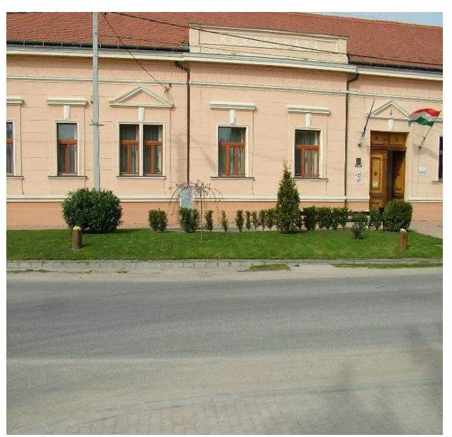
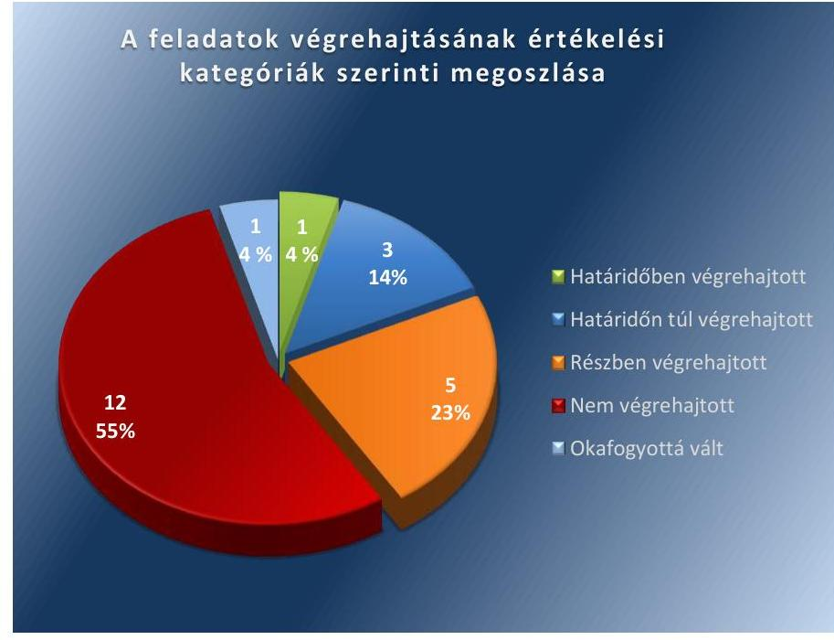

ÁLLAMI
SZÁMVEVŐSZÉK

# Jelentés 

## Utóellenőrzések

Beremend Nagyközség Önkormányzat belső kontrollrendszere kialakításának, egyes kontrolltevékenységek és a belső ellenőrzés működésének utóellenőrzése 2016.

---

# Jelentés 

## Utóellenőrzések

Beremend Nagyközség Önkormányzat belső kontrollrendszere kialakításának, egyes kontrolltevékenységek és a belső ellenőrzés működésének utóellenőrzése
2016. 07. hó 15. nap

---

|  J | AZ ELLENŐRZÉST FELÜGYELTE:  |
| --- | --- |
|   | DR. BENEDEK MÁRIA felügyeleti vezető  |
|   | AZ ELLENŐRZÉST VEZETTE ÉS A VÉGREHAJTÁSÁÉRT FELELŐS:  |
|   | DR. PELLEI TAMÁS ellenőrzésvezető  |
|   | A PROGRAM ÖSSZEÁLLÍTÁSÁÉRT FELELŐS:  |
|   | JANIK JÓZSEF LÁSZLÓ osztályvezető  |
|   | A TÉMÁHOZ KAPCSOLÓDÓ KORÁBBI SZÁMVEVŐSZÉKI JELENTÉSEK:  |
|  - címe: | Jelentés Beremend Nagyközség Önkormányzata belső kontrollrendszerének kialakítása, valamint egyes kontrolltevékenységek és a belső ellenőrzés működése ellenőrzéséről  |
|  J | sorszáma:  |
|   | 13039  |
|  |   |
|   | IKTATÓSZÁM: V-1052-052/2016  |
|   | TÉMASZÁM: 2086  |
|   | ELLENŐRZÉS-AZONOSÍTÓ SZÁM: V071822  |

---

# TARTALOMJEGYZÉK 

■ ÖSSZEGZÉS ..... 5
■ AZ ELLENŐRZÉS CÉLJA ..... 6
■ AZ ELLENŐRZÉS TERÜLETE ..... 7
■ AZ ELLENŐRZÉS HÁTTERE, INDOKOLTSÁGA ..... 8
■ A JELENTÉS LÉNYEGES KÉRDÉSKÖREI ..... 9
■ ELLENŐRZÉS HATÓKÖRE ÉS MÓDSZEREI ..... 10
■ MEGÁLLAPÍTÁSOK ..... 13
■ MELLÉKLETEK ..... 17
I. Sz. melléklet: Az ÁSZ 13039. számú jelentéséhez kapcsolódó intézkedési terv végrehajtása ..... 17
■ FÜGGELÉK: ÉSZREVÉTELEK ..... 23
■ RÖVIDÍTÉSEK JEGYZÉKE ..... 25

---

.

---

# ÖSSZEGZÉS 

Az ÁSZ ${ }^{1}$ elvégezte az Önkormányzat² ${ }^{2}$ belső kontrollrendszerének kialakítása, valamint egyes kontrolltevékenységek és a belső ellenőrzés müködésének utóellenőrzését a 2013. június 12-től 2016. január 29-ig terjedő időszakra vonatkozóan. Megállapította, hogy az intézkedési tervben foglalt feladatok jelentős részét az Önkormányzat nem hajtotta végre, így nem tett megfelelő lépéseket az ÁSZ által korábban feltárt, a belső kontrollrendszert érintő hiányosságok megszüntetésére, amely kockázatot hordoz az Önkormányzat szabályozásában, müködtetésének szabályosságában és a felelős vezetői magatartásban.

## Az ellenőrzés társadalmi indokoltsága

Az ÁSZ stratégiájában célul tűzte ki a számvevőszéki munka hasznosulásának javítását. Ezzel összhangban ellenőrzi, hogy az ellenőrzött szervezetek megvalósították-e a korábbi ellenőrzései által feltárt hibák, hiányosságok és szabálytalanságok megszüntetése céljából elkészített intézkedési terveikben foglaltakat. A rendszeres utóellenőrzések hozzájárulnak a szükséges intézkedések tényleges végrehajtáshoz, ezáltal a közpénzügyek rendezettségének javulásához.

## Főbb megállapítások, következtetések

A polgármester ${ }^{3}$ az intézkedési tervet határidőben megküldte az ÁSZ részére. Az intézkedési tervben meghatározott 22 feladatból egyet határidőben, hármat határidőn túl, ötöt részben hajtottak végre, 12 feladat végrehajtása nem történt meg, valamint egy feladat végrehajtása okafogyottá vált. Így az ÁSZ által korábban az Önkormányzat belső kontrollrendszerének kialakítása, valamint az egyes kontrolltevékenységek és a belső ellenőrzés működésének területén azonosított hiányosságok jelentős része továbbra is fennáll.

Az intézkedési tervben rögzített feladatok végrehajtásáról a Bkr. ${ }^{4}$-ben előírt nyilvántartást vezették, azonban az intézkedések végrehajtásának nyomon követéséről a Bkr.-ben előírtak ellenére nem gondoskodtak.

---

# AZ ELLENŐRZÉS CÉLJA 

Az ellenőrzés célja annak értékelése volt, hogy a számvevőszéki jelentésben ${ }^{5}$ foglalt intézkedést igénylő megállapításokkal és javaslatokkal összhangban készített intézkedési tervben meghatározott feladatokat az ellenőrzött szervezet végrehajtotta-e.

---

# AZ ELLENŐRZÉS TERÜLETE 

## Az Önkormányzat

Beremend nagyközség Baranya megyében, a Siklósi járás közigazgatási területén fekszik, Magyarország legdélebbi pontján fekvő települése. 2013. március 1-jétől létrehozták Beremend nagyközség, valamint Kásád és Kistapolca önkormányzatai részvételével a Beremendi Közös Önkormányzati Hivatalt ${ }^{6}$. A polgármester a 2014. évi helyi önkormányzati választások óta tölti be tisztségét, a jegyző ${ }^{7}$ 2015. október 1-jétől látja el feladatait. A lakónépességének száma a KSH által közzétett népességi adatok ${ }^{8}$ szerint 2015. január 1-jén 2428 fő volt.

Az Önkormányzat a 2014. évi éves költségvetési beszámoló szerint 1391,6 millió Ft költségvetési bevételt ért el, valamint 1183,3 millió Ft költségvetési kiadást teljesített.

Az ÁSZ a 2013. évben ellenőrizte az Önkormányzat belső kontrollrendszerének kialakítását, valamint egyes kontrolltevékenységek és a belső ellenőrzés működését, az erről szóló 13039. számú jelentését 2013. június 12-én tette közzé. Az ellenőrzés célja annak értékelése volt, hogy az Önkormányzat a jogszabályi előírásoknak megfelelően alakította-e ki a belső kontrollrendszert, megfelelően működtette-e a gazdálkodás folyamatában kulcsszerepet betöltő szakmai teljesítésigazolás és utalvány ellenjegyzés kontrollokat, biztosította-e a belső ellenőrzés szabályos és eredményes müködését.

Az utóellenőrzés - 2013. június 12-től - 2016. január 29-ig végrehajtott intézkedéseket figyelembe véve - az ÁSZ jelentésben a polgármester és a jegyző részére megfogalmazott intézkedést igénylő megállapításokra és javaslatokra készített, az ÁSZ részére megküldött intézkedési tervben foglalt feladatok megvalósításának ellenőrzésére, illetve értékelésére fókuszált.

---

# AZ ELLENŐRZÉS HÁTTERE, INDOKOLTSÁGA 

Az ÁSZ tv. ${ }^{9}$ 33. § (1) bekezdése értelmében a számvevőszéki jelentések intézkedést igénylő megállapításaihoz és javaslataihoz kapcsolódóan az ellenőrzött szervezet vezetője intézkedési tervet köteles összeállítani, és az ÁSZ részére megküldeni. Az intézkedési tervben foglaltak megvalósítását az ÁSZ tv. 33. § (7) bekezdésében foglaltak alapján - az ÁSZ utóellenőrzés keretében ellenőrizheti. Az intézkedések megvalósulásának értékelése során az ÁSZ figyelembe veszi az ellenőrzött szervezetek működési feltételeiben, valamint a jogszabályi előírásokban bekövetkezett változásokat.

Az intézkedési tervekben foglalt feladatok hiányos, illetve késedelmes végrehajtása, valamint megvalósításának elmaradása azt mutatja, hogy az ellenőrzések során feltárt hibák, hiányosságok és szabálytalanságok megszüntetése nem kapott kellő hangsúlyt. Ez a szabályszerű működés és a felelős vezetői magatartás vonatkozásában kockázatot hordoz. E kockázatok feltárásával az ÁSZ utóellenőrzési rendszere fokozza a fegyelmet, és igazolja, hogy a közpénzzel való szabályos gazdálkodás felelőssége elől nem lehet kitérni.

## AZ UTÓELLENŐRZÉS VÁRHATÓ HASZNOSULÁSA

Az utóellenőrzés négy szinten hasznosulhat:

- A társadalom szintjén az utóellenőrzés jelzi, hogy a számvevőszéki ellenőrzés megállapításainak van következménye: a hiányosságok megszüntetésére az ellenőrzött szervezet által meghatározott intézkedések végrehajtását is számon kéri az ÁSZ.
- Az ellenőrzött terület szintjén az utóellenőrzés tájékoztatást nyújt a terület döntéshozóinak a hiányosságok kiküszöbölésének jó gyakorlatairól, ezzel lehetőséget biztosítva arra, hogy az ÁSZ ellenőrzési megállapításai, javaslatai a terület nem ellenőrzött szervezeteinek a működése során is hasznosuljanak.
- Az ellenőrzött szervezet szintjén az utóellenőrzés feltárja, hogy a szervezet az intézkedések végrehajtásával hasznosította-e a korábbi ellenőrzési jelentésben a hiányosságok megszüntetése, illetve a kockázatok kezelése érdekében megfogalmazott javaslatokat.
- Az ÁSZ szintjén az utóellenőrzés visszacsatolást ad az ellenőrzési jelentések hasznosulásáról, az intézkedések elmaradása vagy részleges megvalósulása a további ellenőrzésekhez kockázati jelzésként szolgál.

---

# A JELENTÉS LÉNYEGES KÉRDÉSKÖREI 

Az Önkormányzat az intézkedési tervben foglaltakat az elöirt határidőben végrehajtotta-e?

---

# ELLENŐRZÉS HATÓKÖRE ÉS MÓDSZEREI 

## Az ellenőrzés típusa

Megfelelőségi ellenőrzés

## Az ellenőrzött időszak

Az utóellenőrzés alapját képező ÁSZ jelentés közzétételének napjától (2013. június 12.) az ellenőrzésről szóló kiértesítő levél keltének napjáig (2016. január 29.) tartó időszak.

## Az ellenőrzés tárgya

Az ÁSZ tv. 2011. július 1-jei hatálybalépését követően a számvevőszéki jelentésben foglalt intézkedést igénylő megállapításokkal és javaslatokkal összhangban - Önkormányzat által - készített intézkedési tervben foglaltak végrehajtásának ellenőrzése.

Az ellenőrzés kiterjed minden olyan körülményre és adatra, amely az ÁSZ jogszabályban meghatározott feladatainak teljesítéséhez, valamint a program végrehajtása folyamán felmerült újabb összefüggések feltárásához szükséges.

## Az ellenőrzött szervezet

Beremend Nagyközség Önkormányzat

## Az ellenőrzés jogalapja

Az ÁSZ az Országgyűlés pénzügyi és gazdasági ellenőrző szerve. Az ÁSZ törvényben meghatározott feladatkörében ellenőrzi a központi költségvetés végrehajtását, az államháztartás gazdálkodását, az államháztartásból származó források felhasználását és a nemzeti vagyon kezelését.

Az ÁSZ tv. 1. § (3) bekezdése szerint az ÁSZ általános hatáskörrel végzi a közpénzekkel és az állami és önkormányzati vagyonnal való felelős gazdálkodás ellenőrzését.

Az ÁSZ tv. 33. § (7) bekezdése alapján az ÁSZ tv. 33. § (1)-(2) bekezdése szerinti intézkedési tervben foglaltak megvalósítását az ÁSZ utóellenőrzés keretében ellenőrizheti.

---

# Az ellenőrzés módszerei 

Az ÁSZ az ellenőrzést a nemzetközi standardokat irányadónak tekintve az ellenőrzési program ellenőrzési kérdései, az ellenőrzött időszakban hatályos jogszabályok, az ellenőrzés szakmai szabályok és módszertanok figyelembevételével, önállóan vagy ellenőrzéshez kapcsolódóan végezte.

Az ÁSZ az ellenőrzés ideje alatt az Önkormányzattal történő kapcsolattartást az ÁSZ SZMSZ ${ }^{10}$-ének vonatkozó előírásai alapján biztosította.

Az utóellenőrzés megállapításait elsősorban az ÁSZ rendelkezésére álló, valamint az ellenőrzött szervezetektől elektronikusan bekért dokumentumok alapozták meg.

Az ellenőrzési bizonyítékként felhasználható adatforrások közé tartoznak egyrészt a szakmai programban felsorolt adatforrások, másrészt minden - az ellenőrzés folyamán feltárt, az ellenőrzés szempontjából információt tartalmazó - dokumentum.

A pénzügyi folyamatokban kulcsszerepet betöltő kontrollokra vonatkozóan az intézkedési tervben foglalt feladatok végrehajtását az államháztartáson kívülre teljesített működési célú pénzeszközátadásoknál, az állományba nem tartozók megbízási díjainál, továbbá a külső szolgáltatók által végzett karbantartási, kisjavítási munkákkal kapcsolatos kifizetéseknél 10 elemú véletlen mintavétellel kiválasztott tételek alapján értékelte az ÁSZ. A kiválasztott tételek esetében azt ellenőrizte, hogy az Önkormányzat az intézkedési tervben meghatározott feladatok végrehajtása érdekében biz-tosította-e a jogszabályok és a belső szabályzatok előírásainak megfelelő múködtetést.

Az intézkedési tervekben előírt feladatoknak, azok végrehajthatósága, illetve végrehajtása szempontjából az alábbiak szerint értékelte az ÁSZ:
"határidőben végrehajtott" a feladat, ha a teljesítés dokumentáltan, az intézkedési tervben előírt határidőben és tartalommal megtörtént;
"határidőn túl végrehajtott" a feladat, ha annak teljesítése az intézkedési tervben meghatározott módon, de az előírt határidőn túl történt meg;
"részben végrehajtott" a feladat, ha végrehajtása teljes körűen az intézkedési tervben előírt módon nem történt meg;
"nem végrehajtott" a feladat, ha a végrehajtás nem történt meg, vagy amennyiben a teljesítést nem dokumentálták;
"okafogyottá vált" a feladat, ha végrehajtására - meghatározott esemény bekövetkezése, továbbá külső körülmény, a múködést érintő feltétel változása miatt - már nincs szükség, illetve lehetőség, és egyértelmúen megállapítható, hogy az intézkedést szükségessé tevő körülmény a jövőben nem fordulhat elő;
"nem időszerü" az a feladat, amelynek ellenőrzési időszakon belüli végrehajtására azért nem került (kerülhetett) sor, mert az intézkedés alapjául szolgáló esemény nem következett be, de annak jövőbeni előfordulása lehetséges, a végrehajtása nem volt esedékes, vagy a végrehajtás határideje még nem járt le.

---

Az ellenőrzés lefolytatásához az ellenőrzött szervezet a tanúsítványok elektronikus kitöltésével, valamint az ÁSZ által kért dokumentumok elektronikus megküldésével szolgáltatott adatokat, amelyek valódiságát és teljes körűségét az ellenőrzött szervezet vezetője által tett teljességi és hitelességi nyilatkozat igazolta. Az így rendelkezésre bocsátott adatok, információk kontrollja az ellenőrzés keretében történt.

---

# MEGÁLLAPÍTÁSOK 

## Az Önkormányzat az intézkedési tervben foglaltakat az előírt határidőben végrehajtotta-e?

Összegző megállapítás

Az Önkormányzat az intézkedési tervben meghatározott 22 feladatból egyet határidőben, hármat határidőn túl, ötöt részben és 12-t nem hajtott végre, továbbá egy feladat okafogyottá vált. Az intézkedési tervben rögzített feladatok végrehajtásáról a Bkr.-ben előírt nyilvántartást vezették, azonban az intézkedések végrehajtásának nyomon követéséről a Bkr.ben előírtak ellenére nem gondoskodtak.

Az intézkedési tervben meghatározott feladatokat, határidőket, az ÁSZ jelentés javaslatainak címzettjét és a feladatok végrehajtását az I. számú melléklet mutatja be.

Az ÁSZ a jelentésében a polgármester részére három, a jegyző részére tizenkilenc javaslatot fogalmazott meg. A polgármester által összeállított és az ÁSZ részére megküldött intézkedési tervben a hiányosságok, szabálytalanságok megszüntetésére huszonkettő feladatot határoztak meg. A feladatok elvégzésének felelőseként három esetben a polgármestert, tizenkilenc esetben pedig a jegyzőt jelölték meg.

Az intézkedési tervben tervezett feladatok végrehajtásának értékelési kategóriák szerinti megoszlását az 1. ábra szemlélteti.
1. ábra

---

# HATÁRIDŐBEN VÉGREHAJTOTT feladat: 

1. A jegyző intézkedett a 2014. évi ellenőrzési terv Képviselő-testület elé terjesztéséről, amelyet a Képviselő-testület az intézkedési tervben előírt határidőn belül jóváhagyott.

## HATÁRIDŐN TÚL VÉGREHAJTOTT feladatok:

2. A jegyző az Ávr. ${ }^{11}$ előírásainak megfelelően 2013. február 27-én elkészítette a pénzgazdálkodási szabályzatot1 ${ }^{12}$, amelyet az intézkedési tervben meghatározott 2013. július 31-ei határidőn belül nem léptetett hatályba. A 2014. október 12-étől és a 2014. december 1-jétől hatályos pénzgazdálkodási szabályzat ${ }_{2},{ }^{13}{ }^{14}$ az Ávr. előírásainak megfelelően tartalmazta a teljesítésigazolás gyakorlásának módjával, eljárási és dokumentációs részletszabályaival kapcsolatos belső előírásokat, feltételeket.
3. A jegyző az Ávr. előírásainak megfelelően 2013. február 27-én elkészítette a pénzgazdálkodási szabályzatot ${ }_{1}$, amelyet az intézkedési tervben meghatározott 2013. július 31-ei határidőn belül nem léptetett hatályba. A 2014. október 12-étől és a 2014. december 1-jétől hatályos pénzgazdálkodási szabályzat ${ }_{2,3}$ az Ávr. előírásainak megfelelően tartalmazta az előzetes írásbeli kötelezettségvállalást nem igénylő kifizetések rendjét.
4. A jegyző 2013. szeptember 22-én az Ávr. és az Info tv. ${ }^{15}$ alapján elkészítette a közzétételi szabályzatot ${ }^{16}$, amelyet az intézkedési tervben előírt 2013. szeptember 30-ai határidőn belül nem léptetett hatályba. A szabályzatot 2015. szeptember 10. napján a Hivatal jegyzőjének helyetteseként eljáró személy felülvizsgálta, módosította és hatályba léptette.

## RÉSZBEN VÉGREHAJTOTT feladatok:

5. A jegyző gondoskodott a hivatali SZMSZ ${ }^{17}$ módosításáról és az intézkedési tervben megjelölt 2013. szeptember 30-ai határidőn belül kezdeményezte annak Képviselő-testület elé terjesztését, azonban a Bkr.-ben előírásainak megfelelően a 2013. október 1-jétől hatályos hivatali SZMSZ-ben nem rögzítették a belső ellenőrzést végzők feladatait.
6. A jegyző a Bkr.-ben előírtaknak megfelelően a 2013. és 2015. években intézkedett az ellenőrzési nyomvonal aktualizálásáról, azonban a 2014. évben az aktualizálás nem történt meg.
7. A jegyző a 2015. július 1-jétől hatályos adatvédelmi szabályzatban ${ }^{18}$, illetve a 2015. december 22-én kiadott Informatikai Biztonsági Szabályzatban ${ }^{19}$, valamint az Engedélyezési és Jogosultsági Szabályzatban ${ }^{20}$ határozta meg a hozzáférési jogosultságokkal kapcsolatos feladatokat, a jogosultságok megállapítását, módosítását, azok betartásának ellenőrzését, nyilvántartásának vezetését, valamint az adatok kezelésének, tárolásának és mentési eljárásának rendjét, azonban a szabályzatokban nem rögzítette az adatok feldolgozásának eljárásrendjét. Az intézkedési tervben vállalt beszámolás nem történt meg.

---

8. A jegyző nem gondoskodott arról, hogy az intézkedési tervben rögzített határidőn belül elkészített 2014. évi belső ellenőrzési terv tartalmazza a Bkr.-ben meghatározott valamennyi tartalmi elemet.
9. A jegyző intézkedett a belső ellenőrzési jelentésekben megtett megállapításokról, javaslatokról, a vonatkozó intézkedési tervekről szóló nyilvántartás vezetéséről, azonban nem gondoskodott a Bkr. előírásinak megfelelően az intézkedések végrehajtásának nyomon követéséről.

# NEM VÉGREHAJTOTT feladatok: 

10. A jegyző a Bkr. előírásai szerint nem kezdeményezte a polgármesternél a 2012. évi éves ellenőrzési jelentés - a 2012. évi zárszámadási rendelettervezettel egyidejű - Képviselő-testület elé terjesztését.
11. A polgármester a Bkr.-ben meghatározottak alapján a 2012. évi éves ellenőrzési jelentést a 2012. évi zárszámadási rendelettervezettel egyidejűleg nem terjesztette a Képviselő-testület elé.
12. A polgármester nem intézkedett arról, hogy az Önkormányzat nevében történő kötelezettségvállalásokra kizárólag a pénzügyi ellenjegyzést követően, a pénzügyi teljesítés esedékességét megelőzően, írásban kerüljön sor, mivel az operatív gazdálkodás során nem teljesültek az új Áht. ${ }^{21}$ és az Ávr. pénzügyi ellenjegyzésre vonatkozó előírásai.
13. A polgármester az Mötv.-ben ${ }^{22}$ foglaltak alapján nem kísérte figyelemmel az Önkormányzat gazdálkodásának szabályszerűségét. A belső kontrollrendszer és a belső ellenőrzés működésére vonatkozó, valamint a szakmai teljesítésigazolás és az utalvány ellenjegyzés kontrollokkal kapcsolatban feltárt hiányosságok tekintetében a munkajogi felelősséggel kapcsolatos körülményeket nem vizsgálta ki.
14. A jegyző a Bkr.-ben rögzítettek alapján nem mérte fel és nem állapította meg a Hivatal tevékenységében, gazdálkodásában rejlő kockázatokat. Az intézkedési tervben vállalt beszámolás nem történt meg.
15. A jegyző a Bkr. előírásainak megfelelően a felelőségi körök meghatározásával a Hivatal tevékenységeire vonatkozó beszámolási eljárásokat nem szabályozta.
16. A jegyző nem alakította ki és nem működtette a Bkr.-ben előírtak szerint a Hivatal tevékenységének, a célok megvalósításának nyomon követését biztosító rendszert, amelynek része az operatív tevékenységek keretében megvalósuló folyamatos és eseti nyomon követés is.
17. A jegyző nem gondoskodott a teljesítésigazolás Ávr. szerinti elvégzéséről, mivel a kifizetéseket megelőzően nem történt meg a teljesítésigazolás, nem jelölte ki a teljesítésigazolás végzésére jogosult személyt, továbbá a teljesítések összegszerűségét nem ellenőrizték.

---

18. A jegyző nem intézkedett arról, hogy a kötelezettségvállalásokra kizárólag a pénzügyi ellenjegyzést követően, a pénzügyi teljesítés esedékességét megelőzően, írásban kerüljön sor, mivel a pénzügyi ellenjegyzés nem felelt meg az új Áht., valamint az Ávr. előírásainak.
19. A jegyző nem intézkedett arról, hogy a kifizetéseket megelőzően a teljesítésigazolás alapján vagy annak hiányában is - az Ávr. rendelkezései szerint az összegszerűségnek, a fedezet meglétének és a megelőző ügymenetben az új Áht., Áhsz ${ }^{23}$., és az Ávr. vonatkozó előírásainak és a belső szabályozásokban foglaltak betartásának ellenőrzése megtörténjen.
20. A jegyző nem intézkedett annak érdekében, hogy a kötelezettségvállalások nyilvántartása megfeleljen az Ávr.-ben és az új Áhsz-ben foglalt előírásoknak, illetve arról, hogy az utalványrendeleteken a kötelezettségvállalás nyilvántartási sorszámát az Ávr.-ben foglaltaknak megfelelően feltüntessék.
21. A jegyző nem intézkedett arról, hogy a 2014. évi belső ellenőrzési terv a Bkr.-ben foglaltak alapján kockázatelemzésen alapuljon.

# OKAFOGYOTTÁ VÁLT feladatok: 

22. A 2014. évi belső ellenőrzési terv elkészítéséhez a jegyző írásos véleményének kikérése okafogyottá vált, mert az önkormányzati belső ellenőrzési feladatok ellátása nem társulás formájában történik.

Az intézkedési tervben rögzített feladatok végrehajtásáról a Bkr.-ben előírt nyilvántartást vezették, azonban az intézkedések végrehajtásának nyomon követéséről a Bkr.-ben előírtak ellenére nem gondoskodtak.

---

# MELLÉKLETEK

- I. SZ. MELLÉKLET: AZ ÁSZ 13039. SZÁMÚ JELENTÉSÉHEZ KAPCSOLÓDÓ INTÉZKEDÉSI TERV VÉGREHAJTÁSA

|  5 | Az intézkedési terv alapján elvégzendő feladat
1. | Az intézkedési tervben meghatározott határidő
2. | Az ÁSZ 13039. sz. jelentése javaslatának címzettje
3.  |
| --- | --- | --- | --- |
|  1. |  |  |   |
|  1. Intézkedjen az éves ellenőrzési terv Képviselő-testület elé terjesztéséről annak érdekében, hogy azt a Képvi-selő-testület a Mótv. 119. § (5) és a Bkr. 32. § (4) bekezdésében előírt határidőn belül hagyja jóvá. | 2013. december 31. |  |   |
|  2. | Rendezze belső szabályzatban az Ávr. 13. § (2) bekezdés a) pontjának megfelelően a teljesítésigazolás gyakorlásának módjával, eljárási és dokumentációs részletszabályaival kapcsolatos belső előírásokat, feltételeket. | 2013. július 31. |   |
|  3. | Rögzítse belső szabályzatban az Ávr. 53. § (2) bekezdése alapján az előzetes írásbeli kötelezettségvállalást nem igénylő kifizetések rendjét. | 2013. július 31. |   |
|  4. | Készítsen - az Info tv. 30. § (6) bekezdésének és az Ávr. 13. § (2) bekezdése h) pontjának megfelelően - a közérdekű adatok megismerésére irányuló igények teljesítésének rendjét rögzítő szabályzatot. | 2013. szeptember 30. |   |

|  Az ÁSZ 13039. sz. jelentése javaslatának címzettje
3. | A feladat végrehajtása  |
| --- | --- |
|  4. | A 2014. évi éves ellenőrzési terv Képviselő-testület elé terjesztéséről a jegyző az előírt határidőn belül intézkedett, amelyet a Képviselő-testület a 2013. november 26-án kelt, 140/2013. (XI. 26.) számú határozatával jóváhagyott.  |
|  Határidőn túl végrehajtott feladatok |   |
|  2013. július 31. |   |
|  2013. július 31. |   |
|  2013. július 31. |   |
|  2013. |   |
|  2013. |   |
|  2013. |   |
|  2013. |   |
|  2013. |   |
|  2013. |   |
|  2013. |   |
|  2013. |   |
|  2013. |   |
|  2013. |   |
|  2013. |   |
|  2013. |   |
|  2013. |   |
|  2013. |   |
|  2013. |   |
|  2013. |   |
|  2013. |   |
|  2013. |   |
|  2013. |   |
|  2013. |   |
|  2013. |   |
|  2013. |   |
|  2013. |   |
|  2013. |   |
|  2013. |   |
|  2013. |   |
|  2013. |   |
|  2013. |   |
|  2013. |   |
|  2013. |   |
|  2013. |   |

---

|  5. | Módosítsa a hivatali SZMSZ-t, és kezdeményezze a polgármesternél a módosítás Képviselő-testület elé terjesztését annak érdekében, hogy az tartalmazza Ávr. 13. § (1) bekezdésének g) pontjában foglaltaknak megfelelően a munkakörökhöz tartozó feladat- és hatásköröket, a hatáskörök gyakorlásának módját, az ezekhez kapcsolódó felelősségi szabályokat, továbbá a Bkr. 15. § (2) bekezdésének megfelelően a belső ellenőrzést végzők jogállását, feladatait. | 2013. szeptember 30. | jegyző | - Határidőben végrehajtott feladat:
A hivatali SZMSZ módosításáról a jegyző gondoskodott és az előírt határidőn belül kezdeményezte a polgármesternél a hivatali SZMSZ Kép-viselő-testület elé terjesztését, amelyet a Képviselő-testület a 2013. szeptember 24-én kelt, 118/2013. (IX. 24.) számú határozatával jóváhagyott. A hivatali SZMSZ tartalmazta az Ávr. 13. § (1) bekezdése g) pontjában foglaltaknak megfelelően a munkakörökhöz tartozó fel-adat- és hatásköröket, valamint a hatáskörök gyakorlásának módját, továbbá az azokhoz kapcsolódó felelősségi szabályokat, valamint a belső ellenőrzést végzők jogállását.
- Nem végrehajtott feladat:
A Bkr. 15. § (2) bekezdésének foglaltak megfelelően a hivatali SZMSZ nem határozta meg a belső ellenőrzést végzők feladatait.  |
| --- | --- | --- | --- | --- |
|  6. | Intézkedjen a Bkr. 6. § (3) bekezdésében előírtaknak megfelelően az ellenőrzési nyomvonal rendszeres aktualizálásáról. | 2013. október 15. | jegyző | - Határidőben végrehajtott feladat:
Az ellenőrzési nyomvonalat a 2013. évben 2013. augusztus 30-án, a 2015. évben 2015. november 13-án aktualizálták.
- Nem végrehajtott feladat:
A 2014. évben az ellenőrzési nyomvonal aktualizálása nem történt meg.  |
|  7. | Biztosítsa az Info tv. 7. § (2)-(3) bekezdéseiben foglaltaknak megfelelően az adatbiztonság érvényesülését, szabályozza a hozzáférési jogosultságokkal kapcsolatos feladatokat, jogosultságok megállapítása, módosítása, azok betartásának ellenőrzése, nyilvántartásának vezetése, valamint szabályozza az adatok kezelésének, feldolgozásának, tárolásának és mentési eljárásának rendjét. | Folyamatos, első beszámolás 2013. szeptember 30. | jegyző | - Határidőben végrehajtott feladat:
A jegyző a 2015. július 1-jétől hatályos adatvédelmi szabályzatban, valamint a 2015. december 22. napján kiadott Informatikai Biztonsági Szabályzatban és az Engedélyezési és Jogosultsági Szabályzatban meghatározta a hozzáférési jogosultságokkal kapcsolatos feladatokat, ezen belül a jogosultságok megállapítását, módosítását, azok betartásának ellenőrzését, nyilvántartásának vezetését, valamint szabályozta az adatok kezelésének, tárolásának és mentési eljárásának rendjét.
- Nem végrehajtott feladat:
A jegyző az adatok feldolgozásának eljárásrendjét nem határozta meg, a beszámoló elkészítéséről dokumentált módon nem gondoskodott.  |

---

|  8. | Intézkedjen arról, hogy az éves ellenőrzési terv tartalmazza a Bkr. 31. § (4) bekezdésében felsorolt tartalmi elemeket. | 2013. november 30. | Jegyző | - Határidőben végrehajtott feladat:
A 2013. november 26-án kelt, 140/2013. (XI. 26.) számú Képviselő-testületi határozattal elfogadott 2014. évi éves ellenőrzési terv tartalmazta a Bkr. 31. § (4) bekezdés b)-d) és f)-h) pontjaiban felsorolt tartalmi elemeket, így az ellenőrzések tárgyát, célját, típusát, ütemezését, az ellenőrizéssel érintett időszakot és az ellenőrzött szervezeti egységek megnevezését.
- Nem végrehajtott feladat:
A 2014. évi éves ellenőrzési terv a Bkr. 31. § (4) bekezdés a), e), i), j), k), l) pontjaiban rögzített tartalmi elemeket nem tartalmazta, így az ellenőrzési tervet megalapozó elemzések és a kockázatelemzés eredményének összefoglaló bemutatását, a rendelkezésre álló és a szükséges ellenőrzési kapacitás meghatározását, a tanácsadó tevékenységre tervezett kapacitást, a soron kívüli ellenőrzésekre tervezett kapacitást, a képzésekre tervezett kapacitást, valamint az egyéb tevékenységeket.  |
| --- | --- | --- | --- | --- |
|  9. | Vezessen nyilvántartást a Bkr. 21. § (2) bekezdése d) pontjának és a 47. §-nak megfelelően a belső ellenőrzési jelentésekben tett megállapításokról, javaslatokról, a vonatkozó intézkedési tervekről, és kövesse nyomon azok végrehajtását. | folyamatos | jegyző | - Határidőben végrehajtott feladat:
A jegyző intézkedett a belső ellenőrzési jelentésekben tett megállapításokról, javaslatokról, a vonatkozó intézkedési tervekről szóló nyilvántartás vezetéséről.
- Nem végrehajtott feladat:
A Bkr. 21. § (2) bekezdés d) pontjában, valamint a 47. §-a alapján nem követték nyomon belső ellenőrzési jelentések alapján megtett intézkedéseket, az intézkedési tervek végrehajtását.  |
|  10. | Kezdeményezze, hogy a polgármester az éves ellenőrzési jelentést a Bkr. 56. § (8) bekezdése alapján a zárszámadási rendelettervezettel egyidejűleg terjessze a Képviselő- testület elé. | tárgyévet követő év március 20. | jegyző | A jegyző nem kezdeményezte a polgármesternél az 2012. évi éves ellenőrzési jelentés - a 2012. évi zárszámadási rendelettervezettel egyidejű - Képviselő-testület elé terjesztését, mert a Bkr.-ben előírt éves ellenőrzési jelentés elkészítéséről nem gondoskodott.  |

---

|  1. | 2. | 3. | 4.  |
| --- | --- | --- | --- |
|  11. | Terjessze a Képviselő-testület elé a Bkr. 56. § (8) bekezdésében foglaltak szerint az éves ellenőrzési jelentést a zárszámadási rendelettervezettel egyidejűleg. | 2013. április 30. (új Áht, 91. § (1) bekezdésében foglaltak) | polgármester  |
|  12. | Intézkedjen arról, hogy az Önkormányzat nevében történő kötelezettségvállalásra az új Áht. 37. § (1) bekezdésében foglaltaknak megfelelően - az Ávr. 53. §-ában meghatározott kivételekkel - kizárólag pénzügyi ellenjegyzés után, a pénzügyi teljesítés esedékességét megelőzően, írásban kerüljön sor. | folyamatos | polgármester  |
|  13. | Kísérje figyelemmel az Mótv. 115. § (1) bekezdésében foglaltak alapján az önkormányzat gazdálkodásának szabályszerűségét. Gondoskodjon az Mótv. 67. § f) pontja alapján a belső kontrollrendszerre és a belső ellenőrzés működésére vonatkozó jogszabályi rendelkezések be nem tartása, valamint a szakmai teljesítésigazolás, illetve az utalvány ellenjegyzés kontrollokkal öszszefüggésben feltárt hiányosságok, szabálytalanságok tekintetében az esetleges munkajogi felelősséggel kapcsolatos körülmények kivizsgálásáról, és a vizsgálat eredményének függvényében tegye meg a szükséges munkajogi intézkedéseket. | folyamatos
2013. július 31. | polgármester  |
|  14. | Mérje fel és állapítsa meg - a Bkr. 7. §-ában foglaltak alapján - a Hivatal tevékenységében és gazdálkodásában rejlő kockázatokat. | Első beszámolás 2013. szeptember 15., utána negyedévenkénti beszámolás | jegyző  |
|  15. | Szabályozza a Bkr. 8. § (4) bekezdés c) pontjában foglaltaknak megfelelően a felelősségi körök meghatározásával a Hivatal tevékenységeire vonatkozó beszámolási eljárásokat. | 2013. augusztus 31. | jegyző  |

---

|  16. | Alakítsa ki és működtesse a Bkr. 3. § e) pontjában és a 10. §-ában előírtak alapján a Hivatal tevékenységének, a célok megvalósításának nyomon követését biztosító rendszert, amelynek része az operatív tevékenységek keretében megvalósuló folyamatos és eseti nyomon követés is. | 2013. október 15. | jegyző | A Hivatal tevékenységének, a célok megvalósításának nyomon követését biztosító rendszer kialakítását a 2013. február 27-én elkészített belső kontroll kézikönyv tartalmazta, azonban a szabályzat hatályba léptetésére a jegyzői aláírás hiánya miatt nem került sor.  |
| --- | --- | --- | --- | --- |
|  17. | Intézkedjen arról, hogy a teljesítésigazolásra – az Ávr. 57. § (4) bekezdésében foglalt előírásnak megfelelően – kijelölt személyek az Ávr. 57. § (1) bekezdésében foglaltaknak megfelelően, ellenőrizhető okmányok alapján ellenőrizték a kiadások teljesítésének jogosságát, összegszerűségét, ellenszolgáltatást is magába foglaló kötelezettségvállalás esetében a szerződés, megrendelés teljesítését, és azt az Ávr. 57. § (3) bekezdésében foglalt módon igazolják. | folyamatos | jegyző | A jegyző a bemutatott dokumentumok alapján nem intézkedett annak érdekében, hogy a teljesítésigazolásra – az Ávr. 57. § (4) bekezdésében foglalt előírásnak megfelelően – kijelölt személyek az Ávr. 57. § (1) bekezdésében foglaltaknak megfelelően, ellenőrizhető okmányok alapján ellenőrizték a kiadások teljesítésének összegszerűségét, és azt az Ávr. 57. § (3) bekezdésében foglalt módon igazolják, mivel a kifizetéseket megelőzően nem történt meg a teljesítésigazolás, nem jelölte ki a teljesítésigazolás végzésére jogosult személyt, továbbá a teljesítések összegszerűségét nem ellenőrizték.  |
|  18. | Intézkedjen arról, hogy az új Áht. 37. § (1) és az Ávr. 55. § (1) bekezdésében foglaltaknak megfelelően, kötelezettségvállalásra – az Ávr. 53. §-ában meghatározott kivételekkel – pénzügyi ellenjegyzés után kerüljön sor, valamint a pénzügyi ellenjegyző győződjön meg arról, hogy a kötelezettségvállalás nem sérti-e a gazdálkodási szabályokat. | folyamatos | jegyző | A jegyző a bemutatott dokumentumok alapján nem intézkedett annak érdekében, hogy a kötelezettségvállalás a pénzügyi ellenjegyzést követően kerüljön sor, mert a kötelezettségvállalás dokumentumai – az Ávr. 55. § (1) bekezdésében foglaltak ellenére – nem tartalmazzák a pénzügyi ellenjegyzés időpontját, továbbá a pénzügyi ellenjegyzést végző személy érvényes felhatalmazással nem rendelkezett.  |
|  19. | Intézkedjen arról, hogy a kifizetéseket megelőzően – az Ávr. 58. § (1) bekezdése szerint – a teljesítésigazolás alapján – az Ávr. 57. § (3) bekezdése szerinti esetben annak hiányában is – az összegszerűségnek, a fedezet meglétének és a megelőző ügymenetben az új Áht., az Áhsz., az Ávr., előírásai és a belső szabályzatokban foglaltak betartásának az ellenőrzése történjen meg. | folyamatos, 2013. július 31. | jegyző | A jegyző a bemutatott dokumentumok alapján nem intézkedett annak érdekében, hogy a kifizetéseket megelőzően – az Ávr. 58. § (1) bekezdése szerint – a teljesítésigazolás alapján – az Ávr. 57. § (3) bekezdése szerinti esetben annak hiányában is – az összegszerűségnek, a fedezet meglétének és a megelőző ügymenetben az Áht., az Áhsz., az Ávr. előírásai és a belső szabályzatokban foglaltak betartásának az ellenőrzése megtörténjen, mivel nem történt érvényesítés, nem ellenőrizték az összegszerűséget, a fedezet meglétét, valamint a megelőző ügyme-  |

---

|  20. | Intézkedjen arról, hogy a kötelezettségvállalások nyilvántartását az Ávr. 56. § (1) bekezdésében foglalt előírásnak megfelelően vezessék, és az utalványrendeleteken a kötelezettségvállalás nyilvántartási számát az Ávr. 59. § (3) bekezdés f) pontjában foglaltaknak megfelelően tüntessék fel. | folyamatos | jegyző | A kötelezettségvállalás nyilvántartása 2013. évben nem felelt meg az Ávr. 56. (1) bekezdésében foglaltaknak, mivel nem tartalmazta a kötelezettségvállalást tanúsító dokumentum megnevezését, iktatószámát, keltét, a kötelezettségvállaló nevét, a jogosult azonosító adatait, a kötelezettségvállalás évek és előirányzatok szerinti megoszlását, a kifizetési határidőket, továbbá a teljesítési adatokat. A 2014-2015. években nem felelt meg az új Áhsz 14. melléklet II/4. és II/5. pontjába foglaltaknak. A nyilvántartás nem az egységes rovatrend rovatai szerint tartalmazta a kötelezettségvállalás tárgyát, összegét, nem tartalmazta a pénzügyi ellenjegyzésre vonatkozó adatokat, a kötelezettségvállalás módosulásait. A kötelezettségvállalás nyilvántartási szám feltüntetése nem felelt meg az Ávr. 59. § (3) bekezdés f) pontjában foglaltaknak, mert utalványrendeleteken kötelezettségvállalás nyilvántartási számát nem tűntették fel.  |
| --- | --- | --- | --- | --- |
|  21. | Intézkedjen arról, hogy az éves ellenőrzési terv a Bkr. 22. § b) pontja, 29. § (1) és a 31. § (2) bekezdése alapján kockázatelemzésen alapuljon. | 2013. november 30. | jegyző | A 2013. november 26-án kelt, 140/2013. (XI. 26.) számú Képviselő-testületi határozattal elfogadott 2014. évi éves ellenőrzési tervet kockázatelemzéssel nem támasztották alá, az ellenőrzési terv megalapozására vonatkozóan kockázatelemzést nem készült.  |
|  22. | Intézkedjen arról, hogy az éves ellenőrzési tervet a belső ellenőrzési vezető a Bkr. 56. § (2) bekezdés előírásainak megfelelően a jegyző írásos véleményének figyelembevételével, a Bkr. 29. § (1) bekezdésében foglaltak szerint készítse el. | 2013. október 31. | jegyző | Az intézkedés okafogyottá vált, mert az önkormányzati belső ellenőrzési feladatok ellátása 2013. január 1-től nem társulás formájában történik, ezért az Önkormányzatra nem vonatkozik a Bkr. 56. § (2) bekezdésében részletezett, a belső ellenőrzési feladatok társulás formájában történő ellátására vonatkozó különös szabálya.  |

*Forrás: ÁSZ által készített táblázat*

---

# FÜGGELÉK: ÉSZREVÉTELEK 

A jelentéstervezetet a Számvevőszék 15 napos észrevételezésre megküldte az ellenőrzött szervezet vezetőjének az ÁSZ tv. 29. §* (1) bekezdése előírásának megfelelően.
Az ellenőrzött szervezet vezetője az ÁSZ tv. 29. § (2) bekezdésében foglalt észrevételezési jogával nem élt, a jelentéstervezetre észrevételt nem tett.

[^0]
[^0]:    * 29. § (1) Az Állami Számvevőszék az ellenőrzési megállapításait megküldi az ellenőrzött szervezet vezetőjének vagy az általa megbízott személynek, és annak, akinek személyes felelősségét állapította meg.
    (2) Az ellenőrzött szervezet vezetője és a felelősként megjelölt személy az ellenőrzés megállapításaira tizenöt napon belül írásban észrevételt tehet.
    (3) Az Állami Számvevőszék az észrevételre a beérkezésétől számított harminc napon belül írásban válaszol. A figyelembe nem vett észrevételeket köteles a jelentésben feltüntetni, és megindokolni, hogy azokat miért nem fogadta el.

---

.

---

# RÖVIDÍTÉSEK JEGYZÉKE 

${ }^{1}$ ÁSZ
${ }^{2}$ Önkormányzat
${ }^{3}$ polgármester
${ }^{4}$ Bkr.
${ }^{5}$ jelentés
${ }^{6}$ Hivatal
${ }^{7}$ jegyző
${ }^{8}$ KSH által közzétett népességi adatok
${ }^{9}$ ÁSZ tv.
${ }^{10}$ SZMSZ
${ }^{11}$ Ávr.
${ }^{12}$ pénzgazdálkodásai szabályzat ${ }_{1}$
${ }^{13}$ pénzgazdálkodási szabályzat ${ }_{2}$
${ }^{14}$ pénzgazdálkodási szabályzat ${ }_{3}$
${ }^{15}$ Info tv.
${ }^{16}$ közzétételi szabályzat
${ }^{17}$ hivatali SZMSZ
${ }^{18}$ adatvédelmi szabályzat
${ }^{19}$ Informatikai Biztonsági Szabályzat
${ }^{20}$ Engedélyezési és Jogosultsági Szabályzat
${ }^{21}$ új Áht.
${ }^{22}$ Mötv.
${ }^{23}$ Áhsz.

Állami Számvevőszék
Beremend Nagyközség Önkormányzat
Beremend Nagyközség Önkormányzat polgármestere
370/2011. (XII.31.) Korm. rendelet a költségvetési szervek belső
kontrollrendszeréről és belső ellenőrzéséről (hatályos 2012. január 1-jétől)
Az ÁSZ 13039 számú jelentése - Jelentés Beremend Nagyközség Önkormányzata belső kontrollrendszerének kialakítása, valamint egyes kontrolltevékenységek és a belső ellenőrzés múködése ellenőrzéséről (elérhető a www.asz.hu honlapon)
Beremend, Kásád és Kistapolca községek önkormányzatai részvételével 2013. március 1-jétől létrehozott Beremendi Közös Önkormányzati Hivatal
Beremend Nagyközség Közös Önkormányzati Hivatal jegyzője
Központi Statisztikai Hivatal, Magyarország Közigazgatási Helységnévkönyvének 2015. január 1-jei adatai
2011. évi LXVI. törvény az Állami Számvevőszékről (hatályos 2011. július 1.-jétől)

Az Állami Számvevőszék elnökének 3/2015. (XII.30.) ÁSZ utasítása az Állami Számvevőszék Szervezeti és Múködési Szabályzatáról (hatályos: 2016. január 1jétől)
368/2011. (XII. 31.) Korm. rendelet az államháztartásról szóló törvény végrehajtásáról
Beremend Nagyközség Önkormányzat,az önállóan múködő és gazdálkodó valamint az önállóan múködő költségvetési szervek, Kásád Község Önkormányzat valamint a Német és Horvát nemzetiségi Önkormányzatok szabályzata a pénzgazdálkodással kapcsolatos kötelezettségvállalás, utalványozás, érvényesítés és ellenjegyzés hatásköri rendjéről (készült: 2013. február 27-én)
Beremend Nagyközség Önkormányzat - Szabályzat a pénzgazdálkodással kapcsolatos kötelezettségvállalás, utalványozás, érvényesítés és ellenjegyzés hatásköri rendjéről (hatályos: 2014. október 12-től, kiadta: polgármester)
Beremend Közös Önkormányzati Hivatal - Szabályzat a pénzgazdálkodással kapcsolatos kötelezettségvállalás, utalványozás, érvényesítés és ellenjegyzés hatásköri rendjéről (hatályos: 2014. december 1-jétől, kiadta: jegyző)
Az információs önrendelkezési jogról és az információszabadságról szóló 2011. évi CXII. törvény (hatályos 2012. január 1-jétől)
Beremendi Közös Önkormányzati Hivatalának a közérdekú adatok megismerésére irányuló igények teljesítésének rendjéről szóló szabályzata
Beremend Közös Önkormányzati Hivatal Szervezeti és Múködési Szabályzata (hatályos 2013. október 1-jétől)
Beremend Közös Önkormányzati Hivatal adatvédelemről és adatkezelésről szóló 5/2015. számú szabályzata (hatályos 2015. július 1-jétől)
Beremend Közös Önkormányzati Hivatal Informatikai Biztonsági Szabályzata (hatályos 2015. december 22-étől)
Beremend Közös Önkormányzati Hivatal Engedélyezési és Jogosultsági Szabályzata (hatályos 2015. december 22-étől)
2011. évi CXCV. törvény az államháztartásról (hatályos 2012. január 1-jétől) 2011. évi CLXXXIX. törvény Magyarország helyi önkormányzatairól (hatályos: 2012. január 1-jétől)

4/2013. (I. 11.) Korm. rendelet az államháztartás számviteléről

---

${ }^{24}$ belső kontroll kézikönyv
Beremendi Közös Önkormányzati Hivatal Belső Kontroll kézikönyve (készült: 2013. február 27.)

---

# ÁLLAMI SZÁMVEVŐSZÉK 

1052 Budapest, Apáczai Csere János utca 10.
Levélcím: 1364 Budapest 4. Pf. 54
Telefon: +36 14849100 Telefax: +36 14849200
www.asz.hu