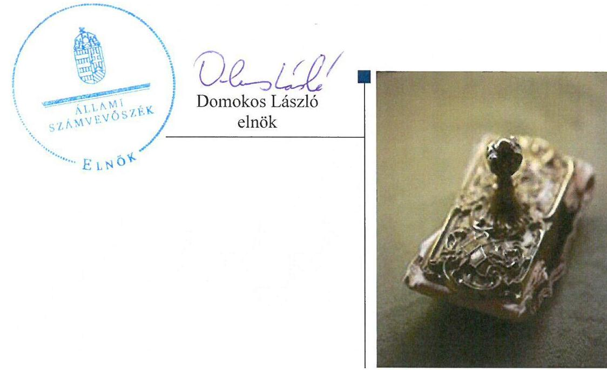
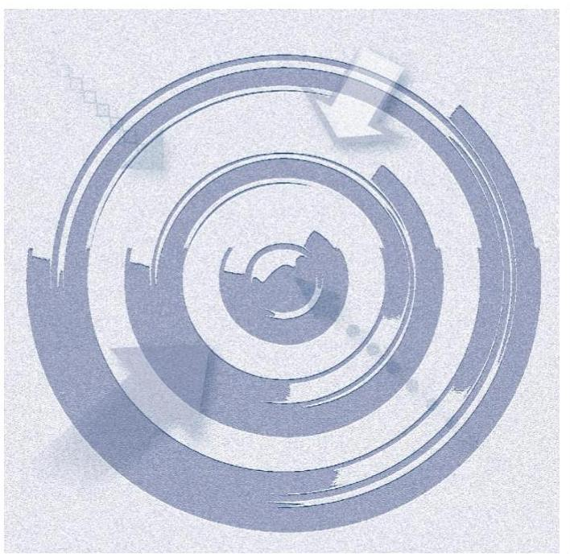
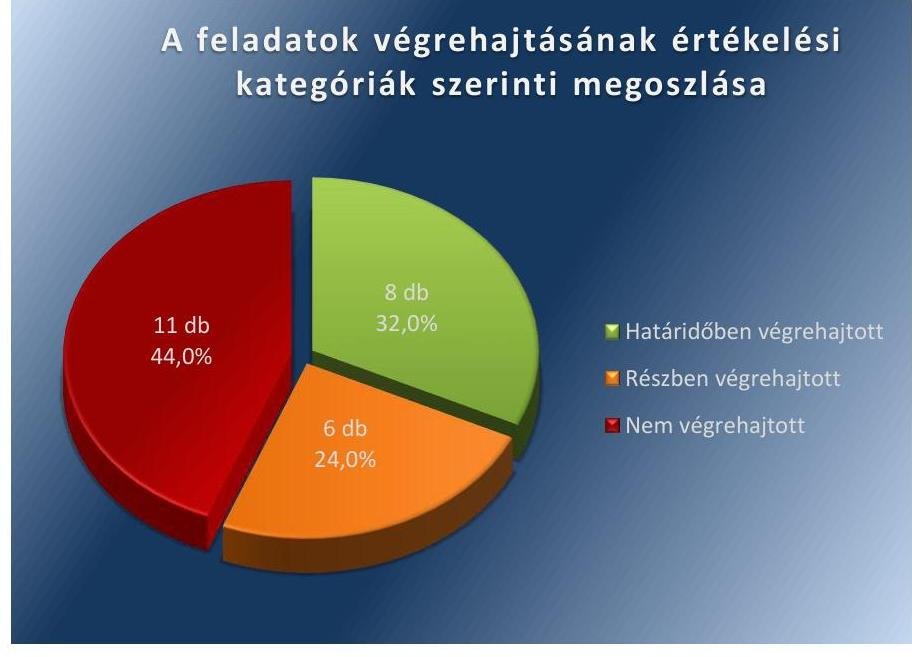

ÁLLAMI
SZÁMVEVŐSZÉK

# Jelentés 

## Utóellenőrzések

Ősi Község Önkormányzata belső
kontrollrendszere kialakításának, egyes
kontrolltevékenységek és a belső
ellenőrzés működésének utóellenőrzése
2016.

---

# Jelentés 

## Utóellenőrzések

Ősi Község Önkormányzata belső
kontrollrendszere kialakításának, egyes
kontrolltevékenységek és a belső
ellenőrzés múködésének utóellenőrzése
2016. 07. hó 15. nap

---

# AZ ELLENŐRZÉST FELÜGYELTE: 

DR. BENEDEK MÁRIA felügyeleti vezető

## AZ ELLENŐRZÉST VEZETTE ÉS A VÉGREHAJTÁSÁÉRT FELELŐS:

HORVÁTH EMESE CSILLA ellenőrzésvezető

## A PROGRAM ÖSSZEÁLLÍTÁSÁÉRT FELELŐS:

JANIK JÓZSEF osztályvezető

## A TÉMÁHOZ KAPCSOLÓDÓ KORÁBBI SZÁMVEVŐSZÉKI JELENTÉSEK:

- címe: Jelentés Ősi Község Önkormányzata belső kontrollrendszerének kialakítása, valamint egyes kontrolltevékenységek és belső ellenőrzés müködése ellenőrzéséről
- sorszáma: 13049

IKTATÓSZÁM: V-1058-056/2016
TÉMASZÁM: 2092
ELLENŐRZÉS-AZONOSÍTÓ SZÁM: V-071827

---

# TARTALOMJEGYZÉK 

■ ÖSSZEGZÉS ..... 5
■ AZ ELLENŐRZÉS CÉLJA ..... 6
■ AZ ELLENŐRZÉS TERÜLETE ..... 7
■ AZ ELLENŐRZÉS HÁTTERE, INDOKOLTSÁGA ..... 8
■ A JELENTÉS LÉNYEGES KÉRDÉSKÖREI ..... 9
■ ELLENŐRZÉS HATÓKÖRE ÉS MÓDSZEREI ..... 10
■ MEGÁLLAPÍTÁSOK ..... 13
■ MELLÉKLETEK ..... 17
I. Sz. melléklet: Az ÁSZ 13049 számú jelentéséhez kapcsolódó Ôsi Község Önkormányzata intézkedési tervének végrehajtása ..... 17
■ FÜGGELÉK: ÉSZREVÉTELEK ..... 23
■ RÖVIDÍTÉSEK JEGYZÉKE ..... 25

---

.

---

# ÖSSZEGZÉS 

Az ÁSZ ${ }^{1}$ az Önkormányzat² ${ }^{2}$ belső kontrollrendszerének kialakítása, valamint egyes kontrolltevékenységek és a belső ellenőrzés müködésének utóellenőrzését 2013. június 25. és 2016. január 29. közötti időszakra végezte el. Megállapította, hogy az intézkedési tervben foglalt feladatok jelentős részét az Önkormányzat nem hajtotta végre, így nem tett megfelelő lépéseket az ÁSZ által korábban feltárt, a belső kontrollrendszert érintő hiányosságok megszüntetésére, ami kockázatot hordoz az Önkormányzat szabályozásában, müködtetésének szabályosságában és a felelős vezetői magatartásban.

## Az ellenőrzés társadalmi indokoltsága

Az ÁSZ stratégiájában célul tűzte ki a számvevőszéki munka hasznosulásának javítását. Ezzel összhangban ellenőrzi, hogy az ellenőrzött szervezetek megvalósították-e a korábbi ellenőrzései által feltárt hibák, hiányosságok és szabálytalanságok megszüntetése céljából elkészített intézkedési terveikben foglaltakat. A rendszeres utóellenőrzések hozzájárulnak a szükséges intézkedések tényleges végrehajtáshoz, ezáltal a közpénzügyek rendezettségének javulásához.

## Főbb megállapítások, következtetések

A polgármester az intézkedési tervet határidőben megküldte az ÁSZ részére.
Az intézkedési tervben meghatározott 25 feladatból nyolcat határidőben, hatot részben hajtottak végre, 11-et nem hajtottak végre. Így az ÁSZ által korábban az Önkormányzat belső kontrollrendszerének kialakítása, valamint az egyes kontrolltevékenységek és a belső ellenőrzés működésének területén azonosított hiányosságok jelentős része továbbra is fennáll.

Az intézkedési tervben rögzített feladatok végrehajtásáról a Bkr. ${ }^{3}$-ben előírt nyilvántartást nem vezették.

---

# AZ ELLENŐRZÉS CÉLJA 

## Az Önkormányzat belső kontrollrendszere kialakításának, egyes kontrolltevékenységek és a belső ellenőrzés müködésének utóellenőrzése

Az ellenőrzés célja annak értékelése volt, hogy a számvevőszéki jelentésben foglalt intézkedést igénylő megállapításokkal és javaslatokkal összhangban készített intézkedési tervben meghatározott feladatokat az ellenőrzött szervezet végrehajtotta-e.

---

# AZ ELLENŐRZÉS TERÜLETE 

## Az Önkormányzat

Ősi község Veszprém megyében, a Várpalotai járásban található. Állandó lakosainak száma a $\mathrm{KSH}^{4}$ által közzétett népességi adatok szerint 2015. január 1-jén 1992 fő volt.

Az utóellenőrzés idején hivatalban lévő polgármester ${ }^{5}$ a 2010. évi önkormányzati választások óta tölti be tisztségét. A jegyzői feladatok ellátását a jegyző; ${ }^{6}$ tartós távolléte miatt a jegyző; ${ }^{7}$ 2015. szeptember 22-étől látta el.

Az Önkormányzat a 2014. évi éves költségvetési beszámoló szerint 458544 ezer Ft bevételt ért el, valamint 159610 ezer Ft kiadást teljesített. Az eszközvagyon értéke 2014. december 31-én 1019906 ezer Ft volt.

Az Önkormányzat belső kontrollrendszerének kialakítását, valamint az egyes kontrolltevékenységek és a belső ellenőrzés működésének ellenőrzését az ÁSZ a 2009. január 1. és 2011. december 31. közötti időszakra végezte el, az erről szóló 13049. számú jelentését 2013. június 25-én tette közzé. Az ellenőrzés célja annak értékelése volt, hogy az Önkormányzat a jogszabályi előírásoknak megfelelően alakította-e ki a belső kontrollrendszert, megfelelően múködtette-e a gazdálkodás folyamatában kulcsszerepet betöltő szakmai teljesítésigazolás és utalvány ellenjegyzés kontrollokat, biztosította-e a belső ellenőrzés szabályos és eredményes múködését.

Az utóellenőrzés - 2013. június 25-től 2016. január 29-ig végrehajtott feladatokat figyelembe véve - az ÁSZ jelentésben a polgármester és a jegyző részére megfogalmazott intézkedést igénylő megállapításokra és javaslatokra készített, az ÁSZ részére megküldött intézkedési tervben foglalt feladatok megvalósításának ellenőrzésére, illetve értékelésére terjedt ki.

---

# AZ ELLENŐRZÉS HÁTTERE, INDOKOLTSÁGA 

Az ÁSZ tv ${ }^{8}$ 33. § (1) bekezdése értelmében a számvevőszéki jelentések intézkedést igénylő megállapításaihoz és javaslataihoz kapcsolódóan az ellenőrzött szervezet vezetője intézkedési tervet köteles összeállítani, és az Állami Számvevőszék részére megküldeni. Az intézkedési tervben foglaltak megvalósítását - az ÁSZ tv. 33. § (7) bekezdésében foglaltak alapján - az Állami Számvevőszék utóellenőrzés keretében ellenőrizheti. Az intézkedések megvalósulásának értékelése során az Állami Számvevőszék figyelembe veszi az ellenőrzött szervezetek működési feltételeiben, valamint a jogszabályi előírásokban bekövetkezett változásokat.

Az intézkedési tervekben foglalt feladatok hiányos, illetve késedelmes végrehajtása, valamint megvalósításának elmaradása azt mutatja, hogy az ellenőrzések során feltárt hibák, hiányosságok és szabálytalanságok megszüntetése nem kapott kellő hangsúlyt. Ez a szabályszerű működés és a felelős vezetői magatartás vonatkozásában kockázatot hordoz. E kockázatok feltárásával az Állami Számvevőszék utóellenőrzési rendszere fokozza a fegyelmet, és igazolja, hogy a közpénzzel való szabályos gazdálkodás felelőssége elől nem lehet kitérni.

## AZ UTÓELLENŐRZÉS VÁRHATÓ HASZNOSULÁSA

Az utóellenőrzés négy szinten hasznosulhat:
$\longrightarrow$ A társadalom szintjén az utóellenőrzés jelzi, hogy a számvevőszéki ellenőrzés megállapításainak van következménye: a hiányosságok megszüntetésére az ellenőrzött szervezet által meghatározott intézkedések végrehajtását is számon kéri az ÁSZ.
$\longrightarrow$ Az ellenőrzött terület szintjén az utóellenőrzés tájékoztatást nyújt a terület döntéshozóinak a hiányosságok kiküszöbölésének jó gyakorlatairól, ezzel lehetőséget biztosítva arra, hogy az ÁSZ ellenőrzési megállapításai, javaslatai a terület nem ellenőrzött szervezeteinek a működése során is hasznosuljanak.
$\longrightarrow$ Az ellenőrzött szervezet szintjén az utóellenőrzés feltárja, hogy a szervezet az intézkedések végrehajtásával hasznosította-e a korábbi ellenőrzési jelentésben a hiányosságok megszüntetése, illetve a kockázatok kezelése érdekében megfogalmazott javaslatokat.
$\longrightarrow$ Az ÁSZ szintjén az utóellenőrzés visszacsatolást ad az ellenőrzési jelentések hasznosulásáról, az intézkedések elmaradása vagy részleges megvalósulása a további ellenőrzésekhez kockázati jelzésként szolgál.

---

# A JELENTÉS LÉNYEGES KÉRDÉSKÖREI 

Az Önkormányzat az intézkedési tervben foglaltakat az elöirt határidőben végrehajtotta-e?

---

# ELLENŐRZÉS HATÓKÖRE ÉS MÓDSZEREI 

## Az ellenőrzés típusa

Megfelelőségi ellenőrzés

## Az ellenőrzött időszak

Az utóellenőrzés alapját képező ÁSZ jelentés ${ }^{9}$ közzétételének napjától (2013. június 25.) az ellenőrzésről szóló kiértesítő levél keltének napjáig (2016. január 29.) tartó időszak.

## Az ellenőrzés tárgya

Az ÁSZ tv. 2011. július 1-jei hatálybalépését követően a számvevőszéki jelentésben foglalt intézkedést igénylő megállapításokkal és javaslatokkal összhangban - az Önkormányzat által - készített intézkedési tervben foglaltak végrehajtásának ellenőrzése.

Az ellenőrzés kiterjed minden olyan körülményre és adatra, amely az ÁSZ jogszabályban meghatározott feladatainak teljesítéséhez, valamint a program végrehajtása folyamán felmerült újabb összefüggések feltárásához szükséges.

## Az ellenőrzött szervezet

Ősi Község Önkormányzata

## Az ellenőrzés jogalapja

Az ÁSZ törvényben meghatározott feladatkörében ellenőrzi a központi költségvetés végrehajtását, az államháztartás gazdálkodását, az államháztartásból származó források felhasználását és a nemzeti vagyon kezelését.

Az ÁSZ tv. 1. § (3) bekezdése szerint az ÁSZ általános hatáskörrel végzi a közpénzekkel és az állami és önkormányzati vagyonnal való felelős gazdálkodás ellenőrzését.

Az ÁSZ tv. 33. § (7) bekezdése alapján az ÁSZ tv. 33. § (1)-(2) bekezdése szerinti intézkedési tervben foglaltak megvalósítását az ÁSZ utóellenőrzés keretében ellenőrizheti.

---

# Az ellenőrzés módszerei 

Az ÁSZ az ellenőrzést a nemzetközi standardokat irányadónak tekintve az ellenőrzési program ellenőrzési kérdései, az ellenőrzött időszakban hatályos jogszabályok, az ellenőrzés szakmai szabályok és módszertanok figyelembevételével, önállóan vagy ellenőrzéshez kapcsolódóan végezte.

Az ÁSZ az ellenőrzés ideje alatt az Önkormányzattal történő kapcsolattartást az ÁSZ SZMSZ ${ }^{10}$-ének vonatkozó előírásai alapján biztosította.

Az utóellenőrzés megállapításait elsősorban az ÁSZ rendelkezésére álló, valamint az ellenőrzött szervezetektől elektronikusan bekért dokumentumok alapozták meg.

Az ellenőrzési bizonyítékként felhasználható adatforrások közé tartoznak egyrészt a szakmai programban felsorolt adatforrások, másrészt minden - az ellenőrzés folyamán feltárt, az ellenőrzés szempontjából információt tartalmazó - dokumentum.

A pénzügyi folyamatokban kulcsszerepet betöltő kontrollok működésének megfelelőségét egyéb üzemeltetéssel, fenntartással, szolgáltatással kapcsolatos kifizetéseknél, állományba nem tartozók megbízási díjainál, továbbá a külső szolgáltatók által végzett karbantartási, kisjavítási munkákkal kapcsolatos kifizetéseknél 10 elemú véletlen mintavétellel kiválasztott tételek alapján értékelte az ÁSZ. A kiválasztott tételek esetében azt ellenőrizte, hogy az ellenőrzött szervezet az intézkedési tervben, az adott terület vonatkozásában meghatározott feladatok végrehajtása érdekében biz-tosította-e a jogszabályoknak és a belső szabályzatoknak való megfelelő múködtetést.

Az intézkedési tervben előírt feladatokat azok végrehajthatósága, illetve végrehajtása szempontjából az alábbiak szerint értékelte az ÁSZ:
"határidőben végrehajtott" a feladat, ha a teljesítés dokumentáltan, az intézkedési tervben előírt határidőben és tartalommal megtörtént;
"határidőn túl végrehajtott" a feladat, ha annak teljesítése az intézkedési tervben meghatározott módon, de az előírt határidőn túl történt meg;
"részben végrehajtott" a feladat, ha végrehajtása teljes körűen az intézkedési tervben előírt módon nem történt meg;
"nem végrehajtott" a feladat, ha a végrehajtás nem történt meg, vagy amennyiben a teljesítést nem dokumentálták;
"okafogyottá vált" a feladat, ha végrehajtására - meghatározott esemény bekövetkezése, továbbá külső körülmény, a múködést érintő feltétel változása miatt - már nincs szükség, illetve lehetőség, és egyértelmúen megállapítható, hogy az intézkedést szükségessé tevő körülmény a jövőben nem fordulhat elő;
"nem időszerü" az a feladat, amelynek ellenőrzési időszakon belüli végrehajtására azért nem került (kerülhetett) sor, mert az intézkedés alapjául szolgáló esemény nem következett be, de annak jövőbeni előfordulása lehetséges, a végrehajtása nem volt esedékes, vagy a végrehajtás határideje még nem járt le.
Az ellenőrzés lefolytatásához az Önkormányzat a tanúsítványok elektronikus kitöltésével, valamint az ÁSZ által kért dokumentumok elektronikus

---

megküldésével szolgáltatott adatokat, amelyek valódiságát és teljes körűségét a polgármester által tett teljességi és hitelességi nyilatkozat igazolta. Az így rendelkezésre bocsátott adatok, információk kontrollja az ellenőrzés keretében történt.

---

# MEGÁLLAPÍTÁSOK 

## Az Önkormányzat az intézkedési tervben foglaltakat az előírt határidőben végrehajtotta-e?

Összegző megállapítás

Az Önkormányzat az intézkedési tervében meghatározott 25 feladatból nyolcat határidőben, hatot részben hajtott végre, valamint 11-et nem hajtott végre. Az intézkedési tervben rögzített feladatok végrehajtásáról a Bkr.-ben előírt nyilvántartást nem vezették.

Az intézkedési tervben meghatározott feladatokat, határidőket, az ÁSZ jelentés javaslatainak címzettjét és a feladatok végrehajtását az I. számú melléklet mutatja be.

Az ÁSZ a jelentésben a polgármester részére három, a jegyző részére 23 javaslatot fogalmazott meg. A polgármester által összeállított és az ÁSZ részére megküldött, a Képviselő-testület által elfogadott intézkedési tervben a hiányosságok, szabálytalanságok megszüntetésére 25 feladatot határoztak meg. A feladatok elvégzésének felelőseként két feladatot írtak elő a polgármester részére, 23 feladat elvégzésének felelőseként a jegyzőt jelölték meg.

Az intézkedési tervben tervezett feladatok végrehajtásának értékelési kategóriák szerinti megoszlását az 1. ábra szemlélteti.

1. ábra

Forrás: ÁSZ

---

# HATÁRIDŐBEN VÉGREHAJTOTT feladat: 

1. A polgármester az operatív gazdálkodás során intézkedett arról, hogy a kötelezettségvállalásra kizárólag pénzügyi ellenjegyzés után, a pénzügyi teljesítés esedékességét megelőzően írásban kerüljön sor. Továbbá az intézkedési tervben vállaltakkal összhangban, a Gazdasági-Műszaki Ügyrendet ${ }^{11}$ a kötelezettségvállalásra vonatkozóan kiegészítették, és 2013. szeptember 27-től hatályba léptették.
2. A polgármester gondoskodott az ÁSZ ellenőrzése által feltárt hiányosságok, szabálytalanságok miatt a munkajogi felelősséggel kapcsolatos körülmények kivizsgálásáról, fegyelmi eljárást kezdeményezett a jegyző ${ }_{1}$-gyel szemben. A fegyelmi tanács a jegyző ${ }_{1}$ ellen lefolytatott fegyelmi eljárást megszüntette.
3. A jegyző ${ }_{2}$ belső szabályzatban rendelkezett - jogszabályi előírásokkal összhangban - az előzetes írásbeli kötelezettségvállalást nem igénylő kifizetések esetén a teljesítésigazolás gyakorlásának dokumentációs részletszabályairól.
4. A jegyző ${ }_{2}$ elkészítette a Hivatal 2013. október 1-jétől hatályos adatvédelmi és adatbiztonsági szabályzatát. ${ }^{12}$
5. A jegyző ${ }_{2}$ szabályozta a kötelezően közzéteendő adatok nyilvánosságra hozatala rendjét, elkészítette a Hivatal közérdekű adatok közzétételére és a közérdekű adatok megismerésére irányuló igények teljesítésének rendjéről szóló szabályzatát ${ }^{13}$, amely 2013. október 1-jétől hatályos.
6. A jegyző ${ }_{2}$ az operatív gazdálkodás során gondoskodott a teljesítés igazolás vonatkozásában a múködésbeli hibák megelőzése, feltárása és kijavítása érdekében a feladatok végrehajtásáról, mert a teljesítés igazolója az ellenőrizhető okmányok alapján ellenőrizte és igazolta a kiadások teljességének jogosságát, összegszerűségét, valamint az ellenszolgáltatást is magába foglaló kötelezettségvállalás esetén a szerződés teljesítését.
7. A jegyző ${ }_{2}$ az operatív gazdálkodás során gondoskodott a kötelezettségvállalás vonatkozásában a működésbeli hibák megelőzése, feltárása és kijavítása érdekében a feladatok végrehajtásáról, mert a kötelezettségvállalásra pénzügyi ellenjegyzés után került sor.
8. A jegyző ${ }_{2}$ az előírt határidőben elkészítette az éves belső ellenőrzési tervek előterjesztését, amelyeket a Képviselő-testület ${ }^{14}$ határidőben jóváhagyott.

## RÉSZBEN VÉGREHAJTOTT feladat:

9. A jegyző ${ }_{2}$ a 2014. évtől kezdődően kezdeményezte, hogy az éves ellenőrzési programokat a belső ellenőrzési vezető hagyja jóvá. A 2013. évben a jegyző ${ }_{2}$, és nem a Bkr.-ben előírt belső ellenőrzési vezető hagyta jóvá az éves ellenőrzési programot.
10. A jegyző ${ }_{2}$ kidolgozta a Kttv. ${ }^{15}$-ben előírtak alapján a munkavállalókkal szemben támasztott teljesítménykövetelményeket- az aljegyző ${ }^{16}$ kivételével-, a teljesítményértékelést elvégezték. A 2015. évben a követelmények meghatározását és a teljesítményértékeléseket 2015. július 15. helyett 2015. július 31-én végezték el.

---

11. A jegyző ${ }_{2}$ biztosította az adatvédelmi és biztonsági szabályzat elkészítését, de a számítógépes információs rendszereket nem szabályozták, valamint a hozzáférési jogosultságok nyilvántartását nem alakították ki. Az Önkormányzat nem rendelkezett továbbá a pénz-ügyi-számviteli szoftverváltozások tesztelésére vonatkozó eljárásokról, és az adatmentés felelőségi viszonyairól.
12. A jegyző ${ }_{2}$ a 2014. évtől kezdődően gondoskodott arról, hogy az ellenőrzési jelentések tartalmazzák a Bkr.-ben előírt tartalmi elemeket, azonban a 2013. évben készült belső ellenőrzési jelentések nem tartalmazták az ellenőrzés tárgyát.
13. A jegyző ${ }_{2}$ a 2015. évtől kezdődően gondoskodott a belső ellenőrzési jelentésekben feltárt hiányosságok megszüntetése érdekében a Bkr.-ben előírt intézkedési terv készítéséről, amelyet azonban az előírt határidőt nyolc nappal túllépve készített el. A 2013-2014. években intézkedési tervek nem készültek.
14. A jegyző ${ }_{2}$ a 2014. évtől kezdeményezte a belső ellenőrzésekről a Bkr. előírásainak megfelelő nyilvántartás vezetését. A külső ellenőrzések javaslatai alapján nem készítették el a Bkr. szerinti nyilvántartást.

# NEM VÉGREHAJTOTT feladat: 

15. A jegyző ${ }_{2}$ nem intézkedett a Hivatal Áhsz. ${ }^{17}$-ben előírt tartalmú számlarendjének ${ }^{18}$ elkészítéséről, mert a számlarend nem biztosította a könyvvezetés és az elemi költségvetési beszámoló számviteli szabályoknak megfelelő elkészítését.
16. A jegyző ${ }_{2}$ nem intézkedett az ellenőrzési nyomvonal ${ }^{19}$ Bkr.-ben foglalt tartalmú módosításáról.
17. A jegyző ${ }_{2}$ nem készítette elő a Hivatal SZMSZ-ének módosítását, annak tartalma továbbra sem felelt meg az Ávr ${ }^{20}$,-ben foglaltaknak, nem tartalmazta a nevesített munkakörökhöz tartozó feladat- és hatásköröket, a hatáskörök gyakorlásának módját, a helyettesítés rendjét, valamint a kapcsolódó felelősségi szabályokat.
18. A jegyző ${ }_{2}$ nem vizsgálta felül a Hivatal 2009. június 1-jétől hatályos Kockázatkezelési szabályzatát ${ }^{21}$, nem alakította ki és nem múködtette a Bkr.-ben előírtak alapján a kockázatkezelési rendszert és nem végzett kockázatelemzést.
19. A jegyző ${ }_{2}$ nem alakította ki és nem múködtette a Bkr.-ben előírtak alapján minden tevékenységre vonatkozóan a folyamatba épített, előzetes, utólagos és vezetői ellenőrzést, a 2009. június 1-jétől hatályos ellenőrzési nyomvonalat nem módosította, nem adott ki egyéb szabályzatot sem, amely tartalmazta volna a pénzügyi döntések dokumentumainak elkészítésével kapcsolatos, folyamatba épített, előzetes, utólagos és vezetői ellenőrzés feladatait.
20. A jegyző ${ }_{2}$ nem alakította ki a Bkr.-ben előírtak alapján a Hivatal tevékenységeire vonatkozó beszámolási eljárások szabályait.
21. A jegyző ${ }_{2}$ nem alakította ki és nem működtette a Bkr.-ben előírtak alapján a Hivatal tevékenységének, célok megvalósításnak nyomon követését biztosító monitoring rendszert.

---

22. A jegyző ${ }_{2}$ az operatív gazdálkodás során nem gondoskodott az érvényesítés vonatkozásában a működésbeli hibák megelőzése, feltárása és kijavítása érdekében a feladatok végrehajtásáról, mert az érvényesítő a kifizetéseket megelőzően az Ávr. -ben előírtak alapján nem végezte el az összegszerűség és a fedezet meglétének ellenőrzését.
23. A jegyző ${ }_{2}$ az operatív gazdálkodás során nem gondoskodott az utalványozás vonatkozásában a működésbeli hibák megelőzése, feltárása és kijavítása érdekében a feladatok végrehajtásáról, mert az Ávr.-ben és a belső szabályzatban előírtak ellenére a kifizetésekhez készített utalványrendeleteken a kötelezettségvállalás nyilvántartási számát nem tüntették fel.
24. A jegyző ${ }_{2}$ nem intézkedett az ÁSZ jelentés és a Képviselő-testület által elfogadott intézkedési terv belső ellenőrzést biztosító Társulás ${ }^{22}$ vezetőjének a megküldéséről, nem gondoskodott a feladatok írásbeli megállapodásban történő rendezésről. A Társulást a polgármester értesítette - a Hatásköri tv ${ }^{23}$. alapján a jegyző feladata lett volna - 2013. augusztus 1-jén. A polgármester értesítő levele amely az ÁSZ ellenőrzés belső ellenőrzésre vonatkozó megállapításai, javaslatai alapján javasolta a Társulás felé a belső ellenőrzésre vonatozó szabályozás felülvizsgálatát - nem foglalta magában teljeskörűen a Bkr. vonatkozó előírásait.
25. A jegyző ${ }_{2}$ nem intézkedett arról, hogy a Bkr. előírásainak megfelelően az éves ellenőrzési terveket kockázatelemzés alapozza meg, valamint nem készültek jegyzői írásos vélemények.

Az intézkedési tervben rögzített feladatok végrehajtásáról a Bkr.-ben előírt nyilvántartást nem vezették.

---

# MELLÉKLETEK

I. SZ. MELLÉKLET: AZ ÁSZ 13049 SZÁMÚ JELENTÉSÉHEZ KAPCSOLÓDÓ ŐSI KÖZSÉG ÖNKORMÁNYZATA INTÉZKEDÉSI TERVÉNEK VÉGREHAJTÁSA

|  Sorszám | Intézkedési terv alapján elvégzendő feladat | Az intézkedési tervben meghatározott határidő | Az ÁSZ 13049
sz. jelentése javadatának címzettje 3. | A feladat végrehajtása  |
| --- | --- | --- | --- | --- |
|   | 1. | 2. | 3. | 4.  |
|  Hatalódóben végrehajtott feladat |  |  |  |   |
|  1. | Kötelezettségvállalások pénzügyi ellenjegyzése a pénzügyi teljesítés esedékességét megelőzően, pénzügyi szabályzatok (Gazdasági-Műszaki Ügyrend) erre vonatkozó kiegészítése. | Folyamatos alkalmazás, vonatkozó pénzügyi szabályzat(ok) kiegészítése: 2013. szeptember 30. | polgármester | A polgármester az operatív gazdálkodás során intézkedett arról, hogy a kötelezettségvállalásra kizárólag pénzügyi ellenjegyzés után, a pénzügyi teljesítés esedékességét megelőzően, írásban kerüljön sor. Továbbá az intézkedési tervben vállaltakkal összhangban, a Gazdasági-Műszaki Ügyrendet a kötelezettségvállalásra vonatkozóan kiegészítették, és 2013. szeptember 27-től hatályba léptették.  |
|  2. | A gazdálkodás szabályszerűségét az ÁSZ jelentésben feltárt jegyzői mulasztásokból adódó (ezen intézkedési tervben felsorolt 23 intézkedést igénylő) hiányosságok folyamatosan veszélyeztették. A 2008. évi ÁSZ ellenőrzés megállapításai, javaslatai jelentős részben nem, határidőn túl, vagy csak részben hasznosultak. Ezért indokolt a jegyző munkajogi felelősségének kivizsgálása, ennek függvényében további szükséges intézkedések megtétele. | A jelenleg tartósan távol lévő jegyző munkába állását követően azonnal | polgármester | A munkajogi felelősség megállapítása érdekében a jegyző ${ }_{1}$-gyel szemben a polgármester 2013. szeptember 23-án fegyelmi eljárást kezdeményezett. A fegyelmi tanács a jegyző ${ }_{1}$ ellen lefolytatott fegyelmi eljárást a Kttv. 158. § (1) bekezdés b) pontja alapján, tekintettel a Kttv. 156. § (1) bekezdésében foglaltakra megszüntette, mert annak elindítására a kötelezettségszegés felfedezését - 2013. május 23. - követően, három hónap elteltével - 2013. szeptember 23-án került sor.  |
|  3. | A vonatkozó pénzügyi szabályzat(ok) kiegészítése, felülvizsgálata. | 2013. szeptember 30. | jegyző | A jegyző ${ }_{2}$ belső szabályzatban (2013. szeptember 27-től hatályos Gazdasági-Műszaki Ügyrend) rendelkezett - jogszabályi előírásokkal összhangban - az előzetes írásbeli kötelezettségvállalást nem igénylő kifizetések esetén a teljesítésigazolás gyakorlásának dokumentációs részletszabályairól.  |
|  4. | Adatvédelmi és adatbiztonsági szabályzatok elkészítése. | 2013. szeptember 30. | jegyző | A jegyző ${ }_{2}$ elkészítette a Hivatal 2013. október 1-jétől hatályos adatvédelmi és adatbiztonsági szabályzatát.  |
|  5. | A közérdekú adatok közzétételének rendjéről szóló szabályzat elkészítése. | 2013. szeptember 30. | jegyző | A jegyző ${ }_{2}$ szabályozta a kötelezően közzéteendő adatok nyilvánosságra hozatala rendjét, elkészítette a Hivatal közérdekú adatok közzétételére és a közérdekú adatok megismerésére irányuló igények teljesítésének rendjéről szóló szabályzatát, amely 2013. október 1-jétől hatályos.  |

---

|  5. | Intézkedési terv alapján elvégzendő feladat | Az intézkedési tervben meghatározott határidő | Az ÁSZ 13049
sz. jelentése ja
vaslatának
címzettje | A feladat végrehajtása  |
| --- | --- | --- | --- | --- |
|  1. |  | 2. | 3. | 4.  |
|  6. | Teljesítésigazolást megalapozó ellenőrizhető
okmányok Gazdasági-Műszaki Ügyrendben
történő szabályozása. | Folyamatos alkalmazás, vo
natkozó pénzügyi szabály
zatok kiegészítése: 2013.
szeptember 30. | jegyző | A jegyző₁ az operatív gazdálkodás során gondoskodott a teljesítés igazolás vonatkozásában a
működésbeli hibák megelőzése, feltárása és kijavítása érdekében a feladatok végrehajtásáról,
mert a teljesítés igazolója az ellenőrizhető okmányok alapján ellenőrizte és igazolta a kiadások
teljességének jogosságát, összegszerűségét, valamint az ellenszolgáltatást is magába foglaló kö-
telezettségvállalás esetén a szerződés teljesítését.  |
|  7. | Kötelezettségvállalást minden esetben előzze
meg a pénzügyi ellenjegyzés, erre vonatkozó
kötelezettség pénzügyi szabályzatban (Gazda-
sági-Műszaki Ügyrend) való rögzítése. | Folyamatos, vonatkozó
pénzügyi szabályzat(ok) ki
egészítése: 2013. szeptember 30. | jegyző | A jegyző₁ az operatív gazdálkodás során gondoskodott a kötelezettségvállalás vonatkozásában
a működésbeli hibák megelőzése, feltárása és kijavítása érdekében a feladatok végrehajtásáról,
mert a kötelezettségvállalásra pénzügyi ellenjegyzés után került sor.  |
|  8. | Az éves ellenőrzési terv előterjesztése a Bkr. 32. §
(4) bekezdése szerinti határidőnek megfelelően. | Tárgyévet megelőző év dec
ember 31-ig | jegyző | A jegyző₁ az előírt határidőben elkészítette az éves belső ellenőrzési tervek előterjesztését,
amelyeket a Képviselő-testület határidőben jóváhagyott.  |
|   |  |  |  | Részben végrehajtott feladat  |
|  9. | A belső ellenőrzési vezető jóváhagyásának biztositása az ellenőrzési programhoz. | Folyamatos, Ellenőrzési
program jóváhagyásakor | jegyző | Végrehajtott: A jegyző₁ a 2014. évtől kezdődően kezdeményezte, hogy az éves ellenőrzési progra
ramokat a belső ellenőrzési vezető hagyja jóvá.
Nem végrehajtott: A 2013. évben kinevezett belső ellenőrzési vezető nem volt, a tevékenységet
egy fő belső ellenőr látta el, aki a Bkr.-ben előírtak alapján belső ellenőrzési vezetőnek minősül.
Az ellenőrzési programot a jegyző₁ hagyta jóvá, nem a belső ellenőrzési vezető.  |
|  10. | A közszolgálati egyéni teljesítményértékelésről szóló 10/2013. (I. 21.) Korm. rendeletben fog-
laltak szerinti előírások teljesítése: teljesít
ményértékelés kötelező és ajánlott elemeinek
megállapítása, a szakmai munka értékelése.
Egyéni első és második féléves teljesítménykö
vetelmények meghatározása, mérése, értéke
lése. | 2013. július 31. Ezt követően minden év január 31.
és július 15. | jegyző | Végrehajtott: A jegyző₁ kidolgozta a Kttv.-ben előírtak alapján a munkavállalókkal szemben tá
masztott teljesítménykövetelményeket–az aljegyző kivételével-, a teljesítményértékelést elvé
gezték.
Nem végrehajtott: A 2015. évben a követelmények meghatározását és a teljesítményértékelé
seket 2015. július 15. helyett 2015. július 31-én végezték el.  |

---

|  1. | Adatbiztonsági, informatikai adatbiztonsági szabályzat elkészítése, hozzáférési jogosultságok megállapítására, módosítására, azok betartásának ellenőrzésére vonatkozó eljárásrend elkészítése, a jogosultságok nyilvántartásba vétele, folyamatos aktualizálása. | 2013. szeptember 30. |  | 4.  |
| --- | --- | --- | --- | --- |
|   |  |  |  | Végrehajtott: A jegyző; biztosította az adatvédelmi és biztonsági szabályzat elkészítését.  |
|   |  |  |  | Nem végrehajtott: A számítógépes információs rendszereket nem szabályozták, valamint a hozzáférési jogosultságok nyilvántartását nem alakították ki. Az Önkormányzat nem rendelkezett továbbá a pénzügyi-számviteli szoftverváltozások tesztelésére vonatkozó eljárásokról, és az adatmentés felelőségi viszonyairól  |
|  12. | Ellenőrzési jelentések 8kr. 39. § (3) bekezdése szerinti tartalmi elemeinek ellenőrzése. | Folyamatos, Ellenőrzési jelentések átvételekor |  | Végrehajtott: A 2014-2015. években készült ellenőrzési jelentések a 8kr. 39. § (3) bekezdésében foglalt tartalmi elemekkel készültek, így azok megfeleltek a jogszabályi előírásoknak.  |
|   |  |  |  | Nem végrehajtott: A 2013. évben készült belső ellenőrzési jelentések – az ÁSZ jelentésben megfogalmazott, intézkedést igénylő megállapítás alapján – a 8kr. 39. § (3) bekezdés e) pontja előírása ellenére továbbra sem tartalmazták az ellenőrzés tárgyát.  |
|  13. | Belső ellenőrzési jelentésekben feltárt hiányosságok kiküszöbölése érdekében intézkedési tervek készítése. | Folyamatos, belső ellenőrzési jelentések átvételét követően |  | Végrehajtott: Az ellenőrzött időszakban a 22-88-2/2015. számú, 2015. december 7-én kézhez vett belső ellenőrzési jelentésre készült intézkedési terv.  |
|   |  |  |  | Nem végrehajtott: Az ellenőrzött időszakban a 22-88-2/2015. számú, 2015. december 7-én kézhez vett belső ellenőrzési jelentésre – a 8kr. 45. § (3) bekezdésben előírt nyolc napon túl – 2016. január 18-án készült el az intézkedési terv.  |
|   |  |  |  | A belső ellenőr a 2013-2014. években a belső ellenőri jelentésben több szabályzat módosítását javasolta, azonban a hiányosságok megszüntetése érdekében – a 8kr. 45. § előírásai ellenére – intézkedési tervek nem készültek.  |
|  14. | Belső és külső ellenőrzések és ezek megállapításainak hasznosulása érdekében készített intézkedési tervek nyilvántartása. | 2013. évi nyilvántartások kialakítására: 2013. augusztus 31., ezt követően folyamatos |  | Végrehajtott: A jegyző; a 2014. évtől kezdeményezte a belső ellenőrzésekről a 8kr. előírásainak megfelelő nyilvántartás vezetését.  |
|   |  |  |  | Nem végrehajtott: A külső ellenőrzések javaslatai alapján nem készítették el a 8kr. szerinti nyilvántartást.  |

---

|  1. | A Polgármesteri Hivatal számlarendjének Áhsz. 49. § (1) bekezdésében előírtaknak megfelelő kialakítása. | 2013. szeptember 30. |  |  |   |
| --- | --- | --- | --- | --- | --- |
|  16. | Ellenőrzési nyomvonal Bkr. 6. § (3) bekezdésében foglaltaknak megfelelő elkészítése. | 2013. november 30. |  |  |   |
|  17. | A Polgármesteri Hivatal SZMSZ-ének módosításának előkészítése, annak az Ávr. 13. § (1) bekezdés g) pontjának megfelelő tartalommal. | 2013. október 30. |  |  |   |
|  18. | Kockázatkezelési szabályzat felülvizsgálata, kockázatkezelési rendszer kialakítása és kockázatelemzés elvégzése. | 2013. november 30. |  |  |   |
|  19. | FEUVE alkalmazása, azt megalapozó szabályzatok kidolgozása. | 2013. november 30. |  |  |   |
|  20. | A Polgármesteri Hivatal tevékenységeire vonatkozó beszámolási eljárások szabályozása. | 2013. november 30. |  |  |   |
|  21. | A Polgármesteri Hivatal tevékenységének, célok megvalósításnak nyomon követését biztosító monitoring rendszer kialakítása, szabályzat(ok)ban való rögzítése. | 2013. november 30. |  |  |   |

|  Az ÁSZ 13049 sz. jelentése javaslatának címzettje 3. | A feladat végrehajtása  |
| --- | --- |
|  4. |   |
|  Nem végrehajtott feladat |   |
|  jegyző | A jegyző₁ nem intézkedett a feladat végrehajtása során Hivatal Áhsz.- ben előírt tartalmú számlarendjének elkészítéséről, mert a számlarend tartalmában nem felelt meg az Áhsz. 49. § (1) bekezdésében foglaltaknak. A számlarend nem biztosította maradéktalanul a könyvvezetés és az elemi költségvetési beszámoló Számv. tv²4. és Áhsz. rendelkezéseiben foglaltaknak megfelelő készítését a következő hiányosságok miatt: nem tartalmazta a passzív elszámolások analitikus nyilvántartására vonatkozó szabályokat, továbbá az aktív és passzív elszámolások, valamint kötelezettségek főkönyvi és analitikus nyilvántartásainak egyeztetésének és annak dokumentálásának szabályait az Áhsz. 49. § (3) bekezdés előírása ellenére; nem tartalmazta az analitikus nyilvántartások adataiból készített összesítő bizonylatok (feladások) elkészítésének határidejét az Áhsz. 49.§ (5) bekezdése ellenére. |   |
|  jegyző | A jegyző₁ nem intézkedett az ellenőrzési nyomvonal Bkr.-ben foglalt tartalmú módosításáról.  |
|  jegyző | A jegyző₁ nem készítette elő a Hivatal SZMSZ-ének módosítását, annak tartalma továbbra sem felelt meg az Ávr.-ben foglaltaknak, nem tartalmazta a nevesített munkakörökhöz tartozó feladat- és hatásköröket, a hatáskörök gyakorlásának módját, a helyettesítés rendjét, valamint a kapcsolódó felelősségi szabályokat.  |
|  jegyző | A jegyző₁ – a Bkr. 3. § b) pontja és 7. § előírásai ellenére – a Hivatal 2009. június 1-jétől hatályos Kockázatkezelési szabályzatát nem módosította, a kockázatkezelési rendszert nem alakította ki és nem működtette, valamint nem végzett kockázatelemzést.  |
|  jegyző₁ – a Bkr. 8. § (4) bekezdés c) pontjában előírtak ellenére – nem alakította ki a Hivatal tevékenységeire vonatkozó beszámolási eljárások szabályait.  |
|  jegyző₁ – a Bkr. 3. § (4) bekezdés e) pontjában előírtak ellenére – nem alakította ki a Hivatal tevékenységeire vonatkozó beszámolási eljárások szabályait. |   |
|  jegyző | A jegyző₁ nem alakította ki és nem működtette a Bkr.-ben előírtak alapján a Hivatal tevékenységének, célok megvalósításnak nyomon követését biztosító monitoring rendszert.  |

---

|  22. | 22. | 22. | 23. | 23.  |
| --- | --- | --- | --- | --- |
|  22. | 22. | 22. | 23. | 23.  |
|  23. | Az intézkedési terv alapján elvégzendő feladat | Az intézkedési tervben meghatározott határidő | Az ÁSZ 13049 sz. jelentése javaslatának címzettje | A feladat végrehajtása  |
|   | 1. | 2. | 3. | 4.  |
|   | 22. | 22. | 23. | 23.  |
|   | 22. | 22. | 23. | 23.  |
|   | 23. | 23. | 23. | 23.  |
|  24. | Az ÁSZ ellenőrzés belső ellenőrzésre vonatkozó megállapításainak, javaslatainak hasznosulása érdekében a belső ellenőrzést biztosító társulás munkaszervezetének értesítése, módosító javaslat megtételével. | 22. | 22. | 23. | 23.  |
|  25. | Az ÁSZ ellenőrzés belső ellenőrzésre vonatkozó megállapításainak, javaslatainak hasznosulása érdekében a belső ellenőrzést biztosító társulás munkaszervezetének értesítése, jegyző írásos véleményének csatolása az éves ellenőrzési tervhez. | 22. | 22. | 23. | 23.  |
|  26. | Az ÁSZ ellenőrzés belső ellenőrzésre vonatkozó megállapításainak, javaslatainak hasznosulása érdekében a belső ellenőrzést biztosító társulás munkaszervezetének értesítése, jegyző írásos véleményének csatolása az éves ellenőrzési tervhez. | 22. | 22. | 23. | 23.  |

---

.

---

# FÜGGELÉK: ÉSZREVÉTELEK 

A jelentéstervezetet a Számvevőszék 15 napos észrevételezésre megküldte az ellenőrzött szervezet vezetőjének az ÁSZ tv. 29. §* (1) bekezdése előírásának megfelelően.
Az ellenőrzött szervezet vezetője az ÁSZ tv. 29. § (2) bekezdésében foglalt észrevételezési jogával nem élt, a jelentéstervezetre észrevételt nem tett.

[^0]
[^0]:    * 29. § (1) Az Állami Számvevőszék az ellenőrzési megállapításait megküldi az ellenőrzött szervezet vezetőjének vagy az általa megbízott személynek, és annak, akinek személyes felelősségét állapította meg.
    (2) Az ellenőrzött szervezet vezetője és a felelősként megjelölt személy az ellenőrzés megállapításaira tizenöt napon belül írásban észrevételt tehet.
    (3) Az Állami Számvevőszék az észrevételre a beérkezésétől számított harminc napon belül írásban válaszol. A figyelembe nem vett észrevételeket köteles a jelentésben feltüntetni, és megindokolni, hogy azokat miért nem fogadta el.

---

.

---

# RÖVIDÍTÉSEK JEGYZÉKE 

${ }^{1}$ ÁSZ
${ }^{2}$ Önkormányzat
${ }^{3}$ Bkr.
${ }^{4}$ KSH
${ }^{5}$ polgármester
${ }^{6}$ jegyző:
${ }^{7}$ jegyző:
${ }^{8}$ ÁSZ tv.
${ }^{9}$ ÁSZ jelentés
${ }^{10}$ SZMSZ
${ }^{11}$ Gazdasági-Műszaki Ügyrend
${ }^{12}$ Adatvédelmi és biztonsági szabályzat
${ }^{13}$ Közérdekú adatok közzétételére és megismerésére irányuló szabályzat
${ }^{14}$ Képviselő-testület
${ }^{15}$ Kttv.
${ }^{16}$ aljegyző
${ }^{17}$ Áhsz.
${ }^{18}$ Számlarend
${ }^{19}$ ellenőrzési nyomvonal
${ }^{20}$ Ávr.
${ }^{21}$ Kockázatkezelési Szabályzat
${ }^{22}$ Társulás
${ }^{23}$ Hatásköri tv.
${ }^{24}$ Számv. tv.

Állami Számvevőszék
Ősi Község Önkormányzata
370/2011. (XII.31.) Korm. rendelet a költségvetési szervek belső
kontrollrendszeréről és belső ellenőrzéséről (hatályos 2012. január 1-jétől)
Központi Statisztikai Hivatal
Ősi Község Önkormányzatának polgármestere
Ősi Község Önkormányzata Polgármesteri Hivatalának 2015. szeptember 5-ig kinevezett jegyzője, aki az ellenőrzött időszakban tartós távolléten volt
Ősi Község Önkormányzatának jegyzője 2015. szeptember 22-től. Ezt megelőzően, 2013. május 15-től Ősi Község Önkormányzatának aljegyzője, aki jegyző; tartós távolléte miatt a jegyzői feladatokat is ellátta.
2011. évi LXVI. törvény az Állami Számvevőszékről (hatályos 2011. július 1.-jétől) az Állami Számvevőszék 13049-es számú jelentése. Az elkészített jelentés az interneten, a www.asz.hu címen olvasható
Szervezeti és Működési Szabályzat
98/2013. (IX. 26.) számú Képviselő-testületi határozat Ősi Község Önkormányzat Polgármesteri Hivatalának Gazdasági-műszaki Ügyrendjéről (hatályos 2013. szeptember 27-től)
Ősi Község Polgármesteri Hivatal Adatvédelmi és számítástechnikai adatbiztonsági szabályzata (hatályos 2013. október 1-jétől)
Ősi Község Polgármesteri Hivatal Szabályzata a Közérdekú adatok közzétételének és a közérdekú adatok megismerésére irányuló igények teljesítésének rendjéről (hatályos 2013. október 1-jétől)
Ősi Község Önkormányzatának képviselő-testülete
2011. évi CXCIX. törvény a közszolgálati tisztviselőkről

A Képviselő-testület 2013. május 15-i hatállyal a Hivatal szervezeti felépítését módosította, aljegyzői munkakört alakított ki, biztosítva a jegyzői feladatok jogszabályi előírásoknak megfelelő ellátását a jegyző; tartós akadályoztatása esetére.
249/2000. (XII. 24.) Korm. rendelet az államháztartás szervezetei beszámolási és könyvvezetési kötelezettségének sajátosságairól (hatálytalan 2014. január 1.jétől)
Ősi Község Önkormányzatának a 97/2013. (IX. 26.) számú Képviselő-testületi határozattal elfogadott Számlarendje (hatályos 2013. szeptember 27-től)
Ősi Község Polgármesteri Hivatal költségvetési szerv ellenőrzési nyomvonala (hatályos 2009. június 1-jétől)
368/2011. (XII.31.) Korm. rendelet az államháztartásról szóló törvény végrehajtásáról (hatályos 2012. január 1-jétől)
Polgármesteri Hivatal 2009. június 1-jétől hatályos Kockázatkezelési szabályzata Várpalota Kistérség Többcélú Társulása
1991. évi XX. törvény a helyi önkormányzatok és szerveik, a köztársasági megbízottak, valamint egyes centrális alárendeltségú szervek feladat- és hatásköreiről
2000. évi C. törvény a számvitelről

---

ÁLLAMI SZÁMVEVŐSZÉK
1052 Budapest, Apáczai Csere János utca 10.
Levélcím: 1364 Budapest 4. Pf. 54
Telefon: +36 14849100 Telefax: +36 14849200
www.asz.hu