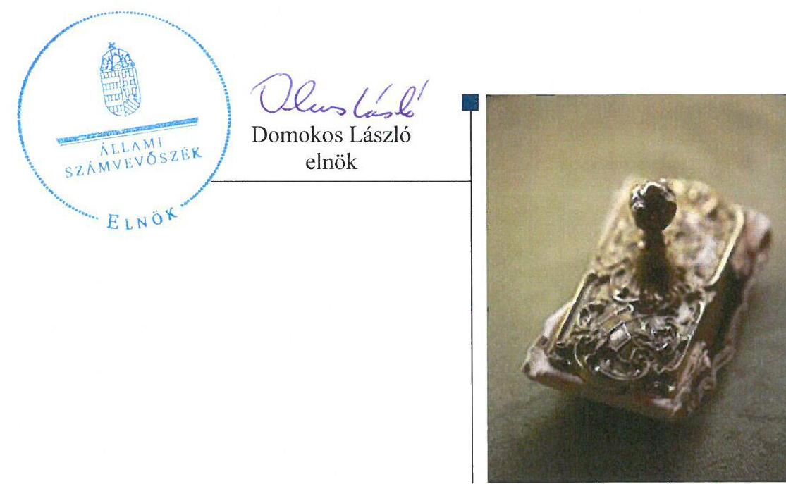
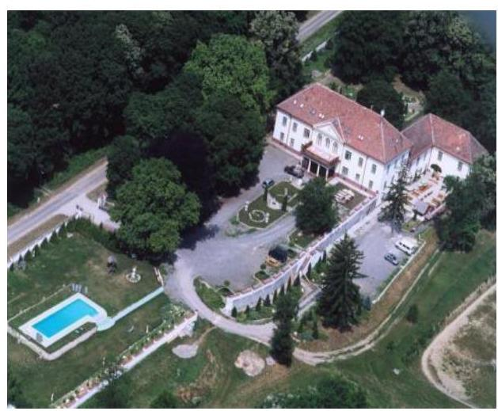
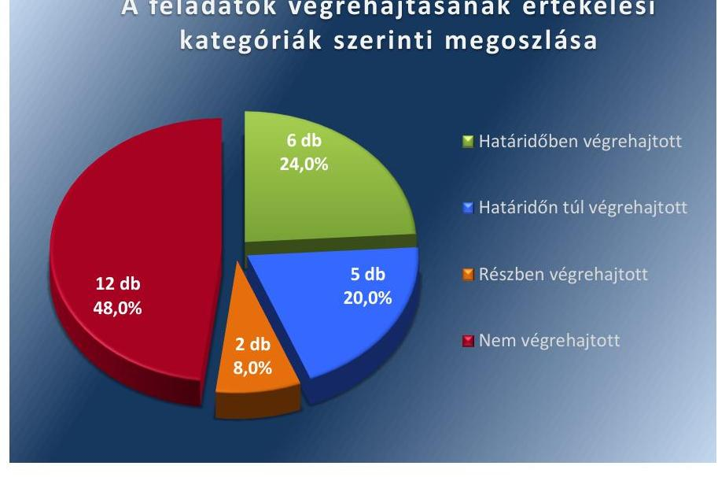

ÁLLAMI
SZÁMVEVŐSZÉK

# Jelentés 

## Utóellenőrzések

Somogygeszti Község Önkormányzata belső kontrollrendszere kialakításának, egyes kontrolltevékenységek és a belső ellenőrzés működésének utóellenőrzése
2016.

---

# Jelentés 

## Utóellenőrzések

Somogygeszti Község Önkormányzata belső kontrollrendszere kialakításának, egyes kontrolltevékenységek és a belső ellenőrzés múködésének utóellenőrzése
2016. 07. hó 15. nap

---

# AZ ELLENŐRZÉST FELÜGYELTE: 

DR. BENEDEK MÁRIA felügyeleti vezető

## AZ ELLENŐRZÉST VEZETTE ÉS A VÉGREHAJTÁSÁÉRT FELELŐS:

BENCSIK ÁRPÁD ellenőrzésvezető

## A PROGRAM ÖSSZEÁLLÍTÁSÁÉRT FELELŐS:

JANIK JÓZSEF LÁSZLÓ osztályvezető

## A TÉMÁHOZ KAPCSOLÓDÓ KORÁBBI SZÁMVEVŐSZÉKI JELENTÉSEK:

- címe: Somogygeszti Község Önkormányzata belső kontrollrendszerének kialakítása, valamint egyes kontrolltevékenységek és a belső ellenőrzés müködése ellenőrzéséről
- sorszáma: 13090

IKTATÓSZÁM: V-1079-037/2016
TÉMASZÁM: 2113
ELLENŐRZÉS-AZONOSÍTÓ SZÁM: V071717

---

# TARTALOMJEGYZÉK 

■ ÖSSZEGZÉS ..... 5
■ AZ ELLENŐRZÉS CÉLJA ..... 6
■ AZ ELLENŐRZÉS TERÜLETE ..... 7
■ AZ ELLENŐRZÉS HÁTTERE, INDOKOLTSÁGA ..... 8
■ A JELENTÉS LÉNYEGES KÉRDÉSKÖREI ..... 9
■ ELLENŐRZÉS HATÓKÖRE ÉS MÓDSZEREI ..... 10
■ MEGÁLLAPÍTÁSOK ..... 13
■ MELLÉKLETEK ..... 17
I. Sz. melléklet: Az ÁSZ 13027 számú jelentéséhez kapcsolódó intézkedési terv végrehajtása ..... 17
■ FÜGGELÉK: ÉSZREVÉTELEK ..... 23
■ RÖVIDÍTÉSEK JEGYZÉKE ..... 25

---

.

---

# ÖSSZEGZÉS 

Az ÁSZ ${ }^{1}$ az Önkormányzat² ${ }^{2}$ belső kontrollrendszerének kialakítása, valamint egyes kontrolltevékenységek és a belső ellenőrzés müködésének utóellenőrzését 2013. szeptember 24. és 2016. január 28. közötti időszakra végezte el. Megállapította, hogy az intézkedési tervben foglalt feladatok több, mint a felét az Önkormányzat nem hajtotta végre, így nem tett megfelelő lépéseket az ÁSZ által korábban feltárt, a belső kontrollrendszert érintő hiányosságok megszüntetésére, ami kockázatot hordoz az Önkormányzat szabályozásában, müködtetésének szabályosságában és a felelős vezetői magatartásban.

## Az ellenőrzés társadalmi indokoltsága

Az ÁSZ stratégiájában célul tűzte ki a számvevőszéki munka hasznosulásának javítását. Ezzel összhangban ellenőrzi, hogy az ellenőrzött szervezetek megvalósították-e a korábbi ellenőrzései által feltárt hibák, hiányosságok és szabálytalanságok megszüntetése céljából elkészített intézkedési terveikben foglaltakat. A rendszeres utóellenőrzések hozzájárulnak a szükséges intézkedések tényleges végrehajtáshoz, ezáltal a közpénzügyek rendezettségének javulásához.

## Főbb megállapítások, következtetések

A polgármester ${ }^{3}$ a Képviselő-testület ${ }^{4}$ által elfogadott intézkedési tervet ${ }^{5}$ határidőben megküldte az ÁSZ részére.
Az intézkedési tervben meghatározott 25 feladatból hatot határidőben, ötöt határidőn túl, kettőt részben, 12-t nem hajtottak végre. Így az ÁSZ által korábban az Önkormányzat belső kontrollrendszerének kialakítása, valamint az egyes kontrolltevékenységek és a belső ellenőrzés működésének területén azonosított hiányosságok jelentős része továbbra is fennáll.

Az intézkedési tervben rögzített feladatok végrehajtásáról a Bkr. ${ }^{6}$ által előírt nyilvántartást nem vezették.

---

# AZ ELLENŐRZÉS CÉLJA 

Az ellenőrzés célja annak értékelése volt, hogy a számvevőszéki jelentésben ${ }^{7}$ foglalt intézkedést igénylő megállapításokkal és javaslatokkal összhangban készített intézkedési tervben meghatározott feladatokat az ellenőrzött szervezet végrehajtotta-e.

---

# AZ ELLENŐRZÉS TERÜLETE 

## Az Önkormányzat

Somogygeszti település Somogy megyében, a Kaposvári járásban fekszik, állandó lakosainak száma a $\mathrm{KSH}^{8}$ által közzétett népességi adatok szerint 2015. január 1-jén 467 fő volt. Az utóellenőrzés idején hivatalban lévő polgármester a 2009. október 18-án tartott időközi polgármester választás óta tölti be tisztségét, a jegyző ${ }^{9}$ 2012. január 1-jétől látja el közszolgálati feladatait. Az Önkormányzat gazdálkodási feladatait a Hivatal ${ }^{10}$ látja el.

Az Önkormányzat a 2014. évi éves költségvetési beszámoló szerint 105,5 millió Ft költségvetési bevételt ért el, valamint 67,7 millió Ft költségvetési kiadást teljesített. Az eszközvagyon értéke 2014. december 31-én 169,8 millió Ft volt.

Az ÁSZ a 2013. évben ellenőrizte az Önkormányzat belső kontrollrendszerének kialakítását, valamint egyes kontrolltevékenységek és a belső ellenőrzés múködését, az erről szóló 13090. számú jelentését 2013. szeptember 24-én tette közzé. Az ellenőrzés célja annak értékelése volt, hogy az Önkormányzat a jogszabályi előírásoknak megfelelően alakította-e ki a belső kontrollrendszert, megfelelően múködtette-e a gazdálkodás folyamatában kulcsszerepet betöltő szakmai teljesítésigazolás és utalvány ellenjegyzés kontrollokat, biztosította-e a belső ellenőrzés szabályos és eredményes múködését.

Az utóellenőrzés - a 2013. szeptember 24-től a 2016. január 28-ig végrehajtott intézkedéseket figyelembe véve - a polgármester és a jegyző részére megfogalmazott javaslatok hasznosulása céljából készített, az ÁSZ részére megküldött intézkedési terv végrehajtásának ellenőrzésére terjedt ki.

---

# AZ ELLENŐRZÉS HÁTTERE, INDOKOLTSÁGA 

Az ÁSZ tv. ${ }^{11}$ 33. § (1) bekezdése értelmében a számvevőszéki jelentések intézkedést igénylő megállapításaihoz és javaslataihoz kapcsolódóan az ellenőrzött szervezet vezetője intézkedési tervet köteles összeállítani, és az ÁSZ részére megküldeni. Az intézkedési tervben foglaltak megvalósítását az ÁSZ tv. 33. § (7) bekezdésében foglaltak alapján - az ÁSZ utóellenőrzés keretében ellenőrizheti. Az intézkedések megvalósulásának értékelése során az ÁSZ figyelembe veszi az ellenőrzött szervezetek működési feltételeiben, valamint a jogszabályi előírásokban bekövetkezett változásokat.

Az intézkedési tervekben foglalt feladatok hiányos, illetve késedelmes végrehajtása, valamint megvalósításának elmaradása azt mutatja, hogy az ellenőrzések során feltárt hibák, hiányosságok és szabálytalanságok megszüntetése nem kapott kellő hangsúlyt. Ez a szabályszerű működés és a felelős vezetői magatartás vonatkozásában kockázatot hordoz. E kockázatok feltárásával az ÁSZ utóellenőrzési rendszere fokozza a fegyelmet, és igazolja, hogy a közpénzzel való szabályos gazdálkodás felelőssége elől nem lehet kitérni.

## AZ UTÓELLENŐRZÉS VÁRHATÓ HASZNOSULÁSA

Az utóellenőrzés négy szinten hasznosulhat:
$\longrightarrow$ A társadalom szintjén az utóellenőrzés jelzi, hogy a számvevőszéki ellenőrzés megállapításainak van következménye: a hiányosságok megszüntetésére az ellenőrzött szervezet által meghatározott intézkedések végrehajtását is számon kéri az ÁSZ.
$\longrightarrow$ Az ellenőrzött terület szintjén az utóellenőrzés tájékoztatást nyújt a terület döntéshozóinak a hiányosságok kiküszöbölésének jó gyakorlatairól, ezzel lehetőséget biztosítva arra, hogy az ÁSZ ellenőrzési megállapításai, javaslatai a terület nem ellenőrzött szervezeteinek a működése során is hasznosuljanak.
$\longrightarrow$ Az ellenőrzött szervezet szintjén az utóellenőrzés feltárja, hogy a szervezet az intézkedések végrehajtásával hasznosította-e a korábbi ellenőrzési jelentésben a hiányosságok megszüntetése, illetve a kockázatok kezelése érdekében megfogalmazott javaslatokat.
$\longrightarrow$ Az ÁSZ szintjén az utóellenőrzés visszacsatolást ad az ellenőrzési jelentések hasznosulásáról, az intézkedések elmaradása vagy részleges megvalósulása a további ellenőrzésekhez kockázati jelzésként szolgál.

---

# A JELENTÉS LÉNYEGES KÉRDÉSKÖREI 

Az Önkormányzat az intézkedési tervben foglaltakat az elöirt határidőben végrehajtotta-e?

---

# ELLENŐRZÉS HATÓKÖRE ÉS MÓDSZEREI 

## Az ellenőrzés típusa

Megfelelőségi ellenőrzés

## Az ellenőrzött időszak

Az utóellenőrzés alapját képező ÁSZ jelentés közzétételének napjától (2013. szeptember 24.) az ellenőrzésről szóló kiértesítő levél keltének napjáig (2016. január 28.) tartó időszak.

## Az ellenőrzés tárgya

Az ÁSZ tv. 2011. július 1-jei hatálybalépését követően a számvevőszéki jelentésben foglalt intézkedést igénylő megállapításokkal és javaslatokkal összhangban - az Önkormányzat által - készített intézkedési tervben foglaltak végrehajtásának ellenőrzése.

Az ellenőrzés kiterjedt minden olyan körülményre és adatra, amely az ÁSZ jogszabályban meghatározott feladatainak teljesítéséhez, valamint a program végrehajtása folyamán felmerült újabb összefüggések feltárásához szükséges.

## Az ellenőrzött szervezet

Somogygeszti Község Önkormányzata

## Az ellenőrzés jogalapja

Az ÁSZ törvényben meghatározott feladatkörében ellenőrzi a központi költségvetés végrehajtását, az államháztartás gazdálkodását, az államháztartásból származó források felhasználását és a nemzeti vagyon kezelését.

Az ÁSZ tv. 1. § (3) bekezdése szerint az ÁSZ általános hatáskörrel végzi a közpénzekkel és az állami és önkormányzati vagyonnal való felelős gazdálkodás ellenőrzését.

Az ÁSZ tv. 33. § (7) bekezdése alapján az ÁSZ tv. 33. § (1)-(2) bekezdése szerinti intézkedési tervben foglaltak megvalósítását az ÁSZ utóellenőrzés keretében ellenőrizheti.

---

# Az ellenőrzés módszerei 

Az ÁSZ az ellenőrzést a nemzetközi standardokat irányadónak tekintve az ellenőrzési program ellenőrzési kérdései, az ellenőrzött időszakban hatályos jogszabályok, az ellenőrzés szakmai szabályok és módszertanok figyelembevételével ellenőrzéshez kapcsolódóan végezte.

Az ÁSZ az ellenőrzés ideje alatt az Önkormányzattal történő kapcsolattartást az ÁSZ SZMSZ ${ }^{12}$-ének vonatkozó előírásai alapján biztosította.

Az utóellenőrzés megállapításait elsősorban az ÁSZ rendelkezésére álló, valamint az ellenőrzött szervezetektől elektronikusan bekért dokumentumok alapozták meg.

Az ellenőrzési bizonyítékként felhasználható adatforrások közé tartoznak egyrészt a szakmai programban felsorolt adatforrások, másrészt minden - az ellenőrzés folyamán feltárt, az ellenőrzés szempontjából információt tartalmazó - dokumentum.

A pénzügyi folyamatokban kulcsszerepet betöltő kontrollokra vonatkozóan az intézkedési tervben foglalt feladatok végrehajtását az államháztartáson kívülre teljesített működési célú pénzeszközátadásoknál, az állományba nem tartozók megbízási díjainál, továbbá a külső szolgáltatók által végzett karbantartási, kisjavítási munkákkal kapcsolatos kifizetéseknél 10 elemú véletlen mintavétellel kiválasztott tételek alapján értékelte az ÁSZ. A kiválasztott tételek esetében azt ellenőrizte, hogy az Önkormányzat az intézkedési tervben meghatározott feladatok végrehajtása érdekében biz-tosította-e a jogszabályok és a belső szabályzatok előírásainak megfelelő múködtetést.

Az intézkedési tervekben előírt feladatoknak azok végrehajthatósága, illetve végrehajtása szempontjából az alábbiak szerint értékelte az ÁSZ:
"határidőben végrehajtott" a feladat, ha a teljesítés dokumentáltan, az intézkedési tervben előírt határidőben és tartalommal megtörtént;
"határidőn túl végrehajtott" a feladat, ha annak teljesítése az intézkedési tervben meghatározott módon, de az előírt határidőn túl történt meg;
"részben végrehajtott" a feladat, ha végrehajtása teljes körűen az intézkedési tervben előírt módon nem történt meg;
"nem végrehajtott" a feladat, ha a végrehajtás nem történt meg, vagy amennyiben a teljesítést nem dokumentálták;
"okafogyottá vált" a feladat, ha végrehajtására - meghatározott esemény bekövetkezése, továbbá külső körülmény, a múködést érintő feltétel változása miatt - már nincs szükség, illetve lehetőség, és egyértelmúen megállapítható, hogy az intézkedést szükségessé tevő körülmény a jövőben nem fordulhat elő;
"nem időszerü" az a feladat, amelynek ellenőrzési időszakon belüli végrehajtására azért nem került (kerülhetett) sor, mert az intézkedés alapjául szolgáló esemény nem következett be, de annak jövőbeni előfordulása lehetséges, a végrehajtása nem volt esedékes, vagy a végrehajtás határideje még nem járt le.
Az ellenőrzés lefolytatásához az Önkormányzat a tanúsítványok elektronikus kitöltésével, valamint az ÁSZ által kért dokumentumok elektronikus

---

megküldésével szolgáltatott adatokat, amelyek valódiságát és teljes körűségét a polgármester és a jegyző által tett teljességi és hitelességi nyilatkozat igazolta. Az így rendelkezésre bocsátott adatok, információk kontrollja az ellenőrzés keretében történt.

---

# MEGÁLLAPÍTÁSOK 

## Az Önkormányzat az intézkedési tervben foglaltakat az előírt határidőben végrehajtotta-e?

Összegző megállapítás

Az Önkormányzat az intézkedési tervben meghatározott 25 feladatból hatot határidőben, ötöt határidőn túl, kettőt részben, 12-t pedig nem hajtott végre. Az intézkedési tervben rögzített feladatok végrehajtásáról a Bkr. által előírt nyilvántartást nem vezették.

Az intézkedési tervben meghatározott feladatokat, határidőket, az ÁSZ jelentés javaslatainak címzettjét és a feladatok végrehajtását az I. számú melléklet mutatja be.

Az ÁSZ a jelentésében a polgármester részére három, a jegyző részére 22 javaslatot fogalmazott meg. A polgármester által összeállított és az ÁSZ részére megküldött intézkedési tervben a hiányosságok, szabálytalanságok megszüntetésére 25 feladatot határoztak meg. A feladatok elvégzésének felelőseként három esetben a polgármestert, 22 esetben pedig a jegyzőt jelölték meg.

Az intézkedési tervben tervezett feladatok végrehajtásának értékelési kategóriák szerinti megoszlását az 1. ábra szemlélteti.

1. ábra

A feladatok végrehajtásának értékelési kategóriák szerinti megoszlása

Forrás: ÁSZ

---

# HATÁRIDŐBEN VÉGREHAJTOTT feladatok: 

1. A jegyző 2013. január 23-án elkészítette a Hivatal szervezeti és müködési szabályzatát ${ }^{13}$, amelyben szabályozta a Hivatal tevékenységeire vonatkozó beszámolási eljárásokat.
2. A jegyző a 2014. február 5-étől hatályos intézkedésében előírta a kötelezettségvállalásra, a pénzügyi ellenjegyzésre, a teljesítés igazolására, az érvényesítésre és az utalványozásra jogosult személyek aláírás mintájára vonatkozó naprakész nyilvántartás vezetésének szabályait.
3. A jegyző intézkedett az adatvédelemre és az adatbiztonságra vonatkozó Informatikai Biztonsági Szabályzat elkészítéséről, amely az 1/2014. számú jegyzői utasítással 2014. január 1-jétől volt hatályos.
4. A jegyző a 2014. január 1-jétől hatályos Informatikai Biztonsági Szabályzatban gondoskodott az adatok biztonságáról, kialakította azokat az eljárási szabályokat, amelyek az adat- és titokvédelmi szabályok érvényre juttatásához szükségesek, intézkedésekkel biztosította az adatok védelmét.
5. A jegyző intézkedése alapján a belső ellenőrzési vezető az ellenőrzött időszakban a Bkr.-ben meghatározott tartalmú nyilvántartást a belső ellenőrzésekről vezette.
6. A jegyző a 2013. március 28 -ától és a 2014. november 1 -jétől hatályos - az Önkormányzatra is kiterjesztett - hivatali gazdálkodással kapcsolatos kötelezettségvállalás, utalványozás, érvényesítés és ellenjegyzés hatásköri rendjében a Hivatal kiadásai tekintetében, mint kötelezettségvállaló kijelölte a teljesítés igazolására jogosultakat, továbbá az Önkormányzat és a Hivatal tekintetében az érvényesítési feladatok ellátására jogosult személyeket.

## HATÁRIDŐN TÚL VÉGREHAJTOTT feladatok:

7. A jegyző az intézkedési tervben előírt 2014. február 28-ai határidőt túllépve 2014. április 28-án elkészítette az Önkormányzatra is kiterjesztett számviteli politikát, számlarendet és értékelési szabályzatot, illetve a házipénztár- és pénzkezelési szabályzatot. A számviteli politika és értékelési szabályzat 2014. május 1-jétől, a házi-pénztár- és pénzkezelés szabályzat 2014. május 15-étől volt hatályos.
8. A jegyző az intézkedési tervben előírt 2014. február 28-ai határidőt túllépve 2014. április 28-án elkészítette a Számv. tv. ${ }^{14}$ szerinti eszközök és források leltárkészítési és leltározási szabályzatát, amely 2014. május 1-jétől volt hatályos.
9. A jegyző az intézkedési tervben előírt 2014. február 28-ai határidőt túllépve 2014. április 28-án elkészítette az ellenőrzési nyomvonalat és a szabálytalanságok kezelésének eljárásrendjét a „Folyamatba épített előzetes és utólagos vezetői ellenőrzés rendszere" című szabályzat részeként. A szabályzatok 2014. május 1-jétől voltak hatályosak.
10. A jegyző az intézkedési tervben előírt 2014. február 28-ai előírt határidőn túl elkészítette a 2014. május 1-jétől hatályos „Folyamatba

---

épített előzetes és utólagos vezetői ellenőrzés rendszere" című szabályzatot, amelyben meghatározta minden tevékenységre vonatkozóan a folyamatba épített, előzetes, utólagos és vezetői ellenőrzést.
11. A jegyző az intézkedési tervben előírt 2014. február 28-ai határidőn túl 2014. április 28-án készítette el a közérdekű adatok megismerésére irányuló kérelmek intézésének, továbbá a kötelezően közzéteendő adatok nyilvánosságra hozatalának rendjéről szóló szabályzatot, amelyben meghatározta a kötelezően közzéteendő adatok nyilvánosságra hozatalának és a közérdekű adatok megismerésére irányuló igények teljesítésének rendjét. A szabályzat 2014. május 1-jétől volt hatályos.

# RÉSZBEN VÉGREHAJTOTT feladatok: 

12. A jegyző az intézkedési tervben előírt 2014. február 28-ai határidőn túl 2014. április 28-án készítette el a „Folyamatba épített elözetes és utólagos vezetői ellenőrzés rendszere" című szabályzat részeként a Kockázatkezelési szabályzatot. A kockázatkezelési szabályzat elkészítése ellenére a Bkr.-ben előírtaknak megfelelő kockázatkezelési rendszert nem működtette.
13. Az intézkedési tervben előírt 2013. november 30-ai határidőn túl először 2014. június 10-én, majd 2015. április 10-én elkészült belső ellenőrzési jelentések tartalmazták a Bkr. szerinti tartalmi elemeket, azonban ellenőrzési programot nem készítettek.

## NEM VÉGREHAJTOTT feladatok:

14. A jegyző az ellenőrzött időszakban nem gondoskodott arról, hogy az Önkormányzatra vonatkozó éves ellenőrzési terveket a Bkr.-ben előírtaknak megfelelően a jegyző írásos véleményének figyelembe vételével és az abban meghatározott tartalommal készítsék el.
15. A jegyző a Bkr. előírása ellenére az ellenőrzött időszakban nem alakított ki és nem működtetett olyan, a Hivatal tevékenységének, a célok megvalósításának nyomon követését biztosító rendszert, amely lehetővé tette volna az operatív tevékenység keretében megvalósuló folyamatos és eseti nyomon követést is.
16. A jegyző az ellenőrzött időszakban nem határozta meg az Mvtv. ${ }^{15}$ ben előírtak szerinti, az egészséget nem veszélyeztető és biztonságos munkavégzés követelményei megvalósításának módját.
17. A jegyző az ellenőrzött időszakban nem készítette el a Tvtv. ${ }^{16}$-ben előírtak szerinti tűzvédelmi szabályzatot.
18. A jegyző nem gondoskodott az ellenőrzött időszakban a Bkr.- ben előírt tartalmú éves ellenőrzési jelentés elkészítéséről, így annak Bkr.-ben előírtak szerinti, a zárszámadási rendelettervezettel egyidejű Képviselő-testület elé terjesztését nem kezdeményezte.
19. A polgármester nem biztosította, hogy az Áht.-ban előírtaknak megfelelően kötelezettségvállalásra - az Ávr. ${ }^{17}$-ben meghatározott kivételeket figyelembe véve - minden esetben a pénzügyi ellenjegyzés után, a pénzügyi teljesítés esedékességét megelőzően írás-

---

ban kerüljön sor, mivel az Ávr. előírása szerinti kötelezettségvállalás pénzügyi ellenjegyzésére, továbbá a kötelezettségvállalás írásba foglalására nem minden esetben került sor.
20. A polgármester - a jegyző által készítendő éves ellenőrzési jelentés hiányában - nem gondoskodott az ellenőrzött időszakban az éves ellenőrzési jelentésnek a Bkr. előírása szerinti Képviselő-testület elé terjesztéséről.
21. A polgármester nem gondoskodott az Önkormányzat gazdálkodása szabályszerűségének a Mötv. ${ }^{18}$ előírása szerinti figyelemmel kíséréséről, továbbá a belső kontrollrendszer kialakításával és múködésével összefüggésben feltárt hiányosságok, szabálytalanságok tekintetében az esetleges munkajogi felelősséggel kapcsolatos körülmények kivizsgálásáról.
22. A jegyző nem gondoskodott a teljesítésigazolás Ávr.-ben előírtak szerinti szabályszerű végrehajtásáról, mert az ellenőrzött bizonylatokon nem történt meg az Ávr. előírása szerinti teljesítésigazolás tényére történő utalás, nem szerepelt a teljesítés igazolás dátuma, továbbá ellenőrizhető okmányok hiányában a kiadások teljesítése jogosságának, összegszerűségének, az ellenszolgáltatást is magában foglaló kötelezettségvállalás esetében a szerződés, megrendelés teljesítésének ellenőrzését nem végezték el.
23. A jegyző nem gondoskodott az érvényesítés Ávr.-ben előírtak szerinti szabályos végrehajtásáról, mert az ellenőrzött dokumentumok alapján az Ávr. előírása szerinti, az összegszerűségnek, a fedezet meglétének és a megelőző ügymenetben az Áht., az Áhsz. ${ }^{19}$, az Ávr. előírásai és a belső szabályzatokban foglaltak betartásának ellenőrzését nem végezték el.
24. A jegyző az ellenőrzött időszakban nem gondoskodott a kötelezettségvállalások Ávr. előírása szerinti nyilvántartásáról, mivel a kötelezettségvállalási nyilvántartásba külön nem vezették fel a szerződéseket, csak a beérkező számlákat rögzítették. Az Ávr. előírása szerinti kötelezettségvállalás nyilvántartási szám feltüntetése az utalványrendeleten nem minden esetben történt meg.
25. A jegyző nem gondoskodott az Ávr. előírása szerinti, a kötelezettségvállalásra, a pénzügyi ellenjegyzésre, a teljesítés igazolásra, az érvényesítésre és az utalványozásra jogosult személyekről és aláírás-mintájukról naprakész nyilvántartás vezetéséről.

A jegyző az intézkedési tervben rögzített feladatok végrehajtásáról a Bkr. által előírt nyilvántartást nem vezette.

---

# MELLÉKLETEK

I. SZ. MELLÉKLET: AZ ÁSZ 13027 SZÁMÚ JELENTÉSÉHEZ KAPCSOLÓDÓ INTÉZKEDÉSI TERV VÉGREHAJTÁSA

|  Intézkedési terv alapján elvégzendő feladat | Az intézkedési tervben meghatározott határidő | Az ÁSZ 13090
sz. jelentése
javaslatának
címzettje | A feladatok végrehajtása  |
| --- | --- | --- | --- |
|  1. | 2. | 3. | 4.  |
|  Határidőben végrehajtott intézkedések |  |  |   |
|  1. A Bkr. 8. § (4) bekezdés c) pontjában előirtaknak megfelelően a Hivatal tevékenységeire vonatkozó beszámolási eljárások szabályozása. | 2014.02.28. | jegyző | A jegyző 2013. január 23-án elkészítette a Bkr. 8. § (4) bekezdés c) pontjában előirtaknak megfelelően a Hivatal szervezeti és müködési szabályzatát, amelyben szabályozta a Hivatal tevékenységeire vonatkozó beszámolási eljárásokat.  |
|  2. Az Ávr. 60. § (3) bekezdés előírásának megfelelő kötelezettségvállalásra, a pénzügyi ellenjegyzésre, a teljesítés igazolására, az érvényesítésre és az utalványozásra jogosult személyekre és aláírás-mintájukra vonatkozó naprakész nyilvántartás vezetése szabályainak rögzítése. | 2014.02.28. | jegyző | A jegyző a 2014. február 5-étől hatályos intézkedésében az Ávr. 60. § (3) bekezdés előírásának megfelelően előírta a kötelezettségvállalásra, a pénzügyi ellenjegyzésre, a teljesítés igazolására, az érvényesítésre és az utalványozásra jogosult személyek aláírás mintájára vonatkozó naprakész nyilvántartás vezetésének szabályait.  |
|  3. Az Info tv. ${ }^{20}$ 24. § (3) bekezdésében foglaltak alapján az adatvédelmi és adatbiztonsági szabályzat készítése. | 2014.02.28. | jegyző | A jegyző intézkedett az Info tv. 24. § (3) bekezdése szerinti adatvédelemre és az adatbiztonságra vonatkozó Informatikai Biztonsági Szabályzat elkészítéséről, amely a 1/2014. számú jegyzői utasítással 2014. január 1-jétől volt hatályos.  |
|  4. Az Info tv. 7. § (2)-(3) bekezdéseinek megfelelő intézkedések megtétele az eljárási szabályok kialakítására, amelyek biztosítják adat- és titokvédelmi szabályok érvényre juttatását; továbbá az adatok védelmét. | 2014.02.28. | jegyző | A jegyző a 2014. január 1-jétől hatályos Informatikai Biztonsági Szabályzatban gondoskodott az Info tv. 7. § (2)-(3) bekezdéseiben előirtaknak megfelelően az adatok biztonságáról, kialakította azokat az eljárási szabályokat, amelyek az adat- és titokvédelmi szabályok érvényre juttatásához szükségesek és intézkedésekkel biztosította az adatok védelmét.  |
|  5. Az elvégzett belső ellenőrzésekről vezetett nyilvántartást ellenőrzésvezető általi kialakítása a Bkr. 50. § -a szerinti tartalomnak megfelelően. | 2013.11.30. | jegyző | A jegyző intézkedése alapján az ellenőrzött időszakban a belső ellenőrzési vezető a Bkr. 50. § -a szerinti tartalmú nyilvántartást a belső ellenőrzésekről vezette.  |
|  6. Minden gazdasági esemény vonatkozásában a teljesítésigazolásra és az érvényesítésre jogosult személyek az Ávr. 57. § (4) bekezdésében | azonnal | jegyző | A jegyző 2013. március 28-ától és 2014. november 1-jétől hatályba léptette - az Önkormányzatra is kiterjesztett - hivatali gazdálkodással kapcsolatos kötelezettségvállalás, utalványozás, érvényesítés és ellenjegyzés hatáskori rendjét, amelyben a Hivatal kiadásai tekintetében, mint kötelezettségvállaló az Ávr. 57. § (4) bekezdésében és az Ávr. 58. § (4) bekezdésében foglaltak  |

---

|  1. | 2. | 3. | szerint kijelölte a teljesítés igazolására és az érvényesítési feladatok ellátására jogosult személyeket.  |
| --- | --- | --- | --- |
|  4. |  |  | szerint kijelölte a teljesítés igazolására és az érvényesítési feladatok ellátására jogosult személyeket.  |
|  7. | A Htv. ${ }^{21}$ 140. § (1) bekezdés c) pontja alapján a Számv. tv 14. § (11) bekezdése szerint elkészített és aktualizált számviteli rend, ezen belül a Számv. tv. 14. § (3) bekezdésének és az Áhsz. 8. § (3) bekezdésének megfelelő a számviteli politika, a Számv. tv. 14. § (5) bekezdés b) és d) pontjaiban és az Áhsz. 8. § (4) bekezdés b) és d) pontjaiban foglalt előírásnak megfelelő az értékelési és a pénzkezelési szabályzat, illetve a Számv. tv. 161. § (1) es (2) bekezdései és az Áhsz. 49. § (1) és (6) bekezdése előírásának megfelelő a számlarend Önkormányzatra kiterjedő elkészítése. | 2014.02.28. | jegyző | A jegyző az intézkedési tervben előírt 2014. február 28-ai határidőt túllépve 2014. április 28-án elkészítette a Számv. tv 14. § (3) bekezdése, a Számv. tv. 14. § (5) bekezdés b) és d) pontjai, a Számv. tv. 161. § (1) es (2) bekezdés előírása szerint az Önkormányzatra is kiterjesztett számviteli politikát, számlarendet és értékelési szabályzatot, illetve a házipénztár- és pénzkezelési szabályzatot. A számviteli politika és értékelési szabályzat 2014. május 1-jétől, a házipénztár- és pénzkezelési szabályzat 2014. május 15-étől volt hatályos.  |
|  8. | A Számv. tv. 14. § (5) bekezdés a) pontjában és az Áhsz. 8. § (4) bekezdés a) pontjában foglalt előírásnak megfelelő az eszközök es források leltárkészítési és leltározási szabályzatának elkészítése. | 2014.02.28. | jegyző | A jegyző az intézkedési tervben előírt 2014. február 28-ai határidőt túllépve 2014. április 28-án elkészítette a Számv. tv. 14. § (5) bekezdés a) pontjában előírtak szerinti eszközök és források leltárkészítési és leltározási szabályzatát, amely 2014. május 1-jétől volt hatályos.  |
|  9. | Az ellenőrzési nyomvonal, illetve a szabálytalanságok kezelésének eljárásrendjének a Bkr 6. § (3)-(4) bekezdéseiben foglaltak szerint elkészítése. | 2014.02.28. | jegyző | A jegyző az intézkedési tervben előírt 2014. február 28-ai határidőt túllépve 2014. április 28-án elkészítette a Bkr. 6. § (3)-(4) bekezdéseiben foglaltak szerint az ellenőrzési nyomvonalat és a szabálytalanságok kezelésének eljárás rendjét a „Folyamatba épített előzetes és utólagos vezetői ellenőrzés rendszere" című szabályzat részeként. A szabályzatok 2014. május 1-jétől voltak hatályosak.  |
|  10. | Minden tevékenységre vonatkozóan a folyamatba épített, előzetes, utólagos és vezetői ellenőrzés kiterjesztése a Bkr. 8. § (2) bekezdése szerinti biztosítása. | 2014.02.28. | jegyző | A jegyző az intézkedési tervben előírt 2014. február 28-ai előírt határidőn túl elkészítette a 2014. május 1-jétől hatályos „Folyamatba épített előzetes és utólagos vezetői ellenőrzés rendszere" című szabályzatot, amelyben a Bkr. 8. § (2) bekezdés előírása szerint meghatározta minden tevékenységre vonatkozóan a folyamatba épített, előzetes, utólagos és vezetői ellenőrzést.  |

---

|  1. | 2. | 3. | 4.  |
| --- | --- | --- | --- |
|  11. | Az Info tv. 35. § (3) bekezdésében előírtak szerint a kötelezően közzéteendő adatok nyilvánosságra hozatala rendjének elkészítése és az Info tv. 30. § (6) továbbá az Ávr. 13. § (2) bekezdés h) pontjában foglaltak szerint a közérdekű adatok megismerésére irányuló igények meghatározása. | 2014.02.28. | jegyző  |

|  2014.02.28. | jegyző | A jegyző az intézkedési tervben előírt 2014. február 28-ai határidőn túl 2014. április 28-án készítette el a közérdekű adatok megismerésére irányuló kérelmek intézésének, továbbá a kötelezően közzéteendő adatok nyilvánosságra hozatalának rendjéről szóló szabályzatot, amelyben az Info tv. 35. § (3) bekezdésében előírtak szerint meghatározta a kötelezően közzéteendő adatok nyilvánosságra hozatalának és az Info tv. 30. § (6) bekezdésében, továbbá az Ávr. 13. § (2) bekezdés h) pontjában foglaltak szerint a közérdekű adatok megismerésére irányuló igények teljesítésének rendjét. A szabályzat 2014. május 1-jétől volt hatályos.  |
| --- | --- | --- | --- |
|  Részben végrehajtott intézkedés |  |  |   |
|  12. | A Bkr. 3. § b) pontja és a 7. §-a szerinti kockázatkezelési rendszer kialakítása és működtetése. | 2014.02.28. | jegyző  |
|  13. | Az ellenőrzési programok a Bkr. 33. § (2) bekezdésében foglalt, a jelentések pedig a Bkr. 39. § (3) bekezdésében foglalt tartalmi elemekkel történő elkészítésének biztosítása. | 2013.11.30. | jegyző  |
|  Nem végrehajtott feladat: |  |  |   |
|   |  |  | A jegyző a szabályzat elkészítése ellenére a kockázatkezelési rendszer Bkr. 7. §-ában előírtak szerinti működtetését nem biztosította.  |
|   |  |  | 2013.11.30.  |
|  14. | Az éves ellenőrzési terv a Bkr. 56. § (2) és a Bkr. 29. § (1) bekezdés előírásainak megfelelően a jegyző írásos véleményének figyelembevételével történő elkészítése, a Bkr. 31. § (4) bekezdésében meghatározott tartalommal. | 2013.11.30. | jegyző  |

|  2013.11.30. | jegyző | A jegyző az ellenőrzött időszakban nem gondoskodott arról, hogy az Önkormányzatra vonatkozó éves ellenőrzési tervet a Bkr. 56. § (2) bekezdés előírásainak megfelelően a jegyző írásos véleményének figyelembe vételével és a Bkr. 31. § (4) bekezdésében meghatározott tartalommal készítsék el. | |

---

|  1. | 2. | 3. | 4.  |
| --- | --- | --- | --- |
|  15. | A Bkr. 3. § e) pontjában és a 10. §-ában előírtaknak megfelelően a hivatal tevékenységének, a célok megvalósításának nyomon követését biztosító rendszer kialakítása és működtetése, amelynek része az operatív tevékenységek keretében megvalósuló folyamatos és eseti nyomon követés is | 2014.02.28. | jegyző  |
|  16. | Az egészséget nem veszélyeztető és biztonságos munkavégzés követelményei meghatározása az Mvtv. 2. § (3) bekezdése szerint. | 2014.02.28. | jegyző  |
|  17. | A tűzvédelmi szabályzat a Tvtv. 19. § (1) bekezdésében foglalt előírásoknak megfelelő elkészítése. | 2014.02.28. | jegyző  |
|  18. | Az éves ellenőrzési jelentés a Bkr. 56. § (8) bekezdése alapján a zárszámadási rendelettervezettel egyidejűleg a Képviselő-testület felé történő előterjesztésének kezdeményezése a jegyző részéről. | 2013.11.30. | jegyző  |
|  19. | Az Önkormányzat nevében történő kötelezettségvállalás szabályszerű biztosítása az Áht. 37. § (1) bekezdésében foglaltaknak megfelelően a pénzügyi ellenjegyzés után, a pénzügyi teljesítés esedékességét megelőzően, írásban kerüljön sor. | 2013. október 16. | polgármester  |
|  20. | A Bkr. 56. § (8) bekezdésében foglaltak szerint az éves ellenőrzési jelentés a zárszámadási rendelettervezettel egyidejűleg a polgármester által a Képviselő-testület elé történő terjesztése. | 2013. október 16. | polgármester  |

---

|  1. | 2. | 3. | 4.  |
| --- | --- | --- | --- |
|  21. | A Mótv 115. § (1) bekezdésében foglaltak alapján az önkormányzat gazdálkodása szabályszerűségének figyelemmel kísérése.
A Mótv. 67. § f) pontja alapján a belső kontrollrendszerre és a belső ellenőrzés működésére vonatkozó jogszabályi rendelkezések be nem tartása, valamint a szakmai teljesítésigazolás, illetve az utalvány ellenjegyzés kontrollokkal öszszefüggésben feltárt hiányosságok, szabálytalanságok tekintetében az esetleges munkajogi felelősséggel kapcsolatos körülmények kivizsgálásának lefolytatása, majd a vizsgálat eredményinek függvényében a szükséges munkajogi intézkedések megtétele. | 2013. október 16. | polgármester  |
|  22. | Annak biztosítása, hogy a teljesítésigazolás során az Ávr. 57. § (1) bekezdésében előírtaknak megfelelően, ellenőrizhető okmányok alapján legyen ellenőrizve és igazolva a kiadások teljesítésének jogossága, összegszerűsége, az ellenszolgáltatást is magában foglaló kötelezettségvállalás esetén a szerződés, megrendelés teljesítése, valamint az Ávr. 57. § (3) bekezdése szerint a teljesítést az igazolás dátumának és a teljesítés tényére történő utalásának a megjelölésével, az arra jogosult személy aláírásával igazolja. | 2013. október 16. | jegyző  |

---

|  23. | Annak biztosítása, hogy a kifizetéseket megelőzően a teljesítésigazolás alapján - az Ávr. 57. § (3) bekezdése szerinti esetben annak hiányában is - az összegszerűségnek, a fedezet meglétének és a megelőző ügymenetben az új Áht., az Áhsz. az Ávr. előírásai és a belső szabályzatokban foglaltak betartásának az ellenőrzése az Ávr. 58. § (1) és (3) bekezdése szerint - történjen meg. | 2013. október 16. | jegyző | A jegyző nem gondoskodott az érvényesítés Ávr. 58. § (1) bekezdésében előírtak szerinti szabályos végrehajtásáról, mert az ellenőrzött dokumentumok alapján az összegszerűségnek, a fedezet meglétének és a megelőző ügymenetben az Áht., az Áhsz., az Ávr. előírásai és a belső szabályzatokban foglaltak betartásának ellenőrzését nem végezték el.  |
| --- | --- | --- | --- | --- |
|  24. | Annak biztosítása, hogy a kötelezettségvállalások nyilvántartását az Ávr. 56. §. (1) bekezdésében foglalt előírásoknak megfelelően vezessék és az utalványon, az Ávr. 59. §. (3) bekezdésében foglalt kötelező tartalmi elemeket feltüntessék. | 2013. október 16. | jegyző | A jegyző az ellenőrzött időszakban nem gondoskodott a kötelezettségvállalások Ávr. 56. §. (1) bekezdésében előírtak szerinti nyilvántartásáról, mert a kötelezettségvállalási nyilvántartásba külön nem vezették fel a szerződéseket, csak a beérkező számlákat rögzítették. Az Ávr. 59. §. (3) bekezdése szerinti kötelezettségvállalás nyilvántartási szám feltüntetése az utalványrendeleten nem minden esetben történt meg.  |
|  25. | Annak biztosítása, hogy az Ávr. 60. § (3) bekezdése alapján a kötelezettségvállalásra, pénzügyi ellenjegyzésre, teljesítés igazolásra, érvényesítésre, utalványozásra jogosult személyekről és aláírás-mintájukról a belső szabályzatban foglaltak szerint naprakész nyilvántartást vezessenek. | 2013. október 16. | jegyző | A jegyző nem gondoskodott az Ávr. 60. § (3) bekezdése szerinti, a kötelezettségvállalásra, pénzügyi ellenjegyzésre, teljesítés igazolásra, érvényesítésre, utalványozásra jogosult személyekről és aláírás-mintájukról naprakész nyilvántartás vezetéséről.  |

Forrás: ÁSZ által készített táblázat

---

# FÜGGELÉK: ÉSZREVÉTELEK 

A jelentéstervezetet a Számvevőszék 15 napos észrevételezésre megküldte az ellenőrzött szervezet vezetőjének az ÁSZ tv. 29. §* (1) bekezdése előírásának megfelelően.
Az ellenőrzött szervezet vezetője az ÁSZ tv. 29. § (2) bekezdésében foglalt észrevételezési jogával nem élt, a jelentéstervezetre észrevételt nem tett.

[^0]
[^0]:    * 29. § (1) Az Állami Számvevőszék az ellenőrzési megállapításait megküldi az ellenőrzött szervezet vezetőjének vagy az általa megbízott személynek, és annak, akinek személyes felelősségét állapította meg.
    (2) Az ellenőrzött szervezet vezetője és a felelősként megjelölt személy az ellenőrzés megállapításaira tizenöt napon belül írásban észrevételt tehet.
    (3) Az Állami Számvevőszék az észrevételre a beérkezésétől számított harminc napon belül írásban válaszol. A figyelembe nem vett észrevételeket köteles a jelentésben feltüntetni, és megindokolni, hogy azokat miért nem fogadta el.

---

.

---

# RÖVIDÍTÉSEK JEGYZÉKE 

${ }^{1}$ ÁSZ
${ }^{2}$ Önkormányzat
${ }^{3}$ polgármester
${ }^{4}$ Képviselő-testület
${ }^{5}$ intézkedési terv
${ }^{6}$ Bkr.
${ }^{7}$ számvevőszéki jelentés
${ }^{8} \mathrm{KSH}$
${ }^{9}$ jegyző
${ }^{10}$ Hivatal
${ }^{11}$ ÁSZ tv.
${ }^{12}$ SZMSZ
${ }^{13}$ hivatali SZMSZ
${ }^{14}$ Számv.tv.
${ }^{15}$ Mvtv.
${ }^{16}$ Tvtv.
${ }^{17}$ Ávr.
${ }^{18}$ Mötv.
${ }^{19}$ Áhsz.
${ }^{20}$ Info tv.
${ }^{21} \mathrm{Htv}$.

Állami Számvevőszék
Somogygeszti Község Önkormányzata
Somogygeszti Község Önkormányzatának polgármestere
Somogygeszti Község Önkormányzatának Képviselő-testülete
A képviselő-testület 91/2013. (X.16.) számú határozatával elfogadott intézkedési terv
370/2011. (XII. 31.) Korm. rendelet a költségvetési szervek belső
kontrollrendszeréről és belső ellenőrzéséről (hatályos 2012. január 1-jétől)
az ÁSZ 13090-as számú jelentése (Elérhető a www.asz.hu honlapon.)
Központi Statisztikai Hivatal
Mernyei Közös Önkormányzati Hivatal jegyzője
Mernyei Közös Önkormányzati Hivatal
2011. évi LXVI. törvény az Állami Számvevőszékről (hatályos 2011. július 1-jétől)

Szervezeti és Müködési Szabályzat
Hivatal szervezeti és Müködési Szabályzata, amely hatályos 2013. február 1-jétől, illetve 2014. május 1-jétől (Mernye Község Önkormányzata 7/2013. I.22.), illetve 56/2014. (IV.28.) önkormányzati határozatokkal elfogadva)
2000. évi C törvény a számvitelről (hatályos:2001. január 1-jétől)
1993. évi XCIII. törvény a munkavédelemről (hatályos: 1994. január 1-jétől)
1996. évi XXXI. törvény a tűz elleni védekezésről, a műszaki mentésről és a tűzoltóságról (hatályos: 1996. augusztus 1-jétől)
368/2011. (XII.31.) Korm. rendelet az államháztartási törvény végrehajtásáról (hatályos 2012. január 1-jétől)
2011. évi CLXXXIX törvény Magyarország helyi önkormányzatairól (hatályos: 2001. január 1-jétől)

249/2000. (XII.31.) Korm. rendelet az államháztartás szervezetei beszámolási és könyvvezetési kötelezettségeinek sajátosságairól (hatálytalan 2014. január 1-jétől)
2011. évi CXII. törvény az információs önrendelkezési jogról és az információszabadságról (hatályos: 2011. január 1-jétől)
1991. évi XX. törvény a helyi önkormányzatok és szerveik, a köztársasági megbízottak, valamint egyes centrális alárendeltségű szervek feladat- és hatásköréről (hatályos: 1991 július 23-ától)

---

ÁLLAMI SZÁMVEVŐSZÉK
1052 Budapest, Apáczai Csere János utca 10.
Levélcím: 1364 Budapest 4. Pf. 54
Telefon: +36 14849100 Telefax: +36 14849200
www.asz.hu