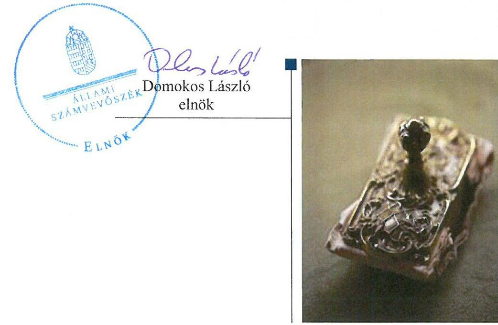
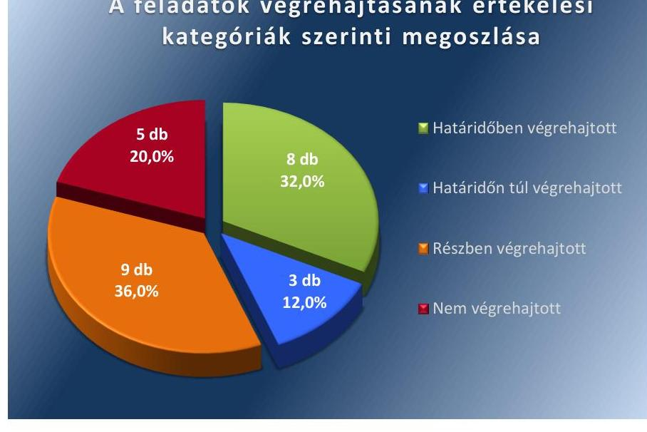

ÁLLAMI
SZÁMVEVŐSZÉK

# Jelentés 

## Utóellenőrzések

Szakály Község Önkormányzata belső kontrollrendszere kialakításának, egyes kontrolltevékenységek és a belső ellenőrzés működésének utóellenőrzése 2016.

---

# Jelentés 

## Utóellenőrzések

Szakály Község Önkormányzata belső kontrollrendszere kialakításának, egyes kontrolltevékenységek és a belső ellenőrzés működésének utóellenőrzése 2016. 07. hó 15. nap

---

# AZ ELLENŐRZÉST FELÜGYELTE: 

DR. BENEDEK MÁRIA felügyeleti vezető

## AZ ELLENŐRZÉST VEZETTE ÉS A VÉGREHAJTÁSÁÉRT FELELŐS:

BENCSIK ÁRPÁD ellenőrzésvezető

## A PROGRAM ÖSSZEÁLLÍTÁSÁÉRT FELELŐS:

JANIK JÓZSEF LÁSZLÓ osztályvezető

## A TÉMÁHOZ KAPCSOLÓDÓ KORÁBBI SZÁMVEVŐSZÉKI JELENTÉSEK:

- címe: Szakály Község Önkormányzata belső kontrollrendszerének kialakítása, valamint egyes kontrolltevékenységek és a belső ellenőrzés működése ellenőrzéséről
- sorszáma: $\quad 13036$

IKTATÓSZÁM: V-1080-032/2016
TÉMASZÁM: 2114
ELLENŐRZÉS-AZONOSÍTÓ SZÁM: V071718

---

# TARTALOMJEGYZÉK 

■ ÖSSZEGZÉS ..... 5
■ AZ ELLENŐRZÉS CÉLJA ..... 6
■ AZ ELLENŐRZÉS TERÜLETE ..... 7
■ AZ ELLENŐRZÉS HÁTTERE, INDOKOLTSÁGA ..... 8
■ A JELENTÉS LÉNYEGES KÉRDÉSKÖREI ..... 9
■ ELLENŐRZÉS HATÓKÖRE ÉS MÓDSZEREI ..... 10
■ MEGÁLLAPÍTÁSOK ..... 13
■ MELLÉKLETEK ..... 19
I. Sz. melléklet: Az ÁSZ 13027 számú jelentéséhez kapcsolódó intézkedési terv végrehajtása ..... 19
■ FÜGGELÉK: ÉSZREVÉTELEK ..... 27
■ RÖVIDÍTÉSEK JEGYZÉKE ..... 29

---

.

---

# ÖSSZEGZÉS 

Az ÁSZ ${ }^{1}$ az Önkormányzat² ${ }^{2}$ belső kontrollrendszerének kialakítása, valamint egyes kontrolltevékenységek és a belső ellenőrzés működésének utóellenőrzését 2013. május 28. és 2016. január 28. közötti időszakra végezte el. Megállapította, hogy az intézkedési tervben foglalt feladatok több, mint a felét az Önkormányzat nem hajtotta végre, így nem tett megfelelő lépéseket az ÁSZ által korábban feltárt, a belső kontrollrendszert érintő hiányosságok megszüntetésére, ami kockázatot hordoz az Önkormányzat szabályozásában, működtetésének szabályosságában és a felelős vezetői magatartásban.

## Az ellenőrzés társadalmi indokoltsága

Az ÁSZ stratégiájában célul tűzte ki a számvevőszéki munka hasznosulásának javítását. Ezzel összhangban ellenőrzi, hogy az ellenőrzött szervezetek megvalósították-e a korábbi ellenőrzései által feltárt hibák, hiányosságok és szabálytalanságok megszüntetése céljából kialakított intézkedési terveikben foglaltakat. A rendszeres utóellenőrzések hozzájárulnak a szükséges intézkedések tényleges végrehajtásához.

## Főbb megállapítások, következtetések

A polgármester ${ }^{3}$ a Képviselő-testület ${ }^{4}$ által elfogadott intézkedési tervet ${ }^{5}$ határidőben megküldte az ÁSZ részére.
Az intézkedési tervben meghatározott 25 feladatból nyolcat határidőben, hármat határidőn túl, kilencet részben, ötöt nem hajtottak végre. Így az ÁSZ által korábban az Önkormányzat belső kontrollrendszerének kialakítása, valamint az egyes kontrolltevékenységek és a belső ellenőrzés működésének területén azonosított hiányosságok jelentős része továbbra is fennáll.

Az intézkedési tervben rögzített feladatok végrehajtásáról a Bkr. ${ }^{6}$ által előírt nyilvántartást nem vezették.

---

# AZ ELLENŐRZÉS CÉLJA 

Az ellenőrzés célja annak értékelése volt, hogy a számvevőszéki jelentésben ${ }^{7}$ foglalt intézkedést igénylő megállapításokkal és javaslatokkal összhangban készített intézkedési tervben meghatározott feladatokat az ellenőrzött szervezet végrehajtotta-e.

---

# AZ ELLENŐRZÉS TERÜLETE 

## Az Önkormányzat

Szakály település Tolna megyében, a Tamási járásban fekszik, állandó lakosainak száma a $\mathrm{KSH}^{\circledR}$ által közzétett népességi adatok szerint 2015. január 1-jén 1352 fő volt. Az utóellenőrzés idején hivatalban lévő polgármester a 2010. évi önkormányzati választások óta tölti be tisztségét, a jegyző ${ }^{9}$ 2004. augusztus 6-tól látja el közszolgálati feladatait. Az Önkormányzat gazdálkodási feladatait a Hivatal ${ }^{10}$ látja el.

Az Önkormányzat a 2014. évi költségvetési beszámolója szerint 251,4 millió Ft költségvetési bevételt ért el, valamint 229,5 millió Ft költségvetési kiadást teljesített. Az eszközvagyon értéke 2014. december 31-én 1459,5 millió Ft volt.

Az ÁSZ a 2013. évben ellenőrizte az Önkormányzat belső kontrollrendszerének kialakítását, valamint egyes kontrolltevékenységek és a belső ellenőrzés működését, az erről szóló 13036. számú jelentését 2013. május 28-án tette közzé. Az ellenőrzés célja annak értékelése volt, hogy az Önkormányzat a jogszabályi előírásoknak megfelelően alakította-e ki a belső kontrollrendszert, megfelelően működtette-e a gazdálkodás folyamatában kulcsszerepet betöltő szakmai teljesítésigazolás és utalvány ellenjegyzés kontrollokat, biztosította-e a belső ellenőrzés szabályos és eredményes működését.

Az utóellenőrzés - a 2013. május 28-ától 2016. január 28-ig végrehajtott feladatokat figyelembe véve - a polgármester és a jegyző részére megfogalmazott javaslatok hasznosulása céljából készített, az ÁSZ részére megküldött intézkedési tervben foglalt feladatok megvalósításának ellenőrzésére, illetve értékelésére fókuszál.

---

# AZ ELLENŐRZÉS HÁTTERE, INDOKOLTSÁGA 

Az ÁSZ tv. ${ }^{11}$ 33. § (1) bekezdése értelmében a számvevőszéki jelentések intézkedést igénylő megállapításaihoz és javaslataihoz kapcsolódóan az ellenőrzött szervezet vezetője intézkedési tervet köteles összeállítani, és az ÁSZ részére megküldeni. Az intézkedési tervben foglaltak megvalósítását az ÁSZ tv. 33. § (7) bekezdésében foglaltak alapján - az ÁSZ utóellenőrzés keretében - ellenőrizheti. Az intézkedések megvalósulásának értékelése során az ÁSZ figyelembe veszi az ellenőrzött szervezetek működési feltételeiben, valamint a jogszabályi előírásokban bekövetkezett változásokat.

Az intézkedési tervekben foglalt feladatok hiányos, illetve késedelmes végrehajtása, valamint megvalósításának elmaradása azt mutatja, hogy az ellenőrzések során feltárt hibák, hiányosságok és szabálytalanságok megszüntetése nem kapott kellő hangsúlyt. Ez a szabályszerű működés és a felelős vezetői magatartás vonatkozásában kockázatot hordoz. E kockázatok feltárásával az ÁSZ utóellenőrzési rendszere fokozza a fegyelmet, és igazolja, hogy a közpénzzel való szabályos gazdálkodás felelőssége elől nem lehet kitérni.

## AZ UTÓELLENŐRZÉS VÁRHATÓ HASZNOSULÁSA

Az utóellenőrzés négy szinten hasznosulhat:
$\longrightarrow$ A társadalom szintjén az utóellenőrzés jelzi, hogy a számvevőszéki ellenőrzés megállapításainak van következménye: a hiányosságok megszüntetésére az ellenőrzött szervezet által meghatározott intézkedések végrehajtását is számon kéri az ÁSZ.
$\longrightarrow$ Az ellenőrzött terület szintjén az utóellenőrzés tájékoztatást nyújt a terület döntéshozóinak a hiányosságok kiküszöbölésének jó gyakorlatairól, ezzel lehetőséget biztosítva arra, hogy az ÁSZ ellenőrzési megállapításai, javaslatai a terület nem ellenőrzött szervezeteinek a működése során is hasznosuljanak.
$\longrightarrow$ Az ellenőrzött szervezet szintjén az utóellenőrzés feltárja, hogy a szervezet az intézkedések végrehajtásával hasznosította-e a korábbi ellenőrzési jelentésben a hiányosságok megszüntetése, illetve a kockázatok kezelése érdekében megfogalmazott javaslatokat.
$\longrightarrow$ Az ÁSZ szintjén az utóellenőrzés visszacsatolást ad az ellenőrzési jelentések hasznosulásáról, az intézkedések elmaradása vagy részleges megvalósulása a további ellenőrzésekhez kockázati jelzésként szolgál.

---

# A JELENTÉS LÉNYEGES KÉRDÉSKÖREI 

Az Önkormányzat az intézkedési tervben foglaltakat az előírt határidőben végrehajtotta-e?

---

# ELLENŐRZÉS HATÓKÖRE ÉS MÓDSZEREI 

## Az ellenőrzés típusa

Megfelelőségi ellenőrzés

## Az ellenőrzött időszak

Az utóellenőrzés alapját képező ÁSZ jelentés közzétételének napjától (2013. május 28.) az ellenőrzésről szóló kiértesítő levél keltének napjáig (2016. január 28.) tartó időszak.

## Az ellenőrzés tárgya

Az ÁSZ tv. 2011. július 1-jei hatálybalépését követően a számvevőszéki jelentésben foglalt intézkedést igénylő megállapításokkal és javaslatokkal összhangban - az Önkormányzat által - készített intézkedési tervben foglaltak végrehajtásának ellenőrzése.

Az ellenőrzés kiterjedt minden olyan körülményre és adatra, amely az ÁSZ jogszabályban meghatározott feladatainak teljesítéséhez, valamint a program végrehajtása folyamán felmerült újabb összefüggések feltárásához szükséges.

## Az ellenőrzött szervezet

Szakály Község Önkormányzata

## Az ellenőrzés jogalapja

Az ÁSZ törvényben meghatározott feladatkörében ellenőrzi a központi költségvetés végrehajtását, az államháztartás gazdálkodását, az államháztartásból származó források felhasználását és a nemzeti vagyon kezelését.

Az ÁSZ tv. 1. § (3) bekezdése szerint az ÁSZ általános hatáskörrel végzi a közpénzekkel és az állami és önkormányzati vagyonnal való felelős gazdálkodás ellenőrzését.

Az ÁSZ tv. 33. § (7) bekezdése alapján az ÁSZ tv. 33. § (1)-(2) bekezdése szerinti intézkedési tervben foglaltak megvalósítását az ÁSZ utóellenőrzés keretében ellenőrizheti.

---

# Az ellenőrzés módszerei 

Az ÁSZ az ellenőrzést a nemzetközi standardokat irányadónak tekintve az ellenőrzési program ellenőrzési kérdései, az ellenőrzött időszakban hatályos jogszabályok, az ellenőrzés szakmai szabályok és módszertanok figyelembevételével ellenőrzéshez kapcsolódóan végezte.

Az ÁSZ az ellenőrzés ideje alatt az Önkormányzattal történő kapcsolattartást az ÁSZ SZMSZ ${ }^{12}$-ének vonatkozó előírásai alapján biztosította.

Az utóellenőrzés megállapításait elsősorban az ÁSZ rendelkezésére álló, valamint az ellenőrzött szervezetektől elektronikusan bekért dokumentumok alapozták meg.

Az ellenőrzési bizonyítékként felhasználható adatforrások közé tartoznak egyrészt a szakmai programban felsorolt adatforrások, másrészt minden - az ellenőrzés folyamán feltárt, az ellenőrzés szempontjából információt tartalmazó - dokumentum.

A pénzügyi folyamatokban kulcsszerepet betöltő kontrollokra vonatkozóan az intézkedési tervben foglalt feladatok végrehajtását az államháztartáson kívülre teljesített működési célú pénzeszközátadásoknál, az állományba nem tartozók megbízási díjainál, továbbá a külső szolgáltatók által végzett karbantartási, kisjavítási munkákkal kapcsolatos kifizetéseknél 10 elemű véletlen mintavétellel kiválasztott tételek alapján értékelte az ÁSZ. A kiválasztott tételek esetében azt ellenőrizte, hogy az Önkormányzat az intézkedési tervben meghatározott feladatok végrehajtása érdekében biztosította-e a jogszabályok és a belső szabályzatok előírásainak megfelelő működtetést.

Az intézkedési tervekben előírt feladatokat, azok végrehajthatósága, illetve végrehajtása szempontjából az alábbiak szerint értékelte az ÁSZ:
"határidőben végrehajtott" a feladat, ha a teljesítés dokumentáltan, az intézkedési tervben előírt határidőben és tartalommal megtörtént;
"határidőn túl végrehajtott" a feladat, ha annak teljesítése az intézkedési tervben meghatározott módon, de az előírt határidőn túl történt meg;
"részben végrehajtott" a feladat, ha végrehajtása teljes körűen az intézkedési tervben előírt módon nem történt meg;
"nem végrehajtott" a feladat, ha a végrehajtás nem történt meg, vagy amennyiben a teljesítést nem dokumentálták;
"okafogyottá vált" a feladat, ha végrehajtására - meghatározott esemény bekövetkezése, továbbá külső körülmény, a működést érintő feltétel változása miatt - már nincs szükség, illetve lehetőség, és egyértelműen megállapítható, hogy az intézkedést szükségessé tevő körülmény a jövőben nem fordulhat elő;
"nem időszerű" az a feladat, amelynek ellenőrzési időszakon belüli végrehajtására azért nem került (kerülhetett) sor, mert az intézkedés alapjául szolgáló esemény nem következett be, de annak jövőbeni előfordulása lehetséges, a végrehajtása nem volt esedékes, vagy a végrehajtás határideje még nem járt le.
Az ellenőrzés lefolytatásához az Önkormányzat a tanúsítványok elektronikus kitöltésével, valamint az ÁSZ által kért dokumentumok elektronikus

---

megküldésével szolgáltatott adatokat, amelyek valódiságát és teljes körűségét az ellenőrzött szervezet vezetője által tett teljességi és hitelességi nyilatkozat igazolta. Az így rendelkezésre bocsátott adatok, információk kontrollja az ellenőrzés keretében történt.

---

# MEGÁLLAPÍTÁSOK 

## Az Önkormányzat az intézkedési tervben foglaltakat az előírt határidőben végrehajtotta-e?

Összegző megállapítás

Az Önkormányzat az intézkedési tervben meghatározott 25 feladatból nyolcat határidőben, hármat határidőn túl, kilencet részben, ötöt pedig nem hajtott végre. Az intézkedési tervben rögzített feladatok végrehajtásáról a Bkr. által előírt nyilvántartást nem vezették.

Az intézkedési tervben meghatározott feladatokat, határidőket, az ÁSZ jelentés javaslatainak címzettjét és a feladatok végrehajtását az I. számú melléklet mutatja be.

Az ÁSZ a jelentésében a polgármester részére négy, a jegyző részére 21 javaslatot fogalmazott meg. A polgármester által összeállított és az ÁSZ részére megküldött intézkedési tervben a hiányosságok, szabálytalanságok megszüntetésére 25 feladatot határoztak meg. A feladatok elvégzésének felelőseként négy esetben a polgármestert, 21 esetben pedig a jegyzőt jelölték meg.

Az intézkedési tervben tervezett feladatok végrehajtásának értékelési kategóriák szerinti megoszlását az 1. ábra szemlélteti.

1. ábra

A feladatok végrehajtásának értékelési kategóriák szerinti megoszlása

Forrás: ÁSZ

---

# HATÁRIDŐBEN VÉGREHAJTOTT feladatok: 

1. A jegyző a gazdasági program tervezetét előkészítette és az intézkedési tervben foglalt határidőn belül - 2013. július 18-án - kezdeményezte a polgármesternél annak Képviselő-testület elé terjesztését. A Képviselő-testület a 2013. szeptember 27-ei ülésén elfogadta az Önkormányzat gazdaságfejlesztési programját.
2. A jegyző a 2013. január 1-jétől, illetve a 2014. január 1-jétől hatályos Leltározási és leltárkészítési szabályzatban előírta a mérlegben kimutatott eszközök és források leltározási kötelezettségét.
3. A jegyző 2013. január 1-jén
 a Hivatal kiadási előirányzatai tekintetében írásban kijelölte a teljesítésigazolásra jogosult személyeket.
4. A jegyző gondoskodott arról, hogy a belső ellenőrzési vezető vezesse a Bkr.-ben foglaltak szerinti, a belső ellenőrzési jelentésekben tett megállapításokat, javaslatokat tartalmazó nyilvántartást. A nyilvántartásban szereplő megtett intézkedések leírásával, a határidőben nem végrehajtott feladat okának feltüntetésével a jegyző nyomon követte a megtett intézkedéseket.
5. A polgármester a jegyző munkaköri leírását 2013. július 10-én elkészítette.
6. A jegyző az ellenőrzött bizonylatok alapján gondoskodott a gazdasági események tartalmának megfelelő könyveléséről.
7. A jegyző elkészítette és a Képviselő-testület a 62/2013. (IX.27.) Kt. határozattal elfogadta a 2013. november 1-jétől hatályos adatvédelmi és adatbiztonsági szabályzatot.
8. A jegyző az Info. tv ¹³ előírásai szerinti adatvédelmi és adatbiztonsági szabályzatban kijelölte az adatfelelőst és az adatközlő személyt, valamint szabályozta az adatok közzétételi eljárásának, nyilvánosságra hozatalának rendjét. Az Ávr. ¹⁴-ben és az Info tv.-ben foglaltak szerint kialakította a közérdekű adatok megismerésére irányuló igények teljesítésének rendjét.

## HATÁRIDŐN TÚL VÉGREHAJTOTT feladatok:

9. A jegyző az intézkedési tervben meghatározott 2013. október 30-ai határidőt követően a 233/2014. (III.21.) számú intézkedésével alakította ki a Hivatal köztisztviselőire vonatkozó teljesítményértékeléssel kapcsolatos szabályokat a 2014. április 1-jétől hatályos Egységes Közszolgálati Szabályzatban. A minősítéseket és a teljesítményértékeléseket a jegyző elkészítette, amelyeket az elektronikus rendszerben a szabályzat hatályba léptetését követően rögzítették.
10. A jegyző az intézkedési tervben meghatározott 2013. október 30-ai határidőt követően a 2014. február 1-jétől hatályos Kockázatkezelési szabályzatban meghatározta a feltárt kockázatokkal kapcsolatban szükséges intézkedéseket, valamint azok teljesítésének folyamatos nyomon követési módját.
11. A polgármester a jegyző által elkészített és 2013. július 18-án átvett gazdasági program tervezetét az intézkedési tervben meghatározott 2013. szeptember 1-jét követően 2013. szeptember 27-én terjesztette a Képviselő-testület elé, amelyet az a 60/2013.(IX. 27.) Kt. határozatával fogadta el.

# RÉSZBEN VÉGREHAJTOTT feladatok:

12. A jegyző az adatvédelmi és adatbiztonsági szabályzatban az Info tv.-ben előírtaknak megfelelően biztosította az adatbiztonság érvényesülését, az informatikai környezet szabályozása keretében rendelkezett a hozzáférési jogosultságok betartásának és a hozzáférési jogosultság nyilvántartásának vezetése ellenőrzéséről. Azonban a szabályzat nem tartalmazta a pénzügyi, számviteli szoftverváltozások ellenőrzésére vonatkozó eljárásokat.

13. A jegyző a 2014. évben nem gondoskodott az ellenőrzési program Bkr.-ben foglaltak szerinti elkészítéséről. A 2015. évben az ellenőrzési tervben tervezett belső ellenőrzést a Bkr. előírásai szerinti tartalmú, 2015. október 13-án készült program alapján hajtották végre. A 2014. illetve a 2015. évi belső ellenőrzési jelentések tartalmazták a Bkr. előírásának megfelelően az ellenőrzésben közreműködő nevét és aláírását.

14. A 2014. évi belső ellenőrzési jelentések megállapításai és javaslatai alapján a jegyző a Bkr. előírása szerinti tartalommal 2014. szeptember 16-án elkészítette az intézkedési tervet, míg a 2015. évi belső ellenőrzési jelentések megállapításai és javaslatai alapján intézkedési tervet az ellenőrzött időszak végéig nem készítette el.

15. A jegyző az intézkedési tervben megjelölt 2013. október 30-ai határidőn belül – 2013. október 29-én – elkészítette a hivatali SZMSZ¹⁵-t, amely az Ávr.-ben foglaltaknak megfelelően tartalmazta az ellátandó és kormányzati funkció szerint besorolt alaptevékenységeket, az alaptevékenységet szabályozó jogszabályok megjelölését, és a szervezeti ábrát, a nevesített munkakörökhöz kapcsolódó hatásköröket és azok gyakorlásának módját, a felelősségi szabályokat, a helyettesítés rendjét. Azonban a hivatali SZMSZ-ben a jegyző nem határozta meg a Bkr.-ben foglaltak szerinti belső ellenőrzést végző személyek, vagy szervezeti egység jogállását és feladatait.

16. A jegyző az intézkedési tervben meghatározott 2013. október 15-i határidőt követően 2014. június 15-én elkészítette a 2014. július 1-jétől hatályos, a Bkr.-ben foglaltak szerinti ellenőrzési nyomvonalat¹⁶. Az ellenőrzési nyomvonalban gondoskodtak az operatív gazdálkodási jogkörök esetében a folyamatgazdák kijelöléséről, valamint a felelősségi és információs szintek és kapcsolatok meghatározásáról. Az ellenőrzési nyomvonal azonban nem tartalmazta a Bkr. előírása szerinti működési folyamathoz tartozó folyamatgazdát, valamint a felelősségi és információs szintek és kapcsolatok meghatározását a közbeszerzések, az uniós pályázatok és a civil szervezetek támogatása esetében.

17. A jegyző az intézkedési tervben meghatározott 2013. október 15-i határidőt követően a 2014. június 15-én elkészített és 2014. július 1-jétől hatályos ellenőrzési nyomvonalban a gazdálkodási és a közbeszerzési eljárások esetében meghatározta a folyamatba épített előzetes, utólagos és vezetői – FEUVE – ellenőrzést, azonban a szabályzatban nem határozta meg a beszerzési és vagyonhasznosítási tevékenységekre vonatkozó folyamatba épített előzetes, utólagos és vezetői ellenőrzést.
18. A jegyző az intézkedési tervben meghatározott határidőben - a 2013. január 1-jétől, illetve 2014. január 1-jétől hatályos Gazdálkodási szabályzatban - meghatározta a Bkr.-ben foglaltak szerinti a beszámolási eljárásokat. A Bkr.-ben előírt beszámolási eljárások nem fedték le a Hivatalban folyó, a hivatali SZMSZ-ben szereplő valamennyi tevékenységet.(Pl. az illetmény számfejtési és a munkaerő gazdálkodási, a műszaki, az adócsoport és a vagyongazdálkodási szakterületek.)
19. A jegyző a Hivatal tevékenységének, a célok megvalósításának nyomon követését biztosító rendszer kialakításáról részben gondoskodott. A nyomon követést biztosító rendszer a Hivatal pénzügyi, a gazdálkodási, a hatósági feladatokra terjedt ki, amelynek része volt az operatív tevékenység keretében megvalósuló folyamatos és eseti nyomon követés is. Azonban a jegyző nem dolgozta ki a Bkr.-ben foglaltak szerinti valamennyi szervezeti tevékenység folyamatos és eseti nyomon követésének rendjét. (Pl. beszerzés és a vagyonhasznosítás).
20. A belső ellenőrzési vezető a 2014. évi és a 2015. évi ellenőrzési tervet elkészítette és a jegyző kezdeményezésére a polgármester beterjesztette a Képviselő-testület elé, így a Képviselő-testület a Mötv. ¹⁷ és a Bkr. előírásainak megfelelően a tárgyévet megelőző december 31-ig elfogadta az éves ellenőrzési terveket. A jegyző az intézkedési tervben foglalt 2013. november 15-ét követő határidőn túl 2015. január 1-jén készítette el és léptette hatályba a Belső Ellenőrzési Kézikönyvet, amely tartalmazta az éves ellenőrzési tervre vonatkozó előírásokat. A jegyző azonban nem intézkedett a Bkr.-ben foglaltak szerinti stratégiai ellenőrzési tervkészítési kötelezettség teljesítése, továbbá az éves ellenőrzési tervek a Bkr. szerinti kockázatelemzéssel történő alátámasztása érdekében.

# NEM VÉGREHAJTOTT feladatok: 

21. A polgármester nem biztosította, hogy az Áht.-ban és a gazdálkodási szabályzatban előírtaknak megfelelően kötelezettségvállalásra - az Ávr.-ben meghatározott kivételeket figyelembe véve - minden esetben a pénzügyi ellenjegyzés után, a pénzügyi teljesítés esedékességét megelőzően írásban kerüljön sor, mivel az átalány szerződésben vállalt kötelezettségvállalás pénzügyi ellenjegyzése elmaradt, továbbá az államháztartáson kívülre nyújtott támogatás kifizetésére írásos kötelezettségvállalás és pénzügyi ellenjegyzés nélkül került sor.
22. A polgármester nem intézkedett a számvevőszéki jelentés megállapításai alapján a belső kontrollrendszerre és a belső ellenőrzés működésére vonatkozó jogszabályi rendelkezések be nem tartása, valamint a teljesítés igazolás, illetve az utalvány ellenjegyzés kontrollokkal összefüggésben a feltárt hiányosságok, szabálytalanságok tekintetében az esetleges munkajogi felelősséggel kapcsolatos körülmények kivizsgálásáról. Ugyan az intézkedési tervben meghatározott 2013. július 1-jei határidő előtt 2013. június 18-án a polgármester írásban utasította a jegyzőt az intézkedési terv intézkedéseinek nyomon követése és a feladatok teljesítése érdekében tájékoztatás adására, de a teljesítésről és nyomon követésről írásos beszámoló, vagy tájékoztatás nem készült. A belső kontrollok, kulcskontrollok hiányosságai, hibái miatt keletkezett károk, veszteségek kivizsgálására nem került sor.
23. A jegyző nem gondoskodott a teljesítésigazolás Ávr.-ben és a gazdálkodási szabályzatban foglaltak szerinti szabályszerű végrehajtásáról, mert a gazdálkodási szabályzatban kijelölt személy teljesítés igazolása az Ávr. előírása szerinti dátumot nem tartalmazta. Továbbá a teljesítésigazoló az Ávr.-ben előírt feladatát nem végezte el, mert ellenőrizhető okmányok hiányában a kiadások jogosságát, összegszerűségét nem ellenőrizte.
24. A jegyző nem gondoskodott az érvényesítés Ávr.-ben és a gazdálkodási szabályzatban előírtak szerinti szabályos végrehajtásáról, mert a gazdálkodási szabályzatban kijelölt érvényesítő az Ávr.-ben előírtak ellenére nem ellenőrizte, hogy a megelőző ügymenetben betartották-e az Áht. és az Ávr. előírásait. Az Ávr.-ben előírtak ellenére elmaradt az érvényesítés dátumának feltüntetése.
25. A jegyző nem intézkedett az Ávr.-ben és a gazdálkodási szabályzatban előírt kötelezettségvállalási nyilvántartás teljes körű vezetéséről, továbbá nem gondoskodott minden gazdasági esemény esetében az utalványrendeleteken az kötelezettségvállalás nyilvántartási számának Ávr. előírása szerinti feltüntetéséről.
A jegyző az ÁSZ javaslatai alapján készített intézkedési tervben rögzített feladatok végrehajtásáról a Bkr.-ben előírt nyilvántartást nem vezette.

# MELLÉKLETEK

I. SZ. MELLÉKLET: AZ ÁSZ 13027 SZÁMÚ JELENTÉSÉHEZ KAPCSOLÓDÓ INTÉZKEDÉSI TERV VÉGREHAJTÁSA

|  1. | Intézkedési terv alapján elvégzendő feladat | Az intézkedési tervben meghatározott határidő | Az ÁSZ 13036 sz. jelentése javaslatának címzettje | A feladatok végrehajtása  |
| --- | --- | --- | --- | --- |
|   | 1. | 2. | 3. | 4.  |
|  Határidőben végrehajtott intézkedések |  |  |  |   |
|  1. | A Htv. ¹⁸ 140. § (1) bekezdés a) pontjában foglaltak alapján a gazdasági program tervezetének a Mótv. 116. § (3)-(4) bekezdésében foglalt tartalommal történő előkészítése és a polgármesternél a Képviselő-testület elé terjesztésének kezdeményezése. | 2013. július 31. | jegyző | A jegyző a gazdasági program tervezetét a Htv. 140. § (1) bekezdés a) pontjában foglaltaknak megfelelően a Mótv. 116. § (3)-(4) bekezdésében foglalt tartalommal előkészítette és az intézkedési tervben foglalt határidőn belül - 2013. július 18-án - kezdeményezte a polgármesternél annak Képviselő-testület elé terjesztését. A Képviselő-testület a 2013. szeptember 27-ei ülésén elfogadta az Önkormányzat gazdaságfejlesztési programját.  |
|  2. | A leltározási szabályzatban a mérlegben kimutatott eszközök és források leltározási kötelezettségének az Áhsz ¹⁹. 37. § (1) bekezdésében és a vagyongazdálkodási rendelet 5. § (2) bekezdésében foglaltak szerinti előírása. | a jogszabály változások folyamatos figyelemmel kísérése | jegyző | A jegyző a 2013. január 1-jétől, illetve 2014. január 1-jétől hatályos Leltározási és leltárkészítési szabályzatban előírta a mérlegben kimutatott eszközök és források leltározási kötelezettségét.  |
|  3. | Az Ávr. 57. § (4) bekezdésében foglalt előírásnak megfelelően a teljesítés igazolására jogosult személyek kijelölése. | 2013. július 15-től folyamatos | jegyző | A jegyző a Hivatal kiadásait érintően 2013. január 1-jétől írásban kijelölte az Ávr. 57. § (4) bekezdésében foglaltaknak megfelelően a teljesítésigazolásra jogosult személyeket.  |
|  4. | A belső ellenőrzés a Bkr. 21. § (2) bekezdés d) pontja szerinti nyilvántartás vezetése - a Bkr. 47. § szerinti - és a belső ellenőrzési jelentések alapján megtett intézkedések nyomon követése. | 2014. január 1-től folyamatos | jegyző | A jegyző gondoskodott arról, hogy a belső ellenőrzési vezető vezesse a Bkr. 47. § (1)-(2) bekezdésében foglaltak szerinti, a belső ellenőrzési jelentésekben tett megállapításokat, javaslatokat tartalmazó nyilvántartást. A nyilvántartásban szereplő megtett intézkedések leírásával, a határidőben nem végrehajtott feladat okának feltüntetésével a jegyző nyomon követte a megtett intézkedéseket.  |
|  5. | A jegyző munkaköri leírásának elkészítése. | 2013. július 15. | Polgármester | A jegyző munkaköri leírását a polgármester 2013. július 10-én elkészítette. |

 Kttv. ${ }^{20}$ 43. § (3) bekezdésében foglaltak szerint.  |

---

|  5. |  |  |  |   |
| --- | --- | --- | --- | --- |
|  6. | A Számv. tv. 14.§ (3) bekezdése illetve az Áhsz. 8. §. (3-4) bekezdéseinek előírása alapján a gazdasági eseményeket tartalmuk szerinti könyvelése. | 2013. július 15. illetve folyamatos | jegyző | A jegyző az ellenőrzött bizonylatok alapján gondoskodott a Számv. tv. 14. §. (3) bekezdés előírásainak megfelelően arról, hogy a gazdasági eseményeket tartalmuknak megfelelően könyveljék. A 2013. január 1-től és 2014. január 1-től hatályos Számviteli politika ${ }_{1,2}$-ben szabályozta a gazdasági események tényleges tartalmának megfelelő elszámolás rendjét.  |
|  7. | Info tv. 24. § (3) bekezdése szerinti adatvédelmi és adatbiztonsági szabályzat elkészítése | 2013. október 30., illetve folyamatos | jegyző | A jegyző elkészítette és a Képviselő-testület a 62/2013. (IX.27) Kt. határozattal elfogadta a 2013. november 1-jétől hatályos, az Info tv. 24. § (3) bekezdésében előírtak szerinti adatvédelmi és adatbiztonsági szabályzatot.  |
|  8. | Az Info tv. 35. § (3) bekezdése szerinti közérdekű adatok közzétételi eljárásának, nyilvánosságra hozatalának rendje kialakítása, az adatfelelős, adatközlő személy kijelölése az Ávr 13. § (2) bekezdés h) pontjában foglaltak szerint, valamint az Info tv. 30. § (6) bekezdése szerinti közérdekű adatok megismerésére irányuló igények teljesítésének rendje kialakítása. | 2013. október 30., illetve folyamatos | jegyző | A jegyző az Info tv. 35. § (3) bekezdésében foglaltak szerinti adatvédelmi és adatbiztonsági szabályzatban kijelölte az adatfelelőst és az adatközlő személyt, valamint szabályozta az adatok közzétételi eljárásának, nyilvánosságra hozatalának rendjét. Az Ávr. 13. § (2) bekezdés h) pontjában foglaltak szerint, valamint az Info tv. 30. § (6) bekezdése előírása szerint kialakította a közérdekű adatok megismerésére irányuló igények teljesítésének rendjét.  |
|  9. | A Hivatal köztisztviselőire vonatkozó, teljesítményértékeléssel kapcsolatos szabályok kialakítása és alkalmazása a Kttv. 130. § (1)-(6) bekezdéseiben előírtak szerint. | 2013. október 30. | jegyző | A jegyző az intézkedési tervben meghatározott 2013. október 30-ai határidőt követően a 233/2014. (III.21.) számú intézkedésével a Kttv. 130. § (1)-(6) bekezdésében előírtak szerint alakította ki a Hivatal köztisztviselőire vonatkozó teljesítményértékeléssel kapcsolatos szabályokat a 2014. április 1-jétől hatályos Egységes Közszolgálati Szabályzatban. A minősítéseket és a teljesítményértékeléseket a jegyző elkészítette, amelyeket az elektronikus rendszerben a szabályzat hatályba léptetését követően rögzítették.  |
|  10. | A Bkr. 7. §-ában előírtak szerint a feltárt kockázatokkal kapcsolatban szükséges intézkedések kialakítása, valamint azok teljesítésének folyamatos nyomon követése módjának meghatározása. | 2013. október 30. | jegyző | A jegyző az intézkedési tervben meghatározott 2013. október 30-ai határidőt követően a 2014. február 1-jétől hatályos Kockázatkezelési szabályzatban meghatározta a Bkr. 7. §-ában előírtak szerint a feltárt kockázatokkal kapcsolatban szükséges intézkedéseket, valamint azok teljesítésének folyamatos nyomon követési módját.  |
|  11. | A Mötv. 116.§ által meghatározott hosszú távú fejlesztési elképzelések tervezetének a Képviselő-testület elé terjesztése. | 2013. szeptember 1. | Polgármester | A polgármester a jegyzőtől 2013. július 18-án átvette a Mötv. 116. §-ában előírtak szerint elkészített gazdasági program tervezetét, amelyet az intézkedési tervben meghatározott 2013. szeptember 1-jét követően 2013. szeptember 27-én terjesztette a Képviselő-testület elé. A Képviselő-testület a gazdasági programot a 60/2013.(IX. 27.) Kt. határozatával fogadta el.  |

---

|  1. | 2. | 3. | 4.  |
| --- | --- | --- | --- |
|  Részben végrehajtott intézkedés |  |  |   |
|  12. | Az Info tv. 7. § (2)-(3) bekezdésének megfelelő adatbiztonság érvényesülése, az informatikai környezet szabályozása keretében a hozzáférési jogosultságok betartásának ellenőrzése, a hozzáférési jogosultság nyilvántartásának vezetése, valamint a pénzügyi, számviteli szoftverváltozások ellenőrzésére vonatkozó jogosultsági eljárás szabályozása | 2013. október 30., illetve folyamatos | jegyző  |
|  13. | A Bkr. 33. § (2) bekezdésében foglaltaknak megfelelően előkészített, a belső ellenőrzési vezető által jóváhagyott ellenőrzési programok alapján az ellenőrzések végrehajtása, továbbá a jelentések a Bkr. 39. § (3) bekezdés m) pontjában foglaltak szerint az ellenőrzésben közreműködött ellenőrök nevének és aláírásának feltüntetése. | 2014. január 1., illetve a továbbiakban folyamatos | jegyző  |
|  14. | Intézkedési terv készítése a belső ellenőrzési jelentésekben megfogalmazott javaslatok végrehajtására a Bkr. 45. § (2)-(3) bekezdéseiben foglaltaknak megfelelő tartalommal és határidőn belül. | 2014. január 1. illetve a továbbiakban folyamatos | jegyző  |
|  15. | A hatályos hivatali SZMSZ az Ávr. 13. § (1) bekezdés c), e) és g) pontjaiban foglaltaknak megfelelően kiegészítése az ellátandó, és a szakfeladat rend szerint besorolt alaptevékenységekkel, az alaptevékenységeket szabályozó jogszabályok megjelölésével és a szervezeti ábrával, | 2013. október 30. | jegyző  |

|  2013. október 30., illetve
folyamatos | jegyző | Határidőben végrehajtott feladat:
A jegyző az adatvédelmi és adatbiztonsági szabályzatban az Info tv. 7. § (2)-(3) bekezdésében előírtaknak megfelelően biztosította az adatbiztonság érvényesülését, az informatikai környezet szabályozása keretében rendelkezett a hozzáférési jogosultságok betartásának és a hozzáférési jogosultság nyilvántartásának vezetése ellenőrzéséről.
Nem végrehajtott feladat:
A szabályzat azonban nem tartalmazta a pénzügyi, számviteli szoftverváltozások ellenőrzésére vonatkozó eljárásokat.  |
| --- | --- | --- |
|  2014. január 1., illetve a továbbiakban folyamatos | jegyző | Határidőben végrehajtott feladat
A 2015. évben az ellenőrzési tervben tervezett belső ellenőrzést a Bkr. 33. § (2) bekezdésében foglaltaknak megfelelő tartalmú, 2015. október 13-án készült ellenőrzési program alapján hajtották végre. A 2014., illetve a 2015. évi belső ellenőrzési jelentések tartalmazták a Bkr. 39. § (3) bekezdés m) pontjában foglaltaknak megfelelően az ellenőrzésben közreműködő nevét és aláírását.
Nem végrehajtott feladat:
A jegyző nem gondoskodott a 2014. évben az ellenőrzési program Bkr. 33. § (2) bekezdésében előírtak szerinti elkészítéséről.  |
|  2014. január 1. illetve a továbbiakban folyamatos | jegyző | Határidőben végrehajtott feladat:
A 2014. évi belső ellenőrzési jelentések megállapításai és javaslatai alapján a jegyző a Bkr. 45. § (2)-(3) bekezdésében foglaltak szerinti tartalommal 2014. szeptember 16-án elkészítette az intézkedési tervet.
Nem végrehajtott feladat:
A 2015. évi belső ellenőrzési jelentések megállapításai és javaslatai alapján az intézkedési tervet a Bkr. 45. § (1)-(3) bekezdésének előírásai ellenére az ellenőrzött időszakban nem készítette el.  |
|  2013. október 30. | jegyző | Határidőben végrehajtott feladat
A jegyző az intézkedési tervben megjelölt 2013. október 30-ai határidőn belül - 2013. október 29-én - elkészítette a hivatali SZMSZ-t, amely az Ávr. 13. § (1) bekezdés c), e) és g) pontjaiban foglaltaknak megfelelően tartalmazta az ellátandó és kormányzati funkció szerint besorolt alaptevékenységeket, az alaptevékenységet szabályozó jogszabályok megjelölését, és  |

---

|  1. | 2. | 3. | 4.  |
| --- | --- | --- | --- |
|  valamint nevesített munkakörökhöz kapcsolódó hatáskörökkel, a hatáskörök gyakorlásának módjával, a helyettesítés rendjével, az ezekhez kapcsolódó felelősségi szabályok meghatározásával, továbbá a Bkr. 15. § (2) bekezdésében foglaltak szerint a belső ellenőrzést végzők jogállásának és feladatainak előírásával. |  |  | a szervezeti ábrát, a nevesített munkakörökhöz kapcsolódó hatásköröket és azok gyakorlásának módját, a felelősségi szabályokat, a helyettesítés rendjét.
Nem végrehajtott feladat
A hivatali SZMSZ-ben a jegyző nem határozta meg a Bkr. 15. § (2) bekezdése szerinti belső ellenőrzést végző személyek, vagy szervezeti egység jogállását és feladatait.  |
|  16. | A Bkr. 6. § (3) bekezdésében előírtak érvényre juttatása érdekében az ellenőrzési nyomvonalban a folyamatgazdák kijelölése, valamint a felelősségi és információs szintek és kapcsolatok meghatározása. | 2013. október 15. – majd folyamatban | jegyző  |
|  17. | A Bkr. 8. § (2) bekezdése alapján – a gazdálkodási, a beszerzési és a vagyonhasznosítási tevékenység folyamatba épített, előzetes, utólagos és vezetői - FEUVE – ellenőrzésének biztosítása. | 2013. október 30. | jegyző  |
|  18. | A Bkr. 8. § (4) bekezdés c) pontjában foglaltaknak megfelelően a Hivatal tevékenységeire vonatkozó beszámolási eljárások kialakítása. | 2013. október 30. | jegyző  |

|  2013. október 15. – majd folyamatban | jegyző | Határidőn túl végrehajtott feladat:  |
| --- | --- | --- |
|   |  | A jegyző az intézkedési tervben meghatározott 2013. október 15-i határidőt követően a 2014. június 15-én elkészített, 2014. július 1-jétől hatályos ellenőrzési nyomvonalban a gazdálkodási és a közbeszerzési eljárások esetében meghatározta a folyamatba épített előzetes, utólagos és vezetői – FEUVE – ellenőrzést.
Nem végrehajtott feladat:  |
|   |  | A jegyző a szabályzatban nem határozta meg a beszerzési és vagyonhasznosítási tevékenységekre vonatkozó folyamatba épített előzetes, utólagos és vezetői ellenőrzést.  |
|  2013. október 30. | jegyző |   |

|  2013. október 30. | jegyző |   |
| --- | --- | --- |
|  |   |   |

|  2013. október 15. – majd folyamatban | jegyző |   |
| --- | --- | --- |
|  |   |   |

|  2013. október 30. | jegyző |   |
| --- | --- | --- |
|  |   |   |

|  2013. október 30. | jegyző |   |
| --- | --- | --- |
|  |   |   |

|  2013. október 15. – majd folyamatban | jegyző |   |
| --- | --- | --- |
|  |   |   |

|  2013. október 30. | jegyző |   |
| --- | --- | --- |
|  |   |   |

|  2013. október 30. | jegyző |   |
| --- | --- | --- |
|  |   |   |

|  2013. október 30. | jegyző |   |
| --- | --- | --- |
|  |   |   |

|  2013. október 30. | jegyző |   |
| --- | --- | --- |
|  |   |   |

|  2013. október 30. | jegyző |   |
| --- | --- | --- |
|  |   |   |

|  2013. október 30. | jegyző | 

  |
| --- | --- | --- |
|  |   |   |

|  2013. október 30. | jegyző |   |
| --- | --- | --- |
|  |   |   |

|  2013. október 30. | jegyző |   |
| --- | --- | --- |
|  |   |   |

|  2013. október 30. | jegyző |   |
| --- | --- | --- |
|  |   |   |

|  2013. október 30. | jegyző |   |
| --- | --- | --- |
|  |   |   |

|  2013. október 30. | jegyző |   |
| --- | --- | --- |
|  |   |   |

|  2013. október 30. | jegyző |   |
| --- | --- | --- |
|  |   |   |

|  2013. október 30. | jegyző |   |
| --- | --- | --- |
|  |   |   |

|  2013. október 30. | jegyző |   |
| --- | --- | --- |
|  |   |   |

|  2013. október 30. | jegyző |   |
| --- | --- | --- |
|  |   |   |

|  2013. október 30. | jegyző |   |
| --- | --- | --- |
|  |   |   |

|  2013. október 30. | jegyző |   |
| --- | --- | --- |
|  |   |   |

|  2013. október 30. | jegyző |   |
| --- | --- | --- |
|  |   |   |

|  2013. október 30. | jegyző |   |
| --- | --- | --- |
|  |   |   |

|  2013. október 30. | jegyző |   |
| --- | --- | --- |
|  |   |   |

|  2013. október 30. | jegyző |   |
| --- | --- | --- |
|  |   |   |

|  2013. október 30. | jegyző |   |
| --- | --- | --- |
|  |   |   |

|  2013. október 30. | jegyző |   |
| --- | --- | --- |
|  |   |   |

|  2013. október 30. | jegyző |   |
| --- | --- | --- |
|  |   |   |

---

|  19. | A Bkr. 10. §-ában előírtak alapján a Hivatal tevékenységének, a célok megvalósításának nyomon követését biztosító rendszer kialakítása, amelynek része az operatív tevékenységek keretében megvalósuló folyamatos és eseti nyomon követés is. | 2013. november 15. illetve folyamatos | jegyző | A feladatok végrehajtása  |
| --- | --- | --- | --- | --- |
|  20. | Az éves ellenőrzési terv Képviselő-testület elé terjesztéséről annak érdekében, hogy azt a Képviselő-testület a Mótv. 119. § (5) bekezdésében és a Bkr. 32. § (4) bekezdésében előírt határidőn belül hagyja jóvá. Az intézkedési tervben rögzítették továbbá, hogy a jegyző intézkedik a Belső ellenőrzési kézikönyv, továbbá a kockázatkezeléssel alátámasztott stratégiai és éves ellenőrzési terv elkészítése érdekében. | Belső ellenőrzési kézikönyv, 2013. november 15. Stratégiai és éves ellenőrzési terv összeállítása: 2013. november 30. Testület elé terjesztés: 2013. december 15.(folyamatos) | jegyző | A feladatok végrehajtása  |

|  4. |   |
| --- | --- |
|  Nem végrehajtott feladat: |   |
|   | A beszámolási eljárások nem fedték le a Bkr. 8. § (4) bekezdés c) pontjában előírt, a hivatali SZMSZ-ben szereplő, a Hivatalban folyó valamennyi tevékenységet. (Pl. az illetmény számfejtési és a munkaerő gazdálkodási, a műszaki, az adócsoport és a vagyongazdálkodási szakterületek.)  |
|  Határidőn túl végrehajtott feladat: |   |
|   | A nyomon követést biztosító rendszer a Hivatal pénzügyi, a gazdálkodási, a hatósági feladatokra terjedt ki, amelynek része volt az operatív tevékenység keretében megvalósuló folyamatos és eseti nyomon követés is.  |
|  Nem végrehajtott feladat: |   |
|   | A jegyző nem dolgozta ki a Bkr. 10. §-ában foglaltak szerinti valamennyi szervezeti tevékenység folyamatos és eseti nyomon követését. (pl. beszerzés és a vagyonhasznosítás)  |
|  Határidőben végrehajtott feladat: |   |
|   | A belső ellenőrzési vezető a 2014. évi és a 2015. évi ellenőrzési tervet elkészítette és a jegyző kezdeményezésére a polgármester beterjesztette a Képviselő-testület elé, így a Képviselőtestület a Mótv. 119. § (5) bekezdése és a Bkr. 32. § (4) bekezdése előírásainak megfelelően a tárgyévet megelőző december 31-ig elfogadta az éves ellenőrzési terveket.  |
|  Határidőn túl végrehajtott feladat: |   |
|   | A jegyző az intézkedési tervben foglalt határidőn túl 2015. január 1-jén készítette el és léptette hatályba a Belső Ellenőrzési Kézikönyvet, amely tartalmazta az éves ellenőrzési tervre vonatkozó előírásokat.  |
|  Nem végrehajtott feladat: |   |
|   | A jegyző nem intézkedett a Bkr. 30. § (1) bekezdésében foglaltak szerinti stratégiai ellenőrzési tervkészítési kötelezettség teljesítéséről, továbbá az éves ellenőrzési tervek a Bkr. 31. §. (2) bekezdésében előírtak szerinti kockázatelemzéssel történő alátámasztása érdekében.  |

---

|  21. | Az Áht 37. § (1) bekezdésben foglaltak biztosítása, amely szerint kötelezettségvállalásra minden esetben pénzügyi ellenjegyzés után, a pénzügyi teljesítés esedékességét megelőzően kerüljön sor. | 2013. július 15-től folyamatos | Polgármester | A polgármester nem biztosította, hogy az Áht. 37. § (1) bekezdésben és a gazdálkodási szabályzatban előírtaknak megfelelően kötelezettségvállalásra - az Ávr. 53. §-ában meghatározott kivételeket figyelembe véve - minden esetben a pénzügyi ellenjegyzés után, a pénzügyi teljesítés esedékességét megelőzően írásban kerüljön sor, mivel az általány szerződésben vállalt kötelezettségvállalás pénzügyi ellenjegyzése elmaradt, továbbá az államháztartáson kívülre nyújtott támogatás kifizetésére írásos kötelezettségvállalás és pénzügyi ellenjegyzés nélkül került sor.  |
| --- | --- | --- | --- | --- |
|  22. | Intézkedés megtétele a számvevőszéki jelentés megállapításai alapján a belső kontrollrendszer, a belső ellenőrzés működéseinek hiányosságai és szabálytalanságai, a teljesítés igazolás, érvényesítés, utalványozás és ellenjegyzés kontrollokkal összefüggésben feltárt hiányosságok, szabálytalanságok esetleges munkajogi felelősséggel kapcsolatos körülmények kivizsgálása, az eredmények függvényében szükséges intézkedések megtétele. | 2013. július 1-től folyamatos | Polgármester | A polgármester nem intézkedett a számvevőszéki jelentés megállapításai alapján a belső kontrollrendszerre és a belső ellenőrzés működésére vonatkozó jogszabályi rendelkezések be nem tartása, valamint a teljesítés igazolás, illetve az utalvány ellenjegyzés kontrollokkal összefüggésben a feltárt hiányosságok, szabálytalanságok tekintetében az esetleges munkajogi felelősséggel kapcsolatos körülmények kivizsgálásáról. Ugyan az intézkedési tervben meghatározott 2013. július 1-jei határidő előtt 2013. június 18-án a polgármester írásban utasította a jegyzőt az intézkedési terv intézkedéseinek nyomon követése és a feladatok teljesítése érdekében tájékoztatás adására, de a teljesítésről és nyomon követésről írásos beszámoló, vagy tájékoztatás nem készült. A belső kontrollok, kulcskontrolok hiányosságai, hibái miatt keletkezett károk, veszteségek kivizsgálására nem került sor.  |
|  23. | Intézkedés arra, hogy teljesítésigazolásra - az Ávr. 57. § (4) bekezdésében foglalt előírásnak megfelelően - kijelölt személyek az Ávr. 57. § (1) bekezdése szerint, megfelelő okmányok alapján ellenőrizzék a kiadások teljesítésének jogosságát, összegszerűségét, ellenszolgáltatást is magában foglaló kötelezettségvállalás esetében a szerződés, megrendelés teljesítését, és azt az Ávr. 57. § (3) bekezdésében foglalt módon, dátummal, a teljesítés tényére történő utalással és aláírásukkal igazolják. | 2013. július 15. illetve folyamatos | jegyző | A jegyző nem gondoskodott a teljesítésigazolás Ávr. 57. § (4) és a gazdálkodási szabályzatban foglaltak szerinti szabályszerű végrehajtásáról, mert a gazdálkodási szabályzatban kijelölt személy teljesítés igazolása az Ávr. 57. § (3) bekezdésének előírása szerinti dátumot nem tartalmazta. Továbbá a teljesítésigazoló az Ávr. 57.§ (1) bekezdésében előírt feladatát nem végezte el, mert ellenőrizhető okmányok hiányában a kiadások jogosságát, összegszerűségét nem ellenőrizte.  |

---

|  24. | Intézkedés arra, hogy a kifizetéseket megelőzően - az Ávr. 58. § (1) bekezdése szerint - a teljesítésigazolás alapján - az Ávr. 57. § (3) bekezdése szerinti az érvényesítés, - az összegszerűségnek, a fedezet meglétének és a megelőző ügymenetben az új Áht., az Áhsz., az Ávr. előírásai és a belső szabályzatokban foglaltak betartásának az ellenőrzése megtörténjen. | 2013. július 15. illetve folyamatos | jegyző | A jegyző nem gondoskodott az érvényesítés az Ávr. 58. § (1) bekezdése és a gazdálkodási szabályzat szerinti szabályos végrehajtásáról, mert a gazdálkodási szabályzatban kijelölt érvényesítő az Ávr. 58. § (1) bekezdésében előírtak ellenére nem ellenőrizte, hogy a megelőző ügymenetben betartották-e az Áht. és az Ávr. előírásait. Az Ávr.58. § (3) bekezdésében előírtak ellenére elmaradt az érvényesítés dátumának feltüntetése.  |
| --- | --- | --- | --- | --- |
|  25. | Intézkedés arra, hogy az Ávr. 56 § (1) bekezdésében foglalt kötelezettségvállalási nyilvántartását vezessék naprakészen, és az utalványrendeleteken az Ávr. 59. § (3) bekezdés f) pontjában foglaltaknak megfelelően tüntessék fel a kötelezettségvállalás nyilvántartási számát. | 2013. július 15. illetve folyamatos | jegyző | A jegyző nem intézkedett az Ávr. 56 § (1) bekezdésében és a gazdálkodási szabályzatban előírt kötelezettségvállalási nyilvántartás teljes körű vezetéséről, továbbá nem gondoskodott minden gazdasági esemény esetében az utalványrendeleteken az kötelezettségvállalás nyilvántartási számának az Ávr. 59. § (3) bekezdés f) pontja szerinti feltüntetéséről.  |

Forrás: ÁSZ által készített táblázat

---

.

---

# FÜGGELÉK: ÉSZREVÉTELEK 

A jelentéstervezetet a Számvevőszék 15 napos észrevételezésre megküldte az ellenőrzött szervezet vezetőjének az ÁSZ tv. 29. § (1) bekezdése előírásának megfelelően.
Az ellenőrzött szervezet vezetője az ÁSZ tv. 29. § (2) bekezdésében foglalt észrevételezési jogával nem élt, a jelentéstervezetre észrevételt nem tett.

[^0]
[^0]:    * 29. § (1) Az Állami Számvevőszék az ellenőrzési megállapításait megküldi az ellenőrzött szervezet vezetőjének vagy az általa megbízott személynek, és annak, akinek személyes felelősségét állapította meg.
 

 (2) Az ellenőrzött szervezet vezetője és a felelősként megjelölt személy az ellenőrzés megállapításaira tizenöt napon belül írásban észrevételt tehet.
    (3) Az Állami Számvevőszék az észrevételre a beérkezésétől számított harminc napon belül írásban válaszol. A figyelembe nem vett észrevételeket köteles a jelentésben feltüntetni, és megindokolni, hogy azokat miért nem fogadta el.

---

.

---

# RÖVIDÍTÉSEK JEGYZÉKE 

${ }^{1}$ ÁSZ
${ }^{2}$ Önkormányzat
${ }^{3}$ polgármester
${ }^{4}$ Képviselő-testület
${ }^{5}$ intézkedési terv
${ }^{6}$ Bkr.
${ }^{7}$ számvevőszéki jelentés
${ }^{8} \mathrm{KSH}$
${ }^{9}$ jegyző
${ }^{10}$ Hivatal
${ }^{11}$ ÁSZ tv.
${ }^{12}$ SZMSZ
${ }^{13}$ Info tv.
${ }^{14}$ Ávr.
${ }^{15}$ hivatali SZMSZ
${ }^{16}$ ellenőrzési nyomvonal
${ }^{17}$ Mötv.
${ }^{18} \mathrm{Htv}$.
${ }^{19}$ Áhsz.
${ }^{20} \mathrm{Kttv}$.

Állami Számvevőszék
Szakály Község Önkormányzata
Szakály Község Önkormányzatának polgármestere
Szakály Község Önkormányzatának Képviselő-testülete
A képviselő-testület 48/2013. (VII.09.) számú határozatával elfogadott intézkedési terv
370/2011. (XII. 31.) Korm. rendelet a költségvetési szervek belső kontrollrendszeréről és belső ellenőrzéséről (hatályos 2012. január 1-jétől) az ÁSZ 13036-as számú jelentése (Elérhető a www.asz.hu honlapon.) Központi Statisztikai Hivatal
Szakály Közös Önkormányzati Hivatal jegyzője
Szakály Közös Önkormányzati Hivatal
2011. évi LXVI. törvény az Állami Számvevőszékről (hatályos 2011. július 1-jétől) Szervezeti és Működési Szabályzat
2011. évi CXII. törvény az információs önrendelkezési jogról és az információszabadságról (hatályos: 2011. január 1-jétől)
368/2011. (XII. 31.) Korm. rendelet az államháztartásról szóló törvény végrehajtásáról (hatályos 2012. január 1-jétől)
Közös Önkormányzati Hivatal 3/2013. (III.8) Szakály Község önkormányzati rendeletével elfogadott, majd 14/2013. (XI.11.) számú rendeletével módosított szervezeti és működési szabályzat
A Hivatal ellenőrzési nyomvonala, amelyet a jegyző 466-2/2014. számú jegyzői utasítással készített el és 2014. július 1-jével helyezett hatályba
2011. évi CLXXXIX. törvény Magyarország helyi önkormányzatairól (hatályos: 2001. január 1-jétől)
1991. évi XX. törvény a helyi önkormányzatok és szerveik, a köztársasági megbízottak, valamint egyes centrális alárendeltségű szervek feladat- és hatásköréről (hatályos: 1991. július 23-ától)
249/2000. (XII. 24.) Korm. rendelet az államháztartás szervezetei beszámolási és könyvvezetési kötelezettségének sajátosságairól (hatálytalan: 2014. január 1-jétől)
2011. évi CXCIX. törvény a közszolgálati tisztviselőkről (hatályos: 2012. március 1-jétől)

---

# ÁLLAMI SZÁMVEVŐSZÉK 

1052 Budapest, Apáczai Csere János utca 10.
Levélcím: 1364 Budapest 4. Pf. 54
Telefon: +36 14849100 Telefax: +36 14849200
www.asz.hu
