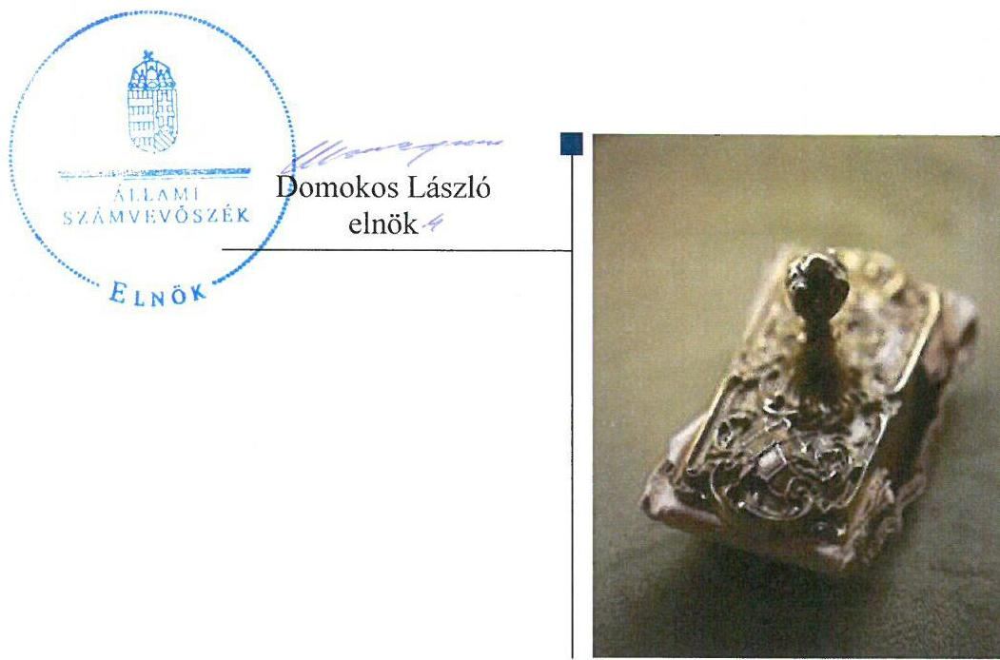
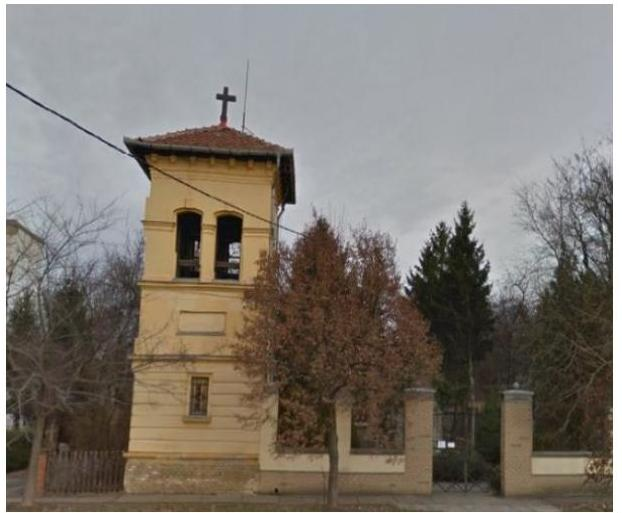
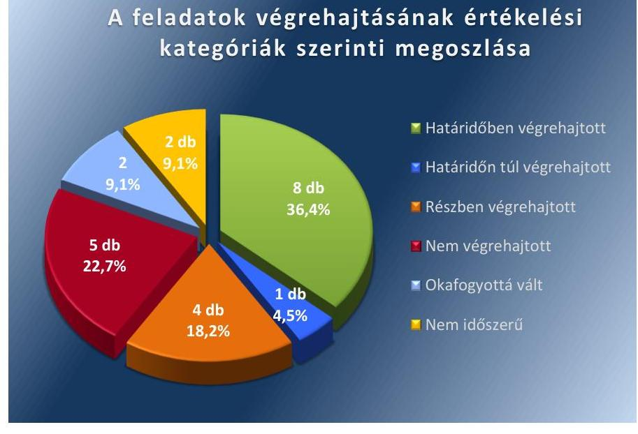
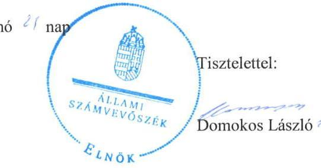
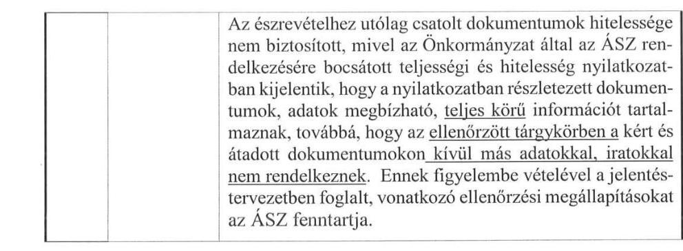
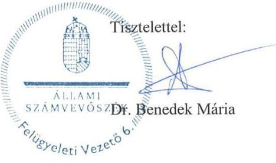

ÁLLAMI
SZÁMVEVŐSZÉK

# Jelentés 

## Utóellenőrzések

Kétegyháza Nagyközség Önkormányzata belső kontrollrendszere kialakításának, egyes kontrolltevékenységek és a belső ellenőrzés működésének utóellenőrzése 2016.

---

# Jelentés 

## Utóellenőrzések

Kétegyháza Nagyközség Önkormányzata belső kontrollrendszere kialakításának, egyes kontrolltevékenységek és a belső ellenőrzés működésének utóellenőrzése
2016. 07. hó 15. nap

---

|  J | AZ ELLENŐRZÉST FELÜGYELTE:  |
| --- | --- |
|   | DR. BENEDEK MÁRIA felügyeleti vezető  |
|   | AZ ELLENŐRZÉST VEZETTE ÉS A VÉGREHAJTÁSÁÉRT FELELŐS:  |
|   | HORVÁTH EMESE CSILLA ellenőrzésvezető  |
|   | A PROGRAM ÖSSZEÁLLÍTÁSÁÉRT FELELŐS:  |
|   | JANIK JÓZSEF osztályvezető  |
|   | A TÉMÁHOZ KAPCSOLÓDÓ KORÁBBI SZÁMVEVŐSZÉKI JELENTÉSEK:  |
|   | - címe: Jelentés Kétegyháza Nagyközség Önkormányzata belső kontrollrendszerének kialakítása, valamint egyes kontrolltevékenységek és belső ellenőrzés működése ellenőrzéséről  |
|  J | - sorszáma: 13048  |
|   | IKTATÓSZÁM: V-1057-056/2016  |
|   | TÉMASZÁM: 2091  |
|   | ELLENŐRZÉS-AZONOSÍTÓ SZÁM: V-071826  |

Jelentéseink az Országgyűlés számítógépes hálózatán és az Interneten a www.asz.hu címen is olvashatóak.

---

# TARTALOMJEGYZÉK 

■ ÖSSZEGZÉS ..... 5
■ AZ ELLENŐRZÉS CÉLJA ..... 6
■ AZ ELLENŐRZÉS TERÜLETE ..... 7
■ AZ ELLENŐRZÉS HÁTTERE, INDOKOLTSÁGA ..... 8
■ A JELENTÉS LÉNYEGES KÉRDÉSKÖREI ..... 9
■ ELLENŐRZÉS HATÓKÖRE ÉS MÓDSZEREI ..... 10
■ MEGÁLLAPÍTÁSOK ..... 13
■ MELLÉKLETEK ..... 17
I. Sz. melléklet: Az ÁSZ 13048 számú jelentéséhez kapcsolódó intézkedési terv végrehajtása ..... 17
■ FÜGGELÉK: ÉSZREVÉTELEK ..... 25
■ RÖVIDÍTÉSEK JEGYZÉKE ..... 37

---

.

---

# ÖSSZEGZÉS 

Az ÁSZ ${ }^{1}$ az Önkormányzat² ${ }^{2}$ belső kontrollrendszerének kialakítása, valamint egyes kontrolltevékenységek és a belső ellenőrzés működésének utóellenőrzését 2013. június 25. és 2016. január 29. közötti időszakra végezte el. Megállapította, hogy az intézkedési tervben foglalt feladatok mintegy felét az Önkormányzat végrehajtotta, azonban a nem végrehajtott feladatok tekintetében nem tett megfelelő lépéseket az ÁSZ által korábban feltárt, a belső kontrollrendszert érintő hiányosságok megszüntetésére, ami kockázatot hordoz az Önkormányzat szabályozásában, működésének szabályosságában és a felelős vezetői magatartásban.

## Az ellenőrzés társadalmi indokoltsága

Az ÁSZ stratégiájában célul tűzte ki a számvevőszéki munka hasznosulásának javítását. Ezzel összhangban ellenőrzi, hogy az ellenőrzött szervezetek megvalósították-e a korábbi ellenőrzései által feltárt hibák, hiányosságok és szabálytalanságok megszüntetése céljából elkészített intézkedési terveikben foglaltakat. A rendszeres utóellenőrzések hozzájárulnak a szükséges intézkedések tényleges végrehajtásához, ezáltal a közpénzügyek rendezettségének javulásához.

## Főbb megállapítások, következtetések

A polgármester ${ }^{3}$ a Képviselő-testület ${ }^{4}$ által elfogadott intézkedési tervet határidőben megküldte az ÁSZ részére.
Az intézkedési tervben meghatározott 22 feladatból nyolcat határidőben, egyet határidőn túl, négyet részben, ötöt nem hajtottak végre, valamint két feladat végrehajtása okafogyottá vált, két feladat nem volt időszerű, mert annak alapjául szolgáló esemény nem következett be. Így az ÁSZ által korábban az Önkormányzat belső kontrollrendszerének kialakítása, valamint az egyes kontrolltevékenységek és a belső ellenőrzés működésének területén azonosított hiányosságok jelentős része továbbra is fennáll.

Az intézkedési tervben rögzített feladatok végrehajtásáról a Bkr. ${ }^{5}$-ben előírt nyilvántartást nem vezették.

---

# AZ ELLENŐRZÉS CÉLJA 

Az ellenőrzés célja annak értékelése volt, hogy a számvevőszéki jelentésben foglalt intézkedést igénylő megállapításokkal és javaslatokkal összhangban készített intézkedési tervben meghatározott feladatokat az ellenőrzött szervezet végrehajtotta-e.

---

# AZ ELLENŐRZÉS TERÜLETE

## Az Önkormányzat

Kétegyháza nagyközség Békés megyében, a Gyulai járásban található. Állandó lakosainak száma a KSH6 által közzétett népességi adatok szerint 2015. január 1-jén 3578 fő volt.

A polgármester a 2010. évi önkormányzati választások óta tölti be tisztségét. A Képviselő-testület – a Polgármesterrel együtt – héttagú, munkáját az önkormányzati SZMSZ7 szerint három bizottság segíti. A jegyző8 2007. november 1. óta látja el feladatait.

Az Önkormányzat a 2014. évi éves költségvetési beszámoló szerint 815 435 ezer Ft költségvetési bevételt ért el, valamint 812 539 ezer Ft költségvetési kiadást teljesített. Az eszközvagyon értéke 2014. december 31-én 1 993 757 ezer Ft volt.

Az Önkormányzat belső kontrollrendszerének kialakítását, valamint az egyes kontrolltevékenységek és a belső ellenőrzés működésének ellenőrzését az ÁSZ a 2009. január 1. és 2011. december 31. közötti időszakra végezte el, az erről szóló 13048. számú jelentését 2013. június 25-én tette közzé. Az ellenőrzés célja annak értékelése volt, hogy az Önkormányzat a jogszabályi előírásoknak megfelelően alakította-e ki a belső kontrollrendszert, megfelelően működtette-e a gazdálkodás folyamatában kulcsszerepet betöltő szakmai teljesítésigazolás és utalvány ellenjegyzés kontrollokat, biztosította-e a belső ellenőrzés szabályos és eredményes működését.

Az utóellenőrzés – 2013. június 25-től 2016. január 29-ig végrehajtott intézkedéseket figyelembe véve - az ÁSZ jelentésben a polgármester és a jegyző részére megfogalmazott intézkedést igénylő megállapításokra és javaslatokra készített, az ÁSZ részére megküldött intézkedési tervben foglalt feladatok megvalósításának ellenőrzésére, illetve értékelésére terjedt ki.

---

# AZ ELLENŐRZÉS HÁTTERE, INDOKOLTSÁGA 

Az ÁSZ tv. 33. § (1) bekezdése értelmében a számvevőszéki jelentések intézkedést igénylő megállapításaihoz és javaslataihoz kapcsolódóan az ellenőrzött szervezet vezetője intézkedési tervet köteles összeállítani, és az ÁSZ részére megküldeni. Az intézkedési tervben foglaltak megvalósítását az ÁSZ tv. 33. § (7) bekezdésében foglaltak alapján - az ÁSZ utóellenőrzés keretében - ellenőrizheti. Az intézkedések megvalósulásának értékelése során az ÁSZ figyelembe veszi az ellenőrzött szervezetek működési feltételeiben, valamint a jogszabályi előírásokban bekövetkezett változásokat.

Az intézkedési tervekben foglalt feladatok hiányos, illetve késedelmes végrehajtása, valamint megvalósításának elmaradása azt mutatja, hogy az ellenőrzések során feltárt hibák, hiányosságok és szabálytalanságok megszüntetése nem kapott kellő hangsúlyt. Ez a szabályszerű működés és a felelős vezetői magatartás vonatkozásában kockázatot hordoz. E kockázatok feltárásával az ÁSZ utóellenőrzési rendszere fokozza a fegyelmet, és igazolja, hogy a közpénzzel való szabályos gazdálkodás felelőssége elől nem lehet kitérni.

## AZ UTÓELLENŐRZÉS VÁRHATÓ HASZNOSULÁSA

Az utóellenőrzés négy szinten hasznosulhat:

- A társadalom szintjén az utóellenőrzés jelzi, hogy a számvevőszéki ellenőrzés megállapításainak van következménye: a hiányosságok megszüntetésére az ellenőrzött szervezet által meghatározott intézkedések végrehajtását is számon kéri az ÁSZ.
- Az ellenőrzött terület szintjén az utóellenőrzés tájékoztatást nyújt a terület döntéshozóinak a hiányosságok kiküszöbölésének jó gyakorlatairól, ezzel lehetőséget biztosítva arra, hogy az ÁSZ ellenőrzési megállapításai, javaslatai a terület nem ellenőrzött szervezeteinek a működése során is hasznosuljanak.
- Az ellenőrzött szervezet szintjén az utóellenőrzés feltárja, hogy a szervezet az intézkedések végrehajtásával hasznosította-e a korábbi ellenőrzési jelentésben a hiányosságok megszüntetése, illetve a kockázatok kezelése érdekében megfogalmazott javaslatokat.
- Az ÁSZ szintjén az utóellenőrzés visszacsatolást ad az ellenőrzési jelentések hasznosulásáról, az intézkedések elmaradása vagy részleges megvalósulása a további ellenőrzésekhez kockázati jelzésként szolgál.

---

# A JELENTÉS LÉNYEGES KÉRDÉSKÖREI 

Az Önkormányzat az intézkedési tervben foglaltakat az előírt határidőben végrehajtotta-e?

---

# ELLENŐRZÉS HATÓKÖRE ÉS MÓDSZEREI 

## Az ellenőrzés típusa

Megfelelőségi ellenőrzés

## Az ellenőrzött időszak

Az utóellenőrzés alapját képező ÁSZ jelentés ${ }^{10}$ közzétételének napjától (2013. június 25.) az ellenőrzésről szóló kiértesítő levél keltének napjáig (2016. január 29.) tartó időszak.

## Az ellenőrzés tárgya

Az ÁSZ tv. 2011. július 1-jei hatálybalépését követően a számvevőszéki jelentésben foglalt intézkedést igénylő megállapításokkal és javaslatokkal összhangban - az Önkormányzat által - készített intézkedési tervben foglaltak végrehajtásának ellenőrzése.

Az ellenőrzés kiterjed minden olyan körülményre és adatra, amely az ÁSZ jogszabályban meghatározott feladatainak teljesítéséhez, valamint a program végrehajtása folyamán felmerült újabb összefüggések feltárásához szükséges.

## Az ellenőrzött szervezet

Kétegyháza Nagyközség Önkormányzata

## Az ellenőrzés jogalapja

Az ÁSZ törvényben meghatározott feladatkörében ellenőrzi a központi költségvetés végrehajtását, az államháztartás gazdálkodását, az államháztartásból származó források felhasználását és a nemzeti vagyon kezelését.

Az ÁSZ tv. 1. § (3) bekezdése szerint az ÁSZ általános hatáskörrel végzi a közpénzekkel és az állami és önkormányzati vagyonnal való felelős gazdálkodás ellenőrzését.

Az ÁSZ tv. 33. § (7) bekezdése alapján az ÁSZ tv. 33. § (1)-(2) bekezdése szerinti intézkedési tervben foglaltak megvalósítását az ÁSZ utóellenőrzés keretében ellenőrizheti.

---

# Az ellenőrzés módszerei 

Az ÁSZ az ellenőrzést a nemzetközi standardokat irányadónak tekintve az ellenőrzési program ellenőrzési kérdései, az ellenőrzött időszakban hatályos jogszabályok, az ellenőrzés szakmai szabályok és módszertanok figyelembevételével, önállóan vagy ellenőrzéshez kapcsolódóan végezte.

Az ÁSZ az ellenőrzés ideje alatt az Önkormányzattal történő kapcsolattartást az ÁSZ SZMSZ ${ }^{11}$-ének vonatkozó előírásai alapján biztosította.

Az utóellenőrzés megállapításait elsősorban az ÁSZ rendelkezésére álló, valamint az ellenőrzött szervezetektől elektronikusan bekért dokumentumok alapozták meg.

Az ellenőrzési bizonyítékként felhasználható adatforrások közé tartoznak egyrészt a szakmai programban felsorolt adatforrások, másrészt minden - az ellenőrzés folyamán feltárt, az ellenőrzés szempontjából információt tartalmazó - dokumentum.

A pénzügyi folyamatokban kulcsszerepet betöltő kontrollok működésének megfelelőségét az államháztartáson kívülre teljesített működési és felhalmozási célú pénzeszközátadások, állományba nem tartozók megbízási díjainál, továbbá a külső szolgáltatók által végzett karbantartási, kisjavítási munkákkal kapcsolatos kifizetéseknél 10 elemű véletlen mintavétellel kiválasztott tételek alapján értékelte az ÁSZ. A kiválasztott tételek esetében azt ellenőrizte, hogy az ellenőrzött szervezet az intézkedési tervben, az adott terület vonatkozásában meghatározott feladatok végrehajtása érdekében biztosította-e a jogszabályoknak és a belső szabályzatoknak való megfelelő működtetést.

Az intézkedési tervekben előírt feladatokat azok végrehajthatósága, illetve végrehajtása szempontjából az alábbiak szerint értékelte az ÁSZ:
"határidőben végrehajtott" a feladat, ha a teljesítés dokumentáltan, az intézkedési tervben előírt határidőben és tartalommal megtörtént;
"határidőn túl végrehajtott" a feladat, ha annak teljesítése az intézkedési tervben meghatározott módon, de az előírt határidőn túl történt meg;
"részben végrehajtott" a feladat, ha végrehajtása teljes körűen az intézkedési tervben előírt módon nem történt meg;
"nem végrehajtott" a feladat, ha a végrehajtás nem történt meg, vagy amennyiben a teljesítést nem dokumentálták;
"okafogyottá vált" a feladat, ha végrehajtására - meghatározott esemény bekövetkezése, továbbá külső körülmény, a működést érintő feltétel változása miatt - már nincs szükség, illetve lehetőség, és egyértelműen megállapítható, hogy az intézkedést szükségessé tevő körülmény a jövőben nem fordulhat elő;
"nem időszerű" az a feladat, amelynek ellenőrzési időszakon belüli végrehajtására azért nem került (kerülhetett) sor, mert az intézkedés alapjául szolgáló esemény nem következett be, de annak jövőbeni előfordulása lehetséges, a végrehajtása nem volt esedékes, vagy a végrehajtás határideje még nem járt le.
Az ellenőrzés lefolytatásához az Önkormányzat tanúsítványok elektronikus kitöltésével, valamint az ÁSZ által kért dokumentumok elektronikus

---

megküldésével szolgáltatott adatokat, amelyek valódiságát és teljes körűségét a polgármester által tett teljességi és hitelességi nyilatkozat igazolta. Az így rendelkezésre bocsátott adatok, információk kontrollja az ellenőrzés keretében történt.

---

# MEGÁLLAPÍTÁSOK 

## 1. Az Önkormányzat az intézkedési tervben foglaltakat az előírt határidőben végrehajtotta-e?

Összegző megállapítás

Az Önkormányzat az intézkedési tervében meghatározott 22 feladatból nyolcat határidőben, egyet határidőn túl, négyet részben, ötöt nem hajtott végre, továbbá két feladat végrehajtása okafogyottá vált, két feladat nem volt időszerű, mert annak alapjául szolgáló esemény nem következett be. Az intézkedési tervben rögzített feladatok végrehajtásáról a Bkr.-ben előírt nyilvántartást nem vezették.

Az intézkedési tervben meghatározott feladatokat, határidőket, az ÁSZ jelentés javaslatainak címzettjeit és a feladatok végrehajtását az I. számú melléklet mutatja be.

Az ÁSZ a jelentésében a polgármester részére
 egy, a jegyző részére hat pontban 16 javaslatot fogalmazott meg. A polgármester által összeállított és az ÁSZ részére megküldött, a Képviselő-testület által elfogadott intézkedési tervben a hiányosságok, szabálytalanságok megszüntetésére 13 pontban 22 feladatot határoztak meg. A feladatok elvégzésének felelőseként egy esetben a polgármestert, 21 esetben pedig a jegyzőt jelölték meg.

Az intézkedési tervben tervezett feladatok végrehajtásának értékelési kategóriák szerinti megoszlását az 1. ábra szemlélteti.
1. ábra

A feladatok végrehajtásának értékelési kategóriák szerinti megoszlása

Forrás: ÁSZ

---

# HATÁRIDŐBEN VÉGREHAJTOTT feladat: 

1. A jegyző kialakította és működtette a kockázatkezelési rendszert. A kockázatkezelési szabályzatot 2013. szeptember 30-án kiegészítette a Polgármesteri Hivatal gazdálkodásában rejlő kockázatok, a szükséges intézkedések és azok nyomon követési módjának meghatározásával. A feltárt kockázatok felmerülése esetében kockázatjelzés alapján válaszintézkedések megtételével intézkedtek.
2. A jegyző az egyes munkakörök átadás-átvételének követelményeit és a lebonyolítás módját a 2013. október 1-től hatályos jegyzői utasításban szabályozta.
3. A jegyző rendelkezett az informatikai eszközök alkalmazásáról szóló - 2013. október 1-től hatályos - szabályzat kiegészítésével az elektronikus pénzügyi-számviteli adatok kezelésének, feldolgozásának, tárolásának módjáról. A szabályzat mellékletében a szoftverekhez való hozzáférési jogosultságok rendjét/nyilvántartását elkészítette. A jegyző az adatok biztonságáról a 2013-2014. évekre rendszergazdai megállapodás kötésével, továbbá a 2015. évben egy szünetmentes tápegység beszerzésével gondoskodott.
4. A jegyző a belső kontrollrendszer kialakítását 2013. október 1-jétől érvényes szabályzatba foglalta.
5. A jegyző intézkedett a megfelelő képzettséggel rendelkező belső ellenőr foglalkoztatásáról 2014. január 1-jétől.
6. A jegyző intézkedett a 2014., 2015. és 2016. évre vonatkozó - kockázatelemzésen alapuló - éves ellenőrzési tervek elkészítéséről, amelyeket a Képviselő-testület a Bkr.-ben előírt határidőn belül jóváhagyott.
7. A jegyző a hivatali SZMSZ ${ }^{12}$ módosítását elkészítette, és annak jóváhagyását a Képviselő-testületnél kezdeményezte. A Képviselőtestület a 2013. október 1-től hatályos módosított hivatali SZMSZ ${ }^{13}$ -t elfogadta. Az SZMSZ-ben rögzítésre kerültek az ellátandó és a szakfeladat rend szerint besorolt alaptevékenységek, a Polgármesteri Hivatal létszáma, a nevesített munkakörökhöz tartozó feladat- és hatáskörök, a hatáskörök gyakorlásának módja, a helyettesítés rendje és az ezekhez kapcsolódó felelősségi szabályok.
8. Az ellenőrzési nyomvonalat a jegyző a belső kontrollrendszerről szóló szabályzat részeként a Bkr.-ben előírtaknak megfelelően elkészítette.

## HATÁRIDŐN TÚL VÉGREHAJTOTT feladat:

9. A jegyző a munkaköri leírásokat az egyes munkakörökhöz tartozó jogokkal és kötelezettségekkel kiegészítette. Egy munkaköri leírás kiegészítését az előírt 2013. szeptember 30-i határidőn túl, 2014. május 17-én készítette el.

## RÉSZBEN VÉGREHAJTOTT feladat:

10. A jegyző a Polgármesteri Hivatal szabályzatainak a megismerési kötelezettségét a 2013. október 1-től hatályos belső szabályzatban előírta, azonban a hatályos szabályzatok közül négy a megismerési záradékkal nem került kiegészítésre.
11. A jegyző a Polgármesteri Hivatal tevékenységének, a célok megvalósításának nyomon követését biztosító rendszert - amelynek része az operatív tevékenységek keretében megvalósuló folyamatos és eseti nyomon követés - kialakította és annak szabályait írásban rögzítette. A monitoring rendszer működtetése során azonban az önkormányzat tevékenységeinek teljes körét nem követték nyomon.
12. A jegyző gondoskodott a kötelezettségvállalások nyilvántartásba vételéről, de annak tartalma csak 2015. évtől felelt meg az Ávr. ${ }^{14}$ és az Áhsz. ${ }^{15}$ foglaltaknak, mivel a nyilvántartás 2013-2014. években nem tartalmazta a kötelezettségvállalást tanúsító dokumentum keltét, az előirányzatok szerinti megoszlását, a kifizetési határidőket, továbbá a teljesítési adatokat. A bizonylatokon nem tüntették fel az Ávr.-ben előírtak szerinti kötelezettségvállalás nyilvántartási számát.
13. A polgármester a gazdálkodás szabályszerűségét esetileg kísérte figyelemmel. Az önkormányzati gazdálkodás szabályszerűségét a belső ellenőr a 2014. évben ellenőrizte, azonban az operatív gazdálkodás során feltárt hiányosságok a folyamatos figyelemmel kísérés elmaradását mutatják. A polgármester nem gondoskodott a feltárt hiányosságok, szabálytalanságok tekintetében munkajogi felelősség kivizsgálásáról.

# NEM VÉGREHAJTOTT feladat: 

14. A jegyző az operatív gazdálkodás során nem gondoskodott a teljesítésigazolás vonatkozásában a működésbeli hibák megelőzése, feltárása és kijavítása érdekében a feladatok szabályszerű végrehajtásáról, mert a teljesítés igazolását nem az Ávr.-ben előírtak szerinti kötelezettségvállaló által kijelölt személy végezte. Továbbá hiányzott a bizonylatokról az Ávr.-ben előírtak szerinti teljesítés tényére való utalás, valamint a teljesítésigazolás dátuma.
15. A jegyző az operatív gazdálkodás során nem gondoskodott az érvényesítés vonatkozásában a működésbeli hibák megelőzése, feltárása és kijavítása érdekében a feladatok szabályszerű végrehajtásáról, mert az érvényesítő nem ellenőrizte teljes körűen az Ávr.-ben előírtak szerint a megelőző ügymenetben az Áht. ${ }^{16}$, az Áhsz. és az Ávr. előírásai és a belső szabályzatokban foglaltak betartását.
16. A jegyző az operatív gazdálkodás során nem gondoskodott az utalványozás vonatkozásában a működésbeli hibák megelőzése, feltárása és kijavítása érdekében előírt feladatok szabályszerű végrehajtásáról, mert az utalványrendeleten nem tüntették fel Ávr.-ben előírtak szerint az érvényesítés dátumát, így nem volt megállapítható, hogy az érvényesítés megelőzte-e az utalványozást.
17. A jegyző nem gondoskodott a Bkr.-ben foglaltak szerint a tervezett ellenőrzések belső ellenőrzési vezető által jóváhagyott ellenőrzési program alapján történő végrehajtásáról, mert belső ellenőrzési vezető által jóváhagyott ellenőrzési program nem készült. A 2014. évben az ellenőrzést ellenőrzési program nélkül hajtották végre, a 2015. évben elkészítették az éves ellenőrzési tervet, ellenőrzési program nem készült, és a tervezett ellenőrzést nem hajtották végre.
18. A jegyző nem gondoskodott arról, hogy a 2014. évben végrehajtott ellenőrzésről a belső ellenőrzési vezető a Bkr. szerinti nyilvántartást vezesse. A 2015. évben nyilvántartás vezetése nem vált szükségessé, mert a tervezett ellenőrzést nem végezték el, így ellenőrzési jelentés nem készült.

# OKAFOGYOTTÁ VÁLT feladat: 

19. A jegyzőnek a polgármester teljesítésigazolásra vonatkozó kijelölése az önkormányzati kiadások (pályázatok, támogatások, beszerzések, szolgáltatások) vonatkozásában okafogyottá vált, mert a 2012. január 1-jétől hatályos Ávr.-ben előírtak szerint az önkormányzati kiadások tekintetében a polgármester, mint kötelezettségvállaló jelöli a teljesítésigazolót.
20. A belső ellenőrzési kézikönyv jóváhagyása okafogyottá vált, mert a belső ellenőrzés Társulás ${ }^{17}$ formájában történő ellátása megszűnt. A belső ellenőrzési feladatokat 2014. január 1-jétől megbízási szerződés alapján külső szolgáltató belső ellenőr végzi.

## NEM IDŐSZERŰ feladat:

21. Intézkedési terv készítésének kötelezettsége a 2014-2015. években nem keletkezett, mert a 2014. évben végzett belső ellenőrzésről szóló jelentésben a belső ellenőr intézkedést igénylő megállapítást nem tett, a 2015. évben pedig a tervezett belső ellenőrzés végrehajtása hiányában belső ellenőrzési jelentés nem készült.
22. A belső ellenőrzési jelentés alapján megtett intézkedések nyomon követésének, és erre vonatkozó nyilvántartás vezetésének kötelezettsége intézkedési terv készítési kötelezettség hiányában nem keletkezett.

A jegyző az intézkedési tervben rögzített feladatok végrehajtásáról a Bkr. által előírt nyilvántartást nem vezette.

---

# MELLÉKLETEK

I. SZ. MELLÉKLET: AZ ÁSZ 13048 SZÁMÚ JELENTÉSÉHEZ KAPCSOLÓDÓ INTÉZKEDÉSI TERV VÉGREHAJTÁSA

|  Sorszám | Intézkedési terv alapján elvégzendő feladat | Az intézkedési tervben meghatározott határidő | Az ÁSZ 13048
sz. jelentése javaslatának címzettje | A feladat végrehajtása  |
| --- | --- | --- | --- | --- |
|   | 1. | 2. | 3. | 4.  |
|   |  | Határidőben végrehajtott feladat |  |   |
|  1. | A hatályos 14/2010. (XII.30.) számú szabályzatot ki kell egészíteni a Polgármesteri Hivatal gazdálkodásában rejlő kockázat felmérésével, meg kell határozni a Hivatal gazdálkodásában rejlő, egyes kockázatokkal kapcsolatos intézkedéseket és azok nyomon követésének módját. A módosított szabályzatot megfelelően működtetni kell. | 2013. szeptember 30., illetve folyamatos a működtetés tekintetében. | jegyző | A jegyző kialakította és működtette a kockázatkezelési rendszert. A kockázatkezelési szabályzatot 2013. szeptember 30-án kiegészítette a Polgármesteri Hivatal gazdálkodásában rejlő kockázatok, a szükséges intézkedések és azok nyomon követési módjának meghatározásával. A feltárt kockázatok felmerülése esetében kockázatjelzés alapján válaszintézkedések megtételével intézkedtek.  |
|  2. | A munkakör átadás-átvételének követelményeit és a lebonyolítás módját jegyzői utasításban kell szabályozni. | 2013. szeptember 30. | jegyző | A jegyző az egyes munkakörök átadás-átvételének követelményeit és a lebonyolítás módját a 2013. október 1-től hatályos jegyzői utasításban szabályozta.  |
|  3. | A 4/2010. (XII.30.) szabályzatot ki kell egészíteni az elektronikus (pénzügyi-számviteli) adatok kezelésével, feldolgozásával, tárolásával kapcsolatos rendelkezésekkel. A szabályzat mellékletében fel kell tüntetni az adatokhoz való hozzáférhetőség jogosultjait, jogosultságait. Emellett a jegyző köteles gondoskodni az adatok biztonságáról. | 2013. szeptember 30., a működtetés tekintetében folyamatos. | jegyző | A jegyző rendelkezett az informatikai eszközök alkalmazásáról szóló - 2013. október 1-től hatályos - szabályzat kiegészítésével az elektronikus pénzügyi-számviteli adatok kezelésének, feldolgozásának, tárolásának módjáról. A szabályzat mellékletében a szoftverekhez való hozzáférési jogosultságok rendjét/nyilvántartását elkészítette. A jegyző az adatok biztonságáról a 2013-2014. évekre rendszergazdai megállapodás kötésével, továbbá a 2015. évben egy szünetmentes tápegység beszerzésével gondoskodott.  |
|  4. | A belső kontrollrendszert a jelenlegi gyakorlat írásba foglalásával rögzíteni kell, megfelelő szabályozást alakítva ki. | 2013. szeptember 30. | jegyző | A jegyző a belső kontrollrendszer kialakítását 2013. október 1-jétől érvényes szabályzatba foglalta.  |

---

|  5. | A jegyző gondoskodjon megfelelő képzettséggel rendelkező belső ellenőr foglalkoztatásáról. | 2013. szeptember 30. | jegyző  |
| --- | --- | --- | --- |
|  6. | A jegyző gondoskodjon megfelelő képzettséggel rendelkező belső ellenőr foglalkoztatásáról. A megbízási szerződés megkötését követően gondoskodjon a Jelentés 6. a-g) pontjában foglaltak végrehajtásáról és a belső ellenőrzés működtetéséről. Javaslat:6. c pontja: Intézkedjen annak érdekében, hogy a Bkr. 22. § (1) bekezdés b) pontjában, a 29. § (1) bekezdésében és a 31. § (1)-(2) bekezdéseiben foglaltaknak megfelelően az ellenőrzési munka megtervezéséhez kockázatelemzésen alapuló éves ellenőrzési tervek készüljenek, és azokat a Képviselő-testület a Mötv. ${ }^{18} 119 . \S$ (5) bekezdésében és a Bkr. 32. § (4) bekezdésében előírt határidőn belül hagyja jóvá. | 2013. szeptember 30. a belső ellenőrzés működtetése tekintetében folyamatos | jegyző  |
|  7. | A jegyző egészítse ki a Jelentés 1. a-b) pontjaiban foglaltaknak megfelelően a Hivatal SZMSZ-ét. Javaslat 1. a) pontja: Készítse elő a hivatali SZMSZ módosítását, és kezdeményezze a polgármesternél a módosítás Képviselő-testület elé terjesztését annak érdekében, hogy az az Ávr. 13. § (1) bekezdésének c), e) és g) pontjaiban foglaltaknak megfelelően tartalmazza az ellátandó és a szakfeladatrend szerint besorolt alaptevékenységeket, az alaptevékenységet szabá- | 2013. szeptember 30. | jegyző  |

A feladat végrehajtása 4. A jegyző intézkedett a megfelelő képzettséggel rendelkező belső ellenőr foglalkoztatásáról, a Képviselő-testület 2013. szeptember 24.-i ülésén - 99/2013. (IX. 24.) számú határozatban - felkérte a polgármestert a megbízási szerződés megkötésére. A megbízási szerződést 2013. november 13-án aláírták, amelyet 2014. január 1-től kötöttek meg határozatlan időre. A szerződés rögzítette a Bkr. előírásainak megfelelő feladatvégzést. 2014. évre, 2015. évre és 2016. évre vonatkozó kockázatelemzésen alapuló éves ellenőrzési tervek készültek, melyeket a Képviselő-testület elfogadott. A Képviselő-testület a 136/2013. (XI.26.) számú határozattal - határidőben 2013. december 31-ig -

 elfogadta a 2014. évi belső ellenőri ütemtervet. A 2014. évi ellenőrzési tervet megalapozó elemzések és kockázatelemzés eredményének összefoglaló bemutatása a kockázati tényezők feltárásával és értékelésével rendelkezésre állt. A Képviselő-testület a 106/2014. (XI.25.) számú határozattal - határidőben 2014. december 31-ig - elfogadta a 2015. évi belső ellenőri ütemtervet. A 2015. évi ellenőrzési tervet megalapozó elemzések és kockázatelemzés eredményének összefoglaló bemutatása a kockázati tényezők feltárásával és értékelésével rendelkezésre állt. A Képviselő-testület a 113/2015. (IX. 22.) számú határozattal - határidőben 2015. december 31-ig döntött a 2016. évi belső ellenőrzés témaköreiről. A 2016. évi ellenőrzési tervet megalapozó elemzések és kockázatelemzés eredményének összefoglaló bemutatása a kockázati tényezők feltárásával és értékelésével rendelkezésre állt. A Képviselő-testület a 113/2015. (IX. 22.) számú határozattal - határidőben 2015. december 31-ig - döntött a 2016. évi belső ellenőrzés témaköreiről. A 2016. évi ellenőrzési tervet megalapozó elemzések és kockázatelemzés eredményének összefoglaló bemutatása a kockázati tényezők feltárásával és értékelésével rendelkezésre állt. A jóváhagyását a Képviselő-testületnél kezdeményezte. A Képviselő-testület a 2013. október 1-től hatályos módosított hivatali SZMSZ${ }_{1}$-t elfogadta. Az SZMSZ${ }_{1}$-ben rögzítésre kerültek az ellátandó és a szakfeladat rend szerint besorolt alaptevékenységek, a Polgármesteri Hivatal létszáma, a nevesített munkakörökhöz tartozó feladat- és hatáskörök, a hatáskörök gyakorlásának módja, a helyettesítés rendje és az ezekhez kapcsolódó felelősségi szabályok.

---

|  8. | A jegyző egészítse ki a Jelentés 1. a-b) pontjaiban foglaltaknak megfelelően a Hivatal SZMSZ-ét. Javaslat 1. b) pontja: Intézkedjen arról, hogy az ellenőrzési nyomvonal a Bkr. 6. § (3) bekezdésében foglaltaknak megfelelően készüljön el. | 2013. szeptember 30. | jegyző | Az ellenőrzési nyomvonalat a jegyző a 6/2013. (IX.30.) számú, a belső kontrollrendszerről szóló szabályzat részeként a Bkr. 6. § (3) bekezdésében foglaltaknak megfelelően elkészítette.  |
| --- | --- | --- | --- | --- |
|  9. | A munkaköri leírásokat ki kell egészíteni az egyes munkakörökhöz tartozó jogokkal és kötelezettségekkel. | 2013. szeptember 30. | jegyző | A jegyző a munkaköri leírásokat az egyes munkakörökhöz tartozó jogokkal és kötelezettségekkel kiegészítette. A módosított munkaköri leírások tartalmazták a munkavállalók beosztását, munkavállaló részletes munkakörének meghatározását, helyettesítéssel megbízott munkavállaló megnevezését és a munkavállaló munkakörével kapcsolatos felelősség meghatározását. Egy munkaköri leírás kiegészítését az előírt 2013. szeptember 30-át határidőn túl, 2014. május 17-én készítette el.  |
|  10. | A hatályos szabályzatokat ki kell egészíteni a megismerési záradékkal. | 2013. szeptember 30. | jegyző | A jegyző a Polgármesteri Hivatal szabályzatainak a megismerési kötelezettségét 2013. október 1-től hatályos belső szabályzatban előírta. A hatályos szabályzatok a belső szabályzatban előírt megismerési záradékkal nem kerültek teljes körűen kiegészítésre. Végrehajtott: Megismerési záradékkal kiegészítésre került a 10/2010. (XII.30.) számú Gazdálkodási Szabályzat; a Gazdálkodási Szabályzatról szóló 8/2013. (IX.30.) szabályzat; 2014. január 1-jétől hatályos Gazdálkodási szabályzat; 2014. július 16-tól hatályos Gazdálkodási szabályzat; Kétegyháza Nagyközség Polgármesteri Hivatala kockázatkezelési és úgymenet-folytonossági tervéről szóló 14/2010. (XII.30.) számú szabályzat; a Polgármesteri Hivatal szabályzatainak megismeréséről szóló 2/2013. (IX.3.) számú szabályzat; a szabálytalanságok kezelésének rendjéről szóló 15/2010. (XII.30.) számú szabályzat; az egyes munkakörök átadás-átvételéről szóló 3/2013. (IX.30.) számú szabályzat; a Polgármesteri Hivatal információs és kommunikációs rendszeréről szóló 16/2010. (XII.30.)  |

---

|  1. | A jelenleg működtetett nyomon követési rendszer szabályait írásban kell rögzíteni, a vonatkozó szabályzatot e rendelkezésekkel ki kell egészíteni. Ezen túlmenően olyan rendszert szükséges kialakítani és működtetni, amelynek része az operatív tevékenységek keretében megvalósuló folyamatos és eseti nyomon követés is. | 2013. szeptember 30. a rendszer működtetésére folyamatos | jegyző | Végrehajtott: A jegyző a belső kontrollrendszerről szóló 6/2013. (IX.30.) számú szabályzatban a célok megvalósításának nyomon követését biztosító rendszert kialakította. A szabályzat VI. Monitoring fejezete tartalmazta a monitoring rendszer működtetését és a célok megvalósításának nyomon követését. A szabályzat alapján a monitoring tevékenység folyamatos monitoringgal, vagy külön értékeléssel, illetve ezek kombinációjával teljesülhet. A folyamatos monitoring beépül a szervezet normális, ismétlődő működési tevékenységeibe, magába foglalja a vezetés rendszeres felügyelet ellátó tevékenységét, valamint az alkalmazottak feladatkörük ellátása keretében végrehajtott műveleteket. A külön értékelések a belső kontrollrendszer eredményességének kiértékelésére irányulhatnak, céljuk biztosítani a kívánt eredmények elérését. Nem végrehajtott: A monitoring rendszer működtetése során azonban az önkormányzat tevékenységeinek teljes körét nem követték nyomon.  |
| --- | --- | --- | --- | --- |
|  11. | A jelenleg működtetett nyomon követési rendszer szabályait írásban kell rögzíteni, a vonatkozó szabályzatot e rendelkezésekkel ki kell egészíteni. Ezen túlmenően olyan rendszert szükséges kialakítani és működtetni, amelynek része az operatív tevékenységek keretében megvalósuló folyamatos és eseti nyomon követés is. | 2013. szeptember 30. a rendszer működtetésére folyamatos | jegyző | Végrehajtott: A kötelezettségvállalásról szóló nyilvántartást vezették, de annak tartalma csak a 2015. évtől felelt meg az Ávr. 56. § (1) bekezdésében, ill. az Áhsz. 14. melléklet 4. pontjában foglaltaknak mivel a nyilvántartás 2013-2014. években nem tartalmazta a kötelezettségvállalást tanúsító dokumentum keltét, az előirányzatok szerinti megoszlását, a kifizetési határidőket, továbbá a teljesítési adatokat.  |
|  12. | A kötelezettségvállalásról szóló nyilvántartást naprakészen kell vezetni, feltüntetve a kötelezettségvállalás nyilvántartási számát. | 2013. szeptember 30., illetve a végrehajtásra folyamatos. Az esetleg elmaradt nyilvántartások pótlására 2013. december 31., továbbvezetésre folyamatos | jegyző, valamint a teljesítés igazolására jogosultak | Nem végrehajtott: A bizonylatokon nem tüntették fel az Ávr.-ben előírtak szerinti kötelezettségvállalás nyilvántartási számát.  |

---

|  1. | Intézkedési terv alapján elvégzendő feladat | Az intézkedési tervben meghatározott határidő | Az ÁSZ 13048 sz. jelentése javaslatának címzettje 3. | A feladat végrehajtása  |
| --- | --- | --- | --- | --- |
|  1. |  | 2. | 3. | 4.  |
|  13. | A polgármester kísérje figyelemmel az önkormányzat gazdálkodásának szabályszerűségét, gondoskodjon az ellenőrzés által feltárt hiányosságok, szabálytalanságok tekintetében az esetleges munkajogi felelősségek megállapításáról. | 2013. szeptember 30., az utóellenőrzés és a folyamatok ellenőrzése tekintetében folyamatos | polgármester | Végrehajtott:
A polgármester a gazdálkodás szabályszerűségét esetileg kísérte figyelemmel. Az önkormányzati gazdálkodás szabályszerűségét a belső ellenőr a 2014. évben ellenőrizte (az erről készült jelentést a Képviselő-testület a 61/2015. (IV. 21.) számú határozatával elfogadta).
Nem végrehajtott:
A polgármester nem gondoskodott a feltárt hiányosságok, szabálytalanságok tekintetében munkajogi felelősség kivizsgálásáról.
Nem végrehajtott feladat  |
|  14. | A teljesítés jogosságát a jogosság, összegszerűség, teljesítés ellenőrzését követően, dátummal, a teljesítés tényére való utalással, aláírással igazolják. | 2013. szeptember 30., illetve a végrehajtásra folyamatos. Az esetleg elmaradt nyilvántartások pótlására 2013. december 31., továbbvezetésre folyamatos | jegyző, valamint a teljesítés igazolására jogosultak | A jegyző az operatív gazdálkodás során nem gondoskodott a teljesítésigazolás vonatkozásában a működésbeli hibák megelőzése, feltárása és kijavítása érdekében a feladatok szabályszerű végrehajtásáról, mert a teljesítés igazolását nem az Ávr.-ben előírtak szerinti kötelezettségvállaló által kijelölt személy végezte. Továbbá hiányzott a bizonylatokról az Ávr.-ben előírtak szerinti teljesítés tényére való utalás, valamint a teljesítésigazolás dátuma.  |
|  15. | A kifizetéseket megelőzően ellenőrizni kell az összegszerűséget és a vonatkozó pénzügyi jogszabályok betartottságát. | 2013. szeptember 30., illetve a végrehajtásra folyamatos. Az esetleg elmaradt nyilvántartások pótlására 2013. december 31., továbbvezetésre folyamatos | jegyző | A jegyző az operatív gazdálkodás során nem gondoskodott az érvényesítés vonatkozásában a működésbeli hibák megelőzése, feltárása és kijavítása érdekében a feladatok szabályszerű végrehajtásáról, mert az érvényesítő az Ávr.-ben előírtak ellenére nem ellenőrizte teljes körűen a megelőző ügymenetben az Áht., az Áhsz. és az Ávr. előírásai és a belső szabályzatokban foglaltak betartását  |
|  16. | A kifizetések utalványozása érvényesített okmányon történjen. | 2013. szeptember 30., illetve a végrehajtásra folyamatos. Az esetleg elmaradt nyilvántartások pótlására 2013. december 31., továbbvezetésre folyamatos | jegyző | A jegyző az operatív gazdálkodás során nem gondoskodott az utalványozás vonatkozásában a működésbeli hibák megelőzése, feltárása és kijavítása érdekében előírt feladatok szabályszerű végrehajtásáról, mert az utalványrendeleten nem tüntették fel Ávr.-ben előírtak szerint az érvényesítés dátumát, így nem volt megállapítható, hogy az érvényesítés megelőzte-e az utalványozást.  |
|  17. | A jegyző gondoskodjon megfelelő képzettséggel rendelkező belső ellenőr foglalkoztatásáról. A megbízási szerződés megkötését követően gondoskodjon a Jelentés 6. a-g) pontjában foglaltak végrehajtásáról és a belső ellenőrzés működtetéséről. Javaslat a 6. d) ponton alapul: | 2013. szeptember 30. a belső ellenőrzés működtetése tekintetében folyamatos | jegyző | A jegyző nem gondoskodott a Bkr.-ben foglaltak szerint a tervezett ellenőrzések belső ellenőrzési vezető által jóváhagyott ellenőrzési program alapján történő végrehajtásáról, mert belső ellenőrzési vezető által jóváhagyott ellenőrzési program nem készült. A 2014. évben az ellenőrzést ellenőrzési program nélkül hajtották végre, a 2015. évben elkészítették az éves ellenőrzési tervet, ellenőrzési program nem készült, és a tervezett ellenőrzést nem hajtották végre.  |

---

|  1. | 2. | 3. | 4.  |
| --- | --- | --- | --- |
|  |   |   |   |

|  18. | A jegyző gondoskodjon megfelelő képzettséggel rendelkező belső ellenőr foglalkoztatásáról. A megbízási szerződés megkötését követően gondoskodjon a Jelentés 6. a-g) pontjában foglaltak végrehajtásáról és a belső ellenőrzés működtetéséről. Javaslat a 6. f) ponton alapul: Kezdeményezze, hogy a belső ellenőrzési vezető a Bkr. 22. § b) és e) pontjában, valamint az 50. §ában foglaltaknak megfelelően az elvégzett ellenőrzésekről nyilvántartást vezessen. | 2013. szeptember 30. a belső ellenőrzés működtetése tekintetében folyamatos | jegyző | A jegyző nem gondoskodott arról, hogy a 2014. évben végrehajtott ellenőrzésről a belső ellenőrzési vezető a Bkr. szerinti nyilvántartást vezesse. A 2015. évben nyilvántartás vezetése nem vált szükségessé, mert a tervezett ellenőrzést nem végezték el, így ellenőrzési jelentés nem készült.  |
| --- | --- | --- | --- |
|  |   |   |   |

|  19. | A hatályos szabályzatban a jegyző írásban jelölje ki a polgármestert szakmai teljesítés igazolására. | 2013. szeptember 30. | jegyző | A jegyzőnek a polgármester teljesítésigazolásra vonatkozó kijelölése az önkormányzati kiadások (pályázatok, támogatások, beszerzések, szolgáltatások) vonatkozásában okafogyottá vált, mert a 2012. január 1-jétől hatályos Ávr.-ben előírtak szerint az önkormányzati kiadások tekintetében a polgármester, mint kötelezettségvállaló jelöli ki a teljesítésigazolót.  |
| --- | --- | --- | --- |
|  20. | A jegyző gondoskodjon megfelelő képzettséggel rendelkező belső ellenőr foglalkoztatásáról. A megbízási szerződés megkötését követően gondoskodjon

 a Jelentés 6. a-g) pontjában foglaltak végrehajtásáról és a belső ellenőrzés működtetéséről. Javaslat alapja a 6. b) pont: Kezdeményezze, hogy a belső ellenőrzési kézikönyv jóváhagyása a Bkr. 56. § (7) bekezdésében foglaltaknak megfelelően történjen. | 2013. szeptember 30. a belső ellenőrzés működtetése tekintetében folyamatos | jegyző  |

---

|  21. | A jegyző gondoskodjon megfelelő képzettséggel rendelkező belső ellenőr foglalkoztatásáról. A megbízási szerződés megkötését követően gondoskodjon a Jelentés 6. a-g) pontjában foglaltak végrehajtásáról és a belső ellenőrzés működtetéséről. Javaslat a 6. e) ponton alapul: Készítsen intézkedési tervet a belső ellenőrzési jelentésekben megfogalmazott javaslatok végrehajtására a Bkr. 45. § (2)-(3) bekezdéseiben foglaltaknak megfelelő tartalommal és határidőn belül. | 2013. szeptember 30. a belső ellenőrzés működtetése tekintetében folyamatos | jegyző | Intézkedési terv készítésének kötelezettsége a 2014-2015. években nem keletkezett, mert a 2014. évben végzett belső ellenőrzésről szóló jelentésben a belső ellenőr intézkedést igénylő megállapítást nem tett, a 2015. évben pedig a tervezett belső ellenőrzés végrehajtása hiányában belső ellenőrzési jelentés nem készült.  |
| --- | --- | --- | --- | --- |
|  22. | A jegyző gondoskodjon megfelelő képzettséggel rendelkező belső ellenőr foglalkoztatásáról. A megbízási szerződés megkötését követően gondoskodjon a Jelentés 6. a-g) pontjában foglaltak végrehajtásáról és a belső ellenőrzés működtetéséről. Javaslat a 6. g) ponton alapul: Kezdeményezze, hogy a belső ellenőrzés a Bkr. 21. § (2) bekezdés d) pontjában foglaltak szerint kövesse nyomon a belső ellenőrzési jelentések alapján megtett intézkedéseket, és vezessen erre vonatkozó nyilvántartást a Bkr. 47. §-ában foglalt előírásokat is figyelembe véve. | 2013. szeptember 30. a belső ellenőrzés működtetése tekintetében folyamatos | jegyző | A belső ellenőrzési jelentés alapján megtett intézkedések nyomon követésének, és erre vonatkozó nyilvántartás vezetésének kötelezettsége intézkedési terv készítési kötelezettség hiányában nem keletkezett.  |

---

.

---

# FÜGGELÉK: ÉSZREVÉTELEK 

A jelentéstervezetet a Számvevőszék 15 napos észrevételezésre megküldte az ellenőrzött szervezet vezetőjének az ÁSZ tv. 29. § (1) bekezdése előírásának megfelelően.
A függelék tartalmazza az ellenőrzött észrevételeit, illetve az el nem fogadott észrevételek elutasításának indoklását.

[^0]
[^0]:    * 29. § (1) Az Állami Számvevőszék az ellenőrzési megállapításait megküldi az ellenőrzött szervezet vezetőjének vagy az általa megbízott személynek, és annak, akinek személyes felelősségét állapította meg.
    (2) Az ellenőrzött szervezet vezetője és a felelősként megjelölt személy az ellenőrzés megállapításaira tizenöt napon belül írásban észrevételt tehet.
    (3) Az Állami Számvevőszék az észrevételre a beérkezésétől számított harminc napon belül írásban válaszol. A figyelembe nem vett észrevételeket köteles a jelentésben feltüntetni, és megindokolni, hogy azokat miért nem fogadta el.

---

Kétegyháza Nagyközség Önkormányzat Polgármesterétől
5741 Kétegyháza Fő tér 9.
Tel.: 66/ 250-122 Fax: 66/ 250-222
e-mail: ketegyhaza@ketegyhaza.hu

Iktatószám: 255/2016.
Ügyintéző: Tóthné Lelóczki Andrea

Tárgy: Számvevőszék utóellenőrzése
Hív. szám: V-1057-051/2016

Állami Számvevőszék
Domokos László elnök Úr részére

Budapest 4.
Pf. 54
1364

ÁLLAMI SZÁMVEVŐSZÉK
045922/2016
Érkezel: 2016. JÚNIUS 03.
Iktatószám: V-A004-074/2016
Melléklet: 5

Tisztelt Elnök Úr!

A „Kétegyháza Nagyközség Önkormányzata belső kontrollrendszere kialakításának egyes kontrolltevékenységek és a belső ellenőrzés működésének utóellenőrzése" című számvevőszéki jelentéstervezettel kapcsolatban az alábbi észrevételeket teszem:

ad. 9. A munkatárs munkaköri leírását csatoljuk, tévedésből egy későbbi időállapotot csatoltunk, a helyes munkaköri leírást csatoljuk.

ad. 10. A hiányzó megismerési záradékok rendelkezésre állnak, technikai hiba miatt nem kerültek szkennelésre. Mellékletben csatoljuk.

ad. 11. A monitoring tevékenység folyamatos monitoringgal, vagy külön értékeléssel valósulhat meg.

A 6/2013. (IX.30.) számú szabályzat VI. 1.1. pontjában foglalt folyamatos monitoring lényege, hogy a szervezet normális működése során megvalósuljon a vezetői kontroll, lehetőség legyen az azonnali kiigazításra és a meghatározott feladatok és elvárások végrehajtásának, illetve betartásának ellenőrzésére.

Ezt a tevékenységet a pénzügyi területen a kötelezettségvállalások vezetők általi kötelező jóváhagyása, majd a kifizetések, utalványozások során végezzük és látjuk biztosítottnak. A pénzügyi, gazdálkodási feladatokat ellátó munkatársakkal heti egy alkalommal értekezletet tartunk, amelyen beszámoltatjuk a feladatok elvégzéséről. Az egyes szolgáltatások, beszerzések teljesítésének igazolását a polgármester és/vagy a jegyző végzi el, mely elegendő garancia az utasítások hatékony és jogszabályszerű teljesítésére.

Az igazgatási - nem pénzügyi - területen a kiadmányozási előírások garantálják a folyamatos vezetői kontrollt. Az egyes aktákban, irattározás előtt szúrópróbaszerűen, de egész évben folyamatosan végezzük a kontrollt, melyet szignóval és dátummal jelzünk.

---

Az átruházott hatáskörben gyakorolt döntésekről havonta beszámolunk a képviselő-testület részére, a polgármester a vezetők számára rendszeres értekezletet tart, melyről jegyzőkönyv készül a beszámolók elfogadásáról és a további feladatokról.

Hivatalunk nagysága nem indokol külön témaellenőrzést, mivel egy-egy területért más-más ügyintéző felel. Ennek értelmében az egyes területek ellenőrzése az ügyintézők féléves, éves értékelésével valósul meg az előírt követelményeknek megfelelően. Mivel az ügyintézők feladatkörei és munkaköri leírásai a teljes szervezet tevékenységi körét felölelik, a szervezet tevékenységének teljes körét nyomon követjük.
Tekintettel arra, hogy erre a témakörre vonatkozóan a Tisztelt Számvevőszék semmilyen kérdést nem tett fel, így bizonylatot sem csatoltunk. Egyebekben álláspontunk szerint a fentiekkel eleget teszünk a tisztelt Számvevőszék által hivatkozott szabályzat előírásainak.
ad. 12. 2015. évtől már a megfelelő nyilvántartást vezettük, amelyet az új pénzügyi program generált.
ad. 13. A képviselő-testület a gazdálkodás szabályszerűségét folyamatosan figyelemmel kísérte, a gazdálkodás szabályszerűségét a belső ellenőr 2014. évben ellenőrizte. Az Állami Számvevőszék és a belső ellenőr által feltárt hiányosságok javítására és a helyes gyakorlat kialakítására, ennek ellenőrzésére felhívta a jegyző figyelmét. A munkaköri leírásában állandó feladatként határozta meg, hogy köteles a hivatal dolgozóinak munkáját rendszeresen és szúrópróbaszerűen ellenőrizni, a hibák kijavítása felől intézkedni. A teljesítményértékelésnél az e területen végzett munkájára külön kitért, emellett további feladatokat határozott meg részére.

A 2016 évre vonatkozó belső ellenőrzés témáját a Pénzügyi bizottság és a Képviselő-testület tárgyalta, döntésünkkel az operatív gazdálkodás ellenőrzésére adtunk megbízást.

A Polgármesteri Hivatal teljesítménykövetelményét a Képviselő-testület úgy fogadta el, hogy abban szerepelnek a polgármester elvárásai, azaz „A jegyző alakítsa ki a pénzügyi gazdálkodási csoport struktúráját, gondoskodjon a könyvelés naprakészségéről és pontosságáról".

A pénzügyi csoportvezetői feladatok szakmai ellátására a jogszabályban meghatározott feltételek mellett a jegyző pályázatot írt ki, 2016. június 1. napjától felsőfokú végzettségű szakember irányítja és ellenőrzi a pénzügyi csoport munkáját.

A polgármester és a Képviselő-testület folyamatosan gondoskodott a feltárt hiányosságok megszüntetése érdekében szükséges intézkedések meghozataláról.

A munkajogi felelősség kivizsgálását a testület nem kezdeményezte, de tárgyalta a megállapításokat és az intézkedési tervben a jegyző számára feladatokat határozott meg.
ad. 14. A tisztelt Számvevőszék által bekért bizonylatokat áttekintettük, azokon Wittmann Attila igazolta a teljesítést, a hatályos Szabályzat szerint.
ad. 15. Tekintettel arra, hogy a teljesítésigazolást a megfelelő személy végezte, az érvényesítő szabályosan végezte el az érvényesítést, az észrevételt ennek megfelelően elfogadni nem tudjuk. A bizonylatokon használt bélyegzőkön az aláírás megtalálható, a dátumbélyegző helye valóban hiányzik. Ez utóbbi tekintetében az észrevételt elfogadjuk.
ad. 16. Az utalványrendeleten valóban nem szerepel az érvényesítés dátumbélyegzőjének helye, az észrevételt elfogadjuk azzal, hogy a gyakorlatban nem történik utalványozás az érvényesítést megelőzően.

---

ad. 17. Hivatalunkban nincs belső ellenőrzési vezető, a feladatot - a korábban már csatolt megbízási szerződés keretében - külső szakértő látja el. A korábban a tisztelt Számvevőszék által nem kért, de egyébként a belső ellenőr rendelkezésére álló ellenőrzési program elkészült, az ellenőrzés ennek megfelelően, ez alapján történt meg. Kérésünkre a belső ellenőr ezt rendelkezésünkre bocsátotta, csatoljuk a dokumentumot.

A 2015. évre vonatkozóan ellenőrzési program készült, az ellenőrzést - a megbízási szerződéssel tevékenykedő - belső ellenőrrel végrehajtattuk, a képviselő-testület az anyagot a Zárszámadással együtt 2016. áprilisban tárgyalta, a vonatkozó pénzügyi szabályozásnak megfelelően, határidőben. A Zárszámadás és az elfogadott - ellenőrzési program alapján készült - belső ellenőri jelentés hatályba lépett, a Nemzeti Jogszabálytárban rendelkezésre áll. Mivel az utóellenőrzéskor ez az anyag még nem állhatott rendelkezésünkre, így jelen anyaghoz csatoljuk a dokumentumokat.
ad. 18. A korábban a tisztelt Számvevőszék által be nem kért nyilvántartás vezetése a megbízási szerződéssel tevékenykedő belső ellenőr feladata, a dokumentumokat bekértük, csatoljuk.

Kelt, Kétegyházán, 2016. május 30. napján

---

ELNÖK

Ikt.szám: V-1057-055/2016.

# Kalcsó Istvánné úrhölgy 

polgármester
Kétegyháza Nagyközség Önkormányzata

## Kétegyháza

## Tisztelt Polgármester Úrhölgy!

Köszönettel megkaptam a 2016. június 3. napján az Állami Számvevőszékhez érkezett „Kétegyháza Nagyközség Önkormányzat belső kontrollrendszere kialakításának, egyes kontrolltevékenységek és a belső ellenőrzés működésének utóellenőrzése" című számvevőszéki jelentéstervezetben foglalt megállapításokra tett észrevételeit.

Tájékoztatom Polgármester úrhölgyet, hogy az el nem fogadott észrevételeket - az Állami Számvevőszékről szóló 2011. évi LXVI. törvény 29. § (3) bekezdése alapján - a jelentésben szerepeltetjük az elutasítás indokainak feltüntetésével együtt.

Az Állami Számvevőszék észrevételekre vonatkozó álláspontjáról a felügyeleti vezető által készített részletes tájékoztatást csatoltan megküldöm.

Budapest, 2016.

Melléklet: Tájékoztatás az el nem fogadott észrevételekről és azok indokairól

---

# Tájékoztatás 

az el nem fogadott észrevételekről és azok indokairól

| 1. | Észrevétel: | „ad. 9. A munkatárs munkaköri leírását csatoljuk, tévedésből csak későbbi időállapotot csatoltunk, a helyes munkaköri leírást csatoljuk." „ ad. 10. A hiányzó megismerési záradékok rendelkezésre állnak, technikai hiba miatt nem kerültek szkennelésre. Mellékletben csatoljuk." |
| :--: | :--: | :--: |
|  | Válasz: | Az Állami Számvevőszék (ÁSZ) az észrevételt nem fogadja el. |
| 1. | Indokolás: | Az észrevétel nem megalapozott. Az észrevételben a polgármester elismeri, hogy az ellenőrzés során nem bocsátották az ÁSZ rendelkezésére az érintett megállapításokhoz kapcsolódó dokumentumokat. Az észrevételhez utólag csatolt dokumentumok hitelessége nem biztosított, mivel az Önkormányzat által az ÁSZ rendelkezésére bocsátott teljességi és hitelesség nyilatkozatban kijelentik, hogy a nyilatkozatban részletezett dokumentumok, adatok megbízható, teljes körű információt tartalmaznak, továbbá, hogy az ellenőrzött tárgykörben a kért és átadott dokumentumokon kívül más adatokkal, iratokkal nem rendelkeznek. Ennek figyelembe vételével a jelentéstervezetben foglalt, vonatkozó ellenőrzési megállapításokat az ÁSZ fenntartja. |
| 2. | Észrevétel: | „ad. 11. A monitoring tevékenység folyamatos monitoringgal, vagy külön értékeléssel valósulhat meg.   A 6/2013. (IX.30.) számú szabályzat VI. 1.1. pontjában foglalt folyamatos monitoring lényege, hogy a szervezet normális működése során megvalósuljon a vezetői kontroll, lehetőség legyen az azonnali kiigazításra és a meghatározott feladatok és elvárások végrehajtásának, illetve betartásának ellenőrzésére. |

 a képviselő-testület részére, a polgármester a vezetők számára rendszeres értekezletet tart, melyről jegyzőkönyv készül a beszámolók elfogadásáról és a további feladatokról.   Hivatalunk nagysága nem indokol külön témaellenőrzést, mivel egy-egy területért más-más ügyintéző felel. Ennek értelmében az egyes területek ellenőrzése az ügyintézők féléves, éves értékelésével valósul meg az előírt követelményeknek megfelelően. Mivel az ügyintézők feladatkörei és munkaköri leírásai a teljes szervezet tevékenységi körét felölelik, a szervezet tevékenységének teljes körét nyomon követjük.   Tekintettel arra, hogy erre a témakörre vonatkozóan a Tisztelt Számvevőszék semmilyen kérdést nem tett fel, így bizonylatot sem csatoltunk. Egyebekben álláspontunk szerint a fentiekkel eleget teszünk a tisztelt Számvevőszék által hivatkozott szabályzat előírásainak. |
| :--: | :--: |
| Válasz: | Az ÁSZ az észrevételt nem fogadja el. |
| Indokolás: | Az észrevétel nem megalapozott. Az észrevételben foglalt nyomon követés többnyire a gazdálkodási folyamatokra vonatkozik, azonban a folyamatos és eseti nyomon követés nem terjedt ki az Önkormányzat tevékenységeinek teljes körére, annak alátámasztására az Önkormányzat nem bocsátott az ÁSZ rendelkezésére dokumentumokat. Ezt a |

---

|  |  | tényt az észrevételében a polgármester is elismeri amikor azt észrevételezi, hogy „Tekintettel arra, hogy erre a témakörre vonatkozóan a Tisztelt Számvevőszék semmilyen kérdést nem tett fel, így bizonylatot sem csatoltunk.". A polgármester fent idézett észrevételében leírtakkal ellentétben az ÁSZ az ellenőrzési programjában rögzítettek alapján az intézkedési tervben foglalt feladatok végrehajtását tanúsító dokumentumokat elektronikus felületen kérte be az Önkormányzattól. Ennek részeként az intézkedési tervben foglalt, a nyomon követés működtetésére vonatkozó dokumentumok is bekérésre kerültek. Az elektronikus úton beküldött dokumentumok között nem volt található olyan, amely igazolta volna a folyamatos és eseti nyomon követést az Önkormányzat tevékenységei teljes körére vonatkozóan. A fent leírtak figyelembe vételével az ÁSZ a jelentéstervezetben foglalt, a nyomon követéssel kapcsolatban tett ellenőrzési megállapítását fenntartja. |
| :--: | :--: | :--: |
| 3. | Észrevétel: | ,ad 12. 2015. évtől már a megfelelő nyilvántartást vezetik, amelyet az új pénzügyi program generált." |
|  | Válasz: | Az ÁSZ az észrevételt nem fogadja el. |
|  | Indokolás: | Az észrevétel nem megalapozott. Az észrevételben a polgármester a kötelezettségvállalás nyilvántartásának vezetésével kapcsolatban megerősíti az ÁSZ azon ellenőrzési megállapítását, hogy ugyan a 2013-2014. évek között a jogszabályokban előírt tartalmú nyilvántartást nem vezették, de 2015-től vezetett nyilvántartás megfelelt a jogszabályi előírásoknak. Ennek figyelembe vételével az ÁSZ fenntartja a jelentéstervezet erre vonatkozó ellenőrzési megállapítását. |
| 4. | Észrevétel: | „ad 13. A képviselő-testület a gazdálkodás szabályszerűségét folyamatosan figyelemmel kísérte, a gazdálkodás szabályszerűségét a belső ellenőr 2014. évben ellenőrizte. Az Állami Számvevőszék és a belső ellenőr által feltárt hiányosságok javítására és a helyes gyakorlat kialakítására, ennek ellenőrzésére felhívta a jegyző figyelmét. A munkaköri leírásában állandó feladatként határozta meg, hogy köteles a hivatal dolgozóinak munkáját rendszeresen és szúrópróbaszerűen ellenőrizni, a hibák kijavítása felől intézkedni. A teljesítményértékelésnél az e területen végzett munkájára külön kitért, emellett további feladatokat határozott meg részére. |

---

|  | A 2016. évre vonatkozó belső ellenőrzés témáját a Pénzügyi bizottság és a Képviselő-testület tárgyalta, döntésünkkel az operatív gazdálkodás ellenőrzésére adtunk megbízást.   A Polgármesteri Hivatal teljesítmény követelményét a Képviselő-testület úgy fogadta el, hogy abba szerepeltek a polgármester elvárásai, azaz "A jegyző alakítsa ki a pénzügyi gazdálkodási csoport struktúráját, gondoskodjon a könyvelés naprakészségéről és pontosságáról".   A pénzügyi csoportvezetői feladatok szakmai ellátására a jogszabályban meghatározott feltételek mellett a jegyző pályázatot írt ki, 2016. június 1. napjától felsőfokú végzettségű szakember irányítja és ellenőrzi a pénzügyi csoport munkáját.   A polgármester és a Képviselő-testület folyamatosan gondoskodott a feltárt hiányosságok megszüntetése érdekében szükséges intézkedések meghozataláról.   A munkajogi felelősség kivizsgálását a testület nem kezdeményezte, de tárgyalta a megállapításokat és az intézkedési tervben a jegyző számára feladatokat határozott meg." |
| :--: | :--: |
| Válasz: | Az ÁSZ az észrevételt nem fogadja el. |
| Indokolás: | Az észrevétel nem megalapozott. Az ÁSZ rendelkezésére bocsátott dokumentumok alapján a jelentéstervezet ellenőrzési megállapítása azt tartalmazza, hogy polgármester a gazdálkodás szabályszerűségét esetileg kísérte figyelemmel, a gazdálkodás szabályszerűségét a belső ellenőr a 2014. évben ellenőrizte. Ezt a tényt az észrevételben a polgármester is megerősíti, amikor észrevételében leírja, hogy ,...a gazdálkodás szabályszerűségét a belső ellenőr 2014. évben ellenőrizte..., továbbá , hogy ,,A 2016. évre vonatkozó belső ellenőrzés témáját a Pénzügyi bizottság és a Képviselő-testület tárgyalta, döntésünkkel az operatív gazdálkodás ellenőrzésére adtunk megbízást", tehát az észrevétel és a jelentéstervezetben foglalt ellenőrzési megállapítás összhangban van egymással. Az észrevétel másik részében foglalt, az ÁSZ által feltárt hiányosságok kivizsgálására vonatkozó ellenőrzési megállapítás tekintetében az ÁSZ nem fogadja el teljesített feladatként, hogy az ÁSZ által feltárt hiányosságokkal összefüggésben a Képviselő-testület felelősségre vonást nem kezdeményezett. Az ÁSZ korábbi |

---

|  | ellenőrzése során azt javasolta, hogy a polgármester gondoskodjon a feltárt hiányosságok, szabálytalanságok tekintetében az esetleges munkajogi felelősséggel kapcsolatos körülmények kivizsgálásáról, majd a vizsgált eredményének függvényében tegye meg a szükséges munkajogi intézkedéseket. A rendelkezésre bocsátott dokumentumok azt támasztották alá, hogy a kivizsgálás nem történt meg. A fent leírtak alapján az ÁSZ fenntartja a jelentéstervezetben tett ellenőrzési megállapítását. |  |
| :--: | :--: | :--: |
|  | Észrevétel: | ,ad. 14. A tisztelt Számvevőszék által bekér bizonylatokat áttekintettük, azokon Wittmann Attila igazolta a teljesítést a hatályos Szabályzat szerint".   ,ad. 15. tekintettel arra, hogy a teljesítésigazolást a megfelelő személy végezte, az érvényesítő szabályosan végezte el az érvényesítést, az észrevételt ennek megfelelően elfogadni nem tudjuk. A bizonylatokon használt bélyegzőkön az aláírás megtalálható, a dátumbélyegző helye valóban hiányzik. Ez utóbbi tekintetében az észrevételt elfogadjuk."   ,ad. 16. Az utalványrenden valóban nem szerepel az érvényesítés dátumbélyegzőjének a helye, az észrevételt elfogadjuk azzal, hogy a gyakorlatban nem történik utalványozás az érvényesítést megelőzően. " |
|  | Válasz: | Az ÁSZ az észrevételt nem fogadja el. |
| 5. | Indokolás: | Az észrevétel nem megalapozott. A polgármester észrevételében foglaltak szerint a jelentéstervezetben az ÁSZ által tett azon ellenőrzési megállapítás, hogy jegyző az operatív gazdálkodás során nem gondoskodott a teljesítésigazolás, az érvényesítés szabályszerű végrehajtásáról nem helytálló, mert a teljesítésigazolás során kifogásolt kijelölés megtörtént, az érvényesítő a teljesítésigazolás alapján végezte az érvényesítést. Az ÁSZ az észrevételben foglaltakat nem fogadja el. Az észrevételben nevesített személynek volt ugyan kijelölése teljesítésigazolásra a jegyzőtől, azonban olyan kiadások (önkormányzati) esetében végzett teljesítésigazolást, amelyek esetében a polgármester volt a kötelezettségvállaló. Az önkormányzati kiadások tekintetében a teljesítésigazolást a polgármester által kijelölt személy végezhette volna. Ennek következtében az érvényesítés nem volt szabályszerű, mivel az érvényesítő nem jelezte az utalványozónak, hogy a megelőző ügymenetben (teljesítésigazolás) nem tartották be a vonatkozó előírásokat. Az ÁSZ által |

---

|  | tett, az utalványozással összefüggő hiányosságokat az észrevételében a polgármester elismeri. A fent leírtak alapján az ÁSZ fenntartja a jelentéstervezetben tett, vonatkozó megállapításait. |
| :--: | :--: |
|  | ,,ad. 17. Hivatalunkban nincs belső ellenőrzési vezető, a feladatot - a korábban már csatolt - megbizási szerződés keretében külső szakértő látja el. A korábban a tisztelt Számvevőszék által nem kért, de egyébként a belső ellenőrnál rendelkezésre álló ellenőrzési program elkészült, az ellenőrzés ennek megfelelően, ez alapján történt meg. Kérésünkre a belső ellenőr ezt rendelkezésünkre bocsátotta, csatoljuk a dokumentumot.   A 2015. évre vonatkozóan ellenőrzési program készült, az ellenőrzést - a megbizási szerződéssel tevékenykedő belső ellenőrrel végrehajtattuk, a képviselő-testület az anyagot a Zárszámadással együtt 2016. áprilisban tárgyalta, a vonatkozó pénzügyi szabályozásnak megfelelően, határidőben. A zárszámadás és az elfogadott - ellenőrzési program alapján készült - belső ellenőri jelentés hatályba lépett a Nemzeti Jogszabálytárban rendelkezésre áll. Mivel az utóellenőrzéskor ez az anyag még nem állhatott rendelkezésünkre.   ,,ad. 18. A korábban a tisztelt Számvevőszék által be nem kért nyilvántartás vezetése a megbizási szerződéssel tevékenykedő belső ellenőr feladata, a dokumentumokat bekértük, csatoljuk." |
| 6. | Válasz: $\square$   Indokolás: $\quad$ Az ÁSZ az észrevételt nem fogadja el.   Az észrevétel nem megalapozott. Az észrevételben foglaltakkal ellenétben ÁSZ az ellenőrzés megkezdése előtt adatszolgáltatásra hívta fel az Önkormányzatot, amelynek során többek között az intézkedési tervben foglalt, a megfelelő képzettséggel rendelkező belső ellenőr foglalkoztatását, a belső ellenőrzés működtetését és az ellenőrzési programok elkészítését alátámasztó dokumentumokat, továbbá a belső ellenőrzések és az intézkedések nyomon követését tartalmazó nyilvántartást kérte ÁSZ részére megküldeni. Ezen dokumentumok közül a belső ellenőrzési vezető által jóváhagyott ellenőrzési programokat, a 2015-ben elvégzett belső ellenőrzésekről szóló dokumentumot, valamint a belső ellenőrzések és az intézkedések nyomon követését tartalmazó nyilvántartást az Önkormányzat az első adatszolgáltatási körben sem, majd a V-1057-019/2016. ikt. számú hiánypótlásra sem küldte meg az ÁSZ részére. |

---

Budapest, 2016. június 21.

---

# RÖVIDÍTÉSEK JEGYZÉKE 

${ }^{1}$ ÁSZ
${ }^{2}$ Önkormányzat
${ }^{3}$ polgármester
${ }^{4}$ Képviselő-testület
${ }^{5}$ Bkr.
${ }^{6} \mathrm{KSH}$
${ }^{7}$ önkormányzati SZMSZ
${ }^{8}$ jegyző
${ }^{9}$ ÁSZ tv.
${ }^{10}$ ÁSZ jelentés
${ }^{11}$ SZMSZ
${ }^{12}$ hivatali SZMSZ
${ }^{13}$ hivatali SZMSZ ${ }_{1}$
${ }^{14}$ Ávr.
${ }^{15}$ Áhsz.
${ }^{16}$ Áht.
${ }^{17}$ Társulás
${ }^{18}$ Mötv.
${ }^{19}$ hivatali SZMSZ ${ }_{2}$

Állami Számvevőszék
Kétegyháza Nagyközség Önkormányzata
Kétegyháza Nagyközség Önkormányzatának polgármestere
Kétegyháza Nagyközség Önkormányzatának Képviselő-testülete
370/2011. (XII.31.) Korm. rendelet a költségvetési szervek belső
kontrollrendszeréről és belső ellenőrzéséről (hatályos 2012. január 1-jétől)
Központi Statisztikai Hivatal
Kétegyháza Nagyközség Képviselő-testületének többször módosított 12/2008. (IV.30.) számú rendelete Kétegyháza Nagyközség Képviselő-testülete és szerveinek Szervezeti és Működési Szabályzatáról
Kétegyháza Nagyközség Önkormányzatának jegyzője
2011. évi LXVI. törvény az Állami Számvevőszékről (hatályos 2011. július 1.-jétől) az Állami Számvevőszék 13048-as számú jelentése. Az elkészített jelentés az interneten, a www.asz.hu címen olvasható
Szervezeti és Működési Szabályzat
Kétegyháza Nagyközség Polgármesteri Hivatalának Szervezeti és Működési szabályzata (hatályos 2013. április 1-től)
hivatali SZMSZ-t a Képviselő-testület a 105/2013. (IX.24.) Kt. határozatával módosította (hatályos 2013. október 1-jétől)
368/2011. (XII.31.) Korm. rendelet az államháztartásról szóló törvény végrehajtásáról (hatályos 2012. január 1-jétől)
4/2013. (I.11) Korm. rendelet az államháztartás számviteléről (hatályos 2014. január 1-jétől)
2011. évi CXII. törvény az államháztartásról (hatályos 2012. január 1-jétől)

Gyula és Környéke Többcélú Kistérségi Társulás
2011. évi CLXXXIX. törvény Magyarország helyi önkormányzatairól (hatályos 2012. január 1-jétől)
Kétegyháza Nagyközség Polgármesteri Hivatalának Szervezeti és Működési Szabályzata (hatályos 2016. január 1-jétől)

---

ÁLLAMI SZÁMVEVŐSZÉK
1052 Budapest, Apáczai Csere János utca 10.
Levélcím: 1364 Budapest 4. Pf. 54
Telefon: +36 14849100 Telefax: +36 14849200
www.asz.hu

