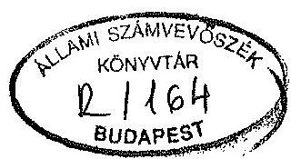
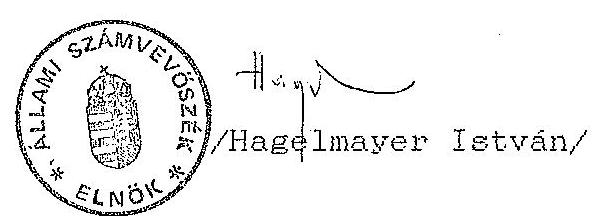

# JELENTÉS

a Független Szociáldemokrata Párt
1990-1991. évi gazdálkodása törvényességének ellenőrzéséről

---

Az ellenőrzést vezette:
Dr. Elek János
osztályvezető főtanácsos

Az ellenőrzést végezték:

Tóth István
Bárczai Tibor
Dr. Velényi János
számvevő tanácsos
szakértő
szakértő

---

# JELENTÉS

a Független Szociáldemokrata Párt
1990-1991. évi gazdálkodása törvényességének ellenőrzéséről

## I.

A vizsgálat célja, módszere, időszaka, körülményei

A pártok működéséről és gazdálkodásáról szóló - többször módosított - 1989. évi XXXIII. tv. (továbbiakban: párttörvény) 10. § (1) bekezdése, valamint az Állami Számvevőszékről szóló 1989. évi XXXVIII. tv. 5. §-a alapján a pártok gazdálkodása törvényességének ellenőrzésére az Állami Számvevőszék jogosult. A törvényi felhatalmazás alapján az ellenőrzési tervben rögzített ütemezésnek megfelelően került sor a Független Szociáldemokrata Párt (továbbiakban: FSZDP) gazdálkodása törvényességének ellenőrzésére.

Az ellenőrzés célja annak megállapítása volt, hogy a párt működéséhez szabályszerűen igénybe vehető forrásokat használt-e fel, a párttörvényben előírt gazdálkodó tevékenységet folytatott-e, valamint betartotta-e a gazdálkodással összefüggő pénzügyi-számviteli szabályokat.

A vizsgálati jelentés az FSZDP Országos Központjában végzett vizsgálat alapján készült.

Az ellenőrzött időszak az 1990. január 1. - 1991. december 31-ig tartó gazdasági év. A helyszíni ellenőrzés 1993. május 4. - május 6-ig történt.

---

Az ellenőrzés módszere tételes vizsgálat volt a helyszínen rendelkezésre bocsátott dokumentumok alapján, figyelemmel a Magyar Közlöny 1991. évi 28. számában közzétett vizsgálati programra.

Az FSZDP a parlamenti választások előtt 1990-ben egyszeri normatív állami költségvetési támogatásban részesült 2 M Ft összegben. Ennek megfelelően már 1991-ben tervezte az ASZ a párt gazdálkodása törvényességének a vizsgálatát. Azonban a párt székhelyében és képviselőjének személyében bekövetkezett többszöri változás miatt az ellenőrzés lefolytatására csak 1993-ra teremtődtek meg a személyi és tárgyi feltételek.

# II.   Az ellenőrzés megállapításai

## 1. A pénzügyi zárómérleg pontossága és teljessége

A párttörvény 9. § (1) bekezdése értelmében a pártok kötelesek minden év március 31-ig az előző évi gazdálkodásuk pénzügyi kimutatását a Magyar Közlönyben a törvényben meghatározott minta szerint közzétenni. E kötelezettségének az FSZDP sem 1990., sem 1991. tekintetében nem tett eleget, bár 1990-ben 2.125 E Ft állami költségvetési támogatást kapott, az FSZDP a párttörvényben előírt pénzügyi zárómérleget az ASZ vizsgálat időpontjáig nem készített.

## 2. Könyvvizsgálati megállapítások

Az FSZDP gazdasági eseményeinek regisztrálására az egyszeres könyvvezetést választotta. Ennek megvalósítására terv 505 sorszámú naplófőkönyvet alkalmazott, melyet az AFEH Fővárosi Igazgatósága 1990. január 15-én 19011981 törzsszámon hitelesített. Az FSZDP-nek önálló jogi személy szervezeti egységei nincsenek, így valamennyi gazdasági eseményt ebben a naplófőkönyvben kellett rögzíteni.

---

A naplófőkönyv vezetésével kapcsolatos megállapítások az alábbiak:
a/ A naplófőkönyv nyitó tétele megegyezik az FSZDP bankszámlájának 1990. január 2-i nyitó egyenlegével. A pénztárban nyitó tételt nem könyveltek.
b/ A naplófőkönyvet 1991. június 30-ig vezették. Ezen időpont utáni gazdasági műveletek a naplófőkönyvben nem kerültek rögzítésre, azokról csak egy számítógépes pénzforgalmi nyilvántartás áll rendelkezésre. Az 1991. június 30-a utáni gazdálkodást az ellenőrzés a számítógépes nyilvántartással történő összevetéssel vizsgálta.
c/ Az FSZDP könyvelésében a kiadásokat nem olyan bontásban könyvelték, hogy az a párttörvényben előírt beszámoló elkészítését lehetővé tette volna. A költségeket 1990. évben összevontan az egyéb költség oszlophoz könyvelték, csupán a munkabéreket és az ÁFA-t különítették el. 1991. évben csupán a pénztár és bankforgalmi adatokat könyvelték, a kiadások jogcím szerinti könyvelését teljesen elhagyták.
d/ A gazdasági eseményeket 1991. június 30-ig megtörtént sorrendjében könyvelték. A naplófőkönyvet szabályosan 1990. I. negyedév végén zárták utoljára.
e/ A könyvelésben gyakran nem az 53/1988.(XII.24.) PM rendelet előírásainak megfelelően kitöltött kiadási és bevételi pénztárbizonylatok alapján könyveltek.

- 1990. évben 90.000 Ft támogatás bevétel került úgy könyvelésre, hogy a bevételi pénztárbizonylatról hiányzik a befizető neve, aláírása és alapbizonylat sincs csatolva, melyből megállapítható lenne a támogatást nyújtó személye. Így a fenti összeg névtelen adománynak minősül. Annak elfogadásával az FSZDP megsértette a párttörvény 4. § (3) bekezdésének előírását.

---

- 1991. július 1. után több esetben előfordult, hogy a számítógépes nyilvántartásban olyan kiadási pénztárbizonylat számra hivatkoznak, amelyen a vizsgálat időpontjáig egyáltalán nem rögzítettek gazdasági adatokat. Néhány esetben pedig egyáltalán nincs hivatkozás bizonylatszámon a nyilvántartásban.

3. Az analitikus nyilvántartások és a bizonylati rend ellenőrzése
a/ Az FSZDP a kötelezően előírt analitikus nyilvántartások közül 1990-ben csak az SzJA köteles kifizetések nyilvántartását vezette. 1991-ben, mivel SzJA köteles kifizetésük nem volt, analitikus nyilvántartást nem vezettek.
b/ A szigorú számadási kötelezettségű nyomtatványok körét az FSZDP-nél nem jelölték ki, azokról nyilvántartást nem vezetnek. A bizonylatokat nem minden esetben növekvő sorszám szerint használják fel.
c/ A bizonylatok kiállítása nem felel meg az 53/1988.(XII.24.) PM rendeletben előírt tartalmi követelményeknek. A legsúlyosabb hibák a következők:

- A bevételi és kiadási pénztárbizonylatokról kivétel nélkül hiányzik az FSZDP bélyegzője.
- A bevételi pénztárbizonylatokról minden esetben hiányzik a befizető neve, az utalványozó és a befizető aláírása.
- A kiadási pénztárbizonylatokról gyakran hiányzik a felvételre jogosult neve.
- Esetenként nagyösszegű pénztári készpénzkiadások utalványozás nélkül kerültek kifizetésre.

---

- A könyvelésből esetenként hiányzik a kiadási pénztárbizonylaton feltüntetett összeg felhasználását tanúsító alapbizonylat.
d/ Azokban az esetekben, amikor a bizonylatokon van utalványozás, azt minden esetben aláírásra jogosult végezte.
e/ A naplófőkönyv, illetve a számítógépes nyilvántartás alapján az alapbizonylatok gyorsan visszakereshetők. A bizonylatok tárolása biztonságosnak tekinthető.
f/ Tekintettel arra, hogy az FSZDP állóeszközzel és tartós fogyóeszközzel nem rendelkezik, leltárt nem készített. 1990-ben ugyan vásárolt egy Lada személygépkocsit, de azt még ugyanabban az évben eladta.

4. A párt gazdálkodó tevékenységének vizsgálata

Az FSZDP a vizsgált időszakban gazdálkodó tevékenységet nem végzett. Pénzének egy részét - 350 E Ft-ot - letéti jegybe fektette. Egyéb értékpapírt nem vásárolt.

# III.

Felhívás a törvényes állapot helyreállítására

A párttörvény 10. § (4) bekezdésében kapott felhatalmazás alapján az ASZ felhívja a párt elnökét, hogy:

- a párttörvény 9. § (1) bekezdésében előírt pénzügyi zárómérleget az FSZDP 1990., 1991. és 1992. évi gazdálkodásáról készíttesse el és a Magyar Közlönyben tegye közzé;

---

- a vizsgálat során tapasztalt, a könyvvitel rendjét és a számvitel bizonylati rendjét sértő gyakorlatot szüntesse meg. Tegye meg a szükséges intézkedéseket az 1991. évi XVIII. tv. előírásainak betartására;
- a párttörvény 4. § (3) bekezdésében foglaltak megsértésével szerzett hozzájárulást a 4. § (3) bekezdésében előírtaknak megfelelően fizesse be az Országgyűlés által létrehozott alapítványba, illetve annak létrehozásáig elkülönített számlán kezelje.

Budapest, 1993. augusztus 4.

