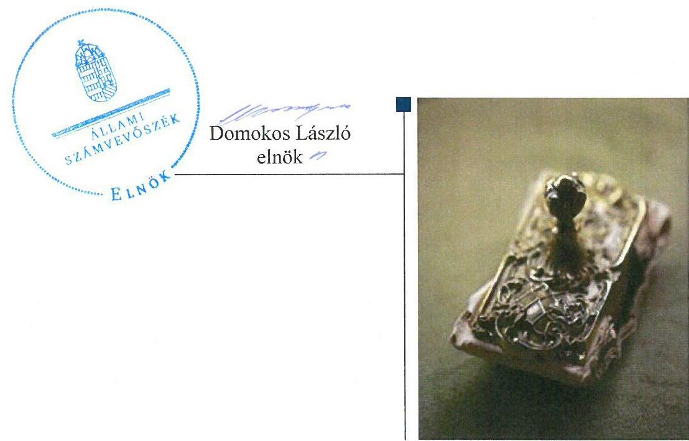
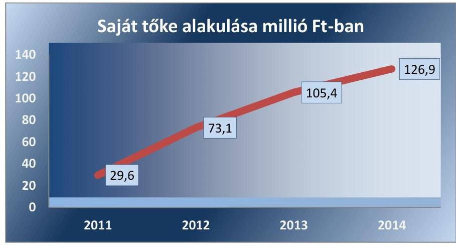
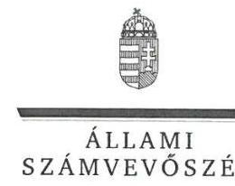
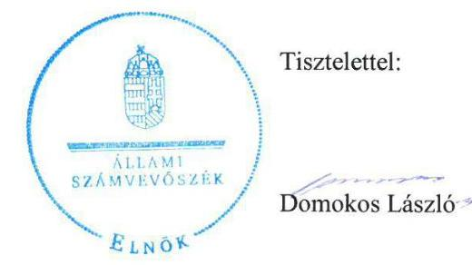

# Jelentés 

## Bay Zoltán Közhasznú Nonprofit Kft.

Az állami tulajdonban (résztulajdonban) lévő gazdálkodó szervezetek vagyonmegőrzési és gazdálkodási tevékenységének ellenőrzése 2016.

---

# Jelentés 

## Bay Zoltán Közhasznú Nonprofit Kft.

Az állami tulajdonban (résztulajdonban) lévő gazdálkodó szervezetek vagyonmegőrzési és gazdálkodási tevékenységének ellenőrzése
2016. július hó 13. nap

---

# AZ ELLENŐRZÉST FELÜGYELTE:

- BÖRÖCZ IMRE felügyeleti vezető

- AZ ELLENŐRZÉST VEZETTE ÉS A VÉGREHAJTÁSÁÉRT FELELŐS:
  - KORSÓSNÉ VÍGH ANDREA ellenőrzésvezető
  - A PROGRAM ÖSSZEÁLLÍTÁSÁÉRT FELELŐS:
    - JANIK JÓZSEF osztályvezető

- IKTATÓSZÁM: V-0931-220/2016.
- TÉMASZÁM: 1706.
- ELLENŐRZÉS-AZONOSÍTÓ SZÁM: V070908

Jelentéseink az Országgyűlés számítógépes hálózatán és az Interneten a www.asz.hu címen is olvashatóak.

---

# TARTALOMJEGYZÉK 

■ ÖSSZEGZÉS ..... 5
■ AZ ELLENŐRZÉS CÉLJA ..... 7
■ AZ ELLENŐRZÉS TERÜLETE ..... 8
■ AZ ELLENŐRZÉS HÁTTERE, INDOKOLTSÁGA ..... 10
■ FÓKUSZKÉRDÉSEK ..... 11
■ ELLENŐRZÉS HATÓKÖRE ÉS MÓDSZEREI ..... 12
■ MEGÁLLAPÍTÁSOK ..... 14
■ JAVASLATOK ..... 22
■ MELLÉKLETEK ..... 23
I. Sz. melléklet: Értelmező szótár. ..... 23
II. Sz. melléklet: A Bay Zoltán NKft. vagyonának alakulása a 2011-2014. években (Millió Ft-ban) ..... 26
III. Sz. melléklet: A Bay Zoltán NKft. eredményének alakulása a 2011-2014. években (Millió Ft-ban) ..... 27
■ FÜGGELÉK: ÉSZREVÉTELEK ..... 29
■ RÖVIDÍTÉSEK JEGYZÉKE ..... 35

---

.

---

# ÖSSZEGZÉS 

Az Állami Számvevőszék ellenőrzése értékelte a Bay Zoltán NKft. 2011-2014. évi vagyonmegőrzési és gazdálkodási tevékenységét. A vagyongazdálkodási tevékenység szabályozása, a vagyon nyilvántartása, a vagyonváltozást eredményező döntések, a bevételek és ráfordítások elszámolása, továbbá a beszámolási kötelezettségek teljesítése megfelelő az előírásoknak. Hiányosság volt, hogy a közérdekű adatok nyilvánosságra hozataláról nem gondoskodtak. A tulajdonosi joggyakorlás szabályszerű volt.

## Az ellenőrzés társadalmi indokoltsága

Magyarországon az intézmény-centrikus közfeladat-ellátás, közvagyon-gazdálkodás jellemző a költségvetésen kívüli feladatellátás térnyerése mellett. Ennek szereplői a nonprofit szervezetek, az önkormányzati tulajdonú gazdasági társaságok és az állami tulajdonú gazdálkodó szervezetek is.

Az Áht. 2. § I) pontja, az Európai Közösséget létrehozó szerződéshez csatolt, a túlzott hiány esetén követendő eljárásról szóló jegyzőkönyv alkalmazásáról szóló 2009. május 25-i 479/2009/EK rendelet szerint, illetve az ESA95 statisztikai módszertana alapján a kormányzati szektorba tartoznak "központi kormányzat alszektorba besorolt társaságok és egyéb szervezetek" is, amelyekkel szemben alapvető követelmény, hogy gazdálkodásuk, működésük szabályszerű, az általuk szolgáltatott adatok megbízhatóak legyenek.

Az állami tulajdonú gazdálkodó szervezetek a nemzeti vagyon részét képezik. Az állami vagyonnal való gazdálkodást illetően a tulajdonosi joggyakorlás és a vagyongazdálkodás feladata az állami vagyon átlátható, rendeltetésszerű és felelős felhasználásának biztosítása. Az állam meghatározza az ellátandó közszolgáltatással kapcsolatos feladatokat, amelyhez a vagyonnal kapcsolatos döntéseknek igazodniuk kell. A nemzetgazdasági szempontból kiemelt jelentőségű nemzeti vagyonban tartandó állami tulajdonban álló társasági részesedést a nemzeti vagyonról szóló törvény határozza meg.

Minden közpénzt, közvagyont használó szervezettel szemben társadalmi igény, hogy tevékenységükről elszámoljanak. Ezt figyelembe véve és az Állami Számvevőszék Stratégiájával összhangban került sor az Bay Zoltán NKft. ellenőrzésére.

## Főbb megállapítások, következtetések, javaslatok

A tulajdonosi joggyakorló a jogszabályi előírásoknak megfelelően alakította ki a vagyonnal való gazdálkodás feltételeit. Az Alapító Okiratokban és alapítói határozatokban rögzítésre kerültek a tulajdonos számára fenntartott, kizárólagos jogosítványok, valamint a vagyonnal történő felelős gazdálkodáshoz szükséges követelmények.

A vagyongazdálkodási tevékenység szabályozása, kialakítása és a vagyon nyilvántartása szabályszerű volt. A vagyon értékének megőrzését és gyarapítását szolgáló vagyongazdálkodás feltételeit a jogszabályi előírásoknak megfelelően kialakították és szabályozták. A vagyonnyilvántartás megfelelt az előírásoknak.

A bevételek, a ráfordítások és az értékcsökkenés elszámolása szabályszerű volt. Az önköltségszámítás jogszabályi előírásnak megfelelő rendjét 2014-től alakították ki és alkalmazták szabályszerűen, annak ellenére, hogy a kötelezettség 2013. évtől fennállt.

A vagyonnal való gazdálkodás, valamint a vagyonváltozást eredményező döntések megfeleltek az előírásoknak. A vagyongazdálkodási tevékenység során betartották a jogszabályi rendelkezéseket és a belső szabályzatok előírásait. A vagyonváltozást eredményező döntések előkészítése megfelelt a jogszabályi és a belső előírásoknak.

A beszámolási kötelezettséget szabályszerűen teljesítették. A kiépített információs rendszer megfelelően működött. A könyvvizsgáló és 2011. év kivételével az FB szabályszerűen végezte tevékenységét a vagyongazdálkodást illetően. A tulajdonosi joggyakorló az éves beszámolókat minden évben a jogszabályban meghatározott határidőben jóváhagyta. A 2011. évi beszámoló tulajdonosi jóváhagyása az FB véleménye hiányában nem volt szabályszerű. A letétbe helyezést a 2011 és 2012. évi beszámolók esetében egy-egy napos késedelemmel, a 2013-2014. években a jogszabályi határidő betartásával teljesítették.

A közérdekű adatok nyilvánosságra hozatalával kapcsolatos jogszabályi előírásnak a Bay Zoltán NKft. nem tett eleget. Nem alkotta meg a közérdekű adatok nyilvánosságra hozatalára vonatkozó szabályzatát, és a kötelezően közzéteendő adatok egy részét nem hozta nyilvánosságra.

A Bay Zoltán NKft. gazdálkodásának a kormányzati szektor hiányára és az államadósságra befolyással bíró elemei a jogszabályi előírásoknak megfeleltek. A Bay Zoltán NKft.-nek a Stabilitási tv.-ben meghatározott adósságot keletkeztető ügylete nem volt. A bevételeket és ráfordításokat szabályszerűen számolták el.

Az ÁSZ a Bay Zoltán NKft. ügyvezetőjének fogalmazott meg javaslatokat, melyek alapján köteles intézkedési tervet összeállítani és azt a jelentés kézhezvételétől számított 30 napon belül az ÁSZ részére megküldeni.

---

# **AZ ELLENŐRZÉS CÉLJA**

## **Bay Zoltán NKft. vagyonmegőrzési és gazdálkodási tevékenységének ellenőrzése**

Az ellenőrzés célja annak értékelése volt, hogy a tulajdonosi jogok gyakorlása szabályszerű volt-e; a gazdálkodó szervezet által ellátott feladat bevételei, ráfordításai elszámolásának, és vagyongazdálkodási tevékenységének szabályozása megfelelte-e a jogszabályi és a tulajdonosi előírásoknak és azok végrehajtása szabályszerű volt-e; biztosítva volt-e a közfeladatok átláthatósága és elszámoltathatósága érdekében a közszolgáltatás díjának megalapozottsága szabályszerű önköltségszámítással; a vagyonváltozást eredményező döntések esetében a tulajdonosi jogok gyakorlója és a gazdálkodó szervezet szabályszerűen jártak-e el; a gazdálkodó szervezet épített-e ki és működtetett-e információs rendszert a szabályszerű vagyongazdálkodás érdekében. Az ellenőrzés célja volt annak értékelése is, hogy a kormányzati alszektorba sorolt egyéb szervezetek gazdálkodásának a kormányzati szektor hiányára és az államadósságra befolyással bíró elemei a jogszabályi előírásoknak megfeleltek-e.

---

# **AZ ELLENŐRZÉS TERÜLETE**

## **Bay Zoltán NKft.**

A Bay Zoltán NKft.1 a Magyar Állam 100%-os tulajdonában álló társaság, alapítását a Bay Zoltán Alkalmazott Kutatási Közalapítvány közhasznú nonprofit gazdasági társasággá történő átalakításáról szóló 1118/2011. (IV. 28.) Korm. határozat2 rendelte el. Működését – általános jogutódként – 2011. augusztus 31-én kezdte meg. A számvevőszéki ellenőrzés az ezt követő időszakra terjedt ki.

A tulajdonosi joggyakorlást 2014. augusztus 12-ig a KIM3, ezt követően – az MNV Zrt.4 felhatalmazása alapján – a Miniszterelnökség látta el.

A Kormány az 1235/2011. (VII. 7.) Korm. határozatban5 döntött a Mérnöktovábbképzés Fejlesztése Alapítvány megszüntetéséről és arról, hogy feladatait a Bay Zoltán NKft. lássa el. A Kormány az 1043/2012. (II. 23.) Korm. határozattal6 megszüntette az Ipar a Korszerű Mérnökképzésért Alapítványt, amelynek feladatai ellátására a Bay Zoltán NKft.-t jelölte ki. A Fővárosi Törvényszék 2014. szeptember 24-én jogerőre emelkedett végzése alapján megszüntetett Környezetgazdálkodás Oktatás Fejlesztéséért Alapítvány tevékenységét is a Bay Zoltán NKft. folytatta.

A Bay Zoltán NKft. a magyarországi műszaki, természettudományi és üzemszervezési alkalmazott kutatások végzését, támogatását, valamint – a kutatási eredményeit felhasználva – szervezet-fejlesztési és korszerűsítési feladatok ellátását tűzte ki célul. Állami vagyon nem volt a birtokában, illetve használatában, tevékenységét a jogelőd, valamint a beolvadt alapítványok apportált vagyonelemeivel, eszközeivel látta el. Kapcsolt vállalkozással nem rendelkezett.

A mérlegfőösszeg a 2011. évről a 2014. évre 5290,8 millió Ft-ról 4776,4 millió Ft-ra csökkent, a saját tőke a 2011. évi 29,6 millió Ft-ról 126,9 millió Ft-ra emelkedett, amely évenkénti változását az 1. ábra szemlélteti.

1. ábra

*Forrás: Bay Zoltán NKft. 2011–2014. évi főkönyvi kivonatok*

---

Az értékesítés nettó árbevétele 2014. december 31-én 961,7 millió Ft, a mérleg szerinti eredmény 21,7 millió Ft volt. A 2011-2014. évek eszközök, források és eredmény alakulását a II. és III. sz. melléklet szemlélteti. A 2014. évben átlagosan 227 főt foglalkoztattak.

---

# AZ ELLENŐRZÉS HÁTTERE, INDOKOLTSÁGA 

## Az ellenőrzés több szinten hasznosulhat

Az ÁSZ7 alapvető célkitűzése, hogy az államháztartáson kívülre nyújtott költségvetési támogatások és ingyenes vagyonjuttatások ellenőrzésével hozzájáruljon ahhoz, hogy a közpénzeket az államháztartáson kívül működő szervezetek is átlátható módon használják fel a közfeladatok szerződésben vállalt ellátása érdekében. A közfeladatok ellátása elsősorban költségvetési szervek alapításával és működtetésével történik. Az államháztartáson kívüli szervezetek a közfeladatok ellátásában, jogszabályban meghatározott feltételekkel, közreműködhetnek.

Az ellenőrzés feladata a közvagyonnal biztosított közfeladat-ellátással kapcsolatban a közpénzek átláthatósága, nyilvánossága érdekében a jogszabályokban, belső szabályzatokban megfogalmazott előírások érvényesülésének az állami tulajdonban (résztulajdonban) lévő gazdálkodó szervezetek vagyonérték-megőrzési és gazdálkodási tevékenységének értékelése.

A nemzeti számlák nemzetközi és hazai statisztikai módszertana és szabványai elveket határoznak meg a statisztikai értelemben vett kormányzati szektorba tartozó szervezetek körére és besorolásuk módjára. A szervezetek megnevezését a nemzetgazdasági miniszter teszi közzé.

A Vtv.8 3. § (1) bekezdése 2013. június 27-ig hatályos szabályozása értelmében a tulajdonosi jogok és kötelezettségek összességét az állami vagyon tekintetében az állami vagyon felügyeletéért felelős miniszter gyakorolta, aki e feladatát az MNV Zrt., az MFB Zrt.9, illetve a jogszabályban rögzített egyéb tulajdonosi joggyakorló szervezetek útján látta el, míg 2014. július 15-ig tulajdonosi joggyakorlóként, ha törvény vagy miniszteri rendelet eltérően nem rendelkezett, az MNV. Zrt., a törvényben, vagy a miniszter által rendeletben kijelölt személy gyakorolta. 2014. július 15-t követően a rábízott állami vagyon felett az államot megillető tulajdonosi jogok és kötelezettségek összességét tulajdonosi joggyakorlóként - ha törvény vagy miniszteri rendelet eltérően nem rendelkezik - az MNV Zrt. gyakorolja.

Az ellenőrzés várható hasznosulásaként az ellenőrzés megállapításai a jogalkotás számára segítséget nyújthatnak az államháztartáson kívüli közfeladat-ellátás, közvagyonnal való gazdálkodás értékeléséhez, jogszabályi keretei pontosításához, az átláthatóságot biztosító szabályozáshoz. Az ellenőrzöttek számára visszajelzést ad a gazdálkodási tevékenységgel, az állami vagyon felhasználásával, a közszolgáltatási árképzés megalapozottságával és az éves elszámolással kapcsolatos szabálytalanságokról és kockázatokról. Az ellenőrzés tapasztalatai segítik és erősítik az ÁSZ hozzáadott értéket teremtő elemző tevékenységét és tanácsadó szerepét. Feltárjuk, hogy a kormányzati szektorba sorolt egyéb szervezetek milyen mértékben befolyásolják a költségvetési hiányt és az államadósságot. A kormányzati szektorba sorolt, költségvetési tervezésbe is bevont gazdálkodó szervezetek ellenőrzése fokozza a legfőbb ellenőrző szerv iránti figyelmet és közbizalmat.

---

# FÓKUSZKÉRDÉSEK 

1.     - A tulajdonosi joggyakorló a vagyonnal való gazdálkodás feltételeit szabályszerűen alakította-e ki?
2.     - A Bay Zoltán NKft. vagyongazdálkodási tevékenységének szabályozása, kialakítása és a vagyon nyilvántartása megfelelt-e az előírásoknak?
3.     - A bevételek és ráfordítások elszámolásának szabályozása és végrehajtása, valamint az önköltségszámítás szabályszerű volt-e?
4.     - A vagyonnal való gazdálkodás, valamint a vagyonváltozást eredményező döntések megfeleltek-e a jogszabályi és a belső előírásoknak?
5. A Bay Zoltán NKft. a szabályszerű vagyongazdálkodás érdekében teljesítette-e beszámolási kötelezettségét, kiépített-e és működtetett-e információs rendszert?
6. A Bay Zoltán NKft. gazdálkodásának a kormányzati szektor hiányára és az államadósságra befolyást gyakorló elemei a jogszabályi előírásoknak megfeleltek-e?

---

# ELLENŐRZÉS HATÓKÖRE ÉS MÓDSZEREI 

## Az ellenőrzés típusa

Szabályszerűségi ellenőrzés

## Az ellenőrzött időszak

2011. január 1-től 2014. december 31-ig.

##
 Az ellenőrzés tárgya

Állami tulajdonban (résztulajdonban) lévő gazdálkodó szervezetek vagyonmegőrzési és gazdálkodási tevékenysége és a kormányzati szektor hiányára és adósságállományára hatást gyakorló elemek ellenőrzése.

## Az ellenőrzött szervezet

Bay Zoltán NKft. és a Miniszterelnökség

## Az ellenőrzés jogalapja

Az Állami Számvevőszékről szóló 2011. évi LXVI. törvény 5. § (3)-(5) bekezdése, valamint az állami vagyonról szóló 2007. évi CVI. törvény 3. § (4) bekezdése képezi.

## Az ellenőrzés módszerei

Az ellenőrzést a számvevőszéki ellenőrzés szakmai szabályai szerint, a szabályszerűségi ellenőrzés módszerével, a vonatkozó nemzetközi standardok figyelembevételével végeztük.

Az ellenőrzés lefolytatásához a Bay Zoltán NKft. és a tulajdonosi joggyakorló tanúsítványok kitöltésével, valamint az ÁSZ által kért dokumentumok megküldésével szolgáltatott adatokat. A rendelkezésre bocsátott adatok, információk kontrollja és a munkalapok kitöltése a helyszíni ellenőrzés keretében történt.

A bevételek és ráfordítások elszámolása, valamint a vagyonnyilvántartás terén a szabályszerű működést véletlen mintavétellel ellenőriztük. Az ellenőrzöttnél, mint a kormányzati szektorba sorolt gazdálkodó szervezetnél a személyi jellegű ráfordítások elszámolása mellett az egyéb ráfordítások, és az egyéb bevételek elszámolásának szabályszerűségét szintén mintatételeken keresztül ellenőriztük. A mintavétellel ellenőrzött területek esetében minden egyes tétel vonatkozásában a szabályszerűségre vonatkozó kérdéseket tettünk fel, amelyek eredménye összesítésre került. A jogszabályoknak és a belső előírásoknak megfelelőnek tekintettük az adott területet, amennyiben a minta ellenőrzésének eredménye alapján 95%-os bizonyossággal a teljes sokaságban a hibaarány kisebb volt, mint 10%, nem megfelelőnek értékeltük, ha a hibaarány a 10%-ot meghaladta. A ráfordítások elszámolására és a vagyonnyilvántartásra vonatkozó véletlen mintavételt kockázati alapú kiválasztással egészítettük ki, amelynek során évente a három legnagyobb összegű tételt választottuk ki.

---

# 1. A tulajdonosi joggyakorló a vagyonnal való gazdálkodás feltételeit szabályszerűen alakította-e ki? 

Összegző megállapítás

A tulajdonosi joggyakorló a jogszabályi előírásoknak megfelelően alakította ki a vagyonnal való gazdálkodás feltételeit.
1.1. számú megállapítás

A tulajdonosi joggyakorló az Alapítói Okiratokban és alapítói határozatokban szabályszerűen meghatározta a számára fenntartott, vagyongazdálkodásra vonatkozó jogokat, rögzítette a saját vagyonnal történő felelős gazdálkodáshoz szükséges követelményeket.

A tulajdonosi joggyakorló ${ }^{10}$ a számára fenntartott, vagyongazdálkodásra vonatkozó jogköröket a Gt. ${ }^{11}$-ben, illetve a $\mathrm{Ptk}^{12}$-ban foglaltaknak megfelelően Alapító Okiratban ${ }^{13}$, illetve alapítói határozatokban rögzítette.

A felelős gazdálkodáshoz szükséges követelményeket az Alapító Okiratokban az alapítói hatáskörökben, az ügyvezető ${ }^{14}$, a - jogszabályi előírásnak megfelelően kötelezően létrehozott - $\mathrm{FB}^{15}$ és a könyvvizsgáló feladat- és hatáskörökben írták elő.

Az Alapító Okirat módosítására hét alkalommal - minden esetben szabályszerűen, alapítói határozat alapján - került sor. A módosításokat jogszabályi változások, tevékenységkör bővülés, fióktelep változás, alapítói kizárólagos hatáskör bővítés, tőkeemelés indokolták. A tulajdonosi joggyakorló általi ellenőrzést az Alapító Okiratban nevesítve, az FB hatáskörében szabályozták. Az Alapító Okiratban meghatározták az ügyvezető jogköreit, a döntési jogosultságait.

### 1.2. számú megállapítás

## A Bay Zoltán NKft. állami vagyont nem kezelt.

A Bay Zoltán NKft. vagyonkezelésbe vett állami vagyonnal, vagyonhasznosítási szerződéssel nem rendelkezett. Tevékenységét saját (a jogelőd közalapítvány, illetve a kormányzati döntések alapján megszüntetett alapítványok) eszközeivel látta el. Az állami tulajdon teljes mértékben a jegyzett tőkében nyilvánult meg.

---

# 2. A Bay Zoltán NKft. vagyongazdálkodási tevékenységének szabályozása, kialakítása és a vagyon nyilvántartása megfelelt-e az előírásoknak? 

Összegző megállapítás

A vagyongazdálkodási tevékenység szabályozása, kialakítása és a vagyon nyilvántartása szabályszerű volt.
2.1. számú megállapítás

A vagyon értékének megőrzését és gyarapítását szolgáló vagyongazdálkodás feltételeit a jogszabályi előírásoknak megfelelően kialakították és szabályozták.

A tulajdonosi joggyakorló jogszabályban foglalt hatáskörében eljárva Alapító Okiratban és alapítói határozatokban rögzítette az ügyvezetés felelősségét, valamint a vagyongazdálkodással kapcsolatos elvárásokat.

Az Alapító Okiratban foglaltakkal összhangban az éves üzleti tervet elkészítették. A 2012-2014. évekre vonatkozóan rendelkezésre álltak a tulajdonosi joggyakorló által alapítói határozatban jóváhagyott a gazdálkodásra vonatkozó éves üzleti tervek. Az üzleti tervek teljesítéséről az éves beszámolókban adtak tájékoztatást.

A szabályszerű vagyongazdálkodás feltételeinek kialakítása érdekében a jogszabályi előírásoknak megfelelően elkészítették, aktualizálták a belső szabályzatokat. Rendelkezésre álltak a Számv. tv. ${ }^{16}$-ben előírtaknak megfelelő számviteli politika, eszközök és források leltárkészítési és leltározási-, eszközök és források értékelési-, valamint pénzkezelési szabályzatok.

A tulajdonosi joggyakorló 2012. február 17-én kelt 2/2012. számú alapítói határozatával fogadta el az SZMSZ ${ }^{17}$-t, amely a vezetés és gazdálkodás szabályait a jogszabályokkal és az Alapító Okirattal összhangban tartalmazta.

### 2.2. számú megállapítás

A vagyonnyilvántartás megfelelt az előírásoknak.
A Bay Zoltán NKft. kizárólag saját vagyonnal rendelkezett, a vagyonváltozás kimutatása az előírásoknak megfelelő volt. Az analitikus nyilvántartás alátámasztotta a főkönyvi kivonatban szereplő vagyoni értéket. A Számv. tv.-ben előírtaknak megfelelően - a könyvek üzleti év végi zárásához, a beszámoló elkészítéséhez - a mérlegtételek alátámasztásához összeállított leltár tételesen, ellenőrizhető módon tartalmazta a mérleg fordulónapján meglévő eszközöket és forrásokat mennyiségben és értékben. A beszámolóban és a számviteli nyilvántartásban lévő vagyontárgyak állományát szabályszerűen - a jogszabályi és a leltározási szabályzatban foglaltak alapján - elkészített leltárral támasztották alá. A leltárak kiértékelése megtörtént.

A 2012-2014. években a tartós hitelviszonyt megtestesítő értékpapír állományra a jogszabályi és belső előírásainak megfelelően az értékvesztést, illetve a visszaírást elszámolták.

---

# 3. A bevételek és ráfordítások elszámolásának szabályozása és végrehajtása, valamint az önköltségszámítás szabályszerű volt-e? 

Összegző megállapítás

A bevételek és ráfordítások elszámolása a 2011-2014. években, az önköltségszámítás 2014. évtől volt szabályszerű.
3.1. számú megállapítás

A bevételeket, ráfordításokat és az értékcsökkenési leírást a jogszabályi előírásoknak megfelelően számolták el.

Az Alapító Okiratban rögzített közfeladat, közhasznú feladatok ellátása során a bevételek és a ráfordítások elszámolása szabályszerű volt. Belső szabályzatban rögzítették, hogy a bevételeket, költségeket és ráfordításokat projektszám (témaszám), költséghely, valamint közhasznú és vállalkozási bontásban kell részletezni.

A bevételek elszámolása megfelelt a Számv. tv. és a belső szabályzatok előírásainak. Az alaptevékenységként végzett feladatokból és az egyéb tevékenységekből származó árbevételeket a számviteli nyilvántartásokban elkülönítetten mutatták ki. A fejlesztési projektekhez kapcsolódó bevételeket projektenként elkülönítették. Az értékesítés nettó árbevételének elszámolása megfelelt a Számv. tv.-ben foglalt előírásoknak, azok közfeladatellátással kapcsolatos elkülönítése megtörtént.

A ráfordítások számviteli elszámolása megfelelt a Számv. tv.-ben foglalt előírásoknak, azok közfeladat-ellátással kapcsolatos projektszám szerinti elkülönítése megtörtént.

Az eszközök állományba, nyilvántartásba vétele és az elszámolása szabályszerű volt. Minden évben elkészítették az adott év felújítási tervét, melyet az eszközök állapotfelmérésére alapozva terveztek. Az eszközök értéknövekedése a 2012-2014. években az elszámolt értékcsökkenés összegét nem érte el. Az értékcsökkenési leírás - tervszerinti és terven felüli - elszámolása megfelelt a jogszabályi előírásoknak. Az immateriális javak és a tárgyi eszközök használhatósági foka 56,4%-ról 40,3%-ra csökkent, az átlagos életkor 3,1 évről 5,1 évre növekedett.

A belső szabályzatban foglaltaknak megfelelően intézkedtek a követelésállomány csökkentésére. A számviteli politikában rögzített esetekben a követelések vonatkozásában az értékvesztést elszámolták, illetve visszaírták, valamint a behajthatatlan követelést leírták.

A mérleg szerinti követelésállomány alakulását az 1. táblázat szemlélteti.

1. táblázat

KÖVETELÉSÁLLOMÁNY 2011-2014. ÉVEKBEN (MILLIÓ FT-BAN)

| Megnevezés | 2011. | 2012. | 2013. | 2014. |
| :-- | :--: | :--: | :--: | :--: |
| Követelésállomány | 360,4 | 651,0 | 757,3 | 534,9 |
| Elszámolt értékvesztés | 35,6 | 30,3 | 76,6 | 4,8 |
| Leírt követelés | 0 | 0 | 5,5 | 1,6 |
| Visszaírt értékvesztés | 0 | 0 | 59,5 | 37,7 |

Forrás: Bay Zoltán NKft. 2011-2014. évi főkönyvi kivonatok

---

### 3.2. számú megállapítás

Az önköltségszámítás jogszabályi előírásnak megfelelő rendjét 2014-től alakították ki és alkalmazták szabályszerűen, annak ellenére, hogy a kötelezettség 2013. évtől fennállt.

A Bay Zoltán NKft.-nek a 2011-2012. évekre vonatkozóan önköltség-számítási szabályzatot ${ }^{18}$ a Számv. tv. 14. § (6)-(7) bekezdéseiben szabályozott mentesség alapján nem kellett készíteni. A 2013. évben az önköltségszámítás rendjére vonatkozó, a Számv. tv. 14. § (5) bekezdés c) pontjában a számviteli politika részeként előírt, belső szabályzat készítési kötelezettségnek, annak ellenére nem tettek eleget, hogy a Számv. tv. 14. § (6)-(7) bekezdéseiben szabályozott mentességi okok egyike sem állt fenn*. A 2014. február 17-ével kiadott önköltség-számítási szabályzattal a hiányosságot megszüntették.

A Számv. tv. előírásaival összhangban kialakított önköltség-számítási szabályzatban a tevékenységeket/projekteket alapvetően annak közhasznú, vagy vállalkozási jellege szerint kategorizálták. Az egyes projekteket témaszám kódok segítségével azonosították, az egyes projektekre kerülő költségeket a témaszám kódra könyvelték, amelyekből legyűjtéssel lehetett meghatározni egy adott projekt (szolgáltatás, tevékenység, stb.) tényleges önköltségét. 2014. évtől a díjmeghatározás során az önköltségszámítási szabályzatban előírtak szerint jártak el.

# 4. A vagyonnal való gazdálkodás, valamint a vagyonváltozást eredményező döntések megfeleltek-e a jogszabályi és a belső előírásoknak? 

Összegző megállapítás

## 4.1. számú megállapítás

A vagyonnal való gazdálkodás, valamint a vagyonváltozást eredményező döntések megfeleltek az előírásoknak.

A vagyongazdálkodási tevékenység során betartották a jogszabályi rendelkezéseket és a belső szabályzatok előírásait.

A vagyon az év végi beszámolók alapján a 2011. évben 5290,8 millió Ft, a 2012. évben 4648,5 millió Ft, a 2013. évben 5916,8 millió Ft, a 2014. évben 4776,4 millió Ft volt.
$\longrightarrow$ A 2012. évi csökkenés oka a Magyar Tudományos Akadémia Szegedi Biológiai Kutatóközpontja részére történt 205,5 millió Ft értékű ingyenes eszközátadás volt, az 1118/2011. (IV. 28.) Korm. határozat 5. pontja, és a tulajdonosi joggyakorló a 10/2012. számú alapítói határozata alapján.
$\longrightarrow$ A vagyonban bekövetkezett 2013. és 2014. évi változások a beolvadt alapítványok vagyonának és feladatainak kormányhatározatokban elrendelt átvételével voltak összefüggésben.
A vagyonváltozások megfeleltek a jogszabályi előírásoknak és a belső szabályzatokban foglaltaknak.

[^0]
[^0]:    * A 2012. évi beszámoló alapján a költség-nemek szerinti költségek együttes összege az ötszáz millió Ft-ot meghaladta.

---

A Bay Zoltán NKft. az ellenőrzött időszakban összességében nyereségesen gazdálkodott: az üzemi (üzleti) tevékenység eredménye a 2011. év kivételével negatív (veszteség), a pénzügyi műveletek, a rendkívüli eredmény, és a mérleg szerinti eredmény a 2011-2014. évek mindegyikében pozitív (nyereség) volt.

A gazdálkodás hatására a saját tőke, jegyzett tőke aránya 2011-2013. között folyamatosan növekedett, majd a 2014. évben - az eredménytartalék terhére 2014. június 5.-én végrehajtott tulajdonosi tőkeemelés hatására - csökkent. A saját tőke, jegyzett tőke alakulását a 2. táblázat szemlélteti.
2. táblázat

| SAJÁT TŐKE, JEGYZETT TŐKE ALAKULÁSA |  |  |  |  |
| :-- | :--: | :--: | :--: | :--: |
| Megnevezés | 2011. | 2012. | 2013. | 2014. |
| Saját tőke (millió Ft) | 29,6 | 73,1 | 105,4 | 126,9 |
| Jegyzett tőke (millió Ft) | 0,5 | 0,5 | 0,5 | 30,0 |

A vagyonváltozást eredményező döntések előkészítése, megalapozása megfelelt a jogszabályi és a belső előírásoknak.
A vagyont érintő változások jellemzően Kormány határozatokon alapultak, a 2011-2014. évi gazdálkodás során nem volt olyan volumenű karbantartás, felújítás, beruházás, melyhez a tulajdonosi jogok gyakorlójának döntésére lett volna szükség. A tulajdonosi joggyakorló döntési jogkörébe tartozó vagyonelem értékesítésnél a hozzájárulás megkérése szabályszerűen megtörtént. Belső eljárásrendben ${ }^{19}$ határozták meg a döntési szinteket a vagyonváltozást (döntően beszerzést) eredményező gazdasági események engedélyezéséhez, melyet betartottak.

A Bay Zoltán NKft. a Kbt. által előírt esetben a közbeszerzési eljárást
 lefolytatta.

# 4.3. számú megállapítás 

## A tulajdonosi jogok gyakorlója vagyonváltozást eredményező döntései megfeleltek a jogszabályi előírásoknak.

A tulajdonosi joggyakorló az alapítói határozatokon, az üzleti tervek, valamint az éves beszámolók jóváhagyásán keresztül hozta vagyonváltozását eredményező döntéseit. Az Alapító Okiratban rögzítették a tulajdonosi joggyakorló vagyonváltozást érintő hatásköreit, az ügyvezető rendszeres beszámolási és előterjesztési kötelezettségét. A tulajdonosi joggyakorló által meghozott döntések a vagyon értékének megőrzését, gyarapítását szolgálták, amelyek szabályszerűek voltak. A tulajdonosi joggyakorló döntési jogkörébe tartozó vagyonértékesítéshez - egy licencia és ahhoz kapcsolódó eszköz átruházásához - az engedélyt az Alapító Okiratban foglaltaknak megfelelően megkérték. A tulajdonosi joggyakorló a 16/2012. számú alapítói határozatban a szerződés megkötéséhez hozzájárult.

Az Alapító Okirat 9.2. 10. pontja szerint az alapító kizárólagos hatáskörébe tartozik „...az olyan szerződések megkötésének jóváhagyása, amelyek egyedi értéke a nettó 50 millió forintot meghaladja,...". A tulajdonosi jogok gyakorlója a nettó 50 millió forintos értékhatárt a 2014. január 30-tól hatályos Alapító Okiratban nettó 100 millió forintra emelte.

---

# 5. A Bay Zoltán NKft. a szabályszerű vagyongazdálkodás érdekében teljesítette-e beszámolási kötelezettségét, kiépített-e és működtetett-e információs rendszert? 

Összegző megállapítás

A beszámolási kötelezettséget szabályszerűen teljesítették. A kiépített információs rendszer megfelelően működött.

### 5.1. számú megállapítás

A beszámolási és adatszolgáltatási kötelezettséget az előírásoknak megfelelően teljesítették. A könyvvizsgáló és a 2011. év kivételével az FB is szabályszerűen végezte tevékenységét a vagyongazdálkodást illetően. A közérdekű adatok nyilvánosságra hozatala nem felelt meg a vonatkozó jogszabályi előírásnak, mert a kötelezően közzéteendő adatok egy részét nem hozta nyilvánosságra.

A beszámolási, adatszolgáltatási és egyéb tájékoztatási feladatokat a jogszabályi előírással összhangban belső szabályzatban meghatározták. A tulajdonosi joggyakorló az Alapító Okiratban rendszeres időközönkénti, negyedévenkénti tájékoztatási kötelezettséget írt elő a működés alakulásáról. A 2014. január 30-tól az Alapító Okirat tartalmazta, hogy rendszeres adatszolgáltatást kell nyújtani a tulajdonosi joggyakorló meghatalmazottja részére. Az adatszolgáltatásokat a tulajdonosi joggyakorló részére évente megküldött kontrolling adattábla alapján kellett teljesíteni, melynek eleget tettek.

Az éves beszámolóval egyidejűleg elkészítették az üzleti jelentést is a Számv. tv.-vel összhangban, a közhasznú jogállásra való tekintettel 2011. üzleti évre a Kszt. ${ }^{20}$-nek megfelelően a közhasznúsági jelentést, illetve a 2012-2014. üzleti évekre a Civil tv. ${ }^{21}$ szerint a közhasznúsági mellékletet. A tulajdonosi joggyakorló a Számv. tv.-ben előírt határidőig jóváhagyta az éves beszámolókat. A 2011-2014. üzleti évek éves beszámolóinak tulajdonosi joggyakorló általi jóváhagyásakor a közzétett éves beszámolókra vonatkozó könyvvizsgálói jelentések és az éves beszámolókat jóváhagyó FB határozatok - 2011. évi kivételével - rendelkezésre álltak, amelyek megfeleltek a jogszabályban és a belső szabályozásban foglaltaknak. A 2011. évi beszámolóról az FB írásbeli jelentést nem készített. A tulajdonosi joggyakorló a 2011. évi beszámolót elfogadó 5/2012. alapítói határozatát a Gt. 35. § (3) bekezdésében és a hatályos Alapító Okirat 9.2. 1. pontjában foglaltakat megsértve hozta, mivel az FB véleményével nem rendelkezett. A 2011. évi beszámoló könyvvizsgálata során a könyvvizsgáló korlátozás nélküli figyelemfelhívással élt az analitikus nyilvántartás hiányosságai miatt, amelynek pótlására 2012. június 30-i határidőt jelölte meg. A tulajdonosi joggyakorló alapítói határozatban írta elő a hiányosságok megszüntetését. Az ügyvezető 2012. június 27-vel a könyvvizsgáló nyilatkozatával alátámasztva tájékoztatta a tulajdonosi joggyakorlót a hiányosságok megszüntetéséről.

A 2011-2012. évi beszámolókat a Számv. tv 153. § (1) bekezdésében előírt határidőt egy nappal meghaladóan helyezték letétbe, a 2013-2014. években határidőben eleget tettek a letétbe helyezési kötelezettségének.

---

A közérdekű adatok megismerésére irányuló igények teljesítésének rendjét rögzítő szabályzatot nem készítették el, az Info tv. ${ }^{22} 30 . \S$ (6) bekezdésében rögzítettek ellenére.

A kötelezően közzéteendő adatok egy részét nem hozta nyilvánosságra, az Info tv. 37. § (1) bekezdésben foglaltak ellenére az 1. melléklet I.-II.-III. részben meghatározottak közül a honlapon nem tették közzé a szervezeti felépítést, a szervezeti és működési szabályzatot, az adatvédelmi és adatbiztonsági szabályzat hatályos és teljes szövegét, a foglalkoztatottak létszámára és személyi juttatásaira vonatkozó összesített adatokat, az Európai Unió támogatásával megvalósuló fejlesztések leírását, az azokra vonatkozó szerződéseket. A Tmtv. ${ }^{23}$ 2. § (1)-(2) bekezdésében előírtak ellenére nem tették közzé továbbá a honlapon az FB, a vezető tisztségviselő, vezető állású munkavállaló, az együttes cégjegyzésre jogosult munkavállalók és a bankszámla feletti együttes rendelkezésre jogosult munkavállalók adatait.

Az Informatikai szabályzat tartalmazta az adatvédelemre és adatbiztonságra vonatkozó előírásokat, amelyek megfeleltek az Info tv.-ben foglaltaknak, tartalma néhány hiányosság ellenére biztosította a megfelelő adatvédelmet és adatbiztonságot.

A kormányzati szektorba sorolt egyéb szervezetekről szóló nemzetgazdasági miniszteri közlemény szerint a Bay Zoltán NKft. az ellenőrzött időszakban 2013. június 28-tól a kormányzati szektorba sorolt egyéb szervezetek közé tartozott. A 2014-2015. évi költségvetési törvényjavaslat összeállításához szükséges feltételekről és érvényesítendő követelményekről szóló tájékoztatók szerint a költségvetés tervezésébe adatot nem kellett szolgáltatnia.

# 5.2. számú megállapítás 

## A Bay Zoltán NKft. és a tulajdonosi joggyakorló közötti információs rendszer megfelelően működött.

A tulajdonosi joggyakorló és a Bay Zoltán NKft. között az információáramlásra vonatkozó alapítói szabályozás nem készült. Az éves beszámoló megküldése és a kontrolling adatszolgáltatás keretében postai és elektronikus úton működött a rendszeres információáramlás.

A tulajdonosi joggyakorló az ellenőrzött időszakban egy alkalommal, a 2014. évben végzett tulajdonosi ellenőrzést, amely a 2013. évi működés rendszerellenőrzését jelentette. Az ellenőrzési jelentésében tett négy javaslatra elkészítették az intézkedési tervet és megküldték a tulajdonosi joggyakorlónak.

---

# 6. A Bay Zoltán NKft. gazdálkodásának a kormányzati szektor hiányára és az államadósságra befolyást gyakorló elemei a jogszabályi előírásoknak megfeleltek-e? 

Összegző megállapítás

A Bay Zoltán NKft. gazdálkodásának a kormányzati szektor hiányára befolyást gyakorló elemei szabályszerűek voltak.
6.1. számú megállapítás

A Bay Zoltán NKft.-nek a Stabilitási ${ }^{24}$ tv.-ben meghatározott adósságot keletkeztető ügylete nem volt.

Az Áht. ${ }^{25}$ alapján 2012. évtől kiadott nemzetgazdasági miniszteri közlemények szerint a Bay Zoltán NKft. 2013. június 28-tól - azt megelőzően nem - tartozott a kormányzati szektorba sorolt egyéb szervezetek közé. A Bay Zoltán NKft.-nek az ellenőrzött időszakban a Stabilitási tv. 3. § (1) bekezdésben meghatározott adósságot keletkeztető ügylete nem volt.
6.2. számú megállapítás

A bevételeket és ráfordításokat szabályszerűen számolták el.
A kormányzati szektor hiányára befolyást gyakorló bevételek és ráfordítások elszámolása megfelelő volt. A személyi ráfordítások elszámolásai szabályszerűen történtek.

Az eredmény kifizetésére (osztalékfizetésről szóló döntésre) nem került sor, mivel az az Alapítói okiratban rögzítettek szerint az a közhasznú tevékenységre fordítható.

---

# JAVASLATOK 

Az ÁSZ tv. ${ }^{26}$ 33. § (1) bekezdésében foglaltak értelmében az ellenőrzött szervezet vezetője köteles a jelentésben foglalt megállapításokhoz kapcsolódó intézkedési tervet összeállítani és azt a jelentés kézhezvételétől számított 30 napon belül az ÁSZ részére megküldeni. Amennyiben az intézkedési tervet határidőre nem küldi meg a szervezet, vagy amennyiben az nem elfogadható, az ÁSZ elnöke az ÁSZ tv. 33. § (3) bekezdés a)-b) pontjaiban foglaltakat érvényesítheti.

## Bay Zoltán NKft. ügyvezetőjének

1. Készíttesse el a közérdekű adatok megismerésére irányuló igények teljesítésének rendjét rögzítő szabályzatot a jogszabályi előírásnak megfelelően.
(5.1. sz. megállapítás 4. bekezdése alapján)
2. Intézkedjen a társaság tevékenységéről közzéteendő adatok elektronikus közzétételi kötelezettsége jogszabályi előírásoknak megfelelő, teljes körű teljesítésére.
(5.1. sz. megállapítás 5. bekezdése alapján)

---

# MELLÉKLETEK 

I. SZ. MELLÉKLET: ÉRTELMEZŐ SZÓTÁR

| Állami vagyon | 2010. június 17-től   a) Az állam tulajdonában lévő dolog, valamint a dolog módjára hasznosítható természeti erő,   b) az a) pont hatálya alá nem tartozó mindazon vagyon, amely vonatkozásában törvény az állam kizárólagos tulajdonjogát nevesíti,   c) az állam tulajdonában lévő tagsági jogviszonyt megtestesítő értékpapír, illetve az államot megillető egyéb társasági részesedés,   d) az államot megillető olyan immateriális, vagyoni értékkel rendelkező jogosultság, amelyet jogszabály vagyoni értékű jogként nevesít. (Forrás: Vtv. 1. § (2) bekezdése) 2012. november 10-től az állami vagyon fogalma kiegészül a következő ponttal:   e) az állam tulajdonában lévő pénzügyi eszközök (Forrás: Vtv. 1. § (2) bekezdése) |
| :--: | :--: |
| Gazdálkodó szervezet | 2013. június 30-ig gazdálkodó szervezet:   Az állami vállalat, az egyéb állami gazdálkodó szerv, a szövetkezet, a lakásszövetkezet, az európai szövetkezet, a gazdasági társaság, az európai részvény-társaság, az egyesülés, az európai gazdasági egyesülés, az európai területi együttműködési csoportosulás, az egyes jogi személyek vállalata, a leányvállalat, a vízgazdálkodási társulat, az erdő birtokossági társulat, a végrehajtói iroda, az egyéni cég, továbbá az egyéni vállalkozó. (Forrás: Ptk: ${ }^{27} 685$. § c) pontja)   2013. július 1-jétől gazdálkodó szervezet:   Az állami vállalat, az egyéb állami gazdálkodó szerv, a szövetkezet, a lakásszövetkezet, az európai szövetkezet, a gazdasági társaság, az európai részvénytársaság, az egyesülés, az európai gazdasági egyesülés, az európai területi együttműködési csoportosulás, az egyes jogi személyek vállalata, a leányvállalat, a vízgazdálkodási társulat, az erdő birtokossági társulat, a végrehajtói iroda, az egyéni cég, továbbá az egyéni vállalkozó. Az állam, a helyi önkormányzat, a költségvetési szerv, az egyesület, a köztestület, valamint az alapítvány gazdálkodó tevékenységével összefüggő polgári jogi kapcsolataira is a gazdálkodó szervezetre vonatkozó rendelkezéseket kell alkalmazni, kivéve, ha a törvény e jogi személyekre eltérő rendelkezést tartalmaz; a 292/A-292/B. §, 301/A-301/B. §, 405. § (1) bekezdés, valamint a 407/A. § (1) bekezdés tekintetében nem minősül gazdálkodó szervezetnek az, aki a közbeszerzésekről szóló törvény értelmében ajánlatkérő (szerződő hatóság). (Forrás: Ptk: 685. § c) pontja)   2014. március 15-től gazdálkodó szervezet:   A gazdasági társaság, az európai részvénytársaság, az egyesülés, az európai gazdasági egyesülés, az európai területi együttműködési csoportosulás, a szövetkezet, a lakásszövetkezet, az európai szövetkezet, a vízgazdálkodási társulat, az erdő birtokossági társulat, az állami vállalat, az egyéb állami gazdálkodó szerv, az egyes jogi személyek vállalata, a közös vállalat, a végrehajtói iroda, a közjegyzői iroda, az ügyvédi iroda, a szabadalmi ügyvivői iroda, az önkéntes kölcsönös biztosító pénztár, a magánnyugdíjpénztár, az egyéni cég, továbbá az egyéni vállalkozó. Az állam, a helyi önkormányzat, a költségvetési szerv, az egyesület, a köztestület, valamint az alapítvány gazdálkodó tevékenységével összefüggő polgári jogi kapcsolataira is a gazdálkodó szervezetre vonatkozó rendelkezéseket kell alkalmazni. (Forrás: $\mathrm{Pp}^{28} .396 . \S$ ) |
| Kormányzati szektorba sorolt egyéb szervezet | Az a szervezet, amely az Áht. alapján nem része az államháztartásnak, azonban az Európai Közösséget létrehozó szerződéshez csatolt, a túlzott hiány esetén követendő eljárásról szóló jegyzőkönyv alkalmazásáról szóló 2009. május 25-i |

---

|  | 479/2009/EK rendelet szerint a kormányzati szektorba tartozik. A nemzetgazdasági miniszter 2013. június 26-án megjelent Közleményben tette közé ezen szervezetek listáját. |
| :--: | :--: |
| MNV Zrt. | Az állami vagyon felett, a Magyar Államot megillető tulajdonosi jogok és kötelezettségek összességét - a hatályos szabályozás szerint - az állami vagyon felügyeletéért felelős miniszter (jelenleg a nemzeti fejlesztési miniszter) gyakorolja. A miniszter feladatát nagy

 részben az MNV Zrt., mint tulajdonosi joggyakorló szervezet útján látja el. |
| Nemzetgazdasági szempontból kiemelt jelentőségű nemzeti vagyon körébe tartozó társaságok | Az ÁSZ ellenőrzés szempontjából az Nvtv. ${ }^{29}$ 2. sz. mellékletében felsorolt társasági részesedések. |
| Tulajdonosi ellenőrzés | 2010. június 17-től:   Az MNV Zrt. „rendszeresen ellenőrzi a vele szerződéses jogviszonyban lévő személyek, szervezetek vagy más használók állami vagyonnal való gazdálkodását, megállapításairól az MNV Zrt. Felügyelő Bizottságát, az ellenőrzött szervet, szükség esetén a minisztert és az Állami Számvevőszéket tájékoztatja". (Forrás: Vtv. 17. § d) pont)   A Vhr. ${ }^{30}$ alapján „a tulajdonosi ellenőrzés célja az állami vagyonnal való gazdálkodás vizsgálata, ennek keretében a rendeltetésellenes, jogszerűtlen, szerződésellenes, vagy a tulajdonos érdekeit sértő, illetve a központi költségvetést hátrányosan érintő vagyon-gazdálkodási intézkedések feltárása és a jogszerű állapot helyreállítása, továbbá a vagyonnyilvántartás hitelességének, teljességének és helyességének biztosítása". (Forrás: Vhr. 20. § (2) bekezdés)   2011. december 31-ig   Az állami vagyon kezelőjét, használóját megillető jogok gyakorlását, annak szabályszerűségét, célszerűségét az MNV Zrt. - szükség szerint területi szervei útján - ellenőrzi. (Forrás: Vhr. 20. § (1) bekezdés)   2012. január 1-jétől:   Az állami vagyon kezelőjét, haszonélvezőjét, használóját megillető jogok gyakorlását, annak szabályszerűségét, célszerűségét az MNV Zrt. - szükség szerint területi szervei útján - ellenőrzi. (Forrás: Vhr. 20. § (1) bekezdés) |
| Tulajdonosi jogok gyakorlója | 2010. június 17-től:   Az állami vagyon felett a Magyar Államot megillető tulajdonosi jogok és kötelezettségek összességét - ha törvény eltérően nem rendelkezik - az állami vagyon felügyeletéért felelős miniszter (a továbbiakban: miniszter) gyakorolja, aki e feladatát a Magyar Nemzeti Vagyonkezelő Zártkörűen Működő Részvénytársaság (a továbbiakban: MNV Zrt.), a Magyar Fejlesztési Bank, illetve a tulajdonosi joggyakorló szervezet útján látja el. A miniszter miniszteri rendeletben, a törvényben meghatározott állami vagyoni kör tekintetében, meghatározott időtartamra, a joggyakorlás egyes szabályainak meghatározásával - az őt megillető tulajdonosi jogok és kötelezettségek összességének, illetve azok meghatározott részének gyakorlóját az Áht. szerinti központi költségvetési szervek, ezek intézménye, továbbá a 100%-ban állami tulajdonban álló gazdasági társaságok közül kijelölheti. (Forrás: Vtv. 3. § (1) bekezdés és (2) bekezdés)   2013. június 28-ától:   A rábízott állami vagyon felett az államot megillető tulajdonosi jogok és kötelezettségek összességét tulajdonosi joggyakorlóként:   a) ha törvény vagy miniszteri rendelet eltérően nem rendelkezik, a Magyar Nemzeti Vagyonkezelő Zártkörűen Működő Részvénytársaság (a továbbiakban: MNV Zrt.),   b) törvényben kijelölt személy vagy   c) az állami vagyon felügyeletéért felelős miniszter (a továbbiakban: miniszter) által rendeletben kijelölt személy gyakorolja. |

---

|  | [...] A miniszter e törvény felhatalmazása alapján - a meghatározott célok hatékonyabb elérése érdekében, miniszteri rendeletben, az ott meghatározott állami vagyoni kör tekintetében, meghatározott időtartamra - e törvény keretei között, a joggyakorlás egyes szabályainak meghatározásával - az államot megillető tulajdonosi jogok és kötelezettségek összességének, illetve azok meghatározott részének gyakorlóját az Áht. szerinti központi költségvetési szervek, ezek intézménye, továbbá a 100%-ban állami tulajdonban álló gazdasági társaságok közül kijelölheti. (Forrás: Vtv. 3. § (1) bekezdés és (2) bekezdése) |
| :--: | :--: |
| Vagyonkezelő | 2010. január 01 - 2011. december 31. között:   Az állami vagyont az MNV Zrt. maga kezeli, vagy szerződés - így különösen bérlet, haszonbérlet, szerződésen alapuló haszonélvezet, vagyonkezelés, megbízás - alapján központi költségvetési szervnek, természetes vagy jogi személynek, illetőleg jogi személyiséggel nem rendelkező gazdasági társaságnak hasznosításra átengedi. (Forrás: Vtv. 23. § (1) bekezdése)   2012. január 1-jétől:   Az állami vagyont az MNV Zrt. maga kezeli, vagy szerződés - így különösen bérlet, haszonbérlet, megbízás - alapján központi költségvetési szervnek, természetes vagy jogi személynek, vagy jogi személyiséggel nem rendelkező gazdálkodó szervezetnek hasznosításra átengedi. Az állami vagyonra vonatkozóan az MNV Zrt. kizárólag az Nvtv.-ben meghatározott személyekkel köthet vagyonkezelési szerződést. (Forrás: Vtv. 23. § (1), 27. § (1) bekezdése)   2013. június 28-ától:   Az állami vagyonnal az MNV Zrt. maga gazdálkodik, vagy szerződés - így különösen bérlet, haszonbérlet, megbízás - alapján központi költségvetési szervnek, természetes vagy jogi személynek, vagy jogi személyiséggel nem rendelkező gazdálkodó szervezetnek hasznosításra átengedi, illetőleg vagyonkezelésbe, haszonélvezetbe adja. Az állami vagyonra vonatkozóan az MNV Zrt. kizárólag az Nvtv.-ben meghatározott személyekkel köthet vagyonkezelési szerződést. (Forrás: Vtv. 23. § (1), 27. § (1) bekezdése) |
|  | A tulajdonosi joggyakorlás és a vagyongazdálkodás feladata   2010. június 17-től:   Az állami vagyon rendeltetésének megfelelő - az állami feladatok ellátásához, a társadalmi szükségletek kielégítéséhez, valamint a Kormány gazdaságpolitikája megvalósításának elősegítéséhez szükséges, egységes elveken alapuló, önálló ágazatként megjelenő - hatékony, költségtakarékos, értékmegőrző, értéknövelő felhasználásának biztosítása (közvetlen felhasználás), illetve közvetett hasznosítása (beleértve a vagyoni kör változását eredményező értékesítést), valamint az állami vagyon gyarapítása (ideértve a vagyoni kör bővítését is). (Forrás: Vtv. 2. § (1) bekezdés) |

---

II. SZ. MELLÉKLET: A BAY ZOLTÁN NKFT. VAGYONÁNAK ALAKULÁSA A 2011-2014. ÉVEKBEN (MILLIÓ FT-BAN)

|  Megnevezés | 2011 | 2012 | 2013 | 2014  |
| --- | --- | --- | --- | --- |
|  A. Befektetett eszközök | 2535,8 | 2221,1 | 3274,3 | 2647,3  |
|  I. Immateriális javak | 166,9 | 103,0 | 141,9 | 111,9  |
|  II. Tárgyi eszközök | 2124,6 | 1831,5 | 1779,0 | 1634,3  |
|  III. Befektetett pénzügyi eszközök | 244,3 | 286,6 | 1353,4 | 901,1  |
|  B. Forgóeszközök | 2607,7 | 1827,2 | 2311,4 | 1864,4  |
|  I. Készletek | 1052,7 | 531,0 | 966,2 | 1015,5  |
|  II. Követelések | 360,4 | 651,0 | 757,3 | 534,9  |
|  III. Értékpapírok | 70,8 | 0 | 0 | 0  |
|  IV. Pénzeszközök | 1123,8 | 645,2 | 587,9 | 314,0  |
|  C. Aktív időbeli elhatárolások | 147,3 | 600,2 | 331,0 | 264,7  |
|  ESZKÖZÖK ÖSSZESEN | 5290,8 | 4648,5 | 5916,8 | 4776,4  |
|  D. Saját tőke | 29,6 | 73,1 | 105,4 | 126,9  |
|  I. Jegyzett tőke | 0,5 | 0,5 | 0,5 | 30,0  |
|  II. Eredménytartalék | 0 | 29,1 | 72,2 | 75,1  |
|  III. Lekötött tartalék | 0,4 | 0,4 | 0,3 | 0,1  |
|  IV. Mérleg szerinti eredmény | 28,7 | 43,1 | 32,4 | 21,7  |
|  E. Céltartalék | 36,9 | 27,7 | 15,8 | 26,7  |
|  F. Kötelezettségek | 1128,1 | 1092,1 | 1529,1 | 943,8  |
|  1. Hátrasorolt kötelezettségek | 0 | 69,0 | 69,0 | 0  |
|  2. Rövid lejáratú kötelezettségek | 1128,1 | 1023,1 | 1460,1 | 943,8  |
|  G. Passzív időbeli elhatárolások | 4096,2 | 3455,6 | 4266,5 | 3679,0  |
|  FORRÁSOK ÖSSZESEN | 5290,8 | 4648,5 | 5916,8 | 4776,4  |

Forrás: Bay Zoltán NKft. 2011-2014. évi beszámolói

---

| Megnevezés | 2011 | 2012 | 2013 | 2014 |
| :--: | :--: | :--: | :--: | :--: |
| I. Értékesítés nettó árbevétele | 111,4 | 514,8 | 862,4 | 961,7 |
| II. Aktivált saját teljesítmények értéke | $-29,7$ | $-552,7$ | 513,7 | 207,1 |
| III. Egyéb bevételek | 34,0 | 2303,7 | 1098,5 | 1423,5 |
| IV. Anyagjellegű ráfordítások | 16,2 | 660,3 | 652,4 | 728,3 |
| V. Személyi jellegű ráfordítások | 23,1 | 1182,6 | 1446,7 | 1520,7 |
| VI. Értékcsökkenési leírás | 27,1 | 392,0 | 363,2 | 362,2 |
| VII. Egyéb ráfordítások | 44,7 | 79,2 | 156,9 | 65,5 |
| A. ÜZEMI (ÜZLETI) TEVÉKENYSÉG EREDMÉNYE | 4,6 | $-48,3$ | $-144,6$ | $-84,4$ |
| VIII. Pénzügyi műveletek bevételei | 1,9 | 49,0 | 186,5 | 75,7 |
| IX. Pénzügyi műveletek ráfordításai | 0,4 | 15,0 | 41,1 | 54,1 |
| B. PÉNZÜGYI MŰVELETEK EREDMÉNYE | 1,5 | 34,0 | 145,4 | 21,6 |
| C. SZOKÁSOS VÁLLALKOZÁSI EREDMÉNY | 6,1 | $-14,3$ | 0,8 | $-62,8$ |
| X. Rendkívüli bevételek | 24,9 | 120,2 | 31,6 | 84,5 |
| XI. Rendkívüli ráfordítások | 0 | 55,6 | 0 | 0 |
| D. RENDKÍVÜLI EREDMÉNY | 24,9 | 64,6 | 31,6 | 84,5 |
| E. ADÓZÁS ELŐTTI EREDMÉNY | 31,0 | 50,3 | 32,4 | 21,7 |
| XII. Adófizetési kötelezettség | 2,3 | 7,2 | 0 | 0 |
| F. ADÓZOTT EREDMÉNY | 28,7 | 43,1 | 32,4 | 21,7 |
| G. MÉRLEG SZERINTI EREDMÉNY | 28,7 | 43,1 | 32,4 | 21,7 |

Forrás: Bay Zoltán NKft. 2011-2014. évi beszámolói

---

.

---

# FÜGGELÉK: ÉSZREVÉTELEK 

A jelentéstervezetet a Számvevőszék 15 napos észrevételezésre megküldte az ellenőrzött szervezet vezetőjének az ÁSZ tv. 29. § ${ }^{+}$(1) bekezdése előírásának megfelelően.
Az elfogadott észrevételek alapján a Számvevőszék módosította a jelentést.

A függelék tartalmazza az ellenőrzött észrevételeit, illetve az el nem fogadott észrevételek elutasításának indoklását.
Az ÁSZ tv. 29. § (2) bekezdésében foglalt észrevételezési jogával a Miniszterelnökséget vezető miniszter nem élt, a jelentéstervezetre észrevételt nem tett.

- A Bay Zoltán NKft. ügyvezetőjének írásban tett észrevétele mellékletek nélkül.
- Tájékoztatás az észrevételek kezeléséről az ügyvezetőnek.

[^0]
[^0]:    ${ }^{+}$29. § (1) Az Állami Számvevőszék az ellenőrzési megállapításait megküldi az ellenőrzött szervezet vezetőjének vagy az általa megbízott személynek, és annak, akinek személyes felelősségét állapította meg.
    (2) Az ellenőrzött szervezet vezetője és a felelősként megjelölt személy az ellenőrzés megállapításaira tizenöt napon belül írásban észrevételt tehet.
    (3) Az Állami Számvevőszék az észrevételre a beérkezésétől számított harminc napon belül írásban válaszol. A figyelembe nem vett észrevételeket köteles a jelentésben feltüntetni, és megindokolni, hogy azokat miért nem fogadta el.

---

Bay Zoltán Alkalmazott Kutatási Közhasznú Nonprofit Kft.

Bay Zoltán Nonprofit Ltd. for Applied Research

Domonkos László
Állami Számvevőszék elnöke részére

# Állami Számvevőszék 

## 1052 Budapest

Apáczai Csere János utca 10.

Iktatószám: V-0931-213/2016
Témaszám: 1706
Ellenőrzés-azonosító szám: V070908

## Tisztelt Domonkos László Elnök úr!

A Bay Zoltán Alkalmazott Kutatási Közhasznú Nonprofit Kft. ügyvezetőjeként a Társaság - mint állami tulajdonban (résztulajdonban) lévő gazdálkodó szervezet - vagyonmegőrzési és gazdálkodási tevékenységének ellenőrzése kapcsán lefolytatott vizsgálatra megküldött jelentéstervezetre az alábbi észrevételt teszem:

1. A vagyongazdálkodási tevékenység szabályozása, kialakítása és a vagyon nyilvántartása szabályszerűségének vizsgálata során
 a 2.1. számú megállapítás, miszerint „A tulajdonosi joggyakorló a 2014. évi üzleti terv elfogadására az Alapító Okiratban foglaltak ellenére alapítói határozatot nem hozott" megállapítás helytelen.
Az Alapító a 2014. évi üzleti tervet 2013. december 17-én elfogadta a 10/2013. számú Alapítói Határozatával. A határozat másolatát csatoltan megküldöm.
2. A szabályszerű vagyongazdálkodás érdekében teljesített beszámolási kötelezettség és információs rendszerrel kapcsolatban az 5.1. számú megállapítás miszerint „A közérdekű adatok nyilvánosságra hozatalával kapcsolatosan a vonatkozó jogszabályi előírásoknak nem tett eleget." megállapítás csak részben igaz. A megállapítás azt sugallja, mintha semmilyen adatot, információt, beszámolót, stb. nem tettünk volna közzé. Valóban nem került valamennyi kötelező adat, információ közzétételére, ezt nem vitatjuk, a jogszabályi előírásnak a Társaság csak részben tett eleget.
A helyszíni ellenőrzés során, illetve azt követően azonnal pótoltuk a hiányzó adatokat, így azok már teljes körűen megtalálhatóak a Társaság www.bayzoltan.hu honlapján. Ezzel párhuzamosan elkészítettük a Társaság Közzétételi, valamint Közérdekű adatkezelési szabályzatait is. Mindkettőt csatoltan megküldöm.

Egyéb észrevételünk nincs.

Clm/addres: H-1116 Budapest, Fehérvári út 130. Levelezési cím: H-1509 Budapest Pf.: 53. Mailing address: H-1509 Budapest P.0.Box 53.

Telefon/phone: $+36-1 / 463-0500$
Fax: $+36-1 / 463-0505$
E-mail: bayzoltan@bayzoltan.hu
Web: www.bayzoltan.hu

---

Egyúttal szeretném megköszönni az Állami Számvevőszék munkáját és támogatását.

Budapest, 2016. május 19.

Üdvözlettel:

BAY ZOLTÁN Közhasznú Nonprofit Kft. H-1116 Budapest, Kondorfa u. 1.

dr. Grasselli Norbert
ügyvezető igazgató

---

ELNÖK

Ikt.szám: V-0931-216/2016.

# Dr. Grasselli Norbert úr 

ügyvezető igazgató
Bay Zoltán Közhasznú Nonprofit Kft.

## Budapest

## Tisztelt Ügyvezető Igazgató Úr!

A ,,Bay Zoltán Közhasznú Nonprofit Kft. - Az állami tulajdonban (résztulajdonban) lévő gazdálkodó szervezetek vagyonmegőrzési és gazdálkodási tevékenységének ellenőrzése " címmel készített számvevőszéki jelentéstervezetre tett észrevételeit köszönettel megkaptam.
Az Állami Számvevőszék észrevételekre vonatkozó álláspontjáról a felügyeleti vezető által készített részletes tájékoztatást mellékelten megküldöm.

Budapest, 2016. 06 hó 4 nap

Melléklet: Tájékoztatás az észrevételek kezeléséről

---

# Tájékoztatás   az észrevételek kezeléséről 

A „Bay Zoltán Közhasznú Nonprofit Kft. - Az állami tulajdonban (résztulajdonban) lévő gazdálkodó szervezetek vagyonmegőrzési és gazdálkodási tevékenységének ellenőrzése" címû jelentéstervezetre 2016. május 24-én érkezett észrevételeit áttekintettük, annak kezelésével kapcsolatban a következő tájékoztatást adom.

Az első észrevétel a jelentéstervezet 2.1. számú megállapítására vonatkozott, amely szerint a tulajdonosi joggyakorló a 2014. évi üzleti terv elfogadására az Alapító Okiratban foglaltak ellenére alapítói határozatot nem hozott. Az észrevétel azt tartalmazta, hogy az „Alapító a 2014. évi üzleti tervet 2013. december 17-én elfogadta a 10/2013. számú Alapítói Határozatával", és a melléklet tartalmazta a hivatkozott határozatot.

Az ellenőrzés során rendelkezésre bocsátott dokumentumok áttekintése alapján megállapítható volt, hogy az észrevétel megalapozott, ezért az erre vonatkozó szövegrészek a jelentéstervezetből (Főbb megállapítások, következtetések, javaslatok rész második bekezdése, 2.1. számú megállapítás második mondata, a 2.1. számú megállapítást alátámasztó 3. bekezdés) törlésre, az üzleti tervek elfogadására vonatkozó 2.1. számú megállapítást alátámasztó második bekezdés módosításra kerül.

A második észrevétel a jelentéstervezet 5.1. számú megállapításra vonatkozott, amely szerint a közérdekű adatok nyilvánosságra hozatalával kapcsolatosan a vonatkozó jogszabályi előírásoknak nem tett eleget. Az észrevétel első fele azt tartalmazta, hogy a megállapítás csak részben igaz, mert a jogszabályi előírásnak részben eleget tettek.

Az észrevétel megalapozott, ezért az erre vonatkozó 5.1. számú megállapítás utolsó mondata és az azt alátámasztó ötödik bekezdés, illetve ezzel összhangban a „Főbb megállapítások, következtetések, javaslatok" rész hatodik bekezdése módosításra kerül annak megfelelően, hogy a kötelezően közzéteendő adatok egy részét nem hozta nyilvánosságra.

Az észrevétel továbbá tartalmazta, hogy a helyszíni ellenőrzés során, illetve azt követően pótolták a hiányzó adatokat, és elkészítették a Közzétételi, valamint a Közérdekű adatkezelési szabályzatokat is. A szabályzatokat az észrevétel melléklete tartalmazta.

Tájékoztatom, hogy a jelentéstervezetben, illetve majd a jelentésben foglalt megállapítások az ellenőrzött időszakra (2011. január 1. - 2014. december 31.) vonatkoznak, az ezt követően - a hiányosságok megszüntetése érdekében - megtett intézkedéseket (a hiányzó adatok pótlása, szabályzatok elkészítése) az Állami Számvevőszékről szóló 2011. évi LXVI. törvény 33. § (1) bekezdése szerinti intézkedési terv összeállítása során indokolt figyelembe venni.

---

Tájékoztatom, hogy a számvevőszéki jelentés függelékeként szerepeltetjük a jelentéstervezetre tett észrevételeit, valamint az azokra adott válaszunkat.

Budapest, 2016. 06 hó 20 nap

Böröcz Imre
felügyeleti vezető

---

# RÖVIDÍTÉSEK JEGYZÉKE 

${ }^{1}$ Bay Zoltán NKft.
${ }^{2} 1118 / 2011$. (IV. 28.) Korm. határozat
${ }^{3}$ KIM
${ }^{4}$ MNV Zrt.
${ }^{5} 1235 / 2011$. (VII. 7.) Korm. határozat
${ }^{6} 1043 / 2012$. (II. 23.) Korm. határozat
${ }^{7}$ ÁSZ
${ }^{8}$ Vtv.
${ }^{9}$ MFB Zrt.
${ }^{10}$ tulajdonosi joggyakorló
${ }^{11}$ Gt.
${ }^{12}$ Ptk
${ }^{13}$ Alapító Okirat
${ }^{14}$ ügyvezető
${ }^{15} \mathrm{FB}$
${ }^{16}$ Számv.tv.
${ }^{17}$ SZMSZ
${ }^{18}$ önköltség-számítási szabályzat
${ }^{19}$ Belső eljárásrend
${ }^{20}$ Kszt.
${ }^{21}$ Civil tv.
${ }^{22}$ Info tv.
${ }^{23}$ Tmtv.
${ }^{24}$ Stabilitási tv.
${ }^{25}$ Áht.
${ }^{26}$ ÁSZ tv.
${ }^{27}$ Ptk ${ }_{1}$
${ }^{28} \mathrm{Pp}$.

Bay Zoltán Alkalmazott Kutatási Közhasznú Nonprofit Korlátolt Felelősségű Társaság
1118/2011. (IV. 28.) Korm. határozat a Bay Zoltán Alkalmazott Kutatási
Közalapítvány közhasznú nonprofit gazdasági társasággá történő átalakításáról
Közigazgatási és Igazságügyi Minisztérium
Magyar Nemzeti Vagyonkezelő Zártkörűen Működő Részvénytársaság
1235/2011. (VII. 7.) Korm. határozat a Mérnöktovábbképzés Fejlesztése Alapítvány megszüntetéséről
1043/2012. (II. 23.) Korm. határozat az Ipar a Korszerű Mérnökképzésért Alapítvány megszüntetéséről
Állami Számvevőszék
Az állami vagyonról szóló 2007. évi CVI. törvény
Magyar Fejlesztési Bank Zártkörűen Működő Részvénytársaság
Közigazgatási és Igazságügyi Minisztérium (2011. augusztus 31-től - 2014. augusztus 12-ig)
Miniszterelnökség (2014. augusztus 12-től)
A gazdasági társaságokról szóló 2006. évi IV. törvény
A Polgári törvénykönyvről szóló 2013. évi V. törvény
Bay Zoltán Alkalmazott Kutatási Közhasznú NKft. Alapító Okirata (2011. július 29., 2011. november 11., 2012. április 5., 2012. november 7., 2013. január 28., 2013. augusztus 28., 2014. február 28., 2014. június 5.)
Bay Zoltán NKft. ügyvezető igazgatója (2011. november 11-től)
Bay Zoltán NKft. Felügyelő Bizottsága
A számvitelről szóló 2000. évi C. törvény
A Bay Zoltán Alkalmazott Kutatási Közhasznú NKft. Szervezeti és Működési Szabályzata (hatályos 2012. február 17.)
A Bay Zoltán Alkalmazott Kutatási Közhasznú Nonprofit Kft. Önköltségszámítási Szabályzata (ügyvezető 3/2014. számú határozatával jóváhagyva 2014. február 17.)

A Bay Zoltán Alkalmazott Kutatási Közhasznú Nonprofit Kft. működéshez kapcsolódó ajánlatok, megrendelések, szerződések, teljesítés igazolások és bizonylatolás eljárásrendje (hatályos 2012. január 10-től)
A közhasznú szervezetekről szóló 1997. évi CLVI. törvény
Az egyesülési jogról, a közhasznú jogállásról, valamint a civil szervezetek működéséről és támogatásáról szóló 2011. évi CLXXV. törvény
Az információs önrendelkezési jogról és az információszabadságról szóló 2011. évi CXII. törvény
A köztulajdonban álló gazdasági társaságok takarékosabb működéséről szóló 2009. évi CXXII. törvény

Magyarország gazdasági stabilitásáról szóló 2011. évi CXCIV. törvény
Az államháztartásról szóló 2011. évi CXCV. törvény
az Állami Számvevőszékről szóló 2011. évi LXVI. törvény
A Polgári törvénykönyvről szóló 1959. évi IV. törvény
A polgári perrendtartásról szóló 1952. évi III. törvény

---

${ }^{29}$ Nvtv.
${ }^{30} \mathrm{Vhr}$.

A nemzeti vagyonról szóló 2011. évi CXCVI. törvény
254/2007. (X. 4.) Korm. rendelet az állami vagyonnal való gazdálkodásról

---

# ÁLLAMI SZÁMVEVŐSZÉK 

1052 Budapest, Apáczai Csere János utca 10.
Levélcím: 1364 Budapest 4. Pf. 54
Telefon: +36 14849100 Telefax: +36 14849200
www.asz.hu
