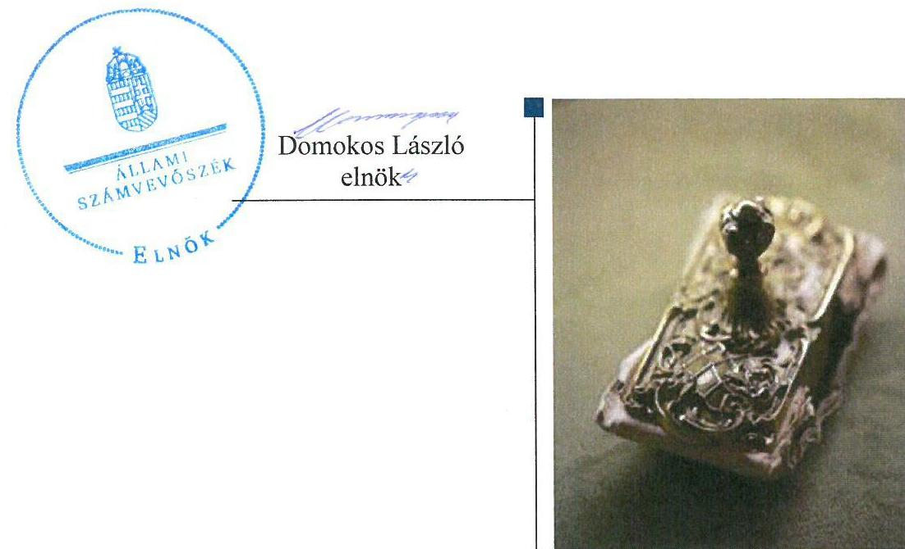
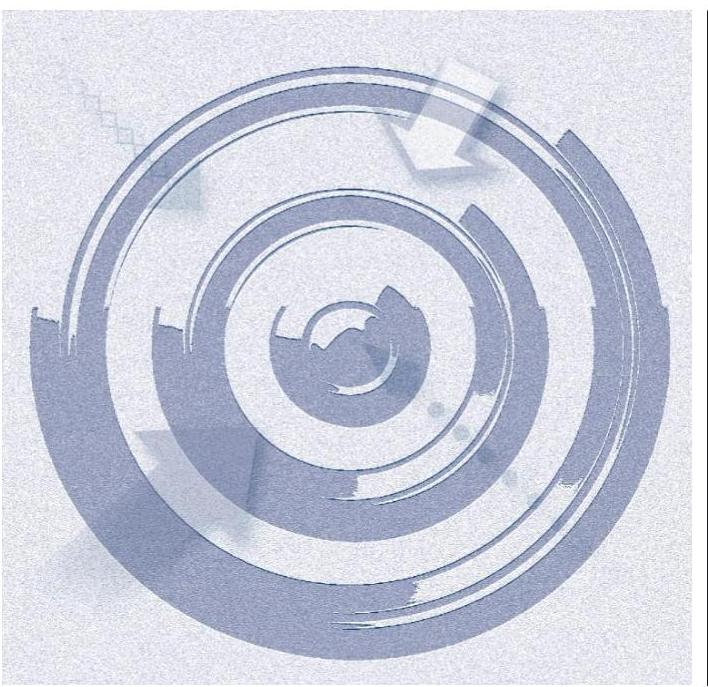
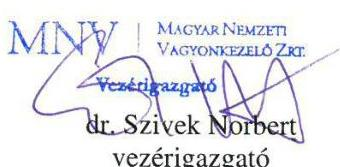
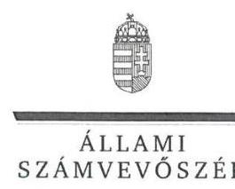
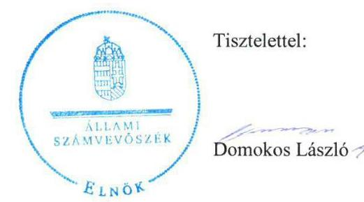

# Jelentés 

## ERFO Közhasznú Nonprofit Kft.

Az állami tulajdonban (résztulajdonban) lévő gazdálkodó szervezetek vagyonmegőrzési és gazdálkodási tevékenységének ellenőrzése 2016.

16101
www.asz.hu

---

# Jelenetés 

## ERFO Közhasznú Nonprofit Kft.

Az állami tulajdonban (résztulajdonban) lévő gazdálkodó szervezetek vagyonmegőrzési és gazdálkodási tevékenységének ellenőrzése
2016. július hó 13. nap

---

# AZ ELLENŐRZÉST FELÜGYELTE: 

BÖRÖCZ IMRE felügyeleti vezető

## AZ ELLENŐRZÉST VEZETTE ÉS A VÉGREHAJTÁSÁÉRT FELELŐS:

KORSÓSNÉ VÍGH ANDREA ellenőrzésvezető

## A PROGRAM ÖSSZEÁLLÍTÁSÁÉRT FELELŐS:

JANIK JÓZSEF osztályvezető

## A TÉMÁHOZ KAPCSOLÓDÓ KORÁBBI SZÁMVEVŐSZÉKI JELENTÉSEK:

- címe: A megváltozott munkaképességủek foglalkoztatása költségvetési támogatási rendszerének és a támogatások hasznosulásának ellenőrzése
- sorszáma: 12112

IKTATÓSZÁM: V-0932-223/2016.
TÉMASZÁM: 1706.
ELLENŐRZÉS-AZONOSÍTÓ SZÁM: V070909

---

# TARTALOMJEGYZÉK 

■ ÖSSZEGZÉS ..... 5
■ AZ ELLENŐRZÉS CÉLJA ..... 7
■ AZ ELLENŐRZÉS TERÜLETE ..... 8
■ AZ ELLENŐRZÉS HÁTTERE, INDOKOLTSÁGA ..... 9
■ FÓKUSZKÉRDÉSEK ..... 10
■ ELLENŐRZÉS HATÓKÖRE ÉS MÓDSZEREI ..... 11
■ MEGÁLLAPÍTÁSOK ..... 13
■ JAVASLATOK ..... 22
■ MELLÉKLETEK ..... 23
I. Sz. melléklet: Értelmező szótár ..... 23
II. Sz. melléklet: Az ERFO NKft. vagyonának alakulása 2011-2014. években (Millió Ft-ban) ..... 26
III. Sz. melléklet: Az ERFO NKft. eredményének alakulása 2011-2014. években (Millió Ft-ban) ..... 27
■ FÜGGELÉK: ÉSZREVÉTELEK ..... 28
■ RÖVIDÍTÉSEK JEGYZÉKE ..... 33

---

.

---

# ÖSSZEGZÉS 

Az Állami Számvevőszék ellenőrzése értékelte az ERFO NKft. 2011-2014. évi vagyonmegőrzési és gazdálkodási tevékenységét. A vagyon nyilvántartása, a vagyonváltozást eredményező döntések, a beszámolási kötelezettségek teljesitése megfelelt az előirásoknak. A vagyongazdálkodási tevékenység szabályozása nem volt megfelelő, a közérdekü adatok nyilvánosságra hozataláról nem gondoskodtak. A tulajdonosi joggyakorlás szabályszerü volt.

## Az ellenőrzés társadalmi indokoltsága

Magyarországon az intézmény-centrikus közfeladat-ellátás, közvagyon gazdálkodás jellemző a költségvetésen kívüli feladatellátás térnyerése mellett. Ennek szereplői a nonprofit szervezetek, az önkormányzati tulajdonú gazdasági társaságok és az állami tulajdonú gazdálkodó szervezetek is.

Az állami tulajdonú gazdálkodó szervezetek a nemzeti vagyon részét képezik. Az állami vagyonnal való gazdálkodást illetően a tulajdonosi joggyakorlás és a vagyongazdálkodás feladata az állami vagyon átlátható, rendeltetésszerű és felelős felhasználásának biztosítása. Az állam meghatározza az ellátandó közszolgáltatással kapcsolatos feladatokat, amelyhez a vagyonnal kapcsolatos döntéseknek igazodniuk kell. A nemzetgazdasági szempontból kiemelt jelentőségű nemzeti vagyonban tartandó állami tulajdonban álló társasági részesedét a nemzeti vagyonról szóló törvény határozza meg.

Minden közpénzt, közvagyont használó szervezettel szemben társadalmi igény, hogy tevékenységükről elszámoljanak. Ezt figyelembe véve és az Állami Számvevőszék Stratégiájával összhangban került sor az ERFO NKft. ellenőrzésére.

## Főbb megállapítások, következtetések, javaslatok

A tulajdonosi joggyakorló az Alapító Okiratban szabályszerűen kialakította a vagyongazdálkodás feltételeit, a felelős gazdálkodás követelményeit, annak módosításai megfelelően követték az ERFO NKft. tevékenységében, szervezetében, a tulajdonosi döntési hatáskörökben, a jegyzett tőkében, a nevesített személyek körében, valamint a jogszabályokban bekövetkezett változásokat. Az ERFO NKft. állami vagyont nem kezelt, állami vagyon hasznosítására kötött szerződéssel nem rendelkezett.

A vagyongazdálkodás szabályozása nem volt megfelelő 2011-2013. között, 2014. évtől a törvényi előírásnak megfelelő szabályzatokkal rendelkeztek, kivéve a számlarendet és a selejtezési szabályzatot. A számlarend a törvényben előírtak ellenére nem tartalmazta az egyes alkalmazásra kijelölt számlák tartalmát, a számlák érték növekedésének, csökkenésének jogcímeit, a számlákat érintő gazdasági eseményeket, azok más számlákkal való kapcsolatát, továbbá a bizonylati rendet. A selejtezési szabályzat a szervezeti változásokat nem követő SZMSZ-re és már hatálytalan törvényre hivatkozott. A hatályos SZMSZ tartalmilag nem felelt meg a 2011-2014. közötti - szervezeti, illetve Alapító Okiratban bekövetkezett - változásoknak. Az SZMSZ módosítását az Alapító Okiratban előírtak ellenére nem végezték el. A vagyonváltozás kimutatása folyamatos, a vagyon-nyilvántartás átlátható, naprakész és szabályszerű volt.

A bevételek, költségek és ráfordítások elszámolása, valamint az önköltségszámítás tekintetében a jogszabályi és a belső szabályzatok előírásait érvényesítették. A belső szabályzatban megfelelően rögzítették a közhasznú tevékenység, illetve a vállalkozási tevékenység bevételei és ráfordításai elkülönítésének szabályait.

A vagyongazdálkodás a jogszabályi rendelkezéseknek és a tulajdonosi előírásoknak megfelelő volt, ennek ellenére a gazdálkodás eredményeképpen a saját tőke-jegyzett tőke aránya 2014. évre 23,0\%-ra csökkent. A vagyonváltozást eredményező szabályszerű tulajdonosi döntések a felhalmozott negatív eredmény kompenzálására fejlesztési célú tulajdonosi kölcsönnyújtás és tőkejuttatások formájában nyilvánultak meg. A tulajdonosi joggyakorló az ERFO NKft. vagyongazdálkodási tevékenységét a belső szabályzatának megfelelően ellenőrizte.

---

A beszámolókat és a közhasznúsági jelentéseket szabályszerűen elkészítették, azokat a tulajdonosi joggyakorló részére jóváhagyásra megküldték. Az éves beszámolók letétbe helyezési és közzétételi kötelezettségét - a 2013. évi közhasznúsági melléklet kivételével - szabályszerűen teljesítették. A 2013. évi közhasznúsági melléklet elfogadásáról a törvényi előírás ellenére a tulajdonosi joggyakorló nem döntött, ennek hiányában a közhasznúsági melléklet közzététele sem volt az előírásoknak megfelelő.

A közérdekú adatok nyilvánosságra hozatalával kapcsolatosan a vonatkozó jogszabályi előírásnak nem tettek eleget. A közérdekú adatok közzétételéről szóló szabályzatot nem alkották meg, és a közérdekú adatok nyilvánosságra hozatali kötelezettségek keretében nem került közzétételre többek között a szervezeti felépítés, a szervezeti és múködési szabályzat, a foglalkoztatottak létszámára és személyi juttatásaira vonatkozó összesített adatok, az ötmillió forintot elérő vagy azt meghaladó értékú árubeszerzésre, építési beruházásra, szolgáltatás megrendelésre vonatkozó 2014. évi szerződések, közbeszerzési információk. Az adatok védelmét már hatályát vesztett jogszabály alapján szabályozták. Az Alapító Okiratban rögzített - a tulajdonosi joggyakorló által előírt - információs rendszert az előírásoknak megfelelően múködtették.

Az ÁSZ az ERFO NKft. ügyvezetőjének fogalmazott meg javaslatokat, melyek alapján köteles intézkedési tervet összeállítani és azt a jelentés kézhezvételétől számított 30 napon belül az ÁSZ részére megküldeni.

---

# AZ ELLENŐRZÉS CÉLJA 

## Az ERFO NKft. vagyonmegőrzési és gazdálkodási tevékenységének ellenőrzése

Az ellenőrzés célja annak értékelése volt, hogy a tulajdonosi jogok gyakorlása szabályszerű volt-e; a gazdálkodó szervezet által ellátott feladat bevételei, ráfordításai elszámolásának, és vagyongazdálkodási tevékenységének szabályozása megfelelt-e a jogszabályi és a tulajdonosi előírásoknak és azok végrehajtása szabályszerű volt-e; biztosítva volt-e a közfeladatok átláthatósága és elszámoltathatósága érdekében a közszolgáltatás dijának megalapozottsága szabályszerű önköltségszámítással; a vagyonváltozást eredményező döntések esetében a tulajdonosi jogok gyakorlója és a gazdálkodó szervezet szabályszerűen jártak-e el; a gazdálkodó szervezet épített-e ki és működtetett-e információs rendszert a szabályszerű vagyongazdálkodás érdekében.

---

# AZ ELLENŐRZÉS TERÜLETE

## Az ERFO NKft.

Az ERFO NKft.¹ a Magyar Állam 100%-os tulajdonában lévő, rehabilitációs célú foglalkoztatást megvalósító, közhasznú szervezet, amely megváltozott munkaképességű, illetve fogyatékos személyek foglalkoztatását végzi.

A jogelőd szervezetek az 1960-ban alapított VII. kerületi Szociális Foglalkoztató, 1991-től az ERFO Ipari Vállalat, 1994-től az ERFO Ipari, Kereskedelmi és Szolgáltató Kht. voltak. Ezen utóbbi Kht. átalakulásával 2009-ben jött létre az ERFO Rehabilitációs Foglalkoztató Ipari, Kereskedelmi Nonprofit Korlátolt Felelősségű Társaság.

A tulajdonosi jogokat 2014. március 12-ig a Nemzeti Vagyongazdálkodási Tanács gyakorolta az MNV Zrt.² útján, majd 2014. március 13-tól a megnevezett tulajdonosi joggyakorló az MNV Zrt. Az ügyvezető személye 2013. augusztus hónapban változott.

Az ERFO NKft. az ellenőrzött időszakban nem tartozott a kormányzati szektorba sorolt egyéb szervezetek közé. Állami vagyont nem kezelt, kapcsolt vállalkozása nem volt. Az állami tulajdont 100%-ban a jegyzett tőkében megtestesülő részesedés, illetve a saját tőke képezte.

A mérlegfőösszeg a 2011. évről a 2014. évre 1214,0 millió Ft-ról 1226,4 millió Ft-ra növekedett. 2014. december 31-én a saját tőke 87,9 millió Ft, a jegyzett tőke 382,3 millió Ft volt. A 2014. évet 1391,3 millió Ft értékesítés nettó árbevétellel és -294,3 millió Ft mérleg szerinti eredménnyel (veszteséggel) zárták. A vagyon alakulását a 2011-2014. években a II. sz., az eredmény alakulását a III. sz. melléklet szemlélteti. A 2014. évben a foglalkoztatott létszám 1658 fő, amelynek 85%-a megváltozott munkaképességű volt.

---

# AZ ELLENŐRZÉS HÁTTERE, INDOKOLTSÁGA 

## Az ellenőrzés több szinten hasznosulhat

Az ÁSZ ${ }^{3}$ alapvető célkitűzése, hogy az államháztartáson kívülre nyújtott költségvetési támogatások és ingyenes vagyon juttatások ellenőrzésével hozzájáruljon ahhoz, hogy a közpénzeket az államháztartáson kívül müködő szervezetek is átlátható módon használják fel a közfeladatok szerződésben vállalt ellátása érdekében. A közfeladatok ellátása elsősorban költségvetési szervek alapításával és működtetésével történik. Az államháztartáson kívüli szervezetek a közfeladatok ellátásában, jogszabályban meghatározott feltételekkel, közreműködhetnek.

Az ellenőrzés feladata a közvagyonnal biztosított közfeladat ellátással kapcsolatban a közpénzek átláthatósága, nyilvánossága érdekében a jogszabályokban, belső szabályzatokban megfogalmazott előírások érvényesülésének az állami tulajdonban (résztulajdonban) lévő gazdálkodó szervezetek vagyonérték megőrzési és gazdálkodási tevékenységének értékelése.

A nemzeti számlák nemzetközi és hazai statisztikai módszertana és szabványai elveket határoznak meg a statisztikai értelemben vett kormányzati szektorba tartozó szervezetek körére és besorolásuk módjára. A szervezetek megnevezését a nemzetgazdasági miniszter teszi közzé.

A Vtv. ${ }^{4}$ 3. § (1) bekezdése 2013. június 27-ig hatályos szabályozása értelmében a tulajdonosi jogok és kötelezettségek összességét az állami vagyon tekintetében az állami vagyon felügyeletéért felelős miniszter gyakorolja, aki e feladatát az MNV Zrt., az MFB Zrt. ${ }^{5}$, illetve a jogszabályban rögzített egyéb tulajdonosi joggyakorló szervezetek útján látja el, míg 2014. július 15 -ig tulajdonosi joggyakorlóként, ha törvény vagy miniszteri rendelet eltérően nem rendelkezik, az MNV Zrt., a törvényben, vagy a miniszter által rendeletben kijelölt személy gyakorolja. 2014. július 15 -t követően a rábízott állami vagyon felett az államot megillető tulajdonosi jogok és kötelezettségek összességét tulajdonosi joggyakorlóként - ha törvény vagy miniszteri rendelet eltérően nem rendelkezik - az MNV Zrt. gyakorolja.

Az ellenőrzés várható hasznosulásaként az ellenőrzés megállapításai a jogalkotás számára segítséget nyújthatnak az államháztartáson kívüli köz-feladat-ellátás, közvagyonnal való gazdálkodás értékeléséhez, jogszabályi keretei pontosításához, az átláthatóságot biztosító szabályozáshoz. Az ellenőrzöttek számára visszajelzést ad a gazdálkodási tevékenységgel, az állami vagyon felhasználásával, a közszolgáltatási árképzés megalapozottságával és az éves elszámolással kapcsolatos szabálytalanságokról és kockázatokról. Az ellenőrzés tapasztalatai segítik és erősítik az ÁSZ hozzáadott értéket teremtő elemző tevékenységét és tanácsadó szerepét.

---

# FÓKUSZKÉRDÉSEK 

1.     - A tulajdonosi joggyakorló a vagyonnal való gazdálkodás feltételeit szabályszerűen alakította-e ki?
2.     - Az ERFO NKft. vagyongazdálkodási tevékenységének szabályozása, kialakítása és a vagyon nyilvántartása megfelelt-e az előírásoknak?
3.     - A bevételek és ráfordítások elszámolásának szabályozása és végrehajtása, valamint az önköltségszámítás szabályszerű volt-e?
4.     - A vagyonnal való gazdálkodás, valamint a vagyonváltozást eredményező döntések megfeleltek-e a jogszabályi és a belső előírásoknak?
5.     - Az ERFO NKft. a szabályszerű vagyongazdálkodás érdekében teljesítette-e beszámolási kötelezettségét, kiépített-e és müködtetett-e információs rendszert?

---

# ELLENŐRZÉS HATÓKÖRE ÉS MÓDSZEREI 

## Az ellenőrzés típusa

Szabályszerúségi ellenőrzés

## Az ellenőrzött időszak

2011. január 1-jétől 2014. december 31-ig

## Az ellenőrzés tárgya

Állami tulajdonban (résztulajdonban) lévő gazdálkodó szervezetek vagyonmegőrzési és gazdálkodási tevékenysége ellenőrzése.

## Az ellenőrzött szervezet

ERFO Rehabilitációs Foglalkoztató Közhasznú NKft. és az MNV Zrt.

## Az ellenőrzés jogalapja

Az Állami Számvevőszékről szóló 2011. évi LXVI. törvény 5. § (3)-(5) bekezdése, valamint az állami vagyonról szóló 2007. évi CVI. törvény 3. § (4) bekezdése képezi.

## Az ellenőrzés módszerei

Az ellenőrzést a számvevőszéki ellenőrzés szakmai szabályai szerint, a szabályszerűségi ellenőrzés módszerével, a vonatkozó nemzetközi standardok figyelembevételével végeztük.

Az ellenőrzés lefolytatásához az ERFO NKft. és a tulajdonosi joggyakorló tanúsítványok kitöltésével, valamint az ÁSZ által kért dokumentumok megküldésével szolgáltatott adatokat. A rendelkezésre bocsátott adatok, információk kontrollja és a munkalapok kitöltése a helyszíni ellenőrzés keretében történt.

A bevételek és ráfordítások elszámolása, valamint a vagyonnyilvántartás terén a szabályszerű múködést véletlen mintavétellel ellenőriztük. A mintavétellel ellenőrzött területek esetében minden egyes tétel vonatkozásában a szabályszerűségre vonatkozó kérdéseket tettünk fel, amelyek eredménye összesítésre került. A jogszabályoknak és a belső előírásoknak

---

megfelelőnek tekintettük az adott területet, amennyiben a minta ellenőrzésének eredménye alapján 95\%-os bizonyossággal a teljes sokaságban a hibaarány kisebb volt, mint 10\%, nem megfelelőnek értékeltük, ha a hibaarány a 10\%-ot meghaladta. A ráfordítások elszámolására és a vagyonnyilvántartásra vonatkozó véletlen mintavételt kockázati alapú kiválasztással egészítettük ki, amelynek során évente a három legnagyobb összegű tételt választottuk ki.

---

# 1. A tulajdonosi joggyakorló a vagyonnal való gazdálkodás feltételeit szabályszerűen alakította-e ki? 

## Összegző megállapítás

### 1.1. számú megállapítás

### 1.2. számú megállapítás

A tulajdonosi joggyakorló a vagyongazdálkodás feltételeit szabályszerűen alakította ki.

A tulajdonosi joggyakorló az Alapító Okiratban szabályszerűen rögzítette a vagyongazdálkodás feltételeit.

Az MNV Zrt. Alapítói Határozatban, Alapító Okiratban meghatározta a számára fenntartott, vagyongazdálkodásra vonatkozó jogokat a jogszabályi előírásoknak megfelelően. A felelős gazdálkodáshoz szükséges követelményeket az Alapító Okiratokban rögzítették, külön-külön az alapítói hatáskörökben, az ügyvezető6 a - jogszabályi előírásnak megfelelően kötelezően létrehozott - $\mathrm{FB}^{7}$ és a könyvvizsgáló feladat- és hatáskörökben. Az MNV Zrt. az Alapító Okiratban - a hatályos jogszabályokra hivatkozva - szabályszerűen nevesítette a tulajdonosi döntési jogosítványokat, rögzítette a vagyonnal történő gazdálkodás feltételeit. Tartalmazta továbbá a könyvvizsgáló személyéről és javadalmazásáról való döntési jogokat, az FB tagjainak megválasztását (három tag), az FB ügyrendjének jóváhagyását. Az Alapító Okiratban a tulajdonosi joggyakorló számára fenntartott jogként nevesítették az üzleti tervek, a Számv. tv. ${ }^{8}$ szerinti mérlegbeszámolók és a közhasznúsági jelentések elfogadását.

Az Alapító Okirat módosítására több, mint 20 esetben szabályszerűen, az arra jogosult - fióktelep változásokkal összefüggésben az ügyvezető, egyéb esetekben a tulajdonosi joggyakorló - feladat- és hatáskörében került sor. A módosításokat jogszabályi változások, tevékenységkör bővülések, fióktelep változások, alapítói kizárólagos hatáskör bővítés, tőkeemelés, pótbefizetés, könyvvizsgáló, ügyvezető, illetve FB tag személyében történt változás indokolták.

Az MNV Zrt. az Alapító Okiratban meghatározott feladatait szabályosan látta el, döntéseit Alapítói Határozatok formájában rögzítette.

Az ERFO NKft. állami vagyont nem kezelt, állami vagyon hasznosítására kötött szerződéssel nem rendelkezett.

Az ERFO NKft. állami vagyont nem kezelt, az állami tulajdont 100\%-ban a jegyzett tőkében megtestesülő részesedés képezte. A 2011-2014. évekre közszolgálati, vagyonhasznosítási szerződéssel nem rendelkeztek, a közhasznú és vállalkozási tevékenységet saját tulajdonú és bérelt eszközökkel látták el.

---

# 1.3. számú megállapítás 

Az MNV Zrt. megalkotta az előírásoknak megfelelően a Vagyonnyilvántartási Szabályzatát.

Az MNV Zrt. a jogszabályi előírásoknak megfelelően megalkotta a Vagyonnyilvántartási Szabályzatát a nyilvántartási kötelezettségek teljesítéséhez. A 2014. május 31-től hatályos Vagyon-nyilvántartási Szabályzat tartalmazta, hogy annak hatálya nem terjed ki „az állami vagyon felett egyéb tulajdonosi joggyakorlók MNV Zrt. részére történő adatszolgáltatási kötelezettség teljesítési rendjére". Ezen társaságok adatszolgáltatási kötelezettségét vezérigazgatói utasításban szabályozták.

## 2. Az ERFO NKft. vagyongazdálkodási tevékenységének szabályozása, kialakítása és a vagyon nyilvántartása megfelelt-e az előírásoknak?

Összegző megállapítás

## 2.1. számú megállapítás

A vagyongazdálkodás szabályozása nem volt megfelelő, a vagyon nyilvántartása szabályszerű volt.

A vagyongazdálkodási tevékenység szabályozása nem felelt meg a jogszabályi előírásoknak. Az SZMSZ ${ }^{9}$ módosítását az Alapító Okiratban előírtak ellenére nem végezték el.

Az MNV Zrt. jogszabályi előírásnak megfelelőn az Alapító Okiratban, illetve Alapítói Határozatokban rögzítette az ügyvezetés felelősségét, valamint a vagyongazdálkodással kapcsolatos követelményeket. Vagyongazdálkodási stratégia és terv készítésre vonatkozó tulajdonosi elvárás nem került előírásra.

Az ügyvezető az Alapító Okiratban foglaltakkal összhangban minden évben elkészítette az elvárásoknak megfelelő üzleti tervet, amelyet az MNV Zrt. Alapító Határozatokkal jóváhagyott.

Az MNV Zrt. a vagyongazdálkodás szabályozottságára vonatkozóan a Számviteli Politika kialakításán kívül egyéb előírást nem fogalmazott meg, azonban a vagyonváltozást érintő döntések esetében értékhatárhoz kötötte az ügyvezető döntési hatáskörét.

A 2013. december 31-ig hatályos Számviteli Politikán ${ }^{10}$ nem vezették át a Számv. tv. 2011. január 1.-2013. december 31. között történt változásait (mint a szellemi termék fogalmának változása, a megbízható valós képet lényegesen befolyásoló fogalom megszűnése) a Számv. tv. 14. § (11) bekezdésében foglaltak ellenére. A 2014. január 1-jével aktualizált Számviteli Politika a jogszabályi előírásoknak megfelelt.

A Számviteli Politika keretében elkészítették a leltározási, selejtezési, értékelési, önköltségszámítási és pénzkezelési szabályzatokat. Az Önköltség Számítási Szabályzat, az Értékelési Szabályzat, a Pénzkezelési Szabályzat és a Leltározási Szabályzat a jogszabályi előírásoknak megfelelt.

A Selejtezési Szabályzat ${ }^{11}$ a már hatálytalan 1992. évi XXII. Munka Törvénykönyvre és a szervezeti változásokat nem követő SZMSZ-re épült, ezért a felelősségi- és hatásköröket nem az alkalmazott gyakorlatnak megfelelően tartalmazta.

---

A Számlarend ${ }^{12}$ a Számv. tv. 161. § (2) bekezdés b) és d) pontjaiban előírtak ellenére nem tartalmazta az egyes alkalmazásra kijelölt számlák tartalmát, a számlák érték növekedésének, csökkenésének jogcímeit, a számlákat érintő gazdasági eseményeket, azok más számlákkal való kapcsolatát, továbbá a bizonylati rendet.

Az ellenőrzött időszak gazdálkodását megalapozó, a feladat- és hatáskörökről, valamint a felelősségi viszonyokról rendelkező SZMSZ-t 2010. február 16-ával helyezték hatályba, amely tartalmilag nem felelt meg a 2011-2014. közötti - szervezeti, illetve Alapító Okiratban bekövetkezett változásoknak. Az SZMSZ módosítása annak ellenére nem történt meg, hogy az Alapító Okirat 2.12. f) pontjában rögzítették, hogy az ügyvezető „a Szervezeti és Müködési Szabályzat keretei között megállapítja és módosítja a Társaság szervezetét", amelyet köteles jóváhagyásra megküldeni az alapítói jogkör gyakorlójának."
2.2. számú megállapítás

# A vagyon nyilvántartása szabályszerű volt. 

Az ERFO NKft. kizárólag saját vagyonnal rendelkezett, amelyről átlátható, naprakész - a Számv. tv.-ben előírtaknak megfelelően mennyiségben és értékben - nyilvántartást vezetett, a vagyonváltozás kimutatása folyamatos volt. A főkönyvi könyvelésben kimutatott vagyonváltozások képezték a tulajdonosi joggyakorló részére negyedévente összeállított kontrolling jelentések, továbbá az éves beszámolók alapját.

Befektetésekkel, részesedésekkel, befektetett pénzügyi eszközökkel nem rendelkeztek.

Az eszközök és források leltározása, a leltárkiértékelések, illetve a leltáreltérések elszámolásai szabályszerűen megtörténtek. Az éves beszámolókban és a számviteli nyilvántartásokban lévő vagyontárgyak állománya a Leltározási Szabályzat előírásainak megfelelő leltárral alátámasztottak voltak.

## 3. A bevételek és ráfordítások elszámolásának szabályozása és végrehajtása, valamint az önköltségszámítás szabályszerű volt-e?

Összegző megállapítás

A bevételek és a ráfordítások elszámolásának, valamint az önköltségszámítás szabályait megfelelően kialakították, a végrehajtás a szabályozással összhangban történt.
3.1. számú megállapítás

A bevételek, költségek és ráfordítások elszámolásait tekintve a Számv. tv. és a belső szabályzatok előírásainak megfelelően, szabályszerűen jártak el.

A Számviteli Politikában megfelelően rögzítették a közhasznú tevékenység, illetve a vállalkozási tevékenység bevételei, és ráfordításai elkülönítésének szabályait. A bevételek és ráfordítások elszámolása során a Számv. tv. és a belső szabályzatok előírásainak megfelelően jártak el.

---

Az eszközök állományba, nyilvántartásba vétele és az elszámolása szabályszerű volt. Az értékcsökkenési leírás - tervszerinti és terven felüli - elszámolása megfelelt a jogszabályi és a belső előírásoknak, amelyeket az éves beszámolók kiegészítő mellékletében bemutattak.

A tárgyi eszközök átlagos életkora és a használhatósági foka 2011-2014. között - az értékcsökkenést meghaladó mértékben megvalósult fejlesztések eredményeként - kedvezően változott, az épületek, termelőgépek és irodai berendezések eszközcsoportoknál az 1. táblázat szerint alakult.

1. táblázat

TÁRGYI ESZKÖZÖK HASZNÁLHATÓSÁGI FOKA, ÁTLAGOS ÉLETKORA

| Tárgyi eszköz | Mutato | 2011. | 2012. | 2013. | 2014. |
| :-- | :-- | :--: | :--: | :--: | :--: |
| Épületek | használhatósági fok (\%) | 63,5 | 63,5 | 65,1 | 66,6 |
|  | átlagos életkor (év) | 18,3 | 18,3 | 17,4 | 16,7 |
| Termelőgépek | használhatósági fok (\%) | 9,5 | 33,4 | 39,4 | 45,7 |
|  | átlagos életkor (év) | 6,2 | 4,6 | 4,2 | 3,7 |
| Irodai beren- | használhatósági fok (\%) | 8,3 | 7,1 | 15,9 | 18,3 |
| dezések | átlagos életkor (év) | 6,3 | 6,4 | 5,8 | 5,6 |

A Számviteli Politikában foglaltaknak megfelelően kezelték a követelésállományt, szabályszerűen az értékvesztést elszámolták, illetve visszaírták, valamint a behajthatatlan követelést leírták. A vevő követelésállomány alakulását a 2. táblázat mutatja be.
2. táblázat

VEVŐ KÖVETÉSÁLLOMÁNY 2011-2014. ÉVEKBEN (MILLIÓ FT-BAN)

| Megnevezés | 2011. | 2012. | 2013. | 2014. |
| :-- | :--: | :--: | :--: | :--: |
| Vevő állomány | 161,5 | 134,8 | 134,9 | 178,4 |
| Elszámolt értékvesztés | 0,8 | 3,8 | 3,8 | 0,0 |
| Leírt követelés | 0,1 | 0,0 | 0,4 | 0,6 |
| Visszairt értékvesztés | 0,8 | 0,0 | 0,0 | 0,2 |

Forrás: ERFO NKft. Éves beszámolói, analitikus nyilvántartásai
3.2. számú megállapítás

Az ERFO NKft. a jogszabályi előírásoknak megfelelően elkészítette és alkalmazta az Önköltség Számítási Szabályzatát.

A Számv. tv. előírásának megfelelőn elkészítették az Önköltség Számítási Szabályzatot ${ }^{13}$, amely tartalmazta a közvetlen és közvetett költségek elkülönítését, valamint a felosztandó költségek vetítési alapját.

Az Önköltség Számítási Szabályzatnak megfelelően készítettek elő- és utókalkulációt, az értékesített termékek és szolgáltatások számlázása szabályszerűen kialakított árakon történt.

---

# 4. A vagyonnal való gazdálkodás, valamint a vagyonváltozást eredményező döntések megfeleltek-e a jogszabályi és a belső előírásoknak? 

Összegző megállapítás

A vagyonnal való gazdálkodás a jogszabályi és a tulajdonosi előírásoknak megfelelő volt, ennek ellenére a saját tőke-jegyzett tőke aránya jelentős mértékben csökkent. A vagyonváltozást eredményező döntések szabályszerűek voltak. A tulajdonosi joggyakorló az ERFO NKft. vagyongazdálkodási tevékenységét megfelelően ellenőrizte.
4.1. számú megállapítás

A vagyongazdálkodás a jogszabályi rendelkezéseknek és a tulajdonosi előírásoknak megfelelő volt, ennek ellenére a gazdálkodás eredményeképpen a saját tőke-jegyzett tőke aránya 2014. évre 23,0\%-ra csökkent.

Az ERFO NKft. vagyona az év végi beszámolók alapján a 2011. évről a 2014. évre 1214,0 millió Ft-ról 1226,4 millió Ft-ra, 1,0 \%-kal nőtt.

A vagyon szerkezetében bekövetkezett leglényegesebb változások a következők voltak.

- Az eszközökön belül a befektetett eszközök aránya a 2011. évi 20,9\%-ról 2014.-re 42,1\%-ra emelkedett, ezzel párhuzamosan a forgóeszközök aránya 78,2\%-ról 54,1\%-ra mérséklődött a négy év beruházásainak hatására. A befektetett eszközökön belül a tárgyi eszközök állományi értéke megkétszereződött: az ingatlanok értékének 39,2\%-os növekedése mellett a műszaki berendezések állományi értéke több, mint nyolcszorosára emelkedett a fejlesztések hatására, amelynek forrását az MNV Zrt. tőkejuttatása és pályázati támogatások biztosították.
- A forrás oldal szerkezete kedvezőtlenül alakult, mivel az ERFO NKft. a 2011-2014. évek mindegyikében veszteségesen gazdálkodott: 2011-ben 250,9 millió Ft, 2012-ben 341,3 millió Ft, 2013-ban 252,2 millió Ft, 2014-ben 294,3 millió Ft mérleg szerinti veszteséget realizált. Ennek hatására a mérleg forrás oldalán belül a saját tőke és a céltartalékok együttes aránya a 2011. évi 50,2\%-ról 2014-re 7,2\%ra visszaesett, miközben a kötelezettségek aránya 48,3-ról 76,4\%-ra emelkedett.
Az MNV Zrt. a felhalmozott negatív eredmény kompenzálására - fejlesztési célú - tulajdonosi kölcsönről és tőkejuttatásokról döntött.
- A 330/2011. (XI. 25.) számú Alapítói Határozatával 270,0 millió Ft tulajdonosi kölcsön nyújtásáról döntött munkabér és járulékai, egyéb lejáró kötelezettségek finanszírozására. A visszafizetési határidőt 2012. március 30 -ában határozták meg, amely többszöri módosítással 2016. december 31-re változott. A kölcsön biztosítékként 766,5 millió Ft értékbecslés szerinti értékű ingatlanra vételi jogot biztosító szerződést kötöttek.

---

- A 364/2011. (XII. 19.) számú Alapítói Határozat a törzstőke 0,1 millió Ft-os, és a tőketartalék 259,9 millió Ft-os felemeléséről szólt, kizárólag beruházási kiadásokra.
- A 376/2014. (IX. 11.) számú Alapítói Határozattal az ügyvezető által benyújtott tájékoztatás alapján a 2013. évi veszteség rendezésére a Ptk. ${ }^{14}$-ben és az Alapító Okiratban foglaltaknak megfelelően 157,0 millió Ft összegű pótbefizetés teljesített, amelynek öt éven belüli készpénzben történő visszafizetését, valamint a 2014. évi beszámolóval egyidejűleg a felhasználás bemutatását írta elő. A pótbefizetés a 2013. évi veszteségből származó kötelezettségek rendezésére volt felhasználható.
- Az 533/2014. (XII. 30.) számú Alapító Határozatában 150,0 millió Ft összegű jegyzett tőkeemelésről* döntött, konkrét fejlesztési célok meghatározásával.
A veszteséges gazdálkodás miatt felhalmozott negatív eredményt a tulajdonosi tőkejuttatások részben kompenzálták, ennek ellenére a saját tőke/jegyzett tőke aránya a 2011. évi 146,2\%-ról 2014. év végére 23,0\%-ra csökkent. A saját tőke, jegyzett tőke alakulását a 3. táblázat szemlélteti.
3. táblázat

|  |  |  |  |  |
| :-- | :--: | :--: | :--: | :--: |
| SAJÁT TŐKE, JEGYZETT TŐKE ALAKULÁSA |  |  |  |  |
| Megnevezés | 2011. | 2012. | 2013. | 2014. |
| Saját tőke (millió Ft) | 558,7 | 477,4 | 225,2 | 87,9 |
| Jegyzett tőke (millió Ft) | 382,2 | 382,3 | 382,3 | 382,3 |
| Arány (\%) | 146,2 | 124,9 | 58,9 | 23,0 |

A felújításokat az üzleti tervek részét képező beruházási tervek keretében irányozták elő, amelyet az MNV Zrt. minden évben elfogadott. A beruházásokról és felújításokról a rendszeresen elkészített és MNV Zrt. felé megküldött kontrolling jelentésekben és az éves beszámolókban részletes tájékoztatást adtak. A karbantartásra elszámolt összegek a 2011. és 2014. évek között 20,4 millió Ft-ról 30,9 millió Ft-ra, 51,5\%-kal emelkedtek. A 2011. és a 2012. években felújítás nem történt. A 2013. évről a 2014. évre 1,8 millió Ft-ról 8,8 millió Ft-ra, közel ötszörösére növekedett a felújításra fordított összeg.
4.2. számú megállapítás

A vagyongazdálkodásra vonatkozó döntések előkészítése és megalapozása az előírásoknak megfelelt, a döntéshozatal szabályszerű volt.

Az MNV Zrt. a vagyonváltozást érintő döntési hatásköröket az Alapító Okiratban határozta meg, a döntések megalapozásához szükséges előterjesztések tartalmi követelményeit Igazgatói határozatokban rögzítették.

A vagyongazdálkodási döntések során a vagyon védelme, értékének megőrzése érdekében, a döntéshozatal során az Alapító Okiratban, a be-ruházási-, a kötelezettségvállalási-, valamint az eszközbeszerzési szabály-zatokban foglaltaknak megfelelőn jártak el.

[^0]
[^0]:    * A tőkeemelés a cégbíróságon 2015-ben került bejegyzésre.

---

# 4.3. számú megállapítás 

A Kbt. által előírt esetekben szabályszerűen lefolytatták a közbeszerzési eljárásokat, melyek a TÁMOP ${ }^{15}$ pályázatok keretében megvalósuló, értékhatár feletti beszerzések voltak. A pályázati kiírásnak megfelelően elkészítették a „Közbeszerzési eljárás felelősségi és dokumentálási rendet", amelynek szabályszerű végrehajtása megtörtént.

Az MNV Zrt. vagyongazdálkodással kapcsolatos előterjesztései szabályszerűek voltak, továbbá az ERFO NKft. vagyongazdálkodását belső szabályzatának megfelelően ellenőrizte.

Az MNV Zrt. ellenőrzött időszakra vonatkozó, a tulajdonosi joggyakorló SZMSZ-ének megfelelően létrehozott Döntés Előkészítési Szabályzata ${ }^{16}$ és annak módosításai részletes előírásokat tartalmaztak a vagyongazdálkodási döntések előterjesztéseinek tartalmi, formai követelményeit érintően. Az MNV Zrt. IG ${ }^{17}$ előterjesztései megfeleltek a Döntés Előkészítési Szabályzatban foglaltaknak, az előterjesztések a döntésekhez kellő információt tartalmaztak.

A tulajdonosi joggyakorló döntési jogkörébe tartozó saját vagyonnal kapcsolatos tulajdonjog átruházására, értékesítésére, ingyenes tulajdonjog átadására, a saját vagyon apportjára vonatkozó tulajdonosi joggyakorló által hozott döntés az ellenőrzött időszakban nem született.

A MNV Zrt. Igazgatósága a Vtv. 20. § (4) bekezdés I) pontja alapján elfogadta az MNV Zrt. Tulajdonosi Ellenőrzési Szabályzatát ${ }^{18}$, amelynek megfelelően szabályszerűen ellenőrizte az ERFO NKft.-t. Az MNV Zrt. 2011-2014. között összesen 12 ellenőrzést folytatott le a tulajdonában lévő közvetlen kezelésében álló gazdasági társaságoknál az ERFO NKft.-t is érintően. Az ellenőrzések többsége (10) az Alapítói Határozatok végrehajtására, illetve az FB-k tevékenységéről készített beszámolók értékelésére vonatkoztak. Ezen túl az MNV Zrt. Ellenőrzési Igazgatósága 2012-ben az ERFO NKft., pályázati benyújtási mechanizmusának és tulajdonosi jóváhagyásának folyamatellenőrzését végezte el. Az ellenőrzés javasolta az Uniós pályázatokon való részvételi eljárás alapítói hatáskörbe vonását, amely a 2014. évi Alapítói Okirat módosítással realizálódott. A 2013. évi ellenőrzés az ERFO NKft. egy konkrét szerződéses jogviszonya vizsgálatára irányult. A döntési értékeknél a vagyonértékelés kikötésére vonatkozó javaslatot a 2014. évi Alapítói Okirat módosításakor érvényesítették.

---

# 5. Az ERFO NKft. a szabályszerű vagyongazdálkodás érdekében teljesítette-e beszámolási kötelezettségét, kiépített-e és müködtetett-e információs rendszert? 

Összegző megállapítás

A beszámolókat és a közhasznúsági jelentéseket szabályszerűen elkészítették. A közérdekú adatok nyilvánosságra hozatalával kapcsolatosan a vonatkozó jogszabályi előírásnak nem tettek eleget Az Alapító Okirat alapján szabályozott és a tulajdonosi joggyakorló által elvárt információs rendszer megfelelően müködött.

### 5.1. számú megállapítás

A beszámolási kötelezettséget az előírásoknak megfelelően teljesítették. A közérdekú adatok megismerésére irányuló igények teljesítésének rendjét rögzítő szabályzatot a jogszabályi előírás ellenére nem készítették el.

A beszámolási és adatszolgáltatási kötelezettséggel kapcsolatban az MNV Zrt. az Alapító Okiratban írt elő követelményeket, amelyeket a Számviteli Politikában rögzítettek.

Az éves beszámolókat a Számv. tv.-ben előírt formában elkészítették, amelyeket a tulajdonosi joggyakorló határidőben jóváhagyott, a közhasznúsági jelentéseket a jogszabályi követelményeknek megfelelően összeállították.

Az MNV Zrt. határidőre - a könyvvizsgáló jelentésének és az FB véleményének ismeretében - Alapítói Határozatban döntött a mérlegbeszámoló és a közhasznúsági jelentések elfogadásáról a 2013. évi közhasznúsági jelentés kivételével.

A 2013. évi beszámolót elfogadó 193/2014. (V. 26) számú Alapítói Határozat nem tartalmazta, hogy a közhasznúsági jelentést elfogadják. Az MNV Zrt. nem tett eleget a 2014. március 13. napjától hatályos Alapító Okirat V. fejezet 1.2. bekezdés a) pontjában foglaltaknak, valamint az ERFO NKft. nem teljesítette a Civil tv. ${ }^{19}$ 46. § (1) bekezdésében foglalt jóváhagyatási kötelezettségét.

Az éves beszámoló letétbe helyezési és közzétételi kötelezettségét a Számv. tv.-ben és a Civil tv.-ben előírtak szerinti tartalommal és határidőben teljesítették, kivéve a 2013. évi közhasznúsági melléklet esetében, mivel a Civil tv. 30. § (1) bekezdésében foglalt előírás ellenére nem a jóváhagyásra jogosult testület által elfogadott közhasznúsági mellékletet tették közzé.

A könyvvizsgáló a 2011-2013. évi beszámolókat korlátozás nélküli záradékkal, a 2014. évi beszámolót figyelem felhívó záradékkal látta el. A figyelem felhívására azért került sor, mert a „Társaság saját tőkéje a jegyzett tőke fele alá csökkent. A társaság tőkevesztése folyamatos. A vállalkozás tevékenységének folyamatos fenntartásához, illetve a gazdasági társaságokról szóló törvény vonatkozó rendelkezési alapján a tőke rendezéséről dönteni szükséges.".

A könyvvizsgáló és az FB az ellenőrzött időszakban nem kezdeményezte a legfőbb döntést hozó szerv összehívását, amelyre okot adó körülmény

---

nem merült fel. Az FB a 2011-2014. években a likviditási és tőkehelyzettel kapcsolatosan tett észrevételeket, javaslatokat.

A közérdekú adatok megismerésére irányuló igények teljesítésének rendjét rögzítő szabályzatot az Avtv. ${ }^{20} 20 . \S$ (8) bekezdésének, valamint az Info tv. ${ }^{21}$ 30. § (6) bekezdésének előírása ellenére nem készítették el.

A közérdekú adatok közzétételéről nem gondoskodtak, az Info tv. 37. § (1) bekezdésben foglaltak ellenére az 1. melléklet I.-II.-III. részben meghatározottak közül a honlapon nem került közzétételre a szervezeti felépítés, a szervezeti és múködési szabályzat, a foglalkoztatottak létszámára és személyi juttatásaira vonatkozó összesített adat, az alaptevékenységgel kapcsolatos vizsgálatok, ellenőrzések nyilvános megállapításai, az ötmillió forintot elérő vagy azt meghaladó értékű árubeszerzésre, építési beruházásra, szolgáltatás megrendelésre vonatkozó 2014. évi szerződések, közbeszerzési információk. A Tmtv. ${ }^{22}$ 2. § (1)-(2) bekezdéseiben előírtak ellenére nem tették közzé továbbá a honlapon az FB, a vezető tisztségviselő, vezető állású munkavállaló, az együttes cégjegyzésre jogosult munkavállalók és a bakszámla feletti együttes rendelkezésre jogosult munkavállalók adatait.

Az IBSZ ${ }^{23}$ a 2011. december 31-ével hatálytalan Avtv. alapján tartalmazta az adatvédelemre és adatbiztonságra vonatkozó előírásokat, amely 2012-től nem volt az Info tv. előírásainak megfelelő.

# 5.2. számú megállapítás 

Az Alapító Okirat alapján szabályozott és a tulajdonosi joggyakorló által elvárt információs rendszer megfelelően múködött.

Az MNV Zrt. az Alapító Okiratban írta elő az ügyvezető negyedévenkénti, a gazdálkodásról, pénzügyi helyzetről és a foglalkoztatottakról szóló - az FB és a tulajdonosi joggyakorló felé teljesítendő - tájékoztatási kötelezettségét. A kontrolling adatszolgáltatási kötelezettséget, illetve a tőkejuttatások felhasználására vonatkozó tájékoztatást, beszámolást az MNV Zrt. felé teljesítették.

A vállalkozási szerződéssel foglalkoztatott belső ellenőr az FB által elfogadott tervek alapján végezte a tevékenységét. A belső ellenőrzés 20112014. években 44 ellenőrzést folytatott le, amelyek a vagyonnal való gazdálkodásra és annak szabályszerűségére vonatkoztak. Az ellenőrzési jelentésekben megfogalmazott javaslatok közül kiemelendő - az ÁSZ ellenőrzés által is megállapított - az SZMSZ, illetve egyes szabályzatok (Selejtezési Szabályzat, Információ Biztonsági Szabályzat) elavultság miatti aktualizálása. Az SZMSZ módosítására, valamint a kifogásolt szabályzatok aktualizálására 2014. december 31-ig nem került sor. Az egyéb vagyongazdálkodást érintő javaslatokra történtek intézkedések.

---

# JAVASLATOK 

Az ÁSZ tv. ${ }^{24}$ 33. § (1) bekezdésében foglaltak értelmében az ellenőrzött szervezet vezetője köteles a jelentésben foglalt megállapításokhoz kapcsolódó intézkedési tervet összeállítani és azt a jelentés kézhezvételétől számított 30 napon belül az ÁSZ részére megküldeni. Amennyiben az intézkedési tervet határidőre nem küldi meg a szervezet, vagy amennyiben az nem elfogadható, az ÁSZ elnöke az ÁSZ tv. 33. § (3) bekezdés a)-b) pontjaiban foglaltakat érvényesítheti.

## ERFO NKft. ügyvezetőjének

1. Intézkedjen a Számlarend kiegészítésére a jogszabályi előírásoknak megfelelő tartalom biztositása érdekében és intézkedjen az abban foglaltakat alátámasztó bizonylati rend elkészitésére.
(2.1. sz. megállapítás 7. bekezdése alapján)
2. Vezesse át a szervezeti változtatásoknak megfelelő módosításokat az SZMSZ-en az Alapitó Okirat előírásának megfelelően.
(2.1. sz. megállapítás 8. bekezdése alapján)
3. Intézkedjen a közérdekü adatok megismerésére irányuló igények teljesítésének rendjét rögzítő szabályzat elkészítésére a jogszabályi előírásnak megfelelően.
(5.1. sz. megállapítás 8. bekezdése alapján)
4. Intézkedjen a társaság által közzéteendő adatok elektronikus közzétételi kötelezettsége jogszabályi előírásoknak megfelelő, teljes körü teljesitésére.
(5.1. sz. megállapítás 9. bekezdése alapján)

---

# MELLÉKLETEK 

I. SZ. MELLÉKLET: ÉRTELMEZŐ SZÓTÁR

| Állami vagyon | 2010. június 17-től   a) Az állam tulajdonában lévő dolog, valamint a dolog módjára hasznosítható természeti erő,   b) az a) pont hatálya alá nem tartozó mindazon vagyon, amely vonatkozásában törvény az állam   kizárólagos tulajdonjogát nevesíti,   c) az állam tulajdonában lévő tagsági jogviszonyt megtestesítő értékpapír, illetve az államot   megillető egyéb társasági részesedés,   d) az államot megillető olyan immateriális, vagyoni értékkel rendelkező jogosultság, amelyet   jogszabály vagyoni értékű jogként nevesít. (Forrás: Vtv. 1. § (2) bekezdése)   2012. november 10-től az állami vagyon fogalma kiegészül a következő ponttal:   e) az állam tulajdonában lévő pénzügyi eszközök. (Forrás: Vtv. 1. § (2) bekezdése) |
| :--: | :--: |
| Állami vagyon keze-   lője /vagyonkezelő | 2010. január 01 - 2011. december 31. között:   Az állami vagyont az MNV Zrt. maga kezeli, vagy szerződés - így különösen bérlet, haszonbérlet,   szerződésen alapuló haszonélvezet, vagyonkezelés, megbízás - alapján központi költségvetési   szervnek, természetes vagy jogi személynek, illetőleg jogi személyiséggel nem rendelkező gaz-   dasági társaságnak hasznosításra átengedi. (Forrás:Vtv. 23. § (1) bekezdése)   2012. január 1-jétől:   Az állami vagyont az MNV Zrt. maga kezeli, vagy szerződés - így különösen bérlet, haszonbérlet,   megbízás - alapján központi költségvetési szervnek, természetes vagy jogi személynek, vagy jogi   személyiséggel nem rendelkező gazdálkodó szervezetnek hasznosításra átengedi. Az állami va-   gyonra vonatkozóan az MNV Zrt. kizárólag az Nvtv. ${ }^{25}$-ben meghatározott személyekkel köthet   vagyonkezelési szerződést. (Forrás: Vtv. 23. § (1), 27. § (1))   2013. június 28-ától:   Az állami vagyonnal az MNV Zrt. maga gazdálkodik, vagy szerződés - így különösen bérlet, ha-   szonbérlet, megbízás - alapján központi költségvetési szervnek, természetes vagy jogi személy-   nek, vagy jogi személyiséggel nem rendelkező gazdálkodó szervezetnek hasznosításra átengedi,   illetőleg vagyonkezelésbe, haszonélvezetbe adja. Az állami vagyonra vonatkozóan az MNV Zrt.   kizárólag az Nvtv.-ben meghatározott személyekkel köthet vagyonkezelési szerződést. (Forrás:   Vtv. 23. § (1), 27. § (1)) |
| Gazdálkodó szerve-   zet | 2013. június 30-ig gazdálkodó szervezet:   Az állami vállalat, az egyéb állami gazdálkodó szerv, a szövetkezet, a lakásszövetkezet, az euró-   pai szövetkezet, a gazdasági társaság, az európai részvény-társaság, az egyesülés, az európai   gazdasági egyesülés, az európai területi együttműködési csoportosulás, az egyes jogi személyek   vállalata, a leányvállalat, a vízgazdálkodási társulat, az erdő birtokossági társulat, a végrehajtói   iroda, az egyéni cég, továbbá az egyéni vállalkozó. (Forrás: Ptk1. ${ }^{26}$ 685. § c) pontja)   2013. július 1-jétől gazdálkodó szervezet:   Az állami vállalat, az egyéb állami gazdálkodó szerv, a szövetkezet, a lakásszövetkezet, az euró-   pai szövetkezet, a gazdasági társaság, az európai részvénytársaság, az egyesülés, az európai gaz-   dasági egyesülés, az európai területi együttműködési csoportosulás, az egyes jogi személyek   vállalata, a leányvállalat, a vízgazdálkodási társulat, az erdő birtokossági társulat, a végrehajtói   iroda, az egyéni cég, továbbá az egyéni vállalkozó. Az állam, a helyi önkormányzat, a költségve-   tési szerv, az egyesület, a köztestület, valamint az alapítvány gazdálkodó tevékenységével ösz-   szefüggő polgári jogi kapcsolataira is a gazdálkodó szervezetre vonatkozó rendelkezéseket kell   alkalmazni, kivéve, ha a törvény e jogi személyekre eltérő rendelkezést tartalmaz; a 292/A-   292/B. §, 301/A-301/B. §, 405. § (1) bekezdés, valamint a 407/A. § (1) bekezdés tekintetében   nem minősül gazdálkodó szervezetnek az, aki a közbeszerzésekről szóló törvény értelmében   ajánlatkérő (szerződő hatóság). (Forrás: Ptk1. 685. § c) pontja) |

---

|  | 2014. március 15-től gazdálkodó szervezet:   A gazdasági társaság, az európai részvénytársaság, az egyesülés, az európai gazdasági egyesülés, az európai területi együttmüködési csoportosulás, a szövetkezet, a lakásszövetkezet, az európai szövetkezet, a vízgazdálkodási társulat, az erdő birtokossági társulat, az állami vállalat, az egyéb állami gazdálkodó szerv, az egyes jogi személyek vállalata, a közös vállalat, a végrehajtói iroda, a közjegyzői iroda, az ügyvédi iroda, a szabadalmi ügyvivői iroda, az önkéntes kölcsönös biztosító pénztár, a magánnyugdíjpénztár, az egyéni cég, továbbá az egyéni vállalkozó. Az állam, a helyi önkormányzat, a költségvetési szerv, az egyesület, a köztestület, valamint az alapítvány gazdálkodó tevékenységével összefüggő polgári jogi kapcsolataira is a gazdálkodó szervezetre vonatkozó rendelkezéseket kell alkalmazni. (Forrás: Pp. ${ }^{27}$ 396. §) |
| :--: | :--: |
| MNV Zrt. | Az állami vagyon felett, a Magyar Államok megillető tulajdonosi jogok és kötelezettségek öszszességét - a hatályos szabályozás szerint - az állami vagyon fel-ügyeletéért felelős miniszter (jelenleg a nemzeti fejlesztési miniszter) gyakorolja. A miniszter feladatát nagy részben az MNV Zrt., mint tulajdonosi joggyakorló szervezet útján látja el. |
| Nemzetgazdasági szempontból kiemelt jelentőségú nemzeti vagyon körébe tartozó társaságok | Az ÁSZ ellenőrzés szempontjából az Nvtv. 2. sz. mellékletében felsorolt társasági részesedések. |
| Nemzeti vagyon | 2012. január 1-jétől, g. pont módosult 2012. június 30-tól nemzeti vagyon:   a) az állam vagy a helyi önkormányzat kizárólagos tulajdonában álló dolgok,   b) az a) pont hatálya alá nem tartozó, állam vagy a helyi önkormányzat tulajdonában lévő do$\log$,   c) az állam vagy a helyi önkormányzatot tulajdonában lévő pénzügyi eszközök, továbbá az államot vagy a helyi önkormányzatot megillető társasági részesedések,   d) az államot vagy a helyi önkormányzatot megillető bármely vagyoni értékkel rendelkező jogosultság, amelyet jogszabály vagyoni értékú jogként nevesít,   e) Magyarország határa által körbezárt terület feletti légtér,   f) az üvegházhatású gázok kibocsátási egységeinek kereskedelméről szóló törvény szerint kibocsátási egység és légiközlekedési kibocsátási egység, valamint az ENSZ Éghajlat változási Keretegyezménye és annak Kiotói Jegyzőkönyve végrehajtási keretrendszeréről szóló törvény szerinti kiotói egység,   g) állami vagy helyi önkormányzati fenntartású közgyűjtemény (muzeális intézmény, levéltár, közgyűjteményként múködő kép- és hangarchívum, valamint könyvtár) saját gyűjteményében nyilvántartott kulturális javak körébe tartozó dolog,   h) a régészeti lelet,   i) a nemzeti adatvagyon körébe tartozó állami nyilvántartások fokozottabb védelméről szóló törvény szerinti nemzeti adatvagyon. (Forrás: Nvtv. 1. § (2)) |
| Tulajdonosi jogok gyakorlója | 2010. június 17-től:   Az állami vagyon felett a Magyar Államok megillető tulajdonosi jogok és kötelezettségek összességét - ha törvény eltérően nem rendelkezik - az állami vagyon felügyeletéért felelős miniszter (a továbbiakban: miniszter) gyakorolja, aki e feladatát a Magyar Nemzeti Vagyonkezelő Zártkörűen Müködő Részvénytársaság (a továbbiakban: MNV Zrt.), a Magyar Fejlesztési Bank, illetve a tulajdonosi joggyakorló szervezet útján látja el. A miniszter miniszteri rendeletben, a törvényben meghatározott állami vagyoni kör tekintetében, meghatározott időtartamra, a jog-gyakorlás egyes szabályainak meghatározásával - az őt megillető tulajdonosi jogok és kötelezettségek összességének, illetve azok meghatározott részének gyakorlóját az Áht. ${ }^{28}$ szerinti központi költségvetési szervek, ezek intézménye, továbbá a 100\%-ban állami tulajdonban álló gazdasági társaságok közül kijelölheti. (Forrás: Vtv. 3. § (1) bekezdés és (2) bekezdés)   2013. június 28-ától:   A rábízott állami vagyon felett az államot megillető tulajdonosi jogok és kötelezettségek összességét tulajdonosi joggyakorlóként: |

---

|  | a) ha törvény vagy miniszteri rendelet eltérően nem rendelkezik, a Magyar Nemzeti Vagyonkezelő Zártkörűen Működő Részvénytársaság (a továbbiakban: MNV Zrt.),   b) törvényben kijelölt személy vagy   c) az állami vagyon felügyeletéért felelős miniszter (a továbbiakban: miniszter) által rendeletben kijelölt személy gyakorolja.   [...] A miniszter e törvény felhatalmazása alapján - a meghatározott célok hatékonyabb elérése érdekében, miniszteri rendeletben, az ott meghatározott állami vagyoni kör tekintetében, meghatározott idő-tartamra - e törvény keretei között, a joggyakorlás egyes szabályainak meghatározásával - az államot megillető tulajdonosi jogok és kötelezettségek összességének, illetve azok meghatározott részének gyakorlóját az Áht. szerinti központi költségvetési szervek, ezek intézménye, továbbá a 100\%-ban állami tulajdonban álló gazdasági társaságok közül kijelölheti. (Forrás: Vtv. 3. § (1) bekezdés és (2) bekezdés) |
| :--: | :--: |
| Tulajdonosi ellenőrzés | 2010. június 17-től:   Az MNV Zrt. „rendszeresen ellenőrzi a vele szerződéses jogviszonyban lévő személyek, szervezetek vagy más használók állami vagyonnal való gazdálkodását, megállapításairól az MNV Zrt. Felügyelő Bizottságát, az ellenőrzött szervet, szükség esetén a minisztert és az Állami Számvevőszéket tájékoztatja". (Forrás: Vtv. 17. § d.)   A Vhr. ${ }^{29}$ alapján „a tulajdonosi ellenőrzés célja az állami vagyonnal való gazdálkodás vizsgálata, ennek keretében a rendeltetésellenes, jogszerútlen, szerződésellenes, vagy a tulajdonos érdekeit sértő, illetve a központi költségvetést hátrányosan érintő vagyongazdálkodási intézkedések feltárása és a jogszerú állapot helyreállítása, továbbá a vagyonnyilvántartás hitelességének, teljességének és helyességének biztosítása". (Forrás: Vhr. 20. § (2))   2011. december 31-ig   Az állami vagyon kezelőjét, használóját megillető jogok gyakorlását, annak szabályszerűségét, célszerűségét az MNV Zrt. - szükség szerint területi szervei útján - ellenőrzi. (Forrás: Vhr. 20. § (1))   2012. január 1-jétől:   Az állami vagyon kezelőjét, haszonélvezőjét, használóját megillető jogok gyakorlását, annak szabályszerűségét, célszerűségét az MNV Zrt. - szükség szerint területi szervei útján - ellenőrzi. (Forrás: Vhr. 20. § (1)) |
| A tulajdonosi joggyakorlás és a vagyongazdálkodás feladata | 2010. június 17-től:   Az állami vagyon rendeltetésének megfelelő - az állami feladatok ellátásához, a társadalmi szükségletek kielégítéséhez, valamint a Kormány gazdaságpolitikája megvalósításának elősegítéséhez szükséges, egységes elveken alapuló, önálló ágazatként megjelenő - hatékony, költségtakarékos, értékmegőrző értéknövelő felhasználásának biztosítása (közvetlen felhasználás), illetve közvetett hasznosítása (beleértve a vagyoni kör változását eredményező értékesítést), valamint az állami vagyon gyarapítása (ideértve a vagyoni kör bővítését is). (Forrás: Vtv. 2. § (1)) |

---

II. SZ. MELLÉKLET: AZ ERFO NKFT. VAGYONÁNAK ALAKULÁSA 2011-2014. ÉVEKBEN (MILLIÓ FT-BAN)

| Megnevezés | 2011 | 2012 | 2013 | 2014 |
| :--: | :--: | :--: | :--: | :--: |
| A. Befektetett eszközök | 253,5 | 362,1 | 424,2 | 516,5 |
| I. Immateriális javak | 9,6 | 14,5 | 13,2 | 12,7 |
| II. Tárgyi eszközök | 243,9 | 347,6 | 411,0 | 503,8 |
| III. Befektetett pénzügyi eszközök | 0 | 0 | 0 | 0 |
| B. Forgóeszközök | 948,9 | 926,5 | 735,4 | 663,2 |
| I. Készletek | 180,4 | 180,4 | 166,8 | 138,6 |
| II. Követelések | 498,9 | 561,6 | 343,0 | 200,9 |
| III. Értékpapírok | 0 | 0 | 0 | 0 |
| IV. Pénzeszközök | 269,6 | 184,6 | 225,6 | 323,7 |
| C. Aktív időbeli elhatárolások | 11,6 | 19,7 | 9,2 | 46,7 |
| ESZKÖZÖK ÖSSZESEN | 1214,0 | 1308,3 | 1168,8 | 1226,4 |
| D. Saját tőke | 558,7 | 477,4 | 225,2 | 87,9 |
| Jegyzett tőke | 382,2 | 382,3 | 382,3 | 382,3 |
| Tóketartalék | 141,5 | 401,4 | 401,4 | 401,4 |
| Eredménytartalék | 285,9 | 35,0 | $-306,3$ | $-558,5$ |
| Lekötött tartalék | 0 | 0 | 0 | 157,0 |
| Mérleg szerinti eredmény | $-250,9$ | $-341,3$ | $-252,2$ | $-294,3$ |
| E. Céltartalékok | 50,2 | 17,3 | 11,5 | 0 |
| F. Kötelezettségek | 585,9 | 795,8 | 832,2 | 936,9 |
| I. Hosszú lejáratú kötelezettségek | 5,6 | 1,0 | 0,1 | 270,0 |
| II. Rövid lejáratú kötelezettségek | 580,3 | 794,8 | 832,1 | 666,9 |
| G. Passzív időbeli elhatárolások | 19,2 | 17,8 | 99, 9 | 201,6 |
| FORRÁSOK ÖSSZESEN | 1214,0 | 1308,3 | 1168,8 | 1226,4 |

---

III. SZ. MELLÉKLET: AZ ERFO NKFT. EREDMÉNYÉNEK ALAKULÁSA 2011-2014. ÉVEKBEN (MILLIÓ FT-BAN)

|  Megnevezés | 2011 | 2012 | 2013 | 2014  |
| --- | --- | --- | --- | --- |
|  I. Értékesítés nettó árbevétele | 1459,8 | 1357,8 | 1557,2 | 1391,3  |
|  II. Aktivált saját teljesítmények értéke | 21,3 | 38,4 | 0 | 5,7  |
|  III. Egyéb bevételek | 1804,7 | 1864,7 | 1977,8 | 1843,8  |
|  IV. Anyagjellegú ráfordítások | 1517,7 | 1436,4 | 1490,8 | 1332,3  |
|  V. Személyi jellegú ráfordítások | 2032,9 | 2089,5 | 2049,0 | 2029,1  |
|  VI. Értékcsökkenési leírás | 26,9 | 34,2 | 59,6 | 68,8  |
|  VII. Egyéb ráfordítások | 48,4 | 24,6 | 72,1 | 85,0  |
|  A. ÜZEMI (ÜZLETI) TEVÉKENYSÉG EREDMÉNYE | $-340,1$ | $-323,8$ | $-136,5$ | $-274,4$  |
|  VIII. Pénzügyi műveletek bevételei | 7,0 | 19,0 | 7,9 | 3,8  |
|  IX. Pénzügyi műveletek ráfordításai | 8,7 | 33,9 | 26,9 | 20,7  |
|  B. PÉNZÜGYI MŰVELETEK EREDMÉNYE | $-1,7$ | $-14,9$ | $-19,0$ | $-16,9$  |
|  C. SZOKÁSOS VÁLLALKOZÁSI EREDMÉNY | $-341,8$ | $-338,7$ | $-155,5$ | $-291,3$  |
|  D. RENDKIVÜLI EREDMÉNY | 90,9 | $-2,6$ | $-96,7$ | $-3,0$  |
|  E. ADÓZÁS ELŐTTI EREDMÉNY | $-250,9$ | $-341,3$ | $-252,2$ | $-294,3$  |
|  F. ADÓZOTT EREDMÉNY | $-250,9$ | $-341,3$ | $-252,2$ | $-294,3$  |
|  G. MÉRLEG SZERINTI EREDMÉNY | $-250,9$ | $-341,3$ | $-252,2$ | $-294,3$  |

Forrás: ERFO NKft. 2011-2014. évi beszámolói

---

# FÜGGELÉK: ÉSZREVÉTELEK 

A jelentéstervezetet a Számvevőszék 15 napos észrevételezésre megküldte az ellenőrzött szervezet vezetőjének az ÁSZ tv. 29. §7 (1) bekezdése előírásának megfelelően.
Az elfogadott észrevételek alapján a Számvevőszék módosította a jelentést.

A függelék tartalmazza az ellenőrzött észrevételeit, illetve az el nem fogadott észrevételek elutasitásának indoklását.
Az ÁSZ tv. 29. § (2) bekezdésében foglalt észrevételezési jogával az ERFO NKft. ügyvezetője nem élt, a jelentéstervezetre észrevételt nem tett.
$\longrightarrow$ Az MNV Zrt. vezérigazgatójának írásban tett észrevétele.
$\longrightarrow$ Tájékoztatás az elfogadott észrevételről a vezérigazgatónak.

[^0]
[^0]:    ${ }^{7}$ 29. § (1) Az Állami Számvevőszék az ellenőrzési megállapításait megküldi az ellenőrzött szervezet vezetőjének vagy az általa megbízott személynek, és annak, akinek személyes felelősségét állapította meg.
    (2) Az ellenőrzött szervezet vezetője és a felelősként megjelölt személy az ellenőrzés megállapításaira tizenöt napon belül írásban észrevételt tehet.
    (3) Az Állami Számvevőszék az észrevételre a beérkezésétől számított harminc napon belül írásban válaszol. A figyelembe nem vett észrevételeket köteles a jelentésben feltüntetni, és megindokolni, hogy azokat miért nem fogadta el.

---

# Állami Számvevőszék 

## Domokos László

elnök

1052 Budapest
Apáczai Cs. J. u. 10.

Tisztelt Elnök Úr!
A 2016. május 17. napján az „ERFO Közhasznú Nonprofit Kft. - Az állami tulajdonban (résztulajdonban) lévő gazdálkodó szervezetek vagyonmegőrzési és gazdálkodási tevékenységének ellenőrzése" tárgyában kézhez vett, V-0932-215/2016. ikt. sz. Jelentés-tervezetre az alábbi észrevételt kívánjuk tenni:

Megállapítások / 19. old. 4.3. számú megállapítás 3. bekezdése
Kérjük a hivatkozott bekezdésben szereplő „Ellenőrzési Föigazgatóság" szervezeti egység elnevezést „Ellenőrzési Igazgatóság" elnevezésre módosítani, tekintettel az MNV Zrt. Szervezeti és Müködési Szabályzatában rögzített elnevezésekre.

Kérem Elnök Urat, hogy a Jelentés véglegesítése során jelen észrevételünket szíveskedjenek figyelembe venni.

Budapest, 2016. május „" „

Üdvözlettel:

---

ELNÖK

Ikt.szám: V-0932-220/2016.

# Dr. Szivek Norbert úr 

vezérigazgató
Magyar Nemzeti Vagyonkezelő Zrt.

## Budapest

## Tisztelt Vezérigazgató Úr!

Az „ERFO Közhasznú Nonprofit Kft. - Az állami tulajdonban (résztulajdonban) lévő gazdálkodó szervezetek vagyonmegőrzési és gazdálkodási tevékenységének ellenőrzése" címmel készített számvevőszéki jelentéstervezetre tett észrevételét köszönettel megkaptam.
Az Állami Számvevőszék észrevételre vonatkozó álláspontjáról a felügyeleti vezető által készített részletes tájékoztatást mellékelten megküldőm.

Budapest, 2016. 66 nap

Melléklet: Tájékoztatás az elfogadott észrevételről

---

# Tájékoztatás   az elfogadott észrevételről 

Az „ERFO Közhasznú Nonprofit Kft. - Az állami tulajdonban (résztulajdonban) lévő gazdálkodó szervezetek vagyonmegőrzési és gazdálkodási tevékenységének ellenőrzése" címú jelentéstervezetre 2016. május 27 -én érkezett észrevételét áttekintettük, annak kezelésével kapcsolatban a következő tájékoztatást adom.
Az észrevétel a jelentéstervezetben (19. oldal, 4.3. számú megállapítás, 3. bekezdés) hivatkozott „Ellenőrzési Főigazgatóság" szervezeti egység elnevezés módosítását kérte az MNV Zrt. Szervezeti és Müködési Szabályzatában rögzített „Ellenőrzési Igazgatóság" elnevezésre. Az észrevételben kért elnevezés módosítása indokolt, ezért azt a jelentéstervezet véglegezése során átvezetjük.
Tájékoztatom, hogy a számvevőszéki jelentés függelékeként szerepeltetjük a jelentéstervezethez tett észrevételét, valamint az arra adott válaszunkat.

Budapest, 2016. 06 hó 20 nap

Böröcz Imre felügyeleti vezető

---

.

---

# RÖVIDÍTÉSEK JEGYZÉKE 

${ }^{1}$ ERFO NKft.
${ }^{2}$ MNV Zrt.
${ }^{3}$ ÁSZ
${ }^{4}$ Vtv.
${ }^{5}$ MFB Zrt.
${ }^{6}$ ügyvezető
${ }^{7}$ FB
${ }^{8}$ Számv. tv.
${ }^{9}$ SZMSZ
${ }^{10}$ Számviteli politika
${ }^{11}$ Selejtezési Szabályzat
${ }^{12}$ Számlarend
${ }^{13}$ Önköltség Számítási Szabályzat
${ }^{14}$ Ptk. 2
${ }^{15}$ TÁMOP
${ }^{16}$ Döntés Előkészítési Szabályzat
${ }^{17}$ MNV Zrt. IG
${ }^{18}$ Tulajdonosi Ellenőrzési Szabályzat
${ }^{19}$ Civil tv.
${ }^{20}$ Avtv.
${ }^{21}$ Info. tv.
${ }^{22}$ Tmtv.
${ }^{23}$ IBSZ
${ }^{24}$ ÁSZ tv.
${ }^{25}$ Nvtv.
${ }^{26}$ Ptk. 1
${ }^{27} \mathrm{Pp}$.
${ }^{28}$ Áht.
${ }^{29} \mathrm{Vhr}$.

ERFO Rehabilitációs Foglalkoztató Közhasznú Nonprofit Korlátolt Felelősségű Társaság
Magyar Nemzeti Vagyonkezelő Zártkörűen Működő Részvénytársaság
Állami Számvevőszék
Az állami vagyonról szóló 2007. évi CVI. törvény
Magyar Fejlesztési Bank Zártkörűen Működő Részvénytársaság
ERFO NKft. ügyvezető igazgatója
ERFO NKft. Felügyelő Bizottsága
A számvitelről szóló 2000. évi C. törvény
Az ERFO Rehabilitációs Foglalkoztató NKft. Szervezeti és Müködési Szabályzata (hatályos 2010. február 16-tól)
Az ERFO KHT. számviteli politikája (hatályos 2010. február 17.-2013. december 31., módosítva 2014. január 1-jével)
Az ERFO KHT. Selejtezési Szabályzata (hatályos 2007. január 16-tól)
Az ERFO KHT. Számlarendje (hatályos 2007. június 2-ától)
Az ERFO Nonprofit Kft. önköltség számítási szabályzata (hatályos 2010. június 10től)
A Polgári törvénykönyvről szóló 2013. évi V. törvény
Társadalmi Megújulás Operatív Program
A döntések előkészítésének és a döntésekkel kapcsolatos iratok kezelésének rendjéről szóló 29/2011. számú vezérigazgatói utasítás (hatályos 2011. áprilistól, módosítás 30/2011. vezérigazgatói utasítással, hatályos 2011. május 31-től, évenként aktualizálva: 35/2012. vezérigazgatói utasítás, hatályos 2012. decembertől; 44/2013. vezérigazgatói utasítás, hatályos 2013. október 15-től; 18/2014. vezérigazgatói utasítás, hatályos 2014. április 22-től)
Magyar Nemzeti Vagyonkezelő Zrt. Igazgatósága
MNV Zrt. Tulajdonosi Ellenőrzési Szabályzata
Az egyesülési jogról, a közhasznú jogállásról, valamint a civil szervezetek müködéséről és támogatásáról szóló 2011. évi CLXXV. törvény (hatályos: 2011. december 14-től)
A személyes adatok védelméről és a közérdekú adatok nyilvánosságáról szóló 1992. évi LXIII. törvény
Az információs önrendelkezési jogról és az információszabadságról szóló 2011. évi CXII. törvény
A köztulajdonban álló gazdasági társaságok takarékosabb működtetéséről szóló 2009. évi CXXII. törvény
Az ERFO KHT. Informatikai Biztonsági Szabályzata (hatályos 2008. április 30-tól) az Állami Számvevőszékről szóló 2011. évi LXVI. törvény
A nemzeti vagyonról szóló 2011. évi CXCVI. törvény
A Polgári törvénykönyvről szóló 1959. évi IV. törvény
A polgári perrendtartásról szóló 1952. évi III. törvény
Az államháztartásról szóló 2011. évi CXCV. törvény
254/2007. (X. 4.) Korm. rendelet az állami vagyonnal való gazdálkodásról

---

ÁLLAMI SZÁMVEVŐSZÉK
1052 Budapest, Apáczai Csere János utca 10.
Levélcím: 1364 Budapest 4. Pf. 54
Telefon: +36 14849100 Telefax: +36 14849200
www.asz.hu