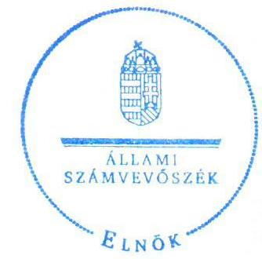
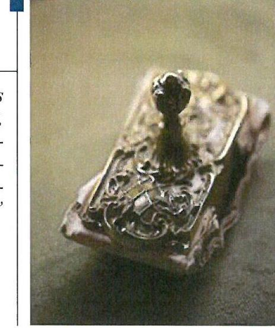
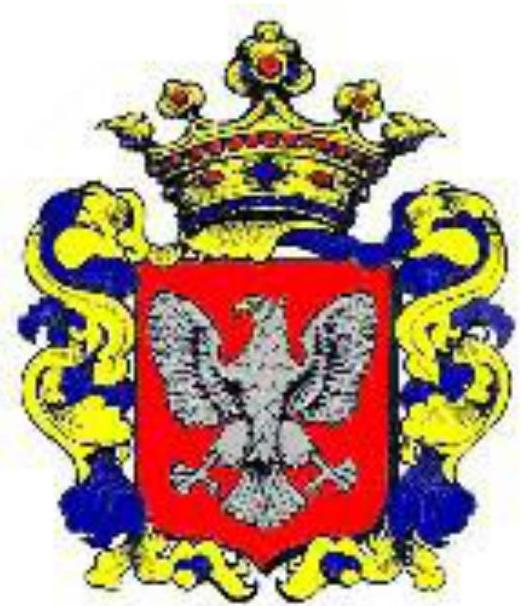
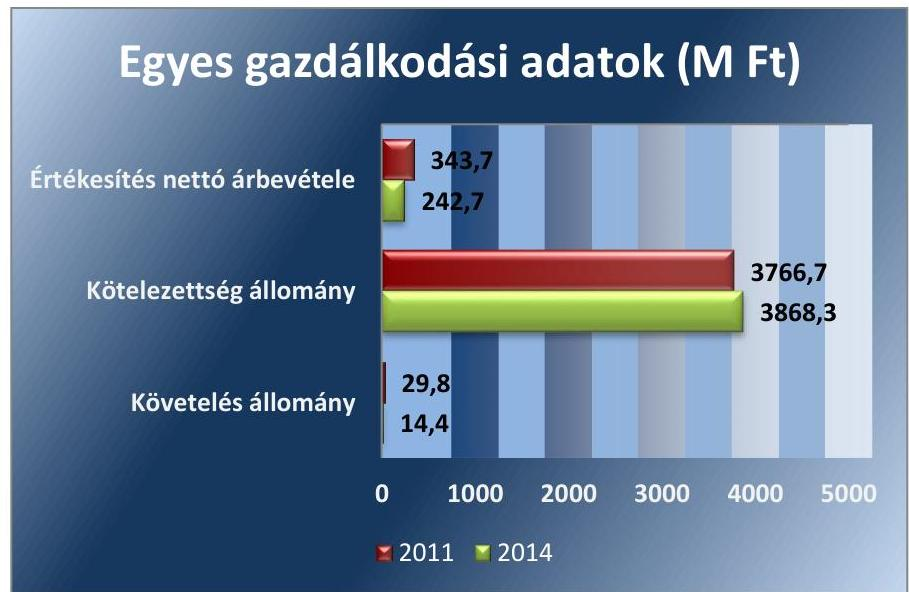
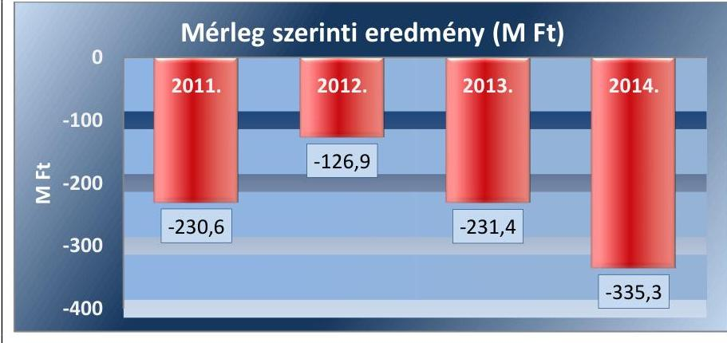
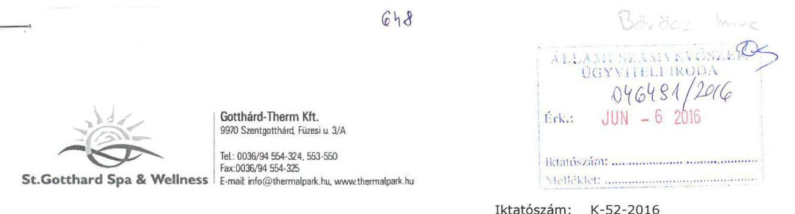
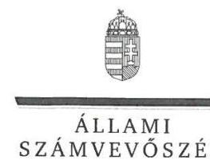
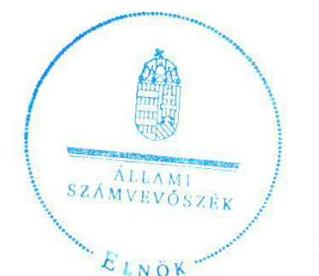

# Jelentés 

## Az önkormányzatok gazdasági társaságai

Az önkormányzatok többségi tulajdonában lévő gazdasági társaságok közfeladat ellátását érintő gazdálkodási tevékenysége szabályszerűségének ellenőrzése - Gotthárd-Therm Fürdő és Idegenforgalmi Szolgáltató Kft.
2016.
„A közfeladat ellátás szinvonala, költségeinek, ráfordításainak alakulása hatással van a szolgáltatást igénybe vevő lakosság elégedettségére. "

---

# Jelentés 

## Az önkormányzatok gazdasági társaságai

Az önkormányzatok többségi tulajdonában lévő gazdasági társaságok közfeladat ellátását érintő gazdálkodási tevékenysége szabályszerűségének ellenőrzése - Gotthárd-Therm Fürdő és Idegenforgalmi Szolgáltató Kft.
2016. fllans hó 5. nap

16102
www.asz.hu

Domokos László
elnök
„A közfeladat ellátás szinvonala, költségeinek, ráforditásainak alakulása hatással van a szolgáltatást igénybe vevố lakosság elégedettségére."

---

# AZ ELLENŐRZÉST FELÜGYELTE:

- BÖRÖCZ IMRE felügyeleti vezető

- AZ ELLENŐRZÉST VEZETTE ÉS A VÉGREHAJTÁSÁÉRT FELELŐS:
  - SALAMIN VIKTOR ellenőrzésvezető
  - A PROGRAM ÖSSZEÁLLÍTÁSÁÉRT FELELŐS:
    - JANIK JÓZSEF LÁSZLÓ osztályvezető

- IKTATÓSZÁM: V-0924-147/2016
- TÉMASZÁM: 1704
- ELLENŐRZÉS-AZONOSÍTÓ SZÁM: V-070714

Jelentéseink az Országgyűlés számítógépes hálózatán és az Interneta a www.asz.hu címen is olvashatóak.

---

# TARTALOMJEGYZÉK 

■ ÖSSZEGZÉS ..... 5
■ AZ ELLENŐRZÉS CÉLJA ..... 7
■ AZ ELLENŐRZÉS TERÜLETE ..... 8
■ AZ ELLENŐRZÉS HÁTTERE, INDOKOLTSÁGA ..... 10
■ FÓKUSZKÉRDÉSEK ..... 12
■ ELLENŐRZÉS HATÓKÖRE ÉS MÓDSZEREI ..... 13
■ MEGÁLLAPÍTÁSOK ..... 15
■ JAVASLATOK ..... 29
■ MELLÉKLETEK ..... 31
I. sz. melléklet: Értelmező szótár ..... 31
II. sz. melléklet: Múködési adatok ..... 34
III. sz. melléklet: Mintavételi eljárások ellenőrzési területenként ..... 35
■ FÜGGELÉK: ÉSZREVÉTELEK ..... 37
■ RÖVIDÍTÉSEK JEGYZÉKE ..... 43

---

.

---

# ÖSSZEGZÉS 

Az Állami Számvevőszék ellenőrzése az egészséges életmód segitését célzó szolgáltatás közfeladat ellátását érintő gazdálkodási tevékenység szabályszerűségét értékelte a kizárólagos önkormányzati tulajdonú Gotthárd-Therm Kft.-nél 2011-2014. évekre vonatkozóan. Szentgotthárd Város Önkormányzata a feladat ellátását biztositotta, tulajdonosi joggyakorlása és a Társaság vagyongazdálkodása szabályszerű volt, a kötelezettségállomány nagyságát azonban a müködésre nézve kockázatosnak értékeltük. Az ellátott közfeladat bevételeinek és ráforditásainak elszámolása szabályszerű volt.

## Az ellenőrzés társadalmi indokoltsága

Az Állami Számvevőszék középtávra szóló stratégiájában megfogalmazta, hogy a helyi önkormányzatok gazdálkodásában rejlő pénzügyi kockázatok feltárásával, az államháztartáson kívülre nyújtott költségvetési támogatások és ingyenes vagyonjuttatások, valamint az államháztartáson kívül múködő közfeladat-ellátó rendszerek ellenőrzéseivel hozzájárul ahhoz, hogy a közpénzeket az államháztartáson kívül múködő szervezetek is átlátható, rendezett módon használják fel a közfeladatok szerződésben vállalt ellátása érdekében.

Magyarországon az intézmény-centrikus közfeladat-ellátás jellemző, de egyre jelentősebb a költségvetésen kívüli feladatellátás térnyerése. Ennek legfontosabb szereplői - a nonprofit szervezetek mellett - az önkormányzati tulajdonú gazdasági társaságok. Az önkormányzatok szervezetalakítási szabadságának következménye, hogy a korábban is vállalati formában múködő közszolgáltatások mellett, mind a kötelező, mind az önként vállalt feladatok ellátásában a gazdasági társaságok kiemelt fontosságú szerephez jutottak.

## Főbb megállapítások, következtetések, javaslatok

Az Önkormányzat a jogszabályi előírásokat betartva szervezte meg a fizikai közérzetet javító szolgáltatás közfeladatát, a tulajdonosi jogok érvényesítése szabályszerű volt. A Képviselő-testület által elfogadott 2011-2014. évekre szóló gazdasági program célkitűzései között szerepelt az egészséges életmód és a sportnevelés fejlesztése, valamint az idegenforgalom versenyképességének javítása. Az Önkormányzat, az ellenőrzött időszakban kizárólagos tulajdonában lévő Gotthárd-Therm Kft. múködéséhez szükséges eszközöket apport formájában bocsátotta a Társaság rendelkezésére, kezelésre vagyont nem adott át. Az Önkormányzat tulajdonosi jogosítványait a Képviselő-testület útján gyakorolta. A Képviselő-testület a Társaság vonatkozásában tulajdonosi joggyakorlási jogosítványokat nem adott át.

A Társaság által ellátott közfeladattal kapcsolatban az Önkormányzatnak rendeletalkotási kötelezettsége nem volt, a feladatok szakmai végrehajtását ágazati jogszabályok szabályozták.

A Képviselő-testület határozatban elfogadta a Gotthárd-Therm Kft. éves üzleti terveit, a vezető tisztségviselői javadalmazását, valamint az éves beszámolóit. A Társaság mérleg szerinti eredménye az ellenőrzött időszak minden évében negatív volt, így osztalék kifizetésre nem kerülhetett sor. A folyamatosan veszteséges gazdálkodás következtében a Társaság saját tőkéje a 2013. évben a jegyzett tőke 50\%-a alá csökkent, a 2014. évben pedig negatív lett. A könyvvizsgáló felhívta a tulajdonos figyelmét a tőkehelyzet rendezésére. A Képviselő-testület a Társaság jegyzett tőkéjét 0,3 M Ft-tal, tőketartalékát 469,6 M Ft-tal emelte meg az ellenőrzött időszakban.

A Társaság gazdálkodási szabályzatait a számlarend kivételével elkészítették, azonban az eszközök és források értékelési szabályzatának előírásai és az alkalmazott gyakorlat a piaci értékelésre vonatkozóan nem volt összhangban.

A Gotthárd-Therm Kft. a tulajdonában lévő vagyonával a jogszabályi és belső rendelkezéseknek megfelelően gazdálkodott. A Társaság nagy összegű hosszú lejáratú, valamint évről-évre dinamikusan növekvő rövid lejáratú kötelezettség állománnyal rendelkezett. Az eladósodás szintje a múködését, a közfeladat ellátását veszélyeztette.

---

A Társaság a beszámolási, adatszolgáltatási kötelezettségét teljesítette, a könyvvizsgáló által hitelesített éves beszámolóit határidőben letétbe helyezte. A Társaság a 2012-2014. évi beszámolók mérlegében az Önkormányzattal szemben fennálló tartozását a Számv. tv. előírásait figyelmen kívül hagyva kapcsolt vállalkozással szembeni rövid lejáratú kötelezettségként mutatta ki. A közérdekű adatok megismerésére irányuló igények teljesítésének rendjét rögzítő szabályzatot nem készített a Társaság, a közérdekű adatok közzétételére vonatkozó kötelezettségének csak részben tett eleget.

A Társaságnál a bevételek és anyagjellegű ráfordítások elszámolása során a jogszabályok és belső szabályok előírásai érvényesültek. A beruházások és felújítások elszámolása szabályszerű volt. Az ellenőrzött időszak egészét tekintve a tárgyi eszközök pótlását csak minimális ( $4,9 \%$-os) mértékben valósították meg.

A Társaság a jogszabály és a számviteli politikájának előírásai ellenére, a legalább 180 napos késedelemben lévő követeléseire nem számolt el értékvesztést.

A Társaság által ellátott közfeladat kapcsán az árképzéssel kapcsolatban ágazati jogszabályi előírások nem voltak. A Gotthárd-Therm Kft. szolgáltatásai árainak kialakítását a 2008. évi üzleti tervében határozta meg, amelyen az ellenőrzött időszakban sem változtatott. Belépődíj kedvezményeket a Képviselő-testület döntése alapján biztosítottak a látogatók részére.

A Társaságnál nem került sor olyan adósságot keletkeztető ügylet vállalására, amelyhez az államháztartásért felelős miniszter előzetes hozzájárulására lett volna szükség. A kormányzati szektor hiányára befolyást gyakorló bevételek és ráfordítások elszámolása megfelelt a jogszabályi előírásoknak.

Az ÁSZ a gazdálkodás szabályszerűségének javítása és a megfelelő gazdálkodási gyakorlat érdekében a Társaság ügyvezető igazgatójának fogalmazott meg javaslatokat.

A jelentésben szereplő javaslatok alapján a Társaság ügyvezető igazgatója köteles intézkedési tervet összeállítani és azt a jelentés kézhezvételétől számított 30 napon belül az ÁSZ részére megküldeni.

---

# AZ ELLENŐRZÉS CÉLJA 

## A Társaság közfeladat-ellátását érintő gazdálkodási tevékenysége szabályszerűségének értékelése

Az ellenőrzés célja annak értékelése, hogy az önkormányzat a jogszabályi előírások figyelembevételével döntött-e az ellenőrzésre kerülő közfeladat megszervezéséről; az önkormányzat/tulajdonosi joggyakorló szabályszerűen gyakorolta-e a tulajdonosi jogokat. A gazdasági társaság közfeladat-ellátása bevételeinek, ráfordításainak elszámolása, és vagyongazdálkodási tevékenysége megfelelt-e a jogszabályi, illetve a közszolgáltatási/vagyonkezelési szerződésben foglalt tulajdonosi előírásoknak, azok végrehajtása szabályszerű volt-e; a gazdasági társaság kötelezettségállománya jelentett-e kockázatot a múködésre, illetve a közfeladat ellátására; a közfeladatok átláthatósága és elszámoltathatósága érdekében biztosítva volt-e a közszolgáltatás dijának megalapozottsága szabályszerű önköltségszámítással.

A kiegészítő modul esetében az ellenőrzés célja annak értékelése, hogy a gazdasági társaság gazdálkodásának a kormányzati szektor hiányára és az államadósságra befolyással bíró elemei a jogszabályi előírásoknak megfeleltek-e.

---

# AZ ELLENŐRZÉS TERÜLETE

## Szentgotthárd Város Önkormányzata és a kizárólagos tulajdonában lévő Gotthárd-Therm Fürdő és Idegenforgalmi Szolgáltató Kft.

### SZENTGOTTHÁRD VÁROS ÖNKORMÁNYZATA

SZENTGOTTHÁRD VÁROS ÖNKORMÁNYZATA és a Zalai Általános Építési Vállalkozási Rt. a Gotthárd-Therm Fürdő és Idegenforgalmi Szolgáltató Kft.-t 2003. május 8-ai időponttal hozta létre. A Társaság¹ törzstőkéje 60,0 millió Ft volt, mely 30,1 millió Ft készpénz betétből és 29,9 millió Ft apportból állt. Az Önkormányzat² 49,8 %, a Zalai Általános Építési Vállalkozási Rt. pedig 50,2 % törzsbetéttel rendelkezett. A Társaság 2004. július 6-ától az Önkormányzat 100 %-os tulajdonába került, a törzstőke összege – a többszöri emelést követően – a 2014. év végére 140,3 millió Ft lett.

### A GOTTHÁRD-THERM KFT.³

A GOTTHÁRD-THERM KFT.³ alaptevékenysége "Fizikai közérzetet javító szolgáltatás". Az Önkormányzat kezelésre vagyont nem adott át a Társaságnak.

A Társaság által üzemeltetett élményfürdő mintegy 1 500 m² vízfelülettel, csúszdákkal, pezsgőfürdővel és szaunákkal rendelkezik. A Társaságnál foglalkoztatott átlagos statisztikai állományi létszám az ellenőrzött időszak elején 72 fő, a végén 51 fő volt. Az ellenőrzött időszakban az ügyvezető igazgató személye egy alkalommal, a gazdasági igazgató személye kettő alkalommal változott. A jelenlegi ügyvezető igazgató 2011. szeptember 1-jétől, a gazdasági igazgató 2013. október 1-jétől tölti be tisztségét.

A Társaság gazdálkodásának egyes adatait a 2011., 2014. évek vonatkozásában a következő ábra szemlélteti:

1. ábra

---

Szentgotthárd Város lakosságának száma 2015. január 1-jén 8867 fő volt. Az ellenőrzött időszakban a polgármester és a jegyző személye nem változott. A polgármester ${ }^{4}$ a 2010. évi önkormányzati választások óta tölti be tisztségét, a helyszíni ellenőrzés időszakában munkakört betöltő jegyző ${ }^{5}$ 2003. április 1. óta látja el feladatait.

---

# AZ ELLENŐRZÉS HÁTTERE, INDOKOLTSÁGA 

Objektív vélemény kialakítása Szentgotthárd Város Önkormányzata közfeladatának megszervezéséről, tulajdonosi jogai gyakorlásáról, valamint a többségi tulajdonban lévő Gotthárd-Therm Kft. közfeladat ellátását érintő gazdálkodási tevékenységének szabályszerűségéről.

## Az önkormányzatok közfeladat-ellátásában egyre jelentősebb a gazdasági társaságok útján történő feladatellátás térnyerése

AZ ÖNKORMÁNYZATI TULAJDONÚ GAZDASÁGI TÁRSASÁGOK teljes körű ellenőrzésének lehetőségét az ÁSZ. tv. 2011. január 1-jétől hatályos módosítása teremtette meg. A közfeladatot ellátó gazdasági társaságok ellenőrzése kiemelten fontos a vagyon megőrzése, megóvása érdekében, valamint a 479/2009/EK rendelet ${ }^{6}$ szerint, illetve az ESA 95 statisztikai módszertana alapján a "helyi kormányzat alszektorba besorolt társaságok és egyéb szervezetek" esetében is, amelyekkel szemben alapvető követelmény, hogy gazdálkodásuk, múködésük szabályszerű, az általuk szolgáltatott adatok minél megbízhatóbbak legyenek. A közfeladat ellátás költségeinek, ráfordításainak alakulása, színvonala hatással van a lakosság elégedettségére.

A törvényalkotás számára - az észlelt problémák, szabálytalanságok, vagy egyéb nem kívánatos jelenségek felszínre kerülésével - az ellenőrzés megállapításai segítséget nyújthatnak az államháztartáson kívüli közfel-adat-ellátás értékeléséhez, jogszabályi keretei pontosításához, átláthatóságot biztosító szabályozásához. Meghatározhatóvá válnak a közfeladat ellátásban részt vevő államháztartáson kívüli szervezeteknek - az önkormányzat költségvetését, pénzügyi helyzetét is befolyásoló - kockázatai, lehetővé válik ezen kockázatok csökkentése. Ellenőrzéseink feltárhatják, hogy az önkormányzat közfeladat-ellátási kötelezettségének szabályszerűen tett-e eleget, a feladatellátáshoz rendelt közvagyon múködtetését a tulajdonostól elvárható gondossággal, szabályszerűen szervezte-e meg és a tulajdonosi felügyelete hozzájárult-e a közfeladat-ellátásához. Az ellenőrzés rávilágíthat arra, hogy a gazdasági társaság a közszolgáltatási szerződésben foglaltak betartásával, a közvagyon használatával biztosította-e a szolgáltatás folyatatásának feltételeit, a közfeladat ellátását. Ezzel az ellenőrzöttek és a helyi döntéshozók számára visszajelzést ad feladatszervezési, feladat-ellátási kockázataikról, alapot ad a meglévő hibák megszüntetéséhez, a jobb közfeladat-ellátás biztosításához. Fokozza a fegyelmet, igazolja, hogy lejárt a következmények nélküli ellenőrzések időszaka. Az ÁSZ ${ }^{7}$ értékteremtő rend kialakításához és megőrzéséhez hozzájáruló tevékenysége pozitív hatással van a szervezetről kialakított összkép formálására.

A KIEGÉSZÍTŐ MODUL esetében az ellenőrzés háttere, hogy a korábban is vállalati formában múködő közszolgáltatások mellett, mind a

---

kötelező, mind az önként vállalt feladatok ellátásában a gazdasági társaságok kiemelt fontosságú szerephez jutottak.

A nemzeti számlák összeállításának módszertana 2014. október 1-jétől megváltozott, amely értelmében az ESA 2010 felváltotta az ESA 95 módszertant. A nemzeti számlák rendszerének legfontosabb jellemzői, alapvető vonásai változatlanok maradtak, ugyanakkor az ESA 2010 követi a gazdasági környezetben lezajlott változásokat, figyelembe veszi az új kutatási eredményeket és a felhasználók új igényeit.

Az ellenőrzés során feltárjuk, hogy az önkormányzati alszektorba sorolt többségi önkormányzati tulajdonban lévő gazdasági társaságok gazdálkodása milyen mértékben befolyásolja a költségvetési hiányt és az államadósságot. Az ellenőrzés rámutathat a többségi önkormányzati tulajdonú gazdasági társaságok gazdálkodási tevékenységével, valamint az államháztartásból származó források felhasználásával kapcsolatos jó gyakorlatokra és szabálytalanságokra. Felhívhatja a figyelmet a jogszabályi követelmények teljesítéséhez szükséges feltételek hiányosságaira, hozzájárulhat az államháztartáson kívüli, de (közvetlenül vagy közvetve) önkormányzati vagyont használó gazdasági társaságok tevékenységének átláthatóságához. Hozzájárulhat a közfeladat-ellátás minőségének javulásához.

---

# FÓKUSZKÉRDÉSEK 

1.     - Az önkormányzat közfeladat megszervezéséről szóló döntése, valamint tulajdonosi joggyakorlása szabályszerű volt-e?
2.     - A gazdasági társaság vagyongazdálkodása szabályszerű volt-e, kötelezettségállománya jelentett-e kockázatot a müködésre, illetve a közfeladat ellátására?
3.     - A gazdasági társaságnál az ellátott közfeladat bevételei és ráfordításai elszámolása, valamint az önköltségszámítás és árképzés szabályszerű volt-e?
4.     - A többségi önkormányzati tulajdonban lévő gazdasági társaságok gazdálkodásának a kormányzati szektor hiányára és az államadósságra befolyással bíró elemei megfeleltek-e a jogszabályi előírásoknak?

---

# ELLENŐRZÉS HATÓKÖRE ÉS MÓDSZEREI 

## Az ellenőrzés típusa

Megfelelőségi ellenőrzés

## Az ellenőrzött időszak

2011 - 2014. évek

## Az ellenőrzés tárgya

A közfeladatot gazdasági társaságokkal ellátó önkormányzatok tulajdonosi joggyakorlása, valamint gazdasági társaságok pénz- és vagyongazdálkodásának szabályozottsága és szabályszerűsége.

A kiegészítő modul esetében a kormányzati szektor önkormányzati alszektorába sorolt, többségi önkormányzati tulajdonban lévő gazdasági társaságok gazdálkodásának a kormányzati szektor hiányára és az államadósságra befolyással bíró elemei szabályszerűsége.

Az ellenőrzés kiterjed minden olyan körülményre és adatra, amely az ÁSZ jogszabályban meghatározott feladatainak teljesítéséhez, valamint a program végrehajtása folyamán felmerült újabb összefüggések feltárásához szükséges.

## Az ellenőrzött szervezet

Az ellenőrzött szervezetek:
$\longrightarrow$ Szentgotthárd Város Önkormányzata
$\longrightarrow$ Gotthárd-Therm Kft.

## Az ellenőrzés jogalapja

Az Állami Számvevőszékről szóló 2011. évi LXVI. törvény 5. § (3)-(4)-(5) bekezdései. Ennek értelmében az ÁSZ ellenőrzi az államháztartásból nyújtott támogatás vagy az államháztartásból meghatározott célra ingyenesen juttatott vagyon felhasználását a gazdasági társaságoknál. Az önkormányzati vagyon kezelésének ellenőrzése keretében ellenőrzi a vagyon kezelését, a vagyonnal való gazdálkodást, a többségi önkormányzati tulajdonban lévő gazdasági társaságok vagyonérték-megőrző és vagyongyarapító tevékenységét, az államháztartás körébe tartozó vagyon elidegenítésére, illetve megterhelésére vonatkozó szabályok betartását; ellenőrizheti a többségi

---

önkormányzati tulajdonban lévő gazdasági társaságok vagyongazdálkodását.

# Az ellenőrzés módszerei 

Az ellenőrzést a nemzetközi standardokat irányadónak tekintve az ellenőrzési program ellenőrzési kérdései, az ellenőrzött időszakban hatályos jogszabályok, az ellenőrzés szakmai szabályok és módszertanok figyelembe vételével végezzük.

Az ellenőrzés ideje alatt az ellenőrzött szervezettel történő kapcsolattartást az ÁSZ Szervezeti és Múködési Szabályzatának vonatkozó előírásai alapján biztosítjuk.

Az ellenőrzés a kiválasztott, többségi tulajdonosi jogokat gyakorló önkormányzatra, illetve az ellenőrzésre kijelölt közfeladatot ellátó gazdasági társaság felett tulajdonosi jogokat gyakorló szervezetre és az ellenőrzött közfeladatot ellátó gazdasági társaságra terjed ki. Amennyiben a gazdasági társaságban több önkormányzat együttesen többségi tulajdonos, úgy az ellenőrzést a többségi tulajdonosi jogokat gyakorló önkormányzatnál kell lefolytatni. Az ellenőrzött gazdasági társaságnál, amennyiben az több közfeladatot is ellát, akkor az ellenőrzésre kiválasztott közfeladat-ellátást ellenőrizzük.

Az ellenőrzést a kérdésekre adott válaszok kiértékelésével, valamint a megjelölt adatforrások, a csatolt tanúsítványok felhasználásával, továbbá az adott időszakban hatályos jogszabályok figyelembe vételével kell lefolytatni. Az ellenőrzési kérdések megválaszolásához szükséges bizonyítékok megszerzése a következő ellenőrzési eljárások alkalmazásával történik: megfigyelés, kérdésfeltevés (információkérés), mintavétel, összehasonlítás, valamint elemző eljárás.

A bevételek és ráfordítások elszámolása, valamint a vagyonnyilvántartás terén a szabályszerű működést véletlen mintavétellel ellenőriztük. A kormányzati szektorba sorolt gazdálkodó szervezetek esetében a személyi jellegű ráfordítások elszámolása mellett az egyéb ráfordítások, pénzügyi műveletek ráfordításai, rendkívüli ráfordítások, illetve az egyéb bevételek, pénzügyi műveletek bevételei, rendkívüli bevételek elszámolásának szabályszerűségét szintén mintatételeken keresztül ellenőriztük. A mintavétellel ellenőrzött területek esetében minden egyes tétel vonatkozásában a szabályszerűségre vonatkozó kérdéseket tettünk fel, amelyek eredménye összesítésre került. A jogszabályoknak és a belső előírásoknak megfelelőnek tekintettük az adott területet, amennyiben a minta ellenőrzésének eredménye alapján 95\%-os bizonyossággal a teljes sokaságban a hibaarány kisebb volt, mint 10\%, nem megfelelőnek értékeltük, ha a hibaarány a 10\%ot meghaladta. Kockázatot, illetve magas kockázatot jeleztünk, amennyiben egy adott terület vonatkozásában a minta alapján a teljes sokaságban nem volt egyértelműen biztosított a jogszabályoknak és a belső szabályzatoknak megfelelő működés. A ráfordítások elszámolására és a vagyonnyilvántartásra vonatkozó véletlen mintavételt kockázati alapú kiválasztással egészítettük ki, amelynek során évente a három legnagyobb összegű tételt választottuk ki.

---

# 1. Az önkormányzat közfeladat megszervezéséről szóló döntése, valamint tulajdonosi joggyakorlása szabályszerű volt-e? 

Összegző megállapítás

Az Önkormányzat közfeladat-ellátással kapcsolatos döntése, feladat meghatározása és a feladatellátás feltételrendszerének kialakítása, valamint a tulajdonosi jogok gyakorlása szabályszerű volt.

### 1.1. számú megállapítás

A közfeladat-ellátást az Önkormányzat szabályszerűen szervezte meg, meghatározta az ellátandó feladatok körét és kialakította a feladatellátás feltételrendszerét.

Az Ötv. ${ }^{8}$ 91. § (6) bekezdése, 2013. január 1-jétől az Mötv. ${ }^{9}$ 116. § (3)-(4) bekezdései szerint az önkormányzatnak a gazdasági programjában kell meghatároznia azokat a célkitűzéseket, amelyek az általa ellátott feladatok biztosítását, fejlesztését szolgálják. A Képviselő-testület ${ }^{10}$ által a 20112014. évekre elfogadott gazdasági program célkitúzésként fogalmazta meg többek között az egészséges életmód és a sportnevelés fejlesztését, valamint az idegenforgalom versenyképességének javítását.

A VAGYONGAZDÁLKODÁSI FELADATOKAT az Önkormányzat vagyonáról szóló vagyonrendelet ${ }^{11}$ határozta meg. Az Önkormányzat által ellátandó közfeladatokat a mindenkor hatályos SZMSZ ${ }^{12}$ ekben rögzítették. Az SZMSZ ${ }_{1,2}$-ben önként vállalt feladatként szerepelt a kizárólagos önkormányzati tulajdonban lévő társaság által termálfürdő és élménypark létesítése, fenntartása és múködtetése. Az Önkormányzat e feladatának a Gotthárd-Therm Kft. alapításával és múködtetésével tett eleget. Az Mötv. hatályba lépése kapcsán a feladat ellátás módjában nem történt változás, mivel önkormányzati tulajdonban lévő gazdasági társaság alapítására közfeladat ellátás céljára továbbra is lehetősége volt az Önkormányzatnak.

AZ ALAPÍTÓ OKIRAT ${ }^{13}$ szerint a Gotthárd-Therm Kft. főtevékenysége „9604 fizikai közérzetet javító szolgáltatás". A Társaság által ellátandó feladatok meghatározása az Ötv 8. § (1) bekezdés és az Mötv. 13. § (1) bekezdés 4. és 13. pontjában foglaltakkal összhangban történt. Az ellátott feladatok követelményeit az üzemeltetési szabályzat tartalmazta, amelyet a Társaság készített el és az általa nyújtott szolgáltatásokra teljes körűen kiterjedt. Az Önkormányzat és a Társaság között a közfeladat ellátására szerződés nem jött létre, arra a feleket jogszabályi előírás nem kötelezte.

A Társaságnál taggyűlés nem múködött az Alapító Okirat szerint, a legfőbb szerv hatáskörét az egyedüli tag gyakorolta, a tulajdonosi döntéseket - összhangban a Gt. ${ }^{14}$ 19. § (5) bekezdésében, 2014. március 15-től a $\mathrm{Ptk}_{2}{ }^{15}$ 3:109. § (4) bekezdésében foglaltakkal - a Képviselő-testület hozta

---

meg. Az Alapító Okirat az ügyvezető igazgató kötelezettségeként előírta többek között az üzleti könyvek szabályszerű vezetésének biztosítását, mérleg és eredménykimutatás elkészítését, a Társaság által múködtetett St. Gotthard Spa \& Wellness élményfürdő fürdőigazgatói szakmai feladatok elvégzését. A Gotthárd-Therm Kft. ügyvezetését három főből álló $\mathrm{FB}^{16}$ ellenőrizte a Társaság legfőbb szerve (tulajdonosa) részére.

A Társaság által ellátott közfeladattal kapcsolatban az Önkormányzatnak külön rendeletalkotási kötelezettsége nem volt, a feladatok szakmai végrehajtását ágazati jogszabályok szabályozták.

A múködéséhez szükséges eszközöket az Önkormányzat apport formájában bocsátotta a Társaság rendelkezésére, kezelésre vagyont nem adott át.

# 1.2. számú megállapítás 

A tulajdonosi joggyakorlás rendjének kialakítása szabályosan történt, a feladatellátással kapcsolatos döntések esetében az arra jogosultak érvényesítették a tulajdonosi jogaikat.

## A TULAJDONOSI JOGOK GYAKORLÁSÁNAK

RENDJÉT a vagyonrendeletben írták elő, amely szerint a tulajdonosi jogokat a Képviselő-testület, illetve átruházott hatáskörben a polgármester gyakorolták. A polgármesterre átruházott, tulajdonost megillető jogokat az SZMSZ1,2 1. számú mellékletében rögzítették, amelyek között az Önkormányzat tulajdonában lévő gazdasági társaságokkal kapcsolatos tulajdonosi joggyakorlás nem szerepelt. A Gotthárd-Therm Kft. vonatkozásában a tulajdonosi jogokat a vagyonrendelet és az SZMSZ1,2 előírásaival összhangban lévő Alapító Okirat előírásai alapján a Képviselő-testület gyakorolta.

A FELÜGYELŐ BIZOTTSÁG az Alapító Okiratban előírtaknak megfelelően - a Gt. 34. § (1) bekezdésével, valamint a Ptk2. 3:121. § (1) bekezdésével összhangban - három tagból állt. Az FB - a Gt. 34. § (4) bekezdésében előírtaknak eleget téve - elkészítette Ügyrendjét ${ }^{17}$, amelyet a Képviselő-testület jóváhagyott. Az Ügyrendben rögzítették, hogy az FB-t a Társaság éves beszámolójának véleményezésére, valamint saját munkaterve szerint, illetve szükség esetén rendkívüli alkalommal, de évente legalább két alkalommal össze kell hívni. Az Ügyrend 5. pontja tartalmazta az FB jogait és kötelezettségeit, amelyben rögzítették, hogy munkájáról szükség szerint, de évente legalább egyszer beszámol a Képviselő-testületnek. Beszámolási kötelezettségének - a 2011. év kivételével - az FB eleget tett.

A Gotthárd-Therm Kft. az ellenőrzött években elkészítette részletes üzleti tervét. Az éves üzleti terveket az FB megtárgyalta és a Képviselő-testületnek elfogadásra javasolta. A Képviselő-testület az éves üzleti terveket határozattal elfogadta.

AZ ANYAGI ÉRDEKELTSÉGI RENDSZER szabályozására a Képviselő-testület javadalmazási szabályzatot fogadott el, amelyet a FB tagjaira, illetve a $\mathrm{MT}^{18}$ 208. § (1) bekezdés hatálya alá tartozó munkavállalókra - a Társaság vonatkozásában ez a munkavállaló az ügyvezető igazgató - kellett alkalmazni. A javadalmazási szabályzat II/2. pontja alapján az ügyvezető igazgató alapbérének, jutalmazásának mértékéről a Képviselő-testület az éves beszámoló elfogadásakor döntött.

---

A Társaság által folytatott tevékenységgel kapcsolatos, jogszabályban meghatározott, illetve a tulajdonos Önkormányzat által meghatározott, árképzéssel kapcsolatos előírások az ellenőrzött időszakban nem voltak. A Képviselő-testület a 292/2010. (11. 24.) számú határozatában a Társaság által alkalmazott árakat figyelembe véve, a helyi lakosok által igénybe vehető kedvezményeket határozott meg.

Az Önkormányzat és a Gotthárd-Therm Kft. közfeladat ellátási szerződést nem kötött a Társaság által végzett tevékenység ellátására vonatkozóan, erre jogszabály sem írt elő kötelezettséget. A számviteli előírások alapján készítendő beszámoló mellett képviselő-testületi határozatok állapítottak meg havi beszámolási, tájékoztatási kötelezettséget az ügyvezető igazgató részére. Havi beszámolási kötelezettségének az ügyvezetés eleget tett. A Gotthárd-Therm Kft. az éves beszámolási kötelezettségeinek a Számv. tv. 4. § (1) bekezdése előírásai szerint tett eleget. Az éves beszámolókat az FB a 2011-2013. évi beszámolók esetében a Gt. tv. 35.§ (3) bekezdésében, a 2014. évi beszámoló esetében a $\mathrm{Ptk}_{2}$. 3:120. § (2) bekezdésében előírtak szerint - a könyvvizsgálói jelentés ismeretében - írásban véleményezte és azt megküldte a Képviselő-testület részére.

A Gotthárd-Therm Kft. tevékenységét az Önkormányzat belső ellenőrzése az ellenőrzött időszakban a Bkr. ${ }^{19}$ 22. § (1) bekezdés b) pontjában előírt éves ellenőrzési tervekben meghatározottak szerint ellenőrizte. A 2011. és a 2013. évi belső ellenőrzési tervek tartalmaztak a Társaságra vonatkozóan ellenőrzési feladatokat. A 2011. évben „a Termál-fürdő múködésének egy évvel korábbi állapothoz viszonyított ellenőrzését", a 2013. évben a Társaság múködésének, pénzügyi, gazdasági folyamatainak, humánerőforrás gazdálkodásának ellenőrzését tervezték. A tervezett ellenőrzéseket végrehajtották, a belső ellenőri jelentéseket a Képviselő-testület megtárgyalta, elfogadta és előírta az azokban foglalt javaslatok teljesítését, azonban a javaslatok végrehajtásának számonkérése nem történt meg. A Kép-viselő-testület a belső ellenőr javaslatai alapján a 154/2013. számú határozatában előírta, hogy tovább kell folytatni az éttermi szolgáltatás nyereségessé tételének, esetleges üzemeltetésbe adása lehetőségének, a szolgáltatások kiszervezése lehetőségének vizsgálatát, a fürdő további múködtetésének átgondolását.

# A GOTTHÁRD-THERM KFT. MÉRLEG SZERINTI 

EREDMÉNYE az ellenőrzött időszak minden évében negatív volt, így osztalék kifizetésre nem kerülhetett sor. A 2011-2014. évek mérleg szerinti eredményének alakulását a következő ábra mutatja be.
2. ábra

---

A folyamatosan veszteséges gazdálkodás következtében a Társaság saját tőkéje a 2013. évben a jegyzett tőke 50\%-a alá csökkent, a 2014. évben pedig negatív lett. A Társaság könyvvizsgálója a 2012-2014. évek beszámolóiról készített jelentéseiben felhívta a figyelmet arra, hogy „a vállalkozás folytatásának elve csak a tulajdonos támogatásának biztositásával valósul meg", továbbá a 2013-2014- évek vonatkozásában felhívta a tulajdonos figyelmét a tőkehelyzet rendezésére. Az Önkormányzat a Társaság múködőképessége megőrzése érdekében tagi kölcsönöket nyújtott. A vissza nem fizetett tagi kölcsönök terhére - amelyekről tartozás elismerési és tartozásrendezési szerződést kötöttek - a Képviselő-testület határozataival a Gotthárd-Therm Kft. jegyzett tőkéjének és tőketartalékának emeléséről döntött, a következő táblázatban foglaltak szerint:

1. táblázat

|  A GOTTHÁRD-THERM KFT. JEGYZETT TŐKÉJÉNEK ÉS |  |  |   |
| --- | --- | --- | --- |
|  TÖKETARTALÉKÁNAK EMELÉSE (MILLIÓ FORINT) |  |  |   |
|  Képviselő-testületi határozat száma | Képviselő-testületi határozat kelté | Jegyzett tőke- emelés | Tőketartalék emelés  |
|  316/2011. | 2011. 12. 14. | 100 | 200,3  |
|  287/2012. | 2012. 11. 28. | 100 | 153,3  |
|  187/2014. | 2014. 08. 26. | 100 | 116,1  |

Fonrás: A Társaság adatszolgáltatása

# 2. A gazdasági társaság vagyongazdálkodása szabályszerű volt-e, kötelezettségállománya jelentett-e kockázatot a múködésre, illetve a közfeladat ellátására?

Összegző megállapítás A Társaság vagyongazdálkodása szabályszerű volt, beszámolási kötelezettségét teljesítette, azonban a kötelezettségállomány a múködésre, közfeladat ellátásra kockázatot jelentett.

### 2.1. számú megállapítás

A gazdálkodási szabályzatokat - a számlarend kivételével -a jogszabályi előírásoknak megfelelően elkészítették.

Az Önkormányzat 2011-2014 évekre szóló gazdasági programja az idegenforgalom versenyképességének javítása céljából határozott meg feladatokat a Társaságot érintően. A Társaság fő feladata - a fürdő legmagasabb szintű működtetése - mellett kötelessége lett volna, hogy a térség turisztikai vonzerejét növelje, továbbá a vállalkozás keretén belül ellásson minden szakmai tevékenységet, amely Szentgotthárd és térsége turizmusfejlesztést szolgálja. A koncepció pénzügyi, finanszírozási okok miatt úgy változott, hogy a Társaság feladata a fürdőüzemeltetésre szűkült. A GotthárdTherm Kft. ennek megfelelően készítette el az ellenőrzött időszakban az éves üzleti terveit. Az üzleti terveket - amelyek tartalmi és formai követelményeit az Önkormányzat nem határozta meg - a Képviselő-testület határozataival elfogadta.

A Társaság az ellenőrzött időszakban rendelkezett szervezeti és működési szabályzattal és üzemeltetési szabályzattal.

---

A Számv. tv ${ }^{20}$. 14. § (12) bekezdésében foglaltaknak megfelelően a Gotthárd-Therm Kft. ügyvezető igazgatója elkészítette a Társaság számviteli politikáját ${ }^{21}$ és annak keretében - a Számv. tv. 14. § (5) bekezdésének megfelelően - elkészítette a leltárkészítési és leltározási szabályzatát ${ }^{22}$, az eszközök és a források értékelési szabályzatát ${ }^{23}$, és a pénzkezelési szabályzatot ${ }^{24}$. A Társaság önköltség-számítási szabályzattal nem rendelkezett, erre a Számv. tv. 14. § (6) bekezdése előírásai alapján nem is volt kötelezett. A Gotthárd-Therm Kft. az ellenőrzött időszakban külön szabályozta a felesleges vagyontárgyak hasznosításának és selejtezésének eljárásrendjét is.

A Számv. tv. 161. § (1) bekezdésében előírt számlarenddel - az ellenőrzött időszakban - a Társaság nem rendelkezett.

Az eszközök és források értékelési szabályzatában rögzítették a mérlegben szereplő eszközök értékelésének, valamint az immateriális javak, tárgyi eszközök, értékhelyesbítésének szabályait. Meghatározták az eszközök bekerülési értékének tartalmát, a források értékelését.

A Gotthárd-Therm Kft. leltárkészítési és leltározási szabályzatában a Számv. tv. 46. § (3) bekezdésével és a 69. § (1)-(3) bekezdéseivel összhangban határozták meg a leltározási, leltárkészítési és értékelési feladatokat. A pénzkezelési szabályzatban a Számv. tv. 14. § (8) bekezdésében előírtaknak megfelelően - többek között - rendelkeztek a pénzforgalom lebonyolításának rendjéről, a készpénzben és a bankszámlán tartott pénzeszközök közötti forgalomról, a bankkártya használat rendjéről, a készpénzállomány ellenőrzésekor követendő eljárásról, az ellenőrzés gyakoriságáról.

# 2.2. számú megállapítás 

A Társaság a tulajdonában lévő vagyonával a jogszabályi és belső rendelkezéseknek megfelelően, felelősen gazdálkodott.

A Társaság a Számv. tv. 159. §-ának megfelelően saját vagyonáról, eszközeiről és azok forrásáról, valamint a gazdasági műveletekről olyan könyvviteli nyilvántartást vezetett, amely az eszközökben és forrásokban bekövetkezett változásokat a valóságnak megfelelően, folyamatosan, zárt rendszerben mutatta be.

A Társaság a közfeladatát saját eszközeivel látta el, üzemeltetésre átvett, illetve vagyonkezelésbe vett eszköze nem volt. A főkönyvi könyvelés és analitikus nyilvántartások közötti egyeztetést a mérleg fordulónapjára vonatkozóan szabályszerűen elvégezték. A beszámolóban és a számviteli nyilvántartásokban szereplő vagyontárgyak értékét a Számv. tv. 69. § (1) bekezdése szerinti leltárral alátámasztották.

A Társaság nem az eszközök és források értékelési szabályzatának 2. pontjában előírtak szerint járt el. A szabályzat 2. pontja kimondja, hogy: „Társaságunk nem él a Számv. tv. 57. §. (3) bekezdésében foglalt lehetőséggel, miszerint amennyiben a tevékenységet tartósan szolgáló vagyoni értékú jog, szellemi termék, tárgyi eszköz, (kivéve a beruházásokat és a beruházásokra adott előlegeket) a tulajdoni részesedést jelentő befektetés piaci értéke jelentősen meghaladja a könyv szerinti értéket, ezen eszközt piaci értéken értékeli". Az ellenőrzött időszak minden évében elvégezte az élményfürdő értékbecslését, amely alapján az értékelési tartalék javára értékhelyesbítést számolt el.

---

A tevékenységgel kapcsolatosan megvalósítandó fejlesztéseket, beruházásokat az éves üzleti terveiben bemutatta a Társaság. A tervekben bemutatott fejlesztési, beruházási elképzeléseket forráshiány miatt nem tudták megvalósítani, az ellenőrzött években nem történt beruházás. A forráshiány következtében a Társaságnál a megvalósítható cél csak az épületek, berendezések állagmegóvása és az ezzel kapcsolatos karbantartási, javítási munkák elvégzése volt. A Társaság 2011-2014. évi mérlegadatait a következő táblázat mutatja be.
2. táblázat

| GOTTHÁRD-THERM KFT. MÉRLEGADATAI 2011-2014 (MILLIÓ FORINT) |  |  |  |  |  |
| :--: | :--: | :--: | :--: | :--: | :--: |
| Megnevezés | $\begin{gathered} 2011 . \\ 01 .01 . \end{gathered}$ | 2011. év | 2012. év | 2013. év | 2014. év |
| I. Befektetett eszközök | 3146,3 | 3116,6 | 3112,4 | 3053,1 | 3019,9 |
| - ebből: Tárgyi eszközök | 3144,4 | 3116,0 | 3112,4 | 3053,1 | 3019,9 |
| II. Forgóeszközök | 59,9 | 65,3 | 48,4 | 34,5 | 40,2 |
| - ebből: Követelések | 25,4 | 29,8 | 18,3 | 18,1 | 14,4 |
| III. Aktív időbeli elhatárolások | 963,2 | 1423,6 | 1224,7 | 1238,2 | 1465,8 |
| Eszközök összesen | 4169,4 | 4605,5 | 4385,5 | 4325,8 | 4525,9 |
| IV. Saját tőke | 156,3 | 157,5 | 239,9 | 8,5 | $-200,3$ |
| - ebből: Jegyzett tőke | 140,0 | 140,1 | 140,2 | 140,2 | 140,3 |
| - ebből Mérleg szerinti eredmény | $-239,4$ | $-230,6$ | $-126,9$ | $-231,4$ | $-335,3$ |
| V. Céltartalékok | 163,9 | 315,0 | 333,5 | 400,4 | 548,9 |
| VI. Kötelezettségek | 3461,8 | 3766,7 | 3487,1 | 3605,5 | 3868,3 |
| - ebből: Rövid lejáratú | 350,2 | 338,1 | 480,2 | 808,8 | 1085,9 |
| - ebből: Hosszú lejáratú | 3111,1 | 3428,6 | 3006,9 | 2796,7 | 2782,4 |
| VII. Passzív időbeli elhatárolások | 387,4 | 366,3 | 325,0 | 311,4 | 309,0 |
| Források összesen | 4169,4 | 4605,5 | 4385,5 | 4325,8 | 4525,9 |

Az eszközérték változását - a befektetett eszközök nettó értékének folyamatos, kismértékű csökkenése mellett - alapvetően az aktív időbeli elhatárolások (zömében halasztott ráfordítások) változása határozta meg. A források alakulását a Társaság folyamatos veszteséges gazdálkodása mellett, a kötelezettségek - ezen belül is a rövidlejáratúak - állományának változása befolyásolta.

# 2.3. számú megállapítás 

## A Társaság kötelezettségeinek állománya kockázatot jelentett a múködésre, a közfeladat ellátására.

A Társaság - az ellenőrzött időszakot megelőzően keletkezett - hosszú lejáratú kötelezettsége 2011. évben 91,0\%-át (3428,6 millió Ft-ot), 2012. évben 86,2\%-át (3006,9 millió Ft-ot), 2013. évben 77,6\%-át (2796,7 millió Ftot), 2014. évben 71,9\%-át (2782,4 millió Ft-ot) tette ki a teljes kötelezettségállománynak. A rövid lejáratú kötelezettségek állományának és arányának növekedése túlnyomó részt az Önkormányzattal szembeni kötelezettségek dinamikus növekedése miatt következett be (e kötelezettségek öszszege a 2011. évi 111,5 millió Ft-ról - évről-évre folyamatosan növekedve - a 2014. évre 789,6 millió Ft-ra nőtt).

A Társaság 2012-2014. évek számviteli mérlegében a „Rövidlejáratú kötelezettségek kapcsolt vállalkozással szemben" soron mutatta ki az Önkormányzattal szembeni tartozásait, figyelmen kívül hagyva a Számv. tv. 3. §

---

(2) bekezdés 7. pontjának előírásait, amely szerint a Számv. tv. vonatkozásában kapcsolt vállalkozás a Számv. tv. 3. § (2) bekezdés 1. pontja szerinti anyavállalat és a Számv. tv. 3. § (2) bekezdés 2-4. pontja szerinti vállalkozások (leányvállalat, közös vezetésű vállalkozás, valamint társult vállalkozás). A 2011. évi beszámolóban az Önkormányzattal szembeni kötelezettség a Számv. tv.42. § (3) bekezdés előírásainak megfelelően rövid lejáratú kölcsönként került kimutatásra.

A Társaság eladósodottságát jelző mutatók értékei a következő táblázatban foglaltak szerint alakult a 2011-2014. években.
3. táblázat

GOTTHÁRD-THERM KFT. PÉNZÜGYI MUTATÓSZÁMAI 2011-2014

| Megnevezés | $\begin{gathered} 2011 . \\ \text { év } \end{gathered}$ | $\begin{gathered} 2012 . \\ \text { év } \end{gathered}$ | $\begin{gathered} 2013 . \\ \text { év } \end{gathered}$ | $\begin{gathered} 2014 . \\ \text { év } \end{gathered}$ |
| :--: | :--: | :--: | :--: | :--: |
| Eladósodottsági mutató idegen tőke/összes forrás | 0,82 | 0,79 | 0,83 | 0,85 |
| Eladósodottság mértéke kötelezettségek/saját tőke | 23,92 | 14,54 | 424,18 | né |
| Nettó eladósodottság (kötelezettségek-követelések)/saját tőke | 23,73 | 14,46 | 422,05 | né |
| Adósságfedezeti mutató I. (befektetett eszközök+forgóeszközök)/idegen forrás | 0,84 | 0,91 | 0,86 | 0,79 |
| Adósságfedezeti mutató II. működési cash flow/hosszúlejáratú kötelezettségek | 0,0004 | $-0,0019$ | $-0,0047$ | 0,0033 |
| Árbevételre vetített eladósodottság (kötelezettségek-forgóeszközök)/értékesítés nettó árbevétele | 10,77 | 11,36 | 14,60 | 15,77 |

Forrás: A Társaság adatszolgáltatása
Az eladósodottsági mutató értéke kedvezőtlenül alakult, az idegen források aránya a 2014. év végére elérte az összes forrás $85 \%$-át, a Társaság kötelezettségállománya pedig az ellenőrzött időszak minden évében sokszorosan meghaladta saját tőkéjének értékét. A Társaság kötelezettségállománya nagyságrendekkel nagyobb volt, mint a követeléseinek állománya, ezért a nettó eladósodottság mértéke szinte azonos volt a bruttó eladósodottságának mértékével. Az adósságfedezeti mutatók értékei is az eladósodottság magas szintjét jelzik, a Társaság befektetett eszközeinek és forgóeszközeinek összevont értékei is csak 80-90\%-át fedezték az idegen forrásoknak. A pozitív cash flow értékek pedig csak elenyésző részét tették ki a hosszú lejáratú kötelezettségeknek. Az eladósodottság súlyosságát legjobban jelző árbevételre vetített eladósodottság azt mutatja, hogy a Társaság forgóeszközök értékével csökkentett kötelezettségeinek rendezésére a 2014. évben realizált nettó árbevétel közel 16-szorosára lenne szükség.

Az eladósodás szintje a Társaság múködését, a közfeladat ellátását veszélyezteti.

A Gt. 143. § (2) bekezdés a) pontjának előírása szerint az ügyvezető haladéktalanul köteles összehívni a társaság taggyűlését, ha tudomást szerez arról, hogy a társaság saját tőkéje veszteség folytán a törzstőke felére csökken.

---

A Társaság 2011-2014. évi tőkehelyzetét a következő táblázat mutatja be:
4. táblázat

GOTTHÁRD-THERM KFT. TÖKEHELYZETE 2011-2014

| Megnevezés | 2011. év | 2012. év | 2013. év | 2014. év |
| :-- | --: | --: | --: | --: |
| Kötelezően előírt jegyzett tőke (ezer Ft) | 500 | 500 | 500 | 500 |
| Jegyzett tőke (ezer Ft) | 140100 | 140200 | 140200 | 140300 |
| Saját tőke (ezer Ft) | 157548 | 239880 | 8510 | -200320 |
| Saját tőke/jegyzett tőke | $112,5 \%$ | $171,1 \%$ | $6,1 \%$ | $-142,8 \%$ |
|  |  |  |  | Forrás: Beszámolók |

A Gotthárd-Therm Kft. a 2011-2013. években rendelkezett a társasági formájára kötelezően előírt jegyzett tőkének megfelelő összegű saját tőkével, a 2014. évben azonban a saját tőke összege negatív lett. A Társaság saját tőkéje a 2013. és a 2014. évben is a jegyzett tőkéjének 50\%-a alá csökkent - erre a tényre a könyvvizsgáló is felhívta a figyelmet - ezért a Képvi-selő-testület, mint tulajdonosi joggyakorló, jegyzett tőke és tőketartalék formájában tőkeemelést hajtott végre (az ellenőrzött időszakot követően a Képviselő-testület a 97/2015. számú határozatával a Társaság jegyzett tőkéjének 100 ezer Ft-os, a tőketartalékának 270371 ezer Ft-os növeléséről döntött).

# A TÁRSASÁG HOSSZÚLEJÁRATÚ KÖTELEZETTSÉGÉNEK törlesztő részleteit az ellenőrzött időszakban nem tudta teljesíteni, a müködésének fenntartásához is csak tagi hitelek igénybevételével, önkormányzati támogatással tudott megfelelő forrást biztosítani. Az Önkormányzat az ellenőrzött időszakot megelőzően készfizető kezességet vállalt a Társaság által a 2007. évben kibocsátott, 2,2 milliárd Ft értékű, svájci frank alapú kötvény tőke és járulékai megfizetésére. A GotthárdTherm Kft. a kötvénnyel kapcsolatos fizetési kötelezettségeinek az ellenőrzött időszakban nem tett eleget, így azokért az Önkormányzatnak kellett helytállni.

A Gotthárd-Therm Kft rövid lejáratú kötelezettségeit a 2011-2014. évekre vonatkozó beszámolók alapján az alábbi táblázat mutatja be:
5. táblázat

GOTTHÁRD-THERM KFT. RÖVID LEJÁRATÚ KÖTELEZETTSÉGEI 20112014 (M FT)

| Megnevezés | 2011. év | 2012. év | 2013. év | 2014. év |
| :-- | :--: | :--: | :--: | :--: |
| Kapott kölcsönök | 118,4 | 222,7 | 223,7 | 241,9 |
| Szállítókkal szembeni kötelezettség | 45,5 | 52,5 | 38,8 | 35,0 |
| Önkormányzattal szembeni kötelezettség | 111,5 | 168,4 | 522,2 | 789,6 |
| Egyéb kötelezettség | 62,7 | 36,6 | 24,1 | 19,4 |
| Rövid lejáratú kötelezettség összesen | 338,1 | 480,2 | 808,8 | 1085,9 |

A RÖVID LEJÁRATÚ KÖTELEZETTSÉGEK ÁLLO-
MÁNYA folyamatosan nőtt, az ellenőrzött időszakban megháromszorozódott. Kötelezettségeinek határidőben nem tudott maradéktalanul eleget tenni a Társaság, ezért azokat rangsorolva történt a tartozások kiegyenlítése. A közműellátások zavartalanságának biztosítása érdekében a szállítói

---

tartozásokat, továbbá az egyéb kötelezettségek közül az adó és járulék fizetési kötelezettségeket évről-évre csökkenő kötelezettség állomány fenntartása mellett igyekeztek teljesíteni. Az Önkormányzat felé fennálló tartozás évről évre nőtt. A Társaság fizetőképességének külső partnerek felé történő fenntartását csak az Önkormányzat felé fennálló adósságállomány mind nagyobb hányadának meg nem fizetésével tudta biztosítani.

# 2.4. számú megállapítás 

A Társaság a beszámolási, adatszolgáltatási kötelezettségét teljesítette, a könyvvizsgáló által hitelesített éves beszámolóit határidőben letétbe helyezte. A Társaság a közérdekú adatok megismerésére irányuló igények teljesítésének rendjét rögzítő szabályzatot nem készített és ezen adatok közzétételére vonatkozó kötelezettségének részben tett eleget.

A Képviselő-testület - mint tulajdonosi joggyakorló - a 2009. március 25ei ülésén hozott 71/2009. számú határozatával, valamint az e határozatában előírt adatszolgáltatást tartalmában pontosító 224/2011. számú határozatával, a Gotthárd-Therm Kft. ügyvezető igazgatóját havonkénti jelentéstételre kötelezte a Társaság pénzügyi helyzetéről. Az ügyvezető igazgató jelentéstételi kötelezettségeinek eleget tett.

A Társaság beszámolási kötelezettségével kapcsolatos szabályozásokat a számviteli politika tartalmazta a Számv. tv. 14. § előírásai szerint. Az éves beszámolókat a Társaság a Számv. tv. 19. § (1) bekezdésében előírt tartalommal elkészítette, azokat az ügyvezető igazgató a Képviselő-testület elé terjesztette. A Képviselő-testület az éves beszámolókat határozataival elfogadta. Az éves beszámolók letétbe helyezése a Számv. tv. 153. § (1) bekezdésben előírt határidőben megtörtént.

A Gt. 35. § (3) bekezdése - a 2014. évtől a Ptk2. 3:120. §. (2) bekezdése - előírásai szerint, amennyiben a gazdasági társaságnál felügyelőbizottság múködik, a Számv. tv. szerinti beszámolóról a gazdasági társaság legfőbb szerve csak a felügyelőbizottság írásbeli jelentésének birtokában határozhat. A jogszabályi előírásoknak megfelelően az FB az éves beszámolókról az ellenőrzött időszak minden évében elkészítette írásbeli véleményét. Az FB az éves beszámolókat elfogadásra javasolta.

A Társaság a Számv. tv. 155. § (2) bekezdésében előírtak szerint az ellenőrzött években könyvvizsgálatra kötelezett volt, ezt a számviteli politikájában is rögzítette. A Gt. 40. § (1) bekezdése - a 2014. évtől a Ptk2. 3.129. § - szerint a gazdasági társaság legfőbb szerve által választott könyvvizsgáló feladata, hogy gondoskodjon a Számv. tv.-ben meghatározott könyvvizsgálat elvégzéséről, és ennek során mindenekelőtt annak megállapításáról, hogy a gazdasági társaság Számv. tv. szerinti beszámolója megfelel-e a jogszabályoknak, továbbá megbízható és valós képet ad-e a társaság vagyoni és pénzügyi helyzetéről, múködésének eredményéről. Ezen előírásoknak megfelelően a Társaság könyvvizsgálója az ellenőrzött években elkészítette jelentését az éves beszámoló felülvizsgálatáról. A könyvvizsgáló a 2011. évi beszámoló felülvizsgálatáról készített jelentését minősítés nélküli záradékkal látta el. A 2012-2014. évek beszámolóiról készített jelentéseiben felhívta a figyelmet arra, hogy a múködési veszteség miatt a fizetőképesség megőrzéséhez további tulajdonosi hozzájárulás szükséges, továbbá a 2013-2014- évek vonatkozásában felhívta a tulajdonos figyelmét a Társaság tőkehelyzetének rendezésére.

---

Az éves beszámolók elfogadásáról a Képviselő-testület a könyvvizsgáló jelentésének és az FB írásbeli jelentésének birtokában határozott.

Az FB és a könyvvizsgáló a vagyon védelme, illetve más okból a Képvi-selő-testület összehívását nem kezdeményezte.

A Társaság 2012. január 1-jétől rendelkezett adatvédelmi szabályzattal, amely tartalmazta a tevékenységéhez, gazdálkodásához kapcsolódó adatok és a személyes adatok védelmével kapcsolatos feladatokat. A nyilvántartásokban elektronikusan kezelt adatállományok biztonsági védelmét kijelölt belső adatvédelmi felelős biztosította.

Az Avtv. ${ }^{25}$ 20. § (8) bekezdése és az Info tv. ${ }^{26}$ 30. § (6) bekezdés előírásának értelmében az állami vagy helyi önkormányzati feladatot, valamint jogszabályban meghatározott egyéb közfeladatot ellátó szerveknek a közérdekű adatok megismerésére irányuló igények teljesítésének rendjét rögzítő szabályzatot kell készíteniük. A Társaság e kötelezettségének nem tett eleget.

A Társaság honlapján az elérhetőségek és a szolgáltatásokkal kapcsolatos adatok szerepeltek. Az Eisztv. ${ }^{27}$ mellékletében és az Info tv. 1. mellékletében meghatározott közérdekú adatok közül a honlapon a szervezeti felépítésre, szakmai tevékenységre, annak eredményességére is kiterjedő értékelésére, a birtokolt adatfajtákra, a múködést szabályozó jogszabályokra, valamint a gazdálkodásra és a megkötött szerződésekre vonatkozó adatot nem szerepeltettek. A Gotthárd-Therm Kft. az Eisztv. 6. § (1) bekezdésében és az Info tv. 33. § (1) bekezdésében foglalt előírásoknak ezért csak részben tett eleget.

Az NGM ${ }^{28}$ kormányzati szektorba sorolt egyéb szervezetekről szóló 2013. december 16-i közleménye szerint, a kormányzati szektorba sorolt egyéb szervezetek között a Társaság szerepelt, mint helyi önkormányzatok alszektorba tartozó szervezet. A Társaság a rá vonatkozó jelentési, adatszolgáltatási kötelezettségeinek eleget tett.

# 3. A gazdasági társaságnál az ellátott közfeladat bevételei és ráfordításai elszámolása, valamint az önköltségszámítás és árképzés szabályszerű volt-e? 

Összegző megállapítás

## 3.1. számú megállapítás

A Társaság által ellátott közfeladat bevételeinek és ráfordításainak elszámolása szabályszerű volt.

A bevételek és anyagjellegú ráfordítások elszámolása során a jogszabályok és belső szabályok előírásai érvényesültek, a beruházások és felújítások elszámolása szabályszerű volt. Követelések utáni értékvesztést az előírások ellenére nem számoltak el.

A közfeladatonkénti elkülönítés kötelezettségét az ellenőrzött tevékenység vonatkozásában jogszabály nem írta elő. A Társaság tevékenységei - fizikai közérzetet javító szolgáltatás, éttermi vendéglátás, bérbeadás, sportszolgáltatás - alapján végzett elkülönítést mind a bevételek, mind a költségek ráfordítások vonatkozásában. Tevékenységei közül közfeladatnak tekinthető tevékenységből (fizikai közérzetet javító szolgáltatás) származó bevé-

---

telei és ráfordításai a számlatükörben elkülönítetten szerepeltek. A számlatükör szerinti bontás alapján az ellenőrzött közfeladat bevételeinek és közvetlen ráfordításainak elkülönítését elvégezték. A tevékenységenkénti részletezés alapján a közfeladat bevételei és ráfordításai összesíthetők voltak.

# AZ ÉRTÉKESÍTÉS NETTÓ ÁRBEVÉTELEINEK ELSZÁMOLÁSA megfelelő volt. A bevételek elszámolása a 

Számv. tv. 72-77. §-ai és a belső szabályok előírásai szerint történt. A bevételek kiszámlázása az Áfa tv. ${ }^{29}$ előírásainak megfelelt, azokat az előírt számlacsoportokban, az üzleti tervben, szerződésekben, megállapodásokban meghatározott árak alapján számolták el.

## AZ ANYAGJELLEGŰ RÁFORDÍTÁSOK ELSZÁMOLÁSA megfelelő volt. A költségek és ráfordítások elszámolása során a Számv. tv. 78-81. §-ai és a belső szabályok előírásainak megfelelően jártak el, a kiadásokat a megfelelő költségnemekre könyvelték. A költségelszámolást megalapozó dokumentumok (számla, szerződés) rendelkezésre álltak.

## A BERUHÁZÁSOK KIADÁSAINAK ÉS AZ ÉRTÉKCSÖKKENÉSI LEÍRÁSNAK AZ ELSZÁMOLÁSA meg-

felelő volt. A kiadásokat a megfelelő főkönyvi számlákra számolták el. Az üzembe helyezés, állományba vétel minden esetben megtörtént, a bekerülési értékeket a Számv. tv. 47-51. §-aiban és az eszközök és források értékelési szabályzatában előírtak alapján állapították meg. Az értékcsökkenés elszámolása szabályos volt, a számviteli politikában meghatározott leírási kulcsokat alkalmazta a Társaság. Az aktivált eszközöket a tárgyévi eszköz analitika és a leltár tartalmazta a Számv. tv. 69. §. (4) bekezdése és a leltárkészítési és leltározási szabályzatban előírtaknak megfelelően. Terven felüli értékcsökkenés elszámolására nem került sor.

A tárgyi eszközök pótlását csak minimális mértékben valósították meg. A Társaság éves beszámolói szerint a beruházások (műszaki berendezések és egyéb berendezések beszerzése) értéke az ellenőrzött időszakban öszszesen 11,5 millió Ft volt, amely csak 4,9\%-a az elszámolt amortizációból képződött forrásnak (233,1 millió Ft). A tárgyi eszközök használhatósági foka ennek következtében az ellenőrzött időszakban 91,8\%-ról 87,4\%-ra csökkent, az átlagos életkoruk 4,6 évről, 9,7 évre nőtt.

A Társaság követelésállományának alakulását a 2011-2014. években a következő táblázat szemlélteti:
6. táblázat

A GOTTHÁRD-THERM KFT. KÖVETELÉSÁLLOMÁNYÁNAK ALAKULÁSA 2011-2014. (EZER FORINT)

| Megnevezés | 2011. év | 2012. év | 2013. év | 2014. év |
| :--: | :--: | :--: | :--: | :--: |
| Vevők | 20831 | 9943 | 9986 | 10415 |
| - ebből a Hotel tartozása | 19498 | 8186 | 7750 | 7750 |
| Egyéb követelések | 8968 | 8384 | 8146 | 3936 |
| Követelések összesen | 29799 | 18327 | 18132 | 14351 |

---

Az ellenőrzött évek követelésállományának 54,3,-72,6\%-át a vevőállomány tette ki. A teljes vevőállománynak a 74,4-93,6\%-át a Hotellel ${ }^{30}$ szembeni követelés alkotta. A követelések állománya - ezen belül a vevőkkel szembeni követelések állománya is - az ellenőrzött időszakban kevesebb, mint felére csökkent. Ennek oka, hogy a Hotelt múködtető West Union Invest Kft. kifizette tartozása nagy részét, továbbá az egyéb követelések összegéből a 2014. évben jelentősebb tételek (következő évben levonható ÁFA ${ }^{31}$ követelés, SZÉP kártyából ${ }^{32}$ származó követelések, adótúlfizetések) befolytak. A 2011. évtől a Társaság bevezette a készpénzes fizetést a Hotel számára mindaddig, amíg ki nem fizette teljes tartozását. Ennek hatására a következő évtől jelentősen lecsökkent a Hotellel szembeni követelésállomány nagysága, azonban a 2013. évtől - a Hotel bezárása óta - nem történt változás. A Hotel nélküli vevőállomány a 2011. évi 1333 ezer Ft-ról a 2014. évre 2665 ezer Ft-ra nőtt.

A követelések behajtása érdekében a Társaság 2012. június 28-án fizetési felszólítást intézett a Hotel tulajdonosa felé, majd az újabb nemfizetés miatt felszámolási eljárást kezdeményezett 2012. augusztus 6-án. A Hotel felszámolási eljárásának elrendelésére 2014. december 5-én került sor, a Társaság hitelezői igényét bejelentette.

A Számv. tv. 55. §. (1) bekezdésének és Társaság számviteli politikájának előírása értelmében, a vevők, adósok minősítése alapján értékvesztést kellett elszámolni, ha a követelések könyv szerinti értéke s a követelés várhatóan megtérülő összege közötti (veszteségjellegű) különbözet tartósnak mutatkozik és jelentős összegű. Az előírások ellenére az ellenőrzött években a Társaság nem számolt el értékvesztést a Hotellel szembeni követeléseire.

# 3.2. számú megállapítás 

Az árképzésére vonatkozóan jogszabályi kötelezettség nem volt, az ellenőrzött időszakban alkalmazott árakat a 2008 évi üzleti tervében határozta meg a Társaság, kedvezményeket képviselő-testületi határozat alapján biztosított.

A Számv. tv. 14. § (7) bekezdésben biztosított mentesség alapján a Társaság önköltség-számítási szabályzatot nem készített.

Az ellenőrzött időszakban a 2008. évi üzleti tervben meghatározott szolgáltatási árakat alkalmazta a Társaság, melyek meghatározása a piaci viszonyok figyelembevételével történt. A Társaság árképzésével kapcsolatban az Önkormányzat - mint tulajdonos - elvárásokat nem fogalmazott meg, az árképzéssel kapcsolatos ágazati jogszabályok nem voltak. A 2010. évben a Képviselő-testület határozatával befolyásolta a Társaság árképzését. A Képviselő-testület 292/2010. számú határozata alapján az Önkormányzat többek között a következőket tette kötelezővé a Társaság számára az árak meghatározása során:
—az úszójegyek ára két órára meghatározva maximum $750 \mathrm{Ft} /$ fő legyen, az ún. pótdíj újabb két óra megvásárlása;
—nyugdíjas belépő 62 év felett vásárolható, ára $2.600 \mathrm{Ft} /$ fő legyen;
—gyermek élményfürdő 6 éves korig legyen ingyenes;
—gyógyászati csomagok kialakítása történjen meg mind a szálló, mind a napi vendégek vonatkozásában;
Szentgotthárd lakcímkártyával rendelkező lakosok legyenek 50 \%-os kedvezményre jogosultak hétfőtől-csütörtökig.

---

A Társaság a díjtételeket a jóváhagyott üzleti terveknek megfelelően, az önkormányzati határozat előírásait figyelembe véve állapította meg. Az ellenőrzött időszakban a Társaság árstruktúráján nem változtatott, a belépőjegyek árait nem emelte, így azonban a 2012. évtől az ÁFA kulcs növekedés miatt árbevétel kiesése keletkezett. A Társaság által alkalmazott árak a gazdaságos üzemeltetést nem biztosították.

# 4. A többségi önkormányzati tulajdonban lévő gazdasági társaságok gazdálkodásának a kormányzati szektor hiányára és az államadósságra befolyással bíró elemei megfeleltek-e a jogszabályi előírásoknak? 

## Összegző megállapítás

### 4.1. számú megállapítás

### 4.2. számú megállapítás

A kormányzati szektor hiányára befolyást gyakorló bevételek és ráfordítások elszámolása megfelelt a jogszabályi előírásoknak, osztalékfizetésre nem került sor.

A Társaságnál nem került sor olyan adósságot keletkeztető ügylet vállalására, lebonyolítására és számviteli elszámolására, amelyhez az államháztartásért felelős miniszter előzetes hozzájárulására lett volna szükség.

A Társaság az ellenőrzött időszakban csak az Önkormányzattal - mint kizárólagos tulajdonossal - kötött adósságot keletkeztető ügyleteket, tagi kölcsönök formájában. Ezen ügyletek - a Stabilitási tv. ${ }^{33}$ 9. § (1) bekezdésének előírásai értelmében - nem minősültek olyan adósságot keletkeztető ügyletnek, amelyek megkötéséhez az államháztartásért felelős miniszter előzetes hozzájárulására lett volna szükség.

A kormányzati szektor hiányára befolyást gyakorló bevételek és ráfordítások elszámolása megfelelt a jogszabályi előírásoknak, osztalékfizetésről szóló döntés nem született.

A Gotthárd-Therm Kft. a felmerült ráfordításait - a végzett tevékenységek alapján - a számlatükörben meghatározott főkönyvi számlákon különítette el.

A személyi jellegű ráfordítások elszámolása szabályszerű volt. A munkavállalók munkaszerződése tartalmazta az elvégzendő feladat meghatározását és a díjazás mértékét. A tanulói szerződésekben, munkaszerződésekben meghatározott bruttó bér kifizetéseket minden esetben alátámasztották jelenléti ívvel, havi egyéni nyilvántartó és elszámoló lappal (munkaidőnyilvántartás). A kifizetéseket terhelő levonásokat a vonatkozó jogszabályok előírásai szerint végezték el. Béren kívüli juttatás az ellenőrzött időszakban alapvetően étkezési utalvány juttatása formájában valósult meg. A juttatás igénybe vételéhez kapcsolódó nyilatkozatokat a munkavállalók elkészítették és átadták a Társaság részére. Az egyéb személyi jellegű kifizetések túlóra elszámolást, valamint utazási költségtérítést tartalmaztak.

Az egyéb ráfordítások között a Társaság a múködésével kapcsolatos kiadásait számolta el, a Számv. tv. 81. § (1) bekezdés előírásainak figyelembe vételével. A pénzügyi műveletek ráfordításai között a meghatározó tétel a

---

kötvény kibocsátásból eredő kamat költség elszámolása, illetve az árfolyamváltozásból származó veszteség. Az elszámolások megfeleltek Számv. tv. 85. § (2) bekezdés a) pontban, valamint a (3) bekezdés f) pontjában foglalt előírásoknak.

A Számv. tv. 77. § (1) bekezdésében rögzítettek alapján „Egyéb bevételek az olyan, az értékesítés nettó árbevételének részét nem képező bevételek, amelyek a rendszeres tevékenység (üzletmenet) során keletkeznek, és nem minősülnek sem a pénzügyi műveletek bevételeinek, sem rendkívüli bevételnek". A Gotthárd-Therm Kft. által ilyen címen elszámolt bevételek megfeleltek az előírásoknak, mivel az értékesített eszközök bevételei, a káreseményekkel kapcsolatos bevételek, az Önkormányzat által átvállalt kötelezettségek, valamint a leltározással kapcsolatos többletek elszámolását szerepeltették ezen bevételek között. A pénzügyi műveletek bevételei között a kapott kamatokat számolták el, valamint a deviza átértékelésből származó árfolyamnyereséget, összhangban a Számv. tv. 84. § (5) bekezdés b) pontjában és (7) bekezdés f) pontjában foglalt előírásokkal. Rendkívüli bevételként számolták el - a Számv. tv. 86. § (3) bekezdés h) pontja szerinti kötelezettség elengedést, illetve a (4) bekezdés b) pontjának előírása alapján - az Önkormányzattól fejlesztési célra kapott támogatásokat.

A Gotthárd-Therm Kft. az alapítását követően folyamatosan veszteségesen gazdálkodott, az eredménytartaléka negatív előjelű volt az ellenőrzött időszak minden évében. A Képviselő-testület osztalék kifizetésről nem döntött a Társaság éves számviteli beszámolójának elfogadásakor.

---

# JAVASLATOK 

Az ÁSZ tv. ${ }^{34}$ 33. § (1) bekezdésében foglaltak értelmében az ellenőrzött szervezet vezetője köteles a jelentésben foglalt megállapításokhoz kapcsolódó intézkedési tervet összeállítani és azt a jelentés kézhezvételétől számított 30 napon belül az ÁSZ részére megküldeni. Amennyiben az intézkedési tervet határidőre nem küldi meg a szervezet, vagy amennyiben az nem elfogadható, az ÁSZ elnöke az ÁSZ tv. 33. § (3) bekezdés a)-b) pontjaiban foglaltakat érvényesítheti.

Javaslataink célja a Gotthárd-Therm Kft. gazdálkodása szabályszerűségének javítása annak érdekében, hogy a szabályozási környezet és a gazdálkodási gyakorlat megfelelően tudja támogatni az átlátható müködést.

## Gotthárd-Therm Kft. ügyvezető igazgatójának

1. Készítse el a jogszabályi előirásoknak megfelelően a Társaság számlarendjét.
(2.1. sz. megállapítás 4. bekezdése alapján)
2. Tartsa be az eszközök értékelési gyakorlata során az eszközök és források értékelési szabályzatában elöírtakat.
(2.2. sz. megállapítás 3. bekezdése alapján)
3. Intézkedjen a rövid lejáratú kötelezettségek jogszabálynak megfelelő kimutatásáról.
(2.3. sz. megállapítás 2. bekezdése alapján)
4. Készítsen szabályzatot a közérdekü adatok megismerésére irányuló igények teljesítésének rendjéről a jogszabályi előirásoknak megfelelően.
(2.4. sz. megállapítás 8. bekezdése alapján)
5. Intézkedjen a Társaság által közzéteendő adatok elektronikus közzétételi kötelezettsége jogszabályi előirásoknak megfelelő, teljes körü teljesitésére.
(2.4. sz. megállapítás 9. bekezdése alapján)
6. Tartsa be a követelések értékvesztésének jogszabályban és a számviteli politikában meghatározott előirásait.
(3.1. megállapítás 9. bekezdése alapján)

---

.

---

# MELLÉKLETEK 

## I. SZ. MELLÉKLET: ÉRTELMEZŐ SZÓTÁR

adósságot keletkeztető ügylet
adósságfedezeti mutató I.
adósságfedezeti mutató II.
árbevételre vetített eladósodottság
eladósodottság mértéke

Adósságot keletkeztető ügylet és annak értéke:
a) hitel, kölcsön felvétele, átvállalása a folyósítás, átvállalás napjától a végtörlesztés napjáig, és annak aktuális tőketartozása,
b) a Számv. tv. szerinti hitelviszonyt megtestesítő értékpapír forgalomba hozatala a forgalomba hozatal napjától a beváltás napjáig, kamatozó értékpapír esetén annak névértéke, egyéb értékpapír esetén annak vételára,
c) váltó kibocsátása a kibocsátás napjától a beváltás napjáig, és annak a váltóval kiváltott kötelezettséggel megegyező, kamatot nem tartalmazó értéke,
d) a Számv. tv. szerint pénzügyi lízing lízingbevevői félként történő megkötése a lízing futamideje alatt, és a lízingszerződésben kikötött tőkerész hátralévő összege,
e) a visszavásárlási kötelezettség kikötésével megkötött adásvételi szerződés eladói félként történő megkötése - ideértve a Számv. tv. szerinti valódi penziós és óvadéki repóügyleteket is - a visszavásárlásig, és a kikötött visszavásárlási ár,
f) a szerződésben kapott, legalább háromszázhatvanöt nap időtartamú halasztott fizetés, részletfizetés, és a még ki nem fizetett ellenérték,
g) hitelintézetek által, származékos múveletek különbözeteként az Államadósság Kezelő Központ Zrt.-nél elhelyezett fedezeti betétek, és azok összege.
Forrás: Stabilitási tv. 3. § (1) bekezdése
(Befektetett eszközök + forgóeszközök) / idegen forrás
Azt mutatja, hogy 1 Ft adósságra hány Ft vagyon jut. Általánosságban véve kedvező, ha értéke 2 körül van, de nagy eszközberuházás igényű ágazatokban értéke kisebb is lehet.
működési cash flow / hosszú lejáratú kötelezettségek
A mutató azt jelzi, hogy az adott gazdálkodási időszak működési pénzáramainak eredményeként realizált cash flow révén a vállalkozás mennyiben lenne képes valamennyi hosszú lejáratú kötelezettségének eleget tenni. Ennek vizsgálatára viszonylag ritkán kerül sor, az elsősorban veszélyhelyzetbe került vállalkozások esetében lehet érdekes. Általánosságban véve kedvező, ha a múködési cash flow minél nagyobb arányban nyújt fedezetet a hosszú lejáratú kötelezettségekre (értéke nagyobb, mint 1, nő az ellenőrzött időszakban).
(kötelezettségek - forgóeszközök) / értékesítés nettó árbevétele
Az árbevételre vetített eladósodottság azt mutatja, hogy az árbevétel mekkora fedezetet nyújt a kötelezettségeknek a forgóeszközökkel csökkentett részére. Általánosságban véve kedvező, ha az árbevétel minél nagyobb arányban nyújt fedezetet a forgóeszközökkel csökkentett kötelezettségekre (értéke kisebb, mint 1, csökken az ellenőrzött időszakban).
Kötelezettségek / saját tőke
Fontos szerepet játszik ez a mutató egy vállalat megítélésében. Azt mutatja, hogy a saját források a kötelezettségek hány százalékát fedezik. Törekedni kell, hogy a mutató tartósan (jelentősen) 1 alatti értéket érjen el.

---

eladósodottsági mutató (tőkeáttétel)
garancia
gazdasági társaság
gazdálkodó szervezet
kezesség
kormányzati szektorba sorolt egyéb szervezet
közfeladat

Idegen tőke / összes forrás
Egészségesnek mondható egy olyan mértékű áttétel, amelyet az üzleti tervek szerint és az elmúlt időszak tapasztalatai alapján a társaság megfelelő biztonsággal ki tud termelni. Nagy eszközberuházás-igényű iparágakban értéke magasabb, azaz magasabb eladósodottság is elfogadható, de 75-85 \%-ot meghaladó értéknél már itt is erős, sőt túlzott külső finanszírozottságról beszélhetünk. Általánosságban véve kedvező, ha értéke kisebb, mint 0,6.
A garancia olyan önálló, az önkormányzat nevében vállalt kötelezettség, amely alapján az önkormányzat az önkormányzati költségvetés terhére szerződésben meghatározott feltételek szerint, a kötelezett nem teljesítése esetén a jogosultnak fizetést teljesít az előzetesen rögzített összeghatárig.
A Ptk 2 . 3:88. § (1) bekezdése szerint „a gazdasági társaságok üzletszerű közös gazdasági tevékenység folytatására, a tagok vagyoni hozzájárulásával létrehozott, jogi személyiséggel rendelkező vállalkozások, amelyekben a tagok a nyereségből közösen részesednek, és a veszteséget közösen viselik".
A $\mathrm{Ptk}_{1} .{ }^{35} 685 . \S$ c) pontja szerint gazdálkodó szervezet:
„az állami vállalat, az egyéb állami gazdálkodó szerv, a szövetkezet, a lakásszövetkezet, az európai szövetkezet, a gazdasági társaság, az európai részvénytársaság, az egyesülés, az európai gazdasági egyesülés, az európai területi együttműködési csoportosulás, az egyes jogi személyek vállalata, a leányvállalat, a vízgazdálkodási társulat, az erdő birtokossági társulat, a végrehajtói iroda, az egyéni cég, továbbá az egyéni vállalkozó." (2014. 03.15-ig hatályos).
A kezességre vonatkozó előírásokat a $\mathrm{Ptk}_{2}$. 6:416-430. §-ai tartalmazzák. Kezességi szerződéssel a kezes kötelezettséget vállal a jogosulttal szemben, hogyha a kötelezett nem teljesít, maga fog helyette a jogosultnak teljesíteni. Kezesség egy vagy több, fennálló vagy jövőbeli, feltétlen vagy feltételes, meghatározott vagy meghatározható összegű pénzkövetelés vagy pénzben kifejezhető értékkel rendelkező egyéb kötelezettség biztosítására vállalható. A $\mathrm{Ptk}_{2}$. szerint kezességet csak írásban lehet vállalni. A kezes kötelezettsége ahhoz a kötelezettséghez igazodik, amelyért kezességet vállalt. A kezes kötelezettsége nem válhat terhesebbé, mint amilyen elvállalásakor volt, kiterjed azonban a kötelezett szerződésszegésének jogkövetkezményeire és a kezesség elvállalása után esedékessé váló mellékkövetelésekre is.
Az a szervezet, amely az Áht. ${ }^{36}$ alapján nem része az államháztartásnak, azonban az Európai Közösséget létrehozó szerződéshez csatolt, a túlzott hiány esetén követendő eljárásról szóló jegyzőkönyv alkalmazásáról szóló 2009. május 25-i 479/2009/EK rendelet szerint a kormányzati szektorba tartozik. A nemzetgazdasági miniszter 2013. június 26-án megjelent Közleményben tette közé ezen szervezetek listáját.
Jogszabályban meghatározott állami vagy önkormányzati feladat, amit az arra kötelezett közérdekből, jogszabályban meghatározott követelményeknek és feltételeknek megfelelve végez, ideértve a lakosság közszolgáltatásokkal való ellátását, továbbá az állam nemzetközi szerződésekben vállalt kötelezettségeiből adódó közérdekű feladatokat, valamint e feladatok ellátásához szükséges infrastruktúra biztosítását is ( $\mathrm{Nvtv}^{37}$. 3. § (1) bekezdés 7. pont).

---

közszolgáltatás
meghatározó befolyás
minősített többséget biztosító részesedés
nemzeti vagyon
nettó eladósodottság
többségi befolyás
tulajdonosi joggyakorló

A közszolgáltatás „közcélú, illetőleg közérdekű szolgáltatást jelent, amely egy nagyobb közösség (állam, település) minden tagjára nézve megközelítőleg azonos feltételek mellett vehető igénybe, ezért valamilyen mértékig közösségi megszervezést, illetve szabályozást, ellenőrzést igényel." Az Ebktv. ${ }^{38}$ 3. § d) pontja a következőképpen határozza meg a közszolgáltatást: „szerződéskötési kötelezettség alapján a lakosság alapvető szükségleteinek ellátására irányuló szolgáltatás, így különösen a villamos energia-, gáz-, hő-, víz-, szennyvíz- és hulladékkezelési, köztisztasági, postai és távközlési szolgáltatás, továbbá a menetrend alapján közlekedő járművekkel végzett közforgalmú személyszállítás".
A Ptk2. 8:2. § (2) bekezdése szerint „A befolyással rendelkező akkor rendelkezik egy jogi személyben meghatározó befolyással, ha annak tagja vagy részvényese, és
a) jogosult e jogi személy vezető tisztségviselői vagy felügyelőbizottsága tagjai többségének megválasztására, illetve visszahívásra; vagy
b) a jogi személy más tagjai, illetve részvényesei a befolyással rendelkezővel kötött megállapodás alapján a befolyással rendelkezővel azonos tartalommal szavaznak, vagy a befolyással rendelkezőn keresztül gyakorolják szavazati jogukat, feltéve, hogy együtt a szavazatok több mint felével rendelkeznek."
A minősített befolyásszerző az ellenőrzött társaságban a szavazatok legalább hetvenöt százalékával rendelkezik. (Ptk2. 3:324. § (1))
Az Nvtv. 1. § (2) bekezdés c) pontja szerint „az állam vagy a helyi önkormányzatot tulajdonában lévő pénzügyi eszközök, továbbá az államot vagy a helyi önkormányzatot megillető társasági részesedések"
(kötelezettségek-követelések)/saját tőke
Azt mutatja, hogy a kintlévőségekkel csökkentett kötelezettségeket milyen mértékben fedezi a saját forrás. Ez feltételezi, hogy a követelések pénzügyileg előbb realizálódnak, mint ahogy a kötelezettségeket teljesíteni kell. A mutató minél kisebb, csökkenő értéke a kedvező.
A Ptk2. 8:2. § (1) bekezdése szerint „többségi befolyás az olyan kapcsolat, amelynek révén természetes személy vagy jogi személy (befolyással rendelkező) egy jogi személyben a szavazatok több mint felével vagy meghatározó befolyással rendelkezik."
Aki a nemzeti vagyon felett az államot vagy a helyi önkormányzatot megillető tulajdonosi jogok és kötelezettségek összességének gyakorlására jogosult (Nvtv. 3. § (1) bekezdés 17. pont).

---

# II. SZ. MELLÉKLET: MŰKÖDÉSI ADATOK 

## A GOTTHÁRD-THERM KFT. MŰKÖDÉSÉNEK FŐBB JELLEMZŐI (EZER FORINT / \%)

| Sorszám | Megnevezés |  | 2011. év | 2012. év | 2013. év | 2014. év |
| :--: | :--: | :--: | :--: | :--: | :--: | :--: |
| 1. | A gazdasági társaság tulajdonosi összetétele: |  |  |  |  |  |
| 2. | Önkormányzat megnevezése: |  | Szentgotthárd Város Önkormányzata |  |  |  |
| 3. | Önkormányzat tulajdoni részesedésének aránya \% |  | 100 | 100 | 100 | 100 |
| 4. | Önkormányzat tulajdoni részesedésének ösz- ezer Ft |  | 140100 | 140200 | 140200 | 140300 |
|  | szege |  |  |  |  |  |
| 5. | A gazdasági társaság múködése a vizsgált évek során meg-   szűnt-e? (IGEN/NEM) |  | NEM |  |  |  |
| 6. | A tárgyévben a gazdasági társaság saját vagyona után elszámolt értékcsökkenés összege | ezer Ft | 61910 | 60171 | 58198 | 52856 |
| 7. | A tárgyévben a saját tulajdonú eszközök pótlására (karbantartására) elszámolt költség | ezer Ft | 771 | 1352 | 40 | 9342 |
| 8. | Értékesítés nettó árbevétele | ezer Ft | 343724 | 302592 | 244522 | 242674 |
| 9. | Múködési cash flow | ezer Ft | 1515 | $-5597$ | $-13025$ | 9139 |

---

# III. SZ. MELLÉKLET: MINTAVÉTELI ELJÁRÁSOK ELLENŐRZÉSI TERÜLETENKÉNT 

| Ssz. | Mintavétellel ellenőrzendő területek | Főbb kérdés | Ellenőrzési kérdések | Adatforrások | Alapsokaság | Mintavételi eljárás |
| :--: | :--: | :--: | :--: | :--: | :--: | :--: |
|  | 1. | 2. | 3. | 4. | 5. | 6. |
| 1. | Az ellátott közfeladat ráfordításainak elkülönített, szabályszerű elszámolása területén |  |  |  |  |  |
| 2. | Anyagjellegú ráfordítások | Az anyagjellegú ráfordítások elszámolása során betartották-e a belső szabályzatokban és a jogszabályokban foglaltakat és azokat a közfel-adat-ellátással kapcsolatosan elkülönítették-e? | - a számlázott anyagjellegú ráfordításokra kötött szerződésnél betartották-e a Számv. tv. előírását, a költségelszámolást megalapozó dokumentum (szerződés, megrendelés) rendelkezésre áll?   - a beszerzett anyagok nyilvántartásba vétele megtörtént-e, azokat a közfeladat-ellátással kapcsolatosan elkülönítették-e a szabályozásnak megfelelően,?   - a készlet bekerülési értékét a Számv. tv., a számviteli politika, illetve az értékelési szabályzat előírásai szerint vették-e számításba, azokat a közfeladat-ellátással kapcsolatosan elkülönítették-e?   - az anyagjellegú ráfordításokat a megfelelő költségnemre, illetve közfeladatra számol-ták-e el? | Az anyagjellegú ráfordítások közül az 51-53. főkönyi számlacsoportokból vett minta esetében - a költségelszámolást megalapozó dokumentumok (szerződések, megrendelések, stb.), költségelszámoláshoz benyújtott számlák, teljesítés megtörténtét alátámasztó egyéb dokumentumok,   - analitikus nyilvántartások, anyagok nyilvántartásba vételét igazoló dokumentumok, ha a számviteli politika szerint nyilvántartásba kell venni azokat. | Éves bontásban a főkönyvi adatbázisból az 51-53. Anyagjellegú ráfordítások számlacsoportba a tartozó ráfordítások, kivéve az ELÁBÉ és az eladott közvetített szolgáltatások értéke. | A mintavételt megelőzően a sokaságból ki kell emelni tételes ellenőrzésre - évente a 3-3 legnagyobb összegű tételt.   Véletlen mintavétel évenként elem. számmal arányos rétegréssel. |
| 3. | Beruházások, felújítások aktiválása és értékcsökkenési leírás | A   közfeladatellátást szolgáló közvagyon állományba vételi, nyilvántartási és elszámolási kötelezettségének teljesítése kapcsán a felújítások, beruházások kiadások aktiválása és az értékcsökkenési leírás elszámolása megfelelte a előírásoknak? | - A költségelszámolást megalapozó dokumentum (szerződés, megrendelés, stb.) megfelelte az előírásoknak, továbbá be lett kérve a tulajdonosi jogok gyakorlójának előzetes, írásbeli engedélye - amennyiben előírták - az önkormányzati tulajdonban lévő eszközön elszámolt beruházáshoz/felújításhoz? - a beruházások, felújítások állományba vétele, besorolása, a bekerülési érték meghatározása, az üzembehelyezések (aktíválások) dokumentálása megfelelte a Sztv., a számviteli politika, illetve az értékelési szabályzat előírásainak?   - az ellenőrzésre kiválasztott immateriális javak és tárgyi eszközök szerepelnek a mérleget alátámasztó leltárban?   - az értékcsökkenés elszámolása a jogszabályban és a számviteli politikában meghatározott szabályozásnak megfelelte? | A kiválasztott beruházásra vagy felújításra: szerződések, számlák, a befejezetlen beruházások, felújítások analitikus nyilvántartása, immateriális javak, tárgyi eszközök analitikus nyilvántartása, a beszerzett eszköz üzembehelyezési okmánya, állományba vételi bizonylata, egyedi eszköznyilvántartó kartonja - az értékcsökkenés elszámolása az egyedi eszköznyilvántartó kartonja, illetve analitikus nyilvántartása | Éves bontásban az immateriális javak, a tárgyi eszközök állománynövekedési tételei, amelyek összegének meg kell egyeznie a kiegészítő mérlegben az immateriális javak, a tárgyi eszközök növekedéseként bemutatott értékkel | A mintavételt megelőzően a sokaságból ki kell emelni tételes ellenőrzésre - évente a 3-3 legnagyobb összegű tételt.   Véletlen mintavétel évenkénti, elem. számmal arányos rétegréssel. Kiválasztott tételek eszközkartonjának tételes ellenőrzése, különös figyelemmel az értékcsökkenés elszámolására. |
| 4. | Az ellátott közfeladat bevételeinek elkülönített, szabályszerű elszámolása területén |  |  |  |  |  |
| 5. | Értékesítés nettó árbevétel | Az értékesítés nettó árbevétele elszámolása során betartották-e a belső szabályzatokban és a jogszabályokban foglaltakat és azokat a közfeladat-ellátással kapcsolatosan elkülönítették-e? | - a bevétel kiszámlázása a belső szabályozásnak megfelelően történt-e?   - a befolyt bevétel nyilvántartásba vétele (analitika, főkönyv) megtörtént-e, azokat a közfeladat-ellátással kapcsolatosan elkülönítették-e?   - a bevételek beszedése, elszámolása során betartották-e a szabályozásban foglaltakat és a megfelelő számlacsoportba számolták el a bevételt?   - a tulajdonosi követelményeknek, belső szabályozásnak megfelelő árat alkalmazták-e? | A kiválasztott értékesítés nettó árbevétel jogcímen befolyt bevételre:   - az egyes bevételek díjmegállapítása, - a kibocsátott számla, befolyt bevétel analitikus nyilvántartása, behajtásra tett intézkedések dokumentumai, - kapcsolódó főkönyvi számla tételes forgalma, - bevétel beérkezését igazoló banki kivonat(rész). | Éves bontásban a főkönyvi adatbázisból a 91-94. számlacsoportok bevételei | Véletlen mintavétel évenkénti, elem. számmal arányos rétegréssel. |

---

.

---

# FÜGGELÉK: ÉSZREVÉTELEK 

A jelentéstervezetet a Számvevőszék 15 napos észrevételezésre megküldte az ellenőrzött szervezet vezetőjének az ÁSZ tv. 29. §* (1) bekezdése előírásának megfelelően.

A függelék tartalmazza az ellenőrzött észrevételeit.
Az ÁSZ tv. 29. § (2) bekezdésében foglalt észrevételezési jogával Szentgotthárd Város Önkormányzatának polgármestere nem élt, a jelentéstervezetre észrevételt nem tett.
$\longrightarrow$ A Gotthárd-Therm Kft. ügyvezető igazgatójának írásban tett észrevétele.
$\longrightarrow$ Tájékoztatás az észrevételek kezeléséről az ügyvezető igazgatónak.

[^0]
[^0]:    * 29. § (1) Az Állami Számvevőszék az ellenőrzési megállapításait megküldi az ellenőrzött szervezet vezetőjének vagy az általa megbízott személynek, és annak, akinek személyes felelősségét állapította meg.
    (2) Az ellenőrzött szervezet vezetője és a felelősként megjelölt személy az ellenőrzés megállapításaira tizenöt napon belül írásban észrevételt tehet.
    (3) Az Állami Számvevőszék az észrevételre a beérkezésétől számított harminc napon belül írásban válaszol. A figyelembe nem vett észrevételeket köteles a jelentésben feltüntetni, és megindokolni, hogy azokat miért nem fogadta el.

---

Állami Számvevőszék
Domokos László
elnök

# Budapest 

Tárgy: Észrevétel a V-0924-136/2016. sz. jelentés tervezetre

Tisztelt Cím! !

A fenti szám alatt a Gotthárd-Therm Kft.-nél a gazdálkodási tevékenység szabályszerűségének ellenőrzéséről készült: jelentéstervezetben foglalt megállapításokra az alábbi észrevételeket teszem, a rendelkezésre álló határidőn belül.

1 Készítse el a jogszabályi előírásoknak megfelelően a Társaság számlarendjét.

A Társaság a működés megkezdésekor készült számlarendjét a vizsgálat során átadta. A Társaság 2009. óta elektronikus könyvelést folytat, melyhez a Hostware Kft.-től vásárolt integrált könyvelési programot, mely a számviteli tv előírásainak megfelelő. Könyvelési tevékenységünket a számviteli politikánkban és az akkreditált számlatükörben szabályozottak szerint végezzük. Az integrált könyvelési program a számlarendhez képest részletesebb és tartalma egyértelműen meghatározott. Az integrált könyvelési programban a számlatükör olyan szintűen részletezett, hogy abból a főkönyvi számla tartalma meghatározott, egyértelműen.
2. Tartsa be az eszközök értékelési gyakorlata során az eszközök és források értékelési szabályzatában előírtakat.

Az eszközök és források értékelési szabályzat módosítását elvégezzük annak érdekében, hogy lehetőséget adjunk a piaci érték bemutatására.
3. Intézkedjen a rövid lejáratú kötelezettségek jogszabálynak megfelelő kimutatásáról.

A Számvitelről szóló 2000 évi C tv 3 § (2) bek. 1. és 2. pontja határozza meg az anyavállalat illetve a leányvállalat fogalmát. Társaságunk 100 \%-os önkormányzati tulajdonban van, az Önkormányzat leányvállalata. A tulajdonostól kapott tagi kölcsönt 2011.-ig az egyéb rövid lejáratú kötelezettségként tartottuk nyilván, 2012. évtől éppen a számviteli tv előírására tekintettel a rövid lejáratú kötelezettségeken belül a $100 \%$-os önkormányzati tulajdon miatt a kapcsolt vállalkozással szembeni kötelezettségek közé soroltuk át.

---

4. Készítsen szabályzatot a közérdekű adatok megismerésére irányuló igények teljesítésének rendjéről a jogszabályi előírásoknak megfelelően.

Társaságunk fő tevékenysége a közérzet javítása, és ehhez kapcsolódóan közfeladat nincs. A jelentés megállapítja, hogy a Társaság a vonatkozó jogszabályi előírásoknak megfelelően a közzétételi kötelezettségeinek eleget tesz. A Társaság a kiegészítő mellékletében a tevékenységéhez kapcsolódó valamennyi adatot és tényt közöl és ennek közzététele megtörtént.
5. Intézkedjen a Társaság által közzéteendő adatok elektronikus közzétételi kötelezettsége jogszabályi előírásoknak megfelelő, teljes körű teljesítésére.

A Társaság honlapján a közzéteendő adatok frissítését és teljes körűvé tételét elvégzi.
6. Tartsa be a követelések értékvesztésének jogszabályban és a számviteli politikában meghatározott előírásait.

A jogszabályi előírások alapján a Társaság a hotellel szembeni követelésénél minden esetben vizsgálta, hogy a követelés behajtható-e vagy sem, továbbá a követelés kockázatát is. A követelés behajtása érdekében megtett mindent a lejárt követelés részletekben történő beszedésére, így annak összege folyamatosan csökkent. A követelés kockázatossá minősítése után azonnal megtette a szükséges jogi lépések a behajthatóság érdekében. A felszámolási eljárást követően a követelés egy összegben leírásra került.

Az intézkedési tervet a megadott határidőn belül megküldjük.

# Másolatot kap: 

## Szentgotthárd Város Önkormányzata

9970 Szentgotthárd
Széll Kálmán tér 11.

Szentgotthárd, 2016. 05. 30.
$\square$

---

ELNÖK

Ikt.szám: V-0924-143/2016.

# Dr. Simon Margit úrhölgy 

ügyvezető igazgató
Gotthárd-Therm Fürdő és Idegenforgalmi Szolgáltató Kft.

## Szentgotthárd

## Tisztelt Ügyvezető Igazgató Úrhölgy!

„Az önkormányzatok gazdasági társaságai - Az önkormányzatok többségi tulajdonában lévő gazdasági társaságok közfeladat ellátását érintő gazdálkodási tevékenysége szabályszerűségének ellenőrzése - Gotthárd-Therm Fürdő és Idegenforgalmi Szolgáltató Kft." címmel készített számvevőszéki jelentéstervezetre tett észrevételeit köszönettel megkaptam.
Az Állami Számvevőszék észrevételekre vonatkozó álláspontjáról a felügyeleti vezető által készített részletes tájékoztatást mellékelten megküldöm.
Tájékoztatom Ügyvezető igazgató úrhölgyet, hogy a számvevőszéki jelentésben - az Állami Számvevőszékről szóló 2011. évi LXVI. törvény 29. § (3) bekezdése alapján - a figyelembe nem vett észrevételeket szerepeltetjük az elutasítás indokának feltüntetésével.

Budapest, 2016. 66 hó 6 nap

Tisztelettel:

Melléklet: Tájékoztatás az észrevételek kezeléséről

---

# Tájékoztatás   az észrevételek kezeléséről 

„Az önkormányzatok gazdasági társaságai - Az önkormányzatok többségi tulajdonában lévő gazdasági társaságok közfeladat ellátását érintő gazdálkodási tevékenysége szabályszerűségének ellenörzése - Gotthárd-Therm Fürdő és Idegenforgalmi Szolgáltató Kft." című jelentéstervezetre 2016. június 6 -án érkezett észrevételeit áttekintettük, azok kezelésével kapcsolatban a következő tájékoztatást adom.
Az 1. észrevétel szerint „a Társaság a müködés megkezdésekor készült számlarendjét a vizsgálat során átadta". Az adatszolgáltatás során rendelkezésre bocsátott számlarenden a készítésének, illetve a Társaság képviseletére jogosult személy által történő hatályba léptetésének idejét igazoló keltezés nem szerepelt. A dokumentum előlapján az „Érvényes 2015.11.20." feliratot rögzítették. A számvevőszéki jelentéstervezet az ellenőrzött időszakra (2011-2014. évek) vonatkozó megállapításokat tartalmazza, ezért módosítása nem indokolt. Az észrevételnek a könyvelési programmal és a könyvelési tevékenységgel kapcsolatos információi a jelentéstervezet megállapításait nem érinti.
A 2. észrevétel szerint az eszközök és források értékelési szabályzata módosításra kerül annak érdekében, hogy lehetővé váljon a piaci érték bemutatása. Az észrevétel nem vitatja az eszközök értékelésével kapcsolatos megállapításokat, ezért a jelentéstervezet módosítása nem indokolt. A tervezett intézkedéseket az Állami Számvevőszékről szóló 2011. évi LXVI. törvény (a továbbiakban: ÁSZ tv.) 33. § (1) bekezdése alapján összeállított intézkedési tervben kell szerepeltetni.
A 3. észrevétel megerősíti, hogy az anyavállalat és a leányvállalat fogalmát a Számvitelről szóló 2000. évi C. törvény (a továbbiakban: Számv. tv.) 3. § (2) bekezdésének 1. és 2. pontjai határozzák meg, és a Társaságot az Önkormányzat 100\%-os tulajdonú leányvállalatának tekinti. A Számv. tv. 3. § (2) bekezdés 1. pontja határozza meg az anyavállalat fogalmát, amely szerint az csak vállalkozó lehet. A Számv. tv. 3. § (1) bekezdés 2. pontja alapján a vállalkozó fogalmába nem tartoznak bele a 3. § (1) bekezdés 3. pontja szerinti államháztartási szervezetek, így az Önkormányzat sem. Ezért az Önkormányzat nem tekinthető anyavállalatnak, a Társaság pedig a Számv. tv. 3. § (2) bekezdés 2. pontja szerinti leányvállalatának, így nem alkalmazhatóak a Számv. tv. 3. § (2) bekezdés 7. pontjában definiált kapcsolt vállalkozásra vonatkozó rendelkezések sem. Mindezek alapján a jelentéstervezetben a 2012-2014. évekre vonatkozóan, a kapcsolt vállalkozással szembeni rövid lejáratú kötelezettségekkel összefüggésben tett megállapítások módosítása nem indokolt. A 2011. évi kötelezettség kimutatását a jelentéstervezet is a Számv. tv. előírása szerintiként értékelte, ezért annak módosítása sem indokolt.
A 4. észrevétel szerint „Társaságunk fö tevékenysége a közérzet javitása, és ehhez kapcsolódóan közfeladat nincs. A jelentés megállapitja, hogy a Társaság a vonatkozó jogszabályi elöirásoknak megfelelően a közzétételi kötelezettségeinek eleget tesz. A Társaság a kiegészitő mellékletében a tevékenységéhez kapcsolódó valamennyi adatot és tényt közöl és ennek közzététele megtörtént". A Szentgotthárd Város Önkormányzata Képviselő-testületének 13/2013. (III. 28.) önkormányzati rendelete Szentgotthárd Város Önkormányzatának Szervezeti és Müködési Szabályzatáról valamint mellékleteiről címủ dokumentum (módosításokkal egységes szerkezetbe foglalva 2014. december 19-én) 6. § (2) bekezdés i) pontja alapján az Önkormányzat önként vállalt feladatként látja el a $100 \%$-ban önkormányzati tulajdonban lévő társaság által termálfürdő és élménypark létesítése, fenntartása és müködtetése feladatot. A Magyarország helyi önkormányzatairól szóló

---

2011. évi CLXXXIX. törvény 13. § (1) bekezdésének 4. pontja a helyi közügyek, valamint a helyben biztosítható közfeladatok körében ellátandó helyi önkormányzati feladatok között nevesíti az egészséges életmód segítését célzó szolgáltatásokat, melyek körében értelmezhető a Társaság által végzett közérzet javítása is. Az információs önrendelkezési jogról és az információszabadságról szóló 2011. évi CXII. törvény 30. § (6) bekezdése alapján a közfeladatot ellátó szervnek a közérdekủ adatok megismerésére irányuló igények teljesítésének rendjéről szóló szabályzatot kell készítenie, amelynek megléte független - az észrevételben is jelzett - közzétételi kötelezettség teljesítésétől. Fentiek miatt a jelentéstervezet módosítása nem indokolt.
Az 5. észrevétel nem vitatja, hogy a Társaság által közzéteendő adatok elektronikus közzétételi kötelezettségének teljesítése nem volt teljes körű és jelzi, hogy a honlapján a közzéteendő adatok frissítését és teljes körűvé tételét elvégzi, ezért a jelentéstervezet megállapításainak módosítása nem indokolt. A tervezett intézkedéseket az ÁSZ tv. 33. § (1) bekezdése alapján összeállított intézkedési tervben kell szerepeltetni.
A 6. észrevétel a követelések behajtásával kapcsolatos tevékenységről nyújt tájékoztatást és nem vitatja, hogy a Hotellel szemben fennálló követelésre a Társaság az előírások ellenére az ellenőrzött időszakban értékvesztést nem számolt el. Az ezt követően megtett intézkedéseket az ÁSZ tv. 33. § (1) bekezdése alapján összeállított intézkedési tervben kell szerepeltetni.
Tájékoztatom, hogy a számvevőszéki jelentés függelékeként szerepeltetjük a jelentéstervezethez tett észrevételeit, valamint az azokra adott válaszunkat.

Budapest, 2016. 06 hó 24 nap

Böröcz Imre felügyeleti vezető

---

# RÖVIDÍTÉSEK JEGYZÉKE 

${ }^{1}$ Társaság
${ }^{2}$ Önkormányzat
${ }^{3}$ Gotthárd-Therm Kft.
${ }^{4}$ polgármester
${ }^{5}$ jegyző
${ }^{6} 479 / 2009 /$ EK rendelet
${ }^{7}$ ÁSZ
${ }^{8}$ Ötv.
${ }^{9}$ Mótv.
${ }^{10}$ Képviselő-testület
${ }^{11}$ vagyonrendelet
${ }^{12} \mathrm{SZMSZ}_{1,2}$
${ }^{13}$ Alapító Okirat
${ }^{14} \mathrm{Gt}$.
${ }^{15} \mathrm{Ptk}_{2}$.
${ }^{16} \mathrm{FB}$
${ }^{17}$ Ügyrend
${ }^{18} \mathrm{MT}$
${ }^{19}$ Bkr.
${ }^{20}$ Számv. tv.
${ }^{21}$ számviteli politika
${ }^{22}$ leltárkészítési és leltározási szabályzat
${ }^{23}$ eszközök és források értékelési szabályzata
${ }^{24}$ pénzkezelési szabályzat
${ }^{25}$ Avtv.
${ }^{26}$ Info tv.
${ }^{27}$ Eisztv.

Gotthárd-Therm Kft.
Szentgotthárd Város Önkormányzata
Gotthárd-Therm Fürdő és Idegenforgalmi Szolgáltató Korlátolt Felelősségű Társaság
Szentgotthárd Város Önkormányzatának polgármestere
Szentgotthárd Város Önkormányzatának jegyzője
Az Európai Közösséget létrehozó szerződéshez csatolt, a túlzott hiány esetén követendő eljárásról szóló jegyzőkönyv alkalmazásáról szóló 2009. május 25-i 479/2009/EK rendelet
Állami Számvevőszék
a helyi önkormányzatokról szóló 1990. évi LXV. törvény (hatálytalan: 2014. október 12-től)
Magyarország helyi önkormányzatairól szóló 2011. évi CLXXXIX. törvény (hatályos: 2012. január 1-jétől)
Szentgotthárd Város Önkormányzatának Képviselő-testülete
a többször módosított 4/2011. (II. 1.) számú rendelet az Önkormányzat vagyonáról
a többször módosított 9/1995. (III. 30.) számú és a 13/2013. (III. 28.) számú önkormányzati rendeletek az Önkormányzat Szervezeti és Működési Szabályzatáról valamint mellékleteiről
a Gotthárd-Therm Fürdő és Idegenforgalmi Szolgáltató Kft. Alapító Okirata
a gazdasági társaságokról szóló 2006. évi IV. törvény (hatálytalan: 2014. március 15 -étől)
a Polgári Törvénykönyvről szóló 2013. évi V. törvény (hatályos: 2014. március 15étől)
a Gotthárd-Therm Fürdő és Idegenforgalmi Szolgáltató Kft. felügyelő bizottsága
a Gotthárd-Therm Kft felügyelő bizottságának ügyrendje
a munka törvénykönyvéről szóló 2012. évi I. törvény (hatályos. 2012. július 1jétől)
a költségvetési szervek belső kontrollrendszeréről és belső ellenőrzéséről szóló 370/2011. (XII. 31.) Korm. rendelet (hatályos 2012. január 1-jétől)
a számvitelről szóló 2000. évi C. törvény
az ügyvezető igazgató által 2007. július 9-étől érvényesített, 2012. július 1-jétől módosított számviteli politika
az ügyvezető igazgató által 2007. július 9-étől érvényesített leltárkészítési és leltározási szabályzat
az ügyvezető igazgató által 2007. július 9-étől érvényesített eszközök és források értékelési szabályzata
az ügyvezető igazgató által 210. november 26-ától, illetve 2013. október 1-jétől érvényesített pénzkezelési szabályzat
a személyes adatok védelméről és a közérdekű adatok nyilvánosságáról szóló 1992. évi LXIII. törvény (hatálytalan 2012. január 1-től)
az információs önrendelkezési jogról és az információszabadságról szóló 2011. évi CXII. törvény (hatályos: 2011. július 27-étől)
az elektronikus információszabadságról szóló 2005. évi XC. törvény

---

${ }^{28}$ NGM
${ }^{29}$ Áfa tv.
${ }^{30}$ Hotel
${ }^{31}$ ÁFA
${ }^{32}$ SZÉP kártya
${ }^{33}$ Stabilitási tv.
${ }^{34}$ ÁSZ tv.
${ }^{35} \mathrm{Ptk}_{1}$.
${ }^{36}$ Áht. 2
${ }^{37}$ Nvtv.
${ }^{38}$ Ebktv.

Nemzetgazdasági Minisztérium
az általános forgalmi adóról szóló 2007. évi CXXVII. törvény
Gotth'Art Wellness \& Conference Hotel
általános forgalmi adó
Széchenyi Pihenőkártya
Magyarország gazdasági stabilitásáról szóló 2011. évi CXCIV. törvény
az Állami Számvevőszékről szóló 2011. évi LXVI. törvény
a Polgári Törvénykönyvről szóló 1959. évi IV. törvény (hatálytalan 2014. március 15-étől.)
az államháztartásról szóló 2011. évi CXCV. törvény (hatályos: 2011. december 31-étől)
a nemzeti vagyonról szóló 2011. évi CXCVI. törvény
az egyenlő bánásmódról és az esélyegyenlőség előmozdításáról szóló 2003. évi
CXXV. törvény (hatályos 2004. január 27-től)

---

ÁLLAMI SZÁMVEVŐSZÉK
1052 Budapest, Apáczai Csere János utca 10.
Levélcím: 1364 Budapest 4. Pf. 54
Telefon: +36 14849100 Telefax: +36 14849200
www.asz.hu