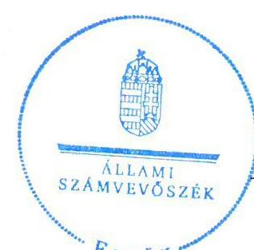
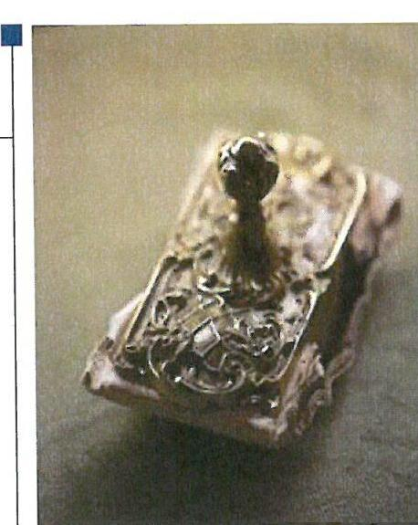
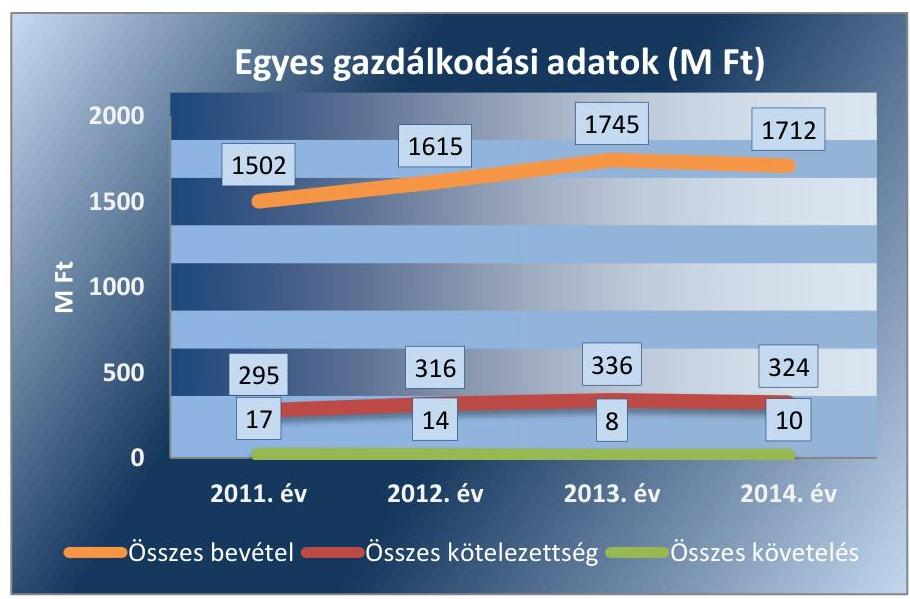
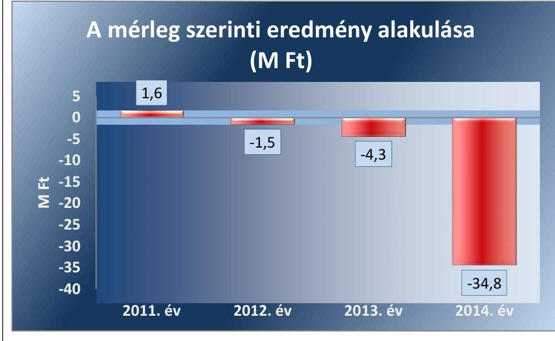
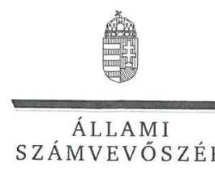
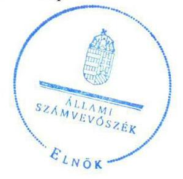

# Jelentés 

## Az önkormányzatok gazdasági társaságai

Az önkormányzatok többségi tulajdonában lévő gazdasági társaságok közfeladat ellátását érintő gazdálkodási tevékenysége szabályszerűségének ellenőrzése - Szent Margit Rendelőintézet Nonprofit Kft.

2016.
„A közfeladat ellátás szinvonala, költségeinek, ráfordításainak alakulása hatással van a szolgáltatást igénybe vevő lakosság elégedettségére."

---

# Jelentés 

## Az önkormányzatok gazdasági társaságai

Az önkormányzatok többségi tulajdonában lévő gazdasági társaságok közfeladat ellátását érintő gazdálkodási tevékenysége szabályszerűségének ellenőrzése - Szent Margit Rendelőintézet Nonprofit Kft.
2016. 

„A közfeladat ellátás szinvonala, költségeinek, ráforditásainak alakulása hatással van a szolgáltatást igénybe vevő lakosság elégedettségére."

---

# AZ ELLENŐRZÉST FELÜGYELTE:

- BÖRÖCZ IMRE felügyeleti vezető

- AZ ELLENŐRZÉST VEZETTE ÉS A VÉGREHAJTÁSÁÉRT FELELŐS:
  - SALAMIN VIKTOR ellenőrzésvezető
  - A PROGRAM ÖSSZEÁLLÍTÁSÁÉRT FELELŐS:
    - JANIK JÓZSEF LÁSZLÓ osztályvezető

- IKTATÓSZÁM: V-0927-172/2016
- TÉMASZÁM: 1704
- ELLENŐRZÉS-AZONOSÍTÓ SZÁM: V-070717

Jelentéseink az Országgyűlés számítógépes hálózatán és az Interneta a www.asz.hu címen is olvashatóak.

---

# TARTALOMJEGYZÉK 

■ ÖSSZEGZÉS ..... 5
■ AZ ELLENŐRZÉS CÉLJA ..... 7
■ AZ ELLENŐRZÉS TERÜLETE ..... 8
■ AZ ELLENŐRZÉS HÁTTERE, INDOKOLTSÁGA ..... 9
■ FÓKUSZKÉRDÉSEK ..... 11
■ ELLENŐRZÉS HATÓKÖRE ÉS MÓDSZEREI ..... 12
■ MEGÁLLAPÍTÁSOK ..... 14
■ JAVASLATOK ..... 26
■ MELLÉKLETEK ..... 27
I. Sz. melléklet: Értelmező szótár ..... 27
II. Sz. melléklet: Múködési adatok ..... 29
■ FÜGGELÉK: ÉSZREVÉTELEK ..... 31
■ RÖVIDÍTÉSEK JEGYZÉKE ..... 37

---

.

---

# ÖSSZEGZÉS 

Az Állami Számvevőszék ellenőrzése az egészségügyi közfeladat-ellátást érintő gazdálkodási tevékenység szabályszerűségét értékelte a kizárólagos önkormányzati tulajdonban lévő Szent Margit Rendelőintézet Nonprofit Kft.-nél a 2011-2014. évekre vonatkozóan. Budapest Főváros III. Kerület, Óbuda-Békásmegyer Önkormányzat a közfeladat ellátását biztosította, a tulajdonosi jogok gyakorlásának rendjét kialakította, a beszámoltatás rendszerének előírásai azonban nem érvényesültek teljes körűen. A Társaság számviteli szabályzatai nem feleltek meg teljes körűen a jogszabályi előírásoknak, vagyongazdálkodása szabályszerű volt. A közfeladat bevételeinek elszámolása megfelelő, a ráfordítások elszámolása nem megfelelő, a beruházások és felújítások elszámolása kockázatos volt. A kormányzati szektor hiányára befolyást gyakorló egyéb-, pénzügyi-, rendkívüli ráfordítások és bevételek elszámolása nem volt megfelelő, a személyi jellegű ráfordítások elszámolása magas kockázatot jelzett a terület egészének szabályos müködése szempontjából.

## Az ellenőrzés társadalmi indokoltsága

Az Állami Számvevőszék középtávra szóló stratégiájában megfogalmazta, hogy a helyi önkormányzatok gazdálkodásában rejlő pénzügyi kockázatok feltárásával, az államháztartáson kívülre nyújtott költségvetési támogatások és ingyenes vagyonjuttatások, valamint az államháztartáson kívül működő közfeladat-ellátó rendszerek ellenőrzéseivel hozzájárul ahhoz, hogy a közpénzeket az államháztartáson kívül működő szervezetek is átlátható, rendezett módon használják fel a közfeladatok szerződésben vállalt ellátása érdekében.

Magyarországon egyre jelentősebb a költségvetésen kívüli feladatellátás térnyerése. Ennek legfontosabb szereplői - a nonprofit szervezetek mellett - az önkormányzati tulajdonú gazdasági társaságok. Az önkormányzatok szervezetalakítási szabadságának következménye, hogy a korábban is vállalati formában működő közszolgáltatások mellett, mind a kötelező, mind az önként vállalt feladatok ellátásában a gazdasági társaságok kiemelt fontosságú szerephez jutottak.

## Főbb megállapítások, következtetések, javaslatok

Az Önkormányzat az egészségügyi alapellátás közfeladatának megszervezéséről a jogszabályi előírásoknak megfelelően döntött, annak ellátásáról a kizárólagos tulajdonában lévő gazdasági társasága útján gondoskodott. Az Önkormányzat az Eütv.-ben előírt, alapellátási körzetek kialakításának kötelezettségét a háziorvosi, fogorvosi és védőnői körzetekről szóló rendelet megalkotásával teljesítette. Az egészségügyi közszolgáltatási feladatok ellátására az Önkormányzat és a Társaság közhasznúsági szerződést kötött, amelyben meghatározták az ellátandó feladatokat, és a feladatellátás tárgyi, pénzügyi feltételeit. Az Önkormányzat a Társaság Alapító Okiratában meghatározta a tulajdonosi joggyakorlás szabályait. Tulajdonosi jogaikat az arra jogosultak az Alapító Okirat előírásainak betartásával, szabályszerűen gyakorolták. Az anyagi ösztönzési rendszer szabályait a tulajdonosi joggyakorló a Takt. előírásainak eleget téve az érdekeltségi szabályzat megalkotásával kialakította. A Társaság ügyvezetője a tulajdonosi joggyakorló által előírt beszámolási, adatszolgáltatási kötelezettséget nem teljesítette teljes körűen. A számviteli beszámolókról az FB írásbeli véleményt, a könyvvizsgáló jelentést készített. A Társaság mérleg szerinti eredménye 2011-ben pozitív, a 2012-2014. években negatív volt. Az Önkormányzat a Társaság feladatellátásához az ellenőrzött időszakban 511,2 M Ft működési célú és 160,3 M Ft fejlesztési célú támogatás nyújtásával járult hozzá.

A Társaság a Számv. tv.-ben előírt gazdálkodási szabályzatok közül az önköltségszámítás rendjére vonatkozó szabályzatot nem készített, a leltározási és leltárkészítési szabályzat tartalma nem volt összhangban a Számv. tv előírá-

---

saival, a számlarend előírásai hiányosak voltak. A Társaság vagyonával felelősen gazdálkodott, kötelezettségállománya a közfeladat ellátását nem veszélyeztette. A számviteli beszámolókat az előírt határidőben letétbe helyezték, azonban a 2011. évben a Számv. tv. előírásai ellenére nem a Képviselő-testület által elfogadott beszámolót helyezték letétbe. A Társaság az Eisztv.-ben és az Info tv.-ben előírt kötelezettségének eleget téve gazdálkodási adatait a honlapján közzétette.

Az egészségügyi alapellátás értékesítésének nettó árbevételét a jogszabályok és belső szabályok előírásai szerint számolták el. Az anyagjellegú ráfordítások elszámolása nem volt megfelelő, mivel egyes ráfordításokat nem a megfelelő egészségügyi alapellátásra számoltak el. A beruházások, felújítások kiadásainak elszámolását kockázatosnak minősítettük a maradványérték megállapításának elmulasztása miatt. A Társaság részére az egészségügyi alapellátás ellenértékét az OEP finanszírozási szerződés alapján térítette meg. A közfeladat-ellátáshoz kapcsolódóan árképzési kötelezettsége nem volt a Társaságnak.

Az ellenőrzött időszakban a Társaságnak nem volt engedélyköteles adósságot keletkeztető kötelezettségvállalása. A kormányzati szektor hiányára befolyást gyakorló személyi jellegú ráfordítások elszámolása magas kockázatot jelzett a terület egészének szabályos múködése szempontjából. Az egyéb-, pénzügyi-, rendkívüli ráfordítások és bevételek elszámolása nem volt megfelelő. Osztalékfizetésre az Alapító Okirat előírásainak megfelelően nem került sor.

Az ÁSZ a gazdálkodás szabályszerűségének javítása és a megfelelő gazdálkodási gyakorlat érdekében a Társaság ügyvezetőjének fogalmazott meg javaslatokat.

A jelentésben szereplő javaslatok alapján a Társaság ügyvezetője köteles intézkedési tervet összeállítani és azt a jelentés kézhezvételétől számított 30 napon belül az ÁSZ részére megküldeni.

---

# AZ ELLENŐRZÉS CÉLJA 

## A Társaság közfeladat ellátását érintő gazdálkodási tevékenysége szabályszerűségének értékelése

Az ellenőrzés célja annak értékelése, hogy az önkormányzat a jogszabályi előírások figyelembevételével döntött-e az ellenőrzésre kerülő közfeladat megszervezéséről; az önkormányzat/tulajdonosi joggyakorló szabályszerűen gyakorolta-e a tulajdonosi jogokat. A gazdasági társaság közfeladat ellátása bevételeinek, ráfordításainak elszámolása, és vagyongazdálkodási tevékenysége megfelelt-e a jogszabályi, illetve a közszolgáltatási/vagyonkezelési szerződésben foglalt tulajdonosi előírásoknak, azok végrehajtása szabályszerű volt-e; a gazdasági társaság kötelezettségállománya jelentett-e kockázatot a múködésre, illetve a közfeladat ellátására; a közfeladatok átláthatósága és elszámoltathatósága érdekében biztosítva volt-e a közszolgáltatás dijának megalapozottsága szabályszerű önköltségszámítással.

A kiegészítő modul esetében az ellenőrzés célja annak értékelése, hogy a gazdasági társaság gazdálkodásának a kormányzati szektor hiányára és az államadósságra befolyással bíró elemei a jogszabályi előírásoknak megfeleltek-e.

---

# **A Z ELLENŐRZÉS TERÜLETE**

## **Budapest Főváros III. Kerület, Óbuda-Békásmegyer Önkormányzat és a kizárólagos tulajdonában lévő Szent Margit Rendelőintézet Nonprofit Kft.**

### **Budapest Főváros III. Kerület, Óbuda-Békásmegyer Önkormányzat**

**ZAT** az Óbuda-Békásmegyer Egészségügyi Szolgáltató Közhasznú Társaságot az ellenőrzött időszakot megelőzően Alapító Okirattal¹ hozta létre, amelynek elnevezése 2009. április 1-jétől Szent Margit Rendelőintézet Nonprofit Korlátolt Felelősségű Társaságra változott. A Társaság² kizárólagos önkormányzati tulajdonban volt az ellenőrzött időszakban.

Az Önkormányzat³ a működés tárgyi feltételeit különböző formában, közhasznúsági-, használati szerződés, használati megállapodás keretében biztosította az ellenőrzött időszakban. A Társaság fő tevékenysége a III. kerületben⁴ élő lakosság szakorvosi járóbeteg-ellátása volt. A III. kerület lakosainak száma 2014. január 1-jén 125 167 fő volt.

Az ellenőrzött időszakban a polgármester és a jegyző személye nem változott. A polgármester⁵ a 2006. évi önkormányzati választások óta tölti be tisztségét, a helyszíni ellenőrzés időszakában a munkakört betöltő jegyző⁶ 2010.12.20-tól látja el feladatait.

A Társaság 2011-2014. évi gazdálkodásának egyes adatait az 1. ábra szemlélteti.

*Forrás: A Társaság 2011.-2014. évi beszámolói*

---

# AZ ELLENŐRZÉS HÁTTERE, INDOKOLTSÁGA 

Objektív vélemény kialakítása Budapest Főváros III. Kerület, Óbuda-Békásmegyer Önkormányzat egészségügyi közfeladatának megszervezéséről, tulajdonosi jogai gyakorlásáról, valamint a kizárólagos tulajdonában lévő Szent Margit Rendelőintézet Nonprofit Kft. közfeladat ellátását érintő gazdálkodási tevékenységének szabályszerűségéről, és az önkormányzati alszektor hiányára és adósságállományára hatást gyakorló elemek szabályszerűségéről.

## Az önkormányzatok közfeladat ellátásában napjainkban kiemelt fontosságú szerephez jutottak a gazdasági társaságok

AZ ÖNKORMÁNYZATI TULAJDONÚ GAZDASÁGI TÁRSASÁGOK teljes körű ellenőrzésének lehetőségét az ÁSZ. tv. 2011. január 1-jétől hatályos módosítása teremtette meg. A közfeladatot ellátó gazdasági társaságok ellenőrzése kiemelten fontos a vagyon megőrzése, megóvása érdekében, valamint a kormányzati szektor elszámolásaiban megjelenő önkormányzati tulajdonú gazdálkodó szervezetek esetében, amelyekkel szemben alapvető követelmény, hogy gazdálkodásuk, múködésük szabályszerű, az általuk szolgáltatott adatok minél megbízhatóbbak legyenek. A közfeladat-ellátás költségeinek, ráfordításainak alakulása, színvonala hatással van a lakosság elégedettségére.

A törvényalkotás számára - az észlelt problémák, szabálytalanságok, vagy egyéb nem kívánatos jelenségek felszínre kerülésével - az ellenőrzés megállapításai segítséget nyújthatnak az államháztartáson kívüli közfel-adat-ellátás értékeléséhez, jogszabályi keretei pontosításához, átláthatóságot biztosító szabályozásához. Meghatározhatóvá válnak a közfeladat ellátásban részt vevő államháztartáson kívüli szervezeteknek - az önkormányzat költségvetését, pénzügyi helyzetét is befolyásoló - kockázatai, lehetővé válik ezen kockázatok csökkentése. Ellenőrzéseink feltárhatják, hogy az önkormányzat közfeladat-ellátási kötelezettségének szabályszerűen tett-e eleget, a feladatellátáshoz rendelt közvagyon működtetését a tulajdonostól elvárható gondossággal, szabályszerűen szervezte-e meg és a tulajdonosi felügyelete hozzájárult-e a közfeladat ellátásához. Az ellenőrzés rávilágíthat arra, hogy a gazdasági társaság a közhasznúsági szerződésben foglaltak betartásával, a közvagyon használatával biztosította-e a szolgáltatás folyatatásának feltételeit, a közfeladat ellátását. Ezzel az ellenőrzöttek és a helyi döntéshozók számára visszajelzést ad feladatszervezési, feladat-ellátási kockázataikról, alapot ad a meglévő hibák megszüntetéséhez, a jobb közfeladat-ellátás biztosításához. Fokozza a fegyelmet, igazolja, hogy lejárt a következmények nélküli ellenőrzések időszaka. Az ÁSZ értékteremtő rend kialakításához és megőrzéséhez hozzájáruló tevékenysége pozitív hatással van a szervezetről kialakított összkép formálására.

A KIEGÉSZÍTŐ MODUL esetében az ellenőrzés háttere, hogy a korábban is vállalati formában múködő közszolgáltatások mellett, mind a

---

kötelező, mind az önként vállalt feladatok ellátásában a gazdasági társaságok kiemelt fontosságú szerephez jutottak.

A kormányzati szektorba sorolt egyéb szervezetek közé tartoznak a 479/2009/EK rendelet szerint, illetve az ESA 95 statisztikai módszertana alapján a "helyi kormányzat alszektorba besorolt társaságok és egyéb szervezetek" is, amelyekkel szemben alapvető követelmény, hogy gazdálkodásuk, működésük szabályszerű, az általuk szolgáltatott adatok megbízhatóak legyenek.

A nemzeti számlák összeállításának módszertana 2014. október 1-jétől megváltozott, amely értelmében az ESA 2010 felváltotta az ESA 95 módszertant. A nemzeti számlák rendszerének legfontosabb jellemzői, alapvető vonásai változatlanok maradtak, ugyanakkor az ESA 2010 követi a gazdasági környezetben lezajlott változásokat, figyelembe veszi az új kutatási eredményeket és a felhasználók új igényeit.

Az ellenőrzés során feltárjuk, hogy az önkormányzati alszektorba sorolt többségi önkormányzati tulajdonban lévő gazdasági társaságok gazdálkodása milyen mértékben befolyásolja a költségvetési hiányt és az államadósságot. Az ellenőrzés rámutathat a többségi önkormányzati tulajdonú gazdasági társaságok gazdálkodási tevékenységével, valamint az államháztartásból származó források felhasználásával kapcsolatos jó gyakorlatokra és szabálytalanságokra. Felhívhatja a figyelmet a jogszabályi követelmények teljesítéséhez szükséges feltételek hiányosságaira, hozzájárulhat az államháztartáson kívüli, de (közvetlenül vagy közvetve) önkormányzati vagyont használó gazdasági társaságok tevékenységének átláthatóságához. Hozzájárulhat a közfeladat-ellátás minőségének javulásához. Az ÁSZ értékteremtő rend kialakításához és megőrzéséhez hozzájáruló tevékenysége pozitív hatással van a szervezetről kialakított összkép formálására is.

---

# FÓKUSZKÉRDÉSEK 

1. Az önkormányzat közfeladat megszervezéséről szóló döntése, valamint tulajdonosi joggyakorlása szabályszerű volt-e?
2. A gazdasági társaság vagyongazdálkodása szabályszerű volt-e, kötelezettségállománya jelentett-e kockázatot a müködésre, illetve a közfeladat ellátására?
3. A gazdasági társaságnál az ellátott közfeladat bevételei és ráfordításai elszámolása, valamint az önköltségszámítás és árképzés szabályszerű volt-e?
4. A többségi önkormányzati tulajdonban lévő gazdasági társaságok gazdálkodásának a kormányzati szektor hiányára és az államadósságra befolyással bíró elemei megfeleltek-e a jogszabályi előírásoknak?

---

# ELLENŐRZÉS HATÓKÖRE ÉS MÓDSZEREI 

## Az ellenőrzés típusa

Megfelelőségi ellenőrzés

## Az ellenőrzött időszak

2011. január 1-jétől 2014. december 31-ig tart.

## Az ellenőrzés tárgya

A közfeladatot gazdasági társaságokkal ellátó önkormányzatok tulajdonosi joggyakorlása, valamint gazdasági társaságok pénz- és vagyongazdálkodásának szabályozottsága és szabályszerűsége.

A kiegészítő modul esetében a kormányzati szektor önkormányzati alszektorába sorolt, többségi önkormányzati tulajdonban lévő gazdasági társaságok gazdálkodásának a kormányzati szektor hiányára és az államadósságra befolyással bíró elemei szabályszerűsége.

Az ellenőrzés kiterjed minden olyan körülményre és adatra, amely az ÁSZ jogszabályban meghatározott feladatainak teljesítéséhez, valamint a program végrehajtása folyamán felmerült újabb összefüggések feltárásához szükséges.

## Az ellenőrzött szervezet

Az ellenőrzött szervezetek:
Budapest Főváros III. Kerület, Óbuda-Békásmegyer Önkormányzat
Szent Margit Rendelőintézet Nonprofit Korlátolt Felelősségű Társaság

## Az ellenőrzés jogalapja

Az ellenőrzés jogszabályi alapját az ÁSZ tv. 5. § (3)-(4)-(5) bekezdései képezik. Ennek értelmében az ÁSZ ellenőrzi az államháztartásból nyújtott támogatás vagy az államháztartásból meghatározott célra ingyenesen juttatott vagyon felhasználását a gazdasági társaságoknál. Az önkormányzati vagyon kezelésének ellenőrzése keretében ellenőrzi a vagyon kezelését, a vagyonnal való gazdálkodást, a többségi önkormányzati tulajdonban lévő gazdasági társaságok vagyonérték-megőrző és vagyon-gyarapító tevékenységét,

---

az államháztartás körébe tartozó vagyon el-idegenítésére, illetve megterhelésére vonatkozó szabályok betartását; ellenőrizheti a többségi önkormányzati tulajdonban lévő gazdasági társaságok vagyongazdálkodását.

# Az ellenőrzés módszerei 

Az ellenőrzést a nemzetközi standardokat irányadónak tekintve az ellenőrzési program ellenőrzési kérdései, az ellenőrzött időszakban hatályos jogszabályok, az ellenőrzés szakmai szabályok és módszertanok figyelembe vételével végezzük.

Az ellenőrzés ideje alatt az ellenőrzött szervezettel történő kapcsolattartást az ÁSZ Szervezeti és Múködési Szabályzatának vonatkozó előírásai alapján biztosítjuk.

Az ellenőrzés a kiválasztott, többségi tulajdonosi jogokat gyakorló önkormányzatra, illetve az ellenőrzésre kijelölt közfeladatot ellátó gazdasági társaság felett tulajdonosi jogokat gyakorló szervezetre és az ellenőrzött közfeladatot ellátó gazdasági társaságra terjed ki. Amennyiben a gazdasági társaságban több önkormányzat együttesen többségi tulajdonos, úgy az ellenőrzést a többségi tulajdonosi jogokat gyakorló önkormányzatnál kell lefolytatni. Az ellenőrzött gazdasági társaságnál, amennyiben az több közfeladatot is ellát, akkor az ellenőrzésre kiválasztott közfeladat-ellátást ellenőrizzük.

Az ellenőrzést a kérdésekre adott válaszok kiértékelésével, valamint a megjelölt adatforrások, a csatolt tanúsítványok felhasználásával, továbbá az adott időszakban hatályos jogszabályok figyelembe vételével kell lefolytatni. Az ellenőrzési kérdések megválaszolásához szükséges bizonyítékok megszerzése a következő ellenőrzési eljárások alkalmazásával történik: megfigyelés, kérdésfeltevés (információkérés), mintavétel, összehasonlítás, valamint elemző eljárás.

A bevételek és ráfordítások elszámolása, valamint a vagyonnyilvántartás terén a szabályszerű működést véletlen mintavétellel ellenőriztük. A kormányzati szektorba sorolt egyéb gazdálkodó szervezetek esetében a személyi jellegú ráfordítások elszámolása mellett az egyéb ráfordítások, pénzügyi műveletek ráfordításai, rendkívüli ráfordítások, illetve az egyéb bevételek, pénzügyi műveletek bevételei, rendkívüli bevételek elszámolásának szabályszerűségét szintén mintatételeken keresztül ellenőriztük. A mintavétellel ellenőrzött területek esetében minden egyes tétel vonatkozásában a szabályszerűségre vonatkozó kérdéseket tettünk fel, amelyek eredménye összesítésre került. A jogszabályoknak és a belső előírásoknak megfelelőnek tekintettük az adott területet, amennyiben a minta ellenőrzésének eredménye alapján 95\%-os bizonyossággal a teljes sokaságban a hibaarány kisebb volt, mint 10\%, nem megfelelőnek értékeltük, ha a hibaarány a 10\%-ot meghaladta. Kockázatot, illetve magas kockázatot jeleztünk, amennyiben egy adott terület vonatkozásában a minta alapján a teljes sokaságban nem volt egyértelmúen biztosított a jogszabályoknak és a belső szabályzatoknak megfelelő működés. A ráfordítások elszámolására és a vagyonnyilvántartásra vonatkozó véletlen mintavételt kockázati alapú kiválasztással egészítettük ki, amelynek során évente a három legnagyobb összegű tételt választottuk ki.

---

# 1. Az önkormányzat közfeladat megszervezéséről szóló döntése, valamint tulajdonosi joggyakorlása szabályszerű volt-e? 

Összegző megállapítás

Az Önkormányzat a közfeladat-ellátást szabályszerűen szervezte meg, a tulajdonosi jogok gyakorlásának rendjét kialakította, az adatszolgáltatás, beszámoltatás rendszerének előírásai azonban nem érvényesültek teljes körűen.
1.1. számú megállapítás

A közfeladat-ellátást az Önkormányzat a jogszabályoknak és a helyi szabályozásnak megfelelően szervezte meg, feladatellátásra vonatkozó rendeletalkotási kötelezettségének eleget tett.

A Képviselő-testület ${ }^{7}$ a 2011-2014. évekre elfogadott gazdasági programban ${ }^{8}$ az Ötv. ${ }^{9}$ 91. § (6) bekezdése, 2013. január 1-jétől a Mötv. ${ }^{10} 116$ § (3)-(4) bekezdései szerint meghatározta az egészségügyi feladatok fejlesztési irányát. Célul tűzte ki az egészségügyi intézmények energetikai korszerűsítését, szűrőállomások, gondozók fejlesztését, radiológiai eszközpark cseréjét.

Az Önkormányzat az egészségügyi alapellátást a Társaság jogelőd ${ }^{11}$ szervezetének alapításával biztosította. A Képviselő-testület döntése alapján a Társaság 2013. április 30-tól folytatta a járóbeteg-szakellátás feladatát.

A TÁRSASÁG ALAPÍTÓ OKIRATA tartalmazta mindazon feladatokat, kötelező tartalmi elemeket, amelyeket a Ptk. ${ }^{12}$ 54. § (2) bekezdés, a Ptk: ${ }^{13}$ 3:5. § rendelkezései, a Gt ${ }^{14}$. 12. § (1) bekezdés előírtak. A Gt. 19. §-ával összhangban az Alapító ${ }^{15}$ kizárólagos hatáskörébe sorolta az éves költségvetés meghatározását, az éves beszámoló-, a közhasznúsági jelentés jóváhagyását, a mérleg szerinti nyereség felosztását, az $\mathrm{FB}^{16}$ tagjainak megválasztását, visszahívását, díjazásának megállapítását, az ügyvezető és a könyvvizsgáló megbízását és visszahívását. Meghatározta az FB tájékoztatására a negyedévenkénti beszámoló készítését.

Az Önkormányzat a Társaság feladatellátását biztosító önkormányzati vagyonnal kapcsolatban vagyonkezelői jogot nem létesített.

## AZ EGÉSZSÉGŰGYI KÖZSZOLGÁLTATÁSI FEL-

ADATOK ELLÁTÁSA érdekében az Önkormányzat és a Társaság az ellenőrzött időszakot megelőzően kötött Közhasznúsági szerződés ${ }^{17}$-t, amelyet a jogszabályi változások és a működési rend változása miatt 2013 április 25-én aktualizáltak. A Közhasznúsági szerződésben meghatározták a Társaság szakmai feladatainak ellátását, annak tárgyi és pénzügyi feltételeit. Az Önkormányzat a szolgáltatások ellátásához szükséges ingat-

---

lanokat és a 20 M Ft egyedi bruttó értéket meghaladó ingó vagyontárgyakat alapításkor Használati szerződés ${ }^{18}$ keretében a Társaság ingyenes használatába adta. A 20 M Ft egyedi bruttó értékű vagy azt meg nem haladó értékű ingó vagyontárgyak apportként a Társaság tulajdonába kerültek. A Használati szerződés hatálya mellett, az Önkormányzat a 2011-ben beszerzett, és 2012-ben üzembe helyezett egyes orvosi készülékek használatba adására Használati megállapodást ${ }^{19}$ kötött a Társasággal.

A Közhasznúsági szerződés előírta a használatba adott önkormányzati vagyon értékének negyedévenkénti aktualizálását, a vagyonban bekövetkezett változások tételes kimutatását, a kimutatás negyedévenkénti egyeztetését a vagyonkataszteri nyilvántartással. Előírta az önkormányzati vagyonban és a saját vagyonban bekövetkezett változások évenkénti kimutatását és elszámolását, a közhasznúsági jelentési-, az éves gazdálkodási tervről üzleti és likviditási tervkészítési-, az üzleti tervnek megfelelő tartalmú beszámolási kötelezettséget. Meghatározta a múködéshez szükséges for-rások-, a feladatok végrehajtásához szükséges múködési kiadások szakfeladatonkénti kimutatását az üzleti tervben.

A Használati szerződés és a Használati megállapodás rögzítette a Társaság használatába adott vagyonnal kapcsolatos jogokat, előírta az Önkormányzat tulajdonát képező vagyonra vonatkozóan, vagyonelemenkénti teljes körű leltár készítését.

Az Alapító Okirat szerint az FB feladatait képezte a Gt. 35. § (3) bekezdésben és Ptk. 3 : 120. § (2) bekezdésében előírtaknak megfelelően a számviteli beszámolóról szóló írásbeli jelentés készítése a Képviselő-testület részére.

Az Önkormányzat rendeletben állapította meg és alakította ki az Eütv ${ }^{20}$. 152. § (2) bekezdés előírásának megfelelően az egészségügyi alapellátások körzeteit. A háziorvosi, fogorvosi és védőnői körzetekről a 62/2005.(XII.15.) számú önkormányzati rendelet döntött.

# 1.2. számú megállapítás 

Az Önkormányzat a tulajdonosi jogok gyakorlásának rendjét kialakította, az adatszolgáltatás, beszámoltatás rendszerének előírásai azonban nem érvényesültek teljes körűen.

A Társaság vonatkozásában a tulajdonosi jogokat - az Alapító Okirat szerint - a Képviselő-testület gyakorolta. Az alapítói döntéseket a Képviselő-testület határozatban hozta meg, a Gt. 19. § (5) bekezdés, illetve a Ptk. 3 : 109. § (4) bekezdés előírásainak megfelelően. Döntött a Társaság éves beszámolójának elfogadásáról, az alapító hatáskörébe rendelt üzleti és személyi kérdésekben, az ügyvezető megválasztásáról, prémiumfeladata kiírásáról.

A FELÜGYELŐBIZOTTSÁG az Alapító Okiratban előírtak alapján - a Gt. 34. § (1) bekezdésével, valamint a Ptk. 3 : 121. § (1) bekezdésével összhangban - három tagból állt. A Gt. 34. § (4) bekezdésében előírtaknak eleget téve az FB elkészítette ügyrendjét. Az FB feladatának eleget téve az ellenőrzött években írásban véleményezte az éves beszámolót és az üzleti tervet.

AZ ANYAGI ÖSZTÖNZÉSI RENDSZER kereteit az Érdekeltségi szabályzat ${ }^{21}$ megalkotásával a Taktv ${ }^{22}$. 5. § (3) bekezdésben előírtaknak megfelelően a Képviselő-testület kialakította.

---

A Társaság által ellátott feladatokhoz kapcsolódóan - tekintettel a tevékenység jellegére - az Önkormányzatnak nem volt díjrendelet alkotási kötelezettsége. Az ellátott egészségügyi alapellátások vonatkozásában jogszabály (284/1997.(XII.23.) Korm. rendelet ${ }^{23}$, 301/2007.(XI.9.) Korm.r. ${ }^{24}$ ) állapította meg az alapellátás térítési diját.

Az egészségügyi alapellátás bevételének meghatározó része, a járóbeteg-forgalom OEP ${ }^{25}$ finanszírozásából származott. A Társaság az OEP által nem finanszírozott, térítésköteles egészségügyi ellátások térítési diját Térítési szabályzat ${ }^{26}$-ban határozta meg. A Térítési díj szabályzat a 284/1997. (XII. 23.) Korm. rendelet 1. § (6) bekezdés előírása szerint tartalmazta a mérséklésre és elengedésre vonatkozó szabályokat.

A BESZÁMOLTATÁSI RENDSZER keretében Rendelet ${ }^{27}$ alapján az önkormányzat tulajdonában lévő gazdasági társaságok költségvetésével és beszámolásával, pénzellátásával összefüggő nyilvántartási és adatszolgáltatási kötelezettségeit szabályozták. A Közhasznúsági szerződésben előírt, használatba kapott vagyonelemek vagyonkataszteri nyilvántartással történő egyeztetését a 2011-2012. évek vonatkozásában nem teljesítette. Az önkormányzati támogatás felhasználására vonatkozó éves likviditási tervet nem készített az ellenőrzött időszakban. A 2011-2012. évek közhasznúsági jelentése és a 2011-2013. évi üzleti tervek nem a Közhasznúsági szerződésben meghatározott tartalommal készültek. A hiányosságok ellenére az Önkormányzat határozatban elfogadta a Társaság közhasznúsági beszámolóit.

A TÁRSASÁG BELSŐ ELLENŐRZÉSÉT az Önkormányzat Polgármesteri Hivatalának Belső Ellenőrzési Csoportja végezte, a Bkr. ${ }^{28}$ 22. § (1) bekezdés b) pontjában előírt, kockázatelemzésen alapuló, éves ellenőrzési terv alapján.

A 2011. évben a megelőző négy év múködésének átfogó szabályszerűségi ellenőrzése javaslatot tett az ügyvezetői kötelezettségvállalás mértékének-, és az önkormányzati támogatás elszámolási határidejének meghatározására. A javaslatok hasznosulását utóellenőrzés keretében nem ellenőrizték. A 2012. évben a 2011. évi költségvetéssel, beszámolással, pénzellátással összefüggő nyilvántartási és adatszolgáltatási kötelezettség teljesítését ellenőrizték. Megállapításra került az üzleti tervezés hiányossága, az önköltségszámítási szabályzat hiánya, a kontrolling és a könyvelés összefüggéseinek egyes hiányosságai. A megállapításokkal kapcsolatos intézkedések végrehajtását az Önkormányzat nem kérte számon.

A 2013. évben kettő ellenőrzést végeztek. A 2012. év számviteli elszámolási és nyilvántartási rendszer megfelelőségének ellenőrzése megállapította a számviteli szabályzatok hiányosságait, a közhasznú és a vállalkozási tevékenység nem megfelelő szabályozását. Az ellenőrzési megállapítások megszüntetésére intézkedési terv készült. Végrehajtását a 2014. évi utóellenőrzés megfelelőnek értékelte. A közérdekú adatok közzétételének ellenőrzése hiányosságot nem tárt fel.

Az Önkormányzat belső ellenőrzése a Bkr. 47. § (1) bekezdés alapján elkészítette az ellenőrzési megállapításokra, javaslatokra, intézkedési tervekre vonatkozó információkat tartalmazó nyilvántartást. A nyilvántartásban azonban nem rögzítették a 2012. évi ellenőrzési jelentés javaslatainak teljesítését, valamint a határidőben végre nem hajtott intézkedések okait,

---

amely miatt a Bkr. 47. § (1) és (2) bekezdéseiben előírt intézkedések végrehajtása nem volt nyomon követhető.

A közfeladat-ellátásra irányuló külső ellenőrzés nem történt a Társaságnál az ellenőrzött időszakban.

A saját tőke összege minden évben meghaladta a jegyzett tőke összegét, ezért a Gt. 143. § (2) bekezdés a) pontja, illetve a Ptk2 3:189. § (1) bekezdés a), b) pontjai rendelkezései szerinti vagyonvédelmi intézkedés megtétele nem vált szükségessé. Az Önkormányzat a Társaság feladatellátásához az ellenőrzött időszakban 511,2 M Ft működési célú és 160,3 M Ft fejlesztési célú támogatás nyújtásával járult hozzá. A mérleg szerinti eredmény alakulását a 2. ábra szemlélteti.
2. ábra

Forrás: A Társaság 2011-2014. évi beszámolói

# 2. A gazdasági társaság vagyongazdálkodása szabályszerű volt-e, kötelezettségállománya jelentett-e kockázatot a müködésre, illetve a közfeladat ellátására? 

Összegző megállapítás

A Társaság számviteli szabályzatai nem feleltek meg teljes körűen a jogszabályi előírásoknak. A Társaság vagyongazdálkodása szabályszerű volt, kötelezettségállománya nem jelentett kockázatot a közfeladat ellátására. A Társaság beszámolási kötelezettségét hiányosan teljesítette.
2.1. számú megállapítás

A Társaság az előírt szabályzatokkal - az önköltségszámítás rendjére vonatkozó szabályzat kivételével - rendelkezett, a számlarend és a leltározási és leltárkészítési szabályzat előírásai azonban nem feleltek meg teljes körűen a jogszabályi előírásoknak.

A Társaság az Alapító Okirat szerint kialakította szervezetét, müködési kereteit, amelyet SZMSZ ${ }^{29}$-ben rögzített. Az SZMSZ-ben meghatározták a tu-

---

# 2.2. számú megállapítás 

lajdonosi irányítás, ellenőrzés, valamint a szakmai irányítás felügyelet keretszabályait. Előírták a szervezeti egységek feladatkörét, múködésük alapvető szabályait, egymás közti kapcsolatrendszerét.

AZ ÜZLETI TERVEKET az ügyvezető az előző évi beszámolóval együtt jóváhagyásra beterjesztette a Képviselő-testület részére. Az éves üzleti tervben bemutatták az éves ingatlan felújítási, karbantartási tervet, a gép és múszer beszerzés igényét, amelyet a Képviselő-testület az üzleti tervek elfogadásával jóváhagyott.

A Társaság az ellenőrzött időszakban rendelkezett a Számv. tv ${ }^{30}$. 14. § (3) bekezdésében előírt számviteli politikával, a Számv. tv. 14. § (5) bekezdés a), b), d) pontjaiban előírt eszközök és források leltárkészítési és leltározási szabályzatával, eszközök és források értékelési szabályzatával, valamint pénzkezelési szabályzattal. Elkészítette a Számv. tv. 161. § (1) bekezdésében előírt Számlarendet.

A SZÁMVITELI POLITIKÁBAN az értékcsökkenési leírás szabályaira vonatkozóan a Számv. tv. 52. § (2) bekezdésben rögzítettekkel összhangban előírták 2013. december 31-ig az 1 M Ft-ot meghaladó ér-tékű-, 2014. január 1-től az 5 M Ft-ot meghaladó értékű orvosi eszközök esetén 10 \% maradványérték képzésének kötelezettségét. Az eszközök és források értékelési szabályzatának aktualizálása a Számv. tv. 14. § (11) bekezdés előírásainak megfelelően megtörtént. A pénzkezelési szabályzat tartalma megfelelt a Számv.tv. 14. § (8) bekezdés előírásainak.

A 2012. január 1-jén hatályos leltározási és leltárkészítési szabályzat - a folyamatosan mennyiségben nyilvántartott - ingatlanok esetében a menynyiségi felvétellel történő leltározást 5 évenkénti gyakorisággal írta elő. A szabályozás nem felelt meg a Számv. tv. 69. § (3) bekezdés 2012. január 1jétől érvényben lévő előírásainak, amely legalább 3 évente történő leltározási kötelezettséget írt elő.

A számlarend hiányossága volt, hogy a 2013. január 1-jei módosítást követően nem rögzítette a 7-es számlaosztályt érintő gazdasági eseményeket, azok más számlákkal való kapcsolatát a Számv. tv. 161. § (2) bekezdés b) pont előírása ellenére.

Önköltségszámítási szabályzatot a Számv.tv. 14. § (5) bekezdés c) pontjában előírtakat megsértve annak ellenére nem készített a Társaság, hogy a Számv. 14. § (6) bekezdése nem mentesítette a szabályzat elkészítésének kötelezettsége alól.

A Társaság a tulajdonában lévő vagyonával a jogszabályi és belső rendelkezéseknek megfelelően, felelősen gazdálkodott.

A Társaság az egészségügyi alapellátás közfeladatát saját vagyonával és az Önkormányzattól használatba vett vagyonnal látta el. Az analitikus és főkönyvi nyilvántartási rendszer a Számv. tv. 159. §, a Számv. tv. 164. § (2) bekezdés előírásainak megfelelő biztosította az eszközök nyilvántartását, a változások folyamatos nyomon követését. A Társaság a Számv. tv. előírásainak megfelelően teljesítette a leltárkészítési és beszámolási kötelezettségét.

---

A közfeladat ellátás érdekében használatra kapott eszközök elidegenítésére, megterhelésére, az Nvtv ${ }^{31}$. 6. § (1) bekezdés, valamint a Használati szerződés előírásainak megfelelően nem került sor.

A Társaság főbb mérleg adatait az 1. táblázat szemlélteti:

1. táblázat

| A TÁRSASÁG FŐBB MÉRLEG ADATAI (MFT) |  |  |  |  |  |
| :--: | :--: | :--: | :--: | :--: | :--: |
| Mégnevezés | 2010 | 2011 | 2012 | 2013 | 2014 |
| I. Befektetett eszközök | 420,4 | 483,1 | 443,9 | 447,9 | 429,7 |
| - ebből: Tárgyi eszközök | 418,6 | 483,1 | 434,9 | 441,6 | 416,9 |
| II. Forgóeszközök | 123,0 | 206,3 | 133,8 | 99,6 | 82,3 |
| - ebből: Követelések | 18,7 | 17,2 | 13,9 | 8,2 | 10,1 |
| III. Aktív időbeli elhatárolások | 178,1 | 151,0 | 218,4 | 229,2 | 238,4 |
| Eszközök összesen | 721,5 | 840,4 | 796,1 | 776,7 | 750,4 |
| IV. Saját tőke | 16,1 | 96,6 | 95,1 | 90,8 | 56,4 |
| - ebből: Jegyzett tőke | 3,0 | 3,0 | 3,0 | 3,0 | 3,0 |
| - ebből Mérleg szerinti eredmény | 1,6 | 1,6 | $-1,5$ | $-4,3$ | $-34,8$ |
| V. Céltartalékok | 0,0 | 0,0 | 1,5 | 1,5 | 0,0 |
| VI. Kötelezettségek | 149,8 | 295,0 | 316,0 | 336,3 | 324,2 |
| VII. Passzív időbeli elhatárolások | 555,6 | 448,8 | 383,5 | 348,1 | 369,8 |
| Források összesen | 721,5 | 840,4 | 796,1 | 776,7 | 750,4 |

Forrás: 2011-2014 évi beszámolók

Az eszközérték 2011. január 1. és 2014. december 31. között 28,9 M Fttal emelkedett, amely alapvetően az aktív időbeli elhatárolások mérlegérték növekedésének a következménye. A tárgyi eszközök nettó értéke és a forgóeszközérték egyaránt csökkent az ellenőrzött időszakban.

A 2014. évi 34,8 M Ft veszteség okaként az egészségbiztosítási kassza év végi maradványa szétosztásának elmaradását, valamint a teljesítményarányos támogatásnak a TVK (teljesítményvolumen korlát) maximális szintjétől való $2 \%$-os elmaradását jelölte meg a beszámoló kiegészítő mellékletében a Társaság.

A Társaságnak adósságot keletkeztető ügyletei az Önkormányzattal szemben fennálló hosszú lejáratú kötelezettséghez, illetve pénzügyi lízinghez kapcsolódtak, amelyek az ellenőrzött időszakot megelőzően keletkeztek. A pénzügyi lízing kötelezettség 2013. év végéig törlesztésre került. Rövid lejáratú adósságot keletkeztető kötelezettsége a 2011-2013. években bankszámlahitel szerződéshez kapcsolódott, 2014. évben ilyen ügylete nem volt.

# 2.3. számú megállapítás 

A kötelezettségek állománya a múködésre, a közfeladat ellátására nem jelentett kockázatot.

A Társaság kötelezettségeinek állománya a 2011. január 1-jei 149,8 M Ftról az ellenőrzött időszak végére több mint kétszeresére, 324,2 M Ft-ra nőtt.

A kötelezettségek év végi állományának alakulását a 2. táblázat mutatja be.

---

2. táblázat

| A TÁRSASÁG KÖTELEZETTSÉGEI (M FT) |  |  |  |  |
| :--: | :--: | :--: | :--: | :--: |
| Megnevezés | 2011. év | 2012. év | 2013. év | 2014. év |
| Hosszú lejáratú kötelezettség | 136,4 | 134,8 | 134,3 | 134,1 |
| Vevőktől kapott előlegek | 0,0 | 1,2 | 46,8 | 48,0 |
| Szállítókkal szembeni kötelezettség | 115,9 | 120,7 | 93,0 | 95,4 |
| Egyéb rövid lejáratú kötelezettség | 42,7 | 59,3 | 62,2 | 46,6 |
| Kötelezettségek összesen | 295,0 | 316,0 | 336,3 | 324,2 |

A 2011. és 2012. években a rövid lejáratú kötelezettségek nagyobb részét a szállítókkal szembeni kötelezettség tette ki, azonban 2013-2014-ben nőtt az egyéb rövid lejáratú kötelezettségek aránya az adóhatósággal szembeni tartozások növekedése és 2013-ban a pályázati előleg elszámolása miatt.

A Társaság gazdálkodása az önkormányzati támogatás (2011. évben 164 M Ft, 2012. évben 40 M Ft, 2013. évben 173 M Ft, 2014. évben 119 M Ft támogatás) igénybevétele mellett a 2012-2014. években veszteséges volt.

A Társaság eladósodottságát jelző mutatók értéke a 3. táblázatban foglaltak szerint alakult a 2011-2014. években.
3. táblázat

A TÁRSASÁG PÉNZÜGYI MUTATÓSZÁMAI 2011-2014

| Megnevezés | 2011. év | 2012. év | 2013. év | 2014. év |
| :--: | :--: | :--: | :--: | :--: |
| Eladósodottsági mutató idegen tőke/összes forrás | 0,88 | 0,88 | 0,88 | 0,92 |
| Eladósodottság mértéke kötelezettségek/saját tőke | 3,05 | 3,32 | 3,70 | 5,75 |
| Nettó eladósodottság (kötelezettségek-követelések)/saját tőke | 2,87 | 3,17 | 3,61 | 5,57 |
| Adósságfedezeti mutató I. (befektetett eszközök+forgóeszközök)/idegen forrás | 0,93 | 0,82 | 0,80 | 0,74 |

A Társaság eladósodottságának mértéke mutatja, hogy a múködését saját tőkéből nem volt képes finanszírozni, kötelezettsége háromszor, ötször meghaladta a saját tőke értékét. A kintlévőséggel csökkentett kötelezettségek állománya jobban növekedett, mint a saját tőke állománya, és a Társaság adóssága nagyobb volt, mint eszközeinek (befektetett és forgó eszközök) együttes értéke.

Az adósságállomány alakulása, összetétele a közfeladat ellátására nem jelentett kockázatot, a mutatók értékét alapvetően befolyásoló (hosszú lejáratú kötelezettségként kimutatott), gépbeszerzéshez kapcsolódó tartozást önkormányzati támogatás finanszírozta.

# 2.4. számú megállapítás 

## A Társaság a beszámolási és adatszolgáltatási kötelezettségét hiányosan teljesítette.

A Társaságnak a Számv. tv. 9. § (1) bekezdés alapján éves beszámolóját a Számv. tv. 17. § (1) bekezdése szerint kellett készítenie. A Társaság a 2011.

---

év működéséről, vagyoni, pénzügyi és jövedelmi helyzetéről nem készítette el a Számv. tv. 9. § (1) bekezdésében előírt éves beszámolót, helyette a számviteli törvény szerinti egyes egyéb szervezetek beszámolókészítési és könyvvezetési kötelezettségének sajátosságairól szóló 224/2000. Korm.rendelet 1. és 3. számú melléklete szerinti mérleg és eredmény-kimutatást készített el. A 2012-2014. évi beszámolók tartalma megfelelt a Számv. tv. 19. § (1) bekezdésében előírtaknak.

AZ ÉVES BESZÁMOLÓKAT az ügyvezető a Képviselő-testület elé terjesztette. Az éves beszámolók elfogadásáról a Képviselő-testület a könyvvizsgáló jelentésének és az FB írásbeli jelentésének birtokában hozott határozatot. A könyvvizsgáló az éves beszámolókat hitelesítő záradékkal látta el. A 2011-2014. évi beszámolók letétbe helyezése a Számv. tv. 153. § (1) bekezdésben előírt határidőben megtörtént.

A Társaság a Számv. tv. 153. § (1) bekezdés előírásával ellentétben 2011. évben nem az Önkormányzat által elfogadott beszámolót tette közzé. Az elfogadott beszámoló a 224/2000. Korm. rendelet 1. és 3. számú melléklete alapján készült, míg a letétbe helyezett beszámoló a Számv. tv. 17. § (1) bekezdésnek megfelelően. Mindkét beszámoló alapja a 2011. évi főkönyvi kivonat volt.

Az ellenőrzött időszakban az éves beszámolók részét képező kiegészítő melléklet a Számv. tv. 91. § a) pontjában előírtak ellenére nem tartalmazta a személyi jellegű egyéb kifizetéseket állománycsoportonként.

Az FB és a könyvvizsgáló a közvagyon védelme, illetve más okból a Kép-viselő-testület összehívását nem kezdeményezte.

A Társaság 2011-ben az Eisztv ${ }^{32}$. 6. § (1) bekezdésében, 2012-2014. években az Info tv ${ }^{33}$. 33. § (3) bekezdésben előírt kötelezettségének eleget téve szervezeti, személyi adatait, a tevékenységére, múködésére vonatkozó, és gazdálkodási adatait az Info tv. 37. § (1) bekezdésben rögzítettek szerint honlapján közzétette.

---

# 3. A gazdasági társaságnál az ellátott közfeladat bevételei és ráfordításai elszámolása, valamint az önköltségszámítás és árképzés szabályszerű volt-e? 

Összegző megállapítás

A közfeladat bevételeinek elszámolása megfelelő, a ráfordítások elszámolása nem megfelelő, a beruházások és felújítások elszámolása kockázatos volt. A közfeladat ellátásához kapcsolódóan önköltségszámítási és árképzési kötelezettsége nem volt a Társaságnak.
3.1. számú megállapítás

Az egészségügyi alapellátással kapcsolatos bevételek elszámolása megfelelő, az anyagjellegú ráfordítások elszámolása nem megfelelő volt, míg a beruházások, felújítások elszámolását kockázatosnak értékeltük.

A Társaság a beszámolási- és az adatszolgáltatási kötelezettségeinek teljesítéséhez a közfeladat egyértelmú elhatárolásához szükséges előírásokat a bevételek vonatkozásában meghatározta, ráfordításainak elkülönített nyilvántartási kötelezettségét, valamint az egyes közhasznú feladatokra közvetlenül el nem számolható költségek, ráfordítások felosztásának szabályait nem határozta meg a Számv. tv 161/A (2), valamint a Civil tv. ${ }^{34}$ 27. § (1) bekezdés előírásának ellenére.

AZ ÉRTÉKESÍTÉS NETTÓ ÁRBEVÉTELÉNEK ELSZÁMOLÁSA megfelelő volt. A bevételek előírása és kiszámlázása a belső szabályozásnak megfelelően történt, a bevételeket a megfelelő számlacsoportba, közfeladatonként elkülönítve számolták el.

AZ ANYAGJELLEGŰ RÁFORDÍTÁSOK elszámolása nem volt megfelelő. Egyes esetekben a ráfordításokat nem a számviteli politikában, illetve számlatükörben rögzített egészségügyi alapellátásra számolták el.

A BERUHÁZÁSOK, FELÚJÍTÁSOK KIADÁSAI ÉS AZ ÉRTÉKCSÖKKENÉSI LEÍRÁS ELSZÁMOLÁSA során nem érvényesültek teljes körűen a jogszabályok és belső szabályok előírásai az értékcsökkenési leírás elszámolása tekintetében. Ez kockázatot jelez a terület egészének szabályos múködése szempontjából. Egyes orvosi eszközök esetében nem állapítottak meg maradványértéket, az értékcsökkenést a teljes bekerülési értéket figyelembe véve határozták meg. Nem tartották be a Számv. tv. 52. § (1) bekezdésében rögzítetteket, valamint a számviteli politikának a $10 \%$ maradványérték képzési kötelezettségre vonatkozó előírásait az orvosi eszközök esetében.

A Társaság a 2011-2014. években a rendelkezésre álló forrásokból az eszközök pótlása során nagyobb részt fordított karbantartásra, mint az eszközök felújítására, új eszközök beszerzésére. Ennek hatására az ellenőrzött időszakban csökkent az eszközök nettó értéke. Az ellenőrzött időszakban az eszközök használhatósági mutatói is folyamatosan romlottak. Az eszkö-

---

zök átlagos használhatósági foka a 2011. évi 61 \%-ról 2014-re 47 \%-ra csökkent - átlagos életkora a 2011. évi 3,2 évről 2014-re 3,7 évre nőtt -, elhasználódási szintje a 2011. évi $39 \%$-ról 2014-re $53 \%$-ra emelkedett.

A KÖVETELÉSÁLLOMÁNY csökkentésére az Önkormányzat nem írt elő intézkedési kötelezettséget a Társaság részére. A vevő- és egyéb követelésekből álló követelésállomány 2011-2014 évek között csökkent.

Az ellenőrzött időszakban a követelések alakulását a 4. táblázat mutatja be:
4. táblázat

A TÁRSASÁG KÖVETELÉSÁLLOMÁNYÁNAK ALAKULÁSA 2011-2014.

| Megnevezés | 2011.   M Ft | 2012.   M Ft | 2013.   M Ft | 2014.   M Ft |
| :--: | :--: | :--: | :--: | :--: |
| Követelések áruszállításból és szolgáltatásból (vevők) | 16,8 | 10,0 | 5,8 | 8,1 |
| Egyéb követelések | 0,4 | 3,9 | 2,4 | 2,0 |
| Követelések összesen: | 17,2 | 13,9 | 8,2 | 10,1 |
| ebből 90 napon túl lejárt követelések | 7,8 | 5,1 | 4,3 | 7,2 |
| Elszámolt értékvesztés összege | 0 | 1,6 | 0,9 | 1,4 |

A követelések értékelési elveit (értékvesztés, behajthatatlanság) a számviteli politikában és az értékelési szabályzatban rögzítették. Az ellenőrzött években a hátralékos-, határidőn túli követelésállomány kötelezettjeinek fizetési felszólításokat-, valamint az éves beszámolók alátámasztására egyenlegközlő leveleket küldtek.

2011-ben a teljes követelésállomány 45,7\%-ának a fizetési határideje 90 napon túli volt, ennek ellenére a Társaság 2011-ben nem számolt el értékvesztést, a Számv. tv. 15. § (8) bekezdésében, a 46. § (4) bekezdésében valamint a számviteli politikában foglaltakkal ellentétben. A 2012. évben elszámolt értékvesztés összegét alátámasztó egyedi értékelést a Számv. tv. 15. § (3) bekezdésében és a 16. § (1) bekezdésében előírtak ellenére dokumentumokkal nem támasztották alá.
3.2. számú megállapítás

Az ellenőrzött közfeladathoz kapcsolódóan árképzési és az árakat megalapozó önköltségszámítási kötelezettsége nem volt a Társaságnak.

A Társaság önköltségszámítási kötelezettsége a finanszírozási szerződés alapján végzett egészségügyi alapellátás, járó beteg ellátás és gondozás tevékenységek dijára nem terjedt ki, azokat szerződés alapján az OEP térítette meg.

---

# 4. A többségi önkormányzati tulajdonban lévő gazdasági társaságok gazdálkodásának a kormányzati szektor hiányára és az államadósságra befolyással bíró elemei megfeleltek-e a jogszabályi előírásoknak? 

Összegző megállapítás

Az ellenőrzött időszakban a Társaság adósságot keletkeztető ügyletének kötelezettségvállalása megfelelt a jogszabályi előírásoknak. A kormányzati szektor hiányára befolyást gyakorló egyéb, pénzügyi és rendkívüli bevételek, ráfordítások elszámolása nem volt megfelelő, a személyi jellegú ráfordítások elszámolását magas kockázatúnak értékeltük.
4.1. számú megállapítás

Az ellenőrzött időszakban a Társaság adósságot keletkeztető ügyletének kötelezettségvállalása és elszámolása megfelelt a jogszabályi előírásoknak.

A kormányzati szektorba sorolt egyéb szervezetekről szóló, az Áht. ${ }^{35}$ 109. § (8) bekezdése alapján kiadott nemzetgazdasági miniszteri közlemények szerint a Társaság 2012. január 1. - 2014. december 31. között a helyi önkormányzati alszektorba tartozó szervezetek közé tartozott.

A Társaság 2011-2013. évek bankszámlahitel szerződéshez kapcsolódó adósságot keletkeztető ügyletének megkötése a Stabilitási tv. 9. § (1) bekezdés szerint nem volt engedély köteles. Egyéb adósságot keletkeztető ügyletet a Társaság a 2011-2014. években nem kötött.
4.2. számú megállapítás

A személyi jellegú ráfordítások elszámolását magas kockázatúnak, az egyéb, pénzügyi és rendkívüli bevételek és ráfordítások elszámolását nem megfelelőnek értékeltük.

A személyi jellegú ráfordítások elszámolása során nem érvényesültek teljes körűen a jogszabályok előírásai a költségelszámolás vonatkozásában. Ez magas kockázatot jelez a terület egészének szabályos múködése szempontjából. A személyi alapbér nem minden esetben egyezett meg a munkaszerződésben rögzített összeggel, ellentétben a munkaszerződések megkötésekor hatályos Mtv ${ }^{36}$. 142. § előírásával. A Cafetéria nyilatkozatban szereplő juttatások kifizetése több esetben nem került dokumentálásra, mely nem felelt meg a Számv. tv. 165. § (1) bekezdés előírásának, továbbá a cafetéria nyilatkozat nem a Cafetéria szabályzatnak megfelelően került módosításra, továbbá egy esetben a nyilatkozattól eltérő összegű kifizetés történt.

Az egyéb ráfordítások, pénzügyi műveletek ráfordításai, rendkívüli ráfordítások elszámolás nem volt megfelelő, mert a ráfordítások elszámolását nem minden esetben igazolta bizonylat a Számv. tv. 165. § (1) bekezdés előírása ellenére. A késedelmi kamatot a Számv. tv. 81. § (2) bekezdés b) pontjában előírtak ellenére egyéb ráfordítás helyett pénzügyi műveletek ráfordításaként számolták el.

Az egyéb bevételek, pénzügyi műveletek bevételei, rendkívüli bevételek elszámolása nem volt megfelelő. A bevételek elszámolását nem minden

---

esetben igazolta bizonylat ellentétben a Számv. tv. 165. § (1) bekezdés előírásaival. A dolgozóknak továbbszámlázott telefonhasználati díjat egyéb bevételként számolták el, nem a Számv. tv. 72. § (4) bekezdés a) pontja rendelkezésének megfelelően értékesítés nettó árbevételeként. Egy esetben a kapott késedelmi kamatot az egyéb bevételek helyett, a pénzügyi műveletek bevételei között mutatták ki, amely nem felelt meg a Számv. tv. 77. § (2) bekezdés b) pontja előírásainak. Az OEP-től visszafizetési kötelezettség nélkül, befektetett eszköz beszerzésre kapott fejlesztési támogatást a rendkívüli bevételek helyett, az egyéb bevételek között számolták el, ellentétben a Számv. tv. 86. § (4) bekezdés b) pontja, illetve a számviteli politika előírásával. Egy esetben az anyag értékesítéséből származó bevétel az egyéb bevételek között került elszámolásra az értékesítés nettó árbevétele helyett, a Számv. tv. 72. § (1) bekezdés előírása ellenére.

A Társaság mérleg szerinti eredménye 2011-ben pozitív, 2012-2014 években negatív volt. Osztalék kifizetés nem történt, mivel az Alapító Okiratban rögzítettek alapján a Társaság tevékenységéből származó eredmény nem osztható fel, azt teljes egészében a Társaság közhasznú céljaira kell fordítani.

---

# JAVASLATOK 

Az ÁSZ tv. ${ }^{37}$ 33. § (1) bekezdésében foglaltak értelmében az ellenőrzött szervezet vezetője köteles a jelentésben foglalt megállapításokhoz kapcsolódó intézkedési tervet összeállítani és azt a jelentés kézhezvételétől számított 30 napon belül az ÁSZ részére megküldeni. Amennyiben az intézkedési tervet határidőre nem küldi meg a szervezet, vagy amennyiben az nem elfogadható, az ÁSZ elnöke az ÁSZ tv. 33. § (3) bekezdés a)-b) pontjaiban foglaltakat érvényesítheti.

## Szent Margit Rendelőintézet NKft. ügyvezetőjének

1. Módosítsa a leltározási és leltárkészittési szabályzatot a jogszabályi előírásnak való megfelelés érdekében.
(2.1. sz. megállapítás 5. bekezdése alapján)
2. Egészítse ki a számlarendet a jogszabályban foglalt tartalmi követelményeknek megfelelően.
(2.1. sz. megállapítás 6. bekezdése alapján)
3. Intézkedjen a jogszabályban előírt önköltségszámitás rendjére vonatkozó belső szabályzat elkészitésére.
(2.1. sz. megállapítás 7. bekezdése alapján)
4. Intézkedjen a kiegészítő melléklet jogszabályban előírt tartalmi követelményeinek betartására.
(2.4. sz. megállapítás 4. bekezdése alapján)
5. Intézkedjen a számviteli elszámolások szabályszerű végrehajtására, ezen belül:
a) az anyagjellegü ráfordítások elszámolása tekintetében a belső szabályozás betartására;
(3.1. sz. megállapítás 3. bekezdése alapján)
b) az egyéb ráfordítások és a pénzügyi müveletek ráfordításai elszámolása tekintetében a jogszabályi előírások betartására;
(4.2. sz. megállapítás 2. bekezdése alapján)
c) az egyéb bevételek és a pénzügyi müveletek bevételei elszámolása tekintetében a jogszabályi előírások betartására.
(4.2. sz. megállapítás 3. bekezdése alapján)

---

# MELLÉKLETEK 

- I. SZ. MELLÉKLET: ÉRTELMEZŐ SZÓTÁR
adósságfedezeti mutató I.
eladósodottság mértéke
eladósodottsági mutató (tőkeáttétel)
garancia
gazdasági társaság
kezesség
közfeladat
(befektetett eszközök+forgóeszközök) / idegen forrás
Azt mutatja, hogy 1 Ft adósságra hány Ft vagyon jut. Általánosságban véve kedvező, ha értéke 2 körül van, de nagy eszközberuházás-igényű ágakban értéke kisebb is lehet.
kötelezettségek / saját tőke
Fontos szerepet játszik ez a mutató egy vállalat megítélésében. Azt mutatja, hogy a saját források a kötelezettségek hány százalékát fedezik. Törekedni kell, hogy a mutató tartósan (jelentősen) 1 alatti értéket érjen el.
idegen tőke / összes forrás
Egészségesnek mondható egy olyan mértékű áttétel, amelyet az üzleti tervek szerint és az elmúlt időszak tapasztalatai alapján a társaság megfelelő biztonsággal ki tud termelni. Nagy eszközberuházás-igényű iparágakban értéke magasabb, azaz magasabb eladósodottság is elfogadható, de 75-85 \%-ot meghaladó értéknél már itt is erős, sőt túlzott külső finanszírozottságról beszélhetünk. Általánosságban véve kedvező, ha értéke kisebb, mint 0.
A garancia olyan önálló, az önkormányzat nevében vállalt kötelezettség, amely alapján az önkormányzat az önkormányzati költségvetés terhére szerződésben meghatározott feltételek szerint, a kötelezett nem teljesítése esetén a jogosultnak fizetést teljesít az előzetesen rögzített összeghatárig.
3:88. § (1) A gazdasági társaságok üzletszerű közös gazdasági tevékenység folytatására, a tagok vagyoni hozzájárulásával létrehozott, jogi személyiséggel rendelkező vállalkozások, amelyekben a tagok a nyereségből közösen részesednek, és a veszteséget közösen viselik.
A kezességre vonatkozó előírásokat a Ptk. 2 6:416-430. §-ai tartalmazzák. Kezességi szerződéssel a kezes kötelezettséget vállal a jogosulttal szemben, hogyha a kötelezett nem teljesít, maga fog helyette a jogosultnak teljesíteni. Kezesség egy vagy több, fennálló vagy jövőbeli, feltétlen vagy feltételes, meghatározott vagy meghatározható összegű pénzkövetelés vagy pénzben kifejezhető értékkel rendelkező egyéb kötelezettség biztosítására vállalható. A Ptk. 2 szerint kezességet csak írásban lehet vállalni. A kezes kötelezettsége ahhoz a kötelezettséghez igazodik, amelyért kezességet vállalt. A kezes kötelezettsége nem válhat terhesebbé, mint amilyen elvállalásakor volt, kiterjed azonban a kötelezett szerződésszegésének jogkövetkezményeire és a kezesség elvállalása után esedékessé váló mellékkövetelésekre is.
Jogszabályban meghatározott állami vagy önkormányzati feladat, amit az arra kötelezett közérdekből, jogszabályban meghatározott követelményeknek és feltételeknek megfelelve végez, ideértve a lakosság közszolgáltatásokkal való ellátását, továbbá az állam nemzetközi szerződésekben vállalt kötelezettségeiből adódó közérdekű feladatokat, valamint e feladatok ellátásához szükséges infrastruktúra biztosítását is (Nvtv. 3. § (1) bekezdés 7. pont).

---

közszolgáltatás

A közszolgáltatás: „közcélú, illetőleg közérdekű szolgáltatást jelent, amely egy nagyobb közösség (állam, település) minden tagjára nézve megközelítőleg azonos feltételek mellett vehető igénybe, ezért valamilyen mértékig közösségi megszervezést, illetve szabályozást, ellenőrzést igényel." Az Ebktv. 3. § d) pontja a következőképpen határozza meg a közszolgáltatást: „szerződéskötési kötelezettség alapján a lakosság alapvető szükségleteinek ellátására irányuló szolgáltatás, így különösen a villamos energia-, gáz-, hő-, víz-, szennyvíz- és hulladékkezelési, köztisztasági, postai és távközlési szolgáltatás, továbbá a menetrend alapján közlekedő járművekkel végzett közforgalmú személyszállítás" nemzeti vagyon
nettó eladósodottság
többségi befolyás
tulajdonosi joggyakorló

A Ptk.: 8:2. § (2) bekezdése szerint „A befolyással rendelkező akkor rendelkezik egy jogi személyben meghatározó befolyással, ha annak tagja vagy részvényese, és
a) jogosult e jogi személy, vezető tisztségviselői vagy felügyelőbizottsága tagjai többségének megválasztására, illetve visszahívásra; vagy
b) a jogi személy más tagjai, illetve részvényesei a befolyással rendelkezővel kötött megállapodás alapján a befolyással rendelkezővel azonos tartalommal szavaznak, vagy a befolyással rendelkezőn keresztül gyakorolják szavazati jogukat, feltéve, hogy együtt a szavazatok több mint felével rendelkeznek."
Az Nvtv. 1. § (2) bekezdés c) pontja szerint „az állam vagy a helyi önkormányzatot tulajdonában lévő pénzügyi eszközök, továbbá az államot vagy a helyi önkormányzatot megillető társasági részesedések"
(kötelezettségek-követelések)/saját tőke
Azt mutatja, hogy a kintlévőségekkel csökkentett kötelezettségeket milyen mértékben fedezi a saját forrás. Ez feltételezi, hogy a követelések pénzügyileg előbb realizálódnak, mint ahogy a kötelezettségeket teljesíteni kell. A mutató minél kisebb, csökkenő értéke a kedvező.
A Ptk.: 8:2. § (1) bekezdése szerint „többségi befolyás az olyan kapcsolat, amelynek révén természetes személy vagy jogi személy (befolyással rendelkező) egy jogi személyben a szavazatok több mint felével vagy meghatározó befolyással rendelkezik."
Aki a nemzeti vagyon felett az államot vagy a helyi önkormányzatot megillető tulajdonosi jogok és kötelezettségek összességének gyakorlására jogosult (Nvtv. 3. § (1) bekezdés 17. pont).

---

II. SZ. MELLÉKLET: MŰKÖDÉSI ADATOK

| A TÁRSASÁG MŰKÖDÉSÉNEK FŐBB JELLEMZŐI (EZER FORINT / \%) |  |  |  |  |  |  |
| :--: | :--: | :--: | :--: | :--: | :--: | :--: |
| Sorszám | Megnevezés |  | 2011. | 2012. | 2013. | 2014. |
| 1. | A Társaság tulajdonosi összetétele: |  |  |  |  |  |
| 2. | Önkormányzat megnevezése: |  | Budapest Főváros III. Kerület, Óbuda-Békásmegyer Önkormányzat |  |  |  |
| 3. | Önkormányzat tulajdoni részesedésének aránya | $\%$ | 100 | 100 | 100 | 100 |
| 4. | Önkormányzat tulajdoni részesedésének ösz-   szege | ezer Ft | 3000 | 3000 | 3000 | 3000 |
| 5. | A Társaság müködése az ellenőrzött évek során megszűnt-e? (IGEN/NEM) |  | NEM |  |  |  |
| 6. | A tárgyévben a Társaság saját vagyona után els-   számolt értékcsökkenés összege | ezer Ft | 71203 | 74866 | 71785 | 69101 |
| 7 | A tárgyévben a Társaság vagyonkezelésében lévő önkormányzati vagyon után elszámolt értékcsökkenés összege | ezer Ft | 0 | 0 | 0 | 0 |
| 8. | Tárgyévi saját tulajdonú eszközök pótlására els-   számolt költség | ezer Ft | 155652 | 46361 | 92390 | 80973 |
| 9. | Értékesítés nettó árbevétele | ezer Ft | 1302005 | 1455243 | 1425675 | 1443918 |

---

.

---

# FÜGGELÉK: ÉSZREVÉTELEK 

A jelentéstervezetet a Számvevőszék 15 napos észrevételezésre megküldte az ellenőrzött szervezet vezetőjének az ÁSZ tv. 29. §* (1) bekezdése előírásának megfelelően.
Az elfogadott észrevételek alapján a Számvevőszék módosította a jelentést.

A függelék tartalmazza az ellenőrzött észrevételeit.
Az ÁSZ tv. 29. § (2) bekezdésében foglalt észrevételezési jogával Budapest Főváros III. Kerület Óbuda-Békásmegyer Önkormányzat polgármestere nem élt, a jelentéstervezetre észrevételt nem tett.
$\longrightarrow$ A Szent Margit Rendelőintézet NKft. ügyvezetőjének írásban tett észrevétele mellékletek nélkül.
$\longrightarrow$ Tájékoztatás az észrevételek kezeléséről az ügyvezetőnek.

[^0]
[^0]:    * 29. § (1) Az Állami Számvevőszék az ellenőrzési megállapításait megküldi az ellenőrzött szervezet vezetőjének vagy az általa megbízott személynek, és annak, akinek személyes felelősségét állapította meg.
    (2) Az ellenőrzött szervezet vezetője és a felelősként megjelölt személy az ellenőrzés megállapításaira tizenöt napon belül írásban észrevételt tehet.
    (3) Az Állami Számvevőszék az észrevételre a beérkezésétől számított harminc napon belül írásban válaszol. A figyelembe nem vett észrevételeket köteles a jelentésben feltüntetni, és megindokolni, hogy azokat miért nem fogadta el.

---

# 636 

## Szent Margit Rendelőintézet

1032 Budapest, Vörösvári út 88-96. tel.: +36 13886924 - fax: +36 13886942
e-mail: titkarsag@obudairendelok.hu - web: www.obudairendelok.hu

Ikt.szám: SZMF/18-13/2016
Tárgy: Észrevétel jelentéstervezetre

## ÁLLAMI SZÁMVEVŐSZÉK

## Domokos László Elnök részére

## Budapest

Apáczai Csere János utca 10
1052

## Tisztelt Elnök Úr!

## ÁLLAMI SZÁMVEVŐSZÉK 0131312016

Érkeze: 2016 JÚN 14.
Tktatószám: 1/2016-16/2016
Melléklet: $\qquad$
Az Állami Számvevőszék által „Az önkormányzatok gazdasági társaságai - Az önkormányzatok többségi tulajdonában lévő gazdasági társaságok közfeladat ellátását érintő gazdálkodási tevékenysége szabályszerűségének ellenőrzése - Szent Margit Rendelőintézet Nonprofit Kft., tárgyban készített jelentéstervezethez az alábbi észrevételeket kivánom megfogalmazni:

### 1.1. számú megállapításhoz

„A Képviselő-testület döntése alapján a Társaság tevékenységi köre 2013. április 30-tól kibővült a járóbetegszakellátás feladatával."
A Szent Margit Rendelőintézet Nonprofit Kft-t (továbbiakban: Társaság) illetve annak jogelơdjét kifejezetten a járóbeteg-szakellátás feladatainak ellátásra hozták létre, a hivatkozott 32/ÖK/2013. (I.31.) határozat értelmében a tevékenység folytatódik és nem „kibővül".

### 1.2. számú megállapításhoz

> „A beszámoltatási rendszer keretében ... alapján a Társaság 2011. év III. negyedévétól köteles volt negyedévente eredmény kimutatást készíteni. Ennek a kötelezettségének a Társaság a 2013. év III. negyedévének és a 2014. év II. negyedévének vonatkozásában nem tett eleget."
A hivatkozott 17/2011. (V.11.) ÖK rendelet 4.§ 2) pontja értelmében: „Az önkormányzati féléves és IIX. havi beszámoló elkészítése érdekében a GT. féléves eredmény-kimutatását július 31-ig, egyháromnegyedéves kimutatását, várható éves teljesítését november 10 -ig köteles megküldeni a pénzügyi főosztály részére." A jogszabályban foglaltaknak eleget tettünk, a 2013. I-III negyedévi éves beszámolónkat, illetve a 2014. évi I. féléves beszámolónkat az előírt határidőig megküldtük a fenntartó önkormányzat részére. A beszámolókat és a megküldéséröl szóló igazolást mellékletként csatoljuk.

### 2.2. számú megállapításhoz

> „A kötelezettségek 2011. évi növekedését alapvetően a - képviselö testületi határozat alapján Önkormányzattól átvállalt, röntgen gépek beszerzéséhez kapcsolódó hiteltartozás nyilvántartásba vétele eredményezte."
A Társaság a 2011. évi beszámolójának kiegészítő melléklete alapján a mérlegben bemutatott 132.408 E Ft hosszú lejáratú kötelezettség-állományból 130.000 EFt az alapító önkormányzattól 2004. évben müködés előfinanszírozására kapott és 2011. évben a korábbi éveket érintő változásként - a tulajdonos nyilatkozata alapján - tagi kölcsönnek átminősített állomány. Ezen túlmenően lizingszerződésből eredő kisebb összegű kötelezettségek szerepelnek az állományban. A röntgengépek beszerzését a tulajdonos önkormányzat bonyolította, melyhez kapcsolódó hitelt nem a

---

Társaság vette fel, ebből adódóan sem a hitel, sem a kamatterhek nem szerepelnek a kötelezettségeink között.

# 3.1. számú megállapításhoz 

> „Az anyagjellegü rálfordítások elszámolása nem volt megfelelő. Egyes esetekben a ráfordításokat nem a számviteli politikában illetve számlatúkórben rögzített egészségügyi ellátásokra számolták el." Az jelentés-tervezet konkrétumokat nem tartalmaz a „nemmegfelelőség" tekintetében.
> „Nem tartották be a Számv. tv. 52. § (1) bekezdésében rögzítetteket, valamint a számviteli politikában a 10\% maradványérték képzési kötelezettségére vonatkozó elöírásait az orvosi eszközök esetében." A beruházások és felújítások elszámolását nem tartjuk kockázatosnak. 2012-ben nem is volt érintett eszköz, 2013-ban 7 db, 2014-ben 2 db ilyen eszköz volt, amely a hibásan elszámolt értékcsökkenés miatt az évek sorrendjében 0,6 illetve 0,7 ezrelékes eltérést okozhatott a befektetett eszközök értékében. Megítélésünk szerint ez nem minősül jelentős hibának.

Tisztelettel kérem, hogy a jelentés-tervezethez kapcsolódó észrevételeimet elfogadni szíveskedjen.

Budapest, 2016. június 7.

---

ELRÖK

Ikt.szám: V-0927-166/2016.

# Farkas Mária Anna úrhölgy 

ügyvezető
Szent Margit Rendelőintézet Nonprofit Kft.

## Budapest

## Tisztelt Ügyvezető Úrhölgy!

„Az önkormányzatok gazdasági társaságai - Az önkormányzatok többségi tulajdonában lévő gazdasági társaságok közfeladat ellátását érintő gazdálkodási tevékenysége szabályszerüségének ellenőrzése - Szent Margit Rendelőintézet Nonprofit Kft." címmel készített számvevőszéki jelentéstervezetre tett észrevételeit köszönettel megkaptam.
Az Állami Számvevőszék észrevételekre vonatkozó álláspontjáról a felügyeleti vezető által készített részletes tájékoztatást mellékelten megküldöm.
Tájékoztatom Ügyvezető úrhölgyet, hogy a számvevőszéki jelentésben - az Állami Számvevőszékről szóló 2011. évi LXVI. törvény 29. § (3) bekezdése alapján - a figyelembe nem vett észrevételeket szerepeltetjük az elutasítás indokának feltüntetésével.

Budapest, 2016. 06 hó 28. nap

Tisztelettel:

## D. 128

Domokos László

Melléklet: Tájékoztatás az észrevételek kezeléséről

---

# Tájékoztatás   az észrevételek kezeléséről 

„Az önkormányzatok gazdasági társaságai - Az önkormányzatok többségi tulajdonában lévő gazdasági társaságok közfeladat ellátását érintő gazdálkodási tevékenysége szabályszerűségének ellenőrzése - Szent Margit Rendelőintézet Nonprofit Kft. " című jelentéstervezetre 2016. június 14-én érkezett észrevételeit áttekintettük, azok kezelésével kapcsolatban a következő tájékoztatást adom.
Az 1.1. számú megállapításhoz a járóbeteg-szakellátás feladatával kapcsolatban tett észrevétel szerint „a hivatkozott 32/ÖK/2013. (I. 31.) határozat értelmében a tevékenység folytatódik és nem „kibővül"". A jelentéstervezet a határozat számát nem tartalmazta, csak utalt rá (, A Képvi-selő-testület döntése alapján... "). A jelentéstervezet szövegezése az észrevételben foglaltak és a rendelkezésre álló ellenőrzési dokumentumok figyelembevételével, a határozat tartalmának megfelelően pontosításra kerül.
Az 1.2. számú megállapításhoz tett észrevétel szerint a Társaság eleget tett a beszámolókkal kapcsolatban a jogszabályban foglalt előírásoknak, a 2013. I-III. negyedévi, illetve a 2014. évi I. féléves beszámolóját a 17/2011. (V. 11.) ÖK rendelet 4. § 2.) pontjában foglaltaknak megfelelően megküldte a fenntartó önkormányzat részére. Az ellenőrzés rendelkezésére bocsátott dokumentumok ismételt áttekintése, értékelése alapján a hiányosságra vonatkozó megállapítást a jelentéstervezetből töröljük.
A 2.2. számú megállapításhoz tett, a kötelezettségek 2011. évi növekedéséhez kapcsolódó észrevétel szerint azt röntgen gépek beszerzéséhez kapcsolódó hitel nem okozhatta, mert a röntgen gépek beszerzését a tulajdonos önkormányzat bonyolította, ezért sem hitel, sem kamatterhek nem szerepelnek a Társaság kötelezettségei között. A számviteli nyilvántartásokkal és beszámolókkal kapcsolatosan az ellenőrzés rendelkezésére bocsátott dokumentumoknak az észrevételhez kapcsolódó ismételt felülvizsgálata alapján a gép beszerzéssel összefüggő hitelre vonatkozó információk a jelentéstervezetből törlésre kerülnek.
A 3.1. számú megállapításhoz tett első észrevétel szerint a jelentéstervezet nem tartalmaz konkrétumokat az anyagjellegủ ráfordítások elszámolásának nem megfelelő értékelésével kapcsolatban. A jelentéstervezet tartalmazott a hiányosságra vonatkozó megállapítást (,Egyes esetekben a ráfordításokat nem a számviteli politikában, illetve számlatükörben rögzített egészségügyi alapellátásra számolták el. "). Az elszámolások szabályszerűségét mintavétellel ellenőrizzük és az adott sokaságban előforduló hibás tételek arányát becsüljük. A megfelelő, a kockázatos, a magas kockázatú, vagy a nem megfelelő értékelés valamelyike a megnevezett sokaságra vonatkozik, emiatt a hibás tételek egyedi azonosítása a jelentésben nem értelmezhető. Ezért a jelentéstervezet módosítása nem indokolt.
A 3.1. számú megállapításhoz tett második észrevétel a beruházások és felújítások elszámolását nem tartja kockázatosnak, a hibásan elszámolt értékcsökkenést nem minősíti jelentős hibának. A jelentéstervezet a feltárt hibákat nem minősítette jelentősnek, azt állapította meg, hogy „A beruházások, felújítások kiadásai és az értékcsökkenési leírás elszámolása során nem érvényesültek teljes körüen a jogszabályok és belső szabályok előírásai az értékcsökkenési leírás elszámolása tekintetében. Ez kockázatot jelez a terület egészének szabályos müködése szempontjából. Egyes orvosi eszközök esetében nem állapítottak meg maradványértéket, az értékcsökkenést a

---

teljes bekerülési értéket figyelembe véve határozták meg. Nem tartották be a Számv. tv. 52. § (1) bekezdésében rögzítetteket, valamint a számviteli politikának a $10 \%$ maradványérték képzési kötelezettségre vonatkozó előirásait az orvosi eszközök esetében." A fentiekre tekintettel a jelentéstervezet módosítása nem indokolt.
Tájékoztatom, hogy a számvevőszéki jelentés függelékeként szerepeltetjük a jelentéstervezethez tett észrevételeit, valamint az azokra adott válaszunkat.

Budapest, 2016. DE hó 28 nap

Böröcz Imre
felügyeleti vezető

---

# RÖVIDÍTÉSEK JEGYZÉKE 

${ }^{1}$ Alapító Okirat
${ }^{2}$ Társaság
${ }^{3}$ Önkormányzat
${ }^{4}$ III. kerület
${ }^{5}$ polgármester
${ }^{6}$ jegyző
${ }^{7}$ Képviselő-testület
${ }^{8}$ gazdasági program
${ }^{9}$ Ötv.
${ }^{10}$ Mötv.
${ }^{11}$ jogelőd
${ }^{12}$ Ptk. 1
${ }^{13}$ Ptk. 2
${ }^{14} \mathrm{Gt}$.
${ }^{15}$ Alapító
${ }^{16} \mathrm{FB}$
${ }^{17}$ Közhasznúsági szerződés
${ }^{18}$ Használati szerződés
${ }^{19}$ Használati megállapodás
${ }^{20}$ Eütv.
${ }^{21}$ Érdekeltségi szabályzat
${ }^{22}$ Taktv.
${ }^{23}$ 284/1997.(XII.23.) Korm. rendelet
${ }^{24}$ 301/2007. (XI.9) kormányrendelet
${ }^{25}$ OEP
a Szent Margit Rendelőintézet Nonprofit Korlátolt Felelősségű Társaság többször módosított Alapító okirata
Szent Margit Rendelőintézet Nonprofit Korlátolt Felelősségű Társaság Budapest Főváros III. Kerület, Óbuda-Békásmegyer Önkormányzat
Budapest Főváros III. kerülete
Budapest Főváros III. Kerület Óbuda-Békásmegyer Önkormányzat polgármestere
Budapest Főváros III. Kerület Óbuda-Békásmegyer Önkormányzat jegyzője
Budapest Főváros III. Kerület Óbuda-Békásmegyer Önkormányzat Képviselőtestülete
256/ÖK/2011.(V.5.) számú határozattal elfogadott 2011-2014. éveket érintő Gazdasági-városfejlesztési program és 1. sz. melléklete a 108/ÖK/2011.(II.24.) számú határozattal elfogadott, a 2011-2013. évekre vonatkozó Fejlesztési akcióterv
a helyi önkormányzatokról szóló 1990. évi LXV. törvény (hatálytalan: 2014. október 12-étől)
Magyarország helyi önkormányzatairól szóló 2011. évi CLXXXIX. törvény (hatályos: 2012. január 1-jétől)
Óbuda-Békásmegyer Egészségügyi Szolgáltató Közhasznú Társaság 2003.09.19én került bejegyzésre. A jogelőd társaság 2009.05.25. dátummal társasági formát váltott (közhasznú társaságból nonprofit korlátolt felelősségű társaság lett), illetve nevet változtatott a 79/ÖK/2009.(II.25.) határozat szerint.
a Polgári Törvénykönyvről szóló 1959. évi IV. törvény
a Polgári Törvénykönyvről szóló 2013. évi V. törvény
a gazdasági társaságokról szóló 2006. évi IV. törvény (hatálytalan: 2014. március 15-étől)
Budapest Főváros III. Kerület Óbuda-Békásmegyer Önkormányzat
a Szent Margit Rendelőintézet Nonprofit Korlátolt Felelősségű Társaság Felügyelő Bizottsága
Óbuda-Békásmegyer Egészségügyi Szolgáltató Közhasznú Társaság és az Önkormányzat között 2004.04.16-tól érvényes, és 2013. 04. 25. én aktualizált Közhasznúsági szerződés
a Társaság jogelődje és az Önkormányzat között 2004.04.16-tól hatályos Használati szerződés
a Társaság és az Önkormányzat között 2012. decemberben létrejött, egyes egészségügyi berendezések ingyenes használatba adásáról megkötött Használati megállapodás
az egészségügyről szóló 1997. évi CLIV. törvény
a Társaság 2010.04.28.-tól hatályos Érdekeltségi szabályzata
A köztulajdonban álló gazdasági társaságok takarékosabb müködéséről szóló 2009. évi CXXII. törvény
a térítési díj ellenében igénybe vehető egyes egészségügyi szolgáltatások térítési dijáról szóló 284/1997. (XII. 23.) Korm. rendelet
a menedékjogról szóló 2007. évi LXXX. törvény végrehajtásáról
Országos Egészségbiztosítási Pénztár

---

${ }^{26}$ Térítési díj szabályzat
${ }^{27}$ Rendelet
${ }^{28} \mathrm{Bkr}$.
${ }^{29}$ SZMSZ
${ }^{30}$ Számv. tv.
${ }^{31}$ Nvtv.
${ }^{32}$ Eisztv.
${ }^{33}$ Info tv.
${ }^{34}$ Civil tv.
${ }^{35}$ Áht.
${ }^{36}$ Mtv.
${ }^{37}$ ÁSZ tv.
a Társaság 2011.04.07-től hatályos Térítési díj szabályzata, valamint a Társaság 2014.04.24-től hatályos Térítési díj szabályzata
az Önkormányzat 17/2011. (V.11.) számú rendelete az önkormányzat tulajdonában lévő gazdasági társaságok költségvetésével és beszámolásával, pénzellátásával összefüggő nyilvántartási és adatszolgáltatási kötelezettségeiről a költségvetési szervek belső kontrollrendszeréről és belső ellenőrzéséről szóló 370/2011. (XII. 31.) Korm. rendelet (hatályos: 2012. január 1-jétől)
a Társaság Szervezeti és Múködési Szabályzata
a számvitelről szóló 2000. évi C. törvény
a nemzeti vagyonról szóló 2011. évi CXCVI. törvény
az elektronikus információszabadságról szóló 2005. évi XC. törvény (hatályos: 2011. december 31-ig)
az információs önrendelkezési jogról és az információszabadságról szóló 2011. évi CXII. törvény (hatályos: 2011. július 27-től)
az egyesülési jogról, a közhasznú jogállásról, valamint a civil szervezetek múködéséről és támogatásáról szóló 2011. évi CLXXV. törvény
az államháztartásról szóló 2011. évi CXCV. törvény
a Munka Törvénykönyvéről szóló 1992. évi XXII. törvény (hatálytalan 2012.07.01től)
az Állami Számvevőszékről szóló 2011. évi LXVI. törvény (hatályos 2011. július 1jétől)

---

ÁLLAMI SZÁMVEVŐSZÉK
1052 Budapest, Apáczai Csere János utca 10.
Levélcím: 1364 Budapest 4. Pf. 54
Telefon: +36 14849100 Telefax: +36 14849200
www.asz.hu