# Jelentés

**Az államháztartás központi alrendszerének adósságát kezelő rendszer ellenőrzése**

2016.

16104 www.asz.hu

---

# Jelentés 

## Az államháztartás központi alrendszerének adósságát kezelő rendszer ellenőrzése

2016. 07. hó 14. nap
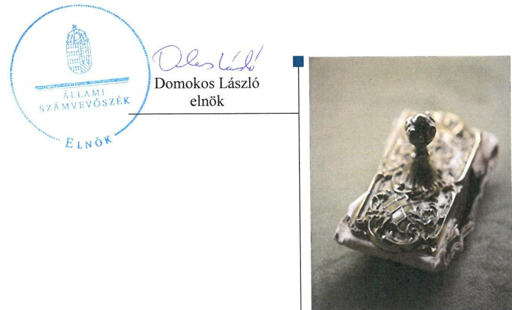

---

# AZ ELLENŐRZÉST FELÜGYELTE: 

DR. PULAY GYULA ZOLTÁN felügyeleti vezető

## AZ ELLENŐRZÉST VEZETTE ÉS A VÉGREHAJTÁSÁÉRT FELELŐS:

IMRE ZSUZSANNA ellenőrzésvezető

## A PROGRAM ÖSSZEÁLLÍTÁSÁÉRT FELELŐS:

JANIK JÓZSEF osztályvezető

## A TÉMÁHOZ KAPCSOLÓDÓ KORÁBBI SZÁMVEVŐSZÉKI JELENTÉSEK:

- címe: Jelentés az államháztartás központi alrendszerének adóssága és éven túli kötelezettségvállalásának ellenőrzéséről
- sorszáma: 1294.

IKTATÓSZÁM: V-0918-278/2016.
TÉMASZÁM: 1952
ELLENŐRZÉS-AZONOSÍTÓ SZÁM: V-0743

---

# TARTALOMJEGYZÉK 

■ ÖSSZEGZÉS ..... 5
■ AZ ELLENŐRZÉS CÉLJA ..... 7
■ AZ ELLENŐRZÉS TERÜLETE ..... 8
■ AZ ELLENŐRZÉS HÁTTERE, INDOKOLTSÁGA ..... 9
■ FÓKUSZKÉRDÉSEK ..... 10
■ ELLENŐRZÉS HATÓKÖRE ÉS MÓDSZEREI ..... 11
■ MEGÁLLAPÍTÁSOK ..... 13
■ JAVASLATOK ..... 43
■ MELLÉKLETEK ..... 45
I. sz. melléklet: Értelmező szótár ..... 45
II. sz. melléklet: Az államadósság-kezelés során érvényesítendő teljesítménymutatók alakulása ..... 47
III. sz. melléklet: A finanszírozási tervek Igazgatóság általi tárgyalása ..... 48
IV. sz. melléklet: A döntési jogkör megosztása a finanszírozási terv módosításakor (4/2007. (05.29.) számú alapítói határozat szerint) ..... 49
V. sz. melléklet: Adósságkezeléssel kapcsolatos dokumentumok elfogadása ..... 50
VI. sz. melléklet: Az ÁKK Zrt. adatszolgáltatása az NGM és az Igazgatóság tagjai részére ..... 51
VII. sz. melléklet: Az ÁKK Zrt. Igazgatóságának tagjai (2012-2014) ..... 52
VIII. sz. melléklet: Az ÁKK Zrt. szervezeti felépítése (2012-2014) ..... 53
IX. sz. melléklet: Az ÁKK Zrt. Igazgatósági és FB ülésein tárgyalt főbb témák (2012-2014) ..... 55
X. sz. melléklet: A nettó kibocsátások megvalósulása és a központi alrendszer finanszírozási igénye a 2012-2014. években (milliárd Ft.) ..... 57
XI. sz. melléklet: Repóügyletek eredménye a 2012-2014. években ..... 58
XII. sz. melléklet: A befektetői kör változása a 2011-2014. években ..... 59
XIII. sz. melléklet: Állampapírok után fizetett jutalékok (2012-2014) ..... 60
XIV. sz. melléklet: Adósságszolgálattal kapcsolatos kiadások változása 2012-2014 között ..... 61
■ FÜGGELÉK: ÉSZREVÉTELEK ..... 63
■ RÖVIDÍTÉSEK JEGYZÉKE ..... 77

---

.

---

# ÖSSZEGZÉS 

Az ellenőrzés célja volt az államadósság-kezelési stratégia megalapozottságának és eredményes megvalósításának értékelése 2012-2014. években. Az államháztartás központi alrendszere adósságfinanszírozási stratégiájának kidolgozása, valamint a központi költségvetés középtávú és éves finanszírozási tervének elkészítése az államháztartásért felelős miniszter feladata volt, mely feladatot az ÁKK Zrt. útján látta el.
Az ÁKK Zrt. feladatellátása alapvetően az Alapító által jóváhagyott államadósság-kezelési stratégia megvalósítását szolgálta, ugyanakkor a stratégia továbbra is egy elavult módszertan alapján készült, mivel a módszertan megújítását az ÁKK Zrt. nem végezte el. Az ellenőrzés számos olyan hiányosságot tárt fel, melyek kockázatot jelentettek az államadósságkezelési stratégia megalapozottsága és eredményes megvalósítása tekintetében. A kialakított tervezési rendszer hiányos volt, az Alapító által jóváhagyott középtávú finanszírozási tervet nem készítették.
Az Alapító által a 2012-2014. évekre jóváhagyott adósságkezelési stratégiákban meghatározott célok, célértékek összességében teljesültek.

## Az ellenőrzés társadalmi indokoltsága

Magyarország Alaptörvénye rögzíti az államadósság GDP-hez viszonyított maximális szintjét („adósság-szabály"), míg a Stabilitási tv ${ }^{1}$ az államadósság fogalmát, leépítésének módját határozza meg. Az adósság-szabály értelmében az államadósság GDP-hez viszonyított mutatójának folyamatos javítását kell biztosítani. Ezen alkotmányos kötelezettség teljesítésében az ÁSZ², mint alkotmányos intézmény és az Országgyűlés legfőbb ellenőrző szerve részt vállal. Az Alaptörvény hatálybalépése óta az államadósság kezelésével kapcsolatos feladatok jelentősége megnőtt, ezzel együtt a társadalom érdeklődése is a téma iránt. Ellenőrzésünkkel bemutatjuk, hogy az ÁKK Zrt. ${ }^{3}$ tevékenysége mennyiben befolyásolja az államadóssággal kapcsolatos stratégiai célok megvalósulását.

## Főbb megállapítások, következtetések, javaslatok

Az államháztartásért felelős miniszter ÁKK Zrt. feletti alapítói és tulajdonosi joggyakorlása összességében az állam-adósság-kezelési stratégia eredményes megvalósítását szolgálta. Az Alapító ${ }^{4}$ által kialakított irányítási struktúra - az Igazgatóság ${ }^{5}$ tagjain keresztül - biztosította az adósságkezelési tevékenység feletti alapítói kontroll érvényesítését, ugyanakkor az Alapító az Alapító okiratban ${ }^{6}$ az Igazgatóság részére az államadósság kezeléssel kapcsolatos feladat és felelősségi köröket nem határozott meg. Az államháztartásért felelős miniszter az adósságkezeléssel kapcsolatos döntéshozatali rendszerét alapvetően az eredményesség szempontjainak figyelembevételével alakította ki. Ugyanakkor a monitoring rendszer keretében az NGM ${ }^{7}$ ellenőrzésre jogosult szerve nem ellenőrizte az ÁKK Zrt. adósságkezelési és finanszírozási tevékenység belső kontrollrendszerét, és az ÁKK Zrt. FB ${ }^{8}$-a sem végzett ellenőrzést. Az ellenőrzések elmaradása kockázatot jelentett az Alapító által jóváhagyott államadósság-kezelési stratégiában és az éves finanszírozási tervekben meghatározott célok, célértékek teljesítése, a teljesítés nyomon követése tekintetében, mivel hiányzott az a kontroll, ami a feladatellátásból eredő esetleges hiányosságokat, hibákat feltárta volna. Az Alapító által kialakított döntéshozatali rendszerben a stratégiai döntések meghozatalát az államháztartásért felelős miniszter - az éves finanszírozási terv módosítások meghatározott esetei kivételével - alapítói hatáskörében tartotta. Az alapvető döntési jogköröket az Alapító okiratban szabályozta. Alapítói határozatokkal 2012-2014. évekre jóváhagyta az Igazgatóság által elfogadásra javasolt adósságkezelési stratégiát, annak részét képező teljesítménymutatókat és az éves finanszírozási terveket.

---

Az Alapító által jóváhagyott államadósság-kezelési stratégia megalapozottságát nem biztosította az ÁKK Zrt. által kialakított tervezési rendszer. A kialakított tervezési rendszer hiányos volt, mivel nem szabályozták a teljes tervezési folyamatot, új költség és kockázatkezelési modellt nem fejlesztettek ki, az optimális költségtartományok meghatározása elmaradt, továbbá az Alapító által jóváhagyott középtávú finanszírozási tervet nem készítettek. Új költség és kockázatkezelési modellt nem fejlesztettek ki annak ellenére, hogy a korábbi, 2004. évtől alkalmazott modell tekintetében az ÁSZ már 2012. évben felhívta a figyelmet annak hiányosságaira, továbbá az alkalmazhatóságát az ÁKK Zrt. is megkérdőjelezte. Az adósságkezelési tevékenységhez kapcsolódó optimális költségtartományt, valamint a költségekkel, kiadásokkal szemben elvárt követelményt az adósságszerkezet valamennyi tényezője vonatkozásában az ÁKK Zrt. nem dolgozott ki annak ellenére, hogy az Alapító által jóváhagyott államadósság-kezelési stratégiában a költségminimalizálásra vonatkozó stratégiai cél megfogalmazásra került. Alapító által jóváhagyott középtávú finanszírozási tervet - a Stabilitási tv.-ben meghatározottak ellenére - nem készített az ÁKK Zrt.

Az ÁKK Zrt. adósságkezeléssel kapcsolatos feladatellátása összességében eredményesen szolgálta az Alapító által jóváhagyott államadósság-kezelési stratégia megvalósítását, az abban kitűzött stratégiai célokat ugyan teljesítették, s gondoskodtak az államháztartás központi alrendszere finanszírozási igényének teljesítéséről, ugyanakkor az ellenőrzés számos olyan hiányosságot tárt fel, melyek kockázatot jelentettek az államadósság-kezelési stratégia megvalósítása tekintetében. Kockázatot jelentett, hogy az adósságkezelés stratégiai dokumentumainak (államadósság-kezelési stratégia, annak részét képező teljesítménymutatók) valamint a középtávú finanszírozási terv Alapítói jóváhagyást megelőző döntés-előkészítési folyamatát nem szabályozták. Az ÁKK Zrt. által működtetett, adósságkezeléssel kapcsolatos monitoring rendszer nem töltötte be a szerepét. Az ügyvezetési feladatokat ellátó Igazgatóság részére az Alapító nem határozott meg beszámolási kötelezettséget az ÁKK Zrt. adósságkezelési tevékenységéhez kapcsolódóan. A teljesítménymutatók negyedéves alakulásáról készített beszámolókat a negyedév időszakának utolsó napjához képest jellemzően jelentős késéssel tárgyalta az Igazgatóság, ami eredményességi szempontból kockázatot jelentett a megfelelő időben történő beavatkozás, az azonnali intézkedések megtétele és a visszacsatolás tekintetében. Az adósságkezelési tevékenység költséghatékonyságát mérő értékelési rendszert sem alakított ki az ÁKK Zrt. annak ellenére, hogy az államháztartásért felelős miniszter azt kifejezetten kérte, határidők megjelölésével. Az adósságkezelési tevékenység költséghatékonyságát mérő rendszer kialakításának hiányában a költségek és azok alakulásának nyomon követése, értékelése és elemezése nem volt biztosított. Így eredményesség szempontjából kockázatot jelentett az Alapító által az államadósság kezelési stratégiában megfogalmazott cél elérése tekintetében.

A 2012-2014. években az aktuális (hatályos) államadósság-kezelési stratégiákban meghatározott mennyiségi célokat, célértékeket, egyéb célkitűzéseket kisebb eltérésekkel teljesítették. Az ÁKK Zrt. által szervezett - az éves finanszírozási tervekben jóváhagyott - állampapír-kibocsátások, adósságtörlesztések az ellenőrzött időszakban összességében az államadósság-kezelési stratégiában foglalt célok teljesülését szolgálták.

Az ÁKK Zrt. adósságkezeléssel kapcsolatos belső kontrollrendszere - 2013. december 31-ig - alapvetően az Alapító által jóváhagyott államadósság-kezelési stratégia megvalósítását szolgálta. A Vezérigazgató ${ }^{9}$ a SZMSZ ${ }^{10}$ kiadásán túl belső irányítási eszközökben - a feltárt hiányosságok mellett - szabályozta az ÁKK Zrt. államadósság-kezeléssel kapcsolatos operatív tevékenységét. Ugyanakkor a belső kontrollrendszer kialakítása 2014. január 1-jétől nem felelt meg a Bkr. ${ }^{11}$ előírásainak.

---

# **AZ ELLENŐRZÉS CÉLJA**

## **Az államadósság-kezelési stratégia megalapozottságának és eredményes megvalósításának értékelése**

**AZ ELLENŐRZÉS CÉLJA** az államadósság-kezelési stratégia megalapozottságának és eredményes megvalósításának értékelése volt.

---

# **AZ ELLENŐRZÉS TERÜLETE**

## **Az államháztartás központi alrendszerének adósságát kezelő rendszer ellenőrzése**

Az ellenőrzés során értékeltük az ÁKK Zrt. és az államháztartásért felelős miniszter – mint a tulajdonosi és alapítói jogokat gyakorló szervezet – adósságkezeléssel kapcsolatos tervezési, irányítási és monitoring rendszerét. Az ellenőrzés kiterjedt az államháztartásért felelős miniszter alapítói és tulajdonosi joggyakorlására, valamint az ÁKK Zrt. feladatellátására a célok teljesítésének vonatkozásában. A Stabilitási tv. határozta meg az államadósság-kezelés legfőbb jogi kereteit 2012. január 1-jétől. A jogszabály az államháztartásért felelős minisztert hatalmazta fel arra, hogy gondoskodjon a költségvetés hiányának finanszírozásáról, az állami költségvetés fizetőképességének folyamatos fenntartásáról, a központi költségvetés adósságainak és adósságterheinek nyilvántartásáról, az adósságok törlesztéséről, valamint az állam átmeneti szabad pénzeszközeinek kezeléséről. Az államháztartásért felelős miniszter az említett körbe tartozó feladatait az ÁKK Zrt. útján látta el.

Az ÁKK Zrt. állami tulajdonú gazdasági társaság, kizárólagos tulajdonosa a magyar állam, amelynek nevében a tulajdonosi jogokat a mindenkori államháztartásért felelős miniszter gyakorolja. Az ÁKK Zrt. legfőbb szervének jogait az Alapító gyakorolja és dönt a társaság legfőbb szerve hatáskörébe tartozó kérdésekben. Az ÁKK Zrt. adósságkezeléshez kapcsolódó feladata kiemelten a költségvetés finanszírozási szükségletét hosszú távon minimális költséggel, elfogadható kockázatok vállalása melletti egységes szemléletben történő finanszírozása. A központi költségvetés éves finanszírozási szükségletét (bruttó finanszírozási igény) az adósságállomány tárgyévben esedékes törlesztő részletei és a nettó-finanszírozási igény (a központi alrendszer tárgyévi hiánya, valamint az EU transzferek egyenlege) határozzák meg. 2012-2014. években a bruttó finanszírozási igény 8705,0 Mrd Ft és 12903,9 Mrd Ft, míg a nettó-finanszírozási igény 852,0 Mrd Ft és 1230,8 Mrd Ft között volt. Az ÁKK Zrt. a finanszírozási igényt forint és deviza állampapír kibocsátásokon keresztül biztosítja, részben államkötvények, diszkontkincstárjegyek és a lakosság részére értékesített állampapírok kibocsátásával. Az ÁKK Zrt. gondoskodik a központi költségvetés fizetőképességének fenntartásáról, valamint az állam átmenetileg szabad pénzeszközeinek a kezeléséről. Az ÁKK Zrt. által évente felülvizsgált és aktualizált, az Alapító által évente jóváhagyott államadósságkezelési stratégiában meghatározott célok és teljesítménymutatók figyelembevételével, a tárgyévi bruttó finanszírozási igény alapján éves finanszírozási tervet készít. Az ÁKK Zrt. éves finanszírozási tervben határozza meg az állampapír-kibocsátások és visszavásárlások mennyiségét, valamint a kapcsolódó aukciók időpontjait.

1. táblázat

|  A KÖZPONTI KÖLTSÉGVETÉS ADÓSSÁGANAK ALAKULÁSA (MILLIÁRD FT) |  |   |
| --- | --- | --- |
|  Időszak | Központi alrendszer adósságállomány, sec. 21. | Államadósság/mutató  |
|  2011 | 20 955,5 |   |
|  2012 | 20 720,1 | 78,0%  |
|  2013 | 22 079,7 | 77,7%  |
|  2014 | 23 459,9 | 74,1%  |

*Forrás: Zárszámodási törvények,*

---

# AZ ELLENŐRZÉS HÁTTERE, INDOKOLTSÁGA 

## Az államadósság kezelésének jelentősége

Az eredményes adósságkezeléshez szükség van az
 adósságkezelésben a teljesítménymérés feltételeinek kialakítására, úgymint az egyértelmű és mérhető célokra, mutatószámokra és az ezekhez rendelt követelményekre. Az ÁSZ az adósságkezelésre jelentős hatással bíró, az elmúlt években bekövetkezett gazdaságpolitikai változások miatt indokoltnak tartotta az adósságkezelés tárgykörében teljesítmény-ellenőrzést lefolytatni. A megállapítások és az azok alapján tett javaslatok hozzájárulhatnak az ÁKK Zrt-nél és az NGM-nél az eredményesebb adósságkezelés megvalósításához.

Az ÁSZ ellenőrzése a döntéshozók, ellenőrzöttek, irányító szervek és a társadalom számára az adósságkezeléssel kapcsolatos célok teljesítésének értékelésével, az elért eredmények objektív bemutatásával visszajelzést ad az adósságkezelés területén végrehajtott intézkedések hatásairól, a mérhető teljesítménymutatók (benchmarkok) teljesítéséről, a kitűzött adósságkezelési célok eléréséről.

Az ÁSZ értékteremtő elemzéseivel, tanácsadó szerepét erősítve támogatja a szervezetek önértékelő, alkalmazkodó (öntanuló) tevékenységét, segíti a központi költségvetési szervek átlátható működését, a „jó gyakorlatok" elterjesztésével támogatja a „jó kormányzást".

---

# FÓKUSZKÉRDÉSEK 

1. Az államháztartásért felelős miniszter és az Államadósság Kezelő Központ Zrt. által működtetett, adósságkezeléssel kapcsolatos tervezési, irányítási és monitoring rendszer biztosította-e az államadósság-kezelési stratégia megalapozottságát és eredményes megvalósítását?
2. Az államháztartásért felelős miniszter Államadósság Kezelő

Központ Zrt. felett gyakorolt alapítói és tulajdonosi joggyakor-
lása az államadósság-kezelési stratégia eredményes megvalósítását szolgálta-e?
3. Az Államadósság Kezelő Központ Zrt. feladatellátása az állam-adósság-kezelési stratégia megalapozott tervezését és eredményes megvalósítását szolgálta-e, a hatályos államadósság-kezelési stratégiában meghatározott mennyiségi célokat, célértékeket elérték-e, az egyéb célkitűzéseket teljesítették-e?

---

# ELLENŐRZÉS HATÓKÖRE ÉS MÓDSZEREI 

## Az ellenőrzés típusa

| Teljesítmény-ellenőrzés.

## Az ellenőrzött időszak

A 2012. január 1. - 2014. december 31. közötti időszak.

## Az ellenőrzés tárgya

Az államháztartásért felelős miniszter és az ÁKK Zrt. vonatkozásában az adósságkezelés tervezési, irányítási és monitoring rendszerének kialakítása és működtetése, az eredményességi követelmények érvényesítésének, az adósságkezelési célkitűzések elérésének eszközrendszere, az ÁKK Zrt. feladatellátása.

Az ellenőrzés kiterjedt minden olyan körülményre és adatra, amely az ÁSZ jogszabályban meghatározott feladatainak teljesítéséhez, valamint a program végrehajtása folyamán felmerült újabb összefüggések feltárásához szükséges volt.

## Az ellenőrzött szervezet

A Nemzetgazdasági Minisztérium és az ÁKK Zrt.

## Az ellenőrzés jogalapja

Az Állami Számvevőszékről szóló 2011. évi LXVI. törvény 5. § (3) bekezdése.

## Az ellenőrzés módszerei

Az ellenőrzést a számvevőszéki ellenőrzés szakmai szabályai szerint, a teljesítményellenőrzés alapelveinek megfelelően végeztük el. Az ellenőrzés ideje alatt az ellenőrzött szervezettel történő kapcsolattartás az ÁSZ SZMSZ-ének vonatkozó előírásai alapján volt biztosított.

Az ellenőrzési kérdések megválaszolásához szükséges információk, dokumentumok értékelése a következő ellenőrzési eljárások alkalmazásával történt: kérdésfeltevés (információkérés), összehasonlítás, valamint elemző eljárás. Az állampapír kibocsátásokhoz, valamint az aktív és passzív

---

repó ügyletekhez kapcsolódóan a szabályszerű működést véletlen mintavétellel ellenőriztük, ez alapján a sokaságban előforduló hibaarányt becsültük. Az állampapír kibocsátásokat, valamint az aktív és passzív repó ügyleteket az előírásoknak megfelelőnek, azaz szabályszerűnek tekintettük az ellenőrzött területet, amennyiben a minta ellenőrzésének eredménye alapján 95%-os megbízhatósággal a teljes sokaságban a hibaarány kisebb volt, mint 10%, „nem megfelelőnek", ha a hibaaránya a 10%-ot meghaladta. Az ellenőrzést a kérdésekre adott válaszok kiértékelésével, a csatolt tanúsítványok adatainak felhasználásával, továbbá az adott időszakban hatályos jogszabályok figyelembe vételével folytattuk le.

Az ellenőrzési bizonyítékként felhasználható adatforrások közé tartoztak egyrészt a szakmai programban felsorolt adatforrások, másrészt bizonyíték volt még minden egyéb - az ellenőrzés folyamán feltárt, az ellenőrzés szempontjából releváns információt tartalmazó - dokumentum. Az ellenőrzés lefolytatásához az ellenőrzött szervezetek a tanúsítványok elektronikus kitöltésével, valamint az ÁSZ által kért, a dokumentumbekérő levélben részletezett dokumentumok elektronikus megküldésével, illetve a helyszínen történő rendelkezésre bocsátásával szolgáltattak adatokat.

Az ellenőrzés során minden olyan körülményt és adatot is ellenőriztünk, amely a program végrehajtása kapcsán felmerült újabb összefüggéseknek az ellenőrzés céljaival összhangban lévő feltárásához szükséges volt.

---

# MEGÁLLAPÍTÁSOK 

## 1. Az államháztartásért felelős miniszter és az Államadósság Kezelő Központ Zrt. által működtetett, adósságkezeléssel kapcsolatos tervezési, irányítási és monitoring rendszer biztosította-e az államadósság-kezelési stratégia megalapozottságát és eredményes megvalósítását?

Összegző megállapítás Az államháztartásért felelős miniszter az adósságkezeléssel kapcsolatos döntéshozatali rendszerét alapvetően az eredményesség szempontjainak figyelembevételével alakította ki. Ugyanakkor a monitoring rendszer keretében az NGM ellenőrzésre jogosult szerve nem ellenőrizte az ÁKK Zrt. adósságkezelési és finanszírozási tevékenység belső kontrollrendszerét, és az Alapító rendszeres adatszolgáltatási kötelezettséget sem határozott meg az ÁKK Zrt. részére. Az ÁKK Zrt. által működtetett, adósságkezeléssel kapcsolatos tervezési rendszer nem biztosította az államadósság-kezelési stratégia megalapozottságát és kockázatot jelentett az eredményes megvalósítását illetően.
1.1. számú megállapítás

Az államadósság-kezelési stratégia megalapozottságát nem biztosította az ÁKK Zrt. által kialakított tervezési rendszer. A tervezési folyamatot teljes körűen nem szabályozták, új költség és kockázatkezelési modellt nem fejlesztettek ki, középtávú finanszírozási tervet nem készítettek, továbbá az optimális költségtartományokat sem határozták meg. Az ÁKK Zrt. tervezési rendszerének kialakítása és működése az éves finanszírozási tervek megalapozottságát biztosította.

Az ÁKK Zrt. feladata volt - a Stabilitási tv. 13. § (1) bekezdésének b) pontjában előírtak szerint - a központi alrendszer adósságfinanszírozási stratégiájának kidolgozása, valamint a központi költségvetés középtávú és éves finanszírozási tervének elkészítése.

Az államadósság-kezelési stratégia az ÁKK Zrt. által elkészített, évente felülvizsgált, az Alapító által évente jóváhagyott dokumentum, melyben az ÁKK Zrt SZMSZ-ében részletezett tartalommal összhangban - egységesen meghatározásra kerültek az adósságkezelés feladatai, a stratégiai célok, célértékek, a kezelt kockázatok, így a finanszírozási-, a kamat-, a likvi-ditási-, az árfolyam-, az érték-, valamint a partnerkockázat. Az adósságkezelési stratégiában külön kiemelték a költségalapú megközelítés lényegét, miszerint a meghatározott kockázatokat a költséghatásokkal együtt kell mérlegelni. Az államadósság-kezelési stratégia részeként határozták meg -

---

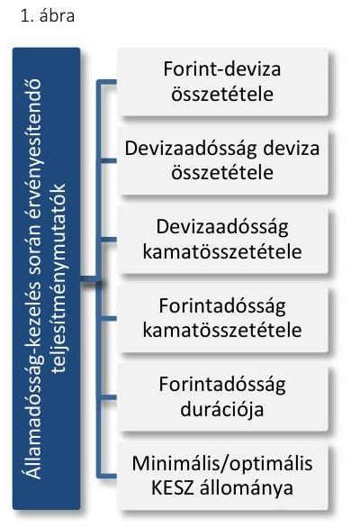
a stratégiai célok megvalósítása érdekében - a teljesítménymutatókat (benchmarkokat), illetve azok elfogadási tartományát. A teljesítménymutatók az államadósság kezelési stratégia azon elemei, amelyek meghatározzák az államadósság szerkezetét, valamint a likviditáskezelést.

Az ÁKK Zrt. által kialakított, az Alapító által évente jóváhagyott állam-adósság-kezelési stratégia megalapozottságát az ÁKK Zrt. által kialakított tervezési rendszer az ellenőrzött időszakban nem biztosította. A kialakított tervezési rendszer hiányos volt, mivel:
— nem szabályozták a teljes tervezési folyamatot,
— új költség és kockázatkezelési modellt nem fejlesztettek ki,
— Alapító által jóváhagyott középtávú finanszírozási tervet nem készítettek,
— továbbá az optimális költségtartományokat sem határozták meg.
A TERVEZÉSI RENDSZER értékelésénél az ellenőrzés abból indult ki, hogy a tervezési tevékenység eredményessége akkor biztosított azaz az adósságkezelési stratégiák a középtávú és éves finanszírozási tervek akkor megalapozottak -, ha a teljes folyamat szabályozott. Szabályozás hiányában fennáll annak a kockázata, hogy a tervek nem megfelelő minőségben, vagy tartalommal, nem, vagy nem az elvárt határidőben készülnek el.

A tervezéssel kapcsolatos feladatok szervezeti kereteit az Alapító az Alapító okiratban, valamint az Igazgatóság Ügyrendjében ${ }^{12}$, az Igazgatóság az ÁKK Zrt. SZMSZ-ében, a Vezérigazgató az Állandó Bizottságok Szabályzatában ${ }^{13}$, a Tervezési Szabályzatban ${ }^{14}$, valamint a Kockázatkezelési Szabályzatban ${ }^{15}$ meghatározta az államadósság kezelési stratégia, valamint az éves finanszírozási tervek elkészítése tekintetében. Az Alapító az Alapító okiratban az ÁKK Zrt. feladataként meghatározta a központi költségvetés középtávú finanszírozási tervének elkészítését, ugyanakkor annak tartalmát, az elkészítésével kapcsolatos szervezeti kereteket sem az Igazgatóság sem a Vezérigazgató nem határozta meg. A Vezérigazgató nem szabályozta sem az államadósság-kezelési stratégia kialakításának, felülvizsgálatának, sem a középtávú finanszírozási terv elkészítésének folyamatát.

Az államadósság-kezelési stratégia tekintetében az ÁKK Zrt. SZMSZ-e tartalmazta az adósságkezelés alapelveit, céljait, feltételrendszerét, kockázatait, irányelveit, a finanszírozási instrumentumok alaptípusait, az értékpapír kibocsátások módját, valamint a tervezésében közreműködő szakterületek feladatait. Az ÁKK Zrt. SZMSZ-ében rögzítették, hogy az adósságkezelési stratégia kidolgozásáért, felülvizsgálatáért és végrehajtásáért a Vezérigazgató felelős.

Az ÁKK Zrt. SZMSZ-én túl az egyéb belső szabályozókban a Vezérigazgató nem határozta meg az államadósság-kezelési stratégia tervezésének, felülvizsgálatának folyamatát. A belső szabályozók egyike sem tartalmazott az államadósság-kezelési stratégia kidolgozásával, felülvizsgálatával, módosításával, a középtávú finanszírozási terv elkészítésével kapcsolatosan egyértelműen és részletesen, a közreműködő szervezeti egységek által elvégzendő konkrét feladatokat. Nem tartalmaztak továbbá kapcsolódó követelményeket, határidőket, valamint felelősségi és hatásköröket, valamint a felelősök közötti kapcsolódási pontokat és kommunikációs rendet.

---

Az ÁKK Zrt. államadósság-kezelési stratégia kidolgozásával, felülvizsgálatával és módosításával kapcsolatos tevékenységének eredményessége akkor biztosított, ha a teljes folyamat szabályozott. Szabályozás hiányában fennáll annak a kockázata, hogy az államadósság-kezelési stratégia nem megfelelő minőségben, vagy tartalommal, illetve nem, vagy nem az elvárt határidőben készül el.

# AZ ÚJ KÖLTSÉG ÉS KOCKÁZATKEZELÉSI MO- 

DELL (optimális portfolió modell) kifejlesztését az ÁKK Zrt. az ellenőrzött időszakban nem végezte el, 2013. évben megkezdte ugyan, azonban a fejlesztés az ellenőrzött időszakban nem fejeződött be.

Az államadósság-kezelési stratégia meghatározó elemeit képező teljesítménymutatók értékeit az ÁKK Zrt. a 2004. évben kialakított - elavult -költség- és kockázatkezelési modell, s 2013. évtől is csak részlegesen módosított, átmeneti módszertan alkalmazásával határozta meg.

Az ÁKK Zrt. annak ellenére nem fejlesztett ki új költség és kockázatkezelési modellt, hogy az ÁSZ a 2012. évben kiadott 1294. számú jelentésében ${ }^{16}$ is megállapította a 2004. évben kialakított modell hiányosságait, és intézkedést igénylő megállapításként - a nemzetgazdasági miniszternek címezve - megfogalmazta a kialakított modell felülvizsgálatának, annak eredménye alapján a teljesítménymutatók módosításának, újak kidolgozásának szükségességét.

Az államháztartásért felelős miniszter az NGM/22525/2/2012. Iktatószámú levelében kérte az ÁKK Zrt. Vezérigazgatóját, hogy foganatosítson lépéseket az államadósság-kezelési stratégia keretében használt teljesítménymutatók felülvizsgálata és szükség esetén módosítása érdekében 2013. december 31-ig. A 2013. évi teljesítménymutatók értékeire vonatkozó Igazgatósági előterjesztésben (2012. december 18.) megállapították, hogy a nemzetközi tőkepiaci válság során bekövetkezett jelentős változások a 2004. évben elfogadott - és 2012. évig alkalmazott - modell további alkalmazását megkérdőjelezik. Rögzítették továbbá, hogy az abban felhasznált alapvetések, feltételezések érvényüket vesztették, amelyből adódóan szükségessé vált a benchmarkok rendszerének a felülvizsgálata. Ugyanakkor a teljesítménymutatók értékeit - az államadósság forintdevizaösszetételének és a KESZ minimális állományának kivételével - az ellenőrzött időszakban változatlan értéken határozták meg.

Az új optimális portfólió modell elkészítésével és kialakításával kapcsolatosan az ÁKK. Zrt. határidőket nem szabott, felelősöket nem jelölt ki. A részhatáridők, részfeladatok, valamint a felelősök meghatározásának a hiánya késleltette egy új modell mielőbbi kialakítását.

A 2013. és 2014. évi teljesítménymutatók értékeinek meghatározását megelőzően az ÁKK Zrt. által - egy átmeneti módszertan szerint - elvégzett felülvizsgálat eredményét összegző elemzéseket és következtetéseket a 2012. december 18-i Igazgatósági ülésre benyújtott előterjesztés 1/A, 1/B, 2, 3. és 4. számú mellékletei tartalmazták. Az ÁKK Zrt által kidolgozott átmeneti módszertan alkalmazásával csupán az államadósság optimális forint - deviza arányára, az optimális devizaportfolióra, valamint a devizaportfolió fix-változó kamatozású megoszlásának arányára vonatkozó teljesítménymutatókat vizsgálták felül.

---

A 2014. évi teljesítménymutatók értékeinek elfogadására vonatkozó Igazgatósági előterjesztés tartalmazott beszámolót az új optimális portfólió modell tervezéséhez kapcsolódóan, amely a nemzetközi tapasztalatokat összegezte. A fejlesztés következő lépéseként, - a 2015. évi teljesítménymutatók ÁKK Zrt. Igazgatósága elé terjesztésének mellékletében - a hozamgörbék becslésének módszertani vizsgálata került bemutatásra, ugyanakkor a fejlesztés végső határidejét továbbra sem határozták meg.

Az államadósság-kezelési stratégia megalapozottságát rontotta, hogy a Stabilitási tv. 13. § (1) b) pontjában foglaltak ellenére
 - Igazgatóság által véleményezett, Alapító által jóváhagyott középtávú finanszírozási tervet az ÁKK Zrt. nem készített annak ellenére, hogy az adósságállomány meghatározó része éven túli lejáratú kötelezettség. A középtávú finanszírozás terv elkészítésével kapcsolatos feladatokat, felelősségeket, folyamatokat nem szabályozta sem az ÁKK Zrt. SZMSZ-ében, sem Tervezési szabályzatában, sem egyéb belső irányítási eszközeiben.

# AZ ADÓSSÁGKEZELÉSI TEVÉKENYSÉGHEZ KAPCSOLÓDÓ OPTIMÁLIS KÖLTSÉGTARTOMÁNYT,

valamint a költségekkel, kiadásokkal szemben elvárt követelményt az adósságszerkezet valamennyi tényezője vonatkozásában az ÁKK Zrt. nem dolgozott ki annak ellenére, hogy az Alapító által jóváhagyott államadósságkezelési stratégiában a költségminimalizálásra vonatkozó stratégiai cél megfogalmazásra került. Az adósságkezelési tevékenységhez kapcsolódó optimális költségtartományok meghatározását, majd folyamatos nyomon követését kiemelten indokolja az adósságszolgálattal kapcsolatos kiadás nagyságrendje, s annak a központi költségvetés kiadásain belüli aránya, mely az ellenőrzött időszakban 6,9% - 8,9% között alakult, melyet a 2. táblázat szemléltet. (Az adósságszolgálattal kapcsolatosan teljesített kiadások alakulását 2012-2014. években a XIV. számú melléklet tartalmazza.)
2. táblázat

ADÓSSÁGSZOLGÁLATTAL KAPCSOLATOS KIADÁSOK ARÁNYA (MILLIÓ FT, %)

|  | 2012 | 2013 | 2014 |
| :--: | :--: | :--: | :--: |
| Központi alrendszer teljesített kiadásai | 15.021,2 | 17.410,2 | 18.261,4 |
| Adósságszolgálattal kapcsolatos teljesített kiadások | 1.349,8 | 1.218,1 | 1.446,9 |
| Adósságszolgálattal kapcsolatos kiadások aránya | 8,9\% | 6,9\% | 7,9\% |

A TELJESÍTMÉNYMUTATÓK értékeit az ÁKK Zrt. évente felülvizsgálta, ugyanakkor - az Igazgatóság részére történő előterjesztés dokumentumában megfogalmazottak szerint - cél volt a mutatók viszonylagos stabilitásának megőrzése is. (Az államadósság-kezelés során érvényesítendő teljesítménymutatókat és azok alakulását a 2012-2014. években a II. számú Melléklet szemlélteti.) A teljesítménymutatók értékeiben a 2012-2014. évekre vonatkozóan lényegi változás nem történt. A 2012-2014. években alkalmazott hat benchmark közül négynek (devizaadósság devizaösszetétele, devizaadósság kamatösszetétele, forint adósság kamatösszetétele, forint adósság durációja) az értéke nem változott.

---

2. ábra
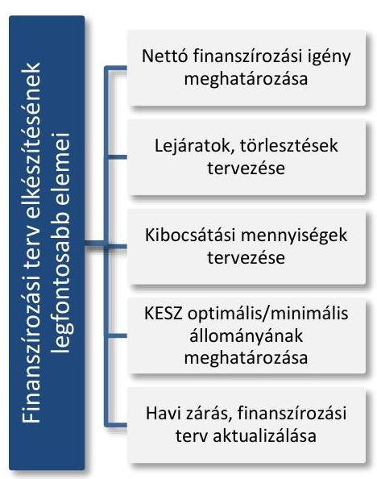
2013. évtől az alkalmazott átmeneti módszertan eredményeként az adósság-portfólió forint-deviza összetételének elfogadási tartományát 25,0%-50,0%-ról 25,0%-45,0%-ra csökkentették, a devizaadósság deviza-, valamint kamat-összetételére vonatkozó benchmarkokat változatlan értéken határozták meg. Az optimális KESZ ${ }^{17}$ szint teljesítménymutató értékét is megváltoztatták, mert 2013. évtől kezdődően már a KESZ minimális szintjét határozták meg az összeg feletti elfogadási tartomány rögzítésével, s azzal, hogy a KESZ sáv felső szintjét nem kellett feltétlenül tartani, így a többlet likviditás megengedett volt.

A 2014. évi teljesítménymutatók értékeinek elfogadására irányuló Igazgatósági előterjesztés rögzítette, hogy azok jóváhagyásra javasolt értékeit az ÁKK Zrt. szintén az átmenetinek szánt, módosított módszertannal határozta meg, az előző évivel megegyezően. Az előterjesztést - mely az államadósság kezelés során 2014. évben alkalmazandó teljesítménymutatók meghatározását tartalmazta - az Igazgatóság a 24/2013. (12. 11.) számú határozatával hagyta jóvá.

## AZ ÉVES FINANSZÍROZÁSI TERVEK MEGALAPO-

ZOTTSÁGÁT biztosította az ÁKK Zrt. tervezési rendszerének kialakítása és működése az ellenőrzött időszakban. A Tervezési Szabályzat biztosította az éves tervezési folyamatok megfelelő ellátását. Meghatározták benne a tervezésben érintett osztályok és bizottságok részletes feladatait, a követelményeket, a felelősségi és hatásköröket, a fontosabb határidőket, a kapcsolódási pontokat, valamint a kommunikációs rendet is. A Tervezési Szabályzat részletesen meghatározta az éves finanszírozási terv elkészítésének és aktualizálásának folyamatát, a naprakész tervezési rendszer feltételeit, valamint a tervezési rendszer működésének eredményét.

Az ÁKK Zrt. az ellenőrzött időszakban az éves finanszírozási tervek részeként elkészítette a központi költségvetés finanszírozása és a bruttó kamatozású adóssága, az államkötvények értékesítése és lejárta, a DKJ ${ }^{18}$ értékesítési összegei aukciónként, az államkötvény csereaukciók, valamint a forint adósság átlagos hátralévő futamideje és durációja tartalmú mellékleteket.

A Tervezési Szabályzat meghatározta a naprakész tervezési rendszer feltételeit és az ahhoz szükséges dokumentumokat. A Tervezési Szabályzattal összhangban, a Tervezési osztály számára biztosított volt a megalapozott tervezéshez szükséges valamennyi információ és alapadat, amelyeket a Tervezési Szabályzat konkrétan is rögzített. Külső adatforrásként az NGM havi rendszerességgel adatot szolgáltatott a központi költségvetés, a társadalombiztosítási alapok és az elkülönített állami pénzalapok együttes, jövőbeni, havi bontású finanszírozási igényéről (elsődleges egyenleg), a Kincstár biztosította napi bontásban a Tervezési osztály számára a havi záráshoz az alrendszerek tényleges egyenlegét, ezen felül 3 havi előrejelzést a kincstári kör és az EU-s transzferek finanszírozási igényének alakulásáról.

Az év lezárt időszakára vonatkozó tényadatok, valamint az NGM-től és a Kincstártól kapott előrejelzések az aktualizált finanszírozási tervbe beépítésre kerültek. Az NGM által szolgáltatott havi bontású elsődleges egyenlegek alapját képezték és hozzájárultak a naprakész és megalapozott tervezéshez.

---

### 1.2. számú megállapítás

Az irányítási feladatok ellátásához kapcsolódó döntés-előkészítési és döntési rendszerek az ÁKK Zrt.-nél teljes körűen nem szolgálták az Alapító által jóváhagyott államadósság-kezelési stratégia eredményes megvalósítását.

Az Alapító okiratban, az ÁKK Zrt. SZMSZ-ében, valamint az Igazgatóság ügyrendjében rögzítésre került az államadósság-kezelési stratégia és annak részét képező teljesítménymutatók, valamint az éves finanszírozási terv vonatkozásában az Alapító jóváhagyási, az Igazgatóság javaslattételi kötelezettsége, valamint a Vezérigazgató feladata. Ugyanakkor az SZMSZ nem szabályozta a középtávú finanszírozási terv elkészítésére vonatkozó feladatokat. Az ÁKK Zrt. döntés-előkészítési és döntési rendszere összességében eredményesen működött az éves finanszírozási terv előkészítése, döntésre történő előterjesztése, valamint a finanszírozási terv végrehajtása során. Ugyanakkor kockázatot jelentett, hogy az adósságkezelés stratégiai dokumentumainak (államadósság-kezelési stratégia, annak részét képező teljesítménymutatók) valamint a középtávú finanszírozási terv Alapítói jóváhagyást megelőző döntés-előkészítési folyamatát nem szabályozták. Az ÁKK Zrt. által kialakított döntés-előkészítési rendszer értékelésénél az ellenőrzés abból indult ki, hogy a döntés-előkészítés eredményessége akkor biztosított - azaz akkor szolgálják az adósságkezelési stratégia eredményes megvalósítását -, ha a teljes folyamat, így az államadósság-kezelési stratégia, a középtávú finanszírozási terv alapítói jóváhagyását megelőző döntéselőkészítési folyamata is szabályozott. Szabályozás hiányában fennáll annak a kockázata, hogy a tervek nem megfelelő minőségben, vagy tartalommal, nem, vagy nem az elvárt határidőben készülnek el.

AZ ÁLLAMADÓSSÁG-KEZELÉSI STRATÉGIA dokumentumaira vonatkozó, az ÁKK Zrt. döntés-előkészítési és döntési rendszerrel kapcsolatos feladatainak szervezeti kereteit az Alapító okirat, az ÁKK Zrt. SZMSZ-e, az Igazgatóság ügyrendje, az Állandó Bizottságok Szabályzata, a Tervezési Szabályzat, valamint a Kockázatkezelési Szabályzat meghatározta. Ugyanakkor kockázatot jelentett, hogy az államadósság-kezelési stratégia, annak részét képező teljesítménymutatók, valamint a középtávú finanszírozási terv alapítói jóváhagyását megelőző döntés-előkészítési folyamatra az ÁKK Zrt. nem alakított ki eljárásrendet, mely kockázatot jelentett az eredményes feladatellátás tekintetében. Az államadósságkezelési stratégia döntés-előkészítő folyamatában résztvevő szervezeti egységeket és kapcsolódó feladataikat az ÁKK Zrt. SZMSZ-ében meghatározták, de nem szabályozták a részletes feladatellátást, kapcsolódási pontokat, az adat- és információáramlást, az ellenőrzési pontokat, az elvárt outputot, valamint a végrehajtási határidőket. A középtávú finanszírozási terv döntés-előkészítési folyamatát, a folyamatban résztvevő szervezeti egységeket, kapcsolódó feladataikat sem az ÁKK Zrt. SZMSZ-e, sem belső irányítási eszközei nem szabályozták.

AZ ÉVES FINANSZÍROZÁSI TERV vonatkozásában - a belső szabályozókban (ÁKK Zrt. SZMSZ, az Igazgatósági Ügyrend, Állandó Bizottságok Szabályzata, Tervezési Szabályzat, Kockázatkezelési Szabályzat) - összességében rögzítésre kerültek a döntéshez és döntés-előkészítéshez kapcsolódó felelősségi és döntési hatáskörök, a feladatok, a kapcsolódási pontok, az adat és információáramlás, és az elvárt outputok is. Az

---

3. ábra

A Finanszírozási Bizottság döntési hatásköre:

- Belföldi állampapírok forgalomba hozatala
- Deviza forrásbevonás
- Deviza adósságportfólió kezelés
- Likviditáskezelés
- Előterjesztésre vonatkozó döntéshozatal
állandó bizottságok és szervezeti egységek döntés-előkészítéssel és döntéssel kapcsolatos feladatai - a finanszírozási tervvel kapcsolatosan - alapvetően összhangban voltak a belső szabályozókban. A szabályzatok alapvetően összhangban voltak az Alapító okiratban és az ÁKK Zrt. SZMSZ-ében foglaltakkal.

A Tervezési Szabályzat 4. pontja részletesen, határidő megjelöléssel tartalmazta a Tervezési osztály döntés-előkészítéssel, adatszolgáltatással kapcsolatos feladatait (javaslatok készítése, tájékoztató adatok küldése, döntést megalapozó számítások és prognózisok készítése) és kapcsolódási pontjait más szervezeti egységek, illetve a Bizottságok felé.

Kockázatkezelési Szabályzatot adott ki a Vezérigazgató annak érdekében, hogy a társaság adósság-kezeléshez kapcsolódó tevékenysége során a kockázatok felvállalása szabályozott keretek között, folyamatos ellenőrzés mellett, a felelősségi körök világos megosztásával valósuljon meg. A Kockázatkezelési Szabályzat II. fejezete bemutatta - az ÁKK Zrt. főosztályai tevékenységeihez kapcsolódóan - az általános feladatokat, felelősségeket és döntési jogosítványokat. A kezelt kockázatokkal (Piaci kockázat, Likviditási és refinanszírozási kockázat, Partnerkockázat, Működési kockázat) kapcsolatban szabályozta a közreműködő szervezeti egységek feladatait és a döntési jogosítványaikat. A szabályzat mellékleteiben rögzítették a kockázatkezeléshez kapcsolódó jelentési kötelezettségeket, az engedélyezett ügyleteket és a különböző ügylettípusok esetében irányadó limiteket. A Kockázatkezelési szabályzat rendelkezett a Vezérigazgató és az üzleti vezérigazgató-helyettes feladatkörébe tartozó döntési jogkörökről.

Az ÁKK Zrt. SZMSZ-e rögzítette, hogy a Vezérigazgató, meghatározott feladatok ellátására, illetőleg döntések meghozatalára bizottságokat hozhat létre. A Vezérigazgatói utasítással kiadott Állandó Bizottságok Szabályzata az üzleti és az általános vezérigazgató-helyetteseknek, mint a Vezérigazgató által létrehozott állandó bizottságok tagjainak, illetve elnökének a feladatait határozta meg. Ezen túl rendelkezett még az üzleti vezérigazgató-helyettes hatáskörébe tartozó további döntési jogosultságról. Állandó Bizottságok Szabályzata meghatározta a döntéshozatalra jogosult testületeket, - amelyek alapvetően a finanszírozási terv vonatkozásában a Finanszírozási Bizottság ${ }^{19}$ és a Kamatprognózis Bizottság ${ }^{20}$ volt - a bizottságok hatáskörét, összetételét és a működésük részletes szabályait. Ugyanakkor a Vezérigazgató nem teremtette meg az összhangot az általa kiadott Állandó Bizottságok Szabályzata és az ÁKK Zrt. SZMSZ-e között, mely kockázatot hordozott a stratégiai célok elérése és a finanszírozási tervek teljesítése tekintetében, mivel a döntéshozó jogkörök elváltak a felelősségi köröktől. Az ÁKK Zrt.-nél a Vezérigazgató felelt az államadósság-kezelési stratégia és a finanszírozási terv kidolgozásáért, felülvizsgálatáért és végrehajtásáért, ugyanakkor az adósságkezeléssel összefüggő döntési jogkörök a bizottságokat illették meg, miközben a Vezérigazgató e bizottságoknak nem volt tagja. Az Állandó Bizottságok Szabályzata nem tartalmazott olyan rendelkezést, ami biztosította volna, hogy a bizottság döntését megelőzően a Vezérigazgató a bizottság döntési javaslatát megismerje, döntése alapján azt megváltoztassa. Az Állandó Bizottságok Szabályzatának 1.1. pontja alapján a döntéshozatal fórumai a döntési jogkörrel rendelkező bizottság, meghatározott esetekben az üzleti vezérigazgató-helyettes, illetve a Treasury Főosztály vezetője voltak egy személyben. A szabályzat a 1.2.2. pontja rendelkezett a bizottságok határozathozatalának szabályairól, valamint arról, hogy a Vezérigazgató a döntést bármikor magához vonhatta a

---

bizottságoktól, ugyanakkor ezen jogát a szabályozás alapján nem érvényesíthette, mivel nem volt tagja a döntést hozó bizottságoknak. A Vezérigazgató a szabályzat 1.2.4. pontja alapján a bizottságok döntése után kapta meg a bizottsági döntésről készült jegyzőkönyvet és a döntést megalapozó dokumentumokat. Nem rendelkezett a szabályzat arról sem, hogy milyen eljárást kellett követni akkor, ha a Vezérigazgató véleménye eltért a bizottság döntésétől.

A finanszírozási terv végrehajtása tekintetében a belső szabályzókban meghatározásra kerültek a döntés-előkészítéssel és döntéssel kapcsolatos konkrét feladatok.
1.3. számú megállapítás

Az ÁKK Zrt. által működtetett monitoring rendszer az ellenőrzött időszakban kialakított formában nem töltötte be a szerepét, teljes körűen nem szolgálta a stratégiai célok eredményes megvalósítását. Az ÁKK Zrt. az adósságkezelési tevékenység költséghatékonyságát mérő értékelési rendszert az ellenőrzött időszakban nem alakított ki.

AZ ÁKK ZRT. ÁLTAL MŰKÖDTETETT MONITORING ÉS BESZÁMOLÁSI
 RENDSZER az ellenőrzött időszakban kialakított formában - 2014. január 01-jétől a Bkr. 10. §-ában foglaltakkal ellentétben - nem töltötte be a szerepét, teljes körűen nem szolgálta a stratégiai célok eredményes megvalósításának nyomon követését, mivel az adósságkezelési tevékenységhez kapcsolódóan a belső szabályzók az egyértelmű feladat, felelős és határidő meghatározását teljes körűen nem tartalmazták.

Az államadósság-kezelési stratégia teljesítéséhez kapcsolódó beszámoltatás rendje és a stratégia megváltozása esetén követendő eljárásrend a belső szabályozókban nem került meghatározásra.

Az Alapító okirat rögzítette az Alapító kizárólagos hatáskörébe tartozó döntési jogosultságokat. Az Igazgatóság által jóváhagyásra javasolt állam-adósság-kezelési stratégiát, az éves finanszírozási tervet, valamint az éves teljesítménymutatókat a Vezérigazgató minden évben az Alapító elé terjesztette, aki annak jóváhagyásáról Alapítói határozatban döntött, így biztosított volt az ÁKK Zrt. tevékenysége és célra tartottsága feletti kontroll.

Az Igazgatóság feladat és hatáskörét az Alapító okirat, az Igazgatóság ügyrendje, illetve az ÁKK Zrt. SZMSZ-e részletezte. Azonban az adósságkezelési tevékenységgel kapcsolatos, az Alapító részére történő beszámolási kötelezettséget nem nevesítettek. Tekintettel arra, hogy a Stabilitási tv. alapján az államháztartásért felelős miniszter az államadósság-kezeléssel kapcsolatos feladatokat az ÁKK Zrt. útján látja el, az ellenőrzés abból indult ki, hogy az ÁKK Zrt. által működtetett monitoring és beszámolási rendszer akkor szolgálja az Alapító által jóváhagyott adósságkezelési stratégia eredményes megvalósítását, ha a folyamat nyomon követése teljes, azaz, az ügyvezetési feladatokat ellátó Igazgatóság Alapító felé történő beszámolási kötelezettsége kiterjed az adósságkezelési tevékenységhez kapcsolódó beszámolási kötelezettségre is.

A TELJESÍTMÉNYMUTATÓK alakulásáról negyedévente részletes elemzés és indoklás készült - a Kockázatkezelési Szabályzat alapján a

---

3. táblázat

## NEGYEDÉVES TELJESÍTMÉNYMUTATÓKAT TÁRGYALÓ IGAZGATÓSÁGI ÜLÉSEK

|  Telj. mutatók
időszaka | Igazgatósági
ülés datuma | Eltelt na-
pok  |
| --- | --- | --- |
|  2012/1. | 2012. 04. 17 | 17  |
|  2012/2. | 2012. 09. 25 | 87  |
|  2012/3. | 2012. 11. 20 | 51  |
|  2012/4. | 2013. 02. 20 | 51  |
|  2013/1. | 2013. 07. 04 | 95  |
|  2013/2. | 2013. 09. 13 | 75  |
|  2013/3. | 2013. 12. 11 | 72  |
|  2013/4. | 2014. 03. 13 | 72  |
|  2014/1. | 2014. 05. 08 | 38  |
|  2014/2. | 2014. 09. 24 | 86  |
|  2014/3. | 2014. 12. 08 | 69  |

Kockázatkezelési osztály közreműködésével -, mely tekintetben a Vezérigazgató az Igazgatóság részére történő beszámolási, előterjesztési kötelezettségének az ellenőrzött időszakban eleget tett.

A teljesítménymutatók negyedéves alakulásáról készített beszámolókat a negyedév időszakának utolsó napjához képest jellemzően jelentős késéssel (17-95 nap) tárgyalta az Igazgatóság (3. táblázat). A késedelem eredményességi szempontból kockáztatta a megfelelő időben történő beavatkozást, a visszacsatolást és az azonnali intézkedések megtételét arra az esetre, ha a teljesítménymutatók évközi alakulása az adósságkezelési stratégiában meghatározott célok, célértékek eredményes teljesítését veszélyeztetné. A Kockázatkezelési Szabályzat rendelkezett arról, hogy az államadósság teljesítménymutatóiról szóló negyedéves beszámolót negyedévente a Kockázatkezelési osztály készíti el az Igazgatóság részére, ugyanakkor az Igazgatóság elé terjesztés határidejét nem szabályozták. Az Alapító az Igazgatóság részére nem határozott meg a teljesítménymutatók alakulásának nyomon követésével kapcsolatos feladatot, továbbá az Igazgatóság tevékenységét szabályozó belső irányítási eszközökben (Igazgatósági Ügyrend, SZMSZ) sem került nevesítésre az ezzel kapcsolatos konkrét kontroll tevékenység, határidő, eljárásrend, felelősségi és döntési jogkör, valamint a beszámolási kötelezettség az Alapító felé.

A teljesítménymutatók, benchmarkok kidolgozása, az azoknak való megfelelés és a mutatók felülvizsgálata tekintetében kiemelt feladatot látott el a TEK $^{21}$. A TEK-en belül, feladat és hatáskörökre lebontott tevékenységek a Kockázatkezelési Szabályzatban elkülönítésre kerültek, amelynek fókuszában az adósságkezeléssel kapcsolatos kockázatok minimalizálása állt. A Kockázatkezelési Szabályzat kockázat típusonként részletesen rögzítette a kockázatkezeléshez kapcsolódóan az ÁKK Zrt. főosztályainak és osztályainak a jelentési és beszámolási kötelezettségeit. A jelentési kötelezettségek - többek között - az adósság portfólióra, az Inforex rendszerre, a teljesítménymutatók alakulására, a swap ügyletekre, a durációra, a likviditásra, a kibocsátásokra, a kockázatok alakulására, az aukciókra, a szerződéses kötelezettségekre és a megkötött ügyletekre vonatkoztak.

A FINANSZÍROZÁSI TERVEK és azok teljesítésének rendszeres felülvizsgálatát, a gördülőtervezés keretében történő aktualizálását szabályozták az ÁKK Zrt. SZMSZ-ében és a Tervezési Szabályzatában. Az ÁKK Zrt. SZMSZ-e előírta a Vezérigazgató részére a finanszírozási tervek kéthavonkénti - szükség esetén gyakoribb - felülvizsgálati kötelezettségét és ezzel együtt az aktualizált finanszírozási terv Igazgatóság elé terjesztését. A Tervezési Szabályzat havi gyakorisággal határozta meg a Tervezési osztály számára a terv- tény adatok eltérésének, valamint a finanszírozás várható alakulásának elemzését, a finanszírozási terv módosítására vonatkozó javaslat elkészítését a Vezérigazgató részére. A Tervezési osztály a tényadatok felhasználásával, az államháztartásért felelős minisztertől, a Kincstártól, a társaságoktól kapott adatokra építve, gördülő tervezéssel aktualizálta a finanszírozási terveket, valamint prognózisokat készített a következő évekre vonatkozóan. A finanszírozási tervek év közbeni módosítására 2014. évben az Alapítói jóváhagyással 4 esetben került sor, mely finanszírozási terveket és kibocsátásokat érintő módosításokat az ÁKK Zrt. minden esetben végrehajtotta. A Vezérigazgató az ÁKK Zrt. SZMSZ-e szerinti kéthavonkénti felülvizsgálati, valamint Igazgatóság és Alapító elé terjesztési kötelezettségének eleget tett. A finanszírozási tervek Igazgatóság általi tárgyalását a 4. táblázat mutatja be:
4. táblázat

FINANSZÍROZÁSI TERVEK IGAZGATÓSÁGI TÁRGYALÁSA

| Megnevezés | 2012 | 2013 | 2014 |
| :-- | :--: | :--: | :--: |
| Igazgatósági ülések | 7 | 4 | 5 |
| Ülésen kívüli határozathozatal | 0 | 1 | 7 |
| Finanszírozási tervet érintő döntések száma | 7 | 4 | 6 |
|  |  |  |  |

(A finanszírozási tervek Igazgatóság általi tárgyalásának részletes kimutatását - határozatszám, dátum, téma - a III. számú Melléklet tartalmazza.)

Az államadósság-kezelési stratégiákban megfogalmazott célok és teljesítménymutatók elérésének nyomon követését szolgálta a közreműködő osztályok közötti, szabályozott egyeztetési és kontroll tevékenység.

# AZ ADÓSSÁGKEZELÉSI TEVÉKENYSÉG KÖLTSÉGHATÉKONYSÁGÁT MÉRŐ ÉRTÉKELÉSI RENDSZERT sem alakított ki az ÁKK Zrt. az ellenőrzött időszakban annak ellenére, hogy az államháztartásért felelős miniszter az NGM/22525/2/2012. iktatószámú levelében azt kifejezetten kérte, határidők megjelölésével. Így a miniszter a rendszer módszertanának kialakítására 2013. június 30-i, míg a teljes rendszer kialakítására 2013. december 31-i határidőt szabott meg. Az adósságkezelési tevékenység költséghatékonyságát mérő rendszer kialakításának hiányában a költségek és azok alakulásának nyomon követése, értékelése és elemezése nem volt biztosított. Így eredményesség szempontjából kockázatot jelentett az Alapító által az államadósság kezelési stratégiában megfogalmazott cél elérése tekintetében, abban, hogy az ÁKK Zrt. az adósság-kibocsátások és átvállalások révén a költségvetés finanszírozási szükségletét hosszú távon minimális költséggel, elfogadható kockázatok mellett biztosítsa.

Az államháztartásért felelős miniszter által kialakított döntéshozatali rendszer alapvetően az államadósság-kezelési stratégia eredményes megvalósítását szolgálta. Ugyanakkor a monitoring rendszer keretében az NGM ellenőrzésre jogosult szerve nem ellenőrizte az ÁKK Zrt. adósságkezelési és finanszírozási tevékenység belső kontrollrendszerét, és az Alapító rendszeres adatszolgáltatási kötelezettséget sem határozott meg az ÁKK Zrt. részére.

Az Alapító által kialakított döntéshozatali rendszerben a stratégiai döntések meghozatalát az államháztartásért felelős miniszter - a 4/2007. (V. 29.) számú Alapítói határozatban foglaltak kivételével - alapítói hatáskörében tartotta. Az alapvető döntési jogköröket az Alapító okiratban szabályozta, a döntéseket Alapítói határozat formájában, írásban hozta meg.

## AZ ALAPÍTÓ KIZÁRÓLAGOS DÖNTÉSI HATÁSKÖ-

RÉBE tartozott az adósságkezeléssel kapcsolatosan az államadósság-kezelési stratégia, annak részét képező teljesítménymutatók és a finanszírozási terv jóváhagyása. Az Alapító a 4/2007. (V. 29.) számú Alapítói határozatával - mely az ellenőrzött időszakban is hatályban volt - az Igazgatóság hatáskörébe utalta az éves finanszírozási tervek évközi módosításának döntési jogkörét, meghatározva annak kritériumait.(A döntési jogkörök megosztását a IV. számú melléklet szemlélteti.)

Az Alapító az ellenőrzött években évente jóváhagyta az Igazgatóság által elfogadásra javasolt adósságkezelési stratégiát, a teljesítménymutatókat és az éves finanszírozási tervet. (Az elfogadásukról és jóváhagyásukról szóló Alapítói és Igazgatósági határozatok bemutatását az V. számú melléklet tartalmazza.) A 2012. és a 2014. évi államadósság-kezelési stratégia és annak részét képező teljesítménymutatók, valamint az éves finanszírozási terv Alapító általi jóváhagyása a tárgyév első napjáig nem, csak a tárgyév januárjában történt meg, ugyanakkor az ÁKK Zrt. az Alapítói határozat meghozataláig az Igazgatóság által tárgyalt és jóváhagyott finanszírozási terv alapján végezte tevékenységét. A 2013. évi finanszírozási tervek évközi módosításairól a 4/2007. (V. 29) számú Alapítói határozatnak megfelelően az Igazgatóság, 2012. és 2014. években az Igazgatóság elfogadó határozatát követően az Alapító döntött.

# AZ ADÓSSÁGKEZELÉSSEL KAPCSOLATOS DÖNTÉSEK ELŐKÉSZÍTÉSÉT az Alapító az NGM szervezetén belül 

az eredményesség szempontjainak figyelembevételével szabályozta az ellenőrzött időszakban.

Az NGM SZMSZ alapján az államháztartásért felelős államtitkár feladata volt javaslatot tenni az államháztartás finanszírozási politikájára és stratégiájára, valamint részt venni az ÁKK Zrt. irányításában, aki az ellenőrzött időszakban tagja volt az Igazgatóságnak.

Az államháztartásért felelős miniszter tulajdonosi jogkörének gyakorlásával összefüggésben, a döntés-előkészítés tekintetében a Makrogazdasági Főosztály $^{22}$ működött közre. Az NGM SZMSZ és a Makrogazdasági Főosztály ügyrendje az Alapító az ÁKK Zrt. igazgatósági ülésein képviselendő minisztériumi álláspont előkészítését a Makrogazdasági Főosztályon belül működő Pénzügypolitikai és Elemző Osztály feladataként határozta meg.

A Pénzügypolitikai és Elemző osztály értékelte az ÁKK Zrt. Vezérigazgatója által az Igazgatósági ülésekre beterjesztett finanszírozási tervek teljesítéséről, illetve módosításáról szóló előterjesztéseket és a teljesítménymutatók teljesítéséről szóló negyedéves beszámolókat. Az ÁKK Zrt. Igazgatósági üléseire előkészítette az ott képviselendő minisztériumi álláspontot.

Az adósságkezeléssel kapcsolatos döntések előkészítésében részt vevő Makrogazdasági Főosztály a döntés-előkészítés során rendelkezett a megfelelő minőségű és mennyiségű információkkal ahhoz, hogy megalapozott véleményt és javaslatot fogalmazzon meg a döntéshozók számára.

A Makrogazdasági Főosztály ellenőrzési nyomvonala szerint az ÁKK Zrt. által küldött anyagok alapján felkészítő dokumentációt készített - feljegyzés formájában - az igazgatósági üléseket megelőzően az alapítói jogot gyakorló államtitkár, illetve 2013 júniusától a helyettes államtitkár részére. A feljegyzések tartalmazták az Igazgatósági ülések napirendi pontjaihoz kapcsolódó aktuális kérdések hátterét, a javasolt irányokat és a döntési pontokat. Szükség esetén a főosztály hatásvizsgálatot készített, amely alapján szakvéleményt alakított ki és javaslatot tett a döntés irányára vonatkozóan.

---

# AZ ÁLLAMHÁZTARTÁSÉRT FELELŐS MINISZTER 

ÁLTAL MŰKÖDTETETT MONITORING RENDSZER keretében az Alapító részére biztosított volt az ÁKK Zrt. adósságkezeléssel kapcsolatos tevékenységének nyomon követése, részben az NGM által delegált Igazgatósági tagokon keresztül, részben az NGM-en belüli szolgálati úton valamint az Igazgatósági ülésekről készült jegyzőkönyvek alapján.

A Makrogazdasági Főosztály nyomon követte a finanszírozási tervek, a teljesítménymutatók és a stratégiában megfogalmazott célok teljesülését.

Az államháztartásért felelős miniszter által működtetett monitoring rendszer ugyanakkor nem volt teljes körű, mivel az NGM ellenőrzésre jogosult szerve nem végzett ellenőrzést az ÁKK Zrt. adósságkezelési tevékenység
 belső kontrollrendszerével kapcsolatban, mely kockázatot jelentett az Alapító által jóváhagyott államadósság-kezelési stratégiában, és az éves finanszírozási tervekben meghatározott célok, célértékek teljesítése, a teljesítés nyomon követése tekintetében. Az ellenőrzési tevékenység elmaradása következtében hiányzott az a kontroll, ami a feladatellátásból eredő esetleges hiányosságokat, hibákat feltárta volna, így nem járult hozzá az államadósság-kezelési stratégia eredményes megvalósításához.

Rendszeres adatszolgáltatási kötelezettséget az Alapító dokumentáltan nem határozott meg az ÁKK Zrt. részére. Az eredményes alapítói feladatellátás feltétele, ha az Alapító határozza meg a döntéseihez, az adósságkezelési tevékenység nyomon követéséhez számára szükséges elemzések, adatok, információk körét, így az ÁKK Zrt. Alapítóval szembeni adatszolgáltatási kötelezettségét. Alapítói rendelkezés hiányában a Vezérigazgató szabályozta az ÁKK Zrt. által az Alapító részére rendszeresen szolgáltatandó elemzések, adatok körét, felelőseit, az adatszolgáltatás módját, gyakoriságát és irányát a Külső adatszolgáltatási szabályzatban ${ }^{23}$. (Az NGM, illetve az Igazgatóság tagjai részére - a Külső adatszolgáltatási szabályzat alapján továbbítandó dokumentumokat a VI. számú melléklet tartalmazza.)

---

# 2. Az államháztartásért felelős miniszter Államadósság Kezelő Központ Zrt. felett gyakorolt alapítói és tulajdonosi joggyakorlása az államadósság-kezelési stratégia eredményes megvalósítását szolgálta-e? 

Összegző megállapítás

Az államháztartásért felelős miniszter ÁKK Zrt. feletti alapítói és tulajdonosi joggyakorlása összességében az államadósságkezelési stratégia eredményes megvalósítását szolgálta. Ugyanakkor az Alapító ellenőrzési jogköreinek nem teljes körű gyakorlása kockázatot jelentett az államadósság-kezelési stratégia eredményes megvalósítását illetően.
2.1. számú megállapítás

Az államháztartásért felelős miniszter alapítói jogai gyakorlásával összességében az államadósság-kezelési stratégia eredményes megvalósítását szolgálta.

AZ ALAPÍTÓI HATÁROZATOK összességükben hozzájárultak az eredményes adósság-kezeléshez, az adósságkezelési stratégiában meghatározott célok megvalósítását szolgálták.

Az Alapító az ÁKK Zrt. feletti tulajdonosi (alapítói) jogait, úgymint az Alapító okirat módosítását, az ÁKK Zrt. vezető tisztségviselői, az FB tagjai és a könyvvizsgáló megválasztását, a Vezérigazgató kinevezését és felmentését, az Igazgatóság ${ }^{24}$ és az FB ügyrendjének ${ }^{25}$ jóváhagyását, a társaság éves üzleti tervének, számviteli beszámolójának elfogadását, Alapítói határozatok útján gyakorolta. Az Alapító kizárólagos hatáskörébe tartozott kiemelten, az államadósság-kezelés stratégiai dokumentumainak jóváhagyása. Az ellenőrzött időszakban meghozott Alapítói határozatokat a 4. ábra szemlélteti.
4. ábra
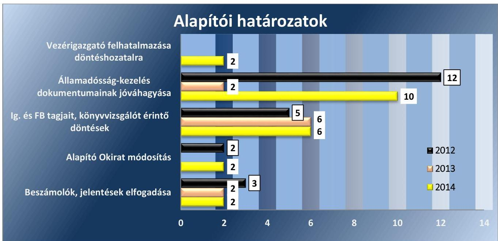

Forrás: Államháztartásért felelős miniszter Alapítói határozatai (2012-2014.)

---

Az Alapító - az Igazgatóság elnökének lemondását követő 60 napon belüli pótlása kivételével - a kizárólagos hatáskörébe tartozó ügyekben alapítói határozatokban döntött.

AZ ALAPÍTÓ OKIRATBAN meghatározták az ÁKK Zrt. tevékenységi körét, az Alapító és az Igazgatóság - mint a társaság ügyvezető szerve -, valamint a Vezérigazgató jogait és kötelezettségeit.

Az Alapító jogaira, kötelezettségeire és hatásköreire vonatkozó rendelkezéseket az Alapító okirat tartalmazta, mely szerint a hatáskörébe tartozó kérdésekben köteles volt írásbeli határozat formájában döntést hozni és erről az Igazgatóságot tájékoztatni. Az Alapítónak - a vezető tisztségviselők, az FB tagjainak kinevezése, visszahívása, javadalmazása és a munkavállalók javadalmazásának megállapítását kivéve - a hatáskörébe tartozó döntés meghozatalát megelőzően meg kellett ismerni témakörtől függően az Igazgatóságnak, illetve az FB-nek az ügyre vonatkozó véleményét.

Az Igazgatóság véleményének dokumentált megismerése két esetben maradt el. Az ÁKK Zrt. 2012. évi ügyvezetéséről, vagyoni helyzetéről és üzletpolitikájáról szóló jelentés elfogadásáról szóló 3/2013. (V. 31.) számú Alapítói határozat és a 2013. évi évközi finanszírozási terv módosításának jóváhagyásáról szóló 5/2013. (VI. 28.) számú Alapítói határozat esetében.

# 2.2. számú megállapítás 

Az államháztartásért felelős miniszter tulajdonosi (irányítási) jogkörének gyakorlásával összességében az államadósság kezelési stratégia eredményes megvalósítását szolgálta.

## AZ ÁKK ZRT. FELETTI TULAJDONOSI JOGOK

GYAKORLÁSÁRA az ellenőrzött időszakban az államháztartásért felelős miniszter volt jogosult a Stabilitási tv. 11. § (3) bekezdése alapján.

Az NGM SZMSZ ${ }^{26}$ szerint az ÁKK Zrt. feletti tulajdonosi (alapítói) joggyakorlás az államháztartásért felelős miniszter által átruházott hatáskörben az adó- és pénzügyekért felelős államtitkár feladata volt az ellenőrzött időszakban. Ugyanakkor sem az NGM SZMSZ, sem az ÁKK Zrt. Alapító okirata nem tartalmazta az átruházott hatáskörben ellátandó konkrét feladatokat, a felelősségi- és döntési-hatásköröket. A feladat és hatáskörök elhatárolásának hiánya kockázatot hordozott az adósságkezeléssel kapcsolatos tevékenység eredményessége tekintetében, mivel nem került egyértelműen meghatározásra, hogy mely alapítói jogkör gyakorlás tekintetében volt jogosult döntést hozni az adó- és pénzügyekért felelős államtitkár. Az adó- és pénzügyekért felelős államtitkár 2013. május 5-ig az Igazgatóság elnöki tisztét is ellátta. A kettős feladatellátás további kockázatot hordozott az adósságkezeléssel kapcsolatos tevékenység eredményessége tekintetében, mivel egyes - az NGM SZMSZ-ében nem szabályozott - ügyekben ugyanaz a személy gyakorolta az ÁKK Zrt. feletti alapítói jogokat, illetve volt az ügyvezető szervének az elnöke.

## AZ ÁKK ZRT. IRÁNYÍTÁSI STRUKTÚRÁJÁNAK KI-

ALAKÍTÁSA az Alapító okirat alapján az Alapító kizárólagos hatáskörébe tartozott, így az Igazgatóság tagjainak (vezető tisztségviselőknek) és a vezetőállású dolgozóknak (így a vezérigazgatónak) a megválasztása, kinevezése, feladat- és hatáskörük, döntési jogosultságaik és javadalmazásuk megállapítása.

---

A vezető tisztségviselők megválasztására, javadalmazási feltételeik megállapítására Alapítói határozattal került sor. Az Igazgatóság tagjainak a tisztségük ellátásával, a feladatvégzésükkel szemben támasztott elvárásokkal kapcsolatos általános szabályokat az Alapító okirat, az ÁKK Zrt. SZMSZ-e, az Igazgatóság Alapítói határozattal elfogadott ügyrendje tartalmazták.

Az Alapító az ÁKK Zrt. Igazgatósága tagjainak és elnökének - mint vezető tisztségviselőknek - a díjazásáról az ellenőrzött időszakban is hatályban lévő 1/2012. (I. 16.) számú Alapítói határozatában rendelkezett, amelyben összegszerűen megjelölte a tisztségviselőknek fizetendő díj mértékét. A határozat az Igazgatóság tagjait megillető díjazásának mértékén túl további, a tisztségük ellátásával, a feladatvégzésükkel szemben támasztott elvárásokkal kapcsolatos előírást nem tartalmazott.

Az Alapító az Igazgatóság elnökét és tagjait az ellenőrzött időszakban az NGM vezető beosztású munkavállalói közül választotta. (Az Igazgatóság tagjait az ellenőrzött időszakban a VII. számú melléklet tartalmazza).

A kialakított irányítási struktúra, az Alapítói kontroll érvényesítése az Igazgatóság tagjain keresztül összességében az államadósság-kezelési stratégia eredményes megvalósítását szolgálta.

IGAZGATÓSÁG FELADAT ÉS HATÁSKÖRÉBE tartozott - az Igazgatóság ügyrendje és az ÁKK Zrt. SZMSZ-e alapján - a javaslattétel az Alapító kizárólagos hatáskörébe tartozó kérdésekben, különösen az államadósság-kezelési stratégia, a finanszírozási terv és az államadósság-kezelés során érvényesítendő teljesítménymutatók megállapítása, módosítása vonatkozásában. Az Alapító okirat ugyanakkor csak közvetve tartalmazta az Igazgatóság - az Alapító döntését megelőző - adósságkezeléssel kapcsolatos javaslattételi feladatát. Az Igazgatóság az ÁKK Zrt. társasági működése körében és az államadósság-kezelési stratégia célkitűzéseinek teljesítése érdekében összesen 129 határozatot hozott az ellenőrzött időszakban, eleget téve a döntést megelőző javaslattételi kötelezettségének. Ugyanakkor az eredményes feladatellátást biztosítaná, az államadósság kezeléssel kapcsolatos, az Igazgatóság által ellátandó feladat és felelősségi körök Alapító okiratban, valamint az Igazgatósági Ügyrendben történő teljes körű meghatározása.

Az Igazgatóság az aktuális évet megelőző december 31. napjáig megtárgyalta és az Alapítónak elfogadásra javasolta az éves államadósság-kezelési stratégiát, és ennek részét képező teljesítménymutatókat, valamint az éves finanszírozási tervet. Egy esetben - 2014. január 10-én - ülésen kívüli határozathozatallal történt meg az éves finanszírozási terv ismételt elfogadása. Az Igazgatóság az éves finanszírozási tervek évközi módosítását is határozatban hagyta jóvá, így a tervek vonatkozásában összességében 2012-ben hét, 2013-ban négy, 2014-ben hat határozatot hoztak.

Az Igazgatóságot folyamatosan tájékoztatta a Vezérigazgató az államadósságra hatást gyakorló piaci folyamatokról, és negyedéves rendszerességgel a teljesítménymutatók alakulásáról.

Az Igazgatóság minden évben elfogadta az ÁKK Zrt. üzleti tervét, emellett négy alkalommal döntött az SZMSZ módosításáról, továbbá öt esetben hozott határozatot az Alapító okirat módosításával kapcsolatban, indítványozva a módosító javaslat FB és Alapító elé terjesztését. Az Alapító okiratban foglaltaknak eleget téve háromhavonta elkészítette az ÁKK Zrt. ügyve-

---

zetéséről, a társaság vagyoni helyzetéről és üzletpolitikájáról szóló jelentését, kivéve a 2012. évi negyedik negyedéves jelentést, melynek Igazgatósági határozattal történő elfogadása elmaradt. Két esetben - a 2012. évi harmadik és a 2013. évi első negyedéves jelentést - jelentős késéssel, 2012. november 20-án, illetve 2013. július 4-én tárgyalta az Igazgatóság.

A VEZÉRIGAZGATÓ kinevezése az Alapító 11/2011. (XI. 15.) számú Alapítói határozata alapján történt. Az Alapító okirat szerint a munkáltatói jogokat az Alapító és az Igazgatóság gyakorolta a Vezérigazgató felett, aki 2011. november 15-étől töltötte be pozícióját.

A Vezérigazgatóval kötött munkaszerződésben és a munkaköri leírásban meghatározták a Vezérigazgató által ellátandó feladatokat, így az államadósság-kezelési stratégia és a finanszírozási terv kidolgozásának irányítását, felügyeletét és betartásának ellenőrzését.

AZ EGYÜTTMŰKÖDÉS eredményességét az Alapító és az ÁKK Zrt. között alapvetően biztosította, hogy az ÁKK Zrt. ügyvezetését ellátó Igazgatóság tagjának adó- és pénzügyekért felelős államtitkárt, majd 2013. június 1-jétől a pénzügypolitikáért felelős helyettes államtitkárt, az államháztartásért felelős államtitkárt, valamint a közigazgatási államtitkárt követően a miniszteri kabinet főtanácsadóját választotta meg. Az Alapító és az ÁKK Zrt. közötti, államadósság-kezelés körébe tartozó egyeztetésekre az ellenőrzés részére átadott dokumentumok alapján elsősorban az Igazgatóság tagjai útján került sor. Az államadóssággal kapcsolatos egyeztetések során az Alapítói jogok gyakorlója egyes esetekben az ÁKK Zrt. feletti irányítási jogát az előterjesztések véleményezése mellett külön levélbe foglalt szempontok megadásával is érvényesítette.
2.3. számú megállapítás

Az államháztartásért felelős miniszter a tulajdonosi (ellenőrzési) jogköreit teljes körűen nem gyakorolta, mivel az FB nem végzett ellenőrzéseket az adósságkezelési tevékenységgel kapcsolatban. Ez kockázatot jelentett az államadósság-kezelési stratégia eredményes megvalósítását illetően.

AZ FB tagjainak megválasztása az Alapító okirat alapján az Alapító kizárólagos hatáskörébe tartozott. Az FB-re vonatkozó alapvető szabályokat az Alapító okirat, az ÁKK Zrt. SZMSZ-e tartalmazta. Az Alapító okirat és az ÁKK Zrt. SZMSZ-e az FB hatáskörébe utalta a szervezet ügyvezetésének ellenőrzését, illetve a belső ellenőrzés szakmai irányítását. Az FB ügyrendjét az Alapító jóváhagyta. Az Alapító által meghatározott feladatait az FB az ellenőrzött időszakban ellátta.

A Stabilitási tv. 11. § (6) bekezdése az államadósság-kezelési stratégia, az ezzel kapcsolatos teljesítménymutatók és a finanszírozási tervek véleményezését kivonta az FB hatásköréből. Ugyanakkor nem korlátozta azt, hogy az FB ellenőrizze az ÁKK Zrt-nek az államadósság-kezelés végrehajtásával kapcsolatos, a Stabilitási tv. 13. § (1) a) és c)-k) pontjaiban meghatározott feladatainak ellátását. Ezek ellenőrzését azonban az FB részére az Alapító - sem az Alapító okiratban sem az FB általa jóváhagyott ügyrendjében - nem írta elő, annak ellenére, hogy - az Alapító okirat 3.1 pontja alapján - az ÁKK Zrt. tevékenységi körébe elsődlegesen az államadósság kezeléssel kapcsolatos, a Stabilitási tv. 13. § (1) bekezdése szerinti tevékenységek ellátása tartozott. Következésképpen az FB ilyen tárgyú ellenőrzést

---

nem végzett. Az ellenőrzés elmaradása kockázatot jelentett az államadósság-kezelési stratégiában, és az éves finanszírozási tervekben meghatározott célok teljesítése, és a teljesítés nyomon követése tekintetében, mivel hiányzott az a kontroll, ami a feladatellátásból eredő esetleges hiányosságokat, hibákat időben feltárta volna.

Az FB feladatait rendszeres ülések keretében végezte. Az üléseken eleget téve az Alapító okiratban, az ÁKK Zrt. SZMSZ-ében és az FB ügyrendben foglaltaknak - megtárgyalták az Igazgatóság által készített, az ügyvezetésről, a társaság vagyoni helyzetéről és üzletpolitikájáról szóló negyedéves és éves jelentéseket, a belső ellenőri jelentéseket, az Alapító okirat módosítását, a társaság üzleti tervét, továbbá döntöttek az FB és a belső ellenőrzés munkatervéről.

#
 3. Az Államadósság Kezelő Központ Zrt. feladatellátása az ál-
lamadósság-kezelési stratégia megalapozott tervezését és eredményes megvalósítását szolgálta-e, a hatályos államadósság-kezelési stratégiában meghatározott mennyiségi célokat, célértékeket elérték-e, az egyéb célkitűzéseket teljesítették-e?

Összegző megállapítás

Az ÁKK Zrt. feladatellátása alapvetően az Alapító által jóváhagyott államadósság-kezelési stratégia eredményes megvalósítását szolgálta. A hatályos államadósság-kezelési stratégiákban meghatározott mennyiségi célokat, célértékeket összességében elérték, az egyéb célkitűzéseket kisebb eltéréssel teljesítették.

Az ÁKK Zrt. adósságkezeléssel kapcsolatos belső kontrollrendszere alapvetően hozzájárult az államadósság-kezelési stratégia megvalósításához, ugyanakkor 2014. évtől nem felelt meg a Bkr. előírásainak. A belső kontrollkörnyezet - a feltárt hiányosságok mellett 2013. december 31-ig szabályozott volt. Az ÁKK Zrt. belső ellenőrzése az államadósság-kezelés vonatkozásában ellenőrzési feladatokat nem végzett.

A VEZÉRIGAZGATÓ ÉS AZ IGAZGATÓSÁG KÖZÖTTI HATÁSKÖRÖK szabályozása biztosította az átláthatóságot és a számon kérhetőséget, azok megfeleltek az Alapítói határozatoknak és az Alapító okiratban foglaltaknak. Az ÁKK Zrt. Igazgatóságának, Vezérigazgatójának és egyéb felsővezetőinek feladat-ellátásához kapcsolódó belső szabályozások 2013. december 31-ig alapvetően biztosították az ál-lamadósság-kezelési stratégia megvalósítását.

Az Alapító okirat és az Igazgatóság ügyrendje szerint az Igazgatóság felelt az Alapító határozatainak végrehajtásáért, vezette és irányította a társaság üzleti tevékenységét, gazdálkodását és gondoskodott az eredményes működésről. Az ellenőrzött időszakban az Igazgatóság nem delegált a hatáskörébe tartozó, adósságkezeléssel kapcsolatos feladatot a Vezérigazgatóra.

---

Az ÁKK Zrt. munkaszervezetét és operatív működését az ÁKK Zrt.-vel munkaviszonyban álló Vezérigazgató irányította és ellenőrizte a jogszabályok és az Alapító okirat keretei között, valamint az Alapító és az Igazgatóság határozatainak megfelelően. A Vezérigazgató hatáskörébe tartoztak az Alapító okirat szerint - mindazok az ügyek, amelyek nem tartoztak az Alapító, vagy az Igazgatóság kizárólagos hatáskörébe, továbbá amelyeket az Igazgatóság a Vezérigazgató hatáskörébe utalt. A Vezérigazgató jogosult volt a hatáskörébe tartozó feladatokat a társaság munkavállalóira átruházni.

Az Igazgatóság, a Vezérigazgató, valamint a vezérigazgató-helyettesek adósságkezeléssel kapcsolatos feladatait az ÁKK Zrt. SZMSZ-e, valamint az Igazgatóság ügyrendje, a Kockázatkezelési Szabályzat, az Állandó Bizottságok Szabályzata, a Tervezési Szabályzat, a Külső Adatszolgáltatási Szabályzat, továbbá a Vezérigazgató és a vezérigazgató-helyettesek munkaköri leírásai rögzítették. A Szabályzatok - az Igazgatóság adósságkezelési dokumentumokkal kapcsolatos javaslattételi kötelezettsége kivételével - összhangban voltak az Alapítói határozatokkal és az Alapítói okiratban foglaltakkal.

Az ÁKK Zrt. SZMSZ-e szerint a Vezérigazgató az államadósság-kezelési stratégia, valamint a finanszírozási terv kidolgozásáért, felülvizsgálatáért és végrehajtásáért volt felelős. A vezérigazgató-helyettesek felelősek voltak a feladatkörükbe tartozó igazgatósági előterjesztések tartalmi megalapozottságáért, döntések és indítványok előkészítéséért a Vezérigazgató felé. Az általános és üzleti vezérigazgató-helyettesek munkaköri leírása - az ÁKK Zrt. SZMSZ-ével összhangban - részletesen meghatározta az adósságkezeléssel összefüggő feladat és felelősségi körüket.

AZ ÁKK ZRT.-NÉL AZ OPERATÍV MŰKÖDÉS biztosítása érdekében Finanszírozási, Piaci, Kamatprognózis, illetve a Javaslattevő Bizottság működött. A Bizottságok működésének rendjét, hatásköreit meghatározta az Állandó Bizottságok Szabályzata. A bizottságok tagjai az ÁKK Zrt. felsővezetői és főosztályvezetői voltak, a Vezérigazgató kivételével. A Finanszírozási, Piaci és Kamatprognózis Bizottságok döntéshozatalra jogosult testületek voltak. Az Állandó Bizottságok Szabályzata rendelkezett a döntési jogosultságokról, míg a felelősségi körök tekintetében az ÁKK Zrt. SZMSZ volt az irányadó.

# AZ ÁKK ZRT. FELADATAIT 2012. JANUÁR 1-
JÉTŐL A STABILITÁSI TV. határozta meg. Az Alapító okiratban rögzítették a társaság tevékenységi köreit, meghatározták 2012. március 26-tól - a Stabilitási tv. szerinti feladatköröket. Az ÁKK Zrt. SZMSZ-ének módosítását a Vezérigazgató késedelmesen terjesztette az Igazgatóság elé, emiatt 2012. november 20-ától aktualizálták a Stabilitási tv. előírásaival összhangban a 14/2012. számú Vezérigazgatói utasítással, amit az Igazgatóság határozatával jóváhagyott.

AZ ÁKK ZRT. SZMSZ elfogadása és a társaság munkaszervezetének kialakítása az Alapító okirat értelmében az Igazgatóság feladata volt. Az Alapító okirat rendelkezett arról, hogy a Vezérigazgató szabályzatokat adhatott ki annak érdekében, hogy a Társaság működése megfeleljen a jogszabályoknak. A Vezérigazgató - az előírtaknak megfelelően - az SZMSZ

---

kiadásán túl belső irányítási eszközökben alapvetően szabályozta az ÁKK Zrt. tevékenységét.

Az ÁKK Zrt. SZMSZ-ben rögzítették a társaság tevékenységi körét, a társaság vezetőinek, valamint szervezeti egységeinek feladatait, azonban az az Alapító okirattal való összhangja nem volt teljes körű. Az Alapító az Alapító okiratban - a Stabilitási tv.-ben foglaltaknak megfelelően az ÁKK Zrt. feladataként meghatározta a központi költségvetés középtávú finanszírozási tervének kidolgozását, ugyanakkor az Igazgatóság által jóváhagyott ÁKK Zrt. SZMSZ-e a feladatkört csak részben tartalmazta, mert a feladat döntési mechanizmusáról, és a végrehajtásáról már nem rendelkezett. Az ÁKK Zrt. SZMSZ 1. számú melléklete tartalmazta a társaság szervezeti felépítését (VIII. számú melléklet).

AZ ÜGYVITELI SZABÁLYZAT teljes körűen és részletesen meghatározta az ÁKK Zrt. adósságkezeléssel kapcsolatos munkafolyamatainak végrehajtási szabályait. A feladatokat főtevékenységenként, ezen belül szervezeti egységenként, a végrehajtásért felelős munkakör megjelölésével folyamatszerűen rögzítették.

# A HUMÁNERŐFORRÁS KEZELÉST SZABÁLYOZÓ

ESZKÖZÖK a Munkaügyi Szabályzat, illetve a magasabb vezető állásúak díjazási feltételeit tartalmazó, az Alapító által kiadott Javadalmazási Szabályzat voltak. Az ÁKK Zrt. által kialakított humánerőforrás kezelés értékelésénél az ellenőrzés abból indult ki, hogy a tevékenység eredményessége akkor biztosított - azaz az adósságkezelési stratégiák és finanszírozási tervek eredményes teljesítését akkor szolgálja -, ha az adósságkezelési tevékenység ellátásában részt vevő vezetők és beosztottaik rendelkeznek teljesítmény-előírással és teljesítményük rendszeres időközönként értékelésre kerül. Az eredményes feladatellátás tekintetében kockázatot hordozott, hogy az ÁKK Zrt. vezetői és beosztottai nem rendelkeztek teljesítmény-előírással, munkájuk értékelésére dokumentáltan nem került sor. Továbbá a Vezérigazgató nem szabályozta a munkavállalók beszámoltatását és a teljesítményértékelését sem.

AZ ÁKK ZRT.-RE, MINT KORMÁNYZATI SZEKTORBA SOROLT EGYÉB SZERVEZETRE, 2014. január 1-jétől terjedt ki a Bkr. 1-10. §-ainak a hatálya. A Bkr. előírásai ellenére az ÁKK Zrt. nem módosította a szabályzatait, továbbá nem készítettek el egyes szabályzatokat, így az ÁKK Zrt. belső kontrollrendszerének kialakítása 2014. január 1-jétől nem felelt meg a Bkr. 3-5. § előírásainak, így az államadósság-kezelési stratégia eredményes megvalósítása tekintetében kockázatot jelentett.

Az Igazgatóság elnöke az adósságkezeléssel kapcsolatos feladatokra vonatkozóan 2014. január 1-jét követően nem gondoskodott a Bkr. 6. § (3) bekezdésének megfelelően a szervezet ellenőrzési nyomvonalának elkészítéséről és nem szabályozta a szabálytalanságok kezelésének rendjét a Bkr. 6. § (4) bekezdésében foglaltak ellenére. A Bkr. 6. § (1) bekezdésének c) pontja ellenére az etikai elvárásokat nem írták elő a szervezet minden szintjén.

A Bkr. 3. §-a alapján az Igazgatóság elnökének - mint a kormányzati szektorba sorolt egyéb szervezet vezetőjének - volt a felelőssége a belső

---

kontrollrendszer kialakítása, működtetése és fejlesztése, a Bkr. 6. §-a szerinti kontrollkörnyezet kialakítása, szabályzatok kiadása, folyamatok kialakítása és működtetése a szervezeten belül. Ugyanakkor az ÁKK Zrt. belső szabályozási rendjét nem módosították, a Bkr.-ben foglaltak ellenére az Alapító Okirat 10.9. pontja szerint a szabályzatok kiadásának joga - az Alapító kizárólagos hatáskörébe tartozók kivételével - továbbra is a Vezérigazgató hatáskörébe tartozott. Az Igazgatóságnak kizárólag az ÁKK Zrt. SZMSZ-ét és annak módosításait kellett jóváhagyni. 2014. január 1-jét követően hatályban lévő Vezérigazgatói utasításokat az ÁKK Zrt. SZMSZ-én - és az összeférhetetlenségi, valamint a cégjegyzési és képviseleti jogosultság rendjéről szóló szabályzaton - kívül nem hagyta jóvá az Igazgatóság elnöke.

# AZ ÁKK ZRT.-N BELÜLI KONTROLLPONTOK ÉS

VISSZACSATOLÁSI LEHETŐSÉGEK alapvetően az eredményes feladatellátást szolgálták, szabályozó eszközeikben rendelkeztek a beszámolások formájáról, gyakoriságáról és a visszacsatolás módjáról.

Az Igazgatóság a teljesítménymutatók alakulásáról negyedéves, az ÁKK Zrt. SZMSZ-e pedig a finanszírozási terv végrehajtásáról kéthavonta történő beszámolási kötelezettséget határozott meg a Vezérigazgató részére.

Az ÁKK Zrt. Kockázatkezelési Szabályzata és Tervezési Szabályzata rendelkezett az államadósság-kezelési stratégiával, a teljesítménymutatókkal és a finanszírozási tervekkel kapcsolatos beszámolási kötelezettség formájáról, gyakoriságáról és a visszacsatolás módjáról. A Kockázatkezelési Szabályzat 1. számú mellékletében a szervezeti egységek kockázatkezeléshez kapcsolódó nyilvántartási és jelentési kötelezettségeit szabályozták. A Tervezési Szabályzat tartalmazta a Tervezési osztály adatszolgáltatási kötelezettségével kapcsolatos előírásokat.

Az adósságkezelő szervezetek egymás közötti adatszolgáltatásával kapcsolatos eljárásrendet az ÁKK Zrt. Külső adatszolgáltatási szabályzatról kiadott Vezérigazgatói utasítása szabályozta. Az eljárásrend tartalmazta az ÁKK Zrt.-nél keletkező és külső intézmény vagy személy részére átadásra kerülő adatok és információk előállításával, ellenőrzésével és továbbításával kapcsolatos feladatokat, abban megjelölték az adatszolgáltatásért felelős szervezeti egységeket és személyeket.

A BELSŐ ELLENŐRZÉSI FELADATOKAT az ÁKK Zrt.-nél egy belső ellenőr látta el, akinek tevékenységét az Ellenőrzési Szabályzat ${ }^{27}$ III. 1.2. pontja szerint az FB irányította, a funkcionális függetlenségét a Vezérigazgató biztosította. A feladatait a Vezérigazgató közvetlen munkáltatói rendelkezéseinek megfelelően végezte. Az Ellenőrzési Szabályzatban határozták meg a belső ellenőrzés célját, feladatát, a kapcsolódó kötelezettségeket és követelményeket, ugyanakkor az adósságkezeléssel kapcsolatos tevékenység ellenőrzéséről nem rendelkeztek.

A belső ellenőrzés az adósságkezelési tevékenységgel kapcsolatban közvetlenül nem végzett ellenőrzést 2012-2014. években, annak ellenére, hogy az ÁKK Zrt. tevékenységi körébe elsődlegesen - az Alapító okirat 3.1 pontja alapján - a Stabilitási tv. 13. § (1) bekezdése szerinti, az államadósság kezeléssel kapcsolatos tevékenységek ellátása tartozott. A belső ellenőrzési tevékenység e téren történő elmaradása következtében hiányzott

---

### 3.2. számú megállapítás

5. táblázat

## BRUTTÓ DEVIZAADÓSSÁG RÉSZARÁNYA (%)

|  | 2012 | 2013 | 2014 |
| :-- | :--: | :--: | :--: |
| Stratégiai   célkitűzés | 50,0 | 45,0 | 45,0 |
| Mutató   értéke | 40,6 | 40,4 | 38,1 |

Forrás: ÁKK Zrt. adatszolgáltatás, tanúsítvány
az a kontroll, ami a feladatellátásból eredő esetleges hiányosságokat, hibákat feltárta volna, így nem járult hozzá az államadósság-kezelési stratégia eredményes megvalósításához.

Az ÁKK Zrt. adósságkezeléssel kapcsolatos feladatellátása összességében az Alapító által jóváhagyott államadósság-kezelési stratégia megvalósítását szolgálta, az adósságkezelési stratégiákban kitűzött célokat, célértékeket összességében elérték, az egyéb célkitűzéseket teljesítették, a stratégiákban meghatározott célok, a teljesítménymutatók értékei az elfogadási tartományokon belül teljesültek. Az évente felülvizsgált adósságkezelési stratégiák, valamint
 az abban meghatározott teljesítménymutatók teljesítése együttesen, összességében hozzájárultak a 2012-2014. években az adósságkezelés és a költségvetési hiány biztonságos finanszírozásához. Az ellenőrzött időszak alatt az Alapító által jóváhagyott benchmarkok - a KESZ állományra és a deviza-részarányra vonatkozó teljesítménymutatók kivételével - nem változtak. (A benchmarkok tervezett értékeit, az elfogadási tartományát, illetve a tényleges alakulását a II. számú melléklet mutatja be részletesen.)

A bruttó devizaadósság részarányára vonatkozó, a 2012-2014. évekre jóváhagyott államadósság-kezelési stratégiákban meghatározott célokat az éves finanszírozási tervek alátámasztották (5. táblázat). Az ÁKK Zrt. az ellenőrzött időszakban a tervezett teljes nettófinanszírozási igényt forintadósság kibocsátással tervezte lefedni, az esedékessé váló devizaadósság törlesztését devizaadósság kibocsátásokkal fedezni, így a finanszírozási tervek hozzájárultak az államadósság forint- deviza összetételének a javításához. A 2012. évi finanszírozási tervben a teljes

---

6. táblázat

## DEVIZAADÓSSÁG DEVIZA ÖSSZETÉTELE (EUR, \%)

|  | 2012 | 2013 | 2014 |
| :-- | :--: | :--: | :--: |
| Stratégiai | 100 | 100 | 100 |
| célkitűzés | $+/-5 \%$ | $+/-5 \%$ | $+/-5 \%$ |
| Mutató   értéke | 100,8 | 101,0 | 99,2 |

Forrás: ÁKK Zrt. adatszolgáltatás, tanúsítvány
nettó kibocsátáson belül (730,9 Mrd Ft) mindössze 43,4 Mrd Ft nettó deviza-kibocsátást terveztek. A 2013. évi finanszírozási terv a teljes nettó kibocsátáson belül (778,9 Mrd Ft) mindössze 47,4 Mrd Ft nettó deviza-kibocsátást tartalmazott. A 2014. évi finanszírozási tervben az ÁKK Zrt. 242,8 Mrd Ft nettó deviza-kibocsátást - devizaadósság csökkentést - határozott meg a teljes nettó kibocsátáson (942,1 Mrd Ft) belül.

A bruttó devizaadósság részarányára az államadósság-kezelési stratégiában meghatározott célértéket az ÁKK Zrt. az ellenőrzött években teljesítette, az 11,4%-kal csökkent az ellenőrzött időszakban, melyet az 5. ábra szemléltet.
5. ábra
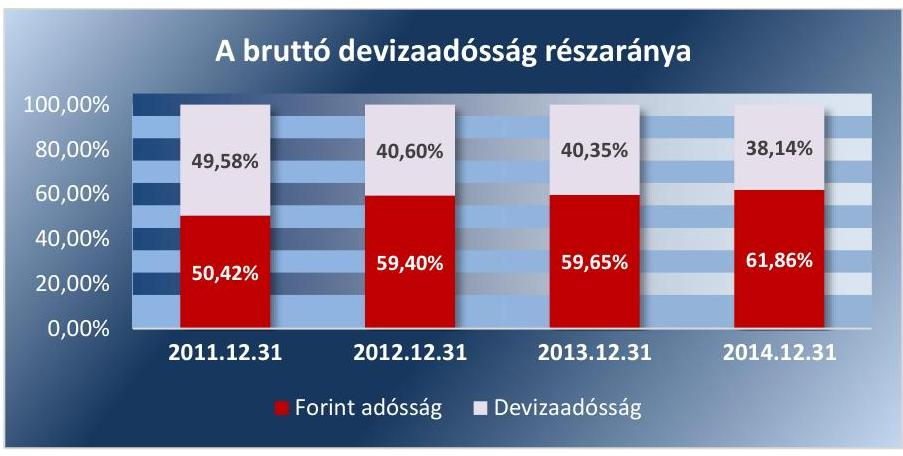

Forrás: ÁKK Zrt. adósságszolgáltatása

A devizaadósság deviza-összetételére vonatkozó benchmarknak az államadósság-kezelési stratégiában meghatározott 100% euró teljesülése érdekében az ÁKK Zrt. a 2012-2014. évi finanszírozási tervekben a tervezett deviza-kibocsátásokat euróban határozta meg.

A devizaadósság deviza-összetétele 2012-2014-ben az elfogadási tartományon belül teljesült (6. táblázat).

A kamatösszetételre az államadósság-kezelési stratégiában meghatározott értéket vette figyelembe az ÁKK Zrt. a finanszírozási tervek elkészítése során. A 2012-2014. évekre tervezett, az ÁKK Zrt. honlapján megjelentetett előzetes finanszírozási kiadványban foglalt kibocsátási naptárak szerinti fix és változó kamatozású államkötvény aukciók naptári napjai, valamint a jóváhagyott éves finanszírozási tervekben az egyes aukciós napokra tervezett államkötvény kibocsátások mennyisége alapján több mint 95%-ban fix kamatozású államkötvény kibocsátást terveztek megvalósítani (7. táblázat).
7. táblázat

TERVEZETT KÖTVÉNYKIBOCSÁTÁSOK ÖSSZETÉTELE (MILLIÁRD FT)

|  | Tervezett kötvénykibocsátás |  |  | Aukciók száma |  |
| :-- | :--: | :--: | :--: | :--: | :--: |
|  | Fix kamatozású | Változó   kamatozású | Fix kamatozás   aránya | Fix | Változó |
| 2012 | 1270 | 60 | $95,5 \%$ | 26 | 12 |
| 2013 | 1470 | 60 | $96,1 \%$ | 25 | 12 |
| 2014 | 1470 | 60 | $96,1 \%$ | 25 | 12 |

---

| ADÓSSÁGÁLLOMÁNY KAMATÖSSZETÉTELE (\%) |  |  |  |
| :--: | :--: | :--: | :--: |
|  | 2012 | 2013 | 2014 |
| Forintadósság kamatösszetétele (fó) |  |  |  |
| Stratégiai | $61,0-$ | $61,0-$ | $61,0-$ |
| célkitűzés | 83,0 | 83,0 | 83,0 |
| Mutató értéke | 67,6 | 65,2 | 61,8 |
| Devizaadósság kamatösszetétele (fó) |  |  |  |
| Stratégiai   célkitűzés | 66,0 | 66,0 | 66,0 |
| Mutató   értéke | 66,2 | 63,6 | 63,8 |

Forrás: ÁKK Zrt. adatszolgáltatás, tanúsítvány
9. táblázat

FORINTADÓSSÁG DURÁCIÓJA (ÉV)

|  | 2012 | 2013 | 2014 |
| :-- | :--: | :--: | :--: |
| Stratégiai | $2,5+/-$ | $2,5+/-$ | $2,5+/-$ |
| célkitűzés | 0,5 | 0,5 | 0,5 |
| Mutató   értéke | 2,49 | 2,47 | 2,88 |

Forrás: ÁKK Zrt. adatszolgáltatás, tanúsítvány

A forintadósság kamatösszetételére vonatkozó teljesítménymutatóként annak elfogadási tartománya került meghatározásra, mely az ellenőrzött időszakban nem változott, 2012-2014-ben egyaránt 61%-83% fix kamatozás volt. A mutató teljesítése minden évben az elfogadási tartományon belül alakult, értéke 2012-ben 67,6%, 2013-ban 65,2%, míg 2014-ben 61,8% fix kamatozás volt.

A devizaadósság kamatösszetételére meghatározott teljesítménymutató értéke a jóváhagyott államadósság-kezelési stratégia alapján az ellenőrzött időszakban nem változott. Minden évben az optimális érték 66%, az elfogadási tartomány 62,7%-67,7% fix kamatozás volt, melyet az ÁKK Zrt. minden évben az elfogadási tartományon belül (2012. évben: 66,2%-on, 2013-ban: 63,6%-on, 2014-ben: 63,8%-on) tartott (8. táblázat).

A forintadósság futamidejéhez kapcsolódó benchmark érték - duráció - tartása érdekében tervezte meg az ÁKK Zrt. az államkötvények futamidő szerinti aukciós értékesítését. Az ellenőrzött időszaki finanszírozási tervekben a duráció - mely az államadósság átárazódásához szükséges időt fejezi ki - tervezett értéke 2,36 év és 2,85 év, az átlagos hátralévő futamidő tervezett értéke 3,07 év és 3,88 év között volt.

A forintadósság durációjával kapcsolatosan célérték (sávközép érték) került meghatározásra, ami 2012-2014. években egyaránt 2,5 év volt, az elfogadási tartománya 2-3 év. A mutató értéke mindhárom ellenőrzött évben az elfogadási tartományon belül alakult, 2012-ben 2,49 év, 2013-ban 2,47 év és 2014-ben 2,88 év volt (9. táblázat).

A KESZ minimális szintjének elérését támogatták a 2012-2014. évekre jóváhagyott finanszírozási tervek. Az ÁKK Zrt. az éves finanszírozási tervek részeként havi bontásban részletesen megtervezte a nettó-finanszírozási igényt, az esedékessé váló forint és deviza törlesztéseket, a forint és devizaadósság kibocsátásokat mellett, azok eredményeként a KESZ várható egyenlegét. Amennyiben a KESZ várható egyenlege nem érte el a stratégiában meghatározott minimális szintet, úgy annak elérésére megtervezte a likviditási célú repó művelet szükséges mennyiségét.

A minimális KESZ szint teljesítménymutató értékére meghatározott követelmény az ellenőrzött időszakban 6 nap kivételével minden munkanapon teljesült.

## AZ ÁLLAM ÁTMENETILEG SZABAD PÉNZESZKÖ-

ZEINEK KEZELÉSE 2012-2014. években eredményesen valósult meg, mindvégig szem előtt tartva a finanszírozás biztonságát.

Az állam átmenetileg szabad pénzeszközeinek kezelése és az azzal való gazdálkodás (likviditáskezelés) a Stabilitási tv. felhatalmazása alapján az ÁKK Zrt. feladata. Az állam szabad pénzeszközei (azaz a Kincstár pénzforgalmi feladatainak ellátásához szükséges források) az MNB-nél vezetett KESZ-en és devizabetét számlán álltak rendelkezésre.

A KESZ egyenleg mindenkori biztonságos szintjének, a KESZ minimális állományára vonatkozó teljesítménymutató Alapító általi meghatározása, az ÁKK Zrt. által a KESZ-egyenleg e fölött tartása a költségvetés finanszírozásának biztonságát szolgálta. A likviditási kockázat csökkentése érdekében alkalmazott likviditáskezelési műveletek a KESZ-re meghatározott teljesítménymutató elérését 2012-ben minden munkanapon, míg 2013-ban négy munkanap, valamint 2014-ben két munkanap kivételével biztosították.

A költségvetési bevételek és kiadások alakulása és a különböző tőkeműveletek (adósságtörlesztések, adósság-kibocsátások) következtében a KESZ-en lévő pénzállomány nagysága, napi változása jelentős ingadozást mutatott. A KESZ simítását több - az ÁKK Zrt. számára - külső tényező befolyásolta, mint az NGM és a Kincstár prognózisai, repó partnerek aktivitása, a piaci likviditásbőség/hiány, az EU-tól származó források rendszere, amelyekre az ÁKK Zrt-nek nem volt érdemi ráhatása. A KESZ ingadozásának jelentős részét az elsődleges költségvetési műveletek (bevételek-kiadások) okozták.

Az ÁKK Zrt. a szabad pénzeszközök eredményes felhasználása érdekében a KESZ hosszabb távú ingadozásának kiigazítására kötvény visszavásárlási aukciókat tartott, valamint hitel előtörlesztéseket hajtott végre. 2013. és 2014. években költségoptimalizálási céllal az önkormányzati adósságkonszolidáció keretében átvállalásra került egyes hiteleket előtörlesztették.

A KESZ állomány éven belüli ingadozásának csökkentése érdekében az ÁKK Zrt. kétféle likviditáskezelési tevékenységet alkalmazott, a napi ingadozások kezelésére aktív és passzív repó műveleteket kötött, míg az esedékes nagyobb összegű lejáratok átmeneti finanszírozását DKJ/LDKJ ${ }^{28}$ kibocsátásokkal biztosította.

A KESZ állomány nap végi célsávba igazítására szolgáló repó műveletek esetében ugyanakkor az ÁKK Zrt. tevékenysége nem tekinthető sikeresnek. Az ellenőrzött időszakban a KESZ egyenlege több esetben is hosszabb ideig volt az optimális tartományon felüli sávban, a szabad pénzeszközt nem tudták a piacon - a pénzpiaci likviditásbőség miatt - értékesíteni. Ugyanakkor az MNB a KESZ egyenlege után piaci kamatot fizetett, de legfeljebb a jegybanki alapkamat mértékéig, 2014 decemberétől a Hufoniát fizette. Az ÁKK Zrt. által végzett repó ügyletek 2012. és 2013. években összességében veszteséggel, 2014. évben nyereséggel zártak. (Az ÁKK Zrt. által az ellenőrzött időszakban végzett aktív és passzív repó ügyletek eredményét a XI. számú melléklet tartalmazza.)

Az ÁKK Zrt. az ellenőrzött időszakban likviditáskezeléshez kapcsolódó aktív és passzív repó ügyleteket szabályszerűen hajtotta végre. Az aktív és passzív repó ügyletek elfogadott, megkötésre került összegei a meghirdetett, maximálisan megköthető mennyiségnek megfelelő összeghatáron belül maradtak, az ajánlatok elfogadásáról az Ügyviteli szabályzatban meghatározott vezető döntött. A belső szabályzatban előírtaknak megfelelően a megajánlott repó kamatok sorrendjében történt a repó partnerek ajánlatainak elfogadása.

A finanszírozási terveket az SZMSZ-ben meghatározottak szerint rendszeresen felülvizsgálták és aktualizálták. A rendszeresen felülvizsgált és aktualizált finanszírozási tervek hozzájárultak a 2012-2014. években a költségvetés és az államadósság biztonságos finanszírozásához.

---

6. ábra
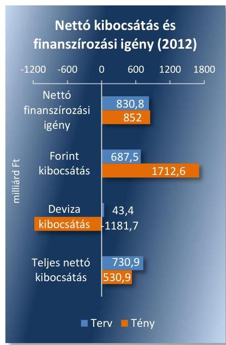
7. ábra
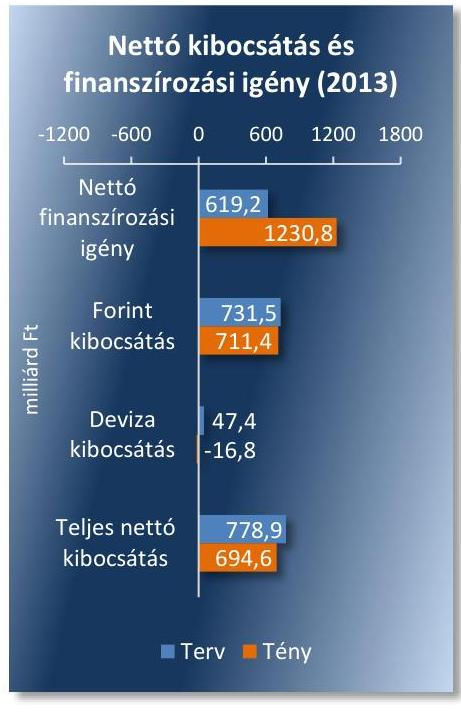

Az ellenőrzött időszakban összességében az Alapító által jóváhagyott éves és az Igazgatóság által jóváhagyott, módosított és aktualizált finanszírozási terveknek megfelelően alakultak a tényleges kibocsátások, melyek a tervek alapján nyomon követhetőek voltak. Az aktualizált finanszírozási tervek - a lezárt időszakra vonatkozóan - tartalmazták a tényadatokat, valamint a minisztériumi, a kincstári előrejelzések és tényadatok figyelembevételével az év hátralévő időszakára vonatkozóan az aktualizált tervadatokat. A kibocsátások támogatták az aktuális államadósság-kezelési stratégiában foglalt célok teljesülését, tekintettel arra, hogy a meghatározott célértékeket az ÁKK Zrt. elérte. (A finanszírozási tervek összegzett adatait, azok teljesítését a bruttó és nettó kibocsátások tekintetében a X. számú melléklet mutatja be.)

A 2012. évi kibocsátások összességében az Alapító által jóváhagyott, majd évközben 5 alkalommal alapítói jóváhagyással aktualizált finanszírozási terveknek megfelelően alakultak. Az Alapító által 2011 decemberében jóváhagyott 2012. évi finanszírozási tervben 730,9 Mrd Ft teljes nettó kibocsátást terveztek, ami 2012. év végére ténylegesen 530,9 Mrd Ft-on teljesült. (6. ábra)

A 2012. évi finanszírozási tervben a teljes nettó-finanszírozási igény 830,8 Mrd Ft volt, ami kis mértékben növekedve 852,0 Mrd Ft-on teljesült. A 21 Mrd Ft finanszírozási igény többletet a központi alrendszer hiányának csökkenése (20 Mrd Ft), valamint az EU transzferek egyenlegének növekedése (41 Mrd Ft) eredményezte. Az ÁKK Zrt. a tárgyévi finanszírozási igényt - a stratégiai célokkal összhangban - teljes egészében forint kibocsátásokkal fedezte, valamint a tervezett 43,4 Mrd Ft-os deviza-kibocsátással szemben 1181,7 Mrd Ft-tal csökkentette a devizaadósságot, a finanszírozást forint források bevonásával biztosítva. Így az államkötvény nettó kibocsátásának növekedése mellett a DKJ kibocsátás 361,3 Mrd Ft-tal, a lakossági állampapírok kibocsátása 507,4 Mrd Ft-tal haladta meg a tervezett kibocsátásokat.

A 2013. évi kibocsátások szintén az Alapító által
 jóváhagyott, majd évközben aktualizált finanszírozási terveknek megfelelően teljesültek. 2013. évben az Alapító által jóváhagyott finanszírozási tervet az Igazgatóság évközben négy alkalommal tárgyalta és aktualizálta, csupán egy alkalommal kezdeményeztek olyan mértékű változást, amely indokolta az Alapító jóváhagyását.

Az évközi módosítások eredményeként a 2013. évre jóváhagyott terv szerinti nettó-finanszírozási igény 619,2 Mrd Ft-ról 1241,0 Mrd Ft-ra módosult, ami 2013. év végére 1230,8 Mrd Ft-on teljesült. (7. ábra) A tervezettnél 611,6 Mrd Ft-tal magasabb finanszírozási igény elsősorban az EU-s elszámolások egyenlege negatív irányú változásának (-519,1 Mrd Ft), valamint a kincstári kör hiánya 92,4 Mrd Ft-os növekedésének a következménye. 2013. évben is teljesült a stratégiai cél, a lejáró devizahitelek finanszírozása devizakötvény kibocsátásokkal valósult meg, míg a központi költségvetés tárgyévi hiányát forintforrások, elsősorban lakossági állampapír kibocsátások finanszírozták. 2012. év után 2013-ban is növekedett a lakossági állampapírok nettó kibocsátása, a terveket jelentősen (453,1 Mrd Ft-tal) meghaladva 703,1 Mrd Ft lett a tényleges nettó kibocsátás.

---

8. ábra

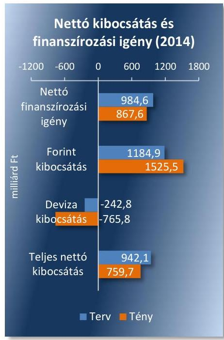

A 2014. évi kibocsátások az Alapító által elfogadott, majd az Igazgatóság által négy alkalommal aktualizált finanszírozási terveknek megfelelően alakultak. 2014. évben a finanszírozási tervek vonatkozásában három alkalommal történt olyan mértékű változás, melynek elfogadásához az Alapító jóváhagyására is szükség volt.

A 2014. évi finanszírozási terv alapján a tervezett nettó-finanszírozási igényt (984,6 Mrd Ft) az államháztartás központi alrendszerének pénzforgalmi hiánya tette ki. A 2014. évi teljes nettó-finanszírozási igény ténylegesen 117,0 Mrd Ft-tal alacsonyabb összegben teljesült, részben a kincstári kör hiányának 157,7 Mrd Ft-tal kedvezőbb alakulása, részben az EU transzferek miatt keletkezett, nem tervezett 40,7 Mrd Ft-os finanszírozási szükséglet miatt. A 2014. évi teljes nettó kibocsátásokon belül a forint kibocsátás 340,6 Mrd Ft-tal növekedett, a devizaadósság törlesztés 523,0 Mrd Ft-os növekedése mellett, ami - a stratégiában meghatározott célokkal összhangban - hozzájárult a devizakitettség csökkenéséhez. A forint kibocsátások szerkezete is kedvezőbben alakult a tervezettnél. A lakossági állampapírok kibocsátása a tervezettnél 302,6 Mrd Ft-tal magasabb összegben teljesült, a rövidlejáratú állampapírok, a DKJ-ek állománya 318,0 Mrd Ft-tal csökkent, miközben az éven túli állampapírok, az államkötvények kibocsátása 537,7 Mrd Ft-tal növekedett, ami javította a központi alrendszer adósságának lejárati idő szerinti szerkezetét. (8. ábra)

Az ellenőrzött időszakban összességében a teljes nettó kibocsátások a tervezett kibocsátási szint alatt teljesültek, és egyik évben sem haladták meg a költségvetés teljes nettó finanszírozási igényét, a különbözetet részben a KESZ számláról, részben a devizabetét számláról történt felhasználás finanszírozta.

Az ÁKK Zrt. az ellenőrzött időszakban az adósság-kibocsátásokhoz kapcsolódó ügyleteket szabályszerűen hajtotta végre. Az értékesítési-, a csere- és visszavásárlási aukciókon benyújtott ajánlatok elfogadásáról a belső szabályzatban előírtaknak megfelelően minden esetben a Finanszírozási Bizottság döntött. Az elfogadott ajánlatok szerinti hozamok összhangban voltak az elfogadott aukciós mennyiség hozamaival.

Az állampapír-piaci fejlesztések, a másodlagos piaci fejlesztések, likviditás-növekedés és a lakossági értékesítés felfuttatása összességében a hatályos államadósság-kezelési stratégiákban meghatározott célkitűzéseknek megfelelően történt. A 2012-2014. évi állam-adósság-kezelési stratégiákban egyéb célkitűzésként jelent meg a másodlagos piac fejlesztése, a likviditás növelése, a lakossági értékesítés felfuttatása, illetve a KESZ simítása. Az állampapír-piac fejlesztését szolgáló egyéb célkitűzések alapvetően nem változtak az ellenőrzött időszakban.

Az ÁKK Zrt. 2012. évben bevezette az MTS Hungary elektronikus kereskedési rendszert, az állampapír-kereskedést kiszolgáló infrastruktúra fejlesztéseként. A bevezetett rendszer - az ÁKK Zrt. éves jelentésében összegzettek alapján - az euroövezet majdnem valamennyi tagországában kiszolgálja az állampapírpiacokat, és Magyarországon is az elsődleges forgalmazók kötelező árjegyzésének helyszíne lett.

A másodlagos piac fejlesztésében kiemelt szerepe volt az elsődleges forgalmazói körnek, akik részére az ÁKK Zrt. bevezette a forint államkötvények értékesítése utáni jutalékot, hogy ezáltal növelje az elsődleges forgalmazók elkötelezettségét az állampapírok értékesítése iránt. Ezen túlmenően az ÁKK Zrt. a nemzetközi kibocsátásokat is az elsődleges forgalmazók közreműködésével bonyolította le, ami által új külföldi forgalmazók kerültek be az elsődleges forgalmazói rendszerbe.

Az állampapírok másodlagos piacának likviditása összességében növekedett az ellenőrzött időszakban a 2013. évi átmeneti csökkenés mellett. Az állampapírok másodlagos piaca alapvetően a bankközi, OTC-piacon zajlott. Az OTC piac forgalmát, valamint az ott forgalmazható instrumentumok év végi záró állománya alapján számított forgási sebességét a következő 10. táblázat mutatja be:
10. táblázat

OTC FORGALOM (MILLIÁRD FT)

| Megnevezés | 2012 | 2013 | 2014 |
| :-- | --: | --: | --: |
| Forgalom | 57979,0 | 40845,0 | 63206,0 |
| Záró állomány | 10489,0 | 10684,0 | 11578,0 |
| Forgási sebesség (alkalom) | 5,5 | 3,7 | 5,5 |

A másodlagos piacon forgalmazható állampapír állomány 2012. és 2014. években átlagosan 5,5 alkalommal, míg 2013. évben 3,7 alkalommal cserélt gazdát.

Az ellenőrzött időszakban a másodlagos piaci forgalom nagy része az elsődleges forgalmazók közvetítésével valósult meg, melyen a legnagyobb százalékban (több mint 50%) 2012-2014. években a külföldi befektetők voltak jelen.

A másodlagos piacok fejlesztése érdekében, a likviditás növelése kiemelkedő fontosságú cél volt, mind a belföldi, mind a külföldi tőkepiacokon. A finanszírozás fő elemeit jelentő forint és euró kötvények megcélzott sorozatnagyság mutatójának elérésére minden évben azonos értéket határoztak meg, melyet kisebb eltérésekkel, összességében teljesítettek.

A másodlagos piac fejlesztéshez kapcsolódóan a finanszírozás fő elemeit jelentő forint és euró kötvények megcélzott sorozatnagyság mutatót az ellenőrzött időszakban kisebb eltérésekkel, összességében elérték. A mutató elérésére minden évben azonos értéket határoztak meg:
$\longrightarrow$ A 3 éves kötvény esetében a célul kitűzött sorozatnagyság 600,0 Mrd Ft volt, mely a stratégiában meghatározott értéknek megfelelően, 2012. év végére 609,0 Mrd Ft-ra, 2013-ban 658,0 Mrd Ft-ra, míg 2014-ben 777,0 Mrd Ft-ra teljesült.
$\longrightarrow$ Az 5 és 10 éves futamidejű kötvényeknél minden évben a cél 700,0/900,0 Mrd Ft elérése volt a korábbi sorozatok újranyitása (rábocsátások) révén. Az 5 éves futamidejű kötvény 2012-ben 907,0 Mrd Ft-ra, míg a 10 éves futamidejű kötvény viszont csak 533,0 Mrd Ft-ra teljesült. 2013-ban sem az 5 éves sem a 10 éves futamidejű kötvény esetében nem érték el a kitűzött célt, mert 2013-ban az 5 éves futamidejű kötvény 531,0 Mrd Ft-ra, a 10 éves futamidejű 577,0 Mrd Ft-ra teljesült. Ugyanakkor 2014-ben az 5 éves futamidejű kötvény 1184,0 Mrd Ft lett, a 10 éves futamidejű viszont csak 473,0 Mrd Ft.

---

11. táblázat

VISSZAVÁSÁRLÁSI AUKCIÓK FORGALMA (MILLIÁRD FORINT)

|   | 2012 | 2013 | 2014  |
| --- | --- | --- | --- |
|  Aukciók |  |  |   |
|  száma (db) | 15 | 22 | 19  |
|  Benyújtott |  |  |   |
|  ajánlatok | 374,5 | 828,2 | 680,6  |
|  Elfogadott |  |  |   |
|  ajánlatok | 235,7 | 517,6 | 569,4  |
|   |  |  | Forrás: ÁKK Zrt. adatszolgáltatása  |

12. táblázat

CSEREAUKCIÓK FORGALMA (MILLIÁRD FORINT)

|   | 2012 | 2013 | 2014  |
| --- | --- | --- | --- |
|  Aukciók |  |  |   |
|  száma (db) | 13 | 11 | 19  |
|  Benyújtott |  |  |   |
|  ajánlatok | 285,0 | 226,8 | 1328,9  |
|  Elfogadott |  |  |   |
|  ajánlatok | 91,2 | 120,0 | 886,3  |
|  Forrás: Fin. tervek alakulásáról szóló tájékoztatók |  |  |   |

13. táblázat

AZ ADÓSSÁGÁLLOMÁNY LEJÁRATI SZERKEZETE (\%)

|   | 2012 | 2013 | 2014  |
| --- | --- | --- | --- |
|  >1 év | 74,4 | 72,6 | 79,7  |
|  >3 év | 48,0 | 48,6 | 54,5  |
|  >5 év | 26,3 | 30,6 | 34,9  |
|  >10 év | 6,1 | 5,3 | 7,8  |
|  >20 év | 1,3 | 1,2 | 1,2  |
|   | Forrás: ÁKK Zrt. adatszolgáltatás |  |   |

$\longrightarrow$ A 15 éves futamidejű államkötvényeknél a kereslet korlátai miatt a kitűzött cél minden évben 250,0 Mrd Ft volt. A mutató értéke 2012. év végén 98,0 Mrd Ft volt, 2013-ban 120,0 Mrd Ft-ra változott, míg a sorozat 2014. év végi állománya 180,0 Mrd Ft-ra nőtt. Az államadósság-kezelési stratégiában további célokat tűztek ki a forintadósság lejárati szerkezetének javítására. Ennek érdekében a nagy lejáratok kezelésére az ÁKK Zrt. visszavásárlási aukciókat tartott, amelyeken egy évnél rövidebb hátralévő futamidejű kötvényeket vásárolt vissza, amellyel egyben a finanszírozási kockázatot is mérsékelte. (A visszavásárlási aukciók forgalmát a 11. táblázat szemlélteti.)

Az adósságszerkezet optimalizálása és a megújítási kockázat csökkentése érdekében csereaukciók keretében rövid futamidejű (1-2 éves) államkötvényeket cserélt az ÁKK Zrt. hosszabb futamidejű (jellemzően 6-8 éves) államkötvényekre. 2014-ben jelentősen nőtt az államkötvények kibocsátása, melyből 886,3 Mrd Ft-ot tett ki a csereaukción értékesített államkötvény. (A csereaukciók forgalmát a 12. táblázat szemlélteti.)

A visszavásárlási és csereaukciók eredményeképpen a kötvényadósság lejárati szerkezete 2014-re már kitolódott a hosszabb lejáratok felé. (Az adósságállomány lejárati szerkezetét a 13. táblázat szemlélteti.)

A lakossági állampapírok értékesítésének emelkedését - mely kiemelt stratégiai cél volt - az ÁKK Zrt. az államadósság-kezelési stratégiában meghatározott céllal összhangban - új termékek bevezetésével, értékesítés utáni jutalékok fizetésével, folyamatos marketing kampánnyal, illetve versenyképes árazással - elérte. A 2011. évi 472,0 Mrd Ft lakossági állampapír állomány 2014. év végére 2411,0 Mrd Ft lett. (A lakossági állampapírok kibocsátásának tervezett és tény adatait - 2012-2014. évekre - a X. számú melléklet tartalmazza.) Az ellenőrzött időszakban a lakossági állampapírok állományváltozását a 9. ábra szemlélteti: 9. ábra

Lakossági állampapírok állományváltozása

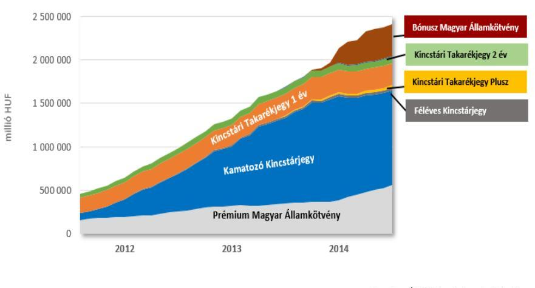

Forrás: ÁKK Zrt adatszolgáltatása Az állampapír forgalmazással összefüggésben a közvetlen lakossági és kisbefektetői értékesítést a Kincstár fiókhálózata látta el. A hosszabb futamidejű lakossági instrumentumok értékesítését támogatta - a likviditásuk növelése érdekében - 2014. évben a szűkebb marzs meghatározása, a

---

14. táblázat

| ADÓSSÁGGAL KAPCSOLATOS |  |  |  |
| :--: | :--: | :--: | :--: |
| KIADÁSOK ALAKULÁSA (MILLIÁRD FT) |  |  |  |
|  | 2012 | 2013 | 2014 |
| Bruttó kamatkiadás | 1202,4 | 1277,9 | 1345,9 |
| Kamatbevétel | 145,9 | 132,9 | 334,5 |
| Nettó kamatkiadás | 1056,5 | 1145,3 | 1011,4 |
| Nettó kiadás | 1072,2 | 1217,2 | 1112,5 |
| Kp. költségvetés adósság átlagos áll. | 20737,2 | 21850,1 | 24032,9 |
| Nettó ki-   adás/adósság   átl. áll. (\%) | $5,2 \%$ | $5,6 \%$ | $4,6 \%$ |
|

 GDP | 28627,9 | 30065,0 | 32179,7 |
| Nettó kamatkiadás GDP %ában | $3,7 \%$ | $3,8 \%$ | $3,1 \%$ |

Forrás: Tanúsítványi adatszolgáltatás - ÁKK Zrt.
befektetők számára kedvezőbb kiszállási lehetőséget biztosítva, míg a rövidebb futamidejű instrumentumok esetében szélesebb sáv került elfogadásra.

A lakossági állampapír értékesítés fejlesztéséhez hozzájárult több új lakossági értékpapír, a Bónusz Magyar Államkötvény, a Kincstári Takarékjegy Plusz és a Féléves Kamatozó Kincstárjegy értékesítésének megkezdése, a kincstári fiókhálózat budapesti bővítése két új fiókkal, az értékesítést támogató kincstári telefonos szolgálat, valamint az internetes értékpapírszolgáltatás bevezetése. A lakossági kisbefektetők számára kialakított Kincstári Takarékjegyeket a Magyar Posta forgalmazta, az ellenőrzött időszakban országosan mintegy 2700 postán.

A lakossági értékesítés növelésének eredményeként a háztartások tulajdonosi részaránya az államadósságot megtestesítő összes értékpapíron belül a 2011. decemberi 5%-ról (745,8 Mrd Ft), 2014 decemberére 10,0%-ra (2329,8 Mrd Ft) emelkedett. Ezzel párhuzamosan a külföldiek tulajdonában lévő értékpapírok tulajdonosi aránya a 2011. decemberi 56,6%-ról 2014 decemberére 52,5%-ra csökkent. (A befektetői kör változását, a kibocsátott hitelviszonyt megtestesítő értékpapírok tulajdonosi szektor bontásban, piaci értéken a XII. számú melléklet mutatja be.)

## AZ ADÓSSÁGKEZELÉSSEL KAPCSOLATOS KÖLTSÉGEKKEL szemben elvárt követelményt az Alapító által elfogadott államadósság-kezelési stratégiában az ÁKK Zrt. nem határozott meg annak ellenére, hogy az államadósság kezelés céljaként meghatározták a költségvetés finanszírozási szükségletének hosszú távon minimális költséggel, elfogadható kockázatok vállalása melletti finanszírozását.

Az adósságkezeléssel kapcsolatos nettó kiadások az ellenőrzött időszakban növekedtek. A nettó kamatkiadások - alapvetően a forint és a deviza hozamok csökkenésének hatására - csökkentek, míg az adósság és követeléskezelés egyéb kiadásai 85,3 Mrd Ft-al növekedtek. Így a nettó kiadások az ellenőrzött időszakban - 2012. évről 2013. évre bekövetkező növekedést 2014. évre csökkenés követte -összességében 40,3 Mrd Ft-al növekedtek. Az adósság és követeléskezelés egyéb kiadásainak növekedését részben a fizetett tranzakciós illeték összege (70,4 Mrd Ft), részben a lakosság részére történő állampapír értékesítések után fizetett jutalékok növekménye (14,1 Mrd Ft), okozta. (Az adósság és követeléskezelés egyéb kiadásait a XIII. számú melléklet, az adósságszolgálattal kapcsolatosan teljesített kiadások 2012-2014. évi adatait a XIV. számú melléklet mutatja be, az adóssággal kapcsolatos főbb kiadási adatokat a 14. táblázat szemlélteti.)

A nettó kamatkiadások - a bruttó kamatkiadások és kamatbevételek növekedésével, azok egyenlegeként - 2013. évre növekedtek, majd 2014. évre csökkenve a 2012. évi nettó kamatkiadás alatt teljesültek.

A kamatbevételek összegét alapvetően a hiányt finanszírozó és adósságmegújító államkötvényekhez kapcsolódó, valamint a KESZ forintbetét utáni kamatbevételeinek összege tette ki, növekményét 2014. évben az adósságmegújító államkötvények kamatbevételeinek növekedése eredményezte.

A bruttó kamatkiadások 2012. évről 2014. évre bekövetkezett 143,5 Mrd Ft-os növekedését alapvetően a hiányt finanszírozó és adósságmegújító államkötvények kamatkiadásainak 105,9 Mrd Ft-os, valamint a kibocsátott devizakötvények kamatkiadásainak 84,0 Mrd Ft-os növekménye

---

10. ábra

Referenciahozamok változása futamidő szerint, %
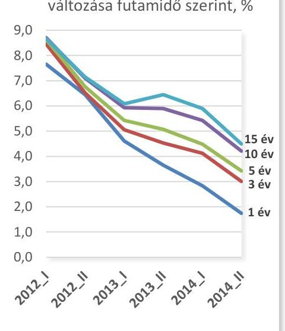

Forrás: ÁKK Zrt. által hivatalosan közzétett statisztika
15. táblázat

| CDS-FELÁRAK |  |
| :--: | :--: |
| Időpont | Bázispontok |
| 2012. év eleje | 730 |
| 2012. év vége | 270 |
| 2013. év vége | $250-280$ |
| 2014. év vége | 180 |

Forrás: ÁKK Zrt.
okozta. Mindezek hatását tompította a nemzetközi pénzügyi szervezetektől és külföldi pénzintézetektől felvett hitelek kamatkiadásainak 31,3 Mrd Ft-os és a nem piaci értékesítésű - alapvetően a konszolidációval kapcsolatos - államkötvények utáni kamatkiadások 18,1 Mrd Ft-os csökkenése. A kibocsátott kincstárjegyek után fizetett kamatok az ellenőrzött időszakban alapvetően nem változtak (2012. évben: 142,3 Mrd Ft, 2014. évben: 151,6 Mrd Ft), a DKJ-k utáni kamatkifizetések csökkenése mellett a lakossági kincstárjegyek utáni kamatkifizetések közel azonos összeggel növekedtek.

A lakossági befektetők az ellenőrzött időszakban jellemzően a referenciahozam feletti kamatfelárat realizálhattak. A kormány 2014. évi döntése alapján az államháztartásért felelős miniszter által jóváhagyott, a 4 és 6 éves futamidejű, magasabb kamatfelár melletti „bátrabb árazású" lakossági állampapír konstrukció alapján a 12 hónapos DKJ aukción kialakult átlaghozamok elfogadott mennyiséggel súlyozott átlaga (3,1%) képezte a kamatbázist és ehhez rendelték a kamatprémiumot. Ez hosszabb távon az állam-adósság-kezelés költségeinek magasabb szinten tartását eredményezi. Ugyanakkor támogatta a stratégiai célként megjelölt cél elérését, a belföldi lakossági megtakarítások finanszírozásba történő bevonásának növelését, a külföldi befektetések és árfolyam ingadozások miatti kockázatok csökkentése érdekében.

A GDP arányos nettó kamatkiadás, mind az adósság átlagos állományához viszonyított nettó kiadás - 2013. évi növekedése mellett - az ellenőrzött időszakban összességében csökkent, mely alapvetően a referenciahozamok 2012.-2014. időszakban bekövetkezett csökkenésének volt köszönhető, melyet a 10. ábra szemléltet.

A referenciahozamok csökkenéséhez nagymértékben a CDS felár - a kamatokban megjelenő, az ország kockázatot kifejező költség - csökkenése járult hozzá az ellenőrzött időszakban. (A CDS felár alakulását a 15. táblázat szemlélteti.)

A deviza-portfólióhoz kapcsolódóan megjelenő deviza keresztárfolyamkockázat kiküszöbölése érdekében - az államadósság-kezelési stratégiában meghatározott céllal összhangban - az ÁKK Zrt. az ellenőrzött időszakban minden nem euró kötelezettséget devizaswapok segítségével euró kötelezettségre váltott át. Az ÁKK Zrt. a 2012-2014. évekre vonatkozóan az egyes pénzügyi és finanszírozási műveletek (swap ügyletek, repó ügyletek) költségeit és eredményeit ugyan felmérte és kimutatta, de részletes elemzéseket nem készített, s a költségekkel szemben elvárt követelmények meghatározásának hiányában a tevékenység eredményességének értékelése sem biztosított.

---

# JAVASLATOK 

Az ÁSZ tv. 33. § (1) bekezdésében foglaltak értelmében az ellenőrzött szervezet vezetője köteles a jelentésben foglalt megállapításokhoz kapcsolódó intézkedési tervet összeállítani és azt a jelentés kézhezvételétől számított 30 napon belül az ÁSZ részére megküldeni. Amennyiben az ellenőrzött szervezet vezetője nem küldi meg határidőben az intézkedési tervet, vagy továbbra sem elfogadható intézkedési tervet küld, az Állami Számvevőszék elnöke az ÁSZ tv. 33. § (3) bekezdése a) és b) pontjaiban foglaltakat érvényesítheti.

## a nemzetgazdasági miniszternek:

1. Határozzon meg az Igazgatóság részére a teljesítménymutatók alakulásának nyomon követésével kapcsolatos feladatokat, továbbá határozza meg az Igazgatóság tevékenységét szabályozó eszközökben az ezzel kapcsolatos kontroll tevékenységet, eljárásrendet, felelősségi és döntési jogkört, valamint beszámolási kötelezettséget annak érdekében, hogy a monitoring és beszámolási rendszer megfelelően szolgálja a stratégiai célok eredményes megvalósítását.
(1.3. sz. megállapítás 6. bekezdése alapján)
2. Szabályozza le az ÁKK Zrt. feletti tulajdonosi joggyakorlás tekintetében az átruházott hatáskörben ellátandó konkrét feladatokat, a felelősségi- és döntési hatásköröket.
(2.2. sz. megállapítás 2. bekezdése alapján)
3. Gondoskodjon arról, hogy az ÁKK Zrt. adósságkezelési tevékenységét az NGM Ellenőrzési Főosztálya, illetve az ÁKK Zrt. Felügyelő Bizottsága a jogszabályi korlátok között ellenőrizze.
(1.4. sz. megállapítás 12. bekezdése, valamint a 2.3. sz. megállapítás 3. bekezdése alapján)

## az ÁKK Zrt. Igazgatóság elnökének:

1. Gondoskodjon arról, hogy az SZMSZ-ben meghatározásra kerüljön a középtávú finanszírozási terv elkészítésének kötelezettsége, valamint a belső szabályozókban egyértelműen és részletesen rögzítésre kerüljenek a középtávú finanszírozási terv kidolgozásában közreműködő szervezeti egységek által elvégzendő konkrét feladatok, valamint a felelősségi és hatáskörök.
(1.1. sz. megállapítás 3., 5., és a 7. bekezdései és az 1.2. megállapítás 1-2. bekezdései alapján)

---

2. Gondoskodjon arról, hogy a belső szabályozókban egyértelműen és részletesen rögzítésre kerüljenek az államadósság-kezelési stratégia kidolgozásában, felülvizsgálatában, módosításában közreműködő szervezeti egységek által elvégzendő konkrét feladatok, valamint a felelősségi és hatáskörök.
(1.1. sz. megállapítás 7. bekezdése, valamint az 1.2. sz. megállapítás 2. bekezdése alapján)
3. Gondoskodjon az új optimális portfólió modell, ennek alapján a módszertan elkészítése és kialakítása ütemtervének meghatározásáról és felelőseinek kijelöléséről, biztosítva ezzel a folyamat nyomon követhetőségét és számon kérhetőségét.
(1.1. sz. megállapítás 8-10, és a 12. bekezdései alapján)
4. Gondoskodjon az optimális költségtartomány, valamint a költségekkel szemben elvárt követelmény kidolgozásáról annak érdekében, hogy az államadósság-kezelési stratégiában meghatározott költségminimalizálásra vonatkozó stratégiai cél teljesüljön.
(1.1. sz. megállapítás 16. bekezdése alapján)
5. Gondoskodjon az ÁKK Zrt. belső szabályzóinak (SZMSZ, Igazgatósági Ügyrend, Állandó Bizottságok Szabályzata, Tervezési Szabályzat, Kockázatkezelési Szabályzat) a felülvizsgálatáról annak érdekében, hogy az ÁKK Zrt. által működtetett monitoring és beszámolási rendszer megfelelően szolgálja a stratégiai célok eredményes megvalósítását.
(1.3. sz. megállapítás 1. és a 4. bekezdései alapján)
6. Intézkedjen az adósságkezelési tevékenység költséghatékonyságát mérő értékelési rendszer kialakításáról az adósságkezelési költségek nyomon követése, illetve optimalizálása érdekében.
(1.3. sz. megállapítás 11. bekezdése alapján)
7. A Bkr. szerint alakítsa ki, működtesse és folyamatosan fejlessze az ÁKK Zrt. belső kontrollrendszerét.
(3.1. sz. megállapítás 12-14. bekezdései alapján)

---

# MELLÉKLETEK 

- I. SZ. MELLÉKLET: ÉRTELMEZŐ SZÓTÁR
államadósság
államkötvény
állampapír
benchmark
bruttó állampapír-piaci kibocsátás
bruttó finanszírozási igény

CDS-felár
devizakitettség
diszkont kincstárjegy
duráció
elsődleges egyenleg
elsődleges forgalmazó
elsődleges piac
eredményesség
hozam
hozamgörbe
kamatfelár

Az államháztartás központi alrendszerének, az államháztartás önkormányzati alrendszerének és a kormányzati szektorba sorolt egyéb szervezetek egymással szembeni kötelezettségek kiszűrésével számított (konszolidált) adóssága.
1 évnél hosszabb futamidejű, fix vagy változó kamatozású állampapír.
Az állam által kibocsátott tőke- és kamat-visszafizetési garanciával rendelkező értékpapír.
A benchmark olyan referenciaportfolió (szabályrendszer), mely az államadósság-kezelő stratégiai céljait tükrözi, figyelembe véve az adósságkezelés költségkockázati szerkezetét. A benchmarkok így az adósságkezelő számára a stratégiai célok számszerűsítését, azaz a köztes célok megfogalmazását is jelentik.
Az évente kibocsátott összes állampapír. Magában foglalja a költségvetés hiányának fedezésére és egyéb célokra kibocsátott állampapírokat, valamint az ugyanezen időszak alatt lejáró korábbi állampapírok visszafizetéséhez szükséges mennyiséget.
A központi költségvetés éves finanszírozási szükséglete, mely tartalmazza az adósságállomány tárgyévben esedékes törlesztő részleteit és a nettó-finanszírozási igény összegét.
Az ország kockázatot az úgynevezett CDS (ország kockázati) felárral mérjük, ami lényegében egy magyar államcsődre köthető biztosítás éves díja, vagyis az államkötvények nem teljesítővé válásának kockázatára köthető piaci biztosítási csereügyletek (CDS) középárfolyama.
A külföldi devizában fennálló tartozások, illetve az ezekhez kapcsolódó (árfolyam- és kamat) kockázatok összessége.
Egy évnél rövidebb lejáratú, névérték alatt kibocsátott állampapír, lejáratkor a névértéket fizeti ki a kibocsátó.
Az állampapírok súlyozott, átlagos futamideje, amely az adósság átárazódásához szükséges időt - és egyben az adósság portfolió kamatérzékenységét - fejezi ki. A központi költségvetés kamatterhek nélküli kiadásainak és bevételeinek különbsége, amely megmutatja, hogy mekkora volna a központi költségvetési hiány, ha nem létezne államadósság.
Az állampapírok nyilvános forgalomba hozatalára és forgalmazására az ÁKK Zrt-vel szerződést kötött befektetési vállalkozások, illetve hitelintézetek.
Az a piac, ahol az állampapírok kibocsátásakor első eladásuk történik.
Az eredményesség elve a kitűzött célok és a szándékolt eredmények (hatások) elérését jelenti. A feladatellátás eredményességét mutatja a tényleges és a tervezett eredmények (hatások) összevetése. (ÁSZ: A teljesítmény-ellenőrzés alapelvei. 2015.)
Az államadósság-kezelési stratégia eredményes megvalósítása azt jelenti, hogy az aktuális (hatályos) adósságkezelési stratégiában meghatározott mennyiségi célokat, célértékeket, egyéb célkitűzéseket teljesítik.
A befektetésen elérhető tényleges - kamat, árfolyam - nyereség aránya.
Különböző lejáratú kamatok ábrázolása a futamidő függvényében. Leggyakrabban az állampapírok hozamait ábrázoló állampapír-piaci hozamgörbe kerül említésre.
A fizetett hozam és az irányadó állampapír hozam vagy bankközi kamatláb közötti különbség.

---

Hufónia
kamatozó kincstárjegy
Kincstári Egységes Számla
kormányzati szektor
központi alrendszer
köztulajdonban álló gazdasági társaság
másodlagos piac
nettó-finanszírozási igény

OTC piac
piaci finanszírozás
referenciahozam
repó ügylet
swap ügylet
teljesítményellenőrzés

A hitelintézetek napi adatszolgáltatásából számított egynapos bankközi fedezetlen ügyletek forgalommal súlyozott átlagos kamata
A lakossági megtakarításokat célzó állampapír
Az MNB által a Kincstár részére vezetett, kamatozó, a likvid pénzeszközök elhelyezésére és a kincstári kör pénzforgalmának lebonyolítására szolgáló számla.
Az európai
 uniós szabványok által meghatározott szervezeti kör, amely magában foglalja az államháztartás alrendszereit, valamint azokat a szervezeteket, amelyek tevékenységük során közjavakat állítanak elő, a nemzeti jövedelem és a nemzeti vagyon elosztásában vesznek részt, irányításukat kormányzati szervek végzik és tevékenységük ellenértékében 50%-nál kisebb arányt képviselnek a piaci árbevételek.
Az államháztartás egyik alrendszere, amely magában foglalja a központi költségvetést, a társadalombiztosítás pénzügyi alapjait és az elkülönített állami pénzalapokat.
A köztulajdonban álló gazdasági társaságok takarékosabb működéséről szóló 2009. évi CXXII. törvény 1. § a) pontjában meghatározott értelmezés alapján: az a gazdasági társaság, amelyben a Magyar Állam, helyi önkormányzat, a helyi önkormányzat jogi személyiséggel rendelkező társulása, többcélú kistérségi társulás, fejlesztési tanács, nemzetiségi önkormányzat, nemzetiségi önkormányzat jogi személyiségű társulása, költségvetési szerv vagy közalapítvány külön-külön vagy együttesen számítva többségi befolyással rendelkezik.
A már kibocsátott, piacon lévő állampapírok adásvételének színtere.
A központi alrendszer összesített hiányának fedezéséhez adott időszakban szükséges összeg, melyet módosítanak a privatizációs bevételek, az MNB tartalékfeltöltése, valamint az EU támogatások előfinanszírozása. Nem tartalmazza a központi alrendszer által átvállalt adósságokat, valamint a lejáró adósságok visszafizetéséhez szükséges összeget.
Bankközi piac
Jellemzően az állampapír-piaci forrásbevonás, amely során a bevont forrás felhasználási célja nem korlátozott, a felhasználás nincs követelményhez (pl. gazdaságpolitikai intézkedések megtételéhez) kötve. A finanszírozás költségét kizárólag a keresleti-kínálati viszonyok befolyásolják.
A referenciahozam a magyar állampapírpiacra, ezen belül az intézményi befektetők piacára, meghatározott futamidőkre vonatkozóan, valamennyi kereskedési napon az ÁKK Zrt. által számított átlagos hozamszint.
Összekapcsolt azonnali állampapír-vételi és határidős eladási ügylet (aktív repó) vagy azonnali állampapír-eladási és határidős vételi ügylet (passzív repó).
Kockázatkezelési eszköz, a jövőbeni pénzáramlások csereügylete. A deviza swap ügyletek során devizát másik devizára, FX swap esetén devizát Ft-ra, a kamat swap során fix kamatot változó kamatozásúra, illetve fordítva cserélnek.
A teljesítményellenőrzés fő célja támogatni a gazdaságos, hatékony, eredményes közpénz-felhasználást, a nemzeti vagyonnal való gazdálkodást, feladatellátást. (ÁSZ: A teljesítmény-ellenőrzés alapelvei. 2015.)
A teljesítmény-ellenőrzés célja annak megállapítása, hogy az adott szervezet által végzett tevékenységek, programok egy jól körülhatárolható területén a működés, illetve a forrásfelhasználás gazdaságosan, hatékonyan és eredményesen valósul-e meg.
(Bkr. 21. § (3) bekezdés d) pontja)

---

# 2011-2014. ÉVEK

|  Megnevezés | 2011 |  |  | 2012 |  |  | 2013 |  |  | 2014 |  |  |  |   |
| --- | --- | --- | --- | --- | --- | --- | --- | --- | --- | --- | --- | --- | --- | --- |
|   | Optimális tartomány | Elfogadási tartomány | Optimális tartomány | Elfogadási tartomány |  | Mutató értéke (dec. 31.) | Optimális tartomány | Elfogadási tartomány |  | Mutató értéke (dec. 31.) | Optimális tartomány | Elfogadási tartomány |  | Mutató értéke (dec. 31.)  |
|  Forint - deviza összetétel (%) |  |  |  |  |  |  |  |  |  |  |  |  |  |   |
|  Forint |  | 50% alatt |  | 75,0 | 50,0 | 59,4 |  | 75,0 | 55,0 | 59,6 |  | 75,0 | 55,0 | 61,9  |
|  Deviza |  |  |  | 25,0 | 50,0 | 40,6 |  | 25,0 | 45,0 | 40,4 |  | 25,0 | 45,0 | 38,1  |
|  Devizaadósság deviza összetétel (%) |  |  |  |  |  |  |  |  |  |  |  |  |  |   |
|  Euro | 100,0 | 95,0 | 105,0 | 100,0 | 95,0 | 105,0 | 100,8 | 100,0 | 95,0 | 105,0 | 101,0 | 100,0 | 95,0 | 105,0  |
|  Egyéb | 0,0 | 5,0 | -5,0 | 0,0 | 5,0 | -5,0 | 0,0 | 0,0 | 5,0 | -5,0 | 0,0 | 0,0 | 5,0 | -5,0  |
|  Devizaadósság kamatösszetétele (%) |  |  |  |  |  |  |  |  |  |  |  |  |  |   |
|  Fix | 66,0 | 62,7 | 67,7 | 66,0 | 62,7 | 67,7 | 66,2 | 66,0 | 62,7 | 67,7 | 63,6 | 66,0 | 62,7 | 67,7  |
|  Változó | 34,0 | 37,3 | 32,3 | 34,0 | 37,3 | 32,3 | 33,8 | 34,0 | 37,3 | 32,3 | 36,4 | 34,0 | 37,3 | 32,3  |
|  Forintadósság kamatösszetétele (%) |  |  |  |  |  |  |  |  |  |  |  |  |  |   |
|  Fix |  | 61,0 | 83,0 |  | 61,0 | 83,0 | 67,6 |  | 61,0 | 83,0 | 65,2 |  | 61,0 | 83,0  |
|  Változó |  | 39,0 | 17,0 |  | 39,0 | 17,0 | 32,4 |  | 39,0 | 17,0 | 34,8 |  | 39,0 | 17,0  |
|  Forintadósság durációja (év) |  |  |  |  |  |  |  |  |  |  |  |  |  |   |
|  Ft adósság | 2,5 | 2,0 | 3,0 | 2,5 | 2,0 | 3,0 | 2,49 | 2,5 | 2,0 | 3,0 | 2,47 | 2,5 | 2,0 | 3,0  |
|   |  |  |  |  |  |  |  |  |  |  |  |  |  | 2,9  |

Forrás: ÁKK Zrt. adatszolgáltatója

---

| A FINANSZÍROZÁSI TERVEK IGAZGATÓSÁG ÁLTALI TÁRGYALÁSA |  |  |  |
| :--: | :--: | :--: | :--: |
| Igazgatósági határozat | Igazgatósági ülés |  |  |
| száma | Igazgatósági ülés dátuma | Téma | Eltelt napok száma |
| 4/2012.(02.03.) | 2012.02.03 | 2012. finanszírozási terv módosítása |  |
| 13/2012.(02.22.) | 2012.02.22 | 2012. finanszírozási terv módosítása | 19 |
| 23/2012.(04.17.) | 2012.04.17 | 2012. finanszírozási terv módosítása | 55 |
| 33/2012.(07.05.) | 2012.07.05 | 2012. finanszírozási terv módosítása | 79 |
| 39/2012.(09.25.) | 2012.09.25 | 2012. finanszírozási terv módosítása | 82 |
| 46/2012.(11.20.) | 2012.11.20 | 2012. finanszírozási terv módosítása | 56 |
| 55/2012.(12.18.) | 2012.12.18 | 2012. finanszírozási terv módosítása | 28 |
| 56/2012.(12.18.) |  | 2013. finanszírozási terv elfogadása |  |
| 1/2013.(02.20.) | 2013.02.20 | 2012. évi finanszírozási terv tájékoztató | 64 |
| 2/2013.(02.20.) |  | 2013. finanszírozási terv módosítása |  |
| 9/2013.(07.04.) | 2013.07.04 | 2013. finanszírozási terv módosítása | 134 |
| 13/2013.(09.13.) | 2013.09.13 | 2013. finanszírozási terv módosítása | 71 |
| 19/2013.(12.15.) | 2013.12.15 | 2013. finanszírozási terv módosítása | 93 |
| 20/2013.(12.15.) |  | 2014. évi fin. terv elfogadása |  |
| 1/2014.(01.10.) | 2014.01.10 | 2014. finanszírozási terv módosítása | 26 |
| 2/2014.(03.13.) | 2014.03.13 | 2013. évi fin., dev. álland. és piaci táj. | 62 |
| 4/2014.(03.13.) |  | 2014. fin.t. módosításának elutasítása |  |
| 9/2014.(05.08.) | 2014.05.08 | 2014. finanszírozási terv módosítása | 56 |
| 17/2014.(07.16.) | 2014.07.16 | 2014. finanszírozási terv módosítása | 69 |
| 22/2014.(09.24.) | 2014.09.24 | 2014. finanszírozási terv módosítása | 70 |
| 29/2014.(12.08.) | 2014.12.08 | 2014. finanszírozási terv módosítása | 75 |

NEGYEDÉVES TELJESÍTMÉNYMUTATÓKAT TÁRGYALÓ IGAZGATÓSÁGI ÜLÉSEK

| Teljesítménymutatók időszaka | Igazgatósági ülés dátuma | Időszak utolsó napja és az IG ülés időpontja közti napok száma |
| :--: | :--: | :--: |
| 2012.01.01-2012.03.31 | 2012.04.17 | 17 |
| 2012.04.01-2012.06.30 | 2012.09.25 | 87 |
| 2012.07.01-2012.09.30 | 2012.11.20 | 51 |
| 2012.10.01-2012.12.31 | 2013.02.20 | 51 |
| 2013.01.01-2013.03.31 | 2013.07.04 | 95 |
| 2013.04.01-2013.06.30 | 2013.09.13 | 75 |
| 2013.07.01-2013.09.30 | 2013.12.11 | 72 |
| 2013.10.01-2013.12.31 | 2014.03.13 | 72 |
| 2014.01.01-2014.03.31 | 2014.05.08 | 38 |
| 2014.04.01-2014.06.30 | 2014.09.24 | 86 |
| 2014.07.01-2014.09.30 | 2014.12.08 | 69 |

---

IV. SZ. MELLÉKLET: A DÖNTÉSI JOGKÖR MEGOSZTÁSA A FINANSZÍROZÁSI TERV MÓDOSÍTÁSAKOR (4/2007. (05.29.) SZÁMÚ ALAPÍTÓI HATÁROZAT SZERINT)

A jóváhagyott éves Finanszírozási tervhez képest történő módosításokról dönt az

| Alapító | Igazgatóság |
| :--: | :--: |
| 10%-nál nagyobb a változás | éves nettó finanszírozási igény változásakor, ha nem adósságátvállalás miatt történik és |
| meghaladja a nettó finanszírozási igény 10%-át | éves bruttó finanszírozási igény változásakor, ha az adott évben átvállalt (elő)törlesztett adósságátvállalás |
| meghaladja a nettó kibocsátás 10%-át | a forint-deviza összetétel változása esetén az átcsoportosítás mértéke |
| meghaladja a nettó kibocsátás 20%-át | forint instrumentumok közötti átcsoportosítás esetén az átcsoportosított összeg |
| Alapító jóváhagyását igényli | egyéb olyan esetben, amikor az IGAZGATÓSÁG MEGÍTÉLÉSE SZERINT a finanszírozási terv módosítása olyan mértékű, hogy az |

10%-nál kisebb a változás
nem éri el a nettó finanszírozási igény 10%-át
nem éri el a nettó kibocsátás 10%-át
nem éri el a nettó kibocsátás 20%-át

Alapító jóváhagyását nem igényli

Forrás: 4/2007. (05.29) számú Alapítói határozat

---

| ÉVES ADÓSSÁGKEZELÉSSEL KAPCSOLATOS DOKUMENTUMOK ELFOGADÁSA (2012-2014) |  |  |  |  |  |  |
| :--: | :--: | :--: | :--: | :--: | :--: | :--: |
| Dokumentumok | 2012 |  | 2013 |  | 2014 |  |
|  | Igazgatósági határozat | Alapítói határozat | Igazgatósági határozat | Alapítói határozat | Igazgatósági határozat | Alapítói határozat |
| Államadósság-kezelési stratégia | 56/2011 | 4/2012 | 58/2012 | 20/2012 | 23/2013 | 3/2014 |
|  | (12.07) | (I.31.) | (12.18) | (XII.20) | (XII.11.) | (I.13.) |
| Finanszírozási terv | 53/2011 | 3/2012. | 56/2012 | 19/2012 | 20/2013 | 1/2014 |
|  | (12.07) | (I.31.) | (XII.18) | (XII.20) | (XII.11.) | (I.23.) |
| Teljesítménymutatók | 57/2011 | 5/2012 | 59/2012 | 21/2012 | 24/2013 |

 3/2014 |
|  | (12.07) | (I.31.) | (12.18) | (12.20) | (12.11.) | (I.23.) |
|  |  |  |  |  | Forrás: Igazgatósági és Alapítói határozatok |  |

FINANSZÍROZÁSI TERVEK ÉVKÖZI MÓDOSÍTÁSAINAK ELFOGADÁSA (2012-2014)

| 2012 |  | 2013 |  | 2014 |  |
| :--: | :--: | :--: | :--: | :--: | :--: |
| Igazgatóság elfogadó határozata | Alapító jóváhagyó határozata | Igazgatóság elfogadó határozata | Alapító jóváhagyó határozata | Igazgatóság elfogadó határozata | Alapító jóváhagyó határozata |
| 13/2012 (02.22) | 10/2012 (VII.11.) | 2/2013 (02.20) |  | 1/2014 (01.10.) | 1/2014 (I.23.) |
| 23/2012 (04.17.) | 11/2012 (VII.11.) |  | 5/2013 (VI.18.) | 9/2014 (05.08) | 10/2014 (V.19.) |
| 33/2012 (07.05) |  | 9/2013 (07.04) |  | 17/2014 (07.16.) | 14/2014 (07.31.) |
| 39/2012 (09.25.) | 12/2012 (X.18.) | 13/2013 (09.13) |  | 22/2014 (09.24.) |  |
| 46/2012 (11.20.) | 14/2012 (XI.20.) | 19/2013 (12.11.) |  | 29/2014 (12.08.) | 18/2014 (XII.15.) |
| 55/2012 (12.18.) | 18/2012 (XII.20.) |  |  |  |  |

Forrás: Igazgatósági és Alapítói határozatok

---

|  Adatszolgáltatás tartalma | Gyakorlság | Továbbítás módja | Adatszolg. iránya | Továbbító  |
| --- | --- | --- | --- | --- |
|  Elemzés az adósságállomány és finanszírozás alakulásáról (havi monitoring jelentés) | havonta (tárgyhót követő 6. munkanap) | e-mail, posta | NGM KPF29 | TAO30  |
|  Elemzés a kamatkiadások és a kamatbevételek tárgyévi várható alakulásáról, változásairól | évi 3-4 alkalommal | posta, fax, e-mail | NGM KPF | TAO  |
|  A központi költségvetés tervezési irányelveihez az államadóssággal kapcsolatos számítások | kérésre (február-március) | posta, e-mail | NGM KPF | TAO  |
|  Az adóssággal kapcsolatos költségvetési fejezetek következő évre vonatkozó tervszámainak megküldése | évente (augusztus-szeptember) | posta, e-mail | NGM KPF | TAO  |
|  Egyéb, az NGM által a költségvetés tervezéséhez kért adat megküldése | évente (augusztus-szeptember) | posta, e-mail | NGM KPF | TAO  |
|  Az adóssággal kapcsolatos költségvetési fejezetek előző évre vonatkozó zárszámadásának anyagai | évente (április-június) | posta, e-mail | NGM KPF | TAO  |
|  Konvergencia jelentés a 3 éves finanszírozási tervről, kamatkiadásokról pénzforgalmi és eredmény-szemléletben, illetve az adósságállományról | évente kétszer (február, július) | e-mail | NGM | TAO  |
|  A nem rezidensektől felvett projekt finanszírozó hitel adatai, állománya | negyedévente, a következő hó vége | posta, e-mail | NGM NKF31 | TAO  |
|  Lakossági állampapírok állományának alakulása | naponta | e-mail | NGM | TAO  |
|  Adatszolgáltatás a PEMAK forgalmazásáról | hetente | e-mail | NGM | TAO  |
|  Heti likviditási előrejelzés | hetente | e-mail | NGM | TAO  |
|  Heti jelentés az állampapírpiac alakulásáról (nettó állampapír-piaci pozíció, referencia hozamok, külföldiek tulajdonában lévő állampapírok) | hetente (péntek) | e-mail, honlap | NGM, Igazgatóság tagjai | TEK  |
|  Elemzés a nemzetközi pénz- és tőkepiacról | hetente (péntek) | e-mail | NGM, Igazgatóság tagjai | TEK  |
|  Elemzés a heti makrogazdasági folyamatokról | hetente (péntek) | e-mail | NGM, Igazgatóság tagjai | TEK  |
|  Makrogazdasági és adósságkezelési elemzés | eseti | e-mail | NGM | TEK  |
|  35 éves hozamgörbe | negyedévente | e-mail, fax | NGM | TAO  |
|  Negyedéves kamatjelentés: A Magyar Állam finanszírozási lehetőségei és lehetséges árazásuk, illetve másodlagos piaci feláruk | negyedévente | fax | NGM | Tőkepiaci főosztály  |

Forrás: Külső adatszolgáltatási szabályzat 1. melléklete

---

- VII. SZ. MELLÉKLET: AZ ÁKK ZRT. IGAZGATÓSÁGÁNAK TAGJAI (2012-2014)

| ÁKK ZRT. IGAZGATÓSÁGI TAGJAI (2012-2014) |  |  |  |
| :--: | :--: | :--: | :--: |
| Időpont | Elnök | Tag | Tag |
| 2012.01.01. | adó- és pénzügyekért felelős államtitkár | államháztartásért felelős államtitkár | közigazgatási államtitkár |
| 2013.05.05. | (lemondott: 2013.03.06-án, hatályosult 2013.05.05-én) |  |  |
| 2013.05.06. | Nem volt elnök! |  |  |
| 2013.05.31. |  |  |  |
| 2013.06.01. | pénzügypolitikáért felelős helyettes-államtitkár |  | Miniszteri kabinet főtanácsadója |
| 2014.01.31. | (lemondott: 2013.12.16-án, hatályosult 2014.01.31-én) |  |  |
| 2014.02.01. | pénzügypolitikáért felelős helyettes-államtitkár |  |  |
| 2014.07.06. |  |  |  |
| 2014.07.07. |  | államháztartásért felelős államtitkár |  |
| 2014.12.31. |  |  |  |

Forrás: Alapítói határozatok az ÁKK Zrt igazgatósági tagjai vonatkozásában, NGM nyilatkozat

---

# - VIII. SZ. MELLÉKLET: AZ ÁKK ZRT. SZERVEZETI FELÉPÍTÉSE (2012-2014) 

2012. február 19-ig
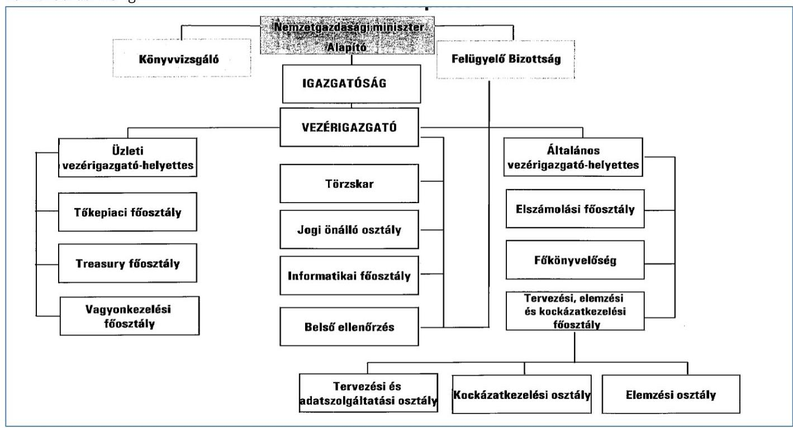
2012. február 20-tól 2012. szeptember 30-ig
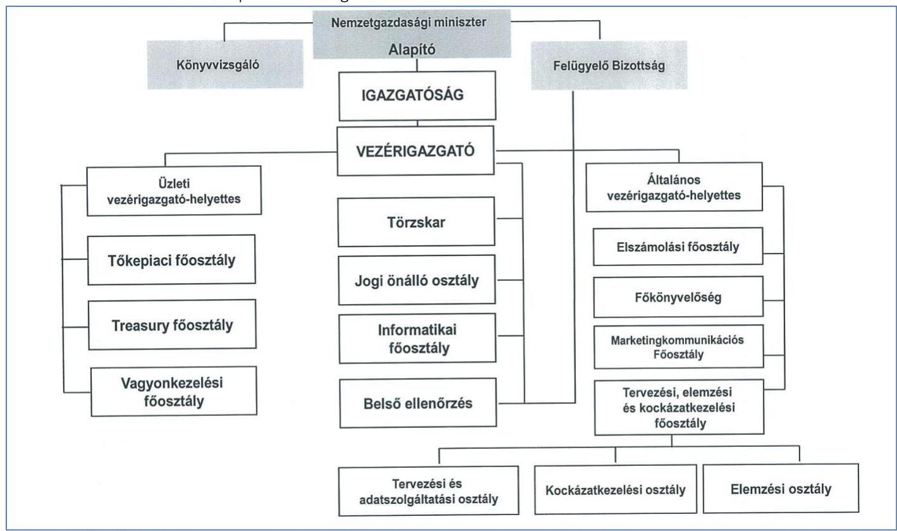

---

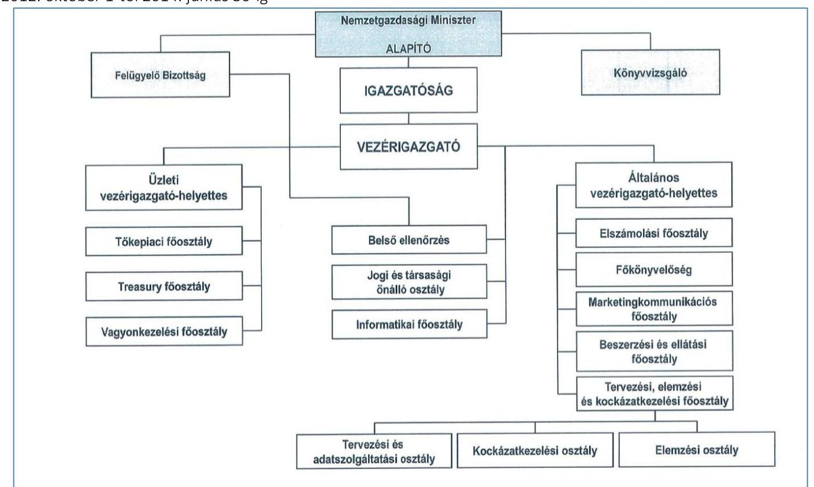
2014. július 1-től
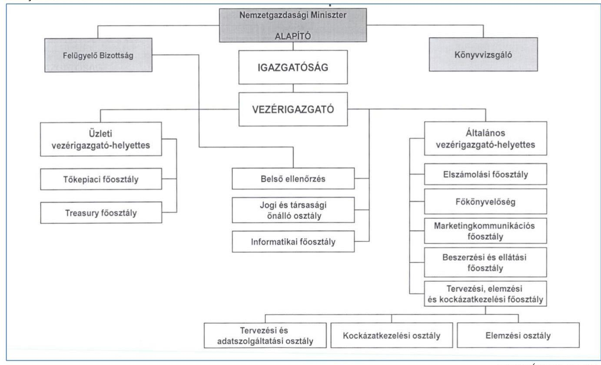

Forrás: ÁKK Zrt. SZMSZ

---

|  IGAZGATÓSÁGI ÜLÉSEK (2012-2014) |  |   |
| --- | --- | --- |
|  Időpont | Résztvevő tagok száma | Tárgyalt főbb témák  |
|  2012. II. 3. | 2 fő | Piaci, és MANYUP${ }^{32}$ tájékoztatók, teljesítménymutatókról szóló jelentés, 2012. évi üzleti terv halasztás, SZMSZ módosítás  |
|  2012. II. 22. | 2 fő | Finanszírozási terv módosítása, 2012. évi üzleti terv elfogadása, munkavállalói meghatalmazások  |
|  2012. IV. 17. | 2 fő | Piaci és MANYUP tájékoztatók, teljesítménymutatókról szóló jelentés, menedzsment beszámoló, finanszírozási terv módosítása, az Igazgatóság vagyoni helyzetről és üzletpolitikáról szóló jelentése  |
|  2012. VII. 5. | 2 fő | Finanszírozási terv módosítása, 2013. évi finanszírozási terv alapozás, az Igazgatóság vagyon és üzletpolitikáról szóló jelentése  |
|  2012. IX. 25. | 2 fő | Piaci tájékoztatók, teljesítménymutatókról szóló jelentés, finanszírozási terv módosítása, az Igazgatóság vagyoni helyzetről és üzletpolitikáról szóló jelentése  |
|  2012. XI. 20. | 2 fő | Piaci tájékoztatók, teljesítménymutatókról szóló jelentés, finanszírozási terv módosítása, az Igazgatóság vagyoni helyzetről és üzletpolitikáról szóló jelentése, SZMSZ módosítás  |
|  2012. XII. 18. | 3 fő | 2013. évi államadósság-kezelési stratégia, finanszírozási terv, teljesítménymutatók, üzleti terv elfogadása, piaci tájékoztatók, az Igazgatóság 2013. évi ülés- és munkaterve  |
|  2013. II. 20. | 2 fő | 2012. évi finanszírozási tájékoztató, piaci tájékoztató, finanszírozási terv módosítása, teljesítménymutatókról szóló jelentés  |
|  2013. VII. 4. | 2 fő | Finanszírozási terv módosítása, az Igazgatóság vagyoni helyzetről és üzletpolitikáról szóló jelentése  |
|  2013. IX. 13. | 2 fő | Finanszírozási terv módosítása, teljesítménymutatókról szóló jelentés, 2014. évi finanszírozási terv alapozás, az Igazgatóság vagyoni helyzetről és üzletpolitikáról szóló jelentése  |
|  2013. XII. 15. | 2 fő | 2014. évi államadósság-kezelési stratégia, finanszírozási terv, teljesítménymutatók elfogadása, piaci tájékoztató, teljesítménymutatókról szóló jelentés, 2013. évi finanszírozási terv módosítása, az Igazgatóság 2014. évi munkaterve  |
|  2014. III. 13. | 2 fő | 2013. évi finanszírozási és piaci tájékoztató, teljesítménymutatókról szóló jelentés, NYRA tájékoztató, 2014. évi üzleti terv elfogadása,  |
|  2014. V. 8. | 2 fő | Finanszírozási terv módosítása, teljesítménymutatókról szóló jelentés, az Igazgatóság vagyon és üzletpolitikáról szóló 2013. éves és 2014. első negyedéves jelentése  |
|  2014. VII. 16. | 2 fő | Finanszírozási terv módosítása, az Igazgatóság vagyoni helyzetről és üzletpolitikáról szóló jelentése, SZMSZ módosítás  |
|  2014. IX. 24. | 3 fő | Finanszírozási terv módosítása, teljesítménymutatókról szóló jelentés, az Igazgatóság vagyoni helyzetről és üzletpolitikáról szóló jelentése, Alapító okirat módosítása, SZMSZ módosítása  |
|  2014. XII. 8. | 3 fő | 2015. évi államadósság-kezelési stratégia, finanszírozási terv, teljesítménymutatók elfogadása, 2014. évi finanszírozási terv módosítása, teljesítménymutatókról szóló jelentés, az Igazgatóság vagyoni helyzetről és üzletpolitikáról szóló jelentése  |

Forrás: ÁKK Zrt

---

|  Fő ÜLÉSEK (2012-2014) |  |  |   |
| --- | --- | --- | --- |
|  Időpont | Résztvevő tagok száma | Tárgyalt főbb témák |   |
|  2012. I. 4. | 3 fő | 2012. évi üzleti terv, az Igazgatóság vagyoni helyzetről és üzletpolitikáról szóló jelentése |   |
|  2012. II. 29. | 3 fő | Alapító okirat módosítása, 2012. évi üzleti terv, MANYUP tájékoztató |   |
|  2012. V. 16. | 3 fő | Az Igazgatóság vagyoni helyzetről és üzletpolitikáról szóló negyedéves és éves jelentése, a belső ellenőrzés jelentései |   |
|  2012. XII. 5. | 3 fő | Az Igazgatóság vagyoni helyzetről és üzletpolitikáról szóló jelentései (2012. első három negyedéve), ÁSZ ellenőrzésről szóló tájékoztató, Alapító okirat módosítása, szabályzatok módosítása, a belső ellenőrzés jelentései |   |
|  2013. I. 23. | 3 fő | 2013. évi üzleti terv |   |
|  2013. V. 29. | 3 fő | Az Igazgatóság vagyoni helyzetről és üzletpolitikáról szóló éves jelentése |   |
|  2013. X. 4. | 4 fő | Az Igazgatóság vagyoni helyzetről és üzletpolitikáról szóló jelentései (2013. első és második negyedéve), javaslattétel a könyvvizsgálóra, a belső ellenőrzés jelentései |   |
|  2014. I. 27. | 3 fő | Az Igazgatóság vagyoni helyzetről és üzletpolitikáról szóló jelentése, a belső ellenőrzés jelentése |   |
|  2014. III. 31. | 3 fő | 2014. évi üzleti terv, MANYUP tájékoztató, Alapító okirat módosítása |   |
|  2014. V. 19. | 4 fő | Az Igazgatóság vagyoni helyzetről és üzletpolitikáról szóló negyedéves és 2013. éves jelentése, a belső ellenőrzés jelentései |   |
|  2014. IX. 29. | 3 fő | Az Igazgatóság vagyoni helyzetről és üzletpolitikáról szóló negyedéves jelentések (2014. első két negyedév), az Alapító okirat módosítása, belső ellenőrzési jelentések |   |

|  AZ ÁKK ZRT. VAGYONI HELYZETÉRŐL ÉS ÜZLETPOLITIKÁJÁRÓL SZÓLÓ NEGYEDÉVES JELENTÉSEK ELFOGADÁSA |  |  |  |  |   |
| --- | --- | --- | --- | --- | --- |
|   | Igazgatóság határozat |  | Fő határozat |  | Igazgatóság határozatok és Fő határozatok között eltelt napok száma  |
|  2012/1. negyedév |

 36/2012. | 2012. júl. 5. | 12/2012. |  | 153  |
|  2012/2. negyedév | 44/2012. | 2012. szept. 25. | 13/2012. | 2012. dec. 5. | 71  |
|  2012/3. negyedév | 49/2012. | 2012. nov. 20. | 14/2012. |  | 15  |
|  2012/4. negyedév | - | - | - | - | -  |
|  2013/1. negyedév | 10/2013. | 2013. júl. 4. | 5/2013. | 2013. okt. 4. | 92  |
|  2013/2. negyedév | 17/2013. | 2013. szept. 13. | 6/2013. | 2013. okt. 4. | 21  |
|  2013/3. negyedév | 25/2013. | 2013. dec. 11. | 1/2014. | 2014. jan. 27. | 47  |
|  2013/4. negyedév | 14/2014. | 2014. máj. 8. | 8/2014. | 2014. máj. 19. | 11  |
|  2014/1. negyedév | 18/2014. | 2014. júl. 16. | 12/2014. | 2014. szept. 29. | 75  |
|  2014/2. negyedév | 23/2014. | 2014. szept. 24. | 13/2014. |  | 5  |
|  2014/3. negyedév | 38/2014. | 2014. dec. 8. | - | - | -  |
|  2014/4. negyedév | - | - | - | - | -  |

*Forrás: Az ÁKK Zrt. Igazgatóságának és Felügyelő Bizottságának határozatai*

---

Mellékletek X. SZ. MELLÉKLET: A NETTÓ KIBOCSÁTÁSOK MEGVALÓSULÁSA ÉS A KÖZPONTI ALRENDSZER FINANSZÍROZÁSI IGÉNYE A 2012-2014. ÉVEKBEN (MILLIÁRD FT.)

|  A NETTÓ KIBOCSÁTÁSOK MEGVALÓSULÁSA ÉS A KÖZPONTI ALRENDSZER FINANSZÍROZÁSI IGÉNYE A 2012-2014. ÉVEKBEN (MILLIÁRD FT.) |  |  |  |  |  |   |
| --- | --- | --- | --- | --- | --- | --- |
|  Megnevezés | 2012 |  | 2013 |  | 2014 |   |
|   | terv | tény | terv | tény | terv | tény  |
|  Bruttó finanszírozási igény | 6696,1 | 8705,0 | 7658,1 | 10372,1 | 9830,2 | 12903,9  |
|  Összes törlesztés | 5865,3 | 7853,0 | 7038,9 | 9141,3 | 8845,6 | 12036,3  |
|  Forint törlesztés | 4468,7 | 6438,6 | 5584,3 | 6994,0 | 7102,2 | 10046,8  |
|  Deviza törlesztés | 1396,6 | 1414,4 | 1454,6 | 2147,3 | 1743,4 | 1989,5  |
|  Teljes nettó finanszírozási igény (terv: előző év dec.; 2014-ban jan.) | 830,8 | 852,0 | 619,2 | 1230,8 | 984,6 | 867,6  |
|  Központi alrendszer egyenlege | 633,0 | 613,2 | 841,8 | 934,2 | 984,6 | 826,9  |
|  Nettó EU transzferek | 197,8 | 238,8 | -222,5 | 296,6 | 0,0 | 40,7  |
|  Forint kibocsátás | 687,5 | 1712,6 | 731,5 | 711,4 | 1184,9 | 1525,5  |
|  Államkötvények | 678,0 | 858,6 | 473,6 | 142,1 | 706,1 | 1243,8  |
|  Diszkont kincstárjegyek | 4,3 | 365,6 | 21,9 | 2,2 | 164,4 | -318,0  |
|  Lakossági állampapírok | 5,3 | 512,7 | 250,0 | 703,1 | 420,0 | 722,6  |
|  Forinthitel-átvállalás és kamattőkésítés | 0,0 | -24,0 | -14,0 | -136,0 | -105,6 | -122,9  |
|  Deviza kibocsátás | 43,4 | -1181,7 | 47,4 | -16,8 | -242,8 | -765,8  |
|  Államkötvények | 799,4 | -324,2 | 978,8 | 1036,6 | 298,2 | 251,6  |
|  Hitelek | -756,0 | -857,5 | -931,3 | -1053,3 | -541,1 | -1017,4  |
|  Teljes nettó kibocsátás | 730,9 | 530,9 | 778,9 | 694,6 | 942,1 | 759,7  |
|  Egyéb műveletek | 0,0 | -141,5 | 60,0 | 100,2 | 61,73 | 415,6  |
|  Bruttó kibocsátás (Teljes nettó kibocsátás + összes törlesztés) | 6596,2 | 8242,4 | 7877,8 | 9936,1 | 9849,4 | 13211,6  |

Forrás: ÁKK Zrt. finanszírozási tervei és tájékoztatók a finanszírozási tervek alakulásáról

---

| REPÓÜGYLETEK EREDMÉNYE A 2012-2014. ÉVEKBEN(ADATOK MILLIÓ FT-BAN) |  |  |  |  |
| :--: | :--: | :--: | :--: | :--: |
| Repó ügylet indúlásának | Aktív repó művele-   tek egyenlege | Passzív repó   műveletek egyenlege | Veszteség-nyereség összesen | Éves repó kötési összeg |
| 2012. év | -50,3 | 17,0 | -33,3 | 5177000 |
| 2013. év | 18,8 | -41,5 | -22,8 | 7621000 |
| 2014. év | 2,7 | 60,8 | 63,5 | 5248000 |

---

#### *Mellékletek*

### **XII. SZ. MELLÉKLET: A BEFEKTETŐI KÖR VÁLTOZÁSA A 2011-2014. ÉVEKBEN**

|  A BEFEKTETŐI KÖR VÁLTOZÁSA A 2011-2014 ÉVEKBEN |  |  |  |  |  |  |  |   |
| --- | --- | --- | --- | --- | --- | --- | --- | --- |
|  Tulajdonosi szektor | 2011 |  | 2012 |  | 2013 |  | 2014 |   |
|   | Millárd Ft | Megoszlás (%) | Millárd Ft | Megoszlás (%) | Millárd Ft | Megoszlás (%) | Millárd Ft | Megoszlás (%)  |
|  Nem pénzügyi vállalatok | 126,5 | 0,8% | 189,3 | 1,0% | 205,8 | 1,0% | 451,7 | 1,9%  |
|  Pénzügyi vállalatok összesen | 5534,1 | 36,9% | 6179,3 | 34,9% | 6896,0 | 34,7% | 8451,2 | 36,1%  |
|  Államháztartás összesen | 49,9 | 0,3% | 46,0 | 0,3% | 51,9 | 0,3% | 58,3 | 0,2%  |
|  Háztartások | 745,8 | 4,9% | 1245,7 | 7,0% | 1990,5 | 10,0% | 2329,8 | 10,0%  |
|  Háztartásokat segítő nonprofit intézmények | 32,5 | 0,2% | 29,2 | 0,2% | 29,1 | 0,2% | 109,2 | 0,5%  |
|  Külföld | 8477,2 | 56,6% | 10022,4 | 56,6% | 10690,2 | 53,8% | 12281,0 | 52,5%  |
|  Összesen: | 14965,9 | 100,0% | 17711,8 | 100,0% | 19863,5 | 100,0% | 23381,2 | 100,0%  |

*Forrás: ÁKK Zrt. éves jelentései*

---

### XIII. SZ. MELLÉKLET: ÁLLAMPAPÍROK UTÁN FIZETETT JUTALÉKOK (2012-2014)

#### ÁLLAMPAPÍROK LAKOSSÁG RÉSZÉRE TÖRTÉNŐ ÉRTÉKESÍTÉSE UTÁN FIZETETT JUTALÉKOK (MILLIÓ FORINT)

|   | 2012 | 2013 | 2014 | Változás (2014/2012)  |
| --- | --- | --- | --- | --- |
|  Államkötvény | 1843,2 | 1820,3 | 4170,6 | +2327,4  |
|  Kamatozó Kincstárjegy | 4238,4 | 8981,0 | 10390,2 | +6151,8  |
|  Kincstári Takarékjegy | 4089,0 | 4367,3 | 4930,9 | +841,9  |
|  Féléves Kincstárjegy | 72,6 | 180,6 | 288,5 | +215,9  |
|  Prémium Magyar Államkötvény | 1826,6 | 1480,0 | 2255,3 | +428,7  |
|  Bónusz Magyar Államkötvény | - | - | 3721,7 | +3721,7  |
|  Kincstári Takarékjegy Plusz | - | 41,9 | 345,8 | +345,8  |
|  Babakötvény | - | - | 61,7 | +61,7  |
|  ÖSSZESEN | 12069,8 | 16871,1 | 26164,7 | +14094,9  |
|  Prémium Euró Államkötvény (millió EUR) | 3,1 | 20,4 | 1,8 | -1,3  |

*Forrás: ÁKK Zrt. adatszolgáltatása*

#### ADÓSSÁG ÉS KÖVETELÉSKEZELÉS EGYÉB KIADÁSAI (MILLIÓ FORINT)

|   | 2012 | 2013 | 2014 | Változás (2014/2012)  |
| --- | --- | --- | --- | --- |
|  Jutalékok és egyéb költségek | 13211,9 | 69431,0 | 98474,8 | +85262,9  |
|  Deviza elszámolások | 1148,9 | 18870,4 | 2990,0 | +1841,1  |
|  Piaci kibocsátások, hitelfelvételek, átvállalások elszámolásai | 1148,9 | 18870,4 | 2990,0 | +1841,1  |
|  Forint elszámolások | 12063,0 | 50560,6 | 25080,2 | +13017,2  |
|  Tranzakciós illeték | - | - | 70404,6 | +70404,6  |
|  Állampapírok értékesítését támogató kommunikációs kiadások | 1648,5 | 1500,0 | 1575,3 | -73,2  |
|  Adósságkezelés költségei | 899,0 | 1012,0 | 1063,0 | +164,0  |
|  ÖSSZESEN | 15759,4 | 71943,0 | 101113,1 | +85353,7  |

*Forrás: 2012, 2013, 2014. évi zárszámadási törvények mellékletei alapján*

---

| ADÓSSÁGSZOLGÁLATTAL KAPCSOLATOS KIADÁSOK (MILLIÓ FT) |  |  |  |  |
| :--: | :--: | :--: | :--: | :--: |
|  | 2012 | 2013 | 2014 | 2014-2012 |
| Devizában fennálló adósság és követelések kamatelszámolásai | 330944,0 | 335986,3 | 383641,0 | +52697,0 |
| Devizahitelek kamatelszámolásai | 97056,9 | 66909,1 | 65709,3 | -31347,6 |
| Nemzetközi pénzügyi szervezetektől és külföldi pénzintézetektől felvett hitelek kamatelszámolásai | 95128,5 | 66909,1 | 65709,3 | -29419,2 |
| Belföldi devizahitelek kamata | 1928,4 |  |  | -1928,4 |
| Devizakötvények elszámolásai | 233887,1 | 269077,2 | 317931,7 | +84044,6 |
| Külföld felé | 1,5 | 268865,4 | 317791,4 | +317789,9 |
| M2M-el kapcsolatos kamatok | 1496,7 | 211,8 | 140,3 | -1356,4 |
| Egyéb kamatelszámolások | 232388,9 |  |  | -232388,9 |
| A forintban fennálló adósság és követelések kamatelszámolásai | 871416,8 | 941910,5 | 962209,0 | +90792,0 |
| Forinthitelek kamatelszámolásai | 37168,5 | 33238,6 | 30698,5 | -6470,0 |
| Egyéb hitelek kamatelszámolásai | 37168,5 | 33238,6 | 30698,5 | -6470,0 |
| Államkötvények kamatelszámolása | 691935,7 | 745817,7 | 779866,3 | +87930,6 |
| Piaci értékesítésű -hiányt finanszírozó és adósságmegújító államkötvények kamatelszámolásai |

 666 498,7 | 719 970,0 | 772 496,5 | $+105997,8$ |
| Nem piaci értékesítésű államkötvények kamatelszámolása | 25 437,0 | 25 847,7 | 7369,8 | $-18067,2$ |
| Kincstárjegyek kamatelszámolása | 142 312,6 | 162 854,2 | 151 644,4 | $+9331,8$ |
| Diszkontkincstárjegyek kamatelszámolása | 126 734,2 | 111 679,2 | 84 743,5 | $-41990,7$ |
| Lakossági kincstárjegyek kamatelszámolása | 15 578,4 | 51 175,0 | 66 900,9 | $+51322,5$ |
| Kincstári egységes számla forintbetét kamatelszámolásai |  |  |  |  |
| Adósság és követeléskezelés egyéb kiadásai | 15 759,4 | 71 943,0 | 101 113,0 | $+85354,0$ |
| Jutalékok és egyéb költségek | 13 211,9 | 69 431,0 | 98 474,8 | $+85262,9$ |
| Deviza elszámolások | 1148,9 | 18 870,4 | 2990,0 | $+1841,1$ |
| Forint elszámolások | 12 063,0 | 50 560,6 | 25 080,2 | $+13017,2$ |
| Tranzakciós illeték |  |  | 70 404,6 | $+70404,6$ |
| Állampapírok értékesítését támogató kommunikációs kiadások | 1648,5 | 1500,0 | 1575,3 | $-73,2$ |
| Adósságkezelés költségei | 899,0 | 1012,0 | 1063,0 | $+164,0$ |
| ÖSSZESEN | 1218 120,2 | 1349 839,8 | 1446 963,0 | 228 842,8 |

Forrás: 2012, 2013 és 2014. évi zárszámadási törvények mellékletei

---

.

---

# FÜGGELÉK: ÉSZREVÉTELEK 

A jelentéstervezetet a Számvevőszék 15 napos észrevételezésre megküldte az ellenőrzött szervezet vezetőjének az ÁSZ tv. 29. § (1) bekezdése előírásának megfelelően.
Az elfogadott észrevételek alapján a Számvevőszék módosította a jelentést.

A függelék tartalmazza az ellenőrzött észrevételeit, illetve az el nem fogadott észrevételek elutasításának indoklását.

[^0]
[^0]:    * 29. § (1) Az Állami Számvevőszék az ellenőrzési megállapításait megküldi az ellenőrzött szervezet vezetőjének vagy az általa megbízott személynek, és annak, akinek személyes felelősségét állapította meg.
    (2) Az ellenőrzött szervezet vezetője és a felelősként megjelölt személy az ellenőrzés megállapításaira tizenöt napon belül írásban észrevételt tehet.
    (3) Az Állami Számvevőszék az észrevételre a beérkezésétől számított harminc napon belül írásban válaszol. A figyelembe nem vett észrevételeket köteles a jelentésben feltüntetni, és megindokolni, hogy azokat miért nem fogadta el.

---

NEMZETGAZDASÁGI MINISZTÉRIUM MINISZTER

Domokos László úr részére elnök

Állami Számvevőszék Budapest
Apáczai Csere János utca 10. 1052

Tisztelt Elnök Úr!

Köszönettel megkaptam ,,Az államháztartás központi alrendszerének adósságát kezelő rendszer ellenőrzése" című jelentés tervezetéhez

ÁLLAMI SZÁMVEVŐSZÉK
053226/2016
Érkeze: 2016 JÚNIUS 23.
Iktatószám:
Melléklet: $\qquad$
$524077$
Iktatószám: NGM/22275/1/2016.
Hiv. szám: V-0918-243/2016.
Tárgy: Észrevételek az Állami Számvevőszék „Az államháztartás központi alrendszerének adósságát kezelő rendszer ellenőrzése" című jelentés tervezetéhez

Köszönettel megkaptam ,,Az államháztartás központi alrendszerének adósságát kezelő rendszer ellenőrzése" című jelentéstervezetet (a továbbiakban: Tervezet), amellyel kapcsolatos észrevételeimet jelen levél keretében teszem meg.

Mindenekelőtt engedje meg, hogy megjegyezzem, a vizsgált, 2012-2014. közötti időszakban a gazdaságpolitikai célkitűzéseknek megfelelően nemcsak az adósság GDP-arányos mértéke csökkent, hanem az adósság szerkezete is érdemben javult: az Államadósság Kezelő Központ Zártkörűen Működő Részvénytársaság (a továbbiakban: ÁKK Zrt.) által kezelt devizaadósság mind a teljes adósság arányában (12 százalékponttal), mind összegszerűen (több mint 1200 milliárd forinttal) mérséklődött. Mindeközben a külföldiek kezében lévő adósság egyre nagyobb arányban került belföldi befektetők, kiemelten a lakosság és a hitelintézetek kezébe. Az adósságkezelés sikerét ezen folyamatok tükrözik a leginkább, hiszen ezek számszerűsíthetően bizonyítják egyrészt azt, hogy az ÁKK Zrt. vezetői, munkatársai jó, minőségi munkát végeztek, másrészt pedig azt is, hogy a tulajdonosi joggyakorlás kellően eredményes volt.

Az ÁKK Zrt. tevékenysége kiemelt jelentőségű a nemzetgazdaság egésze számára. Az adósságkezelés sajátos tevékenység, főként annak tekintetében, hogy amennyiben a piac megvonja tőle a bizalmat, az az ország egészére nézve is káros. Azonban ha a piac magától az országtól vonja meg a bizalmat, az adósságkezelés által megtehető lépések korlátozottakká válnak a piaci forrásokhoz való hozzáférés nehézsége miatt (lásd a 2008. évi eseményeket).

Az államadósság finanszírozásának mindenkori biztonságát, vagyis az adósságkezelés az Állami Számvevőszék (a továbbiakban: ÁSZ) módszertana szerinti eredményességét tehát mind a hazai, mind a globális piaci szereplők is élesen figyelik, nemcsak az ÁKK Zrt. szervezetének szabályszerű, eredményes működését vizsgáló ÁSZ. Egy nemzeti adósságkezelő intézmény tevékenységének megítélése ugyanis jól látható a befektetők reakciójából is; amennyiben nem következetesen valósítaná meg a stratégiát vagy vinné véghez az éves finanszírozási tervet, esetleg más okból vesztené hitelét vagy esne csorba a hírnevén, azt a piac azonnal jelezné, mert a befektetők egy része megvonná a bizalmat az

---

adósságkezelőtől, és egyben az országtól is. Emiatt fontos, hogy az adósságkezelőről alkotott hazai és nemzetközileg kialakult kép kiszámíthatóságot és transzparenciát tükrözzön.

A szakmai tapasztalatok, visszajelzések alapján az ÁKK Zrt. működése teljes mértékben megalapozza azt, hogy a magyar adósságkezelés megfelel ennek a professzionalitást, kiszámíthatóságot és transzparenciát tükröző képnek. Ennek fényében fontosnak tartom kiemelni néhány észrevételt.

1. Az ÁSZ a Tervezetben több ízben hiányolja a középtávú tervezés szabályozottságát. Ezzel kapcsolatban feltétlenül szeretném felhívni Elnök Úr figyelmét arra, hogy önmagában a finanszírozási terv számonkérhetőségének szabályzatban történő belső rögzítésének hiánya nem jelenti azt, hogy ne készült volna középtávú finanszírozási terv. Ellenkezőleg: az ÁKK által összeállított középtávú finanszírozási számításokat a Nemzetgazdasági Minisztérium évek óta használja az évenként benyújtásra kerülő Konvergencia Programban szereplő adósságpálya-számításainál. Ezen alkalmakkor munkatársaimon keresztül arról is meggyőződtem, hogy a középtávú finanszírozási terv mindenkor az érvényben lévő stratégia mentén került megalkotásra.
2. Magam is fontosnak tartom az ÁKK Zrt. mint társaság működésének ellenőrzését. Meg kell ugyanakkor jegyezzem, hogy az adósságkezelés technikai, szakmai feladatainak nyomon követése, számonkérése speciális szakmai ismereteket igényel, így - véletlenül sem kisebbítve az említett ellenőrzési szervek (ti. felügyelő bizottság, NGM ellenőrzési területe) szakmai felkészültségét az ellenőrzések széles spektruma tekintetében - azok szigorúan vett ellenőri megítélése csak külső erőforrás igénybevételével lenne megvalósítható. Emellett viszont úgy gondolom, hogy az Igazgatóság az adósságkezelés eredményességére vonatkozó megfelelő tulajdonosi ellenőrzést kellően biztosítja. Az Igazgatóság tagjait egyesével, mint szakembereket igen felkészültnek ítélem meg, a szakmai kontroll pedig azáltal kellően hathatós, hogy az Igazgatóság a vezetéssel folyamatosan együttműködik, szakmai vitákat folytat le az elvárt eredményesség elérése érdekében.

A fent írtak alapján és a Magyarország gazdasági stabilitásáról szóló 2011. évi CXCIV. törvény (a továbbiakban: Stabilitási tv.) 11. § (6) bekezdésével összhangban - amely kimondja, hogy az „ÁKK Zrt. felügyelő bizottságának hatásköre nem terjed ki az államháztartás központi alrendszere adósságának kezelési stratégiája, az ezzel kapcsolatos teljesítménymutatók és a finanszírozási tervek véleményezésére" továbbra sem gondolom, hogy az adósságkezelés eredményességére nézve bármilyen kockázatot hordozna az, ha a törvény előírásainak megfelelően az ÁKK Zrt. adósságkezelési tevékenységével kapcsolatban technikai részletekbe menő ellenőrzést a későbbiekben sem folytat az ÁKK Zrt. felügyelő bizottsága, főként azért, mert erre a Stabilitási törvény alapján hatásköre sincs.
3. Szorosan kapcsolódik a korábbiakban elmondottakhoz az Igazgatóság szerepének és összetételének megítélése is. Az igazgatósági tagok megválasztásával kapcsolatban a Tervezet 27. oldal 4. bekezdésében maga az ÁSZ is helyesen állapítja meg, hogy „a

---

kialakított irányítási struktúra, az Alapítói kontroll érvényesítése az Igazgatóság tagjain keresztül összességében az államadósság-kezelési stratégia eredményes megvalósítását szolgálta". Ezzel mélységesen egyetértek. A kiválasztásnál a legfontosabb szempont, hogy a kellő rálátással és megfelelő szakmai kompetenciával, tapasztalatokkal és kvalitásokkal rendelkező személyek kerüljenek az Igazgatóság tagjai közé. Tekintettel arra, hogy az adósságkezelés, az adósságstratégia megfelelő, szakszerű alakítása olyan kérdéseket vet fel, amelyekkel kapcsolatos információk elsődlegesen és legteljesebb körben a Nemzetgazdasági Minisztérium Államháztartásért, illetve a Pénzügypolitikáért felelős két államtitkárságán állnak rendelkezésre, így a szakmai racionalitás és a nemzetgazdasági érdek ezen szervezeti egységek vezető munkatársainak delegálását indokolja az ÁKK Igazgatóságába. Ennek és a Tervezet 27. oldal 4. bekezdéséből származó fent idézett megállapítás tükrében nem érthető a Tervezet 26. oldalán található következő értékelés: „a kettős feladatellátás további kockázatokat hordozott az adósságkezeléssel kapcsolatos tevékenység eredményessége tekintetében". Úgy vélem, hogy a két megállapítás között komoly logikai ellentmondás áll fenn. Így megfontolásra javasolom a másodikként idézett megállapítás újragondolását.
4. Az ellenőrzési szervek tevékenységéhez visszakanyarodva észrevételt teszek a Tervezet 1.4 számú megállapítás 12. bekezdése (24. oldal), valamint a nemzetgazdasági miniszternek címzett 3. számú javaslattal kapcsolatban is. A jelentéstervezet az államháztartásért felelős miniszter által működtetett monitoring rendszert kizárólag az ÁKK Zrt. vonatkozásában vizsgálja, ugyanakkor a költségvetési szervek belső kontrollrendszeréről és belső ellenőrzéséről szóló 370/2011. (XII. 31.) Korm. rendelet (a továbbiakban: Bkr.) 3. §-a alapján a költségvetési szerv vezetőjének a szervezet minden szintjén érvényesülő belső kontrollrendszer kialakítása, működtetése és fejlesztése a feladata, melynek része a monitoring rendszer is. A Bkr. 10. §-a alapján a belső ellenőrzést az operatív tevékenységek keretében megvalósuló folyamatos és eseti nyomon követéstől függetlenül kell működtetni, ez utóbbi feladata lehet a feladatellátásból eredő esetleges hiányosságok, hibák feltárása. Az NGM fejezeti szintű éves ellenőrzési tervében szereplő vizsgálatok tárgya a belső ellenőrzési fókusz figyelembevételével a kockázatelemzés, valamint jogszabály alapján kötelezően elvégzendő ellenőrzések alapján kerül meghatározásra figyelembe véve a Bkr. 21. § (1) bekezdése rendelkezését (,A belső ellenőrzés tevékenysége kiterjed az adott szervezet minden tevékenységére, különösen a költségvetési bevételek és kiadások tervezésének, felhasználásának és elszámolásának, valamint az eszközökkel és forrásokkal való gazdálkodásnak a vizsgálatára."). Az NGM belső ellenőrzésre jogosult szervezeti egysége részére jogszabály nem írja elő az ÁKK Zrt. adósságkezelési tevékenységének a szakmai szempontú vizsgálatát. A tulajdonosi joggyakorlás keretébe tartozó gazdasági társaságok tekintetében a belső ellenőrzési vizsgálat célja elsősorban a belső kontrollrendszer vizsgálata lehet, a szakmai tevékenység vizsgálata - amint fentebb említettem - külső erőforrás igénybevétele nélkül nem valósítható meg.

---

Tájékozatom egyúttal, hogy - függetlenül az ÁSZ ellenőrzésétől - az NGM belső ellenőrzési szervezeti egysége a 2015. évben ,,a nemzetgazdasági miniszter tulajdonosi joggyakorlása keretében működő gazdasági társaságok belső kontrollkörnyezetének vizsgálata" keretében ellenőrizte, hogy az érintett gazdasági társaságok a Minisztérium belső kontrollkörnyezetébe ágyazottan és szabályszerűen működnek-e. A Jelentés intézkedési terv készítése mellett javasolta az ÁKK Zrt. vonatkozásában a pénzügyekért felelős államtitkár részére, hogy ,,gondoskodjon az Államadósság Kezelő Központ Zrt. feletti tulajdonosi joggyakorlói feladatok ellátása kapcsán egy olyan belső eljárásrend kialakításáról, amelyben meghatározzák a miniszteri hatáskör átruházásának pontos terjedelmét, az átruházott hatáskörben eljáró állami vezető, továbbá a közreműködő szervezeti egység által elvégzendő egyes részfeladatokat, valamint a feladatok végrehajtásáért felelős személyek körét is. Az eljárásrend tartalmának kialakítása során vegye figyelembe a 1660/2015. (IX. 15.) Korm. határozat előírásait, amelyek szerint az érintett gazdasági társaság vezetőinek tevékenységét folyamatosan értékelni kell a szabályosság, eredményesség, gazdaságosság szempontjából; az állami cégek vezetőinek szigorú etikai és integritás elveknek kell megfelelniük." Az ezzel kapcsolatos, 2016 első negyedévében előírt intézkedések végrehajtása folyamatban van.
5. Az adósságkezelés által követendő benchmarkokkal, valamint azok meghatározásának módjával, a tevékenység költséghatékonyságával kapcsolatos meglátásaimat
 is fontosnak tartom kifejteni. Egyrészt egymásnak ellentmondó információk olvashatóak a tervezetben arról, hogy a hat benchmarkból hány változott a vizsgált időszakban. Több ízben helyesen megállapításra került, hogy kettő, a forint-deviza összetételre és a KESZ szintjére vonatkozó célérték módosult, ugyanakkor a 15. oldalon a következő megfogalmazás helytelenül szerepel: ,,a teljesítménymutatók értékeit - az államadósság forint-deviza összetételének kivételével - az ellenőrzött időszakban változatlan értéken határozták meg". Ennek helyesbítését, a dokumentum többi részével összhangba hozását megfontolandónak tartom.
6. Ugyanezen oldal tartalmazza azt a megállapítást, miszerint ,,az alkalmazott átmeneti módszertant sem az Igazgatóság, sem az Alapító nem hagyta jóvá". Szükségesnek tartom ennek helyesbítését, mivel az adott évre felterjesztett teljesítménymutató célértékekről szóló előterjesztések Igazgatóság általi elfogadásával és alapítói jóváhagyásával teljesült magának az átmeneti módszertannak a jóváhagyása is, tekintettel arra, hogy az előterjesztések tartalmazták a mutatók meghatározásának módszerét is.
7. Az adósságkezelési tevékenységhez kapcsolódó optimális költségtartománnyal kapcsolatos megállapítások (kiemelten a 16. oldal és a 41-43. oldalakon) árnyalása érdekében fontosnak tartok néhány kiegészítő gondolatot megosztani. Az adósságkezelés célja valóban a finanszírozási igény hosszú távon minimális költséggel és elfogadható kockázatok vállalása mellett történő finanszírozása. Ebből két fontos üzenetre hívnám fel a figyelmet: egyfelől a költségek és a kockázatok közötti átváltásra, másfelől a költségek minimalizálásának időtávjára. Megállapítható ugyanis, hogy a kapcsolódó kockázatok miatt hosszú távon nem feltétlenül az az adósságelem jár minimális költséggel, ami adott pillanatban a legolcsóbbnak számít. Ráadásul egy költséghatékonyságot mérő modellnek olyan összefüggéseket is megfelelően kezelnie kell, mint például azt, hogy az egyébként a piacinál magasabb kamatok miatt drágábbnak számító lakossági állampapír esetében nemzetgazdaságilag előnyös, hogy a kamatok ilyenkor az országon belül maradnak, továbbá hogy az adósságfinanszírozás belföldi lábának erősödése által a devizakockázati és külső kitettség jelentős mértékben csökken.
8. Végezetül a Tervezet nemzetgazdasági miniszternek címzett második javaslatával kapcsolatban előzetesen jelzem, hogy a konkrét feladatok listázása, naprakész lekövetése a szabályzatokban nagy valószínűséggel nem lehet teljes körű és nem is életszerű. Az ÁKK, mint elkülönült jogi entitás - alapos és rendszeres tulajdonosi joggyakorlás mellett -, kvázi piaci szereplőként a piacok dinamikus és hirtelen változásaira, amellyel az adósságkezelés nap mint nap találkozik, sokkal inkább képes rugalmas és megfelelő válaszokat adni. A gyors piaci változások jelentette kihívásokat a bürokratikus, hierarchizált állami környezetben gyakorlatilag lekövetni is nehéz, a kihívásokra való érdemi reagálás, vagyis a sikeres feladatteljesítés (így az adósságkezelés eredményessége) megkövetel egy bizonyos fokú szervezeti rugalmasságot, természetesen a megfelelő tulajdonos kontroll mellett.

Összegezve, az ÁKK Zrt. stratégiai céljainak elérése az Igazgatóságon és az alapítói jóváhagyáson keresztül történik. Ennek megfelelően aligha képzelhető az, hogy az ÁKK Zrt. olyan megoldások felé mozduljon el, amelyek az Alapító és az Igazgatóság akaratával, szándékával ellentétesek, azzal szembemennek, így a tulajdonosi joggyakorlás kellően biztosított.

Kérem Elnök Urat észrevételeim megfontolására.

Budapest, 2016. június 2, ,"

Tisztelettel:
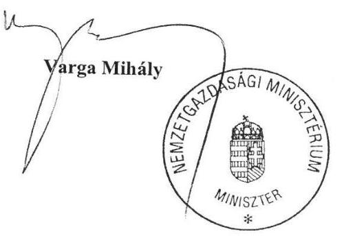

---

ELNÖK

Ikt.szám: V-0918-268/2016.

# Varga Mihály úr 

miniszter
Nemzetgazdasági Minisztérium

## Budapest

## Tisztelt Miniszter Úr!

Köszönettel megkaptam „Az államháztartás központi alrendszerének adósságát kezelő rendszer ellenőrzése " című jelentéstervezet megállapításaira tett észrevételét.

Az Állami Számvevőszék észrevétellel kapcsolatos álláspontját a mellékletként csatolt, a felügyeleti vezető által készített indokolás tartalmazza.

Budapest, 2016. július hónap 12. nap
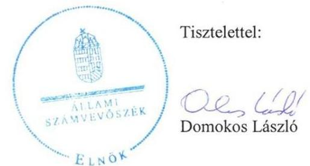

Melléklet: Észrevételre adott válasz

---

# „Az államháztartás központi alrendszerének adósságát kezelő rendszer ellenőrzése" 

című jelentéstervezetre tett észrevételre adott válasz

1. sz. melléklet
a V-0918-268/2016. ikt. számú levélhez

|  | NGM észrevétel | Észrevétel elfogadása | Észrevételre adott válasz | A jelentés módosított szövegrésze |
| :--: | :--: | :--: | :--: | :--: |
| 1. | Az ÁSZ a Tervezetben több ízben hiányolja a középtávú tervezés szabályozottságát. Ezzel kapcsolatban feltétlenül szeretném felhívni Elnök Úr figyelmét arra, hogy önmagában a finanszírozási terv számonkérhetőségének szabályzatban történő belső rögzítésének hiánya nem jelenti azt, hogy ne készült volna középtávú finanszírozási terv. Ellenkezőleg: az ÁKK által összeállított középtávú finanszírozási számításokat a Nemzetgazdasági Minisztérium évek óta használja az évenként benyújtásra kerülő Konvergencia Programban szereplő adósságpálya-számításainál. Ezen alkalmakkor munkatársaimon keresztül arról is meggyőződtem, hogy a középtávú finanszírozási terv mindenkor az érvényben lévő stratégia mentén került megalkotásra. | Részben | Az ÁKK Zrt. SZMSZ 4.1.2. alpontja értelmében „Az ÁKK Zrt finanszírozási tervet készít, amelyet az Igazgatóság javaslatára az Alapító hagy jóvá." Az ellenőrzött időszakban nem készült olyan középtávú finanszírozási terv, amelyet az Igazgatóság javaslatára az Alapító jóváhagyott. Megítélésünk szerint a szabályozás hiányosságaira is visszavezethető, hogy az ÁKK által összeállított középtávú finanszírozási számítások - az ÁKK Zrt-ra vonatkozó szabályok szerint - nem minősültek a Stabilitási törvény által is előírt középtávú finanszírozási tervnek.   Tekintettel arra, hogy az ÁKK Zrt. középtávú finanszírozási számításokat végzett, a jelentés szövegét pontosítjuk. | Törlésre kerül a 6. oldal 1. bekezdésének a következő mondata: „A középtávú tervezés hiánya rontotta az állam-adósság-kezelési stratégia megalapozottságát, figyelemmel arra, hogy az adósságállomány meghatározó része éven túli lejáratú kötelezettség."   A 16. oldal 1. bekezdésének első két mondata helyébe az alábbi szöveg lép: „Az államadósság-kezelési stratégia megalapozottságát rontotta, hogy a Stabilitási tv. 13. § (1) b) pontjában foglaltak ellenére - Igazgatóság által véleményezett, Alapító által jóváhagyott - középtávú finanszírozási tervet az ÁKK Zrt nem készített annak ellenére, hogy az adósságállomány meghatározó része éven túli lejáratú kötelezettség." |
| 2. | Magam is fontosnak tartom az ÁKK Zrt. mint társaság működésének ellenőrzését. Meg kell ugyanakkor jegyezzem, hogy az adósságkezelés technikai, szakmai feladatainak nyomon követése, számonkérése speciális szakmai ismereteket igényel, így - véletlenül sem kisebbítve az említett ellenőrzési szervek (ti. felügyelő bizottság, NGM ellenőrzési területe) szakmai felkészültségét az ellenőrzések széles spektruma tekintetében - azok szigorúan vett ellenőri megítélése csak külső erőforrás igénybevételével lenne megvalósítható. Emellett viszont úgy gondolom, hogy az Igazgatóság az adósságkezelés eredményességére vonatkozó megfelelő tulajdonosi ellenőrzést kellően biztosítja. Az Igazgatóság tagjait egyesével, mint szakembereket igen felkészültnek ítélem meg, a szakmai kontroll pedig azáltal kellően hathatós, hogy az Igazgatóság a vezetéssel folyamatosan együttműködik, szakmai vitákat folytat le az elvárt eredményesség elérése érdekében. |  | Az ÁSZ ellenőrzés azt állapította meg, hogy az "NGM ellenőrzésre jogosult szerve nem ellenőrizte az ÁKK Zrt. adósságkezelési és finanszírozási tevékenységét, s az ÁKK Zrt. FB -a sem végzett ellenőrzést. A megállapítás tehát nem az adósságkezelés eredményességének, hanem magának az adósságkezelési tevékenységnek az ellenőrzését hiányolja.   Az Igazgatóság ügyrendjében ellenőrzési feladat nem szerepel. |  |

---

| 2. | A fent írtak alapján és a Magyarország gazdasági stabilitásáról szóló 2011. évi CXCIV. törvény (a továbbiakban: Stabilitási tv.) 11. § (6) bekezdésével összhangban - amely kimondja, hogy az ,,ÁKK Zrt. felügyelő bizottságának hatásköre nem terjed ki az államháztartás központi alrendszere adósságának kezelési stratégiája, az ezzel kapcsolatos teljesítménymutatók és a finanszírozási tervek véleményezésére" továbbra sem gondolom, hogy az adósságkezelés eredményességére nézve bármilyen kockázatot hordozna az, ha a törvény előírásainak megfelelően az ÁKK Zrt. adósságkezelési tevékenységével kapcsolatban technikai részletekbe menő ellenőrzést a későbbiekben sem folytat az ÁKK Zrt. felügyelő bizottsága, főként azért, mert erre a Stabilitási törvény alapján hatásköre sincs. | Nem | Az észrevételben hivatkozott törvényi szabályozás nem zárja ki, hogy magát az adósságkezelési tevékenységet, például annak a kontroll rendszerét, az adósságkezelési műveletek szabályosságát az ÁKK Zrt. Felügyelő Bizottsága ellenőrizze. |
| :--: | :--: | :--: | :--: |
| 3. | Szorosan kapcsolódik a korábbiakban elmondottakhoz az Igazgatóság szerepének és összetételének megítélése is. Az igazgatósági tagok megválasztásával kapcsolatban a Tervezet 27. oldal 4. bekezdésében maga az ÁSZ is helyesen állapítja meg, hogy „a kialakított irányítási struktúra, az Alapítótól kontroll érvényesítése az Igazgatóság tagjain keresztül összességében az államadósság-kezelési stratégia eredményes megvalósítását szolgálta". Ezzel mélységesen egyetértek. A kiválasztásnál a legfontosabb szempont, hogy a kellő rálátással és megfelelő szakmai kompetenciával, tapasztalatokkal és kvalitásokkal rendelkező személyek kerüljenek az Igazgatóság tagjai közé. Tekintettel arra, hogy az adósságkezelés, az adósságstratégia megfelelő, szakszerű alakítása olyan kérdéseket vet fel, amelyekkel kapcsolatos információk elsődlegesen és legteljesebb körben a Nemzetgazdasági Minisztérium Államháztartásért, illetve a Pénzügypolitikáért felelős két államtitkárságán állnak rendelkezésre, így a szakmai racionalitás és a nemzetgazdasági érdek ezen szervezeti egységek vezető munkatársainak delegálását indokolja az ÁKK Igazgatóságába. Ennek és a Tervezet 27. oldal 4. bekezdéséből származó fent idézett megállapítás tükrében nem érthető a Tervezet 26. oldalán található következő értékelés: ,,a kettős feladatellátás további kockázatokat hordozott az adósságkezeléssel kapcsolatos tevékenység eredményessége tekintetében". Úgy vélem, hogy a két megállapítás között komoly logikai ellentmondás áll fenn. Így megfontolásra javasolom a másodikként idézett megállapítás újragondolását. | Nem | A két megállapítás egyszerre igaz. Az Igazgatósági és az alapítói jogkörök megfelelő meghatározása és az Igazgatóság személyi összetétele jól szolgálta az alapítói kontroll érvényesítését. Ugyanakkor az alapítói és az igazgatósági jogkörök jogi elhatárolását gyengítette, hogy az államháztartásért felelős miniszter alapítói jogkörét is átruházhatta az ÁKK Zrt. Igazgatóság elnöke funkcióját is betöltő államtitkárnak. Így ugyanaz a személy gyakorolhatta az alapítói és az Igazgatóság elnökének a funkcióját is. |

---

Az ellenőrzési szervek tevékenységéhez visszakanyarodva észrevételt teszek a Tervezet 1.4 számú megállapítás 12. bekezdése (24. oldal), valamint a nemzetgazdasági miniszternek címzett 3. számú javaslattal kapcsolatban is. A jelentéstervezet az államháztartásért felelős miniszter által működtetett monitoring rendszert kizárólag az ÁKK Zrt. vonatkozásában vizsgálja, ugyanakkor a költségvetési szervek belső kontrollrendszeréről és belső ellenőrzéséről szóló 370/2011. (XII. 31.) Korm. rendelet (a továbbiakban: Bkr.) 3. §-a alapján a költségvetési szerv vezetőjének a szervezet minden szintjén érvényesülő belső kontrollrendszer kialakítása, működtetése és fejlesztése a feladata, melynek része a monitoring rendszer is. A Bkr. 10. §-a alapján a belső ellenőrzést az operatív tevékenységek keretében megvalósuló folyamatos és eseti nyomon követéstől függetlenül kell működtetni, ez utóbbi feladata lehet a feladatellátásból eredő esetleges hiányosságok, hibák feltárása. Az NGM fejezeti szintű éves ellenőrzési tervében szereplő vizsgálatok tárgya a belső ellenőrzési fókusz figyelembevételével a kockázatelemzés, valamint jogszabály alapján kötelezően elvégzendő ellenőrzések alapján kerül meghatározásra figyelembe véve a Bkr. 21. § (1) bekezdése rendelkezését (..A belső ellenőrzés tevékenysége kiterjed az adott szervezet minden tevékenységére, különösen a költségvetési bevételek és kiadások tervezésének, felhasználásának és elszámolásának, valamint az eszközökkel és forrásokkal való gazdálkodásnak a vizsgálatára. "). Az NGM belső ellenőrzésre jogosult szervezeti egysége részére jogszabály nem írja elő az ÁKK Zrt. adósságkezelési tevékenységének a szakmai szempontú vizsgálatát. A tulajdonosi joggyakorlás keretébe tartozó gazdasági társaságok tekintetében a belső ellenőrzési vizsgálat célja elsősorban a belső kontrollrendszer vizsgálata lehet, a szakmai tevékenység vizsgálata - amint fentebb említettem - külső erőforrás igénybevétele nélkül nem valósítható meg.

A leírtakkal egyetértünk. A jelentéstervezet 1.3. számú megállapítása, és
 az azt megalapozó szöveg foglalkozik az ÁKK Zrt. által működtetett monitoring rendszerrel.

Jogszabály valóban nem írja elő az NGM belső ellenőrzésre jogosult szervezeti egysége számára az ÁKK Zrt. adósságkezelési tevékenységének a szakmai szempontú vizsgálatát. A jelentéstervezet nem is ezt kifogásolja, hanem az adósságkezelés eredményessége szempontjából kockázatként veti fel, hogy az „ellenőrzési tevékenység elmaradása következtében hiányzott az a kontroll, ami a feladatellátásból eredő esetleges hiányosságokat, hibákat feltárta volna." Az észrevételben leírtakkal összhangban elsősorban az ÁKK Zrt. belső kontroll rendszerét lett volna célszerű a NGM belső ellenőrzésre jogosult szervének vizsgálnia. Ez alapján pontosítjuk a jelentést.

Nyugtázzuk, hogy a jelentéstervezetben hiányolt ellenőrzés 2015-ben megvalósult. Az ellenőrzés idézett javaslata nagymértékben összhangban van az ÁSZ jelentéstervezetében foglalt megállapításokkal. Ezt azonban a jelentés véglegesítésekor nem tudjuk figyelembe venni, mivel az esemény az ellenőrzési időszakot követően történt. Természetesen az intézkedési terv megfogalmazásakor az ellenőrzött szerv vezetője figyelembe veheti azt, hogy az ÁSZ javaslatának végrehajtását szolgáló intézkedésre az ellenőrzési időszakot követően már sor került.

A jelentés 5. oldalán rögzített „Főbb megállapítások, következtetések, javaslatok” rész 4. mondatában foglaltak, és a kapcsolódó megállapítások is kiegészülnek a „belső kontrollrendszere” résszel:

1. Összegző megállapítás
1.4. számú megállapítás

- a jelentés 24. oldal 3. bekezdés 1. mondata.

---

|  4. | Tájékoztatom egyúttal, hogy - függetlenül az ÁSZ ellenőrzésétől - az NGM belső ellenőrzési szervezeti egysége a 2015. évben „a nemzetgazdasági miniszter tulajdonosi joggyakorlása keretében működő gazdasági társaságok belső kontrollkörnyezetének vizsgálata” keretében ellenőrizte, hogy az érintett gazdasági társaságok a Minisztérium belső kontrollkörnyezetébe ágyazottan és szabályszerűen működnek-e. A Jelentés intézkedési terv készítése mellett javasolta az ÁKK Zrt. vonatkozásában a pénzügyekért felelős államtitkár részére, hogy „gondoskodjon az Államadósság Kezelő Központ Zrt. feletti tulajdonosi joggyakorlói feladatok ellátása kapcsán egy olyan belső eljárásrend kialakításáról, amelyben meghatározzák a miniszteri hatáskör átruházásának pontos terjedelmét, az átruházott hatáskörben eljáró állami vezető, továbbá a közreműködő szervezeti egység által elvégzendő egyes részfeladatokat, valamint a feladatok végrehajtásáért felelős személyek körét is. Az eljárásrend tartalmának kialakítása során vegye figyelembe a 1660/2015. (IX. 15.) Korm. határozat előírásait, amelyek szerint az érintett gazdasági társaság vezetőinek tevékenységét folyamatosan értékelni kell a szabályosság, eredményesség, gazdaságosság szempontjából; az állami cégek vezetőinek szigorú etikai és integritás elveknek kell megfelelniük.” Az ezzel kapcsolatos, 2016 első negyedévében előírt intézkedések végrehajtása folyamatban van. |  |  |  |
| --- | --- | --- | --- | --- |
| 5. | Az adósságkezelés által követendő benchmarkokkal, valamint azok meghatározásának módjával, a tevékenység költséghatékonyságával kapcsolatos meglátásaimat is fontosnak tartom kifejteni. Egyrészt egymásnak ellentmondó információk olvashatóak a tervezetben arról, hogy a hat benchmarkból hány változott a vizsgált időszakban. Több ízben helyesen megállapításra került, hogy kettő, a forint-deviza összetételre és a KESZ szintjére vonatkozó célérték módosult, ugyanakkor a 15. oldalon a következő megfogalmazás helytelenül szerepel: „a teljesítménymutatók értékeit - az államadósság forint-deviza összetételének kivételével - az ellenőrzött időszakban változatlan értéken határozták meg”. Ennek helyesbítését, a dokumentum többi részével összhangba hozását megfontolandónak tartom. | Igen | Az észrevételt elfogadjuk, a 15. oldal hivatkozott szövegét kiegészítjük. | A 15. oldal 4. bekezdésének utolsó mondata a következő lesz: „Ugyanakkor a teljesítménymutatók értékeit - az államadósság forint-devizaösszetételének és a KESZ minimális állományának kivételével - az ellenőrzött időszakban változatlan értéken határozták meg.” |

---

| 6. | Ugyanezen oldal tartalmazza azt a megállapítást, miszerint „az alkalmazott átmeneti módszertant sem az Igazgatóság, sem az Alapító nem hagyta jóvá”. Szükségesnek tartom ennek helyesbítését, mivel az adott évre felterjesztett teljesítménymutató célértékekről szóló előterjesztések Igazgatóság általi elfogadásával és alapítói jóváhagyásával teljesült magának az átmeneti módszertannak a jóváhagyása is, tekintettel arra, hogy az előterjesztések tartalmazták a mutatók meghatározásának módszerét is. | Igen | Az észrevételt elfogadjuk, a mondat törlésre kerül. | A 15. oldal utolsó előtti bekezdéséből törlésre kerül az alábbi mondat: „Ugyanakkor az alkalmazott átmeneti módszertant sem az Igazgatóság sem az Alapító nem hagyta jóvá.” |
| :--: | :--: | :--: | :--: | :--: |
| 7. | Az adósságkezelési tevékenységhez kapcsolódó optimális költségtartománnyal kapcsolatos megállapítások (kiemelten a 16. oldal és a 41-43. oldalakon) árnyalása érdekében fontosnak tartok néhány kiegészítő gondolatot megosztani. Az adósságkezelés célja valóban a finanszírozási igény hosszú távon minimális költséggel és elfogadható kockázatok vállalása mellett történő finanszírozása. Ebből két fontos üzenetre hívnám fel a figyelmet: egyfelől a költségek és a kockázatok közötti átváltásra, másfelől a költségek minimalizálásának időtávjára. Megállapítható ugyanis, hogy a kapcsolódó kockázatok miatt hosszú távon nem feltétlenül az az adósságelem jár minimális költséggel, ami adott pillanatban a legolcsóbbnak számít. Ráadásul egy költséghatékonyságot mérő modellnek olyan összefüggéseket is megfelelően kezelnie kell, mint például azt, hogy az egyébként a piacinál magasabb kamatok miatt drágábbnak számító lakossági állampapír esetében nemzetgazdaságilag előnyös, hogy a kamatok ilyenkor az országon belül maradnak, továbbá hogy az adósságfinanszírozás belföldi lábának erősödése által a devizakockázati és külső kitettség jelentős mértékben csökken. | Igen | Az észrevétellel egyetértünk. Éppen ezeknek a bonyolult összefüggéseknek a figyelembevétele érdekében lenne szükség az optimális költségtartomány, valamint a költségekkel szemben elvárt követelmények kidolgozására, az adósságkezelési tevékenység költséghatékonyságát mérő értékelési rendszer kialakítására.   A jelentéstervezet módosítását tehát nem tartjuk szükségesnek. | Nem változik |

---

|  | Végezetül a Tervezet nemzetgazdasági miniszternek címzett második javaslatával kapcsolatban előzetesen jelzem, hogy a konkrét feladatok listázása, naprakész lekövetése a szabályzatokban nagy valószínűséggel nem lehet teljes körű és nem is életszerű. Az ÁKK, mint elkülönült jogi entitás - alapos és rendszeres tulajdonosi joggyakorlás mellett -, kvázi piaci szereplőként a piacok dinamikus és hirtelen változásaira, amellyel az adósságkezelés nap mint nap találkozik, sokkal inkább képes rugalmas és megfelelő válaszokat adni. A gyors piaci változások jelentette kihívásokat a bürokratikus, hierarchizált állami környezetben gyakorlatilag lekövetni is nehéz, a kihívásokra való érdemi reagálás, vagyis a sikeres feladatteljesítés (így az adósságkezelés eredményessége) megkövetel egy bizonyos fokú szervezeti rugalmasságot, természetesen a megfelelő tulajdonos kontroll mellett. | Igen | Az észrevételben foglaltakkal egyetértünk. A jelentéstervezetben írottak alapján olyan szabályozásra van szükség, amely egyszerre biztosítja a megfelelő szervezeti rugalmasságot és a tulajdonosi kontrollt. A javaslat szövege módosítást nem igényel.   Megjegyezzük, hogy az ÁSZ javaslata tartalmában nagyban megegyezik az NGM belső ellenőrzési szervezeti egysége által tett, a levelében hivatkozott javaslattal. | Nem változik |
| :--: | :--: | :--: | :--: | :--: |

Tájékoztatom Miniszter urat, hogy az Állami Számvevőszékről szóló 2011. évi LXVI. törvény 29. § (3) bekezdése alapján az Állami Számvevőszék a figyelembe nem vett észrevételeket köteles a jelentésben feltüntetni, és megindokolni, hogy azokat miért nem fogadta el.

Budapest, 2016.

---

.

---

# RÖVIDÍTÉSEK JEGYZÉKE 

${ }^{1}$ Stabilitási tv.
${ }^{2}$ ÁSZ
${ }^{3}$ ÁKK Zrt.
${ }^{4}$ Alapító
${ }^{5}$ Igazgatóság
${ }^{6}$ Alapító okirat
${ }^{7}$ NGM
${ }^{8} \mathrm{FB}$
${ }^{9}$ Vezérigazgató
${ }^{10}$ SZMSZ
${ }^{11}$ Bkr.
${ }^{12}$ Igazgatósági Ügyrend
${ }^{13}$ Állandó Bizottságok Szabályzata
${ }^{14}$ Tervezési Szabályzat
${ }^{15}$ Kockázatkezelési Szabályzat
${ }^{16}$ 1294. számú ÁSZ jelentés
${ }^{17}$ KESZ
${ }^{18}$ DKJ
${ }^{19}$ Finanszírozási Bizottság
${ }^{20}$ Kamatprognózis Bizottság
${ }^{21}$ TEK
${ }^{22}$ Makrogazdasági Főosztály
${ }^{23}$ Külső adatszolgáltatási szabályzat
${ }^{24}$ Igazgatóság Ügyrendje
${ }^{25}$ FB Ügyrendje

Magyarország gazdasági stabilitásáról szóló 2011. évi CXCIV. törvény (hatályos: 2012. január 1-jétől)

Állami Számvevőszék
Államadósság Kezelő Központ Zártkörűen Működő Részvénytársaság
Az államháztartásért felelős miniszter (az ellenőrzött időszakban a nemzetgazdasági miniszter)
Államadósság Kezelő Központ Zrt. Igazgatósága
Az Államadósság Kezelő Központ Zrt. Alapító okirata (módosítva a 7/2012 (III.26.), 15/2012. (III.26.), 8/2014. (IV.4.) és 17/2014. (X.15.) számú Alapítói határozatokkal)
Nemzetgazdasági Minisztérium
Az Államadósság Kezelő Központ Zrt. Felügyelő Bizottsága
Államadósság Kezelő Központ Zrt. vezérigazgatója
Az ÁKK Zrt. 8/2011. számú Vezérigazgatói utasítással kiadott, az 1/2012., 11/2012., 14/2012., 14/2014., 18/2014. számú Vezérigazgatói utasítással módosított Szervezeti és Működési Szabályzata
370/2011. (XII.31) Korm. rendelet a költségvetési szervek belső kontrollrendszeréről és belső ellenőrzéséről
Az ÁKK Zrt. 2007. 12.18-án elfogadott egységes szerkezetű és 2012. november 20-án elfogadott és hatályba léptetett Igazgatósági ügyrendje
Az ÁKK Zrt 11/2011. számú Vezérigazgatói Utasítása az állandó bizottságok részletes működési és eljárási szabályairól (módosítva: a 6/2012. számú és a 6/2014. számú Vezérigazgatói Utasításokkal)
Az ÁKK Zrt. 15/2004. számú Vezérigazgatói utasítással kiadott és a 18/2013. számú Vezérigazgatói utasítással módosított és egységes szerkezetben kiadott Tervezési Szabályzata
Az ÁKK Zrt. 5/2008. számú Vezérigazgatói Utasítása a Kockázatkezelési Szabályzatról (módosítva: 8/2009. számú, 3/2010. számú, 5/2011. számú, 14/2011. számú, 22/2011. számú, 8/2013. számú, 7/2014. számú és 11/2014. számú Vezérigazgatói Utasításokkal)
Állami Számvevőszék jelentése az államháztartás központi alrendszerének adóssága és éven túli kötelezettségvállalásának ellenőrzéséről
Kincstári Egységes Számla
Diszkont Kincstárjegy
Államadósság Kezelő Központ Zrt. Finanszírozási Bizottsága
Államadósság Kezelő Központ Zrt. Kamatprognózis Bizottsága
Tervezési, elemzési és kockázatkezelési főosztály
Nemzetgazdasági Minisztérium Makrogazdasági Főosztálya
Az ÁKK Zrt. 17/2007. számú Vezérigazgatói Utasítása a külső adatszolgáltatásról szóló eljárási rendről (módosítva a 17/2013 számú Vezérigazgatói utasítással 2013.10.01-től)

Az Államadósság Kezelő Központ Zrt. Igazgatóságának 2007. december 18-án elfogadott, 2012. november 20-án módosított ügyrendje
Az Államadósság Kezelő Központ Zrt. Felügyelő Bizottságának 2011. augusztus 30-án elfogadott, 2012. december 5-én módosított ügyrendje

---

${ }^{26}$ NGM SZMSZ
${ }^{27}$ Ellenőrzési Szabályzat
${ }^{28}$ LDKJ
${ }^{29}$ NGM KPF
${ }^{30} \mathrm{TAO}$
${ }^{31}$ NGM NKF
${ }^{32}$ MANYUP

A 4/2010. (X.5.) NGM utasítás a Nemzetgazdasági Minisztérium Szervezeti és Működési Szabályzatáról (módosítva: 16/2012. (VI.29), 34/2012 (XI.13) és 48/2012 (XII.21.) NGM utasítással), a 11/2013. (VI.3.) NGM utasítás a Nemzetgazdasági Minisztérium Szervezeti és Működési Szabályzatáról (módosítva: 3/2014. (I.21.), 8/2014 (III.7.) és 14/2014. (IV.14.) NGM utasítással) és a 22/2014. (VIII.29.) NGM utasítás a Nemzetgazdasági Minisztérium Szervezeti és Működési Szabályzatáról (módosítva: 26/2014. (XII.12.) NGM utasítással)
A 16/2008. számú Vezérigazgatói Utasítás az ÁKK Zrt. Ellenőrzési szabályzatáról (módosítva a 3/2013. számú Vezérigazgatói utasítással)
Likviditási Diszkont Kincstárjegy
A Pénzügyminisztérium Költségvetési és Pénzügypolitikai Főosztálya, jelenleg a Nemzetgazdasági Minisztérium Költségvetési Összefoglaló Főosztálya
Államadósság Kezelő Központ Zrt. Tervezési és adatszolgáltatási osztálya
A Pénzügyminisztérium Nemzetközi Kapcsolatok Főosztálya
Magánnyugdíjpénztár

---

ÁLLAMI SZÁMVEVŐSZÉK
1052 Budapest, Apáczai Csere János utca 10.
Levélcím: 1364 Budapest 4. Pf. 54
Telefon: +36 1 4849100 Telefax: +36 1 4849200
www.asz.hu
