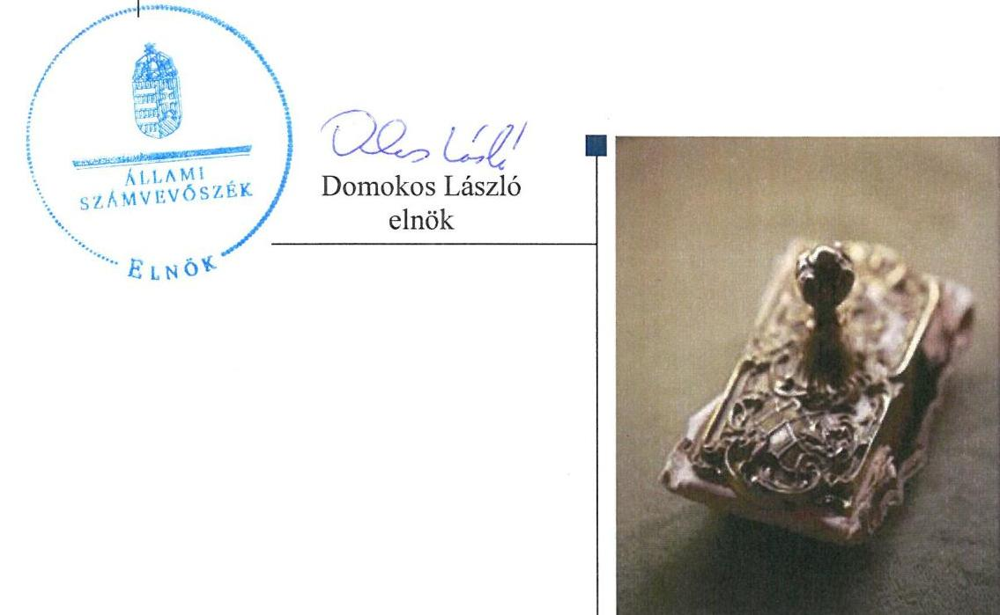
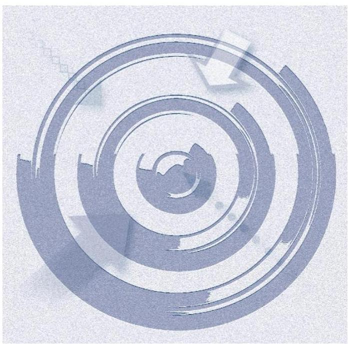
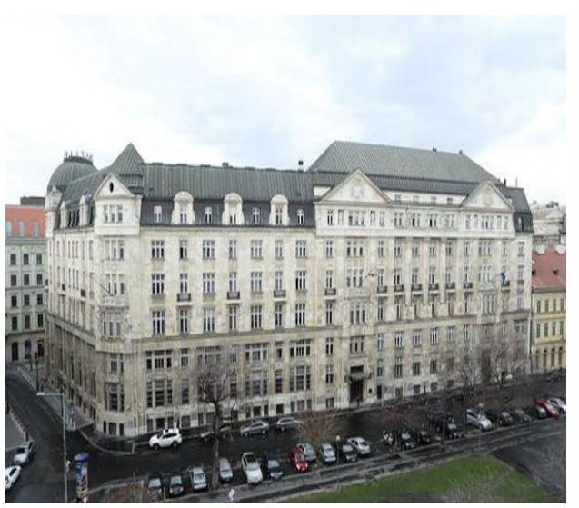
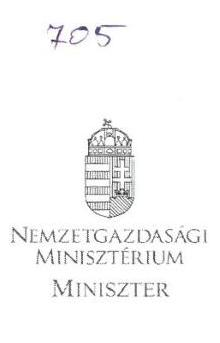
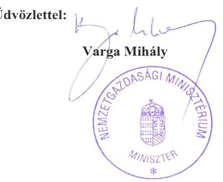

# Jelenetés 

## Utóellenőrzések

Az államháztartás központi alrendszerének adóssága és éven túli kötelezettségvállalásának ellenőrzéséről készült jelentéshez kapcsolódó utóellenőrzés
2016.

---

# MAGYAR ÁLLAMI SZÁMVEVŐSZÉK 

## Jelentés

## Utóellenőrzések

Az államháztartás központi alrendszerének adóssága és éven túli kötelezettségvállalásának ellenőrzéséről készült jelentéshez kapcsolódó utóellenőrzés
2016. 07. hó 14. nap

---

# AZ ELLENŐRZÉST FELÜGYELTE: 

DR. PULAY GYULA ZOLTÁN felügyeleti vezető

## AZ ELLENŐRZÉST VEZETTE ÉS A VÉGREHAJTÁSÁÉRT FELELŐS:

IMRE ZSUZSANNA ellenőrzésvezető

## A PROGRAM ÖSSZEÁLLÍTÁSÁÉRT FELELŐS:

JANIK JÓZSEF osztályvezető

## A TÉMÁHOZ KAPCSOLÓDÓ KORÁBBI SZÁMVEVŐSZÉKI JELENTÉSEK:

- címe: Jelentés az államháztartás központi alrendszerének adóssága és éven túli kötelezettségvállalásának ellenőrzéséről
- sorszáma: 1294.

IKTATÓSZÁM: V-1012-076/2016.
TÉMASZÁM: 2046
ELLENŐRZÉS-AZONOSÍTÓ SZÁM: V-0717

---

# TARTALOMJEGYZÉK 

■ ÖSSZEGZÉS ..... 5
■ AZ ELLENŐRZÉS CÉLJA ..... 6
■ AZ ELLENŐRZÉS TERÜLETE ..... 7
■ AZ ELLENŐRZÉS HÁTTERE, INDOKOLTSÁGA ..... 8
■ FÓKUSZKÉRDÉSEK ..... 9
■ ELLENŐRZÉS HATÓKÖRE ÉS MÓDSZEREI ..... 10
■ MEGÁLLAPÍTÁSOK ..... 12
■ MELLÉKLETEK ..... 15
I. Sz. melléklet: Az 1294. számú számvevőszéki jelentéshez kapcsolódó intézkedési terv végrehajtása ..... 15
■ FÜGGELÉK: ÉSZREVÉTELEK ..... 17
■ RÖVIDÍTÉSEK JEGYZÉKE ..... 19

---

.

---

# ÖSSZEGZÉS 

Az ÁSZ ${ }^{1}$,,Az államháztartás központi alrendszerének adóssága és éven túli kötelezettségvállalásának ellenőrzéséről" készült jelentéshez kapcsolódó utóellenőrzést a 2012. augusztus 23. és 2015. november 24. közötti időszakra vonatkozóan végezte el. Az utóellenőrzés megállapította, hogy az ellenőrzött szervezetnél a korábbi számvevőszéki jelentés ${ }^{2}$ javaslatai teljes körűen nem hasznosultak. A hiányosságok kiküszöbölése érdekében az intézkedési tervben meghatározott feladatok egy részének végrehajtása elmaradt. A feladatok végrehajtásáról a jogszabályban előírt nyilvántartást hiányosan vezették.

## Az ellenőrzés társadalmi indokoltsága

Az ÁSZ stratégiájában célul tűzte ki a számvevőszéki munka hasznosulásának javítását. Ezzel összhangban ellenőrzi, hogy az ellenőrzött szervezetek megvalósították-e a korábbi ellenőrzései által feltárt hibák, hiányosságok és szabálytalanságok megszüntetése céljából kialakított intézkedési terveikben foglaltakat. A rendszeres utóellenőrzések hozzájárulnak a szükséges intézkedések tényleges végrehajtásához, ezáltal a közpénzügyek rendezettségének javításához.

## Főbb megállapítások, következtetések, javaslatok

Az NGM³ az ÁSZ 2012. évi számvevőszéki jelentésének javaslatai alapján elkészített - a jogszabályban rögzített határidőn belül megküldött - intézkedési tervben meghatározott feladatokat nem hajtotta végre teljes körűen. A feladatok végrehajtásához kapcsolódó nyilvántartási kötelezettségüknek hiányosan tettek eleget.

---

# AZ ELLENŐRZÉS CÉLJA 

## Az államháztartás központi alrendszerének adóssága és éven túli kötelezettségvállalásának ellenőrzéséről készült jelentés utóellenőrzése

Az ellenőrzés célja annak értékelése, hogy a számvevőszéki jelentésben foglalt intézkedést igénylő megállapításokkal és javaslatokkal összhangban készített intézkedési tervben ${ }^{4}$ meghatározott feladatokat az ellenőrzött szervezet végrehajtotta-e.

---

# **AZ ELLENŐRZÉS TERÜLETE**

## **Nemzetgazdasági Minisztérium**

Az NGM önálló jogi személyiséggel rendelkező központi államigazgatási szerv, amely – gazdálkodását tekintve – önállóan működő és gazdálkodó, központi költségvetési szerv. A nemzetgazdasági miniszter a Kormány általános politikájának keretei között vezeti a minisztériumot.

A Stabilitási tv.5 az államháztartásért felelős minisztert hatalmazta fel, hogy gondoskodjon a központi költségvetés költségvetési hiányának finanszírozásáról, a központi költségvetés fizetőképességének fenntartásáról, az államháztartás központi alrendszere adósságainak és adósságterheinek nyilvántartásáról, az adósságok törlesztéséről, valamint az állam átmenetileg szabad pénzeszközeinek kezeléséről. A miniszter6 az említett körbe tartozó feladatait az ÁKK Zrt.7 útján látta el.

Az államháztartás központi alrendszerének adóssága és éven túli kötelezettségvállalásának ellenőrzéséről szóló számvevőszéki jelentés négy intézkedést igénylő megállapítást és javaslatot fogalmazott meg a miniszter részére. Az utóellenőrzés - a 2015. november 24-ig végrehajtott intézkedéseket figyelembe véve – a számvevőszéki jelentés intézkedést igénylő megállapításai és javaslatai hasznosítására a miniszter által elkészített és az ÁSZ részére megküldött intézkedési tervben foglalt feladatok végrehajtására irányult.

A miniszter a számvevőszéki jelentés javaslatai alapján elkészített majd kiegészített intézkedési tervet az ÁSZ törvény8 33. § (1) bekezdésében meghatározott határidőn belül küldte meg az ÁSZ részére.

---

# AZ ELLENŐRZÉS HÁTTERE, INDOKOLTSÁGA 

## Az államháztartás központi alrendszere adósságának jelentősége

Az ÁSZ törvény 33. § (1) bekezdése értelmében a számvevőszéki jelentések intézkedést igénylő megállapításaihoz és javaslataihoz kapcsolódóan az ellenőrzött szervezet vezetője intézkedési tervet köteles összeállítani, és az ÁSZ részére megküldeni. Az intézkedési tervben foglaltak megvalósítását az ÁSZ törvény 33. § (7) bekezdésében foglaltak alapján - az ÁSZ utóellenőrzés keretében ellenőrizheti. Az intézkedések megvalósulásának értékelése során az ÁSZ figyelembe veszi az ellenőrzött szervezetek működési feltételeiben, valamint a jogszabályi előírásokban bekövetkezett változásokat.

Az intézkedési tervekben foglalt feladatok hiányos, illetve késedelmes végrehajtása, valamint megvalósításának elmaradása azt mutatja, hogy az ellenőrzések során feltárt hibák, hiányosságok és szabálytalanságok megszüntetése nem kapott kellő hangsúlyt. Ez a szabályszerű működés és a felelős vezetői magatartás vonatkozásában kockázatokat hordoz. E kockázatok feltárásával az ÁSZ utóellenőrzési rendszere fokozza a fegyelmet, és igazolja, hogy a közpénzzel való szabályos gazdálkodás felelőssége elől nem lehet kitérni.

## AZ ELLENŐRZÉS VÁRHATÓ HASZNOSULÁSA

Az utóellenőrzés négy szinten hasznosulhat:
A társadalom szintjén az utóellenőrzés jelzi, hogy az ÁSZ ellenőrzés megállapításainak van következménye: a hiányosságok megszüntetésére az ellenőrzött szervezet által meghatározott intézkedések végrehajtását is számon kéri az ÁSZ.

Az ellenőrzött terület szintjén az utóellenőrzés tájékoztatást nyújt a terület döntéshozóinak a hiányosságok kiküszöbölésének jó gyakorlatairól, ezzel lehetőséget biztosítva arra, hogy az ÁSZ ellenőrzési megállapításai, javaslatai a terület nem ellenőrzött szervezeteinek a működése során is hasznosuljanak.

Az ellenőrzött szervezet szintjén az utóellenőrzés feltárja, hogy a szervezet az intézkedések végrehajtásával hasznosította-e a korábbi ellenőrzési jelentésben a hiányosságok megszüntetése, illetve a kockázatok kezelése érdekében megfogalmazott javaslatokat.

Az ÁSZ szintjén az utóellenőrzés visszacsatolást ad az ellenőrzési jelentések hasznosulásáról, az intézkedések elmaradása vagy részleges megvalósulása a további ellenőrzésekhez kockázati jelzésként szolgál.

---

# FÓKUSZKÉRDÉSEK 

1. Az ellenőrzött szervezet az intézkedési tervben foglaltakat - az előírt határidőben - végrehajtotta-e?

---

# ELLENŐRZÉS HATÓKÖRE ÉS MÓDSZEREI 

## Az ellenőrzés típusa

Szabályszerűségi ellenőrzés.

## Az ellenőrzött időszak

A számvevőszéki jelentés közzétételének napjától (2012. augusztus 23.) az utóellenőrzés megkezdésének napjáig (2015. november 24.) tartó időszak.

## Az ellenőrzés tárgya

Az ÁSZ 1294. számú jelentésében megfogalmazott javaslatokra az ellenőrzött által megküldött intézkedési tervben foglaltak végrehajtása.

## Az ellenőrzött szervezet

Nemzetgazdasági Minisztérium

## Az ellenőrzés jogalapja

Az Alaptörvény ${ }^{9}$ 43. cikk (1) bekezdése alapján az ÁSZ az Országgyűlés pénzügyi és gazdasági ellenőrző szerve. Az ÁSZ törvényben meghatározott feladatkörében ellenőrzi a központi költségvetés végrehajtását, az államháztartás gazdálkodását, az államháztartásból származó források felhasználását és a nemzeti vagyon kezelését.

Az ÁSZ törvény 1. § (3) bekezdése szerint az ÁSZ általános hatáskörrel végzi a közpénzekkel és az állami és önkormányzati vagyonnal való felelős gazdálkodás ellenőrzését.

Az ÁSZ törvény 33. § (7) bekezdése alapján a 33. § (1)-(2) bekezdései szerinti intézkedési tervben foglaltak megvalósítását az ÁSZ utóellenőrzés keretében ellenőrizheti.

Az Áht. ${ }^{10}$ 61. § (2) bekezdése szerint az államháztartás külső ellenőrzésével kapcsolatos feladatokat az ÁSZ látja el.

## Az ellenőrzés módszerei

Az ellenőrzést a nemzetközi standardokat irányadónak tekintve az ellenőrzési program ellenőrzési kérdései, az ellenőrzött időszakban hatályos jogszabályok, az ellenőrzés szakmai szabályok és módszertanok figyelembe

---

vételével végeztük. Az utóellenőrzés megállapításait elsősorban az ÁSZ rendelkezésére álló, valamint az ellenőrzött szervezettől elektronikusan bekért dokumentumok alapozták meg.

Az ellenőrzés során értékeltük, hogy az ÁSZ jelentésben foglalt javaslatokra az elkészített intézkedési tervben foglaltakat végrehajtották-e. A jóváhagyott intézkedési tervben előírt feladatok végrehajtásának ellenőrzését értékelési kritériumok alapján végeztük. Figyelembe vettük az intézkedési terv jóváhagyását követően hatályba lépett jogszabályi előírások változásából következő események, továbbá a feladat-ellátási és finanszírozási rendszer esetleges változásának hatásait. Az intézkedési tervben előírt feladatokat azok végrehajthatósága, illetve végrehajtása szempontjából az alábbiak szerint értékeltük:
—okafogyottá vált az előírt feladat, ha végrehajtására - meghatározott esemény bekövetkezése, továbbá külső körülmény, a működést érintő feltétel változása miatt - már nincs szükség, illetve lehetőség, és egyértelműen megállapítható, hogy az intézkedést szükségessé tevő körülmény a jövőben nem fordulhat elő;
— nem időszerű az a feladat, amelynek ellenőrzési időszakon belüli végrehajtására azért nem került (kerülhetett) sor, mert az intézkedés alapjául szolgáló esemény nem következett be, de annak jövőbeni előfordulása lehetséges, a végrehajtása nem volt esedékes, vagy a végrehajtás határideje még nem járt le;
—határidőben végrehajtott a feladat, ha a teljesítés dokumentáltan az intézkedési tervben előírt határidőben és tartalommal megtörtént;
—határidőn túl végrehajtott a feladat, ha annak teljesítése az intézkedési tervben meghatározott módon, de az előírt határidőn túl történt meg;
—részben végrehajtott az a feladat, amelynek végrehajtása teljes körűen az intézkedési tervben előírt módon nem történt meg;
—nem végrehajtott a feladat, ha a végrehajtás nem történt meg, vagy amennyiben a teljesítést nem dokumentálták.
Az ellenőrzés lefolytatásához az ellenőrzött szervezet tanúsítvány kitöltésével, valamint az ÁSZ által kért dokumentumok elektronikus megküldésével szolgáltatott adatokat, amelyek valódiságát és teljes körűségét az ellenőrzött szervezet képviselője által tett teljességi és hitelességi nyilatkozat igazolt. Az így rendelkezésre bocsátott adatok, információk kontrollja az ellenőrzés keretében történt.

---

# MEGÁLLAPÍTÁSOK 

## 1. Az ellenőrzött szervezet az intézkedési tervben foglaltakat - az előírt határidőben - végrehajtotta-e?

Összegző megállapítás

### 1.1. számú megállapítás

AZ NGM az intézkedési tervben foglalt feladatokat nem hajtotta végre teljes körűen. Az intézkedési tervben előírt beszámolási kötelezettségüknek nem tettek eleget a végrehajtásért felelősök. A feladatok végrehajtásáról hiányosan vezették a jogszabályban előírt nyilvántartást.

Az Intézkedési tervben foglalt feladatok közül egy feladatot nem, egy feladatot részben hajtottak végre, további két feladatot határidőben végrehajtottak.

A miniszter a jogszabályban előírt határidőben megküldte az ÁSZ részére a feltárt hiányosságok kijavítása, megszüntetése érdekében elkészített intézkedési tervet, amelyben négy feladatot határozott meg, megjelölve a feladatok elvégzésének felelőseit és határidejét. Az intézkedési tervben foglalt feladatokat, valamint az intézkedések bemutatását az I. sz. melléklet tartalmazza.

Az intézkedési tervben rögzített feladatok végrehajtásának értékelését az 1. ábra szemlélteti.

1. ábra

## Az intézkedési terv végrehajtásának megoszlása kategóriánként

Határidőben végrehajtott
Részben végrehajtott
Nem végrehajtott

---

# HATÁRIDŐBEN VÉGREHAJTOTT FELADATOK: 

$\qquad$ 1. A miniszter levélben utasította az ÁKK Zrt. vezérigazgatóját, hogy foganatosítson lépéseket a stratégia keretében használt teljesítménymutatók felülvizsgálata és szükség esetén módosítása érdekében.
$\qquad$ 2. Az ÁKK Zrt. SZMSZ-ben ${ }^{11}$ átvezetésre került az az Igazgatósági határozat, amely a vezérigazgató hatáskörébe helyezte a deviza forrásbevonással kapcsolatos operatív döntést.

## RÉSZBEN VÉGREHAJTOTT FELADATOK:

$\qquad$ 3. A miniszter levélben utasította az ÁKK Zrt. vezérigazgatóját egy költséghatékonyságot mérő értékelési rendszer kialakítására, egyben tájékoztatási kötelezettséget írt elő a megtett intézkedések tekintetében. A megtett intézkedésekről szóló tájékoztatás, a feladat végrehajtásának nyomon követése dokumentáltan nem történt meg.

## NEM VÉGREHAJTOTT FELADATOK:

$\qquad$ 4. Az NGM nem javasolta az Áht. 90. § (3) bekezdés c) pontjának kiegészítését az adósságváltozás összetevőinek bemutatására vonatkozó követelményekkel.
1.2. számú megállapítás

## Az NGM által megjelölt felelősök részéről nem történt meg a beszámolás az intézkedési terv végrehajtásáról.

BESZÁMOLÁSI KÖTELEZETTSÉGET írt elő az NGM az intézkedési tervben előírt feladatok teljesítéséről. Az egyes feladatoknál előírt beszámolási határidőket az I. sz. melléklet tartalmazza.

Az intézkedési tervben megjelölt felelősök beszámolási kötelezettségüknek - dokumentáltan - nem tettek eleget a határidőben végrehajtott feladatok esetében sem.
1.3. számú megállapítás

A miniszter gondoskodott az intézkedési tervben rögzített feladatok végrehajtásának nyilvántartásáról, de annak adattartalma hiányos volt.

A BKR. ${ }^{12}$ 14. § (1) BEKEZDÉSÉBEN ELŐÍRT NYILVÁNTARTÁST nem az előírt tartalommal vezette az NGM az intézkedési tervben előírt feladatok végrehajtásáról. A nyilvántartásba felvezetésre
 került a számvevőszéki jelentés száma, az abban foglalt javaslatok, az intézkedési terv dátuma és az abban meghatározott felelősök, ugyanakkor a Bkr. 47. § (2) bekezdésétől eltérően nem tartalmazta a nyilvántartás az NGM által készített intézkedési tervben meghatározott feladatokat, az intézkedési terv alapján végrehajtott intézkedések rövid leírását és a végre nem hajtott intézkedések okát.

---

.

---

# MELLÉKLETEK

■ I. SZ. MELLÉKLET: AZ 1294. SZÁMÚ SZÁMVEVŐSZÉKI JELENTÉSHEZ KAPCSOLÓDÓ INTÉZKEDÉSI TERV VÉGREHAJTÁSA

|  SZÁMvevőszéki jelentés javaslatai | Intézkedési tervben vállalt feladatok | Végrehajtás határideje | Felelősök | Intézkedés bemutatása | Beszámolás határideje/ teljesítése  |
| --- | --- | --- | --- | --- | --- |
|  1. Kezdeményezze a Stabilitási tv. szerinti államadósság összetevői részletes bemutatásának jogszabályban történő előírását annak érdekében, hogy az adósságnövekedés évenkénti alakulásának okai átláthatóak, követhetőek legyenek. | „Az Áht. 90. § (3) bekezdés c) pontját javasoljuk kiegészíteni az adósságváltozás okainak bemutatására vonatkozó követelménnyel, azaz a mindenkori zárszámadásban kell bemutatni majd a Stabilitási tv. szerinti adósság változásának összetevőit" | Jogszabály módosítás: 2012.12.31. alkalmazás: 2013.12.31. | Államháztartási Szabályozási Főosztály vezetője, Költségvetési Összefoglaló Főosztály vezetője | Az NGM sem az intézkedési tervében foglalt 2012. december 31-ei határidő leteltéig, sem azt követően nem kezdeményezte az Áht. 90. § (3) bekezdés c) pontjának kiegészítését, valamint a 2012/13, 2013/14 és 2014/15. évek zárszámadásáról szóló törvény és annak indoklása nem tartalmazza teljes körűen a Stabilitási tv. szerinti adósság változásának összetevőit. | 2014.01.31./ nem történt beszámolás  |
|  2. Vizsgálja meg, hogy a deviza forrásbevonással kapcsolatos döntéshozatali rendszer során összhangban vannak-e a felelősségi és döntési hatáskörök, szükség esetén intézkedjen az összhang biztosításáról. | „A deviza forrásbevonással kapcsolatos döntéshozatali rendszerben a felelősségi és döntési hatáskörök közti összhang jelenleg is biztosítva van, mivel az államháztartásért felelős miniszter hagyja jóvá a devizaforrás-bevonást is magában foglaló finanszírozási tervet. Az NGM az ÁKK bevonásával kezdeményezi az SZMSZ megfelelő módosítását az Igazgatóság felé..." | 2012.12.31. | Makrogazdasági Főosztály vezetője, Költségvetési Összefoglaló Főosztály vezetője | Az SZMSZ módosítása 2012. november 20-án megtörtént, amelyet az Igazgatóság az 51/2012. (11.20.) számú határozatával jóváhagyott. A módosítás eredményeként bekerült az SZMSZ-be, hogy "a vezérigazgató engedélyezi a belföldi és külföldi állampapír kibocsátásokat." | 2013.01.31./ nem történt beszámolás  |
|  3. Intézkedjen az adósságkezelési tevékenység költséghatékonyságát mérő értékelési rendszer kialakításáról az adósságkezelési költségek nyomon követése, illetve csökkentése érdekében. | „A Jelentésben felvetettek miatt az NGM az ÁKK közreműködésével megvizsgálja, hogy milyen más - kiegészítő-rendszerrel követhetőek a költségek és kockázatok...", „... Az NGM utasítja az ÁKK-t, hogy alakítsa ki a költséghatékonyságot mérő informatikai rendszert." | Módszertan: 2013.06.30. Rendszer kialakítása: 2013.12.31. | Makrogazdasági Főosztály vezetője, Költségvetési Összefoglaló Főosztály vezetője | A miniszter NGM/22525/2/2012. Iktatószámú levélben kérte ugyan az ÁKK Zrt. vezérigazgatóját az adósságkezelési tevékenység költséghatékonyságát mérő értékelési rendszer kidolgozására és a teljesítésről történő beszámolásra, azonban az ellenőrzött időszakban költséghatékonyságot mérő értékelési és beszámolási rendszer nem került kialakításra és elfogadásra, módszertan, és beszámolás sem készült róla. | 2014.01.31./ nem történt beszámolás  |

---

|  Számvevőszéki jelentés javaslatai | Intézkedési tervben vállalt feladatok | Végrehajtás határideje | Felelősök | Intézkedés bemutatása | Beszámolás határideje/ teljesítése  |
| --- | --- | --- | --- | --- | --- |
|  Intézkedjen az ÁKK Zrt. által kialakított költség- és kockázatkezelési modell felülvizsgálatáról, annak eredményei alapján a teljesítménymutatók módosításáról (újak kidolgozásáról) az adósságszerkezetből fakadó kockázatok mérséklése érdekében. Ennek során vegyék figyelembe a jelenlegi nemzetközi tapasztalatokat is. | „Az NGM utasítja az ÁKK-t, hogy a folyamatosan változó, radikálisan átalakuló környezetet figyelembe véve vizsgálja felül és szükség esetén módosítsa a stratégia keretében alkalmazott teljesítménymutatókat (benchmarkokat), figyelembe véve a nemzetközi gyakorlatot…” „…a finanszírozási kényszer hatására módosítani szükséges egyes teljesítménymutatókat, amelyek tudatos változtatása, javítása piaci és egyéb korlátokba ütközik.” | 2013.12.31. | Makrogazdasági Főosztály vezetője, Költségvetési Összefoglaló Főosztály vezetője | A miniszter az NGM/22525/2/2012. Iktatószámú levelében kérte az ÁKK Zrt. vezérigazgatóját, hogy foganatosítson lépéseket az ÁKK Zrt. stratégiái keretében használt teljesítménymutatók felülvizsgálata és szükség esetén módosítása érdekében 2013. december 31-ig. A 2013. évi teljesítménymutatók értékeire vonatkozó igazgatósági előterjesztés (2012. december 18.) rögzítette már, hogy a nemzetközi tőkepiaci válság során bekövetkezett változások miatt, a régi optimális portfólió modell alkalmazása megkérdőjeleződött, amelyből adódóan szükségessé vált a benchmarkok rendszerének a felülvizsgálata. Az ÁKK Zrt. a teljesítménymutatók felülvizsgálatát és a 2013. évi értékeinek a meghatározását átmeneti módszertan alapján végezte el, amelynek eredményeként elkészült elemzéseket a 2012. december 18-i Igazgatósági előterjesztés 1/A, 1/B, és 2. számú mellékletét képezték. Az Igazgatóság 2013. december 11-i ülésén az ÁKK Zrt. vezérigazgatója tájékoztatást adott a nemzetközi gyakorlatról. Az ÁKK Zrt. a 2013. évben megkezdte az új optimális portfólió modell fejlesztését is, azonban a fejlesztés az utóellenőrzés megkezdésének a napjáig még nem fejeződött be. | 2014.01.31./ nem történt beszámolás  |

*Forrás: Intézkedési terv, ÁSZ*

---

# FÜGGELÉK: ÉSZREVÉTELEK 

A jelentéstervezetet a Számvevőszék 15 napos észrevételezésre megküldte az ellenőrzött szervezet vezetőjének az ÁSZ tv. 29. § (1) bekezdése előírásának megfelelően.
A nemzetgazdasági miniszter levélben jelezte, hogy a jelentéstervezetre nem tesz észrevételt. A nemzetgazdasági miniszter levelét a függelék tartalmazza.

[^0]
[^0]:    * 29. § (1) Az Állami Számvevőszék az ellenőrzési megállapításait megküldi az ellenőrzött szervezet vezetőjének vagy az általa megbízott személynek, és annak, akinek személyes felelősségét állapította meg.
    (2) Az ellenőrzött szervezet vezetője és a felelősként megjelölt személy az ellenőrzés megállapításaira tizenöt napon belül írásban észrevételt tehet.
    (3) Az Állami Számvevőszék az észrevételre a beérkezésétől számított harminc napon belül írásban válaszol. A figyelembe nem vett észrevételeket köteles a jelentésben feltüntetni, és megindokolni, hogy azokat miért nem fogadta el.

---

# Domokos László úr részére 

elnök

Állami Számvevőszék
Budapest

Iktatószám: NGM/19985-2/2016
Úgyintéző: dr. Pulai Gábor
Telefonszám: +36 18963822
Tárgy: az Állami Számvevőszék
utóellenőrzéséhez kapcsolódó jelentés tervezete

## Tisztelt Elnök Úr!

Az „Utóellenőrzések - Az államháztartás központi alrendszerének adóssága és éven túli kötelezettségvállalásának ellenőrzéséről készült jelentéshez kapcsolódó utóellenőrzés" című számvevőszéki jelentéstervezetet köszönettel megkaptam, azzal kapcsolatban észrevételt nem teszek.

Jelzem ugyanakkor, hogy az államháztartásról szóló 2011. évi CXCV. törvény 90. § (3) bekezdés c) pontjának az intézkedési tervben vállalt módosítását a Magyarország 2017. évi központi költségvetésének megalapozásáról szóló T/10536. számú törvényjavaslat tartalmazza.

Budapest, 2016. június 13.

---

# RÖVIDÍTÉSEK JEGYZÉKE 

${ }^{1}$ ÁSZ
${ }^{2}$ számvevőszéki jelentés
${ }^{3}$ NGM
${ }^{4}$ intézkedési terv
${ }^{5}$ Stabilitási tv.
${ }^{6}$ miniszter
${ }^{7}$ ÁKK Zrt.
${ }^{8}$ ÁSZ törvény
${ }^{9}$ Alaptörvény
${ }^{10}$ Áht.
${ }^{11}$ ÁKK Zrt. SZMSZ
${ }^{12}$ Bkr.
${ }^{13}$ 2012. évi zárszámadásról szóló törvény
${ }^{14}$ 2013. évi zárszámadásról szóló törvény
${ }^{15}$ 2014. évi zárszámadásról szóló törvény

Állami Számvevőszék
az ÁSZ 2012. augusztus 23-án nyilvánosságra hozott, 1294. számú jelentése az államháztartás központi alrendszerének adóssága és éven túli kötelezettségvállalásának ellenőrzéséről
Nemzetgazdasági Minisztérium
az NGM/22525/3/2012. iktatószámú levelével megküldött, 2012. november 5-én kelt kiegészített intézkedési terv
2011. évi CXCIV. törvény Magyarország gazdasági stabilitásáról, hatályos 2011. december 31-től
az államháztartásért felelős miniszter
Államadósság Kezelő Központ egyszemélyes zártkörűen működő részvénytársaság 2011. évi LXVI. törvény az Állami Számvevőszékről, hatályos 2011. július 1-jétől Magyarország Alaptörvénye, hatályos 2012. január 1-jétől
2011. évi CXCV. törvény az államháztartásról, hatályos 2011. december 31-től

Államadósság Kezelő Központ Zrt. Szervezeti és Működési Szabályzata
370/2011. (XII. 31.) Korm. rendelet a költségvetési szervek belső kontrollrendszeréről és belső ellenőrzéséről, hatályos 2012. január 1-jétől
2013. évi CXCIII. törvény a Magyarország 2012. évi központi költségvetéséről szóló 2011. évi CLXXXVIII. törvény végrehajtásáról
2014. évi LXII. törvény a Magyarország 2013. évi központi költségvetéséről szóló 2012. évi CCIV. törvény végrehajtásáról
2015. évi CLXXII. törvény a Magyarország 2014. évi központi költségvetéséről szóló 2013. évi CCXXX. törvény végrehajtásáról

---

# ÁLLAMI SZÁMVEVŐSZÉK 

1052 Budapest, Apáczai Csere János utca 10.
Levélcím: 1364 Budapest 4. Pf. 54
Telefon: +36 14849100 Telefax: +36 14849200
www.asz.hu

