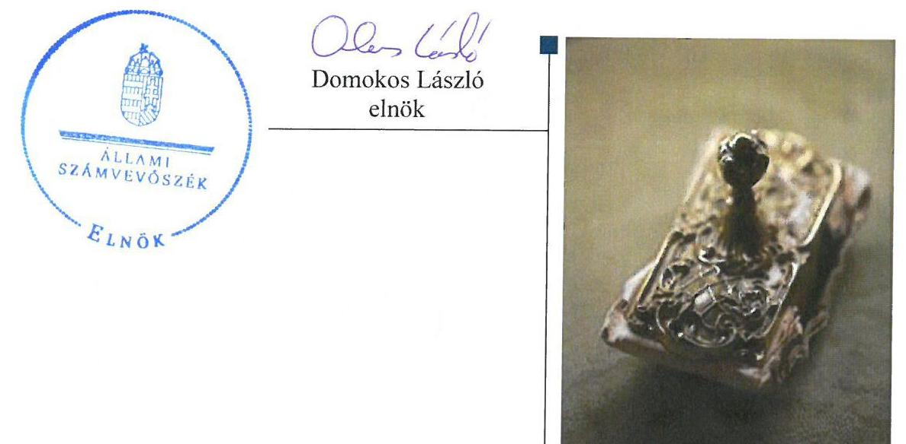
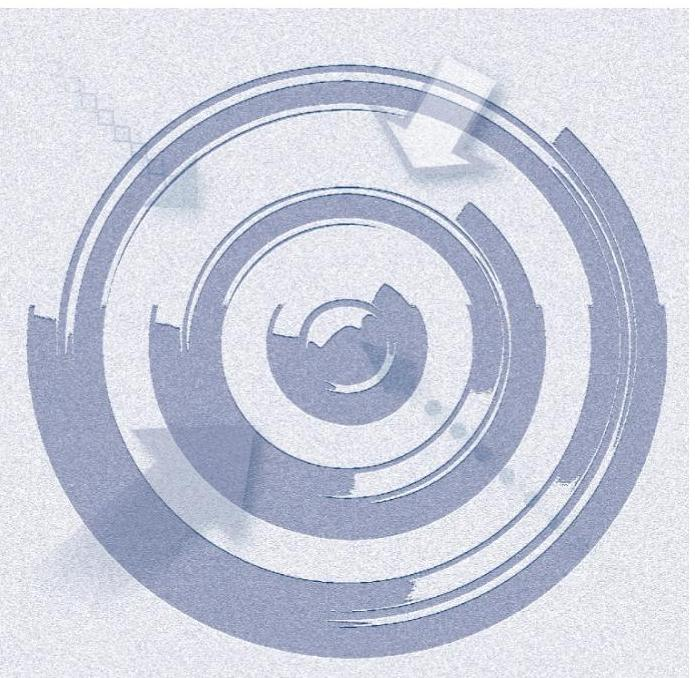
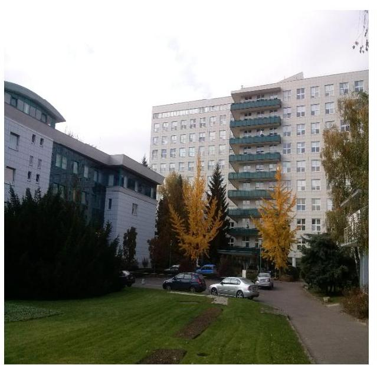
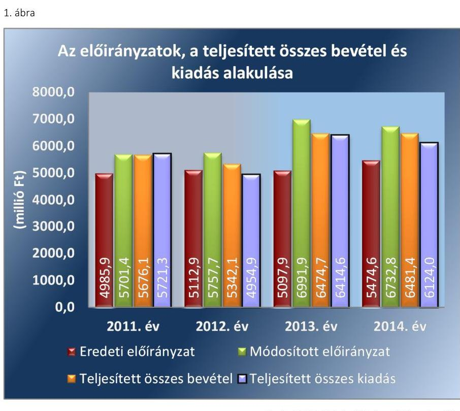
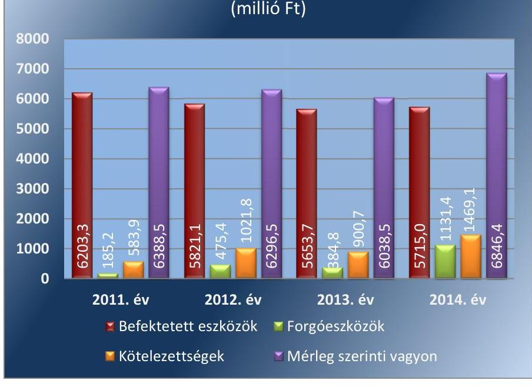
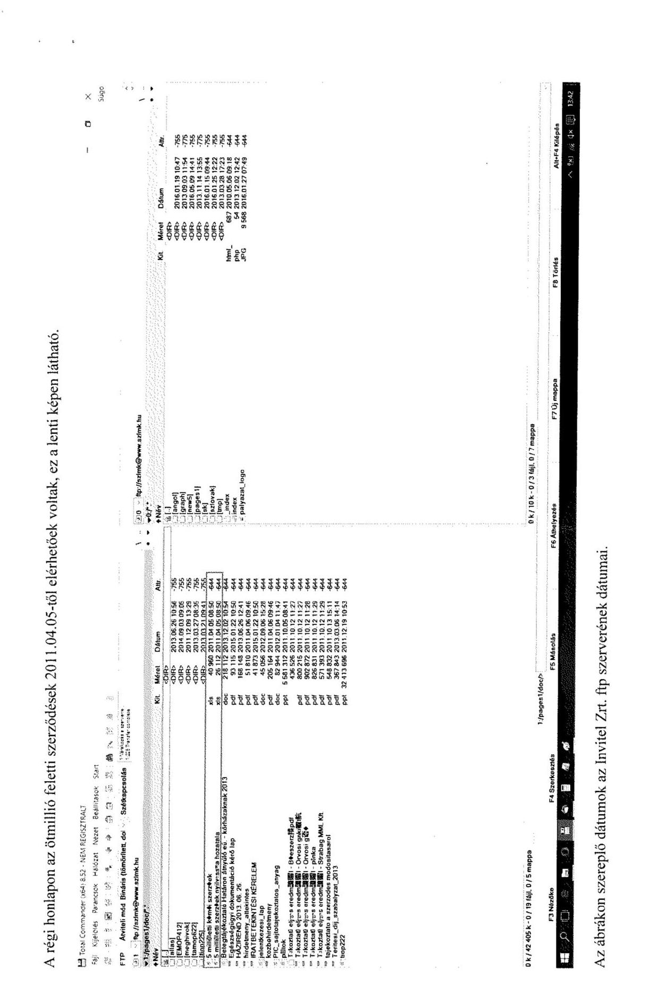
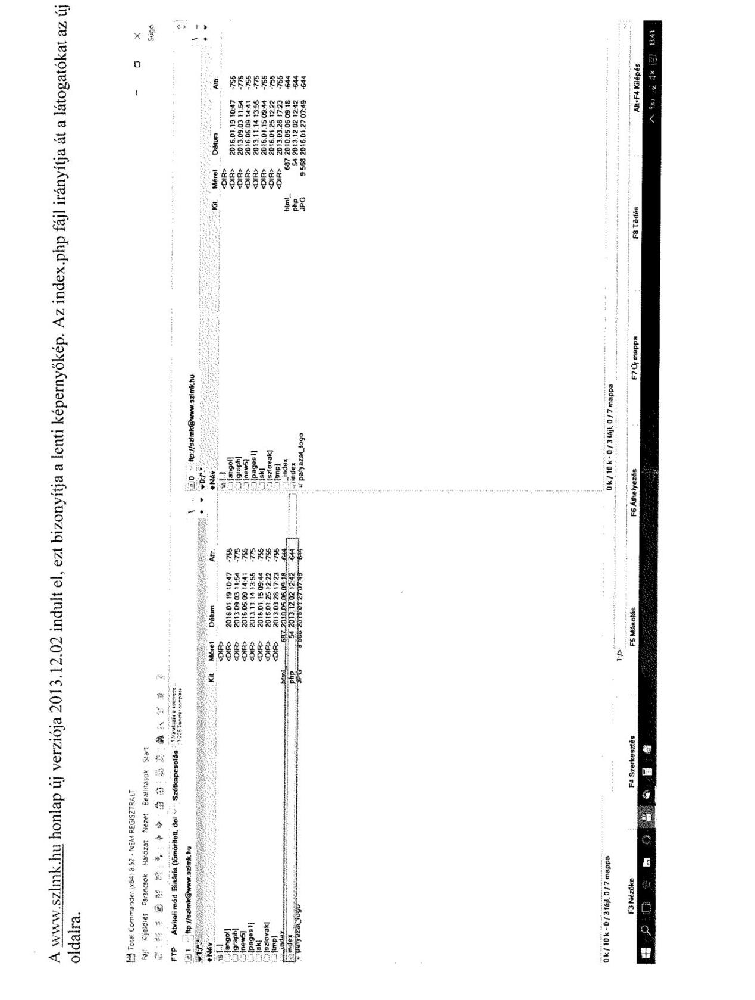
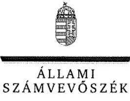
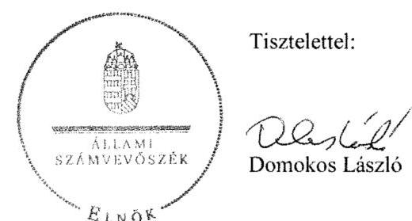

# Jelentés 

## A központi alrendszer egyes intézményei pénzügyi és vagyongazdálkodásának ellenőrzése

Szent Lázár Megyei Kórház, Salgótarján 2016.

---

# Jelentés 

## A központi alrendszer egyes intézményei pénzügyi és vagyongazdálkodásának ellenőrzése

Szent Lázár Megyei Kórház, Salgótarján 2016. július hó 26 .nap

---

# AZ ELLENŐRZÉST FELÜGYELTE: 

PETŐ KRISZTINA felügyeleti vezető

## AZ ELLENŐRZÉST VEZETTE ÉS A VÉGREHAJTÁSÁÉRT FELELŐS:

KISGERGELY ISTVÁN ellenőrzésvezető
KORSÓSNÉ VIGH ANDREA ellenőrzésvezető

## A PROGRAM ÖSSZEÁLLÍTÁSÁÉRT FELELŐS:

JANIK JÓZSEF LÁSZLÓ osztályvezető

IKTATÓSZÁM: V-0937-202/2016.
TÉMASZÁM: 1771
ELLENŐRZÉS-AZONOSÍTÓ SZÁM: V071308

---

# TARTALOMJEGYZÉK 

■ ÖSSZEGZÉS ..... 5
■ AZ ELLENŐRZÉS CÉLJA ..... 7
■ AZ ELLENŐRZÉS TERÜLETE ..... 8
■ AZ ELLENŐRZÉS HÁTTERE, INDOKOLTSÁGA ..... 11
■ FÓKUSZKÉRDÉSEK ..... 12
■ ELLENŐRZÉS HATÓKÖRE ÉS MÓDSZEREI ..... 13
■ MEGÁLLAPÍTÁSOK ..... 17
■ JAVASLATOK ..... 39
■ MELLÉKLETEK ..... 47
I. Sz. melléklet: Értelmező szótár ..... 47
II. Sz. melléklet: Az integritás érvényesítése érdekében kialakított és müködtetett kontrollrendszer ..... 53
III. Sz. melléklet: Teljesítmény ellenőrzési kiegészítő modul megállapítása ..... 54
IV. Sz. melléklet: A Szent Lázár Megyei Kórház eszközeinek és forrásainak alakulása ..... 55
■ FÜGGELÉK: ÉSZREVÉTELEK ..... 57
■ RÖVIDÍTÉSEK JEGYZÉKE ..... 69

---

.

---

# ÖSSZEGZÉS 

Az irányító szerveknek a Kórházra vonatkozó feladatellátása összességében szabályszerű volt. A Kórház vezetője által kialakított irányítási rendszer nem biztosította a szabályszerű, átlátható és elszámoltatható közpénzfelhasználást. A pénzügyi gazdálkodás szabályszerűsége, valamint a Kórház likvidítása nem volt biztosított. A vagyongazdálkodás nem felelt meg a jogszabályok és a belső szabályzatok előírásainak. Az ellenőrzött időszakban a Kórház intézkedett az integritás szemlélet érvényesítése érdekében.

## Az ellenőrzés társadalmi indokoltsága

A közpénzek felhasználásában meghatározó, központi alrendszerbe tartozó intézmények pénzügyi és vagyongazdálkodási tevékenységük és/vagy feladatellátásuk súlya miatt jelentős hatást gyakorolhatnak a költségvetés egyensúlyának fenntartására. Hatással vannak továbbá az állami vagyonnal való gazdálkodás minőségére, a kormányzati (szak)politikák végrehajtására, illetve közfeladat ellátásuk vonatkozásában az állampolgárok életminőségére, jogaik és kötelezettségeik gyakorlására.

A közpénzek felhasználásában és az állami vagyonnal való gazdálkodásban a központi alrendszer egyes intézményei meghatározó súlyt képviselnek. E szervezetekkel szemben társadalmi igény, hogy tevékenységükről a döntéshozók és a nyilvánosság felé elszámoljanak. Ezzel a társadalmi igénnyel és az Állami Számvevőszék Stratégiájával összhangban, a közpénzügyek átláthatóságának előmozdítása, a közvagyon védelme érdekében került sor a Szent Lázár Megyei Kórház pénzügyi- és vagyongazdálkodásának ellenőrzésére.

Az egészség és ezzel összefüggésben az egészségügyi ellátások színvonala és költsége folyamatosan a társadalmi érdeklődés középpontjában áll. A központi költségvetésből az egyik legjelentősebb kiadást az egészségügyi ellátásokra fordított adóforintok jelentik, amelyekből a kórházak kapják a legtöbb támogatást. Ezért indokolt, hogy az ÁSZ az egészségügyi intézmények pénzügyi és vagyongazdálkodását, az esetleges átalakulások szabályszerűségét rendszeresen több évre kiterjedően ellenőrizze.

## Főbb megállapítások, következtetések, javaslatok

Az irányító szervek a Kórházra vonatkozó feladatellátásuk során az alapítói, munkáltatói és beszámoltatási jogosultságaikat szabályszerűen gyakorolták. A 2012-2014. években a közfeladat ellátására vonatkozó, a hatékony gazdálkodáshoz szükséges követelményeket az irányító szerv nem érvényesítette.

A Kórház vezetője által kialakított irányítási rendszer nem biztosította a szabályszerű, átlátható és elszámoltatható közpénzfelhasználást. A Kórház vezetője nem biztosította a felelősségi körök érvényre jutását, mert a gazdálkodási jogkörök gyakorlóit nem teljes körűen és nem szabályszerűen jelölte ki az ellenőrzött időszakban. Ezáltal a kontrolltevékenységek működése sem volt szabályszerű. A kockázatkezelési rendszer kialakítása 2012-től megtörtént, ennek ellenére a beazonosított kockázatokkal kapcsolatos szükséges intézkedések és azok nyomon követés elmaradt. A Kórház nem szabályozta a kötelezően közzéteendő adatok nyilvánosságra hozatalának rendjét és nem tett eleget a törvényben előírt elektronikus közzétételi kötelezettségének. Az operatív tevékenységek folyamatos és eseti nyomon követési rendszerét 2014-től alakították ki. A belső ellenőrzési rendszer kialakítása a jogszabályi előírásoknak megfelelően történt, annak múködése terén az intézkedési tervek jóváhagyása és az intézkedésekhez kapcsolódó nyilvántartások vezetése nem volt szabályszerű. A Kórház belső kontrollrendszere keretében alakítottak ki követelményeket az erőforrásokkal való gazdaságos, hatékony és eredményes gazdálkodás érvényesítése érdekében, amely összhangban volt a belső kontrollrendszer értékeléséről szóló vezetői nyilatkozatban foglaltakkal.

---

A Kórház pénzügyi gazdálkodása nem volt szabályszerű, mert az előirányzatok módosítása nem a jogszabályi előírásoknak megfelelően történt, továbbá a kiadási előirányzatok felhasználása szabálytalan volt. A kiadási előirányzatok felhasználása során a gazdálkodási jogkörök gyakorlása nem volt megfelelő. Szabálytalan közpénzfelhasználásra közbeszerzési szabálytalanság miatt került sor. Az előírt befizetési kötelezettségeket szabályszerűen teljesítették, azonban a kötelezettségvállalással terhelt maradvány megállapítása, felhasználása nem volt megfelelő. A Kórház likviditása - a lejárt szállítói állomány csökkentésére kapott eseti központi támogatások és a Kórház által hozott intézkedések ellenére - nem volt biztosított. Az eredményszemléletű számvitel bevezetésével kapcsolatos feladatok végrehajtása során nem volt szabályos, hogy a rendező mérleg elfogadásáig a könyvvezetés nem felelt meg a jogszabályi rendelkezésnek.

A Kórház vagyongazdálkodása nem felelt meg a jogszabályoknak és a belső szabályzatok előírásainak. A 2012-től hatályos vagyonkezelési szerződés a törvényben előírt tartalmi követelményeknek nem felelt meg, mert nem tartalmazta, hogy a Kórház, a tulajdonosi joggyakorló vagyon-nyilvántartási szabályzatát magára nézve kötelező érvényűnek ismeri el, továbbá azt, hogy a tulajdonosi ellenőrzés eljárásrendjét, a felek jogait, kötelezettségeit a felek a szerződés részének tekintik. A mérlegben kimutatott eszközök és források nyilvántartása és értékelése nem volt megfelelő, mert az üzembe helyezést nem dokumentálták, az eszközök bekerülési értékét több esetben a törvény és a belső szabályzat előírásaitól eltérően állapították meg. A leltározás szabályszerű volt. A Kórház vagyonelemeinek hasznosítása nem volt megfelelő, mivel a vagyonelemek hasznosítására kötött szerződések a törvényi rendelkezések ellenére nem tartalmazták a bérlők tekintetében a beszámolási, nyilvántartási, adatszolgáltatási kötelezettségek vállalását, továbbá a Kórház nem győződött meg a vagyonelemek hasznosítása során a 2012-2014. években az átláthatóság jogszabályi követelményének az érvényesüléséről.

A Kórház az ellenőrzést megelőzően az ÁSZ integritás projektjében részt vett, az integritás szemlélet érvényesítése érdekében több intézkedést is tett. Az ellenőrzés során feltárt hiányosságok miatt azonban e területen további intézkedések megtétele szükséges.

---

# **AZ ELLENŐRZÉS CÉLJA**

## **Szent Lázár Megyei Kórház pénzügyi és vagyongazdálkodásának ellenőrzése**

### **A SZABÁLYSZERŰSÉGI ELLENŐRZÉS**

célja annak megítélése volt, hogy az ellenőrzött Kórházra1 vonatkozó irányító szervi feladatellátás a jogszabályi előírások betartásával történt-e; a Kórháznál a belső kontrollrendszer kialakítása és működtetése szabályszerű volt-e; kialakították-e az erőforrásokkal való szabályszerű, gazdaságos, hatékony és eredményes gazdálkodáshoz szükséges követelményeket, megvalósították-e azok számon kérését, ellenőrzését; a Kórház pénzügyi és vagyongazdálkodása megfelelt-e a jogszabályi előírásoknak és belső szabályzatainak; a Kórház átalakításának vagy átszervezésének lebonyolítása szabályszerűen történt-e.

A Kórház korrupcióval szembeni veszélyeztetettségének csökkentése érdekében az ÁSZ2 értékelte az integritási szemlélet érvényesülését a gazdálkodási folyamatokban.

**A KIEGÉSZÍTŐ TELJESÍTMÉNY-ELLENŐRZÉSI MODUL** célja annak értékelése volt, hogy a gazdálkodás folyamatában a gazdaságossági, hatékonysági és eredményességi követelmények kialakítása megtörtént-e, azokat működtették-e, a célkitűzéseket elérték-e; a pénzügyi és vagyongazdálkodás folyamataira vonatkozóan a költségvetési szerv belső kontrollrendszerének minőségéről kiadott vezetői nyilatkozatban a költségvetési szerv tevékenységében a hatékonyság, eredményesség, gazdaságosság követelményeinek érvényesítésére vonatkozó nyilatkozat helytálló volt-e.

---

# AZ ELLENŐRZÉS TERÜLETE

## Szent Lázár Megyei Kórház

A Kórház közfeladata az Eütv.³ alapján, ellátási területére kiterjedően, a járó- és fekvőbetegek diagnosztikus és terápiás szakorvosi ellátása, rehabilitációja és követéses gondozása.

A Kórház a 2011–2013. években önállóan működő és gazdálkodó, az előirányzatok feletti jogosultság szempontjából teljes jogkörrel rendelkező költségvetési szerv volt. A 2014. évtől kezdődően az irányító szerv₂ döntése alapján rendelkezik a működtetéséhez, a vagyon használatához, valamint közfeladatai ellátásához szükséges egyéb előirányzataival. A Kórház irányító szerve a 2011. évben a Nógrád Megye Önkormányzat Közgyűlése volt. A konszolidációs törvény⁴ alapján 2012. január 1-jével a Kórház vagyona állami tulajdonba került. A Kórháznak az államháztartás önkormányzati alrendszeréből a központi alrendszerébe történt átsorolásával 2012. január 1-jétől az irányítószervi hatásköröket a Minisztérium⁵ gyakorolta. Az egyes fenntartói, valamint az irányítói, középirányítói jogokat a GYEMSZI⁶, annak jogutódjaként 2015. március 1-jétől az ÁEEKt⁷ látta el.

Az ellenőrzött időszakban a Kórháznál szervezeti átalakítás, feladat átadás-átvétel nem történt. A Kórházat a 2011–2014. években főigazgató⁸ vezette, munkáját gazdasági igazgató, orvos igazgató, ápolási igazgató, valamint a főigazgató által működtetett testületek, szakbizottságok segítették. A Kórházat vezető főigazgató és a gazdasági igazgató személye az ellenőrzött időszakban nem változott.

A Kórház teljesített összes bevétele a 2011. évi 5676,1 millió Ft-ról a 2014. évre 6481,4 millió Ft-ra, 14,2%-kal, a teljesített összes kiadása a 2011. évi 5721,3 millió Ft-ról a 2014. évre 6124,0 millió Ft-ra, 7%-kal emelkedett. A költségvetés eredeti és módosított előirányzati főösszegét, a teljesített összes bevétel és kiadás alakulását az 1. ábra mutatja.

---

Forrás:2011-2014. évi költségvetési beszámolók
A Kórház engedélyezett létszáma 2011-2012. években évi 843 fő volt, amely a 2013. évben 859 főre, a 2014. évre 924 főre nőtt. Éves átlagos statisztikai állományi létszáma minden évben az engedélyezett létszám alatt maradt, a 2011. évi 789 fơről a 2014. évben 820 fơre változott.

A Kórház vagyonának változását a 2011-2014. években a 2. ábra mutatja be.
2. ábra

# A Kórház vagyonának változása 

(millió Ft)

Forrás:2011-2014. évi költségvetési beszámolók

---

A Kórház 2011. január 1-jei könyvviteli mérleg szerinti vagyona 6740,0 millió Ft, 2014. december 31-én 6846,1 millió Ft volt, az ellenőrzött időszakban 1,6\%-kal emelkedett. Az eszköz oldalon a növekedés a forgóeszközöket érintette, miközben a meghatározó részarányt képviselő befektetett eszközök állományi értéke csökkenő tendenciát mutatott.

A Kórház kötelezettség állománya 2011-2014. között 2,5-szeresére emelkedett. A kötelezettségek meghatározó részét a rövid lejáratú, ezen belül is a szállítói kötelezettségek tették ki. A Kórház likviditása, fizetőképessége, a szállítói számlák, egyéb kötelezettségek határidőben történő kiegyenlítése összességében nem volt biztosított, a hatvan napon túl lejárt szállítói kötelezettség állomány növekedett. A 2014. évi kötelezettség állományon belül a költségvetési évben esedékes kötelezettség 941,2 millió Ft - ebből hatvan napon túl lejárt kötelezettség 628,0 millió Ft - a költségvetési évet követően esedékes kötelezettség 525,9 millió Ft volt.

---

# AZ ELLENŐRZÉS HÁTTERE, INDOKOLTSÁGA 

Az Alaptörvény rendelkezése szerint a nemzeti vagyon megőrzésének, védelmének és a nemzeti vagyonnal való felelős gazdálkodásnak a követelményeit sarkalatos törvény, az Nvtv. ${ }^{9}$ rögzíti. A tulajdonosi joggyakorlás és vagyonkezelés általános és speciális szabályait, az állami vagyon nyilvántartására és elszámolására vonatkozó eljárásokat, a vagyonkezelési szerződés feltételrendszerét, valamint az éves beszámoló készítési és könyvvezetési kötelezettségeket kormányrendelet írja elő.

A központi alrendszer egyes intézményei közfeladat-ellátásának változásait, a közfeladatok átadásából és átvételéből adódó módosításait, előirányzat gazdálkodására ható tényezőit az Áht. ${ }^{10}$ 11. §-a és az Ávr. ${ }^{11}$ 14. §a írja elő. A közfeladatok megszűnéséből, intézmény átszervezéséből, belső szerkezeti korszerűsítéséből, vagy más hasonló okból adódó módosításai miatt szerepeltetendő szerkezeti változásokat, valamint a szerkezeti változásként beépült közfeladatok szintre hozásként történő számításba vételét az Ávr. 15. § (2)-(3) bekezdései határozzák meg.

AZ ELLENŐRZÉS EREDMÉNYEKÉPPEN nemcsak az ellenőrzött intézmények gazdálkodása javulhat, hanem átfogó képet kaphatunk a központi alrendszerbe tartozó költségvetési szervek gazdálkodásának hiányosságairól, de a jó gyakorlatokról is. Ellenőrzéseivel, javaslataival és megállapításaival az ÁSZ elősegítheti a költségvetési szervek pénzügyi és vagyongazdálkodása szabályozásának javítását és hozzájárulhat a jó kormányzáshoz.

A teljesítmény-ellenőrzési kiegészítő modul alapján elvégzett ellenőrzés a törvényalkotás számára támogatást nyújt a nemzeti kulcsindikátorok rendszerének kialakításához. A döntéshozók, ellenőrzöttek, irányító szervek, a társadalom számára az összehasonlítási, összemérési lehetőségek kihasználásával objektív visszajelzést ad a gazdálkodás területén végrehajtott szervezeti, szervezési, takarékossági és bürokráciacsökkentő intézkedések hatásairól, a közfeladat-ellátásnak keretet adó pénzügyi és vagyongazdálkodásban mérhető teljesítménykövetelmények kialakításáról, azok alkalmazásáról.

---

# FÓKUSZKÉRDÉSEK 

1.     - Az irányító szerv ellenőrzött intézményre vonatkozó feladatellátása szabályszerű volt-e?
2.     - A belső kontrollrendszer kialakítása és müködtetése megfelelt-e a jogszabályi előírásoknak?
3.     - Az intézmény pénzügyi gazdálkodása szabályszerű volt-e?
4.     - Az intézmény vagyongazdálkodása szabályszerű volt-e?
5.     - Szabályszerűen hajtották-e végre az ellenőrzött időszakban az intézményt érintő szervezeti, szerkezeti átalakításokat?
6.     - Az intézmény intézkedett-e az integritás szemlélet érvényesítése érdekében?

---

# ELLENŐRZÉS HATÓKÖRE ÉS MÓDSZEREI 

## Az ellenőrzés típusa

Szabályszerűségi ellenőrzés, amelyet teljesítmény-ellenőrzési modul egészített ki.

## Az ellenőrzött időszak

Az ellenőrzött időszak 2011. január 1-jétől 2014. december 31-ig terjedő időszak volt.

## Az ellenőrzés tárgya

Az ellenőrzött szervezetre vonatkozó irányító szervi feladatok ellátása. A Kórház belső kontrollrendszerének kialakítása és múködtetése, valamint pénzügyi és vagyongazdálkodása. Az erőforrásokkal való szabályszerű, gazdaságos, hatékony és eredményes gazdálkodáshoz szükséges követelmények kialakítása, a kialakított követelmények számonkérése, ellenőrzése. A Kórház átalakítása, átszervezése lebonyolításának szabályszerűsége.

A teljesítmény-ellenőrzési kiegészítő modul esetében a Kórház gazdálkodás folyamatában a gazdaságossági, hatékonysági és eredményességi követelmények kialakítása és múködtetése, a célkitűzések teljesítésének értékelése. A Kórház tevékenységében a hatékonyság, eredményesség, gazdaságosság követelményei érvényesítéséről kiadott nyilatkozat helytállósága. A teljesítmény-ellenőrzés fókuszkérdéseire a III. számú melléklet ad választ.

Az ellenőrzés kiterjedt minden olyan körülményre és adatra, amely az ÁSZ jogszabályban meghatározott feladatainak teljesítéséhez, valamint a programok végrehajtása folyamán felmerült újabb összefüggések feltárásához voltak szükségesek.

## Az ellenőrzött szervezet

Az ellenőrzésre a Szent Lázár Megyei Kórháznál, a Nógrád Megyei Önkormányzatnál, az Állami Egészségügyi Ellátó Központnál (Gyógyszerészeti és Egészségügyi Minőség- és Szervezetfejlesztési Intézet), és az Emberi Erőforrások Minisztériumánál (Nemzeti Erőforrás Minisztérium) került sor.

---

# Az ellenőrzés jogalapja 

Az ellenőrzés jogszabályi alapját az ÁSZ tv. ${ }^{12}$ 1. § (3) bekezdés, 5. § (2)-(7) bekezdései, valamint Áht. 2 61. § (2) bekezdésének előírásai képezték.

## Az ellenőrzés módszerei

Az ellenőrzést az ellenőrzési program szempontjai, az ellenőrzött időszakban hatályos jogszabályok, az ellenőrzés szakmai szabályai, az egyes ellenőrzési típusokhoz kapcsolódó ÁSZ módszertanok és nemzetközi standardok figyelembevételével végeztük. A gazdálkodás hibáinak kijavítására, a közpénzekkel való felelős gazdálkodás segítésére irányuló javaslatok kidolgozásakor a hatályos jogszabályok voltak az irányadóak.

Az ellenőrzés ideje alatt az ellenőrzött szervezettel történő kapcsolattartást az ÁSZ SZMSZ ${ }^{13}$-ének vonatkozó előírásai alapján biztosítottuk.

Az ellenőrzési kérdések megválaszolásához szükséges bizonyítékok megszerzése a következő ellenőrzési eljárások alkalmazásával történt: kérdésfeltevés (információkérés), mintavételezés, valamint elemző eljárás. A minták kiválasztása során elsősorban reprezentativitást biztosító véletlen mintavételi eljárást alkalmaztunk.

Az ellenőrzési bizonyítékként felhasználható adatforrások közé tartoztak egyrészt a szakmai program részletes szempontjainál felsorolt adatforrások, másrészt adatforrás volt minden egyéb - az ellenőrzés folyamán feltárt, az ellenőrzés szempontjából releváns információt tartalmazó - dokumentum.

Az ellenőrzés lefolytatásához a Kórház a tanúsítványok elektronikus kitöltésével, valamint az ÁSZ által kért dokumentumok elektronikus megküldésével szolgáltatott adatokat. A rendelkezésre bocsátott adatok, információk kontrollja az ellenőrzés keretében történt.

Az ellenőrzési kérdésekre adott válaszok alapján értékeltük, hogy az ellenőrzött időszakban az irányító szerv ${ }_{1-2}$ és a középirányító szerv az ellenőrzött intézményre vonatkozó feladatainak szabályszerűen eleget tett-e, a Kórház pénzügyi és vagyongazdálkodása megfelelte-e az előírásoknak, a Kórház átalakításának vagy átszervezésének végrehajtása szabályszerű volt-e. Értékeltük, hogy a Kórháznál kialakították-e az erőforrásokkal való szabályszerű és hatékony gazdálkodáshoz szükséges követelményeket, megvalósították-e azok számonkérését, ellenőrzését.

A Kórház belső kontrollrendszere jogszabályi előírások szerinti kialakításának és müködtetésének szabályszerűségét az erre irányuló ellenőrzési kérdésekre adott válaszok összesítése alapján, évente pillérenként (kontrollkörnyezet, kockázatkezelési rendszer, kontrolltevékenységek, információs és kommunikációs rendszer, monitoring rendszer) és összesítetten is minősítettük. A Kórház belső kontrollrendszere egyes pilléreinek kialakítását és működtetését „szabályszerü"-nek minősítettük, amennyiben az értékelt területen az elért és elérhető pontok százalékban kifejezett, egész számra kerekített hányadosa meghaladta a $84 \%$-ot, „részben szabály-szerű"-nek minősítettük, ha a $84 \%$-ot nem haladta meg, de $60 \%$-nál nagyobb volt, „nem szabályszerű"-nek minősítettük, ha nem haladta meg a

---

60\%-ot. A Kórház belső kontrollrendszerének összesített értékelése megegyezik a pillérenként (kontrollterületenként) alkalmazott \%-os értékelésekkel, a következő eltérésekkel. A kontrollrendszer egésze esetében a „szabályszerü" értékelésnek a \%-os értéken felül további feltétele volt, hogy egyik kontrollterület sem kaphatott „nem szabályszerű" értékelést, a „részben szabályszerű" értékelés további feltétele volt, hogy legfeljebb egy ellenőrzött kontrollterület lehetett „nem szabályszerű" értékelésű. Az öszszesített értékelés a \%-os értéktől függetlenül „nem szabályszerű"-nek minősült, ha az ellenőrzött kontrollterületek közül több mint egy „nem szabályszerű" értékelést kapott.

A tárgyi eszközök nyilvántartásba vételének, a közbeszerzési eljárások lefolytatásának, a vagyonhasznosítási bevételi előirányzatok teljesítésének, az előirányzatok módosításának és az előirányzat-maradvány megállapításának szabályszerűségét, valamint a gazdálkodási jogkörök gyakorlásának szabályszerűségét mintavétellel ellenőriztük.

A jogszabályoknak és a belső előírásoknak megfelelőnek tekintettük a tárgyi eszközök nyilvántartásba vételét, a közbeszerzési eljárások lefolytatását, a vagyonhasznosítási bevételi előirányzatok teljesítését, az előirányzatok módosítását és az előirányzat-maradvány megállapítását, amennyiben a minta ellenőrzésének eredménye alapján 95\%-os bizonyossággal a teljes sokaságban a hibás tételek aránya kisebb volt, mint 10\%, nem megfelelőnek értékeltük, ha a hibás tételek aránya a 10\%-ot meghaladta.

A 2011. évet érintően a szakmai teljesítésigazolás és az utalvány ellenjegyzése kulcskontrollok, a 2012-2014. éveket érintően a teljesítésigazolás és az érvényesítés kulcskontrollok működését értékeltük. Megfelelőnek értékeltük a gazdálkodási jogkörök gyakorlását, amennyiben 95\%-os bizonyossággal a teljes sokaságban a hibás tételek aránya legfeljebb 10\% volt, részben megfelelőnek, ha a hibás tételek arányának felső határa legfeljebb $30 \%$ volt, nem megfelelőnek, ha a hibás tételek sokaságbeli arányának felső határa meghaladta a 30\%-ot.

Az integritás szemlélet érvényesülésének értékelése a Kórház által kitöltött tanúsítvány alapján történt.

Az alapprogram alapján ellenőriztük, hogy a költségvetési szerv vezetője megtette-e nyilatkozatát arról, hogy gondoskodott a költségvetési szerv tevékenységében a hatékonyság, eredményesség és a gazdaságosság követelményeinek érvényesítéséről. Ezt kiegészítve, a teljesítmény-ellenőrzési kiegészítő modul keretében - felhasználva az alapprogram szerinti ellenőrzés megállapításait - értékeltük, hogy a költségvetési szerv vezetője kialakította-e a gazdaságossági, hatékonysági és eredményességi követelményeket, és azokat múködtette-e, a célkitúzéseket elérte-e.

A teljesítmény-ellenőrzési kiegészítő modul a gazdálkodási feladatokra terjedt ki, a szakmai feladatellátást nem értékelte.

A gazdálkodási feladatok értékelése az alábbi területekre terjedt ki:
pénzügyi gazdálkodási (nem szakmai, adminisztratív) feladatok: költségvetés-, beszámoló-készítés, könyvvezetés, adatszolgáltatások, előirányzat-gazdálkodás, kötelezettségvállalások nyilvántartása, kezelése, bevételkezelés, bér- és illetményszámfejtés;
$\longrightarrow$ vagyongazdálkodási (logisztikai) feladatok: közbeszerzések és közbeszerzési értékhatárt el nem érő beszerzések, készletgazdálkodás,

---

nyomtatók, fénymásolók üzemeltetése, épület- és ingatlanüzemeltetés, karbantartás, hibabejelentés, gépjármú és flottamenedzsment.

Az ellenőrzés során minden olyan körülményt és adatot is ellenőriztünk, amely a program végrehajtása kapcsán felmerült újabb összefüggéseknek az ellenőrzés céljaival összhangban lévő feltárásához szükséges. A teljesít-mény-ellenőrzési kiegészítő programmodulban megfogalmazott ellenőrzési cél megválaszolásához az alapprogram végrehajtása során megfogalmazott megállapításokat is figyelembe vettük.

---

# 1. Az irányító szerv ellenőrzött intézményre vonatkozó feladatellátása szabályszerű volt-e? 

Összegző megállapítás

Az irányító szerv ${ }_{1,2}{ }^{14}$ Kórházra vonatkozó feladatellátása szabályszerű volt, kivéve hogy az irányító szerv ${ }_{2}$ a hatékony gazdálkodás követelményeit nem érvényesítette. A középirányító szerv ${ }^{15}$ a hatékonysági követelményeket nem kérte számon és nem ellenőrizte.

### 1.1. számú megállapítás

Az irányító szerv ${ }_{1,2}$ a Kórházzal kapcsolatos alapítói jogosultságait szabályszerűen gyakorolta.

2011-ben az irányító szerv ${ }_{1}$ az alapítói jogosultságait az Áht. ${ }_{1}{ }^{16}$ előírásainak megfelelően, szabályszerűen gyakorolta, a kiadott alapító okiratokat (Alapító okirat ${ }_{1-4}{ }^{17}$ ) határozattal elfogadta. A 2012-2014. időszakban az irányító szerv ${ }_{2}$ alapítói jogosultságait megfelelően gyakorolta. A 2012. januárban kiadott Alapító okirat ${ }_{5}{ }^{18}$ tartalmazta az Áht. ${ }_{2}$ és az Ávr. előírásainak megfelelően a középirányító szerv kijelölését és az egyes irányítói jogok gyakorlását, melyet 2014. január 1-jei hatállyal kiegészítettek a Kórház alaptevékenységének kormányzati funkciók szerinti besorolásával. Az Alapító okirat ${ }_{1-5}$-öt az Ámr. ${ }^{19}$-ben és az Ávr.-ben foglalt előírásoknak megfelelően a módosításokkal egységes szerkezetbe foglalták.

A 2011-2014. években a Kórház az Áht. ${ }_{1,2}$ előírásainak megfelelően rendelkezett az irányító szerv ${ }_{1}$, illetve a középirányító szerv által jóváhagyott $\mathrm{SZMSZ}_{1,2}{ }^{20}$-vel.

A közfeladatok ellátására vonatkozó, az erőforrásokkal való szabályszerű gazdálkodáshoz szükséges követelmények érvényesítése a 2011-2014. években megtörtént, azonban az irányító szerv ${ }_{1}$ szabályszerűségi ellenőrzést nem végzett. A hatékony gazdálkodáshoz szükséges követelményeket az irányító szerv ${ }_{2}$ nem érvényesítette. A középirányító szerv a hatékonysági követelményeket nem kérte számon és nem ellenőrizte.

Az irányító szerv ${ }_{1}$ 2011-ben a közfeladatok ellátására vonatkozó, az erőforrásokkal való szabályszerű és hatékony gazdálkodás követelményeit az Áht. ${ }_{1}$ előírásainak megfelelően érvényesítette. Az irányító szerv ${ }_{1}$ 2011-ben az Áht. ${ }_{1}$ 93. § (1) bekezdés d) pontjában előírt, a Kórház tevékenységének szabályszerűségi, pénzügyi és teljesítmény-ellenőrzésére kapott jogát nem gyakorolta.

A közfeladatok ellátására vonatkozó, az erőforrásokkal való szabályszerű gazdálkodás követelményeit 2012-2014-ben az irányító szerv ${ }_{2}$ és a középirányító szerv az Áht. ${ }_{2}$ előírásainak megfelelően érvényesítette.

---

A hatékony gazdálkodáshoz szükséges követelményeket a Kórházra vonatkozóan az Áht. 2 9. § (1) bekezdés f) pontjában foglalt előírás ellenére az irányító szerv2 nem érvényesítette és nem kérte számon, a gazdálkodás hatékonyságára vonatkozó ellenőrzést a Kórháznál nem végzett.

A középirányító szerv 2012-2014-ben - az Áht. 2 és az 59/2011. (IV. 12.) Korm. rendeletben foglaltakkal összhangban - érvényesítette a gazdálkodás hatékonyságára vonatkozó követelményeket, amelyeket azonban az 59/2011. (IV. 12.) Korm. rendelet ${ }^{21}$ 2/A. § a) pontjában foglalt előírás ellenére nem kért számon és nem ellenőrzött. A gazdálkodás szabályszerűségére irányuló ellenőrzést két ízben folytatott le.

Az irányító szerv ${ }_{1,2}$ és a középirányító szerv költségvetési irányítási hatáskörében az Áht ${ }_{1,2}$ előírásainak megfelelően beszámoló készítésére kötelezte a Kórházat, az ellátandó közfeladatokról, az erőforrásokkal való szabályszerű gazdálkodásról szóló számszaki és szöveges beszámolók elkészítéséhez évente körleveleket, iránymutatásokat adott ki. A számonkérés a költségvetéssel és annak végrehajtásával összefüggésben az ellenőrzött években megtörtént.
1.3. számú megállapítás

Az irányító szerv ${ }_{1}$ a Kórházzal kapcsolatos irányítási, felügyeleti jogkörét szabályszerűen gyakorolta, az egyéb ellenőrzési jogosultságai körében a közérdekú és közérdekből nyilvános adatok közzétételéhez kapcsolódó ellenőrzési feladatát nem látta el. Az irányító szerv ${ }_{2}$ és a középirányító szerv Kórházzal kapcsolatos irányítási, felügyeleti és egyéb ellenőrzési feladatellátása szabályszerű volt. A Kórház gazdálkodásának figyelemmel kísérése, beszámoltatása, a munkáltatói jogkörök gyakorlása a 2011-2014. években a jogszabályi előírások betartásával történt.

A Kórházzal kapcsolatos ellenőrzési jogosultságát a költségvetési gazdálkodás területén 2011-ben az irányító szerv ${ }_{1}$ részben szabályszerűen, 2012-2014-ben az irányító szerv ${ }_{2}$ szabályszerűen gyakorolta.

Az irányító szerv ${ }_{1}$ a Kórház bevételi és kiadási előirányzataival való gazdálkodását, a költségvetés végrehajtását az Áht. ${ }_{1}$ előírásainak megfelelően rendszeresen figyelemmel kísérte, a költségvetést és az arról készített beszámolót jóváhagyta. Az irányító szerv ${ }_{1}$ a 2011. évi költségvetési beszámolót nem megfelelő adattartalommal hagyta jóvá, mivel a beszámoló Áht. ${ }_{1}$ 49. § (5) bekezdés j) pontjában előírt felülvizsgálata során nem tárta fel, hogy a Kórház a kormány hatáskörú előirányzat-módosításokat hibásan saját hatáskörú módosításként tüntette fel a beszámoló 23. űrlapján. A nem megfelelő adattartalom miatt a beszámoló valódisága nem sérült.

2012-2014-ben az irányító szerv ${ }_{2}$ a költségvetési gazdálkodás szabályszerűségét az Áht. ${ }_{2}$ előírásainak megfelelően dokumentáltan figyelemmel kísérte, az előirányzatokkal való gazdálkodás számon kérése, nyomon követése az éves költségvetési törvények végrehajtása keretében történt.

A középirányító szerv átruházott hatáskörben az Áht. ${ }_{2}$-nek megfelelően gyakorolta az előirányzat-gazdálkodással, az előirányzat-módosítással, átcsoportosítással kapcsolatos előzetes vagy utólagos jóváhagyási jogköröket.

Az irányító szerv ${ }_{1}$ az Áht. ${ }_{1} 49 . \S$ (5) bekezdés e) pontjában foglalt előírás ellenére az államháztartással összefüggő közérdekú és közérdekből nyilvá-

---

nos adatok kötelező közzétételének, illetve igényre történő szolgáltatásának végrehajtását nem ellenőrizte. Az irányító szerv ${ }_{2}$ az Áht. 2 9. § (1) bekezdés j) pontjában foglalt előírás ellenére a Kórház kezelésében lévő közérdekú adatok és közérdekből nyilvános adatok, valamint az irányítási hatáskörök gyakorlásához szükséges személyes adatok kezelésére kapott jogát nem gyakorolta.

Az irányító szerv ${ }_{1,2}$ a Kórház főigazgatójának és gazdasági vezetőjének jogviszonyával, a kinevezéssel, a díjazás megállapításával és az egyéb munkáltatói jogok gyakorlásának módjával kapcsolatos hatásköröket az Áht.1ben és az Áht.2-ben foglalt előírásoknak megfelelően gyakorolta, a kinevezési okmányok kiadása szabályszerűen történt.

Az irányító szerv ${ }_{1,2}$ az Áht. 1 és az Áht. 2 előírásainak megfelelően beszámoltatta a főigazgatót az éves gazdálkodásról és a szakmai feladatellátásról, a beszámolókat az irányító szerv ${ }_{1,2}$ az ellenőrzött években elfogadta.

# 2. A belső kontrollrendszer kialakítása és múködtetése megfelel-e a jogszabályi elöírásoknak? 

## Összegző megállapítás

A belső kontrollrendszer kialakítása és múködtetése 2011-ben nem szabályszerű, 2012-2014-ben részben szabályszerű volt.

A belső kontrollrendszer kialakítását és múködésének szabályszerűségét az 1. táblázat mutatja be.

1. táblázat

## A BELSŐ KONTROLLRENDSZER KIALAKÍTÁSÁNAK ÉS MŰKÖDTETÉSÉNEK ÉRTÉKELÉSE

| Megnevezés | Kontrollkörnyezet | Kockázatkezelés | Kontrolltevékenységek | Információ és kommunikáció | Monitoring | Összesen |
| :--: | :--: | :--: | :--: | :--: | :--: | :--: |
| 2011. | részben szabályszerű | nem szabályszerű | nem szabályszerű | részben szabályszerű | részben szabályszerű | nem szabályszerű |
| 2012. | részben szabályszerű | részben szabályszerű | nem szabályszerű | részben szabályszerű | részben szabályszerű | részben szabályszerű |
| 2013. | részben szabályszerű | szabályszerű | nem szabályszerű | részben szabályszerű | részben szabályszerű | részben szabályszerű |
| 2014. | részben szabályszerű | szabályszerű | nem szabályszerű | részben szabályszerű | részben szabályszerű | részben szabályszerű |

2.1. számú megállapítás

A kontrollkörnyezet kialakítása a 2011-2014. években részben szabályszerű volt.

A KONTROLLKÖRNYEZET kialakítása a 2011-2014. években részben volt szabályszerű, az Áht.1,2, a Kbt.1,2 ${ }^{22}$, a Mt.1, ${ }^{23}$, a Számv. tv. ${ }^{24}$, az Ámr., az Ávr., a Bkr. ${ }^{25}$, a Vtvr. ${ }^{26}$, az Áhsz. ${ }_{1,2}{ }^{27}$, és a 105/2009. (XII. 21.) OGY határozat ${ }^{28}$ előírásainak megfelelő.

A Kórház az ellenőrzött időszakban
$\longrightarrow$ az Áht.1,2 előírásaival összhangban rendelkezett SZMSZ ${ }_{1,2}$-vel, azonban az SZMSZ ${ }_{1,2}$ - az Ámr. 20. § (2) bekezdés e) pontja, valamint az Ávr. 13. § (1) bekezdés e) pontjában foglaltak ellenére - nem tartalmazta a gazdasági szervezet megnevezését;

---

$\longrightarrow$ az Ámr., az Áht. ${ }_{2}$ és az Ávr. előírásaival összhangban rendelkezett a gazdasági szervezet ügyrendjével, azonban a gazdasági szervezet Kórházon belüli és azon kívüli kapcsolattartásának módját, szabályait sem a gazdasági szervezet ügyrendje ${ }_{1,2}{ }^{29}$, sem az SZMSZ ${ }_{1,2}$, sem más szabályzat - az Ámr. 20. § (7) bekezdésében és az Ávr. 13. § (5) bekezdésében foglaltak ellenére - nem tartalmazta;
$\longrightarrow$ a Számv. tv. és az Áhsz. ${ }_{1,2}$ előírásainak alapvetően megfelelően alakította ki - a főigazgató által jóváhagyott - a számviteli politika ${ }_{1-5}{ }^{30}$ öt, amelynek keretében elkészítette a leltározási és leltárkészítési szabályzat ${ }_{1,2}{ }^{31}$-t, az eszközök és források értékelési szabályzatát ${ }^{32}$, a pénzkezelési szabályzat ${ }_{1-8}{ }^{33}$-ot és az önköltség-számítási szabályzatát ${ }^{34}$;
$\longrightarrow$ rendelkezett - a Számv. tv., az Áhsz. ${ }_{1,2}$ előírásaival összhangban - a hatályos, a főigazgató által jóváhagyott számlarenddel, az Áht. ${ }_{1,2}$, az Ámr., az Ávr. előírásaival összhangban egyidejűleg hatályos kétféle, a gazdálkodás részletes rendjét meghatározó szabályzattal (kötelezettségvállalási szabályzat ${ }_{1-5}{ }^{35}$, illetve pénzgazdálkodási szabályzat ${ }_{1-}$ ${ }^{36}$ ), valamint a Kbt. ${ }_{1,2}$ előírásaival összhangban készült közbeszerzési szabályzat ${ }_{1,2}{ }^{37}$-vel;
$\longrightarrow$ rendelkezett bizonylati renddel (bizonylati album ${ }^{38}$ ), amely azonban - a Számv. tv. 161. § (2) bekezdés d) pontjában foglaltak ellenére nem a számlarend részeként készült;
$\longrightarrow$ nem rendelkezett ellenőrzési nyomvonallal az Ámr. 156. § (2) bekezdésében és a Bkr. 6. § (3) bekezdésében foglaltak ellenére.
A szakmai teljesítésigazolás/teljesítésigazolás gyakorlásának módjával, eljárási és dokumentációs részletszabályaival, valamint az ezeket végző személyek kijelölésének rendjével kapcsolatos belső előírásokat, feltételeket - az Ámr. 20. § (3) bekezdés a) pontjában foglaltak ellenére - 2011. november 1. napját megelőzően sem a kötelezettségvállalási szabályzat ${ }_{1}$, sem a pénzgazdálkodási szabályzat ${ }_{1}$ nem tartalmazta.

A Kórház - az Ámr. 156. § (1) bekezdés c) pontjában, a Bkr. 6. § (1) bekezdés c) pontjában foglaltak ellenére - 2012. január 21. napját megelőzően nem írta elő az etikai elvárásokat. Ugyanakkor 2012. január 21. napját követően a Bkr. szerint rendelkeztek Etikai szabályzattal ${ }^{39}$.

# 2.2. számú megállapítás 

A kockázatkezelési rendszer kialakítása és múködtetése 2011-ben nem szabályszerű, 2012-ben részben szabályszerű, 2013-2014-ben szabályszerű volt.

A KOCKÁZATKEZELÉSI RENDSZER kialakítása és múködtetése a 2011. évben nem felelt meg, a 2012. évben részben felelt meg, míg a 2013-2014. években megfelelt az Áht.1,2, a Vnytv. ${ }^{40}$, az Ámr. és a Bkr. előírásainak.

A főigazgató a 2011. évben - az Ámr. 157. §-ában foglaltak ellenére nem alakította ki a Kórház kockázatkezelési rendszerét. A 2012-2014. években a Bkr. előírásai szerint a kockázatkezelési rendszer kialakítása megtörtént, a Kórház 2012-től rendelkezett kockázatkezelési szabályzattal. A főigazgató által működtetett kockázatkezelési rendszer részben felelt meg a Bkr. 7. § (2) bekezdés előírásainak, mert a Kórház tevékenységében és gazdálkodásában rejlő kockázatok felmérése és megállapítása évente megtörtént, azonban a 2012-2014. években nem határozták meg az egyes

---

kockázatokkal kapcsolatban szükséges intézkedéseket, valamint azok teljesítésének folyamatos nyomon követési módját.

Az ellenőrzött időszakban a vagyonnyilatkozat-tételre kötelezettek körét - a Vnytv. előírásaival összhangban - rögzítették, valamint a benyújtott vagyonnyilatkozatokat az egyéb iratoktól elkülönítetten kezelték. A vagyonnyilatkozat őrzéséért felelős személy azonban a 2011-2012. években - a Vnytv. 8. § (4) bekezdésében foglaltak ellenére - dokumentáltan nem tájékoztatta az érintetteket a vagyonnyilatkozat-tételi kötelezettség fennállásáról és esedékességéről, valamint - a Vnytv. 11. § (4) bekezdésben foglaltak ellenére - nem vette nyilvántartásba a benyújtott vagyonnyilatkozatokat.

# 2.3. számú megállapítás 

A kontrolltevékenység kialakítása és múködtetése a 2011-2014. években nem volt szabályszerű.

A KONTROLLTEVÉKENYSÉGÉNEK kialakítása és múködtetése a 2011-2014. években nem volt szabályszerű, mivel nem felelt meg az Áht. 1,2 , az Avtv. ${ }^{41}$, az Info tv. ${ }^{42}$, az Mt. 1,2 , az Ámr., az Ávr., a Bkr. és az lkr. ${ }^{43}$ előírásainak

A főigazgató
a kontrolltevékenység részeként nem biztosította a FEUVE ${ }^{44}$-t a pénzügyi kihatású döntések célszerűségi, gazdaságossági, hatékonysági és eredményességi szempontú megalapozottsága vonatkozásában - az Áht. 1 121/A. § (4) bekezdés b) pontjában és a Bkr. 8. § (2) bekezdés b) pontjában foglaltak ellenére - az ellenőrzött időszakban;
a dokumentumokhoz való hozzáférés Bkr. 8. § (4) bekezdés b) pontjában előírt szabályozási kötelezettségének a 2012-2014. években részben - a beérkezett küldemények, illetve az egészségügyi ellátó hálózaton belüli adatok vonatkozásában - tett eleget, az egyéb dokumentumok tekintetében nem tett eleget.
A kötelezettségvállalók - az Ámr. 76. § (5) bekezdésében ellenére 2011. november 1. napját megelőzően nem jelölték ki a Kórház vonatkozásában a teljesítésigazolásra jogosultakat.

A gazdasági vezető helyett a főigazgató jelölte ki:
az érvényesítési feladat ellátására jogosult személyeket 2011. január 1. és 2011. október 31. közötti időszakban az Ámr. 77. § (4) bekezdésében, illetve 2012. március 1. napját követően az Ávr. 58. § (4) bekezdésében foglaltak ellenére;
az utalvány ellenjegyzési feladat ellátására jogosult személyeket 2011. január 1. és 2011. október 31 közötti időszakban az Ámr. 74. § (2) bekezdésében és 79. § (1) bekezdésében foglalt előírások ellenére, valamint
a pénzügyi ellenjegyzési feladat ellátására jogosult személyeket 2012. február 1. és 2012. október 31. közötti időszakban, illetve 2013. január 21. napját követően az Ávr. 55.§ (2) bekezdés a) pontjában foglaltak ellenére.
A Kórház az ellenőrzött időszakban:
az adatok biztonságának, védelmének érvényre juttatásához szükséges eljárási szabályokat részben alakította ki az informatikai rendszer

---

szabályozása során - az Avtv. 10. § (1) bekezdésében és az Info tv. 7. § (2) és (3) bekezdéseiben foglaltak ellenére - mert a szabályozás csak az egészségügyi ellátó rendszerben kezelt egészségügyi adatokra vonatkozott, egyéb adatokra nem terjedt ki;

- nem írta elő a jogviszony megszűnése esetén a munkakör átadásának rendjét az Mt. 1 97. § (1) bekezdésében és az Mt. 2 80. § (1) bekezdésében foglaltak ellenére.

# 2.4. számú megállapítás 

Az információs és kommunikációs folyamatok kialakítása a 20112014. években részben szabályszerű volt.

AZ INFORMÁCIÓS ÉS KOMMUNIKÁCIÓS RENDSZER kialakítása és múködtetése a 2011-2014. években részben szabályszerű volt, mivel részben felelt meg az Avtv., az Eitv. ${ }^{45}$, az Info tv., az Ltv. ${ }^{46}$, az Ámr., az Ávr., a Bkr. és az Ikr. előírásainak.

A főigazgató által az ellenőrzött időszakban kialakított információs és kommunikációs rendszer biztosította, hogy a megfelelő információk a megfelelő időben eljussanak az illetékes szervezethez, szervezeti egységhez, illetve személyhez. A Kórházzal kapcsolatos információk vonatkozásában - az Ámr. és a Bkr. előírásával összhangban - meghatározta a beszámolási szinteteket, határidőket és módokat.

Az információs és kommunikációs rendszer kialakításával és működtetésével kapcsolatban a jogszabályi előírások részben érvényesültek, mivel a Kórház az ellenőrzött időszakban:

- nem szabályozta a kötelezően közzéteendő adatok nyilvánosságra hozatalának rendjét az Ámr. 20. § (3) bekezdés i) pontjában, az Info tv. 35. § (3) bekezdésében és az Ávr. 13. § (2) bekezdés h) pontjában foglaltak ellenére, továbbá a közérdekú adatok megismerésére irányuló igények teljesítésének rendjét az Avtv. 20. § (8) bekezdésében, az Info tv. 30. § (6) bekezdésében és az Ávr. 13. § (2) bekezdés h) pontjában foglaltak ellenére;
- nem tett eleget az Eitv. 6. § (1) bekezdésében és az Info tv. 37. § (1) bekezdésében hivatkozott általános közzétételi listában - a szervezeti, személyzeti adatok, a tevékenységére, müködésére vonatkozó adatok, továbbá a gazdálkodási adatok tekintetében - előírt elektronikus közzétételi kötelezettségének;
- nem az illetékes közlevéltárral egyetértésben adta ki az ügyiratkezelési szabályzat ${ }_{1,2}{ }^{47}$-t az Ltv. 10. § (1) bekezdés a) pontjában foglaltak ellenére.
2.5. számú megállapítás

A monitoring rendszer múködése a 2011-2014. években részben szabályszerű volt. A rendelkezésre álló források gazdaságos, hatékony és eredményes felhasználását biztosító követelmények kialakítása és alkalmazása megfelelt az előírásoknak.

A MONITORING RENDSZER múködése a 2011-2014. években részben szabályszerű volt, mivel részben felelt meg az Áht.1,2, az Ámr., a Ber. ${ }^{48}$, a Bkr. és a 1365/2011. (XI. 8.) Korm. határozat ${ }^{49}$ előírásainak.

A Kórház az operatív tevékenységének folyamatos és eseti nyomon követési rendszerét - az Ámr. 160. § és a Bkr. 10. §-aiban foglaltak ellenére -

---

2014. április 14. napját megelőzően nem alakította ki, azonban április 14ét követően megtörtént a kialakítása.

A rendelkezésre álló források gazdaságos, hatékony és eredményes felhasználását biztosító, a szervezeti célok elérését szolgáló feladatok/folyamatok megvalósulását mérő követelmények kialakítása és alkalmazása az ellenőrzött időszakban megtörtént, amely összhangban volt a belső kontrollrendszer értékeléséről szóló vezetői nyilatkozatban foglaltakkal.

A BELSŐ ELLENŐRZÉSI RENDSZER kialakítása a jogszabályi előírásoknak megfelelően történt, annak múködtetése terén a Ber. és a Bkr., valamint a belső ellenőrzési kézikönyvL2 ${ }^{50}$. előírásait részben tartották be.

Biztosították a belső ellenőrzés szervezeti és funkcionális függetlenségét. A belső ellenőr a 2011-2014. években a jogszabályi előírásoknak megfelelő, a főigazgató által jóváhagyott éves ellenőrzési terv alapján hajtotta végre az ellenőrzéseket.

A főigazgató (2011. évben a belső ellenőrzési vezető) a 2011-2013. évekre vonatkozóan - a Ber. 22. § (1) bekezdése és a Bkr. 32. § (2) bekezdésében foglaltak ellenére - az éves ellenőrzési tervet november 15-ig nem küldte meg az irányító szerv belső ellenőrzési vezetője részére.

A belső ellenőrzési jelentésekben megfogalmazott javaslatok végrehajtása érdekében az ellenőrzött szervezeti egységek vezetői - a Ber. 29. § (1) és (2) bekezdéseiben és a Bkr. 28. § c) pontja és 45. § (1)-(2) bekezdéseiben foglaltak ellenére - a 2011-2012. években nem készítettek, a 2013-2014. években pedig néhány esetben nem készítettek, illetve nem megfelelő tartalmú intézkedési tervet készítettek. Ezen túl az intézkedési terveket a 2013-2014. években nem minden esetben a lezárt ellenőrzési jelentés kézhezvételétől számított - a Bkr. 45. § (3) bekezdése szerinti - 8 napon belül készítették el és küldték meg a főigazgató és belső ellenőrzési vezetője részére.

A főigazgató:
az intézkedési tervek jóváhagyásáról a 2013. évben nem döntött, a 2014. évben pedig nem minden esetben az intézkedési terv kézhezvételétől számított 8 napon belül, valamint a belső ellenőrzési vezető véleményének kikérése nélkül döntött a Bkr. 45. § (4) bekezdésében foglaltak ellenére;
a 2011. évben nem vezetett olyan nyilvántartását, amellyel a belső ellenőrzési jelentésekben szereplő megállapítások, javaslatok hasznosulását és végrehajtását nyomon követette volna, a Ber. 29/A. § (1) bekezdésében foglaltak ellenére;
a 2013-2014. években nem teljes körűen vezetett nyilvántartást a külső ellenőrzési jelentésekben szereplő javaslatok alapján készült intézkedési tervek végrehajtásáról a Bkr. 14. § (1) bekezdésében foglaltak ellenére.
A belső ellenőrzési vezető a 2012-2014. években nem tett eleget a Bkr. 21. § (2) bekezdés d) pontjában előírt, a belső ellenőrzési jelentések alapján megtett intézkedések nyilvántartására és nyomon követésére vonatkozó kötelezettségének.

---

# 3. Az intézmény pénzügyi gazdálkodása szabályszerű volt-e? 

## Összegző megállapítás

### 3.1. számú megállapítás

A Kórház pénzügyi gazdálkodása nem volt szabályszerű, mivel az előirányzatok módosítása, felhasználása, valamint a kötelezettségvállalással terhelt előirányzat maradvány megállapítása és felhasználása nem volt a jogszabályi előírásoknak megfelelő.

Az elemi költségvetés és az előirányzatok megállapítása során betartották a jogszabályi előírásokat és a belső szabályzatokban foglaltakat.

A KÓRHÁZ ELEMI KÖLTSÉGVETÉSÉNEK, az előirányzatok megállapításának szabályszerűsége biztosított volt. A Kórház az Ámr., az Ávr. előírásának megfelelően a tervezéssel kapcsolatos feladatokat belső szabályzatában, az SZMSZ1,2-ben, az ügyrend ${ }_{1,2}$-ben meghatározta, az egyes tervezési feladatokért való felelősséget a munkaköri leírások rögzítették.

A 2011. évi elemi költségvetés főbb előirányzatai és az engedélyezett létszám adata megegyezett az irányító szerv ${ }_{1}$ Áht. ${ }_{1}$ és Ámr. szerint részletezett költségvetési rendeletében ${ }^{51}$ foglaltakkal. A költségvetési keretszámok alapját képező kiemelt bevételi és kiadási előirányzatokat, a költségvetési koncepció összeállításához teljesített adatszolgáltatást követően az irányító szerv ${ }_{1}$-vel közösen felvett jegyzőkönyv rögzítette. A 2012-2014. évi költségvetés tervezés az irányító szerv ${ }_{2}$ által tervezési köriratban kiadott iránymutatások alapján, a Kórházra közölt, kötelező keretszámok betartásával valósult meg. A Kórház a 2012-2014. évi költségvetés előkészítéséhez kapcsolódóan az Ávr.-nek megfelelően, az irányító szerv ${ }_{2}$ által megadott tartalommal és részletezettségben a tervezett bevételek, kiadások alakulását, az azokat befolyásoló tényezők megjelölésével az irányító szerv $_{2}$-nek megküldte.

A Kórház az ellenőrzött időszakban az elemi költségvetés elkészítése során a tervezett bevételek és kiadások összegét számításokkal alátámasztotta, az elemi költségvetés előirányzataihoz részletes indokolást készített.

A tervezés során az előírt adatszolgáltatásokat teljesítették.
A Kórház a 2011-2014. évek mindegyikére rendelkezett az irányító szerv ${ }_{1,2} /$ középirányító szerv által ellenőrzött elemi költségvetéssel, amit 2011. évre az Ámr.-ben, 2012-2014. évekre az Áht.2-ben meghatározott tartalommal és formában, az irányító szerv ${ }_{1,2}$ által előírtaknak megfelelően készített el. Az elemi költségvetéssel kapcsolatos adatszolgáltatásnak az Ámr. és az Ávr. szerinti határidőre eleget tett. A 2011. évi költségvetés tervezés során az irányító szerv ${ }_{1}$ költségvetési koncepciójának összeállításához az Ámr. alapján az adatszolgáltatási kötelezettséget az irányító szerv ${ }_{1}$ felé a Kórház teljesítette, a 2012-2014. évekre a kincstári költségvetést az Ávr.-nek megfelelő tartalommal és határidőre elkészítette. A kincstári és az elemi költségvetés egyezősége az Áht. ${ }_{2}$ rendelkezésének megfelelően biztosított volt.

A Kórház a költségvetési javaslat elkészítése során az előirányzatok megállapításakor a feladatellátásból adódó szerkezeti változásokat az

---

Ámr.-nek, az Ávr.-nek megfelelően figyelembe vette. Szerkezeti változásként jelent meg a 2012. évi eredeti előirányzat, a Kórház központi költségvetési alrendszerbe kerülésére tekintettel. Ezen túlmenően jellemzően az ellenőrzési időszakot megelőzően kiszervezett, szolgáltatás megrendelésével teljesített - gyógyszertári, mosodai - feladatok ismételten saját állományba tartozó dolgozókkal való ellátása és a 2013. évi bérfejlesztés hatása alakította az előirányzatokat.

# 3.2. számú megállapítás 

## A bevételi és kiadási előirányzatok módosítását nem szabályszerűen hajtották végre.

Az ellenőrzött időszakban országgyűlési hatáskörben nem módosultak a Kórház előirányzatai. A kormány hatáskörben végrehajtott intézkedések főként a bérkompenzációhoz, irányítószervi hatáskörben jellemzően a rezidensképzés, a korábban kiszervezett feladatok visszavételéhez kapcsolódóan biztosítottak többletforrásokat. Az intézményi hatáskörű módosítások főként az előző évi költségvetési maradvány igénybevételét, az európai uniós programok megvalósításának finanszírozását, az OEP ${ }^{12}$ támogatás és az intézményi múködési bevétel többletének felhasználását tették lehetővé.

A 2011-2014. ÉVI ELŐIRÁNYZATOK és változásuk hatáskörönkénti alakulását az 2. táblázat mutatja be:
2. táblázat

| A KÓRHÁZ KIADÁSI ÉS BEVÉTELI ELŐIRÁNYZATÁNAK ALAKULÁSA (MILLIÓ FT) |  |  |  |  |  |  |  |
| :--: | :--: | :--: | :--: | :--: | :--: | :--: | :--: |
| Évek | Eredeti előirányzat | Országgyưlés | Kormány | Elöirányzat változások |  |  | Módosított előirányzat |
|  |  |  |  | Irányitó szerv hatáskörében | Kórház | Összesen |  |
| 2011. | 4985,9 | 0,0 | 0,0 | 0,0 | 715,5 | 715,5 | 5701,4 |
| 2012. | 5112,9 | 0,0 | 83,0 | 1,0 | 560,8 | 644,8 | 5757,7 |
| 2013. | 5097,9 | 0,0 | 68,4 | 175,7 | 1649,9 | 1894,0 | 6991,9 |
| 2014. | 5474,6 | 0,0 | 65,8 | 85,3 | 1107,1 | 1258,2 | 6732,8 |

Forrás: 2011-2014. évi költségvetési beszámolók

Az előirányzatok módosítása összességében nem volt szabályszerű, mert a saját hatáskörben végrehajtott előirányzat-módosításokról - az Ávr. 167. § (4) bekezdése ellenére - a Kórház a 2013. évben több esetben öt munkanapot meghaladóan tájékoztatta a Kincstárt, továbbá a 2014. évben nem tájékoztatta a középirányító szervet.

Az előirányzatok alakulásáról vezetett részletező nyilvántartás a 2011. évben teljes körűen, a 2012-2014. években részben támasztotta alá az éves elemi beszámoló adatait. A 2012-2014. években az analitika csak az előirányzati főösszeg változását tartalmazta, a kiemelt előirányzatok alakulását nem, ami az Áhsz.1 51. § (2) bekezdésének, Áhsz. 2 39. § (3) bekezdésének nem felelt meg. 2014-ben nem teljesült az Áhsz. 2 14. melléklet I. 2. a) pontjában előírt eredeti előirányzat nyilvántartásának kötelezettsége. Az előirányzatokról vezetett analitikus nyilvántartás a 2011. évben teljes körűen, a 2012-2014. években az előirányzati főösszeg változása vonatkozásában egyezőséget mutatott a főkönyvi nyilvántartással.

---

# 3.3. számú megállapítás 

A bevételi előirányzatok teljesítése során részben, a kiadási előirányzatok felhasználása során nem tartották be a jogszabályi előírásokat.

A módosított költségvetési bevételi előirányzatát a Kórház 90,3-99,8\% között teljesítette az ellenőrzött időszakban.
—_ 2011-ben nem tett eleget a Kórház az Áht. 1 12. § (2) bekezdésében előírt, a bevételi előirányzatok teljesítési kötelezettségének annak ellenére, hogy a támogatás értékú felhalmozási bevételek 98,3\%-ra, valamint az előirányzat maradvány felhasználás 94,4\%-ra teljesültek a módosított előirányzathoz képest. Ez az összes költségvetési bevételek szintjén $0,2 \%$ bevételi elmaradást jelentett;
— nem végezte el a Kórház 2012-2014. években a bevételi előirányzatoknak az Áht: 30. § (3) bekezdésében előírt csökkentését annak ellenére, hogy a költségvetési bevételek a módosított előirányzattól 2012-ben 9,7\%-kal, 2013-ban 8\%-kal, 2014-ben 4\%-kal elmaradó mértékben teljesültek. A módosított előirányzattól való bevételi elmaradás 2012-ben az intézményi múködési és a támogatás értékú múködési bevételeknél, 2013-ban a támogatás értékú múködési, illetve a támogatás értékú felhalmozási bevételeknél, 2014-ben az intézményi múködési bevételeknél és a támogatás értékú múködési, illetve a támogatás értékú felhalmozási bevételeknél mutatkozott.

A KÖLTSÉGVETÉSI KIADÁSAIT a Kórház a 2011-2014. években az Áht.1-nek, az Áht. 2 -nek megfelelően a módosított előirányzaton belül - 85,5-99,6\% között - teljesítette. A kiadási előirányzatok 20122014. évi megtakarítása jellemzően a bevételek alulteljesítésére vezethető vissza.

A Kórház kiadási előirányzatait nem szabályszerűen használták fel, a pénzügyi folyamatokban kulcsszerepet betöltő kontrollok (kulcskontrollok) - a 2011. évben a szakmai teljesítésigazolása és az utalvány ellenjegyzése, a 2012-2014. években a teljesítésigazolása és az érvényesítés a személyi juttatások, a dologi és dologi jellegú, a felhalmozási kiadások és a pénzeszközátadások vonatkozásában - nem megfelelően múködtek.

A kulcskontrollok múködésében feltárt hibák oka nagyrészt a belső szabályozás hiányossága volt: a pénzgazdálkodási jogkörök gyakorlóinak kijelölése az ellenőrzött időszakban nem volt teljes körú és a jogszabályi rendelkezéseknek megfelelő.

A kiadási előirányzatok felhasználása során a kulcskontrollok múködésében általános, rendszerjellegú hibák fordultak elő:
$\longrightarrow$ valamennyi ellenőrzött területen 2011. november 1-jéig a szakmai teljesítésigazolás - a szabályozás és a kijelölés hiányában - nem volt szabályszerű, nem felelt meg az Ámr. 20. § (3) bekezdés a) pontjában és 76. § (5) bekezdésében előírtaknak;
— az érvényesítést egyik ellenőrzött területen sem hajtották végre szabályszerűen a 2011. január-2011. október és a 2012. március-2014. december közötti időszakban, mivel azt az Ámr. 77. § (4) bekezdésében, az Ávr. 58. § (4) bekezdésében foglaltak ellenére - a gazdasági igazgató általi kijelölés hiányában - kijelöléssel nem rendelkező személy végezte el;

---

$\longrightarrow$ az Ámr. 76. § (1) bekezdése, az Ávr. 57. § (1) bekezdése ellenére valamennyi ellenőrzött területen többször elmaradt a (szakmai) teljesítésigazolás végrehajtása, a 2011-2013. évi dologi, a 2011. évi felhalmozási kiadások körében hiányzott a (szakmai) teljesítésigazolás alapját képező, ellenőrizhető okmány, így a teljesítés összegszerűsége nem volt dokumentált, a 2014. évben ellenőrzött dologi tételeknél előfordult, hogy a szerződött és a számlázott összeg nem egyezett meg;
valamennyi ellenőrzött területen a gazdasági igazgató által szabályosan kijelölt utalvány ellenjegyző a 2011. évben az Ámr. 79. § (2) bekezdésében előírtakat nem megfelelően végezte el, mert az Ámr. 79. § (3) bekezdése ellenére az utalványozónak nem jelezte a kötelezettségvállalás ellenjegyzése, a (szakmai) teljesítésigazolás, az érvényesítés hiányát, illetve ezek nem szabályszerű végrehajtását. Az érvényesítő a 2012. évben az Ávr. 58. § (1) bekezdésében előírtakat nem megfelelően végezte el, az Ávr. 58. § (2) bekezdése ellenére az utalványozónak nem jelezte a pénzügyi ellenjegyzés, a (szakmai) teljesítésigazolás hiányát, illetve ezek szabálytalanságát;
a személyi juttatások körében a 2011-2014. években a (szakmai) teljesítésigazolás alapdokumentumai (jelenléti ívek) az Ámr. 76. § (3) bekezdése, az Ávr. 57. § (3) bekezdése ellenére nem tartalmazták a (szakmai) teljesítés tényére történő utalást és az igazolás dátumát;
a Kórház állományába tartozókkal a külső személyi juttatások 20122014. évi előirányzata terhére kötött és pénzügyileg teljesített megbízási szerződések nem feleltek meg az Ávr. 51. § (2) bekezdésének, mert a szerződésekben nem kötötték ki, hogy a díj kizárólag abban az esetben illeti meg a Kórház állományába tartozó személyt, ha a szerződésben rögzített feladat mellett a munkakörébe tartozó feladatainak is maradéktalanul eleget tett;
a 2011-2014. évi nem rendszeres személyi juttatásokról a Kórház nem vezetett kötelezettségvállalás nyilvántartást az Ámr. 75. § (1) bekezdése, illetve az Ávr. 56. § (1) bekezdés előírása ellenére.
A kiadási előirányzatok felhasználása során a pénzgazdálkodási kontrollok működésében az ellenőrzés a következő további eseti hibákat tárta fel:
a (szakmai) teljesítésigazolás végrehajtásának módja nem volt szabályszerű valamennyi ellenőrzött területen, mivel többször nem tartalmazta az Ámr. 76. § (3) bekezdése, az Ávr. 57. § (3) bekezdése szerinti, a teljesítés tényére történő utalást, az igazolás dátumát;
a 2011-2014. évi dologi kiadások, a 2012-2014. évi rendszeres személyi juttatások, a 2012. és a 2014. évi felhalmozási kiadások körében a (szakmai) teljesítés igazoló nem rendelkezett az Ámr. 76. § (5) bekezdése, az Ávr. 57. § (4) bekezdése szerinti kijelöléssel az adott kötelezettségvállaláshoz, ezért a kifizetésekre szabálytalan teljesítésigazolást követően került sor, illetve az Ávr. 60. § (3) bekezdése ellenére elmaradt a teljesítésigazolására jogosult személyek és aláírás-mintájuk nyilvántartásának naprakész vezetése;
valamennyi ellenőrzött területen a 2011-2014. években a kötelezettségvállalás dokumentumát a kötelezettségvállaló mellett a gazdasági igazgató aláírta, de hiányzott az Ámr. 74. § (1) bekezdésében, az Ávr. 55. § (1) bekezdésében előírt, a kötelezettségvállalás ellenjegyzés tényére, a pénzügyi ellenjegyzés tényére történő utalás;

---

$\longrightarrow$ az Ámr. 82. § (1) bekezdés a)-b) pontja, az Ávr. 50. § (1) bekezdés a)b) pontja ellenére a kötelezettségvállalás dokumentuma többször nem tartalmazta a kifizetendő összeget, vagy a szakmai, műszaki teljesítés mennyiségi jellemzőit;
a 2011-2012. években a nem rendszeres személyi juttatások körében elmaradt az Ámr. 74. § (1) bekezdésében, az Áht. 2 37. § (1) bekezdésében előírt kötelezettségvállalás ellenjegyzése, illetve a pénzügyi ellenjegyzés;
a 2011-2012. évi dologi kiadások körében esetenként az érvényesítés az Ámr. 77. § (1) bekezdése, az Ávr. 58. § (1) bekezdése ellenére megelőzte a (szakmai) teljesítésigazolását;
a 2011-2012. évi dologi kiadásoknál esetenként elmaradt az Ámr. 77. § (1) bekezdése, az Ávr. 58. (1) bekezdése szerinti érvényesítés, illetve az érvényesítés nem volt szabályszerű, mert hiányzott az Ámr. 77. § (3) bekezdésében előírt érvényesítés dátuma;
a 2011-2014. évi nem rendszeres személyi juttatásoknál, a munkaköri feladat ellátás során felmerülő többletköltségek fedezetére a főigazgató a gazdasági igazgató mérlegelése alapján - általuk meghatározott mértékű - a Kollektív szerződés ${ }^{53}$ VII. 7. pontja szerinti utazási költségtérítési átalányt állapított meg. Az átalány összegének megállapításához figyelembe vett mérlegelési szempontokról dokumentumok nem álltak rendelkezésre, ezért nem volt megállapítható, hogy a kötelezettségvállalás összegének megállapítása az Ámr. 75. § (2) bekezdése, az Ávr. 56. § (2) bekezdésében foglalt előírásoknak megfelelően történt-e;
a 2011. évi nem rendszeres személyi juttatások körében esetenként az Ámr. 72. § (3) bekezdése ellenére a saját gépjárművel történő munkába járáshoz nem állt rendelkezésre a főigazgató - Kollektív szerződés VII. 7. pontjában előírt - engedélye, valamint az általános személygépkocsi-normaköltség elszámolás alapját képező bizonylat. A munkába járást szolgáló bérlet árának megtérítése során a kifizetett összegre való jogosultságot a Számv. tv. 167. § (1) bekezdés e) pontjának megfelelően nem dokumentálták, mivel a dolgozó által leadott bérletjegyen a megtett km-től függően többféle vételár szerepelt.
A kötelezettségvállalás nyilvántartása teljes körűen nem felelt meg 2011. évben az Ámr. 75. § (1) bekezdés, az Ávr. 2012-2013. években hatályos 56. § (1) bekezdés szerinti adattartalomnak, mert nem tartalmazta a kötelezettségvállalást tanúsító dokumentum keltét, a kötelezettségvállaló nevét, a teljesítési adatokat. Nem tartalmazta továbbá a kötelezettségvállalás összegének évek szerinti forrását a 2011. évben, illetve évek és előirányzatok szerinti megoszlását a 2012-2013. években.

Szabálytalan közpénzfelhasználásra közbeszerzési szabálytalanság miatt került sor, azonban rendeltetésellenes, pazarló közpénzfelhasználás az ellenőrzött mintatételeknél nem volt.

A kiadási előirányzatok szabályszerű felhasználása vonatkozásában ellenőrzött tételeknél bűncselekményre, pazarló, rendeltetésellenes pénzfelhasználásra, súlyos kárt okozó szabályszegésre utaló tényt, körülmény fennállását az ellenőrzés nem tárt fel.

---

Az ellenőrzött időszakban az árubeszerzés és szolgáltatás megrendelése közbeszerzése nem volt szabályszerű. A dologi kiadások előirányzatának felhasználásakor a Kórház a 2011. évi beszerzései vonatkozásában a Kbt. 1 2. § (1) bekezdésére tekintettel, a 240. § (1) bekezdésében, továbbá a 2012-2014. évi beszerzések vonatkozásában a Kbt. 2 5. §-ára tekintettel, a Kbt. 2 19. § (1)-(2) bekezdéseiben előírt közbeszerzési eljárás lefolytatásának kötelezettségét megsértette több beszerzés esetében (egészségügyi közszolgáltatás ellátásában történő közreműködés, felelősségbiztosítás, karbantartási, betegirányítói és kapcsolódó szolgáltatások, valamint reagens anyagok, laborvegyszer, gyógyszer, palackos gázok és implantátumok beszerzése).

A Kórház a Kbt. 1 7. § (2) bekezdésében, a Kbt. 2 34. § (2) bekezdésében előírt dokumentum megőrzési kötelezettségének a lefolytatott eljárások keretében részben tett eleget, nem minden esetben állt rendelkezésre az ajánlati felhívás, a nyertes kiválasztásának, a nyertessel kötendő szerződésre vonatkozó döntésnek, a közbeszerzés becsült értékének dokumentuma.

# 3.4. számú megállapítás 

Az előirányzat felhasználáshoz kapcsolódó évközi korlátozó intézkedés nem volt. A befizetési kötelezettségeket szabályszerűen teljesítették. A kötelezettségvállalással terhelt előirányzat maradvány megállapítása, felhasználása nem volt megfelelő.

A Kórház előirányzatainak felhasználására vonatkozóan a 2011-2014. években évközi korlátozó intézkedés (zárolás, maradványtartási kötelezettség) nem volt.

A 2012. és a 2013. évi költségvetési törvényekben meghatározott befizetési kötelezettségek teljesítése szabályszerű volt. A 2012. évi költségvetési törvény ${ }^{54}$ szerinti, a közszférában foglalkoztatottak bérkompenzációjának elszámolását követően megállapított 11,9 millió Ft visszafizetési kötelezettséget a Kórház a 2012. évi előirányzat-maradvány elszámolás keretében teljesítette. A 2013. évi előirányzat-maradványt a kötelezettségvállalással nem terhelt 14,1 millió Ft szabad maradvány elvonása miatt terhelte befizetési kötelezettség, amelyet a Kórház az irányító szerv/középirányító szerv jóváhagyását követően az Ávr. szerinti határidőben teljesített. A Kórház 2011. és 2014. évi költségvetési maradványát befizetési kötelezettség nem terhelte.

Az ellenőrzött időszakban a Kórház a tárgyévi előirányzat-maradvány megállapítása és az előző évi előirányzat-maradvány felhasználása során a jogszabályi előírásokat részben tartotta be, a kötelezettséggel terhelt maradvány megállapítása, felhasználása nem volt szabályszerű:
az Ámr. 75. § (1) bekezdése és 82. § (1) bekezdés a)-b) pontja, az Ávr. 50. § (1) bekezdés a)-b) pontja és 56. § (1) bekezdése ellenére a kötelezettségvállalás nyilvántartása nem a kötelezettségvállalás dokumentuma szerinti kötelezettség összegét tartalmazta;
az előirányzat-maradvány terhére tett kötelezettségvállalás során 2011-ben az ellenjegyzés az Ámr. 74. § (1) bekezdésében, 2012-2014-ben a pénzügyi ellenjegyzés az Ávr. 55. § (1) bekezdésében előírt, a pénzügyi ellenjegyzés tényére történő utalást nem tartalmazta, továbbá előfordult, hogy a pénzügyi ellenjegyzést - az Ávr. 55. § (2) bekezdés a) pontjában foglalt előírás ellenére -a gazdasági igazgató

---

által írásbeli kijelöléssel nem rendelkező személy végezte el, ezért a kifizetések szabálytalanul történtek meg;
az Ávr. 7. számú melléklet 16. pontjában meghatározott - a 2012. évtől teljesítendő - Kincstári bejelentési kötelezettségnek nem az előírt öt munkanapon belül tettek eleget;
a kötelezettségvállalás dokumentumából nem volt megállapítható a pénzügyi teljesítés várható időpontja, így az Ávr. 46. § (1) bekezdésének való megfelelőség sem.
A Kórház a költségvetési maradványt az Ámr., az Ávr. szerint az éves költségvetési beszámoló készítésekor az Áhsz.1, az Áhsz.2 előírásának megfelelően megállapította és a beszámoló részeként az előírt tartalommal, azonban az Áhsz. 1 10. § (1) bekezdésében, az Áhsz. 2 32. § (1) bekezdésében előírt február 28-i határidőnél 3-42 munkanappal később - a KGR ${ }^{55}$ rendszerben 2012. március 2-án, 2013. április 5-én, 2014. április 10-én, 2015. április 28-án - nyújtotta be az irányító szerv1,2 és középirányító szerv felé. A költségvetési maradvány alakulását a 3. táblázat mutatja.
3. táblázat

# A KÓRHÁZ KÖLTSÉGVETÉSI MARADVÁNYÁNAK ALAKULÁSA (MILLIÓ FT) 

| Megnevezés | 2011. | 2012. | 2013. | 2014. |
| :-- | --: | --: | --: | --: |
| Költségvetési maradvány | 11,6 | 274,0 | 145,7 | 357,4 |
| Központi költségvetés központosított bevétele | 0,0 | 11,9 | 0,0 | 0,0 |
| Felhasználható tárgyévi maradvány | 11,6 | 262,1 | 145,7 | 357,4 |
| Kötelezettségvállalással terhelt maradvány | 11,6 | 262,1 | 131,6 | 357,4 |
| Kötelezettségvállalással nem terhelt, szabad | 0,0 | 0,0 | 14,1 | 0,0 |
| maradvány |  |  |  |  |

Forrás: 2011-2014. évi költségvetési beszámolók

Az ellenőrzött időszakban az éves költségvetési beszámolóban kimutatott költségvetési maradvány és a kapcsolódó főkönyvi számlák egyezősége biztosított volt, a 2011-2013. évek könyvviteli mérlege költségvetési tartalékként a főkönyvi könyveléssel egyező összeggel tartalmazta a költségvetési maradványt. A Kórház 2011. évi pénzmaradványát az irányító szerv $_{1}$ zárszámadási rendeletével ${ }^{56}$ állapította meg. A 2011. és a 20132014. éves költségvetési beszámolókban és a főkönyvi számlákon kimutatott maradvány-igénybevétel egyezősége fennállt. A 2012. éves költségvetési beszámoló a 2011. évi pénzmaradványt - az államháztartási alrend-szer-váltás miatt - maradványátvételként tartalmazta. Az irányító szerv $_{2}$ /középirányító szerv megkeresésére a Kórház az elvárt tartalommal és formában adatszolgáltatást teljesített a költségvetési maradvány levezetéséről, továbbá a június 30 -áig pénzügyileg nem teljesült, meghiúsult kötelezettségvállalásokról.

## 3.5. számú megállapítás

A Kórház zavartalan feladatellátásához a fizetőképesség folyamatos fennállása, a likviditás javítása érdekében intézkedett.

A 2011. évben az önkormányzati költségvetési szervként működő Kórháznak havi előirányzat-felhasználási terv készítési, felülvizsgálati kötelezettsége nem volt. A Kórház 2012 április-2014 január időszakra vonatkozóan a középirányító szerv által meghatározott formában készített likviditási tervet. A 2012. április-2014. január időszakra szóló likviditási terv nem felelt meg maradéktalanul az Ávr. 122. §-ának, mert a tárgyhónap vonatkozásában nem tartalmazta dekádonkénti ütemezéssel a teljesíthető kiadásokat.

---

A Kórház 2012 első negyedévére és 2014 februárjától 2014. év végéig nem rendelkezett az Ávr. 122. § (1) bekezdése szerinti likviditási tervvel.

Az ellenőrzött időszakban likviditási hitele a Kórháznak nem volt. A szállítói számlák, egyéb kötelezettségek határidőben történő kiegyenlítése - a Kórház likviditása - összességében nem volt biztosított. A Kórház hatvan napon túli tartozásállománya 2012. november-december hónapban 220,0-283,0 millió Ft volt. A 2013. évben 880,0 millió Ft (október) és 197,0 millió Ft (december) között ingadozott, átlagosan havi 509,3 millió Ft volt. A 2014. évben a hatvan napon túli tartozásállomány 273,0 millió Ft-ról (január) 628,0 millió Ft-ra (december) - csaknem folyamatosan emelkedett, egy hónapra számított átlagos állománya 489,7 millió Ft volt.

KINCSTÁRI BIZTOST az államháztartásért felelős miniszter a 2013. február 1-jétől június 30 -áig terjedő időszakra - az Áht.; 71. § (1) bekezdésében előírtak ellenére - a Kórházhoz nem jelölt ki, pedig annak elismert, az esedékességet követő hatvan napon túli tartozásállománya meghaladta az 50,0 M Ft-ot.

A kimutatott szállítói kötelezettségek állományát csökkentette a 2012. évben 203,5 millió Ft, a 2013. évben 800 millió Ft, a 2014. évben 177,4 millió Ft konszolidációs támogatás, az OEP-től kasszamaradványként érkezett 2011. évben 180,3 millió Ft, 2012. évben 244,6 millió Ft, 2014. évben 106,6 millió Ft bevétel, amit Kórház teljes mértékben a szállítói tartozások kiegyenlítésére használt fel. A közüzemi gázszámlák kifizetésére a GYEMSZI 2012. évben 39,3 millió Ft-ot, 2013. évben 12,1 millió Ft egyszeri támogatást biztosított Kórháznak.

A Kórház a likviditás javítása érdekében intézkedéseket tett, előirány-zat-keret előrehozást nem kért. A Kórház a likviditása javítása érdekében 2011. január 25-étől negyedévente monitorozta a készletek értékesítéséből, a bérmunkavégzésből, az ingatlanok szállásdíjából, a parkolási bevételből származó bevételeit. A szállítói kötelezettségek teljesítéséről folyamatosan egyeztetett a szállítókkal, 2011-2012. években tartozása átütemezésére került sor. Törekedtek 30-60 napos fizetési határidővel szerződéseket kötni. Az ellenőrzött időszakban hatályos, 2009-ben aláírt Kollektív szerződés egyes dolgozói juttatások szünetelését rögzítette.

A Kórház a 2014. évben likviditásának fenntartása, pénzügyi helyzetének javítása érdekében intézkedési tervet készített. A saját hatáskörben tervezett intézkedések a bevételi többletek elérését a hallókészülék bolt saját üzemeltetésbe vételével, a VIP részleg komfortfokozat javításával, a működési kiadások csökkentését a használati meleg víz korszerű energiaforrással történő kiváltásával, a villamos energia fogyasztás napelemes fejlesztést követő csökkentésével, léghütő berendezés üzembeállításával, a radiológia és a mosoda visszaszervezésével, létszámcsökkentéssel, a medikai szoftver szolgáltatójának cseréjével, rokkant foglalkoztatottak létszámának növelésével célozta meg.

A Kórház fizetőképességének fenntartása érdekében a követelés behajtásával megbízott ügyvéd útján intézkedéseket tett. A Kórház év végi mérlegadatai alapján teljes követelésállomány a 2011. évi 12,2 millió Ft-ról 2013. évre 30,9 millió Ft-ra növekedett. Ebből a legnagyobb részarány az áruszállításból és szolgáltatásból származó követelés, ami a 2011. évi 7,7 millió Ft-ról a 2013. évre 27,9 millió Ft-ra változott. A 2014. év végi

---

36,0 millió Ft követelésállományból 8,9 millió Ft a költségvetési évet követően esedékes.

# 3.6. számú megállapítás 

Az eredményszemléletű számvitel bevezetésével kapcsolatos feladatok végrehajtása részben felelt meg a jogszabályi előírásoknak.

A 2013. évben a Kórház a rendező mérleg elkészítését megelőző, NGM rendeletben ${ }^{57}$ előírt előkészítési feladatokat szabályszerűen végrehajtotta.

A Kórház a 2013. évi beszámoló mérlegében szereplő értékadatok módosítását a rendező mérleg elkészítését megelőzően rendező, technikai tételek elszámolásával az NGM rendeletben előírtak szerint elvégezte. A rendező, technikai tételeket a 2013. évi főkönyvi számlákon elszámolta. Az NGM rendeletnek megfelelően a rendező, technikai tételek elszámolását megelőzően, illetve követően a szükséges átvezetéseket, átkönyveléseket elvégezték.

A Kórház az NGM rendeletben előírtaknak megfelelő formátumban és tartalommal készítette el a rendező mérleget, de a könyvvezetés a rendezőmérleg elfogadásáig részben volt szabályszerű. A Kórház 2014. január 1jei fordulónappal elkészített rendező mérlege a szükséges aláírásokat és az elkészítésért felelős személy regisztrációs számát tartalmazta, azonban az NGM rendelet 8. § (3) bekezdése ellenére hiányzott a főigazgató aláírásának keltezése és az NGM rendelet 8. § (2) bekezdése ellenére az elkészítésért felelős személy csak 2014. június 13-án írta alá a rendező mérleget. A rendező mérleg elfogadásáig a könyvvezetés nem felelt meg az NGM rendelet 9. §-ában foglaltaknak, mert addig a meglévő rendszerben történt a könyvvezetés, a nyitási tételek a jogszabályi előírásban szereplő 2014. január 31-i határidőn túl, a rendező mérleg elfogadását követően kerültek rögzítésre, ez azonban az éves beszámoló valódiságát nem sértette.

## 4. Az intézmény vagyongazdálkodása szabályszerű volt-e?

## Összegző megállapítás

### 4.1. számú megállapítás

A Kórház vagyongazdálkodása nem felelt meg a jogszabályoknak és a belső szabályzatok előírásainak.

A vagyonkezelési szerződés ${ }^{58}$ nem felelt meg a jogszabályi előírásoknak.

A Kórház a 2011. évben az államháztartás önkormányzati alrendszerében működött. A feladatellátáshoz szükséges vagyont az Önkormányzat ${ }^{59}$ a vagyongazdálkodási rendeletében ${ }^{60}$ foglaltak szerint bocsátotta a Kórház rendelkezésére. A Kórház a vagyont térítésmentesen használta, hasznosította, számviteli nyilvántartásaiban, mennyiségben és értékben nyilvántartotta.

A 2012. május 1-jétől hatályos vagyonkezelési szerződés ${ }^{61}$ a Vtvr. 14. § (3) bekezdésében foglaltaktól eltérően nem tartalmazta, hogy a szerződő fél - a Kórház - a 2014. március 14-ig hatályos előírás szerint az MNV Zrt., majd 2014. március 15-től a tulajdonosi joggyakorló - GYEMSZI - vagyonnyilvántartási szabályzatát megismerte és magára nézve kötelező érvényűnek ismeri el, továbbá a Vtvr. 20. § (1) bekezdésében foglaltaktól eltérően

---

nem tartalmazta, hogy a tulajdonosi ellenőrzés eljárásrendjét, a felek jogait, kötelezettségeit a felek - a Kórház mint vagyonkezelő, illetve a GYEMSZI mint tulajdonosi jogkörgyakorló - a szerződés részének tekintik.

A Kórház a Vtvr. 7. § (2) bekezdésének és vagyonkezelési szerződés 1.2. pontjának előírásai ellenére a vagyonkezelési szerződés megkötésétől számított 30 napon belül nem gondoskodott a vagyonkezelői jog ingatlan-nyilvántartásba történő bejegyeztetéséről.

A vagyonkezelési szerződésben - annak indokolt módosítása hiányában - a Vtv. ${ }^{62}$ 27. § (9) bekezdésében előírtak ellenére nem rögzítették, hogy a Vtv. 2013. június 28-tól hatályos 27. § (8) bekezdése alapján a Kórház mentesült a vagyonkezelt eszközök elszámolt értékcsökkenésének megfelelő visszapótlási kötelezettség alól.

A Kórház a 2011. évben az eszközbeszerzések során a vagyongazdálkodási rendeletnek megfelelően, a 2012-2014. években a Vtv. 2. § (2) bekezdésében, valamint az Nvtv. 11. § (6)-(6a) bekezdésében foglalt előírások szerint járt el, a múködéséhez szükséges, adásvételi szerződéssel vásárolt vagyonelemek az állam tulajdonába kerültek.

# 4.2. számú megállapítás 

A mérlegben kimutatott eszközök és források nyilvántartása, értékelése nem volt megfelelő. A leltározást a jogszabályok és a belső szabályzatok előírásai betartásával végezték.

A Kórház a számlarendjeiben az Áhsz. 1 49. § (3) bekezdésében, illetve az Áhsz. 2 51. § (3) bekezdéseiben foglaltak ellenére nem szabályozta az analitikus nyilvántartások a kapcsolódó főkönyvi nyilvántartásokkal való egyeztetést és annak dokumentálását.

A Kórház a Vtvr. előírásait részben tartotta be. 2014. március 15-től a Vtvr. 14. § (1) bekezdés előírásától eltérően számviteli politikáját és nyilvántartását nem a tulajdonosi joggyakorlóval egyeztetett módon alakította ki és vezette. A saját vagyonnal is rendelkező Kórház a rábízott állami vagyonról a Vtvr. 17. § (1) bekezdésben foglaltaktól eltérően nem vezetett elkülönített nyilvántartást.

A Kórház minden évben elvégezte az eszközök és források év végi értékelését, az immateriális javaknál, a tárgyi eszközöknél és a vevőkövetelések esetében értékvesztést számolt el. A vevőkövetelések után azonban a 2014. évben az Eszközök és források értékelési szabályzatában foglaltaktól eltérően a 90 napon belül lejárt követelések után is elszámoltak értékvesztést. A Kórház az Áht. 1 108. § (2) bekezdés, valamint az Áht. 2 97. § (1) bekezdés előírásainak megfelelően követelésről nem mondott le.

Az ellenőrzött időszakban a tárgyi eszközök nyilvántartásba vétele nem volt megfelelő: az eszközök üzembe helyezése, állományba vétele, a Számv. tv., az Áhsz.1,2 és a Számviteli politika előírásaitól eltérően történt. A Kórház nem állított ki üzembe helyezési bizonylatot, ezért az üzembe helyezés hitelt érdemlő módon nem volt dokumentált a Számv. tv. 52. § (2) bekezdés, az Áhsz. 1 30. § (1) bekezdés és a Számviteli politika III.3. pont előírásával ellentétben.

Az eszközök bekerülési értékét a Kórház több esetben a Számv. tv. 47. § (1) bekezdésében és a Számviteli politika III.3. pontjában foglaltaktól eltérően állapította meg, mert a számlán szereplő bruttó öszszeget ezer forintra kerekítve, illetve „mérlegelt átlagár" alkalmazásával vették állományba az eszközt.

---

Az értékcsökkenés elszámolásának szabályszerűsége nem volt megállapítható, mivel az eszközök üzembe helyezése a Számv. tv. 52. § (2) bekezdésével és a Számviteli politika III. 3. pontjával ellentétben nem volt dokumentált, ezért nem volt megállapítható az értékcsökkenés elszámolásának kezdő időpontja. A helytelen bekerülési értékű eszközök körében elszámolt értékcsökkenés elszámolása sem volt megfelelő.

A Kórház a 2011-2014. években az éves költségvetési beszámoló mérlegét leltárral támasztotta alá. A leltározás gyakorisága, a leltár felvételének módja megfelelt a Számv. tv. 69. §, az Áhsz. 1 37. §, az Áhsz. 2 22.§ (1) bekezdés és a Leltározási és leltárkészítési szabályzat ${ }_{1,2}$ 2.8., 2.9. és 5.1. pontjai előírásainak.

A Kórház az Áhsz ${ }_{1,2}$, valamint a Selejtezési szabályzat ${ }^{63}$ előírásainak megfelelően hajtotta végre a selejtezéseket.

# 4.3. számú megállapítás 

A Kórház teljesítette a jogszabályokban és a vagyonkezelési szerződésben előírtak szerinti értékmegőrzési, állagmegóvási kötelezettségeit.

Az Önkormányzat többször módosított vagyongazdálkodási rendelete a kórházi vagyon értékmegőrzésére és állagmegóvására vonatkozóan nem tartalmazott előírást.

A Kórház gondoskodott a vagyontárgyak állagának megóvásáról, jó karbantartásáról, működtetéséről, a jogszabályban vagy szerződésben meghatározott célnak megfelelő használatáról. A kórházi vagyon működtetésére, értékmegőrzésére, állagmegóvására és karbantartására vonatkozó kötelezettségek teljesítése az éves költségvetési beszámolókban megjelentek. A Kórház rendelkezett a kezelt vagyonra vonatkozó vagyon- és felelősségbiztosítással.

A Kórház 2011. január 1-jei mérlegfőösszege 6740,0 millió Ft-ról 2014. december 31-re 6846,4 millió Ft-ra (1,6\%-kal) emelkedett.

A gépek, berendezések, felszerelések értéke az előző évhez képest a 2012. évben 44,7\%-kal, a 2013. évben 26,6\%-kal csökkent, alapvetően a beruházásokat és felújításokat meghaladó mértékű avulás következtében. A gépek, berendezések, felszerelések, járművek értéke az előző évhez képest a 2014. évben 5,5\%-kal növekedett.

A készletek értéke az előző évhez képest a 2012. évben 8,1\%-kal, a 2013. évben több mint kétszeresére (22,9 millió Ft-tal), a 2014. évben 5,1\%-kal emelkedett előző évhez képest. A 2013. évi növekmény oka a korábban kiszervezett gyógyszertári tevékenység ismételt kórházi ellátása volt.

A tartalékok értéke az előző évhez viszonyítva a 2012. évben 23,6-szorosára emelkedett, a 2013. évben a felére csökkent, amelynek oka a kiadási előirányzatból származó megtakarítás változása volt.

A kötelezettségeken belül meghatározó nagyságrendet képviselt a szállítók állománya. A szállítói tartozás a 2011. évi 427,7 millió Ft-ról 2012-ben 858,0 millió Ft-ra emelkedett, a 2013. év végére 720,4 millió Ft-ra csökkent, a 2014. év végén 941,2 millió Ft-ra emelkedett. A Kórház vagyoni helyzetét jellemző mutatók alakulását az 4. táblázat tartalmazza.

---

| A VAGYONI HELYZET ELEMZÉSÉNEK MUTATÓI |  |  |  |  |
| :-- | :--: | :--: | :--: | :--: |
| Mutató megnevezése | 2011 | 2012 | 2013 | 2014 |
| Befektetett eszközök aránya | $97,1 \%$ | $92,4 \%$ | $93,6 \%$ | $83,5 \%$ |
| Használhatósági fok | $60,9 \%$ | $56,5 \%$ | $54,3 \%$ | $54,1 \%$ |
| Elhasználódási szint | $39,1 \%$ | $43,5 \%$ | $45,7 \%$ | $45,9 \%$ |
| Forgóeszközök aránya | $2,9 \%$ | $7,5 \%$ | $6,4 \%$ | $0,8 \%$ |
| Ingatlanok aránya | $91,3 \%$ | $94,9 \%$ | $95,8 \%$ | $95,1 \%$ |
| Saját tőke aránya | $90,7 \%$ | $79,4 \%$ | $82,7 \%$ | $71,4 \%$ |

A befektetett eszközök magas aránya mutatja, hogy a Kórház közfeladatának ellátása magas eszközigényű. A mutató értéke a 2011. évről a 2014. évre 13,6 százalékponttal csökkent, ami azt jelezte, hogy a feladatok ellátáshoz rendelkezésre álló kórházi eszközállomány avulását a fejlesztések ellenére nem sikerült megállítani. Ezt támasztja alá a használhatósági fok 2011-ről 2014-re történt 6,8 százalékpontos csökkenése, valamint az elhasználódási szint 2011-ről 2014-re történt 6,8 százalékpontos növekedése. A Kórház eszközeinek használhatósága romlott, az elhasználtsága növekedett.

A forgóeszközök aránya a 2011-2013. évek között folyamatosan emelkedett, amelynek oka elsősorban a pénzeszközök növekedése volt.

A saját tőke összes forráson belüli aránya csökkent, amelyet együttesen a negatív előjelű tőkeváltozás és a kötelezettségek növekedése okozott.

A Kórház a vagyonkezelésében lévő állami tulajdonú eszközökön végzett beruházások, felújítások során a vagyonkezelési szerződésben előírt szabályokat részben tartotta be, mivel Vtvr. 9. § (3) bekezdésének és a vagyonkezelési szerződés 3.4. pontjának előírásai ellenére a Kórház a 20132014. évekre vonatkozóan, a vagyonkezelt vagyon értékcsökkenéséről és az értéket növelő felújításokról, beruházásokról évente, a tárgyévet követő év május 31-ig összesített tájékoztatást nem készített és nem küldött meg a GYEMSZI-nek. A kórházi beruházások, felújítások és karbantartások adatait az 5. táblázat tartalmazza.
5. táblázat

# BERUHÁZÁSOK, FELÚJÍTÁSOK ÉS KARBANTARTÁSOK TELJESÍTÉSE (MILLIÓ FT) 

| Megnevezés | 2011 | 2012 | 2013 | 2014 | Összesen |
| :-- | --: | --: | --: | --: | --: |
| Beruházás | 235,5 | 25,6 | 62,7 | 329,1 | 652,9 |
| Felújítás | 193,3 | 5,9 | 32,0 | 0,0 | 231,2 |
| Karbantartás, kisjavítás | 47,8 | 33,7 | 63,9 | 31,8 | 177,2 |
| Összesen | 476,6 | 65,2 | 158,6 | 360,9 | 1061,3 |
| Összes kiadás \%-ában | $8,3 \%$ | $1,3 \%$ | $2,5 \%$ | $5,9 \%$ | $4,6 \%$ |

---

# 4.4. számú megállapítás 

A vagyonkezelésbe vett ingatlanokon történt beruházás, felújítás során az Nvtv. 11. § (14)-(15) bekezdésében rögzített tilalmat és annak feloldását betartották.

A Kórház vagyonelemeinek hasznosítása nem a jogszabályi előírásoknak megfelelően történt, elidegenítés nem történt.

A Kórház a 2011. évben az Ámr. 20. § (3) bekezdés e) pontjában foglaltakkal ellentétben a helyiségek, berendezések használatára vonatkozó előírásokat nem szabályozta. A 2012. január 1-jétől hatályba lépett Ávr. 13. § (2) bekezdése külön nem nevesítette a belső szabályzatok között a helyiségek, berendezések használatára vonatkozó előírások szabályozási kötelezettségét. A vagyonkezelési szerződés tartalmazta a Kórház bérbe adási jogát.

A Kórház vagyonhasznosítási szerződései nem tartalmazták a lakások és helyiségek bérletére, az elidegenítésükre vonatkozó egyes szabályokról szóló 1993. évi 78. törvényre, valamint a Ptk. ${ }^{64}$-ra való hivatkozást.

Az Áht. 1 12. § (1)-(2) bekezdéseiben, valamint az Áht. 2 § 4. § (2) bekezdésében foglaltak ellenére a Kórház vagyonhasznosítási bevételei az előírtnak megfelelő összegben, azonban egy részük nem határidőre teljesült.

A Kórház az Áfa. tv. ${ }^{65}$ 159. § (1) bekezdése alapján a bevételeket kiszámlázta, valamint az Áhsz. 1 51. § (1) bekezdésében és az Áhsz. 2 52. §-ban foglaltak alapján a befolyt bevételeket nyilvántartásba vette.

A Kórház a gazdasági társaságokkal kötött bérleti szerződések megkötésekor az Nvtv. 3. § (1) bekezdés 1. pont ba) alpontjában foglalt átláthatósági követelményekről a Céginfo nyilvántartásban szereplő adatok felhasználásával győződött meg, a gazdasági társaságoktól - az Nvtv. 3. § (2) bekezdésében foglaltak ellenére - az Nvtv. 3. § (1) bekezdés 1. pont b) alpontjában foglalt feltételeknek való megfelelésről, az átláthatósági követelmény teljesüléséről nyilatkozatot a Kórház nem szerzett be. A Kórház mindegyik bérleti szerződés időtartamát az Nvtv. 11. § (10) bekezdése alapján szabályosan állapította meg.

A megkötött bérleti szerződések a nemzeti vagyon hasznosítására vonatkozó szerződések tartalmi követelményei közül megfelelően tartalmazták az Nvtv. 11. § (11) bekezdés b) pontjában előírtakat, amely alapján a bérlők a szerződésekben vállalták, hogy az átengedett vagyont a szerződési előírásoknak és a tulajdonosi rendelkezéseknek, valamint a meghatározott hasznosítási célnak megfelelően használják.

A megkötött bérleti szerződések a nemzeti vagyon hasznosítására vonatkozó szerződések tartalmi követelményei közül nem tartalmazták az Nvtv. 11. § (11) bekezdés a) pontjában előírtakat, a bérlők nem vállalták a beszámolási, nyilvántartási, adatszolgáltatási kötelezettségeket teljesítését, valamint nem tartalmazták az Nvtv. 11. § (11) bekezdés c) pontjában előírtakat, a bérlők nem vállalták, hogy a hasznosításban - a hasznosítóval közvetlen vagy közvetett módon jogviszonyban álló harmadik félként - kizárólag természetes személyek vagy átlátható szervezetek vesznek részt.

A Kórháznál a 2012-2014. években az MNV Zrt., az irányító szerv engedélyéhez kötött értékesítés nem történt.

A Kórház eleget tett a vagyonkezelési szerződés 3.3. pontjában, valamint a Nvtv. 11. § (8) bekezdés d) pontjában foglaltaknak, amely szerint a Kórház, mint vagyonkezelő a vagyonkezelői jogát harmadik személyre nem

---

ruházhatja át. Az Nvtv. 11. § (9) bekezdésének megfelelően a vagyonkezelési szerződésben foglalt jogokat és kötelezettséget a Kórház központi költségvetési szervre sem ruházta át.

# 5. Szabályszerúen hajtották-e végre az ellenőrzött időszakban az intézményt érintő szervezeti, szerkezeti átalakításokat? 

Összegző megállapítás

### 5.1. számú megállapítás

5.2. számú megállapítás

Az ellenőrzött időszakban a Kórháznál szervezeti, szerkezeti átalakítás, átszervezés nem történt.

A Kórháznál az ellenőrzött időszakban átalakítás, átszervezés nem történt.

A Kórház a konszolidációs törvény által elrendelt alrendszer-váltással kapcsolatos feladatait ellátta.

A Kórháznak az államháztartás önkormányzati alrendszeréből a központi alrendszerbe történő átsorolására a konszolidációs törvény rendelkezései alapján került sor.

A konszolidációs törvény előírásai alapján 2012. január 1-jétől a Kórház vagyona és vagyoni értékű jogai önkormányzati tulajdonából állami tulajdonba kerültek. Az irányítószervi hatáskörök a törvény erejénél fogva megváltoztak, míg a 2011. évben az irányító szerv3, az Eütv. 2012. január 1-jétől hatályos előírásai alapján 2012. január 1-től az irányító szerv ${ }_{2}$ gyakorolta a Kórházzal kapcsolatos alapítói, irányítói jogokat. Az 59/2011. (IV. 12.) Korm. rendelet 2012. január 1-jétől hatályos előírásai alapján az egyes fenntartói, középirányítói jogokat és hatásköröket, valamint a 2012. január 1. és 2012. április 28. közötti időszakban a vagyonkezelői jogokat a középirányító szerv gyakorolta.

Az átadás-átvételi megállapodást a Közgyűlés ${ }^{66}$ elnöke és a GYEMSZI főigazgatója a konszolidációs törvényben előírt határidőn belül, 2011. december 30-án aláírta. A megállapodás tartalma megfelelt a konszolidációs törvény vhr. ${ }^{67}$ 1. számú mellékletében meghatározott mintának, azonban a konszolidációs törvény 2. § (4) bekezdésében foglalt előírás ellenére nem tartalmazta az MNV Zrt. vezérigazgatójának aláírását. További hiányosság volt, hogy a megállapodáshoz egy kivétellel nem csatolták a konszolidációs törvény vhr. 1. számú mellékletében meghatározott, a megállapodás mellékleteit képező dokumentumokat, a Közgyűlés elnöke, mint átadó a konszolidációs törvény 6. § (5) bekezdésében előírt teljességi nyilatkozatát. Ugyanakkor rendelkezésre állt az átadás-átvételi megállapodás alapjául szolgáló dokumentumok, adattáblák átadásáról a konszolidációs törvény vhr.-ben előírt, az átadók és az átvevők által 2011. december 19-én aláírt jegyzőkönyv, amelyet átadóként a Közgyűlés elnöke és a Kórház főigazgatója, átvevőként a középirányító szerv részéről a térségi egészségügyi munkacsoport tagjai írtak alá. A jegyzőkönyvvel átadott iratok és dokumentumok megfeleltek a konszolidációs törvényben előírt adattartalomnak.

A konszolidációs törvény vhr.-ben foglaltaknak megfelelően az átadásátvételi megállapodás részét (mellékletét) képezte a Kórház és a középirányító szerv között 2011. december 30-án megkötött intézményi megálla-

---

podás, amelyben a konszolidációs törvény előírásának megfelelően rendelkeztek a megállapodás aláírását követően az átadásig keletkező jogokról és kötelezettségekről, valamint a konszolidációs törvényben meghatározott konkrét adatok, információk átadásáról.

A középirányító szerv a 2012. január 1-jétől átvett ingatlan és ingó vagyont a Kórházzal megkötött intézményi megállapodásban a konszolidációs törvény vhr.-ben foglaltaknak megfelelően 2012. január 1-jén birtokba, használatba, hasznosításba adta a Kórháznak. A Ttv. ${ }^{68}$ előírása alapján 2012. május 1-jétől az állami tulajdonba került egészségügyi intézményi vagyon tekintetében a magyar államot megillető tulajdonosi jogok és kötelezettségek összességének gyakorlója a középirányító szerv lett, vagyonkezelői joga megszűnt. A középirányító szerv tulajdonosi joggyakorlóként a működési feltételek biztosításához szükséges ingó és ingatlan vagyont - a 2013 márciusában visszamenőleges hatállyal megkötött vagyonkezelési szerződéssel - 2012. május 1-jétől a Kórház vagyonkezelésébe adta. A viszszamenőleges hatállyal megkötött vagyonkezelői szerződés az állami tulajdonba került vagyon védelme szempontjából kockázatot jelentett, azonban az ellenőrzés ezzel összefüggő vagyoni hátrányt nem tárt fel.

# 6. Az intézmény intézkedett-e az integritás szemlélet érvényesítése érdekében? 

## Összegző megállapítás

Az ellenőrzött időszakban a Kórház intézkedett az integritás szemlélet érvényesítése érdekében.

A Kórház intézkedett az integritás szemlélet érvényesítése érdekében és az ellenőrzést megelőzően az integritás kérdőív kitöltésével részt vett a 2014. évi Integritás projekt adatszolgáltatásában.

Az integritási szemlélet érvényesülésének kiértékelését a II. számú melléklet mutatja be.

---

# JAVASLATOK 

Az ÁSZ tv. 33. § (1) bekezdésében foglaltak értelmében az ellenőrzött szervezet vezetője köteles a jelentésben foglalt megállapításokhoz kapcsolódó intézkedési tervet összeállítani és azt a jelentés kézhezvételétől számított 30 napon belül az ÁSZ részére megküldeni. Amennyiben az intézkedési tervet határidőre nem küldi meg a szervezet, vagy amennyiben az nem elfogadható, az ÁSZ elnöke az ÁSZ tv. 33. § (3) bekezdés a)-b) pontjaiban foglaltakat érvényesítheti.

## az emberi erőforrások miniszterének

1. Intézkedjen a hatékony gazdálkodásra irányuló ellenőrzések elvégzése érdekében.
(1.2. sz. megállapítás 3. bekezdése alapján)
2. Intézkedjen a feltárt hiányosságok és szabálytalanságok tekintetében a felelősség tisztázása érdekében, és szükség szerint intézkedjen a felelősség érvényesítéséről.
(3.3. sz. megállapítás 10. bekezdése alapján)

## az Állami Egészségügyi Ellátó Központ főigazgatójának

1. Intézkedjen a közfeladatok ellátására vonatkozó, az erőforrásokkal való hatékony gazdálkodás követelményei számon kérésére, a követelmények érvényre jutása ellenőrzésére.
(1.2. sz. megállapítás 4. bekezdése alapján)

## a Szent Lázár Megyei Kórház főigazgatójának

1. A belső kontrollrendszer szabályszerű kialakítása és müködtetése érdekében intézkedjen:
a) a szervezeti és müködési szabályzat jogszabályi előirásoknak megfelelő tartalmú módosítására és kezdeményezze annak jóváhagyását;
(2.1. sz. megállapítás 2. bekezdésének 1. francia bekezdése alapján)

---

b) a gazdasági szervezet belső és külső kapcsolattartásának szabályozására;
(2.1. sz. megállapítás 2. bekezdésének 2. francia bekezdése alapján)
c) a bizonylati rend számlarendbe történő beépítésére a jogszabályi előírások betartása érdekében;
(2.1. sz. megállapítás 2. bekezdésének 5. francia bekezdése alapján)
d) a Kórház ellenőrzési nyomvonala elkészitésére;
(2.1. sz. megállapítás 2. bekezdésének 6. francia bekezdése alapján)
e) az egyes kockázatokkal kapcsolatban szükséges intézkedések, valamint azok teljesítése folyamatos nyomon követésének módja meghatározására;
(2.2. sz. megállapítás 2. bekezdés 3. mondata alapján)
f) a kontrolltevékenység részeként a folyamatba épített, előzetes, utólagos és vezetői ellenőrzés minden tevékenységre vonatkozó biztositására;
(2.3. sz. megállapítás 2. bekezdésének 1. francia bekezdése alapján)
g) a felelősségi körök meghatározásával a dokumentumokhoz való hozzáférés teljes körü szabályozására;
(2.3. sz. megállapítás 2. bekezdésének 2. francia bekezdése alapján)
h) az érvényesitő, pénzügyi ellenjegyzó és teljesitésigazoló jogszabályi elöírásoknak megfelelő kijelölésére;
(2.3. sz. megállapítás 4. bekezdésének 1., 3. francia bekezdése, 3.3. sz. megállapítás 6. bekezdésének 2. francia bekezdése, 3.4. sz. megállapítás 3. bekezdésének 2. francia bekezdése alapján)

---

i) az adatok biztonságának, védelmének érvényre juttatásához szükséges, jogszabályi előírásoknak megfelelő eljárási szabályok kialakítására;
(2.3. sz. megállapítás 5. bekezdésének 1. francia bekezdése alapján)
j) munkavállaló munkaviszonya megszüntetésekor (megszünésekor) a munkakör átadás rendje előírására;
(2.3. sz. megállapítás 5. bekezdésének 2. francia bekezdése alapján)
k) a kötelezően közzéteendő adatok nyilvánosságra hozatalának rendje és a közérdekü adatok megismerésére irányuló igények teljesitésének rendje szabályozására;
(2.4. sz. megállapítás 3. bekezdésének 1. francia bekezdése alapján)

1) az elektronikus közzétételi kötelezettség teljesitésére a jogszabályi előírásoknak megfelelően;
(2.4. sz. megállapítás 3. bekezdésének 2. francia bekezdése alapján)
m) az iratkezelési szabályzat jogszabályi előírásoknak megfelelő kiadására;
(2.4. sz. megállapítás 3. bekezdésének 3. francia bekezdése alapján)
n) a Kórház szervezeti egységeinek vezetői által a jogszabályi előírásoknak megfelelő intézkedési terv elkészitésére és annak megküldésére előirt határidő betartatására;
(2.5. sz. megállapítás 7. bekezdése alapján)
o) a belső ellenőrzési vezető véleményének kikérésével az intézkedési terv jóváhagyására és a jóváhagyásra előirt határidő betartására;
(2.5. sz. megállapítás 8. bekezdésének 1. francia bekezdése alapján)

---

p) a jogszabályi előírásoknak megfelelő nyilvántartás vezetésére a külső ellenőrzések javaslatai alapján készült intézkedési tervek végrehajtásáról.
(2.5. sz. megállapítás 8. bekezdésének 3. francia bekezdése alapján)
2. A szabályszerű pénzügyi gazdálkodás érdekében intézkedjen:
a) előirányzat módosítása esetén a jogszabályi előírások betartására;
(3.2. sz. megállapítás 3. bekezdése alapján)
b) az előirányzatok jogszabályi előírásoknak megfelelő nyilvántartására;
(3.2. sz. megállapítás 4. bekezdés 2., 3. mondata alapján)
c) a költségvetési bevételek tervezettől történő elmaradása esetén a bevételi előirányzatok jogszabályi előírásoknak megfelelő csökkentésére;
(3.3. sz. megállapítás 1. bekezdésének 2. francia bekezdés 1. mondata alapján)
d) a gazdálkodási jogkörök jogszabályi előírásoknak megfelelő gyakorlására;
(3.3. sz. megállapítás 5. bekezdésének 2., 3., 5. francia bekezdése, 3.3. sz. megállapítás 6. bekezdésének 1-3. francia bekezdése, 3.4. sz. megállapítás 3. bekezdésének 2. francia bekezdése alapján)
e) a Kórház állományába tartozó személlyel a jogszabályi előírásoknak megfelelő szerződés kötésére;
(3.3. sz. megállapítás 5. bekezdésének 6. francia bekezdése alapján)
f) a kötelezettségvállalás jogszabályi előírásoknak megfelelő nyilvántartásba vételére;
(3.3. sz. megállapítás 5. bekezdésének 7. francia bekezdése, 3.4. sz. megállapítás 3. bekezdésének 1. francia bekezdése alapján)

---

g) a teljesités igazolására jogosult személyekről és aláírás-mintájukról a jogszabályi előírásoknak megfelelő naprakész nyilvántartás vezetésére;
(3.3. sz. megállapítás 6. bekezdésének 2. francia bekezdése alapján)
h) a kötelezettségvállalási dokumentumok tartalmának jogszabályi előírásnak való megfelelésére;
(3.3. sz. megállapítás 6. bekezdésének 4. francia bekezdése alapján)
i) a kötelezettségvállalás értékének jogszabályi előírásoknak megfelelő meghatározására;
(3.3. sz. megállapítás 6. bekezdésének 8. francia bekezdése alapján)
j) közbeszerzési eljárás lefolytatására a jogszabályokban előírt esetekben;
(3.3. sz. megállapítás 10. bekezdése alapján)
k) a közbeszerzési eljárás előkészítésével, lefolytatásával kapcsolatban keletkezett összes irat jogszabályi előírásoknak megfelelő megőrzésére;
(3.3. sz. megállapítás 11. bekezdése alapján)
l) az előirányzat maradvány jogszabályi előírásoknak megfelelő megállapítására és felhasználására;
(3.4. sz. megállapítás 3. bekezdése és 1., 2., 4. francia bekezdése alapján)
m) a Kincstár által müködtetett elektronikus adatszolgáltató rendszerbe az éves költségvetési beszámoló adatai feltöltésének jogszabályban előírt határideje betartására;
(3.4. sz. megállapítás 4. bekezdés 1. mondata alapján)
n) likviditási terv készitésére;
(3.5. sz. megállapítás 1. bekezdés 4. mondata alapján)

---

3. A szabályszerű vagyongazdálkodás érdekében intézkedjen:
a) a vagyonkezelési szerződés módosítása kezdeményezésére a jogszabályi előírásoknak való megfelelés érdekében;
(4.1. sz. megállapítás 2., 4. bekezdése alapján)
b) a jogszabályi előírásoknak megfelelő számlarend elkészítésére;
(4.2. sz. megállapítás 1. bekezdése alapján)
c) a számviteli politika és a nyilvántartások tulajdonosi joggyakorlóval egyeztette módon történő kialakítására és vezetésére;
(4.2. sz. megállapítás 2. bekezdése alapján)
d) a belső szabályozásnak megfelelő értékvesztés elszámolására;
(4.2. sz. megállapítás 3. bekezdés 2. mondata alapján)
e) az eszközök üzembe helyezése jogszabályi előírásoknak megfelelő dokumentálására;
(4.2. sz. megállapítás 4., 6. bekezdése alapján)
f) az eszközök jogszabályi és belső előírásoknak megfelelő bekerülési értéke megállapítására;
(4.2. sz. megállapítás 5. bekezdése alapján)
g) az értékcsökkenés jogszabályi előírásoknak megfelelő elszámolására;
(4.2. sz. megállapítás 6. bekezdése alapján)
h) a jogszabályban és a vagyonkezelési szerződésben előírtaknak megfelelő adatszolgáltatás teljesítésére;
(4.3. sz. megállapítás 11. bekezdés 1. mondata alapján)
i) a szerződő félnek cégszerűen aláírt módon történő nyilatkozatételére a jogszabályi előírásokban foglalt feltételeknek való megfelelésről;
(4.4. sz. megállapítás 5. bekezdés 1. mondata alapján)

---

j) a jogszabályi előírásnak megfelelő bérbeadási szerződések megkötésére;
(4.4. sz. megállapítás 7. bekezdése alapján)
4. Tegyen intézkedéseket a feltárt hiányosságok és szabálytalanságok tekintetében a felelősség tisztázása érdekében, és szükség szerint intézkedjen a felelősség érvényesítéséről.
(3.3. sz. megállapítás 5. bekezdésének 2., 3., 5. francia bekezdése, 3.3. sz. megállapítás 6. bekezdésének 1-3. francia bekezdése, 3.4. sz. megállapítás 3. bekezdésének 2. francia bekezdése alapján)

---

.

---

# MELLÉKLETEK 

- I. SZ. MELLÉKLET: ÉRTELMEZŐ SZÓTÁR
állami vagyon
állami vagyon használója
állami vagyon használója
állami vagyon hasznosítása
állami vagyon hasznosítására kötött szerződés

Állami vagyonnak minősül:
a) az állam tulajdonában lévő dolog, valamint a dolog módjára hasznosítható természeti erő,
b) az a) pont hatálya alá nem tartozó mindazon vagyon, amely vonatkozásában törvény az állam kizárólagos tulajdonjogát nevesíti,
c) az állam tulajdonában lévő tagsági jogviszonyt megtestesítő értékpapír, illetve az államot megillető egyéb társasági részesedés,
d) az államot megillető olyan immateriális, vagyoni értékkel rendelkező jogosultság, amelyet jogszabály vagyoni értékű jogként nevesít
(Forrás: Vtv. 1. § (2) bekezdése)
Az a természetes személy, jogi személy, illetve jogi személyiséggel nem rendelkező szervezet, amely, illetve aki törvény vagy szerződés alapján, bármely jogcímen (pl. bérlet, haszonbérlet, vagyonkezelési szerződés, használat stb.) állami vagyont birtokol, használ, szedi annak hasznait, hasznosít, ide nem értve a tulajdonosi jogok gyakorlóját.
(Forrás: Vtvr. 1. § (7) bekezdés a) pontja, hatályos 2011. január 1-jétől 2011. december 31-ig)
(Forrás: Vtvr. 1. § (7) bekezdés a) pontja, hatályos 2011. január 1-jétől 2011. december 31-ig)
Az a természetes vagy jogi személy, jogi személyiséggel nem rendelkező szervezet, aki, vagy amely törvény vagy szerződés alapján, bármely jogcímen (bérlet, haszonbérlet, használat stb.) állami vagyont birtokol, használ, szedi annak hasznait, hasznosít, ide nem értve a haszonélvezőt, a vagyonkezelőt és a tulajdonosi jogok gyakorlóját".
(Forrás: Vtvr. 1. § (7) bekezdés a) pontja)
Az állami vagyont az MNV Zrt. maga kezeli, vagy szerződés - így különösen bérlet, haszonbérlet, szerződésen alapuló haszonélvezet, vagyonkezelés, megbízás - alapján központi költségvetési szervnek, természetes vagy jogi személynek, vagy jogi személyiséggel nem rendelkező gazdálkodó szervezetnek hasznosításra átengedi.
(Forrás: Vtv. 23. § (1) bekezdése, hatályos 2011. december 31-éig)
Az állami vagyont az MNV Zrt. maga kezeli, vagy szerződés - így különösen bérlet, haszonbérlet, megbízás - alapján központi költségvetési szervnek, természetes vagy jogi személynek, vagy jogi személyiséggel nem rendelkező gazdálkodó szervezetnek hasznosításra átengedi.
(Forrás: Vtv. 23. § (1) bekezdése, hatályos 2012. január 1-jétől)
Az állami vagyonnal a tulajdonosi joggyakorló maga gazdálkodik, vagy szerződés - így különösen bérlet, haszonbérlet, megbízás - alapján hasznosításra átengedi, illetőleg vagyonkezelésbe, haszonélvezetbe adja.
(Forrás: Vtv. 23. § (1) bekezdése, hatályos 2013. június 28-ától)
Az állami vagyon hasznosítására kötött szerződések elsődleges célja az állami vagyon hatékony működtetése, állagának védelme, értékének megőrzése, illetve gyarapítása, az állami és közfeladatok ellátásának elősegítése.
(Forrás: Vtv. 23. § (2) bekezdése)

---

állami vagyon kezelője/vagyonkezelő
átalakítás
befektetett eszközök aránya
belső ellenőrzés
belső kontrollrendszer
belső kontrollrendszer területei
elemi költségvetés

Az állami vagyont az MNV Zrt. maga kezeli, vagy szerződés - így különösen bérlet, haszonbérlet, szerződésen alapuló haszonélvezet, vagyonkezelés, megbízás - alapján központi költségvetési szervnek, természetes vagy jogi személynek, illetőleg jogi személyiséggel nem rendelkező gazdasági társaságnak hasznosításra átengedi.
(Forrás: Vtv. 23. § (1) bekezdése, hatályos 2010. január 01 - 2011. december 31-ig).
Az állami vagyont az MNV Zrt. maga kezeli, vagy szerződés - így különösen bérlet, haszonbérlet, megbízás - alapján központi költségvetési szervnek, természetes vagy jogi személynek, vagy jogi személyiséggel nem rendelkező gazdálkodó szervezetnek hasznosításra átengedi." Az állami vagyonra vonatkozóan az MNV Zrt. kizárólag az Nvtv-ben meghatározott személyekkel köthet vagyonkezelési szerződést.
(Forrás: Vtv. 27. § (1) bekezdése, hatályos 2012. január 1-jétől)
Költségvetési szervek egyesítése (beolvadás, illetve összeolvadás) vagy különválása.
(Forrás: Áht.: 95. § (1) bekezdés, Áht.: 11. § (2) bekezdés.)
Befektetett eszközök összesen/eszközök mindösszesen x 100
Független, tárgyilagos bizonyosságot adó és tanácsadó tevékenység, amelynek célja, hogy az ellenőrzött szervezet működését fejlessze és eredményességét növelje, az ellenőrzött szervezet céljai elérése érdekében rendszerszemléletű megközelítéssel és módszeresen értékeli, illetve fejleszti az ellenőrzött szervezet irányítási és belső kontrollrendszerének hatékonyságát.
(Forrás: Bkr. 2. § b) pontja)
A belső kontrollrendszer a költségvetési szerv által a kockázatok kezelésére és tárgyilagos bizonyosság megszerzése érdekében kialakított folyamatrendszer, amely azt a célt szolgálja, hogy a költségvetési szerv megvalósítsa a következő fő célokat: a tevékenységeket (műveleteket) szabályszerűen, valamint a megbízható gazdálkodás elveivel (gazdaságosság, hatékonyság és eredményesség) összhangban hajtsa végre; teljesítse az elszámolási kötelezettségeket; megvédje a szervezet erőforrásait a veszteségektől (károktól) és a nem rendeltetésszerű használattól.
(Forrás: Áht.: 120/B. § (1) bekezdés, hatályos: 2011. december 31-ig)
A belső kontrollrendszer a kockázatok kezelése és tárgyilagos bizonyosság megszerzése érdekében kialakított folyamatrendszer, amely azt a célt szolgálja, hogy megvalósuljanak a következő célok: a müködés és gazdálkodás során a tevékenységeket szabályszerűen, gazdaságosan, hatékonyan, eredményesen hajtsák végre, az elszámolási kötelezettségeket teljesítsék, és megvédjék az erőforrásokat a veszteségektől, károktól és nem rendeltetésszerű használattól.
(Forrás: Áht.: 69. § (1) bekezdés, hatályos: 2012. január 1-jétől)
A kontrollkörnyezet, a kockázatkezelési rendszer, a kontrolltevékenységek, az információs és kommunikációs rendszer, valamint a nyomon követési (monitoring) rendszer.
(Forrás: Bkr. 3. §-a)
Az államháztartás központi alrendszerébe tartozó költségvetési szervek, a fejezeti kezelésű előirányzatok, az elkülönített állami pénzalapok, a társadalombiztosítás pénzügyi alapjai kincstári költségvetésben, a helyi önkormányzatok, nemzetiségi önkormányzatok, társulások, térségi fejlesztési tanácsok, vala-

---

elhasználódási szint ellenőrzési nyomvonal
előirányzat-maradvány
előirányzat-módosítás

FEUVE
forgóeszközök aránya használhatósági fok
hasznosítás
információs és kommunikációs rendszer
ingatlanok aránya
integritás
intézkedési terv
irányító szerv
mint az általuk irányított költségvetési szervek költségvetési rendeletben, határozatban megállapított bevételei és kiadásai közgazdasági tartalom szerinti további részletezéséről készülő dokumentum.
100\% - használhatósági fok \%
Az ellenőrzési nyomvonal a költségvetési szerv működési folyamatainak szöveges vagy táblázatba foglalt, vagy folyamatábrákkal szemléltetett leírása, amely tartalmazza különösen a felelősségi és információs szinteket és kapcsolatokat, továbbá irányítási és ellenőrzési folyamatokat, lehetővé téve azok nyomon követését és utólagos ellenőrzését.
(Forrás: az NGM honlapjáról elérhető Belső Kontroll kézikönyv PM 2010. 35. oldal)
A módosított bevételi és kiadási előirányzatok és azok teljesítésének a Kormány rendeletében meghatározott tételekkel korrigált különbözete, az államháztartás központi alrendszerében.
(Forrás: Áht. 2. § (1) bekezdés m) pont)
A megállapított kiadási előirányzat növelése vagy csökkentése, a bevételi előirányzatok egyidejű növelése vagy csökkentése mellett.
Folyamatba épített, előzetes, utólagos és vezetői ellenőrzés. A FEUVE a szervezeten belül a gazdálkodásért felelős szervezeti egység által folytatott első szintű pénzügyi irányítási és ellenőrzési rendszer.
A folyamatba épített előzetes és utólagos vezetői ellenőrzésre vonatkozó szabályokat Áht.1-2, valamint az Ámr. határozza meg. Kidolgozására a pénzügyminisztérium költségvetési ellenőrzéssel kapcsolatban közzétett módszertani útmutatói, illetve ajánlásai figyelembevételével került sor.
(Források: Ámr. 155. § (1) bekezdés, Bkr. 8. § (2) bekezdés)
Forgóeszközök összesen/eszközök mindösszesen x 100
A tárgyi eszközállomány állagának elemzéséhez használt mutató, amely megmutatja, hogy a le nem írt (nettó) érték milyen hányadát képezi az aktiválási (bekerülési) értéknek. Számításakor a tárgyi eszköz könyv szerinti nettó értékét viszonyítják a tárgyi eszköz bruttó (beszerzési/létesítési) értékéhez.
A nemzeti vagyon birtoklásának, használatának, hasznok szedése jogának bármely - a tulajdonjog átruházását nem eredményező - jogcímen történő átengedése, ide nem értve a vagyonkezelésbe adást, valamint a haszonélvezeti jog alapítását. (Forrás: Nvtv. 3. § (1) bekezdés 4. pontja)
A főigazgató által kialakított és múködtetett olyan rendszer, mely biztosítja, hogy a megfelelő információk a megfelelő időben eljutnak az illetékes szervezethez, szervezeti egységhez, illetve személyhez.
(Forrás: Bkr. 9. § (1) bekezdés)
Ingatlanok összesen/befektetett eszközök összesen x 100
Az államigazgatási szerv múködésére vonatkozó szabályoknak, valamint a hivatali szervezet vezetője és az irányító szerv által meghatározott célkitűzéseknek, értékeknek és elveknek megfelelő múködés.
(Forrás: integritásirányítási rendelet 2. § a) pont)
Az ellenőrzési javaslatok alapján az ellenőrzött szervezet, szervezeti egység által készített intézkedések végrehajtásának ütemezése a végrehajtásáért felelős személyek és a vonatkozó határidők megjelölésével.
(Forrás: Bkr. 2. § (k) pontja, hatályos 2012. január 1-jétől)
A központi alrendszer egyes intézményével és annak gazdálkodásával kapcsolatos irányítási jogokkal felruházott szerv vagy személy.

---

irányító szerv/felügyeleti szerv
irányítószervi hatáskör
járóbeteg-szakellátás
kincstári biztos
kincstári költségvetés
kronikus fekvőbeteg-ellátás
kockázatkezelési rendszer
kontrollkörnyezet
kontrolltevékenységek
kommunikáció

A költségvetési szerv tekintetében az e törvényben meghatározott irányítási hatáskört gyakorló szerv.
(Forrás: Áht. 1. § 9. pontja)
Az Áht. 1 2009. január 1-jétől 2011. december 31-éig hatályos 49. § (5) bekezdésében és az Áht. 2 9. § (1) bekezdésében meghatározott hatáskörök az Áht. 2 9. § (7) bekezdése szerinti hatásköröket is beleértve.
A beteg folyamatos ellátását, gondozását végző orvos beutalása vagy a beteg jelentkezése alapján, szakorvos által végzett egyszeri, illetve alkalomszerű egészségügyi ellátás, továbbá fekvőbeteg-ellátást nem igénylő krónikus betegség esetén a folyamatos szakorvosi gondozás.
(Forrás: Eütv. 89. § (1) bekezdés.)
A kincstári biztos kijelölését az államháztartásért felelős miniszternél a Kincstár kezdeményezi. A kincstári biztos köteles figyelemmel kísérni megbízatásának időpontjától kezdve a költségvetési szerv tervezését, gazdálkodását, beszámolását, a jogszabályokban előírt feladatainak ellátását, feltárni azokat az okokat, amelyek a tartós fizetésképtelenséghez vezettek, a szükséges intézkedések azonnali végrehajtására irányuló intézkedési tervet készíteni, azonnali intézkedéseket kezdeményezni és írásbeli utasításokat kiadni a tartozásállomány felszámolására, a gazdálkodás egyensúlyának biztosítására, a követelések behajtására.
(Forrás: Ávr. 116-117. § hatályos 2013. augusztus 18-ig)
A központi költségvetésről szóló törvény elfogadását követően a fejezetet irányító szerv az államháztartás központi alrendszerébe tartozó költségvetési szerv és a fejezeti kezelésű előirányzat kiemelt előirányzatait, valamint az elkülönített állami pénzalapok és a társadalombiztosítás pénzügyi alapjai jogszabályi előírás szerinti bevételeit és kiadásait kincstári költségvetés kiadásával állapítja meg.
(Forrás: Áht. 1 24. § (3) bekezdés, Áht. 2 28. § (2) bekezdés)
A finanszírozás módja szerint krónikus ellátásnak minősül az, amelynek célja az egészségi állapot stabilizálása, fenntartása, illetve helyreállítása. Az ellátás időtartama, illetve befejezése általában nem tervezhető, és jellemzően hoszszú időtartamú, emiatt napi finanszírozási díjtétel az alapja.
(Forrás: Egészségpolitikai fogalomtár.)
Olyan irányítási eszközök és módszerek összessége, melynek elemei a szervezeti célok elérését veszélyeztető tényezők (kockázatok) azonosítása, elemzése, csoportosítása, nyomon követése, valamint szükség esetén a kockázati kitettség mérséklése.
(Forrás: Bkr. 2. § m) pontja)
A költségvetési szerv vezetője által kialakított olyan elvek, eljárások, belső szabályzatok összessége, amelyben világos a szervezeti struktúra, egyértelműek a felelősségi, hatásköri viszonyok és feladatok, meghatározottak az etikai elvárások a szervezet minden szintjén, átlátható a humánerőforrás-kezelés.
(Forrás: Bkr. 6. § (1) bekezdés)
A költségvetési szerv vezetője által a szervezeten belül kialakított (kontroll) tevékenységek, melyek biztosítják a kockázatok kezelését, hozzájárulnak a szervezet céljainak eléréséhez.
(Forrás: Bkr. 8. § (1) bekezdés)
Az a tevékenység, melynek során információ továbbítása valósul meg. A kommunikációs folyamat résztvevői között tájékoztatás történik, mely során tényeket, ezek magyarázatát közlik.

---

középirányító szerv
közfeladat
kulcskontrollok
monitoring
monitoring-rendszer
pénzmaradvány
saját tőke aránya
teljesítmény-ellenőrzés
tulajdonosi joggyakorló
vagyongazdálkodás

A költségvetési szerv tekintetében törvény vagy kormányrendelet alapján meghatározott, átruházott irányítási hatásköröket gyakorló szerv.
(Forrás: Áht. 2 9. § (4) bekezdés)
Jogszabályban meghatározott állami vagy önkormányzati feladat, amit az arra kötelezett közérdekből, a jogszabályban meghatározott követelményeknek és feltételeknek megfelelve végez, ideértve a lakosság közszolgáltatásokkal való ellátását, továbbá az állam nemzetközi szerződésekben vállalt kötelezettségeiből adódó közérdekű feladatokat, valamint e feladatok ellátásakor szükséges infrastruktúra biztosítását is.
(Forrás: Nvtv. 3. § (1) bekezdés 7. pontja)
A kiadások utalványozását megelőző kötelező kontrolltevékenységek. Az Ámr. a 2011. évben a szakmai teljesítésigazolást és az utalvány ellenjegyzését, az Ávr. a 2012-2013. években a teljesítésigazolást és az érvényesítést írta elő egyenrangú kulcskontrollként.
A monitoring általánosságban a különböző szintű szervezeti célok megvalósításának folyamatát kíséri figyelemmel, melynek során a releváns eseményekről és tevékenységekről (együtt: folyamatokról) rendszeres jelleggel, strukturált, döntéstámogató információkhoz jutnak a szervezet vezetői.
(Forrás: NGM Útmutató a költségvetési szervek monitoring rendszeréhez 2011. november)

A költségvetési szerv vezetője köteles olyan monitoring rendszert működtetni, mely lehetővé teszi a szervezet tevékenységének, a célok megvalósításának nyomon követését. A költségvetési szerv monitoring rendszere az operatív tevékenységek keretében megvalósuló folyamatos és eseti nyomon követésből, valamint az operatív tevékenységektől függetlenül működő belső ellenőrzésből áll.
(Forrás: Ámr. 160. §, Bkr. 10. §)
A teljesített bevételeknek és kiadásoknak a Kormány rendeletében meghatározott tételekkel korrigált különbözete, az államháztartás önkormányzati alrendszerében.
(Forrás: Áht. 2 2. § (1) bekezdés m) pont.)
Saját tőke összesen/források mindösszesen x 100
A teljesítményellenőrzés célja annak megállapítása, hogy az adott szervezet által végzett tevékenységek, programok egy jól körülhatárolható területén a működés, illetve a forrásfelhasználás gazdaságosan, hatékonyan és eredményesen valósul-e meg.
(Forrás: Bkr. 21. § (3) bekezdés d) pontja)
Aki a nemzeti vagyon felett az államot vagy a helyi önkormányzatot megillető tulajdonosi jogok és kötelezettségek összességének gyakorlására jogosult. (Forrás: Nvtv. 3. § (1) bekezdés 17. pontja)
A nemzeti vagyongazdálkodás feladata a nemzeti vagyon rendeltetésének megfelelő, az állam, az önkormányzat mindenkori teherbíró képességéhez igazodó, elsődlegesen a közfeladatok ellátásához és a mindenkori társadalmi szükségletek kielégítéséhez szükséges, egységes elveken alapuló, átlátható, hatékony és költségtakarékos működtetése, értékének megőrzése, állagának védelme, értéknövelő használata, hasznosítása, gyarapítása, továbbá az állam vagy a helyi önkormányzat feladatának ellátása szempontjából feleslegessé váló vagyontárgyak elidegenítése.
(Forrás: Nvtv. 7. § (2) bekezdése)

---

vezetői nyilatkozat

A költségvetési szerv vezetője köteles - az előírt tartalmú - nyilatkozatban értékelni a költségvetési szerv belső kontrollrendszerének minőségét és azt az éves költségvetési beszámolóval együtt megküldeni az irányító szervnek. Ha a költségvetési szervnél év közben változás történik a szerv vezetője személyében, vagy a költségvetési szerv átalakul, megszűnik, a távozó vezető, illetve az átalakuló, megszűnő költségvetési szerv vezetője köteles az előírt tartalmú nyilatkozatot az addig eltelt időszak vonatkozásában kitölteni, és az új vezetőnek, illetve a jogutód költségvetési szerv vezetőjének átadni, aki azt saját nyilatkozatához mellékeli. Jelen ellenőrzés során vezetői nyilatkozaton a fentebb említett nyilatkozatokban tett következő résznyilatkozatot értjük, ennek helytállóságát értékeljük a pénzügyi és vagyongazdálkodási folyamatok tekintetében: „gondoskodtam (...) a költségvetési szerv tevékenységében a hatékonyság, eredményesség és a gazdaságosság követelményeinek érvényesítéséről".
(Forrás: Ámr. 217. § c) pontja, 226. § (3) bekezdés, 21. számú melléklet; Bkr. 11. § (1) és (4) bekezdés, 1. számú melléklet)

---

# II. SZ. MELLÉKLET: AZ INTEGRITÁS ÉRVÉNYESÍTÉSE ÉRDEKÉBEN KIALAKÍTOTT ÉS MŰKÖDTETETT KONTROLLRENDSZER 

A Kórház intézkedett az integritás szemlélet érvényesítése érdekében, mivel az ellenőrzést megelőzően az integritás kérdőív kitöltésével részt vett a 2014. évi integritás projekt adatszolgáltatásában.

A Kórház által az ellenőrzés során kitöltött egyszerűsített kérdőív alapján - öt kockázati területen - a kialakított kontrollokat értékeltük. Az integritás kontrollrendszer kialakítása összességében megfelelő volt. Az integritás kontrollrendszerének kialakítása összességében megfelelő volt, amelyet kockázati területenként az alábbi táblázat szemléltet.

| AZ INTEGRITÁS KONTROLLRENDSZERÉNEK ÉRTÉKELÉSE |  |  |  |  |
| :--: | :--: | :--: | :--: | :--: |
| Sör-   szám | Megnevezés | Maximum elérhető pontszámok | Elért pontszámok | Értékelés fejlesztendő, megfelelő, kiváló |
| 1. | Összeférhetetlenség és etikai elvárások | 5 | 2 | Megfelelt |
| 2. | Humánerőforrás-gazdálkodás | 5 | 2 | Megfelelt |
| 3. | Szervezet vagyonának megvédésére tett intézkedések | 5 | 2 | Megfelelt |
| 4. | A nemkívánatos dolgozói magatartással szembeni intézkedések és azok érvényesülése | 5 | 2 | Megfelelt |
| 5. | Az integritás erősítése, annak tudatosítása, valamint a kockázatelemzések alkalmazása | 5 | 2 | Megfelelt |
|  | Összesitő értékelés | 25 | 10 | MEGFELELT   Forrás: ÁSZ értékelés |

Az összeférhetetlenség és etikai elvárások területén a kontrollok kialakítása megfelelő volt. Szabályozták az összeférhetetlenség kérdését, meghatározták az összeférhetetlenség fennállása esetén követendő eljárásokat, szabályozták a munkavégzésre vonatkozó etikai elvárásokat. Nem szabályozták azonban a különféle ajándékok, meghívások, utaztatás elfogadásának feltételeit, továbbá nem nyilatkoztatták kötelezően a szervezet munkatársait gazdasági érdekeltségeikről, továbbá a szervezet szempontjából releváns összeférhetetlenségekről.
A humánerőforrás-gazdálkodás kockázati területen a kontrollok kialakítása megfelelő volt. Szabályozták a humánpolitikai tevékenységet, a Kórház alkalmazottai a jogszabályban előírt esetekben rendelkeztek munkaköri leírással, a szakemberek kiválasztására objektív kiválasztási rendszert alkalmaztak. Az új munkatársak kiválasztásakor azonban a Kórház nem ír ki minden esetben álláspályázatot és az új munkatársak kiválasztására szolgáló eljárást nem minden jelölt esetében alkalmazta.
A vagyon megvédésére tett intézkedések kockázati területen a kontrollok kialakítása megfelelő volt. Rendelkeztek az egyes eszközök használatára vonatkozó szabályokkal, intézkedtek a dokumentumok, pénzeszközök, kulcsok biztonságos tárolásának megteremtése, az információk biztonsága érdekében, alkalmazták a „négy szem elvét", azonban nem szabályozták a külső személyekkel való kapcsolattartást.
A nemkívánatos dolgozói magatartással szembeni intézkedések és azok érvényesülése kockázati területen a kontrollok kialakítása megfelelő volt. A Kórház meghatározta a nemkívánatos dolgozói magatartás kezelésének szabályait, a szervezeten belülről érkező közérdekű bejelentések, valamint a szervezeten kívülről érkező panaszokat és közérdekű bejelentéseket kezelő rendszert, azonban a bejelentést tevők megfelelő védelmének biztosítását nem szabályozta. Az integritás erősítése, annak tudatosítása, valamint a kockázatelemzések alkalmazása kockázati területen a kontrollok kialakítása szintén megfelelő értékelést kapott. A Kórház felhívta a korrupciós szempontból veszélyeztetett beosztásban dolgozó alkalmazottak figyelmét a jellemző kockázatokra és a kockázatokat megelőző intézkedésekre, végez rendszeres kockázatelemzést a belső ellenőrzési tervek megalapozásához, azonban nem végez rendszere korrupciós kockázatelemzést és következetesen nem hangsúlyozza, illetve tudatosítja az alkalmazottakban az integritás fontosságát a mindennapi tevékenység során.

---

# - III. SZ. MELLÉKLET: TELJESÍTMÉNY ELLENŐRZÉSI KIEGÉSZÍTŐ MODUL MEGÁLLAPÍTÁSA 

A Kórház az Irányító szerv ${ }_{1}$ és a középirányító szerv által a pénzügyi gazdálkodás területén kialakított teljesítménymutatókat részben alkalmazta és teljesítette, ezen túlmenően a Kórház a pénzügyi és vagyongazdálkodás folyamataira nem tűzött ki mérhető gazdaságossági, hatékonysági és eredményességi célokat, követelményeket.

Az irányító szerv ${ }_{1}$ a Kórház számára a 2011. évben, a középirányító szerv a 2012-2014. évekre a pénzügyi gazdálkodás két részterületén belül két részfolyamatra - a 2011. évben a költségvetés-készítés, a 2014. évben a korrigált pénzügyi státusz-mutató, - továbbá a vagyongazdálkodás egy részfolyamatára - a 2012-2014. években az eszközök elhasználódása - határozott meg célokat, mutatószámokat, teljesítménykövetelményeket, amelyeket a Kórház részlegesen alkalmazott, egy részfolyamat tekintetében teljesített. A Kórház a pénzügyi és vagyongazdálkodás folyamataira nem tűzött ki mérhető gazdaságossági, hatékonysági és eredményességi célokat, követelményeket.

A Kórház az ellenőrzött időszakban a fennálló likviditási nehézségek mérséklése, a kiadások csökkentése, a bevételek növelése, a gazdaságosság érdekében, feladatokat, követelményeket határozott meg, intézkedéseket tett a pénzügyi és vagyongazdálkodás egyes részterületein belül. Az intézkedések eredményének alakulását dokumentáltan nem követte nyomon.

---

| Megnevezés | Alományi érték |  |  |  | Változás 2011.01.01 |  | 2014.12.31* |
| :--: | :--: | :--: | :--: | :--: | :--: | :--: | :--: |
|  | 2011.01.01 | 2011.12.31 | 2012.12.31 | 2013.12.31 | $-2013.12 .31$ |  |  |
|  | (millió Ft) |  |  |  | \% |  |  |
| I. Immateriális javak | 26,9 | 18,3 | 7,7 | 2,0 | $-24,9$ | $-92,6 \%$ | 3,1 |
| II. Tárgyi eszközök | 6068,6 | 6184,4 | 5813,4 | 5651,7 | $-416,9$ | $-6,9 \%$ | 5711,9 |
| III. Befektetett pénzügyi eszközök | 0,6 | 0,6 | 0,0 | 0,0 | $-0,6$ | $100 \%$ | 0,0 |
| IV. Üzemeltetésre, kezelésre átadott, koncesszióba, vagyonkezelésbe adott, illetve vagyonkezelésbe vett eszközök | 0,0 | 0,0 | 0,0 | 0,0 | 0,0 | - | 0,0 |
| Befektetett eszközök összesen | 6096,1 | 6203,3 | 5821,1 | 5653,7 | $-442,4$ | $-7,3 \%$ | 5715,0 |
| I. Készletek | 18,8 | 20,3 | 21,9 | 55,2 | 36,4 | 193,6\% | 58,0 |
| II. Követelések | 15,1 | 12,2 | 36,4 | 30,9 | 15,8 | 104,6\% | 36,0 |
| III. Értékpapírok | 0,0 | 0,0 | 0,0 | 0,0 | 0,0 | - | 0,0 |
| IV. Pénzeszközök | 502,0 | 0,0 | 387,2 | 173,4 | $-328,6$ | $-65,5 \%$ | 231,7 |
| V. Egyéb aktív elszámolások | 108,0 | 152,7 | 29,9 | 125,3 | 17,3 | 16,0\% |  |
| Forgóeszközök összesen | 643,9 | 185,2 | 475,4 | 384,8 | $-295,1$ | $-40,2 \%$ |  |
| ESZKÖZÖK ÖSSZESEN | 6740,0 | 6388,5 | 6296,5 | 6038,5 | $-701,5$ | $-10,4 \%$ | 6846,4 |
| I. Tartós tőke | 5756,4 | 5756,5 | 6017,1 | 6017,1 | 260,6 | 4,5\% |  |
| II. Tőkeváltozások | $-162,1$ | 36,5 | $-1016,4$ | $-1025,0$ | $-862,8$ | $-532,3 \%$ |  |
| III. Értékelési tartalék | 0,0 | 0,0 | 0,0 | 0,0 | 0,0 | - |  |
| Saját tőke összesen | 5594,3 | 5793,0 | 5000,7 | 4992,1 | 602,2 | $-10,8 \%$ | 4891,6 |
| I. Költségvetési tartalékok | 456,9 | 11,6 | 274,0 | 145,7 | $-311,2$ | $-68,1 \%$ |  |
| II. Vállalkozási tartalékok | 0,0 | 0,0 | 0,0 | 0,0 | 0,0 | - |  |
| Tartalékok összesen | 456,9 | 11,6 | 274,0 | 145,7 | $-311,2$ | $-68,1 \%$ |  |
| I. Hosszú lejáratú kötelezettségek | 1,7 | 5,6 | 2,7 | 1,0 | $-0,7$ | $-41,2$ |  |
| II. Rövid lejáratú kötelezettségek | 533,9 | 437,2 | 875,9 | 746,7 | 212,8 | 39,9\% |  |
| III. Egyéb passzív pénzügyi elszámolások | 153,2 | 141,1 | 143,2 | 153,0 | $-0,2$ | $-0,1 \%$ |  |
| Kötelezettségek összesen | 688,8 | 583,9 | 1021,8 | 900,7 | 211,9 | 30,8\% | 1469,1 |
| FORRÁSOK ÖSSZESEN | 6740,0 | 6388,5 | 6296,5 | 6038,5 | $-701,5$ | $-10,4 \%$ | 6846,4 |

---

.

---

# FÜGGELÉK: ÉSZREVÉTELEK 

A jelentéstervezetet a Számvevőszék 15 napos észrevételezésre megküldte az ellenőrzött szervezetek vezetőinek az ÁSZ tv. 29. §* (1) bekezdése előírásának megfelelően.

A Szent Lázár Megyei Kórház föigazgatója az ellenőrzés megállapításaira írásban észrevételt tett. Az Emberi Erőforrások Minisztériuma részéről az ellenőrzött szervezet vezetője, az Állami Egészségügyi Ellátó Központ főigazgatója és a Nógrád Megyei Önkormányzat elnöke észrevételt nem tett.
Az elfogadott észrevétel alapján a Számvevőszék módosította a jelentést.
A függelék tartalmazza a Szent Lázár Megyei Kórház föigazgatójának észrevételeit, illetve az el nem fogadott észrevételek elutasításának indoklását.

[^0]
[^0]:    * 29. § (1) Az Állami Számvevőszék az ellenőrzési megállapításait megküldi az ellenőrzött szervezet vezetőjének vagy az általa megbízott személynek, és annak, akinek személyes felelősségét állapította meg.
    (2) Az ellenőrzött szervezet vezetője és a felelősként megjelölt személy az ellenőrzés megállapításaira tizenöt napon belül írásban észrevételt tehet.
    (3) Az Állami Számvevőszék az észrevételre a beérkezésétől számított harminc napon belül írásban válaszol. A figyelembe nem vett észrevételeket köteles a jelentésben feltüntetni, és megindokolni, hogy azokat miért nem fogadta el.

---

# 202 

## SZENT LÁZÁR MEGYEI KÓRHÁZ

IGAZGATÓSÁG

## Dr. Bercsényi Lajos föigazgató föorvos

Cím: 3100 Salgótarján, Füleki út 54 - 56 .
Tel.: 06 (32) 522002 Fax. 06 (32) 311779

Ikt.: 4029 - 22016.

## Állami Számvevőszék   Domokos László   elnök

## Budapest

Apáczai Csere János utca 10. 1052

ÁLLAMI SZÁMVEVÓSZÉK
05012212016
Erkeze: 2016 JÚN 16.
Iktasószám: 4-0457-180/2016
Melléklet: $\qquad$

## Tisztelt Elnök Úr!

Az Állami Számvevőszék által V-071308 azonosító számon elvégzett - A központi alrendszer egyes intézményei pénzügyi és vagyongazdálkodásának ellenőrzése a salgótarjáni Szent Lázár Megyei Kórházban - tárgyában érkezett jelentéstervezetet köszönettel kézhez vettük.

A jelentéstervezet számunkra rendkívül hasznos, több hibára és tévedésre hívta fel figyelmünket, amelyek egy új költségvetési alrendszerbe kerülés során történtek.

Munkatársaimmal együtt az elkövetkező rövid időszakban, mindent megteszünk azért, hogy az ellenőrzés során feltárt hiányosságokra vonatkozó javaslatok, a gazdálkodási folyamatunkba beépüljenek.

Szeretnénk azonban Tisztelt Elnök Úr részére azokat az észrevételeket megtenni, amelyeket jogosnak érzünk, és amelyek figyelembevétele alapján kérjük, hogy a pénzügyi gazdálkodásunkat, legalább részben szabályszerünek minősíteni szíveskedjen. A vagyongazdálkodás területén tett észrevételeik jogossága vitathatatlan, azonban ezekért a tulajdonossal közösen kell vállalnunk a felelősséget. Tisztelettel kérjük, hogy a vagyongazdálkodás területén is részben szabályszerünek minősítsenek.

## Észrevételek:

## 2. pont A belső kontrollrendszer kialakítása és müködtetése, megfelelt -e a jogszabályi előírásoknak?

2.1. számú megállapítás/ 1. bekezdés /6. francia bekezdés:

Kórházunk rendelkezett Ellenőrzési Nyomvonallal, amely 2005-től hatályos volt az ellenőrzött időszakban is, és ezt 2015. október 20-án fel is töltöttük.
2.3. számú megállapítás/ 2. bekezdés/ 1-2-3-as francia bekezdés:

Az érvényesítési, az utalványozási, és pénzügyi ellenjegyzési feladatokra történő kijelölés a munkaköri leírásokban történik.

---

Az érintettek munkaköri leírását és így az előbb meghatározott feladatokra történő kijelölést, valamennyi esetben a gazdasági igazgató írta alá. A gazdasági szervezet dolgozóinak munkaköri leírása feltöltésre került.
Intézetünk rendelkezik belső utasítással, amelyben a gazdálkodás területén érintett valamennyi ellenjegyzői, utalványozási és érvényesítési jogkörrel rendelkező dolgozó felsorolásra került.
Tekintettel arra, hogy azon ellenjegyzőként bizonyos esetekben utalványozási és ellenjegyzési jogkörrel is rendelkezik a gazdasági igazgató, ezért azt ő maga nem írhatja alá, ezért szerepel ezeken föigazgatói aláírás.
Az elsődleges megbízást azonban a dolgozó e faladatok ellátására a Munkaköri leírásában kapja, melyet a gazdasági igazgató ír alá, és ez a meghatározó.
2.4. számú megállapítás/3. bekezdés/2. franciabekezdés:

Kórházunk teljesítette a nyilvános adatok elektronikus közzétételi kötelezettségét, az erre vonatkozó képernyöképet mellékeljük. A közzétételi kötelezettség aktualizálási kötelezettséget is jelent, melynek folyamata az ellenőrzés időszakában zajlott.
2.5. számú megállapítás/8. bekezdés/3. franciabekezdés:

Intézetünk rendelkezik nyilvántartással a külső ellenőrzésekről, különös tekintettel arra, hogy erről minden évben az EMMI felé adatszolgáltatási kötelezettség is fennáll. Ennek megfelelően kitöltöttük a 3-as számú tanúsítványt, amelyből látható, hogy a vizsgált években külső szerv az ellenőrzések során kettő esetben tett intézkedési tervet igénylő észrevételt, mely beírásra, jelzésre is került. Az intézkedési terv el is készült.

# 3. pont Az intézmények pénzügyi gazdálkodása szabályszerű volt-e? 

3.3. számú megállapítás/5. bekezdés/1-2-3-4. francia bekezdés:

Észrevételünk megegyezik a 2.3. számú megállapítás/ 2. bekezdés/ 1-2-3-as francia bekezdésben rögzítettekkel.
3.3. számú megállapítás/5. bekezdés/7. francia bekezdés:

Kórházunk rendelkezik nyilvántartással, a nem rendszeres személyi juttatásokkal kapcsolatos kötelezettségvállalásokról, és ez feltöltésre is került.
3.3. számú megállapítás/6. bekezdés/5 francia bekezdés:

A nem rendszeres személyi juttatások esetén a kötelezettségvállalás és pénzügyi ellenjegyzés megtörtént. A feltöltött mintatételek ezt dokumentálják.
3.3. számú megállapítás/10. bekezdés:

A Számvevőszék 18 esetre vonatkozóan indított eljárást kórházunkkal szemben a közbeszerzési hatóságnál. A Közbeszerzési Hatóság 7 esetben jogsértést nem állapított meg. A jogsértés tényét 9 esetben állapította meg, amelyből 8 eset orvos-vállalkozóval kötött közreműködési szerződésre vonatkozott, amelyeknél a közbeszerzési eljárás jogosságára vonatkozóan a Bíróság még nem hozott ítéletet. Kérjük, hogy minősítésünknél ezt a tényt szíveskedjenek figyelembe venni.
3.4. számú megállapítás/3. bekezdés/2. franciabekezdés:

---

Észrevételünk megegyezik a 2.3. számú megállapítás/ 2. bekezdés/ 1-2-3-as francia bekezdésben rögzítettekkel.

# 3.4. számú megállapítás/4. bekezdés: 

Kórházunk az éves beszámolót az előírt tartalommal, valamennyi esetben határidőre töltötte fel az Irányító Szervhez. Az Irányító Szerv, írásban rendelte el, hogy a beszámoló a KGR rendszerbe csak az ő jóváhagyása után kerülhet feladásra. A késedelem az Irányító Szerv késedelmes ellenőrzése miatt történt.

## 4. pont Az intézmény vagyongazdálkodása szabályszerű volt-e?

4.1. számú megállapítás/2-4 bekezdése:

A Vagyonkezelő Szerződést a tulajdonosi jogokat gyakorló GYEMSZI készítette, annak tartalmára érdemi ráhatásunk nem volt, annak tartalmát vitatni, módosítani nem állt módunkban.
4.2. számú megállapítás/1 bekezdése:

Az analitikus nyilvántartások a kapcsolódó fökönyvi nyilvántartásokkal való egyeztetésére, és dokumentálására, vonatkozó szabályozást a Számviteli politikánk tartalmazza, amely feltöltésre került.
4.2. számú megállapítás/2 bekezdése:

A kórháznak egyetlen saját vagyoneleme van, amelyről nyilvántartás készült és feltöltésre is került.
4.2. számú megállapítás/6 bekezdése:

Az eszközök üzembe helyezése minden esetben dokumentálva volt. A kórházunk által használt gazdasági szoftver állománynövekedési bizonylatnak nevezi azt a dokumentumot, amelyen az üzembe helyezés dátuma napra pontosan szerepel, amely alapja az értékcsökkenés elszámolásának.

## Tisztelt Elnök Úr!

Köszönöm munkatársainak a gyors, pontos és korrekt munkavégzést.

Salgótarján, 2016. június 9.
Tisztelettel
Dr. Bercsényi Lajos
föigazgató föorvos

---

# Függelék: Észrevételek

A régi honlapon az ötmillió feletti szerződések 2011.04.05-től elérhetőek voltak, ez a lenti képen látható.

---

# Függelék: Észrevételek

A www.szlmk.hu honlap új verziója 2013.12.02 indult el, ezt bizonyítja a lenti képernyőkép. Az index.php fájl irányítja át a látogatókat az új oldalra.

---

ELNÖK

# Dr. Bercsényi Lajos úr 

főigazgató főorvos
Szent Lázár Megyei Kórház

## Salgótarján

## Tisztelt Föigazgató Föorvos Úr!

„A központi alrendszer egyes intézményei pénzügyi és vagyongazdálkodásának ellenőrzése Szent Lázár Megyei Kórház, Salgótarján " címmel készített számvevőszéki jelentéstervezetre tett észrevételét köszönettel megkaptam.
Az Állami Számvevőszék észrevételre vonatkozó álláspontjáról a felügyeleti vezető által készített részletes tájékoztatást csatoltan megküldöm.
Tájékoztatom Főigazgató főorvos urat, hogy a számvevőszéki jelentésben - az Állami Számvevőszékről szóló 2011. évi LXVI. törvény 29. § (3) bekezdése alapján - a figyelembe nem vett észrevételeket szerepeltetjük az elutasítás indokának feltüntetésével.
Budapest, 2016. „ubius hó 05 . nap

Melléklet: Tájékoztatás a részben elfogadott és az el nem fogadott észrevételekről

---

# Tájékoztatás a részben elfogadott és az el nem fogadott észrevételekről 

„A központi alrendszer egyes intézményei pénzügyi és vagyongazdálkodásának ellenörzése Szent Lázár Megyei Kórház, Salgótarján" címú jelentéstervezetre a 4029-2/2016. iktatószámú levelében tett észrevételeit áttekintettük, annak kezeléséről az alábbi tájékoztatást adom.

## A 2.1. számú megállapítás / 1. bekezdés / 6. francia bekezdés megállapítására tett észrevétele kapcsán

A jelentéstervezet 20. oldalán a 2.1. számú megállapítás 1. bekezdésének 6. francia bekezdésére tett észrevételét nem fogadtuk el. Az észrevételben hivatkozott 2005-től hatályos ellenőrzési nyomvonal 2011. december 31-ig nem felelt meg az államháztartás müködési rendjéről szóló 292/2009. (XII. 19.) Korm. rendelet (továbbiak: Ámr.) 156. § (2) bekezdésében, illetve azt követően a költségvetési szervek belső kontrollrendszeréről és belső ellenőrzéséről szóló 370/2011. (XII. 31.) Korm. rendelet (továbbiakban: Bkr.) 6. § (3) bekezdésében foglalt előírásoknak, továbbá a föigazgató 2015. október 30 -án kelt nyilatkozata szerint „A salgótarjáni Szent Lázár Megyei Kórház 2011-2014. években nem rendelkezett ellenőrzési nyomvonallal." Észrevétele ezért a megállapítást nem módosítja.

## A 2.3. számú megállapítás / 2. bekezdés / 1-2-3-as francia bekezdés megállapításaira tett észrevétele kapcsán

A jelentéstervezet 21. oldalán a 2.3. számú megállapítás 2. bekezdésének 1-3. francia bekezdéseire tett észrevételét nem fogadtuk el. Az észrevételben hivatkozott munkaköri leírások munkajogi dokumentumok, amelyek 2011. december 31-ig nem felelnek meg az Ámr. 74. § (2) bekezdése, az Ámr. 77. § (4) bekezdése, valamint az Ámr. 79. § (1) bekezdése, illetve azt követően az államháztartásról szóló törvény végrehajtásáról szóló 368/2011. (XII. 31.) Korm. rendelet (továbbiakban: Ávr.) 55. § (2) bekezdés a) pontja és az Ávr. 58. § (4) bekezdése szerinti, gazdasági vezető általi kijelölésnek. Ugyancsak nem felel meg a fenti jogszabályhelyek szerinti kijelölésnek a jogkör gyakorlók (érvényesítést, utalvány ellenjegyzését, pénzügyi ellenjegyzést végzők) belső irányítási eszközben történő felsorolása, aláírás-mintája. A gazdasági igazgató jogszabályi felhatalmazás alapján végzi pénzügyi ellenjegyzői feladatát, ezért az ő esetében nem szükséges külön írásbeli felhatalmazás. Észrevétele ezért a megállapításokat nem módosítja.

## A 2.4. számú megállapítás / 3. bekezdés / 2. francia bekezdés megállapítására tett észrevétele kapcsán

A jelentéstervezet 22. oldalán a 2.4. számú megállapítás 3. bekezdésének 2. francia bekezdésére tett észrevételét nem fogadtuk el. Az észrevételhez csatolt képernyőképek nem igazolják 2011. december 31 -ig az elektronikus információszabadságról szóló 2005 . évi XC. tőrtvény $6 . \S$ (1) bekezdése, valamint azt követően az információs önrendelkezési jogról és az információszabadságról szóló 2011. évi CXII. törvény 37. § (1) bekezdése szerinti közzétételi kötelezettség teljesítését, továbbá a gazdasági igazgató 2015. október 29-án kelt nyilatkozata szerint „a kötelezöen

---

közzéteendő adatokat a Kórház honlapja a 2011-2014 években, 2015. okt. 14-ig nem tartalmazza. "Észrevétele ezért a megállapítást nem módosítja.

# A 2.5. számú megállapítás / 8. bekezdés / 3. francia bekezdés megállapítására tett észrevétele kapcsán 

A jelentéstervezet 23. oldalán a 2.5. számú megállapítás 8 . bekezdésének 3. francia bekezdésére tett észrevételét nem fogadtuk el. A számvevőszéki ellenőrzés részére kitöltött 3. számú tanúsítvány, valamint a számvevőszéki ellenőrzéshez átadott „Intézkedési terv beszámoló" elnevezésű dokumentum nem feleltethető meg a Bkr. 14. § (1) bekezdésében foglalt nyilvántartásnak. A dokumentumok ismételt felülvizsgálata alapján megállapítottuk, hogy a külső ellenőrzésekről vezetett 2013. és 2014. évi nyilvántartás nem tartalmazta a Gyógyszerészeti és Egészségügyi Minőség- és Szervezetfejlesztési Intézet által 2013. évben folytatott ellenőrzés kapcsán 2014. évben végrehajtott intézkedést. Észrevétele ezért a megállapítást nem módosítja.

## A 3.3. számú megállapítás / 5. bekezdés / 1-2-3-4. francia bekezdés megállapításaira tett észrevétele kapcsán

A jelentéstervezet 27. oldal 3.3. számú megállapítás 5. bekezdésének 1-4. francia bekezdéseire tett észrevételét nem fogadtuk el. Az észrevételben hivatkozott munkaköri leírások munkajogi dokumentumok, amelyek 2011. december 31-ig nem felelnek meg az Ámr. 77. § (4) bekezdése, valamint azt követően az Ávr. 58. § (4) bekezdése szerinti, gazdasági vezető általi kijelölésnek. Ugyancsak nem felel meg a fenti jogszabályhelyek szerinti kijelölésnek a jogkör gyakorlók (érvényesítést végzők) belső irányítási eszközben való felsorolása, aláírás-mintája. Észrevétele a teljesítésigazolás, az utalvány ellenjegyzés, valamint az érvényesítés szabályszerű végrehajtásával kapcsolatos megállapításokat nem cáfolja, Észrevétele ezért a megállapításokat nem módosítja.

## A 3.3. számú megállapítás / 5. bekezdés / 7. francia bekezdés megállapítására tett észrevételei kapcsán

A jelentéstervezet 27. oldalán a 3.3. megállapítás 5. bekezdésének 7. francia bekezdéséhez tett észrevételét nem fogadtuk el. A dokumentumok ismételt felülvizsgálatát követően megállapítottuk, hogy a nem rendszeres személyi juttatások kötelezettségvállalás nyilvántartásával kapcsolatosan átadott dokumentumok 2011. december 31-ig nem felelnek meg az Ámr. 75. § (1) bekezdése, illetve azt követően az Ávr. 56. § (1) bekezdésében előírt tartalmi előírásoknak. Észrevétele ezért a megállapítást nem módosítja.

## A 3.3. számú megállapítás / 6. bekezdés / 5. francia bekezdés megállapítására tett észrevétele kapcsán

A jelentéstervezet 28. oldalán, a 3.3. számú megállapítás 6. bekezdésének 5. francia bekezdésére tett észrevételét részben fogadtuk el, amelyet a számvevőszéki jelentés készítésénél, a megállapítás módosításával figyelembe vesszük. A dokumentumok ismételt áttekintését követően megállapítottuk, hogy a 2011-2012. években kifizetett, nem rendszeres személyi juttatásokkal kapcsolatosan a Számvevőszék részére átadott dokumentumok alapján a kötelezettségvállalás megtörtént, azonban azok 2011. december 31-ig nem tartalmazták az Ámr. 74. § (1) bekezdése, valamint azt követően az államháztartásról szóló 2011. évi CXCV törvény 37. § (1) bekezdése szerinti kötelezettségvállalás ellenjegyzést, illetve pénzügyi ellenjegyzést.

---

# A 3.3. számú megállapítás / 10. bekezdés megállapítására tett észrevétele kapcsán 

Köszönettel vettem tájékoztatását a közbeszerzésekkel kapcsolatosan indított eljárások alakulásáról. Tekintettel arra, hogy a jogi helyzetben változás nem történt, ezért észrevétele az értékelést, illetve a megállapítást nem módosítja.

## A 3.4. számú megállapítás / 3. bekezdés / 2. francia bekezdés megállapítására tett észrevétele kapcsán

A jelentéstervezet 29. oldalán a 3.4. számú megállapítás 3. bekezdésének 2. francia bekezdésére tett észrevételét nem fogadtuk el. Az észrevételben hivatkozott munkaköri leírások munkajogi dokumentumok, amelyek nem felelnek meg az Ávr. 55. § (2) bekezdés a) pontja szerinti, gazdasági vezető általi kijelölésnek. Ugyancsak nem felel meg a fenti jogszabályhelyek szerinti kijelölésnek a jogkör gyakorlók (pénzügyi ellenjegyzést végzők) belső irányítási eszközben való felsorolása, aláírás-mintája. Észrevétele a kötelezettségvállalás ellenjegyzés, illetve pénzügyi ellenjegyzés szabályszerű végrehajtásával kapcsolatos megállapításokat nem cáfolta, ezért azokat nem módosítja.

## A 3.4. számú megállapítás / 4. bekezdés megállapítására tett észrevétele kapcsán

A jelentéstervezet 30. oldalán a 3.4. számú megállapítás 4. bekezdésével kapcsolatos észrevételét nem fogadtuk el. A számvevőszéki ellenőrzés részére átadott dokumentumok szerint az éves beszámolókat az államháztartás szervezetei beszámolási és könyvvezetési kötelezettségének sajátosságairól szóló 249/2000. (XII. 24.) Korm. rendelet (továbbiakban: Áhsz.1) 10. § (1) bekezdésében, valamint az államháztartás számviteléről szóló 4/2013. (I. 11.) Korm. rendelet (továbbiakban: Áhsz. ${ }_{2}$ ) 32. § (1) bekezdésében rögzített határidőn túl nyújtották be az irányító szerv és a középirányító szerv felé. Észrevétele ezért a megállapítást nem módosítja.

## A 4.1. számú megállapítás / 2-4. bekezdése megállapításaira tett észrevétele kapcsán

Köszönettel vettük a Vagyonkezelői Szerződés kötésével kapcsolatos tájékoztatását. Észrevétele a jelentéstervezet 32. oldalán a 4.1. számú megállapítás 2-4. bekezdéseiben rögzített megállapításokat nem cáfolta, ezért azokat nem módosítja.

## A 4.2. számú megállapítás / 1. bekezdése megállapítására tett észrevétele kapcsán

A jelentéstervezet 33. oldalán a 4.2. számú megállapítás 1 bekezdésére tett észrevételét nem fogadtuk el. 2013. december 31-ig az Áhsz. 1 49. § (3) bekezdése, azt követően az Áhsz. 2 51. § (3) bekezdése szerint a részletező nyilvántartások vezetésének módját, azoknak a kapcsolódó könyvviteli és nyilvántartási számlákkal való egyeztetését, annak dokumentálását a számlarendben kell szabályozni. Az észrevételében hivatkozott, és a számvevőszéki ellenőrzés részére átadott 2011-2014. években hatályos számviteli politikák sem tartalmaztak szabályozást az analitikus nyilvántartások és a kapcsolódó főkönyvi nyilvántartások egyeztetésére és annak dokumentálására vonatkozóan. Észrevétele ezért a megállapítást nem módosítja.

## A 4.2. számú megállapítás / 2. bekezdése megállapítására tett észrevétele kapcsán

A jelentéstervezet 33. oldal 4.2. számú megállapításának 2. bekezdéséhez tett észrevételét nem fogadtuk el. A föigazgató föorvos 2015. október 20 -án kelt nyilatkozata szerint „A salgótarjáni Szent Lázár Megyei Kórház nem rendelkezik az állami vagyonról vezetett elkülönített nyilvántartással."

---

# A 4.2. számú megállapítás / 6. bekezdése megállapítására tett észrevétele kapcsán 

A jelentéstervezet 34. oldalán a 4.2. számú megállapítás 6 . bekezdéséhez tett észrevételét nem fogadtuk el. A felhalmozási kiadások számvevőszéki ellenőrzéséhez átadott dokumentumok, nyilatkozatok szerint az eszközök üzembe helyezése során nem készítették el a Számviteli politika III. 3. pontjában, valamint a Bizonylati album 39. számú mellékletében meghatározott üzembe helyezési jegyzőkönyvet. Észrevétele ezért a megállapítást nem módosítja.

Budapest, 2016. guliu to hó 06 nann

Pető Krisztina
felügyeleti vezető

---

.

---

# RÖVIDÍTÉSEK JEGYZÉKE 

${ }^{1}$ Kórház
${ }^{2}$ ÁSZ
${ }^{3}$ Eütv.
${ }^{4}$ konszolidációs törvény
${ }^{5}$ Minisztérium
${ }^{6}$ GYEMSZI
${ }^{7}$ ÁEEK
${ }^{8}$ főigazgató
${ }^{9}$ Nvtv.
${ }^{10}$ Áht. 2
${ }^{11}$ Ávr.
${ }^{12}$ ÁSZ tv.
${ }^{13}$ ÁSZ SZMSZ
${ }^{14}$ irányító szerv 1-2
${ }^{15}$ középirányító szerv
${ }^{16}$ Áht. 1
${ }^{17}$ Alapító okirat ${ }_{1-4}$
${ }^{18}$ Alapító okirat ${ }_{5}$
${ }^{19}$ Ámr.
${ }^{20} \mathrm{SZMSZ}_{1-2}$
${ }^{21}$ 59/2011. (IV. 12.) Korm. rendelet
${ }^{22} \mathrm{Kbt}_{.1-2}$

Szent Lázár Megyei Kórház
Állami Számvevőszék
1997. évi CLIV. törvény az egészségügyről (hatályos: 1998. július 1-jétől)
2011. évi CLIV. törvény a megyei önkormányzatok konszolidációjáról, a megyei önkormányzati intézmények és a Fővárosi Önkormányzat egyes egészségügyi intézményeinek átvételéről (hatályos 2011. november 26-ától)
Emberi Erőforrások Minisztériuma 2012. május 14-től (ezt megelőzően Nemzeti Erőforrások Minisztériuma)
Gyógyszerészeti és Egészségügyi Minőség- és Szervezetfejlesztési Intézet
Állami Egészségügyi Ellátó Központ (2015. március 1-jétől a GYEMSZI jogutódja)
a Szent Lázár Megyei Kórház főigazgatója
2011. évi CXCVI. törvény a nemzeti vagyonról (hatályos: 2011. december 31-től)
2011. évi CXCV törvény az államháztartásról (hatályos: 2011. december 31-től) 368/2011. (XII. 31.) Korm. rendelet az államháztartásról szóló törvény végrehajtásáról (hatályos: 2012. január 1-jétől)
2011. évi LXVI. törvény az Állami Számvevőszékről (hatályos 2011. július 1-jétől)
Állami Számvevőszék Szervezeti és Működési Szabályzata
irányító szerv1: Nógrád Megyei Önkormányzat Közgyűlése 2011. december 31-ig irányító szerv2: 2012. január 1-jétől Nemzeti Erőforrások Minisztériuma, Emberi Erőforrások Minisztériuma 2012. május 14-től
Gyógyszerészeti és Egészségügyi Minőség- és Szervezetfejlesztési Intézet (2012. január 1-jétől, jogutódja 2015. március 1-jétől: Állami Egészségügyi Ellátó Központ)
1992. évi XXXVIII. törvény az államháztartásról (hatálytalan 2012. január 1-jétől)

Alapító okirat1: Szent Lázár Megyei Kórház Alapító okirata (hatályos 2010. február 18-tól 2011. április 27-ig)
Alapító okirat2: Szent Lázár Megyei Kórház Alapító okirata (hatályos 2011. április 28-tól 2011. június 23-ig)
Alapító okirat3: Szent Lázár Megyei Kórház Alapító okirata (hatályos 2011. június 24-től 2011. szeptember 14-ig)
Alapító okirat4: Szent Lázár Megyei Kórház Alapító okirata (hatályos 2011. szeptember 15-től 2011. december 31-ig)
Szent Lázár Megyei Kórház Alapító okirata (hatályos 2012. január 1-jétől)
292/2009. (XII.19.) Korm. rendelet az államháztartás működési rendjéről (hatályos 2009. december 19-től 2011. december 31-ig)
SZMSZ1: Szent Lázár Megyei Kórház Szervezeti és Müködési Szabályzata (hatályos 2010. április 1-től 2012. július 15-ig)

SZMSZ2: Szent Lázár Megyei Kórház Szervezeti és Müködési Szabályzata (hatályos 2012. július 16-tól)
59/2011. (IV. 12.) Korm. rendelet a Gyógyszerészeti és Egészségügyi Minőség- és Szervezetfejlesztési Intézetről (hatályos 2011. április 13-ától 2015. március 1jéig)
Kbt2: 2003. évi CXXIX. törvény a közbeszerzésekről (hatályos: 2004. május 1-től 2012. január 1-jéig)

---

${ }^{23}$ Mt. 1,2
${ }^{24}$ Számv. tv.
${ }^{25} \mathrm{Bkr}$.
${ }^{26} \mathrm{Vtvr}$.
${ }^{27}$ Áhsz.1-2
${ }^{28}$ 105/2009. (XII.21.) OGY határozat
${ }^{29}$ gazdasági szervezet ügyrendje1-2
${ }^{30}$ számviteli politika $1-5$
${ }^{31}$ leltározási és leltárkészítési szabályzat ${ }^{1-2}$
${ }^{32}$ eszközök és források értékelési szabályzata
${ }^{33}$ pénzkezelési szabályzat ${ }^{1-6}$

Kbt2: 2011. évi CVIII. törvény a közbeszerzésekről (hatályos: 2011. augusztus 21-től - 2015. november 11-ig)
Mt. 11992. évi XXII. törvény a Munka Törvénykönyvéről (hatálytalan: 2013. január 1-jétől)
Mt.2:2012. évi I. törvény a munka törvénykönyvéről (hatályos: 2012. július 1-jétől)
2000. évi C. törvény a számvitelről (hatályos: 2000. január 1-jétől)

370/2011. (XII. 31.) Korm. rendelet a költségvetési szervek belső
kontrollrendszeréről és belső ellenőrzéséről (hatályos 2012. január 1-jétől)
254/2007. (X. 4.) Korm. rendelet az állami vagyonnal való gazdálkodásról (hatályos: 2007. október 4-től)
Áhsz.1: 249/2000. (XII. 24.) Korm. rendelet az államháztartás szervezetei beszámolási és könyvvezetési kötelezettségének sajátosságairól (hatályos: 2001. január 1-jétől - 2014. január 1-jéig)
Áhsz.2: 4/2013. (I. 11.) Korm. rendelet az államháztartás számviteléről (hatályos: 2014. január 1-jétől)

105/2009. (XII. 21.) OGY határozat a közszféra alapvető etikai követelményeiről (hatályos: 2009. december 22-től)
gazdasági szervezet ügyrendje1.Szent Lázár Megyei Kórház Ügyrend (hatályos: 2009. július 1-jétől - 2011. december 31-ig)
gazdasági szervezet ügyrendje2:Szent Lázár Megyei Kórház Ügyrend (hatályos: 2012. január 1-jétől)
számviteli politika1: Szent Lázár Megyei Kórház Számviteli politika (hatályos: 2007. július 1-jétől - 2011. június 30-ig))
számviteli politika2: Szent Lázár Megyei Kórház Számviteli politika (hatályos: 2011. július 1-jétől - 2011. december 31-ig)
számviteli politika3: Szent Lázár Megyei Kórház Számviteli politika (hatályos: 2012. január 1-jétől - 2013. január 7-ig))
számviteli politika4: Szent Lázár Megyei Kórház Számviteli politika (hatályos: 2013. január 8-tól - 2014. január 1-ig)
számviteli politika5: Szent Lázár Megyei Kórház Számviteli politika (hatályos: 2014. január 2-től)
leltározási és leltárkészítési szabályzat ${ }_{1}$ :Szent Lázár Megyei Kórház Eszközök és források leltározási és leltárkészítési szabályzata (hatályos: 2007. február 1-jétől - 2012. december 9-ig)
leltározási és leltárkészítési szabályzat2: Szent Lázár Megyei Kórház Eszközök és források leltározási és leltárkészítési szabályzata (hatályos: 2012. december 10től)
Szent Lázár Megyei Kórház Eszközök és források értékelési szabályzata (hatályos: 2010. január 1-jétől)
pénzkezelési szabályzat ${ }_{1}$ : Szent Lázár Megyei Kórház Pénzkezelési szabályzat (hatályos: 2009. június 1-jétől - 2010. január 3-ig)
pénzkezelési szabályzat ${ }_{2}$ :Szent Lázár Megyei Kórház Pénzkezelési szabályzat módosítás (hatályos: 2010. január 4-től - 2011. október 31-ig)
pénzkezelési szabályzat ${ }_{3}$ :Szent Lázár Megyei Kórház Pénzkezelési szabályzat módosítás (hatályos: 2011. november 1-jétől - 2011. december 31-ig)
pénzkezelési szabályzat ${ }_{4}$ : Szent Lázár Megyei Kórház Pénzkezelési szabályzat (hatályos: 2012. január 1-jétől - 2013. január 7-ig)
pénzkezelési szabályzat ${ }_{5}$ : Szent Lázár Megyei Kórház Pénzkezelési szabályzat (hatályos: 2013. január 8-tól - 2014. január 1-ig)

---

${ }^{34}$ önköltség-számítási szabályzat
${ }^{35}$ kötelezettségvállalási szabályzat ${ }_{1-5}$
${ }^{36}$ pénzgazdálkodási szabályzat ${ }_{1-8}$
${ }^{37}$ közbeszerzési szabályzat ${ }_{1-3}$
${ }^{38}$ bizonylati album
${ }^{39}$ Etikai Szabályzat
${ }^{40}$ Vnytv.
pénzkezelési szabályzat ${ }_{8}$ : Szent Lázár Megyei Kórház Pénzkezelési szabályzat (hatályos: 2014. január 2-től)
Szent Lázár Megyei Kórház Önköltségszámítási szabályzat (hatályos: 2011. január 1-jétől)
kötelezettségvállalási szabályzat ${ }_{1}$ : Szent Lázár Megyei Kórház A
kötelezettségvállalás, a keretgazdálkodás, az érvényesítés és az utalványozás rendjét megállapító szabályzat (hatályos: 2010. október 1-jétől - 2011. október 31-ig)
kötelezettségvállalási szabályzat ${ }_{2}$ : Szent Lázár Megyei Kórház A
kötelezettségvállalás, a keretgazdálkodás, az ellenjegyzés, az érvényesítés, szakmai teljesítésigazolás és az utalványozás rendjét megállapító szabályzat (hatályos: 2011. november 1-jétől - 2012. október 31-ig)
kötelezettségvállalási szabályzat ${ }_{3}$ : Szent Lázár Megyei Kórház A
kötelezettségvállalás, a keretgazdálkodás, az ellenjegyzés, az érvényesítés, szakmai teljesítésigazolás és az utalványozás rendjét megállapító szabályzat (hatályos: 2012. november 1-jétől - 2013. április 1-ig)
kötelezettségvállalási szabályzat ${ }_{4}$ : Szent Lázár Megyei Kórház A
kötelezettségvállalás, a keretgazdálkodás, az ellenjegyzés, az érvényesítés, szakmai teljesítésigazolás és az utalványozás rendjét megállapító szabályzat módosítás (hatályos: 2013. április 2-től - 2014. július 31-ig)
kötelezettségvállalási szabályzat ${ }_{5}$ : Szent Lázár Megyei Kórház A
kötelezettségvállalás, a keretgazdálkodás, az ellenjegyzés, az érvényesítés, szakmai teljesítésigazolás és az utalványozás rendjét megállapító szabályzat módosítás (hatályos: 2014. augusztus 1-jétől)
pénzgazdálkodási szabályzat ${ }_{1}$ : Szent Lázár Megyei Kórház A pénzgazdálkodás rendje (hatályos: 2009. június 1-jétől - 2011. október 31-ig)
pénzgazdálkodási szabályzat ${ }_{2}$ : Szent Lázár Megyei Kórház A pénzgazdálkodás rendje módosítás (hatályos: 2011. november 1-jétől - 2011. december 31-ig) pénzgazdálkodási szabályzat ${ }_{3}$ : Szent Lázár Megyei Kórház A pénzgazdálkodás rendje (hatályos: 2012. január 1-jétől - 2012. február 28-ig)
pénzgazdálkodási szabályzat ${ }_{4}$ : Szent Lázár Megyei Kórház A pénzgazdálkodás rendje módosítás (hatályos: 2012. február 29-től - 2012. október 31-ig) pénzgazdálkodási szabályzat ${ }_{5}$ : Szent Lázár Megyei Kórház A pénzgazdálkodás rendje módosítás (hatályos: 2012. november 1-jétől - 2013. január 20-ig) pénzgazdálkodási szabályzat ${ }_{6}$ : Szent Lázár Megyei Kórház A pénzgazdálkodás rendje módosítás (hatályos: 2013. január 21-től - 2013. december 1-ig) pénzgazdálkodási szabályzat ${ }_{7}$ : Szent Lázár Megyei Kórház A pénzgazdálkodás rendje módosítás (hatályos: 2013. december 2-től - 2013. december 31-ig) pénzgazdálkodási szabályzat ${ }_{8}$ : Szent Lázár Megyei Kórház A pénzgazdálkodás rendje (hatályos: 2014. január 1-jétől)
közbeszerzési szabályzat ${ }_{1}$ : Szent Lázár Megyei Kórház Közbeszerzési szabályzat (hatályos: 2008. május 15-től - 2013. április 16-ig)
közbeszerzési szabályzat ${ }_{2}$ : Szent Lázár Megyei Kórház Közbeszerzési szabályzat (hatályos: 2013. április 17-től - 2013. december 31-ig)
közbeszerzési szabályzat ${ }_{3}$ : Szent Lázár Megyei Kórház Közbeszerzési szabályzat 2014. (hatályos: 2014. január 1-jétől)
Szent Lázár Megyei Kórház Bizonylati album (hatályos: 2003. március 1-jétől)
Szent Lázár Megyei Kórház Etikai Szabályzata 2012. (hatályos: 2012. január 21-től)
2007. évi CLII. törvény az egyes vagyonnyilatkozat-tételi kötelezettségekről (hatályos: 2007. december 7-től)

---

${ }^{41}$ Avtv.
${ }^{42}$ Info tv.
${ }^{43}$ lkr.
${ }^{44}$ FEUVE
${ }^{45}$ Eitv.
${ }^{46} \mathrm{Ltv}$.
${ }^{47}$ ügyiratkezelési szabályzat ${ }_{1-2}$
${ }^{48}$ Ber.
${ }^{49}$ 1365/2011. (XI. 8.) Korm. határozat
${ }^{50}$ belső ellenőrzési kézikönyv ${ }_{1-2}$
${ }^{51}$ költségvetési rendelet
${ }^{52}$ OEP
${ }^{53}$ Kollektív szerződés
${ }^{54}$ 2012. évi költségvetési törvény
${ }^{55}$ KGR
${ }^{56}$ zárszámadási rendelet
${ }^{57}$ NGM rendelet
${ }^{58}$ vagyonkezelési szerződés
${ }^{59}$ Önkormányzat
${ }^{60}$ vagyongazdálkodási rendelet
${ }^{61}$ vagyonkezelési szerződés
${ }^{62}$ Vtv.
${ }^{63}$ Selejtezési szabályzat ${ }_{1-2}$

1992. évi LXIII. törvény a személyes adatok védelméről és a közérdekú adatok nyilvánosságáról (hatályos: 1993. május 1-jétől - 2012. január 1-jéig)
2011. évi CXII. törvény az információs önrendelkezési jogról és az információszabadságról (hatályos: 2011. július 27-től)
335/2005. (XII. 29.) Korm. rendelet a közfeladatot ellátó szervek iratkezelésének általános követelményeiről (hatályos: 2006. január 1-jétől)
folyamatba épített, előzetes, utólagos és vezetői ellenőrzés
2005. évi XC. törvény az elektronikus információszabadságról (hatályos: 2006. január 1-jétől - 2012. január 1-jétől)
1995. évi LXVI. törvény a köziratokról, a közlevéltárakról és a magánlevéltári anyag védelméről (hatályos: 1996. január 1-jétől)
ügyiratkezelési szabályzat1: Szent Lázár Megyei Kórház Ügyiratkezelési szabályzat 2001. (hatályos: 2002. január 1-jétől - 2012. november 30-ig)
ügyiratkezelési szabályzat2: Szent Lázár Megyei Kórház Ügyiratkezelési szabályzat 2012. (hatályos: 2012. december 1-jétől)
193/2003. (XI. 26.) Korm. rendelet a költségvetési szervek belső ellenőrzéséről (hatályos: 2003. november 27-től - 2011. december 31-ig)
1365/2011. (XI. 8.) Korm. határozat a 2012. évi költségvetési hiánycél tartását biztosító további feladatokról (hatályos: 2011. november 8. - visszavonta: 1046/2015. (II. 11.) Korm. határozat 1. pont, 1. melléklet 163., hatálytalan: 2015. február 12-től)
belső ellenőrzési kézikönyv1: Szent Lázár Megyei Kórház Belső ellenőrzési kézikönyv (hatályos: 2010. február 1-jétől - 2013. október 14-ig)
belső ellenőrzési kézikönyv2: Szent Lázár Megyei Kórház Belső ellenőrzési kézikönyv (hatályos: 2013. október 15-től)
3/2011. (II. 23.) önkormányzati rendelet Nógrád Megye Önkormányzata 2011. évi költségvetéséről
Országos Egészségbiztosítási Pénztár
Szent Lázár Megyei Kórház Kollektív szerződése (hatályos 2009. január 15-étől)
2011. évi CLXXXVIII. törvény Magyarország 2012. évi központi költségvetéséről (hatályos: 2012. január 1-től 2015. december 31-ig)
a Magyar Államkincstár által múködtetett Költségvetési Gazdálkodási Rendszer 13/2012. (IV. 27.) önkormányzati rendelet Nógrád Megye Önkormányzata 2011. évi költségvetésének végrehajtásáról és a megyei önkormányzat vagyonáról 36/2013. (IX. 13.) NGM rendelet az államháztartás számvitelének 2014. évi megváltozásával kapcsolatos feladatokról (hatályos: 2013. szeptember 14-től 2015. január 1-jéig)

Szent Lázár Megyei Kórház vagyonkezelési szerződése (hatályos: 2012. január 1-jétől)
Nógrád Megyei Önkormányzat
28/1999. (IV. 1.) Kgy. rendelet Nógrád Megyei Önkormányzat vagyonáról és a vagyontárgyak feletti rendelkezési jog gyakorlásának szabályairól (hatályos:1999. április 1-jétől - 2012. június 30-ig)
a GYEMSZI és a Kórház között létrejött vagyonkezelési szerződés
2007. évi CVI. törvény az állami vagyonról

Selejtezési szabályzat ${ }_{1}$ : Feleslegessé vált vagyontárgyak hasznosításának és selejtezésének szabályzata (hatályos: 2007. február 1-jétől - 2012. december 2ig)
Selejtezési szabályzat2: Feleslegessé vált vagyontárgyak hasznosításának és selejtezésének szabályzata (hatályos: 2012. december 3-tól)

---

${ }^{64}$ Ptk. 1-2
${ }^{65}$ Áfa. tv.
${ }^{66}$ Közgyűlés
${ }^{67}$ konszolidációs törvény vhr.
${ }^{68} \mathrm{Ttv}$.
Ptk.1: 1959. évi IV. törvény a Polgári Törvénykönyvről (hatályos: 1990. december 31-től - 2014. március 14-ig)
Ptk.2: 2013. évi V. törvény a Polgári Törvénykönyvről (hatályos 2014. III. 15-től)
2007. évi CXXVII. törvény az általános forgalmi adóról (hatályos: 2008. január 1-jétől)
Nógrád Megyei Önkormányzat Közgyűlése
372/2011. (XII. 31.) Korm. rendelet a megyei önkormányzat egészségügyi intézményei és a Fővárosi Önkormányzat egészségügyi intézményei átvételének részletes szabályairól szóló (hatályos 2011. december 31-től - 2014. szeptember 5 -ig)
2012. évi XXXVIII. törvény a települési önkormányzatok fekvőbeteg-szakellátó intézményeinek átvételéről és az átvételhez kapcsolódó egyes törvények módosításáról (hatályos 2012. április 28-tól)

---

# ÁLLAMI SZÁMVEVŐSZÉK 

1052 Budapest, Apáczai Csere János utca 10.
Levélcím: 1364 Budapest 4. Pf. 54
Telefon: +36 14849100 Telefax: +36 14849200
www.asz.hu