# Jelentés 

## Köztestületek ellenőrzése

Magyar Szabványügyi Testület 2016.

## „A műszaki szabályozásnak két - eltérő szerep-

kört betöltő - fő dokumentumtípusa van: a jogszabály és a szabvány"

---

# Jelentés 

## Köztestületek ellenőrzése

Magyar Szabványügyi Testület 2016. augerkuhó $\mathrm{ch} . \mathrm{nap}$
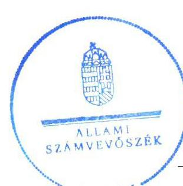
„A müszaki szabályozásnak két - eltérő szerep-
kört betöltő - fö dokumentumtípusa van: a jogszabály és a szabvány"
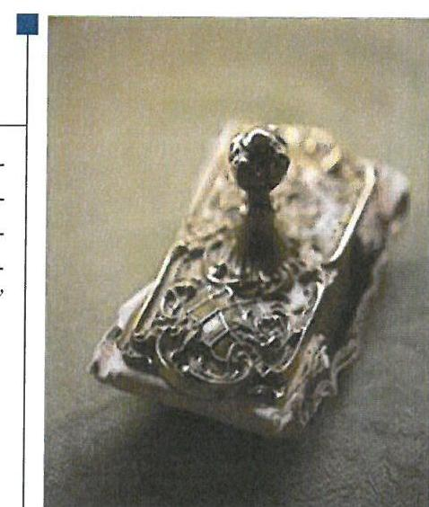

---

# AZ ELLENŐRZÉST FELÜGYELTE: 

PETŐ KRISZTINA felügyeleti vezető

## AZ ELLENŐRZÉST VEZETTE ÉS A VÉGREHAJTÁSÁÉRT FELELŐS:

PENCZ MÁRIA ellenőrzésvezető

## A PROGRAM ÖSSZEÁLLÍTÁSÁÉRT FELELŐS:

JANIK JÓZSEF LÁSZLÓ osztályvezető

IKTATÓSZÁM: V-1013-103/2016.
TÉMASZÁM: 2047

## ELLENŐRZÉS-AZONOSÍTÓ SZÁM: V074201

Jelentéseink az Országgyúlés számítógépes hálózatán és az Interneten a www.asz.hu címen is olvashatóak.

---

# TARTALOMJEGYZÉK 

■ ÖSSZEGZÉS ..... 5
■ AZ ELLENŐRZÉS CÉLJA ..... 7
■ AZ ELLENŐRZÉS TERÜLETE ..... 8
■ AZ ELLENŐRZÉS HÁTTERE, INDOKOLTSÁGA ..... 10
■ A JELENTÉS LÉNYEGES KÉRDÉSKÖREI ..... 11
■ ELLENŐRZÉS HATÓKÖRE ÉS MÓDSZEREI ..... 12
■ MEGÁLLAPÍTÁSOK ..... 14
■ JAVASLATOK ..... 24
■ MELLÉKLETEK ..... 27
I. Sz. melléklet: Értelmező szótár ..... 27
II. Sz. melléklet: A szerződések MSZT általi teljesítésének adatai ..... 28
III. Sz. melléklet: Az MSZT mérlegadatai és változásuk a 2012-2014. közötti években ..... 29
IV. Sz. melléklet: Az MSZT szervezeti ábrája ..... 30
■ FÜGGELÉK: ÉSZREVÉTELEK ..... 31
■ RÖVIDÍTÉSEK JEGYZÉKE ..... 49

---

.

---

# ÖSSZEGZÉS 

Az Állami Számvevőszék a Magyar Szabványügyi Testület gazdálkodási tevékenységét 2012. január 1. és 2014. december 31. közötti időszakban ellenőrizte.
Hiányosságot tárt fel az ellenőrzés a Magyar Szabványügyi Testület gazdálkodása területén, mert az egyszerűsített éves beszámolói a 2012-2013.években nem feleltek meg a jogszabályokban foglaltaknak, azok nem a valós állapotot tükrözték. Az ellenőrzés megállapította, hogy a Magyar Szabványügyi Testület közzétételi kötelezettségének nem tett eleget, ezáltal az átláthatóság nem volt biztosított. A Magyar Szabványügyi Testület a költségvetési támogatásokat szabályszerűen használta fel és számolta el. A Nemzeti Szabványosításról szóló tv.-ben előírt dokumentumokat nem teljes körűen küldte meg a törvényességi ellenőrzést ellátó nemzetgazdasági miniszternek, ezáltal akadályozta a testület elszámoltathatóságát.

## Az ellenőrzés társadalmi indokoltsága

A köztestületek közfeladatot látnak el, amelyre fokozott közérdeklődés irányul. Társadalmi elvárás a közpénzek értékelvű, rendeltetésszerű felhasználása, a közpénzekből nyújtott támogatások átláthatóságának megteremtése, amelyhez az Állami Számvevőszék az államháztartásból nyújtott támogatások ellenőrzésével kíván hozzájárulni.

## Főbb megállapítások, következtetések, javaslatok

A Magyar Szabványügyi Testület gazdálkodására vonatkozó belső szabályzatokat elkészítették.
A Magyar Szabványügyi Testület egyszerűsített éves beszámolói a 2012-2013. években nem a valós állapotot tükrözték, nem feleltek meg a jogszabályi előírásoknak, mert a mérleg tagolása a kötelezettségek tekintetében nem felelt meg a 224/2000. (XII. 19.) Korm. rendelet szerinti egyszerűsített éves beszámoló szerinti tagolásnak, a tagdíjakat nem az egyéb bevételek között számolták el, a kiegészítő mellékletben a pénzügyi műveletek bevételeit az egyéb bevételek között mutatták be. A 2014. évi beszámolója az eltérő célra képzett céltartalék feloldása miatt részben megfelelő volt.

Az ellenőrzött időszakban az eltérő célra képzett céltartalék feloldása következtében a Magyar Szabványügyi Testület eredménye nem a valós állapotot tükrözte, a hiba nagysága a 2012-2013. években elérte a Számviteli tv. szerinti, a mérlegfőösszeg 2\%-ával megegyező lényegességi küszöböt.

A 2012-2013. években a Számviteli tv. előírásait megsértve az értékvesztés alapját képező vevőkövetelések analitikája nem támasztotta alá a főkönyvi könyvelés alapján elszámolt értékvesztés mértékét. A hiba nagysága nem érte el a Számviteli tv. szerinti, a mérlegfőösszeg 2\%-ával megegyező lényegességi küszöböt. A gazdálkodási jogkörök gyakorlásának rendjét összességében szabályszerűen kialakították.

A költségvetési támogatások felhasználása és elszámolása az ellenőrzött időszakban szabályszerű volt.
A Magyar Szabványügyi Testület közzétételi szabályzattal rendelkezett, azonban az a 2012. január 1-jétől hatályon kívül helyezett elektronikus információszabadságról szóló 2005. évi XC. törvényre történő hivatkozást tartalmazta. A szabályzat mellékletében található közzétételi lista nem az Információs önrendelkezési jogról és az információszabadságról szóló 2011. évi CXII. tv. 1. számú melléklete szerinti Általános Közzétételi lista alapján készült, a 2005. évi XC. törvény mellékletét tartalmazta. Hiányoznak a mellékletből a II. Tevékenységre vonatkozó adatok közül az adatvédelmi és adatbiztonsági szabályzat, valamint a működésre vonatkozó adatok.

A Magyar Szabványügyi Testület honlapjának kialakítása nem felelt meg a jogszabályi előírásoknak, a közérdekű adatok közzétételére vonatkozó kötelezettségét nem teljes körűen teljesítette. Az Információs önrendelkezési jogról

---

és az információszabadságról szóló 2011. évi CXII. tv. szerinti közérdekú adatok és közérdekből nyilvános adatok helyett szakmai információkat tettek közzé, és a 305/2005. (XII. 25.) Korm. rendeletben előírtak ellenére a honlapjukon nem volt elérhető a „Közérdekú adatok" hivatkozás.

A Magyar Szabványügyi Testület a Nemzeti Szabványosításról szóló tv.-ben előírt dokumentumokat nem teljes körűen küldte meg a törvényességi ellenőrzést ellátó nemzetgazdasági miniszternek.

---

# AZ ELLENŐRZÉS CÉLJA 

Az ellenőrzés célja annak megállapítása, hogy a Magyar Szabványügyi Testület gazdálkodása során betartotta-e a vonatkozó jogszabályi előírásokat, szabályszerűen használta-e fel a közfeladatai ellátására kapott állami támogatásokat, illetve az államháztartásból meghatározott célra ingyenesen juttatott vagyont, a köztestületek szabályszerű működését biztosító ellenőrzési, monitoring és nyilvántartási rendszerek megfelelően múködtek-e.

---

# AZ ELLENŐRZÉS TERÜLETE 

## Magyar Szabványügyi Testület

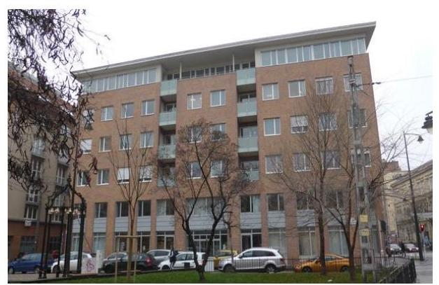

AZ MSZT ${ }^{1}$ létrehozását az MSZT tv. ${ }^{2}$ rendelte el, a Fővárosi bíróság 1995. december 13-án jegyezte be. Az MSZT tv. előírása alapján az MSZT bírósági bejegyzését követően tulajdonába kerültek az MSZH ${ }^{3}$ tulajdonában lévő vagyontárgyak - a laboratóriumok, a tanúsító és ellenőrző szervezetek akkreditálására rendelt vagyonrészek kivételével - valamint az MSZT tv. 2. számú mellékletében felsorolt ingatlanok.

Az MSZT jogi személy, nincsenek területi szervei, köztestületként az MSZT tv. felhatalmazása alapján a nemzeti szabványosítással összefüggő közfeladatokat kizárólagos jogkörrel látja el. Az MSZT törvényességi felügyeletét, ellenőrzését - jogszabályi előírások alapján - a nemzetgazdasági miniszter látja el.

Az MSZT az MSZT tv. és az Alapszabálya ${ }^{4}$ előírásai szerint múködik, tagja lehet bármely jogi személy, továbbá jogi személyiséggel nem rendelkező gazdálkodó szervezet, amely az Alapszabályt magára nézve kötelezőnek elfogadja, és a nemzeti szabványosítás célkitűzéseit, intézkedéseit támogatni kívánja. Az MSZT taglétszáma 2014. december 31-én 307 fő volt.

Az MSZT-t az elnök képviseli, aki ezt a jogát az ügyek meghatározott csoportjára nézve a törvényben meghatározottak szerint átruházhatja. Az elnök a törvényességi felügyelettel összefüggő ügyek képviseleti jogát az ellenőrzött időszakban nem ruházta át.

Az MSZT az MSZT tv. és az Alapszabályában foglalt előírásokkal összhangban vállalkozási tevékenységet nem folytatott, gazdasági társaságokban tulajdoni hányaddal nem rendelkezett.

Az ellenőrzött időszakot megelőzően törvényi előírás alapján kapott állami vagyonból az MSZT tv. 2. számú mellékletében szereplő három ingatlanból az ellenőrzött időszakban még tulajdonában álló balatonmáriafürdői üdülőt az ellenőrzött időszakban értékesítette.

Az MSZT-nek bevétele a különféle szolgáltatásaiért kapott díjakból szabványosítás, tanúsítás, felnőttképzés, szabványforgalmazás, szabványkidolgozás, információszolgáltatás, lapkiadás - és az MSZT tagjai által befizetett tagdíjakból adódik, a nemzetközi és az európai szervezetekben viselt tagságával járó kötelezettségekkel kapcsolatos költségeihez az állam a központi költségvetésből biztosítja a hozzájárulást.

Az MSZT ellenőrzött időszak egyszerűsített éves beszámolói szerinti bevételeit, ráfordításait, eredményét, vagyonának és államháztartásból nyújtott támogatás összegének alakulását, valamint a feladatellátást végzők létszámát az alábbi táblázat tartalmazza:

---

1. táblázat

# AZ MSZT GAZDÁLKODÁSA A 2012-2014. ÉVEKBEN

|   | 2012. év | 2013. év | 2014. év  |
| --- | --- | --- | --- |
|  Bevételek (M Ft) | 763,8 | 647,0 | 598,0  |
|  Ráfordítás (M Ft) | 744,9 | 647,0 | 598,0  |
|  Eredmény (M Ft) | 18,9 | 0,0 | 0,0  |
|  Mérlegfőösszeg (M Ft) | 1886,2 | 1763,5 | 1732,4  |
|  Támogatás (M Ft) | 66,5 | 87,9 | 81,8  |
|  Saját tőke (M Ft) | 1137,1 | 1137,1 | 1137,1  |
|  Létszám (fő) | 80 | 74 | 63  |

Fonrás: Az MSZT egyszerüuített éves beszámolói

---

# AZ ELLENŐRZÉS HÁTTERE, INDOKOLTSÁGA 

## AZ ÁSZ ${ }^{5}$ KÖZÉPTÁVRA SZÓLÓ STRATÉGIÁJÁBAN

megfogalmazta, hogy az államháztartáson kívülre nyújtott költségvetési támogatások és ingyenes vagyonjuttatások, valamint az államháztartáson kívül működő közfeladat-ellátó rendszerek ellenőrzéseivel hozzájárul ahhoz, hogy a közpénzeket az államháztartáson kívül működő szervezetek is átlátható, rendezett módon használják fel a közfeladatok szerződésben vállalt ellátása, továbbá a közvagyon szerződésben vállalt átlátható, hatékony, költségtakarékos működtetése, értékének megőrzése, állagának védelme, értéknövelő használata, hasznosítása és gyarapítása érdekében.

AZ ELLENŐRZÉS EREDMÉNYEKÉPP a törvényalkotás számára tapasztalatok állnak rendelkezésre a köztestületek szabályozásához. Az ellenőrzöttek számára visszajelzést adhat az ellenőrzés a közfeladataik ellátására kapott állami támogatások felhasználásának szabályosságáról, esetleges hiányosságairól, míg a társadalom számára információt szolgáltat a köztestület gazdálkodásáról és a közpénzek felhasználásáról. Az ÁSZ szervezetén belül lehetőség nyílik arra, hogy az intézmény erősítse hozzáadott értéket teremtő tevékenységét és tanácsadó szerepét.

---

# A JELENTÉS LÉNYEGES KÉRDÉSKÖREI 

1. Az MSZT gazdálkodása szabályozott és szabályszerű volt-e?
2. A költségvetési támogatások felhasználása és elszámolása szabályszerű volt-e?
3. A közfeladat ellátására az államháztartásból ingyenesen juttatott vagyon felhasználása, kezelése szabályszerű volt-e?
4. Érvényesítette-e a köztestület az adatvédelmi szabályokat és teljesítette-e a közérdekü adatokkal kapcsolatos, valamint az egyéb adatszolgáltatási kötelezettségét?

---

# ELLENŐRZÉS HATÓKÖRE ÉS MÓDSZEREI 

## Az ellenőrzés típusa

Megfelelőségi ellenőrzés

## Az ellenőrzött időszak

2012-2014. évek.

## Az ellenőrzés tárgya

Az ellenőrzés az MSZT pénzügyi, gazdálkodási feladatainak ellátására, továbbá a közfeladat ellátására kapott állami támogatás és az államháztartásból meghatározott célra ingyenesen juttatott vagyon szabályszerű felhasználására irányult. Az ellenőrzés kiterjedt továbbá az MSZT ellenőrzési, monitoring tevékenységére, az általa végzett vállalkozási, tulajdonosi felügyeleti tevékenységre, a nyilvántartásba történő bejelentkezési, adatszolgáltatási és közzétételi kötelezettségének teljesítésére, a köztestület létrehozó törvényben előírt törvényességi felügyeletét, törvényességi ellenőrzését ellátó szervezetek feladatellátására.

## Az ellenőrzött szervezet

Ellenőrzött szervezet a Magyar Szabványügyi Testület.

## Az ellenőrzés jogalapja

Az ÁSZ tv. ${ }^{6}$ 5. § (3) bekezdésében foglaltak alapján az ÁSZ ellenőrzi az államháztartásból nyújtott támogatás vagy az államháztartásból meghatározott célra ingyenesen juttatott vagyon felhasználását a köztestületeknél. Amennyiben a kedvezményezett szervezet az államháztartásból támogatásban vagy ingyenes vagyonjuttatásban részesül, gazdálkodási tevékenységének egésze ellenőrizhető.

## Az ellenőrzés módszerei

Az ellenőrzést az ellenőrzési program szempontjai, az ellenőrzött időszakban hatályos jogszabályok, az ellenőrzés szakmai szabályai, a jelen ellenőrzésre irányadó ÁSZ módszertan és a nemzetközi standardok figyelembevételével végeztük. A gazdálkodás hibáinak kijavítására irányuló javaslatok kidolgozásakor a hatályos jogszabályok az irányadóak.

---

Az ellenőrzési kérdések megválaszolásához szükséges bizonyítékok megszerzése az ellenőrzött által rendelkezésre bocsátott dokumentumokra, adatokra alapozva kérdésfelvetés, mintavételezés, valamint elemző eljárás útján történt.

Az ellenőrzési bizonyítékként felhasználható adatforrások közé tartoztak egyrészt a szakmai program részletes szempontjainál felsorolt adatforrások, másrészt minden egyéb - az ellenőrzés folyamán feltárt, az ellenőrzés szempontjából információt tartalmazó - dokumentum.

Az ellenőrzés lefolytatásához a köztestület a tanúsítványok elektronikus kitöltésével, valamint az ÁSZ által kért dokumentumok megküldésével szolgáltatott adatokat.

Az ellenőrzési kérdésekre adott válaszok alapján értékeltük, hogy a köztestület gazdálkodása során betartotta-e a vonatkozó jogszabályi előírásokat, szabályszerűen használta-e fel a közfeladatai ellátására kapott állami támogatásokat, illetve az államháztartásból meghatározott célra ingyenesen juttatott vagyont, a köztestület szabályszerű működését biztosító ellenőrzési, monitoring és nyilvántartási rendszerek megfelelően múködteke.

Mintavétellel ellenőriztük az MSZT gazdálkodásának szabályszerűségét. Ellenőrzött területek:
$\longrightarrow$ immateriális javak, tárgyi eszközök, befektetett pénzügyi eszközök, követelések, és pénzeszközök;
$\longrightarrow$ beruházási, felújítási ráfordítások;
$\longrightarrow$ igénybevett és egyéb szolgáltatások, a személyi jellegú ráfordítások költségei.
A minta alapján a sokaságban előforduló hibaarányt becsültük. „Megfelelőnek" értékeltük az ellenőrzött területet, amennyiben 95\%-os bizonyossággal a teljes sokaságban a hibaarány legfeljebb 10\% „részben megfelelőnek" értékeltük, ha a hibaarány felső határa 10-30\% között volt, „nem megfelelőnek" pedig akkor, ha a mintavételi eredmények alapján a sokaságbeli hibaarány felső határa meghaladta a 30\%-ot.

A támogatások felhasználásának és elszámolásának ellenőrzését a már lejárt elszámolási határidejű szerződésekből egyszerű véletlen mintavétellel kiválasztott szerződésenkénti két-két kifizetési bizonylat alapján ítéltük meg.

---

# 1. Az MSZT gazdálkodása szabályozott és szabályszerű volt-e? 

Összegző megállapítás

Az ellenőrzött időszakban az MSZT gazdálkodásának szabályozottsága a belső szabályzatokban feltárt hiányosságok miatt nem teljes körűen felelt meg a jogszabályi előírásoknak. Az MSZT gazdálkodása a 2012-2013. években nem felelt meg a jogszabályi előírásoknak, mert éves beszámolóit nem a 224/2000. (XII. 19.) Korm. rendelet ${ }^{7}$ előírásainak megfelelően készítette el. A 2014. évi beszámolója az eltérő célra képzett céltartalék feloldása miatt részben megfelelő volt.
1.1. számú megállapítás

Az MSZT gazdálkodásának szabályozottsága nem felelt meg teljes körűen a jogszabályi előírásoknak, mert a Számlarend nem tartalmazta a Céltartalékok számlát, a Pénzkezelési és Értékelési szabályzat ${ }^{8}$ elavult jogszabályra történő hivatkozást tartalmazott.
2. táblázat

## HIÁNYOSSÁGOK

2012-2014. évek
AZ MSZT Számlarendjének pontatlansága
A Pénzkezelési és értékelési szabályzat aktualizálásának elmaradása

Forrás: ÁSZ kimutatás

AZ ALAPSZABÁLYBAN az MSZT az MSZT tv. előírásának megfelelően meghatározta a gazdálkodásra vonatkozó szabályokat. Az alapszabályban rendelkeztek az éves beszámoló, a PEB ${ }^{9}$ véleménye alapján az éves költségvetés, illetve az erről szóló beszámoló Közgyűlés ${ }^{10}$ általi jóváhagyásáról, az MSZT gazdálkodásának PEB általi ellenőrzéséről, valamint az MSZT éves költségvetésének és éves költségvetési beszámolójának PEB általi véleményezéséről. Az alapszabály a gazdálkodással kapcsolatos feladatokat az Ügyintéző szervezet vezetőjének ${ }^{11}$ feladatkörébe utalta. Az SZMSZ ${ }^{12}$ : rendelkezése alapján az Ügyintéző szervezet működését érintő utasítások szabályzatok kiadása az Ügyintéző szervezet vezetőjének feladata volt.

SZÁMVITELI POLITIKÁVAL ${ }^{13}$ és Számlarenddel ${ }^{14}$ az ellenőrzött időszakban az MSZT rendelkezett. Az árfolyam-különbözeteket a Számlarendben foglaltaknak megfelelően havonta számolták el a közvetített szolgáltatás, a vevő kintlévőség és a szállítói kötelezettség tekintetében.

A SZÁMLAREND a Számv. ${ }^{15}$ tv. 161. § (2) bekezdés a) pontjában foglaltakkal ellentétben nem tartalmazta a 42-es Céltartalékok számlát, ezen belül a Céltartalékok a várható kötelezettségekre 421 alszámlát, annak ellenére, hogy arra - a mérleget alátámasztó főkönyvi kivonat alapján - minden ellenőrzött évben történt könyvelés.

A PÉNZKEZELÉSI ÉS ÉRTÉKELÉSI SZABÁLYZAT16 aktualizálására - a Számv. tv. 14. § (11) bekezdésében előírtak ellenére nem került sor, mivel a 2014. március 15-étől hatálytalan $\mathrm{Ptk}_{1}{ }^{17}$-re történő hivatkozást tartalmaz több helyen.

---

# A GAZDÁLKODÁSI JOGKÖRÖK 

A GAZDÁLKODÁSI JOGKÖRÖK gyakorlása rendjének kialakítása szabályszerű volt, a gazdálkodási jogkörök gyakorlóit több belső szabályozási szinten rögzítették. Kötelezettségvállalási és utalványozási jogkörrel az Alapszabály 25. § 2. pontja alapján az Ügyintéző szervezet vezetője ${ }^{18}$, illetve az általa kijelölt személyek rendelkeztek. A gazdálkodási jogköröket a nevesített munkavállalók munkaköri leírásaiban is rögzítették. Az Értékelési szabályzat 3-4. pontjai alapján írásos kötelezettségvállalási dokumentumot a 100 ezer Ft értéket meghaladó kötelezettségvállalások esetén kellett készíteni. A teljesítésigazolással kapcsolatos szabályokat az SZMSZ ${ }^{19}{ }_{1,2}$ 5.2. pontjában, az Értékelési szabályzat 4. pontjában, a 11/1996. számú ${ }^{20}$ és az 1/2011. számú ${ }^{21}$ igazgatói utasításokban rögzítették.

Az MSZT-nél az igénybe vett és egyéb szolgáltatások, a személyi jellegú ráfordítások költségei elszámolása összességében megfelelt a jogszabályok és a belső szabályzatok előírásainak. A költségelszámolást megalapozó dokumentumok rendelkezésre álltak, azokon szerepelt az utalványozó aláírása és a teljesítés igazolása a Számv. tv. 167. § (1) bekezdés c) pontjában előírtak szerint. A kifizetések bizonylatai megfeleltek a Számv. tv. 167. § (1) bekezdés előírásainak.

Az MSZT beszámoló készítési kötelezettségének eleget tett, azonban egyszerűsített éves beszámolói nem feleltek meg a jogszabályokban és a belső szabályzatokban foglaltaknak.

Az MSZT a 224/2000. (XII. 19.) Korm. rendelet 7. § (2) bekezdésében foglaltaknak megfelelően a Számviteli politika 1.3.1. pontjában egyszerűsített éves beszámoló-készítési kötelezettséget írt elő.

Az MSZT az ellenőrzött időszakban a 224/2000. (XII. 19.) Korm. rendeletben előírt május 31-i határidőre elkészítette egyszerűsített éves beszámolóit, azonban a beszámolók mérlegeiben a kötelezettségek tagolása nem felelt meg a 224/2000. (XII. 19.) Korm. rendelet 4. számú melléklete az egyszerűsített éves beszámoló mérlegének előírt tagolása - szerinti kötelezettségek tagolásának, mert azok nem tartalmazták a „Hátrasorolt kötelezettségek" sort.

Az MSZT az ellenőrzött időszakban az egyszerűsített éves beszámolók eredménykimutatásaiban a 224/2000. (XII. 19.) Korm. rendelet 5. számú mellékletében előírtak ellenére a tagdíjakból származó bevételeket nem az egyéb bevételek között mutatta be.

A Közgyűlés az egyszerűsített éves beszámolókat - a PEB javaslatára a 2/2013. (V. 27.) számú, a 2/2014. (V. 29.) számú és a 2/2015. (V. 21.) számú határozatokkal jóváhagyta.

A kiegészítő mellékletben a Számv. tv. 88. § (2) bekezdésében előírtakat nem vették figyelembe, mert a pénzügyi műveletek bevételeit az egyéb bevételek között mutatták be.

---

Az ellenőrzött három évben az MSZT összesített bevétele a következő forrásokból tevődött össze:
2. ábra

# A bevételek megoszlása a 2012-2014. években 

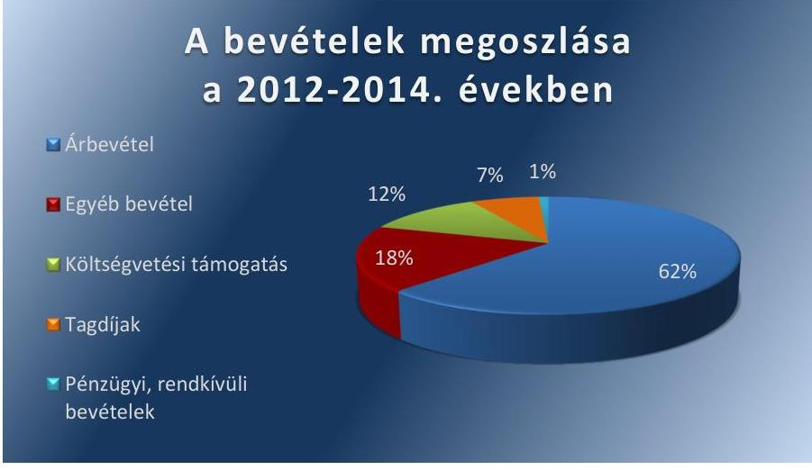

Forrás: Az MSZT éves beszámolói

Az MSZT 2009. évben várható beruházási kötelezettségekre a Számv. tv. 41. § (2) bekezdésének megfelelően céltartalékot képzett. Az ellenőrzött időszakban sor került a céltartalékok képzési céllal ellentétes feloldására. Az ellenőrzött időszak egyszerűsített éves beszámolóiban a nem megfelelő célra feloldott céltartalék miatt keletkezett hibák a 2012-2013. években meghaladták a Számv. tv. 3. § (3) bekezdés 3. pontja alapján számított, a mérlegfőösszeg 2\%-ával megegyező, 37,7 M Ft, illetve 35,3 M Ft mértékű jelentős összegű hibahatárt, amelynek következtében az MSZT egyszerűsített éves beszámolói a 2012-2013. években nem a valós állapotot tükrözték. A 2014. évben elszámolt 30,0 M Ft céltartalék feloldás nem minősül jelentős összegű hibának, mivel az adott évben nem haladta meg a Számv. tv. 3. § (3) bekezdés 3. pontja szerint számított, a mérlegfőösszeg 2\%-ával megegyező, 34,6 M Ft mértékű hibahatárt.

Az MSZT megsértette a Számv. tv. 15. § (7) bekezdésében rögzített öszszemérés számviteli alapelvét, mert a Számv. tv. 41. § (2) bekezdésében foglaltak szerint a várható kötelezettségekre képzett céltartalékot a 2012-2014. években a képzési céllal ellentétben - a bevételek kedvezőtlen alakulása miatt, valamint SZÉP ${ }^{22}$ kártya költségei fedezetére - oldotta fel. Az ellenőrzött időszakban évente 84,0 M Ft, 114,5 M Ft, illetve 29,9 M Ft mértékű céltartalék feloldására került sor, amit a Számv. tv. 77. § (3) bekezdés a) pontjának megfelelően egyéb bevételként számoltak el.

Az MSZT eredménye az eltérő célra képzett céltartalék feloldása és annak egyéb bevételként való tárgyévi elszámolása következtében a 20122014. években $18,9 \mathrm{M} \mathrm{Ft}, 0,0 \mathrm{M}$ Ft, illetve $0,0 \mathrm{M}$ Ft volt.

---

Az MSZT 2012-2014. évi mérlegei alapján a források összetétele:
3. táblázat

# AZ MSZT 2012-2014. ÉVI MÉRLEGEI ALAPJÁN A FORRÁSOK ÖSSZETÉTELE (M FT) 

| Mérlegtételek | 2012. évi nyitó | 2014. évi záró | Különbözet |
| :-- | --: | --: | :--: |
| Saját tőke | 1118,1 | 1137,0 | $+18,9$ |
| Céltartalékok | 794,4 | 566,0 | $-228,4$ |
| Kötelezettségek | 34,2 | 23,8 | $-10,4$ |
| Passzív időbeli elhatárolások | 4,3 | 5,7 | $+1,4$ |
| Összesen | 1951,0 | 1732,4 | $-218,5$ |

Forrás: Az MSZT egyszerúsített éves beszámolói

A céltartalék feloldás hatására az ellenőrzött időszakban a saját tőke 18,9 M Ft-os növekedést mutatott. Az MSZT szokásos üzleti tevékenysége során keletkezett éves hiányok nem mérleg szerinti veszteségként a saját tőkében jelentkeztek, azok a céltartalékok állományának összesen 228,4 M Ft mértékú csökkenését eredményezték.

## 1.3. számú megállapítás

A folyamatba épített ellenőrzési rendszert részben szabályszerűen múködtették, mert a főkönyvi könyvelés és az analitikus nyilvántartás adatai között nem teljes körűen volt biztosított az egyeztetés és ellenőrzés.

A főkönyvi könyvelés és az analitikus nyilvántartások adatai között az egyeztetés és az ellenőrzés nem volt teljes körűen biztosított. A 20122013. években a Számv. tv. 69. § (2) bekezdését megsértve, az értékvesztés alapját képező vevőköveteléseket tartalmazó analitika nem támasztotta alá a főkönyvi könyvelésben elszámolt 6,8 ezer Ft, illetve 206,8 ezer Ft értékvesztés mértékét. Az értékvesztés alapját képező analitikák kiegyenlített követeléseket is tartalmaztak. Az alap nélkül képzett értékvesztések miatt keletkezett hiba mértéke nem érte el a Számv. tv. 3. § (3) bekezdés 3. pontja szerinti 2\%-val megegyező, 34,6 M Ft jelentős összegű hibahatárt.

A 2014. évben a követelések után elszámolt értékvesztést a Számv. tv. 55. § (2) előírásainak megfelelően képezték.

A mérlegtételek év végi értékelése a 2012-2013. években részben felelt meg az előírásoknak, a mérlegtételek leltárral történő alátámasztottsága részben volt biztosított, mert a követelésekre a Számv. tv. 15. § (3) bekezdésében rögzített valódiság alapelvét megsértve képeztek értékvesztést.

A 2012-2014. években a Leltározási szabályzatnak ${ }^{23}$ megfelelően elvégezték az MSZT eszközeinek és forrásainak év végi leltározását. A 20122013. években az egyszerűsített éves beszámolók adatait - a követeléseket kivéve - leltárral alátámasztották. A követelések leltárral történő alátámasztásának hiánya miatt a Számv. tv. 69. § (1) bekezdésében előírtakat nem tartották be. A követelések, a követelésekre képzett értékvesztések analitikája és a főkönyvi nyilvántartás közötti egyeztetés elmaradt - a Számv. tv. 69. § (2) bekezdése ellenére - így nem tárták fel, hogy az értékvesztés alapját képező analitikák kiegyenlített követeléseket is tartalmaztak. Az eszközök bekerülési értékét a Számv. tv. 47. § (1), a Számviteli politika 2.5. pontja, illetve az Értékelési szabályzat 3. pontja előírásai szerint vették számításba.

---

# A FELÚJÍTÁSI, BERUHÁZÁSI RÁFORDÍTÁSOK dokumentálása, elszámolása az MSZT-nél szabályszerű volt. A beruházások, felújítások aktiválását és az értékcsökkenési leírás elszámolását az elszámolást megalapozó dokumentumnak megfelelően rögzítették. Az értékcsökkenést az aktivált eszközökön a Számviteli politika 1.2.4. pontjában rögzítettek szerint számolták el.

Az MSZT-nél az igénybe vett és egyéb szolgáltatások, a személyi jellegú ráfordítások költségei elszámolása megfelelt a jogszabályok és a belső szabályzatok előírásainak. A költségelszámolást megalapozó dokumentumok rendelkezésre álltak. Az utalványozás és a teljesítés igazolása a Számv. tv. 167. § (1) bekezdés c) pontjában előírtak szerint megtörtént. A kifizetések bizonylatai megfeleltek a Számv. tv. 167. § (1) bekezdés előírásainak.

Az MSZT a tagdijakat az ellenőrzött időszakban az Alapszabályában foglaltaknak megfelelően állapította meg, szedte be és használta fel.

TAGDÍJAT az MSZT tagjai az MSZT Alapszabályában rögzítetteknek megfelelően önbevallás alapján nettó árbevételüktől, illetve saját tevékenységük költségvetésétől függően fizettek. A tagdijat az Alapszabály - az MSZT Tagdijrendszere - részének 4. pontja alapján a tagszervezetek által az előző évi nettó árbevételről tett önbevallás alapján az SZT évente állapította meg az MSZT tv. 21. § (2) bekezdés b) pontjával és a 33. § (2) bekezdésével összhangban. A befolyt tagdij 2012-2014 között átlagosan 7,1\%-át finanszírozta az MSZT költségeinek.

Az ellenőrzött időszak alatt befizetett tagdijak mértéke az alábbiak szerint alakult:

|  4. táblázat |  |  |   |
| --- | --- | --- | --- |
|  AZ MSZT TAGDÍIBEVÉTELE |  |  |   |
|   | 2012. év | 2013. év | 2014. év  |
|  Tagdij (M Ft) | 48,2 | 47,1 | 46,2  |
|  Összes bevétel (M Ft) | 763,8 | 646,9 | 598,0  |
|  Költség (M Ft) | 744,9 | 646,9 | 598,0  |
|  Tagdij/összes bevétel (\%) | 6,3 | 7,3 | 7,7  |
|  Tagdij/kölltség (\%) | 6,5 | 7,3 | 7,7  |
|  Taglétszám | 384 | 323 | 307  |

Az MSZT gazdálkodásában a tagdijbevételek aránya stabil volt, a bevételek 6,3 - 7,7\%-a között alakult, melyet az alaptevékenység ellátására szabályszerűen használtak fel. A tagdijbevételek alakulását a tagok száma, öszszetétele és a tagdij nagysága befolyásolta. A tagdij megállapítása normatív módon, az árbevétel alapján sávosan történt.

A tagdijfizetés nyilvántartása és a főkönyvvel történő egyeztetése rendszeresen megtörtént. Az MSZT minden ellenőrzött évben összeállította azon tagok névsorát, akik nem tettek eleget tagdijfizetési kötelezettségüknek és amennyiben a tag a felhívás ellenére nem teljesítette az Alapszabályban foglalt kötelezettségeit, az SZT ${ }^{24}$ a tagot - előzetes írásbeli értesítés után - kizárta az MSZT tagjai közül.

---

# 2. A költségvetési támogatások felhasználása és elszámolása szabályszerű volt-e? 

## Összegző megállapítás

Az MSZT a költségvetési támogatásokat szabályszerűen használta fel és számolta el.

### 2.1. számú megállapítás

Az MSZT kialakította a közfeladata ellátására kapott költségvetési támogatás felhasználásának, nyilvántartásának, valamint a szakmai beszámolás és a pénzügyi elszámolás rendjét.

A Számv. tv.-ben és a 224/2000. (XII. 19.) Korm. rendeletben foglaltakkal összhangban a közpénzek felhasználásának és a köztulajdon használatának nyilvánossága és ellenőrizhetősége érdekében az MSZT nyilvántartási (könyvvezetési) rendszerét oly módon alakította ki, hogy abból a költségvetési támogatásból finanszírozott ráfordítások kigyűjthetők voltak.

A Számlarendben külön szabályozták a költségek (ráfordítások) ellentételezésére véglegesen kapott támogatások év végi elszámolását. Az ellenőrzött időszakban hatályos számlakeret mindegyike számla szinten szabályozta a két és többoldalú együttműködés költségeinek, a nemzetközi szervezetek magyarországi ülései előkészítése szervezési költségeinek és az egyéb költségvetési céltámogatással kapott költségeknek az elkülönítését, elszámolását. Az ellenőrzött időszakban hatályos számlakeretek előírták az NGM-től kapott költségvetési támogatás bevételként történő elszámolását, ami összhangban volt a 224/2000. (XII. 19.) Korm. rendelet előírásával.

Az MSZT támogatással történő elszámolásai az Önköltség-számítási szabályzattal ${ }^{25}$ és a támogatási szerződésekkel összhangban a támogatás terhére elszámolni kívánt összegeken kívül a tényleges kifizetéseket is tartalmazták.
2.2. számú megállapítás

Az MSZT a jogszabályok, a támogatási szerződések ${ }^{26}{ }_{1-4}$ és a belső szabályzatok előírásai szerint használta fel és számolta el a költségvetési támogatásokat.

Az MSZT a központi költségvetésből utólagos elszámolásra kapott támogatást összhangban a támogatási szerződésekben foglaltakkal, az MSZT tv.ben meghatározott feladatokra fordította és cél szerint használta fel. A támogatási szerződések összefoglaló táblázatát a II. sz. melléklet tartalmazza.
5. táblázat

A TÁMOGATÁSI SZERZŐDÉS SZERINTI ÖSSZEGEK ÉS A TÉNYLEGESEN KIFIZETETT KÖLTSÉGEK (M FT)

| Év | Ezodatilag szer-   zödött összeg | Többletigény miatt   szerződött összeg | Támogatási szerződések   szerinti teljes összeg | MSZT által kifizetett   költségek | Támogatásként az MSZT   részére átutalt összegek |
| :--: | :--: | :--: | :--: | :--: | :--: |
| 2012. | 66,5 | 0 | 66,5 | 98,1 | 66,5 |
| 2013. | 59,9 | $* 28,0$ | 87,9 | 145,4 | 87,9 |
| 2014. | 59,9 |  | 59,9 | 58,4 | 58,4 |

A költségvetési támogatások elszámolása az ellenőrzött időszakban szabályszerű volt, az MSZT a támogatási szerződésekben rögzített formában számolt el a támogató NGM felé.

---

Az MSZT a pénzügyi elszámolást a Számv. tv.-ben rögzített alaki-tartalmi követelményeknek megfelelő számviteli bizonylatokkal dokumentálta. A kötelezettségvállalást, a teljesítésigazolást és az utalványozást az arra jogosult végezte el. A kifizetéseket a megfelelő költségnemre számolták el.

Az MSZT elszámolását alátámasztó dokumentumok, számviteli bizonylatok megőrzésére vonatkozó előírásokat az Irattári terv ${ }^{27}$ szabályozása nem a támogatási szerződés1-3-ban foglaltaknak megfelelően határozta meg. Az Irattári terv szabályozása az MKB-számlakivonatok és mellékleteik, a belső utalványok, külföldi és belföldi útiszámlák és mellékleteik, az útielőlegek nyilvántartása, az úti jelentések, és a házi pénztári feladások és mellékletei esetében nem felelt meg a támogatási szerződés $1-3$ 5.4. pontjában foglalt 10 évi megőrzési határidőnek, mert ezen iratokra 5 év utáni selejtezést engedélyezett.

Az MSZT Iratkezelési Szabályzat 3. számú mellékletét képező Irattári terv nem felelt meg a 335/2005. (XII. 29.) Korm. rendelet ${ }^{28}$ 3. § (2) bekezdésében foglaltaknak, mert azt évente nem vizsgálták felül és nem módosították.

# 3. A közfeladat ellátására az államháztartásból ingyenesen juttatott vagyon felhasználása, kezelése szabályszerű volt-e? 

## Összegző megállapítás

A nemzeti szabványosítással összefüggő közfeladatának ellátása céljából, az államháztartásból ingyenesen tulajdonába juttatott vagyont 2014. évben értékesítette.

Az MSZT és az MNV Zrt. ${ }^{29}$ nyilvántartásai alapján az MSZT az ellenőrzött időszakban nem kapott az államháztartás központi alrendszeréből ingyenesen tulajdonba és vagyonkezelésbe vagyont. Az ellenőrzött időszakot megelőzően törvényi előírás alapján kapott állami vagyonból az MSZT tv. 2. számú mellékletében szereplő balatonmáriafürdői údülőt az ellenőrzött időszakban használta.

Az MSZT tv. 2. számú mellékletében nevesített 2. számú, saját tulajdonú ingatlant, a balatonmáriafürdői údülőt 2014. augusztus 27-én adta el. A PEB az ingatlan értékesítés előzetes tervét megvitatta és jóváhagyta. Az Ügyintéző szervezet vezetője az ingatlan piaci árának meghatározásakor a Selejtezési szabályzatban ${ }^{30}$ foglaltakkal összhangban járt el, a piaci értékítéletet és a használhatósági mértéket figyelembe vette, értékbecslőt bízott meg az údülő értékének megállapítására. Az ingatlan a 13,3 M Ft könyv szerinti értéknél magasabb áron - 29,5 M Ft értéken - került értékesítésre.

---

# 4. Érvényesítette-e a köztestület az adatvédelmi szabályokat és teljesítette-e a közérdekú adatokkal kapcsolatos, valamint az egyéb adatszolgáltatási kötelezettségét? 

Összegző megállapítás

Az M5ZT érvényesítette az adatvédelmi szabályokat, de nem teljes körűen teljesítette a közérdekú adatokkal kapcsolatos, valamint az egyéb adatszolgáltatási kötelezettségét. Honlapjának kialakítása nem felelt meg az Info tv. ${ }^{31}$ elöírásainak.
4.1. számú megállapítás

Az MSZT tagjai személyes adatainak kezelése során érvényesültek az Info tv.-ben és a belső szabályzatban előírt adatvédelmi szabályok.

Az MSZT rendelkezett adatvédelmi és adatbiztonsági szabályzattal, az információk kezeléséről, karbantartásáról, és illetéktelen hozzáférés elleni védelméről az 1/1999/7. számú, illetve az 1/2002/4. számú igazgatói utasításban ${ }^{32}$ rendelkeztek. Az igazgatói utasítások 5. pontjában rögzítették az MSZT számítógépes hálózatára felkerült információk kezelésének folyamatát, illetve az illetéktelen hozzáférés elleni védelmet. Az utasítások alapján az MSZT-nél az Informatikai Központ ${ }^{33}$ vezetője volt a felelős az MSZT belső számítógépes hálózatára felkerült információk nyilvántartásáért, és ennek az információnak a számítógépes hálózaton való megjelenítéséért. Az adatvédelemmel, illetve az adatbiztonsággal kapcsolatos szabályozás megjelent az Iratkezelési szabályzatban ${ }^{34}$ és a Szoftverfelhasználási és szoftvergazdálkodási szabályzatban ${ }^{35}$ is. A belső szabályzatok közötti összhangot a szabályzatok felülvizsgálatai során biztosították.

Az MSZT tagjai személyes adatainak kezelése során érvényesültek az Info tv.-ben és a belső szabályzatban előírt adatvédelmi szabályok. Az MSZT-nél a tagok nyilvántartását és annak rendjét a tagokkal és a projektmunkacsoportok tagjaival kapcsolatos nyilvántartási és pénzügyi feladatokról szóló 1996/18. számú igazgatói utasításban szabályozták. A személyes adatok kezelése során érvényre jutottak az Info tv. 4. §-ában foglalt elvek és tájékoztatási követelmények. Az SZMSZ: 5.3.3 pontja alapján az MSZT honlapjának technikai fejlesztése az ügyintéző szervezet nevesített adatfelelőseinek faladata volt.
4.2. számú megállapítás

Az MSZT a közérdekú adatok közzétételére vonatkozó kötelezettségét nem teljes körűen teljesítette. Az MSZT honlapjának a kialakítása nem felelt meg az előírásoknak, az Info tv.-ben előírtak ellenére a gazdálkodási adatokat nem tették közzé, folyamatba építve nem vizsgálták az Info tv. végrehajtásával összefüggő kötelezettségek teljesítését.

KÖZZÉTÉTELI SZABÁLYZATTAL az MSZT rendelkezett, azonban az a 2011. évben hatályba lépő Info tv. rendelkezéseivel nem volt összhangban. Az 1/2007. számú igazgatói utasításban ${ }^{36}$ rögzítették a 305/2005. (XII. 25.) Korm. rendelet ${ }^{37}$ 3. § (1) bekezdésében előírtaknak megfelelően a közzététellel kapcsolatos feladatok ellátásának részletes

---

6. táblázat

## KÖZÉRDEKŰ ADATOK KÖZZÉTÉTELÉVEL KAPCSOLATOS HIÁNYOSSÁGOK

2012-2014. évok
A Közzétételi szabályzat aktualizálásának elmaradása
Közérdekú adatok megismerésére irányuló igények teljesítési rendjét rögzítő szabályzat hiánya
Honlapjának kialakítása nem felelt meg a jogszabályi előírásoknak
A Közérdekú adatokat nem teljes körűen tette közzé

Fonrás: ÁsZ ellenőrzés
rendjét, a feladatok ellátására kijelölt munkaköröket, a munkakörök közötti együttműködés rendjét. Meghatározták a feladatok ellátására kijelölt munkaköröket, de a szabályzat a 2012. január 1-jétől hatályon kívül helyezett elektronikus információszabadságról szóló 2005. évi XC. törvényre történő hivatkozást tartalmazta. A szabályzat mellékletében található közzétételi lista a 2005. évi XC. törvény mellékletét tartalmazta, amely nem egyezik meg az Info tv. 1. számú mellékletében rögzített Általános Közzétételi listával. Hiányzik a mellékletből a II. Tevékenységre vonatkozó adatok közül az adatvédelmi és adatbiztonsági szabályzat, valamint a müködésre vonatkozó adatok.

A KÖZÉRDEKŰ ADATOK megismerésére irányuló igények teljesítésének rendjét rögzítő szabályzattal az MSZT az ellenőrzött időszakban nem rendelkezett, annak ellenére, hogy azt a közfeladatot ellátó szervnek az Info tv. 30. § (6) bekezdése előírja.

AZ MSZT HONLAPJÁNAK a kialakítása az ellenőrzött időszakban a közérdekú adatok közzététele szempontjából nem felelt meg az előírásoknak. Az MSZT honlapjának nyitólapjáról a 305/2005. (XII. 25.) Korm. rendelet 5. § (6) bekezdésében előírtak ellenére nem volt elérhető a „Közérdekú adatok" hivatkozás. Az MSZT a honlapján szereplő Közérdekú információk, közlemények oldalon az Info. tv. alapján közzéteendő közérdekú adatokat és közérdekből nyilvános adatok helyett szakmai információkat tett közzé.

A KÖZÉRDEKŰ ADATOK KÖZZÉTÉTELÉRE vonatkozó törvényi kötelezettségét nem teljes körűen teljesítette. Az MSZT honlapja tartalmazta az elektronikus közzététel alá eső, az Info. tv. 1. mellékletében részletezett Általános Közzétételi lista „I. Szervezeti, személyzeti adatok"at. Az Info. tv. 33. § (3) bekezdésében, valamint az Info tv. 37. § (1) bekezdésében előírtakkal szemben az Általános Közzétételi lista II. fejezetében felsoroltak közül az SZMSZ ${ }_{1,2}$, illetve az MSZT adatvédelmi és adatbiztonsági szabályzata, valamint az Általános Közzétételi lista III. fejezete „Gazdálkodási adatok" tekintetében a közérdekú adatok közzététele nem teljesült. Az MSZT tv.-ben előírt, az MSZT alapfeladatával összefüggő speciális feladatok ellátása érdekében az Ügyintéző szervezet vezetője igazgatói utasítást adott ki, melyben megfogalmazták a szabványok közzétételének lépéseit. Az MSZT a szabványok közzétételének a Szabványügyi Közlönyben való megjelentetéssel tett eleget.

Az MSZT a 305/2005. (XII. 25.) Korm. rendelet 4. §-ában előírtakkal szemben az ellenőrzött időszakban nem vizsgálta az Info tv. végrehajtásával összefüggő - a közérdekú adatok közzétételével és az egységes közadatkereső rendszerrel összefüggő - kötelezettségek teljesítését. Az SZMSZ 25.3 .9 pontja és az 1/2007. számú igazgatói utasítás alapján az ügyintéző szervezet adatfelelősei feladata volt a közérdekú adatok közzététele.

STATISZTIKAI ADATSZOLGÁLTATÁSI KÖTELEZETTSÉGÉNEK az MSZT a statisztikáról szóló 1993. évi XLVI. törvény ${ }^{38}$ rendelkezései szerint tett eleget, azonban az 1993. évi XLVI. törvény

---

és a 288/2009. (XII. 15.) Korm. rendelet 1. sz. melléklete rendelkezései ellenére a 2012. évben egy, a 2013. évben három alkalommal volt késedelmes az adatszolgáltatás.

AZ MSZT AZ MSZT TV. 27. §-ÁBAN ELŐíRT DOKUMENTUMOKAT nem teljes körűen küldte meg a törvényességi felügyeletét, ellenőrzését ellátó nemzetgazdasági miniszternek, mert az elfogadott közgyűlési és SZT határozatok, valamint az ellenőrzött időszakban alkotott vagy módosított szabályzatok, a Közgyűlés által elfogadott éves költségvetésről szóló határozatok megküldése elmaradt.

Az MSZT éves beszámoló megküldésére vonatkozó kötelezettségének az MSZT tv. 28. §-a szerint eleget tett.

---

# JAVASLATOK 

Az ÁSZ tv. 33. § (1) bekezdésében foglaltak értelmében az ellenőrzött szervezet vezetője köteles a jelentésben foglalt megállapításokhoz kapcsolódó intézkedési tervet összeállítani és azt a jelentés kézhezvételétől számított 30 napon belül az ÁSZ részére megküldeni. Amennyiben az intézkedési tervet határidőre nem küldi meg a szervezet, vagy amennyiben az nem elfogadható, az ÁSZ elnöke az ÁSZ tv. 33. § (3) bekezdés a)-b) pontjaiban foglaltakat érvényesítheti.

## a Magyar Szabványügyi Testület elnökének

1. Intézkedjen a jogszabályban meghatározott dokumentumok elöirt határidőn belüli megküldésére a törvényességi felügyeletet ellátó miniszter részére.
(4.2. sz. megállapítás 7. bekezdése alapján)

## a Magyar Szabványügyi Testület Ügyintéző szervezete vezetőjének

1. A Magyar Szabványügyi Testület szabályozott és szabályszerü gazdálkodás érdekében intézkedjen:
a) intézkedjen a számlarend aktualizálására a jogszabályi előírásoknak való megfelelés érdekében;
(1.1. sz. megállapítás 3. bekezdése alapján)
b) a pénzkezelési és értékelési szabályzat aktualizálására a hatálytalan jogszabályra való hivatkozás megszüntetése érdekében;
(1.1. sz. megállapítás 4. bekezdése alapján)
c) a jogszabályi előírásoknak megfelelő beszámoló elkészítésére;
(1.2. sz. megállapítás 2., 3., 5., 7. bekezdése alapján)
d) a céltartalék feloldása esetén annak jogszabályban elöírtak szerinti feloldására az összemérés számviteli alapelve betartása érdekében.
(1.2. sz. megállapítás 8. bekezdése alapján)

---

2. Intézkedjen az irattári terv évenkénti felülvizsgálatára és módosítására a jogszabályi előírások betartása érdekében.
(2.2. sz. megállapítás 4., 5. bekezdése alapján)
3. A közérdekü adatokkal kapcsolatos, valamint az egyéb adatszolgáltatási kötelezettség teljesítése érdekében intézkedjen:
a) a kötelezően közzéteendő adatok nyilvánosságra hozatalának rendje jogszabályi előírásoknak megfelelő aktualizálására;
(4.2. sz. megállapítás 1. bekezdés 1., 4., 5. mondata alapján)
b) a közérdekü adatok megismerésére irányuló igények teljesítésének rendje szabályozására;
(4.2. sz. megállapítás 2. bekezdése alapján)
c) a Magyar Szabványügyi Testület jogszabályi előírásoknak megfelelő honlapjának kialakítására;
(4.2. sz. megállapítás 3. bekezdése alapján)
d) az elektronikus közzétételi kötelezettség teljesítésére a jogszabályi előírásoknak megfelelően;
(4.2. sz. megállapítás 4. bekezdés 1., 3. mondata alapján)
e) az Info tv. végrehajtásával összefüggő kötelezettségek teljesítése jogszabályi előírásoknak megfelelő vizsgálatára és annak eredményéről átfogó jelentés készitésére.
(4.2. sz. megállapítás 5. bekezdése alapján)
4. Tegyen intézkedéseket a feltárt hiányosságok és/vagy szabálytalanságok tekintetében a felelősség tisztázása érdekében, és szükség szerint intézkedjen a felelősség érvényesítéséről.
(1.2. sz. megállapítás 2., 3., 5., 7. bekezdése alapján)

---

.

---

# MELLÉKLETEK 

- I. SZ. MELLÉKLET: ÉRTELMEZŐ SZÓTÁR
beruházás

A tárgyi eszköz beszerzése, létesítése, saját vállalkozásban történő előállítása, a beszerzett tárgyi eszköz üzembe helyezése. A beruházás a meglévő tárgyi eszköz bővítését, rendeltetésének megváltoztatását, átalakítását, élettartamának, teljesítőképességének közvetlen növelését eredményező tevékenység. [Forrás: Számv. tv. 3. § (4) bekezdés 7. pontja]
ellenőrzött időszak
A V-0914-052/2015. Iktatószámú a Köztestületek ellenőrzéséről készült Ellenőrzési Program szerint az ellenőrzött időszaka a 2012-2014. közötti időszak azon naptári évei, amelyekben a köztestület az államháztartásból nyújtott támogatásban részesült és/vagy e forrásból támogatást használt fel és/vagy az államháztartásból meghatározott célra ingyenesen juttatott vagyont használt. Az MSZT a 2012-2014. közötti időszak mindhárom évében részesült államháztartásból nyújtott támogatásban és az államháztartásból ingyenesen juttatott vagyont használt, így az ellenőrzött időszak a 2012-2014. évek.
felújítás
Az elhasználódott tárgyi eszköz eredeti állaga (kapacitása, pontossága) helyreállítását szolgáló időszakonként visszatérő olyan tevékenység, melynek során az eszköz élettartama megnövekszik, minősége, használata jelentősen javul, így a pótlólagos ráfordításból a jövőben gazdasági előnyök származnak. [Forrás: Számv. tv. 3. § (4) bekezdés 8. pontja]
jelentős összegű hiba
ho a hiba feltárásának évében, a különböző ellenőrzések során, egy adott üzleti évet érintően (évenként külön-külön) feltárt hibák és hibahatások - eredményt, saját tőkét növelő-csökkentő - értékének együttes (előjeltől független) összege meghaladja a számviteli politikában meghatározott értékhatárt. Minden esetben jelentős összegű a hiba, ha a hiba feltárásának évében az ellenőrzések során - ugyanazon évet érintően - megállapított hibák, hibahatások eredményt, saját tőkét növelő-csökkentő értékének együttes (előjeltől független) összege meghaladja az ellenőrzött üzleti év mérlegfőösszegének 2 százalékát, illetve ha a mérlegfőösszeg 2 százaléka nem haladja meg az 1 millió forintot, akkor az 1 millió forintot. [Forrás: Számv. tv. 3. § (3) bekezdés 3. pontja]
közfeladat
Jogszabályban meghatározott állami vagy önkormányzati feladat, amit az arra kötelezett közérdekből, jogszabályban meghatározott követelményeknek és feltételeknek megfelelve végez, ideértve a lakosság közszolgáltatásokkal való ellátását, továbbá az állam nemzetközi szerződésekben vállalt kötelezettségeiből adódó közérdekű feladatokat, valamint e feladatok ellátásához szükséges infrastruktúra biztosítását is. [Nvtv. 3. § (1) bekezdés 7. pontja]
köztestület
A köztestület önkormányzattal és nyilvántartott tagsággal rendelkező szervezet, amelynek létrehozását törvény rendeli el. A köztestület a tagságához, illetőleg a tagsága által végzett tevékenységhez kapcsolódó közfeladatot lát el. A köztestület jogi személy. A szakmai kamarák köztestületként folytatják tevékenységüket [Ptk.; 65. § (1) és (2) bekezdései alapján].
szabályszerű felhasználás
A jogszabályi előírásoknak és a támogatási szerződésekben foglalt előírásoknak megfelelően dokumentált és nyilvántartott felhasználás

---

# II. SZ. MELLÉKLET: A SZERZŐDÉSEK MSZT ÁLTALI TELJESÍTÉSÉNEK ADATAI

|  Szerződéskötés
dátumai/
Szerződésszám | Szerződött
összeg
M Ft | Elszámolás határideje | Elszámolás időpontja | Támogatásként
elszámolt
összeg M Ft | az NGM az elszámolást elfogadta  |
| --- | --- | --- | --- | --- | --- |
|  2012.10.19.
Pü 168/2012. | 66,5 | 2013.01.31-éig pénzügyi beszámoló | 2012.10.24. pénzügyi beszámoló | 56,7 | pénzügyileg teljesült 2012.12.01-én  |
|   |  |  | 2012.11.08. pénzügyi beszámoló | 9,8 | pénzügyileg teljesült 2012.12.17.-én  |
|   |  |  | Összesen | 66,5 |   |
|  2013.05.27.
Pü 91/2013. | 59,9 | 2013.01.01-03.31-éig 45,0 M Ft, pénzügyi
részbeszámoló 2013.03.31-éig | részbeszámoló nem készült |  | -  |
|   |  | 2013.04.01-05.31-éig 8,5 M Ft, pénzügyi
részbeszámoló 2013.05.31-éig | 2013.05.28. pénzügyi részbeszámoló | 55,4 | pénzügyileg teljesült 2013.07.16-án  |
|   |  | 2013.06.01-09.30-áig 6,4 M Ft pénzügyi
végbeszámoló 2013.10.30-áig | 2013.10.15. pénzügyi végbeszámoló | 4,5 | pénzügyileg teljesült 2013.11.29-én  |
|   |  |  | Összesen | 59,9 |   |
|  2013.12.20.
Pü 177/2013. | 28,0 | 2014.01.31-éig szakmai és pénzügyi be-
számoló | 2014.01.30. szakmai és pénzügyi beszámoló | 28,0 | NGM 2014.02.28-án hiánypótlást kért,
amit az MSZT 2014.03.05-én teljesítet
pénzügyileg teljesült 2014.04.18-án  |
|  2014.04.22.
Pü 57/2014. | 59,9 | 2014.01.01-03.31-éig végrehajtott felada-
tok tekintetében 2014.04.15. szakmai és
pénzügyi részbeszámoló | 2014.04.11. szakmai és pénzügyi részbeszámoló | 49,5 | pénzügyileg teljesült 2014.05.23-án  |
|   |  | 2014.04.01-05.31. között végrehajtott fel-
adatok tekintetében 2014.06.15-éig szak-
mai és pénzügyi záró-beszámoló | 2014.06.06. szakmai és pénzügyi záró-beszámoló | 8,9 | pénzügyileg teljesült 2014.06.23-án  |
|   |  |  | Összesen | 58,4 |   |

---

III. SZ. MELLÉKLET: AZ MSZT MÉRLEGADATAI ÉS VÁLTOZÁSUK A 2012-2014. KÖZÖTTI ÉVEKBEN

| Megnevezés | 2012.01.01 |  | 2012.12.31 |  | 2013.12.31 |  | 2014.12.31 |  | Változás 2014.12.31.2012.01.01. |   |
| --- | --- | --- | --- | --- | --- | --- | --- | --- | --- | --- |
|   | M Ft | \% | M Ft | \% | M Ft | \% | M Ft | \% | M Ft | \%  |
|  A. BEFEKTETETT ESZKÖZÖK | 1571,1 | 80,5 | 1537,1 | 81,5 | 1511,1 | 85,7 | 1478,9 | 85,4 | $-92,2$ | 94,1  |
|  I. Immateriális javak | 14,5 |  | 9,8 |  | 5,3 |  | 5,1 |  | $-9,4$ | 35,2  |
|  II. Tárgyi eszközök | 1553,4 |  | 1523,6 |  | 1503,3 |  | 1471,9 |  | $-81,5$ | 94,8  |
|  III. Befektetett pénzügyi eszközközök | 3,2 |  | 3,7 |  | 2,5 |  | 1,9 |  | $-1,3$ | 59,4  |
|  B. FORGÓESZKÖZÖK | 378,3 | 19,4 | 234,9 | 12,4 | 247,5 | 14,0 | 204,5 | 11,8 | $-173,8$ | 54,1  |
|  I. Készletek | 6,4 |  | 6,2 |  | 6,1 |  | 4,7 |  | $-1,7$ | 73,4  |
|  II. Követelések | 160,6 |  | 82,6 |  | 79,1 |  | 44,7 |  | $-116,9$ | 27,7  |
|  III. Értékpapírok | 0 |  | 0 |  | 0 |  | 0 |  | 0 | -  |
|  IV. Pénzeszközök | 211,3 |  | 146,1 |  | 162,3 |  | 155,1 |  | $-56,2$ | 73,4  |
|  C. AKTÍV IDŐBELI ELHATÁROLÁSOK | 1,6 | 0,1 | 114,2 | 6,1 | 4,9 | 0,3 | 49,1 | 2,8 | 47,5 | 3068,8  |
|  ESZKÖZÖK ÖSSZESEN | 1951,0 |  | 1886,2 |  | 1763,5 |  | 1732,5 |  | $-218,5$ | 88,8  |
|  D. SAJÁT TÖKE | 1118,1 | 57,3 | 1137,1 | 60,3 | 1137,1 | 64,5 | 1137,0 | 65,6 | 18,9 | 101,7  |
|  I. Induló tőke/Jegyzett tőke | 102,7 |  | 102,7 |  | 102,7 |  | 102,7 |  | 0 | 100  |
|  II. Tőkeváltozás/Eredmény | 1015,4 |  | 1015,5 |  | 1034,4 |  | 1034,3 |  | 18,9 | 101,7  |
|  III. Lekötött tartalék | 0 |  | 0 |  | 0 |  | 0 |  | 0 | -  |
|  IV. Értékelési tartalék | 0 |  | 0 |  | 0 |  | 0 |  | 0 | -  |
|  V. Tárgyévi eredmény alaptevékenységböl | 0 |  | 18,9 |  | 0 |  | 0 |  | 0 | -  |
|  VI. Tárgyévi eredmény váll. tev.-ből | 0 |  | 0 |  | 0 |  | 0 |  | 0 | -  |
|  E. Céltartalék | 794,4 | 40,7 | 710,4 | 37,7 | 595,9 | 33,8 | 566,0 | 32,7 | $-228,4$ | 71,2  |
|  F. Kötelezettségek | 34,2 | 1,8 | 33,4 | 1,7 | 25,7 | 1,5 | 23,8 | 1,4 | $-10,4$ | 69,6  |
|  I. Hátrasorolt kötelezettségek |  |  |  |  |  |  |  |  |  |   |
|  II. Hosszú lejáratú kötelezettségek | 0 |  | 0 |  | 0 |  | 0 |  | 0 | -  |
|  III. Rövid lejáratú kötelezettségek | 34,2 |  | 33,4 |  | 25,7 |  | 23,8 |  | $-10,4$ | 69,6  |
|  G. PASSZÍV IDŐBELI ELHATÁROLÁSOK | 4,3 | 0,2 | 5,3 | 0,3 | 4,8 | 0,2 | 5,7 | 0,3 | 1,4 | 132,6  |
|  FORRÁSOK ÖSSZESEN | 1951,0 |  | 1886,2 |  | 1763,5 |  | 1732,5 |  | $-218,5$ | 88,8  |

---

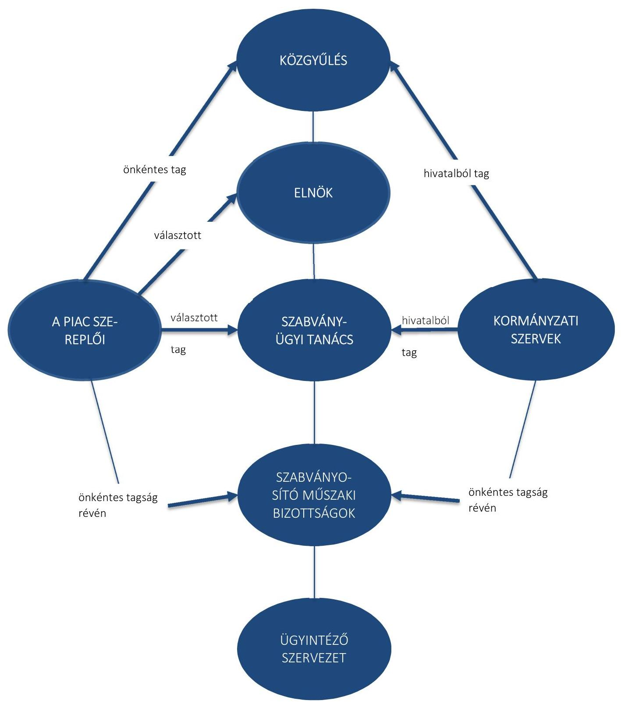

# - IV. SZ. MELLÉKLET: AZ MSZT SZERVEZETI ÁBRÁJA

---

# FÜGGELÉK: ÉSZREVÉTELEK 

A jelentéstervezetet a Számvevőszék 15 napos észrevételezésre megküldte az ellenőrzött szervezet vezetőjének az ÁSZ tv. 29. §* (1) bekezdése előírásának megfelelően.
A Magyar Szabványügyi Testület elnöke az ellenőrzés megállapításaira írásban észrevételt tett.

Az elfogadott észrevételek alapján az Állami Számvevőszék módosította a jelentést.
A függelék tartalmazza az ellenőrzött szervezet vezetőjének észrevételeit, illetve az el nem fogadott észrevételek elutasításának indoklását.

[^0]
[^0]:    * 29. § (1) Az Állami Számvevőszék az ellenőrzési megállapításait megküldi az ellenőrzött szervezet vezetőjének vagy az általa megbízott személynek, és annak, akinek személyes felelősségét állapította meg.
    (2) Az ellenőrzött szervezet vezetője és a felelősként megjelölt személy az ellenőrzés megállapításaira tizenöt napon belül írásban észrevételt tehet.
    (3) Az Állami Számvevőszék az észrevételre a beérkezésétől számított harminc napon belül írásban válaszol. A figyelembe nem vett észrevételeket köteles a jelentésben feltüntetni, és megindokolni, hogy azokat miért nem fogadta el.

---

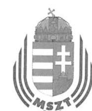

# MAGYAR SZABVÁNYÜGYI TESTÜLET 

## ELNÖK

Hungarian Standards Institution $\cdot$ Institut Hongrois de Normalisation $\cdot$ Ungarisches Institut für Normung

## Domokos László

elnök
Állami Számvevőszék Budapest
Apáczai Csere János u. 10 1052

ÁLLAMI SZÁMVEVÓSZÉK
046838/2016
Érkeze: 2016 JÚN 07
Iktatószám: V-1013-084/2016
Melléklet:......./e. B.Lp

## Tisztelt Elnök Úr!

A 2016. május 19-én kelt, - május 24-én kézhez vett - levelének mellékleteként megküldött, a „Köztestületek ellenőrzése - Magyar Szabványügyi Testület" című ellenőrzésről készült számvevőszéki jelentéstervezetre, az alábbi észrevételeket tesszük.

Köszönettel vettük, hogy T. Állami Számvevőszék biztosítja számunkra az észrevételezés lehetőségét, továbbá azt is, hogy a vizsgálati anyagban megfogalmazott célok alapján a kívülálló szemével áttekintette és értékelte az MSZT szabályozottságát, gazdálkodását.

1. A jelentéstervezetben foglaltakat összességében pozitívan értékeljük, igazolva látjuk a nemzeti szabványosítási tevékenység céljainak európai, nemzetközi, hazai előírásainak megfelelő működtetésére tett erőfeszítéseink sikerességét.
Örömmel nyugtázzuk azon megállapításokat, miszerint;

- „Az MSZT a jogszabályok, a támogatási szerződések és a belső szabályzatok előírásai szerint használta fel és számolta el a költségvetési támogatásokat." (2.2. számú megállapítás)
- „Az MSZT a tagdíjakat az ellenőrzött időszakban az Alapszabályában foglaltaknak megfelelően állapította meg, szedte be és használta fel." (1.4. számú megállapítás)
- A közfeladat ellátására az államháztartásból ingyenesen juttatott vagyon felhasználása, kezelése (értékesítése) szabályszerű volt.

---

- Az MSZT-nél a gazdálkodási jogkörök gyakorlása rendjének kialakítása szabályszerű, az igénybe vett szolgáltatások, a személyi jellegű ráfordítások költségeinek elszámolása összességében megfelelő.
- A felújítási, beruházási ráfordítások dokumentálása, elszámolása az MSZT-nél szabályszerűen történik.
- „Az MSZT tagjainak személyes adatainak kezelése során érvényesülnek az Info tv.-ben és a belső szabályzatban előírt adatvédelmi szabályok." (4.1. számú megállapítás)

A felsorolt megállapítások számunkra azt igazolják, hogy Testületünk mind az állami juttatásokkal (ingyenesen juttatott vagyon, költségvetési támogatások), mind a tagok által rendelkezésünkre bocsátott pénzeszközökkel (tagdíjak) megfelelően és körültekintően, az előírások betartásával gazdálkodik.
2. A jelentéstervezet az MSZT müködésével összefüggésben néhány hiányosságot is feltár, ezeket a jelentés véglegesítését követően az elfogadott intézkedési tervnek megfelelően áll szándékunkban kijavítani.

Néhány észrevételt azonban ezekhez is szeretnénk fűzni;
2.1. A T. Állami Számvevőszék a jelentéstervezet 8. oldalán rövid összegzést ad az MSZT működésének jogszabályi hátteréről, feladatairól, tevékenységéről. Az ismertetés utolsó előtti bekezdése hiányosan mutatja be az MSZT működésének pénzügyi forrásait, amikor azt mondja, hogy „a nemzetközi és az európai szervezetekben viselt tagsággal járó kötelezettségekkel kapcsolatos költségekhez az állam a központi költségvetésből hozzájárul". Valójában a nemzeti szabványosításról szóló 1995. évi XXVIII. törvény 33. § (3) bekezdése úgy szól, hogy: „Az éves állami központi költségvetésben kell az MSZT részére biztosítani a nemzetközi és az európai szabványügyi szervezetekben való képviselethez, illetve az ezekből eredő feladatok ellátásához a szükséges költségvetési hozzájárulást."

# A hozzájárulni vagy biztosítani nem ugyanazt jelenti! 

A törvény 33. § (1) bekezdése szerint ugyanis az MSZT működésének forrása többek között:

---

„d) a nemzetközi együttműködés finanszírozását biztosító, központi költségvetésből kapott támogatás,".

Valójában a kapott támogatás még a nemzetközi tagdijakat sem fedezi, pedig a tagdijak befizetése csak a lehetőséget teremti meg a nemzetközi együttműködéshez, az együttműködés pedig további költségekkel jár.

Az MSZT így a nemzetközi együttműködést, - ami a Magyarország által vállalt, törvényekben kihirdetett kötelezettségekből származik - csak a fejlesztésektől, a működéstől elvont források felhasználásával tudja fenntartani. Mindeközben a gazdaság fejlődése következtében a szabványokkal kapcsolatos szolgáltatásainkat és a szabványosítás működését a digitális ipar kihívásaihoz kellene igazítani.

A központi költségvetés évekre visszamenően csak mintegy 2/3-ad részben fedezi a nemzetközi és az európai szervezetekben viselt tagdijakat, amit Testületünknek kell kiegészíteni más forrásokból elvonva a szükséges pénzeszközöket. Ezt minden évben, így a vizsgált időszakban (2012-2014-ben) is jeleztük a Minisztérium részére. A vizsgálatot végző revizorokat is tájékoztattuk ezekről a körülményekről, a jelentéstervezetben viszont említés sem történik arról, hogy itt önhibánkon kívül évről-évre olyan hiány képződik, amit máshonnan kell pótolnunk Magyarország nemzetközi szerződésekben vállalt kötelezettségei betartása, illetve a mulasztásból eredő nemzetközi bonyodalmak és a Magyarországgal szembeni szankciók megelőzése érdekében. Ezen előzmények tudatában más megvilágításba kerül az az elmarasztaló megállapítás, hogy az ellenőrzött időszakban az MSZT várható beruházási kötelezettségekre céltartalékot képzett, de azt kényszerűségből más célokra kellett felhasználja. Így az egyszerűsített éves beszámolókban a nem megfelelő célra feloldott céltartalék elszámolása nem a számviteli jogszabályokban előírt módon történt. A megállapítást köszönettel vettük és szándékaink szerint a mérlegadatokat és számviteli beszámolókat kijavítjuk.

Mivel a vizsgálat egyik deklarált célja a köztestületekre vonatkozó jogi szabályozás korszerűsítésének elősegítése, indokolt azt is feltárni, hogy

---

milyen, a nemzetközi kapcsolatok finanszírozását érintő jogszabályi előírások nem teljesülnek tartósan. Jelen esetben ezt hiányoljuk.

Ezen túl tisztelettel kérjük, hogy a jelentés fogalmazzon meg feladatot a Kormány számára arról, hogy a jövőben gondoskodjon a nemzetközi tagdíjak biztosításáról, mert az MSZT a hatályos szabályoknak mindenben megfelelő gazdálkodást csak ebben az esetben képes teljesíteni.

A gazdálkodást érintő pénzügyi tárgyú megállapításokkal kapcsolatban a következők az észrevételeink.

Nem állja meg a helyét az a megállapítás, hogy a Számviteli politika nem áll összhangban a Számlarenddel (1.1. számú megállapítás). A Számviteli politika 1.2.6. pontjának hivatkozása a külföldi pénzértékre szóló mérlegtételek üzleti év végi átértékeléséről szól, nem pedig az analitikákban keletkező árfolyam-differenciák elszámolásáról. (1. melléklet)

Az előbbiekre figyelemmel ezt a téves megállapítást kérjük a jelentésből törölni.

Téves az 1.2. számú megállapítás, mely szerint az MSZT a 224/2000 (XII.19.) Kormányrendelet 1. sz. melléklete szerint készíti az egyszerúsített éves beszámoló mérlegét (pl.: a Testület mérlege időbeli elhatárolás sorokat is tartalmaz, míg a rendelet 1. sz. mellékletében nincs ilyen sor). Az MSZT ugyanis a rendelet 4. sz. melléklete szerint készíti az egyszerűsített éves beszámoló mérlegét, melytől annyiban tér el, hogy a „Hátrasorolt kötelezettségek" sor nem szerepel az MSZT „Egyszerűsített éves beszámoló mérlegében", mivel a Testületnek nincs ilyen besorolású kötelezettsége. (2/a, 2/b, 2/c, 2/d és 2/e mellékletek)

Ezt a téves megállapítást is kérjük törölni a jelentésből.
2.2. Nem értelmezhető számunkra a jelentéstervezet azon megállapítása, hogy „az MSZT a nemzeti szabványosításról szóló törvényben előírt dokumentumokat nem teljes körűen küldte meg a törvényességi

---

ellenőrzést ellátó nemzetgazdasági miniszternek, ezáltal akadályozta a Testület elszámoltathatóságát".

A megállapítás az előírások félreértéséből (félremagyarázásából) ered. A jelentéstervezet egyetlen, a megállapítást alátámasztó olyan dokumentumot sem nevez meg, amit az MSZT nem küldött meg a minisztériumnak. Ez a megállapítás tehát alaptalan, nem életszerű, nem felel meg a valóságnak így adatokkal, bizonyítékokkal, tényekkel nem is lehet alátámasztani.

A vizsgálat nem tulajdonított megfelelő jelentőséget annak, hogy az MSZT és a Nemzetgazdasági Minisztérium kapcsolatrendszere több síkon mozog. A Miniszter törvényességi felügyeleti jogkört gyakorol az MSZT felett és jogszabály által kijelölt kapcsolattartója az MSZT-nek, a Minisztérium képviselői pedig hivatalból delegált tagjai a Közgyűlésnek és a Szabványügyi Tanácsnak, valamint szakmai érdekeltségüknek megfelelően rendes tagjai a nemzeti szabványosító műszaki bizottságoknak. Ez a többszintű kapcsolatrendszer a garancia arra, hogy a határozatok, határozattervezetek eljutnak a törvényességi felügyeletet gyakorló minisztérium képviselőjéhez/képviselőihez, illetőleg, hogy a Minisztérium illetékesei értesülnek az MSZT által meghozott határozatokról. (A tervezetben megjelölt SZT határozatok $90 \%$-a nemzeti szabványok jóváhagyása, módosítása, visszavonása; illetőleg nemzeti szabványosító műszaki bizottságok létrehozásának, megszüntetésének jóváhagyása, amelyek tiszta szakmai kérdések, törvényességi szempontból nem relevánsak.)

Az MSZT fennállásának 20 éve alatt nem került sor velünk szemben törvényességi intézkedésre, ilyet senki nem kezdeményezett. Ebből csak azt a következtetést lehet levonni, hogy ezzel ellentétes adatok hiányában az MSZT múködése törvényes.

A tervezet ennek ellenére negatív tartalmú megállapítást tett és a Testület elszámoltathatóságának akadályozásáról beszél. Ez azon túlmenően, hogy nincs valóságalapja, az MSZT megítélését is rontja. Az MSZT együttműködési készségét jelen ellenőrzés során a T. Állami Számvevőszék revizorai is tapasztalhatták.

---

Ezt a téves, konkrétumokkal alá nem támasztott megállapítást ugyancsak kérjük törölni a jelentésből.
2.3. A jelentéstervezet tartalmaz még olyan megállapításokat, hogy az MSZT nem rendelkezik a közérdekú adatok megismerésére irányuló igények rendjét rögzítő szabályzattal vagy, hogy az MSZT nem teljes körűen teljesítette a közérdekú adatok közzétételére vonatkozó kötelezettségét, illetőleg a honlap kialakítása nem felelt meg az előírásoknak.

Véleményünk szerint ez a megállapítás eltúlzott, a jelentéstervezet indokolatlanul nagy terjedelemben foglalkozik ezzel a kérdéskörrel annak ellenére, hogy a 2005. évi XC. törvényben foglaltaknak megfelelt az MSZT anyaga, ezért a hibát minimálisnak kell tekinteni.

A jelentés tervezet arra hivatkozik, hogy a honlapon nem szerepel a „közérdekű adatok" rovat, de ugyanakkor nyilvánvaló, illetve igazolható, hogy a honlap közérdekű adatok tömegét tartalmazza.

A felsorolt hibákat megszüntetjük figyelemmel arra a tényre, hogy tartalmilag nagyon sok előírt adatot közzéteszünk, így a megállapításokat alapjában véve formai hiányoknak tekintjük.
3. Észrevételünket összegezve: a megküldött jelentéstervezetet összességében elfogadhatónak tartjuk, a megállapítások többségét hasznosítjuk. Néhány módosítást azonban szükségesnek tartunk a következők szerint.

A jelentés elején szereplő „ÖSSZEGZÉS" álláspontunk szerint nincs összhangban a jelentéstervezet megállapításaival. A magunk részéről a legfontosabbnak, ezért kiemelendőnek tartjuk annak kimondását, hogy a Magyar Szabványügyi Testület a költségvetési támogatásokat szabályszerűen számolta el és használta fel.

A 2012-2013. évek egyszerűsített éves beszámolóival összefüggő kifogások nem értelmezhetőek azon tények ismerete nélkül, hogy az MSZT nem kapja meg a nemzetközi kötelezettségek teljesítéséhez a törvényben előírt pénzeszközöket, ezért azokat átmenetileg egyéb forrásaiból kényszerül átcsoportosítani, ami az elszámolásokra is kihatással van. Kérjük erre utalni az „ÖSSZEGZÉS"-ben és a vizsgálati anyagban is.

---

Az „ÖSSZEGZÉS" indokolatlanul helyez nagy súlyt a törvényességi felügyelet ellátásához szükséges adatszolgáltatás hiányára. Az ezzel összefüggő mulasztásainkat nem látjuk igazoltnak, a levont következtetés téves és megalapozatlan. A törvényességi felügyeletet ellátó minisztertől soha olyan megkeresést nem kaptunk, miszerint ebbe a körbe tartozó tevékenységüket gátolnánk vagy akadályoznánk.

A közzétételi kötelezettségek teljesítését a jövőben a megállapításokkal összhangban végrehajtjuk.

Kérjük, hogy a jelentés véglegesítése során az Összegzésben és az anyag megfelelő pontjainál az általunk kért módosításokat, kiegészítéseket szíveskedjék figyelembe venni.

Budapest, 2016. június 3.
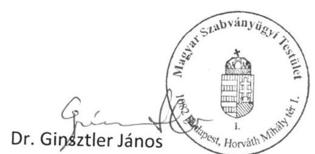

Melléklet: 6 db

---

A számviteli törvény szerint értékvesztésként el kell számolni a vásárolt készletek beszerzési értékét, illetve a saját termelésű készletek előállítási értékét csökkentő azon tételeket, is, melyek akkor következnek be, ha a készlet

- a vonatkozó előírásoknak, minőségi követelményeknek (szabvány, szakmai előírás, szállítási szerződés szerinti feltételek stb.) nem felel meg,
- az eredeti rendeltetésének nem felel meg,
- megrongálódott, felhasználhatósága bizonytalan,
- feleslegessé vált, értékesítése kétséges.

A készlet értékét addig a mértékig kell csökkenteni, hogy a készlet a használhatóságának, értékesíthetőségének megfelelő - a mérlegkészítéskor ismert vagy érvényesíthető - piaci értéken szerepeljen a mérlegben. Ez a mérték - a vállalkozás által igazolt (bizonylatolt), műszaki véleménnyel alátámasztott, "leértékelési" vagy esetleg selejtezési folyamat során kialakított legalább a készlet haszonanyag árának illetve hulladékértékének meghatározásával történhet. (Kivétel a megsemmisült készlet értéke.)
A készletek állapotában, minőségében, körülményeiben bekövetkezett változások miatti értékvesztés elszámolásánál is az egyedi értékelés elvét kell követni. Amennyiben az egy évnél régebben beszerzett - fajlagosan kis értékủ - készleteknél következik be értékvesztés, lehetőség van az egyedi értékelés elvének sajátos értelmezésére.
Vissza kell írni a korábban elszámolt értékvesztést, amennyiben a piaci érték jelentősen és tartósan meghaladja a könyv szerinti értéket. Az értékvesztés visszaírásával a könyv szerinti érték nem haladhatja meg

- a befektetéseknél a beszerzési értéket,
- az értékpapíroknál a beszerzési értéket, illetve a névértéket, (ha névérték felett vásárolták),
- a követeléseknél az eredetileg elismert, elfogadott összeget, (devizakövetelésnél a megfelelő árfolyamon számított értéket),
- a készleteknél bekerülési értéket.

# 1.2.6. Az árfolyam különbözetek elszámolásának rendje 

A Számviteli törvény $60 \S 4-6$ bek. lehetőséget biztosít a külföldi valuta és deviza tételek elszámolására oly módon, hogy vagy a számlavezető pénzintézet, vagy a MNB által közzétett árfolyamon értékelje a szervezeti egység.
A Testület a külföldi pénzértékre szóló tételek értékelését - az MNB - árfolyamán értékeli a számviteli törvény $60 \S(6)$ bekezdése szerint.
Az MNB árfolyamon történő értékelés és a könyv szerinti érték különbözete összevontan jelenik meg az eredményszámlákon. Ha a külföldi pénzértékre szóló mérlegtételek üzleti év végi értékelésének összevont árfolyam különbözete

- veszteség, akkor a pénzügyi műveletek egyéb ráfordításaként kell elszámolni.
- nyereség, akkor a pénzügyi műveletek egyéb bevételeként kell elszámolni.

### 1.2.7. A céltartalék képzés szabályai

A Szt. előírásai szerint céltartalékot kell képezni olyan múltbeli, illetve a folyamatban lévő ügyletekből, vagy szerződésekből származó - harmadik féllel szemben - fizetési kötelezettség várhatóan felmerülő összegeire, melyek még nem következtek be, de bizonyosan fel fog merülni.
A jövőbeni költségekre a gazdasági válság miatt a gazdálkodó szervezetek, minisztériumok a szabványosítási feladatokra adott megrendelései évek óta nem biztosítja a szükséges fedezetet.

---

# 1. számú melléklet a 224/2000. (XII. 19.) Korm. rendelethez 

Az egyszerúsített beszámoló mérlegének elöirt tagolása az egyéb szervezetnél*
ESZKÖZÖK (AKTÍVÁK)
A. Befektetett eszközök
I. Immateriális javak
II. Tárgyi eszközök
III. Befektetett pénzügyi eszközök
B. Forgóeszközök
I. Készletek
II. Követelések
III. Értékpapírok
IV. Pénzeszközök

Eszközök összesen
FORRÁSOK (PASSZÍVÁK)
C. Saját tőke
I. Induló tőke/Jegyzett tőke
II. Tőkeváltozás/Eredmény
III. Lekötött tartalék
IV. Tárgyévi eredmény alaptevékenységből (közhasznú tevékenységből)
V. Tárgyévi eredmény vállalkozási tevékenységből
D. Tartalék
E. Céltartalékok
F. Kötelezettségek
I. Hosszú lejáratú kötelezettségek
II. Rövid lejáratú kötelezettségek

Források összesen

---

# 4. számú melléklet a 224/2000. (XII. 19.) Korm. rendelethez 

Az egyszerúsített éves beszámoló mérlegének elöirt tagolása az egyéb szervezetnél
ESZKÖZÖK (AKTÍVÁK)
A. Befektetett eszközök
I. Immateriális javak
II. Tárgyi eszközök
III. Befektetett pénzügyi eszközök
B. Forgóeszközök
I. Készletek
II. Követelések
III. Értékpapírok
IV. Pénzeszközök
C. Aktív időbeli elhatárolások

Eszközök összesen
FORRÁSOK (PASSZÍVÁK)
D. Saját tőke
I. Induló tőke/Jegyzett tőke
II. Tőkeváltozás/Eredmény
III. Lekötött tartalék
IV. Értékelési tartalék
V. Tárgyévi eredmény alaptevékenységböl (közhasznú tevékenységböl)
VI. Tárgyévi eredmény vállalkozási tevékenységböl
E. Céltartalékok
F. Kötelezettségek
I. Hátrasorolt kötelezettségek
II. Hosszú lejáratú kötelezettségek
III. Rövid lejáratú kötelezettségek
G. Passzív időbeli elhatárolások

Források összesen

---

2/c melléklet

| 1 | 8 | 0 | 7 | 7 | 1 | 0 | 8 | 7 | 1 | 1 | 2 | 5 | 4 | 9 | 0 | 1  |
| --- | --- | --- | --- | --- | --- | --- | --- | --- | --- | --- | --- | --- | --- | --- | --- | --- |
|  |   |   |   |   |   |   |   |   |   |   |   |   |   |   |   |   |

Statisztikai számjel

MAGYAR SZABVÁNYÜGYI TESTÜLET 1082 Budapest Horváth Mihály tér 1.

EGYSZERŰSÍTETT ÉVES BESZÁMOLÓ MÉRLEGE 2012 év

|  Sör-
szám | A tétel megnevezése | Előző év | Előző év(ek)
helyesbítése | Tárgyév  |
| --- | --- | --- | --- | --- |
|  A | B |  | D | E  |
|  1. | A. Befektetett eszközök (2.-5. sorok) | 1.571.123 | - | 1.537.106  |
|  2. | I. IMMATERIALIS JAVAK | 14.487 | - | 9.817  |
|  3. | II. TÁRGYI ESZKÖZÖK | 1.553.437 | - | 1.523.626  |
|  4. | III. BEFEKTETETT PÉNZÜGYI
ESZKÖZÖK | 3.199 | - | 3.663  |
|  5. | IV. BEFEKTETETT ESZKÖZÖK
ÉRTÉKHELYESBÍTÉSE | - | - | -  |
|  6. | B. Forgó eszközök (7.-10. Sorok) | 378.302 | - | 234.848  |
|  7. | I. KÉSZLETEK | 6.400 | - | 6.218  |
|  8. | II. KÖVETELÉSEK | 160.572 | - | 82.553  |
|  9. | III. ÉRTÉKPAPÍROK | - | - | -  |
|  10. | IV. PÉNZESZKÖZÖK | 211.330 | - | 146.077  |
|  11. | C. Aktív időbeli elhatárolások | 1.570 | - | 114.209  |

|  12. | ESZKÖZÖK (AKTÍVÁK) ÖSSZESEN
(1.+5.+11. sor) | 1.950.995 |  | 1.886.163  |
| --- | --- | --- | --- | --- |
|  13. | D. Saját tőke (14.-19 sorok) | 1.118.117 | - | 1.136.981  |
|  14. | I. INDULÓ TÖKE / JEGYZETT TÖKE | 102.710 | - | 102.710  |
|  15. | II. TÖKEVÁLTOZÁS / EREDMÉNY | 1.015.407 | - | 1.015.407  |
|  16. | III. LÉKOTÖTT TARTALÉK | - | - | -  |
|  17. | IV. ÉRTÉKELÉSI TARTALÉK | - | - | -  |
|  18. | V. TÁRGYÉVI EREDMÉNY
ALAPTEVÉKENYSÉGBŐL | - | - | 18.864  |
|  19. | VI. TÁRGYÉVI EREDMÉNY
VÁLLALKOZÁSI TEVÉKENYSÉGBŐL | - | - | -  |
|  20. | E. Céltartalékok | 794.408 | - | 710.408  |
|  21. | F. Kötelezettségek (22.-23. sorok) | 34.188 | - | 33.425  |
|  22. | I. HOSSZÚ LEJÁRATÚ
KÖTELEZETTSÉGEK | - | - | -  |
|  23. | II. RÖVID LEJÁRATÚ
KÖTELEZETTSÉGEK | 34.188 | - | 33.425  |
|  24. | G. Passzív időbeli elhatárolások | 4.282 | - | 5.349  |

25. FORRÁSOK (PASSZÍVÁK) ÖSSZESEN (13.-20.+21.+24. sor)

Budapest, 2013. május 27.

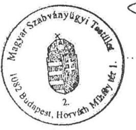

az egyéb szervezet vezetője (kénviselője)

42

---

2/d melléklet

| 1 | 8 | 0 | 7 | 7 | 1 | 0 | 8 | 7 | 1 | 1 | 2 | 5 | 4 | 9 | 0 | 1  |
| --- | --- | --- | --- | --- | --- | --- | --- | --- | --- | --- | --- | --- | --- | --- | --- | --- |
|  |   |   |   |   |   |   |   |   |   |   |   |   |   |   |   |   |

Statisztikai számjel

### MAGYAR SZABVÁNYÚGYI TESTÜLET

1082 Budapest Horváth Mihály tér 1.

### EGYSZERŰSÍTETT ÉVES BESZÁMOLÓ MÉRLEGE

2013. év

|  Sor-
szám | A tétel megnevezése | Előző év | Előző év(ek)
helyesbítések | Tárgyév  |
| --- | --- | --- | --- | --- |
|  A | B |  | D | E  |
|  1. | A. Befektetett eszközök (2.-5. sorok) | 1.537.106 | - | 1.511.122  |
|  2. | I. IMMATERIÁLIS JAVAK | 9.817 | - | 5.272  |
|  3. | II. TÁRGYI ESZKÖZÖK | 1.523.626 | - | 1.503.332  |
|  4. | III. BEFEKTETETT PÉNZÜGYI ESZKÖZÖK | 3.663 | - | 2.518  |
|  5. | IV. BEFEKTETETT ESZKÖZÖK ÉRTÉKHELYESBÍTÉSE | - | - | -  |
|  6. | B. Forgó eszközök (7.-10. Sorok) | 234.848 | - | 247.434  |
|  7. | I. KÉSZLETEK | 6.218 | - | 6.087  |
|  8. | II. KÖVETELÉSEK | 82.553 | - | 79.053  |
|  9. | III. ÉRTÉKPAPÍROK | - | - | -  |
|  10. | IV. PÉNZESZKÖZÖK | 146.077 | - | 162.294  |
|  11. | C. Aktív időbeli elhatárolások | 114.209 | - | 4.892  |

|  12. | ESZKÖZÖK (AKTÍVÁK) ÖSSZESEN
(1.+6.+11. sor) | 3.886.163 | - | 1.763.448  |
| --- | --- | --- | --- | --- |
|  13. | D. Saját tőke (14.-19 sorok) | 1.136.981 | - | 1.136.981  |
|  14. | I. INDÚLÓ TŐKE / JEGYZETT TŐKE | 102.710 | - | 102.710  |
|  15. | II. TŐKEVÁLTÓZÁS / EREDMÉNY | 1.015.407 | - | 1.034.271  |
|  16. | III. LEKÖTÖTT TARTALÉK | - | - | -  |
|  17. | IV. ÉRTÉKELÉSI TARTALÉK | - | - | -  |
|  18. | V. TÁRGYÉVI EREDMÉNY ALAPTEVÉKENYSÉGBŐL | 18.864 | - | -  |
|  19. | VI. TÁRGYÉVI EREDMÉNY VÁLLALKOZÁSI TEVÉKENYSÉGBŐL | - | - | -  |
|  20. | E. Céltartalékok | 710.408 | - | 595.905  |
|  21. | F. Kötelezettségek (22.-23. sorok) | 33.425 | - | 25.735  |
|  22. | I. HOSSZÚ LEJÁRATÚ KÖTELEZETTSÉGEK | - | - | -  |
|  23. | II. RÖVID LEJÁRATÚ KÖTELEZETTSÉGEK | 33.425 | - | 25.735  |
|  24. | G. Passzív időbeli elhatárolások | 5.349 | - | 4.827  |

|  25. | FORRÁSOK (PASSZÍVÁK) ÖSSZESEN
(13.-20.+21.+24. sor) | 1.886.163 | - | 1.763.448  |
| --- | --- | --- | --- | --- |
|  |   |   |   |   |

Budapest, 2014. május 29.

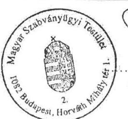

az egyéb szervezet vezetője (képkezelője)

---

2/e melléklet

| 1 | 8 | 0 | 7 | 7 | 1 | 0 | 8 | 7 | 1 | 1 | 2 | 5 | 4 | 9 | 0 | 1  |
| --- | --- | --- | --- | --- | --- | --- | --- | --- | --- | --- | --- | --- | --- | --- | --- | --- |
|  |   |   |   |   |   |   |   |   |   |   |   |   |   |   |   |   |

Statisztikai számjel

MAGYAR SZABVÁNYÜGYI TESTÜLET 1082 Budapest Horváth Mihály tér 1.

EGYSZERŰSÍTETT ÉVES BESZÁMOLÓ MÉRLEGE 2014. év

|  Sor-
szám | A tétel megnevezése | Előző év | Előző év(ek)
helyesbítése | Tárgyév  |
| --- | --- | --- | --- | --- |
|  A | B |  | D | E  |
|  1. | A. Befektetett eszközök (2.-5. sorok) | 1.511.122 | - | 1.478.822  |
|  2. | I. IMMATERIÁLIS JAVAK | 5.272 | - | 5.056  |
|  3. | II. TÁRGYI ESZKÖZÖK | 1.503.332 | - | 1.471.884  |
|  4. | III. BEFEKTETETT PÉNZÜGYI
ESZKÖZÖK | 2.518 | - | 1.882  |
|  5. | IV. BEFEKTETETT ESZKÖZÖK
ÉRTÉKHELYESBÍTÉSE | - | - | -  |
|  6. | B. Forgó eszközök (7.-10. Sorok) | 247.434 | - | 204.505  |
|  7. | I. KÉSZLETEK | 6.087 | - | 4.695  |
|  8. | II. KÖVETELÉSEK | 79.053 | - | 44.672  |
|  9. | III. ÉRTÉKPAPÍROK | - | - | -  |
|  10. | IV. PÉNZESZKÖZÖK | 162.294 | - | 155.138  |
|  11. | C. Aktív időbeli elhatárolások | 4.892 | - | 49.060  |

|  12. | ESZKÖZÖK (AKTÍVÁK) ÖSSZESEN
(1.+6.+11. sor) | 1.763.448 | 1.732.387  |
| --- | --- | --- | --- |
|  13. | D. Saját tőke (14.-19 sorok) | 1.136.981 | -  |
|  14. | I. INDULÓ TÖKE / JEGYZETT TÖKE | 102.710 | -  |
|  15. | II. TÖKEVÁLTOZÁS / EREDMÉNY | 1.034.271 | -  |
|  16. | III. LEKOTOTT TARTALÉK | - | -  |
|  17. | IV. ÉRTÉKELÉSI TARTALÉK | - | -  |
|  18. | V. TÁRGYÉVI EREDMÉNY
ALAPTEVÉKENYSÉGBÖL | - | -  |
|  19. | VI. TÁRGYÉVI EREDMÉNY
VÁLLALKOZÁSI TEVÉKENYSÉGBÖL | - | -  |
|  20. | E. Céltartalékok | 595.905 | -  |
|  21. | F. Kötelezettségek (22.-23. sorok) | 25.735 | -  |
|  22. | I. HOSSZÚ LEJÁRATÚ
KÖTELEZETTSÉGEK | - | -  |
|  23. | II. RÖVID LEJÁRATÚ
KÖTELEZETTSÉGEK | 25.735 | -  |
|  24. | G. Passzív időbeli elhatárolások | 4.827 | -  |

|  25. | FORRÁSOK (PASSZÍVÁK) ÖSSZESEN
(13.-20.+21.+24. sor) | 1.763.448 | 1.732.387  |
| --- | --- | --- | --- |
|  |   |   |   |

Budapest, 2015. május 21.

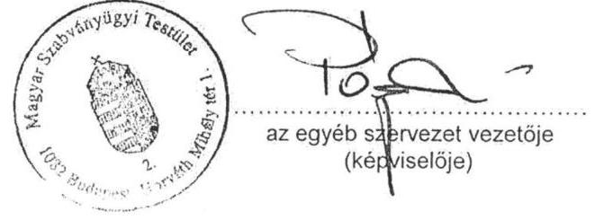

---

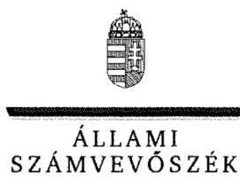

ELNÖK

Ikt.szám: V-1013-095/2016.

# Dr. Ginsztler János úr 

elnők
Magyar Szabványügyi Testület

## Budapest

## Tisztelt Elnök Úr!

„Köztestületek ellenörzése - Magyar Szabványügyi Testület" címmel készített számvevőszéki jelentéstervezetre tett észrevételét köszönettel megkaptam.
Az Állami Számvevőszék észrevételre vonatkozó álláspontjáról a felügyeleti vezető által készített részletes tájékoztatást csatoltan megküldöm.
Tájékoztatom Elnök urat, hogy a számvevőszéki jelentésben - az Állami Számvevőszékről szóló 2011. évi LXVI. törvény 29. § (3) bekezdése alapján - a figyelembe nem vett észrevételeket szerepeltetjük az elutasítás indokának feltüntetésével.

Budapest, 2016. 3613 nap
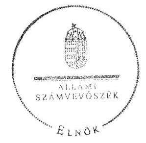

Tisztelettel:

Tisztelettel:

Melléklet: Tájékoztatás az elfogadott és az nem fogadott észrevételekről

---

# Tájékoztatás az elfogadott és az el nem fogadott észrevételekről 

„Köztestületek ellenörzése - Magyar Szabványügyi Testület" címủ számvevőszéki jelentéstervezetre az ÜT-107/2016. iktatószámú levelében tett észrevételeit áttekintettük, annak kezeléséről az alábbi tájékoztatást adom.

### 2.1. pont

A jelentéstervezet 8. oldalán szereplő „a nemzetközi és az európai szervezetekben viselt tagsággal járó kötelezettségekkel kapcsolatos költségekhez az állam a központi költségvetésböl hozzájárul" megállapításra tett észrevétel kapcsán

Köszönettel vettem tájékoztatását a Magyar Szabványügyi Testület (továbbiakban: MSZT) nemzetközi együttmüködéséről és e feladat finanszírozásáról, valamint arról, hogy egyetértettek az eltérő célra képzett céltartalék feloldásával kapcsolatos megállapításunkkal. Észrevételét, amelyben kérte a jelentésben a nemzetközi tagdíjak biztosítására irányuló javaslat megfogalmazását, nem fogadtuk el, mert a „Köztestületek ellenörzése" címủ ellenőrzési program alapján lefolytatott számvevőszéki ellenőrzés nem ellenőrizte a nemzetközi tagdíjak fedezete biztosítását, erre vonatkozó megállapítást az észrevételezésre megküldött jelentéstervezet nem tartalmaz. Észrevétele ezért megállapítást nem módosít.

## Az 1.1. számú megállapításra tett észrevétel kapcsán

A dokumentumok ismételt áttekintését követően a jelentéstervezet 14. oldal 1.1. számú megállapítás második bekezdés második megállapítására tett észrevételét elfogadtuk és a számvevőszéki jelentés készítésénél a megállapítás módosításával figyelembe vesszük.

## Az 1.2. számú megállapításra tett észrevétel kapcsán

Észrevételét a jelentéstervezet 15. oldal 1.2. számú megállapítás második bekezdés megállapításaira a dokumentumok ismételt áttekintését követően elfogadtuk, hogy az MSZT a számviteli törvény szerinti egyes egyéb szervezetek beszámolókészítési és könyvvezetési kötelezettségének sajátosságairól szóló 224/2000. (XII. 19.) Korm. rendelet 4. számú melléklete - az egyszerüsített éves beszámoló mérlegének előírt tagolása az egyéb szervezeteknél - szerinti egyszerűsített éves beszámoló mérleget készített el azzal, hogy a kötelezettségek tagolásánál elöírt „Hátrasorolt kötelezettségek" sort az ellenőrzött időszakban elkészített egyszerűsített éves beszámolók mérlegei nem tartalmazták.

---

# 2.2. pont 

„az MSZT a nemzeti szabványosításról szóló törvényben elöirt dokumentumokat nem teljes körüen küldte meg a törvényességi ellenörzést ellátó nemzetgazdasági miniszternek, ezáltal akadályozta a Testület elszámoltathatóságát" megállapítására tett észrevétel kapesán

Észrevételét a jelentéstervezet ötödik oldal „ÖSSZEGZÉS" fejezet második bekezdés negyedik megállapítására nem fogadtuk el. A dokumentumok ismételt áttekintését követően és az MSZT 2015. január 27-én aláirt nyilatkozata alapján megalapozott az a megállapítás, hogy az MSZT tv.-ben elöírt dokumentumokat az MSZT nem teljes körüen küldte meg a törvényességi ellenörzést ellátó nemzetgazdasági miniszternek. A hivatkozott nyilatkozatban rögzítettek szerint a Szabványügyi Tanács határozatai a Nemzetgazdasági Minisztérium (továbbiakban: NGM) részére megküldésre nem kerültek, az MSZT egyéb, az ellenőrzött időszakban megváltozott szabályzatot nem küldött meg az NGM részére. Fenti nyilatkozat tartalmazza továbbá, hogy az elfogadott költségvetési határozatokat 2014. évben a Szabványügyi közlöny soron következő számában közzétették, de azokat az NGM-nek nem küldték meg és az ellenőrzött időszak további éveiben sem került erre sor. A jelentéstervezet 23. oldal második bekezdésének megállapítása tartalmazza, hogy ,,az elfogadott közgyülési és SZT határozatok, valamint az ellenőrzött időszakban alkotott vagy módositott szabályzatok, a Közgyülés által elfogadott éves költségvetésről szóló határozatok megküldése elmaradt". Észrevétele ezért a megállapítást nem módosítja.

### 2.3. pont

A közérdekü adatok közzétételét és megismerését érintő megállapításokra tett észrevételek kapesán

Köszönettel vettem tájékoztatását, hogy a hibákat megszüntetik. Észrevétele nem cáfolta a jelentéstervezet 22. oldal második és harmadik bekezdése, valamint a 22. oldal negyedik bekezdés első és harmadik megállapításait. Észrevétele ezért a megállapításokat nem módosítja.

## 3. pont

## Az „Összegzés" fejezetre tett észrevétel kapcsán

A jelentéstervezet ötödik oldal „Összegzés" fejezetében az ellenőrzés által tett föbb megállapítások kerültek bemutatásra. A „törvényességi felügyelet ellátásához szükséges adatszolgáltatás hiányára" tett észrevétele azonos az MSZT válaszlevél 2.2 pontjában rögzített észrevételével, amelyre jelen tájékoztatás 2.2. pontjában választ adtunk. Észrevétele ezért a megállapításokat nem módosítja.
Budapest, 2016.

---

.

---

# RÖVIDÍTÉSEK JEGYZÉKE 

${ }^{1}$ MSZT
${ }^{2}$ MSZT. tv.
${ }^{3}$ MSZH
${ }^{4}$ Alapszabály
${ }^{5}$ ÁSZ
${ }^{6}$ ÁSZ tv.
${ }^{7}$ 224/2000. (XII. 19.) Korm. rendelet
${ }^{8}$ Értékelési szabályzat
${ }^{9}$ PEB
${ }^{10}$ Közgyűlés
${ }^{11}$ Ügyintéző szervezet
${ }^{12}$ SZMSZ ${ }_{2}$
${ }^{13}$ Számviteli Politika
${ }^{14}$ Számlarend
${ }^{15}$ Számv. tv.
${ }^{16}$ Pénzkezelési és Értékelési Szabályzat
${ }^{17}$ Ptk. 1
${ }^{18}$ Ügyintéző szervezet vezetője
${ }^{19}$ SZMSZ ${ }_{1}$
${ }^{20}$ 11/1996. számú igazgatói utasítás
${ }^{21}$ 1/2011. számú igazgatói utasítás
${ }^{22}$ SZÉP kártya

Magyar Szabványügyi Testület
a nemzeti szabványosításról szóló 1995. évi XXVIII. törvény
Magyar Szabványügyi Hivatal
Magyar Szabványügyi Testület Alapszabálya, hatályos 2009. május 26-ától
Állami Számvevőszék
az Állami Számvevőszékről szóló 2011. évi LXVI. törvény
a számviteli törvény szerinti egyes egyéb szervezetek beszámoló készítési és könyvvezetési kötelezettségének sajátosságairól szóló 224/2000. (XII. 19.) Korm. rendelet
1/1995. Igazgatói utasítás működéséhez szükséges számviteli politika, számviteli, pénzügyi és ügyviteli szabályzatok közzétételének rendjéről 3. melléklet Eszközök és források értékelési szabályzata, hatályos 2012. január 01-jétől
Pénzügyi Ellenőrző Bizottság
a Magyar Szabványügyi Testület Közgyűlése
a Magyar Szabványügyi Testület Ügyintéző szervezete
a Magyar Szabványügyi Testület Ügyintéző szervezet vezetőjének 1/1998/14. számú utasítása a Magyar Szabványügyi Testület ügyintéző szervezetének szervezeti és működési szabályzatáról 6. kiadás, hatályos 2012. március 29-től
az 1/1995/1. számú Igazgatói utasítással kiadott a Magyar Szabványügyi Testület működéséhez szükséges Számviteli Politika, számviteli, ügyviteli és pénzügyi szabályzatok közzétételi rendjének mellékleteként kiadott Számviteli Politika, 4. kiadás, hatályos 2012. január 02.-tól
az 1/1995/1. számú Igazgatói utasítással kiadott a Magyar Szabványügyi Testület működéséhez szükséges számviteli politika, számviteli, ügyviteli és pénzügyi szabályzatok közzétételi rendjének 2. számú mellékleteként kiadott, 3. kiadás, hatályos 2012. január 1-jétől
a számvitelről szóló 2000. évi C. törvény
az 1/1995/1. számú Igazgatói utasítással kiadott a Magyar Szabványügyi Testület működéséhez szükséges számviteli politika, számviteli, ügyviteli és pénz-ügyi szabályzatok közzétételi rendjének mellékleteként kiadott Pénzkezelési szabályzat, 4. kiadás
a Polgári Törvénykönyvről szóló 1959. évi IV. törvény, hatálytalan 2014. március 15-étől
a Magyar Szabványügyi Testület Ügyintéző szervezet vezetője
a Magyar Szabványügyi Testület Ügyintéző szervezet vezetőjének 1/1998/14. számú utasítása a Magyar Szabványügyi Testület ügyintéző szervezetének szervezeti és működési szabályzatáról 5. kiadás, hatályos 2010. február 18-tól 2012. március 28-ig
az MSZT Ügyintéző szervezet vezetőjének 1996/11. számú utasítása az MSZT képzéssel, tanúsítással, kiadványkészítéssel kapcsolatos szerződéseinek rendjéről
a Magyar Szabványügyi Testület Ügyintéző szervezet vezetőjének 1/2011/1. számú utasítása az MSZT üzemeltetési és működési feltételei fenntartásához szükséges szerződések intézésének rendjéről
Széchenyi Pihenőkártya

---

${ }^{23}$ Leltározási szabályzat
${ }^{24}$ SZT
${ }^{25}$ Önklötség-számítási szabályzat
${ }^{26}$ Támogatási szerződés ${ }_{1}$
${ }^{27}$ Irattári terv
${ }^{28} 335 / 2005$. (XII. 29.) Korm. rendelet
${ }^{29}$ MNV Zrt.
${ }^{30}$ Selejtezési szabályzat
${ }^{31}$ Info tv.
${ }^{32}$ 1/2002/4. számú Igazgatói utasítás
${ }^{33}$ Informatikai Központ
${ }^{34}$ Iratkezelési szabályzat
${ }^{35}$ Szoftverfelhasználási és szoftvergazdálkodási szabályzat
${ }^{36} 1 / 2007$. sz. Igazgatói utasítás
${ }^{37} 305 / 2005$. (XII. 25.) Korm. rendelet
${ }^{38}$ 1993. évi XLVI. törvény

1/1995. Igazgatói utasítás a Magyar Szabványügyi Testület működéséhez szükséges számviteli politika, számviteli, pénzügyi és ügyviteli szabályzatok közzétételének rendjéről 5. melléklet Eszközök és források leltárkészítési és leltározási szabályzata, hatályos 2012. január 01-jétől
Szabványügyi Tanács
az I/1995/1. számú Igazgatói utasítással kiadott az MSZT müködéséhez szükséges számviteli politika, számviteli, ügyviteli és pénzügyi szabályzatok közzétételi rendjének mellékleteként kiadott Önklötség-számítási szabályzat
Pü 168/2012. sz. szerződés
az 1/1996/4. M3 számú Igazgatói utasítással kiadott a Magyar Szabványügyi Testület Irattári terve
a közfeladatot ellátó szervek iratkezelésének általános követelményeiről szóló 335/2005. (XII. 29.) Korm. rendelet
Magyar Nemzeti Vagyonkezelő Zártkörűen működő Részvénytársaság
az 1/1995/1. számú Igazgatói utasítással kiadott a Magyar Szabványügyi Testület müködéséhez szükséges számviteli politika, számviteli, ügyviteli és pénzügyi szabályzatok közzétételi rendjének mellékleteként kiadott Felesleges vagyontárgyak hasznosításának és készletek selejtezésének szabályzata, 4. kiadás az információs önrendelkezési jogról és az információszabadságról szóló 2011. évi CXII. törvény
az MSZT számítógépes hálózatára felkerülő információ kezelése, adatvédelme a Magyar Szabványügyi Testület Informatikai Központja
a Magyar Szabványügyi Testület Ügyintéző szervezet vezetőjének 1/1996/4. számú utasítás 5. kiadása a Magyar Szabványügyi Testület Iratkezelési szabályzatáról, hatályos 2008. január 1-jétől
a Magyar Szabványügyi Testület Ügyintéző szervezet vezetőjének 1/2012/1. számú utasítása a Magyar Szabványügyi Testület ügyintéző szervezetének Szoftverfelhasználási és szoftvergazdálkodási szabályzatáról 1. kiadás, hatályos 2012. december 13-tól
a Magyar Szabványügyi Testület ügyvezető igazgatójának utasítása az egységes közadatkereső rendszer számára szolgáltatott közérdekü MSZT adatokról és dokumentumokról
a közérdekű adatok elektronikus közzétételére, az egységes közadat kereső rendszerre, valamint a központi jegyzék adattartalmára, az adatintegrációra vonatkozó részletes szabályokról szóló 305/2005. (XII. 25.) Korm. rendelet a statisztikáról szóló 1993. évi XLVI. törvény

---

# ÁLLAMI SZÁMVEVŐSZÉK 

1052 Budapest, Apáczai Csere János utca 10.
Levélcím: 1364 Budapest 4. Pf. 54
Telefon: +36 14849100 Telefax: +36 14849200
www.asz.hu