# Jelenetés 

## Önkormányzatok pénzügyi és vagyongazdálkodása

Az önkormányzatok pénzügyi és vagyongazdálkodása megfelelőségének ellenőrzése - Makó
2016.

---

# Jelentés 

## Önkormányzatok pénzügyi és vagyongazdálkodása

Az önkormányzatok pénzügyi és vagyongazdálkodása megfelelőségének ellenőrzése - Makó
2016. 07. hó 27. nap
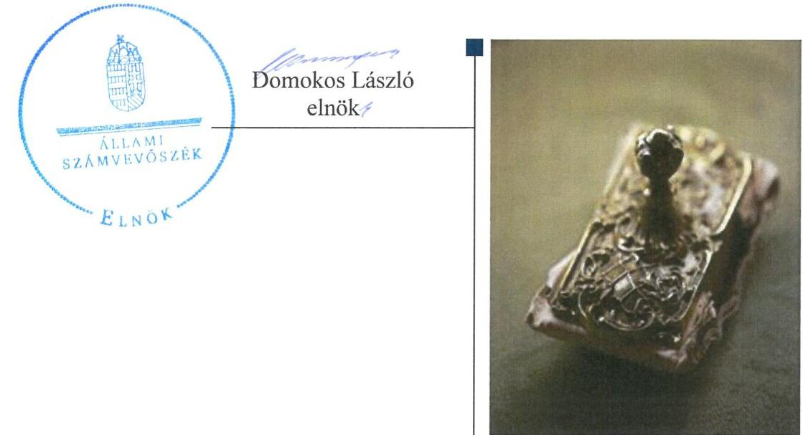

---

|   | AZ ELLENŐRZÉST FELÜGYELTE:  |
| --- | --- |
|   | RENKŐ ZSUZSANNA felügyeleti vezető  |
|   | AZ ELLENŐRZÉST VEZETTE ÉS A VÉGREHAJTÁSÁÉRT FELELŐS:  |
|   | HORVÁTH JÓZSEF ellenőrzésvezető  |
|   | A PROGRAM ÖSSZEÁLLÍTÁSÁÉRT FELELŐS:  |
|   | JANIK JÓZSEF LÁSZLÓ osztályvezető  |
|   | A TÉMÁHOZ KAPCSOLÓDÓ KORÁBBI SZÁMVEVŐSZÉKI JELENTÉSEK:  |
|   | - címe: Az önkormányzati vagyongazdálkodás szabályszerűségi ellenőrzésről - Makó  |
|   | - sorszáma: 13075  |
|  Jelentéseink az Országgyűlés számítógépes hálózatán és az Interneten a www.asz.hu címen is olvashatóak. | - címe: Az önkormányzatok vagyongazdálkodása szabályszerűségének ellenőrzéséről szóló jelentések utóellenőrzése - Makó Város Önkormányzata  |
|   | - sorszáma: 16015  |
|   | IKTATÓSZÁM: V-0898-120/2016  |
|   | TÉMASZÁM: 1932  |
|   | ELLENŐRZÉS-AZONOSÍTÓ SZÁM: V071507  |

---

# TARTALOMJEGYZÉK 

■ ÖSSZEGZÉS ..... 5
■ AZ ELLENŐRZÉS CÉLJA ..... 7
■ AZ ELLENŐRZÉS TERÜLETE ..... 8
■ AZ ELLENŐRZÉS HÁTTERE, INDOKOLTSÁGA ..... 9
■ A JELENTÉS LÉNYEGES KÉRDÉSKÖREI ..... 10
■ ELLENŐRZÉS HATÓKÖRE ÉS MÓDSZEREI ..... 12
■ MEGÁLLAPÍTÁSOK ..... 15
■ JAVASLATOK ..... 42
■ MELLÉKLETEK ..... 47
I. sz. melléklet: Értelmező szótár ..... 47
II. sz. melléklet: Változások az önkormányzati feladatellátás szervezeti formáiban ..... 53
III. sz. melléklet: A kiemelt bevételi és kiadási előirányzatok (millió Ft-ban) ..... 54
IV. sz. melléklet: A kiemelt bevételi és kiadási előirányzatok és azok teljesítése (millió Ft-ban) ..... 55
V. sz. melléklet: A pénzügyi egyensúlyi helyzet CLF módszer szerinti értékelése (millió Ft-ban) ..... 57
VI. sz. melléklet: Az eszközök és források alakulása kiemelt mérlegsoronként (millió Ft-ban)... ..... 59
VII. sz. melléklet: A mérlegben kimutatott 5\%-ot meghaladó részesedések ..... 60
■ FÜGGELÉK: ÉSZREVÉTELEK ..... 61
■ RÖVIDÍTÉSEK JEGYZÉKE ..... 77

---

.

---

# ÖSSZEGZÉS 

Az Állami Számvevőszék Makó Város Önkormányzata pénzügyi és vagyongazdálkodását 2011. január 1. és 2014. december 31. közötti időszakra vonatkozóan ellenőrizte. A költségvetési tervezés és beszámolás, a vagyongazdálkodás, a vagyon számbavétele és a gazdasági események elszámolása részben felelt meg az előírásoknak. Az Önkormányzat pénzügyi egyensúlya biztosított volt. Az erőforrásokkal való szabályszerű és hatékony gazdálkodáshoz szükséges követelményeket nem alakították ki. Az Önkormányzat vagyona négy év alatt 11893,3 millió Ft-tal (38,9 %-kal) nőtt.

## Az ellenőrzés társadalmi indokoltsága

Az Állami Számvevőszék stratégiájában hangsúlyos szerepet szán annak, hogy szilárd szakmai alapon álló, értékteremtő ellenőrzéseivel előmozdítsa a közpénzügyek átláthatóságát, rendezettségét és javaslataival a közpénzek és a közvagyon szabályos, gazdaságos, hatékony és eredményes felhasználását segítse. Az ÁSZ stratégiájában célul tűzte ki, hogy az önkormányzatok ellenőrzése során értékeli azok pénzügyi-gazdasági helyzetét, a kockázatokat feltárja, és az ellenőrzések helyszíneit kockázatelemzés alapján választja ki. Az ÁSZ szerepet vállal a korrupció és a csalás elleni küzdelemben. Közreműködik a korrupciós kockázatok és a korrupció elleni fellépés hatékony és eredményes eszközeinek beazonosításában, alkalmazásában, továbbá használatuk elterjesztésében, az integritás alapú közigazgatási kultúra kialakításában.

## Főbb megállapítások, következtetések, javaslatok

A gazdasági szervezetre vonatkozó rendelkezések 2013. március 21-ig voltak összhangban a belső szabályzatokban. A 2014. évben a Polgármesteri hivatal SZMSZ-e jogszabályi előírást sértő módon azt tartalmazta, hogy a Polgármesteri hivatal gazdasági szervezettel nem rendelkezik. A számviteli politika, illetve az annak részeként kiadott szabályzatok nem feleltek meg teljes körűen a jogszabályban előírtaknak. A Képviselő-testület a vagyonkezelői jog ellenértékét rendeletben nem határozta meg.

A költségvetési tervezés és beszámolás, illetve a pénzgazdálkodás nem volt szabályszerű. A költségvetési rendeletekben elfogadott kiemelt előirányzatok nem egyeztek az elemi költségvetésekben szereplő összegekkel, a bevételek teljesítése több esetben elmaradt a módosított előirányzatoktól. A gazdálkodási jogkörök gyakorlása részben megfelelő volt, mivel a pénzügyi ellenjegyzőt 2012. szeptember 6. és 2013. március 20. között, illetve a 2014. évben, valamint az érvényesítőt 2012. november 20-tól nem az arra jogosult jelölte ki.

Az Önkormányzat pénzügyi egyensúlya biztosított volt, ennek ellenére a fizetési kötelezettségek teljesítése nem minden esetben történt meg határidőben. Az Önkormányzatnak 2011. január 1-jén már voltak 60/90 napon túl fennálló lejárt szállítói tartozásai, ennek ellenére a polgármester a 2011. július 12-ig hatályos jogszabályi előírás ellenére nem kezdeményezte az adósságrendezési eljárást. A követelések nyilvántartása és behajthatatlanná minősítése nem felelt meg teljes körűen a jogszabályi előírásoknak. A gazdálkodással összefüggő, pénzügyi egyensúlyt befolyásoló kockázatok mérséklésére kockázatkezelési rendszert nem működtettek. Az adósságkonszolidációval összefüggő önkormányzati feladatok végrehajtása az előírásoknak megfelelően történt.

A költségvetési beszámoló mérlegének leltárral történő alátámasztása nem felelt meg teljes körűen a jogszabályi előírásoknak és a belső szabályzatokban előírt követelményeknek, a 2014. évi beszámolót nem támasztották alá a vagyonkezelő által elkészített, hitelesített leltárral. A részesedések, illetve az üzemeltetésre átadott eszközök értékelése nem volt megfelelő. A vagyon nyilvántartása - a részesedések kivételével - szabályszerű volt. Az ellenőrzés során

---

a feltárt hibák összege a 2012-2014. években jelentős összegűnek minősült a jogszabályok, illetve az Önkormányzat számviteli politikájának előírása alapján. A hibák összege a mérleg valódiságát befolyásolta.

A Polgármesteri hivatal ${ }^{1}$ az eredményszemléletű számvitel bevezetésével kapcsolatos előkészítő feladatokat határidőben elvégezte, a rendező mérleget elkészítette.

Az Önkormányzat vagyona a beruházások és közművagyon felértékelése következtében növekedett. A vagyonkezelői jog létesítése, a vagyon üzemeltetésre átadása a közfeladat ellátással összhangban történt, annak végrehajtása részben szabályszerű volt. A beruházási és felújítási döntések szabályszerűek voltak. Egy fejlesztésnél a kivitelezővel megkötött szerződés módosítása ellentétes volt a Kbt. ${ }^{2}$ előírásával, az üzembe helyezés dokumentálása, az értékcsökkenés elszámolása, valamint az ingatlanvagyon kataszter vezetése nem minden esetben felelt meg az előírásoknak. Az értékesített ingatlanok számviteli és kataszteri nyilvántartása, illetve nyilvántartásból történő kivezetése nem jogszabályszerűen történt. Az Önkormányzat a vagyontárgyak értékesítéséből származó követelések, illetve a bérleti díjak késedelmes teljesítése következtében a késedelmi kamat érvényesítésére vonatkozóan nem intézkedett.

Az Önkormányzat nem gazdálkodott felelősen a tartós részesedéseivel, a gazdasági társaságok tulajdonosi felügyeletét nem szabályszerűen gyakorolta. Az Önkormányzat a minősített többségi, illetve kizárólagos tulajdonában álló társaságok veszteséges gazdálkodása esetén megtette a szükséges intézkedéseket. A társasági szerződéseket az átláthatóság teljesülése szempontjából nem vizsgálta.

Az Önkormányzat az erőforrásokkal való szabályszerű és hatékony gazdálkodáshoz szükséges követelményeket nem alakította ki.

Az Önkormányzat integritás kontrollrendszere összességében fejlesztendő volt, ezért az integritás szemlélet érvényesülése érdekében további intézkedések szükségesek.

Az ellenőrzött időszakban hivatalban lévő jegyző felelősségi körébe tartozóan az ellenőrzés megállapította, hogy a pénzügyi és vagyongazdálkodásra vonatkozó belső szabályozás, a költségvetési rendelet és az elemi költségvetés tartalmi megfelelősége, a költségvetési rendeletek módosítása, a likviditási terv készítése, az egyes kontrolltevékenységek és a kockázatkezelési rendszer működtetése, a könyvvezetési és beszámoló-készítési kötelezettség teljesítése, a vagyonkimutatás elkészítése, az ingatlan vagyonkataszter vezetése, a leltározás végrehajtása és a mérlegben kimutatott eszközök értékelése, a közzétételi kötelezettség teljesítése, a közbeszerzési eljárások lefolytatása a jogszabályi előírásoknak nem felelt meg. Az ellenőrzött időszakban hivatalban lévő jegyző közszolgálati jogviszonya 2014. december 31-én megszűnt, ezt követően a Kttv. ${ }^{3}$ 156. § (1) bekezdésében meghatározott fegyelmi eljárás megindítása a munkáltatói jogkör gyakorlója részéről már nem lehetséges. Erre tekintettel az ÁSZ a jegyző feladat és hatáskörébe tartozóan feltárt szabálytalanságok miatt a polgármester részére nem fogalmazott meg a jegyző munkajogi felelőssége felvetésével kapcsolatos javaslatot.

A belső kontrollrendszer kialakításában és működtetésében feltárt hiányosságok következtében az nem járult hozzá a számvevőszéki ellenőrzés során feltárt hibák, hiányosságok megelőzéséhez, azok feltárásához, ezen túl nem támogatta a hiányosságok, szabálytalanságok megszüntetését, kijavítását. Ezáltal nem felelt meg a Bkr. ${ }^{4} 4$. § a) és c) pontjaiban foglalt előírásoknak, mert:
$\longrightarrow$ a pénzügyi és vagyongazdálkodás területén feltárt szabályszerűségi hibákra, hiányosságokra tekintettel nem volt biztosított, hogy a költségvetési szerv(ek) valamennyi tevékenysége és célja összhangban legyen a szabályszerűséggel, szabályozottsággal;
$\longrightarrow$ a számviteli nyilvántartások vezetése, a költségvetési beszámoló készítése terén feltárt hiányosságokra tekintettel a megfelelő, pontos és naprakész információk nem álltak rendelkezésre a költségvetési szerv működésével kapcsolatosan.

---

# AZ ELLENŐRZÉS CÉLJA 

AZ ELLENŐRZÉS CÉLJA az Önkormányzat pénzügyi és vagyoni helyzetének, a gazdálkodás szabályosságának megítélése a költségvetési tervezés, a pénzügyi egyensúly megteremtése, az éves költségvetési beszámolás, a vagyongazdálkodás, a vagyon számbavétele, a gazdasági események elszámolása és a pénzgazdálkodás szabályszerűsége alapján; valamint annak értékelése, hogy kialakított-e az Önkormányzat az erőforrásokkal való szabályszerű és hatékony gazdálkodáshoz szükséges követelményeket, megvalósította-e azok számon kérését, ellenőrzését.

---

# **AZ ELLENŐRZÉS TERÜLETE**

## **Makó Város Önkormányzata**

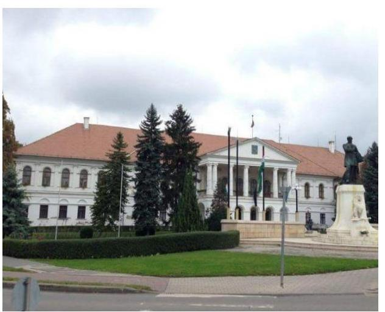

Makó Csongrád megyében található, állandó lakosainak száma 2014. december 31-én 23 974 fő volt. A 2014. év végén a Képviselő-testület5 12 fővel, öt állandó bizottsággal látta el a feladatait. A polgármester személyében 2014. október 12-én következett be változás. A jegyző 2014. december 31-én távozott tisztségéből. 2011. január 1-jéről 2014. december 31-ére főként állami feladatátvállalások következtében az Önkormányzat6 költségvetési szerveinek száma hétről négyre, a köztisztviselők száma 103 főről 61 főre, a közalkalmazottaké 426 főről 171 főre csökkent, az egyéb foglalkoztattak létszáma 98 fővel emelkedett. A feladatellátás szervezeti formáinak változását a II. számú melléklet mutatja be.

Az Önkormányzat hét gazdasági társaságban rendelkezett többségi tulajdoni hányaddal, számuk az ellenőrzött időszakban eggyel csökkent. A gazdasági társaságok távhő- és melegvíz-szolgáltatást nyújtottak, gyógyfürdő és parkoló üzemeltetést, park és közterületfenntartást, idegenforgalmi és kéményseprési szolgáltatásokat végeztek.

A 2011. évről a 2014. évre a költségvetési bevételek 10 024,7 M Ft-ról 4411,2 M Ft-ra, a költségvetési kiadások 11 108,5 M Ft-ról 4212,0 M Ft-ra csökkentek. A költségvetési bevételek és kiadások, illetve a pénzmaradvány igénybevételének alakulását az 1. ábra szemlélteti.

1. ábra

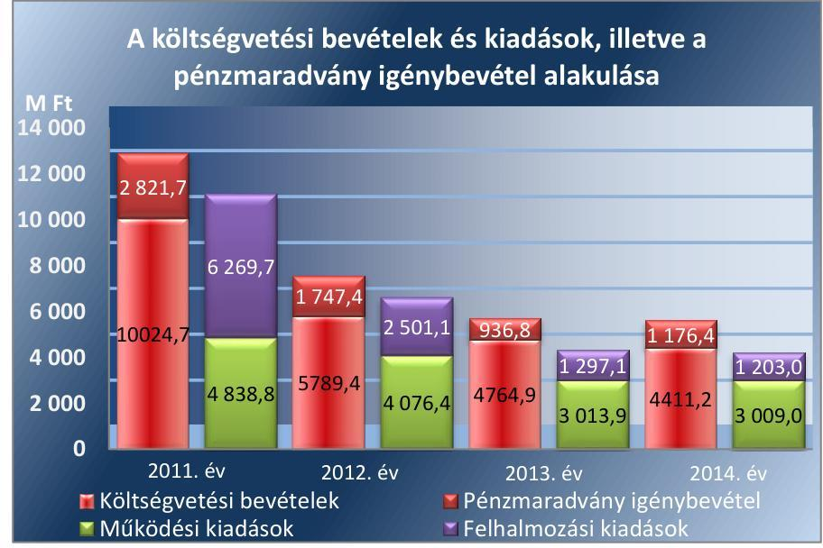

*Forrás: Az Önkormányzat 2011-2014. évi költségvetési beszámolói*

A könyvviteli mérleg szerinti eszközvagyon a 2011. január 1-jei 30 556,5 M Ft-ról a 2014. év végére 42 449,8 M Ft-ra nőtt. A követelések értéke 289,8 M Ft-ról 504,5 M Ft-ra emelkedett, a kötelezettségek összege 5020,2 M Ft-ról 109,4 M Ft-ra mérséklődött.

---

# AZ ELLENŐRZÉS HÁTTERE, INDOKOLTSÁGA 

Az államháztartás önkormányzati alrendszerének közpénz felhasználása, az önkormányzatok által ellátott közfeladatok és önként vállalt feladatok sokrétüsége, valamint a feladat ellátásához rendelt vagyon nagyságrendje indokolja, hogy az ÁSZ ellenőrzéseket folytasson a pénzügyi és vagyongazdálkodás területén.

Az ÁSZ az önkormányzatok ellenőrzését a pénzügyi helyzet megítélésével indította el 2011-ben, és a nagy vagyonnal rendelkező, magas kockázatú önkormányzatok esetében a vagyongazdálkodás ellenőrzésével folytatta. Az elmúlt időszakban az önkormányzati gazdálkodás kockázatai beépítésre kerültek az ellenőrzött önkormányzatok kiválasztási rendszerébe. Az elmúlt négy év ellenőrzéseinek tapasztalatai megmutatták, hogy továbbra is indokolt az egyrészt elemző, értékelő, a pénzügyi helyzet kockázatát is minősítő, másrészt a pénzügyi és vagyongazdálkodási tevékenység szabályszerűségét értékelő ÁSZ ellenőrzések folytatása.

Ellenőrzéseink
 hozzájárulnak az önkormányzatok pénzügyi helyzetének pontosabb megítéléséhez azáltal, hogy a pénzügyi helyzetet a vagyoni helyzettel együtt értékeljük, amelyek együttesen határozzák meg az önkormányzatok fejlesztési képességét és gyakorolnak hatást a feladatellátásra. Feltárjuk az önkormányzati gazdálkodást meghatározó szabályozások összhangjának hiányosságait, a szabályozással nem érintett gazdálkodási területeket, valamint a pénzügyi és vagyongazdálkodás esetleges szabálytalanságait. Beazonosítjuk a pénzügyi egyensúlyi helyzet megbomlásakor a kiváltó okok mellett azok kialakulását is. Bemutatjuk az adósságkonszolidáció önkormányzat általi végrehajtásának szabályszerűségét, az adósságállomány újratermelődésének elkerülése érdekében hozott intézkedéseket. Az ellenőrzés kitér a gazdálkodáshoz kapcsolódó integritás kontrollok meglétének és működésének ellenőrzésére is.

A pénzügyi és vagyongazdálkodás szabályszerűségének ellenőrzése által a megállapításokkal összefüggő javaslatok hasznosítása esetén javul az önkormányzat gazdálkodásának szabályozottsága, valamint a „jó gyakorlatok" terjesztésén keresztül azok az önkormányzatok is átvehetik a pozitív példákat, ahol nem végez ellenőrzést az ÁSZ. Ellenőrzéseink eredményeképpen javaslatokat fogalmazhatunk meg az önkormányzatok pénzügyi egyensúlya fenntartásával kapcsolatos problémák rendszerszemléletű kezelésére, felszámolására.

---

# A JELENTÉS LÉNYEGES KÉRDÉSKÖREI 

1.     - A pénzügyi és vagyongazdálkodás szabályozása megfelelt-e az előírásoknak?
2.     - A költségvetési tervezés, az éves költségvetési beszámolás és a pénzgazdálkodás szabályszerű volt-e?
3.     - Biztosított volt-e a pénzügyi egyensúly, az adósságot keletkeztető ügyletek vállalására a jogszabályi előírásoknak megfelelően került-e sor?
4.     - A vagyonnyilvántartás, a költségvetési beszámoló mérlegének alátámasztottsága megfelelt-e a jogszabályokban és a belső szabályzatokban előírt követelményeknek?
5.     - Szabályszerűek voltak-e a vagyon összetételének és nagyságának változását eredményező döntések és azok végrehajtása?
6.     - Felelősen gazdálkodott-e az önkormányzat a tartós részesedéseivel, élt-e tulajdonosi jogaival, teljesítette-e tulajdonosi kötelezettségeit?

---

7.     - Az önkormányzat az erőforrásokkal való szabályszerű gazdálkodáshoz szükséges követelményeket kialakította-e, betartásukat számon kérte-e, ellenőrizte-e?
8.     - Az önkormányzat az erőforrásokkal való hatékony gazdálkodáshoz szükséges követelményeket kialakította-e, betartásukat számon kérte-e, ellenőrizte-e?
9.     - Az önkormányzat intézkedett-e az integritás szemlélet érvényesítése érdekében?

---

# ELLENŐRZÉS HATÓKÖRE ÉS MÓDSZEREI 

## Az ellenőrzés típusa

Megfelelőségi ellenőrzés

## Az ellenőrzött időszak

A 2011. január 1-je és 2014. december 31-e közötti időszak. Az ellenőrzött időszakba beleértendő az ellenőrzött évekre vonatkozó tervezési feladatok, beszámolási kötelezettségek teljesítésének időszaka is. A vagyonnyilvántartások egyezőségét, a leltározás, selejtezés folyamatát a 2014. évre vonatkozóan értékeltük.

## Az ellenőrzés tárgya

A helyi önkormányzat pénzügyi és vagyongazdálkodása, a pénzügyi egyensúly megteremtése, a tulajdonosi és irányító szervi feladatok ellátása, az integritás szemlélet érvényesülése.

Az ellenőrzés kiterjedt minden olyan körülményre és adatra, amely az ÁSZ jogszabályban meghatározott feladatainak teljesítéséhez, valamint a program végrehajtása folyamán felmerült újabb összefüggések feltárásához szükséges.

## Az ellenőrzött szervezet

Makó Város Önkormányzata

## Az ellenőrzés jogalapja

Az ellenőrzés jogszabályi alapját az ÁSZ tv. ${ }^{7}$ 1. § (3) bekezdésének, az 5. § (2)-(6) bekezdéseinek, valamint az államháztartásról szóló 2011. évi CXCV. törvény 61. § (2) bekezdésének előírásai képezik.

## Az ellenőrzés módszerei

Az ellenőrzést a nemzetközi standardokat irányadónak tekintve az ellenőrzési program ellenőrzési kérdései, az ellenőrzött időszakban hatályos jogszabályok, az ellenőrzés szakmai szabályok és módszertanok figyelembe vételével végeztük.

---

A gazdálkodás hibáinak kijavítására, a közpénzekkel való felelős gazdálkodás segítésére irányuló javaslatok kidolgozásakor a hatályos jogszabályok az irányadóak.

Az ellenőrzési kérdések megválaszolásához szükséges bizonyítékok megszerzése az ellenőrzött által rendelkezésre bocsátott dokumentumokra, adatokra alapozva megfigyelés, szemle (szemrevételezés), kérdésfeltevés (információkérés), mintavételezés, valamint elemző eljárással történt. Az ellenőrzési bizonyítékként felhasználható adatforrások közé tartoznak egyrészt a szakmai program részletes szempontjainál felsorolt adatforrások, másrészt minden - az ellenőrzés folyamán feltárt, az ellenőrzés szempontjából releváns információt tartalmazó - dokumentum.

Az ellenőrzés lefolytatásához az önkormányzat a tanúsítványok elektronikus kitöltésével, valamint az ÁSZ által kért dokumentumok elektronikus megküldésével szolgáltatott adatokat. Az így rendelkezésre bocsátott adatok, információk, a tanúsítványok adatai valódiságának kontrollja az ellenőrzés keretében történt.

Az ellenőrzést az önkormányzat működésével kapcsolatos feladatokat ellátó Polgármesteri hivatalban végeztük. Az önkormányzat az intézményei és gazdasági társaságai ellenőrzéssel érintett dokumentumait, tanúsítványait a Polgármesteri hivatal útján bocsátotta az ellenőrzés rendelkezésére.

A pénzügyi és vagyongazdálkodás szabályozottságát az önkormányzat rendeletei, határozatai, illetve a 2011. évben a Polgármesteri hivatal, a 2012. évtől az önkormányzat (mint önálló éves költségvetési beszámolót készítő szerv) és a Polgármesteri hivatal belső szabályozásai alapján értékeltük. A költségvetési tervezési, végrehajtási és beszámolási feladatok ellenőrzése, a pénzügyi egyensúly, a vagyonnyilvántartás, a mérleg alátámasztottságának megítélése az önkormányzat összevont adatai alapján történt. A leltározási, értékelési és selejtezési folyamat szabályszerűségére a Polgármesteri hivatal által végzett 2014. évi leltározási folyamat ellenőrzése alapján tettünk megállapításokat.

Az önkormányzat vagyonváltozást eredményező döntéseinek és azok végrehajtásának ellenőrzésére irányított, valamint véletlen mintavételi eljárással és tételes ellenőrzéssel került sor. A pénzforgalmi tételek ellenőrzése véletlen mintavételi eljárással - 2011. évben a Polgármesteri hivatal, 2012. évtől a Polgármesteri hivatal és az önkormányzat főkönyvi állományából kiválasztott minta alapján történt. Kockázatalapú mintavétel alapján az ellenőrzött időszakban hatályos, összesen az öt legmagasabb könyv szerinti értéket képviselő üzemeltetési szerződést és az öt legnagyobb összegű behajthatatlan követelés leírást ellenőriztük. A részesedések és a vagyonkezelési szerződések értékelését tételesen ellenőriztük. A beruházások és felújítások elszámolásának, valamint a kapcsolódó kifizetések esetében a gazdálkodási jogkörök gyakorlásának, a vagyonértékesítésének és a vagyon bérbeadással történő hasznosításának szabályszerűségét véletlen mintavétellel ellenőriztük. A véletlen minta alapján a sokaságra vonatkozó hibaarányt becsültük. „Megfelelőnek" értékeltük az ellenőrzött területet, amennyiben 95%-os bizonyossággal a teljes sokaságban a hibaarány legfeljebb 10%, „részben megfelelőnek" értékeltük, ha a hibaarány felső határa 10-30% között volt, „nem megfelelőnek" pedig akkor, ha a mintavételi eredmények alapján a sokaságbeli hibaarány felső határa meghaladta a 30%-ot.

---

Az ellenőrzési kérdésekre adott válaszok alapján értékeltük, hogy az önkormányzat pénzügyi gazdálkodása megfelelt-e a jogszabályokban és a belső szabályzatokban meghatározottaknak, biztosított volt-e a pénzügyi egyensúly. Értékeltük a vagyongazdálkodás szabályszerűségét, a vagyonváltozást eredményező döntések és a tulajdonosi jogok gyakorlása szabályszerűségét. Bemutattuk, hogy az önkormányzatnál kialakították-e az erőforrásokkal való szabályszerű és hatékony gazdálkodáshoz szükséges követelményeket, megvalósították-e azok számon kérését, ellenőrzését. Az integritás szemlélet érvényesülésének értékelése az önkormányzat által önbevallással kitöltött tanúsítvány alapján történt.

---

# 1. A pénzügyi és vagyongazdálkodás szabályozása megfelelt-e az előírásoknak? 

Összegző megállapítás

1.1. számú megállapítás

1.2. számú megállapítás

A pénzügyi és vagyongazdálkodás szabályozása a feltárt hiányosságok következtében nem volt szabályszerű.
A gazdasági szervezetre vonatkozó rendelkezések 2013. március 21-től nem voltak összhangban a belső szabályzatokban, a Polgármesteri hivatal SZMSZ ${ }^{8}$-e a 2014. évben ellentétes volt a jogszabályi előírással is.

Az Önkormányzati SZMSZ ${ }^{9}$ tartalmazta a költségvetési előirányzatokkal kapcsolatos előírásokat, meghatározta a gazdasági hatással járó döntéseket megelőző, előkészítő eljárás eredményét összegző előterjesztés követelményeit, a Képviselő-testület illetékes bizottságainak döntési jogkörét, véleménynyilvánítási kötelezettségét.

A Polgármesteri Hivatal SZMSZ-ének szabályozása értelmében az ellenőrzött időszak kezdetétől 2013. március 20-ig a Polgármesteri hivatal rendelkezett gazdasági szervezettel, melynek vezetőjeként a pénzügyi osztály vezetőjét jelölte meg. A Polgármesteri hivatal SZMSZ-e 2013. március 21-től hatályos módosítása alapján a Polgármesteri hivatal gazdasági szervezettel nem rendelkezett. A 2014. évben az Ávr. 8. § (1) bekezdés c) pontjában foglalt előírás* szerint az ötezer fő lakosságszámot meghaladó település önkormányzati hivatala saját gazdasági szervezettel biztosítja gazdálkodási tevékenységei ellátását. A gazdasági szervezet az ellenőrzött időszakban hatályos ügyrendje viszont azt tartalmazta, hogy a Polgármesteri hivatal gazdasági szervezete a pénzügyi osztály, így a két szabályozás 2013. március 21-éig volt csak összhangban.

A gazdasági vezetőt 2012. június 1-jétől 2012. augusztus 31-éig a polgármester helyett a jegyző nevezte ki, ezzel - figyelemmel az Áht. 9. § (6) bekezdésére - megsértették az Áht. 9. § (1) bekezdés c) pontjában foglaltakat.

A számviteli politika, illetve az annak részeként kiadott szabályzatok nem feleltek meg teljes körűen a jogszabályok előírásainak.

Számviteli politikával a 2011. január 1-jétől 2011. május 5-éig terjedő időszak vonatkozásában nem rendelkeztek, ennek következtében annak jogszabályi megfelelősége nem volt ellenőrizhető. A 2012. évben a jelentős összegű hiba összegét a mérlegfőösszeg 2%-ában, vagy ha az nagyobb, mint 500 M Ft, akkor 500 M Ft összegben rögzítette.

[^0]
[^0]:    * a 2015. január 1-jétől hatályos előírás: az Áht. 2 10. § (4) bekezdés

---

Ez nem felelt meg az Áhsz. ${ }^{10}$ 5. § 8. pontjában foglalt előírásnak, mely szerint minden esetben jelentős összegű a hiba, ha a hiba összege eléri, vagy meghaladja a mérlegfőösszeg 2%-át, illetve ha a mérlegfőösszeg 2%-a meghaladja a 100 M Ft-ot, akkor a 100 M Ft, 2013. március 12-től ha a mérlegfőösszeg 2%-a meghaladja az 1 M Ft-ot, akkor az 1 M Ft.

A Leltározási szabályzat ${ }^{11}$ a 2011-2013. években az Áhsz. ${ }_{1}$ 37. § (4) bekezdésében, a 2014. évben az Áhsz. ${ }_{2}{ }^{12}$ 22. § (2) bekezdés a) pontjában foglaltakkal ellentétes szabályozást tartalmazott a vagyonkezelésbe, üzemeltetésbe adott eszközök leltárral történő alátámasztására vonatkozóan. A mérleg alátámasztására a jogszabályban előírtak ellenére a 2011-2012. években hatályos leltározási szabályzat úgy rendelkezett, hogy az üzemeltetést, vagyonkezelést végző szerv által elkészített, hitelesített leltár helyett az üzemeltetővel az Önkormányzat közli az általa nyilvántartott eszközöket és felkéri az üzemeltetőt, hogy eltérés esetén az közölje az általa nyilvántartott eszközöket. Ezen túl a 2011-2014. években hatályos leltározási szabályzat rendelkezése szerint amennyiben az üzemeltető, illetve a vagyonkezelő nem válaszol, akkor az Önkormányzat által nyilvántartott mennyiséget kell a leltárban szerepeltetni.

Az Értékelési szabályzatban a 2011-2014. években az Áhsz. ${ }_{1}$ 8/A. §-ában, illetve az Áhsz. ${ }_{2}$ 50. § (2) bekezdés d) pontjában előírtak ellenére nem rögzítették a vagyonkezelésbe adott eszközök vagyonértékelése során alkalmazandó értékelési eljárás elveit, módszerét, dokumentálásának szabályait, felelőseit.

A 2014. évi Értékelési szabályzat a követelések értékelésével kapcsolatban - az adóhátralék korcsoportos értékelési eljárásán kívül - a követelések egyedi minősítését írta elő, az eljárásrend, az előkészítés és döntésre jogosultak szabályozása nélkül. Ezzel a jegyző nem tett eleget a 8kr. 6. § (1) bekezdés b) pontjában foglaltaknak, mivel nem alakított ki olyan kontrollkörnyezetet, ahol egyértelműek a felelősségi, hatásköri viszonyok és feladatok.

# 1.3. számú megállapítás 

A folyamatba épített, előzetes, utólagos és vezetői ellenőrzésre vonatkozó szabályozás aktualizálása elmaradt.

A költségvetés tervezés szabályozása, a bevételi és kiadási előirányzatok tervezési feladatainak meghatározása a jogszabályi előírásoknak megfelelően az Ügyrendben, a Polgármesteri hivatal SZMSZ-ében, valamint a munkaköri leírásokban történt. A jegyző az előírások figyelembe vételével kialakította a költségvetés tervezés ellenőrzési nyomvonalát. Nem gondoskodott azonban a 8 kr. 6. § (3) bekezdésében előírtakkal ellentétben az ellenőrzési nyomvonal aktualizálásáról.

A jegyző belső szabályzatban rendezte a működéshez kapcsolódó, pénzügyi kihatással bíró, jogszabályban nem szabályozott kérdéseket. Így többek között a beszerzések lebonyolításával kapcsolatos eljárásrendet, a belföldi és külföldi kiküldetéseket, a reprezentációs kiadások felosztásának és teljesítésének, elszámolásának módját, a gépjárművek igénybevételének
 és használatának rendjét. A beszerzések lebonyolításának szabályzata 2014. március 14-én a jegyző kiadmányozása alapján módosításra került, azonban a korábbi szabályozást nem helyezték hatályon kívül. A Polgármesteri hivatal rendelkezett a vezetékes és rádiótelefonok használatának

---

# 1.4. számú megállapítás 

szabályzatával. A közérdekű adatok megismerésére irányuló igények teljesítését és az elektronikus közzététel rendjét rögzítő szabályzat meghatározta a nyilvánosság biztosításának eszközeit, a nyilvánosságra hozatal módját, felelősét.

## A vagyonnal való felelős gazdálkodás követelményeit a Képviselőtestület nem határozta meg.

A Képviselő-testület az önkormányzati vagyonnal történő gazdálkodás szabályait vagyonrendeletben ${ }^{13}$ szabályozta. Az Önkormányzat vagyonrendeletének 18. § (1) bekezdése szerint a Képviselő-testület eseti döntését kivéve az Önkormányzatot megillető követelésről lemondani nem lehet. A vagyonrendeletben meghatározták az önkormányzati feladatellátást biztosító törzsvagyon körét. Ezen belül elkülönítették a forgalomképtelen és a korlátozottan forgalomképes vagyonelemeket, szabályozták a vagyonleltár tartalmi előírásait. Az Önkormányzat az Nvtv. ${ }^{14}$ 5. § (5) bekezdés és 18. § (12) bekezdésének megfelelően 2012. október 31-ig felülvizsgálta a korlátozottan forgalomképes törzsvagyonát, és ennek eredményével a vagyongazdálkodási rendeletet módosította.

A 2012-2014. években az Mötv. 109. § (4) bekezdés előírásai ellenére az Önkormányzatnál a vagyonkezelői jog ellenértékét rendeletben nem határozták meg.

## 2. A költségvetési tervezés, az éves költségvetési beszámolás és a pénzgazdálkodás szabályszerű volt-e?

Összegző megállapítás

A költségvetési tervezés és az éves költségvetési beszámoló készítésével kapcsolatban hiányosságok merültek fel. A gazdálkodási jogkörök gyakorlása részben megfelelő volt.
2.1. számú megállapítás

A költségvetési rendeletekben elfogadott kiemelt előirányzatok nem egyeztek az elemi költségvetésekben szereplő összegekkel.

A költségvetési koncepciók előkészítése a jogszabálynak megfelelő volt. Az önkormányzat pénzügyi bizottsága a koncepciókat megtárgyalta. A polgármester azokat a bizottság támogatásával, határidőben terjesztette a Képviselő-testület elé. A Képviselő-testület a koncepciókról, valamint a költségvetés tervezésének további feladatairól az előírásoknak megfelelően határozatokban döntött.

A költségvetési rendelettervezeteket a jegyző a jogszabályi előírásoknak megfelelően a költségvetési szervek vezetőivel egyeztette. A rendelettervezeteket és az egyeztetés eredményét a Képviselő-testület bizottságai megtárgyalták. A jegyző által elkészített költségvetési rendelettervezeteket a polgármester a jogszabályban előírt határidőn belül a Képviselő-testület elé terjesztette.

A költségvetési rendeletek tartalma a 2011-2012. években megfelelt a jogszabályi előírásoknak. A 2013-2014. évi költségvetési rendeletek az Áht. 2 23. § (2) bekezdés b) pontjában foglaltak ellenére nem tartalmazták

---

az Önkormányzat által irányított költségvetési szervek költségvetési bevételeit és költségvetési kiadásait kötelező, önként vállalt és állami (államigazgatási) feladatok szerinti bontásban.

Az elemi költségvetéseket a Polgármesteri hivatal a 2013-2014. év kivételével - az Ámr. 51. § (5) bekezdésében, illetve az Ávr. 33. § (1) bekezdésében előírt határidőn túl nyújtotta be a Kincstárnak.

Az Önkormányzat 2014. évi költségvetési rendeletében elfogadott kiemelt előirányzatok nem egyeztek az elemi költségvetésben szereplő adatokkal. A 2014. évben a költségvetési rendelet és az elemi költségvetés kiemelt előirányzati szinten való egyezőségének hiánya miatt az Önkormányzat megsértette az Áht. 2 28. § (4) bekezdését. Az eltérések a 2011. évben a Polgármesteri hivatal, a 2012-2014. években az Önkormányzat, mint önálló elemi költségvetést készítő államháztartási szervezet kiemelt bevételi előirányzatai között több esetben, kiadási előirányzatai között egy esetben állt fenn. Az eltérés az egyes kiemelt előirányzatok között jelentkezett, összeségében az egyezőség biztosított volt. Az Önkormányzat és költségvetési szervei nettósított elemi költségvetése, illetve a költségvetési rendelet eltéréseit kiemelt előirányzatonként a III. számú melléklet mutatja be.

# 2.2. számú megállapítás 

A kiemelt bevételi előirányzatok teljesítése több esetben elmaradt a módosított előirányzatoktól.

Az előirányzatok módosítására vonatkozó döntéseket az arra jogosultak hozták meg, az előterjesztéseket az Önkormányzat pénzügyi bizottsága rendre megtárgyalta, arról határozatot hozott.

Az eredeti és módosított előirányzat, illetve a teljesítés alakulását kiemelt előirányzatonként az IV. számú melléklet tartalmazza. A kiemelt kiadási előirányzatokat az Önkormányzat és az irányított költségvetési szervek betartották. A bevételi előirányzatok teljesítése több esetben elmaradt a módosított előirányzatoktól:
$\longrightarrow$ az intézményi működési bevételek teljesítése minden évben elmaradt a módosított előirányzattól,
$\longrightarrow$ a közhatalmi bevételek, valamint a felhalmozási célú pénzeszközátvételek teljesítése a 2014. évben nem érte el a módosított előirányzatot,
$\longrightarrow$ a felhalmozási bevételek a 2011. évben a módosított előirányzat 44,5%-ára, a 2012. évben 98,6%-ára teljesültek.
Az Önkormányzat ezzel megsértette az Áht. ${ }^{15}$ 12. § (2) bekezdéseiben, illetve az Áht. 2 4. § (2) bekezdésében foglaltakat, mivel - kötelezettsége ellenére - nem teljesítette a bevételi előirányzatokat. A 2012-2014. években az előirányzat-módosítások során megsértették továbbá az Áht. 2 30. § (3) bekezdésében foglaltakat is, mely szerint a bevételi előirányzatok kizárólag azok túlteljesítése esetén növelhetők, és a költségvetési bevételek tervezettől történő elmaradása esetén azokat csökkenteni kell.

Az előirányzat módosítások nyilvántartása és elszámolása - a 2014. év kivételével - megfelel a jogszabályi előírásoknak. A 2014. évi zárszámadási rendeletben a módosított előirányzat 0,7 M Ft eltérést mutatott a módosított költségvetési ren-

---

### 2.3. számú megállapítás

2.4. számú megállapítás
deletben szereplő összegtől. Az eltérést az okozta, hogy a számviteli nyilvántartásokban a József Attila Könyvtár és Múzeum módosított előirányzatát nem a költségvetési rendelet módosításának megfelelő összegben rögzítették. Ennek következtében sérült a Számv. tv. 15. § (3) bekezdésében foglalt valódiság elve, mely szerint a könyvvitelben rögzített és a beszámolóban szereplő tételeknek a valóságban is megtalálhatóknak, bizonyíthatóknak, kívülállók által is megállapíthatóknak kell lenniük.

A pénzügyi ellenjegyző kijelölése 2012. szeptember 6. és 2013. március 20. között, illetve a 2014. évben, valamint az érvényesítők kijelölése 2012. november 20-tól nem felelt meg a jogszabályi előírásoknak. A gazdálkodási jogkörök gyakorlása részben megfelelő volt.

A Polgármesteri hivatal 2013. március 20-áig a Polgármesteri hivatal SZMSZ-e, a 2014. évben az Ávr. 8. § (1) bekezdés c) pontja értelmében rendelkezett gazdasági szervezettel. Így az Ávr. 55. § (2) bekezdés f) pontja valamint az 58. § (4) bekezdése alapján ebben az időszakban a pénzügyi ellenjegyző és érvényesítő kijelölésére a gazdasági vezető volt jogosult.

A pénzügyi ellenjegyzőt 2012. szeptember 6-án a jegyző jelölte ki, ami 2012. szeptember 6. és 2013. március 20. között, illetve a 2014. évben nem felelt meg az Ávr. 55. § (2) bekezdés f) pontjában foglaltaknak.
2013. március 21. és 2013. december 31. között a Polgármesteri hivatal SZMSZ-e alapján nem rendelkeztek gazdasági szervezettel, így a pénzügyi ellenjegyző és az érvényesítő kijelölése a jegyző kötelezettsége volt. 2012. november 20-át követően az érvényesítőket a jegyző jelölte ki, a gazdasági vezető által korábban más köztisztviselőknek adott felhatalmazásokat azonban nem vonták vissza. Ennek következtében:
$\longrightarrow$ a 2012. november 20-tól 2013. március 20-ig tartó időszakban, illetve a 2014. évben jegyzői kijelöléssel, továbbá
$\longrightarrow$ 2013. március 21. és 2013. december 31. között gazdasági vezetői kijelöléssel
érvényesítési feladatokat ellátó köztisztviselők nem voltak jogosultak a gazdálkodási jogkör gyakorlására. Ezzel megsértették az Ávr. 58. § (4) bekezdésében foglaltakat.

A kötelezettségvállalás dokumentumán az Ámr. 74. § (1), és az Ávr. 55. § (1) bekezdésében foglalt előírások ellenére a pénzügyi ellenjegyzés dátumára rendszeresen nem történt utalás. Ennek következtében nem volt megállapítható az Ámr. 74. § (1), illetve az Áht. 2 37. § (1) bekezdésében foglalt előírás betartása, mely szerint kötelezettséget vállalni a Kormány rendeletében foglalt kivételekkel csak pénzügyi ellenjegyzés után lehet.

Az irányító szerv által a költségvetési szervek beszámolóinak felülvizsgálata nem volt teljes körű, 2012-2014. években a részesedések bemutatása a zárszámadási rendelet-tervezetek előterjesztésében elmaradt.

Az elemi költségvetési beszámolókat a
jegyző - a 2011. év kivételével - az Áhsz. 1 10. § (5), illetve az Áhsz. 2 32. § (4) bekezdésében előírt határidőn belül elkészítette.

---

Az irányított költségvetési szervek beszámolóinak felülvizsgálatát az irányító szerv az Áhsz. 1 13. § (8), (10), valamint az Áhsz. 2 32. § (1) bekezdésében foglaltak ellenére dokumentáltan teljes körűen nem végezte el. Két intézmény beszámolója - a 2013. év kivételével - nem tartalmazott az irányító szerv részéről az ellenőrzés tényét igazoló aláírást. Az éves beszámolókat az Áhsz. 1 13. § (1), valamint az Áhsz. 2 31. § (1) bekezdésével ellentétben nem a beszámolót készítő szerv vezetője írta alá.

# A zárszámadási rendelettervezeteket a 

jegyző a jogszabályi előírásnak megfelelően az elfogadott költségvetéssel összehasonlítható módon, az év utolsó napján érvényes szervezeti, besorolási rendnek megfelelően készítette el. A polgármester a jegyző által elkészített zárszámadási rendelettervezeteket az önkormányzat pénzügyi bizottsága véleményezését követően a jogszabály szerinti határidőig a Képviselő-testület elé terjesztette. A 2012-2014. évi zárszámadási rendelettervezetek előterjesztésében az Áht. 2 91. § (2) bekezdés d) pontja ellenére nem mutatták be a részesedések alakulását. A 2011. évi kiegészítő mellékletben a szöveges értékelésben nem az Áhsz. 1 40. § (9) bekezdés d) pontjában előírtaknak megfelelően mutatta be az Önkormányzat azon gazdasági társaságokat, melyekben 25%-ot meghaladó tulajdonrésszel rendelkezett, mivel nem szerepeltették a gazdasági társaságok székhelyét, illetve a részesedés értékét. A 2012-2013. években az Áhsz. 1 40. § (9) bekezdésében foglalt előírás ellenére nem mutatták be a részesedéseket a kiegészítő mellékletben a szöveges értékelésben.

A vagyonkimutatás részletezését, tételes alábontását az Áhsz. 1 44/A. § (2) bekezdésében foglaltak alapján a vagyonrendeletben szabályozták. A 2011-2014. évi vagyonkimutatások azonban nem a vagyonrendelet 3. sz. mellékletében előírt, részletezett formában (az immateriális javakat költségvetési szervek szerint, az ingatlanokat a helyrajzi szám, cím, kezelő szervezet megnevezése feltüntetésével, a beruházásokat tételes felsorolással) tartalmazták az Önkormányzat és az intézmények vagyonának adatait. A 2011-2013. évi vagyonkimutatás tartalma nem felelt meg teljes körűen az Áhsz. 1 44/A. § (3) bekezdésében előírtaknak, mivel nem mutatták be a „0”-ra leírt eszközöket használatban lévő és a használaton kívüli bontásban.

---

# 3. Biztosított volt-e a pénzügyi egyensúly, az adósságot keletkeztető ügyletek vállalására a jogszabályi előírásoknak megfelelően került-e sor? 

Összegző megállapítás

A pénzügyi egyensúly biztosított volt, ennek ellenére a fizetési kötelezettségek teljesítése nem minden esetben történt meg határidőben. A követelések nyilvántartása, behajthatatlannak minősítése nem felelt meg teljes körűen az előírásoknak. 2012-2014. években a Stabilitási tv. ${ }^{16}$ szerint a Kormány engedélyéhez kötött adósságot keletkeztető ügylet vállalására nem került sor.

Az ellenőrzött időszakban a pénzügyi egyensúly biztosított volt. A 2012-2014. években a likviditási tervet nem szabályszerűen készítették el.

A 2011. évben az Ámr. ${ }^{17}$ 201. § (1) bekezdésében előírt likviditási tervkészítési kötelezettségének az Önkormányzat eleget tett. A 2012-2014. években az Önkormányzat, valamint az általa irányított költségvetési szervek önálló likviditási tervvel nem rendelkeztek, ezzel megsértették az Áht. ${ }^{18}$ 78. § (2) bekezdésében, illetve az Ávr. 122. § (1) és (2) bekezdésében foglaltakat.

A likviditási mutatók alapján az Önkormányzat fizetőképessége biztosított volt, alakulásukat a 2. ábra szemlélteti:
2. ábra
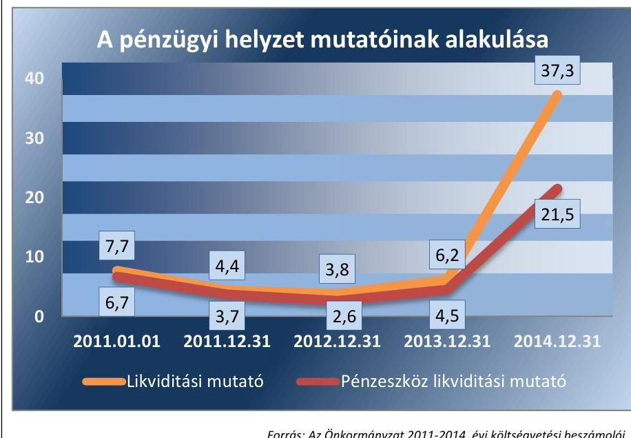

Forrás: Az Önkormányzat 2011-2014. évi költségvetési beszámolói
A likviditási mutató értéke a 2011-2014. években azt jelezte, hogy az Önkormányzat fizetőképessége biztosított volt. A mutató 2013-2014. évi javulását elsősorban az állami adósságátvállalás eredményezte.

---

A költségvetés elemzését CLF módszerrel végeztük, a főbb adatokat évenként az 1. táblázat mutatja be, a részletes

 adatokat a V. számú melléklet tartalmazza. A 2013. évben az Önkormányzat adósságkonszolidációs támogatásban nem részesült, kizárólag állami adósság-átvállalásra került sor, ez a pénzforgalmi könyvelést nem érintette. A 2014. évben az Önkormányzat 114,3 M Ft adósságkonszolidációs támogatást kapott.

1. táblázat

|  A PÉNZÜGYI EGYENSÚLYI HELYZET FŐBB ADATAI (MILLIÓ FT) |  |  |  |  |   |
| --- | --- | --- | --- | --- | --- |
|  Megnevezés | 2011. év | 2012. év | 2013. év | 2014. év | 2014. év adósság-konszolidációs tá-mogatás nélkül  |
|  Folyó bevételek | 4208,2 | 4156,9 | 3338,5 | 3753,0 | 3752,6  |
|  Folyó kiadások | 3964,7 | 4020,2 | 2973,7 | 3004,5 | 3004,5  |
|  Működési jövedelem | 243,5 | 136,7 | 364,8 | 748,5 | 748,1  |
|  Felhalmozási bevételek | 5816,5 | 1632,5 | 1426,4 | 658,2 | 544,3  |
|  Felhalmozási kiadások | 7143,8 | 2557,3 | 1337,4 | 1207,5 | 1207,5  |
|  Felhalmozási költségvetés egyenlege | $-1327,3$ | $-924,8$ | 89,0 | $-549,3$ | $-663,2$  |
|  Finanszírozási műveletek nélküli (GFS) pozíció | $-1083,8$ | $-788,1$ | 453,8 | 199,2 | 84,9  |
|  Finanszírozási műveletek egyenlege | $-4,3$ | 60,1 | $-270,1$ | $-597,8$ | $-501,2$  |
|  Tárgyévi pénzügyi pozíció | $-1088,1$ | $-728,0$ | 183,7 | $-398,6$ | $-416,3$  |
|  Nettó működési jövedelem | 226,9 | 115,5 | 143,9 | 128,1 | 224,3  |

Forrás: Az Önkormányzat 2011-2014. évi költségvetési beszámolói és adatszolgáltatása

A MŰKÖDÉSI JÖVEDELEM annak ellenére, hogy az önkormányzat ÖNHIKI támogatásban nem részesült, pozitív volt és a működési költségvetés egyensúlya e támogatások nélkül is biztosított volt. A 2011. évről a 2012. évre a működési kiadások alakulásában meghatározó volt a működési célú pénzeszköz átadások 84,0 M Ft-os növekedése, illetve a kölcsönök nyújtásának csökkenése. A működési célú pénzeszközátadások emelkedését az határozta meg, hogy a köznevelési intézmények egyes telephelyei 2012. szeptember 1-jétől egyházi fenntartásba kerültek. Az Önkormányzat a telephelyek átadásával kapcsolatban az egyháznak 105,3 M Ft pénzeszközátadást teljesített a kiegészítő támogatás elszámolása következtében. A 2011. évben az Önkormányzat 26,6 M Ft támogatási kölcsönt nyújtott költségvetési szervének, a 2012. évben e jogcímen kifizetés teljesítésére nem került sor.

A 2013. évben a folyó bevételek 818,4 M Ft-tal, a folyó kiadások 1046,5 M Ft-tal csökkentek az előző évhez képest. A bevételek csökkenését döntően az okozta, hogy az átengedett központi bevételek 640,7 M Ft-tal, az államháztartáson kívülről kapott bevételek 292,2 M Ft-tal csökkentek a non-profit és egyéb szervezetektől pénzeszköz átvételek és kapott támogatások elmaradása következtében. A folyó kiadások csökkenését főként az általános iskolai oktatás állami fenntartásba kerülése, illetve a végrehajtott létszámcsökkentés okozta.

A 2014. évi működési jövedelem növekedését az előző évhez képest a saját működési bevételek és az államháztartáson belülről kapott támogatások emelkedése eredményezte.

A FELHALMOZÁSI KÖLTSÉGVETÉS EGYENLEGE a 2013. év kivételével negatív volt. A hiányt működési többletből és az előző évi maradványból finanszírozták. A felhalmozási kiadások az ellenőrzött

---

időszakban folyamatosan csökkentek, mivel a legnagyobb összegű és európai uniós támogatással megvalósuló beruházások befejeződtek. A Makói Gyógy- és Termálfürdő komplex egészségturisztikai fejlesztésével kapcsolatban a 2011. évben 3659,9 M Ft, a 2012. évben 965,0 M Ft kifizetést teljesítettek. A fürdővárosi funkciókat kiszolgáló, megújuló településközpont, illetve az Aktív turisztikai fejlesztések Makón elnevezésű projektekkel kapcsolatban a 2011. évben 431,7 M Ft, a 2012. évben 552,5 M Ft felhalmozási kiadást teljesítettek.

A FINANSZÍROZÁSI MŰVELETEK EGYENLEGE a 2012. év kivételével negatív volt. A 2011. évben a korábbi években megkötött hitelszerződés alapján 8,0 M Ft összegű hitelkeret lehívására került sor a panelprogrammal kapcsolatban. A 2012-2014. években a Stabilitási tv. szerint a Kormány engedélyhez kötött adósságot keletkeztető ügylet vállalására nem került sor.

A TÁRGYÉVI PÉNZÜGYI POZÍCIÓ a 2013. év kivételével negatív volt, azaz a teljesített kiadások meghaladták a bevételeket, az Önkormányzat pénzeszközeinek állománya csökkent. A bevételeket meghaladó kiadások teljesítésére az előző évi pénzmaradvány-igénybevétel nyújtott fedezetet.

A NETTÓ MŰKÖDÉSI JÖVEDELEM 2011-2014. évi pozitív összege alapján az Önkormányzat pénzügyi egyensúlya biztosított volt. A pénzügyi egyensúlyi helyzet fenntartása érdekében az Önkormányzat bevételnövelő lehetőségek hiányában, csak kiadáscsökkentő intézkedéseket hajtott végre. Az Önkormányzat a 2011-2014. években több alkalommal döntött az önként vállalt és a kötelező feladatok körének és ellátási formájának megváltoztatásáról. Ezt a II. számú melléklet mutatja be. A 2011. január 1-jén ellátott feladatok közül 2014. december 31-én az Önkormányzat nem működtette a családok átmeneti otthonát, a hajléktalanok nappali ellátását, nem látta el az általános iskolai oktatást, az alapfokú művészetoktatást, az okmányirodai, gyámhivatali feladatokat. A városi piac üzemeltetését, a Tourinform iroda működtetését, a városüzemeltetési feladatokat a kizárólagos tulajdonában álló gazdasági társaságának adta át. 2012. szeptember 1-jétől a Képviselő-testület az általános iskolai oktatás feladatait, illetve az óvodai nevelést egyes telephelyek vonatkozásában egyházi fenntartásba adta. A Képviselő-testület a költségvetési szervek engedélyezett létszámát a feladatátadások következményeként 12 fővel csökkentette. 2013. évben a Képviselő-testület a feladatváltozásokon kívül is döntött létszámcsökkentésről. Az Önkormányzat a létszámcsökkentéssel kapcsolatban 23,0 M Ft költségvetési támogatásban részesült. A támogatás felhasználásával 26 fő álláshely tartós leépítésére került sor.
3.2. számú megállapítás

A polgármester a 2011. január 1-jén fennálló, 90 napon túl lejárt szállítói tartozás rendezésére a jogszabályi előírás ellenére nem kezdeményezte az adósságrendezési eljárás megindítását.

Az Önkormányzat kötelezettségállománya a 2011. január 1-jei 5020,2 M Ft-ról a 2014. év végére 109,4 M Ft-ra csökkent. A csökkenést nagyrészt a kötvény- és hiteltartozás törlesztése, illetve állami átvállalása eredményezte.

---

A HOSSZÚ LEJÁRATÚ KÖTELEZETTSÉGEK között kizárólag kötvénykibocsátásból, illetve beruházási és fejlesztési hitelből származó kötelezettséget mutattak ki. Az Önkormányzatnak kötvénykibocsátásból az ellenőrzött időszak elején 4359,0 M Ft tartozása volt. A 2014. év végén e jogcímen mérlegében kötelezettséget nem mutatott ki. A hitelállomány a 2011. január 1-jei 235,0 M Ft-ról a 2014. év végére 26,5 M Ft-ra csökkent.

A RÖVID LEJÁRATÚ KÖTELEZETTSÉGEK között az Önkormányzat a szállítói tartozások mellett helyi adótúlfizetést, támogatási programelőleget, valamint egyéb rövid lejáratú kötelezettségeket mutatott ki. A szállítói kötelezettségek teljesítése nem minden esetben történt meg az előírt határidőben. A kötelezettségek fizetési határidejének átütemezésére nem került sor. A szállítói kötelezettségek lejárat szerinti alakulását a 2. táblázat mutatja be.
2. táblázat

| A SZÁLLÍTÓI KÖTELEZETTSÉGEK ALAKULÁSA (M FT) |  |  |  |  |  |
| :--: | :--: | :--: | :--: | :--: | :--: |
| Megnevezés | 2011.01.01 | 2011.12.31 | 2012.12.31 | 2013.12.31 | 2014.12.31 |
| Szállítói kötelezettség | 80,0 | 253,1 | 48,9 | 90,4 | 39,6 |
| Lejárt tartozás | 1,5 | 142,1 | 48,3 | 85,3 | 3,1 |
| 1-30 nap közötti | 0,3 | 111,7 | 0,0 | 85,0 | 3,1 |
| 31-60 nap közötti | 0,0 | 7,1 | 0,0 | 0,0 | 0,0 |
| 61-90 nap közötti | 0,0 | 0,0 | 0,0 | 0,0 | 0,0 |
| 91-365 nap közötti | 1,2 | 23,3 | 0,0 | 0,3 | 0,0 |
| éven túli | 0,0 | 0,0 | 0,0 | 0,0 | 0,0 |

Forrás: Az Önkormányzat 2011-2014. évi költségvetési beszámolói és adatszolgáltatása

Az Önkormányzat 2011. január 1-jén már rendelkezett elismert 60 napon túli lejárt esedékességű szállítói kötelezettséggel. A polgármester az Adósságrendezési tv. ${ }^{19}$ 5. § (1) bekezdésében foglaltak ellenére nem tájékoztatta a Pénzügyi Bizottságot az Önkormányzat 60 napon túli lejárt szállítói állományáról és a szükséges adósságrendezési eljárás kezdeményezésének indokoltságáról. A polgármester az Adósságrendezési tv. 5. § (1) bekezdésében foglalt kötelezettsége ellenére nem hívta össze a Képviselőtestületet 8 napon belül, hogy a testület döntsön a fizetési kötelezettségek rendezéséről, vagy a polgármester felhatalmazásáról az adósságrendezési eljárás azonnali kezdeményezéséről. A polgármester kötelezettségének határidőn túl sem tett eleget. A polgármester a 2011. július 12-ig hatályos Adósságrendezési tv. 5. § (2) bekezdés előírását megsértve az adósságrendezési eljárás 8 napon belüli kezdeményezéséről annak ellenére nem gondoskodott, hogy a tartozásállomány az esedékességet követő 90. napon is fennállt.

Az Önkormányzat 2011. december 31-én és 2013. december 31-én is rendelkezett 60 napot meghaladó (és 90 napon túli) lejárt szállítói tartozással. A 2011. év végi, 90 napon túl lejárt tartozás szállítói finanszírozáshoz kapcsolódott. A számla közvetlenül a közreműködő szervezet részére kerül benyújtásra, ezért a számla késedelmes kifizetésére az Önkormányzatnak nem volt hatása. A számviteli nyilvántartásban a 91-365 nap közötti lejárt szállítói tartozás 2013. december 31-én 0,3 Ft volt, amely olyan számlákból tevődött össze, melyek 2014. évben, többször 90 napos késedelemmel kerültek befogadásra, így határidőben történő kiegyenlítésükre nem volt lehetőség.

---

A 2014. év végén a lejárt tartozásállomány összege jelentős mértékben csökkent és az Önkormányzat már kizárólag 30 nap alatti lejárt esedékességű tartozással rendelkezett.

# 3.3. számú megállapítás 

A követelések nyilvántartása nem felelt meg a jogszabályi előírásoknak, a hitelezői igények benyújtása több esetben elmaradt.

Az Önkormányzat mérleg szerinti követelése december 31-én a 2011. évben 222,7 M Ft, a 2012. évben 415,4 M Ft, a 2013. évben 328,5 M Ft volt. A 2014. évi költségvetési beszámolójában az Önkormányzat 504,5 M Ft követelést mutatott ki¹. Az ellenőrzött időszakban az Önkormányzat követelésállományának alakulását a 3. ábra szemlélteti:
3. ábra
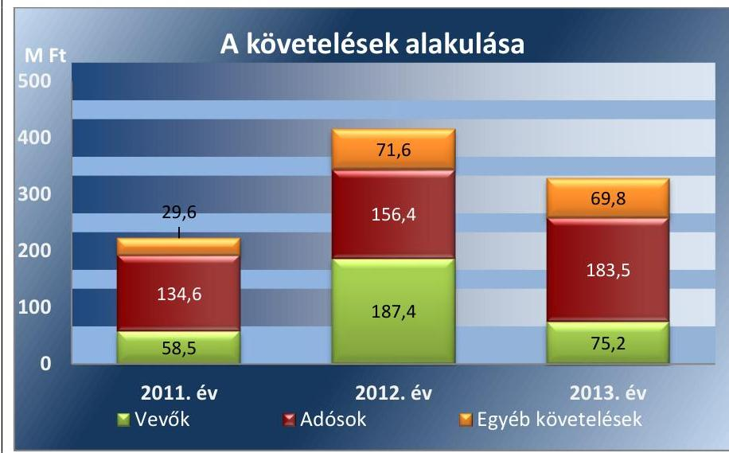

Forrás: Az Önkormányzat 2011-2014. évi költségvetési beszámolói

A vevők mérlegértéke a 2012. évben az előző évhez képest 128,9 M Ft-tal emelkedett, majd 112,2 M Ft-tal csökkent 2013. december 31-re. Az ingadozást nagyrészt a nem lakáscélú épületek bérbeadásával kapcsolatos hátralék okozta, mely a 2011. évben 32,5 M Ft, a 2012. évben 157,0 M Ft, a 2013. évben 34,3 M Ft volt.

Az adósok mérleg szerinti értéke a 2011-2013. években folyamatosan nőtt, 2013. december 31-én 183,5 M Ft volt. A helyi adó túlfizetés miatti kötelezettségek a mérleg eszközoldalán téves könyvelés miatt helytelenül a követelések között is szerepeltek. Így a 2011. évben 32,7 M Ft-tal, a 2012. évben 33,2 M Ft-tal, 2013. évben 44,4 M Ft-tal több követelést mutattak ki az adósok között, mert a valós összeget meghaladóan szerepeltették az előírt, de még be nem folyt helyi adókból származó adósokkal szembeni követelést. Ezzel megsértették az Áhsz.; 22. § (1) bekezdés b), valamint a 26. § (5) bekezdés de) pontjának előírásait.

[^0]
[^0]:    ${ }^{\text {¹ }}$ A 2014. évi adatok az eredményszemléletű államháztartási számviteli rendszer 2014. január 1-jével történt bevezetése miatt nem hasonlíthatók össze teljes körűen a
 megelőző évekkel, mivel az Áhsz. értelmében az egyes mérlegsorok tartalma lényeges eltérést mutat a korábbiaktól.

---

AZ EGYÉB KÖVETELÉSEK 2012. évi növekedését döntően a vagyonkezelésbe adott eszközökkel kapcsolatos 50,8 M Ft-os követelés, a 2013. évben egy ingatlan értékesítés 53,8 M Ft-os vételárának egyéb követelések között történő nyilvántartása okozta.

A HÁTRALÉKOK BEHAJTÁSA ÉRDEKÉBEN az Önkormányzat a vagyonrendelet 18. § (2) bekezdésében foglalt intézkedéseket megtette, felhívta a vevőt a tartozás teljesítésére, fizetési meghagyás iránti kérelmet nyújtott be, azonnali beszedési megbízást kezdeményezett, illetve végrehajtási eljárást indított.

A vagyonrendelet 20. § (2) bekezdése lehetőséget nyújtott a tartozás részletfizetés révén történő kiegyenlítésére, az erről szóló megállapodások aláírására a 20. § (4) bekezdésben a Vagyoncsoport vezetőjét hatalmazták fel. A vagyonrendelet előírásait megsértve egy esetben a részletfizetésről szóló megállapodást a Vagyoncsoport vezetője helyett, a felhatalmazással nem rendelkező ingatlangazdálkodási előadók írták alá.

Az adóhátralékok csökkentése érdekében az Önkormányzat inkasszót nyújtott be, jövedelem-letiltást, gépjármű forgalomból való kitiltást, illetve gépjármű foglalást foganatosított. A behajtás eredményéről minden évben tájékoztatták a Képviselő-testületet.

# KÖVETELÉS BEHAJTHATATLANNÁ MINŐSÍTÉSÉRE az ellenőrzött időszakban kizárólag a 2013. évben került sor, összesen 16,9 M Ft értékben.

Az ellenőrzött mintatételek esetében - egy kivétellel - a követelés behajthatatlanná minősítésének oka megfelelt a jogszabályi előírásoknak, a behajthatatlanság tényét és mértékét az előírásoknak megfelelően bizonyították. A jegyző 2013. december 31-ei dátummal egy gazdasági társasággal szemben fennálló bruttó 1,0 M Ft követelés behajthatatlanná minősítését rendelte el. A követelés behajthatatlanná minősítése nem felelt meg az Áhsz. 1 5. § 3. a)-e) pontjai közül egyiknek sem. A Gt. ${ }^{20} 68$. § (1) bekezdése, illetve a Ptk. ${ }^{21}$ 3:137. § (1) bekezdése szerint a gazdasági társaság jogutód nélküli megszűnése esetén a megszűnő társaságot terhelő kötelezettség alapján fennmaradt, illetve kötelezettségből származó követelés a társaság megszűnésétől, illetve nyilvántartásból való törlésétől számított ötéves jogvesztő határidő alatt, illetve határidőn belül érvényesíthető a gazdasági társaság volt tagjával (részvényesével) szemben. Ebből kifolyólag az Önkormányzatnak 2018. május 5-ig lehetősége van a hitelezői igény bejelentésére, ezért a követelés behajthatatlanná minősítése nem felelt meg az Áhsz. 1 5. § 3. pontjában foglaltaknak.

Az Önkormányzat hitelezői igényét egy esetben nem, egy esetben pedig a jogszabályban előírt határidőn túl nyújtotta be. A jegyző ezzel megsértette az Mötv. 81 § (3) bekezdés c) pontjában és az Áht. 2 92. § (2) bekezdésében foglaltakat. A hitelezői igény késedelmes benyújtásával érintett gazdasági szervezet felszámolása 2013. évben befejeződött. Így a követelések az Áhsz. 1 5. § 3. d) pontja alapján behajthatatlannak minősültek.

Az Önkormányzat nem határozta meg a követelés behajthatatlannak minősítésének eljárásrendjét illetve a döntésre jogosultak körét. Ezzel a jegyző nem tett eleget az Ámr. 156. § (1) bekezdés b) pontjában, illetve a Bkr. 6. § (1) bekezdés b) pontjában foglalt kötelezettségének, mivel nem alakított ki olyan kontrollkörnyezetet, ahol a behajthatatlan követelések

---

vonatkozásában egyértelműek a felelősségi, hatásköri viszonyok és feladatok.

KÖVETELÉSRŐL LEMONDÁS a 2011-2014. években nem történt.

### 3.4. számú megállapítás

A gazdálkodással összefüggő, pénzügyi egyensúlyt befolyásoló kockázatok mérséklésére kockázatkezelési rendszert nem működtettek.

A kockázatkezelési rendszer keretében a 2011. évben az Áht. 121. § (2) bekezdés b) pontjában, valamint az Ámr. 157. § (1)-(3) bekezdéseiben, a 2012-2013. években a Bkr. 7. § (1)-(2) bekezdéseiben előírtak ellenére nem mérték fel és nem állapították meg a pénzügyi egyensúlyi helyzet alakulásával összefüggő kockázatokat. Így nem határozták meg a kockázatokkal kapcsolatos intézkedéseket, valamint azok teljesítésének folyamatos nyomonkövetésének módját. Nem azonosították, nem elemezték a működési jövedelemtermelő képesség miatti kockázatot, holott a működési jövedelem a 2011. évi 243,5 millió Ft-hoz képest a 2012. évben 136,7 millió Ft-ra (43,9%-kal) csökkent. A jegyző nem azonosította be és nem értékelte a szállítói kötelezettségállomány alakulása miatti nemfizetési kockázatot, holott az Önkormányzatnak volt lejárt szállítói tartozás állománya minden év végén.

### 3.5. számú megállapítás

Az adósságkonszolidációval összefüggő önkormányzati feladatok végrehajtása az előírásoknak megfelelően történt.

A Képviselő-testület döntött arról, hogy igénybe kívánja venni adósságállományának a Magyar Állam által történő átvállalását és felhatalmazta a polgármestert az erről szóló megállapodások megkötésére.

A 2013. évi Kvkv. ${ }^{22}$ előírásának megfelelően az államháztartásért felelős miniszter, a helyi önkormányzatokért felelős miniszter és az Önkormányzat képviseletében a polgármester 2013. február 28-ig megállapodást kötött, amelyben a 2013. évi Kvkv.-ben meghatározottakat figyelembe véve a Magyar Állam 2522,3 M Ft összegű adósságot és járulékait vállalta át. A jogszabályban meghatározott határidőn belül, 2013. június 27-én a Magyar Állam, az Önkormányzat és a kötvénytulajdonos pénzintézet tartozásátvállalási szerződést kötött.

Az Önkormányzatot 2013. december 31-én 2262,6 M Ft kötvényből, illetve 124,3 M Ft hitelből fennálló adósság terhelte. Az Önkormányzat a 2014. évi Kvkv.-ben ${ }^{23}$ előírt adatszolgáltatást határidőben teljesítette. Az adósság átvállalására 2014. február 28-ig sor került, az átvállalt adósság könyvekből történő kivezetése megtörtént.

---

# 4. A vagyonnyilvántartás, a költségvetési beszámoló mérlegének alátámasztottsága megfelelt-e a jogszabályokban és a belső szabályzatokban előírt követelményeknek? 

Összegző megállapítás

## 4.1. számú megállapítás

### 4.2. számú megállapítás

A beszámolót nem támasztották alá a vagyonkezelő által elkészített, hitelesített leltárral. A részesedések és az üzemeltetésre átadott eszközök értékelése nem felelt meg a jogszabályi előírásoknak.

A vagyon nyilvántartása - a részesedések kivételével - megfelelt a jogszabályi előírásoknak.

A VAGYON NYILVÁNTARTÁSA során az Önkormányzat a jogszabályi előírásoknak megfelelően a főkönyvi számlák alábontásával, valamint - a részesedések kivételével - részletező nyilvántartások vezetésével biztosította a törzsvagyon, ezen belül a forgalomképtelen és a korlátozottan forgalomképes, illetve az üzleti vagyon elkülönített kimutatását. A 2014. évben a tartós részesedésekkel kapcsolatban az Áhsz. 2 45. § (3) bekezdésében, 14. számú melléklet VIII. 2-3. pontjában előírtak ellenére részletező nyilvántartást nem vezettek.

Az év végi leltározás keretében a főkönyvi könyvelés és a kapcsolódó analitikus nyilvántartás adatainak egyeztetését elvégezték, eltérést nem állapítottak meg.

Az ellenőrzött időszakban a mérleg leltárral való alátámasztását nem biztosították. A 2014. évben a leltározási és selejtezési tevékenység végrehajtása során több esetben megsértették a jogszabályok és a belső szabályzatok előírásait.

A VAGYONELEMEK LELTÁROZÁSÁT az Önkormányzat és az irányítása alatt álló költségvetési szervek elvégezték. A leltározás végrehajtása 2014. évben az alábbiak miatt nem felelt meg az előírásoknak:
a 2014. évben az ingatlanok leltározása során a Leltározási szabályzat előírása ellenére nem gondoskodtak a számviteli nyilvántartások földhivatali nyilvántartással való egyeztetéséről. Az ellenőrzés megállapította, hogy az értékesített ingatlanok számviteli nyilvántartásokból való kivezetése nem minden esetben történt meg. A hiányosságokra vonatkozó részletes megállapításokat az 5.4. pont tartalmazza. Ennek következtében a 2014. évben a mérleg alátámasztására készített leltár e tekintetben nem biztosította a Számv. tv. 15. § (3) bekezdésében foglalt valódiság alapelv érvényesülését,
a Leltározási szabályzatban foglaltak szerint a vagyonkezelőknek a hitelesített leltárakat a szerződésekben, megállapodásokban rögzített határidőre kellett a Polgármesteri hivatal részére megküldeni. A vagyonkezelési szerződésekben azonban a vagyonkezelők leltárkészítési kötelezettségét, illetve annak határidejét nem határozták meg. A 2014. évben a vagyonkezelésbe adott eszközök leltárát a KLIK a Polgármesteri hivatal hivatalos értesítése ellenére nem küldte

---

meg. Ennek következtében a Számv. tv. 69. § (1) bekezdésében foglaltak ellenére a mérlegforduló napon meglévő eszközök közül, a vagyonkezelésbe adott eszközöket leltárral nem támasztották alá,
a mérleg tételeinek alátámasztásához az üzemeltetésre átadott víziközmű vagyon vonatkozásában az Áhsz. 2 22. § (1) bekezdése ellenére nem állítottak össze olyan leltárt, amely tételesen, ellenőrizhető módon tartalmazta a mérlegben szereplő eszközöket. A mérlegértéket az üzemeltető által készített nyilatkozat támasztotta alá,
a befektetett pénzügyi eszközök mérlegcsoportban nyilvántartott tartós részesedések leltári értékelése során nem vizsgálták a részvénykibocsátó társaságok cégjogi helyzetét és nem végezték el a részvények tartalmi és formai ellenőrzését, emiatt megszűnt részvénytársaság részvénye, illetve jogilag nem érvényesíthető részesedés szerepelt a mérlegben. Ennek következtében három társaságot érintően összesen 25,9 millió Ft értékkel magasabb összegben mutatták ki a részesedések értékét. Ezzel megsértették a Számv. tv. 15. § (3) bekezdésében foglalt valódiság alapelv érvényesülését.

Az Önkormányzat egy társaságban 0,1 M Ft értékű részesedését 2014. június 22-ig nyilvántartásaiban nem mutatta ki, ezzel megsértették a Számv. tv. 69. § (1) bekezdését, valamint a Számv. tv. 15. § (3) bekezdésében foglalt valódiság elvét, mert az Önkormányzat 2011-2013. évi könyvviteli mérlegében a tartós részesedés mérlegtétel nem tartalmazott minden tulajdoni részesedést jelentő befektetést.

Az intézmények leltározása során eltérést csak az ENI ${ }^{24}$ esetében állapítottak meg. A készletek mennyiségi felvételét követően, az analitikus nyilvántartásokkal való egyeztetés eredményeként kisösszegű hiányt (158,8 Ft) és többletet (8,9 Ft) tártak fel, melyek számviteli rendezése megtörtént.

A 2014. ÉVI SELEJTEZÉS előkészítése, engedélyezése megfelel a Leltározási szabályzat előírásainak. A selejtezés kizárólag nullára leírt eszközöket érintett. A selejtezési folyamat során a Leltározási szabályzat előírásait nem tartották be az alábbiak miatt:
egy esetben a szabályzat II. fejezetének 5.2. pontjában foglaltak ellenére a selejtezési bizottság kijelölését nem dokumentálták,
a szabályzat II. fejezetének 1.3. pontja ellenére a használhatatlanná válás és a javítás gazdaságtalanságára vonatkozó megállapításokat a 10 E Ft beszerzési egységár feletti számítástechnikai eszközök, gépek, berendezések esetében nem szakértő szerv szakvéleményére alapozva állapították meg,
több esetben - a szabályzat II. fejezetének 5.4. pontja és a FEUVE Selejtezési tevékenység folyamata 6. sz. tevékenység előírásai ellenére - nem dokumentálták a hulladéknak minősített eszközök megsemmisítését, elszállítását, mely egy esetben veszélyes hulladékot érintett.

---

### 4.3. számú megállapítás

Az eszközök és források értékelése - a részesedések, az üzemeltetésre átadott eszközök kivételével - megfelelt a jogszabályi előírásoknak.

A RÉSZESEDÉSEK ÉRTÉKELÉSÉT a 2011-2013. években a Számv. tv. 57. § (1) bekezdésében, valamint a Számviteli politika és az Értékelési szabályzat előírásai ellenére nem végezték el. Nem vizsgálták az értékvesztés elszámolásának szükségességét. Ezzel megsértették a Számv. tv. ${ }^{25}$ 54. § (1) bekezdésében, valamint az Áhsz. 2 18. (1)-(2) bekezdésében foglaltakat. Az Önkormányzat többségi tulajdonában lévő gazdasági társaságok esetében rendelkezésre álltak a részesedések értékeléséhez szükséges információk. Megsértették a Számv. tv. 54. § (2) bekezdés c) pontjában foglaltakat, mivel a saját tőke, jegyzett tőke arány alapján a 2012-2013. években a Makó Városi Kulturális- Közművelődési NKft. esetében évente 3,0 M Ft, a Makói Gyógyfürdő Kft. esetében a 2012. évben 106,4 M Ft, a 2013. évben 10,0 M Ft értékvesztést nem számoltak el. Azon gazdasági társaságok esetében, amelyekben az Önkormányzat nem rendelkezett többségi tulajdonrésszel, az értékeléshez szükséges információkat az Önkormányzat nem szerezte be.

Az Önkormányzat megsértette az Áhsz. 1 32. § (1) bekezdésében, valamint az Áhsz. 2 21. § (3) bekezdésében foglaltakat, mivel a Makói Városgazdálkodási NKft.-ben fennálló 55,0 M Ft-os bekerülési értékű részesedését a 2011-2014. évi könyvviteli mérlegben megalapozatlanul 86,0 M Ft-os értéken szerepeltette.

Az Önkormányzat a 2011-2014. években megsértette a Számv. tv. 15. § (3) bekezdésében foglalt valódiság elvét, mert:
$\longrightarrow$ beszámolójában tartós részesedésként
 mutatott ki 0,1 M Ft értékű OTP Nyrt. részvényt. A részvények dematerializált formába történő átváltását nem kezdeményezte, a nyomdai úton előállított részvények értékpapír számlán történő jóváírására 2007. március 8. napját követően az Önkormányzatnak nem volt lehetősége,
$\longrightarrow$ a könyvviteli mérlegében tartós részesedésként valótlanul szerepeltetett 24,2 M Ft értékű Szegedi Paprika Élelmiszerkereskedelmi Rt. részvényt, mert a társaság felszámolása 2002. június 28-án befejeződött.

AZ ÜZEMELTETÉSRE ÁTADOTT víziközmű vagyon tekintetében az Önkormányzat a 2013. évben a 2011. évi CCIX. törvény 12. § (1) bekezdésének felhatalmazása alapján vagyonértékelést készíttetett a piaci érték megállapítására. A 2013. évben a piaci érték és a nyilvántartási érték különbözete miatt 200,2 M Ft terven felüli értékcsökkenést számoltak el. A 2014. évben a terven felüli értékcsökkenést az eszközök piaci értékelése alapjául szolgáló információk dokumentált ismerete (szakértői vélemény) hiányában 2014. augusztus 28-án visszaírták. Ezzel megsértették a Számv. tv. 57. § (2) bekezdésében, valamint az Áhsz. 2 19. § (1) bekezdésében foglaltakat, mivel nem vizsgálták, hogy a terven felüli értékcsökkenés visszaírásának okai fennálltak-e, valamint a terven felüli értékcsökkenés visszaírását nem az üzleti év mérleg fordulónapjára vonatkozó értékelés keretében hajtották végre.

---

# 4.4. számú megállapítás 

A Polgármesteri hivatal az eredményszemléletű számvitel bevezetésével kapcsolatos előkészítő feladatokat határidőben elvégezte, a rendező mérleget elkészítette.

A Polgármesteri hivatal az eredményszemléletű számvitel bevezetésével kapcsolatos feladatokat az NGM rendeletben előírtaknak megfelelően elvégezte.

A jegyző a leltározások lebonyolítását leltározási utasítással rendelte el, a közreműködők személyének, feladatának és felelősségének meghatározásával. A rendező mérleg elkészítését megelőzően, a mérleg fordulónapjára teljes körű leltározást végeztek mind az Önkormányzat, mind az irányított költségvetési szervek eszközei, forrásai tekintetében, amelynek előkészítése során érvényesítették az NGM ${ }^{16}$ rendeletben előírt - a felesleges, elfekvő készletek felmérésének, a befejezetlen beruházások felülvizsgálatának, a követelések és a kötelezettségek, kötelezettségvállalások esedékesség szerinti elkülönítésének - követelményeit. Rendezték a függő, átfutó kiadások, illetve bevételek azon tételeit, amelyről a keletkezésük és könyvelésük időszakában a végleges jogcím nem volt meghatározható.

Az NGM rendelet előírása alapján elvégezték a rendező technikai tételek elszámolását, kivezették a könyvekből az NGM rendeletben meghatározott tételeket.

## 5. Szabályszerűek voltak-e a vagyon összetételének és nagyságának változását eredményező döntések és azok végrehajtása?

Összegző megállapítás

### 5.1. számú megállapítás

A beruházások üzembe helyezésének dokumentálása, az értékcsökkenés elszámolása nem minden esetben felelt meg az előírásoknak. Az értékesített ingatlanok számviteli és vagyonkataszteri nyilvántartása, illetve nyilvántartásból történő kivezetése nem volt szabályszerű.

## Az Önkormányzat vagyona a beruházások és a közművagyon felértékelése következtében gyarapodott.

Az Önkormányzat vagyona a 2011. január 1-jei 30 556,5 M Ft-ról 2013. december 31-re 35 557,8 M Ft-ra, 16,4%-kal emelkedett ${ }^{3}$. Az eszközök és források alakulását kiemelt mérlegsoronként a VI. sz. melléklet tartalmazza.

A VAGYON VÁLTOZÁSÁT alapvetően a tárgyi eszközök és az üzemeltetésre átadott eszközök állományának növekedése eredményezte. A legnagyobb beruházás a 2012. évben befejezett Makói Gyógy- és Termálfürdő komplex egészségturisztikai fejlesztése volt, melyre a 2011-2012. években 4624,9 M Ft kiadást teljesítettek. Az üzemeltetésre,

[^0]
[^0]:    ${ }^{3}$ A 2014. évi adatok az eredményszemléletű államháztartási számviteli rendszer 2014. január 1-jével történt bevezetése miatt nem hasonlíthatók össze teljes körűen a megelőző évekkel, mivel az Áhsz.: értelmében az egyes mérlegsorok tartalma lényeges eltérést mutat a korábbiaktól.

---

kezelésre átadott, illetve vagyonkezelésbe adott eszközök értéke a 2013. év végére 2862,3 M Ft-tal nőtt az előző évhez képest. A növekedést nagyrészt az okozta, hogy a víziközmű-vagyont a 2013. évben átértékelték, melynek következtében 2358,0 M Ft értékhelyesbítés elszámolására került sor.

AZ ÖNKORMÁNYZAT TÖKEERŐSSÉGE ${ }^{5}$ folyamatosan, a befektetett eszközök fedezete ${ }^{* *}$ a 2011. év kivételével emelkedett. A mutatók alakulását a 4. ábra szemlélteti.
4. ábra
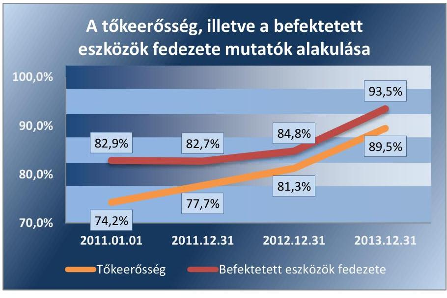

A növekedés annak eredménye, hogy az Önkormányzat a fejlesztéseket nagyrészt támogatásból, illetve saját bevételből finanszírozta.

# 5.2. számú megállapítás 

A vagyonkezelői jog létesítése, a vagyon üzemeltetésre átadása részben szabályszerűen, a közfeladat ellátással összhangban történt.

A VAGYONKEZELÉSI SZERZŐDÉSEKBEN az Önkormányzat szabályozta a vagyonkezelők által kötelezően ellátandó közfeladatokat és az ellátható egyéb tevékenységeket, a vagyonkezelői jog megszerzésének ingyenességét. Rendelkezett továbbá a vagyonnal való elszámolásról és meghatározta a vagyonkezelés időtartamát. Az Önkormányzat az ellenőrzött időszakban hét vagyonkezelési szerződést kötött. Ezek közül négyet saját tulajdonú gazdasági társasággal, a feladatellátás változása következtében az iskolafenntartó $\mathrm{KLIK}^{27}$-kel kettőt, a $\mathrm{VM}^{28}$-mel egyet kötött meg. A vagyonkezelő számára kötelezettségként előírta a vagyon felújítását, pótlását. Az Önkormányzat a vagyonkezelők részére a szerződésekben előírta a rendszeres adatszolgáltatásokat - melynek tartalmát nem hatá-

[^0]
[^0]:    ${ }^{5}$ a saját tőke aránya a forrásokon belül
    ${ }^{* *}$ a saját tőke és a befektetett eszközök aránya

---

rozta meg -, azok teljesítését dokumentáltan igazolni nem tudta. A vagyonkezelésbe adott eszközök átadásának számviteli elszámolása szabályszerűen megtörtént.

Az Önkormányzat megsértette az Eisztv. ${ }^{29}$ 6. § (1) bekezdésében, az Eisztv. mellékletének III/4. pontjában és az Áht. 1 15/B. § (1) bekezdésében, illetve az Info. tv. ${ }^{30}$ 37. § (1) bekezdésében és az Info tv. 1. sz. melléklet III/4. pontjában foglaltakat, mert nem tette közzé a vagyonkezelési szerződésekkel kapcsolatos adatokat.

AZ ÜZEMELTETÉSI SZERZŐDÉSEK tartalmazták az üzemeltető által ellátandó önkormányzati közfeladatokat és egyéb tevékenységeket, az üzemeltetésbe adott vagyon állagának, értékének megőrzésére, az elszámolásra vonatkozó rendelkezéseket, valamint a szerződés időtartamát.

A polgármester a 2012. évben egy üzemeltetési szerződést nem a 130/2012 (IV. 25.) MÖKT számú határozatban foglaltak szerint kötött meg. A szerződés olyan vagyonelemeket is tartalmazott (strand 234 fm hosszú szennyvízcsatorna hálózat és a négy házi szennyvíz átemelő), melyekre a Képviselő-testületi határozat nem terjedt ki. Nem tartalmazta viszont két strandröplabda pálya üzemeltetésbe adását.

Az Önkormányzat megsértette az Eisztv. 6. § (1) bekezdésében, az Eisztv. mellékletének III/4. pontjában és az Áht. 1 15/B. § (1) bekezdésében, illetve az Info. tv. 37. § (1) bekezdésében és az Info tv. 1. sz. melléklet III/4. pontjában foglaltakat, mert nem tette közzé az üzemeltetési szerződésekkel kapcsolatos adatokat.

Térítésmentes vagyonátadásra nem került sor, az Önkormányzat koncessziós szerződéssel nem rendelkezett.
5.3. számú megállapítás

A beruházási és felújítási döntések szabályszerűek voltak. Egy fejlesztésnél a kivitelezővel megkötött szerződés módosítása a Kbt. ${ }_{1}$ előírásaival ellentétes volt. Az üzembe helyezés dokumentálása, az értékcsökkenés elszámolása, valamint az ingatlanvagyon kataszter vezetése nem minden esetben felelt meg az előírásoknak. A kötbér érvényesítésére nem intézkedtek.

Az Önkormányzatnál a 2011-2014. évek között a folyamatban lévő, vagy megvalósult beruházások, felújítások összhangban voltak a Képviselő-testület Gazdasági és Munkaprogramjával és az önkormányzati feladatellátással.

A fejlesztés megvalósítására vonatkozó döntést minden esetben az arra jogosult hozta meg. A közbeszerzési eljárások lefolytatása szabályszerű volt.

Az Önkormányzat eleget tett a nettó 5,0 M Ft-ot meghaladó szerződésekkel kapcsolatos közzétételi kötelezettségeknek.

A vagyonnal való felelős gazdálkodás - Áht. 1 104.§ (3) bekezdésében és az Nvtv. 7.§ (2) bekezdésében előírt - követelményének érvényesítése érdekében a szerződésekben rögzítették az Önkormányzat érdekeit védő garanciális elemeket.

---

A Makó városközpont rehabilitációhoz kapcsolódó mélyépítési munkák kivitelezési szerződése szerint, késedelmes teljesítés esetén az Önkormányzat kötbérigényt érvényesíthet a kivitelező vállalkozóval szemben. A vállalkozó a szerződésben vállalt 2012. május 31-i határidővel szemben a műszaki átadás-átvételt 2012. július 19-én fejezte be, ennek ellenére az Önkormányzat a késedelmes teljesítés következtében felmerült kötbérigényét nem érvényesítette.

A fejlesztések üzembe helyezése, számviteli aktiválása a jogszabályokban előírtaknak részben felelt meg. Egy 0,3 M Ft értékű szekrény, illetve 17,0 M Ft értékben a Makói Sportcsarnok hő- és füstelvezető rendszer munkálatainak üzembe helyezését nem dokumentálták hitelt érdemlően, ezért nem volt megállapítható az értékcsökkenés elszámolásának szabályszerűsége. Ezzel megsértették az Áhsz. 30. § (1) bekezdésében, a 2014. évben a Számv. tv. 52. § (2) bekezdésében foglaltakat.

A kataszteri nyilvántartásban az ingatlan valóságos állapotában, értékében bekövetkezett változás átvezetése a 2011. évi közmű védőcső építés kapcsán nem volt szabályszerű, mivel a változást a 147/1992. (XI. 6.) Korm. rendelet ${ }^{31} 4 . \S$ (1) bekezdése ellenére a kataszterben 90 napon túl, a 2011. január 19-ei aktiválást követően több mint egy évvel, 2012. február 29-én rögzítették.

# 5.4. számú megállapítás 

Az értékesített ingatlanok számviteli és kataszteri nyilvántartása, illetve nyilvántartásból történő kivezetése nem felelt a jogszabályi előírásoknak.

AZ ÉRTÉKESÍTÉSI DÖNTÉSEK meghozatalára az Önkormányzat vagyonrendeletének megfelelően az arra jogosult önkormányzati szerv döntéshozatali eljárásának eredményeként került sor. Az Önkormányzat betartotta a forgalomképtelen és a korlátozottan forgalomképes törzsvagyon elidegenítésére vonatkozó jogszabályi korlátokat.

Az Önkormányzat az ingatlan értékesítést megelőzően ingatlanforgalmi szakértőket vett igénybe az ingatlan forgalmi értéknek meghatározására.

Az értékesített tárgyi eszközök vevőjét az Önkormányzat rendeletében foglaltak szerint nyilvános eljárásban választották ki. Az értékesítések között a pályáztatási eljárás eredményeként a szerződést minden esetben a legkedvezőbb ajánlatot tevővel kötötték meg.

Az Önkormányzatnál több esetben az értékesítést követően a kötelezett késedelmes teljesítése után a Ptk. ${ }^{32}$ 301. § (1)-(2) bekezdésében, illetve a Ptk. ${ }_{3}$ 6:48. § (1)-(4) bekezdésében megfogalmazottak ellenére a késedelmi kamat követelés érvényesítéséről nem gondoskodtak, ezzel megsértették az Áht. ${ }_{1}$ 108. § (2) bekezdését és az Áht. ${ }_{2}$ 97. § (2) bekezdését, mely szerint a helyi önkormányzat, valamint az általa irányított költségvetési szervek követeléséről lemondani csak törvényben vagy helyi önkormányzati rendeletben meghatározott esetekben és módon lehet. Az önkormányzat vagyonrendeletének 18. § (1) bekezdése szerint a képviselőtestület eseti döntését kivéve az önkormányzatot megillető követelésről lemondani nem lehet.

---

Az ingatlanok nyilvántartása, illetve az értékesített ingatlanok nyilvántartásból történő kivezetése nem felelt a jogszabályi előírásoknak az alábbi szabálytalanságok miatt:

- a 2011-2013. években 17 ingatlan a számviteli nyilvántartásban az értékesítés időpontjáig nem szerepelt. Ezzel megsértették az Áhsz. 1 15. § (1)-(2) bekezdésében foglaltakat, illetve a Számv. tv. 15. § (3) bekezdésében foglalt valódiság elvét, mivel az értékesítés időpontjáig a könyvviteli mérlegben nem mutatták ki ezeket az eszközöket annak ellenére, hogy azok az Önkormányzat működését szolgálták,
- a 2011-2013. években 12 ingatlan a kataszteri nyilvántartásban a 147/1992. (XI. 6.) Korm. rendelet 1. § (1) bekezdésében foglaltak ellenére az értékesítés időpontjáig nem szerepelt,
- három ingatlan helyrajzi számok összevonásával jött létre, azonban a tárgyi eszköz-nyilvántartásban még az összevonás előtti eredeti számokon szerepeltek. Az értékesített ingatlanok nyilvántartási értékét a számviteli nyilvántartásokból nem vezették ki. Egy 12,2 M Ft nyilvántartási értékű, 2012. évben értékesített ingatlant a 2013. évi, kettő, 0,4 M Ft nyilvántartási értékű 2013. évben értékesített ingatlant a 2013-2014. évi mérlegben is szerepeltettek. Ezzel megsértették az Áhsz. 1 51. § (1) bekezdés b) pontjában, valamint az Áhsz. 2 53. § (2) bekezdésében előírtakat, illetve a Számv. tv. 15. § (3) bekezdésében foglalt valódiság elvét, mivel olyan eszközöket is kimutattak a könyvviteli mérlegben az értékesítéseket követően, amelyek már nem szolgálták az államháztartás szervezetének
 működését, nem voltak használatában, rendelkezésére bocsátva, kezelésébe adva,
- egy ingatlan esetében az eredeti helyrajzi szám megbontásra került és azt követően nem került sor a vagyonkataszterbe történő módosítására. Az ingatlant az értékesítést követően a számviteli nyilvántartásból - Áhsz. 1 51. § (1) bekezdés b) pontjában, illetve Áhsz. 2 53. § (2) bekezdésében foglaltak ellenére - 11 hónapos késedelemmel vezették ki, ezen túl a 147/1992. (XI. 6.) Korm. rendelet 4. § (1) bekezdését megsértve a vagyonkataszter nyilvántartásból való kivezetése nem történt meg.
Az ingatlanvagyon-kataszter folyamatos vezetésének elmulasztása következtében megsértették a 147/1992. (XI. 6.) Korm. rendelet 1. § (1) bekezdésében foglaltakat.

# 5.5. számú megállapítás 

Az Önkormányzat a késedelmes teljesítéshez kapcsolódó szankciókat nem érvényesítette.

A bérbeadásról szóló döntést minden esetben a vagyonrendeletében foglaltak szerint a döntésre jogosult hozta meg.

A bérleti díjak meghatározása egyedi alapon történt, nem vették figyelembe az ingatlanhasználattal járó amortizáció megtérülését, nem végeztek költség-haszon elemzést.

A bérbeadásból származó bevételeket minden esetben kiszámlázták. A bevétel minden esetben realizálódott. A bérleti díjak megfizetése számos esetben késedelmesen történt. Ennek ellenére az Önkormányzat a bérlőkkel szemben a Ptk. 1 301. § (1)-(2) bekezdésében, illetve a Ptk. 2 6:48. §

---

(1)-(4) bekezdésében megfogalmazottak ellenére a késedelmi kamat követelés érvényesítésére vonatkozóan nem intézkedett, ezzel megsértették az Áht. 2 97. § (2) bekezdését, mely szerint a helyi önkormányzat, valamint az általa irányított költségvetési szervek követeléséről lemondani csak törvényben vagy helyi önkormányzati rendeletben meghatározott esetekben és módon lehet. Az önkormányzat vagyonrendeletének 18. § (1) bekezdése szerint a képviselő-testület eseti döntését kivéve az önkormányzatot megillető követelésről lemondani nem lehet.

A bérleti díjak határidőben történő teljesítésének figyelését, a fizetési felszólítások, a bevételek behajtása érdekében tett intézkedések eljárásrendjét a vagyonrendeletben szabályozták.

# 5.6. számú megállapítás 

Az ellenőrzés által feltárt, a jogszabályi előírás alapján jelentős összegűnek minősülő számviteli hiba kiemelt kockázatot jelentett a vagyonnyilvántartások megbízhatósága szempontjából.

A vagyon változásának ellenőrzése során feltárt szabálytalan könyvelési nyilvántartással és beszámolóban történő szerepeltetéssel megsértették a Számv. tv. 15. § (3) bekezdésében foglalt „valódiság" elvét. A könyvvizsgáló a 2011-2014. évi jelentéseiben a hitelesítő záradékot kiadta, az éves beszámoló alapján a pénzügyi és jövedelmi helyzetet megbízhatónak és valósnak minősítette. A számvevőszéki ellenőrzés által feltárt, a Számv.tv. 3. § (3) bekezdés 3) pontjának, az Áhsz. 1 5. § 8. pontja, az Áhsz. 2 1. § (1) bekezdés 3. pontjának megfelelő jelentős összegű hibát a 3. táblázat szemlélteti.
3. táblázat

FELTÁRT HIBÁK (M Ft)

| Megnevezés | 2011. év | 2012. év | 2013. év | 2014. év |
| :--: | :--: | :--: | :--: | :--: |
| Adósok hibás mérlegértéke | 32,7 M Ft | 33,2 M Ft | 44,0 M Ft | 0,0 M Ft |
| Mérlegben nem szereplő részesedés értéke | 0,1 M Ft | 0,1 M Ft | 0,1 M Ft | 0,0 M Ft |
| El nem számolt értékvesztés értéke - részesedések | 0,0 M Ft | 109,4 M Ft | 13,0 M Ft | 0,0 M Ft |
| Részesedés bekerülési értékének hibás szerepeltetése | 31,0 M Ft | 31,0 M Ft | 31,0 M Ft | 31,0 M Ft |
| Nem valós részesedések | 24,3 M Ft | 24,3 M Ft | 24,3 M Ft | 24,3 M Ft |
| Terven felüli értékcsökkenés szabálytalan visszalírása | - | - | - | 200,2 M Ft |
| Értékesített ingatlanok szerepeltetése a mérlegben |  | 12,2 M Ft | 0,4 M Ft | 0,4 M Ft |
| Behajthatatlan követelés leírása |  | - | 1,0 M Ft | - |
| Összesen | 88,1 M Ft | 210,2 M Ft | 113,8 M Ft | 255,9 M Ft |
| ESZKÖZÖK ÖSSZESEN | 33 441,2 M Ft | 32 962,6 M Ft | 35 557,8 M Ft | 42 449,8 M Ft |
| Mérlegfőösszeg 2\%-a | 668,8 M Ft | 659,2 M Ft | 711,1 M Ft | 849,0 M Ft |
| Jelentős összegű hiba az Áhsz. 1 5. § 8. pontja, az Áhsz. 2 1. §   (1) bekezdés 3. pontja, illetve a számviteli politika alapján | mérlegfőösszeg   2% vagy   100,0 M Ft | mérlegfőösszeg   2% vagy   100,0 M Ft | mérlegfőösszeg   2% vagy   100,0 M Ft | mérlegfőösszeg   2% vagy   100,0 M Ft |

A feltárt hibák összege a 2012-2014. években jelentős összegűnek minősült az Áhsz. 1 5. § 8. pontja és az Áhsz. 2 1. § (1) bekezdés 3. pontja, valamint a Számv.tv. 3. § (3) bekezdés 3) pontja, illetve az Önkormányzat számviteli politikájának előírása alapján. A 2012. évre megállapított jelentős összegű hibák és hibahatások értéke a saját tőke és a tartalékok együttes értékét lényegesen - a számviteli politikában meghatározott módon és mértékben - megváltoztatta, és emiatt a már közzétett - a vagyoni, pénzügyi és jövedelmi helyzetre vonatkozó - adatok megtévesztőek. Ezért az

---

Áhsz.; 5. § 10. pontja értelmében a 2012. évre feltárt hibák a megbízható és valós képet lényegesen befolyásoló hibának minősülnek.

# 6. Felelősen gazdálkodott-e az önkormányzat a tartós részesedéseivel, élt-e tulajdonosi jogaival, teljesítette-e tulajdonosi kötelezettségeit? 

Összegző megállapítás

### 6.1. számú megállapítás

Az Önkormányzat nem gazdálkodott felelősen a tartós részesedéseivel, részben teljesítette tulajdonosi kötelezettségeit, nem minden esetben élt tulajdonosi jogaival.

Az Önkormányzat a gazdasági társaságok tulajdonosi felügyeletét nem szabályszerűen gyakorolta.

A gazdasági társaságok működésével kapcsolatban a Képviselő-testület nem adott át döntési jogkört sem a bizottságok, sem a polgármester számára. A 2012. március 1-jétől hatályos vagyonrendelet 16. § (3) bekezdése szerint a gazdasági társaságokban az Önkormányzatot a polgármester, illetve akadályoztatása esetén az alpolgármester képviseli. A tulajdonosi jogok gyakorlásáról a Képviselő-testület az Ötv. $^{33}$ 80. § (1) bekezdésében, illetve az Mötv. $^{34}$ 107. §-ában foglaltak ellenére a közüzemi tevékenységet folytató gazdasági társaságok kivételével nem rendelkezett.

Az Önkormányzat 5%-ot meghaladó tulajdonosi részesedéseit a VII. számú melléklet mutatja be.

Az Önkormányzat 2007. óta rendelkezik egy társaságban 0,1 M Ft értékű részesedéssel, melyet az Önkormányzat 2014. június 22-ig nyilvántartásaiban nem mutatott ki. Ezzel megsértették az Áhsz. 51. § (1) bekezdés b) pontjában foglaltakat, mely szerint az egyéb gazdasági műveletek, események bizonylatainak adatait, illetve a folyamatosan vezetett analitikus nyilvántartásokból készített összesítő bizonylat (feladás) adatait a gazdasági műveletek, események megtörténte után, legkésőbb a tárgyhónapot követő hónap 15. napjáig kell a könyvekben rögzíteni. Megsértették továbbá a Számv. tv. 15. § (3) bekezdésében, továbbá az Áhsz. 19. § (2) bekezdésében foglaltakat is, mert az Önkormányzat 2011-2013. évi könyvviteli mérlegében a tartós részesedés mérlegtétel nem tartalmazott minden tulajdoni részesedést jelentő befektetést. A részesedés állományba vétele a Pénzügyi Osztály 2014. június 23-án kelt feljegyzés alapján 2014. június 23-án megtörtént a részesedések analitikus nyilvántartásába, valamint a megfelelő főkönyvi számlára.

Az Önkormányzat többségi, vagy kizárólagos tulajdonú gazdasági társaságainak feladataival kapcsolatos változásokról a Képviselő-testület két alkalommal határozott. A döntések következtében a Makói Kommunális NKft. 2011. december 31. napjától a városi piac, 2013. március 1-jétől a városüzemeltetési feladatokat, továbbá a Tourinform iroda működtetését is ellátja.

A TÁRSASÁGOK FELADATAINAK MEGHATÁROZÁSÁRÓL, a tisztségviselők, tulajdonosi képviselők megválasztásáról, a

---

gazdálkodás ellenőrzéséről a Képviselő-testület nem minden esetben gondoskodott. A vagyonrendelet 15. § a) pontjának előírása ellenére a Makó és Térsége Víziközmű Kft. esetében a taggyűlés döntését megelőzően a Képviselő-testület nem hagyta jóvá a társasági szerződést, illetve annak módosítását.

A kizárólagosan az Önkormányzat tulajdonában lévő gazdasági társaságok esetében a gazdálkodás ellenőrzése érdekében az Önkormányzat minden esetben eleget tett a Takt. $^{35}$ 4. § (1) bekezdésében előírt kötelezettségének és döntött felügyelőbizottság létrehozásáról. A felügyelőbizottság létszáma a Makói Fürdőfejlesztő Kft, a Makói Gyógyfürdő Kft. és a Makó Városfejlesztő Kft. esetében azonban nem felelt meg a Takt. 4. § (2) bekezdésében előírtaknak, mert a megengedettnél több fővel működtek. Az érintett társaságok esetében a felügyelőbizottsági tagok díjazás nélkül látták el munkájukat.

# A KÉPVISELŐ-TESTÜLET MEGTÁRGYALTA ÉS EL-

FOGADTA az Önkormányzat kizárólagos tulajdonában lévő gazdasági társaságai esetében az üzleti tervet. Három kizárólagos önkormányzati tulajdonú társaság esetében a Képviselő-testület nem tett eleget teljes körűen a Gt. 141. § (2) bekezdés a) pontjában, illetve a Ptk. 3:109. § (2) bekezdésében foglalt kötelezettségének, mely szerint a Számv. tv. szerinti beszámolót a taggyűlés fogadja el:
$\longrightarrow$ a 2012. év vonatkozásában a Makói Városgazdálkodási NKft., a Makó Városi Kulturális-Közművelődési NKft. és a Makói Városfejlesztő Kft. esetében a Képviselő-testület nem a Számv. tv. szerinti beszámolót fogadta el, hanem az üzleti terv teljesítését,
$\longrightarrow$ a Makói Városgazdálkodási NKft. 2011. és a 2013. évi beszámolóinak tárgyalásakor az előterjesztés nem tartalmazta a kiegészítő mellékletet, mely a Számv. tv. 96. § (1) bekezdése szerint része az egyszerűsített éves beszámolónak,
$\longrightarrow$ a Makói Városgazdálkodási NKft. vonatkozásában egyik évben sem, a Makói Városfejlesztő Kft. esetében a 2014. évi beszámoló elfogadásáról nem a felügyelő bizottság írásbeli jelentésének birtokában döntöttek, mivel a felügyelő bizottság a felsorolt esetekben az üzleti terv teljesítését tárgyalta, az erről készült jegyzőkönyv képezte a Képviselő-testületi előterjesztések mellékletét. Ezzel megsértették a Gt. 35. § (3) bekezdésében, illetve a Ptk. 3:120. § (2) bekezdésében foglalt előírásokat.
6.2. számú megállapítás

Az Önkormányzat a minősített többségi, illetve kizárólagos tulajdonában álló társaságok veszteséges gazdálkodása esetén megtette a szükséges intézkedéseket. A társasági szerződéseket az átláthatóság teljesülése szempontjából nem vizsgálta.

Az Önkormányzat minősített többségi, illetve kizárólagos tulajdonában lévő gazdasági társaságai közül három esetében fordult elő, hogy a könyvvizsgáló a jelentésében felhívta a figyelmet arra, hogy a társaságok nem rendelkeztek a társasági formájukra kötelezően előírt jegyzett tőkének megfelelő saját tőkével. A Gt. 51. § (1) bekezdése szerint a saját tőke rendezése érdekében a Képviselő-testület intézkedett.

---

Az Önkormányzat minősített többségi, illetve kizárólagos tulajdonában lévő gazdasági társaságai esetében nem fordult elő, hogy a könyvvizsgáló a taggyűlés összehívását kezdeményezte volna azért, mert a gazdasági társaság vagyonának jelentős csökkenése várható, illetve olyan tényt észlelt volna, amely a vezető tisztségviselők vagy a felügyelőbizottság tagjainak a Gt.-ben meghatározott felelősségét vonta maga után.

Az Önkormányzat az Nvtv. 18. § (4) bekezdésében előírtak ellenére 2012. december 31-ig - illetve azt követően - nem vizsgálta felül a nem kizárólagos tulajdonú társaságokkal kapcsolatban, hogy a gazdasági társaság vagy tagja megfelel-e az átlátható szervezetre vonatkozó előírásoknak.

# 7. Az önkormányzat az erőforrásokkal való szabályszerű gazdálkodáshoz szükséges követelményeket kialakította-e, betartásukat számon kérte-e, ellenőrizte-e? 

Összegző megállapítás

Az Önkormányzat nem határozta meg az erőforrásokkal való szabályszerű
 gazdálkodáshoz szükséges, számon kérhető követelményeket.

Az Önkormányzat az ellenőrzött időszakban rendelkezett gazdasági és környezetvédelmi programmal, vagyongazdálkodási tervvel. A 2011-2014. évekre vonatkozó Gazdasági és munkaprogramban a Képviselő-testület meghatározta, hogy a költségvetési tervezés és gazdálkodás során elsődleges szempont a szakszerűség, a célszerűség és a költséghatékonyság. Az Önkormányzat a településen élő szociálisan rászorult személyek részére biztosítandó szolgáltatási feladatok meghatározása érdekében szolgáltatástervezési koncepciót a 2009. évben készített, azonban a Szoc. tv. ${ }^{36}$ 92. § (3) bekezdése ellenére annak kétévenkénti felülvizsgálatáról és aktualizálásáról nem gondoskodott.

A pénzügyi bizottság az előírásoknak megfelelően véleményezte a költségvetési javaslatokat és a végrehajtásukról szóló féléves és éves beszámoló tervezeteket, a beszámolók elfogadásával figyelemmel kísérte a költségvetési bevételek és a vagyonváltozás alakulását.

A költségvetéssel egyidejűleg a Képviselő-testület részére bemutatták az Önkormányzat előirányzat-felhasználási tervét. A Képviselő-testület a tárgyévi beszámolók elfogadásán túl a negyedéves polgármesteri tájékoztatások alapján értesült az Önkormányzat gazdasági helyzetéről.

Az Önkormányzat belső ellenőrzése az ellenőrzött időszakban számos ellenőrzést végzett, amelyek értékelték az Önkormányzat és az intézmények működésének, gazdálkodásának szabályszerűségét, az elszámolások megfelelőségét, a vagyon megóvását, azonban az elvégzett ellenőrzések fókuszterületei nem az önkormányzati gazdálkodás hatékonyságának ellenőrzésére irányultak.

---

# 8. Az önkormányzat az erőforrásokkal való hatékony gazdálkodáshoz szükséges követelményeket kialakította-e, betartásukat számon kérte-e, ellenőrizte-e? 

## Összegző megállapítás Az erőforrásokkal való hatékony gazdálkodáshoz követelményeket nem alakítottak ki.

Az Önkormányzat az Áht. 1 49. § (5) bekezdés f) pontja, illetve az Áht. 2 9. § (1) bekezdés f) pontja ellenére nem érvényesítette az erőforrásokkal való hatékony gazdálkodáshoz szükséges követelményeket.

## 9. Az önkormányzat intézkedett-e az integritás szemlélet érvényesítése érdekében?

## Összegző megállapítás Az Önkormányzat integritás kontrollrendszere összességében fejlesztendő.

Az Önkormányzat önként részt vett az ÁSZ Integritás-felmérésében, ezzel lépéseket tett az integritás szemlélet érvényesítése érdekében. Az ellenőrzés keretében - önbevallás útján - egy rövidített, a kontrollrendszerre összpontosító tanúsítvány kitöltésével szolgáltatott adatokat.

Az értékelés öt területre kiterjedő adatszolgáltatás alapján készült, amely a kontrollok működtetésére mutatott rá. Az összesítés alapján az integritás kontrollrendszere fejlesztendő, melyet az ellenőrzés során tett megállapítások is alátámasztottak.

A humánerőforrás-gazdálkodás kontrollszintje megfelelő volt. A Polgármesteri hivatal alkalmazottai rendelkeztek munkaköri leírással, alkalmaztak az új munkatársak kiválasztását szolgáló, az objektív megítélést segítő eljárást. Nem szabályozták azonban a humánpolitikai tevékenységet.

A szervezet vagyonának megvédésére tett intézkedések megfelelőek voltak, mert szabályozták az Önkormányzat tulajdonában lévő eszközök használatát, valamint intézkedéseket tettek az eszközök és dokumentumok biztonságos tárolására. Nem szabályozták a külső személyekkel való kapcsolattartás eljárásrendjét és nem alkalmazták a „négy szem elvét".

Az összeférhetetlenség és etikai elvárások kontrollszintje fejlesztendő volt, mert nem szabályozták az összeférhetetlenség kérdését, a munkavégzésre vonatkozó etikai elvárásokat, továbbá a különféle ajándékok, meghívások, utaztatás elfogadásának feltételeit.

A nemkívánatos magatartások kezelése fejlesztendő terület volt. A nemkívánatos magatartások előfordulása esetén követendő eljárásrendet nem alkottak. A szervezeten belülről érkező közérdekű bejelentések kezelését, a bejelentést tevők megfelelő védelmének biztosítását nem szabályozták. Nem működtettek a szervezeten kívülről érkező panaszokat és közérdekű bejelentéseket kezelő rendszert.

A Polgármesteri hivatal tevékenysége az integritás erősítése, annak tudatosítása, valamint a kockázatelemzések területei fejlesztést igényeltek. A vezetés nem tudatosította az alkalmazottakban az integritás fontosságát,

---

nem szabályozták, illetve nem hívták fel a korrupciós szempontból veszélyeztetett beosztásban dolgozó alkalmazottak figyelmét a jellemző kockázatokra és a kockázatokat megelőző intézkedésekre, továbbá nem végeztek rendszeresen korrupciós kockázatelemzést.

---

# JAVASLATOK 

Az ÁSZ tv. 33. § (1) bekezdésében foglaltak értelmében az ellenőrzött szervezet vezetője köteles a jelentésben foglalt megállapításokhoz kapcsolódó intézkedési tervet összeállítani és azt a jelentés kézhezvételétől számított 30 napon belül az ÁSZ részére megküldeni. Amennyiben az ellenőrzött szervezet vezetője nem küldi meg határidőben az intézkedési tervet, vagy továbbra sem elfogadható intézkedési tervet küld, az Állami Számvevőszék elnöke az ÁSZ tv. 33. § (3) bekezdés a) és b) pontjaiban foglaltakat érvényesítheti.

## a polgármesternek:

1. Az erőforrásokkal való szabályszerű és hatékony gazdálkodás érdekében intézkedjen:
a) a Polgármesteri hivatal jogszabályi előírásoknak megfelelő tartalmú szervezeti és működési szabályzatának jóváhagyásáról;
(1.1. sz. megállapítás 2. bekezdés alapján)
b) a jogszabályi előírásokkal összhangban a vagyonkezelői jog ellenértékének meghatározása érdekében a szükséges rendelet tervezet képviselő-testület elé terjesztéséről.
(1.4. sz. megállapítás 2. bekezdés alapján)
2. A pénzügyi gazdálkodás szabályszerűsége és a pénzügyi egyensúly biztosítása érdekében intézkedjen a jogszabályi előírásoknak megfelelő tartalmú költségvetési rendelettervezet, illetve költségvetési rendelet módosítás tervezete képviselő-testület elé terjesztéséről.
(2.1. sz. megállapítás 3. bekezdés, 2.2. sz. megállapítás 3. bekezdés 2. mondata alapján)
3. A vagyongazdálkodás szabályszerűségének biztosítása érdekében intézkedjen az önkormányzati vagyont érintő döntések előkészítése és/vagy végrehajtása során a képviselő-testület által meghatározott szabályok, valamint a jogszabályi előírások betartásáról, a megkötött szerződésben foglaltak érvényesítéséről.
(5.2. sz. megállapítás 4. bekezdés, 5.3. sz. megállapítás 5. bekezdés, 5.4. sz. megállapítás 4. bekezdés, 5.5. sz. megállapítás 3. bekezdés 3. mondata, 6.1. sz. megállapítás 7. bekezdés alapján)

---

# a jegyzőnek: 

1. Az erőforrásokkal való szabályszerű és hatékony gazdálkodás érdekében intézkedjen:
a) a Polgármesteri hivatal jogszabályi előírásoknak megfelelő tartalmú szervezeti és működési szabályzata elkészítéséről;
(1.1. sz. megállapítás 2. bekezdés alapján)
b) a jogszabályi előírásoknak megfelelő tartalmú leltározási és leltárkészítési szabályzat, valamint értékelési szabályzat kiadásáról;
(1.2. sz. megállapítás 2-4. bekezdés alapján)
c) a jogszabályi előírásokkal összhangban a vagyonkezelői jog ellenértékének meghatározása érdekében szükséges rendelettervezet elkészítéséről.
(1.4. sz. megállapítás 2. bekezdés alapján)
2. A pénzügyi gazdálkodás szabályszerűsége és a pénzügyi egyensúly biztosítása érdekében intézkedjen:
a) a jogszabályi előírásoknak megfelelő tartalmú költségvetési rendelettervezet, illetve költségvetési rendelet módosítás tervezete elkészítéséről és beterjesztésének kezdeményezéséről;
(2.1. sz. megállapítás 3. bekezdés,
2.2. sz. megállapítás 3. bekezdés 2. mondata alapján)
b) az önkormányzat, valamint az általa irányított költségvetési szervek elemi költségvetése és a költségvetési rendelet kiemelt előirányzati szinten történő, a jogszabályi előírásoknak megfelelően egyezőségének biztosításáról;
(2.1. sz. megállapítás 5. bekezdés alapján)
c) a belső kontroll rendszer részét képező kontrolltevékenységek jogszabályi előírásoknak megfelelő működtetéséről;
(2.3. sz. megállapítás 1-3. bekezdés alapján)
d) a likviditási terv jogszabályi előírásoknak megfelelő elkészítéséről;
(3.1. sz. megállapítás 1. bekezdés alapján)

---

e) a pénzügyi egyensúlyt befolyásoló kockázatok kezelésére alkalmas kockázatkezelési rendszer működtetéséről.
(3.4. sz. megállapítás 1. bekezdés alapján)
3. A vagyongazdálkodás szabályszerűségének biztosítása érdekében intézkedjen:
a) a jogszabályi előírásnak és a képviselő-testület által meghatározott szabályoknak megfelelő vagyonkimutatás elkészítéséről;
(2.4. sz. megállapítás 4. bekezdés alapján)
b) az eszközök számviteli (főkönyvi és részletező) nyilvántartásokban történő jogszabályi előírásoknak megfelelő kimutatásáról;
(4.1. sz. megállapítás 1. bekezdés,
5.3. sz. megállapítás 6. bekezdés,
5.4. sz. megállapítás 5. bekezdés 1., 3-4. felsorolás tétel alapján)
c) az eszközök értékelésének jogszabályi előírásoknak és belső szabályzatnak megfelelő elvégzéséről;
(4.3. sz. megállapítás 1-2. és 4. bekezdés alapján)
d) az éves költségvetési beszámolók mérlegének a jogszabályi előírásoknak megfelelő alátámasztásáról, a leltározási és selejtezési feladatok belső szabályozásnak megfelelő teljesítéséről;
(4.2. sz. megállapítás 1. és 4. bekezdés alapján)
e) az ingatlan-vagyonkataszter jogszabályi előírásoknak megfelelő vezetéséről;
(5.3. sz. megállapítás 7. bekezdés,
5.4. sz. megállapítás 5. bekezdés 2. és 4. felsorolás tétel és 6. bekezdés alapján)
f) a közérdekű adatok jogszabályi előírásoknak megfelelő közzétételéről;
(5.2. sz. megállapítás 2. és 5. bekezdés alapján)
g) az ellenőrzés során feltárt jelentős összegű számviteli hibák jogszabályi előírásoknak megfelelő javításáról.
(5.6. sz. megállapítás 2. bekezdés és 3. táblázat alapján)

---

4. Intézkedjen az Állami Számvevőszék ellenőrzése során feltárt hiányosságok és/vagy szabálytalanságok tekintetében a munkajogi felelősség tisztázására irányuló eljárás megindításáról, és ennek eredménye ismeretében tegye meg a szükséges intézkedéseket.
(3.3. sz. megállapítás 6. bekezdés alapján)

---

.

---

# MELLÉKLETEK 

## I. SZ. MELLÉKLET: ÉRTELMEZŐ SZÓTÁR

adósságkonszolidáció
átlátható szervezet
beruházás
bevételi kitettség

CLF módszer
csődeljárás
elemi költségvetés
előirányzat-módosítás
érvényesítés
fejlesztés

A helyi önkormányzatok adósságának állam által történő átvállalása.
Államigazgatási, egyházi, köztestületi, önkormányzati, nemzetközi szervezet vagy gazdálkodó szervezet, amely a törvényben meghatározott feltételek szerinti tulajdonosi szerkezettel rendelkezik, illetve azon civil szervezet vagy vízi társulat, amelynek a törvényben meghatározott feltételek szerint vezető tisztségviselői megismerhetők. (Forrás: Nvtv. 3. § (1) bekezdés 1. pontja)

A tárgyi eszköz beszerzése, létesítése, saját vállalkozásban történő előállítása, a beszerzett tárgyi eszköz üzembe helyezése. A beruházás a meglévő tárgyi eszköz bővítését, rendeltetésének megváltoztatását, átalakítását, élettartamának, teljesítőképességének közvetlen növelését eredményező tevékenység. (Forrás: Számv. tv. 3. § (4) bekezdés 7. pontja)

Olyan függőségi viszony, ahol egy szervezet pénzügyi helyzetét meghatározó bevételek nagysága külső körülmények hatására azonnal és kedvezőtlen irányba változhat.

Az önkormányzatok költségvetése elemzésének módszere, amely a pénzügyi kapacitás (nettó működési jövedelem) fogalmát helyezi a középpontba. A módszer következetesen elkülöníti a folyó és a felhalmozási költségvetés bevételeit és kiadásait, azok költségvetési egyenlegeit. Bizonyos mértékig a vállalati gazdálkodás logikai elemeit érvényesíti az önkormányzatok pénzügyi, jövedelmi helyzetének vizsgálata során.

Külön törvényben szabályozott eljárás, amelynek során az adós -a csődegyezség megkötése érdekében -fizetési haladékot kezdeményez, illetve csődegyezség megkötésére tesz kísérletet. A csődeljárás polgári nem peres eljárás, amelyet az adós székhelye szerint illetékes törvényszék folytat le.

Az államháztartás központi alrendszerébe tartozó költségvetési szervek, a fejezeti kezelésű előirányzatok, az elkülönített állami pénzalapok, a társadalombiztosítás pénzügyi alapjai kincstári költségvetésben, a helyi önkormányzatok, nemzetiségi önkormányzatok, társulások, térségi fejlesztési tanácsok, valamint az általuk irányított költségvetési szervek költségvetési rendeletben, határozatban megállapított bevételei és kiadásai közgazdasági tartalom szerinti további részletezéséről készülő dokumentum. (Forrás: Áht.: 28. § (3) bekezdés)

A megállapított kiadási előirányzat növelése vagy csökkentése, a bevételi előirányzatok egyidejű növelése vagy csökkentése mellett. (Forrás: Áht.: 2. § (1) f) pont)

Kifizetések esetén a teljesítés igazolása alapján az érvényesítőnek ellenőriznie kell az összegszerűséget, a fedezet meglétét és azt, hogy a megelőző ügymenetben az Áht., az államháztartási számviteli kormányrendelet előírásait, továbbá a belső szabályzatokban foglaltakat megtartották-e. (Forrás: Ávr. 58. § (1) bekezdés)

Alapvetően felhalmozási kiadásokban megtestesülő tevékenység, amely új, vagy a korábbinál műszaki, technikai szempontból korszerűbb tárgyi eszköz létrehozására

---

felhalmozási bevétel
felhalmozási kiadás
felújítás
folyó költségvetés egyenlege
folyó bevétel
folyó kiadás
garanciavállalás
gazdasági társaság miatti kockázat
hasznosítás
hiba hatás
irányul, illetve meglévő tárgyi eszköz műszaki, technikai paramétereinek korszerűsítését valósítja meg. (Forrás: Ávr. 1. § b) pontja)

Az önkormányzatok tárgyévi felhalmozási célú költségvetési bevételei.
Az önkormányzatok tárgyévi felhalmozási célú költségvetési kiadásai.
Az elhasználódott tárgyi eszköz eredeti állaga (kapacitása, pontossága) helyreállítását szolgáló időszakonként visszatérő olyan tevékenység, melynek során az eszköz élettartama megnövekszik, minősége, használata jelentősen javul, így a pótlólagos ráfordításból a jövőben gazdasági előnyök származnak. (Forrás: Számv. tv. 3. § (4) bekezdés 8. pontja)

A folyó költségvetés egyenlege, azaz a működési jövedelem megmutatja, hogy az Önkormányzat éves folyó bevétele fedezetet biztosít-e a kötelező és önként vállalt feladatellátáshoz kapcsolódó éves folyó kiadására. A működési jövedelem negatív értéke pénzügyileg fenntarthatatlan helyzetet jelez. A mutató pozitív értéke megtakarítást mutat, amely forrásul szolgálhat az Önkormányzat fennálló kötelezettségei megfizetéséhez, valamint fejlesztéseihez.

Az önkormányzatok tárgyévi működési célú költségvetési bevételei.
Az önkormányzatok tárgyévi működési célú költségvetési kiadásai.
Olyan kötelezettségvállalás, ahol a garanciát vállaló valamely jövőbeni esemény bekövetkezésekor, a szerződésben meghatározott feltételek beálltakor a garancia kedvezményezettje számára meghatározott összegig, meghatározott időpontig, felszólításra azonnal fizet.

Az önkormányzat gazdasági társaságának kedvezőtlen pénzügyi döntései következtében az önkormányzat pénzügyi egyensúlyi helyzetét veszélyeztető tényezők:

- az önkormányzat az önként vállalt és/vagy a kötelező feladatot ellátó társaságának a tevékenység ellátásához pénzeszközt ad át;
- az önkormányzat nem vizsgálja a feladatellátás választott
 szervezeti megoldásának hatékonyságát;
- a kötelező feladatellátást biztosító gazdasági társaság tevékenységének ágazati szabályozása változik;
- a kizárólagos vagy többségi tulajdonú társaságok pénzügyi helyzete nem stabil, amely az alapítóra kötelezettségeket háríthat;
- az önkormányzat a társaságok tevékenységét nem kísérte figyelemmel, nem élt az alapítói (irányítói) jogok gyakorlásával, a társaságok gazdálkodásának önkormányzati szintű konszolidálása nem biztosított;
- az önkormányzat garanciát, vagy kezességet vállal a gazdasági társaság kötelezettségeire;
- a társaságoknak átadott pénzeszközök uniós elvárásoknak megfelelő kezelése.

A nemzeti vagyon birtoklásának, használatának, hasznok szedése jogának bármely - a tulajdonjog átruházását nem eredményező - jogcímen történő átengedése, ide nem értve a vagyonkezelésbe adást, valamint a haszonélvezeti jog alapítását. (Forrás: Nvtv. 3. § (1) bekezdés 4. pontja)

Eredményt, saját tőkét növelő-csökkentő értékének együttes (előjeltől független) értéke (Forrás: Számv.tv. 3. § (3) bekezdés 3. pont)

---

integritás

kezességvállalás
koncesszió
koncessziós szerződés
költségvetési beszámoló
költségvetési koncepció
kötvény
közfeladat
likviditási mutató

Az „integritás" -egyik gyakran használt jelentése szerint -az elvek, értékek, cselekvések, módszerek, intézkedések konzisztenciáját jelenti, vagyis olyan magatartásmódot, amely meghatározott értékeknek megfelel. Integritás-irányítási rendszer bevezetése a szervezetben a szervezethez rendelt közfeladatok integritás szempontú ellátását, az érték alapú működéssel (integritással) összefüggő szervezeti követelmények következetes érvényesítését jelenti. (Forrás: „Magyarországi államháztartási belső kontroll standardok Útmutató", kiadta az NGM 2012 decemberében)

Szerződésben vállalt olyan kötelezettség, amelyben a kezes arra vállal kötelezettséget, hogy ha a szerződés kötelezettje nem teljesít a kezes maga fog helyette teljesíteni a jogosultnak. (Forrás: Ptk.: 272. §, Ptk.: 6:416.§).

Az állam, illetőleg az önkormányzat (önkormányzati társulás) kizárólagos tulajdonában lévő vagyontárgyak birtoklásának, használatának és hasznosításának, valamint a koncesszióköteles tevékenységek gyakorlásának jogát, visszterhes szerződéssel, időlegesen úgy engedi át, hogy a jogosultnak részleges piaci monopóliumot biztosít.

A koncessziós szerződés olyan visszterhes szerződés, amelyben az állam vagy az önkormányzat a törvényben meghatározott tevékenységek gyakorlásának a jogát időlegesen úgy engedi át, hogy a jogosultnak részleges piaci monopóliumot biztosít.

A könyvek zárását követően bizonylatokkal, szabályszerű könyvvezetéssel, folyamatosan vezetett részletező nyilvántartásokkal, a könyvviteli zárlat során készített főkönyvi kivonattal, valamint leltárral alátámasztott éves költségvetési beszámolót kell készíteni. (Forrás: Áhsz.: 5.§ (1) bekezdés)

A tervezés első szakasza a tervezés fő kereteit meghatározó költségvetési irányelvek – helyi önkormányzat, helyi kisebbségi önkormányzat esetén a költségvetési koncepció – összeállítása. A helyi önkormányzat költségvetési koncepcióját a helyben képződő tervezett bevételek, valamint az ismert kötelezettségek, továbbá a tervévre vonatkozó költségvetési törvényjavaslat figyelembevételével állítja össze. (Forrás: Ámr. 25. § (1) és 35. § (1) bekezdései)

Hosszabb lejáratra szóló, hitelviszonyt megtestesítő kamatozó értékpapír. A kötvényben a kibocsátó arra kötelezi magát, hogy a kötvényben megjelölt pénzösszegnek az előre meghatározott kamatát vagy egyéb jutalékait, továbbá az adott pénzösszeget a kötvény mindenkori tulajdonosának, illetve jogosultjának a megjelölt időben és módon megfizeti.

Jogszabályban meghatározott állami vagy önkormányzati feladat, amit az arra kötelezett közérdekből, a jogszabályban meghatározott követelményeknek és feltételeknek megfelelve végez, ideértve a lakosság közszolgáltatásokkal való ellátását, továbbá az állam nemzetközi szerződésekben vállalt kötelezettségeiből adódó közérdekű feladatokat, valamint e feladatok ellátásakor szükséges infrastruktúra biztosítását is. (Forrás: Nvtv. 3. § (1) bekezdés 7. pontja)

A likviditási mutató mutatja, hogy a rövid lejáratú fizetési kötelezettségek kiegyenlítéséhez a forgóeszközök (a készletek kivételével) milyen arányban nyújtanak fedezetet.

---

mutatószám

nemfizetési kockázat

nettó működési jövedelem

ÖNHIKI támogatás

önkormányzat

önkormányzat többségi tulajdonában lévő gazdasági társaságok
pénzeszköz likviditási mutató
pénzügyi ellenjegyzés
pénzügyi kapacitás
pénzügyi kockázat

A feladatellátást jellemző kapacitás-, feladat-, teljesítmény- és eredménymutatók értékei (Forrás: Ámr. 24. § (1) d) pont)

Annak kockázata, hogy a kötelezett fennálló kötelezettségét átmenetileg vagy véglegesen nem tudja határidőre megfizetni.

A nettó működési jövedelem a jövedelemtermelő képességet méri. Megmutatja a működési bevételekből a működési kiadások és a hitelek tőketörlesztésének kifizetése után fennmaradó jövedelmet.

Az önkormányzatok működőképességét szolgáló, önhibájukon kívül hátrányos helyzetben levő települési önkormányzatok támogatása.

A helyi önkormányzat jogi személy. Az önkormányzati feladatok ellátását a Képviselő-testület és szervei biztosítják. A képviselőtestület szervei: a polgármester, a főpolgármester, a megyei közgyűlés elnöke, a Képviselő-testület bizottságai, a részönkormányzat testülete, a polgármesteri hivatal, a megyei önkormányzati hivatal, a közös önkormányzati hivatal, a jegyző, továbbá a társulás. A Képviselő-testület a feladatkörébe tartozó közszolgáltatások ellátására - jogszabályban meghatározottak szerint - költségvetési szervet, a Polgári perrendtartásról szóló 1952. évi III. törvény szerinti gazdálkodó szervezetet (a továbbiakban: gazdálkodó szervezet), nonprofit szervezetet és egyéb szervezetet (a továbbiakban együtt: intézmény) alapíthat, továbbá szerződést köthet természetes és jogi személlyel vagy jogi személyiséggel nem rendelkező szervezettel. (Forrás: Mötv. 41. § (1), (2), (6) bekezdései)

Azok a gazdasági társaságok, amelyekben az önkormányzat a szavazatok több mint ötven százalékával vagy a Ptk.: 685/B. § (2)-(3) bekezdéseiben rögzített meghatározó befolyással rendelkezik. A befolyással rendelkező akkor rendelkezik egy jogi személyben meghatározó befolyással, ha annak tagja, illetve részvényese, és jogosult e jogi személy vezető tisztségviselői vagy felügyelő-bizottsága tagjainak többségének megválasztására, illetve visszahívására, vagy a jogi személy más tagjaival, illetve részvényeseivel kötött megállapodás alapján egyedül rendelkezik a szavazatok több mint ötven százalékával. A meghatározó befolyás akkor is fennáll, ha a befolyással rendelkező számára e jogosultságok közvetett módon (köztes vállalkozásain keresztül) biztosítottak. [Forrás: Ptk. 685/B. § (2)-(4), Ptk. 8 8:2.§ (1)-(3) bekezdései]

A pénzeszköz likviditási mutató kifejezi, hogy a pénzeszközök év végi állománya milyen arányban nyújt fedezetet a rövid lejáratú fizetési kötelezettségekre.

Kötelezettséget vállalni a Kormány rendeletében foglalt kivételekkel csak pénzügyi ellenjegyzés után, a pénzügyi teljesítés esedékességét megelőzően, írásban lehet. A pénzügyi ellenjegyzőnek meg kell győződnie arról, hogy a szabad előirányzat rendelkezésre áll, a tervezett kifizetési időpontokban a pénzügyi fedezet biztosított, és a kötelezettségvállalás nem sérti a gazdálkodásra vonatkozó szabályokat. (Forrás:Áht.: 37. § (1) bekezdés)

A pénzügyi kapacitás az adósok hitelfelvételi képességének azon mértéke, ahol még növelni tudják az adósságot anélkül, hogy a fizetőképtelenség elkerülése érdekében csökkenteniük kellene akár az aktuális, akár a jövőben esedékes kiadásaikat.

A pénzügyi kockázat magában foglalja mindazon kockázatokat, amelyek a szervezet pénzügyi helyzetére hatással vannak. Pl.: az adósságszolgálat miatti kockázatot, árfolyamkockázatot, felhalmozási kockázatot, fizetőképességi kockázatot, jövőbeni

---

polgármesteri hivatal

PPP (Public Private Partnership)
szállítói kockázat
teljesítésigazolás
törzsvagyon
tulajdonosi joggyakorló
utalványozás
üzemeltetésre átadott eszközök
üzleti vagyon
vagyongazdálkodás
kötelezettségek kifizethetőségének kockázatát, kamatkockázatot, kezességvállalás kockázatát, likviditási kockázatot, mérlegen kívüli tételek kockázatát, nemfizetési kockázatot stb.

A polgármesteri hivatal megnevezés alatt értjük a polgármesteri hivatalt, a főpolgármesteri hivatalt, a megyei önkormányzati hivatalt, a közös önkormányzati hivatalt.

A köz- és a magánszféra együttműködésén alapuló fejlesztési konstrukció. A PPP keretében a közcél a magánszféra jelentős mértékű közreműködésével valósul meg. Az állam (önkormányzat) a közszolgáltatások létrehozását a tradicionálisnál komplexebb módon bízza a magánszférára. Az együttműködés hosszú távra szól. A magán partner felelőssége az infrastruktúra tervezésére, megépítésére, működtetésére és legalább részben a projekt finanszírozására terjed ki. Az állam (önkormányzat) és/vagy a szolgáltatások igénybevevője szolgáltatási díjat fizet.

Annak kockázata, hogy a kötelezett a szállítókkal szemben fennálló, már elismert kötelezettségét átmenetileg vagy véglegesen nem tudja határidőre teljesíteni.

A teljesítés igazolása során ellenőrizhető okmányok alapján ellenőrizni és igazolni kell a kiadások teljesítésének jogosságát, összegszerűségét, ellenszolgáltatást is magában foglaló kötelezettségvállalás esetében - ha a kifizetés vagy annak egy része az ellenszolgáltatás teljesítését követően esedékes - annak teljesítését.(Forrás: Ávr. 57. § (1) bekezdés)

A törzsvagyon körébe tartozó tulajdon vagy forgalomképtelen, vagy korlátozottan forgalomképes. (Forrás: Ötv. 78. § és 79. §-ai) A helyi önkormányzat tulajdonában lévő azon vagyon, amely közvetlenül a kötelező önkormányzati feladatkör ellátását vagy hatáskör gyakorlását szolgálja, és amelyet:
a) az Nvtv. kizárólagos önkormányzati tulajdonban álló vagyonnak minősít;
b) törvény vagy a helyi önkormányzat rendelete nemzetgazdasági szempontból kiemelt jelentőségű nemzeti vagyonnak minősít;
c) törvény vagy a helyi önkormányzat rendelete korlátozottan forgalomképes vagyonelemként állapít meg. (Forrás: Nvtv. 5. § (2) bekezdése)

Aki a nemzeti vagyon felett az államot vagy a helyi önkormányzatot megillető tulajdonosi jogok és kötelezettségek összességének gyakorlására jogosult. (Forrás: Nvtv. 3. § (1) bekezdés 17. pontja)

A kiadások teljesítésének és a bevételek beszedésének elrendelése.
Az önkormányzat tulajdonában lévő azon eszközök, amelyeket nem saját maga, vagy felügyelete alatt álló költségvetési szervei üzemeltetnek, hanem az üzemeltetését, működtetését más szervekre bízta. Az önkormányzat számviteli nyilvántartásában elkülönítetten kell nyilvántartani ezen eszközök bruttó értékét és értékcsökkenését.

A nemzeti vagyon azon része, amely nem tartozik az önkormányzati vagyon esetén a törzsvagyonba. (Forrás: Nvtv. 3. § (1) bekezdés 18. pontja)

A nemzeti vagyongazdálkodás feladata a nemzeti vagyon rendeltetésének megfelelő, az állam, az önkormányzat mindenkori teherbíró képességéhez igazodó, elsődlegesen a közfeladatok ellátásához és a mindenkori társadalmi szükségletek kielégítéséhez szükséges, egységes elveken alapuló, átlátható, hatékony és költségtakarékos működtetése, értékének megőrzése, állagának védelme, értéknövelő

---

használata, hasznosítása, gyarapítása, továbbá az állam vagy a helyi önkormányzat feladatának ellátása szempontjából feleslegessé váló vagyontárgyak elidegenítése. (Forrás: Nvtv. 7. § (2) bekezdése)

A vagyonkezelői szerződés alapján a vagyonkezelő jogosult meghatározott szervezeti tulajdonába tartozó dolog birtoklására és hasznai szedésére. A vagyonkezelő köteles a vagyontárgy értékét megőrizni, állagának megóvásáról, karbantartásáról, működtetéséről gondoskodni, továbbá díjat fizetni vagy a szerződésben előírt kötelezettséget teljesíteni.

---

# II. SZ. MELLÉKLET: VÁLTOZÁSOK AZ ÖNKORMÁNYZATI FELADATELLÁTÁS SZERVEZETI FORMÁIBAN 

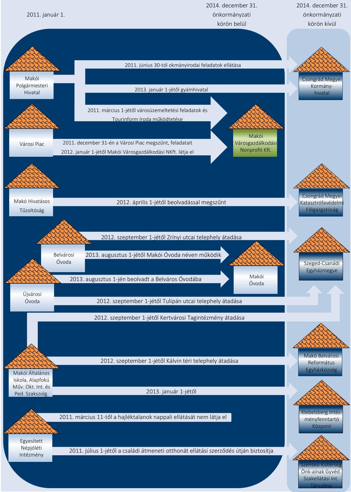

---

# *Mellékletek*

### III. SZ. MELLÉKLET: A KIEMELT BEVÉTELI ÉS KIADÁSI ELŐIRÁNYZATOK (MILLIÓ FT-BAN)

|  Kiemelt előirányzatok | Költségvetési rendelet | 2011. év |  |  | 2012. év |  |  | 2013. év |  |  | 2014. év |  |   |
| --- | --- | --- | --- | --- | --- | --- | --- | --- | --- | --- | --- | --- | --- |
|   |  | Elemi költségvetés | Elérés | Költségvetési rendelet | Elemi költségvetés | Elérés | Költségvetési rendelet | Elemi költségvetés | Elérés | Költségvetési rendelet | Elemi költségvetés | Elérés |   |
|  Személyi juttatások | 1 600,0 | 1 600,0 | 0,0 | 1 395,8 | 1 395,8 | 0,0 | 683,3 | 683,3 | 0,0 | 787,5 | 787,5 | 0,0 |   |
|  Munkaadót terhelő járulékok és szociális hozzájárulási adó | 423,0 | 423,0 | 0,0 | 384,7 | 384,7 | 0,0 | 184,7 | 184,7 | 0,0 | 211,8 | 211,8 | 0,0 |   |
|  Dologi kiadások | 1 198,1 | 1 198,1 | 0,0 | 1 164,6 | 1 164,6 | 0,0 | 848,0 | 848,0 | 0,0 | 967,8 | 967,8 | 0,0 |   |
|  Ellátottak pénzbeli juttatásai | 49,7 | 49,7 | 0,0 | 50,9 | 50,9 | 0,0 | 94,5 | 94,5 | 0,0 | 113,5 | 113,5 | 0,0 |   |
|  Egyéb működési célú kiadások | 1 041,4 | 1 041,4 | 0,0 | 1 031,1 | 1 031,1 | 0,0 | 699,6 | 699,6 | 0,0 | 1 341,9 | 1 341,9 | 0,0 |   |
|

  Beruházások | 11 913,7 | 11 771,4 | +142,3 | 2 206,9 | 2 206,9 | 0,0 | 1 229,3 | 1 229,3 | 0,0 | 449,4 | 449,4 | 0,0 |   |
|  Felújítások | 319,6 | 461,9 | -142,3 | 63,2 | 63,2 | 0,0 | 7,2 | 7,2 | 0,0 | 22,6 | 22,6 | 0,0 |   |
|  Egyéb felhalmozási kiadások | 279,1 | 279,1 | 0,0 | 49,8 | 49,8 | 0,0 | 527,8 | 527,8 | 0,0 | 284,3 | 284,3 | 0,0 |   |
|  Költségvetési kiadások összesen | 16 824,6 | 16 824,6 | 0,0 | 6 347,0 | 6 347,0 | 0,0 | 4 274,4 | 4 274,4 | 0,0 | 4 178,8 | 4 178,8 | 0,0 |   |
|  Intézményi működési bevételek | 1 743,2 | 435,2 | -1 308,0 | 750,4 | 723,3 | +27,1 | 391,3 | 422,4 | -31,1 | 436,2 | 463,0 | -26,8 |   |
|  Támogatás értékű működési bevétel | 143,8 | 238,4 | -94,6 | 171,7 | 171,7 | 0,0 | 64,7 | 65,4 | -0,7 | 125,3 | 125,4 | -0,1 |   |
|  Működési célú átvett pénzeszközök | 53,4 | 23,2 | +30,2 | 79,7 | 79,7 | 0,0 | 2,7 | 2,7 | 0,0 | 3,3 | 3,3 | 0,0 |   |
|  Közhatalmi bevételek | 1 697,6 | 1 722,4 | -24,8 | 1 680,2 | 1 707,3 | -27,1 | 1 125,0 | 1 124,6 | +0,4 | 1 192,5 | 1 186,6 | +5,9 |   |
|  Működési célú költségvetési támogatás | 1 137,8 | 1 137,8 | 0,0 | 845,1 | 845,1 | 0,0 | 696,7 | 696,0 | +0,7 | 841,7 | 841,6 | +0,1 |   |
|  Működési célú előző évi előirányzat maradvány igénybevétele | 117,2 | 117,2 | 0,0 | 140,0 | 140,0 | 0,0 | 265,0 | 265,0 | 0,0 | 1 100,0 | 1 100,0 | 0,0 |   |
|  Felhalmozási bevételek | 68,7 | 1 301,0 | -1232,3 | 121,1 | 121,1 | 0,0 | 183,6 | 152,9 | +30,7 | 35,3 | 14,4 | +20,9 |   |
|  Felhalmozási célú pénzeszköz átvételek | 125,0 | 125,0 | 0,0 | 0,0 | 0,0 | 0,0 | 45,4 | 45,4 | 0,0 | 231,8 | 235,4 | -3,6 |   |
|  Támogatás értékű felhalmozási bevétel | 8 508,7 | 7 913,1 | +595,6 | 1 322,0 | 1 322,0 | 0,0 | 1 069,5 | 1 069,5 | 0,0 | 303,0 | 303,0 | 0,0 |   |
|  Felhalmozási célú előző évi előirányzat maradvány igénybevétele | 2 450,5 | 2 450,5 | 0,0 | 1 254,6 | 1 254,6 | 0,0 | 632,0 | 632,0 | 0,0 | 0,0 | 0,0 | 0,0 |   |
|  Felhalmozási célú kölcsön visszatérülései | 3,8 | 585,9 | -582,1 | 3,4 | 3,4 | 0,0 | 0,0 | 0,0 | 0,0 | 3,6 | 0,0 | +3,6 |   |
|  Költségvetési bevételek összesen | 16 049,7 | 16 049,7 | 0,0 | 6 368,2 | 6 368,2 | 0,0 | 4 475,9 | 4 475,9 | 0,0 | 4 272,7 | 4 272,7 | 0,0 |   |

---

# Mellékletek

■ IV. SZ. MELLÉKLET: A KIEMELT BEVÉTELI ÉS KIADÁSI ELŐIRÁNYZATOK ÉS AZOK TELJESÍTÉSE (MILLIÓ FT-BAN)

|  Kiemelt előirányzatok | 2011. év |  |  | 2012. év |  |  |  |   |
| --- | --- | --- | --- | --- | --- | --- | --- | --- |
|   | Eredeti előirányzat | Módosított előirányzat | Teljesítés | Teljesítés /
Módosított előirányzat (\%) | Eredeti előirányzat | Módosított előirányzat | Teljesítés | Teljesítés /
Módosított előirányzat (\%)  |
|  Személyi juttatások | 1600,0 | 1720,8 | 1677,3 | 97,5\% | 1395,8 | 1503,0 | 1416,3 | 94,2\%  |
|  Munkaadót terhelő járulékok és szociális hozzájárulási adó | 423,0 | 448,5 | 434,6 | 96,9\% | 384,7 | 399,5 | 369,4 | 92,5\%  |
|  Dologi kiadások | 1198,1 | 2221,2 | 1958,2 | 88,2\% | 1164,6 | 1558,5 | 1440,0 | 92,4\%  |
|  Ellátottak pénzbeli juttatásai | 49,7 | 51,7 | 50,9 | 98,5\% | 50,9 | 39,7 | 38,6 | 97,2\%  |
|  Egyéb működési célú kiadások | 1041,4 | 1598,4 | 717,8 | 44,9\% | 1031,1 | 1441,9 | 812,1 | 56,3\%  |
|  Beruházások | 11771,4 | 12988,2 | 5714,6 | 44,0\% | 2206,9 | 2296,1 | 1822,0 | 79,4\%  |
|  Felújítások | 461,9 | 474,7 | 273,0 | 57,5\% | 63,2 | 83,2 | 40,2 | 48,3\%  |
|  Egyéb felhalmozási kiadások | 279,1 | 345,3 | 282,1 | 81,7\% | 49,8 | 668,3 | 638,9 | 95,6\%  |
|  Költségvetési kiadások összesen | 16824,6 | 19848,8 | 11108,5 | 56,0\% | 6347,0 | 7990,2 | 6577,5 | 82,3\%  |
|  Intézményi működési bevételek | 435,2 | 1486,5 | 1428,0 | 96,1\% | 723,3 | 792,7 | 710,1 | 89,6\%  |
|  Támogatás értékű működési bevétel | 238,4 | 366,3 | 330,8 | 90,3\% | 171,7 | 293,3 | 295,5 | 100,8\%  |
|  Működési célú átvett pénzeszközök | 23,2 | 53,3 | 45,8 | 85,9\% | 79,7 | 392,4 | 324,5 | 82,7\%  |
|  Közhatalmi bevételek | 1722,4 | 1809,3 | 1810,2 | 100,0\% | 1707,3 | 1743,7 | 1779,8 | 102,1\%  |
|  Működési célú költségvetési támogatás | 1137,8 | 1558,6 | 1558,6 | 100,0\% | 845,1 | 1055,5 | 1055,5 | 100,0\%  |
|  Működési célú előző évi maradvány átvétele | 0,0 | 0,3 | 0,3 | 100,0\% | 0,0 | 0,0 | 0,0 |   |
|  Működési célú előző évi előirányzat maradvány igénybevétele | 117,2 | 249,3 | 249,3 | 100,0\% | 140,0 | 237,7 | 237,7 | 100,0\%  |
|  Működési célú kölcsön visszatérülései | 0,0 | 57,9 | 10,6 | 18,3\% | 0,0 | 0,0 | 0,0 |   |
|  Felhalmozási bevételek | 1301,0 | 2294,2 | 1021,7 | 44,5\% | 121,1 | 367,3 | 362,2 | 98,6\%  |
|  Felhalmozási célú pénzeszköz átvételek | 125,0 | 237,4 | 238,4 | 100,4\% | 0,0 | 0,0 | 2,0 |   |
|  Felhalmozási célú költségvetési támogatás | 0,0 | 417,0 | 417,0 | 100,0\% | 0,0 | 287,6 | 287,6 | 100,0\%  |
|  Támogatás értékű felhalmozási bevétel | 7913,1 | 7489,8 | 2573,7 | 34,4\% | 1322,0 | 1373,5 | 969,9 | 70,6\%  |
|  Felhalmozási célú előző évi maradvány átvétele | 0,0 | 0,0 | 4,4 |  | 0,0 | 0,0 | 0,0 |   |
|  Felhalmozási célú előző évi előirányzat maradvány igénybevétele | 2450,5 | 2572,4 | 2572,4 |  | 1254,6 | 1464,4 | 1509,7 | 103,1\%  |
|  Felhalmozási célú kölcsön visszatérülései | 585,9 | 585,3 | 585,2 | 100,0\% | 3,4 | 3,4 | 2,3 | 67,6\%  |
|  Költségvetési bevételek összesen | 16049,7 | 19177,6 | 12846,4 | 67,0\% | 6368,2 | 8011,5 | 7536,8 | 94,1\%  |

---

|  Kiemelt előirányzatok | 2013. év |  |  | 2014. év |  |  | Teljesítés /
Módosított
előirányzat
(%) | Teljesítés /
Módosított
előirányzat
(%)  |
| --- | --- | --- | --- | --- | --- | --- | --- | --- |
|   | Eredeti
előirányzat | Módosított
előirányzat | Teljesítés | Módosított
előirányzat
(%) | Eredeti
előirányzat | Módosított
előirányzat |  |   |
|  Személyi juttatások | 683,3 | 909,9 | 824,7 | 90,6% | 787,5 | 1 202,7 | 1 062,6 | 88,4%  |
|  Munkaadót terhelő járulékok és szociális hozzájárulási adó | 184,7 | 233,2 | 204,8 | 87,8% | 211,8 | 290,7 | 248,6 | 85,5%  |
|  Dologi kiadások | 848,0 | 1 218,2 | 1 042,5 | 85,6% | 967,8 | 963,3 | 808,3 | 83,9%  |
|  Ellátottak pénzbeli juttatásai | 94,5 | 335,9 | 286,8 | 85,4% | 113,5 | 281,8 | 264,9 | 94,0%  |
|  Egyéb működési célú kiadások | 699,6 | 823,7 | 655,1 | 79,5% | 1 341,9 | 1 184,6 | 624,7 | 52,7%  |
|  Beruházások | 1 229,3 | 908,8 | 641,9 | 70,6% | 449,4 | 283,1 | 241,7 | 85,4%  |
|  Felújítások | 7,2 | 477,0 | 282,2 | 59,2% | 22,6 | 562,7 | 546,4 | 97,1%  |
|  Egyéb felhalmozási kiadások | 527,8 | 891,7 | 373,0 | 41,8% | 284,3 | 423,2 | 414,8 | 98,0%  |
|  Költségvetési kiadások összesen | 4 274,4 | 5 798,4 | 4 311,0 | 74,3% | 4 178,8 | 5 192,1 | 4 212,0 | 81,1%  |
|  Intézményi működési bevételek | 422,4 | 795,8 | 706,0 | 88,7% | 463,0 | 692,0 | 651,1 | 94,1%  |
|  Támogatás értékű működési bevétel | 65,4 | 357,7 | 372,7 | 104,2% | 125,4 | 539,1 | 496,1 | 92,0%  |
|  Működési célú átvett pénzeszközök | 2,7 | 31,6 | 31,6 | 100,0% | 3,3 | 30,9 | 31,7 | 102,6%  |
|  Közhatalmi bevételek | 1 124,6 | 1 184,0 | 1 282,6 | 108,3% | 1 186,6 | 1 581,9 | 1 580,8 | 99,9%  |
|  Működési célú költségvetési támogatás | 696,0 | 960,1 |

 960,0 | 100,0% | 841,6 | 993,3 | 993,3 | 100,0%  |
|  Működési célú előző évi maradvány átvétele | 0,0 | 0,0 | 0,0 |  | 0,0 | 0,0 | 0,0 |   |
|  Működési célú előző évi előirányzat maradvány igénybevétele | 265,0 | 286,9 | 286,9 | 100,0% | 1 100,0 | 1 176,4 | 1 176,4 | 100,0%  |
|  Működési célú kölcsön visszatérülései | 0,0 | 2,3 | 2,3 | 100,0% | 0,0 | 0,0 | 0,0 |   |
|  Felhalmozási bevételek | 152,9 | 221,4 | 221,8 | 100,2% | 14,4 | 17,1 | 17,1 | 100,0%  |
|  Felhalmozási célú pénzeszköz átvételek | 45,4 | 45,6 | 53,2 | 116,7% | 235,4 | 261,0 | 253,4 | 97,1%  |
|  Felhalmozási célú költségvetési támogatás | 0,0 | 328,9 | 328,9 | 100,0% | 0,0 | 147,9 | 147,9 | 100,0%  |
|  Támogatás értékű felhalmozási bevétel | 1 069,5 | 1 145,2 | 803,8 | 70,2% | 303,0 | 372,8 | 239,8 | 64,3%  |
|  Felhalmozási célú előző évi maradvány átvétele | 0,0 | 0,0 | 0,0 |  | 0,0 | 0,0 | 0,0 |   |
|  Felhalmozási célú előző évi előirányzat maradvány igénybevétele | 632,0 | 658,6 | 649,9 | 98,7% | 0,0 | 0,0 | 0,0 |   |
|  Felhalmozási célú kölcsön visszatérülései | 0,0 | 2,7 | 2,0 | 74,1% | 0,0 | 0,0 | 0,0 |   |
|  Költségvetési bevételek összesen: | 4 475,9 | 6 020,8 | 5 701,7 | 94,7% | 4 272,7 | 5 812,4 | 5 587,6 | 96,1%  |

---

V. SZ. MELLÉKLET: A PÉNZÜGYI EGYENSÚLYI HELYZET CLF MÓDSZER SZERINTI ÉRTÉKELÉSE (MILLIÓ FT-BAN)

| Megnevezés | 2011. év | 2012. év | 2013. év | 2014. év | 2014. év adósságkonszolidációs támogatás nélkül |
| :--: | :--: | :--: | :--: | :--: | :--: |
| 1.1.1. Saját működési bevételek | 1440,3 | 1769,4 | 1901,6 | 2149,1 | 2149,1 |
| 1.1.2. Költségvetési támogatások a működőképesség megőrzését szolgáló kiegészítő támogatások nélkül | 1558,5 | 1055,5 | 960,0 | 993,3 | 992,9 |
| 1.1.3. Átengedett bevételek | 801,8 | 696,6 | 55,9 | 59,4 | 59,4 |
| 1.1.4. Államháztartáson belülről kapott támogatások | 335,3 | 295,5 | 375,1 | 495,7 | 495,7 |
| 1.1.5. EU-tól és külföldről kapott bevételek | 7,1 | 0,0 | 0,0 | 0,0 | 0,0 |
| 1.1.6. Államháztartáson kívülről kapott bevételek | 38,7 | 324,5 | 31,6 | 31,7 | 31,7 |
| 1.1.7. Hozam- és kamatbevételek | 15,6 | 15,4 | 14,3 | 23,4 | 23,4 |
| 1.1.8. Kölcsönök visszatérülése, igénybevétele | 10,6 | 0,0 | 0,0 | 0,4 | 0,4 |
| 1.1.9. Előző évi pénzmaradvány átvétel | 0,3 | 0,0 | 0,0 | 0,0 | 0,0 |
| 1.1.10. A működőképesség megőrzését szolgáló kiegészítő támogatások | 0,0 | 0,0 | 0,0 | 0,0 | 0,0 |
| 1.1. Folyó bevételek =1.1.1.+1.1.2.+...+1.1.10. | 4208,2 | 4156,9 | 3338,5 | 3753,0 | 3752,6 |
| 1.2.1. Működési kiadások kamatkiadások nélkül | 3168,5 | 3166,7 | 2031,7 | 2378,8 | 2378,8 |
| 1.2.2. Államháztartáson belülre átadott pénzeszközök | 25,7 | 23,0 | 240,4 | 239,1 | 239,1 |
| 1.2.3.1. vállalkozásoknak | 335,5 | 338,2 | 360,1 | 266,6 | 266,6 |
| 1.2.3.2. EU-nak, illetve külföldre | 0,0 | 0,0 | 0,0 | 0,0 | 0,0 |
| 1.2.3.3. magánszemélyeknek | 341,7 | 333,5 | 286,8 | 0,1 | 0,1 |
| 1.2.3.4. non-profit szervezeteknek | 65,7 | 155,3 | 54,7 | 54,4 | 54,4 |
| 1.2.3. Transzferkiadások | 743,0 | 827,0 | 701,6 | 321,0 | 321,0 |
| 1.2.4. Kamatkiadások | 0,9 | 2,9 | 0,0 | 1,4 | 1,4 |
| 1.2.5. Kölcsönök nyújtása, törlesztése | 26,6 | 0,0 | 0,0 | 64,2 | 64,2 |
| 1.2.6. Előző évi pénzmaradvány átadás | 0,0 | 0,6 | 0,0 | 0,0 | 0,0 |
| 1.2. Folyó kiadások = 1.2.1.+1.2.2.+...+1.2.6. | 3964,7 | 4020,2 | 2973,7 | 3004,5 | 3004,5 |
| 1.3. Folyó költségvetés egyenlege, működési jövedelem (1.1. - 1.2.) | 243,5 | 136,7 | 364,8 | 748,5 | 748,1 |
| 2.1.1. Saját tőkebevételek | 1864,4 | 327,8 | 197,6 | 17,1 | 17,1 |
| 2.1.2. Költségvetési támogatások | 417,0 | 287,6 | 328,9 | 147,9 | 34,0 |
| 2.1.3. Államháztartáson belülről kapott támogatások | 2573,6 | 970,0 | 803,7 | 239,8 | 239,8 |
| 2.1.4. EU-tól és külföldről kapott támogatások | 0,0 | 0,0 | 0,0 | 0,0 | 0,0 |
| 2.1.5. Államháztartáson kívülről kapott bevételek | 238,4 | 2,0 | 53,2 | 195,0 | 195,0 |
| 2.1.6. Hozam- és kamatbevételek | 137,9 | 42,8 | 41,0 | 0,0 | 0,0 |
| 2.1.7. Kölcsönök visszatérülése, igénybevétele | 585,2 | 2,3 | 2,0 | 58,4 | 58,4 |
| 2.1.8. Előző évi pénzmaradvány átvétel | 0,0 | 0,0 | 0,0 | 0,0 | 0,0 |
| 2.1. Felhalmozási bevételek =2.1.1.+2.1.2+...+2.1.8. | 5816,5 | 1632,5 | 1426,4 | 658,2 | 544,3 |
| 2.2.1. Saját beruházási kiadás áfával | 5714,6 | 1822,0 | 642,0 | 241,7 | 241,7 |
| 2.2.2.Saját felújítási kiadás áfával | 273,0 | 40,2 | 282,2 | 546,5 | 546,5 |
| 2.2.3. Államháztartáson belülre átadott pénzeszközök | 0,0 | 437,8 | 290,6 | 143,6 | 143,6 |
| 2.2.4. EU-nak és külföldnek adott pénzeszközök | 0,7 | 10,4 | 24,9 | 0,0 | 0,0 |
| 2.2.5. Államháztartáson kívülre adott pénzeszközök | 70,2 | 85,7 | 57,1 | 106,8 | 106,8 |
| 2.2.6. Befektetési célú részesedések vásárlása | 1,2 | 105,0 | 0,4 | 0,0 | 0,0 |

---

| Megnevezés | 2011. év | 2012. év | 2013. év | 2014. év | 2014. év adósságkonszolidációs támogatás nélkül |
| :--: | :--: | :--: | :--: | :--: | :--: |
| 2.2.7. Kamatkiadások | 58,8 | 56,2 | 40,2 | 0,0 | 0,0 |
| 2.2.8. Kölcsönök nyújtása, törlesztése | 183,3 | 0,0 | 0,0 | 164,4 | 164,4 |
| 2.2.9. Előző évi pénzmaradvány átadás | 0,0 | 0,0 | 0,0 | 0,0 | 0,0 |
| 2.2.10. ÁFA befizetések | 842,0 | 0,0 | 0,0 | 4,5 | 4,5 |
| 2.2. Felhalmozási kiadások =2.2.1.+2.2.2.+...+2.2.10. | 7143,8 | 2557,3 | 1337,4 | 1207,5 | 1207,5 |
| 2.3. Felhalmozási költségvetés egyenlege (2.1. - 2.2.) | $-1327,3$ | $-924,8$ | 89,0 | $-549,3$ | $-663,2$ |
| 3. FINANSZÍROZÁSI MŰVELETEK NÉLKÜLI (GFS) POZÍCIÓ (1.3.+2.3.) | $-1083,8$ | $-788,1$ | 453,8 | 199,2 | 84,9 |
| 4.1. Hitelfelvétel | 8,0 | 0,0 | 0,0 | 0,0 | 0,0 |
| 4.2. Hiteltörlesztés | 16,6 | 21,2 | 80,9 | 620,4 | 523,8 |
| 4.3. Forgatási és befektetési célú értékpapírok kibocsátása | 0,0 | 0,0 | 0,0 | 0,0 | 0,0 |
| 4.4. Forgatási és befektetési célú értékpapírok beváltása | 0,0 | 0,0 | 140,0 | 0,0 | 0,0 |
| 4.5. Forgatási és befektetési célú értékpapírok értékesítése | 0,0 | 0,0 | 0,9 | 0,0 | 0,0 |
| 4.6. Forgatási és befektetési célú értékpapírok vásárlása | 0,0 | 0,0 | 0,0 | 0,0 | 0,0 |
| 4.7. Egyéb finanszírozási bevételek | 3,5 | $-9,1$ | 4,6 | 22,6 | 22,6 |
| 4.8. Egyéb finanszírozási kiadások | $-0,8$ | $-90,4$ | 54,7 | 0,0 | 0,0 |
| 4.9. Finanszírozási műveletek egyenlege (4.1.-4.2.+...-4.8.) | $-4,3$ | 60,1 | $-270,1$ | $-597,8$ | $-501,2$ |
| 5. TÁRGYÉVI PÉNZÜGYI POZÍCIÓ (1.3.+ 2.3.+4.9.) | $-1088,1$ | $-728,0$ | 183,7 | $-398,6$ | $-416,3$ |
| 6. NETTÓ MŰKÖDÉSI JÖVEDELEM = működési jövedelem (1.3.) - tőketörlesztés (4.2+4.4) | 226,9 | 115,5 | 143,9 | 128,1 | 224,3 |
| Tájékoztató adatok |  |  |  |  |  |
| Összes kötelezettség | 5655,3 | 5217,5 | 2542,1 | 109,4 | 109,4 |
| ebből rövid lejáratú | 459,2 | 360,0 | 249,1 | 37,3 | 37,3 |
| Összes szállítói kötelezettség | 253,1 | 48,9 | 90,4 | 39,6 | 39,6 |
| ebből lejárt (tanúsítványból) | 142,1 | 48,3 | 85,3 | 3,1 | 3,1 |
| Pénz és tőkepiaci kötelezettség (adósság) | 5217,3 | 5058,9 | 2386,9 | 26,5 | 26,5 |
| ebből rövid lejáratú | 21,2 | 201,4 | 93,9 | 0,0 | 0,0 |
| ebből hosszú lejáratú kötelezettségek következő évet terhelő törlesztő részletei | 21,2 | 201,4 | 93,9 | 0,0 | 0,0 |
| PPP szerződéses állomány jelenértéken | 0,0 | 0,0 | 0,0 | 0,0 | 0,0 |
| ebből lejárt szolgáltatási díj miatti kötelezettség | 0,0 | 0,0 | 0,0 | 0,0 | 0,0 |
| Folyószámla-, likvid- és munkabérhitel napi átlagos állománya | 46,9 | 106,6 | 15,8 | 0,0 | 0,0 |
| Kezesség és garanciavállalások (tanúsítványból) | 0,0 | 0,0 | 0,0 | 0,0 | 0,0 |
| Jogerős bírósági ítéletekből adódó kötelezettségek | 0,0 | 0,0 | 0,0 | 0,0 | 0,0 |
| Finanszírozásba bevonható eszközök: | 1659,8 | 917,9 | 1100,7 | 776,5 | 776,5 |
| Tartós hitelviszonyt megtestesítő értékpapírok | 1,0 | 1,0 | 1,0 | 1,0 | 1,0 |
| Hosszú lejáratú bankbetétek | 0,0 | 0,0 | 0,0 | 0,0 | 0,0 |
| Értékpapírok | 0,0 | 0,0 | 0,0 | 0,0 | 0,0 |
| Pénzeszközök (idegen nélkül) | 1658,8 | 916,9 | 1099,7 | 775,5 | 775,5 |
| Forgóeszközök összesen | 2030,1 | 1377,2 | 1533,5 | 2,3 | 2,3 |

---

VI. SZ. MELLÉKLET: AZ ESZKÖZÖK ÉS FORRÁSOK ALAKULÁSA KIEMELT MÉRLEGSORONKÉNT (MILLIÓ FT-BAN)

|  Megnevezés | 2011. évi nyitó | 2011. év | 2012. év | 2013. év | Index
(2011. évi záró/
2011. évi nyitó)  |
| --- | --- | --- | --- | --- | --- |
|  IMMATERIÁLIS JAVAK | 226,3 | 150,7 | 119,1 | 86,0 | $38,0 \%$  |
|  TÁRGYI ESZKÖZÖK | 23 975,0 | 28 845,1 | 29 675,4 | 29
 386,6 | $122,6 \%$  |
|  Ingatlanok és kapcsolódó vagyonértékű jogok | 23 146,3 | 23 351,5 | 29 118,5 | 28 921,8 | $125,0 \%$  |
|  Gépek, berendezések, felszerelések (2014. évben járművek is) | 299,9 | 301,3 | 332,2 | 299,3 | $99,8 \%$  |
|  Beruházások, felújítások | 437,3 | 4 857,9 | 189,4 | 146,3 | $33,5 \%$  |
|  Beruházásra adott előlegek | 8,7 | 267,0 | 25,0 | 8,7 | 100,0\%  |
|  BEFEKTETETT PÉNZÜGYI ESZKÖZÖK | 558,6 | 157,2 | 273,2 | 171,8 | $30,8 \%$  |
|  Tartós részesedés | 142,7 | 143,8 | 265,9 | 167,7 | 117,5\%  |
|  ÜZEMELTETÉSRE, KEZELÉSRE ÁTADOTT VAGYONKEZELÉSBE VETT ESZKÖZÖK (2014. évben koncesszióba, vagyonkezelésbe adott eszközök) | 2 617,9 | 2 258,1 | 1 517,6 | 4 379,9 | $167,3 \%$  |
|  (NEMZETI VAGYONBA TARTOZÓ) BEFEKTETETT ESZKÖZÖK ÖSSZESEN | 27 377,8 | 31 411,1 | 31 585,3 | 34 024,3 | $124,3 \%$  |
|  KÉSZLETEK | 7,9 | 11,4 | 1,2 | 2,8 | $35,4 \%$  |
|  KÖVETELÉSEK | 289,8 | 222,7 | 415,4 | 328,5 | $113,4 \%$  |
|  Követelések áruszállításból és szolgáltatásból | 111,2 | 58,5 | 187,4 | 75,2 | 67,6\%  |
|  Adók | 134,2 | 134,6 | 156,4 | 183,5 | 136,7\%  |
|  PÉNZESZKÖZÖK | 2 761,8 | 1 677,7 | 933,4 | 1 122,7 | 40,7\%  |
|  EGYÉB AKTÍV PÉNZÜGYI ELSZÁMOLÁSOK | 119,2 | 118,3 | 27,3 | 79,5 | 66,7\%  |
|  EGYÉB SALDÓS ESZKÖZOLDALI ELSZÁMOLÁSOK | - | - | - | - | -  |
|  AKTÍV IDŐBELI ELHATÁROLÁSOK | - | - | - | - | -  |
|  ESZKÖZÖK ÖSSZESEN | 30 556,5 | 33 441,2 | 32 962,6 | 35 557,8 | 116,4\%  |
|  SALDÓ TŐKE | 22 687,0 | 25 990,0 | 26 784,4 | 31 813,6 | 140,2\%  |
|  TARTALÉKOK | 2 849,3 | 1 757,0 | 938,7 | 1 169,1 | 41,0\%  |
|  KÖTELEZETTSÉGEK | 5020,2 | 5 694,3 | 5 239,5 | 2 575,1 | 51,0\%  |
|  Hosszú lejáratú kötelezettségek/Költségvetési évet követően esedékes kötelezettségek | 4 575,8 | 5 196,0 | 4 857,5 | 2 293,0 | 50,1\%  |
|  ebből: kötvény | 4 359,0 | 4 990,9 | 4 675,1 | 2 185,3 | 50,1\%  |
|  ebből: hitel | 216,8 | 205,2 | 182,4 | 107,7 | 49,7\%  |
|  Rövid lejáratú kötelezettségek/Költségvetési évben esedékes kötelezettségek | 412,8 | 459,2 | 360,0 | 249,1 | 60,3\%  |
|  ebből: kötvény | 0,0 | 0,0 | 178,6 | 77,3 | -  |
|  ebből: hitel | 18,2 | 21,2 | 22,8 | 16,6 | 91,2\%  |
|  ebből: Szállítók | 80,0 | 253,1 | 48,9 | 90,4 | 113,0\%  |
|  Egyéb passzív pénzügyi elszámolások | 31,7 | 39,0 | 22,0 | 33,0 | 104,1\%  |
|  EGYÉB SALDÓS FORRÁSOLDALI ELSZÁMOLÁSOK | - | - | - | - | -  |
|  PASSZÍV IDŐBELI ELHATÁROLÁSOK | - | - | - | - | -  |
|  FORRÁSOK ÖSSZESEN | 30 556,5 | 33 441,3 | 32 962,6 | 35 557,8 | 116,4\%  |

---

# 111. SZ. MELLÉKLET: A MÉRLEGBEN KIMUTATOTT 5\%-OT MEGHALADÓ RÉSZESEDÉSEK

|  Gazdasági társaság megnevezése | Alapítás/ részesedés vásárlása | tulajdoni
részarány
(\%) | 2011. január 1.
részesedés
összege
(M Ft) | társaság saját tőkéje
(M Ft) | saját tőke
jegyzett
tőke aránya | tulajdoni
részarány
(\%) | 2014. december 31.
részesedés
összege
(M Ft) | társaság saját tőkéje
(M Ft) | saját tőke
jegyzett
tőke aránya | Megjegyzés  |
| --- | --- | --- | --- | --- | --- | --- | --- | --- | --- | --- |
|  Makói Fürdőfejlesztő Kft. | 2011. év előtt | 100,0\% | 0,5 | 3,8 | 7,6 | - | - | - | - | 2013. augusztus 9-én beolvadt a Makói Gyógyfürdő Kft-be.  |
|  Makói Városfejlesztő Kft. | 2011. év előtt | 100,0\% | 0,5 | 0,7 | 1,5 | 100,0\% | 0,5 | 0,7 | 1,5 | -  |
|  Makói Városgazdálkodási Nonprofit Kft. | 2011. év előtt | 100,0\% | 55,0 | 82,1 | 1,5 | 100,0\% | 55,0 | 145,1 | 2,6 | -  |
|  Makó Városi Kulturális-
Közművelődési Nonprofit Kft. | 2011. év előtt | 100,0\% | 3,0 | 0,7 | 0,2 | 100,0\% | 3,0 | $-1,2$ | $-0,4$ | -  |
|  Makói Városi Televízió Nonprofit Kft. | 2011. év előtt | 100,0\% | 3,0 | 3,6 | 1,2 | 100,0\% | 3,0 | 4,2 | 1,4 | -  |
|  Makó és Térsége
Viziközmű Kft. | 2011. év előtt | 66,3\% | 15,5 | 557,6 | 23,8 | 66,3\% | 32,6 | 262,4 | 5,3 | A társaság 2014. szeptember 1-jétől végelszámolás alatt áll.  |
|  Makói Gyógyfürdő Kft. | 2011. év előtt | 48,0\% | 0,2 | $-10,9$ | $-21,8$ | 100,0\% | 10,0 | 39,5 | 4,0 | 2011. január 1-jén a társaság tulajdonosa 52,0\%-ban a Makói Fürdőfejlesztő Kft. volt.  |
|  Makó és Térsége Fejlesztési Nonprofit Kft. | 2011. év előtt | 46,7\% | 1,4 | 1,5 | 0,5 | - | - | - | - | A társaság 2013. május 6-án végelszámolással megszűnt.  |
|  Maros Sped Kft. | 2011. év előtt | 20,6\% | 4,9 | 29,2 | 1,2 | 20,6\% | 4,9 | n.a. | - | A társaság 2013. szeptember 3-tól felszámolás alatt áll.  |
|  Dél-Alföldi Bio-Innovációs Centrum Kft. | 2011. év előtt | 6,3\% | 1,1 | 118,8 | 2,1 | 6,3\% | 1,1 | 43,7 | 0,8 | -  |

---

# FÜGGELÉK: ÉSZREVÉTELEK 

A jelentéstervezetet a Számvevőszék 15 napos észrevételezésre megküldte az ellenőrzött szervezet vezetőjének az ÁSZ tv. 29. $\S^{77}$ (1) bekezdése előírásának megfelelően.
Az elfogadott észrevételek alapján a Számvevőszék módosította a jelentést.

A függelék tartalmazza az ellenőrzött észrevételeit, illetve az el nem fogadott észrevételek elutasításának indoklását.

[^0]
[^0]:    ${ }^{77}$ 29. § (1) Az Állami Számvevőszék az ellenőrzési megállapításait megküldi az ellenőrzött szervezet vezetőjének vagy az általa megbízott személynek, és annak, akinek személyes felelősségét állapította meg.
    (2) Az ellenőrzött szervezet vezetője és a felelősként megjelölt személy az ellenőrzés megállapításaira tizenöt napon belül írásban észrevételt tehet.
    (3) Az Állami Számvevőszék az észrevételre a beérkezésétől számított harminc napon belül írásban válaszol. A figyelembe nem vett észrevételeket köteles a jelentésben feltüntetni, és megindokolni, hogy azokat miért nem fogadta el.

---

# MAKÓ VÁROS POLGÁRMESTERÉTŐL 

Ikt.szám:1/690-2/2016/I
Ügy: Ördögh Andrea

Állami Számvevőszék
Domokos László
elnök

## Budapest

Pf. 54.
1364

Tárgy: Észrevétel
Melléklet: 10 db
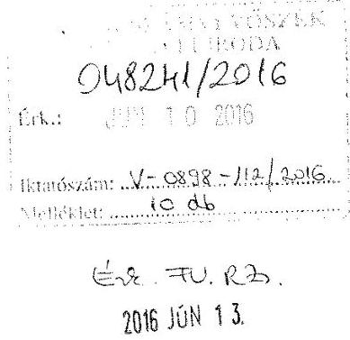

Tisztelt Elnök úr!

Hivatkozva a V-0898-108/2016. ikt. sz., az „Az önkormányzatok pénzügyi és vagyongazdálkodása megfelelőségének ellenőrzése - Makó" tárgyban megküldött számvevőszéki jelentéstervezetre az alábbi észrevételt teszem:

## Összegzés

A 2011.01.01-2014.12.31 közötti időszakra vonatkozó ÁSZ vizsgálat olyan időszakra terjedt ki, amelyben az Önkormányzat jelenlegi tisztségviselői és középvezetői csak a 2014. október 6-ai önkormányzati választásokat követően érintettek.

Az előbbiekből eredően tehát az érintett vezetőknek és a dolgozók jelentős többségének nincs közvetlen tapasztalata a korábbi időszakról. A vizsgálat során törekedtünk az ÁSZ részére minden információt, fellelt nyilvántartást, egyéb információt megadni, de - utalva az előbbiekre - közvetlen tapasztalatunk hiányában ez esetleg nem minden esetben teljesülhetett maradéktalanul.

## 1.2 számú megállapításhoz: (Értékelési szabályzat)

A 2014. évi számviteli politika 29. oldalán szerepel az, hogy a követelések minősítéséhez az 1. számú melléklet szerinti minősítő lapot kell kiállítani, amely jelen észrevétel 1. sz. mellékleteként becsatolásra kerül. A minősítő lapon szerepelnek a minősítésre jogosultak.

---

# 2.1 számú megállapításhoz: (Elemi költségvetés határidőn túli benyújtása) 

Az önkormányzat 2014. évi elemi költségvetése a Magyar Államkincstár (MÁK) által előírt határidőben (2014. március 17-én) került benyújtásra, mely alátámasztásaként jelen észrevétel 2. sz. mellékleteként csatoljuk a KGR rendszerből kinyomtatott státusztörténetet, valamint a MÁK vonatkozó levelét.

### 3.2. számú megállapításhoz: (szállítói kötelezettségek alakulása)

A számviteli nyilvántartásban a 91-365 nap közötti lejárt szállítói tartozás 2011. december 31-én 23,3 M Ft összegű volt. A tartozás teljes egészében a SADE Magyarország 110745.20308.11 sz. számláját érintette, amely a DAOP-5.1.2/A-2f-2010-00002 Makó Városközpont Rehabilitációja c. projekthez kapcsolódó szállítói finanszírozású számlája (jelen észrevétel 3. sz. mellékleteként csatoljuk). A szállítói finanszírozás esetén a számla a közreműködő szervezet részére közvetlenül kerül benyújtásra, a számla késedelmes kifizetésére az önkormányzatnak nem volt hatása.

A számviteli nyilvántartásban a 91-365 nap közötti lejárt szállítói tartozás 2013. december 31-én 300 ezer Ft volt, amely olyan számlákból tevődött össze, melyek 2014. évben, többször 90 napos késedelemmel kerültek befogadásra (iktatás dátuma 2014-es). A 2014-ben befogadott számlák határidőben történő kifizetése nem volt lehetséges. A 2014-ben befogadott számlákról szóló folyószámla jelen észrevétel 4. sz. melléklete.

### 3.3. számú megállapításhoz: (Követelés behajthatatlannak minősítése 4. bekezdés)

A követelések behajthatatlannak minősítése 5. sz. mintatétel (Makó és Térsége Fejlesztési Kht.) tekintetében a minősítő lapon a behajthatatlanság indoka az alábbi volt: „A cég végelszámolásának kezdete: 2011.11.03., hitelezői igény nem került bejelentésre, a cég 2013.05.06-án megszűnt”.

A behajthatatlannak minősített követelés, 2005. 04. 27-i esedékességű számla 2013. 12. 31-i minősítésekor az érintett gazdasági szervezet felszámolása befejeződött, így a követelés az Áhsz. 5. § 3. d) és e) pontja szerint is behajthatatlannak minősül.

### 4.1. számú megállapításhoz: (Részesedések analitikus nyilvántartása)

2014. évben az Önkormányzat a tartós részesedésekről nyilvántartással rendelkezett, azt folyamatosan vezette, melyet az ÁSZ elektronikus adatszolgáltatási felületre az ellenőrzés során feltöltöttünk, azonban a nyilvántartás nem tartalmazta teljes körűen az Áhsz. 14. számú melléklet VIII. 2-3. pontjában előírt adatokat.

### 4.3. számú megállapításához: (Részesedések értékelése)

A Makó Városi Kulturális Közművelődési Nonprofit Kft., illetőleg a Makói Gyógyfürdő Kft. vonatkozásában az alábbi észrevételt tesszük:

- Makó Város Önkormányzatának és intézményeinek elemi éves költségvetési beszámolóit jellemzően a tárgyévet követő év március 20-áig kell benyújtani a Magyar Államkincstárhoz (MÁK), ezt követően már csak a Kincstár által eszközölt/vagy visszautalt - a beszámoló belső összefüggéseit érintő
 - javítás végezhető rajta. Ezt követően - jellemzően a hónap végéig, a konszolidálás keretében - elkészült az egyszerűsített éves költségvetési beszámoló (2013-ig), illetőleg a konszolidált éves beszámoló (2014).

- Az előbbi összeállítását követően a hivatal a zárszámadási rendelettervezetet készít elő, amit legkésőbb április 30-ig kell beterjeszteni a képviselő-testület elé. A kötelező eljárási időket (kiküldés, bizottság, stb.) beszámítva, általában április 18-a körül kell kiküldeni a rendelettervezetet a képviselő-testületi tagoknak.
- A Makó Városi Kulturális Közművelődési Nonprofit Kft. 2011. évi beszámolóját 2012.04.30-án fogadta el a testület -3.971 E Ft veszteséggel, ami 971 E Ft negatív saját tőkét eredményezett. A 2012.04.30-án elfogadott beszámolót nem lehetett figyelembe venni a 2012.03.21-ig MÁK-hoz benyújtott önkormányzati beszámolóhoz.
- A 2012. évi önkormányzati beszámoló készítése során a tartósság (éven túli) nem állt fenn a 2012.04.30-ai időponthoz, mindemellett a Kft. 2012. évi eredménye - a tőke visszapótlása mellett - 334 E Ft nyereség volt. A kft.-re vonatkozó szabályok szerint ezt a beszámolót 2013.05.07-én fogadta el a testület, de pénzügyi előzetes tájékozódása alapján várható volt a pozitív eredmény, ezért értékvesztés nem került elszámolásra.
- A Makó Városi Kulturális Közművelődési Nonprofit Kft.-ben való önkormányzati részesedés 3.000 E Ft, ami megegyezik a jegyzett tőkével.
A 2012. évi számviteli politika 7. g.) pontja alapján:
„A gazdasági társaságokban lévő tulajdoni részesedést jelentős befektetések értékvesztésének meghatározásához biztosítani kell az adatok összegyűjtését, az információk feldolgozását valamint az értékvesztésre vonatkozó javaslat elkészítését. A gazdasági társaságokban lévő befektetések felülvizsgálata során tett megállapításokról jegyzőkönyvet kell készíteni. A jegyzőkönyvben rögzíteni kell az értékvesztés okát és mértékét. Értékvesztést csak abban az esetben lehet elszámolni, ha az tartósnak és jelentősnek minősíthető. A tartósságot a befektetések esetében az egy éven túli esetre határozzuk meg. Jelentős összegűnek minősítjük az értékvesztést, ha az eléri vagy meghaladja a nyilvántartási érték 10%-át.
A gazdasági társaságokban lévő befektetések felülvizsgálatáért, az értékvesztés elszámolásának előkészítéséért, a szükséges dokumentumok, bizonylatok összeállításáért a pénzügyi osztály a felelős.
Ugyanilyen eljárást kell alkalmazni az értékvesztés visszaírásának számviteli elszámolásához is, azzal, hogy a jegyzőkönyvben meghatározott értékvesztés visszaírásának összege nem haladhatja meg a nyilvántartásba vételkor megállapított bekerülési értéket.
A befektetett pénzügyi eszközök minősítésére jogosult felelős: a vagyon csoport vezetője."
A számviteli politika szerinti tartósság a veszteség tekintetében nem állt fenn, ebből következően értékvesztést nem kellett elszámolni.
Vagyis az ÁSZ által megállapított hiba a Makó Városi Kulturális Közművelődési Nonprofit Kft. üzletrészének értékelése során nem állt fenn, tehát az Sztv., illetőleg a számviteli politika vonatkozó előírásai nem sérültek.
- A Makói Gyógyfürdő Kft. 2011.12.31-ei fordulónapi mérleg szerinti eredménye -4291 E Ft veszteség volt.
- A könyvvizsgálói jelentés dátuma 2012.04.30., a beszámolót Makó Város Képviselőtestülete a 146/2012. (V.23.) MÖKT számú határozattal fogadta el.

---

- A könyvvizsgálói jelentés tartalmazza, hogy ,...a társaság saját tőkéje a beszámoló fordulónapján negatív, de a tulajdonosok a taggyülési határozat, valamint a Makó Város Önkormányzata 407/2011.(X.26.) MÖKT. Sz. határozatával a jegyzett tőkét 2.500 eFt növeléssel 3.000 Ft-ra növelték, a jegyzett tőke emeléssel nyújtott 47.180 eFt tőketartalék rendelkezésre bocsátásával a társaság tőkehelyzetét rendezték, mely változást a Csongrád Megyei Cégbíróság 2012. január 23-ai dátummal jegyezte be." Ezt a tényt a 146/2012. (V.23.) MÖKT számú határozat is megerősítette.
- A képviselő-testület 2012-ben az év során a kft. működési finanszírozhatósága érdekében 105 M Ft jegyzett tőke emelést hajtott végre. A kft. jegyzett tőkéje 106,440 M Ft nyilvántartási értéken került rögzítésre az önkormányzat 2012. évi nyilvántartásaiban, leltárában és mérlegében.
- Az önkormányzat 2012. évi elemi beszámolói 2013. március 21-ig benyújtásra kerültek a MÁK-hoz. A fentiek miatt a 2011-es évre vonatkozóan nem kellett értékvesztést elszámolni az önkormányzat 2012. évi beszámolójában.
- A testület a 2013. április 22-ei ülésén tárgyalta a ,,Makói Fürdőfejlesztő Kft., Makói Gyógyfürdő 2012. évi beszámolójának elfogadása, Makói Fürdőfejlesztő Kft. Makói Gyógyfürdő Kft.-be történő beolvadásához kapcsolódó döntések meghozatala" című előterjesztést.
- A testület 2013.05.13-ai ülésén tárgyalta a Makói Gyógyfürdő Kft. 2012. évi beszámolóját és elfogadta azt -146.940 E Ft veszteséggel. A 2013.05.13-ai ülésen jóváhagyott beszámoló alapján nem lehetett - és nem is kellett volna - a 2013.03.21-ig benyújtott önkormányzati beszámolóban 106,4 M Ft értékvesztést elszámolni. Részben nem volt erre vonatkozó adat, részben pedig a tartósság sem állt fenn.
- Ugyanezen a testületi ülésen került megtárgyalásra a „Makói Fürdőfejlesztő Kft. Makói Gyógyfürdő Kft.-be történő beolvadása", vagyonmérleg- és vagyonleltár tervezet, egyesülési szerződés tervezet és egységes alapító okirat melléklettel.
- Az előterjesztés értelmében „A rendezést követően átalakulással létrejövő Makói Gyógyfürdő Kft. jegyzett tőkéje 10.000 eFt-ban kerül megállapításra."
- A határozati javaslat alapján az arra illetékeseknek intézkedniük kellett az átalakulással kapcsolatosan.
- A Makói Fürdőfejlesztő Kft. 2013.08.09-ei dátummal, 0,5 M Ft összegű jegyzett tőkével beolvadt a Makói Gyógyfürdő Kft.-be, az átalakulással pedig az önkormányzat vagyonában tőkével szemben kivezetésre került 96.940 M Ft részesedés, amelynek következtében a Gyógyfürdő Kft. jegyzett tőkéje - és az önkormányzati könyvekben nyilvántartott részesedés értéke - 10 M Ft-ra változott a testületi döntésnek megfelelően.
- Értékvesztést tehát sem a 2012-es, sem a 2013-as önkormányzati beszámoló készítése során nem kellett elszámolni.
Az ÁSZ által megállapított hiba a Makó Gyógyfürdő Kft. részesedés értékelése során nem állt fenn, tehát az Sztv. vonatkozó előírásai nem sérültek.

# Az üzemeltetésre átadott víziközmű vagyonnal kapcsolatos terven felüli értékcsökkenés leírásra illetőleg visszaírásra az alábbi észrevételt tesszük: 

- 2011. december 31. napján lépett hatályba a víziközmű-szolgáltatásról szóló 2011. évi CCIX. törvény, amely többek között víziközmű-szolgáltatással kapcsolatos alapvető jogok és kötelezettségek meghatározására, a nemzeti víziközmű-vagyon védelmére, a víziközmű-szolgáltatási ágazatokban fenntartható fejlődésre stb. vonatkozóan tartalmaz előírásokat. A tv. 12. § (1) bekezdése értelmében "A víziközmű tulajdonosa a 16. § szerinti pályázat kiírását - ha pályázat kiírására nem kerül sor, az üzemeltetési szerződés megkötését - megelőzően, a 78. §-ban meghatározott víziközmű tulajdonos pedig az ott meghatározott határidőig az e törvény felhatalmazása alapján kiadott miniszteri rendeletben meghatározott módon vagyonértékelést végez. A vagyonértékelés költsége a használati dijból is finanszírozható."

- A kormány kiadta az 58/2013. (II. 27.) Korm. rendeletet a víziközmű-szolgáltatásról szóló 2011. évi CCIX. törvény egyes rendelkezéseinek végrehajtásáról.
- A törvényi határidőkre figyelemmel Makó Város Önkormányzatának polgármestere 2013.05.17-én előterjesztést nyújtott be a vonatkozó üzemeltetési szerződés megkötésével kapcsolatban, ezt megelőzően már elrendelték a víziközmű-vagyon értékelését.
- Az önkormányzat képviselő-testülete 2015.05.29-én jóváhagyta a víziközmű-vagyon értékelését, döntést hozott a víziközmű üzemeltetésére vonatkozóan, illetőleg még további döntéseket hozott.
- Az előbbiek folyományaként el kellett végezni az önkormányzat könyveiben a víziközmű vagyon rendezését, a víziközmű objektumonkénti beazonosítását, a közművagyon-értékelési szakvélemény alapján való értékhelyesbítések átvezetését, mivel a megállapított piaci vagyonérték eltért a nyilvántartási értékektől.
- Az értékelés alapján az esetek többségében a vagyonértékelésben meghatározott piaci érték magasabb volt, mint a nyilvántartott eszközök könyvszerinti nettó értéke. A szennyvíztisztító telep esetében azonban megállapítást nyert, hogy a nyilvántartásban szereplő könyv szerinti nettó érték magasabb a piaci értéknél, így 200.169.377 Ft terven felüli értékcsökkenés elszámolásáról döntöttek.
- A víziközmű-vagyon objektumonkénti beazonosítását a beruházási és városüzemeltetési irodavezető is jóváhagyta, ennek alapján történt meg 2013.06.27-ei dátummal az értékhelyesbítések víziközmű-objektumokra való megállapítása, a szennyvíztisztító - mint víziközmű objektum - esetében pedig a terven felüli értékcsökkenés összegének megállapítása.
- A számvitelről szóló 2000. évi C. tv. 53. § (1) bekezdése a következőket írja elő:
,,Terven felüli értékcsökkenést kell az immateriális jószágnak, a tárgyi eszköznél elszámolni akkor, ha
a)az immateriális jószág, a tárgyi eszköz (ide nem értve a beruházást) könyv szerinti értéke tartósan és jelentősen magasabb, mint ezen eszköz piaci értéke;
b) az immateriális jószág, a tárgyi eszköz (ideértve a beruházást is) értéke tartósan lecsökken, mert az immateriális jószág, a tárgyi eszköz (ideértve a beruházást is) a vállalkozási tevékenység változása miatt feleslegessé vált, vagy megrongálódás, megsemmisülés, illetve hiány következtében rendeltetésének megfelelően nem használható, illetve használhatatlan;.."
- A számviteli törvény 53. § (2) bekezdése értelmében
,,Az (1) bekezdés szerint az érték csökkentését olyan mértékig kell végrehajtani, hogy az immateriális jószág, a tárgyi eszköz, a beruházás használhatóságának megfelelő, a mérlegkészítéskor érvényes (ismert) piaci értéken szerepeljen a mérlegben.

---

Amennyiben az immateriális jószág, a tárgyi eszköz, a beruházás rendeltetésének megfelelően nem használható, illetve használhatatlan, megsemmisült vagy hiányzik, azt az immateriális javak, a tárgyi eszközök, a beruházások közül - a terven felüli értékcsökkenés elszámolása után - ki kell vezetni. A piaci érték alapján meghatározott terven felüli értékcsökkenést a mérleg fordulónapjával, az eszközök állományból történő kivezetése esetén meghatározott terven felüli értékcsökkenést a kivezetés időpontjával kell elszámolni."

- A 249/2000-es kormányrendelethez kiadott „Tájékoztató" alapján
„A tárgyi eszközöknél terven felüli értékcsökkenést kell elszámolni:
- év végén: ha a tárgyi eszköz (ide nem értve a beruházást) könyv szerinti értéke tartósan és jelentősen magasabb, mint a piaci értéke,
- év közben: ha a tárgyi eszköz (ideértve a beruházást is) értéke tartósan lecsökken, mert a tárgyi eszköz az államháztartás szervezete tevékenységének változása miatt feleslegessé vált, vagy megrongálódás, megsemmisülés, illetve hiány következtében rendeltetésének megfelelően nem használható, illetve használhatatlan.
- A terven felüli értékcsökkenést olyan mértékig kell elszámolni, hogy a tárgyi eszközök használhatóságuknak megfelelő, a mérlegkészítéskor érvényes (ismert) piaci értéken szerepeljenek a mérlegben."

Az Önkormányzat 2013.01.01-től hatályos Számviteli politikája alapján:
e ) a többször módosított 249/2000. (XII. 24.) Kormány rendelet 32. § (2) bekezdése alapján az immateriális javaknál és tárgyi eszközöknél a piaci értéken való értékelés lehetőségével nem kívánunk élni. Kivételt képez ez alól a víziközmű vagyon. A piaci értéken történő nyilvántartás csak és kizárólag a Vksztv. vagyonértékelésre vonatkozó előírásainak esetében alkalmazható. Más esetekben a piaci értéken történő nyilvántartás nem alkalmazható. Ez alapján a 32. § (1) bekezdésben foglalt visszaírás sem lehetséges és így a 32. § (7) bekezdésben, valamint a 32/A. §-ban foglaltakat nem alkalmazzuk. A 32. § (3)-(4) és a (6) bekezdésben foglaltak felmerülésük esetén érvényesülnek. A 32. § (5) bekezdést nem alkalmazzuk, mivel ilyen eszközökkel az önkormányzat és intézményei nem rendelkeznek.
Az Önkormányzat 2013. évi Számviteli Politikájában a terven felüli értékcsökkenésre, illetőleg annak visszaírására vonatkozóan az alábbi előírás érvényes:

# 7.2 Terven felüli értékcsökkenési leírása, annak visszaírása 

Terven felüli értékcsökkenést kell elszámolni az immateriális javak, a tárgyi eszközök után, ha az eszköz értéke tartósan lecsökken, mert a szellemi termék, tárgyi eszköz feleslegessé vált, vagy megrongálódott, megsemmisült, illetve hiány (együttesen: vis maior esetek) következtében rendeltetésének megfelelően nem használható, illetve használhatatlan. Amennyiben az immateriális javak, tárgyi eszközök rendeltetésének megfelelően nem használható, illetve használhatatlan, megsemmisült vagy hiányzik, azt az immateriális javak, a tárgyi eszközök közül - a megfelelő eljárások lefolytatása és a terven felüli értékcsökkenés elszámolása után - ki kell vezetni a nyilvántartásból.
A fentiek kivételével az immateriális javakat és a
 tárgyi eszközöket a leírás időtartama alatt használja intézményünk, ezért a többször módosított 249/2000. (XII. 24.) Kormány rendelet 30. § (10) bekezdése értelmében, a számvitelről szóló 2000. évi C. törvény 53. § (1) bekezdés a) pontja szerinti terven felüli értékcsökkenést nem kívánunk elszámolni. Kivételt képez ez alól a víziközmű vagyon. A terven felüli értékcsökkenés elszámolása csak és kizárólag a Vksztv. vagyonértékelésre vonatkozó előírásainak esetében alkalmazható.

Tekintettel arra, hogy a szennyvíztelep a víziközmű-vagyon része, értékelése a vonatkozó szakmai törvény előírásainak megfelelően ennek keretében történt, a terven felüli

---

értékcsökkenést a negyedév végén, a 2013.06.30-ai időponttal kellett elszámolni, mint ahogy elszámolásra kerültek az értékhelyesbítések is. A hiba tehát nem áll fenn.

A terven felüli értékcsökkenés 200.169.377 Ft összegű visszaírására az előbbiekben részletezett víziközmű-vagyon értékelésével összefüggésben került sor.

- A KEOP-1.2.0/2F-2008-001 azonosítószámú projekt keretében 2014.07.18. napján üzembe helyezésre került a Makói szennyvíztisztító telep - mint víziközmű - része, amely az üzembe helyezés napjával a projektet megvalósító Makó és Térsége Szennyvízcsatornázási Társulás által átadásra került az önkormányzat részére.
- Az önkormányzat képviselő-testülete 319/2014. (VIII.27.) MÖKT h. számú határozatával elfogadta a szennyvíztisztítási rendszer tulajdonba vételét.
- A 320/2014. (VIII.27.) MÖKT h. számú határozat értelmében a képviselő-testület a már hivatkozott projekt keretében megvalósított makói szennyvíztisztítási rendszert az üzembe helyezés időpontjával átadta a víziközmű-szolgáltatást végző üzemeltetőnek, ugyancsak a 2011. évi CCIX. törvény keretei között.
- Az 1.373.657.861 Ft bruttó értékű beruházás átvétele keretében 2014.08.28. napjával rendezésre került a 2014.07.18. napjával üzembe helyezett Makói Szennyvíztisztító telep bővítés és korszerűsítés víziközmű beruházás nyilvántartási értéke, így a 2013.06.30. napjával elszámolt terven felüli értékcsökkenési leírás visszaírásra került. Az üzembe helyezésről készült feljegyzést jelen észrevétel 5. sz. mellékleteként csatoljuk.
A víziközmű vagyonhoz kapcsolódó terven felüli értékcsökkenési leírás év közbeni visszaírása a víziközmű vagyon helyes értékének megállapítása céljából szabályszerű volt, a vonatkozó jogszabályi előírások keretei között, a víziközmű vagyon rendezésének folyamatában történt és nem a szokásos év végi értékelési eljárásokhoz és nem piaci értékeléshez kapcsolódott. A szakmai törvényben előírt különleges szabályok arra engedtek következtetni, hogy a víziközmű vagyon rendezése során el lehet térni az Sztv. vonatkozó előírásai alapján értelmezhető, szokásos eljárásoktól, ezért került ez szabályozásra is az önkormányzat számviteli politikájában.

# 5.2 megállapításhoz: (Üzemeltetési szerződések) 

A Maros Táncegyüttes részére az eszközök átadása Használatba adási szerződés alapján történt, melyet tévesen az üzemeltetésre átadott eszközök között szerepeltettünk 22. számú tanúsítványon. Az ellenőrzés során az alátámasztó dokumentumok feltöltésre kerültek az ÁSZ részére (Üzemeltetési szerz.), illetve jelen észrevétel 6. sz. mellékleteként csatoljuk. A számviteli nyilvántartásban a szerződés alapján helyesen szerepelnek az eszközök.

### 5.3 számú megállapításhoz: (Beruházások 5. bekezdés)

Makó Városközpont rehabilitációhoz kapcsolódó kötbérigény nem állt fenn, mivel a Vállalkozási szerződés 3. sz. módosítás 2. pontjában a teljesítési határidőt 2012. május 31-re módosították. A 2012. május 31-én kelt jegyzőkönyv értelmében „a Vállalkozó, Bükki Bánya Kft. készre jelentette a munkát, melynek műszaki átadás-átvételét a mai napra tűzte ki a műszaki ellenőr".
Tekintettel arra, hogy a műszaki ellenőrzés határidőben megkezdődött az Önkormányzat részéről kötbér érvényesítésére nem volt lehetőség. A dokumentumokat az adatszolgáltatás keretében átadtuk, jelen észrevétel 7. sz. mellékleteként ismételten csatoljuk.

---

A Makói Sportcsarnok hő és füstelvezető rendszer aktiválása tekintetében a beruházás már korábban meglévő ingatlanon történt, ezért nem üzembe helyezési okmány, hanem ún. értékváltozás közvetlen módosítással bizonylat került kiállításra. A bizonylaton (lásd 8. sz. melléklet) szerepel az eszköz megnevezése, az aktiválás dátuma, az ingatlan megnevezése és a beruházás összege is, az állományba vétel álláspontunk szerint szabályszerű volt.

# 5.6. számú megállapításhoz: (valódiság elve) 

A 4.3 számú megállapításhoz részletezett észrevétel alapján sem a részesedések értékvesztésének elszámolási kötelezettsége, sem pedig a terven felüli értékcsökkenés szabálytalan visszaírása nem állt fenn, így a feltárt hibák nem minősülnek jelentős összegűnek. Ebből következően 2012-ben nem állt fenn a saját tőke és a tartalékok együttes értékének lényegesen - a számviteli politikában meghatározott módon és mértékben - való megváltoztatása, így a már közzétett - a vagyoni, pénzügyi és jövedelmi helyzetre vonatkozó - adatok nem megtévesztőek. Az előbbiekből eredően a 2012-ben feltárt hibák nem minősülnek a megbízható és valós képet lényegesen befolyásoló hibának.
A könyvvizsgáló tájékoztatása alapján az ÁSZ előbbiekkel kapcsolatos bejelentése nyomán a Magyar Könyvvizsgálói Kamara lefolytatta a könyvvizsgáló cég és a könyvvizsgáló ellen a fegyelmi eljárást. A Magyar Könyvvizsgálói Kamara Fegyelmi Bizottsága mind a könyvvizsgáló céggel, mind pedig a könyvvizsgálóval szembeni fegyelmi eljárást megszüntette, ami 2016. március 10-én jogerőre emelkedett. A kamarai bizottság részletes indoklása nem tartja megalapozottnak az ÁSZ - a jelentéstervezetben a 4.3. sz., illetőleg az 5.6. sz. - megállapításait.

## 6.1 számú megállapításhoz: (gazdasági társaságok beszámolása)

Az önkormányzat többségi tulajdonában lévő gazdasági társaságok közül a Makói Városgazdálkodási Nkft. 2014. évi beszámolóját a képviselő-testület 173/2015. (V.28.) MÖKT határozattal hagyta jóvá (lásd 9. sz. melléklet). A határozat mellékletében tévesen az üzleti terv teljesítése kifejezés szerepel, de tartalmában az anyagot a testület beszámolóként tárgyalta és hagyta jóvá.

## 7. számú megállapításhoz: (Szociális szolgáltatástervezési koncepció)

A megállapítás nem helytálló, mivel az önkormányzat képviselő-testülete 519/2009. (XI. 25.) MÖKT. számú határozattal fogadta el szociális szolgáltatás-tervezési koncepcióját, melyet az ÁSZ vizsgálat során az adatszolgáltatás keretében a mellékletben foglaltak szerint rendelkezésre bocsátottunk. A dokumentumokat jelen észrevétel 10. sz. mellékleteként csatoljuk.

Makó, 2016. június 8.
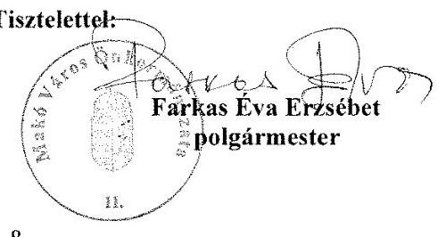

---

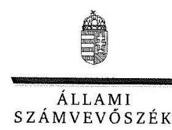

ELNÖK

Ikt.szám: V-0898-113/2016.

# Farkas Éva Erzsébet úrhölgy   polgármester 

Makó Város Önkormányzata

## Makó

## Tisztelt Polgármester Úrhölgy!

Köszönettel megkaptam ,,Az önkormányzatok pénzügyi és vagyongazdálkodása megfelelőségének ellenőrzéséről - Makó" című jelentéstervezet megállapításaira tett észrevételét.

Az ellenőrzési megállapításokra vonatkozó észrevételét az Állami Számvevőszékről szóló 2011. évi LXVI. törvény 29. § (2) bekezdésében meghatározott tizenöt napos határidőn belül küldte meg. Az Állami Számvevőszék észrevétellel kapcsolatos álláspontját a mellékletként csatolt, a felügyeleti vezető által készített indokolás tartalmazza.

Budapest, 2016. 06. hónap 25. nap
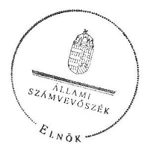

Tisztelettel:

## D $_{2}$   Domokos László

Melléklet: Észrevételre adott válasz

---

„Az önkormányzatok pénzügyi és vagyongazdálkodása megfelelőségének ellenőrzése Makó" című jelentéstervezetre tett észrevételre adott válasz

| Észrevétel: | 1.2 számú megállapításhoz: (Értékelési szabályzat)   A 2014. évi számviteli politika 29. oldalán szerepel az, hogy a követelések minősítéséhez az 1. számú melléklet szerinti minősítő lapot kell kiállítani, amelyet észrevételükhöz csatoltak. A minősítő lapon szerepelnek a minősítésre jogosultak. |
| :--: | :--: |
| Válasz: | Az Állami Számvevőszék az észrevételt nem fogadja el. |
| Indoklás: | Az észrevétel 1. számú mellékleteként csatolt adatlapon az adatlapot kiállító és a pénzügyi ellenjegyző nevének és aláírásának feltüntetésére kialakított rész szerepel. Az adatlap kiállítására és pénzügyi ellenjegyzésére jogosultak nevét vagy munkakörét azonban sem az adatlapon, sem a hivatkozott szabályzatban nem rögzítették, azaz a minősítésre jogosult személyeket - az észrevételben foglaltak ellenére - nem tartalmazza. |
| Észrevétel: | 2.1 számú megállapításhoz: (Elemi költségvetés határidőn túli benyújtása)   Az önkormányzat 2014. évi elemi költségvetése a Magyar Államkincstár (MÁK) által előírt határidőben, (2014. március 17-én) került benyújtásra, mely alátámasztásaként jelen észrevétel 2. sz. mellékleteként csatolták a KGR rendszerből kinyomtatott státusztörténetet, valamint a MÁK vonatkozó levelét. |
| Válasz: | Az Állami Számvevőszék az észrevételt elfogadja. |
| Indoklás: | Az észrevétel felülvizsgálata során - az Önkormányzat által az ellenőrzés során, a teljességi és hitelességi nyilatkozat aláírását megelőzően szolgáltatott dokumentumok alapján - megállapítást nyert, hogy a Polgármesteri hivatal az Önkormányzat, valamint az Önkormányzat által irányított költségvetési szerv jóváhagyott elemi költségvetéséről az államháztartásról szóló törvény végrehajtásáról szóló 368/2011. (XII. 31.) Korm. rendelet 33. § (1) bekezdésében foglalt határidőben szolgáltatott adatot. |
| Észrevétel: | 3.2 számú megállapításhoz: (szállítói kötelezettségek alakulása)   A számviteli nyilvántartásban a 91-365 nap közötti lejárt szállítói tartozás 2011. december 31-én 23,3 M Ft összegű volt. A tartozás teljes egészében a SADE Magyarország 110745.20308.11 sz. számláját érintette, amely a DAOP-5.1.2/A-2f-201000002 Makó Városközpont Rehabilitációja c. projekthez kapcsolódó szállítói finanszírozású számlája (az észrevétel 3. sz. mellékleteként csatolták). A szállítói finanszírozás esetén a számla a közreműködő szervezet részére közvetlenül kerül benyújtásra, a számla késedelmes kifizetésére az önkormányzatnak nem volt hatása.   A számviteli nyilvántartásban a 91-365 nap közötti lejárt szállítói tartozás 2013. december 31-én 300 ezer Ft volt, amely olyan számlákból tevődött össze, melyek 2014. évben, többször 90 napos késedelemmel kerültek befogadásra (iktatás dátuma 2014-es). A 2014-ben befogadott számlák határidőben történő kifizetése nem volt lehetséges. |

---

| Válasz: | Az Állami Számvevőszék az észrevételt elfogadja. |
| :--: | :--: |
| Indoklás: | Az észrevétel felülvizsgálata során - az Önkormányzat által az ellenőrzés során, a teljességi és hitelességi nyilatkozat aláírását megelőzően szolgáltatott dokumentumok alapján - megállapítást nyert, hogy a 2011. év végi, 90 napon túl lejárt tartozás szállítói finanszírozáshoz kapcsolódott, ezért a számla késedelmes kifizetésére az Önkormányzatnak nem volt hatása. A 2014. évben, késedelmesen befogadott számlák határidőben történő kiegyenlítése nem volt lehetséges. |
| Észrevétel: | 3.3 számú megállapításhoz: (Követelések behajthatatlannak minősítése 4. bekezdés)   Az Önkormányzat észrevételében kifejtette, hogy a követelések behajthatatlannak minősítése 5. sz. mintatétel (Makó és Térsége Fejlesztési Kht.) tekintetében a minősítő lapon a behajthatatlanság indoka az alábbi volt: „A cég végelszámolásának kezdete: 2011.11.03., hitelezői igény nem került bejelentésre, a cég 2013.05.06-án megszűnt". A behajthatatlannak minősített követelése, 2005.04.27-ei számla 2013.12.31-i minősítésekor az érintett gazdasági szervezet felszámolása befejeződött, így a követelés az Áhsz. 5. § (3) d) és e) pontja szerint is behajthatatlannak minősül. |
| Válasz: | Az Állami Számvevőszék az észrevételt nem fogadja el. |
| Indoklás: | A Gt. 68. § (1) bekezdése, illetve a Ptk. 3:137. § (1) bekezdése szerint a gazdasági társaság jogutód nélküli megszűnése esetén a megszűnő társaságot terhelő kötelezettség alapján fennmaradt, illetve kötelezettségből származó követelés a társaság megszűnésétől, illetve nyilvántartásból való törlésétől számított ötéves jogvesztő határidő alatt, illetve határidőn belül érvényesíthető a gazdasági társaság volt tagjával (részvényesével) szemben. Ebből kifolyólag az Önkormányzatnak 2018. május 5-ig lehetősége van a hitelezői igény bejelentésére, ezért a követelés behajthatatlanná minősítése nem felelt meg az Áhsz. 5. § 3. pontjában foglaltaknak. |
| Észrevétel: | 4.1 számú megállapításhoz: (Részesedések analitikus nyilvántartása)   2014. évben az Önkormányzat a tartós részesedésekről nyilvántartással rendelkezett, azt folyamatosan vezette, melyet az ÁSZ elektronikus adatszolgáltatási felületre az ellenőrzés során feltöltöttünk, azonban a nyilvántartás nem tartalmazza teljes körűen az államháztartás számviteléről szóló 4/2013. (I. 11.) Korm. rendelet (továbbiakban: Áhsz.) 14. számú melléklet VIII. 2-3. pontjában előírt adatokat. |
| Válasz: | Az Állami Számvevőszék az észrevételt nem fogadja el. |
| Indoklás: | Az Önkormányzat által a tartós részesedésekről vezetett nyilvántartás az Áhsz. 14. számú melléklet VIII. 2-3.
 pontjában előírt adatok egyikét sem tartalmazta, így nem tekinthető az Áhsz. 45. § (3) bekezdésében előírt részletező nyilvántartásnak. |
| Észrevétel: | 4.3 számú megállapításhoz: (Részesedések értékelése)   Észrevételében az Önkormányzat kifejtette, hogy a Makó Városi Kulturális Közművelődési Nonprofit Kft. és a Makói Gyógyfürdő Kft. részesedéseivel kapcsolatban a 2012-2013. években értékvesztés elszámolására nem volt szükség, mivel a 2012. évi önkormányzati beszámoló elfogadásakor a társaságok elfogadott 2012. évi beszá- |

---

|  | molói nem álltak rendelkezésre. Hivatkozott továbbá a számviteli politikájában foglaltakra, melyben meghatározta, hogy „Értékvesztést csak abban az esetben lehet elszámolni, ha az tartósnak és jelentősnek minősíthető. A tartósságot a befektetések esetében az egy éven túli esetre határozzuk meg. Jelentős összegűnek minősítjük az értékvesztést, ha az eléri vagy meghaladja a nyilvántartási érték 10\%-át."   Az Önkormányzat észrevétele szerint az ÁSZ által megállapított hiba a Makó Városi Kulturális Közművelődési Nonprofit Kft. és a Makói Gyógyfürdő Kft. részesedés értékelése során nem állt fenn, tehát az Sztv. vonatkozó előírásai nem sérültek. |
| :--: | :--: |
| Válasz: | Az Állami Számvevőszék az észrevételt nem fogadja el. |
| Indoklás: | A Makó Városi Kulturális-Közművelődési Nonprofit Kft. 2011. évi beszámolója szerint a saját tőke-jegyzett tőke aránya 2010. december 31-én 0,22, 2011. december 31-én -0,32 volt, azaz a saját tőke tartósan, éven túl a jegyzett tőke szintje alá süllyedt.   A Makó Gyógyfürdő Kft. 2011. évi beszámolója szerint a saját tőke-jegyzett tőke aránya 2010. december 31-én -21,79, 2011. december 31-én -1,26 volt, azaz a saját tőke tartósan, éven túl a jegyzett tőke szintje alá csökkent.   A két társaság 2011. évi beszámolóját 2012. április 30-án fogadta el a testület, így az abban foglaltakat a 2012-2013. évi beszámolók elkészítésekor, a részesedések év végi értékelésekor figyelembe kellett volna venni, a részesedések után értékvesztést kellett volna elszámolni. |
| Észrevétel: | 4.3 számú megállapításhoz:   Az üzemeltetésre átadott víziközmű vagyonnal kapcsolatos terven felüli értékcsökkenés elszámolásával és annak visszaírásával kapcsolatban az Önkormányzat észrevételt tett. A terven felüli értékcsökkenés elszámolását az ÁSZ szabályszerűnek minősítette, ezért az arra vonatkozó észrevétel nem releváns.   Észrevételében a terven felüli értékcsökkenés visszaírásával kapcsolatban rögzítette, hogy 2014. július 18. napján üzembe helyezésre került a makói szennyvíztisztító telep. A Képviselő-testület a makói szennyvíztisztítási rendszert az üzembe helyezés időpontjával átadta a víziközmű-szolgáltatást végző üzemeltetőnek. Az 1.373.657.861 Ft bruttó értékű beruházás átvétele keretében 2014.08.28. napjával rendezésre került a 2014.07.18. napjával üzembe helyezett Makói Szennyvíztisztító telep bővítés és korszerűsítés víziközmű beruházás nyilvántartási értéke, így a 2013.06.30. napjával elszámolt terven felüli értékcsökkenési leírás visszaírásra került. Az üzem behelyezésről készült feljegyzést az észrevétel 5. sz. mellékleteként csatolta.   A víziközmű vagyonhoz kapcsolódó terven felüli értékcsökkenési leírás év közbeni visszaírása a víziközmű vagyon helyes értékének megállapítása céljából szabályszerű volt, a vonatkozó jogszabályi előírások keretei között, a víziközmű vagyon rendezésének folyamatában történt és nem a szokásos év végi értékelési eljárásokhoz és nem piaci értékeléshez kapcsolódott. A szakmai törvényben előírt különleges szabályok arra engedtek következtetni, hogy a víziközmű vagyon rendezése során el lehet térni az Sztv. vonatkozó előírásai alapján értelmezhető, szokásos eljárásoktól, ezért került ez szabályozásra is az önkormányzat számviteli politikájában (,A terven felüli értékcsökkenés elszámolása csak és kizárólag a Vksztv. vagyon-értékelésre vonatkozó előírásainak esetében alkalmazható") |
| Válasz: | Az Állami Számvevőszék az észrevételt nem fogadja el. |

---

| Indoklás: | Az ÁSZ a 2013. évi terven felüli értékcsökkenés elszámolását szabályszerűnek minősítette, ezért az arra vonatkozó észrevétel nem releváns.   A 2014. évben a terven felüli értékcsökkenés visszaírása azért nem volt szabályszerű, mert nem vizsgálták, hogy a terven felüli értékcsökkenés visszaírásának okai fennálltak-e, illetve a terven felüli értékcsökkenés visszaírását nem az üzleti év mérlegfordulónapjára vonatkozó értékelés keretében hajtották végre:   - a Számv. tv. 57. § (2) bekezdése szerint a terven felüli értékcsökkenés visszaírását az üzleti év mérlegfordulónapjára vonatkozó értékelés keretében kell végrehajtani. Az év mérlegfordulónapjára vonatkozó értékelésről az Önkormányzat dokumentumot nem adott át az ellenőrzés részére.   - a 2014. évben az Önkormányzat a beruházás üzembe helyezésekor a beruházás értékével, illetve ezen felül a terven felüli értékcsökkenés visszaírásával is növelte a szennyvíztisztító telep mérleg szerinti értékét. A rendelkezésre bocsátott dokumentumok azonban csak a beruházásra vonatkoznak, a mérlegértéknek a beruházás értékével történő növelését támasztják alá.   A Számv tv. 57. § (2) bekezdése szerint „amennyiben az 53-56. § szerint alkalmazott leírások miatt az (1) bekezdés szerinti eszközök könyv szerinti értéke alacsonyabb ezen eszközök eredeti bekerülési értékénél és az alacsonyabb értéken való okai már nem, illetve csak részben állnak fenn, az 53-56. § szerinti leírásokat meg kell szüntetni (immateriális javaknál, tárgyi eszközöknél a már elszámolt terven felüli értékcsökkenés, egyéb eszközöknél az elszámolt értékvesztés összegének csökkentésével), - a megbízható és valós összkép érdekében - az eszközt piaci értékére, legfeljebb a nyilvántartásba vételkor megállapított, a 47-51. § szerinti bekerülési értékére, immateriális jószágnál, tárgyi eszköznél a terv szerinti értékcsökkenés figyelembevételével meghatározott nettó értékére az egyéb bevételekkel szemben, illetve a pénzügyi műveletek ráfordításait csökkentő tételként vissza kell értékelni (visszaírás)". Az Önkormányzat az eszköz piaci értékének megállapítására vonatkozó dokumentumot nem bocsátott az ellenőrzés rendelkezésére, így a szennyvíztisztító telep nyilvántartásba vételkor megállapított bekerülési értékére történő visszaírás nem felelt meg az előírásoknak. |
| :--: | :--: |
| Észrevétel: | 5.2. megállapításhoz: (Üzemeltetési szerződések)   A Maros Táncegyüttes részére az eszközök átadása Használatba adási szerződés alapján történt, melyet tévesen az üzemeltetésre átadott eszközök között szerepeltettünk 22. számú tanúsítványon. Az ellenőrzés során az alátámasztó dokumentumok feltöltésre kerültek az ÁSZ részére (Üzemeltetési szerz.), illetve jelen észrevétel 6. sz. mellékleteként csatoljuk. A számviteli nyilvántartásban a szerződés alapján helyesen szerepelnek az eszközök. |
| Válasz: | Az Állami Számvevőszék az észrevételt elfogadja. |
| Indoklás: | Az észrevétel felülvizsgálata során - az Önkormányzat által az ellenőrzés során, a teljességi és hitelességi nyilatkozat aláírását megelőzően szolgáltatott dokumentumok alapján - megállapítást nyert, hogy számviteli nyilvántartásban a szerződés alapján helyesen szerepeltek az eszközök. |

---

|  | 5.3. számú megállapításhoz: (Beruházások 5. bekezdés)   Makó Városközpont rehabilitációhoz kapcsolódó kötbérigény nem állt fenn, mivel a Vállalkozási szerződés 3. sz. módosítás 2. pontjában a teljesítési határidőt 2012. május 31-re módosították. A 2012. május 31-én kelt jegyzőkönyv értelmében „a Vállalkozó, Bükki Bánya Kft. készre jelentette a munkát, melynek műszaki átadás-átvételét a mai napra tűzte ki a műszaki ellenőr".   A műszaki ellenőrzés határidőben megkezdődött az Önkormányzat részéről kötbér érvényesítésére nem volt lehetőség.   A Makói Sportcsarnok hő és füst elvezető rendszer aktiválása tekintetében a beruházás már korábban meglévő ingatlanon történt, ezért nem üzembe helyezési okmány, hanem ún. értékváltozás közvetlen módosítással bizonylat került kiállításra. A bizonylaton (lásd 8. sz, melléklet) szerepel az eszköz megnevezése, az aktiválás dátuma, az ingatlan megnevezése és a beruházás összege is, az állományba vétel álláspontunk szerint szabályszerű volt. |
| :--: | :--: |
| Válasz: | Az Állami Számvevőszék az észrevételt nem fogadja el. |
| Indoklás: | A 2010. április 8-án kelt Vállalkozási szerződés 8. pontja szerint „Teljesítésnek az 1. pontban körülírt munkák Megrendelő részéről rendeltetésszerű használatra alkalmas állapotban történő (használatbavételi engedéllyel rendelkező) átvétele valamint az érintett közműtulajdonosok és hatóságok beleegyezése minősül". A Vállalkozási szerződés 2011. augusztus 24-én, 2011. szeptember 19-én és 2011. december 15-én kelt módosításai a szerződés 8. pontját nem érintették. A teljesítés határidejét a Vállalkozási szerződés 2011. december 15-én kelt módosításában 2012. május 31-re módosították a felek. A 2012. május 31-én kelt jegyzőkönyvben rögzítésre került, hogy „a mai nappal a műszaki-átvétel csak megkezdésre kerül". A jegyzőkönyv alapján tehát az átvétel nem történt meg. Az átvétel megkezdése a Vállalkozási szerződés 8. pontja szerint nem minősül teljesítésnek. Az Önkormányzat azonban a késedelmes teljesítés következtében felmerült kötbérigényét nem érvényesítette.   Az ingatlan kartonon az ingatlan értékének változása követhető, azonban ez csak a számviteli nyilvántartásokba értéknövekedés dátumaként feltüntetett időpontot támasztja alá, az üzembe helyezést nem dokumentálja hitelt érdemlően. A 2013. november 26-án kelt teljesítés igazolás alapján a teljesítés időpontja 2012. november 26. volt és tartalmazta, hogy a vállalkozó a sportcsarnok hő és füst elvezető rendszer kivitelezési munkáit elvégezte. Az ingatlan kartonon az értéknövekedés több mint egy évvel később, 2014. január 20-ai dátummal került rögzítésre. Üzembe helyezési okmány hiányában nem bizonyított hitelt érdemlően az üzembe helyezés dátuma. |
|  | 5.6 számú megállapításhoz: (valódiság: elve)   A 4.3 számú megállapításhoz részletezett észrevétel alapján sem a részesedések értékvesztésének elszámolási kötelezettsége, sem pedig a terven felüli értékcsökkenés szabálytalan visszaírása nem állt fenn, így a feltárt hibák nem minősülnek jelentős összegűnek. Ebből következően 2012-ben nem állt fenn a saját tőke és a tartalékok együttes értékének lényegesen - a számviteli politikában meghatározott módon és mértékben - való megváltoztatása, így a már közzétett - a vagyoni, pénzügyi és jövedelmi helyzetre vonatkozó - adatok nem megtévesztőek. Az előbbiekből eredően a 2012-ben feltárt hibák nem minősülnek a megbízható és valós képet lényegesen befolyásoló hibának. |

---

| Válasz: | Az Állami Számvevőszék az észrevételt nem fogadja el. |
| :--: | :--: |
| Indoklás: | Az észrevétel elutasításának okát a részesedések értékvesztésének elszámolására, illetve a terven felüli értékcsökkenés szabálytalan visszaírására tett észrevételek indoklása tartalmazza. |
| Észrevétel: | 6.1 számú megállapításhoz: (gazdasági társaságok beszámolása)   Az önkormányzat többségi tulajdonában lévő gazdasági társaságok közül a Makói Városgazdálkodási Nkft. 2014. évi beszámolóját a képviselő-testület 173/2015. (V.28.) MÖKT határozattal hagyta jóvá (lásd 9. sz. melléklet). A határozat mellékletében tévesen az üzleti terv teljesítése kifejezés szerepel, de tartalmában az anyagot a testület beszámolóként tárgyalta és hagyta jóvá. |
| Válasz: | Az Állami Számvevőszék az észrevételt nem fogadja el. |
| Indoklás: | A 6.1. számú megállapításban a Makói Városgazdálkodási Nonprofit Kft. 2012. évi beszámolójával kapcsolatban szerepel, hogy a Képviselő-testület nem a Számv. tv. szerinti beszámolót fogadta el, hanem az üzleti terv teljesítését. A 2014. évi beszámoló elfogadására vonatkozóan ilyen megállapítás nem szerepel, ezért az észrevétel elutasításra került. |
| Észrevétel: | 7. számú megállapításhoz: (Szociális szolgáltatástervezési koncepció)   A megállapítás nem helytálló, mivel az önkormányzat képviselő-testülete 519/2009. (XI. 25.) MÖKT. számú határozattal fogadta el szociális szolgáltatás-tervezési koncepcióját, melyet az ÁSZ vizsgálat során az adatszolgáltatás keretében a mellékletben foglaltak szerint rendelkezésre bocsátottunk. A dokumentumokat jelen észrevétel 10. sz. mellékleteként csatoljuk. |
| Válasz: | Az Állami Számvevőszék az észrevételt elfogadja. |

 Indoklás: | Az észrevétel felülvizsgálata során megállapítást nyert, hogy a 2009. évben a Képviselő-testület a szolgáltatástervezési koncepciót elkészítette, azonban azt kétévente nem vizsgálta felül és nem aktualizálta. |

Tájékoztatom Polgármester Úrhölgyet, hogy az Állami Számvevőszékről szóló 2011. évi LXVI. törvény 29. § (3) bekezdése alapján az Állami Számvevőszék a figyelembe nem vett észrevételeket köteles a jelentésben feltüntetni, és megindokolni, hogy azokat miért nem fogadta el.

Budapest, 2016.
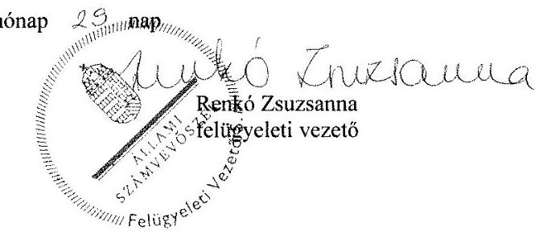

---

# RÖVIDÍTÉSEK JEGYZÉKE 

${ }^{1}$ Polgármesteri hivatal
${ }^{2}$ Kbt.
${ }^{3} \mathrm{Kttv}$.
${ }^{4} \mathrm{Bkr}$.
${ }^{5}$ Képviselő-testület
${ }^{6}$ Önkormányzat
${ }^{7}$ ÁSZ tv.
${ }^{8}$ Polgármesteri hivatal SzMSz-e
${ }^{9}$ Önkormányzati SZMSZ
${ }^{10}$ Áhsz. 1
${ }^{11}$ Leltározási szabályzat
${ }^{12}$ Áhsz. 2
${ }^{13}$ vagyonrendelet
${ }^{14}$ Nvtv.
${ }^{15}$ Áht. 1
${ }^{16}$ Stabilitási tv.
${ }^{17}$ Ámr.
${ }^{18}$ Áht. 2
${ }^{19}$ Adósságrendezési tv.
${ }^{20}$ Gt.
${ }^{21}$ Ptk. 2
${ }^{22}$ 2013. évi Kvtv.
${ }^{23}$ 2014. évi Kvtv.
${ }^{24}$ ENI
${ }^{25}$ Számv. tv.

Makói Polgármesteri Hivatal
2003. évi CXXIX. törvény a közbeszerzésekről (hatálytalan 2012. január 1-jétől) 2011. évi CXCIX. törvény a közszolgálati tisztviselőkről (hatályos: 2012. március 1-jétől)
370/2011. (XII. 31.) Korm. rendelet a költségvetési szervek belső kontrollrendszeréről és belső ellenőrzéséről
Makó Város Önkormányzati Képviselő-testülete, 2011. március 31-től Makó Város Önkormányzat Képviselő-testülete
Makó Város Önkormányzata
2011. évi LXVI. törvény az Állami Számvevőszékről, hatályos 2011. július 1-jétől Makó Város Önkormányzati Képviselő-testület Polgármesteri Hivatala Szervezeti és Működési Szabályzata
Makó Város Önkormányzat Képviselő-testületének 17/2003. (IV.24.) számú rendelete Makó Város Önkormányzata Szervezeti és Működési Szabályzatáról (hatályos: 2010. október 15-től);
Makó Város Önkormányzat Képviselő-testületének 11/2011. (III.31.) számú rendelete Makó Város Önkormányzata Szervezeti és Működési Szabályzatáról (hatályos: 2011. április 1-től);
Makó Város Önkormányzat Képviselő-testületének 21/2014. (X.30.) számú rendelete Makó Város Önkormányzata Szervezeti és Működési Szabályzatáról (hatályos: 2014. november 1-től);
Makó Város Önkormányzat Képviselő-testületének 13/2015. (V.28.) számú rendelete Makó Város Önkormányzata Szervezeti és Működési Szabályzatáról (hatályos: 2015. május 28-tól);
249/2000. (XII. 24.) Korm. rendelet az államháztartás szervezetei beszámolási és könyvvezetési kötelezettségének sajátosságairól (hatálytalan 2014. január 1-jétől)
Leltározási, leltárkészítési és selejtezési szabályzat
4/2013. (I. 11.) Korm. rendelet az államháztartás számviteléről (hatályos 2014. január 1-jétől)
11/2003. (III.26.) Makó ör. Makó Város Önkormányzatának vagyonáról, a vagyon feletti tulajdonosi jogok gyakorlásáról
2011. évi CXCVI. törvény a nemzeti vagyonról
1992. évi XXXVIII. törvény az államháztartásról (hatálytalan: 2012.január 1-jétől)
2011. évi CXCIV. törvény Magyarország gazdasági stabilitásáról

292/2009. (XII. 19.) Korm. rendelet az államháztartás működési rendjéről (hatálytalan: 2012. január 1-jétől)
2011. évi CXCV. törvény az államháztartásról (hatályos: 2012. január 1-jétől)
1996. évi XXV. törvény a helyi önkormányzatok adósságrendezési eljárásáról
2006. évi IV. törvény a gazdasági társaságokról (hatálytalan 2014. március 15-től)
2013. évi V. törvény a polgári törvénykönyvről (hatályos 2014. március 15-től)
2012. évi CCIV. törvény Magyarország 2013. évi központi költségvetéséről
2013. évi CCXXX. törvény Magyarország 2014. évi központi költségvetéséről

Egyesített Népjóléti Intézmény
2000. évi C. törvény a számvitelről

---

${ }^{26}$ NGM rendelet
${ }^{27}$ KLIK
${ }^{28} \mathrm{VM}$
${ }^{29}$ Eisztv
${ }^{30}$ Info tv.
${ }^{31}$ 147/1992. (XI. 6.) Korm. rendelet
${ }^{32}$ Ptk. 1
${ }^{33}$ Ötv.
${ }^{34}$ Mötv.
${ }^{35}$ Takt.
${ }^{36}$ Szoc. tv.
36/2013. (IX. 13.) NGM rendelet az államháztartás számvitelének 2014. évi megváltozásával kapcsolatos feladatokról
Klebelsberg Intézményfenntartó Központ
Vidékfejlesztési Minisztérium
2005. évi XC. törvény az elektronikus információszabadságról (hatálytalan: 2012. január 1-jétől)
2011. év CXII. törvény az információs önrendelkezési jogról és az információszabadságról (hatályos: 2012. január 1-jétől)
az önkormányzatok tulajdonában lévő ingatlanvagyon nyilvántartási és adatszolgáltatási rendjéről szóló 147/1992. (XI. 16.) Korm. rendelet
1959. évi IV. törvény a Polgári Törvénykönyvről
1990. évi LXV. törvény a helyi önkormányzatokról
2011. évi CLXXXIX. törvény Magyarország helyi önkormányzatairól
2009. évi CXXII. törvény a köztulajdonban álló gazdasági társaságok takarékosabb működéséről
1993. évi III. törvény a szociális igazgatásról és szociális ellátásokról

---

# ÁLLAMI SZÁMVEVŐSZÉK 

1052 Budapest, Apáczai Csere János utca 10.
Levélcím: 1364 Budapest 4. Pf. 54
Telefon: +36 14849100 Telefax: +36 14849200
www.asz.hu
