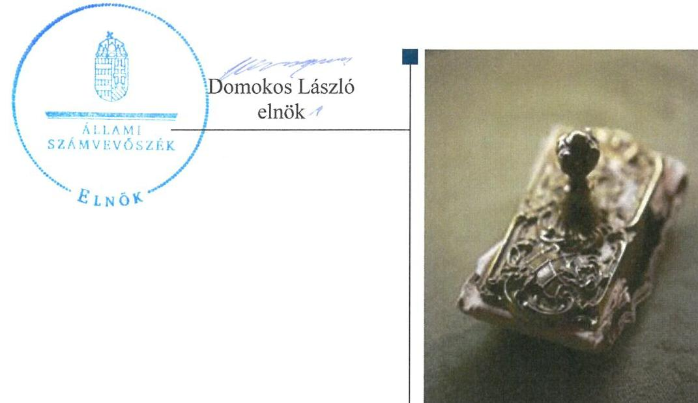
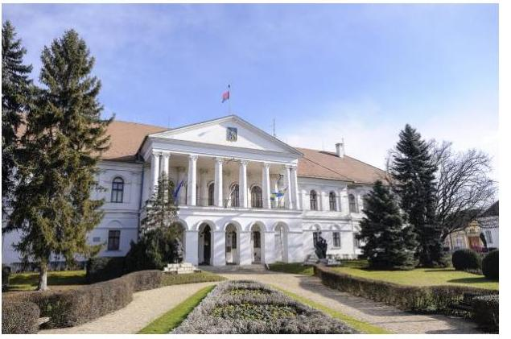
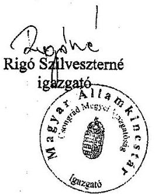
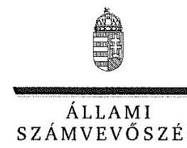
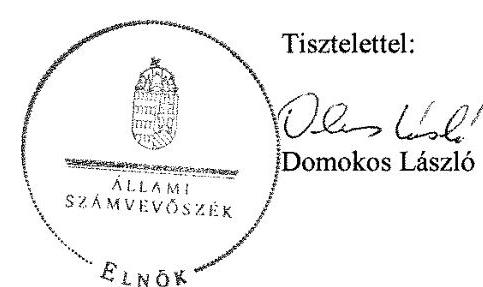
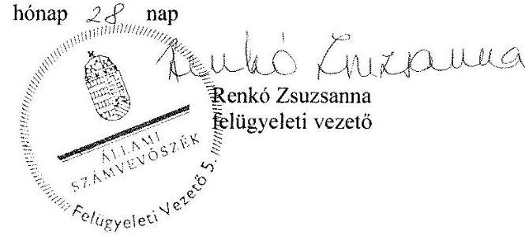

# Jelentés 

## A helyi nemzetiségi önkormányzatok gazdálkodása

A helyi nemzetiségi önkormányzatok gazdálkodása szabályszerűségének ellenőrzése - Makói Román Nemzetiségi Önkormányzat
2016.

---

# Jelentés 

## A helyi nemzetiségi önkormányzatok gazdálkodása

A helyi nemzetiségi önkormányzatok gazdálkodása szabályszerűségének ellenőrzése - Makói Román Nemzetiségi Önkormányzat
2016. 08. 00. nap

---

# AZ ELLENŐRZÉST FELÜGYELTE:

- RENKŐ ZSUZSANNA felügyeleti vezető
- AZ ELLENŐRZÉST VEZETTE ÉS A VÉGREHAJTÁSÁÉRT FELELŐS:
  - HORVÁTH JÓZSEF ellenőrzésvezető
  - A PROGRAM ÖSSZEÁLLÍTÁSÁÉRT FELELŐS:
    - JANIK JÓZSEF LÁSZLÓ osztályvezető

**IKTATÓSZÁM:** V-0900-032/2016

**TÉMASZÁM:** 1934

**ELLENŐRZÉS-AZONOSÍTÓ SZÁM:** V071412

Jelentéseink az Országgyűlés számítógépes hálózatán és az Interneten a www.asz.hu címen is olvashatóak.

---

# TARTALOMJEGYZÉK 

■ ÖSSZEGZÉS ..... 5
■ AZ ELLENŐRZÉS CÉLJA ..... 7
■ AZ ELLENŐRZÉS TERÜLETE ..... 8
■ AZ ELLENŐRZÉS HÁTTERE, INDOKOLTSÁGA ..... 9
■ A JELENTÉS LÉNYEGES KÉRDÉSKÖREI ..... 10
■ ELLENŐRZÉS HATÓKÖRE ÉS MÓDSZEREI ..... 11
■ MEGÁLLAPÍTÁSOK ..... 13
■ JAVASLATOK ..... 20
■ MELLÉKLETEK ..... 23
I. sz. melléklet: Értelmező szótár ..... 23
II. sz. melléklet: A Makói Román Nemzetiségi Önkormányzat 2014. évi gazdálkodási adatai. ..... 25
■ FÜGGELÉK: ÉSZREVÉTELEK ..... 27
■ RÖVIDÍTÉSEK JEGYZÉKE ..... 43

---

.

---

# ÖSSZEGZÉS 

Az Állami Számvevőszék a Makói Román Nemzetiségi Önkormányzat 2014. évi gazdálkodása szabályszerűségét ellenőrizte. Az ellenőrzési megállapítások alapján a működés és a gazdálkodás szabályozottsága, a gazdálkodási feladatok végrehajtása, ellátása nem felelt meg az előírásoknak. A Nemzetiségi Önkormányzat rendelkezett Makó Város Önkormányzattal ${ }^{1}$ megkötött, hatályos együttműködési megállapodás ${ }_{1,2}{ }^{2}$-vel. Az együttműködési megállapodás ${ }_{1}$ felülvizsgálatát végrehajtották, tartalma azonban hiányos volt. A gazdálkodási jogkörök szabályozása, valamint gyakorlása nem volt megfelelő. A belső ellenőrzési tervet megalapozó kockázatelemzés alapján a 2014. évben belső ellenőrzést nem terveztek és nem is végeztek. Az integritás szemlélet érvényesítése érdekében további intézkedések megtétele szükséges.

## Az ellenőrzés társadalmi indokoltsága

Az Állami Számvevőszék középtávra szóló stratégiájában megfogalmazta, hogy az államháztartás komplex folyamatainak átláthatósága érdekében rendszerszemléletű/holisztikus megközelítésű, egymásra épülő, a szinergiahatást kihasználó, összefoglaló értékelésre lehetőséget adó ellenőrzéseket végez. Az államháztartás önkormányzati alrendszerébe tartozó helyi nemzetiségi önkormányzatok ellenőrzése során az Állami Számvevőszék feltárja a működésükben rejlő kockázatokat előmozdítva a közpénzügyek átláthatóságát, rendezettségét.

Az Állami Számvevőszék a stratégiai céljával összhangban - az ÁSZ tv. ${ }^{3}$ felhatalmazása alapján - végzi a közpénzekkel és a nemzeti vagyonnal való felelős gazdálkodás, valamint a helyi önkormányzatok számviteli rendje betartásának és belső kontrollrendszere működésének ellenőrzését, továbbá segíti az integritás alapú, átlátható és elszámoltatható közpénzfelhasználás megteremtését.

## Főbb megállapítások, következtetések, javaslatok

A Nemzetiségi Önkormányzat ${ }^{4}$ működési feltételeinek és gazdálkodása végrehajtási feladatainak szabályozása hiányos volt. Az együttműködési megállapodás ${ }_{1}$ felülvizsgálatát határidőre elvégezték. A 2014. évben hatályos együttműködési megállapodás ${ }_{1,2}$ nem tartalmazta a gazdálkodással kapcsolatos nyilvántartási, iratkezelési feladatokat, a jelnyelv és speciális kommunikációs rendszer használatának biztosítását, az adatszolgáltatások teljesítésével kapcsolatos részletes szabályokat és az együttműködési kötelezettségeket, a felelősök konkrét kijelölését. A Nemzetiségi Önkormányzat SZMSZ-ében az együttműködési megállapodás ${ }_{1,2}$ szerinti működési feltételeket nem rögzítették a jogszabály szerint előírt határidőben és az ellenőrzött időszak végéig sem.

A Nemzetiségi Önkormányzat gazdálkodásának szabályozottsága - a pénzkezelési szabályzat, az ellenőrzési nyomvonal és a FEUVE kivételével- megfelelt a jogszabályi előírásoknak, valamint az együttműködési megállapodás ${ }_{1,2}$-ben foglaltaknak. A Nemzetiségi Önkormányzat elnöke a Képviselő-testület részére határidőben előterjesztette a költségvetéssel és a zárszámadással kapcsolatos határozat-tervezeteket, azok tartalma megfelelt az előírásoknak, azonban tájékoztatásul nem mutatták be teljes körűen az előírt kimutatásokat. A jogszabályokban előírt határidőre gondoskodtak a kincstári adatszolgáltatási kötelezettségek teljesítéséről.

A pénzügyi ellenjegyzésre, a teljesítés igazolására és az érvényesítésre jogosultak kijelölésének szabályozása nem felelt meg a jogszabályi előírásoknak. Az együttműködési megállapodás ${ }_{1,2}$ ben és a Kötelezettségvállalási szabályzatban a jogkörök gyakorlására és a kijelölésekre eltérő szabályokat határoztak meg. Az operatív gazdálkodási jogkörök gyakorlása az érvényesítő szabálytalan kijelölése, továbbá a teljesítésigazolás és az érvényesítés hiányos ellátása következtében nem felelt meg a jogszabályi előírásoknak.

---

Az együttműködési megállapodás ${ }_{1,2}$ alapján biztosított volt a Nemzetiségi Önkormányzat gazdálkodásának belső ellenőrzése. A belső ellenőrzési tervet megalapozó kockázatelemzés alapján a 2014. évben belső ellenőrzést nem terveztek és nem is végeztek.

Az integritás szemlélet érvényesítése érdekében a Nemzetiségi Önkormányzat működése és gazdálkodási kereteinek kialakításánál és működésénél további intézkedések megtétele szükséges.

---

# AZ ELLENŐRZÉS CÉLJA 

AZ ELLENŐRZÉS CÉLJA annak megállapítása, hogy a helyi nemzetiségi önkormányzatok működése és gazdálkodási kereteinek kialakítása, a gazdálkodással kapcsolatos feladatok ellátása megfelelt-e a jogszabályoknak, továbbá a helyi nemzetiségi önkormányzat működési és gazdálkodási kereteinek kialakítása és működése erősítette-e az integritás szemlélet érvényesülését.

---

# **AZ ELLENŐRZÉS TERÜLETE**

## **Makói Román Nemzetiségi Önkormányzat**

Makó város Csongrád megyében helyezkedik el. Állandó lakosainak száma 2014. december 31-én 23 974 fő volt. A Makói Román Nemzetiségi Önkormányzat a 2002. évi helyi nemzetiségi önkormányzati választások óta működik, célkitűzései között a nemzetiségi önazonosság megőrzése, ápolása, erősítése és átörökítése, a történelmi hagyományok ápolása és fejlesztése szerepel. A Nemzetiségi Önkormányzat működése, gazdálkodása kereteinek kialakítása, a gazdálkodással és működéssel kapcsolatos feladatok ellátása, biztosítása a Települési Önkormányzat és Polgármesteri hivatala feladatellátásában történt.

A Nemzetiségi Önkormányzat képviselő-testületének tagjai és elnöke személyében a 2014. évi általános választások eredményeként változás történt. A képviselő-testület tagjainak a száma a korábbi 4 fő helyett 3 fő lett. A Nemzetiségi Önkormányzat gazdálkodási feladatait ellátó Polgármesteri hivatal jegyzője 2014. december 31-én távozott tisztségéből, helyettesítését 2014. november 21-től 2014. december 31-éig a 2015. január 1-jétől kinevezett jegyző látta el. A Nemzetiségi Önkormányzat költségvetési szervet, gazdasági társaságot nem alapított. A 2014. évi költségvetési beszámoló szerint eredeti költségvetési kiadási és bevételi előirányzata 500,0 ezer Ft volt. A 2014. évi teljesített költségvetési bevétele 1554,0 ezer Ft, ebből a kapott feladatalapú támogatás összege 682,3 ezer Ft volt. Az összes bevétel az előző évi 625,0 ezer Ft pénzmaradvány igénybevételével 2179,0 ezer Ft összegben realizálódott. A költségvetési kiadások 2179,0 ezer Ft módosított előirányzata 2103,0 ezer Ft-ra teljesült. A könyvviteli mérlegben 95,0 ezer Ft vagyont mutatott ki. A Nemzetiségi Önkormányzat 2014. évi gazdálkodási adatait a II. sz. melléklet tartalmazza.

---

# AZ ELLENŐRZÉS HÁTTERE, INDOKOLTSÁGA 

Az országban élő nemzetiségek - Alaptörvényben biztosított - jogainak, valamint a helyi és országos önkormányzat létrehozási jogának általános intézményi kereteit sarkalatos törvényként a nemzetiségek jogairól szóló törvény szabja meg. A 2014-ben megtartott nemzetiségi önkormányzati választásokat követően 2143 települési nemzetiségi önkormányzat alakult meg. A szervezetek nagy számára, valamint az általuk felhasznált pénzeszközök, működtetett vagyon összessége nagyságrendjére tekintettel szabályszerű működésük ellenőrzéséhez kiemelt társadalmi érdek fűződik.

Az Alaptörvény Szabadság és felelősség rész, XXIX. cikk (1) bekezdése szerint a Magyarországon élő nemzetiségek államalkotó tényezők. Az országban élő nemzetiségek - Alaptörvényben biztosított - jogainak, valamint a helyi és országos önkormányzat létrehozási jogának általános intézményi kereteit sarkalatos törvényként a Nek. tv. ${ }^{9}$ szabályozza. A nemzetiségi önkormányzatok jogi személyek és a Nek. tv.-ben meghatározott önálló feladat- és hatáskörökkel rendelkeznek, az államháztartás részét, az önkormányzati alrendszer egyik elemét képezik. Az Mötv. ${ }^{10}$ 13. § (1) bekezdés 16. pontja alapján a települési önkormányzatok által - a helyi közügyek, valamint a helyben biztosítható közfeladatok körében - ellátandó helyi önkormányzati feladat a nemzetiségi ügyek ellátása. A helyi nemzetiségi önkormányzatok gazdálkodási feladatait jogszabályi előírás alapján a székhely települési önkormányzat polgármesteri (önkormányzati/közös) hivatala látja el.

A „helyi nemzetiségi önkormányzatok" gyűjtőfogalom, magában foglalja mind a települési nemzetiségi önkormányzatok, mint pedig a területi nemzetiségi önkormányzatok teljes körét. Gazdálkodásukra és támogatási rendszerükre vonatkozó jogszabályok az utóbbi években jelentős változásokon mentek át.

Az ellenőrzés hasznosulása több szinten várható. Az ellenőrzött szervezet szintjén az ellenőrzés feltárja a nemzetiségi önkormányzat működésében, gazdálkodásában, belső kontrollrendszere működtetésében és a belső ellenőrzés biztosításában lévő hiányosságokat. Az ellenőrzés javaslataival ezen a területen is hozzájárul a közpénzek szabályos felhasználásához. Az ellenőrzött terület szintjén az ellenőrzés, tájékoztatást nyújt a döntéshozóknak a hiányosságokról, ezzel lehetőséget biztosítva arra, hogy az ÁSZ ${ }^{11}$ ellenőrzési megállapításai, javaslatai a nem ellenőrzött szervezeteknek a működése során is hasznosuljanak. A társadalom számára jelzi, hogy a jelentős számú nemzetiségi önkormányzat gazdálkodása, illetve működéséhez felhasznált közpénz nem maradhat ellenőrizetlenül.

---

# A JELENTÉS LÉNYEGES KÉRDÉSKÖREI 

1.     - A helyi nemzetiségi önkormányzat működési feltételeinek és a gazdálkodással összefüggő feladatoknak a szabályozása megfelel-e a jogszabályi előírásoknak?
2.     - A jegyző és a helyi nemzetiségi önkormányzat betartotta-e a jogszabályi előírásokat a helyi nemzetiségi önkormányzat gazdálkodási feladatainak ellátása során?
3. Szabályszerűen biztosított volt-e a helyi nemzetiségi önkormányzat gazdálkodásának belső ellenőrzése?
4. A helyi nemzetiségi önkormányzat működési és gazdálkodási kereteinek kialakítása és működése erősítette-e az integritás szemlélet érvényesülését?

---

# ELLENŐRZÉS HATÓKÖRE ÉS MÓDSZEREI 

## Az ellenőrzés típusa

Szabályszerűségi ellenőrzés

## Az ellenőrzött időszak

A Nemzetiségi Önkormányzat működési feltételeinek kialakításával és a Polgármesteri hivatal - Nemzetiségi Önkormányzat gazdálkodására vonatkozó - feladatellátásával kapcsolatos szabályozás megfelelőségét a 2014. évre vonatkozóan (a 2014. december 31-i állapotnak megfelelően) minősítettük. A Nemzetiségi Önkormányzat gazdálkodása szabályszerűségét, a működési feltételeknek, a pénzügyi folyamatokban kulcsszerepet betöltő teljesítésigazolás és érvényesítés belső kontrollok működésének megfelelőségét, valamint a belső ellenőrzés biztosítását a 2014. január 1. - december 31-e közötti időszakot figyelembe véve értékeltük.

## Az ellenőrzés tárgya

A helyi nemzetiségi önkormányzat működési kereteinek kialakítása, a helyi nemzetiségi önkormányzat működésével, gazdálkodásával kapcsolatos feladatok székhely települési önkormányzat polgármesteri hivatala, valamint helyi nemzetiségi önkormányzat által történő ellátása.

Az ellenőrzés kiterjedt minden olyan körülményre és adatra, amely az ÁSZ jogszabályban meghatározott feladataiban, valamint a program végrehajtása folyamán felmerült újabb összefüggések feltárásához szükséges.

## Az ellenőrzött szervezet

A Makói Román Nemzetiségi Önkormányzat, valamint a Nemzetiségi Önkormányzat gazdálkodási feladatait ellátó Makói Polgármesteri hivatal.

## Az ellenőrzés jogalapja

Az ÁSZ tv. 1. § (3) bekezdésében foglaltak alapján az ÁSZ általános hatáskörrel végzi a közpénzekkel és az állami és önkormányzati vagyonnal való felelős gazdálkodás ellenőrzését, valamint az 5. § (2) bekezdése alapján a helyi nemzetiségi önkormányzatok gazdálkodásának és (6) bekezdése alapján a helyi nemzetiségi önkormányzatok számviteli rendje betartásának és belső kontrollrendszere működésének ellenőrzését.

---

# Az ellenőrzés módszerei 

Az ellenőrzést a nemzetközi standardokat irányadónak tekintve a program ellenőrzési kérdései, az ellenőrzött időszakban hatályos jogszabályok, az ellenőrzés szakmai szabályok és módszertanok figyelembe vételével végeztük el.

Az ellenőrzés ideje alatt az ellenőrzött szervezettel történő kapcsolattartást az ÁSZ Szervezeti és Működési Szabályzatának vonatkozó előírásai alapján biztosítottuk.

Az ellenőrzési kérdések megválaszolásához szükséges bizonyítékok megszerzése a következő ellenőrzési eljárások alkalmazásával történt: megfigyelés, szemle (szemrevételezés), kérdésfeltevés (információkérés), mintavételezés, valamint elemző eljárás.

A 2014. évben a Nemzetiségi Önkormányzatnál felújítással, ellátottak pénzbeli juttatásaival, egyéb felhalmozási célú kiadásokkal kapcsolatos kifizetések nem merültek fel, személyi juttatásokkal, dologi kiadásokkal, beruházással kapcsolatos kifizetésekre került sor. A gazdálkodás folyamatában kulcsszerepet betöltő két kulcskontroll - teljesítésigazolás, érvényesítés - működésének megfelelőségét teljes körűen, azaz minden személyi juttatásokkal, dologi kiadásokkal, beruházási kiadásokkal

 kapcsolatos kifizetés esetében ellenőriztük. „Megfelelőnek" értékeltük a gazdálkodási jogkörök gyakorlását, amennyiben a hibaarány legfeljebb 10%, „részben megfelelőnek" értékeltük, ha a hibaarány 10-30% között volt, „nem megfelelőnek" pedig akkor, ha az eredmény alapján a hibaarány meghaladta a 30%-ot.

Az integritás szemlélet érvényesülésének értékelése a gazdálkodási feladatokat ellátó Polgármesteri hivatal által kitöltött tanúsítvány alapján történt.

Az ellenőrzési bizonyítékok alapvetően dokumentum jellegűek voltak. Az ellenőrzési bizonyítékként felhasznált adatforrások közé tartoztak egyrészt a szakmai program részletes szempontjainál felsorolt adatforrások, másrészt adatforrás volt még minden egyéb - az ellenőrzés folyamán feltárt, az ellenőrzés szempontjából releváns információt tartalmazó - dokumentum.

Az ellenőrzés lefolytatásához a Polgármesteri hivatal a tanúsítványok elektronikus kitöltésével, valamint az ÁSZ által kért dokumentumok elektronikus megküldésével szolgáltatott adatokat. A rendelkezésre bocsátott adatok, információk kontrollja az ellenőrzés keretében történt.

---

# 1. A helyi nemzetiségi önkormányzat működési feltételeinek és a gazdálkodással összefüggő feladatoknak a szabályozása megfelel-e a jogszabályi előírásoknak? 

Összegző megállapítás

1.1. számú megállapítás

A Nemzetiségi Önkormányzat működési feltételeinek és a gazdálkodással összefüggő feladatainak szabályozása nem felelt meg a jogszabályi előírásoknak.

A Nemzetiségi Önkormányzat rendelkezett megállapodással a települési önkormányzattal történő együttműködésre, azonban az nem tartalmazta teljes körűen a működési feltételeket és a gazdálkodással összefüggő feladatokat. Az együttműködési megállapodás ${ }_{1,2}$ szerinti működési feltételeket az SZMSZ-ben hiányosan rögzítették.

A Nemzetiségi Önkormányzat a Nek. tv. 80. § (2) bekezdésében előírtak szerint rendelkezett együttműködési megállapodás ${ }_{1,2}$-vel, a települési önkormányzattal történő együttműködésre. A 2012. évben megkötött együttműködési megállapodás ${ }_{1}$-et a Nek. tv. 80. § (2) bekezdésében foglaltak alapján január 31-éig felülvizsgálták, azonban azt a Képviselő-testület SZMSZ ${ }^{12}$ 15. § 2. szakaszában előírt írásbeli előterjesztés helyett szóbeli előterjesztés alapján tárgyalta meg. A Képviselő-testület a hatályban lévő együttműködési megállapodás ${ }_{1}$ változatlan feltételekkel való fenntartásáról döntött.

A 2014. évi általános választásokat követően a Nemzetiségi, valamint Makó Város Önkormányzat Képviselő-testülete az együttműködési megállapodás ${ }_{2}$-ről a Nek. tv. 80. § (2) bekezdésében foglalt határidőben döntött. A képviselő-testületi határozatokban foglalt felhatalmazások alapján a polgármester, valamint az elnök 2014. november 17-én írták alá az együttműködési megállapodás ${ }_{2}$-t.

Az együttműködési megállapodás ${ }_{1,2}$ nem tartalmazta:
$\longrightarrow$ a Nek.tv. 80. § (1) bekezdése c) pontjában foglalt, a testületi ülések előkészítésével, különösen a meghívók, az előterjesztések előkészítésével kapcsolatos feladatokat,
$\longrightarrow$ a Nek.tv. 80. § (1) bekezdése d) pontjában foglalt, testületi döntések és a tisztségviselők döntéseinek előkészítése, a testületi és tisztségviselői döntéshozatalhoz kapcsolódó nyilvántartási feladatok ellátását,
$\longrightarrow$ a Nek.tv. 80. § (1) bekezdése e) pontjában foglalt, helyi nemzetiségi önkormányzat működésével, gazdálkodásával kapcsolatos nyilvántartási, iratkezelési feladatok ellátását,
$\longrightarrow$ a Nek.tv. 80. § (1) bekezdése f) pontjában foglalt, jelnyelv és a speciális kommunikációs rendszer használatának biztosítását,

---

Az együttműködési megállapodás ${ }_{1,2}$-ben nem rendelkeztek továbbá
$\longrightarrow$ a Nek.tv. 80. § (3) bekezdés a) pontja szerint a Nemzetiségi Önkormányzat önálló fizetési számla nyitásáról, törzskönyvi nyilvántartásba vételével és adószám igénylésével kapcsolatos határidőkről és az együttműködési kötelezettségekről, a felelősök konkrét kijelölésével,
$\longrightarrow$ a Nek.tv. 80. § (3) bekezdés d) pontja alapján a helyi nemzetiségi önkormányzat működési feltételeinek és gazdálkodásának eljárási és dokumentációs részletszabályairól, valamint az ezeket végző személyek kijelölésének rendjéről és az adatszolgáltatási feladatok teljesítésével kapcsolatos előírásokról, feltételekről,
Az együttműködési megállapodás ${ }_{1,2}$-ben nem szabályozták az adatszolgáltatási feladatok ellátásnak részletes szabályait, ezzel megsértették az Áht. ${ }^{13}$ 27. § (2) bekezdésében* foglalt előírásokat.

A Nek. tv. 80. § (2) bekezdése ellenére az együttműködési megállapodás ${ }_{2}$ megkötését követő 30 napon belül, illetve az ellenőrzött időszak végéig nem rögzítették teljes körűen a Nemzetiségi Önkormányzat SZMSZ-ében a megállapodás szerinti működési feltételeket. Az ellenőrzött időszakban hatályos SZMSZ a helyiség ingyenes biztosítását, a Nemzetiségi Önkormányzat adminisztrációs feladatait, a gazdálkodással kapcsolatos nyilvántartási feladatok ellátását és a Nemzetiségi Önkormányzat testületi és tisztségviselői döntések előkészítését, a pályázati lehetőségek feltárását tartalmazta. A Nemzetiségi Önkormányzat SZMSZ-e nem tartalmazta a Nek. tv. 80. § (2) bekezdése ellenére az együttműködési megállapodás ${ }_{2}$ ben meghatározott, a Nek.tv. 80. § (3) bekezdés b) és c) pontja szerinti működési feltételeket.

# 1.2. számú megállapítás 

A jegyző hiányosan intézkedett a Nemzetiségi Önkormányzat működési feltételeinek kialakításáról és gazdálkodásával összefüggő végrehajtási feladatokról.

A Polgármesteri hivatal SZMSZ ${ }^{14}$-e nem tartalmazott nevesített munkaköröket, így abban az Ávr. ${ }^{15}$ 13. § (1) bekezdés g) pontja szerint a munkakörökhöz tartozó feladat- és hatásköröket, a hatáskörök gyakorlásának módját, a helyettesítés rendjét, az ezekhez kapcsolódó felelősségi szabályokat nem rögzítették. A szervezeti egység vezetőinek és alkalmazottainak feladat- és hatásköréről, a helyettesítés rendjéről az Ávr. 13. § (5) bekezdése ellenére más szabályzatban sem rendelkeztek.

A jegyző az Ávr. 13. § (2) bekezdés a) pontjának előírása szerint belső szabályzatokban rendezte a Nemzetiségi Önkormányzat működéséhez kapcsolódó, pénzügyi kihatással bíró, jogszabályban nem szabályozott kérdéseket, a tervezéssel, gazdálkodással, az ellenőrzési és beszámolási feladatok teljesítésével kapcsolatos belső előírásokat, feltételeket.

[^0]
[^0]:    * Az Áht. 27. §-a 2015. január 1-jétől hatálytalan.

---

A jegyző az Ávr. 13. § (2) bekezdés c) és e) pontjai ellenére - figyelemmel az Ávr. 13. § (3a) bekezdés a) pontjára - a Nemzetiségi Önkormányzat vonatkozásában nem szabályozta:

- a belföldi és külföldi kiküldetések elrendelésével és lebonyolításával, elszámolásával kapcsolatos kérdéseket, valamint
- a reprezentációs kiadások felosztását, azok teljesítésének és elszámolásának szabályait.
A Polgármesteri hivatalban a Nemzetiségi Önkormányzat gazdálkodásával kapcsolatos feladatokat ellátó köztisztviselő rendelkezett munkaköri leírással. A jegyző munkaköri leírásának megőrzéséről nem gondoskodtak, ezáltal megsértették az Ltv. ${ }^{16} 9$ § (1) bekezdés e) pontjában foglaltakat, mivel az iratok megőrzésére vonatkozó előírást nem tartották be.

# 2. A jegyző és a helyi nemzetiségi önkormányzat betartotta-e a jogszabályi előírásokat a helyi nemzetiségi önkormányzat gazdálkodási feladatainak ellátása során? 

Összegző megállapítás

A Nemzetiségi Önkormányzat gazdálkodási feladatainak ellátása, az operatív gazdálkodási jogkörök szabályozása és gyakorlása során nem tartották be a jogszabályi előírásokat.

### 2.1. számú megállapítás

A Nemzetiségi Önkormányzat gazdálkodásának szabályozottsága a pénzkezelési szabályzat, az ellenőrzési nyomvonal és a FEUVE kivételével megfelelte a jogszabályi előírásoknak, valamint az együttműködési megállapodás ${ }_{1,2}$-ben foglaltaknak.

A BELSŐ KONTROLLRENDSZER kialakításával kapcsolatban a jegyző nem tett eleget a jogszabályban, illetve az együttműködési megállapodás ${ }_{1,2} 9$. pontjában foglalt kötelezettségének. A Nemzetiségi Önkormányzat működésével kapcsolatban a Polgármesteri hivatal által ellátott feladatokra vonatkozóan:

- a Bkr. ${ }^{17}$ 6. § (3) bekezdés előírásai ellenére az ellenőrzési nyomvonal nem tartalmazta a felelősségi és információs szinteket és kapcsolatokat, irányítási és ellenőrzési folyamatokat,
- a Bkr. 8. § (2)-(4) bekezdései szerinti, a Polgármesteri hivatal folyamatba épített előzetes és utólagos vezetői ellenőrzési rendszerét a Nemzetiségi Önkormányzatra nem terjesztette ki.
A jegyző a Bkr. 6. § (4) bekezdésében előírtaknak megfelelően szabályozta a szabálytalanságok kezelésének eljárásrendjét ${ }^{18}$, melynek hatálya kiterjedt a Nemzetiségi Önkormányzatra is.

A jegyző a Számv. tv. ${ }^{19}$ 14. § (3) bekezdése, illetve az Áhsz. ${ }^{20}$ 50. § (1) bekezdése szerint elkészítette a Polgármesteri hivatal Nemzetiségi Önkormányzatra is vonatkozó számviteli politikáját ${ }^{21}$, illetve annak keretében a Számv. tv. 14. § (5) bekezdésében, illetve az Áhsz. 50. § (1) bekezdésében előírt szabályzatokat:
a pénzkezelési szabályzatban ${ }^{22}$ nem szabályozták a Számv. tv. 14. § (8) bekezdésében megfogalmazott készpénzállományt érintő pénzmozgások jogcímei és eljárási rendjét;

---

$\longrightarrow$ a Számv. tv. 14. § (5) bekezdés a)-b) pontjaiban foglalt előírásnak megfelelően elkészítette a leltározási szabályzatot ${ }^{23}$, illetve az értékelési szabályzatot ${ }^{24}$, melyeknek hatálya a Nemzetiségi Önkormányzatra is kiterjedt.
$\longrightarrow$ Az Áhsz. 51. § (1) bekezdése értelmében kötelezően alkalmazták az Áhsz. 16. mellékletében meghatározott számlakeretet. Az Áhsz. 51. § (2) bekezdésében foglalt előírásnak megfelelően az egységes számlakeret alapján a Számv. tv. 161. §-ában meghatározott tartalmai követelményeknek megfelelő számlarendet ${ }^{25}$ készítettek.
A jegyző a pénzkezelési szabályzatban szabályozta az előleg kifizetésének rendjét (az előleg tárgya, az utalványozás, bevételezés dokumentumának azonosításához szükséges adatokat), azonban az adott és kapott előlegek nyilvántartásával kapcsolatban nem szabályozta az Áhsz. 14. számú melléklet IV. c) és az e)-f) pontokban foglaltakat.

# 2.2. számú megállapítás 

A Nemzetiségi Önkormányzat elnöke a Képviselő-testület részére határidőben előterjesztette a költségvetéssel és a zárszámadással kapcsolatos határozattervezeteket, azok tartalma megfelelt az előírásoknak, azonban tájékoztatásul nem mutatták be teljes körűen az előírt kimutatásokat.

## A KÖLTSÉGVETÉSI KONCEPCIÓT, ILLETVE A KÖLTSÉGVETÉSI ÉS ZÁRSZÁMADÁSI HATÁROZAT-TERVEZETET a Nemzetiségi Önkormányzat elnöke - figyelemmel az Áht. 26. § (1) bekezdésében foglaltakra - az Áht. 24. § (1) és (3) bekezdésében, illetve 91. § (1) bekezdésében előírtaknak megfelelően határidőben benyújtotta a Képviselő-testület részére.

A jóváhagyott költségvetési határozat tartalma megfelelt az Áht. 23. § (2)-(3) bekezdéseiben előírtaknak.

Az elnök a költségvetési határozattervezethez kapcsolódó előterjesztés részeként az Áht. 24. § (4) bekezdés a) és b) pontjai rendelkezése ellenére - tájékoztatásul nem mutatta be a Képviselő-testületnek az előirányzat felhasználási tervet, valamint a többéves kihatással járó döntések számszerűsítését évenkénti bontásban és összesítve. A kimutatásokat a jegyző által előkészített költségvetési határozattervezet előterjesztése nem tartalmazta, mivel e kimutatásokat a költségvetési határozattervezet előterjesztését megelőzően nem készítették el.

Az elnök a zárszámadási határozattervezet előterjesztésékor - az Áht. 91. § (2) bekezdés a) pontja előírása ellenére - nem mutatta be a Képviselő-testületnek tájékoztatásul a pénzeszközök változását, mivel e kimutatásokat a zárszámadási határozattervezet előterjesztését megelőzően nem készítették el.

A Képviselő-testület a zárszámadásról az Áht. 91. § (1) bekezdése szerint - figyelemmel a 91. § (3) bekezdésére, illetve a 26. § (1) bekezdésére - határozatot alkotott.

---

### 2.3. számú megállapítás

Határidőre gondoskodtak a kincstári adatszolgáltatási kötelezettségek teljesítéséről.

## A KINCSTÁRI ADATSZOLGÁLTATÁSI KÖTELEZETTSÉGEKET határidőben teljesítették. A Polgármesteri hivatal a jóváhagyott éves költségvetési beszámolóról szóló adatszolgáltatást az Áhsz. 32. § (4) bekezdésében és az együttműködési megállapodás ${ }_{2} 6$. pontjában megfogalmazottak ellenére a megjelölt határidő után két nappal, 2015. március 12-én teljesítette. Ennek oka, hogy a 2014. évi költségvetési beszámoló benyújtási határideje a Magyar Államkincstár által kiadott tájékoztató szerint - verzióváltozás miatt - 2015. március 13-ra tolódott ki.
2.4. számú megállapítás

A pénzügyi ellenjegyzésre, a teljesítés igazolására és az érvényesítésre jogosultak kijelölésének szabályozása nem felelt meg a jogszabályi előírásoknak. Az együttműködési megállapodás ${ }_{1,2}$-ben és a Kötelezettségvállalási szabályzatban a jogkörök gyakorlására és a kijelölésekre eltérő szabályokat határoztak meg.

A Polgármesteri hivatal az Ávr. 8. § (1) bekezdés c) pontja alapján a 2014. évben gazdasági szervezettel rendelkezett, ennek ellenére SZMSZ-e azt tartalmazta, hogy a Polgármesteri hivatalnak nincs gazdasági szervezete. A 2009-től hatályos Gazdasági szervezet ügyrendje ${ }^{26}$ tartalmazta, hogy a Polgármesteri hivatal gazdasági szervezete a pénzügyi osztály, így a két szabályozás nem volt összhangban.

A pénzügyi ellenjegyzés és érvényesítés gazdálkodási jogkörök gyakorlására az Ávr. 55. § (2) bekezdés g) pontja és 58. § (4) bekezdése értelmében a gazdasági
 vezető, vagy az általa írásban kijelölt a Polgármesteri hivatal állományába tartozó köztisztviselő volt jogosult. Ennek ellenére a Kötelezettségvállalási szabályzat ${ }^{27}$ a Nemzetiségi Önkormányzat gazdálkodási feladataival kapcsolatban a pénzügyi ellenjegyzésre, és érvényesítésre a jegyző által írásban felhatalmazott köztisztviselőt jogosította fel, míg az együttműködési megállapodás ${ }_{1,2}$ szerint a pénzügyi ellenjegyzést a jegyző, vagy az általa kijelölt köztisztviselő végezhette. Az együttműködési megállapodás ${ }_{1,2}$-ben érvényesítésre a gazdasági vezetőt szabályszerűen nevezték meg, azonban helyette az Ávr. 55. § (2) bekezdés g) pontjában és 58. § (4) bekezdésében meghatározottaktól eltérően nem az általa írásban kijelölt köztisztviselőt, hanem a jegyző által írásban kijelölt személyt jelölték ki.

A teljesítés igazolására jogosultak kijelölése a Kötelezettségvállalási szabályzatban megfelelő volt, azonban az együttműködési megállapodás ${ }_{1,2}$ben az Ávr. 57. § (4) bekezdésében meghatározottaktól eltérően a teljesítésigazoló kijelölésére nem a kötelezettségvállalót hatalmazták fel.
2.5. számú megállapítás

Az operatív gazdálkodási jogkörök gyakorlása az érvényesítő szabálytalan kijelölése, továbbá a teljesítésigazolás és az érvényesítés hiányos ellátása következtében nem felelt meg a jogszabályi előírásoknak.

A Nemzetiségi Önkormányzat költségvetéséből ellátottak pénzbeli juttatásaival, egyéb működési és felhalmozási célú kiadásokkal kapcsolatos kifizetéseket nem terveztek és nem teljesítettek. A Nemzetiségi Önkormányzat 2014. évi bevételei terhére teljesített személyi juttatások, dologi kiadások

---

és beruházások vonatkozásában az érvényesítő kijelölése nem volt megfelelő, a személyi juttatások és dologi kiadások vonatkozásában az operatív gazdálkodási jogkörökön belül kulcsszerepet betöltő kontrollok (teljesítésigazolás, érvényesítés) nem működtek megfelelően.

A jegyző a Nemzetiségi Önkormányzatra vonatkozóan az Ávr. 13. § (3a) bekezdésében előírtakkal ellentétben nem szabályozta a reprezentációs és a kiküldetési kiadások elszámolásának rendjét. A reprezentációs és kiküldetési kiadásokkal kapcsolatos kifizetések esetében a teljesítés igazoló a kiadások teljesítése jogosságának, összegszerűségének ellenőrzését az Ávr. 57. § (1) bekezdése ellenére nem végezte el.

Az ellenőrzött kifizetések teljesítés igazolását minden esetben a Nemzetiségi Önkormányzat elnöke, mint kötelezettségvállaló vagy az általa kijelölt elnökhelyettes végezte, aki rendelkezett az Ávr.57. § (4) bekezdésében foglaltaknak megfelelő írásbeli kijelöléssel.

Az érvényesítő kijelölése nem volt szabályszerű, a felhatalmazást az Ávr. 58. § (4) bekezdésében, illetve az Ávr. 55. § (2) bekezdés g) pontjában foglaltakkal ellentétben a gazdasági vezető helyett a jegyző állította ki.

Az érvényesítő rendelkezett az Ávr. 55. § (3) és 58. § (4) bekezdésében előírt végzettséggel. Az érvényesítés során a jegyző által kijelölt személy az érvényesítést valamennyi kiadás esetében elvégezte. Ellenőrizte a kiadás összegszerűségét, a fedezet meglétét és az Áht., Áhsz., belső szabályzatok rendelkezéseinek betartását.

Az érvényesítő az Ávr. 58. § (1) bekezdése ellenére azonban nem ellenőrizte, hogy a megelőző ügymenetben az Ávr. előírásait betartották-e. A megelőző ügymenetben a teljesítésigazoló a reprezentációs és kiküldetési kiadások jogosságának, összegszerűségének ellenőrzését az Ávr. 57. § (1) bekezdése ellenére nem végezte el. Az érvényesítő megsértette az Ávr. 58. § (2) bekezdésének előírásait, mert a jogszabálysértést nem jelezte az utalványozónak.

A kifizetésekkel kapcsolatban a rendelkezésre álló dokumentumok alapján kár bekövetkeztére utaló adatot, körülményt az ellenőrzés nem állapított meg. A teljesítésigazolás és érvényesítés kontrollok működésében tapasztalt hiányosságok, szabálytalanságok miatt fennáll a hibák, szabálytalanságok bekövetkezésének kockázata.

# 3. Szabályszerűen biztosított volt-e a helyi nemzetiségi önkormányzat gazdálkodásának belső ellenőrzése? 

Összegző megállapítás

Az együttműködési megállapodás1,2-nek megfelelően biztosított volt a Nemzetiségi Önkormányzat gazdálkodásának belső ellenőrzése. A kockázatelemzéssel alátámasztott 2014. évi ellenőrzési terv a Nemzetiségi Önkormányzatra vonatkozóan nem tartalmazott belső ellenőrzési feladatot.

Az együttműködési megállapodás ${ }_{1-2}$ rendelkezett a belső kontrollrendszer működtetéséről és a belső ellenőrzési tevékenység ellátásáról. Az együttműködési megállapodás ${ }_{2}$ tartalmazta, hogy a belső ellenőrzések lefolytatására kockázatelemzésen alapuló belső ellenőrzési terv alapján kerül sor. A belső ellenőrzések lebonyolításának rendjét a belső ellenőrzési vezető

---

által jóváhagyott belső ellenőrzési kézikönyv tartalmazta. A belső ellenőrzési kézikönyv hatálya kiterjedt a Nemzetiségi Önkormányzat gazdálkodásának ellenőrzésére.

A 2014. évi ellenőrzési tervet megalapozó kockázatelemzés alapján a Nemzetiségi Önkormányzat vonatkozásában „az operatív gazdálkodással összefüggő jogkörök szabályozottsága, kötelezettségvállalás, ellenjegyzés, érvényesítés, teljesítésigazolás szabályozottsága, gyakorlata" merült fel ellenőrzési területként, a téma magas kockázati besorolást nem kapott. A jegyző a kockázatelemzésben felállított prioritások alapján a magas kockázatú gazdálkodási feladatok belső ellenőrzését hagyta jóvá az ellenőrzési kapacitások figyelembe vétele mellett, ezért a 2014. évi ellenőrzési tervben a Nemzetiségi Önkormányzat vonatkozásában ellenőrzést nem terveztek és nem is végeztek.

# 4. A helyi nemzetiségi önkormányzat működési és gazdálkodási kereteinek kialakítása és működése erősítette-e az integritás szemlélet érvényesülését? 

Összegző megállapítás

Az integritás szemlélet érvényesítése érdekében a Nemzetiségi Önkormányzat működési és gazdálkodási kereteinek kialakításánál és működésénél további intézkedések megtétele szükséges.

A jelen ellenőrzés keretében a Polgármesteri hivatal által kitöltött tanúsítványi adatszolgáltatás alapján értékeltük az integritás 2014. évi kontrollrendszerét.

Az összesítés alapján az integritás kontrollrendszere fejlesztendő, melyet az ellenőrzés során tett megállapítások is alátámasztottak. Az operatív gazdálkodási jogkörök szabályozása és gyakorlása, a Nemzetiségi Önkormányzat gazdálkodási feladatainak ellátása során feltárt hiányosságok és hibák alapján megállapítható, hogy a Nemzetiségi Önkormányzat működési és gazdálkodási kereteinek kialakításánál és működésénél további intézkedések megtétele szükséges az integritás szemlélet érvényesülése érdekében.

---

# JAVASLATOK 

Az ÁSZ tv. 33. § (1) bekezdésében foglaltak értelmében az ellenőrzött szervezet vezetője köteles a jelentésben foglalt megállapításokhoz kapcsolódó intézkedési tervet összeállítani és azt a jelentés kézhezvételétől számított 30 napon belül az ÁSZ részére megküldeni. Amennyiben az ellenőrzött szervezet vezetője nem küldi meg határidőben az intézkedési tervet, vagy továbbra sem elfogadható intézkedési tervet küld, az Állami Számvevőszék elnöke az ÁSZ tv. 33. § (3) bekezdés a) és b) pontjaiban foglaltakat érvényesítheti.

## a jegyzőnek:

1. A Települési és a Nemzetiségi Önkormányzat együttműködésének szabályszerűsége érdekében intézkedjen
a) a jogszabályi előírásoknak megfelelő tartalmú együttműködési megállapodás előkészítéséről, és a Települési Önkormányzat Képviselő-testülete elé terjesztésének kezdeményezéséről;
(1.1 sz. megállapítás 3. bekezdés 1-4 pontjai és a 4. bekezdés 1-2 pontjai alapján)
b) az együttműködési megállapodás szerinti működési feltételek rögzítése céljából a Nemzetiségi Önkormányzat SZMSZ-e módosítása előkészítéséről;
(1.1 sz. megállapítás 6. bekezdés 1. mondata alapján)
c) a Polgármesteri hivatal SZMSZ-e jogszabályi előírásoknak megfelelő tartalmú kiegészítéséről.
(1.2. sz. megállapítás 1. bekezdése alapján)
2. A Nemzetiségi Önkormányzat gazdálkodási feladatok ellátásának szabályszerűsége érdekében intézkedjen
a) a Nemzetiségi Önkormányzatra vonatkozó belföldi és külföldi kiküldetések elrendelésével, lebonyolításával és elszámolásával, valamint a reprezentációs kiadások felosztásával, azok teljesítésével és elszámolásával kapcsolatos szabályzatok kiadásáról, valamint a pénzkezelési szabályzat jogszabályi előírásoknak megfelelő kiegészítéséről;
(1.2. sz. megállapítás 3. bekezdés 1-2 pontjai és a 2.1. sz. megállapítás 3. bekezdés első pontja és 4. bekezdése alapján)

---

b) a Nemzetiségi Önkormányzat gazdálkodási feladataira vonatkozó, a jogszabályi előírásoknak megfelelő ellenőrzési nyomvonal kiegészítéséről, és a FEUVE biztosításáról;
(2.1. sz. megállapítás 1. bekezdés 1-2 pontjai alapján)
c) a költségvetési határozat-tervezet előterjesztésekor bemutatásra kerülő kimutatások jogszabályi előírásoknak megfelelő elkészítéséről;
(2.2. sz. megállapítás 3. bekezdés alapján)
d) a zárszámadási határozat-tervezet előterjesztésekor tájékoztatásul bemutatásra kerülő kimutatás jogszabályi előírásoknak megfelelő elkészítéséről;
(2.2. sz. megállapítás 4. bekezdése alapján)
e) a Nemzetiségi Önkormányzat gazdálkodási feladataival kapcsolatban a pénzügyi ellenjegyzést, a teljesítés igazolását és az érvényesítést gyakorlók együttműködési megállapodás2-ben és a Kötelezettségvállalási szabályzatban történő eltérő szabályozása megszüntetéséről, és a jogszabályi előírásnak megfelelő meghatározásáról;
(2.4 sz. megállapítás 2-3. bekezdései alapján)
f) a pénzügyi folyamatokban kulcsszerepet betöltő teljesítésigazolás és érvényesítés belső kontrollok jogszabályi előírásoknak megfelelő működtetéséről.
(2.5 sz. megállapítás 2. és 6. bekezdései alapján)

# a Nemzetiségi Önkormányzat elnökének: 

1. A Települési és a Nemzetiségi Önkormányzat együttműködésének szabályszerűsége érdekében intézkedjen
a) a jogszabályi előírásoknak megfelelő tartalmú jegyző által előkészített együttműködési megállapodás Képviselő-testület elé terjesztéséről;
(1.1. sz. megállapítás 3. bekezdés 1-4 pontjai és a 4. bekezdés 1-2 pontjai alapján)

---

b) a Nemzetiségi Önkormányzat SZMSZ-ének az együttműködési megállapodás szerinti működési feltételek rögzítése céljából történő kiegészítéséről szóló előterjesztés Képviselő-testület elé terjesztéséről.
(1.1 sz. megállapítás 6. bekezdés 1 mondata alapján)
2. A Nemzetiségi Önkormányzat gazdálkodási feladatai ellátásának szabályszerűsége érdekében intézkedjen
a) a költségvetési határozat-tervezet előterjesztésekor a jogszabályi előírásban meghatározott kimutatások Képviselő-testület részére történő bemutatásáról;
(2.2. sz. megállapítás 3. bekezdés alapján)
b) a zárszámadási határozat-tervezet előterjesztésekor a jogszabályi előírásban meghatározott kimutatás Képviselő-testület részére történő bemutatásáról.
(2.2. sz. megállapítás 4. bekezdése alapján)

---

# MELLÉKLETEK 

- I. SZ. MELLÉKLET: ÉRTELMEZŐ SZÓTÁR
belső ellenőrzés
belső kontrollrendszer
együttműködési megállapodás
kockázat
költségvetési szerv vezetője
kontrolltevékenységek
kulcskontrollok
nemzetiség

Független, tárgyilagos bizonyosságot adó és tanácsadó tevékenység, amelynek célja, hogy az ellenőrzött szervezet működését fejlessze és eredményességét növelje, az ellenőrzött szervezet céljai elérése érdekében rendszerszemléletű megközelítéssel és módszeresen értékeli, illetve fejleszti az ellenőrzött szervezet irányítási és belső kontrollrendszerének hatékonyságát. (Forrás: Bkr. 2. § b) pontja) A belső kontrollrendszer a kockázatok kezelése és tárgyilagos bizonyosság megszerzése érdekében kialakított folyamatrendszer, amely azt a célt szolgálja, hogy a működés és gazdálkodás során a tevékenységeket szabályszerűen, gazdaságosan, hatékonyan, eredményesen hajtsák végre, az elszámolási kötelezettségeket teljesítsék, megvédjék az erőforrásokat a veszteségektől, károktól és nem rendeltetésszerű használattól. (Forrás: Áht. 69. § (1) bekezdése)
Az Áht. 27. § (2) bekezdése és a Nek. tv. 80. § (1) bekezdése értelmében a helyi önkormányzat a helyi nemzetiségi önkormányzat részére - annak székhelyén biztosítja az önkormányzati működés személyi és tárgyi feltételeit, továbbá gondoskodik a működéssel kapcsolatos végrehajtási feladatok ellátásáról. Az önkormányzati működés feltételei és az ezzel kapcsolatos végrehajtási feladatok. A Nek. tv. 80. § (2) bekezdés szerinti a fenti kötelezettségének teljesítése érdekében a helyi önkormányzat harminc napon belül biztosítja a rendeltetésszerű helyiséghasználatot, valamint a helyiséghasználatra, a további feltételek biztosítására és a feladatok ellátására vonatkozóan megállapodást köt a helyi nemzetiségi önkormányzattal. A megállapodást minden év január 31. napjáig, általános vagy időközi választás esetén az alakuló ülést követő harminc napon belül felül kell vizsgálni. A helyi önkormányzat és a nemzetiségi önkormányzat szervezeti és működési szabályzatában rögzíti a megállapodás szerinti működési feltételeket, a megállapodás megkötését, módosítását követő harminc napon belül. A Nek. tv. 80. § (3) bekezdés írja elő a megállapodásban rögzítendőket.

A kockázat annak a valószínűségét jelenti, hogy egy vagy több esemény vagy intézkedés nem kívánt módon befolyásolja a rendszer működését, céljainak megvalósulását. (Forrás: Javaslatok a korrupciós kockázatok kezelésére - Kockázatkezelési és ellenőrzési módszertan 35. oldal, ÁSZ)
A Bkr. 2. § nd) pont meghatározásában a települési/helyi önkormányzat, helyi nemzetiségi önkormányzat, illetve a fővárosi kerületi önkormányzat esetén a jegyző, körjegyző, főjegyző.
A kontrolltevékenységek azok a politikák és eljárások, amelyeket a kockázatok megoldására hoznak létre a szervezet céljainak teljesítése érdekében.
Az azonosított kockázatok mérséklése érdekében kialakított kontrollok közül azok, amelyek elégtelen működése esetén a szervezetet jelentős veszteség érheti, vagy a működésükben bekövetkező hiba/hiányosság más kontrollok eredményességét csökkenti. Ezek ellenőrzése, értékelése elegendő bizonyítékot szolgáltat adott területen a kontrollrendszer értékeléséhez. Az önkormányzatok kontrollrendszere kialakításának ellenőrzése során a pénzügyi folyamatokban kulcsszerepet betöltő belső kontrollok a teljesítésigazolás és az érvényesítés.
A Nek. tv. 1. § (1) bekezdése alapján nemzetiség minden olyan Magyarország területén legalább egy évszázada honos népcsoport, amely az állam lakossága körében számszerű kisebbségben van, tagjai magyar állampolgárok és a lakosság többi részétől
 saját nyelve és kultúrája, hagyományai különböztetik meg, egyben

---

|  | olyan összetartozás-tudatról tesz bizonyságot, amely mindezek megőrzésére, történelmileg kialakult közösségeik érdekeinek kifejezésére és védelmére irányul. |
| :--: | :--: |
| nemzetiségi önkormányzat | Az Nek. tv. 2. § 2. pontja szerint törvényben meghatározott nemzetiségi közszolgáltatási feladatokat ellátó, testületi formában működő, jogi személyiséggel rendelkező, demokratikus választások útján e törvény alapján létrehozott szervezet, amely a nemzetiségi közösséget megillető jogosultságok érvényesítésére, a nemzetiségek érdekeinek védelmére és képviseletére, a feladat- és hatáskörébe tartozó nemzetiségi közügyek települési, területi vagy országos szinten történő önálló intézésére jön létre. |
| operatív gazdálkodási jogkör | kötelezettségvállalás; pénzügyi ellenjegyzés; utalványozás; érvényesítés; teljesítésigazolás jogkör |
| polgármesteri hivatal | A programban a polgármesteri hivatal megnevezés alatt értjük a polgármesteri hivatalt, a főpolgármesteri hivatalt (illetve 2013. január 1-jét követően a közös önkormányzati hivatalt). |
| szabályszerűségi ellenőrzés | A szabályszerűségi ellenőrzés a megfelelőségi ellenőrzés általánosan alkalmazott altípusa. A szabályszerűségi ellenőrzés az egyes kritériumok - jogszabályi előírások, egyéb szabályok és megállapodások - teljesülésének ellenőrzését foglalja magában, ide értve a költségvetéssel kapcsolatos jogszabályokban foglaltak teljesülésének ellenőrzését is. |

---

II. SZ. MELLÉKLET: A MAKÓI ROMÁN NEMZETISÉGI ÖNKORMÁNYZAT 2014. ÉVI GAZDÁLKODÁSI ADATAI

|  Megnevezés | Eredeti előirányzat (ezer Ft) | Módosított előirányzat (ezer Ft) | Teljesítés (ezer Ft) | Teljesítés/ Módosított el. (ezer Ft)  |
| --- | --- | --- | --- | --- |
|  BEVÉTELEK |  |  |  |   |
|  Intézményi működési bevételek | 0,0 | 1,0 | 1,0 | 100,0  |
|  Általános működési támogatás | 0,0 | 270,7 | 270,7 | 100,0  |
|  Feladatalapú támogatás | 0,0 | 682,3 | 682,3 | 100,0  |
|  Pályázati támogatás | 0,0 | 100,0 | 100,0 | 100,0  |
|  Települési Önkormányzat által nyújtott támogatás | 500,0 | 500,0 | 500,0 | 100,0  |
|  Működési bevételek összesen | 500,0 | 1554,0 | 1554,0 | 100,0  |
|  Felhalmozási bevétel | 0,0 | 0,0 | 0,0 |   |
|  Költségvetési bevételek összesen | 500,0 | 1554,0 | 1554,0 | 100,0  |
|  Előző évi pénzmaradvány felhasználása | 0,0 | 625,0 | 625,0 | 100,0  |
|  Tárgyévi bevételek összesen | 500,0 | 2179,0 | 2179,0 | 100,0  |
|  KIADÁSOK |  |  |  |   |
|  Személyi juttatások | 70,0 | 1204,0 | 1145,0 | 95,1%  |
|  Munkaadókat terhelő járulékok és szociális hozzájárulási adó | 24,0 | 31,0 | 30,0 | 96,8%  |
|  Dologi kiadások | 406,0 | 702,0 | 686,0 | 97,7%  |
|  Támogatásértékű működési kiadások | 0,0 | 0,0 | 0,0 |   |
|  Működési célú pénzeszközátadások államháztartáson kívülre | 0,0 | 0,0 | 0,0 |   |
|  Működési kiadások összesen | 500,0 | 1937,0 | 1861,0 | 96,1%  |
|  Felhalmozási kiadások | 0,0 | 242,0 | 242,0 | 100,0%  |
|  Költségvetési kiadások összesen | 500,0 | 2179,0 | 2103,0 | 96,5%  |
|  Finanszírozási kiadások | 0,0 | 0,0 | 0,0 |   |
|  Tárgyévi kiadások összesen | 500,0 | 2179,0 | 2103,0 | 96,5%  |

---

.

---

# FÜGGELÉK: ÉSZREVÉTELEK 

A jelentéstervezetet a Számvevőszék 15 napos észrevételezésre megküldte az ellenőrzött szervezetek vezetőinek az ÁSZ tv. 29. § ${ }^{\dagger}$ (1) bekezdése előírásának megfelelően.
A jegyző észrevételt tett, a Nemzetiségi Önkormányzat elnöke az ÁSZ tv. 29. § (2) bekezdésében foglalt észrevételezési jogával nem élt.
Az elfogadott észrevétel alapján az Állami Számvevőszék módosította a jelentést.
A függelék tartalmazza a jegyző észrevételét, illetve az el nem fogadott észrevételek indoklásáról szóló tájékoztatást.

[^0]
[^0]:    ${ }^{+} 29. \S$ (1) Az Állami Számvevőszék az ellenőrzési megállapításait megküldi az ellenőrzött szervezet vezetőjének vagy az általa megbízott személynek, és annak, akinek személyes felelősségét állapította meg.
    (2) Az ellenőrzött szervezet vezetője és a felelősként megjelölt személy az ellenőrzés megállapításaira tizenöt napon belül írásban észrevételt tehet.
    (3) Az Állami Számvevőszék az észrevételre a beérkezésétől számított harminc napon belül írásban válaszol. A figyelembe nem vett észrevételeket köteles a jelentésben feltüntetni, és megindokolni, hogy azokat miért nem fogadta el.

---

# MAKÓ VÁROS JEGYZŐJÉTŐL 

Ikt.szám:1/48-13/2016/I
Üi.: Ördögh Andrea
Állami Számvevőszék
Domokos László
elnök
Budapest
Pf. 54.
1364
Tárgy: Észrevétel
Melléklet: 2 db
Iktatiszám: 1/2500 - 001/2016
Melléklet: 2 db
Eil. TV. 632

Tisztelt Elnök úr!

Hivatkozva a V-0900-020/2016. ikt. sz., az „A helyi nemzetiségi önkormányzatok gazdálkodása szabályszerűségének ellenőrzése - Makói Román Nemzetiségi Önkormányzat" tárgyban megküldött számvevőszéki jelentéstervezetre az alábbi észrevételeket teszem:

### 1.1. számú megállapításhoz: (Nemzetiségi Önkormányzat SZMSZ-e)

A Makói Román Nemzetiségi Önkormányzat SZMSZ 2. melléklete tartalmazza a Nek. tv. 80. § (3) b) pontjában előírt kötelezettségvállalásra, ellenjegyzésre, utalványozásra vonatkozó szabályozást:

## A Makói Román Nemzetiségi Önkormányzat Szervezeti és Működési Szabályzat 2. számú melléklete

Az utalványozás rendje

1. A helyi nemzetiségi önkormányzatnál a kiadás teljesítésének, a bevétel beszedésének vagy elszámolásának elrendelésére (továbbiakban: utalványozásra) kizárólag az elnök vagy az általa felhatalmazott nemzetiségi önkormányzati képviselő jogosult).
2. Utalványozni csak az érvényesítés után lehet.
3. Pénzügyi teljesítésre az utalványozás után és az utalványozás ellenjegyzése mellett kerülhet sor.
4. Készpénz a Polgármesteri Hivatal házipénztárán keresztül akkor fizethető ki, ha a helyi nemzetiségi önkormányzat elnöke a kifizetés teljesítéséhez szükséges dokumentumokat (szerződés, számla) bemutatja és szándékát a pénzfelvételt megelőző napon belül a Polgármesteri Hivatalnál jelzi.

---

Továbbá Nemzetiségi Önkormányzat SZMSZ V. fejezet 30. pontja tartalmazza az összeférhetetlenséggel kapcsolatos szabályozást a Nek. tv. 80. § (3) c) pontjának megfelelően.
30.

1. Amennyiben képviselővel szemben összeférhetetlenségi ok merül fel, az összeférhetetlenség kivizsgálására és megállapítására a testület 3 képviselőből álló bizottságot választ határozattal.
2. A Bizottság tagja nem lehet az a képviselő, akivel kapcsolatosan az összeférhetetlenségi ok felmerült.

# 1.2. számú megállapításhoz: (Helyettesítés rendje) 

A Makói Polgármesteri Hivatalban a nemzetiségi önkormányzatok adminisztrációs feladatai ellátásával megbízott köztisztviselők munkaköri leírása tartalmazta a feladat és hatásköröket, illetve a helyettesítés rendjét is, ezáltal biztosított volt a folyamatos feladatellátás. A munkaköri leírások az ellenőrzés során feltöltésre kerültek az ÁSZ elektronikus adatszolgáltatási felületére.

## Belföldi és külföldi kiküldetések, reprezentáció

## „Reprezentációs kiadások":

A személyi juttatások - külső juttatások rovaton elszámolt kiadási tételek nem „klasszikus reprezentációs kiadások". Az önkormányzat - kötelező közfeladat ellátása érdekében hagyományőrzés, nemzetiségi kultúra ápolása, nemzeti identitástudat ápolása céljából szervez rendezvényeket, melyhez kapcsolódó kiadásokról a képviselő-testület egyedi határozatban dönt, tételesen meghatározva a tervezett kiadások fajtáját (kulturális fellépő művészek díja, nemzetiségi étel készítés és bemutató költségei, anyaországi látogatások szállítási költségei, stb.), és összegét, meghirdetés módját, figyelemmel a személyi jövedelemadóról szóló 1995. évi CXVII. törvény előírásaira.

A rendezvények szervezésekor, minden esetben az adó- és járulékmentes kifizetésekre törekszik az önkormányzat betartva a személyi jövedelemadóról szóló 1995. évi CXVII. törvény 1. számú melléklet alapján:
„8.35. a helyi és/vagy nemzetiségi önkormányzat, az egyesület, az alapítvány, a közalapítvány, az egyházi jogi személy által a lakosság, a közösség széles körét érintő (nem zártkörű), azonos részvételi feltételekkel szervezett kulturális, hagyományőrző, sport, szabadidős és más hasonló közösségi rendezvényen helyben nyújtott szolgáltatás, helyi fogyasztásra juttatott étel, ital, valamint - legfeljebb a rendezvény összes költségének 10 százalékáig terjedő együttes értékben résztvevőnként azonos értékű, ajándék;" pontját.

---

Abban az esetben, ha a kis értékű ajándék meghaladja az adó- és járulékmentes értékhatárt, vagy nem felel meg a 8.35 pontban előírt rendezvényi követelményeknek a önkormányzat képviselőtestülete a határozatában az adó- járulék fizetésről is határoz és az összegét is jóváhagyja.

Mivel a rendezvények szolgáltatásait külső személyek felé szolgáltatja az önkormányzat, ezért az új, 2014. évtől hatályos rovatrendnek megfelelően személyi juttatások körébe került könyvelésre.

A fentiek alátámasztják, hogy a Makói Romána Nemzetiségi Önkormányzatnál nem merültek fel olyan költségek, amelyek az üzleti reprezentációs költségek körébe tartoznak. Az egyedi képviselő-testületi határozatok biztosították, hogy a kifizetések szabályosan, szabályozottan történtek.

# Kiküldetési kiadások: 

A kiküldetési kiadások kifizetéséről a képviselő-testület egyedi határozatban döntött, oly módon, hogy meghatározásra került a közfeladat ellátása érdekében felmerülő kiküldetés célja, a kiküldött kiküldetésben részvevő személy(ek), a saját gépjárművel megtehető útvonal és az adó-, és járulékmentesen kifizethető költségtérítés összege.

A kifizetések alapja egyrészről a személyi jövedelemadóról szóló 1995. évi CXVII. törvény, II. Igazolás nélkül elszámolható költségek
„6. a kifizető által a magánszemélynek a saját személygépkocsi használata miatt fizetett költségtérítés összegéből a kiküldetési rendelvényben feltüntetett km-távolság szerint az üzemanyag-fogyasztási norma és legfeljebb az állami adóhatóság által közzétett üzemanyagár, valamint 9 Ft/km általános személygépkocsi normaköltség alapulvételével kifizetett összeg;" pontja,
másrészről a közúti gépjárművek, az egyes mezőgazdasági, erdészeti és halászati erőgépek üzemanyag- és kenőanyag-fogyasztásának igazolás nélkül elszámolható értékéről szóló 60/1992. (IV. 1.) Korm. rendelet szerinti norma szerinti üzemanyag.

A fenti jogszabályoktól eltérő kifizetés nem történt a nemzetiségi önkormányzatnál. Tehát álláspontunk szerint az egyedi képviselő-testületi határozatok biztosították a szabályszerű kifizetéseket.

## 2.1 sz. megállapításhoz: (Pénzkezelési Szabályzat)

A Nemzetiségi Önkormányzatra is kiterjesztett hatályú pénzkezelési szabályzat 4.4. fejezete tartalmazza az előleg kifizetésének rendjéről szóló előírásokat valamint a nyilvántartás vezetésére vonatkozó szabályokat.

---

# 2.3. sz. megállapításhoz (Kincstári adatszolgáltatási kötelezettség) 

A Makói Polgármesteri Hivatal a 2014. évi elemi költségvetést a Magyar Államkincstár által meghatározott (2014. március 17.) határidőben a KGR rendszerben rögzítette, ezzel nem áll fenn a határidő túllépésére vonatkozó megállapítás. A Kincstár levelét jelen észrevétel 1. sz. mellékleteként csatoljuk.

A havi adatszolgáltatások a 368/2011. (XII.31.) Korm. rendelet 173. § (2) bekezdés értelmében határidőben kerültek benyújtásra, eszerint ha a naptári napokban meghatározott határidő utolsó napja munkaszüneti nap, a határidő az azt követő legközelebbi munkanapon jár le. A 2014. 6-8. havi adatszolgáltatások esetében a 20-a hétvége vagy ünnepnap volt, a benyújtásra az azt követő munkanapon került sor a jogszabálynak megfelelően.

A 2014. évi költségvetési beszámoló benyújtási határideje a Magyar Államkincstár által kiadott tájékoztató (lásd. 2. sz. melléklet) szerint - verzióváltozás miatt - 2015. március 13-ra tolódott ki. A fentiek alapján a beszámoló KGR rendszerben történő feltöltése határidőben történt.

### 2.5. sz. megállapításhoz (Érvényesítés hiányos ellátása)

Az érvényesítő, teljesítésigazoló az egyedi, tételes képviselő-testületi döntések és a hatályos jogszabályok figyelembe vételével végezték a gazdálkodói jogkör gyakorlását. A 1.2. számú megállapításhoz tett észrevételünk részletesen tartalmazza az ide vonatkozó indoklást.

A teljesítésigazoló „reprezentációs" és kiküldetési kiadások jogosságának, összegszerűségének ellenőrzésének alapját a 1.2. megállapításnál feltüntetett jogszabályok előírásainak maradéktalan vizsgálata, valamint a vonatkozó képviselő-testületi határozatok adták, mivel a képviselő-testület határozataiban tételesen meghatározta az adott gazdasági eseményekhez kapcsolódó kiadásokat.

Az önkormányzat a vonatkozó jogszabályoktól eltérő szabályokat nem alkalmazott.

Makó, 2016. június
 8.

Tisztelettel:
Dr. Bálint-Hankóczy Béatrix
jegyző

---

# Magyar   Államkincstár 

Iktatószám: 10195/7/2013.
Úgyintéző: Tilli Józsefné
Telefonszám: (62) 568-106
Tárgy: A 2013. évi költségvetési
beszámoló, mérlegjelentés és a 2014. évi
költségvetés átvétele

## Valamennyi Önkormányzat Jegyzőjének

Székhelyén

Tisztelt Címzetes Jegyző / Főjegyző / Jegyző Asszony/ Úr !

A költségvetés alapján gazdálkodó szervek beszámolási kötelezettségéről szóló, 249/2000. (XII.24.) Korm. rendelet (a továbbiakban: Áhsz.) 10. § alapján az önkormányzatok és a többcélú kistérségi társulások az éves gazdálkodásukról december 31-i fordulónappal beszámolót kötelesek készíteni.
Az Áhsz. 10.§ (3) bekezdés értelmében a beszámolót és a költségvetést központilag előírt nyomtatványokon is el kell készíteni és benyújtani, a központi nyomtatvány helyettesíthető elektronikus adatfeldolgozó és adathordozó rendszer segítségével előállított, de a kötelező nyomtatványokkal azonos tartalmú dokumentumokkal.

A helyi önkormányzat és az irányítása alá tartozó költségvetési szervek, a helyi nemzetiségi önkormányzat és az irányítása alá tartozó költségvetési szervek, a jogi személyiséggel rendelkező társulás és az irányítása alá tartozó költségvetési szervek valamint a többcélú kistérségi társulás és az irányítása alá tartozó költségvetési szervek felülvizsgált éves elemi költségvetési beszámolóit - az Áhsz. értelmében - a beszámoló elkészültét követő 10 naptári napon belül, tehát legkésőbb 2014. március 10-ig kell benyújtania a székhely szerinti megyeszékhelyen lévő Kincstár területi szerveihez. Ezzel eleget tesz az éves elemi költségvetési beszámolóra vonatkozóan az Áhsz. 45/A. §-ában előírt letétbe helyezési kötelezettségének.

Az éves elemi költségvetési beszámoló garnitúrákat az Áhsz. 13. §-ában foglaltak alapján a költségvetési szerv vezetője és a beszámoló elkészítéséért kijelölt felelős személy köteles aláírni. Az előlapon fel kell tüntetni a beszámoló elkészítéséért kijelölt felelős személy regisztrációs számát, továbbá a helység nevét és a keltezést is. Felhívjuk figyelmét, hogy amennyiben aláírás, bélyegző, regisztrációs szám, keltezés, stb. hiányzik a papíralapú adatszolgáltatásról, azt nem tudjuk elfogadni, valamint elutasításra kerül a KGR-K11 programban is a beszámoló.

---

Az Önkormányzatok és intézményeinek jóváhagyott, az önkormányzatok által feladott 2013. évi költségvetési beszámoló, és a IV. negyedéves mérlegjelentés KGR-K11 rendszerben történő feldolgozásának, valamint papír alapon egy-egy példányának Igazgatóságunk részére történő megküldésének határideje:

# 2014. március 10. 

a 2014. évi elemi költségvetés KGR-K11 rendszerben történő feladásának valamint papír alapon megküldésének határideje:

### 2014. március 17.

Felhívjuk az adatszolgáltatók figyelmét a határidők pontos betartására, mivel az Áht. 83.§ (6) bekezdése alapján ha helyi önkormányzat a Mötv. 111/A. §-a szerinti kötelezettségének nem tesz eleget a teljesítésre meghatározott határidő utolsó napját követő hónap első napjától a mulasztás megszüntetéséig a helyi önkormányzatokért felelős miniszter a nettó finanszírozás alapján a helyi önkormányzatot megillető összeg folyósítását felfüggeszti.

Továbbá tájékoztatjuk az önkormányzatokat, hogy az Áht. végrehajtásáról szóló 368/2011. (XII.31.) Korm. rendelet (a továbbiakban: Ávr.) módosításáról szóló 497/2013. (XII.29.) Korm. rendelet 169.§ (2) alapján a 2014. évre vonatkozóan intézményi szintű időközi költségvetési jelentést a költségvetési év első három hónapjáról április 20-áig, azt követően havonta, a tárgyhót követő hónap 20-áig kell az Igazgatóságunkhoz megküldeni.
A költségvetési év tizenkét hónapjáról a költségvetési évet követő év február 5-éig kell az adatokat megküldeni az Igazgatóságnak.

Az Ávr. 7. melléklet 26. pontja szerint az önkormányzati alrendszerbe tartozó adatszolgáltatóknak az adatokat alátámasztó - könyvelési rendszerből előállított - teljes főkönyvi kivonatot elektronikus úton mellékelni szükséges. Ennek biztosítására az Eadaton egy új felület kerül kialakításra, amely elérhetőségéről, használatáról a későbbiekben adunk tájékoztatást.

Az Ávr. 7. melléklet 32. pontja helyébe a következő rendelkezés lépett:
A 2 milliárd forint korrigált költségvetési mérlegfőösszeget meghaladó helyi önkormányzatoknak adatot kell szolgáltatni a várható tárgyév végi költségvetési egyenlegéről. A korrigált mérleg főösszeg egy-egy helyi önkormányzat esetében az önkormányzat (1254 szektor) és a hivatala, intézményei ( 1251 szektor) adatainak „összetolása" után vizsgálandó. Ennek megállapítása a tárgyévet két évvel megelőző évi beszámoló adatai alapján történik. 2014. év folyamán a 2012. évi beszámoló korrigált mérleg főösszege lesz az irányadó. A költségvetési év első három hónapjáról április 20-áig, majd havonta a tárgyhót követő 20-áig, a költségvetési év tizenkét hónapjáról a költségvetési évet követő év február 5-éig, kell adatot szolgáltatni.
Az Ávr. 170. § (2) bekezdése alapján a költségvetési szerveknek 2014. évre vonatkozóan időközi mérlegjelentést a tárgynegyedévet követő hónap 25. napjáig, a IV. negyedévre vonatkozó gyorsjelentést február hónap 14. napjáig, az éves mérlegjelentést az éves beszámoló benyújtásának határidejével megegyezően kell eljuttatni feldolgozásra Igazgatóságunkhoz.

---

Az Ávr. 7. melléklet 1. pontja helyébe lépett rendelkezés szerint a helyi önkormányzat, helyi nemzetiségi önkormányzat, társulás, térségi fejlesztési tanács stabilitási tv. 3.§-a szerinti, a tárgyidőszak utolsó napján fennálló adósságot keletkeztető ügyletei aktuális és a december 31-ei állománya után adatot szolgáltatnak. Negyedévente a tárgynegyedévet követő hónap 25-éig, a negyedik negyedév esetében a tárgyévet követő év február 14-éig. Ezen felül október és november hónapban a tárgynegyedévet követő hónap 10-éig.

Az Ávr. 170.§ (6) „Az időközi mérlegjelentés készítésére kötelezettek az éves elszámolásokra vonatkozóan a költségvetési évet követő év július 20-ig, az éves konszolidált elszámolásra vonatkozóan a költségvetési évet követő év november 20-ig a részesedések és a részesedések utáni osztalékok alakulására vonatkozó adatszolgáltatást juttatnak el a feldolgozásra a Kincstárhoz.

Felhívjuk a figyelmet az időközi költségvetési jelentés és időközi mérlegjelentés adatszolgáltatási kötelezettséggel kapcsolatban, hogy az Áht. 108.§-a a következő (4) bekezdéssel egészül ki.
„Ha a helyi önkormányzat a (2) bekezdés szerinti adatszolgáltatási kötelezettségét nem vagy késedelmesen teljesíti, Kormány rendeletében meghatározott mértékű bírságot fizet, amelyet a kincstár határozatban szab ki. A kincstár határozata tekintetében az 58.§ (4) és (5) bekezdését kell alkalmazni, azzal, hogy a bíróság határozata ellen felülvizsgálatnak nincs helye."

Kérem, szíveskedjen az érintett munkatársakat és az önkormányzat gazdálkodó intézményeinek munkatársait is tájékoztatni a változásokról és a határidők betartatására, valamint az adatszolgáltatásokban szereplő adatok megfelelő minőségének biztosítására is kiemelt gondot fordítsanak.

Szeged, 2014. február 10.

Tisztelettel:

---

# Magyar   Államkincstár 

Csongrád Megyei Igazgatóság

Valamennyi Önkormányzat
Székhelyén

Iktatószám: 10195/26/2015.
Hiv. szám: -
Úgyintéző: Tilli Józsefné
Telefonszám: 62/568-106

Címzetes Főjegyző, jegyző részére

Tárgy: Tájékoztatás adatszolgáltatások határidejéről

Tisztelt Címzetes Főjegyző / Jegyző / Asszony / Úr!

Tájékoztatom, hogy a 2014. évi éves költségvetési beszámoló adatszolgáltatásban a beadási határideje előtt 3 munkanappal minden adatszolgáltatót érintő verzióváltás történt, ezért a bírságolás szempontjából a beadási határidő 3 munkanappal kitolódik, az új határidő:

## 2015. március 13.

Felhívom a figyelmüket, hogy az Önkormányzatokat, a nemzetiségi önkormányzatokat, társulásokat, hogy az általuk feladott az intézményeinek jóváhagyott IV. negyedéves mérlegjelentés KGR-K11 rendszerben történő feldolgozásának határideje továbbra is:

## 2015. március 10.

Az adatszolgáltatással egyidejűleg az Ávr. 5. melléklet 22. pontja szerint a helyi önkormányzatoknak, a nemzetiségi önkormányzatoknak, a társulásoknak és ezek intézményeinek az adatokat alátámasztó - könyvelési rendszerből előállított - teljes főkönyvi kivonatot elektronikus úton mellékelni szükséges.

A 2015. évi elemi költségvetés beadási határideje:

## 2015. március 18.

Kérem, szíveskedjen az érintett munkatársakat és az önkormányzat gazdálkodó intézményeinek munkatársait is tájékoztatni a változásokról és a határidők betartására valamint az adatszolgáltatásokban szereplő adatok megfelelő minőségének biztosítására is kiemelt gondot fordítsanak.

---

ELNÖK

Ikt. szám: V-0900-025/2016.

# Dr. Bálint-Hankóczy Beatrix úrhölgy 

jegyző
Makói Polgármesteri Hivatal

## Makó

## Tisztelt Jegyző Úrhölgy!

Köszönettel megkaptam „A helyi nemzetiségi önkormányzatok gazdálkodása szabályszerűségének ellenőrzése - Makói Román Nemzetiségi Önkormányzat" című jelentéstervezet megállapításaira tett észrevételét.

Az ellenőrzési megállapításokra vonatkozó észrevételét az Állami Számvevőszékről szóló 2011. évi LXVI. törvény 29. § (2) bekezdésében meghatározott tizenöt napos határidőn belül küldte meg. Az Állami Számvevőszék észrevétellel kapcsolatos álláspontját a mellékletként csatolt, a felügyeleti vezető által készített, a jelentéstervezetre tett észrevételre adott válasz tartalmazza.

Budapest, 2016. 06. hó 28. nap

Melléklet: Észrevételre adott válasz

---

# „A helyi nemzetiségi önkormányzatok gazdálkodása szabályszerűségének ellenőrzése Makói Román Nemzetiségi Önkormányzat" című jelentéstervezetre tett észrevételre adott válasz 

|  | 1.1. számú megállapításhoz: (Nemzetiségi Önkormányzat SZMSZ-e)   A Makói Román Nemzetiségi Önkormányzat SZMSZ 2. melléklete tartalmazta a Nek. tv. 80. § (3) b) pontjában előírt kötelezettségvállalásra, ellenjegyzésre, utalványozásra vonatkozó szabályozást:   A Makói Román Nemzetiségi Önkormányzat Szervezeti és Működési Szabályzat 2. számú melléklete   Az utalványozás rendje   1. A helyi nemzetiségi önkormányzatnál a kiadás teljesítésének, a bevétel beszedésének vagy elszámolásának elrendelésére (továbbiakban: utalványozásra) kizárólag az elnök vagy az általa felhatalmazott nemzetiségi önkormányzati képviselő jogosult).   2. Utalványozni csak az érvényesítés után lehet.   3. Pénzügyi teljesítésre az utalványozás után és az utalványozás ellenjegyzése mellett kerülhet sor.   4. Készpénz a Polgármesteri Hivatal házipénztárán keresztül akkor fizethető ki, ha a helyi nemzetiségi önkormányzat elnöke a kifizetés teljesítéséhez szükséges dokumentumokat (szerződés, számla) bemutatja és szándékát a pénzfelvételt megelőző napon belül a Polgármesteri Hivatalnál jelzi.   Továbbá Nemzetiségi Önkormányzat SZMSZ V. fejezet 30. pontja tartalmazza az összeférhetetlenséggel kapcsolatos szabályozást a Nek. tv. 80. § (3) c) pontjának megfelelően.   30.   Amennyiben képviselővel szemben összeférhetetlenségi ok merül fel, az összeférhetetlenség kivizsgálására és megállapítására a testület 3 képviselőből álló bizottságot választ határozattal   A Bizottság tagja nem lehet az a képviselő, akivel kapcsolatosan az összeférhetetlenségi ok felmerült. |
| :--: | :--: |
| Válasz: | Az Állami Számvevőszék az észrevételt nem fogadja el. |
| Indoklás: | A Román Nemzetiségi Önkormányzat SZMSZ-ének 2. számú melléklete a Nek. tv. 80. § (2) bekezdése, illetve (3) bekezdés b) pontja ellenére nem tartalmazta a Nemzetiségi Önkormányzat kötelezettségvállalásaival kapcsolatosan a helyi önkormányzatot terhelő ellenjegyzési, érvényesítési, szakmai teljesítésigazolási feladatokat, továbbá a felelősök konkrét kijelölését. A Román Nemzetiségi Önkormányzat SZMSZ-ének 2. számú mellékletében kizárólag a Nemzetiségi Önkormányzatot terhelő feladatokat és felelősöket tüntették fel. |

---

|  | A Román Nemzetiségi Önkormányzat SZMSZ-ében az összeférhetetlenséggel kapcsolatban - a Nek. tv. 80. § (2) bekezdése, illetve (3) bekezdés c) pontja ellenére nem az együttműködési megállapodás; 6.6. pontja szerinti feltételeket rögzítették. |
| :--: | :--: |
| Észrevétel: | 1.2. számú megállapításhoz: (Helyettesítés rendje)   A Makói Polgármesteri Hivatalban a nemzetiségi önkormányzatok adminisztrációs feladatai ellátásával megbízott köztisztviselők munkaköri leírása tartalmazta a feladat és hatásköröket, illetve a helyettesítés rendjét is, ezáltal biztosított volt a folyamatos feladatellátás. A munkaköri leírások az ellenőrzés során feltöltésre került az ÁSZ elektronikus adatszolgáltatási felületére. |
| Válasz: | Az Állami Számvevőszék az észrevételt nem fogadja el. |
| Indoklás: | Az észrevétel szerint a nemzetiségi önkormányzatok adminisztrációs feladatai ellátásával megbízott köztisztviselők helyettesítésének rendjét a munkaköri leírások tartalmazták. Az Ávr. 13. § (1) bekezdés g) pontja szerint a helyettesítés rendjét a költségvetési szerv szervezeti és működési szabályzata, illetve az Ávr. 13. § (5) bekezdése szerint, ha azokról a szervezeti és működési szabályzat vagy a költségvetési szerv más szabályzata nem rendelkezik - a szervezeti egységek ügyrendje tartalmazza. A jogszabályi előírásoktól eltérően a Polgármesteri hivatal SZMSZ-e nem tartalmazott nevesített munkaköröket, így abban a munkakörökhöz tartozó feladat és hatásköröket, a hatáskörök gyakorlásának módját, a helyettesítés rendjét, az ezekhez kapcsolódó felelősségi szabályokat nem rögzítették. A
 szervezeti egység vezetőinek és alkalmazottainak feladat- és hatásköréről, a helyettesítés rendjéről az Ávr. 13. § (5) bekezdése ellenére más szabályzatban sem rendelkeztek. |
| Észrevétel: | 1.2. számú megállapításhoz: Belföldi és külföldi kiküldetések, reprezentáció   ."Reprezentációs kiadások":   A személyi juttatások - külső juttatások rovaton elszámolt kiadási tételek nem „klasszikus reprezentációs kiadások”. Az önkormányzat - kötelező közfeladat ellátása érdekében - hagyományőrzés, nemzetiségi kultúra ápolása, nemzeti identitástudat ápolása céljából szervez rendezvényeket, melyhez kapcsolódó kiadásokról a képviselő-testület egyedi határozatban dönt, tételesen meghatározva a tervezett kiadások fajtáját (kulturális fellépő művészek díja, nemzetiségi étel készítés, és bemutató költségei, anyaországi látogatások szállítási költségei, stb.), és összegét, meghirdetés módját, figyelemmel a személyi jövedelemadóról szóló 1995. évi CXVII. törvény előírásaira.   A rendezvények szervezésekor, minden esetben az adó- és járulékmentes kifizetésekre törekszik az önkormányzat, betartva a személyi jövedelemadóról szóló 1995. évi CXVII. törvény 1. számú melléklet alapján:   „8.35. a helyi és/vagy nemzetiségi önkormányzat, az egyesület, az alapítvány, a közalapítvány, az egyházi jogi személy által a lakosság, a közösség széles körét érintő (nem zártkörű), azonos részvételi feltételekkel szervezett kulturális, hagyományőrző, sport, szabadidős és más hasonló közösségi rendezvényen helyben nyújtott szolgáltatás, helyi fogyasztásra juttatott étel, ital, valamint - legfeljebb a rendezvény összes költségének 30 százalékáig terjedő együttes értékben - résztvevőnként azonos értékű, ajándék;" pontját.   Abban az esetben, ha a kis értékű ajándék meghaladja az adó- és járulékmentes értékhatárt, vagy nem felel meg a 8.35 pontban előírt rendezvényi követelményeknek |

---

|  | az önkormányzat képviselő-testülete a határozatában az adó-járulék fizetésről is határoz és az összegét is jóváhagyja.   Mivel a rendezvények szolgáltatásait külső személyek felé szolgáltatja az önkormányzat, ezért az új, 2014. évtől hatályos rovatrendnek megfelelően személyi juttatások körébe került könyvelésre.   A fentiek alátámasztják, hogy a Makói Romána Nemzetiségi Önkormányzatnál nem merültek fel olyan költségek, amelyek az üzleti reprezentációs költségek körébe tartoznak. Az egyedi képviselő-testületi határozatok biztosították, hogy a kifizetések szabályosan, szabályozottan történtek.   Kiküldetési kiadások:   A kiküldetési kiadások kifizetéséről a képviselő-testület egyedi határozatban döntött, oly módon, hogy meghatározásra került a közfeladat ellátása érdekében felmerülő kiküldetés célja, a kiküldött (kiküldetésben résztvevő személyek), a saját gépjárművel megtehető útvonal és az adó-, és járulékmentesen kifizethető költségtérítés összege.   A kifizetések alapja egyrészről a személyi jövedelemadóról szóló 1995. évi CXVII. törvény, II. Igazolás nélkül elszámolható költségek   „6. a kifizető által a magánszemélynek a saját személygépkocsi használata miatt fizetett költségtérítés összegéből a kiküldetési rendelvényben feltüntetett km-távolság szerint az üzemanyag-fogyasztási norma és legfeljebb az állami adóhatóság által közzétett üzemanyagár, valamint 9 Ft/km általános személygépkocsi normaköltség alapulvételével kifizetett összeg;" pontja,   másrészről a közúti gépjárművek, az egyes mezőgazdasági, erdészeti és halászati erőgépek üzemanyag- és kenőanyag-fogyasztásának igazolás nélkül elszámolható értékéről szóló 60/1992. (IV. 1.) Korm. rendelet szerinti norma szerinti üzemanyag.   A fenti jogszabályoktól eltérő kifizetés nem történt a nemzetiségi önkormányzatnál. Tehát álláspontunk szerint az egyedi képviselő-testületi határozatok biztosították a szabályszerű kifizetéseket. |
| :--: | :--: |
| Válasz: | Az Állami Számvevőszék az észrevételt nem fogadja el. |
| Indoklás: | A jegyző az Ávr. 13. § (2) bekezdés c) és e) pontjai ellenére a Nemzetiségi Önkormányzat vonatkozásában a belföldi és külföldi kiküldetések elrendelésével és lebonyolításával, elszámolásával kapcsolatos kérdéseket, valamint a reprezentációs kiadások felosztását, azok teljesítésének és elszámolásának szabályait belső szabályzatban nem rendezte. A jegyző szabályozási kötelezettsége a hivatkozott jogszabályok szerint attól függetlenül fennáll, hogy történt-e ilyen jogcímen kifizetés, illetve a nemzetiségi képviselő-testület egyedi határozatokban döntött a reprezentációs és kiküldetési kiadások kifizetéséről. |
| Észrevétel: | 2.1 sz. megállapításhoz: (Pénzkezelési Szabályzat)   A Nemzetiségi Önkormányzatra is kiterjesztett hatályú pénzkezelési szabályzat 4.4. fejezete tartalmazza az előleg kifizetésének rendjéről szóló előírásokat valamint a nyilvántartás vezetésére vonatkozó szabályokat. |
| Válasz: | Az Állami Számvevőszék az észrevételt részben fogadja el. |

---

| Indoklás: | A pénzkezelési szabályzat 4.4. fejezete tartalmazza az elszámolásra kiadott előlegekkel kapcsolatos nyilvántartás tartalmi elemeit (az előleg tárgyát, az utalványozás, bevételezés dokumentumának azonosításához szükséges adatokat), ezzel kiegészítettük a 2.1. számú megállapítás utolsó bekezdését, azonban az nem felel meg maradéktalanul az Áhsz. 14. számú melléklet IV. c) és az e)-f) pontokban foglaltaknak, mivel nem írja elő, hogy a nyilvántartásnak tartalmaznia kell   - a pénzeszközök nyilvántartásával a kapcsolatok leírását,   - az előleg módosulásainak (pl. értékvesztés) jogcímeit, a változások leírását, az azt tanúsító dokumentum megnevezését, iktatószámát, keltét,   - az előleg és annak módosulásai, az elszámolás adatai könyvviteli számlákon történő elszámolásának időpontjait és a könyvviteli számlák megnevezését. |
| :--: | :--: |
| Észrevétel: | 2.3. sz. megállapításhoz (Kincstári adatszolgáltatási kötelezettség)   A Makói Polgármesteri Hivatal a 2014. évi elemi költségvetést a Magyar Államkincstár által meghatározott (2014. március 17.) határidőben a KGR rendszerben rögzítette, ezzel nem áll fenn a határidő túllépésére vonatkozó megállapítás. A Kincstár levelét jelen észrevétel 1. sz. mellékleteként csatoljuk.   A havi adatszolgáltatások a 368/2011. (XII.31.) Korm. rendelet 17.§ (2) bekezdés értelmében határidőben kerültek benyújtásra, eszerint ha a naptári napokban meghatározott határidő utolsó napja munkaszüneti nap, a határidő az azt követő legközelebbi munkanapon jár le. A 2014. 6-8. havi adatszolgáltatások esetében a 20-a hétvége vagy ünnepnap volt, a benyújtásra az azt követő munkanapon került sor a jogszabálynak megfelelően.   A 2014. évi költségvetési beszámoló benyújtási határideje a Magyar Államkincstár által kiadott tájékoztató (lásd. 2. sz. melléklet) szerint - verzióváltozás miatt 2015. március 13-ra tolódott ki. A fentiek alapján a beszámoló KGR rendszerben történő feltöltése határidőben történt. |
| Válasz: | Az Állami Számvevőszék az észrevételt elfogadja. |
| Indoklás: | A Polgármesteri hivatal a Nemzetiségi Önkormányzat elemi költségvetéséről az államháztartásról szóló törvény végrehajtásáról szóló 368/2011. (XII. 31.) Korm. rendelet 33. § (1)-(2) bekezdésében foglalt határidőben szolgáltatott adatot. A 6-8. havi időközi költségvetési jelentéseket az Ávr. 169. § (2) bekezdésében előírt határidőben küldte meg.   A 2014. évi költségvetési beszámoló benyújtására a Magyar Államkincstár által kiadott tájékoztatásnak megfelelően, azonban az Áhsz. 32. § (4) bekezdésében megjelölt határidő után két nappal került sor. |
| Észrevétel: | 2.5. sz. megállapításhoz (Érvényesítés hiányos ellátása)   Az érvényesítő, teljesítésigazoló az egyedi, tételes képviselő-testületi döntések és a hatályos jogszabályok figyelembe vételével végezték a gazdálkodói jogkör gyakorlását. A 1.2. számú megállapításhoz tett észrevételünk részletesen tartalmazza az ide vonatkozó indoklást.   A teljesítésigazoló „reprezentációs” és kiküldetési kiadások jogosságának, összegszerűségének ellenőrzésének alapját a 1.2. megállapításnál feltüntetett jogszabályok |

---

|  | előírásainak maradéktalan vizsgálata, valamint a vonatkozó képviselő-testületi határozatok adták, mivel a képviselő-testület határozataiban tételesen meghatározta az   adott gazdasági eseményekhez kapcsolódó kiadásokat.   Az önkormányzat a vonatkozó jogszabályoktól eltérő szabályokat nem alkalmazott. |
| :-- | :-- |
| Válasz: | Az Állami Számvevőszék az észrevételt nem fogadja el. |
| Indoklás: | Az észrevétel elutasításának okát az 1.2. számú megállapításnál a belföldi és külföldi   kiküldetések, reprezentáció vonatkozásában tett észrevételek elutasításának indoklása tartalmazza. |

Tájékoztatom Jegyző Úrhölgyet, hogy az Állami Számvevőszékről szóló 2011. évi LXVI. törvény 29. § (3) bekezdése alapján az Állami Számvevőszék a figyelembe nem vett észrevételeket köteles a jelentésben feltüntetni, és megindokolni, hogy azokat miért nem fogadta el.

Budapest, 2016.

---

.

---

# RÖVIDÍTÉSEK JEGYZÉKE 

${ }^{1}$ Makó Város Önkormányzata
${ }^{2}$ együttműködési megállapodás 1,2
${ }^{3}$ ÁSZ tv.
${ }^{4}$ Nemzetiségi Önkormányzat
${ }^{5}$ Települési Önkormányzat
${ }^{6}$ Polgármesteri hivatal
${ }^{7}$ elnök
${ }^{8}$ jegyző
${ }^{9}$ Nek tv.
${ }^{10}$ Mötv.
${ }^{11}$ ÁSZ
${ }^{12}$ Nemzetiségi Önkormányzat SZMSZ-e
${ }^{13}$ Áht.
${ }^{14}$ Polgármesteri hivatal SZMSZ-e
${ }^{15}$ Ávr.
${ }^{16}$ Ltv.
${ }^{17}$ Bkr.
${ }^{18}$ szabálytalanságok kezelésének eljárásrendje
${ }^{19}$ Számv. tv.
${ }^{20}$ Áhsz.
${ }^{21}$ számviteli politika
${ }^{22}$ pénzkezelési szabályzat
${ }^{23}$ leltározási szabályzat
${ }^{24}$ értékelési szabályzat
${ }^{25}$ számlarend
a helyi nemzetiségi önkormányzat székhely településének önkormányzata

1. Együttműködési megállapodás a Makó Város Önkormányzat és a Makói Román Nemzetiségi Önkormányzat között (jóváhagyva: Makó Város Önkormányzat Képviselő-testülete 207/2012. (V.31.) sz. határozatával, Makói Román Nemzetiségi Önkormányzat 27/2012. (V.31.) sz. határozatával)
2. Együttműködési megállapodás a Makó Város Önkormányzat és a Makói Román Nemzetiségi Önkormányzat között (jóváhagyva: Makó Város Önkormányzat Képviselő-testülete 402/2014. (XI.14.) sz. határozatával, Makói Román Nemzetiségi Önkormányzat 81/2014. (XI.17.) sz. határozatával)
3. évi LXVI. törvény az Állami Számvevőszékről, hatályos 2011. július 1-jétől

Makói Román Nemzetiségi Önkormányzat
Makó Város Önkormányzata
Makói Polgármesteri hivatal
Makói Román Nemzetiségi Önkormányzat elnöke
Makó Város Önkormányzat jegyzője
a nemzetiségiek jogairól szóló 2011. évi CLXXIX. törvény
2011. évi CLXXXIX. törvény Magyarország helyi önkormányzatairól (hatályos 2012. január 1-jétől)
Állami Számvevőszék
Makói Román Nemzetiségi Önkormányzat Szervezeti és működési szabályzata (hatályos: 2012. november 15-től)
2011. évi CXCV. törvény az államháztartásról

Makói Polgármesteri hivatal Szervezeti és Működési Szabályzata (hatályos 2014. november 27-től)

368/2011. (XII. 31.) Korm. rendelet az államháztartásról szóló törvény végrehajtásáról
1995. évi LXVI. törvény a köziratokról, a közlevéltárakról és a magánlevéltári anyag védelméről
370/2011. (XII. 31.) Korm. rendelet a költségvetési szervek belső kontrollrendszeréről és belső ellenőrzéséről
Makó Város Önkormányzata és a Makói Polgármesteri hivatal szabálytalanságok kezelésének eljárásrendje (hatályos 2014. január 1-jétől)
2000. évi C. törvény a számvitelről

4/2013. (I. 11.) Korm. rendelet az államháztartás számviteléről
Makó Város Önkormányzata és a Polgármesteri hivatal összevont számviteli politikája (hatályos 2014. január 1-jétől)
Makó Város Önkormányzata és a Polgármesteri hivatal összevont pénzkezelési szabályzata (hatályos 2014. január 1-jétől)
Makó Város Önkormányzata és a Polgármesteri hivatal összevont leltározási és selejtezési szabályzata (hatályos 2014. január 1-jétől)
Makó Város Önkormányzata és a Polgármesteri hivatal összevont értékelési szabályzata (hatályos 2014. január 1-jétől)
Makó Város Önkormányzata és a Polgármesteri hivatal összevont számlarendje

---

${ }^{26}$ Gazdasági szervezet ügyrendje
${ }^{27}$ Kötelezettségvállalási szabályzat

Ügyrend a polgármesteri hivatal gazdasági szervezetének gazdálkodással összefüggő feladataira (hatályos 2009. május 1-jétől)
Makó Város Önkormányzata és a Polgármesteri hivatal összevont kötelezettségvállalás, utalványozás, pénzügyi ellenjegyzés, teljesítés igazolása, érvényesítés rendjének szabályzata (hatályos 2014. január 1-jétől)

---

# ÁLLAMI SZÁMVEVŐSZÉK 

1052 Budapest, Apáczai Csere János utca 10.
Levélcím: 1364 Budapest 4. Pf. 54
Telefon: +36 1 4849100 Telefax: +36 1 4849200
www.asz.hu

