# Jelentés 

## Az önkormányzatok gazdasági társaságai

Az önkormányzatok többségi tulajdonában lévő gazdasági társaságok közfeladat ellátását érintő gazdálkodási tevékenysége szabályszerűségének ellenőrzése - Dunakeszi Közüzemi Nonprofit Kft.

2016. július hó 19. nap
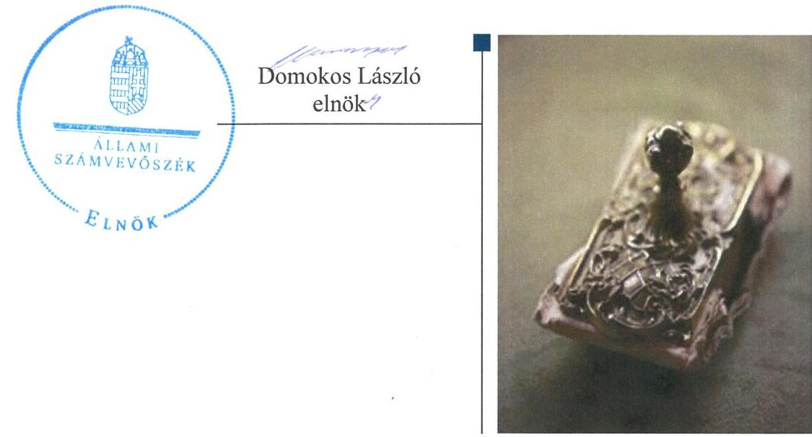

---

# AZ ELLENŐRZÉST FELÜGYELTE:

DR. HORVÁTH MARGIT felügyeleti vezető

## AZ ELLENŐRZÉST VEZETTE ÉS A VÉGREHAJTÁSÁÉRT FELELŐS:

GÁCSER JÓZSEF ellenőrzésvezető

## A PROGRAM ÖSSZEÁLLÍTÁSÁÉRT FELELŐS:

JANIK JÓZSEF LÁSZLÓ osztályvezető

IKTATÓSZÁM: V-0845-181/2016

TÉMASZÁM: 1704

ELLENŐRZÉS-AZONOSÍTÓ SZÁM: V-070710

Jelentéseink az Országgyűlés számítógépes hálózatán és az Interneten a www.asz.hu címen is olvashatóak.

---

# TARTALOMJEGYZÉK 

■ ÖSSZEGZÉS ..... 5
■ AZ ELLENŐRZÉS CÉLJA ..... 7
■ AZ ELLENŐRZÉS TERÜLETE ..... 8
■ AZ ELLENŐRZÉS HÁTTERE, INDOKOLTSÁGA ..... 10
■ FÓKUSZKÉRDÉSEK ..... 11
■ ELLENŐRZÉS HATÓKÖRE ÉS MÓDSZEREI ..... 12
■ MEGÁLLAPÍTÁSOK ..... 14
■ JAVASLATOK ..... 30
■ MELLÉKLETEK ..... 33
I. Sz. melléklet: Értelmező szótár. ..... 33
II. Sz. melléklet: Működési adatok ..... 36
■ FÜGGELÉK: ÉSZREVÉTELEK ..... 37
■ RÖVIDÍTÉSEK JEGYZÉKE ..... 53

---

.

---

# ÖSSZEGZÉS 

Az Állami Számvevőszék a Dunakeszi Közüzemi Nonprofit Kft. távhőszolgáltatási közfeladat ellátását érintő gazdálkodási tevékenysége 2011-2014 közötti szabályszerűségét ellenőrizte.

Megállapította, hogy az Önkormányzat a közfeladat-ellátás megszervezéséről alapvetően szabályszerűen döntött, hiányosság a távhőrendelettel kapcsolatban merült fel. A tulajdonosi jogok gyakorlásában a javadalmazási rendszernél működési hiányosságokat állapítottunk meg. A számviteli szabályozásban és a számviteli szétválasztás tekintetében hiányosságokat tártak fel a számvevők. A Társaság kötelezettségállománya a közfeladat ellátására nem jelentett kockázatot, likviditása folyamatosan biztosított volt.

## Az ellenőrzés társadalmi indokoltsága

Az Állami Számvevőszék Stratégiájában megfogalmazta, hogy a helyi önkormányzatok gazdálkodásában rejlő pénzügyi kockázatok feltárásával, az államháztartáson kívülre nyújtott költségvetési támogatások és ingyenes vagyonjuttatások, valamint az államháztartáson kívül működő közfeladat-ellátó rendszerek ellenőrzéseivel hozzájárul ahhoz, hogy a közpénzeket az államháztartáson kívül működő szervezetek is átlátható, rendezett módon használják fel a közfeladatok szerződésben vállalt ellátása érdekében.

A Magyarországon az intézmény-centrikus közfeladat-ellátás jellemző, de egyre jelentősebb a költségvetésen kívüli feladatellátás térnyerése. Ennek legfontosabb szereplői - a nonprofit szervezetek mellett - az önkormányzati tulajdonú gazdasági társaságok. Az önkormányzatok szervezetalakítási szabadságának következménye, hogy a korábban is vállalati formában működő közszolgáltatások mellett, mind a kötelező, mind az önként vállalt feladatok ellátásában a gazdasági társaságok kiemelt fontosságú szerephez jutottak.

## Főbb megállapítások, következtetések, javaslatok

Az Önkormányzat a közigazgatási területén a távhőszolgáltatás közfeladatának megszervezéséről alapvetően a jogszabályi előírásoknak megfelelően döntött, annak ellátásáról a kizárólagos tulajdonában lévő gazdasági társasága útján gondoskodott. Az Önkormányzat a Tszt. szerinti rendeletalkotási kötelezettségének eleget tett, annak tartalma azonban teljes körűen nem felelt meg az előírásoknak. Az Önkormányzat a távhőrendeletet annak ellenére nem módosította, hogy a hatósági ár bevezetésével ármegállapítási jogköre - a csatlakozási díj kivételével - 2011. április 15. napjával megszűnt.

Az Önkormányzat a tulajdonosi joggyakorlás szabályait a vagyongazdálkodási rendeletben és az alapító okiratban határozta meg, ugyanakkor a tulajdonosi joggyakorlás csak részben volt szabályszerű. Az éves beszámolók elfogadásáról a Képviselő-testület a Ptk. előírásait betartva az FB írásos véleményének birtokában döntött. A Képviselőtestület által jóváhagyott javadalmazási szabályzatban előírtakkal ellentétben prémiumfeladat kiírása nélkül került sor az ügyvezetői prémium kifizetésére. A könyvvizsgálók az éves beszámolókat, egy kivételével hitelesítő záradékkal látták el. A 2013. évi beszámoló korlátozó záradékával kapcsolatos véleményeltérést a tulajdonosi joggyakorló nem szüntette meg. A könyvvizsgálók annak ellenére nyilatkoztak a számviteli szétválasztási szabályok megfelelőségéről, hogy azokat a Társaság belső szabályzataiban nem dolgozta ki.

A Társaság rendelkezett a Számv. tv.-ben előírt szabályzatokkal, azonban azok tartalma teljes körűen nem felelt meg az előírásoknak. A Társaság a számviteli politika a Tszt. előírásaival szemben a számviteli szétválasztás módszereit és elveit nem szabályozta, a vagyonkezelt eszközök és források elkülönített nyilvántartására szabályokat

---

nem határozott meg. Az önköltségszámítási szabályzatban nem volt rögzített, hogy a választható kalkulációs módszerek közül a Társaság melyiket, mely tevékenységekre alkalmazza. A szabályzat nem rögzítette a költségfelosztás szabályait.

A közfeladat-ellátást szolgáló vagyonnal való gazdálkodás a számviteli szétválasztás tekintetében nem felelt meg a jogszabályi előírásoknak. A távhőszolgáltatáshoz használt épület bérbeadása során, a bérleti díjak meghatározásakor nem tartották be az Nvtv. előírásait. A Társaság vagyona az ellenőrzött időszak alatt közel 7,0 milliárd Ft-tal emelkedett, amit a vagyonkezelésbe vett eszközök állománynövekedése, valamint a végrehajtott fejlesztések eredményeztek. A vagyonkezelési konstrukció következményeként a rövid és hosszú lejáratú kötelezettségek állománya tartósan megemelkedett. A Társaság fenntartotta likviditását és pénzügyi stabilitását, jövedelmezősége azonban folyamatosan romlott, a működés veszteségessé vált. A tőkeemelés biztosította azt, hogy a jövedelmezőség romlása nem járt együtt a pénzügyi helyzet megrendülésével. A rendelkezésre álló pénzeszközök 2014. évben közel 850 millió Ft-tal csökkentek. A közfeladat követelésállománya nőtt, a lakosság által határidőre ki nem fizetett távhődíj a behajtási intézkedések és a rezsicsökkentés ellenére, az ellenőrzött időszakban 45,1 millió Ft-tal emelkedett.

A 2012. évtől kezelésbe kapott önkormányzati vagyonelemekre elszámolt visszapótlás a főkönyvi könyvelés adatai szerint nem történt. A vagyonkezelt ingatlanon végzett fejlesztéseket saját tulajdonként aktiválták, mely a vagyonkezelői szerződés előírásaiba ütközött. A szabálytalanul nyilvántartásba vett eszközök mennyiségi leltárfelvételéről sem gondoskodtak.

A Társaságnál a távhőszolgáltatás árbevételeként és a távhőtermelés ráfordításaként számolták el az egyéb tevékenység keretében továbbértékesített fűtőanyagok értékét, így megsértették a Tszt. szétválasztási kötelezettségre vonatkozó előírását.

Az önkormányzati árhatósági időszakban az árképzés nem felelt meg a távhőrendeletben foglalt szabályoknak. A Társaság által 2011. év elején alkalmazott csökkentett távhődíjak mértékét - a távhőrendelet előírásai ellenére átlátható módon nem támasztották alá. Az alapdíj kalkuláció hiányzott, a hődíj összegző kalkulációja alapján pedig nem volt nyomon követhető az árképzési előírások teljesülése. Az egyedi közüzemi szerződések esetében az alacsonyabb díjtétel alkalmazásával kapcsolatban az előzetes tulajdonosi hozzájárulás nem volt dokumentált. A távhőszolgáltatás 2014. évi eredményével összefüggésben a nyereségkorlát feletti rész befizetésére a Társaság az 50/2011. (IX. 30.) NFM rendelet előírásai ellenére nem intézkedett és a befizetési kötelezettség alóli mentesítés érdekében a MEH-hez kérelmet sem terjesztett elő.

---

# AZ ELLENŐRZÉS CÉLJA 

## Az önkormányzatok gazdasági társaságai - Az önkormányzatok tulajdonában lévő gazdasági társaságok közfeladat-ellátását érintő gazdálkodási tevékenysége szabályszerűségének ellenőrzése - Dunakeszi Közüzemi Nonprofit Kft.

Az ellenőrzés célja annak értékelése, hogy az önkormányzat a jogszabályi előírások figyelembevételével döntött-e az ellenőrzésre kerülő közfeladat megszervezéséről; az önkormányzat/tulajdonosi joggyakorló szabályszerűen gyakorolta-e a tulajdonosi jogokat; a gazdasági társaság közfeladat-ellátása bevételeinek, ráfordításainak elszámolása, és vagyongazdálkodási tevékenysége megfelelt-e a jogszabályi, illetve a közszolgáltatási/vagyonkezelési szerződésben foglalt tulajdonosi előírásoknak, azok végrehajtása szabályszerű volt-e.

Értékeltük továbbá, hogy a gazdasági társaság kötelezettségállománya jelent-e kockázatot a működésre, illetve a közfeladat ellátására; valamint hogy a közfeladatok átláthatósága és elszámoltathatósága érdekében biztosítva volt-e a közszolgáltatás díjának megalapozottsága szabályszerű önköltségszámítással.

---

# **AZ ELLENŐRZÉS TERÜLETE**

## **Dunakeszi Város Önkormányzata és a Dunakeszi Közüzemi Nonprofit Kft.**

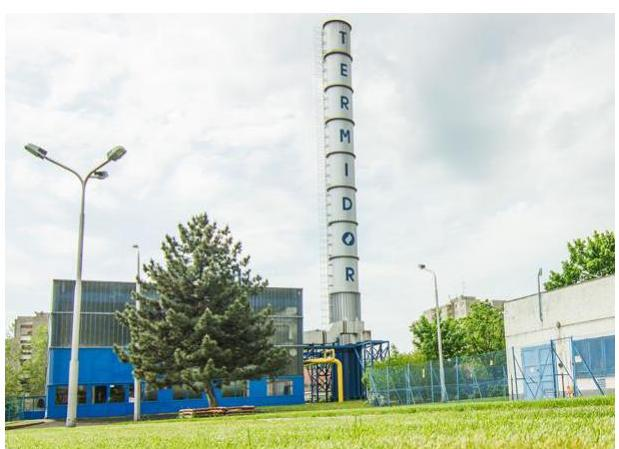

Dunakeszi Város Önkormányzata a Dunakeszi Közüzemi Nonprofit Korlátolt Felelősségű Társaság jogelődjét 1992. július 1-én kelt alapító okirattal hozta létre. A Társaság1 100%-os önkormányzati tulajdonban működött az ellenőrzött időszak alatt. A szintén önkormányzati tulajdonban álló, 1995-től távhőszolgáltatási feladatokat ellátó Termidor Kft. 2011. augusztus 31-én olvadt be a Társaságba.

### **A DUNAKESZI KÖZÜZEMI NONPROFIT KFT.**

alaptevékenysége Dunakeszi közigazgatási területén távhőszolgáltatás biztosítása és városgazdálkodási feladatok ellátása volt az ellenőrzött időszakban. Az Önkormányzat a közfeladat ellátásához szükséges ingó vagyonelemeket apportként – a beolvadt Termidor Kft. útján – biztosította, az ingatlanokat előbb bérleti, majd 2012. november 1-jétől vagyonkezelési szerződés keretében bocsátotta a Társaság rendelkezésére.

A több mint 41 ezer fő állandó lakossal rendelkező Dunakeszin 2014. január 1-jén 17 051 lakás volt található. A Társaság a távhőszolgáltatási tevékenységet két telephelyen, nyolc kazán és 32 hőközpont működtetésével, 2611 lakásnál és 71 egyéb felhasználónál látta el az ellenőrzött időszakban.

A Társaságnál foglalkoztatottak átlagos állományi létszáma az ellenőrzött időszakban – az átvett feladatokkal összefüggésben – közel két és félszeresére nőtt, a 2011. évben 43 fő, a 2014. évben 106 fő volt.

A Társaság 2011-2014 közötti gazdálkodására vonatkozó egyes adatokat az 1. ábra szemlélteti.

1. ábra

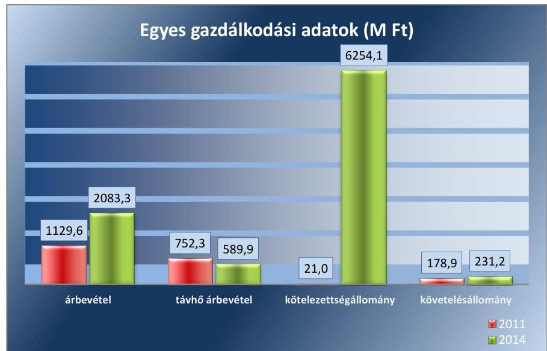

*Forrás: A Társaság 2011. és 2014. évi beszámolói*

---

A távhődíjak az ellenőrzött időszakban végrehajtott rezsicsökkentési intézkedések hatására, fokozatosan csökkentek, melynek következtében a távhőszolgáltatás nettó árbevétele 21,6%-kal, 589,9 millió Ft-ra csökkent. A Társaság nettó árbevétele az önkormányzati tulajdonban lévő ingatlanok vagyonkezelésbe vételéhez kapcsolódóan, 2011-2014. között közel kétszeresére nőtt.

A távhőszolgáltatáshoz kapcsolódó lakossági követelések állománya a rezsicsökkentési előírások végrehajtása ellenére nem csökkent. Ez hozzájárult a teljes követelésállomány 52,3 millió Ft-os növekedéséhez az ellenőrzött időszakban. Az átvett ingatlanvagyon kezeléséhez kapcsolódóan a kötelezettségek állománya 2011-2014 között jelentősen megemelkedett.

Az ellenőrzött időszakban a polgármester² személye nem változott, a 2010. évi helyi önkormányzati választások óta tölti be tisztségét. A 2011-2014. évek között a jegyző személye egy alkalommal változott. A jegyző 2011. november 1-jétől látja el feladatait. Az ellenőrzött időszakban az ügyvezető és a gazdasági vezető személye nem változott. Az ügyvezető 2000. május 1-je óta, a gazdasági vezető 2010. június 15. óta tölti be tisztségét.

---

# AZ ELLENŐRZÉS HÁTTERE, INDOKOLTSÁGA 

## Az önkormányzatok közfeladat-ellátásában egyre jelentősebb a gazdasági társaságokon belüli feladatellátás térnyerése

Az önkormányzati tulajdonú gazdasági társaságok teljes körű ellenőrzésének lehetőségét az ÁSZ. tv. 2011. január 1-jétől hatályos módosítása teremtette meg. A közfeladatot ellátó gazdasági társaságok ellenőrzése kiemelten fontos a vagyon megőrzése, megóvása érdekében, valamint a kormányzati szektor elszámolásaiban megjelenő önkormányzati tulajdonú gazdálkodó szervezetek esetében, amelyekkel szemben alapvető követelmény, hogy gazdálkodásuk, működésük szabályszerű, az általuk szolgáltatott adatok minél megbízhatóbbak legyenek. A közfeladat ellátás költségeinek, ráfordításainak alakulása, színvonala hatással van a lakosság elégedettségére.

A törvényalkotás számára - az észlelt problémák, szabálytalanságok, vagy egyéb nem kívánatos jelenségek felszínre kerülésével - az ellenőrzés megállapításai segítséget nyújthatnak az államháztartáson kívüli közfeladat-ellátás értékeléséhez, jogszabályi keretei pontosításához, átláthatóságot biztosító szabályozásához. Meghatározhatóvá válnak a közfeladat ellátásban részt vevő államháztartáson kívüli szervezeteknek - az önkormányzat költségvetését, pénzügyi helyzetét is befolyásoló - kockázatai, lehetővé válik ezen kockázatok csökkentése. Ellenőrzéseink feltárhatják, hogy az önkormányzat közfeladat-ellátási kötelezettségének szabályszerűen tett-e eleget, a feladatellátáshoz rendelt közvagyon működtetését a tulajdonostól elvárható gondossággal, szabályszerűen szervezte-e meg és a tulajdonosi felügyelete hozzájárult-e a közfeladat-ellátásához. Az ellenőrzés rávilágíthat arra, hogy a gazdasági társaság a közszolgáltatási szerződésben foglaltak betartásával, a közvagyon használatával biztosította-e a szolgáltatás folytatásának feltételeit, a közfeladat ellátását. Ezzel az ellenőrzöttek és a helyi döntéshozók számára visszajelzést ad feladatszervezési, feladat-ellátási kockázataikról, alapot ad a meglévő hibák megszüntetéséhez, a jobb közfeladat-ellátás biztosításához. Fokozza a fegyelmet, igazolja, hogy lejárt a következmények nélküli ellenőrzések időszaka. Az ÁSZ értékteremtő rend kialakításához és megőrzéséhez hozzájáruló tevékenysége pozitív hatással van a szervezetről kialakított összkép formálására.

---

# FÓKUSZKÉRDÉSEK 

1. Az önkormányzat közfeladat megszervezéséről szóló döntése, valamint tulajdonosi joggyakorlása szabályszerű volt-e?
2. A gazdasági társaság vagyongazdálkodása szabályszerű volt-e, kötelezettségállománya jelentett-e kockázatot a működésre, illetve a közfeladat ellátásra?
3. A gazdasági társaságnál az
 ellátott közfeladat bevételei és ráfordításai elszámolása, valamint az önköltségszámítás és árképzés szabályszerű volt-e?

---

# ELLENŐRZÉS HATÓKÖRE ÉS MÓDSZEREI 

## Az ellenőrzés típusa

Megfelelőségi ellenőrzés

## Az ellenőrzött időszak

A 2011. január 1-jétől 2014. december 31-éig terjedő időszak.

## Az ellenőrzés tárgya

A közfeladatot gazdasági társaságokkal ellátó önkormányzatok tulajdonosi joggyakorlása, valamint gazdasági társaságok pénz- és vagyongazdálkodásának szabályozottsága és szabályszerűsége.

Az ellenőrzés kiterjed minden olyan körülményre és adatra, amely az ÁSZ jogszabályban meghatározott feladatainak teljesítéséhez, valamint a program végrehajtása folyamán felmerült újabb összefüggések feltárásához szükséges.

## Az ellenőrzött szervezet

Dunakeszi Város Önkormányzata és a Dunakeszi Közüzemi Nonprofit Korlátolt Felelősségű Társaság

## Az ellenőrzés jogalapja

Az ellenőrzés végrehajtásának jogszabályi alapját az Állami Számvevőszékről szóló 2011. évi LXVI. törvény 5. § (3)-(4)-(5) bekezdései képezték.

## Az ellenőrzés módszerei

Az ellenőrzést a nemzetközi standardokat irányadónak tekintve az ellenőrzési program ellenőrzési kérdései, az ellenőrzött időszakban hatályos jogszabályok, az ellenőrzés szakmai szabályok és módszertanok figyelembe vételével végezzük.

Az ellenőrzés ideje alatt az ellenőrzött szervezettel történő kapcsolattartást az ÁSZ Szervezeti és Működési Szabályzatának vonatkozó előírásai alapján biztosítjuk.

---

Az ellenőrzés a kiválasztott, többségi tulajdonosi jogokat gyakorló önkormányzatra, illetve az ellenőrzésre kijelölt közfeladatot ellátó gazdasági társaság felett tulajdonosi jogokat gyakorló szervezetre és az ellenőrzött közfeladatot ellátó gazdasági társaságra terjed ki. Amennyiben a gazdasági társaságban több önkormányzat együttesen többségi tulajdonos, úgy az ellenőrzést a többségi tulajdonosi jogokat gyakorló önkormányzatnál kell lefolytatni. Az ellenőrzött gazdasági társaságnál, amennyiben az több közfeladatot is ellát, akkor az ellenőrzésre kiválasztott közfeladat-ellátást ellenőrizzük.

Az ellenőrzést a kérdésekre adott válaszok kiértékelésével, valamint a megjelölt adatforrások, a csatolt tanúsítványok felhasználásával, továbbá az adott időszakban hatályos jogszabályok figyelembe vételével kell lefolytatni. Az ellenőrzési kérdések megválaszolásához szükséges bizonyítékok megszerzése a következő ellenőrzési eljárások alkalmazásával történik: megfigyelés, kérdésfeltevés (információkérés), összehasonlítás, valamint elemző eljárás.

A bevételek és ráfordítások elszámolását, valamint a vagyonnyilvántartás területén a szabályszerű működést véletlen mintavétellel ellenőriztük. A jogszabályoknak és a belső előírásoknak megfelelőnek tekintettük az adott területet, amennyiben a minta ellenőrzésének eredménye alapján 95%-os bizonyossággal a teljes sokaságban a hibaarány kisebb volt, mint 10%, nem megfelelőnek értékeltük, ha a hibaarány a 10%-ot meghaladta. Kockázatot, illetve magas kockázatot jeleztünk, amennyiben egy adott terület vonatkozásában a minta alapján a teljes sokaságban nem volt egyértelműen biztosított a jogszabályoknak és a belső szabályzatoknak megfelelő működés. A ráfordítások elszámolására és a vagyonnyilvántartásra vonatkozó véletlen mintavételt kockázati alapú kiválasztással egészítettük ki, amelynek során évente a három legnagyobb összegű tételt választottuk ki.

---

# 1. Az önkormányzat közfeladat megszervezéséről szóló döntése, valamint tulajdonosi joggyakorlása szabályszerű volt-e? 

Összegző megállapítás

Az Önkormányzat a közfeladat ellátás megszervezéséről alapvetően szabályszerűen döntött, hiányosság a távhőrendelettel kapcsolatban merült fel. A tulajdonosi jogok gyakorlása teljes körűen nem felelt meg az előírásoknak. Hiányosság a javadalmazási rendszer működésében jelentkezett.

### 1.1. számú megállapítás

A közfeladat ellátását az Önkormányzat alapvetően szabályszerűen szervezte meg, ugyanakkor a távhőszolgáltatásra vonatkozó rendeletalkotási kötelezettségét - az ármegállapítási jogkör és a díjmeghatározás vonatkozásában - nem szabályszerűen teljesítette.

A Képviselő-testület által a 2011-2014. évekre elfogadott gazdasági program a távhő rendszer fejlesztésére vonatkozóan célkitűzéseket nem határozott meg. Ezzel sérült az Ötv. 91. § (6), valamint 2013. január 1-jétől az Mötv. 116. § (3)-(4) bekezdése, mely szerint az önkormányzatnak a gazdasági programjában kell meghatároznia azokat a célkitűzéseket, amelyek az általa ellátott feladatok biztosítását, fejlesztését szolgálják.

Közép- és hosszú távú vagyongazdálkodási tervvel az Önkormányzat az ellenőrzött időszakban Nvtv. 9. § (1) rendelkezés ellenére nem rendelkezett.

A távhőszolgáltatást igénybevevő fogyasztók ellátásának biztosítása a Tszt. 6. § (1) bekezdése értelmében a területileg illetékes települési önkormányzat kötelező feladata volt. Ennek a kötelezettségének az Önkormányzat a Társaság alapításával eleget tett.

Az Önkormányzat a távhőszolgáltatási feladatok ellátásának feltételeit a közszolgáltatási szerződésben, a távhődíjak megállapításának szabályait a távhőrendeletben szabályozta. A közszolgáltatási szerződés 2012. augusztus 31-én jött létre a Társaság és az Önkormányzat között. A szerződő felek rögzítették a számviteli elkülönítésre, a közfeladat-ellátás ellenőrzésére vonatkozó előírásokat, valamint az ellenőrzésben való együttműködés szabályait.

A Távhőrendelet megalkotásával az Önkormányzat a Tszt. 6. § (2) bekezdésében előírt kötelezettségének eleget tett. A távhőrendelet tartalmazta a Társaság, a felhasználó és a díjfizető közötti jogviszony feltételeit. Meghatározták a díjképzési (alapdíj, hődíj) előírásokat, a távhőszolgáltatási díjak elszámolásának, számlázásának módját.

A távhőrendelet a csatlakozási díj mértékét a Társaság oldaláról szükséges beruházás előkalkulált összköltségében határozta meg.

---

A Tszt. 57/D. § (1) bekezdése értelmében 2011. április 15-étől a miniszter állapítja meg a távhőszolgáltatás díjainak szerkezetét, legmagasabb díjait és azok alkalmazásának időpontját, a csatlakozási díjak kivételével. A központi árszabályozás bevezetésével összefüggésben a távhőrendeletet az Önkormányzat nem módosította. A távhőrendelet a hatósági ár vonatkozásában a Tszt.-vel ellentétes rendelkezést tartalmazott, mivel továbbra is az Önkormányzat ármegállapítási jogkörét rögzítette.

A Társaság a közfeladat-ellátást szolgáló ingó vagyonelemeket a Termidor Kft. beolvadásakor apport formájában vette át, az ingatlanokat bérleti szerződés keretében vette használatba.

Vagyonkezelői szerződést az Önkormányzat 2012. október 26-án kötött a Társasággal az önkormányzati tulajdonú ingatlanvagyon kezelésére. A vagyonkezelői szerződés az Áhsz 29/A. § (1) bekezdésével ellentétesen a vagyonkezelésbe vett eszközök bekerülési értékét nem rögzítette. Az átadás-átvételről felvett jegyzék, mely nem képezte vagyonkezelői szerződés részét már tartalmazta az eszközök nyilvántartási értékeit, ugyanakkor nem jelölte meg, hogy mit kell a Számv. tv. 47. § szerinti bekerülési értéknek tekinteni.

# 1.2. számú megállapítás 

A tulajdonosi joggyakorlás rendjét szabályszerűen alakították ki. A tulajdonosi jogok gyakorlása azonban maradéktalanul nem felelt meg az előírásoknak. A prémiumrendszert nem a javadalmazási szabályzatban megfogalmazott tulajdonosi elvárások szerint működtették.

A Tulajdonosi jogok gyakorlásának rendjét a Képviselőtestület a Gt. 19. §-ban és a Ptk. 3:109. §-ban előírtakkal összhangban az alapító okiratban és a vagyonrendeletben határozta meg. A tulajdonosi jogokat a szabályozásnak megfelelően a Képviselő-testület gyakorolta, az alapító kizárólagos jogkörébe tartozott - többek között - a mérleg megállapítása, pótbefizetések elrendelése, üzletrész felosztása átruházása, tag kizárása, ügyvezető kinevezése.

A Társaság FB-je az ellenőrzött időszakban az alapító okiratban előírtak alapján - a Gt. 34. § (1) bekezdésével összhangban - öt tagból állt. A Gt. 34. § (4) bekezdésében előírtaknak eleget téve az FB elkészítette ügyrendjét. Az FB munkaterve összhangban volt az ügyrendben foglaltakkal. A 2011-2014. évi beszámolókról - a Ptk. 3:120. §. rendelkezésével összhangban - az alapító okirat és az ügyrend előírásának megfelelően az FB írásbeli jelentést készített. Az FB jelentések minden évben rögzítették, hogy jogszabályba, vagy tulajdonosi elvárásba ütköző esemény nem volt tapasztalható.

Az anyagi ösztönzési rendszer szabályait - a Taktv. 5. § (3) bekezdésében foglaltaknak megfelelően - a Képviselő-testület által elfogadott javadalmazási szabályzatban rögzítették. A szabályozás szerint követelményként az üzleti terv fő számainak teljesítése mellett csak olyan feltétel volt meghatározható, amelynek teljesítése a munkakör ellátásán túlmutató, objektíven meghatározható teljesítményt takar.

---

Az ügyvezető részére a 2011. és a 2012. üzleti évre vonatkozóan prémium úgy került kifizetésre, hogy a javadalmazási szabályzat V. fejezetében meghatározottakkal ellentétben prémium kiírás nem történt. A javadalmazási szabályzat IV. fejezetében foglaltak szerint a teljesítménykövetelmények meghatározása, az ügyvezető esetében a tulajdonosi joggyakorló feladata lett volna, az FB véleményezési joggal rendelkezett. A prémium kifizetésekre az FB tagok az éves beszámolóhoz kapcsolódó FB jelentésekben tettek javaslatot, ugyanakkor a prémium kiírás hiányát nem kifogásolták.

Az árképzés szabályait a távhőrendeletben határozta meg az Önkormányzat. Az alap- és a hődíj számításának módszerét a rendelet szövegrésze, az önkormányzati hatósági díjak maximált mértékét az 1. számú melléklete tartalmazta. A díjaktól lefelé, a távhőrendelet keretei között a Társaság eltérhetett, ugyanakkor a Társaság hatáskörébe tartozó díjmódosítás előterjesztésére és annak alátámasztására vonatkozó részletszabályokat nem határozták meg. A távhőrendelet szerint az alapdíjat a távhőszolgáltatás bázis évi költségei, a nyereség, valamint a légtérfogat figyelembevételével kellett meghatározni. A hődíj egységárát az összes földgázfelhasználás összköltségének és távhőrendszer számított hatásfokának hányadosa alapján kellett képezni. A maximált önkormányzati hatósági ár utolsó módosítására 2010. február 2-án került sor.

A Társaság az egyedi közüzemi szerződések esetében a hatósági árnál alacsonyabb díjtétel alkalmazásához - a távhőrendelet 7. § (4) bekezdésében foglalt - előzetes tulajdonosi hozzájárulást nem kért, ezzel az Önkormányzat teljes körűen nem gyakorolhatta tulajdonosi jogait.

Belső ellenőrzést az Önkormányzat az ellenőrzött időszakban a Társaságnál négy alkalommal végzett. A tulajdonosi joggyakorló külön nem rendelkezett a távhőszolgáltatási közfeladat belső ellenőrzése vonatkozásában, azonban a Társaságnál végrehajtott belső ellenőrzések érintették a távhő üzletágat is. Az ellenőrzések tárgya 2011-2014. között az éves beszámolók, a belső kontroll rendszer, valamint az üzemeltetési szerződésekben vállalt kötelezettségek teljesítésének ellenőrzése volt. A belső ellenőrzési jelentések kiemelten a távhőszolgáltatásra vonatkozó javaslatot nem fogalmaztak meg.

A beszámoltatási rendszert az Önkormányzat az előírásoknak megfelelően működtette. A tulajdonosi joggyakorló több adatszolgáltatási és beszámolási kötelezettséget is előírt. A közszolgáltatási szerződés szerint a Társaság köteles volt a működésének eredményét, vagyoni helyzetét is tartalmazó beszámoló elkészítésére. A vagyonkezelői szerződés szerint a vagyonkezelő köteles volt negyedévente - az Önkormányzat által vezetett kataszter nyilvántartáshoz - az értéknövekményt, vagy értékcsökkenést tartalmazó változásjelentő lapokat megküldeni. A közszolgáltatási szerződésben foglaltak betartásáról az éves számviteli beszámoló keretében, valamint a heti rendszerességgel tartott értekezletek alkalmával számolt be a Társaság, az egyeztetésekről ugyanakkor emlékeztető nem készült.

A Társaság 2011-2014. évekről készített éves beszámolóit a Képviselőtestület elfogadta. A testületi tagok a beszámoló elfogadásáról a Gt. 35. § (3) bekezdésének és a Ptk. 3:120. § (2) bekezdésének vonatkozó előírásait betartva, minden évben az FB írásos jelentésének birtokában döntöttek.

Az ellenőrzött időszakban a Társaság működése 2011-2012. évben nyereséges, 2013-2014. évben veszteséges volt. A veszteséget elsődlegesen a vagyonkezelésbe vett ingatlanállományhoz kapcsolódó amortizációs és fenntartási költségek okozták, melyhez 2013. évben a távhőágazat is hozzájárult. A veszteség ellenére a Társaság saját tőkéjének összege két egymást követő lezárt évben nem csökkent a jegyzett tőke meghatározott szintje alá. A veszteségek pótlását és a fejlesztések finanszírozását szolgáló, 2012. évben végrehajtott, 1,5 milliárd Ft összegű alapítói tőkeemelés miatt - a Gt. 51. §-a, valamint a Ptk 3:133. § (2) bekezdésében előírt - tőkepótlási kényszer nem állt elő. A Képviselő-testület az ellenőrzött időszak minden évében az adózott eredmény eredménytartalékba helyezéséről szabályszerűen határozott. A 2011-2012. években az adózott eredmény terhére osztalék kifizetése nem történt.

A mérleg szerinti eredmény összegét a 2. ábra mutatja be.
2. ábra
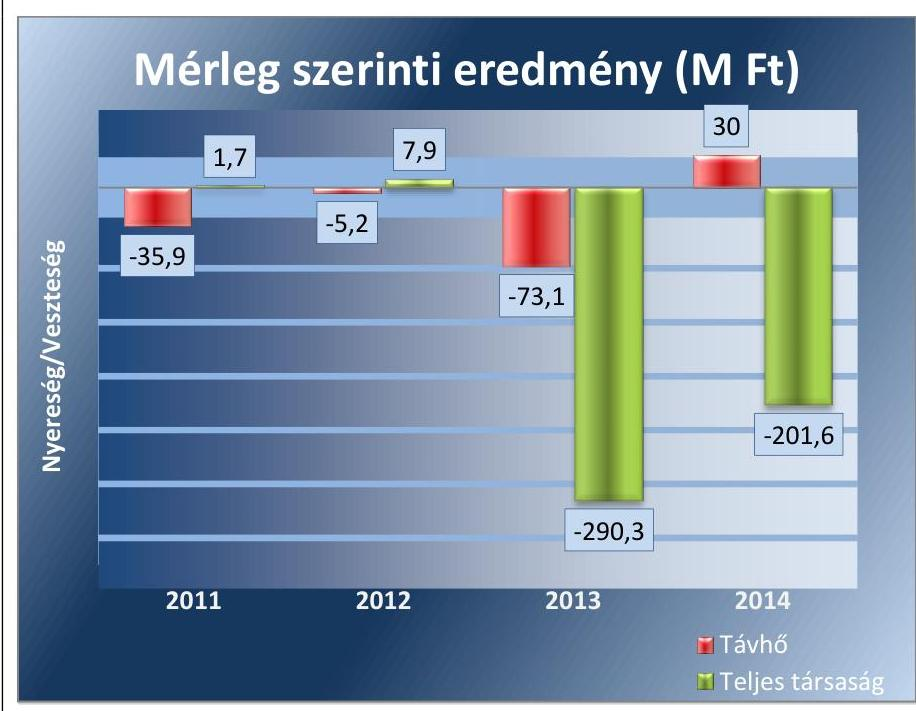

Forrás: A Társaság adatszolgáltatása
A tevékenységi eredménykimutatás adatai szerint a távhőágazat mérleg szerinti eredménye az ellenőrzött időszakban a Társaság eredményességétől eltérően alakult.
 A közfeladat 2011-2013. között folyamatosan veszteséges, 2014. évben nyereséges volt. A 2014. évi pozitív eredmény mögött a tartósan alacsony nyersanyagárak, az előző évekhez viszonyítva magasabb távhőtámogatás, a műszaki technológia változása és az ellenőrzött időszakban végrehajtott fejlesztések álltak.

Az Önkormányzatnak nem volt a Társaság kötelezettségvállalásához kapcsolódó garancia-, illetve kezességvállalása.

---

# 2. A gazdasági társaság vagyongazdálkodása szabályszerű volt-e, kötelezettségállománya jelentett-e kockázatot a működésre, illetve a közfeladat ellátásra? 

Összegző megállapítás

A gazdálkodási rendet meghatározó szabályzatok részben feleltek meg a jogszabályi előírásoknak. A könyvvizsgálók annak ellenére nyilatkoztak a szétválasztási szabályok megfelelőségéről, hogy azokat a Társaság nem dolgozta ki. A vagyongazdálkodás nem volt szabályszerű. A kötelezettségállomány nem jelentett kockázatot a közfeladat ellátására, a Társaság likviditása folyamatosan biztosított volt, melyhez nagymértékben hozzájárult a tulajdonosi tőkeemelés.
2.1. számú megállapítás

A Társaság az előírt szabályzatokkal - 2011. január 1. - augusztus 31. időszakra vonatkozó önköltségszámítási szabályzat kivételével - rendelkezett, ugyanakkor azok az előírásoknak összességében nem feleltek meg. A gazdálkodási rendet meghatározó szabályzatok egymásnak ellentmondóak és hiányosak voltak, a számviteli szétválasztás szabályait nem határozták meg.

Az üzleti terveket a Társaság az ellenőrzött időszakban elkészítette, melyeket a Képviselő-testület határozattal fogadott el. A gazdálkodási rendet meghatározó szabályzatok - a 2011. január 1. - augusztus 31. időszakra vonatkozó önköltségszámítási szabályzat ${ }^{22}$ kivételével - rendelkezésre álltak, melyek azonban teljes körűen nem feleltek meg az előírásoknak.

A Társaság a Számv. tv. 14. § (3)-(4) bekezdésében előírtaknak megfelelően számviteli politikáját ${ }_{1}{ }^{23} 2^{24}{ }_{2}{ }^{25}$ elkészítette. A Számv. tv. ${ }^{26}$ 14. § (5) bekezdés a-b) és c) pontjában rögzített előírásokkal összhangban leltározási${ }_{1}{ }^{27}{ }_{2}{ }^{28}{ }_{2}{ }^{29}$, értékelési- ${ }_{1}{ }^{30}{ }_{2}{ }^{31}$ és pénzkezelési szabályzat ${ }_{3}{ }^{32}{ }_{2}{ }^{33}{ }_{3}{ }^{34}{ }_{4}{ }^{35}$-tal rendelkezett.

A számviteli politika ${ }_{2,3}$-ban a Számv. tv. 14. § (3) és (11) bekezdésben, a közszolgáltatási szerződés 6.1. c) pontjában foglaltakkal ellentétesen a Számv. tv. végrehajtásának módszereit, és eszközeit teljes körűen nem határozták meg, a belső szabályzatokon a jogszabályváltozásokat nem vezették át:
a Tszt. 2012. január 1-től hatályos 18/A. § (1)-(2) bekezdései ellenére az egyes tevékenységek átláthatóságát, diszkriminációmentességét biztosító, keresztfinanszírozást és versenytorzítást kizáró számviteli szétválasztási szabályokat nem határozták meg,
a Számv. tv. 161/A. § (1) és a Tszt. 18/A. § (3) bekezdéseiben foglaltakkal szemben a távhőszolgáltatás és távhőtermelés önálló mérlegének és eredménykimutatásának kiegészítő mellékletben szerepeltett adatai alátámasztására is alkalmas könyvvezetési szabályokat nem határozták meg;
a Számv. tv. 161/A. § (2) ellenére a számlarend1_2 vagy más belső számviteli szabályzat nem tartalmazott a könyvviteli nyilvántartás részletezésére vonatkozó olyan előírást, amely - a 2012. január 1-től

---

hatályos - Tszt. 18/A. § (2) bekezdéseiben foglalt elkülönült nyilvántartás vezetési kötelezettség kereteit meghatározta volna;
$\longrightarrow$ a Számv. tv. 161/A. § (2) és az Mötv. ${ }^{36}$ 109. § (7) bekezdéseiben, valamint a vagyonkezelési szerződés 4.10. pontjában foglaltakkal szemben a vagyonkezelt eszközök és források elkülönített nyilvántartására belső szabályokat nem határozták meg.
A számviteli politika ${ }_{1,2,3}$ és az értékelési szabályzat ${ }_{1,2}$ egymásnak ellentmondó szabályokat tartalmazott:
$\longrightarrow$ a számviteli politika ${ }_{1,2,3}$ az értékhelyesbítés elszámolási lehetőségét kizárta, míg az értékelési szabályzat ${ }_{1,2}$ meghatározta azon eszközök körét, amelyre az értékhelyesbítést alkalmazni kellett.
A Társaság a Számv. tv. 14. § (5) bekezdésének c) pontjával ellentétesen az önköltségszámítás rendjére vonatkozó belső szabályzattal 2011. január 1. - augusztus 31. között nem rendelkezett. Annak ellenére, hogy elérte a Számv. tv. 14. § (7) bekezdésében foglalt szabályzat készítési kötelezettség értékhatárát.

A Társaság 2011 szeptemberétől hatályos önköltségszámítási szabályzata a Számv. tv. 14. § (7) bekezdésében foglaltak ellenére nem volt alkalmas a végzett szolgáltatások - Számv tv. 51. § (2) szerinti - önköltségének utókalkuláció keretében történő meghatározására. A szabályzat jellemzően definíciókat tartalmazott, felsorolta a kalkulációs módszerek típusait, a kalkulációs egységeket, de nem határozta meg, hogy a Társaság melyik kalkulációs módszert választja, valamint mely tevékenységekre alkalmazza. A szabályozás során kalkulációs egységként nem jelölték meg a távhőágazatot, ezen belül a hőtermelést és hőszolgáltatást. Továbbá nem határozták meg az általános költségek felosztásának szabályait és a vetítési alapokat sem. Az önköltségszámítási szabályzat az Szt. 14.§ (3) bekezdésében foglaltakkal szemben nem tartalmazta az önköltség utókalkuláció keretében történő meghatározásának - a távhőszolgáltatás vonatkozásában gyakorlatban alkalmazható - módszerét, eszközeit.

Az önköltségszámítási szabályzat készítésénél nem vették figyelembe a Tszt. 57. § (2), (3) bekezdéseiben foglaltak rendelkezéseket, valamint a Ámt. ${ }^{37}$ 8.§ (1), (3) bekezdéseiben előírtakat. A szabályzat rendelkezései nem voltak alkalmasak a szolgáltatási-, csatlakozási díjban érvényesített költségek indokoltságának, a szükséges nyereség biztosításának és a legkisebb költség elv alkalmazásának igazolására sem.

Üzletszabályzatát a Társaság elkészítette, mely tartalmazta a Tszt. ${ }^{38}$ 3. § v) pontjában foglaltak megfelelő elemeket.
2.2. számú megállapítás

A Társaság vagyongazdálkodása a jogszabályi rendelkezéseknek és a belső előírásoknak részben felelt meg. A tevékenységi mérlegét a vagyonkezelt eszközök vonatkozásában nem a jogszabályi előírások szerint állította össze. A vagyonkezelt eszközök hasznosítása során maradéktalanul nem tartották be az Nvtv. és a vagyonrendelet előírásait.

A számviteli nyilvántartási rendszer a Társaság vagyonának, és a vagyon változásának nyilvántartására összességé-

---

ben alkalmas volt, az a Számviteli politika ${ }_{1,2,3}$ előírásainak megfelelt. Ugyanakkor a Tszt. 18/A.§ (4) bekezdésében foglaltakkal szemben nem biztosította a közfeladat-ellátást szolgáló eszközök elkülönítésének feltételeit.

A tulajdonos Önkormányzat a közfeladatok ellátásához szükséges ingatlan vagyont 2012. november 1-jétől vagyonkezelésbe adta a Társaság részére. A Társaság a 2012. és a 2014. években a távhőszolgáltatási tevékenységi mérlegét úgy készítette el, hogy a vagyonkezelésbe vett eszközöket abban nem szerepeltette. A 2013. évben a vagyonkezelésbe vett ingatlanok - a Számv. tv. 42. § (5) bekezdésében foglaltaktól eltérően - a hosszú lejáratú kötelezettségek helyett a rövid lejáratú között kerültek kimutatásra a közfeladat tevékenységi mérlegében. A Társaság a Tszt. 18/A. § (3) bekezdés c) pontjában foglalt beszámolási kötelezettségét 2012 és 2014 években nem az előírások szerint teljesítette, mivel a kiegészítő mellékletben a távhőszolgáltatási tevékenységet -a vagyonkezelt eszközök vonatkozásában - nem úgy mutatta be, mintha azt önálló vállalkozás keretében végezte volna. A vagyonkezelt eszközöket ugyanakkor 2012-2014. között a Társaság teljes tevékenységére vonatkozó mérlegében folyamatosan szerepeltették.

A tárgyi eszköz kartonok alapján megállapítható, hogy a vagyonkezelt eszközök bekerülési értékének az átadási jegyzékben szereplő bruttó értéket tekintették, mivel a nyilvántartásba a bruttó érték és az értékcsökkenés is felvezetésre került.

# A vagyonkezelésbe vett eszközöknél az értékcsökkenés elszámolása megfelelt a Számv. 

tv. 52. § (1) bekezdésének. A kezelt vagyon után elszámolt értékcsökkenést az átadási jegyzékben szereplő bruttó érték felosztásával határozták meg, maradványérték figyelembevétele nélkül.

A könyvvizsgáló ${ }^{39}$ a 2013. évi beszámolót korlátozott véleménnyel látta el, mivel a vagyonkezelésbe vett eszközök értékcsökkenési leírásának megállapításához szükséges - bekerülési értéket meghatározó - dokumentumok nem álltak teljeskörűen rendelkezésre.

A Társaság a vagyonkezelésbe vett eszközöket az ellenőrzött időszakban nem idegenítette el, az ingatlanokon osztott tulajdont nem létesített. A Dunakeszi Szent István utca 1. szám alatti ingatlanra 2013. évben, pályázati biztosítékként jelzálogjog került alapításra. A Képviselő-testület a 263/2011. (X. 27.) számú határozatában nyilatkozott arról, hogy a Társaság által benyújtott KEOP pályázatban vállalt kötelezettségeket ismeri. 2014. évben a Társaság Tallér utcai fűtőműjéhez tartozó épületek korszerűsítésére került sor. A Társaság - Képviselő-testület által elfogadott - 2014. évi üzleti terve tartalmazta a fejlesztési elképzeléseket. Ezzel eleget tettek a vagyonkezelői szerződés 4.7. pontjában előírt előzetes tulajdonosi hozzájárulásra vonatkozó előírásnak.

2013-ban az Önkormányzat tulajdonában, a Társaság kezelésében lévő egyik ingatlan nem közfeladat ellátására - bérleti díj felszámítása nélkül történő bérbe adásával sérült a Nvtv. ${ }^{40} 11. § (13) bekezdése.

A leltározási feladatok végrehajtása az ellenőrzött időszakban nem volt teljes körű. A leltározási feladatokat minden évben

---

dokumentáltan végrehajtották, ugyanakkor az ingatlanok és műszaki berendezések esetében - a Számv. tv. 69. § (3) bekezdésekben foglaltak ellenére - nem történt mennyiségi felvétel. A saját eszközök között elszámolt - uniós forrás terhére a 2012. és a 2014. évben végrehajtott távhőhálózatot érintő aktivált fejlesztések mennyiségi felvételéről leltározási dokumentumok nem készültek.

A kezelt ingatlanok leltározását az Önkormányzat végezte. A leltározáshoz kapcsolódó adatszolgáltatás a vagyonkezelői szerződés és a közszolgáltatási szerződés alapján megtörtént.

A Társaság beszámolóinak főbb mérlegadatait az 1. táblázat szemlélteti.

|  1. táblázat |  |  |  |  |   |
| --- | --- | --- | --- | --- | --- |
|  DUNAKESZI KÖZÜZEMI NONPROFIT KFT. FŐBB MÉRLEG ADATAI (MILLIÓ FORINT) |  |  |  |  |   |
|  Megnevezés | 2011.01.01. | 2011.12.31. | 2012.12.31. | 2013.12.31. | 2014.12.31.  |
|  I. Befektetett eszközök | 22,4 | 108,3 | 1560,9 | 5582,7 | 7005,3  |
|  - ebből: Tárgyi eszközök | 22,3 | 106,4 | 1559,3 | 5570,0 | 6964,6  |
|  II. Forgóeszközök | 141,7 | 333,7 | 1691,3 | 2215,0 | 658,9  |
|  - ebből: Követelések | 34,6 | 178,9 | 173,7 | 841,1 | 231,2  |
|  III. Aktív időbeli elhatárolások | 42,6 | 103,7 | 139,2 | 123,7 | 167,2  |
|  Eszközök összesen | 206,7 | 545,7 | 3391,4 | 7921,4 | 7831,4  |
|  IV. Saját tőke | 172,3 | 408,1 | 416,0 | 2225,7 | 1425,7  |
|  - ebből: Jegyzett tőke | 29,5 | 48,4 | 48,4 | 1500,0 | 1500,0  |
|  - ebből Mérleg szerinti eredmény | 21,3 | 1,7 | 7,9 | -290,3 | -201,6  |
|  V. Céltartalékok | - | - | - | 100,1 | 78,5  |
|  VI. Kötelezettségek | 29,0 | 21,0 | 2964,8 | 5542,9 | 6254,1  |
|  VII. Passzív időbeli elhatárolások | 5,4 | 116,6 | 10,6 | 52,7 | 73,1  |
|  Források összesen | 206,7 | 545,7 | 3391,4 | 7921,4 | 7831,4  |

A Társaság mérlegtételeinek alakulását alapvetően az önkormányzati ingatlanok vagyonkezelésbe vétele határozta meg. A kezelésbe vett vagyont a Számv. tv. 23. § (2) bekezdésének megfelelően rendeltetésük szerint az eszközök között, illetőleg a Számv. tv. 42. § (5) bekezdése alapján a távhőszolgáltatás tevékenységi mérlegeiben szereplő hibáktól eltekintve - az egyéb hosszú lejáratú kötelezettségként a források között mutatták ki. A befektetett eszközök 2011. január 1-jén az összes eszközérték 10,8%-át jelentették, az arány - az ingatlanok kezelésbe vétele, továbbá az aktivált beruházások hatására - 2014 végére 89,5%-ra nőtt. A forgóeszközök részesedése ezzel párhuzamosan 60,1 százalékponttal csökkent. A követelésállomány időszakos 2013.
 évi növekményét könyveléstechnikai sajátosság okozta. A jóváhagyott tulajdonosi tőkeemelés ki nem fizetett része a kifizetés megtörténtéig követelésként került nyilvántartásba vételre. Ez az összeg a tőkeemelés mértékének véglegesítését, illetve a tranzakció lezárását követően, 2014. évben törlésre került. A vagyonkezelési konstrukcióból eredően a saját tőke összes forráson belüli részaránya 2011. január 1-jei 83,4\% -ról - a 1,5 milliárd Ft tőkeemelés ellenére - a 2014. évre 18,2\%-ra csökkent. A részarány csökkenéséhez a vagyonkezelési konstrukció mellett a tartósan veszteséges üzletmenet is hozzájárult. A vagyonkezelt eszközök nyilvántartásba vételével a hosszú lejáratú kötelezettségek összes forráson belüli aránya jelentősen növekedett, az időszak végén 79,9\% volt.

---

### 2.3. számú megállapítás

A kötelezettségek állománya nem jelentett kockázatot a közfeladat ellátására és a működésre. A 2013., 2014. évi veszteségek ellenére a Társaság likviditása biztosított volt, melyhez nagymértékben hozzájárult a tulajdonos tőkeemelése.

Az ellenőrzött időszak elején realizált pozitív mérleg szerinti eredmény az időszak végére negatívvá vált. A vagyonkezelésbe vett eszközök fenntartásának és fejlesztésének kötelezettsége a Társaságot terhelte. Az amortizáció szintén a Társaság költségei között jelentkezett. A vagyonkezelés költségeinek - tulajdonos Önkormányzat részéről történő - megtérítéséről a vagyonkezelői szerződés nem rendelkezett, így a feladat rendszeres finanszírozása nem volt megoldott.

Az Önkormányzat 2013. évben 1,5 milliárd Ft összegű tőkeemelést hajtott végre, mely hozzájárult a Társaság likviditásának és pénzügyi egyensúlyának fenntartásához, jövedelmezősége azonban folyamatosan romlott. A tőkeemelés biztosította azt, hogy a jövedelmezőség romlása nem járt együtt a pénzügyi helyzet megrendülésével. A veszteségek pótlása és a fejlesztések finanszírozása 2014. évben 935,0 millió Ft-tal csökkentette a Társaság tőkeemelésből származó pénzeszközeit.

A kötelezettségállomány növekedése - a tőkeemelés pozitív következményeire figyelemmel - nem jelentett kockázatot a közfeladat ellátására.

Az eladósodás mértéke, szerkezete nem jelentett kockázatot a Társaság működésére. Az adósság-mutatók ellenőrzött időszakon belüli alakulását az 2. táblázat részletezi. A mutatók értékeit a létrehozott vagyonkezelési rendszer torzította.

A mutatók a 2011. évben a Társaság alacsony eladósodottságát jelezték. A kötelezettség forrásokhoz viszonyított aránya alacsony volt. A saját tőke értéke jóval meghaladta a befektetett eszközök értékét, a tartós eszközök saját forrásokból kerültek finanszírozásra, a nettó forgótőke pozitív volt.

Az eladósodottsági mutató értéke 2012. évtől kedvezőtlen képet mutatott, az idegen tőke összes forráson belüli aránya meghaladta a kritikus 0,6-os értéket. A nettó eladósodottság mutató értékének változását is a vagyonkezelési konstrukció határozta meg, 2012. évtől a kintlévőségek már nem fedezték a kötelezettségek összegét. Az adósságfedezeti mutató értéke az ingatlanok kezelésbe vételével csökkent. 2011. évben még jelentősen meghaladta az elvárt, 2 Ft körüli értéket. 2012-2014. között azonban 1,0 Ft adósságra már csak 1,1-1,41 Ft vagyon jutott.

A 2013. évben a mutatók az előző évhez képest a tőkeemelés hatására javulást jeleztek, ugyanakkor 2014-re ismét romlottak. A saját tőke állományát a 2012. évben elindított, 2013-ban bejegyzett tőkeemelés időszakosan megemelte. A 2013-2014. években, az alapvetően vagyonkezelési tevékenységből származó veszteségek azonban közel 500,0 millió Ft-tal csökkentették a saját tőke értékét.

---

| 2. táblázat |  |  |  |  |  |
| :--: | :--: | :--: | :--: | :--: | :--: |
| ADÓSSÁG MUTATÓK ALAKULÁSA |  |  |  |  |  |
| Mutató | Referen-   cia | 2011 | 2012 | 2013 | 2014 |
| adósságfedezeti mu-   tató | 2,0 | 21,06 | 1,10 | 1,41 | 1,23 |
| nettó eladósodott-   sági mutató | $<0$ | $-0,39$ | 6,71 | 2,11 | 4,22 |
| eladósodottság mér-   téke | $<1$ | 0,05 | 7,13 | 2,49 | 4,39 |
| eladósodottsági mu-   tató (tőkeáttétel) | $<0,6$ | 0,04 | 0,87 | 0,70 | 0,80 |

Forrás: A Társaság adatszolgáltatása
HOSSZÚ LEJÁRATÚ KÖTELEZETTSÉGGEL a Társaság a távhőszolgáltatás tekintetében kizárólag a vagyonkezeléssel kapcsolatban rendelkezett, ezen kötelezettségeknek - a vagyonkezelés jellegéből adódóan - nincs törlesztő részlete.

A RÖVID LEJÁRATÚ KÖTELEZETTSÉGEK jelentős részét a szállítókkal szembeni tartozások képezték. A 2012. évi időszakos emelkedés a még be nem jegyzett tőkeemelés számviteli elszámolásából adódott. A távhőszolgáltatással kapcsolatban felmerült szállítói kötelezettségeinek a Társaság az ellenőrzött időszakban folyamatosan eleget tett.

A hosszú lejáratú kötelezettségek valamint a rövid lejáratú kötelezettségek alakulását, valamint azon belül a szállítói állomány alakulását a 3. táblázat mutatja be.
3. táblázat

A KÖTELEZETTSÉGEK ALAKULÁSA (M FT)

| Megnevezés | 2011 | 2012 | 2013 | 2014 |
| :--: | :--: | :--: | :--: | :--: |
| II. HOSSZÚ LEJÁRATÚ KÖTELEZETTSÉGEK | 0,7 | 1319,4 | 5316,3 | 6043,5 |
| III. RÖVID LEJÁRATÚ KÖTELEZETTSÉGEK | 20,3 | 1645,4 | 226,6 | 210,6 |
| ebből szállítók | 3,9 | 120,0 | 167,6 | 167,8 |

A könyvvizsgálók annak ellenére nyilatkoztak a szétválasztási szabályok megfelelőségéről, hogy azokat a Társaság nem dolgozta ki. A tulajdonos felé történő évközi adatszolgáltatás nem az előírt határidőben valósult meg.

AZ ÉVES BESZÁMOLÓKAT a Társaság a Számv. tv. 19. § (1) bekezdésében előírt tartalommal elkészítette, azokat az ügyvezető a Képviselő-testület elé terjesztette. Az FB az éves beszámolókról a Gt. 35. § (3) bekezdése, valamint a Ptk. 3:120. § (2) bekezdése előírásának megfelelően rendelkezésre bocsátotta írásos jelentését.

A 2011-2014. évi beszámolók elfogadásáról a Képviselő-testület minden évben az FB határozatának és a könyvvizsgáló írásos jelentésének ismeretében döntött. Az éves beszámolók letétbe helyezése a Számv. tv. 153. § (1) bekezdésben előírt határidőben megtörtént.

---

A KÖNYVVIZSGÁLÓK az éves beszámolókat - 2013. év kivételével - hitelesítő záradékkal látták el. A Társaság által elszámolt értékcsökkenési leírás összegének helyességéről a könyvvizsgáló nem tudott véleményt alkotni, mivel a vagyonkezelésbe vett eszközök értékcsökkenési leírásának megállapításához szükséges - a bekerülési értéket tartalmazó - dokumentumok teljes körűen nem álltak rendelkezésre. A hiányosságot a könyvvizsgáló korlátozó záradékban kifogásolta. A korlátozó záradékkal összefüggésben a tulajdonosi joggyakorló intézkedést nem tett, a véleményeltérést nem szűntette meg.

A 2012-2014. évekre vonatkozóan a könyvvizsgálói jelentések tartalmazták a Tszt. 18/B. § (1) bekezdése szerinti igazolást. A könyvvizsgálók jelentéseikben annak ellenére nyilatkoztak a számviteli szétválasztási szabályok megfelelősségéről, hogy a Társaság a keresztfinanszírozás-mentességet biztosító előírásokat a belső szabályzatokban nem dolgozta ki.

Az FB és a könyvvizsgáló a Gt. 35.§ (4), 44.§ (2) bekezdéseiben rögzített jogával nem élt, a közvagyon védelme, illetve más okból a Képviselő-testület összehívását nem kezdeményezte.

A Társaságnak az ellenőrzött időszakban az SzmSz$_{1}^{41}.^{42}$, a közszolgáltatási- és vagyonkezelői szerződés, valamint az Önkormányzat vagyonkezelési szabályzata alapján adatszolgáltatási kötelezettsége keletkezett. A Társaság kötelezettségeinek eleget tett, a vagyonnövekményre és az értékcsökkenésre vonatkozó adatszolgáltatást a Társaság negyedévente elkészítette. A vagyonkezelői szerződés 4.6. pontjában rögzített határidőt azonban a Társaság nem tartotta be, az adatszolgáltatást jellemzően 4-5 napos késedelemmel teljesítette, a 2014. III. negyedévi adatokat azonban 73 nap csúszással küldte meg.

A Társaság az Info tv. $^{43}$ 24. § (3) bekezdésében előírt adatvédelmi és adatbiztonsági szabályzat készítési kötelezettségének eleget tett. A 2013. december 4-től hatályos adatkezelési szabályzat $^{44}$ azonban az akkor már hatálytalan Avtv. $^{45}$ rendelkezésein alapult. Az adatkezelési szabályzat a Társaság alkalmazottainak és ügyfeleinek bizonyos adataira, ezek nyilvántartására terjedt ki. A Társaság informatikai biztonsági szabályzata $^{46}$ az Info tv. előírásainak megfelelően szabályozta a belső adatvédelmi felelős feladatkörét. Az Info tv. 30. § (6) bekezdés, valamint az Info. tv. 35. § (1) és (3) bekezdéseiben foglaltakkal szemben a közérdekű adatok megismerésére irányuló igények teljesítésének rendjéről és a közzétételi kötelezettség szabályairól szabályzatban vagy más belső irányítási eszközben nem rendelkeztek.

A 2011. évben hatályos Avtv. 31/A. § (1) bekezdése, valamint a 2012. január 1-jétől hatályos Info tv. 24. § (1) bekezdésében foglaltak szerint a közüzemi szolgáltatónál belső adatvédelmi felelőst kell kinevezni, amely kötelezettségének a Társaság eleget tett.

---

# 3. A gazdasági társaságnál az ellátott közfeladat bevételei és ráfordításai elszámolása, valamint az önköltségszámítás és árképzés szabályszerű volt-e? 

Összegző megállapítás

A bevételek és a költségek, ráfordítások közfeladat-ellátással kapcsolatos elkülönítése, elszámolása nem volt megfelelő. A Társaság önköltségszámítást nem végzett, árképzése nem volt szabályszerű.
3.1. számú megállapítás

A távhőszolgáltatási bevételek és ráfordítások elszámolása nem volt megfelelő. Az értékcsökkenés elszámolása - az immateriális javak elszámolása kivételével - szabályszerű volt. A közfeladat hátralékos követelésállománya a behajtási intézkedések ellenére nőtt. A nyereségkorlát feletti eredményhez kapcsolódó befizetési kötelezettséget a Társaság nem teljesítette és az alóli mentesítési kérelmet sem terjesztett elő.

A Társaság az ellenőrzött időszakban a távhőszolgáltatási tevékenység mellett egyéb közfeladatokat is ellátott, ezért fennállt a bevételek és ráfordítások elkülönítésének kötelezettsége. Az ágazati előírásokkal szemben a távhőszolgáltatási bevételek, közvetlen költségek elkülönítése és a közvetett költségek felosztása szabályozatlanul és szabálytalanul történt.

A Tszt. 18/A. § (2) bekezdésében foglalt előírások ellenére a Társaság nem dolgozott ki számviteli szétválasztási szabályokat és az egyes tevékenységekre nem vezetett olyan elkülönült nyilvántartást, amely teljes körűen biztosította volna az egyes tevékenységek átláthatóságát, illetve kizárta volna a keresztfinanszírozást és a versenytorzítást.

A Társaság a Tszt. 18/A. § (3) bekezdés b) pontja szerinti - a közfeladat településenkénti bemutatására vonatkozó - kötelezettsége nem állt fenn, mivel csak Dunakeszi közigazgatási területén végzett távhőszolgáltatást. A Tszt. 18/A. § (3) bekezdés a) pontjában rögzített - telephelyenkénti bemutatására vonatkozó - előírásnak a kazánházankénti bontással eleget tett. Ennek ellenére a - Tszt. 18/A. § (3) bekezdésben rögzített - közfeladatokra vonatkozó szétválasztási kötelezettségét a bevételek, költségek és ráfordítások elszámolása során nem megfelelően teljesítette.

A Társaság ellenőrzött időszakban realizált bevételeit, elszámolt ráfordításait és tevékenységének eredményét a 4. táblázat szemlélteti:
4. táblázat

A TÁRSASÁG BEVÉTELEI, RÁFORDÍTÁSAI, EREDMÉNYE (MILLIÓ FT)

| Megnevezés | 2011 | 2012 | 2013 | 2014 |
| :-- | :--: | :--: | :--: | :--: |
| Összes bevétel | 628,1 | 1174,8 | 1458,2 | 2341,3 |
| Összes ráfordítás | 625,3 | 1162,7 | 1746,0 | 2542,9 |
| Adózás előtti eredmény | 2,8 | 12,1 | $-287,8$ | $-201,6$ |

A BEVÉTELEK ELSZÁMOLÁSA nem volt megfelelő. A bevételek főkönyvi számlákon történő elkülönítése mellett, az egyes tevékenységhez kapcsolódóan munkaszámot is alkalmazott. A beszerzett és változatlan formában továbbértékesített földgázt azonban nem egyéb tevékenység bevételeként, hanem a távhőszolgáltatás árbevételeként számolta el és a tevékenységi eredmény-kimutatásban is ennek megfelelően szerepeltette. Ezzel a Társaság nem tett eleget a Tszt. 18/A. § (2) bekezdésében, valamint az 51/2011. (IX. 30.) NFM rendelet $^{47}$ 7. § (2) bekezdésében rögzített elkülönített elszámolási kötelezettségének.

# A KÖLTSÉGEK ÉS RÁFORDÍTÁSOK ELSZÁMOLÁSA nem volt megfelelő. A Társaság a költségeket költségnemekre számolta el, ezzel egyidejűleg munkaszámot is alkalmazott. A legnagyobb összegű tételek a gázbeszerzésekhez kapcsolódtak. A beszerzések szerződéssel szabályszerűen alátámasztottak voltak. A termeléshez felhasznált és változatlan formában továbbértékesített földgázt azonban a főkönyvben, illetve
 a tevékenységi eredmény-kimutatásban nem különítették el. A továbbértékesített nyersanyag bekerülési költsége, nem egyéb tevékenység költségeként, hanem a távhőtermelés anyagköltségei között szerepelt. Ezzel a Társaság nem tett eleget a Tszt. 18/A. § (2) bekezdésében, valamint az 51/2011. (IX. 30.) NFM rendelet 7. § (2) bekezdésében rögzített elkülönített elszámolási kötelezettségének. 

A fejlesztések elszámolása, nyilvántartása az ellenőrzött időszakban nem volt megfelelő. A Társaság a vagyonkezelésbe vett Tallér utcai kazánházi épület szigetelését, nyílászárók beszerelését, villámhárító felszerelését hajtotta végre saját forrásból. A felújítás 21,3 millió Ft értékét a Társaság saját tulajdonú eszközei között aktiválta 2014. évben. A vagyonnövekmény - a vagyonkezelői szerződés 4.7. pontjába ütközően - a Társaság nyilvántartásában nem vagyonkezelt eszközként, hanem saját tulajdonként szerepelt, azaz nem került át az Önkormányzat tulajdonába, illetve nem került vagyonkezelésbe adásra.

A 2012. és 2014. évben, uniós forrás terhére végrehajtott távhőhálózati fejlesztések nyilvántartása - a leltározási dokumentáció hiánya miatt - nem volt megfelelő.

Jelentősebb fejlesztés a műszaki berendezések esetében a Tallér úti fűtés korszerűsítése volt, mely KEOP pályázat keretében 2012-ben 92,5 millió Ft és 2014. évben 286,2 millió Ft összegben valósult meg. A Társaság 2014. évben a távhő üzletágban összesen 307,4 millió Ft beruházást eszközölt.

A Társaság 2011-ben a vagyonkezelésbe vett ingatlannal nem rendelkezett, a működést szolgáló épületeket, építményeket bérleti szerződés keretében használta. 2012. évtől kezelésbe kapott önkormányzati vagyonelemekre elszámolt visszapótlás a főkönyvi könyvelés adatai szerint nem történt.

Az értékcsökkenés elszámolása az ellenőrzött időszakban a kiválasztott mintatételek alapján a jogszabályoknak és belső szabályozásnak nem felelt meg. Az immateriális javak esetében 2011. augusztus 31-ig az értékcsökkenés elszámolásra került, 2011. szeptember 1. és 2014. december 31. között - a Számv. tv. 80. § (1) a) pontjával ellentétesen - ugyanakkor nem. A tárgyi eszközök terv szerinti értékcsökkenését

---

negyedévente számolták el, amely megfelelt a számviteli politikában előírt gyakoriságnak. Terven felüli értékcsökkenés elszámolására nem került sor.

A hátralékos állomány csökkentésére irányuló intézkedéseket, a távhőszolgáltatás lejárt követeléseinek behajtását nem szabályozta. A közfeladathoz köthető követelésállomány csökkentésére tett intézkedések és a rezsicsökkentés ellenére az ellenőrzött időszakban a lakossággal szembeni követelések állománya folyamatosan növekedett. A követelésállomány döntő hányada (97,3%-99,0%) a lakossági felhasználókhoz volt köthető, alakulását a lakosság fizetési fegyelme határozta meg. 2014-re a növekedés üteme mérséklődött.

A közfeladat-ellátáshoz kapcsolódó követelések alakulását fogyasztói csoportok és lejárat szerinti bontásban az 5. táblázat mutatja be:
5. táblázat

TÁVHŐSZOLGÁLTATÁSI KÖVETELÉSEK (M Ft)

|  | 2011. | 2012. | 2013. | 2014. |
| :--: | :--: | :--: | :--: | :--: |
| Fogyasztók szerint |  |  |  |  |
| Lakossági | 100,7 | 131,9 | 145,4 | 145,8 |
| Nem lakossági | 2,7 | 3,4 | 1,6 | 1,5 |
| Összesen | 103,4 | 135,3 | 147,0 | 147,3 |
| Lejárat szerint |  |  |  |  |
| 0-90 nap | 34,7 | 37,3 | 29,7 | 24,2 |
| 91-180 nap | 9,7 | 12,4 | 10,6 | 7,6 |
| 181-360 nap | 19,5 | 25,9 | 26,3 | 18,5 |
| 361 naptól | 39,5 | 59,7 | 80,4 | 97,0 |

A követelések után elszámolandó érték-veszteség módját, mértékét a Számviteli politika1,2,3-ban szabályozta. A követelések minősítését a lakossági vevők esetében - a nagy számra tekintettel - hátralékos kategóriák szerinti csoportosítással, a nem lakossági ügyfelek esetében egyedi értékelés elve alapján végezték. Az elszámolások a Számv. tv. 55. § (1), (2) bekezdéseiben és a Számviteli politika1,2,3-ban előírtaknak megfeleltek. Az ellenőrzött időszakban a követelések után összesen 62,6 millió Ft értékvesztést számoltak el szabályszerűen.

A Társaság 2014. évi vesztesége ellenére, a távhő üzletág adózás előtti eredménye 30,0 millió Ft volt. A 2014. évben a Tszt. 18/C. §-ában, illetve az 50/2011. (IX. 30.) NFM rendelet48 5. § (1) és (2) bekezdései alapján meghatározott nyereségkorlátot meghaladó eredményt ért el. A nyereségkorlát feletti eredmény befizetése alóli mentesítési kérelmet a MEH49-hez nem nyújtott be és a befizetést sem teljesítette, mellyel megsértette az 50/2011. (IX. 30.) NFM rendelet 5. § (5) bekezdését.

---

### 3.2. számú megállapítás

A Társaság önköltségszámítást nem végzett, árképzése nem volt szabályszerű. Az önkormányzati árszabályozási időszakban az alapdíj kalkuláció hiányzott, a hődíj kalkuláció nem volt teljeskörű, az egyedi közüzemi szerződések díjszabása esetében az előzetes tulajdonosi hozzájárulás dokumentáltan nem állt rendelkezésre.

Az Önkormányzat az árak megállapításáról szóló Ámt. tv. 7. §-ban kapott felhatalmazás alapján és a Tszt. 6. § (2) bekezdésének b) pontjában foglaltaknak megfelelve fogadta el távhőrendeletét. A távhőszolgáltató hatáskörébe tartozó díjmódosítás előterjesztésére és annak alátámasztására vonatkozó részletszabályokat nem határozott meg.

Az önkormányzati árszabályozási időszakban az árképzés teljes körűen nem felelt meg a távhőrendeletben foglalt díjkalkulációs szabályoknak. A Társaság a legmagasabb hatósági ártól lefelé a távhőrendeletben foglaltak betartásával eltérhetett. A 2011. I. negyedévében alkalmazott, hatósági árnál alacsonyabb alapdíj meghatározását adatokkal, számításokkal - a kalkuláció megtörténtét igazoló - dokumentumokkal nem támasztotta alá. A 2011. évben alkalmazott hődíj összegző kalkulációja a távhőrendeletben előírt árképzési előírások betartásának igazolására nem volt alkalmas, összességében nem felelt meg az árképzési előírásoknak. A Társaság nem tartotta be a Tszt. 57. § (4) bekezdésében előírt követelményeket, mivel nyilvántartási és elszámolási rendszere nem biztosította a díjak átláthatóságát, a hődíj összegző kalkuláció alátámasztottságát.

A Számv. tv. 14. § (7) bekezdéssel ellentétesen a közfeladat ellátás és az egyéb tevékenységeivel összefüggésben az önköltséget utókalkuláció keretében nem határozták meg. Emiatt nem volt megállapítható a Tszt. 57. § (2), (3) valamint az Ámt. 8. § (1), (3) bekezdéseiben megfogalmazott követelmények teljesülése, azaz, hogy a szolgáltatási és csatlakozási díjban kizárólag a távhőszolgáltatás folytatásához szükséges költségeket, valamint a hatékony vállalkozás működéséhez szükséges nyereséget vették-e figyelembe.

A Társaság lakosságra és egyéb felhasználókra vonatkozó alapdíjait és hődíjait - fajlagos díjtételekkel - időszaki bontásban a 3., 4. ábra mutatja be.
3. ábra
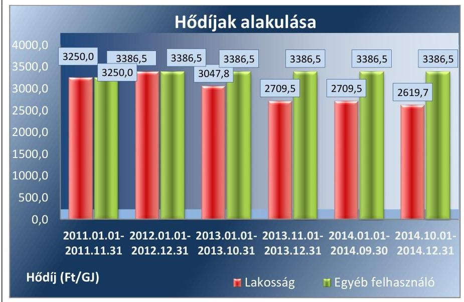

---

6. táblázat

TÁVHŐTÁMOGATÁS ALAKULÁSA (M Ft)

| Év | Támogatási összeg |
| :--: | :--: |
| 2011 | 3,7 |
| 2012 | 92,4 |
| 2013 | 146,5 |
| 2014 | 174,0 |
| összesen | 416,6 |

Forrás: A Társaság adatszolgáltatása
Az 51/2011. (IX. 30.) NFM rendelet 1. §-a alapján a Társaság 2011-2014. között összesen 416,6 millió Ft távhőszolgáltatási támogatásban részesült, a 6. táblázatban foglaltak szerint. A Társaság távhőszolgáltatást igénybevevők terheinek csökkentése érdekében kapott támogatásokat a belső előírásainak megfelelően, szabályszerűen az egyéb bevételek között számolta el.

A Tszt. módosításával 2011. április 15. napjával az Önkormányzat hatósági ármegállapítás joga, az Ámt. 7. § (5) bekezdésének 2011. április 15-től hatályos módosítására tekintettel megszűnt. Az 50/2011. (IX. 30.) NFM rendelet a díjakat a 2011. március 31-én alkalmazott szinten rögzítette, valamint 2012. január 1-jétől a rögzített díjakhoz képest 4,2%-kal magasabb hatósági árat állapított meg. A Rezsi tv.50 előírásai szerint 2013. évben január 1-jétől 10,0%-kal, majd november 1-jétől 11,1%-kal, végül 2014. október 1-jétől 3,3%-kal csökkenteni kellett a fennálló díjakat. Az árbefagyasztás rendelkezését és a Rezsi tv. előírásait betartották.

---

# JAVASLATOK 

Az ÁSZ tv.51 33. § (1) bekezdésében foglaltak értelmében az ellenőrzött szervezet vezetője köteles a jelentésben foglalt megállapításokhoz kapcsolódó intézkedési tervet összeállítani és azt a jelentés kézhezvételétől számított 30 napon belül az ÁSZ részére megküldeni. Amennyiben az intézkedési tervet határidőre nem küldi meg a szervezet, vagy amennyiben az nem elfogadható, az ÁSZ elnöke az ÁSZ tv. 33. § (3) bekezdés a)-b) pontjaiban foglaltakat érvényesítheti.
A javaslatok megfogalmazása során az Állami Számvevőszék figyelembe vette az ellenőrzött időszakot követő változásokat és intézkedéseket.
Javaslataink célja a Dunakeszi Közüzemi Nonprofit Kft. gazdálkodása szabályozottságának helyreállítása annak érdekében, hogy a szabályozási környezet és a gazdálkodási gyakorlat megfelelően tudja támogatni az átlátható működést.

## A Dunakeszi Közüzemi Nonprofit Kft. ügyvezető igazgatójának

1. Intézkedjen a számviteli politika és az értékelési szabályzat közötti összhang megteremtéséről az értékhelyesbítés egységes szabályainak kialakítása érdekében.
(2.1. megállapítás 4. bekezdése alapján)
2. Intézkedjen a távhőtermelés, távhőszolgáltatás és egyéb tevékenység vonatkozásában a számviteli szétválasztás szabályainak kidolgozása, a szétválasztási szabályok érvényesítéséhez szükséges elkülönült nyilvántartási rendszer kidolgozása, valamint a távhőágazat mérleg és eredménykimutatás adatainak alátámasztására is alkalmas könyvvezetési szabályok meghatározása érdekében.
(2.1. megállapítás 3. bekezdés és annak 1-3. francia bekezdései alapján)
3. Intézkedjen a vagyonkezelt eszközök és források elkülönített nyilvántartására vonatkozó szabályok kidolgozásáról.
(2.1. megállapítás 3. bekezdés, annak 4. francia bekezdése alapján)
4. Intézkedjen az önköltségszámítási szabályzat távhő ágazat sajátosságainak megfelelő módosításáról, ennek keretében határozza meg az alkalmazott kalkulációs módszert, a kalkulációban érintett tevékenységeket, a távhő ágazatot, mint kalkulációs egységet, az általános költségek felosztásának szabályait, a vetítési alapokat, továbbá a költségek

---

indokoltságának, a szükséges nyereség biztosításának és a legkisebb költség elv érvényesítésének szabályait.
(2.1. megállapítás 6-7. bekezdései alapján)
5. Intézkedjen a közérdekű adatokkal kapcsolatos szabályozási hiányosságok megszüntetéséről az adatkezelési illetve az informatikai biztonsági szabályzat módosításával vagy más belső irányítási eszköz létrehozásával.
(2.4. megállapítás 6. bekezdés alapján)
6. Intézkedjen a távhőszolgáltatási tevékenység mérlegének a vagyonkezelésbe vett eszközök figyelembe vételével történő elkészítéséről és a számviteli éves beszámolók kiegészítő mellékletben történő bemutatásáról.
(2.2. megállapítás 2. bekezdése alapján)
7. Intézkedjen az értékcsökkenési leírás szabályos elszámolásáról.
(3.1. megállapítás 11. bekezdése alapján)
8. Intézkedjen a leltározási feladatok teljes körű végrehajtásáról.
(2.2. megállapítás 8. bekezdése alapján)
9. Intézkedjen a vagyonkezelt ingatlanon végrehajtott fejlesztés vagyonkezelési szerződésben foglaltaknak megfelelő nyilvántartásáról.
(3.1. megállapítás 7. bekezdése alapján)
10. Intézkedjen a távhőágazathoz kapcsolódó bevételek, anyagköltségek és ráfordítások szabályszerű elszámolásáról, valamint a tevékenység eredmény-kimutatásában történő szerepeltetéséről.
(3.1. megállapítás 5-6. bekezdése alapján)
11. Intézkedjen a 2014. évi távhőágazatban képződött eredmény nyereségkorlát feletti részének szabályszerű felhasználása érdekében.
(3.1. megállapítás 15. bekezdése alapján)
12. Intézkedjen az önköltség utókalkulációjának elkészítéséről.
(3.2 megállapítás 3. bekezdés alapján)

---

13. 

Tegyen intézkedéseket a feltárt szabálytalanságok tekintetében a felelősség tisztázása érdekében, és szükség szerint intézkedjen a felelősség érvényesítéséről.
(2.1 megállapítás 3. bekezdés és annak 1-4. francia bekezdései alapján)

# Javaslataink célja az Önkormányzat szabályszerű működésének elősegítése, továbbá az önkormányzati tulajdonosi joggyakorlás kontrolljainak erősítése. 

## Dunakeszi Város Önkormányzata Polgármesterének

1. Intézkedjen az ügyvezetőt érintően - a szétválasztási szabályok meghatározásával és az elkülönített nyilvántartás vezetésével, a vagyonkezelői szerződés tartalmával, az árképzéssel kapcsolatban - feltárt szabálytalanságok tekintetében a felelősség tisztázása érdekében, és szükség szerint intézkedjen a felelősség érvényesítéséről.
(1.1 megállapítás 9. bekezdés, 3.1 megállapítás 2. bekezdés és 3.2 megállapítás 2. bekezdés alapján)

## Dunakeszi Város Önkormányzata Jegyzőjének

1. Készítse elő a közép- és hosszú távú vagyongazdálkodási tervet, majd intézkedjen annak elfogadása érdekében.
(1.1 megállapítás 2. bekezdés alapján)
2. Készítse elő a vagyonkezelői szerződés módosítását a bekerülési érték egyértelmű megjelölésével, majd intézkedjen annak aláírása érdekében.
(1.1 megállapítás 9. bekezdés alapján)

---

# MELLÉKLETEK 

- I. SZ. MELLÉKLET: ÉRTELMEZŐ SZÓTÁR
eladósodottságot jellemző eladósodottsági mutató (tőkeáttétel): idegen tőke/összes forrás.
 mutatók

Egészségesnek mondható egy olyan mértékű áttétel, amelyet az üzleti tervek szerint és az elmúlt időszak tapasztalatai alapján a társaság megfelelő biztonsággal ki tud termelni. Nagy eszközberuházás-igényű iparágakban értéke magasabb, azaz magasabb eladósodottság is elfogadható, de 75-85\%-ot meghaladó értéknél már itt is erős, sőt túlzott külső finanszírozottságról beszélhetünk. Általánosságban véve kedvező, ha értéke kisebb, mint 0,6.
eladósodottság mértéke: kötelezettségek / saját tőke.
Fontos szerepet játszik ez a mutató egy vállalat megítélésében. Azt mutatja, hogy a saját források a kötelezettségek hány százalékát fedezik. Törekedni kell, hogy a mutató tartósan (jelentősen) 1 alatti értéket érjen el.
nettó eladósodottság: (kötelezettségek-követelések) / saját tőke.
Azt mutatja, hogy a kintlévőségekkel csökkentett kötelezettségeket milyen mértékben fedezi a saját forrás. Ez feltételezi, hogy a követelések pénzügyileg előbb realizálódnak, mint ahogy a kötelezettségeket teljesíteni kell. A mutató minél kisebb, csökkenő értéke a kedvező.
adósságfedezeti mutató: (befektetett eszközök+forgó eszközök) / idegen forrás.
Azt mutatja, hogy 1 Ft adósságra hány Ft vagyon jut. Általánosságban véve kedvező, ha értéke 2 körül van, de nagy eszközberuházás-igényű iparágakban értéke kisebb is lehet.
árbevételre vetített eladósodottság: (kötelezettségek - forgóeszközök) / értékesítés nettó árbevétele.
Az árbevételre vetített eladósodottság azt mutatja, hogy az árbevétel mekkora fedezetet nyújt a kötelezettségeknek a forgóeszközökkel csökkentett részére. Általánosságban véve kedvező, ha az árbevétel minél nagyobb arányban nyújt fedezetet a forgóeszközökkel csökkentett kötelezettségekre (értéke kisebb, mint 1, csökken az ellenőrzött időszakban).
garancia

A garancia olyan önálló, az önkormányzat nevében vállalt kötelezettség, amely alapján az önkormányzat az önkormányzati költségvetés terhére szerződésben meghatározott feltételek szerint, a kötelezett nem teljesítése esetén a jogosultnak fizetést teljesít az előzetesen rögzített összeghatárig.
gazdasági társaság
gazdálkodó szervezet
keresztfinanszírozás tilalma
$\mathrm{Ptk}_{2}$. 3.88. § (1) bekezdése szerint „a gazdasági társaságok üzletszerű közös gazdasági tevékenység folytatására, a tagok vagyoni hozzájárulásával létrehozott, jogi személyiséggel rendelkező vállalkozások, amelyekben a tagok a nyereségből közösen részesednek, és a veszteséget közösen viselik".
A Ptk. 685. § c) pontja szerint gazdálkodó szervezet: „az állami vállalat, az egyéb állami gazdálkodó szerv, a szövetkezet, a lakásszövetkezet, az európai szövetkezet, a gazdasági társaság, az európai részvénytársaság, az egyesülés, az európai gazdasági egyesülés, az európai területi együttműködési csoportosulás, az egyes jogi személyek vállalata, a leányvállalat, a vízgazdálkodási társulat, az erdő birtokossági társulat, a végrehajtói iroda, az egyéni cég, továbbá az egyéni vállalkozó." (2014. 03. 15-ig hatályos)
A közszolgáltatás díját úgy kell megállapítani, hogy az maradéktalanul fedezetet nyújtson a közszolgáltatás indokolt költségeire és ráfordításaira, valamint a közszolgáltató e tevékenységével kapcsolatos ésszerű nyereségére; az ésszerű nyereség

---

holding
kezesség
közszolgáltatás
meghatározó befolyás
minősített többséget biztosító részesedés
nemzeti vagyon
nem tartalmazhatja a közszolgáltatáson kívül eső egyéb gazdasági tevékenységei költségeinek, ráfordításainak fedezetét.
A holding olyan gazdasági társaság, amely tartós részesedéssel rendelkezik egy vagy több jogilag önálló társaságban.
A kezességre vonatkozó előírásokat a Ptk.: 6:416-430. §-ai tartalmazzák. Kezességi szerződéssel a kezes kötelezettséget vállal a jogosulttal szemben, hogyha a kötelezett nem teljesít, maga fog helyette a jogosultnak teljesíteni. Kezesség egy vagy több, fennálló vagy jövőbeli, feltétlen vagy feltételes, meghatározott vagy meghatározható összegű pénzkövetelés vagy pénzben kifejezhető értékkel rendelkező egyéb kötelezettség biztosítására vállalható.
A Ptk. szerint kezességet csak írásban lehet vállalni. A kezes kötelezettsége ahhoz a kötelezettséghez igazodik, amelyért kezességet vállalt. A kezes kötelezettsége nem válhat terhesebbé, mint amilyen elvállalásakor volt, kiterjed azonban a kötelezett szerződésszegésének jogkövetkezményeire és a kezesség elvállalása után esedékessé váló mellékkövetelésekre is.
A közszolgáltatás: „közcélú, illetőleg közérdekű szolgáltatást jelent, amely egy nagyobb közösség (állam, település) minden tagjára nézve megközelítőleg azonos feltételek mellett vehető igénybe, ezért valamilyen mértékig közösségi megszervezést, illetve szabályozást, ellenőrzést igényel." Az Ebktv. 3. § d) pontja a következőképpen határozza meg a közszolgáltatást: „szerződéskötési kötelezettség alapján a lakosság alapvető szükségleteinek ellátására irányuló szolgáltatás, így különösen a villamos energia-, gáz-, hő-, víz-, szennyvíz- és hulladékkezelési, köztisztasági, postai és távközlési szolgáltatás, továbbá a menetrend alapján közlekedő járművekkel végzett közforgalmú személyszállítás".
A Ptk.: 8:2. § (2) bekezdése szerint „A befolyással rendelkező akkor rendelkezik egy jogi személyben meghatározó befolyással, ha annak tagja vagy részvényese, és
a) jogosult e jogi személy vezető tisztségviselői vagy felügyelőbizottsága tagjainak többségének megválasztására, illetve visszahívására; vagy
b) a jogi személy más tagjai, illetve részvényesei a befolyással rendelkezővel kötött megállapodás alapján a befolyással rendelkezővel azonos tartalommal szavaznak, vagy a befolyással rendelkezőn keresztül gyakorolják szavazati jogukat, feltéve, hogy együtt a szavazatok több mint felével rendelkeznek."
A minősített befolyásszerző az ellenőrzött társaságban a szavazatok legalább hetvenöt százalékával rendelkezik. (Ptk.: 3:324. §)
Nvt. 1. § (2) bekezdése szerint:
„az állam vagy a helyi önkormányzat kizárólagos tulajdonában álló dolgok, az a) pont hatálya alá nem tartozó, állam vagy a helyi önkormányzat tulajdonában lévő dolog,
az állam vagy a helyi önkormányzat tulajdonában lévő pénzügyi eszközök, továbbá az államot vagy a helyi önkormányzatot megillető társasági részesedések,
az államot vagy a helyi önkormányzatot megillető bármely vagyoni értékkel rendelkező jogosultság, amelyet jogszabály vagyoni értékű jogként nevesít,
Magyarország határa által körbezárt terület feletti légtér,
az üvegházhatású gázok kibocsátási egységeinek kereskedelméről szóló törvény szerint kibocsátási egység és légiközlekedési kibocsátási egység, valamint az ENSZ Éghajlatváltozási Keretegyezménye és annak Kiotói Jegyzőkönyve végrehajtási keretrendszeréről szóló törvény szerinti kiotói egység,
állami vagy helyi önkormányzati fenntartású közgyűjtemény (muzeális intézmény, levéltár, közgyűjteményként működő kép- és hangarchívum, valamint könyvtár) saját gyűjteményében nyilvántartott kulturális javak körébe tartozó dolog,

---

a régészeti lelet,
a nemzeti adatvagyon körébe tartozó állami nyilvántartások fokozottabb védelméről szóló törvény szerinti nemzeti adatvagyon." (hatályos 2012. január 1-jétől, g) pont módosult 2012. június 30-tól)
nonprofit gazdasági társaság Ctv. 9/F. § (2) bekezdése szerint „az a gazdasági társaság minősül nonprofit gazdasági társaságnak és cégnevében az a gazdasági társaság tüntetheti fel a nonprofit jelleget, amelynek létesítő okirata tartalmazza, hogy a gazdasági társaság tevékenységéből származó nyereség a tagok között nem osztható fel, hanem az a gazdasági társaság vagyonát gyarapítja." (hatályos 2014. március 15-től)
többségi befolyást biztosító A Ptk. 2 8:2. § (1) bekezdése szerint „többségi befolyás az olyan kapcsolat, amelynek részesedés révén természetes személy vagy jogi személy (befolyással rendelkező) egy jogi személyben a szavazatok több mint felével vagy meghatározó befolyással rendelkezik."

---

II. SZ. MELLÉKLET: MŰKÖDÉSI ADATOK

| A DUNAKESZI KÖZÜZEMI NONPROFIT KFT. MŰKÖDÉSÉNEK FŐBB JELLEMZŐI (EZER FORINT / \%) |  |  |  |  |  |  |
| :--: | :--: | :--: | :--: | :--: | :--: | :--: |
| Sor-   szám | Megnevezés |  | 2011. | 2012. | 2013. | 2014. |
| 1. A gazdasági társaság tulajdonosi összetétele: |  |  |  |  |  |  |
| 2. Önkormányzat megnevezése: |  |  | Dunakeszi Város Önkormányzata |  |  |  |
| 3. Önkormányzat tulajdoni részesedésének aránya |  | \% | 100 | 100 | 100 | 100 |
| 4. Önkormányzat tulajdoni részesedésének összege |  | ezer Ft | 48380 | 48380 | 150000 | 150000 |
| 5. A gazdasági társaságnál a vizsgált évek során működése megszűnt-e? (IGEN/NEM) |  |  |  | NEM |  |  |
| 6. A tárgyévben a gazdasági társaság saját vagyona után elszámolt értékcsökkenés összege |  | ezer Ft | 20389 | 14292 | 16207 | 19986 |
| 7. A tárgyévben a saját tulajdonú eszközök pótlására (karbantartás) elszámolt költség |  | ezer Ft | 96713 | 370447 | 849646 | 882040 |
| 8. Értékesítés nettó árbevétele |  | ezer Ft | 611140 | 1115374 | 1363703 | 2083288 |
| 9. Működési cash flow |  | ezer Ft | 2803 | 1447019 | 151603 | 934726 |

Forrás: 2. számú tanúsítvány

---

# FÜGGELÉK: ÉSZREVÉTELEK 

A jelentéstervezetet a Számvevőszék 15 napos észrevételezésre megküldte az ellenőrzött szervezet vezetőjének az ÁSZ tv. 29. § (1) bekezdése előírásának megfelelően.
Dunakeszi Város Önkormányzatának polgármestere és a Dunakeszi Közüzemi Nonprofit Kft. ügyvezetője egyaránt élt észrevételezési jogával.
Az elfogadott észrevételek alapján a Számvevőszék módosította a jelentést.
A függelék tartalmazza az ellenőrzöttek észrevételeit, illetve az el nem fogadott észrevételek elutasításának indoklását.

[^0]
[^0]:    * 29. § (1) Az Állami Számvevőszék az ellenőrzési megállapításait megküldi az ellenőrzött szervezet vezetőjének vagy az általa megbízott személynek, és annak, akinek személyes felelősségét állapította meg.
    (2) Az ellenőrzött szervezet vezetője és a felelősként megjelölt személy az ellenőrzés megállapításaira tizenöt napon belül írásban észrevételt tehet.
    (3) Az Állami Számvevőszék az észrevételre a beérkezésétől számított harminc napon belül írásban válaszol. A figyelembe nem vett észrevételeket köteles a jelentésben feltüntetni, és megindokolni, hogy azokat miért nem fogadta el.

---

# DUNAKESZI VÁROS 

## 2120 Dunakeszi, Fő út 25. - Tel.:06-27/341-303 $\cdot$Fax: 06-27/341-208

Állami Számvevőszék Domokos László Elnök úr részére Budapest 4. PL:54. 1364

## Tisztelt Elnök Úr!

Hivatkozással a V-0845-165/2016 iktatószámú, ,,az önkormányzatok gazdasági társaságai Az önkormányzatok többségi tulajdonában lévő gazdasági társaságok közfeladat ellátását érintő gazdálkodási tevékenysége szabályszerűségének ellenőrzése - Dunakeszi Közüzemi Nonprofit kft." tárgyában készült számvevőszéki jelentéstervezetével kapcsolatban előzetesen szeretném megköszönni az Állami Számvevőszék munkatársai által elvégzett lelkiismeretes munkát. Engedje meg azonban az Elnök úr azt, hogy az ellenőrzés végrehajtásával, annak módszerével kapcsolatban a véleményemet kifejtsem! Korábban már több Állami Számvevőszék által végrehajtott ellenőrzésen esett át Dunakeszi Város Önkormányzata. A korábbi időszakban a vizsgálatvezetők és a számvevők hozzáállását a tárgyilagos tényfeltáráson túl a segítő szándék és az együttműködés jellemezte. Ez az ellenőrzés volt az első, amikor ezt sajnos nem tapasztalhattuk. A vizsgálat során az volt érezhető, hogy az ellenőrzést végző munkatársak erős vezetői nyomás alatt álltak, amelynek a miértjét ugyan nem értjük, de a célja az volt, hogy a számvevők minél több hiányosságot állapítsanak meg akkor is, ha annak tényszerűségét nem lehet kétséget kizáróan igazolni. Ez a vezetői attitűd azért is volt ennyire feltűnő, mert tárgyi ellenőrzésen túlmenően még két számvevőszéki ellenőrzés is folyt ebben az időszakban párhuzamosan Dunakeszi Város Önkormányzatánál. Ezek a vizsgálatok az Állami Számvevőszék munkatársaitól megszokott módon, konstruktívan, tárgyilagosan folytak. Úgy gondolom, hogy az Ön munkatársaival szemben is magas szintű elvárások vannak az ellenőrzés során tanúsítandó magatartással kapcsolatban, ezért is szerettem volna a negatív tapasztalataimról tájékoztatni.

Visszatérve a jelentéstervezethez, azt áttanulmányozva tapasztalhattam, hogy a helyszíni ellenőrzést végrehajtó kollégái - az előbb leírt akadályozó tényezők ellenére - feladatukat nagy körültekintetéssel és alapossággal hajtották végre. Megállapításaikat a jogszabályi rendelkezések figyelembe vételével alakították ki, amelyekre azonban a rendelkezésemre álló törvényes határidőn belül Dunakeszi város polgármestereként néhány észrevételt és javaslatot kívánok tenni:

A jelentéstervezet „Megállapítások" fejezet 1. pontjának 1.1 számú megállapítása a következőket tartalmazza: „a közfeladat ellátását ugyan az Önkormányzat alapvetően szabályszerűen szervezte
 meg, ugyanakkor a távhőszolgáltatásra vonatkozó rendeletalkotási kötelezettségét - az ármegállapítási jogkör és a díjmeghatározás vonatkozásában - nem szabályszerűen teljesítette."

---

A fent leírtak alapján észrevételezni kívánom, hogy a hivatkozott összefoglaló megállapítás alátámasztásául a számvevők rögzítik, hogy a távhőszolgáltató és a felhasználó közötti jogviszony részletes szabályairól, valamint a hatósági áralkalmazás és díjfizetés feltételeiről szóló 7/2007.(IV.2.) számú önkormányzati rendelet (a továbbiakban: távhő rendelet) megalkotásával az Önkormányzat eleget tett a távhőszolgáltatásról szóló 2005. évi XVIII. törvény (a továbbiakban: Tszt.) 6.§ (2) bekezdésében foglalt kötelezettségének. E megállapítás szerint tehát Dunakeszi Város Önkormányzata érvényes és hatályos távhő rendelettel rendelkezik. A rendelet tartalmi vizsgálata során az ellenőrzés megállapítja, hogy a csatlakozási díj mértékét hogyan határozta meg a távhő rendeletben az Önkormányzat. A számvevők leírják, hogy e távhő rendeletben foglaltak alapján az ellenőrzés nem tudta megállapítani, hogy ez a szabályozás a csatlakozási díj megállapítására vonatkozó Tszt. 57.§ (3) bekezdésében foglaltaknak megfelel-e.

A Tszt. 57.§ (3) bekezdése a következőket tartalmazza: „A távhőszolgáltatás csatlakozási díját külön jogszabályban meghatározott szempontok szerint úgy kell meghatározni, hogy a hatékonyan működő vállalkozó szükséges és indokolt felmerült ráfordításaira és a működéshez szükséges nyereségre fedezetet biztosítson, és a legkisebb költség elvének érvényre juttatása érdekében e vállalkozásokat gazdálkodásuk hatékonyságának és az általuk nyújtott szolgáltatás minőségének folyamatos javítására ösztönözze."

Fentiek figyelembe vételével azonban nem állja meg a helyét az 1.1 megállapítás indokolásának az az állítása, amely hiányosságként rója fel, hogy a csatlakozási díj mértéke nem konkrét összegben került meghatározásra a távhő rendeletben, illetve nem tartalmazta a rendelet az árkalkuláció részletes menetét, hiszen erre vonatkozóan a hivatkozott és előbb idézett törvényi rendelkezés nem is tartalmaz kötelezettséget. Ilyen rendelkezést az „árak megállapításáról" szóló 1990. évi LXXXVII. törvény 8.§ (3) bekezdése sem tartalmaz a legalacsonyabb árakra vonatkozó szabályozásában.

Az 1.1 számú megállapítás tényként állapította meg továbbá, hogy az Önkormányzat távhő rendelete nem felel meg a hatályos Tszt. 57/D.§ (1) bekezdésében foglaltaknak. A Tszt. előbb hivatkozott rendelkezése szerint 2011. április 15-től a miniszter állapítja meg a távhőszolgáltatás díjainak szerkezetét, legmagasabb díjait és azok alkalmazásának időpontját, a helyi távhő rendelet ennek ellenére még tartalmaz az ármegállapításra vonatkozó rendelkezéseket is. Ezzel kapcsolatban észrevételezni kívánom, hogy a jogszabályi hierarchiában az önkormányzat által megalkotott helyi rendelet alacsonyabb szinten áll, mint a törvényi szabályozás. A jogszabályi rendelkezések összeütközése esetén a magasabb szintű, a törvényi szabályozás alkalmazandó. Így - bár az önkormányzat helyi rendelete elvileg lehetővé tenné - mégsem kerülhet sor a távhő rendeletnek a törvényi rendelkezésekkel ellentétes alkalmazására. Az Önkormányzat nem alkalmazta törvényi rendelkezések hatályba lépését követően az azokkal ellentétes helyi szabályozást. Álláspontom szerint így érdemi hatása nem volt és nem is lehetett annak, hogy az Önkormányzat nem aktualizálta a helyi távhő rendeletében az ármegállapításra vonatkozó rendelkezéseit, hiszen azt a törvényi szabályozás automatikusan felülírta. Természetesen a jogszabályi rendelkezések koherenciájának biztosítása érdekében a helyi távhőrendeletet az Önkormányzat legkésőbb júliusban megfelelően módosítja.

Ellentmondást vélek felfedezni a 2. összegző megállapítás és annak alátámasztására leírtak között. A 2. összegző megállapítás szerint „a gazdálkodási rendet meghatározó szabályzatok

---

összességében nem feleltek meg a jogszabályi előírásoknak." A megállapítást alátámasztó indokolás azonban ezzel ellentétesen - egyébként a tényeknek megfelelően - azt tartalmazza, hogy „a gazdálkodási rendet meghatározó szabályzatok ... rendelkezésre álltak, melyek azonban teljes körűen nem feleltek meg az előírásoknak." Álláspontom szerint ebből a mondatból az következik, hogy a gazdálkodási rendet meghatározó szabályzatok részben megfeleltek a jogszabályi előírásoknak, az ellenőrzés jelentős hiányosságot nem tárt fel. A 2. összegző megállapítás általánosítást tartalmaz, nem pedig tényt állapít meg.

A 2. összegző megállapítás második mondata a következőket tartalmazza: "A könyvvizsgálók annak ellenére nyilatkoztak a szétválasztási szabályok megfelelőségéről, hogy azokat a Társaság nem dolgozta ki." Álláspontom szerint a könyvvizsgálók tevékenységének függetlennek kell lennie a vizsgált Társaság ügyvezetésétől, illetve a tulajdonostól is. Sem az ügyvezető, sem a tulajdonos nem befolyásolhatja azt, hogy a könyvvizsgáló milyen megállapításokat tegyen. Következésképpen, amennyiben a könyvvizsgáló olyan tartalmú nyilatkozatot tesz, amely szerint a Társaság megfelelő szétválasztási szabályokkal rendelkezik, ezt nem bírálhatja felül sem a Társaság menedzsmentje, sem pedig a tulajdonosi jogok gyakorlója. A könyvvizsgáló rendelkezik azokkal a megfelelő színvonalú szakismeretekkel, amelyek feljogosítják őt ilyen tartalmú nyilatkozatok megfogalmazására, így a nem megfelelő tartalmú könyvvizsgálói nyilatkozat miatt nem terhelheti felelősség sem az ügyvezetőt, sem a tulajdonos Önkormányzatot. Itt kapcsolódnék a jelentéstervezet 33. oldalán Dunakeszi Város Önkormányzata Polgármesterének tett 1. számú javaslathoz. A javaslat alapján polgármesterként kellene felhívnom a könyvvizsgáló figyelmét a számviteli szétválasztási szabályok alapján történő felülvizsgálati feladatának megfelelő végrehajtására. Ezzel azonban álláspontom szerint jogsértést követnék el, mivel megsérteném a könyvvizsgáló függetlenségét.

# Tisztelt Elnök úr! 

Kérem, hogy a végleges jelentés elkészítése során az előbbiekben leírt észrevételeimet, javaslataimat megfontolni, és amennyiben lehetséges elfogadni, az általánosító, nem kellően megalapozott, Dunakeszi Város Önkormányzatát indokolatlanul, súlyosan negatív színben feltüntető megállapításokat mellőzni szíveskedjen!

Dunakeszi, 2016. június 8.
Tisztelettel:
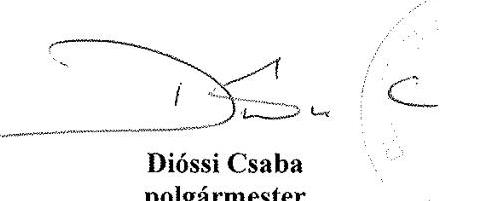

---

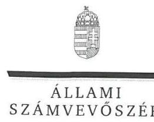

# Dióssi Csaba úr 

polgármester
Dunakeszi Város Önkormányzata

## Dunakeszi

## Tisztelt Polgármester Úr!

Köszönettel vettem a Dunakeszi Közüzemi Nonprofit Kft. ellenőrzéséről készített számvevőszéki jelentéstervezetre tett észrevételeit.

Az Állami Számvevőszék Polgármester úr észrevételére vonatkozó álláspontját a felügyeleti vezető által készített melléklet tartalmazza.

Tájékoztatom Polgármester urat, hogy az Állami Számvevőszék a figyelembe nem vett észrevételeket az Állami Számvevőszékről szóló 2011. évi LXVI. törvény 29. § (3) bekezdésében előírtak szerint köteles a jelentésében feltüntetni és megindokolni, hogy azokat miért nem fogadta el.

Budapest, 2016. július hó 4. nap
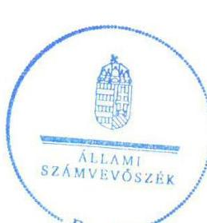

Tisztelettel:

Dombos László

Melléklet: Tájékoztatás az észrevételek kezeléséről

---

# Tájékoztatás az észrevételek kezeléséről 

Megköszönöm Polgármester úrnak „Az önkormányzatok gazdasági társaságai - Az önkormányzatok többségi tulajdonában lévő gazdasági társaságok közfeladat ellátását érintő gazdálkodási tevékenysége szabályszerűségének ellenőrzése - Dunakeszi Közüzemi Nonprofit Kft." címmel készített jelentéstervezetre tett észrevételeit.

Az 1.1. megállapításra tett észrevételét elfogadom, annak alapján a jelentéstervezet Főbb megállapítások, következtetések, javaslatok c. részéből a következő mondatot:
„A csatlakozási díjat összegszerűen nem rögzítette, továbbá nem határozta meg a Társaság hatáskörébe tartozó díjmódosítás előterjesztésére és alátámasztására vonatkozó részletszabályokat.";
továbbá a jelentéstervezet 1.1. megállapításának 6. bekezdéséből a következő részt, egyúttal a jegyzőnek címzett 2. számú, a távhőszolgáltatási rendelet aktualizálására vonatkozó javaslatot töröltem:
„[...]: az árkalkuláció részletes menetét nem jelölte meg. Ezért nem volt megállapítható, hogy a csatlakozási díj meghatározására vonatkozó előírás megfelelt-e a Tszt. 57. § (3) bekezdésében foglalt rendelkezéseknek."

Polgármester úr a levelében az Önkormányzat távhőrendeletének jogszabályokkal való koherenciájának megteremtésére tett megállapításunkat nem kifogásolja, melyet a távhőrendelet módosítására tervezett intézkedése is igazol, így a megállapítás módosítása nem indokolt.

A 2. számú megállapítás kapcsán tett észrevételét elfogadom és beépítem, annak alapján a 2. megállapítás „Összegzö megállapítás" részében az „összességében nem" szókapcsolat helyett a „részben" kifejezést alkalmazom.

A 2. számú megállapításban foglaltakkal kapcsolatban tett észrevételét elfogadom, így a könyvvizsgáló nem megfelelő feladatellátása kapcsán Polgármester úrnak címzett 1. számú javaslatot észrevétele alapján töröltem.

Budapest, 2016. július.

---

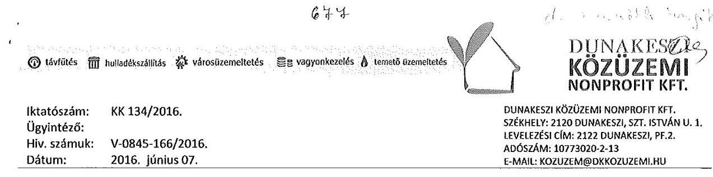

# ÁLLAMI SZÁMVEVŐSZÉK 

## Domokos László

## Elnök Úr

Budapest
Apáczai Csere János u. 10.
1052

Tárgy: Észrevétel jelentéstervezet megállapításaira

## Tisztelt Elnök Úr!

Jelen levelünkben reagálni kívánok az Állami Számvevőszék által elkészített, 2016. május 25-én kézhez vett, V-0845-166/2016. iktatószámú jelentéstervezetre, mely a Dunakeszi Közüzemi Nonprofit Kft. távhőszolgáltatással kapcsolatos 2011-2014. közötti gazdálkodási tevékenységének szabályszerűségének ellenőrzése tárgyában készült.

A jelentés bevezetőjében összegzést közöl: „a közfeladat bevételeinek és ráfordításainak elszámolása, valamint önköltségszámítás hiányában az alkalmazott árképzés sem volt szabályszerű." Az összefoglaló kijelentéssel cégünk nem ért egyet. Bevételeink és ráfordításaink elszámolásáról, gazdálkodási eredményünk alakulásáról rendszeresen tájékoztattuk felügyeleti szervünket, folyamatos adatszolgáltatást nyújtottunk a Magyar Energetikai és Közmű-szabályozási Hivatal (továbbiakban MEKH) részére, mely hatóság szakmai és gazdasági kifogást a vizsgált időszakban nem állapított meg.

A jelentéstervezet a 14. oldaltól közli az Állami Számvevőszék megállapításait, és a feltárt problémák indoklását. Az 1.1. sz. megállapítás távhőrendeletre vonatkozó kifejtésében szerepel, hogy „a távhőrendelet a csatlakozási díj mértékét a Társaság oldaláról szükséges beruházás előkalkulált összköltségében határozta meg, konkrét összeget, ill. az árkalkuláció részletes menetét nem jelölte meg. Ezért nem volt megállapítható, hogy a csatlakozási díj meghatározására vonatkozó előírás megfelelt-e a Tszt. 57.§(3) bekezdésben foglalt rendelkezéseknek".

Kérem Tisztelt Elnök Urat, szíveskedjen figyelembe venni, hogy cégünk jogelődjeinek indulása óta ellátási területünkhöz tartozó lakótelepen illetve környékén nem volt egyetlenegy csatlakozni szándékozó, távhőszolgáltatást igénybe venni kívánó társasház sem, ezért a csatlakozási díj megállapítása a helyi távhőrendeletben tényleges igény hiányában nem volt indokolt. Sem a rendeletalkotó önkormányzat, sem pedig cégünk nem szegett jogszabályt azzal, hogy a csatlakozási díjat fentiek miatt nem határozta meg.

---

Ugyancsak ebben a megállapításában közli a jelentéstervezet, hogy „a Tszt.57/D.§(1) bekezdése értelmében 2011. április 15-étől a miniszter állapítja meg a távhőszolgáltatás díjainak szerkezetét, legmagasabb díjait és azok alkalmazásának időpontját, a csatlakozási díjak kivételével. A központi árszabályozás bevezetésével összefüggésben a távhőrendeletet az Önkormányzat nem módosította. A távhőrendelet a hatósági ár vonatkozásában a Tszt-vel ellentétes rendelkezést tartalmazott, mivel továbbra is az Önkormányzat ármegállapítási jogkörét rögzítette." Véleményünk szerint a megállapítás alaptalan, jogsértést nem követtünk el, tekintettel arra, hogy 2011. április 15-ét követően társaságunk nem tett javaslatot a távhőrendeletben foglalt díjak emelésére, mert értelmezésünk szerint a helyi rendeletnél magasabb rendű jogszabály rendelkezett az alkalmazható díjak legmagasabb összegéről.

A jelentéstervezet 16. oldalán az árképzés szabályainak hiányosságairól közöl indoklást, és kifogásként rója fel, hogy „a társaság az egyedi közüzemi szerződések esetében a hatósági árnál alacsonyabb díjtétel alkalmazásához -a távhőrendelet 7.§(4) bekezdésében foglalt- előzetes tulajdonosi hozzájárulást nem kért, ezzel az Önkormányzat teljes körűen nem gyakorolhatta tulajdonosi jogait."
Nem értünk egyet fenti megállapítással, társaságunk a távhőszolgáltatásról szóló törvény szerint kalkulált és a távhőrendeletben bemutatott legmagasabb alkalmazható díjtételeken belüli árakon szolgáltatott fogyasztói felé. Álláspontunk szerint a „maximált ár" meghatározása nem jelenti azt, hogy ennél a szintnél alacsonyabb díj ne lenne alkalmazható. Sem az ágazati jogszabályok, sem a rendeletek nem tartalmaznak ilyen rendelkezést. Tekintettel arra, hogy a Dunakeszi Közüzemi Nonprofit Kft. a szabadpiacon szerzi be legfőbb energiahordozóit (földgáz, villamos energia) a távhőszolgáltatásról szóló törvény azon rendelkezésének, miszerint a hődíjak nem tartalmazhatnak gazdálkodási eredményt, úgy tudott megfelelni csökkenő energiaárak mellett, hogy a szolgáltatási díjaiban negatív korrekciót hajtott végre. Ezek előkalkulációit és indoklását az Önkormányzat és az Állami Számvevőszék részére táblázatos formában bemutattuk.
2.2. számú megállapításra a következő észrevételt tesszük:

# 1. Számviteli nyilvántartási rendszer 

A Dunakeszi Közüzemi Nonprofit Kft. a vagyonkezelésbe vett eszközök elkülönített nyilvántartásáról gondoskodott, a vagyonkezelésbe átvett eszközöket külön főkönyvi számlákon könyveltük.
A Dunakeszi Közüzemi Nonprofit Kft. a vagyonkezelésbe vett eszközök elkülönített nyilvántartásának követelménye alapján alakítottuk ki a számlatükröt, valamint gyűjtő számlarendszerét.
„A Társaság vagyongazdálkodása a jogszabályi rendelkezésének és belső előírásoknak sem felelt meg."
Javasoljuk ennek a mondatnak a módosítását: „sem felelt
 meg" helyett, csak részben felelt meg.
"A tevékenységi mérlegét a vagyonkezelt eszközök vonatkozásában nem a jogszabályi előírások szerint állította össze."

A Dunakeszi Közüzemi Nonprofit Kft. mérlegében a vagyonkezelt eszközök miatti kötelezettség megjelent a hosszú lejáratú kötelezettségeknél, a 4421 vagyonkezelésbe kapott eszközök miatti kötelezettség főkönyvi számlán. A távhőszolgáltatási tevékenységi mérlegben is a hosszú lejáratú kötelezettségeknél meg kellett volna jelennie a vagyonkezelt eszközök miatti kötelezettségnek. A hibás besorolás azonban nem számít lényeges hibának, mivel a hibásan besorolt vagyonelem a 2013.

---

éves beszámolóban szereplő vagyonnak az egy ezreléke. A 2013. évi éves beszámoló mérlegében a mérlegfőösszeg 7.921.432 E Ft, a hibásan besorolt vagyonkezelésbe vett eszközök értéke 8.873 E Ft.
„A vagyonkezelői szerződés tartalma és értékcsökkenés elszámolása nem felelt meg jogszabályi rendelkezésnek."
Javaslat: az értékcsökkenés elszámolása megfelelt a jogszabályi rendelkezéseknek, az alábbiak szerint:
2012. és 2013. évekre vonatkozóan a vagyonkezelésbe adott vagyon nyilvántartásáról a 2011. évi CXCVI. törvény a nemzeti vagyonról 11.§ (7) bekezdése intézkedett.
„... A vagyonkezelésre vonatkozó részletes szabályokat a tulajdonosi joggyakorlóval megkötött vagyonkezelési szerződés szabályozza."

A (8) bekezdés szerint „A vagyonkezelőt - ha jogszabály vagy a vagyonkezelési szerződés másként nem rendelkezik - megilletik a tulajdonos jogai, és terhelik a tulajdonos kötelezettségei - ideértve a számvitelről szóló törvény szerinti könyvvezetési és beszámoló készítési kötelezettséget is..."

A 2000. évi C. törvény a számvitelről (a továbbiakban Szt.) 52. §-a részletesen szabályozza az eszközök értékcsökkenését.

A (2) bekezdés szerint „az évenként elszámolandó értékcsökkenésnek a bekerülési értékhez (bruttó értékhez) - maradványérték megállapítása esetén a maradványértékkel csökkentett bekerülési értékhez (bruttó értékhez) - vagy a nettó értékhez (a terv szerint elszámolt értékcsökkenéssel csökkentett bruttó értékhez) viszonyított arányát, vagy a bekerülési értéknek a teljesítménnyel arányos összegét, illetve az értékcsökkenés évenkénti abszolút összegét az egyedi eszköz várható használata, ebből adódó élettartama, fizikai elhasználódása és erkölcsi avulása, az adott vállalkozási tevékenységre jellemző körülmények figyelembevételével kell megtervezni, és azokat a nyilvántartásokon történő rögzítést követően a rendeltetésszerű használatbavételtől, az üzembe helyezéstől kell alkalmazni. Az üzembe helyezés időpontja az eszköz szokásos vállalkozási tevékenység keretében történő rendeltetésszerű hasznosításának kezdő időpontja. Az üzembe helyezést hitelt érdemlő módon dokumentálni kell."

Az idézett jogszabályi pontok egyértelműen azt támasztják alá, hogy a vagyonkezelésbe vett vagyontárgyakat a vagyonkezelői szerződésben rögzített módon kell nyilvántartásba venni a vagyonkezelőnek.
Amennyiben a vagyonkezelésbe adó (tulajdonos) a vagyontárgyakat bruttó módon adta át akkor azt a vagyonkezelésbe vevő úgy köteles nyilvántartásba venni, hogy a későbbiekben a tulajdonosnál nyilvántartott vagyonnyilvántartás egyezősége biztosítva legyen.

A 2014. évi szabályozás megerősíti az előzőekben leírtakat. A 4/2013. (I.11.) Kormány rendelet az államháztartás számviteléről 15.§ (2) bekezdése szerint „A 16.§-ban foglaltaktól eltérően a vagyonkezelésbe vett eszközök - ide nem értve, ha a vagyonkezelői jog vásárlással, saját előállítással keletkezik - bekerülési értéke a vagyonkezelésbe adónál kimutatott bruttó érték..."
30.§ (4) „A vagyonkimutatásban szereplő ingatlanvagyon számviteli nyilvántartás szerinti bruttó értékének és az ingatlan vagyonkataszteri nyilvántartásban szereplő ingatlanvagyon bruttó értékének egyezőségét biztosítani kell."

---

# 3.1. számú megállapításra a következő észrevételt tesszük: 

A Dunakeszi Közüzemi Nonprofit Kft. a Távhőszolgáltatásról szóló módosított 2005. évi XVIII. tv. 18/A §-ában előírt rendelkezéseinek megfelelt azáltal, hogy az eredménykimutatás költségeinek az alátámasztására minden könyvelési tételt, amely a távhőszolgáltatást terhelte, külön gyűjtőbe könyvelte. Ezzel a távhőszolgáltatásnál, mint költségviselőnél a közvetlenül felmerülő költségeket elkülönítve könyveltük a 10-es számú Fűtőmű gyűjtőre.
Azokat az általános költségeket pedig, amelyek több tevékenységet is terheltek, egy erre a célra kialakított gyűjtőre könyveltük. Ez a 99-es számú Saját rezsi- és működési költség gyűjtő. Ebben a gyűjtőben a lekönyvelt közvetett, általános költségeket az önköltségszámítási szabályzat 7. pontjában rögzített módon, az árbevételek alapján osztottuk fel.
Így a költségek elszámolása és a költségek felosztásánál alkalmazott módszer megfelelt az önköltségszámítási szabályzatnak is.

A Dunakeszi Közüzemi Nonprofit Kft. költségelszámolása, a közvetlen és a közvetett, általános költségek elszámolása, továbbá a közvetett költségek felosztása biztosítja, hogy a távhőszolgáltatása eredménykimutatása megfeleljen a Távhőszolgáltatásról szóló módosított 2005. évi XVIII. tv. 18/A §-ában előírtaknak.

A 3.1. sz. megállapítás a bevételek elszámolása fejezetében a jelentés tervezet hibaként rója fel, hogy a beszerzett és változatlan formában továbbértékesített földgázt nem egyéb tevékenység bevételeként, hanem a távhőszolgáltatás árbevételeként számoltuk el és a tevékenységi eredménykimutatásban is ennek megfelelően szerepeltettük. Véleményünk szerint a jogszabályokból nem volt kiolvasható fenti elszámolási gyakorlat hibája vagy tilalma, az „átfutó" tételként elszámolt továbbértékesített földgáz a távhőszolgáltatási tevékenység eredményét egyetlen fillérrel nem módosította, ezért a gazdálkodási eredményt tekintve torzítást nem jelentett. Megjegyezzük, hogy minden tekintetben nehéz feladat elé voltak állítva a távhőszolgáltatást végző cégek, ha meg akartak felelni a 2011-2014. között változó jogszabályi rendszerben, amikor a távhő törvény tizennégyszer, az 51/2011. NFM rendelet tíz alkalommal változott.

A „fejlesztések elszámolása" fejezetben a jelentés tervezet megállapítja, hogy „a Társaság a vagyonkezelésbe vett Tallér utcai kazánházi épület szigetelését, nyílászárók beszerelését, villámhárító felszerelését hajtotta végre a KEOP forrás terhére." Fenti megállapítás hibás tekintettel arra, hogy a taglalt beruházás részeket a KEOP beruházáshoz kapcsolódva, de teljes egészében saját forrásból valósítottuk meg. A támogatás lehívásához az elszámolás szabályszerűségét a közreműködő szervezet leellenőrizte és szabályosnak találta.

A jelentéstervezet 3.1. számú megállapításához kapcsolódó indokolás a „fejlesztések elszámolása" címszó alatt kifogásolja, hogy nem történt meg a 2012. évtől kezdődően a Dunakeszi Közüzemi Nonprofit kft. kezelésébe kapott önkormányzati vagyonelemekre elszámolt visszapótlás. Ezzel kapcsolatban tájékoztatom, hogy az észrevételezett visszapótlás már megtörtént.

A „követelések után elszámolandó értékvesztés" fejezetben szerepel: „a Társaság 2014. évi vesztesége ellenére, a távhő üzletág adózás előtti eredménye 30,0 millió Ft volt. A 2014. évben a Tszt. 18/C.§-ában, illetve az 50/2011. (IX.30.) NFM rendelet 8.§(1) bekezdései alapján meghatározott nyereségkorlátot meghaladó eredményt ért el. A nyereségkorlát feletti eredmény befizetése alóli mentesítési kérelmet a MEH-hez nem nyújtott be és a befizetést sem teljesítette, mellyel megsértette az 50/2011. (IX.30.) NFM rendelet 5.§(5) bekezdését."
Mivel a fentebb említett KEOP fejlesztésünk már lezajlott, ezért a 2014. évi eredmény terhére nem rendelkeztünk újabb fejlesztési elképzeléssel, tervet erre az időszakra nem készítettünk. Mindezek

---

miatt az eredmény befizetése alóli mentességi kérelmet nem nyújtottunk be. Azzal, hogy a nyereségkorlát feletti eredmény befizetését nem teljesítettük, eljárási szabályt a megállapítás ellenére nem követtünk el, mert a MEKH határozatban ennek befizetését a mai napig jogszabály szerint nem rendelte el.

Kérem, fentiek figyelembe vételével az előterjesztett jelentéstervezet korrekcióját és módosítását!

Tisztelettel:
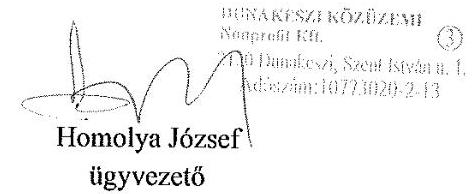

---

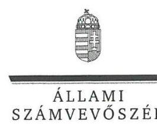

ELNÖK

Ikt.szám: V-0845-177/2016

# Homolya József úr 

ügyvezető
Dunakeszi Közüzemi Nonprofit Kft.

## Dunakeszi

## Tisztelt Ügyvezető Úr!

Köszönettel vettem a Dunakeszi Közüzemi Nonprofit Kft. ellenőrzéséről készített számvevőszéki jelentéstervezetre tett észrevételeit.

Az Állami Számvevőszék Ügyvezető úr észrevételére vonatkozó álláspontját a felügyeleti vezető által készített melléklet tartalmazza.

Tájékoztatom Ügyvezető urat, hogy az Állami Számvevőszék a figyelembe nem vett észrevételeket az Állami Számvevőszékről szóló 2011. évi LXVI. törvény 29. § (3) bekezdésében előírtak szerint köteles a jelentésében feltüntetni és megindokolni, hogy azokat miért nem fogadta el.

Budapest, 2016. július hó 12. nap
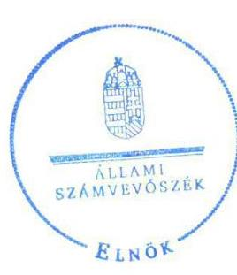

Tisztelettel:
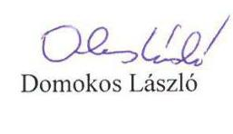

Melléklet: Tájékoztatás az észrevételek kezeléséről

---

# Tájékoztatás az észrevételek kezeléséről 

„Az önkormányzatok gazdasági társaságai - Az önkormányzatok többségi tulajdonában lévő gazdasági társaságok közfeladat-ellátását érintő gazdálkodási tevékenysége szabályszerűségének ellenőrzése -Dunakeszi Közüzemi Nonprofit Kft." címmel készített jelentéstervezetre Ügyvezető úr észrevételeit köszönöm. Az észrevételek kezeléséről az alábbi tájékoztatást adom.

Az 1.1. megállapításra tett észrevételét részben elfogadom, annak alapján a jelentéstervezet „ÖSSZEGZÉS" részéből töröltem a következő mondatot:
„A közfeladat-bevételeinek és ráfordításainak elszámolása, valamint önköltségszámítás hiányában az alkalmazott árképzés sem volt szabályszerű.";
a „Főbb megállapítások, következtetések, javaslatok" c. részéből töröltem a következő mondatot:
„A Társaságnál az árbevétel és a ráfordítások elszámolása nem volt megfelelő, mely kockázatot jelez az ellenőrzött terület egészének szabályos működése szempontjából.";
továbbá a jelentéstervezet 1.1. megállapításának 6. bekezdéséből a következő részt töröltem:
„[...] az árkalkuláció részletes menetét nem jelölte meg. Ezért nem volt megállapítható, hogy a csatlakozási díj meghatározására vonatkozó előírás megfelelt-e a Tszt. 57. § (3) bekezdésében foglalt rendelkezéseknek."

Az 1.1. számú megállapításra tett további észrevételével kapcsolatban jelzem, hogy a távhőrendeletben az Önkormányzat ármegállapítására vonatkozó jogkör rögzítése ellentétes volt egy magasabb rendű jogszabály, a Tszt. 57/D. § (1) bekezdése előírásával. Az önkormányzat rendelete ármegállapítási jogkört tartalmazott, amely nem felelt meg az Alaptörvény 32. cikk (3) bekezdésében foglaltaknak, mely szerint: „Az önkormányzati rendelet más jogszabállyal nem lehet ellentétes." Ezáltal észrevétele a jelentéstervezet érintett részeinek módosítását nem indokolja.

Az 1.2 megállapítás 6. bekezdésében foglalt megállapítást, mely szerint: A Társaság az egyedi közüzemi szerződések esetében a hatósági árnál alacsonyabb díjtétel alkalmazásához - a távhőrendelet 7. § (4) bekezdésében foglalt - előzetes tulajdonosi hozzájárulást nem kért, ezzel az Önkormányzat teljes körűen nem gyakorolhatta tulajdonosi jogait." fenntartom. Az észrevétele szerint a „maximált ár" alatti díj alkalmazása nem ütközik jogszabályi előírásba. A jelentéstervezet megállapítása szerint a „maximált ár"-nál alacsonyabb díjak alkalmazásának feltétele a tulajdonos hozzájárulásának megléte volt, mivel az Önkormányzat távhőrendeletében a hatósági árnál alacsonyabb díj alkalmazását a tulajdonos előzetes hozzájárulásával korlátozta. Az Önkormányzat távhőrendeletének 7. § (4) bekezdése kimondja, hogy „Az egyedi közüzemi szerződések körében a szolgáltató jelen rendeletben meghatározott hatósági árnál alacsonyabb díjtételeket csak a tulajdonos előzetes hozzájárulásával alkalmazhat". Az ÁSZ megállapítása a hatósági árnál alacsonyabb díjtétel alkalmazásakor az előzetes tulajdonosi hozzájárulás hiányára vonatkozott. Észrevételében a hatósági árnál alacsonyabb díjtétel jóváhagyása kapcsán a tulajdonosi előzetes

---

hozzájárulás hiányára vonatkozó ÁSZ megállapítást nem kifogásolja. Észrevétele a fenti indokokat figyelembe véve a jelentéstervezet megállapításának változtatását nem indokolja.

A 2.2. számú megállapítás kapcsán tett észrevételét elfogadom és beépítem, annak alapján a 2.2. megállapítás összegzésének első mondatában a „sem" helyett a „részben" kifejezést alkalmazom. A 2.2. számú megállapításban a vagyongazdálkodással kapcsolatban tett kifejtését tudomásul veszem, a megállapításokban foglaltakat fenntartom. Azok nem indokolják a megállapítások átfogalmazását, mivel a vagyonkezelt eszközök főkönyvi elkülönítése ellenére a távhőszolgáltatás tevékenységi mérlegét úgy készítette el, hogy a vagyonkezelésbe vett eszközöket abban nem szerepeltette, ezáltal a tevékenységéről szóló önálló mérleg nem volt megfelelő.

A 2.2 megállapítás 2. bekezdésében foglaltakat fenntartom. A vagyonkezelt eszközök miatti kötelezettséget a hosszú lejáratú kötelezettségek között kell kimutatni. A 2013. évi tevékenységi mérlegben ezt rövid lejáratú kötelezettségként mutatták ki, melyet az észrevételében is elismert. A jelentéstervezet a besorolást kifogásolja, ez a megállapítás helytálló.

Észrevétele alapján a 2.2 megállapítás 2. mondatát töröltem:
„A vagyonkezelői szerződés tartalma és az értékcsökkenés elszámolása nem felelt meg jogszabályi rendelkezéseknek."

Észrevétele alapján a 2.2 megállapítás 3. és 4. bekezdésében lévő megállapítást módosítom, egyúttal ügyvezető úrnak címzett 7. számú javaslat megalapozásából a 2.2. számú megállapítás 3. és 4. bekezdésére való hivatkozást töröltem:
„A tárgyi eszköz kartonok alapján megállapítható, hogy a vagyonkezelt eszközök bekerülési értékének az átadási jegyzékben szereplő nettó bruttó értéket tekintették, mivel a nyilvántartásba a bruttó érték és az értékcsökkenés is felvezetésre került. A bekerülési érték bruttó módon történő rögzítése az értékcsökkenés meghatározásának szabályszerűségét is befolyásolta."
„Az értékcsökkenés elszámolása nem felelt meg a Számv.
 tv. 52. § (1) bekezdésének. A kezelt vagyon után elszámolt értékcsökkenést nem a nettó bekerülési, hanem az átadási jegyzékben szereplő bruttó érték felosztásával határozták meg, maradványérték figyelembevétele nélkül.

A 3.1. számú megállapítás kapcsán tett észrevétele alapján a 2.2. megállapítás összegzésének első mondatában a „sem” helyett a „részben” kifejezést alkalmazom. A 3.1 megállapítás 2. bekezdésében foglaltakat azonban fenntartom. Észrevételében a távhőszolgáltatás közvetlen és közvetett költségeinek könyvelési és felosztási gyakorlatát írja le, azonban a tevékenységek szétválasztásának szabályozása nem történt meg, ezáltal a könyvelési gyakorlat nem belső szabályozáson alapult. A jelentéstervezet 3.1 megállapítás 2. bekezdésben foglalt: „a Társaság nem dolgozott ki számviteli szétválasztási szabályokat és az egyes tevékenységekre nem vezetett olyan elkülönült nyilvántartást, amely teljes körűen biztosította volna az egyes tevékenységek átláthatóságát, illetve kizárta volna a kereszttfinanszírozást és a versenytorzítást” megállapítás továbbra is helytálló.

A 3.1 megállapítás 5. bekezdésében foglaltakat a bevételek elszámolása tekintetében továbbra is fenntartom. „A beszerzett és változatlan formában továbbértékesített földgázt azonban nem egyéb

---

tevékenység bevételeként, hanem a távhőszolgáltatás árbevételeként számolta el és a tevékenységi eredmény-kimutatásban is ennek megfelelően szerepeltette.” Észrevételében jelezte, hogy a továbbértékesített földgáz költsége és bevétele elszámolásának tilalma a távhőszolgáltatás körében nem volt egyértelműen szabályozva a jogszabályokban. A távhőszolgáltatás a Tszt. 3. § q) pontja szerint: „az a közszolgáltatás, amely a felhasználónak a távhőtermelő létesítményből távhővezetékhálózaton keresztül, az engedélyes által végzett, üzletszerű tevékenység keretében történő hőellátásával fütési, illetve egyéb hőhasznosítási célú energiaellátásával valósul meg”, ebbe a földgáz változatlan formában történő továbbértékesítése nem tartozik bele.

A 3.1 megállapítás 7. bekezdésében az észrevétele alapján az alábbi mondatot módosítom:
„A Társaság a vagyonkezelésbe vett Tallér utcai kazánházi épület szigetelését, nyilászárók beszerelését, villámhárító felszerelését hajtotta végre KEOP-saját forrásból terhére.

A 3.1 megállapítás 10. bekezdésében a visszapótlással kapcsolatos tájékoztatását köszönöm, ez az ellenőrzött időszakot követően történt, a jelentéstervezetben tett megállapítás módosítását így nem indokolja.

A 3.1 megállapítás 15. bekezdésében foglalt megállapítást változatlanul fenntartom. Észrevételében azt jelezte, hogy a nyereségkorlát feletti eredmény befizetését a MEKH határozatban eddig nem rendelte el. Ez a tény nem indokolja a megállapítás megváltoztatását, mivel a jogszabályi előírásokat a nyereségkorláton felüli eredmény befizetésére vagy a befizetés alóli mentesség kérelmezésére vonatkozóan a Társaság nem tartotta be.

Budapest, 2016. július hó 4. nap

Dr. Horváth Margit felügyeleti vezető

---

.

---

# RÖVIDÍTÉSEK JEGYZÉKE 

${ }^{1}$ Társaság
${ }^{2}$ polgármester
${ }^{3}$ Önkormányzat
${ }^{4}$ Képviselő-testület
${ }^{5}$ Ötv.
${ }^{6}$ Mötv.
${ }^{7}$ Nvtv.
${ }^{8}$ Tszt.
${ }^{9}$ közszolgáltatási szerződés
${ }^{10}$ távhőrendelet
${ }^{11}$ vagyonkezelői szerződés
${ }^{12}$ Gt.
${ }^{13}$ Ptk.
${ }^{14}$ alapító okirat
${ }^{15}$ vagyonrendelet ${ }_{1}$
${ }^{16}$ vagyonrendelet ${ }_{2}$
${ }^{17} \mathrm{FB}$
${ }^{18}$ ügyrend ${ }_{1}$
${ }^{19}$ ügyrend $_{2}$
${ }^{20}$ Taktv.
${ }^{21}$ javadalmazási szabályzat ${ }_{1,2,3}$
${ }^{22}$ önköltségszámítási szabályzat
${ }^{23}$ számviteli politika $_{1}$
${ }^{24}$ számviteli politika $_{2}$
${ }^{25}$ számviteli politika $_{3}$
${ }^{26}$ Számv. tv.

Dunakeszi Közüzemi Nonprofit Korlátolt Felelősségű Társaság
Dunakeszi Város Polgármestere
Dunakeszi Város Önkormányzata
Dunakeszi Város Önkormányzatának Képviselő-testülete
a helyi önkormányzatokról szóló 1990. évi LXV. törvény (hatálytalan:2014.10.12-től)
Magyarország helyi önkormányzatairól szóló 2011. évi CLXXXIX. törvény (hatályos: 2012. 01. 01-jétől)
a nemzeti vagyonról szóló 2011. évi CXCVI. törvény
a távhőszolgáltatásról szóló 2005. évi XVIII. törvény (hatályos: 2005. 07. 01-jétől)
Dunakeszi Város Önkormányzata, mint tulajdonos és Dunakeszi Közüzemi NKft., mint vagyonkezelő között 2012.08.31-én kötött közszolgáltatási szerződés
Dunakeszi Város Önkormányzata Képviselő-testületének 7/2007. (IV. 02.) számú rendelete a távhőszolgáltató és a felhasználó közötti jogviszony részletes szabályairól, valamint a hatósági áralkalmazás és díjfizetés feltételeiről, egységes szerkezetbe foglalva 2010.02.02-től
Dunakeszi Város Önkormányzata, mint tulajdonos és Dunakeszi Közüzemi NKft., mint vagyonkezelő között 2012. október 26-án kötött vagyonkezelői szerződés a gazdasági társaságokról szóló 2006. évi IV. törvény
a Polgári Törvénykönyvről szóló 2013. évi V. törvény (hatályos: 2014. március 15 -től)
Dunakeszi Közüzemi NKft. többször módosított Alapító Okirata
Dunakeszi Város Önkormányzata Képviselő-testületének 25/2010. (VIII. 02.) számú rendelete az önkormányzati vagyon hasznosításának, használatának és forgalmának rendjéről
Dunakeszi Város Önkormányzata Képviselő-testületének 7/2012. (II. 28.) számú rendelete az önkormányzati vagyon hasznosításának, használatának és forgalmának rendjéről
Dunakeszi Közüzemi NKft. Felügyelő Bizottsága
Termidor Korlátolt Felelősségű Társaság Felügyelő Bizottságának Ügyrendje (hatályos: 2010. 02. 23-tól)
Dunakeszi Közüzemi NKft. Felügyelő Bizottságának Ügyrendje
a köztulajdonban álló gazdasági társaságok takarékosabb működéséről szóló 2009. évi CXXII. törvény

Termidor Ipari, Kereskedelmi és Szolgáltató Kft. Javadalmazási szabályzat (hatályos: 2010. 12. 31-től)
Dunakeszi Közüzemi NKft. Javadalmazási szabályzat (hatályos: 2011. 09. 11-től)
Dunakeszi Közüzemi NKft. Javadalmazási szabályzat (hatályos: 2013. 12. 01-től)
Dunakeszi Közüzemi NKft. Önkötségszámítási szabályzata (hatályos: 2011. 09. 11-től)
Termidor Kft. Számviteli politikája (hatályos: 2011. 01. 01-től)
Dunakeszi Közüzemi NKft. Számviteli politikája (hatályos: 2011. 09. 01-től)
Dunakeszi Közüzemi NKft. Számviteli politikája (hatályos: 2013. 12. 01-től)
a számvitelről szóló 2000. évi C. törvény (hatályos: 2001. 01. 01-től)

---

${ }^{27}$ leltározási szabályzat ${ }_{1}$
${ }^{28}$ leltározási szabályzat ${ }_{2}$
${ }^{29}$ leltározási szabályzat ${ }_{3}$
${ }^{30}$ értékelési szabályzat ${ }_{1}$
${ }^{31}$ értékelési szabályzat ${ }_{2}$
${ }^{32}$ pénzkezelési szabályzat ${ }_{1}$
${ }^{33}$ pénzkezelési szabályzat ${ }_{2}$
${ }^{34}$ pénzkezelési szabályzat ${ }_{3}$
${ }^{35}$ pénzkezelési szabályzat ${ }_{4}$
${ }^{36}$ Mötv.
${ }^{37}$ Ámt.
${ }^{38}$ Tszt.
${ }^{39}$ könyvvizsgáló
${ }^{40}$ Nvtv.
${ }^{41} \mathrm{SzmS}_{21}$
${ }^{42} \mathrm{SzmS}_{22}$
${ }^{43}$ Info tv.
${ }^{44}$ adatkezelési szabályzat
${ }^{45}$ Avtv.
${ }^{46}$ informatikai biztonsági szabályzat
${ }^{47}$ 51/2011. (IX. 30) NFM rendelet
${ }^{48}$ 50/2011. (IX. 30.) NFM rendelet
${ }^{49} \mathrm{MEH}$
${ }^{50}$ Rezsi tv.
${ }^{51}$ ÁSZ tv.

Termidor Kft. Leltározási szabályzata
Dunakeszi Közüzemi NKft. Leltározási szabályzata (hatályos: 2011. 09. 01-től)
Dunakeszi Közüzemi NKft. Leltározási Szabályzata (hatályos: 2013. 12. 01)
Termidor Kft. Értékelési Szabályzata (hatályos: 2011. 01. 01-től)
Dunakeszi Közüzemi NKft. Értékelési Szabályzata (hatályos: 2011. 09. 01-től)
Termidor Kft. Pénzkezelési szabályzata (hatályos: 2007. 02. 15-től)
Dunakeszi Közüzemi NKft. Pénzkezelési szabályzata (hatályos: 2011. 09. 11-től)
Dunakeszi Közüzemi NKft. Pénzkezelési szabályzata (hatályos: 2012. 10. 01-től)
Dunakeszi Közüzemi NKft. Pénzkezelési szabályzata (hatályos: 2013. 12. 01-től)
Magyarország helyi önkormányzatairól szóló 2011. évi CLXXXIX. törvény (hatályos: 2012. január 1-jétől)
az árak megállapításáról szóló 1990. évi LXXXVII. törvény (hatályos: 1991. 01. 01-től)
a távhőszolgáltatásról szóló 2005. évi XVIII. törvény (hatályos: 2005. 07. 01-jétől)
Dunakeszi Közüzemi NKft. könyvvizsgálója
a nemzeti vagyonról szóló 2011. évi CXCVI. törvény
Dunakeszi Közüzemi NKft. Szervezeti és Működési Szabályzata (hatályos: 2013. 01. 01-től)
Dunakeszi Közüzemi NKft. Szervezeti és Működési Szabályzata (hatályos: 2013. 12. 04-től)
az információs önrendelkezési jogról és az információszabadságról szóló 2011. évi CXII. törvény (hatályos: 2012. január 1-jétől)

Dunakeszi Közüzemi NKft. Adatkezelési szabályzata (hatályos: 2013. 12. 04-től)
a személyes adatok védelméről és a közérdekű adatok nyilvánosságáról szóló 1992. évi LXIII. törvény (hatálytalan: 2012. 01. 01-től)

Dunakeszi Közüzemi NKft. Informatikai Biztonsági Szabályzata (hatályos: 2013. 01. 01-től)
51/2011. (IX. 30) NFM rendelet a távhőszolgáltatási támogatásról (hatályos: 2011. október 1-jétől)
a távhőszolgáltatónak értékesített távhő árának, valamint a lakossági felhasználónak és a külön kezelt intézménynek nyújtott távhőszolgáltatás díjának megállapításáról szóló 50/2011. (IX. 30.) NFM rendelet (hatályos: 2011. 10. 01-től) Magyar Energetikai és Közmű-szabályozási Hivatal (jogelődje: Magyar Energetikai Hivatal)
egyes törvényeknek a rezsicsökkentés végrehajtásához szükséges módosításáról szóló 2013. évi CLXVII. törvény
2011. évi LXVI. törvény az Állami Számvevőszékről (hatályos: 2011. 07. 01-től)

---

# ÁLLAMI SZÁMVEVŐSZÉK 

1052 Budapest, Apáczai Csere János utca 10.
Levélcím: 1364 Budapest 4. Pf. 54
Telefon: +36 14849100 Telefax: +36 14849200
www.asz.hu
