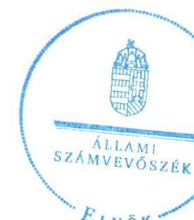
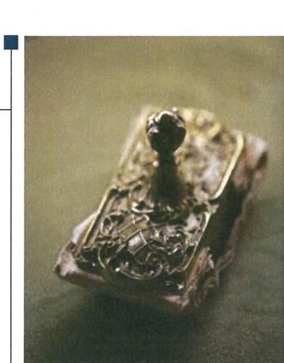
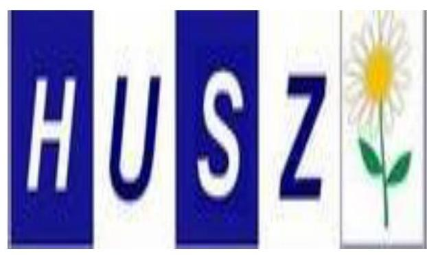
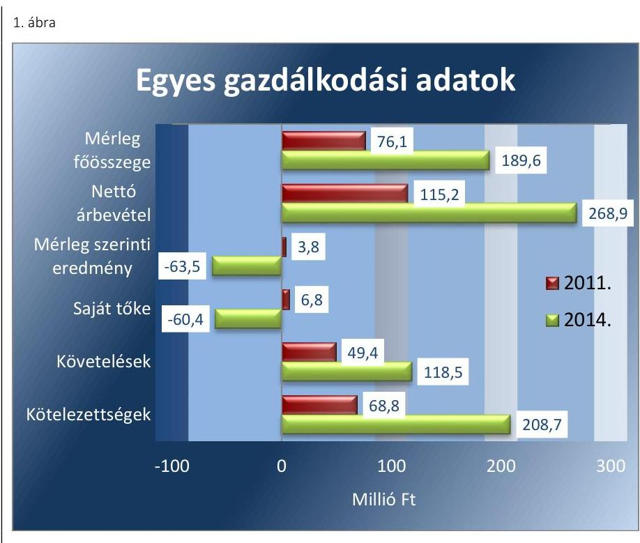
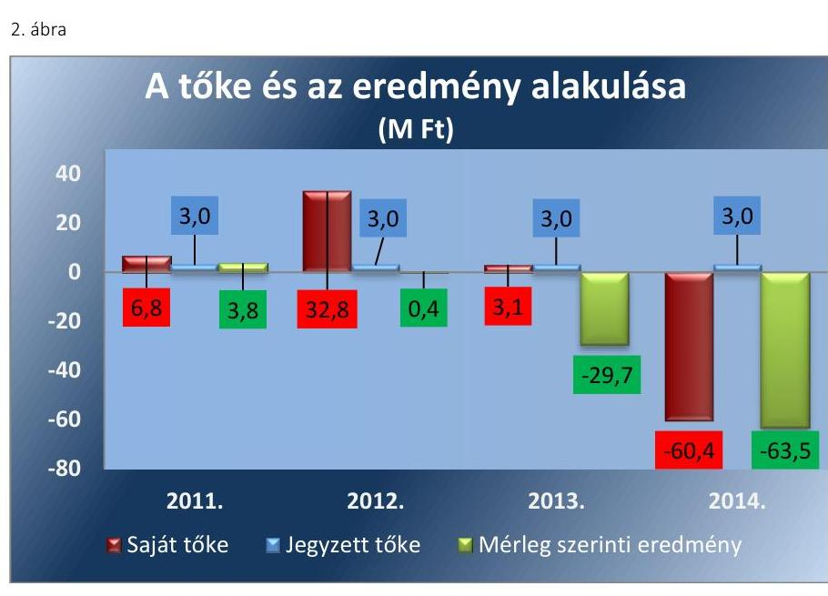
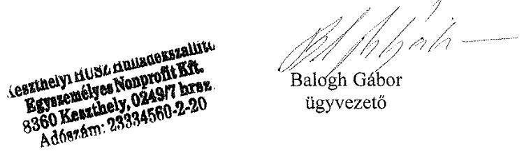
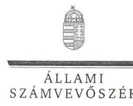
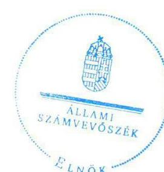

# Jelentés 

## Az önkormányzatok gazdasági társaságai

Az önkormányzatok többségi tulajdonában lévő gazdasági társaságok közfeladat ellátását érintő gazdálkodási tevékenysége szabályszerűségének ellenőrzése - Keszthelyi HUSZ Hulladékszállító Egyszemélyes Nonprofit Kft.

2016.

Az ÁSZ az államháztartáson kívül működő közfeladat-ellátó rendszerek ellenőrzéseivel hozzájárul ahhoz, hogy a közpénzeket az államháztartáson kívül működő szervezetek is átlátható, rendezett módon használják fel a közfeladatok ellátása érdekében.

---

# Jelentés 

## Az önkormányzatok gazdasági társaságai

Az önkormányzatok többségi tulajdonában lévő gazdasági társaságok közfeladat ellátását érintő gazdálkodási tevékenysége szabályszerűségének ellenőrzése - Keszthelyi HUSZ Hulladékszállító Egyszemélyes Nonprofit Kft.
2016. július 13. nap

16112
www.asz.hu

---

# AZ ELLENŐRZÉST FELÜGYELTE:

DR. HORVÁTH MARGIT felügyeleti vezető

## AZ ELLENŐRZÉST VEZETTE ÉS A VÉGREHAJTÁSÁÉRT FELELŐS:

- KLINGA LÁSZLÓ ellenőrzésvezető
- A PROGRAM ÖSSZEÁLLÍTÁSÁÉRT FELELŐS:
- JANIK JÓZSEF osztályvezető

**IKTATÓSZÁM:** V-0968-179/2016.

**TÉMASZÁM:** 2002

**ELLENŐRZÉS-AZONOSÍTÓ SZÁM:** V-070719

Jelentéseink az Országgyűlés számítógépes hálózatán és az Interneten a www.asz.hu címen is olvashatóak.

---

# TARTALOMJEGYZÉK 

■ ÖSSZEGZÉS ..... 5
■ AZ ELLENŐRZÉS CÉLJA ..... 7
■ AZ ELLENŐRZÉS TERÜLETE ..... 8
■ AZ ELLENŐRZÉS HÁTTERE, INDOKOLTSÁGA ..... 10
■ A JELENTÉS LÉNYEGES KÉRDÉSKÖREI ..... 11
■ ELLENŐRZÉS HATÓKÖRE ÉS MÓDSZEREI ..... 12
■ MEGÁLLAPÍTÁSOK ..... 14
■ JAVASLATOK ..... 32
■ MELLÉKLETEK ..... 35
I. Sz. melléklet: Értelmező szótár ..... 35
II. Sz. melléklet: Működési adatok ..... 38
III. Sz. melléklet: Mintavételi eljárások ellenőrzési területenként ..... 39
■ FÜGGELÉK: ÉSZREVÉTELEK ..... 41
■ RÖVIDÍTÉSEK JEGYZÉKE ..... 49

---

.

---

# ÖSSZEGZÉS 

Az Állami Számvevőszék a kizárólagos önkormányzati tulajdonú Keszthelyi HUSZ Hulladékszállító Egyszemélyes Nonprofit Kft.-nél a hulladékgazdálkodási közfeladat ellátását érintő gazdálkodási tevékenysége 2011-2014 közötti szabályszerűségét ellenőrizte. Megállapította, hogy a közfeladat-ellátás önkormányzati megszervezése és a tulajdonosi jogok gyakorlása szabályosan történt. A számviteli szabályozás tartalmi hiányosságai mellett a vagyongazdálkodás alapvetően szabályszerű volt. A hulladékgazdálkodás közfeladata bevételeinek elszámolása megfelelő volt, azonban egyes ráfordítások elszámolása nem volt megfelelő. Az önköltségszámítás szabályait nem határozták meg, így az árképzés alátámasztottsága nem volt biztosított. A Társaság kötelezettségállománya a működésre, a közfeladatellátásra kockázatot jelentett.

## Az ellenőrzés társadalmi indokoltsága

Az Állami Számvevőszék Stratégiájában megfogalmazta, hogy a helyi önkormányzatok gazdálkodásában rejlő pénzügyi kockázatok feltárásával, az államháztartáson kívülre nyújtott költségvetési támogatások és ingyenes vagyonjuttatások, valamint az államháztartáson kívül működő közfeladat-ellátó rendszerek ellenőrzéseivel hozzájárul ahhoz, hogy a közpénzeket az államháztartáson kívül működő szervezetek is átlátható, rendezett módon használják fel a közfeladatok szerződésben vállalt ellátása érdekében.

Magyarországon az intézmény-centrikus közfeladat-ellátás jellemző, de egyre jelentősebb a költségvetésen kívüli feladatellátás térnyerése. Ennek legfontosabb szereplői - a nonprofit szervezetek mellett - az önkormányzati tulajdonú gazdasági társaságok. Az önkormányzatok szervezetalakítási szabadságának következménye, hogy a korábban is vállalati formában működő közszolgáltatások mellett, mind a kötelező, mind az önként vállalt feladatok ellátásában a gazdasági társaságok kiemelt fontosságú szerephez jutottak.

## Főbb megállapítások, következtetések, javaslatok

Az Önkormányzat a hulladékgazdálkodás közfeladatának megszervezéséről a jogszabályi előírásoknak megfelelően döntött, annak ellátásáról a kizárólagos tulajdonában lévő gazdasági társasága útján gondoskodott. Az Önkormányzat a Hgt.1,2 szerinti hulladékgazdálkodással összefüggő rendeletalkotási kötelezettségének eleget tett, annak tartalma megfelelt az előírásoknak. Az ellenőrzött időszakban az Önkormányzat a hulladékgazdálkodási közszolgáltatás ellátására Közszolgáltatási szerződés¹⁻²t kötött a Társasággal, amelyek tartalma az előírásokkal összhangban volt.

A Képviselő-testület a vagyongazdálkodási rendelet¹⁻²ben, az SZMSZ¹⁻²ben, valamint az Alapító Okiratban egymással összhangban meghatározta a tulajdonosi joggyakorlás szabályait, amelyet az előírásoknak megfelelően, szabályszerűen gyakorolt. A HUSZ NKft. feladatait saját eszközeivel, továbbá bérelt és üzemeltetésre átvett eszközökkel látta el. A Képviselő-testület a társasági működés felügyeletét, a tulajdonosi ellenőrzési, beszámoltatási kötelezettségét az FB-n keresztül az előírásoknak megfelelően, szabályszerűen gyakorolta, azonban az FB ügyrendjét nem hagyták jóvá. Az ellenőrzött időszakban az Önkormányzat belső ellenőrzése a Társaságnál nem végzett ellenőrzést, így nem támogatta a szabályszerű működés kontrollját.

A közfeladat-ellátását szolgáló vagyonnal való gazdálkodás, annak nyilvántartása szabályszerű volt. A Társaság a számlarend kivételével rendelkezett a Számv. tv.-ben előírt számviteli szabályzatokkal, amelyek tartalma nem felelt meg maradéktalanul az előírásoknak. A Számviteli politika a Számv. tv.-ben előírtakkal ellentétben nem tartalmazta a készletnyilvántartás szabályait, helytelenül rögzítették a beszámoló formáját, továbbá a jelentős összegű hiba meghatározásánál nem vették figyelembe az előírásban bekövetkezett változást. A Leltározási szabályzatban nem rendelkeztek az immateriális javak leltározásáról, illetve egyes tárgyi eszközök esetében a mennyiségben történő leltározást

---

öt évente írták elő a Számv.tv.-ben 2012-től meghatározott három év helyett. Az Értékelési szabályzatban a külföldi pénzeszköz, valutában és devizában fennálló követelés és kötelezettség értékelési szabályai ellentétben voltak a Számviteli politikában és a Számv. tv.-ben előírtakkal. A Társaság a 2013-2014. években a Számv. tv.-ben előírtakat figyelmen kívül hagyva belső szabályzatait nem úgy alakította ki, hogy az a mérleg és az eredménykimutatás alátámasztásán túlmenően a kiegészítő melléklet adatainak közvetlen alátámasztására is alkalmas legyen.

A Társaság vagyona 2011. december 31-ről 2014. év végére 113,5 millió Ft-tal nőtt, ezen belül a tárgyi eszközök állományának növekedéséhez a feladatellátáshoz átvett tárgyi eszközök értéke és az elszámolt értékcsökkenésnél magasabb összegben megvalósult beszerzések járultak hozzá. A HUSZ NKft.-nek hosszúlejáratú kötelezettsége 2012-ben volt 8,5 millió Ft összegben. A Társaság rövid lejáratú kötelezettségeinek döntő részét a 2012. évtől kezdődően határidőben nem tudta teljesíteni. A szállítói kötelezettségállomány 2011-ről 2014-re 33,2 millió Ft-ról 137,6 millió Ft-ra nőtt. Ezen belül a határidőn túli kötelezettségállomány közel kilencszeresére, 11,3 millió Ft-ról 111,1 millió Ft-ra nőtt. A Társaság kötelezettségállománya a működésre, a közfeladat-ellátásra kockázatot jelentett. Az ellenőrzött időszakban a vevőkövetelések december 31.-i állománya 60,0 millió Ft-tal növekedett, ami 2014 végén 109,0 millió Ft-ot tett ki. A HUSZ NKft. nem gondoskodott a díjhátralékok jogszerű behajtásáról az ellenőrzött időszakban. A lejárt kinnlevőségek behajtására 2014. júliusban a Társaság szabálytalanul határozatlan idejű szerződést kötött egy követeléskezelő céggel. A HUSZ NKft. a Hgt. 2-ben foglaltak ellenére a hulladékgazdálkodási közszolgáltatás nyújtása érdekében végzett tevékenységét a 2013. és 2014. évi beszámolóinak kiegészítő mellékletében nem mutatta be oly módon, mintha azt önálló vállalkozás keretében végezte volna. A könyvvizsgáló a jelentésében nem állapította meg a kiegészítő melléklet tartalmi hiányosságát.

A HUSZ NKft. az üzleti tervek teljesítéséről, az éves gazdálkodásról az éves beszámolók és üzleti jelentések keretében számolt be a tulajdonos felé a Számv. tv.-ben előírtaknak megfelelően. A Társaság az Avtv.-ben, illetve 2012-től az Info tv.-ben előírtak ellenére adatvédelmi és adatbiztonsági szabályzatot 2013. december 2-ig nem készített, adatvédelmi felelőst nem nevezett ki, továbbá a közérdekű adatok közzétételének és a közérdekű adatok megismerésére irányuló igények teljesítésének rendjét tartalmazó szabályzattal nem rendelkezett. A HUSZ NKft. a közérdekű adatok és a közérdekből nyilvános adatok megismerhetőségét a közzététellel nem biztosította. A Társaságnál a bevételek elszámolása megfelelő volt, azonban az anyagjellegű ráfordítások elszámolása nem volt megfelelő, mivel egyes ráfordításokat nem elkülönítetten könyvelték a különböző tevékenységekre. Az önköltségszámítás szabályait nem határozták meg, elő- és utókalkulációt nem alkalmaztak, így az árképzés alátámasztottsága nem volt biztosított.

---

# AZ ELLENŐRZÉS CÉLJA 

Az ellenőrzés célja annak értékelése, hogy az Önkormányzat a jogszabályi előírások figyelembevételével döntött-e az ellenőrzésre kerülő közfeladat megszervezéséről; az önkormányzat/tulajdonosi joggyakorló szabályszerűen gyakorolta-e a tulajdonosi jogokat.

Ellenőriztük, hogy a gazdasági társaság közfeladat-ellátása bevételeinek, ráfordításainak elszámolása, és vagyongazdálkodási tevékenysége megfelelt-e a jogszabályi, illetve a közszolgáltatási/vagyonkezelési szerződésben foglalt tulajdonosi előírásoknak, azok végrehajtása szabályszerű volt-e.

Értékeltük továbbá, hogy a gazdasági társaság kötelezettségállománya jelent-e kockázatot a működésre, illetve a közfeladat ellátására; valamint hogy a közfeladatok átláthatósága és elszámoltathatósága érdekében biztosítva volt-e a közszolgáltatás díjának megalapozottsága szabályszerű önköltségszámítással.

---

# AZ ELLENŐRZÉS TERÜLETE 

## Keszthely Város Önkormányzata és a többségi tulajdonában lévő Keszthelyi HUSZ Hulladékszállító Egyszemélyes Nonprofit Kft.

KESZTHELY VÁROS ÖNKORMÁNYZATA 2011. április 14-i határozatával alapította a 100%-os tulajdonában álló Keszthelyi HUSZ Hulladékszállító Egyszemélyes Nonprofit Kft.-t. A hulladékszállítási tevékenység ellátását a Társaság 2011. július 1-jével, a VÚZ Keszthelyi Városüzemeltető Egyszemélyes Nonprofit Kft. hulladékszállítási üzletágának kiválását követően kezdte meg. Az üzletág kiválásával tárgyi eszközök és vagyoni értékű jogok, valamint jogutódlással munkavállalók kerültek át a Keszthelyi HUSZ Hulladékszállító Egyszemélyes Nonprofit Kft.-hez. Az Önkormányzat a 3,0 millió Ft törzstőke biztosítása mellett vagyonkezelésre nem adott át eszközöket a Társaság részére.

A KESZTHELYI HUSZ HULLADÉKSZÁLLÍTÓ EGYSZEMÉLYES NONPROFIT KFT. főtevékenysége a 2014. év végén a 20116 fő lakosságszámú Keszthely város közigazgatási területén a települési szilárd hulladék gyűjtésére és elszállítására, valamint a hulladék elhelyezésére irányuló közszolgáltatás nyújtása volt. A hulladékszállításra kötött szerződések száma Keszthelyen, a 2014. évben 4924 db lakossági és nyaralói, 461 db közületi és vállalkozási volt. A Társaság a közterületi gyűjtőedényekből rendszeresen begyűjtötte és elszállította a hulladékot, megszervezte a lakosság által a lomtalanítás során összegyűjtött hulladék elszállítását, valamint szelektív hulladékgyűjtő szigeteket üzemeltetett. További feladata volt Keszthely város útjainak hó- és síkosság-mentesítése, amelyet 2011-2014 között, a Képviselő-testület által jóváhagyott feltételekkel, évente megkötött vállalkozási szerződés részeként látott el. A Társaság 2012. április 1-jétől - külön közszolgáltatási szerződések keretében - 12 környékbeli település teljes körű hulladékszállítását is elvégezte. A Társaság más gazdasági társaságban tulajdoni hányaddal nem rendelkezett, átlagos statisztikai állományi létszáma 2011-ben 13 fő, 2014-ben 22 fő volt.

A Keszthelyi HUSZ Hulladékszállító Egyszemélyes Nonprofit Kft. gazdálkodásának egyes adatait a 2011. és a 2014. évek vonatkozásában az 1. ábra szemlélteti:

---

*Forrás: A Társaság 2011. és 2014. évi beszámolói*

A Társaság mérlegfőösszege 2011-ben 76,1 millió Ft, 2014-ben 189,6 millió Ft volt. Az értékesítés nettó árbevétele a 2011. és a 2014. év vége között közel két és félszeresére nőtt. A 2011-ben még pozitív mérleg szerinti eredmény 2014 végére 63,5 millió Ft veszteséget mutatott. A saját tőke összege a 2014. év végére -60,4 millió Ft-ra csökkent. A követelések 139,8%-kal, míg a kötelezettségek több mint háromszorosára emelkedtek.

A Keszthelyi HUSZ Hulladékszállító Egyszemélyes Nonprofit Kft. működésének főbb jellemzőit a 2. számú melléklet mutatja be.

Az ellenőrzött időszakban a polgármester és az ügyvezető személye nem, a jegyző személye és a könyveléssel megbízott társaság változott. A polgármester a 2006. évi önkormányzati választások óta, a jegyző 2014. február 15. napjától tölti be tisztségét. A könyveléssel megbízott társaság 2014. január 1-jétől látja el feladatait.

---

# AZ ELLENŐRZÉS HÁTTERE, INDOKOLTSÁGA 

AZ ÖNKORMÁNYZATI TULAJDONÚ GAZDASÁGI TÁRSASÁGOK teljes körű ellenőrzésének lehetőségét az Állami Számvevőszékről szóló 1989. évi XXXVIII. törvény 2011. január 1-jétől hatályos módosítása teremtette meg. A gazdasági társaságok közfeladat ellátását érintő gazdálkodási tevékenysége szabályszerűségére irányuló ellenőrzéseket erre tekintettel a 2011. évtől végezzük. A közfeladatot ellátó gazdasági társaságok ellenőrzése kiemelten fontos a vagyon megőrzése, megóvása érdekében, valamint a kormányzati szektor elszámolásaiban megjelenő önkormányzati tulajdonú gazdálkodó szervezetek esetében, amelyekkel szemben alapvető követelmény, hogy gazdálkodásuk, működésük szabályszerű, az általuk szolgáltatott adatok minél megbízhatóbbak legyenek. A közfeladat ellátás költségeinek, ráfordításainak alakulása, színvonala hatással van a lakosság elégedettségére.

## AZ ELLENŐRZÉS VÁRHATÓ HASZNOSULÁSA-

KÉNT az ÁSZ¹ a megállapításaival segítséget nyújthat az államháztartáson kívüli közfeladat-ellátás értékeléséhez, jogszabályi keretei pontosításához, átláthatóságot biztosító szabályozásához.

 Meghatározhatóvá válnak a közfeladat ellátásban részt vevő államháztartáson kívüli szervezeteknek az önkormányzat költségvetését, pénzügyi helyzetét is befolyásoló kockázatai, lehetővé válik ezen kockázatok csökkentése. Értékelhetővé válik, hogy a feladatot ellátó gazdasági társaság a közszolgáltatási szerződésben foglaltak betartásával, a közvagyon használatával biztosította-e a szolgáltatás folytatásának feltételeit. Ezzel az ellenőrzöttek és a helyi döntéshozók számára az ÁSZ visszajelzést ad feladatszervezési, feladat-ellátási kockázataikról, alapot ad a meglévő hibák megszüntetéséhez, a jobb közfeladat-ellátás biztosításához. Mindezeken keresztül az ÁSZ hozzájárul Magyarország közpénzügyi helyzetének javításához, a közpénzek mérhető módon történő, a döntéshozók által meghatározott célok szerinti felhasználásához.

---

# A JELENTÉS LÉNYEGES KÉRDÉSKÖREI 

1. Az önkormányzat közfeladat megszervezéséről szóló döntése, valamint tulajdonosi joggyakorlása szabályszerű volt-e?
2. A gazdasági társaság vagyongazdálkodása szabályszerű volt-e, kötelezettségállománya jelentett-e kockázatot a működésre, illetve a közfeladat ellátásra?
3. A gazdasági társaságnál az ellátott közfeladat bevételei és ráfordításai elszámolása, valamint az önköltségszámítás és árképzés szabályszerű volt-e?

---

# ELLENŐRZÉS HATÓKÖRE ÉS MÓDSZEREI 

## Az ellenőrzés típusa

Megfelelőségi ellenőrzés

## Az ellenőrzött időszak

A 2011. április 11-étől 2014. december 31-éig terjedő időszak.

## Az ellenőrzés tárgya

A közfeladatot gazdasági társaságokkal ellátó önkormányzatok tulajdonosi joggyakorlása, valamint gazdasági társaságok pénz- és vagyongazdálkodásának szabályozottsága és szabályszerűsége.

Az ellenőrzés kiterjed minden olyan körülményre és adatra, amely az ÁSZ jogszabályban meghatározott feladatainak teljesítéséhez, valamint a program végrehajtása folyamán felmerült újabb összefüggések feltárásához szükséges.

## Az ellenőrzött szervezet

Keszthely Város Önkormányzata és a Keszthelyi HUSZ Hulladékszállító Egyszemélyes Nonprofit Korlátolt Felelősségű Társaság.

## Az ellenőrzés jogalapja

Az ellenőrzés végrehajtásának jogszabályi alapját az Állami Számvevőszékről szóló 2011. évi LXVI. törvény 5. § (3)-(4)-(5) bekezdései képezték.

## Az ellenőrzés módszerei

Az ellenőrzést a nemzetközi standardokat irányadónak tekintve az ellenőrzési program ellenőrzési kérdései, az ellenőrzött időszakban hatályos jogszabályok, az ellenőrzés szakmai szabályok és módszertanok figyelembe vételével végeztük.

Az ellenőrzés ideje alatt az ellenőrzött szervezettel történő kapcsolattartást az ÁSZ Szervezeti és Működési Szabályzatának vonatkozó előírásai alapján biztosítottuk.

---

Az ellenőrzés a kiválasztott, többségi tulajdonosi jogokat gyakorló önkormányzatra, illetve az ellenőrzött közfeladatot ellátó gazdasági társaságra terjedt ki. Az ellenőrzött gazdasági társaságnál, amennyiben az több közfeladatot is ellát, akkor az ellenőrzésre kiválasztott közfeladat-ellátást ellenőriztük.

Az ellenőrzést a kérdésekre adott válaszok kiértékelésével, valamint a megjelölt adatforrások, a csatolt tanúsítványok felhasználásával, továbbá az adott időszakban hatályos jogszabályok figyelembe vételével folytattuk le. Az ellenőrzési kérdések megválaszolásához szükséges bizonyítékok megszerzése a következő ellenőrzési eljárások alkalmazásával történt: megfigyelés, kérdésfeltevés (információkérés), összehasonlítás, valamint elemző eljárás.

A bevételek és ráfordítások elszámolása, valamint a vagyonnyilvántartás terén az egyes területek szabályszerű működését mintavétellel ellenőriztük, ez alapján a sokaságokban előforduló hibás tételek arányát becsültük. A jogszabályoknak és a belső előírásoknak megfelelőnek, azaz szabályszerűnek tekintettük az adott bevételek és ráfordítások elszámolását, a vagyonnyilvántartást, amennyiben a minta ellenőrzésének eredménye alapján 95%-os bizonyossággal a teljes sokaságban a hibaarány kisebb volt, mint 10%, nem megfelelőnek értékeltük, ha a hibás tételek aránya a 10%-ot meghaladta. Kockázatot, illetve magas kockázatot jeleztünk, amennyiben egy adott terület vonatkozásában a minta alapján a teljes sokaságban nem volt teljes körűen biztosított a jogszabályoknak és a belső szabályzatoknak megfelelő működés.

---

# 1. Az önkormányzat közfeladat megszervezéséről szóló döntése, valamint tulajdonosi joggyakorlása szabályszerű volt-e? 

Összegző megállapítás

Az Önkormányzat a jogszabályi és a belső előírások betartásával szervezte meg a hulladékgazdálkodás közfeladatát, a tulajdonosi jogok érvényesítése szabályszerű volt.
1.1. számú megállapítás

A közfeladat-ellátást az Önkormányzat szabályszerűen szervezte meg, a hulladékgazdálkodással összefüggő rendeletalkotási kötelezettségének a vonatkozó jogszabályi előírásoknak megfelelően eleget tett.

Az Ötv. 91. § (6) bekezdése, 2013. január 1-jétől az Mötv. 116. § (3)-(4) bekezdései szerint az önkormányzatnak a gazdasági programjában kell meghatároznia mindazokat a célkitűzéseket, amelyek az általa ellátott feladatok biztosítását, fejlesztését szolgálják. A Képviselő-testület által a 2011-2015. évekre elfogadott Gazdasági program a hulladékgazdálkodási közfeladattal kapcsolatosan a stratégiai célok között a szelektív hulladékgyűjtés népszerűsítését jelölte meg az egyik legfontosabb fejlesztési irányként.

Az Önkormányzat a Hgt. 35. § (1) bekezdésében foglaltakat figyelmen kívül hagyva nem dolgozott ki és nem fogadott el a 2011-2012. évekre vonatkozó helyi hulladékgazdálkodási tervet. A Hgt. 78. § (1) bekezdésében foglaltak alapján - 2013. január 1-jétől - a hulladékgazdálkodási tervet a közszolgáltatónak kellett elkészítenie, amelynek eleget tett.

## A KÖZTISZTASÁG ÉS A TELEPÜLÉSTISZTASÁG

BIZTOSÍTÁSÁT az Önkormányzat az Ötv. 8. § (1) bekezdés előírásának* megfelelően - nevesítve is a hulladékkezelést - a közszolgáltatások körében ellátandó kötelező feladatként meghatározta az SZMSZ-ben. A feladatellátás módját a Hulladékgazdálkodási rendelet tartalmazta. Az Önkormányzat közigazgatási területén a hulladékgazdálkodást, ennek részeként a szilárd hulladék gyűjtésének, szállításának és hasznosításának közfeladatát szabályszerűen szervezte meg. A feladatokat 2011. január 1. és június 30. között a VÜZ NKft., 2011. július 1-től a hulladék begyűjtése, elszállítása és hasznosítása céljából alapított HUSZ NKft. útján látta el.

A HUSZ NKft. működésének és feladatellátásának kereteit az Alapító Okiratban a Gt. 11-12. § és a Ptk. 3:5. § előírásainak megfelelően határozta

[^0]
[^0]:    * A helyi közügyek, valamint a helyben biztosítható közfeladatok körében ellátandó helyi önkormányzati feladatként a hulladékgazdálkodást 2013. január 1-jétől az Mötv. 13. § (1) bekezdés 19. pontja írja elő.

---

meg. Az Alapító Okirat módosítására a cégvezető személyének és az FB tagjainak változása miatt került sor. A közfeladat kiszámítható, folyamatos és biztonságos ellátásának, valamint a közszolgáltatási díjak megállapításának helyi szabályait az Önkormányzat a Hgt. 23. §-ában és a Hgt. 88. § (4) bekezdésében kapott felhatalmazásnak megfelelően a Hulladékgazdálkodási rendeletben állapította meg.

Az Önkormányzat és a Társaság a „települési hulladék gyűjtésére és szállítására" 2011. június 29-én - figyelmen kívül hagyva a Hgt. 28. § (3) bekezdése szerinti 10 éves korlátozást - határozatlan időre kötötte meg a Közszolgáltatási szerződést, amelyet a 2014. június 30-án 10 éves időtartamra megkötött Közszolgáltatási szerződés váltott fel.

A Közszolgáltatási szerződés megfelelt a 224/2004. (VII. 22.) Korm. rendelet 11-14. §-aiban és a 317/2013. (VIII. 28.) Korm. rendelet 4-5. §-aiban előírt tartalmi követelményeknek.

A KÖZSZOLGÁLTATÁSI SZERZŐDÉS alapján a HUSZ NKft. feladata volt az ingatlantulajdonosokkal kötött szerződés szerint a települési szilárd és biohulladék rendszeres és folyamatos begyűjtése és elszállítása, ehhez az igényelt gyűjtőedények biztosítása, a lomtalanítási szolgáltatás megszervezése és lebonyolítása, gyűjtőszigeteken a szelektív hulladék begyűjtése, ügyfélszolgálat működtetése. A Közszolgáltatási szerződés tartalmazta a közszolgáltatási díj Önkormányzat részéről történő évenkénti felülvizsgálatának és esetleges módosításának a Társaságra háruló előkészítési, megalapozási feladatait. A Közszolgáltatási szerződésben meghatározták - többek között - a közszolgáltatás minőségi ismérveit, az illetékes hatóság által meghatározott minősítési osztályt, a közszolgáltatás ellátásával kapcsolatos jogokat és kötelezettségeket, finanszírozásának elveit és módszereit, a közszolgáltatási díjak beszedésének és a díjkövetelés érvényesítésének szabályait, továbbá a tevékenység és a költséghatékony gazdálkodás ellenőrizhetőségét, átláthatóságát biztosító előírásokat.

A HULLADÉKGAZDÁLKODÁSI RENDELET tartalma megfelelt a Hgt. 23. § a)-h) pontjai és a Hgt. 35. § a)-g) pontjai előírásainak. A Hulladékgazdálkodási rendelet a kötelező közszolgáltatásra vonatkozó rendelkezések céljaként a közszolgáltatás kiszámítható, folyamatos és biztonságos ellátását, a tevékenység ellenőrizhetőségét jelölte meg. A hulladékgazdálkodási rendeletben - többek között - meghatározták a jogszabály területi és személyi hatályát, a helyi közszolgáltatás tartalmát, ellátásának rendjét és módját, a közszolgáltató és az ingatlantulajdonos jogait és kötelezettségeit, valamint a közszolgáltatási díj megállapításának és megfizetésének szabályait. Előírták a lomtalanításra, a zöldhulladék elszállítására, továbbá a közszolgáltatás szüneteltetésére és a szabálysértésekre vonatkozó rendelkezéseket. A Hulladékgazdálkodási rendelet 2011. július 1-jén hatályba lépett módosítása jelölte meg a közszolgáltatást ellátó szervek között - a hulladék előkezelését és hasznosítását végző KETÉH Kft., a hulladékudvart üzemeltető VÜZ NKft. és a hulladék ártalmatlanítását végző ZALAISPA Zrt. mellett - a települési szilárd hulladékkal kapcsolatos kötelező helyi közszolgáltatás teljesítésére jogosult, illetőleg kötelezett közszolgáltatóként a HUSZ NKft.-t.

---

# 1.2. számú megállapítás 

A tulajdonosi jogok gyakorlása szabályszerű volt, azonban az FB nem rendelkezett a Képviselő-testület által jóváhagyott ügyrenddel.

A TULAJDONOSI JOGOKAT a Képviselő-testület a Vagyongazdálkodási rendeletben, az SZMSZ-ben, valamint az Alapító Okiratban határozta meg. Az Önkormányzatot megillető tulajdonosi jogok gyakorlásával kapcsolatos feladatok és jogosítványok a Képviselő-testületet illették meg, amelyeket a meghatározott esetekben a polgármesterre ruházott át. Az Önkormányzat egyes bizottságai a vagyongazdálkodási kérdésekben döntés-előkészítési, véleményezési jogot gyakorolhattak. A HUSZ NKft. vonatkozásában a tulajdonosi jogokat a belső szabályozással összhangban az arra jogosult szabályszerűen gyakorolta.

AZ FB a Gt. 34. § (1) bekezdése és a Ptk. 3:121. § (1) bekezdése előírásainak megfelelően három tagból állt. Az FB a HUSZ NKft. 2011-2014. évi számviteli beszámolójáról alkotott véleményét határozatba foglalta.

Az FB a Gt. 34. § (4) bekezdésében, illetve a Ptk. 3:122. § (3) bekezdésében foglaltaknak megfelelően elkészítette az ügyrendjét, de azt az előírás ellenére a Képviselő-testület nem hagyta jóvá.

ANYAGI ÖSZTÖNZÉSI RENDSZERT a Társaság vezető tisztségviselői számára a Képviselő-testület nem határozott meg. A Taktv. 5. § (3) bekezdés előírása szerint összeállított Javadalmazási szabályzatban a Képviselő-testület a vezető tisztségviselők, az ügyvezető, a cégvezető és az FB tagok javadalmazása, valamint a jogviszonyuk megszűnése esetére biztosított juttatások módjának, mértékének elveit, annak rendszerét szabályozta. A szabályzat előírásai szerint az ügyvezető és a felügyelőbizottsági tagok javadalmazásának mértékét a Képviselő-testület, a cégvezetőét az ügyvezető állapítja meg. A vezető tisztségviselők jogviszonyának megszűnése esetén az adható juttatásokat és azok mértékét az Mt. vonatkozó előírásainak betartásához kötötte. A felügyelőbizottsági tagok jogviszonyának megszűnése esetére - a Taktv. 6. § (3) bekezdés előírásával egyezően - a Javadalmazási szabályzat nem biztosított juttatást.

AZ ÁRKÉPZÉS SZABÁLYAIT a 2012. év végéig a Hulladékgazdálkodási rendeletben határozta meg az Önkormányzat. A Hgt. 25. § (4) bekezdésében előírt, a közszolgáltatás díját meghatározó önkormányzati rendelet elfogadását megelőző költségelemzést - a jogelőd VÚZ NKft. javaslata alapján - a jegyző 2008 decemberében, majd 2009 januárjában terjesztette a Képviselő-testület elé, amit elfogadtak. A Hulladékgazdálkodási rendelet a díjmegállapítás módszerére és a díjváltoztatásra vonatkozóan a követendő eljárásokat rögzítette. A díjtételeket - önkormányzati hatáskörben - a 2011-2012 években nem módosították. A közszolgáltatás díjai a 64/2008. (III. 2.) Korm. rendelet 3-4. §-aiban foglaltaknak megfeleltek, és a Hgt. 57. §-ában, illetve a Hgt. 91. §-ában meghatározott maximális mértéket nem haladták meg.
 2013. január 1-jétől a hulladékgazdálkodási díjat a MEKH ${ }^{33}$ javaslatának figyelembevételével a miniszter ${ }^{\dagger}$ rendeletben állapítja meg.

[^0]
[^0]:    ${ }^{+}$Nemzeti Fejlesztési Miniszter

---

A BESZÁMOLTATÁSI RENDSZER keretében a Képviselőtestület a HUSZ NKft. ügyvezetőjét évente, a negyedik negyedévben beszámoltatta a Társaság várható eredményéről és az éves gazdálkodásról, valamint a közszolgáltatási tevékenységről a Közszolgáltatási szerződés ${ }_{1,2}$ ben foglaltak szerint. A Társaság 2011-2014. évi éves szakmai és számviteli beszámolóit - az FB írásbeli határozata birtokában - a Képviselő-testület a Gt. 35. § (3) bekezdése, illetve a Ptk. 3:120. § (2) bekezdése előírásainak megfelelően megtárgyalta és elfogadta. A Képviselő-testület döntött továbbá a 2012-2014. évi üzleti tervek elfogadásáról is.

A TÁRSASÁG ELLENŐRZÉSÉRE az Önkormányzat belső ellenőrzése részéről a 2011-2014. években nem került sor. Külső ellenőrzést a NAV ${ }^{34}$ és az OHÜ NKft. ${ }^{35}$ végzett a 2014. évben a Társaságnál. A NAV a behajtásra átadott követelések adatainak, továbbá az adóbevallások és egyes adókötelezettségek teljesítésének, az OHÜ NKft. a havi jelentéssel benyújtott támogatási igények jogszerűségének, megalapozottságának ellenőrzése során realizálást igénylő megállapítást, javaslatot nem tett.

A HUSZ NKft. a 2011. és a 2012. évben nyereségesen, a 2013. és a 2014. évben veszteségesen működött. A Társaság a 2012. évben a 0,4 millió Ft mérleg szerinti eredmény mellett - a Számv. tv. 37. § (1) bekezdés f) pontjában előírtaknak megfelelően - 29,4 millió Ft-ot eredménytartalékba helyezett. A szállítói követelések - köztük az Önkormányzat hulladékgazdálkodást végző többi gazdasági társasága felé fennálló tartozás - folyamatos növekedésének kezelése céljából a Képviselő-testület a 2014. évben rövid lejáratra, 31,5 millió Ft összegű tagi kölcsön nyújtásáról határozott.

A HUSZ NKft. az ellenőrzött időszakban - a 2014. év kivételével - rendelkezett a társasági formájára előírt jegyzett tőkének megfelelő saját tőkével. Mivel a 2014. évben a Társaság saját tőkéje veszteség folytán a törzstőke felére, a saját tőkéje a törzstőke - a Ptk. 3:161. § (4) bekezdésében meghatározott - minimális összege (kft. esetében 3,0 millió Ft) alá csökkent, a Ptk. 3:189. § (2) bekezdésében előírtak alapján az Önkormányzatnak határozathozatali kötelezettsége volt a pótbefizetés előírására, a törzstőke mértékét elérő saját tőke más módon való biztosítására vagy a törzstőke leszállítására. A Képviselő-testület a Ptk. 3:189. § (2) bekezdésében előírtaknak megfelelve, a saját tőke más módon történő biztosítása érdekében - pótbefizetés teljesítése helyett - a Társaság veszteségeinek kompenzálására pályázaton elnyert 60,9 millió Ft támogatás összegének törzstőke pótlására történő igénybevételét határozta meg.

A saját tőke, a jegyzett tőke, valamint a mérleg szerinti eredmény alakulását a 2. ábra mutatja be.

---

Forrás: 3. számú tanúsítvány
Az Önkormányzat a 2011-2014. években a Társaság feladatellátásához rendszeres vagy eseti működési célú támogatást, illetve fejlesztési támogatást nem nyújtott. A Képviselő-testület 2011 szeptemberében határozatában hozzájárult, hogy a 30,0 millió Ft-os rulírozó hitelkeret biztosítékaként az Önkormányzat tulajdonát képező, a Társaság telephelyeként szolgáló ingatlanra, a szerződő pénzintézet javára, jelzálog kerüljön bejegyzésre. A HUSZ NKft. pénzügyi helyzetére tekintettel 2014 novemberében a 2015. évre vonatkozó - éven belüli - szerződéshez az Önkormányzat a 30,0 millió Ft összegű hitelkeret és járuléka erejéig biztosítékként készfizető kezességet vállalt.

# 2. A gazdasági társaság vagyongazdálkodása szabályszerű volt-e, kötelezettségállománya jelentett-e kockázatot a működésre, illetve a közfeladat ellátásra? 

Összegző megállapítás

A vagyongazdálkodás alapvetően szabályszerű volt, a kötelezettségállomány a működésre, a közfeladat-ellátásra kockázatot jelentett. A Társaság számviteli szabályzatainak tartalma nem felelt meg maradéktalanul az előírásoknak.
2.1. számú megállapítás

A Társaság a számlarend kivételével rendelkezett a kötelező belső szabályzatokkal, azonban azok tartalma maradéktalanul nem felelt meg az előírásoknak.

AZ ÜZLETI TERVEKET a HUSZ NKft. - a 2011. év kivételével - évente elkészítette, amelyek összhangban voltak az Önkormányzat hulladékgazdálkodási közfeladat-ellátására vonatkozó szakmai terveivel. A 2014. évi üzleti terv tartalmazott csak fejlesztési elképzeléseket. A terv iparfejlesztési pályázat keretében 100%-os támogatással megvalósuló 2014. évi gép- és hulladékgyűjtő beszerzéssel számolt. A HUSZ NKft. 2012-2014. évi üzleti terveit, valamint a tervek teljesítéséről szóló - a tervektől

---

való eltérést és annak okait is bemutató - éves beszámolóit az FB megtárgyalta, javasolta a Képviselő-testületnek megtárgyalásra és elfogadásra. A Képviselő-testület az üzleti terveket és a beszámolókat határozattal elfogadta.

A Társaság rendelkezett a Számv. tv. ${ }^{36}$ 14. § (4) bekezdés előírásának megfelelően hatályos Számviteli politikával ${ }^{37}$ és a Számv. tv. 14. § (5) és (7) bekezdései előírásának megfelelően az eszközök és források leltárkészítési és leltározási, illetve értékelési szabályzatával, valamint pénzkezelési szabályzattal. A Számv. tv. 14. § (5) bekezdés c) pontjában előírt, az önköltségszámítás rendjére vonatkozó szabályzatot nem készített, erre a Számv. tv. 14. § (6)-(7) bekezdés szerint jogszabályi kötelezettsége sem volt.

A Társaság az ellenőrzött időszakban számlarenddel nem rendelkezett, megsértve ezzel a Számv. tv. 161. § (1) bekezdésében előírtakat.

A SZÁMVITELI POLITIKÁBAN a Számv. tv. 14. § (4) bekezdésében előírtak ellenére nem határozták meg a gazdálkodóra jellemző szabályok közül a készletnyilvántartás szabályait, így a készletnyilvántartás tekintetében nem történt meg az alkalmazásra kerülő módszer kiválasztása. A Számviteli politikában nem megfelelően választották meg a beszámoló formáját, mert a Társaság nem rendelkezett közhasznúsági jogállással és a Civil tv. ${ }^{38}$ szerint sem minősült civil szervezetnek, emiatt közhasznú egyszerűsített beszámolót nem készíthetett. A Társaság a Számv. tv. 8. § (2) bekezdés b) pontjában előírt egyszerűsített éves beszámoló készítésére volt kötelezett. A Számv. tv. 14. § (11) bekezdésében foglaltak ellenére a Számviteli politika aktualizálása nem történt meg, amikor a Számv. tv. 3. § (3) bekezdés 3. pontjának - a jelentős összegű hiba meghatározására vonatkozó előírások - 2013. január 1-től hatályos változása miatt nem módosították.

A Leltározási szabályzatban ${ }^{39}$ az eszközök között az immateriális javak meghatározott időszakonkénti leltározásának kötelezettségét a Számv. tv. 69. § (3) bekezdésben foglaltakkal ellentétben nem határozták meg. A Leltározási szabályzat aktualizálása nem történt meg a Számv. tv. 69. § (3) bekezdése 2012. január 1-jétől hatályos szabályrendszerének megfelelően, amely a folyamatos mennyiségi nyilvántartást vezető gazdálkodó szervezeteknél a mennyiségi felvételt legalább háromévenkénti gyakorisággal írta elő, míg a Leltározási szabályzat a jogszabályi előírás ellenére az ingatlanok, a lealapozott gépek, berendezések ellenőrzését csak ötévente követelte meg.

Az Értékelési szabályzat ${ }^{40}$ külföldi pénzeszköz, valutában és devizában fennálló követelés és kötelezettség értékelésének szabályai ellentétesek voltak a Számviteli politikában meghatározottakkal és nem feleltek meg a Számv. tv. 60. § (4) bekezdésében a külföldi pénzeszköz, a valutában és devizában fennálló követelés és kötelezettség bekerülési értékére és év végi értékelésére vonatkozó szabályainak. A Számviteli politikában a külföldi pénzeszköz, a valutában és devizában fennálló követelés és kötelezettség értékelésére az MNB által közzétett, hivatalos devizaárfolyamot határozták meg, az Értékelési szabályzat az adott ügyletet lebonyolító pénzintézet által meghirdetett eladási és vételi árfolyamot rögzítette.

A Pénzkezelési szabályzat ${ }^{41}$ a Számv. tv. 14. § (8) bekezdésében előírtaknak megfelelően tartalmazta a készpénzes, valamint a bankszámlán történő pénzforgalom lebonyolításának rendjét, a készpénzállományt érintő

---

pénzmozgások jogcímeit, a pénzmegőrzéssel, tárolással, pénzszállítással kapcsolatos eljárásokat, a valutapénztár rendjét, a pénztári ellenőrzést, a pénzkezeléssel kapcsolatos bizonylati rendet, valamint a napi készpénz záró állományának maximális mértékét.

A Társaság a 2013-2014. években a Számv. tv. 161/A. § (1) bekezdésében előírtakat figyelmen kívül hagyva belső szabályzatait nem úgy alakította ki, hogy azok a mérleg és az eredménykimutatás alátámasztásán túlmenően a Hgt. 250. § (3) bekezdésében előírt kiegészítő melléklet adatainak közvetlen alátámasztására is alkalmasak legyenek. Nem volt biztosított az egyes tevékenységek Hgt. 250. § (2) bekezdése szerinti olyan elkülönített nyilvántartása sem, amely biztosíthatta az egyes tevékenységek átláthatóságát, valamint a keresztfinanszírozás kizárását. Az ellenőrzött időszakban hatályos Számlatükör ${ }_{1-4}{ }^{42}$ szerint a Társaság a bevételek elszámolásához tevékenységi bontást ugyan alkalmazott, de számlarend hiányában nem volt biztosított a bevételek egyértelmű elhatárolásának szabályozása.

# 2.2. számú megállapítás 

## A Társaság a tulajdonában lévő vagyonával a jogszabályi és belső rendelkezéseknek megfelelően gazdálkodott.

Az ellenőrzött időszakban a HUSZ NKft. a vagyon értékének megőrzéséről, gyarapításáról gondoskodott.

A 2011-2014. években a HUSZ NKft. a hulladékgazdálkodási közfeladatot, valamint egyéb tevékenységeit saját eszközeivel, az Önkormányzattól, a KETÉH Kft.-től és a VÜZ NKft.-től bérelt eszközökkel, valamint a ZALAISPA Zrt.-től üzemeltetésre átvett eszközzel végezte, vagyonkezelésbe átvett eszköze nem volt.

## AZ ANALITIKUS ÉS FŐKÖNYVI NYILVÁNTARTÁSI

RENDSZER az immateriális javak, tárgyi eszközök bruttó értékében, értékcsökkenési leírásában bekövetkezett változásainak folyamatos nyomon követésére alkalmas volt. A 2011-2013. években a mérleget alátámasztó leltár a tárgyi eszközök esetében az analitikus nyilvántartással történő egyeztetéssel készült. A 2014. évben az immateriális javak és a tárgyi eszközök mérlegben szereplő értékét mennyiségi leltárfelvétellel támasztották alá. A Leltározási szabályzat előírásai ellenére, az ellenőrzött időszakban a le nem alapozott gépek, berendezések, felszerelések, járművek leltározásának kétévenkénti gyakorisága helyett csak a 2014. évben volt mennyiségi leltárfelvétel, ami megfelelt a Számv. tv. 69. § (3) bekezdésében 2012. január 1-jétől előírt három évenkénti tényleges mennyiségi leltározási kötelezettségének előírásának. A készletek mérleg fordulónapjára vonatkozó értékét az ellenőrzött időszakban mennyiségi leltárfelvétellel határozták meg.

---

A Társaság éves beszámolóinak főbb mérlegadatait az 1. táblázat szemlélteti.

1. táblázat

| A HUSZ NKFT. FŐBB MÉRLEGADATAI (MILLIÓ FORINTBAN) |  |  |  |  |
| :--: | :--: | :--: | :--: | :--: |
| Megnevezés | 2011.12.31. | 2012.12.31. | 2013.12.31. | 2014.12.31 |
| Befektetett eszközök | 8,6 | 45,9 | 35,4 | 67,4 |
| - ebből: Tárgyi eszköz | 8,6 | 45,7 | 35,1 | 66,8 |
| Forgóeszközök | 66,8 | 107,4 | 116,1 | 121,6 |
| - ebből: Követelések | 49,4 | 92,4 | 113,2 | 118,5 |
| Aktív időbeli elhatárolások | 0,7 | 0,0 | 0,0 | 0,6 |
| ESZKÖZÖK ÖSSZESEN | 76,1 | 153,3 | 151,5 | 189,6 |
| Saját tőke | 6,8 | 32,8 | 3,1 | $-60,4$ |
| - ebből: Jegyzett tőke | 3,0 | 3,0 | 3,0 | 3,0 |
| - ebből: Mérleg szerinti eredmény | 3,8 | 0,4 | $-29,7$ | $-63,5$ |
| Céltartalékok | 0,0 | 0,0 | 0,0 | 0,0 |
| Kötelezettségek | 68,8 | 119,8 | 147,9 | 208,7 |
| Passzív időbeli elhatárolások | 0,5 | 0,7 | 0,5 | 41,3 |
| FORRÁSOK ÖSSZESEN | 76,1 | 153,3 | 151,5 | 189,6 |

A Társaság működése első (nem teljes) évének végén - tekintettel a bérelt és üzemeltetésre átvett tárgyi eszközök magas arányára - az eszközök mindössze 11,3%-a volt befektetett eszköz. A forgóeszközök 87,8%-os súlyt képviseltek, amelyből a követelések 64,9%-os aránya dominált. A forrásoknak kevesebb, mint a tizedét (8,9%-át) alkotta
 a saját tőke összege, amelynek 44,1%-a az Önkormányzat által az alapításkor biztosított jegyzett tőke, 55,9%-a a 2011. évi eredmény volt. A források 90,1%-a idegen eredetű volt, kötelezettséget jelentve a Társaságnak.

AZ ESZKÖZÉRTÉK 2012-ben történő növekedését a VÜZ NKft.-től átvett tárgyi eszközök 44,3 millió Ft-os értéke, valamint az átvett lízingkötelezettség 24,4 millió Ft-os összege növelte az előző évhez képest. A befektetett eszközök állományváltozását a 2011-2014. évben elszámolt értékcsökkenésnél 23,8 millió Ft-tal magasabb összegben megvalósított eszközbeszerzés okozta. A 2011-2014. években az immateriális javak és a tárgyi eszközök után elszámolt értékcsökkenés halmozott összege 51,4 millió Ft volt, ugyanezen időszakban az eszközök beszerzésére és pótlására 75,2 millió Ft-ot fordítottak. A megvalósított fejlesztések forrása 32,9%ban saját erő, 67,1%-ban támogatás volt. Az 50,5 millió Ft összegű támogatást a Társaság az OHÜ NKft. által kiírt Iparfejlesztési Pályázati Felhívásra benyújtott pályázattal nyerte el.

Az ellenőrzött időszakban a forgóeszközök állománya a 2011. év végi 66,8 millió Ft-ról 2014 végére 122,0 millió Ft-ra változott, döntően a követelések állományának növekedése miatt. A követelésállományban a legjelentősebb változást a vevőkövetelések növekedése jelentette. A vevők mérleg szerinti záró állománya a 2011. december 31-i 49,0 millió Ft-ról a 2014. év végére 109,0 millió Ft-ra nőtt.

A HUSZ NKft. forrásaiban a saját tőke összege 2014 végére -60,4 millió Ft-ra csökkent, miközben a kötelezettségek - megháromszorozódva - 208,7 millió Ft-ra nőttek. A saját tőke jelentős mértékű negatív összegét alapvetően az első másfél évben összességében elért 4,2 millió Ft-os nyereséggel szemben a 2013. és 2014. években keletkezett 93,2 millió Ft-os

---

veszteség idézte elő. A 2014. év végén passzív időbeli elhatárolásként 41,3 millió Ft összeg került szabályszerűen könyvelésre, amely pályázati forrásból származott.

# A HULLADÉKSZÁLLÍTÁSI KÖZSZOLGÁLTATÁS 

ELLÁTÁSÁHOZ szükséges eszközök karbantartására az évek sorrendjében 3,4 millió Ft-ot, 4,8 millió Ft-ot, 5,1 millió Ft-ot és 10,3 millió Ft-ot fordítottak. A tárgyi eszközök nyilvántartási értékéhez (8,3-66,8 millió Ft) képest viszonylag magas karbantartási költségeket a jellemzően használt állapotban megvásárolt és átvett eszközök túlsúlya, rendszeres karbantartási igénye indokolta.

### 2.3. számú megállapítás

A rövid lejáratú kötelezettségek állományának növekedése a működésre, a közfeladat ellátására kockázatot jelentett.

A Társaságnak a VÜZ NKft. hulladékszállítási üzletágának kiválását követően átvett három db hulladékszállító gépjárműhöz kapcsolódó, 24,4 millió Ft összegű lízingkötelezettség miatt 2012-ben hosszú lejáratú kötelezettsége keletkezett, amely az év végén 8,5 millió Ft-ot tett ki.

Az ellenőrzött időszakban a követelésállomány növekedése és a mérleg szerinti eredmény csökkenése, majd növekvő veszteség miatt a HUSZ NKft. további külső forrás bevonására kényszerült. A szállítói kötelezettségállomány a 2014. évben olyan mértéket ért el, hogy kiegyenlítésére az Önkormányzat rövid lejáratra, 31,5 millió Ft összegű tagi kölcsön nyújtásáról határozott. A Képviselő-testület határozatai alapján megkötött szerződések szerint 2014 májusában 16,5 millió Ft, szeptemberben 15,0 millió Ft tagi kölcsönt folyósítottak a Társaság részére.

A Társaság rövid lejáratú kötelezettségeinek összetételét a 2. táblázat mutatja be.
2. táblázat

## A HUSZ NKFT. HOSSZÚ ÉS RÖVID LEJÁRATÚ KÖTELEZETTSÉGEI (MILLIÓ FORINTBAN)

| Megnevezés | 2011. | 2012. | 2013. | 2014. |
| :--: | :--: | :--: | :--: | :--: |
|  | 12. 31. | 12. 31. | 12. 31. | 12. 31. |
| Hosszú lejáratú kötelezettségek | 0,0 | 8,5 | 0,0 | 0,0 |
| Rövid lejáratú kötelezettségek | 68,8 | 111,4 | 147,9 | 208,7 |
| Rövid lejáratú kölcsönök | 0,0 | 0,0 | 0,0 | 31,5 |
| Rövid lejáratú hitelek | 21,0 | 30,0 | 22,8 | 20,6 |
| Kötelezettségek áruszállításból, szolgáltatásból (szállítók) | 33,2 | 56,9 | 99,6 | 137,6 |
| Egyéb rövid lejáratú kötelezettségek | 14,6 | 24,5 | 25,5 | 19,0 |
| Kötelezettségek összesen | 68,8 | 119,8 | 147,9 | 208,7 |

A rövid lejáratú kötelezettségeken belül a legnagyobb változást a szállítói kötelezettség 314,5%-os növekedése jelentette. A HUSZ NKft. a szállítók felé fennálló tartozásainak többségét az Önkormányzat más gazdasági társaságai felé halmozta fel. A szállítói kötelezettségállományból 2011. december 31-én 41,6%, 2012. december 31-én 56,4%, 2013. december 31-én 63,5%, 2014. december 31-én 50,9% a KETÉH Kft. és a VÜZ NKft. felé fennálló tartozás volt. A Társaság tartozása 2014. december 31-én a ZALAISPA

---

Zrt. felé is jelentős, 48,0 millió Ft volt, amely a szállítói kötelezettségállomány 34,9%-át tette ki.

Az ellenőrzött időszakban a Társaság eladósodottsága folyamatosan nőtt. A kötelezettségek összes forráshoz viszonyított mértéke kockázatot jelez.

AZ ELADÓSODOTTSÁGI MUTATÓ mértéke, az összes forráson belül az idegen forrás aránya - a 2012. évi átmeneti csökkenést követően - növekvő tendenciát mutatott. A mutató minden évben jelentősen meghaladta a még kedvezőnek tekinthető 0,6 értéket, a 2011. évben 0,9, a 2012. évben 0,78, a 2013. évben 0,98, a 2014. évben 1,1 volt. Az év végén fennálló kötelezettségek a saját tőke összegét minden évben sokszorosan meghaladták, a 2011. évben 10-szeresen, a 2012. évben 3,6-szeresen, a 2013. évben 47-szeresen, a 2014. év végi negatív saját tőkét 3,5-szeresen. A nettó eladósodottsági mutató is erősen hullámzott, a követelésekkel csökkentett kötelezettségek csak a 2012. évben nem érték el a Társaság saját tőkéjének összegét, mértéke abban az évben 0,8 volt. A 2011. évben a nettó adósság 2,8-szeresen, a 2013. évben 11,2-szeresen haladta meg a saját tőke összegét, a 2014. évben pedig a 60,4 millió Ft negatív saját tőke 1,5-szerese volt. Az 1 Ft adósságra jutó vagyon értékét mérő adósságfedezeti mutató a 2011. évi 1,10-ről - a VÜZ NKft.-től származó vagyon átvétele következtében - 2012-ben 1,28-ra javult, majd 2013 végére 1,02-ra, 2014-ben pedig 0,91-ra romlott. Az ellenőrzött időszak végére így a Társaság tartozásai meghaladták a saját vagyonát. Az árbevételre vetített eladósodottság a 2011-2014. években gyorsuló ütemben romlott, az árbevétel egyre kisebb arányban nyújtott fedezetet a forgóeszközökkel csökkentett kötelezettségekre. A mutató mértéke a 2011. évben 0,02, 2012-ben 0,05, 2013-ban 0,12, 2014-ben 0,32 volt. A 2014. év végére kialakult eladósodottsági helyzeten már nem javíthatott a Földművelésügyi Minisztérium által - a hulladékgazdálkodási közszolgáltatók részére a 2014. január 1. és november 30. közötti időszak veszteségeinek kompenzálására - kiírt pályázaton történt sikeres részvétel, mert az egyedi támogatási döntéssel megítélt 60,9 millió Ft már a mérlegkészítés időpontját követően érkezett a Társaság számlájára, így a 2014. évi eredményre nem gyakorolt hatást.

A HOSSZÚ LEJÁRATÚ KÖTELEZETTSÉG esedékes törlesztő részleteit határidőben teljesítették. A VÜZ NKft.-től átvett gépjárművek 24,4 millió Ft összegű lízingkötelezettségéből a 2012. évi mérlegben szereplő 8,5 millió Ft hosszú lejáratú kötelezettséget kiegyenlítették.

# A RÖVID LEJÁRATÚ KÖTELEZETTSÉGEKET a 

HUSZ NKft. a 2012. évtől kezdődően határidőben nem tudta teljesíteni. Az ellenőrzött időszak likviditási helyzetének romlását mutatta a szállítói kötelezettség lejárat szerinti alakulása. A szállítói kötelezettségállomány 2011-ről 2014-re 314,5%-kal, ezen belül a határidőn belüli 21,0%-kal, a határidőn túli kötelezettségállomány 883,2%-kal nőtt. A lejárt határidejű kötelezettség aránya a szállítói kötelezettségállományból a 2011. december 31-i 34,0%-ról 2014. december 31-re 80,7%-ra növekedett.

---

Az áruszállításból, szolgáltatásból (szállító) származó kötelezettségek lejárat szerinti alakulását a 2011-2014. években a 3. táblázat mutatja:
3. táblázat

A SZÁLLÍTÓI KÖTELEZETTSÉG LEJÁRAT SZERINTI ALAKULÁSA

| A kötelezettségek lejárata | $\begin{aligned} & 2011 \ & M \text { Ft } \end{aligned}$ | $\begin{aligned} & 12 \ & \% \end{aligned}$ | $\begin{aligned} & 31 \ & M \text { Ft } \end{aligned}$ | $\begin{aligned} & 2012,12 \text {, } 31 \text {. } \end{aligned}$ | $\begin{aligned} & 2013,12 \text {, } 31 \text {. } \end{aligned}$ | $\begin{aligned} & 2014,12 \text {, } 31 \text {. } \end{aligned}$ |  |
| :--: | :--: | :--: | :--: | :--: | :--: | :--: | :--: |
| Határidőn belüli teljesítés | 21,9 | 66,0 | 7,9 | 13,9 | 12,4 | 12,5 | 26,5 |
| Késedelmes teljesítés | 11,3 | 34,0 | 49,0 | 86,1 | 87,1 | 87,5 | 111,1 |
| 0-30 nap között | 8,6 | 25,9 | 16,4 | 28,8 | 15,8 | 15,9 | 32,2 |
| 31-60 nap között | 2,7 | 8,1 | 9,8 | 17,2 | 13,7 | 13,8 | 20,9 |
| 61-90 nap között | 0,0 | 0,0 | 2,9 | 5,1 | 14,4 | 14,5 | 15,9 |
| 91-180 nap között | 0,0 | 0,0 | -0,6 | -1,1 | 20,2 | 20,3 | 37,5 |
| 181-365 nap között | 0,0 | 0,0 | 18,7 | 32,9 | 1,0 | 1,0 | 3,7 |
| 366 napon túli | 0,0 | 0,0 | 1,8 | 3,2 | 22,0 | 22,1 | 0,9 |
| Kötelezettségek össze- | 33,2 | 100,0 | 56,9 | 100,0 | 99,5 | 100,0 | 137,6 |

2.4. számú megállapítás

A Társaság az éves beszámolóit elkészítette, határidőben közzétette, azokat az FB és a könyvvizsgáló véleményezte. Az éves beszámolók kiegészítő mellékletei nem feleltek meg az előírt követelményeknek.

AZ ÉVES BESZÁMOLÓKAT a HUSZ NKft. a Számv. tv. 19. § (1) bekezdésében előírt tartalommal elkészítette, azokat a Számv. tv. 153. § (1) bekezdésében, valamint 154. § (1) bekezdésében foglaltak szerint letétbe helyezte, illetve közzétette.

A Képviselő-testület munkatervében írt elő a HUSZ NKft. számára beszámolási kötelezettséget a Társaság üzleti évének tevékenységéről, várható eredményéről. A Közszolgáltatási szerződés a Társaság számára évenkénti tájékoztatási kötelezettséget írt elő a közfeladat teljesítésével és a díjak mértékével, alkalmazásával kapcsolatos tapasztalatairól. Az Önkormányzat a közfeladat ellátásával kapcsolatosan a Közszolgáltatási szerződésben kizárólag az Önkormányzat kérésére történő, eseti információ- és adatszolgáltatási kötelezettséget fogalmazott meg.

A Gt. 141. § (2) bekezdése, valamint a Ptk. 3:109. § (2) bekezdése a Számv. tv. szerinti beszámoló jóváhagyását a Társaság legfőbb szerve kizárólagos hatáskörébe utalta. A Társaság a 2011-2014. évben az Önkormányzat részére a jogszabályi kötelezettségét a beszámoló elkészítésével és előterjesztésével teljesítette. Az ügyvezető⁴³ minden év negyedik negyedévében beszámolt a Társaság várható eredményéről. Az ügyvezetői beszámoló elfogadásáról a Képviselő-testület minden alkalommal határozatot hozott.

A HUSZ NKft. számviteli beszámolóit a Képviselő-testület a közzétételi és letétbe helyezési határidőt megelőzően jóváhagyta. Az éves beszámolók elfogadásáról a Képviselő-testület minden évben az FB határozatának és a könyvvizsgáló írásos jelentésének ismeretében döntött. A könyvvizsgáló minden évben hitelesítő záradékkal látta el a beszámolókat. A 2014. évi beszámolóról készített könyvvizsgálói jelentésében figyelemfelhívással élt, amelyben rögzítette, hogy a Társaság saját tőkéje mínusz 60,4 millió Ft, és

---

az ügyvezető a Ptk. 3:189. § (1) bekezdése alapján köteles haladéktalanul összehívni a taggyűlést a szükséges intézkedések céljából.

A HUSZ NKft. a Hgt. 50. § (3) bekezdésében foglaltak ellenére a hulladékgazdálkodási közszolgáltatás nyújtása érdekében végzett
 tevékenységét a 2013. és 2014. évi beszámolóinak kiegészítő mellékletében nem mutatta be oly módon, mintha azt önálló vállalkozás keretében végezte volna. A könyvvizsgáló - sem vezetői levélben, sem az egyszerűsített éves beszámolóról készített független könyvvizsgálói jelentésben - nem kifogásolta a kiegészítő melléklet tartalmi hiányosságát.

A HUSZ NKft. az ellenőrzött időszakban a Számv. tv.-ben előírt letétbe helyezési és közzétételi kötelezettségének a Képviselő-testület által elfogadott beszámoló, a független könyvvizsgálói jelentés, valamint a vonatkozó képviselő-testületi határozat megküldésével - a 2011. évi beszámoló kivételével - az előírt határidőben eleget tett. A 2011. évi egyszerűsített éves beszámolót a Társaság 2012. május 31-e helyett, 2012. szeptember 9-én tette közzé és küldte meg a céginformációs szolgálatnak, ezzel megsértette a Számv. tv. 153. § (1) és 154. § (1) bekezdésében előírtakat.

A HUSZ NKft. az Avtv. 20. § (8) bekezdésében, valamint az Info tv. ${ }^{44} 30$. § (6) bekezdésében foglaltak ellenére a közérdekű adatok megismerésére irányuló igények teljesítésének rendjét tartalmazó szabályzattal a 2011–2014. években nem rendelkezett.

Az Avtv. 31/A. § (3) bekezdésében, valamint az Info tv. 24. § (3) bekezdésében meghatározottak ellenére adatvédelmi és adatbiztonsági szabályzattal 2013. december 2-ig nem rendelkezett. Az ellenőrzött időszakban az Avtv. 31/A. § (1) bekezdés c) pontjában és az Info tv. 24. § (1) bekezdés c) pontjában, valamint az adatvédelmi és adatbiztonsági szabályzatban foglaltak ellenére a Társaság belső adatvédelmi felelőst nem jelölt ki.

A HUSZ NKft. a közérdekű adatok és a közérdekből nyilvános adatok megismerhetőségét a közzététellel nem biztosította. A 18/2005. IHM rendelet ${ }^{45} 2$. § (1)–(2) bekezdéseiben foglalt előírásokat nem tartották be, amikor a közzétételre szolgáló honlap ${ }^{1}$ megnyitásakor megjelenő oldalon a közzétételi listák által előírt adatokat tartalmazó jegyzékre vagy felületre mutató „Közérdekű adatok” elnevezéssel hivatkozást nem helyeztek el, az egységes közadatkereső rendszerre, a központi elektronikus jegyzékre mutató hivatkozást sem tüntettek fel. A Társaság honlapján elérhető közérdekű adatokat nem a 18/2005. IHM rendelet 1. mellékletében előírt tagolásban tartalmazta. Nem kerültek közzétételre a számviteli beszámolók, a foglalkoztatottakra vonatkozó adatok, a Társaság szervezeti struktúrája, a közérdekű adatok igénylésének rendje. A HUSZ NKft. a Taktv. 2. § (1) bekezdése szerinti, a vezető tisztségviselők és a felügyelőbizottsági tagok adataira, valamint a 2. § (2) bekezdése szerinti, a bankszámla feletti rendelkezésre jogosult munkavállalókra vonatkozó közzétételi kötelezettségét nem teljesítette.

A HUSZ NKft. nem minősült a kormányzati alszektorba besorolt társaságnak, illetve egyéb szervezetnek, így az Ávr. ${ }^{46}$ 7. számú melléklete 29. pontjában előírt bejelentési és adatszolgáltatási kötelezettsége nem keletkezett.

[^0]
[^0]:    ${ }^{1}$ www.keszthelyhusz.hu

---

# 3. A gazdasági társaságnál az ellátott közfeladat bevételei és ráfordításai elszámolása, valamint az önköltségszámítás és árképzés szabályszerű volt-e? 

Összegző megállapítás

A hulladékgazdálkodási közszolgáltatás bevételeinek elszámolása szabályszerű volt, azonban az anyagjellegű ráfordításainak elszámolása egyes ráfordítások esetében nem volt szabályszerű, az önköltségszámítás szabályait nem határozták meg.

### 3.1. számú megállapítás

A közfeladat-ellátás bevételeit szabályszerűen számolták el, azonban egyes ráfordítások elszámolása nem volt szabályos.

A Társaság az ellenőrzött időszakban a hulladékszállítási közszolgáltatás keretébe nem tartozó más hulladékkezelési szolgáltatást (építési törmelék konténeres szállítása) és az Önkormányzattal kötött külön szerződés alapján nem hulladékkezelési közfeladatokat (települési hó- és síkosság-mentesítés) is ellátott. Így a Hgt. 129. § (3) bekezdése, és a Hgt. 250. § (2) bekezdése alapján fennállt a bevételeinek, költségeinek és ráfordításainak elkülönített nyilvántartási kötelezettsége. A HUSZ NKft.-t a Közszolgáltatási szerződés² is kötelezte arra, hogy a hulladékgazdálkodási közszolgáltatás körébe tartozó és egyéb tevékenységeire olyan elkülönült nyilvántartást vezessen, amely kizárja a keresztfinanszírozást. Az elkülönített nyilvántartás kialakításáról és vezetéséről a Társaság az ellenőrzött időszakban a jogszabályi és szerződéses kötelezettsége ellenére nem gondoskodott.

Az ellenőrzött időszakban alkalmazott Számlatükör ${ }_{1-4}$ a Társaság különféle bevételeinek elszámolásához egyedi főkönyvi számlákat írt elő. Külön számlákat vezettek az egyes településekről származó hulladékszállítási bevételekre lakossági és vállalkozói bontásban, az építési törmelék szállítás bevételeire, a zöldhulladék szállításra, a hó- és jégmentesítésre. A Számlatükör ${ }_{1-4}$ felépítése alapján a tevékenységek bevételeinek elhatárolásához szükséges főkönyvi számlák biztosítottak voltak, számlarend hiányában azonban a szabályozás nem volt teljes körű, így nem volt biztosított a bevételek egyértelmű elhatárolásának szabályozása. A felmerült költségeket csak a költségnem számlákra könyvelték, másodlagos költséghely-költségviselő elszámolást nem alkalmaztak. A költségek tevékenységek szerinti elkülönítése érdekében szabályokat nem írtak elő.

A Társaság tevékenységek szerinti nettó árbevételének, valamint a társasági szintű költségek, ráfordítások és eredmény tervezett és tényleges adatait a 4. táblázat mutatja be.

---

| A HUSZ NKFT. TERVEZETT ÉS TÉNYLEGES BEVÉTELEI, KÖLTSÉGEI ÉS EREDMÉNYE (MILLIÓ FORINTBAN) |  |  |  |  |  |  |  |
| :--: | :--: | :--: | :--: | :--: | :--: | :--: | :--: |
| Megnevezés | 2011 |  | 2012 |  | 2013 |  | 2014 |
|  | terv | tény | terv | tény | terv | tény | terv | tény |
| Hulladékszállítási közfeladat nettó árbevétele |  | 88,2 | 227,5 | 220,3 | 243,7 | 229,8 | 229,4 | 212,5 |
| Lakossági kommunálishulladék-szállítás |  | 54,5 | 108,9 | 107,3 | 101,3 | 86,7 | 68,4 | 69,1 |
| Biohulladék-szállítás |  | 14,0 | 28,1 | 26,1 | 31,4 | 23,3 | 24,5 | 22,0 |
| Vállalkozói hulladékok begyűjtése |  | 19,7 | 44,5 | 45,0 | 52,9 | 62,7 | 84,9 | 72,9 |
| Vidéki hulladékszállítás |  |  | 46,0 | 41,9 | 58,1 | 57,1 | 51,6 | 48,5 |
| Hulladékértékesítés nettó árbevétele |  | 18,8 | 41,0 | 34,2 | 35,2 | 27,1 | 34,4 | 38,9 |
| Konténeres hulladékszállítás nettó árbevétele |  | 3,7 | 9,0 | 4,1 | 4,0 | 4,3 | 5,0 | 8,4 |
| Szerződéses közfeladat nettó bevétele |  | 2,1 | 7,5 | 6,9 | 1,8 | 1,8 | 2,3 | 0,6 |
| Egyéb nettó árbevétel |  | 2,4 | 10,1 | 6,2 | 6,0 | 8,4 | 11,1 | 8,4 |
| Egyéb és rendkívüli bevételek |  |  |  | 0,3 | 0,3 | 0,6 | 36,6 | 12,3 |
| Bevételek összesen |  | 115,2 | 295,1 | 272,0 | 291,0 | 272,0 | 318,7 | 281,2 |
| Költségek és ráfordítások |  | 111,4 | 261,2 | 271,6 | 284,9 | 301,7 | 286,0 | 344,7 |
| Mérleg szerinti eredmény |  | 3,8 | 33,9 | 0,4 | 6,1 | -29,7 | 32,7 | -63,5 |

A HUSZ NKft. a 2012–2014-es időszak mindhárom évében elmaradt az éves üzleti terveiben meghatározott bevételektől, és túllépte a tervezett költségeket (a 2011. évre nem készült üzleti terv). A hulladékszállítási közfeladat ellátásáért tervezett bevételektől történt folyamatos elmaradást az egyéb tevékenységek esetenkénti többletbevétele csak mérsékelni tudta. A tervezettől lényegesen eltérő eredmény kialakulásában a 2012–2013. évben a bevételi elmaradás, a költségek tervezett feletti teljesítése, a 2014. évben a többletköltség és a bevételi terv jelentős alulteljesítése játszott elsősorban szerepet. A 2012. évre tervezettnél 33,5 millió Ft-tal alacsonyabb eredményt a 23,0 millió Ft-tal kevesebb összegben teljesülő bevételek és a 10,4 millió Ft-tal magasabb költségek idézték elő. A tervezetthez képest 35,8 millió Ft-tal alacsonyabb összegben teljesült 2013. évi (negatív) eredményhez az elmaradó bevételek 19,0 millió Ft-tal, a magasabb költségek 16,8 millió Ft-tal járultak hozzá. A 2014. évben a tervezettnél 37,7 millió Ft-tal alacsonyabb bevételek és az 57,8 millió Ft-tal magasabb költségek okozták a 32,7 millió Ft-os terv szerinti nyereséggel szembeni 63,5 millió Ft-os veszteséget.

A HUSZ NKft. hulladékgazdálkodási közfeladat-ellátása bevételeinek elszámolása megfelelt, a költségek és ráfordítások elszámolása viszont - a közfeladat-ellátással kapcsolatos elkülönítésük hiányában - nem felelt meg a jogszabályi előírásoknak.

## AZ ÉRTÉKESÍTÉS NETTÓ ÁRBEVÉTELÉNEK ELSZÁMOLÁSA megfelelő volt. A bevételek előírása és kiszámlázása a Számviteli politikában meghatározott szabályok szerint, elszámolásuk a Számlatükör ${ }_{1-4}$-ben kijelölt számlákon történt. A kibocsátott számlákban alkalmazott szolgáltatási díjak 2013. június 30-áig megfeleltek a Hulladékgazdálkodási rendelet ${ }_{1}$-ben megállapított, ezt követően 2014. december 31-ig a Hgt. 291. § (2) bekezdés előírása szerinti díjaknak.

---

# AZ ANYAGJELLEGŰ RÁFORDÍTÁSOK ELSZÁMOLÁSA

nem volt megfelelő. Egyes ráfordításokat nem elkülönítetten könyveltek a különböző - közfeladat és egyéb - tevékenységekre. A költségeket a megfelelő költségnemre számolták el, azonban a közfeladat-ellátással kapcsolatos elkülönített nyilvántartás vezetésének elmulasztásával megsértették a Hgt. 129. § (3) bekezdés és a Hgt. 250. § (2) bekezdés előírását, valamint a Közszolgáltatási szerződés² II. fejezet 8. pontjában foglaltakat.

## A BERUHÁZÁSOK, FELÚJÍTÁSOK KIADÁSAI ÉS AZ ÉRTÉKCSÖKKENÉSI LEÍRÁS ELSZÁMOLÁSA

megfelelő volt. A kiadást megalapozó kötelezettségvállalás, a pénzügyi és számviteli elszámolás, valamint az eszközök értékcsökkenések elszámolása a Számv. tv. 52. § (1)–(2) bekezdés előírásainak és a Számviteli politikának megfelelően történt.

AZ AMORTIZÁCIÓ ELSZÁMOLÁSÁRA vonatkozó szabályokat a Számviteli politiká${ }_{1-4}$-ban rögzítették. Az értékcsökkenést az eszközök üzembe helyezésétől havi gyakorisággal számolták el. Az immateriális javak, a tárgyi eszközök, valamint a halmozott értékcsökkenés nyitó és záró bruttó értékét, az értékcsökkenési leírás tárgyévi összegét mérlegtételek szerinti bontásban, a Számv. tv. 92. § (1) bekezdésében foglaltaknak megfelelően, az éves beszámolók kiegészítő mellékleteiben bemutatták. Terven felüli értékcsökkenés elszámolására az ellenőrzött időszakban nem került sor, arra okot adó esemény nem történt, ezért a kiegészítő melléklet szabályszerűen nem tartalmazta annak bemutatását.

A Társaság eszközeinek - a számviteli nyilvántartások szerinti - átlagos használhatósági foka az alapítás évének, 2011-nek a végén 90,2%, az átlagos életkora 2 év volt. A Társaság a könyveiben szabályszerűen, a tulajdonba kerüléskor a vételi árat, illetve az előző tulajdonosnál szereplő nettó értéket vette bruttó értékként nyilvántartásba. Az eszközállomány összetétele miatt 2014 végére az átlagos használhatósági fok 57%-ra csökkent, az átlagos életkor 8,6 évre nőtt.

A 2011–2014. években elszámolt, összesen 51,4 millió Ft értékcsökkenést meghaladó mértékű, 75,2 millió Ft összértékű beruházások hatására a műszaki gépek csoportjában javult az eszközök használhatósági foka és életkora. A 2014. évben elnyert 50,5 millió Ft vissza nem térítendő támogatásból 41,9 millió Ft-ért beszerzett hulladékszállító gépjármű az eszközcsoport folyamatosan csökkenő, 2013 végén 64,4%-os használhatósági fokát 4%-ponttal növelte, az átlagos életkorát 7,1-ről 6,4 évre csökkentette. A támogatásból beszerzett eszközöket a Társaság szabályszerűen aktiválta, a kapott támogatást a Számv. tv. 44. § (2) bekezdésének megfelelően passzív időbeli elhatárolásként elszámolta a halasztott bevételekkel szemben és oldotta fel az elszámolt értékcsökkenésnek megfelelően. A gépbeszerzést közbeszerzési pályázat lefolytatásával valósították meg.

A
 KÖVETELÉSÁLLOMÁNY kezelése körében az ellenőrzött időszak alatt a Társaság nem tett meg minden jogszerű intézkedést lejárt követeléseinek behajtása érdekében, miközben likviditási helyzete folyamatosan romlott. Az elmaradt intézkedések közrejátszottak a lejárt követelésállomány folyamatos emelkedésében.

---

Az ellenőrzött időszak alatt, 2011 és 2014 vége között a vevőkövetelések december 31-i állománya 66,9 millió Ft-tal növekedett. A 2014. december 31-i érték 24,6 M Ft-tal, 26,9%-kal haladta meg a 2012. december 31-i szintet. A kintlévőségek aránya a nettó árbevételhez viszonyítva 2014. december 31-én elérte a 40%-ot, 7 százalékponttal meghaladva a 2012. december 31-i szintet. A vevőállomány a 2013-ban végrehajtott rezsicsökkentés hatására sem mérséklődött. A lejárt vevőkövetelés 2014. december 31-én 17,2%-kal haladta meg az előző évit és több mint duplája (212%) volt a 2012. december 31-i értéknek. A lejárt követelések árbevételhez viszonyított aránya a 2011. végi 6,9%-ról, 2014 végére elérte a 21,0%-ot.

A Társaság a 2011. évben nem számolt el értékvesztést, mivel nem volt egy évnél régebben lejárt követelése. A 2012. évben, megsértve a Számv. tv. 54. § (1) bekezdés és a Számviteli politika előírását, nem számolt el értékvesztést a 365 napon túl lejárt követelései után. A 2013. évben 3,1 millió Ft értékvesztést számoltak el, de a bizonylati alátámasztottság nem volt teljes körű, megsértve ezzel a Számv. tv. 161. § (3) bekezdésében előírtakat. A 2014. évben a Társaság a Számviteli politikában előírtak szerint, szabályosan számolta el az értékvesztést.

A vevőkkel szembeni követelésállomány alakulását és az elszámolt értékvesztést az 5. táblázat szemlélteti.
5. táblázat

# A KÖVETELÉSÁLLOMÁNY ALAKULÁSA ÉS AZ ELSZÁMOLT ÉRTÉKVESZTÉS (MILLIÓ FORINTBAN) 

| Megnevezés | 2011. | 2012. | 2013. | 2014. |
| :--: | :--: | :--: | :--: | :--: |
| Vevőkkel szembeni követelések | 49,0 | 91,3 | 110,6 | 115,9 |
| Ebből: lejárt követelés | 7,9 | 26,6 | 48,1 | 56,4 |
| 0-30 nap között | 2,5 | 3,3 | 4,9 | 4,5 |
| 31-60 nap között | 1,0 | 2,0 | 7,5 | 5,2 |
| 61-90 nap között | 4,0 | 6,6 | 7,5 | 4,1 |
| 91-180 nap között | 0,4 | 5,1 | 4,9 | 13,4 |
| 181-365 nap között | 0,0 | 6,5 | 8,8 | 3,1 |
| 366 napon túli | 0,0 | 3,1 | 14,5 | 26,0 |
| Elszámolt értékvesztés | 0,0 | 0,0 | 3,1 | 7,2 |
| Visszaírt értékvesztés | 0,0 | 0,0 | 0,0 | 3,1 |
| Értékvesztés záró állománya | 0,0 | 0,0 | 0,0 | 7,2 |
| Értékesítés nettó árbevétele | 115,2 | 271,7 | 271,4 | 268,9 |
| Követelések aránya (%) | 42,6 | 33,6 | 39,9 | 40,6 |
| Lejárt követelések aránya (%) | 6,9 | 9,8 | 17,7 | 21,0 |

Forrás: a Társaság adatszolgáltatása

## ADÓK MÓDJÁRA BEHAJTANDÓ KÖZTARTÓZÁS-

NAK minősülnek a Hgt. 1 26. § (1) bekezdése, 2013. január 1-jétől a Hgt. 2 52. § (1) bekezdése értelmében a hulladékkezelési közszolgáltatás igénybevételéért az ingatlanhasználót terhelő díjhátralék és az azzal összefüggésben megállapított késedelmi kamat, valamint a behajtás egyéb költségei.

---

A HUSZ NKft. a 2011-2012. években a díjhátralék keletkezését követő 90 napot követően egyetlen díjhátralékos ügyet sem adott át az Önkormányzat jegyzőjének, 2013-ban az esedékességet követő 45. nap elteltével pedig a NAV-nak behajtásra, ezzel megsértette a Hgt. $_{1}$ 26. § (3) és a Hgt. $_{2}$ 52. § (3) bekezdés előírásait. A 2014. évben is mindössze kilenc esetben nyújtott be behajtási kérelmet a NAV-nak, miközben december 31-én 66 vevő rendelkezett nagy összegű (100 ezer Ft feletti) lejárt tartozással. Az ellenőrzött időszak alatt a Társaság összesen 2471 fizetési felszólítást küldött ki hátralékos ügyfeleinek.

Lejárt kintlévőségei behajtására 2014. július 14-én a Társaság határozatlan idejű szerződést kötött egy követeléskezelő céggel, ezzel megsértette a Hgt. $_{2}$ 52. § (3) bekezdés előírásait, mert a köztartozást nem a NAV-nak adta át behajtásra. A 2014. évben 700 ügyet adott át a Társaság a követeléskezelőnek, a behajtott tőkekövetelés 3,5 millió Ft volt.

# 3.2. számú megállapítás 

Az önköltségszámítás szabályait nem határozták meg, az árképzést alátámasztó elő- és utókalkuláció számítást nem alkalmaztak.

AZ ÖNKÖLTSÉGSZÁMÍTÁSI SZABÁLYZAT készítésének kötelezettsége alól a HUSZ NKft. a Számv. tv. 14. § (6) bekezdése alapján mentesült és a tulajdonos sem írta elő önköltségszámítás készítésének kötelezettségét. A Társaság az ellenőrzött időszakban nem rendelkezett önköltségszámítási szabályzattal. Az önköltségszámítás hiánya miatt nem volt megállapítható, hogy a hulladékszállítás bevételei fedezetet nyújtottak-e a működéshez szükséges folyamatos költségekre és ráfordításokra, valamint a közszolgáltatás fejleszthető fenntartásához szükséges kiadásokra.

A HUSZ NKft. a 2011-2012. években a Képviselő-testület részére jóváhagyásra, tájékoztatásra nem nyújtott be sem elő-, sem utókalkulációt. A 2012-2014. években a Képviselő-testület elé beterjesztett és elfogadott üzleti tervek, valamint a 2011-2014. években a Képviselő-testületnek benyújtott és jóváhagyott, az adott évi várható eredményeiről szóló beszámolók sem tartalmaztak önköltségszámítást, az egyes ellátott feladatok költségeire vonatkozó elő- vagy utókalkulációt.

A 2011-2012. években alkalmazott közszolgáltatási díjat a Hgt. $_{1}$ 25. § (4) bekezdés előírásának megfelelően az Önkormányzat a Hulladékgazdálkodási rendelet $_{1}$-ben állapította meg. A 2011-2012. években a Társaság nem kezdeményezett díjváltoztatást, így a Képviselő-testület a Hgt. $_{1}$ 25. § (4) bekezdése alapján nem határozott díjváltoztatásról.

Az Önkormányzat díj-megállapítási jogosultságának a Hgt. $_{2}$ 47/A. §-a szerinti, 2013. január 1-jei miniszteri hatáskörbe kerülését követően a HUSZ NKft. nem élt a díjak legfeljebb 4,2%-os - a Hgt. $_{2}$ 91. § (1)-(3) bekezdéseiben szabályozott - emelési lehetőségével. A Társaság a lakossági közszolgáltatási díjtételeket 2013. július 1-jétől a Hgt. $_{2}$ 91. § (1)-(3) bekezdéseiben meghatározott mértéknél $^{5}$ nagyobb mértékben csökkentette.

[^0]
[^0]:    § 2013. július 1-étől a természetes személy ingatlanhasználó részére kiállított számlában meghatározott hulladékgazdálkodási közszolgáltatásért fizetendő szolgáltatási egységre jutó összeg (beleértve az alapdíjat) nem haladhatta meg a 2012. április 14. napján alkalmazott díj legfeljebb 4,2 százalékkal megemelt összegének 90 százalékát.

---

6. táblázat

A HUSZ NKFT. LAKOSSÁGI KOMMUNÁLIS SZEMÉTSZÁLLÍTÁSI DÍJAI (FT/ÜRÍTÉS)

| Edényméret | $\begin{gathered} 2011-07-01-től \\ 2013-06-30-ig \end{gathered}$ | $\begin{gathered} 2013-07-01-től \\ 2014-12-31-ig \end{gathered}$ | $\begin{gathered} 2014 / 2011. \text { évi díj } \\ (\%) \end{gathered}$ |
| :--: | :--: | :--: | :--: |
| 35 literes | 236 | 130 | 55,08 |
| 60 literes | 405 | 224 | 55,31 |
| 110 literes | 742 | 407 | 54,85 |
| 120 literes | 810 | 407 | 50,25 |
| 240 literes | 1619 | 815 | 50,34 |
| 1100 literes | 7422 | 4070 | 54,84 |

A 64/2008. (III. 28.) Korm. rendelet 5. §-a szerint a közszolgáltató köteles volt a közszolgáltatási díj megállapítása érdekében díjkalkulációt készíteni. Ha a közszolgáltató a közszolgáltatás körébe tartozó tevékenység mellett más gazdasági tevékenységet is folytatott, a költségtervben a költségek szigorú elkülönítésének módszerét is alkalmaznia kellett. A Társaság a 64/2008. (III. 28.) Korm. rendelet $^{47}$ 2. § (3) bekezdésének előírásai szerinti, a díjak megállapításához alkalmazott tényezőket, a díjszámítás módszertanát, a kalkulációs sémát szabályzatban nem határozta meg.

---

# JAVASLATOK 

Az ÁSZ tv. 33. § (1) bekezdésében foglaltak értelmében az ellenőrzött szervezet vezetője köteles a jelentésben foglalt megállapításokhoz kapcsolódó intézkedési tervet összeállítani és azt a jelentés kézhezvételétől számított 30 napon belül az ÁSZ részére megküldeni. Amennyiben az ellenőrzött szervezet vezetője nem küldi meg határidőben az intézkedési tervet, vagy továbbra sem elfogadható intézkedési tervet küld, az Állami Számvevőszék elnöke az ÁSZ tv. 33. § (3) bekezdés a) és b) pontjaiban foglaltakat érvényesítheti.

Javaslataink célja a HUSZ NKft. gazdálkodása szabályszerűségének helyreállítása annak érdekében, hogy a szabályozási környezet megfelelően tudja támogatni az átlátható működést.

## A HUSZ NKft. ügyvezetőjének

1. Intézkedjen a számlarend elkészítéséről és hatályba léptetéséről. A számlarendben határozza meg a hulladékgazdálkodási közfeladat bevételeinek és ráfordításainak, továbbá a közfeladat-ellátását szolgáló vagyonelemek elkülönített nyilvántartásával kapcsolatos részletes előírásokat úgy, hogy azok a mérleg és az eredménykimutatás mellett a kiegészítő melléklet adatainak alátámasztására is alkalmasak legyenek, biztosítsák az egyes tevékenységek átláthatóságát és a keresztfinanszírozás mentességét.
(2.1. sz. megállapítás 3. és 8. bekezdései alapján)
2. Intézkedjen a Számviteli politika kiegészítéséről a gazdálkodóra jellemző szabályok tekintetében a készletnyilvántartásra vonatkozó módszer meghatározásával, továbbá pontosítsa a Társaság által készítendő beszámoló formájára vonatkozó előírást a gazdálkodási besorolásának megfelelően, valamint vezesse át a lényeges hiba meghatározására vonatkozóan megváltozott szabályokat.
(2.1. megállapítás 4. bekezdése alapján)
3. Intézkedjen a Leltározási szabályzat módosításáról, a tárgyi eszközök körében határozza meg az immateriális javak leltárazásának szabályait, továbbá az ingatlanok, a lealapozott gépek és berendezések esetében legalább háromévenkénti gyakorisággal írja elő a mennyiségi leltárfelvételt.
(2.1. megállapítás 5. bekezdése alapján)

---

4. Intézkedjen az Értékelési szabályzatban a külföldi valutában, devizában fennálló követelések és kötelezettségek értékelési szabályainak a számviteli előírásokhoz, valamint a Számviteli politikában meghatározott szabályokhoz igazodó módosításáról.
(2.1. megállapítás 6. bekezdése alapján)
5. Intézkedjen annak érdekében, hogy beszámolóinak kiegészítő mellékletében bemutassa tevékenységét oly módon, mintha azt önálló vállalkozás keretében végezte volna. Készítsen a hulladékgazdálkodási közszolgáltatás nyújtása érdekében végzett tevékenységét bemutató önálló mérleget és eredménykimutatást.
(2.1. megállapítás 8. bekezdése alapján)
6. Intézkedjen a közérdekű adatok megismerésére irányuló igények teljesítésének rendjét tartalmazó szabályzat elkészítéséről.
(2.4. megállapítás 7. bekezdése alapján)
7. Gondoskodjon a Társaság belső adatvédelmi felelősének kijelöléséről.
(2.4. megállapítás 8. bekezdése alapján)
8. Intézkedjen, hogy a Társaság internetes honlapján az előírt szerkezetben teljes körűen elérhetők legyenek a közérdekű adatok és a közérdekből nyilvános adatok.
(2.4. megállapítás 9. bekezdése alapján)
9. Intézkedjen a már felszólított és 45. napon túli díjhátralékos vevők hátralékának adók módjára történő behajtásának kezdeményezése iránt a NAV-nál.
(3.1. megállapítás 17. és 18. bekezdése alapján)

---

Javaslataink célja az Önkormányzat szabályszerű működésének elősegítése, továbbá az önkormányzati tulajdonosi joggyakorlás kontrolljainak erősítése.

# Keszthely Város Önkormányzata Polgármesterének 

1. Intézkedjen az FB ügyrendjének a Képviselő-testület által történő jóváhagyása iránt.
(1.2. sz. megállapítás 3. bekezdése alapján)

---

# MELLÉKLETEK 

- I. SZ. MELLÉKLET: ÉRTELMEZŐ SZÓTÁR
eladósodottságot jellemző
mulatók
garancia
gazdasági társaság
jellemző eladósodottsági mutató (tőkeáttétel): idegen tőke/összes forrás.
Egészségesnek mondható egy olyan mértékű áttétel, amelyet az üzleti tervek szerint és az elmúlt időszak tapasztalatai alapján a társaság megfelelő biztonsággal ki tud termelni. Nagy eszközberuházás-igényű iparágakban értéke magasabb, azaz magasabb eladósodottság is elfogadható, de 75-85%-ot meghaladó értéknél már itt is erős, sőt túlzott külső finanszírozottságról beszélhetünk. Általánosságban véve kedvező, ha értéke kisebb, mint 0,6.
eladósodottság mértéke: kötelezettségek / saját tőke.
Fontos szerepet játszik ez a mutató egy vállalat megítélésében. Azt mutatja, hogy a saját források a kötelezettségek hány százalékát fedezik. Törekedni kell, hogy a mutató tartósan
 (jelentősen) 1 alatti értéket érjen el.
nettó eladósodottság: (kötelezettségek-követelések) / saját tőke.
Azt mutatja, hogy a kintlévőségekkel csökkentett kötelezettségeket milyen mértékben fedezi a saját forrás. Ez feltételezi, hogy a követelések pénzügyileg előbb realizálódnak, mint ahogy a kötelezettségeket teljesíteni kell. A mutató minél kisebb, csökkenő értéke a kedvező.
adósságfedezeti mutató I.: (befektetett eszközök+forgó eszközök) / idegen forrás.
Azt mutatja, hogy 1 Ft adósságra hány Ft vagyon jut. Általánosságban véve kedvező, ha értéke 2 körül van, de nagy eszközberuházás-igényű iparágakban értéke kisebb is lehet.
adósságfedezeti mutató II.: működési cash flow / hosszú lejáratú kötelezettségek.
A mutató azt jelzi, hogy az adott gazdálkodási időszak működési pénzáramainak eredményeként realizált cash flow révén a vállalkozás mennyiben lenne képes valamennyi hosszú lejáratú kötelezettségének eleget tenni. Ennek vizsgálatára viszonylag ritkán kerül sor, az elsősorban a veszélyhelyzetbe került vállalkozások esetében lehet érdekes. Általánosságban véve kedvező, ha a működési cash flow minél nagyobb arányban nyújt fedezetet a hosszú lejáratú kötelezettségre (értéke nagyobb, mint 1, nő az ellenőrzött időszakban).
árbevételre vetített eladósodottság: (kötelezettségek - forgóeszközök) / értékesítés nettó árbevétele.
Az árbevételre vetített eladósodottság azt mutatja, hogy az árbevétel mekkora fedezetet nyújt a kötelezettségeknek a forgóeszközökkel csökkentett részére. Általánosságban véve kedvező, ha az árbevétel minél nagyobb arányban nyújt fedezetet a forgóeszközökkel csökkentett kötelezettségekre (értéke kisebb, mint 1, csökken az ellenőrzött időszakban).
A garancia olyan önálló, az önkormányzat nevében vállalt kötelezettség, amely alapján az önkormányzat az önkormányzati költségvetés terhére szerződésben meghatározott feltételek szerint, a kötelezett nem teljesítése esetén a jogosultnak fizetést teljesít az előzetesen rögzített összeghatárig.
Ptk. 2 3.88. § (1) bekezdése szerint „a gazdasági társaságok üzletszerű közös gazdasági tevékenység folytatására, a tagok vagyoni hozzájárulásával létrehozott, jogi személyiséggel rendelkező vállalkozások, amelyekben a tagok a nyereségből közösen részesednek, és a veszteséget közösen viselik".

---

gazdálkodó szervezet
hulladékgazdálkodás
hulladékgazdálkodási közszolgáltatás
kezesség
közfeladat
közszolgáltatás

A Ptk. ${ }^{48}$ 685. § c) pontja szerint gazdálkodó szervezet: „az állami vállalat, az egyéb állami gazdálkodó szerv, a szövetkezet, a lakásszövetkezet, az európai szövetkezet, a gazdasági társaság, az európai részvénytársaság, az egyesülés, az európai gazdasági egyesülés, az európai területi együttműködési csoportosulás, az egyes jogi személyek vállalata, a leányvállalat, a vízgazdálkodási társulat, az erdő birtokossági társulat, a végrehajtói iroda, az egyéni cég, továbbá az egyéni vállalkozó." (hatályos: 2014. március 15-éig) A Hgt. 2 2. § (1) bekezdés 15. pontja szerint „a polgári perrendtartásról szóló törvényben meghatározott gazdálkodó szervezet, ide nem értve azt a költségvetési szervet, amelyet az államháztartásról szóló törvény szerint közfeladat ellátására hoztak létre." (hatályos: 2014. március 15-étől)
a Hgt. 1 3. § h) pontja szerint „a hulladékkal összefüggő tevékenységek rendszere, beleértve a hulladék keletkezésének megelőzését, mennyiségének és veszélyességének csökkenését, kezelését, ezek tervezését és ellenőrzését, a kezelő berendezések és létesítmények üzemeltetését, bezárását, utógondozását, a működés felhagyását követő vizsgálatokat, valamint az ezekhez kapcsolódó szaktanácsadást és oktatást." (hatályos: 2012. december 31-éig) A Hgt. 2 2. § (1) bekezdés 26. pontja szerint „a hulladék gyűjtése, szállítása, kezelése, az ilyen műveletek felügyelete, a kereskedőként, közvetítőként vagy közvetítő szervezetként végzett tevékenység, a hulladékgazdálkodási létesítmények és berendezések üzemeltetése, valamint a hulladékkezelő létesítmények utógondozása." (hatályos: 2013. január 1-jétől)
A Hgt. 2 2. § (1) bekezdés 27. pontja szerint: „a közszolgáltatás körébe tartozó hulladék átvételét, gyűjtését, elszállítását, kezelését, valamint a hulladékgazdálkodási közszolgáltatással érintett hulladékgazdálkodási létesítmény fenntartását, üzemeltetését biztosító, kötelező jelleggel igénybe veendő szolgáltatás." (hatályos: 2013. január 1-jétől)
A kezességre vonatkozó előírásokat a Ptk. 2 6:416-430. §-ai tartalmazzák. Kezességi szerződéssel a kezes kötelezettséget vállal a jogosulttal szemben, hogyha a kötelezett nem teljesít, maga fog helyette a jogosultnak teljesíteni. Kezesség egy vagy több, fennálló vagy jövőbeli, feltétlen vagy feltételes, meghatározott vagy meghatározható összegű pénzkövetelés vagy pénzben kifejezhető értékkel rendelkező egyéb kötelezettség biztosítására vállalható.
A Ptk. 1 szerint kezességet csak írásban lehet vállalni. A kezes kötelezettsége ahhoz a kötelezettséghez igazodik, amelyért kezességet vállalt. A kezes kötelezettsége nem válhat terhesebbé, mint amilyen elvállalásakor volt, kiterjed azonban a kötelezett szerződésszegésének jogkövetkezményeire és a kezesség elvállalása után esedékessé váló mellékkövetelésekre is.
Jogszabályban meghatározott állami vagy önkormányzati feladat, amit az arra kötelezett közérdekből, jogszabályban meghatározott követelményeknek és feltételeknek megfelelve végez, ideértve a lakosság közszolgáltatásokkal való ellátását, továbbá az állam nemzetközi szerződésekben vállalt kötelezettségeiből adódó közérdekű feladatokat, valamint e feladatok ellátásához szükséges infrastruktúra biztosítását is (Nvtv. ${ }^{49}$ 3. § (1) bekezdés 7. pont).
A közszolgáltatás: „közcélú, illetőleg közérdekű szolgáltatást jelent, amely egy nagyobb közösség (állam, település) minden tagjára nézve megközelítőleg azonos feltételek mellett vehető igénybe, ezért valamilyen mértékig közösségi megszervezést, illetve szabályozást, ellenőrzést igényel." Az Ebktv. ${ }^{50}$ 3. § d) pontja a következőképpen határozza meg a közszolgáltatást: „szerződéskötési kötelezettség alapján a lakosság alapvető szükségleteinek ellátására irányuló szolgáltatás, így különösen a villamos energia-, gáz-, hő-, víz-, szennyvíz- és hulladékkezelési, köztisztasági, postai és távközlési szolgáltatás, továbbá a menetrend alapján közlekedő járművekkel végzett közforgalmú személyszállítás".

---

közszolgáltató
nemzeti vagyon
nemzeti vagyon
többségi befolyást biztosító részesedés
tulajdonosi joggyakorló

A Hgt. 2. § (1) bekezdés 37. pont szerint: „az a hulladékgazdálkodási közszolgáltatási engedéllyel rendelkező és a hulladékgazdálkodási közszolgáltatási tevékenység minősítéséről szóló törvény szerint minősített nonprofit gazdasági társaság, amely a települési önkormányzattal kötött hulladékgazdálkodási közszolgáltatási szerződés alapján hulladékgazdálkodási közszolgáltatást lát el." (hatályos: 2014. január 1-jétől) Nvtv. 1. § (2) bekezdése szerint:
„az állam vagy a helyi önkormányzat kizárólagos tulajdonában álló dolgok, az a) pont hatálya alá nem tartozó, állam vagy a helyi önkormányzat tulajdonában lévő dolog,
az állam vagy a helyi önkormányzat tulajdonában lévő pénzügyi eszközök, továbbá az államot vagy a helyi önkormányzatot megillető társasági részesedések, az államot vagy a helyi önkormányzatot megillető bármely vagyoni értékkel rendelkező jogosultság, amelyet jogszabály vagyoni értékű jogként nevesít, Magyarország határa által körbezárt terület feletti légtér, az üvegházhatású gázok kibocsátási egységeinek kereskedelméről szóló törvény szerint kibocsátási egység és légiközlekedési kibocsátási egység, valamint az ENSZ Éghajlatváltozási Keretegyezménye és annak Kiotói Jegyzőkönyvének végrehajtási keretrendszeréről szóló törvény szerinti kiotói egység,
állami vagy helyi önkormányzati fenntartású közgyűjtemény (muzeális intézmény, levéltár, közgyűjteményként működő kép- és hangarchívum, valamint könyvtár) saját gyűjteményében nyilvántartott kulturális javak körébe tartozó dolog, a régészeti lelet,
a nemzeti adatvagyon körébe tartozó állami nyilvántartások fokozottabb védelméről szóló törvény szerinti nemzeti adatvagyon." (hatályos 2012. január 1-jétől, g) pont módosult 2012. június 30-ától)
Civil tv. 9/F. § (2) bekezdése szerint „az a gazdasági társaság minősül nonprofit gazdasági társaságnak és cégnevében az a gazdasági társaság tüntetheti fel a nonprofit jelleget, amelynek létesítő okirata tartalmazza, hogy a gazdasági társaság tevékenységéből származó nyereség a tagok között nem osztható fel, hanem az a gazdasági társaság vagyonát gyarapítja." (hatályos 2014. március 15-étől)
A Ptk. 2 8:2. § (1) bekezdése szerint „többségi befolyás az olyan kapcsolat, amelynek révén természetes személy vagy jogi személy (befolyással rendelkező) egy jogi személyben a szavazatok több mint felével vagy meghatározó befolyással rendelkezik." Aki a nemzeti vagyon felett az államot vagy a helyi önkormányzatot megillető tulajdonosi jogok és kötelezettségek összességének gyakorlására jogosult. (Nvtv. 3. § (1) bekezdés 17. pont).

---

# A HUSZ NKft. működésének főbb jellemzői (ezer Ft / \%) 

| EOP-   SZÁM | MEGNEVEZÉS |  | 2011. | 2012. | 2013. | 2014. |
| :--: | :--: | :--: | :--: | :--: | :--: | :--: |
| 1. | A gazdasági társaság tulajdonosi összetétele: | Egyszemélyes nonprofit kft. |  |  |  |  |
| 2. | Önkormányzat megnevezése: | Keszthely Város Önkormányzata |  |  |  |  |
| 3. | Önkormányzat tulajdoni részesedésének aránya | $\%$ | 100,0 |  |  |  |
| 4. | Önkormányzat tulajdoni részesedésének összege | ezer Ft | 3000 | 3000 | 3000 | 3000 |
| 5. | A gazdasági társaság működése a vizsgált évek során megszűnt-e? | IGEN/NEM | NEM |  |  |  |
| 6. | A tárgyévben a gazdasági társaság saját vagyona után elszámolt értékcsökkenés összege | ezer Ft | 926 | 13617 | 13092 | 23779 |
| 7. | A tárgyévben a saját tulajdonú eszközök pótlására (karbantartás, felújítás, beruházás) elszámolt költség | ezer Ft | 12913 | 55718 | 7656 | 66391 |
| 8. | Értékesítés nettó árbevétele | ezer Ft | 115150 | 271686 | 271368 | 268853 |

---

| Ssz. | Mintavétel-   leí ellenőr-   zendő terü-   letek | Főbb kérdés | Ellenőrzési kérdések | Adatforrások | Alapsokaság | Mintavételi eljárás |
| :--: | :--: | :--: | :--: | :--: | :--: | :--: |
|  | 1. | 2. | 3. | 4. | 5. | 6. |
| 1. | Az ellátott közfeladat ráfordításainak elkülönített, szabályszerű elszámolása területén |  |  |  |  |  |
| 2. | Anyagjel-   legű ráfordi-   tások | Az anyagjellegű ráfordítások elszámolása során betartották-e a belső szabályzatokban és a jogszabályokban foglaltakat és azokat a közfeladat-ellátással kapcsolatosan elkülönítették-e? | - a számlázott anyagjellegű ráfordításokra kötött szerződésnél betartották-e a Számv.tv. előírását, a költségelszámolást megalapozó dokumentum (szerződés, megrendelés) rendelkezésre áll?   - a beszerzett anyagok nyilvántartásba vétele megtörtént-e, azokat a közfeladat-ellátással kapcsolatosan elkülönítették-e a szabályozásnak megfelelően?   - a készlet bekerülési értékét a Számv.tv., a számviteli politika, illetve az értékelési szabályzat előírásai szerint vették-e számításba, azokat a közfeladat-ellátással kapcsolatosan elkülönítették-e?   - az anyagjellegű ráfordításokat a megfelelő költségnemre, illetve közfeladatra számolták-e el? | Az anyagjellegű ráfordítások közül az 51-53. főkönyvi számlacsoportokból vett minta esetében - a költségelszámolást megalapozó dokumentumok (szerződések, megrendelések, stb.), költségelszámoláshoz benyújtott számlák, teljesítés megtörténtét alátámasztó egyéb dokumentumok,   - analitikus nyilvántartások, anyagok nyilvántartásba vételét igazoló dokumentumok, ha a számviteli politika szerint nyilvántartásba kell venni azokat. | Éves bontásban a főkönyvi adatbázisból az 51-53. Anyagjellegű ráfordítások számlacsoportba tartozó ráfordítások, kivéve az ELÁBÉ és az eladott közvetített szolgáltatások értéke. | A mintavételt megelőzően a sokaságból ki kell emelni - tételes ellenőrzésre évente a 3-3 legnagyobb összegű tételt.   Véletlen mintavétel évenként elemszámmal arányos rétegzéssel. |

 előzetes, írásbeli engedélye - amennyiben előírták - az önkormányzati tulajdonban lévő eszközön elszámolt beruházáshoz/felújításhoz? - a beruházások, felújítások állományba vétele, besorolása, a bekerülési érték meghatározása, az üzembehelyezések (aktiválások) dokumentálása megfelelt-e a Sztv., a számviteli politika, illetve az értékelési szabályzat előírásainak?   - az ellenőrzésre kiválasztott immateriális javak és tárgyi eszközök szerepelnek a mérleget alátámasztó leltárban?   - az értékcsökkenés elszámolása a jogszabályban és a számviteli politikában meghatározott szabályozásnak megfelelt? | A kiválasztott beruházásra vagy felújításra: szerződések, számlák, a befejezetlen beruházások, felújítások analitikus nyilvántartása, immateriális javak, tárgyi eszközök analitikus nyilvántartása, a beszerzett eszköz üzembehelyezési okmánya, állományba vételi bizonylata, egyedi eszköznyilvántartó kartonja - az értékcsökkenés elszámolása az egyedi eszköznyilvántartó kartonja, illetve analitikus nyilvántartása | Éves bontásban az immateriális javak, a tárgyi eszközök állománynövekedési tételei, amelyek összegének meg kell egyeznie a kiegészítő mérlegben az immateriális javak, a tárgyi eszközök növekedéseként bemutatott értékkel | A mintavételt megelőzően a sokaságból ki kell emelni - tételes ellenőrzésre évente a 3-3 legnagyobb összegű tételt.   Véletlen mintavétel évenkénti, elemszámmal arányos rétegzéssel. Kiválasztott tételek eszközkartonjának tételes ellenőrzése, különös figyelemmel az értékcsökkenés elszámolására. |
| 4. | Az ellátott közfeladat bevételeinek elkülönített, szabályszerű elszámolása területén |  |  |  |  |  |
| 5. | Értékesítés nettó árbevétel | Az értékesítés nettó árbevétele elszámolása során betartották-e a belső szabályzatokban és a jogszabályokban foglaltakat és azokat a közfeladat-ellátással kapcsolatosan elkülönítették-e? | - a bevétel kiszámlázása a belső szabályozásnak megfelelően történt-e?   - a befolyt bevétel nyilvántartásba vétele (analitika, főkönyv) megtörtént-e, azokat a közfeladat-ellátással kapcsolatosan elkülönítették-e?   - a bevételek beszedése, elszámolása során betartották-e a szabályozásban foglaltakat és a megfelelő számlacsoportba számolták el a bevételt?   - a tulajdonosi követelményeknek, belső szabályozásnak megfelelő árat alkalmazták-e? | A kiválasztott értékesítés nettó árbevétel jogcímen befolyt bevételre:   - az egyes bevételek díjmegállapítása,   - a kibocsátott számla, befolyt bevétel analitikus nyilvántartása, behajtásra tett intézkedések dokumentumai,   - kapcsolódó főkönyvi számla tételes forgalma,   - bevétel beérkezését igazoló banki kivonat(rész). | Éves bontásban a főkönyvi adatbázisból a 91-94. számlacsoportok bevételei | Véletlen mintavétel évenkénti, elemszámmal arányos rétegzéssel. |

---

.

---

# FÜGGELÉK: ÉSZREVÉTELEK 

A jelentéstervezetet a Számvevőszék 15 napos észrevételezésre megküldte az ellenőrzött szervezet vezetőjének az ÁSZ tv. 29. § (1) bekezdése előírásának megfelelően.
Keszthely Város Önkormányzata az észrevételezési lehetőségével nem élt. A Keszthelyi HUSZ Hulladékszállító Egyszemélyes Nonprofit Kft. ügyvezetőjétől érkezett észrevételeket és az azok alapján végrehajtott módosításokat a jelentés függeléke tartalmazza.

[^0]
[^0]:    ** 29. § (1) Az Állami Számvevőszék az ellenőrzési megállapításait megküldi az ellenőrzött szervezet vezetőjének vagy az általa megbízott személynek, és annak, akinek személyes felelősségét állapította meg.
    (2) Az ellenőrzött szervezet vezetője és a felelősként megjelölt személy az ellenőrzés megállapításaira tizenöt napon belül írásban észrevételt tehet.
    (3) Az Állami Számvevőszék az észrevételre a beérkezésétől számított harminc napon belül írásban válaszol. A figyelembe nem vett észrevételeket köteles a jelentésben feltüntetni, és megindokolni, hogy azokat miért nem fogadta el.

---

# H U S Z 

Keszthelyi HUSZ Hulladékszállító Egyszemélyes Nonprofit Kft. 8360 Keszthely, 0249/7 hrsz. Levelezési cím: 8361 Keszthely, Pf.:67
Iroda: 8360 Keszthely, Mártírok útja 1.
Tel., Fax: 83/777-478 e-mail: iroda@keszthelyhusz.hu

Állami Számvevőszék
Domokos László elnök úr

Ikt.szám:V-0968-166/2016.
Tárgy:Észrevétel ellenőrzés megállapításaira

Budapest,
Apáczai Csere János utca 10.
1052

## Tisztelt Elnök Úr!

Megkaptam a Keszthelyi HUSZ Nonprofit Kft. ellenőrzéséről készült számvevőszéki jelentéstervezetüket, melyre az alábbi észrevételeket kívánom tenni.

## Az összegzésben leírtakkal kapcsolatos észrevételek

## Követelés kezelés

Lejárt határidejű követelések behajtására Társaságunk nem kötött szabálytalanul szerződést követelés kezelő céggel, hiszen a szerződés tartalma szerint a közreműködő feladata az alábbi volt:

- 2 db felszólító levél kiküldése adósok részére, Társaságunk nevében,
- egyeztetés a tartozás rendezésére (telefonon, írásban, részletfizetés egyeztetése)

A követelések Társaságunk követelései voltak és maradtak, a befolyó pénz pedig Társaságunk bankszámlájára került jóváírásra.

A felszólítások hatására továbbra sem fizető ügyfelek követelései pedig a NAV felé átadásra kerültek. A folyamat teljes mértékben összhangban van a Ht. 52. §-ban leírtakkal.

Az így elért eredmények, megtakarítások Társaságunk részére:

- nem merült fel postaköltség,
- nem merült fel telefonköltség,
- nem merült fel munkabér költség (fel kellett volna venni egy fő munkavállalót a feladat ellátására)
- a 90 napon túli tartozások összegéből 2014-2015. évben 9 Mft-ot meghaladó tartozás került kifizetésre ügyfeleink által.

A fentiek alapján kérem törölni az összegzésben szereplő negatív töltetű megállapítást.

---

# Adatvédelmi szabályzat 

Társaságunk 2013.12.02.-i dátummal kiadta az Adatvédelmi és Adatbiztonsági Szabályzatát, így az összegzésben kérem ezt szerepeltetni. Adatvédelmi felelős valóban nem került kinevezésre az ellenőrzött időszakban.

## A Megállapításokkal kapcsolatos észrevételek

### 1.2. számú megállapítás

A Képviselő-testület a Ptk. 3:189 § (2) bekezdésében előírtaknak megfelelve rendezte a Társaság saját tőkéjét, oly módon, hogy az általa 2014. évben nyújtott 31,5 Mft összegű tagi kölcsön apportálásával ázsiós tőkeemelést hajtott végre az alábbiak szerint:

- 1 Mft jegyzettőke emelés,
- 30,5 Mft tőketartalékba helyzés.

Ezt követően Keszthely Város Önkormányzata mint tulajdonos további 10.547 eFt pótbefizetést eszközölt a Társaság tőkehelyzetének rendezésére.

Kérem a tervezetben leírtakat a fentieknek megfelelően módosítani.

### 2.3. számú megállapítás

A Társaság kötelezettség állományának változását, és az eladósodottság mértékének növekedését szépen bemutatja az anyag és kifejti, hogy mindkét mutató folyamatosan romlik és kockázatot jelent a folyamatos működésre, a közfeladat ellátására. Arról azonban, hogy mi okozza ezt a folyamatot nem esik szó. Nem történik említés a 2013. évben bevezetett állami szabályzókban bekövetkezett változások hatásairól.

A 2013. évtől bevezetett hulladék lerakási járulék mértéke és éves költsége Társaságunknál:

| Időszak | Hulladék lerakási   járulék mértéke | Lerakóba vitt   hulladék mennyisége   (tonna) | Hulladék lerakási   járulék éves összege   (eFt) |
| :--: | :--: | :--: | :--: |
| 2013. év | 3.000,- Ft/tonna | 4.732 | 14.196 |
| 2014. év | 6.000,- Ft/tonna | 5.351 | 32.106 |

Nem került számszerűsítésre és bemutatásra a 2013. július 1.-től bevezetett rezsidíj csökkentés hatása sem, ami Keszthely város tekintetében 2012. évi bázison számolva 2013. évben 21 Mft, 2014. évben 42 Mft bevételkiesést okozott Társaságunknak.

A fentiek hatására a Keszthelyi HUSZ Nonprofit Kft. likviditási helyzete 2013 évben 35 Mft+ÁFA összeggel, 2014. évben 74 Mft+ÁFA összeggel romlott. Ezzel el is juttotunk oda, hogy az 1. számú táblázatban szereplő Kötelezettségek állománya a 2012. évi 119,8 Mft-ról, miért emelkedett 208,7 Mft-ra, illetve a 2012. évi pozitív mérleg szerinti eredmény miért lett 2013. évben -29,7 Mft, 2014. évben pedig -63,5 Mft.

---

# 2.4. számú megállapítás 

Társaságunk 2013. év és 2014. év vonatkozásában is elkészítette a hulladékgazdálkodási közszolgáltatásra vonatkozó önálló mérleget és eredménykimutatást, melynek bemutatását az ellenőr nem kérte, mivel az nem került közzétételre.
Az adatok közzététele a kiegészítő mellékletben valóban nem kerültek közzétételre.
Kérem a leírt észrevételek elfogadását és a jegyzőkönyvbe történő beépítését.

Keszthely, 2016. május 26.

Üdvözlettel:

---

ELNÖK

Ikt.szám: V-0968-175/2016

# Balogh Gábor úr 

ügyvezető
Keszthelyi HUSZ Nonprofit Kft.

## Keszthely

## Tisztelt Ügyvezető Úr!

Köszönettel vettem a Keszthelyi HUSZ Nonprofit Kft. ellenőrzéséről készített számvevőszéki jelentéstervezetre tett észrevételeit.

Az Állami Számvevőszék észrevételekre vonatkozó álláspontjáról a felügyeleti vezető által készített részletes tájékoztatásban kap választ, amelyet levelemhez mellékeltem.

Tájékoztatom Ügyvezető urat, hogy a számvevőszéki jelentés véglegesítése az elfogadott észrevételek figyelembevételével történik.

Budapest, 2016. október 23.

Tisztelettel:

Domokos László

Melléklet: Tájékoztatás az észrevételek kezeléséről

---

# Tájékoztatás az észrevételek kezeléséről 

„Az önkormányzatok többségi tulajdonában lévő gazdasági társaságok közfeladat ellátását érintő gazdálkodási tevékenysége szabályszerűségének ellenőrzése - Keszthelyi HUSZ Hulladékszállító Egyszemélyes Nonprofit Kft." címmel készített jelentéstervezetre Ügyvezető úr észrevételeit megköszönöm. Az észrevételek kezeléséről az alábbi tájékoztatást adom.

A követelések behajtásával kapcsolatban Ügyvezető úr levelében azt jelzi, hogy a követeléskezeléssel megbízott cég kizárólag az adósok felszólításában és a tartozás megfizetésének egyeztetésében vett részt, amely jelentős megtakarítást eredményezett. A HUSZ NKft. 2014. július 14-én határozatlan idejű szerződést kötött egy követeléskezelő céggel a HUSZ NKft. nyilvántartásában szereplő követelések kezelésére melyben megállapodtak abban, hogy a megbízási díj (behajtási költségátalány) 3800.-Ft+ÁFA. A követeléskezelővel kötött szerződés szerint a megbízott amellett, hogy jogosult volt tárgyalásokat, önálló levelezést folytatni és részmegállapodást kötni a megbízó adósaival, jogosult volt a pénzt beszedni saját, elkülönített beszedési számlájára. Ezért a tevékenységért a követelésbehajtót behajtási költségátalány illette meg. Azaz a behajtási költségátalány abban az esetben járt, ha a követelést behajtották. Ügyvezető úr 2015. december 21-i nyilatkozata szerint 2014-ben 700 ügyet adtak át a követeléskezelő társaságnak, 198 befizetés történt és a behajtott tőkekövetelés 3.529.470.-Ft volt.

Továbbá a követelésállomány behajtásával kapcsolatosan jelzem, hogy a 2012. december 31-éig hatályos szabályozás szerint a Hgt. 26. § (1) bekezdése előírta, hogy ,,a hulladékkezelési közszolgáltatás igénybevételéért az ingatlantulajdonost terhelő díjhátralék és az azzal összefüggésben megállapított késedelmi kamat, valamint a behajtás egyéb költségei adók módjára behajtható köztartozásnak minősülnek." Ugyanezen paragrafus (2) bekezdése szerint a díjhátralék keletkezését követő 30 napon belül felszólítást kell küldeni az ingatlantulajdonos részére, a (3) bekezdés pedig kimondja, hogy a „felszólítás eredménytelensége esetén a díjhátralék keletkezését követő 90. napot követően a közszolgáltató - a felszólítás megtörténtének igazolása mellett - a díjhátralék adók módjára történő behajtását a települési önkormányzat jegyzőjénél kezdeményezi." A 2013. január 1-jétől hatályos szabályozás szerint a Hgt. 2 52. § (1) bekezdés hasonlóan szabályozta a díjhátralék, a kamat és a költségek behajtását azzal, hogy a (3) bekezdés szerint a díjhátralék adók módjára történő behajtását a felszólítás eredménytelensége esetén a díjhátralék megfizetésének esedékességét követő 45. nap elteltével - a felszólítás megtörténtének igazolása mellett - a Nemzeti Adó- és Vámhivatalnál kell kezdeményeznie a Társaságnak.

Az ellenőrzés megállapítása szerint a HUSZ NKft. a fenti jogszabályi előírásokkal szemben a 2012-2013. években egyetlen díjhátralékos ügyet sem adott át az Önkormányzat jegyzőjének, vagy a NAV-nak. A HUSZ NKft. 2014 évben pedig mindössze 9 esetben nyújtott be a NAV felé behajtási kérelmet, noha az ellenőrzés által feltártak szerint ennél jóval több esetben lett volna erre szükség. A Társaság a 45. napon is fennálló követeléseket nem adta át a NAV-nak behajtásra a Hgt.2-ben előírtakkal ellentétben. Mindezek miatt a követelések behajtásra kötött szerződést továbbra is szabálytalannak tartjuk, mivel ahelyett, hogy azokat a 45. napot követően a NAV-nak átadta volna megpróbálta díj ellenében behajtani. Ezért a megállapítást továbbra is fenntartjuk.

---

Az adatvédelmi és adatbiztonsági szabályzattal kapcsolatban a részletes megállapítások tényszerűen rögzítik a jóváhagyás időpontját, ami megegyezik Ügyvezető úr által jelzett időponttal. Ennek megfelelően az összegzőt az alábbi kiegészítéssel pontosítom:
"[...] adatbiztonsági szabályzatot 2013. december 2-ig nem készített, [...]"
Ügyvezető úr észrevételében azt jelzi, hogy az Önkormányzat által 2014-ben nyújtott 31,5 M Ft tagi kölcsön apportálásával a HUSZ NKft.-nél a tulajdonos ázsiós tőkeemelést hajtott végre. Észrevétele
 kapcsán jelzem, hogy az Önkormányzat által adott kölcsönt a jelentés tartalmazza. Ügyvezető úr által leírt ázsiós tőkeemelés, miszerint 1,0 MFt jegyzett tőkeemelés és 30,5 MFt tőketartalékba helyezés történt azonban nem jelenik meg a HUSZ NKft. 2014. évi beszámolójában, továbbá az 1,0 MFt-os tőkeemelés cégbírósági bejegyzésének időpontja 2015.06.25-e, amely kívül esik az ellenőrzött időszakon, a megállapítások között ezért nem jelenik meg. Az Ön által jelzett 10,5 M Ft pótbefizetés a megküldött Kt. határozatok között nem szerepelt. Ügyvezető úr a befizetés időpontját, évét nem jelölte meg, így ha történt ilyen befizetés, akkor az nem az ellenőrzött időszakban történt, így észrevételei a megállapításokat nem érintik, azok módosítása nem szükséges.

Ügyvezető úr a 2.3. számú megállapításra tett észrevételében a kötelezettség állományának változására és az eladósodottság mértékének növekedésére tett megállapításokat nem vitatja, azok okaira ad további magyarázatot. A megállapítás azonban nem szorul további kiegészítésre, pontosításra. Egyben jelzem, hogy a rezsicsökkentés hatásának bemutatása Ügyvezető úr észrevételében nem tényszerű, mivel a bevételkiesést ugyan pontosan bemutatja, annak ellentételezésére ,, a Társaság veszteségeinek kompenzálására pályázaton elnyert 60,9 millió Ft" állami támogatást azonban nem. Észrevétele alapján érintett megállapításokat nem szükséges módosítani.

Ügyvezető úr a 2.4. számú megállapításra tett észrevételében a „[...] közszolgáltatás nyújtása érdekében végzett tevékenységét a 2013. és 2014. évi beszámolóinak kiegészítő mellékletében nem mutatta be oly módon, mintha azt önálló vállalkozás keretében végezte volna." megállapítást nem vitatja, így a megállapítás továbbra is megalapozott. Észrevétele alapján a megállapítást követő mondatot a jelentéstervezetből töröltem:
„Nem készített a hulladékgazdálkodási közszolgáltatás nyújtása érdekében végzett tevékenységet bemutató önálló mérleget és eredménykimutatást."

Budapest, 2016. 06. hó 23. nap

Dr. Horváth Margit felügyeleti vezető

---

.

---

# RÖVIDÍTÉSEK JEGYZÉKE 

${ }^{1}$ ÁSZ
${ }^{2}$ Ötv.
${ }^{3}$ Mötv.
${ }^{4}$ Képviselő-testület
${ }^{5}$ Gazdasági program
${ }^{6}$ Önkormányzat
${ }^{7}$ Hgt. 1
${ }^{8}$ Hgt. 2
${ }^{9}$ SZMSZ${ }_{1}$
${ }^{10}$ Hulladékgazdálkodási rendelet${ }_{1}$
${ }^{11}$ VÜZ NKft.
${ }^{12}$ HUSZ NKft.
${ }^{13}$ Alapító Okirat
${ }^{14}$ Hulladékgazdálkodási rendelet${ }_{2}$
${ }^{15}$ Társaság
${ }^{16}$ Közszolgáltatási szerződés${ }_{1}$
${ }^{17}$ Közszolgáltatási szerződés${ }_{2}$
${ }^{18}$ 224/2004. (VII. 22.) Korm. rendelet
${ }^{19}$ 317/2013. (VIII. 28.) Korm. rendelet
${ }^{20}$ KETÉH Kft.
${ }^{21}$ ZALAISPA Zrt.

Állami Számvevőszék
a helyi önkormányzatokról szóló 1990. évi LXV. törvény (hatálytalan: 2014. október 12-étől)
Magyarország helyi önkormányzatairól szóló 2011. évi CLXXXIX. törvény (hatályos: 2012. január 1-jétől, kivéve a 144. § (2) bekezdésben meghatározott paragrafusok, amelyek 2012. április 15-én, a (3) bekezdésben meghatározott paragrafusok, amelyek 2013. január 1-jén, a (4) bekezdésben meghatározott paragrafusok, amelyek 2014. október 12-én léptek hatályba)
Keszthely Város Önkormányzatának Képviselő-testülete
Keszthely Város Önkormányzata Képviselő-testületének a 330/2011. (XII. 15.) számú határozatával elfogadott gazdasági programja
Keszthely Város Önkormányzata
a hulladékgazdálkodásról szóló 2000. évi XLIII. törvény (hatálytalan: 2013. január 1-jétől)
a hulladékról szóló 2012. évi CLXXXV. törvény (hatályos: 2013. január 1-jétől)
Keszthely Város Önkormányzata Képviselő-testülete 38/2006. (XII. 1.) rendelete
Keszthely Város Önkormányzata Szervezeti és Működési Szabályzatáról (hatályos: 2006. december 1-jétől 2013. április 26-áig)
Keszthely Város Önkormányzata Képviselő-testületének 10/2002. (IV. 12.) sz. rendelete a települési szilárd, és folyékony hulladékkal kapcsolatos
hulladékkezelési helyi közszolgáltatásról (hatályos: 2002. április 15-től 2013. október 31-ig)
VÜZ Keszthelyi Városüzemeltető Egyszemélyes Nonprofit Kft.
Keszthelyi HUSZ Hulladékszállító Egyszemélyes Nonprofit Kft.
a Keszthelyi HUSZ Hulladékszállító Egyszemélyes Nonprofit Kft. Alapító Okirata és annak módosításai
Keszthely Város Önkormányzata Képviselő-testülete 37/2013. (X. 31.) önkormányzati rendelete a települési hulladékgazdálkodási és a nem közművel összegyűjtött szennyvíz közszolgáltatásokról (hatályos: 2013. november 1-től) HUSZ NKft.
Keszthely Város Önkormányzata és a Keszthelyi HUSZ Hulladékszállító Egyszemélyes Nonprofit Kft. közötti Közszolgáltatási szerződés a települési hulladék gyűjtésére és szállítására (hatályos: 2011. VII. 1-től 2014. VI. 30-ig, a megkötés dátuma 2011. VI. 29.)
Keszthely Város Önkormányzata és a Keszthelyi HUSZ Hulladékszállító Egyszemélyes Nonprofit Kft. közötti hulladékgazdálkodási közszolgáltatási szerződés (hatályos: 2014. VII. 1-től)
a hulladékkezelési közszolgáltató kiválasztásáról és a közszolgáltatási szerződésről (hatálytalan: 2013. szeptember 5-étől)
a közszolgáltató kiválasztásáról és a hulladékgazdálkodási közszolgáltatási szerződésről (hatályos: 2013. szeptember 5-étől)
KETÉH Keszthely és Térsége Hulladékkezelő Kft.
ZALAISPA Regionális Hulladékgazdálkodási és Környezetvédelmi Zártkörűen
Működő Részvénytársaság

---

${ }^{22}$ Vagyongazdálkodási rendelet${ }_{1}$

Keszthely Város Önkormányzata Képviselő-testülete 31/2003. (XI. 03.) rendelete az önkormányzati vagyon hasznosításának, használatának és forgalmának rendjéről és annak módosításai (hatályos: 2003. november 4-étől 2013. szeptember 27-éig)
${ }^{23}$ Vagyongazdálkodási rendelet${ }_{2}$
${ }^{24}$ polgármester
${ }^{25}$ FB
${ }^{26}$ Gt.
${ }^{27}$ Ptk.
${ }^{28}$ Taktv.
${ }^{29}$ Javadalmazási szabályzat
${ }^{30}$ Mt.
${ }^{31}$ jegyző
${ }^{32}$ 64/2008. (III. 2.) Korm. rendelet
${ }^{33}$ MEKH
${ }^{34}$ NAV
${ }^{35}$ OHÜ NKft.
${ }^{36}$ Számv. tv.
${ }^{37}$ Számviteli politika
${ }^{38}$ Civil tv.
${ }^{39}$ Leltározási szabályzat
${ }^{40}$ Értékelési szabályzat
${ }^{41}$ Pénzkezelési szabályzat
${ }^{42}$ Számlatükör${ }_{1-4}$
${ }^{43}$ ügyvezető
${ }^{44}$ Info tv.
${ }^{45}$ 18/2005. IHM rendelet
${ }^{46}$ Ávr.
${ }^{47}$ 64/2008. (III. 2.) Korm. rendelet

Keszthely Város Önkormányzata Képviselő-testülete 33/2013. (IX. 27.) önkormányzati rendelete az önkormányzat vagyonáról és a vagyonhasznosítás szabályairól és annak módosításai (hatályos: 2013. szeptember 28-ától)
Keszthely Város Önkormányzat polgármestere
a HUSZ NKft. Felügyelő Bizottsága
a gazdasági társaságokról szóló 2006. évi IV. törvény (hatálytalan: 2014. március 15-étől)
a Polgári Törvénykönyvről szóló 2013. évi V. törvény (hatályos: 2014. március 15-étől)
a köztulajdonban álló gazdasági társaságok takarékosabb működéséről szóló 2009. évi CXXII. törvény (hatályos: 2009. december 4-étől)
a HUSZ NKft. Javadalmazási szabályzata, amelyet a Képviselő-testület a 236/2011. (IX. 15.) sz. határozatával fogadott el (hatályos: 2011. szeptember 20-ától)
a Munka Törvénykönyvéről szóló 1992. évi XXII. törvény (hatálytalan: 2012. július 1-től)
Keszthely Város Önkormányzatának jegyzője
a települési hulladékkezelési közszolgáltatási díj megállapításának részletes szakmai szabályairól (hatályos: 2008. április 1-jétől)
Magyar Energetikai és Közmű-szabályozási Hivatal
Nemzeti Adó- és Vámhivatal
OHÜ Országos Hulladékgazdálkodási Ügynökség Nonprofit Kft.
a számvitelről szóló 2000. évi C. törvény
a HUSZ NKft. 2014. január 1-jei hatállyal módosított számviteli politikája (hatályos: 2011. július 1-jétől)
az egyesülési jogról, a közhasznú jogállásról, valamint a civil szervezetek működéséről és támogatásáról szóló 2011. évi CLXXV. törvény (hatályos: 2011. december 22-től)
a HUSZ NKft. Leltározási szabályzata 2011. (hatályba lépésének napja nem volt megállapítható)
a HUSZ NKft. Eszközök és források értékelési szabályzata (hatályos: 2011. V. 24-től)
a HUSZ NKft. 2012. december 1-jei hatállyal módosított Pénzkezelési szabályzata (hatályos: 2011. V. 24-től)
a HUSZ NKft. számviteli elszámolásaihoz és nyilvántartásaihoz a 2011., 2012., 2013. és 2014. évben alkalmazott számlatükör
a HUSZ NKft. ügyvezető igazgatója
az információs önrendelkezési jogról és az információszabadságról szóló 2011. évi CXII. törvény (hatályos: 2012. január 1-jétől)
a közzétételi listákon szereplő adatok közzétételéhez szükséges közzétételi mintákról szóló 18/2005. (XII. 27.) IHM rendelet
az államháztartási törvény végrehajtásáról szóló 368/2011. (XII. 31.) Korm. rendelet (hatályos: 2012. január 1-jétől)
a települési hulladékkezelési közszolgáltatási díj megállapításának részletes szakmai szabályairól (hatályos: 2008. április 1-jétől)

---

${ }^{48}$ Ptk. 1
${ }^{49}$ Nvtv.
${ }^{50}$ Ebktv.
a Polgári Törvénykönyvről szóló 1959. évi IV. törvény (hatálytalan: 2014. március 15-étől)
a nemzeti vagyonról szóló 2011. évi CXCVI. törvény (hatályos: 2011. december 31-étől)
az egyenlő bánásmódról és az esélyegyenlőség előmozdításáról szóló 2003. évi CXXV. törvény

---

# ÁLLAMI SZÁMVEVŐSZÉK 

1052 Budapest, Apáczai Csere János utca 10.
Levélcím: 1364 Budapest 4. Pf. 54
Telefon: +36 14849100 Telefax: +36 14849200
www.asz.hu
