# Jelentés 

## Az önkormányzatok gazdasági társaságai

Az önkormányzatok többségi tulajdonában lévő gazdasági társaságok közfeladat ellátását érintő gazdálkodási tevékenysége szabályszerűségének ellenőrzése - DEPÓNIA Hulladékkezelő és Településtisztasági Nonprofit Kft. (Székesfehérvár)
2016.

Az ÁSZ az államháztartáson kívül müködő közfel-adat-ellátó rendszerek ellenőrzéseivel hozzájárul ahhoz, hogy a közpénzeket az államháztartáson kívül müködő szervezetek is átlátható, rendezett módon használják fel a közfeladatok ellátása érdekében.

---

# Jelentés 

## Az önkormányzatok gazdasági társaságai

Az önkormányzatok többségi tulajdonában lévő gazdasági társaságok közfeladat ellátását érintő gazdálkodási tevékenysége szabályszerűségének ellenőrzése - DEPÓNIA Hulladékkezelő és Településtisztasági Nonprofit Kft. (Székesfehérvár)
2016. falius hó 18. nap
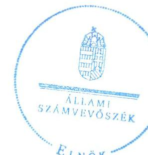

16113
www.asz.hu

---

# AZ ELLENŐRZÉST FELÜGYELTE:

DR. HORVÁTH MARGIT felügyeleti vezető

## AZ ELLENŐRZÉST VEZETTE ÉS A VÉGREHAJTÁSÁÉRT FELELŐS:

- KLINGA LÁSZLÓ ellenőrzésvezető
- A PROGRAM ÖSSZEÁLLÍTÁSÁÉRT FELELŐS:
- JANIK JÓZSEF osztályvezető

IKTATÓSZÁM: V-0969-172/2016.

TÉMASZÁM: 2003

ELLENŐRZÉS-AZONOSÍTÓ SZÁM: V-070720

Jelentéseink az Országgyűlés számítógépes hálózatán és az Interneta a www.asz.hu címen is olvashatóak.

---

# TARTALOMJEGYZÉK 

■ ÖSSZEGZÉS ..... 5
■ AZ ELLENŐRZÉS CÉLJA ..... 7
■ AZ ELLENŐRZÉS TERÜLETE ..... 8
■ AZ ELLENŐRZÉS HÁTTERE, INDOKOLTSÁGA ..... 10
■ A JELENTÉS LÉNYEGES KÉRDÉSKÖREI ..... 11
■ ELLENŐRZÉS HATÓKÖRE ÉS MÓDSZEREI ..... 12
■ MEGÁLLAPÍTÁSOK ..... 14
■ JAVASLATOK ..... 29
■ MELLÉKLETEK ..... 31
I. Sz. melléklet: Értelmező szótár ..... 31
II. Sz. melléklet: Múködési adatok ..... 34
III. Sz. melléklet: A lakossági hulladékgazdálkodási díj alakulása 2011-2014 között ..... 35
IV. Sz. melléklet: Mintavételi eljárások ellenőrzési területenként ..... 36
■ FÜGGELÉK: ÉSZREVÉTELEK ..... 37
■ RÖVIDÍTÉSEK JEGYZÉKE ..... 49

---

.

---

# ÖSSZEGZÉS 

Az Állami Számvevőszék a kizárólagos önkormányzati tulajdonú DEPÓNIA Hulladékkezelő és Településtisztasági Nonprofit Kft.-nél a hulladékgazdálkodási közfeladat ellátását érintő gazdálkodási tevékenysége 2011-2014 közötti szabályszerűségét ellenőrizte. Megállapította, hogy a közfeladat-ellátás önkormányzati megszervezése és a tulajdonosi jogok gyakorlása szabályosan történt. Az alapvetően szabályszerű vagyongazdálkodás biztositása mellett a hulladékgazdálkodás közfeladata bevételeinek és ráfordításainak elszámolása megfelelő volt. Az önköltségszámitás szabályait meghatározták, az árképzés szabályszerűen történt. A Társaság kötelezettségállománya a müködésre, a közfeladat-ellátásra nem jelentett kockázatot.

## Az ellenőrzés társadalmi indokoltsága

Az Állami Számvevőszék középtávra szóló stratégiájában megfogalmazta, hogy a helyi önkormányzatok gazdálkodásában rejlő pénzügyi kockázatok feltárásával, az államháztartáson kívülre nyújtott költségvetési támogatások és ingyenes vagyonjuttatások, valamint az államháztartáson kívül múködő közfeladat-ellátó rendszerek ellenőrzéseivel hozzájárul ahhoz, hogy a közpénzeket az államháztartáson kívül múködő szervezetek is átlátható, rendezett módon használják fel a közfeladatok szerződésben vállalt ellátása érdekében.

Magyarországon az intézmény-centrikus közfeladat-ellátás jellemző, de egyre jelentősebb a költségvetésen kívüli feladatellátás térnyerése. Ennek legfontosabb szereplői - a nonprofit szervezetek mellett - az önkormányzati tulajdonú gazdasági társaságok. Az önkormányzatok szervezetalakítási szabadságának következménye, hogy a korábban is vállalati formában múködő közszolgáltatások mellett, mind a kötelező, mind az önként vállalt feladatok ellátásában a gazdasági társaságok kiemelt fontosságú szerephez jutottak.

## Főbb megállapítások, következtetések, javaslatok

Az Önkormányzat a hulladékgazdálkodás közfeladatának megszervezéséről a jogszabályi előírásoknak megfelelően döntött, annak ellátásáról a kizárólagos tulajdonában lévő gazdasági társasága útján gondoskodott. Az Önkormányzat a Hgt.1,2 szerinti hulladékgazdálkodással összefüggő rendeletalkotási kötelezettségének eleget tett, annak tartalma megfelelt az előírásoknak. Az Önkormányzat a hulladékgazdálkodási közszolgáltatás ellátására az ellenőrzött időszakban Közszolgáltatási szerződés ${ }_{1,2}$-t kötött, amelyek tartalma az előírásokkal összhangban volt. A hulladékgazdálkodási terv készítési kötelezettségének 2012-ig az Önkormányzat, majd 2013-tól a közszolgáltató eleget tett.

A Közgyűlés a vagyongazdálkodási rendelet ${ }_{1,2}$-ben, az SZMSZ-ben, valamint az Alapító Okiratban egymással összhangban meghatározta a tulajdonosi joggyakorlás szabályait, amelyet az előírásoknak megfelelően, szabályszerűen gyakorolt. Az Önkormányzat a feladatellátáshoz szükséges vagyont az ellenőrzött időszakot megelőzően apportként bocsátotta a DEPÓNIA NKft. rendelkezésre. A Közgyűlés a társasági működés felügyeletét, a tulajdonosi ellenőrzési, beszámoltatási kötelezettségét az FB-n keresztül az előírásoknak megfelelően, szabályszerűen gyakorolta, azonban az FB ügyrendjét nem állapította meg.

A közfeladat-ellátását szolgáló vagyonnal való gazdálkodás, annak nyilvántartása alapvetően szabályszerű volt, a Társaság rendelkezett a Számv. tv. előírásainak megfelelő számviteli szabályzatokkal, amelyek elősegítették a szabályszerű működést. Hiányosság volt, hogy a számlarend csak részben tartalmazta a Számv. tv.-ben előírt tartalmi elemeket. A Társaság vagyona 2011. január 1-jéről 2014. év végére 587,5 millió Ft-tal nőtt a tárgyi eszközök állományának csökkenése, valamint a forgóeszközök és az aktív időbeli elhatárolások növekedésének együttes hatására. A tárgyi eszközök állományának csökkenését a Társaságból a Continus Nova Kft. 2013. évi kiválása eredményezte. A

---

DEPÓNIA NKft.-nek hosszúlejáratú kötelezettsége 2011-2012-ben volt, amelynek esedékes törlesztő részleteit határidőben teljesítette. A Társaság rövid lejáratú kötelezettségeinek döntő részben határidőben eleget tudott tenni, ahol nem történt meg a fizetés határidőben, ott 1-14 nap volt a késedelem. Az ellenőrzött időszakban a kötelezettségek állománya a múködésre, a közfeladat ellátásra nem jelentett kockázatot. A követelések állománya 2013 végéig folyamatosan nőtt, majd 2014 végére az előző évi 723,2 millió Ft-ról 460,7 millió Ft-ra csökkent. A Társaság a Hgt.1,2-ben előírtak figyelembe vételével kezdeményezte a hulladékgazdálkodással összefüggő követelések adók módjára történő behajtását, amely ennek ellenére is emelkedett, a 2014. év végén 203,1 millió Ft-ot tett ki. A Társaság az ellenőrzött időszakban nyereségesen gazdálkodott, mérleg szerinti eredménye a 2011. év végétől folyamatosan csökkent, az ellenőrzött időszak végén 2,8 millió Ft eredményt realizáltak.

A DEPÓNIA NKft. az üzleti tervek teljesítéséről, az éves gazdálkodásról, azon belül a hulladékgazdálkodás közfeladatáról az éves beszámolók és üzleti jelentések keretében számolt be a tulajdonos felé a Számv. tv.-ben és a Közszolgáltatási szerződés 1,2 -ben előírtaknak megfelelően. A Társaság az Avtv.-ben, illetve 2012-től az Info tv.-ben előírtak ellenére adatvédelmi és adatbiztonsági szabályzatot nem készített, adatvédelmi felelőst nem nevezett ki. A Társaságnál a bevételek, költségek és ráfordítások elszámolása megfelelő volt, figyelembe véve a jogszabályok és a belső szabályozás előírásait. Az önköltségszámítás szabályozása megfelelő az előírásoknak, amely alapján az alkalmazott módszer biztosította a közszolgáltatás díjának megalapozottságát és a szabályszerű árképzést.

---

# AZ ELLENŐRZÉS CÉLJA 

Az ellenőrzés célja annak értékelése, hogy az Önkormányzat a jogszabályi előírások figyelembevételével döntött-e az ellenőrzésre kerülő közfeladat megszervezéséről; az önkormányzat/tulajdonosi joggyakorló szabályszerűen gyakorolta-e a tulajdonosi jogokat.

Ellenőriztük, hogy a gazdasági társaság közfeladat-ellátása bevételeinek, ráfordításainak elszámolása, és vagyongazdálkodási tevékenysége megfelelt-e a jog-szabályi, illetve a közszolgáltatási/vagyonkezelési szerződésben foglalt tulajdonosi előírásoknak, azok végrehajtása szabályszerű volt-e.

Értékeltük továbbá, hogy a gazdasági társaság kötelezettségállománya jelent-e kockázatot a múködésre, illetve a közfeladat ellátására; valamint hogy a közfeladatok átláthatósága és elszámoltathatósága érdekében biztosítva volt-e a közszolgáltatás dijának megalapozottsága szabályszerű önköltségszámítással.

---

# AZ ELLENŐRZÉS TERÜLETE

## Székesfehérvár Megyei Jogú Város Önkormányzata és a többségi tulajdonában lévő DEPÓNIA Hulladékkezelő és Településtisztasági Nonprofit Korlátolt Felelősségű Társaság

### SZÉKESFEHÉRVÁR MEGYEI JOGÚ VÁROS ÖNKORMÁNYZATA

Valamint a TERSZOL Árutermelő és Szolgáltató Szövetkezet 51-49%-os tulajdoni arányban a DEPÓNIA Hulladékkezelő és Településtisztasági Kft.-t a 2001. évben alapította. A TERSZOL Árutermelő és Szolgáltató Szövetkezet 2007-ben TERSZOL Környezetvédelmi és Építőipari Kft.-vé, 2009-ben Zrt.-vé, majd 2011. június 7-én MIRAGE INVEST Vagyonkezelő Kft.-vé alakult. Az Önkormányzat 2011. június 16-án a MIRAGE INVEST Vagyonkezelő Kft. üzletrészének megvásárlásával 100%-os tulajdonossá vált a DEPÓNIA Hulladékkezelő és Településtisztasági Kft.-ben. A DEPÓNIA Hulladékkezelő és Településtisztasági Kft.-be 2012. június 29. napjával beolvadt a SZÉKOM Székesfehérvári Kommunális Zrt., majd 2013. november 29. napjával kiválással létrejött a Continuous Nova Hulladékgazdálkodási és Vagyonkezelő Kft., amely a haszonanyagok (hullámkarton, vegyes papír, műanyag) gyűjtését, bálázását, valamint a veszélyes hulladékok begyűjtését és szállítását végezte.

Az Önkormányzat Közgyűlése a 2014. június 13-án kelt határozatával döntött a DEPÓNIA Hulladékkezelő és Településtisztasági Kft. nonprofit társasággá történő átalakításáról, így annak elnevezése 2014. július 1. napjától DEPÓNIA Hulladékkezelő és Településtisztasági Nonprofit Kft.-re változott. A DEPÓNIA Hulladékkezelő és Településtisztasági Nonprofit Kft. jegyzett tőkéje 2011. január 1-jén 50,0 millió Ft volt, amely a 2012. évben a beolvadást követően 281,3 millió Ft-ra emelkedett, majd a 2013. évben a kiválás következtében 150,0 millió Ft-ra csökkent. Az Önkormányzat vagyonkezelésre nem adott át eszközöket a Társaság részére. Az Önkormányzat 2014. január 1-jén összesen három gazdasági társaságban rendelkezett többségi tulajdonosi hányaddal.

### A DEPÓNIA HULLADÉKKEZELŐ ÉS TELEPÜLÉSTISZTASÁGI NONPROFIT KFT.

Főtevékenysége a 2014. január 1-jén 99 060 fő lakosságszámú Székesfehérvár Megyei Jogú Város közigazgatási területén, valamint – regionális központként – további 60 településen nem veszélyes hulladék kezelése, ártalmatlanítása volt. A Társaság Székesfehérváron 27 db, a vidéki településeken 35 db hulladékgyűjtő szigetet üzemeltetett, a regionális hulladéklerakó hely hat hektár területen 1050 millió tömör m3 hulladék elhelyezésre és 0,5 millió laza m3 hulladék feldolgozására, ártalmatlanítására volt alkalmas. A Társaság más gazdasági társaságban tulajdoni hányaddal nem rendelkezett, átlagos statisztikai állományi létszáma 2011-ben 105 fő, 2014-ben 126 fő volt.

---

A DEPÓNIA Hulladékkezelő és Településtisztasági Nonprofit Kft. gazdálkodásának egyes adatait a 2011. és a 2014. évek vonatkozásában az 1. ábra szemlélteti.
1. ábra
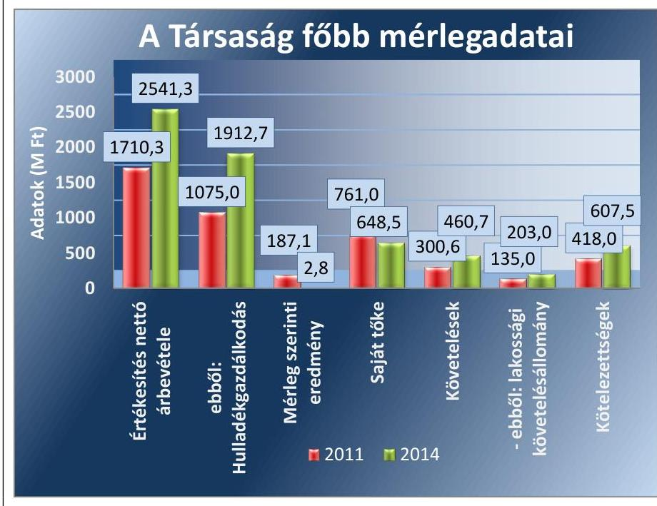

Forrás: A Társaság 2011. és 2014. évi beszámolói

A Társaság mérlegfőösszege 2011-ben 1466,6 millió Ft, 2014-ben 1650,3 millió Ft volt. Az értékesítés nettó árbevétele a 2011. és a 2014. év vége között 48,6\%-kal, ebből a közfeladat nettó árbevétele 77,9\%-kal nőtt. A mérleg szerinti eredmény pozitív volt a 2011-2014. években, a saját tőke összege 2011. december 31-éről a 2014. év végére 14,8\%-kal csökkent. A követelések 53,3\%-kal emelkedtek, ezen belül a lakossági követelésállomány 50,4\%-kal nőtt.

A DEPÓNIA Hulladékkezelő és Településtisztasági Nonprofit Kft. múködésének főbb jellemzőit a 2. számú melléklet mutatja be.

Az ellenőrzött időszakban a polgármester és a jegyző személye nem, az ügyvezető igazgató személye változott. A polgármester a 2010. évi önkormányzati választások óta, a jegyző 2009. május 4. napjától látja el feladatait. Az ügyvezető igazgató 2011. szeptember 19-étől tölti be tisztségét.

---

# AZ ELLENŐRZÉS HÁTTERE, INDOKOLTSÁGA 

Az önkormányzatok közfeladat-ellátásában egyre jelentősebb a gazdasági társaságok útján történő feladatellátás térnyerése.

AZ ÖNKORMÁNYZATI TULAJDONÚ GAZDASÁGI TÁRSASÁGOK teljes körű ellenőrzésének lehetőségét az Állami Számvevőszékről szóló 1989. évi XXXVIII. törvény 2011. január 1-jétől hatályos módosítása teremtette meg. A gazdasági társaságok közfeladat ellátását érintő gazdálkodási tevékenysége szabályszerűségére irányuló ellenőrzéseket erre tekintettel a 2011. évtől végezzük. A közfeladatot ellátó gazdasági társaságok ellenőrzése kiemelten fontos a vagyon megőrzése, megóvása érdekében, valamint a kormányzati szektor elszámolásaiban megjelenő önkormányzati tulajdonú gazdálkodó szervezetek esetében, amelyekkel szemben alapvető követelmény, hogy gazdálkodásuk, működésük szabályszerű, az általuk szolgáltatott adatok minél megbízhatóbbak legyenek. A közfeladat ellátás költségeinek, ráfordításainak alakulása, színvonala hatással van a lakosság elégedettségére.

## AZ ELLENŐRZÉS VÁRHATÓ HASZNOSULÁSA-

KÉNT az ÁSZ ${ }^{1}$ a megállapításaival segítséget nyújthat az államháztartáson kívüli közfeladat-ellátás értékeléséhez, jogszabályi keretei pontosításához, átláthatóságot biztosító szabályozásához. Meghatározhatóvá válnak a közfeladat ellátásban részt vevő államháztartáson kívüli szervezeteknek az önkormányzat költségvetését, pénzügyi helyzetét is befolyásoló - kockázatai, lehetővé válik ezen kockázatok csökkentése. Értékelhetővé válik, hogy a feladatot ellátó gazdasági társaság a közszolgáltatási szerződésben foglaltak betartásával, a közvagyon használatával biztosította-e a szolgáltatás folytatásának feltételeit. Ezzel az ellenőrzöttek és a helyi döntéshozók számára az ÁSZ visszajelzést ad feladatszervezési, feladat-ellátási kockázataikról, alapot ad a meglévő hibák megszüntetéséhez, a jobb közfel-adat-ellátás biztosításához. Mindezeken keresztül az ÁSZ hozzájárul Magyarország közpénzügyi helyzetének javításához, a közpénzek mérhető módon történő, a döntéshozók által meghatározott célok szerinti felhasználásához.

---

# A JELENTÉS LÉNYEGES KÉRDÉSKÖREI 

1. Az önkormányzat közfeladat megszervezéséről szóló döntése, valamint tulajdonosi joggyakorlása szabályszerű volt-e?
2. A gazdasági társaság vagyongazdálkodása szabályszerű volt-e, kötelezettségállománya jelentett-e kockázatot a müködésre, illetve a közfeladat ellátásra?
3. A gazdasági társaságnál az ellátott közfeladat bevételei és ráfordításai elszámolása, valamint az önköltségszámítás és árképzés szabályszerű volt-e?

---

# ELLENŐRZÉS HATÓKÖRE ÉS MÓDSZEREI 

## Az ellenőrzés típusa

Megfelelőségi ellenőrzés

## Az ellenőrzött időszak

A 2011. január 1-jétől 2014. december 31-éig terjedő időszak.

## Az ellenőrzés tárgya

A közfeladatot gazdasági társaságokkal ellátó önkormányzatok tulajdonosi joggyakorlása, valamint gazdasági társaságok pénz- és vagyongazdálkodásának szabályozottsága és szabályszerűsége.

Az ellenőrzés kiterjed minden olyan körülményre és adatra, amely az ÁSZ jogszabályban meghatározott feladatainak teljesítéséhez, valamint a program végrehajtása folyamán felmerült újabb összefüggések feltárásához szükséges.

## Az ellenőrzött szervezet

Székesfehérvár Megyei Jogú Város Önkormányzata és a DEPÓNIA Hulladékkezelő és Településtisztasági Nonprofit Korlátolt Felelősségű Társaság

## Az ellenőrzés jogalapja

Az ellenőrzés végrehajtásának jogszabályi alapját az Állami Számvevőszékről szóló 2011. évi LXVI. törvény 5. § (3)-(4)-(5) bekezdései képezték.

## Az ellenőrzés módszerei

Az ellenőrzést a nemzetközi standardokat irányadónak tekintve az ellenőrzési program ellenőrzési kérdései, az ellenőrzött időszakban hatályos jogszabályok, az ellenőrzés szakmai szabályok és módszertanok figyelembe vételével végeztük.

Az ellenőrzés ideje alatt az ellenőrzött szervezettel történő kapcsolattartást az ÁSZ Szervezeti és Múködési Szabályzatának vonatkozó előírásai alapján biztosítottuk.

---

Az ellenőrzés a kiválasztott, többségi tulajdonosi jogokat gyakorló önkormányzatra, illetve az ellenőrzött közfeladatot ellátó gazdasági társaságra terjedt ki. Az ellenőrzött gazdasági társaságnál, amennyiben az több közfeladatot is ellát, akkor az ellenőrzésre kiválasztott közfeladat-ellátást ellenőriztük.

Az ellenőrzést a kérdésekre adott válaszok kiértékelésével, valamint a megjelölt adatforrások, a csatolt tanúsítványok felhasználásával, továbbá az adott időszakban hatályos jogszabályok figyelembe vételével folytattuk le. Az ellenőrzési kérdések megválaszolásához szükséges bizonyítékok megszerzése a következő ellenőrzési eljárások alkalmazásával történt: megfigyelés, kérdésfeltevés (információkérés), összehasonlítás, valamint elemző eljárás.

A bevételek és ráfordítások elszámolása, valamint a vagyonnyilvántartás terén az egyes területek szabályszerű működését mintavétellel ellenőriztük, ez alapján a sokaságokban előforduló hibás tételek arányát becsültük. A jogszabályoknak és a belső előírásoknak megfelelőnek, azaz szabályszerűnek tekintettük az adott bevételek és ráfordítások elszámolását, a vagyonnyilvántartást, amennyiben a minta ellenőrzésének eredménye alapján 95\%-os bizonyossággal a teljes sokaságban a hibaarány kisebb volt, mint 10\%, nem megfelelőnek értékeltük, ha a hibás tételek aránya a 10\%ot meghaladta. Kockázatot, illetve magas kockázatot jeleztünk, amennyiben egy adott terület vonatkozásában a minta alapján a teljes sokaságban nem volt teljes körűen biztosított a jogszabályoknak és a belső szabályzatoknak megfelelő működés.

---

# 1. Az önkormányzat közfeladat megszervezéséről szóló döntése, valamint tulajdonosi joggyakorlása szabályszerű volt-e? 

Összegző megállapítás

Az Önkormányzat a jogszabályok és a helyi szabályozás betartásával szervezte meg a hulladékgazdálkodást, a tulajdonosi jogait szabályszerűen gyakorolta.

### 1.1. számú megállapítás

A közfeladat-ellátást az Önkormányzat szabályszerűen szervezte meg, a hulladékgazdálkodással összefüggő terv- és rendeletalkotási kötelezettségének a vonatkozó jogszabályi előírásoknak megfelelően eleget tett.

Az Ötv. ${ }^{2}$ 91. § (6) bekezdése, 2013. január 1-jétől az Mötv. ${ }^{3}$ 116. § (3)-(4) bekezdései szerint az önkormányzatnak a gazdasági programjában kell meghatároznia mindazokat a célkitűzéseket, amelyek az általa ellátott feladatok biztosítását, fejlesztését szolgálják. A Közgyűlés ${ }^{4}$ által a 2011-2014. évekre elfogadott gazdasági program ${ }^{5}$ 2013. májusi módosítása a hulladékgazdálkodási közfeladattal kapcsolatosan a szelektív hulladékgyűjtés és a komposztálás népszerűsítésére hívta fel a figyelmet.

Az Önkormányzat ${ }^{6}$ a Hgt. ${ }^{7}$ 35. § (1) bekezdésében foglaltaknak megfelelően kidolgozta helyi hulladékgazdálkodási tervét. A hulladékgazdálkodási tervet ${ }^{8}$ a Hgt. ${ }_{1} 35 . \S$ (3) bekezdésében foglaltaknak megfelelően a Közgyűlés rendeletben kihirdette, amelynek tartalma a Hgt. ${ }_{1} 37 . \S$ (4) bekezdésében foglalt előírásoknak megfelelt. A jegyző ${ }^{9}$ a hulladékgazdálkodási tervben foglaltak végrehajtásáról a 241/2001. Korm. rendelet ${ }^{10}$ 1. § f) pontjának előírásai szerint beszámolt. A Hgt. ${ }_{1}{ }^{11} 78 . \S$ (1) bekezdésében foglaltak alapján - 2013. január 1-jétől - a hulladékgazdálkodási tervet a közszolgáltatónak kellett elkészítenie.

## A KÖZTISZTASÁG ÉS A TELEPÜLÉSTISZTASÁG

BIZTOSÍTÁSA az Ötv. 8. § (1) bekezdése* alapján az Önkormányzat törvényi kötelezettsége. A Közgyűlés az SZMSZ ${ }_{1}{ }^{12}{ }_{2}{ }^{13}{ }_{3}{ }^{14}$-ben előírta a közszolgáltatások körének kötelező feladatait, így a köztisztasági és településtisztasági, illetve a hulladékgazdálkodási feladatok ellátásának kötelezettségét, valamint meghatározta azok ellátási módját. Az Önkormányzat szabályszerűen szervezte meg a hulladékgazdálkodási közfeladatát, közigazgatási területén a szilárd hulladék gyűjtéséről, ártalmatlanításáról, hasznosításáról és a közterületek tisztántartásáról a DEPÓNIA NKft. ${ }^{15}$, valamint a Székesfehérvár Városgondnoksága Kft. útján gondoskodott. A hulladékgazdálkodási közfeladatot a DEPÓNIA NKft. 2011. január 1. és 2012. december

[^0]
[^0]:    * A helyi közügyek, valamint a helyben biztosítható közfeladatok körében ellátandó helyi önkormányzati feladatként a hulladékgazdálkodást 2013. január 1-jétől az Mötv. 13. § (1) bekezdés 19. pontja írja elő.

---

31., valamint 2014. január 27. és 2014. december 31., a Székesfehérvár Városgondnoksága Kft. 2013. január 1. és 2014. január 26. között látta el. A 2013. január 1. és 2014. január 26. közötti időszakban a DEPÓNIA NKft. az Önkormányzat 100\%-os tulajdonában lévő Székesfehérvár Városgondnoksága Kft. alvállalkozójaként vett részt a közfeladat ellátásában.

A DEPÓNIA NKft. feladatellátásának kereteit az Alapító Okiratban ${ }^{16}$, a közfeladat biztosításának és a díjak megállapításának szabályait a hulladékgazdálkodási rendelet ${ }_{1}{ }^{17} \cdot{ }^{18}$-ben meghatározták.

Az Önkormányzat 2003. január 1-jén 10 éves időtartamra Közszolgáltatási szerződés ${ }_{1}$-t ${ }^{19}$ kötött a Társaság ${ }^{20}$ jogelődjével a „települési szilárd hulladék begyűjtésére és szállítására". A Közszolgáltatási szerződés ${ }_{1}$ 2011. január 1. és 2012. december 31. között megfelelt a 224/2004. (VII. 22.) Korm. rendelet ${ }^{21}$ 11-14. §-aiban előírt tartalmi követelményeknek.

A KÖZSZOLGÁLTATÁSI SZERZŐDÉS ${ }_{1}$ alapján a DEPÓNIA NKft. feladata volt a települési szilárd hulladék rendszeres és folyamatos begyűjtése és elszállítása, a gyűjtőedények biztosítása, cseréje, pótlása, a lomtalanítási szolgáltatás megszervezése és lebonyolítása, begyűjtőhelyek működtetése, szelektív hulladék begyűjtése. A Közszolgáltatási szerződés ${ }_{1}$ tartalmazta a hulladék elszállítás gyakoriságát, menetrendjét, valamint a kijelölt feladatok díjtételeit.

A Közszolgáltatási szerződés ${ }_{1}$ megszűnését követően az Önkormányzat a Székesfehérvár Városgondnoksága Kft.-vel kötött szerződés alapján látta el a hulladékgazdálkodás közfeladatát 2013. január 1. és 2014. január 26. között.

A Közép-Duna Vidéke Hulladékgazdálkodási Önkormányzati Társulás ${ }^{\dagger}$ 2014. január 24-én 10 éves időtartamra Közszolgáltatási szerződés ${ }_{2}$ - $t^{22}$ kötött a DEPÓNIA NKft.-vel. A Közszolgáltatási szerződés ${ }_{2}$ aláírását megelőzte a 2013-ban lefolytatott közbeszerzési eljárás. A Közszolgáltatási szerződés ${ }_{2}$ a 317/2013. (VIII. 28.) Korm. rendelet ${ }^{23}$ 4. § (1)-(3) bekezdéseiben foglaltaknak megfelelt. A Közszolgáltatási szerződés ${ }_{2}$-ben meghatározták - többek között - a közszolgáltatás minőségi ismérveit, a környezetvédelmi hatóság által meghatározott minősítési osztályt, a felmondás feltételeit, a közszolgáltató kizárólagos jogának biztosítását, valamint a közszolgáltatási díj megállapításának, a díjkompenzáció megtérítésének szabályait.

Az Önkormányzat 2001-ben 20 éves időtartamra Üzemeltetési szerződést ${ }^{24}$ kötött a Társasággal. A szerződés tárgya az Önkormányzat beruházásában megvalósult Székesfehérvár Pénzverővölgy Települési Hulladéklerakóhely „C" depónia üzemeltetésre átadása volt, bérleti dí ellenében. A szerződő felek 2011. augusztus 18-án a 2012. január 1. és 2021. december 31. közötti időszakra összesen 295,0 millió Ft+áfa ${ }^{25}$ bérleti díjban állapodtak meg, melyet a DEPÓNIA NKft. két részletben, 2011. július 4-én és 2011. augusztus 8-án megfizetett az Önkormányzat részére. Az Üzemeltetési szerződés szerinti bérleti díj összege a 2012-2021. közötti időszakra mintegy 380,0 millió Ft+áfa összeget tett ki, melyet - 5\%-os kamatlábbal - diszkontáltak a 2011. évre. A Társaság a 2011. évben a bérleti

[^0]
[^0]:    ${ }^{\dagger}$ A Társulást Székesfehérvár Megyei Jogú Város Önkormányzata és további 167 önkormányzat hozta létre a 2007. évben annak érdekében, hogy közösen megvalósítsanak egy modern, egységes hulladékgazdálkodási rendszert, valamint rekultiválják a bezárt települési kommunális hulladéklerakókat.

---

díj 2012-2021. éveket terhelő részét könyveiben szabályszerűen elhatárolta, az aktív időbeli elhatárolás évenkénti feloldásáról 2012. január 1-jét követően gondoskodott.

A HULLADÉKGAZDÁLKODÁSI RENDELET ${ }_{1,2}$ tartalma a Hgt. 123. § a)-h) pontjaiban, valamint a Hgt. 2 35. § a)-g) pontjaiban foglaltaknak megfelelt. A hulladékgazdálkodási rendelet ${ }_{1,2}$ célja azoknak a helyi szabályoknak a megállapítása volt, amelyek biztosították - az Ötv. 8. § (1) bekezdése, valamint az Mötv. 13. § (1) bekezdés 19. pontja alapján - Székesfehérvár Megyei Jogú Város közigazgatási területén a köztisztasággal, a települési szilárd hulladék elszállításával összefüggő feladatok eredményes végrehajtását, a hulladékgazdálkodási közszolgáltatás ellátásának és igénybevételének rendjét. A hulladékgazdálkodási rendelet ${ }_{1,2}$ ben - többek között - meghatározták a helyi közszolgáltatás tartalmát, ellátásának rendjét és módját, a közszolgáltató és az ingatlantulajdonos ezzel összefüggő jogait és kötelezettségeit, valamint a közszolgáltatási díj fizetésének szabályait. Előírták továbbá a közszolgáltatás szüneteltetésére, a szabálysértésekre, a lomtalanításra, a zöldhulladék elszállítására vonatkozó rendelkezéseket.

# 1.2. számú megállapítás 

A tulajdonosi jogok gyakorlása szabályszerű volt, azonban az FB ügyrendet nem készített.

A TULAJ DONOSI JOGOK gyakorlásának rendjét az Önkormányzat a vagyongazdálkodási rendelet ${ }^{26}{ }_{2}{ }^{27}$-ben, az SZMSZ ${ }_{1,2,3}$-ben, valamint az Alapító Okiratban határozta meg. Az Önkormányzatot megillető tulajdonosi jogok gyakorlásával kapcsolatos feladatok és jogosítványok a Közgyűlést illették meg, amelyeket a vagyongazdálkodási rendelet ${ }_{1,2}$ és az SZMSZ ${ }_{1,2,3}$-ben meghatározott esetekben a polgármesterre ${ }^{28}$, illetve egyes bizottságokra ruházott át. Az Önkormányzat a vagyontárgyak feletti rendelkezési jogot a vagyongazdálkodási rendelet ${ }_{1,2}$-ben a vagyonelem típusa, a tulajdonosi jog, illetve döntés tartalma, valamint az üzleti vagyon esetében értékhatár alapján osztotta meg a Közgyűlés és a bizottságok között. A nettó 10,0 millió Ft-ot meghaladó értékű üzleti vagyon esetében a Közgyűlés, a nettó 10,0 millió Ft értékhatárt el nem érő üzleti vagyon esetében a Gazdasági Szakbizottság döntött. Az elővásárlási jogról való döntés 15,0 M Ft értékhatárig a Jogi, Ügyrendi, Igazgatási Bizottság hatáskörébe tartozott. A DEPÓNIA NKft. vonatkozásában a tulajdonosi jogokat a belső szabályozással összhangban az arra jogosult szabályszerűen gyakorolta.

AZ FB ${ }^{29}$ a Gt. ${ }^{30}$ 34. § (1) bekezdésében, valamint a Ptk. ${ }^{31}$ 3:121. § (1) bekezdésében előírtakat figyelembe véve három tagból állt. Az FB a Gt. 35. § (3) bekezdésének, illetve a Ptk. 2 3:120. § (2) bekezdésének megfelelően minden évben írásbeli jelentést készített a DEPÓNIA NKft. számviteli beszámolójáról.

Az FB a Gt. 34. § (4) bekezdésében, illetve a Ptk. 2 3: 122. § (3) bekezdésében foglaltakkal ellentétben az FB ügyrendjét nem állapította meg, így Közgyűlés annak hiányában nem hagyta jóvá.

AZ ANYAGI ÖSZTÖNZÉSI RENDSZERT a Taktv. ${ }^{32}$ 5. § (3) bekezdésében foglaltaknak megfelelően a Közgyűlés által elfogadott javadalmazási szabályzatban ${ }^{33}$ rögzítették. A javadalmazási szabályzat előírásai

---

szerint az ügyvezető prémiumfeladatát a polgármester előterjesztésére az FB előzetes véleménye birtokában - a Közgyűlés határozta meg. Az ügyvezető prémiumának megállapítása során teljesítménykövetelményként előírták az üzleti terv fő számainak teljesítését. Az ügyvezető prémiumának mértéke éves személyi alapbérének 50\%-át nem haladhatta meg.

AZ ÁRKÉPZÉS SZABÁLYAIT a 2012. év végéig a hulladékgazdálkodási rendelet ${ }_{1}$-ben határozta meg az Önkormányzat. A Hgt. 1 25. § (4) bekezdésében előírt, a közszolgáltatás díját meghatározó önkormányzati rendelet elfogadását megelőző költségelemzést - a DEPÓNIA NKft. javaslata alapján - a jegyző beterjesztette a Közgyűlés elé. 2013. január 1-jétől a hulladékgazdálkodási díjat a MEKH ${ }^{34}$ javaslatának figyelembe vételével a miniszter ${ }^{4}$ rendeletben állapítja meg. A hulladékgazdálkodási rendelet ${ }_{1,2}$ a díjmegállapítás módszerére és a díjváltoztatásra vonatkozóan a követendő eljárásokat rögzítette. A közszolgáltatás díjai a 64/2008. (III. 2.) Korm. rendelet ${ }^{35}$ 3.-4. §-aiban foglaltaknak megfeleltek, és a Hgt. ${ }_{1}$ 57. §-ában, illetve a Hgt. 2 91. §-ában meghatározott maximális mértéket nem haladták meg.

A BESZÁMOLTATÁSI RENDSZER keretében az Önkormányzat a DEPÓNIA NKft. ügyvezetőjét évente beszámoltatta a gazdálkodásról, valamint a közszolgáltatási tevékenységről, a Közszolgáltatási szerződés ${ }_{1,2}$-ben foglaltak szerint. A Társaság 2011-2014. évi éves szakmai és számviteli beszámolóit - az FB előzetes írásbeli véleményezését követően - a Közgyűlés a Gt. 35. § (3) bekezdésének, illetve a Ptk. 2 3:120. § (2) bekezdésében előírtaknak megfelelően elfogadta. Az Önkormányzat üzleti terv készítési kötelezettséget a Társaság részére nem írt elő, azonban a Közgyűlés minden évben döntött az éves üzleti tervek elfogadásáról is. Az alkalmazott közszolgáltatási díj mértékével kapcsolatos díjkalkulációt a 2011-2012. üzleti évekre vonatkozóan a DEPÓNIA NKft. a Közszolgáltatási szerződés ${ }_{1}$-ben előírt október 31.-ei határidőn túl nyújtotta be az Önkormányzat felé. A 2011. évre vonatkozó díjkalkulációt 2010. november 19én, a 2012. évre vonatkozó díjkalkulációt 2011. december 5-én nyújtotta be a Társaság.

A TÁRSASÁG ELLENŐRZÉSÉT az Önkormányzat Polgármesteri Hivatalának Belső Ellenőrzési Irodája végezte, kockázatelemzésen alapuló éves ellenőrzési terv alapján. Az éves ellenőrzési tervek közül a 2011. évi tartalmazta a DEPÓNIA NKft. ellenőrzését, amelyet lefolytattak. A belső ellenőrzés a Társaság rendelkezésére álló erőforrásokkal történő gazdálkodás hatékonyságára, az elszámolások megbízhatóságára terjedt ki. Az ellenőrzési jelentés a Társaság Szervezeti és Működési, valamint Közbeszerzési Szabályzatának elkészítésére, valamint a könyvelési munkák ellenőrzésére vonatkozó vállalkozási szerződés tartalmának, az elvégzendő munka és a vállalkozói díj összhangjának felülvizsgálatára fogalmazott meg javaslatot. A polgármester a zárszámadási rendelettervezettel egyidejűleg a Közgyűlés elé terjesztette a 2011. évi belső ellenőrzések tapasztalatairól szóló beszámolót. A Közgyűlés a beszámolót határozatával jóváhagyta. Az ellenőrzési jelentésben foglaltakra a DEPÓNIA NKft. az intézkedési tervet elkészítette, az abban vállalt feladatok végrehajtásáról beszámolt.

[^0]
[^0]:    ${ }^{3}$ Nemzeti Fejlesztési Miniszter

---

A DEPÓNIA NKft. mérleg szerinti eredménye a 2011-2014. években pozitív volt. A Közgyűlés határozataiban a 2011. és a 2014. évek nyereségének eredménytartalékba helyezéséről, a 2012. és a 2013. évre vonatkozóan 200,0 millió Ft, illetve 100,0 millió Ft osztalék kifizetéséről döntött. A 2013. évre jóváhagyott 100,0 millió Ft összegű osztalék kifizetése nem történt meg, azt a tulajdonos Önkormányzat elengedte. A Társaság a 2014. évi éves beszámolójában az elengedett osztalék összegét rendkívüli bevételként szabályszerűen elszámolta.

A saját tőke minden ellenőrzött évben jelentősen meghaladta a jegyzett tőkét, ezért a Gt. 143. § (2) bekezdés a) pontja, illetve a Ptk. 2 3:189. § (2) bekezdése szerinti intézkedés megtétele nem vált szükségessé. A saját tőke összege a 2011. évben több mint tizenötszörösével, a 2012. évben közel ötszörösével, a 2013. és a 2014. évben több mint négyszeresével haladta meg a jegyzett tőke összegét.

A saját tőke, a jegyzett tőke, valamint a mérleg szerinti eredmény alakulását a 2. ábra mutatja be.
2. ábra
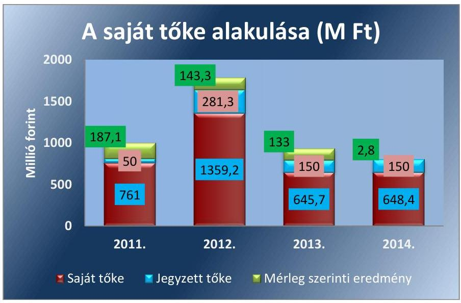

Fornás: 3. számú tanúsítvány
Az Önkormányzat a DEPÓNIA NKft. részére garanciát nem nyújtott, kezességet nem vállalt a 2011-2014. években.

---

# 2. A gazdasági társaság vagyongazdálkodása szabályszerű volt-e, kötelezettségállománya jelentett-e kockázatot a múködésre, illetve a közfeladat ellátásra? 

Összegző megállapítás

2.1. számú megállapítás

A Társaság vagyongazdálkodása alapvetően szabályszerű volt, kötelezettségállománya a múködésre, a közfeladat ellátásra nem jelentett kockázatot. Adatvédelmi biztost nem neveztek ki, adatvédelmi, adatbiztonsági szabályzattal nem rendelkeztek.

Az előírt szabályzatokkal rendelkeztek, azok - a számlarend kivételével - megfeleltek a vonatkozó jogszabályokban foglaltaknak, tartalmazták a közfeladat ellátás elkülönített nyilvántartásának szabályait.

A Társaság vagyongazdálkodási tevékenysége, illetve annak végrehajtása a jogszabályi előírásoknak, illetve a Közszolgáltatási szerződés ${ }_{1,2}$-ben foglalt tulajdonosi előírásoknak megfelelt.

AZ ÜZLETI TERVEKET az ügyvezető terjesztette be a Közgyűlés elé a Társaság SZMSZ-ében ${ }^{36}$ előírt kötelezettsége alapján. ${ }^{5}$ Az üzleti tervek tartalmi és formai követelményeit nem határozták meg, azok eredmény-, beruházási-, valamint marketing és egészségtervet tartalmaztak. Az üzleti terveket a Közgyűlés jóváhagyta.

A DEPÓNIA NKft. rendelkezett a Számv. tv. ${ }^{37}$ 14. § (3) bekezdésében előírt számviteli politikával, valamint a Számv. tv. 14. § (5) bekezdés a)-d) pontjaiban foglaltaknak megfelelően eszközök és források leltárkészítési és leltározási, valamint értékelési szabályzatával, az önköltségszámítás rendjére vonatkozó belső szabályzattal, valamint pénzkezelési szabályzattal. Rendelkeztek továbbá selejtezési szabályzattal.

A SZÁMVITELI POLITIKA ${ }^{38}$ a Számv. tv. 14. § (4) bekezdése előírásainak megfelelően tartalmazta - többek között - azokat a Társaságra jellemző szabályokat, előírásokat, módszereket, amelyekkel meghatározták, hogy mit tekintenek a számviteli elszámolás, értékelés szempontjából lényegesnek, jelentősnek, valamint azt, hogy a törvényben biztosított választási, minősítési lehetőségek közül melyeket alkalmazzák. A számviteli politika a 2013-2014. évi éves beszámolókra vonatkozóan tartalmazta továbbá a Hgt. 2 50. § (3) bekezdésében foglalt előírást, mely szerint a hulladékgazdálkodási közszolgáltatás körébe nem tartozó tevékenységet is végző közszolgáltató a hulladékgazdálkodási közszolgáltatás nyújtása érdekében végzett tevékenységet oly módon kell, hogy bemutassa, mintha azt önálló vállalkozás keretében végezte volna. A tevékenység elkülönült bemutatása legalább önálló mérleget és eredménykimutatást jelent. A mérlegadatok esetében az árbevétel arányos, az eredménykimutatás adatai esetében az utókalkulációs felosztást határozták meg.

[^0]
[^0]:    ${ }^{5}$ Az előírás 2012. július 1-jétől van hatályban.

---

Az eszközök és források leltárkészítési és leltározási szabályzata ${ }_{1}{ }^{39},{ }_{2}{ }^{40}$ tartalmazta a leltározás előkészítésének feladatait, a leltározásért felelős személyeket, a leltározás módját, fordulónapját. A tárgyi eszközök esetében a 2011-2013. években három évenkénti, a 2014. évtől kezdődően kétévenkénti, a készleteknél a 2011-2014. években évenkénti mennyiségi felvétellel történő leltározást írtak elő, mely megfelelt a Számv. tv. 2012. január 1-jétől hatályos 69. § (3) bekezdése előírásának. A Társaság a tárgyi eszközökről és a készletekről folyamatos mennyiségi nyilvántartást vezetett.

Az eszközök és források értékelési szabályzata ${ }_{1}{ }^{41},{ }_{2}{ }^{42}$ a Számv. tv. 55. § (1)-(2) bekezdésének előírásaival és a számviteli politikával összhangban szabályozta a követelések minősítésének, az értékvesztés elszámolásának szabályait.

A pénzkezelési szabályzat ${ }_{1}^{43}$ a Számv. tv. 14. § (8) bekezdés előírásainak maradéktalanul nem felelt meg, mivel nem tartalmazta a pénzkezelés személyi és tárgyi feltételeit, a felelősség szabályait, az ellenőrzés gyakoriságát. A pénzkezelési szabályzat ${ }_{2}^{44}$ elkészítésével a hiányosságot megszüntették.

A Társaság a 2011. január 1. és szeptember 30. közötti időszakban számlarenddel a Számv. tv. 161. § (1) bekezdésében előírtak ellenére nem rendelkezett. A 2011. október 1-jétől hatályos számlarend ${ }_{1}{ }^{45},{ }_{2}{ }^{46},{ }_{3}{ }^{47}$ a Számv. tv. 161. § (2) bekezdés a) pontjában foglaltak ellenére nem tartalmazta minden alkalmazásra kijelölt számla számjelét és megnevezését, a b) pontjában előírtak ellenére nem tartalmazta továbbá azok tartalmát, értékük növekedésének, csökkenésének jogcímeit, más számlákkal való kapcsolatát, valamint nem tartalmazta a d) pont szerinti, a számlarendben foglaltakat alátámasztó bizonylati rendet.

AZ ÖNKÖLTSÉGSZÁMÍTÁSI SZABÁLYZAT ${ }_{1}{ }^{48},{ }_{2}{ }^{49}$-ot a DEPÓNIA NKft. a Számv. tv. 14. § (7) bekezdése alapján elkészítette. A szabályozás megfelelt a Számv. tv. 161/A. § (2) bekezdése előírásának, mivel a Társaság a közpénzek felhasználásának és a köztulajdon használatának nyilvánossága és ellenőrizhetősége érdekében olyan részletezettségű nyilvántartási (könyvvezetési) rendszert alakított ki, melyből a vonatkozó külön jogszabályban meghatározott adatok rendelkezésre álltak. A DEPÓNIA NKft. az egyes tevékenységeivel kapcsolatban felmerülő bevételeit, költségeit és ráfordításait munkaszámokkal kapcsolta hozzá az adott tevékenységhez, mely így alkalmas volt a közvetlen és közvetett költségek elkülönítésére. A Társaság a munkaszám-rendszer kialakításával megteremtette a közfeladathoz kapcsolódó bevételek, költségek, ráfordítások elkülönített nyilvántartásának lehetőségét, ezzel eleget tett a 64/228. (III. 28.) Korm. rendelet 5. §-a, valamint a Hgt. ${ }_{1}$ 29. § (3) bekezdése, illetve a Hgt. ${ }_{2}$ 50. § (2) bekezdése előírásainak. A Hgt. ${ }_{2}$ 50. § (3) bekezdésében foglaltakkal összhangban megteremette továbbá - a 2013-2014. évi éves beszámolók vonatkozásában - a közfeladat önálló mérleg és eredménykimutatás készítésének lehetőségét.

---

# 2.2. számú megállapítás 

## A Társaság a tulajdonában lévő vagyonával a jogszabályi és belső előírásoknak megfelelően gazdálkodott.

A DEPÓNIA NKft. a hulladékgazdálkodási közfeladat ellátásához az Önkormányzattól vagyonkezelésbe nem vett át vagyont, azt saját eszközeivel látta el.

## AZ ANALITIKUS ÉS FÖKÖNYVI NYILVÁNTARTÁSI

RENDSZER a Társaság vagyonának átlátható, naprakész, a számviteli politika és az önköltségszámítási szabályzatnak megfelelő nyilvántartását biztosította. A vagyonnyilvántartásokban a vagyonváltozás nyomon követhető volt.

Az éves beszámolók adatait leltárral támasztották alá, a főkönyvi könyvelés és analitikus nyilvántartások közötti egyeztetést a mérleg fordulónapjára vonatkozóan szabályszerűen elvégezték.

A Társaság éves beszámolóinak főbb mérlegadatait az 1. táblázat szemlélteti.

## A DEPÓNIA NKFT. FŐBB MÉRLEG ADATAI (MILLIÓ FORINT)

| Megnevezés | 2011.01.01. | 2011.12.31. | 2012.12.31. | 2013.12.31. | 2014.12.31. |
| :--: | :--: | :--: | :--: | :--: | :--: |
| Befektetett eszközök | 492,5 | 621,8 | 965,7 | 245,0 | 217,7 |
| - ebből: Tárgyi eszközök | 489,8 | 618,8 | 950,1 | 242,2 | 211,4 |
| Forgóeszközök | 562,3 | 534,0 | 1257,9 | 1098,0 | 1202,6 |
| - ebből: Követelések | 259,2 | 300,6 | 502,2 | 723,2 | 460,7 |
| Aktív időbeli elhatárolások | 7,9 | 310,8 | 273,2 | 238,0 | 230,0 |
| ESZKÖZÖK ÖSSZESEN | 1062,7 | 1466,6 | 2496,8 | 1581,0 | 1650,3 |
| Saját tőke | 573,9 | 761,0 | 1359,2 | 645,7 | 648,4 |
| - ebből Jegyzett tőke | 50,0 | 50,0 | 281,3 | 150,0 | 150,0 |
| - ebből: Mérleg szerinti eredmény | 115,4 | 187,1 | 143,3 | 133,0 | 2,8 |
| Céltartalékok | 253,0 | 272,5 | 326,3 | 353,5 | 372,1 |
| Kötelezettségek | 199,1 | 418,0 | 776,9 | 573,8 | 607,5 |
| Passzív időbeli elhatárolások | 36,7 | 15,1 | 34,4 | 8,0 | 22,3 |
| FORRÁSOK ÖSSZESEN | 1062,7 | 1466,6 | 2496,8 | 1581,0 | 1650,3 |

AZ ESZKÖZÉRTÉK 2011. január 1-jéről 2014. december 31-ére 55,3\%-kal (587,6 millió Ft-tal) emelkedett a tárgyi eszközök értékének csökkenése, valamint a forgóeszközök és az aktív időbeli elhatárolások növekedésének együttes hatására. A befektetett eszközök döntő részét (97,1-99,5\%-át) a tárgyi eszközök képezték. A tárgyi eszközök értéke 2011. január 1. és 2012. december 31. között másfélszeresére (331,3 millió Ftra) nőtt a beolvadás, majd 2012. december 31-éről a 2014. év végére egyötödére ( 738,7 millió Ft-ra) csökkent a szétválás következtében, összességében az ellenőrzött időszakban 56,8\%-kal (278,4 millió Ft-tal) mérséklődött. A forgóeszközök értéke több mint kétszeresére - ezen belül a követelések állománya 77,7\%-kal - nőtt. A források növekedését - jellemzően - a kötelezettségek állományának növekedése eredményezte, mely háromszorosára emelkedett. A Társaság saját tőkéje a mérleg szerinti eredmény elszámolásának következtében 13,0\%-kal (74,5 millió Ft-tal) nőtt.

---

# 2.3. számú megállapítás 

A kötelezettségek állománya a múködésre, a közfeladat ellátására nem jelentett kockázatot, a Társaság a kötelezettségeit teljesítette.

A Társaság kötelezettségeinek állománya 2011. január 1. és 2012. december 31. között folyamatosan nőtt, majd - az előző évhez képest - 2013. év végére 26,1\%-kal (203,1 millió Ft) csökkent, 2014. év végére pedig 5,9\%$\mathrm{kal}(33,7$ millió Ft) emelkedett.

AZ ELADÓSODOTTSÁGI MUTATÓ értéke kedvezően alakult, a 2011. évben 0,28 , a 2012. évben 0,31 , a 2013. évben 0,36 , a 2014. évben 0,37 volt, az idegen tőke összes forráson belüli aránya egyik évben sem érte el a kritikus 0,6-os értéket. Az eladósodottság mértéke hasonló képet mutatott, a mutató a 2011-2014. években nem érte el az 1-es értéket. A nettó eladósodottság mutatója arról nyújt információt, hogy a kintlévőségekkel csökkentett kötelezettségeket milyen mértékben fedezi saját forrás, és azt feltételezi, hogy a kötelezettségek teljesítését megelőzi a követelések realizálása. A mutató értéke 2011-ben 0,15, 2012-ben 0,20, 2013-ban -0,23, 2014-ben 0,23 volt. A 2013. évi -0,23 érték azt jelentette, hogy a kintlévőségek összege meghaladta a kötelezettségek összegét. A 2011-2012. és a 2014. években a kintlévőségekkel csökkentett kötelezettségeket a saját források egyre kisebb mértékben fedezték.

Az adósságfedezeti mutató I. értéke szintén kedvező volt, 1,0 Ft adósságra a 2011. évben 2,77 Ft, a 2012. évben 2,88 Ft, a 2013. és a 2014. évben 2,34 Ft vagyon jutott. Az adósságfedezeti mutató II. 2011-ben 0,01, 2012-ben 3,76 volt, 2013-ban és 2014-ben hosszú lejáratú kötelezettség már nem terhelte a Társaságot. Az adósságfedezeti mutató II. 2011-ben nem érte el a kedvezőnek ítélt 1-es értéket, amely azt jelentette, hogy a Társaság nem lett volna képes valamennyi hosszú lejáratú kötelezettségének eleget tenni. A 2012. évben a múködési cash flow megfelelő arányú fedezetet nyújtott a hosszú lejáratú kötelezettségekre.

Az árbevételre vetített eladósodottság mértéke a 2011-2014. években $-0,07,-0,26,-0,29$ és $-0,24$ volt, tehát az 1,0 Ft nettó árbevételre eső, forgóeszközökkel csökkentett kötelezettség valamennyi évben kevesebb volt, mint az árbevétel. A mutató kedvező alakulását biztosította, hogy az árbevétel és a forgóeszközök állománya magasabb értékben emelkedett a kötelezettségek állományánál.

A Társaság a 2011-2014. években rendelkezett a társasági formájára kötelezően előírt jegyzett tőkének megfelelő összegű saját tőkével.

HOSSZÚ LEJÁRATÚ KÖTELEZETTSÉGE a Társaságnak csak a 2011-2012. évben volt, annak esedékes törlesztő részleteit határidőben teljesítették. A 2013. és a 2014. évben hosszú lejáratú kötelezettséggel nem rendelkeztek.

A RÖVID LEJÁRATÚ KÖTELEZETTSÉGEK 24,6-59,4\%át a szállítókkal szembeni tartozások képezték. A Társaság a rövid lejáratú kötelezettségeinek döntő részben határidőben eleget tudott tenni, ahol nem történt meg a fizetés határidőre, ott átlagosan 1-14 nap közötti volt a késedelem.

A Társaság kötelezettségállománya a múködésre, a hulladékgazdálkodási közfeladat ellátására kockázatot nem jelentett.

---

### 2.4. számú megállapítás

Az előírt beszámolási, adatszolgáltatási kötelezettséget teljesítették, azonban adatvédelmi biztos kinevezésére, az adatvédelemre és adatbiztonságra vonatkozó szabályzat elkészítésére nem került sor.

AZ ÉVES BESZÁMOLÓKAT a DEPÓNIA NKft. a Számv. tv. 19. § (1) bekezdésében előírt tartalommal elkészítette, azokat a Számv. tv. 153. § (1) bekezdésében, valamint 154. § (1) bekezdésében foglaltak szerint letétbe helyezte, illetve közzétette.

Az éves beszámolók elfogadásáról a Közgyűlés a könyvvizsgáló és az FB írásbeli jelentésének birtokában határozott. A könyvvizsgáló az éves beszámolókat hitelesítő záradékkal látta el. Az FB és a könyvvizsgáló a közvagyon védelme, illetve más okból a Közgyűlés összehívását nem kezdeményezte.

A 2013. évi éves beszámoló kiegészítő melléklete a hulladékgazdálkodási közszolgáltatással kapcsolatban csak az eredménykimutatást tartalmazta, a Hgt. 2 50. § (3) bekezdésében előírt mérleget nem. A 2014. évi éves beszámoló kiegészítő mellékletében a Társaság már bemutatta a közfeladat mérlegét is.

A 2011. évben hatályban lévő Avtv. ${ }^{50}$ 31/A. § (1) bekezdés c) pontjában, valamint a 2012. január 1-jétől hatályos Info tv. ${ }^{51}$ 24. § (1) bekezdés c) pontjában foglaltak ellenére a Társaságnál belső adatvédelmi felelőst nem neveztek ki. Adatvédelmi felelős hiányában nem volt biztosított a nyilvántartásokban elektronikusan kezelt adatállományok Info tv. 7. §-ában előírt információ biztonsági védelme. Az Avtv. 31/A. § (2) bekezdés d) pontjában, illetve az Info tv. 24. § (3) bekezdésében előírt adatvédelmi és adatbiztonsági szabályzatkészítési kötelezettségének a Társaság nem tett eleget.

A DEPÓNIA NKft. nem minősült a kormányzati alszektorba besorolt társaságnak, illetve egyéb szervezetnek, így az Ávr. ${ }^{52}$ 7. számú melléklete 29. pontjában előírt bejelentési és adatszolgáltatási kötelezettsége nem keletkezett.

---

# 3. A gazdasági társaságnál az ellátott közfeladat bevételei és ráfordításai elszámolása, valamint az önköltségszámítás és árképzés szabályszerű volt-e? 

Összegző megállapítás

A hulladékgazdálkodási közszolgáltatás bevételeinek és ráfordításainak elszámolása szabályszerű volt, az önköltségszámítás szabályait meghatározták, az árképzés szabályszerűen történt.
3.1. számú megállapítás

A bevételek és ráfordítások elszámolása során érvényesültek a jogszabályok és a belső szabályozás előírásai, a lakossági hulladékgazdálkodási dí hátralék annak ellenére emelkedett, hogy a követelésállományt kezelte a Társaság.

A DEPÓNIA NKft. a hulladékgazdálkodási közfeladat mellett egyéb feladatokat is ellátott**, így 2011. január 1-jétől a Hgt. 1 29. § (3) bekezdése, 2013. január 1-jétől a Hgt. 2 50. § (2) bekezdése alapján fennállt a bevételeinek, költségeinek és ráfordításainak elkülönített nyilvántartási kötelezettsége. Az elkülönített nyilvántartás megvalósulása érdekében kialakította a mun-kaszám-rendszert, melynek részletes szabályait az önköltségszámítási sza-bályzat ${ }_{1,2}$-ban rögzítette. A Társaság a költségeket, ráfordításokat a felmerülésükkor az 5. számlaosztályban könyvelte, döntése alapján a 6-7. számlaosztályokat nem alkalmazta. A munkaszám-rendszer az 1-5 munkaszám csoportok kialakításán alapult. Az 1-4 munkaszámokon felmerülő közvetlen és közvetett költségeket - a 4999 központi költségek kivételével - a tárgyévet követően osztották fel, az 5 munkaszámokon a főtevékenységeket tartották nyilván.

A Társaság értékesítés nettó árbevételének tervezett és tényleges adatait, a közfeladat árbevételét és eredményét a 2. táblázat mutatja be.
2. táblázat

A HULLADÉKGAZDÁLKODÁSI KÖZFELADAT ÁRBEVÉTELÉNEK ÉS EREDMÉNYÉNEK ALAKULÁSA (MILLIÓ FORINT)

| Megnevezés | 2011. | 2012. | 2013. | 2014. |
| :--: | :--: | :--: | :--: | :--: |
| Értékesítés nettó árbevétele (terv) | 1525,0 | 1694,0 | 1709,0 | 2198,0 |
| Értékesítés nettó árbevétele (tény) | 1710,3 | 1861,7 | 1849,3 | 2541,3 |
| Ebből: hulladékgazdálkodási közszolgáltatás nettó árbevétele | 1075,0 | 1220,0 | 38,1 | 1912,7 |
| Hulladékgazdálkodási közszolgáltatás eredménye | - | - | $-2,7$ | $-197,4$ |

Fonrás: Az éves beszámolók kiegészitő mellékletei

[^0]
[^0]:    ** A Társaság a közfeladat mellett - többek között - veszélyes hulladék gyűjtését, kezelését, ártalmatlanítását, szennyeződésmentesítést, egyéb hulladékkezelést, eszköz bérbeadást, közterület fenntartást végzett.

---

A Társaság 2011-2014. évi értékesítésének nettó árbevétele a tervezett adatokat az évek sorrendjében $12,1 \%, 9,9 \%, 8,2 \%$, illetve $15,6 \%$-kal haladta meg. Az értékesítés nettó árbevételén belül a közfeladat értékesítésének nettó árbevétele a 2011. évben 62,9\%, a 2012. évben 65,5\%, a 2014. évben $75,3 \%$-os arányt képviselt. ${ }^{\text {TT }}$ A hulladékgazdálkodási közszolgáltatás üzemi (üzleti) tevékenységének eredménye 2,7 millió Ft, illetve 197,4 millió Ft veszteséget mutatott a 2013-2014. években. Ennek oka a hulladéklerakási járulék fizetési kötelezettség bevezetése volt a 2013. évtől ${ }^{51}$.

A DEPÓNIA NKft. hulladékgazdálkodási közfeladat-ellátása bevételeinek, ráfordításainak elszámolása a jogszabályi előírásoknak megfelelt.

# AZ ÉRTÉKESÍTÉS NETTÓ ÁRBEVÉTELÉNEK ELSZÁMOLÁSA megfelelő volt A bevételek előírása és kiszámlázása a számviteli politika és az önköltségszámítási szabályzat ${ }_{1,2}$ előírásai szerint történt, azokat a megfelelő számlacsoportban számolták el. Az alkalmazott szolgáltatási díjak a belső szabályozásnak és a tulajdonosi követelményeknek, illetve a hatósági árképzésnek megfeleltek. 

## AZ ANYAGJELLEGŰ RÁFORDÍTÁSOK ELSZÁMOLÁSA megfelelő volt. A költségeket a Számv. tv. 78. §-ának megfelelő költségnemre számolták el, illetve a megfelelő közfeladatra könyvelték az önköltségszámítási szabályzat ${ }_{1,2}$ és a számlatükör ${ }^{53}$ előírásai szerint. A költségeket az önköltségszámítási szabályzat ${ }_{1,2}$-ban szereplő munkaszámmal ellátták.

## A BERUHÁZÁSOK, FELÚJÍTÁSOK KIADÁSAI ÉS AZ ÉRTÉKCSÖKKENÉSI LEÍRÁS ELSZÁMOLÁSA

megfelelő volt. A kiadást megalapozó kötelezettségvállalás, a pénzügyi elszámolás, a kontírozás, valamint az értékcsökkenések elszámolása a Számv. tv. 26. §-ában, 52. §-ában foglalt előírásoknak és a számviteli politikának megfelelően történt.

AZ AMORTIZÁCIÓ ELSZÁMOLÁSÁVAL kapcsolatos eljárásrendet a számviteli politikában rögzítették. Az amortizációt a rendeltetésszerű használatbavételtől, az üzembe helyezéstől kezdődően számolták el, havi gyakorisággal. A Számv. tv. 92. § (1) bekezdésében foglaltaknak megfelelően az immateriális javak, tárgyi eszközök, valamint a halmozott értékcsökkenés nyitó és záró bruttó értékét, a tárgyévi értékcsökkenési leírás összegét mérlegtételek szerinti bontásban az éves beszámolók kiegészítő mellékleteiben bemutatták.

A terven felüli értékcsökkenést a 2011-2013. években szabályszerűen számolta el a Társaság, azonban azt - a Számv. tv. 92. § (2) bekezdésében foglaltakkal ellentétben - az éves beszámolók kiegészítő mellékletében a Számv. tv. 92. § (1) bekezdése szerinti részletezésben nem mutatta be. A 2014. évben terven felüli értékcsökkenést nem számoltak el.

[^0]
[^0]:    ${ }^{51}$ A 2013. évi arány 2,1\% volt, mivel a 2013. január 1. és 2014. január 26. közötti időszakban a közszolgáltatást a DEPÓNIA NKft. mint alvállalkozó látta el.
    ${ }^{52}$ A Társaság hulladéklerakási járulék fizetési kötelezettsége 2013-ban 138,3 M Ft, 2014-ben 434,0 M Ft volt.

---

A Társaság saját vagyona után elszámolt értékcsökkenés összege a 2011-2014. években 351,3 millió Ft volt. Az eszközpótlás az elszámolt értékcsökkenésnél kisebb mértékben valósult meg, így a tárgyi eszközök használhatósági foka ${ }^{55} 63,5 \%$-ról 48,3\%-ra csökkent.

# ADÓK MÓDJÁRA BEHAJTANDÓ KÖZTARTOZÁS- 

NAK minősülnek a Hgt. 1 26. § (1) bekezdése, 2013. január 1-jétől a Hgt. 2 52. § (1) bekezdése értelmében a hulladékkezelési közszolgáltatás igénybevételéért az ingatlanhasználót terhelő díjhátralék és az azzal összefüggésben megállapított késedelmi kamat, valamint a behajtás egyéb költségei. A DEPÓNIA NKft. a követelések nyilvántartásának és behajtásának szabályait a 2011-2014. években belső szabályozásban nem írta elő - erre jogszabályi előírás sem kötelezte -, a 2014. január 1-jétől hatályos eszközök és források értékelési szabályzata ${ }_{2}$ a vevőkövetelések dokumentumait, nyilvántartási rendjét, a behajtást megelőző eljárási rendet rögzítette.

KÖVETELÉS ÁLLOMÁNYÁT kezelte a Társaság, az értékvesztés elszámolását évente végezte a számviteli politika előírásainak megfelelően. A hátralékos ügyfelek részére - a hátralék keletkezését követő 30 napon belül - fizetési felszólítást küldött, melyet - sikertelenség esetén - a lakossági ügyfeleknél negyedévente, az intézményeknél havonta megismételt. 2012. december 31-éig a Hgt. 1 26. § (3) bekezdésének megfelelően a lakossági és intézményi ügyfelek 90 napot meghaladó díjtartozásait, a felszólítás igazolása mellett évente egyszer átadta adók módjára történő behajtásra az illetékes önkormányzatoknak. Az Art. ${ }^{54} 161 . \S$ (1) bekezdése értelmében az adók módjára behajtandó köztartozásnak minősülő fizetési kötelezettséget megállapító, nyilvántartó szerv, illetőleg a köztartozás jogosultja megkeresi az adóhatóságot behajtás végett, ha a köztartozás öszszege eléri vagy meghaladja a 10000 Ft-ot. A DEPÓNIA NKft. 2013. január 1-jét követően a Hgt. 2 52. § (3) bekezdésének megfelelően, a 45 napon túli, az Art. szerinti értékhatárt meghaladó díjtartozások esetében a NAV ${ }^{55}$-nál kezdeményezte az adók módjára történő behajtást. A NAV a többszöri sikertelen behajtási kísérlet után értesítést küldött az eljárás eredménytelenségéről, sikeres behajtás esetén pedig a behajtott összeg átutalásáról. A behajtásra átadott ügyek száma 2013-2014. között 186, illetve 178 db , az átadott számlaérték 9,2 millió Ft, illetve 5,0 millió Ft, a NAV-tól beérkezett befizetés 0,5 millió Ft, illetve 1,3 millió Ft volt.

A Társaság a 2011-2014. években az Önkormányzat, illetve a NAV által behajtani nem tudott hátralékos követeléseit, valamint 2013. január 1jétől a 10000 Ft-ot meg nem haladó követeléseit átadta egy behajtó cég részére. A behajtásra átadott ügyek száma az ellenőrzött időszakban öszszesen 16501 db , az átadott számlaérték 153,5 millió Ft, a beérkezett befizetés 73,8 millió Ft (a számlaérték közel fele), a behajtás költsége 7,5 millió Ft volt.

A lejárt határidejű lakossági követelések után elszámolt értékvesztés alakulását a 3. táblázat mutatja be.

[^0]
[^0]:    ${ }^{55}$ A kiválasztott három eszközcsoport súlyozott átlagát tekintve.

---

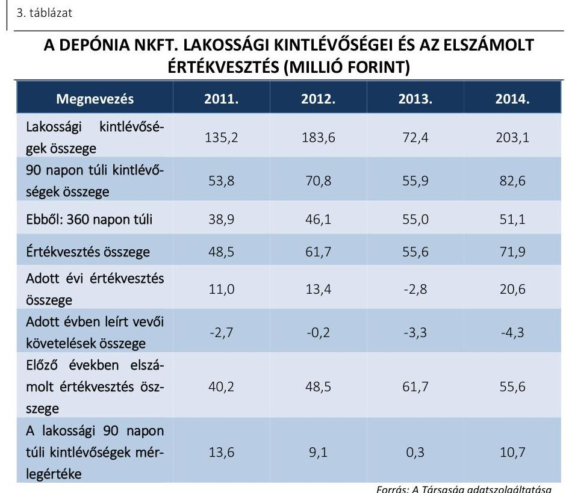

# 3.2. számú megállapítás 

A DEPÓNIA NKFT. a 2011-2014. években összesen 10,5 millió Ft értékben írt le behajthatatlannak minősített követelést. A lakossági kintlévőségek összege a rezsicsökkentési előírások végrehajtása ellenére összességében növekvő tendenciát mutatott.

## Az önköltségszámítás szabályait meghatározták, az árképzés szabályszerű volt.

A hulladékgazdálkodási közfeladat átláthatósága és elszámoltathatósága érdekében a közszolgáltatás díjának megalapozottsága szabályszerű önköltségszámítással biztosítva volt a 2011-2014. években.

AZ ÖNKÖLTSÉGSZÁMÍTÁSI SZABÁLYZAT ${ }_{1,2}$ alkalmas volt az ellátott közfeladat önköltségének meghatározására. Az 5-tel kezdődő munkaszámok tartalmazták a főtevékenység közvetlen költségeit, az 1-4-gyel kezdődő munkaszámokon felmerülő költségek a tárgyévet követően felosztásra kerültek. A költséghelyek felosztásának vetítési alapját meghatározták.
2011. január 1. és 2012. december 31. között a közszolgáltatás díját az Önkormányzat rendeletben határozta meg a Társaság által készített költségelemzés és javaslat alapján. 2013. január 1-jétől a díjmegállapítás miniszteri hatáskör lett. A Hgt. 2 91. §-a szerint 2013. január 1-jétől a Társaság a 2012. december 31-én alkalmazott bruttó díjhoz képest 4,2\%-kal megemelt mértékű díjat alkalmazott a lakossági ügyfelek esetében. A Hgt. 2 91. §-ának 2013. május 10-étől hatályos módosítása szerint 2013. július 1-jétől a 2012. április 14-én alkalmazott díjhoz képest legfeljebb 4,2\%kal megemelt összeg 90\%-a lehetett a maximum díj, melynek a Társaság eleget tett. Az intézményi ügyfelek esetében a 2012. december 31-én meghatározott díj 4,2\%-kal emelt összegét alkalmazták.

---

A 64/2008. (III. 28.) Korm. rendelet 5. §-a szerint a közszolgáltató köteles volt a közszolgáltatási díj megállapítása érdekében díjkalkulációt készíteni. Ha a közszolgáltató a közszolgáltatás körébe tartozó tevékenység mellett más gazdasági tevékenységet is folytatott, a költségtervben a költségek szigorú elkülönítésének módszerét is alkalmaznia kellett. A Társaság a 64/2008. (III. 28.) Korm. rendelet 2. § (3) bekezdésének előírásai szerinti, a díjak megállapításához alkalmazott tényezőket, a díjszámítás módszertanát, a kalkulációs sémát az önköltségszámítási szabályzat ${ }_{1,2}$-ban meghatározta. A DEPÓNIA NKft. a díjak kalkulációját a tárgyévet megelőző év utolsó negyedévében terjesztette be a Közgyűlés, illetve a települési önkormányzatok képviselő-testületei elé, amelyet elfogadtak. A díjakat a Társaság az önköltségszámítási szabályzat ${ }_{1,2}$-ban meghatározott kalkulációs séma alapján számította ki. A közszolgáltatási díj egységárát Ft/liter egységre vetítetten határozták meg. A közszolgáltatási díjtételt az egyszeri ürítési díj adta. A díj-szerkezet alap- és többletszolgáltatásból*** épült fel.

A Társaság a díjakat az előírásoknak megfelelően alkalmazta. A lakossági szilárd hulladék gyűjtésének, szállításának és elhelyezésének egyszeri díja 110 és 120 literes hulladékgyűjtő edényre számolva 2011. január 1-jétől nettó 282,0 és 300,0 Ft/ürítés, 2012. április 15-étől nettó 380,0 és 404,0 Ft/ürítés, 2013. január 1-jétől nettó 396,0 és 421,0 Ft/ürítés volt. 2013. július 1-jétől a 110 literes űrtartalmú edényeknél nettó 264,5, a 120 literes edények esetében nettó 281,3 Ft/ürítés díjat alkalmaztak. A Társaság által a lakossági 120 literes gyűjtőedényzetre vetített díjak alakulását a 2011-2014. években a 3. számú melléklet tartalmazza.

A rezsicsökkentési intézkedésekkel párhuzamosan a Társság számos intézkedést tett árbevétel-kiesésének kompenzálására. 2013. január 1-jét követően a bérgazdálkodás kiadásait csökkentették, a hasznosítható hulladékok házhoz menő rendszerének bővítésével az értékesíthető hulladékok mennyiségének növelését célozták meg.

[^0]
[^0]:    *** Az alapszolgáltatások közé tartozott: gyűjtés, szállítás; hulladék elhelyezés; céltartalék képzés rekultivációra; fejlesztés; szelektív hulladékgyűjtés. A többletszolgáltatások közé tartozott: házhoz menő szelektív gyűjtés; lomtalanítás; zöldhulladék gyűjtés.

---

# JAVASLATOK 

Az ÁSZ tv. 33. § (1) bekezdésében foglaltak értelmében az ellenőrzött szervezet vezetője köteles a jelentésben foglalt megállapításokhoz kapcsolódó intézkedési tervet összeállítani és azt a jelentés kézhezvételétől számított 30 napon belül az ÁSZ részére megküldeni. Amennyiben az ellenőrzött szervezet vezetője nem küldi meg határidőben az intézkedési tervet, vagy továbbra sem elfogadható intézkedési tervet küld, az Állami Számvevőszék elnöke az ÁSZ tv. 33. § (3) bekezdése a) és b) pontjaiban foglaltakat érvényesítheti.

Javaslataink célja a DEPÓNIA NKft. gazdálkodása szabályozottságának erősítése annak érdekében, hogy a szabályozási környezet és a gazdálkodási gyakorlat megfelelően tudja támogatni az átlátható müködést, továbbá az önkormányzati tulajdonosi joggyakorlás kontrolljainak erősítése.

## DEPÓNIA NKft. ügyvezetőjének

1. Intézkedjen a számlarend módosításáról, hogy az tartalmazza minden alkalmazásra kijelölt számla számjelét és megnevezését, illetve azok tartalmát, értékük növekedésének, csökkenésének jogcímeit, más számlákkal való kapcsolatát, valamint a számlarendben foglaltakat alátámasztó bizonylati rendet.
(2.1. sz. megállapítás 8. bekezdése alapján)
2. Intézkedjen a belső adatvédelmi felelős kinevezéséről, a nyilvántartásokban elektronikusan kezelt adatállományok információ biztonsági védelméről, továbbá az adatvédelmi és adatbiztonsági szabályzat elkészitéséről.
(2.4. megállapítás 4. bekezdése alapján)

## Székesfehérvár Megyei Jogú Város Önkormányzata Polgármesterének

1. Hívja fel a tulajdonosi jogokat gyakorló figyelmét arra, hogy az FB szabályszerű müködésének feltétele ügyrendjének megállapítása, majd intézkedjen az elkészült ügyrend Közgyülés által történő jóváhagyására.
(1.2. sz. megállapítás 3. bekezdése alapján)

---

.

---

# MELLÉKLETEK 

- I. SZ. MELLÉKLET: ÉRTELMEZŐ SZÓTÁR
diszkontálás
eladósodottságot jellemző mutatók
garancia
gazdasági társaság

Jövőbeli időpontra szóló pénzösszegek jelenbeli értékének meghatározása referenciakamatláb (más szóval diszkontkamatláb) segítségével.
eladósodottsági mutató (tőkeáttétel): idegen tőke/összes forrás.
Egészségesnek mondható egy olyan mértékű áttétel, amelyet az üzleti tervek szerint és az elmúlt időszak tapasztalatai alapján a társaság megfelelő biztonsággal ki tud termelni. Nagy eszközberuházás-igényű iparágakban értéke magasabb, azaz magasabb eladósodottság is elfogadható, de 75-85\%-ot meghaladó értéknél már itt is erős, sőt túlzott külső finanszírozottságról beszélhetünk. Általánosságban véve kedvező, ha értéke kisebb, mint 0,6 .
eladósodottság mértéke: kötelezettségek / saját tőke.
Fontos szerepet játszik ez a mutató egy vállalat megítélésében. Azt mutatja, hogy a saját források a kötelezettségek hány százalékát fedezik. Törekedni kell, hogy a mutató tartósan (jelentősen) 1 alatti értéket érjen el.
nettó eladósodottság: (kötelezettségek-követelések) / saját tőke.
Azt mutatja, hogy a kintlévőségekkel csökkentett kötelezettségeket milyen mértékben fedezi a saját forrás. Ez feltételezi, hogy a követelések pénzügyileg előbb realizálódnak, mint ahogy a kötelezettségeket teljesíteni kell. A mutató minél kisebb, csökkenő értéke a kedvező.
adósságfedezeti mutató I.: (befektetett eszközök+forgó eszközök) / idegen forrás.
Azt mutatja, hogy 1 Ft adósságra hány Ft vagyon jut. Általánosságban véve kedvező, ha értéke 2 körül van, de nagy eszközberuházás-igényű iparágakban értéke kisebb is lehet.
adósságfedezeti mutató II.: működési cash flow / hosszú lejáratú kötelezettségek.
A mutató azt jelzi, hogy az adott gazdálkodási időszak múködési pénzáramainak eredményeként realizált cash flow révén a vállalkozás mennyiben lenne képes valamenynyi hosszú lejáratú kötelezettségének eleget tenni. Ennek vizsgálatára viszonylag ritkán kerül sor, az elsősorban a veszélyhelyzetbe került vállalkozások esetében lehet érdekes. Általánosságban véve kedvező, ha a múködési cash flow minél nagyobb arányban nyújt fedezetet a hosszú lejáratú kötelezettségre (értéke nagyobb, mint 1, nő az ellenőrzött időszakban).
árbevételre vetített eladósodottság: (kötelezettségek - forgóeszközök) / értékesítés nettó árbevétele.
Az árbevételre vetített eladósodottság azt mutatja, hogy az árbevétel mekkora fedezetet nyújt a kötelezettségeknek a forgóeszközökkel csökkentett részére. Általánosságban véve kedvező, ha az árbevétel minél nagyobb arányban nyújt fedezetet a forgóeszközökkel csökkentett kötelezettségekre (értéke kisebb, mint 1, csökken az ellenőrzött időszakban).
A garancia olyan önálló, az önkormányzat nevében vállalt kötelezettség, amely alapján az önkormányzat az önkormányzati költségvetés terhére szerződésben meghatározott feltételek szerint, a kötelezett nem teljesítése esetén a jogosultnak fizetést teljesít az előzetesen rögzített összeghatárig.
Ptk. 3.88. § (1) bekezdése szerint „a gazdasági társaságok üzletszerű közös gazdasági tevékenység folytatására, a tagok vagyoni hozzájárulásával létrehozott, jogi személyiséggel rendelkező vállalkozások, amelyekben a tagok a nyereségből közösen részesednek, és a veszteséget közösen viselik".

---

gazdálkodó szervezet
hulladékgazdálkodás
hulladékgazdálkodási közszolgáltatás
kezesség
közfeladat
közszolgáltatás

A Ptk. ${ }^{56}$ 685. § c) pontja szerint gazdálkodó szervezet: „az állami vállalat, az egyéb állami gazdálkodó szerv, a szövetkezet, a lakásszövetkezet, az európai szövetkezet, a gazdasági társaság, az európai részvénytársaság, az egyesülés, az európai gazdasági egyesülés, az európai területi együttműködési csoportosulás, az egyes jogi személyek vállalata, a leányvállalat, a vízgazdálkodási társulat, az erdő birtokossági társulat, a végrehajtói iroda, az egyéni cég, továbbá az egyéni vállalkozó." (hatályos: 2014. március 15-éig) A Hgt. 2 2. § (1) bekezdés 15. pontja szerint „a polgári perrendtartásról szóló törvényben meghatározott gazdálkodó szervezet, ide nem értve azt a költségvetési szervet, amelyet az államháztartásról szóló törvény szerint közfeladat ellátására hoztak létre." (hatályos: 2014. március 15-étől)
a Hgt. 1 3. § h) pontja szerint „a hulladékkal összefüggő tevékenységek rendszere, beleértve a hulladék keletkezésének megelőzését, mennyiségének és veszélyességének csökkenését, kezelését, ezek tervezését és ellenőrzését, a kezelő berendezések és létesítmények üzemeltetését, bezárását, utógondozását, a múködés felhagyását követő vizsgálatokat, valamint az ezekhez kapcsolódó szaktanácsadást és oktatást." (hatályos: 2012. december 31-éig) A Hgt. 2 2. § (1) bekezdés 26. pontja szerint „a hulladék gyűjtése, szállítása, kezelése, az ilyen múveletek felügyelete, a kereskedőként, közvetítőként vagy közvetítő szervezetként végzett tevékenység, a hulladékgazdálkodási létesítmények és berendezések üzemeltetése, valamint a hulladékkezelő létesítmények utógondozása." (hatályos: 2013. január 1-jétől)
A Hgt. 2 2. § (1) bekezdés 27. pontja szerint: „a közszolgáltatás körébe tartozó hulladék átvételét, gyűjtését, elszállítását, kezelését, valamint a hulladékgazdálkodási közszolgáltatással érintett hulladékgazdálkodási létesítmény fenntartását, üzemeltetését biztosító, kötelező jelleggel igénybe veendő szolgáltatás." (hatályos: 2013. január 1-jétől)
A kezességre vonatkozó előírásokat a Ptk. 2 6:416-430. §-ai tartalmazzák. Kezességi szerződéssel a kezes kötelezettséget vállal a jogosulttal szemben, hogyha a kötelezett nem teljesít, maga fog helyette a jogosultnak teljesíteni. Kezesség egy vagy több, fennálló vagy jövőbeli, feltétlen vagy feltételes, meghatározott vagy meghatározható összegű pénzkövetelés vagy pénzben kifejezhető értékkel rendelkező egyéb kötelezettség biztosítására vállalható.
A Ptk. 1 szerint kezességet csak írásban lehet vállalni. A kezes kötelezettsége ahhoz a kötelezettséghez igazodik, amelyért kezességet vállalt. A kezes kötelezettsége nem válhat terhesebbé, mint amilyen elvállalásakor volt, kiterjed azonban a kötelezett szerződésszegésének jogkövetkezményeire és a kezesség elvállalása után esedékessé váló mellékkövetelésekre is.
Jogszabályban meghatározott állami vagy önkormányzati feladat, amit az arra kötelezett közérdekből, jogszabályban meghatározott követelményeknek és feltételeknek megfelelve végez, ideértve a lakosság közszolgáltatásokkal való ellátását, továbbá az állam nemzetközi szerződésekben vállalt kötelezettségeiből adódó közérdekű feladatokat, valamint e feladatok ellátásához szükséges infrastruktúra biztosítását is (Nvtv. ${ }^{57}$ 3. § (1) bekezdés 7. pont).
A közszolgáltatás: „közcélú, illetőleg közérdekű szolgáltatást jelent, amely egy nagyobb közösség (állam, település) minden tagjára nézve megközelítőleg azonos feltételek mellett vehető igénybe, ezért valamilyen mértékig közösségi megszervezést, illetve szabályozást, ellenőrzést igényel." Az Ebktv. ${ }^{58}$ 3. § d) pontja a következőképpen határozza meg a közszolgáltatást: „szerződéskötési kötelezettség alapján a lakosság alapvető szükségleteinek ellátására irányuló szolgáltatás, így különösen a villamos energia-, gáz-, hő-, víz-, szennyvíz- és hulladékkezelési, köztisztasági, postai és távközlési szolgáltatás, továbbá a menetrend alapján közlekedő járművekkel végzett közforgalmú személyszállítás".

---

közszolgáltató
nemzeti vagyon
nervzeti vagyon
többségi befolyást biztosító részesedés
tulajdonosi joggyakorló

A Hgt. 2. § (1) bekezdés 37. pont szerint: „az a hulladékgazdálkodási közszolgáltatási engedéllyel rendelkező és a hulladékgazdálkodási közszolgáltatási tevékenység minősítéséről szóló törvény szerint minősített nonprofit gazdasági társaság, amely a települési önkormányzattal kötött hulladékgazdálkodási közszolgáltatási szerződés alapján hulladékgazdálkodási közszolgáltatást lát el." (hatályos: 2014. január 1-jétől) Nvtv. 1. § (2) bekezdése szerint:
„az állam vagy a helyi önkormányzat kizárólagos tulajdonában álló dolgok, az a) pont hatálya alá nem tartozó, állam vagy a helyi önkormányzat tulajdonában lévő dolog,
az állam vagy a helyi önkormányzatot tulajdonában lévő pénzügyi eszközök, továbbá az államot vagy a helyi önkormányzatot megillető társasági részesedések, az államot vagy a helyi önkormányzatot megillető bármely vagyoni értékkel rendelkező jogosultság, amelyet jogszabály vagyoni értékű jogként nevesít, Magyarország határa által körbezárt terület feletti légtér, az üvegházhatású gázok kibocsátási egységeinek kereskedelméről szóló törvény szerint kibocsátási egység és légiközlekedési kibocsátási egység, valamint az ENSZ Éghajlat változási Keretegyezménye és annak Kiotói Jegyzőkönyv végrehajtási keretrendszeréről szóló törvény szerinti kiotói egység,
állami vagy helyi önkormányzati fenntartású közgyűjtemény (muzeális intézmény, levéltár, közgyűjteményként működő kép- és hangarchívum, valamint könyvtár) saját gyűjteményében nyilvántartott kulturális javak körébe tartozó dolog, a régészeti lelet,
a nemzeti adatvagyon körébe tartozó állami nyilvántartások fokozottabb védelméről szóló törvény szerinti nemzeti adatvagyon." (hatályos 2012. január 1-jétől, g) pont módosult 2012. június 30-ától)
Ctv. ${ }^{59}$ 9/F. § (2) bekezdése szerint „az a gazdasági társaság minősül nonprofit gazdasági társaságnak és cégnevében az a gazdasági társaság tüntetheti fel a nonprofit jelleget, amelynek létesítő okirata tartalmazza, hogy a gazdasági társaság tevékenységéből származó nyereség a tagok között nem osztható fel, hanem az a gazdasági társaság vagyonát gyarapítja." (hatályos 2014. március 15-étől)
A Ptk. 2 8:2. § (1) bekezdése szerint „többségi befolyás az olyan kapcsolat, amelynek révén természetes személy vagy jogi személy (befolyással rendelkező) egy jogi személyben a szavazatok több mint felével vagy meghatározó befolyással rendelkezik." Aki a nemzeti vagyon felett az államot vagy a helyi önkormányzatot megillető tulajdonosi jogok és kötelezettségek összességének gyakorlására jogosult. (Nvtv. 3. § (1) bekezdés 17. pont).

---

II. SZ. MELLÉKLET: MŰKÖDÉSI ADATOK

| A DEPÓNIA NKFT. MŰKÖDÉSÉNEK FŐBB JELLEMZŐI (EZER FT / \%) |  |  |  |  |  |  |
| :--: | :--: | :--: | :--: | :--: | :--: | :--: |
| SOR-   SZAM | MEGNEVEZÉS |  | 2011. | 2012. | 2013. | 2014. |
| 1. | A gazdasági társaság tulajdonosi összetétele: |  |  |  |  |  |
| 2. | Önkormányzat megnevezése: |  | Székesfehérvár Megyei Jogú Város Önkormányzata |  |  |  |
| 3. | Önkormányzat tulajdoni részesedésének aránya \% |  | 100,0 |  |  |  |
| 4. | Önkormányzat tulajdoni részesedésének összege ezer Ft |  | 50000 | 281260 | 150000 | 150000 |
| 5. | A gazdasági társaság múködése a vizsgált évek során megszűnte? (IGEN/NEM) |  | NEM |  |  |  |
| 6. | A tárgyévben a gazdasági társaság saját vagyona után elszámolt értékcsökkenés összege | ezer Ft | 89393 | 112428 | 113084 | 36380 |
| 7. | A tárgyévben a saját tulajdonú eszközök pótlására (karbantartás, felújítás, beruházás) elszámolt költség | ezer Ft | 219768 | 48113 | 169689 | 8250 |
| 8. | Értékesítés nettó árbevétele | ezer Ft | 1710329 | 1861741 | 1849330 | 2541271 |
| 9. | Múködési cash flow | ezer Ft | 1320 | 489015 | 25204 | 394945 |

---

#### *Mellékletek*

|  I. SZ. MELLÉKLET: A LAKOSSÁGI HULLADÉKGAZDÁLKODÁSI DÍJ ALAKULÁSA 2011-2014 KÖZÖTT | |
| --- | --- |
|  |

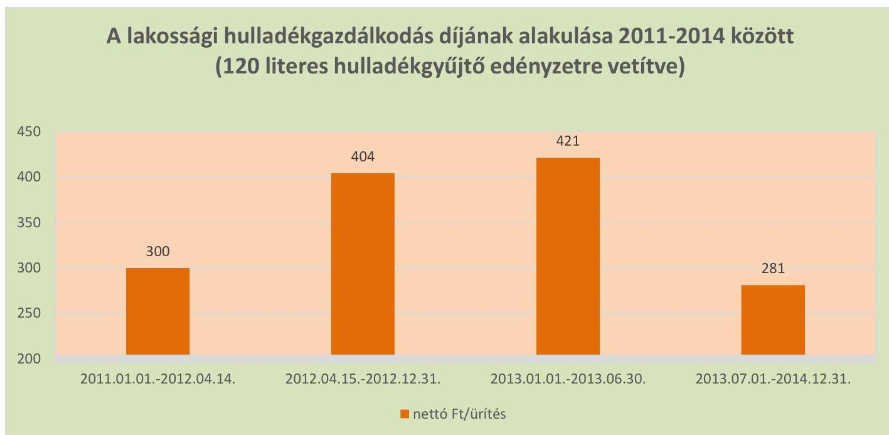

---

| Ssz. | Mintavétel-   lel ellenőr-   zendő terü-   letek | Főbb kérdés | Ellenőrzési kérdések | Adatforrások | Alapsokaság | Mintavételi eljárás |
| :--: | :--: | :--: | :--: | :--: | :--: | :--: |
|  | 1. | 2. | 3. | 4. | 5. | 6. |
| 1. | Az ellátott közfeladat ráfordításainak elkülönített, szabályszerű elszámolása területén |  |  |  |  |  |
| 2. | Anyagjellegü ráfordítások | Az anyagjellegú ráfordítások elszámolása során betartották-e a belső szabályzatokban és a jogszabályokban foglaltakat és azokat a közfeladat-ellátással kapcsolatosan elkülönítették: e? | - a számlázott anyagjellegú ráfordításokra kötött szerződésnél betartották-e a Számv.tv. előírását, a költségelszámolást megalapozó dokumentum (szerződés, megrendelés) rendelkezésre áll?   - a beszerzett anyagok nyilvántartásba vétele megtörtént-e, azokat a közfeladat-ellátással kapcsolatosan elkülönítették-e a szabályozásnak megfelelően?   - a készlet bekerülési értékét a Számv.tv., a számviteli politika, illetve az értékelési szabályzat előírásai szerint vették-e számításba, azokat a közfeladat-ellátással kapcsolatosan elkülönítették-e?   - az anyagjellegú ráfordításokat a megfelelő költségnemre, illetve közfeladatra számolták-e el? | Az anyagjellegú ráfordítások közül az 51-53. főkönyi számlacsoportokból vett minta esetében - a költségelszámolást megalapozó dokumentumok (szerződések, megrendelések, stb.), költségelszámoláshoz benyújtott számlák, teljesítés megtörténtét alátámasztó egyéb dokumentumok,   - analitikus nyilvántartások, anyagok nyilvántartásba vételét igazoló dokumentumok, ha a számviteli politika szerint nyilvántartásba kell venni azokat. | Éves bontásban a főkönyvi adatbázisból az 51-53. Anyagjellegú ráfordítások számlacsoportba a tartozó ráfordítások, kivéve az ELÁBÉ és az eladott közvetített szolgáltatások értéke. | A mintavételt megelőzően a sokaságból ki kell emelni - tételes ellenőrzésre évente a 3-3 legnagyobb összegű tételt.   Véletlen mintavétel évenként elemszámmal arányos rétegzéssel. |
| 3. | Beruházások, felújítások aktiválása és értékcsökkenési leírás | A   közfeladatellátást szolgáló közvagyon állományba vételi, nyilvántartási és elszámolási kötelezettségének teljesítése kapcsán a felújítások, beruházások kiadások aktiválása és az értékcsökkenési leírás elszámolása megfelel-e az előírásoknak? | - A költségelszámolást megalapozó dokumentum (szerződés, megrendelés, stb.) megfelelte az előírásoknak, továbbá be lett kérve a tulajdonosi jogok gyakorlójának előzetes, írásbeli engedélye - amennyiben előírták - az önkormányzati tulajdonban lévő eszközön elszámolt beruházáshoz/felújításhoz? - a beruházások, felújítások állományba vétele, besorolása, a bekerülési érték meghatározása, az üzembehelyezések (aktiválások) dokumentálása megfelelte az Sztv., a számviteli politika, illetve az értékelési szabályzat előírásainak?   - az ellenőrzésre kiválasztott immateriális javak és tárgyi eszközök szerepelnek a mérleget alátámasztó leltárban?   - az értékcsökkenés elszámolása a jogszabályban és a számviteli politikában meghatározott szabályozásnak megfelel-e? | A kiválasztott beruházásra vagy felújításra: szerződések, számlák, a befejezetlen beruházások, felújítások analitikus nyilvántartása, immateriális javak, tárgyi eszközök analitikus nyilvántartása, a beszerzett eszköz üzembehelyezési okmánya, állományba vételi bizonylata, egyedi eszköznyilvántartó kartonja - az értékcsökkenés elszámolása az egyedi eszköznyilvántartó kartonja, illetve analitikus nyilvántartása | Éves bontásban az immateriális javak, a tárgyi eszközök állománynövekedési tételei, amelyek összegének meg kell egyeznie a kiegészítő mérlegben az immateriális javak, a tárgyi eszközök növekedéseként bemutatott értékkel | A mintavételt megelőzően a sokaságból ki kell emelni - tételes ellenőrzésre -évente a 3-3 legnagyobb összegű tételt.   Véletlen mintavétel évenkénti, elemszámmal arányos rétegzéssel. Kiválasztott tételek eszközkartonjának tételes ellenőrzése, különös figyelemmel az értékcsökkenés elszámolására. |
| 4. | Az ellátott közfeladat bevételeinek elkülönített, szabályszerű elszámolása területén |  |  |  |  |  |
| 5. | Értékesítés nettó árbevétel | Az értékesítés nettó árbevétele elszámolása során betartották-e a belső szabályzatokban és a jogszabályokban foglaltakat és azokat a közfeladat-ellátással kapcsolatosan elkülönítették-e? | - a bevétel kiszámlázása a belső szabályozásnak megfelelően történt-e?   - a befolyt bevétel nyilvántartásba vétele (analitika, főkönyv) megtörtént-e, azokat a közfeladat-ellátással kapcsolatosan elkülönítették-e?   - a bevételek beszedése, elszámolása során betartották-e a szabályozásban foglaltakat és a megfelelő számlacsoportba számolták e a bevételt?   - a tulajdonosi követelményeknek, belső szabályozásnak megfelelő árat alkalmazták-e? | A kiválasztott értékesítés nettó árbevétel jogcímen befolyt bevételre:   - az egyes bevételek díjmegállalítása,   - a kibocsátott számla, befolyt bevétel analitikus nyilvántartása, behajtásra tett intézkedések dokumentumai,   - kapcsolódó főkönyvi számla tételes forgalma,   - bevétel beérkezését igazoló banki kivonat(rész). | Éves bontásban a főkönyvi adatbázisból a 91-94. számlacsoportok bevételei | Véletlen mintavétel évenkénti, elemszámmal arányos rétegzéssel. |

---

# FÜGGELÉK: ÉSZREVÉTELEK 

A jelentéstervezetet a Számvevőszék 15 napos észrevételezésre megküldte az ellenőrzött szervezet vezetőjének az ÁSZ tv. 29. $5^{5++}$ (1) bekezdése előírásának megfelelően.
A DEPÓNIA Hulladékkezelő és Településtisztasági Nonprofit Kft. ügyvezetője észrevételezési lehetőségével nem élt. Székesfehérvár Megyei Jogú Város Önkormányzatának polgármesterétől érkezett észrevételt és annak kezeléséről szóló válaszlevelet a jelentés függeléke tartalmazza.

[^0]
[^0]:    ${ }^{5++}$ 29. § (1) Az Állami Számvevőszék az ellenőrzési megállapításait megküldi az ellenőrzött szervezet vezetőjének vagy az általa megbízott személynek, és annak, akinek személyes felelősségét állapította meg.
    (2) Az ellenőrzött szervezet vezetője és a felelősként megjelölt személy az ellenőrzés megállapításaira tizenöt napon belül írásban észrevételt tehet.
    (3) Az Állami Számvevőszék az észrevételre a beérkezésétől számított harminc napon belül írásban válaszol. A figyelembe nem vett észrevételeket köteles a jelentésben feltüntetni, és megindokolni, hogy azokat miért nem fogadta el.

---

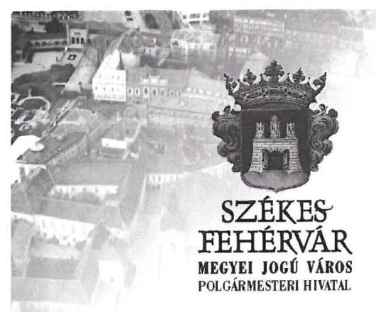

Állami Számvevőszék
Domokos László
elnök

# Budapest 4. 

Pf. 54.
1364
Tisztelt Elnök Úr!

Köszönettel kézhez kaptuk a DEPÓNIA Hulladékkezelő és Településtisztasági Nonprofit Kft. ellenőrzéséről készült jelentéstervezetüket.

Úgy ítéljük meg, hogy a jelentés tervezetben tett megállapítások alapján a közfeladat-ellátás önkormányzati megszervezésének, a tulajdonosi jogok gyakorlásának megítélése pozitív, egyértelmüen azt igazolja vissza, hogy azok megszervezése, ellátása törvényes volt. A jelentésben tett megállapításokat korrektnek tartjuk. Egyúttal a Felügyelő Bizottság ügyrendjének tárgyában leírt megállapításuk, és ezzel összefüggésben tett intézkedési javaslatuk vonatkozásában szíves tájékoztatásul közlöm, hogy a DEPÓNIA Hulladékkezelő és Településtisztasági Nonprofit Kft. Felügyelőbizottsága ügyrendjét elkészítette és azt Székesfehérvár Megyei Jogú Város Önkormányzat Közgyülése 228/2016. (IV.1.) számú határozatával jóváhagyta, melyet csatoltan megküldök.
Tekintettel arra, hogy a megállapítással érintett hiányosság megszüntetése az Állami Számvevőszék ellenőrzése időszakában megtörtént, kérem Elnök urat, hogy ennek tényét a végleges jelentésben szíveskedjenek megjeleníteni.

Ezúton köszönöm meg az ellenőrzés során munkatársai szakszerű, együttműködő munkáját.

Székesfehérvár, 2016. május 25.
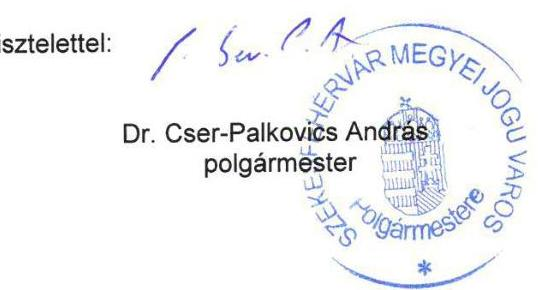

---

# Székesfehérvár Megyei Jogú Város 

## Jegyzöje

Szám: 228/2016.
Székesfehérvár Megyei Jogú Város Önkormányzat Közgyülése 2016. április 1-i ülésén az alábbi határozatot hozta:

## Székesfehérvár Megyei Jogú Város Önkormányzat Közgyülése 228/2016.(IV.1.) számú határo zata:

Székesfehérvár Megyei Jogú Város Önkormányzat Közgyülése megtárgyalta az egyes gazdasági társaságok felügyelőbizottsága ügyrendjének elfogadására vonatkozó javaslatot.

Székesfehérvár Megyei Jogú Város Önkormányzat Közgyülése a DEPÓNIA Hulladékkezelő és Településtisztasági Nonprofit Korlátolt Felelősségű Társaság felügyelőbizottságának ügyrendjét a határozat mellékletében foglalt tartalommal jóváhagyja.

A Közgyűlés felhatalmazza a Polgármestert, hogy a felügyelőbizottság ügyrendjét aláírja.
A Közgyűlés utasítja a Jegyzőt - hogy a Jogi Főosztály bevonásával -, valamint a társaság ügyvezetőjét tegye meg a szükséges intézkedéseket.

Felelős: Dr. Cser-Palkovics András polgármester

Dr. Bóka Viktor
jegyzö
Dr. Kovács Adrien
aljegyzö
Steigerwald Tibor
DEPÓNIA Kft. ügyvezető
Határidő: értelem szerint

Kmf.
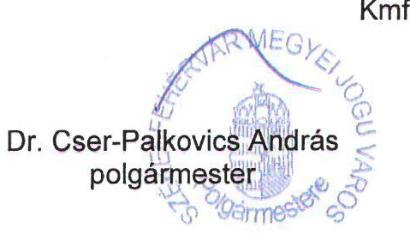

Dr. Bóka Viktor
jegyzö

---

# DEPÓNIA Hulladékkezelő és Településtisztasági Nonprofit Korlátolt Felelősségű Társaság Felügyelőbizottságának 

## ÜGYRENDJE

A DEPÓNIA Hulladékkezelő és Településtisztasági Nonprofit Korlátolt Felelősségű Társaság (8000 Székesfehérvár, Sörház tér 3., a továbbiakban: Társaság) felügyelőbizottsága (a továbbiakban: Felügyelőbizottság) tevékenységét a Polgári Törvénykönyvről szóló 2013. évi V. törvény rendelkezéseinek, a Társaság alapító okiratának és a jelen ügyrendnek (a továbbiakban: Ügyrend) megfelelően végzi. A jelen Ügyrend célja, hogy meghatározza a Társaság Felügyelőbizottságának hatáskörére, müködésére, szervezetére, tagjainak jogaira és kötelezettségeire vonatkozó alapvető szabályokat.

## 1. Általános rendelkezések

1.1. A felügyelőbizottsági tagságra, az elnök, elnökhelyettes megválasztására vonatkozó rendelkezések
1.1.1. A Felügyelőbizottság 3 tagból álló testületként jár el. A tagokat a Társaság alapítója választja határozott időre, legfeljebb 5 évre. A Felügyelőbizottság megválasztott tagjai a tisztséget írásban tett nyilatkozatukkal fogadják el, mely nyilatkozatuknak arra is ki kell terjednie, hogy velük szemben a jogszabályokban meghatározott kizáró, illetve összeférhetetlenségi okok nem állnak fenn.
1.1.2. A Társaság Felügyelőbizottságának tagja az új tisztsége elfogadásától számított 15 napon belül írásban köteles tájékoztatni azokat az érdekelt gazdasági társaságokat, amelyeknél vezető tisztségviselői vagy felügyelőbizottsági tisztséget tölt be. Egyúttal tájékoztatni köteles a Társaságot arról, hogy ezen egyéb tisztségek betöltéséért javadalmazásban részesül-e.
1.1.3. A Felügyelőbizottság első (alakuló) ülésén tagjai sorából elnököt, elnökhelyettest választ a korelnök vezetésével. Az elnök, elnökhelyettes személyére bármelyik tag javaslatot tehet, az elnök, elnökhelyettes személyéről a tagok nyílt szavazással döntenek. Az elnököt, elnökhelyettest a Felügyelőbizottság a felügyelőbizottsági megbízatásuk idejére választja meg. A Felügyelőbizottság elnöke, elnökhelyettese megbízatásának megszűnése esetén a Felügyelőbizottság a következő ülésen új elnököt, elnökhelyettest választ.
1.1.4. Akadályoztatás esetén az elnök teendőit az elnökhelyettes látja el. Ebben az esetben az elnökhelyettest megilletik mindazon jogok, és terhelik azon kötelezettségek, amelyeket jogszabály vagy jelen Ügyrend az elnök számára meghatároz.
1.1.5. Ha a Felügyelőbizottság tagjainak száma a létesítő okiratban megállapított szám alá csökken, az ügyvezetés a Felügyelőbizottság rendeltetésszerű működésének helyreállítása érdekében köteles összehívni a legfőbb szerv ülését, vagy ülés tartása nélküli határozathozatait kezdeményezni.
1.1.6. A Felügyelőbizottság tagjai újraválaszthatók, és e tisztségükből őket a Társaság alapítója bármikor indokolás nélkül visszahívhatja.

### 1.2. Kizáró feltételek, összeférhetetlenség

1.2.1. Nem lehet a Felügyelőbizottság tagja,

- nem nagykorú személy;
- akinek cselekvőképességét a tevékenysége ellátásához szükséges körben korlátozták;
- akit bűncselekmény elkövetése miatt jogerősen szabadságvesztés büntetésre ítéltek, amíg a büntetett előélethez fűződő hátrányos következmények alól nem mentesül;
- akit e foglalkozástól jogerősen eltiltottak, az eltiltás hatálya alatt
- aki vagy akinek hozzátartozója a jogi személy vezető tisztségviselöje;
- a társaság állandó könyvvizsgálója
- a munkavállalói részvétel szabályain alapuló tagságtól eltekintve - a társaság munkavállalója.

---

1.2.2. A Felügyelőbizottság tagja

- nem szerezhet társasági részesedést a Társaságéval azonos tevékenységet is folytató más gazdálkodó szervezetben (a nyilvánosan müködő részvénytársaság kivételével), kivéve ha ehhez a Társaság alapítója hozzájárult;
- nem lehet vezető tisztségviselője a Társaságéval azonos tevékenységet főtevékenységként megjelölő más gazdálkodó szervezetnek (kivéve, ha ezt az érintett társaságok létesítő okiratai lehetővé teszik, vagy ezen társaságok tagjai (legfőbb szervei) ehhez hozzájárultak);
- nem lehet a Társaság által ellenőrzött gazdasági társaság vezető tisztségviselője, illetve Felügyelőbizottságának tagja;
- és közeli hozzátartozója, valamint élettársa nem köthet a saját nevében vagy javára a Társaság főtevékenységi körébe tartozó ügyleteket.

# 1.3. A Felügyelőbizottsági tagok jogai és kötelességei, felelősségük 

1.3.1. A Felügyelőbizottság minden tagjának joga és kötelezettsége, hogy a bizottság munkájában részt vegyen, és személyes tevékenységével aktívan előmozdítsa a testület eredményes müködését.
1.3.2. A Felügyelőbizottság tagjai személyesen kötelesek eljárni, képviseletnek helye nincs.
1.3.3. A Felügyelőbizottság tagjai az ilyen tisztséget betöltő személyektől elvárható fokozott gondossággal kötelesek eljárni, az ellenőrzési kötelezettségük elmulasztásával vagy nem megfelelő teljesítésével a Társaságnak okozott kárért a Ptk. szerződésszegéssel okozott kárért való felelősség szabályai szerint felelnek, ideértve a számviteli törvény szerinti beszámoló, valamint a kapcsolódó üzleti jelentés összeállításával és nyilvánosságra hozatalával összefüggő ellenőrzési kötelezettség megszegését is. Ha a kárt a Felügyelőbizottság határozata okozta, mentesül a felelősség alól az a Felügyelőbizottsági tag, aki a határozat ellen szavazott, és kérte ellenvéleményének az ülés jegyzőkönyvében való rögzítését.
1.3.4. A Felügyelőbizottság tagjai a társaság ügyeiről szerzett értesüléseiket - tisztségük megszűnését követően is korlátlan ideig - üzleti titokként kötelesek megőrizni. Felelősek annak biztosításáért, hogy illetéktelen személyek ne férhessenek hozzá az általuk kért és részükre kiadott iratokhoz és adatokhoz.
1.3.5. A Felügyelőbizottság tagjai kötelesek ellátni a testületi döntéssel rájuk bízott ellenőrzési feladatokat, továbbá kötelesek részt venni a Felügyelőbizottság ülésein.
1.3.6. A Felügyelőbizottság tagja az e tisztség ellátása érdekében végzett tevékenysége körében a Társaság ügyvezetésétől független, tevékenysége során nem utasítható.
1.3.7. A Felügyelőbizottság tagjait a Társaság alapítója által meghatározott összegű díjazás illeti meg.

### 1.4. A Felügyelőbizottsági tagság megszűnése

1.4.1. A Felügyelőbizottsági tagság megszűnik:

- a megbízatás időtartamának lejártával vagy megszüntető feltételhez kötött megbízás esetén a feltétel bekövetkeztével;
- visszahívással;
- a vezető tisztségviselőhöz címzett lemondással;
- elhalálozással;
- cselekvőképességének a tevékenysége ellátásához szükséges körben történő korlátozásával;
- kizáró vagy összeférhetetlenségi ok bekövetkeztével
- jogszabályban meghatározott egyéb esetekben.
1.4.2. A Felügyelőbizottság tagjai a Társaság vezető tisztségviselőjéhez intézett írásbeli nyilatkozattal tisztségükről indokolás nélkül bármikor lemondhatnak, azonban ha azt a Társaság müködőképessége megkívánja, a lemondás csak az annak bejelentésétől számított 60. napon válik hatályossá. Ez alól kivétel, ha a Társaság alapítója az új Felügyelőbizottsági tag megválasztásáról már ezt megelőzően gondoskodott.

---

A lemondás hatályossá válásáig a Felügyelőbizottsági tag köteles a megbízatásával együtt járó halaszthatatlan feladatokat, intézkedéseket megtenni, illetve az ilyen döntések meghozatalában részt venni.
1.4.3. Az a tag, akinek személyi körülményeiben olyan változás következik be, ami miatt megítélése szerint - a Felügyelőbizottsági tagsága nem tartható fenn, köteles ezt a körülményt a Társaság alapítójának és a Felügyelőbizottság elnökének haladéktalanul írásban bejelenteni. Az összeférhetetlenség tényleges megállapítása esetén a tagnak a tagságáról írásban haladéktalanul le kell mondania.

# 2. A Felügyelőbizottság jogai és kötelezettségei (feladat- és hatásköre) 

2.1. A Felügyelőbizottság a Társaság alapítója érdekében, a jogi személy érdekeinek megóvása céljából ellenőrzi a Társaság ügyvezetését. Ennek keretében köteles a tagok vagy az alapítók döntéshozó szerve elé kerülő előterjesztéseket megvizsgálni, és ezekkel kapcsolatos álláspontját a döntéshozó szerv ülésén ismertetni. A Felügyelőbizottság a jogi személy irataiba, számviteli nyilvántartásaiba, könyveibe betekinthet, a vezető tisztségviselőktől és a jogi személy munkavállalóitól felvilágosítást kérhet, a jogi személy fizetési számláját, pénztárát, értékpapír- és áruállományát, valamint szerződéseit megvizsgálhatja és szakértővel megvizsgáltathatja. Ha a Felügyelőbizottság ellenőrző tevékenységéhez szakértőket kíván igénybe venni, a Felügyelőbizottság erre irányuló kérelmét az ügyvezetés köteles teljesíteni.
2.2. A Felügyelőbizottság köteles megvizsgálni a Társaság alapítója elé terjesztett valamennyi lényeges üzletpolitikai jelentést.
2.3. A számviteli törvény szerinti beszámolóról a Társaság alapítója csak a Felügyelőbizottság írásbeli jelentésének birtokában határozhat.
2.4. A Felügyelőbizottság megállapítja saját ügyrendjét, amelyet a Társaság alapítója hagy jóvá.
2.5. A Társaság könyvvizsgálójának személyére az ügyvezetés a Felügyelőbizottság egyetértésével tesz javaslatot a társaság legfőbb szervének.
2.6. A Felügyelőbizottság munkája során feltárt szabálytalanságokat, jogszabálysértéseket, visszaéléseket és a szükségesnek tartott intézkedéseket, valamint a Társaság érdekében egyébként szükségesnek tartott intézkedéseket a Felügyelőbizottság elnöke írásban haladéktalanul köteles jelezni a Társaság alapítójának.
2.7. Ha a Felügyelőbizottság szerint az ügyvezetés tevékenysége jogszabályba vagy a létesítő okiratba ütközik, ellentétes a társaság legfőbb szerve határozataival vagy egyébként sérti a gazdasági társaság érdekeit, a Felügyelőbizottság jogosult összehívni a társaság legfőbb szervének ülését e kérdés megtárgyalása és a szükséges határozatok meghozatala érdekében.
2.8. A Felügyelőbizottság a végzett munkájáról a Társaság alapítójának kérésére beszámolni köteles.
2.9. A Felügyelőbizottság egyes ellenőrzési feladatok elvégzésével bármely tagját megbízhatja, illetve az ellenőrzést állandó jelleggel is megoszthatja tagjai között. A megosztás azonban nem érinti a Felügyelőbizottsági tagok felelősségét, sem azt a jogukat, hogy az ellenőrzést a Felügyelőbizottság más területre kiterjedő ellenőrzési tevékenységére is kiterjesszék, bármely kérdést a megosztástól függetlenül megvizsgáljanak.
2.10. A Felügyelőbizottsági tagja kérheti a bíróságtól a tagok vagy az alapító és a jogi személy szervei által hozott határozat hatályon kívül helyezését, ha a határozat jogszabálysértő vagy a létesítő okiratba ütközik.
2.11. A Felügyelőbizottság tagjai az állandó könyvvizsgáló megkeresésére kötelesek számára a szükséges felvilágosítást, adatokat megadni.
2.12. A Felügyelőbizottság tagjai jogosultak a legfőbb szerv ülésén tanácskozási joggal részt venni.

---

# 3. A Felügyelőbizottsági ülés előkészítése 

### 3.1. A Felügyelőbizottsági ülés összehívása

3.1.1. A Felügyelőbizottsági ülés összehívása, az ülés technikai és adminisztratív feltételeinek a biztosítása az elnök feladata, erre vonatkozó hatáskörét másra nem ruházhatja át.
3.1.2. Az elnök a Felügyelőbizottság ülését évente legalább egyszer (rendes ülés), továbbá szükség szerint (rendkívüli ülés) köteles összehívni.
3.1.3. Amennyiben azt a Felügyelőbizottság napirendjén szereplő ügy indokolja, az elnök zárt ülés tartását is elrendelheti, melyen - az érintett meghívotton kívül - kizárólag a Felügyelőbizottság tagjai vehetnek részt.
3.1.4. Az elnök köteles nyolc napon belül intézkedni a Felügyelőbizottság ülésének tizenöt napon belüli időpontra való összehívásáról

- ha azt a Felügyelőbizottság bármely tagja, az ügyvezetés, illetve a könyvvizsgáló az ok és a cél megjelölésével írásban kéri,
- ha valamely az alapító elé terjesztendő jelentés Felügyelőbizottság általi megvizsgálása végett ez szükséges.
3.1.5. Haladéktalanul köteles az elnök a Felügyelőbizottság ülésének összehívására:
- ha az előzőleg összehívott Felügyelőbizottsági ülés határozatképtelen volt,
- ha az ülés tartása nélkül elrendelt írásbeli szavazás érvénytelen volt.
3.1.6. Ha az elnök nem tesz eleget az ülés összehívása iránti kötelezettségének, az ülést a Felügyelőbizottság bármely tagja összehívhatja.
3.1.7. A Felügyelőbizottság ülésének összehívása a Felügyelőbizottság ülésén jelenlévők felé szóbeli közléssel, egyébként névre szóló meghívó személyes vagy ajánlott levélként, továbbá telefax útján való kézbesítéssel vagy e-mail-en az olvasottság visszaigazolásával történik.
Amennyiben a Felügyelőbizottság ülésén valamennyi tag, illetve meghívott nincs jelen, vagy az ülés jegyzőkönyve a Felügyelőbizottság soron következő ülésének pontos időpontját, helyét és/vagy napirendi pontjait nem tartalmazza, úgy az elnök köteles gondoskodni arról, hogy a Felügyelőbizottság ülésére vonatkozó meghívók elkészüljenek, és azokat az érdekeltek legalább 8 nappal az ülés megtartása előtt megkapják.
Indokolt esetben a Felügyelőbizottság ülése 8 napon belül is összehívható, mely esetben a meghívás telefonon is történhet.
3.1.8. A Felügyelőbizottság ülésein meghívottként - tanácskozási joggal - vesz részt a Társaság ügyvezetője és állandó könyvvizsgálója. A Felügyelőbizottság köteles napirendre tüzni a könyvvizsgáló által megtárgyalásra javasolt ügyeket.
3.1.9. Nem szabályszerűen összehívott Felügyelőbizottsági ülést csak akkor lehet megtartani, ha az ülésen valamennyi Felügyelőbizottsági tag jelen van, és az ülés megtartása, illetve a meghívóban nem közölt napirend megtárgyalása ellen egyikük sem tiltakozik.
3.1.10. Ha a Felügyelőbizottság tagjainak száma az alapító okiratban meghatározott létszám alá csökken, vagy nincs, aki az ülését összehívja, a Társaság ügyvezetése a felügyelőbizottság rendeltetésszerű működésének helyreállítása érdekében köteles erről haladéktalanul az alapítót tájékoztatni.

### 3.2. A Felügyelőbizottsági ülésre szóló meghívó

### 3.2.1. A meghívó tartalma

A Felügyelőbizottság ülésére szóló meghívónak kötelezően tartalmaznia kell:

- a Felügyelőbizottság ülésének helyét és idejét
- a tárgyalandó napirendi pontokat címszerűen, utalva a Felügyelőbizottsági meghívó mellékleteként szereplő esetleges egyéb kiegészítő anyagokra, előterjesztésekre;

---

- felhívást arra vonatkozóan, hogy a tagok további napirendi pontok tárgyalását kérhetik, amennyiben az erre vonatkozó igényüket írásbeli formában legkésőbb a Felügyelőbizottsági ülést megelőző 3 nappal korábban bejelentik.

# 3.2.2. A meghívó mellékletei 

Az elnök a meghívóhoz köteles mellékelni mindazon írásos anyagokat, előterjesztéseket, jelentéseket, kommentárokat, amelyek az érdemi tárgyaláshoz, a jobb megértéshez szükségesek. Amennyiben a mellékelendő írásbeli anyag hosszabb terjedelmű, úgy az elnök jogosult arra, hogy - a napirendi pont lényegét érintően - rövidített összefoglalót készítsen, vagy készíttessen arról.
Az elnök valamennyi Felügyelőbizottsági tagnak köteles megküldeni a meghívó mellékleteit, míg a Felügyelőbizottság ülésére meghívottaknak csupán azokat a mellékleteket, amelyekben a meghívott érintett.
A mellékletek a meghívótól eltérő időben, külön is kézbesíthetők, illetve a Felügyelőbizottság ülésén is átadhatók, amennyiben a Felügyelőbizottság elnöke ezt indokoltnak tartja.

## 4. A Felügyelőbizottsági ülés megtartásának szabályai

### 4.1. Az ülés rendje és a jegyzőkönyv

4.1.1. A Felügyelőbizottsági ülés vezetése az elnök feladata. Az elnök feladata továbbá az ülés rendjének fenntartása, melynek megfelelően jogosult a rendfenntartás érdekében a nem érdemi vagy tárgyhoz nem tartozó hozzászólást előterjesztőtől a szót megvonni, illetve az ülést szükség esetén berekeszteni.
4.1.2. Zárt ülés tartása esetén az elnök köteles gondoskodni arról, hogy a tagokon és az általa az adott napirendi pont tárgyalásához - meghívottakon kívül más az ülésen ne legyen jelen.
4.1.3. Az ülésről jegyzőkönyvet kell készíteni. A jegyzőkönyvnek tartalmaznia kell az ülés helyét, időpontját, a megjelentek nevét a részvételi jogosultságuk feltüntetésével és a napirendi pontokat, a Felügyelőbizottsági ülésen lezajlott fontosabb eseményeket, a tárgyalt ügyekben felszólalók nevét és a felszólalások rövid lényegét, az elhangzott határozati javaslatokat, az azokra leadott szavazatok és ellenszavazatok számát, illetve a szavazástól tartózkodókat vagy az abban részt nem vevőket, a meghozott határozatokat, valamint erre irányuló igény esetén - a határozathozatalt követően is fenntartott esetleges kisebbségi, illetőleg különvéleményeket.
4.1.4. Jegyzőkönyv-vezető - az elnökön kívül - bármelyik Felügyelőbizottsági tag lehet, illetve az ülésen meghívottként jelenlévő bármely személy, aki képes arra, hogy az ülésen elhangzottakat megfelelő módon rögzítse.
4.1.5. A jegyzőkönyvet a hitelesítés érdekében - a jegyzőkönyv-vezetőn kívül - az elnök és egy másik Felügyelőbizottsági tag írja alá.
4.1.6. A jegyzőkönyvhöz - erre irányuló igény esetén - a kisebbségi vagy különvéleményt írásban csatolni kell. A jegyzőkönyvből szükség esetén kivonatot kell készíteni. A kivonatot az elnök írja alá.
4.1.7. A jegyzőkönyv 1-1 eredeti példánya a Felügyelőbizottság tagjait, a Társaság alapítójának képviselőjét és a Társaság ügyvezetőjét illeti meg, 1 példányát pedig az elnök a Társaság székhelyén irattárba teteti.
4.1.8. A jegyzőkönyvnek az érintettek részére - az ülést követő 8 napon belül - történő igazolt átadásáról, illetve megküldéséről az elnök köteles gondoskodni.

### 4.2. Az ülés határozatképessége

4.2.1. A Felügyelőbizottság ülése határozatképes, ha azon valamennyi tag jelen van. Az ülés határozatképességét az elnök állapítja meg. Határozatképtelenség esetén az elnök haladéktalanul köteles az ülést tizenöt napon belüli időpontra ismételten összehívni.

---

Amennyiben a meghívó a megismételt ülésre vonatkozóan időpontot nem állapít meg, a jelenlévő tagok közösen - egyszerű szótöbbséggel - határozzák meg a megismételt ülés időpontját és helyét, amelyröl az elnök szabályszerűen értesíti a jelen nem lévő tagokat, valamint meghívottakat.
4.2.2. Amennyiben a 4.2.1. pont vonatkozásában a tagok között vita van, úgy az elnök szava dönt.

# 4.3. A napirend kiegészítése, a végleges napirend kialakítása 

4.3.1. A tagok a meghívóban szereplő napirendi pontokon kívüli további napirendi pontokra írásban javaslatot tehetnek az elnöknek címzett, és legkésőbb az ülést megelőző 3. napig részére kézbesített levél formájában. A javasolt további napirendi pontokra vonatkozó írásbeli anyag megérkezése után az elnök köteles azokkal - az iktatás időpontján alapuló beérkezési sorrend szerint - a napirendet kibővíteni.
4.3.2. Határozatképes ülés esetén az elnök köteles ismertetni az általa javasolt - a meghívóban szereplő - napirendet, valamint a meghívók kiküldését követően beérkezett további napirendi javaslatokat, illetve azok sorrendjét.
4.3.3. A felügyelőbizottsági tagok további javaslatokat tehetnek a napirend bővítésére.
4.3.4. A napirendi pontokra vonatkozó javaslatok megtárgyalása után az elnök köteles a kibővített napirend elfogadását szavazásra bocsátani. Olyan napirendi pont tekintetében, amely a megküldött meghívóban feltüntetve nincs, a Felügyelőbizottság csak akkor határozhat érvényesen, ha napirendre való tüzését egyik tag sem ellenzi.

### 4.4. A napirendi pontok érdemi megtárgyalásának szabályai és a szavazás

4.4.1. A napirend elfogadását követően az egyes napirendeket az elfogadott sorrendben tárgyalja meg a bizottság. Egy napirendi ponton belül először az előterjesztés (jelentés) ismertetésére kerül sor, majd kérdések, hozzászólások, vita következeik. Ennek alapján az elnök megfogalmazza az elhangzott határozati javaslatokat, és azokat egyenként szavazásra bocsátja. A szavazást követően az elnök megállapítja annak eredményét, és elfogadás esetén - ismerteti az elfogadott határozat szövegét.
4.4.2. A Felügyelőbizottság a döntését a felügyelőbizottsági tagok egyszerű (azaz 50\% feletti) szótöbbségével hozza. Minden Felügyelőbizottsági tagot egy szavazat illet meg. A szavazás nyílt, titkos szavazás alkalmazásáról esetenként dönt a bizottság.
4.4.3. A Felügyelőbizottság döntéseit, állásfoglalásait határozati formában hozza. A határozatokat évenként arab számmal folyamatos számozással kell ellátni, megjelölve a hónapot és a napot is (pl. 1/2015 sz. (I.1.) határozat, stb.).

### 4.5. Az ülés berekesztése

4.5.1. Amennyiben a Felügyelőbizottság a napirenden szereplő pontokat megtárgyalta és a szükséges határozatokat meghozta, az elnök az ülést berekeszti.
4.5.2. Abban az esetben, ha az ülés napirendi pontjainak további tárgyalása bármely okból lehetetlenné válna, az elnök jogosult az ülést berekeszteni, és a Felügyelőbizottság a jelenlévő tagok által meghatározott időpontban és helyen folytatólagos tárgyalást tart.

## 5. Határozathozatai ülés tartása nélkül

5.1. A Felügyelőbizottság elnöke kivételesen indokolt esetben ülés tartása nélküli írásbeli szavazást és határozathozatait rendelhet el a számviteli törvény szerinti beszámoló kérdését kivéve bármely más kérdésben, ha ezt a döntés sürgőssége feltétlenül indokolja.

---

5.2. Ülés tartása nélküli írásbeli szavazás elrendelése esetén a Felügyelőbizottság tagjai a részükre írásban megküldött előterjesztés, illetve határozati javaslat tárgyában a kézhezvételtől számított öt napon belül írásban szavaznak.
5.3. Az ülés tartása nélküli írásbeli szavazás akkor érvényes, ha a Felügyelőbizottság valamennyi tagja az írásbeli szavazatát teljes bizonyító erejú magánokiratba foglaltan az arra nyitva álló határidőn belül eljuttatta a Felügyelőbizottság elnökéhez.
5.4. Az elnök megállapítja, a szavazás eredményét és arról, valamint az annak eredményeképpen meghozott határozatról a Felügyelőbizottság tagjait, valamint az ügyvezetést haladéktalanul tájékoztatja.
5.5. Ha a szavazás érvénytelen, az elnök köteles haladéktalanul összehívni a Felügyelőbizottság ülését.

# 6. Záró rendelkezések 

### 6.1. Iktatás, irattárazás

6.1.1. Az elnök köteles gondoskodni a Felügyelőbizottsági iratok szabályszerű iktatásáról, irattárazásáról, és azoknak - a társaság székhelyén történő - biztonságos tárolásáról. A Felügyelőbizottság tagjai a bizottsági ügyiratokba, nyilvántartásokba korlátozás nélkül betekinthetnek.
6.1.2. A Felügyelőbizottság döntéseiről a Felügyelőbizottság elnöke nyilvántartást vezet. Ezen nyilvántartást a Felügyelőbizottság elnöke kezeli. A nyilvántartásban fel kell tüntetni a döntések tárgyát, tartalmát, időpontját, hatályát, a döntést támogatók és ellenzők, továbbá tartózkodók számarányát, valamint a határozat végrehajtási határidejét és a végrehajtásért felelős személyt.

### 6.2. Költségek viselése

6.2.1. A Felügyelőbizottság múködési feltételeinek biztosítása a Társaság kötelezettsége. A Felügyelőbizottság müködésével, feladatainak ellátásával kapcsolatosan a Felügyelőbizottságnál vagy annak bármely tagjánál jelentkező indokolt és igazolt költségeket a Társaság viseli, beleértve az ülésekre esetlegesen meghívott szakértők munkadíját és költségeit is.

## 7. Az ügyrend hatályba lépése

7.1. A jelen Ügyrend a Társaság alapítója által történő jóváhagyás napján lép hatályba, rendelkezéseit ezen időponttól kezdődően kell alkalmazni.

## ZÁRADÉK I.

Jelen Ügyrendet a Társaság Felügyelőbizottsága 2016. március 21-én megtartott ülésén 2/2016. (III.21) számú határozatával elfogadta.
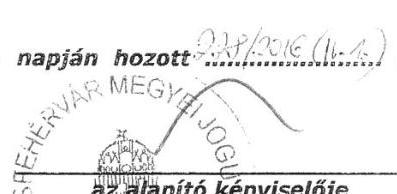

Jelen ügyrendet a Társaság alapítója a-n. napján hozott.

---

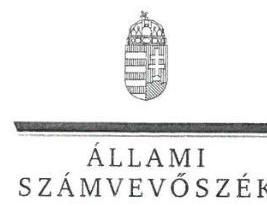

ELNÖK

Ikt.szám: V-0969-168/2016

# Dr. Cser-Palkovics András úr 

polgármester
Székesfehérvár Megyei Jogú Város Önkormányzata

## Székesfehérvár

## Tisztelt Polgármester Úr!

Köszönettel vettem a DEPÓNIA Hulladékkezelő és Településtisztasági Nonprofit Kft. ellenőrzéséről készített számvevőszéki jelentéstervezetre tett észrevételét.

Az Állami Számvevőszék észrevételekre vonatkozó álláspontjáról a felügyeleti vezető által készített részletes tájékoztatásban kap választ, amelyet levelemhez mellékeltem.

Tájékoztatom Polgármester urat, hogy a figyelembe nem vett észrevételek azok elutasításának indokaival együtt szerepeltetve lesznek a végleges jelentésben.

Budapest, 2016. ílínic hó 18. nap
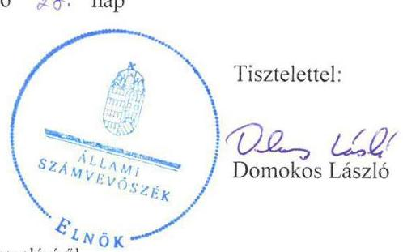

Melléklet: Tájékoztatás az észrevételek kezeléséről

---

# Tájékoztatás az észrevételek kezeléséről 

„Az önkormányzatok többségi tulajdonában lévő gazdasági társaságok közfeladat ellátását érintő gazdálkodási tevékenysége szabályszerűségének ellenőrzése DEPÓNIA Hulladékkezelő és Településtisztasági Nonprofit Kft. (Székesfehérvár)" címmel készített jelentéstervezetre Polgármester úr észrevételét megköszönöm.

Észrevételében Polgármester úr tájékoztatást ad arról, hogy elkészült a DEPÓNIA Hulladékkezelő és Településtisztasági Nonprofit Kft. Felügyelő Bizottságának ügyrendje, amelyet Székesfehérvár Megyei Jogú Város Önkormányzatának Közgyűlése a 228/2016. (IV.1.) határozatával jóvá is hagyott.

Tájékoztatását tudomásul veszem, ugyanakkor a jelentéstervezetnek az Ügyrend hiányára vonatkozó megállapítását ez nem változtatja meg, mivel a hiányosság az ellenőrzött időszakban fennállt.

Budapest, 2016. fém
hó 15 nap
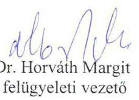

---

# RÖVIDÍTÉSEK JEGYZÉKE 

${ }^{1}$ ÁsZ
${ }^{2}$ Ötv.
${ }^{3}$ Mötv.
${ }^{4}$ Közgyűlés
${ }^{5}$ gazdasági program
${ }^{6}$ Önkormányzat
${ }^{7} \mathrm{Hgt} .{ }_{1}$
${ }^{8}$ hulladékgazdálkodási terv
${ }^{9}$ jegyző
${ }^{10}$ 241/2001. Korm. rendelet
${ }^{11} \mathrm{Hgt} .2$
${ }^{12}$ SZMSZ ${ }_{1}$
${ }^{13}$ SZMSZ ${ }_{2}$
${ }^{14}$ SZMSZ ${ }_{3}$
${ }^{15}$ DEPÓNIA NKft.
${ }^{16}$ Alapító Okirat
${ }^{17}$ hulladékgazdálkodási rendelet ${ }_{1}$
${ }^{18}$ hulladékgazdálkodási rendelet ${ }_{2}$
${ }^{19}$ Közszolgáltatási szerződés ${ }_{1}$
${ }^{20}$ Társaság
${ }^{21}$ 224/2004. (VII. 22.) Korm. rendelet

Állami Számvevőszék
a helyi önkormányzatokról szóló 1990. évi LXV. törvény (hatálytalan: 2014. október 12-étől)

Magyarország helyi önkormányzatairól szóló 2011. évi CLXXXIX. törvény (hatályos: 2012. január 1-jétől)
Székesfehérvár Megyei Jogú Város Önkormányzatának Közgyűlése
Székesfehérvár Megyei Jogú Város Önkormányzata Közgyűlésének 314/2011. (V. 31.) számú határozata a „Program az erős Székesfehérvárért" elnevezésű gazdasági programról és annak 258/2013. (V. 24.) számú határozattal elfogadott módosítása

Székesfehérvár Megyei Jogú Város Önkormányzata
a hulladékgazdálkodásról szóló 2000. évi XLIII. törvény (hatálytalan: 2013. január 1-jétől)
Székesfehérvár Megyei Jogú Város Önkormányzata Közgyűlésének 22/2012. (IV. 13.) számú rendelete a helyi hulladékgazdálkodási tervről Székesfehérvár Megyei Jogú Város Önkormányzatának jegyzője a jegyző hulladékgazdálkodási feladat- és hatásköréről (hatálytalan: 2013. január 1-jétől)
a hulladékról szóló 2012. évi CLXXXV. törvény (hatályos: 2013. január 1jétől)
Székesfehérvár Megyei Jogú Város Önkormányzatának 5/1999. (III. 24.) számú rendelete az Önkormányzat Szervezeti és Működési Szabályzatáról és annak módosításai (hatályos: 1999. március 24-étől 2011. június 2-áig)
Székesfehérvár Megyei Jogú Város Önkormányzatának 18/2011. (VI. 3.) számú rendelete az Önkormányzat Szervezeti és Múködési Szabályzatáról és annak módosításai (hatályos: 2011. június 3-ától 2013. február 24-éig)
Székesfehérvár Megyei Jogú Város Önkormányzatának 4/2013. (II. 25.) számú rendelete az Önkormányzat Szervezeti és Múködési Szabályzatáról és annak módosításai (hatályos: 2013. február 25-étől)
DEPÓNIA Hulladékkezelő és Településtisztasági Nonprofit Kft.
DEPÓNIA NKft. Alapító Okirata és módosításai
Székesfehérvár Megyei Jogú Város Önkormányzatának 15/2007. (V. 24.) számú rendelete a közterületek tisztántartásáról és a települési szilárd hulladék kezeléséről és annak módosításai (hatályos: 2007. június 1-jétől 2014. február 4-éig)

Székesfehérvár Megyei Jogú Város Önkormányzatának 5/2014. (II. 3.) számú rendelete a közterületek tisztán tartásáról és a
hulladékgazdálkodási közszolgáltatásról (hatályos: 2014. február 5-étől)
Székesfehérvár Megyei Jogú Város Önkormányzata és a DEPÓNIA NKft. között létrejött, a 2003-2012. évekre szóló, a települési szilárd hulladék begyűjtésére és szállítására vonatkozó közszolgáltatási szerződés (hatályos: 2003. január 1-jétől)
DEPÓNIA NKft.
a hulladékkezelési közszolgáltató kiválasztásáról és a közszolgáltatási szerződésről (hatálytalan: 2013. szeptember 5-étől)

---

${ }^{22}$ Közszolgáltatási szerződés2
${ }^{23} 317 / 2013$. (VIII. 28.) Korm. rendelet
${ }^{24}$ Üzemeltetési szerződés
${ }^{25}$ áfa
${ }^{26}$ vagyongazdálkodási rendelet ${ }_{1}$
${ }^{27}$ vagyongazdálkodási rendelet ${ }_{2}$
${ }^{28}$ polgármester
${ }^{29} \mathrm{FB}$
${ }^{30} \mathrm{Gt}$.
${ }^{31}$ Ptk. 2
${ }^{32}$ Taktv.
${ }^{33}$ javadalmazási szabályzat
${ }^{34}$ MEKH
${ }^{35}$ 64/2008. (III. 2.) Korm. rendelet
${ }^{36}$ Társaság SZMSZ-e
${ }^{37}$ Számv. tv.
${ }^{38}$ számviteli politika
${ }^{39}$ eszközök és források leltárkészítési és leltározási szabályzata ${ }_{1}$
${ }^{40}$ eszközök és források leltárkészítési és leltározási szabályzata ${ }_{2}$
${ }^{41}$ eszközök és források értékelési szabályzata ${ }_{1}$
${ }^{42}$ eszközök és források értékelési szabályzata ${ }_{2}$
${ }^{43}$ pénzkezelési szabályzat ${ }_{1}$
${ }^{44}$ pénzkezelési szabályzat ${ }_{2}$
a Közép-Duna Vidéke Hulladékgazdálkodási Önkormányzati Társulás és a DEPÓNIA NKft. között létrejött, a 2014-2023. évekre szóló hulladékgazdálkodási közszolgáltatási szerződés (hatályos: 2014. január 27-étől)
a közszolgáltató kiválasztásáról és a hulladékgazdálkodási közszolgáltatási szerződésről (hatályos: 2013. szeptember 5-étől)
Székesfehérvár Megyei Jogú Város Önkormányzata és a DEPÓNIA NKft. között 2001 decemberében létrejött, 20 évre szóló, Székesfehérvár Pénzverővölgy II. Regionális Települési Hulladéklerakóhely üzemeltetésére vonatkozó szerződés (hatályos: 2001 decemberétől)
általános forgalmi adó
Székesfehérvár Megyei Jogú Város Önkormányzatának 22/2001. (V. 28.) számú rendelete az Önkormányzat vagyonáról és a vagyontárgyak feletti tulajdonosi jogok gyakorlásáról és annak módosításai (hatályos: 2001. május 28-ától 2013. június 27-éig)
Székesfehérvár Megyei Jogú Város Önkormányzatának 32/2013. (VI. 28.) számú rendelete az Önkormányzat vagyonáról és a vagyona feletti tulajdonosi jogok gyakorlásáról és annak módosításai (hatályos: 2013. június 28-ától)
Székesfehérvár Megyei Jogú Város Önkormányzatának polgármestere a DEPÓNIA NKft. Felügyelő Bizottsága
a gazdasági társaságokról szóló 2006. évi IV. törvény (hatálytalan: 2014. március 15-étől)
a Polgári Törvénykönyvről szóló 2013. évi V. törvény (hatályos: 2014. március 15-étől)
a köztulajdonban álló gazdasági társaságok takarékosabb múködéséről szóló 2009. évi CXXII. törvény (hatályos: 2009. december 4-étől)
a DEPÓNIA NKft. Javadalmazási szabályzata, melyet a Közgyűlés 471/2011. (VII. 1.) számú határozatával fogadott el (hatályos: 2011. július 1-jétől)
Magyar Energetikai és Közmű-szabályozási Hivatal
a települési hulladékkezelési közszolgáltatási díj megállapításának részletes szakmai szabályairól (hatályos: 2008. április 1-jétől)
a DEPÓNIA NKft. Szervezeti és Múködési Szabályzata (hatályos:2012. július 1-jétől)
a számvitelről szóló 2000. évi C. törvény
a DEPÓNIA NKft. számviteli politikája és módosításai (hatályos: 2001. január 19-étől)
a DEPÓNIA NKft. eszközök és források leltárkészítési és leltározási szabályzata (hatályos: 2001. január 19-étől 2013. december 31-éig)
a DEPÓNIA NKft. eszközök és források leltárkészítési és leltározási szabályzata (hatályos: 2014. január 1-jétől)
a DEPÓNIA NKft. eszközök és források értékelési szabályzata (hatályos: 2001. január 19-étől 2013. december 31-éig)
a DEPÓNIA NKft. pénzkezelési szabályzata (hatályos: 2001. január 19-étől 2013. december 31-éig)
a DEPÓNIA NKft. pénzkezelési szabályzata (hatályos: 2014. január 1-jétől)

---

${ }^{45}$ számlarend: a DEPÓNIA NKft. számlarendje (hatályos: 2011. október 1-jétől 2012. december 31-éig)
${ }^{46}$ számlarend: a DEPÓNIA NKft. számlarendje (hatályos: 2013. január 1-jétől 2013. december 31-éig)
${ }^{47}$ számlarend: a DEPÓNIA NKft. számlarendje (hatályos: 2014. január 1-jétől)
${ }^{48}$ önköltségszámítási szabályzat: a DEPÓNIA NKft. önköltségszámítási szabályzata (hatályos: 2010. január 1jétől 2013. december 31-éig)
${ }^{49}$ önköltségszámítási szabályzat: a DEPÓNIA NKft. önköltségszámítási szabályzata (hatályos: 2014. január 1jétől)
${ }^{50}$ Avtv. a személyes adatok védelméről és a közérdekú adatok nyilvánosságáról szóló 1992. évi LXIII. törvény (hatályos: 2011. december 31-éig)
${ }^{51}$ Info tv. az információs önrendelkezési jogról és az információszabadságról szóló 2011. évi CXII. törvény (hatályos: 2012. január 1-jétől)
${ }^{52}$ Ávr. az államháztartási törvény végrehajtásáról szóló 368/2011. (XII. 31.) Korm. rendelet (hatályos: 2012. január 1-jétől)
${ }^{53}$ számlatükör a DEPÓNIA NKft. 2011-2014. években hatályos számlatükre
${ }^{54}$ Art.
${ }^{55}$ NAV
${ }^{56}$ Ptk.: az adózás rendjéről szóló 2003. évi XCII. törvény
Nemzeti Adó- és Vámhivatal
${ }^{57}$ Nvtv. a Polgári Törvénykönyvről szóló 1959. évi IV. törvény (hatálytalan: 2014. március 15 -étől)
${ }^{58}$ Ebktv. a nemzeti vagyonról szóló 2011. évi CXCVI. törvény (hatályos: 2011. december 31-étől)
${ }^{59}$ Ctv. az egyenlő bánásmódról és az esélyegyenlőség előmozdításáról szóló 2003. évi CXXV. törvény
az egyesülési jogról, a közhasznú jogállásról, valamint a civil szervezetek múködéséről és támogatásáról szóló 2011. évi CLXXV. törvény (hatályos: 2011. december 22-étől)

---

# ÁLLAMI SZÁMVEVŐSZÉK 

1052 Budapest, Apáczai Csere János utca 10.
Levélcím: 1364 Budapest 4. Pf. 54
Telefon: +36 14849100 Telefax: +36 14849200
www.asz.hu