# Jelentés 

## Az önkormányzatok gazdasági társaságai

Az önkormányzatok többségi tulajdonában lévő gazdasági társaságok közfeladat ellátását érintő gazdálkodási tevékenysége szabályszerűségének ellenőrzése - VGÜ Salgótarjáni Hulladékgazdálkodási és Városüzemeltetési Nonprofit Kft.
2016.

---

# Jelentés 

## Az önkormányzatok gazdasági társaságai

Az önkormányzatok többségi tulajdonában lévő gazdasági társaságok közfeladat ellátását érintő gazdálkodási tevékenysége szabályszerűségének ellenőrzése - VGÜ Salgótarjáni Hulladékgazdálkodási és Városüzemeltetési Nonprofit Kft.
2016. július hó 15. nap
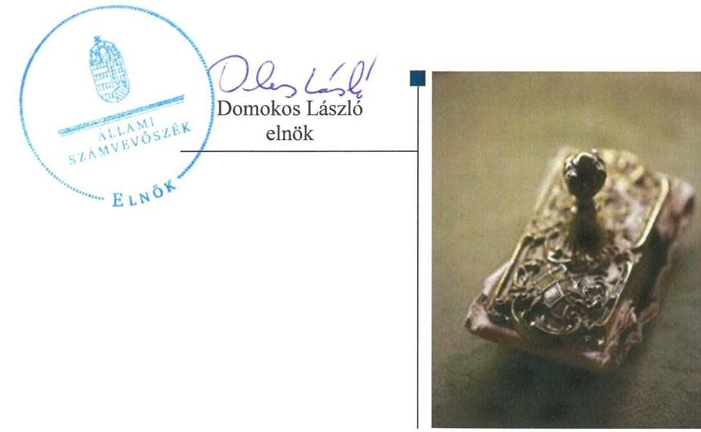

---

# AZ ELLENŐRZÉST FELÜGYELTE:

DR. HORVÁTH MARGIT felügyeleti vezető

# AZ ELLENŐRZÉST VEZETTE ÉS A VÉGREHAJTÁSÁÉRT FELELŐS:

VERTKOVCZI MÁRIA ellenőrzésvezető

# A PROGRAM ÖSSZEÁLLÍTÁSÁÉRT FELELŐS:

JANIK JÓZSEF LÁSZLÓ osztályvezető

---

**IKTATÓSZÁM:** V-0975-136/2016

**TÉMASZÁM:** 2009

**ELLENŐRZÉS-AZONOSÍTÓ SZÁM:** V-070726

---

Jelentéseink az Országgyűlés számítógépes hálózatán és az Interneten a www.asz.hu címen is olvashatóak.

---

# TARTALOMJEGYZÉK 

■ ÖSSZEGZÉS ..... 5
■ AZ ELLENŐRZÉS CÉLJA ..... 7
■ AZ ELLENŐRZÉS TERÜLETE ..... 8
■ AZ ELLENŐRZÉS HÁTTERE, INDOKOLTSÁGA ..... 10
■ A JELENTÉS LÉNYEGES KÉRDÉSKÖREI ..... 11
■ ELLENŐRZÉS HATÓKÖRE ÉS MÓDSZEREI ..... 12
■ MEGÁLLAPÍTÁSOK ..... 14
■ JAVASLATOK ..... 30
■ MELLÉKLETEK ..... 33
I. Sz. melléklet: Értelmező szótár ..... 33
II. Sz. melléklet: A működés főbb jellemzői ..... 36
■ FÜGGELÉK: ÉSZREVÉTELEK ..... 37
■ RÖVIDÍTÉSEK JEGYZÉKE ..... 61

---

.

---

# ÖSSZEGZÉS 

Az Állami Számvevőszék a VGÜ Salgótarjáni Hulladékgazdálkodási és Városüzemeltetési Nonprofit Kft. hulladékgazdálkodási közszolgáltatást érintő tevékenységének 2011-2014. évek közötti szabályszerűségét ellenőrizte. A hulladékgazdálkodást az Önkormányzat szabályosan szervezte meg. A tulajdonosi jogok gyakorlása szabályszerű volt. A Társaság közszolgáltatói feladattal kapcsolatos árképzési gyakorlata nem volt szabályszerű, ugyanakkor a díjcsökkentést szabályszerűen végrehajtották. A Társaság vagyongazdálkodása szabályszerű volt, a kötelezettségállománya a hulladékgazdálkodási közszolgáltatásra vonatkozóan a 2014. évtől kockázatot jelentett.

## Az ellenőrzés társadalmi indokoltsága

Az Állami Számvevőszék Stratégiájában megfogalmazta, hogy a helyi önkormányzatok gazdálkodásában rejlő pénzügyi kockázatok feltárásával, az államháztartáson kívülre nyújtott költségvetési támogatások és ingyenes vagyonjuttatások, valamint az államháztartáson kívül működő közfeladat-ellátó rendszerek ellenőrzéseivel hozzájárul ahhoz, hogy a közpénzeket az államháztartáson kívül működő szervezetek is átlátható, rendezett módon használják fel a közfeladatok szerződésben vállalt ellátása érdekében.

A Magyarországon az intézmény-centrikus közfeladat-ellátás jellemző, de egyre jelentősebb a költségvetésen kívüli feladatellátás térnyerése. Ennek legfontosabb szereplői - a nonprofit szervezetek mellett - az önkormányzati tulajdonú gazdasági társaságok. Az önkormányzatok szervezetalakítási szabadságának következménye, hogy a korábban is vállalati formában működő közszolgáltatások mellett, mind a kötelező, mind az önként vállalt feladatok ellátásában a gazdasági társaságok kiemelt fontosságú szerephez jutottak.

## Főbb megállapítások, következtetések, javaslatok

Az Önkormányzat a hulladékgazdálkodási kötelező közszolgáltatás megszervezéséről az ellenőrzött időszakot megelőzően döntött, annak ellátásáról a 2011-2012. években 100%-os, 2013-2014. években 99%-os tulajdonában lévő gazdasági társasága útján gondoskodott. Az Önkormányzat tulajdonosi jogait az Alapító Okiratában és a 2014. január 27-ig hatályos Megbízási szerződésében szabályozta. Az Önkormányzatnak a Társaság feletti tulajdonosi joggyakorlása az ellenőrzött időszakban szabályszerű volt. A tulajdonosi joggyakorlás keretében rendszeres ellenőrzést az Önkormányzat az éves üzleti tervek és beszámolók megtárgyalásával, illetve 2011. évben belső ellenőrzés végzésével teljesítette. Az éves számviteli beszámolókat a 2011-2012. években a Közgyűlés, 2013-2014. években a Taggyűlés az FB írásbeli javaslata alapján elfogadta. A Gt. és Ptk. által előírásoknak megfelelően a Könyvvizsgáló az éves beszámolót tárgyaló üléseken részt vett. Az Önkormányzat a hulladékgazdálkodási közszolgáltatását a Hgt.-ben és Ht.-ben előírtaknak megfelelő szerződésben szabályozta, rendeletalkotási kötelezettségének eleget tett. A Jegyző a 2011-2012. években nem készítette elő a hulladékgazdálkodási tervet. Az FB ügyrendjének aktualizálása hiányos volt.

A Társaság a Hgt. által előírt kötelező hulladékgazdálkodási közszolgáltatást érintő költségek éves beszámolási kötelezettségének eleget tett. A 2013-2014. évekre vonatkozó hulladékgazdálkodási tervet a Ht.-ban foglaltaknak megfelelően a Társaság elkészítette. A Társaság elkészítette a jogszabályban előírt számviteli és egyéb szabályzatokat, melyek a számlarendet, továbbá az önköltségszámítási szabályzatot kivéve megfeleltek az előírásoknak. A Társaság a kötelezően ellátandó hulladékgazdálkodási tevékenységen kívül egyéb tevékenységet is végzett, viszont a hulladékgazdálkodási közszolgáltatásra vonatkozóan a Hgt. és Ht. szerinti szétválasztási szabályokat nem határozták meg, a

---

közszolgáltatási tevékenységet elkülönítetten a nyilvántartásokban nem szerepeltették. Az Önköltségszámítási szabályzatát a Társaság az ellenőrzött időszakban elkészítette, de az nem felelt meg teljes körűen a Számv. tv. ${ }^{1}$-ben foglaltaknak, mivel nem tartalmazta az árképzésnél alkalmazott képleteket, vetítési alapokat.

A bevételek, ráfordítások elszámolása a Számv. tv és belső szabályok előírásainak megfelelt, azonban a közszolgáltatás elkülönítésének megfelelősége a szabályozás hiányossága miatt nem volt megállapítható. A tárgyi eszközök elszámolása nem volt megfelelő, mivel a gyakorlatban alkalmazott értékcsökkenések nem minden esetben feleltek meg a Számviteli politikában, illetve a Számv. tv-ben foglaltaknak. A Társaság alkalmazott árképzési gyakorlata a közszolgáltatás költségeinek elkülönítési szabályozása, illetve az önköltségszámítási szabályzat hiányosságai miatt nem volt szabályszerű. A díjak csökkentését ugyanakkor a Rezsi tv. ${ }^{2}$-ben és a Ht.-ben foglaltaknak megfelelően, szabályszerűen végrehajtották.

A Társaság vagyongazdálkodása szabályszerű volt. Az eszközök elhasználódása miatt azok használhatósági foka csökkent, döntően az elszámolt értékcsökkenésnél alacsonyabb értékben megvalósított beruházások következtében. A Társaság saját tőkéje az ellenőrzött időszakban a 2013-2014. években elszenvedett veszteség hatására nagymértékben csökkent, a 2014. évben a jegyzett tőke értéke alá süllyedt. A hátralékos követelések az ellenőrzött időszakban növekedtek. A Társaság 2014. évben megnövekedett kötelezettségállománya a működésére, közszolgáltatására kockázatot jelentett.

A Könyvvizsgáló az éves beszámolókról a jelentésében a jogszabályoknak megfelelő tevékenységről nyilatkozott annak ellenére, hogy a kötelezően ellátandó hulladékgazdálkodási közszolgáltatással kapcsolatos Hgt. és Ht. által meghatározott elkülönítési szabályozások hiányoztak a Társaság nyilvántartásaiból.

A Társaság az ellenőrzött időszakban rendelkezett az Info.tv.-ben és az Avtv.-ben előírtaknak megfelelően belső adatvédelmi felelőssel, hatályos adatvédelmi szabályzattal.

---

# AZ ELLENŐRZÉS CÉLJA 

Az ellenőrzés célja annak értékelése, hogy az önkormányzat a jogszabályi előírások figyelembevételével döntött-e az ellenőrzésre kerülő közfeladat megszervezéséről; az önkormányzat/tulajdonosi joggyakorló szabályszerűen gyakorolta-e a tulajdonosi jogokat; a gazdasági társaság közfeladat-ellátása bevételeinek, ráfordításainak elszámolása, és vagyongazdálkodási tevékenysége megfelelt-e a jogszabályi, illetve a közszolgáltatási/vagyonkezelési szerződésben foglalt tulajdonosi előírásoknak, azok végrehajtása szabályszerű volt-e; a gazdasági társaság kötelezettségállománya jelent-e kockázatot a működésre, illetve a közfeladat ellátására; a közfeladatok átláthatósága és elszámoltathatósága érdekében biztosítva volt-e a közszolgáltatás díjának megalapozottsága szabályszerű önköltségszámítással.

---

# **AZ ELLENŐRZÉS TERÜLETE**

## **Salgótarján Megyei Jogú Város Önkormányzata többségi tulajdonában lévő VGÜ Salgótarjáni Hulladékgazdálkodási és Városüzemeltetési Nonprofit Kft.**

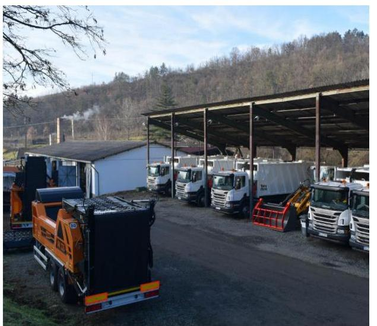

### **A VGÜ SALGÓTARJÁNI HULLADÉKGAZDÁLKODÁSI ÉS VÁROSÜZEMELTETÉSI NONPROFIT KFT.**

az ellenőrzött időszakot megelőzően 1993-ban jogutódlással jött létre, jogelődje a Salgótarjáni Városgazdálkodási Vállalat volt. 2013. augusztus 28-án a Társaság3 kizárólagos tulajdonosa Salgótarján Megyei Jogú Város Önkormányzata. A törvényi előírásoknak megfelelően a Társaság 2013. augusztus 29-től nonprofit társasággá alakult, és ezzel egy időben a korábbi 100 %-os Önkormányzati tulajdon 99 %-ra módosult, mivel 1 %-os részesedéssel tulajdonossá vált az 51 települési önkormányzatból álló Társulás4. A Társulás a 2011. évben azzal a céllal alakult meg, hogy Kelet-Nógrád térségben komplex hulladékgazdálkodási rendszert alakítson ki a tagönkormányzatok hulladékgazdálkodással kapcsolatos közszolgáltatásának magas színvonalú ellátása érdekében. Az ellenőrzött időszakban a Társaság jegyzett tőkéje 103 M Ft volt. A Társaság a hulladékkezelési közszolgáltatást a 2011-2013. években Megbízási szerződés, 2014-től Közszolgáltatási szerződés alapján látta el.

Az 2011-2012. években a Társaság alaptevékenysége a hulladékgazdálkodás volt, emellett a Társaság egyéb városüzemeltetési és fenntartási feladatokat (parkfenntartás, temetőüzemeltetés, köztisztaság, fizető parkoló üzemeltetés, stb.) is ellátott. A Társaság 2013-ban profiltisztítást hajtott végre, amely következtében a hulladékgazdálkodás mellett a köztisztasági és parkoló üzemeltetési tevékenységek maradtak meg. A Társaság az Önkormányzat tulajdonában álló hulladéklerakót üzemeltette.

A Társaság az ellenőrzött időszakban Salgótarján, továbbá ezen felül további településeken (2014-ben 58 településen) végzett települési szilárd hulladékkezelési közszolgáltatást. Az ellátott lakosok száma 2014-ben meghaladta a 111 ezer főt, amelynek 35 %-a Salgótarján város lakosságához tartozott. A Társaság közel 32 ezer háztartás számára végzett szolgáltatást 2014-ben, melyből 49% háztartás tartozott Salgótarjánhoz.

Az ellenőrzött időszakban a Polgármester5 személye egy alkalommal változott, a Jegyző6 személye nem változott. Az ellenőrzött időszakban az Ügyvezető személye egy alkalommal változott. A Társaság jelenlegi Ügyvezetője7 2014. április 30-tól vezeti a társaságot. A könyvvizsgálói feladatokat a Közgyűlés által megbízott Könyvvizsgáló látta el.

A Társaság 2011. és 2014. évi főbb gazdálkodási adatait az 1. ábra mutatja.

---

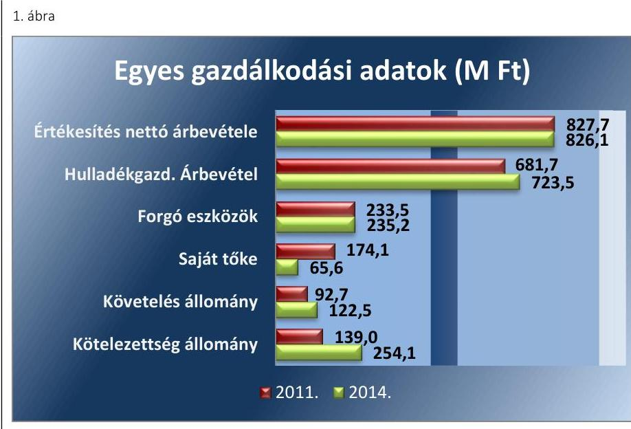

Fornós: A Társaság beszámolói

Az ellenőrzött időszakban a Társaság nettó árbevétele kis mértékben 1,6 M Ft-tal csökkent, a Hulladékgazdálkodással kapcsolatos teljes árbevétel 41,8 M Ft-tal növekedett. A követelések növekedtek az ellenőrzött időszakban. A kötelezettségek növekedése kockázatot jelentett a Társaság működésére.

---

# AZ ELLENŐRZÉS HÁTTERE, INDOKOLTSÁGA 

## AZ ÖNKORMÁNYZATI TULAJDONÚ GAZDASÁGI

TÁRSASÁGOK teljes körű ellenőrzésének lehetőségét az ÁSZ. tv. ${ }^{8}$ 2011. január 1-jétől hatályos módosítása teremtette meg. A közfeladatot ellátó gazdasági társaságok ellenőrzése kiemelten fontos a vagyon megőrzése, megóvása érdekében, valamint a kormányzati szektor elszámolásaiban megjelenő önkormányzati tulajdonú gazdálkodó szervezetek esetében, amelyekkel szemben alapvető követelmény, hogy gazdálkodásuk, működésük szabályszerű, az általuk szolgáltatott adatok minél megbízhatóbbak legyenek. A közfeladat ellátás költségeinek, ráfordításainak alakulása, színvonala hatással van a lakosság elégedettségére. A törvényalkotás számára - az észlelt problémák, szabálytalanságok, vagy egyéb nem kívánatos jelenségek felszínre kerülésével - az ellenőrzés megállapításai segítséget nyújthatnak az államháztartáson kívüli közfeladat-ellátás értékeléséhez, jogszabályi keretei pontosításához, átláthatóságot biztosító szabályozásához. Meghatározhatóvá válnak a közfeladat ellátásban részt vevő államháztartáson kívüli szervezeteknek - az önkormányzat költségvetését, pénzügyi helyzetét is befolyásoló - kockázatai, lehetővé válik ezen kockázatok csökkentése. Ellenőrzéseink feltárhatják, hogy az önkormányzat közfeladat-ellátási kötelezettségének szabályszerűen tett-e eleget, a feladatellátáshoz rendelt közvagyon működtetését a tulajdonostól elvárható gondossággal, szabályszerűen szervezte-e meg és a tulajdonosi felügyelete hozzájárult-e a közfeladat-ellátásához. Az ellenőrzés rávilágíthat arra, hogy a gazdasági társaság a közszolgáltatási szerződésben foglaltak betartásával, a közvagyon használatával biztosította-e a szolgáltatás folytatásának feltételeit, a közfeladat ellátását. Ezzel az ellenőrzöttek és a helyi döntéshozók számára visszajelzést ad feladatszervezési, feladat-ellátási kockázataikról, alapot ad a meglévő hibák megszüntetéséhez, a jobb közfeladat-ellátás biztosításához. Fokozza a fegyelmet, igazolja, hogy lejárt a következmények nélküli ellenőrzések időszaka. Az ÁSZ értékteremtő rend kialakításához és megőrzéséhez hozzájáruló tevékenysége pozitív hatással van a szervezetről kialakított összkép formálására.

---

# A JELENTÉS LÉNYEGES KÉRDÉSKÖREI 

1. Az Önkormányzat közfeladat megszervezéséről szóló döntése, valamint tulajdonosi joggyakorlása szabályszerű volt-e?
2. A gazdasági társaság vagyongazdálkodása szabályszerű volt-e, kötelezettségállománya jelentett-e kockázatot a működésre, illetve a közfeladat ellátásra?
3. A gazdasági társaságnál az ellátott közfeladat bevételei és ráfordításai elszámolása, valamint az önköltségszámítás és árképzés szabályszerű volt-e?

---

# ELLENŐRZÉS HATÓKÖRE ÉS MÓDSZEREI 

## Az ellenőrzés típusa

Megfelelőségi ellenőrzés

## Az ellenőrzött időszak

2011. január 1-jétől 2014. december 31-ig tartó időszak.

## Az ellenőrzés tárgya

A közfeladatot gazdasági társaságokkal ellátó önkormányzatok tulajdonosi joggyakorlása, valamint gazdasági társaságok pénz- és vagyongazdálkodásának szabályozottsága és szabályszerűsége.

Az ellenőrzés kiterjed minden olyan körülményre és adatra, amely az ÁSZ jogszabályban meghatározott feladatainak teljesítéséhez, valamint a program végrehajtása folyamán felmerült újabb összefüggések feltárásához szükséges.

## Az ellenőrzött szervezet

- VGÜ Salgótarjáni Hulladékgazdálkodási és Városüzemeltetési Nonprofit Kft.
- Salgótarján Megyei Jogú Város Önkormányzata

## Az ellenőrzés jogalapja

Az ellenőrzés jogszabályi alapját az Állami Számvevőszékről szóló 2011. évi LXVI. törvény 5. § (3)-(4)-(5) bekezdése képezte.

## Az ellenőrzés módszerei

Az ellenőrzést a
 nemzetközi standardokat irányadónak tekintve az ellenőrzési program ellenőrzési kérdései, az ellenőrzött időszakban hatályos jogszabályok, az ellenőrzés szakmai szabályok és módszertanok figyelembe vételével végezzük.

Az ellenőrzés ideje alatt az ellenőrzött szervezettel történő kapcsolattartást az ÁSZ Szervezeti és Működési Szabályzatának vonatkozó előírásai alapján biztosítjuk.

---

Az ellenőrzés a kiválasztott, többségi tulajdonosi jogokat gyakorló önkormányzatra, illetve az ellenőrzésre kijelölt közfeladatot ellátó gazdasági társaság felett tulajdonosi jogokat gyakorló szervezetre és az ellenőrzött közfeladatot ellátó gazdasági társaságra terjed ki. Amennyiben a gazdasági társaságban több önkormányzat együttesen többségi tulajdonos, úgy az ellenőrzést a többségi tulajdonosi jogokat gyakorló önkormányzatnál kell lefolytatni. Az ellenőrzött gazdasági társaságnál, amennyiben az több közfeladatot is ellát, akkor az ellenőrzésre kiválasztott közfeladat-ellátást ellenőrizzük.

Az ellenőrzést a kérdésekre adott válaszok kiértékelésével, valamint a megjelölt adatforrások, a csatolt tanúsítványok felhasználásával, továbbá az adott időszakban hatályos jogszabályok figyelembe vételével kell lefolytatni. Az ellenőrzési kérdések megválaszolásához szükséges bizonyítékok megszerzése a következő ellenőrzési eljárások alkalmazásával történik: megfigyelés, kérdésfeltevés (információkérés), összehasonlítás, valamint elemző eljárás.

A bevételek és ráfordítások elszámolása, valamint a vagyonnyilvántartás terén a szabályszerű működést véletlen mintavétellel ellenőriztük. A jogszabályoknak és a belső előírásoknak megfelelőnek tekintettük az adott területet, amennyiben a minta ellenőrzésének eredménye alapján 95%-os bizonyossággal a teljes sokaságban a hibaarány kisebb volt, mint 10%, nem megfelelőnek, ha a hibaarány a 10%-ot meghaladta. Kockázatot, illetve magas kockázatot jeleztünk, amennyiben egy adott terület vonatkozásában a minta alapján a teljes sokaságban nem volt egyértelműen biztosított a jogszabályoknak és a belső szabályzatoknak megfelelő működés. A ráfordítások elszámolására és a vagyonnyilvántartásra vonatkozó véletlen mintavételt kockázati alapú kiválasztással egészítettük ki, amelynek során a három legnagyobb összegű tételt választottuk ki.

---

# 1. Az Önkormányzat közfeladat megszervezéséről szóló döntése, valamint tulajdonosi joggyakorlása szabályszerű volt-e? 

Összegző megállapítás

Az Önkormányzat szabályszerűen gondoskodott a közszolgáltatás ellátásáról, tulajdonosi jogait szabályszerűen gyakorolta, a Jegyző 2011-2012. évekre vonatkozóan nem készítette elő az Önkormányzat hulladékgazdálkodási tervét, az FB az ügyrendjét a tagok számát illetően nem aktualizálta.

### 1.1. számú megállapítás

Az Önkormányzat szabályszerűen gondoskodott a hulladékgazdálkodási közszolgáltatás megszervezéséről, rendeletalkotási kötelezettségének eleget tett, a Jegyző nem készítette elő a 2011-2012. évekre vonatkozó hulladékgazdálkodási tervet.

Az ellenőrzött időszakban az Ötv. ${ }^{9}$ 8. § (1) bekezdése és a Mötv. ${ }^{10}$ 13. § (1) bekezdés 19. pontja alapján a köztisztaság és a településtisztaság biztosítása, illetve a hulladékgazdálkodás az önkormányzatok törvényi kötelezettsége. Az Önkormányzat - az Ötv. 9. § (4) bekezdésében foglalt lehetőséggel élve - az ellenőrzött időszakot megelőzően döntött a hulladékgazdálkodás, mint kötelező közszolgáltatás gazdasági társaság útján történő ellátásáról. A Mötv. 13. § (1) bekezdés 19. pontja, 41. § (4) bekezdése alapján, az Önkormányzat a társulási cél megvalósítása érdekében a 2013. évben a Társulásra ruházta át a hulladékgazdálkodási közszolgáltatás végzésére alkalmas, közszolgáltató kiválasztásának, a közszolgáltatási szerződés megkötésének hatásköreit, továbbá a 2014. évtől a hulladékgazdálkodással kapcsolatos feladatok hatásköreit. Az Önkormányzat szabályszerűen gondoskodott a hulladékgazdálkodási közszolgáltatás megszervezéséről.

A Közgyűlés ${ }^{11}$ az ellenőrzött időszakot megelőzően elfogadta az Önkormányzat 2007-2018. évekre vonatkozó Gazdasági programját ${ }^{12}$ és annak 2011-2014. évekre vonatkozó kiegészítését ${ }^{13}$. A Gazdasági program és kiegészítése az Ötv. 91. § (6) bekezdése, és a Mötv. 116. § (3)-(4) bekezdéseinek megfelelően bemutatta a hulladékgazdálkodás fejlesztésével kapcsolatban tervezett intézkedéseket (önkormányzati társulás létrehozása, a szelektív hulladékgyűjtés teljes vertikumának bevezetése, rekultiváció, gyűjtőszigetek kialakítása, illegális hulladéklerakók felszámolása, veszélyes hulladékok elkülönített kezelése, környezettudatos nevelés).

Az Önkormányzat ${ }^{14}$ az Nvtv. ${ }^{15}$ 9. § (1) bekezdése alapján a közép- és hosszú távú ${ }^{17}$ vagyongazdálkodási tervét 2013. május 30-án hatályba léptette. A középtávú vagyongazdálkodási terv célkitűzésként jelölte meg a közfeladat-ellátás biztonságának, színvonalának, a társaságok vagyonának, munkahelyeinek megőrzését. A hosszú távú vagyongazdálkodási terv az Önkormányzat többségi tulajdonában lévő gazdasági társaságok részesedéseinek korlátozottan forgalomképes törzsvagyonba sorolását tartalmazta az Nvtv. 5. § (5) bekezdésének megfelelően.

---

A $\mathrm{Hgt}^{18}$. 35. § (1) bekezdésében előírt hulladékgazdálkodási tervet a 241/2001 Korm. rendelet ${ }^{19}$ 1. § e) pontjában foglaltakkal ellentétesen a Jegyző a 2011. és 2012. évekre vonatkozóan nem készítette elő, nem került a Közgyűlés elé beterjesztésre, ezáltal az Önkormányzat a 2011-2012. évekre vonatkozóan nem rendelkezett hulladékgazdálkodási tervvel.

A Társaság a 2013-2016. évekre vonatkozóan a Ht. ${ }^{20}$ 78. § (1) és (4) bekezdésének megfelelően, a 438/2012 (XII.29.) Korm. rendelet ${ }^{21}$ szerinti tartalommal elkészítette a közszolgáltatói hulladék-gazdálkodási tervét. A hulladékgazdálkodási tervet a Közgyűlés határozattal ${ }^{22}$ elfogadta. A Társaság a Ht. 78.§ (3) bekezdése alapján a hulladékgazdálkodási tervet jóváhagyásra a környezetvédelmi hatóságnak megküldte, amely terv az OKTVF határozatával ${ }^{23}$ jóváhagyásra került.

A TÁRSASÁG ALAPÍTÓ OKIRATA ${ }^{24}$ az ellenőrzött időszakban megfelelt a Gt ${ }^{25}$. 12. § (1), illetve 19. § (4) bekezdéseiben, illetve a Ptk. ${ }^{26}$ 3:5. § bekezdéseiben előírtaknak. Az Alapító Okirat az ellenőrzött időszakban több alkalommal módosításra került többek között az Ügyvezető és az FB tagok személyében bekövetkezett változás, az egyedüli tag üzletrészének felosztása, a könyvvizsgálói feladatok ellátása vonatkozásában. A Társaság legfőbb szerve 2011-től 2013. augusztus 28-ig az Önkormányzat, mint kizárólagos tulajdonos Közgyűlése volt, 2013. augusztus 29-től 2014. december 31-éig a Taggyűlés. Az Alapító Önkormányzat a tulajdonában álló Salgótarján Térségi Hulladéklerakót (létesítmények, eszközök) üzemeltetésre a Társaságnak átadta.

A Társaság a feladatellátás keretszabályait a Hulladékgazdálkodási rendeletekben ${ }^{27}$, Megbízási szerződésben ${ }^{28}$, illetve 2014-től a Társaság és Társulás között létrejött Közszolgáltatási ${ }^{29}$ szerződésben rögzítette.

A Társaság 2011-2013. években a közszolgáltatást az Önkormányzattal 1996-ban kötött Megbízási szerződés alapján végezte. A Hgt. 56.§ (9) bekezdésében foglalt lehetőséggel élve a Társaság a Megbízási szerződést 2003. január 1-jéig többször módosította, amely módosításokkal a Megbízási Szerződés 2011-2013. években megfelelt a Hgt. 28. § és a 224/2004. (VII. 22.) Korm. rendelet ${ }^{30}$ előírásaiban foglalt közszolgáltatás ellátásáról szóló szerződés kritériumainak. A Megbízási szerződés többek között tartalmazta a közszolgáltatás tartalmát, a közszolgáltatás finanszírozásának elveit, a feladatokat, ellátási területeket, kötelezettségeket, díjazásokat, időtartamokat. A Megbízási szerződés 2013. december 31-ig volt érvényes. 2014. január 1. napjától 10 évre vonatkozóan a Társaság Közszolgáltatási szerződést kötött ${ }^{31}$ a Társulással a Ht. 34. § (1), (5), (7) bekezdéseinek, és a 317/2013. (VIII. 28.) Korm. rendelet ${ }^{32}$ 4. §-nak megfelelően. A Közszolgáltatási szerződés tartalmazta a közszolgáltatás területét, a közszolgáltatási díj meghatározását, a keresztfinanszírozás tilalmát, a szerződés felmondásának szabályait. A Közszolgáltatási szerződésben foglaltak szerint a hulladéklerakó az Önkormányzat tulajdonát képezi, melyre bérleti szerződést köt a közszolgáltatóval. A Közszolgáltatási szerződés előírja a közszolgáltatási területen hatályos önkormányzati rendeletek előírásainak kötelmeit, meghatározta a gyűjtő edények/zsákok típusait. A Ht. 62.§ (2) bekezdése alapján a Társaság rendelkezett a hulladékgazdálkodási közszolgáltatási tevékenység végzésére vonatkozó OKTVF engedéllyel, továbbá a Ht. 34. § (3) bekezdésnek megfelelő $\mathrm{OHU}^{33}$ minősítéssel.

---

# RENDELETALKOTÁSI KÖTELEZETTSÉGÉNEK 

az Önkormányzat a Hulladékgazdálkodási rendeletben tett eleget a Hgt. 23. §-ban, illetve a Ht. 35. §-ban előírtaknak megfelelően. A Hulladékrendelet 3. számú melléklete tartalmazta a 64/2008. (III. 28.) Korm. rendelet ${ }^{34}$ alapján meghatározott közszolgáltatási díjat, amely az ellenőrzött időszakban többször módosult.
1.2. számú megállapítás

A tulajdonosi jogok gyakorlása az ellenőrzött időszakban szabályszerű volt, az FB az ügyrendjének megfelelően gyakorolta jogait, azonban az ügyrendjét a tagok számának tekintetében nem aktualizálta.

## A TÁRSASÁG FELETTI TULAJDONOSI JOGOKAT 2013. augusztus 28-áig az Önkormányzat Közgyűlése szabályszerűen gyakorolta, tulajdonosi jogokkal kapcsolatos jogosítványok átadásáról nem döntött. Az Alapító Okirattal összhangban 2013. augusztus 28-ig a Közgyűlés, ezt követően a Taggyűlés mint a Társaság legfőbb szerveinek hatáskörébe tartozott a Társaság számviteli törvény szerinti beszámolójának elfogadása, az eredmény felhasználásra vonatkozó döntés, az Ügyvezető és a Könyvvizsgáló megválasztása, visszahívása és díjazása, az FB tagok megválasztása, az Alapító Okirat módosítása.

A FELÜGYELŐBIZOTTSÁG ${ }^{35}$ az Alapító Okiratban foglaltak alapján - és a Gt. 34. § (1) bekezdésének, valamint a Ptk. 3:121.§ (1) bekezdésének megfelelve - az ellenőrzött időszakban három tagból állt. Feladatait, működésének rendjét a Társaság Alapító Okiratában rögzítették. Az FB rendelkezett a Gt. 34. § (4) bekezdésében, a Ptk. 3:122. § (3) bekezdésben előírt ügyrenddel. Az ügyrend nem került aktualizálásra a tagokat illetően, mivel abban az Alapító Okiratban foglalt 3 fő FB taggal ellentétben 5 fő tag került meghatározásra.

Az FB az ellenőrzött években a Gt. 35. § (3) bekezdésében, illetve a Ptk. 3:120. § (2) bekezdésben foglaltaknak megfelelően megtárgyalta a Társaság éves számviteli beszámolóját és arról írásos jegyzőkönyvet készített. Megtárgyalta az FB a Társaság üzleti terveit, a vezető állásúak prémium kiírását és teljesülésének értékelését. Az FB az ügyrendjében foglaltakkal összhangban gyakorolta jogait.

A BESZÁMOLTATÁSI RENDSZER keretében a Társaság 2011-2013. évekre vonatkozó Üzleti terveit és üzleti terv koncepcióit a Közgyűlés, valamint a 2014 évre vonatkozóan a Taggyűlés megtárgyalta és elfogadásáról határozattal döntött. A Megbízási szerződés VI. sz. mellékletének VI. sz. pontja előírásokat tartalmaz a tervezés tekintetében minden év november 1. illetve január 31. határidővel, amely előírásnak megfelelően a Társaság éves terveket készített a bevétel és a költségelőirányzatok tekintetében, javaslatot készített a költségvetés előkészítésre, szolgáltatási díjak módosítására, illetve éves programot készített a tervezett fejlesztéseiről. 2013. évet követően az Önkormányzat hulladékgazdálkodásra vonatkozó monitoring tevékenységet végzett a Közszolgáltatási szerződés 4. f) és g) pontjaiban előírtak alapján.

---

A JAVADALMAZÁSI SZABÁLYZATOT a Taktv. ${ }^{36}$ 5.§-nak megfelelően a Közgyűlés megalkotta. Javadalmazási szabályzatban meghatározta az Ügyvezető, és a vezető állású munkavállalók javadalmazására vonatkozó előírásokat. A prémiumfeladatokat az ellenőrzött időszakban a javadalmazási szabályzatban foglaltaknak megfelelően a Közgyűlés, illetve 2013-2014. években a Közgyűlésen felül a Taggyűlés határozatokban foglalva határozta meg, végrehajtását értékelte. Az ellenőrzött időszak minden évében a Társaság vezető beosztású alkalmazottai részére szabályszerű prémium kifizetés történt.

BELSŐ ELLENŐRZÉS keretében 2013. évben a 2010-2011-es évek tekintetében az Önkormányzat a Társaságnál az Áht ${ }^{37}$. 70. § (1) bekezdés d) pontjának megfelelő pénzügyi ellenőrzés keretében belső ellenőrzést végzett. Az belső ellenőrzés kiterjedt az önkormányzati rendeletek betartására, feladatellátásra, vagyonvédelemre. A Társaságnál elvégzett belső ellenőrzés az Önköltségszámítási szabályzat általános költségek felosztására vonatkozóan kiegészítést javasolt. Az Önkormányzat az ellenőrzött időszak alatt további belső ellenőrzést nem végzett a Társaságnál.

A Társaság 2011-2012. években nyereségesen, 2013-2014. években veszteségesen gazdálkodott. A Társaság teljes hulladékgazdálkodási tevékenységéből származó eredménye 2011-ben 77,3 M Ft és 2012-ben 74,6 M Ft nyereség, 2013-ban -36,3 M Ft, 2014-ben -75,7 M Ft veszteség volt. A Társaság saját tőkéje 2013-2014. évek veszteségének hatására a 2014. évben a jegyzett tőke értéke alá csökkent. A Könyvvizsgáló a 2014. évi jelentésében felhívta a Társaság figyelmét, hogy további veszteséges gazdálkodás következtében a Ptk 3:189.§-ban előírtak alapján
 a veszteség rendezése céljából a Taggyűlést össze kell hívni. A veszteség rendezésére a Tulajdonosoknak intézkedési kötelezettsége ellenőrzött időszakban a Gt. 51. §, illetve a Ptk. 3:189. § előírása alapján nem keletkezett, mivel a Társaság saját tőkéjének összege két egymást követő lezárt évben nem csökkent a jegyzett tőke - társasági formára - meghatározott szintje alá.

A Társaság és a Hulladékgazdálkodási tevékenység adózott eredményét a 2. ábra mutatja be.
2. ábra
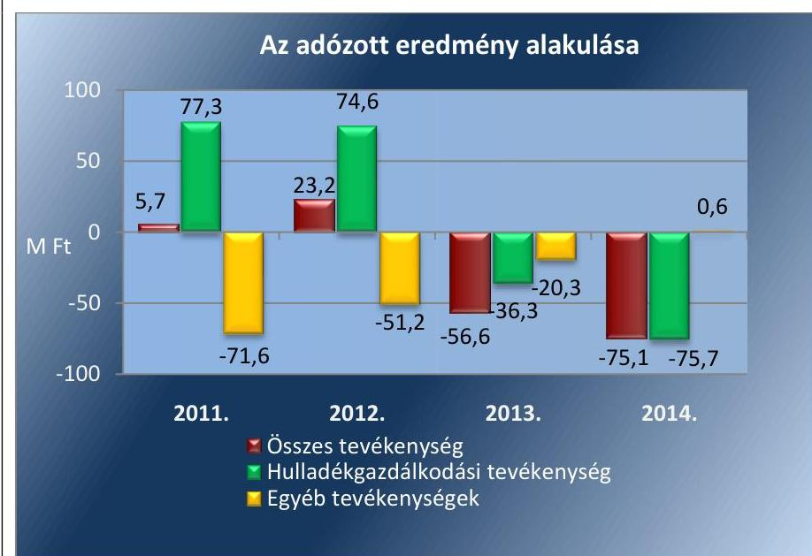

Forrás: A Társaság beszámolói

---

# 2. A gazdasági társaság vagyongazdálkodása szabályszerű volt-e, kötelezettségállománya jelentett-e kockázatot a működésre, illetve a közfeladat ellátásra? 

Összegző megállapítás

2.1. számú megállapítás

A Társaság vagyongazdálkodása szabályszerű volt, a saját tőke összege 2014-ben a jegyzett tőke alá csökkent, a kötelezettségállomány 2014-ben kockázatot jelentett a feladat ellátására. Az éves beszámolókat a jogszabályoknak megfelelően elkészítették, azok legfőbb szerv általi jóváhagyásán a Könyvvizsgáló részt vett. A Társaság az adatok védelmére és nyilvánosságára vonatkozóan szabályszerűen járt el.

A Társaság az ellenőrzött években készített üzleti terveket, rendelkezett gazdálkodási szabályzatokkal, azonban azok nem szabályozták a közszolgáltatás elkülönítését, az alkalmazott díjmegállapításhoz nem tartalmaztak megfelelő, utólag ellenőrizhető előírásokat, eljárásokat.

Az üzleti terveket a tulajdonosi felkérésre az Ügyvezető az ellenőrzött időszak minden évében elkészítette és megtárgyalás és határozathozatal céljából az ellenőrzött időszakban az FB, a Közgyűlés, illetve a Taggyűlés elé terjesztette. Az üzleti tervek tevékenységenként tartalmazták a tárgyévre tervezett bevételeket és ráfordításokat, valamint az egyes tevékenységek tervezett eredményét. Az üzleti tervek összhangban voltak az Önkormányzat gazdasági programjával, a Társaság által elkészített 2013-2014. évekre vonatkozó hulladékgazdálkodási tervvel, és figyelembe vették a jogszabály módosításokat is.

A Társaság elkészítette a Számv. tv. 14. § (3) és (4) bekezdései alapján meghatározott számviteli politikáját ${ }^{38}$. Az ellenőrzött időszakban a Társaság a Számv. tv. 14. § (5) bekezdés a)-d) pontjai előírásának megfelelően Leltározási szabályzattal ${ }^{39}$ az Eszközök és források értékelési szabályzatával ${ }^{40}$, Pénzkezelési szabályzattal ${ }^{41}$, és Önköltségszámítási szabályzattal ${ }^{42}$ rendelkezett. A Társaság elkészítette a Számv. tv. 161. § (1) bekezdésében előírt számlarendet ${ }^{43}$, továbbá a selejtezés rendjét tartalmazó szabályzatot ${ }^{44}$.

A számviteli politika a Számv. tv. 14. § (4) bekezdésében foglaltaknak megfelelően tartalmazta többek között a mérleg és eredmény kimutatás típusát, a mérlegkészítés időpontját, meghatározta az eszközök besorolását, a céltartalék képzés, valamint a beszámoló nyilvánosságra hozatalának szabályait.

2011-2012. években a Hgt. 29. § (1)-(3) bekezdéseiben, illetve a 2013-2014. években a Ht. 50. § (1)-(3) bekezdéseiben előírt hulladékgazdálkodással kapcsolatos kötelezően ellátandó közszolgáltatás egyéb tevékenységtől való elkülönítésére vonatkozó nyilvántartás szabályai a Számv. tv. 161. § (1)-(2) bekezdései és 14. § (3) bekezdésében foglaltak ellenére nem kerültek kialakításra. A gyakorlatban a számlatükörben és az

---

önköltségszámítási szabályzatban felsorolt tevékenységenkénti szétválasztást alkalmazták, de a két szabályzatban felsorolt tevékenységeket nem definiálták abból a szempontból, hogy hulladékgazdálkodással kapcsolatos közszolgáltatás, vagy egyéb tevékenységről van-e szó. Ezek alapján a Hgt. 29. § (3) bekezdésének, a Ht. 50. § (1)-(3) bekezdésének megfelelő szabályozással a Számv. tv. 161/A. § (1)-(2) és 14. § (3) bekezdéseivel ellentétben a Társaság nem rendelkezett, ezzel a Számv. tv. 15. § (3) bekezdésében foglalt bizonyíthatóság és ellenőrizhetőség nem volt biztosított az ellenőrzött időszakban.

További hiányosság volt, hogy a számlatükörben a tevékenységek elkülönítéséhez alkalmazott főkönyvi számlaszámokat és az azokhoz kapcsolódó információkat a számlarend az Sztv. tv. 161. § (1) bekezdésében, (2) bekezdésének a)-d) pontjaiban és (3) bekezdésében foglaltakkal ellentétesen nem tartalmazta.

A Ht. 50.§ (3) bekezdésében foglaltak alapján 2013. január 1-től a Társaság a hulladékgazdálkodási közszolgáltatás nyújtása érdekében végzett tevékenységét éves beszámolója kiegészítő mellékletében önálló mérleg és eredménykimutatás keretében oly módon mutatta be, mintha azt önálló vállalkozás keretében végezte volna, amelyhez kapcsolódóan a szabályozás a Számv. tv. 161/A. § (1) bekezdésében foglaltak ellenére, a fenti hiányosságokon felül nem tartalmazta a mérleg eszköz és forrás oldalának tevékenységenkénti elkülönítéséhez szükséges felosztási szabályokat.

A számviteli politika 8.5. pontjában a Számv. tv. 80. § (2) bekezdésben meghatározott lehetőséggel élve a Társaság előírta, hogy a 100 ezer Ft egyedi beszerzési, előállítási érték alatti, kis értékű vagyoni értékű jogok, szellemi termékek, valamint tárgyi eszközök bekerülési értékét a használatbavételkor egy összegben elszámolják értékcsökkenési leírásként. A Társaság számviteli politikájának 8.6. pontjában rögzítette, hogy a 200 ezer Ft egyedi beszerzési, előállítási érték alatti tárgyi eszközök értékcsökkenési leírása-a maradványérték meghatározása után - két év alatt időarányosan történik. A Számviteli Politika 8.6. pontjában a 100 ezer Ft és 200 ezer Ft közötti eszközök értékcsökkenését a Számv. tv. 52. § (1) bekezdésében meghatározottakkal ellentétesen nem a maradványértékkel csökkentett, előrelátható használati időtől függően, hanem a bekerülési érték alapul vételével, két év alatti időarányos leírással szabályozták.

# Az önköltségszámítási szabályzatot a 

Számv. tv. 14. § (5) bekezdés c) pontja, valamint (6) és (7) bekezdésében foglalt előírások alapján a Társaság elkészítette, azt az ellenőrzött időszakban többször módosította. A módosítások alapvetően a szervezeti változásokat és a tevékenységi profilcsökkenéseknek a hatását követték. Az önköltségszámítási szabályzat tartalmazta a határidőket, a felelősöket és az adatszolgáltatókat, valamint megemlíti a könyvviteli rendszerekkel való egyeztetést, illetve a számlatükörben alkalmazott tevékenységek felsorolását. Az önköltségszámítási szabályzat nem felelt meg a Számv. tv. 14. § (7), 51. §. (2)-(4) bekezdéseinek előírásainak, mivel alapvetően általánosságokat tartalmazott, a végzett tevékenységnek megfelelő, az önköltségszámítás elvégzéséhez szükséges részletezést nem határozott meg, a hulladékgazdálkodás közszolgáltatással kapcsolatos díj megállapításához alkalmazható részletezést (díjkalkulációt, képleteket) nem tartalmazott. A közvetlen és közvetett költségek szabályozása hiányában nem volt alkalmas a tevékenység közvetlen és közvetett önköltségének megállapítására. A

---

# 2.2. számú megállapítás 

hulladékgazdálkodásra vonatkozó naturális vetítési alapok (liter, $\mathrm{m}^{3}, \mathrm{~kg}$, tonna, km, stb.) az önköltségszámítási szabályzatban nem kerültek rögzítésre, ezzel a fajlagos önköltségek megállapítása nem volt biztosított. Az önköltségszámítási szabályzat hiányosságai következtében a Számv. tv. 14. § (7) bekezdése és 161/A. § (1)-(2) bekezdései alapján, a 64/2008. (III.8.) Korm. rendelet 7-9. §-aiban előírt közszolgáltatás díjmegállapítás érdekében a 64/2008. (III.8.) Korm. rendelet 3-5. §-aiban foglalt hulladékgazdálkodás közszolgáltatásra vonatkozó költségek szigorú elkülönítésének módszerét (önköltségszámítását) nem tartalmazta.

A Társaság a tulajdonában lévő vagyonnal a jogszabályi rendelkezéseknek megfelelően gazdálkodott, azonban a saját tőke összege 2014-ben a jegyzett tőke alá csökkent.

A hulladékgazdálkodási közszolgáltatással kapcsolatosan megvalósítandó fejlesztéseket, beruházásokat az üzleti tervekben mutatta be a Társaság.

A leltározást a Számv. tv. 69. § (1) bekezdésében foglaltaknak és a Leltározási szabályzat előírásainak megfelelően végezte. A beszámolóban és a számviteli nyilvántartásokban lévő vagyontárgyak állományát szabályszerűen elkészített leltárral alátámasztották. A Társaság főbb mérlegadatait az 1. táblázat szemlélteti.

1. táblázat

## A VGÜ KFT. FŐBB MÉRLEGADATAI

| Megnevezés | $\begin{gathered} 2011 . \\ 01 .01 \end{gathered}$ | $\begin{gathered} 2011 . \\ 12 .31 \end{gathered}$ | $\begin{gathered} 2012 . \\ 12 .31 . \end{gathered}$ | $\begin{gathered} 2013 . \\ 12.31 . \end{gathered}$ | $\begin{gathered} 2014 . \\ 12.31 . \end{gathered}$ |
| :--: | :--: | :--: | :--: | :--: | :--: |
| I. Befektetett eszközök | 142,8 | 107,8 | 138,9 | 155,3 | 139,9 |
| - ebből: Tárgyi eszközök | 142,4 | 107,5 | 138,2 | 154,7 | 138,8 |
| ebből Hulladékgazdálkodás | $x$ | $x$ | $x$ | 121,4 | 101,3 |
| II. Forgó eszközök | 181,0 | 233,5 | 229,8 | 189,6 | 235,2 |
| - ebből: Követelések | 87,4 | 92,7 | 121,3 | 126,9 | 122,5 |
| ebből Hulladékgazdálkodás | $x$ | $x$ | $x$ | 91,7 | 100,6 |
| - ebből: Pénzeszközök | 85,2 | 131,8 | 100,3 | 54,9 | 104,2 |
| III. Aktív időbeli elhatárolások | 15,6 | 3,0 | 6,7 | 4,9 | 7,4 |
| Eszközök összesen | 339,4 | 344,2 | 375,4 | 349,8 | 382,5 |
| IV. Saját tőke | 170,4 | 174,1 | 197,4 | 140,8 | 65,6 |
| ebből Hulladékgazdálkodás | $x$ | $x$ | $x$ | 92,0 | 21,0 |
| - ebből: Jegyzett tőke | 103,0 | 103,0 | 103,0 | 103,0 | 103,0 |
| ebből Hulladékgazdálkodás | $x$ | $x$ | $x$ | 76,8 | 76,8 |
| - ebből: Tőketartalék | 6,2 | 6,2 | 6,2 | 6,2 | 6,2 |
| - ebből Mérleg szerinti eredmény | 1,2 | 3,7 | 23,2 | -56,6 | -75,2 |
| ebből Hulladékgazdálkodás | $x$ | $x$ | $x$ | -55,1 | -71,0 |
| V. Céltartalékok | 15,8 | 23,5 | 29,6 | 34,4 | 49,4 |
| VI. Kötelezettségek | 139,1 | 139,0 | 140,3 | 164,3 | 254,1 |
| ebből Hulladékgazdálkodás | $x$ | $x$ |  | 140,4 | 234,4 |
| - ebből: szállítókkal szembeni kötelezettség | 49,0 | 48,4 | 30,5 | 23,2 | 19,0 |
| VII. Passzív időbeli elhatárolások | 14,1 | 7,6 | 8,1 | 10,3 | 13,4 |
| Források összesen | 339,4 | 344,2 | 375,4 | 349,8 | 382,5 |

Forrás: a Társaság 2011-2014. évi beszámolói

---

2. táblázat

| A HULLADÉKGAZDÁLKODÁS ESZKÖZÁLLOMÁNYA (M FT/\%) |  |  |
| :--: | :--: | :--: |
|  | 2013 | 2014 |
| Összes eszközérték |  |  |
|  | 349,8 | 382,5 |
| ebből Hulladékgazdálkodás |  |  |
| M Ft | 260,7 | 295,7 |
| \% | 74,5 | 77,3 |

Forrás: Társaság éves beszámolói
3. táblázat

| SAJÁT TÖKE (M FT) |  |
| :--: | :--: |
| év | Saját tőke |
| 2011.01.01. | 170,4 |
| 2011 | 174,1 |
| 2012 | 197,4 |
| 2013 | 140,8 |
| 2014 | 65,6 |

Forrás: Társaság beszámolói

Az eszközértéken belül a befektetett eszközök értéke az ellenőrzött időszakban összességében 2,9 M Ft-tal, 2,0\%-kal csökkent. A befektetett eszközökön belül a tárgyi eszközök állománya 2011. évben 34,9 M Ft-tal csökkent, elsősorban az elszámolt értékcsökkenésnél, selejtezésnél kisebb összegben megvalósuló fejlesztések következtében, azonban a következő két évben növekedett. A Hulladékgazdálkodási tevékenység esetében a 2013. évtől kezdődő tevékenységenkénti szétválasztás alapján rendelkezésre álló adatok szerint a hulladékgazdálkodással kapcsolatos tárgyi eszközök állománya 2013-2014. évek között 16,6\%-kal, 20,1 M Ft-tal csökkent a megvalósított fejlesztések és az elszámolt értékcsökkenés együttes hatásaként. A forgóeszközök állománya 54,2 M Ft-tal, 29,9\%-kal növekedett az ellenőrzött időszakban, melyből a követelések állománya 40,2\%-kal növekedett. A hulladékgazdálkodással kapcsolatos követelésállomány a teljes követelésállomány 82,1\%-a, 100,6 M Ft volt 2014. december 31-én, mely az előző évihez képest 8,9 M Ft-tal, 9,7\%-al nőtt. A hulladékgazdálkodási tevékenység eszközállományának alakulását a szétválasztási szabályok hatálybalépését követően 2013-2014. évekre vonatkozóan a 2. táblázat tartalmazza.

A saját tőke nagysága 2011. nyitó összeghez képest 2014.
 év végére 104,8 M Ft-tal, 61,5%-kal csökkent. A saját tőke 2014-ben a jegyzett tőke 63,7%-ra csökkent. A Jegyzett tőke összege 2011-ben 103,0 M Ft volt és az ellenőrzött időszakban nem változott. A saját tőke 2011. évben és 2012. évben nőtt, mindösszesen a 2011. évi nyitóhoz képest 27,0 M Ft-tal lett magasabb. 2012. évről 2013. évre 56,6 M Ft-tal, 2013. évről 2014. évre 75,2 M Ft-tal csökkent a saját tőke összege az árbevétel növekedése ellenére. A 2013. és 2014. években elszenvedett veszteség főbb befolyásoló tényezője az egyéb ráfordítások nagyfokú emelkedése volt. A növekedés fő oka a 2013. évben a Ht. 68. § (1) bekezdése alapján bevezetett hulladékgazdálkodási tevékenységet terhelő, új költségelemként jelentkező hulladéklerakási járulékfizetési kötelezettség volt, melynek egy tonnára vetített értéke 2014. évtől a 2013. évi duplájára nőtt. A Társaságnál a 2013. évben 78,2 M Ft, 2014. évben 161,2 M Ft hulladékgazdálkodási tevékenységet terhelő járulékfizetési kötelezettség keletkezett. A Ht. 49. § (1) bekezdése szerint 2013. évtől további költségelemként bevezetett felügyeleti dijfizetési kötelezettségből a Társaságnak 2012. évben 7,9 M Ft, 2014. évben 11,3 M Ft fizetési kötelezettsége keletkezett.

A Hulladékgazdálkodás teljes tevékenységének nettó árbevétele a Társaság árbevételének 80,4%-át tette ki a 2011. évben, míg a 2014. évben a 82,6%-át. A hulladékgazdálkodási teljes tevékenység nettó árbevétele 2011. évről a 2014. évre 6,1%-kal, 41,8 M Ft-tal nőtt. A rezsicsökkentés végrehajtása következtében 2013. július 1-ét követően az alkalmazott díjak csökkentek, amely bevételkiesést a Társaság az egyéb tevékenységek többletbevételeiből, elsősorban a megnövekedett idegen beszállítások ártalmatlanítási díjából pótolta. A rezsicsökkentés a 2013. évben 28,2 M Ft, 2014. évben 60,7 M Ft összeggel csökkentette a tevékenység árbevételét. A Társaság a bevételkiesés ellensúlyozására hatékonyság-növelés érdekében a ráfordítások racionalizálásának céljából intézkedéseket vezetett be.

---

# 2.3. számú megállapítás 

## A kötelezettségek állománya 2014-től kockázatot jelentett a közszolgáltatásra, illetve a Társaság működésére.

AZ ELADÓSODOTTSÁG mértéke 2013. évtől növekvő tendenciát mutatott. A mutató romlását a 2013. évtől kezdődő veszteséges gazdálkodás okozta, a 2014. évben a kötelezettségállomány több mint háromszorosa volt a saját tőke összegének. 2013-2014. években az átmeneti likviditási problémákat a Társaság folyószámla hitelkeretének használatával küszöbölte ki.

Az ellenőrzött években az eladósodottság mértékét, szerkezetét jellemező mutatókat a 4. táblázat szemlélteti.
4. táblázat

## A TÁRSASÁG FŐBB MUTATÓSZÁMAI

| Mutató megnevezése | 2011 | 2012 | 2013 | 2014 |
| :--: | :--: | :--: | :--: | :--: |
|  | 12.31. | 12.31. | 12.31. | 12.31. |
| Eladósodottsági mutató (idegen tőke/összes forrás) | 0,40 | 0,37 | 0,47 | 0,66 |
| Eladósodottság mértéke (kötelezettségek/saját tőke) | 0,8 | 0,71 | 1,17 | 3,87 |
| Nettó eladósodottság (kötelezettségek-követelések) / saját tőke | 0,27 | 0,10 | 0,27 | 2,01 |
| Adósságfedezeti mutató I. (befektetett eszközök+forgóeszközök)/idegen forrás | 2,46 | 2,63 | 2,10 | 1,48 |
| Árbevételre vetített eladósodottság (kötelezettségek-forgóeszközök)/árbevétel | $-0,11$ | $-0,12$ | $-0,03$ | 0,02 |

Forrás: a Társaság 2011-2014. év beszámolói

Az eladósodottsági mutató a Társaság működésébe bevont idegen tőke (kötelezettségek) és az összes forrás arányát fejezi ki. A mutató értéke 2012. évet követően növekedett, mértéke kockázatot nem jelentett, de a kötelezettségek növekedésére felhívta a figyelmet.

A kötelezettségek és a saját tőke arányát jelző eladósodottság mértéke 2011-2012. években egy alatt volt, ami a kötelezettségek saját forrással való fedezettségét jelentette. A mutató 2013-2014. években kötelezettségek nagymértékű növekedése és a mérleg szerinti eredmény negatív értékei miatt kedvezőtlen irányú növekedést mutatott, amely szerint a saját tőke már nem nyújtott fedezetet a kötelezettségekre.

A nettó eladósodottság mutató arról nyújt információt, hogy a kintlévőségekkel csökkentett kötelezettségeket milyen mértékben fedezi saját forrás, és feltételezi, hogy a kötelezettségek teljesítését megelőzi a követelések realizálása. A mutató értéke alapján a követelések nem fedezték a kötelezettségeket, de 2011-2013. években a követelésekkel csökkentett kötelezettségekre a saját tőke fedezetet nyújtott. A 2014. évben a saját tőke összege - a nagymértékű kötelezettség növekedés és a saját tőke csökkenése következtében - már nem nyújtott fedezetet a követelésekkel csökkentett, a saját tőke több mint kétszeresére növekedett kötelezettségállományra. A saját tőke és a követelések 2014. évben már nem fedezték a kötelezettségeket.

Az adósságfedezeti mutató I. 2011. évről 2012. évre pozitív irányba változott, majd 2013. évtől negatív tendenciát mutatott. 2011-ben 1 Ft adósságra 2,46 Ft, 2014-ben már csak 1,48 Ft vagyon jutott.

Az árbevételre vetített eladósodottság azt mutatja, hogy az árbevétel mekkora fedezet nyújt a forgóeszközökkel csökkentett kötelezettségekre.

---

A mutató 2011-2013. években kedvezően alakult, mivel a forgóeszközök állománya fedezetet nyújtott a kötelezettségekre. 2014. évben a mutató értéke a kötelezettségek növekedése következtében negatív irányban változott, mivel ebben az évben a forgóeszközök már nem nyújtottak fedezetet a kötelezettségekre. 2014. évben az árbevétel 2%-a volt a forgóeszközök által nem fedezett kötelezettség állomány értéke.

A KÖTELEZETTSÉGEK állománya a 2011-2012. években nem változott érdemben, azonban a 2013. évben növekedést mutatott (24,0 M Ft) és a 2014. évben nagymértékben növekedett (89,8 M Ft) az előző évihez képest. A Hulladékgazdálkodási tevékenység kötelezettség állománya 2014. december 31-én 234,4 M Ft volt, amely a Társaság teljes kötelezettségállományának 92,2%-át jelentette. A 2013. évről 2014. évre vonatkozóan a hulladékgazdálkodásból származó kötelezettség 94 M Ft-tal növekedett. Az év végi kötelezettség állomány növekedése elsősorban a hulladékgazdálkodással kapcsolatban bevezetett új ráfordítások következménye volt, amely kötelezettségek pénzügyi teljesítését a Társaság az ellenőrzött időszakban késve tudta teljesíteni.

A kötelezettségek alakulását szemlélteti az 5. táblázat.
5. táblázat

# A TÁRSASÁG RÖVID- ÉS HOSSZÚ LEJÁRATÚ KÖTELEZETTSÉGEI 

|  | 2011.01.01. | 2011.12.31. | 2012.12.31. | 2013.12.31. | 2014.12.31. |
| :--: | :--: | :--: | :--: | :--: | :--: |
| Rövid lejáratú kötelezettségek | 117,5 | 127,0 | 113,30 | 134,4 | 230,0 |
| ebből 2013. évtől Hulladékgazdálkodási tevékenység | x | x |  | 110,4 | 210,2 |
| ebből szállítók | 49,0 | 48,4 | 30,5 | 23,2 | 19,0 |
| ebből 2013. évtől Hulladékgazdálkodási tevékenység |  |  |  | 16,4 | 12,8 |
| Hosszú lejáratú kötelezettségek | 21,6 | 12,0 | 27,0 | 29,9 | 24,3 |
| ebből 2013. évtől Hulladékgazdálkodási tevékenység |  |  |  | 29,9 | 24,3 |
| Kötelezettségek összesen | 139,1 | 139,0 | 140,3 | 164,3 | 254,1 |
| ebből 2013. évtől Hulladékgazdálkodási tevékenység |  |  |  | 140,4 | 234,4 |

A Társaság hosszú lejáratú kötelezettsége teljes mértékben a hulladékgazdálkodási tevékenységhez kapcsolódott, amely két hosszú lejáratú banki hitelszerződés volt. A hitelek törlesztő részleteinek szerződésszerű teljesítésére a Társaság az ellenőrzött időszakban alapvetően prioritást biztosított. A Társaság az ellenőrzött időszakot követő évre vonatkozó üzleti tervében negatív eredménnyel és likviditási gondokkal számol, amely kockázatot jelez a törlesztő részek későbbi években esedékes, határidőben történő kifizetésével kapcsolatban.

A Hulladékgazdálkodási közszolgáltatás kötelezettség alakulását tevékenységekre bontva a 3. ábra 2013. évtől kezdődően szemlélteti.

---

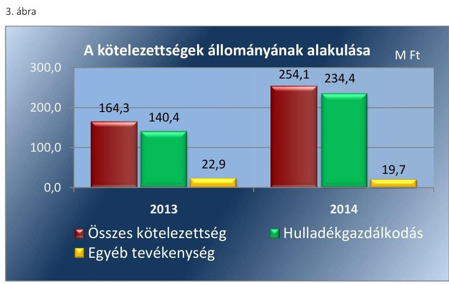

*Forrás: A Társaság éves beszámolói*

A Társaság a fennálló rövid lejáratú kötelezettségeit nem minden esetben teljesítette a szerződésben vagy jogszabályban meghatározott határidőben, a hátralékosan kiegyenlített kötelezettségek aránya az ellenőrzött időszakban 24-28 % között mozgott, és folyamatosan növekedett, az átlagos hátralékos napok száma 9-12 nap között változott. A rövid lejáratú kötelezettségeken belül a szállítókkal szembeni kötelezettség állománya a 2011. december 31-ei 49,0 M Ft-ról 2014. december 31-ére 19,0 M Ft-ra csökkent, míg ugyanezen időszak alatt a rövid lejáratú kötelezettségek összeségében 112,5 M Ft-tal növekedtek. A kötelezettségek 2013-2014. évi nagymértékű növekedése és a határidőn túli fizetések növekedése a későbbi évek további veszteséges működése esetén kockázatot jeleznek a kötelezettségek határidőben történő kifizetésével kapcsolatban. A kötelezettségek késedelmes kifizetését szemlélteti a 6. táblázat.

6. táblázat

|  A TÁRSASÁG ÉVENKÉNTI KÖTELEZETTSÉGEINEK ADATAI |  |  |  |   |
| --- | --- | --- | --- | --- |
|   | 2011. | 2012. | 2013. | 2014.  |
|  A kötelezettség összege (M Ft) | 438,0 | 539,40 | 507,7 | 426,2  |
|  ebből hátralékoson kiegyenlítve (M Ft) | 106,9 | 137,3 | 136,0 | 119,1  |
|  Hátralékoson kiegyenlítések aránya (%) | 24,4 | 25,4 | 26,8 | 27,9  |
|  Átlagos késedelem (nap) | 11 | 9 | 10 | 12  |

*Forrás: A Társaság adatszolgáltatása*

### 2.4. számú megállapítás

Az éves beszámolókat a Társaság a jogszabályoknak megfelelően elkészítette, azok Közgyűlés általi jóváhagyásán a Könyvvizsgáló az ellenőrzött időszakban részt vett. A Társaság az ellenőrzött időszakban az adatok védelmére és nyilvánosságára vonatkozóan szabályszerűen járt el.

**AZ ÉVES BESZÁMOLÓKAT** a Társaság a 2011-2014. évekre vonatkozóan a Számv. tv. 19. § (1) bekezdésének megfelelően elkészítette. A Gt. 141. § (2) a) pontja, valamint a Ptk. 3:109. § (2) bekezdésének megfelelően, a Számv. tv. szerinti beszámolókat az ellenőrzött években a Társaság legfőbb szerve hagyta jóvá. A 2011-2012. években a Közgyűlés,

---

2013-2014. években a Taggyűlés az éves beszámolókat a Könyvvizsgáló jelentésének, és a Gt. 35. § (3) bekezdésének, illetve a Ptk. 3:119. § (2) bekezdésének megfelelően az FB írásos jelentésének birtokában hagyta jóvá.

A Könyvvizsgáló a Számv. tv. 156. § (1) bekezdésének megfelelően elkészítette a Társaság 2011-2014. évi beszámolóira vonatkozó Könyvvizsgálói jelentését. A 2011-2014. évekre vonatkozóan a Társaság jogszabályoknak megfelelő tevékenységéről tiszta jelentést adott ki. A 2014. évi beszámolóra vonatkozóan a Könyvvizsgáló figyelemfelhívással élt az elmúlt évek negatív gazdálkodási eredményei alapján felmerült vállalkozás folytatása elvének kockázatáról. Felhívásában jelezte, hogy a Társaság saját tőkéjének összege alig haladja meg a törzstőke felét, továbbá, hogy a Társaság a 2015. évi üzleti tervében további jelentős veszteséggel, illetve saját tőkevesztéssel számol, így a jövőben indokolt az Ptk. 3:189. §-ban előírt intézkedéseket megtenni.

A Könyvvizsgáló a 2011-2014. évekre vonatkozó éves beszámolókról készített jelentésében a jogszabályoknak megfelelő tevékenységet igazolta annak ellenére, hogy a Hgt. 29. § (3) bekezdésében, a Ht. 50. § (1)-(2) bekezdésében, a Számv. tv. 161/A. § (1)-(2) és 14. § (3) bekezdésben foglaltak ellenére a Társaság nem szabályozta a közszolgáltatási tevékenység egyéb tevékenységektől való elkülönítését.

Az ellenőrzött időszakban a beszámolókat elfogadó Közgyűlésekre a Könyvvizsgálót meghívták, a Gt. 44. § (1) bekezdésének, valamint a Ptk. 3:131. § (2) bekezdésének megfelelően a Könyvvizsgáló azokon részt vett.

Az éves beszámolókat a Számv. tv. 153. § és 154. § előírásainak megfelelően letétbe helyezték és közzítették. A Társaság a Ht. 50. § (3) bekezdése előírásainak eleget téve a 2013-as és 2014-es éves beszámolóinak kiegészítő mellékleteiben szerepeltette a hulladékgazdálkodási
 közszolgáltatásra vonatkozó elkülönített mérlegét és eredménykimutatását, melynek megfelelősége a Ht. 50. § (1)-(3) bekezdéseiben, a Számv. tv. 161/A. (1) és 14. § (3) bekezdéseiben előírtak szabályozási hiánya miatt, a Számv. tv. 15. § (3) bekezdésével ellentétben nem volt megállapítható.

A 2011-2012. éveket érintően a Hgt. 29. § (1) bekezdésében foglaltak alapján a hulladékgazdálkodási tevékenységen belül a kötelezően ellátandó hulladékgazdálkodási közszolgáltatással kapcsolatban a Társaság elkészítette a költségelszámolását az Önkormányzat részére, azonban a megfelelősége a Hgt. 29. § (3), Számv. tv. 161/A. (2) és 14. § (3) bekezdéseiben előírtak szabályozási hiánya következtében, a Számv. tv. 15. § (3) bekezdésével ellentétben nem volt megállapítható.

A 2011. évre vonatkozóan a Közgyűlés 2 M Ft osztalékot hagyott jóvá, a további években osztalék kifizetés nem történt. A Gt. 131. § (3) bekezdése szerint az Ügyvezető 2012. április 26-án megtette nyilatkozatát (mely szerint az osztalék kifizetése nem veszélyezteti a Társaság likviditását). Az osztalék kifizetése 2012. június 29-én teljesült.

AZ ADATOK VÉDELMÉRE, NYILVÁNOSSÁGRA vonatkozóan a Társaság szabályszerűen járt el, az Avtv. ${ }^{45}$. 19. §, 20. § (8) bekezdés, valamint az Info tv ${ }^{46}$. 26. §, és 32-37. § szerint meghatározottaknak az ellenőrzött időszakban eleget tett. A Társaságnál kijelölték a belső adatvédelmi felelőst az Avtv. 31/A. § (1) bekezdés c) pontjának, valamint az Info tv. 24.§ (1) c) pontja értelmében, aki az Avtv. 31/A. § (2) d) pontja,

---

illetve az Info tv. 24.§ (2) bekezdés d) pontja alapján elkészítette a Társaság ellenőrzési időszakában hatályos Avtv. 31/A. § (3), illetve az Info tv. 24. § (3) bekezdése szerinti Adatvédelmi szabályzatát ${ }^{47}$.

# 3. A gazdasági társaságnál az ellátott közfeladat bevételei és ráfordításai elszámolása, valamint az önköltségszámítás és árképzés szabályszerű volt-e? 

Összegző megállapítás

A Társaságnál a hulladékgazdálkodási közszolgáltatással kapcsolatos bevételek és ráfordítások elszámolása megfelelő, az értékcsökkenés elszámolása nem minden esetben volt megfelelő. Az árképzés nem volt szabályszerű, az ármegállapításra vonatkozó rendelkezéseket végrehajtották.
3.1. számú megállapítás

A hulladékgazdálkodási közszolgáltatás bevételeinek és ráfordításainak az elszámolása megfelelő volt, a tárgyi eszközök elszámolása nem volt megfelelő, mivel az alkalmazott értékcsökkenés nem minden esetben felelt meg a jogszabályi és belső előírásoknak. A közszolgáltatás elkülönített nyilvántartásának megfelelősége szabályzat hiányában nem volt megalapozott. A hátralékos követelések behajtása során a Társaság szabályszerűen járt el.

A Társaság ellenőrzött időszakban realizált bevételeit, elszámolt ráfordításait és tevékenységének eredményét a 7. táblázat szemlélteti.
7. táblázat

A TÁRSASÁG BEVÉTELEI, RÁFORDÍTÁSAI, EREDMÉNYE (M FT)

| Megnevezés | 2011 | 2012 | 2013 | 2014 |
| :--: | :--: | :--: | :--: | :--: |
| Összes bevétel | 847,8 | 799,7 | 806,4 | 876,1 |
| Ebből Hulladékgazdálkodás | 681,7 | 677,1 | 691,0 | 723,5 |
| Összes ráfordítás | 842,1 | 776,5 | 863,0 | 951,3 |
| Ebből Hulladékgazdálkodás | 604,4 | 602,7 | 727,2 | 799,2 |
| Adózott eredmény | 5,7 | 23,2 | $-56,6$ | $-75,2$ |
| Ebből Hulladékgazdálkodás | 77,3 | 74,6 | $-36,2$ | $-75,7$ |

A TÁRSASÁG BEVÉTELEI, RÁFORDÍTÁSAI, EREDMÉNYE (M FT)

| Megnevezés | 2011 | 2012 | 2013 | 2014 |
| :--: | :--: | :--: | :--: | :--: |
| Összes bevétel | 847,8 | 799,7 | 806,4 | 876,1 |
| Ebből Hulladékgazdálkodás | 681,7 | 677,1 | 691,0 | 723,5 |
| Összes ráfordítás | 842,1 | 776,5 | 863,0 | 951,3 |
| Ebből Hulladékgazdálkodás | 604,4 | 602,7 | 727,2 | 799,2 |
| Adózott eredmény | 5,7 | 23,2 | $-56,6$ | $-75,2$ |
| Ebből Hulladékgazdálkodás | 77,3 | 74,6 | $-36,2$ | $-75,7$ |

A TÁRSASÁG BEVÉTELEI, RÁFORDÍTÁSAI, EREDMÉNYE (M FT)

## AZ ÉRTÉKESÍTÉS NETTÓ ÁRBEVÉTELE ÉS AZ

ANYAGJELLEGŰ RÁFORDÍTÁS ELSZÁMOLÁSA az ellenőrzött időszakban a Számv. tv-ben előírtaknak megfelelően történt. Valamennyi árbevételt és ráfordítást a Társaság hatályos Számlatükrének megfelelő főkönyvi számlára számolták el. A bevételi számlák megfelelő határidőben, megfelelő egységár alkalmazásával kerültek kiállításra. A bevételt és a ráfordításokat a közszolgáltatásra elkülönítetten számolták el, azonban a közszolgáltatással kapcsolatos elkülönítés megfelelősége a Hgt. 29. § (3) bekezdésében, a Számv. tv. 161/A. § (2) és 14. § (3) bekezdéseiben foglalt szabályozás hiánya miatt, a Számv. tv. 15. § (3) bekezdésében foglaltak ellenére nem volt megállapítható.

---

8. táblázat

HÁTRAKLÉKOS ÁLLOMÁNY ALAKULÁSA A LAKOSÁGI VEVŐÁLLOMÁNYNÁL (M FT)

| 2011 | 2012 | 2013 | 2014 |
| :--: | :--: | :--: | :--: |
| Lakossági vevők: |  |  |  |
| 42,9 | 50,2 | 67,9 | 77,1 |
| Ebből 180 napon túli: |  |  |  |
| 14,4 | 13,5 | 18,6 | 18,6 |
| Ebből: 365 napon túli |  |  |  |
| 28,5 | 36,7 | 49,3 | 58,5 |

Forrás: Társaság beszámolája

A BERUHÁZÁSOK, FELÚJÍTÁSOK ÉS AZ ÉRTÉKCSÖKKENÉSI LEÍRÁS ELSZÁMOLÁSA a 200 ezer Ft alatti bekerülési értékű tárgyi eszközök amortizációjának elszámolási gyakorlata kivételével megfelelt a Számv. tv. 52. és 80. §-ában foglaltaknak. A 200 ezer forint alatti bekerülési értékű tárgyi eszközöknél az eszköz állományba vételi bizonylatán a Számviteli politika 8.6. pontjában meghatározott 2 évnél hosszabb használati időt állapítottak meg, miközben a bizonylaton szerepelt a 2 éves használati idő is. A gyakorlatban a 2 éves lineáris leírást alkalmazta a Társaság. A belső szabályozás alapján a megállapított hasznos élettartamtól és a maradványértéktől való eltérést a vállalkozási-igazgatóhelyettes által jóváhagyott jegyzőkönyvben kellett dokumentálni. A számviteli politika 8.1. pontjában meghatározottaktól eltérően a vállalkozási-igazgatóhelyettes által jóváhagyott jegyzőkönyvet nem készítettek azokban az esetekben, amikor az eszközök értékcsökkenésének meghatározása során az eszköz állományba vételi lapján a műszaki osztály által meghatározott maradványértéktől és használati időtől eltért a Társaság. Az így alkalmazott gyakorlat a Számv. tv. 52. § (1) bekezdésével ellentétes, mivel ezekben az esetekben az értékcsökkenés elszámolása nem a használati idő és maradványérték figyelembe vételével történt.

Az hulladékgazdálkodás során alkalmazott eszközök használhatósági foka az értékcsökkenésnél alacsonyabb értékű beruházások következtében az ellenőrzött időszakban csökkent, az átlagos életkoruk nőtt. A Társaság a jelentkező pénzügyi nehézségek következtében az eszközök pótlását nem tudta biztosítani és a jövőre vonatkozóan sem terveztek nagyobb beruházásokat.

A KÖVETELÉS ÁLLOMÁNY KEZELÉSRE az üzemeltetési szerződésben rögzített alapelvek figyelembevételével kialakított gyakorlat szerint a tartozás összegének függvényében normál, ajánlott, illetve tértivevényes felszólító leveleket küldtek az adósoknak, illetve behajtást kezdeményeztek.

2011-2012. években a Társaság a Hgt. 26. § (2) bekezdése alapján a 30 napon túli díjhátralékosokat felszólította a kötelezettség elmulasztására és annak teljesítésére. A felszólítás eredménytelenségét követően a 90 napon túli követelések adók módjára történő behajtását a Társaság a Hgt. 26. § (3) bekezdésének megfelelően a települési Jegyzőknél kezdeményezte. A 2013. évtől a Ht. 52. §-ában foglaltaknak megfelelően járt el a Társaság a díjhátralék behajtásával kapcsolatban. A felszólítás eredménytelensége esetén 45 nap elteltével kezdeményezték a NAV-nál az adók módjára történő behajtást. A 2014. évtől kezdődően a kimenő számlákon feltűntették a fogyasztók fennálló tartozását. Az éven túli tartozások állománya 2011. évről 2014. évre több mint kétszeresesére emelkedett. A hátralékos követelés állománnyal kapcsolatos adatokat a 8. táblázat tartalmazza.

---

A követelésállományának alakulását a 4. ábra szemlélteti.
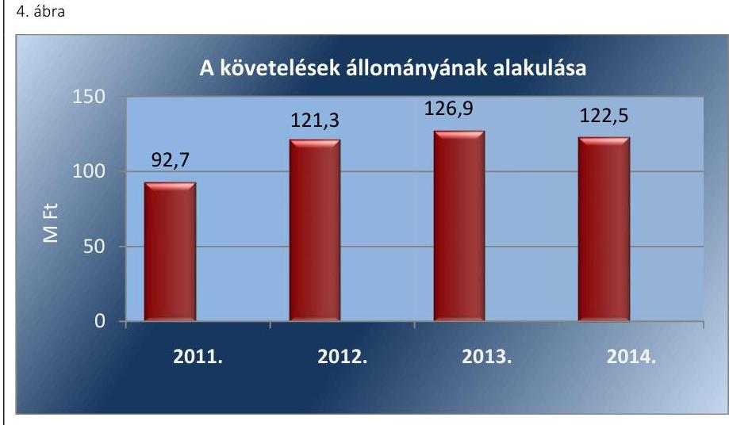

A Társaságnál a vevőkövetelésekre vonatkozó értékvesztés elszámolása megfelelt a számviteli politikában és a Számv. tv. 55. § (1) és (2) bekezdésében foglaltaknak.
3.2. számú megállapítás

A hatósági árképzés nem volt szabályszerű, mivel nem a közszolgáltatás szigorú költség elkülönítésén alapult, továbbá nem készült utókalkuláció, ugyanakkor a rezsicsökkentéssel kapcsolatos intézkedéseket a Társaság végrehajtotta.

AZ ÁRKÉPZÉSSEL kapcsolatosan az Önkormányzat - a 2011-2012. években - a Hgt. 25. §, valamint a 42/2001 (XII.17) Önkormányzati rendelet alapján, a tárgyévet megelőző év végén készített költségkalkulációban szerepeltetett díjképletek alapul vételével állapította meg a közszolgáltatási díjat. Az alkalmazott díjszámítás a Számv. tv. 14. § (7) bekezdésben foglaltak ellenére nem az Önköltségszámítási szabályzaton alapult, mivel az Önköltségszámítási szabályzat nem volt alkalmas a díj alapját képező közszolgáltatási tevékenység önköltségének megállapítására. A gyakorlatban alkalmazott kalkuláció alapját a Társaság által a számviteli rendszerében nyilvántartott adatok képezték, azonban a gyakorlatban alkalmazott díjkalkuláció megfelelőssége szabályzat hiányában a Számv. tv. 15. § (3) bekezdése ellenére nem volt megállapítható. A Társaság alkalmazott árképzési gyakorlata az önköltségszámítási szabályzat hiányosságai, a Számv. tv. 161/A. §-ban, illetve a belső szabályozások hiányossága, valamint a 64/2008. (III.28) Korm. rendelet 3-5. §-aiban meghatározott közszolgáltatás költségeinek szabályozási hiányossága miatt nem volt szabályszerű.

---

A hulladékgazdálkodással kapcsolatos rezsicsökkentési intézkedéseket a Társaság végrehajtotta. 2013. január 1-től kezdődően a Ht. 91. § (2) bekezdésében meghatározott 2012. december 31-én alkalmazott díj 4,2%-kal megemelt összegét, mint a legmagasabb díjat alkalmazta. 2013. május 10-től hatályos Ht. 91. § (1)-(2) bekezdéseiben foglaltaknak megfelelően a 2013. július 1-től alkalmazott díjak nem haladták meg a 2012. április 14-én alkalmazott díjak 4,2%-kal megemelt összegének 90%-át. A hulladékgazdálkodás díjainak változását az 5. ábra tartalmazza.
5. ábra
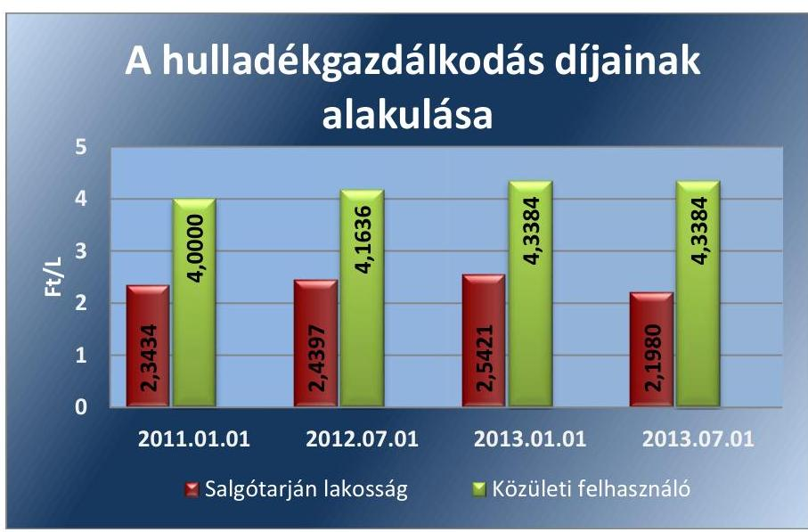

Forrás: A Társaság hulladékgazdálkodási rendeletei-díjak

---

# JAVASLATOK 

Az ÁSZ tv. 33. § (1) bekezdésében foglaltak értelmében az ellenőrzött szervezet vezetője köteles a jelentésben foglalt megállapításokhoz kapcsolódó intézkedési tervet összeállítani és azt a jelentés kézhezvételétől számított 30 napon belül az ÁSZ részére megküldeni. Amennyiben az ellenőrzött szervezet vezetője nem küldi meg határidőben az intézkedési tervet, vagy továbbra sem elfogadható intézkedési tervet küld, az Állami Számvevőszék elnöke az ÁSZ tv. 33. § (3) bekezdés a) és b) pontjaiban foglaltakat érvényesítheti.

Javaslataink célja a VGÜ Salgótarjáni Hulladékgazdálkodási és Városüzemeltetési Nonprofit Kft. gazdálkodása szabályozottságának erősítése annak érdekében, hogy a szabályozási környezet és a gazdálkodási gyakorlat megfelelően tudja támogatni az átlátható működést.

## A VGÜ Salgótarjáni Hulladékgazdálkodási és Városüzemeltetési Nonprofit Kft. ügyvezetőjének

1. Intézkedjen a kötelezően ellátandó és az egyéb hulladékgazdálkodási tevékenység költségei és díjai elszámolásának szigorú elkülönítéséről annak érdekében, hogy a nyilvántartás biztosítsa az egyes tevékenységek átlátható elszámolását, továbbá a keresztfinanszírozás mentességét.
(2.1. megállapítás 4. bekezdés alapján)
2. Intézkedjen arra vonatkozóan, hogy a Társaság számlarendje tartalmazza minden alkalmazásra kijelölt számla Számv. tv-ben előírt adatát és tartalmát.
(2.1. megállapítás 5. bekezdés alapján)
3. Intézkedjen az önköltségszámítási szabályzat módosításáról, ennek keretében határozza meg a kalkulációban érintett tevékenységeket, a tevékenységek költségeinek elkülönítési módját, az alkalmazott kalkulációs módszert, a kalkulációs egységet, az általános költségek felosztásának szabályait, a vetítési alapokat.
(2.1. megállapítás 8. bekezdés alapján)
4. Intézkedjen, hogy az eszközök értékcsökkenésének meghatározása során alkalmazott gyakorlat megfeleljen a jogszabályi előírásnak, az értékcsökkenés elszámolása a 200 ezer Ft alatti eszközöknél is a használati idő és maradványérték figyelembe vételével történjen.
(2.1. megállapítás 7. bekezdés és a
3.1. megállapítás 3. bekezdése alapján)

---

Javaslataink célja az Önkormányzat szabályszerű működésének elősegítése, továbbá az önkormányzati tulajdonosi joggyakorlás kontrolljainak erősítése.

# Salgótarján Város
 Önkormányzata Polgármesterének 

1. Intézkedjen a Társaság Alapító Okiratának és az FB ügyrendjének összhangjáról az FB tagok létszáma tekintetében.
(1.2. megállapítás 2. bekezdés alapján)

---

.

---

# MELLÉKLETEK 

- I. SZ. MELLÉKLET: ÉRTELMEZŐ SZÓTÁR
eladósodottságot jellemző mutatók
eladósodottsági mutató (tőkeáttétel): idegen tőke/összes forrás.
Egészségesnek mondható egy olyan mértékű áttétel, amelyet az üzleti tervek szerint és az elmúlt időszak tapasztalatai alapján a társaság megfelelő biztonsággal ki tud termelni. Nagy eszközberuházás-igényű iparágakban értéke magasabb, azaz magasabb eladósodottság is elfogadható, de 75-85%-ot meghaladó értéknél már itt is erős, sőt túlzott külső finanszírozottságról beszélhetünk. Általánosságban véve kedvező, ha értéke kisebb, mint 0,6.
eladósodottság mértéke: kötelezettségek / saját tőke.
Fontos szerepet játszik ez a mutató egy vállalat megítélésében. Azt mutatja, hogy a saját források a kötelezettségek hány százalékát fedezik. Törekedni kell, hogy a mutató tartósan (jelentősen) 1 alatti értéket érjen el.
nettó eladósodottság: (kötelezettségek-követelések) / saját tőke.
Azt mutatja, hogy a kintlévőségekkel csökkentett kötelezettségeket milyen mértékben fedezi a saját forrás. Ez feltételezi, hogy a követelések pénzügyileg előbb realizálódnak, mint ahogy a kötelezettségeket teljesíteni kell. A mutató minél kisebb, csökkenő értéke a kedvező.
adósságfedezeti mutató I.: (befektetett eszközök+forgó eszközök) / idegen forrás.
Azt mutatja, hogy 1 Ft adósságra hány Ft vagyon jut. Általánosságban véve kedvező, ha értéke 2 körül van, de nagy eszközberuházás-igényű iparágakban értéke kisebb is lehet.
adósságfedezeti mutató II.: működési cash flow / hosszú lejáratú kötelezettségek.
A mutató azt jelzi, hogy az adott gazdálkodási időszak működési pénzáramainak eredményeként realizált cash flow révén a vállalkozás mennyiben lenne képes valamennyi hosszú lejáratú kötelezettségének eleget tenni. Ennek vizsgálatára viszonylag ritkán kerül sor, az elsősorban a veszélyhelyzetbe került vállalkozások esetében lehet érdekes. Általánosságban véve kedvező, ha a működési cash flow minél nagyobb arányban nyújt fedezetet a hosszú lejáratú kötelezettségre (értéke nagyobb, mint 1, nő az ellenőrzött időszakban).
árbevételre vetített eladósodottság: (kötelezettségek - forgóeszközök) / értékesítés nettó árbevétele.
Az árbevételre vetített eladósodottság azt mutatja, hogy az árbevétel mekkora fedezetet nyújt a kötelezettségeknek a forgóeszközökkel csökkentett részére. Általánosságban véve kedvező, ha az árbevétel minél nagyobb arányban nyújt fedezetet a forgóeszközökkel csökkentett kötelezettségekre (értéke kisebb, mint 1, csökken az ellenőrzött időszakban).
garancia
gazdasági társaság
gazdálkodó szervezet

A garancia olyan önálló, az önkormányzat nevében vállalt kötelezettség, amely alapján az önkormányzat az önkormányzati költségvetés terhére szerződésben meghatározott feltételek szerint, a kötelezett nem teljesítése esetén a jogosultnak fizetést teljesít az előzetesen rögzített összeghatárig.
Ptk. 2. 3:88. § (1) bekezdése szerint „a gazdasági társaságok üzletszerű közös gazdasági tevékenység folytatására, a tagok vagyoni hozzájárulásával létrehozott, jogi személyiséggel rendelkező vállalkozások, amelyekben a tagok a nyereségből közösen részesednek, és a veszteséget közösen viselik”.
A Ptk. 685. § c) pontja szerint gazdálkodó szervezet: „az állami vállalat, az egyéb állami gazdálkodó szerv, a szövetkezet, a lakásszövetkezet, az európai szövetkezet, a gazdasági társaság, az európai részvénytársaság, az egyesülés, az európai gazdasági

---

egyesülés, az európai területi együttműködési csoportosulás, az egyes jogi személyek vállalata, a leányvállalat, a vízgazdálkodási társulat, az erdő birtokossági társulat, a végrehajtói iroda, az egyéni cég, továbbá az egyéni vállalkozó.” (2014. 03. 15-ig hatályos)
keresztfinanszírozás tilalma A közszolgáltatás díját úgy kell megállapítani, hogy az maradéktalanul fedezetet nyújtson a közszolgáltatás indokolt költségeire és ráfordításaira, valamint a közszolgáltató e tevékenységével kapcsolatos ésszerű nyereségére; az ésszerű nyereség nem tartalmazhatja a közszolgáltatáson kívül eső egyéb gazdasági tevékenységei költségeinek, ráfordításainak fedezetét.
kezesség A kezességre vonatkozó előírásokat a Ptk. 2. 6:416-430. §-ai tartalmazzák. Kezességi szerződéssel a kezes kötelezettséget vállal a jogosulttal szemben, hogyha a kötelezett nem teljesít, maga fog helyette a jogosultnak teljesíteni. Kezesség egy vagy több, fennálló vagy jövőbeli, feltétlen vagy feltételes, meghatározott vagy meghatározható összegű pénzkövetelés vagy pénzben kifejezhető értékkel rendelkező egyéb kötelezettség biztosítására vállalható.
A Ptk. szerint kezességet csak írásban lehet vállalni. A kezes kötelezettsége ahhoz a kötelezettséghez igazodik, amelyért kezességet vállalt. A kezes kötelezettsége nem válhat terhesebbé, mint amilyen elvállalásakor volt, kiterjed azonban a kötelezett szerződésszegésének jogkövetkezményeire és a kezesség elvállalása után esedékessé váló mellékkövetelésekre is.
közszolgáltatás A közszolgáltatás: „közcélú, illetőleg közérdekű szolgáltatást jelent, amely egy nagyobb közösség (állam, település) minden tagjára nézve megközelítőleg azonos feltételek mellett vehető igénybe, ezért valamilyen mértékig közösségi megszervezést, illetve szabályozást, ellenőrzést igényel.” Az Ebktv. 3. § d) pontja a következőképpen határozza meg a közszolgáltatást: „szerződéskötési kötelezettség alapján a lakosság alapvető szükségleteinek ellátására irányuló szolgáltatás, így különösen a villamos energia-, gáz-, hő-, víz-, szennyvíz- és hulladékkezelési, köztisztasági, postai és távközlési szolgáltatás, továbbá a menetrend alapján közlekedő járművekkel végzett közforgalmú személyszállítás”.

A közszolgáltatás ellátására feljogosított hulladékkezelő (Forrás: a 2011-2012. években a Hgt. 21. § (3) bekezdés a) pontja)
Az a hulladékgazdálkodási közszolgáltatási engedéllyel rendelkező és a Ht. szerint minősített gazdálkodó szervezet, amely a települési önkormányzattal kötött hulladékgazdálkodási közszolgáltatási szerződés alapján hulladékgazdálkodási közszolgáltatást lát el. (Forrás: a 2013-2014. években a Ht. 2. § (1) bekezdés 37. pontja).
közületi felhasználó Az a jogi személy, illetőleg jogi személyiséggel nem rendelkező gazdasági társaság, aki (amely) a meghatározott szolgáltatásra, és/vagy a keletkező hulladék elszállítására közüzemi szerződést kötött a közszolgáltatóval.
lakossági felhasználó Az a természetes személy, aki az Önkormányzat közigazgatási, vagy ellátási területén ingatlannal rendelkezik, és aki a közszolgáltatóval a hulladékelszállítására szerződést kötött.
nemzeti vagyon Nvt. 1. § (2) bekezdése szerint:
„az állam vagy a helyi önkormányzat kizárólagos tulajdonában álló dolgok, az a) pont hatálya alá nem tartozó, állam vagy a helyi önkormányzat tulajdonában lévő dolog,
az állam vagy a helyi önkormányzat tulajdonában lévő pénzügyi eszközök, továbbá az államot vagy a helyi önkormányzatot megillető társasági részesedések,
az államot vagy a helyi önkormányzatot megillető bármely vagyoni értékkel rendelkező jogosultság, amelyet jogszabály vagyoni értékű jogként nevesít,

---

Magyarország határa által körbezárt terület feletti légtér,
az üvegházhatású gázok kibocsátási egységeinek kereskedelméről szóló törvény szerint kibocsátási egység és légiközlekedési kibocsátási egység, valamint az ENSZ Éghajlatváltozási Keretegyezménye és annak Kiotói Jegyzőkönyve végrehajtási keretrendszeréről szóló törvény szerinti kiotói egység,
állami vagy helyi önkormányzati fenntartású közgyűjtemény (muzeális intézmény, levéltár, közgyűjteményként működő kép- és hangarchívum, valamint könyvtár) saját gyűjteményében nyilvántartott kulturális javak körébe tartozó dolog,
a régészeti lelet,
a nemzeti adatvagyon körébe tartozó állami nyilvántartások fokozottabb védelméről szóló törvény szerinti nemzeti adatvagyon.” (hatályos 2012. január 1-jétől, g) pont módosult 2012. június 30-tól)
nonprofit gazdasági társaság Ctv. 9/F. § (2) bekezdése szerint „az a gazdasági társaság minősül nonprofit gazdasági társaságnak és cégnevében az a gazdasági társaság tüntetheti fel a nonprofit jelleget, amelynek létesítő okirata tartalmazza, hogy a gazdasági társaság tevékenységéből származó nyereség a tagok között nem osztható fel, hanem az a gazdasági társaság vagyonát gyarapítja.” (hatályos 2014. március 15-től)
saját tőke A saját tőke a - a jegyzett, de még be nem fizetett tőkével csökkentett- jegyzett tőkéből, tőketartalékból, az eredménytartalékból, a lekötött tartalékból, az értékelési tartalékból és a tárgyév mérleg szerinti eredményéből tevődik össze.
tulajdonosi joggyakorló Aki a nemzeti vagyon felett az államot vagy a helyi önkormányzatot megillető tulajdonosi jogok és kötelezettségek összességének gyakorlására jogosult (Nvtv. 3. § (1) bekezdés 17. pont).

---

II. SZ. MELLÉKLET: A MŰKÖDÉS FŐBB JELLEMZŐI

| Sorszám | Megnevezés |  | 2011. | 2012. | 2013. | 2014. |
| :--: | :--: | :--: | :--: | :--: | :--: | :--: |
|  | A gazdasági társaság tulajdonosi összetétele: |  |  |  |  |  |
| 1. | Tulajdonos Önkormányzat megnevezése: |  | Salgótarján Megyei Jogú Város Önkormányzata |  |  |  |
| 2. | Önkormányzat tulajdoni részesedésének aránya | $\%$ | 100,0 | 100,0 | 99,0 | 99,0 |
| 3. | Önkormányzat tulajdoni részesedésének összege | MFt | 103,0 | 103,0 | 102,0 | 102,0 |
|  |  |  |  |  |  |  |
| 4. | A tárgyévben a gazdasági társaság vagyonkezelésben lévő önkormányzati vagyon után elszámolt értékcsökkenés összege | MFt | Nem kezelt Önkormányzati vagyont |  |  |  |
| 5. | A tárgyévben a gazdasági társaság saját vagyona után elszámolt értékcsökkenés összege teljes tevékenység | MFt | 49,0 | 39,5 | 31,2 | 26,6 |
| 6. | Értékesítés nettó árbevétele teljes tevékenység | MFt | 827,7 | 775,8 | 792,0 | 826,1 |
| 7. | ebből: Hulladékgazdálkodás | MFt | 647,9 | 643,3 | 690,9 | 723,5 |
| 8. | ebből: Közszolgáltatás | MFt | n.a. | n.a. | 619,8 | 694,9 |
| 9. | Adózott eredmény teljes tevékenység | MFt | 5,7 | 23,2 | $-56,6$ | $-75,2$ |
| 10. | Kifizetett osztalék teljes tevékenység | MFt | 2,0 | 0 | 0 | 0 |

---

# FÜGGELÉK: ÉSZREVÉTELEK 

A jelentéstervezetet a Számvevőszék 15 napos észrevételezésre megküldte az ellenőrzött szervezet vezetőjének az ÁSZ tv. 29. § (1) bekezdése előírásának megfelelően.
Salgótarján Megyei Jogú Város Önkormányzatának polgármestere és a VGÜ Salgótarjáni Hulladékgazdálkodási és Városüzemeltetési Nonprofit Kft. ügyvezetője egyaránt élt észrevételezési lehetőségével.
Az elfogadott észrevételek alapján a Számvevőszék módosította a jelentést.
A függelék tartalmazza az ellenőrzöttek észrevételeit, illetve az el nem fogadott észrevételek elutasításának indoklását.

[^0]
[^0]:    * 29. § (1) Az Állami Számvevőszék az ellenőrzési megállapításait megküldi az ellenőrzött szervezet vezetőjének vagy az általa megbízott személynek, és annak, akinek személyes felelősségét állapította meg.
    (2) Az ellenőrzött szervezet vezetője és a felelősként megjelölt személy az ellenőrzés megállapításaira tizenöt napon belül írásban észrevételt tehet.
    (3) Az Állami Számvevőszék az észrevételre a beérkezésétől számított harminc napon belül írásban válaszol. A figyelembe nem vett észrevételeket köteles a jelentésben feltüntetni, és megindokolni, hogy azokat miért nem fogadta el.

---

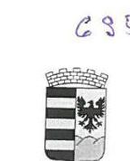

Salgótarján Megyei Jogú Város
Polgármestere

Ikt.sz.: 1129 - 19./2016.
Ea.: Kenyeresné Bara Katalin

ÁLLAMI SZÁMVEVŐSZÉK
Domokos László Úr
Elnök

Budapest
Apáczai Csere János utca 10.
1052
levelezési cím: 1364 Budapest 4. Pf.54.

Tárgy: Észrevétel az ellenőrzés megállapítására

ÁLLAMI SZÁMVEVŐSZÉK
049-1951-2016
Érkezési időpont: 2016. JÚNIUS 14.
Iktatószám: V-0975-128/616
Melléklet: + 60

Tisztelt Elnök Úr!

Hivatkozással az Ön 2016. május 23-án kelt, V-0975-120/2016. ikt. számú levelére, a levél mellékleteként
megküldött, a VGÜ Salgótarjáni Hulladékgazdálkodási és Városüzemeltetési Nonprofit Kft. ellenőrzéséről
készült számvevőszéki jelentéstervezet áttanulmányozása után az alábbi észrevételt teszem:

1. Az „Összegezés” fejezet 5. oldalán a „Főbb megállapítások, következtetések, javaslatok” alcím utáni
bekezdésben a Könyvvizsgáló jelenlétével, valamint a hulladékgazdálkodási terv készítésével
kapcsolatos megállapításokat javasoljuk pontosítani a későbbiekben kifejtettekre tekintettel.
Ugyanezen fejezet 6. oldalán meghivatkozott „Számv.tv.” és a „Rezsi tv.” nem szerepel a „Rövidítések
jegyzéke” fejezetben.

2. „Az ellenőrzés területe” fejezetben, a 8. oldal 2. bekezdésében nem tényszerű, hogy „…A Társaság saját
hulladéklerakót üzemeltetett…”. A Társaság az Önkormányzat tulajdonában álló hulladéklerakót
üzemelteti.

Ugyanezen oldal utolsó előtti bekezdésében nem tényszerű megállapítás, miszerint „…Az ellenőrzött
időszakban a Polgármester személye két alkalommal változott…”. Székyné dr. Sztrémi Melinda
Asszony az ellenőrzött időszakban
 2011. január 1-től 2014. október 12-ig látta el a polgármesteri
teendőket, ezt követően 2014. december 31-ig Dóra Ottó úr volt a Polgármester.

3. A 'Megállapítások' fejezet 1. pontjának a 14. oldalon található 'Összegző megállapítás'-ában, valamint a
15. oldal 1. bekezdésében tett ÁSZ megállapításból úgy tűnik, mintha a Jegyző jogszabályellenesen
nem készítette volna elő az Önkormányzat 2011–2012. évekre vonatkozó hulladékgazdálkodási
tervét. A tárgyban a 1129–11/2016. ikt. számú, 2016. február 8. keltezésű, ÁSZ felé megküldött
Nyilatkozatban jeleztem, hogy a jogszabályi előírás szerint a települési önkormányzatnak az
illetékességi területére a hulladékgazdálkodásról szóló 2000. évi XLIII. törvény 35. § (1) bekezdése
szerint az országos és a területi hulladékgazdálkodási tervben foglalt célokkal, feladatokkal és a
település rendezési tervével összhangban kell a helyi hulladékgazdálkodási tervet kidolgoznia, azonban
sem az országos, sem a területi hulladékgazdálkodási terv nem készült el a 2009–2014 időszakra
vonatkozóan, ezért az önkormányzatunk nem tudott eleget tenni a törvényben előírt feladatának, a
2011–2012. évekre vonatkozó helyi hulladékgazdálkodási terv készítésének, így a beszámolási
kötelezettségének sem.

3100 Salgótarján, Múzeum tér 1.
Tel./Fax: (32) 422-386, e-mail: polgarmester@salgotarjan.hu

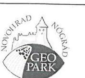

---

A 15. oldal 3. bekezdésében szereplő '...Az Alapító üzemeltetésre, vagyonkezelésre nem bocsátott eszközöket a Társaság rendelkezésére..' megállapítás nem tényszerű, mivel az Alapító Önkormányzat a tulajdonában álló Salgótarján Térségi Hulladéklerakót (létesítmények, eszközök) a Társaságnak üzemeltetésre átadta.
A 15. oldal 4. bekezdésében véleményünk szerint nem a '...Hulladékgazdálkodási rendeletben...', hanem a 'Hulladékgazdálkodási rendeletekben' szövegrésznek kell szerepelnie.
A 2. pont 18. oldalon található 'Összegző megállapítás'-ban, a 2.4. számú megállapításhoz kapcsolódó 25. oldal 4. és 5. bekezdésében foglalt megállapítás nem felel meg a valóságnak, a Könyvvizsgáló a Társaság 2011. évi beszámolóját tárgyaló 2012. április 26-i ülésén részt vett, a csatolt 'Jelenléti ív meghívottak részére Salgótarján Megyei Jogú Város Közgyűlése 2012. április 26.' jelenléti íven az aláírása szerepel. A Közgyűlésnek a 2012. évi beszámolót tárgyaló 2013. április 25-i ülésén – bár a jelenléti ív nem került aláírásra – a Salgótarjáni Városi Televízió által készített videofelvétel alapján bizonyítható, hogy a Könyvvizsgáló az ülésen részt vett. A 'VTS 014' sz. felvételen 4 perc 21 mp-nél látható a Könyvvizsgáló a Polgármester szóbeli kiegészítése közben. A felvétel a mellékelt DVD-n megtekinthető.
4. A jelentéstervezet 'Javaslatok' fejezetében az Önkormányzat szabályszerű működésének elősegítése, továbbá az önkormányzati tulajdonosi joggyakorlás kontrolljainak erősítése céljából Salgótarján Város Önkormányzata Polgármesterének javasolják, hogy intézkedjen a Társaság Alapító Okiratának és az FB ügyrendjének összhangjáról az FB tagok létszáma tekintetében.
Tájékoztatom, hogy a VGÜ Nkft. Taggyűlése a Felügyelőbizottság létszámának aktualizálását tartalmazó Ügyrendet 2015. IV. 30-án tartott ülésén tárgyalta és a 7/2015.(IV.30.) Th.sz. határozatával jóváhagyta.
Fentiek szerint a Társaság Alapító Okirata és az FB ügyrendjének összhangja az FB tagok létszáma tekintetében biztosított.
5. A 'Rövidítések jegyzéke' nem tartalmazza a 'Számv.tv.' és a 'Rezsi tv.' feltüntetését.

Tisztelt Elnök Úr!
Kérem fenti észrevételeimet a jelentéstervezet véglegesítésénél figyelembe venni szíveskedjenek.
Salgótarján, 2016. június 09.

Tisztelettel:
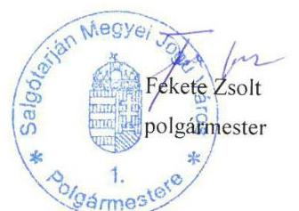

Melléklet:

- 1 pl. Jelenléti ív meghívottak részére a Salgótarján Megyei Jogú Város Közgyűlése 2012. április 26. (másolat)
- 1 pl. 2015. ápr. 30-i Taggyűlési jegyzőkönyv (másolat)
- 1 db DVD „VTS 014" sz. felvétel Salgótarján Megyei Jogú Város Közgyűlése 2013. április 25-i üléséről
- 1 pl. 7/2015.(IV.30.) Th. sz. határozattal jóváhagyott Ügyrend (másolat)

---

# JELENLÉTI ÍV MEGHÍVOTTAK RÉSZÉRE 

## SALGÓTARJÁN MEGYEI JOGÚ VÁROS KÖZGYÜLÉSE

2012. április 26.

| NAPI- REND | NÉV | TISZTSÉG | ALÁIRÁS |
| :--: | :--: | :--: | :--: |
| 6. | Susán Tiborné | VGÜ Kft. gazdasági igazgatóhelyettes |  |
| 6. | Nagy László | VGÜ Kft. vállalkozási igazgatóhelyettes |  |
| 6. | Ispán Andor | VGÜ Kft. Felügyelő Bizottságának elnöke |  |
| 6. | Szöllősi Sándor | VGÜ Kft. könyvvizsgálója | 12.4 2 |
| 7. | Kis Istvánné | Salgó Vagyon Kft. főkönyvelő |  |
| 7. | Dr. Bablena Ferenc | Salgó Vagyon Kft. Felügyelő Bizottságának elnöke |  |
| 7. | Susán Pál | Salgó Vagyon Kft. könyvvizsgálója |  |
| 8. | Berbás Hajnalka | Tarjánhő Szolgáltató- Elosztó Kft. főkönyvelő |  |
| 8. | Csákvári Csaba | Tarjánhő Szolgáltató- Elosztó Kft. főmérnök |  |
| 8. | Tóthné Hupcsik Andrea | Tarjánhő Szolgáltató- Elosztó Kft. Felügyelő Bizottságának elnöke |  |
| 8. | Németh József Tibor | Tarjánhő Szolgáltató- Elosztó Kft. könyvvizsgálója |  |

---

| $\begin{aligned} & \text { NAPI } \\ & \text { REND } \end{aligned}$ | NÉV | TISZTSÉG | ALÁIRÁS |
| :--: | :--: | :--: | :--: |
| 9. | Kristáné Zsidai Erika | Salgótarján és Környéke Vízmű Kft. gazdasági igazgatóhelyettes |  |
| 9. | Borbás Csaba | Salgótarján és Környéke Vízmű Kft. műszaki igazgatóhelyettes |  |
| 9. | Simon Tibor | Salgótarján és Környéke Vízmű Kft. Felügyelő Bizottságának elnöke |  |
| 9. | Szöllősi Sándor | Salgótarján és Környéke Vízmű Kft. könyvvizsgálója |  |
| 10. | Fülöp László | Salgótarjáni Csatornamű Kft. műszaki igazgatóhelyettes |  |
| 10. | Molnár Viktor | Salgótarjáni Csatornamű Kft. Felügyelő Bizottságának elnöke |  |
| 10. | Bata János | Salgótarjáni Csatornamű Kft. könyvvizsgálója |  |
| 11. | Séra Tamás Attila | Salgótarjáni Városfejlesztő Kft. Felügyelő Bizottságának elnöke |  |
| 11. | Szöllősi Sándor | Salgótarjáni Városfejlesztő Kft. könyvvizsgálója |  |
| 12. | Cseklye Károly | Salgótarján Foglalkoztatási Nonprofit Kft. Felügyelő Bizottságának elnöke |  |
| 12. | Szalai Tiborné | Salgótarján Foglalkoztatási Nonprofit Kft. könyvvizsgálója |  |
| 18. | dr. Palásthy Tamás | Salgótarjáni Helyi TDM Közhasznú Egyesület elnöke |  |
|  | Dr. Bartáné dr. Plantek J. Judit | Nógrád Megyei Kormányhivatal Szociális és Gyámhivatalának vezetője |  |

---

# KIVONAT 

## SALGÓTARJÁN MEGYEI JOGÚ VÁROS KÖZGYÜLÉSE

## 2012. ÉVI 7. SZ. JEGYZŐKÖNYVÉBŐL

Készült: Salgótarján Megyei Jogú Város Közgyűlésének 2012. április 26-i rendkívüli üléséről.

## Jelen vannak:

- a Közgyűlés tagjai a mellékelt jelenléti ív szerint
- Dr. Gaál Zoltán jegyző
- Dr. Varga Tamás aljegyző
- a Polgármesteri Hivatal belső szervezeti egységeinek vezetői
- önkormányzati cégek vezetői
- meghívott külső előterjesztők
- a sajtó képviselői
- érdeklődő állampolgárok

6) a) A VGÜ Kft. 2011. évi éves beszámolója
b) Javaslat a VGÜ Kft. 2012. évi üzleti tervére

Előterjesztő: Bodnár Benedek, a VGÜ Kft. ügyvezető igazgatója
c) Javaslat a VGÜ Kft. ügyvezető igazgatója 2011. évi prémiumfeladatainak értékelésére és a 2012. évi prémiumfeladatainak kiírására
d) Javaslat a VGÜ Kft. gazdasági-, és vállalkozási igazgatóhelyettesének 2011. évi prémiumfeladatainak értékelésére, valamint a gazdasági-, és vállalkozási igazgatóhelyettesének 2012. évi prémiumfeladatainak kiírására
Előterjesztő: Székyné dr. Sztrémi Melinda polgármester
A napirend tárgyalásához meghívott:

- Susán Tiborné gazdasági igazgatóhelyettes
- Nagy László vállalkozási igazgatóhelyettes
- Ispán Andor, a kft. Felügyelő Bizottságának elnöke
- Szöllősi Sándor, a kft. könyvvizsgálója

Székyné dr. Sztrémi Melinda polgármester a 6. napirendi pont tárgyalásának felvezetéseként a következőket mondta el:
"A napirend tárgyalásához természetesen meghívtuk az érintett személyeket, tehát ebben az esetben Susán Tiborné gazdasági igazgatóhelyettest, Nagy László vállalkozási igazgató-helyettest, Ispán Andort a kft. Felügyelő Bizottságának elnökét és Szöllősi Sándort a kft. könyvvizsgálóját, közülük néhányan itt is vannak jelen pillanatban is, köszöntöm őket körünkben."
(A meghívott vendégek által aláírt jelenléti ív a jegyzőkönyv mellékletét képezi.)

A kivonat készült: 2016. május 12-én.
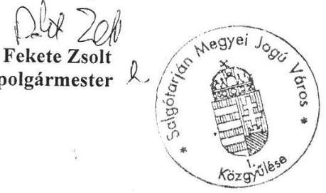

Tóthné dr. Kerekes Andrea
jegyző

---

# TAGGYÜLÉSI JEGYZŐKÖNYV 

Készült a VGÜ Salgótarjáni Hulladékgazdálkodási és Városüzemeltetési Nonprofit Korlátolt Felelősségű Társaság 2015. április 30-án délután 17 órakor megtartott taggyűlésén.

Jelen vannak:
Salgótarján Megyei Jogú Város Önkormányzata tag
Képviseletében Fekete Zsolt alpolgármester (meghatalmazás csatolva)
Kelet-Nógrád Térségi Hulladékgazdálkodási Társulás tag
Képviseletében Dóra Ottó elnök
VGÜ Nonprofit Kft. képviseletében
Vendel Zsolt ügyvezető igazgató

Az ügyvezető köszönti a megjelent tagok képviselőit. Előadja, hogy a taggyűlés határozatképes, azon a társaság mindkét tagjának képviselője megjelent.

Ismerteti a napirendi pontokat:

1. A Társaság 2014. évi éves beszámolójának megtárgyalása
2. Javaslat a Társaság 2015. évi Üzleti tervére
3. A VGÜ Nonprofit Kft. ügyvezető igazgatójának, illetve vezető állású dolgozóinak 2014. évi prémiumfeladatainak értékelése
4. VGÜ Nonprofit Kft. ügyvezető igazgatójának megválasztása
5. VGÜ Nonprofit Kft. javadalmazási szabályzatának módosítása
6. VGÜ Nonprofit Kft. felügyelő bizottsága ügyrendjének jóváhagyása

A tagok a napirend megtárgyalását egyhangú nyilatkozattal elfogadják, hozzájárulnak a taggyűlés megtartásához.

## 1. napirendi pont:

Az ügyvezető igazgató előadja, hogy a Társulás Társulási Tanácsa 44./2015. (IV.28.) Th. sz. határozatával és a Kft. másik tagja, Salgótarján Megyei Jogú Város Közgyűlése 39/2015. (IV.30.) Öh. sz. határozatával a taggyűlésnek elfogadásra javasolta a VGÜ Nonprofit Kft. 2014. évi éves beszámolóját.
Ezt követően az ügyvezető igazgató ismerteti a Társaság 2014. évi éves beszámolóját, üzleti jelentését.
A Taggyűlés az üzleti jelentést megtárgyalta és egyhangú döntéssel meghozta az alábbi 1/2015. (IV.30.) Th. sz. taggyűlési határozatot:

- A Taggyűlés a VGÜ Nonprofit Kft. 2014. évi éves beszámolóját a beszámoló I-V. mellékletei szerint 382.489 eFt mérlegfőösszeggel és -75.151 eFt adózott eredménnyel elfogadja és utasítja a Kft. ügyvezető igazgatóját a -75.151 eFt adózott eredménynek a társaság eredménytartalékával szemben történő elszámolására.

2. napirendi pont:

Az ügyvezető igazgató előadja, hogy a Társulás Társulási Tanácsa 45./2015. (IV.28.) Th. sz. határozatával és a Kft. másik tagja, Salgótarján Megyei Jogú Város Közgyűlése 75./2015. (IV.30.) Öh. sz. határozatával a taggyűlésnek elfogadásra javasolta a VGÜ Nonprofit Kft. 2015. évi Üzleti tervét.

---

Ezt követően az ügyvezető igazgató ismerteti a Társaság 2015. évi Üzleti tervét.
A Taggyűlés az üzleti tervet megtárgyalta és egyhangú döntéssel meghozta az alábbi 2/2015. (IV.30.) Th. sz. taggyűlési határozatot:

- A Taggyűlés a VGÜ Nonprofit Kft. 2015. évi Üzleti tervét -150.000 ezer forint adózott eredménnyel egyhangúlag elfogadta.

3. napirendi pont:

Dóra Ottó ismerteti a Taggyűléssel, hogy a VGÜ Nonprofit Kft. korábbi ügyvezető igazgatója, Bodnár Benedek és jelenlegi ügyvezető igazgatója, Vendel Zsolt 2014. évi prémiumfeladatainak értékelése tekintetében a Társulás Társulási Tanácsa a 12/2015. (IV.28.) Th. számú határozatával, Salgótarján Megyei Jogú Város Közgyűlése 76/2015. (IV.30.) Öh. sz. határozatával javasolta a Taggyűlésnek a prémiumfeladatok teljesítésének elfogadását.
Ezt követően az ügyvezető igazgató ismerteti Bodnár Benedek ügyvezető igazgató és Vendel Zsolt ügyvezető igazgató prémiumfeladatainak kiírását és azok teljesítésére adott jelentést.
A Taggyűlés az ügyvezetői jelentést megtárgyalta és egyhangú döntéssel meghozta az alábbi 3/2015. (IV.30.) Th. sz. taggyűlési határozatát:

- A Taggyűlés értékelte a VGÜ Nonprofit Kft. korábbi ügyvezető igazgatója, Bodnár Benedek és jelenlegi ügyvezető igazgatója, Vendel Zsolt részére kitűzött 2014. évi prémiumfeladatok végrehajtását. A Taggyűlés megállapítja, hogy a feladatok mindkét ügyvezető igazgató tekintetében 100%-ban valósultak meg, így mindkét esetben a prémium 100%-os mértékű kifizetését engedélyezi.

A VGÜ Nonprofit Kft. gazdasági és vállalkozási igazgatóhelyetteseinek 2014. évi prémiumfeladatainak értékelése tekintetében a Társulás Társulási Tanácsa a 11/2015. (IV.28.) Th. számú határozatával, Salgótarján Megyei Jogú Város Közgyűlése a 77/2015. (IV.30.) Öh.
 sz. határozatával javasolta a Taggyülésnek a prémiumfeladatok teljesítésének elfogadását.
Ezt követően az ügyvezető igazgató ismerteti mind a gazdasági igazgatóhelyettes, mind a vállalkozási igazgatóhelyettes prémiumfeladatai kiírását és azok teljesítésére adott jelentést.

A Taggyülés az ügyvezetői jelentést megtárgyalta és egyhangú döntéssel meghozta az alábbi 4/2015. (IV.30.) Th. sz. taggyülési határozatát:

- A Taggyülés értékelte a VGÜ Nonprofit Kft. gazdasági igazgatóhelyettesének Susán Tiborné részére, valamint vállalkozási igazgatóhelyettesének Nagy László részére kitűzött 2014. évi prémiumfeladatok végrehajtását.
A Taggyülés megállapítja, hogy a feladatok mindkét igazgatóhelyettes tekintetében 100%-ban megvalósultak, így mindkét esetben a prémium 100%-os mértékű kifizetését engedélyezi az igazgatóhelyettesek részére.

4. napirendi pont:

Dóra Ottó ismertette a napirenddel kapcsolatos előterjesztést, melyet a tagok a Társulás Társulási Tanácsa 2015. 04. 28-ai ülésén, Salgótarján Megyei Jogú Város Közgyűlése 2015. 04. 30-ai ülésén megtárgyalták. Továbbá az ügyvezető tájékoztatta a tagokat, hogy a Társulás Társulási Tanácsa 66/2015. (IV.28.) Th. sz. határozatával, a Társaság másik tagja Salgótarján Megyei Jogú Város Közgyűlése 82/2015. (IV.30.) Öh. sz. határozatával az előterjesztéseket elfogadták és javasolták a Taggyülésnek megtárgyalásra és elfogadásra.
A Dóra Ottó által előterjesztett és a tagok által elfogadott napirendet a Taggyülés megtárgyalta és meghozta az alábbi 5/2015. (IV.30.) Th. sz. taggyülési határozatát:

- A Taggyülés a VGÜ Nonprofit Kft. ügyvezető igazgatójának Fekete Zoltán (szül: Salgótarján, 1970. április 30., anyja neve: Dolla Jolán, lakik: 3121 Somosköújfal,

---

kültelek 1.) 2015. május 01. napjától 2020. április 30. napjáig terjedő időszakra megválasztja. Díjazását 500.000 Ft/hó összegben állapítja meg. Megbízását munkaviszony keretében látja el. A taggyűlés az ügyvezető igazgató munkaszerződését a melléklet szerint jóváhagyja. A taggyűlés utasítja az ügyvezető igazgatót, hogy a cég jogi képviselőjén keresztül a változásbejegyzési eljárás kezdeményezéséről gondoskodjon.
5. napirendi pont:

Dóra Ottó előadja, hogy a Társulás Társulási Tanácsa 56/2015. (IV.28.) Th. sz. határozatával és a Kft. másik tagja, Salgótarján Megyei Jogú Város Közgyűlése 22/2015. (IV.30.) Öh. sz. határozatával elfogadásra javasolta a taggyűlésnek a VGÜ Nonprofit Kft. javadalmazási szabályzatának módosítását.
Ezt követően Dóra Ottó ismerteti a Társaság javadalmazási szabályzatának módosítását. A Taggyűlés a javadalmazási szabályzatot megtárgyalta és egyhangú döntéssel meghozta az alábbi 6/2015. (IV.30.) Th. sz. taggyülési határozatot:

- A Taggyűlés a VGÜ Nonprofit Kft. javadalmazási szabályzatának módosítását a melléklet szerint 2015. május 1. napi hatállyal jóváhagyja.
6. napirendi pont:

Az ügyvezető igazgató előadja, hogy a Társulás Társulási Tanácsa 9/2015. (II.18.) Th. sz. határozatával és a Kft. másik tagja, Salgótarján Megyei Jogú Város Közgyűlése 26/2015. (II.19.) Öh. sz. határozatával elfogadásra javasolta a taggyűlésnek a VGÜ Nonprofit Kft. felügyelőbizottsága ügyrendjét.
Ezt követően az ügyvezető igazgató ismerteti a Társaság felügyelőbizottsága ügyrendjét. A Taggyűlés a felügyelőbizottság ügyrendjét megtárgyalta és egyhangú döntéssel meghozta az alábbi 7/2015. (IV.30.) Th. sz. taggyülési határozatot:

- A Taggyűlés a VGÜ Nonprofit Kft. felügyelőbizottsága ügyrendjét a 3. sz. melléklet szerint jóváhagyja.

Más észrevétel, hozzászólás nem lévén az ügyvezető igazgató a taggyűlést berekesztette.
Jegyzőkönyv lezárva.
k.m.f.t.
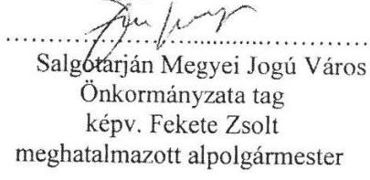

Salgótarján Megyei Jogú Város
Önkormányzata tag
képv. Fekete Zsolt
meghatalmazott alpolgármester

Kelet-Nőgrád Térségi Hulladékgazdálkodási Társulás tag
képv. Dóra Ottó elnök
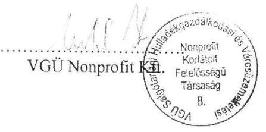

---

# VGÜ Salgótarjáni Hulladékgazdálkodási és Városüzemeltetési Nonprofit Korlátolt Felelősségű Társaság felügyelőbizottságának 

## Ügyrendje

A VGÜ Salgótarjáni Hulladékgazdálkodási és Városüzemeltetési Nonprofit Korlátolt Felelősségű Társaság felügyelőbizottsága a Polgári Törvénykönyvről szóló 2013. évi V. törvény és a társaság társasági szerződése alapján ügyrendjét az alábbiakban állapítja meg:

## 1. A felügyelőbizottság szervezete

- A felügyelőbizottság három tagból áll, akiket a taggyűlés 14/2014. (XI.28.) Th. sz. taggyülési határozatával választott meg 2014. december 1. napjától 2019. november 30. napjáig.
- A felügyelőbizottság elnökét tagjai sorából választja, személyére bármely tag javaslatot tehet, melyről a tagok nyílt szavazással döntenek.

## 2. A felügyelőbizottság tagjainak jogai és kötelezettségei

- A felügyelőbizottsági tag újraválasztható és a taggyűlés által bármikor indokolás nélkül visszahívható.
-A felügyelőbizottsági taggá megválasztott személy az új tisztsége elfogadásától számított 15 napon belül azokat a gazdasági társaságokat, amelyeknél már felügyelő bizottsági tag, írásban tájékoztatni köteles.
- A felügyelőbizottság tagjai - a Ptk. közös károkozásra vonatkozó szabályai szerint - korlátlanul és egyetemlegesen, a Ptk. szabályai szerint felelnek a gazdasági társaságnak az ellenőrzési kötelezettségük elmulasztásával vagy nem megfelelő teljesítésével okozott kárért. Feladataikat az ilyen tisztséget betöltő személyektől általában elvárható gondossággal a társaság érdekeinek megfelelően kötelesek ellátni.
- A társaság ügyeiről szerzett értesüléseiket üzleti titokként kötelesek kezelni és megőrizni.
- A társaság munkavállalói nem válhatnak a felügyelőbizottság tagjává.
- A felügyelőbizottsági tag más társaságban való részesedésszerzésére, illetve vezető tisztségviselővé válására a Ptk. 3:115. (1) bekezdés szabályai irányadók.
- A felügyelőbizottsági tag és hozzátartozója nem köthet a saját nevében vagy javára a gazdasági társaság fő tevékenységi körébe tartozó ügyleteket.
- A gazdasági társaság vezető tisztségviselője és hozzátartozója nem lehetnek ugyanannál a társaságnál felügyelőbizottsági tagok.
- A tag jogait és kötelezettségeit csak személyesen gyakorolhatja, képviseletnek nincs helye.
- A felügyelőbizottság tagját e minőségében a gazdasági társaság tagjai, illetve munkáltatója nem utasíthatják.

## 3. A felügyelőbizottság elnöke

- Összehívja a felügyelőbizottság üléseit és elnököl azon.
- A taggyűlésen a felügyelőbizottság megállapításait az elnök ismerteti.
-Az elnök a felügyelőbizottság üléseire a könyvvizsgálót meghívhatja, illetve kezdeményezheti a bizottság előtti meghallgatását.
- Az elnök köteles összehívni a bizottságot a könyvvizsgálói jelentés kézhezvételétől számított 15 napon belül, illetve ha a könyvvizsgáló kéri. Ezekben az esetekben a könyvvizsgálót az ülésre tanácskozási joggal meg kell hívni.
- Az elnöki megbízatás megszűnése esetén a felügyelőbizottság a taggyűlés új tagot megválasztó döntésétől számított 15 napon belül új elnököt választ.

---

# 4. A felügyelőbizottság működése 

- A felügyelőbizottság jogait testületileg gyakorolja.
- A felügyelőbizottság egyes ellenőrzési feladatok elvégzésével bármely tagját megbízhatja, illetve az ellenőrzést állandó jelleggel is megoszthatja tagjai között.
- Az ellenőrzés megosztása nem érinti a felügyelőbizottsági tag felelősségét.
- A felügyelőbizottság a taggyűlés olyan döntéseit megelőzően, mely döntések meghozatalához a jogszabályi rendelkezések alapján a felügyelőbizottság határozata szükséges, köteles ülést tartani. A felügyelőbizottság egyebekben szükség szerint tartja üléseit.
- A felügyelőbizottságot az elnök hívja össze, a napirendi pontok megjelölésével. A tagoknak a meghívást az ülés előtt legalább 8 nappal postán, telefaxon, sürgős esetben telefonon megküldi. A felügyelőbizottság üléseinek levezetése az elnök feladata.
- Az ülés összehívását - az ok és a cél megjelölésével - a felügyelőbizottság bármely tagja írásban kérheti az elnöktől, aki a kérelem kézhezvételétől számított 15 napon belül köteles intézkedni a felügyelőbizottság ülésének 15 napon belüli időpontra történő összehívásáról. Ha az elnök a kérelemnek nem tesz eleget, a tag maga jogosult az ülés összehívására.
- A felügyelőbizottsági ülésen a tagokon kívül tárgyalási joggal részt vesznek a szakértők és mindazok, akiknek a jelenléte a napirendhez szükséges.
- A felügyelőbizottság határozatképes, ha három tag jelen van.
- A felügyelőbizottság határozatait a jelenlévők egyszerű szótöbbségével hozza.
- Ha bármely tag kéri, úgy határozathozatal előtt az elnök titkos szavazást rendelhet el.
- Minden felügyelőbizottsági ülésről jegyzőkönyv készül, mely tartalmazza a jelenlévőket, az ülés helyét, idejét, a napirendet és a határozatokat.
- A jegyzőkönyvben fel kell tüntetni minden olyan tényt vagy véleményt, amelyet a tagok javasolnak. Az esetleges kisebbségi vagy különvéleményt, tiltakozást minden esetben jegyzőkönyvezni kell, vagy azt írásban a jegyzőkönyvhöz kell mellékelni.
- Rögzíteni kell a szavazás eredményét, az ellenszavazók véleményét.
- A jegyzőkönyvet az ülést követő 8 napon belül kell elkészíteni. A jegyzőkönyvet az elnök hitelesíti és megküldi a tagoknak, továbbá szükség esetén az ügyvezetőnek és a könyvvizsgálónak is.
- A felügyelőbizottság iratkezeléséről az ügyvezetés köteles gondoskodni.
- A határozatokat sorszámmal és év, továbbá zárójelben római számmal a hónap, arab számmal a nap megjelöléssel kell ellátni és nyilvántartani.

## 5. A felügyelőbizottság feladatai (jogai és kötelezettségei)

- A felügyelőbizottság a társaság irataiba, számviteli nyilvántartásaiba, könyveibe betekinthet, a vezető tisztségviselőktől és a jogi személy munkavállalóitól felvilágosítást kérhet, a társaság fizetési számláját, pénztárát, értékpapír- és áruállományát, valamint szerződéseit megvizsgálhatja és szakértővel megvizsgáltathatja.
- A felügyelőbizottság munkája során indokolt esetben, szükség szerint - a társaság költségére külső szakértőt vehet igénybe.
- A felügyelőbizottság folyamatosan informálódik a taggyűlés által jóváhagyott éves üzleti terv teljesítéséről, melyhez a szükséges információkat az ügyvezetők biztosítják.
- A felügyelőbizottság köteles részletesen megvizsgálni az évi számadásokat, a mérleget, a nyereség felosztására vonatkozó indítványokat, előterjesztéseket. E feladatainak végrehajtásáról és eredményéről a taggyűlésnek jelentést tesz.
- A felügyelőbizottság köteles ellenőrizni a belső információs, számviteli és pénzügyi rendet, a társaság szabályzatait és azok rendelkezéseinek végrehajtását.
- Ha a felügyelőbizottság jogellenességet, a társasági szerződésbe, taggyűlési határozatba ütköző tényt, mulasztást tapasztal, erről köteles az ügyvezető(ke)t haladéktalanul értesíteni.

---

- Ha a felügyelőbizottság megítélése szerint az ügyvezetés tevékenysége jogszabályba, a társasági szerződésbe, illetve a taggyűlés határozataiba ütközik, vagy egyébként sérti a gazdasági társaság érdekeit, összehívja a taggyűlést, e kérdés megtárgyalása és a szükséges határozatok meghozatala érdekében.
- Az ügyvezetők által hozott határozat bírósági felülvizsgálatát és hatályon kívül helyezését - ha jogszabályba vagy a társaság létesítő okiratába ütközik - a felügyelőbizottság és bármely tagja is kezdeményezheti.

# 6. A felügyelőbizottsági tagság megszűnése 

- A felügyelőbizottsági tagság a megbízás időtartamának lejártával, megszüntető feltételhez kötött megbízás esetén a feltétel bekövetkezésével, visszahívással, törvényben szabályozott kizáró vagy összeférhetetlenségi ok bekövetkeztével, lemondással, elhalálozással, illetve törvényben meghatározott esetben szűnik meg.
- A felügyelőbizottsági tag tisztségéről az ügyvezetőhöz címzett nyilatkozattal bármikor lemondhat, azonban ha a társaság működőképessége ezt megkívánja, a lemondás az új tag megválasztásával, ennek hiányában legkésőbb a bejelentéstől számított hatvanadik napon válik hatályossá. A lemondás hatályossá válásáig a felügyelő bizottsági tag a halaszthatatlan döntések meghozatalában, illetve az ilyen intézkedések megtételében köteles részt venni.

## 7. Egyéb rendelkezések

- A felügyelőbizottság ügyrendjét a taggyűlés hagyja jóvá.
- Az ügyrendet a felügyelőbizottság módosíthatja. Erről a taggyűlést az elnök útján értesíti. Ezt követően a módosítást a taggyűlés hagyja jóvá.

Dátum: 2014. december 5.
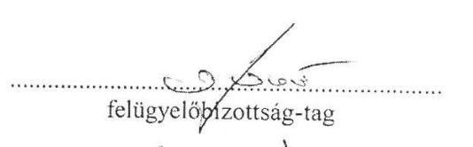
felügyelőbizottság-tag
felügyelőbizottság-tag

## Záradék

Jelen felügyelőbizottsági ügyrendet a társaság taggyűlése a ................ számú határozatával jóváhagyta.
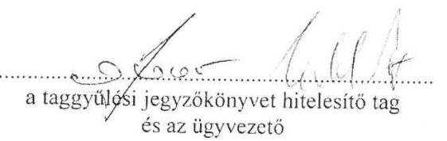

---

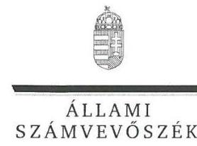

ELNÖK

Ikt.szám: V-0975-130/2016

# Fekete Zsolt úr 

polgármester
Salgótarján Megyei Jogú Város Önkormányzata

## Salgótarján

## Tisztelt Polgármester Úr!

Köszönettel vettem a VGÜ Salgótarjáni Hulladékgazdálkodási és Városüzemeltetési Nonprofit Kft. ellenőrzéséről készített számvevőszéki jelentéstervezetre tett észrevételeit.

Az Állami Számvevőszék észrevételekre vonatkozó álláspontjáról a felügyeleti vezető által készített részletes tájékoztatásban kap választ, amelyet levelemhez mellékeltem.

Tájékoztatom Polgármester urat, hogy a számvevőszéki jelentés véglegesítése az elfogadott észrevételek figyelembevételével történik.

Budapest, 2016. fiktio hó $\quad$ nap
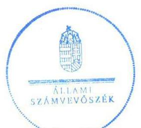

Tisztelettel:

## Domokos László

Melléklet: Tájékoztatás az észrevételek kezeléséről

---

# Tájékoztatás az észrevételek kezeléséről 

Megköszönöm Polgármester úrnak „Az önkormányzatok gazdasági társaságai - Az önkormányzatok többségi tulajdonában lévő gazdasági társaságok közfeladat-ellátását érintő gazdálkodási tevékenysége szabályszerűségének ellenőrzése - VGÜ Salgótarjáni Hulladékgazdálkodási és Városüzemeltetési Nonprofit Kft." című jelentéstervezetre adott észrevételét. Észrevételének kezeléséről az alábbi tájékoztatást adom.

Az észrevétele 1. pontját elfogadom, az abban foglaltak alapján a Főbb megállapítások, következtetések, javaslatok első bekezdés 6. mondatát módosítom:
„A Gt. és Ptk. által előírtaknak megfelelően megkérve, a Könyvvizsgáló az éves beszámolót tárgyaló jóváhagyó üléseken nem vett részt."

Az észrevétele 1. pontjában foglaltakat
 a Főbb megállapítások, következtetések, javaslatok első bekezdés 8. mondatának módosítására vonatkozóan nem fogadom el, a megállapítást változatlanul fenntartom:
„A Jegyző a 2011-2012. években nem készítette elő a hulladékgazdálkodási tervet."
Az észrevétele 1. pontjában foglaltakat a Rövidítések jegyzéke kiegészítése tekintetében elfogadom, a jelentéstervezetben a „Számv. tv." és a „Rezsi tv." rövidítéseket feltüntetjük.

Az észrevétele 2. pontjában foglaltakat elfogadom. Az Ellenőrzések területe 2. bekezdés utolsó mondatát az alábbiak szerint módosítom: „A Társaság saját, az Önkormányzat tulajdonában álló hulladéklerakót üzemeltette." A 4. bekezdés első mondatát az alábbiak szerint módosítom: „Az ellenőrzött időszakban a Polgármester személye két alkalommal változott, a Jegyző személye nem változott."

Az észrevétele 3. pontjában foglaltakat a hulladékgazdálkodási terv tekintetében nem fogadom el. A hulladékgazdálkodási terv elkészítésére vonatkozóan a Hgt. 37. § (4) bekezdése és a 126/2003. (VIII. 15.) Korm. rendelet 8-11. §-ai meghatározták a hulladékgazdálkodási terv tartalmát és felépítését. A helyi önkormányzatoknak ezen előírások szerint kellett elkészíteni a hulladékgazdálkodási tervet. A Hgt. 35. §-ában foglalt előírás szerint az országos és területi hulladékgazdálkodási tervben foglalt célokkal, feladatokkal összhangban kell lenni a települési tervnek, azonban ezek elkészülésének hiányában is fennállt a tervkészítés kötelezettsége.

Az észrevétele 3. pontjában foglaltakat, az üzemeltetésre átadott eszközök tekintetében elfogadom, jelentéstervezet 15. oldal 3. bekezdésében lévő megállapítást módosítom:
„Az Alapító Önkormányzat a tulajdonában álló Salgótarján Térségi Hulladéklerakót (létesítmények, eszközök) üzemeltetésre vagyonkezelésre bocsátott eszközöket a Társaságnak rendelkezésére átadta.

Az észrevétele kapcsán az Ellenőrzés területe 2. bekezdésének utolsó mondata is módosul.

---

# A Társaság az Önkormányzat tulajdonában álló saját hulladéklerakót üzemeltette."

Észrevétele 3. pontja alapján a 15. oldal 4. bekezdés első mondatában, a rendeletben szó helyett a rendeletekben szó kerül beírásra.

Észrevétele 3. pontja alapján a 2. Összegző megállapítás 2. mondata az alábbiak szerint módosul:
„Az éves beszámolókat a jogszabályoknak megfelelően elkészítették, de azok legfőbb szerv általi megtárgyalásán/jóváhagyásán a Könyvvizsgáló nem vett részt."

Észrevétele 3. pontja és a csatolt dokumentumok alapján a 2.4. megállapítás az alábbiak szerint módosul:
„Az éves beszámolókat a Társaság a jogszabályoknak megfelelően elkészítette, azonban azok megtárgyalásán/közgyűlési jóváhagyásán a Könyvvizsgáló az ellenőrzött időszakban részt nem vett."

Észrevétele 3. pontja és a csatolt dokumentumok alapján a 2.4. megállapítás 4. és 5. bekezdése helyébe a következő bekezdés kerül, továbbá a VGÜ Salgótarjáni Hulladékgazdálkodási és Városüzemeltetési Nonprofit Kft. ügyvezetőjének címzett 4. számú javaslatot pedig töröltem.
„Az ellenőrzött időszakban a beszámolókat elfogadó Közgyűlésekre a Könyvvizsgálót meghívták, a Gt. 44. § (1) bekezdésének, valamint a Ptk. 3:131. § (2) bekezdésének megfelelően a Könyvvizsgáló azokon részt vett."

Megköszönöm az észrevétele 4. pontjában a Társaság Alapító Okirata és az FB ügyrendje összhangjának biztosításáról szóló tájékoztatását, a jelentéstervezet megállapításait és a javaslatait az a 2015. április 30-án történt, az ellenőrzött időszakon túli esemény nem befolyásolja, ezért a megállapítást továbbra is fenntartom.

Budapest, 2016. július 7.

Dr. Horváth Margit
felügyeleti vezető

---

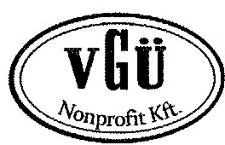

VGÜ Salgótarján
Hulladékgazdálkodási és Városüzemeltetési
Nonprofit
Korlátolt Felelősségű Társaság
3100 Salgótarján, Kertész u. 2. Pf.: 120.
(32) 440-366 Fax: (32) 440-360
Honlap: www.vgu.hu
E-mail: vgu@vgu.hu

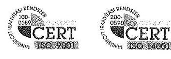

Partnerkód:
Salgótarján, 2016. június 7.
ügyintézőnk: Fekete Zoltán/NGCs.
Ikt.:szám.: F-23-2/2016.

Állami Számvevőszék

Budapest
Apáczai Csere János utca 10.
1052

Hivatkozási szám: V-0975-119/2016
Ellenőrzés-azonosító szám: V-070726

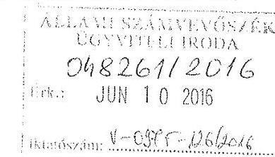

Az önkormányzatok többségi tulajdonában lévő gazdasági társaságok közfeladat ellátását érintő gazdálkodási tevékenysége szabályszerűségének ellenőrzése tárgyában készült, V-0975-119/2016 iktatószámmal ellátott, számvevőszéki jelentéstervezetben foglalt megállapításokkal kapcsolatosan a VGÜ Nonprofit Kft. (3100 Salgótarján, Kertész út 2.) részéről az alábbi

észrevételt

tesszük.

1.2. Megállapításhoz kapcsolódóan:

BELSŐ ELLENŐRZÉS

A jelentéstervezetben foglaltak szerint, a társaságnál – az Önkormányzat által végzett – belső ellenőrzés megállapította az Önköltségszámítási Szabályzat általános költségek felosztásának hiányosságát. Ezzel kapcsolatban pontosítani szeretnénk, hogy 2013. évben a tulajdonosi belső ellenőrzés során végzett pénzügyi ellenőrzés az Önköltségszámítási Szabályzat általános költségek felosztására vonatkozóan kiegészítést javasolt és nem hiányosságot állapított meg. Az Önköltségszámítási Szabályzat – eleget téve az Önkormányzat által végzett ellenőrzés javaslatának – még 2013. évben kiegészítésre került az általános költségek javítóműhelyre történő felosztásának gyakorlati módszerével. Egyéb hiányosságot az Önkormányzati belső ellenőrzés nem tárt fel.

2.1. Megállapításhoz kapcsolódóan:

SZÁMVITELI POLITIKA

A jelentéstervezetben hiányolták a kötelezően ellátandó közszolgáltatás egyéb tevékenységektől való elkülönítésére vonatkozó nyilvántartás szabályait az alábbi törvényhelyekre hivatkozva:

Kagják: Címzett Ügyintéző
Iratér

---

Hgt. 29.§ (1): A közszolgáltató köteles a közszolgáltatói tevékenységéről évente részletes költségelszámolást készíteni, és azt a települési önkormányzatnak benyújtani.
A fenti megállapítással kapcsolatban előadjuk, hogy a törvény által előírt kötelezettségnek eleget tettünk, ennek megfelelően minden év novemberében a közszolgáltatási tevékenységről részletes költségelszámolást készítettünk. A jelentéstervezet 25. oldalának alulról 2. bekezdése is deklarálja, hogy 2011-2012. éveket érintően a Hgt. 29.§ (1) bekezdésében foglaltak alapján, a hulladékgazdálkodási tevékenységen belül a kötelezően ellátandó hulladékgazdálkodási közszolgáltatással kapcsolatban a társaság elkészítette a költségelszámolást, melyet az Önkormányzat ellenőrzött.

Hgt. 29.§ (2): a közszolgáltató a közszolgáltatás ellátása mellett hulladékkezelési engedélyének megfelelően egyéb hulladékgazdálkodási tevékenységeket is folytathat, amelynek díját maga határozza meg.
Ezen megállapítással kapcsolatban előadjuk, hogy a törvényi rendelkezés betartásra került.
Hgt. 29.§ (3): a kötelezően ellátandó közszolgáltatás kereteibe nem tartozó más hulladékkezelési szolgáltatás költségeit, elszámolását és díját szigorúan el kell különíteni, és e költségeket a közszolgáltatás díjából nem lehet finanszírozni.
Az elkülönítés megtörtént Társaságunknál. Az ellátott szolgáltatási tevékenységeknek megfelelően, kerültek a költségek és bevételek gyűjtésre, a Szervezeti és Működési Szabályzat részletesen tartalmazta a tevékenységek végzésének feladatelhatárolását, illetve a számlatükör teljes egészében meghatározta a tevékenységek megbontását. (Lásd: Számlatükör, Kiegészítő Melléklet, Üzleti Jelentés)

Ht. 50.§ (1): a közszolgáltató beszámolási és könyvvezetési kötelezettségére, a beszámoló összeállítására, a könyvek vezetésére, valamint a nyilvánosságra hozatalra és közzétételre a számvitelről szóló törvény rendelkezéseit az e törvény szerinti eltérésekkel kell alkalmazni.
Fentiekkel kapcsolatban kérjük figyelembe venni, hogy beszámolási, könyvvezetési és közzétételi kötelezettségünknek minden esetben maradéktalanul, a hatályos jogszabályi rendelkezéseknek megfelelően eleget tettünk.

Ht. 50.§ (2): a hulladékgazdálkodási közszolgáltatás körébe nem tartozó tevékenységet is végző közszolgáltató az egyes tevékenységeire olyan elkülönült nyilvántartást vezet, amely biztosítja az egyes tevékenységek átláthatóságát, valamint kizárja a keresztfinanszírozást.
Ezzel kapcsolatban elő kívánjuk adni, hogy a Számlatükörben és az Önköltségszámítási Szabályzatban is elkülönítésre kerültek a tevékenységek, melyből kiderül, hogy közszolgáltatásról vagy egyéb tevékenységről van-e szó. Mindezek mellett, a tevékenységek végzése során ellátandó feladatokat a Társaság Szervezeti és Működési Szabályzata is kiegészítette.
A jelentéstervezet által hiányolt elkülönítést alátámasztó szabályzat kötelező elkészítését azonban nem foglalták egyértelműen törvénybe. Sem a Ht., sem a Számv. törvény ilyen rendelkezést nem tartalmazott. Egyedül az elkülönítést kellett biztosítani a hatályos jogszabályi környezet alapján, amely Társaságunknál megtörtént. A hulladékgazdálkodással kapcsolatos tevékenységek teljes egészében el vannak különítve. A költségek és ráfordítások, felmerülésük pillanatában az adott tevékenységekre kerülnek elszámolásra a részlegvezető igazolása alapján. Az adott tevékenységhez szükséges gép, jármű és egyéb eszközállomány állománytábla alapján kimutatásra kerül és ez képezi a költség elszámolások alapját. Az adott részlegnél a saját tevékenység költségei között elkülönítetten kezeljük a nyújtott tevékenységre közvetlenül el nem számolható költségeket és ráfordításokat (részlegvezető bére, járulékai; ügyintézők bére, járulékai; egyéb költségek, stb.), amelyek felosztás alapján kerülnek elszámolásra az adott tevékenységekre. A társüzemi

[^0]
[^0]:    Kapják: Címzett
    Ügyintéző
    Irattár

---

szolgáltatások igénybevétele, elszámolása valamint a gazdasági részleg költségeinek felosztása a mindenkori Önköltségszámítási Szabályzat előírásai alapján történik. Az értékesítés nettó árbevétele szintén tevékenységekre lebontva kerül meghatározásra. Az egyéb, pénzügyi műveletek és rendkívüli bevételek tételesen, bizonylatok alapján kerülnek analitika szerint megbontásra.
A Közszolgáltatás fogalmának meghatározása jogalkotói szinten is többször módosításra került a Ht. 42.§-ában (2013.01.01-én; 2013.07.12-én; 2014.11.05-én; 2015.07.01-én).
A Magyar Energetikai és Közmű-szabályozási Hivatal díjelőkészítéssel összefüggő adatszolgáltatásával kapcsolatosan a kitöltési útmutatónak megfelelően, kigyűjtéssel elkészítettük a kért adatszolgáltatást. A szakemberek a gyakorlatot próbálták követni, lemodellezni. Írásbeli ajánlásuk először 2014. májusában jelent meg ajánlás tervezet formájában (mennyiségi adatok alapján történő szétválasztás alkalmazását javasolva, melyek természetesen nem álltak rendelkezésre ilyen bontásban), amikor már a 2013. évi beszámolók elkészültek. A Társaság alkalmazott számítógépes nyilvántartási rendszerei, szoftverei erre a változásra nem voltak alkalmasak, így tételes-kézi kigyűjtéssel tudtunk csak az adatszolgáltatásokkal kapcsolatos jogszabályi követelményeknek megfelelni. Ezt követően szakmai egyeztetést tartott a Hivatal 2015. évben (2 évvel a Ht. hatályba lépését követően), ahol a közszolgáltatás fogalmának modellezésére a szakemberek ismét kísérletet tettek, és - ennek figyelembevételével - 2015. évtől az adatszolgáltatást már teljes körűvé tették, az tartalmazta a cég szintű összes adatok megbontását közszolgáltatás és egyéb tevékenységek vonatkozásában, melyet Társaságunk elkészített.
Cégünk - a fenti törvényi előírásnak megfelelően - elkülönítette az egyes tevékenységek feladatellátásával kapcsolatos költségeket, ráfordításokat és bevételeket. A 2013. évtől megjelenő többletkötelezettségek (lerakási járulék, felügyeleti díj, útdíj fizetési kötelezettségek, rezsidíjcsökkentés miatti árbevétel kiesés) miatt már teljes egészében kizárt a keresztfinanszírozás.

Ht. 50.§ (3): a hulladékgazdálkodási közszolgáltatás körébe nem tartozó tevékenységet is végző közszolgáltató a hulladékgazdálkodási közszolgáltatás nyújtása érdekében végzett tevékenységét éves beszámolója kiegészítő mellékletében oly módon mutatja be, mintha azt önálló vállalkozás keretében végezte volna. A tevékenység elkülönült bemutatása legalább önálló mérleget és eredménykimutatást jelent.
A törvény önálló mérleg és eredménykimutatási kötelezettséget ír elő közszolgáltatás vonatkozásában, amelynek maradéktalanul eleget tettünk. Ezt a jelentéstervezetben is elismerik. Ezzel kapcsolatban kérjük figyelembe venni, hogy a fenti törvényi előírás külön szabályzat elkészítésének kötelezettségét nem tartalmazta. Álláspontunk szerint, ha egy társaság rögzíti a mérleg és eredménykimutatás formáját, elkészítésének módját a társaságra vonatkozóan, akkor valamennyi tevékenységnél, így a közszolgáltatásnál is, csak ezt a módszert, eljárást kell követni.

Számv. tv. 161.§ (1): a kettős könyvvitelt vezető gazdálkodó az egységes számlakeret előírásainak figyelembevételével olyan számlarendet köteles készíteni, amely szerinti könyvvezetés az e törvényben előírt beszámoló készítését maradéktalanul biztosítja.
Társaságunk rendelkezik Számlarenddel és az azt kiegészítő, mellékletét képező Számlatükörrel, melyek biztosítják a beszámoló elkészítését.

Számv. tv. 161.§ (2): A számlarend a következőket tartalmazza:
a) minden alkalmazásra kijelölt számla számjelét és megnevezését,
b) a számla tartalmát, ha az a számla megnevezéséből egyértelműen nem következik, továbbá a számla értéke növekedésének, csökkenésének jogcímeit, a számlát érintő gazdasági eseményeket, azok más számlákkal való kapcsolatát,
c) a főkönyvi számla és az analitikus nyilvántartás kapcsolatát, ...

Véleményünk szerint Társaságunk Számlarendje a törvény előírásainak betartásával készült, mivel

[^0]
[^0]:    Kapják: Címzett
    Ügyintéző
    Irattár

---

tartalmazza számlacsoport mélységben a számlák definícióját, növekedésének, csökkenésének jogcímeit, a számlákat érintő gazdasági eseményeket, azok más számlákkal való kapcsolatát.
A törvény nem írja elő, hogy alszámlák részletezettséggel kell a számlarendet elkészíteni. A közszolgáltatás számviteli elszámolása (kontírozása) semmiben nem tér el az egyéb más tevékenység számviteli elszámolásától, ezért nem tartottuk szükségesnek részletesebb (főkönyvi számonként) szabályzat elkészítését.
A Számlarendünk kitér a főkönyvi számla és az analitikus nyilvántartás kapcsolatára is.
A Számlatükör a Számlarend szerves része, amely számlaosztályonként, számlacsoportonként és számlánként elkülönítve minden főkönyvi számlát, pontos megnevezéssel tartalmaz.
A Számlatükör az 51. Anyagköltség, 54. Bérköltség, 56. Bérjárulék, 57. Értékcsökkenési leírás és a 91. Értékesítés árbevétele vonatkozásában részletesen
 tartalmazza a közfeladat megbízható elkülönítéséhez szükséges főkönyvi számlaszámokat, azok számjelét, megnevezését, így szabályozva az elkülönítést.
Az 52. Igénybevett szolgáltatások költségei, az 53. Egyéb szolgáltatások költségei és az 55. Személyi jellegű egyéb kifizetések vonatkozásában tételes kigyűjtés szerint történt az elkülönítés. Az analitikus nyilvántartás adatszükséglete meghatározásra került Társaságunk vezetősége részéről, melyet évről-évre végrehajtottunk.
Számv. tv. 14.§ (3): a törvényben rögzített alapelvek, értékelési előírások alapján ki kell alakítani és írásba kell foglalni a gazdálkodó adottságainak, körülményeinek leginkább megfelelő - a törvény végrehajtásának módszereit, eszközeit meghatározó - számviteli politikát.
Társaságunk Számviteli Politikával rendelkezett, melyben meghatározásra került a beszámoló készítés ideje, formája, az elkészítés módszere, értékelés szabályai, a Kiegészítő Melléklet tartalma, a Tájékoztató rész, a mérleghez és eredménykimutatáshoz kapcsolódó kiegészítések szerkezete, tartalma. Ezen túlmenően tartalmazza a bizonylatok könyvekben történő rögzítésének rendjét és kitér az Üzleti Jelentés tartalmára is.

# 2.4. Számú megállapításhoz 

Információim szerint a könyvvizsgáló jelen volt az említett Közgyűléseken.

## 3. Megállapításhoz kapcsolódóan:

## ÖSSZEGZŐ MEGÁLLAPÍTÁS

Kifogásoljuk, hogy a jelentéstervezet, az összegző megállapítások alatt (26. oldal) az értékcsökkenés elszámolásának vonatkozásában csak nagy általánosságban fogalmaz, mikor megállapítja hogy az értékcsökkenés elszámolás nem volt megfelelő. Ennek ellenére azonban, kizárólag a 100-200 eFt közötti bekerülési értékű eszközök elszámolási gyakorlatát kifogásolták. Számvitel Politikánk 8.6. pontjában szabályoztuk le, hogy a 100-200 eFt közötti eszközök értékcsökkenését 2 év alatt írjuk le, melyet semmilyen törvényi előírás nem tiltott.
Elfogadjuk azon észrevételt, mely szerint ezeknél az eszközöknél - a hasznos élettartamtól függetlenül - a bekerülési érték alapul vételével időarányos leírást alkalmaztunk.
Megjegyezni kívánjuk, hogy - jelen vizsgálattól függetlenül - az eszközök leírási módját 2015.01.01-től egységes alapokra helyeztük, minden eszközt a Számv. törvény 52. § és 80. §-ban meghatározottak szerint írunk le. Számvitel Politikánkból a 8.6. pont törlésre került.

---

# 3.1.Megállapításhoz kapcsolódóan: 

## KÖVETELÉS ÁLLOMÁNY KEZELÉSE

A jelentéstervezetben hiányolták a követelés állomány kezelésének belső szabályzatát.
A Ht. 52. § (1)-(6) bekezdései meghatározzák a közszolgáltatók feladatát a követelések behajtásával kapcsolatban, melynek betartását Társaságunk részéről a tervezet is elismert (27. oldal).
Kérjük azonban figyelembe venni, hogy jogszabály nem írja elő kötelezően a követelés állomány kezeléséről belső szabályozás elkészítésének kötelezettségét, ebből következően a szabályozás hiánya terhünkre nem róható. Tekintettel arra, hogy az elmaradt díjhátralékok beszedése érdekében adók módjára történő behajtást kezdeményeztünk a NAV-nál (előtte az önkormányzati adóhatóságnál), és a törvényben előírt feladatok végrehajtása alapján egyedileg adjuk tovább a hátralékot az állami adó- és vámhatóság részére. Amennyiben a díjhátralék összegében változás áll be, arról értesítjük a NAV-ot.
A követelésállományról elkülönített nyilvántartást vezetünk a közszolgáltatás és egyéb tevékenységek vonatkozásában. Tekintettel arra, hogy eltérő behajtási módszereket alkalmazunk, ezért 2016.01.01-től az alkalmazott gyakorlati módszereket illetően Társaságunk a Követeléskezelési Szabályzatát elkészítette.

### 3.2.Megállapításhoz kapcsolódóan:

A hulladékgazdálkodási közszolgáltatási díjak esetében 2012. december 31-ig árhatósági jogkörrel a települések önkormányzatai rendelkeztek.
Az önkormányzatok helyi rendeleteikben határozták meg és tették közzé a 64/2008. (III.28.) Kormányrendelet 2. § (3) bekezdésében foglalt kalkulációs sémát és díjképletet.
Társaságunk az önkormányzatok által meghatározott kalkulációs séma és díjképlet alapján - a vonatkozó jogszabályok szerinti adattartalommal - évente elkészítette a közszolgáltatási díjak kalkulációját.
A díjkalkuláció az önkormányzatok igényeivel összhangban az 1-9. hó tényadatai alapján tartalmazta az éves várható adatokat és fajlagos díjakat, mintegy utókalkulációs adatként értelmezve. Az utókalkulációk az Önköltségszámítási szabályzatban meghatározott kalkulációs egységekre (részlegekre, tevékenységekre) az éves tényadatok alapján is elkészültek, azokat éves beszámolóink tartalmazzák.
A díjjavaslatok kötelező eleme a díjkalkuláció alapján készített részletes jegyzői költségelemzés, melyek elkészítését a tulajdonos önkormányzat munkatársainak helyszíni, az analitikus nyilvántartásokat is érintő részletes vizsgálata előzte meg.
A vizsgálatok során kifogás a költségek elkülönítésének gyakorlatával kapcsolatosan sosem merült fel.
A jelentéstervezet megállapítására, miszerint a díjkalkuláció nem szabályszerű, feltételezésen alapul, a „díjkalkuláció megfelelőssége szabályzat hiányában a Számv. törvény 15. § (3) bekezdése ellenére nem volt megállapítható."
A fentiekben az egyéb önköltségszámítási szabályzattal kapcsolatosan leírtakban bemutattuk, hogy a költségek elkülönítése szabályozottan, visszakereshetően megtörtént.
Társaságunk a közszolgáltatás díjainak meghatározásánál és alkalmazásánál mindig szabályszerűen és jóhiszeműen járt el, melyet a vizsgálat is megállapít a rezsicsökkentés végrehajtásával kapcsolatos részében.

## A javaslatokhoz kapcsolódóan:

A jelentéstervezetben foglalt javaslatokat áttanulmányoztuk. Megkívánjuk jegyezni azonban, hogy annak 3. pontja nem értelmezhető számunkra tekintettel arra, hogy a 2.7. megállapítás 7. bekezdése

[^0]
[^0]:    Kapjuk: Címzett
    Ügyintéző
    Irattár

---

rögzíti, hogy a Számviteli Politika 8.5. pontjában a Számv. törvény 80. § (2) bekezdésében foglalt lehetőséggel élt Társaságunk, és így a 100 eFt egyedi beszerzési érték alatti kis értékű eszközök bekerülési értékét, használatbavételkor egy összegben elszámolja értékcsökkenési leírásként. Nem alkalmazunk tehát a 100 eFt alatti tárgyi eszközökre vonatkozóan kétféle leírási módot. Valószínűleg nem teljesen egyértelmű a Számviteli Politikánk 8.6. pontja. Ebben a 200 ezer forint egyedi beszerzési, előállítási érték alatti tárgyi eszközök értékcsökkenési leírását rögzítettük. Ezt azonban úgy értelmeztük, hogy a 100-200 ezer Ft közötti eszközök értékcsökkenését 2 év alatt írjuk le. Az eszközök leírási módját 2015.01.01-től egységes alapokra helyeztük, minden eszközt a Számv. törvény 52. § és 80. §-ban meghatározottak szerint írunk le. Számvitel Politikánkból a 8.6. pont törlésre került.

# Összegzéshez kapcsolódóan (5. oldal) 

A fentiekben foglalt indokaim alapján az összegzés alábbi félmondatával nem értek egyet:
„A Társaság közszolgáltatási feladattal kapcsolatos árképzési gyakorlata nem volt szabályszerű,..."; helyette az alábbi megfogalmazást javaslom:
A Társaság közszolgáltatási feladattal kapcsolatos árképzési gyakorlatának szabályszerűsége a vizsgálat kereteiben nem volt megállapítható.

## ÖSSZESSÉGÉBEN

Elő kívánjuk adni, hogy az Állami Számvevőszék által Társaságunknál végzett jelen ellenőrzés nagyon tanulságos volt különös tekintettel arra, hogy ilyen típusú vizsgálat cégünknél még nem került lefolytatásra. Általunk sem vitatottan rávilágított olyan súlyponti témákra, melyek a jövőben alkalmazható gyakorlati megoldásokban segítségünkre lehetnek.
Megítélésünk szerint azonban, összességében az ellenőrzés jelentős, kiemelkedő hiányosságot nem állapított meg, mely számunkra megnyugtató. A vizsgálat súlyponti megállapítása, az egyértelmű és korrekt törvényi szabályozás hiányára vezethető vissza.
A 2013. évtől állandóan változó jogszabályi háttér folyamatosan rendkívüli többletkötelezettségeket rótt a hulladékgazdálkodási közszolgáltatókra, melyek mellett a megfelelő anyagi háttér nem volt biztosított. Ebből következően nem tudtunk megfelelő - a mindennapi munkavégzést segítő informatikai hátteret biztosítani, hiszen 2013. évtől a mindennapos szolgáltatás működésének biztosításához szükséges anyagi fedezetet alig tudtuk kitermelni. A közszolgáltatás finanszírozása rendkívüli nehézségeket okoz, ami sajnos létszám leépítéssel is járt Társaságunknál, hogy a folyamatos feladatellátást biztosítani tudjuk.
Bízunk abban, hogy a jelenlegi hulladékgazdálkodási rendszerfejlesztés a létrehozott állami koordináló szerv közreműködésével a fenti nehéz helyzet megváltozik és fenntartható finanszírozási struktúra fog kialakulni, mely biztosítani fogja számunkra a számítástechnikai információs rendszer fejlesztését is, amely jelentős segítséget nyújt a törvényi előírásoknak való maradéktalan megfeleléshez.
Fentiekre figyelemmel kérjük, hogy az ellenőrzés megállapításait tartalmazó jelentés véglegesítése során az általunk jelen észrevételben előadottakat szíveskedjenek figyelembe venni.

Tisztelettel

Fekete Zoltán Nándor ügyvezető igazgató

| Kaniák: | Címzett |
| :-- | :-- |
|  | Ügyintéző |
|  | Irattár |

---

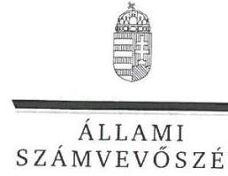

ELNÖK

Ikt.szám: V-0975-131/2016

# Fekete Zoltán Nándor úr 

ügyvezető
VGÜ Salgótarjáni Hulladékgazdálkodási és Városüzemeltetési Nonprofit Kft.

## Salgótarján

## Tisztelt Ügyvezető Úr!

Köszönettel vettem a VGÜ Salgótarjáni Hulladékgazdálkodási és Városüzemeltetési Nonprofit Kft. ellenőrzéséről készített számvevőszéki jelentéstervezetre tett észrevételeit.

Az Állami Számvevőszék észrevételekre vonatkozó álláspontjáról a felügyeleti vezető által készített részletes tájékoztatásban kap választ, amelyet levelemhez mellékeltem.

Tájékoztatom Ügyvezető urat, hogy a számvevőszéki jelentés véglegesítése az elfogadott észrevételek figyelembevételével történik.

Budapest, 2016. július hó 7. nap
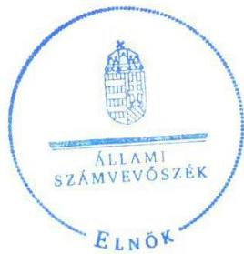

Tisztelettel:

## Domokos László

Melléklet: Tájékoztatás az észrevételek kezeléséről

---

# Tájékoztatás az észrevételek kezeléséről 

„Az önkormányzatok gazdasági társaságai - Az önkormányzatok többségi tulajdonában lévő gazdasági társaságok közfeladat-ellátását érintő gazdálkodási tevékenysége szabályszerűségének ellenőrzése - VGÜ Salgótarjáni Hulladékgazdálkodási és Városüzemeltetési Nonprofit Kft." címmel készített jelentéstervezetre Ügyvezető úr észrevételeit megköszönöm. Az észrevételek kezeléséről az alábbi tájékoztatást adom.

Az 1.2. megállapításhoz tett észrevételét a belső ellenőri jelentés ismételt áttekintését követően elfogadom és a jelentéstervezet 1.2. megállapítás 6. bekezdésében foglalt megállapítást az alábbiak szerint módosítom:
„A Társaságnál elvégzett belső ellenőrzés megállapította, hogy az Önköltségszámítási szabályzatban az általános költségek felosztására vonatkozóan hiányosságot kiegészítést javasolt."

A 2.1. megállapításhoz kapcsolódó észrevételeit nem áll módomban elfogadni, így azok alapján a jelentéstervezet megállapításait nem módosítom. Az észrevételében a közszolgáltatás elkülönítésére alkalmazott gyakorlatot írta le, amelyre vonatkozóan a 2.1. megállapítás 4. és 5. bekezdésében megállapított szabályozási hiányosság megállapítása továbbra is helytálló. A Számv. tv. 161/A. § (1) bekezdése alapján a gazdálkodónak a könyvvezetésre, a bizonylatolásra vonatkozó részletes belső szabályait úgy kell kialakítania, hogy az a mérleg és az eredménykimutatás alátámasztásán túlmenően a kiegészítő melléklet adatainak közvetlen alátámasztására is alkalmas legyen. A Ht. 50. § (3) bekezdése előírta, hogy a hulladékgazdálkodási közszolgáltatás nyújtása érdekében végzett tevékenység elkülönült bemutatása önálló mérleg és eredménykimutatást jelent. A számlatükörben és az önköltségszámítási szabályzatban felsorolt tevékenységeket nem definiálták abból a szempontból, hogy hulladékgazdálkodással kapcsolatos közszolgáltatás, vagy egyéb tevékenységről van-e szó, illetve a számlarend hiányossága volt, hogy a számlatükörben a tevékenységek elkülönítéséhez alkalmazott főkönyvi számlaszámokat és az azokhoz kapcsolódó információkat nem tartalmazta.

A 2. Összegző megállapítást és a 2.4. megállapítást az Önkormányzat észrevételéhez csatolt jelenléti ívek alapján már módosítottam, a VGÜ Salgótarjáni Hulladékgazdálkodási és Városüzemeltetési Nonprofit Kft. ügyvezetőjének címzett 4. számú javaslatot pedig töröltem.

A 2. Összegző megállapítás 2. mondata az alábbiak szerint módosul:
„Az éves beszámolókat a jogszabályoknak megfelelően elkészítették, de azok legfőbb szerv általi megtárgyalásán/jóváhagyásán a Könyvvizsgáló nem vett részt."

A 2.4. számú megállapítás az alábbiak szerint módosul:
„Az éves beszámolókat a Társaság a jogszabályoknak megfelelően elkészítette, azonban azok megtárgyalásán/közgyűlési jóváhagyásán a Könyvvizsgáló az ellenőrzött időszakban részt nem vett."

---

A 2.4. számú megállapítás 4. bekezdése az alábbiak szerint módosul:
„Az ellenőrzött időszakban 2011-es és 2012-es éves beszámolókat elfogadó Közgyűlésekre a Könyvvizsgálót meghívták, azonban a Gt. 44. § (1) bekezdésének megfelelően a Könyvvizsgáló azokon nem vett részt."

Észrevétele alapján a jelentéstervezet 3. Összegző megállapítás első mondatát kiegészítem az alábbiak szerint:
„A Társaságnál a hulladékgazdálkodási közszolgáltatással kapcsolatos bevételek és ráfordítások elszámolása megfelelő, az értékcsökkenés elszámolása nem minden esetben volt megfelelő."

A 3.1 számú megállapításhoz tett észrevételeit elfogadom, annak alapján a jelentéstervezetet módosítom:

# „A KÖVETELÉS ÁLLOMÁNY KEZELÉSÉNEK szabályait belső 

szabályzatban nem határozták meg, azonban az üzemeltetési szerződésben [...]."
A 3.2. számú megállapításhoz tett észrevételeit nem fogadom el, így azok alapján a jelentéstervezetet nem módosítom, mivel az árképzést megalapozó önköltségszámítási szabályzat nem volt alkalmas a díj alapját képező közszolgáltatási tevékenység önköltségének megállapítására. Az észrevételében az árképzés gyakorlatát mutatja be, amely nem változtat a szabályozási hiányosságokra vonatkozó megállapításokon.

Köszönöm szíves tájékoztatását a 100 ezer Ft egyedi beszerzési érték alatti eszközök értékcsökkenésének elszámolására vonatkozó egyértelmű szabályozás kialakításáról. Az észrevételében leírt értelmezést figyelembe véve a VGÜ Salgótarjáni Hulladékgazdálkodási és Városüzemeltetési Nonprofit Kft. ügyvezetőjének címzett javaslatok 3. pontját törlöm a jelentéstervezetből, ugyanakkor az utolsó javaslatom továbbra is
 fenntartom, egyben annak a javaslatot megalapozó megállapításra való hivatkozását kiegészítem a 2.1. számú megállapítás 7. bekezdésére történő hivatkozással.

Az Összegzéshez kapcsolódó módosítási javaslatát nem fogadom el a 3.2. megállapításhoz írt indoklásom alapján.

Budapest, 2016. július 4. nap

Dr. Horváth Margit
felügyeleti vezető

---

# RÖVIDÍTÉSEK JEGYZÉKE 

${ }^{1}$ Számv. tv.
${ }^{2}$ Rezsi. tv.
${ }^{3}$ Társaság
${ }^{4}$ Társulás
${ }^{5}$ Polgármester
${ }^{6}$ Jegyző
${ }^{7}$ Ügyvezető
${ }^{8}$ ÁSZ
${ }^{9}$ Ötv.
${ }^{10}$ Mötv.
${ }^{11}$ Közgyűlés
${ }^{12}$ Gazdasági program
${ }^{13}$ Gazdasági program kiegészítése
${ }^{14}$ Önkormányzat
${ }^{15}$ Nvtv.
${ }^{16}$ Középtávú vagyongazdálkodási terv
${ }^{17}$ Hosszú távú vagyongazdálkodási terv
${ }^{18} \mathrm{Hgt}$.
${ }^{19}$ 241/2001. Korm.rendelet
${ }^{20} \mathrm{Ht}$.
${ }^{21}$ 2012/438 Korm. rendelet
${ }^{22}$ Közgyűlés határozata
${ }^{23}$ OKTVF határozat
${ }^{24}$ Alapító Okirat
a számvitelről szóló 2000. évi C. törvény
a rezsicsökkentések végrehajtásáról szóló 2013. évi LIV. törvény
VGÜ Salgótarjáni Hulladékgazdálkodási és Városüzemeltetési Nonprofit Kft.
Kelet-Nógrád Térségi Hulladékgazdálkodási Társulás
Salgótarján Megyei Jogú Város Önkormányzatának polgármestere
Salgótarján Megyei Jogú Város Önkormányzatának jegyzője
a VGÜ Salgótarjáni Hulladékgazdálkodási és Városüzemeltetési Nonprofit Kft. ügyvezetője
2011. évi LXVI. törvény az Állami Számvevőszékről, hatályos 2011. július 1-jétől
a helyi önkormányzatokról szóló 1990. évi LXV. törvény (hatálytalan: 2014. október 12-étől)
Magyarország helyi önkormányzatairól szóló 2011. évi CLXXXIX. törvény (hatályos: 2012. január 1-jétől)
Salgótarján Megyei Jogú Város Önkormányzatának Közgyűlése
Salgótarján Megyei Jogú Város Közgyűlésének 35/2007. (III.27.) számú határozata az Önkormányzat 2006-2018. közötti időszakra szóló gazdasági programjáról
Salgótarján Megyei Jogú Város Közgyűlésének 102/2011. (V.26.) számú határozata az Önkormányzat 2006-2018. közötti időszakra szóló gazdasági programjának 2011-2014. közötti időszakra vonatkozó kiegészítése
Salgótarján Megyei Jogú Város Önkormányzata
a nemzeti vagyonról szóló 2011. évi CXCVI. törvény (hatályos:2011. december 31-étől, kivéve a 20. § (2) bekezdésben meghatározott paragrafusok, amelyek 2012. január 1-jétől, a (3) bekezdésben meghatározott paragrafusok 2013. január 1-jétől, a (4) bekezdésben meghatározott paragrafus 2012. március 2-ától léptek hatályba)
Salgótarján Megyei Jogú Város Közgyűlésének 113/2013. (V. 30.) számú határozata az Önkormányzat 2013-2015. évekre szóló középtávú vagyongazdálkodási tervéről (hatályos: 2013. május 30-ától)
Salgótarján Megyei Jogú Város Közgyűlésének 72/2013. (IV. 25.) számú határozata az Önkormányzat 2013-2022. évekre szóló hosszú távú vagyongazdálkodási tervéről (hatályos: 2013. május 30-ától)
a hulladékgazdálkodásról szóló 2000. évi XLIII. törvény (hatálytalan: 2013. január 1-jétől)
241/2001. (XII. 10.) Korm. rendelet a jegyző hulladékgazdálkodási feladat- és hatásköréről
2012. évi CLXXXV. törvény a hulladékról, hatályos 2013. január 1-jétől, kivéve a 95. § (6) bekezdése, ami 2015. január 1-jén lépett hatályba
a közszolgáltató hulladékgazdálkodási tevékenységéről és a hulladékgazdálkodási közszolgáltatás végzésének feltételeiről 438/2012 (XII.29.) Kormányrendelet
Salgótarján Város Önkormányzat Közgyűlésének 176/2013. (VIII.29.) számú határozata 2013. augusztus 29-i ülésén
Országos Környezetvédelmi és Természetvédelmi Főfelügyelőség 14/73713/2013. sz. határozata (2013.08.28.)

VGÜ Salgótarjáni Hulladékgazdálkodási és Városüzemeltetési Nonprofit Kft. alapító okirata és módosításai

---

${ }^{25}$ Gt.
${ }^{26}$ Ptk.
${ }^{27}$ Hulladékgazdálkodási rendeletek
${ }^{28}$ Megbízási szerződés
${ }^{29}$ Közszolgáltatási szerződés
${ }^{30}$ 224/2004. (VII. 22.) Korm. rendelet
${ }^{31}$ Határozat
${ }^{32}$ 317/2013. (VIII. 28.) Korm. rendelet
${ }^{33}$ OHÜ
${ }^{34}$ 64/2008. (III. 28.) Korm. rendelet
${ }^{35} \mathrm{FB}$
${ }^{36}$ Taktv.
${ }^{37}$ Áht.
${ }^{38}$ Számviteli politika
${ }^{39}$ Leltárkészítési és leltározási szabályzat
${ }^{40}$ Eszközök és források értékelési szabályzat
${ }^{41}$ Pénz-és értékezelési szabályzat
${ }^{42}$ Önköltségszámítási szabályzat
2006. évi IV. törvény a gazdasági társaságokról (hatálytalan: 2014. március 15-től)
2013. évi V. törvény a Polgári Törvénykönyvről (hatályos 2014. március 15-től)
Salgótarján Megyei Jogú Város Közgyűlésének 42/2001.(XII.17.) Ör. sz. rendelete és módosításai a települési szilárd hulladékkal kapcsolatos hulladékkezelési helyi közszolgáltatásról (hatálytalan 2014. január 1-jétől); Salgótarján Megyei Jogú Város Közgyűlésének 57/2013.(XII.19.) Ör. sz. rendelete a települési és állati hulladékkal kapcsolatos hulladékgazdálkodási közszolgáltatásról (hatályos 2014. január 1-jétől)
Salgótarján Megyei Jogú Város Önkormányzatának és VGÜ Salgótarjáni Hulladékgazdálkodási és Városüzemeltetési Nonprofit Kft. között 1996. február 29-én megkötött megbízási szerződés és módosításai (hatályos 2013. december 31-ig); Salgótarján Megyei Jogú Város Önkormányzatának és VGÜ Salgótarjáni Hulladékgazdálkodási és Városüzemeltetési Nonprofit Kft. között 2013. december 19-én megkötött megbízási szerződés (hatályos 2014. január 1-jétől)
Hulladékgazdálkodási közszolgáltatási szerződés, amelyet a Kelet-Nógrád Térségi Hulladékgazdálkodási társulás Társulási Tanácsa a 26/2013. (X.30.) Th. határozatával és a VGÜ Salgótarjáni Hulladékgazdálkodási és Városüzemeltetési Nonprofit Kft taggyűlése 3/2013. (X. 27.) számú határozatával jóváhagyott.
a hulladékkezelési közszolgáltató kiválasztásáról és a közszolgáltatási szerződésről szóló 224/2004. (VII. 22.) Korm. rendelet, hatályos 2013. szeptember 4-ig;
Salgótarján Megyei Jogú Város közgyűlése 2013. október 31-i ülésén, 216/2013.(X.31.). sz. határozata
a közszolgáltató kiválasztásáról és a hulladékgazdálkodási közszolgáltatási szerződésről szóló 317/2013. (VIII. 28.) Korm. rendelet, hatályos 2013. szeptember 5-től;
Országos Hulladékgazdálkodási Ügynökség
a települési hulladékkezelési közszolgáltatási díj megállapításának részletes szakmai szabályairól szóló 64/2008. (III. 28.) Korm. rendelet, hatályos 2008. március 31-től;
VGÜ Salgótarjáni Hulladékgazdálkodási és Városüzemeltetési Nonprofit Kft. Felügyelőbizottsága
az állami tulajdonú gazdasági társaságok takarékosabb működéséről szóló 2009. évi CXXII. törvény
2011. évi CXCV. törvény az Államháztartásról

VGÜ Salgótarjáni Hulladékgazdálkodási és Városüzemeltetési Nonprofit Kft. Számviteli politikája és módosításai (hatályos: 2011. január 1.-től, 2012. január 1.-től, 2013. január 1.-től, 2014. január 1.-től)
VGÜ Salgótarjáni Hulladékgazdálkodási és Városüzemeltetési Nonprofit Kft. Leltárkészítési és leltározási szabályzata és módosításai (hatályos: 2010. január 1.-től, 2012. január 1.-től)

VGÜ Salgótarjáni Hulladékgazdálkodási és Városüzemeltetési Nonprofit Kft. Eszközök és források értékelési szabályzata és módosításai (hatályos: 2001. január 1.-től, 2012. január 1.-től)
VGÜ Salgótarjáni Hulladékgazdálkodási és Városüzemeltetési Nonprofit Kft. Pénz- és értékezelési szabályzata és módosításai (hatályos: 2010. január 1.-től, 2012. május 1.-től, 2013. január 1.-től, 2014. május 5-től)
VGÜ Salgótarjáni Hulladékgazdálkodási és Városüzemeltetési Nonprofit Kft. Önköltségszámítási szabályzata és módosításai (hatályos: 2010. január 1.-től, 2012. január 1.-től, 2013. január 1.-től, 2014. január 1-től)

---

| ${ }^{43}$ Számlarend | VGÜ Salgótarjáni Hulladékgazdálkodási és Városüzemeltetési Nonprofit Kft.   Számlarendje és módosításai (hatályos: 2005. január 1.-től, 2012. január 1.-től,   2013. január 1.-től, 2013. október 1.-től, 2014. január 1-től) |
| :--: | :--: |
| ${ }^{44}$ Selejtezési szabályzat | VGÜ Salgótarjáni Hulladékgazdálkodási és Városüzemeltetési Nonprofit Kft.   Felesleges vagyontárgyak selejtezésének szabályzata és módosításai (hatályos:   2005. január 1.-től, 2012. január 1.-től) |
| ${ }^{45}$ Avtv. | a személyes adatok védelméről és a közérdekű adatok nyilvánosságáról szóló   1992. évi LXIII. törvény (hatálytalan 2012. január 1-jétől) |
| ${ }^{46}$ Info tv. | Az információs önrendelkezési jogról és az információszabadságról szóló 2011.   évi CXII. törvény (hatályos: 2011. július 27-től) |
| ${ }^{47}$ Adatvédelmi szabályzat | VGÜ Salgótarjáni Hulladékgazdálkodási és Városüzemeltetési Nonprofit Kft.   Adatvédelmi és adatbiztonsági szabályzata és módosításai (hatályos: 2009.   március 1.-től, 2012. április 5.-től, 2014. május 1-től) |

---

# ÁLLAMI SZÁMVEVŐSZÉK 

1052 Budapest, Apáczai Csere János utca 10.
Levélcím: 1364 Budapest 4. Pf. 54
Telefon: +36 14849100 Telefax: +36 14849200
www.asz.hu
