# Jelentés 

## Az önkormányzatok gazdasági társaságai

Az önkormányzatok többségi tulajdonában lévő gazdasági társaságok közfeladat ellátását érintő gazdálkodási tevékenysége szabályszerűségének ellenőrzése - Esztergomi Köztisztasági Szolgáltató Kft.

2016

---

# Jelentés 

## Az önkormányzatok gazdasági társaságai

Az önkormányzatok többségi tulajdonában lévő gazdasági társaságok közfeladat ellátását érintő gazdálkodási tevékenysége szabályszerűségének ellenőrzése - Esztergomi Köztisztasági Szolgáltató Kft.
2016. július hó /3. nap
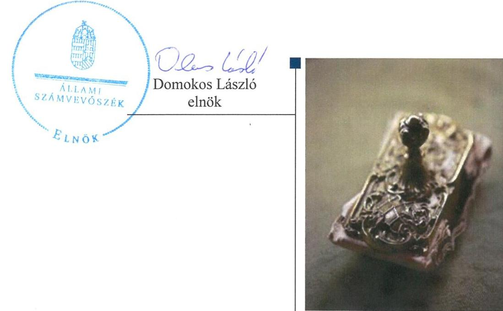

---

# AZ ELLENŐRZÉST FELÜGYELTE:

DR. HORVÁTH MARGIT felügyeleti vezető

# AZ ELLENŐRZÉST VEZETTE ÉS A VÉGREHAJTÁSÁÉRT FELELŐS:

VERTKOVCZI MÁRIA ellenőrzésvezető

# A PROGRAM ÖSSZEÁLLÍTÁSÁÉRT FELELŐS:

JANIK JÓZSEF LÁSZLÓ osztályvezető

---

**IKTATÓSZÁM:** V-0976-119/2016

**TÉMASZÁM:** 2010

**ELLENŐRZÉS-AZONOSÍTÓ SZÁM:** V-070727

---

Jelentéseink az Országgyűlés számítógépes hálózatán és az Interneta a www.asz.hu címen is olvashatóak.

---

# TARTALOMJEGYZÉK 

■ ÖSSZEGZÉS ..... 5
■ AZ ELLENŐRZÉS CÉLJA ..... 7
■ AZ ELLENŐRZÉS TERÜLETE ..... 8
■ AZ ELLENŐRZÉS HÁTTERE, INDOKOLTSÁGA ..... 10
■ A JELENTÉS LÉNYEGES KÉRDÉSKÖREI ..... 11
■ ELLENŐRZÉS HATÓKÖRE ÉS MÓDSZEREI ..... 12
■ MEGÁLLAPÍTÁSOK ..... 14
■ JAVASLATOK ..... 29
■ MELLÉKLETEK ..... 31
I. Sz. melléklet: Értelmező szótár ..... 31
II. Sz. melléklet: A múködés főbb jellemzői. ..... 34
■ FÜGGELÉK: ÉSZREVÉTELEK ..... 35
■ RÖVIDÍTÉSEK JEGYZÉKE ..... 45

---

.

---

# ÖSSZEGZÉS 

Az Állami Számvevőszék az Esztergomi Köztisztasági Szolgáltató Kft. hulladékgazdálkodási közszolgáltatást érintő tevékenysége 20112014. évek közötti szabályszerűségét ellenőrizte. A hulladékgazdálkodást az Önkormányzat szabályosan szervezte meg. A tulajdonosi jogok gyakorlása nem volt szabályszerű. A Társaság közszolgáltatói feladattal kapcsolatos árképzési gyakorlata nem volt szabályszerű, ugyanakkor a díjcsökkenést szabályszerűen végrehajtották. A Társaság vagyongazdálkodása szabályszerű volt, a kötelezettségállománya a hulladékgazdálkodásra és a müködésre nem jelentett kockázatot.

## Az ellenőrzés társadalmi indokoltsága

Az Állami Számvevőszék Stratégiájában megfogalmazta, hogy a helyi önkormányzatok gazdálkodásában rejlő pénzügyi kockázatok feltárásával, az államháztartáson kívülre nyújtott költségvetési támogatások és ingyenes vagyonjuttatások, valamint az államháztartáson kívül múködő közfeladat-ellátó rendszerek ellenőrzéseivel hozzájárul ahhoz, hogy a közpénzeket az államháztartáson kívül múködő szervezetek is átlátható, rendezett módon használják fel a közfeladatok szerződésben vállalt ellátása érdekében.

A Magyarországon az intézmény-centrikus közfeladat-ellátás jellemző, de egyre jelentősebb a költségvetésen kívüli feladatellátás térnyerése. Ennek legfontosabb szereplői - a nonprofit szervezetek mellett - az önkormányzati tulajdonú gazdasági társaságok. Az önkormányzatok szervezetalakítási szabadságának következménye, hogy a korábban is vállalati formában múködő közszolgáltatások mellett, mind a kötelező, mind az önként vállalt fel-adatok ellátásában a gazdasági társaságok kiemelt fontosságú szerephez jutottak.

## Főbb megállapítások, következtetések, javaslatok

Az Önkormányzat a hulladékgazdálkodási kötelező közszolgáltatás megszervezéséről az ellenőrzött időszakot megelőzően döntött, annak ellátásáról az 51\%-os tulajdonában lévő gazdasági társasága útján gondoskodott. Tulajdonosi joggyakorlását az Alapító Okiratában és Vagyonrendeletében szabályozta. Az Önkormányzatnak a Társaság feletti tulajdonosi joggyakorlása az ellenőrzött időszakban nem volt szabályszerű, a szabályosan összehívott taggyűléseken - a 2014. éves beszámolót megtárgyaló Taggyűlést kivéve - nem képviseltette magát. A Társaság tevékenységével kapcsolatban ellenőrzési és beszámoltatási jogával az ellenőrzött időszakban nem élt. Az éves beszámolókat a Taggyűlés az FB írásbeli javaslata alapján, a Könyvvizsgáló jelenlétében elfogadta. Az Önkormányzat a hulladékgazdálkodási közszolgáltatást a Hgt.-ben és Ht.-ben előírtaknak megfelelően szerződésben szabályozta, rendeletalkotási kötelezettségének eleget tett. A Jegyző a 2011-2012. években nem készítette elő a hulladékgazdálkodási tervet. Az Önkormányzat nem rendelkezett gazdasági programmal. Az FB nem rendelkezett ügyrenddel.

A Társaság 2011-2012. évekre vonatkozóan nem tett eleget a Hgt. által előírt kötelező hulladékgazdálkodási közszolgáltatást érintő költségekről való éves beszámolási kötelezettségének. A 2013-2014. évekre vonatkozó hulladékgazdálkodási tervet a Ht.-ban foglaltaknak megfelelően a Társaság elkészítette. A Társaság elkészítette a jogszabályban előírt szabályzatokat, melyek a szétválasztás szabályozását kivéve összességében megfeleltek az előírásoknak, azonban az ellenőrzött időszakban nem rendelkezett a Számv. tv. által előírt számlarenddel. A Társaság a kötelezően ellátandó hulladékgazdálkodási tevékenységen kívül egyéb tevékenységet is végzett, viszont a hulladékgazdálkodás közszolgáltatásra vonatkozóan a Hgt. és Ht. szerinti szétválasztási szabályokat nem határozta meg, a közszolgáltatási tevékenységet elkülönítetten a nyilvántartásában nem szerepeltette.

---

A bevételek, ráfordítások elszámolása nem volt megfelelő, a Hgt. és Ht. és 64/2008. (III. 28.) Korm. rendelet által meghatározott hulladékgazdálkodás közszolgáltatással kapcsolatos elkülönítés hiánya, és a Számlakerettől eltérő könyvelés alkalmazása miatt. A beruházások elszámolása a Számv. tv.-nek és belső szabályoknak megfelelően történt. A Társaság árképzési gyakorlata a közszolgáltatás költségeinek szigorú elkülönítési hiányossága miatt nem volt szabályszerű. A díjak csökkenését ugyanakkor a Rezsi tv-ben és a Ht.-ben foglaltaknak megfelelően, szabályszerűen végrehajtották.

A Társaság vagyongazdálkodása szabályszerű volt. Az eszközök használhatósági foka a beruházások következtében nőtt. A Társaság saját tőkéje a nyereséges gazdálkodás hatására minden ellenőrzött évben nőtt. A Társaság kötelezettségállománya a működésére, közszolgáltatásra nem jelentett kockázatot. A hátralékos követelések behajtása a 2013-tól a Ht.-ben előírt, NAV által adók módjára történő behajtás következtében eredményesebb lett az előző évi behajtáshoz képest.

A Könyvvizsgáló a 2013. évi beszámolót hitelesítő záradékkal látta el annak ellenére, hogy a kötelezően ellátandó hulladékgazdálkodási közszolgáltatással kapcsolatos, a Hgt., a Ht. és a 64/2008. (III. 28.) Korm. rendelet által meghatározott elkülönítési szabályok és gyakorlat hiányozott a Társaság nyilvántartásaiból.

Az Info. tv.-ben és az Avtv.-ben előírtaktól eltérően belső adatvédelmi felelőssel, hatályos adatvédelmi szabályzattal a Társaság nem rendelkezett.

---

# AZ ELLENŐRZÉS CÉLJA 

Az ellenőrzés célja annak értékelése, hogy az önkormányzat a jogszabályi előírások figyelembevételével döntött-e az ellenőrzésre kerülő közfeladat megszervezéséről; az önkormányzat/tulajdonosi joggyakorló szabályszerűen gyakorolta-e a tulajdonosi jogokat; a gazdasági társaság közfeladat-ellátása bevételeinek, ráfordításainak elszámolása, és vagyongazdálkodási tevékenysége megfelelt-e a jogszabályi, illetve a közszolgáltatási/vagyonkezelési szerződésben foglalt tulajdonosi előírásoknak, azok végrehajtása szabályszerű volt-e; a gazdasági társaság kötelezettségállománya jelent-e kockázatot a múködésre, il-
letve a közfeladat ellátására; a közfeladatok átláthatósága és elszámoltathatósága érdekében biztosítva volt-e a közszolgáltatás dijának megalapozottsága szabályszerű önköltségszámítással.

---

# **AZ ELLENŐRZÉS TERÜLETE**

## **Esztergom Város Önkormányzata és a többségi tulajdonában lévő Esztergomi Köztisztasági Szolgáltató Kft.**

**ESZTERGOM VÁROS ÖNKORMÁNYZATA** a többségi tulajdonában (51%) álló Esztergomi Köztisztasági Szolgáltató Kft.-t az ellenőrzött időszakot megelőzően hozta létre. A Társaságban2 a Terszol Zrt. 24%-os, a Vertikál Zrt. 15%-os és az Enviroinvest Zrt. 10%-os tulajdoni résszel rendelkezett.

A Társaság alaptevékenysége Esztergom város közigazgatási területén a települési szilárd hulladékkal kapcsolatos kötelező közfeladat és közszolgáltatás biztosítása volt. A Társaság a hulladékkezelési feladatot 2014. január 27-ig közszolgáltatási szerződés, azt követően vállalkozási szerződés alapján, alvállalkozói minőségben látta el. A Társaság jegyzett tőkéje 70,0 M Ft (21 M Ft készpénz és 49 M Ft apport), ebből az Önkormányzat törzsbetétje 35,7 M Ft volt, amely az ellenőrzött időszakban nem változott. Az Önkormányzat törzsbetétje kizárólag nem pénzbeli betétből, apportból állt. Az Önkormányzat a Társaság részére kezelt vagyont a közszolgáltatáshoz nem adott át. A Társaságnak 2,2% tulajdonosi részesedése volt a Közép-Duna Vidéke Hulladékgazdálkodási Vagyonkezelő és Közszolgáltató Zrt.-ben.

A jelenlegi Polgármester3 a 2014. évi önkormányzati választások óta, 2014. október 11-től tölti be tisztségét. A Jegyző4 személye az ellenőrzött időszakban nem változott, azonban az ellenőrzött időszakban tartós távolléte miatt 2011. november 7-től az ellenőrzött időszak végéig aljegyző5 helyettesítette, akinek a személye az ellenőrzött időszakban két alkalommal változott.

**AZ ESZTERGOMI KÖZTISZTASÁGI SZOLGÁLTATÓ KFT.** a több mint 28 ezer lakosú Esztergom város közigazgatási területén 2014. évben hulladékszállítási tevékenységet 10 120 lakossági és 518 közötti szerződés alapján végzett. A Társaság főtevékenysége nem veszélyes hulladék gyűjtése és elszállítása, emellett egyéb tevékenységet is ellátott.

---

A Társaság 2011. és 2014. évi egyes gazdálkodási adatait az 1. ábra mutatja:
1. ábra
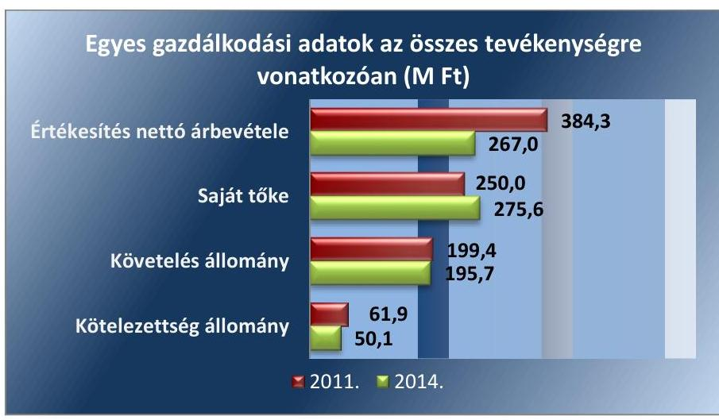

Forrás: A Társaság 2011-2014. évi beszámolói

A Társaság tevékenysége az ellenőrzött időszakban nyereséges volt, amely nyereség következtében a saját tőke növekedett. A Társaság árbevétele a 2011. évihez képest 2014. évre 30,5\%-kal csökkent, amely többségében hulladékgazdálkodási tevékenységből származott. A csökkenés legfőbb oka a hulladékgazdálkodási közszolgáltatás végzésének 2014. január 27-től való megszűnése, egy részének alvállalkozói keretek között való folytatása. A kötelezettségek állománya az ellenőrzött időszakban érdemben nem változott, fedezete biztosított volt. A követelések állománya kismértékben csökkent, azonban az árbevételhez viszonyított aránya 51,9\%-ról 73,3\%-ra romlott az ellenőrzött időszakban.

A Társaság Ügyvezetőjének ${ }^{6}$ személye az ellenőrzött időszakban nem változott, az Ügyvezető munkaviszony keretében 2007. június 1. óta töltötte be tisztségét. A Társaságnak 2011. január 1 és 2013. április 28. között nem volt gazdasági vezetője, a jelenlegi gazdasági vezető 2013. április 29től látta el feladatait. A könyvelést és a beszámoló összeállítását 2011. január 1 és 2013. június 30. között külső vállalkozó végezte, 2013. július 1jétől a Társaság látta el a könyvviteli feladatokat.

---

# AZ ELLENŐRZÉS HÁTTERE, INDOKOLTSÁGA 

AZ ÖNKORMÁNYZATI TULAJDONÚ GAZDASÁGI TÁRSASÁGOK teljes körű ellenőrzésének lehetőségét az ÁSZ. tv. ${ }^{7}$ 2011. január 1-jétől hatályos módosítása teremtette meg. A közfeladatot ellátó gazdasági társaságok ellenőrzése kiemelten fontos a vagyon megőrzése, megóvása érdekében, valamint a kormányzati szektor elszámolásaiban megjelenő önkormányzati tulajdonú gazdálkodó szervezetek esetében, amelyekkel szemben alapvető követelmény, hogy gazdálkodásuk, müködésük szabályszerű, az általuk szolgáltatott adatok minél megbízhatóbbak legyenek. A közfeladat ellátás költségeinek, ráfordításainak alakulása, színvonala hatással van a lakosság elégedettségére. A törvényalkotás számára - az észlelt problémák, szabálytalanságok, vagy egyéb nem kívánatos jelenségek felszínre kerülésével - az ellenőrzés megállapításai segítséget nyújthatnak az államháztartáson kívüli közfeladat-ellátás értékeléséhez, jogszabályi keretei pontosításához, átláthatóságot biztosító szabályozásához. Meghatározhatóvá válnak a közfeladat ellátásban részt vevő államháztartáson kívüli szervezeteknek - az önkormányzat költségvetését, pénzügyi helyzetét is befolyásoló - kockázatai, lehetővé válik ezen kockázatok csökkentése. Ellenőrzéseink feltárhatják, hogy az önkormányzat közfel-adat-ellátási kötelezettségének szabályszerűen tett-e eleget, a feladatellátáshoz rendelt közvagyon működtetését a tulajdonostól elvárható gondossággal, szabályszerűen szervezte-e meg és a tulajdonosi felügyelete hozzá-járult-e a közfeladat-ellátásához. Az ellenőrzés rávilágíthat arra, hogy a gazdasági társaság a közszolgáltatási szerződésben foglaltak betartásával, a közvagyon használatával biztosította-e a szolgáltatás folyatatásának feltételeit, a közfeladat ellátását. Ezzel az ellenőrzöttek és a helyi döntéshozók számára visszajelzést ad feladatszervezési, feladat-ellátási kockázataikról, alapot ad a meglévő hibák megszüntetéséhez, a jobb közfeladat-ellátás biztosításához. Fokozza a fegyelmet, igazolja, hogy lejárt a következmények nélküli ellenőrzések időszaka. Az ÁSZ értékteremtő rend kialakításához és megőrzéséhez hozzájáruló tevékenysége pozitív hatással van a szervezetről kialakított összkép formálására.

---

# A JELENTÉS LÉNYEGES KÉRDÉSKÖREI 

1. Az Önkormányzat közfeladat megszervezéséről szóló döntése, valamint tulajdonosi joggyakorlása szabályszerű volt-e?
2. A gazdasági társaság vagyongazdálkodása szabályszerű volt-e, kötelezettségállománya jelentett-e kockázatot a müködésre, illetve a közfeladat ellátásra?
3. A gazdasági társaságnál az ellátott közfeladat bevételei és ráfordításai elszámolása, valamint az önköltségszámítás és árképzés szabályszerű volt-e?

---

# ELLENŐRZÉS HATÓKÖRE ÉS MÓDSZEREI 

## Az ellenőrzés típusa

Megfelelőségi ellenőrzés

## Az ellenőrzött időszak

2011. január 1-jétől 2014. december 31-ig tartó időszak

## Az ellenőrzés tárgya

A közfeladatot gazdasági társaságokkal ellátó önkormányzatok tulajdonosi joggyakorlása, valamint gazdasági társaságok pénz- és vagyongazdálkodásának szabályozottsága és szabályszerűsége.

Az ellenőrzés tárgya a közfeladat ellátása tekintetében 2014. évre korlátozott, csak a 2013. évi gazdálkodás áthúzódó hatásait veszi számba, mivel a társaság 2014. január 1-től már nem végzett közszolgáltatást.

Az ellenőrzés tárgya a közfeladat ellátás tekintetében a 2014. évre vonatkozóan korlátozott, mivel a Társaság a hulladékgazdálkodási közszolgáltatási tevékenységét 2014. január 27-éig végezte közszolgáltatóként. Azt követően az ellenőrzési időszak végéig alvállalkozóként végezte a tevékenységet.

Az ellenőrzés kiterjed minden olyan körülményre és adatra, amely az ÁSZ jogszabályban meghatározott feladatainak teljesítéséhez, valamint a program végrehajtása folyamán felmerült újabb összefüggések feltárásához szükséges.

## Az ellenőrzött szervezet

$\longrightarrow$ Esztergom Város Önkormányzata
$\longrightarrow$ Esztergomi Köztisztasági Szolgáltató Kft.

## Az ellenőrzés jogalapja

Az ellenőrzés jogszabályi alapját az Állami Számvevőszékről szóló 2011. évi LXVI. törvény 5. § (3)-(4)-(5) be-kezdése képezte.

---

# Az ellenőrzés módszerei 

Az ellenőrzést a nemzetközi standardokat irányadónak tekintve az ellenőrzési program ellenőrzési kérdései, az ellenőrzött időszakban hatályos jogszabályok, az ellenőrzés szakmai szabályok és módszertanok figyelembe vételével végezzük.

Az ellenőrzés ideje alatt az ellenőrzött szervezettel történő kapcsolattartást az ÁSZ Szervezeti és Múködési Szabályzatának vonatkozó előírásai alapján biztosítjuk.

Az ellenőrzés a kiválasztott, többségi tulajdonosi jogokat gyakorló önkormányzatra, illetve az ellenőrzésre kijelölt közfeladatot ellátó gazdasági társaság felett tulajdonosi jogokat gyakorló szervezetre és az ellenőrzött közfeladatot ellátó gazdasági társaságra terjed ki. Amennyiben a gazdasági társaságban több önkormányzat együttesen többségi tulajdonos, úgy az ellenőrzést a többségi tulajdonosi jogokat gyakorló önkormányzatnál kell lefolytatni. Az ellenőrzött gazdasági társaságnál, amennyiben az több közfeladatot is ellát, akkor az ellenőrzésre kiválasztott közfeladat-ellátást ellenőrizzük.

Az ellenőrzést a kérdésekre adott válaszok kiértékelésével, valamint a megjelölt adatforrások, a csatolt tanúsítványok felhasználásával, továbbá az adott időszakban hatályos jogszabályok figyelembe vételével kell lefolytatni. Az ellenőrzési kérdések megválaszolásához szükséges bizonyítékok megszerzése a következő ellenőrzési eljárások alkalmazásával történik: megfigyelés, kérdésfeltevés (információkérés), összehasonlítás, valamint elemző eljárás.

A bevételek és ráfordítások elszámolása, valamint a vagyonnyilvántartás terén a szabályszerű múködést véletlen mintavétellel ellenőriztük. A jogszabályoknak és a belső előírásoknak megfelelőnek tekintettük az adott területet, amennyiben a minta ellenőrzésének eredménye alapján 95\%kos bizonyossággal a teljes sokaságban a hibaarány kisebb volt, mint 10\%, nem megfelelőnek, ha a hibaarány a 10\%-ot meghaladta. Kockázatot, illetve magas kockázatot jeleztünk, amennyiben egy adott terület vonatkozásában a minta alapján a teljes sokaságban nem volt egyértelmúen biztosított a jogszabályoknak és a belső szabályzatoknak megfelelő múködés. A ráfordítások elszámolására és a vagyonnyilvántartásra vonatkozó véletlen mintavételt kockázati alapú kiválasztással egészítettük ki, amelynek során a három legnagyobb összegű tételt választottuk ki.

---

# 1. Az Önkormányzat közfeladat megszervezéséről szóló döntése, valamint tulajdonosi joggyakorlása szabályszerű volt-e? 

Összegző megállapítás

Az Önkormányzat a hulladékgazdálkodási közszolgáltatásról szabályszerűen gondoskodott, a tulajdonosi joggyakorlása nem volt szabályszerű. Az Önkormányzat az ellenőrzött időszakban gazdasági programmal nem rendelkezett, 2011-2012. évekre vonatkozóan a Jegyző nem készítette elő a hulladékgazdálkodási tervet, a Taggyúlés javadalmazási szabályzatot nem alkotott.

Az Önkormányzat a hulladékgazdálkodási közfeladat ellátását szabályszerűen szervezte meg, rendeletalkotási, szerződéskötési kötelezettségének a jogszabályi előírásoknak megfelelően eleget tett, azonban az ellenőrzött időszakban gazdasági programmal nem rendelkezett. A 2011-2012. évekre vonatozó hulladékgazdálkodási terveket a Jegyző nem készítette elő.

GAZDASÁGI PROGRAM, amely az Ötv. 91. § (6) bekezdésében, illetve az Mötv. 116. § (1) bekezdéseiben előírtak szerint a Képviselő-testület ${ }^{8}$ hosszú távú fejlesztési elképzeléseit tartalmazta a 2011-2014. évekre vonatkozóan nem készült. A Jegyző a Htv. ${ }^{9}$ 140. § (1) bekezdés a) pontjában előírtak ellenére nem készítette el gazdasági programtervezetet, ezért azt a Polgármester a Htv. 139. § (1) bekezdés a) pontjában előírtak ellenére nem terjesztette a Képviselő-testület elé.

## A KÖZÉP- ÉS HOSSZÚ TÁVÚ VAGYONGAZDÁLKODÁSI TERVÉT az Önkormányzat az Nvtv. 9. § (1) bekezdésében és a 7. § (2) bekezdésében előírtak szerint a 289/2013. (VI. 20.) Kt. határozattal elfogadta. Az Önkormányzat Középtávú vagyongazdálkodási terve 20132017. évekre, a Hosszú távú vagyongazdálkodási terve 2013-2022. évekre vonatkozott.

## A KÖZTISZTASÁG ÉS TELEPÜLÉSTISZTASÁG BIZTOSÍTÁSA az Ötv. ${ }^{10}$ 8. § (1) bekezdése, illetve a Mötv. ${ }^{11}$ 13. § (1) bekezdés 19. pontja alapján az Önkormányzat törvényi kötelezettsége volt.

Az Önkormányzat az ellenőrzött időszakot megelőzően döntött a közfeladat gazdasági társasági formában történő ellátásáról ${ }^{12}$. Az Önkormányzat az Ötv. 8. § (1) bekezdésében meghatározott és a Hgt. 21. § (1) bekezdésében előírt hulladékkezelési közszolgáltatást az Ötv. 9. § (4) bekezdése, illetve Mötv. 41. § (6) bekezdése alapján az ellenőrzött időszakban 2014. január 27-ig a Társaság útján, a vele kötött szerződés alapján látta el. Az Önkormányzat az ellenőrzött időszakot megelőzően több önkormányzatot

---

magában foglaló, a Hgt. 22. § (1) bekezdése, valamint a Ht. 36. § (1) bekezdése szerinti Társuláshoz ${ }^{13}$ csatlakozott ${ }^{14}$. A Ht. 2013. január 1-jei hatályba lépését követően a társulási megállapodás kiegészült a hulladékkezelési közszolgáltatás szervezésére, a szerződés megkötésére és felmondására, a közszolgáltató kiválasztására vonatkozó feladatokkal. A Társulás közbeszerzési eljárást követően 2014. január 27-től a Hulladékgazdálkodásra vonatkozó Közszolgáltatási szerződést a Vertikál Nonprofit Zrt.-vel, a Vertikál VKSZ Zrt.-vel, és az Oroszlányi Környezetgazdálkodási Nonprofit Zrt.-vel, mint szolgáltatókkal kötötte meg. Ezt követően a Társaság a Vertikál Nonprofit Zrt., mint az Esztergom területén szerződött hulladékgazdálkodási közszolgáltató alvállalkozójaként végezte tevékenységét.

HULLADÉKGAZDÁLKODÁSI TERV az Önkormányzatnál a Hgt. ${ }^{15}$ 35. § (1) bekezdésében előírtak ellenére a 2011-2012. években nem készült, mivel a Jegyző a 241/2001. (XII. 10.) Korm. rendelet ${ }^{16}$ 1. § e) pontjában előírtak ellenére azt nem készítette elő.

A 2013-2014. évekre vonatkozóan a Társaság a Ht. 78. § (1) bekezdésének megfelelően a közszolgáltatói hulladékgazdálkodási tervet elkészítette és a Ht. 78. § (3) bekezdése szerint a környezetvédelmi hatóságnak megküldte. A 2016. május 31-ig érvényes hulladékgazdálkodási tervet az OKTVF ${ }^{17}$ a 14/5226-2/2013. számú határozatával hagyta jóvá.

A Társaság a hulladékgazdálkodási közszolgáltatást az ellenőrzött időszakban 2014. január 27-ig, az az Önkormányzattal az ellenőrzött időszakot megelőzően kötött, a Hgt. 28. § és a 224/2004. (VII. 22.) Korm. rendelet ${ }^{18}$ 11-14. §-ai alapján meghatározott Közszolgáltatási szerződés ${ }^{19}$ alapján végezte. A Közszolgáltatási Szerződés több hosszabbítást követően, 2014. január 27-éig volt érvényben. A Közszolgáltatási Szerződés tárgya a hulladékgazdálkodás, a köztisztaság, valamint ügyfélszolgálat létrehozása és múködtetése volt, illetve a lakossági hulladékszállítási díj beszedése. A Közszolgáltatási Szerződés alapján az ellenőrzött időszakban a szolgáltatásokat Esztergom város közigazgatási területén, továbbá a hozzátartozó pilisszentléleki, búbánatvölgyi, kerektói szamárhegyi üdülőövezetek területén volt köteles ellátni a Társaság. A Közszolgáltatási Szerződés 4.12. pontja alapján a közszolgáltatás körébe tartozó hulladék ártalmatlanítását a Társaság az Önkormányzat által kijelölt Esztergom- Kertváros Regionális Hulladéklerakó igénybevételével végezte. A Közszolgáltatási szerződés V. pontja szabályozta a hulladékkezelési közszolgáltatási díj megállapítását. A Közszolgáltatási Szerződés szerint az évi szolgáltatási díjavaslatra a költségszámítást a Társaság minden év október 31-ig volt köteles benyújtani az Önkormányzat részére.

A TÁRSASÁG ALAPÍTÓ OKIRATA ${ }^{20}$ megfelelt a Gt. ${ }^{21}$ 12. § (1) bekezdésében, illetve a Ptk. ${ }^{22}$ 3:5. §-ában előírt tartalmi követelményeknek, tartalmazta a Társaság megnevezését, székhelyét, a tagok felsorolását, a Társaság tevékenységeit, a képviselet és a cégjegyzés módját, a jegyzett tőkéjét, a Társaság tagjainak vagyoni hozzájárulását, valamint a jegyzett tőke rendelkezésre bocsátásának módját és idejét. Tartalmazta továbbá a Társaság vezető tisztségviselőjének, felügyelőbizottsági tagok és az Könyvvizsgáló ${ }^{23}$ nevét. A Társaság legfőbb szerve a Taggyűlés ${ }^{24}$ volt. Az Alapító Okiratot az ellenőrzött időszakban a Taggyűlés több alkalommal módosította, többek között a Képviselő-testület javaslata alapján az FB ta-

---

gok, a Könyvvizsgáló személyében bekövetkezett változások, illetve a jogszabályi előírások átvezetése miatt. A Társaság tulajdonosi összetételét a 2. ábra mutatja.

# RENDELETALKOTÁSI ${ }^{25}$ KÖTELEZETTSÉGÉNEK a 

Hgt. 23. §-ban előírtaknak megfelelően az Önkormányzat eleget tett, amelyben a települési szilárd hulladékok kezelése, a hulladékkezelési közszolgáltatás szervezése és fenntartása feladatait, a közszolgáltatás ellátásának rendjét, igénybevétele módját és feltételeit szabályozta. 2013. január 1-jétől a módosításokkal egységes szerkezetbe foglalt Hulladékrendelet megfelelt a Ht. ${ }^{26}$ 35. § előírásainak. A Hulladékrendelet 2. számú melléklete tartalmazta a 64/2008. (III. 28.) Korm. rendelet ${ }^{27}$ alapján meghatározott közszolgáltatási díjat.

### 1.2. számú megállapítás

Az Önkormányzat a tulajdonosi jogait nem gyakorolta szabályszerűen, a Taggyúléseken nem képviseltette magát, a Taggyúlés javadalmazási szabályzatot nem alkotott, az FB nem rendelkezett ügyrenddel.

A TAGOK TULAJ DONOSI JOGAIT és kötelezettségeit, a tagságból adódó jogok gyakorlásának rendjét a Társaság az Alapító Okirat 11-15. pontjaiban rögzítette. A Taggyúlés hatókörébe tartozott többek között az Alapító Okirat 16.1. pontja alapján 10 M Ft értékhatár feletti szerződések megkötése, a vezető beosztású munkavállalók feletti munkáltatói jogok gyakorlása, az Ügyvezető éves munkájának értékelése.

Az Önkormányzat a többségi tulajdonában lévő gazdasági társaságai feletti tulajdonosi jogok gyakorlásának rendjét a vagyongazdálkodási rendelet ${ }^{28}$ 6. § (2) bekezdésében meghatározta, a Képviselő-testület által átruházott hatáskörben a tulajdonosi jogokat a Polgármester gyakorolta. A tulajdonosi jogok gyakorlásakor a vagyongazdálkodási rendeletben meghatározottak szerint, 2013. június 26-ig nettó 30 M Ft, 2013. június 27-től bruttó 20 M Ft értékhatárig az Önkormányzat kijelölt bizottságainak ${ }^{29}$ egyetértése is szükséges volt a pénzügyi döntésekhez.

Az Önkormányzat a tulajdonosi jogait - a 2014. éves beszámoló megtárgyalását kivéve - a Társaság Taggyúlésein nem gyakorolta, mivel nem képviseltette magát a Társaság éves beszámolóinak ${ }^{30}$ elfogadására szabályszerűen összehívott Taggyúléseken. A társasági szerződés 16.6 pontjában foglaltak alapján és a Gt.141.§ (3), (4) bekezdéseivel, valamint a $\mathrm{Ptk}_{2}$ 3:191.§ (1), (2) bekezdéseivel összhangban a határozatképtelenség miatt megismételt Taggyúlés a megjelentek számától függetlenül határozatképes volt, így az éves beszámolók Taggyúlés általi megtárgyalása és elfogadása az Önkormányzat képviselete nélkül történt meg. Az Önkormányzatnak ezzel nem állt módjában az adózott eredmény felhasználására vonatkozóan javaslattal élni, a beszámoló egyéb részleteit a döntés előtt megismerni.

A Képviselő-testület az ellenőrzött időszakban a Társaság FB ${ }^{31}$ tagjait, Ügyvezetőjét a Társaság tevékenységéről nem számoltatta be. Az Önkormányzat belső ellenőrzése az ellenőrzött időszakra vonatkozóan a Társaságnál ellenőrzést nem végzett, nem élt az Ötv. 92. § (11) bekezdés b) pontjában, illetve az Áht. ${ }^{32}$ 70. § (1) bekezdés d) pontjában biztosított lehetőséggel.

---

A FELÜGYELŐ BIZOTTSÁG a Társaságnál a Gt. 34. § (1) bekezdésében, illetve a Ptk. 3:121. § (1) bekezdésben foglaltaknak megfelelően a 2011-2014. években három tagból állt. Az FB az ellenőrzött időszakban ügyrenddel nem rendelkezett, mivel az FB által elkészített ügyrend jóváhagyásáról a Gt. 34. § (4) bekezdésében, illetve a Ptk. 3:122. § (3) bekezdésében előírtak ellenére a Taggyúlés nem döntött.

Az FB a Társaság tevékenységéről az Ügyvezetőt a 2013-as évről beszámoltatta, a 2011-2012. és 2014. évek tekintetében nem volt az Ügyvezető részéről beszámoltatás. Az FB a Számv. tv. 4. § (1) bekezdése szerinti 20112014. évi beszámolókról minden évben írásos jelentést készített.

JAVADALMAZÁSI SZABÁLYZATOT a Taktv ${ }^{33}$. 5. § (3) bekezdésében foglaltak ellenére a Taggyúlés nem alkotta meg a Társaság vezető tisztségviselőire, Felügyelőbizottság tagjaira, valamint a munkavállalók javadalmazására vonatkozóan, továbbá a jogviszony megszűnése esetére biztosított juttatások módjára vonatkozó, mértékének elveit tartalmazó rendszerét nem határozta meg. Az Ügyvezető részére prémium kifizetés 2011-2014. években nem történt.

A Társaság tevékenysége az ellenőrzött időszakban nyereséges volt, azonban 2011. évhez képest a további évek pozitív eredménye csökkent a bevételek csökkenése és a ráfordítások növekedése következtében. Társaság részére az Önkormányzat garanciát, kezességet az ellenőrzött időszakban nem vállalt.

A Társaság mérleg szerinti eredményének 2011-2014. évi alakulását a 3. ábra szemlélteti.
3. ábra
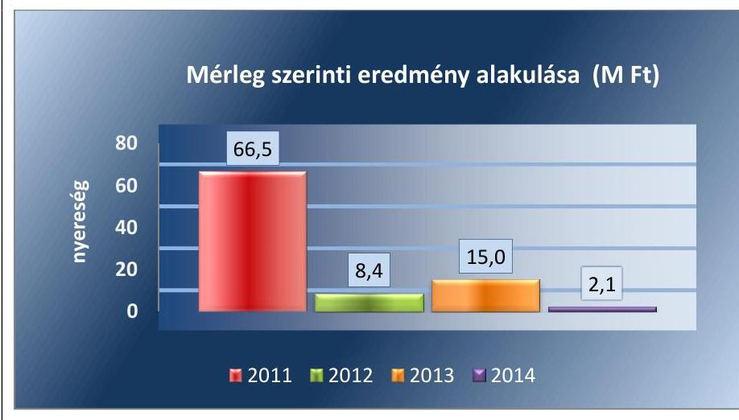

Forrás: a Társaság beszámolói

---

# 2. A gazdasági társaság vagyongazdálkodása szabályszerű volt-e, kötelezettségállománya jelentett-e kockázatot a múködésre, illetve a közfeladat ellátásra? 

Összegző megállapítás

A Társaság a jogszabályokban előírt szabályozási kötelezettségének - a számlarend és a közszolgáltatás szétválasztási szabályozását kivéve - eleget tett. A Társaság vagyongazdálkodása megfelelő volt, kötelezettségállománya nem jelentett kockázatot a közszolgáltatás ellátására, múködésére. Beszámolási kötelezettségét hiányosan teljesítette. A Társaságnál adatvédelmi felelős nem került kijelölésre, adatbiztonsági szabályzattal nem rendelkezett.
2.1. számú megállapítás

A Társaság a Számlarend kivételével rendelkezett a múködéshez szükséges szabályzatokkal, azok - a Pénzkezelési szabályzat kisebb hiányossága mellett - a jogszabályi és tulajdonosi előírásoknak öszszességében megfeleltek, azonban a hulladékgazdálkodás közszolgáltatói tevékenység elkülönítését nem szabályozta.

A Társaság tevékenységi körét az Alapító Okirat, a közfeladat-ellátás alapfeltételeit 2014. január 27-ig a Közszolgáltatási szerződés tartalmazta.

ÜZLETI TERV készítési kötelezettséget az Önkormányzat, illetve az Alapító Okirat az Ügyvezető részére nem írt elő. A Társaság a 2011-2012. években üzleti tervet nem készített, a 2013-2014. évek vonatkozásában azonban rendelkezett az FB által véleményezett üzleti tervekkel, melyeket a Taggyűlés és az Önkormányzat nem tárgyalt.

A Társaság rendelkezett a Számv. tv. ${ }^{34}$ 14. § (3)-(4) bekezdésében előírtaknak megfelelően Számviteli politikával ${ }^{35}$, elkészítette a Számv. tv. 14. § (5) bekezdése előírásainak megfelelő Leltározási szabályzatát ${ }^{36}$, az Értékelési szabályzatát ${ }^{37}$ és a Pénzkezelési szabályzatát ${ }^{38}$. A Társaság Önköltségszámítási szabályzattal nem rendelkezett, melynek készítése alól a Számv. tv. 14. § (7) bekezdése alapján mentesült, továbbá azt belső szabályzata sem írta elő.

A SZÁMVITELI POLITIKA a Számv. tv-nek megfelelően került kialakításra, aktualizálására a Számv. tv. 14. § (11) bekezdésének megfelelően az ellenőrzött időszakban többször sor került.

A Leltározási szabályzat a leltározás gyakoriságára vonatkozó előírást a Számv. tv. 69. § (3) bekezdésének megfelelően tartalmazta, meghatározott időszakonként, de legalább háromévente mennyiségi felvétellel történő leltározás kötelezettséget írt elő a számviteli alapelveknek megfelelő folyamatosan mennyiségben nyilvántartott eszközök vonatkozásában. A Leltározási szabályzat tartalmazta a Számv. tv. 169. § (1)-(2) bekezdéseiben a bizonylatok, ezen belül a leltározás dokumentumainak a megőrzési kötelezettségére vonatkozó előírást.

---

Az Értékelési szabályzat a Számv. tv. 55. § (1)-(2) bekezdéseinek előírásaival összhangban meghatározta a követelések minősítésére, a mérlegtételek értékelésére, a bekerülési érték meghatározására, az értékcsökkenésre, értékvesztésre vonatkozó szabályokat.

A Pénzkezelés szabályzat a Számv. tv. 14. § (8) bekezdésének megfelelően a pénzforgalom lebonyolításának rendjéről, a pénzkezelés tárgyi és személyi feltételeiről, a készpénzben és a bankszámlán tartott pénzeszközök közötti forgalomról, a készpénzállományt érintő pénzmozgások jogcímeiről és eljárási rendjéről, a napi készpénz záró állomány maximális mértékéről, a pénzszállítás feltételeiről, a pénzkezeléssel kapcsolatos bizonylatok rendjéről és a pénzforgalommal kapcsolatos nyilvántartási szabályokról szóló előírásokat tartalmazta.

Hiányosság volt azonban, hogy a Pénzkezelési szabályzat a Számv. tv. 14. § (8) bekezdése előírása ellenére a készpénzállomány ellenőrzésekor követendő eljárásról, az ellenőrzés gyakoriságáról és a pénzkezelés felelősségi szabályairól nem tartalmazott előírást.

Számlakeret ${ }^{39}$-tel a Társaság rendelkezett, amely a Számv. tv. 160. § megfelelően tartalmazta a főkönyvi számlák megnevezését.

SZÁMLARENDET a Társaság a Számv. tv. 161. § (1) bekezdésében előírtak ellenére a 2011-2014. évekre vonatkozóan nem készített.

A SZÉTVÁLASZTÁS SZABÁLYOZÁSA a 2011-2012. években a Hgt. 29. § (3) bekezdéseiben, illetve a 2013. évben a Ht. 50. § (2)-(3) bekezdéseiben előírtak ellenére nem történt meg. A Társaság 2011-2013. években a hulladékkezelési engedélyének megfelelően egyéb hulladékgazdálkodási tevékenységeket is folytatott. A 2011-2012. években azonban a Hgt. 29. § (3) bekezdésében előírtak ellenére a kötelezően ellátandó közszolgáltatás kereteibe nem tartozó egyéb hulladékkezelési szolgáltatás dijának (bevételeinek), költségeinek elkülönítését a Számv. tv. 161/A. § (2) bekezdésében előírtak ellenére nem szabályozta. A Társaság a 2013. évben a Ht. 50. § (1)-(3) bekezdéseiben, továbbá a Számv. tv. 161/A. § (1)-(2) bekezdéseiben előírtak ellenére nem gondoskodott az egyes tevékenységeire vonatkozó elkülönült nyilvántartás kialakításáról, szabályozásáról, így nem biztosította az egyes tevékenységek átláthatóságát, és a keresztfinanszírozás kizárását.

A Társaság nem a Szám. tv. 161/A. § (1) bekezdésében előírtak szerint alakította ki a könyvvezetésre, a bizonylatolásra vonatkozó részletes belső szabályait, és a nyilvántartási (könyvvezetési) rendszerét a Számv. tv. 161/A. § (2) bekezdésében előírtak ellenére nem részletezte tovább a közpénzek felhasználásának és a köztulajdon használatának nyilvánossága és ellenőrizhetősége érdekében. A díjmegállapítást megalapozó költségek kimutatása érdekében a 64/2008. (III.28.) Korm. rendelet 5. §-ban meghatározott szigorú elkülönítést nem szabályozta.

## 2.2. számú megállapítás

A vagyongazdálkodás a jogszabályi rendelkezéseknek és a belső előírásoknak megfelelt, az ellenőrzött időszakban a saját tőke öszszege növekedett.

Az ellenőrzött időszakot megelőzően a Társaság alapításához az Önkormányzat a törzsbetétjét apportként biztosította. A Társaság a hulladékke-

---

zelési közfeladatát saját eszközeivel látta el, üzemeltetésre, illetve vagyonkezelésbe átvett eszköze nem volt. A hulladéklerakó céljára szolgáló területet az ellenőrzött időszak alatt a Társaság bérleti szerződés alapján használta.

A Társaság az éves beszámoló mérleg sorait alátámasztó számviteli nyilvántartásokban szereplő saját vagyonának leltározását a Számv. tv. 69. § (1) bekezdésében foglaltaknak és a Leltározási szabályzat előírásainak megfelelően végezte.

A Társaság vagyoni helyzetét jellemző, főbb könyvviteli mérleg szerinti kiemelt adatait az 1. táblázat tartalmazza:

1. táblázat

A TÁRSASÁG FŐBB MÉRLEGADATAI (M FT)

|   | 2011.01 .01 | 2011.12 .31 | 2012.12 .31 | 2013.12 .31 | 2014.12 .31  |
| --- | --- | --- | --- | --- | --- |
|  I. Befektetett eszközök | 52,8 | 45,3 | 54,6 | 78,8 | 72,5  |
|  - ebből: Tárgyi eszközök | 51,6 | 44,6 | 54,2 | 78,3 | 72,1  |
|  II. Forgó eszközök | 175,2 | 240,2 | 242,6 | 216,7 | 247,5  |
|  - ebből: Követelések | 164,3 | 199,4 | 184,6 | 193,6 | 195,7  |
|  - ebből: Pénzeszközök | 10,8 | 40,1 | 57,5 | 22,8 | 51,3  |
|  III. Aktív időbeli elhatárolások | 39,8 | 34,8 | 37,2 | 34,6 | 5,7  |
|  Eszközök összesen | 267,8 | 320,3 | 334,4 | 330,1 | 325,7  |
|  IV. Saját tőke | 183,5 | 250,0 | 258,5 | 273,4 | 275,6  |
|  - ebből: Jegyzett tőke | 70,0 | 70,0 | 70,0 | 70,0 | 70,0  |
|  - ebből: Tóketartalék | 0 | 0 | 0 | 0 | 0  |
|  - ebből Mérleg szerinti eredmény | 33,4 | 66,5 | 8,4 | 15,0 | 2,1  |
|  V. Céltartalékok | 6,0 | 0 | 0 | 0 | 0  |
|  VI. Kötelezettségek | 62,3 | 61,9 | 67,7 | 45,6 | 50,1  |
|  - ebből: szállítókkal szembeni kötelezettség | 13,9 | 2,4 | 7,8 | 20,2 | 31,3  |
|  VII. Passzív időbeli elhatárolások | 16,1 | 8,3 | 8,2 | 11,1 | 0  |
|  Források összesen | 267,8 | 320,3 | 334,4 | 330,1 | 325,7  |

A Társaságnál a saját vagyon kezelése, a vagyonérték megőrzése, gyarapítása, hasznosítása az Alapító Okiratban 16.1. pontjában rögzített értékhatár figyelembevételével történt. A Társaság vagyona az ellenőrzött időszakban nőtt. A befektetett eszközök döntő többsége tárgyi eszközökből, a forgó eszközök jellemzően követelésekből álltak.

A TÁRGYI ESZKÖZÖK mérlegértéke a 2011. évi nyitó adatról a 2014. év végére 40\%-kal, 20,6 M Ft-tal nőtt. A mérlegérték növekedése a 2012-2013. évi értéknövelő beruházások eredménye volt. A 2013. évről a 2014. évre a tárgyi eszközök értékének csökkenését az okozta, hogy az elszámolt értékcsökkenés és eszköz étékesítés nagyobb mértékben csökkentette az eszközök értékét, mint amilyen növekedést az értéknövelő beruházás eredményezett. Az ellenőrzött időszakban a fejlesztésre, az eszközök pótlására fordított forrás ( $71,0 \mathrm{MFt}$ ) összességében magasabb volt, mint amennyi az eszközök amortizációjára elszámolt költség ( $46,0 \mathrm{MFt}$ ). Az értékcsökkenés minden évben a Számviteli politikában meghatározott szabályoknak, mértéknek és gyakoriságnak megfelelően elszámolásra került.

A SAJÁT TÖKE a 2011. évi nyitó értékéről (183,5 M Ft-ról) a 2014. év végére 50,2\%-kal, 92,1 M Ft-tal, 275,6 M Ft-ra emelkedett, amelyet a

---

Társaság nyereséges gazdálkodása eredményezett. A növekedést a legnagyobb mértékben a 2011. év eredménye befolyásolta a 66,5 M Ft-os növelő hatásával, mely a teljes időszak növekedésének 72,2\%, majd 2012-től kezdődően, elsősorban a díjak jogszabályi korlátozásának hatásaként a termelődő nyereség mérséklődött. Az ellenőrzött időszak minden éve nyereséges volt, osztalék kifizetésre 2012. év beszámolóját követően került sor 10 M Ft összegben. A saját tőke az ellenőrzött időszakban lényegesen meghaladta a jegyzett tőke 70,0 M Ft-os összegét. Az ellenőrzött időszakban a saját tőke változását a 4. ábra szemlélteti.
4. ábra
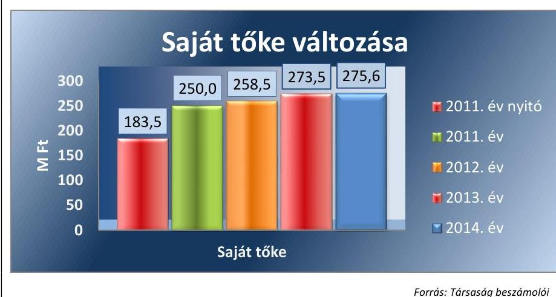

Forrás: Társaság beszámolói
2.3. számú megállapítás

A kötelezettségek állománya nem jelentett kockázatot a közfeladat ellátására, illetve a működésre.

A KÖTELEZETTSÉGEK állománya a 2011. évi 61,9 M Ft-ról a 2014. év végére 19\%-kal, 11,8 M Ft-tal, 50,1 M Ft-ra csökkent, amely csökkenés a Társaság fizetőképességére volt pozitív hatással.

A Társaság hosszú lejáratú kötelezettséggel 2011-2013. évek során nem rendelkezett, a 2014. évben 2,8 M Ft volt, amely a 2014. február 14-én kötött, gépjárművásárlásra vonatkozó pénzügyi lízingszerződésből adódott. A hosszú lejáratú kötelezettség mérlegfőösszeghez viszonyított mértéke $(0,1 \%)$ nem veszélyeztette a Társaság fizetőképességét.

A rövid lejáratú kötelezettségek állománya az ellenőrzött időszakban folyamatosan csökkent, 2011. évről 2014. évre 14,6 M Ft-tal lett kevesebb. A rövid lejáratú kötelezettségek részét képező szállítói tartozások azonban 28,9 M Ft-tal növekedtek, amit a kapcsolt vállalkozással szembeni 33,2 M Ft-os tartozás csökkenés, illetve az egyéb rövidlejáratú kötelezettségek 11 M Ft-os csökkenése ellensúlyozott. A kötelezettségek alakulását a 20112014. években a 2. táblázat mutatja:
2. táblázat

KÖTELEZETTSÉGEK ALAKULÁSA (M FT)

|  | 2011 | 2012 | 2013 | 2014 |
| :-- | :--: | :--: | :--: | :--: |
| Hosszú lejáratú kötelezettségek összesen | 0 | 0 | 0 | 2,8 |
| Ebből Önkormányzati kölcsön | 0 | 0 | 0 | 0 |
| Rövid lejáratú kötelezettségek összesen | 61,9 | 67,7 | 45,6 | 47,3 |
| Ebből rövid lejáratú hitel | 0 | 0 | 0 | 0,7 |
| szállítói kötelezettség | 2,4 | 7,8 | 20,2 | 31,3 |

---

|  | 2011 | 2012 | 2013 | 2014 |
| :-- | :--: | :--: | :--: | :--: |
| rövid lejáratú kötelezettség kap-   csolt vállalkozással szemben | 38,3 | 42,5 | 8,6 | 5,1 |
| rövid lejáratú köt. egyéb rész. visz.   lévő vállalkozással szemben | 0 | 10,0 | 5,1 | 0 |
| egyéb rövid lejáratú kötelezettség | 21,2 | 7,4 | 11,7 | 10,2 |
| Kötelezettségek összesen | 61,9 | 67,7 | 45,6 | 50,1 |

A Társaság a kötelezettségeit alapvetően határidőben teljesítette, a kötelezettségek nem jelentettek kockázatot a hulladékgazdálkodással kapcsolatos közszolgáltatásra, illetve múködésére.

AZ ELADÓSODOTTSÁG mértéke és szerkezete nem jelentett kockázatot a közfeladat ellátására. A mutatók alakulását a 3. táblázat szemlélteti:
3. táblázat

ELADÓSODOTTSÁGI MUTATÓK ALAKULÁSA (ARÁNY)

| Mutató megnevezése | 2011 | 2012 | 2013 | 2014 |
| :-- | :--: | :--: | :--: | :--: |
| Eladósodottsági mutató (idegen tőke/ösz-   szes forrás) | 0,19 | 0,20 | 0,14 | 0,15 |
| Eladósodottság mértéke (kötelezettsé-   gek/saját tőke) | 0,25 | 0,26 | 0,17 | 0,18 |
| Nettó eladósodottság (kötelezettségek-   követelések/saját tőke) | $-0,55$ | $-0,45$ | $-0,54$ | $-0,53$ |
| Adósságfedezeti mutató I. (befektetett   eszközök+forgóeszközök/idegen forrás) | 4,61 | 4,39 | 6,48 | 6,38 |
| Árbevételre vetített eladósodottság (kö-   telezettségek-forgóeszközök/ért. nettó   árbevétele) | $-0,46$ | $-0,48$ | $-0,48$ | $-0,74$ |

A Társaság múködése, a hulladékgazdálkodási közszolgáltatás biztonságos finanszírozási körülmények között valósult meg. Az eladósodottság mértékét, szerkezetét jellemző mutatók az ellenőrzött években többségében javultak, illetve kedvező helyzetet mutattak az ellenőrzött évek viszonylatában az eladósodottság szempontjából.
— az eladósodottsági mutató alacsony értékei az ellenőrzött időszakban kedvező helyzetet mutatott. Ez azt jelentette, hogy a Társaság idegen tőkéje (kötelezettségek) az összes forráshoz képest alacsony volt, a társaságot nem terhelte idegen tőkével kapcsolatos kötelezettség.
—az eladósodottság mértéke azt mutatta, hogy a kötelezettségek a saját tőke egyre kisebb hányadát kötötték le, aminek az idegen tőke alacsony értéke és a folyamatosan növekvő saját tőke volt az oka.
— a nettó eladósodottsági mutató minden évben negatív volt, ami azt mutatta, hogy a követelések a 2011-2014. években fedezték a kötelezettségek értékét. A mutató értéke alapján a kötelezettségeken felüli követelések összege minden évben a saját tőke 50\%-a között mozgott.

---

- az adósságfedezeti mutató azt mutatta, hogy 1 Ft adósságra mennyi vagyon jutott. A mutató változása az ellenőrzött időszakban összességében kedvező emelkedést mutatott, amely alapján a 2014. év végére 1 Ft adósságra 6,5 Ft vagyon jutott, a 2011 évi 5,17 Ft-tal szemben.
- az árbevételre vetített eladósodottsági mutató azt mutatja, hogy az árbevétel mekkora fedezetet nyújt a forgóeszközökkel csökkentett kötelezettségekre. Az ellenőrzött időszak minden évében a mutató negatív értéke jelezte, hogy a forgóeszközök fedezték a kötelezettségeket.
2.4. számú megállapítás

A Társaság a Számv. tv.-ben előírt beszámolási kötelezettségét szabályszerűen teljesítette, azonban a hulladékgazdálkodási közszolgáltatással összefüggő adatszolgáltatási, beszámolási kötelezettségeinek nem tett eleget. A Társaságnál adatvédelmi felelős nem került kijelölésre adatvédelmi, adatbiztonsági szabályzattal nem rendelkezett, közzétételi kötelezettségének nem teljes körűen tett eleget.

A Társaság az Alapító Okirat 16. pontja szerinti éves beszámolási kötelezettségének eleget tett, a Számv. tv. 4. § (1) bekezdés szerinti beszámolóját az előírt tartalommal elkészítette.

AZ ÉVES BESZÁMOLÓK elfogadására összehívott Taggyűlésre a Könyvvizsgálót a Gt. 44. § (1) bekezdése, illetve a Ptk. 3:131. § (2) bekezdése szerint meghívták. A Taggyűlés az éves beszámoló elfogadásáról a 2011-2014. években az Alapító Okirat 16. pontja, a Gt. 141. § (2) bekezdés a) pontja, valamint a Ptk. 3:109. § (1) bekezdésének megfelelően, a Könyvvizsgáló jelenlétében, a Számv. tv. 156. § (1) bekezdése alapján a Könyvvizsgáló kiadott jelentésének és az FB írásos véleményének ismeretében döntött. Osztalék kifizetéséről a Taggyűlés a 2012. évi eredmény alapján, 10 M Ft összegben döntött. A Könyvvizsgáló a 2012. évi beszámoló hitelesítő záradékát - a véleménye korlátozása nélkül - figyelemfelhívással látta el az osztalékfizetéssel összefüggésben.

A Társaság az elfogadott beszámolót a Számv. tv. 153. § (1) bekezdése szerinti határidőben letétbe helyezte és a Számv. tv. 154. § (7) bekezdése szerint közzétette. A 2011-2014. években veszteség rendezését indokoló esemény nem történt, a Társaság saját tőkéje két egymást követő lezárt évben nem csökkent a jegyzett tőkének a Gt. 51. § (1) bekezdésében, illetve a Ptk. 3:189. § (1) bekezdésében meghatározott szintje alá.

A hulladékgazdálkodási közszolgáltatással összefüggő adatszolgáltatási kötelezettségeinek a Társaság a 2011-2014. években nem tett eleget. A Társaság a 2011-2012. években a Hgt. 29. § (1) bekezdésében előírt, részletes, hulladékgazdálkodási kötelező közszolgáltatói tevékenységével kapcsolatos költségelszámolást nem készített, azt az Önkormányzat felé nem nyújtotta be.

A Ht. 50. § (3) bekezdéseivel ellentétben az éves beszámoló kiegészítő melléklete a 2013. évben nem tartalmazta a hulladékgazdálkodási közszolgáltatással kapcsolatos önálló mérleget és eredmény kimutatást, ami ellentétes a Számv. tv. 88. § (1) bekezdésében előírtakkal is, mivel a közfeladat és az ágazati sajátosságokról nem adott valós képet. A Társaság a Ht.

---

50. § (4) bekezdésének előírása ellenére a 2013. évre vonatkozó auditált éves beszámolót, a Könyvvizsgálói jelentést nem küldte meg a Hivatalnak ${ }^{40}$.

A KÖNYVVIZSGÁLÓ megbízásának időtartamát, adatait, feladatát, jogait és kötelességeit az Alapító Okirat 19.1.-19.7. pontjai, illetve a Könyvvizsgálóval kötött megbízási szerződés tartalmazta. A megbízási szerződés 2. 6/d pontja alapján a Könyvvizsgáló ellenőrzi a Társaság belső szabályozottságát és jelzi, ha az nem kielégítő. A Könyvvizsgáló a könyvvizsgálatot minden évre vonatkozóan elvégezte, és a Társaság 2011., 2013-2014. évi beszámolóit minden évben a Számv. tv. 158. § (1) bekezdése szerint hitelesítő záradékkal látta el.

A Könyvvizsgáló az éves beszámolók könyvvizsgálatáról készített jelentéseiben minden évben kiadta a hitelesítő záradékot annak ellenére, hogy a Társaság nem rendelkezett a Számv. tv. 161. § (1) bekezdése által előírt számlarenddel, továbbá a Számv. tv. 161/A. § alapján nem szabályozta a Hgt. 29. § (3) bekezdésében és Ht. 50. § (2) bekezdésében meghatározott hulladékgazdálkodási közszolgáltatással kapcsolatos szétválasztást, és a Ht. 50. § (3) bekezdésében foglaltakban előírtak ellenére a 2013. évi beszámolójának kiegészítő mellékletében nem mutatta be a közszolgáltatói tevékenységéről szóló önálló mérleget és eredménykimutatást.

AZ ADATOK VÉDELME az ellenőrzött időszakban nem volt biztosított, mivel a Társaság nem rendelkezett az Info tv. 24. § (2) d) pontjában előírt adatvédelmi és adatbiztonsági szabályzattal. A Társaságnál az Info tv. 24. § (1) c) pontjában előírtak ellenére belső adatvédelmi felelős nem volt. A Társaság a közérdekú adatok megismerésére irányuló igények teljesítésének rendjére szabályzatot a 2011. évben az Avtv. ${ }^{41} 20$. § (8) bekezdése, illetve 2012. január 1-jétől az Info tv. ${ }^{42} 30$. § (6) bekezdése alapján a 2012-2014. években nem készített. Az Eisztv. 3. § (2), az Info. tv. 33. § (3) és 37. § (1) bekezdéseiben előírt közzétételi kötelezettséget nem teljes körűen teljesítette, mivel az Eisztv. melléklet III. pontjában és az Info. tv. 1. mellékletének III. pontjában foglalt gazdálkodási adatok közül a Számv. tv. szerinti 2011-2014. évi beszámolóit a Társaság a honlapján (http://eszkozkft.hu) nem tette közzé.

---

# 3. A gazdasági társaságnál az ellátott közfeladat bevételei és ráfordításai elszámolása, valamint az önköltségszámítás és árképzés szabályszerű volt-e? 

Összegző megállapítás
3.1. számú megállapítás
4. táblázat

## ÉRTÉKESÍTÉS NETTÓ ÁRBEVÉTELE (M FT)

| 60 |  |
| :--: | :--: |
| 2011. | 384,3 |
| 2012. | 364,1 |
| 2013. | 359,5 |
| 2014. | 267,0 |

Forrás: A Társaság 2011-2014. évi beszámolói

A Társaságnál a beruházások elszámolása megfelelő volt, a bevételeinek és ráfordításainak elszámolása nem volt megfelelő. A behajtással kapcsolatban a 2011. évet kivéve szabályszerűen jártak el. Az árképzés a hulladékgazdálkodás közszolgáltatással kapcsolatos szétválasztás hiánya miatt nem volt szabályszerű, a Rezsi tv.-ben előírtakat végrehajtották.

A Társaságnál a beruházások elszámolása megfelelő volt, az értékesítés nettó árbevételének és anyagjellegú ráfordításainak elszámolása a közszolgáltatási tevékenység szétválasztásának hiánya és a bevételek hibás könyvelése miatt nem volt megfelelő. A hátralékos követelések behajtásáról a 2011. évet kivéve a jogszabályoknak megfelelően a gyakorlatban gondoskodott a Társaság.

A Társaság által ellátott közfeladathoz kapcsolódó beruházások, felújítások elszámolása megfelelő volt, az értékesítés nettó árbevételének és anyagjellegú ráfordításainak elszámolása nem volt megfelelő.

AZ ÉRTÉKESÍTÉS NETTÓ ÁRBEVÉTELÉNEK az elszámolása nem volt megfelelő, mivel azokat több esetben nem a Számlakeret szerinti megfelelő főkönyvi számlára számolta el a Társaság. A szabályozás hiányossága mellett a főkönyvi számok által előírt gyakorlat sem biztosította a közszolgáltatás bevételeinek elkülönítését.

Az értékesítés nettó árbevétele többségében a hulladékgazdálkodási tevékenységből származott. 2011. évről 2013. év végére az értékesítés nettó árbevétele 6,5 \%-kal csökkent (24,8 M Ft). 2014. január 27-től a Társaság már alvállalkozóként végezte hulladékgazdálkodási feladatát, aminek következtében a 2014. évben az értékesítés nettó árbevétele is lecsökkent az előző évihez képest 92,5 M Ft-tal (25,7\%-kal). Az értékesítés nettó árbevétele alakulását a 4. táblázat mutatja.

AZ ANYAGJELLEGŰ RÁFORDÍTÁSOK elszámolása során költségelszámolást megalapozó dokumentumok-szerződés, megrendelés - és az Áfa tv. ${ }^{43}$ 169. §-ának megfelelően kiállított számlák rendelkezésre álltak, a kapcsolódó pénzügyi teljesítés a szerződés szerinti összegben történt. A ráfordítások elszámolása azonban nem volt megfelelő, mivel azokkal kapcsolatban a Társaság nem gondoskodott a Hgt. 29. § (3) bekezdésében és a Ht. 50. § (2) bekezdésében, illetve a 64/2008. (III.28.) Korm. rendelet 5. §-ban meghatározott hulladékgazdálkodás közszolgáltatás egyéb tevékenységétől való elkülönítéséről.

A BERUHÁZÁSOK, FELÚJÍTÁSOK során a költségelszámolást megalapozó dokumentumok - a szerződés, a megrendelés - és az Áfa tv. 169. §-ának megfelelően kiállított számlák rendelkezésre álltak, a pénzügyi teljesítés a szerződés szerinti összegben történt. Az állományba vétel,

---

a besorolás, a bekerülési érték meghatározása során a Számv. tv. 47. §-a és a Számviteli politika előírásait szabályszerűen alkalmazták. Az üzembe helyezést a Számv. tv. 52. § (2) bekezdése szerint hitelt érdemlően dokumentálták. A beszerzett eszközök a tárgyévi leltárban megtalálhatóak voltak.

Az értékcsökkenés elszámolása a Számv. tv. 52. § szerint és a Számviteli politikában meghatározott módszerek és kulcsok alkalmazásával, megfelelően történt. A 100 ezer Ft egyedi beszerzési érték alatti eszközöket használatbavételkor egy összegben értékcsökkenési leírásként számolták el a Számv. tv. 80. § (2) bekezdése és a Számviteli politika előírása alapján. Az értékcsökkenési leírás módszere, az elszámolásának gyakorisága az ellenőrzött időszakban nem változott.

A KÖVETELÉS ÁLLOMÁNY az ellenőrzött időszakban az eszközérték több mint 50\%-át képviselte. A 2011. évi nyitó érték a 2014. év végére 19,1\%-kal, 31,4 M Ft-tal nőtt. A követelés állomány főbb tételei az Önkormányzattal szembeni adósságrendezési eljárás során bejelentett hitelezői igény (54,6 M Ft tőke és annak kamatai), és a vevőkkel szembeni követelések voltak. A vevőkkel szembeni követelések értéke az árbevételhez viszonyítva a 2011. évi 34,9\%-ról a 2014. évre 52\%-ra emelkedett. A 2011. évi dijkövetelés 133,4 M Ft, a 2014. évi 138,8 M Ft volt. A követelés állomány és azon belül a vevőkövetelések változását az 5. ábra szemlélteti.
5. ábra
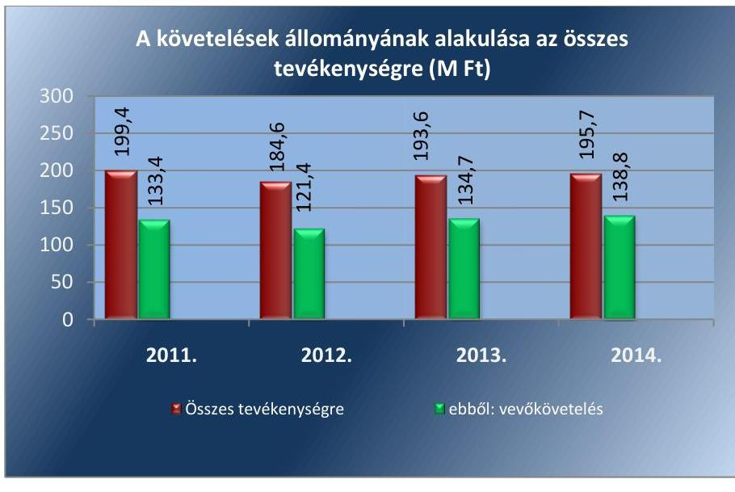

Forrás: A Társaság 2012-2014. évi beszámolói

# A HÁTRALÉKOS KÖVETELÉSÁLLOMÁNY KEZELÉ- 

SÉT, a követelések behajtását külön nem szabályozta a Társaság. A gyakorlatban vezetett analitikus nyilvántartás alkalmas volt a hátralékos dijbevételek állományának kimutatására. A Társaság a gyakorlatban a dijhátralék beszedésével kapcsolatban normál felszólító levelek, ajánlott és tértivevényes felszólítások formájában kereste meg a hátralékosokat. A Társaság 2011. évben a lejárt követelések behajtása céljából azonban a Hgt. 26. § (3) bekezdésében előírtak ellenére az Önkormányzat Jegyzőjét nem kereste meg. A 2012. évben a dijhátralék befizetésének elmaradását, a felszólítás eredménytelenségét követő 90. napot követően - a felszólítás

---

megtörténtének igazolása mellett - a díjhátralék adók módjára történő behajtása céljából a Társaság a Hgt. 26. § (3) bekezdésének megfelelően a behajtást a Jegyzőnél kezdeményezte. A 2013-2014. években a Társaság a Ht. 52. § (2)-(3) bekezdései szerint a díjhátralék befizetésére történő felszólítás eredménytelensége miatt, a díjhátralék adók módjára történő behajtását a NAV ${ }^{44}$-nál kezdeményezte.

Az Önkormányzat 2012. évben mindösszesen 86,5 M Ft értékű követelés behajtását kezdeményezte, és a négy év alatt mindösszesen 34,7 M Ft összeg folyt be, ami az ellenőrzött négy évre vetítve a 40,1\%-ban volt sikeres, éves átlagban 10\%-os volt a sikeres behajtások aránya. A NAV által 2013-2014. években kezdeményezett 45,7 M Ft-ból mindösszesen 24,7 M Ft folyt be, ami alapján a sikeres behajtások aránya 54\% volt, ami éves átlagban 27\%-os sikeres behajtást jelent. Ez alapján a 2013-tól bevezetett, behajtással kapcsolatos változásokat magában foglaló Ht. 52. § (3) bekezdése, a Társaság hátralékos vevőköveteléseinek sikeres behajtásában pozitív tendenciát eredményezett.

Az ellenőrzött időszakban tett intézkedések számát, az Önkormányzat Jegyzőjének, illetve a NAV részére átadott behajtásra felszólító levelek számát és összegét a 5. táblázat mutatja.
5. táblázat

| A DÍJBEHAJTÁSRA TETT INTÉZKEDÉSEK A 2011-2014. ÉVEKBEN (DB, M FT) |  |  |  |  |  |
| :--: | :--: | :--: | :--: | :--: | :--: |
|  | 2011 | 2012 | 2013 | 2014 | Összesen |
| Felszólító levél (db) | 4778 | 1731 | 1582 | 3910 | 12001 |
| Önkormányzatnak behajtásra átadott (db) | 0 | 1407 | - | - | 1407 |
| Önkormányzatnak behajtásra átadott (M Ft) | 0 | 86,5 | - | - | 86,5 |
| Önkormányzatnak behajtásra átadottból befolyt | 2,9 | 5,1 | 4,9 | 21,8 | 34,7 |
| NAV-nak behajtásra átadott (db) | - | - | 837 | 732 | 1569 |
| NAV-nak behajtásra átadott (M Ft) | - | - | 27,2 | 18,5 | 45,7 |
| NAV-nak behajtásra átadottból befolyt (M Ft) | - | - | 12,4 | 12,3 | 24,7 |

A Társaság a Számv. tv. 55. § (1)-(2) bekezdéseiben és a Számviteli politikájában előírtaknak megfelelően a kisösszegű követelések után értékvesztést számolt el.

### 3.2. számú megállapítás

A Társaság árképzése a hulladékgazdálkodás közszolgáltatással kapcsolatos szétválasztás hiánya miatt nem volt szabályszerű, a díjmegállapítás során a Rezsi tv.-ben előírtakat végrehajtották.

A közszolgáltatási díjat a Társaság a 2011-2014. években a 64/2008. (III. 28.) Korm. rendelet 1. § és a 2. § (1)-(2) bekezdései alapján a települési szilárd hulladékra, külön-külön és legalább egyéves időszakra határozta meg. A közszolgáltatási díj számítására szolgáló kalkulációs sémát a Hulladékrendelet 2. számú mellékletében a 64/2008. (III. 28.) Korm. rendelet 2. § (3) bekezdése alapján közzétették.

AZ ÁRKÉPZÉSRE, DÍJMEGÁLLAPÍTÁSRA a Társaság a Hulladékrendelet 2. számú mellékletében közzétett kalkulációs sémát alkalmazta és az ellenőrzött időszakban a közszolgáltatás közvetlen költségeivel, valamint az árbevétel arányosan felosztott közvetett költségekkel kalkulált. Az hulladékgazdálkodás közszolgáltatás Hgt. 29. § (3) és a Ht. 50.

---

§ (2) bekezdésben foglalt elkülönítés hiányában azonban a Társaság díjmegállapítása nem volt szabályszerű, illetve megalapozott. A Társaság alkalmazott díjmegállapítása nem felelt meg továbbá a 64/2008. (III. 28.) Korm. rendelet 5. §-nak, mely szerint a közszolgáltatási díj meghatározásához és a díjkalkuláció elkészítéséhez, a közszolgáltatással kapcsolatos költségek szigorú elkülönítése szükséges. A 64/2008. (III. 28.) Korm. rendelet 3. §-ban foglaltakkal ellentétben az elkülönítés hiánya miatt nem volt megállapítható, hogy a hulladékszállítás bevételei fedezetet nyújtottak-e a múködéshez szükséges folyamatos költségekre és ráfordításokra, valamint a közszolgáltatás fejleszthető fenntartásához szükséges kiadásokra, az díjkalkulációban alkalmazott adatok megfelelő szabályozás hiányában nem voltak megalapozottak, nem volt biztosított az elszámoltathatóság.

A Társaság 2013. január 1-jétől a Ht. 91. § (1)-(3) bekezdései szerinti, a közszolgáltatási díj legmagasabb mértékének a 2012. december 31-ei bruttó díjhoz képest 4,2\%-kal való emelése lehetőségével nem élt. Az alkalmazott közszolgáltatási díj mértékét a Rezsi tv. ${ }^{45}$ 12. § módosította. Ennek megfelelően a Társaság a Ht. 91. § (1)-(2) bekezdéseiben előírt, 2013. július 1-jétől hatályos rezsidíj csökkentő intézkedéseket végrehajtotta, az alkalmazott lakossági díjakat a 2012. április 14-ei díj összegének 90\%-ában állapította meg.

A Társaság a rezsicsökkentéssel összefüggésben költségcsökkentő, takarékossági intézkedéseket tett, a gazdaságos múködés érdekében a tevékenységet folyamatosan felülvizsgálták.

A hulladékkezelési közszolgáltatás díjainak változását a 2011-2014. években a 6. táblázat mutatja.
6. táblázat

# A HULLADÉKKEZELÉS KÖZSZOLGÁLTATÁSI DÍJAINAK VÁLTOZÁSA AZ ELLENŐRZÖTT IDŐSZAKBAN 

| idöszak | lakossági | közületi |
| :-- | :--: | :--: |
| 2011.01.01-2012.03.31 | $968 \mathrm{Ft}+\mathrm{Áfa}{ }^{46} / \mathrm{fő} / \mathrm{hó}$ | $3,4 \mathrm{Ft}+\mathrm{Áfa} /$ liter |
| 2012.04.01-2013.06.30. | $5,7 \mathrm{Ft}+\mathrm{Áfa} /$ liter | $5,7 \mathrm{Ft}+\mathrm{Áfa} /$ liter |
| 2013.07.01-től | $5,13 \mathrm{Ft}+\mathrm{Áfa} /$ liter | $5,7 \mathrm{Ft}+\mathrm{Áfa} /$ liter |

Fonrás: Hulladékrendelet 2. számú melléklete

---

# JAVASLATOK 

Az ÁSZ tv. 33. § (1) bekezdésében foglaltak értelmében az ellenőrzött szervezet vezetője köteles a jelentésben foglalt megállapításokhoz kapcsolódó intézkedési tervet összeállítani és azt a jelentés kézhezvételétől számított 30 napon belül az ÁSZ részére megküldeni. Amennyiben az ellenőrzött szervezet vezetője nem küldi meg határidőben az intézkedési tervet, vagy továbbra sem elfogadható intézkedési tervet küld, az Állami Számvevőszék elnöke az ÁSZ tv. 33. § (3) bekezdése a) és b) pontjaiban foglaltakat érvényesítheti.
Javaslataink célja az Esztergomi Köztisztasági Szolgáltató Kft. gazdálkodása szabályozottságának erősítése annak érdekében, hogy a szabályozási környezet és a gazdálkodási gyakorlat megfelelően tudja támogatni az átlátható múködést.

## Az Esztergomi Köztisztasági Szolgáltató Kft. ügyvezetőjének

1. Intézkedjen az FB ügyrendjének jóváhagyásra történő előterjesztéséről a Társaság taggyülésére.
(1.2. megállapítás 5. bekezdés alapján)
2. Intézkedjen arra vonatkozóan, hogy a Társaság taggyülése fogadjon el a Társaság vezető tisztségviselőire és munkavállalóira, valamint az FB tagjaira vonatkozó Javadalmazási szabályzatot.
(1.2. megállapítás 7. bekezdés alapján)
3. Intézkedjen a Pénzkezelési szabályzatnak a készpénzállomány ellenőrzésekor követendő eljárásra, az ellenőrzés gyakoriságára és a pénzkezelés felelősségi szabályaira vonatkozó kiegészítéséről.
(2.1. megállapítás 8. bekezdés alapján)
4. Intézkedjen a Társaság Számlarendjének elkészítéséről.
(2.1. megállapítás 10. bekezdés alapján)
5. Intézkedjen az Adatvédelmi és adatbiztonsági szabályzatnak és a Közérdekü adatok megismerésére irányuló igények teljesitésének rendjére vonatkozó szabályzat elkészitéséről.
(2.4. megállapítás 8. bekezdés alapján)

---

6. Gondoskodjon az Info tv. szerinti közzétételi kötelezettség teljes körü teljesitéséről, az éves beszámolónak a Társaság honlapján történő megjelentetéséről.
(2.4. megállapítás 8. bekezdés alapján)

Javaslataink célja az Önkormányzat szabályszerű működésének elősegítése, továbbá az önkormányzati tulajdonosi joggyakorlás kontrolljainak erősítése.

# Az Esztergom Város Önkormányzata jegyzőjének 

1. Forditson kiemelt figyelmet arra, hogy az Önkormányzat belső ellenőrzése által végzett ellenőrzések terjedjenek ki a Társaság tevékenységére.
(1.2. megállapítás 4. bekezdés alapján)

---

# MELLÉKLETEK 

- I. SZ. MELLÉKLET: ÉRTELMEZŐ SZÓTÁR
eladósodottságot jellemző mutatók
garancia
gazdasági társaság
gazdálkodó szervezet
keresztfinanszírozás tilalma
eladósodottsági mutató (tőkeáttétel): idegen tőke/összes forrás. Egészségesnek mondható egy olyan mértékű áttétel, amelyet az üzleti tervek szerint és az elmúlt időszak tapasztalatai alapján a társaság megfelelő biztonsággal ki tud termelni. Nagy eszközberuházás-igényű iparágakban értéke magasabb, azaz magasabb eladósodottság is elfogadható, de 75-85\%-ot meghaladó értéknél már itt is erős, sőt túlzott külső finanszírozottságról beszélhetünk. Általánosságban véve kedvező, ha értéke kisebb, mint 0,6 .
eladósodottság mértéke: kötelezettségek / saját tőke. Fontos szerepet játszik ez a mutató egy vállalat megítélésében. Azt mutatja, hogy a saját források a kötelezettségek hány százalékát fedezik. Törekedni kell, hogy a mutató tartósan (jelentősen) 1 alatti értéket érjen el.
nettó eladósodottság: (kötelezettségek-követelések) / saját tőke. Azt mutatja, hogy a kintlévőségekkel csökkentett kötelezettségeket milyen mértékben fedezi a saját forrás. Ez feltételezi, hogy a követelések pénzügyileg előbb realizálódnak, mint ahogy a kötelezettségeket teljesíteni kell. A mutató minél kisebb, csökkenő értéke a kedvező.
adósságfedezeti mutató I.: (befektetett eszközök+forgó eszközök) / idegen forrás. Azt mutatja, hogy 1 Ft adósságra hány Ft vagyon jut. Általánosságban véve kedvező, ha értéke 2 körül van, de nagy eszközberuházás-igényű iparágakban értéke kisebb is lehet.
árbevételre vetített eladósodottság: (kötelezettségek-forgóeszközök) / értékesítés nettó árbevétele. Az árbevételre vetített eladósodottság azt mutatja, hogy az árbevétel mekkora fedezetet nyújt a kötelezettségeknek a forgóeszközökkel csökkentett részére. Általánosságban véve kedvező, ha az árbevétel minél nagyobb arányban nyújt fedezetet a forgóeszközökkel csökkentett kötelezettségekre (értéke kisebb, mint 1, csökken az ellenőrzött időszakban).
A garancia olyan önálló, az önkormányzat nevében vállalt kötelezettség, amely alapján az önkormányzat az önkormányzati költségvetés terhére szerződésben meghatározott feltételek szerint, a kötelezett nem teljesítése esetén a jogosultnak fizetést teljesít az előzetesen rögzített összeghatárig.
Ptk. 3.88. § (1) bekezdése szerint „a gazdasági társaságok üzletszerű közös gazdasági tevékenység folytatására, a tagok vagyoni hozzájárulásával létrehozott, jogi személyiséggel rendelkező vállalkozások, amelyekben a tagok a nyereségből közösen részesednek, és a veszteséget közösen viselik".
A Ptk. 685. § c) pontja szerint gazdálkodó szervezet:
„az állami vállalat, az egyéb állami gazdálkodó szerv, a szövetkezet, a lakásszövetkezet, az európai szövetkezet, a gazdasági társaság, az európai részvénytársaság, az egyesülés, az európai gazdasági egyesülés, az európai területi együttmúködési csoportosulás, az egyes jogi személyek vállalata, a leányvállalat, a vízgazdálkodási társulat, az erdő birtokossági társulat, a végrehajtói iroda, az egyéni cég, továbbá az egyéni vállalkozó." (2014. 03.15-ig hatályos)
A közszolgáltatás diját úgy kell megállapítani, hogy az maradéktalanul fedezetet nyújtson a közszolgáltatás indokolt költségeire és ráfordításaira, valamint a közszolgáltató e tevékenységével kapcsolatos ésszerű nyereségére; az ésszerű nyereség nem tartalmazhatja a közszolgáltatáson kívül eső egyéb gazdasági tevékenységei költségeinek, ráfordításainak fedezetét.

---

kezesség

közszolgáltatás
közszolgáltató
közületi felhasználó
lakossági felhasználó
nemzeti vagyon

A kezességre vonatkozó előírásokat a Ptk. 6:416-430. §-ai tartalmazzák. Kezességi szerződéssel a kezes kötelezettséget vállal a jogosulttal szemben, hogyha a kötelezett nem teljesít, maga fog helyette a jogosultnak teljesíteni. Kezesség egy vagy több, fennálló vagy jövőbeli, feltétlen vagy feltételes, meghatározott vagy meghatározható összegű pénzkövetelés vagy pénzben kifejezhető értékkel rendelkező egyéb kötelezettség biztosítására vállalható.
A Ptk. szerint kezességet csak írásban lehet vállalni. A kezes kötelezettsége ahhoz a kötelezettséghez igazodik, amelyért kezességet vállalt. A kezes kötelezettsége nem válhat terhesebbé, mint amilyen elvállalásakor volt, kiterjed azonban a kötelezett szerződésszegésének jogkövetkezményeire és a kezesség elvállalása után esedékessé váló mellékkövetelésekre is.
A közszolgáltatás: „közcélú, illetőleg közérdekű szolgáltatást jelent, amely egy nagyobb közösség (állam, település) minden tagjára nézve megközelítőleg azonos feltételek mellett vehető igénybe, ezért valamilyen mértékig közösségi megszervezést, illetve szabályozást, ellenőrzést igényel." Az Ebktv. 3. § d) pontja a következőképpen határozza meg a közszolgáltatást: „szerződéskötési kötelezettség alapján a lakosság alapvető szükségleteinek ellátására irányuló szolgáltatás, így különösen a villamos energia-, gáz-, hő-, víz-, szennyvíz- és hulladékkezelési, köztisztasági, postai és távközlési szolgáltatás, továbbá a menetrend alapján közlekedő járművekkel végzett közforgalmú személyszállítás".
A közszolgáltatás ellátására feljogosított hulladékkezelő (Forrás: a 2011-2012. években a Hgt. 21. § (3) bekezdés a) pontja)
Az a hulladékgazdálkodási közszolgáltatási engedéllyel rendelkező és a Ht. szerint minősített gazdálkodó szervezet, amely a települési önkormányzattal kötött hulladékgazdálkodási közszolgáltatási szerződés alapján hulladékgazdálkodási közszolgáltatást lát el. (Forrás: a 2013-2014. években a Ht. 2. § (1) bekezdés 37. pontja).
Az a jogi személy, illetőleg jogi személyiséggel nem rendelkező gazdasági társaság, aki (amely) a meghatározott szolgáltatásra, és/vagy a keletkező hulladék elszállítására közüzemi szerződést kötött a közszolgáltatóval.
Az a természetes személy, aki az Önkormányzat közigazgatási, vagy ellátási területén ingatlannal rendelkezik, és aki a közszolgáltatóval a hulladékelszállítására szerződést kötött.
Nvt. 1. § (2) bekezdése szerint:
„az állam vagy a helyi önkormányzat kizárólagos tulajdonában álló dolgok, az a) pont hatálya alá nem tartozó, állam vagy a helyi önkormányzat tulajdonában lévő dolog,
az állam vagy a helyi önkormányzatot tulajdonában lévő pénzügyi eszközök, továbbá az államot vagy a helyi önkormányzatot megillető társasági részesedések,
az államot vagy a helyi önkormányzatot megillető bármely vagyoni értékkel rendelkező jogosultság, amelyet jogszabály vagyoni értékű jogként nevesít,
Magyarország határa által körbezárt terület feletti légtér,
az üvegházhatású gázok kibocsátási egységeinek kereskedelméről szóló törvény szerint kibocsátási egység és légiközlekedési kibocsátási egység, valamint az ENSZ Éghajlat változási Keretegyezménye és annak Kiotói Jegyzőkönyve végrehajtási keretrendszeréről szóló törvény szerinti kiotói egység,
állami vagy helyi önkormányzati fenntartású közgyűjtemény (muzeális intézmény, levéltár, közgyűjteményként működő kép- és hangarchívum, valamint könyvtár) saját gyűjteményében nyilvántartott kulturális javak körébe tartozó dolog,
a régészeti lelet,

---

a nemzeti adatvagyon körébe tartozó állami nyilvántartások fokozottabb védelméről szóló törvény szerinti nemzeti adatvagyon." (hatályos 2012. január 1-jétől, g) pont módosult 2012. június 30-tól)
nonprofit gazdasági társaság Ctv. 9/F. § (2) bekezdése szerint „az a gazdasági társaság minősül nonprofit gazdasági társaságnak és cégnevében az a gazdasági társaság tüntetheti fel a nonprofit jelleget, amelynek létesítő okirata tartalmazza, hogy a gazdasági társaság tevékenységéből származó nyereség a tagok között nem osztható fel, hanem az a gazdasági társaság vagyonát gyarapítja." (hatályos 2014. március 15-től)
többségi befolyást biztosító részesedés

A Ptk. 8:2. § (1) bekezdése szerint „többségi befolyás az olyan kapcsolat, amelynek révén természetes személy vagy jogi személy (befolyással rendelkező) egy jogi személyben a szavazatok több mint felével vagy meghatározó befolyással rendelkezik."

---

II. SZ. MELLÉKLET: A MŰKÖDÉS FŐBB JELLEMZŐI

| A TÁRSASÁG MŰKÖDÉSÉNEK FŐBB JELLEMZŐI |  |  |  |  |  |  |
| :--: | :--: | :--: | :--: | :--: | :--: | :--: |
| Sorszám | Megnevezés |  | 2011. | 2012. | 2013. | 2014. |
|  | A gazdasági társaság tulajdonosi összetétele: |  |  |  |  |  |
| 1. | Tulajdonos Önkormányzat megnevezése: |  | Esztergom Város Önkormányzata |  |  |  |
| 2. | Önkormányzat tulajdoni részesedésének aránya | $\%$ | 51,0 |  |  |  |
| 3. | Önkormányzat tulajdoni részesedésének öszszege | MFt | 35,7 |  |  |  |
| 4. | A tárgyévben a gazdasági társaság vagyonkezelésben lévő önkormányzati vagyon után elszámolt értékcsökkenés összege | MFt | Nem kezelt Önkormányzati vagyont |  |  |  |
| 5. | A tárgyévben a gazdasági társaság saját vagyona után elszámolt értékcsökkenés összege teljes tevékenység | MFt | 10,6 | 9,5 | 10,5 | 15,4 |
| 6. | Értékesítés nettó árbevétele teljes tevékenység | MFt | 384,3 | 364,1 | 359,5 | 267,0 |
| 7. | ebből: Hulladékgazdálkodás | MFt | 383,6 | 363,3 | 358,7 | 265,7 |
| 8. | Adózott eredmény teljes tevékenység | MFt | 66,5 | 18,4 | 15,0 | 2,1 |

---

# FÜGGELÉK: ÉSZREVÉTELEK 

A jelentéstervezetet a Számvevőszék 15 napos észrevételezésre megküldte az ellenőrzött szervezet vezetőjének az ÁSZ tv. 29. §* (1) bekezdése előírásának megfelelően.
Esztergom Város Önkormányzata az észrevételezés lehetőségével nem élt. Az Esztergomi Köztisztasági Szolgáltató Kft. ügyvezetőjétől érkezett észrevételeket és az azok kezelését tartalmazó válaszlevelet a függelék tartalmazza.

[^0]
[^0]:    * 29. § (1) Az Állami Számvevőszék az ellenőrzési megállapításait megküldi az ellenőrzött szervezet vezetőjének vagy az általa megbízott személynek, és annak, akinek személyes felelősségét állapította meg.
    (2) Az ellenőrzött szervezet vezetője és a felelősként megjelölt személy az ellenőrzés megállapításaira tizenöt napon belül írásban észrevételt tehet.
    (3) Az Állami Számvevőszék az észrevételre a beérkezésétől számított harminc napon belül írásban válaszol. A figyelembe nem vett észrevételeket köteles a jelentésben feltüntetni, és megindokolni, hogy azokat miért nem fogadta el.

---

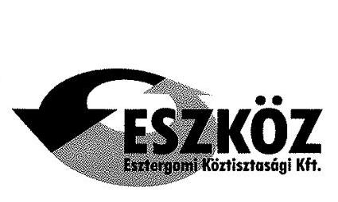

Tárgy: észrevétel
Ikt. sz.: K41/16
Ügyintéző: Jamriska Tímea
Mobil: 06-70/602-2994

Állami Számvevőszék
Domokos László
Elnök részére
1364 Budapest 4.
Pf. 54.

Tisztelt Elnök Úr!
„Az önkormányzatok gazdasági társaságai - Az önkormányzatok többségi tulajdonában lévő gazdasági társaságok közfeladat ellátását érintő gazdálkodási tevékenysége szabályszerűségének ellenőrzése - Esztergomi Köztisztasági Szolgáltató Kft." címmel készített számvevőszéki jelentéstervezetet 2016. május 24 -én köszönettel megkaptuk.
A jelentéstervezet észrevételezésére 15 nap áll rendelkezésünkre.
Ezúton megküldjük a megállapításokra tett észrevételeinket, valamint az ellenőrzést követően a tárgyban megtett intézkedéseinket.

# 2.1. számú megállapítás 

A társaság a Számlarend kivételével rendelkezett a müködéshez szükséges szabályzatokkal, azok - a Pénzkezelési szabályzat kisebb hiányossága mellett - a jogszabályi és tulajdonosi elöírásoknak összességében megfeleltek, azonban a hulladékgazdálkodás közszolgáltatói tevékenység elkülönitését nem szabályozta.

A társaság számlarendje elkészült, a pénzkezelési szabályzatot 2016.01.01-i hatállyal módosítottuk e tekintetben.
Társaságunk 2014. január 1-től a HT 2. § (1) 37. pontja és a HT. 90. § (11) bekezdése szerint már nem közszolgáltató, közszolgáltatás kereteibe tartozó bevételel pedig 2014. január 28 -tól nem rendelkezik
2013. évtől a Ht. $50 \S$-a rendelkezik, arról, hogy a közszolgáltató az éves beszámoló kiegészítő mellékletében a hulladékgazdálkodási közszolgáltatási tevékenységét oly módon mutassa be (amennyiben a közszolgáltatáson kívül más tevékenységet is végez), mintha azt önálló vállalkozás keretében végezte volna. A Ht. értelmező rendelkezéseinek 2 § (7) bekezdése szerint a Ht-ben nem szabályozott fogalmak tekintetében többek között a számvitelről szóló törvényt kell alkalmazni.
A számviteli törvény 8. § (1) bekezdése szabályozza a beszámoló formáját. A (2) bekezdés szerint a beszámoló lehet: a.) éves beszámoló, b.) egyszerüsített éves beszámoló, stb. A számviteli törvény a további paragrafusokban következetesen alkalmazza gyűjtő fogalomként a „beszámoló" szót. Az egyszerűsített éves beszámolót készítőkre a számviteli törvény is egyszerűsítéseket alkalmaz, a Ht. előírásaival is az lehetett a jogalkotó célja, hogy a kisebb társaságoknak egyszerübb szabályokat állapítsanak meg, ezért a szétválasztási szabályokat csak az éves beszámoló készítésére kötelezett társaságoknak írta elő. A Ht. 88. § (1) bekezdésének 25. pontja (később hatályos állapotában a 24. pontja) felhatalmazza a Kormányt, hogy a számviteli szétválasztásra vonatkozó részletes szabályokat szabályozza. A számviteli szétválasztásra vonatkozó kormányrendelet a Ht. hatályba lépése óta nem jelent meg, így a fentiektől esetlegesen eltérő értelmezés sem.

---

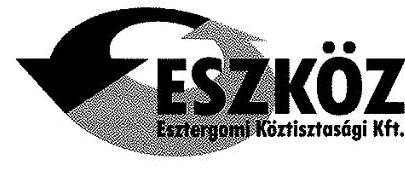

Esztergomi Köztisztasági Szolgáltató Kft.
Cégjegyzékszám: 11-09-009359
Adószám: 13051570-2-11
Székhely: 2500 Esztergom, Széchenyi tér 1.
Iroda: 2500 Esztergom, Póór Antal tér 1.
Tel: 33/ 313-084; Fax:33/313-848
Web: www.eszkcahft.hu
Levelezési cím: 2501 Esztergom, Pf. 72

A törvényi hivatkozások alapján véleményünk és jogértelmezésünk szerint az egyszerűsített éves beszámolót készítőknek nem kell alkalmazniuk a Ht. 50. §-a szerinti szabályokat, így azokat szabályozniuk sem kell.

Társaságunk a vizsgált időszakban egyszerűsített éves beszámolót készített, ezért a leírtak szerint a szétválasztási szabályokat nem kellett szabályoznia, és a kiegészítő mellékletben sem kellett bemutatnia.

A Ht 50. §-a szerint a közszolgáltatónak kell a szétválasztási szabályokat alkalmaznia és a kiegészítő mellékletben bemutatnia. 2014. január 1-től közszolgáltató a Ht. 2. § (1) 37. pontja szerint csak nonprofit gazdasági társaság lehet (további feltétel, hogy hulladékgazdálkodási közszolgáltatási engedéllyel is rendelkezzen és a települési önkormányzattal kössön közszolgáltatási szerződést).

A Ht 90.§ (11) bekezdése szerint a 2. § (1) bekezdés 37. pontja szerinti közszolgáltatón kívül 2013. december 31-ig közszolgáltatónak kell tekinteni azt a hulladékgazdálkodási közszolgáltatást ellátó gazdálkodó szervezetet is, amely 2012. december 31-én hulladékgazdálkodási közszolgáltatást látott el, és azóta e tevékenységét folyamatosan végzi.
A Ht. 90. § (11) bekezdése szerinti átmeneti rendelkezés a közszolgáltató fogalmára 2013.12.31-ig volt érvényes.

Társaságunk. 2014. január 1-től a Ht. fogalma szerint nem minősül közszolgáltatónak, mert nem nonprofit gazdasági társaság. A Ht 50. §-a csak a közszolgáltatónak írja elő a szétválasztás szabályozását, ezért 2014. évben e jogszabályi változás miatt sem köteles a számviteli szétválasztásra és a kiegészítő mellékletben történő bemutatásra.

# 2.4. számú megállapítás 

A Társaság a Számv. tv-ben előirt beszámolási kötelezettségét szabályszerűen teljesítette, azonban a hulladékgazdálkodási közszolgáltatással összefüggő adatszolgáltatási, beszámolási kötelezettségeinek nem tett eleget. A Társaságnál adatvédelmi felelős nem került kijelölésre adatvédelmi, adatbiztonsági szabályzattal nem rendelkezett, közzétételi kötelezettségének nem teljes körüen tett eleget.

Az egyszerűsített éves beszámolók megküldését a Magyar Energetikai és Közmű-szabályozási Hivatal részére pótoltuk.
Társaságunk 2014. január 1-től a HT 2. § (1) 37. pontja és a HT. 90. § (11) bekezdése szerint már nem közszolgáltató, közszolgáltatás kereteibe tartozó bevétellel pedig 2014. január 28 -tól nem rendelkezik. A 2.4 megállapítás 5 bekezdéséhez (mely szerint a kiegészítő mellékletek hiányosságokat tartalmaztak a közszolgáltatási tevékenység bemutatásával kapcsolatban) a részletes indoklásunkat az előző (2.1. pont) alatt mutattuk be.

---

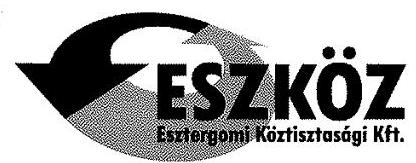

# Esztergomi Köztisztasági Szolgáltató Kft. 

Cégjegyzékszám: 11-09-009359 Adószám: 13051570-2-11 Székhely: 2500 Esztergom, Széchenyi tér 1. Iroda: 2500 Esztergom, Poór Antal tér 1. Tel: 33/ 313-084; Fax:33/313-848 Web: www.eszkozkft.hu
Levelezési cím: 2501 Esztergom, Pf. 72

A Nemzeti Adatvédelmi és Információszabadság Hatóság állásfoglalása alapján
„A hulladékgazdálkodásról szóló 2000. évi XLIII. törvény 27. § (3) bekezdése értelmében a települési hulladékkezelési közszolgáltatást az a hulladékkezelö végezhet, aki
a) biztosítani tudja a közszolgáltatás azon - külön jogszabályban meghatározott - személyi és tárgyi feltételeit, amelyek garantálják a közszolgáltatás tartós, rendszeres és a környezetvédelmi szempontoknak maradéktalanul megfelelő ellátását;
b) a végzendő hulladékkezelési tevékenységnek megfelelő környezetvédelmi hatósági engedéllyel rendelkezik;
c) megfelelő - külön jogszabályban meghatározottak szerinti - mértékü biztositék, garancia meglétét igazolja;
d) az a)-c) pontokban meghatározott feltételek, illetőleg eredményes pályázat alapján a települési önkormányzattal közszolgáltatási szerzödést kötött.

Az alapvető jogok biztositásáról szóló 2011. évi CXL törvény 18. § (1) és (2) bekezdése alapján a közszolgáltató tágabb kört fog át, mint a közüzemi szolgáltató fogalma. A jogszabályi rendelkezések értelmében a hulladékkezelési szolgáltatás közszolgáltatásnak és nem közüzemi szolgáltatásnak minösül.
Tehát a fentiekre tekintettel az Infotv. 24. § (1) bekezdés c) pontja kizárólag közüzemi szolgáltatókra vonatkozik, igy a hulladékkezelési szolgáltatást ellátó gazdasági társaság(ok)nak nem kell belső adatvédelmi felelőst kinevezniük vagy megbizniuk."

### 3.1. számú megállapítás

A Társaságnál a beruházások elszámolása megfelelő volt, az értékesités nettó árbevételének és anyagjellegü ráforditásainak elszámolása a közszolgáltatási tevékenység hiánya és a bevételek hibás könyvelése miatt nem volt megfelelő. A hátralékos követelések behajtásáról a 2011. évet kivéve a jogszabályoknak megfelelően a gyakorlatban gondoskodott a Társaság.

A számlakeretet időközben módosítottuk, a bevételek jogcímenkénti könyvelése a fökönyvi számok megnevezésével megegyezik.

---

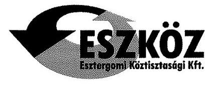

Esztergomi Köztisztesági Szolgáltató Kft. Cégjegyzékszám: 11-09-009359 Adószám: 13051570-2-11 Székhely: 2500 Esztergom, Széchenyi lér 1. Iroda: 2500 Esztergom, Póór Antal tér 1. Tel: 33/ 313-084, Fax:33/313-848 Web: www.eszkozift.hu Levelezési cím: 2501 Esztergom, Pf. 72

A vizsgálat idejét követően megtett intézkedéseink a következők:

|  Sorszám | Javaslat | Megtett intézkedések  |
| --- | --- | --- |
|  1. | Intézkedjen az FB ügyrendjének jóváhagyásra történő előterjesztésére a Társaság taggyűlésére | Az FB ügyrendjét aktualizáltuk, jelenleg az FB elnök aláírására várunk. Amint visszakaptuk, megküldjük az Önkormányzat részére, és a képviselőtestület jóváhagyását követően a soron következő taggyűlésre beterjesztjük.  |
|  2. | Intézkedjen arra vonatkozóan, hogy a Társaság taggyűlése fogadjon el a Társaság vezető tisztségviselőire és munkavállalóira, valamint az FB tagjaira vonatkozó Javadalmazási Szabályzatot | A társaság javadalmazási szabályzatára vonatkozóan a javaslatot elkészítettük, 2014-ben megküldtük az Önkormányzat részére. A képviselő-testület ezt azóta sem tárgyalta. Ismét felhívtuk a figyelmüket erre vonatkozóan, és amint jóváhagyták, beterjesztjük a soron következő taggyűlésre.  |
|  3. | Intézkedjen a Pénzkezelési szabályzatnak a készpénzállomány ellenőrzésekor követendő eljárásra, az ellenőrzés gyakoriságára és a pénzkezelés felelősségi szabályaira vonatkozó kiegészítéséről | A pénzkezelési szabályzatot 2016.01.01-i hatállyal módosítottuk e tekintetben.  |
|  4. | Intézkedjen a Társaság Számlarendjének elkészítéséről | A társaság Számlarendje elkészült  |
|  5. | Intézkedjen a hulladékgazdálkodási közszolgáltatási kereteibe nem tartozó más hulladékgazdálkodási szolgáltatás költségeinek és díjainak szigorú elkülönítéséről annak érdekében, hogy a nyilvántartás biztosítsa az egyes tevékenységek átlátható elszámolását, továbbá a keretfinanszírozás kizárását | Társaságunk 2014. január 1-től a HT 2. § (1) 37. pontja és a HT. 90. § (11) bekezdése szerint már nem közszolgáltató, közszolgáltatás kereteibe tartozó bevétellel pedig 2014. január 28tól nem rendelkezik.  |

---

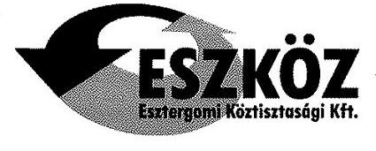

# Esztergomi Köztisztasági Szolgáltató Kft. 

Cégjegyzékszám: 11-09-009359 Adószám: 13051570-2-11 Székhely: 2500 Esztergom, Széchenyi tér 1. Iroda: 2500 Esztergom, Poór Antal tér 1. Tel: 33/ 313-064; Fax:33/313-848 Web: www.eszkozkft.hu

Levelezési cím: 2501 Esztergom, Pf. 72

| 6. | Intézkedjen a Társaság 2013. év 2014. évi auditált éves beszámolói és ugyanazon évekre a könyvvizsgálói jelentések Hivatal részére történő pótlólagos megküldése, továbbá ezen dokumentumok jövőre vonatkozó megküldésének biztosítása érdekében | A dokumentumok megküldését pótoltuk. |
| :--: | :--: | :--: |
| 7. | Intézkedjen az Info tv-ben elóirtaknak megfelelően az adatvédelmi felelős kijelöléséről | Társaságunk 2014. január 1-től a HT 2. § (1) 37. pontja és a HT. 90. § (11) bekezdése szerint már nem közszolgáltató. Jelenleg a Vertikál Nonprofit Zrt. alvállalkozójaként veszünk részt a hulladékszállításban. A Vertikál Nonprofit Zrt. nevében a mi alkalmazásunkban álló munkatárs köti meg a szerződést az ügyfelekkel. A szerződés egy formanyomtatvány, melynek 7. pontja a következőket tartalmazza:   „7. A Ht. rendelkezései szerint a közszolgáltató az ingatlanhasználó személyes adatait (név, cím,) a számlázott és fizetett díj összegét kezelheti, a közszolgáltatás szervezése, a szolgáltatási szerződés teljesítése, ennek keretében a közszolgáltatási dij igényének érvényesítése érdekében (ez esetben kiegészítve a díjtartozásra vonatkozó adatokkal), szükség esetén alvállalkozója/ megbizottja számára a jelzett felhasználási célból átadhatja. Az adatkezelés időtartama legfeljebb a szerződés lejártáig, illetve díjtartozás esetén a díjtartozás teljesítésének időpontjáig terjed."   A javaslattal kapcsolatban tett észrevételünket a 2.4. számú megállapításnál részletezzük. A Nemzeti Adatvédelmi és Információszabadság Hatóság állásfoglalása alapján társaságunknak nem szükséges adatvédelmi felelőst kineveznie és Adatvédelmi Szabályzatot készítenie. |

---

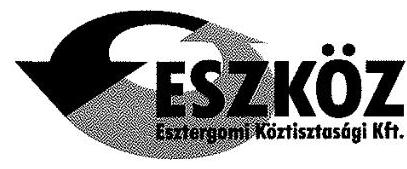

Esztergomi Köztisztesógi Szolgáltató Kft.
Cégjegyzékszám: 11-09-009359
Adószám: 13051570-2-11
Székhely: 2500 Esztergom, Széchenyi tér 1.
Iroda: 2500 Esztergom, Podó Antal tér 1.
Tel: 33/313-084, Fax:33/313-848
Web: www.eszkozkft.hu
Levelezési cím: 2501 Esztergom, Pf. 72

| 9. | Gondoskodjon az Info tv. szerinti   közzétételi kötelezettség teljes körü   teljesítéséről, az éves   beszámolónak a Társaság   honlapján történő megjelenítéséről | Az intézkedést már megtettük,   honlapunkról linken keresztül elérhető. |
| :--: | :--: | :--: |
| 10. | Intézkedjen a hulladékgazdálkodási   közszolgáltatáshoz kapcsolódó   bevételek és anyagjellegü   ráfordítások szabályszerű,   elkülönített elszámolásáról | A javaslattal kapcsolatban tett   észrevételünket a 2.1. számú   megállapításnál részletezzük. Társaságunk   2014. január 1-től a HT 2. § (1) 37. pontja   és a HT. 90. § (11) bekezdése szerint már   nem közszolgáltató, közszolgáltatás   kereteibe tartozó bevétellel pedig 2014.   január 28 -tól nem rendelkezik. |

Kérjük a végleges jelentés összeállításánál fentiek figyelembe vételét!

Esztergom, 2016. június 2.

Tisztelettel:
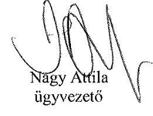

---

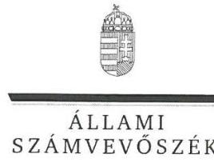

ELNÖK

Ikt.szám: V-0976-111/2016

# Nagy Attila úr 

ügyvezető
Esztergomi Köztisztasági Szolgáltató Kft.

## Esztergom

## Tisztelt Ügyvezető Úr!

Köszönettel vettem az Esztergomi Köztisztasági Szolgáltató Kft. ellenőrzéséről készített számvevőszéki jelentéstervezetre tett észrevételeit.

Az Állami Számvevőszék észrevételekre vonatkozó álláspontjáról a felügyeleti vezető által készített részletes tájékoztatásban kap választ, amelyet levelemhez mellékeltem.

Tájékoztatom Ügyvezető urat, hogy a számvevőszéki jelentés véglegesítése az elfogadott észrevételek figyelembevételével történik.

Budapest, 2016. jutun hó 6. nap
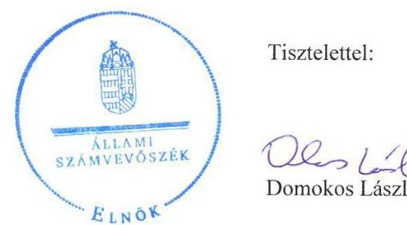

Tisztelettel:

## 06. 110

Domokos László

Melléklet: Tájékoztatás az észrevételek kezeléséről

---

# Tájékoztatás az észrevételek kezeléséről 

„Az önkormányzatok többségi tulajdonában lévő gazdasági társaságok közfeladat ellátását érintő gazdálkodási tevékenysége szabályszerűségének ellenőrzése - Esztergomi Köztisztasági Szolgáltató Kft." címmel készített jelentéstervezetre Ügyvezető úr észrevételeit megköszönöm. Az észrevételek kezeléséről azok sorrendjében az alábbi tájékoztatást adom.

Első észrevétele a 2.1. számú megállapításra vonatkozik, amelyben megállapítjuk, hogy a társaság nem rendelkezett számlarenddel, továbbá a pénzkezelési szabályzat tekintetében kisebb hiányosságot azonosítottunk, valamint rögzítettük, hogy a társaság nem szabályozta a hulladékgazdálkodási közszolgáltatói tevékenység elkülönítését.

A Társaság Számlarendjének elkészítésére, valamint a Pénzkezelési Szabályzat módosítására vonatkozó tájékoztatását tudomásul vettem azzal, hogy a hiányosságok az ellenőrzött időszakban (2011-2014.) fennálltak, így észrevételei a jelentéstervezet szövegének módosítását nem indokolják.

A hulladékgazdálkodási közszolgáltatói tevékenységgel kapcsolatos, az annak elkülönítésére és az azzal kapcsolatos adatszolgáltatásra és beszámoltatásra, továbbá az adatvédelmi felelős kinevezésére/megbízására vonatkozó előírások értelemszerủen csak arra az időszakra kérhetők számon, amíg a társaság ilyen jellegű tevékenységet végzett, azaz 2011-től 2013-ig.

Ebből következően:
A Jelentéstervezetnek az ELLENŐRZÉS HATÓKÖRE ÉS MÓDSZEREI-n belül Az ellenőrzés tárgyát kiegészítem az alábbi (korlátozó) résszel második bekezdésként:
„Az ellenőrzés tárgya a közfeladat ellátása tekintetében 2014. évre korlátozott, csak a 2013. évi gazdálkodás áthúzódó hatásait veszi számba, mivel a társaság 2014. január 1-től már nem végzett közszolgáltatást."

Törlöm a javaslatok közül az 5., a 6., a 7. és a 10. számú javaslatot, mivel a társaság már nem végez közszolgáltatói tevékenységet, így nem köteles a szabályozásába beépíteni az elkülönítés követelményeit, továbbá nem köteles a beszámoló kiegészítő mellékletében sem bemutatni ezt a tevékenységet. Nem köteles adatszolgáltatásra a Magyar Energetikai és Közmű-szabályozási Hivatal számára, valamint nem köteles adatvédelmi felelőst kinevezni. Ennek megfelelően pontosítom a vonatkozó bekezdéseket a következők szerint:

## Pontosítom a 2.1 megállapítás 11. bekezdését:

„A SZÉTVÁLASZTÁS SZABÁLYOZÁSA a 2011-2012. években a Hgt. 29. § (3) bekezdéseiben, illetve a 2013-2014. években a Ht. 50. § (2)-(3) bekezdéseiben előírtak ellenére nem történt meg. A Társaság az ellenőrzött időszakban 2011-2013. években a hulladékkezelési engedélyének megfelelően egyéb hulladékgazdálkodási tevékenységeket is folytatott. A 2011-2012. években azonban a Hgt. 29. § (3) bekezdésében elöírtak el-lenére a kötelezően ellátandó közszolgáltatás kereteibe nem tartozó egyéb hulladékkezelési szolgáltatás dijának (bevételeinek), költségeinek elkülönitését a Számv. tv. 161/A. § (2) bekezdésében elöírtak ellenére nem szabályozta. A

---

Társaság a 2013-2014. években a Ht. 50. § (1)-(3) bekezdéseiben, továbbá a Számv. tv. 161/A. § (1)-(2) bekezdéseiben elöirtak ellenére nem gondoskodott az egyes tevékenységeire vonatkozó elkülönült nyilvántartás kialakításáról, szabályozásáról, igy nem biztositotta az egyes tevékenységek átláthatóságát, és a keresztfinanszírozás kizárását."

A 2.4. megállapítás 5. és 7. bekezdéséből is törlöm a 2014. évre vonatkozó hivatkozásokat:
„A Ht. 50. § (3) bekezdéseivel ellentétben az éves beszámoló kiegészitő melléklete a 2013-2014. években nem tartalmazta a hulladékgazdálkodási közszolgáltatással kapcsolatos önálló mérleget és eredmény kimutatást, ami ellentétes a Számv. tv. 88. § (1) bekezdésében elöirtakkal is, mivel a közfeladat és az ágazati sajátosságokról nem adott valós képet. A Társaság a Ht. 50. § (4) bekezdésének elöirása ellenére a 2013-2014. évekre vonatkozó auditált éves beszámolóit, a Könyvvizsgálói jelentéseit nem küldte meg a Hivatalnak."
„A Könyvvizsgáló az éves beszámolók könyvvizsgálatáról készitett jelentéseiben minden évben kiadta a hitelesitő záradékot annak ellenére, hogy a Társaság nem rendelkezett a Számv. tv. 161. § (1) bekezdése által elöirt számlarenddel, továbbá nem szabályozta a Számv. tv. 161/A. §-a alapján a Hgt. 29. § (3) bekezdésében és Ht. 50. § (2) bekezdésében meghatározott hulladékgazdálkodási közszolgáltatással kapcsolatos szétválasztást-a Számv. tv. 161/A. §-a alapján nem szabályozta, és a Ht. 50. § (3) bekezdésében foglaltakban elöirtak ellenére a 20132014. években beszámolójának kiegészitő mellékletében nem mutatta be a közszolgáltatói tevékenységéről szóló az elöirt önálló mérleget és eredménykimutatást."

A 2.4. megállapítás 8. bekezdését pontosítom, mivel az adatvédelmi felelős hiányával kapcsolatos megállapítás 2014-re már nem áll fenn:
„AZ ADATOK VÉDELME az ellenőrzött időszakban nem volt biztositott, mivel a Társaság nem rendelkezett az Info tv. 24. § (2) d) pontjában elöirt adatvédelmi és adatbiztonsági szabályzattal. A Társaságnál az Info tv. 24. § (1) c) pontjában elöirtak ellenére a 2011. és 2013. közötti időszakban belső adatvédelmi felelős nem volt. [...]"

A 3.1. megállapítás kapcsán megtett gyors intézkedésekről szóló tájékoztatását tudomásul veszem, ugyanakkor az a hiányosság ellenőrzött időszakban történő fennállását nem befolyásolja, így a jelentéstervezet szövegében nem indokol változtatást.

Úgyvezető úr levelében külön táblázatban mutatja be az ÁSZ ellenőrzést követően megtett intézkedéseket. Tájékoztatását külön megköszönöm. Jelezni kívánom ugyanakkor, hogy e tájékoztatása nem váltja ki a végleges jelentés kézhezvételétől számított 30 napon belüli Intézkedési terv készitési kötelezettséget, amelyben a Jelentés javaslataira tervezett vagy megtett intézkedésekre, azok határidejére és felelőseire kell kitérni. A jelentés javaslataira készített Intézkedési terv csak így tudja betölteni azt a szerepét, hogy az ÁSZ utóellenőrzésének alapja legyen.

Budapest, 2016. pátéus hó ๑. nap

Dr. Horváth Margit felügyeleti vezető

---

# RÖVIDÍTÉSEK JEGYZÉKE 

${ }^{1}$ Önkormányzat
${ }^{2}$ Társaság
${ }^{3}$ Polgármester
${ }^{4}$ Jegyző
${ }^{5}$ Aljegyző

${ }^{6}$ Ügyvezető
${ }^{7}$ ÁSZ
${ }^{8}$ Képviselő-testület
${ }^{9} \mathrm{Htv}$.
${ }^{10}$ Ötv.
${ }^{11}$ Mötv.
${ }^{12}$ Társaság alapításáról
${ }^{13}$ 308/2013. (VI. 20.) Kt. határozat
${ }^{14}$ 136/2002. (VI. 20.) Kt. határozat
${ }^{15} \mathrm{Hgt}$.
${ }^{16}$ 241/2001. (XII. 10.) Korm. rendelet
${ }^{17}$ OKTVF
${ }^{18}$ 224/2004. (VII. 22.) Korm. rendelet
${ }^{19}$ Közszolgáltatási Szerződés
${ }^{20}$ Alapító Okirat
${ }^{21} \mathrm{Gt}$.

Esztergom Város Önkormányzata
Esztergomi Köztisztasági Szolgáltató Korlátolt Felelősségű Társaság
Esztergom Város polgármestere
Esztergom Város Önkormányzat jegyzője 2011. február 14-től;
Esztergom Város Önkormányzat aljegyzője 2011. augusztus 1-ig,
2011. november 1-jétől 2013. szeptember 4-ig,
2013. szeptember 5-től;

Esztergomi Köztisztasági Szolgáltató Kft. ügyvezetője;
2011. évi LXVI. törvény az Állami Számvevőszékről, hatályos 2011. július 1-jétől

Esztergom Város Önkormányzatának Képviselő-testülete
1991. évi XX. törvény a helyi önkormányzatok és szerveik, a köztársasági megbízottak, valamint egyes centrális alárendeltségű szervek feladat- és hatásköreiről
1990. évi LXV. törvény a helyi önkormányzatokról, hatálytalan: a 2014. évi általános önkormányzati választások napjától;
2011. évi CLXXXIX. törvény Magyarország helyi önkormányzatairól, hatályos: 2012. január 1-jétől, kivéve a 144. § (2) bekezdésben meghatározott előírások, amelyek 2012. április 15-én, a (3) bekezdésben meghatározott előírások, amelyek 2013. január l-jén léptek hatályba, a (4) bekezdésben meghatározott előírások a 2014. évi általános önkormányzati választások napján léptek hatályba;
Esztergom Város Önkormányzatának Képviselő-testülete a 308/2002. (XII. 19.) Kt. határozattal döntött az Esztergomi Köztisztasági Szolgáltató Kft. alapításáról a Közép-Duna Vidéke Hulladékgazdálkodási Önkormányzati Társulással kötött megállapodás módosításáról
Esztergom Város Önkormányzata Képviselő-testületének 136/2002. (VI. 20.) számú határozata a Közép-Duna Vidéke Hulladékgazdálkodási Önkormányzati Társuláshoz való csatlakozásról.
2000. évi XLIII. törvény a hulladékgazdálkodásról, hatályos 2012. december 31-ig; a jegyző hulladékgazdálkodási feladat- és hatásköréről szóló 241/2001. (XII. 10.) Korm. rendelet, hatályos 2002. január 1-jétől 2012. december 31-ig;
Országos Környezetvédelmi Természetvédelmi és Vízügyi Főfelügyelőség a hulladékkezelési közszolgáltató kiválasztásáról és a közszolgáltatási szerződésről szóló 224/2004. (VII. 22.) Korm. rendelet, hatályos 2013. szeptember 4-ig;
Esztergom Város Önkormányzata és az Esztergomi Köztisztasági Szolgáltató Kft. között létrejött szerződés és módosításai, hatályos 2003. július 1-jétől 2014. január 27-ig;
Közép-Duna Vidéke Hulladékgazdálkodási Önkormányzati Társulás és a Vertikál Közszolgáltató Nonprofit Zrt., a Vertikál VKSZ Vagyonkezelő és Szolgáltató Zrt., illetve az Oroszlányi Környezetgazdálkodási Nonprofit Zrt. között létrejött szerződés, hatályos 2014. január 27-től számított 10 évig;
Esztergomi Köztisztasági Szolgáltató Kft. alapításáról szóló társasági szerződés és módosításai;
2006. évi IV. törvény a gazdasági társaságokról, hatályos 2014. március 14-ig;

---

${ }^{22}$ Ptk.
${ }^{23}$ Könyvvizsgáló
${ }^{24}$ Taggyűlés
${ }^{25}$ Hulladékrendelet
${ }^{26} \mathrm{Ht}$.
${ }^{27}$ 64/2008. (III. 28.) Korm. rendelet
${ }^{28}$ Vagyongazdálkodási rendelet
${ }^{29}$ Kjelölt bizottság
${ }^{30}$ éves beszámolók
${ }^{31} \mathrm{FB}$
${ }^{32}$ Áht.
${ }^{33}$ Taktv.
${ }^{34}$ Számv. tv.
${ }^{35}$ Számviteli politika
${ }^{36}$ Leltározási szabályzat
${ }^{37}$ Értékelési szabályzat
${ }^{38}$ Pénzkezelési szabályzat
${ }^{39}$ Számlakeret
${ }^{40}$ Hivatal
2013. évi V. törvény a Polgári Törvénykönyvről, hatályos 2014. március 15-től;

Esztergomi Köztisztasági Szolgáltató Kft. könyvvizsgálója
Esztergomi Köztisztasági Szolgáltató Kft. taggyűlése, a Gt. 19. § (1) bekezdése és a Ptk. 3:109. § (1) bekezdése szerint a Társaság legfőbb szerve.
Esztergom Város Önkormányzatának 10/2004. (IV. 1.) számú rendelete a települési szilárdhulladék kezelési közszolgáltatásról, hatályos 2004. április 1jétől;
2012. évi CLXXXV. törvény a hulladékról, hatályos 2013. január 1-jétől, kivéve a 95. § (6) bekezdése, ami 2015. január 1-jén lépett hatályba;
a települési hulladékkezelési közszolgáltatási díj megállapításának részletes szakmai szabályairól szóló 64/2008. (III. 28.) Korm. rendelet, hatályos 2008. március 31-től;
Esztergom Város Önkormányzatának vagyonáról és a vagyontárgyak feletti tulajdonosi jog gyakorlásáról szóló 16/2001. (V. 24.) számú rendelet, hatályos 2013. június 26-ig;

Esztergom Város Önkormányzatának vagyonáról és a vagyontárgyak feletti tulajdonosi jog gyakorlásáról szóló 9/2013. (VI. 27.) számú rendelet, hatályos 2013. június 27-től;
2013. június 26-ig Önkormányzat Városfejlesztési Bizottság, 2013. június 27-től a Pénzügyi Ellenőrző Bizottság és a Tulajdonosi Bizottság;
Esztergomi Köztisztasági Szolgáltató Kft. 2011-2014. évi egyszerűsített éves beszámolói
Esztergomi Köztisztasági Szolgáltató Kft. Felügyelő Bizottsága
2011. évi CXCV. törvény az államháztartásról, hatályos 2011. december 31-től, illetve 2012. január 1-jétől;
a köztulajdonban álló gazdasági társaságok takarékosabb múködéséről szóló 2009. évi CXXII. törvény
2000. évi C. törvény a számvitelről, hatályos 2001. január 1-jétől;

Esztergomi Köztisztasági Szolgáltató Kft. Számviteli politikája, hatályos 2003. június 27-től 2011. február 28-ig;
2011. március 1-jétől 2012. február 29-ig;
2012. március 1-jétől 2013. március 11-ig;
2013. március 12-től;

Esztergomi Köztisztasági Szolgáltató Kft. Eszközök és források leltárkészítési és leltározási szabályzata, hatályos 2003. június 27-től 2011. február 28-ig;
2011. március 1-jétől 2012. február 29-ig;
2012. március 1-jétől 2013. március 11-ig;
2013. március 12-től;

Esztergomi Köztisztasági Szolgáltató Kft. Eszközök és források értékelési szabályzata, hatályos 2003. június 27-től 2011. február 28-ig;
2011. március 1-jétől 2012. február 29-ig;
2012. március 1-jétől 2013. március 11-ig;
2013. március 12-től;

Esztergomi Köztisztasági Szolgáltató Kft. Pénzkezelési szabályzata, hatályos 2003. június 27-től 2011. február 28-ig;
2011. március 1-jétől 2012. február 29-ig;
2012. március 1-jétől 2013. március 11-ig;
2013. március 12-től;

Esztergomi Köztisztasági Szolgáltató Kft. 2011-2014. évek között alkalmazott Számlatükrei

Magyar Energetikai és Közmű-szabályozási Hivatal

---

${ }^{41}$ Avtv.
${ }^{42}$ Info tv.
${ }^{43}$ Áfa tv.
${ }^{44} \mathrm{NAV}$
${ }^{45}$ Rezsi tv.
${ }^{46}$ Áfa
1992. évi LXIII. törvény a személyes adatok védelméről és a közérdekú adatok nyilvánosságáról, hatályos 2011. december 31-ig;
2011. évi CXII. törvény az információs önrendelkezési jogról, hatályos 2011. július 27-től;
2007. évi CXXVII. törvény az általános forgalmi adóról (hatályos 2008. január 1jétől)
Nemzeti Adó- és Vámhivatal
2013. évi LIV. törvény a rezsicsökkentések végrehajtásáról, hatályos 2013. május 10 -től;
általános forgalmi adó;

---

# ÁLLAMI SZÁMVEVŐSZÉK 

1052 Budapest, Apáczai Csere János utca 10.
Levélcím: 1364 Budapest 4. Pf. 54
Telefon: +36 14849100 Telefax: +36 14849200
www.asz.hu