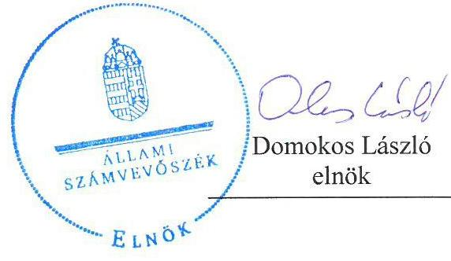
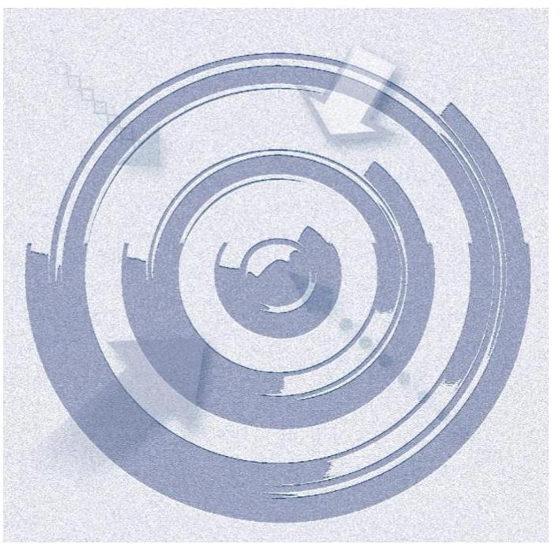
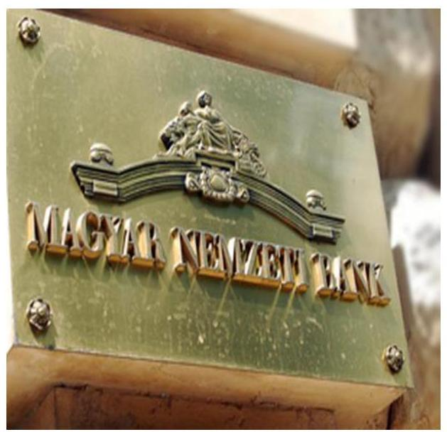
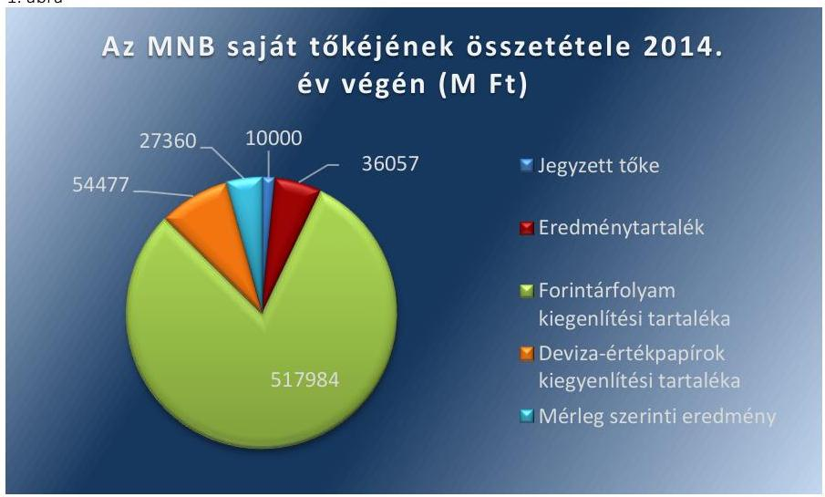
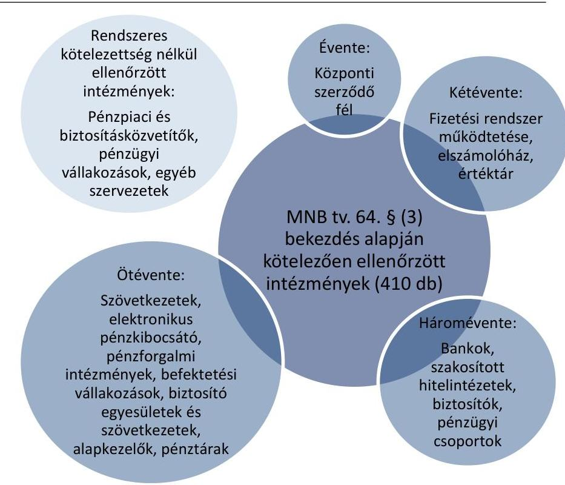
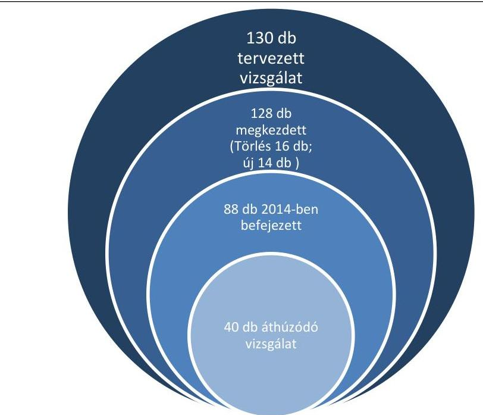
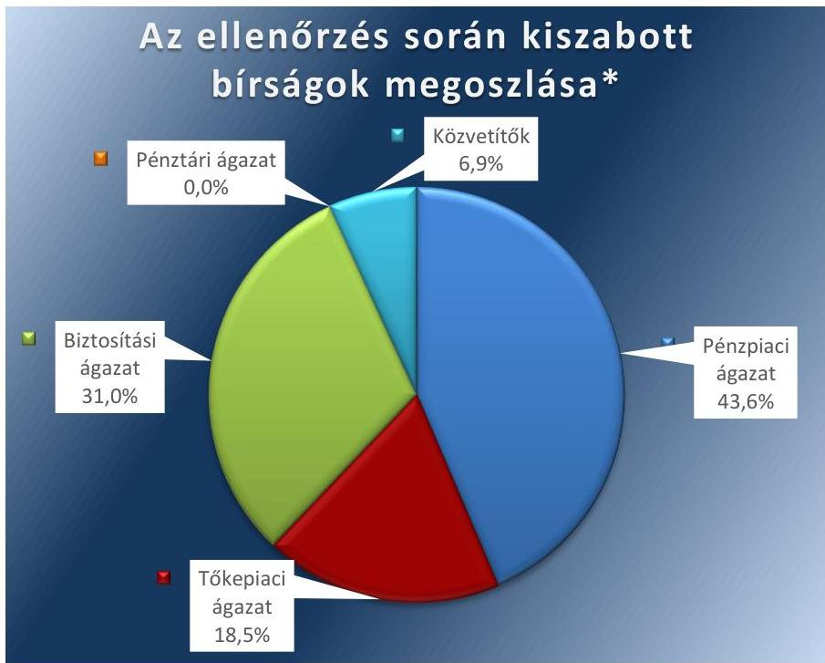
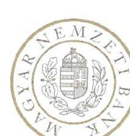
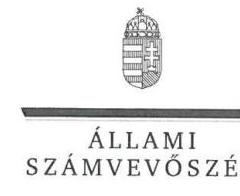
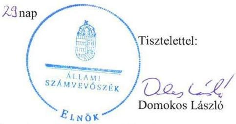

# Jelentés 

## A Magyar Nemzeti Bank működése szabályszerűségének ellenőrzése

2016.

---

# Jelentés 

## A Magyar Nemzeti Bank működése szabályszerűségének ellenőrzése

2016. 07. hó 12. nap

---

Jelentéseink az Országgyűlés számítógépes hálózatán és az Interneten a www.asz.hu címen is olvashatóak.

## AZ ELLENŐRZÉST FELÜGYELTE:

HOLMAN MAGDOLNA JULIANNA felügyeleti vezető

## AZ ELLENŐRZÉST VEZETTE ÉS A VÉGREHAJTÁSÁÉRT FELELŐS:

DORMÁN ISTVÁN ZOLTÁN ellenőrzésvezető

## A PROGRAM ÖSSZEÁLLÍTÁSÁÉRT FELELŐS:

JANIK JÓZSEF osztályvezető

## A TÉMÁHOZ KAPCSOLÓDÓ KORÁBBI SZÁMVEVŐSZÉKI JELENTÉSEK:

- címe:
az MNB ellenőrzéséről - a Magyar Nemzeti Bank működésének, valamint a Pénzügyi Szervezetek Állami Felügyelete működése, és tevékenysége MNB-be integrálása szabályszerűségének ellenőrzéséről
a Magyar Nemzeti Bank működésének és a központi költségvetéssel történő elszámolások szabályszerűségének ellenőrzéséről
- sorszáma: 15046, 13011

IKTATÓSZÁM: V-0888-211/2016
TÉMASZÁM: 21.
ELLENŐRZÉS-AZONOSÍTÓ SZÁM: V0733

---

# TARTALOMJEGYZÉK 

■ ÖSSZEGZÉS ..... 5
■ AZ ELLENŐRZÉS CÉLJA ..... 6
■ AZ ELLENŐRZÉS TERÜLETE ..... 7
■ AZ ELLENŐRZÉS HÁTTERE, INDOKOLTSÁGA ..... 9
■ FÓKUSZKÉRDÉSEK ..... 10
■ ELLENŐRZÉS HATÓKÖRE ÉS MÓDSZEREI ..... 11
■ MEGÁLLAPÍTÁSOK ..... 13
■ JAVASLATOK ..... 33
■ MELLÉKLETEK ..... 35
I. Sz. melléklet: Értelmező szótár. ..... 35
II. Sz. melléklet: Az MNB vagyonának alakulása 2014-ben (M Ft) ..... 38
III. Sz. melléklet: Az MNB működési költségeinek, ráfordításainak alakulása 2014-ben (E Ft) ..... 39
■ FÜGGELÉK: ÉSZREVÉTELEK ..... 41
■ RÖVIDÍTÉSEK JEGYZÉKE ..... 55

---

.

---

# ÖSSZEGZÉS 

Az Állami Számvevőszék Magyar Nemzeti Banknál 2014. év tekintetében elvégzett ellenőrzése megállapította, hogy az MNB ${ }^{1}$ irányítási, döntéshozatali és ellenőrzési rendszere összességében szabályozottan működött. Az MNB gazdálkodása és a központi költségvetéssel történő elszámolások szabályozottak és szabályszerűek voltak. A pénzügyi közvetítőrendszert felügyelő, ellenőrző és szabályozó tevékenysége összességében megfelelt a jogszabályi előírásoknak.

## Az ellenőrzés társadalmi indokoltsága

Az MNB egyszemélyes részvénytársasági formában működő jogi személy, részvénye a Magyar Állam tulajdonában van. A részvényesi jogokat az államháztartásért felelős miniszter gyakorolja. Az ÁSZ² törvényi kötelezettsége az MNB gazdálkodásának és az alapvető feladatai közé nem tartozó tevékenységének ellenőrzése, amelynek teljesítésével segíti az Országgyűlés munkáját, tájékoztatja az érdekelt intézményeket és a szélesebb közvéleményt az MNB működésének és feladatellátásának szabályszerűségéről. Az ellenőrzés hozzájárul az ÁSZ Stratégiájában megfogalmazott küldetése megvalósításához, a közpénzügyek átláthatóságának, rendezettségének előmozdításához.

## Főbb megállapítások, következtetések, javaslatok

Az MNB irányítási, döntéshozatali és ellenőrzési rendszere összességében szabályozottan és szabályszerűen működött. Az MNB szervezeti felépítése, irányítási, döntéshozatali rendszere a jogszabályoknak megfelelt. A felügyelőbizottság működése megfelelt a jogszabályok és ügyrend előírásainak. A belső ellenőrzési szervezet működése szabályozott és szabályszerű volt. Az MNB többségi tulajdonában álló gazdasági társaságai feletti tulajdonosi joggyakorlása megfelelt a jogszabályi előírásoknak. Az MNB a jogszabályi előírásoknak megfelelően biztosította a Pénzügyi Békéltető Testület működési feltételeit.

Az MNB gazdálkodása és a központi költségvetéssel történő elszámolások szabályozottak és szabályszerűek voltak. A működési költségek tervezése, a beszerzések és az elszámolások, a beruházási tervek összeállítása, a döntések meghozatala és azok megvalósítása, az MNB által nyújtott támogatások tervezése, kifizetése és elszámolása szabályszerű volt.

Az MNB pénzügyi közvetítőrendszert felügyelő, ellenőrző és szabályozó tevékenysége összességében megfelelt a jogszabályi előírásoknak. Az MNB a nyilvános elektronikus információs rendszer szabályozása során szabályszerűen járt el. Az MNB a pénzügyi közvetítőrendszer felügyeletéhez kapcsolódó engedélyezési és egyéb eljárásai során az ügyintézési és hiánypótlási eljárás kivételével szabályszerűen járt el. Az MNB a felügyeleti biztosok kirendelése során, a pénzügyi közvetítőrendszer szervezetei körében indított fogyasztóvédelmi eljárások, piacfelügyeleti eljárások lefolytatása során, és a befektetési vállalkozások felügyeletéhez kapcsolódó engedélyezési, és ellenőrzési eljárásai során szabályszerűen járt el.

---

# AZ ELLENŐRZÉS CÉLJA 

## A Magyar Nemzeti Bank működése szabályszerűségének ellenőrzése

AZ ELLENŐRZÉS CÉLJA az MNB alapfeladatai közé nem tartozó tevékenységei és gazdálkodása megfelelőségének értékelése, továbbá annak ellenőrzése, hogy az MNB irányítási, döntéshozatali és ellenőrzési rendszere szabályozottan és szabályszerűen működött-e; az MNB gazdálkodása és a központi költségvetéssel történő elszámolások szabályozottak és szabályszerűek voltak-e; a pénzügyi közvetítőrendszert felügyelő, ellenőrző és szabályozó tevékenysége megfelelt-e a jogszabályi előírásoknak.

---

# AZ ELLENŐRZÉS TERÜLETE 

## Magyar Nemzeti Bank

A MAGYAR NEMZETI BANK 1924. június 24-én kezdte meg munkáját. Az MNB részvénytársasági formában működő jogi személy, részvénye a Magyar Állam tulajdonában van. Az államot, mint részvényest, az államháztartásért felelős miniszter képviseli.

Az Alaptörvény ${ }^{3}$ 41. cikke kimondja, hogy az MNB Magyarország központi bankja, sarkalatos törvényben meghatározott módon felelős a monetáris politikáért és ellátja a pénzügyi közvetítő rendszer felügyeletét.

Az MNB jogállását, elsődleges céljait, alapvető valamint alapvető feladatai közé nem tartozó egyéb feladatait és szervezeti felépítését az MNB tv. ${ }^{4}$ határozza meg. E szerint az MNB a törvényben foglalt feladatai ellátása, valamint kötelességei teljesítése során független. Az MNB a Központi Bankok Európai Rendszerének, valamint a Pénzügyi Felügyeletek Európai Rendszerének tagja.

Az MNB elnökét a miniszterelnök javaslatára a köztársasági elnök nevezte ki 2013. március 4-ei hatállyal hat év időtartamra. Az elnök munkáját az ellenőrzött időszakban három alelnök segítette. Az MNB elnöke az MNB tevékenységéről évente beszámol az Országgyűlésnek. Az MNB elnöke az Országgyűlés törvényhozó tevékenységét támogató szervének, a Költségvetési Tanácsnak a tagja, amely a központi költségvetés megalapozottságát vizsgálja.

Az Alaptörvény 41. cikke alapján 2013. október 1-jétől az MNB látja el a pénzügyi közvetítőrendszer felügyeletét. Ennek megfelelően 2013. október 1-jei hatállyal megtörtént a PSZÁF⁵ és az MNB összevonása. A 2013. október 1-jétől hatályos MNB tv. meghatározta a PSZÁF feladatai MNB-be integrálásának, feladata, hatásköre és jogállása átvételének, valamint a pénzügyi közvetítőrendszer felügyelete ellátásának szabályait. Az összevonást követően az MNB látja el a PSZÁF pénz,- tőke- és biztosítási piac felügyeletével kapcsolatos feladatait, valamint a fogyasztóvédelmi és piacfelügyeleti feladatait.

Az MNB szervei az ellenőrzött időszakban a Monetáris Tanács, a Pénzügyi Stabilitási Tanács, az igazgatóság és a felügyelőbizottság voltak. Az ellenőrzött időszakban az intézményt nem érintette szervezeti, szerkezeti átalakítás. Az MNB alapvető feladatain túl az alábbi feladatokat látja el:
$\longrightarrow$ szanálási hatóságként jár el,
$\longrightarrow$ kizárólagosan ellátja a pénzügyi közvetítőrendszer felügyeletét,
$\longrightarrow$ ellátja a fogyasztó és a pénzügyi közvetítőrendszer szervezetei között létrejött - szolgáltatás igénybevételére vonatkozó - jogviszony létrejöttével és teljesítésével kapcsolatos vitás úgy bírósági eljáráson kívüli rendezését a Pénzügyi Békéltető Testület útján.

---

Az ellenőrzés nem terjedt ki az MNB szanálási hatósági feladataira, valamint az MNB feladataival és elsődleges céljával összhangban többségi tulajdonban álló gazdasági társaság alapítására vagy alapítvány létrehozására és azok gazdálkodására.

A 2014. évi éves jelentése ${ }^{6}$ alapján az ellenőrzött időszakban az MNB 802983 M Ft bevételt és 775623 M Ft kiadást teljesített. A könyvviteli mérleg adatai alapján 2013. december 31-ről 2014. december 31-ére az MNB vagyona 11437974 M Ft-ról 10,51\%-kal, 12640588 M Ft-ra emelkedett. A befektetett eszközök értéke 33267 M Ft-ról 151,72\%-kal 83740 M Ft-ra, a saját tőke 464560 M Ft-ról 39,03\%-kal 645878 M Ft-ra, a kötelezettségek 10926425 M Ft-ról 9,29\%-kal 11940972 M Ft-ra emelkedtek.

---

# **AZ ELLENŐRZÉS HÁTTERE, INDOKOLTSÁGA**

## **A Magyar Nemzeti Bank működése szabályszerűségének ellenőrzése**

Az ÁSZ tv.⁷ 5. § (10) bekezdése szerint az ÁSZ ellenőrzi az MNB gazdálkodását és az MNB tv.-ben foglaltak alapján folytatott, az alapvető feladatok körébe nem tartozó tevékenységét. Az ÁSZ ellenőrzi az MNB gazdálkodását, a szabályszerű működés feltételeinek érvényesülését, valamint a központi költségvetéssel összefüggő elszámolásokat.

Az ÁSZ korábbi MNB ellenőrzése kiterjedt a 2009. január 1-2013. december 31. közötti időszakra, a korábbi MNB törvény⁸ hatályon kívül helyezésével, valamint a PSZÁF működése és tevékenysége MNB-be integrálásával az ellenőrzés kiterjedt az MNB megváltozott feladataira a 2013. szeptember 30-át követő időszak vonatkozásában. Az ÁSZ ellenőrizte az MNB működését, gazdálkodását és a központi költségvetéssel történő elszámolásait a 2012. és 2013. évekre, ezen belül az MNB irányítási, döntéshozatali és ellenőrzési rendszerét 2012. július 1-től 2013. év végéig, valamint elsőként a PSZÁF pénzügyi közvetítőrendszert felügyelő, ellenőrző és szabályozó tevékenysége vonatkozásában a 2009. január 1-jétől 2013. szeptember 30-ig terjedő időszakot.

Az ellenőrzés alapvető hozadéka az ÁSZ törvényi kötelezettségének teljesítésével az Országgyűlés munkájának segítése, az érdekelt intézmények és a szélesebb közvélemény tájékoztatása az ellenőrzött intézmények működésének és feladatellátásának szabályszerűségéről. Az ellenőrzés rámutathat a jogszabályok, a belső szabályozás, a feladatellátás és a szabályszerű működés hiányosságaira, ami segítheti a döntéshozókat az indokolt jogszabály módosításokra, kiegészítésekre vonatkozó javaslatok kidolgozásában. Az ellenőrzés megállapításai és javaslatai hozzájárulhatnak a működés szabályozottságában, a feladatellátás kontrolljai kialakításában esetlegesen fellépő hiányosságok kiküszöböléséhez, a belső szabályzatok és a gyakorlat felülvizsgálatához.

Az ellenőrzéssel az ÁSZ a közvélemény számára hiteles információt nyújt az MNB működéséről és gazdálkodásáról, alapfeladatai közé nem sorolt feladatainak ellátásáról, a közpénzekkel való felelős gazdálkodásról, ezzel segítheti az általános szakmai tájékozottság növelését, a szervezetekről kialakított összkép társadalmi kommunikációját.

---

# FÓKUSZKÉRDÉSEK 

1.- Az MNB irányítási, döntéshozatali és ellenőrzési rendszere szabályozottan és szabályszerűen működött-e?
2.- Az MNB gazdálkodása és a központi költségvetéssel történő elszámolások szabályozottak és szabályszerűek voltak-e?
3.- A pénzügyi közvetítőrendszert felügyelő, ellenőrző és szabályozó tevékenysége megfelelt-e a jogszabályi előírásoknak?

---

# ELLENŐRZÉS HATÓKÖRE ÉS MÓDSZEREI 

## Az ellenőrzés típusa

Megfelelőségi ellenőrzés.

## Az ellenőrzött időszak

A 2014. január 1-jétől 2014. december 31-éig terjedő időszak.

## Az ellenőrzés tárgya

Az MNB irányítási, döntéshozatali és ellenőrzési rendszere, továbbá gazdálkodása és a központi költségvetéssel való elszámolásai. Az ellenőrzés tárgyát képezte még az MNB pénzügyi közvetítőrendszert felügyelő, ellenőrző és szabályozó tevékenysége.

Az ellenőrzés kiterjedt minden olyan körülményre és adatra, amely az ÁSZ jogszabályban meghatározott feladataiban, valamint a program végrehajtása folyamán felmerült újabb összefüggések feltárásához szükséges volt.

## Az ellenőrzött szervezet

Magyar Nemzeti Bank

## Az ellenőrzés jogalapja

Az ÁSZ tv. 1. § (3) bekezdésében foglaltak alapján az ÁSZ általános hatáskörrel végzi a közpénzekkel és az állami és önkormányzati vagyonnal való felelős gazdálkodás ellenőrzését, valamint az ÁSZ tv. 5. § (10) bekezdésében foglaltak alapján ellenőrzi az MNB gazdálkodását és az MNB tv.-ben foglaltak alapján folytatott, az alapvető feladatok körébe nem tartozó tevékenységét. Az MNB tv. 4. § (1)-(7) bekezdései tartalmazzák az MNB alapvető feladatait, amelyekre azonban az ellenőrzés nem terjed ki.

## Az ellenőrzés módszerei

Az ÁSZ az ellenőrzést az ÁSZ hivatalos honlapján (www.asz.hu) közzétett ÁSZ Ellenőrzési Elvek és Standardok, valamint az Útmutató a Standardok alkalmazásához figyelembevételével, az INTOSAI ${ }^{9}$ által kiadott nemzetközi standardjait irányadónak tekintve, az ellenőrzési programban foglalt értékelési szempontok szerint hajtotta végre. Az ellenőrzést az ÁSZ a szakmai program kérdéseire adott válaszok kiértékelésével, valamint a szakmai programban ismertetett ellenőrzési kérdések, kritériumok, adatforrások között megjelölt adatforrások, a szakmai program III. sz. mellékletében felsorolt tanúsítványok felhasználásával, továbbá az adott időszakban hatályos jogszabályok figyelembevételével folytatta le.

Az ellenőrzési kérdések megválaszolásához szükséges bizonyítékok megszerzése a következő ellenőrzési eljárások alkalmazásával történt: megfigyelés, szemle (szemrevételezés), kérdésfeltevés (információkérés), mintavételezés, valamint elemző eljárás.
Az ellenőrzés ideje alatt az ellenőrzött szervezettel történő kapcsolattartást az ÁSZ SZMSZ-e ${ }^{10}$ vonatkozó előírásai alapján biztosítottuk.

Mintavétellel ellenőriztük az emberi erőforrásokkal való gazdálkodást, a munkaerő felvételeket és a munkáltató felmondása útján történt munkaviszony megszüntetéseket; az információ-technológiai rendszerek működtetési költségeivel összefüggő

 beszerzéseket és elszámolásokat; az üzemeltetési és egyéb költségekkel összefüggő beszerzéseket és elszámolásokat; a beruházások megvalósítását és az elszámolásokat; az MNB által nyújtott támogatások tervezését, kifizetését és elszámolását; az MNB pénzügyi közvetítőrendszer és a befektetési vállalkozások felügyeletéhez kapcsolódó engedélyezési, jóváhagyási, nyilvántartásba vételi, törlési eljárásait, az MNB pénzügyi közvetítőrendszer felügyeletéhez kapcsolódó ellenőrzési és fogyasztóvédelmi eljárásai szabályszerűségét. A minta alapján a sokaságban előforduló hibaarányt becsültük. „Megfelelőnek" értékeltük az ellenőrzött területet, amennyiben 95%-os bizonyossággal a teljes sokaságban a hibaarány legfeljebb 10%, ,,részben megfelelőnek" értékeltük, ha a hibaarány felső határa 10-30% között volt, ,,nem megfelelőnek" pedig akkor, ha a mintavételi eredmények alapján a sokaságbeli hibaarány felső határa meghaladta a 30%-ot.

---

# 1. Az MNB irányítási, döntéshozatali és ellenőrzési rendszere szabályozottan és szabályszerűen működött-e? 

Összegző megállapítás

Az MNB irányítási, döntéshozatali és ellenőrzési rendszere összességében szabályozottan és szabályszerűen működött.
1.1. számú megállapítás

Az MNB szervezeti felépítése, irányítási, döntéshozatali rendszere a jogszabályoknak megfelelt. Az alapító okirat módosítására nem került sor 2014-ben.

AZ MNB SZERVEZETI FELÉPÍTÉSE - az MNB egyéb feladatai tekintetében - összhangban volt az MNB tv. 4. § (8)-(10) bekezdései, valamint (14) bekezdése rendelkezéseivel. Az MNB az egyéb feladatai ellátásának működését meghatározó szabályozást a pénzügyi közvetítőrendszer felügyelete, valamint az MNB tv. 4. § (10) bekezdésében meghatározott vitás ügy bírósági eljáráson kívüli rendezése tekintetében késve alakította ki.

- A pénzügyi közvetítőrendszer felügyelete tekintetében a feladatellátás szervezeti kereteit kialakították (PST ${ }^{11}$ ), azonban a felügyeleti tevékenység keretében végzett ellenőrzési eljárások lefolytatásáról, valamint a felügyeleti feladatokhoz kapcsolódó vizsgálati tervezés folyamatáról szóló szabályzatok 2014. június 5-ei hatálybalépését megelőzően - a feladatellátás folyamatosságának biztosítása érdekében - a korábbi PSZÁF utasítások szerint jártak el. A felügyeleti stratégiát az $\mathrm{MT}^{12}$ 2014. májusában fogadta el.
- Az MNB tv. 4. § (10) bekezdésében meghatározott vitás ügy bírósági eljáráson kívüli rendezése tekintetében a feladatellátás szervezeti kereteit kialakították (PBT ${ }^{13}$ ), azonban a PBT első ügyrendje 2014. február 25-én lépett hatályba, azt megelőző időszakban a PSZÁF által működtetett PBT ügyrendje volt hatályban. Az ügyrendben rendelkeztek a kötelező felülvizsgálatról, miszerint jogszabályváltozás esetén 30 napon belül kell a kötelező felülvizsgálatot végrehajtani.
A szanálási hatósági feladatok tekintetében a szervezeti kereteket kialakították, külön egységként meghatározva a PST-t. A stratégia, a részletes szabályozás kidolgozására az MNB tv. 4. § (8) bekezdésében meghatározott külön törvény (Szantv. ${ }^{14}$ ) 2014. júliusi hatálybalépését követően került sor.

AZ MNB RÉSZVÉNYESI JOGOK KÉPVISELETE 2014. évben megfelelt az előírásoknak, részvényesi határozat meghozatalára nem került sor 2014-ben. Az MNB tv. 6. § (1) bekezdés a) pontja alapján a részvényes a 2014. évben nem hozott döntést az Alapító Okirat ${ }^{15}$ módosításáról.

---

# AZ MNB ELNÖKE AZ MNB TV. 131. § (2) ÉS 135. § (4) BEKEZDÉSÉBEN ELŐÍRT TÁJÉKOZTATÁSI ÉS BESZÁMOLÁSI KÖTELEZETTSÉGEINEK eleget tett, a pénzügyi év lezárását követően készített összehasonlító elemzést az éves beszámolóval egyidejűleg az előírások szerint megküldték az Országgyűlés gazdasági ügyekért felelős állandó bizottságának. Az MNB az MNB tv. 135. § (2) bekezdése szerinti jelentéskészítési kötelezettségnek eleget tett. 

- Az MNB tv. 135. § (4) bekezdése szerinti, az államháztartásért felelős miniszter és az MNB elnöke közötti éves, az MNB által szolgáltatandó további információk köréről szóló megállapodást 2008. áprilisban kötötték, amely a korábbi MNB tv.-hez kapcsolódott. A megállapodásban a dokumentum éves felülvizsgálatáról rendelkeztek, a felülvizsgálat 2014. évben nem történt meg.

AZ MT az MNB egyéb feladatai tekintetében az MNB tv. 9. § (1) bekezdés d)-e) pontjai, a (2) és (15) bekezdések rendelkezéseinek megfelelően működött, a szanálási hatósági feladatok, valamint a pénzügyi közvetítőrendszer felügyelete tekintetében a stratégiai kereteket meghatározta. Az MNB tv. 9. § (1) bekezdés d) pontja alapján a szanálási stratégia kereteit az MT a Szantv. 2014. július 21-i hatálybalépését követően 2014. augusztus 26-án fogadta el. Az MT a működésének rendjét ügyrendben megállapította, amelyben az MNB tv. előírásai szerint rögzítette az összehívás, a szavazások, a határozathozatal rendjét. Az MNB tv. 12. § (5) bekezdése szerinti, hatáskörébe tartozó kérdés eldöntésére vonatkozó felhatalmazást az MT az igazgatóság ${ }^{16}$ részére 2014. évben nem adott.

## AZ MNB EGYÉB FELADATAI TEKINTETÉBEN A

PST - az MNB tv. 13. § (3) bekezdésében meghatározott, a PST döntéseiről szóló rendszeres MT beszámolások kivételével - az előírásoknak megfelelően, valamint az MT által meghatározott stratégiai keretek között működött. A PST tevékenysége körében az MNB tv. 13. § (2) bekezdésében foglaltak teljesültek.

- A PST döntéseiről szóló rendszeres beszámolók az MT felé nem készültek, így a PST nem tett eleget az MNB tv. 13. § (3) bekezdésében foglalt kötelezettségének.
A PST működésének rendjét ügyrendben határozta meg, üléseinek összehívása, valamint a döntéshozatalok az előírások szerint történtek.

AZ MNB IGAZGATÓSÁGA az MNB egyéb feladatai tekintetében az MNB tv. 12. § (1) bekezdésének megfelelően működött. Az MNB elnöke 2014. évben az MNB tv. 12. § (5) bekezdése szerinti, hatáskörébe tartozó kérdést az igazgatóság elé döntésre nem terjesztett be. Az igazgatóság az MNB tv. 4. § (8), (9) bekezdései szerinti, a PST szanálási hatósági feladatai, valamint a pénzügyi közvetítőrendszer felügyelete tekintetében hozott döntéseinek végrehajtásáért, a végrehajtás irányításáért való felelőssége az SZMSZ ${ }_{1-4}{ }^{17}$ PST-re vonatkozó, annak működési kereteit biztosító rendelkezéseinek kialakításával érvényesült. Az igazgatóság működésére vonatkozóan az MNB tv. 6. § (2), a 12. § (4) bekezdésében valamint az SZMSZ ${ }_{1-4}$ I.5.1.3. pontjában foglaltak (belső ellenőrzés beszámoltatása) teljesültek. Az igazgatóság működési rendjét ügyrendben állapította meg,

---

# 1.2. számú megállapítás 

döntéshozatalai az előírásoknak megfeleltek. Az igazgatóság az ügyvezetésről, a társaság vagyoni helyzetéről és üzletpolitikájáról - a Gt. ${ }^{18}$ 244. § (2) bekezdése, valamint a Ptk. ${ }^{19}$ 3:284. § (1) bekezdése alapján - tájékoztatta az $\mathrm{FB}^{20}$-t.

## A felügyelőbizottság működése megfelelt a jogszabályok és ügyrend előírásainak.

AZ MNB TULAJDONOSI ELLENŐRZÉSE SZERVEZETI KERETEINEK KIÉPÍTÉSE ÉS MŰKÖDÉSE 2014. év májusáig megfelelő volt. 2014. májusától az MNB az MNB tv. 14. § (1) bekezdésében meghatározottaktól eltérően tulajdonosi ellenőrzési szerv nélkül működött.

Az FB 2014-ben - az OGY választásokra tekintettel - májusig működött. Ezen időszak alatt kilenc határozatot hozott. 2014. évi tevékenységéről szóló beszámolóját - tekintettel a 2010. évben megválasztott FB mandátumának lejártára - 2013. júniusától a 2014. március 31-ig tartó időszakra készítette el.

Az FB ügyrendje a Gt. 34. § (4) bekezdése és a Ptk. 3:122. § (3) bekezdésére tekintettel megfelelő volt. Az FB 2014. évi működése során az FB által 2012. április 6-án elfogadott ügyrend volt hatályban, amelyet a részvényest képviselő államháztartásért felelős miniszter 2012-ben hagyott jóvá. 2014. évben az FB ügyrendje nem változott.

Feladat és hatáskör tekintetében az FB 2014. évben hatályban lévő ügyrendjének rendelkezései az MNB tv., valamint az annak hatálybalépésével aktualizált SZMSZ ${ }_{1-4}$-szel nem voltak összhangban, elmaradt a 2013. évi MNB törvénnyel való összhang megteremtése.

Az FB, mint az MNB folyamatos tulajdonosi ellenőrzésének szerve szabályszerűen működött 2014. év májusáig, ezt követően nem volt választott felügyelőbizottság. A 2014. évre elfogadott belső ellenőrzési munkatervet a 2014. év folyamán a belső ellenőrzés végrehajtotta. Az FB döntéshozatali rendje megfelelt a jogszabályok és az ügyrendjében rögzített előírásoknak.

Az MNB tv. 14. § (3) bekezdésében a számviteli törvény szerinti beszámolóval összefüggésben előírt jelentést az FB 2014-ben nem készített.

Az FB tagjai az MNB tv. 14. § (10) bekezdése alapján tájékoztatási kötelezettségüknek az OGY, illetve a miniszter felé a jogszabályi előírásoknak megfelelően eleget tettek.

## A belső ellenőrzési szervezet működése szabályozott és szabályszerű volt.

A BELSŐ ELLENŐRZÉSI SZERVEZET az MNB tv. 14. § (2) bekezdése alapján az FB, annak hatáskörébe nem tartozó feladatok tekintetében pedig az igazgatóság irányítása alá tartozott. A szervezeti kereteket az SZMSZ ${ }_{1-4}$-ben és egyéb szabályozókban kialakították. A szervezet függetlensége az irányítás rendszerében biztosított volt.

A belső ellenőrzés rendjét (célját, jogállását, függetlenségét, jog- és hatáskörét, az összeférhetetlenséget, a munkatervet) az MNB elnöke - az FB és az igazgatóság egyetértésével - szabályozta.

A belső ellenőrzés SZMSZ ${ }_{1-4}$-ben meghatározott működése 2014. évben az alábbi hiányosság kivételével szabályozott és szabályszerű volt.

---

- Az SZMSZ 1 6.1.5. pontjában, majd az SZMSZ 2-4 6.1.1.5. pontjában meghatározott, a belső ellenőrzés elfogadott 2014. évi munkatervében szereplő, az MNB tevékenységében, munkafolyamataiban, illetve informatikai rendszereiben rejlő kockázatok feltárására, azonosítására és értékelésére vonatkozó önálló informatikai vizsgálatok között jóváhagyott ellenőrzések az ellenőrzött időszakban nem teljesültek, mert azokat törölték.
Az informatikai ellenőrzések törlése a belső ellenőrzés éves beszámolójának elfogadásakor, utólag került jóváhagyásra.
1.4. számú megállapítás

Az MNB többségi tulajdonában álló gazdasági társaságai feletti tulajdonosi joggyakorlása megfelelt a jogszabályi előírásoknak.

AZ MNB 2014. JANUÁR 1-JÉN HÁROM KIZÁRÓLAGOS, EGY TÖBBSÉGI TULAJDONÁBAN ÁLLÓ GAZDASÁGI TÁRSASÁGGAL RENDELKEZETT. 2014. évben további három kizárólagos tulajdonú gazdasági társaság - MARK Zrt. ${ }^{21}$, MNB-Jóléti Kft. ${ }^{22}$, MNB-Biztonsági Zrt. - alapítására, valamint egy gazdasági társaság vásárlására - GIRO Zrt. ${ }^{23}$ - került sor. Az MNB így 2014. december 31-én hét gazdasági társaságban rendelkezett kizárólagos, egy gazdasági társaságban többségi tulajdoni hányaddal (az 1. táblázatban foglaltak szerint).

1. táblázat

GAZDASÁGI TÁRSASÁGOK 2014. ÉVI FŐBB ADATAI (M FT)

| Megnevezés | Tulajdoní   hányad (63) | Könyv szerinti   érték |
| :-- | :--: | :--: |
| Magyar Pénzverő Zrt. | 100,0 | 575,0 |
| Pénzjegynyomda Zrt. | 100,0 | 8927,0 |
| MARK Zrt. | 100,0 | 21700,0 |
| PSFN Kft. | 100,0 | 50,0 |
| GIRO Zrt. | 100,0 | 9778,9 |
| MNB-Jóléti Kft. | 100,0 | 50,0 |
| MNB Biztonsági Zrt. | 100,0 | 200,0 |
| KELER Zrt. | 53,3 | 642,7 |

AZ MNB TULAJDONOSI JOGGYAKORLÁSA a többségi tulajdonában álló gazdasági társaságai felett szabályozott volt, végrehajtása során a jogszabályokat és a belső szabályokat betartották.

Az MNB a gazdasági társaságok alapításáról a Gt. 19. § (5) bekezdése, valamint 2014. március 15-étől a Ptk. 3:109. § (4) bekezdésének megfelelően írásban, határozati formában döntött.

Az igazgatóság írásban, - a Ptk. 3:109. § (2) bekezdésében foglaltaknak megfelelően - határozatban döntött a tulajdonában lévő gazdasági társaság 2013. évi beszámolóinak jóváhagyásáról, amelyhez - a Ptk. 3:120. § (2) bekezdésében foglaltaknak megfelelően - rendelkeztek a felügyelőbizottságok elfogadó írásos jelentéseivel. Az igazgatóság nem élt a Gt. 22. § (5) bekezdése, ill. 2014. március 15-étől a Ptk. 3:112. § (3) bekezdésében foglaltakkal, az MNB nem adott olyan utasítást az ügyvezetésnek, amely mentesítette a vezető tisztségviselőket a gazdasági társasággal szembeni kártérítési felelősségüktől.

---

A GIRO ZRT. MEGVÁSÁRLÁSÁRÓL az MNB az igazgatósági határozataiban ${ }^{24}$ döntött, amelynek következtében az MNB tulajdoni hányada a
 2013. év végi 8,1\%-ról a 2014. év végére 100\%-ra növekedett. Az MNB - a GIRO Zrt.-ben meglévő befektetései növelésére vonatkozó döntései, intézkedései összhangban voltak az MNB tv. 165. § (2) bekezdésében, valamint az igazgatóság ügyrendjének 3. § (1) bekezdés II. 21) pontjában foglaltakkal. A részvény-vásárlási szerződések megkötésekor betartották a Ptk. 3:324. § (1) bekezdésének előírását.

AZ MNB KIZÁRÓLAGOS ÉS TÖBBSÉGI TULAJDONÁBAN ÁLLÓ GAZDASÁGI TÁRSASÁGAINÁL FELÜGYELŐBIZOTTSÁGOK MŰKÖDTETEK, eleget téve a Gt. 33. § (2) bekezdés b) pontjában és a Ptk. 3:119. §-ában, valamint az alapító okiratokban, alapszabályokban foglaltaknak. A felügyelőbizottságok ügyrenddel rendelkeztek, melyeket az igazgatóság a Gt. 34. § (4) bekezdés, valamint a Ptk. 3:122. § (3) bekezdés előírásait betartva határozattal fogadott el.

Az MNB a jogszabályi előírásoknak megfelelően biztosította a Pénzügyi Békéltető Testület működési feltételeit.

A PBT SZERVEZETI KERETEI megfeleltek az MNB tv. 96-97. § és 100-101. §-aiban foglalt előírásoknak.

Az ellenőrzött időszakban az MNB biztosította a PBT működési feltételeit, az MNB tv., 96. § (2)-(3) bekezdéseiben foglaltaknak megfelelően a PBT szakmailag független testületként működött, az MNB szervezeti felépítésében a PBT szervezetileg közvetlenül az MNB elnökéhez tartozott. Az MNB elnök 2014. január 18-tól az SZMSZ2-4 I.4.5. pontja alapján a PBT-vel kapcsolatos hatásköreit - ide nem értve a munkáltatói jogkörbe tartozó döntések meghozatalát - a pénzügyi szervezetek felügyeletéért és fogyasztóvédelemért felelős alelnök útján gyakorolta.

Az MNB - az MNB tv.-ben foglaltak szerint - biztosította a PBT működéséhez szükséges pénzügyi fedezetet, betartotta a testületi tagok foglalkoztatásánál előírt végzettségi követelményeket.

A PBT MŰKÖDÉSÉNEK SZABÁLYAIT az MNB tv. 101. § (1) bekezdésének megfelelően a PBT elnöke szabályzatban alakította ki, azonban a PBT 2014. január 1-2014. február 24-e közötti időszakban az MNB tv. 101. § (1) bekezdés előírásai ellenére nem rendelkezett a PBT elnöke által - az MNB elnökének jóváhagyásával - kiadott működési renddel. A PBT elnöke a PBT működési rendjét szabályzatban 2014. február 25-től alakította ki, amelyet az MNB tv. 101. § (1) bekezdésében foglalt MNB elnökének jóváhagyása helyett - az SZMSZ2-4 I.5.1.5. pontja alapján a pénzügyi szervezetek felügyeletéért és fogyasztóvédelemért felelős alelnök hagyott jóvá.

Az ellenőrzött időszakban az MNB tv. előírásainak megfelelően a PBT háromtagú tanácsban járt el, a tanács tagjainak kijelöléséről és az összeférhetetlenségi szabályokról a PBT működési rendjében rendelkeztek. A PBT az alávetési nyilatkozatokról nyilvántartást vezetett.

---

# A PBT A TÁJÉKOZTATÁSI KÖTELEZETTSÉGÉNEK, az MNB tv. 129-130. §-aiban foglaltak szerint az alábbi hiányossággal tett eleget: 

- A PBT elnöke a PBT tevékenységéről készített 2013. évi összefoglaló tájékoztatót megküldte az MNB elnökének, a pénz-tőke- és biztosítási piac szabályozásáért felelős nemzetgazdasági miniszternek, azonban az MNB tv. 130. § (2) bekezdése előírása ellenére nem küldte meg a fogyasztóvédelemért felelős miniszternek.
A PBT elnöke a PBT tevékenységéről készített 2013. évi összefoglaló tájékoztatót a PBT honlapján nyilvánosságra hozta, a tájékoztatónak része volt a határon átnyúló fogyasztói jogviták rendezésével összefüggő tevékenységéről készült külön beszámoló is.

A PBT - teljesítve az MNB tv. 129. § (5) szerinti kötelezettségét - az Európai Bizottság felé a tevékenységére vonatkozóan, a Bizottság által kidolgozott formanyomtatványon az előírt tájékoztatást megadta.

## 2. Az MNB gazdálkodása és a központi költségvetéssel történő elszámolások szabályozottak és szabályszerűek voltak-e?

Összegző megállapítás

### 2.1. számú megállapítás

Az MNB gazdálkodása és a központi költségvetéssel történő elszámolások szabályozottak és szabályszerűek voltak.

A működési költségek tervezése, a beszerzések és az elszámolások szabályszerűek voltak.

A MŰKÖDÉSI KÖLTSÉGEKKEL való gazdálkodás szabályozott, szabályszerű volt, a működési költségek tervét az MNB az MNB tv. 131. § (5) bekezdése előírásának megfelelően készítette el.
— Az MNB a 2014. évi működési költségtervét a Gazdálkodási Kézikönyv ${ }_{1-3}{ }^{25}$ „R" fejezetében foglaltaknak, a pénzügyi tervezés módszertanának és a módosított ütemtervnek megfelelően készítette el. Az éves terv főösszegét az alapvető és egyéb feladatai vonatkozásában az MNB tv. 131. § (5) bekezdése szerint elkülönítették, azonban a jóváhagyott éves pénzügyi terv a személyi jellegű ráfordításokat, az IT rendszerek működési költségeit, az üzemeltetési és egyéb költségeket az alapvető és egyéb feladatai vonatkozásában elkülönítetten nem tartalmazta.
Az MNB - a működéséhez szükséges erőforrások biztosítása érdekében, - a 2014. évi pénzügyi terv alapját képező 2014. évi létszámtervet 1173 fővel hagyta jóvá. Az igazgatóság létszámtervnek a 2014-es évre az MNB és a PSZÁF 2013-as létszámtervének együttes összegét, mint összlétszámot fogadta el kiindulási alapnak. Az eredeti - 1173 fős - létszámterv alapján a 2014. évben a személyi jellegű ráfordítások tervezett összege 14 930,4 M Ft volt.

A 2014. évi IT költségek tervének összege 1625,9 M Ft lett, a tervezés során figyelembe vették a 2013. évben kötött támogatási szerződések és meghozott döntések 2014. évre áthúzódó hatását, a korábban a PSZÁF által kötött szerződésekből adódó költségnövekményt, az inflációkövető

---

szerződések többletköltségeit, valamint a megvalósított beruházások által 2014. évtől belépő új rendszerek üzemeltetési költségeit.

Az üzemeltetési költségek, az értékcsökkenési leírás és az egyéb költségek tervezett összege együttesen 12 541,8 M Ft volt. Az igények között költségnövelést okozó változásként számoltak a volt PSZÁF ingatlan bérleti díjával, az új belépőkártyák beszerzésének költségével, a többletingatlanok őrzési költségeivel, valamint a 2014. évre tervezett ingatlan fenntartási kiadásokkal is.

Az igazgatóság által jóváhagyott részletes terv teljesülésének visszamérésére a belső szabályzatban foglaltak szerint a főigazgató részére havonta, az igazgatóság és az FB számára negyedéves gyakorisággal szöveges értékeléssel kiegészített számszaki jelentést készítettek. 2014. évben első alkalommal - az I. félévet követően - adtak tájékoztatást az éves várható értékekről is. A jelentésekben a teljesítési adatokat az éves és az aktuális (havi, illetve negyedéves) előirányzatokhoz viszonyítva számszaki adatokkal és szöveges indoklással támasztották alá.

A 2014. évi működési költségek alakulását a 2. táblázat szemlélteti.
2. táblázat

# AZ MNB MŰKÖDÉSI KÖLTSÉGEINEK 2014. ÉVI ALAKULÁSA (M FT) 

| Megnevezés | 2014. évi terv | 2014. évi módosított   terv | 2014. évi tény | Index   tény/m. terv |
| :-- | --: | --: | --: | --: |
| Személyi jellegű ráfordítások | 14930,4 | 17266,4 | 16328,6 | $94,6 \%$ |
| IT költségek | 1625,9 | 1626,9 | 1577,3 | $97,0 \%$ |
| Üzemeltetési költségek | 3036,6 | 3089,3 | 2658,2 | $86,0 \%$ |
| Egyéb költségek | 9383,1 | 12682,4 | 11610,9 | $91,6 \%$ |
| Ebből értékcsökkenés | 1726,3 | 1726,3 | 2099,6 | $121,6 \%$ |
| Működési költségek összesen | 28976,0 | 34665,0 | 32175,0 | $92,8 \%$ |

A beruházási tervek összeállítása, a döntések meghozatala és azok megvalósítása szabályszerű volt.

A beruházási tervet az MNB az MNB tv. 131. § (5) bekezdése előírásának megfelelően készítette el, azonban, az MNB a beruházásaira az MNB tv. 131. § (5) bekezdésében előírt alapvető és egyéb feladatai vonatkozásában elkülönítetten részletes éves tervet nem készített.

A beruházási döntések során a hatásköri szabályokat betartották.
Az MNB 2014. évi eredeti beruházási költségterve 4437,0 M Ft volt, amely összeghez az igazgatóság ingatlanvásárlás, felújítás és átépítés céljára jóváhagyott további 90 000,0 M Ft-ot. Az évközi további 46,4 M Ft-os növeléssel alakult ki a 2014. éves módosított terv 94 483,4 M Ft összege.

A beruházási terv adatainak részletes megbontását elkészítették az MNB tv. 131. § (5) bekezdésében foglalt előírásainak megfelelően alapvető és egyéb tevékenység bontásban, azonban az igazgatóság által jóváhagyott terv csak az összesített tervszám megbontását rögzítette. A 2014. évre tervezett beruházásokból az alapvető tevékenységhez 1346,4 M Ft, az egyéb tevékenységhez pedig 93 137,0 M Ft kapcsolódott.

---

# 2.3. számú megállapítás 

A BERUHÁZÁSOK MEGVALÓSULÁSA, a beruházási kiadások elszámolása szabályszerű volt. A felhasználás jelentős mértékben (78,4\%) eltért a tervezett adatoktól. A beruházási terv 20 379,2 M Ft-ban realizálódott, amely 21,6\%-os felhasználást jelentett. A legnagyobb mértékű lemaradás (79,4\%) az ingatlan vásárlásokra engedélyezett összeg felhasználásában volt. Az egyéb beruházási kiadások a tervezettnél 46,7\%-kal alacsonyabban, 1419,6 M Ft-ban realizálódtak.

Az ellenőrzött időszakban műkincsvásárlásra nem került sor.

## Az MNB által nyújtott támogatások tervezése, kifizetése és elszámolása szabályszerű volt.

## AZ MNB ÁLTAL NYÚJTOTT TÁMOGATÁSOK TER-

VEZÉSE a társadalmi felelősségvállalási programban foglaltaknak megfelelő volt. A támogatások tervét - összhangban az MNB tv. 12. § (4) bekezdés d) pontjának rendelkezésével - az igazgatóság hagyta jóvá.

Az egyéb tervezett ráfordításokon belül az igazgatóság határozatában az MNB költségvetése (működési költségterve) 5\%-ának megfelelő összegű támogatási célú felhasználásáról döntött. Az Értéktár programhoz kapcsolódó kiadások a 2014. évre vonatkozó tervben nem szerepeltek, a támogatásokra történt felhasználás a 2014. évre az igazgatóság által jóváhagyott és módosított támogatási terv keretein belül valósult meg. A támogatások forrásait az MNB alapvető feladataiból, valamint az MNB által kiszabott bírságból származó bevételek képezték. Az MNB által kiszabott bírságból származó bevételek felhasználása az MNB tv. 170. § (3) bekezdése előírásainak megfelelt.

A 2014. évi kifizetett támogatásokat a 3. táblázat szemlélteti.
3. táblázat

AZ MNB ÁLTAL 2014. ÉVBEN NYÚJTOTT TÁMOGATÁSOK (M FT)

| Megnevezés | 2014. évi tény |
| :-- | :--: |
|  | adat |
| Ismeretterjesztési és Támogatási Bizottság javaslata alapján megítélt   eseti támogatások | 980,8 |
| Egyedi igazgatósági döntés alapján nyújtott támogatások | 768,0 |
| Stratégiai megállapodások keretében nyújtott támogatások | 662,2 |
| Működésre adott támogatás | 578,7 |
| Értéktár program keretében nyújtott támogatás | 250,0 |
| Nemzeti Múzeumnak adott érmék | 0,3 |
| Támogatások összesen | 3240,0 |

Forrás: MNB adatszolgáltatás

## AZ MNB ÁLTAL NYÚJTOTT TÁMOGATÁSOKRÓL HOZOTT DÖNTÉSEK, A KIFIZETÉSEK ÉS AZ ELSZÁMOLÁSOK SZABÁLYSZERŰEK VOLTAK. Az elszámolásoknál feltárt hiányosságok nem érik el a jelentős összeget.

A támogatások esetében az érintettekkel támogatási szerződéseket, stratégiai együttműködési megállapodást kötöttek, amelyekben rögzítették az elszámolással kapcsolatos kötelezettségeket. A támogatások számviteli elszámolása megfelelt a jogszabályi előírásoknak.

---

# 2.4. számú megállapítás 

Az MNB központi költségvetéssel összefüggő elszámolásai szabályozottak és szabályszerűek voltak.

Az MNB által kezelt hivatalos devizatartalékok nagysága a 2014. év során 795,8 M euróval növekedett, így az év végén 34,6 milliárd euró volt.

A 2014. évben a kiegyenlítési tartalékok elszámolása esetében betartották az MNB tv. előírásait, az MNB külföldi pénznemben fennálló követeléseinek és kötelezettségeinek az év utolsó napján érvényes hivatalos árfolyamon történő értékeléséből származó árfolyamnyereséget, illetve árfolyamveszteséget a forintárfolyam kiegyenlítési tartalékába helyezték; a devizában fennálló, értékpapíron alapuló követelések piaci értékelése alapján megállapított különbözetet - a nyitóállomány visszavezetése után - a deviza-értékpapírok kiegyenlítési tartalékába helyezték; a forintárfolyam kiegyenlítési tartalékot és a deviza-értékpapír kiegyenlítési tartalékot a mérlegében saját tőkéjének részeként számolták el.

A kiegyenlítési tartalékok 2014. évi alakulását a 4. táblázat mutatja.
4. táblázat

## A KIEGYENLÍTÉSI TARTALÉKOK 2014. ÉVI ALAKULÁSA (M FT)

| Megnevezés | 2013. évi állomány | 2014. évi állomány | Változás |
| :-- | --: |
 --: | --: |
| Forintárfolyam kiegyenlítési tartaléka | 509603 | 517984 | 8381 |
| Deviza-értékpapírok kiegyenlítési tartaléka | -91100 | 54477 | 145577 |

A KIEGYENLÍTÉSI TARTALÉKOK 2014. ÉVI ALAKULÁSA (M FT)
Változás

Az MNB tv. 147. § (4) bekezdése előírásait betartották, 2014. évben a kiegyenlítési tartalékok egyenlege pozitív volt, a központi költségvetésnek nem keletkezett térítési kötelezettsége.

Az MNB saját tőkéjének összetételét 2014. évben az 1. ábra mutatja.
1. ábra

Forrás: MNB 2014. évi éves jelentése
2014. évben az MNB-nek osztalékfizetéssel kapcsolatos központi költségvetéssel szembeni elszámolási kötelezettsége nem volt.
2014. évben a KESZ ${ }^{27}$ és az ÁKK ${ }^{28}$ pénzforgalmi számlájának kamatelszámolása szabályozott és szabályszerű volt.

A központi költségvetés forintbetéteinek alakulását az 5. táblázat mutatja be.

---

2014. évben a KESZ devizaszámlájának záró állománya 438 790,0 M Ft volt, az év folyamán kifizetett kamat 89 M Ft, az ÁKK számlán a záró egyenleg 22 018,8 M Ft, a kifizetett kamat 23,7 M Ft volt.

A KESZ és az ÁKK számlájának kamatelszámolása szabályszerű volt, az MNB az MNB tv. 145. § (2) bekezdésének megfelelően a KESZ mindenkori egyenlege után a piaci kamatnak, de legfeljebb a jegybanki alapkamatnak megfelelő mértékű kamatot fizetett a központi költségvetés javára. Az MNB a Kincstár kincstári számláinak összevont egyenlege után fizetett kamatok összegét, valamint a központi költségvetés által elhelyezett egyéb betétek kamatait a kamatráfordítások között mutatta ki.
5. táblázat

# A KÖZPONTI KÖLTSÉGVETÉS FORINTBETÉTEINEK ALAKULÁSA (MILLIÓ FT) 

| Megnevezés | 2014. év elejei állomány | 2014. év végi állomány | Változás |
| :-- | --: | --: | --: |
| KESZ | 241678 | 524417 | 282739 |
| ÁKK betétek | 279 | 361 | 82 |
| Egyéb | 62 | 60 | -2 |
| A központi költségvetés bevételei | 242019 | 524838 | 282819 |

Forrás: MNB 2014. évi éves jelentése

## 3. A pénzügyi közvetítőrendszert felügyelő, ellenőrző és szabályozó tevékenysége megfelelte a jogszabályi előírásoknak?

Összegző megállapítás

## 3.1. számú megállapítás

A pénzügyi közvetítőrendszert felügyelő, ellenőrző és szabályozó tevékenysége összességében megfelelt a jogszabályi előírásoknak.

Az MNB a nyilvános elektronikus információs rendszer szabályozása során szabályszerűen járt el.

Az MNB tv. 43. § (1) bekezdésében előírt nyilvános elektronikus információs rendszer működtetése a közzétételi kötelezettség teljesítése szabályozásának területén összességében szabályszerű volt, azonban az MNB tv. 43. § (2a) bekezdés b) pontjában foglalt közzététel átláthatóságát teljes körűen 2014-ben nem biztosították.

Az MNB a 2014. év folyamán két, független portált üzemeltetett, az MNB által az összevonás előtt használt, illetve a volt PSZÁF által működtetett portált. Az MNB az ellenőrzött időszakot követően új, egységes portálrendszert helyezett üzembe, ezzel egy időben a korábbi rendszereket leállították. A kivezetés időpontjában mentést készítettek a portálról.

Mindkét korábbi rendszer rendelkezett audit naplóval. Ugyanakkor a nyilvános elektronikus információs rendszer archivált adatállományából nem volt megállapítható az MNB tv. 43. § (1) bekezdésének betartása.

Az MNB internetes honlapjának működési rendjéről szóló - az ellenőrzött időszakot megelőzően kiadott - 2013-1009. elnöki utasítás az ellenőrzött időszakban nem került módosításra, a még a korábbi MNB. tv.-re hivatkozott, amelyben a nyilvános elektronikus információs rendszer működtetésének kötelezettsége nem szerepelt.

---

# 3.2. számú megállapítás 

Az MNB a pénzügyi közvetítő rendszer felügyeletével összefüggő szabályozó tevékenysége megfelelt a jogszabály előírásainak.

Az MNB elnöke az MNB tv. 171. § (1) j), 173. § c)-e) pontja alapján rendeletben szabályozta a felügyeleti díj megfizetésének, kiszámításának módjára és feltételeire vonatkozó szabályokat, az MNB által elfogadott, illetve a nemzetközi pénzügyi piacokon általában használt nyelvekre, az MNB tv. 59. § (4) bekezdésében meghatározottak alapján alkalmazandó formanyomtatvány és elektronikus űrlap tartalmára, formájára és benyújtására valamint az MNB tv. 1. mellékletében meghatározott kötelező elektronikus kapcsolattartással érintett ügyekben a szervezet és az MNB között kizárólagos elektronikus kapcsolattartás rendjére, módjára, tartalmára és formájára, továbbá az MNB által működtetett kézbesítési tárhely működtetésére és használatára vonatkozó részletes szabályokat.

Az MNB elnöke a pénzügyi közvetítőrendszer biztonságos működése érdekében az érintett tevékenység folytatására jogosult valamennyi, a 39. §-ban meghatározott törvények hatálya alá tartozó személyre és szervezetre kiterjedően határozott időre, de legfeljebb kilencven napra egyes, az MNB tv. 39. §-ban meghatározott törvények hatálya alá tartozó tevékenységek végzését, e tevékenységek körébe tartozó szolgáltatások nyújtását, ügyletek kötését, termékek forgalmazását tiltó, korlátozó, vagy feltételek kikötését tartalmazó rendeletet tárgyévben nem hozott.
3.3. számú megállapítás

Az MNB a pénzügyi közvetítőrendszer felügyeletéhez kapcsolódó engedélyezési és egyéb eljárásai során az ügyintézési és hiánypótlási eljárás kivételével szabályszerűen járt el.

## AZ MNB A PÉNZÜGYI KÖZVETÍTŐRENDSZER FELÜGYELETÉHEZ KAPCSOLÓDÓ ENGEDÉLYEZÉSI ÉS EGYÉB HATÓSÁGI ELJÁRÁSAINAK SZABÁLY-

SZERŰSÉGE a kérelmek benyújtása, a hiánypótlás, a döntéshozatal hiányosságai, valamint az ügyintézési határidők túllépése miatt részben felelt meg a jogszabályi előírásoknak.

- A hiánypótlásra és a kiegészítésre vonatkozó előírásokat nem alkalmazta megfelelően az MNB a vizsgált hatósági eljárásaiban. Hiánypótlás, illetve kiegészítés elrendelésére több esetben került sor. A hiánypótlás elrendelésére nyitva álló, MNB tv. 60. § (1) bekezdés szerinti határidőt az első hiánypótlási felhívások kibocsátásakor néhányszor túllépték. A hatósági eljárások lefolytatása során a hiánypótlásra, illetve kiegészítésre történő felhívásokat azonosan kezelték, annak ellenére, hogy az MNB tv. 61. § (5)-(6) bekezdései kizárólag a hiánytalanul rendelkezésre álló kérelem és mellékletei esetére engedi meg a kiegészítés elrendelését. A hiánypótlási felhívások részben kiegészítésre irányultak és párszor ismételt hiánypótlás, kiegészítés elrendelésére is sor került.
- Az engedélyezési és egyéb eljárások során az ügyintézési határidőket az MNB tv. 61. § (1)-(4) bekezdései és a Ket. 33. § (1) bekezdése előírásai ellenére több esetben túllépték. A határidő elmulasztása a Ket. szerinti általános ügyintézési határidőket és a kérelem érdemi vizsgálat nélküli elutasítását érintette.

---

- A tájékoztatásra vonatkozó előírások esetében az MNB megfelelően járt el. A kiegészítések elrendeléseinél felhívta a figyelmet a mulasztás, illetve a nem megfelelő teljesítés jogkövetkezményeire. A határozathozatali és közzétételi kötelezettségnek az MNB az engedélyezési és jóváhagyási eljárások tekintetében maradéktalanul eleget tett. A határozathozatalt a nyilvántartásból való törlések során jogszerűen mellőzte. A nyilvántartásba vételi eljárásoknál előfordult, hogy a Hpt. ${ }^{29}$ 200. § (2) bekezdés rendelkezése ellenére elmulasztotta a határozathozatalt. Előfordult továbbá, hogy az MNB tv. 53. § (1) bekezdés c) pontja előírásait nem tartotta be és honlapján nem tette közzé a hatósági eljárás során hozott döntés rendelkező részét.
A hatósági feladatellátás belső szabályozóeszközeit az SZMSZ ${ }_{1-4}$, a PST ügyrendje ${ }_{1-3}{ }^{30}$, továbbá az alelnöki utasítás ${ }^{31}$ alkották az ellenőrzött időszakban. A mindenkor hatályos SZMSZ ${ }_{1-4}$ a szervezeti egységek hatósági eljárásainak szabályait alelnöki utasításban rendelte előírni. Az Engedélyezési és jogérvényesítési igazgatóság feladatkörébe tartozó, a pénzügyi szervezetek és az általuk nyújtott szolgáltatások engedélyezése lefolytatásának eljárásrendjét szabályozó alelnöki utasítás hatályba léptetésére 2014. február 10-én került sor. Az alelnöki utasítás ${ }_{1,2}$ részletesen meghatározta az engedélyezésekre vonatkozó eljárásrendet.

A döntési jogkör gyakorlása során a kérelem érdemi vizsgálat nélküli elutasítása és belföldi jogsegély igénybe vétele során végzés kibocsátására nem került sor.

# 3.4. számú megállapítás 

Az MNB pénzügyi közvetítőrendszer felügyeletéhez kapcsolódó ellenőrzési eljárásai során szabályszerűen járt el.

AZ MNB ELKÉSZÍTETTE A 2014. ÉVI ELLENŐRZÉSI TERVÉT a Ket. 91. § (1) bekezdésének megfelelően, amelyet a PST elfogadott és a PST ügyrend ${ }_{1}$ 3. § (1) bekezdés 22) pontjának megfelelően elrendelte annak végrehajtását.

A terv 127 szervezetnél 130 vizsgálatot határozott meg a 2014. évben. Két intézménynél cél és utóvizsgálat, egy szervezetnél átfogó és célvizsgálat lefolytatása szerepelt a tervben.

Az MNB tv. szerinti, az ellenőrzések gyakoriságára vonatkozó előírásokat a 2. ábra mutatja be.

---

# AZ ELLENŐRZÉSEK GYAKORISÁGÁRA VONATKOZÓ ELŐÍRÁSOK 2014-BEN 

Forrás: MNB tv. 2014. évben hatályos állapot
A pénzügyi intézmények esetében átfogó vizsgálat lefolytatásának gyakoriságáról a PSZÁF 2013. október 1-jei megszűnését követően az MNB tv. 64. §-a rendelkezik. Az MNB a 2014. évben az átfogó vizsgálatok tervezésénél figyelembe vette a PSZÁF által megtervezett ellenőrzési ciklusokat.

A PST a 115/2014. (V. 26.) számú határozatában jóváhagyta a pénzügyi szervezetek 2014. évi ellenőrzési tervének módosítását és elrendelte a vizsgálatok módosított terv szerinti végrehajtását.

A 2014. évben az ellenőrzések szabályozottsága nem felelt meg az SZMSZ ${ }_{1-2}$ I.6.1 pontjában megfogalmazott követelményeknek. Az ellenőrzések tervezésének és kivitelezésének eljárásrendjéről szóló 95/2010. számú PSZÁF elnöki utasítás a PSZÁF megszűnésével hatályát vesztette. Az új szabályozó eszközök 2014. második negyedévében léptek hatályba:
$\longrightarrow$ a Magyar Nemzeti Bank ellenőrzési eljárásainak alapvető szabályairól szóló 2014-106. elnöki utasítás 2014. május 20-tól,
$\longrightarrow$ a Pénzügyi szervezetek felügyeletéért és fogyasztóvédelemért felelős alelnökség kiemelt ellenőrzési célterületeinek és belső prioritásainak meghatározásáról, valamint a felügyeleti feladatokhoz kapcsolódó vizsgálati tervezés folyamatáról szóló 2014-212. alelnöki utasítás 2014. június 5-től, és
$\longrightarrow$ a pénzügyi szervezetek felügyelete keretében végzett ellenőrzési eljárások lefolytatásáról szóló 2014-213. alelnöki utasítás 2014. június 5-től volt hatályos.

---

# AZ ELLENŐRZÉSI TERVBEN FOGLALTAK VÉGRE-

HAJTÁSÁRÓL SZÓLÓ JELENTÉSÉT az MNB a Ket. 91. § (2) bekezdés szerint elkészítette. A 2014. évre tervezett 130 vizsgálatból 16-ot töröltek vagy elhalasztottak, 14 vizsgálatot terven felül végeztek el. 2014. évben az MNB tv. 64. § (3) bekezdés c) valamint d) pontjában előírt ellenőrzési kötelezettségének eleget tett. Az MNB 88 vizsgálatot zárt le a 2014. évben, 40 ellenőrzés áthúzódott a következő évre (3. ábra).
3. ábra

A 2014. ÉVI ELLENŐRZÉSI TERV VÉGREHAJTÁSA

Forrás: 2014. évi ellenőrzési terv, Beszámoló a felügyelt szervezetek, 2014. évi prudenciális vizsgálati tervének teljesítéséről szóló beszámoló, MNB nyilatkozata

## AZ MNB MEGÁLLAPÍTÁSAIT AZ MNB TV. 69. § (1) BEKEZDÉSÉBEN MEGHATÁROZOTT HATÁRIDŐBEN RÖGZÍTETTE A VIZSGÁLATI JELENTÉSEIBEN és azokat közölte az ellenőrzött szervezetekkel. Az MNB az MNB tv. 67. § (1) bekezdésében foglaltaknak megfelelően az ellenőrzés alá vont szervezeteket az eljárás lefolytatásáról - annak megkezdése előtt - legalább 15 nappal írásban értesítette.

Az MNB az ellenőrzési eljárás során tett megállapításait a 69. § (1) bekezdésben meghatározott vizsgálati jelentésben, illetve csoportvizsgálati jelentésben rögzítette. Az MNB tv. 69. § (4) bekezdésében meghatározott észrevételezési időtartamot az ellenőrzött szervezetek számára biztosították.

A vizsgálati jelentések ugyanakkor nem feleltek meg teljes körűen az MNB tv. 69. § (2) bekezdés a-c) pontjaiban előírt formai feltételeknek. A vizsgálati jelentések a jogszabályi előírásoknak megfelelően tartalmazták a hatóság megnevezését, a vizsgálatvezető nevét, az ügyiratszámot, a vizsgált szervezet nevét és székhelyét, az ellenőrzési eljárás során tett megállapításokat.

---

Az MNB tv. 69. § (2) bekezdés a) pontjában megfogalmazottakkal ellentétben több esetben a vizsgálati jelentés nem tartalmazta a „vizsgálat tárgya” megjelölést. A 69. § (2) bekezdés b) pontjában előírtakkal szemben előfordult, hogy a vizsgálati jelentésben nem szerepelt a vizsgált szervezet eljárásjogi helyzete. Az MNB tv. 69. § (2) bekezdés c) pontjának több vizsgálati jelentés nem felelt meg, mivel nem tartalmazta
 az eljárási cselekményben érintett személy vagy szervezet jogaira és kötelességeire való figyelmeztetést.

# AZ MNB AZ ELŐÍRÁSOK MEGSÉRTÉSE ESETÉN 

AZ MNB TV. 75. § (1) BEKEZDÉS A) PONTJÁNAK MEGFELELŐ INTÉZKEDÉST HOZOTT, ILLETVE bírságot szabott ki az ellenőrzés során. Az MNB a 2014. évben összesen 139 határozatot adott ki a 2014. évi prudenciális vizsgálati tervének teljesítéséről szóló beszámoló szerint. Ebből 20 volt intézkedés nélküli, 82 intézkedő határozat bírság nélkül, 36 intézkedő határozat intézményi bírsággal és egy intézkedő határozat személyi bírsággal.

A 2014. évben befejeződött vizsgálatok megállapításai alapján a pénzpiaci ágazat és a biztosítási ágazat területén kivetett bírságok tették ki a felügyeleti bírságok közel háromnegyedét. A pénztári ágazatban nem került sor bírság kiszabására. Az ellenőrzések során kiszabott bírságok megoszlását a 4. ábra tartalmazza.
4. ábra

Forrás: Beszámoló a felügyelt szervezetek 2014. évi prudenciális vizsgálati tervének teljesítéséről, határozatok *Az ellenőrzések keretében kiszabott fogyasztóvédelmi bírságok nélkül

AZ MNB AZ MNB TV. 76. §-BAN MEGHATÁROZOTT HATÁRÉRTÉKEK KÖZÖTT ÁLLAPÍTOTTA MEG A KISZABOTT bírságot. A pénzpiaci ágazatban kiszabott bírságok 0,5 M Ft-35,0 M Ft, a tőkepiaci ágazat esetében 6,0 M Ft és 20,0 M Ft között alakultak. A biztosító ágazatban 1,0-40,0 M Ft között változott a bírság összege.

---

# 3.5. számú megállapítás 

Az MNB a felügyeleti biztosok kirendelése során szabályszerűen járt el.

## A FELÜGYELETI BIZTOSOK KIRENDELÉSE MEGFELELT AZ MNB TV. ELŐÍRÁSAINAK.

A 2014. évben az MNB összesen 410 tevékenységi engedéllyel rendelkező, illetve nyilvántartásba vett szervezet és személy felügyeletét látta el. Az MNB tv. szerint a felügyelet része az egyes pénzügyi szervezeteket, illetve a pénzügyi szervezetek egyes szektorait fenyegető, nemkívánatos üzleti és gazdasági kockázatok feltárása, a már kialakult egyedi vagy szektoriális kockázatok csökkentése vagy megszüntetése, illetve az egyes pénzügyi szervezetek prudens működésének biztosítása érdekében megelőző intézkedések alkalmazása. Ennek keretében kerül sor indokolt esetben a PST határozata alapján felügyeleti biztos kirendelésére. A biztosok kirendelése történhet az MNB kezdeményezésére, illetve egyéb szervezet kezdeményezésére.

A 2014. évben felügyeleti biztos három esetben MNB vizsgálat alapján, öt esetben egyéb szervezetek által megállapított válsághelyzetre hivatkozással került kirendelésre.

Az MNB tv. 79. § (2) bekezdésének megfelelően felügyeleti biztosként az MNB tv. 39. §-ában meghatározott törvények hatálya alá tartozó szervezetek felszámolását végző, nonprofit gazdasági társaságot rendeltek ki. Az MNB tv.-ben és az alelnöki utasításban foglaltaknak megfelelően felügyeleti biztosként minden esetben a PSFN-t ${ }^{32}$ rendelték ki felügyeleti biztosként.

A kirendelt felügyeleti biztos feladata volt, hogy kijelölje a vele munkaviszonyban, munkavégzésre irányuló egyéb jogviszonyban álló személyt, a kijelölt felügyeleti biztost a felügyeleti biztos feladatainak ellátására. A PSFN arról nyilatkozott, hogy a felügyeleti biztosokkal szemben az MNB tv.-ben foglalt kizáró ok - beleértve az összeférhetetlenségre vonatkozó előírásokat is - nem merült fel. Nyilatkozott továbbá arról, hogy a 79. § (7) bekezdésének megfelelően rendelkezett megfelelő vagyoni biztosítékkal a kártérítési kötelezettségek megtérítése fedezetének biztosítására.

Hitelintézethez történő felügyeleti biztos kirendelése esetén a PSFN a hitelintézethez egyidejűleg két személyt jelölt ki a felügyeleti biztosi tevékenység ellátására az MNB tv. 80. § (2) bekezdésének megfelelően.
3.6. számú megállapítás

Az MNB a pénzügyi közvetítőrendszer szervezetei körében indított fogyasztóvédelmi eljárások lefolytatása során szabályszerűen járt el.

A FOGYASZTÓVÉDELMI ELJÁRÁS főbb keretszabályai az MNB tv. VII. Fejezet 29. pontjában kerültek meghatározásra. A jogszabályi előírások végrehajtására vonatkozó részletes szabályokat, a fogyasztóvédelmi ellenőrzés lefolytatásának eljárásrendjét ${ }_{1-2}{ }^{33}$ - az ellenőrzött időszakban kétszer módosított - a pénzügyi szervezetek felügyeletéért és a fogyasztóvédelemért felelős alelnöki utasítás tartalmazta. Az MNB a fogyasztóvédelmi eljárás érdemében határozatot, a felmerülő egyéb kérdésekben végzést hozott. Az MNB kérelemre vagy hivatalból indított fogyasztóvédelmi eljárást.

---

A 2014. évben lezárt fogyasztóvédelmi eljárások a 6. táblázatban foglaltak szerint alakultak:
6. táblázat

| FOGYASZTÓVÉDELMI ELJÁRÁSOK 2014. ÉVBEN (DB) |  |  |
| :--: | :--: | :--: |
| Eljárás megindítása | Határozattal lezárt eljárások | Végzéssel lezárt eljárások |
| Hivatalból | 135 | 35 |
| Kérelemre | 248 | 1715 |

Az MNB 2014. évben a fogyasztóvédelmi ellenőrzései során összesen 2118,4 M Ft bírságot szabott ki. A végzéssel lezárt eljárások hatáskör hiányában, vagy egyéb jogszabályi előírás miatt érdemi ellenőrzés lefolytatása nélkül lezárt eljárások.

AZ ELLENŐRZÖTT IDŐSZAKBAN A NEM BEFEKTETÉSI VÁLLALKOZÁSOKAT, VALAMINT A BEFEKTETÉSI VÁLLALKOZÁSOKAT ÉRINTŐ FOGYASZTÓVÉDELMI ELJÁRÁSOK MEGINDÍTÁSA AZ MNB TV. 81. (1) - (3) BEKEZDÉSEKBEN FOGLALTAKNAK MEGFELELT, a kérelemre indult fogyasztóvédelmi eljárást minden esetben a fogyasztó korábban már benyújtott, de érdemi elintézést nem nyert panaszával összefüggésben folytatták le. Az MNB a hivatalból indított fogyasztóvédelmi ellenőrzés keretében a pénzügyi intézmények egyoldalú díj- és költségemelését vizsgálta, mely során a - a vizsgálatokat indító végzésben - a törvényi hivatkozás az MNB tv. 81. § (1) bekezdésével történt. Az MNB tájékoztatása szerint a témavizsgálatokat januárban, a hivatkozott jogszabályi rendelkezés életbelépése előtt indították el, melyen témavizsgálat jellege miatt nem változtattak. A kérelemre indított - mind a befektetési vállalkozásokat nem érintő, mind pedig a befektetési vállalkozások körében lefolytatott - fogyasztóvédelmi ellenőrzések során egyes eljárási cselekményeknél a jogszabályban meghatározott határidőket néhány esetben nem tartották be, hiánypótlásra a Ket. 37. § (3) bekezdésében foglaltak ellenére a kérelem beérkezésétől követő nyolc napon túl került sor, az ügyintézési határidő meghosszabbításánál a Ket. 33. § (7) bekezdésében foglaltakat nem tartották be, mivel erre a határidő lejártát követően került sor. Az eljárások megindításánál az MNB tv. 83. § (1) bekezdésében meghatározott határidőt az ellenőrzött eljárásoknál betartották.

Az eljárások lefolytatására a jogszabályban meghatározott ügyintézési időtartamot a befektetési vállalkozásokat érintő ellenőrzéseknél az MNB két esetben túllépte, mellyel megsértette az MNB tv. 83. § (2) bekezdésében foglaltakat.

Az MNB a fogyasztóvédelmi ellenőrzések során hozott határozatában jogsértő magatartás esetén - az MNB tv. 88. § (1) bekezdésében előírt jogkövetkezményeket szabályszerűen alkalmazta. A bírságok kiszabására a befektetési vállalkozásokat, és a nem befektetési vállalkozásokat érintő fogyasztóvédelmi ellenőrzéseknél az MNB tv. 75. § (4) bekezdésében felsoroltakat figyelembe véve és az arányosság követelményét is szem előtt tartva került sor, mértékük megfelelt az MNB tv. 89. § (1) bekezdésében

---

# 3.7. számú megállapítás 

meghatározottaknak. A fogyasztóvédelmi eljárások során az MNB tv. 87. §-ában szabályozott ideiglenes intézkedést az MNB 2014. évben nem hozott.

## Az MNB a piacfelügyeleti eljárások lefolytatása során szabályszerűen járt el.

Az MNB egyes hatósági eljárásai közül a piacfelügyeleti eljárás indításának eseteit és szabályait az MNB tv. tartalmazza.

Az ellenőrzött időszakban a belső szabályozás
a Piacfelügyeleti igazgatóság feladatkörébe tartozó piacfelügyeleti eljárásokban vizsgált magatartások szankcionálási politikájáról szóló 2013-230. alelnöki utasítás 2013. december 11-től;
a piacfelügyeleti eljárások lefolytatásáról szóló 2014-205. alelnöki utasítás 2014. június 26-tól;
a nyilvánosan forgalomba hozott értékpapírokkal kapcsolatos tájékoztatási és egyéb kötelezettségek tárgyában lefolytatott ellenőrzési eljárások szabályairól szóló 2014-216. alelnöki utasítás 2014. június 26-tól;
a pénzügyi eszközök MNB által történő felfüggesztése, kereskedésből történő törlése, illetve kereskedésbe történő visszaállítása, továbbá az MNB számára előírt értesítési kötelezettség teljesítése során követendő eljárásról szóló 2014-217. alelnöki utasítás 2014. június 26-tól volt hatályos.
A 2014. évben az MNB öt piacfelügyeleti eljárást folytatott le. Ezek engedély nélkül végzett tevékenységek, bejelentés nélkül végzett tevékenységek, illetve bennfentes kereskedelem, vagy piacbefolyásolás megállapítása céljából indultak. Az MNB a piacfelügyeleti eljárásai lefolytatása során betartotta a jogszabályi és szabályzatban foglalt előírásokat.

Az MNB a piacfelügyeleti eljárásokat minden esetben az MNB tv. 90. § (1) bekezdésében meghatározott esetekben indította.

A piacfelügyeleti eljárások esetében betartották az MNB tv. 90. § (2) bekezdésében és a Ket. 33. § (3) bekezdésében előírt ügyintézési határidőket. Az igazgatóság nyilatkozott arról, hogy az MNB tv. 90. § (5) bekezdésének megfelelően minden esetben betartotta az eljárás lefolytatásához bekért adatok kezelésére, megsemmisítésére vonatkozó jogszabályban meghatározott előírásokat.

Az MNB közzétette honlapján a piacfelügyeleti eljárást lezáró határozat számát, tárgyát és az abban foglalt további adatokat. Előfordult, hogy a határozat közzétételére nem került sor, mivel az ügyet az igazgatóság intézkedés alkalmazása nélkül megszüntette.

Az MNB a piacfelügyeleti eljárások eredményeként alkalmazott intézkedései során betartotta a jogszabályi, és a szabályzatban foglalt előírásokat.

Az engedély illetve bejelentés nélkül végzett tevékenységek megállapítását követően meghozta az MNB a törvényben meghatározott intézkedéseket.

Az MNB a kiszabott bírságot a törvényi előírásoknak megfelelően, a megadott határértékek közt állapította meg.

Abban az esetekben, amikor az eljárás bírság kiszabásával zárult, a bírság mértéke megfelelt az MNB tv.-ben előírt mértéknek.

---

# 3.8. számú megállapítás 

Az MNB a befektetési vállalkozások felügyeletéhez kapcsolódó engedélyezési és ellenőrzési eljárásai során szabályszerűen járt el.

A 2014. évben az MNB a befektetési vállalkozás esetében a felügyeleti feladatokat a jogszabályi előírásoknak megfelelően látta el.

Az MNB a befektetési vállalkozások felügyeletét tekintve az engedélyezési eljárásokat az MNB tv. 45-61. § és a Ket. 33. §, 37. § előírásai szerint végezte el. A hatósági eljárásban az MNB az engedély megszerzésére irányuló eljárás során betartotta a hiánypótlásra, az ügyintézési határidőkre vonatkozó jogszabályi előírásokat. A befektetési vállalkozásoknál az engedélyezési eljárások jellemzően a tevékenységi kör bővítésére, illetve megszűntetésére vonatkoztak. Az MNB döntött a befektetési vállalkozások tevékenységi engedélyének megadásával, módosításával és visszavonásával kapcsolatos határozatokról.

Az MNB a befektetési vállalkozások esetében a közvetítők (függő ügynök, további közvetítő) igénybe vételére vonatkozó eljárásokban a Bszt. ${ }^{34}$ 114. § (3)-(6) bekezdéseinek megfelelően járt el a nyilvántartásba vételnél. Az MNB az engedély megszerzésére irányuló eljárás során betartotta a tájékoztatási követelményekre vonatkozó előírásokat, az eljárások lezárását követően a határozatokat és bejegyzéseket honlapján közzétette.

Az MNB eljárásai során a nyilvántartási és adatkezelési követelményeket a Bszt. 159-160. § előírásai alapján teljesítette. Az MNB a jogszabályi előírásoknak megfelelő nyilvántartást vezetett a befektetési vállalkozások törzsadatairól. Az MNB a befektetési vállalkozások által jelentett és a honlapra kihelyezett tájékoztatások egyezőségét, megfelelőségét teljes körűen a helyszíni ellenőrzés során kontrollálta, illetve minősítette.

Az MNB az adatkezelés körében biztosította az adatok védelmét, a jogosulatlan hozzáférés, a közlés, a megváltoztatás, vagy a törlés megelőzését, illetve megakadályozását.

A 2014. évben az MNB az MNB tv. szerinti, ötévente előírt ellenőrzési kötelezettsége alapján két átfogó vizsgálatot kezdett meg, egy befektetési vállalkozás ellenőrzése az év során befejeződött. A 2009. évi alapítási engedéllyel rendelkező befektetési vállalkozás ellenőrzése lezárását megelőzően a befektetési vállalkozás tevékenységi engedélye kérelmére megszűnt az MNB határozatával. A célvizsgálatok a befektetési vállalkozások működésében számos jogsértést állapítottak meg. Az MNB a jogszabályi előírásokat alkalmazta, és bírságot szabott ki (MNB tv. 76. §).

Az MNB a befektetési vállalkozások felügyeletével kapcsolatos ellenőrzési eljárásokat az MNB tv. 62-78. §-ai szerint végezte el. Az MNB szabályszerűen járt el az ellenőrzések lefolytatása és a kapcsolódó jelentések elkészítése, észrevételezése során és az ellenőrzések lezárásánál alkalmazott intézkedéseknél. 2014 évben a PST - ügyrendje alapján - döntött a befektetési vállalkozások átfogó vizsgálatának, és
 a célvizsgálatok intézkedéssel történő lezárásáról. Az MNB az átfogó vizsgálatoknál az MNB tv. előírása alapján helyszíni ellenőrzést végzett.

Az MNB a Bszt.-ben meghatározott felülvizsgálati és értékelési eljárás keretében kérdőíves felmérés során átvilágította a befektetési vállalkozásokat a 2014. június 30-i állapotra vonatkozóan. Az értékelések során az MNB meghatározta, hogy a befektetési vállalkozások által alkalmazott eljárások és módszerek, valamint a szavatoló tőke és a likviditás biztosította a hitel-, piaci-, működési és egyéb kockázatok fedezetét és megbízható

---

kezelését, a biztonságos működést. A 21 befektetési vállalkozásnál elvégzett felülvizsgálat a tevékenységhez szükséges induló tőke értékelése alapján három befektetési vállalkozásnál állapított meg tőkehiányt. Az MNB intézkedésként tőkepótlást, intézkedési terv készítését írta elő, illetve célvizsgálatot rendelt el. A kockázatvállalással vizsgált befektetési vállalkozásoknál további öt társaság képzett pótlólagos tőkét az MNB felülvizsgálatának hatására. A Bszt. előírásának megfelelően az MNB felülvizsgálta, és értékelte a befektetési vállalkozások által elkészített helyreállítási terveket.

Az MNB 2014. évben témavizsgálatot indított a befektetési vállalkozások körében, amelynél négy befektetési vállalkozást helyszíni ellenőrzéssel, a további befektetési vállalkozásokat adatszolgáltatással ellenőrzött.

A befektetési vállalkozások felügyeletét támogatta az MNB monitoring rendszere, amelyben a jelzések minősítését követően intézkedéseket határoztak, illetve tettek meg. Az MNB a befektetési vállalkozások Bszt. rendelkezéseinek megfelelő működését alapvetően dokumentumokon, adatokon alapuló vizsgálatokkal, értékelésekkel ellenőrizte.

Az MNB 2014. évben szabályozta a befektetési vállalkozások felügyeletéhez kapcsolódó folyamatokat, az ellátott feladatok végrehajtását.

---

# JAVASLATOK 

Az ÁSZ tv. 33. § (1) bekezdésében foglaltak értelmében az ellenőrzött szervezet vezetője köteles a jelentésben foglalt megállapításokhoz kapcsolódó intézkedési tervet összeállítani és azt a jelentés kézhezvételétől számított 30 napon belül az ÁSZ részére megküldeni. Amennyiben az intézkedési tervet határidőre nem küldi meg a szervezet, vagy amennyiben az nem elfogadható, az ÁSZ elnöke az ÁSZ tv. 33. § (3) bekezdés a)-b) pontjaiban foglaltakat érvényesítheti.

## A Magyar Nemzeti Bank elnökének

1. Intézkedjen, hogy az alapvető és egyéb feladatai tekintetében elkülönítetten készüljön részletes éves terv az MNB beruházásaira vonatkozóan.
(2.2. számú megállapítás 1. bekezdése alapján)
2. Intézkedjen, hogy az MNB által végzett ellenőrzésekről készített vizsgálati jelentés tartalma feleljen meg az MNB tv.-ben foglalt előírásoknak.
(3.4. számú megállapítás 11. bekezdése alapján)

---

.

---

# MELLÉKLETEK 

- I. SZ. MELLÉKLET: ÉRTELMEZŐ SZÓTÁR
átfogó vizsgálat
befektetési vállalkozás
beruházás
célvizsgálat
csoportvizsgálat
értékpapír

Értéktár program
fogyasztó
függő ügynök

A Banknak az MNB tv. 4. § (9) bekezdése szerinti felügyeleti feladata ellátása érdekében, az MNB tv. 64. § (3) bekezdése szerinti gyakorisággal végzett, az MNB tv. 39. §-ában meghatározott törvények hatálya alá tartozó személy és szervezet működésére és tevékenységére vonatkozó, törvényben, MNB rendeletben és egyéb jogszabályban - ideértve az MNB tv. 40. §-ában hivatkozott uniós jogi aktusokat is-foglalt rendelkezések betartásának meghatározott vizsgálati szempontrendszer szerinti ellenőrzése céljából lefolytatott ellenőrzési eljárás. (Forrás: A Magyar Nemzeti Bank ellenőrzési eljárásainak alapvető szabályairól szóló 2014-106. elnöki utasítás 3. §.)
Az, aki a Bszt. szerinti, tevékenység végzésére jogosító engedély alapján, harmadik személy részére, ellenérték fejében, rendszeres gazdasági tevékenység keretében befektetési szolgáltatást nyújt, vagy befektetési tevékenységet végez.
A tárgyi eszköz beszerzése, létesítése, saját vállalkozásban történő előállítása, a beszerzett tárgyi eszköz üzembe helyezése, rendeltetésszerű használatbavétele érdekében az üzembe helyezésig, a rendeltetésszerű használatbavételig végzett tevékenység (szállítás, vámkezelés, közvetítés, alapozás, üzembe helyezés, továbbá mindaz a tevékenység, amely a tárgyi eszköz beszerzéséhez hozzákapcsolható, ideértve a tervezést, az előkészítést, a lebonyolítást, a hitel igénybevételt, a biztosítást is); beruházás a meglévő tárgyi eszköz bővítését, rendeltetésének megváltoztatását, átalakítását, élettartamának, teljesítőképességének közvetlen növelését eredményező tevékenység is, az előbbiekben felsorolt, e tevékenységhez hozzákapcsolható egyéb tevékenységekkel együtt. (Számv. tv. 3.§ (4) 7. pontja)
Adott intézménynél egy vagy több konkrét probléma/kockázat vizsgálatára irányuló ellenőrzési eljárás. (Forrás: A Magyar Nemzeti Bank ellenőrzési eljárásainak alapvető szabályairól szóló 2014-106. elnöki utasítás 3. §.)
Az MNB tv. 39. §-ában meghatározott törvények hatálya alá tartozó olyan személynél és szervezetnél, amelyre kiterjed az összevont alapú felügyelet, az MNB tv. 64. § (4) bekezdése szerint az összes csoporttag vonatkozásában együttesen végzett átfogó, cél-, illetve utóvizsgálat. (Forrás: A Magyar Nemzeti Bank ellenőrzési eljárásainak alapvető szabályairól szóló 2014-106. elnöki utasítás 3. §.)
A számvitelről szóló törvény szerint pénzügyi műveletek bevételei között osztalék jogcímen kimutatott összeg, feltéve, hogy annak összegét az osztalékot megállapító társaság (ideértve a kezelt vagyont) nem számolja az adózás előtti eredmény terhére ráfordításként; (Tao tv. 4.§ 28/b. pont)
Az MNB nemzeti értékmegőrzést és értékteremtést célzó támogatási programja. Az MNB törvény alkalmazásában az önálló foglalkozásán és gazdasági tevékenységén kívül eső célok érdekében eljáró természetes személy.
A befektetési vállalkozás és az árutőzsdei szolgáltató a befektetési szolgáltatási tevékenysége végzéséhez, illetőleg árutőzsdei szolgáltatása nyújtásához közvetítőt vehet igénybe. A közvetítő lehet függő ügynök, és befektetési vállalkozás.

---

integráció
intézkedési terv
kiegyenlítési tartalék

Kincstári Egységes
Számla
MNB alapvető feladatai közé nem tartozó feladatok (MNB egyéb feladatai)

MNB részvényese

Az Alaptörvény 41. cikke alapján 2013. október 1-jétől az MNB látja el a pénzügyi közvetítőrendszer felügyeletét. Ennek megfelelően 2013. október 1-jei hatállyal megtörtént a Pénzügyi Szervezetek Állami Felügyelete (PSZÁF, Felügyelet) és az MNB összevonása. A 2013. október 1-jétől hatályos MNB tv. ² meghatározta a PSZÁF feladatai MNB-be integrálásának, feladata, hatásköre és jogállása átvételének, valamint a pénzügyi közvetítőrendszer felügyelete ellátásának szabályait. Az összevonást követően az MNB látja el a PSZÁF pénz-, tőke- és biztosítási piac felügyeletével kapcsolatos feladatait, valamint a fogyasztóvédelmi és piacfelügyeleti feladatait.
Az ellenőrzött szervezet vezetője köteles a jelentésben foglalt megállapításokhoz kapcsolódó intézkedési tervet összeállítani, és azt a jelentés kézhezvételétől számított harminc napon belül az Állami Számvevőszék részére megküldeni. (ÁSZ tv. 2 33.§ (1) bekezdés) Az ellenőrzési javaslatok alapján az ellenőrzött szervezet, szervezeti egység által készített intézkedések végrehajtásának ütemezése a végrehajtásáért felelős személyek
és a vonatkozó határidők megjelölésével; (370/2011. (XII. 31.) Korm. rendelet 2. § (k) pontja, hatályos 2012. január 1-jétől)
Az MNB a forintárfolyam kiegyenlítési tartalékába helyezi a külföldi pénznemben fennálló követeléseinek és kötelezettségeinek a tárgyév utolsó napján érvényes hivatalos árfolyamon történő értékeléséből származó árfolyamnyereséget, illetve árfolyamveszteséget. Az MNB a devizában fennálló, értékpapíron alapuló követelések piaci értékelése alapján megállapított különbözetet - a nyitóállomány visszavezetése után - a deviza-értékpapírok kiegyenlítési tartalékába helyezi. (MNB tv. 2 147. § (1-5) bekezdés)
A Kincstári Egységes Számla a fizetési-számlavezetési tevékenységgel összefüggő pénzforgalom lebonyolítását szolgálja; (az államháztartásról szóló 2011. évi CXCV. törvény 77. §. (1) és (2) bekezdése.)
Az MNB tv. 4. § (8)-(10) bekezdései alapján:
„(8) Az MNB külön törvényben meghatározott jogkörében szanálási hatóságként jár el.
(9) Az MNB ellátja pénzügyi közvetítőrendszer felügyeletét a) a pénzügyi közvetítőrendszer zavartalan, átlátható és hatékony működésének biztosítása,b) a pénzügyi közvetítőrendszer részét képező személyek és szervezetek prudens működésének elősegítése, a tulajdonosok gondos joggyakorlásának felügyelete,c) az egyes pénzügyi szervezeteket, illetve a pénzügyi szervezetek egyes szektorait fenyegető, nemkívánatos üzleti és gazdasági kockázatok feltárása, a már kialakult egyedi vagy szektoriális kockázatok csökkentése vagy megszüntetése, illetve az egyes pénzügyi szervezetek prudens működésének biztosítása érdekében megelőző intézkedések alkalmazása,d) a pénzügyi szervezetek által nyújtott szolgáltatásokat igénybevevők érdekeinek védelme, a pénzügyi közvetítőrendszerrel szembeni közbizalom erősítése céljából.
(10) Az MNB - a Pénzügyi Békéltető Testület útján - ellátja a fogyasztó és a 39. §-ban meghatározott törvények hatálya alá tartozó szervezetek vagy személyek között létrejött - szolgáltatás igénybevételére vonatkozó - jogviszony létrejöttével és teljesítésével kapcsolatos vitás ügy bírósági eljáráson kívüli rendezését."
Az MNB részvénye a Magyar állam tulajdonában van. A Magyar Államot, mint részvénytulajdonost az államháztartásért felelős miniszter képviseli. Az MNB tv. értelmében az MNB-ben közgyűlés nem működik. A részvényes a kizárólagos hatáskörébe tartozó ügyekben: az alapító okirat megállapítása és módosítása; a könyvvizsgáló megválasztása és visszahívása; a könyvvizsgáló díjazásának megállapítása írásban dönt.

---

osztalék

pénztár

Pénzügyi Békéltető Testület

Szövetkezeti hitelintézet

Társadalmi Felelősségvállalási Stratégia
témavizsgálat
további közvetítő
utóvizsgálat

A Számv. tv. szerint pénzügyi műveletek bevételei között osztalék jogcímen kimutatott összeg, feltéve, hogy annak összegét az osztalékot megállapító társaság (ideértve a kezelt vagyont) nem számolja az adózás előtti eredmény terhére ráfordításként; (Tao tv. 4.§ 28/b. pont)
Az önkéntes kölcsönös biztosító pénztár és magánnyugdijpénztár gyűjtőneve. Az önkéntes kölcsönös biztosító pénztár a természetes személyek által a függetlenség, kölcsönösség, a szolidaritás és az önkéntesség elve alapján létrehozott, társadalombiztosítási ellátásokat kiegészítő, pótló, illetve ezeket helyettesítő szolgáltatásokat, továbbá az egészség védelmét elősegítő ellátásokat szervező és finanszírozó társulás. A pénztár szolgáltatásait rendszeres tagdíjbefizetésekből, egyéni számlavezetés alapján szervezi, finanszírozza, illetve nyújtja. A magánnyugdijpénztár a társadalombiztosítási nyugdíjat részben helyettesítő, magánnyugdíj fedezetére fizetendő kötelező nyugdíjjárulékot (tagdijat) gyűjtő, azt befektető, a befizetéseket és a hozamokat egyéni számlán jóváíró, a nyugdíjkorhatár elérésekor nyugdíjszolgáltatást nyújtó, arról gondoskodó, az önkormányzatiság elvén működő, azaz a tagok tulajdonában lévő intézmény.
Az MNB tv. 96. § (2) bekezdése alapján az MNB által működtetett szakmailag független testület, amely az elnökből és a békéltető testületi tagokból áll.
Szövetkezeti hitelintézet lehet bank, szakosított hitelintézet és takarék- vagy hitelszövetkezet. A szövetkezeti hitelintézet - kizárólag szövetkezeti formában - legalább háromszázmillió forint induló tőkével alapítható. A szövetkezeti hitelintézet tevékenysége nem terjedhet ki arra, hogy kezességet vagy bankgaranciát vállaljon, befektetési alap letétkezelést végezzen, hitelreferencia szolgáltatást nyújtson, önkéntes kölcsönös biztosító pénztár vagyonát kezelje. Valutával, devizával, váltóval, csekkel kizárólag saját számlára végezhet kereskedelmi tevékenységet. A kiegészítő pénzügyi szolgáltatások közül pedig kizárólag pénzváltási tevékenységet végezhet. Az eltérés a többi hitelintézettől nem a tevékenységi körben van, hanem a szövetkezeti formából származó sajátosságok szabályozásában.
Az MNB Társadalmi Felelősségvállalási Stratégiája (elfogadva a 143/2014. (06. 16.) számú igazgatósági határozattal)
Több intézménynél, vagy akár több szektor intézményeinél lefolytatott vizsgálat egy jól beazonosított, körülhatárolt témában, ugyanazon vizsgálati program mentén.
A függő ügynök a befektetési szolgáltatási tevékenység, a kiegészítő szolgáltatás, illetőleg az árutőzsdei szolgáltatás közvetítésére irányuló tevékenységéhez további közvetítőt vehet igénybe, azzal, hogy a függő ügynök által igénybe vett közvetítő további közvetítőt nem vehet igénybe.
A Bank, illetve 2013. október 1-jét megelőzően a Pénzügyi Szervezetek Állami Felügyelete által meghozott hatósági határozat (a továbbiakban együtt: a Bank határozata) teljesülésének ellenőrzése céljából indított ellenőrzési eljárás. (Forrás: A Magyar Nemzeti Bank ellenőrzési eljárásainak alapvető szabályairól szóló 2014-106. elnöki utasítás 3. §.)

---

| Ssz. | Megnevezés | 2013. december 31. | 2014. december 31. |
| :--: | :--: | :--: | :--: |
| 1. | Követelések forintban | 959895 | 1180874 |
| 2. | Központi költségvetéssel szembeni követelések | 138380 | 139495 |
| 3. | Hitelintézetekkel szembeni követelések | 820888 | 1040063 |
| 4. | Egyéb követelések | 627 | 1316 |
| 5. | Követelések devizában | 10308536 | 11263490 |
| 6. | Arany- és devizatartalék | 9933839 | 10814487 |
| 7. | Központi költségvetéssel szembeni devizakövetelések | 18378 | 0 |
| 8. | Hitelintézetekkel szembeni devizakövetelések | 13 | 10500 |
| 9. | Egyéb devizakövetelések | 356306 | 438503 |
| 10. | Banküzemi eszközök | 33431 |
 | 84220 |
| 11. | ebből: Befektetett eszközök | 33267 | 83740 |
| 12. | Aktív időbeli elhatárolások | 136112 | 112004 |
| 13. | Eszközök összesen | 11437974 | 12640588 |

| Ssz. | Megnevezés | 2013. december 31. | 2014. december 31. |
| :--: | :--: | :--: | :--: |
| 1. | Kötelezettségek forintban | 9470835 | 10290278 |
| 2. | Központi költségvetés betétei | 242019 | 524838 |
| 3. | Hitelintézetek betétei | 864490 | 5997814 |
| 4. | ebből: 2 hetes pénzpiaci forintbetét | 0 | 5083350 |
| 5. | Forgalomban lévő bankjegy és érme | 3188994 | 3735554 |
| 6. | Egyéb betétek és kötelezettségek | 5175332 | 32072 |
| 7. | ebből: 2 hetes dematerializált forintkötvény névértéke | 5169021 | 0 |
| 8. | Kötelezettségek devizában | 1455590 | 1650694 |
| 9. | Központi költségvetés betétei | 509886 | 550771 |
| 10. | Hitelintézetek betétei | 571 | 59096 |
| 11. | Egyéb kötelezettségek devizában | 945133 | 1040827 |
| 12. | Céltartalék | 4075 | 4267 |
| 13. | Banküzem egyéb forrásai | 15624 | 18017 |
| 14. | Passzív időbeli elhatárolások | 27290 | 31454 |
| 15. | Saját tőke | 464560 | 645878 |
| 16. | Jegyzett tőke | 10000 | 10000 |
| 17. | Eredménytartalék | 9762 | 36057 |
| 18. | Értékelési tartalék | 0 | 0 |
| 19. | Forintárfolyam kiegyenlítési tartaléka | 509603 | 517984 |
| 20. | Deviza-értékpapírok kiegyenlítési tartaléka | $-91100$ | 54477 |
| 21. | Mérleg szerinti eredmény | 26295 | 27360 |
| 22. | Források összesen | 11437974 | 12640588 |

---

|  Ssz. | Megnevezés | 2014. évi terv | 2014. évi terv | Index   2014. terv/2014. terv  |
| --- | --- | --- | --- | --- |
|  1. | Személyi jellegű ráfordítások |  |  |   |
|  1.1. | Állományba tartozók bérköltsége | 10744194,5 | 10625281,4 | $98,9 \%$  |
|  1.2 | Egyéb bérköltség | 655215,5 | 428302,9 | $65,4 \%$  |
|  1.3 | Személyi jellegű egyéb kifizetések | 2202401,9 | 1720158,9 | $78,1 \%$  |
|   | Választható béren kívüli juttatások | 816457,2 | 667106,1 | 81,7\%  |
|   | Alapjuttatások és jóléti költségek | 882747,2 | 683907,8 | 77,55\%  |
|   | Egyéb nem rendszeres kifizetés | 188362,7 | 135887,4 | 72,1\%  |
|   | Reprezentáció | 246900,8 | 170867,4 | 69,2\%  |
|   | Kiküldetéshez kapcsolódó napidijak, költségek megtérítése | 67933,9 | 62390,2 | 91,8\%  |
|  1.4 | Járulékok | 3664581,6 | 3554873,1 | 97,0\%  |
|   | Személyi jellegű ráfordítások összesen | 17266393,5 | 16328616,3 | 94,6\%  |
|  2. | IT költségek |  |  |   |
|  2.1. | Hardver és telekommunikációs eszközök | 191189,2 | 196822,7 | 102,9\%  |
|  2.2 | Szoftverek | 896828,0 | 896014,6 | 99,9\%  |
|  2.3 | Adatátviteli díjak | 102779,0 | 94431,3 | 91,9\%  |
|  2.4 | Hírszolgálati díjak | 360526,0 | 359650,2 | 99,8\%  |
|  2.5 | Tanácsadói díjak | 75594,0 | 30387,2 | 40,2\%  |
|   | 2. IT költségek összesen | 1626916,2 | 1577306,0 | 97,0\%  |
|  3. | Üzemeltetési költségek |  |  |   |
|  3.1 | Ingatlan költségek | 2423336,7 | 2023755,0 | 83,5\%  |
|  3.2 | Készpénzlogisztikai gépek, berendezések | 227157,1 | 202644,3 | 89,2\%  |
|  3.3 | Egyéb gépek, tárgyi eszközök | 52979,9 | 78781,3 | 148,7\%  |
|  3.4 | Járművek | 100000,0 | 101129,4 | 101,1\%  |
|  3.5 | Telefon, posta | 111419,1 | 95739,5 | 85,9\%  |
|  3.6 | Pénzszállítás | 17734,4 | 6337,4 | 35,7\%  |
|  3.7 | Nyomtatványok, irodaszerek és admin. anyagok | 33671,6 | 30357,0 | 90,2\%  |
|  3.8 | Vagyonbiztosítás | 2856,2 | 3935,2 | 137,8\%  |
|  3.9 | Tanácsadói díjak | 9859,4 | 8310,0 | 84,3\%  |
|  3.10 | Egyéb költségek | 110286,6 | 107190,1 | 97,2\%  |
|   | 3. Üzemeltetési költségek összesen | 3089300,9 | 2658179,2 | 86,0\%  |
|   | 4. Értékcsökkenés összesen | 1726249,6 | 2099566,8 | 121,6\%  |
|  5. | Egyéb költségek |  |  |   |
|  5.1 | Hatósági díjak | 600,0 | 669,3 | 111,5\%  |
|  5.2 | Tagsági díjak | 507144,2 | 516552,1 | 101,9\%  |
|  5.3 | Jogi költségek | 871500,0 | 722521,8 | 82,9\%  |
|  5.4 | Audit | 34802,4 | 36235,7 | 104,1\%  |
|  5.5 | Közgazdasági tanácsadás, adatvásárlás | 405555,0 | 392525,8 | 96,8\%  |
|  5.6 | Kommunikáció | 7764330,7 | 7541505,9 | 97,1\%  |
|  5.7 | Újság, szakkönyv | 72264,0 | 93627,8 | 129,6\%  |
|  5.8 | Konferenciák | 23000,0 | 16117,1 | 70,1\%  |
|  5.9 | Egyéb kiküldetési költségek | 355739,6 | 302320,6 | 85,0\%  |
|  5.10 | Oktatás | 331851,0 | 79475,0 | 23,9\%  |
|  5.11 | Emberi erőforrásokkal kapcsolatos egyéb költségek | 47760,5 | 33560,6 | 70,3\%  |
|  5.12 | Egyéb vegyes költségek | 663716,1 | 145675,7 | 21,9\%  |
|   | 5. Egyéb költségek összesen | 11078263,5 | 9880787,3 | 89,2\%  |
|   | 6. Átvezetések összesen | $-122109,1$ | $-369482,4$ | 302,6\%  |

---

|  Ssz. | Megnevezés | 2014. évi terv | 2014. évi tény | Index   2014. tény/2014. tény  |
| --- | --- | --- | --- | --- |
|  7. | Költségek összesen | 34665014,6 | 32174973,2 | $92,8 \%$  |
|   | 8. Tartalék | 519975,2 |  |   |
|  9. | Költségek főösszege | 35184989,8 | 32174973,2 | $91,4 \%$  |

---

# FÜGGELÉK: ÉSZREVÉTELEK 

A jelentéstervezetet a Számvevőszék 15 napos észrevételezésre megküldte az ellenőrzött szervezet vezetőjének az ÁSZ tv. 29. § (1) bekezdése előírásának megfelelően.
Az elfogadott észrevételek alapján a Számvevőszék módosította a jelentést.
A függelék tartalmazza az ellenőrzött észrevételeit, illetve az el nem fogadott észrevételek elutasításának indoklását.

- A Magyar Nemzeti Bank elnökének 111122-22/2016. iktatószámú levele és 111122-19/2016. iktatószámú észrevétele
- Tájékoztatás az elfogadott és az el nem fogadott észrevételekről (V-0888-209/2016.)

## * 29. § (1) Az Állami Számvevőszék az ellenőrzési megállapításait megküldi az ellenőrzött szervezet vezetőjének vagy az általa megbízott személynek, és annak, akinek személyes felelősségét állapította meg.

(2) Az ellenőrzött szervezet vezetője és a felelősként megjelölt személy az ellenőrzés megállapításaira tizenöt napon belül írásban észrevételt tehet.
(3) Az Állami Számvevőszék az észrevételre a beérkezésétől számított harminc napon belül írásban válaszol. A figyelembe nem vett észrevételeket köteles a jelentésben feltüntetni, és megindokolni, hogy azokat miért nem fogadta el.

---

MAGYAR NEMZETI BANK

Állami Számvevőszék
Domokos László elnök úr részére Budapest
Apáczai Csere János u. 10. 1052

Iktatószám: 111122-22/2016
Budapest, 2016. június 7.

Tárgy: Észrevételek küldése az MNB ellenőrzéseiről szóló jelentéstervezetekhez

Tisztelt Elnök Úr!

Mellékelten küldöm az MNB észrevételeit az Állami Számvevőszék „A Magyar Nemzeti Bank működése szabályszerűségének ellenőrzése" című, illetve „A Magyar Nemzeti Bank működése szabályszerűségének utóellenőrzése" című jelentéstervezetére.

Üdvözlettel:

Dr. Matolcsy György

Melléklet: 2 db

ÁLLAMI SZÁMVEVŐSZÉK
04124012016
Érkezés: 2016. JÚNIUS 10.
Iktatószám: 0-0888-208/2016
Melléklet: 2

POSTACÍM: 1054 BUDAPEST, SZABADSÁG TÉR 9.
E-MAIL: elnok@mnb.hu TELEFON: +36 1 428 2606

---

Iktatószám: 111122-19/2016
Budapest, 2016. június 7.

# ÉSZREVÉTELEK 

az Állami Számvevőszék „A Magyar Nemzeti Bank működése szabályszerűségének ellenőrzése" című, V-0888204/2016. számú számvevőszéki jelentés tervezetéhez

## Az MNB működését érintő megállapítások

## Jelentéstervezet „Összegzés" és „Az ellenőrzés területei" című fejezet

A jelentéstervezet 5. oldal és 7. oldal: „Az MNB részvénytársasági formában működő jogi személy, részvényei az állam tulajdonában vannak." Az MNB-nek egy részvénye van Alapító Okirata szerint, ezért kérjük a mondatot ennek megfelelően javítani.

## Jelentéstervezet 1.3. számú megállapítás

Jelentéstervezet 16. oldal, lap tetején az első ponthoz: Az SZMSZ - jelentéstervezetben hivatkozott 6.1.4 és 6.1.1.4 pontja - szerint a Belső ellenőrzési főosztály „a vizsgálatok kapcsán feltárja az olyan helyzeteket, ahol a Bank megtakarításokat eszközölhetne vagy növelhetné működése hatékonyságát". Ebből adódóan ezek a Belső ellenőrzési főosztály valamennyi ellenőrzésénél szempontként jelennek meg. Ezen felül 2014-ben a következő vizsgálatok esetében a vizsgált tevékenységek, folyamatok hatékonyságának értékelése kiemelt (megbízólevélben és a vizsgálati programban is megjelenő) figyelmet kaptak:

- 6/2014. Magyar Pénzverő Zrt.
- 12/2014. Diósgyőri Papirgyár Zrt.
- 21/2014. Pénzjegynyomda Zrt.
- 22/2014. Fizetési, valamint az értékpapír-elszámolási és kiegyenlítési rendszerek felügyelete.

Vizsgálataink során tett javaslatainkkal (pl. minőségbiztosítási rendszer felülvizsgálata által selejtarány csökkentése) hozzájárultunk a vizsgált tevékenységek, folyamatok hatékonyságának növeléséhez. Ez alapján az 1.3. számú megállapításhoz kapcsolódó 1. bekezdésben leírt hiányosság nem megalapozott és nem felel meg a valóságnak.
Továbbá megjegyezzük, hogy a fenti átfogó, általánosító megállapítás a belső ellenőrzési vizsgálatok csak egy szűk szeletének felhasználásával született.
Jelentéstervezet 16. oldal, lap tetején a második ponthoz: Az 1.3. számú megállapításhoz kapcsolódó 2. bekezdésben leírtak nem egyértelműek. A Belső ellenőrzési főosztály az MNB Igazgatóság és a Központi Bankok Európai Rendszer (KBER) elvárásainak megfelelően az IIA sztenderekkel összhangban vizsgálatait kockázat alapon tervezi, illetve végzi. Ezt kétévente önellenőrzés keretében a BEL, valamint 5 évente független külső ellenőrző vizsgálja, melyekről jelentés készül. Ennek megfelelően 2014-ben is minden egyes vizsgálatunk az adott tevékenységben, illetve folyamatban rejlő kockázatok feltárására irányult. (Lásd az átadott vizsgálati programokat.) 2014-ben a Belső ellenőrzési főosztály az

 MNB Igazgatóságának jóváhagyásával módosította az éves ellenőrzési tervét. Ebből adódóan az éves terv nem teljes körűen teljesült. Ezek alapján kérjük a szövegrész pontosítását az alábbiak szerint: „... a belső ellenőrzés elfogadott 2014. évi munkatervében szereplő ellenőrzések az ellenőrzött időszakban nem teljesültek teljes körűen. Az éves terv módosítását az MNB Igazgatósága jóváhagyta."

Jelentéstervezet 16. oldal, lap tetején utolsó mondathoz az 1.3 megállapításhoz kapcsolódóan: A BEL vizsgálatainak döntő többségében foglalkozik informatikai audit kérdésekkel, ugyanakkor vannak külön dedikált informatikai vizsgálatok is. 2014-ben az önálló számítástechnikai vizsgálatok kerültek törlésre.

---

# Jelentéstervezet 2.1. számú megállapítás 

A 19. oldal, 3. bekezdés, első mondatot kérjük az alábbiak szerint pontosítani:
„Az üzemeltetési költségek, az értékcsökkenési leírás működési és az egyéb költségek tervezett összege együttesen 12 541,8 M Ft volt."
19. oldal, 4. bekezdés, második mondatot kérjük az alábbiak szerint kiegészíteni:
„2014. évben első alkalommal - a vonatkozó belső szabállyal összhangban az I. félévet követően - adtak tájékoztatást az éves várható értékekről is."

## Jelentéstervezet 2.2. számú megállapítás

19. oldal, utolsó bekezdés, 2. mondat: A jelölt adatokat kérjük javítani:
„Az évközi további 46,3/46,4 M Ft-os növeléssel alakult ki a 2014. éves módosított terv 94 483,3/94 483,4 M Ft összege."
20. oldal, 1. bekezdés, 2. mondat
„A 2014. évre tervezett beruházásokból az alapvető tevékenységhez 1346,4 M Ft, az egyéb tevékenységhez pedig 93 136,9/93 137,0 M Ft."

## Jelentéstervezet 2.3. számú megállapítás

A jelentéstervezet 20. oldalának alsó részében található, az MNB által 2014-ben nyújtott támogatásokat összefoglaló táblázathoz az alábbi pontosító jellegű észrevételeket tesszük:

- a stratégiai megállapodások keretében nyújtott támogatások adata a táblában 662,2 M Ft, az MNB által átadott és a hálózatra az ÁSZ dokumentumtárba feltöltött nyilvántartás szerint ennek értéke 10 M Ft-tal több, 672,2 M Ft.
- a táblázat ezen sorának adata a tervezetben 980,8 M Ft, a MNB nyilvántartása szerint 980,7 M Ft.

Javasoljuk a hivatkozott adatok korrekcióját.
Jelentéstervezet 22. oldal: Az ábra alatti 4. bekezdés második összege téves, mert a forint számla utáni kamatot adja meg a devizaszámlára fizetett kamat helyett: 29019 M forint helyett a helyes összeg 89 M forint.

Az 5. táblázat 2. sorában az év elejei állomány helyesen - 279 M Ft helyett 279 millió forint, az utolsó oszlopában a második összeg nem jó, a 640 M Ft helyett a változás helyesen 82 M Ft. Az utolsó oszlop 3. sorában a változás 2 M Ft helyett -2 M Ft. Kérjük az adatok pontosítását.

---

# Az MNB felügyeleti feladatait érintő megállapítások 

1. Jelentéstervezet 1.5. számú megállapítás (18. oldal francia bekezdése):
„A PBT elnöke a PBT tevékenységéről készített 2013. évi összefoglaló tájékoztatót megküldte az MNB elnökének, a pénz-, tőke- és biztosítási piac szabályozásáért felelős nemzetgazdasági miniszternek, azonban az MNB tv. 130. § (2) bekezdése előírása ellenére nem küldte meg a fogyasztóvédelemért felelős nemzeti fejlesztési miniszternek."

## MNB észrevétele:

Az ÁSZ megállapításával ellentétben a PBT elnöke teljesítette jogszabályi kötelezettségét és megküldte a 2013. évi összefoglaló tájékoztatót (éves jelentést) a fogyasztóvédelemért felelős miniszternek (az akkori minisztériumi feladatmegosztás szerint Varga Mihály miniszter úr részére).
1.1. Az MNB tv. 130. § (2) bekezdése arra kötelez, hogy a fogyasztóvédelemért felelős miniszternek kell megküldeni az éves jelentést (itt minisztérium konkrétan nincs nevesítve, hiszen az változó, hogy melyik minisztérium felelős éppen a fogyasztóvédelemért).
1.2. A PBT elnöke a 2013. évi éves jelentést 2014. március 5-én megküldte Varga Mihály nemzetgazdasági miniszternek és Zsigó Róbert helyettesítő alelnöknek a Parlament Fogyasztóvédelmi Bizottsága részére. Ebben az időpontban (2014. márciusában) nem a nemzeti fejlesztési miniszter, hanem a nemzetgazdasági miniszter, azaz Varga Mihály volt a fogyasztóvédelemért felelős miniszter (azzal együtt, hogy a pénz-, tőke- és biztosítási piac szabályozásáért is ő felelt). A nemzeti fejlesztési miniszter csak később, 2014. június 6-tól lett felelős a fogyasztóvédelemért. E felelősségét a kormány tagjainak feladat- és hatásköréről szóló 152/2014 (VI.6.) Kormányrendelet 109. § 9. pontja alapozta meg.
2. Jelentéstervezet 3.3. számú megállapítás összegzése (24. oldal) és Összegzés/Főbb megállapítások, következtetések, javaslatok 3. bekezdés 3. mondata (5. oldal):
„Az MNB a pénzügyi közvetítőrendszer felügyeletéhez kapcsolódó engedélyezési és egyéb eljárásai során az ügyintézési és hiánypótlási eljárás kivételével szabályszerűen járt el."

## MNB észrevétele:

A fenti megállapítás azt sugallja, hogy az ügyintézési határidők és hiánypótlási eljárások - legalábbis nagyrészt - jogszerűtlenek voltak. A 3.3. számú megállapításhoz tett részletes észrevételeink alapján azonban megállapítható, hogy a hiánypótlási és kérelem kiegészítési felhívások tekintetében az MNB mindenkor az eljárások gyorsabb, rugalmasabb lefolytatására törekedett, az ügyintézési határidők tekintetében pedig az összes vizsgált ügyhöz (és az azokban kiadott összes hiánypótlási és kérelem kiegészítési felhívás számához) képest elenyésző esetben és legfeljebb 1-3 nappal lépte túl a határidőket. Ezért a fenti megállapítást jelentősen túlzónak és nem tényszerűnek tartjuk.
3. Jelentéstervezet 3.3. számú megállapítás 1. francia bekezdése (24. oldal):
„A hiánypótlásra és a kiegészítésre vonatkozó előírásokat nem alkalmazta megfelelően az MNB a vizsgált hatósági eljárásaiban. Hiánypótlás, illetve kiegészítés elrendelésére több esetben került sor. A hiánypótlás elrendelésére nyitva álló, MNB tv. 60. § (1) bekezdés szerinti határidőt az első hiánypótlási felhívások kibocsátásakor néhányszor túllépték. A hatósági eljárások lefolytatása során a hiánypótlásra, illetve kiegészítésre történő felhívásokat azonosan kezelték, annak ellenére, hogy az MNB tv. 61. § (5)-(6) bekezdései kizárólag a hiánytalanul rendelkezésre álló kérelem és mellékletei esetére engedi meg a kiegészítés elrendelését. A hiánypótlási felhívások részben kiegészítésre irányultak és párszor ismételt hiánypótlás, kiegészítés elrendelésére is sor került."

## MNB észrevétele:

3.1. A hiánypótlási és kérelem kiegészítési felhívás viszonyát az MNB tv. úgy szabályozza, hogy a 61. § (2) és (3) bekezdéseiben nevesített eljárásokban először hiánypótlási felhívást kellene kiadnia az MNB-nek, melyben pusztán a kérelemhez csatolt mellékletek darabszámát áttekintve a hiányzó iratokat megjelölné. E hiánypótlási felhívásból egyet lehet kiadni. Ha a kérelem e felhívást követően

---

darabszám tekintetében teljessé válik, csak akkor lehetne a kérelem és mellékleteinek tartalmi áttekintését, ágazati jogszabályoknak való megfelelését megkezdeni és amennyiben szükséges, a tartalmi hiányosságokat megjelölve kérelem kiegészítési felhívást kiadni. Kérelem kiegészítési felhívásból több is kiadható. A 61. § (2) és (3) bekezdéseiben fel nem sorolt eljárásokban csak hiánypótlási felhívás van, mely korlátlan számban kiadható, a kérelem kiegészítési felhívás intézménye nem létezik.
Az MNB évek óta (és korábban a PSZÁF a kérelem kiegészítés törvényi szintű szabályozása, vagyis 2005 óta) következetesen és tudatosan azt a megoldást alkalmazza, hogy a nevesített ügytípusokban egyszerre adja ki a hiánypótlási és kérelem-kiegészítési felhívást, vagyis egyszerre tájékoztatjuk az ügyfelet a darabszámos és a tartalmi áttekintés eredményeként a meglévő hiányosságokról. (Első ízben „hiánypótlási és kérelem kiegészítési felhívást", második ízben azonban az MNB tv-nek megfelelően már csak „kérelem kiegészítési felhívást" adunk ki.) Ezzel az ügyfél számára időt spórolunk, hiszen eggyel kevesebb eljárási cselekmény után kap teljes képet a kérelmének állásáról. A hiánypótlási felhívás és a kérelem kiegészítési felhívás egy időben történő kiadása tehát egyértelműen az ügyfelek érdekeit szolgáló, az eljárást gyorsító ügygazdaságossági lépés, melynek során sem a hatóságnak a gondos, törvényes engedélyezési eljárás lefolytatásához fűződő érdeke, sem az ügyfélnek az eljárás gyors lefolytatásához fűződő érdeke nem sérül.
A két felhívás külön-külön történő kiküldése kb. egy hónappal hosszabbítaná meg az érintett eljárásokat, úgy, hogy azoknál „hozzáadott érték", körültekintőbb eljárás nem valósulna meg.
A Ket. 2016. január 1-től hatályos módosításai egyébként szintén a bürokrácia csökkentés jegyében születtek, így az MNB ezen eljárása előre mutató, ügyfélbarát és a bürokráciát visszaszorító lépés, mely egyúttal a törvényes feltételek ellenőrizhetőségét is maradéktalanul biztosítja.
A fentiekre is tekintettel az MNB javasolta a jogalkotó számára, hogy az MNB tv.-nek e rendelkezéseit a fenti, ügyfelek számára kedvezőbb eljárási érvek alapján módosítsa. A jogalkotó e szempontokat mérlegelve módosította az MNB tv.-t, amely egyelőre kihirdetésre vár (T10309 számú törvényjavaslat). Hatályba lépését követően megszűnik a hiánypótlási felhívás és kérelem kiegészítési felhívás kettős jogintézménye. A jogalkotási gyakorlat tehát igazolta az MNB eljárásának helyességét.
3.2. A vizsgálathoz összesen 80 darab engedélyezési ügy átadását kérte az ÁSZ. A bekért ügyek közül mindössze két esetben (153896/2014, 91906/2014) került sor a hiánypótlási felhívás határidejének túllépésére. Ezek közül az egyikben (153896/2014) a hiánypótlási felhívás kiadmányozására az eljárási határidőn belül került sor, csak a dokumentum postázása vonatkozásában következett be a 2 napos határidő túllépés. A másik esetben a határidő túllépés mértéke 3 nap volt.
3.3. A többszöri hiánypótlási felhívások tekintetében a vizsgált ügyek áttekintése során megállapítottuk, hogy ilyen esetből mindössze kettő fordult elő (59524/2014, 144413/2014). Ezekben a második felhívás tartalmában a kérelem-kiegészítés fogalmának felelt meg, mivel az érdemi vizsgálat alapján jelzett tartalmi hiányosságok jelzése történt meg az ügyfél felé. Ennek következtében a dokumentum pusztán elnevezésében lett hiánypótlási felhívásként meghatározva, annak tartalma valójában megfelelt az MNB tv.-nek.
4. Jelentéstervezet 3.3. számú megállapítás 2. francia bekezdése (24. oldal):
„Az engedélyezési és egyéb eljárások során az ügyintézési határidőket az MNB tv. 61. § (1)-(4) bekezdései és a Ket. 33. § (1) bekezdése előírásai ellenére több esetben túllépték. A határidő elmulasztása a Ket. szerinti általános ügyintézési határidőket és a kérelem érdemi vizsgálat nélküli elutasítását érintette."

# MNB észrevétele: 

4.1. A megvizsgált 80 ügyből mindössze 5 esetben fordult elő (2-3 napos) határidő túllépés. Ezekből 2 esetben határidőben történt meg a dokumentum kiadmányozása, csak a postázására került sor a határidő lejártát követő 1-2 napon belül.
4.2. A vizsgált dokumentumok közül feltehetően a 67737/2014. számú eljárásban kifogásolta az ÁSZ a kérelem érdemi vizsgálat nélküli elutasítását. A kérelem egy takarékszövetkezet alapszabálymódosításának engedélyezésére irányult. Figyelemmel arra, hogy a módosítás nem érintette a Hpt. 23. §-ában meghatározott engedélyezési tárgyköröket, tájékoztattuk a kérelmezőt az alapszabálymódosítás jóváhagyásának szükségtelen voltáról. A hitelintézet alapszabályának módosításához kizárólag a Hpt. 23. §-ában meghatározott esetekben szükséges az MNB engedélye. Annak eldöntésére, hogy jelen esetben az alapszabály engedély-köteles-e, a kérelem érdemi vizsgálatát

---

követően kerülhetett sor. Ennek következtében a kérelem érdemi vizsgálat nélküli elutasítására nem volt lehetőség, a kérelmet érdemben kellett vizsgálni. Így a vizsgált eljárásban érdemi vizsgálat nélküli döntés kiadására nem került sor.
5. Jelentéstervezet 3.3. számú megállapítás 3. francia bekezdés 5-6. mondata (24. oldal):
„A nyilvántartásba vételi eljárásoknál előfordult, hogy a Hpt. 200. § (2) bekezdés rendelkezése ellenére elmulasztotta a határozathozatalait. Előfordult továbbá, hogy az MNB tv. 53.§ (1) bekezdés c) pontja előírásait nem tartotta be és honlapján nem tette közzé a hatósági eljárás során hozott döntés rendelkező részét."

# MNB észrevétele: 

5.1. E megállapítás tekintetében két ügyet (56791/2014, 54967/2014 számú) azonosítottunk, melyre ez vonatkozhat. Az MFB tv. 13/A §-a értelmében azonban ezen esetekben nem szükséges felügyeleti engedély az érintett intézmények
 vezető állású személyeinek kinevezéséhez. Az engedélyezési feltételeket megvizsgáljuk és a személyeket nyilvántartásba vesszük. A nyilvántartásba vétel során így az MNB a határozathozatalait jogszerűen mellőzte a Ket. 82.§ (2) bekezdése alapján, melynek értelmében „a hatósági nyilvántartásba történt bejegyzést határozatnak kell tekinteni.”¹
5.2. A 80 vizsgált ügyből egy esetben nem került sor a hatósági eljárás során hozott döntés rendelkező részének a honlapon történő kihirdetésére, melynek pótlására megtettük a szükséges intézkedést.
6. Jelentéstervezet 3.3. számú megállapítás utolsó bekezdése (25. oldal):
„A döntési jogkör gyakorlása során a kérelem érdemi vizsgálat nélküli elutasítása és belföldi jogsegély igénybe vétele során végzés kibocsátására nem került sor.”

## MNB észrevétele:

6.1. Kérelem érdemi vizsgálat nélküli elutasítására a 80 mintatételből egy esetben sem került sor. A jelentéstervezet 3.3. számú megállapítás 2. francia bekezdésben foglalt megállapításhoz leírt indokok alapján az eljárás végzés formájában történő lezárása sem volt indokolt.
6.2. A Ket. a belföldi jogsegélykérés kibocsátásához nem ír elő alakszerűséget. A Ket. 71. § (1) bekezdéséhez fűzött indoklás b) pontja szerint „A közigazgatási hatóság az eljárás során nem csak döntéseket hoz, hanem egyéb, az eljáráshoz kapcsolódó közigazgatási cselekményeket is végez. Mivel ezek nem döntéstartalommal rendelkeznek, ezért e cselekmények elvégzésére nem határozatban vagy végzésben kerül sor. Következésképp a közigazgatási hatósági eljárásban is születhetnek olyan hatósági iratok, az úgynevezett egyéb formában kiadott iratok, amelyeket a hatóság nem határozat vagy végzés formájában bocsát ki.” Ennek megfelelően a belföldi jogsegélykérés levélben történő kiadása álláspontunk szerint jogszerű.
7. Jelentéstervezet 3.4. számú megállapítás (27. oldal 4. bekezdés, első mondat):
„Az MNB tv. 69. § (2) bekezdés a) pontjában megfogalmazottakkal ellentétben több esetben a vizsgálati jelentés nem tartalmazta a „vizsgálat tárgya” megjelölést.”

## MNB észrevétele:

A vizsgálati jelentés sémáját a mindenkor hatályos, az ellenőrzési eljárások lefolytatásáról szóló eljárásrend melléklete/függeléke tartalmazza. A „2014-213. alelnöki utasítás a pénzügyi szervezetek felügyelete keretében végzett ellenőrzési eljárások lefolytatásáról” 10. számú melléklete tartalmazta a vizsgálati jelentés (és végleges vizsgálati jelentés) formai követelményeit („sémáját”), melyben „A Vizsgálat célja” elnevezés szerepelt, amely tartalmát tekintve azonos volt a vizsgálat tárgyával. A „vizsgálat célja” megfelelt az MNB tv. 69. § (2) bekezdés a) pontjában szereplő „vizsgálat tárgya”

[^0]
[^0]:    ${ }^{1}$ Az MFB tv. 13/A. § (1) bekezdése kimondja, hogy felügyeleti engedély nem szükséges az MFB Zrt. vezető állású személyének, illetve ügyvezetőjének megválasztásához, illetve kinevezéséhez, mely rendelkezés a törvény 13/A. § (5) bekezdése alapján az MFB Zrt. közvetlen vagy közvetett tulajdoni részesedésével működő pénzügyi intézményekre, valamint az MFB Zrt. közvetett tulajdoni részesedésével működő gazdálkodó szervezetek részesedésével működő pénzügyi intézményekre is kiterjed.

---

kitételnek, ugyanis az alábbi szövegrészletet tartalmazta (szektortól és vizsgálattípustól függően): „A Magyar Nemzeti Bankról szóló 2013. évi CXXXIX. törvény (MNB tv.) 62. §-a, 64. § (1) bekezdés a) pontja, (3) bekezdés d) pontja és (5) bekezdése alapján átfogó vizsgálat lefolytatása.” Megjegyezzük, hogy a 2015. június 18-tól hatályos (2015-214. számú), valamint a 2016. január 29-től hatályos (2016-202. számú) alelnöki utasítás 10. számú függeléke már „A Vizsgálat tárgya” elnevezést tartalmazza.
8. Jelentéstervezet 3.5. pont 1. mondat (28. oldal):
„A 2014. évben az MNB összesen 389 tevékenységi engedéllyel rendelkező, illetve nyilvántartásba vett szervezet és személy felügyeletét látta el.”

# MNB észrevétele: 

Az MNB által felügyelt, 2014-ben tevékenységi engedéllyel rendelkező, illetve nyilvántartásba vett szervezetek és személyek száma a 2015. december 16-án módosított 13. számú tanúsítvány szerint 410 (a 389 helyett), amely a jelentéstervezet 25. oldali ábrájában a helyes adattal szerepel.
9. Jelentéstervezet Javaslatok 2. pont (34. oldal):
„Intézkedjen, hogy az MNB által végzett ellenőrzésekről készített vizsgálati jelentés tartalma feleljen meg az MNB tv.-ben foglalt előírásoknak.”

## MNB észrevétele:

A korábban alkalmazott vizsgálati jelentés sablont az MNB tv.-ben rögzítettek figyelembe vételével módosítottuk, így a vizsgálati jelentések a formai és tartalmi követelményeknek megfelelnek. Mindezek alapján megfontolandónak tartjuk a javaslat törlését. Amennyiben arra nem kerülne sor, abban az esetben a javaslat szövegének módosítása szükséges, tekintettel arra, hogy a javaslat szövege ebben a formában félreérthető, mivel a vizsgálati jelentés tartalma megfelelő volt, az ÁSZ csak formai hibákat tárt fel a vizsgálata során.

Egyéb kisebb, pontosító észrevételek a jelentéstervezetben:

- 12. oldal: eljárásait helyett eljárásait
- 14. oldal: információk köréről helyett: információk köréről
- 15. oldal: májusáig,
- 17. oldal: MNB tv.
- 17. oldal: (2)-(3) helyett (2), (3)
- 24. oldal: 53. § helyett 53.§
- 32. oldal: követően helyett: követőn
- 41. oldal: MNB-Jóléti
- 42. oldal: Korm. rendelet helyett Korm. Rendelet
- 42. oldal: eljárásrendjéről szóló 2014-204. számú alelnöki utasítás

---

ELNÖK

Ikt.szám: V-0888-209/2016.

Dr. Matolesy György úr
elnök
Magyar Nemzeti Bank

# Budapest 

## Tisztelt Elnök Úr!

A Magyar Nemzeti Bank működése szabályszerűségének ellenőrzése című számvevőszéki jelentéstervezetre tett észrevételeit köszönettel megkaptam.

Az Állami Számvevőszék észrevételekre vonatkozó álláspontjáról a felügyeleti vezető által készített részletes tájékoztatást csatoltan megküldöm.

Tájékoztatom Elnök urat, hogy a jelentésben - az Állami Számvevőszékről szóló 2011. évi LXVI. törvény 29. § (3) bekezdése alapján - a figyelembe nem vett észrevételeket szerepeltetjük az elutasítás indokának feltüntetésével együtt.

Budapest, 2016.

Melléklet: Tájékoztatás az elfogadott és az el nem fogadott észrevételekről

---

# Tájékoztatás az elfogadott és az el nem fogadott észrevételekről 

A Magyar Nemzeti Bank működése szabályszerűségének ellenőrzése című számvevőszéki jelentéstervezetre a 111122-19/2016. iktatószámú levelében tett észrevételeit áttekintettük, annak kezeléséről az alábbi tájékoztatást adom.

## Az MNB működését érintő megállapítások

1. A jelentéstervezet 5. és 7. oldalán az MNB részvényeire tett észrevételét elfogadtuk, melyet a számvevőszéki jelentés készítésénél az alábbiak szerint veszünk figyelembe:
„Az MNB részvénytársasági formában működő jogi személy, részvénye a Magyar Állam tulajdonában van.”
2. A jelentéstervezet 1.3. számú megállapításához, a jelentéstervezet 16. oldal első felsorolásához észrevételét elfogadtuk tekintettel arra, hogy az SZMSZ¹ 6.1.4. és az SZMSZ² 6.1.1.4. pontja szerint a Belső ellenőrzési főosztály a vizsgálatok kapcsán tárja fel az olyan helyzeteket, ahol a Bank megtakarításokat eszközölhetne vagy növelhetné működése hatékonyságát. A jelentéstervezet megállapítása a konkrét, erre irányuló ellenőrzésekre vonatkozott, ezért a megállapítást a számvevőszéki jelentésben nem szerepeltetjük.
A jelentéstervezet 16. oldalán a lap tetején a második ponthoz, és az 1.3. pont utolsó mondatához tett észrevételét részben fogadtuk el. Az 1.3. számú fő megállapítás tartalmazza, hogy a belső ellenőrzési szervezet működése szabályozott és szabályszerű volt. Az észrevételezett bekezdés az ellenőrzés során feltárt, minősítést nem befolyásoló hiányosságok egyikét tartalmazza, amely az ellenőrzés rendelkezésére bocsátott dokumentumokon alapul és a 2014. évi munkatervben foglalt feladatok teljesítésére vonatkozik. A belső ellenőrzési tervben szereplő ,,informatikai vizsgálatok”-at törölték (ezt a rendelkezésünkre bocsátott beszámoló is alátámasztja), a „KBER vizsgálatok” egy része az ellenőrzött időszakban lezárásra került, vagy megkezdődött. Ennek megfelelően a jelentésben a megállapítás szövegét módosítjuk az alábbiak szerint „.....a belső ellenőrzés 2014. évi elfogadott munkatervében szereplő, az MNB tevékenységében, munkafolyamataiban, illetve informatikai rendszereiben rejlő kockázatok feltárására, azonosítására és értékelésére vonatkozó önálló informatikai vizsgálatok között jóváhagyott ellenőrzések az ellenőrzött időszakban nem teljesültek, mert azokat törölték”.
Az észrevétel következő bekezdése (első oldal utolsó bekezdése) az ellenőrzött részéről a jelentéstervezet 1.3. számú megállapításához kiegészítő információt nyújt, a jelentéstervezet megállapítását nem érinti.
3. A jelentéstervezet 2.1. számú megállapítására tett észrevételét részben fogadtuk el.

A jelentéstervezet 19. oldal 3. bekezdésének első mondatát az észrevételben jelzetteknek megfelelően fogjuk a számvevőszéki jelentésben szerepeltetni.

---

A 19. oldal 4. bekezdésének második mondatára tett észrevételt nem fogadtuk el, mert a 19. oldal teljes 4. bekezdése az igazgatóság által jóváhagyott részletes terv teljesülésének visszaméréséről, annak belső szabályzatban foglalt előírásoknak megfelelő teljesítéséről szóló, pozitív megállapítást tartalmaz. Ezért nem tartjuk szükségesnek minden mondatban annak megjelenítését, hogy a feladatellátás során a belső szabályal összhangban jártak el.
4. A jelentéstervezet 2.2. számú megállapítására tett észrevételét az ellenőrzés rendelkezésére bocsátott dokumentumok ismételt áttekintését követően elfogadtuk, a számvevőszéki jelentés összeállításánál figyelembe vesszük. A 19. oldal utolsó bekezdés, 2. mondatot és a 20. oldal 1. bekezdés 2. mondatot az észrevétel alapján fogjuk a számvevőszéki jelentésben szerepeltetni.
5. A jelentéstervezet 2.3. számú megállapítására tett észrevételét a rendelkezésre álló dokumentumok áttekintése után részben fogadtuk el.
A 20. oldal 3. számú táblázatának adatai az MNB által az ellenőrzés rendelkezésére bocsátott adatszolgáltatások, így az aláírt Tanúsítvány, a ráfordítások főkönyvi számla, támogatott szervezetenkénti tételes analitikus nyilvántartása alapján került rögzítésre. Az MNB belső szabályzatai és az ellenőrzés során kiállított nyilatkozata alapján a támogatások a ráfordítások között kerülnek elszámolásra. Ennek ellenőrzését tartalmazza a 2.3 fejezet. Az adatszolgáltatásban szereplő adatokat összesítve (tételes, szervezetenkénti támogatásokat tartalmazó analitikus nyilvántartás, a ráfordítások elszámolása) az Ismeretterjesztési és Támogatási Bizottság javaslata alapján megítélt eseti támogatások összege 980820712 Ft , melynek kerekített értéke ( $980,8 \mathrm{M} \mathrm{Ft}$ ) jelenik meg a táblázatban. Ez az összeg megegyezik az MNB által kiállított és aláírt Tanúsítványban szereplő adatokkal, valamint a főkönyvi és analitikus nyilvántartásokkal. A Stratégiai megállapodások keretében nyújtott, ráfordításként elszámolt támogatások értéke helyesen, 662,178 M Ft összegben szerepel az adatok között, azonosan az aláírt Tanúsítványban szereplő adattal. Az észrevételében jelzett 10 M Ft különbséget - az MNB Tanúsítványában leírtak alapján - az okozza, hogy a „Stratégiai megállapodás keretében a tényadatokban a ráfordításként könyvelt tételeken kívül 10 M Ft költségként került elszámolásra.” A jelentéstervezet 3. számú, „Az MNB által 2014. évben nyújtott támogatások” táblázata kizárólag a támogatásként elszámolt összegeket szerepelteti, azonos módon az MNB 2014. évi éves jelentésében foglaltakkal.
A 22. oldalon az ábra alatti 4. bekezdésre tett észrevételt elfogadtuk, az adatokat a számvevőszéki jelentésben a jelzetteknek megfelelően szerepeltetjük.
A jelentéstervezet 5. táblázat adatait az észrevétel alapján a számvevőszéki jelentésben átvezetjük.

# Az MNB felügyeleti feladatait érintő megállapítások 

1. A jelentéstervezet 1.5. számú megállapítására tett észrevételét részben fogadtuk el.

Nem fogadtuk el azt az észrevételt, mely szerint a PBT elnöke teljesítette jogszabályi kötelezettségét és megküldte a 2013. évi összefoglaló tájékoztatót (éves jelentést) a fogyasztóvédelemért felelős miniszternek (az akkori minisztériumi feladatmegosztás szerint Varga Mihály miniszter úr részére). Az MNB törvény 130. § (2) bekezdése írja elő, hogy a fogyasztóvédelemért felelős miniszternek kell megküldeni a PBT tevékenységéről szóló összefoglaló tájékoztatót (éves jelentést). Az észrevételében hivatkozott - 2014. március 5-én kelt - levélben a PBT elnöke a nemzetgazdasági miniszternek az MNB törvény 129. § (4) bekezdésében foglaltakra hivatkozva küldte meg a 2013. évi éves jelentést. Tekintettel arra, hogy a levél nem tartalmazza sem az MNB 130. § (2) bekezdésére történő hivatkozást, sem azt, hogy a nemzetgazdasági miniszternek, mint fogyasztóvédelemért felelős miniszternek került megküldésre a jelentés, a rendelkezésre álló dokumentumok és az észrevételben foglaltak alátámasztják a jelentéstervezet megállapítását, mely szerint nem teljesült az MNB törvény 130. § (2) bekezdés szerinti jogszabályi kötelezettség.
Az észrevételében hivatkozott 152/2014. (VI. 6.) Kormányrendelet 109. § 9.

 pontja szerint a nemzeti fejlesztési miniszter 2014. június 6-tól felelős a fogyasztóvédelemért, ezért erre irányuló észrevételét elfogadtuk. Ennek megfelelően a jelentéstervezetben szereplő „a fogyasztóvédelemért felelős nemzeti fejlesztési miniszternek" szövegrész helyett a számvevőszéki jelentésben „a fogyasztóvédelemért felelős miniszternek" szövegezést használjuk.
2. A jelentéstervezet 3.3. számú megállapítás összegzésére (24. oldal) és Összegzés / Főbb megállapítások, következtetések, javaslatok 3. bekezdés 3. mondatára (5. oldal) tett észrevételét nem fogadtuk el. Az ellenőrzés célja volt többek között annak értékelése, hogy az MNB pénzügyi közvetítőrendszert felügyelő, ellenőrző és szabályozó tevékenysége megfelel-e a jogszabályi előírásoknak. Az ügyintézési és hiánypótlási eljárások esetében a jogszabályi előírások be nem tartására tett megállapításokat az észrevétel is alátámasztja. A jogszabályi előírások be nem tartását nem befolyásolja, hogy hány nappal lépték túl az ügyintézési határidőt. Mindezek alapján a jelentéstervezet tényszerű megállapítása helytálló.
3. A jelentéstervezet 3.3. számú megállapítás 1. francia bekezdésre (24. oldal) tett észrevételét nem fogadtuk el. Az ellenőrzés során az Állami Számvevőszékről szóló 2011. évi LXVI. törvény előírásának megfelelően azt ellenőrizte, hogy az MNB ,,a jogszabályoknak, az alapszabályának és a közgyűlési határozatának megfelelően működik-e". Megállapításainkat az ellenőrzött időszakban hatályban lévő jogszabályok előírásai alapján tettük meg. Az észrevételében foglaltak a jogszabályi előírásoktól való eltérés magyarázatát tartalmazzák, a törvény tervezett módosítása nem mentesíti a szervezetet a hatályos jogszabályi előírások betartása alól. Az észrevétel 3.2. pontjában szereplő érvelését sem fogadjuk el, mert a jogszabály által előírt határidők számításánál nem a kiadmányozás, hanem a postázás napját kell figyelembe venni. A jogszabályi előírás be nem tartását az észrevétel is elismeri, e tekintetben nem releváns a darabszám. Az észrevétel 3.3. pontjában tett észrevételét nem fogadtuk el az észrevételének 3.1. pontjában leírtak alapján, mely alátámasztja, hogy a hiánypótlási és a kérelem-kiegészítést együtt kezelték.
4. A jelentéstervezet 3.3. számú megállapítás 2. francia bekezdésre (24. oldal) tett észrevételét nem fogadtuk el. A jelentéstervezet megállapítását, mely szerint több esetben túllépték az ügyintézési határidőt az észrevételben foglaltak is alátámasztják. Az észrevétel 4.1. pontjában szereplő érvelését sem fogadtuk el, mert a jogszabály által előírt határidők számításánál nem a kiadmányozás, hanem a postázás napját kell figyelembe venni.
Észrevételének második részében (4.2.) foglaltakat nem fogadtuk el. Az észrevételben kifogásolt 67737/2014. számú eljárás esetében a kérelmező által benyújtott alapszabály módosítás megállapításunk szerint - ezt észrevételében is megerősítette - nem érintette a Hpt. 23.§-ban meghatározott tárgyköröket, így ahhoz nem volt szükséges az MNB engedélye. Erről a körülményről az MNB levélben, és nem a Ket. 71. § (1) bekezdés szerinti végzés kibocsátásával tájékoztatta az ügyfelet. Az alapszabály benyújtott módosítása az MNB törvény VII. fejezetében foglaltak szerint - engedélyezési eljárás hiányában - nem minősült hatósági ügynek, ezért a Ket. 30. § g) bekezdése szerint a kérelem érdemi vizsgálat nélküli elutasításának volt helye. A Ket. 30. §-a alapján a kérelem elutasítására nyitva álló határidő 8 nap, amelyet elmulasztott az MNB azáltal, hogy a 2014. április 23-án beérkezett kérelem elutasításáról szóló válaszlevelet 2014. május 13-án kiadmányozta, és ezt követően küldte meg a kérelmezőnek.
5. A jelentéstervezet 3.3. számú megállapítás 3. francia bekezdés 5. mondatára tett észrevételében foglaltakat nem fogadtuk el. Az észrevételében jelzett ügyek tekintetében vezető állású személyek nyilvántartásba vételét kezdeményezték az MNB-nél. Az MFB tv. 13/A.§-a alapján valóban nem szükséges felügyeleti engedély a vezető állású személy, illetve ügyvezető megválasztásához, illetve kinevezéséhez. Ugyanakkor a Hpt. 200. § (2) bekezdés k) pontja alapján az MNB-nek határozattal kell nyilvántartásba venni az adatváltozást, amely kötelezettségének nem tett eleget. Az észrevételben hivatkozott Ket. 82. § (2) bekezdés rendelkezéseit nem tudjuk figyelembe venni, mert a Ket. 82. § (1) bekezdése kimondja, hogy a hatósági nyilvántartással kapcsolatos eljárásokban e törvényt akkor kell alkalmazni, ha jogszabály eltérően nem rendelkezik. Mindezek alapján az érintett ügyek esetében az Hpt. szabályai az irányadók.
A jelentéstervezet 3.3. számú megállapítás 3. francia bekezdés 6. mondatára, a hatósági eljárás során hozott döntés rendelkező részének a honlapon történő kihirdetésével kapcsolatban tett észrevételét nem fogadtuk el, mert a jelentéstervezet azt tartalmazza, hogy előfordult a szabálytalanság. Ennek tényét még ha egy esetben is, de az észrevételében is megerősítette. Örömmel vettük, hogy az ÁSZ által feltárt hiányosság pótlására megtették a szükséges intézkedéseket.
6. A jelentéstervezet 3.3. számú megállapítás utolsó bekezdésére (25. oldal) tett észrevételét nem fogadtuk el, mert a jelentéstervezet 3.3. számú megállapítás 2. francia bekezdésre tett észrevételének el nem fogadására a 4. pontban részletezettek alapján végzés kibocsátása volt indokolt. Az észrevételben kifogásolt 67737/2014. számú eljárás esetében a kérelmező által benyújtott alapszabály módosítás megállapításunk szerint - ezt észrevételében is megerősítette - nem érintette a Hpt. 23.§-ban meghatározott tárgyköröket, így ahhoz nem volt szükséges az MNB engedélye. Az alapszabály ügyfél által benyújtott módosítása az MNB törvény VII. fejezetében foglaltak szerint - engedélyezési eljárás hiányában - nem minősült hatósági ügynek, ezért a Ket. 30. § g) bekezdése szerint a kérelem érdemi vizsgálat nélküli elutasításának volt helye. Erről a körülményről az MNB levélben, és nem a Ket. 71. § (1) bekezdés szerint előírt végzés kibocsátásával tájékoztatta az ügyfelet.

Az észrevétel második részében foglaltakat nem fogadtuk el, mert a Ket. 71. § (1) bekezdése szerint a hatóság a törvényben meghatározott kivétellel az ügy érdemében határozatot hoz, az eljárás során felmerült minden más kérdésben végzést bocsát ki. A jogszabályhely alapján - ettől eltérő rendelkezés hiányában - a belföldi jogsegély igénybe vételéhez kapcsolódóan végzés kibocsátása szükséges.
7. A jelentéstervezet 3.4. számú megállapítására (27. oldal 4. bekezdés, első mondat) tett észrevételét nem fogadtuk el. Az MNB törvény 69. § (2) bekezdés a) pontja a vizsgálati jelentés és csoportvizsgálati jelentés kötelező tartalmi elemeként a vizsgálat tárgyát és nem a célját nevesíti. Ezzel szemben az MNB a vizsgálati jelentések tekintetében az ellenőrzött időszakban hatályban lévő „2014-213. alelnöki utasítás a pénzügyi szervezetek felügyelete keretében végzett ellenőrzési eljárások lefolytatásáról" elnevezésű utasítás 10. számú melléklete szerint járt el, mely nem a jogszabályi előírásoknak megfelelő tartalmi elemeket jelenítette meg, mert ahogy az észrevételben is szerepelt, a „vizsgálat célját" tartalmazta. Éppen ezért az utasítás alapján készített vizsgálati jelentés nem a jogszabálynak megfelelően készült. Örömmel vettük, hogy a 2015. június 18-tól hatályos 2015-214. számú, valamint a 2016. január 29-től hatályos 2016-202. számú alelnöki utasítás 10. számú függeléke - a jogszabályi előírásnak megfelelően - már tartalmazza „A Vizsgálat tárgya" elnevezést. Tekintettel arra, hogy a hatályba lépés időpontja az ellenőrzött időszakon túlmutat, az észrevételt a számvevőszéki jelentés készítésénél nem tudjuk figyelembe venni.
8. A jelentéstervezet 3.5. számú megállapításhoz tartozó részletes megállapítás 2. mondatára (28. oldal) tett észrevételét elfogadtuk, az észrevételében jelzettek alapján a 13. számú tanúsítvány MNB által módosított adatait szerepeltetjük a számvevőszéki jelentésben.
9. A jelentéstervezet Javaslatok 2. pontra (34. oldal) tett észrevételét nem fogadtuk el. Az MNB törvény 69. § (2) bekezdése a vizsgálati jelentés és a csoportvizsgálati jelentés tartalmi és nem formai elemeit nevesíti. A javaslatot megalapozó, a jelentéstervezet 3.4. számú megállapítás 11. bekezdése az MNB törvény 69. § (2) bekezdés a)-c) pontjaiban rögzített kötelező tartalmi elemek hiányosságait nevesíti, ezért a javaslat megalapozott. Örömmel vettük, hogy a korábban alkalmazott vizsgálati jelentés sablont az MNB törvényben rögzítettek figyelembevételével már módosították, azonban a jelentéstervezet megállapításait az ellenőrzött időszakban feltárt tények alapján tettük, a módosítást nem tudjuk figyelembe venni.
10. Köszönettel vettük a jelentéstervezetre tett egyéb, pontosító észrevételeket, melyeket a számvevőszéki jelentés készítésénél figyelembe veszünk.

Budapest, 2016. 06. hó 2. nap

Holman Magdolna felügyeleti vezető

---

# RÖVIDÍTÉSEK JEGYZÉKE 

${ }^{1}$ MNB
${ }^{2}$ ÁSZ
${ }^{3}$ Alaptörvény
${ }^{4}$ MNB tv.
${ }^{5}$ PSZÁF
${ }^{6}$ éves jelentés
${ }^{7}$ ÁSZ tv.
${ }^{8}$ korábbi MNB tv.
${ }^{9}$ INTOSAI
${ }^{10}$ ÁSZ SZMSZ
${ }^{11}$ PST
${ }^{12}$ MT
${ }^{13}$ PBT
${ }^{14}$ Szantv.
${ }^{15}$ Alapító Okirat
${ }^{16}$ igazgatóság
${ }^{17}$ SZMSZ
SZMSZ1
SZMSZ2
SZMSZ3

SZMSZ4
${ }^{18}$ Gt.
${ }^{19}$ Ptk.
${ }^{20}$ FB
${ }^{21}$ MARK Zrt.
${ }^{22}$ MNB-Jóléti Kft.
${ }^{23}$ GIRO Zrt.
${ }^{24}$ igazgatósági határozatok
${ }^{25}$ Gazdálkodási Kézikönyv
Gazdálkodási Kézikönyv
Gazdálkodási Kézikönyv²

Magyar Nemzeti Bank
Állami Számvevőszék
Magyarország Alaptörvénye (2011. április 25.)
2013. évi CXXXIX. törvény a Magyar Nemzeti Bankról, hatályos 2014. január 1-jétől
Pénzügyi Szervezetek Állami Felügyelete
A Magyar Nemzeti Bank 2014. évről szóló üzleti jelentése és beszámolója
2011. évi LXVI. törvény az Állami Számvevőszékről, hatályos 2011. július 1-jétől
A Magyar Nemzeti Bankról szóló 2011. évi CCVIII. törvény (hatályos: 2012. január 1-jétől 2013. szeptember 30-áig)
Legfőbb Ellenőrző Intézmények Nemzetközi Szervezete
Állami Számvevőszék Szervezeti és Működési Szabályzata
Pénzügyi Stabilitási Tanács
Monetáris Tanács
Pénzügyi Békéltető Testület
A pénzügyi közvetítőrendszer egyes szereplőinek biztonságát erősítő intézményrendszer továbbfejlesztéséről szóló 2014. évi XXXVII. törvény (hatályos: 2014. július 21-étől)
A Magyar Nemzeti Bank 2013. március 4-én hatályba lépett Alapító Okirata
A Magyar Nemzeti Bank igazgatósága
A Magyar Nemzeti Bank Szervezeti és Működési Szabályzata:
7/2013. (X. 31.) MNB utasítás (hatályos 2013. november 1-től)
1/2014. (I. 17.) MNB utasítás (hatályos 2014. január 18-tól)
2/2014. (VIII. 5.) MNB utasítás (hatályos 2014. augusztus 6-tól 2014. december 15-ig, módosítva a 3/2014. (XI. 19.) MNB utasítással november 15-től és a 4/2014. (XII. 12.) MNB utasítással december 1-től)
5/2014. (XII. 23.) MNB utasítása (hatályos 2014. december 24-től, de rendelkezéseit december 16-tól kell alkalmazni)
A gazdasági társaságokról szóló 2006. évi IV. törvény (hatályos: 2014. március 14-éig)
A Polgári Törvénykönyvről szóló 2013. évi V. törvény (hatályos: 2014. március 15-étől)
A Magyar Nemzeti Bank felügyelőbizottsága
MARK Magyar Reorganizációs és Követeléskezelő Zrt.
MNB-Jóléti Humán Szolgáltató és Üzemeltető Kft.
GIRO Elszámolásforgalmi Zrt.
146/2013 (11. 07.) számú és a 30/2014. (02. 07.) számú igazgatósági határozat
Az MNB Gazdálkodási Kézikönyve:
2013-308. főigazgatói utasítás a Magyar Nemzeti Bank Gazdálkodási Kézikönyvéről (hatályos 2014. március 31-ig)
2014-304. főigazgatói utasítás a Magyar Nemzeti Bank Gazdálkodási Kézikönyvéről (hatályos 2014. április 1-jétől)

---

${ }^{26}$ MNBr.
${ }^{27}$ KESZ
${ }^{28}$ ÁKK
${ }^{29}$ Hpt.
${ }^{30}$ PST ügyrend
PST ügyrend: PST ügyrend: PST ügyrend: ${ }^{31}$ alelnöki utasítás
${ }^{32}$ PSFN
${ }^{33}$ eljárásrend
eljárásrend:
eljárásrend:
${ }^{34}$ Bszt.

A Magyar Nemzeti Bank éves beszámoló készítési és könyvvezetési kötelezettségének sajátosságairól szóló többször módosított 221/2000. (XII. 19.) Korm. rendelet (hatályos: 2001. január 1-jétől)
Kincstári Egységes Számla
Államadósság Kezelő Központ Zrt.
2013. évi CCXXXVII. törvény a hitelintézetekről és a pénzügyi vállalkozásokról (hatályos 2014.01.01-től)
A Pénzügyi Stabilitási Tanács ügyrendje
A Pénzügyi Stabilitási Tanács Ügyrendje (hatályos 2013. október 23-tól)
A Pénzügyi Stabilitási Tanács Ügyrendje (hatályos 2014. március 18-tól)
A Pénzügyi Stabilitási Tanács Ügyrendje (hatályos 2014. szeptember 24-től)
az Engedélyezési és jogérvényesítési igazgatóság feladatkörébe tartozó, a pénzügyi szervezetek és az általuk nyújtott szolgáltatások engedélyezése lefolytatásának eljárásrendjéről szóló 2014-204. alelnöki utasítás (hatályos 2014.02.10-től) és 2014-232. alelnöki utasítás (hatályos 2014.10.10-től)

Pénzügyi Stabilitási és Felszámoló Nonprofit Korlátolt Felelősségű Társaság
Fogyasztóvédelmi ellenőrzés lefolytatásának eljárásrendje
2014-201. számú alelnöki utasítás a fogyasztóvédelmi ellenőrzés lefolytatásának eljárásrendjéről,

 hatályon kívül: 2014. január 27-től
2014-203. számú alelnöki utasítás a fogyasztóvédelmi ellenőrzés lefolytatásának eljárásrendjéről, hatályos 2014. január 27-től
a befektetési vállalkozásokról és az árutőzsdei szolgáltatásokról, valamint az általuk végezhető tevékenységek szabályairól szóló 2007. évi CXXXVIII. törvény

---

# ÁLLAMI SZÁMVEVŐSZÉK 

1052 Budapest, Apáczai Csere János utca 10.
Levélcím: 1364 Budapest Pf. 54
Telefon: +36 1 4849100 Telefax: +36 1 4849200
www.asz.hu
