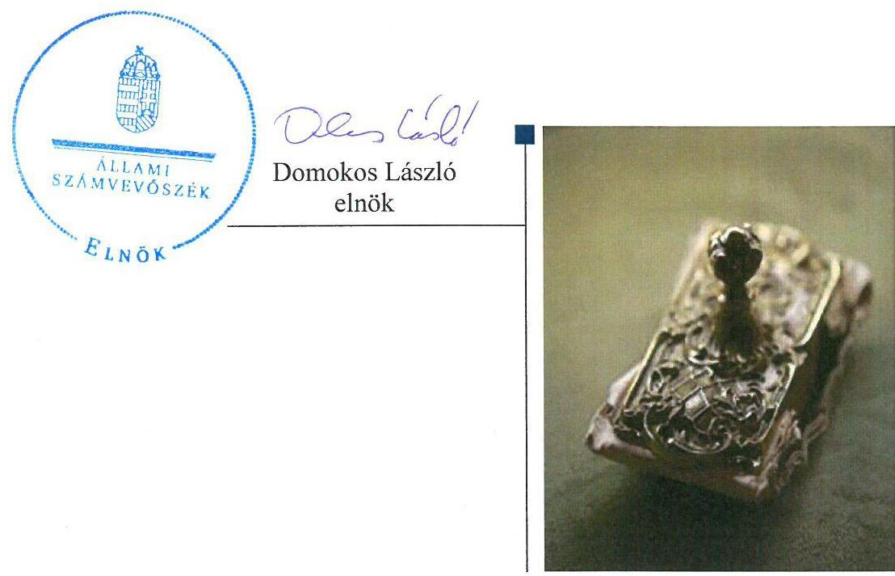
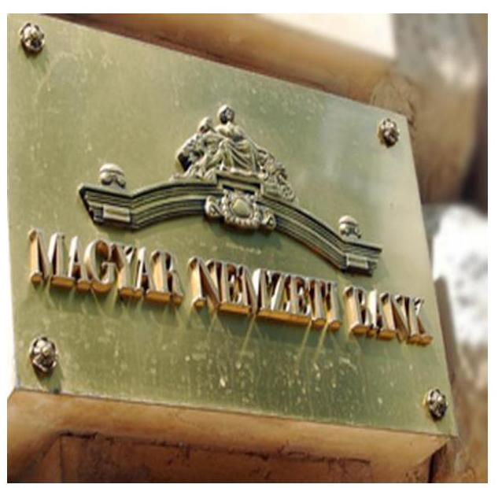
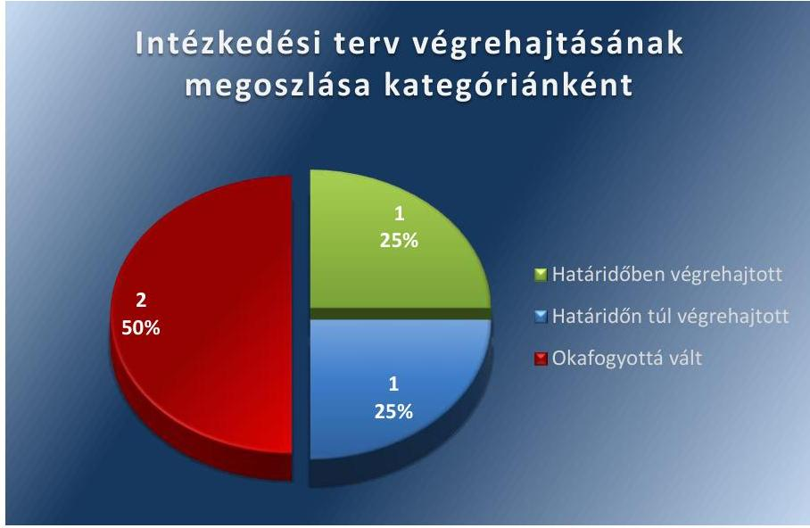
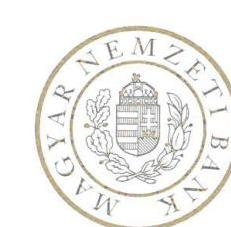
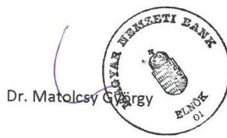
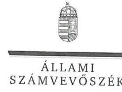
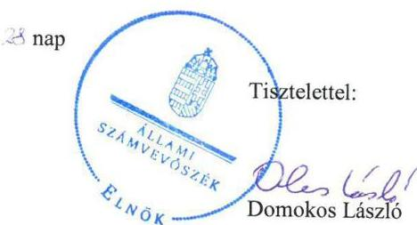

# Jelentés 

## Utóellenőrzések

A Magyar Nemzeti Bank működése szabályszerűségének utóellenőrzése 2016. 04. hó 12. nap

---

# Jelentés 

## Utóellenőrzések

A Magyar Nemzeti Bank működése szabályszerűségének utóellenőrzése 2016. 04. hó 12. nap

---

Jelentéseink az Országgyűlés számítógépes hálózatán és az Interneten a www.asz.hu címen is olvashatóak.

## AZ ELLENŐRZÉST FELÜGYELTE:

HOLMAN MAGDOLNA JULIANNA felügyeleti vezető

## AZ ELLENŐRZÉST VEZETTE ÉS A VÉGREHAJTÁSÁÉRT FELELŐS:

DORMÁN ISTVÁN ZOLTÁN ellenőrzésvezető

## A PROGRAM ÖSSZEÁLLÍTÁSÁÉRT FELELŐS:

JANIK JÓZSEF osztályvezető
BÖRÖCZ IMRE projektfelelős

## A TÉMÁHOZ KAPCSOLÓDÓ KORÁBBI SZÁMVEVŐSZÉKI JELENTÉSEK:

- címe: az MNB ellenőrzéséről - a Magyar Nemzeti Bank működésének, valamint a Pénzügyi Szervezetek Állami Felügyelete működése, és tevékenysége MNB-be integrálása szabályszerűségének ellenőrzéséről
a Magyar Nemzeti Bank működésének és a központi költségvetéssel történő elszámolások szabályszerűségének ellenőrzéséről
- sorszáma: 15046, 13011

IKTATÓSZÁM: V-0960-050/2016
TÉMASZÁM: 27.
ELLENŐRZÉS-AZONOSÍTÓ SZÁM: V071712

---

# TARTALOMJEGYZÉK 

■ ÖSSZEGZÉS ..... 5
■ AZ ELLENŐRZÉS CÉLJA ..... 6
■ AZ ELLENŐRZÉS TERÜLETE ..... 7
■ AZ ELLENŐRZÉS HÁTTERE, INDOKOLTSÁGA ..... 8
■ FÓKUSZKÉRDÉS ..... 9
■ ELLENŐRZÉS HATÓKÖRE ÉS MÓDSZEREI ..... 10
■ MEGÁLLAPÍTÁSOK ..... 13
■ MELLÉKLETEK ..... 15
Az ÁSZ 15046. számú jelentéséhez kapcsolódó intézkedési tervek végrehajtása. ..... 15
■ FÜGGELÉK: ÉSZREVÉTELEK ..... 19
■ RÖVIDÍTÉSEK JEGYZÉKE ..... 25

---

.

---

# ÖSSZEGZÉS 

Az Állami Számvevőszék a Magyar Nemzeti Bank működése szabályszerűségének utóellenőrzését a 2014. április 14. és 2015. október 15. közötti időszakra végezte el. Az utóellenőrzés az ellenőrzött szervezetek által megküldött intézkedési tervekben foglaltak hasznosulására irányult. Az intézkedési tervekben foglaltak végrehajtása a Nemzetgazdasági Minisztérium tekintetében nem volt időszerű, míg a Magyar Nemzeti Bank vonatkozásában két feladat okafogyottá vált, két feladatot teljes körűen végrehajtottak.

## Az ellenőrzés társadalmi indokoltsága

Az Állami Számvevőszék stratégiájában célul tűzte ki a számvevőszéki munka hasznosulásának javítását. Ezzel összhangban ellenőrzi, hogy az ellenőrzött szervezetek megvalósították-e a korábbi ellenőrzései által feltárt hibák, hiányosságok és szabálytalanságok megszüntetése céljából kialakított intézkedési terveikben foglaltakat. A rendszeres utóellenőrzések hozzájárulnak a szükséges intézkedések tényleges végrehajtásához, ezáltal a közpénzügyek rendezettségének javulásához.

## Főbb megállapítások, következtetések, javaslatok

Az intézkedési tervekben foglaltak végrehajtása a Nemzetgazdasági Minisztérium tekintetében nem volt időszerű, míg a Magyar Nemzeti Bank vonatkozásában két feladat okafogyottá vált, két feladatot - egyet határidőn túl - teljes körűen végrehajtottak.

---

# **AZ ELLENŐRZÉS CÉLJA**

## **Magyar Nemzeti Bank működése szabályszerűségének utóellenőrzése**

Az ellenőrzés célja annak értékelése, hogy a ÁSZ jelentésben1 foglalt intézkedést igénylő megállapításokkal és javaslatokkal összhangban készített intézkedési tervben meghatározott feladatokat az ellenőrzött szervezet végrehajtotta-e.

---

# AZ ELLENŐRZÉS TERÜLETE 

## Magyar Nemzeti Bank

A Magyar Nemzeti Bank 1924. június 24-én kezdte meg munkáját. Az MNB² részvénytársasági formában működő jogi személy, részvénye a Magyar Állam tulajdonában van. Az államot, mint részvényest, az államháztartásért felelős miniszter képviseli.

Az MNB jogállását, elsődleges céljait, alapvető valamint alapvető feladatai közé nem tartozó egyéb feladatait és szervezeti felépítését a Magyar Nemzeti Bankról szóló 2013. évi CXXXIX. törvény határozza meg. E szerint az MNB a törvényben foglalt feladatai ellátása valamint kötelességei teljesítése során független szervezet.

Az Alaptörvény ${ }^{3}$ 41. cikke alapján 2013. október 1-jétől az MNB látja el a pénzügyi közvetítőrendszer felügyeletét. Ennek megfelelően 2013. október 1-jei hatállyal megtörtént a Pénzügyi Szervezetek Állami Felügyelete (PSZÁF, Felügyelet) és az MNB összevonása. A 2013. október 1-jétől hatályos MNB tv. ${ }^{4}$ meghatározta a PSZÁF ${ }^{5}$ feladatai MNB-be integrálásának, feladata, hatásköre és jogállása átvételének, valamint a pénzügyi közvetítőrendszer felügyelete ellátásának szabályait. Az összevonást követően az MNB látja el a PSZÁF pénz-, tőke- és biztosítási piac felügyeletével kapcsolatos feladatait, valamint a fogyasztóvédelmi és piacfelügyeleti feladatait.

Az ellenőrzés az ÁSZ tv. ${ }^{6}$ 2011. július 1-jei hatálybalépését követően végzett „Az MNB ellenőrzéséről - a Magyar Nemzeti Bank működésének, valamint a Pénzügyi Szervezetek Állami Felügyelete működése, és tevékenysége MNB-be integrálása szabályszerűségének ellenőrzéséről szóló ÁSZ jelentés (15046, 2015. április)" javaslatai megvalósítására megküldött intézkedési tervekben foglalt feladatok hasznosulására irányult. Az ÁSZ jelentés a nemzetgazdasági miniszternek egy, az MNB elnökének négy javaslatot tartalmazott.

Az utóellenőrzés ${ }^{7}$ a számvevőszéki jelentésben megfogalmazott intézkedést igénylő megállapításokra és javaslatokra készített intézkedési tervekben foglalt feladatok megvalósításának ellenőrzésére, illetve értékelésére fókuszál.

---

# **AZ ELLENŐRZÉS HÁTTERE, INDOKOLTSÁGA**

## **Magyar Nemzeti Bank működése szabályszerűségének utóellenőrzése**

Az ÁSZ tv. 33. § (1) bekezdése értelmében a számvevőszéki jelentések intézkedést igénylő megállapításaihoz és javaslataihoz kapcsolódóan az ellenőrzött szervezet vezetője intézkedési tervet köteles összeállítani, és az Állami Számvevőszék részére megküldeni. Az intézkedési tervben foglaltak megvalósítását – az ÁSZ tv. 33. § (7) bekezdésében foglaltak alapján – az Állami Számvevőszék utóellenőrzés keretében ellenőrizheti. Az intézkedések megvalósulásának értékelése során az Állami Számvevőszék figyelembe veszi az ellenőrzött szervezetek működési feltételeiben, valamint a jogszabályi előírásokban bekövetkezett változásokat.

Az intézkedési tervekben foglalt feladatok hiányos, illetve késedelmes végrehajtása, valamint megvalósításának elmaradása azt mutatja, hogy az ellenőrzések során feltárt hibák, hiányosságok és szabálytalanságok megszüntetése nem kapott kellő hangsúlyt. Ez a szabályszerű működés és a felelős vezetői magatartás vonatkozásában kockázatot hordoz. E kockázatok feltárásával az Állami Számvevőszék utóellenőrzési rendszere fokozza a fegyelmet, és igazolja, hogy a közpénzzel való szabályos gazdálkodás felelőssége elől nem lehet kitérni.

### **AZ ELLENŐRZÉS VÁRHATÓ HASZNOSULÁSA:**

Az utóellenőrzés három szinten hasznosulhat:

- A társadalom szintjén az utóellenőrzés jelzi, hogy a számvevőszéki ellenőrzés megállapításainak van következménye: a hiányosságok megszüntetésére az ellenőrzött szervezet által meghatározott intézkedések végrehajtását is számon kéri az ÁSZ6.
- Az ellenőrzött szervezet szintjén az utóellenőrzés feltárja, hogy a szervezet az intézkedések végrehajtásával hasznosította-e a korábbi ellenőrzési jelentésben a hiányosságok megszüntetése, illetve a kockázatok kezelése érdekében megfogalmazott javaslatokat.
- Az ÁSZ szintjén az utóellenőrzés visszacsatolást ad az ellenőrzési jelentések hasznosulásáról, az intézkedések elmaradása vagy részleges megvalósulása a további ellenőrzésekhez kockázati jelzésként szolgál.

---

# FÓKUSZKÉRDÉS 

1. Az ellenőrzött szervezetek az ÁSZ által elfogadott intézkedési tervben foglaltakat - az előírt határidőben - végrehajtották-e?

---

# ELLENŐRZÉS HATÓKÖRE ÉS MÓDSZEREI 

## Az ellenőrzés típusa

Szabályszerűségi ellenőrzés.

## Az ellenőrzött időszak

Az ÁSZ jelentés közzétételének napjától (2014. április 14.) az utóellenőrzés megkezdésének napjáig (2015. október 15.) tartó időszak volt.

## Az ellenőrzés tárgya

Az ÁSZ tv. 2011. július 1-jei hatálybalépését követően az ÁSZ jelentésekben megfogalmazott javaslatokra az ellenőrzött által megküldött és az ÁSZ által jóváhagyott intézkedési tervekben foglaltak.

Az ellenőrzés kiterjed minden olyan körülményre és adatra, amely az ÁSZ jogszabályban meghatározott feladatainak teljesítéséhez, valamint a program végrehajtása folyamán felmerült újabb összefüggések feltárásához szükséges.

## Az ellenőrzött szervezet

Magyar Nemzeti Bank

## Az ellenőrzés jogalapja

Az Alaptörvény 43. cikk (1) bekezdése alapján az ÁSZ az Országgyűlés pénzügyi és gazdasági ellenőrző szerve. Az ÁSZ tv.-ben meghatározott feladatkörében ellenőrzi a központi költségvetés végrehajtását, az államháztartás gazdálkodását, az államháztartásból származó források felhasználását és a nemzeti vagyon kezelését. Az ÁSZ tv. 1. § (3) bekezdése szerint az ÁSZ általános hatáskörrel végzi a közpénzekkel és az állami és önkormányzati vagyonnal való felelős gazdálkodás ellenőrzését. Az ÁSZ tv. 33. § (7) bekezdése alapján az ÁSZ jelentésben foglalt megállapításokhoz kapcsolódóan összeállított intézkedési tervben foglaltak megvalósítását az ÁSZ utóellenőrzés keretében ellenőrizheti. Az Áht. ${ }^{9} 61 . \S$ (2) bekezdése szerint az államháztartás külső ellenőrzésével kapcsolatos feladatokat az ÁSZ látja el.

---

# Az ellenőrzés módszerei 

Az ellenőrzést a nemzetközi standardokat irányadónak tekintve az ellenőrzési program ellenőrzési kérdései, az ellenőrzött időszakban hatályos jogszabályok, az ellenőrzés szakmai szabályok és módszertanok figyelembe vételével végezzük. Az utóellenőrzéseket önállóan vagy ellenőrzéshez kapcsolódóan végezzük.

Az ellenőrzés ideje alatt az ellenőrzött szervezettel történő kapcsolattartást az ÁSZ SZMSZ ${ }^{10}$-ének vonatkozó előírásai alapján biztosítjuk.

Az utóellenőrzés megállapításait elsősorban az ÁSZ rendelkezésére álló, valamint az ellenőrzött szervezetektől elektronikusan bekért dokumentumok alapozzák meg, amely szükség esetén helyszíni ellenőrzéssel egészülhet ki. Az ÁSZ az ellenőrzés keretében egyes esetekben teljesítményellenőrzés tervezéséhez is kérhet adatokat.

Az ellenőrzési bizonyítékként felhasználható adatforrások közé tartoznak egyrészt a szakmai program ellenőrzési kérdések, kritériumok fejezetében felsorolt adatforrások, másrészt adatforrás lehet még minden - az ellenőrzés folyamán feltárt, az ellenőrzés szempontjából releváns információt tartalmazó - dokumentum.

Az ellenőrzés során értékeljük, hogy az ÁSZ jelentésben foglalt javaslatokra az elkészített intézkedési terveket határidőben megküldték-e, az ÁSZ által elfogadott intézkedési tervben foglaltakat végrehajtották-e.

A jóváhagyott intézkedési tervben előírt feladatok végrehajtásának ellenőrzését értékelési kritériumok alapján végezzük. Figyelembe vesszük az intézkedési terv jóváhagyását követően hatályba lépett jogszabályi előírások változásából következő események, továbbá a feladat-ellátási és finanszírozási rendszer esetleges változásának hatásait. Az intézkedési tervekben előírt feladatokat azok végrehajthatósága, illetve végrehajtása szempontjából az alábbiak szerint kell értékelni:
$\longrightarrow$ okafogyottá vált az előírt feladat, ha végrehajtására - meghatározott esemény bekövetkezése, továbbá külső körülmény, a működést érintő feltétel változása miatt - már nincs szükség, illetve lehetőség, és egyértelműen megállapítható, hogy az intézkedést szükségessé tevő körülmény a jövőben nem fordulhat elő;
$\longrightarrow$ nem időszerű (nem esedékes) az a feladat, amelynek ellenőrzési időszakon belüli végrehajtására azért nem került (kerülhetett) sor, mert az intézkedés alapjául szolgáló esemény nem következett be, de annak jövőbeni előfordulása lehetséges, a végrehajtása nem volt esedékes, vagy a végrehajtás határideje még nem járt le;
$\longrightarrow$ határidőben végrehajtott a feladat, ha a teljesítés dokumentáltan az intézkedési tervben előírt határidőben és tartalommal megtörtént;
$\longrightarrow$ határidőn túl végrehajtott a feladat, ha annak teljesítése az intézkedési tervben meghatározott módon, de az előírt határidőn túl történt meg;
$\longrightarrow$ részben végrehajtott az a feladat, amelynek végrehajtása teljes körűen az intézkedési tervben előírt módon nem történt meg;
$\longrightarrow$ nem végrehajtott a feladat, ha a végrehajtás nem történt meg, vagy amennyiben a teljesítést nem dokumentálták.

---

Az ellenőrzés lefolytatásához az MNB a tanúsítványok elektronikus kitöltésével, valamint az ÁSZ által kért dokumentumok elektronikus megküldésével szolgáltat adatokat, amelyek valódiságát és teljeskörűségét az MNB elnöke által tett teljességi és hitelességi nyilatkozat igazolja. Az így rendelkezésre bocsátott adatok, információk kontrollja az ellenőrzés keretében történik.

---

# MEGÁLLAPÍTÁSOK 

## 1. Az ellenőrzött szervezetek az ÁSZ által elfogadott intézkedési tervben foglaltakat - az előírt határidőben - végrehajtották-e?

Összegző megállapítás

Az NGM ${ }^{11}$ intézkedési tervében foglalt feladat végrehajtása nem volt időszerű. Az MNB elnöke által az intézkedési tervben előírt négy feladatból egy határidőben, egy határidőn túl teljesült, két feladat okafogyottá vált.

AZ NGM által készített intézkedési tervben egy feladatot írtak elő, amely az ellenőrzés időszakában nem volt időszerű.

Nem időszerű feladat:

1. Az NGM az MNB alapító okirata kiadására az - ÁSZ által elfogadott - intézkedési tervében 2015. november 30-ai határidőt állapított meg, amely az ellenőrzött időszakon túli volt.

AZ MNB vonatkozásában az 1. ábra szemlélteti az intézkedési terv végrehajtásának megoszlását kategóriánként.
1. ábra

Forrás: ÁSZ
Az ÁSZ jelentésben megfogalmazott négy javaslatra az intézkedési tervben az MNB elnöke négy feladatot írt elő. Ezekből két feladat okafogyottá vált, egy határidőben, egy határidőn túl teljesült.

Okafogyottá vált feladatok:

1. Az MNB elnöke a szerződésmódosítással kapcsolatos hirdetmény közzétételének kötelezettségére vonatkozó előírás megsértése tekintetében az ÁSZ által elfogadott intézkedési tervben előírta, hogy

---

az illetékes vezetők intézkedjenek a munkajogi felelősség kivizsgálására irányuló
 eljárás megindításáról és lefolytatásáról, továbbá az eljárás lefolytatásának eredményeként esetlegesen szükségessé váló intézkedés kezdeményezéséről. Az MNB által az ellenőrzés rendelkezésére bocsátott jegyzőkönyv alapján a felelős osztályvezető munkaviszonya 2015. január 30-án megszűnt, így a munkajogi felelősség megállapítására irányuló eljárás megindítására és lefolytatására nem került sor.
2. Az ÁSZ által elfogadott intézkedési tervben az MNB elnöke előírta, hogy az illetékes vezetők intézkedjenek a piacfelügyeleti eljárások lefolytatásához bekért adatok kezelése és megsemmisítése vonatkozásában a munkajogi felelősség kivizsgálására irányuló eljárás megindításáról és lefolytatásáról, továbbá az eljárás lefolytatásának eredményeként esetlegesen szükségessé váló intézkedés kezdeményezéséről. Az MNB által az ellenőrzés rendelkezésére bocsátott jegyzőkönyv alapján a felelős osztályvezető munkaviszonya időközben megszűnt, így a munkajogi felelősség megállapítására irányuló eljárás megindítására és lefolytatására nem került sor.

Határidőben végrehajtott feladat:
3. Az MNB elnöke a vállalt határidő előtt kiadta a Magyar Nemzeti Bank által a pénzügyi közvetítőrendszer felügyelete keretében, valamint a bizalmi vagyonkezelő vállalkozások tekintetében lefolytatott egyes engedélyezési és nyilvántartásba vételi eljárások igazgatási szolgáltatási díjáról szóló 14/2015. (V. 13.) MNB rendeletet${ }^{12}$, amely tartalmazta az igazgatási szolgáltatási díj mértékét, valamint a díj kezelésére, nyilvántartására, visszatérítésére vonatkozó részletes szabályokat.

Határidőn túl végrehajtott feladat:
4. Az MNB a főépület felújítására vonatkozó tervezési és előkészítési munkákhoz kapcsolódó költségként könyvelt összegeket átvezette a beruházások közé és a vonatkozó számviteli előírásoknak megfelelően befejezetlen beruházásként tartotta nyilván. A feladatot határidőn túl, az intézkedési tervben megjelölt 2015. június 30-a után hajtották végre.

---

# MELLÉKLETEK

■ AZ ÁSZ 15046. SZÁMÚ JELENTÉSÉHEZ KAPCSOLÓDÓ INTÉZKEDÉSI TERVEK VÉGREHAJTÁSA

Nemzetgazdasági Minisztérium által készített intézkedési terv végrehajtása

|  1. | Intézkedési terv alapján elvégzendő feladat | Az intézkedési tervben meghatározott határidő | Az intézkedés végrehajtása  |
| --- | --- | --- | --- |
|  1. |  | 2. | 3.  |
|  Nem időszerű intézkedés |  |  |   |
|  1. A Nemzetgazdasági Minisztérium az MNB alapító okiratának módosítása során az okiratba foglalja:
a) az MNB tevékenységi körét;
b) a Pénzügyi Stabilitási Tanácsra vonatkozó előírásokat és annak ügyrendjét;
c) aktualizálja a hatályos törvényi hivatkozásokat.
Felelős: Molnár István főosztályvezető, Makrogazdasági Főosztály | 2015. november 30. |  | Az NGM az MNB alapító okirata kiadására az - ÁSZ által elfogadott - intézkedési tervében 2015. november 30-ai határidőt állapított meg, amely az ellenőrzött időszakon túli volt.  |

---

# Magyar Nemzeti Bank által készített intézkedési terv végrehajtása

|  1. | 2. | 3.  |
| --- | --- | --- |
|  **Okafogyottá vált intézkedések** |  |   |
|  1. | 2. pont: A Központi beszerzési és üzemeltetési igazgatóság vezetője a Személyügyi igazgatóság vezetőjének közreműködése mellett intézkedjen a szerződésmódosítással kapcsolatos hirdetmény-feladási kötelezettség elmulasztása tekintetében a munkajogi felelősség kivizsgálására irányuló eljárás megindításáról és lefolytatásáról, továbbá az eljárás lefolytatásának eredményeként esetlegesen szükségessé váló intézkedés, illetve intézkedések megtételéről, kezdeményezéséről. | 2015. május 30.  |
|  2. | 3. pont A Központi beszerzési és üzemeltetési igazgatóság vezetője a Személyügyi igazgatóság vezetőjének közreműködése mellett intézkedjen a piacfelügyeleti eljárások lefolytatásához bekért adatok kezelése és megsemmisítése vonatkozásában a munkajogi felelősség kivizsgálására irányuló eljárás megindításáról és lefolytatásáról, továbbá az eljárás lefolytatásának eredményeként esetlegesen szükségessé váló intézkedés. | 2015. június 15.  |
|  **Határidőben végrehajtott intézkedések** |  |   |
|  3. | 4. pont A javaslatban megfogalmazott rendelet tervezete elkészült. Belső egyeztetés után a PST${ }^{13}$ 2015. március 12-én a rendelettervezet kiadás tárgyában írt előterjesztést megtárgyalta, a rendelet jelenleg elnöki aláírás alatt áll. | 2015. május 29.  |

Az intézkedési tervben meghatározott határidő

Az intézkedési tervben meghatározott határidő

Az intézkedés végrehajtása

Az MNB elnöke a szerződésmódosítással kapcsolatos hirdetmény közzétételének kötelezettségére vonatkozó előírás megsértése tekintetében az ÁSZ által elfogadott intézkedési tervben előírta, hogy az illetékes vezetők intézkedjenek a munkajogi felelősség kivizsgálására irányuló eljárás megindításáról és lefolytatásáról, továbbá az eljárás lefolytatásának eredményeként esetlegesen szükségessé váló intézkedés kezdeményezéséről. A felelős osztályvezető munkaviszonya 2015. január 30-án megszűnt, így a munkajogi felelősség megállapítására irányuló eljárás megindítására és lefolytatására nem került sor.

Az ÁSZ által elfogadott intézkedési tervben az MNB elnöke előírta, hogy az illetékes vezetők intézkedjenek a piacfelügyeleti eljárások lefolytatásához bekért adatok kezelése és megsemmisítése vonatkozásában a munkajogi felelősség kivizsgálására irányuló eljárás megindításáról és lefolytatásáról, továbbá az eljárás lefolytatásának eredményeként esetlegesen szükségessé váló intézkedés kezdeményezéséről. A felelős osztályvezető munkaviszonya időközben megszűnt, így a munkajogi felelősség megállapítására irányuló eljárás megindítására és lefolytatására nem került sor.

Az MNB elnöke a vállalt határidő előtt kiadta a Magyar Nemzeti Bank által a pénzügyi közvetítőrendszer felügyelete keretében, valamint a bizalmi vagyonkezelő vállalkozások tekintetében lefolytatott egyes engedélyezési és nyilvántartásba vételi eljárások igazgatási szolgáltatási díjáról szóló 14/2015. (V. 13.) MNB rendeletet, amely tartalmazta az igazgatási szolgáltatási díj mértékét, valamint a díj kezelésére, nyilvántartására, visszatérítésére vonatkozó részletes szabályokat.

---

|  4. | 1. pont: Az MNB a főépület felújításához kapcsolódóan 2013-ban költségként könyvelt összegeket (Minusplus Kft. 2013003154 és 2013003875 SAP biz. számú számlája, összesen 7,6 M HUF+áfa; Friday Creative Kft. 2013002371 SAP biz. számú számlája 7,8 M HUF+áfa) át kell vezetni a beruházások közé és a vonatkozó számviteli előírásoknak megfelelően befejezetlen beruházásként kell nyilvántartani. | 2015. június 30. | Az MNB a főépület felújítására vonatkozó tervezési és előkészítési munkákhoz kapcsolódó költségként könyvelt összegeket átvezette a beruházások közé és a vonatkozó számviteli előírásoknak megfelelően befejezetlen beruházásként tartotta nyilván. A feladatot határidőn túl, az intézkedési tervben megjelölt 2015. június 30-a után hajtották végre.  |
| --- | --- | --- | --- |
|  |   |   |   |

---

.

---

# FÜGGELÉK: ÉSZREVÉTELEK 

A jelentéstervezetet a Számvevőszék 15 napos észrevételezésre megküldte az ellenőrzött szervezet vezetőjének az ÁSZ tv. 29. § (1) bekezdése előírásának megfelelően.
Az elfogadott észrevételek alapján a Számvevőszék módosította a jelentést.
A függelék tartalmazza az ellenőrzött észrevételeit, illetve az el nem fogadott észrevételek elutasításának indoklását.

- A Magyar Nemzeti Bank elnökének 111122-22/2016. iktatószámú levele és 111122-20/2016. iktatószámú észrevétele
- Tájékoztatás az elfogadott és az el nem fogadott észrevételekről (V-0960-044/2016.)

## * 29. § (1) Az Állami Számvevőszék az ellenőrzési megállapításait megküldi az ellenőrzött szervezet vezetőjének vagy az általa megbízott személynek, és annak, akinek személyes felelősségét állapította meg.

(2) Az ellenőrzött szervezet vezetője és a felelősként megjelölt személy az ellenőrzés megállapításaira tizenöt napon belül írásban észrevételt tehet.
(3) Az Állami Számvevőszék az észrevételre a beérkezésétől számított harminc napon belül írásban válaszol. A figyelembe nem vett észrevételeket köteles a jelentésben feltüntetni, és megindokolni, hogy azokat miért nem fogadta el.

---

MAGYAR NEMZETI BANK

Állami Számvevőszék
Domokos László elnök úr részére
Budapest
Apáczai Csere János u. 10.
1052

Iktatószám: 111122-22/2016
Budapest, 2016. június 7.

Tárgy: Észrevételek küldése az MNB ellenőrzéseiről szóló jelentéstervezetekhez

Tisztelt Elnök Úr!

Mellékelten küldöm az MNB észrevételeit az Állami Számvevőszék „A Magyar Nemzeti Bank működése szabályszerűségének ellenőrzése" című, illetve „A Magyar Nemzeti Bank működése szabályszerűségének utóellenőrzése" című jelentéstervezetére.

Üdvözlettel:

Melléklet: 2 db

ÁLLAMI SZÁMVEVŐSZÉK

Állami Számvevőszék
10412401600
Érkész: 2016 JÚN 10.
Iktatószám: 1-0888-208/2016
Melléklet: 2

POSTACÍM: 1054 BUDAPEST, SZABADSÁG TÉR 9.
E-MAIL: elnok@mnb.hu TELEFON: +36 1 428 2606

---

Iktatószám: 111122-20/2016
Budapest, 2016. június 7.

# ÉSZREVÉTELEK 

az Állami Számvevőszék „A Magyar Nemzeti Bank működése szabályszerűségének utóellenőrzése" című, V-0960040/2016. számú számvevőszéki jelentés tervezetéhez

## „Az ellenőrzés területei" című fejezet

Jelentéstervezet 7. oldal: „Az MNB részvénytársasági formában működő jogi személy, részvényei az állam tulajdonában vannak." Az MNB-nek egy részvénye van Alapító Okirata szerint, ezért kérjük a mondatot ennek megfelelően javítani.

## „Megállapítások" című fejezet

A jelentéstervezetben a megállapítások között határidőn túliként 4. sorszámmal jelölt pontja (14. oldal) okafogyottá vált. Az MNB igazgatósága 272/2015. (12.11.) számú igazgatósági határozatával elrendelte az ÁSZ vizsgálat észrevétele alapján a költségek közül a beruházások közé átvezetett összegek költségre történő visszakönyvelését, 75655170 Ft összegben.

Egyéb kisebb, pontosító észrevételek:

- 6. oldal: számvevőszéki jelentés kerül definiálásra, holott az anyag több helyen nem konzekvens módon ÁSZ jelentés kifejezést használ;
- 8. oldal: ÁSZ törvény helyett ÁSZ tv. javasolt;
- 12. oldal: teljes körűségét helyett teljeskörűségét; nyilatkozata;
- 13. oldal: vonatkozásában a 1. helyett vonatkozásában az 1.;
- 14. oldal és 16. oldal: kivizsgálásra helyett kivizsgálására.

---

ELNÖK

Ikt.szám: V-0960-044/2016.

Dr. Matolesy György úr
elnök
Magyar Nemzeti Bank

# Budapest 

## Tisztelt Elnök Úr!

A Magyar Nemzeti Bank működése szabályszerűségének utóellenőrzése című számvevőszéki jelentéstervezetre tett észrevételeit köszönettel megkaptam.

Az Állami Számvevőszék észrevételekre vonatkozó álláspontjáról a felügyeleti vezető által készített részletes tájékoztatást csatoltan megküldöm.

Tájékoztatom Elnök urat, hogy a jelentésben - az Állami Számvevőszékről szóló 2011. évi LXVI. törvény 29. § (3) bekezdése alapján - a figyelembe nem vett észrevételeket szerepeltetjük az elutasítás indokának feltüntetésével együtt.

Budapest, 2016.

Melléklet: Tájékoztatás az elfogadott és az el nem fogadott észrevételekről

---

# Tájékoztatás az elfogadott és az el nem fogadott észrevételekről 

A Magyar Nemzeti Bank működése szabályszerűségének utóellenőrzése című számvevőszéki jelentéstervezetre a 111122-20/2016. iktatószámú levelében tett észrevételeit áttekintettük, annak kezeléséről az alábbi tájékoztatást adom.

1. A jelentéstervezet 7. oldalán az MNB részvényeire tett észrevételét elfogadtuk, melyet a számvevőszéki jelentés készítésénél az alábbiak szerint veszünk figyelembe:
„Az MNB részvénytársasági formában működő jogi személy, részvénye a Magyar Állam tulajdonában van."
2. A jelentéstervezet 14. oldalán a 4. pontban foglaltakra tett észrevételét, mely szerint a feladat okafogyottá vált, nem fogadtuk el. A jelentéstervezetben foglalt megállapításunk szerint az MNB elnöke - a V-0455-477/2015. iktatószámú számvevőszéki jelentés intézkedést igénylő megállapításaira és javaslataira készített - intézkedési tervében határozta meg feladatként, hogy az MNB főépület felújításához kapcsolódó, költségként könyvelt tételeket a beruházások közé át kell vezetnie és a vonatkozó számviteli előírásoknak megfelelően befejezetlen beruházásként kell nyilvántartania. A feladatot a végrehajtáshoz meghatározott határidőn túl teljesítették, amelyet az észrevétel is megerősít. A jelentéstervezetben is rögzítettek szerint az ellenőrzött időszak vége 2015. október 15. volt. Az ellenőrzött időszakon túl tett intézkedéseket az Állami Számvevőszék nem ellenőrizte, ezért az észrevételben hivatkozott 272/2015. (12.11.) számú igazgatósági határozatot az ellenőrzött időszakra szóló megállapítás megtételénél nem tudjuk figyelembe venni.
3. A jelentéstervezetre tett egyéb, pontosító észrevételeit a számvevőszéki jelentés készítésénél figyelembe vesszük.

Budapest, 2016. 06 hó 28 nap
Holman Magdolna
felügyeleti vezető

---

.

---

# RÖVIDÍTÉSEK JEGYZÉKE 

${ }^{1}$ ÁSZ jelentés
${ }^{2}$ MNB
${ }^{3}$ Alaptörvény
${ }^{4}$ MNB tv.
${ }^{5}$ PSZÁF
${ }^{6}$ ÁSZ tv.
${ }^{7}$ utóellenőrzés
${ }^{8}$ ÁSZ
${ }^{9}$ Áht.
${ }^{10}$ SZMSZ
${ }^{11}$ NGM
${ }^{12}$ 14/2015. (V. 13.) MNB rendelet
${ }^{13}$ PST

Az ÁSZ 15046. számú, Jelentés az MNB ellenőrzéséről - a Magyar Nemzeti Bank működésének, valamint a Pénzügyi Szervezetek Állami Felügyelete működésének, és tevékenysége MNB-be integrálása szabályszerűségének ellenőrzéséről
Magyar Nemzeti Bank
Magyarország Alaptörvénye
a Magyar Nemzeti Bankról szóló 2013. évi CXXXIX. törvény
Pénzügyi Szervezetek Állami Felügyelete
az Állami Számvevőszékről szóló 2011. évi LXVI. törvény
az ÁSZ 15046. számú
 jelentésében foglalt megállapításokhoz kapcsolódóan az MNB, valamint az NGM által összeállított és az ÁSZ által elfogadott intézkedési tervekben foglaltak végrehajtásának ellenőrzése
Állami Számvevőszék
az államháztartásról szóló 2011. évi CXCV. törvény
Szervezeti és Működési Szabályzat
Nemzetgazdasági Minisztérium
a Magyar Nemzeti Bank által a pénzügyi közvetítőrendszer felügyelete keretében, valamint a bizalmi vagyonkezelő vállalkozások tekintetében lefolytatott egyes engedélyezési és nyilvántartásba vételi eljárások igazgatási szolgáltatási díjáról
Pénzügyi Stabilitási Tanács

---

# ÁLLAMI SZÁMVEVŐSZÉK 

1052 Budapest, Apáczai Csere János utca 10.
Levélcím: 1364 Budapest, Pf. 54
Telefon: +36 1 4849100 Telefax: +36 1 4849200
www.asz.hu
