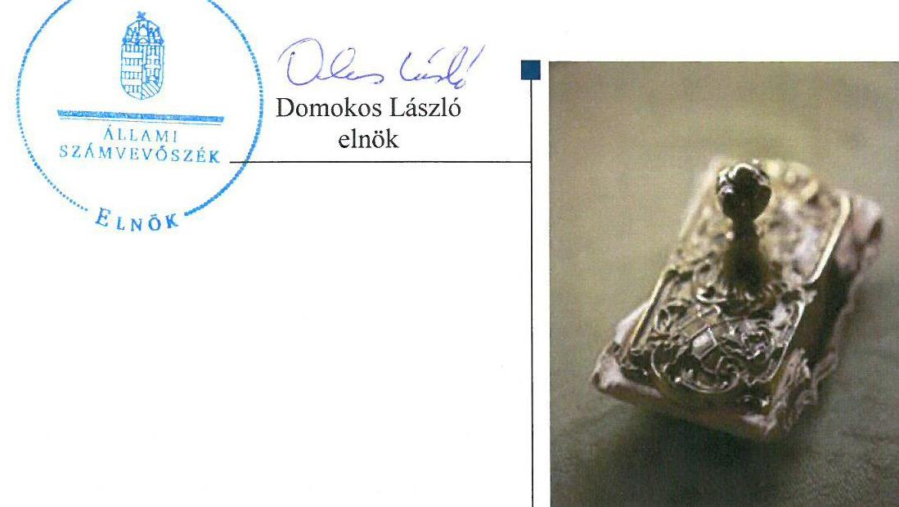
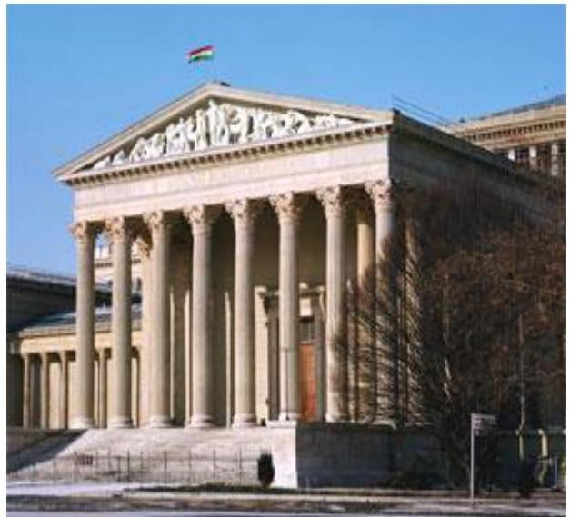
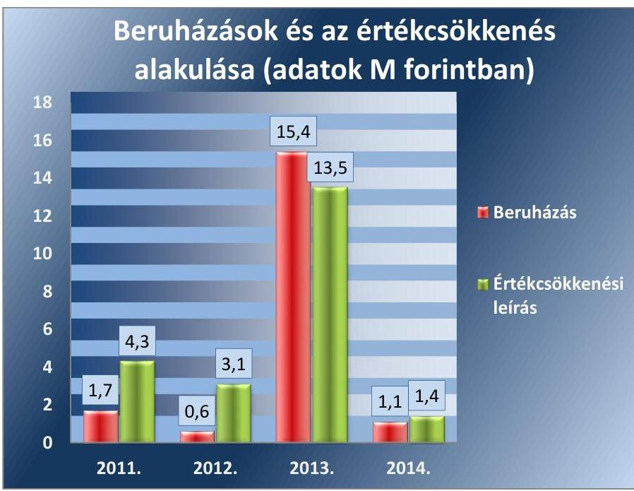
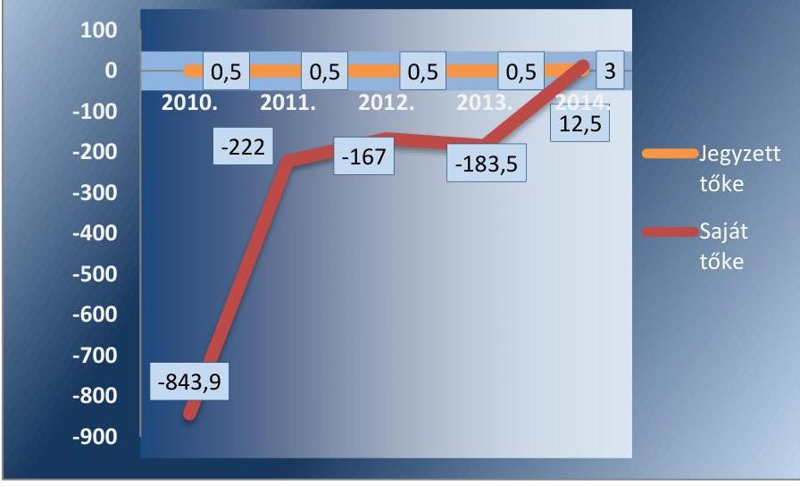
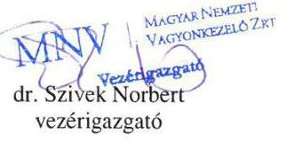
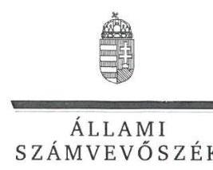
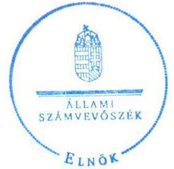
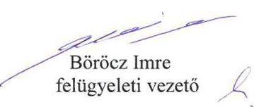
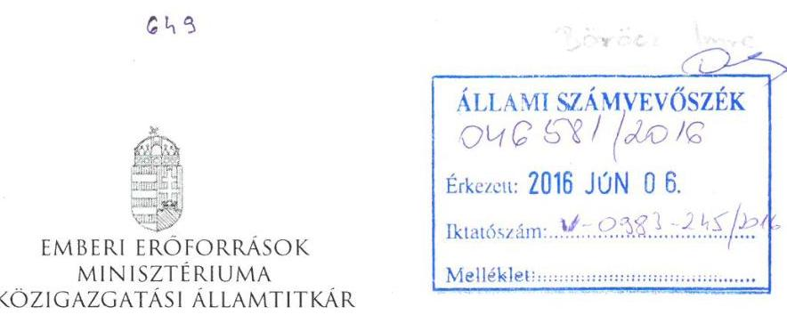
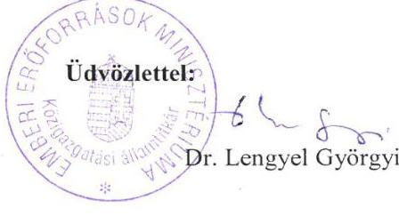

# Jelentés 

## NKÖV Nemzeti Kulturális Örökség Védelmi Nonprofit Kft.

Az állami tulajdonban (résztulajdonban) lévő gazdálkodó szervezetek vagyonmegőrzési és gazdálkodási tevékenységének ellenőrzése 2016.

16118
www.asz.hu

---

# Jelentés 

## NKÖV Nemzeti Kulturális Örökség Védelmi Nonprofit Kft.

Az állami tulajdonban (résztulajdonban) lévő gazdálkodó szervezetek vagyonmegőrzési és gazdálkodási tevékenységének ellenőrzése
2016. július hó 13. nap

---

# AZ ELLENŐRZÉST FELÜGYELTE:

- BÖRÖCZ IMRE felügyeleti vezető

- AZ ELLENŐRZÉST VEZETTE ÉS A VÉGREHAJTÁSÁÉRT FELELŐS:
  - IMRE ZSUZSANNA ellenőrzésvezető
  - A PROGRAM ÖSSZEÁLLÍTÁSÁÉRT FELELŐS:
    - JANIK JÓZSEF osztályvezető

- IKTATÓSZÁM: V-0983-251/2016.
- TÉMASZÁM: 2017.
- ELLENŐRZÉS-AZONOSÍTÓ SZÁM: V070916

Jelentéseink az Országgyűlés számítógépes hálózatán és az Interneten a www.asz.hu címen is olvashatóak.

---

# TARTALOMJEGYZÉK 

■ ÖSSZEGZÉS ..... 5
■ AZ ELLENŐRZÉS CÉLJA ..... 6
■ AZ ELLENŐRZÉS TERÜLETE ..... 7
■ AZ ELLENŐRZÉS HÁTTERE, INDOKOLTSÁGA ..... 9
■ A JELENTÉS LÉNYEGES KÉRDÉSKÖREI ..... 10
■ ELLENŐRZÉS HATÓKÖRE ÉS MÓDSZEREI ..... 11
■ MEGÁLLAPÍTÁSOK ..... 13
■ JAVASLATOK ..... 29
■ MELLÉKLETEK ..... 31
I. Sz. melléklet: Értelmező szótár. ..... 31
II. Sz. melléklet: Az NKÖV NKft. vagyonának megoszlása 2011-2014. évben (adatok M forintban) ..... 38
III. Sz. melléklet: Az NKÖV NKft. eredményének alakulása a 2011-2014. évben (adatok M forintban) ..... 39
■ FÜGGELÉK: ÉSZREVÉTELEK ..... 41
■ RÖVIDÍTÉSEK JEGYZÉKE ..... 47

---

.

---

# ÖSSZEGZÉS 

Az Állami Számvevőszék az NKÖV Nemzeti Kulturális Örökség Védelmi Nonprofit Korlátolt Felelősségű Társaság vagyonmegőrzési és gazdálkodási tevékenységét 2011. január 1. és 2014. december 31. közötti időszakra vonatkozóan ellenőrizte.

A NEFMI, majd az EMMI tulajdonosi joggyakorlása összességében szabályszerű volt. Az NKÖV NKft. vagyonmegőrzési tevékenységét a feltárt hiányosságok mellett alapvetően szabályszerűen végezte. A vagyongazdálkodási tevékenységét hiányosan szabályozta, a közhasznú és a vállalkozási tevékenység bevételeinek és ráfordításainak elszámolása nem volt szabályszerű, több esetben mellőzte a közbeszerzési eljárás lefolytatását. Vagyongazdálkodási tevékenységét összességében megfelelően végezte.

## Az ellenőrzés társadalmi indokoltsága

Az Állami Számvevőszék stratégiájában megfogalmazta, hogy az államháztartáson kívülre nyújtott költségvetési támogatások és ingyenes vagyonjuttatások, valamint az államháztartáson kívül működő közfeladat-ellátó rendszerek ellenőrzéseivel hozzájárul ahhoz, hogy a közpénzeket az államháztartáson kívül működő szervezetek is átlátható, rendezett módon használják fel a közfeladatok szerződésben vállalt ellátása, továbbá a közvagyon szerződésben vállalt átlátható, hatékony, költségtakarékos működtetése, értékének megőrzése, állagának védelme, értéknövelő használata, hasznosítása és gyarapítása érdekében. Minden közpénzt, közvagyont használó szervezettel szemben társadalmi igény, hogy tevékenységükről elszámoljanak. Ezzel az igénnyel és az Állami Számvevőszék Stratégiájával összhangban került sor az NKÖV NKft. ${ }^{1}$ ellenőrzésére, amely hozzájárul a közvagyon hatékony működtetése, értékének megőrzése, állagának védelme, gyarapítása és a közpénzügyek átláthatóságának előmozdításához.

## Főbb megállapítások, következtetések, javaslatok

A NEFMI, majd az EMMI, mint a meghatalmazott tulajdonosi joggyakorló a tulajdonos számára fenntartott, vagyongazdálkodásra vonatkozó jogokat meghatározta. Az Alapító Okiratban rögzítették a gazdálkodó szervezet saját vagyona értékének megőrzését és gyarapítását, valamint a felelős gazdálkodás követelményeit. Az NKÖV NKft. nem kezelt állami vagyont, így vagyonkezelési szerződés megkötésére sem került sor. A meghatalmazott tulajdonosi joggyakorló vagyonváltozást eredményező döntései megfeleltek a jogszabályi és a belső előírásoknak.

Az NKÖV NKft. a vagyon értékének megőrzését, gyarapítását szolgáló, szabályszerű vagyongazdálkodás feltételeinek kialakítása nem teljes körűen felelt meg a jogszabályi előírásoknak. Nem rendelkezett a tulajdonos joggyakorló által jóváhagyott SZMSZ-el, nem szabályozták, hogy a támogatások rendeltetésszerű felhasználásáról való számadási kötelezettsége teljesítését milyen nyilvántartások vezetésével biztosítja. Saját vagyonát összességében a jogszabályi előírásoknak megfelelően tartotta nyilván, azonban a Leltározási szabályzat ${ }^{2}{ }_{1-2}$ rendelkezéseit nem tartották be. A közhasznú és vállalkozási tevékenység ráfordításainak nyilvántartásának szabályozása és azok elszámolása nem volt szabályszerű. A vagyongazdálkodási tevékenysége a jogszabályi rendelkezésnek és a belső szabályzatok előírásainak alapvetően megfelelt, önköltségszámításra a közhasznú tevékenysége tekintetében nem volt kötelezett. A vagyonváltozást eredményező döntések előkészítése és megalapozása a jogszabályi és belső előírásoknak összességében megfelelő volt, azonban több esetben mellőzték a közbeszerzési eljárás lefolytatását. A beszámolási, adatszolgáltatási kötelezettségeket szabályszerűen teljesítették. A vagyongazdálkodást érintően kialakították és szabályosan működtették a meghatalmazott tulajdonosi joggyakorlóval fenntartott információs rendszert. Adósságot keletkeztető ügyletet nem kötöttek, osztalékfizetésre nem került sor.

Az ÁSZ az NKÖV NKft. ügyvezetőjének fogalmazott meg javaslatokat, melyek alapján köteles intézkedési tervet összeállítani és azt a jelentés kézhezvételétől számított 30 napon belül az ÁSZ részére megküldeni.

---

# AZ ELLENŐRZÉS CÉLJA 

Az ellenőrzés célja annak értékelése volt, hogy a tulajdonosi jogok gyakorlása szabályszerű volt-e, a gazdálkodó szervezet által ellátott feladat bevételei, ráfordításai elszámolásának, és vagyongazdálkodási tevékenységének szabályozása megfelelt-e a jogszabályi és a tulajdonosi előírásoknak és azok végrehajtása szabályszerű volt-e, biztosítva volt-e a közfeladatok átláthatósága és elszámoltathatósága érdekében a közszolgáltatás díjának megalapozottsága szabályszerű önköltségszámítással, a vagyonváltozást eredményező döntések esetében a tulajdonosi jogok gyakorlója és a gazdálkodó szervezet szabályszerűen jártak-e el, a gazdálkodó szervezet épített-e ki és működtetett-e információs rendszert a szabályszerű vagyongazdálkodás érdekében. Az ellenőrzés további célja volt annak értékelése, hogy a kormányzati szektorba sorolt egyéb szervezetek gazdálkodásának a kormányzati szektor hiányára és az államadósságra befolyással bíró elemei a jogszabályi előírásoknak megfeleltek-e.

---

# AZ ELLENŐRZÉS TERÜLETE

## NKÖV Nemzeti Kulturális Örökség Védelmi Nonprofit Korlátolt Felelősségű Társaság

Az NKÖV NKft. a Magyar Állam 100%-os tulajdonában álló egyszemélyes nonprofit gazdasági társaság. A Magyar Állam abból a célból, hogy a kiemelt jelentőségű nemzeti kulturális értékeket őrző intézményei védelmét biztosítsa, – a Ptk1, valamint a Kszt.4 alapján – 2001. január 1-jével közhasznú társaságot hozott létre. Az NKÖV NKft. a Gt.5 értelmében 2009. július 1-jétől nonprofit korlátolt felelősségű társaságként működött, jogállását 2014. március 15-től a Ptk6 határozta meg. Törzstőkéje alapításától kezdődően 500 ezer Ft volt, amit a Ptk2 rendelkezésének megfelelően 2014-ben 3 M Ft-ra emeltek.

Az NKÖV NKft. Alapító Okirata Alapító Okiratban7 1 értelmében ellátott közfeladatai 2011-től a következők voltak: kulturális örökség megóvása, műemlék-védelem, nevelés és oktatás, képességfejlesztés, ismeretterjesztés, múzeumi tevékenység, történelmi hely, építmény, egyéb látványosság működtetése, biztonsági rendszer-szolgáltatás, illetve egyéb szakmai, tudományos, műszaki tevékenység és oktatás. Az NKÖV NKft. Alapító Okiratát a jogszabályi, szervezeti, illetve feladatváltozással összhangban az ellenőrzéssel érintett időszakban hét alkalommal módosították.

Az MNV Zrt.8 a tulajdonosi jogok gyakorlására az ellenőrzött időszakot megelőzően (2008.) vagyonkezelési (hasznosítási) szerződést kötött a NEFMI9-vel. (A NEFMI elnevezése 2012. május 14-étől EMMI10 -re változott.) Az Nvtv.11 8. § (7) bekezdése 2012. június 30-án hatályba lépett rendelkezése alapján gazdasági társaságban fennálló állami részesedés nem lehet vagyonkezelés tárgya. Az állami tulajdonban levő társasági részesedéshez kapcsolódó tulajdonosi jogok meghatalmazás alapján történő gyakorlása folytonosságának fenntartása érdekében az MNV Zrt. 2012 decemberében az EMMI-vel megbízási szerződést kötött, aminek alapján az NKÖV NKft. vonatkozásában a megbízáson alapuló meghatalmazással a tulajdonosi jogok gyakorlását a szerződésben foglalt feltételekkel és korlátozásokkal az EMMI-re ruházta. 2011-2014. között az alapítói, illetve tulajdonosi joggyakorlói képviseletet a miniszter12, illetve a NEFMI, majd az EMMI SZMSZ13 -e által az alapítói jogok gyakorlására feljogosított személy látta el.

Az alapító az ellenőrzött időszakot megelőzően (2010. március 19.) a 167/2006. (VII. 28.) Korm. rendelet14 szerinti feladat- és hatáskörében eljárva a Ptk1, a Gt. és a Kszt. alapján az NKÖV NKft-vel közhasznú szerződést kötött a társadalom és az egyén kulturális célú közös szükségleteinek kielégítéséhez szükséges közhasznú tevékenység folytatásának feltételeiről. A közhasznú tevékenységet érintő jogszabály-változások – Civil tv.15 hatályba lépése – miatt az EMMI és az NKÖV NKft. között 2012. június 7-én új közhasznú keretszerződés megkötésére került sor. 2014. május 18-tól az NKÖV NKft. az EMMI-vel kötött közszolgáltatási szerződés alapján látta el közfeladatait.

---

Az NKÖV NKft. által ellátott fő tevékenység, a kiemelt jelentőségű nemzeti kulturális értékeket őrző intézmények védelme, illetve a műkincsek szállítás közbeni védelme fegyveres biztonsági őrség működtetésével történt, amelynek jogszabályi alapját az 1997. évi CLIX. törvény ${ }^{16}$ képezte. Ezen törvény alapján a BM17 határozatban állapította meg az NKÖV NKft. illetékességi körét, rögzítve az őrizendő objektumok körét, - Iparművészeti Múzeum, Kortárs Művészeti Múzeum- Ludwig Múzeum, Magyar Országos Levéltár, Magyar Nemzeti Galéria, Magyar Nemzeti Múzeum, Országos Széchenyi Könyvtár, Szabadtéri Néprajzi Múzeum, Szépművészeti Múzeum, Néprajzi Múzeum - illetve a szükséges fegyveres őrség létszámát.

Az NKÖV NKft. Alapító Okirat ${ }_{1-7}$ szerinti vállalkozási tevékenysége 2011-től a szárazföldi szállítást kiegészítő, illetve egyéb kiegészítő üzleti szolgáltatás volt. Vállalkozási tevékenységéből az NKÖV NKft. 2011-2014. évi beszámolóiban összesen 217,3 M Ft bevételt mutatott ki.

Az NKÖV NKft-t az ügyvezető vezette, akinek személye 2011. január 1. és 2014. december 31. között két alkalommal változott.

Az Alapító Okirat ${ }_{1-7}$ szerint az NKÖV NKft. tevékenységéből származó nyereséget az alapító nem vonhatja el. Az NKÖV NKft. az elért nyereséget nem oszthatja fel, azt kizárólag az Alapító Okiratban ${ }_{1-7}$ meghatározott közhasznú tevékenység finanszírozására fordíthatja.

A 2011-2014. évi éves beszámolók alapján az ellenőrzött időszakban az NKÖV NKft. 767,9- 1354,1 M Ft bevételt, 729,0 -794,9 M Ft kiadást teljesített. A 2011. évben foglalkoztatott 324 fő létszám 2014-re 295 főre csökkent. Az ellenőrzött időszakban az állományban lévők foglalkoztatására kizárólag munkaviszony keretében került sor.

Az NKÖV NKft. könyvviteli mérleg szerinti vagyona a 2011. év eleji 24,2 M Ft-ról 2014. év végére 827,3%-kal 200,2 M Ft-ra nőtt, a befektetett eszközök mérlegértéke a 2011. év eleji 10,7 M Ft-ról 81,3%-kal, 2,0 M Ft-ra csökkent az ellenőrzött időszakban. A 2011. év eleji értékről 2014. év végére a saját tőke mínusz 844,0 M Ft-ról 12,6 M Ft-ra, a kötelezettségek összege 62,7 M Ft-ról 146,4 M Ft-ra növekedett.

---

# AZ ELLENŐRZÉS HÁTTERE, INDOKOLTSÁGA 

Az állami vagyonnal való gazdálkodást illetően a tulajdonosi joggyakorlás és a vagyongazdálkodás feladata az állami vagyon átlátható, rendeltetésszerű és felelős felhasználásának biztosítása. Az állam meghatározza az ellátandó közszolgáltatásokkal kapcsolatos feladatokat, amelyhez a vagyonnal kapcsolatos döntéseknek igazodniuk kell. A nemzetgazdasági szempontból kiemelt jelentőségű nemzeti vagyonban tartozó állami tulajdonban álló társasági részesedést a Nvtv. határozza meg.

Az Áht ${ }^{18}$ nevesíti a kormányzati szektorba sorolt egyéb szervezet fogalmát. E körbe tartoznak azok a szervezetek, amelyek nem részei az államháztartásnak, azonban az Európai Közösséget létrehozó szerződéshez csatolt, a túlzott hiány esetén követendő eljárásról szóló jegyzőkönyv alkalmazásáról szóló 2009. május 25-i 479/2009/EK rendelet szerint a kormányzati szektorba tartoznak. A nemzeti számlák nemzetközi és hazai statisztikai módszertana és szabványai elveket határoznak meg a statisztikai értelemben vett kormányzati szektorba tartozó szervezetek körére és besorolásuk módjára. A kormányzati szektorba sorolt egyéb szervezet többek között köteles adatszolgáltatást teljesíteni a központi költségvetésről szóló törvény elkészítéséhez, továbbá adósságot keletkeztető ügyletet csak az államháztartásért felelős miniszter előzetes egyetértésével köthet. A kormányzati szektoron kívüli féllel kötött adósságot keletkeztető ügylete, gazdálkodásának eredménye befolyásolja a kormányzati szektor konszolidált adósságmutatóját, illetve a kormányzati hiányt.

Az ellenőrzés hasznosulásaként az ellenőrzés megállapításai a jogalkotás számára segítséget nyújthatnak az államháztartáson kívüli közfeladat ellátás, közvagyonnal való gazdálkodás értékeléséhez, jogszabályi keretei pontosításához, átláthatóságot, költségtakarékos működést, értékének megőrzését, állagának védelmét,
 értéknövelő használatát, hasznosítását és gyarapítását biztosító szabályozáshoz. Az ellenőrzöttek számára visszajelzést ad a gazdálkodási tevékenységgel, az állami vagyon felhasználásával, a közszolgáltatási árképzés megalapozottságával és az éves elszámolással kapcsolatos szabálytalanságokról és kockázatokról. Az ellenőrzés tapasztalatai segítik és erősítik az ÁSZ hozzáadott értéket teremtő elemző tevékenységét és tanácsadó szerepét. A kormányzati szektorba sorolt, költségvetési tervezésbe is bevont gazdálkodó szervezetek ellenőrzése fokozza a legfőbb ellenőrző szerv iránti figyelmet és közbizalmat.

Feltárjuk, hogy a kormányzati szektorba sorolt egyéb szervezetek milyen mértékben befolyásolják a költségvetési hiányt és az államadósságot. Az ellenőrzés rámutathat az állami tulajdonú közszolgáltatást végző gazdálkodó szervezetek gazdálkodási tevékenységével, valamint az államháztartásból származó források felhasználásával kapcsolatos jó gyakorlatokra és szabálytalanságokra. Felhívhatja a figyelmet a jogszabályi követelmények teljesítéséhez szükséges feltételek hiányosságaira, hozzájárulhat az államháztartáson kívüli, de állami vagyont használó gazdálkodó szervezetek tevékenységének átláthatóságához. Hozzájárulhat a közfeladat-ellátás minőségének javulásához. Az ÁSZ értékteremtő rend kialakításához és megőrzéséhez hozzájáruló tevékenysége pozitív hatással van a szervezetről kialakított összkép formálására is.

---

# A JELENTÉS LÉNYEGES KÉRDÉSKÖREI 

1.     - A tulajdonosi jogok gyakorlója szabályszerűen alakította-e ki a gazdálkodó szervezet tulajdonában, illetve kezelésében lévő vagyonnal való gazdálkodás feltételeit?
2.     - A gazdálkodó szervezet az állami vagyon értékének megőrzését és gyarapítását biztosító vagyongazdálkodási tevékenységet szabályozta-e, illetve kialakította-e a vagyonnyilvántartást a jogszabályi és a tulajdonosi előírásoknak megfelelően?
3.     - Szabályszerű, illetve a tulajdonosi előírásoknak megfelelő volt-e a gazdálkodó szervezet által ellátott közfeladat bevételei és ráfordításai elszámolása, valamint az önköltségszámítás?
4.     - A gazdálkodó szervezet vagyonnal való gazdálkodása, valamint a tulajdonosi jogok gyakorlója és a gazdálkodó szervezet által meghozott, vagyonváltozást eredményező döntések a jogszabályi és a tulajdonosi előírásoknak megfeleltek-e?
5.     - A szabályszerű vagyongazdálkodás érdekében a gazdálkodó szervezet teljesítette-e a beszámolási és adatszolgáltatási kötelezettségét, kiépített-e, illetve működtetett-e információs rendszert?
6.     - A kormányzati szektorba sorolt egyéb szervezetek gazdálkodásának a kormányzati szektor hiányára és az államadósságra befolyással bíró elemei a jogszabályi előírásoknak megfeleltek-e?

---

# ELLENŐRZÉS HATÓKÖRE ÉS MÓDSZEREI 

## Az ellenőrzés típusa

Szabályszerűségi ellenőrzés

## Az ellenőrzött időszak

2011. január 1-jétől 2014. december 31-ig.

## Az ellenőrzés tárgya

Az állami tulajdonban (résztulajdonban) lévő gazdálkodó szervezetek vagyonmegőrzési és gazdálkodási tevékenységének, valamint a kormányzati szektor hiányára és adósságállományára hatást gyakorló elemek ellenőrzése.

## Az ellenőrzött szervezet

NKÖV Nemzeti Kulturális Örökség Védelmi Nonprofit Kft., Emberi Erőforrások Minisztériuma, Magyar Nemzeti Vagyonkezelő Zrt.

## Az ellenőrzés jogalapja

Az ellenőrzés végrehajtásának jogszabályi alapját az Állami Számvevőszékről szóló 2011. évi LXVI. törvény 5. § (3)-(5) bekezdése, valamint az állami vagyonról szóló 2007. évi CVI. törvény 3. § (4) bekezdése képezte.

## Az ellenőrzés módszerei

Az ellenőrzés az INTOSAI által kiadott nemzetközi standardok figyelembe vételével, az ÁSZ ellenőrzés szakmai szabályait tartalmazó belső szabályzatokban foglaltak, valamint az ellenőrzési programban foglalt értékelési szempontok szerint történik.

A bevételek és ráfordítások elszámolása, valamint a vagyonnyilvántartás terén a szabályszerű működést véletlen mintavétellel ellenőriztük. A kormányzati szektorba sorolt gazdálkodó szervezetek esetében a személyi jellegű ráfordítások elszámolása mellett az egyéb ráfordítások, pénzügyi műveletek ráfordításai, rendkívüli ráfordítások, illetve az egyéb bevételek, pénzügyi műveletek bevételei, rendkívüli bevételek elszámolásának szabályszerűségét szintén mintatételeken keresztül ellenőriztük. A mintavétellel ellenőrzött területek esetében minden egyes tétel vonatkozásában a szabályszerűségre vonatkozó kérdéseket tettünk fel, amelyek eredménye összesítésre került. A jogszabályoknak és a belső előírásoknak megfelelőnek tekintettük az adott területet, amennyiben a minta ellenőrzésének eredménye alapján 95%-os bizonyossággal a teljes sokaságban a hibaarány kisebb volt, mint 10%, nem megfelelőnek értékeltük, ha a hibaarány a 10%-ot meghaladta. Kockázatot, illetve magas kockázatot jeleztünk, amennyiben egy adott terület vonatkozásában a minta alapján a teljes sokaságban nem volt egyértelműen biztosított a jogszabályoknak és a belső szabályzatoknak megfelelő működés. A ráfordítások elszámolására és a vagyon-nyilvántartásra vonatkozó véletlen mintavételt kockázati alapú kiválasztással egészítettük ki, amelynek során évente a három legnagyobb összegű tételt választottuk ki.

---

# MEGÁLLAPÍTÁSOK 

## 1. A tulajdonosi jogok gyakorlója szabályszerűen alakította-e ki a gazdálkodó szervezet tulajdonában, illetve kezelésében lévő vagyonnal való gazdálkodás feltételeit?

Összegző megállapítás

A meghatalmazott tulajdonosi joggyakorló ${ }^{19}$ a gazdálkodó szervezet tulajdonában lévő vagyonnal való gazdálkodás feltételeit szabályszerűen alakította ki. Meghatározta a tulajdonos számára fenntartott, vagyongazdálkodásra vonatkozó jogokat. Az Alapító Okiratban ${ }_{1-7}$ rögzítették a gazdálkodó szervezet saját vagyona értékének megőrzését és gyarapítását, valamint a felelős gazdálkodás követelményeit. A gazdálkodó szervezet kezelésében állami vagyon nem volt.

Az NKÖV NKft. 100%-ban állami tulajdonú gazdasági társaság volt, így a Gt. alapján a taggyűlés hatáskörébe tartozó kérdésekben az alapító, mint az NKÖV NKft. egyedüli tagja volt jogosult döntést hozni. Az alapítói jogok gyakorlója - az MNV Zrt-vel kötött szerződés alapján - a meghatalmazott tulajdonosi joggyakorló 2011-2014. között a NEFMI, illetve az EMMI volt.

A meghatalmazott tulajdonosi joggyakorló az NKÖV NKft. Alapító Okiratában ${ }_{1-7}$ meghatározta az alapító kizárólagos hatáskörébe tartozó jogokat, valamint a Vtv., illetve az Nvtv. előírásaival összhangban a vagyongazdálkodásra vonatkozó, az alapító kizárólagos hatáskörébe tartozó jogokat.

A meghatalmazott tulajdonosi joggyakorló a Vhr. ${ }^{20}$, illetve az Nvtv. által előírt tulajdonosi ellenőrzésre az FB-t ${ }^{21}$ jelölte ki. Az Alapító Okiratban ${ }_{1-7}$ meghatározták az FB feladatait, jogkörét, kötelezettségeit, eljárásrendjét, illetve az összeférhetetlenségi szabályokat.

Az NKÖV NKft kezelésében lévő állami vagyonelemmel nem rendelkezett, így a tulajdonosi joggyakorló, illetve a meghatalmazott tulajdonosi joggyakorló a Vtv. szerinti vagyonkezelési szerződést vele nem kötött. A Vtv. ${ }^{22}$ szerinti állami vagyon 2011-2014. között kizárólag a 100%-ban állami tulajdonú társasági részesedés volt.

Az NKÖV NKft.-nek a meghatalmazott tulajdonosi joggyakorlóval szembeni a vagyonnyilvántartáshoz kapcsolódó adatszolgáltatási kötelezettsége nem keletkezett, mivel vagyonkezelt eszközök hiányában az NKÖV NKft. nem volt kötelezett a Vhr. szerinti adatszolgáltatásra. A meghatalmazott tulajdonosi joggyakorló felé adatszolgáltatási kötelezettségét az éves beszámoló jóváhagyásra való benyújtásával, illetve a meghatalmazott tulajdonosi joggyakorló által jóváhagyott éves beszámoló letétbe helyezésével és közzétételével volt köteles teljesíteni, amit a meghatalmazott tulajdonosi joggyakorló az Alapító Okiratban ${ }_{1-7}$ írt elő részére.

---

# 2. A gazdálkodó szervezet az állami vagyon értékének megőrzését és gyarapítását biztosító vagyongazdálkodási tevékenységet szabályozta-e, illetve kialakította-e a vagyonnyilvántartást a jogszabályi és a tulajdonosi előírásoknak megfelelően? 

Összegző megállapítás

Az NKÖV NKft. az állami vagyon értékének megőrzését és gyarapítását biztosító vagyongazdálkodási tevékenységének szabályozása nem teljes körűen felelt meg a jogszabályi előírásoknak. A saját vagyonát összességében az előírásoknak megfelelően tartotta nyilván, azonban a Leltározási szabályzat ${ }^{23}{ }_{1-2}$ rendelkezéseit nem tartották be.
2.1. számú megállapítás

A gazdálkodó szervezet a vagyon értékének megőrzését, gyarapítását szolgáló, szabályszerű vagyongazdálkodás feltételeinek kialakítása nem teljes körűen felelt meg a jogszabályi előírásoknak.

A meghatalmazott tulajdonosi joggyakorló a Vtv. előírásainak megfelelően, az Alapító Okiratban ${ }_{1-7}$ meghatározta az ügyvezető felelősségét, valamint a közérdek érvényesülését biztosító vagyongazdálkodás kereteit, továbbá a könyvvizsgálóra és az FB-re vonatkozó előírásokat. A meghatalmazott tulajdonosi joggyakorló az NKÖV NKft. részére a vagyongazdálkodás szabályozottságára vonatkozóan a számviteli politika kialakításán kívül egyéb előírást, követelményt nem fogalmazott meg, nem írt elő vagyongazdálkodási stratégia, illetve vagyongazdálkodási terv készítését. Az NKÖV NKft. gazdálkodására vonatkozó célkitűzéseit a 2011-2013. évekre stratégiai tervben fogalmazta meg, abban a vagyon értékének megőrzésére, növelésére vonatkozó tervezett intézkedés nem szerepelt.

A meghatalmazott tulajdonosi joggyakorló bár nem írta elő az NKÖV NKft. részére a vagyongazdálkodással kapcsolatos feladat-és hatáskörök, felelősségi viszonyok belső szabályzatban való meghatározását, az NKÖV NKft. szabályzatai tartalmazták azokat.

A közhasznú tevékenység folytatására kötött szerződésekben előírásként szerepelt az évenkénti üzleti terv készítése, illetve annak a meghatalmazott tulajdonosi joggyakorló általi elfogadása. Az NKÖV NKft. minden ellenőrzött évben készített üzleti tervet, amelyek fókuszában az adott gazdálkodási év eredményességét, működését befolyásoló gazdasági események ismertetése, illetve a tárgyévre tervezett eredmény állt.

Az NKÖV NKft. SZMSZ ${ }_{1}{ }^{24}$-ét 2011-ben módosította, az Alapító Okirat aktuális változására tekintettel. A módosítás eredményeként a jóváhagyásra beterjesztett SZMSZ ${ }_{2}$-ben pontosították többek között az alapító, a tulajdonosi joggyakorló személyét, az NKÖV NKft. tevékenységi körét. Az NKÖV NKft. kezdeményezte a módosítás meghatalmazott tulajdonosi joggyakorló általi jóváhagyását, arra azonban az ellenőrzött időszakban az Alapító Okirat ${ }_{1-6}$ 7. 2. pontja 13. alpontjának, valamint az Alapító Okirat7 7. 2. pontja 12. alpontjának rendelkezése ellenére nem került sor.

Az SZMSZ ${ }_{1}$ a vagyongazdálkodással kapcsolatban az Alapító Okirathoz ${ }_{1-7}$ viszonyítva részletesebb előírásokat nem határozott meg.

---

Az NKÖV NKft. a Számv. tv. ${ }^{25}$ 14. § (5) bekezdésében előírt, a vagyonnal való gazdálkodásra vonatkozó szabályzatait elkészítette. A Számviteli politika ${ }^{26}{ }_{1-2}$ és annak részeként elkészített Számlarend ${ }^{27}{ }_{1-2}$, Értékelési szabályzat ${ }^{28}{ }_{1-2}$, Pénzkezelési szabályzat ${ }_{1-2}$ a hatályos vonatkozó jogszabályi előírásoknak az alábbi hiányosságok miatt nem teljes körűen feleltek meg.

A Számviteli politikában ${ }_{1-2}$ követelményként megfogalmazták a közhasznú és vállalkozási tevékenységek bevételeinek, költségeinek és ráfordításainak elkülönítését, azonban a Számlarend ${ }_{1-2}$-ben teljes körűen nem rendelkeztek arról. A közhasznú tevékenység költségeinek elszámolására kijelölték a főkönyvi számlákat, ugyanakkor a vállalkozási tevékenységhez közvetlenül kapcsolódó költségek - különösen a bérköltség és kapcsolódó bérjárulékok - elszámolására főkönyvi számlákat nem jelöltek ki. Ezáltal az NKÖV NKft. nem tett eleget a Kszt. 18. § (1) bekezdésében - 2011. december 31-ig -, valamint a Számv. tv. 161/A. § (2) bekezdésében foglalt előírásnak. Mely utóbbi rendelkezés alapján a közpénzek felhasználásának és a köztulajdon használatának nyilvánossága és ellenőrizhetősége érdekében a gazdálkodó nyilvántartási (könyvvezetési) rendszerét köteles oly módon továbbrészletezni, hogy abból a vonatkozó külön jogszabályban meghatározott adatok rendelkezésre álljanak. Ennek a követelménynek a NKÖV NKft. nem tett eleget.

Az NKÖV NKft. közhasznúként elismert közfeladat-ellátásához 2011-2014. között évente a központi költségvetésből működési támogatásban részesült, amelyre vonatkozóan belső szabályzataiban nem jelenítette meg a Számv. tv. 161/A. § (2) bekezdésében foglaltak ellenére, hogy az Áht ${ }_{1}{ }^{29}$ 13/A § (2) bekezdése, illetve 2012-től az Áht ${ }_{2}$ 53. § (1) bekezdése előírása szerinti, a támogatások rendeltetésszerű felhasználásáról való számadási kötelezettsége teljesítését, illetve annak ellenőrizhetőségét milyen nyilvántartások vezetésével biztosítja.

Az NKÖV NKft. Számviteli politikája ${ }_{1-2}$ és az Értékelési szabályzata ${ }_{1-2}$, az értékcsökkenés elszámolásának gyakoriságát és az értékcsökkenési leírás módszerét, a leírási kulcsokat a Számv. tv. 52. § előírásainak megfelelően tartalmazta, azonban a Számviteli politika ${ }_{1}$, illetve az Értékelési szabályzat ${ }_{1}$ egymásnak ellentmondó szabályozást tartalmazott 2011. októberéig, az Értékelési szabályzat ${ }_{1}$ aktualizálás elmulasztása miatt. A Számviteli politika ${ }_{1-2}$ a kis értékű tárgyi eszközök beszerzésekor egy összegben értékcsökkenési leírásként elszámolható értékhatárt 100 ezer Ft-ban, míg az Értékelési szabályzat ${ }_{1}$ 50 ezer Ft-ban határozta meg. Az Értékelési szabályzatban ${ }_{1-2}$, illetve a Számviteli politikában ${ }_{1-2}$ rögzített szabályok
 összességében lehetővé tették a Számv. tv. eszközök és források értékelésére vonatkozó előírásainak érvényesítését.

A Leltározási szabályzat ${ }^{30}{ }_{1-2}$ az előírásoknak megfelelően rögzítette a vagyon megőrzését, védelmét biztosító szabályokat, a Számv. tv. előírásainak megfelelő leltározás elvégzését. A Pénzkezelési szabályzatban ${ }^{31}{ }_{1-2}$, a Számv. tv. 14. § (8) bekezdésének előírása ellenére nem rendelkeztek az üzemeltetett mélygarázs készpénzes bevételeihez kapcsolódó készpénzforgalom lebonyolításának rendjéről. (A tevékenységet 2012. október 31-ig végezte az NKÖV NKft.)

---

### 2.2. számú megállapítás

Az NKÖV NKft. a saját vagyonát a jogszabályi előírásoknak összességében megfelelően tartotta nyilván, azonban a Leltározási szabályzat ${ }_{1-2}$ rendelkezéseit nem tartották be.

Az NKÖV NKft. állami vagyont nem kezelt, így vagyonkezelési, illetve az állami vagyon hasznosításának egyéb formájára szerződést sem kötött, ebből következően a Vtv. - kezelt állami vagyon, illetve a saját vagyon elkülönítésére vonatkozó szabályai nem vonatkoztak rá.

Az NKÖV NKft. könyvviteli nyilvántartásai és az éves beszámolói alapján 2011-2014. között részesedésekkel, illetve egyéb befektetett pénzügyi eszközökkel nem rendelkezett. Az ellenőrzött időszakban készített mérlegei nem tartalmaztak olyan eszközöket, melyekre a Számv. tv. szerinti értékvesztést kellett elszámolni.

Az NKÖV NKft. saját vagyonának nyilvántartását a Számviteli politika1-2 előírásainak megfelelően folyamatosan biztosította. Az NKÖV NKft. az éves beszámolóiban és a számviteli nyilvántartásokban lévő vagyontárgyak állományát a Számv. tv. rendelkezése szerint, az üzleti év mérleg fordulónapjára felvett, az NKÖV NKft. képviselője által aláírt, pecsétjével ellátott leltárral alátámasztotta. A leltárak értékbeli adatai egyezőséget mutattak a főkönyvi kivonattal és az éves beszámoló mérlegével.

A Leltározási szabályzat ${ }_{1-2}$ rendelkezéseit ugyanakkor nem tartották be, mivel a leltározás folyamatát nem dokumentálták, a leltárak nem tartalmazták a leltározás módszerét, helyszínét, időpontját, jellegét, a leltárfelelősök és a leltárellenőr megnevezését, illetve aláírásaikat, továbbá a mennyiségi felvétellel leltározandó kis értékű eszközöket.

Az NKÖV NKft. az éves beszámolóiban az eszközeit és forrásait az üzleti év mérleg fordulónapján a Számv. tv., illetve a Számviteli politika ${ }_{1-2}$ előírásainak megfelelően értékelte.

# 3. Szabályszerű, illetve a tulajdonosi előírásoknak megfelelő volt-e a gazdálkodó szervezet által ellátott közfeladat bevételei és ráfordításai elszámolása, valamint az önköltségszámítás? 

## Összegző megállapítás

Az NKÖV NKft által ellátott közhasznú tevékenység bevételeinek és ráfordításainak elszámolása nem volt szabályszerű. Önköltségszámítás végzésére nem volt kötelezett.

Az NKÖV NKft. részére közhasznú tevékenységeinek ellátásához a tulajdonosi joggyakorló, illetve a meghatalmazott tulajdonosi joggyakorló vagyonkezelési vagy egyéb szerződés alapján állami vagyont nem bocsátott rendelkezésére.

Az Alapítók az Alapító Okiratban1-7 rögzítették a közhasznú és a vállalkozási tevékenységek körét, továbbá a közhasznú szerződésekben meghatározták az ellátandó közhasznú tevékenységeket.

A 2010. március 19-én aláírt, módosításokkal egységes szerkezetbe foglalt 5.3/19-1/2001. számú Közhasznú szerződés nem volt összhangban a hatályos Alapító okirattal, mivel a közhasznú szerződésben megjelölt mélygarázs üzemeltetést közhasznú tevékenységként jelölték meg, míg az Alapító okiratban, mint „Szárazföldi szállítást kiegészítő szolgáltatást", a vállalkozási tevékenységek körébe sorolták. 2012. június 7-én az EMMI és az NKÖV NKft. új közhasznú keretszerződést kötött, amellyel hatályon kívül helyezték a 2010. március 19-én kötött közhasznú szerződést. A tevékenységet az NKÖV NKft. 2012. október 31-ig végezte. A 2011. és 2012. évi főkönyvi kivonatok alapján a tevékenységből származó nettó árbevételt a vállalkozási tevékenység nettó árbevételeként számolták el, a 2011. és 2012. évi éves beszámolók közhasznúsági melléklete szerint a vállalkozási tevékenység bevételeként mutatták ki.

# A KÖLTSÉGVETÉSBŐL TÁMOGATÁSBAN RÉSZESÜLT az NKÖV NKft. az Alapító Okiratban1-7, illetve a 2011-2014. között 

érvényes közhasznú szerződésekben meghatározott közhasznú tevékenysége kiadásainak fedezetére. Az évenként megkötött támogatási szerződések alapján a támogatások összege 2011-ben 600,8 M Ft, 2012-ben 600,8 M Ft, 2013-ban 700,0 M Ft, 2014-ben 780,0 M Ft volt. Az Alapító Okiratban ${ }_{1-7}$ megjelölt közhasznú tevékenység ellátását szolgáló támogatás a támogatási szerződés szerint is feladatfinanszírozást szolgáló költségvetési támogatás, valamely közfeladat államháztartáson kívüli szervezet által történő ellátását, valamint a feladat ellátásához kapcsolódó, arányos működési költségeket finanszírozó költségvetési támogatás volt. A támogatási szerződésekben rögzítették a támogatás célját, a tárgyévben nyújtandó támogatás mértékét - közfeladatonkénti részletezettséggel -, ütemezését az NKÖV NKft. által benyújtott és a meghatalmazott tulajdonosi joggyakorló által elfogadott üzleti terv alapján, továbbá a támogatással való elszámolás feltételeit.

A 2011-2014. évi éves beszámolókhoz készített közhasznúsági mellékletekben kimutatott, a vállalkozási tevékenységének adózás előtti eredménye minden évben negatív volt, így a vállalkozási tevékenység kimutatott veszteségét a közhasznú tevékenység elszámolt bevételeiből - részben a kapott támogatásokból - finanszírozta, mellyel veszélyeztette a közhasznú célok megvalósítását. Ezzel az NKÖV NKft. megsértette az Alapító Okirat ${ }_{1-7}$ 2.3, illetve 1.6. pontjában foglaltakat, melyben rögzítették, hogy az NKÖV NKft. vállalkozási tevékenységet csak kiegészítő jelleggel, közhasznú céljainak megvalósítása érdekében, azokat nem veszélyeztetve folytathat. Megszegte továbbá a központi költségvetésből kapott támogatásra minden évben megkötött támogatási szerződésekben vállalt azon kötelezettségét, hogy a közfeladatainak ellátására kapott támogatást kizárólag a támogatási szerződésben meghatározott célra használja fel.

A közhasznú tevékenység bevételei között mutatták ki - a kapott támogatásokon felül - a korábbi években egy munkaügyi perhez kapcsolódóan képzett céltartalék évente feloldott összegét is, így 2011. évben: 650,0 M Ft-ot, 2012. évben 100,0 M Ft-ot, majd 2013. évben 10,0 M Ft-ot. Az NKÖV NKft. közhasznú és vállalkozási tevékenysége bevételeinek, ráfordításainak és adózás előtti eredményének alakulását az 1. táblázat mutatja be.

---

| 1. táblázat |  |  |  |  |
| :--: | :--: | :--: | :--: | :--: |
| AZ NKÖV NKFT. ADÓZÁS ELŐTTI EREDMÉNYÉNEK ALAKULÁSA 2011-2014. (ADATOK M FORINTBAN) |  |  |  |  |
|  | Megnevezés | 2011. | 2012. | 2013. | 2014. |
|  | Közhasznú tevékenység bevétele | 1252,9 | 701,7 | 757,3 | 781,3 |
|  | - céltartalék feloldása | 650,0 | 100,0 | 10,0 | 0,0 |
|  | - támogatás feladatellátáshoz | 600,8 | 600,8 | 700,0 | 780,0 |
|  | - egyedi támogatás | 0,0 | 0,0 | 46,7 | 0,0 |
|  | - egyéb | 2,1 | 0,9 | 0,6 | 1,3 |
|  | Vállalkozási tevékenység bevétele | 101,2 | 82,3 | 10,5 | 23,2 |
|  | Közhasznú tevékenység ráfordításai | 603,7 | 601,7 | 748,1 | 766,8 |
|  | Vállalkozási tevékenység ráfordításai | 128,3 | 127,3 | 36,2 | 28,1 |
|  | Adózás előtti vállalkozási eredmény | $-27,1$ | $-45,0$ | $-25,7$ | $-4,9$ |

Forrás: NKÖV NKft. 2011-2014. évi éves beszámolók közhasznúsági melléklete

AZ ÉRTÉKESÍTÉS NETTÓ ÁRBEVÉTELÉNEK számviteli elszámolása megfelelt a Számv. tv.-ben foglalt előírásoknak.

Az NKÖV NKft. által, a vállalkozási tevékenysége körében nyújtott szolgáltatásból származó árbevétele nem fedezte annak költségeit, melynek következtében vállalkozási tevékenysége folyamatosan veszteséges volt. Az NKÖV NKft. vagyongazdálkodása így nem szolgálta a Vtv. 2. § (1) bekezdésében előírt, az állami vagyon hatékony, költségtakarékos, értékmegőrző, értéknövelő felhasználásának biztosítását, illetve a nemzeti vagyonnal az Nvtv. 7. § (1) szerinti felelős módon, rendeltetésszerűen való gazdálkodását.

Az NKÖV NKft. egyéb-, és a pénzügyi műveletek bevételeinek, valamint az anyagjellegű, a személyi jellegű, valamint az egyéb és a pénzügyi műveletek ráfordításainak elszámolása nem felelt meg a Számv. tv. 161/A. § (2) bekezdésében, valamint 2011-ben a Kszt. 18. § (1) bekezdésében foglalt előírásoknak, mivel a megfelelő nyilvántartás kialakítását nem szabályozták, sem főkönyvi számlákon, sem analitikus nyilvántartásban teljes körűen nem különítették el a közhasznú, illetve a vállalkozási tevékenységhez kapcsolódó bevételeket és ráfordításokat.

# AZ ANYAGJELLEGŰ RÁFORDÍTÁSOK ELSZÁMOLÁSÁNÁL további hiányosságok kerültek megállapításra: 

- A költségeket a közhasznú, illetve vállalkozási tevékenység között több esetben következetlenül, - a Számviteli Politika; 3.3 pontjában foglaltak ellenére - megalapozatlanul osztották meg, ennek következtében előfordult, hogy ugyanazon kiadás teljes összegét (pl. könyvvizsgálat díja, lövészeti képzés és gyakorlat költségét) az egyik évben a közhasznú, másik évben a vállalkozási tevékenység költségeként vették számba. Ezáltal az NKÖV NKft. megsértette a Számv. tv. 15. § (5) bekezdésben előírt következetesség elvét, mivel az éves beszámoló részét képező eredmény-kimutatást és közhasznúsági jelentést alátámasztó könyvvezetés tekintetében az állandóságot és az összehasonlíthatóságot nem biztosította.

# A SZEMÉLYI JELLEGŰ RÁFORDÍTÁSOK ELSZÁMOLÁSÁNÁL további hiányosságok kerültek megállapításra:

- A béren kívüli juttatások (cafeteria) belső szabályozása, illetve elszámolása nem felelt meg a jogszabályi előírásoknak. Az ellenőrzött időszakot megelőzően kötött kollektív szerződést, amely tartalmazta az egyes béren kívüli juttatások szabályozását, 2012. április 13-i hatállyal az NKÖV NKft. felmondta. A Béren kívüli juttatások szabályzata ${ }^{32}{ }_{1-3}$ nem követte az Szja tv. ${ }^{33}$ béren kívüli juttatások szabályaival kapcsolatos változásait, azokkal nem volt összhangban, nem tartalmazta a béren kívüli juttatások éves keretének változását. Az Szja tv. 71. § (4) bekezdésében előírt évenkénti alkalmazotti nyilatkozatok a béren kívüli juttatások munkáltató által nem ismert feltételeiről nem álltak rendelkezésre.

## A PÉNZÜGYI MŰVELETEK RÁFORDÍTÁSAI ELSZÁMOLÁSÁNÁL további hiányosságok kerültek megállapításra:

- Több esetben a pénzügyi műveletek ráfordításai között könyveltek olyan kezelési költséget, amelyet a Számv. tv. 81. § előírása szerint egyéb ráfordításként kellett volna elszámolni.

A BERUHÁZÁSI KIADÁSOK elszámolása 2011-2014. között nem volt megfelelő. A megvalósított beruházási célú beszerzésekből több esetben a főkönyvi számla kijelölése nem felelt meg a gazdasági esemény tartalmának, mivel a Számv. tv. 26. § (7) bekezdésében foglaltak ellenére az eszközöket beszerzéskor nem a beruházások, hanem közvetlenül a tárgyi eszközök számlacsoportjába könyvelték. Továbbá a főkönyvi számlakijelölés eltérő volt az eszköz beszerzésről szóló számlán és az állományba vételi bizonylaton. A tárgyi eszköz bekerülési értékét nem minden esetben a Számv. tv. 47. § (1) bekezdésének előírása alapján állapították meg, mivel abba nem számították be az eszközhöz egyedileg hozzákapcsolható üzembe helyezési díjat.

Az eszközök üzembe helyezéséről kiállított okmányok megfeleltek a Számv. tv. előírásainak, tartalmazták az eszközök azonosítására alkalmas adatokat. A beszerzett tárgyi eszközök a 2011-2014. év végi leltárakban a Számv. tv. előírásának megfelelően megtalálhatók voltak.

Az értékcsökkenési leírás szabályozása, illetve annak elszámolása az alábbi kivételekkel megfelelt a Számv. tv., illetve a belső szabályzatok előírásainak:

- A Számviteli politika ${ }_{1-2}$ a számítástechnikai eszközökre a 33%-os leírási kulcs alkalmazását írta elő, azonban ettől eltérő, 14,5%-os leírási kulcsot is alkalmaztak.
- Az értékcsökkenést az eszköz üzembe helyezése napjától havonta számolták el, ami nem felelt meg a Számviteli politika ${ }_{1-2}$ előírásainak. A Számviteli politika ${ }_{1}$ II. 1 pontja, illetve a Számviteli politika ${ }_{2}$ 5.2.1 pontja évenkénti elszámolást írt elő.

---

A meghatalmazott tulajdonosi joggyakorló nem írta elő, hogy az NKÖV NKft. az értékcsökkenési leírás összegével azonos vagy azt meghaladó összegű forrást képezzen az eszközök pótlására. Az új eszközök beszerzése az értékcsökkenési leírásnál alacsonyabb mértékben, a teljes ellenőrzött időszakra vetítve 84,3%-ban
 valósult meg, ezáltal az NKÖV NKft. nem tett eleget az Nvtv. 7. § (2) bekezdésében előírt, a nemzeti vagyon állagának védelmére, értéknövelő használatára, gyarapítására vonatkozó kötelezettségének.

A beruházások és az évente elszámolt értékcsökkenés alakulását 2011–2014. között, a 100 ezer Ft alatti bekerülési értékű eszközöket is figyelembe véve, az 1. ábra mutatja be.

1. ábra

Forrás: NKÖV NKft. 2011–2014. évi beszámolói

Az elszámolt értékcsökkenésnél alacsonyabb összegű eszközpótlás azt eredményezte, hogy a tárgyi eszközök elhasználódása 2011. és 2014. között növekedett, illetve használhatósági fokuk csökkent. A 2011–2014. évi éves beszámolók kiegészítő mellékleteiben a Számv. tv. 92. §. előírásának megfelelően bemutatták a befektetett eszközök bruttó értékének, valamint az értékcsökkenési leírás alakulását.

Az NKÖV NKft. összes immateriális javainak és tárgyi eszközeinek használhatósági fokát a 2. táblázat szemlélteti:
2. táblázat

| BEFEKTETETT ESZKÖZÖK HASZNÁLHATÓSÁGI FOKÁNAK ALAKULÁSA |  |  |  |  |
| :--: | :--: | :--: | :--: | :--: |
| 2011–2014. (ADATOK %-BAN) |  |  |  |  |
| Év | Szellemi ter-   mékek | Egyéb épít-   mény | Járművek | Irodai   berendezések |
| 2011. | $0,0 \%$ | $82,8 \%$ | $11,7 \%$ | $21,3 \%$ |
| 2012. | $0,0 \%$ | $0,0 \%$ | $0,0 \%$ | $1,4 \%$ |
| 2013. | $4,2 \%$ | $0,0 \%$ | $0,0 \%$ | $4,2 \%$ |
| 2014. | $1,8 \%$ | $0,0 \%$ | $0,0 \%$ | $3,5 \%$ |

---

A KÖVETELÉS ÁLLOMÁNY csökkentése érdekében a meghatalmazott tulajdonosi joggyakorló nem írt elő intézkedések kezdeményezését. Az NKÖV NKft.-nél az ellenőrzött időszakban behajthatatlan követelések, hátralékos követelésállomány nem volt.

ÖNKÖLTSÉGSZÁMÍTÁS készítésére az NKÖV NKft. a közhasznú tevékenysége tekintetében, árképzést megalapozó céllal nem volt kötelezett. Az NKÖV NKft. által nyújtott szolgáltatások nem tartoztak az árak megállapításáról szóló tv. ${ }^{34}$ melléklete szerinti hatósági áras szolgáltatások körébe. Az ellátott közfeladat során a nyújtott szolgáltatás igénybevevői a szolgáltatásért térítési díj fizetésére nem voltak kötelezettek, az NKÖV NKft. díjat nem alkalmazott, így a közszolgáltatás árképzését megalapozó önköltségszámításra nem volt kötelezett.

# 4. A gazdálkodó szervezet vagyonnal való gazdálkodása, valamint a tulajdonosi jogok gyakorlója és a gazdálkodó szervezet által meghozott, vagyonváltozást eredményező döntések a jogszabályi és a tulajdonosi előírásoknak megfeleltek-e? 

Összegző megállapítás

## 4.1. számú megállapítás

A gazdálkodó szervezet vagyonnal való gazdálkodása a jogszabályi rendelkezéseknek és a belső szabályzatok előírásainak alapvetően megfelelt. A meghatalmazott tulajdonosi joggyakorló, illetve a gazdálkodó szervezet által meghozott, vagyonváltozást eredményező döntések a jogszabályi és a tulajdonosi előírásoknak összességében megfeleltek, azonban több esetben mellőzték a közbeszerzési eljárást.

A vagyongazdálkodási tevékenysége a jogszabályi rendelkezésnek és a belső szabályzatok előírásainak alapvetően megfelelt.

Az NKÖV NKft. vagyona 2011–2014. között növekedett, illetve a vagyonszerkezetben számottevő átrendeződések voltak.

Az ellenőrzött időszakban az egyes eszközkategóriákban bekövetkezett változásokat a 3. táblázat mutatja be:
3. táblázat

AZ NKÖV NKFT. ESZKÖZEINEK VÁLTOZÁSA 2011–2014. ÉVEK KÖZÖTT (ADATOK M FORINTBAN)

| Megnevezés | 2011. év | 2012. év | 2013. év | 2014. év | 2014/   2011. \% |
| :--: | :--: | :--: | :--: | :--: | :--: |
| Immateriális javak | 0,0 | 0,0 | 0,1 | 0,0 | 0,0 |
| Tárgyi eszközök | 8,0 | 0,4 | 2,2 | 2,0 | 25,0 |
| Befektetett pénzügyi eszközök | 0,0 | 0,0 | 0,0 | 0,0 | 0,0 |
| BEFEKTETETT ESZKÖZÖK | 8,0 | 0,4 | 2,3 | 2,0 | 25,0 |
| Készletek | 0,0 | 0,0 | 0,0 | 0,0 | 0,0 |
| Követelések | 11,4 | 60,8 | 6,0 | 188,6 | 1654,4 |
| Értékpapírok | 0,0 | 0,0 | 0,0 | 0,0 | 0,0 |

---

| Megnevezés | 2011. év | 2012. év | 2013. év | 2014. év | 2014/   2011. \% |
| :--: | :--: | :--: | :--: | :--: | :--: |
| Pénzeszközök | 4,5 | 22,2 | 29,1 | 8,6 | 191,1 |
| FORGÓESZKÖZÖK | 15,9 | 83,0 | 35,1 | 197,2 | 1240,3 |
| AKTÍV IDŐBELI ELHATÁROLÁSOK | 1,2 | 3,4 | 0,8 | 1,0 | 83,3 |
| ESZKÖZÖK ÖSSZESEN | 25,1 | 86,8 | 38,2 | 200,2 | 797,6 |

A BEFEKTETETT ESZKÖZÖK könyv szerinti értéke 2011. évről 2014. évre 25%-ra csökkent, részben a beruházások összegét meghaladó értékcsökkenési leírás, részben az 5,1 M Ft értékű tárgyieszköz-értékesítés következtében.

Az NKÖV NKft. nem vett vagyonkezelésbe állami vagyont, ebből következően a Vhr. 9. § rendelkezéseiből eredő visszapótlási kötelezettsége nem volt.

A terv szerinti értékcsökkenés visszapótlására részben került sor az ellenőrzött időszakban. Az elszámolt értékcsökkenés összege összesen 22,3 M Ft, a beruházások értéke 18,8 M Ft, a visszapótlás mértéke 84,3% volt. A 2011–2013. évi stratégiai tervben nem tervezték tartós új eszköz beszerzését.

Felújítási, karbantartási terv nem készült, az éves üzleti tervek sem tartalmaztak felújításokat, karbantartásokat. Felújítási kiadásokat 2011–2014. között az NKÖV NKft. nem teljesített. Karbantartásra 2011–2014. között összesen 4,9 M Ft-ot fordítottak. 2011-ben 2,6 M Ft, 2012-ben 2,1 M Ft, 2013-ban 0 Ft, 2014-ben 0,2 M Ft volt a karbantartásra fordított összeg.

Az NKÖV NKft. 2011–2014. között összesen 5,1 M Ft értékű saját vagyont értékesített, 2012-ben a meghatalmazott tulajdonosi joggyakorló EMMI és a KIM ${ }^{35}$ között létrejött szerződésének megfelelően az Erzsébet téri mélygarázs eszközeit, 2014-ben egy személygépkocsit. A vagyontárgyak elidegenítésére a jogszabályi előírásoknak megfelelően került sor.

A KÖVETELÉSEK ÁLLOMÁNYA jelentősen növekedett, ennek oka az Alapítóval szembeni, 2014. évben keletkezett 184,1 M Ft összegű követelés volt. A meghatalmazott tulajdonosi joggyakorló a veszteség fedezetére szolgáló tőketartalék befizetéséről határozott azzal a feltétellel, hogy a meghatározott vagyoni hozzájárulás az Áht. 245. § (2) bekezdésében szereplő előzetes jóváhagyás megadása esetén teljesíthető.

A JEGYZETT TÖKE 3 M Ft-ra való felemelését a $\mathrm{Ptk}_{2}$ hatálybalépésével összefüggő átmeneti és felhatalmazó rendelkezésekről szóló 2013. évi CLXXVII. törvény tette szükségessé. Az MNV Zrt. Igazgatósága a tőkeemeléshez szükséges előzetes hozzájárulást megadta. A tőkeemelést 2014. június 21-ével jegyezték be.

A SAJÁT TÖKE ÖSSZEGE 2011. január 1-én mínusz 844,0 M Ft-ot mutatott. A saját tőke – 2010. évi veszteség következtében – tartósan, 2011–2013. évekről készített Éves Beszámolók alapján nem érte el a jegyzett tőke összegének felét. A meghatalmazott tulajdonosi joggyakorló nem tett eleget a Gt. 143. § (3) bekezdés és 51. § (1) bekezdés, valamint 2014.

---

március 15-től a $\mathrm{Ptk}_{2}$ 3:189 § (1) bekezdés b) pontja és (2) bekezdése rendelkezéseinek. Annak ellenére, hogy az Éves Beszámolók alapján értesült arról, hogy a saját tőke összege a jegyzett tőke összegének felét tartósan nem érte el, 2014. évig nem határoztak a tőkeszerkezet helyreállításáról. Az FB 2012. május 16-án vetette fel az Alapító felelősségét, a könyvvizsgáló ${ }^{36}$ ebben a tekintetben a 2011–2013. évi éves beszámolókhoz kiadott könyvvizsgálói jelentésekben figyelemfelhívással élt. A jegyzett és saját tőke alakulását a 2. ábra szemlélteti.
2. ábra

# Az NKÖV NKft. Jegyzett tőke-saját tőke alakulása 2011–2014. (ADATOK M FORINTBAN) 

Forrás: NKÖV NKft. 2011–2014. évi beszámolói

A saját tőke rendezésére a meghatalmazott tulajdonosi joggyakorló 2014-ben 184,1 M Ft veszteség fedezetére szolgáló tőketartalék befizetéséről határozott, a teljesítés határidejeként 2015. december 5-ét jelölték meg. Az NKÖV NKft. 2014. évi éves beszámolójában a saját tőke 9,6 M Ft-tal meghaladta a jegyzett tőke összegét.

Az NKÖV NKft. költségvetési működési támogatásból, illetve vállalkozási tevékenységéből származó bevételei 2013-ban nem fedezték a közfeladatainak, valamint vállalkozási tevékenységének ellátása során felmerült kiadásokat. A meghatalmazott tulajdonosi joggyakorló 2011-ben 98,6 M Ft alapítói visszatérítendő kölcsönt adott a működési költségek fedezetére 2014. június 30-i lejárattal. A kölcsön visszafizetése az ellenőrzött időszak végéig nem történt meg, a határidőt meghosszabbították. Az éves beszámolók adatai, valamint a cash flow kimutatás 2011–2014. között likviditási problémákat mutattak, amelyek a tervezés, illetve a bevétel- és költségszámítás hiányosságaira vezethetők vissza.

Az NKÖV NKft. az ellenőrzött időszak előtt indított munkaügyi perből várható kötelezettségeire az ellenőrzött időszakot megelőzően képzett 800 M Ft céltartalékot a közbenső ítéletek alapján a Számv. tv. 77. § (3) bekezdésének megfelelően 2011-ben 150 M Ft-ra, 2012-ben 50 M Ft-ra, majd 2013-ban 40 M Ft-ra csökkentette.

---

### 4.2. számú megállapítás

A vagyonváltozást eredményező döntések előkészítése és megalapozása a jogszabályi és belső előírásoknak összességében megfelelő volt, azonban több esetben mellőzték a közbeszerzési eljárás lefolytatását.

Az NKÖV NKft. 2011–2014. között nem kezelt állami vagyont. A meghatalmazott tulajdonosi joggyakorló az NKÖV NKft. részére a vagyongazdálkodási döntésekhez szükséges előterjesztésekre vonatkozóan nem támasztott tartalmi és formai követelményeket.

Az NKÖV NKft. ügyvezetője saját hatáskörben dönthetett 2011-től az 1,5 M Ft alatti szerződések megkötéséről. Az Alapítói Okirat 6. módosításával 2014. május 22-től ez az összeg 8 M Ft-ra növekedett, valamint egyértelművé tették az előzetes jóváhagyás előírását. (2014-ig az Alapítói Okirat ${ }_{1-6}$ rendelkezése nem volt egyértelmű abban a tekintetben, hogy a meghatalmazott tulajdonosi joggyakorló előzetes vagy utólagos jóváhagyására van szükség. Az NKÖV NKft. 2013-ban utólag kérte a megkötött szolgáltatási szerződések jóváhagyását. A meghatalmazott tulajdonosi joggyakorló – az előzetes egyetértés szükségességére való figyelemfelhívás mellett – a jóváhagyást megadta.)

Az ellenőrzött időszakban a meghatalmazott tulajdonosi joggyakorló felé információszolgáltatásra az Alapító Okirat ${ }_{1-7}$ rendelkezéseinek megfelelően az üzleti terv, illetve az éves beszámoló formájában került sor. A meghatalmazott tulajdonosi joggyakorló Alapító Okirat ${ }_{1-7}$ előírásának megfelelően minden évben elfogadta az éves beszámolót, illetve az üzleti tervet. Az NKÖV NKft. FB az üléseinek jegyzőkönyveiben rögzítette az alapítói határozatok megalapozásához szükséges információkat, megállapításokat, előterjesztéseket.

A 2010. évben indult munkaügyi perről az NKÖV NKft. az éves beszámoló keretében minden évben tájékoztatta a meghatalmazott tulajdonosi joggyakorlót.

2011–2014. között három alkalommal került sor eszközértékesítésre, ebből egy érte el azt az értékhatárt, amelyhez az Alapító Okirat 6. előírása alapján a meghatalmazott tulajdonosi joggyakorló döntése volt szükséges. A döntést a meghatalmazott tulajdonosi joggyakorló az Alapító Okirat 6. előírásának megfelelően hozta meg.

Az NKÖV NKft. 2013-ban megsértette – a Kbt. ${ }^{37}$ 5. §-ára tekintettel – a Kbt. 119. §-ában előírt közbeszerzési eljárás lefolytatásának kötelezettségét azáltal, hogy két határozatlan idejű szolgáltatási szerződés megkötése előtt nem folytatott le közbeszerzési eljárást. Az NKÖV NKft. nem vette figyelembe a Kbt. 14. § (1) bekezdés b) pontját, amely előírja a határozatlan idejű szolgáltatások becsült értékének számítási módját. A számviteli szolgáltatás, illetve a foglalkozás-egészségügyi szolgáltatás nyújtására kötött szerződések becsült értékei meghaladták a Kbt. 10. § (3) bekezdésére tekintettel a 2013. évi ${ }^{38}$ és 2014. évi költségvetési törvényben ${ }^{39}$ megállapított értékhatárt.

---

# 4.3. számú megállapítás 
A meghatalmazott
 tulajdonosi joggyakorló vagyonváltozást eredményező döntései megfeleltek a jogszabályi és a belső előírásoknak.

A meghatalmazott tulajdonosi joggyakorló vagyon értékesítésére vonatkozó döntést 2012-ben hozott az Erzsébet téri mélygarázs működtetéséhez használt eszközök értékesítéséről, a tevékenység KIM-nek történt átadása miatt. Az eszközök értékesítése könyvszerinti nyilvántartási értéken, a jogszabályi előírások betartásával történt.

Az NKÖV NKft. esetében állami vagyon kezelése nem történt. A meghatalmazott tulajdonosi joggyakorló a közszolgáltatások biztosítása érdekében befektetések, részesedések megszerzésére irányuló döntést nem hozott az ellenőrzött időszakban.

A meghatalmazott tulajdonosi joggyakorló a Vhr. 50. § (1)-(2) bekezdésében meghatározottaknak megfelelően járt el a jegyzett tőke felemeléséről való döntése előtt. Az NKÖV NKft. jegyzett tőkéje jogszabály által előírt, 500 ezer Ft-ról 3 M Ft-ra történő felemeléséhez engedélyt kért az MNV Zrt-től. Az MNV Zrt. a Vtv. 20. § (4) bekezdése i) pontjában foglalt hatáskörében eljárva az engedélyt megadta.

## 5. A szabályszerű vagyongazdálkodás érdekében a gazdálkodó szervezet teljesítette-e a beszámolási és adatszolgáltatási kötelezettségét, kiépített-e, illetve működtetett-e információs rendszert?

Összegző megállapítás

### 5.1. számú megállapítás

A szabályszerű vagyongazdálkodás érdekében az NKÖV NKft. teljesítette a beszámolási, adatszolgáltatási kötelezettségét. A vagyongazdálkodását érintően kialakították és szabályosan működtették a meghatalmazott tulajdonosi joggyakorlóval fenntartott információs rendszert.

Az NKÖV NKft. a beszámolási, adatszolgáltatási kötelezettségét szabályszerűen teljesítette.

Az Alapító Okirat ${ }_{1}$ előírta, hogy az NKÖV NKft. tevékenysége folytatásához a mindenkor hatályos közhasznú szerződésben meghatározott időpontig általános és szakmai, valamint gazdasági programot magában foglaló üzleti tervet készít üzleti évenként, melyet az alapító elé terjeszt a következő évi közhasznú szerződés tartalmának és pénzügyi irányszámainak előkészítésére. Az üzleti terveket az NKÖV NKft. elkészítette, az FB és a könyvvizsgáló véleményezte, az alapító minden évben elfogadta.

Az NKÖV NKft. 2011-2014-ben eleget tett a Számv. tv.-ben, illetve az Alapító Okiratban ${ }_{1-7}$ és a Számviteli politikában ${ }_{1-2}$ előírt beszámolási kötelezettségének. A Számv. tv. 4. § (1) bekezdés szerinti éves beszámolóját minden évben elkészítette, annak felépítése megfelelt a Számv. tv. 19. § (1) bekezdése előírásainak. Az NKÖV NKft. 2011-2014. évi éves beszámolóját a Számv. tv. 155. § (2) - (3) bekezdésének megfelelően könyvvizsgálóval

---

ellenőriztette. A könyvvizsgálói vélemények birtokában a Gt. 35. § (3) bekezdése, illetve a $\mathrm{Ptk}_{2}$ 3:120. § (2) bekezdése előírásának megfelelően azokat az FB jóváhagyta. Az NKÖV NKft. az Alapító Okirat ${ }_{3-7}$, illetve 2011. évben a Kszt. 19. §. (1)-(3) bekezdésének előírása szerint közhasznúsági jelentést készített, azt az alapítónak megküldte. Az éves beszámoló elfogadása az Alapító Okirat ${ }_{3-7}$ előírásai szerint az alapító kizárólagos jogkörébe tartozott. Az alapító, egyben a meghatalmazott tulajdonosi joggyakorló az éves beszámolót minden évben a Számv. tv-ben előírt határidőig elfogadta.

Az NKÖV NKft. az ellenőrzött időszak éveinek vonatkozásában a Számv. tv. 153. § (1) bekezdése és 154. §-a előírásának megfelelően határidőben eleget tett a letétbe helyezési és közzétételi kötelezettségeinek, az éves beszámoló elektronikus példányát, a záradékot is tartalmazó könyvvizsgálói jelentéssel, valamint a 2006. évi V. törvény ${ }^{40}$ 18. § (1) bekezdése szerinti elektronikus űrlappal együtt a céginformációs szolgálatnak megküldte.

Az Alapító Okirat ${ }_{3-7}$, illetve 2011-ig a Kszt. 19. § (1)-(3) bekezdés előírásainak megfelelően az NKÖV NKft. mint közhasznú szervezet az éves beszámolóhoz közhasznúsági jelentés, 2012. évtől a Civil tv. 46. § (1) bekezdése szerint a közhasznúsági melléklet készítésére volt kötelezett, melynek az ellenőrzött időszakban eleget tett.

A közhasznúsági jelentés, valamint a közhasznúsági mellékletek adatai ugyanakkor nem voltak megalapozottak, a közhasznú és a vállalkozási tevékenység ráfordításainak teljes körű elkülönítésének és a nyilvántartásokkal való teljes körű alátámasztottságának hiánya miatt. A közpénzek felhasználásának nyilvánossága és ellenőrizhetősége érdekében az NKÖV NKft. nyilvántartási (könyvvezetési) rendszerét köteles volt oly módon továbbrészletezni, hogy abból a vonatkozó külön jogszabályban meghatározott adatok rendelkezésre álljanak, mely kötelezettségének a Számv. tv. 161/A § (2) bekezdésében rögzítettek, továbbá 2011-ben a Kszt. 18. § (1) bekezdésének előírása ellenére nem tett eleget.

A Gt. 35. § (3) bekezdése, illetve a $\mathrm{Ptk}_{2}$ 3:120. § (2) bekezdés előírásának megfelelően az FB jelentések a számviteli beszámolóról az ellenőrzött időszak minden évében elkészültek. Az FB az éves közhasznúsági beszámolót minden évben elfogadásra javasolta.

Az NKÖV NKft. a Számv. tv. 155. § (2)-(3) bekezdésében előírtak szerint 2011-2014. között minden évben könyvvizsgálatra kötelezett volt, amit az Alapító Okiratban ${ }_{1-7}$, illetve a Számviteli politikában ${ }_{1-2}$ is rögzítettek. A meghatalmazott tulajdonosi joggyakorló által megbízott könyvvizsgáló az NKÖV NKft. 2011-2014. évi éves beszámolóját a Gt. 40. § (1) bekezdése, illetve a $\mathrm{Ptk}_{2}$ 3:129. § (1) bekezdése szerint felülvizsgálta. A könyvvizsgáló az éves beszámolót minden évben minősítés nélküli záradékkal látta el, NKÖV NKft. beszámolója a könyvvizsgáló véleménye szerint lényeges hibát nem tartalmazott.

A könyvvizsgáló a 2011-2013. évi éves beszámolókhoz kapcsolódó könyvvizsgálói jelentésében felhívta a figyelmet a tőkevesztésre, a 2011. előtt kezdődött munkaügyi per miatt várható kötelezettségére, valamint a működés pénzügyi és likviditási kockázataira. A könyvvizsgáló a beszámoló minősítésén túl az ellenőrzött években a közhasznúsági jelentés, majd a közhasznúsági melléklet éves beszámolóval való összhangjáról is nyilatkozott.

---

# A KÖZÉRDEKŰ ADATOK KÖZZÉTÉTELÉRE vonatkozó 

kötelezettségének az NKÖV NKft. a közfeladat-ellátáshoz kapcsolódóan a 2011-2014. években az éves beszámolóval, illetve az annak részét képező (2011. évben) közhasznúsági jelentéssel, (2012. évtől) közhasznúsági melléklettel kapcsolatos letétbe helyezési és közzétételi kötelezettség teljesítésével eleget tett. A közfeladat ellátása miatt a Kszt.19. § (1) bekezdésének előírása alapján az NKÖV NKft. a 2011-2014. évi elfogadott beszámolóját, valamint közhasznúsági jelentését, majd közhasznúsági mellékletét, a könyvvizsgálói záradékot is tartalmazó független könyvvizsgálói jelentéssel együtt az adott üzleti év mérleg fordulónapját követő ötödik hónap utolsó napjáig letétbe helyezte és közzétette, ezzel eleget tett az Avtv. és 2012. január 1.-től az Info tv. által előírt kötelezettségének.

Az NKÖV NKft. az Avtv. ${ }^{41}$ 20. § (8) bekezdésben, illetve 2012. január 1-jétől az Inf tv ${ }^{42}$. 30. § (6) bekezdésében rögzített előírások ellenére nem rendelkezett a közérdekű adatok megismerésére irányuló igények teljesítésének rendjét rögzítő szabályzattal.

A nemzetgazdasági miniszter a kormányzati szektorba sorolt egyéb szervezetekről szóló 2013.12.16-i közleménye alapján az NKÖV NKft. is kormányzati szektorba sorolt egyéb szervezetnek minősül. Az Áht. 2 szerinti adatszolgáltatást az NKÖV NKft. a Gt., illetve a Ptk2 szerinti beszámolással teljesítette, a Stabilitási tv. ${ }^{43}$ szerinti adósságot keletkeztető ügyletet nem kötött.

## 5.2. számú megállapítás

## A gazdálkodó szervezet vagyongazdálkodását érintően kialakították és szabályosan működtették a meghatalmazott tulajdonosi joggyakorlóval fenntartott információs rendszert.

Az NKÖV NKft.-nél a szabályszerű vagyongazdálkodás érdekében a meghatalmazott tulajdonosi joggyakorló felé kialakított információáramlási és monitoring rendszert az Alapító Okirat1-7 rendelkezései tartalmazták.

A működésre vonatkozó üzleti terveket, illetve az éves beszámolókat az NKÖV NKft. a jogszabályi előírásokban előírt határidőben és tartalommal, az Alapító Okiratban1-7 megfogalmazott követelményeknek megfelelően a meghatalmazott tulajdonosi joggyakorló rendelkezésére bocsátotta. A NKÖV NKft. feladatait saját tulajdonú eszközökkel látta el, ezért az ellenőrzött időszakban nem vonatkozott rá az Nvtv. 11. §. (8)-(12) bekezdése.

A meghatalmazott tulajdonosi joggyakorló évente egyszer végzett ellenőrzést az NKÖV NKft.-nél, az ellenőrzések a költségvetési támogatás felhasználására irányultak. A 2011. évi támogatás felhasználását a helyszínen mintavétellel ellenőrizték, az ellenőrzés megállapítása szerint a támogatás felhasználása a szerződésben meghatározott célnak megfelelően történt, szabálytalanságot, eltérést nem állapítottak meg.

A 2012. évi működési támogatás felhasználására vonatkozó ellenőrzés a Számviteli politika2 módosítását javasolta, valamint megállapította, hogy a támogatás felhasználása a szerződésben meghatározott célnak megfelelően történt. A Számviteli politikát2 az NKÖV NKft. nem módosította.

A 2013. évi támogatás felhasználása ellenőrzésének eredményeként 2634 ezer Ft támogatási összeg visszafizetését írta elő a meghatalmazott tulajdonosi joggyakorló. A visszafizetés megtörtént, egyéb intézkedést azonban az NKÖV NKft. nem tett.

---

A 2014. évi működési támogatás felhasználásának ellenőrzése során a pénzügyi elszámoláshoz hiánypótlást kértek, mivel a személyi jellegű kifizetések dokumentumai hiányosak és rendezetlenek voltak. Az ellenőrzés eredményeképpen 3377 ezer Ft visszafizetési kötelezettséget írt elő a meghatalmazott tulajdonosi joggyakorló, valamint több szabályzat aktualizálását is előírta. Az NKÖV NKft. a visszafizetési kötelezettséget teljesítette, de egyéb intézkedést nem tett.

Az ellenőrzések alapján az NKÖV NKft. az ellenőrzött időszakban egy alkalommal, 2011 augusztusában készített intézkedési tervet, az ellenőrzött időszakot megelőző években kapott támogatás felhasználásának ellenőrzése során feltárt hiányosságok megszüntetésére. Az intézkedési tervben foglaltak végrehajtását dokumentáltan nem ellenőrizték.

# 5.3. számú megállapítás 

A gazdálkodó szervezet nem rendelkezett az ellenőrzött időszakban kapcsolt vállalkozással.

Az NKÖV NKft. 2011-2014. között nem rendelkezett kapcsolt vállalkozással, ezért kapcsolt vállalkozás vagyongazdálkodásának követelményeivel, vagyongazdálkodással kapcsolatos adatszolgáltatás rendjével, tartalmával és gyakoriságával összefüggő szabályozási kötelezettsége nem volt.

## 6. A kormányzati szektorba sorolt egyéb szervezetek gazdálkodásának a kormányzati szektor hiányára és az államadósságra befolyással bíró elemei a jogszabályi előírásoknak megfeleltek-e?

## Összegző megállapítás

Az NKÖV NKft. adósságot keletkeztető ügyletet nem kötött. Osztalékfizetésre nem került sor.

Az NKÖV NKft. a Stabilitási tv. szerinti, adósságot keletkeztető ügyletet az ellenőrzött időszakban nem kötött. Az éves beszámolói nem tartalmaztak adósságot keletkeztető ügyletből eredő kötelezettségeket.

Az NKÖV NKft. a Kszt., a Civil tv., illetve az Alapító Okirat ${ }_{1-7}$ alapján az elért nyereséget nem oszthatja fel, azt az alapító nem vonhatja el, azt a közhasznú tevékenységre kell fordítani. Az ellenőrzött időszakban az NKÖV NKft. éves beszámolói szerint osztalékfizetésre nem került sor.

---

# JAVASLATOK 

Az ÁSZ tv. 33. § (1) bekezdésében foglaltak értelmében az ellenőrzött szervezet vezetője köteles a jelentésben foglalt megállapításokhoz kapcsolódó intézkedési tervet összeállítani és azt a jelentés kézhezvételétől számított 30 napon belül az ÁSZ részére megküldeni. Amennyiben az intézkedési tervet határidőre nem küldi meg a szervezet, vagy amennyiben az nem elfogadható, az ÁSZ elnöke az ÁSZ tv. 33. § (3) bekezdés a)-b) pontjaiban foglaltakat érvényesítheti.

## NKÖV Nemzeti Kulturális Örökség Védelmi Nonprofit Kft. ügyvezetőjének

1. Kezdeményezze a módosított SZMSZ meghatalmazott tulajdonosi joggyakorló általi elfogadását.
(2.1. sz. megállapítás 4. bekezdése alapján)
2. Intézkedjen a Számlarend módosítására, hogy annak tartalma megfeleljen a Számviteli politika és a jogszabály előírásának.
(2.1. sz. megállapítás 7. bekezdése alapján)
3. Intézkedjen a Leltározási szabályzat előírásainak betartására.
(2.2. sz. megállapítás 4. bekezdése alapján)
4. Intézkedjen arra, hogy gazdasági-vállalkozási tevékenységet csak a közhasznú tevékenység megvalósítását nem veszélyeztetve végezzen.
(3. sz. összegző megállapítás 5. bekezdése alapján)
5. Intézkedjen a bevételek és a ráfordítások közhasznú és vállalkozási tevékenységek közötti megosztásával kapcsolatos nyilvántartási rendszerének kialakítására a jogszabályi előírásnak megfelelően.
(3. sz. összegző megállapítás 9. bekezdése alapján)
6. Intézkedjen a közbeszerzés szabályainak betartására.
(4.2. sz. megállapítás 6. bekezdése alapján)

---

7. Intézkedjen a közbeszerzési eljárások jogtalan mellőzésével feltárt szabálytalanságok tekintetében a felelősség tisztázása érdekében, és szükség szerint intézkedjen a felelősség érvényesítésére.
(4.2. sz. megállapítás 6. bekezdése alapján)
8. Intézkedjen a közérdekű adatok megismerésére irányuló igények teljesítésének rendjét rögzítő szabályzat elkészítéséről a jogszabályi előírásnak megfelelően.
(5.1. sz. megállapítás 10. bekezdése alapján)

---

# MELLÉKLETEK 

- I. SZ.
 MELLÉKLET: ÉRTELMEZŐ SZÓTÁR

Állami vagyon

Állami vagyon hasznosítása

Állami vagyon hasznosítására kötött szerződés

Állami vagyon használója
2010. június 17-től
a) Az állam tulajdonában lévő dolog, valamint a dolog módjára hasznosítható természeti erő,
b) az a) pont hatálya alá nem tartozó mindazon vagyon, amely vonatkozásában törvény az állam kizárólagos tulajdonjogát nevesíti,
c) az állam tulajdonában lévő tagsági jogviszonyt megtestesítő értékpapír, illetve az államot megillető egyéb társasági részesedés,
d) az államot megillető olyan immateriális, vagyoni értékkel rendelkező jogosultság, amelyet jogszabály vagyoni értékű jogként nevesít.
Forrás: Vtv. 1. § (2) bekezdése
2012. november 10-től az állami vagyon fogalma kiegészül a következő ponttal:
e) az állam tulajdonában lévő pénzügyi eszközök

Forrás: Vtv. 1. § (2) bekezdése
2011. december 31-ig:

Az állami vagyont az MNV Zrt. maga kezeli, vagy szerződés - így különösen bérlet, haszonbérlet, szerződésen alapuló haszonélvezet, vagyonkezelés, megbízás alapján központi költségvetési szervnek, természetes vagy jogi személynek, vagy jogi személyiséggel nem rendelkező gazdálkodó szervezetnek hasznosításra átengedi.
Forrás: Vtv. 23. § (1) bekezdése
2012. január 1-jétől:

Az állami vagyont az MNV Zrt. maga kezeli, vagy szerződés - így különösen bérlet, haszonbérlet, megbízás - alapján központi költségvetési szervnek, természetes vagy jogi személynek, vagy jogi személyiséggel nem rendelkező gazdálkodó szervezetnek hasznosításra átengedi.
Forrás: Vtv. 23. § (1) bekezdése
2013. június 28-ától:

Az állami vagyonnal az MNV Zrt. maga gazdálkodik, vagy szerződés - így különösen bérlet, haszonbérlet, megbízás - alapján központi költségvetési szervnek, természetes vagy jogi személynek, vagy jogi személyiséggel nem rendelkező gazdálkodó szervezetnek hasznosításra átengedi, illetőleg vagyonkezelésbe, haszonélvezetbe adja.
Forrás: Vtv. 23. § (1) bekezdése
Az állami vagyon hasznosítására kötött szerződések elsődleges célja az állami vagyon hatékony működtetése, állagának védelme, értékének megőrzése, illetve gyarapítása, az állami és közfeladatok ellátásának elősegítése.
Forrás: Vtv. 23. § (2) bekezdése
2011. január 1 - 2011. december 31-ig:

Az a természetes személy, jogi személy, illetve jogi személyiséggel nem rendelkező szervezet, amely, illetve aki törvény vagy szerződés alapján, bármely jogcímen (pl. bérlet, haszonbérlet, vagyonkezelési szerződés, használat stb.) állami vagyont birtokol, használ, szedi annak hasznait, hasznosít, ide nem értve a tulajdonosi jogok gyakorlóját.
Forrás: Vhr. 1. § (7) a. pontja

---

Állami vagyon kezelője /vagyonkezelő

Állami vagyon értékesítése

Gazdálkodó szervezet

2012. január 1-jétől:

Az a természetes vagy jogi személy, jogi személyiséggel nem rendelkező szervezet, aki, vagy amely törvény vagy szerződés alapján, bármely jogcímen (bérlet, haszonbérlet, használat stb.) állami vagyont birtokol, használ, szedi annak hasznait, hasznosít, ide nem értve a haszonélvezőt, a vagyonkezelőt és a tulajdonosi jogok gyakorlóját.
Forrás: Vhr. 1. § (7) a. pontja
2010. január 01 - 2011. december 31. között:

Az állami vagyont az MNV Zrt. maga kezeli, vagy szerződés - így különösen bérlet, haszonbérlet, szerződésen alapuló haszonélvezet, vagyonkezelés, megbízás alapján központi költségvetési szervnek, természetes vagy jogi személynek, illetőleg jogi személyiséggel nem rendelkező gazdasági társaságnak hasznosításra átengedi.
Vtv. 23. § (1) bekezdése
2012. január 1-jétől:

Az állami vagyont az MNV Zrt. maga kezeli, vagy szerződés - így különösen bérlet, haszonbérlet, megbízás - alapján központi költségvetési szervnek, természetes vagy jogi személynek, vagy jogi személyiséggel nem rendelkező gazdálkodó szervezetnek hasznosításra átengedi. Az állami vagyonra vonatkozóan az MNV Zrt. kizárólag az Nvtv-ben meghatározott személyekkel köthet vagyonkezelési szerződést.
Forrás: Vtv. 23. § (1), 27. § (1)
2013. június 28-ától:

Az állami vagyonnal az MNV Zrt. maga gazdálkodik, vagy szerződés - így különösen bérlet, haszonbérlet, megbízás - alapján központi költségvetési szervnek, természetes vagy jogi személynek, vagy jogi személyiséggel nem rendelkező gazdálkodó szervezetnek hasznosításra átengedi, illetőleg vagyonkezelésbe, haszonélvezetbe adja. Az állami vagyonra vonatkozóan az MNV Zrt. kizárólag az Nvtv-ben meghatározott személyekkel köthet vagyonkezelési szerződést.
Forrás: Vtv. 23. § (1), 27. § (1)
Állami vagyon tulajdonjogának bármely jogcímen történő, visszterhes átruházása.
Forrás: Vhr. 1. § (7) d) pont)
2013. június 30-ig gazdálkodó szervezet:

Az állami vállalat, az egyéb állami gazdálkodó szerv, a szövetkezet, a lakásszövetkezet, az európai szövetkezet, a gazdasági társaság, az európai részvény-társaság, az egyesülés, az európai gazdasági egyesülés, az európai területi együttműködési csoportosulás, az egyes jogi személyek vállalata, a leányvállalat, a vízgazdálkodási társulat, az erdőbirtokossági társulat, a végrehajtói iroda, az egyéni cég, továbbá az egyéni vállalkozó.
Forrás: Ptk${ }_{1}$. 685. § c) pontja
2013. július 1-jétől gazdálkodó szervezet:

Az állami vállalat, az egyéb állami gazdálkodó szerv, a szövetkezet, a lakásszövetkezet, az európai szövetkezet, a gazdasági társaság, az európai részvénytársaság, az egyesülés, az európai gazdasági egyesülés, az európai területi együttműködési csoportosulás, az egyes jogi személyek vállalata, a leányvállalat, a vízgazdálkodási társulat, az erdőbirtokossági társulat, a végrehajtói iroda, az egyéni cég, továbbá az egyéni vállalkozó. Az állam, a helyi önkormányzat, a költségvetési szerv, az egyesület, a köztestület, valamint az alapítvány gazdálkodó tevékenységével összefüggő polgári jogi kapcsolataira is a gazdálkodó szervezetre vonatkozó rendelkezéseket kell alkalmazni, kivéve, ha a törvény e jogi személyekre eltérő rendelkezést tartalmaz; a 292/A-292/B. §, 301/A-301/B. §, 405. § (1) bekezdés, valamint a 407/A. § (1) bekezdés tekintetében nem minősül gazdálkodó szervezetnek az, aki a közbeszerzésekről szóló törvény értelmében ajánlatkérő (szerződő hatóság).
Forrás: Ptk1. 685. § c) pontja
2014. március 15-től gazdálkodó szervezet:

A gazdasági társaság, az európai részvénytársaság, az egyesülés, az európai gazdasági egyesülés, az európai területi együttműködési csoportosulás, a szövetkezet, a lakásszövetkezet, az európai szövetkezet, a vízgazdálkodási társulat, az erdőbirtokossági társulat, az állami vállalat, az egyéb állami gazdálkodó szerv, az egyes jogi személyek vállalata, a közös vállalat, a végrehajtói iroda, a közjegyzői iroda, az ügyvédi iroda, a szabadalmi ügyvivői iroda, az önkéntes kölcsönös biztosító pénztár, a magánnyugdíjpénztár, az egyéni cég, továbbá az egyéni vállalkozó. Az állam, a helyi önkormányzat, a költségvetési szerv, az egyesület, a köztestület, valamint az alapítvány gazdálkodó tevékenységével összefüggő polgári jogi kapcsolataira is a gazdálkodó szervezetre vonatkozó rendelkezéseket kell alkalmazni.
Forrás: Ppt. 396. §
Az a szervezet, amely az Áht. alapján nem része az államháztartásnak, azonban az Európai Közösséget létrehozó szerződéshez csatolt, a túlzott hiány esetén követendő eljárásról szóló jegyzőkönyv alkalmazásáról szóló 2009. május 25-i 479/2009/EK rendelet szerint a kormányzati szektorba tartozik. A nemzetgazdasági miniszter 2013. június 26-án megjelent Közleményben tette közé ezen szervezetek listáját.

1. Közcélú, illetőleg közérdekű szolgáltatást jelent, amely egy nagyobb közösség (állam, település) minden tagjára nézve megközelítőleg azonos feltételek mellett vehető igénybe, ezért valamilyen mértékig közösségi megszervezést, illetve szabályozást, ellenőrzést igényel.
Forrás: Közszolgáltatások szervezése és igazgatása című tankönyv 158. oldal. Kiadó: Kormányzati Személyügyi Szolgáltató és Közigazgatási Képzési Központ, Budapest, 2007.
2. Szerződéskötési kötelezettség alapján a lakosság alapvető szükségleteinek ellátására irányuló szolgáltatás, így különösen a villamos energia-, gáz-, hő-, víz-, szennyvíz- és hulladékkezelési, köztisztasági, postai és távközlési szolgáltatás, továbbá a menetrend alapján közlekedő járművekkel végzett közforgalmú személyszállítás.
Forrás: Ebtv. 3. § d) pontja
2014. március 14-ig: A befolyással rendelkező akkor rendelkezik egy jogi személyben meghatározó befolyással, ha annak tagja, illetve részvényese és
a) jogosult e jogi személy vezető tisztségviselői vagy felügyelőbizottsága tagjai többségének megválasztására, illetve visszahívására, vagy
b) a jogi személy más tagjaival, illetve részvényeseivel kötött megállapodás alapján egyedül rendelkezik a szavazatok több mint ötven százalékával.
A meghatározó befolyás akkor is fennáll, ha a befolyással rendelkező számára az előzőek szerinti jogosultságok közvetett módon biztosítottak. A befolyással rendelkezőnek egy jogi személyben a szavazatok több mint ötven százalékával közvetett módon való rendelkezése vagy egy jogi személyben közvetetten fennálló meghatározó befolyása megállapítása során a jogi személyben szavazati joggal

---

Mellékletek
rendelkező más jogi személyt (köztes vállalkozást) megillető szavazatokat meg kell szorozni a befolyással rendelkezőnek a köztes vállalkozásban, illetve vállalkozásokban fennálló szavazatával. Ha a köztes vállalkozásban fennálló szavazatok mértéke az ötven százalékot meghaladja, akkor azt egy egészként kell figyelembe venni.
Forrás: $\mathrm{Ptk}_{1}$. 685/B. § (2)-(3) bekezdések
2014. március 15-től:

A befolyással rendelkező akkor rendelkezik egy jogi személyben meghatározó befolyással, ha annak tagja vagy részvényese, és
a) jogosult e jogi személy vezető tisztségviselői vagy felügyelőbizottsága tagjai többségének megválasztására, illetve visszahívására; vagy
b) a jogi személy más tagjai, illetve részvényesei a befolyással rendelkezővel kötött megállapodás alapján a befolyással rendelkezővel azonos tartalommal szavaznak, vagy a befolyással rendelkezőn keresztül gyakorolják szavazati jogukat, feltéve, hogy együtt a szavazatok több mint felével rendelkeznek.
Forrás: $\mathrm{Ptk}_{2}$. 8:2. § (2) bekezdés
A minősített befolyásszerző az ellenőrzött társaságban a szavazatok legalább háromnegyedével rendelkezik.
Forrás: 2014. március 14-ig: Gt. 52. § (2)
2014. március 15-től: $\mathrm{Ptk}_{2}$. 3:324. § (1) bekezdés

Nemzeti vagyon
Az állami vagyon felett, a Magyar Államot megillető tulajdonosi jogok és kötelezettségek összességét - a hatályos szabályozás szerint - az állami vagyon felügyeletéért felelős miniszter (jelenleg a nemzeti fejlesztési miniszter) gyakorolja. A miniszter feladatát nagy részben az MNV Zrt., mint tulajdonosi joggyakorló szervezet útján látja el.
2012. január 1-jétől, g. pont módosult 2012. június 30-tól nemzeti vagyon:
a) az állam vagy a helyi önkormányzat kizárólagos tulajdonában álló dolgok,
b) az a) pont hatálya alá nem tartozó, állam vagy a helyi önkormányzat tulajdonában lévő dolog,
c) az állam vagy a helyi önkormányzat tulajdonában lévő pénzügyi eszközök, továbbá az államot vagy a helyi önkormányzatot megillető társasági részesedések,
d) az államot vagy a helyi önkormányzatot megillető bármely vagyoni értékkel rendelkező jogosultság, amelyet jogszabály vagyoni értékű jogként nevesít,
e) Magyarország határa által körbezárt terület feletti légtér,
f) az üvegházhatású gázok kibocsátási egységeinek kereskedelméről szóló törvény szerint kibocsátási egység és légiközlekedési kibocsátási egység, valamint az ENSZ Éghajlatváltozási Keretegyezménye és annak Kiotói Jegyzőkönyve végrehajtási keretrendszeréről szóló törvény szerinti kiotói egység,
g) állami vagy helyi önkormányzati fenntartású közgyűjtemény (muzeális intézmény, levéltár, közgyűjteményként működő kép- és hangarchívum, valamint könyvtár) saját gyűjteményében nyilvántartott kulturális javak körébe tartozó dolog,
h) a régészeti lelet,
i) a nemzeti adatvagyon körébe tartozó állami nyilvántartások fokozottabb védelméről szóló törvény szerinti nemzeti adatvagyon.
Forrás: Nvtv. 1. § (2)

---

Rábízott vagyon

Tárgyi eszközök használhatósági foka

Társasági portfólió
Többségi befolyást biztosító részesedés

Tulajdonosi ellenőrzés
2010. június 17-től

Egyrészt minden a Vtv. alkalmazásában állami vagyonnak minősülő vagyon, amit az MNV Zrt. kezel és nyilvántart.
Másrészt az a vagyon, amely felett az MFB tv. erejénél fogva a Magyar Állam nevében az MFB Zrt. gyakorolja a tulajdonosi jogokat.
Forrás: MFB tv. 3. § (9)
A rábízott vagyon a tulajdonosi jogokat gyakorló szervezetek saját vagyonától elkülönítendő.
Forrás: Vtv. 22. § (6)
Az eszközgazdálkodás vizsgálatának elemzése során használt mutató. Számítása: tárgyi eszközök könyv szerinti (nettó) értéke/tárgyi eszközök bruttó (beszerzési/létesítési) értéke. A %-ban kifejezett mutató csökkenése az eszköz állagának romlására, avulására utal, ami maga után vonja az üzemeltetési és fenntartási költségek növekedését is.
A tulajdonosi joggyakorló rábízott vagyonába tartozó állami tulajdonú társasági részesedések.
2014. március 14-ig: Többségi befolyás: az olyan kapcsolat, amelynek révén természetes személy, jogi személy vagy jogi személyiség nélküli gazdasági társaság (a továbbiakban együtt: befolyással rendelkező) egy jogi személyben a szavazatok több mint ötven százalékával vagy meghatározó befolyással rendelkezik.
Forrás: Ptk${ }_{1}$ 685/B. § (1)
2014. március 15-től: Többségi befolyás az olyan kapcsolat, amelynek révén természetes személy
 vagy jogi személy (befolyással rendelkező) egy jogi személyben a szavazatok több mint felével vagy meghatározó befolyással rendelkezik.
Forrás: Ptk ${ }_{2} 8: 2 . \S$ (1)
2010. június 17-től:

Az MNV Zrt. „rendszeresen ellenőrzi a vele szerződéses jogviszonyban lévő személyek, szervezetek vagy más használók állami vagyonnal való gazdálkodását, megállapításairól az MNV Zrt. Felügyelő Bizottságát, az ellenőrzött szervet, szükség esetén a minisztert és az Állami Számvevőszéket tájékoztatja".
Forrás: Vtv. 17. § d.
A Vhr. alapján „a tulajdonosi ellenőrzés célja az állami vagyonnal való gazdálkodás vizsgálata, ennek keretében a rendeltetésellenes, jogszerűtlen, szerződésellenes, vagy a tulajdonos érdekeit sértő, illetve a központi költségvetést hátrányosan érintő vagyongazdálkodási intézkedések feltárása és a jogszerű állapot helyreállítása, továbbá a vagyonnyilvántartás hitelességének, teljességének és helyességének biztosítása". Forrás: Vhr. 20. § (2)
2011. december 31-ig

Az állami vagyon kezelőjét, használóját megillető jogok gyakorlását, annak szabályszerűségét, célszerűségét az MNV Zrt. - szükség szerint területi szervei útján - ellenőrzi.

Forrás: Vhr. 20. § (1)
2012. január 1-jétől:

Az állami vagyon kezelőjét, haszonélvezőjét, használóját megillető jogok gyakorlását, annak szabályszerűségét, célszerűségét az MNV Zrt. - szükség szerint területi szervei útján - ellenőrzi.
Forrás: Vhr. 20. § (1)

---

Tulajdonosi jogok gyakorlója 2010. június 17-től:
Az állami vagyon felett a Magyar Államot megillető tulajdonosi jogok és kötelezettségek összességét - ha törvény eltérően nem rendelkezik - az állami vagyon felügyeletéért felelős miniszter (a továbbiakban: miniszter) gyakorolja, aki e feladatát a Magyar Nemzeti Vagyonkezelő Zártkörűen Működő Részvénytársaság (a továbbiakban: MNV Zrt.), a Magyar Fejlesztési Bank, illetve a tulajdonosi joggyakorló szervezet útján látja el. A miniszter miniszteri rendeletben, a törvényben meghatározott állami vagyoni kör tekintetében, meghatározott időtartamra, a joggyakorlás egyes szabályainak meghatározásával - az őt megillető tulajdonosi jogok és kötelezettségek összességének, illetve azok meghatározott részének gyakorlóját az Áht. szerinti központi költségvetési szervek, ezek intézménye, továbbá a 100%-ban állami tulajdonban álló gazdasági társaságok közül kijelölheti.
Forrás: Vtv. 3. § (1) és (2)
2013. június 28-ától:

A rábízott állami vagyon felett az államot megillető tulajdonosi jogok és kötelezettségek összességét tulajdonosi joggyakorlóként:
a) ha törvény vagy miniszteri rendelet eltérően nem rendelkezik, a Magyar Nemzeti Vagyonkezelő Zártkörűen Működő Részvénytársaság (a továbbiakban: MNV Zrt.),
b) törvényben kijelölt személy vagy
c) az állami vagyon felügyeletéért felelős miniszter (a továbbiakban: miniszter) által rendeletben kijelölt személy gyakorolja.
[...] A miniszter e törvény felhatalmazása alapján - a meghatározott célok hatékonyabb elérése érdekében, miniszteri rendeletben, az ott meghatározott állami vagyoni kör tekintetében, meghatározott időtartamra - e törvény keretei között, a joggyakorlás egyes szabályainak meghatározásával - az államot megillető tulajdonosi jogok és kötelezettségek összességének, illetve azok meghatározott részének gyakorlóját az Áht. szerinti központi költségvetési szervek, ezek intézménye, továbbá a 100%-ban állami tulajdonban álló gazdasági társaságok közül kijelölheti.
Forrás: Vtv. 3. § (1) és (2)
2010. június 17-től:

Az állami vagyon rendeltetésének megfelelő - az állami feladatok ellátásához, a társadalmi szükségletek kielégítéséhez, valamint a Kormány gazdaságpolitikája megvalósításának elősegítéséhez szükséges, egységes elveken alapuló, önálló ágazatként megjelenő - hatékony, költségtakarékos, értékmegőrző, értéknövelő felhasználásának biztosítása (közvetlen felhasználás), illetve közvetett hasznosítása (beleértve a vagyoni kör változását eredményező értékesítést), valamint az állami vagyon gyarapítása (ideértve a vagyoni kör bővítését is).
Forrás: Vtv. 2. § (1)
2011. december 31-ig:

A vagyonkezelési szerződés alapján a vagyonkezelő jogosult meghatározott állami tulajdonba tartozó dolog birtoklására, használatára és hasznai szedésére. A vagyonkezelő köteles a vagyontárgy értékét megőrizni, állagának megóvásáról, jó karban tartásáról, működtetéséről gondoskodni, továbbá - a központi költségvetési szervek kivételével - díjat fizetni vagy a szerződésben előírt más kötelezettséget teljesíteni. A vagyonkezelői jog az erre irányuló szerződéssel - kivételesen törvény alapján - jön létre.
Forrás: Vtv. 27. § (2) és (4)
2012. január 1-jétől:

---

A vagyonkezelő köteles a vagyontárgy értékét megőrizni, állagának megóvásáról, jó karban tartásáról, működtetéséről gondoskodni, továbbá - a központi költségvetési szervek kivételével - díjat fizetni vagy a szerződésben előírt más kötelezettséget teljesíteni.
Forrás: Vtv. 27. § (2)
2013. június 28-ától:

A vagyonkezelő köteles a vagyontárgy állagának megóvásáról, jó karbantartásáról, működtetéséről gondoskodni, továbbá - a központi költségvetési szervek kivételével - díjat fizetni, jogszabályban és szerződésben előírt más kötelezettségét teljesíteni, valamint a vagyontárgyat jogszabályban vagy szerződésben meghatározott célnak megfelelően használni. Amennyiben a vagyonkezelő ezen kötelezettségének nem tesz eleget, a tulajdonosi joggyakorló jogosult a szerződést azonnali hatállyal felmondani.
Forrás: Vtv. 27. § (2)

---

II. SZ. MELLÉKLET: AZ NKÖV NKFT. VAGYONÁNAK MEGOSZLÁSA 2011-2014. ÉVBEN (ADATOK M FORINTBAN)

|  Sorszám | Megnevezés | 2011. | 2012. | 2013. | 2014.  |
| --- | --- | --- | --- | --- | --- |
|  1. | Befektetett eszközök | 8,0 | 0,4 | 2,3 | 2,0  |
|  2. | Immateriális javak | - | - | 0,0 | 0,0  |
|  3. | Szellemi termékek | - | - | 0,0 | 0,0  |
|  4. | Tárgyi eszközök | 8,0 | 0,4 | 2,2 | 2,0  |
|  5. | Ingatlanok és a kapcsolódó vagyoni értékű jogok | 0,6 | - | 1,0 | 1,0  |
|  6. | Egyéb berendezések, felszerelések, járművek | 7,4 | 0,4 | 1,3 | 1,0  |
|  7. | Forgóeszközök | 15,9 | 83,0 | 35,1 | 197,2  |
|  8. | Követelések | 11,4 | 60,8 | 6,0 | 188,6  |
|  9. | Követelések áruszállításból és szolgáltatásból (vevők) | 6,5 | 7,0 | 1,3 | 0,8  |
|  10. | Egyéb követelések | 4,9 | 53,8 | 4,7 | 187,8  |
|  11. | Pénzeszközök | 4,5 | 22,2 | 29,1 | 8,5  |
|  12. | Pénztár, csekkek | 3,1 | 0,2 | 0,1 | 0,0  |
|  13. | Bankbetétek | 1,4 | 22,0 | 29,0 | 8,5  |
|  14. | Aktív időbeli elhatárolások | 1,1 | 3,4 | 0,8 | 1,0  |
|  15. | Költségek, ráfordítások aktív időbeli elhatárolása | 1,1 | 3,4 | 0,8 | 1,0  |
|  16. | Eszközök (aktívák) összesen | 25,0 | 86,8 | 38,2 | 200,2  |
|  17. | Saját tőke | $-222,0$ | $-167,0$ | $-183,5$ | 12,6  |
|  18. | Jegyzett tőke | 0,5 | 0,5 | 0,5 | 3,0  |
|  19. | Tőketartalék | 2,5 | 2,5 | 2,5 | 186,5  |
|  20. | Eredménytartalék | $-847,1$ | $-225,0$ | $-170,0$ | $-186,5$  |
|  21. | Mérleg szerinti eredmény | 622,1 | 55,0 | $-16,5$ | 9,5  |
|  22. | Céltartalékok | 150,0 | 50,0 | 40,0 | 40,0  |
|  23. | Céltartalék a jövőbeni költségekre | 150,0 | 50,0 | 40,0 | 40,0  |
|  24. | Kötelezettségek | 92,4 | 154,3 | 180,3 | 146,4  |
|  25. | Hosszú lejáratú kötelezettségek | - | 98,5 | - | -  |
|  26. | Hosszú lejáratra kapott kölcsönök | - | 98,5 | - | -  |
|  27. | Rövid lejáratú kötelezettségek | 92,4 | 55,8 | 180,3 | 146,4  |
|  28. | Rövid lejáratú kölcsönök | - | - | 98,5 | 98,5  |
|  29. | Kötelez. áruszállításból és szolgáltatásból (szállítók) | 1,7 | 1,7 | 2,2 | 0,5  |
|  30. | Egyéb rövid lejáratú kötelezettségek | 90,7 | 54,1 | 79,5 | 47,4  |
|  31. | Passzív időbeli elhatárolások | 4,6 | 49,5 | 1,4 | 1,2  |
|  32. | Bevételek passzív időbeli elhatárolása | 2,6 | - | - | -  |
|  33. | Költségek, ráfordítások passzív időbeli elhatárolása | 1,0 | 1,0 | 0,1 | 0,2  |
|  34. | Halasztott bevételek | 1,0 | 48,5 | 1,3 | 1,0  |
|  35. | Források (passzívák) összesen | 25,0 | 86,8 | 38,2 | 200,2  |

Forrás: NKÖV NKft. 2011-2014. évi beszámolói

---

| Sorszám | Megnevezés | 2011. 01. 01. | 2011. 12. 31. | 2012. 12. 31. | 2013. 12. 31. | 2014. 12. 31. |
| :--: | :--: | :--: | :--: | :--: | :--: | :--: |
| 1. | Értékesítés nettó árbevétele | 110,3 | 94,0 | 76,4 | 10,0 | 20,7 |
| 2. | Aktivált saját teljesítmények értéke | - | - | - | - | - |
| 3. | Egyéb bevételek | 646,6 | 1258,6 | 706,6 | 757,6 | 783,3 |
| 4. | Anyagjellegű ráfordítások | 36,2 | 34,5 | 36,7 | 36,4 | 39,3 |
| 5. | Személyi jellegű ráfordítások | 759,2 | 692,4 | 681,5 | 731,7 | 750,6 |
| 6. | Értékcsökkenési leírás | 5,4 | 4,3 | 3,0 | 13,4 | 1,4 |
| 7. | Egyéb ráfordítások | 803,6 | 0,4 | 7,5 | 2,7 | 3,6 |
| 8. | Üzemi (üzleti) tevékenység eredménye | - | 621,0 | 54,3 | $-16,6$ | 9,1 |
| 9. | Pénzügyi műveletek bevételei | - | 0,0 | 0,0 | 0,0 | - |
| 10. | Pénzügyi műveletek ráfordításai | 0,0 | 0,2 | 0,2 | 0,1 | 0,0 |
| 11. | Pénzügyi műveletek eredménye | 0,0 | $-0,2$ | $-0,2$ | $-0,1$ | $-0,0$ |
| 12. | Szokásos vállalkozási eredmény | $-847,5$ | 620,8 | 54,1 | $-16,7$ | - |
| 13. | Rendkívüli bevételek | 2,0 | 1,3 | 0,8 | 0,2 | 0,4 |
| 14. | Rendkívüli ráfordítások | - | - | - | - | - |
| 15. | Rendkívüli eredmény | 2,0 | 1,3 | 0,8 | 0,2 | 0,4 |
| 16. | Adózás előtti eredmény | $-845,5$ | 622,1 | 54,9 | $-16,5$ | 9,5 |
| 17. | Adófizetési kötelezettség | - | - | - | - | - |
| 18. | Adózott eredmény | $-845,5$ | 622,1 | 54,9 | $-16,5$ | 9,5 |
| 19. | Eredménytartalék igénybevétel osztalékra | - | - | - | - | - |
| 20. | Jóváhagyott osztalék, részesedés | - | - | - | - | - |
| 21. | Mérleg szerinti eredmény | $-845,5$ | 622,1 | 54,9 | $-16,5$ | 9,5 |

 9,5 |

Fonrás: NKÖV NKft. 2011-2014. évi beszámolói

---

.

---

# FÜGGELÉK: ÉSZREVÉTELEK 

A jelentéstervezetet a Számvevőszék 15 napos észrevételezésre megküldte az ellenőrzött szervezet vezetőjének az ÁSZ tv. 29. § (1) bekezdése előírásának megfelelően.
Az elfogadott észrevételek alapján a Számvevőszék módosította a jelentést.

A függelék tartalmazza az ellenőrzött észrevételeit, illetve az el nem fogadott észrevételek elutasításának indoklását.
Az ÁSZ tv. 29. § (2) bekezdésében foglalt észrevételezési jogával az NKÖV NKft. ügyvezetője nem élt, a jelentéstervezetre észrevételt nem tett.
— Az MNV Zrt. vezérigazgatójának írásban tett észrevétele.
— Tájékoztatás az MNV Zrt. vezérigazgatójának az észrevétel kezeléséről.
— Az EMMI nemleges észrevétele.

[^0]
[^0]:    * 29. § (1) Az Állami Számvevőszék az ellenőrzési megállapításait megküldi az ellenőrzött szervezet vezetőjének vagy az általa megbízott személynek, és annak, akinek személyes felelősségét állapította meg.
    (2) Az ellenőrzött szervezet vezetője és a felelősként megjelölt személy az ellenőrzés megállapításaira tizenöt napon belül írásban észrevételt tehet.
    (3) Az Állami Számvevőszék az észrevételre a beérkezésétől számított harminc napon belül írásban válaszol. A figyelembe nem vett észrevételeket köteles a jelentésben feltüntetni, és megindokolni, hogy azokat miért nem fogadta el.

---

# Állami Számvevőszék 

## Domokos László

elnök

1052 Budapest
Apáczai Cs. J. u. 10.

$$
\begin{aligned}
& \text { Ikt. sz.: MNV/01/31813/ : /2016. } \\
& \text { Hiv. sz.: V-0983-240/2016. }
\end{aligned}
$$

Tisztelt Elnök Úr!
A 2016. május 25. napján „NKÖV Nemzeti Kulturális Örökség Védelmi Nonprofit Kft. - Az állami tulajdonban (résztulajdonban) lévő gazdálkodó szervezetek vagyonmegőrzési és gazdálkodási tevékenységének ellenőrzése" tárgyában kézhez vett, V-0983-240/2016. ikt. sz. Jelentés-tervezetre az alábbi észrevételt kívánjuk tenni:

## Megállapítások / 23. old. 6. bekezdés:

Az MNV Zrt. információi alapján 2014. évben az NKÖV NKft. alapítóval szembeni 184,1 M Ft összegű követelése keletkezésének hátterében az MNV Zrt.-vel megkötött megbízási szerződés alapján a Társaság felett tulajdonosi jogokat gyakorló FMM forráshiánya állt, emiatt nem került sor a tulajdonosi forrásjuttatásra. Tudomásunk szerint az alapítói befizetés korábbi határidejeként az EMMI által kiadott III/2014. számú Alapítói Határozatban megjelölt 2014. december 31-i határidőt a forráshiányra tekintettel az EMMI VIII/2014. számú Alapítói Határozata 2015. december 5-ére módosította. Információink szerint az NFM az érintett forrásjuttatással összefüggésben nem adott ki engedélyt.

A fentiekre tekintettel javasoljuk „A jóváhagyást az NFM megadta." mondat törlését a Jelentés-tervezetből.
Kérem Elnök Urat, hogy a Jelentés véglegesítése során jelen észrevételünket szíveskedjenek figyelembe venni.

Budapest, 2016. június ,, ,,

Üdvözlettel:

---

ELNÖK

Ikt.szám: V-0983-248/2016.

# Dr. Szívek Norbert úr 

vezérigazgató
Magyar Nemzeti Vagyonkezelő Zrt.

## Budapest

## Tisztelt Vezérigazgató Úr!

Az „NKÖV Nemzeti Kulturális Örökség Védelmi Nonprofit Kft. - Az állami tulajdonban (résztulajdonban) lévő gazdálkodó szervezetek vagyonmegőrzési és gazdálkodási tevékenységének ellenőrzése" címmel készített számvevőszéki jelentéstervezetre tett észrevételét köszönettel megkaptam.

Az Állami Számvevőszék észrevételre vonatkozó álláspontjáról a felügyeleti vezető által készített részletes tájékoztatást mellékelten megküldöm.

Budapest, 2016. 06. 23.

Tisztelettel:

Domokos László

Melléklet: Tájékoztatás az észrevétel kezeléséről

---

# Tájékoztatás   az észrevétel kezeléséről 

Az „NKÖV Nemzeti Kulturális Örökség Védelmi Nonprofit Kft. - Az állami tulajdonban (résztulajdonban) lévő gazdálkodó szervezetek vagyonmegőrzési és gazdálkodási tevékenységének ellenőrzése" címü jelentéstervezetre 2016. június 8-án érkezett észrevételét áttekintettük, annak kezelésével kapcsolatban a következő tájékoztatást adom.
A számvevőszéki jelentéstervezet 23. oldalának 6. bekezdésében található megállapítással kapcsolatban tett észrevétel szerint ,,..az alapítói befizetés korábbi határidejeként az EMMI által kiadott III/2014. számú Alapítói Határozatban megjelölt 2014. december 31-i határidőt a forráshiányra tekintettel az EMMI VIII/2014. számú Alapítói Határozata 2015. december 5-ére módosította. Információink szerint az NFM az érintett forrásjuttatással összefüggésben nem adott ki engedélyt.", ezért javasolja „A jóváhagyást az NFM megadta." mondat törlését a jelentéstervezetből.
A jelentéstervezet szövegezése az észrevételben foglaltak és a rendelkezésre álló ellenőrzési dokumentumok figyelembevételével pontosításra kerül.
Tájékoztatom, hogy a számvevőszéki jelentés függelékeként szerepeltetjük a jelentéstervezethez tett észrevételét, valamint az arra adott válaszunkat.

Budapest, 2016. 06. 25.

---

Iktatószám: 32204-2/2016/ELL
Hiv. szám: V-0983-239/2016.
Ügyintéző: Mocsári Enikő
Tel. szám: +36 (1) 7951207
Melléklet: -

# Domokos László részére 

elnök

Állami Számvevőszék

## Budapest

Apáczai Csere János u. 10.
1052

Tárgy: Észrevétel a „NKÖV Nemzeti Kulturális Örökség Védelmi Nonprofit Kft. - Az állami tulajdonban (résztulajdonban) lévő gazdálkodó szervezetek vagyonmegőrzési és gazdálkodási tevékenységének ellenőrzése" című számvevőszéki jelentéstervezethez

Tisztelt Elnök Úr!

Az Emberi Erőforrások Minisztériuma Szervezeti és Működési Szabályzatáról szóló 33/2014. (IX. 16.) EMMI utasítás 146. §-ában rögzített kiadmányozási rend szerint eljárva a „NKÖV Nemzeti Kulturális Örökség Védelmi Nonprofit Kft. - Az állami tulajdonban (résztulajdonban) lévő gazdálkodó szervezetek vagyonmegőrzési és gazdálkodási tevékenységének ellenőrzése" című számvevőszéki jelentéstervezethez nem teszek észrevételt.

Budapest, 2016. június 09.

---

.

---

# RÖVIDÍTÉSEK JEGYZÉKE 

${ }^{1}$ NKÖV NKft.
${ }^{2}$ Leltározási szabályzat
${ }^{3}$ Ptk.:
${ }^{4}$ Kszt.
${ }^{5}$ Gt.
${ }^{6}$ Ptk. 2
${ }^{7}$ Alapító Okirat
${ }^{8}$ MNV Zrt.
${ }^{9}$ NEFMI
${ }^{10}$ EMMI
${ }^{11}$ Nvtv.
${ }^{12}$ miniszter
${ }^{13}$ SZMSZ
${ }^{14}$ 167/2006. (VII. 28.) Korm. rendelet
${ }^{15}$ Civil tv.
${ }^{16}$ 1997. évi CLIX. törvény
${ }^{17}$ BM
${ }^{18}$ Áht. 2
${ }^{19}$ meghatalmazott tulajdonosi joggyakorló
${ }^{20} \mathrm{Vhr}$.

NKÖV Nemzeti Kulturális Örökség Védelmi Nonprofit Korlátolt Felelősségű Társaság
NKÖV NKft. Leltározási és selejtezési szabályzat; hatályos 2009. január 1- 2011. október 4.
NKÖV NKft. Leltározási és selejtezési szabályzat; hatályos 2011. október 4-től
1959. évi IV. törvény a Polgári Törvénykönyvről
1997. évi CLVI. törvény a közhasznú szervezetekről
2006. évi IV. törvény a gazdasági társaságokról (hatálya: 2006. július 1 - 2014. március 14.)
2013. évi V. törvény a Polgári Törvénykönyvről
NKÖV Nemzeti Kulturális Örökség Védelmi Nonprofit Korlátolt Felelősségű Társaság Alapító Okirata; (hatályos 2011. május 31- 2011. augusztus 22.)
NKÖV Nemzeti Kulturális Örökség Védelmi Nonprofit Korlátolt Felelősségű Társaság Alapító Okirata2 (hatályos 2011. augusztus 22- 2011. október 24.)
NKÖV Nemzeti Kulturális Örökség Védelmi Nonprofit Korlátolt Felelősségű Társaság Alapító Okirata3 (hatályos 2011. október 24- 2011. november 24.)
NKÖV Nemzeti Kulturális Örökség Védelmi Nonprofit Korlátolt Felelősségű Társaság Alapító Okirata4 (hatályos 2011. november 24- 2012. december 6.)
NKÖV Nemzeti Kulturális Örökség Védelmi Nonprofit Korlátolt Felelősségű Társaság Alapító Okirata5 (hatályos 2012. december 6- 2013. november)
NKÖV Nemzeti Kulturális Örökség Védelmi Nonprofit Korlátolt Felelősségű Társaság Alapító Okirata6 (hatályos 2013. november - 2014. május 22.)
NKÖV Nemzeti Kulturális Örökség Védelmi Nonprofit Korlátolt Felelősségű Társaság Alapító Okirata7 (hatályos 2014. május 22-től)
Magyar Nemzeti Vagyonkezelő Zártkörűen Működő Részvénytársaság
Nemzeti Erőforrás Minisztérium, az ellenőrzött szervezet vonatkozásában az alapítói és az MNV Zrt-vel kötött szerződés alapján a meghatalmazott tulajdonosi joggyakorló 2012. május 14-ig
Emberi Erőforrások Minisztériuma, az ellenőrzött szervezet vonatkozásában alapítói és az MNV Zrt-vel kötött szerződés alapján a meghatalmazott tulajdonosi joggyakorló 2012. május 14-től
2011. évi CXCVI. törvény a nemzeti vagyonról

NEFMI, illetve 2012. május 16-tól az EMMI miniszter
Szervezeti és Működési Szabályzat
167/2006. (VII. 28.) Korm. rendelet az oktatási és kulturális miniszter feladat- és hatásköréről (hatályon kívül helyezve 2010. július 1-től)
2011. évi CLXXV. törvény az egyesülési jogról, a közhasznú jogállásról, valamint a civil szervezetek működéséről és támogatásáról hatályos 2012. január 1-től
1997. évi CLIX. törvény a fegyveres biztonsági őrségről, a természetvédelmi és a mezei őrszolgálatról
Belügyminisztérium
2011. évi CXCV. törvény az államháztartásról (hatályos 2012. január 1-től)

NEFMI, illetve 2012. május 14-től EMMI
254/2007. (X.4.) Korm. rendelet az állami vagyonnal való gazdálkodásról

---

${ }^{21} \mathrm{FB}$
${ }^{22}$ Vtv.
${ }^{23}$ Leltározási szabályzat
${ }^{24}$ SZMSZ;
${ }^{25}$ Számv. tv.
${ }^{26}$ Számviteli politika
${ }^{27}$ Számalrend
${ }^{28}$ Értékelési szabályzat
${ }^{29}$ Áht;
${ }^{30}$ Leltározási szabályzat
${ }^{31}$ Pénzkezelési szabályzat
${ }^{32}$ Béren kívüli juttatások szabályzata
${ }^{33}$ Szja tv.
${ }^{34}$ árak megállapításáról szóló tv.
${ }^{35}$ KIM
${ }^{36}$ könyvvizsgáló
${ }^{37}$ Kbt.
${ }^{38}$ 2013. évi költségvetési törvény
${ }^{39}$ 2014. évi költségvetési törvény
${ }^{40}$ 2006. évi V. törvény
${ }^{41}$ Avtv.
${ }^{42}$ Inf. tv.
${ }^{43}$ Stabilitási tv.

Felügyelő Bizottság
2007. évi CVI. törvény az állami vagyonról

NKÖV NKft. Leltározási és selejtezési szabályzat; hatályos 2009. január 1- 2011. október 4.
NKÖV NKft. Leltározási és selejtezési szabályzat; hatályos 2011. október 4-től
NKÖV NKft. Szervezeti és Működési Szabályzata 2009. szeptember 15.
A számvitelről szóló 2000. évi C. törvény
NKÖV NKft. Számviteli politikája; hatályos 2009. január 1- 2011. október 4.
NKÖV NKft. Számviteli politikája; hatályos 2011. október 4-től
NKÖV NKft. Számlarend; hatályos 2009. január 1- 2011. október.
NKÖV NKft. Számlarend; hatályos 2011. október 4-től
NKÖV NKft. Értékelési szabályzat; hatályos 2007. január 1- 2011. október 4.
NKÖV NKft. Értékelési szabályzat; hatályos 2011. október 4-től
1992. évi XXXVIII. törvény az államháztartásról (hatályos 2011. december 31-ig)

NKÖV Nkft. Leltározási és selejtezési szabályzata; hatályos: 2009. január 1. - 2011. október 4.
NKÖV Nkft. 8/2011. számú ügyvezetői utasítással kiadott Leltározási és selejtezési szabályzata; hatályos 2011. október 4-től
NKÖV NKft. Pénzkezelési szabályzat; hatályos 2010. január 3- 2011. november 29.

NKÖV NKft. Pénzkezelési szabályzat; hatályos 2011. november 29-től
NKÖV NKft. Béren kívüli juttatások szabályzata; hatályos 2010. január 1- 2011. december 31.
NKÖV NKft. Béren kívüli juttatások szabályzata; hatályos 2012. január 1- 2013. március 31.

NKÖV NKft. Béren kívüli juttatások szabályzata; hatályos 2013. április 1-től
1995. évi CXVII. törvény a személyi jövedelemadóról
1990. évi LXXXVII. törvény az árak megállapításáról

Közigazgatási és Igazságügyi Minisztérium
NKÖV NKft. könyvvizsgálója
2011. évi CVIII. törvény a közbeszerzésekről (hatályos 2012. január 1-től)
2012. évi CCIV. törvény Magyarország 2013. évi költségvetéséről
2013. évi CCXXX. törvény Magyarország 2014. évi költségvetéséről
2006. évi V. törvény a cégnyilvánosságról, a bírósági cégeljárásról és a végelszámolásról
A személyes adatok védelméről és a közérdekű adatok nyilvánosságáról szóló 1992. évi LXIII. törvény

Az információs önrendelkezési jogról és az információszabadságról szóló 2011. évi CXII. törvény
2011. évi CXCIV. törvény Magyarország gazdasági stabilitásáról

---

# ÁLLAMI SZÁMVEVŐSZÉK 

1052 Budapest, Apáczai Csere János utca 10.
Levélcím: 1364 Budapest 4. Pf. 54
Telefon: +36 14849100 Telefax: +36 14849200
www.asz.hu

