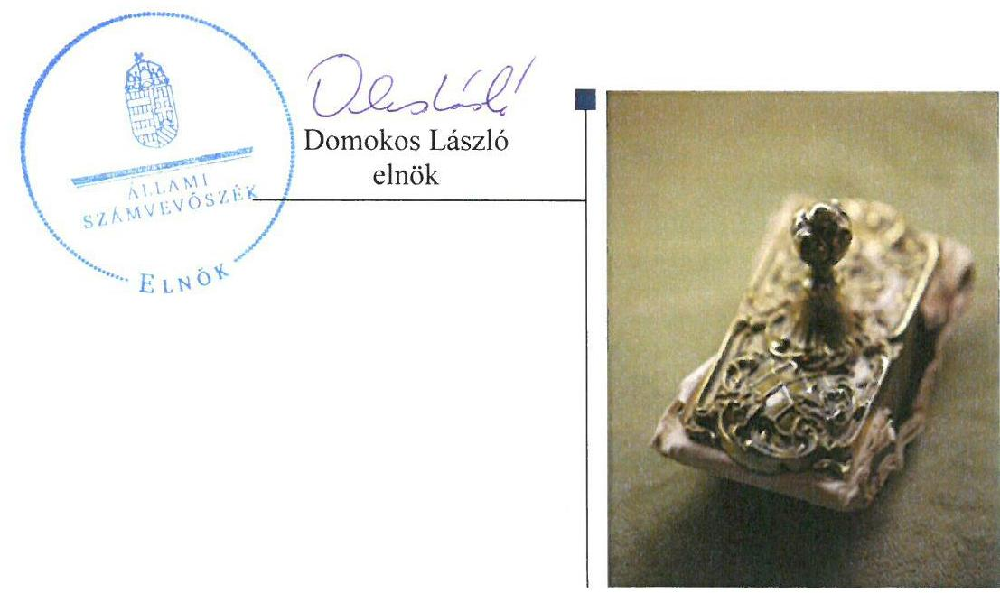

# Jelentés 

## Pártalapítványok gazdálkodása

A költségvetési támogatásban részesülő pártalapítványok 2013-2014. évi gazdálkodása törvényességének ellenőrzése az Ökopolisz Alapítványnál 2016. 03. hó 22. nap

---

# AZ ELLENŐRZÉST FELÜGYELTE: 

DR. BENEDEK MÁRIA felügyeleti vezető

## AZ ELLENŐRZÉST VEZETTE ÉS A VÉGREHAJTÁSÁÉRT FELELŐS:

DR. LÁNG ÁGNES KRISZTINA ellenőrzésvezető

## A PROGRAM ÖSSZEÁLLÍTÁSÁÉRT FELELŐS:

JANIK JÓZSEF LÁSZLÓ osztályvezető

## A TÉMÁHOZ KAPCSOLÓDÓ KORÁBBI SZÁMVEVŐSZÉKI JELENTÉSEK:

- címe: Az Ökopolisz Alapítvány gazdálkodása - Az Ökopolisz Alapítvány 2010-2012. évi gazdálkodása törvényességének ellenőrzéséről
- sorszáma: 14006

Jelentéseink az Országgyúlés számítógépes hálózatán és az Interneten a www.asz.hu címen is olvashatóak.

IKTATÓSZÁM: V-1004-050/2016
TÉMASZÁM: 2038
ELLENŐRZÉS-AZONOSÍTÓ SZÁM: V-074703

---

# TARTALOMJEGYZÉK 

■ ÖSSZEGZÉS ..... 5
■ AZ ELLENŐRZÉS CÉLJA ..... 6
■ AZ ELLENŐRZÉS TERÜLETE ..... 7
■ AZ ELLENŐRZÉS HÁTTERE, INDOKOLTSÁGA ..... 8
■ A JELENTÉS LÉNYEGES KÉRDÉSKÖREI ..... 9
■ ELLENŐRZÉS HATÓKÖRE ÉS MÓDSZEREI ..... 10
■ MEGÁLLAPÍTÁSOK ..... 12
■ JAVASLATOK ..... 22
■ MELLÉKLETEK ..... 23
I. Sz. melléklet: Értelmező szótár ..... 23
II. Sz. melléklet: Az Ökopolisz Alapítvány 2013. évi számviteli beszámolója ..... 24
III. Sz. melléklet: Az Ökopolisz Alapítvány 2014. évi számviteli beszámolója ..... 26
■ FÜGGELÉK: ÉSZREVÉTELEK ..... 29
■ RÖVIDÍTÉSEK JEGYZÉKE ..... 31

---

.

---

# ÖSSZEGZÉS 

Az ÁSZ az Ökopolisz Alapítvány gazdálkodásának törvényességét ellenőrizte a 2013. január 1-jétől 2014. december 31-ig terjedő időszakra vonatkozóan. Az ÁSZ megállapította, hogy az Ökopolisz Alapítvány gazdálkodásának törvényessége biztosított volt. Az Ökopolisz Alapítvány 2013-2014. évi számviteli beszámolói és a tevékenységéről szóló jelentései megfeleltek a jogszabályi előírásoknak. Könyvvezetése összességében megfelelően szabályozott, a könyvvezetés gyakorlata szabályszerű volt. Az Ökopolisz Alapítvány az ÁSZ előző ellenőrzése javaslatait hasznosította.

## Az ellenőrzés társadalmi indokoltsága

A pártok a Magyarország Alaptörvényében biztosított, a népakarat kialakításában és kinyilvánításában történő közreműködésének elősegítése, az állampolgári tájékoztatás szélesítése, a politikai kultúra fejlesztése érdekében történő politikai képzés, kutatás, tudományos és ismeretterjesztő tevékenység támogatására a Párttörvényben² meghatározott költségvetési támogatásra jogosult alapítványt hozhatnak létre.

A pártalapítványok gazdálkodása törvényességét kétévenként az ÁSZ a Pártalapítványi tv. ${ }^{3}$ szerinti kötelezettségének eleget téve ellenőrzi, támogatva ezzel a pártalapítványi gazdálkodás átláthatóságát.

## Főbb megállapítások, következtetések, javaslatok

Az alapító okirat ${ }^{4}$ megfelelt a Ptk. ${ }_{1,2}{ }^{5}$, a Pártalapítványi tv., a Párttörvény és a Számv. tv ${ }^{6}$ előírásainak. Az Ökopolisz Alapítvány kuratóriuma ${ }^{7}$ és munkaszervezete a belső szabályzatokban foglalt feladatait ellátta. Az Ökopolisz Alapítvány a 2014. évi költségvetési tervét nem a 350/2011. (XII. 30.) Korm. rendelet ${ }^{8}$-ben meghatározott tartalommal készítette el. A költségvetési és egyéb támogatások elfogadása megfelelt a Párttörvény előírásainak, a támogatások felhasználása, elszámolása szabályszerű volt. Az Ökopolisz Alapítvány tevékenységéről szóló 2013-2014. évi éves jelentések megfeleltek a jogszabályi előírásoknak, azonban a 2013. évi éves jelentés közzétételéről a Pártalapítványi tv.-ben előírt határidőn túl gondoskodtak. A 2013. és 2014. évi számviteli beszámolók összeállítása során - a 2013. évi aktív időbeli elhatárolás elszámolása kivételével - érvényesültek a Számv. tv. alapelvei és előírásai. A 2014. áprilisban hatályba léptetett számviteli szabályzatok megfeleltek a Számv. tv.-ben foglaltaknak. A könyvvezetés gyakorlata - a számlarend hiányossága ellenére - megfelelt a Számv. tv. és a belső szabályzatok előírásainak. Az Ökopolisz Alapítvány az előző ÁSZ ellenőrzés javaslatai alapján a számviteli szabályzatait módosította és a könyvvezetését végző szolgáltatót felszólította a bizonylatok Számv. tv.-ben előírt követelmények szerinti kitöltésére.

---

# AZ ELLENŐRZÉS CÉLJA 

Az ellenőrzés célja annak értékelése volt, hogy az Ökopolisz Alapítvány törvényesen gazdálkodott-e, az éves számviteli beszámolók és az Ökopolisz Alapítvány tevékenységéről szóló éves jelentések a jogszabályi előírásoknak megfeleltek-e, a könyvvezetés és gazdálkodás során a vonatkozó jogszabályi rendelkezéseket és belső előírásokat betartották-e, továbbá az előző ÁSZ ellenőrzés javaslatai alapján készített intézkedési tervben foglalt feladatokat végrehajtották-e.

---

# AZ ELLENŐRZÉS TERÜLETE 

## Az Ökopolisz Alapítvány

Az ellenőrzés a költségvetési támogatásban részesülő pártalapítványok gazdálkodására terjedt ki.

Az alapító ${ }^{9}$ 2010-ben a törvényi rendelkezéseknek megfelelően hozta létre az Ökopolisz Alapítványt, melynek küldetése az állampolgári tájékoztatás és tájékozódás javítása, a politikai kultúra fejlesztése és a közjó szolgálata, kiemelten az ökopolitikai gondolkodásmód elterjesztése, az ökopolitikai alternatívák megfogalmazása, valamint az ökopolitika képviseletének elősegítése a fenntarthatóság, a közügyekben való állampolgári részvétel és az igazságosság széleskörű népszerűsítése révén.

Az Ökopolisz Alapítvány a 2013. évben 80400 ezer Ft, a 2014. évben 74023 ezer Ft költségvetési támogatásban részesült, cél szerinti tevékenységre 2013. évben 67457 ezer Ft-ot, 2014. évben 56449 ezer Ft-ot használt fel.

Az Alapítvány sem a Gt. ${ }^{10}$, sem a Ptk. ${ }_{2}$ hatálya alá tartozó szervezetet nem hozott létre.

---

# AZ ELLENŐRZÉS HÁTTERE, INDOKOLTSÁGA 

A Pártalapítványi törvény alapján az alapítványok gazdálkodása törvényességének ellenőrzésére az ÁSZ jogosult. Törvényi előírás alapján az ÁSZ kétévente ellenőrzi azoknak az alapítványoknak a gazdálkodását, amelyek e törvény szerint költségvetési támogatásban részesültek.

Az ÁSZ az Ökopolisz Alapítvány gazdálkodásának törvényességét legutóbb a 2014. évben ellenőrizte.

Az ellenőrzés a gazdálkodás szabályszerűségének bemutatásával hozzájárul ahhoz, hogy a társadalom objektív képet alkothasson a pártalapítványok működéséről. Az ellenőrzés eredménye elősegítheti, hogy a jelentésben foglalt megállapítások, következtetések és javaslatok alapján a törvényalkotók konkrét lépéseket tegyenek a pártalapítványok finanszírozására vonatkozó szabályozások megváltoztatása, átláthatóbbá, ellenőrizhetőbbé tétele irányába. Az ellenőrzött szervezetek szintjén a hiányosságok, szabálytalanságok feltárása, az ennek kapcsán megfogalmazott megállapítások elősegíthetik a pártalapítványok szabályszerű gazdálkodását. A gazdálkodás szabályszerűségének bemutatásával az ellenőrzés értékteremtő módon járul hozzá az ÁSZ stratégiai céljainak megvalósításához.

---

# A JELENTÉS LÉNYEGES KÉRDÉSKÖREI 

1. Az Ökopolisz Alapítvány gazdálkodásának törvényessége biztosított volt-e?
2. Az éves számviteli beszámolók és az Ökopolisz Alapítvány tevékenységéről szóló éves jelentések megfeleltek-e a jogszabályi előírásoknak?
3. Az Ökopolisz Alapítvány könyvvezetésével kapcsolatos szabályzatok elkészítése során betartották-e az előírásokat és a könyvvezetés gyakorlata szabályszerű volt-e?
4. Hasznosultak-e az előző ÁSZ ellenőrzés javaslatai?

---

# ELLENŐRZÉS HATÓKÖRE ÉS MÓDSZEREI 

## Az ellenőrzés típusa

Szabályszerűségi ellenőrzés.

## Az ellenőrzött időszak

2013. január 1. - 2014. december 31.

## Az ellenőrzés tárgya

Az ellenőrzés tárgyát képezte az Ökopolisz Alapítvány gazdálkodása, az éves számviteli beszámolókra és az alapítvány tevékenységéről szóló éves jelentésekre vonatkozó kötelezettség teljesítése, a könyvvezetés szabályozása és gyakorlata, valamint a pártalapítvány előző ÁSZ ellenőrzés javaslatainak hasznosítására irányuló tevékenysége.

Az ellenőrzés kiterjedt minden olyan körülményre és adatra, amely az ÁSZ jogszabályban meghatározott feladatainak teljesítéséhez, valamint a program végrehajtása folyamán felmerült újabb összefüggések feltárásához szükséges.

## Az ellenőrzött szervezet

Az Ökopolisz Alapítvány.

## Az ellenőrzés jogalapja

Az ellenőrzés jogalapját az ÁSZ tv. ${ }^{11} 5$. § (3) bekezdése és a 33. § (7) bekezdése, valamint a Pártalapítványi tv. 4. § (2) és (4) bekezdései képezték.

## Az ellenőrzés módszerei

Az ellenőrzést az ÁSZ a nemzetközi standardokat irányadónak tekintve az ellenőrzési program ellenőrzési kérdései, az ellenőrzött időszakban hatályos jogszabályok, az ellenőrzés szakmai szabályok és módszertanok figyelembe vételével végezte. A gazdálkodás hibáinak kijavítására, a közpénzekkel való felelős gazdálkodás segítésére irányuló javaslatok kidolgozásakor a hatályos jogszabályok az irányadóak.

Az ellenőrzés ideje alatt az Ökopolisz Alapítvánnyal történő kapcsolattartást az ÁSZ az SZMSZ ${ }^{12}$-ének vonatkozó előírásai alapján biztosította.

---

Az ellenőrzési kérdések megválaszolásához szükséges bizonyítékok megszerzése az ellenőrzött által rendelkezésre bocsátott dokumentumokra, adatokra alapozva megfigyelés, szemle (szemrevételezés), kérdésfeltevés (információkérés), mintavételezés, valamint elemző eljárásokkal történt.

Az ellenőrzési bizonyítékként felhasználható adatforrások közé tartoztak egyrészt a szakmai program részletes szempontjainál felsorolt adatforrások, másrészt minden, az ellenőrzés folyamán feltárt, az ellenőrzés szempontjából releváns információt tartalmazó dokumentum.

Az ellenőrzés lefolytatásához az Ökopolisz Alapítvány a tanúsítványok elektronikus kitöltésével, valamint az ÁSZ által kért dokumentumok elektronikus megküldésével szolgáltatott adatokat. Az így rendelkezésre bocsátott adatok, információk, a tanúsítványok adatai valódiságának kontrollja az ellenőrzés keretében történt.

Az ellenőrzésnél az átfogó lényegességi küszöb mértékét az ÁSZ az Ökopolisz Alapítvány által közzétett számviteli beszámolója eredmény-kimutatásában kimutatott bevételek 2%-ában határozta meg.

Az ellenőrzést az ÁSZ az Ökopolisz Alapítvány székhelyén végezte.
A jelentésben használt fogalmak magyarázatát az I. számú melléklet, az Ökopolisz Alapítvány 2013. évi, valamint 2014. évi számviteli beszámolóját a II. számú, illetve a III. számú melléklet tartalmazza.

Az ÁSZ a 2013. és a 2014. évi számviteli beszámoló ráfordítás sorainak ellenőrzéséhez MUS ${ }^{13}$ mintavételi eljárást alkalmazta. Teljes körűen ellenőrizte a központi költségvetésből származó támogatást, a kuratórium által nyújtott támogatásokat, valamint az 1 millió Ft feletti kiadásokat.

Az ÁSZ a gazdálkodás törvényességének, az éves számviteli beszámolók és az alapítvány tevékenységéről szóló éves jelentések, valamint a könyvvezetéssel kapcsolatos szabályzatok és a könyvvezetés szabályszerűségét az erre irányuló ellenőrzési kérdésekre adott válaszok összesítése alapján, a lényegességi szempontok figyelembe vételével évenkénti bontásban minősítette. Megfelelőnek értékelte az ellenőrzött területet, amennyiben a szabályozás, illetve végrehajtás során a jogszabályi követelményeket maradéktalanul, vagy kisebb hiányosságok mellett érvényesítették, nem megfelelőnek értékelte, amennyiben a szabályozás hiányosságai nem biztosították a szabályszerű működés feltételeit, illetve a gazdálkodás folyamatában, a könyvvezetés során jelentkező hibák lényegesek, nagyszámúak vagy rendszerszerűek voltak.

---

# 1. Az Ökopolisz Alapítvány gazdálkodásának törvényessége biztosított volt-e? 

Összegző megállapítás

### 1.1. számú megállapítás

Az Ökopolisz Alapítvány gazdálkodásának törvényessége biztosított volt.

A kuratórium és a munkaszervezet tevékenysége megfelelt a jogszabályi és belső szabályozási előírásoknak.

## AZ ÖKOPOLISZ ALAPÍTVÁNY ALAPÍTÓ OKIRATÁ-

BAN a kötelező tartalmi elemek, az alapítványi cél és a képviseleti jog szabályozása megfelelt a Ptk. 1, 2, a Pártalapítványi tv., a Párttörvény és a Számv. tv előírásainak. Az alapító az alapító okiratot a 2013-2014. években két alkalommal módosította, az alapító képviseletére jogosultak személye, a székhelyváltás, valamint a kuratórium tagjainak kijelölésére jogosultak körének és a kuratórium taglétszámának csökkenése miatt.

Az alapító okiratban meghatározták az Ökopolisz Alapítvány célját, a cél elérése érdekében végzett főbb tevékenységi köröket, valamint az induló vagyon nagyságát és gyarapodásának módjait, a csatlakozás és támogatás befogadásának szabályait, a képviseleti jog gyakorlásának módját, továbbá a kuratórium, az $\mathrm{FB}^{14}$ és a munkaszervezet működésének főbb szabályait.

Az Ökopolisz Alapítvány céljaira rendelt vagyont, annak felhasználási módját és jogcímeit a $\mathrm{Ptk}_{1,2}$ előírásainak megfelelően az alapító okiratban, továbbá azzal összhangban, az SZMSZ ${ }^{15}$-ben, a számviteli politika ${ }_{1,2}{ }^{16}$-ban, a költségvetési és munkatervekben, a támogatási- és a 2014. évi pályázati ${ }^{17}$ szabályzatokban is rögzítették.

Az Ökopolisz Alapítvány alapító okirata tartalmazta a harmadik személyekkel és hatóságok előtti képviseletre és a bankszámla feletti rendelkezési jog gyakorlására vonatkozó szabályokat. A képviseleti jogosultságot - melyet az arra jogosultak együttesen gyakorolhattak - az alapító okiratban foglaltakkal összhangban, az SZMSZ-ben, a számviteli politika ${ }_{1,2}$-ben, valamint a pénzkezelési szabályzat ${ }_{1,2}{ }^{18}$-ben is rögzítették. A képviseleti jogosultság egyben a bankszámla feletti rendelkezési jogosultságot is magában foglalta. Az Ökopolisz Alapítvány számlavezető pénzintézete felé bejelentett aláírók személye megfelelt a banki aláírási kartonon szereplők, valamint az alapító okiratban, belső szabályzatokban rögzített bankszámla feletti rendelkezésre jogosultak körével.

Az Ökopolisz Alapítvány az ellenőrzött időszakban elkészítette a költségvetési terveit. A költségvetési tervekben - az alapító okiratban megfogalmazott célok figyelembe vételével - részletesen kifejtette a
 kiadási előirányzatokat, illetve azok tartalmát. A kuratórium a költségvetési terveket, a kiadások alátámasztásául szolgáló munkaterveket megtárgyalta, nyomon követte, azokat nem módosította. A kuratórium a vagyonkezelést és gaz-

---

dálkodást érintő döntéseit az alapító okirat és kuratóriumi ügyrend előírásainak megfelelően, szabályszerűen az alapítványi céloknak megfelelően hozta meg.

Az éves költségvetési tervek kiadási oldalát munkatervekkel, határozatokkal alátámasztották. A kiadások fedezetéül szolgáló bevételeket és forrásokat a 2013. évi költségvetési tervben megjelölték, a bevételek és kiadások egyensúlyát biztosították. A 2014. évi költségvetési tervben részletezett kiadások forrását nem határozták meg. A 2014. évi bevételek és kiadások egyensúlya - a tervezett kiadásoknak a korábbi évekről keletkezett jelentős összegű tartalékkal és a tárgyévi állami támogatások összegével való összevetése alapján - biztosított volt.

Az Ökopolisz Alapítvány a könyvviteli feladatokat megbízási szerződés alapján könyvviteli szolgáltatóval látta el. A szerződésben rögzítették a felek jogait, kötelezettségeit, feladatait, felelősségeit. Az Ökopolisz Alapítvány 2014. január 1-jétől a könyvviteli feladatok ellátására új szolgáltatóval kötött szerződést. A könyvviteli szolgáltatók között az Ökopolisz Alapítványt érintő információk és bizonylatok átadás-átvétele megtörtént. A szolgáltatás szabályosan, folyamatosan, változatlan feltételek mellett biztosított volt.

Az Ökopolisz Alapítvány éves beszámolóit a kuratórium - az FB véleményének figyelembe vételével - szabályosan tárgyalta és elfogadta.

A 2014. évi költségvetési terv készítésével kapcsolatos szabálytalanságot az 1. táblázat tartalmazza.

# A 2014. ÉVI KÖLTSÉGVETÉSI TERV KÉSZÍTÉSÉVEL KAPCSOLATOS SZABÁLYTALANSÁG 

Sorszám
Részmegállapítás
Megjegyzés

1. Az Ökopolisz Alapítvány a 2014. évi költségvetési tervét nem a 350/2011. (XII.30.) Korm. rendelet előírásainak megfelelően készítette el.

Forrás: ÁSZ

### 1.2. számú megállapítás

A költségvetési és egyéb támogatások, adományok elfogadása megfelelt a jogszabályi előírásoknak.

Az Ökopolisz Alapítvány a 2013. évben a 2013. évi költségvetési tv. ${ }^{19} 1$. számú melléklete alapján 80400 ezer Ft, a 2014. évben a 2014. évi költségvetési tv. ${ }^{20} 1$. számú mellékletében meghatározott 80400 ezer Ft-ból az 1321/2014. (V.30.) Korm. határozat ${ }^{21} 2$. számú melléklete szerinti 6377 Ft elvonás miatt 74023 ezer Ft költségvetési támogatásban részesült. A támogatás rendszeresen - a Párttörvény előírásának megfelelően a negyedév első munkanapjával került a pénzforgalmi számláján jóváírásra. Az Ökopolisz Alapítvány a GEF ${ }^{22}$ nemzetközi szervezettől, pályázati úton 1918 ezer Ft támogatást nyert el konferencia szervezésére. A támogatás befogadásáról a kuratórium döntött. A támogatás a 2014. évben az Ökopolisz Alapítvány pénzforgalmi számlájára történő átutalással érkezett meg, a támogatás nyújtója egyértelműen beazonosítható volt. A költségvetési és az elnyert pályázati támogatásokat a könyvelésben nyilvántartásba vették.

Az Ökopolisz Alapítvány más, természetes, valamint jogi személyektől támogatásban nem részesült, telefonos, internetes, személyes, illetve gyűjtőládával történő adománygyűjtést nem szervezett.

---

### 1.3. számú megállapítás

A költségvetési és egyéb támogatások, adományok felhasználása szabályszerű volt, a kapcsolódó beszámolási, közzétételi kötelezettség teljesítése megfelelt az előírásoknak.

Az Ökopolisz Alapítvány a költségvetési támogatásból származó bevételeit cél szerinti tevékenység finanszírozására, valamint tartalékképzésre fordította. A Párttörvényben foglalt, cél szerinti tevékenységekre a 2013. évben a költségvetési támogatás 49,8 %-át, a 2014. évben 39,8 %-át használták fel. A fel nem használt költségvetési támogatásból tartalékot képeztek. A költségvetési támogatás 2013. és 2014. évi felhasználását a 2. táblázat mutatja be:
2. táblázat

A KÖLTSÉGVETÉSI TÁMOGATÁS FELHASZNÁLÁSA A 2013. ÉS 2014. ÉVEKBEN

|  | 2013. év   (ezer Ft) | 2014. év   (ezer Ft) |
| :-- | --: | --: |
| Tárgyévi folyósított állami támogatás összege | 80400 | 74023 |
| Előző évi fel nem használt támogatás maradványértéke | 54967 | 67910 |
| Célszerinti tevékenységre fordított összegből: |  |  |
| - külső szervezetek támogatásai | 1505 | 380 |
| - támogatási program | 971 | 150 |
| - kutatási program | 7889 | 2722 |
| - oktatási program | 8188 | 15904 |
| - fesztivál, konferencia | 3714 | 7763 |
| - egyéb program, rendezvény | 12952 | 3358 |
| - menedzsment és működés | 32238 | 26172 |
| Kapott költségvetési támogatás maradványértéke | 67910 | 85484 |

A cél szerinti tevékenységekre fordított kiadások között a külső szervezetek támogatásain túl, támogatási, kutatási, oktatási programokra, fesztiválokra, konferenciákra, egyéb programokra és rendezvényekre, valamint menedzsment és működési költségekre fordított kiadásokat számoltak el. A kiadások egyes jogcímeit és tervezett keretösszegét a kuratórium elfogadta, azok a Párttörvény előírásaival és az Ökopolisz Alapítvány céljaival összhangban voltak. Az éves jelentésekben kimutatott cél szerinti tevékenységekre és a saját szervezeti keretein belül végzett tevékenységeire fordított összegeket az Ökopolisz Alapítvány a kuratórium döntése alapján, szabályszerűen használta fel.

Az Alapítvány a költségvetési és pályázati úton elnyert támogatásokat bevételként elszámolta, könyvelésében szerepeltette. A költségvetési támogatásokkal és egyéb támogatásokkal kapcsolatos közzétételi kötelezettségének eleget tett, a pályázati úton elnyert támogatást a Pártalapítványi tv. előírásainak megfelelő tartalommal és határidőben a honlapján megjelentette. A támogatások felhasználásáról beszámolási kötelezettségét teljesítette, éves jelentését és beszámolóját a Pártalapítványi tv. szerinti tartalommal elkészítette.

A Párttörvénynek az alapító párttal való együttműködésre vonatkozó rendelkezéseit az Ökopolisz Alapítvány betartotta. Nyilvántartásai alapján az LMP számára vagyoni hozzájárulást nem adott, közös rendezvényeket

---

nem szervezett, valamint továbbutalási céllal kapott támogatásban, adományban nem részesült. Honlapján a működéséről az éves jelentésének, a pályázati úton elnyert támogatás felhasználásáról pedig annak közzétételével adott számot a Civil tv. ${ }^{23}$, illetve a 350/2011. (XII.30) Korm. rendelet előírásai szerint.

Az Ökopolisz Alapítvány 2013. évi éves jelentésében, külső szervezetek támogatásaként kimutatott 1505 ezer Ft-ot az előző évről áthúzódó 23 pályázati támogatás maradványösszegének (10\%), valamint a 2013-ban egyedi elbírálás alapján kötött támogatási szerződés alapján folyósított összeg kifizetése tette ki. A 2014. évi jelentésben e jogcímen 380 ezer Ft-ot fizettek ki, ami egy egyedi elbírálás alapján megkötött támogatási szerződésre kifizetett teljes támogatási összeget és egy - 2012. évben kötött támogatási szerződéssel érintett - szervezet számára folyósított maradványösszeget (10\%) foglalt magába.

Az Ökopolisz Alapítvány külső szervezeteknek nyújtott támogatásokról a támogatottakkal szerződést kötött, melyeket - az alapító okiratban és belső szabályzatokban foglalt - a képviseleti jog szabályainak megfelelően, a kuratórium társelnöke és a gazdasági igazgató együttesen írták alá.

A támogatások maradványösszegeit a pályázati beszámolók tartalmi és pénzügyi ellenőrzése, valamint a kuratórium által történt elfogadását követően fizették ki. Az Ökopolisz Alapítvány által nyújtott támogatások felhasználása szabályos volt.

Az Alapítvány az ellenőrzött időszak alatt Közbeszerzési tv. ${ }^{24}$ hatálya alá tartozó beszerzési eljárást nem folytatott le.

# 2. Az éves számviteli beszámolók és az Ökopolisz Alapítvány tevékenységéről szóló éves jelentések megfeleltek-e a jogszabályi előírásoknak? 

Összegző megállapítás

Az Ökopolisz Alapítvány 2013-2014. évi számviteli beszámolói és az Alapítvány tevékenységéről szóló 2013-2014. éves jelentések megfeleltek a jogszabályi előírásoknak.
2.1. számú megállapítás

Az Ökopolisz Alapítvány tevékenységéről szóló 2013-2014. évi éves jelentések megfeleltek a jogszabályi előírásoknak.

AZ ÖKOPOLISZ ALAPÍTVÁNY HATÁRIDŐRE ELKÉSZÍTETTE a 2013. és a 2014. években a Pártalapítványi tv.-ben foglaltak szerinti éves jelentését. Az éves jelentés részét képezte a Pártalapítványi tv.-ben és a számviteli politika ${ }_{1,2}$-ben előírtak figyelembevételével:
$\longrightarrow$ a számviteli beszámoló,
$\longrightarrow$ a vagyon felhasználásával kapcsolatos kimutatás,
$\longrightarrow$ a költségvetési támogatás felhasználására vonatkozó kimutatás,
$\longrightarrow$ a cél szerinti juttatások kimutatása,
$\longrightarrow$ a központi költségvetési szervtől, az elkülönített állami pénzalaptól, a helyi önkormányzattól, a kisebbségi települési önkormányzattól, a

---

települési önkormányzatok társulásától és mindezek szerveitől kapott támogatás mértéke,
az Ökopolisz Alapítvány egyes vezető tisztségviselőinek nyújtott juttatások értéke, illetve összege,
valamint az Ökopolisz Alapítvány tevékenységéről szóló rövid tartalmi beszámoló.
Az éves jelentéseket az SZMSZ rendelkezésének megfelelően az FB véleményezte, elfogadásra javasolta, a kuratórium határozattal elfogadta.

Az Ökopolisz Alapítvány az éves jelentések közzétételéről a Pártalapítványi tv. előírásainak megfelelően - a 2013. évi éves jelentés kivételével - gondoskodott az ellenőrzött években. A 2014. évi éves jelentést a Magyar Közlöny mellékletét képező Hivatalos Értesítőben határidőben közzétette, illetve az éves jelentéseket a honlapján megjelentette.

A 2013. évi éves jelentéssel kapcsolatos szabálytalanságot a 3. táblázat tartalmazza.
3. táblázat

# A 2013. ÉVI ÉVES JELENTÉSSEL KAPCSOLATOS SZABÁLYTALANSÁG 

Sorszám Részmegállapítás
Megjegyzés

1. Az Ökopolisz Alapítvány a 2013. évi éves jelentését a Pártalapítványi tv. 3/A. § (5) bekezdésében meghatározott határidőn túl tette közzé a Magyar Közlöny mellékleteként megjelenő Hivatalos Értesítőben.

Forrás: ÁSZ
2.2. számú megállapítás

Az Ökopolisz Alapítvány 2013-2014. éves számviteli beszámolói megfeleltek a Számv. tv. előírásainak.

AZ ÖKOPOLISZ ALAPÍTVÁNY A BESZÁMOLÓ KÉSZÍTÉSI KÖTELEZETTSÉGÉNEK a számviteli politika ${ }_{1,2}$-ben meghatározott formában, egyszerűsített éves beszámoló készítésével tett eleget az ellenőrzött években. Az egyszerűsített éves beszámolók a 224/2000. (XII. 19.) Korm. rendelettel összhangban mérlegből és eredmény-kimutatásból álltak, melyeket határidőben elkészítettek.

Az Ökopolisz Alapítvány a 2013-2014. években a 224/2000. (XII. 19.) Korm. rendeletben előírtak alapján könyvvizsgálatra nem volt kötelezett. A számviteli politika ${ }_{1,2}$-ben foglaltaknak megfelelve, saját döntés alapján azonban könyvvizsgálót alkalmazott, aki az egyszerűsített éves beszámolókat az ellenőrzött években hitelesítő záradékkal látta el.

Az FB az SZMSZ rendelkezései szerint a 2013. és a 2014. évi éves beszámolókat megtárgyalta, a kuratóriumnak elfogadásra javasolta. A kuratórium a beszámolókat a Pártalapítványi tv.-ben foglaltaknak megfelelően, határozattal elfogadta. Az éves beszámolókat a Számv. tv. előírásai alapján a képviseletre jogosultak írták alá.

Az Ökopolisz Alapítvány az ellenőrzött években az éves beszámolók összeállítása során érvényesítette a Számv. tv.-ben foglalt számviteli alapelveket. Az éves beszámolók adatai az év végi főkönyvi kivonatok, illetve a kapcsolódó analitikák adataiból levezethetőek voltak. A mérleg és az eredmény-kimutatás soraihoz kapcsolódó főkönyvi számlák az analitikus nyilvántartások adataival megegyeztek.

---

Az ellenőrzött években a befektetett eszközök közül az immateriális javak (szoftverek, licencek) és a tárgyi eszközök esetében a leltározási szabályzatban ${ }^{25}$ előírt leltározást mennyiségi felvétellel végrehajtották. A forgóeszközök közül a követelések esetében a leltározási szabályzat szerinti analitika és főkönyv egyeztetését, valamint a pénzeszközök esetében a mennyiségi felvételt és értékbeni egyeztetéseket dokumentáltan - keltezéssel, aláírással ellátott leltárakkal - elvégezték. A forrásokat egyeztetéssel leltározták. Az ellenőrzött időszakban a leltározás szabályszerű volt.

A befektetett eszközöknél az Ökopolisz Alapítvány belső szabályzataiban rögzítettekkel összhangban volt az egyedi nyilvántartás, az aktiválás, az értékelés, a selejtezés, a terv szerinti és terven felüli értékcsökkenés, valamint a kis értékű eszközök elszámolása.

A forgóeszközökön belül az előlegek és egyéb munkavállalókkal szembeni követelések határidőre való elszámolása megtörtént, továbbá a pénzeszközök megegyeztek a pénztárjelentés záró állománya és a banki folyó és betétszámla kivonatok adataival.

A kötelezettségek között az ellenőrzött időszakban hitelállományt nem mutattak ki, csak rövidlejáratú kötelezettséggel rendelkeztek.

Az induló vagyon megfelelt az alapító okiratban rögzített mértéknek. A mérleg forrás oldala a saját tőkén belül a Számv. tv. előírásának megfelelően tartalmazta - az alapító okiratban rögzített értéknek megfelelően - az induló tőkét, az előző évi eredménynek megfelelően a tőkeváltozást, valamint a tárgyévi eredményt.

Az ellenőrzött időszakban a passzív időbeli elhatárolások elszámolása szabályos volt. A Számv. tv. rendelkezéseinek megfelelően passzív időbeli elhatárolásként mutatták ki a költségek (ráfordítások) ellentételezésére visszafizetési kötelezettség nélkül - kapott, pénzügyileg rendezett, egyéb bevételként elszámolt támogatás összegéből az
 adott évben költséggel, ráfordítással nem ellentételezett összeget, valamint a mérleg fordulónapja előtti időszakot terhelő olyan költséget, ráfordítást, amely csak a mérleg fordulónapja utáni időszakban merült fel.

Az aktív időbeli elhatárolások elszámolása a 2013. évben nem történt meg. Az aktív időbeli elhatárolások 2013. évi mérlegben be nem mutatott összege 34,0 ezer Ft, ami az eredmény-kimutatásban kimutatott összes bevétel 0,05%-a. A feltárt hibát az ellenőrzés nem minősítette lényegesnek, mert az nem érte el az összes kimutatott bevételre vetített 2%-os lényegességi küszöb mértékét.

A 2014. évben aktív időbeli elhatárolásként a mérlegben 33,0 ezer Ft szerepelt, amely összeg a házipénztár vezetéséhez használt szoftver éves support díjából, valamint a domain nevek (www.okopolisz.eu, www.okopoliszalapitvany.hu) használati díjából adódott.

A bevételeket, illetve a ráfordításokat az ellenőrzött időszakban a 224/2000. (XII. 19.) Korm. rendelet eredmény-kimutatásra vonatkozó előírásai szerinti bontásban mutatták ki, a kimutatott bevételek és ráfordítások fogalomkörébe tartozó tételek szerepeltek az adott soron. Az eredmény-kimutatás sorok adatai a főkönyvi kivonatok, illetve a vonatkozó főkönyvi és részletező számlák összesített adataival megegyeztek.

Az eredmény-kimutatásban szereplő bevételeket és ráfordításokat könyvelési alapbizonylatokkal (szerződések, szállítói számlák, bér-, bank- és pénztárbizonylatok) támasztották alá.

---

A bevételeken belül a költségvetésből származó, valamint az egyéb (oktatásokhoz, rendezvényekhez kapcsolódó képzési, részvételi díjak, étkezési hozzájárulások) bevételeket a Civil tv. előírásainak megfelelően elkülönítetten kezelték. A költségvetési támogatások, a támogatáson kívüli egyéb bevételek és a pénzügyi műveletek bevételének összege megegyezett a vonatkozó bankkivonatok összesített értékével.

A ráfordítások elszámolásánál érvényesültek a kötelezettségvállalás, a teljesítésigazolás, az utalványozás és a banki aláírás szabályai, a beszerzés, szolgáltatás igénybevétel megtörténtének igazolásai bizonylatokkal alátámasztottak voltak.

A 2013. évi beszámolóval kapcsolatos szabálytalanságot a 4. táblázat tartalmazza.
4. táblázat

A 2013. ÉVI BESZÁMOLÓVAL KAPCSOLATOS SZABÁLYTALANSÁG

| Sorszám | Részmegállapítás | Megjegyzés |
| :-- | :-- | :-- |

1. A 2013. évben a Számv. tv. 32. § (1) bekezdésében foglaltakkal ellentétben nem számolták el, a mérlegben nem mutatták be aktív időbeli elhatárolásként az üzleti év mérlegének fordulónapja előtt felmerült, elszámolt olyan összegeket, amelyek költségként, ráfordításként csak a mérleg fordulónapját követő időszakra számolhatók el.

Forrás: ÁSZ

# 3. Az Ökopolisz Alapítvány könyvvezetésével kapcsolatos szabályzatok elkészítése során betartották-e az előírásokat és a könyvvezetés gyakorlata szabályszerű volt-e? 

Összegző megállapítás

Az Ökopolisz Alapítvány könyvvezetésével kapcsolatos szabályzatok elkészítése során betartották az előírásokat, a könyvvezetés gyakorlata szabályszerű volt.

### 3.1. számú megállapítás

A számviteli szabályzatok megfeleltek a jogszabályi előírásoknak, azokban az alapítványi sajátosságokat figyelembe vették.

## AZ ÖKOPOLISZ ALAPÍTVÁNY SZÁMVITELI SZABÁLYZATAIT - az előző ÁSZ ellenőrzés javaslatai alapján - 2014. április 1-jei hatállyal módosították. A kuratórium a szabályzatokat a hatályba léptetés előtt jóváhagyta. A szabályzatok további módosítását jogszabályváltozás nem indokolta.

A 2014-ben kiadott számviteli szabályzatok megfeleltek a jogszabályi előírásoknak.

A számviteli politika ${ }_{2}$ keretében szabályozták a könyvvezetés módját, a beszámoló formáját, a mérleg fordulónapját, a mérlegkészítés időpontját, a könyvvizsgálatot, a közzétételt, az elszámolási módokat és értékeléseket, valamint a bizonylati rend kérdéskörét.

Az üzleti évre és a mérleg-fordulónapra vonatkozó előírásokat figyelembe vették, az üzleti év megegyezett a naptári évvel, a fordulónap december 31-e. A számviteli alapelveket a szabályozás során érvényesítették.

---

A számviteli politika ${ }_{2}$ keretében elkészítették a Számv. tv.-ben előírt leltározási-, értékelési ${ }^{26}$ és pénzkezelési ${ }_{2}$ szabályzatokat, valamint a számlarendet ${ }^{27}$.

A pénzkezelési szabályzat ${ }_{2}$ tartalma megfelelt a jogszabályi előírásoknak. Rendelkeztek a pénzforgalom lebonyolításának rendjéről, a pénzkezelés személyi és tárgyi feltételeiről, a készpénzben és a bankszámlán tartott pénzeszközök közötti forgalomról, a napi készpénz záró állomány maximális mértékéről, a készpénzállomány ellenőrzéséről, a pénzkezeléssel kapcsolatos bizonylatok rendjéről és a pénzforgalommal kapcsolatos nyilvántartási szabályokról.

Az értékelési szabályzatban a behajthatatlan követelést érintő szabályozás megfelelt a Számv. tv. előírásainak, a hitelezési veszteségként történő leírás feltételeit meghatározták. Az eszközök bekerülési értékével, értékcsökkenésével és értékvesztésével kapcsolatos szabályozás összhangban volt a Számv. tv.-ben foglaltakkal. A szabályozásnak megfelelően az értékcsökkenés elszámolása lineáris módszerrel történt, a 100 ezer Ft alatti beszerzési értékű eszközöket egy összegben leírták költségként. Piaci értékelésbe bevont eszközökkel nem rendelkeztek, a valós értéken történő értékelés lehetőségével nem éltek.

A leltározási szabályzatban olyan évenkénti leltár összeállítását írták elő, amely tartalmazza a mérleg fordulónapján meglévő eszközöket és forrásokat mennyiségben és értékben.

A számlarend tartalmazta a számlatükröt, a szöveges számlamagyarázatot, valamint a főkönyvi könyvelés és az analitikus nyilvántartás kapcsolatát.

A számviteli politika ${ }_{2}$-ben a törvényi előírásoknak megfelelően határozták meg a könyvviteli zárlattal kapcsolatos szabályokat. A havi, a negyedéves és az éves zárlat során elvégzendő könyvvezetési teendőket tételesen felsorolták.

A szabályzatok összhangban voltak a könyvvezetésre és a bizonylatokra vonatkozó előírásokkal. A könyvvezetésre, a bizonylatolásra vonatkozó részletes belső szabályokat úgy alakították ki, hogy azok a mérleg és az eredmény-kimutatás alátámasztásán túlmenően a kiegészítő melléklet adatainak közvetlen alátámasztására is alkalmasak legyenek.

Az Ökopolisz Alapítvány a könyvvezetési rendszerét úgy alakította ki, hogy abból a 224/2000. (XII. 19.) Korm. rendelet által előírt mérleget és eredmény-kimutatást a tájékoztató adatokkal együtt, valamint a Pártalapítványi tv. előírásai szerint kötelezően elkészítendő jelentést összeállíthassa.
3.2. számú megállapítás

A könyvvezetés gyakorlata megfelelt a jogszabályi és belső szabályozási előírásoknak.

## AZ ÖKOPOLISZ ALAPÍTVÁNYNÁL A KÖNYVVEZE-

TÉST a vonatkozó jogszabályi és belső szabályozási előírások betartásával a kettős könyvvitel rendszerében, a számviteli bizonylatok számítógépes feldolgozásával végezték. A könyvvezetést és az egyszerűsített éves beszámolók összeállítását, valamint a bérszámfejtést külső szolgáltató végezte.

---

A gazdasági eseményeket idősorosan rögzítették, valamennyi könyvelt tétel alapbizonylata rendelkezésre állt, a könyvvitelben rögzített és a beszámolóban szereplő tételek a valóságban is megtalálhatóak voltak.

Az eszközök, források állományát, vagy összetételét megváltoztató valamennyi gazdasági eseményről, műveletről bizonylatot állítottak ki. A könyvviteli nyilvántartásokba csak szabályszerűen kiállított bizonylat alapján jegyeztek be adatokat, a bizonylatok feldolgozásának rendjét betartották. A szigorú számadás alá vont nyomtatványokról vezették az előírások szerinti nyilvántartást. A bizonylatok szabályszerű megőrzéséről gondoskodtak, az Ökopolisz Alapítvány 2010-es létrehozása óta keletkezett dokumentumok, számviteli bizonylatok visszakereshető módon rendelkezésre álltak.

A gazdasági eseményeket a tényleges gazdasági tartalmuknak megfelelően számolták el. A főkönyvi számlák kijelölése során a számlarendben foglaltakat kisebb hiányosságokkal figyelembe vették.

Az eszközök bekerülési értékének megállapítása szabályos volt. A 100 ezer Ft beszerzési értéket elérő eszközöket és a kötelezettségeket egyedileg rögzítették és értékelték. Az Ökopolisz Alapítvány befektetésekkel és készletekkel nem rendelkezett, és a követelések után sem számolt el értékvesztést.

Mind a zárás előtti, mind a zárás utáni főkönyvi kivonatok szabályosan elkészültek.

A zárlati feladatokat - a 2013. évi aktív időbeli elhatárolások megállapítása kivételével - szabályszerűen elvégezték. Ennek keretében a beszámoló elkészítését megelőzően elszámolták az értékcsökkenéseket, értékelték a valutapénztárakban levő valutakészletet, elvégezték az eszköz-, forrás- és eredményszámlák technikai zárását, valamint megállapították és lekönyvelték a passzív időbeli elhatárolásokat és a 2014. évben az aktív időbeli elhatárolásokat.

Az analitikus nyilvántartások és a főkönyvi könyvelés értékadatai megegyeztek, az egyeztetést és ellenőrzést logikailag zárt rendszerrel biztosították. A számítógépes ügyviteli rendszer alkalmazása megteremtette a főkönyvi számlák, valamint a számviteli beszámoló adatai közti egyezőséget. A könyvvezetés biztosította - a mérleg és eredmény-kimutatás alátámasztásán túlmenően - a kiegészítő melléklet adatainak közvetlen alátámasztását is.

Az alkalmazott pénzügyi, számviteli szoftvert nem változtatták meg, annak jogszabályi előírásoknak való folyamatos megfeleltetéséről gondoskodtak, a verzióváltásokról online értesítés érkezett.

A házipénztár kezelése elektronikusan, az előírásoknak megfelelően történt. Az elektronikus nyilvántartásból a szoftver által generált havi pénztárjelentések készültek. Év végén mennyiségi leltár történt. A pénzkezelés személyi és tárgyi feltételeit biztosították, az egyes feladatokat a kijelölt felelősök végezték el. A pénzforgalommal kapcsolatos nyilvántartások vezetése megfelelt az előírásoknak. Készpénzes kifizetést csak a meghatározott jogcímeken és eljárásrend szerint teljesítettek, a napi készpénz záró állomány maximális mértékét betartották, a szabályzatban megállapított 500 ezer Ft-os értéket nem lépték túl.

A könyvvezetéssel kapcsolatos szabálytalanságot az 5. táblázat tartalmazza.

---

# 4. Hasznosultak-e az előző ÁSZ ellenőrzés javaslatai? 

## Összegző megállapítás

Az előző ÁSZ ellenőrzés javaslatai hasznosultak.

### 4.1. számú megállapítás

Az előző ÁSZ ellenőrzés javaslatai alapján készített intézkedési tervben foglaltakat végrehajtották.

Az előző számvevőszéki ellenőrzés javaslatainak hasznosulására az Ökopolisz Alapítvány intézkedési tervet készített és határidőben megküldte az ÁSZ-nak. Az ÁSZ az intézkedési tervet - a kért kiegészítést követően - elfogadta.

A jóváhagyott intézkedési tervben hat intézkedést fogalmaztak meg, az abban foglalt feladatokat határidőben végrehajtották.

A számviteli politika2-ben meghatározták a zárlati feladatokat, az ellenőrzés, önellenőrzés által feltárt jelentős hibák elszámolásának és értékelésének szabályait, valamint a behajthatatlan követelések értékelési szempontjait.

A leltározási szabályzatot a leltár bizonylati rendjével és a források leltározási szabályaival kiegészítették.

A pénzkezelési szabályzat2-ben a bankszámlán történő pénzforgalom eljárásrendjét rögzítették, továbbá 2013. december 1-jei hatállyal kijelölték a pénztárellenőrt.

A számlarendet kiegészítették a főkönyvi és az analitikus nyilvántartások kapcsolatával, a bizonylati rend szabályait a számviteli politika2-ben rögzítették.

A számviteli szolgáltatást végző vállalkozást felszólították a Számv. tv. szerinti kötelező alaki és tartalmi elemek bizonylatokon való feltüntetésére.

---

# JAVASLATOK 

Az ÁSZ tv. 33. § (1) bekezdésében foglaltak értelmében az ellenőrzött szervezet vezetője köteles a jelentésben foglalt megállapításokhoz kapcsolódó intézkedési tervet összeállítani és azt a jelentés kézhezvételétől számított 30 napon belül az ÁSZ részére megküldeni. Amennyiben az ellenőrzött szervezet vezetője nem küldi meg határidőben az intézkedési tervet, vagy továbbra sem elfogadható intézkedési tervet küld, az Állami Számvevőszék elnöke az ÁSZ tv. 33. § (3) bekezdése a) és b) pontjaiban foglaltakat érvényesítheti.

## Az Ökopolisz Alapítvány kuratóriumi elnökeinek:

1. Intézkedjenek, hogy a költségvetési tervet a 350/2011. (XII. 30.) Korm. rendelet rendelkezésének megfelelően készítsék el.
(1. számú táblázat 1. sorszámú megállapítása alapján)
2. Intézkedjenek az éves jelentés Pártalapítványi tv.-ben meghatározott határidőn belüli közzétételére.
(3. számú táblázat 1. sorszámú megállapítása alapján)
3. Intézkedjenek az Ökopolisz Alapítvány gazdálkodása során a Számv. tv.-ben foglalt előírások betartására, a tekintetben, hogy
a) a mérlegben mutassák ki aktív időbeli elhatárolásként az üzleti év mérlegének fordulónapja előtt felmerült, elszámolt olyan összegeket, amelyek költségként, ráfordításként csak a mérleg fordulónapját követő időszakra számolhatók el;
(4. számú táblázat 1. sorszámú megállapítása alapján)
b) a számlarend tartalmazza minden alkalmazásra kijelölt számla számjelét és megnevezését.
(5. számú táblázat 1. sorszámú megállapítása alapján)

---

# MELLÉKLETEK 

- I. SZ. MELLÉKLET: ÉRTELMEZŐ SZÓTÁR
adomány
adománygyűjtés
adománygyűjtő
adományozott
adományszervező
civil szervezet
gazdálkodó tevékenység
költségvetési támogatás
kuratórium
törzsvagyon
a civil szervezetnek - létesítő okiratban rögzített céljaira - ellenszolgáltatás nélkül juttatott eszköz, illetve nyújtott szolgáltatás (forrás: Civil tv. 2. § 1. pontja); az a pénzbeli vagy természetbeni juttatás, amelyet az adományozó az adományozott civil szervezet alapcéljának, illetve közhasznú céljának elérésére ellenszolgáltatás nélkül juttat (forrás: 350/2011. (XII. 30.) Korm. rendelet 1. § (5) bekezdés a) pontja)
a közhasznú szervezet részére törvényben meghatározott közhasznú tevékenysége támogatására, valamint az egyházi jogi személy részére törvényben meghatározott tevékenysége támogatására, továbbá a közérdekű kötelezettségvállalás céljára az adóévben visszafizetési kötelezettség nélkül adott támogatás, juttatás, térítés nélkül átadott eszköz könyv szerinti értéke, térítés nélkül nyújtott szolgáltatás bekerülési értéke, feltéve hogy az nem jelent az e törvényben meghatározottakon túl vagyoni
 előnyt az adományozónak, az adományozó tagjának vagy részvényesének, vezető tisztségviselőjének, felügyelőbizottsága vagy igazgatósága tagjának, könyvvizsgálójának, illetve ezen személyek vagy a természetes személy tag vagy részvényes közeli hozzátartozójának azzal, hogy nem minősül vagyoni előnynek az adományozó nevére, tevékenységére történő utalás (Tao. tv. 4. § 1/a. pont)
az a forrásteremtési tevékenység, amelyet az adományozott, illetve az általa meghatalmazottak, alapcéljának, illetve közhasznú céljának elérése érdekében folytatnak (forrás: 350/2011. (XII. 30.) Korm. rendelet 1. § (5) bekezdés b) pontja)
az a természetes személy, aki meghatalmazás alapján adománygyűjtésben vesz részt (forrás: 350/2011. (XII. 30.) Korm. rendelet 1. § (5) bekezdés c) pontja)
az a civil szervezet, amely az adományt alapcéljának, illetve közhasznú céljának megfelelően gyűjti (forrás: 350/2011. (XII. 30.) Korm. rendelet 1. § (5) bekezdés d) pontja) az adományozott által meghatalmazott egyesület, alapítvány, vagy nonprofit gazdasági társaság, amely az adományt a meghatalmazott nevében gyűjti (forrás: 350/2011. (XII. 30.) Korm. rendelet 1. § (5) bekezdés e) pontja)
a civil társaság, illetve a Magyarországon nyilvántartásba vett egyesület - a párt kivételével -, valamint az alapítvány (forrás: Civil tv. 2. § 6. pontja), az alapítvány és az egyesület, ide nem értve a pártot és a civil társaságot (forrás: 350/2011. (XII. 30.) Korm. rendelet 1. § (5) bekezdés f) pontja)
azon tevékenységek összessége, amelyek a civil szervezet vagyoni, pénzügyi, jövedelmi helyzetére kiható gazdasági eseményt eredményeznek (Civil tv. 2. § 10. pont)
az államháztartás alrendszerei terhére nyújtott pénzbeli vagy nem pénzbeli juttatás, amelyet a támogató nem elsősorban ellenszolgáltatás ellenében, de konkrét program megvalósítása vagy meghatározott időszakban a támogatott szervezet működtetése érdekében nyújt (Civil tv. 2. § 15. pont)
a társadalombiztosítás pénzügyi alapjai kivételével az államháztartás központi alrendszeréből ellenérték nélkül, pénzben nyújtott támogatások, ide nem értve az adományokat, segélyeket, felajánlásokat, a pártok és pártalapítványok támogatását (forrás: Áht. 2. § (1) bekezdés n) pont)
az alapítvány kezelő/ügyvezető szervezete (forrás: Ptk.: 3:397. § (1) bekezdése)
az induló tőke, megnövelve alapítvány esetében a csatlakozók által kifejezetten az induló tőke növelése érdekében rendelkezésre bocsátott vagyonnal (Civil tv. 2. § 28. pont)

---

II. SZ. MELLÉKLET: AZ ÖKOPOLISZ ALAPÍTVÁNY 2013. ÉVI SZÁMVITELI BESZÁMOLÓJA

Ökopolisz Alapítvány
Statisztikai számjel: 18139558-9499-569-11
Bírósági végzés száma: Pk.60.048/2010/4

Számviteli beszámoló

Ökopolisz Alapítvány
2013.01.01. - 2013.12.31.
Egyszerűsített éves beszámoló - Mérleg "A"
Időszak

EzerHUF
A tétel megnevezése
Előző év
Előző évek
módosításai
Tárgyév
1 A. Befektetett eszközök (2.+3.+4.+5. sor)
1 629
0
563
2 I. IMMATERIÁLIS JAVAK
379
0
140
3 II. TÁRGYI ESZKÖZÖK
1 250
0
423
4 III. BEFEKTETETT PÉNZÜGYI ESZKÖZÖK
0
0
0
5 IV. BEFEKTETETT ESZKÖZÖK ÉRTÉKHELYESBÍTÉSE
0
0
0
6 B. Forgóeszközök (7.+8.+9.+10. sor)
68 221
0
90 251
7 I. KÉSZLETEK
0
0
0
8 II. KÖVETELÉSEK
1 389
0
1 332
9 III. ÉRTÉKPAPÍROK
0
0
0
10 IV. PÉNZESZKÖZÖK
66 832
0
88 919
11 C. Aktív időbeli elhatárolások
10
0
0
12 ESZKÖZÖK ÖSSZESEN (1.+6.+11. sor)
69 860
0
90 814
13 D. Saját tőke (14.+15.+16.+17.+18.+19. sor)
11 327
0
17 652
14 I. INDULÓ TÖKE
500
0
500
15 II. TÖKEVÁLTOZÁS
4 112
0
10 827
16 III. LEKÖTÖTT TARTALÉK
0
0
0
17 IV. ÉRTÉKELÉSI TARTALÉK
0
0
0
18 V. TÁRGYÉVI EREDMÉNY ALAPTEVÉKENYSÉGBŐL
6 715
0
6 325
19 VI. TÁRGYÉVI EREDMÉNY VÁLLALKOZÁSI
TEVÉKENYSÉGBŐL
0
0
0
20 E. Céltartalékok
0
0
21 F. Kötelezettségek (22.+23.+24. sor)
1 924
0
2 204
22 I. HÁTRASOROLT KÖTELEZETTSÉGEK
0
0
23 II. HOSSZÚ LEJÁRATÚ KÖTELEZETTSÉGEK
0
0
24 III. RÖVID LEJÁRATÚ KÖTELEZETTSÉGEK
1 924
0
2 204
25 G. Passzív időbeli elhatárolások
56 609
0
70 958
26 FORRÁSOK ÖSSZESEN (13.+20.+21.+25. sor)
69 860
0
90 814

Keltezés: 2014. 05.16.

Schmuck Erzsébet
kuratórium társelnöke

Róna Péter
a kuratórium társelnöke

---

# Mellékletek

Ökopolisz Alapítvány Statisztikai számjel: 18139558-9499-569-11 Bírósági végzés száma: Pk.60.048/2010/4

Ökopolisz Alapítvány Egyszerűsített éves beszámoló - Eredménykimutatás (összköltség) "A"

|   |  |  |  |  |  | Időszak |   |
| --- | --- | --- | --- | --- | --- | --- | --- |
|   |  | A tétel megnevezése | Előző év |  |  | Tárgyév |   |
|   |  |  | Alaptev. | Váll.tev. | Összesen | Alaptev. | Váll.tev.  |
|  1 | Értékesítés nettó árbevétele |  | 0 |  | 0 | 0 |   |
|  2 | Aktivált saját teljesítmények értéke |  | 0 |  | 0 | 0 |   |
|  3 | Egyéb bevételek |  | 92 395 |  | 92 395 | 70 447 |   |
|   | ebből |  | 0 |  | 0 | 0 |   |
|   | - tagdíj, alapítói támogatás |  | 0 |  | 0 | 0 |   |
|   | - támogatások |  | 90 022 |  | 90 022 | 67 458 |   |
|  4 | Pénzügyi műveletek bevételei |  | 4 363 |  | 4 363 | 3 337 |   |
|  5 | Rendkívüli bevételek |  | 0 |  | 0 | 0 |   |
|   | ebből |  | 0 |  | 0 | 0 |   |
|   | - alapítótól kapott befizetés |  | 0 |  | 0 | 0 |   |
|   | - támogatások |  | 0 |  | 0 | 0 |   |
|  A. | ÖSSZES BEVÉTEL |  | 96 758 |  | 96 758 | 73 784 |   |
|  6 | Anyagjellegű ráfordítások |  | 31 307 |  | 31 307 | 28 383 |   |
|  7 | Személyi jellegű ráfordítások |  | 42 023 |  | 42 023 | 35 911 |   |
|   | ebből: vezető tisztségviselők juttatásai |  | 4 056 |  | 4 056 | 3 152 |   |
|  8 | Értékcsökkenési leírás |  | 2 470 |  | 2 470 | 942 |   |
|  9 | Egyéb ráfordítások |  | 14 213 |  | 14 213 | 2 190 |   |
|  10 | Pénzügyi műveletek ráfordításai |  | 30 |  | 30 | 33 |   |
|  11 | Rendkívüli ráfordítások |  | 0 |  | 0 | 0 |   |
|  B. | ÖSSZES RÁFORDÍTÁS |  | 90 043 |  | 90 043 | 67 459 |   |
|  C. | ADÓZÁS ELŐTTI EREDMÉNY (A.-B.) |  | 6 715 |  | 6 715 | 6 325 |   |
|  12 | Adófizetési kötelezettség |  | 0 |  | 0 | 0 |   |
|  D. | ADÓZOTT EREDMÉNY (+E.-XII.) |  | 6 715 |  | 0 | 6 325 |   |
|  13 | Jóváhagyott osztalék |  | 0 |  | 0 | 0 |   |
|  E. | TÁRGYÉVI EREDMÉNY (C.-I.) |  | 6 715 |  | 6 715 | 6 325 |   |
|   | Tájékoztató adatok |  |  |  |  |  |   |
|  A. | Központi költségvetési támogatás |  | 90 022 |  | 90 022 | 67 485 |   |
|  B. | Helyi önkormányzati támogatás |  | 0 |  | 0 | 0 |   |
|  C. | Az Európai Unió strukturális alapjaiból, illetve a Kohéziós Alapból nyújtott támogatás |  | 0 |  | 0 | 0 |   |
|  D. | Normatív támogatás |  | 0 |  | 0 | 0 |   |
|  E. | A személyi jövedelamadó meghatározott részének adózó rendelkezése szerinti felhasználásáról szóló 1996. évi CXXVI. törvény alapján kiutalt összeg |  | 0 |  | 0 | 0 |   |
|  F. | Közszolgáltatási bevétel |  | 0 |  | 0 | 0 |   |

Keltezés: 2014. 05.16.

Schmuck Erzsébet a kuratórium társelnöke

Róna Péter a kuratórium társelnöke

---

# III. SZ. MELLÉKLET: AZ ÖKOPOLISZ ALAPÍTVÁNY 2014. ÉVI SZÁMVITELI BESZÁMOLÓJA

Ökopolisz Alapítvány Statisztikai számjel: 18139558-9499-569-11 Bírósági végzés száma: Pk.60.048/2010/4

## I. Számviteli beszámoló

|  Ökopolisz Alapítvány |  |  | 2014.01.01. - 2014.12.31. |   |
| --- | --- | --- | --- | --- |
|  Egyszerűsített éves beszámoló - Mérleg "A" |  |  | Időszak |   |
|   |  |  | EzerHUF |   |
|   | A tétel megnevezése | Előző év | Előző évek módosításai | Tárgyév  |
|  |   |   |   |   |
|  1 | A. Befektetett eszközök (2.+3.+4.+5. sor) | 563 | 0 | 223  |
|  2 | I. IMMATERIÁLIS JAVAK | 140 | 0 | 0  |
|  3 | II. TÁRGYI ESZKÖZÖK | 423 | 0 | 223  |
|  4 | III. BEFEKTETETT PÉNZÜGYI ESZKÖZÖK | 0 | 0 | 0  |
|  5 | IV. BEFEKTETETT ESZKÖZÖK ÉRTÉKHELYESBÍTÉSE | 0 | 0 | 0  |
|  6 | B. Forgóeszközök (7.+8.+9.+10. sor) | 90 251 | 0 | 110 269  |
|  7 | I. KÉSZLETEK | 0 | 0 | 0  |
|  8 | II. KÖVETELÉSEK | 1 332 | 0 | 1 374  |
|  9 | III. ÉRTÉKPAPÍROK | 0 | 0 | 0  |
|  10 | IV. PÉNZESZKÖZÖK | 88 919 | 0 | 108 895  |
|  11 | C. Aktív időbeli elhatárolások | 0 | 0 | 33  |
|  12 | ESZKÖZÖK ÖSSZESEN (1.+6.+11. sor) | 90 814 | 0 | 110 525  |
|  |   |   |   |   |
|  13 | D. Saját tőke (14.+15.+16.+17.+18.+19. sor) | 17 652 | 0 | 22 521  |
|  14 | I. INDULÓ TÖKE | 500 | 0 | 500  |
|  15 | II. TÖKEVÁLTOZÁS | 10 827 | 0 | 17 153  |
|  16 |

 III. LEKÖTÖTT TARTALÉK | 0 | 0 | 0  |
|  17 | IV. ÉRTÉKELÉSI TARTALÉK | 0 | 0 | 0  |
|  18 | V. TÁRGYÉVI EREDMÉNY ALAPTEVÉKENYSÉGBŐL | 6 325 | 0 | 4 868  |
|  19 | VI. TÁRGYÉVI EREDMÉNY VÁLLALKOZÁSI TEVÉKENYSÉGBŐL | 0 | 0 | 0  |
|  20 | E. Céltartalékok | 0 | 0 | 0  |
|  21 | F. Kötelezettségek (22.+23.+24. sor) | 2 204 | 0 | 1 861  |
|  22 | I. HÁTRASOROLT KÖTELEZETTSÉGEK | 0 | 0 | 0  |
|  23 | II. HOSSZÚ LEJÁRATÚ KÖTELEZETTSÉGEK | 0 | 0 | 0  |
|  24 | III. RÖVID LEJÁRATÚ KÖTELEZETTSÉGEK | 2 204 | 0 | 1 861  |
|  25 | G. Passzív időbeli elhatárolások | 70 958 | 0 | 86 143  |
|  |   |   |   |   |
|  26 | FORRÁSOK ÖSSZESEN (13.+20.+21.+25. sor) | 90 814 | 0 | 110 525  |
|   | Keltezés: 2015. 05.14. |  |  |   |

Lengyel Szilvia a kuratórium társelnöke

Dr. Fülöp Sándor a kuratórium társelnöke

---

# Mellékletek

Ökopolisz/Alapítvány Statisztikai számjel: 18139558-9499-569-11 Bírósági végzés száma: Pk.60.048/2010/4

Ökopolisz Alapítvány Egyszerűsített éves beszámoló - Eredménykimutatás (összköltség) "A"

|   | A tétel megnevezése | Előző év |  |  | Tárgyév |   |
| --- | --- | --- | --- | --- | --- | --- |
|   |  | Alaptev. | Váll.tev. | Összesen | Alaptev. | Váll.tev.  |
|  1 | Értékesítés nettó árbevétele | 0 |  | 0 | 0 |   |
|  2 | Aktivált saját teljesítmények értéke | 0 |  | 0 | 0 |   |
|  3 | Egyéb bevételek | 70 447 |  | 70 447 | 59 439 |   |
|   | ebből | 0 |  | 0 | 0 |   |
|   | - tagdíj, alapítói támogatás | 0 |  | 0 | 0 |   |
|   | - támogatások | 67 458 |  | 67 458 | 56 449 |   |
|  4 | Pénzügyi műveletek bevételei | 3 337 |  | 3 337 | 1 878 |   |
|  5 | Rendkívüli bevételek | 0 |  | 0 | 0 |   |
|   | ebből | 0 |  | 0 | 0 |   |
|   | - alapítótól kapott befizetés | 0 |  | 0 | 0 |   |
|   | - támogatások | 0 |  | 0 | 0 |   |
|  A. | ÖSSZES BEVÉTEL | 73 784 |  | 73 784 | 61 317 |   |
|  6 | Anyagjellegű ráfordítások | 28 383 |  | 28 383 | 22 763 |   |
|  7 | Személyi jellegű ráfordítások | 35 911 |  | 35 911 | 32 850 |   |
|   | ebből: vezető tisztségviselők juttatásai | 3 152 |  | 3 152 | 2 680 |   |
|  8 | Értékesökkenési leírás | 942 |  | 942 | 380 |   |
|  9 | Egyéb ráfordítások | 2 190 |  | 2 190 | 447 |   |
|  10 | Pénzügyi műveletek ráfordításai | 33 |  | 33 | 9 |   |
|  11 | Rendkívüli ráfordítások | 0 |  | 0 | 0 |   |
|  B. | ÖSSZES RÁFORDÍTÁS | 67 459 |  | 67 459 | 56 449 |   |
|  C. | ADÓZÁS ELŐTTI EREDMÉNY (A.-B.) | 6 325 |  | 6 325 | 4 868 |   |
|  12 | Adófizetési kötelezettség | 0 |  | 0 | 0 |   |
|  D. | ADÓZOTT EREDMÉNY (+E.-XII.) | 6 325 |  | 6 325 | 4 868 |   |
|  13 | Jóváhagyott osztalék | 0 |  | 0 | 0 |   |
|  E. | TÁRGYÉVI EREDMÉNY (C.-I.) | 6 325 |  | 6 325 | 4 868 |   |
|   | Tájékoztató adatok |  |  |  |  |   |
|  A. | Központi költségvetési támogatás | 67 485 |  | 67 485 | 56 449 |   |
|  B. | Helyi önkormányzati támogatás | 0 |  | 0 | 0 |   |
|  C. | Az Európai Unió strukturális alapjaiból, illetve a Kohéziós Alapból nyújtott támogatás | 0 |  | 0 | 0 |   |
|  D. | Normatív támogatás | 0 |  | 0 | 0 |   |
|  E. | A személyi jövedelamadó meghatározott részének adózó rendelkezése szerinti felhasználásáról szóló 1996. évi CXXVI. törvény alapján kiutalt összeg | 0 |  | 0 | 0 |   |
|  F. | Közszolgáltatási bevétel | 0 |  | 0 | 0 |   |

Keltezés: 2015. 05.14.

Lengyel Szilvia a kuratórium társelnöke

Dr. Fülöp Sándor a kuratórium társelnöke

---

.

---

# FÜGGELÉK: ÉSZREVÉTELEK 

A jelentéstervezetet a Számvevőszék 15 napos észrevételezésre megküldte az ellenőrzött szervezet vezetőjének az ÁSZ tv. 29. § (1) bekezdése előírásának megfelelően.
Az ellenőrzött szervezet vezetője az ÁSZ tv. 29. § (2) bekezdésében foglalt észrevételezési jogával nem élt, a jelentéstervezetre észrevételt nem tett.

[^0]
[^0]:    * 29. § (1) Az Állami Számvevőszék az ellenőrzési megállapításait megküldi az ellenőrzött szervezet vezetőjének vagy az általa megbízott személynek, és annak, akinek személyes felelősségét állapította meg.
    (2) Az ellenőrzött szervezet vezetője és a felelősként megjelölt személy az ellenőrzés megállapításaira tizenöt napon belül írásban észrevételt tehet.
    (3) Az Állami Számvevőszék az észrevételre a beérkezésétől számított harminc napon belül írásban válaszol. A figyelembe nem vett észrevételeket köteles a jelentésben feltüntetni, és megindokolni, hogy azokat miért nem fogadta el.

---

.

---

# RÖVIDÍTÉSEK JEGYZÉKE 

${ }^{1}$ ÁSZ
${ }^{2}$ Párttörvény
${ }^{3}$ Pártalapítványi tv.
${ }^{4}$ alapító okirat
${ }^{5}$ Ptk. 1

Ptk. 2
${ }^{6}$ Számv. tv.
${ }^{7}$ kuratórium
${ }^{8}$ 350/2011. (XII.30) Korm. rendelet
${ }^{9}$ alapító
${ }^{10} \mathrm{Gt}$.
${ }^{11}$ ÁSZ törvény
${ }^{12}$ ÁSZ SZMSZ
${ }^{13}$ MUS
${ }^{14} \mathrm{FB}$
${ }^{15}$ SZMSZ
${ }^{16}$ számviteli politika 1
számviteli politika 2
${ }^{17}$ 2014. évi pályáztatási szabályzat
${ }^{18}$ pénzkezelési szabályzat ${ }_{1}$
pénzkezelési szabályzat ${ }_{2}$
${ }^{19}$ 2013. évi költségvetési tv.
${ }^{20}$ 2014. évi költségvetési tv.
${ }^{21}$ 1321/2014. (V.30.) Korm. határozat
${ }^{22}$ GEF
${ }^{23}$ Civil tv.
${ }^{24}$ Közbeszerzési tv.
${ }^{25}$ leltározási szabályzat ${ }_{1}$
leltározási szabályzat ${ }_{2}$

Állami Számvevőszék
a pártok működéséről és gazdálkodásáról szóló 1989. évi XXXIII. törvény
a pártok működését segítő tudományos, ismeretterjesztő, kutatási, oktatási tevékenységet végző alapítványokról szóló 2003. évi XLVII. törvény
Ökopolisz Alapítvány 2011. június 8.-án kelt alapító okirata, illetve ennek 2013. február 11.-én és 2013. június 19.-én kelt módosításai
a Polgári Törvénykönyvről szóló 1959. évi IV. törvény (hatálytalan: 2014. március 15-től)
a Polgári Törvénykönyvről szóló 2013. évi V. törvény (hatályos: 2014. március 15-től)
a számvitelről szóló 2000. évi C. törvény
Ökopolisz Alapítvány Kuratóriuma
a civil szervezetek gazdálkodása, az adománygyűjtés és a közhasznúság egyes kérdéseiről szóló 350/2011. (XII.30) Korm. rendelet
Lehet Más a Politika
2006. évi IV. törvény a gazdasági társaságokról
az Állami Számvevőszékről szóló 2011. évi LXVI. törvény
Állami Számvevőszék Szervezeti és Működési Szabályzata
Pénzegység alapú mintavétel (Monetary Unit Sampling)
Ökopolisz Alapítvány Felügyelő Bizottsága
Az Ökopolisz Alapítvány Szervezeti és Működési Szabályzata (hatályos 2012. október 1-jétől)
Ökopolisz Alapítvány Számviteli Politikája (hatályos 2012. január 1-jétől),
Ökopolisz Alapítvány Számviteli Politikája (hatályos 2014. április 1-jétől)
A pályáztatás rendje - Belső szabályzat 2014. (10/2014. (2014.03.31.) sz. kuratóriumi határozat)
Ökopolisz Alapítvány Pénzkezelési Szabályzata (hatályos 2012. január 1-jétől)
Ökopolisz Alapítvány Pénzkezelési Szabályzata (hatályos 2014. április 1-jétől)
Magyarország 2013. évi központi költségvetéséről szóló 2012. évi CCIV. törvény
Magyarország 2014. évi központi költségvetéséről szóló 2013. évi CCXXX. törvény
a pártokat és a pártalapítványokat az országgyűlési képviselők 2014. évi általános választása eredményének megfelelően megillető támogatás mértékének meghatározásáról, valamint a támogatást szolgáló előirányzatok közötti átcsoportosításról szóló 1321/2014. (V. 30.) Korm. határozat
Green Europe Foundation
2011. évi CLXXV. törvény az egyesülési jogról, a közhasznú jogállásról, valamint a civil szervezetek működéséről és támogatásáról
2011. évi CVIII. törvény a közbeszerzésekről

Ökopolisz Alapítvány Eszközök és források leltárkészítési, leltározási és selejtezési szabályzata, számviteli politika 1. számú melléklete (hatályos: 2012. január 1-jétől)
Ökopolisz Alapítvány Eszközök és források leltárkészítési, leltározási és selejtezési szabályzata, számviteli politika 2. számú melléklete (hatályos 2014. április 1-jétől)

---

${ }^{26}$ értékelési szabályzat
${ }^{27}$ számlarend

Ökopolisz Alapítvány Eszközök és források értékelési szabályzata, számviteli politika: II. számú melléklete (hatályos 2014. április 1-jétől)
Ökopolisz Alapítvány Számlarendje (hatályos 2014. április 1-jétől)

---

# ÁLLAMI SZÁMVEVŐSZÉK 

1052 Budapest, Apáczai Csere János utca 10.
Levélcím: 1364 Budapest 4. Pf. 54
Telefon: +36 14849100 Telefax: +36 14849200
www.asz.hu
