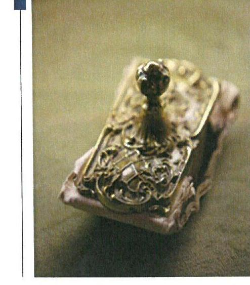
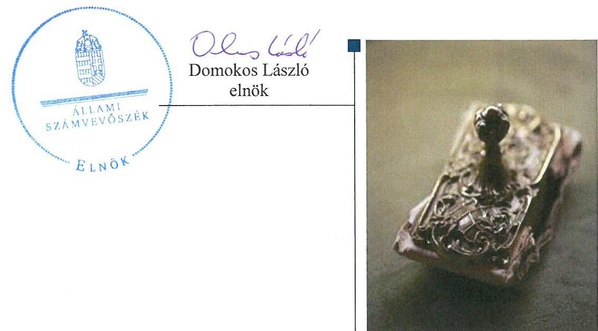
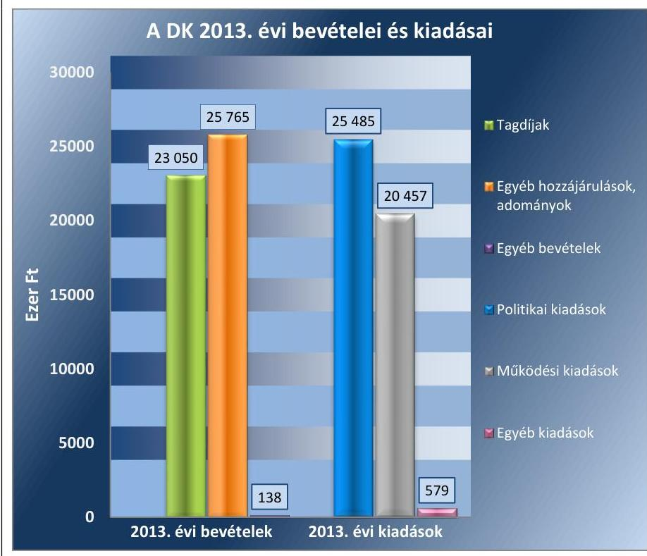
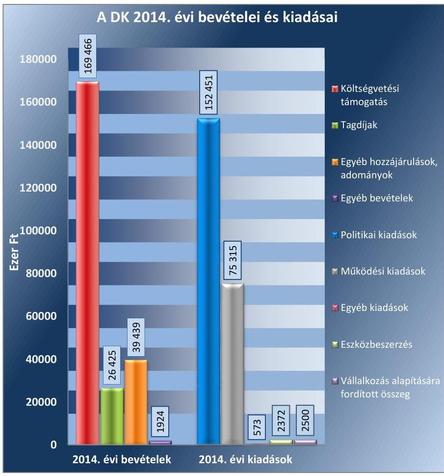

# Jelentés 

## Pártok gazdálkodása

A költségvetési támogatásban részesülő pártok 2013-2014. évi gazdálkodása törvényességének ellenőrzése a Demokratikus Koalíciónál 2016.

---

# Jelentés 

## Pártok gazdálkodása

A költségvetési támogatásban részesülő pártok 2013-2014. évi gazdálkodása törvényességének ellenőrzése a Demokratikus Koalíciónál
2016. 08. hó 24. nap

---

# AZ ELLENŐRZÉST FELÜGYELTE:

DR. BENEDEK MÁRIA felügyeleti vezető

## AZ ELLENŐRZÉST VEZETTE ÉS A VÉGREHAJTÁSÁÉRT FELELŐS:

MODER BEATRIX ellenőrzésvezető

## A PROGRAM ÖSSZEÁLLÍTÁSÁÉRT FELELŐS:

JANIK JÓZSEF LÁSZLÓ osztályvezető

## A TÉMÁHOZ KAPCSOLÓDÓ KORÁBBI SZÁMVEVŐSZÉKI JELENTÉSEK:

|  • címe: | Kampánypénzek ellenőrzése – A 2014. évi országgyűlési képviselő-választási kampányokra fordított pénzeszközök elszámolásának ellenőrzése a képviselethez jutott jelölő szervezeteknél  |
| --- | --- |
|  • sorszáma: | 15057  |

Jelentéseink az Országgyűlés számítógépes hálózatán és az Interneten a www.asz.hu címen is olvashatóak.

IKTATÓSZÁM: V-0998-046/2016.

TÉMASZÁM: 2032

ELLENŐRZÉS-AZONOSÍTÓ SZÁM: V-074604

---

# TARTALOMJEGYZÉK 

■ ÖSSZEGZÉS ..... 5
■ AZ ELLENŐRZÉS CÉLJA ..... 7
■ AZ ELLENŐRZÉS TERÜLETE ..... 8
■ AZ ELLENŐRZÉS HÁTTERE, INDOKOLTSÁGA ..... 9
■ A JELENTÉS LÉNYEGES KÉRDÉSKÖREI ..... 10
■ ELLENŐRZÉS HATÓKÖRE ÉS MÓDSZEREI ..... 11
■ MEGÁLLAPÍTÁSOK ..... 14
■ JAVASLATOK ..... 27
■ MELLÉKLETEK ..... 29
I. Sz. melléklet: Értelmező szótár. ..... 29
II. Sz. melléklet: A DK 2013. évi közzétett beszámolója ..... 30
III. Sz. melléklet: A DK 2014. évi közzétett pénzügyi kimutatása ..... 31
■ FÜGGELÉK: ÉSZREVÉTELEK ..... 33
■ RÖVIDÍTÉSEK JEGYZÉKE ..... 35

---

.

---

# ÖSSZEGZÉS 

Az ÁSZ ${ }^{1}$ a $D K^{2}$ gazdálkodásának törvényességét ellenőrizte a 2013. január 1-jétől 2014. december 31-ig terjedő időszakra vonatkozóan. Az ÁSZ megállapította, hogy a DK 2013. évi beszámolója és a 2014. évi pénzügyi kimutatása nem felelt meg a törvényi előírásoknak, mivel figyelmen kívül hagyták a Számv. tv. ${ }^{3}$-ben rögzített valódiság és teljesség alapelvet. A beszámoló és a pénzügyi kimutatás adatai teljes körüen nem egyeztek meg a fökönyvi nyilvántartás adataival, valamint a nem pénzbeli vagyoni hozzájárulások értékeléséről és a bevételek közötti kimutatásról nem gondoskodtak. A DK 2013. és 2014. évi könyvvezetése és gazdálkodása a leltár-összeállitás elmaradása és az ellenőrzési rendszer nem megfelelő müködése miatt nem felelt meg a jogszabályok előírásainak. A DK a müködéséhez szabályszerűen igénybe vehető forrásokat használt fel.

## Az ellenőrzés társadalmi indokoltsága

A pártok az állampolgárok egyesülési szabadsága alapján létrehozott olyan szervezetek, amelyek szervezeti kereteket nyújtanak a népakarat kialakításához és kinyilvánításához, a politikai életben való állampolgári részvételhez. A pártoknak más társadalmi szervezetekhez képest különleges a viszonya a közhatalomhoz, ugyanis a pártok kifejezett célja és feladata, hogy képviselőik útján részt vállaljanak a közhatalomból, illetőleg politikai eszközökkel folyamatosan befolyásolják a közhatalom tevékenységét.

A politikai élet tisztasága érdekében törvény állapítja meg a pártok vagyonára és gazdálkodására vonatkozó szabályokat. Az egyesülési jog alapján létrejövő más szervezetekhez képest szűkebb körben határozza meg azt a gazdasági tevékenységet, amelyet a párt végezhet, biztosítja azonban a pártok részére azt a jogosultságot, hogy az állami költségvetésből támogatásban részesüljenek. A pártok gazdálkodását a politikai élet tisztasága érdekében rendszeresen indokolt ellenőrizni, ezért törvényi előírás alapján az ÁSZ a költségvetési támogatást kapott pártok gazdálkodását kétévente ellenőrzi.

Az ÁSZ tv. ${ }^{4}$ és a Párttörvény ${ }^{5}$ alapján a pártok gazdálkodása törvényességének ellenőrzésére az ÁSZ jogosult. Az ÁSZ kiemelt szerepet tölt be és felelősséget visel a pártok feletti társadalmi kontroll érvényesítése terén. A párttörvényben előírt kétévenkénti ellenőrzési kötelezettségen túlmenően az ellenőrzést az a garanciális követelmény indokolja, hogy a pártok gazdálkodásának törvényességi ellenőrzése biztosított legyen, a törvényi rendelkezések megsértését szankciók követhessék.

A pártok működésével és gazdálkodásával kapcsolatos speciális előírásokat tartalmazó Párttörvény az ellenőrzött időszakban módosult. A főbb változások érintették a párt által elfogadható vagyoni hozzájárulásokra, a pártok beszámolására, valamint megszűnésére, felszámolására vonatkozó szabályokat.

Az ÁSZ még nem ellenőrizte a DK gazdálkodásának törvényességét, mivel a 2014. évi országgyűlési képviselő választáson elért eredménye alapján a 2014. évtől részesül rendszeres költségvetési juttatásban.

## Főbb megállapítások, következtetések, javaslatok

A DK a Párttörvényben előírt határidőn belül elkészítette és közzé tette a 2013. évi beszámolóját és a 2014. évi pénzügyi kimutatását. A beszámoló és a pénzügyi kimutatás készítése során sérült a Számv. tv. -ben előírt teljesség és valódiság alapelv. A nem pénzbeli vagyoni hozzájárulások értékelése és bevételek közötti elszámolása nem történt

---

meg, továbbá a beszámoló és a pénzügyi kimutatás adatai a könyvviteli nyilvántartások adataival teljes körűen nem egyeztek. A könyvvitelben elszámolt és a beszámolóban, illetve pénzügyi kimutatásban szereplő bevételek, kiadások eltéréseinek összege az ellenőrzött években nem érte el a bevételi főösszeg 2\%-ának megfelelő lényegességi küszöb mértékét. A DK számviteli rendszerének szabályozása - a leltározási szabályzat ${ }^{6}$ és a pénzkezelési szabályzat ${ }^{7}$ hiányossága mellett - megfelelt a jogszabályi előírásoknak. A DK gazdálkodása és könyvvezetése - a leltár-összeállítási kötelezettség elmulasztása és a könyvviteli elszámolást alátámasztó bizonylatok alaki hiányosságai miatt - nem felelt meg a Számv. tv. -ben meghatározott követelményeknek. A DK a gazdálkodással összefüggő egyéb jogszabályi előírásokat betartotta. A DK ellenőrzési rendszere nem működött megfelelően, a DK döntéshozó és irányító szervei az előírt feladataikat ellátták, azonban a DK felügyelőbizottságot nem hozott létre, a gazdálkodási szabályzat ${ }^{8}$ rendelkezései alapján létrehozott $\mathrm{PEB}^{9}$ a szabályzatban előírt jelentéseket nem készítette el. A pénzügyi-számviteli informatikai rendszer működése megfelelő volt, az adatok biztonságáról, megőrzéséről gondoskodtak, az alkalmazott informatikai rendszer biztosította a Számv. tv.-ben előírt megőrzési idő alatt a számviteli adatállományokból az adatok teljes körű előállíthatóságát. A DK a működéséhez szabályszerűen igénybe vehető forrásokat - költségvetési támogatást, tagdíjbevételeket, magánszemélyektől származó vagyoni hozzájárulásokat - használt fel, a vagyon használata szabályszerű volt.

---

# AZ ELLENŐRZÉS CÉLJA 

Az ellenőrzés célja annak értékelése volt, hogy a DK-nál a közzétett 2013. évi beszámoló, illetve a 2014. évi pénzügyi kimutatás a törvényi előírásoknak megfelelt-e, a könyvvezetés és gazdálkodás során betartották-e a vonatkozó jogszabályi és belső előírásokat, továbbá a DK a múködéséhez szabályszerűen igénybe vehető forrásokat használt-e fel.

---

# AZ ELLENŐRZÉS TERÜLETE 

## A DK

A párt olyan egyesület, amely nyilvántartott tagsággal rendelkezik, és amely a nyilvántartásba vételét végző bíróság előtt kinyilvánítja, hogy a Párttörvény rendelkezéseit magára nézve kötelezőnek ismeri el a Párttörvény 1. §-a alapján.

Az ÁSZ tv. 5. § (11) bekezdés a) pontja alapján az ÁSZ - a Párttörvény rendelkezéseinek megfelelően - törvényességi szempontok szerint ellenőrzi a pártok gazdálkodását. A Párttörvény 10. § (1) bekezdése alapján a párt gazdálkodása törvényességének ellenőrzésére az ÁSZ jogosult. A Párttörvény 10. § (3) bekezdése alapján az ÁSZ kétévente ellenőrzi azoknak a pártoknak a gazdálkodását, amelyek rendszeres költségvetési támogatásban részesültek.

A pártok múködésével és gazdálkodásával kapcsolatos speciális előírásokat tartalmazó Párttörvény az ellenőrzött időszakban módosult. A főbb változások érintették a párt által elfogadható vagyoni hozzájárulásokra, a pártok beszámolására, valamint megszűnésére, felszámolására vonatkozó szabályokat. A Párttörvény 9. § (1) bekezdése értelmében a pártok kötelesek minden év április 30-ig az előző évi gazdálkodásukról szóló beszámolót (zárszámadást) - a 2014. május 6-tól hatályos szabályozás szerint minden év május 31-ig a melléklet szerinti pénzügyi kimutatást - a Magyar Közlönyben, valamint internetes honlapjukon közzétenni.

A Demokratikus Koalíciót a Demokrata Párt átalakításával, az ellenőrzött időszakot megelőzően, 2011. november 6-án hozták létre. A DK a Párttörvény szerinti 2013. évi beszámolójában 48953 ezer Ft bevételt, valamint 46521 ezer Ft kiadást számolt el. A 2014. évi pénzügyi kimutatás szerint az összes bevétele 237254 ezer Ft, a teljesített kiadások összege 233211 ezer Ft volt. Az ellenőrzött években a DK bevételei meghaladták a kiadásait, hitel igénybevétel nem történt.

A DK kizárólagos tulajdonosa - az ellenőrzött időszakot megelőzően alapított - DÉKÁ Rendezvény Kft.-nek. A DK 2014 decemberében létrehozta alapítványát Új Köztársaságért Alapítvány néven.

---

# AZ ELLENŐRZÉS HÁTTERE, INDOKOLTSÁGA 

Az ÁSZ tv. és a Párttörvény alapján a pártok gazdálkodása törvényességének ellenőrzésére az ÁSZ jogosult. Az ÁSZ kiemelt szerepet tölt be és felelősséget visel a pártok feletti társadalmi kontroll érvényesítése terén. A Párttörvényben előírt kétévenkénti ellenőrzési kötelezettségen túlmenően az ellenőrzést az a garanciális követelmény indokolja, hogy a pártok gazdálkodásának törvényességi ellenőrzése biztosított legyen, a törvényi rendelkezések megsértését szankciók követhessék.

Az ÁSZ még nem ellenőrizte a DK gazdálkodásának törvényességét, mivel a 2014. évi országgyűlési képviselő választáson elért eredménye alapján a 2014. évtől részesül rendszeres költségvetési juttatásban.

A gazdálkodás szabályszerűségének, a felhasznált közpénzek nagyságának bemutatásával a társadalom objektív képet alkothat a pártok működéséről. Az ellenőrzés megállapításai a gazdálkodás megfelelőségének bemutatásával elősegíthetik, hogy a törvényalkotók konkrét lépéseket tegyenek a pártok finanszírozására vonatkozó szabályozások átláthatóbbá, ellenőrizhetőbbé tétele irányába. Az ellenőrzés rámutat a pártok gazdálkodásával, valamint az állami költségvetésből származó források felhasználásával kapcsolatos jó gyakorlatokra és szabálytalanságokra. A hiányosságok, szabálytalanságok feltárása, az ennek kapcsán megfogalmazott megállapítások elősegíthetik a törvényi rendelkezések megsértésének szankcionálását.

---

# A JELENTÉS LÉNYEGES KÉRDÉSKÖREI 

1.     - A DK közzétett beszámolója, pénzügyi kimutatása megfelelt-e a törvényi előírásoknak?
2.     - A DK könyvvezetése és gazdálkodása megfelelt-e az előírásoknak?
3.     - A DK a müködéséhez szabályszerűen igénybe vehető forrásokat használt-e fel?

---

# ELLENŐRZÉS HATÓKÖRE ÉS MÓDSZEREI 

## Az ellenőrzés típusa

Szabályszerűségi ellenőrzés.

## Az ellenőrzött időszak

A 2013. január 1-jétől 2014. december 31-ig terjedő időszak.

## Az ellenőrzés tárgya

Az ellenőrzés tárgyát képezték a 2013. évi beszámoló és a 2014. évi pénzügyi kimutatás elkészítésére, közzétételére, a DK könyvvezetésére, gazdálkodására, ennek keretében a számviteli szabályozás kialakítására, a bizonylati rend, bizonylati fegyelem betartására, egyéb gazdálkodási, ellenőrzési és pénzügyi-számviteli informatikai feladatok ellátására irányuló tevékenységek. Az ellenőrzés tárgya volt továbbá az előírt források fogadása, illetve a vagyon előírt hasznosítása.

A 2014. évi országgyűlési képviselő-választási kampányra fordított pénzeszközök elszámolását az ÁSZ már ellenőrizte, a kampányra fordított bevételek és kiadások a jelen ellenőrzésnek nem képezték a részét.

Az ellenőrzés kiterjedt minden olyan körülményre és adatra, amely az ÁSZ jogszabályban meghatározott feladatainak teljesítéséhez, valamint a program végrehajtása folyamán felmerült újabb összefüggések feltárásához szükséges.

## Az ellenőrzött szervezet

A Demokratikus Koalíció.

## Az ellenőrzés jogalapja

Az ellenőrzés jogszabályi alapját az ÁSZ tv. 5. § (11) bekezdés a) pontjában és a Párttörvény 10. § (1) és (3) bekezdéseiben foglalt előírások képezték.

## Az ellenőrzés módszerei

Az ÁSZ az ellenőrzést az ellenőrzési program szempontjai, az ellenőrzött időszakban hatályos jogszabályok, az ellenőrzés szakmai szabályai, a jelen ellenőrzésre irányadó ÁSZ módszertan (Módszertan a pártok gazdálkodása

---

törvényességének ellenőrzéséhez) és a nemzetközi standardok figyelembe vételével végezte. A gazdálkodás hibáinak kijavítására irányuló javaslatok kidolgozásakor a hatályos jogszabályokat tekintette irányadónak.

Az ellenőrzés ideje alatt a DK-val történő kapcsolattartást az ÁSZ az SZMSZ ${ }^{10}$-ének vonatkozó előírásai alapján biztosította.

Az ellenőrzési kérdések megválaszolásához szükséges bizonyítékok megszerzése a következő ellenőrzési eljárások alkalmazásával történt: tételes és mintavételen alapuló dokumentumellenőrzés, megerősítés, összehasonlító elemzés.

Az ellenőrzési bizonyítékként felhasználható adatforrások közé tartoztak egyrészt a szakmai program részletes szempontjainál felsorolt adatforrások, másrészt adatforrás lehetett minden egyéb - az ellenőrzés folyamán feltárt, az ellenőrzés szempontjából releváns információt tartalmazó - dokumentum.

Az ellenőrzés lefolytatásához a DK a tanúsítványok elektronikus kitöltésével, valamint az ÁSZ által kért dokumentumok elektronikus megküldésével szolgáltatott adatokat. A rendelkezésre bocsátott adatok, információk kontrollja az ellenőrzés keretében történt.

Az ellenőrzésnél az átfogó lényegességi küszöb mértékét az ÁSZ a DK által közzétett beszámoló, illetve pénzügyi kimutatás bevételi főösszegének 2\%-ában határozta meg.

Az ellenőrzés során figyelembe kellett venni azt, hogy
$\longrightarrow$ a Párttörvényben előírt beszámoló/pénzügyi kimutatás formájában és tartalmában nem felel meg a Számv. tv. szerinti mérleg, valamint az eredmény-kimutatás követelményeinek,
$\longrightarrow$ a Párttörvényben előírt éves beszámoló/pénzügyi kimutatás nem illeszkedik a Számv. tv.-ben meghatározott éves beszámoló elkészítésére vonatkozó tételes szabályokhoz,
$\longrightarrow$ a beszámoló/pénzügyi kimutatás elkészítéséhez nem készült a Párttörvény 1. számú melléklete szerinti beszámoló-soronként kitöltési útmutató, nincsenek fogalmi meghatározások, így az éves beszámoló/pénzügyi kimutatás elkészítése pártonként eltérő felfogások érvényesítésére ad lehetőséget,
$\longrightarrow$ a Párttörvény 2014. január 1-jei módosítása érintette a pártok felszámolási és végelszámolási eljárásra vonatkozó rendelkezéseit is,
$\longrightarrow$ 2014. január 1-jétől a módosított Párttörvény megtiltja, hogy a pártok jogi személyektől, jogi személyiséggel nem rendelkező szervezettől, külföldi szervezettől és nem magyar állampolgár természetes személytől vagyoni hozzájárulást fogadjanak el.
A jelentésben használt fogalmak magyarázatát az I. számú melléklet, a DK 2013. évi beszámolóját a II. számú melléklet, a 2014. évi pénzügyi kimutatását a III. számú melléklet tartalmazza.

A 2013. évi beszámoló, illetve a 2014. évi pénzügyi kimutatás könyvviteli nyilvántartással való egyezőségének, a könyvvezetés és gazdálkodás szabályszerűségének ellenőrzéséhez az ÁSZ tételes ellenőrzést és MUS mintavételi eljárást is alkalmazott. Teljes körűen ellenőrizésre kerültek a központi költségvetésből származó támogatások, valamint a beszámolóban, illetve pénzügyi kimutatásban a Párttörvény alapján nevesítésre kötelezett, értékhatárt meghaladó adományok, hozzájárulások, továbbá az 1

---

millió Ft feletti kiadások. Mintavételi eljárás alapján ellenőrizte az ÁSZ a tagdíjbevételeket, a nevesítésre nem kötelezett adományokat, hozzájárulásokat, az egyéb bevételeket, valamint az 1 millió Ft-ot el nem érő kiadásokat.

Az ÁSZ a beszámoló/pénzügyi kimutatás elkészítésének, a számviteli rendszer jogszabályi előírások szerinti kialakításának és működtetésének, valamint a források igénybevételének szabályszerűségét az erre irányuló ellenőrzési kérdésekre adott válaszok összesítése alapján, a lényegességi szempontok figyelembevételével évenkénti bontásban minősítette. Megfelelőnek értékelte az ellenőrzött területet, amennyiben a szabályozás, illetve végrehajtás során a jogszabályi követelményeket maradéktalanul, vagy kisebb hiányosságok mellett érvényesítették, nem megfelelőnek értékelte, amennyiben a szabályozás hiányosságai nem biztosították a szabályszerű működés feltételeit, illetve a gazdálkodás folyamatában, a könyvvezetés során jelentkező hibák lényegesek, nagyszámúak, vagy rendszerszerűek voltak.

---

# 1. A DK közzétett beszámolója, pénzügyi kimutatása megfelelt-e a törvényi előírásoknak? 

Összegző megállapítás

1.1. számú megállapítás

1.2. számú megállapítás

A DK közzétett 2013. évi beszámolója és 2014. évi pénzügyi kimutatása nem felelt meg a törvényi előírásoknak.

A 2013. évi beszámoló és a 2014. évi pénzügyi kimutatás elkészítése nem felelt meg, a közzététele megfelelt a jogszabályi előírásoknak.

A DK HATÁRIDŐBEN ELKÉSZÍTETTE a 2013. évi gazdálkodásáról a beszámolót, illetve a 2014. évi gazdálkodási adatokat tartalmazó pénzügyi kimutatást, és gondoskodott a Magyar Közlöny mellékletét képező Hivatalos értesítőben, valamint saját honlapján történő közzétételéről.

A 2013. évi beszámolót és a 2014. évi pénzügyi kimutatást a közzétételt megelőzően az Alapszabály ${ }_{1}{ }^{11}{ }_{2}{ }^{12}{ }_{3}{ }^{13}$ előírásának megfelelően az Elnökség ${ }^{14}$ határozattal elfogadta.

A beszámoló és a pénzügyi kimutatás szerkezete megfelelt az előírásoknak, a Párttörvény 1. számú mellékletében meghatározott beszámolósorokon mutatták ki a bevételeket és a kiadásokat. A beszámoló és a pénzügyi kimutatás a nevesítésre kötelezett pénzbeli adományokat, hozzájárulásokat elkülönítve tartalmazta, azonban a beszámoló és a pénzügyi kimutatás összeállítása során nem tartották be a Számv. tv.-ben előírt számviteli alapelveket. A 3.1 pontban részletezett, nem pénzbeli vagyoni hozzájárulásokat a Párttörvényben előírtak ellenére nem értékelték, értéküket a könyvviteli nyilvántartásokban nem rögzítették, a beszámoló és a pénzügyi kimutatás bevételei között nem mutatták ki. A beszámoló és a pénzügyi kimutatás adatai a könyvviteli nyilvántartás adataival - az 1.2. pontban részletezettek szerint - nem egyeztek meg.

A beszámoló és a pénzügyi kimutatás adatainak egyezősége a könyvviteli nyilvántartás adataival nem volt biztosított, azonban az eltérések összege nem érte el a lényegességi szintet.

A DK BEVÉTELEINEK ÉS KIADÁSAINAK ELSZÁMOLÁSA az ellenőrzött években a számlarendjében ${ }^{15}$ meghatározott főkönyvi számlákon történt.

A DK a 2013. évben központi költségvetési támogatásban nem részesült, a DK által alapított korlátolt felelősségű társaság nyereségéből származó bevételt nem számolt el, bevételei a tagok által befizetett tagdíjakból, valamint természetes személyek által nyújtott adományokból, hozzájárulásokból és egyéb bevételekből származtak.

---

A DK a számviteli politikában ${ }^{16}$, valamint az Alapszabály ${ }_{3}$-ban rögzítette a tagok által fizetendő tagdíj összegét, a pénzkezelési szabályzatban és a választókerületi pénzkezelési szabályzatban ${ }^{17}$ a befizetés szabályait.

A DK 2013. évi 46521 ezer Ft összegű összes kiadása a politikai tevékenység kiadásait, múködési kiadásokat és az egyéb kiadásokat tartalmazta. A múködési kiadások az irodabérlet és iroda üzemeltetés dijait foglalták magukban. Az egyéb kiadások a bankköltségeket tartalmazták.

A DK 2013. évi beszámolójában feltüntetett bevételeit és kiadásait az 1. ábra szemlélteti.
1. ábra

Forrás: A DK 2013. évi közzétett beszámolójának adatai
A 2013. évi beszámoló bevételi adatai - a tagdíjbevételek kivételével a kapcsolódó főkönyvi számlák adataiból levezethetőek voltak, a beszámolósorok tartalma a Párttörvény és a Számv. tv. előírásainak megfelelően megegyezett a könyvviteli nyilvántartással. A főkönyvi számlákon és a beszámolósorokon minden esetben az előírt jogcímú, bizonylattal alátámasztott összegek szerepeltek.

A 2013. évi beszámoló 12 ezer Ft-tal alacsonyabb bevételi főösszeget tartalmazott a bevételi főkönyvi számlákon elszámolt összegnél, mivel a tagdíjak beszámolósoron kimutatott tagdíjbevétel 12 ezer Ft-tal alacsonyabb volt a kapcsolódó főkönyvi számlán és az analitikus nyilvántartásban kimutatott összegnél. A beszámoló bevételi oldalán feltárt hiba a számviteli elszámolások szempontjából nem tekintendő lényegesnek, mivel nem érte el a bevételi főösszegre vetített $2 \%$-os lényegességi szintet.

Az egyéb hozzájárulások, adományok beszámolósor a Párttörvényben előírt részletezettséggel tartalmazta az egyéb hozzájárulásokból, adományokból származó bevételeket. A 2013. évben hét belföldi magánszemély adományozott ötszázezer forintot meghaladó összeget, összesen

---

9434 ezer Ft összegben, amelyek a közzétett beszámolóban a Párttörvény előírásának megfelelően nevesítve jelentek meg.

Az egyéb bevétel beszámolósor adata megegyezett a könyvviteli nyilvántartással, a beszámolósor csak a számviteli politikában meghatározott bevételnek minősülő, bizonylattal alátámasztott bevételeket tartalmazott.

A 2013. évi beszámoló kiadási adatai a kapcsolódó főkönyvi számlák adataiból egyértelműen levezethetőek voltak. A főkönyvi számlákon és a beszámolósorokon minden esetben az előírt jogcímű, bizonylattal alátámasztott kiadási összegek szerepeltek.

A DK a 2014. évben a 2014. évi költségvetési törvény ${ }^{18}$ alapján a pártok támogatása jogcímen folyósított, az 1321/2014. (V. 30.) Kormány határozatban rögzített, 77005 ezer Ft összegű, valamint a Kftv. ${ }^{19}$ alapján kampányfinanszírozási célra nyújtott 92461 ezer Ft központi költségvetési támogatásban részesült.

A költségvetési támogatáson felül a DK 2014. évi bevételeit a tagok által fizetett tagdíjak, magyar állampolgár természetes személyektől kapott hozzájárulások, adományok és egyéb bevételek képezték.

A DK 2014. évben teljesített 233211 ezer Ft összegű kiadásainak 65,4\%a politikai tevékenységhez kapcsolódott, $32,3 \%$-a múködési kiadás volt, $2,3 \%$-át pedig az eszközbeszerzésre, vállalkozás alapítására fordított összegek és az egyéb kiadások tették ki.

A DK 2014. évi pénzügyi kimutatásában feltüntetett bevételeit és kiadásait a 2. ábra szemlélteti.
2. ábra

Forrás: A DK 2014. évi közzétett pénzügyi kimutatásának adatai

---

A 2014. évi pénzügyi kimutatás bevételi sorainak tartalma - az egyéb adományok, hozzájárulások kerekítési eltérése kivételével - megegyezett a kapcsolódó főkönyvi számlák és analitikus nyilvántartások adataival.

A tagdíj beszámolósoron bizonylatokkal alátámasztott és - egy tétel kivételével - csak az előírt jogcímű összegek szerepeltek.

A központi költségvetésből származó támogatás, az egyéb hozzájárulások, adományok és az egyéb bevételek beszámolósorok a könyvviteli nyilvántartás adataival egyezően, kizárólag a megfelelő jogcímű, bizonylatokkal alátámasztott bevételeket tartalmaztak.

Az egyéb hozzájárulások, adományok beszámolósor a Párttörvényben előírt részletezettséggel tartalmazta a bevételeket. A 2014. évben hat belföldi magánszemély adományozott ötszázezer forintot meghaladó összeget, összesen 20473 ezer Ft összegben, amelyek a közzétett pénzügyi kimutatásban nevesítve jelentek meg.

A 2014. évi pénzügyi kimutatás - Számv. tv. előírása ellenére 232 ezer Ft-tal alacsonyabb kiadási főösszeget tartalmazott a kapcsolódó főkönyvi számlákon elszámolt összegnél, a működési kiadások beszámolósor 315 ezer Ft-tal magasabb, a politikai tevékenység kiadása beszámolósor 547 ezer Ft-tal alacsonyabb volt a vonatkozó főkönyvi számlák egyenlegénél és az analitikus nyilvántartás összesített adatánál.

A DK 2500 ezer Ft összegű tőkeemelést hajtott végre 2014-ben a kizárólagos tulajdonában lévő DÉKÁ Rendezvény Kft-nél, melyet a vállalkozások alapítására fordított összeg beszámolósoron a kapcsolódó főkönyvi számlán szereplő értékkel megegyezően mutattak ki.

A kampánytevékenység kiadása, az eszközbeszerzésekre teljesített kiadás és az egyéb kiadások beszámolósorok összegei megegyeztek a kapcsolódó főkönyvi számlák összesített egyenlegével, a beszámolósorok csak bizonylattal alátámasztott, az előírt jogcímű összegeket tartalmaztak.

A közzétett 2014. évi pénzügyi kimutatás sorai és a főkönyvi nyilvántartás közötti eltéréseket az 1. táblázat részletezi.

1. táblázat

# A PÉNZÜGYI KIMUTATÁS ÉS A FŐKÖNYVI NYILVÁNTARTÁS KÖZÖTTI ELTÉRÉSEK 

| Pénzügyi kimutatás   sor   megnevezése | összege   ezer Ft-ban | eltérés a főkönyvhöz   képest   ezer Ft-ban | eltérés a bevételi fö-   összeghez képest   \%-ben |
| :-- | --: | --: | --: |
| Egyéb hozzájárulá-   sok, adományok | 39439 | -5 | $0,002 \%$ |
| Összes bevétel a   gazdasági évben | 237254 | -5 | $0,002 \%$ |
| Múködési kiadások | 73315 | +315 | $0,133 \%$ |
| Politikai tevékeny-   ség kiadásai | 59990 | -547 | $0,23 \%$ |
| Összes kiadás a gaz-   dasági évben | 233211 | -232 | $0,098 \%$ |
| Összes eltérés elöjeltől függetlenül | 867 | $0,365 \%$ |  |

A 2014. évi pénzügyi kimutatás bevételi és kiadási sorainál feltárt hibák a számviteli elszámolások szempontjából nem tekintendők lényegesnek,

---

mivel nem érték el a bevételi főösszegre vetített 2\%-os lényegességi szintet.

A beszámoló és a pénzügyi kimutatás és az azokat alátámasztó könyvviteli elszámolások szabálytalanságait az 2. táblázat mutatja be.
2. táblázat

# A BESZÁMOLÓ ÉS A PÉNZÜGYI KIMUTATÁS ÉS AZ AZOKAT ALÁTÁMASZTÓ KÖNYVVITELI ELSZÁMOLÁSOK SZABÁLYTALANSÁGAI 

| Sorszám | Részmegállapítás | Megjegyzés |
| :--: | :--: | :--: |
| 1. | A DK a 2013. és 2014. években kedvezményes bérleti díjú, illetve térítésmentes ingatlanhasználat formájában kapott nem pénzbeli vagyoni hozzájárulásokat a Párttörvény 4. § (5) bekezdésében foglalt előírás ellenére nem értékelte, és a Számv. tv. 15. § (2) bekezdésében foglalt teljesség alapelvet figyelmen kívül hagyva a könyvvezetés és a 2013. évi beszámoló, illetve 2014. évi pénzügyi kimutatás készítése során bevételként nem mutatta ki. |  |
| 2. | A Számv. tv. 15. § (3) bekezdésében foglalt valódiság alapelvet figyelmen kívül hagyva, a 2013. évi beszámoló 12 ezer Ft-tal alacsonyabb bevételi főösszeget tartalmazott a bevételi főkönyvi számlákon elszámolt összegnél, mivel a tagdíjak beszámolósoron kimutatott 23050 ezer Ft tagdíjbevétel 12 ezer Ft-tal alacsonyabb volt a kapcsolódó főkönyvi számlán és az analitikus nyilvántartásban kimutatott összegnél. |  |
| 3. | A 2014. évi pénzügyi kimutatás a Számv. tv. 15. § (3) bekezdésében foglalt valódiság alapelvet figyelmen kívül hagyva, kerekítési eltérés miatt 5 ezer Ft-tal alacsonyabb bevételi főösszeget, továbbá 232 ezer Ft-tal alacsonyabb kiadási főösszeget tartalmazott a főkönyvi számlákon elszámolt összegnél, annak következtében, hogy a múködési kiadások beszámolósoron 315 ezer Ft-tal magasabb, a politikai tevékenység kiadása beszámolósoron 547 ezer Ft-tal alacsonyabb összeget mutattak ki a kapcsolódó főkönyvi számlák összesített egyenlegeinél. |  |
| 4. | A 2013. évi beszámolóban a Számv. tv. 15. § (3) bekezdésében foglalt valódiság alapelvet figyelmen kívül hagyva egy belföldi magánszemély nevesített adományai között tévesen tüntettek fel 232 ezer Ft előző évben adományozott összeget. Ugyanakkor a 4.3.1 Egyéb hozzájárulások, adományok belföldi magánszemélyektől (500 ezer Ft alatt) beszámolósor összegét tévesen 232 ezer Fttal alacsonyabb összegben mutatták ki a ténylegesen adományozott összegekhez képest.   A két azonos összegű, ellentétes előjelű hiba a 4.3. Hozzájárulások, adományok magánszemélyektől beszámolósor összegét, és így a beszámoló bevételi főösszegét nem érintette. |  |
| 5. | A Számv. tv. 16. § (3) bekezdésében előírt, a tartalom elsődlegessége a formával szemben alapelv ellenére a DK nem a gazdasági esemény tényleges tartalmának megfelelően mutatta ki a bevételt, amikor a 2014. évben adomány címén befizetett 62,4 ezer Ft összeget a könyvvezetés során tagdíjként számolt el. |  |

---

# 2. A DK könyvvezetése és gazdálkodása megfelelt-e az előírásoknak? 

Összegző megállapítás

2.1. számú megállapítás

A DK könyvvezetése és gazdálkodása nem felelt meg az előírásoknak.

A DK számviteli rendszere - a leltározási és a pénzkezelési szabályzat hiányossága mellett - összességében megfelelően szabályozott volt.

A DK RENDELKEZETT A SZÁMV. TV.-BEN ELŐíRT SZABÁLYZATOKKAL, amelyeket az Alapszabály ${ }_{1-3}$ rendelkezéseivel összhangban az Elnökség fogadta el.

Az ellenőrzött időszakban hatályos számviteli politika, számlarend, és értékelési szabályzat ${ }^{20}$ megfelelt, a leltározási szabályzat és a pénzkezelési szabályzat - kisebb hiányosságok mellett - megfelelt a Számv. tv. előírásainak.

A DK a számviteli politikát a szervezeti sajátosságaihoz igazodóan készítette el, a hatályos jogszabályi előírásoknak megfelelő tartalommal.

A leltározási szabályzat tartalma a mennyiségi felvételezéssel történő leltározás gyakorisága kivételével megfelelő volt, a számviteli politikával összhangban tartalmazta a leltárfelvétel gyakoriságát, a leltározás módját, dokumentálásának szabályait, a leltáreltérések kezelésének és a felelősség megállapításának szabályait.

Az értékelési szabályzatban a Számv. tv. és a számviteli politika előírásaival összhangban meghatározták az eszköz és a forráscsoportok értékelési eljárásait. A szabályzat tartalmazta a Párttörvényben előírtaknak megfelelően a DK részére nyújtott nem pénzbeli vagyoni hozzájárulás értékelésének szabályait.

A DK az Elnökség által elfogadott pénzkezelési szabályzattal, a területi szervezetei ún. választókerületi pénzkezelési szabályzattal rendelkeztek. A pénzkezelési szabályzat a Számv. tv. előírásának megfelelően tartalmazta a pénzforgalom lebonyolításának rendjét, a pénzkezelés személyi és tárgyi feltételeit, felelősségi szabályait, a készpénzállományt érintő pénzmozgások jogcímeit és eljárási rendjét.

A DK rendelkezett a Számv. tv.-ben előírtaknak megfelelő tartalmú, a működési sajátosságokat figyelembe vevő számlarenddel és hozzá kapcsolódó számlatükörrel, valamint bizonylati szabályzattal ${ }^{21}$. A számlatükör aktualizálása minden évben megtörtént, azonban a számlatükör és a számlarend közötti összhang megteremtésére az ellenőrzött időszakban nem került sor.

A számviteli rendszer szabályozásának hiányosságait a 3. táblázat mutatja be.

---

# A SZÁMVITELI RENDSZER SZABÁLYOZÁSÁNAK HIÁNYOSSÁGAI 

Sorszám Részmegállapítás
Megjegyzés

1. A leltározási szabályzat a Számv. tv. 69. § (3) bekezdésében előírt három éves gyakoriság ellenére a mennyiségi leltárfelvétellel történő leltározás gyakoriságát öt évenként írta elő.
2. A pénzkezelési szabályzat a Számv. tv. 14. § (8) bekezdésében előírtak ellenére nem tartalmazta a napi készpénz záró állomány maximális mértékét, valamint a szabályzat 2. pontjában előírtak ellenére a bankszámla feletti rendelkezésre jogosultak névsora nem képezte a pénzkezelési szabályzat mellékletét.

Forrás: ÁSZ

### 2.2. számú megállapítás

A könyvvezetés gyakorlata -a leltár-összeállítás elmaradása és a számviteli bizonylatok alaki hiányosságai miatt - nem felelt meg a jogszabályokban és belső szabályzatokban előírtaknak.

## A DK A PÉNZÜGYI-SZÁMVITELI FELADATOKAT

maga látta el, könyvviteli szolgáltatót az ellenőrzött időszakban nem vett igénybe. A gazdálkodási szabályzat értelmében a számviteli rendszer müködtetése a pártigazgató felelőssége. A pártigazgató felelős a gazdálkodás megszervezéséért, szabályszerűségéért, illetve az átláthatóság érvényesüléséért. A számviteli politikában foglaltak szerint a könyvelés és a hozzá kapcsolódó analitikus nyilvántartások vezetése a Gazdasági iroda feladata volt.

A DK az ellenőrzött időszakban a Számv. tv. és a számviteli politika előírásával összhangban kettős könyvvitelt vezetett és a gazdasági eseményeket a könyveiben idősorosan rögzítette.

Az eszközök bekerülési értékét az ellenőrzött időszakban a Számv. tv. előírásainak megfelelően határozták meg. A kis értékű tárgyi eszközök bekerülési értékét egy összegben költségként számolták el a Számv. tv. és a számviteli politika előírásai figyelembevételével. A már használatba vett tárgyi eszközök átalakításával, bővítésével összefüggő, még nem aktivált eszközöket a Számv. tv.-ben foglaltakkal összhangban befejezetlen beruházásként vették nyilvántartásba.

A számviteli politika előírásainak megfelelően kialakított és folyamatosan vezetett analitikus nyilvántartások és a főkönyvi könyvelés egyeztetését a Számv. tv. előírásának megfelelően az év végi zárlati feladatok keretében elvégezték, az egyezőség az ellenőrzött években biztosított volt, a leltár-összeállítási kötelezettségnek azonban az ellenőrzött években nem tettek eleget.

A könyvvezetés során érvényesült a bizonylati elv és fegyelem. A gazdasági eseményeket bizonylatokkal alátámasztották, a kiállított vegyes bizonylatok megalapozottak voltak, a főkönyvi könyvelésben a gazdasági események időrendisége érvényesült. A könyvviteli elszámolásokat alátámasztó bizonylatok megőrzése szabályszerű volt.

A könyvvezetés során - az 1.1. és 1.2. pontban részletezett - Számv. tv.ben rögzített számviteli alapelvek nem teljes körűen érvényesültek.

---

A könyvviteli elszámolást közvetlenül alátámasztó számviteli bizonylatok a Számv. tv.-ben előírt alaki követelményeknek nem teljes körűen feleltek meg, mivel azok nem tartalmazták a könyvviteli nyilvántartásokban való rögzítés időpontját.

A szigorú számadási kötelezettség alá vont nyomtatványok köréről és szabályairól a pénzkezelési szabályzat rendelkezett. A szigorú számadású bizonylatok nyilvántartása megfelelt a Számv. tv. és a belső szabályzat előírásainak.

A gazdálkodással és könyvvezetéssel kapcsolatos szabálytalanságokat a 4. táblázat mutatja be.
4. táblázat

# A GAZDÁLKODÁSSAL ÉS A KÖNYVVEZETÉSSEL KAPCSOLATOS SZABÁLYTALANSÁGOK 

| Sorszám | Részmegállapítás | Megjegyzés |
| :--: | :--: | :--: |
| 1. | Az DK a Számv. tv. 69. § (1) bekezdésében előírt leltár-összeállítási kötelezettségének az ellenőrzött időszakban nem tett eleget. |  |
| 2. | A Számv. tv. 167 §. (1) bekezdés i) pontjában előírtak ellenére az ellenőrzött bevételi és kiadási bizonylatok nem tartalmazták a könyvviteli nyilvántartásokban való rögzítés időpontját, valamint nem minden esetben tartalmazták a nyilvántartásban történő rögzítés igazolását. |  |
| 3. | A Számv. tv. 167 §. (1) bekezdés h) pontjában előírtak ellenére a bizonylatok nem minden esetben tartalmazták az érintett könyvviteli számlákra történő hivatkozást. |  |
| 4. | A Számv. tv. 167. § (1) bekezdés c) pontjának előírása ellenére az ellenőrzött pénzkezelési bizonylatokon nem minden esetben szerepelt az utalványozó, az átvevő, az ellennyugtákon a befizető aláírása. |  |
| 5. | A pénzkezelési szabályzat 3. pontjában rögzített összeférhetetlenségi követelmények két 2013. évi - összesen 135772 Ft választókerületi - készpénzkiadás esetében nem érvényesültek, mivel a kiadások pénzkezelési bizonylatain a pénztárbizonylat kiállítója, az utalványozó, az engedélyező, a pénztáros, és az összeg átvevőjeként azonos személy aláírása szerepelt. |  |

2.3. számú megállapítás

A DK a gazdálkodással összefüggő, egyéb jogszabályokban meghatározott előírásokat betartotta.

A DK-NÁL A FOGLALKOZTATÁS, A MUNKABÉREK ÉS EGYÉB SZEMÉLYI KIADÁSOK elszámolása az ellenőrzött időszakban szabályszerű volt.

A DK-nál a 2013. évben munkaerő foglalkoztatás munkaviszony keretében nem történt. A 2014. évben a munkaerő foglalkoztatása munkaviszony keretében, a Munka tv. ${ }^{22}$ előírásainak megfelelő, szabályozott tartalmú munkaszerződések alapján történt. A munkaszerződéseket a DK, mint munkáltató részéről az Alapszabály ${ }_{1-3}$ előírása alapján a munkáltatói jogkört gyakorló pártigazgató írta alá. A munkaviszony keretében foglalkoztatottak feladatait munkaköri leírásban meghatározták.

A munkavállalók bejelentése az Art. ${ }^{23}$ rendelkezéseinek megfelelő tartalommal és határidőben az illetékes adóhatóság felé megtörtént. A munkabérek számfejtése és kifizetése a munkaszerződésekben foglaltakkal összhangban szabályszerűen történt.

---

Az ellenőrzött időszakban a DK az Art., a Tbj. tv. ${ }^{24}$ és az Szja tv. ${ }^{25}$ előírásainak megfelelően eleget tett az adó- és járulék nyilvántartási, levonási, bevallási, befizetési és adatszolgáltatási kötelezettségeinek. A munkáltatót terhelő, illetve levont adók és járulékok bevallását és befizetését döntő részt határidőre teljesítették. A 2014. évben két alkalommal a szociális hozzájárulási adó megfizetése késedelmesen történt, azonban késedelemből eredő hátraléka 2014. év végén a DK-nak nem volt. Az adó és járulékbevallások és befizetések adatai a főkönyvi nyilvántartás adataival egyezőek voltak.

Az ellenőrzött személyi jellegű kifizetések és a könyvviteli nyilvántartás adatai szerint a DK a munkavállalók részére az ellenőrzött időszakban béren kívüli juttatásokat nem fizetett.

A belföldi kiküldetések teljesítésekor a kiküldött elnökségi tagok részére a saját gépjármú használatáért az Szja. tv. alapján adómentesen elszámolható mértékű költségtérítést fizettek. Az utazási költségek elszámolásához a DK-nál az Szja tv.-ben előírt tartalmú kiküldetési rendelvényt alkalmazták, a hivatalos utazások elszámolásánál a magántulajdonú gépjármú használati jogának előírt igazolását megkövetelték.

A DK az ellenőrzött időszakban gazdálkodási tevékenységet nem folytatott, áfa fizetési kötelezettsége nem keletkezett.

A DK a magáncélú telefonhasználatot 2014. évben továbbszámlázta a dolgozók felé, ezért az Szja. tv. szerinti adófizetési kötelezettsége nem keletkezett. Az elszámolt reprezentációs költség az ellenőrzött években nem haladta meg az Szja tv. szerinti adómentes értékhatárt.

# 2.4. számú megállapítás 

## A DK ellenőrzési rendszere nem múködött megfelelően.

## A DK DÖNTÉSHOZÓ, IRÁNYÍTÓ ÉS ELLENŐRZŐ

SZERVEIT és azok feladat- és hatáskörét az Alapszabály ${ }_{1-3}$-ban és gazdálkodási szabályzatban határozták meg.

Az Alapszabály ${ }_{1-3}$ értelmében a DK legfőbb szerve a Kongresszus ${ }^{26}$, amelynek kizárólagos hatásköre az alapszabály megállapítása és módosítása az Etikai szabályzat ${ }^{27}$ elfogadása és módosítása, az Elnökség valamint az Etikai bizottság ${ }^{28}$ tagjainak megválasztása.

Az Elnökség ellátja a DK vezetésével kapcsolatos feladatokat, a Kongresszusnak beszámol két Kongresszus közötti tevékenységéről, kinevezi a pártigazgatót, elfogadja az éves költségvetést és beszámolót.

Az Elnök teljes jogkörrel képviseli a DK-t, irányítja a működését, összehangolja a választókerületi szervezetek tevékenységét, a kinevezés kivételével gyakorolja a pártigazgató felett a munkáltatói jogokat.

A pártigazgató felelős a gazdálkodás megszervezéséért, a költségvetés elkészítéséért, a bevételek, kiadások nyilvántartásáért, gyakorolja a DK munkavállalói felett a munkáltatói jogokat.

A döntéshozó és irányító szervek az ellenőrzött időszakban az előírt feladataikat ellátták.

A gazdálkodási szabályzat rögzíti, hogy a DK gazdálkodásának folyamatos ellenőrzését egy párttagsággal nem rendelkező, szakemberekből álló bizottság, a PEB végzi, amelynek tagjait az Elnökség kérte fel.

---

A gazdálkodási szabályzat értelmében a PEB rendszeresen, de legalább negyedévente ellenőrzi a DK és az országgyűlési képviselőcsoport gazdálkodását, valamint figyelemmel kíséri a DK tulajdonában álló társaság, illetve a DK által alapított alapítvány gazdálkodási tevékenységét. A PEB tevékenysége kiterjed a gazdálkodás szabályszerűségének, valamint a kiadások célszerűségének vizsgálatára, a DK költségvetésének véleményezésére. A PEB a vizsgálatának eredményéről legalább negyedévente jelentést készít az Elnökség számára, amelyben javaslatokat fogalmazhat meg a gazdálkodással kapcsolatosan. A gazdálkodási szabályzat meghatározta, hogy a PEB a pártigazgatótól megkap minden a gazdálkodással összefüggő adatot, információt és korlátozás nélkül betekinthet a gazdálkodással összefüggő összes iratba.

A PEB a gazdálkodási szabályzatban előírt feladatait nem látta el, a tevékenységéről az előírt jelentéseket nem készítette el.

A DK az ellenőrzött időszak végéig a Ptk. ${ }^{29}$ előírása ellenére felügyelőbizottságot nem hozott létre.

A pénztárellenőrzések a pénzkezelési szabályzatban meghatározott gyakorisággal és eljárással, munkafolyamatba építve valamint időszakonkénti pénztár rovanccsal történtek, az ellenőrzés tényét az ellenőrzött pénztárbizonylatokon igazolták.

A DK 2014. május 1-jétől külső vállalkozóval számviteli szolgáltatási tevékenységre, ezen belül a könyvvezetés időszakonkénti ellenőrzésére kötött megállapodást. A szerződés szerinti feladatok teljesítését a pártigazgató igazolta.

Az ellenőrzési rendszerrel kapcsolatos szabálytalanságokat az 5. táblázat mutatja be.

# A DÖNTÉSHOZÓ, IRÁNYÍTÓ SZERVEK FELADATAINAK MEGHATÁROZÁSÁVAL, AZ ELLENŐRZŐ SZERVEK MŰKÖDÉSÉVEL KAPCSOLATOS SZABÁLYTALANSÁGOK 

| Sorszám |  |  |
| :-- | :-- | :-- |
| 1. | A DK tagságának létszáma meghaladta a 100 főt, azonban a Ptk.   3:82.§ (1) bekezdés előírása ellenére felügyelőbizottság létrehozá-   sára az ellenőrzött időszakban nem került sor. A Ptké. ${ }^{30} 11 . \S$ (1)   és (3) bekezdései előírása ellenére a Ptk. hatályba lépését köve-   tően módosított 2014. november 22-től hatályos Alapszabálys -   ban, a Ptk. 3:26. § (4) bekezdésében előírtak szerint a felügyelőbi-   zottság és annak tagjai nem kerültek nevesítésre. |  |
| 2. | A gazdálkodási szabályzat 3. § 6. pontjában előírtak ellenére a PEB   a tevékenységéről jelentéseket az Elnökség részére nem készített. |  |
| 3. | A Kongresszus által elfogadott Alapszabálys és a szintén a Kong-   resszus által elfogadott gazdálkodási szabályzat a DK költségveté-   sének elfogadása tekintetében nincs összhangban. Az Alapsza-   bálys 21.d) pontja értelmében a DK költségvetését a Kongresszus,   a gazdálkodási szabályzat 1. § 5. pontja értelmében az Elnökség   fogadja el. |  |

Forrás: ÁSZ

---

# 2.5. számú megállapítás 

A pénzügyi-számviteli informatikai rendszer múködése megfelelt a jogszabályi előírásoknak.

A DK a pénzügyi-számviteli tevékenységet és az ahhoz kapcsolódó informatikai, rendszerüzemeltetési feladatokat maga látta el. A DK pénzügyi-számviteli tevékenységéhez kapcsolódó informatikai rendszer alkalmazott technológiája biztosította a folyamatos, dokumentált múködést az ellenőrzött időszakban.

A DK az ellenőrzött időszakban rendelkezett Informatikai Biztonsági Szabályzattal. Az IBSZ ${ }^{31}$-ben rögzítették a hozzáférési jogosultságokat, valamint rendelkeztek a mentésekről, a file-ok védelméről. A szervereken tárolt adatok rendszeres mentéséért az informatikai igazgató és a rendszergazdák feleltek. A számviteli adatállomány mentésének gyakoriságát az IBSZ-ben nem rögzítették, az eseménynaplók szerint a gyakorlatban a szerverek napi és havi automatikus biztonsági mentéseket végeztek. A könyvelési programhoz elkülönült - RAID10+hot spare ${ }^{32}$ rendszerú adathordozóval rendelkező - szerver tartozott, amely automatikus hibajelzésre volt alkalmas. Az ellenőrzés rendelkezésére bocsátott eseménynapló alapján a mentési listában az ellenőrzött időszakban hibajelzés nem mutatkozott.

A DK a bizonylati szabályzatban a Számv. tv. előírásaival összhangban írta elő a számviteli adatállományok, bizonylatok, iratok őrzési idejét.

Az alkalmazott informatikai rendszerek biztosították a Számv. tv.-ben előírt megőrzési idő alatt a számviteli adatállományokból a rögzített adatok teljes körű előállíthatóságát.

Az alkalmazott pénzügyi-számviteli programok jogszabályi előírásoknak való megfeleltetéséről, a szükséges frissítésekről a programok szállítói gondoskodtak.

## 3. A DK a múködéséhez szabályszerűen igénybe vehető forrásokat használt-e fel?

Összegző megállapítás

## 3.1. számú megállapítás

A DK a múködéséhez szabályszerűen igénybe vehető forrásokat használt fel.

A DK múködéséhez szükséges források, különösen a támogatás, vagyoni hozzájárulás, adomány igénybevétele megfelelt a jogszabályi előírásoknak.

A DK a bevételeinek, gazdálkodó tevékenységének jogcímeiről az Alapsza-bály-3-ban rendelkezett. A szabályozás - a Párttörvény 2014. január 1-jétől hatályos módosítását követve - mindenkor összhangban volt a Párttörvényben előírt korlátozásokkal.

A DK vagyona - a beszámoló, illetve pénzügyi kimutatás, a bevételek elszámolására szolgáló főkönyvi számlák és kapcsolódó analitikus nyilvántartások adatai alapján - az ellenőrzött időszakban a Párttörvényben meghatározott, szabályszerűen igénybe vehető forrásokból képződött.

---

A DK 2013-ban költségvetési támogatásban nem részesült. A 2014. évben a pártok támogatása jogcímen 77005 ezer Ft, valamint kampányfinanszírozási célú, 92461 ezer Ft összegű központi költségvetési támogatásban részesült.

A költségvetési támogatáson felül a DK legfontosabb bevételeit a tagok által fizetett tagdíjak, a regisztrált pártolói támogatások és egyéb magyar állampolgár természetes személyektől kapott hozzájárulások, adományok képezték.

A DK a Párttörvény szerint nevesítésre kötelezett hozzájárulásokat az ellenőrzött években a nyilvántartásaiból leválogathatóan kezelte és azokat a beszámolóban, illetve a pénzügyi kimutatásban - a hozzájárulást adó megnevezésével és az összeg megjelölésével - külön feltüntetette.

Az egyéb adományok, hozzájárulások ellenőrzött tételei alapján az elfogadott adományok magánszemélyektől származtak.

A DK térítésmentes - illetve egy ingatlan esetében kedvezményes, 12 Ft/év bérleti díjú - ingatlanhasználat formájában magányszemélyektől a 2013. és 2014. évben nem pénzbeli vagyoni hozzájárulásban részesült.

A nem pénzbeli vagyoni hozzájárulásokat jelentő jelképes bérleti díjú, illetve térítésmentes ingatlanhasználat kimutatását a 6. táblázat részletezi.
6. táblázat

# A NEM PÉNZBELI VAGYONI HOZZÁJÁRULÁST JELENTŐ, KEDVEZMÉNYES, ILLETVE TÉRÍTÉSMENTES BÉRLEMÉNYEK ADATAI 

| bérlemény helve, alapterülete | bérlet idötartama |  |
| :--: | :--: | :--: |
|  | a 2013. évben | a 2014. évben |
| Budapest XVII. kerület Aranylúd u. 44. sz. alatti 56 nm-es bérlemény (fizetett bérleti díj $12 \mathrm{Ft} / \mathrm{év}$ ) | 7 hónap | 11 hónap |
| Esztergom Jókai u. 8. 1/6. sz. alatti 18 nm-es térítésmentes bérlemény | - | 1 hónap |
| Nyíregyháza Vay Á. körút 4-6. 1. em. 124. sz. alatti 12 nm-es térítésmentes bérlemény | - | 12 hónap |

A DK tiltott szervezettől, más államtól vagyoni hozzájárulást, támogatást nem fogadott el. Gazdasági társasága adózott nyereségéből és gazdálkodó tevékenységből az ellenőrzött időszakban nem képződött bevétele.

## 3.2. számú megállapítás

## A DK múködése során a vagyon használata megfelelt a törvényi előírásoknak.

A DK a Párttörvényben megengedett forrásokból képződött vagyonát politikai tevékenységére és a múködésére használta fel. Az Alapszabály ${ }_{1-3}$ a pénzeszközök célszerű felhasználása érdekében előírta éves költségvetés készítését, a vagyon megfelelő felhasználása érdekében a gazdálkodás részletes szabályait a gazdálkodási szabályzatban rögzítették.

A DK nem élt a Párttörvény szerint - a költségek fedezése és a vagyon gyarapítása érdekében - megengedett gazdálkodó tevékenység folytatásának, valamint a tulajdonában lévő ingóságok díj ellenében való hasznosításának lehetőségével. A DK a szabad pénzeszközeit nem fektette értékpapírba, saját tulajdonú ingatlannal nem rendelkezett.

---

A DK kizárólagos tulajdonosa a DÉKÁ Rendezvény Kft.-nek, amely elsősorban rendezvényszervezéssel, konferencia és kereskedelmi bemutató szervezéssel foglalkozott. A DK eleget tett a Ptk. -ban előírt tulajdonosi kötelezettségének azzal, hogy a Kft. tőkéjét a társasági formára kötelezően előírt jegyzett tőke mértékére emelte 2014. szeptember 16-án.

A DK és vállalkozása között a gazdasági kapcsolat keret-megállapodásban szabályozott volt, a társaság a DK-nak nyújtott szolgáltatásait egyedi szerződések, megállapodások alapján számlázta, a DK és a vállalkozás pénzügyi kapcsolatai nyomon követhetők.

A DK alapítványa 2014. december 10-én került bejegyzésre Új Köztársaság Alapítvány néven.

A DK a gazdálkodási szabályzatának előírása szerint felügyelte a Kft. és az alapítvány gazdálkodását.

---

# JAVASLATOK 

Az ÁSZ tv. 33. § (1) bekezdésében foglaltak értelmében az ellenőrzött szervezet vezetője köteles a jelentésben foglalt megállapításokhoz kapcsolódó intézkedési tervet összeállítani és azt a jelentés kézhezvételétől számított 30 napon belül az ÁSZ részére megküldeni. Amennyiben az ellenőrzött szervezet vezetője nem küldi meg határidőben az intézkedési tervet, vagy továbbra sem elfogadható intézkedési tervet küld, az Állami Számvevőszék elnöke az ÁSZ tv. 33. § (3) bekezdése a) és b) pontjaiban foglaltakat érvényesítheti.

## A DK elnökének

1. Intézkedjen, hogy a Párttörvény elöírásainak megfelelően a nem pénzbeli vagyoni hozzájárulások értékelését végezzék el.
(2. számú táblázat 1. sorszámú megállapítása alapján))
2. Intézkedjen a gazdálkodás során a Számv. tv.-ben foglalt elöírások betartására a tekintetben, hogy
a) a pénzügyi kimutatás készítése és a könyvvezetés során érvényesüljenek a teljesség, a valódiság, és a tartalom elsődlegessége a formával szemben számviteli alapelvek;
(2. számú táblázat 1-5. sorszámú megállapításai alapján)
b) a leltározási szabályzatban a mennyiségi leltárfelvétellel történő leltározás gyakoriságát a Számv. tv. előírásának megfelelően határozzák meg;
(3. számú táblázat 1. sorszámú megállapítása alapján)
c) a pénzkezelési szabályzatban rögzítsék a napi készpénz záró állomány maximális mértékét;
(3. számú táblázat 2. sorszámú megállapítása alapján)
d) tegyenek eleget a leltár-összeállitási kötelezettségnek;
(4. számú táblázat 1. sorszámú megállapítása alapján)
e) a könyvviteli elszámolást közvetlenül alátámasztó bizonylatok tartalmazzák a könyvviteli nyilvántartásokban történt rögzítés idő-

---

pontját, igazolását, az érintett könyvviteli számlákra történő hivatkozást és az utalványozó aláírását, a pénzkezelési bizonylatokon szerepeljen az átvevő, az ellennyugtákon a befizető aláírása.
(4. számú táblázat 2-4. sorszámú megállapításai alapján)
3. Intézkedjen, hogy a pénzkezelési szabályzat előírásának megfelelően a szabályzathoz mellékeljék a bankszámla felett rendelkezésre jogosultak névsorát.
(3. számú táblázat 2. sorszámú megállapítása alapján)
4. Intézkedjen, hogy a pénztári kifizetések során érvényesítsék a pénzkezelési szabályzatban rögzített összeférhetetlenségi követelményeket.
(4. számú táblázat 5. sorszámú megállapítása alapján)
5. Intézkedjen, hogy a Ptk. előírásának megfelelően hozzák létre a felügyelő bizottságot és annak tagjait az Alapszabályban nevesítsék.
(5. számú táblázat 1. sorszámú megállapítása alapján)
6. Intézkedjen, hogy a gazdálkodási szabályzat előírásának megfelelően a PEB tevékenységéről a jelentéseket az Elnökség részére készítse el.
(5. számú táblázat 2. sorszámú egállapításai alapján)
7. Intézkedjen, hogy az Alapszabály és a gazdálkodási szabályzat előírásai kerüljenek összhangba a DK költségvetésének elfogadása vonatkozásában.
(5. számú táblázat 3. sorszámú megállapítása alapján)

---

# MELLÉKLETEK 

- I. SZ. MELLÉKLET: ÉRTELMEZŐ SZÓTÁR
beszámoló
pénzügyi kimutatás
gazdálkodó tevékenység
költségvetési támogatás
nem pénzbeli támogatás

A Párttörvény 9. § (1) bekezdésében meghatározott, a párt előző évi gazdálkodásáról szóló beszámoló (zárszámadás) (hatálytalan 2014. május 6 -ától), amelyet a pártok kötelesek minden év április 30 -áig a Magyar Közlönyben, valamint saját honlappal rendelkező pártok a honlapjukon is - e törvény 1. számú mellékletében meghatározott minta szerint - közzétenni.
A Párttörvény 9. § (1) bekezdésében meghatározott, az 1. számú melléklet szerinti pénzügyi kimutatás (hatályos 2014. május 6 -ától), amelyet a pártok kötelesek minden év május 31-ig a Magyar Közlönyben, valamint saját honlappal rendelkező pártok a honlapjukon is közzétenni.
A párt a költségeinek fedezése és vagyonának gyarapítása érdekében a következő gazdasági-vállalkozási tevékenységeket folytathatja:

- politikai céljainak és tevékenységének megismertetése érdekében kiadványokat jelentethet meg és terjeszthet, a pártot szimbolizáló jelvényeket és más ilyen célú tárgyakat árusíthat, és pártrendezvényeket szervezhet;
- a tulajdonában álló ingatlanokat és ingókat dí ellenében hasznosíthatja és elidegenítheti.
(Forrás: Párttörvény 6. §)
Az államháztartás alrendszerei terhére nyújtott pénzbeli vagy nem pénzbeli juttatás, amelyet a támogató nem elsősorban ellenszolgáltatás ellenében, de konkrét program megvalósítása vagy meghatározott időszakban a támogatott szervezet múködtetése érdekében nyújt.
(Forrás: Civil tv. 2. § 15. pont)
vagyoni értékkel rendelkező forgalomképes dolog, szellemi alkotás, illetve vagyoni értékű jog részben vagy egészében, véglegesen vagy ideiglenesen, teljesen vagy részben ingyenesen történő átruházása vagy átengedése, illetve szolgáltatás biztosítása.
(Forrás: Civil tv. 2. § 25. pont)
Pénzegység alapú mintavétel (Monetary Unit Sampling).

---

# A Demokratikus Koalíció 2013. évi beszámolója a pártok müködéséről és gazdálkodásáról szóló törvény szerint

PÉNZÜGYI MÉRLEG

|  Bevételek |  | Adatok ezer forintban  |
| --- | --- | --- |
|  1. | Tagdijak | 23050  |
|  2. | Központi költségvetésből származó támogatás |   |
|  3. | A párt országgyúlés képviselócsoportjának nyújtott támogatás |   |
|  4. | Egyéb hozzájárulások, adományok |   |
|  4.1. | Jogi személyektől |   |
|  4.1.1. | Belföldi jogi személyektől 500000 Ft feletti összeg - nevesítve |   |
|  4.1.2. | Külföldiektől 100000 Ft feletti összeg - nevesítve |   |
|  4.2. | Jogi személynek nem minősülő gazdasági társaságtól |   |
|  4.2.1. | Belföldiektől 500000 Ft feletti összeg - nevesítve |   |
|  4.2.2. | Külföldiektől 100000 Ft feletti összeg - nevesítve |   |
|  4.3. | Magánszemélyektől | 25765  |
|  4.3.1. | Belföldiektől 500000 Ft feletti összeg - nevesítve |   |
|   | Baracskai József | 655  |
|   | Borka-Száz Tamás | 786  |
|   | Gyurcsány Ferenc | 5330  |
|   | Dr. Kolber István | 630  |
|   | Dr. Molnár Csaba | 730  |
|   | Szücs Erika | 750  |
|   | Varju László | 553  |
|   | Belföldi magánszemélyek | 15892  |
|  4.3.2. | Külföldiektől 100000 Ft feletti összeg - nevesítve |   |
|   | Bujturné Gulyás Zsuzsanna | 439  |
|  5. | Párt által alapított vállalat nyereségéből származó bevétel |   |
|  6. | Egyéb bevétel | 138  |
|   | Ebből hitelfelvétel |   |
|   | Összes bevétel a gazdasági évben | 48953  |
|  Kiadások |  | Adatok ezer forintban  |
|  1. | Támogatás a párt országgyúlési képviselócsoportja számára |   |
|  2. | Támogatás egyéb szerveknek |   |
|  3. | Vállalkozások alapítására fordított összegek |   |
|  4. | Eszközbeszerzés |   |
|  5. | Müködési kiadások | 20457  |
|  6. | Politikai tevékenység kiadása | 25485  |
|  7. | Egyéb kiadások | 579  |
|   | Összes kiadás a gazdasági évben | 46521  |

Budapest, 2014. április 30.

---

# A Demokratikus Koalíció 2014. évi pénzügyi beszámolója a pártok müködéséről és gazdálkodásáról szóló törvény szerint

2014. évi mérlegbeszámoló

PÉNZÜGYI MÉRLEG

Bevételek

|   |  | Adatok ezer forintban  |
| --- | --- | --- |
|  1. | Tagdíjak | 26425  |
|  2. | Központi költségvetésből származó támogatás | 169466  |
|  2.1. | Központi költségvetésből választásokra kapott támogatás | 92461  |
|  2.2. | Központi költségvetésből kapott összeg | 77005  |
|  3. | Képviselöcsoportnak nyújtott támogatás | -  |
|  4. | Egyéb hozzájárulások, adományok | -  |
|  4.1. | Jogi személyektől | -  |
|  4.1.1. | Belföldi jogi személyektől 500000 forint feletti összeg - nevesítve | -  |
|  4.1.2. | Külföldiektől 100000 forint feletti összeg - nevesítve | -  |
|  4.2. | Jogi személynek nem minősülő gazdasági társaságtól | -  |
|  4.2.1. | Belföldiektől 500000 forint feletti összeg - nevesítve | -  |
|  4.2.2. | Külföldiektől 100000 forint feletti összeg - nevesítve | -  |
|  4.3. | Magánszemélyektől | 39439  |
|  4.3.1. | Belföldiektől 500000 forint feletti összeg - nevesítve |   |
|   | Gyurcsány Ferenc | 16167  |
|   | Varju László | 1388  |
|   | dr. Molnár Csaba | 738  |
|   | Bujtorné Gulyás Zsuzsanna | 680  |
|   | Rékasi Csaba | 1000  |
|   | Borka-Szász Tamás | 500  |
|   | Magánszemélyek | 18966  |
|  4.3.2. | Külföldiektől 100000 forint feletti összeg - nevesítve | -  |
|  5. | Párt által alapított vállalat és korlátolt felelősségű társaság nyereségéből származó bevétel | -  |
|  6. | Egyéb bevétel | 1924  |
|   | Ebből hitelfelvétel | -  |
|  Összes bevétel a gazdasági évben |  | 237254  |

## Kiadások

Adatok ezer forintban

|  1. | Támogatás a párt országgyúlési képviselőcsoportja számára | -  |
| --- | --- | --- |
|  2. | Támogatás egyéb szerveknek | -  |
|  3. | Vállalkozások alapítására fordított összegek | 2500  |
|  4. | Eszközbeszerzés | 2372  |
|  5. | Müködési kiadások | 75315  |
|  6. | Politikai tevékenység kiadása | 59990  |
|  7. | Kampánytevékenység kiadásai (OGY) | 92461  |
|  8. | Egyéb kiadások | 573  |
|  Összes kiadás a gazdasági évben |  | 233211  |

Budapest, 2015. április 29.

---

.

---

# FÜGGELÉK: ÉSZREVÉTELEK 

A jelentéstervezetet a Számvevőszék 15 napos észrevételezésre megküldte az ellenőrzött szervezet vezetőjének az ÁSZ tv. 29. §* (1) bekezdése előírásának megfelelően.
Az ellenőrzött szervezet vezetője az ÁSZ tv. 29. § (2) bekezdésében foglalt észrevételezési jogával nem élt, a jelentéstervezetre észrevételt nem tett.

[^0]
[^0]:    * 29. § (1) Az Állami Számvevőszék az ellenőrzési megállapításait megküldi az ellenőrzött szervezet vezetőjének vagy az általa megbízott személynek, és annak, akinek személyes felelősségét állapította meg.
    (2) Az ellenőrzött szervezet vezetője és a felelősként megjelölt személy az ellenőrzés megállapításaira tizenöt napon belül írásban észrevételt tehet.
    (3) Az Állami Számvevőszék az észrevételre a beérkezésétől számított harminc napon belül írásban válaszol. A figyelembe nem vett észrevételeket köteles a jelentésben feltüntetni, és megindokolni, hogy azokat miért nem fogadta el.

---

.

---

# RÖVIDÍTÉSEK JEGYZÉKE 

${ }^{1}$ ÁSZ
${ }^{2}$ DK
${ }^{3}$ Számv. tv.
${ }^{4}$ ÁSZ tv.
${ }^{5}$ Párttörvény
${ }^{6}$ leltározási szabályzat
${ }^{7}$ pénzkezelési szabályzat
${ }^{8}$ gazdálkodási szabályzat
${ }^{9}$ PEB
${ }^{10}$ ÁSZ SZMSZ
${ }^{11}$ Alapszabályz
${ }^{12}$ Alapszabályz
${ }^{13}$ Alapszabályz
${ }^{14}$ Elnökség
${ }^{15}$ számlarend
${ }^{16}$ számviteli politika
${ }^{17}$ választókerületi pénzkezelési szabályzat
${ }^{18}$ 2014. évi költségvetési törvény
${ }^{19}$ Kftv.
${ }^{20}$ értékelési szabályzat
${ }^{21}$ bizonylati szabályzat
${ }^{22}$ Munka tv.
${ }^{23}$ Art.
${ }^{24}$ Tbj. tv.
${ }^{25}$ Szja. tv.
${ }^{26}$ Kongresszus
${ }^{27}$ Etikai szabályzat
${ }^{28}$ Etikai bizottság
${ }^{29}$ Ptk.
${ }^{30}$ Ptké.
${ }^{31}$ IBSZ
${ }^{32}$ Raid10+hot spare rendszer

Állami Számvevőszék
Demokratikus Koalíció
2000. évi C. törvény a Számvitelről
2011. évi LXVI. törvény az Állami Számvevőszékről
1989. évi XXXIII. törvény a pártok működéséről és gazdálkodásáról

Demokratikus Koalíció eszközök és források leltárkészítési és leltározási szabályzat (hatályos: 2012. január 1-től)
Demokratikus Koalíció pénzkezelési szabályzat (hatályos: 2012. január 1-től)
A Demokratikus Koalíció gazdálkodási szabályzata (hatályos: 2012. január 28-tól)
A Demokratikus Koalíció Pénzügyi Ellenőrző Bizottsága
Állami Számvevőszék Szervezeti és Működési Szabályzata.
Demokratikus Koalíció alapszabálya (hatályos: 2013. október 11-ig)
Demokratikus Koalíció alapszabálya (hatályos: 2013. október 12-től 2014. november 21-ig)
Demokratikus Koalíció alapszabálya (hatályos: 2014. november 22-től)
Demokratikus Koalíció Elnöksége
Demokratikus Koalíció számlarend (hatályos: 2012. január 1-től)
Demokratikus Koalíció számviteli politika (hatályos: 2012. január 1-től)
Demokratikus Koalíció választókerületi pénzkezelési szabályzata (hatályos: 2013. március 11-től)
2013. évi CCXXX. törvény Magyarország 2014. évi központi költségvetéséről
2013. évi LXXXVII. törvény az országgyűlési képviselők választása kampányköltségeinek átláthatóvá tételéről
Demokratikus Koalíció eszközök és források értékelési szabályzat (hatályos: 2012. január 1-től)
Demokratikus Koalíció Bizonylati szabályzata
2012. évi I. törvény a munka törvénykönyvéről
2003. évi XCII. törvény az adózás rendjéről
1997. évi LXXX. törvény a társadalombiztosítás ellátásaira és a magánnyugdíra jogosultakról, valamint e szolgáltatások fedezetéről
1995. évi CXVII. törvény a személyi jövedelemadóról

A Demokratikus Koalíció Kongresszusa a tagok összessége, a párt legfelsőbb szerve
Demokratikus Koalíció Etikai és Fegyelmi Szabályzata (hatályos: 2014. november 22-től)
Demokratikus Koalíció Etikai Bizottsága
a Polgári Törvénykönyvről szóló 2013. évi V. törvény (hatályos 2014. március 15 -től)
2013. évi CLXXVII. törvény a Polgári Törvénykönyvről szóló 2013. évi V. törvény hatálybalépésével összefüggő átmeneti és felhatalmazó rendelkezésekről Demokratikus Koalíció Informatikai Biztonsági Szabályzata
Az informatikában ez a technológia automatikusan újraépít és kijavít, a független elemebből álló tárolóegységben felhasználói beavatkozás nélkül azonnal helyettesítésre kerül a hibás merevlemez.

---

# ÁLLAMI SZÁMVEVŐSZÉK 

1052 Budapest, Apáczai Csere János utca 10.
Levélcím: 1364 Budapest 4. Pf. 54
Telefon: +36 14849100 Telefax: +36 14849200
www.asz.hu