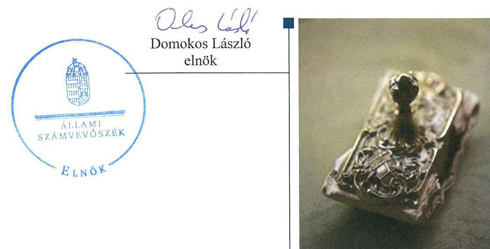
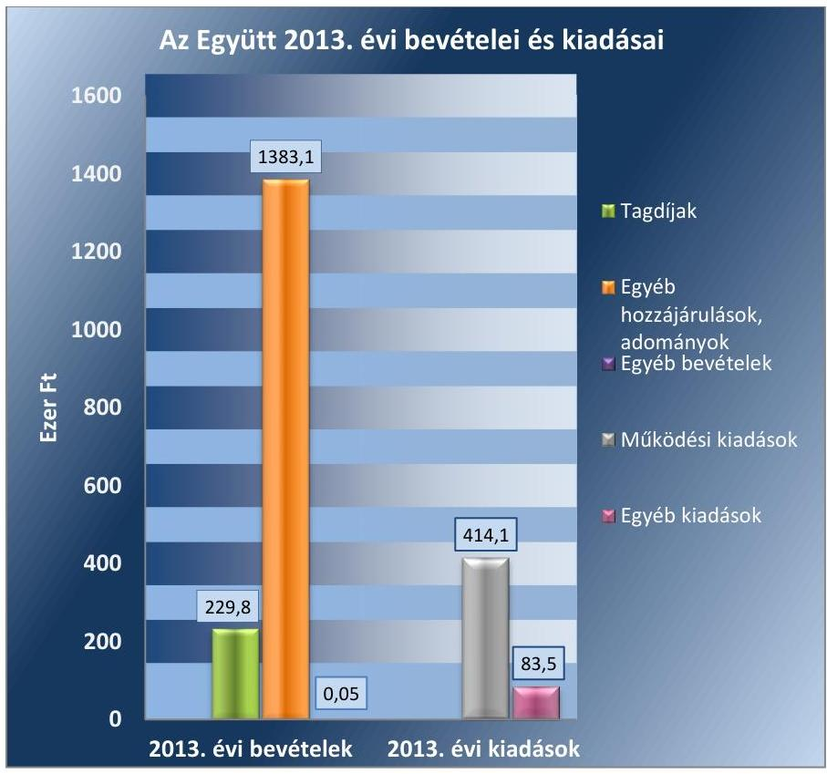
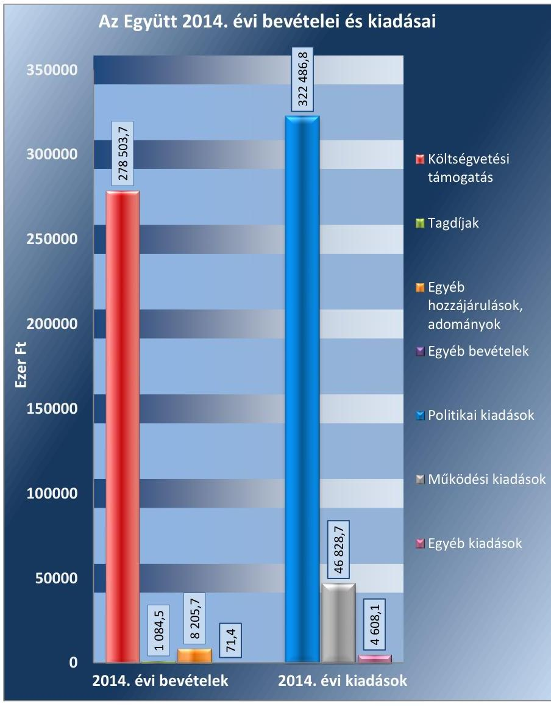
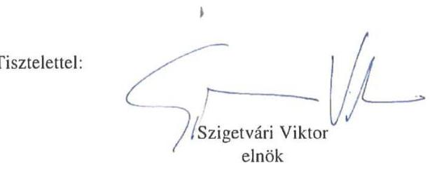
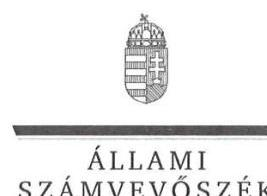
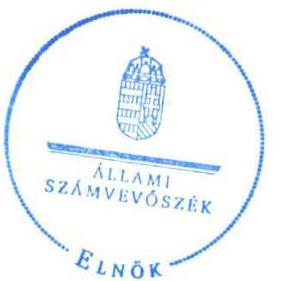
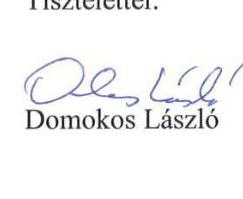
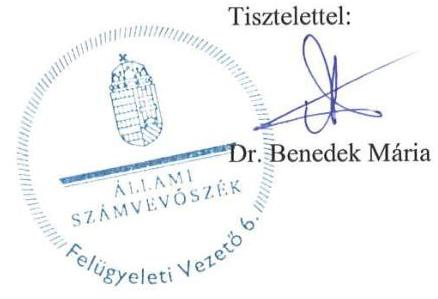

# Jelentés 

## Pártok gazdálkodása

A költségvetési támogatásban részesülő pártok 2013-2014. évi gazdálkodása törvényességének ellenőrzése az Együtt - a Korszakváltók Pártjánál 2016. 08. hó 24. nap

---

# AZ ELLENŐRZÉST FELÜGYELTE:

DR. BENEDEK MÁRIA felügyeleti vezető

## AZ ELLENŐRZÉST VEZETTE ÉS A VÉGREHAJTÁSÁÉRT FELELŐS:

MODER BEATRIX ellenőrzésvezető

## A PROGRAM ÖSSZEÁLLÍTÁSÁÉRT FELELŐS:

JANIK JÓZSEF LÁSZLÓ osztályvezető

## A TÉMÁHOZ KAPCSOLÓDÓ KORÁBBI SZÁMVEVŐSZÉKI JELENTÉSEK:

|  címe: | Kampánypénzek ellenőrzése – A 2014. évi országgyűlési képviselő-választási kampányokra fordított pénzeszközök elszámolásának ellenőrzése a képviselethez jutott jelölő szervezeteknél  |
| --- | --- |
|  sorszáma: | 15057  |

Jelentéseink az Országgyűlés számítógépes hálózatán és az Interneten a www.asz.hu címen is olvashatóak.

IKTATÓSZÁM: V-0999-050/2016.

TÉMASZÁM: 2033

ELLENŐRZÉS-AZONOSÍTÓ SZÁM: V-074605

---

# TARTALOMJEGYZÉK 

■ ÖSSZEGZÉS ..... 5
■ AZ ELLENŐRZÉS CÉLJA ..... 7
■ AZ ELLENŐRZÉS TERÜLETE ..... 8
■ AZ ELLENŐRZÉS HÁTTERE, INDOKOLTSÁGA ..... 9
■ A JELENTÉS LÉNYEGES KÉRDÉSKÖREI ..... 10
■ ELLENŐRZÉS HATÓKÖRE ÉS MÓDSZEREI ..... 11
■ MEGÁLLAPÍTÁSOK ..... 14
■ JAVASLATOK ..... 24
■ MELLÉKLETEK ..... 27
I. Sz. melléklet: Értelmező szótár ..... 27
II. Sz. melléklet: Az Együtt 2013. évi közzétett beszámolója ..... 28
III. Sz. melléklet: Az Együtt 2014. évi közzétett pénzügyi kimutatása. ..... 29
■ FÜGGELÉK: ÉSZREVÉTELEK ..... 31
■ RÖVIDÍTÉSEK JEGYZÉKE ..... 35

---

.

---

# ÖSSZEGZÉS 

Az ÁSZ ${ }^{1}$ az Együtt² gazdálkodásának törvényességét ellenőrizte a 2013. január 1-jétől 2014. december 31-ig terjedő időszakra vonatkozóan. Az ÁSZ megállapította, hogy az Együtt 2013. évi beszámolója megfelelt, a 2014. évi pénzügyi kimutatás azonban a nevesítésre kötelezett hozzájárulások külön történő feltüntetésének hiányában nem felelt meg a törvényi előírásoknak. Az Együtt 2013. és 2014. évi gazdálkodása és könyvvezetése összességében megfelelt a törvényi előírásoknak. Az Együtt a működéséhez szabályszerűen igénybe vehető forrásokat használt fel.

## Az ellenőrzés társadalmi indokoltsága

A pártok az állampolgárok egyesülési szabadsága alapján létrehozott olyan szervezetek, amelyek szervezeti kereteket nyújtanak a népakarat kialakításához és kinyilvánításához, a politikai életben való állampolgári részvételhez. A pártoknak más társadalmi szervezetekhez képest különleges a viszonya a közhatalomhoz, ugyanis a pártok kifejezett célja és feladata, hogy képviselőik útján részt vállaljanak a közhatalomból, illetőleg politikai eszközökkel folyamatosan befolyásolják a közhatalom tevékenységét.

A politikai élet tisztasága érdekében törvény állapítja meg a pártok vagyonára és gazdálkodására vonatkozó szabályokat. Az egyesülési jog alapján létrejövő más szervezetekhez képest szűkebb körben határozza meg azt a gazdasági tevékenységet, amelyet a párt végezhet, biztosítja azonban a pártok részére azt a jogosultságot, hogy az állami költségvetésből támogatásban részesüljenek. A pártok gazdálkodását a politikai élet tisztasága érdekében rendszeresen indokolt ellenőrizni, ezért törvényi előírás alapján az ÁSZ a költségvetési támogatást kapott pártok gazdálkodását kétévente ellenőrzi.

Az ÁSZ tv. ${ }^{3}$ és a Párttörvény ${ }^{4}$ alapján a pártok gazdálkodása törvényességének ellenőrzésére az ÁSZ jogosult. Az ÁSZ kiemelt szerepet tölt be és felelősséget visel a pártok feletti társadalmi kontroll érvényesítése terén. A Párttörvényben előírt kétévenkénti ellenőrzési kötelezettségen túlmenően az ellenőrzést az a garanciális követelmény indokolja, hogy a pártok gazdálkodásának törvényességi ellenőrzése biztosított legyen, a törvényi rendelkezések megsértését szankciók követhessék.

A pártok működésével és gazdálkodásával kapcsolatos speciális előírásokat tartalmazó Párttörvény az ellenőrzött időszakban módosult. A főbb változások érintették a párt által elfogadható vagyoni hozzájárulásokra, a pártok beszámolására, valamint megszűnésére, felszámolására vonatkozó szabályokat.

Az ÁSZ még nem ellenőrizte az Együtt gazdálkodásának törvényességét, mivel a 2014. évi országgyűlési képviselő választáson elért eredménye alapján a 2014. évtől részesül rendszeres költségvetési juttatásban.

## Főbb megállapítások, következtetések, javaslatok

Az Együtt a Párttörvényben előírt határidőn belül elkészítette és közzé tette a 2013. évi beszámolóját és a 2014. évi pénzügyi kimutatását. A 2014. évi pénzügyi kimutatásban azonban a Párttörvény előírása ellenére a naptári év alatt kapott, 500 ezer Ft-ot meghaladó hozzájárulásokat - a hozzájárulást adó megnevezésével és az összeg megjelölésével - külön nem mutatta be. Az Együtt beszámolójának és pénzügyi kimutatásának adatai a Számv. tv. ${ }^{5}$ előírásának megfelelően megegyeztek a könyvviteli nyilvántartások adataival. Az Együtt számviteli rendszerének szabályozása - a számlarend ${ }^{6}$ hiányosságai mellett - megfelelt a Számv. tv. előírásainak. Az Együtt gazdálkodása és könyvvezetése - a leltár-összeállítási kötelezettség elmulasztása ellenére és a könyvviteli elszámolást alátámasztó bizonylatok eseti alaki 

---

hiányossága mellett - összességében megfelelt a Számv. tv. -ben meghatározott követelményeknek. A könyvvezetés során a számviteli alapelveket - az eseti téves számlakijelölések mellett - érvényesítették. Az Együtt betartotta gazdálkodással összefüggő egyéb jogszabályi előírásokat. Az Együtt ellenőrzési rendszere - a pénztárellenőrzés hiánya mellett - az előírásoknak megfelelően működött. A pénzügyi-számviteli informatikai rendszer működése megfelelő volt, az adatok biztonságáról, megőrzéséről gondoskodtak, az alkalmazott informatikai rendszer biztosította a Számv. tv.-ben előírt megőrzési idő alatt a számviteli adatállományokból az adatok teljes körű előállíthatóságát. Az Együtt a működéséhez szabályszerűen igénybe vehető forrásokat - költségvetési támogatást, tagdíjbevételeket, magánszemélyektől származó vagyoni hozzájárulásokat - használt fel, a vagyon használata szabályszerű volt.

---

# AZ ELLENŐRZÉS CÉLJA 

Az ellenőrzés célja annak értékelése volt, hogy az Együttnél a közzétett 2013. évi beszámoló, illetve a 2014. évi pénzügyi kimutatás a törvényi előírásoknak megfelelt-e, a könyvvezetés és gazdálkodás során betartották-e a vonatkozó jogszabályi és belső előírásokat, továbbá az Együtt a működéséhez szabályszerűen igénybe vehető forrásokat használt-e fel.

---

# AZ ELLENŐRZÉS TERÜLETE 

## Az Együtt

A párt olyan egyesület, amely nyilvántartott tagsággal rendelkezik, és amely a nyilvántartásba vételét végző bíróság előtt kinyilvánítja, hogy a Párttörvény rendelkezéseit magára nézve kötelezőnek ismeri el a Párttörvény 1. §-a alapján.

Az ÁSZ tv. 5. § (11) bekezdés a) pontja alapján az ÁSZ - a Párttörvény rendelkezéseinek megfelelően - törvényességi szempontok szerint ellenőrzi a pártok gazdálkodását. A Párttörvény 10. § (1) bekezdése alapján a párt gazdálkodása törvényességének ellenőrzésére az ÁSZ jogosult. A Párttörvény 10. § (3) bekezdése alapján az ÁSZ kétévente ellenőrzi azoknak a pártoknak a gazdálkodását, amelyek rendszeres költségvetési támogatásban részesültek.

A pártok működésével és gazdálkodásával kapcsolatos speciális előírásokat tartalmazó Párttörvény az ellenőrzött időszakban módosult. A főbb változások érintették a párt által elfogadható vagyoni hozzájárulásokra, a pártok beszámolására, valamint megszűnésére, felszámolására vonatkozó szabályokat. A Párttörvény 9. § (1) bekezdése értelmében a pártok kötelesek minden év április 30-ig az előző évi gazdálkodásukról szóló beszámolót (zárszámadást) - a 2014. május 6-tól hatályos szabályozás szerint minden év május 31-ig a melléklet szerinti pénzügyi kimutatást - a Magyar Közlönyben, valamint internetes honlapjukon közzétenni.

Az Együtt jogerős bírósági bejegyzésére 2013. július 5-én került sor. A 2013. június 5-i alakuló ülésen a taggyűlés jóváhagyta az Alapszabály¹-et⁷, megválasztotta az Elnökséget⁸ és meghatározta a tagdíj mértékét. Az Együtt induló vagyona az alapító tagok által 2013. évre fizetett összesen 144 ezer Ft tagdíj volt. Az Együtt a 2013. évi - Párttörvény szerinti - beszámolójában 1612,9 ezer Ft bevételt, valamint 497,7 ezer Ft kiadást számolt el. A 2014. évi pénzügyi kimutatás szerint az összes bevétel 287 865,3 ezer Ft, a teljesített kiadások összege 373 923,6 ezer Ft volt. A fizetőképesség megőrzése érdekében az Együtt 2014 szeptemberében 42000 ezer Ft összegű hitelt vett igénybe, a további kiadási többlet forrása az év végéig ki nem egyenlített szállítói kötelezettség volt.

Az Együtt a 2013-2014. években egyszemélyes korlátolt felelősségű társaságot nem alapított, alapítványa a bírósági nyilvántartásba 2014. július 9-én bejegyzett Együtt Magyarországért Alapítvány.

---

# AZ ELLENŐRZÉS HÁTTERE, INDOKOLTSÁGA 

Az ÁSZ tv. és a Párttörvény alapján a pártok gazdálkodása törvényességének ellenőrzésére az ÁSZ jogosult. Az ÁSZ kiemelt szerepet tölt be és felelősséget visel a pártok feletti társadalmi kontroll érvényesítése terén. A Párttörvényben előírt kétévenkénti ellenőrzési kötelezettségen túlmenően az ellenőrzést az a garanciális követelmény indokolja, hogy a pártok gazdálkodásának törvényességi ellenőrzése biztosított legyen, a törvényi rendelkezések megsértését szankciók követhessék.

Az ÁSZ még nem ellenőrizte az Együtt gazdálkodásának törvényességét, mivel a 2014. évi országgyűlési képviselő választáson elért eredménye alapján a 2014. évtől részesül rendszeres költségvetési támogatásban.

A gazdálkodás szabályszerűségének, a felhasznált közpénzek nagyságának bemutatásával a társadalom objektív képet alkothat a pártok működéséről. Az ellenőrzés megállapításai a gazdálkodás megfelelőségének bemutatásával elősegíthetik, hogy a törvényalkotók konkrét lépéseket tegyenek a pártok finanszírozására vonatkozó szabályozások átláthatóbbá, ellenőrizhetőbbé tétele irányába. Az ellenőrzés rámutat a pártok gazdálkodásával, valamint az állami költségvetésből származó források felhasználásával kapcsolatos jó gyakorlatokra és szabálytalanságokra. A hiányosságok, szabálytalanságok feltárása, az ennek kapcsán megfogalmazott megállapítások elősegíthetik a törvényi rendelkezések megsértésének szankcionálását.

---

# A JELENTÉS LÉNYEGES KÉRDÉSKÖREI 

1.- Az Együtt közzétett beszámolója, pénzügyi kimutatása megfelelt-e a törvényi előírásoknak?
2.- Az Együtt könyvvezetése és gazdálkodása megfelelt-e az előírásoknak?
3.- Az Együtt a működéséhez szabályszerűen igénybe vehető forrásokat használt-e fel?

---

# ELLENŐRZÉS HATÓKÖRE ÉS MÓDSZEREI 

## Az ellenőrzés típusa

Szabályszerűségi ellenőrzés.

## Az ellenőrzött időszak

A 2013. január 1-jétől 2014. december 31-ig terjedő időszak.

## Az ellenőrzés tárgya

Az ellenőrzés tárgyát képezték a 2013. évi beszámoló és a 2014. évi pénzügyi kimutatás elkészítésére, közzétételére, az Együtt könyvvezetésére, gazdálkodására, ennek keretében a számviteli szabályozás kialakítására, a bizonylati rend, bizonylati fegyelem betartására, egyéb gazdálkodási, ellenőrzési és pénzügyi-számviteli informatikai feladatok ellátására irányuló tevékenységek. Az ellenőrzés tárgya volt továbbá az előírt források fogadása, illetve a vagyon előírt hasznosítása.

A 2014. évi országgyűlési képviselő-választási kampányra fordított pénzeszközök elszámolását az ÁSZ már ellenőrizte, a kampányra fordított bevételek és kiadások a jelen ellenőrzésnek nem képezték a részét.

Az ellenőrzés kiterjedt minden olyan körülményre és adatra, amely az ÁSZ jogszabályban meghatározott feladatainak teljesítéséhez, valamint a program végrehajtása folyamán felmerült újabb összefüggések feltárásához szükséges.

## Az ellenőrzött szervezet

Az Együtt - a Korszakváltók Pártja.

## Az ellenőrzés jogalapja

Az ellenőrzés jogszabályi alapját az ÁSZ tv. 5. § (11) bekezdés a) pontjában és a Párttörvény 10. § (1) és (3) bekezdéseiben foglalt előírások képezték.

## Az ellenőrzés módszerei

Az ÁSZ az ellenőrzést az ellenőrzési program szempontjai, az ellenőrzött időszakban hatályos jogszabályok, az ellenőrzés szakmai szabályai, a jelen ellenőrzésre irányadó ÁSZ módszertan (Módszertan a pártok gazdálkodása

---

törvényességének ellenőrzéséhez) és a nemzetközi standardok figyelembe vételével végezte. A gazdálkodás hibáinak kijavítására irányuló javaslatok kidolgozásakor a hatályos jogszabályokat tekintette irányadónak.

Az ellenőrzés ideje alatt az Együtttel történő kapcsolattartást az ÁSZ az SZMSZ⁹-ének vonatkozó előírásai alapján biztosította.

Az ellenőrzési kérdések megválaszolásához szükséges bizonyítékok megszerzése a következő ellenőrzési eljárások alkalmazásával történt: tételes és mintavételen alapuló dokumentumellenőrzés, megerősítés, összehasonlító elemzés.

Az ellenőrzési bizonyítékként felhasználható adatforrások közé tartoztak egyrészt a szakmai program részletes szempontjainál felsorolt adatforrások, másrészt adatforrás lehetett minden egyéb - az ellenőrzés folyamán feltárt, az ellenőrzés szempontjából releváns információt tartalmazó - dokumentum.

Az ellenőrzés lefolytatásához az Együtt a tanúsítványok elektronikus kitöltésével, valamint az ÁSZ által kért dokumentumok elektronikus megküldésével szolgáltatott adatokat. A
 rendelkezésre bocsátott adatok, információk kontrollja az ellenőrzés keretében történt.

Az ellenőrzésnél az átfogó lényegességi küszöb mértékét az ÁSZ az Együtt által közzétett beszámoló, illetve pénzügyi kimutatás bevételi főösszegének 2%-ában határozta meg.

Az ellenőrzés során figyelembe kellett venni azt, hogy
$\longrightarrow$ a Párttörvényben előírt beszámoló/pénzügyi kimutatás formájában és tartalmában nem felel meg a Számv. tv. szerinti mérleg, valamint az eredmény-kimutatás követelményeinek,
$\longrightarrow$ a Párttörvényben előírt éves beszámoló/pénzügyi kimutatás nem illeszkedik a Számv. tv.-ben meghatározott éves beszámoló elkészítésére vonatkozó tételes szabályokhoz,
$\longrightarrow$ a beszámoló/pénzügyi kimutatás elkészítéséhez nem készült a Párttörvény 1. számú melléklete szerinti beszámoló-soronként kitöltési útmutató, nincsenek fogalmi meghatározások, így az éves beszámoló/pénzügyi kimutatás elkészítése pártonként eltérő felfogások érvényesítésére ad lehetőséget,
$\longrightarrow$ a Párttörvény 2014. január 1-jei módosítása érintette a pártok felszámolási és végelszámolási eljárásra vonatkozó rendelkezéseit is,
$\longrightarrow$ 2014. január 1-jétől a módosított Párttörvény megtiltja, hogy a pártok jogi személyektől, jogi személyiséggel nem rendelkező szervezettől, külföldi szervezettől és nem magyar állampolgár természetes személytől vagyoni hozzájárulást fogadjanak el.
A jelentésben használt fogalmak magyarázatát az I. számú melléklet, az Együtt 2013. évi közzétett beszámolójának adatait a II. számú melléklet, a közzétett 2014. évi pénzügyi kimutatás adatait a III. számú melléklet tartalmazza.

A 2013. évi beszámoló illetve a 2014. évi pénzügyi kimutatás könyvviteli nyilvántartással való egyezőségének, a könyvelés és gazdálkodás szabályszerűségének ellenőrzéséhez az ÁSZ tételes ellenőrzést és MUS mintavételi eljárást is alkalmazott. Teljes körűen ellenőrizésre kerültek a központi költségvetésből származó támogatások, valamint az adományok, hozzájárulások, továbbá az 1 millió Ft feletti kiadások. Mintavételi eljárás

---

alapján ellenőrizte az ÁSZ a tagdíjbevételeket, az egyéb bevételeket, valamint az 1 millió Ft-ot el nem érő kiadásokat.

Az ÁSZ a beszámoló/pénzügyi kimutatás elkészítésének, a számviteli rendszer jogszabályi előírások szerinti kialakításának és működtetésének, valamint a források igénybevételének szabályszerűségét az erre irányuló ellenőrzési kérdésekre adott válaszok összesítése alapján, a lényegességi szempontok figyelembevételével évenkénti bontásban minősítette. Megfelelőnek értékelte az ellenőrzött területet, amennyiben a szabályozás, illetve végrehajtás során a jogszabályi követelményeket maradéktalanul, vagy kisebb hiányosságok mellett érvényesítették, nem megfelelőnek értékelte, amennyiben a szabályozás hiányosságai nem biztosították a szabályszerű működés feltételeit, illetve a gazdálkodás folyamatában, a könyvvezetés során jelentkező hibák lényegesek, nagyszámúak, vagy rendszerszerűek voltak.

---

# 1. Az Együtt közzétett beszámolója, pénzügyi kimutatása megfelel-e a törvényi előírásoknak? 

Összegző megállapítás

Az Együtt 2013. évi közzétett beszámolója megfelelt, a 2014. évi közzétett pénzügyi kimutatása nem felelt meg a törvényi előírásoknak.
1.1. számú megállapítás

A 2013. évi beszámoló elkészítése és közzététele megfelelt, a 2014. évi pénzügyi kimutatás - a nevesítésre kötelezett hozzájárulások külön történő feltüntetésének hiányában - nem felelt meg a jogszabályi előírásoknak.

Az Együtt határidőben elkészítette a 2013. évi gazdálkodásáról szóló beszámolót, illetve a 2014. évi gazdálkodásáról a pénzügyi kimutatást, és gondoskodott azoknak a Magyar Közlöny mellékletét képező Hivatalos Értesítőben, valamint a saját honlapján történő közzétételéről.

A közzétett 2013. évi beszámoló megfelel, a 2014. évi pénzügyi kimutatás nem felelt meg a Párttörvény előírásainak, mivel a naptári év alatt kapott, 500 ezer Ft-ot meghaladó hozzájárulásokat - a hozzájárulást adó megnevezésével és az összeg megjelölésével - külön nem mutatták be.

Az Együtt 2013. évi beszámolóját az Alapszabály előírásának megfelelően az Elnökség a közzététel napján elfogadta.

A 2014. évi pénzügyi kimutatás elkészítésével és elfogadásával kapcsolatos szabálytalanságokat az 1. táblázat tartalmazza.

1. táblázat

## A 2014. ÉVI PÉNZÜGYI KIMUTATÁS ELKÉSZÍTÉSÉVEL ÉS ELFOGADÁSÁVAL KAPCSOLATOS SZABÁLYTALANSÁGOK

Sorszám

## Részmegállapítás

1. Az Együtt a könyvviteli nyilvántartásaiban nem kezelte elkülönítetten az 500 000 Ft-ot meghaladó hozzájárulásokat, adományokat, ezért a 2014. évi pénzügyi kimutatásban a Párttörvény 9. § (2) bekezdésében foglaltak ellenére az egy naptári év alatt kapott, 500 000 Ft-ot meghaladó hozzájárulásokat - a hozzájárulást adó megnevezésével és az összeg megjelölésével - külön nem tüntette fel. Az Együtt a 2014. naptári évben 500 000 Ft feletti adományt három főtől - Bajnai György Gordon 1 300 000 Ft, Bojár Gábor 1 000 000 Ft, Walter Katalin Irén 1 000 000 Ft - összesen 3 300 000 Ft értékben kapott.
2. Az Alapszabály ${ }^{10}$ 5.1.b) és 10.12. pontjaiban előírtak ellenére a 2014. évi pénzügyi kimutatást a közzétételét megelőzően az OPT nem fogadta el.

A Párttörvény 9. § (2) bekezdésének megsértése a pénzügyi kimutatás bevételi főösszegét nem érintette, mivel a pénzügyi kimutatás „4.3.1. Belföldiektől 500 ezer Ft alatt" beszámolósorán kimutatott összeg az 500 000 Ft-ot meghaladó hozzájárulások 3 300 000 Ft-os összegét is tartalmazta.

A 2014. évi pénzügyi kimutatás a 2015. május 29-i Magyar Közlönyben került közzétételre. A 2014. évi pénzügyi kimutatást az Elnökség 2015. május 6-án jóváhagyta, és javasolta az OPT-nek az elfogadását, a Számvizsgáló Bizottság ${ }^{12}$ 2015. május 18-án véleményezte, az OPT 2015. június 6-án elfogadta.

---

# 1.2. számú megállapítás 

A beszámoló és a pénzügyi kimutatás adatainak egyezősége a könyvviteli nyilvántartás adataival biztosított volt.

Az Együtt a bevételeit és kiadásait az alkalmazott főkönyvi számlákon elszámolta. Az Együtt a 2013. évben központi költségvetési támogatásban nem részesült. A 2013. évi 1 612 900 Ft összegű bevétele a tagok által fizetett tagdíjakból, belföldi jogi személyiségnek nem minősülő gazdasági társaság adományából, belföldi magánszemélyektől származó adományokból, hozzájárulásokból, valamint egyéb bevételből - kamatjóváírásból - képződtek. A tagdíj összegét és a befizetés rendjét az Együtt a belső szabályzataiban meghatározta.

Az Együtt 2013. évi 497 700 Ft összegű összes kiadása a működési kiadásokat és az egyéb kiadásokat tartalmazta. A működési kiadások az irodabérleti díjakat, az irodaüzemeltetés díjait és a könyvelési díjakat foglalták magukban. Az egyéb kiadások a bankköltségeket tartalmazták.

Az Együtt 2013. évi beszámolójában feltüntetett bevételeit és kiadásait az 1. ábra szemlélteti.
1. ábra

Forrás: Az Együtt 2013. évi közzétett beszámolójának adatai
A 2013. évi beszámoló bevételi és kiadási adatai a kapcsolódó főkönyvi számlák adataiból egyértelműen levezethetőek voltak, a beszámolósorok tartalma a Párttörvény és a Számv. tv. előírásainak megfelelően megegyezett a könyvviteli nyilvántartással. A főkönyvi számlákon és a beszámolósorokon minden esetben bizonylattal alátámasztott és - a tagdíjbevételek kivételével - csak az előírt jogcímű összegek szerepeltek.

Az Együtt a 2014. évben a 2014. évi költségvetési törvény ${ }^{13}$ alapján a pártok támogatása jogcímen folyósított, az 1321/2014. (V. 30.) Korm. határozatban ${ }^{14}$ rögzített, 77 941 000 Ft összegű, valamint a Kftv. ${ }^{15}$ alapján

---

200 562 700 Ft kampányfinanszírozási célú központi költségvetési támogatásban részesült. A költségvetési támogatáson felül a bevételeit a tagok által fizetett tagdíjak, magánszemélyektől kapott hozzájárulások, adományok és egyéb bevételek képezték. Az „Egyéb bevétel" beszámolósor összege 2014-ben a kamatjóváírások mellett két - tévesen duplán fizetett terembérleti díj visszatérítést, illetve árfolyamnyereséget tartalmazott.

Az Együtt 2014. évben teljesített 373 923 600 Ft összegű kiadásainak 86,2%-a politikai tevékenységhez kapcsolódott, 12,5%-a működési kiadás, 1,2%-a egyéb kiadás volt. Az egyes kiadási sorokon a számviteli politikában ${ }^{16}$, valamint a számlarendben meghatározott kiadások kerültek elszámolásra.

Az Együtt 2014. évi pénzügyi kimutatásában feltüntetett bevételeit és kiadásait a 2. ábra szemlélteti.
2. ábra

Forrás: Az Együtt 2014. évi közzétett pénzügyi kimutatásának adatai
A 2014. évi pénzügyi kimutatás bevételi és kiadási sorainak tartalma a Párttörvény és a Számv. tv. előírásainak megfelelően megegyezett a kapcsolódó főkönyvi számlák adataival, azokon bizonylatokkal alátámasztott és - az egyéb adományok, hozzájárulások kivételével - csak az előírt jogcímű összegek szerepeltek.

---

Az Együttnek az ellenőrzött időszakban képviselőcsoportnak nyújtott állami támogatás jogcímen nem keletkezett bevétele. Pártalapítványával ${ }^{17}$ közös feladatot nem végzett, a Párttörvény előírását betartva nem fogadott el vagyoni hozzájárulást pártalapítványtól.

Az ellenőrzött időszakban az Együtt nem adott támogatást az országgyűlési csoportja, valamint egyéb szervezetek számára.

A könyvvezetés szabálytalanságait a 2. táblázat tartalmazza.
2. táblázat

# A BESZÁMOLÓ ÉS A PÉNZÜGYI KIMUTATÁS SORAIT ALÁTÁMASZTÓ FŐKÖNYVI ELSZÁMOLÁSOK SZABÁLYTALANSÁGAI 

| Sorszám | Részmegállapítás | Megjegyzés |
| :--: | :--: | :--: |
| 1. | Az Együtt a Számv. tv. 16. § (3) bekezdésében foglaltak ellenére nem a gazdasági esemény tényleges tartalmának megfelelően mutatta be a bevételeit, amikor a 2013. és 2014. évben adományként befizetett összeget a főkönyvi nyilvántartásában tagdíjként számolt el, illetve a 2014. évben tagdíjként befizetett összeget, valamint egyéb bevételt egyéb hozzájárulás, adomány jogcímen vett nyilvántartásba. | A tagdíjbevételként könyvelt tételek közül 2013-ban összesen 4500 Ft befizetést teljesítő három fő, 2014-ben összesen 12000 Ft befizetést teljesítő két fő nem szerepelt az Együtt tagdíjnyilvántartásában.   A 2014. évben három fő, a tagnyilvántartásban szereplő személy, összesen 15000 Ft összegű tagdíj megjelölésű befizetését, valamint 106 700 Ft egyéb bevételt tévesen adományként vettek nyilvántartásba. |

Forrás: ÁSZ

## 2. Az Együtt könyvvezetése és gazdálkodása megfelelt-e az előírásoknak?

Összegző megállapítás

### 2.1. számú megállapítás

Az Együtt könyvvezetése és gazdálkodása összességében megfelelt az előírásoknak.

Az Együtt számviteli rendszere - a számlarend hiányossága mellett - megfelelően szabályozott volt.

Az Együtt rendelkezett a Számv. tv.-ben előírt szabályzatokkal. A Számv. tv. előírásának megfelelően az Együtt a működésének megkezdését követő 90 napon belül elkészítette és 2013. augusztus 1-től hatályba léptette a számviteli politikáját, valamint annak keretében a számlarendet, leltározási szabályzatot ${ }^{18}$, értékelési szabályzatot ${ }^{19}$, és a pénzkezelési szabályzat ${ }^{20}$-et. A szabályzatokat a Számv. tv. előírásának megfelelően az Alapszabály értelmében a gazdálkodó képviseletére önállóan jogosult társelnök kiadmányozta.

Az ellenőrzött időszakban a számviteli politika, a leltározási, az értékelési és a pénzkezelési szabályzat ${ }^{21}$ megfelelt, a számlarend 2013-ban kisebb hiányosság mellett megfelelt, a 2014. évben nem felelt meg a Számv. tv. előírásainak.

A számviteli politikában rögzítették a könyvvezetés módját, az érvényesítendő számviteli alapelveket, az év végi zárlat időpontját, feladatait, a jelentős összeget, a megbízható és valós képet lényegesen befolyásoló hiba nagyságát, az éves beszámoló készítésének rendjét, időpontját, az amortizációs politika elemeit. Ugyanakkor a Számv. tv. előírása ellenére a számviteli politikát - a Párttörvény változásával összhangban - nem aktualizálták.

---

A leltározási szabályzatban meghatározták a leltározás gyakoriságát, a leltár tartalmát, dokumentálását, hitelesítését és ellenőrzését, valamint a leltáreltérések kezelésének és a felelősség megállapításának szabályait.

Az értékelési szabályzat tartalmazta az eszköz- és a forráscsoportok értékelési eljárásait. Az értékelési szabályzatban nem, de a számviteli politikában meghatározták az Együtt részére nyújtott nem pénzbeli vagyoni hozzájárulás értékelésének módszereit is.

Az ellenőrzött időszakban hatályos pénzkezelési szabályzat a Számv. tv. előírásainak megfelelően tartalmazta a pénzforgalom készpénzben, illetve bankszámlán történő lebonyolításának rendjét, a pénzkezelés személyi és tárgyi feltételeit, a felelősségi szabályokat, a napi készpénz záró állomány maximális mértékét, a pénzkezeléssel kapcsolatos bizonylatok rendjét, a pénztárellenőrzés gyakoriságát, a pénzforgalommal kapcsolatos nyilvántartási szabályokat.

A számlarend tartalmazta valamennyi 2013. évben alkalmazott főkönyvi számla számát, megnevezését, a számla értéke növekedésének, csökkenésének jogcímeit, a számlát érintő gazdasági eseményeket, az analitikus nyilvántartásokkal való kapcsolatot, valamint a bizonylati rendet, azonban nem tartalmazta valamennyi 2014. évben alkalmazott főkönyvi számlát.

A
 számviteli rendszer szabályozásának hiányosságait a 3. táblázat tartalmazza.
3. táblázat

# A SZÁMVITELI RENDSZER SZABÁLYOZÁSÁNAK HIÁNYOSSÁGAI 

Sorszám Részmegállapítás
Megjegyzés

1. A Számv. tv. 14. § (11) bekezdésében előírtak ellenére a számviteli politikát nem aktualizálták, mert a Párttörvény módosításával összefüggésben a számviteli politikában nem került átvezetésre a beszámoló megnevezésének módosítása és elkészítésének határideje.
2. Az ellenőrzött időszakban hatályos számlarend a Számv. tv. 161. § (2) bekezdés b) pontjában előírtak ellenére nem tartalmazta a számlák más számlákkal való kapcsolatát.
3. A számlarend a Számv. tv. 161. § (2) bekezdés a) pontjában foglaltak ellenére nem tartalmazta valamennyi, a 2014. évben alkalmazott főkönyvi számla számjelét és megnevezését.
A 2014. évi főkönyvi kivonatban szereplő 19 számla nem szerepelt a számlarendben és a számlatükörben.

Forrás: ÁSZ

### 2.2. számú megállapítás

A könyvvezetés gyakorlata - a számviteli bizonylatok eseti alaki hiányossága mellett - megfelelt a jogszabályokban és belső szabályzatokban előírtaknak.

AZ EGYÜTT KÖNYVVITELI FELADATAIT az ellenőrzött időszakban megbízási szerződés alapján külső könyvviteli szolgáltató látta el, a Számv. tv.-ben és a belső szabályzatokban előírtakkal összhangban a kettős könyvvitel rendszerében. A könyvviteli szolgáltató szervezet vezetője rendelkezett a Számv. tv.-ben meghatározott szakképesítéssel, a Magyar Könyvvizsgálói Kamara nyilvántartásában szerepelt.

---

A könyvvezetés során érvényesült a bizonylati elv és fegyelem, a bizonylati rend előírásait betartották. A gazdasági eseményeket bizonylatokkal alátámasztották, a kiállított vegyes bizonylatok megalapozottak voltak, a főkönyvi könyvelésben a gazdasági események időrendisége érvényesült. A könyvviteli elszámolásokat alátámasztó bizonylatok megőrzése szabályszerű volt.

A könyvvezetés során a Számv. tv.-ben rögzített számviteli alapelvek az 1.2. pontban jelzett kivételekkel - döntően érvényesültek, a számlakijelölés gyakorlata a Számv. tv. előírásaival összhangban volt.

A könyvviteli elszámolást közvetlenül alátámasztó számviteli bizonylatok alaki és tartalmi követelményeit - a könyvviteli nyilvántartásokban való rögzítés időpontjának feltüntetése kivételével - a Számv. tv.-ben előírtak szerint, döntő részben érvényesítették.

A könyvviteli szolgáltató által alkalmazott integrált könyvelési rendszer a Számv. tv. előírásainak megfelelően biztosította a főkönyvi könyvelés, az analitikus nyilvántartások adatainak logikailag zárt rendszerben történő egyeztetését és ellenőrzését. A nyilvántartások év végi egyezősége az ellenőrzött években biztosított volt, a leltárkészítési kötelezettségnek azonban nem tettek eleget.

A szigorú számadású bizonylatok nyilvántartása megfelelt a Számv. tv. előírásainak. A házipénztár vezetése, a kiadási és befizetési pénztárbizonylatok előállítása informatikai úton történt. A rendszerben tárolt adatok megfeleltek a Számv. tv.-ben előírt nyilvántartásnak, az elszámoltathatóságot biztosították.

A gazdálkodással és könyvvezetéssel kapcsolatos szabálytalanságokat a 4. táblázat tartalmazza.
4. táblázat

# A GAZDÁLKODÁSSAL ÉS A KÖNYVVEZETÉSSEL KAPCSOLATOS SZABÁLYTALANSÁGOK 

## Sorszám

1. Az Együtt a Számv. tv. 69. § (1) bekezdésében előírt leltárkészítési kötelezettségének az ellenőrzött időszakban nem tett eleget.
2. Az ellenőrzött bevételi és kiadási bizonylatok a Számv. tv. 167. § (1) bekezdés i) pontjában előírtak ellenére nem tartalmazták a könyvviteli nyilvántartásokban való rögzítés időpontját, továbbá a Számv. tv. 167. § (1) bekezdés c) pontjának előírása ellenére a kiadási pénztárbizonylaton nem minden esetben szerepelt az átvevő aláírása.

Forrás: ÁSZ
2.3. számú megállapítás

Az Együtt betartotta gazdálkodással összefüggő, egyéb jogszabályokban meghatározott előírásokat.

## AZ EGYÜTTNÉL A FOGLALKOZTATÁS, A BÉRJELLEGŰ ÉS EGYÉB SZEMÉLYI KIADÁSOK elszámolása az ellenőrzött időszakban szabályszerű volt.

A 2013. évben az Együttnél munkaviszony, illetve megbízási jogviszony keretében nem történt foglalkoztatás. A 2014. évben a munkaerő foglalkoztatása munkaviszony keretében, a Munka tv. ${ }^{22}$ előírásainak megfelelő, szabályozott tartalmú munkaszerződések, valamint megbízási szerződések alapján történt. A munkaszerződéseket és megbízási szerződéseket az

---

Együtt, mint munkáltató részéről minden esetben az Alapszabály ${ }_{1,2}{ }^{23}$ 3. szerinti munkáltatói jogkörgyakorlója írta alá.

A munkaszerződéssel illetve megbízási szerződéssel foglalkoztatottak bejelentése az Art. ${ }^{24}$ rendelkezéseinek megfelelő formában és határidőben megtörtént. A munkabérek és megbízási díjak ellenőrzött kifizetései alapján a járandóságok számfejtése a szerződéseknek megfelelő időben és összegekben szabályszerűen történt.

Az Együtt az Art., a Tbj. tv. ${ }^{25}$ és az Szja tv. ${ }^{26}$ előírásainak megfelelően eleget tett az adó- és járulék nyilvántartási, levonási, bevallási, befizetési és adatszolgáltatási kötelezettségeinek. A munkáltatót terhelő, illetve levont adók és járulékok bevallását és befizetését határidőre teljesítette, a bevallások és befizetések adatai a főkönyvi nyilvántartás adataival egyezőek voltak.

Az Együtt a könyvviteli nyilvántartásai szerint a munkavállalók részére az ellenőrzött időszakban béren kívüli juttatásokat nem fizetett. A belföldi kiküldetések teljesítésekor a kiküldöttek részére a saját gépjármű használatáért az Szja. tv. alapján adómentesen elszámolható mértékű költségtérítést fizettek.

Az Együtt az ellenőrzött időszakban gazdálkodási tevékenységet nem folytatott, áfa fizetési kötelezettsége 2014-ben egy külföldi székhelyű társaságnál megrendelt hirdetés miatt keletkezett, amit határidőben bevallott és megfizetett.

# 2.4. számú megállapítás 

Az Együtt ellenőrzési rendszere - a pénztárellenőrzés hiánya mellett - az előírásoknak megfelelően működött.

## AZ EGYÜTT DÖNTÉSHOZÓ, IRÁNYÍTÓ ÉS ELLENŐRZŐ SZERVEIT, testületeit és azok feladat- és hatáskörét az Alapszabály ${ }_{1-3}$-ban határozták meg.

Az Alapszabály ${ }_{1}$ értelmében az Együtt legfőbb döntéshozó szerve a taggyűlés. A taggyűlés kizárólagos hatásköre az alapszabály megállapítása és módosítása, az irányításért felelős három elnökségi tag megválasztása, visszahívása, továbbá az Együtt önálló képviseletére jogosult és a munkavállalók felett munkáltatói jogokat gyakorló elnökségi tag kijelölése, illetve visszahívása.

Az Alapszabály ${ }_{2}$-ben legfőbb döntéshozó szervként a közgyűlést, az Alapszabály ${ }_{3}$-ban a küldöttgyűlést határozták meg. Az Alapszabály ${ }_{2-3}$ a közgyűlés, illetve a küldöttgyűlés hatáskörébe utalta a pártelnök, a két alelnök, az Elnökség további tagjainak, valamint az OPT elnökének és tagjainak megválasztását.

Az Elnökség az Együtt ügyvezető szerve, amely a taggyűlés, a közgyűlés, illetve a küldöttgyűlés két ülése között vezeti és irányítja az Együtt működését, tevékenységéről a legfőbb döntéshozó szerv előtt beszámol, valamint az Alapszabály ${ }_{1}$ értelmében feladata volt a Párttörvény szerinti beszámoló elfogadása.

Az OPT önálló döntéshozó szerv, az Elnökség javaslatára fogadja el az Együtt éves költségvetését, és a pénzügyi kimutatást, továbbá dönt a választásokon induló jelöltek személyéről, állásfoglalást ad stratégiai kérdésekben, valamint megválasztja az etikai bizottság elnökét és tagjait.

---

A pénzügyi ellenőrzési feladatok ellátása érdekében az Alapszabály ${ }_{2}$-ben rendelkeztek a Számvizsgáló Bizottság létrehozásáról, amely felügyelőbizottságként ellenőrzi az Együtt szerveinek működését, valamint a jogszabályok, az alapszabály és az Együtt szervei által hozott határozatok végrehajtását. Az Alapszabály 2-3 a Számvizsgáló Bizottság kötelezettségeként írja elő a költségvetés tervezetének, a pénzügyi kimutatás tervezetének, valamint az Elnökség beszámolójának véleményezését. A Számvizsgáló Bizottság tagjai jogosultak betekinteni az Együtt irataiba, számviteli nyilvántartásaiba, megvizsgálhatják az Együtt fizetési számláját, pénztárát, értékpapír-állományát, valamint szerződéseit.

A közgyűlés 2014. október 4-én választotta meg a Számvizsgáló Bizottság első elnökét, és két tagját.

A döntéshozó, irányító szervek ellátták az Alapszabály ${ }_{1-3}$-ban előírt feladat- és hatásköröket, a Számvizsgáló Bizottság ellenőrző szervként az Alapszabály ${ }_{2-3}$-ban meghatározott, kötelező véleményezési feladatait végezte el.

Az Alapszabály ${ }_{1-3}$-ban szabályozták a vezetői ellenőrzés kereteit, illetve a kötelezettségvállalás rendjét. Az utalványozás rendjét a pénzkezelési szabályzat ${ }_{1-2}{ }^{27}$ tartalmazta. Az ellenőrzött gazdasági események alapján a kötelezettségvállalás és az utalványozás a belső szabályzatokban előírt módon, az arra jogosultak által történt.

A pénzkezelési szabályzat ${ }_{1-2}$-ben rendelkeztek a házipénztár legalább havonta, változó időpontban történő ellenőrzéséről, az előírt ellenőrzéseket azonban nem végezték el.

Az Együtt ellenőrzési rendszerének működésével kapcsolatos hiányosságot az 5. táblázat tartalmazza.
5. táblázat

# AZ ELLENŐRZÉSI RENDSZER MŰKÖDÉSÉNEK HIÁNYOSSÁGA 

Sorszám
Részmegállapítás
Megjegyzés

1. A pénzkezelési szabályzat ${ }_{1-2}$ 10. pontjában előírt, legalább havi rendszerességű, szúrópróbaszerű pénztárellenőrzés felelősét a szabályzatban, illetve munkaköri leírásban nem jelölték ki, az előírt ellenőrzéseket nem végezték el.

Forrás: ÁSZ

### 2.5. számú megállapítás

A pénzügyi-számviteli informatikai rendszer működése megfelelt az előírásoknak.

Az Együtt nem rendelkezett saját pénzügyi-számviteli informatikai rendszerrel, a könyvvezetését a 2013-2014. években külső könyvviteli szolgáltató szervezet végezte megbízási szerződés alapján, a Számv. tv.-ben meghatározott kettős könyvvitel rendszerében.

A könyvviteli szolgáltatást végző szervezet által alkalmazott könyvelő szoftver a pénzügyi, számviteli adatállomány rendszeres mentését automatikusan biztosította.

Az alkalmazott informatikai rendszer biztosította a Számv. tv.-ben előírt megőrzési idő alatt a számviteli adatállományokból az adatok teljes körű előállíthatóságát. A könyvelő szervezet az adatokat több adathordozóra mentette és fizikailag más helyen tárolta, ezzel biztosítva az adatok visszatöltését, ismételt elérhetőségét.

---

A könyvelő szervezet gondoskodott az alkalmazott pénzügyi, számviteli szoftver jogszabályi előírásoknak való folyamatos megfeleltetéséről. A könyveléshez használt szoftver verzióváltásairól a szoftverfejlesztő tájékoztatta a könyvelő szervezetet, a frissítéseket a fejlesztő honlapjáról való letöltésekkel hajtották végre.

# 3. Az Együtt a működéséhez szabályszerűen igénybe vehető forrásokat használt-e fel? 

## Összegző megállapítás

Az Együtt a 2013. és a 2014. évben a működéséhez szabályszerűen igénybe vehető forrásokat használt fel.

### 3.1. számú megállapítás

Az Együtt működéséhez a források, különösen a támogatás, vagyoni hozzájárulás, adomány igénybevétele az ellenőrzött években megfelelt a jogszabályi előírásoknak.

Az Együtt a bevételeinek, gazdálkodó tevékenységeinek jogcímeit az Alapszabály $_{1-3}$-ban szabályozta. A szabályozás összhangban állt a Párttörvényben előírt korlátozásokkal.

Az Együtt vagyona az ellenőrzött időszakban a Párttörvényben meghatározott forrásokból képződött, amelyet a beszámoló, illetve pénzügyi kimutatás, a bevételek elszámolására szolgáló főkönyvi számlák és kapcsolódó analitikus nyilvántartások alátámasztottak.

Az Együtt 2013. évben költségvetési támogatásban nem részesült. A 2014. évi központi költségvetésből származó, összesen 278 503,7 ezer Ft összegű támogatás 72,0%-a az Együttet a Kftv. 2/A. §-a és 3. §-a szerint megillető, az országgyűlési képviselők választása kampányköltségeire juttatott támogatásból származott, 28%-át a Párttörvény 5. § (2) bekezdése szerinti, az országgyűlési képviselők 2014. évi általános választása eredményének megfelelően a 1321/2014. (V. 30.) Korm. határozat alapján meghatározott összegű támogatás képezte.

Az Együtt 2013. évi 1612,9 ezer Ft bevétele a tagok által fizetett tagdíjakból és egyéb hozzájárulásokból, adományokból származott. A 2014. évi 287 865,3 ezer Ft bevétel 96,7%-át a központi költségvetésből kapott támogatás tette ki, a fennmaradó részt a tagdíjak, az egyéb hozzájárulások, adományok és az egyéb bevételek alkották.

Az Együtt a 2013. évben a Párttörvényben meghatározott, a beszámolóban - a hozzájárulást adó megnevezésével és az összeg megjelölésével külön feltüntetendő összegű hozzájárulásban nem részesült. A 2014. évben három főtől összesen 3300 ezer Ft összegű - az 1. számú táblázat 1. sorszámú részmegállapításában részletezett - 500 ezer Ft-ot meghaladó adományt, hozzájárulást kapott.

Az egyéb adományok, hozzájárulások teljes körű ellenőrzése alapján az elfogadott adományok a 2013. évben természetes személyektől és jogi személyiségnek nem minősülő gazdasági társaságtól, a 2014. évben kizárólag magyar állampolgár természetes személyektől származtak. Az Együtt tiltott szervezettől, más államtól vagyoni hozzájárulást, támogatást, illetve névtelen adományt nem fogadott el.

---

# 3.2. számú megállapítás 

Az Együtt működése során a vagyon használata megfelelt a törvényi előírásoknak.

Az Együtt a költségei fedezése, vagyonának gyarapítása érdekében a 2013-2014. években nem élt a Párttörvényben engedélyezett gazdálkodási-vállalkozási tevékenység folytatásának, illetve egyszemélyes korlátolt felelősségű társaság alapításának lehetőségével. A Párttörvény előírását betartva, más gazdasági társaságban részesedést nem szerzett.

Az Együtt a szabad pénzeszközeit nem fektette értékpapírba, saját tulajdonú ingatlannal nem rendelkezett.

---

# JAVASLATOK 

Az ÁSZ tv. 33. § (1) bekezdésében foglaltak értelmében az ellenőrzött szervezet vezetője köteles
 a jelentésben foglalt megállapításokhoz kapcsolódó intézkedési tervet összeállítani és azt a jelentés kézhezvételétől számított 30 napon belül az ÁSZ részére megküldeni. Amennyiben az ellenőrzött szervezet vezetője nem küldi meg határidőben az intézkedési tervet, vagy továbbra sem elfogadható intézkedési tervet küld, az Állami Számvevőszék elnöke az ÁSZ tv. 33. § (3) bekezdése a) és b) pontjaiban foglaltakat érvényesítheti.

## Az Együtt elnökének

1. Intézkedjen, hogy a pénzügyi kimutatásban a Párttörvény előírásának megfelelően az egy naptári év alatt kapott, 500 ezer Ft-ot meghaladó hozzájárulásokat - a hozzájárulást adó megnevezésével és az összeg megjelölésével - külön tüntessék fel, és a módosított pénzügyi kimutatást az Alapszabályban előírt véleményezést és jóváhagyást követően tegyék közzé.
(1. számú táblázat 1-2. sorszámú megállapításai alapján)
2. Intézkedjen a gazdálkodás során a Számv. tv.-ben foglalt előírások betartására a tekintetben, hogy
a) a könyvvezetés során érvényesüljön a tartalom elsődlegessége a formával szemben számviteli alapelv;
(2. számú táblázat 1. sorszámú megállapítása alapján)
b) a számviteli politikát a Párttörvény módosításával összhangban aktualizálják, azon vezessék át a beszámoló megnevezésének és elkészítésének határidejének változását;
(3. számú táblázat 1. sorszámú megállapítása alapján)
c) a számlarend tartalmazza valamennyi alkalmazott főkönyvi számla számjelét és megnevezését, valamint a számla más számlákkal való kapcsolatát;
(3. számú táblázat 2-3. sorszámú megállapításai alapján)
d) tegyenek eleget a leltárkészítési kötelezettségnek;
(4. számú táblázat 1. sorszámú megállapításai alapján)

---

e) a könyvviteli elszámolást közvetlenül alátámasztó bizonylatok tartalmazzák a könyvviteli nyilvántartásokban történt rögzítés időpontját, a pénzkezelési bizonylatokon szerepeljen az átvevő aláírása.
(4. számú táblázat 2. sorszámú megállapításai alapján)
3. Intézkedjen a belső szabályozásban előírt pénztárellenőrzésért felelős kijelölésére, és az előírt ellenőrzések végrehajtására.
(5. számú táblázat 1. sorszámú megállapítása alapján)

---

.

---

# MELLÉKLETEK 

- I. SZ. MELLÉKLET: ÉRTELMEZŐ SZÓTÁR
beszámoló
pénzügyi kimutatás
gazdálkodó tevékenység
költségvetési támogatás
nem pénzbeli támogatás

A Párttörvény 9. § (1) bekezdésében meghatározott, a párt előző évi gazdálkodásáról szóló beszámoló (zárszámadás) (hatálytalan 2014. május 6-ától), amelyet a pártok kötelesek minden év április 30-áig a Magyar Közlönyben, valamint saját honlappal rendelkező pártok a honlapjukon is - e törvény 1. számú mellékletében meghatározott minta szerint - közzétenni.
A Párttörvény 9. § (1) bekezdésében meghatározott, az 1. számú melléklet szerinti pénzügyi kimutatás (hatályos 2014. május 6-ától), amelyet a pártok kötelesek minden év május 31-ig a Magyar Közlönyben, valamint saját honlappal rendelkező pártok a honlapjukon is közzétenni.
A párt a költségeinek fedezése és vagyonának gyarapítása érdekében a következő gazdasági-vállalkozási tevékenységeket folytathatja:

- politikai céljainak és tevékenységének megismertetése érdekében kiadványokat jelentethet meg és terjeszthet, a pártot szimbolizáló jelvényeket és más ilyen célú tárgyakat árusíthat, és pártrendezvényeket szervezhet;
- a tulajdonában álló ingatlanokat és ingókat díj ellenében hasznosíthatja és elidegenítheti.
(Forrás: Párttörvény 6. §)
Az államháztartás alrendszerei terhére nyújtott pénzbeli vagy nem pénzbeli juttatás, amelyet a támogató nem elsősorban ellenszolgáltatás ellenében, de konkrét program megvalósítása vagy meghatározott időszakban a támogatott szervezet működtetése érdekében nyújt.
(Forrás: Civil tv. 2. § 15. pont)
vagyoni értékkel rendelkező forgalomképes dolog, szellemi alkotás, illetve vagyoni értékű jog részben vagy egészében, véglegesen vagy ideiglenesen, teljesen vagy részben ingyenesen történő átruházása vagy átengedése, illetve szolgáltatás biztosítása.
(Forrás: Civil tv. 2. § 25. pont)
Pénzegység alapú mintavétel (Monetary Unit Sampling).

---

# Az Együtt - a Korszakváltók Pártja 2013. évi beszámolója a pártok működéséről és gazdálkodásáról szóló törvény szerint

(1123 Budapest, Alkotás utca 17-19.) Beszámoló a pártok működéséről és gazdálkodásáról szóló 1989. évi XXXIII. törvény 1. számú melléklete alapján

|  Bevételek |  |  |  |   |
| --- | --- | --- | --- | --- |
|  1. | Tagdíjak |  |  | 229800 Ft  |
|  2. | Központi költségvetésből származó támogatás |  |  | 0 Ft  |
|  3. | A párt országgyűlési képviselőcsoportjának nyújtott állami támogatás |  |  | 0 Ft  |
|  4. | Egyéb hozzájárulások, adományok (az 500 ezer Ft feletti hozzájárulás nevesítve) |  |  | 1383102 Ft  |
|   | 4.1 Jogi személyektől |  | 0 Ft |   |
|   | 4.1.1a | Belföldiektől (500 ezer Ft alatt) | 0 Ft |   |
|   | 4.1.1b | Belföldiektől (500 ezer Ft felett) | 0 Ft |   |
|   | 4.1.2a | Külföldiektől (100 ezer Ft alatt) | 0 Ft |   |
|   | 4.1.2b | Külföldiektől (100 ezer Ft felett) | 0 Ft |   |
|   | 4.2 Jogi személynek nem minősülő gazdasági társaságtól |  | 20000 Ft |   |
|   | 4.2.1a | Belföldiektől (500 ezer Ft alatt) | 20000 Ft |   |
|   | 4.2.1b | Belföldiektől (500 ezer Ft felett) | 0 Ft |   |
|   | 4.2.2a | Külföldiektől (100 ezer Ft alatt) | 0 Ft |   |
|   | 4.2.2b | Külföldiektől (100 ezer Ft felett) | 0 Ft |   |
|   | 4.3 Magánszemélyektől |  | 1363102 Ft |   |
|   | 4.3.1a | Belföldiektől (500 ezer Ft alatt) | 1363102 Ft |   |
|   | 4.3.1b | Belföldiektől (500 ezer Ft felett) | 0 Ft |   |
|   | 4.3.2a | Külföldiektől (100 ezer Ft alatt) | 0 Ft |   |
|   | 4.3.2b | Külföldiektől (100 ezer Ft felett) | 0 Ft |   |
|  5. | A párt által alapított korlátolt felelősségű társaság nyereségéből származó bevétel |  |  | 0 Ft  |
|  6. | Egyéb bevétel |  |  | 47 Ft  |
|  Összes bevétel a gazdasági évben |  |  |  | 1612949 Ft  |
|  Kiadások |  |  |  |   |
|  1. | Támogatás a párt országgyűlési képviselőcsoportja számára |  |  | 0 Ft  |
|  2. | Támogatás egyéb szervezeteknek |  |  | 0 Ft  |
|  3. | Vállalkozások alapítására fordított összegek |  |  | 0 Ft  |
|  4. | Működési kiadások |  |  | 414146 Ft  |
|  5. | Eszközbeszerzés |  |  | 0 Ft  |
|  6. | Politikai tevékenység kiadása |  |  | 0 Ft  |
|  7. | Egyéb kiadások |  |  | 83533 Ft  |
|  Összes kiadás a gazdasági évben |  |  |  | 497679 Ft  |

Budapest, 2014. április 9.

---

# Az Együtt - a Korszakváltók Pártja 2014. évi pénzügyi beszámolója a pártok működéséről és gazdálkodásáról szóló törvény szerint

Székhely: 1123 Budapest, Alkotás utca 17-19.

|  Bevételek |  |  | Adatok forintban |   |
| --- | --- | --- | --- | --- |
|  1. | Tagdíjak |  |  | 1084500  |
|  2. | Központi költségvetésből származó támogatás |  |  | 278503700  |
|  3. | A párt országgyűlési képviselőcsoportjának nyújtott állami támogatás |  |  | 0  |
|  4. | Egyéb hozzájárulások, adományok (az 500000 forint feletti hozzájárulás nevesítve) |  |  | 8205695  |
|  4.1. | Jogi személyektől |  | 0 |   |
|  4.1.1. | Belföldiektől (500 000 Ft alatt) | 0 |  |   |
|  4.1.2. | Belföldiektől (500 000 Ft felett) | 0 |  |   |
|  4.1.3. | Külföldiektől (100 000 Ft alatt) | 0 |  |   |
|  4.1.4. | Külföldiektől (100 000 Ft felett) | 0 |  |   |
|  4.2. | Jogi személynek nem minősülő gazdasági társaságtól |  | 0 |   |
|  4.2.1. | Belföldiektől (500 000 Ft alatt) | 0 |  |   |
|  4.2.2. | Belföldiektől (500 000 Ft felett) | 0 |  |   |
|  4.2.3. | Külföldiektől (100 000 Ft alatt) | 0 |  |   |
|  4.2.4. | Külföldiektől (100 000 Ft felett) | 0 |  |   |
|  4.3. | Magánszemélyektől |  | 8205695 |   |
|  4.3.1. | Belföldiektől (500 000 Ft alatt) | 8205695 |  |   |
|  4.3.2. | Belföldiektől (500 000 Ft felett) | 0 |  |   |
|  4.3.3. | Külföldiektől (100 000 Ft alatt) | 0 |  |   |
|  4.3.4. | Külföldiektől (100 000 Ft felett) | 0 |  |   |
|  5. | A párt által alapított korlátolt felelősségű társaság nyereségéből származó bevétel |  |  | 0  |
|  6. | Egyéb bevétel |  |  | 71377  |
|   | Összes bevétel a gazdasági évben |  |  | 287865272  |

|  Kiadások |  |  | Adatok forintban |   |
| --- | --- | --- | --- | --- |
|  1. | Támogatás a párt országgyűlési képviselőcsoportja számára |  |  | 0  |
|  2. | Támogatás egyéb szervezeteknek |  |  | 0  |
|  3. | Vállalkozások alapítására fordított összegek |  |  | 0  |
|  4. | Működési kiadások |  |  | 46828659  |
|  5. | Eszközbeszerzés |  |  | 0  |
|  6. | Politikai tevékenység kiadása |  |  | 322486807  |
|  7. | Egyéb kiadások |  |  | 4608111  |
|   | Összes kiadás a gazdasági évben |  |  | 373923577  |

Budapest, 2015. április 7.

---

.

---

# FÜGGELÉK: ÉSZREVÉTELEK 

A jelentéstervezetet a Számvevőszék 15 napos észrevételezésre megküldte az ellenőrzött szervezet vezetőjének az ÁSZ tv. 29. § (1) bekezdése előírásának megfelelően.
Az elfogadott észrevétel alapján

 a Számvevőszék módosította a jelentést.
A függelék tartalmazza az ellenőrzött észrevételét, illetve az elfogadott észrevétel indoklását.

[^0]
[^0]:    * 29. § (1) Az Állami Számvevőszék az ellenőrzési megállapításait megküldi az ellenőrzött szervezet vezetőjének vagy az általa megbízott személynek, és annak, akinek személyes felelősségét állapította meg.
    (2) Az ellenőrzött szervezet vezetője és a felelősként megjelölt személy az ellenőrzés megállapításaira tizenöt napon belül írásban észrevételt tehet.
    (3) Az Állami Számvevőszék az észrevételre a beérkezésétől számított harminc napon belül írásban válaszol. A figyelembe nem vett észrevételeket köteles a jelentésben feltüntetni, és megindokolni, hogy azokat miért nem fogadta el.

---

# II. EGYÜTT 

Domokos László elnök úr részére
Állami Számvevőszék
Budapest

Tisztelt Elnök Úr!

Köszönettel megkaptuk az „A költségvetési támogatásban részesülő pártok 2013-2014. évi gazdálkodása törvényességének ellenőrzése az Együtt - a Korszakváltók Pártjánál" című ellenőrzésről készített számvevőszéki jelentéstervezetet.

Először is engedje meg, hogy megköszönjem az Állami Számvevőszék munkatársainak az ellenőrzés során végig korrekt és precíz szakmai munkáját.

A jelentéstervezettel kapcsolatban tájékoztatom, hogy az Állami Számvevőszék megállapításait elfogadom, a javaslatokkal egyetértek. Az Állami Számvevőszékről szóló 2011. évi LXVI. törvény (Ásztv.) 29. § (2) bekezdése szerinti az ellenőrzés megállapításaira vonatkozó észrevételezési jogommal - mint az ellenőrzött szervezet vezetője - egy ponton pontosítással kívánok élni. Az 1.1. számú megállapítás 2. részmegállapítását azzal pontosítanám, hogy a 2014. évi pénzügyi kimutatás nem 2015. április 7-én, hanem 2015. május 29-én megjelent Magyar Közlönyben került közzétételre. A 2015. április 7-ei keltezés a kimutatás összeállítására vonatkozik. Egyebekben a megállapítás helyesen tartalmazza az elnökségi javaslattétel és a számvizsgáló bizottsági véleményezés dátumát - amelyekre viszont így a közzétételt megelőzően került sor - és az Országos Politikai Tanács elfogadó döntésének dátumát is, amelyre formálisan valóban megkésve, csak a közzétételt követően került sor.

Egyúttal tájékoztatom Önt arról, hogy a jelentéstervezetben foglalt javaslatokra vonatkozó intézkedési terv összeállítását megkezdjük. Az intézkedési terv részleteit az Ásztv. 33.§ (1) bekezdése szerint, az ott megjelölt határidőben megküldöm az Állami Számvevőszéknek.

Budapest, 2016. június 27.

1

Együtt - a Korszakváltók Pártja
1065 Budapest, Nagymező utca 4.
hello@egyuttpart.hu

---

ELNÖK

Ikt.szám: V-0999-048/2016.

# Szigetvári Viktor úr 

elnök
Együtt - a Korszakváltók Pártja

## Budapest

## Tisztelt Elnök Úr!

Köszönettel megkaptam a 2016. június 30. napján az Állami Számvevőszékhez érkezett "A költségvetési támogatásban részesülő pártok 2013-2014. évi gazdálkodása törvényességének ellenőrzése az Együtt - a Korszakváltók Pártjánál" című számvevőszéki jelentéstervezetben foglalt megállapításokra tett észrevételét.

Tájékoztatom Elnök urat, hogy az elfogadott észrevétel a jelentésben átvezetésre került.
Az Állami Számvevőszék észrevételre vonatkozó álláspontjáról a felügyeleti vezető által készített részletes tájékoztatást csatoltan megküldöm.

Budapest, 2016. 04. hó 15. nap

Tisztelettel:

Melléklet: Tájékoztatás az elfogadott észrevételről, azok indokairól

---

# FELÜGYELETI VEZETŐ 

1. számú melléklet
a V-0999-048/2016. ikt. számú levélhez

## Tájékoztatás

az elfogadott észrevételekről, azok indokairól

| 1. | Észrevétel: | Az észrevétel 1. oldalán a 3. bekezdés szerint: „Az 1.1. számú megállapítás 2. részmegállapítását azzal pontosítanám, hogy a 2014. évi pénzügyi kimutatás nem 2015. április 7-én, hanem a 2015. május 29-én megjelent Magyar Közlönyben került közzétételre. A 2015. április 7-ei keltezés a kimutatás összeállítására vonatkozik. Egyebekben a megállapítás helyesen tartalmazza az elnökségi javaslattétel és a számvizsgáló bizottsági véleményezés dátumát - amelyekre viszont így a közzétételt megelőzően került sor - és az Országos Politikai Tanács elfogadó döntésének dátumát is, amelyre formálisan valóban megkésve, csak a közzétételt követően került sor." |
| :--: | :--: | :--: |
|  | Válasz: | Az ÁSZ az észrevételt elfogadja. |
|  | Indokolás: | Az észrevétel megalapozott. Az észrevételben hivatkozott és az ellenőrzés során rendelkezésre bocsátott 2014. évi pénzügyi kimutatás dokumentumának felülvizsgálata során az ÁSZ megállapította, hogy az a 2015. május 29-én megjelent Magyar Közlönyben került közzétételre. Ennek figyelembe vételével az ÁSZ a jelentéstervezetben foglalt, fentiekre vonatkozó 1.1. számú megállapítás 2. részmegállapítását és a hozzá kapcsolódó megjegyzést a közzététel időpontjának vonatkozásában pontosította. |

Budapest, 2016. július 2.

---

# RÖVIDÍTÉSEK JEGYZÉKE 

${ }^{1}$ ÁSZ
${ }^{2}$ Együtt
${ }^{3}$ Ásztv.
${ }^{4}$ Párttörvény
${ }^{5}$ Számv. tv.
${ }^{6}$ számlarend
${ }^{7}$ Alapszabály ${ }_{1}$
${ }^{8}$ Elnökség
${ }^{9}$ ÁSZ SZMSZ
${ }^{10}$ Alapszabály ${ }_{3}$
${ }^{11}$ OPT
${ }^{12}$ Számvizsgáló Bizottság
${ }^{13}$ 2014. évi költségvetési törvény
${ }^{14}$ 1321/2014. (V.30.) Korm. határozat
${ }^{15}$ Kftv.
${ }^{16}$ számviteli politika
${ }^{17}$ Pártalapítvány
${ }^{18}$ leltározási szabályzat
${ }^{19}$ értékelési szabályzat
${ }^{20}$ pénzkezelési szabályzat ${ }_{1}$
${ }^{21}$ pénzkezelési szabályzat ${ }_{2}$
${ }^{22}$ Munka tv.
${ }^{23}$ Alapszabály ${ }_{2}$
${ }^{24}$ Art.
${ }^{25}$ Tbj. tv.
${ }^{26}$ Szja. tv.
${ }^{27}$ pénzkezelési szabályzat ${ }_{2}$

Állami Számvevőszék
Együtt - A Korszakváltók Pártja
2011. évi LXVI. törvény az Állami Számvevőszékről
1989. évi XXXIII. törvény a pártok működéséről és gazdálkodásáról
2000. évi C. törvény a Számvitelről
az Együtt - a Korszakváltók Pártja számlarendje (hatályos 2013. augusztus 1-től)
az Együtt - a Korszakváltók Pártja Alapszabálya (hatályos 2013. június 5-től 2014. június 20-ig)
Együtt - a Korszakváltók Pártja Elnöksége
Állami Számvevőszék Szervezeti és Működési Szabályzata.
az Együtt - a Korszakváltók Pártja Alapszabálya (hatályos 2014. október 4-től)
az Együtt - a Korszakváltók Pártja Országos Politikai Tanácsa
az Együtt - a Korszakváltók Pártja Alapszabályban létrehozott ellenőrző testülete
2013. évi CCXXX. törvény Magyarország 2014. évi központi költségvetéséről 1321/2014. (V.30.) Korm. határozat a pártokat és a pártalapítványokat az országgyűlési képviselők 2014. évi általános választása eredményének megfelelően megillető támogatás mértékének meghatározásáról, valamint a támogatást szolgáló előirányzatok közötti átcsoportosításról
2013. évi LXXXVII. törvény az országgyűlési képviselők választása kampányköltségeinek átláthatóvá tételéről
az Együtt - a Korszakváltók Pártja Számviteli Politika Szabályzata (hatályos 2013. augusztus 1-től)
Együtt Magyarországért Alapítvány
Együtt - a Korszakváltók Pártja Eszközök és források leltárkészítési és leltározási szabályzata (hatályos 2013. augusztus 1-től)
az Együtt - a Korszakváltók Pártja Eszközök és források értékelési szabályzata (hatályos 2013. augusztus 1-től)
az Együtt - a Korszakváltók Pártja Pénzkezelési Szabályzata (hatályos 2013. augusztus 1-től 2013. december 31-ig)
az Együtt - a Korszakváltók Pártja Pénzkezelési Szabályzata (hatályos 2014. január 1-től)
2012. évi I. törvény a munka törvénykönyvéről
az Együtt - a Korszakváltók Pártja Alapszabálya (hatályos 2014. június 21-től 2014. október 3-ig)
2003. évi XCII. törvény az adózás rendjéről
1997. évi LXXX. törvény a társadalombiztosítás ellátásaira és a magánnyugdíjra jogosultakról, valamint e szolgáltatások fedezetéről
1995. évi CXVII. törvény a személyi jövedelemadóról
az Együtt - a Korszakváltók Pártja Pénzkezelési Szabályzata (hatályos 2014. január 1-től)

---

# ÁLLAMI SZÁMVEVŐSZÉK 

1052 Budapest, Apáczai Csere János utca 10.
Levélcím: 1364 Budapest 4. Pf. 54
Telefon: +36 14849100 Telefax: +36 14849200
www.asz.hu
