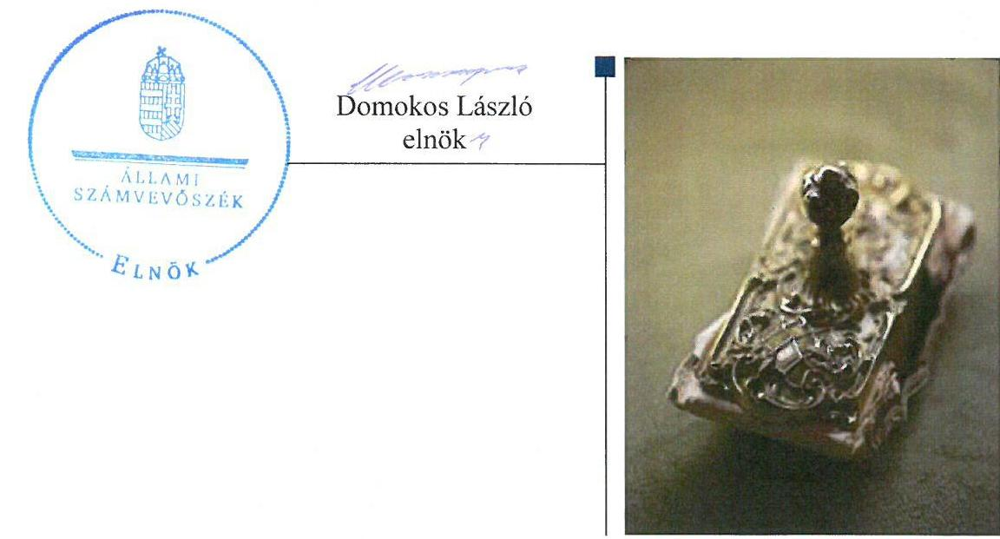
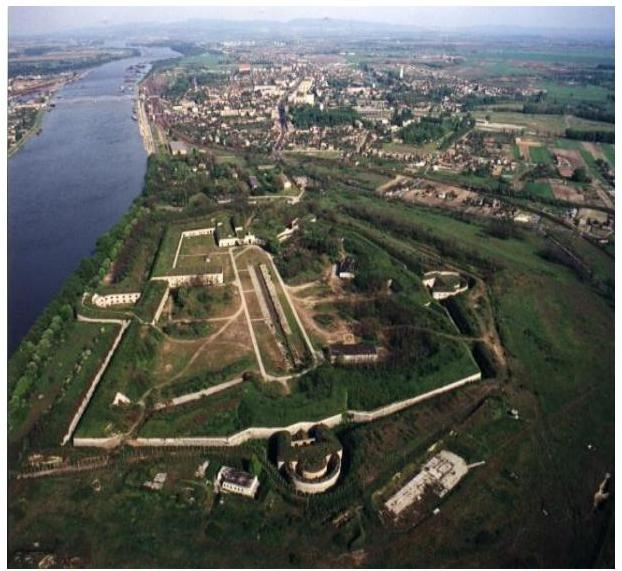
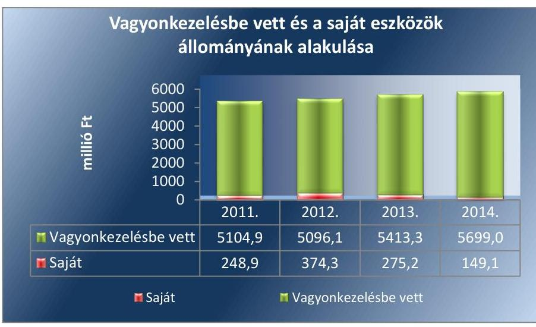
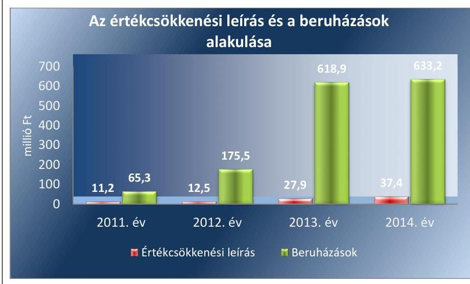
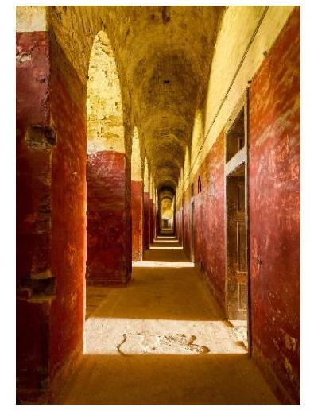
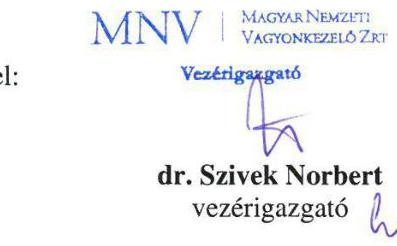
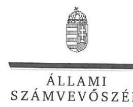
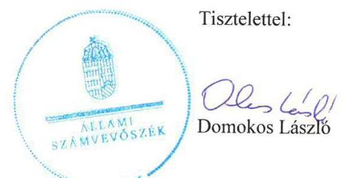

# Jelentés 

## Monostori Erőd NKft.

Az állami tulajdonban (résztulajdonban) lévő gazdálkodó szervezetek vagyonmegőrzési és gazdálkodási tevékenységének ellenőrzése 2016.

16122
www.asz.hu

---

# Jelenetés 

## Monostori Erőd NKft.

Az állami tulajdonban (résztulajdonban) lévő gazdálkodó szervezetek vagyonmegőrzési és gazdálkodási tevékenységének ellenőrzése
2016. augustus hó 3. nap

---

# AZ ELLENŐRZÉST FELÜGYELTE:

## BÖRÖCZ IMRE felügyeleti vezető

## AZ ELLENŐRZÉST VEZETTE ÉS A VÉGREHAJTÁSÁÉRT FELELŐS:

### SALI SÁNDORNÉ ellenőrzésvezető

## A PROGRAM ÖSSZEÁLLÍTÁSÁÉRT FELELŐS:

### JANIK JÓZSEF osztályvezető

---

**IKTATÓSZÁM:** V-0978-333/2016.

**TÉMASZÁM:** 2012

**ELLENŐRZÉS-AZONOSÍTÓ SZÁM:** V070912

---

Jelentéseink az Országgyűlés számítógépes hálózatán és az Interneten a www.asz.hu címen is olvashatóak.

---

# TARTALOMJEGYZÉK 

■ ÖSSZEGZÉS ..... 5
■ AZ ELLENŐRZÉS CÉLJA ..... 7
■ AZ ELLENŐRZÉS TERÜLETE ..... 8
■ AZ ELLENŐRZÉS HÁTTERE, INDOKOLTSÁGA ..... 9
■ A JELENTÉS LÉNYEGES KÉRDÉSKÖREI ..... 10
■ ELLENŐRZÉS HATÓKÖRE ÉS MÓDSZEREI ..... 11
■ MEGÁLLAPÍTÁSOK ..... 13
■ JAVASLATOK ..... 28
■ MELLÉKLETEK ..... 31
I. Sz. melléklet: Értelmező szótár ..... 31
■ FÜGGELÉK: ÉSZREVÉTELEK ..... 37
■ RÖVIDÍTÉSEK JEGYZÉKE ..... 49

---

.

---

# ÖSSZEGZÉS 

Az Állami Számvevőszék a Monostori Erőd NKft. vagyonmegőrzési és gazdálkodási tevékenysége szabályszerűségét ellenőrizte a 2011-2014. évek közötti időszakra. Az ellenőrzés megállapította, hogy a Vagyonkezelési Szerződés nem biztosította a szabályszerű állami vagyonnal való gazdálkodási környezetet. A végrehajtott értéknövelő beruházás és felújításhoz kapcsolódó vagyonnövekedés számviteli szabályok szerinti elszámolása érdekében a Vagyonkezelési Szerződést nem módosították. A kezelt vagyon értéke az állammal szembeni egyéb hosszú lejáratú kötelezettségek mérlegsoron nem a tényleges értéket mutatta, ezért az éves beszámoló mérlege nem valós. A Társaság bevételei és a ráfordításai elszámolása területén feltárt hiányosságok a vagyongazdálkodási tevékenység szabályozásbeli hiányosságaira vezethetők vissza, melyekben 2014. évtől lényeges pozitív változás következett be a számlarend és bizonylati rend hatályba léptetésével.

## Az ellenőrzés társadalmi indokoltsága

Magyarországon az intézmény-centrikus közfeladat-ellátás, közvagyon gazdálkodás jellemző a költségvetésen kívüli feladatellátás térnyerése mellett. Ennek szereplői a nonprofit szervezetek, az önkormányzati tulajdonú gazdasági társaságok és az állami tulajdonú gazdálkodó szervezetek is.

Az Áht. 2. § I) pontja, az Európai Közösséget létrehozó szerződéshez csatolt, a túlzott hiány esetén követendő eljárásról szóló jegyzőkönyv alkalmazásáról szóló 2009. május 25-i 479/2009/EK rendelet szerint, illetve az ESA95 statisztikai módszertana alapján a kormányzati szektorba tartoznak a központi kormányzati szektorba besorolt társaságok és egyéb szervezetek is, amelyekkel szemben alapvető követelmény, hogy gazdálkodásuk, múködésük szabályszerű, az általuk szolgáltatott adatok megbízhatóak legyenek.

Az állami tulajdonú gazdálkodó szervezetek a nemzeti vagyon részét képezik. Az állami vagyonnal való gazdálkodást illetően a tulajdonosi joggyakorlás és a vagyongazdálkodás feladata az állami vagyon átlátható, rendeltetésszerű és felelős felhasználásának biztosítása. Az állam meghatározza az ellátandó közszolgáltatással kapcsolatos feladatokat, amelyhez a vagyonnal kapcsolatos döntéseknek igazodniuk kell. A nemzetgazdasági szempontból kiemelt jelentőségű nemzeti vagyonban tartandó állami tulajdonban álló társasági részesedést a nemzeti vagyonról szóló törvény határozza meg.

Minden közpénzt, közvagyont használó szervezettel szemben társadalmi igény, hogy tevékenységükről elszámoljanak. Ezt figyelembe véve és az Állami Számvevőszék stratégiájával összhangban került sor a Monostori Erőd NKft. ellenőrzésére.

## Főbb megállapítások, következtetések, javaslatok

A tulajdonosi jogok gyakorlója a gazdálkodó szervezet tulajdonában, illetve kezelésében lévő vagyonnal való gazdálkodás feltételeit nem az előírások szerint alakította ki. Az MNV Zrt. és a Monostori Erőd NKft. a Vagyonkezelési Szerződést nem módosították a végrehajtott értéknövelő beruházás és felújításhoz kapcsolódó vagyonnövekedés számviteli szabályok szerinti elszámolása érdekében és a jogszabályi változásoknak megfelelően. Nem írták elő a módosítás keretében a tulajdonosi ellenőrzés eljárásrendjét, azt, hogy a felek jogait, kötelezettségeit a felek a szerződés részének tekintik. Nem rögzítették továbbá a tulajdonos vagyon-nyilvántartási szabályzatának megismerését és kötelező alkalmazását. A Társaság elmulasztotta továbbá a kezelésbe adott állami vagyon értékbecslését évente aktualizálni. Az előírások szerint a szerződést módosítani kell, ha a vagyonkezelésben lévő állami vagyonon értéknövelő beruházásra, felújításra kerül sor, illetve a vagyonkezelő új, állami vagyonba tartozó eszközt hoz létre. Az ellenőrzött időszakban az állami vagyonon végzett beruházások összege 655,1 millió Ft volt, mely döntően támogatásból valósult

---

meg. Az állami vagyonon végzett beruházáshoz az MNV Zrt. előzetes hozzájárulását megadta. Az MNV Zrt., mint tulajdonosi jogok gyakorlójának a vagyon-nyilvántartási szabályzata megfelelt a jogszabályi előírásoknak. A Társaság kezelt állami vagyon hasznosítására kötött szerződései szabályszerűek voltak.

A Társaság a vagyongazdálkodási tevékenységének szabályozása nem felelt meg teljes körűen a jogszabályi előírásoknak, továbbá a kezelt vagyon nyilvántartása nem volt szabályszerű. Számlarend és bizonylati renddel a 20112013. években nem rendelkezett, az ellenőrzött időszak egészében a pénzkezelési szabályzatában nem rögzítette a pénztárellenőrzés gyakoriságát, továbbá a leltározási szabályzat nem tért ki az MNV Zrt.-vel való kezelt vagyonra vonatkozó leltáregyeztetésre. A szabályozást az ellenőrzött időszak utolsó évében javították, 2014. január 1-jétől elkészített és alkalmazásra került számlarend és bizonylati rend betöltötte szabályozási funkcióját az előírásoknak megfelelően. A saját vagyon nyilvántartása szabályszerű volt, azonban a kezelt állami vagyon nyilvántartása nem felelt meg az előírásoknak. Az ellenőrzött időszakban a vagyonkezelt eszközökön végrehajtott értéknövelő beruházások összegét nem mutatták ki az állammal szembeni egyéb hosszú lejáratú kötelezettségek között, ezért az éves beszámoló mérlege nem a valós értéket mutatta. A vagyonkezelésbe vett eszközök nyilvántartási értékét az ellenőrzött időszakban változatlan, 4716,5 millió Ft értékben mutatta ki a tényleges 5699,0 millió Ft értékkel szemben. A Társaság nem tartotta be a leltározási szabályzatban foglaltakat a mennyiségi felvétellel történő leltározás előírt gyakoriságára vonatkozóan, mert kétévenkénti mennyiségi felvételt írt elő a tárgyi eszközök leltározására, azonban ezeket csak a harmadik évben végezte el.

A bevételek és ráfordítások szabályozása és elszámolása során nem érvényesültek maradéktalanul a jogszabályok és a belső szabályok előírásai, de az ellenőrzött időszak utolsó évében javuló tendenciát mutatott. A 2011-2013. évek között a bevételek és ráfordítások közhasznú és vállalkozási tevékenységének elkülönítését nem alakította ki és nem alkalmazta. A 2014. évtől a számlarendben és bizonylati rendben előírtak alapján az elkülönítés szabályszerű volt. A gyakorlatban a kontrolling-tábla kialakításával az önköltségszámítást szabályozták és a jogszabályokban, valamint a belső szabályoknak megfelelően az önköltségszámítást megvalósították. Az értékesítés nettó árbevétele és az anyagjellegű ráfordítások elszámolása nem volt szabályos a közfeladat és a vállalkozási tevékenység szabályozatlansága miatt. Az egyéb ráfordítások, pénzügyi műveletek ráfordításai, rendkívüli ráfordítások, a személyi jellegű ráfordítások, az egyéb bevételek, pénzügyi műveletek bevételei és a rendkívüli bevételek elszámolása szabályszerű volt. A tárgyi eszközök beruházása, felújítása és az értékcsökkenés elszámolása nem felelt meg teljes körűen az előírásoknak, mert előfordult, hogy a bekerülési értéket teljes egészében dokumentumokkal nem támasztották alá, hiányzott néhány taggyűlési jóváhagyás és az értékcsökkenést nem a számviteli politikában foglaltak szerint számolták el. 2014. évben a behajthatatlan követelések leírása nem volt szabályszerű, mert a behajthatatlanság tényét nem bizonyították.

A kezelt állami vagyon kivételével a vagyonnal való gazdálkodás, valamint a vagyonváltozást eredményező döntések a jogszabályi és a tulajdonosi előírásoknak megfeleltek. A kezelt állami vagyonnal való szabályszerű gazdálkodás érdekében az ellenőrzött időszakban az MNV Zrt. és a Társaság sem hozott döntést a Vagyonkezelési Szerződés módosításával kapcsolatban. Erre vezethető vissza, hogy éveken keresztül a kezelt vagyon értéke nem változott és ezzel összefüggésben az állammal szembeni egyéb hosszú lejáratú kötelezettségek a beszámoló mérlegében nem a valós értéket mutatták.

A Társaság beszámolási, adatszolgáltatási kötelezettségeit teljesítette, az információs rendszert kiépítette, de a működtetés területén voltak hiányosságok. A tulajdonosi joggyakorló által működtetett információs rendszer az adatszolgáltatást ugyan biztosította, de az ellenőrzési időszakban a kezelt vagyon esetében az egyezőség nem állt fent a vagyonkataszterben és a beszámolóban kimutatott bruttó érték között. A Társaság közzétételi kötelezettségét szabályszerűen teljesítette a szabályozási hiányosság ellenére, ugyanis nem készített a közérdekű adatok megismerésére irányuló igények teljesítésének rendjét rögzítő szabályzatot az ellenőrzött időszakban. Az adatvédelmi és adatbiztonsági szabályzatát nem az előírt határidőre, mintegy másfél éves késéssel, 2014. május 28.-i hatállyal készítette el. Az MNV Zrt. 2011. évben tulajdonosi ellenőrzés keretében a Társaság belső ellenőrzési rendszerét vizsgálta, ezzel öszszefüggésben nem került megfogalmazásra közfeladat ellátását érintő javaslat.

A Monostori Erőd NKft. gazdálkodásának a kormányzati szektor hiányára befolyást gyakorló bevételek és ráfordítások elszámolása szabályszerű volt.

Az ÁSZ az MNV Zrt. vezérigazgatójának és a Monostori Erőd NKft. ügyvezetőjének fogalmazott meg javaslatokat, amelyek alapján kötelesek intézkedési tervet összeállítani és azt a jelentés kézhezvételétől számított 30 napon belül az ÁSZ részére megküldeni.

---

# AZ ELLENŐRZÉS CÉLJA 

## Az állami tulajdonban (résztulajdonban) lévő gazdálkodó szervezetek vagyonmegőrzési és gazdálkodási tevékenységének ellenőrzése a Monostori Erőd NKft.-nél

Az ellenőrzés célja annak értékelése volt, hogy a tulajdonosi jogok gyakorlása szabályszerű volt-e; a gazdálkodó szervezet által ellátott feladat bevételei, ráfordításai elszámolásának, és vagyongazdálkodási tevékenységének szabályozása megfelelt-e a jogszabályi és a tulajdonosi előírásoknak és azok végrehajtása szabályszerű volt-e; biztosítva volt-e a közfeladatok átláthatósága és elszámoltathatósága érdekében a közszolgáltatás dijának megalapozottsága szabályszerű önköltségszámítással; a vagyonváltozást eredményező döntések esetében a tulajdonosi jogok gyakorlója és a gazdálkodó szervezet szabályszerűen jártak-e el; a gazdálkodó szervezet épített-e ki és múködtetett-e információs rendszert a szabályszerű vagyongazdálkodás érdekében; a kormányzati szektorba sorolt egyéb szervezetek gazdálkodásának a kormányzati szektor hiányára és az államadósságra befolyással bíró elemei a jogszabályi előírásoknak megfeleltek-e.

---

# **AZ ELLENŐRZÉS TERÜLETE**

## **A Monostori Erőd NKft.**

A Monostori Erőd Hadkultúra Központ Műemlékhelyreállító, Ingatlanfenntartó és -hasznosító Nonprofit Közhasznú Korlátolt Felelősségű Társaság 2008. december 11-én a közhasznú társaság jogutódjaként jött létre. A Társaság1 fő tevékenysége a Társasági Szerződése2 szerint „Történelmi hely, építmény, látványosság működtetése”. A Társaság jogelődje a Magyar Államot képviselő Kincstári Vagyoni Igazgatóságtól (KVI3) Vagyonkezelési Szerződésekkel vagyonkezelésre átvette a Monostori Erődöt (2000-ben), a Csillag és az Igmándi Erődöt (2005-ben). Az ingatlanok átvételére kötött szerződés alapján a cél az volt, hogy a Vagyonkezelő biztosítsa a kincstári vagyonnal történő szakszerű vagyongazdálkodást. Kidolgozza, előkészítse és fokozatosan megvalósítsa a hadtörténeti műemlék szakszerű helyreállítását, az értékhez méltó kulturális, idegenforgalmi és oktatási továbbképzési funkciókat is magában foglaló hasznosítását. Biztosítsa a fenntartás feltételeit közvetett állami támogatás mellett, alapvetően a vállalkozói tőke bevonásával. A saját vagyon könyv szerinti értéke 2014 végén 149,1 millió Ft, a kezelt vagyon 5699,0 millió Ft volt. A Társaság a vagyonkezelésbe vett és a saját tulajdonú eszközök felújítását, fejlesztését, az elszámolt értékcsökkenés felhasználása mellett döntően európai uniós és hazai forrásból származó támogatásokból valósította meg.

A Monostori Erőd NKft. saját tőkéje 2014 végén 154,9 millió Ft, jegyzett tőkéje 63,4 millió Ft, amelyből az állam saját tulajdoni részaránya 95,27%, Önkormányzat tulajdoni részaránya 4,73%. Az átlagos statisztikai létszám 2014-ben 34 fő. A társaság mérlegében a 2014. év végén szereplő összes eszközvagyon 6098,1 millió Ft, rövidlejáratú kölcsöne az MNV Zrt.4-től felvett 164,1 millió Ft volt. A társaságnak kapcsolt vállalkozása az ellenőrzött időszakban nem volt. 2014 végén összes bevétele 262,6 millió Ft, összes ráfordítása 250,2 millió Ft volt.

---

# AZ ELLENŐRZÉS HÁTTERE, INDOKOLTSÁGA 

## A Monostori Erőd NKft.

Az ÁSZ ${ }^{5}$ alapvető célkitűzése, hogy az államháztartáson kívülre nyújtott költségvetési támogatások és ingyenes vagyon juttatások ellenőrzésével hozzájáruljon ahhoz, hogy a közpénzeket az államháztartáson kívül múködő szervezetek is átlátható módon használják fel a közfeladatok szerződésben vállalt ellátása érdekében. Az államháztartásról szóló törvény értelmében a közfeladatok ellátása elsősorban költségvetési szervek alapításával és működtetésével történik. Az államháztartáson kívüli szervezetek a közfeladatok ellátásában, jogszabályban meghatározott feltételekkel, közreműködhetnek.

A Vtv. 3. § (1) 2013. június 27-ig hatályos szabályozása értelmében a tulajdonosi jogok és kötelezettségek összességét az állami vagyon tekintetében az állami vagyon felügyeletéért felelős miniszter gyakorolta, aki e feladatát az MNV Zrt., az MFB Zrt., illetve a jogszabályban rögzített egyéb tulajdonosi joggyakorló szervezetek útján látta el, míg 2014. július 15-ig tulajdonosi joggyakorlóként, ha törvény vagy miniszteri rendelet eltérően nem rendelkezik, az MNV. Zrt., a törvényben, vagy a miniszter által rendeletben kijelölt személy gyakorolta. 2014. július 15-t követően a rábízott állami vagyon felett az államot megillető tulajdonosi jogok és kötelezettségek összességét tulajdonosi joggyakorlóként - ha törvény vagy miniszteri rendelet eltérően nem rendelkezik - az MNV Zrt. gyakorolta.

Az ellenőrzés várható hasznosulásaként az ellenőrzés megállapításai a jogalkotás számára segítséget nyújthatnak az államháztartáson kívüli köz-feladat-ellátás, közvagyonnal való gazdálkodás értékeléséhez, jogszabályi keretei pontosításához, az átláthatóságot biztosító szabályozáshoz. Az ellenőrzöttek számára visszajelzést ad a gazdálkodási tevékenységgel, az állami vagyon felhasználásával, a közszolgáltatási árképzés megalapozottságával és az éves elszámolással kapcsolatos szabálytalanságokról és kockázatokról. Az ellenőrzés tapasztalatai segítik és erősítik az ÁSZ hozzáadott értéket teremtő elemző tevékenységét és tanácsadó szerepét.

---

# A JELENTÉS LÉNYEGES KÉRDÉSKÖREI 

1.     - A tulajdonosi joggyakorló a vagyonnal való gazdálkodás feltételeit szabályszerűen alakította-e ki?
2.     - A Társaság vagyongazdálkodási tevékenysége szabályozásának kialakítása, a vagyon nyilvántartása megfelelt-e az előírásoknak?
3.     - A bevételek és ráfordítások elszámolásának szabályozása és végrehajtása, valamint az önköltségszámitás szabályszerű volt-e?
4.     - A vagyonnal való gazdálkodás, valamint a változást eredményező döntések megfeleltek-e a jogszabályi és a belső előírásoknak?
5.     - A gazdálkodó szervezet a szabályszerű vagyongazdálkodás érdekében teljesítette-e beszámolási kötelezettségét, kiépített-e és müködtetett-e információs rendszert?
6.     - A kormányzati szektorba sorolt egyéb szervezetek gazdálkodásának a kormányzati szektor hiányára és az államadósságra befolyással bíró elemei a jogszabályi előírásoknak megfelel-tek-e?

---

# ELLENŐRZÉS HATÓKÖRE ÉS MÓDSZEREI 

## Az ellenőrzés típusa

szabályszerúségi ellenőrzés.

## Az ellenőrzött időszak

2011. január 1-jétől 2014. december 31-ig.

## Az ellenőrzés tárgya

Állami tulajdonban (résztulajdonban) lévő gazdálkodó szervezetek vagyonmegőrzési és gazdálkodási tevékenysége

## Az ellenőrzött szervezet

Monostori Erőd NKft., MNV Zrt.

## Az ellenőrzés jogalapja

Az Állami Számvevőszékről szóló 2011. évi LXVI. törvény 5. § (3)-(5) bekezdései, valamint az állami vagyonról szóló 2007. évi CVI. törvény 3. § (4) bekezdése képezi.

## Az ellenőrzés módszerei

Az ellenőrzést a számvevőszéki ellenőrzés szakmai szabályai szerint, a szabályszerűségi ellenőrzés módszerével, a vonatkozó nemzetközi standardok figyelembevételével végeztük.

Az ellenőrzés lefolytatásához a Monostori Erőd NKft. tanúsítványok kitöltésével, valamint az ÁSZ által kért dokumentumok megküldésével szolgáltatott adatokat. A rendelkezésre bocsátott adatok, információk kontrollja és a munkalapok kitöltése a helyszíni ellenőrzés keretében történt.

Mintavétellel ellenőriztük az értékesítés nettó árbevétel, az egyéb bevételek, pénzügyi műveletek bevételei, rendkívüli bevételek, az anyagjellegű ráfordítások, a személyi jellegű ráfordítások, a beruházások, felújítások aktiválása, az értékcsökkenési leírás, az egyéb ráfordítások és a pénzügyi művelet ráfordításai, továbbá a rendkívüli ráfordítások elszámolásának szabályszerűségét, valamint a vagyonnyilvántartás területén a szabályszerű működést. A mintavétellel ellenőrzött területek esetében minden

---

egyes tétel vonatkozásában a szabályszerűségre vonatkozó kérdéseket tettünk fel, amelyek eredménye összesítésre került. A jogszabályoknak és a belső előírásoknak megfelelőnek tekintettük az adott területet, amennyiben a minta ellenőrzésének eredménye alapján 95\%-os bizonyossággal a teljes sokaságban a hibaarány kisebb volt, mint 10\%, nem megfelelőnek, ha a 10\%-ot meghaladta. Kockázatot, illetve magas kockázatot jeleztünk, amennyiben egy adott terület vonatkozásában a minta alapján a teljes sokaságban nem volt egyértelműen biztosított a jogszabályoknak és a belső szabályzatoknak megfelelő működés. A ráfordítások elszámolására és a vagyonnyilvántartásra vonatkozó véletlen mintavételt kockázati alapú kiválasztással egészítettük ki, amelynek során évente a három legnagyobb öszszegű tételt választottuk ki.

---

# 1. A tulajdonosi joggyakorló a vagyonnal való gazdálkodás feltételeit szabályszerűen alakította-e ki? 

Összegző megállapítás

### 1.1. számú megállapítás

A tulajdonosi jogok gyakorlója a gazdálkodó szervezet tulajdonában, illetve kezelésében lévő vagyonnal való gazdálkodás feltételeit nem az előírások szerint alakította ki.

Az MNV Zrt. a Vagyonkezelési Szerződésben a vagyongazdálkodásra vonatkozó jogokat, valamint a felelős gazdálkodáshoz szükséges követelményeket rögzítette, de ez nem felelt meg a jogszabályi előírásoknak.

VAGYONKEZELÉSI SZERZŐDÉST kötött a Társaság jogelődje ${ }^{6}$, mint vagyonkezelő és a kincstári (2007-től állami) vagyont vagyonkezelésbe adó KVI 2000. június 21-én a kizárólagos állami tulajdonban lévő 1948 hrsz-ú, Duna parton lévő Monostori Erőd, a XIX. század hadi építészetének egyedülálló műemlék együttesének kezelésével összefüggő feladatok ellátására határozatlan időtartamra. A VSZ7-t két alkalommal módosították. Az első módosítás 2005. január 18-án a komáromi Csillag Erőd, a második módosítás 2005. december 18-án történt a komáromi Igmándi Erődöt érintően a Társaság vagyonkezelésébe történő bevonása kapcsán.

A Társaság a vagyonkezelésben vett állami vagyonon az ellenőrzött időszakban 655,1 millió Ft - a tulajdonosi joggyakorló ${ }^{8}$ hozzájárulásával - értéknövelő beruházást, felújítást hajtott végre. Az MNV Zrt. és a Társaság a VSZ-t az ellenőrzött időszakban nem módosította a vagyonnövekedés számviteli szabályok szerinti elszámolása érdekében, mely eljárás ellentétes a Vhr. 18. § (1) bekezdésében foglalt előírással. A VSZ-ben, továbbá a Vhr. ${ }^{9}$ 20. § (1) bekezdésében előírtakkal ellentétesen nem írták elő az MNV Zrt. tulajdonosi ellenőrzési eljárásrendjét, azt, hogy a felek jogait, kötelezettségeit a felek a szerződés részének tekintik. Nem rögzítették a Vhr. 14. § (3) bekezdésében előírtak ellenére, hogy a Társaság az MNV Zrt. vagyonnyilvántartási szabályzatát ${ }^{10}$ megismerte és azt magára nézve kötelező érvényűnek tekintette.

A VSZ a Vtv. ${ }^{11}$ előírásának megfelelően tartalmazta az állami vagyon értéknövelő felhasználásával, hasznosításával, valamint a vagyon gyarapításával kapcsolatos követelményeket. Tartalmazta továbbá a vagyon állagának védelmével, értékének megőrzésével, a közérdek érvényesülését biztosító vagyongazdálkodással kapcsolatos előírásokat. A VSZ meghatározta az értékcsökkenés visszapótlásával kapcsolatos elszámolásra vonatkozó előírást, mely szerint a vagyonkezelő az elszámolt amortizációnak megfelelő összeget a kincstári vagyon pótlására, bővítésére, a kezelt vagyon felújítására, a vagyon gyarapítására köteles fordítani. A Társaság vagyonkeze-

---

lésében lévő műemlék jellegű épületek, építmények után terv szerinti értékcsökkenést a Számv. tv. ${ }^{12} 52 . \S$ (6) bekezdésének előírását betartva nem számolt el.

Társasági Szerződésben rögzítették, hogy a taggyűlésnek kell jóváhagynia a közhasznú tevékenység folytatásának feltételeiről kötött szerződéseket.

# 1.2. számú megállapítás 

## A kezelt állami vagyon hasznosítására kötött szerződései szabályszerűek voltak.

A Monostori Erőd NKft. társasági szerződés szerinti közhasznú ${ }^{13}$ tevékenységét a Magyar Állam tulajdonából ki nem adható múemlék ingatlan kezelésével (felújítása, fenntartása, hasznosítása), valamint az Erődben közintézmények és létesítmények múködtetésével látta el. Az állami vagyon hasznosítására megkötött szerződéseket, együttműködési megállapodásokat a Vhr.-ben, és a bérbeadási szabályzatban ${ }^{14}$ előírtak betartásával kötötte meg. A bérleti szerződések vásár, egyéb rendezvények megtartására, filmek, filmsorozatok forgatására, íjász és jurta, amerikai autó, szakmai találkozók lebonyolítására, esküvők megrendezésére, irodahelyiség bérbeadására vonatkoztak. Az együttmúködési megállapodás emléktárgy-bolt múködtetését, a terület és parthasználati szerződés kishajók kikötésére alkalmas, kis oldalmagasságú úszómú üzemeltetését rögzítette.

A Társaság a közhasznú feladatainak ellátására, a múködési költségeihez való hozzájárulás céljából és fejlesztésekre támogatási szerződéseket kötött. A $\mathrm{HM}^{15}$-mel a katonai hagyományápolásra, történelmi hely, építmény, látványosság múködtetésére, védelmi képesség fenntartására kötöttek szerződéseket. Az MNV Zrt.-vel a kezelésében lévő vagyon állagmegóvását, karbantartását, fejlesztését, a NEFMI ${ }^{16} /$ EMMI ${ }^{17}$-vel múzeumi gyűjteményi, kiállítási, közművelődési tevékenység ellátását éves megállapodásokban rögzítették. A Komárom Város Önkormányzatával uniós projektekhez önerő biztosítására és közhasznú múködés céljára kötöttek szerződéseket. A támogatások teljesítésének alakulását az 1. táblázat mutatja:

## 1. táblázat

## A TÁMOGATÁSOK TELJESÍTÉSÉNEK ALAKULÁSA (MILLIÓ Ft-BAN)

| Támogató neve | 2011 | 2012 | 2013 | 2014 |
| :-- | --: | --: | --: | --: |
| HM | 19 | 19 | - | - |
| NEFMI/EMMI | 29,3 | 25 | 100 | 50 |
| MNV Zrt. | 70 | 85 | 104 | - |
| Komárom-Esztergom Me-   gyei Munkaügyi Központ | - | 1,1 | - | - |
| Komárom Város | 20 | - | 15,8 | - |
| Önkormányzata | 138,3 | 130,1 | 219,8 | 50 |
| Összesen |  |  |  | Forrás: a Társaság adatszolgáltatása |

A taggyűlés a közhasznú szerződéseket a társasági szerződés 2.1.1. pontja alapján jóváhagyta, az $\mathrm{FB}^{18}$ a szerződéseket engedélyezte, a miniszteri jóváhagyást igénylő szerződésekhez a miniszteri engedélyeket beszerezték.

---

# 1.3. számú megállapítás 

A tulajdonosi joggyakorló vagyon-nyilvántartási szabályzatának tartalma megfelelt a jogszabályi előírásoknak.

Az MNV Zrt. 2008. június 11-től 2013. július 28 -áig rendelkezett vagyonnyilvántartási szabályzattal, 2013. július 29-től kezdődően hatályos va-gyon-nyilvántartási eljárásrenddel, amely szabályzatok a Vhr.-ben előírtaknak megfeleltet.

Az MNV Zrt. vagyon-nyilvántartási feladatait a 2014. május 31-i hatállyal kiadott 10/2014. számú vezérigazgatói utasításban foglalta össze, a „Magyar Nemzeti Vagyonkezelő Zrt. közvetlen és közvetett kezelésű rábízott vagyonának nyilvántartási feladataira vonatkozó alapvető belső szabályok" címen. Az MNV Zrt. vagyon-nyilvántartási szabályzatainak hatálya kiterjedt a Vtv. 1. § (2) bekezdésében meghatározott állami vagyon kezelőire, így a Társaságra is. A szabályzatokban a Vhr. mellékletében foglaltak szerint, szabályszerűen meghatározták - többek között - a vagyonnyilvántartás feladatait, a vagyonkezelésbe vett eszközökre vonatkozó adatszolgáltatás részletes tartalmát, formáját, határidejét. Az MNV Zrt. jogelődje és a Társaság a VSZ-ben rögzítette, hogy a vagyonkezelői jog átruházásával, az adatszolgáltatással, illetve a vagyonkezelésben lévő vagyon folyamatos elszámolásával kapcsolatosan a vagyon-nyilvántartási szabályzatban előírtak szerint kell eljárni.

## 2. A Társaság vagyongazdálkodási tevékenysége szabályozásának kialakítása, a vagyon nyilvántartása megfelelt-e az előírásoknak?

Összegző megállapítás
2.1. számú megállapítás

A vagyongazdálkodási tevékenység szabályozásának kialakítása és a kezelt vagyon nyilvántartása nem volt szabályszerű.

A vagyon értékének megőrzését, gyarapítását szolgáló vagyongazdálkodás feltételeinek kialakítása nem történt meg.

A VSZ-T NEM MÓDOSÍTOTTÁK az ellenőrzött időszakban a vagyonnövekedés számviteli szabályok szerinti elszámolása érdekében, mely eljárás ellentétes a Vhr. 18. § (1) bekezdésében foglalt előírással. A Társaság a vagyonkezelésben vett állami vagyonon az ellenőrzött időszakban értéknövelő beruházást, felújítást hajtott végre. A VSZ-ben, továbbá a Vhr. 20. § (1) bekezdésében előírtakkal ellentétesen nem írták elő az MNV Zrt. tulajdonosi ellenőrzési eljárásrendjét, azt, hogy a felek jogait, kötelezettségeit a felek a szerződés részének tekintik. Nem rögzítették továbbá a Vhr. 14. § (3) bekezdésében előírtak ellenére, hogy a Társaság az MNV Zrt. vagyon-nyilvántartási szabályzatát megismerte és azt magára nézve kötelező érvényűnek tekintette.

A VSZ 7. 12. pontjának előírása ellenére a Társaság elmulasztotta a kezelésébe adott állami vagyon értékbecslését évente aktualizálni és azt a tulajdonosi joggyakorló részére dokumentálni.

VAGYONGAZDÁLKODÁSI TERVET a VSZ 2. számú mellékletében a Monostori Erőd Hasznosítási Programjában határoztak meg. Üzleti terv elkészítésének irányelveit a tulajdonosi jogok gyakorlója évenként

---

meghatározta, és előrejelzéseket kért az eredményességi mutató várható középtávú alakulásáról. A tervezési irányelvekben évenként megfogalmazta a minimális tőkehatékonysági elvárásokat. A Társaság a tulajdonosi joggyakorló tervezési irányelveivel és a kulturális tárcával kötött 2014. 05. 18-ig hatályos Közhasznú szerződés 3. 5. pontjának előírásával összhangban gondoskodott az éves üzleti tervek és a középtávra szóló eredményelőrejelzések elkészítéséről. A tulajdonosi jogok gyakorlója az éves üzleti terveket az FB jóváhagyását követően minden évben elfogadta.

SZÁMVITELI POLITIKÁBAN ${ }^{19}$, értékelési-, leltározási-, és a pénzkezelési szabályzatokban ${ }^{20}$ határozták meg a vagyonnal való gazdálkodásának belső szabályait. Önköltségszámítási szabályzatot a Számv. tv. 14. §. (6) és (7) bekezdése alapján nem kellett készíteniük. Az ellenőrzött időszakban a számviteli politikát három alkalommal módosították a törvényi változásoknak megfelelően. Változott a jelentős hiba minősítése, az értékvesztés szempontjából jelentősnek minősített esetek mértéke, és a kö-vetelés-lejárat tartósságának meghatározása. A számviteli politikában a Számv. tv. előírásainak megfelelően szabályozta az immateriális javak és tárgyi eszközök értékcsökkenését, annak módját, mértékét, elszámolásának időpontját, gyakoriságát.

Értékelési szabályzat ${ }^{21}$-ot, valamint a leltározási szabályzat ${ }^{22}$-ot a Számv. tv. 14. § (11) bekezdésének előírása ellenére a Monostori Erőd NKft. megalakulását követő 90 napon belül nem módosította a Gt. ${ }^{23}$ 365. §-a alapján átalakult gazdasági formára. A Társaság a jogelődjére készült szabályzatokat a múködése során alkalmazta, melyek a Számv. tv. előírásaival összhangban biztosították a leltározás szabályozását és a vagyon értékének szabályszerű meghatározását. A vagyonkezelésbe kapott állami vagyontárgyakat a saját vagyonnal megegyező módon leltározták, azokra egyéb, eltérő szabályokat nem fogalmaztak meg.

A leltározási szabályzat a tulajdonosi joggyakorlóval történő leltáregyeztetésre azonban nem tért ki annak ellenére, hogy ezt a VSZ. 2.5. pontja előírta.

A Monostori Erőd NKft. által kialakított vagyon-nyilvántartás a Számv. tv., a számviteli politika, az értékelési szabályzat, leltározási szabályzat előírásai szerint biztosította a vagyonkezelt és a saját vagyon változásának folyamatos kimutatását, elemzését, ellenőrzését - a szétválasztás kialakításával. A selejtezés szabályait a leltározási szabályzat 1.1.8. pontjában és a számviteli politika 5.2.2. pontjában rögzítették.

PÉNZKEZELÉSI SZABÁLYZAT az ellenőrzési időszakban a Számv. tv. 14. § (8) bekezdés előírása ellenére nem tartalmazta a pénztárellenőrzés gyakoriságát.

A pénzkezelési szabályzat a Számv. tv.-ben foglalt előírásoknak megfelelően meghatározta a pénzforgalom lebonyolításának rendjét, a pénzkezelés személyi és tárgyi feltételeit, továbbá a felelősségi és nyilvántartási szabályokat.

SZÁMLARENDET ÉS BIZONYLATI RENDET ${ }^{24}$ a 20112013. évekre vonatkozóan a Számv. tv. 161. § (1), és (2) bekezdés b.), c.) és d.) pontjában foglaltak ellenére a Társaság nem készítette el. A 2014.

---

január 1-től elkészített és alkalmazásra kerülő számlarend és bizonylati rend - a Számv. tv. előírásainak megfelelt.

A gazdálkodó szervezet a tulajdonosi joggyakorló előírásainak megfelelően SZMSZ-ben, közbeszerzési szabályzatban és a számviteli politika keretében elkészített szabályzatokban meghatározta a vagyongazdálkodással kapcsolatos feladat- és hatásköröket, felelősségi viszonyokat.

A Társaság tulajdonában és kezelésében lévő vagyon értékének megőrzésével, gyarapításával, a felelős gazdálkodással kapcsolatosan speciális korlátozásokat a Vtv.-ben, valamint a Vhr.-ben foglalt előírásoknak megfelelően a Társasági szerződés és a VSZ tartalmazta. Ennek megfelelően a Társasági szerződés rendelkezett a kizárólag a taggyűlés és az ügyvezetői döntési hatáskörébe tartozó esetekről, továbbá a közhasznú és támogatási szerződések taggyűlés általi jóváhagyásáról. A belső szabályzatok összhangban voltak a jogszabályokban, illetve a VSZ-ben meghatározott követelményekkel.

# 2.2. számú megállapítás 

## A saját vagyon nyilvántartása szabályszerű volt, azonban a kezelt állami vagyon nyilvántartása nem felelt meg az előírásoknak.

A gazdálkodó szervezet betartotta a saját vagyonra vonatkozó állományba vételi, nyilvántartási és elszámolási kötelezettségét, továbbá a kezelt vagyontól való elkülönített nyilvántartását. A saját vagyon értékét és annak változását a Számv. tv.-ben és a belső szabályozásában megfelelően tartotta nyilván.

A vagyonkezelésbe adás óta végrehajtott 982,5 millió Ft értéknövelő beruházások összegét nem mutatták ki az állammal szembeni egyéb hoszszú lejáratú kötelezettségek között, ezért az éves beszámoló mérlege nem a valós értéket mutatta, mely eljárás nem felelt meg a Számv. tv. 15. § (3) bekezdésében rögzített valódiság elvének, továbbá a 42. § (5) bekezdésében foglalt előírásnak. A vagyonkezelésbe vett eszközök nyilvántartási értékét az ellenőrzött időszakban változatlan, 4716,5 millió Ft értékben mutatta ki a tényleges 5699,0 millió Ft értékkel szemben.

A könyvvizsgáló véleménye szerint az ellenőrzött időszakban az éves beszámolók megbízható és valós képet mutattak a Társaság év végén fennálló vagyoni és pénzügyi helyzetéről.

Az állami vagyonon végzett beruházások összege az ellenőrzött időszakban 655,1 millió Ft volt. A vagyonkezelésbe vett eszközökön végzett értéknövelő beruházások alakulását a 2. táblázat mutatja be:
2. táblázat

A VAGYONKEZELÉSBE VETT ESZKÖZÖK ÉRTÉKNÖVELŐ BERUHÁZÁSAI (MILLIÓ FT-BAN)

| Aktivált beruházás | 2011. | 2012. | 2013. | 2014. |
| :-- | :--: | :--: | :--: | :--: |
| Vár (bástya) | 25,8 | - | 267,3 | 180,2 |
| Gyalogutak, kerék-   párutak | - | - | 25,7 | - |
| Tér, udvar, rakodó | - | - | 30,0 | 4,2 |
| Egyéb építmények | 6,0 | - | 3,5 | - |
| Folyami kikötő | - | - | - | 13,0 |
| Földterület | - | - | - | 99,4 |
| Összesen | 31,8 | - | 326,5 | 296,8 |

---

LELTÁRRAL alátámasztotta a beszámolókban és a számviteli nyilvántartásokban lévő vagyontárgyak értékét. A Társaság a belső szabályozásban előírtaknak megfelelően elkészítette a leltározási utasítást, ütemtervet, kialakította a leltárkörzeteket, kijelölte a résztvevőket. A leltározást szabályszerűen hajtotta végre, a leltárfelvételi ívek kitöltésre kerültek, megtörtént a leltárkiértékelés és elkészültek a leltározási jegyzőkönyvek.

A leltározás 2011-ben és 2014-ben mennyiségi felvétellel, a 2012. és a 2013. években pedig egyeztetéssel történt a Számv. tv. és a leltározási szabályzat előírásainak megfelelően. A leltározás teljes körű volt, a kezelésbe vett eszközállomány tételes leltározására is kiterjedt. A kezelésbe vett eszközök az éves nyilvántartásokban beazonosíthatók voltak, külön leltári számon szerepeltek. A Társaság az ellenőrzött időszakban - a leltározási szabályzatban meghatározott kétévenkénti gyakoriság betartásának kivételével - szabályszerűen hajtotta végre a leltározást a saját és a kezelt vagyon tekintetében.

A leltározási szabályzat 2.3.1. pontja - a Számv. tv-nél szigorúbban kétévenkénti mennyiségi felvételt írt elő a tárgyi eszközök leltározására, ennek ellenére ezt csak a harmadik évben végezték el. Ezzel nem tartották be a belső szabályzatuk előírását a mennyiségi felvétellel történő leltározás előírt gyakoriságára vonatkozóan.

# 3. A bevételek és ráfordítások elszámolásának szabályozása és végrehajtása, valamint az önköltségszámítás szabályszerű volt-e? 

Összegző megállapítás

A bevételek és ráfordítások szabályozása és elszámolása, valamint az önköltségszámítás során nem érvényesültek a jogszabályok és a belső szabályok előírásai, de az ellenőrzött időszak utolsó évében javuló tendenciát mutatott.

### 3.1. számú megállapítás

A bevételek és ráfordítások elszámolása nem volt szabályszerű, mert a közhasznú és vállalkozási tevékenységének elkülönítését nem alakította ki és nem alkalmazta a 2011-2013. évek között.

A közhasznú és a vállalkozási tevékenységeket a Társasági Szerződésben meghatározták. A bevételek és ráfordítások elkülönítésére vonatkozóan a számviteli politika ${ }_{1-3}$ előírta a közhasznú tevékenységeket bemutató melléklet elkészítését. Az ezt megalapozó nyilvántartások részletszabályait csak a 2014. január 1-jétől hatályba léptetett számlarendben és bizonylati rendben alakították ki. Önköltségszámítási szabályzatot nem készítettek, erre a Társaság a Számv. tv. 14. § (6) és (7) bekezdése alapján nem volt kötelezett. A 2014. január 1-jétől hatályos számlarend és bizonylati rend a Számv. tv. 161. §-ának megfelelően meghatározta az alkalmazott számlák tartalmának leírását és utalt az azokon elszámolt gazdasági események közhasznú illetve vállalkozási tevékenységbe való besorolására.

A Társaság összes bevétele 2011. évi 198,1 millió Ft-ról 2014. évre 262,6 millió Ft-ra, az összes ráfordítása 190,6 millió Ft-ról 250,2 millió Ftra emelkedett. Az értékesítés nettó árbevétele jegybevételből és bérleti díjakból, az egyéb bevételek múködési támogatásokból tevődött össze, a

---

1. ábra

| Az ellenőrzés megállapítása |  |  |
| :--: | :--: | :--: |
| Egyéb réhaditások, pénzügyi művelségek ráfordítások |  | MEGFELELŐ |
| Egyéb bevételek, pénzügyi művelségek bevételei, rendkívüli bevételek |  | MEGFELELŐ |
|  |  | MEGFELELŐ |
|  |  | MEGFELELŐ |
|  |  | NEM |
|  |  | MEGFELELŐ |
|  |  | NEM |
|  |  | MEGFELELŐ |
|  |  | KOCKÁZATOS |

rendkívüli bevételek között a korábbi időszakokban kapott fejlesztési támogatások időbeli elhatárolásának feloldását számolták el.

A bevételek és ráfordítások elszámolása összességében nem volt szabályszerű, mert a 2011-2013. évek között a bevételek és ráfordítások közhasznú és vállalkozási tevékenységének elkülönítését nem alakította ki és nem alkalmazta, mely nem felelt meg a Számv. tv. 161/A. § (2), továbbá a Civil tv. ${ }^{25}$ 27. § (1) bekezdéseiben foglalt előírásoknak. 2014. évtől a számlarendben és bizonylati rendben előírtak alapján az elkülönítés szabályszerű volt.

A mintavétellel ellenőrzött területek értékelését az 1. ábra összefoglalóan mutatja. Az anyagjellegú ráfordítások és az értékesítés nettó árbevétele elszámolásának szabályszerűsége nem volt megfelelő, mert a költségek közhasznú és a vállalkozási tevékenység szerinti besorolása 2011-2013 között - szabályozás hiányában - nem történt meg. A költség és az árbevétel elszámolást megalapozó dokumentumok rendelkezésre álltak, a költségeket megfelelő összegben és költségnemeken számolták el. A tárgyi eszközök beruházása, felújítása és az értékcsökkenés elszámolása nem felelt meg teljes körűen az előírásoknak, mert előfordult, hogy a bekerülési értéket nem tudták teljes egészében számlákkal alátámasztani, mely eljárás nem felelt meg a Számv. tv. 165. § (1) és (2) bekezdéseiben foglalt bizonylati elv és bizonylati fegyelem előírásainak. A szerződéskötést megelőzően néhány esetben hiányzott a taggyűlési jóváhagyás és előfordult, hogy a számviteli politika előírásait nem betartva eltérő értékcsökkenési leírást számoltak el.

A személyi jellegű ráfordítások, az egyéb bevételek, egyéb ráfordítások, pénzügyi bevételek és a pénzügyi ráfordítások elszámolása szabályszerű volt.

A befektetett eszközök bruttó értékének változását a 3. táblázat mutatja be:
3. táblázat

| BEFEKTETETT ESZKÖZÖK BRUTTÓ ÉRTÉKÉNEK ÁLLOMÁNYVÁLTOZÁSA   (MILLIÓ FT-BAN) |  |  |  |  |
| :-- | --: | --: | --: | --: |
| Megnevezés | $\mathbf{2 0 1 1 . 0 1 . 0 1}$ | $\mathbf{2 0 1 4 . 1 2 . 3 1}$ | változás | $\%$ |
| Ingatlanok | 5149,6 | 5804,7 | 655,1 | 112,7 |
| Múszaki berendezések | - | 21,4 | 21,4 | - |
| Egyéb berendezések | 56,4 | 146,6 | 90,2 | 259,9 |
| Immateriális javak | 35,9 | 60,8 | 24,9 | 169,4 |
| Beruházások | 236,4 | - | -236,4 | - |
| Összesen | 5478,3 | 6033,5 | 555,2 | 110,1 |

A bruttó érték növekedése az ingatlanok eszközcsoportban 12,7\%-os volt. Az ingatlanfejlesztések legjelentősebb tételei a Dunai-bástya Kikötői fogadótér fejlesztés, az Észak és Dél-Komáromi Erődrendszer látogatható kazamatáinak kibővítése valamint a Komárom-Komárno kerékpárút kiépítése és az AT-FORT ÉS Forte Cultura Interreg programok keretében végzett kiállítási berendezés-fejlesztések voltak, amelyek döntően uniós és hazai támogatásokból valósultak meg. Ezen kívül az MNV Zrt. által biztosított kisberuházási keretből a látogatóbarát környezet kialakítása és állagmegóvás érdekében végeztek beruházásokat. Az immateriális javak között esősor-

---

ban a jövőbeni fejlesztések megvalósításához szükséges terveket számoltak el. Az ellenőrzött időszakban 34,2 millió Ft értékben selejteztek immateriális javakat (elavult szoftvereket) és számítástechnikai berendezéseket. Az immateriális javak állománya 24,9 millió Ft-tal nőtt 2011-2014 között. Az egyéb berendezések bruttó értéke 90,2 millió Ft-tal növekedett az ellenőrzött időszakban. A beszerzett eszközök elsősorban kiállítási berendezések és számítástechnikai eszközök voltak.

A követelések kezelését a Számv. tv. és saját belső szabályzatainak a követelések minősítésére és értékelésére vonatkozó előírásai alapján végezték. Az árbevétel és vevőkövetelések alakulását a 4. táblázatban mutatjuk be:
4. táblázat

| A NETTÓ ÁRBEVÉTEL ÉS A VEVŐÁLLOMÁNY ALAKULÁSA |  |  |  |  |
| :-- | --: | --: | --: | --: |
| Megnevezés | 2011 | 2012 | 2013 | 2014 |
| Nettó árbevétel | 61355 | 48385 | 54950 | 67831 |
| (ezer Ft) |  |  |  |  |
| Vevőállomány | 1652 | 1821 | 3029 | 5723 |
| (ezer Ft) | $2,7 \%$ | $3,8 \%$ | $5,5 \%$ | $8,4 \%$ |
| Vevőállomány aránya |  |  | Forrás: a Társaság adatszolgáltatása |  |

Az árbevételhez viszonyított vevőállomány az ellenőrzött időszakban 2,7\%-ról 8,4\%-ra emelkedett. A bevételek felét a belépőjegyek bevétele és a kiskereskedelmi értékesítés tette ki, ami készpénzes vagy bankkártyás fizetéssel valósult meg. A bevételek másik fele az épületek és a földterület bérbeadásából, rendezvények szervezéséből származott. A társaság követeléskezelési tevékenysége 2011-2013-ban szabályszerű volt, 2011-2013ban a vevőkövetelések befolytak, értékvesztést nem számoltak el, behajthatatlan követelést nem írtak le.

2014-ben a lejárat szerint kimutatott vevőkövetelésből 5,1 millió Ft lejárt volt. A lejárt követelésből 1,1 millió Ft összesen két partnerrel szemben fennálló követelésből állt, amelyet a Számv. tv. 65. § (1) bekezdésének előírása ellenére, elfogadó nyilatkozat hiányában a 2014. évi beszámolóban kimutattak. Értékvesztést a számviteli politika; 5.3. pontjának előírása ellenére nem számoltak el. A követelések az ellenőrzés időpontjáig sem folytak be. 2014-ben 0,5 millió Ft összegű behajthatatlan vevőkövetelést írtak le a Számv. tv. 3. § (4) 10. pontjának előírásaival ellentétesen, mert a behajthatatlanság tényét nem bizonyították. Jogi lépéseket nem tettek és nem tudták igazolni, hogy a behajthatatlanság fennállt.

# 3.2. számú megállapítás 

A bevételek és ráfordítások közhasznú és vállalkozási tevékenységek szerinti elkülönítését nem szabályozták 2011-2013. években, csak 2014-től.

2011-2013-ban a bevételek és ráfordítások közhasznú és vállalkozási tevékenységek szerinti elkülönítését nem szabályozták, nyilvántartása és könyvelése nem felelt meg a 161/A. § (2), valamint a Civil tv. 27. § (1) bekezdéseiben foglaltaknak.

A Számv. tv. előírásainak megfelelő számlarendet és bizonylati rendet helyeztek hatályba 2014. január 1-jétől, amelyben meghatározták a számlák tartalmát, az elkülönítés megvalósítására és kimutatására kontrollingtáblát ${ }^{26}$ alakítottak ki. A gyakorlatban ezt alkalmazva szabályszerűen eleget

---

tettek az elkülönítési kötelezettségnek. 2014-re a számlarend és bizonylati rend hatályba helyezésével, az alkalmazott főkönyvi számlák jelölésével (közvetlenül közhasznú tevékenységre illetve vállalkozási tevékenységre elszámolt bevételek, ráfordítások illetve felosztandó bevételek, ráfordítások) és kontrolling-tábla kialakításával az önköltségszámítást szabályozták és a jogszabályoknak valamint a belső szabályoknak megfelelően az önköltségszámítást megvalósították.

A tulajdonosi joggyakorló az árképzésre vonatkozóan nem határozott meg irányelveket. A belépődíjakat, a bérleti díjakat és az áruértékesítésnél alkalmazott árakat üzleti terveiben a hasonló tevékenységet végző piaci szereplők áraival való összehasonlítással alakította ki. A társaság belépődíjakból származó bevétele 2014-ben 21,0 millió Ft, mely az értékesítés nettó árbevételének 31\%-át tette ki. A társaság minden évben kapott a tulajdonostól és a szakmai felügyeletet ellátó minisztériumtól támogatást működéséhez és a szakmai programok megvalósításához.

# 4. A vagyonnal való gazdálkodás, valamint a változást eredményező döntések megfeleltek-e a jogszabályi és a belső előírásoknak? 

Összegző megállapítás

## 4.1. számú megállapítás

A kezelt állami vagyon kivételével a vagyonnal való gazdálkodás, valamint a vagyonváltozást eredményező döntések a jogszabályi és a tulajdonosi előírásoknak megfeleltek.

A vagyongazdálkodási tevékenységét - a kezelt vagyon kivételével - szabályszerűen végezte.

A Társaság vagyona a 2011. évi nyitó 5555,9 millió Ft-ról a 2014. év végére 6098,1 millió Ft-ra ( $9,8 \%$-kal) emelkedett. A növekedés oka a 2011. évtől indított EU projekt (Monostori erőd, Dunai-bástya, kikötői fogadótér fejlesztése) 472,4 millió Ft összegben, mely beruházásokat 2013. és 2014-ben üzembe helyezték. További beruházások valósultak meg gyalogutak, kerékpárutak, játszótér, udvar, rakodótér, és folyami kikötő létesítésével az MNV Zrt. által 2011. és 2012-ben biztosított „Kisberuházások" néven futó fejlesztési céltámogatások finanszírozásával, melyet 2013. évben aktiváltak. A növekedés a befektetett eszközök értékében jelent meg. A vagyonszerkezetben más jelentős átrendeződés nem volt. A vagyonkezelésbe vett eszközökön történt értéknövekedésekről az MNV Zrt. felé az adatszolgáltatás megtörtént.

---

A vagyonkezelésbe vett és a saját befektetett eszközök alakulását a 2. ábra mutatja:
2. ábra

Forrás: a Társaság adatszolgáltatása
A vagyonkezelésbe vett eszközök értéke 11,6\%-kal nőtt. Az egyéb követelések a 2011. évi 2,9 millió Ft-ról a 2014. évi 182,3 millió Ft-ra nőtt, amelyből kiemelkedő nagyságrendet képvisel a 170,4 millió Ft még ki nem utalt támogatás és a 9,7 millió Ft ÁFA követelés. A saját tőke a 2011. évi 142,7 millió Ft-ról a 2014. évi 154,9 millió Ft-ra növekedett a mérleg szerinti eredmények hatására. A jegyzett tőke összege változatlan az ellenőrzött időszakban 63,4 millió Ft. A Társaság - a 2013. év kivételével - nyereségesen gazdálkodott, mérleg szerinti eredménye pozitív volt. 2013-ban a veszteség összege 0,7 millió Ft volt, mértéke nem volt jelentős. A saját tőke/jegyzett tőke aránya a 2011. év végi záró értékről - folyamatos növekedéssel, és 2013.évben tapasztalt enyhe csökkenést követően - a 2014. év végére 0,2 százalékponttal emelkedett.

Az egyéb hosszú lejáratú kötelezettségek között jelentős tétel a 4716,5 millió Ft állammal szembeni kötelezettség a kezelt vagyonnal öszszefüggésben, melynek összege az ellenőrzött időszakban nem változott, nem a valós értéket mutatta.

A szállítói kötelezettségek a 2011. évi 2,4 millió Ft-ról a 2014. évre 4,0 millió Ft-ra növekedett. A tulajdonosi joggyakorlóval megkötött kölcsönszerződés alapján folyósított 164,1 millió Ft kölcsön összege szabályszerűen szerepel a 2014. évi rövid lejáratú kölcsönök között. A kölcsön a következő évi három EU-s projekt jóváhagyott támogatásának megelőlegezését szolgálta.

Gondoskodtak a rendszeres időközönkénti állapotfelmérésről, beruházási, karbantartási tervek kidolgozásáról. A beruházási, fejlesztési, karbantartási tervek az éves üzleti tervek részét képezték. A tervezett és megvalósult beruházások az eszközök tekintetében biztosították az ingatlanállomány fenntartását és fejlesztését. A 2013-2014. években a vagyonkezelt tulajdonú tárgyi eszközök bruttó és nettó értéke - igazodva a fejlesztési célkitűzésekhez - a végrehajtott beruházások hatására növekedett, a beruházások értéke meghaladta a terv szerinti értékcsökkenés összegét.

---

Az értékcsökkenés és a beruházások alakulását a 3. ábra mutatja:
3. ábra

Forrás: a Társaság adatszolgáltatása
A vagyonkezelésbe vett és a saját tulajdonú eszközök felújítását, fejlesztését, az elszámolt értékcsökkenés felhasználása mellett döntően európai uniós és hazai forrásból származó támogatásokból valósította meg. A Társaság az ellenőrzött időszakban 1492,9 millió Ft beruházást hajtott végre. Az elszámolt értékcsökkenés az ellenőrzött időszak alatt összesen 89,0 millió Ft. A Vhr. 9. § (9) bekezdés d) pontjának hatályos előírása alapján a Társaságnak 2011. január 1-je és 2013. június 27-e között a vagyonkezelt eszközökkel kapcsolatban elszámolt értékcsökkenésnek megfelelő mértékű VSZ szerinti visszapótlási kötelezettségét teljesítette, ennek következtében a vagyonérték megőrzése biztosított volt. A visszapótlási kötelezettség alól, mint kizárólag közfeladatot ellátó - a Vtv. 27. § (8) bekezdése alapján - 2013. június 28 -ától a törvény erejénél fogva mentesült.

# 4.2. számú megállapítás 

A vagyonváltozást eredményező döntések előkészítése és megalapozása során a jogszabályi és a belső előírásoknak megfelelően járt el.

A tervezett kezelt és a saját vagyont érintő beruházások esetében a tulajdonos engedélyét előzetesen megkérték a Vhr.-ben foglaltak szerint, a kivitelezés megkezdéséről minden esetben tájékoztatták a tulajdonosi joggyakorló MNV. Zrt.-t.

Az éves üzleti terveket az MNV Zrt. Tervezési Irányelvek által megfogalmazott tartalmi és formai követelmények szerint állították össze. Az üzleti terveiben megfogalmazott fejlesztési elképzelések egy részének végrehajtását a tulajdonosi joggyakorló által finanszírozott céltámogatások, EU és hazai pályázati pénzforrások igénybevételével valósították meg. A szerződéseket az előírásoknak megfelelően a taggyúlési döntés előtt az FB elé terjesztették jóváhagyásra. Az MNV Zrt. által évenként kiadott Tervezési Irányelvekben foglaltak alapján, valamint az adatszolgáltatási rendjének megfelelve terjesztette a tulajdonosi joggyakorló elé az éves üzleti terveket, az éves beszámolókat, a közhasznúsági jelentéseket, a vezető tisztségviselők díjazására vonatkozó javaslatokat. A havi, negyedéves és éves jelentéseket, illetve a Társasági Szerződés szerinti, az FB jóváhagyását

---

igénylő ügyleteket szabályszerűen, az előírt tartalommal és formában terjesztette az FB felé. Az előterjesztett dokumentumok tartalmazták a könyvvizsgáló előzetes írásbeli jelentését.

A vagyongazdálkodást érintő döntések előterjesztései tartalmi és formai szempontból megfeleltek a tulajdonosi joggyakorló előírásainak, indokolt esetben újabb, a követelményeknek megfelelő változat készítését rendelték el. A döntéshozatal során a jogosultsági szabályokat betartották. A leltározási szabályzatban foglaltaknak megfelelően hajtották végre az eszközök selejtezését. 2014-ben 0-ra leírt 33,8 millió Ft összegű szellemi terméket, és 10,2 millió Ft összegű gépet, berendezést, felszerelést selejteztek szabályszerűen ügyvezetői hatáskörben, amit a mérleg kiegészítő mellékletében bemutattak.

A vagyonváltozást eredményező döntések előkészítése és előterjesztése során, illetve saját hatáskörben hozott döntéskor a Társasági Szerződésben, illetve a belső szabályzatokban foglaltak szerint, szabályszerűen jártak el. Az éves beszámolóhoz kapcsolódó előterjesztések szabályszerűek voltak. Az FB-t a Társasági Szerződésben foglalt esetekben tájékoztatták, az előterjesztéseket megtették, továbbá a kezelt vagyonon végzett beruházások kapcsán a tulajdonos írásbeli engedélyét is megkérték a Vhr.-ben foglaltak szerint.

A Kbt. által előírt esetekben a közbeszerzési eljárást a Társaság lefolytatta, összesen kilenc esetben 257,7 millió Ft értékben, ezen belül nagyobb részarányt a beruházásra és szolgáltatás-vásárlásra vonatkozó eljárások képviseltek. A közbeszerzési eljárás lefolytatásának szükségességét a Kbt. által előírt esetekben vizsgálták, a közbeszerzéseket az arra kijelöléssel rendelkező személyek jóváhagyták, és ahol indokolt volt, ott lefolytatták.

# 4.3. számú megállapítás 

## A tulajdonosi joggyakorló vagyonváltozást eredményező döntései szabályszerűek voltak a kezelt vagyon kivételével.

Az ellenőrzött időszakban a tulajdonosi joggyakorló és a Társaság sem hozott döntést a VSZ módosításával kapcsolatban, erre vezethető vissza, hogy éveken keresztül a kezelt vagyon értéke nem módosult és ezzel összefüggésben a beszámoló nem a valós képet mutatta.

Az alapító okiratban meghatározott vagyongazdálkodásra vonatkozó jogokat a tulajdonosi joggyakorló szabályszerűen gyakorolta. Az MNV Zrt. a Magyar Állam képviseletében a taggyűlésen többségi szavazatával a számviteli beszámoló elfogadásáról, az adózott eredmény felhasználásáról, az éves üzleti és beruházási terv elfogadásáról, középtávú előrejelzések jóváhagyásáról, a múködés és fejlesztés finanszírozását szolgáló támogatási szerződések megkötéséről döntött.

A tulajdonosi joggyakorló a vagyongazdálkodási döntések előtt (pl. múködési, fejlesztési támogatások nyújtása, EU projekt önrészének finanszírozása, stb.) a társaság számára a jogszabályi előírásoknak megfelelően a részére előzetesen megküldött vélemények és javaslatok alapján az írásbeli engedélyét, a hozzájárulását minden esetben megadta.

Az MNV Zrt. az állami vagyonnal való gazdálkodás tulajdonosi ellenőrzés részletes szabályait a Vhr.-ben és a Vtv.-ben foglaltak alapján meghatározta. Az állami vagyonnal való gazdálkodás tulajdonosi ellenőrzése a Vhr.rel összhangban, a Tulajdonosi ellenőrzési szabályzatban foglaltak szerint, stratégiai és éves ellenőrzési tervek alapján történt.

---

# 5. A gazdálkodó szervezet a szabályszerű vagyongazdálkodás érdekében teljesítette-e beszámolási kötelezettségét, kiépített-e és múködtetett-e információs rendszert? 

Összegző megállapítás

### 5.1. számú megállapítás

A Társaság a szabályszerű vagyongazdálkodás érdekében beszámolási, adatszolgáltatási kötelezettségeit teljesítette, az információs rendszert kiépítette és múködtette.

A beszámolási, adatszolgáltatási és közzétételi kötelezettségét teljesítette, azonban a közzétételi kötelezettség szabályozása elmaradt.

A Társaság kontrolling feladatok ellátására szolgáltatási szerződést kötött a HSSC Szolgáltató Központ Kft.-vel. A szerződés értelmében a Társaság havi mérlegjelentéseket küldött a HSSC Szolgáltató Központ Kft-nek, akik ez alapján az MNV Zrt. által előírt jelentéseket, vezetői havi jelentéseket elkészítették és továbbították az MNV Zrt. felé.

A Társaság elkészítette a Számv. tv. 9. § (1) bekezdésében előírt beszámolót, letétbe helyezte, könyvvizsgálóval hitelesíttette és közzétételi kötelezettségének eleget tett. Az FB jelentések az ellenőrzött időszak minden évében elkészültek. Az FB az éves beszámolót, illetve üzleti tervet minden évben elfogadásra javasolta. A Társaság éves beszámolói a taggyúlési jegyzőkönyvek és az MNV Zrt. igazgatósági határozatai alapján minden évben jóváhagyásra kerültek. A közfeladatot ellátó gazdálkodó szervezet éves beszámolójának jóváhagyásakor a felügyelőbizottsági és a könyvvizsgálói jelentések rendelkezésre álltak.

A közérdekú adatok megismerésére irányuló igények teljesítésének rendjét rögzítő szabályzatot a Társaság nem készített annak ellenére, hogy a 2011. évre az Avtv. ${ }^{27}$ 20. § (8) bekezdése, továbbá a 2012. évtől pedig az Info tv. ${ }^{28}$ 30. § (6) bekezdése alapján, mint közfeladatot ellátó szerv erre kötelezett volt.

A kötelezően közzéteendő közérdekű adatokat a Társaság az ellenőrzési időszak alatt az internetes honlapján hozzáférhetővé tette. A Társaság az előírtaknak megfelelően a beszámolási, az adatszolgáltatási és egyéb tájékoztatási kötelezettségének eleget tett a szabályozási hiányosság ellenére.

A Társaság 2014. május 28-i hatállyal készítette el adatvédelmi és adatbiztonsági szabályzatát az Info tv. 24. § (3) bekezdése alapján. A szabályzat tartalmazta az érvényességi területeket (szabályzat személyi, területi, tárgyi hatálya, közzététele, oktatása), az adatvédelem alapfogalmait, elveit, az adatkezelési rendszabályokat, az adatkezelési folyamatokat. Az adatvédelemért felelős személyt - a koordinációs igazgató személyében - kijelölték.

## 5.2. számú megállapítás

A Társaságnál kialakították az információs rendszert, de ez nem múködött megfelelően a vagyonkataszteri nyilvántartás esetében.

A Társaság kialakította az információs rendszerét, azt az MNV Zrt. előírásai szerint alkalmazta. A vagyonkezelésbe vett eszközök nyilvántartásával és adatszolgáltatásával kapcsolatos kötelezettségét a törvényi előírások

---

(Számv. tv., Vtv., Vhr.), az MNV Zrt. vagyon-nyilvántartási szabályzata, valamint a Vagyonkezelési Szerződésben meghatározottak szerint teljesítette.

A Kincstár rendszerén keresztül megtörtént a Vagyonkezelők számára előírt vagyonkataszter jelentési kötelezettség teljesítése, valamint az MNV Zrt. vagyonkezelésében lévő vagyonelemek tranzakciós nyilvántartása. A vagyonkataszteri adatszolgáltatási kötelezettségének minden évben eleget tett, az MNV Zrt. vagyon-nyilvántartási szabályzata 7-8. pontjaiban, a Vhr. 14. § (1) bekezdésében, valamint a VSZ-ben foglaltaknak megfelelően. Ennek megfelelően a vagyonkezelő a kincstári vagyon nyilvántartására előírt jogszabályokban foglaltaknak megfelelőn köteles adatszolgáltatási és nyilvántartási kötelezettségének eleget tenni. A vagyonkezelt eszközök nyilvántartási értékének eltérését az 5. táblázat mutatja:
5. táblázat

VAGYONELEMEK NYILVÁNTARTÁSI ÉRTÉKE (EZER FT-BAN)

| Kezelt vagyonelemek   nyilvántartási   értéke | 2011 | 2012 | 2013 | 2014 |
| :-- | :--: | :--: | :--: | :--: |
| éves beszámolóban nettó érték | 5104,9 | 5096,1 | 5413,3 | 5699,0 |
| vagyonkataszterbe | 5101,8 | 5096,1 | 5413,3 | 5699,0 |
| eltérés | 3,1 | 0 | 0 | 0 |
| éves beszámolóban bruttó érték | 4824,8 | 5181,4 | 5507,9 | 5804,7 |
| vagyonkataszterben | 5185,3 | 5185,3 | 5511,8 | 5808,6 |
| eltérés | $-360,5$ | $-3,9$ | $-3,9$ | $-3,9$ |

2011. évben a vagyonkezelt eszközök kataszteri nyilvántartása és a mérleg szerinti nettó értéke között 3,1 millió Ft eltérés mutatkozott, amit 2012. évben korrigáltak, azonban a bruttó értékben a 3,9 millió Ft eltérés a 2012. évet követően, a helyszíni ellenőrzés befejezéséig is fennállt. A vagyonkezelt eszközök bruttó értéke a számviteli nyilvántartáson alapuló tényleges adat, amely a kataszteri nyilvántartásban ettől indokolatlanul nem térhet el.

A Társaság az állami vagyon hasznosítását a VSZ mellékeltét képező hasznosítási koncepció alapján végezte. A beruházásokra a tulajdonosi jóváhagyás - a beruházási terveket is tartalmazó - üzleti tervek elfogadásával valósult meg, a fejlesztési célú támogatásokra taggyűlési határozatok születtek. Az állami vagyon hasznosítására kötött bérleti szerződésekre az MNV Zrt.-vel írásbeli engedélyezésére nem volt szükség, mivel a szerződések közül egyik sem volt éven túli, illetve határozatlan idejű, továbbá a szerződések értéke nem haladta meg a saját tőke 10\%-át.

Az MNV Zrt. Ellenőrzési Igazgatósága 2011. évben a Vhr. 20. §-ban, illetve a VSZ 8.2 bekezdése alapján a belső ellenőrzés rendszerét ellenőrizte, ezzel összefüggésben nem került megfogalmazásra közfeladat ellátását érintő javaslat. Más tulajdonosi ellenőrzés nem volt a 2012-2014. évek között. A külső ellenőrzést a NAV végzett ÁFA adónemre vonatkozóan, hiányosságot nem állapított meg.

---

# 6. A kormányzati szektorba sorolt egyéb szervezetek gazdálkodásának a kormányzati szektor hiányára és az államadósságra befolyással bíró elemei a jogszabályi előírásoknak megfelel-tek-e? 

Összegző megállapítás

A Monostori Erőd NKft. gazdálkodásának a kormányzati szektor hiányára befolyást gyakorló elemei szabályszerűek voltak.

A Társaság gazdálkodásának a kormányzati szektor hiányára befolyást gyakorló bevételek és ráfordítások elszámolása szabályszerű volt. A Monostori Erőd NKft., mint kormányzati szektorba sorolt egyéb szervezet teljesítette a központi költségvetésről szóló törvény elkészítéséhez az államháztartásért felelős miniszternek - tulajdonosi joggyakorló útján történő - az adatszolgáltatási kötelezettségét. Az Áht. ${ }^{29} 13$. § (3) bekezdése szerinti adatszolgáltatást az HSSC Szolgáltató Központ Kft. közreműködésével az MNV Zrt. felé határidőben megküldte. Az Áht. 107. §-a szerinti adatszolgáltatást a Gt. szerinti beszámolással teljesítette. Az Áht. 108. §-a szerinti jelentés nemleges, mivel a Stabilitási tv. ${ }^{30}$ 9. §-a alapján adósságot keletkeztető ügylete nem volt.

---

# JAVASLATOK 

Az ÁSZ tv. ${ }^{31}$ 33. § (1) bekezdésében foglaltak értelmében az ellenőrzött szervezet vezetője köteles a jelentésben foglalt megállapításokhoz kapcsolódó intézkedési tervet összeállítani és azt a jelentés kézhezvételétől számított 30 napon belül az ÁSZ részére megküldeni. Amennyiben az intézkedési tervet az ellenőrzött szervezet vezetője nem küldi meg határidőben, vagy továbbra sem elfogadható intézkedési tervet küld, az ÁSZ elnöke az ÁSZ tv. 33. § (3) bekezdés a)-b) pontjaiban foglaltakat érvényesítheti.

## a Magyar Nemzeti Vagyonkezelő Zrt. vezérigazgatójának

1. Intézkedjen a Monostori Erőd NKft.-vel kötött vagyonkezelési szerződés jogszabályi előirásoknak megfelelő módosítására annak érdekében, hogy
a) a végrehajtott értéknövelő beruházáshoz és felújításhoz kapcsolódó vagyonnövekedés számviteli szabályok szerinti elszámolása megvalósuljon;
b) rögzítésre kerüljön, hogy a tulajdonosi ellenőrzés eljárásrendjét, a felek jogait, kötelezettségeit a felek a szerződés részének tekintik,
c) rögzítésre kerüljön, hogy a Társaság az MNV Zrt. vagyon-nyilvántartási szabályzatát megismerte és azt magára nézve kötelező érvényünek ismeri el.
(1.1. sz. megállapítás 2. bekezdése alapján)
2. Tegyen tulajdonosi joggyakorlóként intézkedéseket a vagyonkezelési szerződés módosításának, valamint az éves beszámoló mérlegében a vagyonkezelésbe vételhez kapcsolódó kötelezettség egyéb hosszú lejáratú kötelezettségként történő kimutatásának elmaradásával összefüggésben feltárt szabálytalanságok tekintetében az ügyvezetői felelősség tisztázása érdekében, és szükség szerint intézkedjen a felelősség érvényesítéséről.
(1.1. sz. megállapítás 2. bekezdése és
2.2. sz. megállapítás 2. bekezdése alapján)

---

# a Monostori Erőd Hadkultúra Központ Műemlékhelyreállító, Ingatlanfenntartó és -hasznosító Nonprofit Közhasznú Kft. ügyvezetőjének 

1. Intézkedjen a MNV Zrt.-vel kötött vagyonkezelési szerződés jogszabályi előírásoknak megfelelő módosítására annak érdekében, hogy
a) a végrehajtott értéknövelő beruházáshoz és felújításhoz kapcsolódó vagyonnövekedés számviteli szabályok szerinti elszámolása megvalósuljon;
b) rögzítésre kerüljön, hogy a tulajdonosi eljárás eljárásrendjét, a felek jogait, kötelezettségeit a felek a szerződés részének tekintik;,
c) rögzítésre kerüljön, hogy a Társaság az MNV Zrt. vagyon-nyilvántartási szabályzatát megismerte és azt magára nézve kötelező érvényünek ismeri el.
(1.1. sz. megállapítás 2. bekezdése alapján)
2. Tegyen intézkedéseket a vagyonkezelési szerződés módosításának, valamint az éves beszámoló mérlegében a vagyonkezelésbe vételhez kapcsolódó kötelezettség egyéb hosszú lejáratú kötelezettségként történő kimutatásának elmaradásával összefüggésben feltárt szabálytalanságok tekintetében a felelősség tisztázása érdekében, és szükség szerint intézkedjen a felelősség érvényesítéséről.
(1.1. sz. megállapítás 2. bekezdése és
2.2. sz. megállapítás 2. bekezdése alapján)
3. Végezze el és dokumentálja a tulajdonosi joggyakorló részére a vagyonkezelési szerződésben elöirt állami vagyon értékbecslésének évenkénti aktualizálását.
(2.1. sz. megállapítás 2. bekezdése alapján)
4. Intézkedjen a szabályozási hiányosságok megszüntetésére, ennek keretében:
a) a vagyonkezelési szerződésben elöirt követelmény alapján kerüljön szabályozásra a leltározási szabályzatban a tulajdonosi joggyakorlóval történő leltáregyeztetés,
(2.1. sz. megállapítás 6. bekezdése alapján)
b) a jogszabályi előírásnak megfelelően kerüljön szabályozásra a pénzkezelési szabályzatban a pénztárellenőrzés gyakorisága.
(2.1. sz. megállapítás 8. bekezdése alapján)

---

c) készítse el a jogszabályi előírásnak megfelelően a közérdekü adatok megismerésére irányuló igények teljesitésének rendjét rögzítő szabályzatot.
(5.1. sz. megállapítás 3. bekezdése alapján)
5. Tartsa be a követelések nyilvántartásának és leírásának jogszabályi előírásait.
(3.1. sz. megállapítás 10. bekezdése alapján)
6. Intézkedjen az előírások szerinti gyakorlat megvalósítására:
a) a vagyonkezelésbe vételhez kapcsolódó kötelezettség egyéb hosszú lejáratú kötelezettségként történő kimutatására;
(2.2. sz. megállapítás 2. bekezdése alapján)
b) a leltározási szabályzatban előírtak betartására;
(2.2. sz. megállapítás 7. bekezdése alapján)
c) a tárgyi eszközök beruházása, felújítása esetében az egyes eszközök egyedi bekerülési értéke meghatározásának dokumentálása, az értékcsökkenési leírás elszámolása és a szerződéskötés taggyülési jóváhagyása tekintetében.
(3.1. sz. megállapítás 4. bekezdése alapján)
7. Intézkedjen az éves beszámolókban és a vagyonkataszterben szereplő kezelt vagyonelemek nyilvántartási bruttó értéke eltérésének kivizsgálására.
(5.2. sz. megállapítás 3. bekezdése alapján)

---

# MELLÉKLETEK 

- I. SZ. MELLÉKLET: ÉRTELMEZŐ SZÓTÁR

Állami vagyon

Állami vagyon hasznosítása

Állami vagyon hasznosítására kötött szerződés

Állami vagyon használója
2010. június 17-től
a) Az állam tulajdonában lévő dolog, valamint a dolog módjára hasznosítható természeti erő,
b) az a) pont hatálya alá nem tartozó mindazon vagyon, amely vonatkozásában törvény az állam kizárólagos tulajdonjogát nevesíti,
c) az állam tulajdonában lévő tagsági jogviszonyt megtestesítő értékpapír, illetve az államot megillető egyéb társasági részesedés,
d) az államot megillető olyan immateriális, vagyoni értékkel rendelkező jogosultság, amelyet jogszabály vagyoni értékű jogként nevesít.
Forrás: Vtv. 1. § (2) bekezdése
2012. november 10-től az állami vagyon fogalma kiegészül a következő ponttal: e) az állam tulajdonában lévő pénzügyi eszközök
Forrás: Vtv. 1. § (2) bekezdése
2011. december 31-ig:

Az állami vagyont az MNV Zrt. maga kezeli, vagy szerződés - így különösen bérlet, haszonbérlet, szerződésen alapuló haszonélvezet, vagyonkezelés, megbízás - alapján központi költségvetési szervnek, természetes vagy jogi személynek, vagy jogi személyiséggel nem rendelkező gazdálkodó szervezetnek hasznosításra átengedi.
Forrás: Vtv. 23. § (1) bekezdése
2012. január 1-jétől:

Az állami vagyont az MNV Zrt. maga kezeli, vagy szerződés - így különösen bérlet, haszonbérlet, meg-bízás - alapján központi költségvetési szervnek, természetes vagy jogi személynek, vagy jogi személyiséggel nem rendelkező gazdálkodó szervezetnek hasznosításra átengedi. Forrás: Vtv. 23. § (1) bekezdése
2013. június 28-ától:

Az állami vagyonnal az MNV Zrt. maga gazdálkodik, vagy szerződés - így különösen bérlet, haszon-bérlet, megbízás - alapján központi költségvetési szervnek, természetes vagy jogi személynek, vagy jogi személyiséggel nem rendelkező gazdálkodó szervezetnek hasznosításra átengedi, illetőleg vagyonkezelésbe, haszonélvezetbe adja.
Forrás: Vtv. 23. § (1) bekezdése
Az állami vagyonnal az MNV Zrt. maga gazdálkodik, vagy szerződés - így különösen bérlet, haszon-bérlet, megbízás - alapján központi költségvetési szervnek, természetes vagy jogi személynek, vagy jogi személyiséggel nem rendelkező gazdálkodó szervezetnek hasznosításra átengedi, illetőleg vagyonkezelésbe, haszonélvezetbe adja.
Forrás: Vtv. 23. § (1) bekezdése
Az állami vagyon hasznosítására kötött szerződések elsődleges célja az állami vagyon hatékony működtetése, állagának védelme, értékének megőrzése, illetve gyarapítása, az állami és közfeladatok ellátásának elősegítése. Forrás: Vtv. 23. § (2) bekezdése
2011. január 1 - 2011. december 31-ig:

Az a természetes személy, jogi személy, illetve jogi személyiséggel nem rendelkező szervezet, amely, illetve aki törvény vagy szerződés alapján, bármely jogcímen (pl. bérlet, haszonbérlet, vagyonkezelési szerződés, használat stb.) állami vagyont birtokol, használ, szedi annak hasznait, hasznosít, ide nem értve a tulajdonosi jogok gyakorlóját. Forrás: Vhr. 1. § (7) bekezdés a) pontja
2012. január 1-jétől:

---

Állami vagyon kezelője /vagyonkezelő

Állami vagyon értékesítése

Gazdálkodó szervezet

Az a természetes vagy jogi személy, jogi személyiséggel nem rendelkező szervezet, aki, vagy amely törvény vagy szerződés alapján, bármely jogcímen (bérlet, haszonbérlet, használat stb.) állami vagyont birtokol, használ, szedi annak használt, hasznosít, ide nem értve a haszonélvezőt, a vagyonkezelőt és a tulajdonosi jogok gyakorlóját.
Forrás: Vhr. 1. § (7) bekezdés a) pontja
2010. január 01.-2011. december 31. között:

Az állami vagyont az MNV Zrt. maga kezeli, vagy szerződés - így különösen bérlet, haszonbérlet, szerződésen alapuló haszonélvezet, vagyonkezelés, megbízás - alapján központi költségvetési szervnek, természetes vagy jogi személynek, illetőleg jogi személyiséggel nem rendelkező gazdasági társaságnak hasznosításra átengedi.
Vtv. 23. § (1) bekezdése
2012. január 1-jétől:

Az állami vagyont az MNV Zrt. maga kezeli, vagy szerződés - így különösen bérlet, haszonbérlet, meg-bízás - alapján központi költségvetési szervnek, természetes vagy jogi személynek, vagy jogi személyiséggel nem rendelkező gazdálkodó szervezetnek hasznosításra átengedi. Az állami vagyonra vonatkozóan az MNV Zrt. kizárólag az Nvtv ${ }^{32}$-ben meghatározott személyekkel köthet vagyonkezelési szerződést. Forrás: Vtv. 23. § (1) bekezdés, 27. § (1) bekezdés
2013. június 28-ától:

Az állami vagyonnal az MNV Zrt. maga gazdálkodik, vagy szerződés - így különösen bérlet, haszon-bérlet, megbízás - alapján központi költségvetési szervnek, természetes vagy jogi személynek, vagy jogi személyiséggel nem rendelkező gazdálkodó szervezetnek hasznosításra átengedi, illetőleg vagyonkezelésbe, haszonélvezetbe adja. Az állami vagyonra vonatkozóan az MNV Zrt. kizárólag az Nvtv-ben meghatározott személyekkel köthet vagyonkezelési szerződést.
Forrás: Vtv. 23. § (1) bekezdés, 27. § (1) bekezdés
Állami vagyon tulajdonjogának bármely jogcímen történő, visszterhes átruházása. Forrás: Vhr. 1. § (7) bekezdés d) pont)
2013. június 30-ig gazdálkodó szervezet:

Az állami vállalat, az egyéb állami gazdálkodó szerv, a szövetkezet, a lakásszövetkezet, az európai szövetkezet, a gazdasági társaság, az európai részvénytársaság, az egyesülés, az európai gazdasági egyesülés, az európai területi együttmúködési csoportosulás, az egyes jogi személyek vállalata, a leány-vállalat, a vízgazdálkodási társulat, az erdő birtokossági társulat, a végrehajtói iroda, az egyéni cég, továbbá az egyéni vállalkozó. Forrás: Ptk. ${ }^{33}$ 685. § c) pontja
2013. július 1-jétől gazdálkodó szervezet:

Az állami vállalat, az egyéb állami gazdálkodó szerv, a szövetkezet, a lakásszövetkezet, az európai szövetkezet, a gazdasági társaság, az európai rész-vénytársaság, az egyesülés, az európai gazdasági egyesülés, az európai területi együttmúködési csoportosulás, az egyes jogi személyek vállalata, a leány-vállalat, a vízgazdálkodási társulat, az erdő birtokossági társulat, a végrehajtói iroda, az egyéni cég, továbbá az egyéni vállalkozó. Az állam, a helyi önkormányzat, a költségvetési szerv, az egyesület, a köztestület, valamint az alapítvány gazdálkodó tevékenységével összefüggő polgári jogi kapcsolataira is a gazdálkodó szervezetre vonatkozó rendelkezéseket kell alkalmazni, kivéve, ha a törvény e jogi személyekre eltérő rendelkezést tartalmaz; a 292/A-292/B. §, 301/A-301/B. §, 405. § (1) bekezdés, valamint a 407/A. § (1) bekezdés tekintetében nem minősül gazdálkodó szervezetnek az, aki a közbeszerzésekről szóló törvény értelmében ajánlat-kérő (szerződő hatóság). Forrás: Ptk. 685. § c) pontja
2014. március 15-től gazdálkodó szervezet:

A gazdasági társaság, az európai részvénytársaság, az egyesülés, az európai gazdasági egyesülés, az európai területi együttműködési csoportosulás, a szövetkezet, a lakásszövetkezet, az európai szövetkezet, a vízgazdálkodási társulat, az erdő birtokossági társulat, az állami vállalat, az egyéb állami gazdálkodó szerv, az egyes jogi személyek

---

Kormányzati szektorba sorolt egyéb szervezet

MNV Zrt.

Nemzetgazdasági szempontból kiemelt jelentőségű nemzeti vagyon körébe tartozó társaságok
Nemzeti vagyon

Tulajdonosi ellenőrzés
vállalata, a közös vállalat, a végrehajtói iroda, a közjegyzői iroda, az ügyvédi iroda, a szabadalmi ügyvivői iroda, az önkéntes kölcsönös biztosító pénztár, a magánnyugdíjpénztár, az egyéni cég, továbbá az egyéni vállalkozó. Az állam, a helyi önkormányzat, a költségvetési szerv, az egyesület, a köztestület, valamint az alapítvány gazdálkodó tevékenységével összefüggő polgári jogi kapcsolataira is a gazdálkodó szervezetre vonatkozó rendelkezéseket kell alkalmazni. Forrás: Pp ${ }^{34}$. 396. §
Az a szervezet, amely az Áht. alapján nem része az államháztartásnak, azonban az Európai Közösséget létrehozó szerződéshez csatolt, a túlzott hiány esetén követendő eljárásról szóló jegyzőkönyv alkalmazásáról szóló 2009. május 25-i 479/2009/EK rendelet szerint a kormányzati szektorba tartozik. A nemzet-gazdasági miniszter 2013. június 26-án megjelent Közleményben tette közé ezen szervezetek listáját.
Az állami vagyon felett, a Magyar Államot megillető tulajdonosi jogok és kötelezettségek összességét - a hatályos szabályozás szerint - az állami vagyon fel-ügyeletéért felelős miniszter (jelenleg a nemzeti fejlesztési miniszter) gyakorolja. A miniszter feladatát nagy részben az MNV Zrt., mint tulajdonosi joggyakorló szervezet útján látja el.
Az ÁSZ ellenőrzés szempontjából az Nvtv. 2. sz. mellékletében felsorolt társasági részesedések.
2012. január 1-jétől, g. pont módosult 2012. június 30-tól nemzeti vagyon:
a) az állam vagy a helyi önkormányzat kizárólagos tulajdonában álló dolgok,
b) az a) pont hatálya alá nem tartozó, állam vagy a helyi önkormányzat tulajdonában lévő dolog,
c) az állam vagy a helyi önkormányzatot tulajdonában lévő pénzügyi eszközök, továbbá az államot vagy a helyi önkormányzatot megillető tár-sasági részesedések,
d) az államot vagy a helyi önkormányzatot megillető bármely vagyoni értékkel rendelkező jogosultság, amelyet jogszabály vagyoni értékű jogként nevesít,
e) Magyarország határa által körbezárt terület feletti légtér,
f) az üvegházhatású gázok kibocsátási egységeinek kereskedelméről szóló törvény szerint kibocsátási egység és légiközlekedési kibocsátási egység, valamint az ENSZ Éghajlatváltozási Keretegyezménye és annak Kiotói Jegyzőkönyve végrehajtási keretrendszeréről szóló törvény szerinti kiotói egység,
g) állami vagy helyi önkormányzati fenntartású közgyűjtemény (muzeális intézmény, levéltár, közgyűjteményként múködő kép- és hangarchívum, valamint könyvtár) saját gyűjteményében nyilvántartott kulturális javak körébe tartozó dolog,
h) a régészeti lelet,
i) a nemzeti adatvagyon körébe tartozó állami nyilvántartások fokozottabb védelméről szóló törvény szerinti nemzeti adatvagyon.
Forrás: Nvtv. 1. § (2) bekezdés
2010. június 17-től:

Az MNV Zrt. „rendszeresen ellenőrzi a vele szerződéses jogviszonyban lévő személyek, szervezetek vagy más használók állami vagyonnal való gazdálkodását, megállapításairól az MNV Zrt. Felügyelő Bizottságát, az ellenőrzött szervet, szükség esetén a minisztert és az Állami Számvevőszéket tájékoztatja". Forrás: Vtv. 17. § d) pont
A Vhr. alapján „a tulajdonosi ellenőrzés célja az állami vagyonnal való gazdálkodás vizsgálata, ennek keretében a rendeltetésellenes, jogszerűtlen, szerződésellenes, vagy a tulajdonos érdekeit sértő, illetve a központi költségvetést hátrányosan érintő vagyon-gazdálkodási intézkedések feltárása és a jogszerű állapot helyreállítása, továbbá a vagyonnyilvántartás hitelességének, teljességének és helyességének biztosítása". Forrás: Vhr. 20. § (2) bekezdés
2011. december 31-ig

---

Tulajdonosi jogok gyakorlója

A tulajdonosi joggyakorlás és a vagyongazdálkodás feladata

Vagyonkezelői jog

Az állami vagyon kezelőjét, használóját megillető jogok gyakorlását, annak szabályszerűségét, célszerűségét az MNV Zrt. - szükség szerint területi szervei útján - ellenőrzi.
Forrás: Vhr. 20. § (1) bekezdés
2012. január 1-jétől:

Az állami vagyon kezelőjét, haszonélvezőjét, használóját megillető jogok gyakorlását, annak szabály-szerűségét, célszerűségét az MNV Zrt. - szükség szerint területi szervei útján - ellenőrzi. Forrás: Vhr. 20. § (1) bekezdés
2010. június 17-től:

Az állami vagyon felett a Magyar Államot megillető tulajdonosi jogok és kötelezettségek összességét - ha törvény eltérően nem rendelkezik - az állami vagyon felügyeletéért felelős miniszter (a továbbiakban: miniszter) gyakorolja, aki e feladatát a Magyar Nemzeti Vagyonkezelő Zártkörűen Működő Rész-vénytársaság (a továbbiakban: MNV Zrt.), a Magyar Fejlesztési Bank, illetve a tulajdonosi joggyakorló szervezet útján látja el. A miniszter miniszteri rendeletben, a törvényben meghatározott állami vagyoni kör tekintetében, meghatározott időtartamra, a jog-gyakorlás egyes szabályainak meghatározásával - az őt megillető tulajdonosi jogok és kötelezettségek összességének, illetve azok meghatározott részének gyakorlóját az Áht. szerinti központi költségvetési szervek, ezek intézménye, továbbá a 100\%-ban állami tulajdonban álló gazdasági társaságok közül kijelölheti.
Forrás: Vtv. 3. § (1) bekezdés és (2) bekezdés
2013. június 28-ától:

A rábízott állami vagyon felett az államot megillető tulajdonosi jogok és kötelezettségek összességét tulajdonosi joggyakorlóként:
a) ha törvény vagy miniszteri rendelet eltérően nem rendelkezik, a Magyar Nemzeti Vagyonkezelő Zártkörűen Müködő Részvénytársaság (a továbbiakban: MNV Zrt.),
b) törvényben kijelölt személy vagy
c) az állami vagyon felügyeletéért felelős miniszter (a továbbiakban: miniszter) által rendeletben kijelölt személy gyakorolja.
[...] A miniszter e törvény felhatalmazása alapján - a meghatározott célok hatékonyabb elérése érdekében, miniszteri rendeletben, az ott meghatározott állami vagyoni kör tekintetében, meghatározott idő-tartamra - e törvény keretei között, a joggyakorlás egyes szabályainak meghatározásával - az államot megillető tulajdonosi jogok és kötelezettségek összességének, illetve azok meghatározott részének gyakorlóját az Áht. szerinti központi költségvetési szervek, ezek intézménye, továbbá a 100\%-ban állami tulajdonban álló gazdasági társaságok közül kijelölheti.
Forrás: Vtv. 3. § (1) bekezdés és (2) bekezdés
2010. június 17-től:

Az állami vagyon rendeltetésének megfelelő - az állami feladatok ellátásához, a társadalmi szükségletek kielégítéséhez, valamint a Kormány gazdaságpolitikája megvalósításának elősegítéséhez szükséges, egységes elveken alapuló, önálló ágazatként megjelenő - hatékony, költségtakarékos, értékmegőrző értéknövelő felhasználásának biztosítása (közvetlen felhasználás), illetve közvetett hasznosítása (beleértve a vagyoni kör változását eredményező értékesítést), valamint az állami vagyon gyarapítása (ideértve a vagyoni kör bővítését is). Forrás: Vtv. 2. § (1) bekezdés
2011. december 31-ig:

A vagyonkezelési szerződés alapján a vagyonkezelő jogosult meghatározott állami tulajdonba tartozó dolog birtoklására, használatára és hasznai szedésé-re. A vagyonkezelő köteles a vagyontárgy értékét megőrizni, állagának megóvásáról, jó karban tartá-sáról, működtetéséről gondoskodni, továbbá - a köz-ponti költségvetési szervek kivételével - díjat fizetni vagy a szerződésben előírt más kötelezettséget teljesíteni. A vagyonkezelői jog az erre irányuló szerződéssel - kivételesen törvény alapján - jön létre.
Forrás: Vtv. 27. § (2) bekezdés és (4) bekezdés

---

2012. január 1-jétől:

A vagyonkezelő köteles a vagyontárgy értékét megőrizni, állagának megóvásáról, jó karban tartásáról, működtetéséről gondoskodni, továbbá - a központi költségvetési szervek kivételével - díjat fizetni vagy a szerződésben előírt más kötelezettséget teljesíteni. Forrás: Vtv. 27. § (2) bekezdés
2013. június 28-ától:

A vagyonkezelő köteles a vagyontárgy állagának megóvásáról, jó karbantartásáról, működtetéséről gondoskodni, továbbá - a központi költségvetési szervek kivételével - díjat fizetni, jogszabályban és szerződésben előírt más kötelezettségét teljesíteni, valamint a vagyontárgyat jogszabályban vagy szerződésben meghatározott célnak megfelelően használni. Amennyiben a vagyonkezelő ezen kötelezettségének nem tesz eleget, a tulajdonosi joggyakorló jogosult a szerződést azonnali hatállyal felmondani.
Forrás: Vtv. 27. § (2) bekezdés

---

.

---

# FÜGGELÉK: ÉSZREVÉTELEK 

A jelentéstervezetet a Számvevőszék 15 napos észrevételezésre megküldte az ellenőrzött szervezet vezetőjének az ÁSZ tv. 29. §* (1) bekezdése előírásának megfelelően.
Az elfogadott észrevételek alapján a Számvevőszék módosította a jelentést.

A függelék tartalmazza az ellenőrzött észrevételeit, illetve az el nem fogadott észrevételek elutasításának indoklását.
Az ÁSZ tv. 29. § (2) bekezdésében foglalt észrevételezési jogával a Monostori Erőd NKft. ügyvezetője nem élt, a jelentéstervezetre észrevételt nem tett.
$\longrightarrow$ Az MNV Zrt. vezérigazgatójának írásban tett észrevétele.
$\longrightarrow$ Tájékoztatás az MNV Zrt. vezérigazgatójának az észrevétel kezeléséről.

[^0]
[^0]:    * 29. § (1) Az Állami Számvevőszék az ellenőrzési megállapításait megküldi az ellenőrzött szervezet vezetőjének vagy az általa megbízott személynek, és annak, akinek személyes felelősségét állapította meg.
    (2) Az ellenőrzött szervezet vezetője és a felelősként megjelölt személy az ellenőrzés megállapításaira tizenöt napon belül írásban észrevételt tehet.
    (3) Az Állami Számvevőszék az észrevételre a beérkezésétől számított harminc napon belül írásban válaszol. A figyelembe nem vett észrevételeket köteles a jelentésben feltüntetni, és megindokolni, hogy azokat miért nem fogadta el.

---

# Állami Számvevőszék 

## Domokos László

elnök úr

1052 Budapest
Apáczai Cs. J. u. 10.

Ikt. sz.: MNV/01/2829/ 5 /2016.
Hiv. sz.: V-0978-321/2016.

## Tisztelt Elnök Úr!

A 2016. június 8. napján a „Monostori Erőd NKft. - Az állami tulajdonban (résztulajdonban) lévő gazdálkodó szervezetek vagyonmegőrzési és gazdálkodási tevékenységének ellenőrzése" tárgyában kézhez vett, V-0978-321/2016. ikt. sz. Jelentés-tervezetre az alábbi észrevételeket tesszük.

Összegzés / 5. old. Föbb megállapítások, következtetések első bekezdés; Megállapítások / 13. old. Összegző megállapítás, 1.1. számú megállapítás második bekezdés; Megállapítások / 15. old. 2.1. számú megállapítás:

Figyelemmel arra, hogy a Jelentés-tervezet nem tartalmaz olyan megállapítást, amely szerint a megállapodás(ok) megkötésük időpontjában nem feleltek volna meg az akkor hatályos jogszabályi előírásoknak, vagy egyébként az MNV Zrt. - a megalakulását követően - az éppen hatályos, kötelező jellegű jogszabályi előírások tartalmától eltérően módosította volna az érintett megállapodásokat, kérjük törölni a Jelentés-tervezetből azon megállapításokat, miszerint a tulajdonosi jogok gyakorlója a vagyonnal való gazdálkodás feltételeit nem az előírások feltételeinek megfelelően alakította ki.

Általános jelleggel tájékoztatni szeretném Elnök Urat, hogy a vagyonkezelési szerződések módosítására vonatkozó - a központi költségvetési szervnek nem minősülő vagyonkezelők esetében előírt - jogszabályi kötelezettség nem volt (erre a Jelentés-tervezet sem hivatkozik), és az általános polgári jogi elveknek megfelelően egy szerződéses jogviszony csak valamennyi érintett fél egybehangzó akaratnyilatkozata esetén módosítható, ideértve az állami vagyonnal való gazdálkodásról szóló 254/2007. (X. 4.) Korm. rendelet (a továbbiakban: Vhr.) 18. § (1) bekezdése szerinti előírások teljesítését is.

A jogalkotó a nemzeti vagyonról szóló 2011. évi CXCVI. törvény (a továbbiakban: Nvtv.) megalkotása során kifejezetten rendelkezett arról, hogy: „E törvény hatálybalépését megelőzően jogszerüen és jóhiszemüen szerzett jogokat és kötelezettségeket e törvény rendelkezései nem érintik" [ld. Nvtv. 17. § (1) bekezdése], vagyis az Országgyűlés kifejezetten, elvi jelleggel megerősítette, hogy az érintett szerződések módosítás nélkül fenntarthatóak.

---

A szerződéses jogviszonyokra az adott szerződésben meghatározott előírások érvényesek, ezért amennyiben időközben olyan jogszabály-módosítás következik be, amely az adott jogviszonyra kötelező erővel kihat, úgy az új jogszabályi rendelkezés - az adott szerződés módosításának hiányában is - a szerződéses jogviszony részévé válik, illetve a felek ettől függetlenül a szerződésben is rendelkezhetnek úgy, hogy valamely kérdés tekintetében a „mindenkor hatályos" jogszabályi előírásokat kell alkalmazni.

Fontosnak tartom megjegyezni, hogy az MNV Zrt. álláspontja alapján a Monostori Erőd NKft. esetében függetlenül a Vhr. 18. § (1) bekezdésének előírásától - nem a vagyonkezelési szerződés módosítása szükséges, hanem a 2000. június 21. napján 620325-2000-0100 számon; a 2004. április 21. napján 620325-2004-0101 számon; 2005. január 18. napján 620325-2005-0102 számon, továbbá a 2005. január 21. napján 620325-2005-0103 számon létrejött vagyonkezelési szerződés és módosításainak egységes szerkezetbe foglalása, amelyet megelőzően - ahogy erre a Jelentés-tervezet is javaslatot tesz - el kell számolni a 2000. június 21. napján 620325-2000-0100 számon létrejött vagyonkezelési szerződés tárgyát képező Komárom 1948 helyrajzi számú ingatlanon elvégzett értéknövelő beruházásokkal kapcsolatosan is.

Az elszámolás a két szerződő fél közötti szerződéses megállapodással történik, amely tartalmilag lényegében megfelel a Vhr. 18. § (1) bekezdése szerinti előírásnak, hiszen a vagyonkezelési jogviszonyra vonatkozóan tartalmaz majd szabályozást, azonban önmagában az értéknövelő beruházások elvégzése magának a vagyonkezelési szerzödésnek a módosítását nem vonhatja maga után, ugyanis maga a vagyonkezelési jogviszony tárgya - függetlenül a Vhr. 18. § (1) bekezdésének szóhasználatától - nem változik.

Tényszerűen megállapítható, hogy az elszámolás befejezésére még nem került sor, azonban - tekintettel arra is, hogy a Jelentés-tervezet alapján ennek hátterét az Állami Számvevőszék nem vizsgálta - az erre vonatkozó megállapítások következők szerinti kiegészítését kérjük: „...ugyanakkor megállapítható, hogy az elszámolási eljárást az érintett felek megkezdték, az jelenleg is folyamatban van."

Ahogy ezt a Monostori Erőd NKft. felé is jelezte az MNV Zrt., a Városliget megújításáról és fejlesztéséről szóló 2013. évi CCXLII. törvény alapján a Városliget Ingatlanfejlesztő Zrt. vagyonkezelésébe került Komárom 802 és 803 helyrajzi számú ingatlanok tekintetében - a vagyonkezelési jogviszony törvény erejénél fogva történő megszủnését követően - a felek között újabb elszámolás szükséges. Társaságunk álláspontja alapján a fent leírt két elszámolási eljárás együttesen, egy elszámolási eljárás (megállapodás) keretében kezelhető.

Mint ismeretes, a vagyonkezelési jogviszony megszűnése esetén fennmerülő elszámolási kérdések nemcsak számviteli, hanem az értéknövelő beruházásokhoz kapcsolódó műszaki-kivitelezési kérdéseket is érintenek. A Monostori Erőd NKft-vel történő elszámolási egyeztetésekhez ezért Társaságunknak el kellett, illetve kell végeznie - többek között - a vagyonkezelt ingatlanokon megvalósuló értéknövelő beruházások helyszíni szemléjét, az alapjául szolgáló számlák, bizonylatok, kivitelezési szerződések felülvizsgálatát, a vagyonkezelt ingatlanok nyitó és záró nettó, bruttó nyilvántartási értékének, valamint a visszapótlási kötelezettség mértékének megállapítását.

Az érintett, Komárom 802 és 803 helyrajzi számú ingatlanok tekintetében a birtokbaadási eljárást követően a Monostori Erőd NKft. és az MNV Zrt. között az elszámolási eljárás a pénzügyi-számviteli kérdések tisztázása tekintetében előkészítésre került, azonban a Monostori Erőd NKft. még nem állította össze a vagyonkezelő által véglegesített elszámolási kérelmet és az ahhoz kapcsolódó dokumentumokat.

---

A felek között 2016. április 25. napján megtartott egyeztetésen az egyes pénzügyi-számviteli kérdések áttekintésre kerültek a Monostori Erőd NKft. részéről történő véglegesítés elősegítése érdekében. A személyes egyeztetést követően 2016. április 28. napján elektronikus levél formájában megküldésre került az egységes szerkezetű vagyonkezelési szerződés-tervezet a Monostori Erőd NKft. részére.

Fontosnak tartjuk megjegyezni, hogy az egységes szerkezetű vagyonkezelési szerződés előkészítése során - a Jelentés-tervezet Javaslatok fejezetének 1. bekezdésében foglaltak alapján - az egyes szerződéstervezetekbe beépítésre kerültek a mindenkor hatályos Vagyon-nyilvántartási Szabályzat és a Tulajdonosi Ellenőrzési Szabályzat megismerésére, illetve annak kötelező alkalmazására vonatkozó szerződési feltételek.

Az MNV Zrt. részéről 2012. augusztus 6. napján, MNV/01/18461/61/2012. iktatószámon egyébként megküldésre került a Monostori Erőd NKft. részére „Tájékoztatás a vagyonkezelők jelentéstételi kötelezettségéről" tárgyú felhívás, amely dokumentáció a hatályos jogszabályok alapján került kidolgozásra, és ez alapján kértük a Monostori Erőd NKft-t adatszolgáltatási kötelezettségének teljesítésére.

Összegzés / 5. old. első bekezdés negyedik mondat; Összegzés / 6. old. Főbb megállapítások, következtetések második bekezdés ötödik mondat, valamint negyedik bekezdés utolsó mondat:

Nem értünk egyet a Monostori Erőd NKft. éves beszámolóival kapcsolatos azon megállapításokkal, amelyek arra utalnak, hogy a Társaság éves beszámolójának mérlege nem valós, illetve nem valós értéket mutat.

A Társaságnak a számviteli törvény szabályai szerint és a számviteli alapelvekkel összhangban kell elkészítenie éves beszámolóját. A Társaság ügyvezetése által összeállított beszámolót megvizsgálja a Társaság felügyelőbizottsága, független könyvvizsgálója, ezt követően pedig tulajdonosi joggyakorlói feladatkörében az MNV Zrt. és a kisebbségi tulajdonos önkormányzat is, majd a taggyűlésen a Társaság tulajdonosai fogadják el. A Társaság vizsgált időszakban megbízott könyvvizsgálói az elfogadott éves beszámolókkal összefüggésben minden évben olyan véleményt (záradékot) fogalmaztak meg, amely szerint a beszámoló ,,megbizható és valós képet ad."

A számviteli törvény alapelveire és az éves beszámoló készítésének szabályozott rendjére, ezzel összefüggésben a független szakértők véleményére is tekintettel, nem értünk egyet azzal, hogy a vagyonkezelési szerződés módosításának elmaradásából eredő következmények miatt a Társaság mérlege, éves beszámolója nem mutat valós képet. Az éves beszámolókban csak igazolható és alátámasztott események vehetőek figyelembe, a bizonytalan tételek mérlegben történő kimutatása is csak a számviteli szabályokkal összhangban történhet.

Mindezekre figyelemmel nem értünk egyet a Társaság éves beszámolói és mérlegei tekintetében a „nem valós", illetve „nem valós értéket" mutat fordulatok használatával, azok törlését, illetve olyan tartalmú pontosítását kérjük, amelyből egyértelművé válik, hogy olyan módosítások nem történtek meg a Társaság vagyonkezelési szerződésével összefüggésben, amely módosítások - azok hatálybalépése esetén - a Társaság mérlegadataira kihathattak volna, ugyanakkor nem változtattak volna a Társaság mérlegfőösszegén, azaz a Társaság kimutatott összes vagyonának értékén.

A fentiek alapján a Jelentés-tervezet fent hivatkozott szövegrészeinek pontosítását kérjük, amelyre az alábbi szövegszerű javaslatot tesszük és kérjük, hogy az esetleg előforduló további ilyen tartalmú minősítéseknél is szíveskedjenek javaslatunkat figyelembe venni:

---

Összegzés / 5. old. első bekezdés negyedik mondat:
„A kezelt vagyon értéke az állammal szembeni egyéb hosszú lejáratú kötelezettségek mérlegsoron nem a tényleges állapotnak megfelelö értéket mutatta."
Összegzés / 6. old. Főbb megállapítások, következtetések második bekezdés ötödik mondat, valamint negyedik bekezdés utolsó mondat:
„Az ellenőrzött időszakban a vagyonkezelt eszközökön végrehajtott értéknövelő beruházások összege nem volt kimutatható az állammal szembeni egyéb hosszú lejáratú kötelezettségek között."
„Erre vezethető vissza, hogy éveken keresztül a kezelt vagyon értéke nem változott és ezzel összefüggésben az állammal szembeni egyéb hosszú lejáratú kötelezettségek nem az aktuális értéket mutatták."

Megállapítások / 18. old. Összegző megállapítás, valamint 3.1 számú megállapítás első bekezdés első mondat:

A Jelentés-tervezet 19. oldalának harmadik bekezdése, az ahhoz kapcsolódó 1. ábra és a 20. oldal 3.2. számú megállapítás alatti bekezdés utolsó mondata (,A közhasznú és a vállalkozási tevékenység elkülönitését megvalósitották...") is igazolja, hogy a Társaság elvégezte a közhasznú és vállalkozási tevékenység besorolását, továbbá a Jelentés-tervezet is csak bizonyos tételek elszámolása tekintetében állapította meg, hogy azok nem teljes körüen feleltek meg az előírásoknak. Ennek megfelelően kérjük a fent hivatkozott szövegrészek alábbiak szerinti pontositását, tekintettel arra, hogy azok ilyen általánosságban nincsenek összhangban a feltárt hiányosságok súlyával és a hiányosságokról nem adnak valós képet. Továbbá kérjük, hogy az esetleg előforduló további ilyen tartalmú minősítéseknél is szíveskedjenek javaslatunkat figyelembe venni.
Megállapítások / 18. old. Összegző megállapítás:
„A bevételek és ráforditások szabályozása és elszámolása, valamint az önköltségszámítás során nem teljes körüen érvényesültek a jogszabályok és a belső szabályzatok előirásai, de az ellenőrzött időszak utolsó évében javuló tendenciát mutatott."
3.1 számú megállapítás első bekezdés első mondat:
„A bevételek és ráforditások elszámolása nem volt teljes körüen szabályszerü, mert a közhasznú és vállalkozási tevékenységek elkülönitésétnek rendjét belsö szabályzataikban nem alakította ki és nem alkalmazta a 2011-2013. évek között."

Összegzés / 6. old. Főbb megállapítások, következtetések harmadik bekezdés utolsó előtti mondat; Megállapítások / 19. old. 3.1 számú megállapítás negyedik bekezdés utolsó mondat:

A Jelentés-tervezet nem részletez olyan konkrét esetet, amelyben szükséges lett volna taggyűlési jóváhagyás valamely kérdéshez vagy szerződés hatálybalépéséhez, de azt a Társaság nem kapta meg vagy azt nem kezdeményezte, így nem látjuk alátámasztottnak a taggyülési jóváhagyások hiányára vonatkozó fordulatokat a fent hivatkozott szövegrészekben, ezért kérjük a taggyülési jóváhagyások hiányára vonatkozó fordulatoknak mindkét helyen történő törlését.

Megállapítások / 24. old. 4.3 számú megállapítás második bekezdés első mondat:
A hivatkozott szövegrész nem helytálló, tekintettel arra, hogy a Társaság tekintetében a tulajdonosi döntéseket a taggyűlés hozza meg, azaz nem kerül sor Alapítói Határozatok kiadására.

---

# Megállapítások / 26. old. 5.2. számú megállapítás ötödik bekezdés: 

A hivatkozott bekezdés alábbiak szerinti pontosítását kérjük.
„Az MNV Zrt. Ellenőrzési Igazgatósága 2011. évben a Vhr. 20. §-ban, illetve a VSZ. 8.2 bekezdése alapján a belső ellenőrzés rendszerét ellenőrizte, ezzel összefüggésben nem került megfogalmazásra közfeladat ellátását érintő javaslat. Más tulajdonosi ellenőrzés nem volt a 2012-2014. évek között, ugyanakkor 2015. évben az Ellenőrzési Igazgatóság vizsgálta a Monostori Erőd NKft. 2014. évi gazdálkodását, melynek kapcsán három intézkedést igénylő javaslat került megfogalmazásra. A Társaság az intézkedési tervben meghatározott feladatokat végrehajtotta. Külső ellenőrzést a NAV végzett ÁFA adónemre vonatkozóan, hiányosságot nem állapított meg."

Javaslatok / 28. old. a Magyar Nemzeti Vagyonkezelő Zrt. vezérigazgatójának 2. számú javaslata:
A Jelentés-tervezetben feltárt szabálytalanságok túlnyomó többsége közvetlenül vagy közvetve kifejezetten abból ered, hogy a Társasággal megkötött vagyonkezelési szerződés módosítására a szerződő felek között nem került sor. A Társaság a vagyonkezelési szerződés módosításával kapcsolatosan szükséges kezdeményezéseket megtette, az MNV Zrt.-vel mint vagyonkezelésbe adóval is folyamatosan egyeztetett a felmerülő kérdésekben, így például a visszapótlási kötelezettséggel, az európai uniós forrásokból megvalósult beruházások könyvekben való nyilvántartásával, a vagyonelemek átadásához kapcsolódó adójogi következményekkel kapcsolatos kérdésekben is. A Társaság saját hatáskörébe tartozó, belső szabályzataival kapcsolatos hiányosságok - a Jelentés-tervezet szerint is - már a vizsgált négyéves időszak alatt is javuló tendenciát mutattak.

Az MNV Zrt. elvárása a rábízott vagyoni körébe tartozó valamennyi társaság felé a szabályszerű működés biztosítása. Ezzel együtt a Társaság MNV Zrt.-vel történt folyamatos együttműködésére és a szabályszerű működésre történő törekvésére tekintettel úgy ítéljük meg, hogy az MNV Zrt. vezérigazgatójának címzett 2. számú javaslat nem áll arányban a Társaság saját hatáskörébe tartozó (azaz nem közvetlenül vagy közvetve a vagyonkezelési szerződés módosításának elmaradásából eredő) ügyekkel összefüggésben feltárt szabálytalanságokkal, és a Társaságot, valamint annak mindenkori (korábbi és jelenlegi) ügyvezetőjét is olyan színben tünteti fel, amilyet - megítélésünk szerint - a Jelentés-tervezet részletes megállapításai és a feltárt konkrét hiányosságok jellege sem támasztanak alá.

Mindezekre tekintettel kérjük az MNV Zrt. vezérigazgatójának címzett 2. számú javaslat egészének törlését, az ügyvezetői felelősség tisztázásával és a felelősség érvényesítésével kapcsolatos konkrét javaslat elhagyását.

Kérem Elnök Urat, hogy a Jelentés-tervezet véglegesítése során jelen észrevételeinket szíveskedjenek figyelembe venni.

Budapest, 2016. június „, 21 „,
Üdvözlettel:

---

ELKÖK

Ikt.szám: V-0978-329/2016.

# Dr. Szívek Norbert úr 

vezérigazgató
Magyar Nemzeti Vagyonkezelő Zrt.

## Budapest

## Tisztelt Vezérigazgató Úr!

A „Monostori Erőd NKft. - Az állami tulajdonban (résztulajdonban) lévő gazdálkodó szervezetek vagyonmegőrzési és gazdálkodási tevékenységének ellenőrzése" címmel készített számvevőszéki jelentéstervezetre tett észrevételeit köszönettel megkaptam.
Az Állami Számvevőszék észrevételekre vonatkozó álláspontjáról a felügyeleti vezető által készített részletes tájékoztatást mellékelten megküldöm.
Tájékoztatom Vezérigazgató urat, hogy a számvevőszéki jelentésben - az Állami Számvevőszékről szóló 2011. évi LXVI. törvény 29. § (3) bekezdése alapján - a figyelembe nem vett észrevételeket szerepeltetjük az elutasítás indokának feltüntetésével.

Budapest, 2016. jdutias hó 14 nap

Melléklet: Tájékoztatás az észrevételek kezeléséről ELKÖK

---

# Tájékoztatás   az észrevételek kezeléséről 

A „Monostori Erőd NKft. - Az állami tulajdonban (résztulajdonban) lévő gazdálkodó szervezetek vagyonmegőrzési és gazdálkodási tevékenységének ellenőrzése" címü jelentéstervezetre 2016. június 22 -én érkezett észrevételét áttekintettük, annak kezelésével kapcsolatban a következő tájékoztatást adom.

1. A jelentéstervezet Összegzés/5. old. Főbb megállapítások, következtetések első bekezdés; Megállapítások/13. old. Összegző megállapítás, 1.1. számú megállapítás második bekezdés; Megállapítások/15. old. 2.1. számú megállapítás részeihez kapcsolódóan tett észrevételhez
Az észrevétel azon megállapítások törlését kéri a jelentéstervezetből, amelyek szerint a tulajdonosi jogok gyakorlója a vagyonnal való gazdálkodás feltételeit nem az előírásoknak megfelelően alakította ki, tekintettel arra, hogy a jelentéstervezet nem tartalmaz olyan megállapítást, amely szerint a megállapodások megkötésük időpontjában nem feleltek volna meg az akkor hatályos jogszabályi előírásoknak, vagy azokat az MNV Zrt. a hatályos jogszabályi előírások tartalmától eltérően módosította volna.

Az Állami Számvevőszék az - ellenőrzött szervezeteknek megküldött - ellenőrzési programnak megfelelően a Monostori Erőd NKft. vagyonmegőrzési és gazdálkodási tevékenységét a 2011. január 1. és 2014. december 31. közötti időszakra vonatkozóan ellenőrizte. Az Állami Számvevőszék az ellenőrzött időszaktól eltérő időpontban bekövetkezett eseményeket nem ellenőrzi, ebből következően a vagyonkezelési szerződés tekintetében a szerződéskötéskor és annak módosításaikor (a 2000. és a 2005. évek között) fennálló helyzetet sem értékelte.

Az észrevétel szerint a vagyonkezelési szerződés módosítására vonatkozó jogszabályi kötelezettség nem volt, valamint az irányadó jogszabályok a vagyonkezelési szerződésre és módosításaira vonatkoztak, azonban a Vhr. 3. § (1) bekezdése 2011. január 1-jétől előírta, hogy az állami vagyon vagyonkezelésére kötött szerződés tartalmát úgy kell meghatározni, hogy az biztosítsa a tulajdonosi joggyakorlás és vagyongazdálkodási feladatok szabályozott és átlátható módon történő végrehajtását, beleértve a vagyon használatának ellenőrzését. A szerződés és módosításai nem biztosították a tulajdonosi joggyakorlás és a vagyongazdálkodás szabályozott és átlátható módon történő végrehajtását.

A nemzeti vagyonról szóló 2011. évi CXCVI. törvény (Nvtv.) 17. § (1) bekezdése szerint a törvény hatályba lépését megelőzően jogszerűen és jóhiszeműen szerzett jogokat és kötelezettségeket a törvény rendelkezései nem érintik. Az Nvtv. arról nem rendelkezik, hogy a korábban létrejött vagyonkezelési szerződések nem módosíthatók. Ugyanakkor az állami vagyonnal való gazdálkodásról szóló 254/2007. (X. 4.) Korm. rendelet (Vhr.) 18. § (1) bekezdése előírta a vagyonkezelési szerződések kötelező módosítását, hogy ha a vagyonkezelő a vagyonkezelésbe vett eszközön értéknövelő beruházást, felújítást hajt végre, illetve új - állami vagyonba tartozó - eszközt hoz létre.

---

Az észrevétel a vagyonkezelési szerződés és módosításai egységes szerkezetbe foglalásának szükségességét rögzíti, melyet megelőzően az értéknövelő beruházások (a Komárom 1948 helyrajzi számú ingatlanon) elszámolását el kell végezni. Az észrevétel tényszerűen megállapítja, hogy az elszámolás befejezésére még nem került sor és kéri az ,...ugyanakkor megállapítható, hogy az elszámolási eljárást az érintett felek megkezdték, az jelenleg is folyamatban van" szövegszerủ kiegészítést. Tekintettel arra, hogy a jelentéstervezet megállapítása nem az elszámolásra vonatkozik, hanem a szerződés módosításának elmaradását kifogásolja, valamint az elszámolás az ellenőrzött időszakban nem zárult le, a kiegészítés jelentéstervezetben történő szerepeltetése nem indokolt.

Az észrevétel tartalmazza a Komárom 802 és 803 helyrajzi számú ingatlanok tekintetében - a vagyonkezelési jogviszony törvény erejénél fogva történő megszüntetését követően - elvégzendő feladatokat és tájékoztat arról, hogy „2016. április 28. napján elektronikus levél formájában megküldésre került az egységes szerkezetü vagyonkezelési szerzödés-tervezet a Monostori Eröd NKft. részére". Megjegyzi továbbá, hogy „az egységes szerkezetü vagyonkezelési szerzödés előkészitése során - a Jelentés-tervezet Javaslatok fejezetének 1. bekezdésében foglaltak alapján - az egyes szerzödés-tervezetekbe beépitésre kerültek a mindenkor hatályos Vagyon-nyilvántartási Szabályzat és a Tulajdonosi Ellenörzési Szabályzat megismerésére, illetve annak kötelező alkalmazására vonatkozó szerzödési feltételek."

Köszönjük tájékoztatásukat, amely szerint az ellenőrzött időszakot követően intézkedtek az egységes szerkezetű vagyonkezelési szerződés előkészítésére. Ez azonban nem indokolja a jelentéstervezet megállapításainak módosítását.
Az észrevétel adatszolgáltatási kötelezettséggel kapcsolatos bekezdésével összefüggésben adott tájékoztatást köszönjük, azonban a jelentéstervezet erre vonatkozóan negatív megállapítást nem tartalmaz.

Az előzőekben kifejtettek alapján a jelentéstervezetnek a vagyonkezelési szerződés módosításával kapcsolatos megállapításai helytállóak, azok módosítása, kiegészítése nem indokolt.

# 2. A jelentéstervezet Összegzés/5. old. első bekezdés negyedik mondat; Összegzés/6. old. Főbb megállapítások, következtetések második bekezdés ötödik mondat, valamint negyedik bekezdés utolsó mondat részeihez tett észrevétel 

Az észrevétel nem ért egyet a Monostori Erőd NKft. éves beszámolóival kapcsolatos azon megállapításokkal, amelyek arra utalnak, hogy a vagyonkezelési szerződés módosításának elmaradásából eredő következmények miatt az éves beszámolók mérlege nem valós, illetve nem valós értéket mutat, ezért a megjelölt helyeken szereplő szövegrészek részbeni törlését, pontosítását kéri.
Az Állami Számvevőszék megállapítása helytálló, tekintettel arra, hogy a vagyonkezelési szerződés módosításának elmulasztása következtében a mérlegben saját vagyonként jelent meg a kezelt vagyon, mivel a vagyonkezelt eszközökön végzett beruházások értékét a mérleg az egyéb hosszú lejáratú kötelezettségek között nem tartalmazta. Az éves beszámoló mérlegének a valós

---

állapotot kell rögzítenie, az egyéb hosszú lejáratú kötelezettségeket a Számv. tv. 15. § (3) bekezdésében (valódiság elve), valamint a Számv. tv. 42. § (5) bekezdésében foglaltaknak megfelelően ki kell mutatni. Fentiek miatt a jelentéstervezet megállapításainak módosítása nem indokolt.
3. A jelentéstervezet Megállapítások/18. old. Összegző megállapítás, valamint 3.1. számú megállapítás első bekezdés első mondat részeihez tett észrevétel
Az észrevétel a bevételek és ráfordítások elszámolásának, valamint a közhasznú és a vállalkozási tevékenységek elkülönítésének szabályszerűségével kapcsolatban kéri a szövegezés pontosítását, tekintettel arra, hogy a jelentéstervezet megjelölt pontjain szereplő megfogalmazások nincsenek összhangban a feltárt hiányosságok súlyával és a hiányosságokról nem adnak valós képet.
Az elszámolások szabályszerűségét mintavétellel ellenőrizzük és az adott sokaságban előforduló hibás tételek arányát becsüljük. A mintavétellel ellenőrzött területek értékelése a megnevezett sokaságra vonatkozik. Fentiek miatt a jelentéstervezet észrevételben kért pontosítása nem indokolt.
A dokumentumok ismételt áttekintését követően a jelentéstervezet 3.2. számú megállapítását alátámasztó első bekezdés utolsó mondata a 20. oldalról törlésre került.
4. A jelentéstervezet Összegzés/6. old. Főbb megállapítások, következtetések harmadik bekezdés utolsó előtti mondat; Megállapítások/19. old. 3.1. számú megállapítás negyedik bekezdés utolsó mondat részeihez tett észrevétel
Az észrevétel nem tekinti alátámasztottnak a taggyűlési jóváhagyások hiányára vonatkozó megállapítást, mert a jelentéstervezet nem részletez olyan konkrét esetet, amelyben szükség lett volna arra, de azt a társaság nem kapta meg, vagy azt nem kezdeményezte.
A jelentéstervezetben foglalt megállapítás megalapozott, a mintavétellel érintett tételek között előfordult (például: kerékpárút és kazamata I. kivitelezés), hogy a szerződéskötést megelőzően, az akkor hatályos társasági szerződés 2.1.1. j) pontjának előirása ellenére hiányzott a taggyűlési jóváhagyás. Fentiek miatt a jelentéstervezet módosítása nem indokolt.
5. A jelentéstervezet Megállapítások/24. old. 4.3. számú megállapítás második bekezdés első mondat részhez tett észrevétel
Az észrevétel szerint a hivatkozott szövegrész nem helytálló, mert a társaság tekintetében a tulajdonosi döntéseket a taggyűlés hozza meg, azaz nem kerül sor alapítói határozatok kiadására.
A rendelkezésre álló dokumentumok ismételt áttekintését követően a jelentéstervezetből az érintett mondat (,A tulajdonosi joggyakorló Alapitói határozatokban hozott döntéseken keresztül gyakorolta a tulajdonosi jogait.") törlésre került.
6. A jelentéstervezet Megállapítások/26. old. 5.2. számú megállapítás ötödik bekezdés részéhez tett észrevétel
Az észrevétel a hivatkozott bekezdés pontosítását, szövegszerűen megjelölt kiegészítését kéri azzal, hogy ,,.. ugyanakkor 2015. évben az Ellenőrzési Igazgatóság vizsgálta a Monostori Erőd NKft. 2014. évi gazdálkodását, melynek kapcsán három intézkedést igénylő javaslat került megfogalmazásra. A Társaság az intézkedési tervben meghatározott feladatokat végrehajtotta."

---

Az észrevétel alapján a jelentéstervezet módosítása nem indokolt, mert az Állami Számvevőszék az ellenőrzési programnak megfelelően a Monostori Erőd NKft. vagyonmegőrzési és gazdálkodási tevékenységét a 2011. január 1. és 2014. december 31. közötti időszakra vonatkozóan ellenőrizte, és az ellenőrzött időszakon kívül bekövetkezett eseményekkel kapcsolatban megállapítást nem tesz.

# 7. A jelentéstervezet Javaslatok/28. old. a Magyar Nemzeti Vagyonkezelő Zrt. vezér- 

igazgatójának 2. számú javaslata részhez tett észrevétel
Az észrevétel szerint az MNV Zrt. vezérigazgatójának címzett 2. számú javaslat nem áll arányban a társaság saját hatáskörébe tartozó (azaz nem közvetlenül vagy közvetve a vagyonkezelési szerződés módosításának elmaradásából eredő) ügyekkel összefüggésben feltárt szabálytalanságokkal, ezért a javaslat törlését kéri.
A jelentéstervezetben szereplő javaslat konkrétan, éppen a vagyonkezelési szerződés módosításának és azzal összefüggésben az éves beszámoló mérlegében a vagyonkezelésbe vételhez kapcsolódó kötelezettség egyéb hosszú lejáratú kötelezettségként történő kimutatásának elmaradásával kapcsolatban tartalmaz rendelkezést. A fentiek, továbbá a 1. és a 2. számú észrevételekre adott tájékoztatásban foglaltak alapján a javaslat törlése a jelentéstervezetből nem indokolt.

Tájékoztatom, hogy a számvevőszéki jelentés függelékeként szerepeltetjük a jelentéstervezethez tett észrevételeit, valamint az azokra adott válaszunkat.

Budapest, 2016. 09. hó 19. nap

Böröcz Imre
felügyeleti vezető

---

.

---

# RÖVIDÍTÉSEK JEGYZÉKE 

${ }^{1}$ Társaság/Monostori Erőd NKft.
${ }^{2}$ Társasági Szerződés
${ }^{3} \mathrm{KVI}$
${ }^{4}$ MNV Zrt.
${ }^{5}$ ÁSZ
${ }^{6}$ Társaság jogelődje
${ }^{7}$ VSZ
${ }^{8}$ tulajdonosi joggyakorló
${ }^{9}$ Vhr.
${ }^{10}$ vagyon-nyilvántartási szabályzat
${ }^{11}$ Vtv.
${ }^{12}$ Számv. tv.
${ }^{13}$ közhasznú
${ }^{14}$ bérbeadási szabályzat
${ }^{15} \mathrm{HM}$
${ }^{16}$ NEFMI
${ }^{17}$ EMMI
${ }^{18} \mathrm{FB}$
${ }^{19}$ számviteli politika
${ }^{20}$ pénzkezelési szabályzat
${ }^{21}$ értékelési szabályzat
${ }^{22}$ leltározási szabályzat
${ }^{23} \mathrm{Gt}$.
${ }^{24}$ számlarend és bizonylati rend
${ }^{25}$ Civil tv.
${ }^{26}$ kontrolling-tábla
${ }^{27}$ Avtv.

Monostori Erőd Hadkultúra Központ Múemlékhelyreállító, Ingatlanfenntartó és -hasznosító Nonprofit Közhasznú Kft.
A Monostori Erőd NKft. 2011. január 20-tól, 2011. május 20-tól, 2012. december 28-tól, 2013. február 28-tól, 2013. szeptember 28-tól, 2013. november 25-től hatályos társasági szerződése
Kincstári Vagyoni Igazgatóság, megszüntette a 2007. évi CVI. tv. az állami vagyonról
Magyar Nemzeti Vagyonkezelő Zrt.
Állami Számvevőszék
Monostori Erőd Hadkultúra Központ Múemlékhelyreállító, Ingatlanfenntartó és -hasznosító Közhasznú Társaság 2008. 12. 11-ig
Komárom, Monostori Erőd, Vagyonkezelési Szerződés 2000
Komárom, Csillag Erőd, a Monostori Erőd Hadkultúra Központ Kht.-val kötött Vagyonkezelési Szerződés módosítása 2005
Komárom Igmándi Erőd, a Monostori Erőd Hadkultúra Központ Kht.-val kötött Vagyonkezelési Szerződés módosítása 2005
KVI (2000. június 21-től 2007. december 31-ig) MNV Zrt (2008. január 1-től folyamatosan)
Az állami vagyonnal való gazdálkodásról szóló 254/2007. (X. 4.) Korm. rendelet
Az MNV Zrt. Vagyon-nyilvántartási Szabályzata
Az állami vagyonról szóló 2007. évi CVI. törvény
2000. évi C. tv. a számvitelről
a társadalom és az egyének közös érdekeinek kielégítésére irányuló
Bérbeadási szabályzat 2011. július 1-től 2013. január 2-ig, 2013. január 3-tól hatályos folyamatosan
Honvédelmi Minisztérium
Nemzeti Erőforrás Minisztérium
Emberi Erőforrások Minisztériuma
Felügyelő Bizottság
A Monostori Erőd NKft. 2011. január 02-től,2012. január 02-től, 2013. január 02től, 2014. január 01-től hatályos Számviteli Politikája
A Monostori Erőd NKft. ellenőrzési időszakban hatályos Pénzkezelési Szabályzata A Monostori Erőd Kht. 2008. augusztus 18-tól hatályos értékelési szabályzata
A Monostori Erőd Kht. 2009. január 8-tól hatályos leltározási szabályzata
A gazdasági társaságokról szóló 2006. évi IV. törvény
A Monostori Erőd NKft. 2014. január 01-től hatályos számlarendje és bizonylati rendje
2011. évi CLXXV. törvény az egyesülési jogról, a közhasznú jogállásról, valamint a civil szervezetek múködéséről és támogatásáról (hatályos 2011. december 22étől)
Monostori Erőd Ktg. megosztás sémája 2014
A személyes adatok védelméről és a közérdekú adatok nyilvánosságáról szóló 1992. évi LXIII. törvény

---

${ }^{28}$ Info tv.
${ }^{29}$ Áht.
${ }^{30}$ Stabilitási tv.
${ }^{31}$ ÁSZ tv.
${ }^{32}$ Nvtv.
${ }^{33}$ Ptk.
${ }^{34} \mathrm{Pp}$.

Az információs önrendelkezési jogról és az információszabadságról szóló 2011. évi CXII. törvény

Az államháztartásról szóló 2011. évi CXCV. törvény
2011. évi CXCIV. törvény Magyarország gazdasági stabilitásáról
2011. évi. LXVI. törvény az Állami Számvevőszékről

A nemzeti vagyonról szóló 2011. évi CXCVI. törvény (hatályos 2011. XII. 31-.-től)
1959. évi IV. törvény a Polgári Törvénykönyvről
1952. évi III. törvény a polgári perrendtartásról

---

# ÁLLAMI SZÁMVEVŐSZÉK 

1052 Budapest, Apáczai Csere János utca 10.
Levélcím: 1364 Budapest 4. Pf. 54
Telefon: +36 14849100 Telefax: +36 14849200
www.asz.hu