# Jelentés 

## Széchenyi Programiroda NKft.

Az állami tulajdonban (résztulajdonban) lévő gazdálkodó szervezetek vagyonmegőrzési és gazdálkodási tevékenységének ellenőrzése 2016.

---

# Jelentés 

## Széchenyi Programiroda NKft.

Az állami tulajdonban (résztulajdonban) lévő gazdálkodó szervezetek vagyonmegőrzési és gazdálkodási tevékenységének ellenőrzése
2016. augusztus hó 3. nap
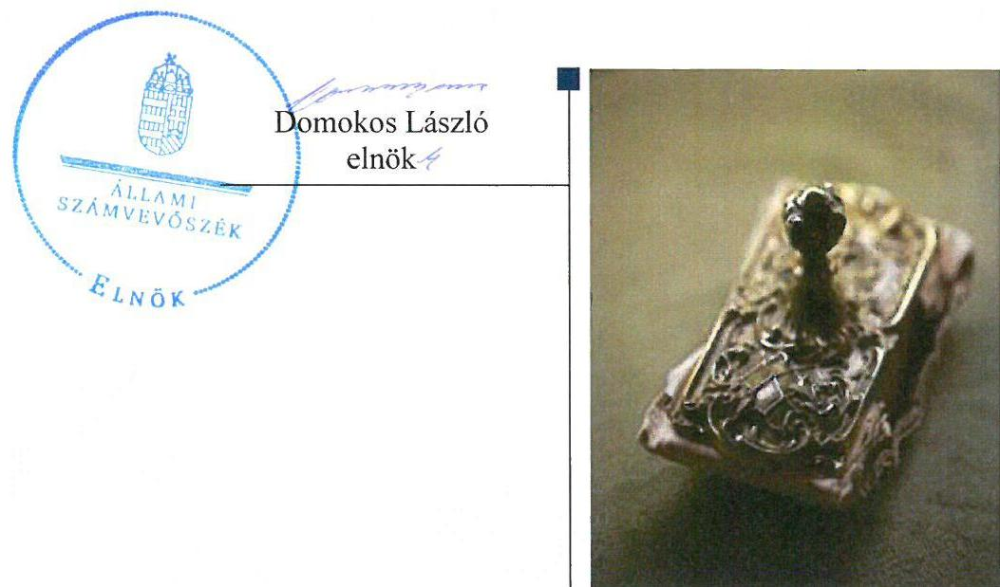

---

# AZ ELLENŐRZÉST FELÜGYELTE:

- BÖRÖCZ IMRE felügyeleti vezető

- AZ ELLENŐRZÉST VEZETTE ÉS A VÉGREHAJTÁSÁÉRT FELELŐS:
  - SALI SÁNDORNÉ ellenőrzésvezető
  - A PROGRAM ÖSSZEÁLLÍTÁSÁÉRT FELELŐS:
    - JANIK JÓZSEF osztályvezető

- IKTATÓSZÁM: V-0977-382/2016.
- TÉMASZÁM: 2011
- ELLENŐRZÉS-AZONOSÍTÓ SZÁM: V070911

Jelentéseink az Országgyűlés számítógépes hálózatán és az Interneten a www.asz.hu címen is olvashatóak.

---

# TARTALOMJEGYZÉK 

■ ÖSSZEGZÉS ..... 5
■ AZ ELLENŐRZÉS CÉLJA ..... 7
■ AZ ELLENŐRZÉS TERÜLETE ..... 8
■ AZ ELLENŐRZÉS HÁTTERE, INDOKOLTSÁGA ..... 10
■ A JELENTÉS LÉNYEGES KÉRDÉSKÖREI ..... 11
■ ELLENŐRZÉS HATÓKÖRE ÉS MÓDSZEREI ..... 12
■ MEGÁLLAPÍTÁSOK ..... 14
■ JAVASLATOK ..... 29
■ MELLÉKLETEK ..... 31
I. Sz. melléklet: Értelmező szótár ..... 31
■ FÜGGELÉK: ÉSZREVÉTELEK ..... 35
■ RÖVIDÍTÉSEK JEGYZÉKE ..... 41

---

.

---

# ÖSSZEGZÉS 

Az Állami Számvevőszék a Széchenyi Programiroda NKft. vagyonmegőrzési és gazdálkodási tevékenységének a szabályszerűségét ellenőrizte a 2011-2014. évek közötti időszakra. A tulajdonosi joggyakorlók a vagyonnal való gazdálkodás feltételeit szabályszerűen alakították ki. A vagyongazdálkodás területén előfordultak alapvető hiányosságok. A 2012. évi leltáregyeztetés dokumentumait nem őrizték meg, a 2011-2012. évben végzett selejtezések nem voltak szabályszerűek. A 2013. évben a leltár nem volt teljes körű, ezért a mérlegtétel leltárral történő alátámasztásának hiányossága miatt a mérleg valódisága nem volt biztosított. A bevételek és ráfordítások szabályozása, elszámolása és a közfeladat bevételeinek és ráfordításának elkülönítése, átláthatósága 2011-2013 között nem felelt meg maradéktalanul az előírásoknak, ezt követően szabályszerű volt. A beszámolási kötelezettség és a közzétételi kötelezettség teljesült, azonban jelentkeztek szabálytalanságok, amelyek nem rendszerbeli hibákra, hanem inkább szabályozási és működési hiányosságokra vezethetők vissza.

## Az ellenőrzés társadalmi indokoltsága

Magyarországon az intézmény-centrikus közfeladat-ellátás, közvagyon-gazdálkodás jellemző a költségvetésen kívüli feladatellátás térnyerése mellett. Ennek szereplői a nonprofit szervezetek, az önkormányzati tulajdonú gazdasági társaságok és az állami tulajdonú gazdálkodó szervezetek is.

Az Áht. 2. § I) pontja, az Európai Közösséget létrehozó szerződéshez csatolt, a túlzott hiány esetén követendő eljárásról szóló jegyzőkönyv alkalmazásáról szóló 2009. május 25-i 479/2009/EK rendelet szerint, illetve az ESA95 statisztikai módszertana alapján a kormányzati szektorba tartoznak a központi kormányzat szektorba besorolt társaságok és egyéb szervezetek is, amelyekkel szemben alapvető követelmény, hogy gazdálkodásuk, működésük szabályszerű, az általuk szolgáltatott adatok megbízhatóak legyenek.

Az állami tulajdonú gazdálkodó szervezetek a nemzeti vagyon részét képezik. Az állami vagyonnal való gazdálkodást illetően a tulajdonosi joggyakorlás és a vagyongazdálkodás feladata az állami vagyon átlátható, rendeltetésszerű és felelős felhasználásának biztosítása. Az állam meghatározza az ellátandó közszolgáltatással kapcsolatos feladatokat, amelyhez a vagyonnal kapcsolatos döntéseknek igazodniuk kell. A nemzetgazdasági szempontból kiemelt jelentőségű nemzeti vagyonban tartandó állami tulajdonban álló társasági részesedését a nemzeti vagyonról szóló törvény határozza meg.

Minden közpénzt, közvagyont használó szervezettel szemben társadalmi igény, hogy tevékenységükről elszámoljanak. Ezt figyelembe véve és az Állami Számvevőszék stratégiájával összhangban került sor a Széchenyi Programiroda NKft. ellenőrzésére.

## Főbb megállapítások, következtetések, javaslatok

Az NFM és a Miniszterelnökség a Társaság Alapító okiratában a jogszabályi előírásokkal, valamint az MNV Zrt.-vel kötött megállapodásban foglaltaknak megfelelően rögzítették a vagyonnal való gazdálkodás feltételeit. A tulajdonosi joggyakorlók az alapító kizárólagos hatáskörébe tartozó döntéshozatali jogköröket szabályszerűen alakították ki.

A Társaság vagyongazdálkodási tevékenysége szabályozásának kialakítása és a vagyon nyilvántartása nem felelt meg teljes mértékben a jogszabályi és a belső szabályozásban foglalt előírásoknak. A Széchenyi Programiroda NKft. az NFFKÜ Zrt. 2014. április 14-től történő tulajdonosi joggyakorlókénti kijelölésével összefüggésben a rábízott vagyonnal kapcsolatos könyvvezetési és beszámoló készítési, nyilvántartási és adatszolgáltatási kötelezettség teljesítésének feltételeit az adottságokhoz, körülményekhez igazodóan a számviteli politikában nem határozta meg. A 2011-

---

2012. években nem rendelkeztek számlarenddel, a 2011-2013 közötti időszakban hatályos leltárkészítési és leltározási szabályzat nem volt összhangban a kialakított gyakorlattal és nem rögzítette a mennyiségi felvétellel történő leltározás gyakoriságát 2013-ig. A számviteli rendszerében a belső szabályozástól eltérő, folyamatos mennyiségi nyilvántartást vezettek az eszközökről annak ellenére, hogy a 2011-2012. években a leltárkészítési és leltározási szabályzatban a nem folyamatos mennyiségi nyilvántartás vezetését rögzítették.

A 2012. évi leltáregyeztetést elvégezték, azonban az egyeztetés dokumentumait az előírás ellenére nem őrizték meg. A 2013. évben mennyiségi felvétellel végzett leltározás nem terjedt ki a személyi használatú eszközökre, ezért a mérleg valódisága nem volt biztosított. 2013. évi leltározás során nem készült leltározási utasítás és leltározási ütemterv, valamint a leltárfelelősök nem kerültek kijelölésre a leltárkészítési és leltározási szabályzatban foglaltak ellenére.

A bevételek és a ráfordítások szabályozása, elszámolása nem volt teljes körűen szabályszerű. A közfeladat bevételeinek és ráfordításának elkülönítése, átláthatósága 2011-2013 között nem volt biztosított, ezt követően javuló tendenciát mutatott. A 2014. évtől hatályba helyezett önköltségszámítási szabályzat ezt már a jogszabályi előírásoknak megfelelően tartalmazta. Az ellenőrzött időszak minden évében helytelenül, az értékesítés nettó árbevételeként mutatták ki a munkavállalók részére továbbszámlázott magáncélú telefonköltséget, valamint a közlekedési bírság munkavállaló által megtérített összegét, melyeket egyéb bevételként kell szabályszerűen elszámolni. Az egyéb ráfordítások, pénzügyi műveletek ráfordításainak elszámolása kapcsán a vevőkövetelés leírását dokumentumokkal nem támasztották alá. Az anyagjellegű ráfordítások, a személyi jellegű ráfordítások, a beruházások aktiválása, értékcsökkenés elszámolása és az egyéb bevételek, pénzügyi műveletek bevételei, rendkívüli bevételek elszámolása szabályszerű volt. A közfeladat bevételeinek és ráfordításának elkülönítése, átláthatósága 2011-2012. évek között nem volt biztosított, mert az általános költségek megosztására nem szabályszerű módszert alkalmazott. A 2013. évet érintően pedig a különböző tevékenységre történő arányosítást igénylő költségfelosztás szabályait nem határozták meg teljes körűen, az nem terjedt ki minden projektre. A 2014. évben a Társaság számviteli politikáját módosította, ennek következtében önköltségszámítási szabályzat készítési kötelezettségét szabályszerűen teljesítette.

A vagyonnal való gazdálkodás, valamint a vagyonváltozást eredményező döntések előkészítése és megalapozása nem felelt meg maradéktalanul az előírásoknak, mert a selejtezést a 2011. és a 2012. évben nem a belső szabályozási előírásoknak megfelelően végezték. A selejtezésekhez az előterjesztések, a jegyzékek, a hasznosítás engedélyezésére irányuló javaslatok és az engedélyek nem álltak rendelkezésre. A tulajdonosi joggyakorló döntései - az NFM kivételével - megfeleltek az előírásoknak. Az NFM 2011-2012. években nem döntött a Társaság Alapító okiratában foglaltak ellenére az ügyvezető előző évben végzett munkájának értékeléséről.

A Társaság a beszámolási kötelezettségét hiányosságokkal teljesítette. Az üzleti jelentés 2012-2013. években nem állt rendelkezésre, a tulajdonosi joggyakorlásban bekövetkezett változást a cégbíróság felé az előírt határidőn túl (30 nap) teljesítették. A könyvvizsgáló tevékenysége kapcsán nem érvényesültek teljes körűen az előírások. A 2011. és a 2012. években a könyvvizsgáló egyszerűsített éves beszámolót auditált, miközben a tulajdonosi joggyakorló éves beszámolót hagyott jóvá, ennek ellenére közzétételre az egyszerűsített éves beszámoló került. Az információs rendszert kialakították és működtették, azonban az adatvédelmet és a közzétételt 2013. június 19-ig nem szabályozták. Ennek következtében a Társaság egyes közérdekű adatok közzétételét nem teljesítette szabályszerűen, továbbá a 2011. évi közhasznúsági mellékletét nem helyezte letétbe és nem tette közzé saját honlapján. Belső ellenőrzés kialakítására 2014. májusaától kezdődően került sor. Az NFM végzett 2012. évben a Társaság működésének és a feladatellátás helyének a megfelelőségével kapcsolatban tulajdonosi ellenőrzést, a Miniszterelnökség ellenőrzési jogosultságát nem gyakorolta.

A Széchenyi Programiroda NKft. gazdálkodásának a kormányzati szektor hiányára befolyást gyakorló elemei szabályszerűek voltak.

Az ÁSZ a Széchenyi Programiroda NKft. ügyvezetőjének fogalmazott meg javaslatokat, amelyek alapján köteles intézkedési tervet összeállítani és azt a jelentés kézhezvételétől számított 30 napon belül az ÁSZ részére megküldeni.

---

# AZ ELLENŐRZÉS CÉLJA 

## Az állami tulajdonban (résztulajdonban) lévő gazdálkodó szervezetek vagyonmegőrzési és gazdálkodási tevékenységének ellenőrzése a Széchenyi Programiroda NKft.-nél

Az ellenőrzés célja annak értékelése volt, hogy a tulajdonosi jogok gyakorlása szabályszerű volt-e; a gazdálkodó szervezet által ellátott feladat bevételei, ráfordításai elszámolásának, és vagyongazdálkodási tevékenységének szabályozása megfelelt-e a jogszabályi és a tulajdonosi előírásoknak és azok végrehajtása szabályszerű volt-e; biztosítva volt-e a közfeladatok átláthatósága és elszámoltathatósága érdekében a közszolgáltatás dijának megalapozottsága szabályszerű önköltségszámítással; a vagyonváltozást eredményező döntések esetében a tulajdonosi jogok gyakorlója és a gazdálkodó szervezet szabályszerűen jártak-e el; a gazdálkodó szervezet épített-e ki és működtetett-e információs rendszert a szabályszerű vagyongazdálkodás érdekében; a kormányzati szektorba sorolt egyéb szervezetek gazdálkodásának a kormányzati szektor hiányára és az államadósságra befolyással bíró elemei a jogszabályi előírásoknak megfeleltek-e.

---

# AZ ELLENŐRZÉS TERÜLETE 

## Széchenyi Programiroda NKft.

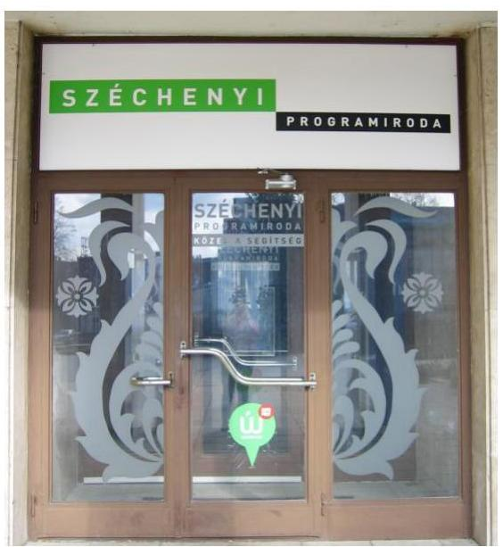

A Társaságot ${ }^{1}$ a Magyar Állam alapította 1996-ban, mely az ellenőrzött időszakban a Magyar Állam kizárólagos tulajdonában volt. A társasági részesedés vonatkozásában a tulajdonosi jogokat a Magyar Állam nevében a 2011. január 1. és 2012. november 29. közötti időszakban az $\mathrm{NFM}^{2}$, 2012. november 30. és 2014. december 31. között a Miniszterelnökség gyakorolta.

A Társaság közfeladata az 1996. évi XXI. törvény³ 3. § (4) bekezdésében meghatározott, területfejlesztéssel kapcsolatos állami feladatok ellátása. Ennek keretében az elmaradott térségek felzárkóztatása, valamint a közszolgáltatásokban meglévő területi különbségek mérséklése.

A 68/2011. (IV. 28.) Korm. rendeletben ${ }^{4}$ történt kijelölés alapján 2011. április 29-étől kezdődően a Társaság működteti a Széchenyi Programirodákat. A Széchenyi Programirodák országos hálózatát a Kormány az Új Széchenyi Tervben meghirdetett pályázóközpontúság, minőség és hatékonyság elveinek megvalósulása érdekében hozta létre 2011-ben. A 2012. novemberétől a Miniszterelnökség háttérintézményeként működő hálózat feladata az Új Széchenyi Terv biztosította források elosztásának elősegítése, a potenciális és aktív pályázók, kedvezményezettek térítésmentes tájékoztatása, szakmai támogatása volt 2013 végéig a VOP ${ }^{5}$ projektben a pályázati folyamat teljes tartama alatt. Az irodahálózat feladata volt a projektben a rendelkezésre álló források lehívásának hatékonyabbá tétele, valamint a kis- és középvállalkozások, civil szervezetek és önkormányzatok pályázati rendszerbe történő nagyobb arányú belépésének elősegítése. A Társaság 2011. áprilisaától 2013. december végéig összesen 40 irodát létesített az ország különböző pontjain, lehetővé téve, hogy pályázati lehetőség iránt érdeklődők a megyeszékhelyeken kívül más településeken is igénybe vehessék a szolgáltatást. A 2013. decemberében véget érő projekt alatt a Széchenyi Programiroda szakemberei országosan több mint 142 ezer alkalommal nyújtottak tájékoztatást, tanácsadást az érdeklődőknek. 29 ezer pályázattal kerültek kapcsolatba, melyek közül mintegy 24 ezer nyertes pályázat volt. A projekt tartama alatt összesen 65 konferenciát rendeztek, 8800 résztvevővel. Kisebb fórumokat összesen 1140 alkalommal tartott a programiroda, mely kapcsán 26 ezer érdeklődőt értek el a tanácsadók. A több mint 900 témában kiírt pályázati konstrukcióból részarányosan a mikrovállalkozások fejlesztésére irányuló lehetőségek kapcsán vették a legtöbben igénybe a programiroda szolgáltatásait.

A Társaság 2014. január 1-jétől - a 2007-2013 programozási időszakhoz kapcsolódóan - projektfelügyeleti rendszer kialakításával és működtetésével kapcsolatos feladatokat végzett. 2014. februárjától részt vett az egyes komplex térségfejlesztési nemzeti programokkal kapcsolatos feladatellátásban. Feladata volt továbbá az egyes nemzeti programok végrehajtását

---

támogató irodák rendszerének fejlesztése - a
 nemzetközi programok kivételével - és a 2014-2020 programozási időszakban a területi alapú tervezés koordinációjának támogatása.

A 1362/2014. (VI. 30.) Korm. határozat ${ }^{6}$, illetve a 161/2014. (VI. 30.) Korm. rendelet ${ }^{7}$ alapján a Kormány a Társaságot jelölte ki a végelszámolással megszüntetésre kerülő VÁTI NKft. ${ }^{8}$ feladatainak, programjainak, munkavállalóinak és vagyontárgyainak átvételére.

A Társaság az NFÜ ${ }^{9}$ megszűnése kapcsán a 475/2013. (XII. 17.) Korm. rendeletben ${ }^{10}$ történt kijelölés alapján az NFÜ Nemzetközi Együttműködési Programok Irányító Hatósága által ellátott feladatok vonatkozásában az Irányító Hatóság jogutódja. A Társaság egyes programok tekintetében ellátta továbbá a közreműködő szervezet, a támogatásközvetítő szervezet, a végrehajtó ügynökség, a végrehajtó szervezet, az alkifizető hatóság, illetve a nemzeti kapcsolattartó pont feladatait, valamint működtette a közös technikai titkárságokat.

A 19/2014. (IV. 14.) NFM rendeletben ${ }^{11}$ történt kijelölés alapján 2020. december 31-éig a Társaság gyakorolja az NFFKÜ Zrt. ${ }^{12}$-ben az állami tulajdonú társasági részesedések felett az államot megillető tulajdonosi jogok és kötelezettségek összességét.

A Társaság irányításában a 2012. évben történtek változások. Az ügyvezető megbízatása 2012. július 13. napjával megszűnt. 2012. július 14. és 2012. október 29. között a Társaságot megbízott ügyvezető irányította. 2012. október 30-ától új ügyvezetőt bízott meg az NFM.

Az alkalmazotti létszám 2014. december 31-én 472 fő volt. A 2014. évben a Társaság összes bevétele 3872,0 millió Ft, melyből az értékesítés nettó árbevétele 63,1 millió Ft-ot tett ki. 2014. december 31-én a mérlegfőösszege 3255,1 millió Ft, a saját tőkéje 322,2 millió Ft, a jegyzett tőke összege 52,0 millió Ft volt. A mérleg szerinti eredménye az 1. ábra szerint alakult:

1. ábra
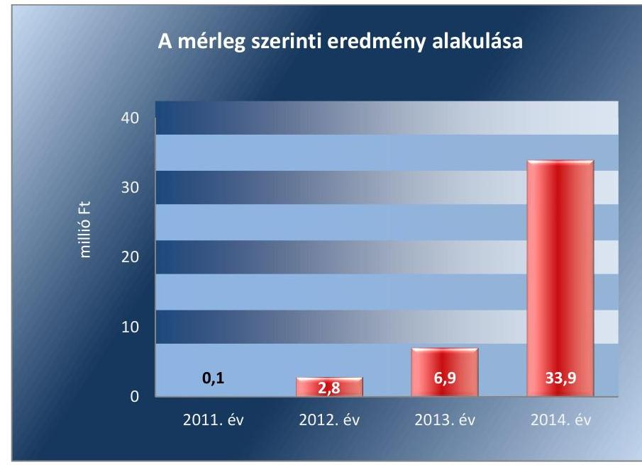

Forrás: a Társaság éves beszámolói

---

# AZ ELLENŐRZÉS HÁTTERE, INDOKOLTSÁGA 

## Széchenyi Programiroda NKft.

Az ÁSZ ${ }^{13}$ alapvető célkitűzése, hogy az államháztartáson kívülre nyújtott költségvetési támogatások és ingyenes vagyonjuttatások ellenőrzésével hozzájáruljon ahhoz, hogy a közpénzeket az államháztartáson kívül működő szervezetek is átlátható módon használják fel a közfeladatok szerződésben vállalt ellátása érdekében. Az államháztartásról szóló törvény értelmében a közfeladatok ellátása elsősorban költségvetési szervek alapításával és működtetésével történik. Az államháztartáson kívüli szervezetek a közfeladatok ellátásában a jogszabályban meghatározott feltételekkel közreműködhetnek.

Az ellenőrzés várható hasznosulásaként az ellenőrzés megállapításai a jogalkotás számára segítséget nyújthatnak az államháztartáson kívüli köz-feladat-ellátás, közvagyonnal való gazdálkodás értékeléséhez, jogszabályi keretei pontosításához, az átláthatóságot biztosító szabályozáshoz. Az ellenőrzöttek számára visszajelzést ad a gazdálkodási tevékenységgel, az állami vagyon felhasználásával, a közszolgáltatási árképzés megalapozottságával és az éves elszámolással kapcsolatos szabálytalanságokról és kockázatokról. Az ellenőrzés tapasztalatai segítik és erősítik az ÁSZ hozzáadott értéket teremtő elemző tevékenységét és tanácsadó szerepét.

---

# A JELENTÉS LÉNYEGES KÉRDÉSKÖREI 

1.     - A tulajdonosi joggyakorló a vagyonnal való gazdálkodás feltételeit szabályszerűen alakította-e ki?
2.     - A Társaság vagyongazdálkodási tevékenysége szabályozásának kialakítása és a vagyon nyilvántartása megfelelt-e az előírásoknak?
3.     - A bevételek és ráfordítások elszámolásának szabályozása és végrehajtása, valamint az önköltségszámítás szabályszerű volt-e?
4.     - A vagyonnal való gazdálkodás, valamint a változást eredményező döntések megfeleltek-e a jogszabályi és a belső előírásoknak?
5.     - A gazdálkodó szervezet a szabályszerű vagyongazdálkodás érdekében teljesítette-e beszámolási kötelezettségét, kiépített-e és működtetett-e információs rendszert?
6. A kormányzati szektorba sorolt egyéb szervezetek gazdálkodásának a kormányzati szektor hiányára és az államadósságra befolyással bíró elemei a jogszabályi előírásoknak megfeleltek-e?

---

# ELLENŐRZÉS HATÓKÖRE ÉS MÓDSZEREI 

## Az ellenőrzés típusa

szabályszerűségi ellenőrzés.

## Az ellenőrzött időszak

2011. január 1-jétől 2014. december 31-ig.

## Az ellenőrzés tárgya

Állami tulajdonban (résztulajdonban) lévő gazdálkodó szervezetek vagyonmegőrzési és gazdálkodási tevékenysége

## Az ellenőrzött szervezet

Széchenyi Programiroda NKft.,NFM, Miniszterelnökség

## Az ellenőrzés jogalapja

Az Állami Számvevőszékről szóló 2011. évi LXVI. törvény 5. § (3)-(5) bekezdései képezték.

## Az ellenőrzés módszerei

Az ellenőrzést a számvevőszéki ellenőrzés szakmai szabályai szerint, a szabályszerűségi ellenőrzés módszerével, a vonatkozó nemzetközi standardok figyelembevételével végeztük.

Az ellenőrzés lefolytatásához a Széchenyi Programiroda NKft. tanúsítványok kitöltésével, valamint az ÁSZ által kért dokumentumok megküldésével szolgáltatott adatokat. A rendelkezésre bocsátott adatok, információk kontrollja és a munkalapok kitöltése a helyszíni ellenőrzés keretében történt.

Mintavétellel ellenőriztük az értékesítés nettó árbevétel, az egyéb bevételek, pénzügyi műveletek bevételei, rendkívüli bevételek, az anyagjellegű ráfordítások, a személyi jellegű ráfordítások, a beruházások, felújítások aktiválása, az értékcsökkenési leírás, az egyéb ráfordítások és a pénzügyi művelet ráfordításai, továbbá a rendkívüli ráfordítások elszámolásának szabályszerűségét, valamint a vagyonnyilvántartás területén a szabályszerű működést. A mintavétellel ellenőrzött területek esetében minden

---

egyes tétel vonatkozásában a szabályszerűségre vonatkozó kérdéseket tettünk fel, amelyek eredménye összesítésre került. A jogszabályoknak és a belső előírásoknak megfelelőnek tekintettük az adott területet, amennyiben a minta ellenőrzésének eredménye alapján 95%-os bizonyossággal a teljes sokaságban a hibaarány kisebb volt, mint 10%, nem megfelelőnek, ha a 10%-ot meghaladta. Kockázatot, illetve magas kockázatot jeleztünk, amennyiben egy adott terület vonatkozásában a minta alapján a teljes sokaságban nem volt egyértelműen biztosított a jogszabályoknak és a belső szabályzatoknak megfelelő működés. A ráfordítások elszámolására és a vagyonnyilvántartásra vonatkozó véletlen mintavételt kockázati alapú kiválasztással egészítettük ki, amelynek során évente a három legnagyobb összegű tételt választottuk ki.

---

# 1. A tulajdonosi joggyakorló a vagyonnal való gazdálkodás feltételeit szabályszerűen alakította-e ki? 

Összegző megállapítás

Megállapítás
Az NFM, illetve a Miniszterelnökség a vagyonnal való gazdálkodás feltételeit szabályszerűen alakította ki.

A tulajdonos számára fenntartott jogokat, valamint a saját vagyon értékének megőrzésével, annak gyarapításával kapcsolatos felelős gazdálkodáshoz szükséges követelményeket meghatározta.

A Magyar Államot megillető társasági részesedés feletti tulajdonosi joggyakorlás átengedése kapcsán az MNV Zrt. ${ }^{14}$ és az NFM között létrejött megállapodásban, illetve az MNV Zrt. és a Miniszterelnökség által megkötött szerződésben a Vtv. ${ }^{15}$, a Vhr. ${ }^{16}$, illetve az Nvtv. ${ }^{17}$ alapján meghatározásra kerültek a vagyongazdálkodással kapcsolatos követelmények. Rögzítették, hogy az NFM, illetve a Miniszterelnökség a részesedést nem idegenítheti el, a tulajdonjogot semmilyen jogcímen nem ruházhatja át. A részesedésre zálogjogot, haszonélvezeti jogot, vételi jogot, elővásárlási jogot és visszavásárlási jogot nem alapíthat, a részesedést nem terhelheti meg, biztosítékként nem ajánlhatja fel. Nem jogosult a részesedés felett gyakorolható jogainak vagy azok egy részének harmadik személy részére történő átengedésére. Az elvárható gondossággal jár el a részesedés értékének megőrzése érdekében és köteles az állami vagyon értékének megőrzése és gyarapítása érdekében eljárni. Köteles haladéktalanul értesíteni az MNV Zrt.-t, ha tudomására jut, hogy a saját tőke veszteség folytán a törzstőke kétharmadára csökken. Köteles továbbá az MNV Zrt. előzetes jóváhagyását kérni a törzstőke felemeléséről és leszállításáról szóló döntésnél.

A TÁRSASÁG ALAPÍTÓ OKIRATÁBAN a jogszabályi előírásokkal, valamint az MNV Zrt.-vel kötött megállapodással, szerződéssel összhangban rögzítették a tulajdonosi joggyakorlók ${ }^{18}$ az Alapító ${ }^{19}$ kizárólagos hatáskörébe tartozó döntéshozatali jogköröket. Ezek között a Társaság Számv. tv. ${ }^{20}$ szerinti beszámolójának jóváhagyását, az ügyvezető, a könyvvizsgáló és az FB${ }^{21}$ tagjainak megválasztását, visszahívását és díjazásának megállapítását, a törzstőke felemelését és leszállítását. Előírták a Társaság SZMSZ-e ${ }^{22}$, az FB ügyrendje, a közbeszerzési tervek és a pályázati tervek, ellenérték nélküli átadás és a kötelezettségvállalásra vonatkozó szerződések jóváhagyását. Rögzítették továbbá a Társaság működésének ellenőrzését az alapítói jogok gyakorlójának saját belső ellenőrzési szervezete keretében.

Az Alapító okiratban a jogszabályi előírásokkal összhangban továbbá az NFM, illetve a Miniszterelnökség úgy rendelkezett, hogy az Alapító évente határozatban dönt az ügyvezető előző üzleti évben végzett munkájának értékeléséről. A könyvvizsgáló feladataként rögzítette annak megállapítását, hogy a Társaság beszámolója megfelel-e a jogszabályoknak, megbízható és

---

valós képet ad-e a Társaság vagyoni és pénzügyi helyzetéről, működésének eredményéről. Előírta továbbá a könyvvizsgáló számára az Alapító haladéktalanul történő értesítését, ha a Társaság vagyonának jelentős csökkenése várható, illetve ha a vezető tisztségviselők vagy az FB tagjainak felelőssége merül fel. Az FB feladataként az ügyvezetés ellenőrzését határozta meg, továbbá azt, hogy a Társaság beszámolójáról csak az FB elfogadását követően lehet dönteni. Előírta, hogy az FB haladéktalanul köteles jelezni az Alapítónak, amennyiben az ügyvezetés tevékenysége jogszabályba, az Alapító okiratba, illetve a Társaság legfőbb szervének határozataiba ütközik, vagy sérti a Társaság, illetve a Magyar Állam érdekeit. Rögzítette, hogy a Társaság a gazdálkodása során elért eredményét nem oszthatta fel, azt a közhasznú tevékenységére köteles fordítani.

# 2. A Társaság vagyongazdálkodási tevékenysége szabályozásának kialakítása és a vagyon nyilvántartása megfelelt-e az előírásoknak?

## Összegző megállapítás

2.1. számú megállapítás

A Társaság vagyongazdálkodási tevékenysége szabályozásának kialakítása és a vagyon nyilvántartása nem felelt meg teljes mértékben a jogszabályi és a belső szabályozásban foglalt előírásoknak.

A vagyon értékének megőrzését, gyarapítását szolgáló, szabályszerű vagyongazdálkodás feltételeit kialakították, azonban a belső szabályozás nem felelt meg maradéktalanul az előírásoknak.

A vagyongazdálkodással kapcsolatos feladat- és hatásköröket, felelősségi viszonyokat az Alapító okirat, az SZMSZ, valamint az FB Ügyrendje tartalmazta. Rendelkeztek a tulajdonosi joggyakorló által jóváhagyott SZMSZszel, illetve FB Ügyrenddel. Az SZMSZ-ben rögzítésre került, hogy a belső szabályzatok elkészítéséért és folyamatos karbantartásáért a Társaság menedzsmentje tartozik felelősséggel. A 2011-2014 közötti időszakban rendelkeztek számviteli politikával, leltárkészítési és leltározási szabályzattal, selejtezési szabályzattal, eszközök és források értékelési szabályzatával és pénzkezelési szabályzattal, valamint a 2013-2014 közötti időszakban számlarenddel. A számviteli politikában és az eszközök és források értékelési szabályzatában az értékcsökkenési leírás módszerét, mértékét, elszámolásának időpontját, gyakoriságát a Számv. tv.-ben foglalt rendelkezéseknek megfelelően határozták meg.

A BELSŐ SZABÁLYOZÁS azonban nem felelt meg teljes mértékben az előírásoknak, mert:

- a Társaságot 2014. április 14-től kijelölték az NFFKÜ Zrt.-ben lévő állami részesedések feletti tulajdonosi joggyakorlóként. A Vhr. 13. § (3)-(5) bekezdéseiben foglalt sajátos kötelezettségek (a tulajdonosi joggyakorló rábízott vagyonnal kapcsolatos könyvvezetési és beszámoló készítési, nyilvántartási, adatszolgáltatási kötelezettsége) teljesítésének feltételeit a Számv. tv. 14. § (3) bekezdésében foglaltak ellenére az adottságokhoz, körülményekhez igazodóan a számviteli politikában nem határozta meg;
- a 2011-2012. években nem rendelkeztek a Számv. tv. 161. § (1) bekezdésében előírt számlarenddel;
- az Alapító okiratban és az SZMSZ-ben foglaltak szerint a Társaságot ügyvezető irányította, ennek ellenére a 2013. évben hatályban lévő számlarend vezérigazgatót nevesített;
- a 2011-2013 közötti időszakban hatályos leltárkészítési és leltározási szabályzat nem volt összhangban a kialakított gyakorlattal. A 2011. évtől kezdődően a számviteli rendszerben folyamatos mennyiségi nyilvántartással tartották nyilván az eszközöket. A leltárkészítési és leltározási szabályzatban azonban a 2011-2012 közötti időszakban azt rögzítették, hogy folyamatos mennyiségi nyilvántartást nem vezetnek az eszközeikről;
- a Számv. tv. 69. § (3) bekezdése 2012. január 1-jétől előírta, hogy folyamatos mennyiségi nyilvántartás vezetése esetén a leltárba kerülő adatok valódiságáról a leltárkészítési és leltározási szabályzatban meghatározott időszakonként, de legalább háromévente mennyiségi felvétellel kell meggyőződni. A leltárkészítési és leltározási szabályzatban azonban csak 2014. január 1-jei hatállyal határozták meg a mennyiségi felvétellel történő leltározás gyakoriságát.
Az FB Ügyrendje az Alapító okiratban foglaltaknak megfelelően tartalmazta, hogy
 a Számv. tv. szerinti beszámolóról, az adózott eredmény felhasználásáról és a vagyonkimutatásról az Alapító csak az FB írásbeli jelentése birtokában határozhatott. Az FB Ügyrendjében megfogalmazásra került továbbá, hogy az FB jogosult a Társaság átfogó ellenőrzésére.

## 2.2. számú megállapítás

A 2012. évi leltáregyeztetés dokumentumait nem őrizték meg, továbbá a 2013. évben mennyiségi felvétellel végzett leltározás nem felelt meg az előírásoknak.

A vagyon nyilvántartásáról gondoskodtak, melyben a vagyonváltozás kimutatása folyamatos volt. Az eszközök állományba vételének, értékelésének és az értékvesztés elszámolásának szabályait a Számv. tv. előírásainak megfelelően alakították ki a számviteli politikában és az eszközök és források értékelési szabályzatában. A részesedések, egyéb befektetett pénzügyi eszközök értékelésénél a jogszabályi előírások szerint jártak el.

A beszámolóban és a számviteli nyilvántartásokban lévő vagyontárgyak állományát a 2011. és a 2014. évet érintően egyeztetéssel történő leltárral támasztották alá, de a leltárkészítési és leltározási szabályzatban foglaltak ellenére a leltárjelentés nem került aláírásra.

A 2012. évi leltáregyeztetést elvégezték, azonban az egyeztetés dokumentumait a Számv. tv. 169. § (1) bekezdésében foglaltak ellenére nem őrizték meg. Az üzleti évről készített beszámolót, üzleti jelentést, valamint az azokat alátámasztó leltárt, értékelést olvasható formában legalább nyolc évig köteles a Társaság megőrizni.

A 2012. évi beszámoló könyvvizsgálói jelentésében foglaltak szerint az egyes mérlegsorok állománya leltárral alátámasztott volt.

---

# 1 NFFKÜ 

LELTÁROZÁST végeztek mennyiségi felvétellel a 2013. évben, azonban a belső szabályzat és a jogszabály előírása nem érvényesült teljes körűen, mert:
a 2013. évi leltározás során a leltárkészítési és leltározási szabályzatban foglaltak ellenére nem készült leltározási utasítás és leltározási ütemterv, valamint a leltárfelelősök nem kerültek kijelölésre;
a 2013. évi leltározás nem volt teljes körű, mert a mennyiségi felvétel nem terjedt ki a személyi használatra kiadott eszközökre - asztali számítógép, monitor, laptop, nyomtató, személygépkocsi, projektor, szerver, mobiltelefon - nettó értéke 70,3 millió Ft, ezzel megsértették a Számv. tv. 69. § (3) bekezdésében foglaltakat. A személyi használatra kiadott eszközök vonatkozásában a mérlegtétel leltárral nem alátámasztott, ezért a mérleg valódisága nem volt biztosított.
A könyvvizsgáló nem kifogásolta a 2013. évi beszámoló auditálása során a személyi használatra kiadott eszközök mennyiségi felvétellel történő leltározásának elmaradását.

AZ NFFKÜ ZRT.-BEN az állami tulajdonú részesedés (24%) értéke 1200000 Ft, 12 db egyenként 100000 Ft névértékű törzsrészvény, melyek ingyenesen kerültek a Magyar Állam tulajdonába. A tulajdonosi joggyakorlásra történt kijelölés kapcsán 2014. április 17-én aláírt jegyzőkönyvvel vették át az NFFKÜ Zrt.-vel kapcsolatos dokumentumokat az MNV Zrt.-től. A Társaság a jogszabályok által előírt nyilvántartási kötelezettségét a számviteli rendszerében témaszámos elkülönítéssel valósította meg. A részesedést a Számv. tv.-nek megfelelően a befektetett pénzügyi eszközök között 0 Ft bekerülési értéken tartotta nyilván és szabályosan értékelte.

A végelszámolással megszűnő VÁTI NKft.-től az átvételt szabályszerűen hajtották végre. A munkáltatói jogokat 2014. július 1-jei hatállyal, megállapodás alapján vették át. A 2014. évben történt tárgyi eszköz átvétel szabályos volt. Az eszközök egyedileg a Számv. tv. előírásainak megfelelően, könyv szerinti értéken kerültek átvételre és rögzítésre a nyilvántartásokban. Az eszközök 2014. évi mérlegben történő szerepeltetése megfelelt az előírásoknak. A közbeszerzési szerződések, szállítói kötelezettségek, illetve a feladatellátáshoz szükséges projekt-szerződések átadás-átvételére a 2014. október 3-án készült megállapodás szerint került sor.

---

# 3. A bevételek és ráfordítások elszámolásának szabályozása és végrehajtása, valamint az önköltségszámítás szabályszerű volt-e? 

Összegző megállapítás

### 3.1. számú megállapítás

2. ábra
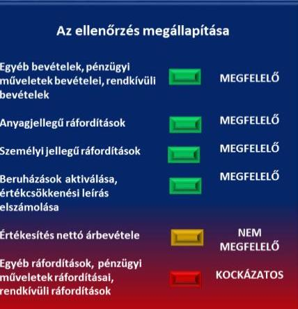

A bevételek és a ráfordítások szabályozása, elszámolása nem volt teljes körűen szabályszerű. A közfeladat bevételeinek és ráfordításának elkülönítése, átláthatósága 2011-2013 között nem volt biztosított, azonban 2014. évtől az elkészített önköltségszámítási szabályzat ezt már a jogszabályi előírásoknak megfelelően tartalmazta.

A bevételek és a ráfordítások szabályozása, elszámolása során nem érvényesültek maradéktalanul a jogszabályi előírások.

A 2011-2013. években a közhasznú tevékenységhez kapcsolódóan a bevételek és ráfordítások elkülönített nyilvántartása a Számv. tv. 161/A. § (2), továbbá a Civil tv. 27. § (1) bekezdésében foglalt előírásoknak nem felelt meg. Az elkülönítést 2014. január 1-jétől az önköltségszámítási szabályzat az előírásoknak megfelelően tartalmazta.

A Társaság Alapító okiratában a jogszabályi előírásokkal összhangban rögzítésre került, hogy vállalkozási tevékenységet végezhet, azonban az nem veszélyeztetheti a közhasznú tevékenységét. A számviteli politikában a közhasznú és a vállalkozási tevékenységéből származó árbevételek és ráfordítások nyilvántartásának továbrészletezéséhez munkaszámok használatát írták elő.

A 2011-2012 közötti időszakban hatályos számviteli politikában árbevétel-arányos módszert írtak elő az általános költségek megosztására. Ez nem felelt meg a Számv. tv. 14. § (3) és 161/A. § (2) bekezdésében foglaltaknak. A tevékenységének meghatározó részét támogatásból finanszírozták. Ezek a Számv. tv. 77. § (2) bekezdés d) pontja szerinti egyéb bevételek, illetve a 86. § (3) bekezdés i) pontja szerinti rendkívüli bevételek voltak. Az árbevétel-arányos megosztás sértette a valódiság elvét, egyrészt mert a támogatási programok keretében végzett tevékenységekből árbevétel nem származott, ezért ezekre a tevékenységekre az árbevétel-arányos megosztás miatt általános költségeket nem osztott. Másrészt azokat a tevékenységeket, amelyekből származott árbevétel, nagyobb közvetett költségekkel terhelték, mint amennyit a költség felmerülése indokolt volna. A 2013. évet érintően a különböző tevékenységekre történő, arányosítást igénylő költségfelosztás szabályait nem határozták meg teljes körűen, mert a kapcsolódó ügyvezetői utasítások nem terjedtek ki minden projektre. A ráfordítások felosztását a 2014. január 1-jétől az önköltségszámítási szabályzatban a Számv. tv. előírásai szerint állapították meg.

A mintavétellel ellenőrzött területek értékelését a 2. ábra összefoglalóan mutatja. Az értékesítés nettó árbevétele a 2011. évi 2,9 millió Ft-ról 63,1 millió Ft-ra növekedett a feladatbővüléssel összefüggésben.

Az értékesítés nettó árbevétel elszámolásának szabályszerűsége nem volt megfelelő, mert a Számv. tv. 72. § (1) bekezdésében foglaltak ellenére árbevételként mutatták ki a munkavállalók részére továbbszámlázott magáncélú telefonköltséget, valamint a közlekedési bírság munkavállaló által

---

megtérített összegét. Ezeket a megtérített költségeket a Számv. tv. 77. § (2) bekezdés d) pontja alapján egyéb bevételként kell elszámolni.

Az egyéb bevételek, valamint a pénzügyi műveletek bevételei és a rendkívüli bevételek elszámolása megfelelt a jogszabályi előírásoknak.

A ráfordítások 2011. évi 896,3 millió Ft-ról 2014-re 3837,8 millió Ft-ra növekedtek, mely a feladatbővüléssel volt összefüggésbe. Az anyagjellegű ráfordítások elszámolásának szabályszerűsége megfelelő volt. A költségelszámolást megalapozó dokumentumok rendelkezésre álltak, a ráfordításokat a megfelelő közfeladatra számolták el.

A munkavállalók részére a saját gépjármű-használattal történt belföldi kiküldetés költségtérítését a Számv. tv. 79. § (1) és a (3) bekezdésében foglaltak ellenére személyi jellegű egyéb kifizetések helyett igénybevett szolgáltatásként számolták el, ezért a jogszabályi előírások nem érvényesültek maradéktalanul.

A személyi jellegű egyéb ráfordítások elszámolásának szabályszerűsége megfelelő volt. A bruttó bérek számfejtett összege megfelelt a munkaszerződésben foglaltaknak, a munkavállalókat terhelő levonások a jogszabályi előírások szerint történtek. A cafeteria kifizetéseknél betartották a személyenként és évenként meghatározott keretet. A teljesítményértékelés dokumentálása nem felelt meg a Teljesítményértékelési eljárásrend 4. oldal 6. bekezdésének, mely szerint az értékelésről aláírt dokumentációval kellett rendelkezni, de ez csak elektronikus formában történt meg. Az egyéb ráfordítások, pénzügy műveletek ráfordításai és a rendkívüli ráfordítások elszámolásának szabályszerű végrehajtása kockázatos volt, mert 2013. évben több kisösszegű vevőkövetelés leírását dokumentumokkal nem támasztották alá, ezért nem felelt meg a Számv. tv. 165. § (1)-(2) bekezdésében foglaltaknak.

A beruházások aktiválásának és az értékcsökkenési leírás elszámolásának szabályszerűsége megfelelő volt a feltárt hiányosságok ellenére. A beruházások aktiválását és az értékcsökkenési leírás elszámolását érintően a költségelszámolást megalapozó dokumentumok rendelkezésre álltak, az üzembe helyezés és az eszközök állományba vétele megtörtént. A Számv. tv. és a Társaság számviteli politikájában foglalt előírások azonban nem érvényesültek teljes körűen, illetve a számviteli politika szabályozása hiányos volt, mert előfordult, hogy:
$\longrightarrow$ a számviteli politikában foglaltakkal ellentétben a 2013. évben 50%os leírási kulcsot alkalmaztak 100 ezer Ft egyedi bekerülési érték alatti eszköznél, melyet az előírás szerint egy összegben kellett volna értékcsökkenésként elszámolni;
eszköz bekerülési értékét nem tudták teljes egészében dokumentumokkal alátámasztani a 2013. évben, mely eljárás nem felelt meg a Számv. tv. 165. § (1) és (2) bekezdésében foglalt bizonylat elv és bizonylati fegyelem előírásainak;
alapítás-átszervezés aktivált költségére úgy számoltak el értékcsökkenést a 2011. évben, hogy a Számv. tv. 14. § (4) és az 52. § (1) bekezdésében foglaltak ellenére a számviteli politikában nem döntöttek a várható használati időről.

---

A 2011-2014 közötti időszakban a beruházásokra fordított összeg 78,6 millió Ft-tal haladta meg az értékcsökkenési leírást. Az adatok évenkénti alakulását a 3. ábra mutatja be:
3. ábra
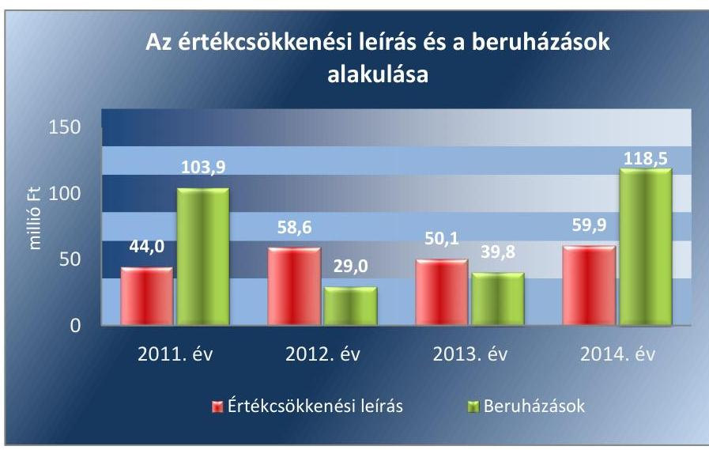

Forrás: a Társaság főkönyvi kivonatai és a Társaság által kitöltött tanúsítvány
A beruházások meghatározóan európai uniós pályázati forrásból valósultak meg (262,9 millió Ft).

A Társaság a követelések összegét a Számv. tv. 29. § (1) és (2) bekezdésének és a számviteli politikájában rögzített elvek és módszerek alapján, az ott rögzített mértékeknek megfelelően vette nyilvántartásba. A határidő lejárta után intézkedtek a követelések behajtására. A követelések alakulásával kapcsolatos adatokat az 1. táblázat tartalmazza:

1. táblázat

| A KÖVETELÉSÁLLOMÁNY ALAKULÁSA |  |  |  |  |  |
| :--: | :--: | :--: | :--: | :--: | :--: |
| Megnevezés | 2011. | 2011. | 2012. | 2013. | 2014. |
| Követelés (millió Ft) | 2,9 | 3,6 | 7,4 | 49,0 | 36,1 |
| Eszközök összesen (millió Ft) | 293,3 | 928,9 | 1052,6 | 1055,5 | 3255,1 |
| Követelés aránya (\%) | 1,0 | 0,4 | 0,7 | 4,6 | 1,1 |

Értékvesztés elszámolására a 2014. évben került sor, melynek során 20,0 millió Ft-ot számoltak el az NFFKÜ Zrt. részére nyújtott kölcsönhöz kapcsolódóan. Az előírásoknak megfelelően minősítették a követelést és számolták el az értékvesztést az egyéb ráfordítások között.
3.2. számú megállapítás

A Társaság önköltségszámítási szabályzat készítési kötelezettségét 2014. évben teljesítette, a szabályozás összhangban volt a jogszabályi előírással.

A 2014. évben a Társaság a számviteli politikáját módosította. A szabályozás módosítása szerint a mérlegben befejezetlen termelés és félkész termékek között mutatta ki a támogatási programok keretében azokat az elszámolt költségeket, amelyeknek a támogatásból történő ellentételezése a tárgyidőszakban még nem történt meg, de a mérlegkészítés időpontját követően esedékessé vált. A számviteli politika módosítása indokolttá tette az önköltségszámítási szabályzat elkészítését, mivel a készletek értékét az

---

önköltségszámítás módszerével kellett megállapítani az Számv. tv. 14. § (7) bekezdése alapján. A számviteli politika módosításával kiadták 2014. október 1-jén az önköltségszámítási szabályzatot, mely 2014. december 30-ával módosításra került. A szabályzatban a közvetlen és közvetett költségek elkülönítését és a felosztandó költségek vetítési alapját meghatározták. A szabályzat tartalmazta a kalkulációs módszerek leírását, valamint az elő- és utókalkuláció készítésének határidejét.

Az előírt esetekben elvégezték az önköltségszámítást. A kalkuláció során az önköltségben érvényesítendő értékcsökkenést szabályszerűen vették figyelembe. A 2014. évi éves beszámolóban kimutatott befejezetlen termelés értékét önköltségszámítással támasztották alá.

# 4. A vagyonnal való gazdálkodás, valamint a változást eredményező döntések megfeleltek-e a jogszabályi és a belső
 előírásoknak? 

Összegző megállapítás

### 4.1. számú megállapítás

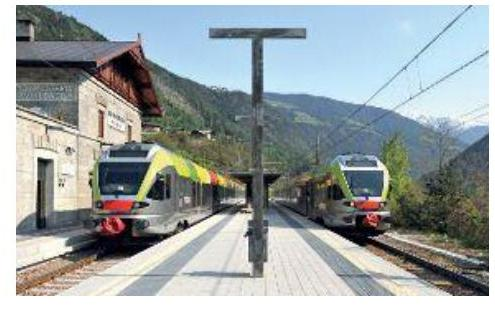

A vagyonnal való gazdálkodás, valamint a vagyonváltozást eredményező döntések előkészítése és megalapozása nem felelt meg maradéktalanul az előírásoknak. A tulajdonosi joggyakorló döntései - az NFM kivételével - megfeleltek az előírásoknak.

A Társaság vagyongazdálkodási tevékenységét alapvető hiányosságokkal végezte.

Az eszközök állománya 2011. évi 928,9 millió Ft-ról a 2014. évi 3255,0 millió Ft-ra, mintegy három és félszeresére emelkedett. Az eszközök összetételét a 4. ábra mutatja be:
4. ábra

Az eszközök összetételének alakulása

| 2000 |  |  |  |  |
| :--: | :--: | :--: | :--: | :--: |
| 2000 |  |  |  |  |
| 2000 |  |  |  |  |
| 2001 | 2012 | 2013 | 2014 |  |
| - Immateriális javak | 30,1 | 15,3 | 3,4 | 2,0 |
| - Tárgyi eszközök | 85,8 | 78,9 | 76,6 | 67,0 |
| - Befektetett pénzügyi eszközök | 4,7 | 4,2 | 4,2 | 0,0 |
| - Készletek | 0,0 | 0,0 | 0,0 | 2234,2 |
| - Követelések | 3,6 | 7,4 | 45,0 | 36,1 |
| - Értékpapírok | 0,0 | 219,0 | 0,0 | 16,2 |
| - Pénzeszközök | 27,7 | 10,6 | 366,3 | 469,6 |
| - Aktív időbeli elhatárolások | 777,0 | 717,2 | 556,1 | 429,8 |

Forrás: a Társaság éves beszámolói

---

A vagyongazdálkodás nem felelt meg az előírásnak, mert a 2012. évben a leltáregyeztetés dokumentumait az előírás ellenére nem őrizték meg. A 2013. évben mennyiségi felvétellel végzett leltározás nem terjedt ki a személyi használatú eszközökre, ezért a mérleg valódisága nem volt biztosított.

A tárgyi eszközök állományának növekedését az új projektek megvalósításához szükséges eszközök beszerzései okozták. A 2011-2013 közötti időszakban szabályszerűen a befektetett pénzügyi eszközök között tartották nyilván az éven túli bérleti szerződésekhez kapcsolódó kaució összegét, 2014-ben a 4,2 millió Ft-ot az előírásokat betartva átsorolták az egyéb követelések közé, mivel a bérleti szerződések lejárata egy éven belülire csökkent. A készleteket érintően a 2014. évtől kezdődően befejezetlen termelésként tartották nyilván az egyes támogatási programok esetében felmerült azon költségeket, amelyekre a bevételi keret fedezetet nyújtott, azonban elszámolása a mérlegkészítésig nem történt meg. Az elszámolási mód választását az indokolta, hogy a Társaság által vállalt feladatok száma megnövekedett, a 2011-2013. évi öt-hat projekttel szemben 2014-ben a projektek száma meghaladta a 30-at. Az elszámolás módját a számviteli politikában - a Számv. tv. előírásaival összhangban - határozták meg. A követeléseken belül az egyéb követelések értéke emelkedett, melyek a költségvetéssel szembeni kiutalási igények voltak.

A pénzeszközök növekedésének oka a feladatoknak, a Társaság szervezetének, valamint a működéshez szükséges pénzeszköz-igénynek a bővülése volt. Az értékpapírok között az MKB Garantált Likviditási Alapban lévő befektetési jegyet számolták el. Az aktív időbeli elhatárolások állománya a 2011. évi 777,0 millió Ft-ról 429,9 millió Ft-ra csökkent, mely a fordulónap és a mérlegkészítés között befolyt támogatások elszámolásának módosulásával függött össze.

A saját tőke a 2011. évi 278,5 millió Ft-ról a 2014. évre 322,2 millió Ft-tal, 15,6%-kal növekedett az 5. ábra szerint:
5. ábra
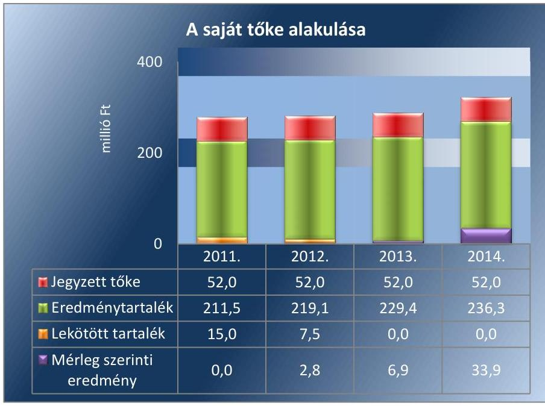

Forrás: a Társaság éves beszámolói

---

A kötelezettségek között csak rövid lejáratú kötelezettségek voltak. A rövid lejáratú kötelezettség összege a projektek megvalósításához kapott előlegekkel összefüggésben növekedett a 2011. évi 547,7 millió Ft-ról a 2014. évi 2849,3 millió Ft-ra. A passzív időbeli elhatárolások értéke a 2011. évi 102,7 millió Ft-ról a 2014. évi 81,5 millió Ft-ra csökkent. A Számv. tv. előírásaival összhangban a passzív időbeli elhatárolások között halasztott bevételként szerepeltették a támogatásból beszerzett, illetve térítésmentesen átvett eszközök értékcsökkenésének ellentételezésére elszámolható bevételeket. A passzív időbeli elhatárolások összegének változása a tárgyi eszközök állományának alakulásával összhangban volt.

A tárgyi eszközök karbantartásáról, állagmegóvásáról gondoskodtak. A műszaki eszközök, a járművek, az irodai és egyéb berendezések karbantartására a négy év alatt 18,1 millió Ft-ot fordítottak. Ebből meghatározó részt, 15,0 millió Ft-ot, 82,9%-ot a járművek karbantartása jelentett. A gépjárművek szervizelésére vonatkozóan 2013-ban és 2014-ben éves vállalkozási keretszerződést kötöttek.

# 4.2. számú megállapítás 

## A Társaságnál a vagyonváltozást eredményező döntések előkészítésének, megalapozásának szabályszerűsége nem volt megfelelő.

A tulajdonosi jogok gyakorlója számára a vagyongazdálkodás keretében szükséges, a vagyon változását eredményező döntések előkészítése előterjesztések formájában valósult meg, melyekről az FB a tulajdonosi joggyakorlónak történő felterjesztés előtt határozatban döntött.

A Kbt. ${ }^{23}$, illetve a Kbt. ${ }^{24}$ által előírt esetekben lefolytatták a közbeszerzési eljárást, rendelkeztek olyan pályázati dokumentációval, amely a közbeszerzési eljárások lefolytatását alátámasztotta.

Selejtezést a 2011. évben és a 2012. évben végeztek. 2011-ben káresemény folytán egy személygépjárművet selejteztek, melynek bruttó értéke 3,8 millió Ft, nettó értéke 0,8 millió Ft volt. A biztosítótól kapott kártérítésből 0,9 millió Ft, a gépjármű értékesítéséből további 0,3 millió Ft bevétel keletkezett. 2012-ben 0-ra leírt eszközöket (licenc, merevlemez, szerver, számítógép, mobiltelefon, videokamera, fénymásoló) selejteztek, melyek bruttó értéke 6,8 millió Ft-ot tett ki. A selejtezési szabályzat a selejtezést, illetve hasznosítást érintően előírta, hogy:
$\longrightarrow$ feleslegesnek minősül egy eszköz, ha azt előterjesztés alapján a Társaság vezetője annak nyilvánítja;
$\longrightarrow$ a felesleges eszközöket, anyagokat a könyv szerinti érték feltüntetésével jegyzékbe kell foglalni. A jegyzék alapján a hasznosítás engedélyezésére javaslatot kell tenni a Társaság vezetőjének. A hasznosítást a Társaság vezetője, vagy az általa felhatalmazott személy engedélyezi.
A 2011. és 2012. években végzett selejtezéseknél az előterjesztések, a jegyzékek, a hasznosítás engedélyezésére irányuló javaslatok és az engedélyek nem álltak rendelkezésre, ezzel megsértették a selejtezési szabályzat előírásait.

---

# 4.3. számú megállapítás 

A Miniszterelnökség döntései megfeleltek az előírásoknak, azonban az NFM-nél nem érvényesültek maradéktalanul az alapító okiratban foglaltak.

Az NFM, illetve a Miniszterelnökség a kizárólagos hatáskörébe tartozó döntési jogosultságokat a Társaság Alapító okiratában foglaltak alapján gyakorolta. Előzetesen jóváhagyták a Társaság éves üzleti és közbeszerzési tervét, a pályázati terveket és szerződéseket. Döntöttek az ügyvezető, a könyvvizsgáló és az FB tagjaival kapcsolatos kérdésekben. Jóváhagyták a Társaság éves beszámolóját és közhasznúsági mellékletét, valamint a támogatások elszámolását.

Az NFM a 2011-2012. években tulajdonosi joggyakorlásának időszakában nem döntött a Társaság Alapító okirat 5. pontjában foglaltak ellenére az ügyvezető előző évben végzett munkájának értékeléséről.

A Miniszterelnökség 2012. november 30-tól határozatban állapította meg, hogy az ügyvezető az értékelt időszakban a Társaság érdekeinek elsődlegességét szem előtt tartva végezte a munkáját.

## 5. A gazdálkodó szervezet a szabályszerű vagyongazdálkodás érdekében teljesítette-e beszámolási kötelezettségét, kiépített-e és működtetett-e információs rendszert?

Összegző megállapítás

### 5.1. számú megállapítás

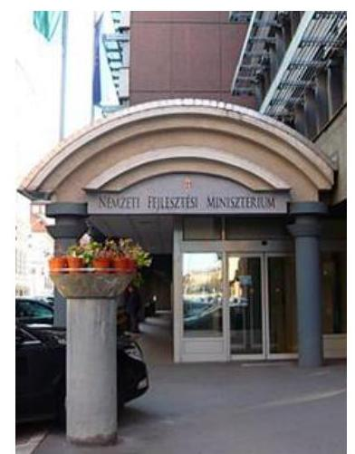

A Társaság a beszámolási kötelezettségét hiányosságokkal teljesítette, a kialakított információs rendszer megfelelően működött, azonban egyes közérdekű adatok közzétételét nem teljesítette. A könyvvizsgáló tevékenysége kapcsán nem érvényesültek teljes körűen az előírások.

A beszámolási kötelezettséget hiányosságokkal teljesítette. Az FB szabályszerűen járt el, a könyvvizsgáló tevékenysége során nem érvényesültek teljes körűen az előírások.

A Társaság a számviteli politikájában a jogszabályi előírásokkal összhangban éves beszámoló készítési kötelezettséget határozott meg. A Számv. tv. 9. § (1)-(2) bekezdése lehetőséget adott az egyszerűsített éves beszámoló készítésére. A 2011. és a 2012. évet érintően egyszerűsített éves beszámolót és éves beszámolót is készítettek. A beszámolók auditálása, tulajdonosi joggyakorló által történő jóváhagyása és közzététele nem volt összhangban, mert:
— a könyvvizsgáló egyszerűsített éves beszámolót auditált;
— a tulajdonosi joggyakorló éves beszámolót hagyott jóvá;
— a Társaság a Céginformációs és az Elektronikus Cégeljárásban Közreműködő Szolgálat részére egyszerűsített éves beszámolót küldött meg közzétételre.
A 2013. és 2014. évet érintően a számviteli politikában foglaltakkal összhangban éves beszámolót készítettek. A beszámolók keretében a mérleget, az eredménykimutatást, a kiegészítő mellékletet összeállították. Üzleti jelentést 2011. és 2014. évekre elkészítették, azonban az a 2012. és a

---

2013. években a Számv. tv. 9. § és 19. § (1) bekezdés ellenére nem állt rendelkezésre.

Az éves beszámoló közhasznúsági mellékletét mind a négy évet érintően elkészítették. A 2011-2014. évi jóváhagyott beszámolók közzétételéről határidőben gondoskodtak.

A tulajdonosi joggyakorlók a jogszabályi előírásokat és a Társaság Alapító okiratában foglaltakat betartva gondoskodtak a könyvvizsgáló megválasztásáról. A könyvvizsgáló az Alapító okiratban foglaltak szerint végezte tevékenységét. Az éves beszámolókat a Számv. tv. előírásaival összhangban minden évben felülvizsgálta, mely beszámolók a könyvvizsgáló véleménye szerint a Számv. tv.-ben foglaltakkal összhangban voltak, megbízható és valós képet adtak a Társaság vagyoni, pénzügyi és jövedelmi helyzetéről. A Miniszterelnökség a tulajdonosi joggyakorlóban 2012. november 30-án bekövetkezett változás kapcsán 2013. január 31-én hozott határozatot az Alapító okirat módosításáról. A változás cégbíróságnak történő bejelentésére azonban a 2012. évről készült könyvvizsgáló jelentés időpontjáig, 2013. április 25-éig nem került sor. Ezért a könyvvizsgáló a jelentésben felhívta a figyelmet a Gt.-ben foglaltaknak való megfelelésre. A cégbírósági bejegyzés 2013. július 17-én történt meg. Ezzel megsértették a Gt. 18. § (4) bekezdésében foglaltakat, mert a változás bejelentését 30 napon túl teljesítették.

A Társaságnál a jogszabályi előírásoknak megfelelően három természetes személy tagból álló FB működött. Az FB a jogszabályokban, illetve a Társaság Alapító okiratában meghatározott feladatait ellátta. Az éves beszámolók FB által történő elfogadásakor a könyvvizsgálói jelentések rendelkezésre álltak. Az FB a tulajdonosi joggyakorlónak történő felterjesztés előtt határozatban döntött az éves beszámoló, a közhasznúsági melléklet és a könyvvizsgálói jelentés elfogadásáról.

Az FB a 26/2014. (X. 29.) FB számú határozatával döntést hozott a törzstőke 148,0 millió Ft-tal történő megemelésének támogatásáról, pénzbeli vagyoni hozzájárulás útján, a Miniszterelnökség költségvetési előirányzata terhére. A törzstőke emelést az FB az üzletméret nagyarányú növekedésével indokolta, valamint azzal, hogy a Társaság kizárólag utófinanszírozott projektekből működik. A 27/2014. (X. 29.) FB számú határozatban az FB felkérte a Társaság ügyvezetőjét, hogy tegye meg a szükséges intézkedést a törzstőke emelés iránti kérelem tulajdonosi joggyakorló irányába történő felterjesztésére. Az ügyvezető tárgyalást kezdeményezett a Miniszterelnökséggel. A törzstőke megemelésére 2014. december 31-éig nem került sor.

A Társaság az éves beszámolókat a közhasznúsági melléklettel együtt szabályszerűen terjesztette elő a tulajdonosi joggyakorlónak. Az NFM, illetve a Miniszterelnökség az éves beszámolóit és közhasznúsági mellékletét határozattal jóváhagyta. A jóváhagyáskor az éves beszámolóval kapcsolatos FB határozatok és a könyvvizsgálói jelentések rendelkezésre álltak.

---

### 5.2. számú megállapítás

Az információs rendszert kialakították és megfelelően működtették. A Társaság azonban egyes közérdekű adatok közzétételét nem teljesítette.

Az MNV Zrt. és az NFM, illetve a Miniszterelnökség között létrejött megállapodás, szerződés a tulajdonosi joggyakorlókat érintően kötelezettségeket tartalmazott a Társasággal kapcsolatos adatszolgáltatást, beszámolást érintően. Ezen kötelezettségek teljesítéséhez szükséges rendelkezéseket a tulajdonosi joggyakorlók a Társaság felé az Alapító okiratban és az SZMSZ-ben határozták meg. Az Alapító okiratban, illetve SZMSZ-ben rögzítésre került, hogy az Alapító dönt a Társaság közbeszerzési tervének és beszámolójának jóváhagyásáról, továbbá az ügyvezető beszámoltatásáról. A tulajdonosi joggyakorló a Társaság folyamatos működésének feltételeit üzleti tervben, valamint a negyedéves
 kontrolling jelentési kötelezettség teljesítésével határozta meg.

A 2011. és 2012. években az NFM a Társaság részére szempontrendszert, valamint beküldési határidőt határozott meg az üzleti tervet érintően. A Társaság az üzleti tervét az előírt tartalommal készítette el. Az üzleti terv tartalmazta az éves mérleg- és eredménykimutatást, a várható mérleg- és eredménykimutatást, valamint a cash-flow kimutatást. A Társaság a 2011. évi üzleti tervét az NFM által engedélyezett módosított határidőn belül, a 2012. évi üzleti tervét az eredeti határidőben küldte meg az NFM-nek. A 2013. és 2014. évi üzleti tervét a Társaság a korábbi gyakorlat szerint állította össze. Az éves üzleti tervet a tulajdonosi joggyakorlónak történő benyújtás előtt az FB mind a négy évben elfogadta. Az NFM, illetve a Miniszterelnökség az üzleti terveket felülvizsgálta és módosítás nélkül jóváhagyta, melyről a Társaságot értesítette. A 2013. évi üzleti tervet azonban az FB 2013. május 6-án hagyta jóvá, annak ellenére, hogy az MNV Zrt. és a Miniszterelnökség között létrejött szerződés a Miniszterelnökség részére április 30-i határidőt írt elő a Társaság üzleti tervének MNV Zrt. felé történő megküldésére.

A Társaság a közbeszerzési tervét minden évben a Kbt. 1. § 2. pont szerinti határidőben készítette el. Az FB a közbeszerzési tervet elfogadta. A Társaság a közbeszerzési tervet a tulajdonosi joggyakorlónak előterjesztette. Az NFM, illetve a Miniszterelnökség a Társaság Alapító okiratában foglaltak szerinti kizárólagos hatáskörében eljárva határozatban döntött a közbeszerzési tervek jóváhagyásáról.

A Társaság a tulajdonosi joggyakorlónak rendszeresen szolgáltatott adatot a vagyonának alakulásáról, a nyilvántartásaiban szereplő adatokról a társasági törzsadatok, törzslapok és a kontrolling adatlapok megküldésével. A számviteli beszámoló tételeinek, valamint a kiemelt mutatók, költségvetési kapcsolatok évközi tényadatai és várható éves teljesítési adatai tekintetében a tulajdonosi joggyakorlót minden évben tájékoztatták.

A Társaság rendelkezett a jogszabályi előírásoknak megfelelő iratkezelési szabályzattal az ellenőrzött időszak egészében. Informatikai szabályzattal a 2012. április 3. és 2014. december 31. közötti időszakban rendelkezett, azonban előtte a 2011. január 1. és 2012. április 2. közötti időszakban az SZMSZ-ében foglaltakat nem betartva informatikai szabályzattal nem rendelkezett.

Az adatvédelmet és a közzétételt nem szabályozta a 2011. évben, mely nem felelt meg az Avtv. ${ }^{25} 20 . \S$ (8) bekezdésének és 31/A. § (2) bekezdés d) pontjának, valamint az Eisz. tv. ${ }^{26}$ 4. § (3) bekezdésében foglaltaknak. Nem szabályozta továbbá a 2012. január 1. és 2013. június 19. közötti időszakban sem, mely ellentétes az Info tv. ${ }^{27}$ 24. § (2) bekezdés d) pontjának és 30. § (6) bekezdésében foglalt előírásoknak. Az adatvédelmet 2013. június 20. és 2014. december 31. között szabályozta, mely a közérdekű adatok közzétételével kapcsolatos rendelkezéseket is tartalmazta.

A közérdekű adatok megismerésére irányuló igények teljesítésének rendjét az adatvédelmi szabályzatában meghatározta és a Társaság honlapján közzétette. Az iratbetekintésre vonatkozó szabályokat az SZMSZ-ben rögzítette.

A közzétételi kötelezettség teljesítése nem felelt meg teljes körűen a jogszabályi előírásoknak, mert a Társaság:
— az Info tv. 33. § (3) és a 37. § (1) bekezdéseiben, továbbá az I. számú melléklet III. Gazdálkodási adatok 2., 4., 8. pontjaiban foglalt előírások ellenére a 2012., 2013., 2014. években nem gondoskodott a foglalkoztatottak létszámára és személyi juttatásaira vonatkozó összesített adatok, az ötmillió forintot elérő vagy azt meghaladó értékű szerződések, valamint a közbeszerzés alapján megkötött szerződések közzétételéről;
— a 2011. évi közhasznúsági mellékletet elkészítette, azonban nem küldte meg a Céginformációs és az Elektronikus Cégeljárásban Közreműködő Szolgálat részére és saját honlapján sem tette közzé, mely eljárás nem felelt meg a Civil tv. ${ }^{28}$ 30. § (1), (2) és (4) bekezdéseiben foglalt letétbe helyezési és közzétételi előírásoknak.
A Társaság mindenkor hatályos SZMSZ-e tartalmazta, hogy a Társaság működésével kapcsolatban keletkezett iratokba bárki betekinthet, ha valószínűsíti, hogy annak tartalma az őt megillető jogok gyakorlására, illetve kötelezettségei teljesítése érdekében szükséges. Az egyes iratokba való betekintést az ügyvezető engedélyezte azzal, hogy az iratokról másolat nem készíthető. Az adatállomány információ-biztonsági védelméről belső munkatárs és külső szerv gondoskodott. Megtették azokat a technikai és szervezési intézkedéseket, amelyek az adat- és titokvédelmi szabályok érvényre juttatásához szükségesek voltak.

A Bkr. ${ }^{29}$ 2014. január 1-jétől hatályos 1. § (2) bekezdés e) pontja, továbbá a rendelet 2. § ue) pontja és 10. §-a alapján az ügyvezető belső ellenőrzés kialakítására volt kötelezett. A Bkr. a belső ellenőrzés kialakítására a Társaságot érintően határidőt nem tartalmazott. A belső ellenőrzés kialakítására 2014. májusától kezdődően került sor. Az FB a 12/2014. (V. 20.) számú határozatában döntött a Társaság Alapító okiratának módosításáról, a 13/2014. (V. 20.) számú határozatában a belső ellenőrzési szabályzat és a belső ellenőrzési stratégia, a 15/2014. (VI. 11.) számú határozatában a 2014. évi belső ellenőrzési munkaterv elfogadásáról. A Társaság Alapító okirata 2014. május 30-ai, SZMSZ-e 2014. augusztus 1-jei hatállyal került módosításra. Az ügyvezető a belső ellenőr ügyrendjét a 2014. augusztus 7-én kelt 8/2014. számú ügyvezetői utasítással adta ki. Az ügyrend meghatározta, hogy a belső ellenőr az ügyvezető közvetlen irányítása alá tartozik, valamint tartalmazta a belső ellenőr feladatait. A belső ellenőr 2014. december 15-éig összeállította a tárgyévet követő évre vonatkozó éves ellenőrzési tervet. A 2014. évben a Társaság közbeszerzési értékhatár alatti beszerzéseinek lebonyolítási rendszerét, az OP-TA projektekben elszámolt tevékenységek teljesítési igazolásának folyamatát, valamint a Társaság szabályszerű működését biztosító belső szabályzatokról és azok végrehajtását érintően végzett ellenőrzést. A belső ellenőri jelentések intézkedést igénylő megállapítást nem tartalmaztak. A belső ellenőr 2014. évi jelentéseit az FB hagyta jóvá.

A Társaságnál az NFM végzett tulajdonosi ellenőrzést, a Miniszterelnökség az ellenőrzési jogosultságát nem gyakorolta. Az NFM 2012-ben a Társaság működésének és a feladatellátás helyének a megfelelőségével kapcsolatban tulajdonosi ellenőrzést végzett. Az ellenőrzési jelentés a Társaságot érintően nem tartalmazott javaslatokat.

# 6. A kormányzati szektorba sorolt egyéb szervezetek gazdálkodásának a kormányzati szektor hiányára és az államadósságra befolyással bíró elemei a jogszabályi előírásoknak megfeleltek-e? 

Összegző megállapítás

A Széchenyi Programiroda NKft. gazdálkodásának a kormányzati szektor hiányára befolyást gyakorló elemei szabályszerűek voltak.

A Társaság gazdálkodásának a kormányzati szektor hiányára befolyást gyakorló bevételek és ráfordítások elszámolása szabályszerű volt, annak ellenére, hogy az egyéb ráfordítások között előfordult, hogy alapbizonylat nélkül írtak le kisösszegű vevőkövetelést. A Társaság a nemzetgazdasági miniszter Közleményében ${ }^{30}$ foglaltak alapján a központi kormányzati szektorba besorolt egyéb szervezet. A Társaság a Stabilitási tv. ${ }^{31}$ szerinti, előzetes hozzájáruláshoz kötött adósságot keletkeztető ügylettel nem rendelkezett. A költségvetési tervezésbe a Társaság a költségvetési törvényjavaslat összeállításához szükséges feltételekről és érvényesítendő követelményekről szóló tájékoztatókban foglaltak szerint nem került bevonásra, így az Áht. ${ }^{32}$ szerinti adatszolgáltatási kötelezettsége nem keletkezett.

# JAVASLATOK 

Az ÁSZ tv. ${ }^{33}$ 33. § (1) bekezdésében foglaltak értelmében az ellenőrzött szervezet vezetője köteles a jelentésben foglalt megállapításokhoz kapcsolódó intézkedési tervet összeállítani és azt a jelentés kézhezvételétől számított 30 napon belül az ÁSZ részére megküldeni. Amennyiben az intézkedési tervet az ellenőrzött szervezet vezetője nem küldi meg határidőben, vagy továbbra sem elfogadható intézkedési tervet küld, az ÁSZ elnöke az ÁSZ tv. 33. § (3) bekezdés a)-b) pontjaiban foglaltakat érvényesítheti.

## Széchenyi Programiroda Tanácsadó és Szolgáltató Nonprofit Kft. ügyvezetőjének

1. Tegyen eleget a jogszabályban előírt bizonylat megőrzési kötelezettségnek a leltár alátámasztása vonatkozásában.
(2.2. sz. megállapítás 3. bekezdése alapján)
2. Tegyen intézkedéseket a feltárt 2013. évi leltározási hiányosságok tekintetében a felelősség tisztázása érdekében, és szükség szerint intézkedjen a felelősség érvényesítéséről.
(2.2. sz. megállapítás 5. bekezdés 1-2. felsorolása alapján)
3. Intézkedjen a számviteli politika módosítására, kiegészítésére a jogszabályi előírások érvényesülése érdekében.
(3.1. megállapítás 10. bekezdés 3. felsorolása alapján)
4. Intézkedjen a Számv. tv. szerinti előírások betartására a munkavállalók részére továbbszámlázott magáncélú telefonköltség, valamint a közlekedési bírság munkavállaló által megtérített összegének elszámolásánál.
(3.1. sz. megállapítás 5. bekezdése alapján)
5. Tegyen eleget a selejtezés dokumentálásánál a selejtezési szabályzatban előírt követelményeknek.
(4.2. számú megállapítás 4. bekezdése alapján)
6. Intézkedjen a közzétételi kötelezettség jogszabályi előírásoknak megfelelő, teljes körű teljesítésére.
(5.2. számú megállapítás 8. bekezdése alapján)

# MELLÉKLETEK 

## I. SZ. MELLÉKLET: ÉRTELMEZŐ SZÓTÁR

Adósságot keletkeztető ügylet

Állami vagyon

Eszközök bekerülési értéke
a) Hitel, kölcsön felvétele, átvállalása a folyósítás, átvállalás napjától a végtörlesztés napjáig, és annak aktuális tőketartozása;
b) a Számv. tv. szerinti hitelviszonyt megtestesítő értékpapír forgalomba hozatala a forgalomba hozatal napjától a beváltás napjáig, kamatozó értékpapír esetén annak névértéke, egyéb értékpapír esetén annak vételára;
c) váltó kibocsátása a kibocsátás napjától a beváltás napjáig, és annak a váltóval kiváltott kötelezettséggel megegyező, kamatot nem tartalmazó értéke;
d) a Számv. tv. szerint pénzügyi lízing lízingbevevői félként történő megkötése a lízing futamideje alatt, és a lízingszerződésben kikötött tőkerész hátralévő összege;
e) a visszavásárlási kötelezettség kikötésével megkötött adásvételi szerződés eladói félként történő megkötése - ideértve a Számv. tv. szerinti valódi penziós és óvadéki repóügyleteket is - a visszavásárlásig, és a kikötött visszavásárlási ár;
f) a szerződésben kapott, legalább háromszázhatvanöt nap időtartamú halasztott fizetés, részletfizetés, és a még ki nem fizetett ellenérték;
g) hitelintézetek által, származékos műveletek különbözeteként az Államadósság Kezelő Központ Zrt.-nél (a továbbiakban: ÁKK Zrt.) elhelyezett fedezeti betétek, és azok összege.
Adósságot keletkeztető ügyletként nem kell figyelembe venni a költségvetési év első hat hónapjában lejáró adósság előző költségvetési évben történő előfinanszírozását, amelynek összege nem haladja meg a költségvetési év első hat hónapja során várható törlesztések összegét.
(Forrás: Stabilitási tv. 3. § (1)-(2) bekezdések.)
A 2011. január 1. és 2012. november 9. közötti időszakban:
a) az állam tulajdonában lévő dolog, valamint a dolog módjára hasznosítható természeti erő,
b) az a) pont hatálya alá nem tartozó mindazon vagyon, amely vonatkozásában törvény az állam kizárólagos tulajdonjogát nevesíti,
c) az állam tulajdonában lévő tagsági jogviszonyt megtestesítő értékpapír, illetve az államot megillető egyéb társasági részesedés,
d) az államot megillető olyan immateriális, vagyoni értékkel rendelkező jogosultság, amelyet jogszabály vagyoni értékű jogként nevesít,
A 2012. november 10. és 2014. december 31. közötti időszakban továbbá:
e) az állam tulajdonában lévő pénzügyi eszközök.
(Forrás: Vtv. 1. § (2) bekezdés.)
Az eszközök megszerzése, létesítése, üzembe helyezése érdekében az üzembe helyezésig, a raktárba történő beszállításig felmerült, az eszközhöz egyedileg hozzákapcsolható tételek együttes összege.
(Forrás: Számv. tv. 47. § (1) bekezdés.)

Gazdálkodó szervezet

A 2011. január 1. és 2014. március 14. közötti időszakban:
Az állami vállalat, az egyéb állami gazdálkodó szerv, a szövetkezet, a lakásszövetkezet, az európai szövetkezet, a gazdasági társaság, az európai részvénytársaság, az egyesülés, az európai gazdasági egyesülés, az európai területi együttműködési csoportosulás, az egyes jogi személyek vállalata, a leányvállalat, a vízgazdálkodási társulat, az erdőbirtokossági társulat, a végrehajtói iroda, az egyéni cég, továbbá az egyéni vállalkozó.
(Forrás: Ptk. ${ }^{34}$ 685. § c) pont.)
A 2014. március 15. és 2014. december 31. közötti időszakban:
A gazdasági társaság, az európai részvénytársaság, az egyesülés, az
 európai gazdasági egyesülés, az európai területi együttműködési csoportosulás, a szövetkezet, a lakásszövetkezet, az európai szövetkezet, a vízgazdálkodási társulat, az erdőbirtokossági társulat, az állami vállalat, az egyéb állami gazdálkodó szerv, az egyes jogi személyek vállalata, a közös vállalat, a végrehajtói iroda, a közjegyzői iroda, az ügyvédi iroda, a szabadalmi ügyvivői iroda, az önkéntes kölcsönös biztosító pénztár, a magánnyugdíjpénztár, az egyéni cég, továbbá az egyéni vállalkozó.
(Forrás: Pp. ${ }^{35}$ 396. §.)
Jelentős összegű hiba, ha a hiba feltárásának évében, a különböző ellenőrzések során, egy adott üzleti évet érintően (évenként külön-külön) feltárt hibák és hibahatások - eredményt, saját tőkét növelő-csökkentő - értékének együttes (előjeltől független) összege meghaladja a számviteli politikában meghatározott értékhatárt. Minden esetben jelentős összegű a hiba, ha a hiba feltárásának évében az ellenőrzések során - ugyanazon évet érintően - megállapított hibák, hibahatások eredményt, saját tőkét növelő-csökkentő értékének együttes (előjeltől független) összege meghaladja az ellenőrzött üzleti év mérlegfőösszegének 2 százalékát, illetve ha a mérlegfőösszeg 2 százaléka nem haladja meg az 1 millió forintot, akkor az 1 millió forintot.
(Forrás: Számv. tv. 3. § (3) bekezdés 3. pont.)
Kormányzati szektorba sorolt egyéb szervezet

Közfeladat

Közszolgáltatási szerződés

Az a szervezet, amely az Áht alapján nem része az államháztartásnak, azonban az Európai Közösséget létrehozó szerződéshez csatolt, a túlzott hiány esetén követendő eljárásról szóló jegyzőkönyv alkalmazásáról szóló 2009. május 25-i 479/2009/EK rendelet szerint a kormányzati szektorba tartozik. A nemzetgazdasági miniszter 2013. június 26-án megjelent közleményben tette közzé ezen szervezetek listáját.
Jogszabályban meghatározott állami vagy önkormányzati feladat, amit az arra kötelezett közérdekből, jogszabályban meghatározott követelményeknek és feltételeknek megfelelve végez, ideértve a lakosság közszolgáltatásokkal való ellátását, továbbá az állam nemzetközi szerződésekben vállalt kötelezettségeiből adódó közérdekű feladatokat, valamint e feladatok ellátásához szükséges infrastruktúra biztosítását is.
(Forrás: Nvtv. 3. § (1) bekezdés 7. pont.)
Jogszabályban meghatározott állami vagy önkormányzati feladat, amit a feladat címzettje közérdekből, haszonszerzési cél nélkül, jogszabályban meghatározott követelményeknek és feltételeknek megfelelve végez, ideértve a lakosság közszolgáltatásokkal való ellátását, valamint e feladatok ellátásához szükséges infrastruktúra biztosítását is.
(Forrás: Civil tv. 2. § 19. pont.)
Valamely közfeladat - vagy annak egy része - ellátására a szerv nevében történő ellátására kötött írásbeli szerződés. Nem minősül közszolgáltatási szerződésnek azon közszolgáltatással kapcsolatban kötött szerződés, amelynek nyújtása jogszabályban meghatározott feltételeken alapuló engedélyhez van kötve.
(Forrás: Civil tv. 2. § 21. pont.)

---

Nemzetgazdasági szempontból kiemelt jelentőségű nemzeti vagyon köre
Nemzeti vagyon

Tulajdonosi ellenőrzés

Az ÁSZ ellenőrzés szempontjából az Nvtv. 2. melléklet I. pontjában felsorolt, nemzetgazdasági szempontból kiemelt jelentőségű nemzeti vagyonban tartandó állami tulajdonban álló társasági részesedések.
A 2012. január 1. és 2012. június 29. közötti időszakban:
a) az állam vagy a helyi önkormányzat kizárólagos tulajdonában álló dolgok,
b) az a) pont hatálya alá nem tartozó, az állam vagy a helyi önkormányzat tulajdonában lévő dolog,
c) az állam vagy a helyi önkormányzat tulajdonában lévő pénzügyi eszközök, továbbá az államot vagy a helyi önkormányzatot megillető társasági részesedések,
d) az államot vagy a helyi önkormányzatot megillető bármely vagyoni értékkel rendelkező jogosultság, amelyet jogszabály vagyoni értékű jogként nevesít,
e) Magyarország határa által körbezárt terület feletti légtér,
f) az üvegházhatású gázok kibocsátási egységeinek kereskedelméről szóló törvény szerinti kibocsátási egység és légiközlekedési kibocsátási egység, valamint az ENSZ Éghajlatváltozási Keretegyezménye és annak Kiotói Jegyzőkönyve végrehajtási keretrendszeréről szóló törvény szerinti kiotói egység,
g) az állami fenntartású közgyűjtemények (muzeális intézmények, levéltárak, közgyűjteményként működő kép- és hangarchívumok, valamint könyvtárak) saját gyűjteményeiben nyilvántartott kulturális javak,
h) a régészeti lelet,
i) a nemzeti adatvagyon körébe tartozó állami nyilvántartások fokozottabb védelméről szóló törvény szerinti nemzeti adatvagyon.
A 2012. június 30. és 2013. december 6. közötti időszakban (csak a g) pont változott): g) állami vagy helyi önkormányzati fenntartású közgyűjtemény (muzeális intézmény, levéltár, közgyűjteményként működő kép- és hangarchívum, valamint könyvtár) saját gyűjteményében nyilvántartott kulturális javak körébe tartozó dolog.
A 2013. december 7. és 2014. december 31. közötti időszakban (csak a g) pont változott):
g) állami vagy helyi önkormányzati fenntartású közgyűjtemény (muzeális intézmény, levéltár, közgyűjteményként működő kép- és hangarchívum, valamint könyvtár) saját gyűjteményében nyilvántartott kulturális javak körébe tartozó dolog, kivéve, ha az állami vagy önkormányzati tulajdon jogszerű létrejötte kétséget kizáró módon nem bizonyítható és a dologra nézve más a tulajdonjogát bizonyítja vagy a kulturális javakra vonatkozó jogszabályokban meghatározott eljárás keretében valószínűsíti.
(Forrás: Nvtv. 1. § (2) bekezdés.)
Az MNV Zrt. rendszeresen ellenőrzi a vele szerződéses jogviszonyban lévő személyek, szervezetek vagy más használók állami vagyonnal való gazdálkodását, megállapításairól az MNV Zrt. Felügyelő Bizottságát, az ellenőrzött szervet, szükség esetén a minisztert és az Állami Számvevőszéket tájékoztatja.
(Forrás: Vtv. 17. § (1) bekezdés d) pont.)
A 2011. január 1. és 2014. december 31. közötti időszakban:
A tulajdonosi ellenőrzés célja az állami vagyonnal való gazdálkodás vizsgálata, ennek keretében a rendeltetésellenes, jogszerűtlen, szerződésellenes, vagy a tulajdonos érdekeit sértő, illetve a központi költségvetést hátrányosan érintő vagyongazdálkodási intézkedések feltárása és a jogszerű állapot helyreállítása, továbbá a vagyonnyilvántartás hitelességének, teljességének és helyességének biztosítása.
A 2011. január 1. és 2011. december 31. közötti időszakban:
Az állami vagyon kezelőjét, használóját megillető jogok gyakorlását, annak szabályszerűségét, célszerűségét a Vtv. 17. §-ának d) pontja alapján az MNV Zrt. - szükség szerint a területi szervei útján - ellenőrzi. Ennek érdekében a vagyon kezelésére, hasznosítására kötött szerződésben rögzíteni kell, hogy a tulajdonosi ellenőrzés eljárásrendjét, a felek jogait, kötelezettségeit a felek a szerződés részének tekintik.
A 2012. január 1. és 2014. március 14. közötti időszakban:

---

Tulajdonosi joggyakorló szervezet

Tulajdonosi joggyakorlás és a vagyongazdálkodás feladata

Az állami vagyon kezelőjét, haszonélvezőjét, használóját megillető jogok gyakorlását, annak szabályszerűségét, célszerűségét a Vtv. 17. §-ának d) pontja alapján az MNV Zrt. - szükség szerint a területi szervei útján - ellenőrzi. Ennek érdekében a vagyon kezelésére, haszonélvezeti jog alapítására, vagy hasznosítására kötött szerződésben rögzíteni kell, hogy a tulajdonosi ellenőrzés eljárásrendjét, a felek jogait, kötelezettségeit a felek a szerződés részének tekintik.
A 2014. március 15. és 2014. december 31. közötti időszakban:
Az állami vagyon használóját, vagyonkezelőjét és haszonélvezőjét megillető jogok gyakorlását, annak szabályszerűségét, a kötelezettségek teljesítését, valamint a vagyon rendeltetése szerinti célszerűségét a tulajdonosi joggyakorló rendszeresen ellenőrzi. Ennek érdekében a vagyonkezelésre, haszonélvezeti jog alapítására vagy a vagyon hasznosítására kötött szerződésben rögzíteni kell, hogy a tulajdonosi ellenőrzés eljárásrendjét, a felek jogait, kötelezettségeit a felek a szerződés részének tekintik.
(Forrás: Vhr. 20. § (1)-(2) bekezdések.)
A 2011. január 1. és 2013. június 27. közötti időszakban:
Az állami vagyon felett a Magyar Államot megillető tulajdonosi jogok és kötelezettségek összességét - ha törvény eltérően nem rendelkezik - az állami vagyon felügyeletéért felelős miniszter gyakorolja, aki e feladatát az MNV Zrt., a Magyar Fejlesztési Bank, vagy meghatározott időre történő kijelölés alapján az Áht. szerinti központi költségvetési szervek, ezek intézménye, továbbá a 100%-ban állami tulajdonban álló gazdasági társaságok útján látja el.
A 2013. június 28. és 2014. július 15. közötti időszakban:
A rábízott állami vagyon felett az államot megillető tulajdonosi jogok és kötelezettségek összességét tulajdonosi joggyakorlóként az MNV Zrt., törvényben kijelölt személy, az állami vagyon felügyeletéért felelős miniszter által rendeletben kijelölt személy, a kijelölt miniszterek, illetve meghatározott időre történő kijelölés alapján az Áht. szerinti központi költségvetési szervek, ezek intézménye, továbbá a 100%-ban állami tulajdonban álló gazdasági társaságok gyakorolják.
A 2014. július 16. és 2014. december 31. közötti időszakban:
A rábízott állami vagyon felett az államot megillető tulajdonosi jogok és kötelezettségek összességét tulajdonosi joggyakorlóként az MNV Zrt., illetve a kijelölt miniszterek gyakorolják. Az államot megillető tulajdonosi jogok és kötelezettségek összességének, illetve azok meghatározott részének gyakorlóját az illetékes miniszter az Áht. szerinti központi költségvetési szervek, ezek intézménye, továbbá a 100%-ban állami tulajdonban álló gazdasági társaságok közül a joggyakorlás szabályainak meghatározásával meghatározott időtartamra rendeletben kijelölheti.
(Forrás: Vtv. 3. § (1)-(2) bekezdések.)
Az állami vagyon rendeltetésének megfelelő - az állami feladatok ellátásához, a társadalmi szükségletek kielégítéséhez, valamint a Kormány gazdaságpolitikája megvalósításának elősegítéséhez szükséges, egységes elveken alapuló, önálló ágazatként megjelenő - hatékony, költségtakarékos, értékmegőrző, értéknövelő felhasználásának biztosítása (közvetlen felhasználás), illetve közvetett hasznosítása (beleértve a vagyoni kör változását eredményező értékesítést), valamint az állami vagyon gyarapítása (ideértve a vagyoni kör bővítését is).
(Forrás: Vtv. 2. § (1) bekezdés.)

---

# FÜGGELÉK: ÉSZREVÉTELEK 

A jelentéstervezetet a Számvevőszék 15 napos észrevételezésre megküldte az ellenőrzött szervezet vezetőjének az ÁSZ tv. 29. § (1) bekezdése előírásának megfelelően.
A függelék tartalmazza az ellenőrzött észrevételeit, illetve az el nem fogadott észrevételek elutasításának indoklását.

Az ÁSZ tv. 29. § (2) bekezdésében foglalt észrevételezési jogával a nemzeti fejlesztési miniszter és a Miniszterelnökséget vezető miniszter nem élt, a jelentéstervezetre észrevételt nem tett.

- A Széchenyi Programiroda NKft. ügyvezetőjének írásban tett észrevételei.
- Tájékoztatás a Széchenyi Programiroda NKft. ügyvezetőjének az észrevételek kezeléséről.
- Az NFM nemleges észrevétele.

[^0]
[^0]:    * 29. § (1) Az Állami Számvevőszék az ellenőrzési megállapításait megküldi az ellenőrzött szervezet vezetőjének vagy az általa megbízott személynek, és annak, akinek személyes felelősségét állapította meg.
    (2) Az ellenőrzött szervezet vezetője és a felelősként megjelölt személy az ellenőrzés megállapításaira tizenöt napon belül írásban észrevételt tehet.
    (3) Az Állami Számvevőszék az észrevételre a beérkezésétől számított harminc napon belül írásban válaszol. A figyelembe nem vett észrevételeket köteles a jelentésben feltüntetni, és megindokolni, hogy azokat miért nem fogadta el.

---

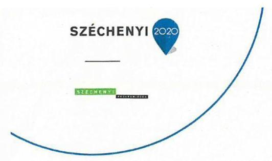

DOMOKOS LÁSZLÓ ÚR
ELNÖK
Állami Számvevőszék
1052 BUDAPEST,
APÁCZAI CSERE JÁNOS UTCA 10.

TÁRGY: észrevétel a V-0977-370/2016. iktató számú jelentéstervezetre

IKTATÓSZÁM: 2016 - 2016 /666
ÜGYINTÉZŐ: Fábics István

# TISZTELT DOMOKOS LÁSZLÓ ELNÖK ÚR! 

Az Állami Számvevőszék V-0977-370/2016. iktató számmal megküldött jelentéstervezetére az alábbi észrevételeket tesszük.

1. Észrevétel a 2013. évi beszámoló minősítésére.

Az Összegzésben tett megállapítás szerint:
„A 2013. évben a leltár nem volt teljes körű, ezért a mérlegtétel leltárral történő alátámasztásának hiányossága miatt a mérleg valódisága nem volt biztosított."

A jelentéstervezet 17-ik oldalán a 2.2. számú megállapítás szerint:
„LELTÁROZÁST végeztek mennyiségi felvétellel a 2013. évben, azonban a belső szabályzat és a jogszabály előírása nem érvényesült teljes körűen, mert:
a 2013. évi leltározás során a leltárkészítési és leltározási szabályzatban foglaltak ellenére nem készült leltározási utasítás és leltározási ütemterv, valamint a leltárfelelősök nem kerültek kijelölésre;

- a 2013. évi leltározás nem volt teljes körű, mert a mennyiségi felvétel nem terjedt ki a személyi használatra kiadott eszközökre - asztali számítógép, monitor, laptop, nyomtató, személygépkocsi, projektor, szerver, mobiltelefon - nettó értéke 70,3 millió Ft, ezzel megsértették a Számv. tv. 69.§ (3) bekezdésében foglaltakat. A személyi használatra kiadott eszközök vonatkozásában a mérlegtétel leltárral nem alátámasztott, ezért a mérleg valódisága nem volt biztosított.

A könyvvizsgáló nem kifogásolta a 2013. évi beszámoló auditálása során a személyi használatra kiadott eszközök mennyiségi felvétellel történő leltározásának elmaradását."

Az ellenőrzést követően is Társaságunk megpróbálta fellelni a
 2013. évi leltár dokumentumait. Az átvizsgálások során megtaláltuk a leltárkiértékelés eredeti példányát, amelyet levelünk 1. számú mellékleteként csatoljuk. A leltározás teljes körűen minden eszközre kiterjedt 2013.12.31-i fordulónapra
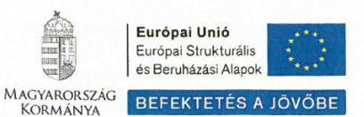

Széchenyi Programiroda Nonprofit Kft. 1053 Budapest, Szép u. 2. IV. em. info@szpi.hu
www.szpi.hu

---

vonatkozóan, beleértve a személyi használatra kiadott eszközöket is. Az Állami Számvevőszék vizsgálata egybeesett Társaságunk 2007-2013-as programozási időszak uniós forrásainak zárlati munkálataival, melynek során rendkívül szerteágazó figyelmet kellett fordítanunk a korábbi évekre, valamint azóta mind gazdasági igazgatói, mind osztályvezetői, mind könyvelői személyi változások is történtek, amelyek közrejátszottak a leltározási dokumentációk nehézkes fellelésében. Ez úton módosítjuk azon korábbi kijelentésünket, hogy a leltározás nem volt teljes körű a 2013. évben.

Kérem, hogy ennek megfelelően a mérleg valódiságára tett megállapításukat szíveskedjenek törölni. Ezen megállapítás szerepel a jelentés 5. oldala Összegzés, 6. oldala Főbb megállapítások, következtetések, 22. oldala A vagyonnal való gazdálkodás bekezdéseiben is.

Társaságunk ez ügyben megkereste az akkori választott könyvvizsgálóját, Dr. Serényi Iván könyvvizsgálót /Audit Service Kft./, aki megjegyzésünket maradéktalanul helyben hagyta.
2. Észrevétel az egyéb ráfordítások, pénzügyi műveletek ráfordításai, rendkívüli ráfordítások kockázatos besorolására.

A jelentéstervezet 19. oldalán a 3.1. számú megállapítás szerint:
„Az egyéb ráfordítások, pénzügyi műveletek ráfordításai, és a rendkívüli ráfordítások elszámolásának szabályszerű végrehajtása kockázatos volt, mert 2013. évben több kisösszegű vevőkövetelés leírását dokumentumokkal nem támasztották alá, ezért nem felelt meg a Számv. tv. 165.§ (1)-(2) bekezdéseiben foglaltaknak."

2013-ban a leírt vevőkövetelések összege összesen 69.944,- Ft (31 db tétel) volt a 2. számú melléklet szerint. Az egyéb ráfordítások, pénzügyi műveletek ráfordításai, rendkívüli ráfordítások 2013-ban 2.742.920,55 Ft összeget tettek ki a 3. számú melléklet szerint. A leírt vevőkövetelések állománya az összes ráfordításhoz képest 2,55%-ot képvisel. A vevőkövetelések behajtására a Társaság tett kísérleteket. Elfogadva a jelentéstervezet elszámolási hiányosságára vonatkozó megállapításait, az elszámolt összeg csekély értékére tekintettel kérjük a kockázatos minősítés nem megfelelőre változtatását.

Kérem szíveskedjen a jelentéstervezet véglegesítése során a fenti két észrevételünket figyelembe venni. A jelentéstervezet egyéb megállapításaira észrevételt nem kívánunk tenni.

Mellékletek:

- 1. számú melléklet Leltárkiértékelés 2013.
- 2. számú melléklet Főkönyvi kivonat_2013_8.számlaosztály, egyéb ráfordítások
- 3. számú melléklet Leírt vevőkövetelések_2013_8681

Budapest, 2016. június 21.

Tisztelettel:
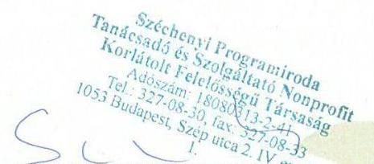

Schultz Gábor Ügyvezető

---

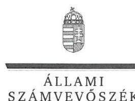

ELNÖK

Ikt.szám: V-0977-377/2016.

# Schultz Gábor úr 

ügyvezető
Széchenyi Programiroda
Tanácsadó és Szolgáltató Nonprofit Kft.

## Budapest

## Tisztelt Ügyvezető Úr!

A „Széchenyi Programiroda NKft. - Az állami tulajdonban (résztulajdonban) lévő gazdálkodó szervezetek vagyonmegőrzési és gazdálkodási tevékenységének ellenőrzése" címmel készített számvevőszéki jelentéstervezetre tett észrevételét köszönettel megkaptam.
Az Állami Számvevőszék észrevételre vonatkozó álláspontjáról a felügyeleti vezető által készített részletes tájékoztatást mellékelten megküldöm.

Budapest, 2016. júliusi hó 19 nap
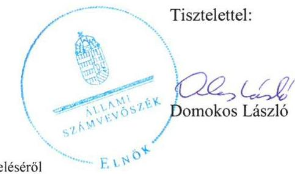

Melléklet: Tájékoztatás az észrevétel kezeléséről

---

# Tájékoztatás   az észrevétel kezeléséről 

A „Széchenyi Programiroda NKft. - Az állami tulajdonban (résztulajdonban) lévő gazdálkodó szervezetek vagyonmegőrzési és gazdálkodási tevékenységének ellenőrzése" címú jelentéstervezetre 2016. június 27-én érkezett észrevételek kezelésével kapcsolatban a következő tájékoztatást adom.
I. A 2013. évi beszámoló minősítésével kapcsolatos, a jelentéstervezet 2.2. számú megállapítására és az azt alátámasztó 5-6. bekezdésekre tett 1. észrevétel
A Széchenyi Programiroda NKft. ügyvezetője a 2015. november 30-án kelt Teljességi nyilatkozatban kijelentette, hogy az Állami Számvevőszék részére átadott dokumentumok teljes körű információkat tartalmaznak, és az ellenőrzéshez az ellenőrzött tárgykörben kért és átadott dokumentumokon kívül más adatokkal, iratokkal nem rendelkezik. Az Állami Számvevőszék az e nyilatkozat után az ellenőrzött szervezetektől beérkező dokumentumokat a jelentés elkészítésénél nem veszi figyelembe, mert azok valódiságáról az ellenőrzés során meggyőződni nem tudott. Erre való tekintettel a jelentéstervezetben rögzített megállapítás és a javaslat módosítására nem kerül sor. Javaslatunk éppen a körülmények teljes körű tisztázását szolgálja.
II. Az egyéb ráfordítások, pénzügyi műveletek ráfordításai, rendkívüli ráfordítások kockázatos besorolásával kapcsolatos, a jelentéstervezet 3.1. számú és az azt alátámasztó 9. bekezdésre tett észrevétel
A Széchenyi Programiroda NKft. ügyvezetője „elfogadva a jelentéstervezet elszámolási hiányosságára vonatkozó megállapításait" az elszámolt összeg csekély értékére (, 69.944,-Ft") tekintettel kérte a kockázatos minősítés nem megfelelőre változtatását. Az észrevétellel érintett megállapítás tartalmazza, hogy ,, a 2013. évben több kisösszegű vevőkövetelés leírását dokumentumokkal nem támasztották alá, ezért nem felelt meg... ". Vagyis a minősítés jelenleg is „nem megfelelő", amely a szabályszerűség szempontjából kockázatot jelent.
A fenti észrevételek alapján a jelentéstervezet módosítása nem indokolt.
Tájékoztatom, hogy a számvevőszéki jelentés függelékeként szerepeltetjük a jelentéstervezethez tett észrevételeit, valamint az arra adott válaszunkat.

Budapest, 2016. 04. hó 4. nap

Böröcz Imre
felügyeleti vezető

---

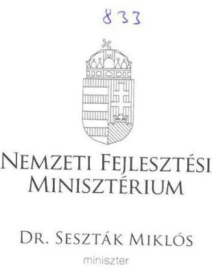

# Iktatószám: EFO/15576-1/2016-NFM 

Ügyintéző: Simonné Hábencius Gizella
Telefonszám: 79-54405
E-mail:gizella.habencius.simonne@nfm.gov.hu
Hiv. szám: V-0977-371/2016..

## Domokos László

elnök
részére
Állami Számvevőszék

## Budapest

Apáczai Csere János u. 10.
1052
Tárgy: Jelentéstervezet véleményezése

## Tisztelt Elnök Úr!

Köszönettel vettem kézhez ,,A Széchenyi Programiroda NKft. - Az állami tulajdonban (résztulajdonban) lévő gazdálkodó szervezetek vagyonmegőrzési és gazdálkodási tevékenységének ellenőrzése" címmel készített számvevőszéki jelentéstervezetet.

A jelentéstervezetre észrevételt nem teszek.
Budapest, 2016. június 23.

Üdvözlettel:
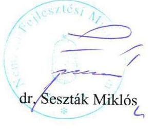

---

# RÖVIDÍTÉSEK JEGYZÉKE 

${ }^{1}$ Társaság/Széchenyi Programiroda NKft.
${ }^{2}$ NFM
${ }^{3}$ 1996. évi XXI. törvény
${ }^{4}$ 68/2011. (IV. 28.) Korm. rendelet
${ }^{5}$ VOP
${ }^{6}$ 1362/2014. (VI. 30.) Korm. határozat
${ }^{7}$ 161/2014. (VI. 30.) Korm. rendelet
${ }^{8}$ VÁTI NKft.
${ }^{9}$ NFÜ
${ }^{10}$ 475/2013. (XII. 17.) Korm. rendelet
${ }^{11}$ 19/2014. (IV. 14.) NFM rendelet
${ }^{12}$ NFFKÜ Zrt.
${ }^{13}$ ÁSZ
${ }^{14}$ MNV Zrt.
${ }^{15}$ Vtv.
${ }^{16} \mathrm{Vhr}$.
${ }^{17}$ Nvtv.
${ }^{18}$ tulajdonosi joggyakorló
${ }^{19}$ Alapító
${ }^{20}$ Számv. tv.
${ }^{21} \mathrm{FB}$
${ }^{22}$ SZMSZ
${ }^{23} \mathrm{Kbt} .1$
${ }^{24} \mathrm{Kbt} .2$
${ }^{25}$ Avtv.

Széchenyi Programiroda Tanácsadó és Szolgáltató Nonprofit Korlátolt Felelősségű Társaság. A Társaság a 2011. január 1. és 2011. március 10. közötti időszakban PROMEI Modernizációs és Euroatlanti Integrációs Projekt Iroda Nonprofit Korlátolt Felelősségű Társaság néven működött.
Nemzeti Fejlesztési Minisztérium
1996. évi XXI. törvény a területfejlesztésről és a területrendezésről

68/2011. (IV. 28.) Korm. rendelet a Széchenyi Programirodákról (hatályos 2011. április 29-étől)
Végrehajtási Operatív Program
1362/2014. (VI. 30.) Korm. határozat a VÁTI Magyar Regionális Fejlesztési és Urbanisztikai Nonprofit Korlátolt Felelősségű Társaság feladatellátását szabályozó egyes kormányzati intézkedésekről
161/2014. (VI. 30.) Korm. rendelet a VÁTI Magyar Regionális Fejlesztési és Urbanisztikai Nonprofit Korlátolt Felelősségű Társaság és urányrendeletek módosításáról (hatályos 2014. július 1-jétől, hatálytalan 2014. július 2-ától)

VÁTI Magyar Regionális Fejlesztési és Urbanisztikai Nonprofit Korlátolt Felelősségű Társaság
Nemzeti Fejlesztési Ügynökség
475/2013. (XII. 17.) Korm. rendelet a Nemzeti Fejlesztési Ügynökség megszüntetésével összefüggő egyes kérdésekről (hatályos 2013. december 18-ától)
19/2014. (IV. 14.) NFM rendelet a Nemzetközi Fejlesztési és Forráskoordinációs Ügynökség Zártkörűen Működő Részvénytársaságban az állami tulajdonú társasági részesedések felett az államot megillető tulajdonosi jogok és kötelezettségek összessége gyakorlójának kijelöléséről (hatályos 2014. április 15-étől)
Nemzetközi Fejlesztési és Forráskoordinációs Ügynökség Zártkörűen Működő Részvénytársaság
Állami Számvevőszék
Magyar Nemzeti Vagyonkezelő Zártkörűen Működő Részvénytársaság
2007. évi CVI. törvény az állami vagyonról

254/2007. (X. 4.) Korm. rendelet az állami vagyonnal való gazdálkodásról
2011. évi CXCVI. törvény a nemzeti vagyonról (hatályos 2011. december 31-étől)
2011. január 1. és 2012. november 29. között az NFM, 2012. november 30. és 2014. december 31. között a Miniszterelnökség
2011. január 1. és 2012. november 29. között az NFM, 2012. november 30. és 2014. december 31. között a Miniszterelnökség
2000. évi C. törvény a számvitelről

Felügyelő Bizottság
Szervezeti és működési szabályzat
2003. évi CXXIX. törvény a közbeszerzésekről (hatálytalan 2012. január 1-jétől)
2011. évi CVIII. törvény a közbeszerzésekről (hatályos 2011. augusztus 21-étől)
1992. évi LXIII. törvény a személyes adatok védelméről és a közérdekű adatok nyilvánosságáról (hatálytalan 2012. január 1-jétől)

---

${ }^{26}$ Eisz. tv.
${ }^{27}$ Info tv.
${ }^{28}$ Civil tv.
${ }^{29} \mathrm{Bkr}$.
${ }^{30}$ Közlemény
${ }^{31}$ Stabilitási tv.
${ }^{32}$ Áht.
${ }^{33}$ ÁSZ tv.
${ }^{34}$ Ptk.
${ }^{35} \mathrm{Pp}$.
2005. évi XC. törvény az elektronikus információszabadságról (hatálytalan 2012. január 1-jétől)
2011. évi CXII. törvény az információs önrendelkezési jogról és az információszabadságról (hatályos 2011. július 27-étől)
2011. évi CLXXV. törvény az egyesülési jogról, a közhasznú jogállásról, valamint a civil szervezetek működéséről és támogatásáról (hatályos 2011. december 22-étől)
370/2011. (XII. 31.) Korm. rendelet a költségvetési szervek belső kontrollrendszeréről és belső ellenőrzéséről
A nemzetgazdasági miniszter közleménye a kormányzati szektorba sorolt egyéb szervezetekről (megjelent a Hivatalos Értesítő 2013. évi 60. számában)
2011. évi CXCIV. törvény Magyarország gazdasági stabilitásáról
2011. év CXCV. törvény az államháztartásról (hatályos 2012. január 1-jétől)
2011. évi. LXVI. törvény az Állami Számvevőszékről
1959. évi IV. törvény a Polgári Törvénykönyvről
1952. évi III. törvény a polgári perrendtartásról

---

# ÁLLAMI SZÁMVEVŐSZÉK 

1052 Budapest, Apáczai Csere János utca 10.
Levélcím: 1364 Budapest 4. Pf. 54
Telefon: +36 1 4849100 Telefax: +36 1 4849200
www.asz.hu

