# Jelentés 

## Az önkormányzatok gazdasági társaságai

Az önkormányzatok többségi tulajdonában lévő gazdasági társaságok közfeladat ellátását érintő gazdálkodási tevékenysége szabályszerűségének ellenőrzése - ARIES Ipari, Kereskedelmi és Szolgáltató Nonprofit Kft. (Szigetszentmiklós) 2016.

Az ÁSZ az államháztartáson kívül működő közfeladat-ellátó rendszerek ellenőrzéseivel hozzájárul ahhoz, hogy a közpénzeket az államháztartáson kívül működő szervezetek is átlátható, rendezett módon használják fel a közfeladatok ellátása érdekében.

---

# Jelentés 

## Az önkormányzatok gazdasági társaságai

Az önkormányzatok többségi tulajdonában lévő gazdasági társaságok közfeladat ellátását érintő gazdálkodási tevékenysége szabályszerűségének ellenőrzése - ARIES Ipari, Kereskedelmi és Szolgáltató Nonprofit Kft. (Szigetszentmiklós)
2016. augusztus 9. nap
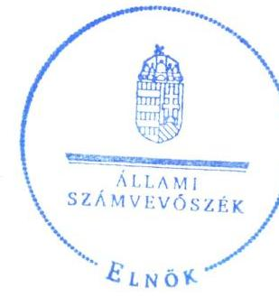

16124
www.asz.hu

Domokos László
elnök

Az ÁSZ az államháztartáson
kívül működő közfeladat-
ellátó rendszerek ellenőrzéseivel hozzájárul
ahhoz, hogy a közpénzeket
az államháztartáson
kívül működő szervezetek
is átlátható, rendezett
módon használják fel a
közfeladatok ellátása érdekében.
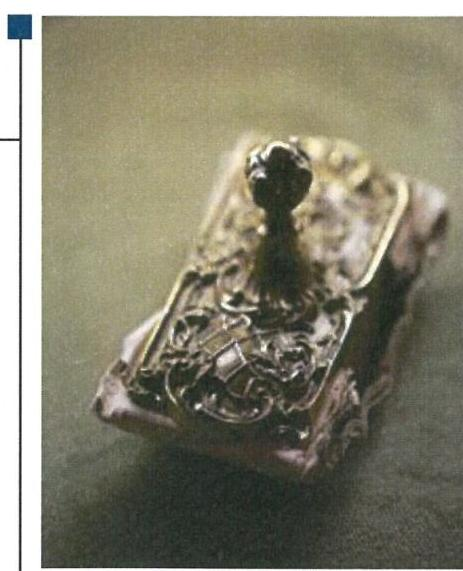

---

# AZ ELLENŐRZÉST FELÜGYELTE:

DR. HORVÁTH MARGIT felügyeleti vezető

## AZ ELLENŐRZÉST VEZETTE ÉS A VÉGREHAJTÁSÁÉRT FELELŐS:

- KLINGA LÁSZLÓ ellenőrzésvezető
- A PROGRAM ÖSSZEÁLLÍTÁSÁÉRT FELELŐS:
- JANIK JÓZSEF osztályvezető

IKTATÓSZÁM: V-0971-180/2016.

TÉMASZÁM: 2005

ELLENŐRZÉS-AZONOSÍTÓ SZÁM: V-070722

Jelentéseink az Országgyűlés számítógépes hálózatán és az Interneten a www.asz.hu címen is olvashatóak.

---

# TARTALOMJEGYZÉK 

■ ÖSSZEGZÉS ..... 5
■ AZ ELLENŐRZÉS CÉLJA ..... 7
■ AZ ELLENŐRZÉS TERÜLETE ..... 8
■ AZ ELLENŐRZÉS HÁTTERE, INDOKOLTSÁGA ..... 10
■ A JELENTÉS LÉNYEGES KÉRDÉSKÖREI ..... 11
■ ELLENŐRZÉS HATÓKÖRE ÉS MÓDSZEREI ..... 12
■ MEGÁLLAPÍTÁSOK ..... 14
■ JAVASLATOK ..... 29
■ MELLÉKLETEK ..... 31
I. sz. melléklet: Értelmező szótár ..... 31
II. sz. melléklet: Működési adatok ..... 34
III. sz. melléklet: A lakossági hulladékgazdálkodási díj alakulása 2011-2014 között ..... 35
IV. sz. melléklet: Mintavételi eljárások ellenőrzési területenként ..... 36
■ FÜGGELÉK: ÉSZREVÉTELEK ..... 37
■ RÖVIDÍTÉSEK JEGYZÉKE ..... 49

---

.

---

# ÖSSZEGZÉS 

Az Állami Számvevőszék a kizárólagos önkormányzati tulajdonú ARIES Ipari, Kereskedelmi és Szolgáltató Nonprofit Kft.-nél a hulladékgazdálkodási közfeladat ellátását érintő gazdálkodási tevékenysége 2011-2014 közötti szabályszerűségét ellenőrizte. Megállapította, hogy a közfeladat-ellátás önkormányzati megszervezése és a tulajdonosi jogok gyakorlása szabályosan történt. A szabályszerű vagyongazdálkodás biztosítása mellett a hulladékgazdálkodás közfeladata bevételeinek és ráfordításainak elszámolása megfelelő volt. Az önköltségszámítás szabályait meghatározták, az árképzés szabályszerűen történt. A Társaság kötelezettségállománya a működésre, a közfeladat-ellátásra nem jelentett kockázatot.

## Az ellenőrzés társadalmi indokoltsága

Az Állami Számvevőszék Stratégiájában megfogalmazta, hogy a helyi önkormányzatok gazdálkodásában rejlő pénzügyi kockázatok feltárásával, az államháztartáson kívülre nyújtott költségvetési támogatások és ingyenes vagyonjuttatások, valamint az államháztartáson kívül működő közfeladat-ellátó rendszerek ellenőrzéseivel hozzájárul ahhoz, hogy a közpénzeket az államháztartáson kívül működő szervezetek is átlátható, rendezett módon használják fel a közfeladatok szerződésben vállalt ellátása érdekében.

Magyarországon az intézmény-centrikus közfeladat-ellátás jellemző, de egyre jelentősebb a költségvetésen kívüli feladatellátás térnyerése. Ennek legfontosabb szereplői - a nonprofit szervezetek mellett - az önkormányzati tulajdonú gazdasági társaságok. Az önkormányzatok szervezetalakítási szabadságának következménye, hogy a korábban is vállalati formában működő közszolgáltatások mellett, mind a kötelező, mind az önként vállalt feladatok ellátásában a gazdasági társaságok kiemelt fontosságú szerephez jutottak.

## Főbb megállapítások, következtetések, javaslatok

Az Önkormányzat a hulladékgazdálkodás közfeladatának megszervezéséről a jogszabályi előírásoknak megfelelően döntött, annak ellátásáról a többségi tulajdonában lévő gazdasági társasága útján gondoskodott. Az Önkormányzat a Hgt. ${ }_{1,2}$ szerinti hulladékgazdálkodással összefüggő rendeletalkotási kötelezettségének 2011-2012-ben a díjak, 2013-2014-ben a közszolgáltatás tekintetében eleget tett, annak tartalma megfelelt az előírásoknak. Az Önkormányzat a hulladékgazdálkodási közszolgáltatást az ellenőrzött időszakban Szolgáltatói megállapodás és Közszolgáltatási szerződés ${ }_{1,2}$ alapján ellátta, amelyek tartalma az előírásokkal összhangban volt. A hulladékgazdálkodási terv készítési kötelezettségének 2012-ig az Önkormányzat, majd 2013-tól a közszolgáltató eleget tett.

A Képviselő-testület a vagyongazdálkodási rendelet ${ }_{1,2}$-ben, az SZMSZ-ben, valamint az Alapító Okiratban egymással összhangban meghatározta a tulajdonosi joggyakorlás szabályait, amelyet az előírásoknak megfelelően, szabályszerűen gyakorolt. A Társaságnál az Önkormányzat belső ellenőrzést nem végzett, azonban a külső szakértőkkel kötött szerződések alapján végzett ellenőrzésekkel erősítette a tulajdonosi kontrollt. A Képviselő-testület a társasági működés felügyeletét, a tulajdonosi ellenőrzési, beszámoltatási kötelezettségét az FB-n és a Tulajdonosi Bizottságon keresztül az előírásoknak megfelelően, szabályszerűen gyakorolta. A tulajdonosi döntések megalapozottságát az FB ellenőrző szerepe, a Tulajdonosi Bizottság kontrollja és a külső szakértők véleményezése elősegítette. A Társaság a feladatellátáshoz vagyonkezelésbe nem vett át vagyont, azt saját, illetve üzemeltetésre átvett eszközökkel látta el.

A közfeladat-ellátását szolgáló vagyonnal való gazdálkodás, annak nyilvántartása szabályszerű volt. A Társaság rendelkezett a Számv. tv. előírásainak megfelelő számviteli szabályzatokkal, amelyek elősegítették a szabályszerű működést és vagyongazdálkodást, továbbá tartalmazták a közfeladat-ellátás elkülönített nyilvántartásának szabályait. A Társaság vagyona 2011. január 1-jéről 2014. év végére 159,2 millió Ft-tal (35,3\%-kal) nőtt, amit elsősorban a

---

tárgyi eszközök állományának - 2014-ben megvalósult eszközbeszerzésekkel összefüggő - 51,9 millió Ft-tal és a követelések 89,3 millió Ft-tal történő növekedése befolyásolt. Az ARIES NKft. hosszúlejáratú kötelezettsége 2014-ben 71,3 millió Ft volt, amely a hulladékgazdálkodással összefüggő eszközbeszerzésekre igénybe vett lízing és részletre vásárlásból keletkezett. A Társaság rövid lejáratú kötelezettsége a 2014. év végén 148,4 millió Ft-ot tett ki. A növekvő kötelezettség állomány az ARIES NKft. likviditási helyzetét kedvezőtlenül befolyásolta, ennek ellenére kötelezettségeit határidőben teljesítette, azok állománya a működésre, a közfeladat ellátására nem jelentett kockázatot. A követelések állománya az ellenőrzött időszakban a 2011. év eleji 140,6 millió Ft-hoz képest a 2014. év végére 229,9 millió Ft-ra nőtt. A hulladékgazdálkodással összefüggő lakossági és közületi kintlévőségek a 2011. évhez viszonyítva nőttek, a 2014. év végére 103,2 millió Ft-ot tettek ki. A Társaság a Hgt. 1,2-ben előírtak figyelembe vételével kezdeményezte a hulladékgazdálkodással összefüggő követelések adók módjára történő behajtását. A Társaság az ellenőrzött időszakban nyereségesen gazdálkodott, mérleg szerinti eredménye a 2012. év végétől csökkent, az ellenőrzött időszak végén 26,2 millió Ft volt. A Társaság a hulladékgazdálkodásból a 2013. évben 13,7 millió Ft nyereséget realizált, míg a 2014. évben 14,6 millió Ft veszteséget mutatott ki.

Az ARIES NKft. az üzleti tervek teljesítéséről, az éves gazdálkodásról, azon belül a hulladékgazdálkodás közfeladatáról az éves beszámolók és üzleti jelentések keretében beszámolt a tulajdonos felé a Számv. tv.-ben és a Közszolgáltatási szerződés ${ }_{1,2}$-ben előírtaknak megfelelően. Az értékcsökkenés elszámolásának gyakoriságát a kiegészítő mellékletben nem mutatták be a Számv. tv.-ben előírtakkal ellentétben. A Társaság adatvédelmi szabályzattal 2011. júliustól rendelkezett, az adatvédelmi felelőst kijelölték. A Társaságnál a bevételek, költségek és ráfordítások elszámolása megfelelő volt, figyelembe véve a jogszabályok és a belső szabályozás előírásait. Az önköltségszámítás szabályozása megfelelt az előírásoknak, amely alapján az alkalmazott módszer biztosította a közszolgáltatás díjának megalapozottságát és a szabályszerű árképzést.

---

# AZ ELLENŐRZÉS CÉLJA 

Az ellenőrzés célja annak értékelése, hogy az Önkormányzat a jogszabályi előírások figyelembevételével döntött-e az ellenőrzésre kerülő közfeladat megszervezéséről; az önkormányzat/tulajdonosi joggyakorló szabályszerűen gyakorolta-e a tulajdonosi jogokat.

Ellenőriztük, hogy a gazdasági társaság közfeladat-ellátása bevételeinek, ráfordításainak elszámolása, és vagyongazdálkodási tevékenysége megfelelt-e a jogszabályi, illetve a közszolgáltatási/vagyonkezelési szerződésben foglalt tulajdonosi előírásoknak, azok végrehajtása szabályszerű volt-e.

Értékeltük továbbá, hogy a gazdasági társaság kötelezettségállománya jelent-e kockázatot a működésre, illetve a közfeladat ellátására; valamint hogy a közfeladatok átláthatósága és elszámoltathatósága érdekében biztosítva volt-e a közszolgáltatás díjának megalapozottsága szabályszerű önköltségszámítással.

---

# **AZ ELLENŐRZÉS TERÜLETE**

## **Szigetszentmiklós Város Önkormányzata és az ARIES Ipari, Kereskedelmi és Szolgáltató Nonprofit Korlátolt Felelősségű Társaság**

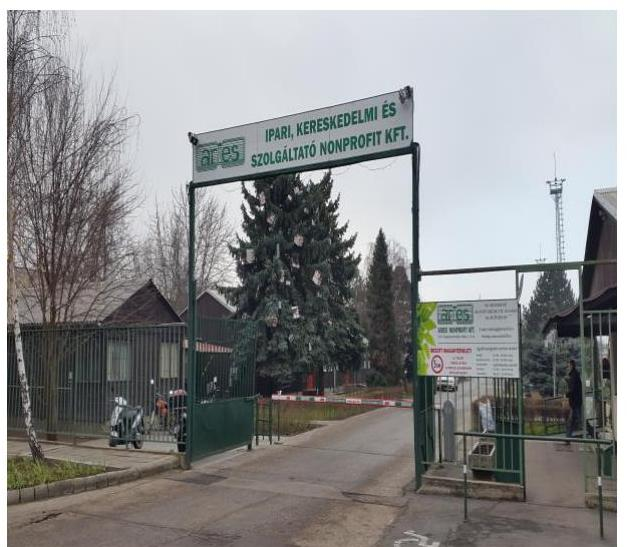

### **SZIGETSZENTMIKLÓS VÁROS ÖNKORMÁNYZATA**

Az ARIES Ipari, Kereskedelmi és Szolgáltató Kft.-t a 77/1991. (V. 9.) számú határozatával alapította. Az ARIES Ipari, Kereskedelmi és Szolgáltató Kft. 2011. január 1-jétől 2011. március 30-áig 75%-os, majd azt követően 100%-os önkormányzati tulajdonban volt az ellenőrzött időszakban. A Képviselő-testület 2011. március 21-én hozott határozatában a Társaság 100%-os tulajdonba vételéről, a Pro Urbe Alapítvány 25%-os üzletrészének névértéken történő megvásárlásáról döntött. A Képviselő-testület 2013. október 31-én kelt határozatával döntött a Társaság nonprofit társasággá történő átalakításáról, így annak elnevezése ARIES Ipari, Kereskedelmi és Szolgáltató Nonprofit Kft.-re változott.

Az Önkormányzat vagyonkezelésre nem adott át eszközöket a Társaság részére, amely a közszolgáltatási feladatait a saját tulajdonú vagyontárgyakon túl üzemeltetésre átvett eszközökkel látta el. Az ellenőrzött időszakban az Önkormányzat két gazdasági társaságban is rendelkezett többségi tulajdonnal, kizárólagos tulajdonosa volt a Szigeti Vízművek Kft.-nek és a Szigetszentmiklósi Városfejlesztő Kft.-nek is.

### **AZ ARIES IPARI, KERESKEDELMI ÉS SZOLGÁLTATÓ NONPROFIT KFT.**

Főtevékenysége Szigetszentmiklós, Szigethalom és Halásztelek közigazgatási területén a nem veszélyes hulladék begyűjtése, szállítása, előkezelése volt. Az egyéb tevékenységei körébe tartozott Szigetszentmiklós Város közigazgatási területén belül többek között a távhőszolgáltatás, a közterület kezelés, a parkfenntartás, a síkosság-mentesítés, valamint az ingatlankezelés és bérbeadás. Szigetszentmiklós város közigazgatási területén az ellátott kommunális egységek száma a 2014. év végén 13 601 háztartás és 447 közület volt. Emellett Szigethalom 5778 háztartási és 91 közületi, míg Halásztelek 3422 háztartási és 78 közületi kommunális egységeit kezelte. A Társaság 2014-ben 13 143 tonna lakossági kommunális hulladék elszállítását végezte el. A Társaság más gazdasági társaságban tulajdoni hányaddal nem rendelkezett, átlagos statisztikai állományi létszáma 2011-ben 109 fő, 2014-ben 106 fő volt.

---

Az ARIES Ipari, Kereskedelmi és Szolgáltató Nonprofit Kft. gazdálkodásának egyes adatait a 2011. és a 2014. évek vonatkozásában az 1. ábra szemlélteti:
1. ábra
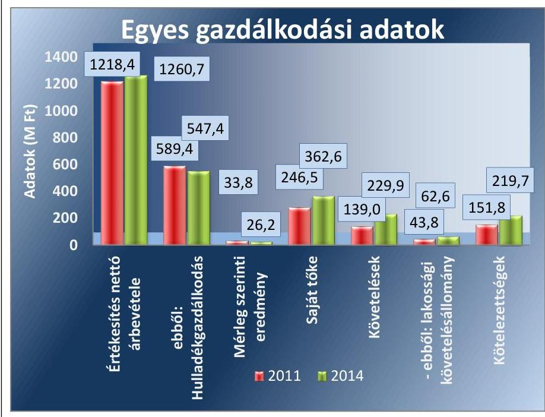

Forrás: A Társaság 2011. és 2014. évi beszámolói

A Társaság jegyzett tőkéje az ellenőrzött időszakban nem változott, 50,0 millió Ft volt. A Társaság mérlegfőösszege 2011-ben 464,3 millió Ft, 2014-ben 610,4 millió Ft volt. A saját tőke összege 2011. január 01-én 246,5 millió Ft volt, amely 2014. év végére 362,6 millió Ft-ra, 47,1\%-kal emelkedett. Az értékesítés nettó árbevétele a 2011. és a 2014. év vége között 3,5\%-kal nőtt, míg a hulladékgazdálkodási közfeladat nettó árbevétele 7,2\%-kal csökkent. A mérleg szerinti eredmény pozitív volt a 2011-2014. években. A követelések 65,3\%-kal emelkedtek, ezen belül a hulladékgazdálkodással összefüggő lakossági követelésállomány 42,9\%-kal nőtt.

Az ARIES Ipari, Kereskedelmi és Szolgáltató Nonprofit Kft. működésének főbb jellemzőit a 2. számú melléklet mutatja be.

Az ellenőrzött időszakban a polgármester, a jegyző és az ügyvezető személye nem változott. A polgármester a 2006. évi önkormányzati választások óta, a jegyző 2009. december 18. napjától látja el feladatait. Az ügyvezető 1991. május 15-étől tölti be tisztségét.

---

# **AZ ELLENŐRZÉS HÁTTERE, INDOKOLTSÁGA**

*Az önkormányzatok közfeladat-ellátásában egyre jelentősebb a gazdasági társaságok útján történő feladatellátás térnyerése.*

## **AZ ÖNKORMÁNYZATI TULAJDONÚ GAZDASÁGI TÁRSASÁGOK**

Társaságok teljes körű ellenőrzésének lehetőségét az Állami Számvevőszékről szóló 1989. évi XXXVIII. törvény 2011. január 1-jétől hatályos módosítása teremtette meg. A gazdasági társaságok közfeladat ellátását érintő gazdálkodási tevékenysége szabályszerűségére irányuló ellenőrzéseket erre tekintettel a 2011. évtől végezzük. A közfeladatot ellátó gazdasági társaságok ellenőrzése kiemelten fontos a vagyon megőrzése, megóvása érdekében, valamint a kormányzati szektor elszámolásaiban megjelenő önkormányzati tulajdonú gazdálkodó szervezetek esetében, amelyekkel szemben alapvető követelmény, hogy gazdálkodásuk, működésük szabályszerű, az általuk szolgáltatott adatok minél megbízhatóbbak legyenek. A közfeladat ellátás költségeinek, ráfordításainak alakulása, színvonala hatással van a lakosság elégedettségére.

## **AZ ELLENŐRZÉS VÁRHATÓ HASZNOSULÁSA-KÉNT**

Az ÁSZ1 a megállapításaival segítséget nyújthat az államháztartáson kívüli közfeladat-ellátás értékeléséhez, jogszabályi keretei pontosításához, átláthatóságot biztosító szabályozásához. Meghatározhatóvá válnak a

 közfeladat ellátásban részt vevő államháztartáson kívüli szervezeteknek – az önkormányzat költségvetését, pénzügyi helyzetét is befolyásoló – kockázatai, lehetővé válik ezen kockázatok csökkentése. Ellenőrzéseink feltárhatják, hogy az önkormányzat közfeladat-ellátási kötelezettségének szabályszerűen tett-e eleget, a feladatellátáshoz rendelt közvagyon működtetését a tulajdonostól elvárható gondossággal, szabályszerűen szervezte-e meg és a tulajdonosi felügyelete hozzájárult-e a közfeladat szabályszerű ellátásához. Értékelhetővé válik, hogy a feladatot ellátó gazdasági társaság a közszolgáltatási szerződésben foglaltak betartásával, a közvagyon használatával biztosította-e a szolgáltatás folytatásának feltételeit. Ezzel az ellenőrzöttek és a helyi döntéshozók számára az ÁSZ visszajelzést ad feladatszervezési, feladat-ellátási kockázataikról, alapot ad a meglévő hibák megszüntetéséhez, a jobb közfeladat-ellátás biztosításához. Mindezeken keresztül az ÁSZ hozzájárul Magyarország közpénzügyi helyzetének javításához, a közpénzek mérhető módon történő, a döntéshozók által meghatározott célok szerinti felhasználásához.

---

# A JELENTÉS LÉNYEGES KÉRDÉSKÖREI 

1. Az önkormányzat közfeladat megszervezéséről szóló döntése, valamint tulajdonosi joggyakorlása szabályszerű volt-e?
2. A gazdasági társaság vagyongazdálkodása szabályszerű volt-e, kötelezettségállománya jelentett-e kockázatot a működésre, illetve a közfeladat ellátásra?
3. A gazdasági társaságnál az ellátott közfeladat bevételei és ráfordításai elszámolása, valamint az önköltségszámítás és árképzés szabályszerű volt-e?

---

# ELLENŐRZÉS HATÓKÖRE ÉS MÓDSZEREI 

## Az ellenőrzés típusa

Megfelelőségi ellenőrzés

## Az ellenőrzött időszak

A 2011. január 1-jétől 2014. december 31-éig terjedő időszak.

## Az ellenőrzés tárgya

A közfeladatot gazdasági társaságokkal ellátó önkormányzatok tulajdonosi joggyakorlása, valamint gazdasági társaságok pénz- és vagyongazdálkodásának szabályozottsága és szabályszerűsége.

Az ellenőrzés kiterjed minden olyan körülményre és adatra, amely az ÁSZ jogszabályban meghatározott feladatainak teljesítéséhez, valamint a program végrehajtása folyamán felmerült újabb összefüggések feltárásához szükséges.

## Az ellenőrzött szervezet

Szigetszentmiklós Város Önkormányzata és az ARIES Ipari, Kereskedelmi és Szolgáltató Nonprofit Korlátolt Felelősségű Társaság

## Az ellenőrzés jogalapja

Az ellenőrzés végrehajtásának jogszabályi alapját az Állami Számvevőszékről szóló 2011. évi LXVI. törvény 5. § (3)-(4)-(5) bekezdései képezték.

## Az ellenőrzés módszerei

Az ellenőrzést a nemzetközi standardokat irányadónak tekintve az ellenőrzési program ellenőrzési kérdései, az ellenőrzött időszakban hatályos jogszabályok, az ellenőrzés szakmai szabályok és módszertanok figyelembe vételével végeztük.

Az ellenőrzés ideje alatt az ellenőrzött szervezettel történő kapcsolattartást az ÁSZ Szervezeti és Működési Szabályzatának vonatkozó előírásai alapján biztosítottuk.

---

Az ellenőrzés a kiválasztott, többségi tulajdonosi jogokat gyakorló önkormányzatra, illetve az ellenőrzött közfeladatot ellátó gazdasági társaságra terjedt ki. Az ellenőrzött gazdasági társaságnál, amennyiben az több közfeladatot is ellát, akkor az ellenőrzésre kiválasztott közfeladat-ellátást ellenőriztük.

Az ellenőrzést a kérdésekre adott válaszok kiértékelésével, valamint a megjelölt adatforrások, a csatolt tanúsítványok felhasználásával, továbbá az adott időszakban hatályos jogszabályok figyelembe vételével folytattuk le. Az ellenőrzési kérdések megválaszolásához szükséges bizonyítékok megszerzése a következő ellenőrzési eljárások alkalmazásával történt: megfigyelés, kérdésfeltevés (információkérés), összehasonlítás, valamint elemző eljárás.

A bevételek és ráfordítások elszámolása, valamint a vagyonnyilvántartás terén az egyes területek szabályszerű működését mintavétellel ellenőriztük, ez alapján a sokaságokban előforduló hibás tételek arányát becsültük. A jogszabályoknak és a belső előírásoknak megfelelőnek, azaz szabályszerűnek tekintettük az adott bevételek és ráfordítások elszámolását, a vagyonnyilvántartást, amennyiben a minta ellenőrzésének eredménye alapján 95%-os bizonyossággal a teljes sokaságban a hibaaránya kisebb volt, mint 10%, nem megfelelőnek értékeltük, ha a hibás tételek aránya a 10%-ot meghaladta.

---

# 1. Az önkormányzat közfeladat megszervezéséről szóló döntése, valamint tulajdonosi joggyakorlása szabályszerű volt-e? 

Összegző megállapítás

Az Önkormányzat a jogszabályok és a helyi szabályozás betartásával szervezte meg a hulladékgazdálkodást, a tulajdonosi jogait szabályszerűen gyakorolta.

### 1.1. számú megállapítás

A közfeladat-ellátást az Önkormányzat szabályszerűen szervezte meg, a hulladékgazdálkodási tervkészítési, rendeletalkotási és a közszolgáltatási szerződés megkötése kötelezettségének a vonatkozó jogszabályi előírások alapján eleget tettek.

Az Önkormányzat az Ötv. 91. § (6) bekezdése, 2013. január 1-jétől a Mötv. 116. § (3)-(4) bekezdése ellenére gazdasági programmal nem rendelkezett.

A Képviselő-testület ${ }^{4}$ az Integrált Városfejlesztési Stratégia helyzetelemzésében bemutatta a hulladékgazdálkodás feladatát, az ARIES NKft. ${ }^{5}$ szerepét és tevékenységét. Az Önkormányzat 2011-2016. évekre szóló Környezetvédelmi Programja tartalmazta a hulladékgazdálkodással, begyűjtésével, feldolgozással, az illegális lerakóhelyek felszámolásával, továbbá a hasznosítás lehetséges módjaival kapcsolatos feladatokat.

Az Önkormányzat az Nvtv. 9. § (1) bekezdésében előírt kötelezettségének eleget tett, a 2013-2018. évekre középtávú, a 2013-2023. időszakra hosszú távú vagyongazdálkodási tervet készített, amelyet a Képviselő-testület határozatban elfogadott.

Az Önkormányzat a Hgt. ${ }^{6}$ 35. § (1) bekezdésében foglaltaknak megfelelően kidolgozta a települési szilárd hulladékkal kapcsolatos hulladékgazdálkodási tervét. A hulladékgazdálkodási tervet a Hgt. 35. § (3) bekezdésében előírtak szerint a Képviselő-testület rendeletben hirdette ki. A hulladékgazdálkodási terv tartalma a Hgt. 37. § (4) bekezdése előírásainak megfelelt, a III. Nemzeti Környezetvédelmi Programban foglalt célokkal, feladatokkal és a település rendezési tervével összhangban került kidolgozásra.

A Hgt. 78. § (1) bekezdésében foglaltak alapján - 2013. január 1-jétől - a hulladékgazdálkodási tervet a közszolgáltatónak kellett elkészítenie, amelynek az ARIES NKft. eleget tett. A 2013-2016. évekre szóló hulladékgazdálkodási tervet a Képviselő-testület rendeletben elfogadta.

## A KÖZTISZTASÁG ÉS A TELEPÜLÉSTISZTASÁG BIZTOSÍTÁSA az Ötv. 8. § (1) bekezdése* alapján az Önkormányzat

[^0]
[^0]:    * A helyi közügyek, valamint a helyben biztosítható közfeladatok körében ellátandó helyi önkormányzati feladatként a hulladékgazdálkodást 2013. január 1-jétől az Mötv. 13. § (1) bekezdés 19. pontja írja elő.

---

törvényi kötelezettsége. A Képviselő-testület a hulladékgazdálkodással összefüggő feladatainak gazdasági társasággal történő ellátásáról az ellenőrzött időszak előtt döntött. Az Önkormányzat a hulladékgazdálkodási közfeladatát szabályszerűen szervezte meg, közigazgatási területén a szilárd hulladék gyűjtéséről, ártalmatlanításáról, hasznosításáról és a közterületek tisztántartásáról az ARIES NKft. közreműködésével gondoskodott.

Az Önkormányzat a Hulladékgazdálkodási rendeletben ${ }^{8}$ és a Település tisztaságáról és a közszolgáltatás szabályairól szóló rendeletben ${ }^{9}$ előírta, hogy Szigetszentmiklós város közigazgatási területén a települési hulladékkal kapcsolatos kötelező helyi közszolgáltatás teljesítésre az ARIES NKft. jogosult. Az SZMSZ ${ }^{10}$ tartalmazta a hulladékgazdálkodási közfeladat-ellátással kapcsolatban a települési szilárd hulladék gyűjtéséről, elhelyezéséről, valamint az elhagyott hulladékokkal, a közterületek tisztán tartásával, lomtalanítással kapcsolatos feladatok szervezéséről való gondoskodást. Az Önkormányzat önként vállalt feladatai között vállalta a szelektív hulladékkezelési közszolgáltatásról, a háztartásokban keletkezett építési és zöldhulladék összegyűjtéséről történő gondoskodást.

A Képviselő-testület az ARIES NKft. Alapító Okiratában ${ }^{12}$ főtevékenységként jelölte ki a hulladékkezelést és gyűjtést.

# A SZOLGÁLTATÓI MEGÁLLAPODÁS ${ }^{13}$ ÉS A KÖZ-

SZOLGÁLTATÁSI SZERZŐDÉS ${ }^{14}$ alapján az ARIES NKft. feladata volt a települési szilárd hulladék természetes személyektől történő átvétele, a hulladékgazdálkodási közszolgáltatás körébe tartozó hulladékok elszállítása, a kapcsolódó hulladékgazdálkodási feladatok ellátása. Ennek keretében a gyűjtőedények biztosítása, cseréje, pótlása, a lomtalanítási szolgáltatás megszervezése és lebonyolítása, begyűjtőhelyek működtetése, szelektív hulladék begyűjtése, valamint a hulladékgazdálkodási közszolgáltatással érintett hulladékgazdálkodási létesítmény fenntartása, üzemeltetése. Előírták a hulladék elszállítás gyakoriságát, menetrendjét, valamint a díjak beszedését.

Az Önkormányzat és a Társaság ${ }^{16}$ között 1997. február 12-én kötött, többször módosított Szolgáltatói megállapodás tartalma a 2011. január 1. és 2012. június 1. közötti időszakban megfelelt a Hgt.: 28. § (3) és a 224/2004. (VII. 22) Korm. rendelet ${ }^{17}$ 11-14. § előírásainak.

A 2012. július 1-jétől hatályos Közszolgáltatási szerződés a Hgt.: 28. § (3) előírásainak megfelelően a törvényi maximális 10 évre kötötték és hat hónapos felmondási időt határoztak meg benne. A Közszolgáltatási szerződés tartalmazta a 224/2004. (VII. 22) Korm. rendelet 13. § (3) bekezdésében előírtakat, így a közszolgáltatás díjának megállapítására vonatkozó módszer leírását.

Az Önkormányzat és a Társaság között 2014. július 1-jétől hatályba lépett Közszolgáltatási szerződés tartalmazta a Hgt.: 23. § (4) bekezdésében és a 317/2013. (VIII. 28.) Korm. rendelet ${ }^{18} 4$. § (1)-(3) bekezdéseiben foglalt előírásoknak.

A HULLADÉKGAZDÁLKODÁSI RENDELET ${ }^{19}$ megalkotásával az Önkormányzat eleget tett a Hgt.: 23. § a) pontjában, valamint a Hgt.: 235. § a) pontjában foglalt előírásnak. A Hulladékgazdálkodási rendelet célja azoknak a helyi szabályoknak a megállapítása volt, amelyek biztosították - az Ötv. 8. § (1) bekezdése, valamint az Mötv. 13. § (1) bekezdés 19.

---

pontja alapján - Szigetszentmiklós közigazgatási területén a köztisztasággal, a települési szilárd hulladék elszállításával összefüggő feladatok eredményes végrehajtását, a hulladékgazdálkodási közszolgáltatás ellátásának és igénybevételének rendjét. A Hulladékgazdálkodási rendeletben meghatározták a helyi közszolgáltatás tartalmát, ellátásának rendjét és módját, a közszolgáltató és az ingatlantulajdonos ezzel összefüggő jogait és kötelezettségeit, valamint a közszolgáltatási díj fizetésének szabályait. Előírták továbbá a közszolgáltatás szüneteltetésére, a szabálysértésekre, a lomtalanításra vonatkozó rendelkezéseket.

A Képviselő-testület 2013 júliusában jóváhagyta a Település Tisztaságáról és a közszolgáltatás szabályairól szóló rendeletet, melyben a Hulladékgazdálkodási rendeletet hatályon kívül helyezték. A Település tisztaságáról és a közszolgáltatás szabályairól szóló rendeletben a Hgt. 235. § a)-g) pontjaiban előírtaknak megfelelően meghatározták a közszolgáltatás ellátásának és igénybevételének szabályait. Előírták továbbá a közterületi hulladékokkal, a szelektív hulladékgyűjtéssel kapcsolatos szabályokat, továbbá a díjalkalmazási és díjfizetési feltételeket, megfelelve ezzel a Hgt. 88. § (4) bekezdés a)-d) pontjaiban előírtaknak.

# 1.2. számú megállapítás 

A tulajdonosi jogok gyakorlása szabályszerű volt. Az Önkormányzat belső ellenőrzése a Társaságnál nem végzett ellenőrzést, ugyanakkor a külső szakértők által végzett ellenőrzésekkel erősítették a tulajdonosi kontrollt.

A TULAJDONOSI JOGOK gyakorlásának rendjét az Önkormányzat a vagyongazdálkodási rendeletben, az SZMSZ-ben, valamint az Alapító Okiratban határozta meg. Az ARIES NKft.-re vonatkozó tulajdonosi jogok a Képviselő-testületet illették meg, amit szabályszerűen gyakorolt. A vagyongazdálkodási rendeletben meghatározták, hogy a tulajdonosi jogok gyakorlása során mely döntésekben köteles kizárólagosan a Képviselő-testület dönteni, illetve átruházott hatáskörben a tulajdonosi jogokat az általa megbízott bizottság, vagy a polgármester ${ }^{23}$ gyakorolhatta.

Az ellenőrzött időszakban a Képviselő-testület kizárólagos hatáskörébe tartoztak mindazok a döntések, amelyeket a Gt. ${ }^{24}$ 141. § (2) bekezdése, valamint a Ptk. ${ }^{25} 3:188. § (2) bekezdése meghatározott.

A vagyongazdálkodási döntések (üzleti terv elfogadása, beszámoló jóváhagyása) a Tulajdonosi Bizottság véleményezése mellett, az FB${ }^{26}$ jóváhagyásával, az ügyvezető előterjesztésével születtek meg önkormányzati határozat formájában. Az ellenőrzött időszakban az FB ellenőrző szerepe, a Tulajdonosi Bizottság kontrollja és a külső szakértők véleményezése mellett születtek meg a Társasággal kapcsolatos tulajdonosi döntések.

A Gt. 19. § (4) bekezdésében, valamint a Ptk. 3:109. § (2) bekezdésében foglaltaknak megfelelően az ügyvezetőnek, az FB tagjainak és a könyvvizsgálónak a megválasztása, visszahívása, a beszámoló és az üzleti terv jóváhagyása az alapító kizárólagos hatáskörébe tartozott.

Az FB a Gt. 34. § (1) bekezdésében, valamint a Ptk. 3:121. § (1) bekezdésében előírtakat figyelembe véve három tagból állt. Az FB a Gt. 34. § (4) bekezdésében, illetve a Ptk. 3:122. § (3) bekezdésében foglaltaknak meg-

---

felelően rendelkezett ügyrenddel. Az FB a Gt. 35. § (3) bekezdésének, illetve a Ptk. 3:120. § (2) bekezdésének megfelelően minden évben írásbeli jelentést készített az ARIES NKft. számviteli beszámolójáról.

Az anyagi ösztönzési rendszert a Taktv. ${ }^{27}$ 5. § (3) bekezdése alapján kötelezően megalkotott
 javadalmazási szabályzat ${ }_{1}{ }^{28} \cdot{ }_{2}{ }^{29}$ -ben rögzítettek, amelyet a Képviselő-testület elfogadott. A javadalmazási szabályzat ${ }_{1,2}$ a Társaság FB tagjainak, a vezető tisztségviselőinek és vezető állású munkavállalóinak javadalmazásáról, valamint a jogviszony megszűnése esetére biztosított juttatások módjáról rendelkezett. A szabályzatban előírták, hogy teljesítménykövetelményként az üzleti terv fő számainak teljesítése mellett csak olyan feltétel határozható meg, amelynek teljesítése a munkakör elvárható szakértelemmel és gondossággal való ellátásán túlmutató objektíven meghatározható teljesítményt takar. Meghatározták továbbá a teljesítménykövetelményhez kapcsolódó juttatás fizetésére az előírt feltételek teljesítésének követelményét. Fő feltétel volt, hogy a Társaságnak az üzleti év végén nem lehetett köztartozása. A teljesítménykövetelményhez kapcsolódó juttatás éves mértéke nem haladhatta meg az éves javadalmazás 100%-át.

AZ ÁRKÉPZÉS SZABÁLYAIT a 2012. év végéig a Hulladékgazdálkodási rendeletben határozta meg az Önkormányzat. A Hgt. ${ }_{1,2}$ díjakra vonatkozó változásainak megfelelően több alkalommal módosították a Hulladékgazdálkodási rendeletet.

A díjak megállapítása 2012. december 31-ig a Hgt. ${ }_{1}$ 57. § (1) bekezdésében előírtaknak megfelelt, azok a Hgt. ${ }_{1}$ 25. § (4) bekezdésében előírtaknak megfelelően költségkalkulációval alátámasztottak voltak.

A Hgt. ${ }_{1}$ 57. § 2012. április 7-étől hatályos módosításának megfelelően a 120 literes tárolóedényre vetítve az egyszeri ürítési díjat nettó 369 Ft-ban határozták meg, az előírás a díjat nettó 650 Ft-ban maximálta. 2013. január 1-jétől a hulladékgazdálkodási díjat a MEKH ${ }^{30}$ javaslatának figyelembevételével a miniszter ${ }^{+}$rendeletben állapítja meg. A szilárd hulladék közszolgáltatási díjának megállapítása ettől az időponttól már nem önkormányzati feladat volt.

Az Önkormányzat díjmegállapításának kialakítása szabályszerű volt. A közszolgáltatás díjai a 64/2008. (III. 2.) Korm. rendelet 3.-4. §-aiban foglaltaknak megfeleltek, és a Hgt. ${ }_{1}$ 57. §-ában, illetve a Hgt. ${ }_{2}$ 91. §-ában meghatározott maximális mértéket nem haladták meg.

A BESZÁMOLTATÁSI RENDSZER keretében az Önkormányzat az ARIES NKft. ügyvezetőjét a gazdálkodásról, valamint a közszolgáltatási tevékenységről a Társaság 2011-2014. évi éves számviteli beszámolóin keresztül beszámoltatta. A számviteli beszámolókat az FB előzetes írásbeli véleményezését követően a Gt. 35. § (3) bekezdésében, illetve a Ptk. 2 3:120. § (2) bekezdésében előírtaknak megfelelően a Képviselő-testület elfogadta. A Képviselő-testület döntött továbbá az éves üzleti tervek elfogadásáról is.

[^0]
[^0]:    ${ }^{+}$Nemzeti Fejlesztési Miniszter

---

Az üzleti terv készítésének kötelezettségét a vagyongazdálkodási rendeletben közvetve írta elő az Önkormányzat azzal, hogy annak elfogadását a Képviselő-testület hatáskörébe utalta. Az FB-nek és a Tulajdonosi Bizottságnak a Társaság üzleti tervei és számviteli beszámolói elfogadását megelőzően véleményezési kötelezettséget írtak elő.

A TÁRSASÁGNÁL ELLENŐRZÉST az Önkormányzat a belső ellenőrzése a 2011-2014. években nem végeztetett. Az éves belső ellenőrzési tervek nem tartalmazták a Társaság ellenőrzési kötelezettségét.

Az ellenőrzött időszakban az Önkormányzat két külső szakértővel kötött szerződést tanácsadói és ellenőrzési munkákra. A külső szakértői ellenőrzések az éves üzleti tervek és beszámolók tekintetében szerkezeti, logikai, törvényességi és megfelelőségi, egyezőségi szempontú felülvizsgálatot végeztek. Az éves beszámolók ellenőrzésének tapasztalatait az FB és a Tulajdonosi Bizottság is megtárgyalta.

Az ARIES NKft. mérleg szerinti eredménye a 2011-2014. években pozitív volt. Minden évben - változó mértékben - nyereséget realizált, ami a 2011. évi 33,8 millió Ft-ról a 2014. év végére 26,2 millió Ft-ra csökkent. A saját tőke - a 2011. évi 280,6 millió Ft-ról 362,6 millió Ft-ra emelkedett - minden ellenőrzött évben jelentősen meghaladta a jegyzett tőke 50,0 millió Ft-os összegét, ezért a Gt. 143. § (2) bekezdés a) pontja, illetve a Ptk. 2 3:189. § (2) bekezdése szerinti intézkedés megtétele nem vált szükségessé. A saját tőke összege a 2011. évben közel hatszorosával, a 2012. és a 2013. évben több mint hatszorosával, a 2014. évben több mint hétszeresével haladta meg a jegyzett tőke összegét.

A saját tőke, a jegyzett tőke, valamint a mérleg szerinti eredmény alakulását a 2. ábra mutatja be.
2. ábra

A saját tőke alakulása (millió Ft)
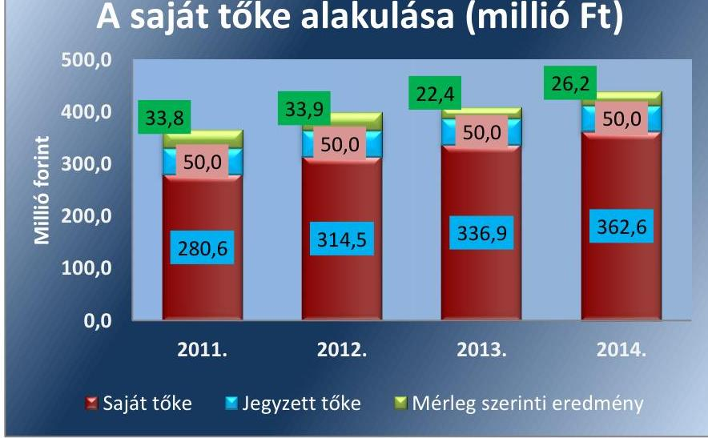

Forrás: 2011-2014. évi beszámolók

---

# 2. A gazdasági társaság vagyongazdálkodása szabályszerű volt-e, kötelezettségállománya jelentett-e kockázatot a működésre, illetve a közfeladat ellátásra? 

Összegző megállapítás

2.1. számú megállapítás

A Társaság vagyongazdálkodása szabályszerű volt, kötelezettségállománya a működésre, a közfeladat ellátására nem jelentett kockázatot.

Az előírt számviteli szabályzatokkal rendelkeztek, azok megfeleltek a vonatkozó jogszabályokban foglaltaknak, tartalmazták a közfeladat ellátás elkülönített nyilvántartásának szabályait.

A Társaság vagyongazdálkodási tevékenysége, illetve annak végrehajtása a jogszabályi előírásoknak, illetve a Szolgáltatói megállapodás és a Közszolgáltatási szerződés ${ }_{1,2}$-ben foglalt tulajdonosi előírásoknak megfelelt.

AZ ÜZLETI TERVEKET az ügyvezető terjesztette elő, amit a Képviselő-testület minden évben jóváhagyott. Az FB és a Tulajdonosi Bizottság a Társaság üzleti terveit - az előírásnak megfelelően - az elfogadást megelőzően véleményezte és elfogadásra javasolta. Az éves üzleti tervek összhangban voltak az Önkormányzat közfeladat-ellátására vonatkozó szakmai terveivel. Az üzleti tervekben megfogalmazták az üzleti évek fejlesztési elképzeléseit, célkitűzéseit, részletezték az önelszámoló egységek eredmény-, pénzügyi- és vagyoni helyzetének tervezett adatait.

Az ARIES NKft. az ellenőrzött időszakban az előírásoknak megfelelően rendelkezett a Számv. tv. 14. § (3) bekezdésében előírt számviteli politikával, valamint a Számv. tv. 14. § (5) bekezdés a)-d) pontjaiban foglaltaknak megfelelően eszközök és források leltárkészítési és leltározási, valamint értékelési szabályzatával, az önköltségszámítás rendjére vonatkozó belső szabályzattal, valamint pénzkezelési szabályzattal. Rendelkeztek továbbá a Számv. tv. 161. § (1) bekezdésében előírt számlarenddel, továbbá számlatükörrel és selejtezési szabályzattal. A 2014. január 1-jétől hatályban lévő SZMSZ-ben a Társaság meghatározta a belső szabályozási rend előírásait, melynek felelőse és koordinátora az ügyvezető volt. Előírták a belső szabályzatok kidolgozásának folyamatát, valamint az egyes szabályzatok jóváhagyásának rendjét.

A SZÁMVITELI POLITIKA ${ }_{1}{ }^{31,2}{ }^{32,3}{ }^{33}$ a Számv. tv. 14. § (4) bekezdés előírásainak megfelelt. A számviteli politika ${ }_{1,2,3}$ részeként elkészített Számlatükör az értékesítés nettó árbevételének 9 számlaosztályban történő megbontásával biztosította a díjak bevételeinek elkülönítését.

A Társaság az eszközök és források leltárkészítési és leltározási szabályzat ${ }_{1}{ }^{34},{ }^{35}$-ban rögzítette a leltározással összefüggő eljárási rendet, amely szerint az immateriális javakat és a tárgyi eszközöket kétévente, a saját termelésű és a vásárolt készleteket évente mennyiségi leltározással kellett számba venni. Egyeztetéssel évente kellett a befejezetlen termelést, a befejezetlen beruházásokat, a követeléseket, kötelezettségeket és a házipénztárt leltározni, amely megfelelt a Számv. tv. 69. § (3) bekezdésében előírtaknak.

---

Az ARIES NKft. rendelkezett az eszközök és források értékelési szabályzatával ${ }^{36}$, amely megfelelt a számviteli politikában és a Számv. tv. 57. § (1)(3) bekezdéseiben foglalt előírásoknak. A szabályzat tartalmazta az eszközök és a források minősítésének szabályait, eszközök és a források bekerülési értékére vonatkozó szabályokat, az értékcsökkenés az értékvesztés és az értékelés szabályait.

A pénzkezelési szabályzat ${ }_{1}{ }^{37}{ }_{2}{ }^{38}$ megfelelt a Számv. tv. 14. § (8) bekezdésében foglalt előírásoknak, abban meghatározták a pénzforgalom (készpénzben, illetve bankszámlán történő) lebonyolításának rendjét, a pénzkezelés személyi és tárgyi feltételeit, felelősségi szabályait. A napi készpénz záró állomány maximális mértékéről a pénzszállítás feltételeiről, a pénzkezeléssel kapcsolatos bizonylatok rendjéről és a pénzforgalommal kapcsolatos nyilvántartási szabályokról rendelkeztek.

A Társaság rendelkezett a Számv. tv. 161. § (1) bekezdésében előírt Számlarenddel ${ }^{39}$. A számlarend tartalmazta minden alkalmazásra kijelölt számla számjelét és megnevezését, a számla tartalmát, a számla értéke növekedésének, csökkenésének jogcímeit, a számlát érintő gazdasági eseményeket, azok más számlákkal való kapcsolatát, a főkönyvi számla és az analitikus nyilvántartás kapcsolatát. A Számv. tv. 161. § (2) bekezdésében előírt bizonylati rendet elkészítették, ami a számlarend részét képezte.

AZ ÖNKÖLTSÉGSZÁMÍTÁSI SZABÁLYZAT ${ }_{1}{ }^{40} { }_{2}{ }^{41} { }_{3}{ }^{42} { }_{2}{ }^{43}$ -ot a Számv. tv. 14. § (7) bekezdésében előírtaknak megfelelően az ARIES NKft. elkészítette. A Társaság a közfeladathoz kapcsolódó bevételek, költségek, ráfordítások elkülönített nyilvántartásának lehetőségét a szabályozással megteremtette. A Hgt. 2 50. § (3) bekezdésében foglaltakkal összhangban megteremtette továbbá - a 2013-2014. évi éves beszámolók vonatkozásában - a közfeladat önálló mérleg és eredménykimutatás készítésének lehetőségét.

# 2.2. számú megállapítás 

A Társaság a tulajdonában lévő vagyonával felelős módon, a jogszabályi és belső rendelkezéseknek megfelelően gazdálkodott.

Az ARIES NKft. az ellenőrzött időszakban a hulladékkezelési feladat ellátásához az Önkormányzattól vagyonkezelésbe nem vett át vagyont, azt saját eszközeivel, illetve üzemeltetésre átvett eszközökkel látta el.

A Társaság az Önkormányzattal és Szigethalom Város Önkormányzatával 2006-ban kötött Üzemeltetési megállapodás alapján 10 évre célgépeket vett át a hulladékgazdálkodással kapcsolatos feladataihoz. Ezen eszközök nyilvántartása megfelelt a Számv. tv. 160. § (5) bekezdésében előírtaknak. Az Önkormányzat 10 évre 14 db négy frakciós hulladékgyűjtő szigetet és egy szelektív hulladékgyűjtésre alkalmas célgépet 13,0 millió Ft + áfa bérleti dí ellenében bocsájtott a Társaság rendelkezésére.

## AZ ANALITIKUS ÉS A FŐKÖNYVI NYILVÁNTARTÁSI RENDSZER a Társaság vagyonának nyilvántartására, az abban bekövetkezett változások folyamatos nyomon követésére alkalmas volt. Biztosította a saját vagyon átlátható, a számviteli politikában előírtaknak megfelelő nyilvántartását. Az immateriális javak, tárgyi eszközök nyilvántartása az analitikus nyilvántartás keretében, egyedi nyilvántartó kartonokon történt. A kartonokon folyamatosan nyomon követhetők voltak az esz-

---

# Megállapítások

közök bruttó értékében, értékcsökkenési leírásában bekövetkezett változások. A vagyonnyilvántartáson belül elkülöníthető volt a hulladékgazdálkodási közfeladat ellátását biztosító eszközállomány bruttó és nettó értéke, valamint az elszámolt értékcsökkenés összege.

Az ARIES NKft. az éves beszámolók adatait leltárral alátámasztotta. Az ellenőrzött időszakban az eszközök és források leltározási és leltárkészítési szabályzat1,2-ban foglaltaknak megfelelően a mérleg fordulónapjával leltároztak. A beszámolókban és a számviteli nyilvántartásokban bemutatott vagyontárgyak állományát és annak változását szabályszerűen dokumentálták. A Társaság éves beszámolóinak főbb mérlegadatait az 1. táblázat szemlélteti.

## AZ ARIES NKFT. FŐBB MÉRLEG ADATAI (MILLIÓ FT)

|  Megnevezés | 2011.01.01. | 2011.12.31. | 2012.12.31. | 2013.12.31. | 2014.12.31.  |
| --- | --- | --- | --- | --- | --- |
|  Befektetett eszközök | 262,3 | 266,0 | 260,8 | 231,5 | 300,6  |
|  - ebből: Tárgyi eszközök | 245,4 | 251,7 | 249,7 | 223,5 | 297,3  |
|  Forgóeszközök | 142,6 | 159,5 | 208,8 | 242,8 | 275,8  |
|  - ebből: Követelések | 140,6 | 139,0 | 188,7 | 159,3 | 229,9  |
|  Aktív időbeli elhatárolások | 46,3 | 38,8 | 45,0 | 38,3 | 34,0  |
|  ESZKÖZÖK ÖSSZESEN | 451,2 | 464,3 | 514,6 | 512,6 | 610,4  |
|  Saját tőke | 246,5 | 280,6 | 314,5 | 336,9 | 362,6  |
|  - ebből: Jegyzett tőke | 50,0 | 50,0 | 50,0 | 50,0 | 50,0  |
|  - ebből: Mérleg szerinti eredmény | 31,3 | 33,8 | 33,9 | 22,4 | 26,2  |
|  Céltartalékok | 0 | 0 | 3,7 | 2,2 | 9,3  |
|  Kötelezettségek | 130,6 | 151,8 | 173,1 |  |  |

 | 155,6 | 219,7  |
|  Passzív időbeli elhatárolások | 74,1 | 31,9 | 23,4 | 17,9 | 18,8  |
|  FORRÁSOK ÖSSZESEN | 451,2 | 464,3 | 514,6 | 512,6 | 610,4  |

*Forrás: 3. számú tanúsítvány*

**AZ ESZKÖZÉRTÉK** 2011. január 1-jéhez képest 451,2 millió Ft-ról 2014. december 31-ére 35,3%-kal 610,4 millió Ft-ra növekedett. A Társaság tárgyi eszköz állománya 51,9 millió Ft-tal (21,1%-kal) nőtt az ellenőrzött időszak alatt, amelyet döntően a 2014-ben megvalósult eszközbeszerzések, a hulladékgazdálkodással és a városgondnoksággal kapcsolatos géppark fejlesztése eredményezett. A Társaság saját tőkéje folyamatosan nőtt, 2014 végére 362,6 millió Ft volt. A forgóeszközök állománya közel kétszeresére emelkedett, amely a vevőkövetelések, illetve az egyéb követelések jelentős növekedéséből adódott. A kötelezettségek állománya 68,2%-kal (89,1 millió Ft-tal) növekedett. A legnagyobb mértékű növekedés 2014-ben következett be, amit a részletre történt síkosság-mentesítő célgép és felépítményeinek vásárlása okozott. A Társaság saját tőkéje a mérleg szerinti eredmény elszámolásának következtében 29,2%-kal, (362,6 millió Ft-ra) nőtt. A Társaság az ellenőrzött időszak minden évben pozitív mérleg szerinti eredményt realizált, melyet az eredménytartalékba helyeztek.

## 2.3. számú megállapítás

**A növekvő kötelezettségállomány ellenére, az esedékes törlesztő részleteit a Társaság határidőben teljesítette, a kötelezettségállomány a működésre, a közfeladat ellátására nem jelentett kockázatot.**

A Társaság kötelezettségeinek állománya 2011. január 1. és 2012. december 31. között 24,6%-kal (42,5 millió Ft-tal) nőtt, 2013. év végére 10,1%-kal csökkent, 2014. év végére pedig 41,2%-kal (219,7 millió Ft-tal) emelkedett. A kötelezettségek állománya - a 2011. év kivételével - nem haladta meg a követelések állományát. A növekvő kötelezettségállomány az ARIES NKft. likviditási helyzetét kedvezőtlenül befolyásolta, ennek ellenére kötelezettségeit határidőben teljesítette.

AZ ELADÓSODOTTSÁGI MUTATÓ (idegen tőke/összes forrás) 2011-ben 0,3 volt, amely 2014-ben elérte 0,4-es értéket. A mutató értéke az ellenőrzött időszakban minden évben megfelelő volt, annak ellenére, hogy az ARIES NKft. által végzett tevékenységek nagy eszközberuházást igénylő közszolgáltatások voltak. A hosszú lejáratú kötelezettségek számottevő növekedése közrejátszott a mutató emelkedésében.

Az adósságfedezeti mutató I. értéke 2011. január 1. és 2013. december 31. között 2,8-ról 3,5-re változott, 2014-re a mutató értéke 2,6-ra lecsökkent, amelynek elsődleges oka a 2014. évi nagy értékű tárgyi eszköz beszerzése miatti idegen forrás igénybevétele volt. A mutató értéke az ellenőrzött időszak minden évében kedvezőnek minősült. Az adósságfedezeti mutató II. értéke 2011. január 1. és 2013. december 31. között 3,6-ról 7,7-re növekedett, amely révén a vállalkozás képes volt az összes hosszú lejáratú kötelezettségének eleget tenni. A mutató 2014-ben nem érte el a kedvezőnek ítélt 1-es értéket, a nagy értékű beruházás következtében mértéke 0,3-ra csökkent. Ez azt jelentette, hogy a Társaság nem lett volna képes valamennyi hosszú lejáratú kötelezettségének eleget tenni.

Az árbevételre vetített eladósodottság mutató az ellenőrzött időszakban minden évben negatív volt, mivel a Társaság forgóeszköz állománya magasabb volt a kötelezettségek állományánál. A mutató értéke 2011. január 1. és 2013. december 31. között folyamatosan -0,01-ről -0,07-re nőtt, 2014-ben kis mértékben csökkent a mutató értéke -0,04-re. Az ARIES NKft. értékesítés nettó árbevétele fedezetet nyújtott az ellenőrzött időszakban a kötelezettségeknek a forgóeszközökkel csökkentett részére, a mutató értéke minden évben kedvező volt.

Az ARIES NKft. gazdálkodása az ellenőrzött időszakban nyereséges volt, saját tőke helyzete stabil és folyamatosan javuló volt. A közfeladat-ellátást az ellenőrzött időszakban fennálló kötelezettségvállalások nem veszélyeztették. A Társaság kötelezettségállománya a működésre, a hulladékgazdálkodási közfeladat ellátására kockázatot nem jelentett.

HOSSZÚ LEJÁRATÚ KÖTELEZETTSÉGE a Társaságnak 2011-ben 20,5 millió Ft volt, amely 2014-re 71,3 millió Ft-ra növekedett. A hosszú lejáratú kötelezettségek állománya a hulladékgyűjtő tehergépkocsi és tartozékai 2011. évben kötött lízing keretében történő beszerzéséből és a 2014. évben a felépítményes tehergépjármű és tartozékai részletre vásárlásából származott.

A RÖVID LEJÁRATÚ KÖTELEZETTSÉGEK állománya 2011-ben 131,3 millió Ft, 2014-ben 148,4 millió Ft volt. A rövid lejáratú kötelezettségek növekedését leginkább a hosszú lejáratú kötelezettségek éven túli törlesztő részletének átvezetése, valamint a garanciális kötelezettségek teljesítése okozta.

### 2.4. számú megállapítás

Az előírt beszámolási, adatszolgáltatási kötelezettséget teljesítették, az adatvédelemre és adatbiztonságra vonatkozó szabályozási kötelezettségnek eleget tettek.

AZ ÉVES BESZÁMOLÓKAT az ARIES NKft. a Számv. tv. 19. § (1) bekezdésében előírt tartalommal elkészítette, azokat a Számv. tv. 153. § (1) bekezdésében, valamint 154. § (1) bekezdésében foglaltak szerint letétbe helyezte, illetve közzétette.

Az éves beszámolók elfogadásáról a Képviselő-testület a könyvvizsgáló és az FB írásbeli jelentésének birtokában határozott. A könyvvizsgáló az éves beszámolókat hitelesítő záradékkal látta el. Az FB és a könyvvizsgáló a közvagyon védelme, illetve más okból a Képviselő-testület összehívását nem kezdeményezte. Az Önkormányzat rendelkezésére álltak a könyvvizsgálói jelentések, az FB határozatok, a Tulajdonosi Bizottság határozatai, valamint a külső szakértői vélemények, amelyek alapján döntöttek a beszámolók elfogadásáról.

A számviteli politika 3 és a Hgt. 2 50. § (3) bekezdésének megfelelően a Társaság 2013. és 2014. évi éves beszámoló kiegészítő mellékletének részét képezte a hulladékgazdálkodási közfeladat mérleg- és eredménykimutatása.

ADATVÉDELMI SZABÁLYZATÁT az ARIES NKft. 2011. augusztus 1-jén léptette hatályba, majd 2014. április 1-jei hatállyal módosította. A Társaság 2011. július végéig az Avtv. 31/A. § (1) bekezdés c) pontjában előírtak ellenére adatvédelmi szabályzattal nem rendelkezett.

Az ügyvezető az Avtv. 31/A § (1) bekezdés c) pontjában, valamint az Info tv. 24. § (1) bekezdés c) pontjában előírt kötelezettségének eleget tett, kinevezte a Társaság adatvédelmi felelősét. Az adatvédelmi felelős munkaszerződése és munkaköri leírása tartalmazta az adatvédelemmel, közérdekű közzétételekkel kapcsolatos ellátandó feladatokat.

Az ARIES NKft. nem minősült a kormányzati alszektorba besorolt társaságnak, illetve egyéb szervezetnek, így az Ávr. ${ }^{44}$ 7. számú melléklete 29. pontjában előírt bejelentési és adatszolgáltatási kötelezettsége nem keletkezett.

# 3. A gazdasági társaságnál az ellátott közfeladat bevételei és ráfordításai elszámolása, valamint az önköltségszámítás és árképzés szabályszerű volt-e? 

Összegző megállapítás

A hulladékgazdálkodási közszolgáltatás bevételeinek és ráfordításainak elszámolása szabályszerű volt, az önköltségszámítás szabályait meghatározták, az árképzés szabályszerűen történt.
3.1. számú megállapítás

A bevételek és ráfordítások elszámolása során érvényesültek a jogszabályok és a belső szabályozás előírásai, a lakossági hulladékgazdálkodási díj hátralék annak ellenére emelkedett, hogy a lakossági követelésállományt a jogszabályi előírásoknak megfelelően kezelte a Társaság.

Az ARIES NKft. a hulladékgazdálkodási közfeladat mellett egyéb feladatokat is ellátott, így 2011. január 1-jétől a Hgt.: 29. § (3) bekezdése, 2013. január 1-jétől a Hgt.: 50. § (2) bekezdése alapján fennállt a bevételeinek, költségeinek és ráfordításainak elkülönített nyilvántartási kötelezettsége.

A Hgt.: 29. § (3) bekezdése 2011. január 1-jétől előírta, hogy a kötelezően ellátandó közszolgáltatásba nem tartozó, más hulladékkezelési szolgáltatás költségeit, elszámolását és díját szigorúan el kell különíteni, és a költségeket a közszolgáltatás díjából nem lehet finanszírozni. A Társaság az ellenőrzött közfeladat ráfordításainak és bevételeinek elhatárolásához szükséges előírásokat 2011-ben és 2012-ben az önköltségszámítási szabályzatban és a számlarendben szabályszerűen kialakította. Az önköltségszámítási szabályzatban meghatározták a hulladékgazdálkodással összefüggő költségek elkülönítésére vonatkozó szabályokat, alkalmazandó eljárásokat, amelyekkel a Társaság a Hgt.: 50. § (2)-(3) bekezdésének való megfelelést biztosította. A Társaság értékesítés nettó árbevételének adatait, a közfeladat árbevételét és eredményét a 2. táblázat mutatja be.
2. táblázat

A HULLADÉKGAZDÁLKODÁSI KÖZFELADAT ÁRBEVÉTELÉNEK ÉS EREDMÉNYÉNEK ALAKULÁSA (MILLIÓ FORINT)

| Megnevezés | 2011. | 2012. | 2013. | 2014. |
| :-- | :--: | :--: | :--: | :--: |
| Értékesítés nettó árbevétele   (tény) | 1218,4 | 1291,1 | 1211,1 | 1260,7 |
| Ebből: hulladékgazdálkodási   közszolgáltatás nettó árbevé-   tele | 589,4 | 612,7 | 576,5 | 547,4 |
| Hulladékgazdálkodási közszol-   gáltatás eredménye | - | - | 13,7 | $-14,5$ |

Forrás: Az éves beszámolók kiegészítő mellékletei

[^0]
[^0]:    ${ }^{1}$ A közszolgáltatónak a hulladékgazdálkodási közszolgáltatás nyújtása érdekében végzett tevékenységét 2013-től kellett éves beszámolója kiegészítő mellékletében oly módon bemutatni, mintha önálló tevékenység keretében végezte volna.

Az ARIES NKft. az ellenőrzött időszakban nyereséges volt, 2011-ben 33,8 millió Ft, 2012-ben 33,9 millió Ft, 2013-ban 22,4 millió Ft, míg 2014-ben 26,2 millió Ft mérleg szerinti eredményt realizáltak. A Társaság a hulladékgazdálkodási közfeladat-ellátásból a 2013. évben 13,7 millió Ft nyereséget, a 2014. évben 14,5 millió Ft veszteséget realizált. A veszteséget döntően a csökkenő árbevétel eredményezte.

# AZ ÉRTÉKESÍTÉS NETTÓ ÁRBEVÉTELÉNEK ELSZÁMOLÁSA megfelelő volt. A bevételek előírása és kiszámlázása a Számviteli politika és az önköltségszámítási szabályzat előírásainak megfelelően történt, azokat a megfelelő számlacsoportban számolták el. Az alkalmazott szolgáltatási díjak a belső szabályozásnak és a tulajdonosi követelményeknek, illetve a hatósági árképzésnek megfeleltek. 

## AZ ANYAGJELLEGŰ RÁFORDÍTÁSOK ELSZÁMOLÁSA megfelelő volt. A költségeket a megfelelő költségnemre és közfeladatra számolták el a Számv. tv. 78. § (1) bekezdésének, és a számlarendben a számlatükörben meghatározottaknak megfelelően.

## A BERUHÁZÁSOK, FELÚJÍTÁSOK KIADÁSAI ÉS AZ ÉRTÉKCSÖKKENÉSI LEÍRÁS ELSZÁMOLÁSA

megfelelő volt. A kiadást megalapozó kötelezettségvállalás, a pénzügyi elszámolás, a kontírozás, valamint az értékcsökkenések elszámolása a Számv. tv. 26. §-ában, 52. §-ában foglalt előírásoknak, valamint a számviteli politikában előírtaknak megfelelően történt.

Az ARIES NKft. 2011. december 27-én egy tehergépjárművet szerzett be 14,0 millió Ft nettó értékben. A beszerzés az akkor hatályban lévő Kbt ${ }^{45}$ 244. § (1) bekezdése alapján, a Kvtv ${ }^{46}$ 74. § a) pontja szerinti 8,0 millió Ftos nemzeti közbeszerzési értékhatárt meghaladta. A tehergépjármű beszerzésére közbeszerzési eljárást nem folytattak le, megsértve ezzel a Kbt. 240. § (1) bekezdésében előírt kötelezettség előírását és a Társaság Közbeszerzési szabályzatában előírtakat.

A vagyongazdálkodási rendelet 7/A. § (2) bekezdés p) pontja a Tulajdonosi bizottságra ruházta át az Alapító Okirat 5. pontja alapján a törzstőke egyötöd részét (10,0 millió Ft-ot) meghaladó egyedi értékű berendezés beszerzése esetén a szerződés megkötésében való döntést, amelyet az ARIES NKft. ügyvezetője a tehergépjármű beszerzéskor elmulasztott megkérni.

AZ AMORTIZÁCIÓ ELSZÁMOLÁSÁVAL kapcsolatos eljárásrendet a számviteli politika-ban rögzítették. Az amortizációt a rendeltetésszerű használatbavételtől, az üzembe helyezéstől kezdődően szabályszerűen számolták el. A Számv. tv. 92. § (1) bekezdésében foglaltaknak megfelelően az immateriális javak, tárgyi eszközök, valamint a halmozott értékcsökkenés nyitó és záró bruttó értékét, a tárgyévi értékcsökkenési leírás összegét mérlegtételek szerinti bontásban az éves beszámolók kiegészítő mellékleteiben bemutatták.

Az értékcsökkenés elszámolásának módszerénél a bruttó érték maradványértékkel csökkentett bekerülési értékére vetített lineáris értékcsökkenési leírást rögzítették, azonban az értékcsökkenés elszámolásának gyakoriságát nem határozták meg, a kiegészítő mellékletben nem mutatták be, ellentétben a Számv. tv. 88. § (4) bekezdésében előírtakkal.

A Társaság a saját tulajdonban lévő eszközök pótlására (karbantartásra, felújításra, beruházásra) a 2011-2014. években 223,8 millió Ft-ot fordított, amely meghaladta az elszámolt értékcsökkenés 167,6 millió Ft-os összegét. A hulladékgazdálkodással kapcsolatos eszközök pótlására növekvő tendencia mellett összesen 111,6 millió Ft-ot fordítottak, amely mind a négy évben meghaladta az elszámolt értékcsökkenés összegét. Átlagosan
 az ellenőrzött időszakban az eszközpótlások 26,5%-kal haladták meg az elszámolt értékcsökkenést.

Az eszközök hulladékgazdálkodási közfeladat-ellátásra leginkább jellemző három csoportjának, a szállító járművek, a mérlegelési eszközök és a hulladékkezelési eszközök használhatósági foka 2011-ről 2014-re 17,0, 3,5, illetve 30,2 százalékponttal csökkent. Ezen eszközök átlagos életkora folyamatosan növekedett, a 2014. év végére 7,3, 2,9 és 5 év volt.

# ADÓK MÓDJÁRA BEHAJTANDÓ KÖZTARTOZÁS-

NAK minősültek a Hgt. 1 26. § (1) bekezdése, 2013. január 1-jétől a Hgt. 2 52. § (1) bekezdése értelmében a hulladékkezelési közszolgáltatás igénybevételéért az ingatlanhasználót terhelő díjhátralék és az azzal összefüggésben megállapított késedelmi kamat, valamint a behajtás egyéb költségei. A Társaság a 2011. és 2012. években a Hgt. 1 26.§ (1) bekezdésében előírtak figyelembe vételével a 90 napon túli tartozásoknál kezdeményezte a jegyzőnél az adók módjára történő behajtást. A lejárt követelésekről átadott nyilvántartás tartalmazta a követelés összegét, időszakát, a felszámított késedelmi kamatot. Ezen túlmenően csatolásra kerültek a kiküldött felszólító levelek másolatai, a postai tértivevények és az átadás-átvételi elismervények. Az átadott ügyekről a Társaság nyilvántartást vezetett. A Társaság a feladatellátással érintett településekkel összefüggésben a 2011-2012. években 1450 ügyet 53,1 millió Ft összegben adott át behajtásra, amelyből 12,7 millió Ft folyt be. A 2013-2014. években a Hgt. 2 52. § (1) bekezdésében előírtak alapján a NAV-nak 1493 ügyet 31,4 millió Ft összegben adtak át behajtásra, amelyből a befolyt összeg 13,1 millió Ft volt.

Az éves beszámolók kiegészítő mellékletében a Számv. tv. 55.§ (4) bekezdésében előírtaknak megfelelve bemutatták az értékvesztés alapját képező vevői állományt, valamint az elszámolt és visszaírt értékvesztések összegét vevőcsoportonkénti bontásban, illetve a behajthatatlan követelések összegét. A Számv. tv. 65. § (6)-(7) bekezdése előírásainak megfelelően az értékelési szabályzatban és a számviteli politika ${ }_{1,2,3}$-ban a Társaság szabályozta a követelésekre elszámolható értékvesztések mértékét, a behajthatatlan követelések leírását.

Az ellenőrzött években a behajtási tevékenység szabályszerű volt, a lakossági követelésállomány kezelése során megfelelően alkalmazták az adók módjára történő behajtás szabályait.

KÖVETELÉSÁLLOMÁNYÁT részben kezelte a Társaság a belső szabályozásnak megfelelően. Az értékvesztések elszámolását az elkészített vevői lejárat szerinti listák és a rendelkezésre álló egyéb információk alapján végezték el az értékelési szabályzat előírása szerint. A 2014. évi mérleg készítésekor az adók módjára történő behajtásra átadott követelésállományra 100%-os értékvesztést számoltak el, amely megfelelt a számviteli politika3 vonatkozó rendelkezéseinek.

---

Az ellenőrzött években a Társaság a behajtási tevékenységét szabályszerűen végezte, a lakossági követelésállomány kezelése során megfelelően alkalmazták az adók módjára történő behajtás szabályait. A hátralékos ügyfelek részére - a hátralék keletkezését követő 30 napon belül - fizetési felszólítást küldött a Társaság, melyet - sikertelenség esetén - a lakossági ügyfeleknél negyedévente, az intézményeknél havonta megismételt. A lejárt lakossági adók módjára történő behajtásának kötelezettsége miatt a cég külső behajtó céget az ellenőrzött időszakban nem alkalmazott.

A lakossági és a közületi kintlévőségek értékvesztéssel csökkentett állományát a 3. táblázat mutatja.
3. táblázat

# AZ ARIES NKFT. LAKOSSÁGI ÉS KÖZÜLETI KINTLÉVŐSÉGEI (MILLIÓ FORINT) 

| Megnevezés | 2011 | 2012 | 2013 | 2014 |
| :--: | :--: | :--: | :--: | :--: |
| Lakossági kintlévőségek összege | 43,8 | 54,2 | 35,6 | 62,6 |
| 30 napon túli kintlévőségek összege | 0,0 | 43,0 | 31,0 | 19,6 |
| 90 napon túli kintlévőségek összege | 7,5 | 9,3 | 4,6 | 3,1 |
| Közületi kintlévőségek összege | 33,2 | 35,2 | 38,8 | 40,6 |
| 30 napon túli kintlévőségek összege | 0,9 | 0,0 | 0,6 | 0,2 |
| 90 napon túli kintlévőségek összege | 0,0 | 0,0 | 0,0 | 0,0 |

A 2011-2014. években a lakossági és a közületi kintlévőségek is nőttek, ebből a le nem járt esedékességű tartozások állománya azonos szinten volt. A 2012. évtől a lejárt esedékességű lakossági követelések kedvezően alakultak, csökkenő tendenciát mutattak. A közületi kintlévőségek összege a 2011. évhez viszonyítva 22,3%-kal (7,4 millió Ft-tal) nőtt, ebből a lejárt kintlévőségek állománya kedvezően alakult, a 2011-2014. években 90 napon túli lejárt követeléssel a Társaság nem rendelkezett.

## 3.2. számú megállapítás

Az önköltségszámítás szabályait meghatározták, az árképzés szabályszerű volt.

ÖNKÖLTSÉGSZÁMÍTÁSI SZABÁLYZAT ${ }_{1,2,3,4}$-tal rendelkezett a Társaság a Számv. tv. 14. § (5) bekezdés c) pontja, valamint a 14. § (7) bekezdésének megfelelően, amely alkalmas volt az ellátott közfeladat önköltségének meghatározására.

A 2011-2012. években a díjképzésre vonatkozó szabályokat a Hgt. ${ }_{1}$ 25. §-a, valamint a 64/2008. (III. 28.) Korm. rendelet előírásai, 2013. január 1-jétől a Hgt. ${ }_{2}$ 46-47. §-ai tartalmazták. 2012. december 31-éig a közszolgáltatás díját az önkormányzatnak rendeletben kellett meghatároznia a közszolgáltató által készített költségelemzés és javaslat alapján, 2013. január 1-jétől a díjmegállapítás miniszteri hatáskör lett. A Hgt. ${ }_{2}$ 91. §-a szerint 2013. január 1-jétől a közszolgáltató a 2012. december 31-én alkalmazott bruttó díjhoz képest 4,2%-kal megemelt mértékű díjat alkalmazhatott. A Hgt. ${ }_{2}$ 91. §-ának 2013. május 10-étől hatályos módosítása a 2012. április

---

14-én alkalmazott díjhoz képest legfeljebb 4,2%-kal megemelt összeg 90%-ában maximálta a díjat.

A Társaság a díjakat az előírásoknak megfelelően alkalmazta. A lakossági szilárd hulladék gyűjtésének, szállításának és elhelyezésének egyszeri díja 110 és 120 literes hulladékgyűjtő edényre számolva 2011. január 1-jétől nettó 331,0 és 338,0 Ft/ürítés, 2012. április 15-étől nettó 362,0 és 369,0 Ft/ürítés, 2013. január 1-jétől nettó 377,2 és 384,5 Ft/ürítés volt. 2013. július 1-jétől a 110 literes űrtartalmú edényeknél nettó 310,4, a 120 literes edények esetében nettó 317,0 Ft/ürítés díjat alkalmaztak. A Társaság által a lakossági 120 literes gyűjtőedényzetre vetített díjak alakulását a 2011-2014. években a 3. számú melléklet tartalmazza.

A hulladékgazdálkodási közfeladat átláthatósága és elszámoltathatósága érdekében a közszolgáltatás díjának megalapozottsága szabályszerű önköltségszámítással biztosítva volt a 2011-2014. években.

---

# JAVASLATOK 

Az ÁSZ tv. 33. § (1) bekezdésében foglaltak értelmében az ellenőrzött szervezet vezetője köteles a jelentésben foglalt megállapításokhoz kapcsolódó intézkedési tervet összeállítani és azt a jelentés kézhezvételétől számított 30 napon belül az ÁSZ részére megküldeni. Amennyiben az ellenőrzött szervezet vezetője nem küldi meg határidőben az intézkedési tervet, vagy továbbra sem elfogadható intézkedési tervet küld, az Állami Számvevőszék elnöke az ÁSZ tv. 33. § (3) bekezdés a) és b) pontjaiban foglaltakat érvényesítheti.

Javaslataink célja az ARIES Ipari, Kereskedelmi és Szolgáltató Nonprofit Kft. gazdálkodása gyakorlatának javítása annak érdekében, hogy a szabályozási környezet és az alkalmazott gyakorlat megfelelően tudja támogatni az átlátható működést.

## Az ARIES Ipari, Kereskedelmi és Szolgáltató Nonprofit Kft. ügyvezetőjének

1. Intézkedjen a közbeszerzési értékhatárt meghaladó beszerzések esetében a hatályos Közbeszerzési törvény és Közbeszerzési szabályzat előírásainak betartásáról, a közbeszerzési eljárás szabályszerű lefolytatásáról.
(3.1. sz. megállapítás 7. bekezdése alapján)
2. Intézkedjen, hogy a Társaság számviteli beszámolója kiegészítő mellékletében az értékcsökkenés elszámolásának gyakorisága bemutatásra kerüljön.
(3.1. sz. megállapítás 10. bekezdése alapján)

---

.

---

# MELLÉKLETEK 

- I. SZ. MELLÉKLET: ÉRTELMEZŐ SZÓTÁR
eladósodottságot jellemző mutatók
eladósodottsági mutató (tőkeáttétel): idegen tőke/összes forrás.
Egészségesnek mondható egy olyan mértékű áttétel, amelyet az üzleti tervek szerint és az elmúlt időszak tapasztalatai alapján a társaság megfelelő biztonsággal ki tud termelni. Nagy eszközberuházás-igényű iparágakban értéke magasabb, azaz magasabb eladósodottság is elfogadható, de 75-85%-ot meghaladó értéknél már itt is erős, sőt túlzott külső finanszírozottságról beszélhetünk. Általánosságban véve kedvező, ha értéke kisebb, mint 0,6 .
eladósodottság mértéke: kötelezettségek / saját tőke.
Fontos szerepet játszik ez a mutató egy vállalat megítélésében. Azt mutatja, hogy a saját források a kötelezettségek hány százalékát fedezik. Törekedni kell, hogy a mutató tartósan (jelentősen) 1 alatti értéket érjen el.
nettó eladósodottság: (kötelezettségek-követelések) / saját tőke.
Azt mutatja, hogy a kintlévőségekkel csökkentett kötelezettségeket milyen mértékben fedezi a saját forrás. Ez feltételezi, hogy a követelések pénzügyileg előbb realizálódnak, mint ahogy a kötelezettségeket teljesíteni kell. A mutató minél kisebb, csökkenő értéke a kedvező.
adósságfedezeti mutató I.: (befektetett eszközök+forgó eszközök) / idegen forrás.
Azt mutatja, hogy 1 Ft adósságra hány Ft vagyon jut. Általánosságban véve kedvező, ha értéke 2 körül van, de nagy eszközberuházás-igényű iparágakban értéke kisebb is lehet.
adósságfedezeti mutató II.: működési cash flow / hosszú lejáratú kötelezettségek.
A mutató azt jelzi, hogy az adott gazdálkodási időszak működési pénzáramainak eredményeként realizált cash flow révén a vállalkozás mennyiben lenne képes valamennyi hosszú lejáratú kötelezettségének eleget tenni. Ennek vizsgálatára viszonylag ritkán kerül sor, az elsősorban a veszélyhelyzetbe került vállalkozások esetében lehet érdekes. Általánosságban véve kedvező, ha a működési cash flow minél nagyobb arányban nyújt fedezetet a hosszú lejáratú kötelezettségre (értéke nagyobb, mint 1, nő az ellenőrzött időszakban).
árbevételre vetített eladósodottság: (kötelezettségek - forgóeszközök) / értékesítés nettó árbevétele.
Az árbevételre vetített eladósodottság azt mutatja, hogy az árbevétel mekkora fedezetet nyújt a kötelezettségeknek a forgóeszközökkel csökkentett részére. Általánosságban véve kedvező, ha az árbevétel minél nagyobb arányban nyújt fedezetet a forgóeszközökkel csökkentett kötelezettségekre (értéke kisebb, mint 1, csökken az ellenőrzött időszakban).
garancia
gazdasági társaság

A garancia olyan önálló, az önkormányzat nevében vállalt kötelezettség, amely alapján az önkormányzat az önkormányzati költségvetés terhére szerződésben meghatározott feltételek szerint, a kötelezett nem teljesítése esetén a jogosultnak fizetést teljesít az előzetesen rögzített összeghatárig.
Ptk. 2 3.88. § (1) bekezdése szerint „a gazdasági társaságok üzletszerű közös gazdasági tevékenység folytatására, a tagok vagyoni hozzájárulásával létrehozott, jogi személyiséggel rendelkező vállalkozások, amelyekben a tagok a nyereségből közösen részesednek, és a veszteséget közösen viselik".

---

gazdálkodó szervezet
hulladékgazdálkodás
hulladékgazdálkodási közszolgáltatás
kezesség
közfeladat
A Ptk. ${ }^{47}$ 685. § c) pontja szerint gazdálkodó szervezet: „az állami vállalat, az egyéb állami gazdálkodó szerv, a szövetkezet, a lakásszövetkezet, az európai szövetkezet, a gazdasági társaság, az európai részvénytársaság, az egyesülés, az európai gazdasági egyesülés, az európai területi együttműködési csoportosulás, az egyes jogi személyek vállalata, a leányvállalat, a vízgazdálkodási társulat, az erdő birtokossági társulat, a végrehajtói iroda, az egyéni cég, továbbá az egyéni vállalkozó." (hatályos: 2014. március 15-éig) A Hgt. 2 2. § (1) bekezdés 15. pontja szerint „a polgári perrendtartásról szóló törvényben meghatározott gazdálkodó szervezet, ide nem értve azt a költségvetési szervet, amelyet az államháztartásról szóló törvény szerint közfeladat ellátására hoztak létre." (hatályos: 2014. március 15-étől)
a Hgt. 1 3. § h) pontja szerint „a hulladékkal összefüggő tevékenységek rendszere, beleértve a hulladék keletkezésének megelőzését, mennyiségének és veszélyességének csökkenését, kezelését, ezek tervezését és ellenőrzését, a kezelő berendezések és létesítmények üzemeltetését, bezárását, utógondozását, a működés felhagyását követő vizsgálatokat, valamint az ezekhez kapcsolódó szaktanácsadást és oktatást." (hatályos: 2012. december 31-éig) A Hgt. 2 2. § (1) bekezdés 26. pontja szerint „a hulladék gyűjtése, szállítása, kezelése, az ilyen műveletek felügyelete, a kereskedőként, közvetítőként vagy közvetítő szervezetként végzett tevékenység, a hulladékgazdálkodási létesítmények és berendezések üzemeltetése, valamint a hulladékkezelő létesítmények utógondozása." (hatályos: 2013. január 1-jétől)
A Hgt. 2 2.
 § (1) bekezdés 27. pontja szerint: „a közszolgáltatás körébe tartozó hulladék átvételét, gyűjtését, elszállítását, kezelését, valamint a hulladékgazdálkodási közszolgáltatással érintett hulladékgazdálkodási létesítmény fenntartását, üzemeltetését biztosító, kötelező jelleggel igénybe veendő szolgáltatás.” (hatályos: 2013. január 1-jétől)
A kezességre vonatkozó előírásokat a Ptk. 2. 6:416-430. §-ai tartalmazzák. Kezességi szerződéssel a kezes kötelezettséget vállal a jogosulttal szemben, hogyha a kötelezett nem teljesít, maga fog helyette a jogosultnak teljesíteni. Kezesség egy vagy több, fennálló vagy jövőbeli, feltétlen vagy feltételes, meghatározott vagy meghatározható összegű pénzkövetelés vagy pénzben kifejezhető értékkel rendelkező egyéb kötelezettség biztosítására vállalható.
A Ptk. 1. szerint kezességet csak írásban lehet vállalni. A kezes kötelezettsége ahhoz a kötelezettséghez igazodik, amelyért kezességet vállalt. A kezes kötelezettsége nem válhat terhesebbé, mint amilyen elvállalásakor volt, kiterjed azonban a kötelezett szerződésszegésének jogkövetkezményeire és a kezesség elvállalása után esedékessé váló mellékkövetelésekre is.
Jogszabályban meghatározott állami vagy önkormányzati feladat, amit az arra kötelezett közérdekből, jogszabályban meghatározott követelményeknek és feltételeknek megfelelve végez, ideértve a lakosság közszolgáltatásokkal való ellátását, továbbá az állam nemzetközi szerződésekben vállalt kötelezettségeiből adódó közérdekű feladatokat, valamint e feladatok ellátásához szükséges infrastruktúra biztosítását is (Nvtv. ${ }^{48}$ 3. § (1) bekezdés 7. pont).

---

közszolgáltatás

A közszolgáltatás: „közcélú, illetőleg közérdekű szolgáltatást jelent, amely egy nagyobb közösség (állam, település) minden tagjára nézve megközelítőleg azonos feltételek mellett vehető igénybe, ezért valamilyen mértékig közösségi megszervezést, illetve szabályozást, ellenőrzést igényel.” Az Ebktv. ${ }^{49}$ 3. § d) pontja a következőképpen határozza meg a közszolgáltatást: „szerződéskötési kötelezettség alapján a lakosság alapvető szükségleteinek ellátására irányuló szolgáltatás, így különösen a villamos energia-, gáz-, hő-, víz-, szennyvíz- és hulladékkezelési, köztisztasági, postai és távközlési szolgáltatás, továbbá a menetrend alapján közlekedő járművekkel végzett közforgalmú személyszállítás”.
A Hgt. 2. 2. § (1) bekezdés 37. pont szerint: „az a hulladékgazdálkodási közszolgáltatási engedéllyel rendelkező és a hulladékgazdálkodási közszolgáltatási tevékenység minősítéséről szóló törvény szerint minősített nonprofit gazdasági társaság, amely a települési önkormányzattal kötött hulladékgazdálkodási közszolgáltatási szerződés alapján hulladékgazdálkodási közszolgáltatást lát el.” (hatályos: 2014. január 1-jétől)
nemzeti vagyon
Nvtv. 1. § (2) bekezdése szerint:
„az állam vagy a helyi önkormányzat kizárólagos tulajdonában álló dolgok, az a) pont hatálya alá nem tartozó, állam vagy a helyi önkormányzat tulajdonában lévő dolog,
az állam vagy a helyi önkormányzat tulajdonában lévő pénzügyi eszközök, továbbá az államot vagy a helyi önkormányzatot megillető társasági részesedések,
az államot vagy a helyi önkormányzatot megillető bármely vagyoni értékkel rendelkező jogosultság, amelyet jogszabály vagyoni értékű jogként nevesít,
Magyarország határa által körbezárt terület feletti légtér,
az üvegházhatású gázok kibocsátási egységeinek kereskedelméről szóló törvény szerint kibocsátási egység és légiközlekedési kibocsátási egység, valamint az ENSZ Éghajlatváltozási Keretegyezménye és annak Kiotói Jegyzőkönyve végrehajtási keretrendszeréről szóló törvény szerinti kiotói egység,
állami vagy helyi önkormányzati fenntartású közgyűjtemény (muzeális intézmény, levéltár, közgyűjteményként működő kép- és hangarchívum, valamint könyvtár) saját gyűjteményében nyilvántartott kulturális javak körébe tartozó dolog,
a régészeti lelet,
a nemzeti adatvagyon körébe tartozó állami nyilvántartások fokozottabb védelméről szóló törvény szerinti nemzeti adatvagyon.” (hatályos 2012. január 1-jétől, g) pont módosult 2012. június 30-ától)
nonprofit gazdasági társaság Ctv. ${ }^{50}$ 9/F. § (2) bekezdése szerint „az a gazdasági társaság minősül nonprofit gazdasági társaságnak és cégnevében az a gazdasági társaság tüntetheti fel a nonprofit jelleget, amelynek létesítő okirata tartalmazza, hogy a gazdasági társaság tevékenységéből származó nyereség a tagok között nem osztható fel, hanem az a gazdasági társaság vagyonát gyarapítja.” (hatályos 2014. március 15-étől)
többségi befolyást biztosító részesedés
tulajdonosi joggyakorló

A Ptk. 2. 8:2. § (1) bekezdése szerint „többségi befolyás az olyan kapcsolat, amelynek révén természetes személy vagy jogi személy (befolyással rendelkező) egy jogi személyben a szavazatok több mint felével vagy meghatározó befolyással rendelkezik.”
Aki a nemzeti vagyon felett az államot vagy a helyi önkormányzatot megillető tulajdonosi jogok és kötelezettségek összességének gyakorlására jogosult. (Nvtv. 3. § (1) bekezdés 17. pont).

---

II. SZ. MELLÉKLET: MŰKÖDÉSI ADATOK

| AZ ARIES NKFT. MŰKÖDÉSÉNEK FŐBB JELLEMZŐI (EZER FT / \%) |  |  |  |  |  |  |
| :--: | :--: | :--: | :--: | :--: | :--: | :--: |
| SOR-   SZÁM | MEGNEVEZÉS |  | 2011. | 2012. | 2013. | 2014. |
| 1. | A gazdasági társaság tulajdonosi összetétele: |  |  |  |  |  |
| 2. | Önkormányzat megnevezése: |  |  | Szigetszentmiklós Város Önkormányzata |  |  |
| 3. | Önkormányzat tulajdoni részesedésének aránya | \% |  | 100,0 |  |  |
| 4. | Önkormányzat tulajdoni részesedésének összege | ezer Ft | 50000 | 50000 | 50000 | 50000 |
| 5. | A gazdasági társaság működése a vizsgált évek során megszűnt-e? (IGEN/NEM) |  |  | NEM |  |  |
| 6. | A tárgyévben a gazdasági társaság saját vagyona után elszámolt értékcsökkenés összege | ezer Ft | 41317 | 41968 | 40553 | 43756 |
| 7. | A tárgyévben a saját tulajdonú eszközök pótlására (karbantartás, felújítás, beruházás) elszámolt költség | ezer Ft | 56191 | 53657 | 52025 | 61951 |
| 8. | Értékesítés nettó árbevétele | ezer Ft | 1218380 | 1291157 | 1211114 | 2260710 |
| 9. | Működési cash flow | ezer Ft | 72906 | 53289 | 73770 | 22450 |

---

### **A lakossági hulladékgazdálkodás díjának alakulása 2011-2014 között (120 literes hulladékgyűjtő edényzetre vetítve)**

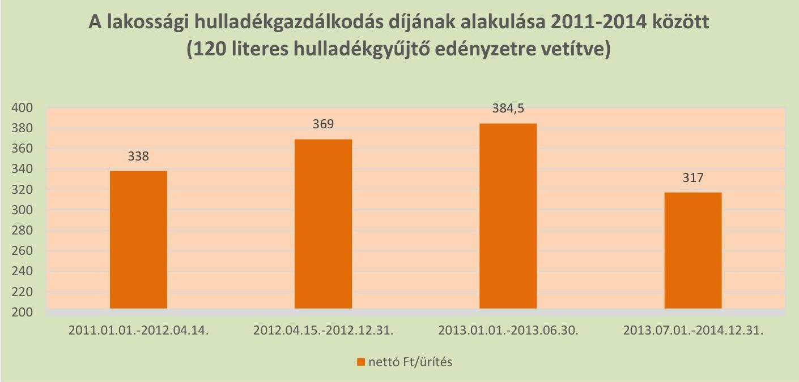

---

# IV. SZ. MELLÉKLET: MINTAVÉTELI ELIÁRÁSOK ELLENŐRZÉSI TERÜLETENKÉNT 

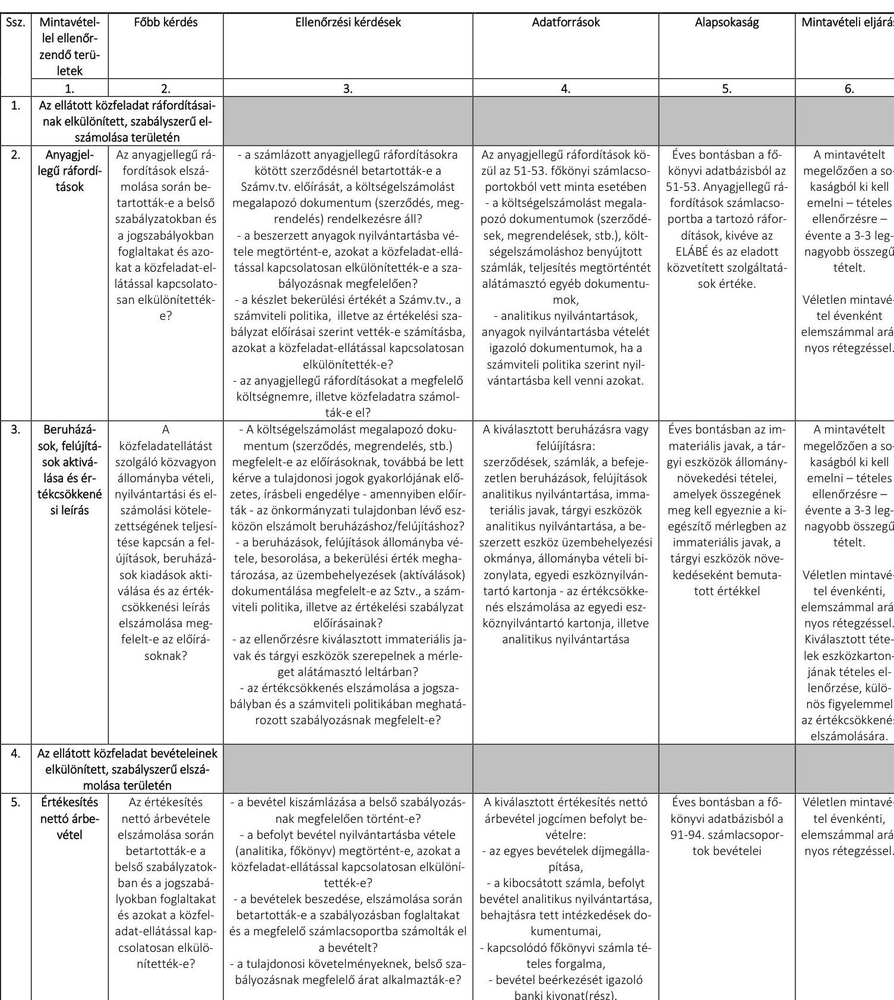

---

# FÜGGELÉK: ÉSZREVÉTELEK 

A jelentéstervezetet a Számvevőszék 15 napos észrevételezésre megküldte az ellenőrzött szervezet vezetőjének az ÁSZ tv. 29. § (1) bekezdése előírásának megfelelően.
Szigetszentmiklós Város Önkormányzatának polgármestere észrevételezési lehetőségével nem élt. Az ARIES Ipari, Kereskedelmi és Szolgáltató Nonprofit Kft. ügyvezetőjétől érkezett észrevételeket és azok kezeléséről szóló válaszlevelet a jelentés függeléke tartalmazza.

[^0]
[^0]:    § 29. § (1) Az Állami Számvevőszék az ellenőrzési megállapításait megküldi az ellenőrzött szervezet vezetőjének vagy az általa megbízott személynek, és annak, akinek személyes felelősségét állapította meg.
    (2) Az ellenőrzött szervezet vezetője és a felelősként megjelölt személy az ellenőrzés megállapításaira tizenöt napon belül írásban észrevételt tehet.
    (3) Az Állami Számvevőszék az észrevételre a beérkezésétől számított harminc napon belül írásban válaszol. A figyelembe nem vett észrevételeket köteles a jelentésben feltüntetni, és megindokolni, hogy azokat miért nem fogadta el.

---

# 466 

## 2. Honsdó magit

## "ARIES" Ipari, Kereskedelmi és Szolgáltató Nonprofit Korlátolt Felelősségű Társaság

melyet a Budapest Környéki Törvényszék Cégbírósága a Cg. 13-09-063424 számon tart nyilván
2310 Szigetszentmiklós, Határ út 12-14.
Telefon: 06-24-442-927, 367-016, 367-166
Telefax: 150-es mellék
Honlap: www.arieskft.hu
E-mail: titkarsag@arieskft.hu

Dátum:
Ikt.sz:
Ügyintéző:
Tárgy:

2016. június 28.
$5745 / 2016$.
Baski Sándor
észrevételek

Domokos László
elnök úr részére
Állami Számvevőszék
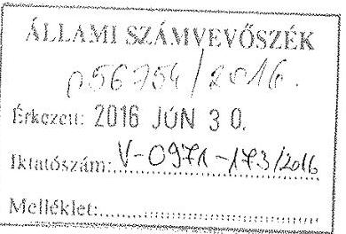

Ikt.szám: V-0971-166/2016.

## Tisztelt Elnök Úr!

Köszönöm az Ön által megküldött, az „ARIES” Ipari, Kereskedelmi és Szolgáltató Nonprofit Kft. ellenőrzéséről készült, 2016. június 14-én érkezett számvevőszéki jelentéstervezetüket.

Az Állami Számvevőszékről szóló 2011. évi LXVI. tv. 29. § (2) bekezdése alapján mellékelten küldöm Önnek a jelentéstervezettel kapcsolatos észrevételeinket.

Melléklet

Tisztelettel:
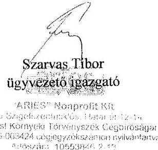

---

# A 2016. június 14-én érkezett számvevőszéki jelentéstervezettel kapcsolatos észrevételek 

## 1. Számvevőszéki jelentéstervezet 8. oldal:

„Az ARIES Ipari, Kereskedelmi és Szolgáltató Nonprofit Kft. főtevékenysége Szigetszentmiklós, Szigethalom és Halásztelek közigazgatási területén a nem veszélyes hulladék begyűjtése, szállítása, előkezelése volt. Az egyéb tevékenységei körébe tartozott többek között a távhőszolgáltatás, a közterület kezelés, a parkfenntartás, a síkosságmentesítés, az ingatlankezelés és bérbeadás, valamint a veszélyes hulladékok gyűjtése és szállítása.”

## "ARIES" Nonprofit Kft észrevétele

A bekezdés második mondatában felsorolt, az egyéb tevékenységi körbe tartozó szolgáltatások esetében szükségesnek tartjuk megjegyezni, hogy a távhőszolgáltatás, közterület kezelés, parkfenntartás, síkosság mentesítés, valamint az ingatlankezelés és bérbeadási tevékenységek az ARIES NKft. kizárólag Szigetszentmiklós Város területén végzi. A veszélyes hulladékok gyűjtése és szállítása mindhárom településre vonatkozik, azonban az kizárólag az elektronikai hulladékok gyűjtését és szállítását foglalja magában.

## 2. Számvevőszéki jelentéstervezet 15. oldal:

„A szolgáltatói megállapodás és a közszolgáltatási szerződés alapján az ARIES NKft. feladata volt a települési szilárd hulladék természetes személyektől történő átvétele, a hulladékgazdálkodási közszolgáltatás körébe tartozó hulladékok elszállítása, a kapcsolódó hulladékgazdálkodási feladatok ellátása. Ennek keretében a gyűjtőedények biztosítása, cseréje, pótlása, a lomtalanítási szolgáltatás megszervezése és lebonyolítása, begyűjtőhelyek működtetése, szelektív hulladék begyűjtése, valamint a hulladékgazdálkodási közszolgáltatással érintett hulladékgazdálkodási létesítmény fenntartása üzemeltetése.”

## "ARIES" Nonprofit Kft észrevétele

Szükségesnek tartjuk megjegyezni, hogy az ARIES NKft. a gyűjtőedényeket térítés ellenében biztosítja a közszolgáltatás igénybe vevő ügyfelei számára oly módon, hogy azokat az ügyfelek vagy megvásárolják, vagy bérlik. Az edények cseréje, illetve pótlása szintén díj ellenében történik.

## 3. Számvevőszéki jelentéstervezet 15. oldal:

„A 2012. július 1-jétől hatályos Közszolgáltatási szerződést a Hgt. 28. § (3) előírásainak megfelelően a törvényi maximális 10 évre kötötték és hat hónapos felmondási időt határoztak meg benne. A Közszolgáltatási szerződés nem tartalmazta a 224/2004. (VII.22) Korm. rendelet 13. § (3) bekezdésében előírtakkal ellentétben a közszolgáltatás díjának megállapítására vonatkozó módszer leírását.”

---

# "ARIES" Nonprofit Kft észrevétele 

A 224/2004.(VII.22.) Korm. rendelet 13.§ (3) bekezdése szerint: „A közszolgáltatási szerződés tartalmazza a közszolgáltatás díjának megállapítására és beszedésére vonatkozó módszer leírását, a díjnak a szerződés megkötésekor érvényesíthető legmagasabb mértékét és a díj megváltoztatása érdekében alkalmazandó eljárást.”

Az idézett kormányrendelet alapján a 2012. július 1-től hatályos közszolgáltatási szerződés III/2. pontjában az alábbiak kerültek rögzítésre:
„A Szolgáltató az általa alkalmazott közszolgáltatási díj mértékéről és alkalmazásának módjáról évente egyszer írásos javaslatot nyújt be az Önkormányzat Képviselő-testületének. A javaslat alapján a fizetendő díjakat Szigetszentmiklós Önkormányzatának Képviselőtestülete évente rendeletben állapítja meg. A szolgáltatási díj az ingatlantulajdonos által használt edényzet térfogata és ürítésének gyakorisága alapján kerül megállapításra.”
A szerződés III/2. második bekezdésében és a III/3-5. pontokban rögzítésre került továbbá a beszedésre vonatkozó módszer is.

Véleményünk szerint a Közszolgáltatási szerződés - fentiekre tekintettel - a hivatkozott Kormányrendeletben foglaltaknak megfelelően tartalmazza a díj megállapítására és beszedésére vonatkozó módszer leírását. Álláspontunk szerint ezt támasztja alá a Számvevőszék jelentésének 17. oldalán az árképzés szabályainál, a második bekezdésben tett megállapítás is, mely szerint „A díjak megállapítása 2012. december 31-ig a Hgt. 57. § (1) bekezdésében előírtaknak megfelelt, azok a Hgt. 25. § (4) bekezdésében előírtaknak megfelelően költségkalkulációval alátámasztottak voltak.” továbbá, hogy „Az Önkormányzat díjmegállapításának kialakítása szabályszerű volt.”

## 4. Számvevőszéki jelentéstervezet 15. oldal:

„A Közszolgáltatási szerződésben nem határozták meg a 317/2013. Korm. rendelet 4. § (2) bekezdésében előírtakkal ellentétben az OHÜ által meghatározott minősítési osztály szerinti követelmények biztosítását.”

## "ARIES" Nonprofit Kft észrevétele

Véleményünk szerint a 2012. július 1-től hatályos Közszolgáltatási szerződésben a fenti jogszabályi hivatkozást nem kellett érvényesíteni, hiszen a Kormányrendelet 2013. augusztus 28-án került elfogadásra, illetve annak záró rendelkezései között foglalt 6.§ (2) bekezdés alapján a
 rendelet szabályait, annak hatálybalépését követően megkezdett közbeszerzési eljárásokra kell alkalmazni.

## 5. Számvevőszéki jelentéstervezet 22. oldal:

„Az adósságfedezeti mutató II. értéke 2011. január 1. és 2013. december 31. között, 3,6-ról 7,7-re növekedett, amely révén a vállalkozás képes volt az összes hosszú lejáratú kötelezettségének eleget tenni. A mutató 2014-ben nem érte el a kedvezőnek ítélt 1-es értéket, a nagy értékű beruházás következtében mértéke 0,3-ra csökkent. Ez azt jelentette, hogy a Társaság nem lett volna képes valamennyi hosszú lejáratú kötelezettségének eleget tenni."

---

# "ARIES" Nonprofit Kft észrevétele 

A Számvevőszéki jelentés I. sz. mellékletében meghatározásra került az adósságfedezeti mutató II. számításának módja: működési cash flow / hosszú lejáratú kötelezettségek.
A magyarázat szerint „A mutató azt jelzi, hogy az adott gazdálkodási időszak működési pénzáramainak eredményeként realizált cash flow révén a vállalkozás mennyiben lenne képes valamennyi hosszú lejáratú kötelezettségének eleget tenni."
A melléklet tartalmazza továbbá, hogy „Ennek vizsgálatára viszonylag ritkán kerül sor, az elsősorban a veszélyhelyzetbe került vállalkozások esetében lehet érdekes."
Szeretnénk kihangsúlyozni, hogy az ARIES NKft, a felelős gazdálkodásának köszönhetően nem tartozik a veszélyhelyzetbe került vállalkozások közé, továbbá a mutatószám torzítva ad képet egy vállalkozás adósság visszafizető képességéről. Ennek oka, hogy a vállalkozások nem tudják minden cash-flow forintjukat adósság visszafizetésre fordítani, mivel abból a felmerült költségeiket is ki kell fizetniük. A mutatószám figyelmen kívül hagyja továbbá azt a tényt, hogy a hosszú lejáratú adósságok visszafizetésének fedezete több, egymást követő időszakon keresztüli pénzáramlás összege.

## 6. Számvevőszéki jelentéstervezet 25. oldal:

„A Társaság a hulladékgazdálkodási közfeladat ellátásból a 2013. évben 13,7 millió Ft nyereséget, a 2014. évben 14,5 millió Ft veszteséget realizált. A veszteséget döntően a csökkenő árbevétel eredményezte."

## "ARIES" Nonprofit Kft észrevétele

Szükségesnek tartjuk megjegyezni, hogy a hulladékgazdálkodási közfeladat ellátásából származó árbevétel csökkenése, valamint annak 2014. évi vesztesége, a hulladékgazdálkodási közszolgáltatási díjra vonatkozóan 2013. július 1-től, a Hgt. 91. § 2013. május 10-étől hatályos módosítása alapján kötelezően előírt rezsicsökkentésből származik, amely 2014-ben már teljes évben éreztette a hatását.

## 7. Számvevőszéki jelentéstervezet 25. oldal:

„Az ARIES NKft. 2011. december 27-én egy tehergépjárművet szerzett be 14,0 millió Ft nettó értékben. A beszerzés az akkor hatályban lévő Kbt. 244. § (1) bekezdése alapján, a Kvtv. 74. § a) pontja szerinti 8,0 millió Ft-os nemzeti közbeszerzési értékhatárt meghaladta. A tehergépjármű beszerzésére közbeszerzési eljárást nem folytattak le, megsértve ezzel a Kbt. 240. § (1) bekezdésében előírt kötelezettség előírását és a Társaság Közbeszerzési szabályzatában előírtakat."

## "ARIES" Nonprofit Kft észrevétele

A hivatkozott szabálysértéssel kapcsolatban fontosnak tartjuk az alábbi információ közzétételét. A szóban forgó gépjármű a síkosság-mentesítési feladatok ellátásához, illetve a folyamatos rendelkezésre álláshoz nélkülözhetetlen volt.

---

Szigetszentmiklós Város Önkormányzatának ez irányú feladatátadása a téli síkosságmentesítő időszak megkezdésének (október 15.) időpontja előtt néhány nappal történt, a Képviselő-testület 418/2011. (IX.28.) sz. határozata alapján. Ezért az ARIES NKft. egyszerűsített eljárásban három árajánlat bekérésével megvalósuló beszerzést folytatott le, amely során a beszerzési árat tekintve a legkedvezőbb ajánlat került kiválasztásra. A nyílt közbeszerzési eljárás időigénye a síkosság-mentesítési feladat ellátását veszélyeztette volna. Megjegyeznénk továbbá, hogy az ARIES NKft síkosság-mentesítési feladat ellátása, illetve tevékenysége nem képezte a számvevőszéki vizsgálat tárgyát, az a számvevőszéki jelentés összegzésében foglaltak szerint is a hulladékgazdálkodási közfeladat ellátását érintő gazdálkodói tevékenységre vonatkozott.

# 8. Számvevőszéki jelentéstervezet 25. oldal: 

„Az értékcsökkenés elszámolásának módszerénél a bruttó érték maradványértékkel csökkentett bekerülési értékeire vetített lineáris értékcsökkenési leírást rögzítették, azonban az értékcsökkenés elszámolásának gyakoriságát nem határozták meg, a kiegészítő mellékletben nem mutatták be, ellentétben a Számv. tv. 88. § (4) bekezdésében előírtakkal."

## "ARIES" Nonprofit Kft észrevétele

Az ARIES NKft kiegészítő mellékletében a Sztv. 88. § (4) bekezdése alapján ismertetésre került a beszámoló összeállításánál alkalmazott szabályrendszer, annak főbb jellemzői, az alkalmazott értékelési eljárások és az értékcsökkenés elszámolásának számviteli politikában meghatározott módszerei. Az értékcsökkenés elszámolásának gyakorisága valóban nem került külön feltüntetésre a kiegészítő mellékletben. Ezt az ARIES NKft havonta számolja el, miután minden hónapban utókalkuláció készül az egyes egységekre (így a hulladékgazdálkodási tevékenységre) lebontva, valamint összevontan.

## 9. Számvevőszéki jelentéstervezet 26. oldal:

„A Társaság a saját tulajdonban lévő eszközök pótlására a 2011-2014. években 223,8 millió Ft-ot fordított, amely meghaladta az elszámolt értékcsökkenés 167,6 millió Ft-os összegét. A hulladékgazdálkodással kapcsolatos eszközök pótlására növekvő tendencia mellett összesen 111,6 millió Ft-ot fordítottak, amely mind a négy évben meghaladta az elszámolt értékcsökkenés összegét. Átlagosan az ellenőrzött időszakban az eszközpótlások 26,5 %-kal haladták meg az elszámolt értékcsökkenést."

## "ARIES" Nonprofit Kft észrevétele

A jelentésben a 2011-2014 közötti időszakra vonatkozóan szereplő, továbbá a jelentés 34. oldalán az „ARIES NKft működésének főbb jellemzői (ezer Ft / %)" táblázatban éves bontásban részletezett, a saját tulajdonban lévő eszközök pótlásával kapcsolatban megadott 223,8 millió Ft összeg véleményünk szerint pontosításra szorul.

---

A 34. oldalon a megnevezés oszlopban feltüntetett szöveg szerint megfelel a valóságnak, hogy a táblázatban megadott értékek a felújításra, illetve beruházásra fordított összegeken túlmenően, a már korábban aktivált befektetett eszközökre fordított karbantartási költségeket is tartalmazzák. Az így összesített 223,8 millió Ft azonban a 26. oldalon már úgy kerül feltüntetésre, mint a vizsgált időszakban az eszközök pótlására, azaz beruházásra fordított összeg, amely véleményünk szerint nem felel meg a valóságnak.

A beruházások összegének, illetve a 2011-2014 közötti időszakban elszámolt amortizáció összehasonlításakor szükségesnek tartjuk megjegyezni, hogy közgazdasági szempontból az elszámolt amortizáció a pótló beruházásokra nyújt fedezetet. Az ún. bővítő beruházás fedezete a vállalkozás által elért pozitív mérleg szerinti eredmény, illetve szükség szerint idegen forrás bevonása hitel, lízing, vagy részletre vétel formájában. A bruttó beruházás értékének vizsgálatánál ezért nem tekinthetünk el attól, hogy az ARIES NKft által 2011-ben év végű pénzügyi lízing konstrukció keretében 24.744 eFt értékben, míg 2014-ben részletre vétel útján 116.840 eFt összegben kerültek beszerzésre tárgyi eszközök, amelyek java része a városgondozási tevékenység ellátásában nélkülözhetetlen síkosság-mentesítő gépek és azok tartozékai.

Ugyanezen időszakban az ARIES NKft saját rezsi beruházás keretében, összesen 48.925 eFt összegben aktivált tárgyi eszközöket, amelynek fedezete a költség oldalon az anyagköltségek, az igénybe vett szolgáltatások, illetve a személyi jellegű ráfordítások között került elszámolásra.

# 10. Számvevőszéki jelentéstervezet 26-27. oldal: 

„Követelésállományát részben kezelte a Társaság a belső szabályozásnak megfelelően. Az értékvesztések elszámolását az elkészített vevői lejárat szerinti listák és a rendelkezésre álló egyéb információk alapján végezték el az értékelési szabályzat előírása szerint. A számviteli politikában szabályozták az értékvesztések alapját. Az adók módjára történő behajtásra átadott kintlévőségek értékvesztésével kapcsolatban a számviteli politika 2014. január 1-jétől a 360 napon belüli kintlévőségekre 50%-os mértékű értékvesztést írt elő. Ennek ellenére a 2014. évi mérleg készítésekor az adók módjára történő behajtásra átadott követelésállományra a lejárattól függetlenül 100%-os értékvesztést számoltak el, ezzel figyelmen kívül hagyva a számviteli politikának az értékvesztés alapját képező követelések meghatározására vonatkozó rendelkezéseit."

## "ARIES" Nonprofit Kft észrevétele

2014. december 31-én Cégünk nyilvántartásában 878 olyan ügyfél szerepelt, akik 2014. január 1-től adók módjára történő behajtásra átadott lakossági hulladékgazdálkodási közszolgáltatási díjhátralékkal rendelkeztek. A folyamatos szolgáltatás jellegéből eredően a 360 napon túli lejárt, adók módjára történő behajtásra átadott tartozással rendelkező ügyfeleink jellemzően 360 napon belül lejárt tartozással is rendelkeznek. Ezen ügyfelek 360 napon túli díjhátraléka 33.601 eFt, míg 360 napon belüli díjhátraléka 4.617 eFt volt.

---

Minden ilyen esetben az óvatosság elve alapján, egységesen 100% értékvesztést képeztünk az ügyfelekkel szemben fennálló követelésre.
A fentieken túlmenően megjegyezni kívánjuk, hogy a társasági adókötelezettség számításakor az adóévben követelésre elszámolt értékvesztés összege, adózás előtti eredményt növelő tétel, míg a korábbi években adóalap növelő tételként elszámolt, a követelések kiegyenlítése miatt visszaírt értékvesztés összege adóalap csökkentő tétel. Így elszámolt többlet értékvesztés miatt társasági adó hiány nem keletkezik.

# 11. Számvevőszéki jelentéstervezet 29. oldal: 

Javaslatok
„Az ARIES Ipari, Kereskedelmi és Szolgáltató Nonprofit Kft. ügyvezetőjének

1. Intézkedjen a közbeszerzési értékhatárt meghaladó beszerzések esetében a hatályos Közbeszerzési törvény és Közbeszerzési szabályzat előírásainak betartásáról, a közbeszerzési eljárás szabályszerű lefolyatásáról.
(3.1. sz. megállapítás 7. bekezdése alapján)
2. Intézkedjen, hogy a Társaság számviteli beszámolója kiegészítő mellékletében az értékcsökkenés elszámolásának gyakorisága bemutatásra kerüljön.
(3.1. sz. megállapítás 10. bekezdése alapján)"

## "ARIES" Nonprofit Kft válasza

A fenti megállapításokhoz kapcsolódó, az ÁSZ tv. 33. § (1) bekezdésében foglaltak alapján az ARIES NKft által összeállítandó intézkedési tervet, a jelentés kézhezvételétől számított 30 napon belül, határidőre eljuttatjuk az Önök részére.

Szigetszentmiklós, 2016. június 28.
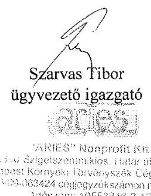

---

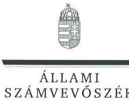

ELNÖK

Ikt.szám: V-0971-175/2016

# Szarvas Tibor úr 

ügyvezető igazgató
"ARIES" Ipari, Kereskedelmi és Szolgáltató Nonprofit Kft.

## Szigetszentmiklós

## Tisztelt Ügyvezető Igazgató Úr!

Köszönettel vettem az "ARIES" Ipari, Kereskedelmi és Szolgáltató Nonprofit Kft. ellenőrzéséről készített számvevőszéki jelentéstervezetre tett észrevételeit.

Az Állami Számvevőszék észrevételekre vonatkozó álláspontjáról a felügyeleti vezető által készített részletes tájékoztatásból kap választ, amelyet levelemhez mellékeltem.

Tájékoztatom Ügyvezető Igazgató urat, hogy a számvevőszéki jelentés véglegesítése az elfogadott észrevételek figyelembevételével történik.

Budapest, 2016. $\frac{\text { filion }}{\text { hó }}$ nap
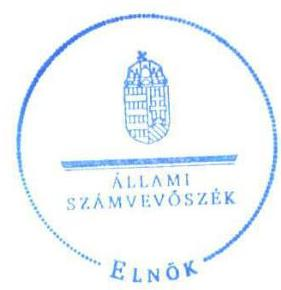

Tisztelettel:

## D2, (1)   Domokos László

Melléklet: Tájékoztatás az észrevételek kezeléséről

---

# Tájékoztatás az észrevételek kezeléséről 

„Az önkormányzatok többségi tulajdonában lévő gazdasági társaságok közfeladat ellátását érintő gazdálkodási tevékenysége szabályszerűségének ellenőrzése - "ARIES" Ipari, Kereskedelmi és Szolgáltató Nonprofit Kft." címmel készített jelentéstervezetre Ügyvezető Igazgató úr észrevételeit megköszönöm. Az észrevételek kezeléséről az alábbi tájékoztatást adom.

1. számú észrevételét elfogadom, az alapján az érintett mondatot a következőképpen módosítom:
„Az egyéb tevékenységei körébe tartozott Szigetszentmiklós Város közigazgatási területén belül többek között a távhőszolgáltatás, a közterület kezelés, a parkfenntartás, a síkosság-mentesítés, valamint az ingatlankezelés és bérbeadás, valamint a veszélyes hulladékok gyűjtése és szállítása."
2. számú észrevételében a gyűjtőedények térítési díj ellenében történő biztosítására vonatkozó tájékoztatását köszönöm. Észrevétele az érintett részek szövegezésének módosítását nem indokolja.
3. számú észrevételét elfogadom az alapján a 15. oldal hatodik bekezdésének érintett mondatát a következőképpen módosítom:
„A Közszolgáltatási szerződés nem tartalmazta a 224/2004. (VII. 22.) Korm. rendelet 13. § (3) bekezdésében előírtakat, így a közszolgáltatás díjának megállapítására vonatkozó módszer leírását."
4. számú észrevétele a jelentéstervezet megállapítások, 15. oldal hatodik bekezdésének harmadik mondatát érinti.
Észrevételében jelzi, hogy a 2012. július 1-jétől hatályos Közszolgáltatási szerződésben a fenti jogszabályi hivatkozást még nem kellett érvényesíteni, mivel a Korm. rendelet 2013. augusztus 28-án került elfogadásra, illetve annak szabályait a hatálybalépését követően megkezdett közbeszerzési eljárásokra kellett alkalmazni. Észrevételét elfogadom, a jelentésből a kifogásolt részt törlöm:
„A Közszolgáltatási szerződésben nem határozták meg a 317/2013. Korm. rendelet 4. § (2) bekezdésében előírtakkal ellentétben az OHÜ által meghatározott minősítési osztály szerinti követelmények biztosítását."
5. számú észrevétele a jelentéstervezet megállapítások, 22. oldal harmadik bekezdését érinti.

A jelentéstervezet megállapítások részében szerepel:
„Az adósságfedezeti mutató II. értéke 2011. január 1. és 2013. december 31. között, 3,6-ról 7,7-re növekedett, amely révén a vállalkozás képes volt az összes hosszú lejáratú kötelezettségének eleget tenni. A
 mutató 2014-ben nem érte el a kedvezőnek ítélt 1-es értéket, a nagy értékű beruházás következtében mértéke 0,3-ra csökkent. Ez azt jelentette, hogy a Társaság nem lett volna képes valamennyi hosszú lejáratú kötelezettségének eleget tenni.

---

Észrevételét, amelyben jelzi, hogy a mutatószám torzítva ad képet egy vállalkozás adósság-visszafizető képességéről, köszönettel veszem, de az megállapításunkat nem befolyásolja, a mutató értéke számítható és értékelhető, a megállapítás megváltoztatását észrevétele nem indokolja.
6. számú észrevétele a jelentéstervezet megállapításait, 25. oldal első bekezdését érinti.

A jelentéstervezet megállapítások részében szerepel:
„A Társaság a hulladékgazdálkodási közfeladat-ellátásból a 2013. évben 13,7 millió Ft nyereséget, a 2014. évben 14,5 millió Ft veszteséget realizált. A veszteséget döntően a csökkenő árbevétel eredményezte."

Tájékoztatását - mely szerint a hulladékgazdálkodási közfeladat-ellátásból származó árbevétel csökkenése, valamint annak 2014. évi vesztesége a rezsicsökkentésből származik - köszönettel veszem, azonban megállapításunkat nem befolyásolja, megváltoztatását nem indokolja.
7. számú észrevétele a jelentéstervezet megállapításait, 25. oldal ötödik bekezdését érinti.

A jelentéstervezet megállapítások részében szerepel:
„Az ARIES NKft. 2011. december 27-én egy tehergépjárművet szerzett be 14,0 millió Ft nettó értékben. A beszerzés az akkor hatályban lévő Kbt. 244. § (1) bekezdése alapján, a Kvtv. 74. § a) pontja szerinti 8,0 millió Ft-os nemzeti közbeszerzési értékhatárt meghaladta. A tehergépjármű beszerzésére közbeszerzési eljárást nem folytattak le, megsértve ezzel a Kbt. 240. § (1) bekezdésében előírt kötelezettség előírását és a Társaság Közbeszerzési szabályzatában előírtakat."

A megállapítással kapcsolatos észrevételét - melyben tájékoztat arról, hogy a Társaság egyszerűsített eljárásban három árajánlat bekérésével megvalósuló beszerzést folytatott le, és a beszerzési árat tekintve a legkedvezőbb árajánlatot választotta ki, nyílt közbeszerzési eljárás annak időigénye miatt nem folytatott le, mivel veszélyeztette volna a síkosság-mentesítési feladat ellátását - köszönettel veszem, azonban megállapításunkat nem befolyásolja, megváltoztatását nem indokolja.
8. számú észrevétele a jelentéstervezet megállapításait, 25. oldal utolsó bekezdését érinti.

A jelentéstervezet megállapítások részében szerepel:
„Az értékcsökkenés elszámolásának módszerénél a bruttó érték maradványértékkel csökkentett bekerülési értékére vetített lineáris értékcsökkenési leírást rögzítették, azonban az értékcsökkenés elszámolásának gyakoriságát nem határozták meg, a kiegészítő mellékletben nem mutatták be, ellentétben a Számv. tv. 88. § (4) bekezdésében előírtakkal."

Észrevétele megállapításunkat nem vitatja, így a megállapítás módosítása nem indokolt.
9. számú észrevétele a jelentéstervezet megállapításait, 26. oldal első bekezdését érinti.

Észrevételében jelzi, hogy megállapításunk pontosításra szorul, mivel a 2011-2014. évekre összesített 223,8 millió Ft összeg nem csupán az eszközök pótlására fordított összeget, hanem a Társaság által karbantartásra fordított összeget is tartalmazta. Megjegyezte továbbá, hogy

---

közgazdasági szempontból az elszámolt amortizáció a pótló beruházásokra nyújt fedezetet, az ún. bővítő beruházás fedezete a vállalkozás által elért pozitív mérleg szerinti eredmény. A jelentéstervezet II. számú mellékletében szereplő működési adatok a Társaság adatszolgáltatásában szerepeltek, így a jelentésben kifogásolt részt az alábbiak szerint egészítjük ki:
„A Társaság a saját tulajdonban lévő eszközök pótlására (karbantartásra, felújításra, beruházásra) a 2011-2014. években 223,8 millió Ft-ot fordított, amely meghaladta az elszámolt értékcsökkenés 167,6 millió Ft-os összegét. A hulladékgazdálkodással kapcsolatos eszközök pótlására növekvő tendencia mellett összesen 111,6 millió Ft-ot fordítottak, amely mind a négy évben meghaladta az elszámolt értékcsökkenés összegét. Átlagosan az ellenőrzött időszakban az eszközpótlások 26,5%-kal haladták meg az elszámolt értékcsökkenést."
10. számú észrevétele a jelentéstervezet megállapításait, 26. oldal utolsó bekezdését érinti.

Észrevételét, melyben jelzi, hogy a folyamatos szolgáltatás jellegéből eredően a 360 napon túli lejárt, adók módjára történő behajtásra átadott tartozással rendelkező ügyfeleik jellemzően 360 napon belül lejárt tartozással is rendelkeztek, ezért az óvatosság elve alapján egységesen 100%-os értékvesztést képeztek, elfogadom. A jelentésből a kifogásolt részt törlöm:
„Követelésállományát részben kezelte a Társaság a belső szabályozásnak megfelelően. Az értékvesztések elszámolását az elkészített vevői lejárat szerinti listák és a rendelkezésre álló egyéb információk alapján végezték el az értékelési szabályzat előírása szerint. A számviteli politika 23-ban szabályozta az értékvesztések alapját. Az adók módjára történő behajtásra átadott kintlévőségek értékvesztésével kapcsolatban a számviteli politika 2014. január 1-jétől a 360 napon belüli kintlévőségekre 30%-os mértékű értékvesztést írt elő. Ennek ellenére a 2014. évi mérleg készítésekor az adók módjára történő behajtásra átadott követelésállományra a lejárattól függetlenül 100%-os értékvesztést számoltak el, ezzel figyelmen kívül hagyva a számviteli politika értékvesztés alapját képező követelések meghatározására vonatkozó rendelkezéseit."
11. számú észrevételében a jelentéstervezet megállapításaira megfogalmazott javaslatokat nem kifogásolja. Visszajelzését azzal kapcsolatban, hogy 30 napon belül megküldi a javaslatokra összeállított intézkedési tervét, külön köszönöm.

Budapest, 2016.  hó 12. nap

Dr. Horváth Margit
felügyeleti vezető

---

# RÖVIDÍTÉSEK JEGYZÉKE 

${ }^{1}$ ÁsZ
${ }^{2}$ Ötv.
${ }^{3}$ Mötv.
${ }^{4}$ Képviselő-testület
${ }^{5}$ ARIES NKft.
${ }^{6} \mathrm{Hgt} .1$
${ }^{7} \mathrm{Hgt} .2$
${ }^{8}$ Hulladékgazdálkodási rendelet
${ }^{9}$ Településtisztasági rendelet
${ }^{10} \mathrm{SZMSZ}_{2}$
${ }^{11} \mathrm{SZMSZ}_{3}$
${ }^{12}$ Alapító Okirat
${ }^{13}$ Szolgáltatói megállapodás
${ }^{14}$ Közszolgáltatási szerződés ${ }_{1}$
${ }^{15}$ Közszolgáltatási szerződés ${ }_{2}$
${ }^{16}$ Társaság
${ }^{17}$ 224/2004.(VII.22.) Korm. rendelet
${ }^{18}$ 317/2013. (VIII. 28.) Korm. rendelet
${ }^{19}$ hulladékgazdálkodási rendelet
${ }^{20}$ vagyongazdálkodási rendelet ${ }_{1}$
${ }^{21}$ vagyongazdálkodási rendelet ${ }_{2}$
${ }^{22} \mathrm{SZMSZ}_{1}$

Állami Számvevőszék
a helyi önkormányzatokról szóló 1990. évi LXV. törvény (hatálytalan 2014. október 12-étől)
Magyarország helyi önkormányzatairól szóló 2011. évi CLXXXIX. törvény (hatályos: 2012. január 1-jétől, kivéve a 144. § (2) bekezdésben meghatározott paragrafusok, amelyek 2012. április 15-én, a (3) bekezdésben meghatározott paragrafusok, amelyek 2013. január 1-jén, a (4) bekezdésben meghatározott paragrafusok, amelyek 2014. október 12-én léptek hatályba)
Szigetszentmiklós Város Önkormányzatának Képviselő-testülete
ARIES ipari, Kereskedelmi és Szolgáltató Nonprofit Korlátolt Felelősségű Társaság a hulladékgazdálkodásról szóló 2000. évi XLIII. törvény (hatálytalan: 2013. január 1-jétől)
a hulladékról szóló 2012. évi CLXXXV. törvény (hatályos: 2013. január 1-jétől)
Szigetszentmiklós Város Önkormányzata Képviselő-testületének 5/2006.(III.30) számú rendelete a települési szilárd hulladékkal kapcsolatos közszolgáltatás szabályainak és dijának meghatározásáról és módosításai
Szigetszentmiklós Város Önkormányzata Képviselő-testületének 24/2013.(VI.27) önkormányzati rendelete a település tisztaságáról és a közszolgáltatás szabályairól
Szigetszentmiklós Város Képviselő Testületének 12/2011. (IV.28.) számú rendelete az Önkormányzat Szervezeti és Működési Szabályzatáról
Szigetszentmiklós Város Képviselő Testületének 19/2014. (XI. 06.) számú rendelete az Önkormányzat Szervezeti és Működési Szabályzatáról
az ARIES NKft. Alapító Okiratai és annak módosításai
Szigetszentmiklós Város Önkormányzata és az ARIES Kft. között 1997. február 17-én létrejött Szolgáltatói megállapodás (hatályos 2012. június 1-jéig)
Szigetszentmiklós Város Önkormányzata és az ARIES NKft. között 2012. június 1-jén létrejött Hulladékkezelési Közszolgáltatási szerződés (hatályos: 2014. június 30-áig)
Szigetszentmiklós Város Önkormányzata és az ARIES NKft. között 2014. június 30-án létrejött Hulladékkezelési Közszolgáltatási szerződés (hatályos: 2014. július 1-jétől)
ARIES NKft.
a hulladékkezelési közszolgáltató kiválasztásáról és a közszolgáltatási szerződésről szóló 224/2004.(VII.22.) Korm. rendelet (hatálytalan: 2013. szeptember 5-étől)
a közszolgáltató kiválasztásáról és a hulladékgazdálkodási közszolgáltatási szerződésről szóló 317/2013. (VIII. 28.) Korm. rendelet
Szigetszentmiklós Város Önkormányzatának 5/2006. (III. 30.) számú rendelete a települési szilárd hulladékkal kapcsolatos közszolgáltatás szabályainak és dijának meghatározásáról
Szigetszentmiklós Város Önkormányzatának 17/2003. (IX. 03.) számú rendelete az Önkormányzat vagyonáról és a vagyongazdálkodás szabályairól
Szigetszentmiklós Város Önkormányzatának 8/2013. (III. 28.) számú rendelete az Önkormányzat vagyonáról
Szigetszentmiklós Város Képviselő Testületének 8/1999. (III. 25) számú rendelete a Szervezeti és Működési Szabályzatáról

---

${ }^{23}$ polgármester
${ }^{24} \mathrm{Gt}$.
${ }^{25}$ Ptk. 2
${ }^{26} \mathrm{FB}$
${ }^{27}$ Taktv.
${ }^{28}$ javadalmazási szabályzat ${ }_{1}$
${ }^{29}$ javadalmazási szabályzat ${ }_{2}$
${ }^{30}$ MEKH
${ }^{31}$ számviteli politika ${ }_{1}$
${ }^{32}$ számviteli politika2
${ }^{33}$ számviteli politika3
${ }^{34}$ leltározási szabályzat ${ }_{1}$
${ }^{35}$ leltározási szabályzat ${ }_{2}$
${ }^{36}$ értékelési szabályzat
${ }^{37}$ pénzkezelési szabályzat ${ }_{1}$
${ }^{38}$ pénzkezelési szabályzat ${ }_{2}$
${ }^{39}$ számlarend
${ }^{40}$ önköltségszámítási szabályzat ${ }_{1}$
${ }^{41}$ önköltségszámítási szabályzat ${ }_{2}$
${ }^{42}$ önköltségszámítási szabályzat ${ }_{3}$
${ }^{43}$ önköltségszámítási szabályzat ${ }_{4}$
${ }^{44}$ Ávr.
${ }^{45} \mathrm{Kbt}$.
${ }^{46}$ Kvtv.
${ }^{47}$ Ptk. 1
${ }^{48} \mathrm{Nvtv}$.
${ }^{49}$ Ebktv.
${ }^{50}$ Ctv.

Szigetszentmiklós Város Önkormányzatának polgármestere
a gazdasági társaságokról szóló 2006. évi IV. törvény (hatálytalan: 2014. március 15-étől)
a Polgári Törvénykönyvről szóló 2013. évi V. törvény (hatályos 2014. március 15-étől)
az ARIES NKft. Felügyelő Bizottsága
a köztulajdonban álló gazdasági társaságok takarékosabb működéséről szóló 2009. évi CXXII. törvény (hatályos: 2009. december 4-étől)
az ARIES NKft. 2010. március 28-ától hatályos javadalmazási szabályzata (hatálytalan: 2011. január 27-étől)
az ARIES NKft. 2011. január 27-étől hatályos javadalmazási szabályzata
Magyar Energetikai és Közmű-szabályozási Hivatal
az ARIES NKft számviteli politikája (hatályos: 2008. január 1-jétől 2011. december 31-éig)
az ARIES NKft számviteli politikája (hatályos: 2012. január 1-jétől 2013. december 31-éig)
az ARIES NKft számviteli politikája (hatályos: 2014. január 1-jétől)
az ARIES NKft. eszközök és források leltárkészítési és leltározási szabályzata (hatályos: 2001. január 1-jétől 2011. november 29-éig)
az ARIES NKft. eszközök és források leltárkészítési és leltározási szabályzata (hatályos: 2013. november 30-ától)
az ARIES NKft. eszközök és források értékelési szabályzata (hatályos: 2010. január 1-jétől)
az ARIES NKft. pénzkezelési szabályzata (hatályos: 2008. augusztus 15-étől 2013. december 31-éig)
az ARIES NKft. pénzkezelési szabályzata (hatályos: 2014. január 1-jétől)
az ARIES NKft. számlarendje
az ARIES NKft. önköltségszámítási szabályzata (hatályos: 2007. január 1-jétől 2011. december 31-éig)
az ARIES NKft. önköltségszámítási szabályzata (hatályos: 2012. január 1-jétől 2013. február 28-áig)
az ARIES NKft. önköltségszámítási szabályzata (hatályos: 2013. március 1-jétől 2013. december 31-éig)
az ARIES NKft. önköltségszámítási szabályzata (hatályos: 2014. január 1-jétől)
az államháztartási törvény végrehajtásáról szóló 368/2011. (XII. 31.) Korm. rendelet (hatályos: 2012. január 1-jétől)
a közbeszerzésekről szóló 2003. évi CXXIX. törvény (hatálytalan: 2012. január 1-jétől)
a Magyar Köztársaság 2011. évi költségvetéséről szóló 2010. évi CLXIX. törvény
a Polgári Törvénykönyvről szóló 1959. évi IV. törvény (hatálytalan: 2014. március 15-étől)
a nemzeti vagyonról szóló 2011. évi CXCVI. törvény (hatályos: 2011. december 31-étől)
az egyenlő bánásmódról és az esélyegyenlőség előmozdításáról szóló 2003. évi CXXV. törvény
az egyesülési jogról, a közhasznú jogállásról, valamint a civil szervezetek működéséről és támogatásáról szóló 2011. évi CLXXV. törvény (hatályos: 2011. december 22-étől)

---

ÁLLAMI SZÁMVEVŐSZÉK
1052 Budapest, Apáczai Csere János utca 10.
Levélcím: 1364 Budapest 4. Pf. 54
Telefon: +36 14849100 Telefax: +36 14849200
www.asz.hu
