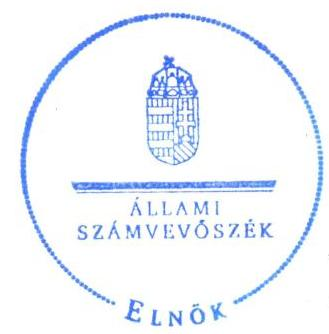
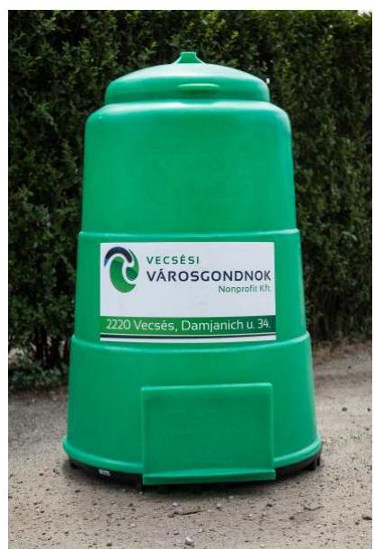
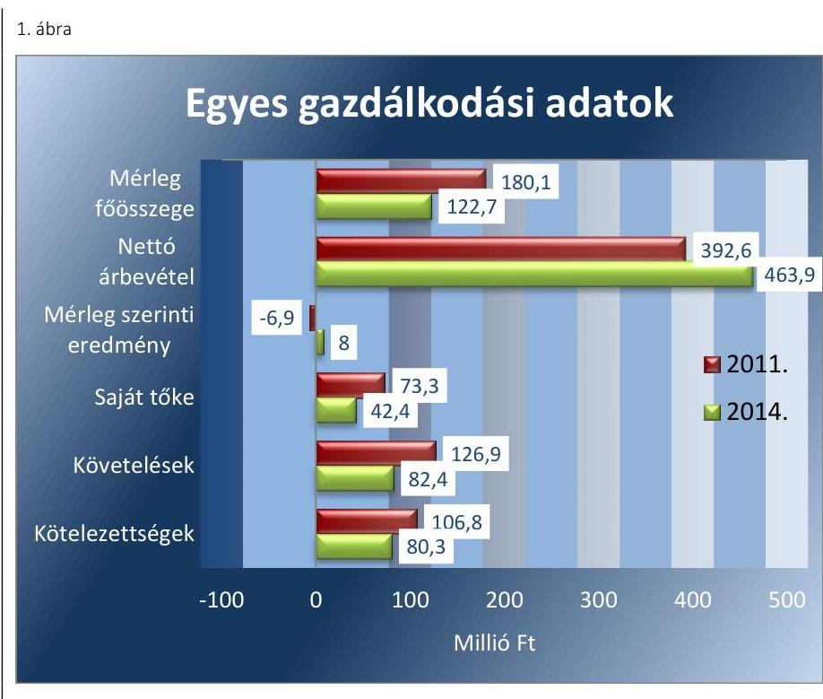
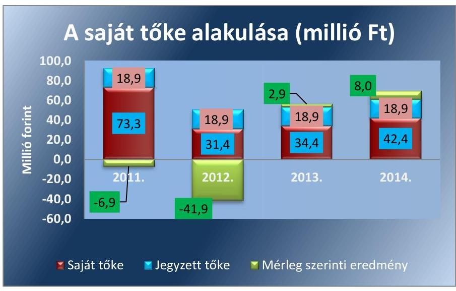
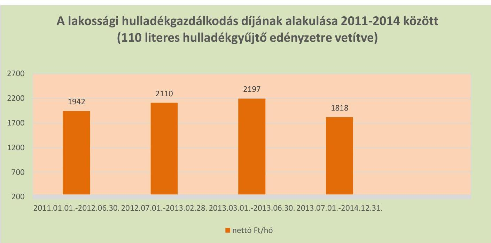
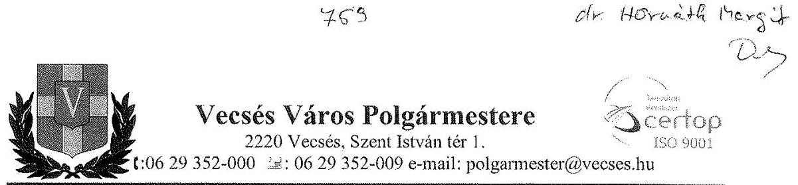
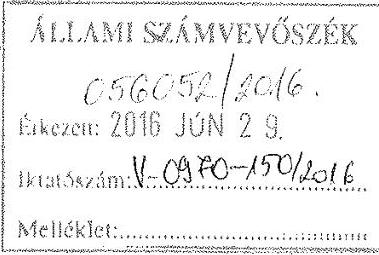
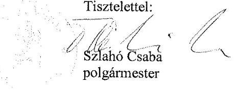
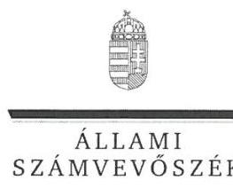
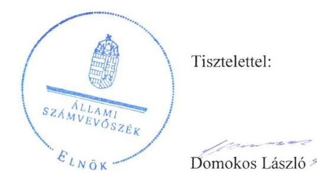

# Jelentés 

## Az önkormányzatok gazdasági társaságai

Az önkormányzatok többségi tulajdonában lévő gazdasági társaságok közfeladat ellátását érintő gazdálkodási tevékenysége szabályszerűségének ellenőrzése

Vecsési Városgondnok Nonprofit Kft.
2016.

Az ÁSZ az államháztartáson kívül müködő közfel-adat-ellátó rendszerek el-lenőrzéseivel hozzájárul ahhoz, hogy a közpénze-ket az államháztartáson kívül müködő szervezetek is átlátható, rendezett módon használják fel a közfeladatok ellátása érdekében.

---

# Jelentés 

## Az önkormányzatok gazdasági társaságai

Az önkormányzatok többségi tulajdonában lévő gazdasági társaságok közfeladat ellátását érintő gazdálkodási tevékenysége szabályszerűségének ellenőrzése

Vecsési Városgondnok Nonprofit Kft.
2016. angusteur hó 3. nap

16125
www.asz.hu

Domokos László
elnök

Az ÁSZ az államháztartá-
son kívül müködő közfel-
adat-ellátó rendszerek el-
lenőrzéseivel hozzájárul
ahhoz, hogy a közpénze-
ket az államháztartáson
kivül müködő szervezetek
is átlátható, rendezett
módon használják fel a
közfeladatok ellátása ér-
dekében.

---

# AZ ELLENŐRZÉST FELÜGYELTE:

DR. HORVÁTH MARGIT felügyeleti vezető

## AZ ELLENŐRZÉST VEZETTE ÉS A VÉGREHAJTÁSÁÉRT FELELŐS:

- KLINGA LÁSZLÓ ellenőrzésvezető
- A PROGRAM ÖSSZEÁLLÍTÁSÁÉRT FELELŐS:
- JANIK JÓZSEF osztályvezető

IKTATÓSZÁM: V-0970-156/2016.

TÉMASZÁM: 2004

ELLENŐRZÉS-AZONOSÍTÓ SZÁM: V-070721

Jelentéseink az Országgyűlés számítógépes hálózatán és az Interneta a www.asz.hu címen is olvashatóak.

---

# TARTALOMJEGYZÉK 

■ ÖSSZEGZÉS ..... 5
■ AZ ELLENŐRZÉS CÉLJA ..... 7
■ AZ ELLENŐRZÉS TERÜLETE ..... 8
■ AZ ELLENŐRZÉS HÁTTERE, INDOKOLTSÁGA ..... 10
■ A JELENTÉS LÉNYEGES KÉRDÉSKÖREI ..... 11
■ ELLENŐRZÉS HATÓKÖRE ÉS MÓDSZEREI ..... 12
■ MEGÁLLAPÍTÁSOK ..... 14
■ JAVASLATOK ..... 26
■ MELLÉKLETEK ..... 29
I. Sz. melléklet: Értelmező szótár ..... 29
II. Sz. melléklet: Múködési adatok ..... 32
III. Sz. melléklet: A lakossági hulladékgazdálkodási díj alakulása 2011-2014 között ..... 33
IV. Sz. melléklet: Mintavételi eljárások ellenőrzési területenként ..... 34
■ FÜGGELÉK: ÉSZREVÉTELEK ..... 35
■ RÖVIDÍTÉSEK JEGYZÉKE ..... 41

---

.

---

# ÖSSZEGZÉS 

Az Állami Számvevőszék a kizárólagos önkormányzati tulajdonú Vecsési Városgondnok Nonprofit Kft.-nél a hulladékgazdálkodási közfeladat ellátását érintő gazdálkodási tevékenysége 2011-2014 közötti szabályszerűségét ellenőrizte. Megállapította, hogy a közfel-adat-ellátás önkormányzati megszervezése szabályszerű volt. A tulajdonosi jogok gyakorlása során nem érvényesültek a Taktv.-ben előirtak és az FB beszámoló ellenőrzési jogosultságai. A szabályszerű vagyongazdálkodás biztosítása mellett a hulladékgazdálkodás közfeladata bevételeinek és ráfordításainak elszámolása nem volt szabályszerű. A Társaságnak önköltségszámitási szabályzat készitési kötelezettsége nem volt, az árképzés megfelelit az elöírásoknak. A Társaság kötelezettségállománya a müködésre, a közfeladat-ellátásra nem jelentett kockázatot.

## Az ellenőrzés társadalmi indokoltsága

Az Állami Számvevőszék a Stratégiában megfogalmazta, hogy a helyi önkormányzatok gazdálkodásában rejlő pénzügyi kockázatok feltárásával, az államháztartáson kívülre nyújtott költségvetési támogatások és ingyenes vagyonjuttatások, valamint az államháztartáson kívül múködő közfeladat-ellátó rendszerek ellenőrzéseivel hozzájárul ahhoz, hogy a közpénzeket az államháztartáson kívül múködő szervezetek is átlátható, rendezett módon használják fel a közfeladatok szerződésben vállalt ellátása érdekében.

Magyarországon az intézmény-centrikus közfeladat-ellátás jellemző, de egyre jelentősebb a költségvetésen kívüli feladatellátás térnyerése. Ennek legfontosabb szereplői - a nonprofit szervezetek mellett - az önkormányzati tulajdonú gazdasági társaságok. Az önkormányzatok szervezetalakítási szabadságának következménye, hogy a korábban is vállalati formában múködő közszolgáltatások mellett, mind a kötelező, mind az önként vállalt feladatok ellátásában a gazdasági társaságok kiemelt fontosságú szerephez jutottak.

## Főbb megállapítások, következtetések, javaslatok

Az Önkormányzat a hulladékgazdálkodás közfeladatának megszervezéséről a jogszabályi előírásoknak megfelelően döntött, annak ellátásáról a kizárólagos tulajdonában lévő gazdasági társasága útján gondoskodott. Az Önkormányzat a Hgt. ${ }_{1,2}$ szerinti hulladékgazdálkodással összefüggő rendeletalkotási kötelezettségének eleget tett, abban egyes kötelezően előírt tartalmi elemeket nem határoztak meg. Az Önkormányzat a hulladékgazdálkodási közszolgáltatás ellátására az ellenőrzött időszakban Közszolgáltatási szerződés ${ }_{1,2}$-t kötött a Társasággal. A Közszolgáltatási szerződés ${ }_{1}$ az előírt tartalmi követelményeknek teljes körűen nem felelt meg, a Közszolgáltatási szerződés ${ }_{2}$-t az előírásoknak megfelelően készítették el. A 2012-ig fennálló hulladékgazdálkodási terv készítési kötelezettségének az Önkormányzat nem tett eleget, 2013-től azt a közszolgáltatónak kellett elkészíteni, amelynek eleget tett.

A Képviselő-testület a vagyongazdálkodási rendelet ${ }_{1,2}$-ben, az SZMSZ-ben, valamint az Alapító Okiratban egymással összhangban meghatározta a tulajdonosi joggyakorlás szabályait. A tulajdonosi jogok gyakorlása összességében hiányos volt, mivel nem érvényesültek a Taktv.-ben előírtak és az FB beszámoló ellenőrzési jogosultságai. A 20112014. évi beszámolókat az FB írásbeli jelentése nélkül fogadta el a Képviselő-testület. Az ügyvezető nem tett eleget az Alapító Okiratban előírt kötelezettségének, mivel a Képviselő-testület elé az FB írásbeli jelentését nem tartalmazó beszámolót terjesztett elő. A jegyző nem tett eleget az Mötv.-ben előírt kötelezettségének, mivel jelezte a Képviselőtestületnek, hogy a beszámoló elfogadása az FB írásbeli jelentésének hiányában jogszabálysértő. Az Önkormányzat a feladatellátáshoz szükséges vagyont az ellenőrzött időszakot megelőzően apportként bocsátotta a Vecsési NKft. rendelkezésre. Az Önkormányzat 2013-ban a korábbi években nyújtott tagi kölcsönök és a Társaság felé fennálló szállítói

---

kötelezettségek összegére 59,5 millió Ft-os összegben kompenzációs megállapodást kötött. Ezen túlmenően a Kép-viselő-testület döntései alapján az ellenőrzött időszakban 112,6 millió Ft összegben nyújtott működési célú támogatást a Társaságnak.

A közfeladat-ellátását szolgáló vagyonnal való gazdálkodás, annak nyilvántartása szabályszerű volt. A Társaság rendelkezett a Számv. tv. előírásainak megfelelő számviteli szabályzatokkal, amelyek elősegítették a szabályszerű működést és vagyongazdálkodást. Hiányosság volt, hogy a számlarendet alátámasztó bizonylati rend nem tartalmazta a lakossági hulladékdíj számlázásával összefüggő bizonylatokat, illetve a pénzkezelési szabályzat nem rendelkezett a készpénzállomány ellenőrzésekor követendő eljárásról és az ellenőrzés gyakoriságáról a Számv. tv.-ben foglaltakkal ellentétben. A Társaság vagyona 2011. január 1-jéről 2014. év végére 66,9 millió Ft-tal csökkent, amit döntően a tárgyi eszközök értékének, valamint a követelések állományának a csökkenése eredményezett. A tárgyi eszközök állománya az elszámolt értékcsökkenések hatására jelentősen csökkent. A Vecsési VNKft.-nek hosszúlejáratú kötelezettsége 2011-2013-ban volt, amelynek esedékes törlesztő részleteit határidőben teljesítette. A Társaság rövid lejáratú kötelezettségeinek döntő részben határidőben eleget tudott tenni. A kötelezettségek állománya az ellenőrzött időszakban összességében csökkent, az Önkormányzattól kapott működési célú támogatások és tagi kölcsönök felhasználásának következtében. A kötelezettségek állománya a működésre, a közfeladat ellátásra nem jelentett kockázatot. A követelések állománya 2011-ről, 2014-re 45,0 millió Ft-tal csökkent. A Vecsési VNKft. a 2011-2012. években, figyelmen kívül hagyva a Hgt. 1,2-ben előírt kötelezettségét, közszolgáltatási díjhátralékos ügyet nem adott át az Önkormányzat jegyzőjének, 2013-ban pedig a NAV-nak behajtásra. A lejárt kintlévőségek behajtására 2012 végéig a Társaság szabálytalanul határozatlan idejű szerződést kötött egy követeléskezelő céggel, ezt követően a díjfizetési kötelezettség elmulasztása esetében a figyelemfelhívást és a felszólítást a Társaság munkatársai végezték. A Vecsési VNKft. mérleg szerinti eredménye alapján a 2011-2012. években veszteséges, a 2013-2014. években pedig nyereséges volt.

A Társaság az üzleti tervek teljesítéséről, az éves gazdálkodásról, azon belül a hulladékgazdálkodás közfeladatáról az éves beszámolók és üzleti jelentések keretében számolt be a tulajdonos felé a Számv. tv.-ben előírtaknak megfelelően. A Vecsési VNKft. a Hgt. ${ }_{2}$-ben foglaltak ellenére a hulladékgazdálkodási közszolgáltatás nyújtása érdekében végzett tevékenységét a 2013. évi beszámolóinak kiegészítő mellékletében nem mutatta be oly módon, mintha azt önálló vállalkozás keretében végezte volna. Nem készített a tevékenységet elkülönülten bemutató önálló mérleget és eredménykimutatást. A 2014. évi beszámoló kiegészítő melléklete önálló eredménykimutatást már tartalmazott, azonban önálló mérleget nem. A könyvvizsgáló a jelentésében nem állapította meg a kiegészítő melléklet tartalmi hiányosságát. A Társaság a hulladékgazdálkodásból a 2014. évben 34,9 millió Ft veszteséget mutatott ki.

A Társaság az Avtv.-ben, illetve 2012-től az Info tv.-ben előírtaknak megfelelően adatvédelmi felelős kijelöléséről gondoskodott, az adatvédelmi és adatbiztonsági szabályzatot 2013 októberében léptették hatályba. A Társaságnál a bevételek, költségek és ráfordítások elszámolása nem volt szabályszerű, ami kockázatot jelentett az ellenőrzött terület egészének múködése szempontjából. A Társaság önköltségszámítási szabályzattal nem rendelkezet, ez alól a törvényi előírás alapján mentesült. Az árképzés megfelelt az előírásoknak.

---

# AZ ELLENŐRZÉS CÉLJA 

Az ellenőrzés célja annak értékelése, hogy az Önkormányzat a jogszabályi előírások figyelembevételével döntött-e az ellenőrzésre kerülő közfeladat megszervezéséről; az önkormányzat/tulajdonosi joggyakorló szabályszerűen gyakorolta-e a tulajdonosi jogokat.

Ellenőriztük, hogy a gazdasági társaság közfeladat-ellátása bevételeinek, ráfordításainak elszámolása, és vagyongazdálkodási tevékenysége megfelelt-e a jog-szabályi, illetve a közszolgáltatási/vagyonkezelési szerződésben foglalt tulajdonosi előírásoknak, azok végrehajtása szabályszerű volt-e.

Értékeltük továbbá, hogy a gazdasági társaság kötelezettségállománya jelent-e kockázatot a múködésre, illetve a közfeladat ellátására; valamint hogy a közfeladatok átláthatósága és elszámoltathatósága érdekében biztosítva volt-e a közszolgáltatás dijának megalapozottsága szabályszerű önköltségszámítással.

---

# **AZ ELLENŐRZÉS TERÜLETE**

## **Vecsés Város Önkormányzata és a többségi tulajdonában lévő Vecsési Városgondnok Nonprofit Korlátolt Felelősségű Társaság**

**VECSÉS VÁROS ÖNKORMÁNYZATA** a Vecsési Városgondnok Nonprofit Kft.-t a 229/2013. (X. 29.) számú határozatával hozta létre, jogelődje az 1998. évben alapított Vecsési Település Üzemeltető és Szolgáltató Kft. volt. A Vecsési Városgondnok Nonprofit Kft. 2014. január 1-jétől működik nonprofit gazdasági társaságként. A Társaság és annak jogelődje az Önkormányzat 100%-os tulajdonában volt az ellenőrzött időszakban.

A Vecsési Városgondnok Nonprofit Kft. jegyzett tőkéje a 2011-2014. években nem változott, 18,9 millió Ft volt. Az Önkormányzat vagyonkezelésre nem adott át eszközöket a Társaság részére. Az ellenőrzött időszakban az Önkormányzatnak két 100%-os tulajdonú gazdasági társasága volt a Vecsési Városgondnok Nonprofit Kft., valamint a Vecsés Városközpont Fejlesztő Kft.

### **A VECSÉSI VÁROSGONDNOK NONPROFIT**

**KFT.** alaptevékenysége nem veszélyes hulladék gyűjtése volt. A Társaság a közel 20 ezer fő lakosságszámú Vecsés város közigazgatási területén ellátta a hulladékgyűjtési, illetve szállítási feladatokat. Emellett ellátott mélyés magasépítési munkákat, zöldterület gondozást, városi intézményekben karbantartást, takarítást és felújítási munkálatokat, helyi utak síkosság mentesítését, helyi buszjárat üzemeltetését és egyéb városgondnoki feladatokat. A Társaság működési területén 2014-ben a rendszeres hulladékgyűjtésbe bevont lakások száma 7102 volt, összesen 7495 tonna hulladékot szállítottak el. A Társaság más gazdasági társaságban tulajdoni hányaddal nem rendelkezett, átlagos statisztikai létszáma 2011-ben 30 fő, 2014-ben 32 fő volt.

A Vecsési Városgondnok Nonprofit Kft. gazdálkodásának egyes adatait a 2011. és a 2014. évek vonatkozásában az 1. ábra szemlélteti:

---

Forrás: Éves beszámolók kiegészítő mellékletei
A Társaság mérlegfőösszege 2011-ben 180,1 millió Ft, 2014-ben 122,7 millió Ft volt. Az értékesítés nettó árbevétele a 2011. és a 2014. év vége között 18,2\%-kal nőtt. A 2011. évi veszteség mellett, 2014-re 8,0 millió Ft pozitív mérleg szerinti eredménnyel zárták az évet. A 2011-2014. években a saját tőke összege 2011. december 31-éről a 2014. év végére, a 2011-2012. évi veszteség következtében több mint egyharmadával csökkent. A követelések 46\%-kal, a kötelezettségek 24,8\%-kal csökkentek az ellenőrzött időszakban.

A Vecsési Városgondnok Nonprofit Kft. múködésének főbb jellemzőit a 2. számú melléklet mutatja be.

Az ellenőrzött időszakban a polgármester és a jegyző személye nem változott. A polgármester a 2006. évi önkormányzati választások óta tölti be tisztségét, a helyszíni ellenőrzés időszakában a munkakört betöltő jegyző 2009. július 1-jétől látja el feladatait. Az ügyvezető 2012. november 1-jétől tölti be tisztségét.

---

# **AZ ELLENŐRZÉS HÁTTERE, INDOKOLTSÁGA**

*Az önkormányzatok közfeladat-ellátásában egyre jelentősebb a gazdasági társaságok útján történő feladatellátás térnyerése.*

### **AZ ÖNKORMÁNYZATI TULAJDONÚ GAZDASÁGI TÁRSASÁGOK**

**TÁRSASÁGOK** teljes körű ellenőrzésének lehetőségét az Állami Számvevőszékről szóló 1989. évi XXXVIII. törvény 2011. január 1-jétől hatályos módosítása teremtette meg. A gazdasági társaságok közfeladat ellátását érintő gazdálkodási tevékenysége szabályszerűségére irányuló ellenőrzéseket erre tekintettel a 2011. évtől végezzük. A közfeladatot ellátó gazdasági társaságok ellenőrzése kiemelten fontos a vagyon megőrzése, megóvása érdekében, valamint a kormányzati szektor elszámolásaiban megjelenő önkormányzati tulajdonú gazdálkodó szervezetek esetében, amelyekkel szemben alapvető követelmény, hogy gazdálkodásuk, működésük szabályszerű, az általuk szolgáltatott adatok minél megbízhatóbbak legyenek. A közfeladat ellátás költségeinek, ráfordításainak alakulása, színvonala hatással van a lakosság elégedettségére.

### **AZ ELLENŐRZÉS VÁRHATÓ HASZNOSULÁSA-KÉNT**

**AZ ÁSZ1** a megállapításaival segítséget nyújthat az államháztartáson kívüli közfeladat-ellátás értékeléséhez, jogszabályi keretei pontosításához, átláthatóságot biztosító szabályozásához. Meghatározhatóvá válnak a közfeladat ellátásban részt vevő államháztartáson kívüli szervezeteknek – az önkormányzat költségvetését, pénzügyi helyzetét is befolyásoló – kockázatai, lehetővé válik ezen kockázatok csökkentése. Ellenőrzéseink feltárhatják, hogy az önkormányzat közfeladat ellátási kötelezettségének szabályszerűen tett-e eleget, a feladatellátáshoz rendelt közvagyon működtetését a tulajdonostól elvárható gondossággal, szabályszerűen szervezte-e meg és a tulajdonosi felügyelete hozzájárult-e a közfeladat szabályszerű ellátásához. Értékelhetővé válik, hogy a feladatot ellátó gazdasági társaság a közszolgáltatási szerződésben foglaltak betartásával, a közvagyon használatával biztosította-e a szolgáltatás folytatásának feltételeit. Ezzel az ellenőrzöttek és a helyi döntéshozók számára az ÁSZ visszajelzést ad feladatszervezési, feladat-ellátási kockázataikról, alapot ad a meglévő hibák megszüntetéséhez, a jobb közfeladat-ellátás biztosításához. Mindezeken keresztül az ÁSZ hozzájárul Magyarország közpénzügyi helyzetének javításához, a közpénzek mérhető módon történő, a döntéshozók által meghatározott célok szerinti felhasználásához.

---

# A JELENTÉS LÉNYEGES KÉRDÉSKÖREI 

1. Az önkormányzat közfeladat megszervezéséről szóló döntése, valamint tulajdonosi joggyakorlása szabályszerű volt-e?
2. A gazdasági társaság vagyongazdálkodása szabályszerű volt-e, kötelezettségállománya jelentett-e kockázatot a müködésre, illetve a közfeladat ellátásra?
3. A gazdasági társaságnál az ellátott közfeladat bevételei és ráfordításai elszámolása, valamint az önköltségszámítás és árképzés szabályszerű volt-e?

---

# ELLENŐRZÉS HATÓKÖRE ÉS MÓDSZEREI 

## Az ellenőrzés típusa

Megfelelőségi ellenőrzés

## Az ellenőrzött időszak

A 2011. január 1-jétől 2014. december 31-éig terjedő időszak.

## Az ellenőrzés tárgya

A közfeladatot gazdasági társaságokkal ellátó önkormányzatok tulajdonosi joggyakorlása, valamint gazdasági társaságok pénz- és vagyongazdálkodásának szabályozottsága és szabályszerűsége.

Az ellenőrzés kiterjed minden olyan körülményre és adatra, amely az ÁSZ jogszabályban meghatározott feladatainak teljesítéséhez, valamint a program végrehajtása folyamán felmerült újabb összefüggések feltárásához szükséges.

## Az ellenőrzött szervezet

Vecsés Város Önkormányzata és a Vecsési Városgondnok Nonprofit Korlátolt Felelősségű Társaság

## Az ellenőrzés jogalapja

Az ellenőrzés végrehajtásának jogszabályi alapját az Állami Számvevőszékről szóló 2011. évi LXVI. törvény 5. § (3)-(4)-(5) bekezdései képezték.

## Az ellenőrzés módszerei

Az ellenőrzést a nemzetközi standardokat irányadónak tekintve az ellenőrzési program ellenőrzési kérdései, az ellenőrzött időszakban hatályos jogszabályok, az ellenőrzés szakmai szabályok és módszertanok figyelembe vételével végeztük.

Az ellenőrzés ideje alatt az ellenőrzött szervezettel történő kapcsolattartást az ÁSZ Szervezeti és Müködési Szabályzatának vonatkozó előírásai alapján biztosítottuk.

---

Az ellenőrzés a kiválasztott, többségi tulajdonosi jogokat gyakorló önkormányzatra, illetve az ellenőrzött közfeladatot ellátó gazdasági társaságra terjedt ki. Az ellenőrzött gazdasági társaságnál, amennyiben az több közfeladatot is ellát, akkor az ellenőrzésre kiválasztott közfeladat-ellátást ellenőriztük.

Az ellenőrzést a kérdésekre adott válaszok kiértékelésével, valamint a megjelölt adatforrások, a csatolt tanúsítványok felhasználásával, továbbá az adott időszakban hatályos jogszabályok figyelembe vételével folytattuk le. Az ellenőrzési kérdések megválaszolásához szükséges bizonyítékok megszerzése a következő ellenőrzési eljárások alkalmazásával történt: megfigyelés, kérdésfeltevés (információkérés), összehasonlítás, valamint elemző eljárás.

A bevételek és ráfordítások elszámolása, valamint a vagyonnyilvántartás terén az egyes területek szabályszerű működését mintavétellel ellenőriztük, ez alapján a sokaságokban előforduló hibás tételek arányát becsültük. A jogszabályoknak és a belső előírásoknak megfelelőnek, azaz szabályszerűnek tekintettük az adott bevételek és ráfordítások elszámolását, a vagyonnyilvántartást, amennyiben a minta ellenőrzésének eredménye alapján 95\%-os bizonyossággal a teljes sokaságban a hibahatár kisebb volt, mint 10\%, nem megfelelőnek értékeltük, ha a hibás tételek aránya a 10\%ot meghaladta. Kockázatot, illetve magas kockázatot jeleztünk, amennyiben egy adott terület vonatkozásában a minta alapján a teljes sokaságban nem volt teljes körűen biztosított a jogszabályoknak és a belső szabályzatoknak megfelelő működés.

---

# 1. Az önkormányzat közfeladat megszervezéséről szóló döntése, valamint tulajdonosi joggyakorlása szabályszerű volt-e? 

Összegző megállapítás

Az Önkormányzat a hulladékgazdálkodási közfeladat megszervezéséről a jogszabályi előírásoknak megfelelően döntött, a tulajdonosi joggyakorlás nem érvényesült teljes körűen.
1.1. számú megállapítás

A közfeladat-ellátást az Önkormányzat szabályszerűen szervezte meg, azonban a hulladékgazdálkodással összefüggő tervkészítési kötelezettségének nem tett eleget, továbbá a hulladékgazdálkodási rendeletek nem feleltek meg teljes körűen az előírásoknak.

Az Önkormányzat² a Képviselő-testület által a 2011-2014. évekre elfogadott gazdasági program ${ }_{1}{ }_{2}{ }^{4}$-jában az Ötv. ${ }^{5}$ 91. § (6) bekezdésének, 2013. január 1-jétől az Mótv. ${ }^{6}$ 116. § (3)-(4) bekezdéseinek megfelelően meghatározta mindazokat a célkitűzéseket, amelyek az általa ellátott feladatok biztosítását, fejlesztését szolgálják. A gazdasági program ${ }_{1}$ a hulladékgazdálkodási közfeladattal kapcsolatosan az illegális hulladéklerakások megszüntetésére, a szelektív hulladékgyűjtés és elhelyezési feltételeinek kialakítására fókuszált. A gazdasági program ${ }_{2}$ a Vecsési VNKft ${ }^{7}$. portfóliójának bővítését, a Társaság tevékenységi körébe további városgondnoki feladatok bevonását tűzte ki célul, ami a veszteségek enyhítését, valamint a kedvezőbb beruházási lehetőségek elősegítését szolgálja. Az Önkormányzat környezetvédelmi és energetikai fejlesztések között fogalmazta meg a városi hulladékgazdálkodás fejlesztését, korszerűsítését.

Az Önkormányzat a közép- és hosszú távú vagyongazdálkodási tervét ${ }^{8}$ a Nvtv. 9. § (1) bekezdésének megfelelően elkészítette, amelyben meghatározta a vagyongazdálkodás főbb feladatait, vagyon hasznosításának formáit úgy, hogy a középpontban a közfeladatok ellátásának, és a lakossági igények kielégítésének költségtakarékos és hatékony megoldása, illetve a vagyon értéknövelő használata, megtakarítása állt.

Az Önkormányzat a Hgt. ${ }^{9}$ 35. § (1) bekezdésében foglaltak ellenére a 2011-2012. években illetékességi területére helyi hulladékgazdálkodási tervet nem dolgozott ki. A Hgt. ${ }_{2}{ }^{10}$ 78. § (1) bekezdésében foglaltak alapján - 2013. január 1-jétől - a hulladékgazdálkodási tervet a közszolgáltatónak kellett elkészítenie, amelynek eleget tett.

## A KÖZTISZTASÁG ÉS A TELEPÜLÉSTISZTASÁG BIZTOSÍTÁSA az Ötv. 8. § (1) bekezdése* alapján az Önkormányzat

[^0]
[^0]:    * A helyi közügyek, valamint a helyben biztosítható közfeladatok körében ellátandó helyi önkormányzati feladatként a hulladékgazdálkodást 2013. január 1-jétől az Mótv. 13. § (1) bekezdés 19. pontja írja elő.

---

törvényi kötelezettsége. Az Önkormányzat közigazgatási területén a szilárd hulladék gyűjtése, ártalmatlanítása, hasznosítása és a közterületek tisztántartása feladatának ellátásáról a Vecsési Városgondnok Nonprofit Kft. útján gondoskodott.

A Vecsési VNKft. feladatellátásának kereteit az Alapító Okiratban ${ }^{11}$, a közfeladat biztosításának és a díjak megállapításának szabályait a hulladékgazdálkodási rendelet ${ }_{1}{ }^{12}{ }_{2}{ }^{13}$-ben határozták meg.

A KÖZSZOLGÁLTATÁSI SZERZŐDÉS114-T az Önkormányzat 2000. március 6. napján határozatlan időtartamra kötötte meg a Társaság ${ }^{15}$-gal a „Vecsés település lakossági kommunális hulladékának öszszegyűjtése és elszállítására", a szerződést a Hgt. ${ }_{1}$ hatályba lépését követően azonban nem módosították legfeljebb 10 évre szóló határozott időtartamúra a Hgt. ${ }_{1}$ 28. § (3) bekezdésben előírtakkal ellentétben. A Közszolgáltatási szerződés ${ }_{1}$ alapján a Vecsési VNKft. feladata kizárólag a települési lakossági kommunális hulladék begyűjtése és elszállítása volt. A Közszolgáltatási szerződés ${ }_{1}$ tartalmazta a hulladék elszállítás gyakoriságát, menetrendjét, valamint a kijelölt feladatok díjtételeit, azonban a szerződés csak részben felelt meg a 224/2004. (VII. 22.) Korm. rendelet ${ }^{16}$ 11-14. §-aiban előírt tartalmi követelményeknek, mert:
—_ a közszolgáltató kötelességeként nem került meghatározásra a közszolgáltatás folyamatos és teljes körű ellátása, a teljesítéséhez szükséges mennyiségű és minőségű eszközök biztosítása, valamint a szükséges létszámú és képzettségű szakember alkalmazása, fejlesztések és karbantartások elvégzésének feltételei, közszolgáltatási díj mértékéről és az alkalmazás tapasztalatairól az önkormányzat kép-viselő-testületének történő tájékoztatási kötelezettsége;
— az önkormányzat kötelességeként nem került meghatározásra a közszolgáltatás hatékony és folyamatos ellátásához a közszolgáltató számára szükséges információk szolgáltatása, a településen működtetett különböző közszolgáltatások összehangolásának elősegítése, a települési igények kielégítésére alkalmas hulladék gyűjtésére, kezelésére, ártalmatlanítására szolgáló helyek és létesítmények kijelölése, valamint a közszolgáltató kizárólagos közszolgáltatási jogának biztosítása;
— nem tartalmazta a közszolgáltatási tevékenység végzésének időtartamát, az igazolt díjhátralék kiegyenlítésére vonatkozó eljárást és nem kerültek meghatározásra azok a feltételek, amelyek mellett a közszolgáltató a közszolgáltatás teljesítésére közreműködőt vagy teljesítési segédet vehet igénybe.
Az Önkormányzat 2013. szeptember 30. napján 5 éves időtartamra Közszolgáltatási szerződést ${ }_{2}{ }^{17}$ kötött a Vecsési VNKft.-vel. A Közszolgáltatási szerződés2 a 317/2013. (VIII. 28.) Korm. rendelet ${ }^{18}$ 4. § (1)-(3) bekezdéseiben foglaltak előírásoknak megfelelt. A Közszolgáltatási szerződés2-ben meghatározták - többek között - a közszolgáltatás minőségi ismérveit, a környezetvédelmi hatóság által meghatározott minősítési osztályt, a felmondás feltételeit, a közszolgáltató kizárólagos jogának biztosítását, valamint a közszolgáltatási díj megállapításának, a díjkompenzáció megtérítésének szabályait.

Az Önkormányzat hulladékkezelő teleppel nem rendelkezett, ezért a Vecsési VNKft. a közszolgáltatás keretében összegyűjtött hulladékot az

---

A.S.A. Kft. által üzemeltetett gyáli hulladékkezelő központba szállította tárolás és ártalmatlanítás céljából az ellenőrzött időszakban.

A HULLADÉKGAZDÁLKODÁSI RENDELET ${ }_{1}{ }^{19}, 2^{20}$ megalkotásával az Önkormányzat eleget tett a Hgt. ${ }_{1} 23 . \S$ (1) bekezdésében és a Hgt. 2 35. § (1) bekezdésében foglaltaknak. A 2011. január 1. és 2013. szeptember 30. közötti időszakban hatályos hulladékgazdálkodási rendelet ${ }_{1}$ a Hgt. ${ }_{1} .23 . \S$ g) pontjának előírása ellenére a közszolgáltatással összefüggő személyes adatok kezelésére vonatkozó rendelkezéseket nem tartalmazott.

A Képviselő-testület nem határozta meg a hulladékgazdálkodási rende-let ${ }_{2}$-ben a Hgt. 2 88. § (4) bekezdés c) pont szerinti közterület tisztán tartására vonatkozó részletes szabályokat.

A hulladékgazdálkodási rendelet ${ }_{1,2}$-ben - többek között - a jogszabályi előírásnak megfelelően meghatározták a hulladékgazdálkodási közszolgáltatás tartalmát, ellátásának és igénybevételének rendjét, a közszolgáltató és az ingatlantulajdonos ezzel összefüggő jogait és kötelezettségeit, valamint a közszolgáltatási díj fizetésének szabályait, továbbá a lomtalanításra és a zöldhulladék elszállítására vonatkozó rendelkezéseket.

# 1.2. számú megállapítás 

A tulajdonosi jogok gyakorlása nem érvényesült teljes körűen, mert a Képviselő-testület javadalmazással összefüggő szabályzatot nem alkotott, a Társaság számviteli beszámolójának elfogadásáról az FB írásbeli jelentésének hiányában döntött.

A TULAJ DONOSI JOGOK gyakorlásának rendjét az Önkormányzat a vagyongazdálkodási rendelet ${ }_{1}{ }^{21}{ }_{2}{ }^{22}$-ben, az SZMSZ ${ }_{1,2,3}$-ben, valamint az Alapító Okiratban határozta meg a Gt. 19. § (4) bekezdés, valamint a Ptk. 2 3:21. § (3) bekezdés előírásainak megfelelően. Az Önkormányzatot megillető tulajdonosi jogok gyakorlásával kapcsolatos feladatok és jogok a Képviselő-testületet illették meg. A taggyúlési jogokat az SZMSZ ${ }_{1,2}$ és az Alapító Okiratban leírtaknak megfelelően minden esetben a Képviselő-testület gyakorolta.

Az Önkormányzat a vagyontárgyak feletti rendelkezési jogot a vagyongazdálkodási rendelet ${ }_{1,2}$-ben a vagyonelem típusa, a tulajdonosi jog, illetve döntés tartalma, valamint az üzleti vagyon esetében az önkormányzati tulajdonosi hányad alapján osztotta meg a Képviselő-testület és a polgármester között.

AZ FB ${ }^{23}$ a Gt. ${ }^{24}$ 34. § (1) bekezdésében, valamint a Ptk. ${ }^{25}$ 3:121. § (1) bekezdésében előírtakat figyelembe véve három tagból állt. Az FB a Gt. 34. § (4) bekezdésében, illetve a Ptk. 2 3:122. § (3) bekezdésében foglaltakkal összhangban ügyrend ${ }_{2}{ }^{26}{ }_{, 2}{ }^{27}$-del rendelkezett.

JAVADALMAZÁSI SZABÁLYZATOT a Képviselő-testület előterjesztés hiányában - a vezető tisztségviselők, felügyelőbizottsági tagok, valamint az $\mathrm{Mt}^{28}$. 208. §-ának hatálya alá eső munkavállalók javadalmazása, valamint a jogviszony megszűnése esetére biztosított juttatások módjának, mértékének elveiről, annak rendszeréről szabályzatot nem alkotott, ezzel megsértették a Taktv ${ }^{29}$. 5. § (3) bekezdésében foglaltakat.

---

AZ ÁRKÉPZÉS SZABÁLYAIT 2012. december 31-éig a hulla-dékgazdálkodási rendelet ${ }_{1}$-ben határozta meg az Önkormányzat. A közszolgáltatás diját a 64/2008. (III. 02.) Korm. rendelet ${ }^{30}$ 2. § (2) bekezdésének megfelelően egytényezős dijként, a hulladékgyűjtés, szállítás, illetve lerakás együttes dijaként határozták meg, a 3. § (1)-(2) bekezdésben foglalt alapelvek figyelembe vételével. A díjmegállapítás alátámasztásául a Társaság évente részletes költségelemzést készített a Hgt. 25. § (4) bekezdésének eleget téve, melyet a Képviselő-testület az egyszerűsített éves beszámolóval egy időben megtárgyalt és határozataiban elfogadott. Az Önkormányzat 2012. február 28 -áig a szilárd hulladékszállítás és kezelés dijához tárolóedényenként havi 150 Ft összegű támogatást biztosított, amely a 64/2008. (III. 02.) Korm. rendelet 3. § (3) bekezdésének megfelelően díjcsökkentő tételként került elszámolásra. 2013. január 1-jétől a hulladékgazdálkodás közszolgáltatás diját a MEKH ${ }^{31}$ javaslatának figyelembe vételével a miniszter ${ }^{\dagger}$ rendeletben állapította meg. A Hgt. 2 91. § (2) bekezdésének megfelelően 2013. március 1-jén a díjak 4,2\%-os emelésére került sor, majd 2013. július 1. napjától a közszolgáltatási díjakat a 2012. április 14. napján alkalmazott díj legfeljebb 4,2 százalékkal megemelt összegének 90 százalékára csökkentették. Ezt követően további díjmódosítás nem történt a közszolgáltatás diját illetően.

A BESZÁMOLTATÁSI RENDSZER keretében a Társaság az ellenőrzött időszakban a közszolgáltatási tevékenységgel kapcsolatos bevételekről és kiadásokról, az üzleti terv teljesítéséről, valamint a közszolgáltatási tevékenységről az éves egyszerűsített beszámoló készítésével egy időben a Képviselő-testületnek írásban beszámolt.

Az FB az üléseiről írásbeli jelentéseket készített, amelyek alapján az egyszerűsített éves beszámolókat megtárgyalta és egyhangúlag elfogadta. Az FB a 2011-2014. évi beszámolókat ülésein megtárgyalta és minden évben elfogadta.

A TÁRSASÁG ELLENŐRZÉSÉT az Önkormányzat belső ellenőre látta el a Bkr. ${ }^{32}$ 15. § (7) bekezdésének megfelelően. Az Önkormányzat belső ellenőrzése a Társaságnál egy alkalommal, a 2012. évben végzett soron kívüli ellenőrzést, amelynek célja a számlázási gyakorlat szabályszerűségére irányult. Az ellenőrzést megelőzően kockázatelemzés nem készült. A belső ellenőrzési jelentés négy javaslatot tartalmazott, amely alapján intézkedési terv készítési kötelezettséget írtak elő az ügyvezető számára, amelynek határidőben eleget tett. A belső ellenőrzési jelentés az alkalmazott számlázási programmal kapcsolatban, a számlázás menetének változtatásával, a vevőnyilvántartás aktualizálásával és a szerződések karbantartásával összefüggésben fogalmazott meg javaslatokat.

A Vecsési VNKft. mérleg szerinti eredménye alapján a 2011-2012. években veszteséges, a 2013-2014. években pedig nyereséges volt. A Képvi-selő-testület a 2013. és 2014. években a nyereség eredménytartalékba helyezéséről döntött.

[^0]
[^0]:    ${ }^{+}$Nemzeti Fejlesztési Miniszter

---

A saját tőke értéke minden évben meghaladta a jegyzett tőke értékét, ezért a Gt. 143. § (2) bekezdés a) pontja, illetve a Ptk. 3:189. § (2) bekezdése szerinti intézkedés megtételére nem volt szükség.

A saját tőke, a jegyzett tőke, valamint a mérleg szerinti eredmény alakulását a 2. ábra mutatja be.
2. ábra

Forrás: Éves beszámolók kiegészítő mellékletei
Az Önkormányzat a Közszolgáltatási szerződés,-ben a közszolgáltatás folyamatos és zavartalan biztosítása érdekében - az Áht. ${ }^{33} 96$. § (1) bekezdésében leírtakkal összhangban - készfizető kezességet vállalt arra az esetre, amennyiben a Társaság 45 napon túl nem tud eleget tenni a hulladékkezelő A.S.A. Kft. felé esedékessé vált fizetési kötelezettségének. A szerződésben vállalt kezességgel kapcsolatos teljesítés, kifizetés nem történt.

A nyitott pénzügyi elszámolások megoldására vonatkozó határozat ${ }^{34}$ alapján az Önkormányzat 2013-ban a Ptk. ${ }^{35}$ 296. § (1) bekezdésében előírtak figyelembe vételével kompenzációs megállapodást kötött a Vecsési VNKft.-vel, amely szerint a Társaság részére nyújtott összesen 59,5 millió Ft összegű kamatmentes tagi kölcsönt ${ }^{\ddagger}$ 2013-ban az Önkormányzat felé fennálló követelésbe beszámították, azaz kompenzálták.

A Képviselő-testület határozatai alapján a 2012-2014. években összesen 112,6 millió Ft összegben nyújtott múködési célú támogatást a Társaságnak. Az Önkormányzat 2012-ben 9,3 millió Ft múködési támogatást nyújtott a Társaság részére az ügyvezető munkaviszonyának megszűnésekor kötött megállapodásban meghatározott juttatás kiegyenlítésére. A 2013. évben 25,4 millió Ft összegű működési támogatást nyújtott az Önkormányzat az elmaradt szemétlerakási díjak fedezésére, valamint a Társaság ügyvezetője célprémiumának kifizetésére, illetve további 19,3 millió Ftot a kompenzációs megállapodás alapján. A 2014. évben 58,6 millió Ft támogatást nyújtottak a Társaság részére a múködési kiadások fedezetére.

[^0]
[^0]:    ${ }^{\ddagger}$ 2011-ben 25,0 millió Ft, 2012-ben 30,0 millió Ft, és az ellenőrzött időszakot megelőzően nyújtott 4,5 millió Ft tagi kölcsön.

---

# 2. A gazdasági társaság vagyongazdálkodása szabályszerű volt-e, kötelezettségállománya jelentett-e kockázatot a múködésre, illetve a közfeladat ellátásra? 

Összegző megállapítás

2.1. számú megállapítás

A gazdasági társaság vagyongazdálkodása szabályszerű volt, a kötelezettségek állománya nem jelentett kockázatott a múködésre, illetve a közfeladat ellátásra. A 2013-2014. évi beszámolók kiegészítő mellékleteinek tartalma nem felelt meg a követelményeknek.

Az előírt szabályzatokkal rendelkeztek, azonban a számlarend és a pénzkezelési szabályzat tartalma nem felelt meg teljes körűen az előírásoknak.

AZ ÜZLETI TERV készítési kötelezettséget a Társaság részére a Képviselő-testület nem írta elő. Az ügyvezető évente beterjesztette a Társaság üzleti terveit, amelyek tartalmazták az éves bevételeket, ezek részletezését gyűjtés, szállítás, szelektív hulladékgyűjtés és konténeres szállítás közfeladatok szerinti tagolásban, továbbá a költségek és ráfordítások tervezetét költség nemenkénti bontásban. Tartalmazták továbbá a tervezett fejlesztéseket és ezzel összefüggésben várható költségeket. Az üzleti terveket a Képviselő-testület elfogadta. A Társaság üzleti tervei összhangban voltak a gazdasági program ${ }_{1,2}$-ben, valamint a közép- és hosszú távú vagyongazdálkodási tervekben megfogalmazottakkal.

A Vecsési VNKft. rendelkezett a Számv. tv. ${ }^{36}$ 14. § (3) bekezdésében előírt számviteli politikával, valamint a Számv. tv. 14. § (5) bekezdés a)-d) pontjaiban foglaltaknak megfelelően eszközök és források leltárkészítési és leltározási, értékelési szabályzatával, valamint pénzkezelési szabályzattal. Rendelkezett továbbá a Számv. tv. 161. § (1) bekezdésben előírt számlarenddel.

A SZÁMVITELI POLITIKA ${ }_{1}{ }^{37,2^{38}, 3^{39}}$ a Számv. tv. 14. § (4) bekezdés előírásainak megfelelően tartalmazta - többek között - azokat a Társaságra jellemző szabályokat, előírásokat, módszereket, amelyekkel meghatározták, hogy mit tekintenek a számviteli elszámolás, értékelés szempontjából lényegesnek, jelentősnek, valamint azt, hogy a törvényben biztosított választási, minősítési lehetőségek közül melyeket alkalmazzák.

A Társaság számlarendje nem felelt meg a Számv. tv. 161. § (2) bekezdés d) pontjában előírtaknak, mivel a számlarendet alátámasztó bizonylati rend nem tartalmazta a lakossági hulladékdíj számlázó program által előállított bizonylatokat, illetve a könyvelésre átadott összesítések, feladások bizonylatait.

A leltárkészítési és leltározási szabályzat ${ }_{1}{ }^{40},{ }_{2}^{41},{ }_{3}^{42}$ tartalmazta a leltározására, leltáregyeztetés módjára vonatkozó kötelezettség módját és formáját, azonban nem tartalmazta a Számv. tv. 69. §. (3) bekezdésének 2012. január 1-től hatályos változását, amely szerint a leltárba bekerülő adatok valódiságáról mennyiségi nyilvántartás vezetése esetén is legalább három évente mennyiségi felvétellel, illetve egyeztetéssel kell meggyőződni.

---

Az értékelési szabályzat ${ }^{43}$ a Számv. tv. 55. § (1) és (3) bekezdésének előírásával összhangban írta elő a követelések minősítésének, az értékvesztés elszámolásának szabályait.

A pénzkezelési szabályzat, ellentétben a Számv. tv. 14.§ (8) bekezdésében előírtakkal, nem rendelkezett a készpénzállomány ellenőrzésekor követendő eljárásról és az ellenőrzés gyakoriságáról.

ÖNKÖLTSÉGSZÁMÍTÁSI SZABÁLYZAT készítésének kötelezettsége alól a Számv. tv. 14. § (6) bekezdés alapján mentesült a Társaság. A Társaság önköltségszámítási szabályzattal nem rendelkezett.

# 2.2. számú megállapítás 

A Társaság a tulajdonában lévő vagyonával jogszabályi rendelkezéseknek és a belső előírásoknak megfelelően gazdálkodott.

A Társaság a hulladékgazdálkodási közfeladatot saját eszközeivel látta el, üzemeltetésre átvett, illetve vagyonkezelésbe vett eszköze nem volt. A közszolgáltatás teljesítéséhez szükséges saját eszközeit folyamatosan karbantartotta.

## AZ ANALITIKUS ÉS FÖKÖNYVI NYILVÁNTARTÁSI

RENDSZER biztosította a Vecsési VNKft. vagyonának a Számv. tv. és a belső szabályozás szerinti nyilvántartását, a változások folyamatos nyomon követését.

Az egyszerűsített éves beszámolóiban és a számviteli nyilvántartásokban lévő vagyontárgyak állományát szabályszerűen elkészített leltárral alátámasztották. A Társaság egyszerűsített éves beszámolóinak főbb mérlegadatait az 1. táblázat mutatja be.

## VECSÉSI VÁROSGONDNOK NONPROFIT KFT. FÖBB MÉRLEG ADATAI (MILLIÓ FT)

| Mennvezés | 2011.01.01. | 2011.12.31. | 2012.12.31. | 2013.12.31. | 2014.12.31. |
| :--: | :--: | :--: | :--: | :--: | :--: |
| Befektetett eszközök | 52,3 | 31,1 | 14,1 | 9,7 | 7,4 |
| - ebből: Tárgyi eszközök | 52,3 | 31,1 | 14,1 | 9,6 | 7,3 |
| Forgóeszközök | 137,2 | 148,9 | 156,6 | 97,1 | 115,0 |
| - ebből: Követelések | 127,4 | 126,9 | 125,2 | 74,0 | 82,4 |
| Aktív időbeli elhatárolások | 0,2 | 0,1 | 0,1 | 0,1 | 0,3 |
| ESZKÖZÖK ÖSSZESEN | 189,6 | 180,1 | 170,8 | 106,8 | 122,7 |
| Saját tőke | 80,2 | 73,3 | 31,4 | 34,4 | 42,4 |
| - ebből Jegyzett tőke | 18,9 | 18,9 | 18,9 | 18,9 | 18,9 |
| - ebből: Mérleg szerinti eredmény | 1,0 | $-6,9$ | $-41,9$ | 2,9 | 8,0 |
| Céltartalékok | 0,0 | 0,0 | 0,0 | 0,0 | 0,0 |
| Kötelezettségek | 109,4 | 106,8 | 139,3 | 68,9 | 80,3 |
| Passzív időbeli elhatárolások | 0,0 | 0,0 | 0,0 | 3,6 | 0,0 |
| FORRÁSOK ÖSSZESEN | 189,6 | 180,1 | 170,8 | 106,8 | 122,7 |

A2 ESZKÖZÉRTÉK 2011. január 1-jéről 2014. december 31-ére 35,3\%-kal (66,9 millió Ft-tal) csökkent, amit döntően a tárgyi eszközök értékének, valamint a követelések állományának csökkenése eredményezett. A befektetett eszközöket a tárgyi eszközök képezték. A tárgyi eszközök értéke az elszámolt értékcsökkenések hatására jelentősen csökkent, a 2011. év elejei 52,3 millió Ft-ról 7,3 millió Ft-ra. A forgóeszközök állománya az ellenőrzött időszakban 16,2\%-kal (22,2 millió Ft-tal) csökkent, melyen belül a követelések aránya a 2014. év végén 71,6\% volt. A Társaság saját

---

# 2.3. számú megállapítás 

tőkéje a 2011. január 1-jén kimutatott 80,2 millió Ft-ról 2012 év végére 31,4 millió Ft-ra csökkent a veszteség következtében. A 2013. évtől a mérleg szerinti eredmény elszámolásának következtében 35\%-kal (11 millió Fttal) nőtt a saját tőke összege. A jegyzett tőke összege nem változott az ellenőrzött időszakban.

## A kötelezettségek állománya a múködésre, a közfeladat ellátásra nem jelentett kockázatot.

A Társaság kötelezettségeinek állománya 2011. január 1. és 2011. december 31. között csökkent, majd - az előző évhez képest - 2012. év végére 30,4\%-kal (32,5 millió Ft-tal) nőtt. A 2013. év végére ismételten (70,4 millió Ft-tal) csökkent az állomány, majd az előző évhez képest 2014 végére 16,5\%-kal (11,4 millió Ft-tal) nőtt. A kötelezettségek állománya az ellenőrzött időszakban összességében csökkent, az Önkormányzattól kapott múködési célú támogatások és tagi kölcsönök felhasználásának következtében.

A hosszú lejáratú kötelezettségek meghatározó részét az Önkormányzattal szemben fennálló kötelezettségek, a rövid lejáratú kötelezettségek esetében pedig az áruszállításból és szolgáltatásból származó kötelezettségek (szállítók) jelentették. A 2013. évben 59,5 millió Ft összegben kötött kompenzációs megállapodást követően a Társaság teljes kötelezettségeinek állománya csaknem a felére csökkent.

AZ ELADÓSODOTTSÁGI MUTATÓ értéke 2011-ben 0,59 volt és egyedül ebben az évben nem haladta meg a még kedvezőnek tekinthető 0,6-os szintet. Ezt követően 2012. évben 0,86, 2013 évben 0,64, a 2014. évben 0,65 volt. A 2012. évi kiugró értéktől eltekintve enyhe emelkedés volt megfigyelhető. Az eladósodottság mértéke valamennyi évben kedvezőtlen képet mutatott, ugyanis az év végén fennálló kötelezettségek a saját tőke összegét 2011. évben 1,5-szörösen, a 2012. évben 4,5szörösen, a 2013. évben 2-szeresen és a 2014. évben 1,9-szeresen haladták meg. Az eladósodottság mértéke nem jelentett kockázatot a közfeladat ellátására, illetve a Társaság múködésére. A nettó eladósodottság mértéke 2012. év kivételével kedvező volt, ugyanis a követelések összege meghaladta a Társaság kötelezettségének állományát.

Az 1 Ft adósságra - az adósságfedezeti mutató alakulása alapján - 2011. évben 1,69 Ft, 2012. évben 1,22 Ft, 2013. 1,55 Ft és 2014. évben 1,52 Ft vagyon jutott. A Társaság saját vagyona meghaladta a tartozásait. Az árbevételre vetített eladósodottsági mutató alacsony és negatív értéke kedvező volt és a Társaság forgóeszközeinek értéke a kötelezettségeit meghaladta, ami azt jelenti, hogy az árbevétel valamennyi évben fedezetet nyújtott a kötelezettségekre.

A Társaság a 2011-2014. években rendelkezett a társasági formájára kötelezően előírt jegyzett tőkének megfelelő összegű saját tőkével.

HOSSZÚ LEJÁRATÚ KÖTELEZETTSÉGE a Társaságnak 2011-ben 38,9 millió Ft, 2012-ben 69,3 millió Ft, 2013-ban 3,9 millió Ft volt. A 2013-ban kötött kompenzációs megállapodás eredménye képen a Társaságnak a 2014. években hosszú lejáratú kötelezettsége nem volt.

---

# A RÖVID LEJÁRATÚ KÖTELEZETTSÉGEK állománya 

18,2 \%-kal a 2011. évi 67,9 millió Ft-ról 2014. évre 80,3 millió Ft-ra növekedett, elsősorban a szállítói állomány $45 \%$-os növekedése miatt. A rövid lejáratú kötelezettségek 50,2-62,9\%-át a szállítókkal szembeni kötelezettségek tették ki.

A Társaság rövid lejáratú kötelezettségeinek határidőben történő teljesítése alapvetően megvalósult, azonban esetenként 60-180 nap közötti késedelemmel teljesítette fizetési kötelezettségeit.
2.4. számú megállapítás

Az előírt beszámolási és adatszolgáltatási kötelezettségét a Társaság teljesítette, azonban a Képviselő-testület a számviteli beszámolókról az FB írásbeli jelentésének hiányában döntött. A 2013-2014. évi beszámolók kiegészítő mellékleteinek tartalma nem felelt meg a követelményeknek.

AZ EGYSZERŰSÍTETT ÉVES BESZÁMOLÓKAT a Társaság a Számv. tv. 4. § (1) bekezdésében előírt kötelezettség alapján a Számv. tv. 17. § (1) bekezdésében előírtak szerint elkészítette, azokat az ügyvezető a Képviselő-testület elé terjesztette. Az egyszerűsített éves beszámolók letétbe helyezése a Számv. tv. 153. § (1) bekezdésben előírt határidőben megtörtént.

Az FB az ügyrend IV. fejezet 5. pontjában rögzített tájékoztatási kötelezettségének nem tett eleget, mert a feladat végrehajtásáról és eredményéről készült beszámolót az FB elnöke nem terjesztette elő a Képviselőtestületnek, valamint a Gt. 34. § (4) bekezdésében és a Ptk. 2 3:122. § (3) bekezdésében előírtak ellenére a 2011-2014. évi beszámolókról írásbeli jelentést nem készített. Az ügyvezető az FB írásbeli jelentését nem tartalmazó beszámolót terjesztett a Képviselő-testület felé.

A Képviselő-testület által választott könyvvizsgáló gondoskodott a könyvvizsgálat elvégzéséről, minősítette a Társaság egyszerűsített éves beszámolóit és azokat hitelesítő záradékkal látta el. Az FB és a könyvvizsgáló a Képviselő-testület összehívását a közvagyon védelme érdekében nem kezdeményezte.

A Vecsési VNKft. a Hgt 2. 50. § (3) bekezdésében foglaltak ellenére a hulladékgazdálkodási közszolgáltatás nyújtása érdekében végzett tevékenységét a 2013. évi beszámolóinak kiegészítő mellékletében nem mutatta be oly módon, mintha azt önálló vállalkozás keretében végezte volna. Nem készített a hulladékgazdálkodási közszolgáltatás nyújtása érdekében végzett tevékenységet elkülönülten bemutató önálló mérleget és eredménykimutatást. A 2014. évi beszámoló kiegészítő melléklete önálló eredménykimutatást tartalmazott, azonban önálló mérleget nem. A könyvvizsgáló - sem vezetői levélben, sem az egyszerűsített éves beszámolóról készítetett független könyvvizsgálói jelentésben - nem kifogásolta a kiegészítő melléklet tartalmi hiányosságát, ezáltal nem tett eleget a Számv. tv. 156. § (5) bekezdés e) pontjában foglalt előírásnak.

A Társaság a hulladékgazdálkodásból a 2014. évben 34,9 millió Ft veszteséget mutatott ki.

Az Avtv. ${ }^{44}$ 31/A. § (1) bekezdés c) pontjában, valamint az Info tv. ${ }^{45}$ 24. § (1) bekezdés c) pontjában foglaltaknak megfelelően az ügyvezető a belső adatvédelmi felelős kijelöléséről gondoskodott. Az adatvédelmi felelős ve-

---

zette a belső adatvédelmi nyilvántartást, amely támogatta a nyilvántartásokban elektronikusan kezelt adatállományok Info tv. 7. §-ában előírt információ biztonsági védelmét. Az Avtv. 31/A. § (2) bekezdés d) pontjában, illetve az Info tv. 24. § (3) bekezdésében előírt adatvédelmi és adatbiztonsági szabályzatkészítési kötelezettségének a Társaság 2013. szeptember 30. napjáig nem tett eleget. Az adatvédelmi és adatbiztonsági szabályzatot 2013. október 1. napi hatállyal adták ki.

# 3. A gazdasági társaságnál az ellátott közfeladat bevételei és ráfordításai elszámolása, valamint az önköltségszámítás és árképzés szabályszerű volt-e? 

Összegző megállapítás

A hulladékgazdálkodási közfeladat bevételeinek és ráfordításainak elszámolása nem volt szabályszerű, a Társaságnak önköltségszámítási szabályzat készítési kötelezettsége nem volt.
3.1. számú megállapítás Az ellátott közfeladat bevételeinek és ráfordításainak elszámolása egyes esetekben nem volt szabályszerű. Az adók módjára behajtandó köztartozásokból keletkezett követelésállomány kezelése során nem érvényesültek a behajtásra vonatkozó jogszabályok előírásai.

A Társaság a hulladékgazdálkodási közfeladat mellett, hulladékszállítási közszolgáltatás keretébe nem tartozó szolgáltatásokat - egyéb hulladékkezelési szolgáltatást, építőipari szolgáltatást, egyéb közösségi szolgáltatást és bérbeadást - is végzett, ezért 2011. január 1-jétől a Hgt. 1 29. § (3) bekezdése, 2013. január 1-jétől a Hgt. 2 50. § (2) bekezdése alapján fennállt a bevételeinek, költségeinek és ráfordításainak elkülönített nyilvántartási kötelezettsége. Ennek érdekében a Vecsési VNKft. a főkönyvi könyvelésében kialakította a bevételek és ráfordítások elkülönítését szolgáló munkaszám rendszerét, azonban ennek részletes belső szabályait a Számv. tv. 161/A. § (1) bekezdésében előírtak ellenére nem alakította ki.

AZ ÉRTÉKESÍTÉS NETTÓ ÁRBEVÉTELÉNEK ELSZÁMOLÁSA során nem érvényesültek teljes körűen a belső szabályozás előírásai a bevételek kiszámlázása és elszámolása tekintetében, ami kockázatot jelent a terület egészének múködése szempontjából. Egyes esetekben hulladéklerakási díjbevételt nem a megfelelő főkönyvi számlán számolták el a számlarendben előírtakkal ellentétben. A lakossági és közötti szemétszállítási díjaknál esetenként nem tartották be a szerződésben foglalt számlázási időszakot a számviteli politika ${ }_{1,2,3}$ részeként kiadott számlarendnek az értékesítés nettó árbevétele és bevételek (9. számlaosztály) elszámolására vonatkozó előírásaival ellentétben.

AZ ANYAGJELLEGŰ RÁFORDÍTÁSOK ELSZÁMOLÁSA során nem érvényesültek teljes körűen Számv. tv. és a belső szabályozás előírásai, ami kockázatot jelent a terület egészének múködése szempontjából. Az egyéb szolgáltatási díjakat nem a megfelelő

---

költségnemre számoltak el a számlarendben, valamint a Számv. tv. 78. § (4) bekezdésében előírtakkal ellentétben.

# A BERUHÁZÁSOK, FELÚJÍTÁSOK KIADÁSAI ÉS AZ ÉRTÉKCSÖKKENÉSI LEÍRÁS ELSZÁMOLÁSA 

során nem érvényesültek teljes körűen Számv. tv. és a belső szabályozás előírásai, ami kockázatot jelent a terület egészének múködése szempontjából. Egyes tárgyi eszközöknél a Számv. tv. 52. § (2) bekezdésében foglaltak ellenére az értékcsökkenés összegét nem a rendeltetésszerű használatbavételtől, üzembe helyezéstől kezdődően számolták el.

AZ AMORTIZÁCIÓ ELSZÁMOLÁSÁVAL kapcsolatos szabályokat a számviteli politikában rögzítették. Az értékcsökkenési leírást az eszközök üzembe helyezésétől, negyedévi gyakorisággal a bruttó értékre vetített lineáris leírás alkalmazásával számolták el. A Vecsési VNKft. a Számv. tv. 92. § (1) bekezdésében foglaltaknak megfelelően a beszámoló kiegészítő mellékletében bemutatta az immateriális javak és tárgyi eszközök bruttó és nettó értékét, az elszámolt halmozott és a tárgyévi értékcsökkenését.

A Társaság az ellenőrzött időszak egészét tekintve az elszámolt értékcsökkenés értéke alatti összegben pótolta a múködését biztosító tárgyi eszközeit. A Társaság saját vagyona után elszámolt értékcsökkenés összege a 2011-2014. években 59,3 millió Ft volt, az eszközpótlás 22,1 millió Ft öszszegben valósult meg.

## ADÓK MÓDJÁRA BEHAJTANDÓ KÖZTARTOZÁS-

NAK minősülnek a Hgt.: 26. § (1) bekezdése, 2013. január 1-jétől a Hgt.: 52. § (1) bekezdése értelmében a hulladékkezelési közszolgáltatás igénybevételéért az ingatlanhasználót terhelő díjhátralék és az azzal összefüggésben megállapított késedelmi kamat, valamint a behajtás egyéb költségei. Az ellenőrzött időszakban a Társaság az előírások szerinti behajtást nem kezdeményezte.

A KÖVETELÉS ÁLLOMÁNY kezelését a 2011-2012. években egy tanácsadó cég végezte a Társasággal kötött szerződés alapján. A megbízás a Vecsési VNKft. határidőn túli nem vitatott, illetőleg vitatott szolgáltatási és egyéb számlaköveteléseinek, peren kívüli eljárásban történő érvényesítésre vonatkozott. A Társaság által rendelkezésre bocsátott, az igényérvényesítéshez szükséges dokumentumok alapján a tanácsadó cég vállalta az esedékessé vált hitelezői adat nyilvántartást, a felszólító levelek kiküldését, a végrehajtási eljárások teljesítését, a részben vagy egészben behajthatatlanná váló követelések számviteli rendezésére javaslat készítését.

A Társaság a 2011. január 1. és 2012. december 31. közötti időszakban nem kezdeményezte az Önkormányzat jegyzőjénél - a felszólítás eredménytelenségét követően - a 90 napon túli díjhátralék adók módjára történő behajtását, ezzel megsértették a Hgt: 26. § (3) bekezdésben előírt szabályt. A 2011-2012. években egy követeléskezelő Társaság végezte a behajtást. A 2013. évtől a tanácsadó céggel megszüntették a követeléskezelési szerződést. A 2013. január 1. és 2014. december 31. közötti időszakban az ingatlantulajdonos díjfizetési kötelezettségének elmulasztása esetén a figyelem felhívást és felszólítást a Társaság munkatársai végezték. Az

---

# Megállapítások 

eredménytelen fizetési felszólítások esetében a díjhátralék megfizetésének esedékességét követő 45. nap elteltével nem kezdeményezte a Társaság a díjhátralék adók módjára történő behajtását a Hgt. 22. § (3) bekezdésben foglalt előírással ellentétben.

A lakossággal szembeni követelésállomány a 2011. évi 25, 7 millió Ft-ról a 2013. évre 53,1 millió Ft-ra nőtt, majd a 2014. évben csökkenés volt tapasztalható, mivel 49,4 millió Ft volt a követelésállomány. A 2014-ben a Vecsési VNKft. a lakossági kinnlevőségek elszámolásánál nem vette figyelembe a Számv. tv. 55. § (1) bekezdésében és a számviteli politikában ${ }_{2}$ előírtakat, mivel a követelések minősítésekor nem kerültek elkülönítésre a kis összegű ( 100 e Ft alatti) és a feletti követelések.

## 3.2. számú megállapítás

A Társaság önköltségszámítási szabályzattal nem rendelkezett, ez alól a törvényi előírás alapján mentesült. Az árképzés megfelelt az előírásoknak.

AZ ÖNKÖLTSÉGSZÁMÍTÁSI SZABÁLYZAT készítésének kötelezettsége alól a Vecsési VNKft. a Számv. tv. 14. § (6) bekezdése alapján mentesült és a tulajdonos sem írta elő önköltségszámítás készítésének kötelezettségét. A Társaság az ellenőrzött időszakban nem rendelkezett önköltségszámítási szabályzattal. Az önköltségszámítás hiánya miatt nem volt megállapítható, hogy a hulladékszállítás bevételei fedezetet nyúj-tottak-e a múködéshez szükséges folyamatos költségekre és ráfordításokra, valamint a közszolgáltatás fejleszthető fenntartásához szükséges kiadásokra.

A 64/2008. (III. 28.) Korm. rendelet 5. §-a szerint a közszolgáltató köteles volt a közszolgáltatási díj megállapítása érdekében díjkalkulációt készíteni. Ha a közszolgáltató a közszolgáltatás körébe tartozó tevékenység mellett más gazdasági tevékenységet is folytatott, a költségtervben a költségek szigorú elkülönítésének módszerét is alkalmaznia kellett. A Vecsési VNKft. a 2011-2012. években a Képviselő-testület részére az árképzést alátámasztó díjkalkulációt készített, amit a Képviselő-testület jóváhagyott. A jóváhagyott díjkalkulációt - az önköltségszámítás szabályainak meghatározásának elmaradása miatt - nem támasztotta alá sem elő-, sem utókalkuláció.

A 2011-2012. években alkalmazott közszolgáltatási díjat a Hgt. 25. § (4) bekezdés előírásának megfelelően az Önkormányzat a hulladékgazdálkodási rendelet ${ }_{1}$-ben állapította meg a közszolgáltató által készített költségelemzés és díjkalkuláció alapján. A Társaság a díjakat az előírásoknak megfelelően alkalmazta. A lakossági szilárd hulladék gyűjtésének, szállításának és elhelyezésének hónapra számított díja 110 literes gyűjtőedényre számolva 2011. január 1. és 2012. június 30. között nettó 1942 Ft/hó volt. 2012. július 1-jétől 2013. február 28 -áig nettó $2110 \mathrm{Ft} /$ hó összeget alkalmaztak. 2013. március 1-jétől 2013. június 30 -áig $2197 \mathrm{Ft} /$ hó volt a díj, majd 2013. július 1-jétől a 2014. év végéig $1818 \mathrm{Ft} /$ hó díjat alkalmaztak. A Társaság által a lakossági 110 literes gyűjtőedényzetre vetített díjak alakulását a 2011-2014. években a 3. számú melléklet tartalmazza.

A rezsicsökkentési intézkedést a Rezsi tv. ${ }^{46}$ előírásainak megfelelően szabályosan végrehajtották. Költségcsökkentési intézkedésre a közületi hulladékszállítás növelésével, a kedvezőbb díjszabást alkalmazó hulladékártalmatlanító kapacitás maximális kihasználásával került sor.

---

# JAVASLATOK 

Az ÁSZ tv. 33. § (1) bekezdésében foglaltak értelmében az ellenőrzött szervezet vezetője köteles a jelentésben foglalt megállapításokhoz kapcsolódó intézkedési tervet összeállítani és azt a jelentés kézhezvételétől számított 30 napon belül az ÁSZ részére megküldeni. Amennyiben az ellenőrzött szervezet vezetője nem küldi meg határidőben az intézkedési tervet, vagy továbbra sem elfogadható intézkedési tervet küld, az Állami Számvevőszék elnöke az ÁSZ tv. 33. § (3) bekezdése a) és b) pontjaiban foglaltakat érvényesítheti.

Javaslataink célja a Vecsési Városgondnok Nonprofit Kft. gazdálkodása szabályszerűségének és gyakorlatának javítása annak érdekében, hogy a szabályozási környezet és az alkalmazott gyakorlat megfelelően tudja támogatni az átlátható múködést.

## A Vecsési Városgondnok Nonprofit Kft. ügyvezetőjének

1. Intézkedjen a számlarendet alátámasztó bizonylati rendnek a lakossági hulladékdíj számlázó program által előállított bizonylatokkal, illetve a könyvelésre átadott összesitések, feladások bizonylataival történő kiegészitéséről.
(2.1. sz. megállapítás 4. bekezdése alapján)
2. Intézkedjen a pénzkezelési szabályzatnak a készpénzállomány ellenőrzésekor követendő eljárással, és az ellenőrzés gyakoriságával történő kiegészitéséről.
(2.1. sz. megállapítás 7. bekezdése alapján)
3. Intézkedjen a hulladékgazdálkodási közszolgáltatás nyújtása érdekében végzett tevékenység önálló mérlegének és eredmény-kimutatásának elkészitéséről és az éves beszámoló kiegészitő mellékletében történő szerepeltetéséről.
(2.4. sz. megállapítás 4. bekezdése alapján)
4. Intézkedjen, hogy a hulladéklerakási dijbevételt a megfelelő fökönyvi számlán számolják el, továbbá a közületi és lakossági szemétszállítási díjaknál tartsák be a szerződésben foglalt számlázási időszakot.
(3.1. sz. megállapítás 2. bekezdése alapján)

---

5. Intézkedjen az anyagjellegü ráfordítások elszámolása során az egyéb szolgáltatási díjaknak a Számv. tv. és a belső szabályzat előírásainak megfelelő költségnemre történő elszámolásáról.
(3.1. megállapítás 3. bekezdése alapján)
6. Intézkedjen arról, hogy a közszolgáltatási dijhátralékos vevők felszólításának eredménytelensége esetén a dijhátralék megfizetésének esedékességét követő 45. nap elteltével megtörténjen a dijhátralék adók módjára történő behajtásának kezdeményezése a NAV-nál.
(3.1. megállapítás 9. bekezdése alapján)

# Javaslataink célja az Önkormányzat szabályszerű múködésének elősegítése, továbbá az önkormányzati tulajdonosi joggyakorlás kontrolljainak erősítése. 

## Vecsés Város Önkormányzata polgármesterének

1. Kezdeményezze a hulladékgazdálkodási rendelet módosítását annak érdekében, hogy az tartalmazza a közterület tisztán tartására vonatkozó részletes szabályokat.
(1.1. sz. megállapítás 10. bekezdése alapján)
2. Intézkedjen a tekintetben, hogy a Társaság legfőbb szerve tegyen eleget a Társaság vezető tisztségviselőire, FB tagjaira és az Mt. 208. §-ának hatálya alá tartozó munkavállalóira vonatkozó Javadalmazási szabályzat megalkotásának.
(1.2. sz. megállapítás 4. bekezdése alapján)
3. Gondoskodjon arról, hogy a Képviselő-testület a Társaság beszámolójának elfogadásakor az FB előzetes írásbeli jelentésének birtokában hozza meg döntését.
(1.2. sz. megállapítás 8. bekezdés 1. mondata alapján)
4. Hívja fel a könyvvizsgáló figyelmét az éves beszámoló kiegészitő melléklete tartalmi megfelelőségének ellenőrzésére és annak könyvvizsgálói záradékban való megjelenítésére.
(2.4. sz. megállapítás 4. bekezdése alapján)

---

5. Intézkedjen a hátralékos követelések behajtása során feltárt szabálytalanságok tekintetében a felelősség tisztására, és szükség szerint intézkedjen a felelősség érvényesitéséről.
(3.1. sz. megállapítás 9. bekezdése alapján)

---

# MELLÉKLETEK 

- I. SZ. MELLÉKLET: ÉRTELMEZŐ SZÓTÁR
eladósodottságot jellemző mutatók
eladósodottsági mutató (tőkeáttétel): idegen tőke/összes forrás.
Egészségesnek mondható egy olyan mértékű áttétel, amelyet az üzleti tervek szerint és az elmúlt időszak tapasztalatai alapján a társaság megfelelő biztonsággal ki tud termelni. Nagy eszközberuházás-igényű iparágakban értéke magasabb, azaz magasabb eladósodottság is elfogadható, de 75-85\%-ot meghaladó értéknél már itt is erős, sőt túlzott külső finanszírozottságról beszélhetünk. Általánosságban véve kedvező, ha értéke kisebb, mint 0,6 .
eladósodottság mértéke: kötelezettségek / saját tőke.
Fontos szerepet játszik ez a mutató egy vállalat megítélésében. Azt mutatja, hogy a saját források a kötelezettségek hány százalékát fedezik. Törekedni kell, hogy a mutató tartósan (jelentősen) 1 alatti értéket érjen el.
nettó eladósodottság: (kötelezettségek-követelések) / saját tőke.
Azt mutatja, hogy a kintlévőségekkel csökkentett kötelezettségeket milyen mértékben fedezi a saját forrás. Ez feltételezi, hogy a követelések pénzügyileg előbb realizálódnak, mint ahogy a kötelezettségeket teljesíteni kell. A mutató minél kisebb, csökkenő értéke a kedvező.
adósságfedezeti mutató I.: (befektetett eszközök+forgó eszközök) / idegen forrás.
Azt mutatja, hogy 1 Ft adósságra hány Ft vagyon jut. Általánosságban véve kedvező, ha értéke 2 körül van, de nagy eszközberuházás-igényű iparágakban értéke kisebb is lehet.
adósságfedezeti mutató II.: működési cash flow / hosszú lejáratú kötelezettségek.
A mutató azt jelzi, hogy az adott gazdálkodási időszak múködési pénzáramainak eredményeként realizált cash flow révén a vállalkozás mennyiben lenne képes valamenynyi hosszú lejáratú kötelezettségének eleget tenni. Ennek vizsgálatára viszonylag ritkán kerül sor, az elsősorban a veszélyhelyzetbe került vállalkozások esetében lehet érdekes. Általánosságban véve kedvező, ha a múködési cash flow minél nagyobb arányban nyújt fedezetet a hosszú lejáratú kötelezettségre (értéke nagyobb, mint 1, nő az ellenőrzött időszakban).
árbevételre vetített eladósodottság: (kötelezettségek - forgóeszközök) / értékesítés nettó árbevétele.
Az árbevételre vetített eladósodottság azt mutatja, hogy az árbevétel mekkora fedezetet nyújt a kötelezettségeknek a forgóeszközökkel csökkentett részére. Általánosságban véve kedvező, ha az árbevétel minél nagyobb arányban nyújt fedezetet a forgóeszközökkel csökkentett kötelezettségekre (értéke kisebb, mint 1, csökken az ellenőrzött időszakban).
garancia
gazdasági társaság

A garancia olyan önálló, az önkormányzat nevében vállalt kötelezettség, amely alapján az önkormányzat az önkormányzati költségvetés terhére szerződésben meghatározott feltételek szerint, a kötelezett nem teljesítése esetén a jogosultnak fizetést teljesít az előzetesen rögzített összeghatárig.
Ptk. 2 3.88. § (1) bekezdése szerint „a gazdasági társaságok üzletszerű közös gazdasági tevékenység folytatására, a tagok vagyoni hozzájárulásával létrehozott, jogi személyiséggel rendelkező vállalkozások, amelyekben a tagok a nyereségből közösen részesednek, és a veszteséget közösen viselik".

---

gazdálkodó szervezet
hulladékgazdálkodás
hulladékgazdálkodási közszolgáltatás
kezesség
közfeladat

A Ptk. ${ }^{47}$ 685. § c) pontja szerint gazdálkodó szervezet: „az állami vállalat, az egyéb állami gazdálkodó szerv, a szövetkezet, a lakásszövetkezet, az európai szövetkezet, a gazdasági társaság, az európai részvénytársaság, az egyesülés, az európai gazdasági egyesülés, az európai területi együttműködési csoportosulás, az egyes jogi személyek vállalata, a leányvállalat, a vízgazdálkodási társulat, az erdő birtokossági társulat, a végrehajtói iroda, az egyéni cég, továbbá az egyéni vállalkozó." (hatályos: 2014. március 15-éig) A Hgt. 2 2. § (1) bekezdés 15. pontja szerint „a polgári perrendtartásról szóló törvényben meghatározott gazdálkodó szervezet, ide nem értve azt a költségvetési szervet, amelyet az államháztartásról szóló törvény szerint közfeladat ellátására hoztak létre." (hatályos: 2014. március 15-étől)
a Hgt. 1 3. § h) pontja szerint „a hulladékkal összefüggő tevékenységek rendszere, beleértve a hulladék keletkezésének megelőzését, mennyiségének és veszélyességének csökkenését, kezelését, ezek tervezését és ellenőrzését, a kezelő berendezések és létesítmények üzemeltetését, bezárását, utógondozását, a múködés felhagyását követő vizsgálatokat, valamint az ezekhez kapcsolódó szaktanácsadást és oktatást." (hatályos: 2012. december 31-éig) A Hgt. 2 2. § (1) bekezdés 26. pontja szerint „a hulladék gyűjtése, szállítása, kezelése, az ilyen múveletek felügyelete, a kereskedőként, közvetítőként vagy közvetítő szervezetként végzett tevékenység, a hulladékgazdálkodási létesítmények és berendezések üzemeltetése, valamint a hulladékkezelő létesítmények utógondozása." (hatályos: 2013. január 1-jétől)
A Hgt. 2 2. § (1) bekezdés 27. pontja szerint: „a közszolgáltatás körébe tartozó hulladék átvételét, gyűjtését, elszállítását, kezelését, valamint a hulladékgazdálkodási közszolgáltatással érintett hulladékgazdálkodási létesítmény fenntartását, üzemeltetését biztosító, kötelező jelleggel igénybe veendő szolgáltatás." (hatályos: 2013. január 1-jétől)
A kezességre vonatkozó előírásokat a Ptk. 2 6:416-430. §-ai tartalmazzák. Kezességi szerződéssel a kezes kötelezettséget vállal a jogosulttal szemben, hogyha a kötelezett nem teljesít, maga fog helyette a jogosultnak teljesíteni. Kezesség egy vagy több, fennálló vagy jövőbeli, feltétlen vagy feltételes, meghatározott vagy meghatározható összegű pénzkövetelés vagy pénzben kifejezhető értékkel rendelkező egyéb kötelezettség biztosítására vállalható.
A Ptk. 1 szerint kezességet csak írásban lehet vállalni. A kezes kötelezettsége ahhoz a kötelezettséghez igazodik, amelyért kezességet vállalt. A kezes kötelezettsége nem válhat terhesebbé, mint amilyen elvállalásakor volt, kiterjed azonban a kötelezett szerződésszegésének jogkövetkezményeire és a kezesség elvállalása után esedékessé váló mellékkövetelésekre is.
Jogszabályban meghatározott állami vagy önkormányzati feladat, amit az arra kötelezett közérdekből, jogszabályban meghatározott követelményeknek és feltételeknek megfelelve végez, ideértve a lakosság közszolgáltatásokkal való ellátását, továbbá az állam nemzetközi szerződésekben vállalt kötelezettségeiből adódó közérdekű feladatokat, valamint e feladatok ellátásához szükséges infrastruktúra biztosítását is (Nvtv. ${ }^{48}$ 3. § (1) bekezdés 7. pont).

---

közszolgáltatás

közszolgáltató
nemzeti vagyon
nonprofit gazdasági társaság
többségi befolyást biztosító részesedés
tulajdonosi joggyakorló

A közszolgáltatás: „közcélú, illetőleg közérdekű szolgáltatást jelent, amely egy nagyobb közösség (állam, település) minden tagjára nézve megközelítőleg azonos feltételek mellett vehető igénybe, ezért valamilyen mértékig közösségi megszervezést, illetve szabályozást, ellenőrzést igényel." Az Ebktv. ${ }^{49}$ 3. § d) pontja a következőképpen határozza meg a közszolgáltatást: „szerződéskötési kötelezettség alapján a lakosság alapvető szükségleteinek ellátására irányuló szolgáltatás, így különösen a villamos energia-, gáz-, hő-, víz-, szennyvíz- és hulladékkezelési, köztisztasági, postai és távközlési szolgáltatás, továbbá a menetrend alapján közlekedő járművekkel végzett közforgalmú személyszállítás".
A Hgt. 2 2. § (1) bekezdés 37. pont szerint: „az a hulladékgazdálkodási közszolgáltatási engedéllyel rendelkező és a hulladékgazdálkodási közszolgáltatási tevékenység minősítéséről szóló törvény szerint minősített nonprofit gazdasági társaság, amely a települési önkormányzattal kötött hulladékgazdálkodási közszolgáltatási szerződés alapján hulladékgazdálkodási közszolgáltatást lát el." (hatályos: 2014. január 1-jétől)
Nvtv. 1. § (2) bekezdése szerint:
„az állam vagy a helyi önkormányzat kizárólagos tulajdonában álló dolgok, az a) pont hatálya alá nem tartozó, állam vagy a helyi önkormányzat tulajdonában lévő dolog,
az állam vagy a helyi önkormányzatot tulajdonában lévő pénzügyi eszközök, továbbá az államot vagy a helyi önkormányzatot megillető társasági részesedések,
az államot vagy a helyi önkormányzatot megillető bármely vagyoni értékkel rendelkező jogosultság, amelyet jogszabály vagyoni értékű jogként nevesít,
Magyarország határa által körbezárt terület feletti légtér,
az üvegházhatású gázok kibocsátási egységeinek kereskedelméről szóló törvény szerint kibocsátási egység és légiközlekedési kibocsátási egység, valamint az ENSZ Éghajlat változási Keretegyezménye és annak Kiotói Jegyzőkönyve végrehajtási keretrendszeréről szóló törvény szerinti kiotói egység,
állami vagy helyi önkormányzati fenntartású közgyűjtemény (muzeális intézmény, levéltár, közgyűjteményként működő kép- és hangarchívum, valamint könyvtár) saját gyűjteményében nyilvántartott kulturális javak körébe tartozó dolog,
a régészeti lelet,
a nemzeti adatvagyon körébe tartozó állami nyilvántartások fokozottabb védelméről szóló törvény szerinti nemzeti adatvagyon." (hatályos 2012. január 1-jétől, g) pont módosult 2012. június 30-ától)
Ctv. ${ }^{50}$ 9/F. § (2) bekezdése szerint „az a gazdasági társaság minősül nonprofit gazdasági társaságnak és cégnevében az a gazdasági társaság tüntetheti fel a nonprofit jelleget, amelynek létesítő okirata tartalmazza, hogy a gazdasági társaság tevékenységéből származó nyereség a tagok között nem osztható fel, hanem az a gazdasági társaság vagyonát gyarapítja." (hatályos 2014. március 15-étől)
A Ptk. 2 8:2. § (1) bekezdése szerint „többségi befolyás az olyan kapcsolat, amelynek révén természetes személy vagy jogi személy (befolyással rendelkező) egy jogi személyben a szavazatok több mint felével vagy meghatározó befolyással rendelkezik."
Aki a nemzeti vagyon felett az államot vagy a helyi önkormányzatot megillető tulajdonosi jogok és kötelezettségek összességének gyakorlására jogosult. (Nvtv. 3. § (1) bekezdés 17. pont).

---

II. SZ. MELLÉKLET: MŰKÖDÉSI ADATOK

| A VECSÉSI NKFT. MŰKÖDÉSÉNEK FŐBB JELLEMZŐI (EZER FT / \%) |  |  |  |  |  |  |
| :--: | :--: | :--: | :--: | :--: | :--: | :--: |
| SORSZÁM | MEGNEVEZÉS |  | 2011. | 2012. | 2013. | 2014. |
| 1. | A gazdasági társaság tulajdonosi összetétele: |  |  |  |  |  |
| 2. | Önkormányzat megnevezése: |  |  | Vecsés Város Önkormányzata |  |  |
| 3. | Önkormányzat tulajdoni részesedésének aránya | \% |  | 100,0 |  |  |
| 4. | Önkormányzat tulajdoni részesedésének öszszege | ezer Ft | 18910 | 18910 | 18910 | 18910 |
| 5. | A gazdasági társaság múködése a vizsgált évek során meg-szűnt-e? (IGEN/NEM) |  |  | NEM |  |  |
| 6. | A tárgyévben a gazdasági társaság saját vagyona után elszámolt értékcsökkenés összege | ezer Ft | 22685 | 11487 | 14899 | 10266 |
| 7. | A tárgyévben a saját tulajdonú eszközök pótlására (karbantartás, felújítás, beruházás) elszámolt költség | ezer Ft | 3926 | 1037 | 10485 | 8024 |
| 8. | Értékesítés nettó árbevétele | ezer Ft | 392666 | 358435 | 472896 | 463881 |

---

#### **■ III. SZ. MELLÉKLET: A LAKOSSÁGI HULLADÉKGAZDÁLKODÁSI DÍJ ALAKULÁSA 2011-2014 KÖZÖTT**

---

# IV. SZ. MELLÉKLET: MINTAVÉTELI ELJÁRÁSOK ELLENŐRZÉSI TERÜLETENKÉNT 

| Ssz. | Mintavételei ellenőrzendő területek | Főbb kérdés | Ellenőrzési kérdések | Adatforrások | Alapsokaság | Mintavételi eljárás |
| :--: | :--: | :--: | :--: | :--: | :--: | :--: |
|  | 1. | 2. | 3. | 4. | 5. | 6. |
| 1. | Az ellátott közfeladat ráfordításainak elkülönített, szabályszerű elszámolása területén |  |  |  |  |  |
| 2. | Anyagjellegú ráfordítások | Az anyagjellegú ráfordítások elszámolása során betartották-e a belső szabályzatokban és a jogszabályokban foglaltakat és azokat a közfeladat-ellátással kapcsolatosan elkülönítettéke? | - a számlázott anyagjellegú ráfordításokra kötött szerződésnél betartották-e a Számv.tv. előírását, a költségelszámolást megalapozó dokumentum (szerződés, megrendelés) rendelkezésre áll?   - a beszerzett anyagok nyilvántartásba vétele megtörtént-e, azokat a közfeladat-ellátással kapcsolatosan elkülönítették-e a szabályozásnak megfelelően?   - a készlet bekerülési értékét a Számv.tv., a számviteli politika, illetve az értékelési szabályzat előírásai szerint vették-e számításba, azokat a közfeladat-ellátással kapcsolatosan elkülönítették-e?   - az anyagjellegú ráfordításokat a megfelelő költségnemre, illetve közfeladatra számolták-e el? | Az anyagjellegú ráfordítások közül az 51-53. főkönyi számlacsoportokból vett minta esetében - a költségelszámolást megalapozó dokumentumok (szerződések, megrendelések, stb.), költségelszámoláshoz benyújtott számlák, teljesítés megtörténtét alátámasztó egyéb dokumentumok,   - analitikus nyilvántartások, anyagok nyilvántartásba vételét igazoló dokumentumok, ha a számviteli politika szerint nyilvántartásba kell venni azokat. | Eves bontásban a főkönyvi adatbázisból az 51-53. Anyagjellegú ráfordítások számlacsoportba a tartozó ráfordítások, kivéve az ELÁBÉ és az eladott közvetített szolgáltatások értéke. | A mintavételt megelőzően a sokaságból ki kell emelni - tételes ellenőrzésre évente a 3-3 legnagyobb összegű tételt.   Véletlen mintavétel évenként elemszámmal arányos rétegzéssel. |
| 3. | Beruházások, felújítások aktiválása és értékcsökkenési leírás | A közfeladatellátást szolgáló közvagyon állományba vételi, nyilvántartási és elszámolási kötelezettségének teljesítése kapcsán a felújítások, beruházások kiadások aktiválása és az értékcsökkenési leírás elszámolása megfelelit-e az elöírásoknak? | - A költségelszámolást megalapozó dokumentum (szerződés, megrendelés, stb.) megfelelit-e az elöírásoknak, továbbá be lett kérve a tulajdonosi jogok gyakorlójának előzetes, írásbeli engedélye - amennyiben előírták - az önkormányzati tulajdonban lévő eszközön elszámolt beruházáshoz/felújításhoz?   - a beruházások, felújítások állományba vétele, besorolása, a bekerülési érték meghatározása, az üzembehelyezések (aktiválások) dokumentálása megfelelit-e az Sztv., a számviteli politika, illetve az értékelési szabályzat elöírásainak?   - az ellenőrzésre kiválasztott immateriális javak és tárgyi eszközök szerepelnek a mérleget alátámasztó leltárban?   - az értékcsökkenés elszámolása a jogszabályban és a számviteli politikában meghatározott szabályozásnak megfelelit-e? | A kiválasztott beruházásra vagy felújításra: szerződések, számlák, a befejezetlen beruházások, felújítások analitikus nyilvántartása, immateriális javak, tárgyi eszközök analitikus nyilvántartása, a beszerzett eszköz üzembehelyezési okmánya, állományba vételi bizonylata, egyedi eszköznylvántartó kartonja - az értékcsökkenés elszámolása az egyedi eszköznylvántartó kartonja, illetve analitikus nyilvántartása | Eves bontásban az immateriális javak, a tárgyi eszközök állománynövekedési tételei, amelyek összegének meg kell egyeznie a kiegészítő mérlegben az immateriális javak, a tárgyi eszközök növekedéseként bemutatott értékkel | A mintavételt megelőzően a sokaságból ki kell emelni - tételes ellenőrzésre évente a 3-3 legnagyobb összegű tételt.   Véletlen mintavétel évenként, elemszámmal arányos rétegzéssel.   Kiválasztott tételek eszközkartonjának tételes ellenőrzése, különös figyelemmel az értékcsökkenés elszámolására. |
| 4. | Az ellátott közfeladat bevételeinek elkülönített, szabályszerű elszámolása területén |  |  |  |  |  |
| 5. | Értékesítés nettó árbevétel | Az értékesítés nettó árbevétele elszámolása során betartották-e a belső szabályzatokban és a jogszabályokban foglaltakat és azokat a közfeladat-ellátással kapcsolatosan elkülönítették e? | - a bevétel kiszámlázása a belső szabályozásnak megfelelően történt-e?   - a befolyt bevétel nyilvántartásba vétele (analitika, főkönyv) megtörtént-e, azokat a közfeladat-ellátással kapcsolatosan elkülönítették-e?   - a bevételek beszedése, elszámolása során betartották-e a szabályozásban foglaltakat és a megfelelő számlacsoportba számolták el a bevételt?   - a tulajdonosi követelményeknek, belső szabályozásnak megfelelő árat alkalmaz-ták-e? | A kiválasztott értékesítés nettó árbevétel jogcímen befolyt bevételre:   - az egyes bevételek díjmegállapítása,   - a kibocsátott számla, befolyt bevétel analitikus nyilvántartása, behajtásra tett intézkedések dokumentumai,   - kapcsolódó főkönyvi számla tételes forgalma,   - bevétel beérkezését igazoló banki kivonat(irész). | Eves bontásban a főkönyvi adatbázisból a 91-94. számlacsoportok bevételei | Véletlen mintavétel évenkénti, elemszámmal arányos rétegzéssel. |

---

# FÜGGELÉK: ÉSZREVÉTELEK 

A jelentéstervezetet a Számvevőszék 15 napos észrevételezésre megküldte az ellenőrzött szervezet vezetőjének az ÁSZ tv. 29. §§ (1) bekezdése előírásának megfelelően.
A Vecsési Városgondnok Nonprofit Kft. ügyvezetője észrevételezési lehetőségével nem élt. Vecsés Város Önkormányzatának polgármesterétől érkezett észrevételt és annak kezeléséről szóló válaszlevelet a jelentés függeléke tartalmazza.

[^0]
[^0]:    § 29. § (1) Az Állami Számvevőszék az ellenőrzési megállapításait megküldi az ellenőrzött szervezet vezetőjének vagy az általa megbízott személynek, és annak, akinek személyes felelősségét állapította meg.
    (2) Az ellenőrzött szervezet vezetője és a felelősként megjelölt személy az ellenőrzés megállapításaira tizenöt napon belül írásban észrevételt tehet.
    (3) Az Állami Számvevőszék az észrevételre a beérkezésétől számított harminc napon belül írásban válaszol. A figyelembe nem vett észrevételeket köteles a jelentésben feltüntetni, és megindokolni, hogy azokat miért nem fogadta el.

---

Állami Számvevőszék

Domokos László
elnők
részére

# Budapest 

Apáczai Csere János u. 10.
1052

Iktatószám: T/458-4/2016.
Hiv.sz.: V-0970-143/2016.

Tisztelt Elnök Úr!
A Vecsési Városgondnok Nonprofit Kft. ellenőrzéséről készült számvevőszéki jelentéstervezetet 2016.06.14-én köszönettel megkaptuk, az abban foglalt megállapításokra az alábbi észrevételt teszem:

### 1.1. számú megállapítás

a) A hulladékgazdálkodásról szóló 2000. évi XLIII. törvény 2001. január 1-jén lépett hatályba, az Önkormányzat a szerződését 2000.03.06. napján kötötte a szolgáltatóval határozatlan időre, melyet az akkor hatályos jogszabályok lehetővé tettek, de azt elfogadjuk, hogy a hulladékgazdálkodásról szóló 2000. évi XLIII. tv. hatályba lépésével nem került sor a szerződés határozott idejűvé módosítására, amely amúgy is megszűnt az új, 2013. január 1. napjától hatályos 2012. évi CLXXXV. törvény alapján kötött új közszolgáltatói szerződéssel.
b) A hulladékgazdálkodásról szóló 2000. évi XLIII. tv. (amely 2013. január 1-től hatálytalan) 23. § f) pontja alapján a Képviselő-testület a 3/2012. (I.20.), a 10/2012. (II.29.), a 16/2012. (V.24.) és a 21/2012. (VII.26.) rendeletekkel módosította a hulladékkezelési közszolgáltatásról és a köztisztaság fenntartásának egyéb szabályairól szóló 13/2002. (VIII.8.) rendeletét, amely rendeletmódosítások tartalmazták az ingatlantulajdonost terhelő díjfizetési kötelezettséget.
A 13/2002. (VIII.8.) rendeletet (egységes szerkezetben) és a módosításokat 2015. december 4-én feltöltöttük az adatszolgáltatás során.
2011. évben nem volt díjfizetésre vonatkozó rendeletmódosítás, a Képviselő-testület a 28/2007. (XI. 29.) rendeletben megállapított díjakat négy éven át nem módosította.

### 1.2. számú megállapítás

A Képviselő-testület tagjai a VETŰSZ/Városgondnok Kft. beszámolói elfogadásakor nem rendelkeztek az FB ülés jegyzőkönyveivel, de az ügyvezető, a társaság főkönyvelője és a Felügyelő Bizottság egyik tagja minden bizottsági és Képviselő-testületi ülésen tájékoztatta a

---

tagokat az FB döntéséről. (A Felügyelő Bizottság egyik tagja a Gazdasági Bizottságnak is tagja, amely bizottság döntése nélkül a beszámoló nem kerülhet a Képviselő-testület elé.)

# 3.1. számú megállapítás 

Az „értékesítés nettó árbevételének elszámolása" kezdetű bekezdéshez jelezzük, hogy elvétve fordulhatott elő eltérés, hogy közületi számla a lakosságira került könyvelésre, de a közületi hulladékdíj teljesen külön kezelésével ez megszűnt.

Az „anyagjellegü" ráfordítások elszámolása során folyamatosan egyeztetünk, az elvétve előforduló hibákat helyre tettük, a megfelelő költségnemekre történő elszámolás helyesen történik.

A „beruházások, felújítások kiadásai és az értékcsökkenési leírás elszámolása" bekezdésnél leírtakra észrevételezzük, hogy a számvitelről szóló 2000. évi C. törvény (a továbbiakban: Számvtv.) 24. § (2) bekezdése szerint a befektetett eszközök közé az immateriális javakat, a tárgyi eszközöket, a befektetett pénzügyi eszközöket kell besorolni.
A Számvtv. 25. § (7) bekezdés b) pontja szerint szellemi termékek közé sorolandók a szerzői jogvédelemben részesülő szerzői művek és szomszédos jogok (különösen: szoftvertermékek, műszaki tervek.) A Társaság ilyennel nem rendelkezett.
A Társaság szerzői jogvédelem alatt nem álló számlázó programját a Számvtv. 25. § (6) bekezdése alapján „vagyoni értékủ jog szellemi termékek felhasználási joga" alapján vette immateriális javakként nyilvántartásba.
A Számvtv. 80. § (2) bekezdésében meghatározottak szerint a 100 ezer forint egyedi beszerzési, előállítási érték alatti vagyoni értékủ jogok, szellemi termékek, tárgyi eszközök bekerülési értéke - a vállalkozó döntésétől függően - a használatbavételkor értékcsökkenési leírásként egy összegben elszámolható.
Ettől a Társaság egy esetben tért el 2012. évben az ideiglenes hulladékszámlázási program leírásánál, mivel az új hulladékgazdálkodási törvény hatályba lépésével a régi programokat nem tudták tovább használni.

Kérem, hogy a végleges jelentés összeállításánál észrevételeinket szíveskedjen figyelembe venni.

A jelentéstervezet végén a polgármesternek címzett javaslatokkal kapcsolatban jelezni szeretném, hogy a feltárt szabálytalanságokkal kapcsolatban munkajogi felelősség kivizsgálását nem tartom szükségesnek.
A számvevők megállapításait részletesen áttanulmányoztuk, a javaslataikat köszönjük és a végleges jelentés alapján az intézkedési tervet jóváhagyásra a Képviselő-testület elé terjesztjük.

Vecsés, 2016. június 28.

---

ELNÖK

Ikt.szám: V-0970-151/2016

# Szlahó Csaba úr 

polgármester
Vecsés Város Önkormányzata

## Vecsés

## Tisztelt Polgármester Úr!

Köszönettel vettem a Vecsési Városgondnok Nonprofit Kft. ellenőrzéséről készített számvevőszéki jelentéstervezetre tett észrevételeit.

Az Állami Számvevőszék észrevételekre vonatkozó álláspontjáról a felügyeleti vezető által készített részletes tájékoztatásból kap választ, amelyet levelemhez mellékeltem.

Tájékoztatom Polgármester urat, hogy a számvevőszéki jelentés véglegesítése az elfogadott észrevételek figyelembevételével történik.

Budapest, 2016. 07 hó 22 nap

Melléklet: Tájékoztatás az észrevételek kezeléséről

---

# Tájékoztatás az észrevételek kezeléséről 

„Az önkormányzatok többségi tulajdonában lévő gazdasági társaságok közfeladat ellátását érintő gazdálkodási tevékenysége szabályszerűségének ellenőrzése - " Vecsési Városgondnok Nonprofit Kft." címmel készített jelentéstervezetre Polgármester úr észrevételeit megköszönöm. Az észrevételek a jelentéstervezet hat megállapítását érintik. Az észrevételek kezeléséről az alábbi tájékoztatást adom.
A jelentéstervezet 1.1. számú megállapítása kapcsán tett a) jelű észrevételét elfogadom, a jelentéstervezet 15 . oldalán a harmadik bekezdés első mondatát az alábbiak szerint módosítottam:
„A Közszolgáltatási szerződésı-t az Önkormányzat 2000. március 6. napján a-Hgt, 28. §- (3) bekezdésben-meghatározott legfeljebb-10-év-helyett,-határozatlan időtartamra kötötte meg a Társasággal a „Vecsés település lakossági kommunális hulladékának összegyüjtése és elszállitására", a szerzödést a Hgt, hatályba lépését követöen azonban nem módositották legfeljebb 10 évre szóló határozott időtartamúra a Hgt, 28. § (3) bekezdésben elöirtakkal ellentétben."
A jelentéstervezet 1.1. számú megállapítása kapcsán tett b) jelű észrevételében jelzi, hogy a Képviselő-testület a 2012. évben többször módosította a hulladékgazdálkodási rendeletét, amely rendeletmódosítások tartalmazták az ingatlantulajdonost terhelő díjfizetési kötelezettséget. Észrevételét elfogadom, a jelentésből törlöm a kifogásolt részt az alábbiak szerint:
„A 2011. január 1. és 2013. szeptember 30. közötti időszakban hatályos hulladékgazdálkodási rendelet; a Hgt, 23. § 6 -és g) pontokjának elöirásai ellenére az-ingatlantulajdonost-terhelö dijfizetési kötelezettséget,-az-alkalmazható-dij-megfizetésének-rendjét-nem-szabályozta,-valamint a közszolgáltatással összefüggő személyes adatok kezelésére vonatkozó rendelkezéseket nem tartalmazott."

A jelentéstervezet 1.2. számú megállapítása kapcsán tett észrevétele a jelentéstervezet 1.2. megállapítások 7. (a jelentéstervezet 17. oldalán a harmadik) „A FB az üléseiről írásbeli ..." kezdetü bekezdését érinti, melyből észrevétele alapján a következő tagmondatot, egyúttal a 8., ,,A 2011-2014. évi beszámolók elfogadásakor ... " kezdetű bekezdést teljes egészében töröltem:
„[...],-azonban-a-Képviselö-testület-ennek-birtokának-hianyában-döntött-az-éves-beszámolók elfogadásáról."

A jelentéstervezet 1.2. számú megállapítása kapcsán tett fenti észrevétele alapján törölt bekezdések miatt, valamint levele végén a feltárt szabálytalanságok felelősségének kivizsgálását célzó javaslattal kapcsolatban tett jelzése alapján Polgármester úrnak címzett 4. számú, a munkajogi felelősség kivizsgálására irányuló javaslatot töröltem.

A jelentéstervezet 3.1. számú megállapítása 2., „Az értékesités nettó árbevételének elszámolása során ... " kezdetű bekezdése kapcsán tett észrevétele a megállapításainkat nem vitatja, csupán azt jelzi, hogy a közületi hulladékdíj teljesen külön kezelésével megszüntették a hiányosságot. Jelzését tudomásul vettem, az azonban a megállapítások változtatását nem indokolja.

---

A jelentéstervezet 3.1. számú megállapítása 3., ,,Az anyagjellegü ráforditások elszámolása során ..." kezdetü bekezdése kapcsán tett észrevétele a megállapításainkat nem vitatja, azokat nem befolyásolja. Jelzését, mely szerint az elvétve előforduló hibákat helyre tették, köszönettel vettem, azok azonban nem indokolják a megállapítások módosítását.

A jelentéstervezet 3.1. számú megállapítása 4., ,,A beruházások, felújitások kiadásai és az értékcsökkenési leírás elszámolása során..." kezdetü bekezdése kapcsán tett észrevétele alapján a bekezdésből töröltem a következő két mondatot:
„Egyes-használatha-vett-szoftverek-beszerzését-beruházásként-vették-nyilvántartásba-a-Számv: tv-25-§-(7)-bekezdés-b)-pontja-clöírása-ellenére.-Egyes-50-ezer-Ft-bekerülési-érték-felett beszerzett-számítástechnikai-eszközök-értékét-2011-2012-ben-egy-összegben-számolták-el-a számviteli-politikában-clöirtakkal-ellentétben,-ami-esak-az-50-ezer-Ft-alatt-beszerzett-esetében tette-ezt-lehetövé."

Egyúttal a fenti megállapítás törlése okán töröltem a Vecsési Városgondnok Nonprofit Kft. Ügyvezetőjének címzett 6. számú javaslatot, amely az immateriális javak előírásoknak megfelelő nyilvántartásba vételére vonatkozott.

Budapest, 2016. fülcins hó 22 nap

Dr. Horváth Margit felügyeleti vezető

---

# RÖVIDÍTÉSEK JEGYZÉKE 

${ }^{1}$ ÁSZ
${ }^{2}$ Önkormányzat
${ }^{3}$ gazdasági program ${ }_{1}$
${ }^{4}$ gazdasági program ${ }_{2}$
${ }^{5}$ Ötv.
${ }^{6}$ Mötv.
${ }^{7}$ Vecsési VNKft.
${ }^{8}$ közép- és hosszú távú vagyongazdálkodási terv
${ }^{9} \mathrm{Hgt}_{1} .1$
${ }^{10} \mathrm{Hgt}_{2} .2$
${ }^{11}$ Alapító Okirat
${ }^{12}$ hulladékgazdálkodási rendelet ${ }_{1}$
${ }^{13}$ hulladékgazdálkodási rendelet ${ }_{2}$
${ }^{14}$ Közszolgáltatási szerződés ${ }_{1}$
${ }^{15}$ Társaság
${ }^{16}$ 224/2004. (VII. 22.) Korm. rendelet
${ }^{17}$ Közszolgáltatási szerződés ${ }_{2}$
${ }^{18} 317 / 2013$. (VIII. 28.) Korm. rendelet
${ }^{19}$ hulladékgazdálkodási rendelet ${ }_{1}$
${ }^{20}$ hulladékgazdálkodási rendelet ${ }_{2}$

Állami Számvevőszék
Vecsés Város Önkormányzata
Vecsés Város Önkormányzata Képviselő-testületének 171/2009. (VII.30.) sz. határozata a gazdasági program elfogadásáról (hatályos 2009-2013-ig)
Vecsés Város Önkormányzata Képviselő-testületének 112/2014. (VI.24.) sz. határozata a gazdasági program elfogadásáról (hatályos 2014-2020-ig)
a helyi önkormányzatokról szóló 1990. évi LXV. törvény (hatálytalan: 2 014. október 12-étől)

Magyarország helyi önkormányzatairól szóló 2011. évi CLXXXIX. törvény (hatályos: 2012. január 1-jétől, kivéve a 144. § (2) bekezdésben meghatározott paragrafusok, amelyek 2012. április 15-én, a (3) bekezdésben meghatározott paragrafusok, amelyek 2013. január 1-jén, a (4) bekezdésben meghatározott paragrafusok, amelyek 2014. október 12én léptek hatályba)
Vecsési Városgondnok Nonprofit Kft.
Vecsés Város Önkormányzata Képviselő-testületének 47/2012. (II.28.) számú határozata Vecsés Város Önkormányzat közép- és hosszú távú vagyongazdálkodási tervéről
a hulladékgazdálkodásról szóló 2000. évi XLIII. törvény (hatálytalan: 2013. január 1-jétől)
a hulladékról szóló 2012. évi CLXXXV. törvény (hatályos: 2013. január 1jétől)
a Vecsési Városgondnok Nonprofit Kft. Alapító Okirata és módosításai
Vecsés Város Önkormányzata Képviselő-testületének 13/2002. (VIII.8.) számú önkormányzati rendelete a hulladékkezelési közszolgáltatásról és a köztisztaság fenntartásának egyéb szabályairól
Vecsés Város Önkormányzata Képviselő-testületének 20/2013. (IX.19.) számú önkormányzati rendelete a hulladékgazdálkodási közszolgáltatásról
Vecsés Város Önkormányzata és a VETÜSZ Kft. között létrejött, a 20002012. évekre szóló, a települési lakossági kommunális hulladék összegyűjtésére és elszállítására vonatkozó közszolgáltatási szerződés (hatályos: 2000. február 1-jétől 2013. október 1-jéig)
Vecsési VNKft.
a hulladékkezelési közszolgáltató kiválasztásáról és a közszolgáltatási szerződésről (hatálytalan: 2013. szeptember 5-étől)
Vecsés Város Önkormányzata és a VETÜSZ Kft. között létrejött, a hulladékgazdálkodási közszolgáltatási szerződés (hatályos: 2013. október 1-jétől 2018. szeptember 30-ig)
a közszolgáltató kiválasztásáról és a hulladékgazdálkodási közszolgáltatási szerződésről (hatályos: 2013. szeptember 5-étől)
Vecsés Város Önkormányzata Képviselő-testületének
hulladékgazdálkodásról szóló 13/2002. (VIII. 8.) számú rendelete
Módosította a 32/2011 (XII.02.), 3/2012 (I.20.), 10/2012 (II.29.), 16/2012
(V.24.), 21/2012 (VII.26.), 17/2013 (VIII.01.) számú KT határozat

Vecsés Város Önkormányzata Képviselő-testületének
hulladékgazdálkodásról szóló 20/2013. (IX. 19.) számú rendelete

---

${ }^{21}$ vagyongazdálkodási rendelet ${ }_{1}$
${ }^{22}$ vagyongazdálkodási rendelet ${ }_{2}$
${ }^{23} \mathrm{FB}$
${ }^{24} \mathrm{Gt}$.
${ }^{25} \mathrm{Ptk}_{.2}$
${ }^{26}$ ügyrend $_{1}$
${ }^{27}$ ügyrend $_{2}$
${ }^{28} \mathrm{Mt}$.
${ }^{29}$ Taktv.
${ }^{30}$ 64/2008. (III. 2.) Korm. rendelet
${ }^{31}$ MEKH
${ }^{32}$ Bkr.
${ }^{33}$ Áht.
${ }^{34}$ Képviselő-testület 230/2013. (X. 29.) számú határozata
${ }^{35}$ Ptk. 1
${ }^{36}$ Számv. tv.
${ }^{37}$ számviteli politika $_{1}$
${ }^{38}$ számviteli politika2
${ }^{39}$ számviteli politika3
${ }^{40}$ leltározási szabályzat ${ }_{1}$
${ }^{41}$ leltározási szabályzat ${ }_{2}$
${ }^{42}$ leltározási szabályzat ${ }_{3}$
${ }^{43}$ értékelési szabályzat
${ }^{44}$ Avtv.
${ }^{45}$ Info tv.

Vecsés Város Önkormányzata Képviselő-testületének 19/1994. (XI.8.) számú önkormányzati rendelete az Önkormányzat vagyonáról és a vagyongazdálkodási szabályairól (hatálytalan: 2013. június 27-étől)
Vecsés Város Önkormányzata Képviselő-testületének 13/2013. (VI.27.) számú önkormányzati rendelete Vecsés Város Önkormányzat vagyonáról és vagyongazdálkodásáról (hatályos: 2013. június 27-étől)
a Vecsési Városgondnok Nonprofit Kft. Felügyelő Bizottsága
a gazdasági társaságokról szóló 2006. évi IV. törvény (hatálytalan: 2014. március 15-étől)
a Polgári Törvénykönyvről szóló 2013. évi V. törvény (hatályos: 2014. március 15-étől)
a Vecsési Városgondnok Nonprofit Kft. felügyelőbizottságának ügyrendje (hatályos: 2011. január 3. - 2014. január 1.)
a Vecsési Városgondnok Nonprofit Kft. felügyelőbizottságának ügyrendje (hatályos: 2014. január 2.-tól)
a munka törvénykönyvéről szóló 2012. évi I. törvény
a köztulajdonban álló gazdasági társaságok takarékosabb múködéséről szóló 2009. évi CXXII. törvény (hatályos:2009. december 4-étől)
a települési hulladékkezelési közszolgáltatási díj megállapításának részletes szakmai szabályairól szóló 64/2008. (III. 02) számú kormányrendelet
Magyar Energetikai és Közmű-szabályozási Hivatal
a költségvetési szervek belső kontrollrendszeréről és belső ellenőrzéséről szóló 370/2011. (XII. 31.) Korm. rendelet (hatályos: 2012. január 1-jétől)
az államháztartásról szóló 2011. évi CXCV. törvény (hatályos: 2011. december 31-étől)

Vecsés Város Önkormányzata és a Vetúsz Kft. között nyitott pénzügyi elszámolások megoldására vonatkozó Képviselő-testületi határozat
a Polgári Törvénykönyvről szóló 1959. évi IV. törvény (hatálytalan: 2014. március 15-étől)
a számvitelről szóló 2000. évi C. törvény
Vecsési Városgondnok Nonprofit Kft. számviteli politikája (hatályos: 2010. május 4-étől)
Vecsési Városgondnok Nonprofit Kft. számviteli politikája (hatályos: 2013. január 1-étől)
Vecsési Városgondnok Nonprofit Kft. számviteli politikája (hatályos: 2014. január 1-étől)
Vecsési Városgondnok Nonprofit Kft. leltározási szabályzata (hatályos: 2010. május 4-étől)
Vecsési Városgondnok Nonprofit Kft. leltározási szabályzata (hatályos: 2013. január 1-étől)

Vecsési Városgondnok Nonprofit Kft. leltározási szabályzata (hatályos: 2014. január 1-étől)

Vecsési Városgondnok Nonprofit Kft. értékelési szabályzata (hatályos: 2010. május 4-étől)
a személyes adatok védelméről és a közérdekú adatok nyilvánosságáról szóló 1992. évi LXIII. törvény (hatályos: 2011. december 31-éig)
az információs önrendelkezési jogról és az információszabadságról szóló 2011. évi CXII. törvény (hatályos: 2012. január 1-jétől)

---

${ }^{46}$ Rezsi. tv.
${ }^{47}$ Ptk. 1
${ }^{48} \mathrm{Nvtv}$.
${ }^{49}$ Ebktv.
${ }^{50} \mathrm{Ctv}$.
a rezsicsökkentések végrehajtásáról szóló 2013. évi LIV. törvény
a Polgári Törvénykönyvről szóló 1959. évi IV. törvény (hatálytalan: 2014. március 15 -étől)
a nemzeti vagyonról szóló 2011. évi CXCVI. törvény (hatályos: 2011. december 31-étől)
az egyenlő bánásmódról és az esélyegyenlőség előmozdításáról szóló 2003. évi CXXV. törvény
az egyesülési jogról, a közhasznú jogállásról, valamint a civil szervezetek múködéséről és támogatásáról szóló 2011. évi CLXXV. törvény (hatályos: 2011. december 22-étől)

---

ÁLLAMI SZÁMVEVŐSZÉK
1052 Budapest, Apáczai Csere János utca 10.
Levélcím: 1364 Budapest 4. Pf. 54
Telefon: +36 14849100 Telefax: +36 14849200
www.asz.hu