# Jelenetés 

## Utóellenőrzések

Az állami vagyon feletti tulajdonosi
joggyakorlással kapcsolatos
tevékenységek utóellenőrzése
2016.

16126
www.asz.hu

---

# Jelentés 

## Utóellenőrzések

Az állami vagyon feletti tulajdonosi
joggyakorlással kapcsolatos
tevékenységek utóellenőrzése
2016. 08. hó 17. nap
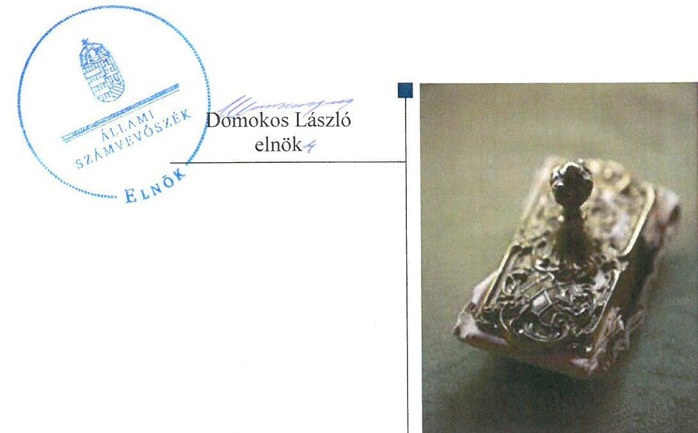

---

Jelentéseink az Országgyúlés számítógépes hálózatán és az Interneten a www.asz.hu címen is olvashatóak.

## AZ ELLENŐRZÉST FELÜGYELTE:

HOLMAN MAGDOLNA felügyeleti vezető

## AZ ELLENŐRZÉST VEZETTE ÉS A VÉGREHAJTÁSÁÉRT FELELŐS:

DR. NAGY IMRE ellenőrzésvezető

## A PROGRAM ÖSSZEÁLLÍTÁSÁÉRT FELELŐS:

JANIK JÓZSEF osztályvezető

## A TÉMÁHOZ KAPCSOLÓDÓ KORÁBBI SZÁMVEVŐSZÉKI JELENTÉSEK:

- címe: $\quad$ Jelentés az állami vagyon feletti tulajdonosi joggyakorlással kapcsolatos 2011. évi tevékenységek ellenőrzéséről
- sorszáma: $\quad 12109$
- címe $\quad$ Jelentés az állami vagyon feletti kontroll - Az állami vagyon feletti tulajdonosi joggyakorlással kapcsolatos tevékenységek ellenőrzéséről
- sorszáma $\quad 13193$
- címe: $\quad$ Jelentés az állami vagyon feletti tulajdonosi joggyakorlással kapcsolatos tevékenységek ellenőrzéséről
- sorszáma: $\quad 14236$

IKTATÓSZÁM: V-0885-137/2016
TÉMASZÁM: 191.
ELLENŐRZÉS-AZONOSÍTÓ SZÁM: V0755

---

# TARTALOMJEGYZÉK 

■ ÖSSZEGZÉS ..... 5
■ AZ ELLENŐRZÉS CÉLJA ..... 7
■ AZ ELLENŐRZÉS TERÜLETE ..... 8
■ AZ ELLENŐRZÉS HÁTTERE, INDOKOLTSÁGA ..... 10
■ A JELENTÉS LÉNYEGES KÉRDÉSKÖREI ..... 11
■ ELLENŐRZÉS HATÓKÖRE ÉS MÓDSZEREI ..... 12
■ MEGÁLLAPÍTÁSOK ..... 14
■ MELLÉKLETEK ..... 19
I. Sz. melléklet: Az ÁEEK intézkedési tervének végrehajtása ..... 19
II. Sz. melléklet: Az EMMI intézkedési tervének végrehajtása ..... 21
III. Sz. melléklet: Az FM intézkedési tervének végrehajtása ..... 22
IV. Sz. melléklet: Az MNV Zrt. intézkedési tervének végrehajtása ..... 23
V. Sz. melléklet: Az NFM intézkedési terveinek végrehajtása ..... 24
VI. Sz. melléklet: Az NFA intézkedési terveinek végrehajtása ..... 26
■ FÜGGELÉK: ÉSZREVÉTELEK ..... 29
■ RÖVIDÍTÉSEK JEGYZÉKE ..... 51

---

.

---

# ÖSSZEGZÉS 

Az Állami Számvevőszék az állami vagyon feletti tulajdonosi joggyakorlással kapcsolatos tevékenységek utóellenőrzését a 2012. december 13. és 2016. február 18. közötti időszakra, a még nem ellenőrzött feladatok tekintetében végezte el.
Az ellenőrzöttek a végrehajtott intézkedésekkel hozzájárultak az állami vagyonnal való szabályos gazdálkodás feltételeinek megteremtéséhez, az átláthatóság érvényesitéséhez, a jogviszonyok átláthatóságához.
Az ÁEEK ${ }^{1}$, az, $F M^{2}$, az, $M N V Z r t .{ }^{3}$, az, $N F A^{4}$, az, $N F M^{5}$ végre nem hajtott, vagy részben végrehajtott intézkedései további kockázatot hordoznak a vagyonnyilvántartás megbizhatóságában, a vagyongazdálkodás szabályos és átlátható müködésében.

## Az ellenőrzés társadalmi indokoltsága

Az ÁSZ ${ }^{6}$ stratégiájában célul tűzte ki a számvevőszéki munka hasznosulásának javítását. Ezzel összhangban ellenőrzi, hogy az ellenőrzött szervezetek megvalósították-e a korábbi ellenőrzései által feltárt hibák, hiányosságok és szabálytalanságok megszüntetése céljából kialakított intézkedési terveikben foglaltakat. A rendszeres utóellenőrzések hozzájárulnak a szükséges intézkedések tényleges végrehajtáshoz, ezáltal a közpénzügyek rendezettségének javulásához.

## Főbb megállapítások, következtetések, javaslatok

Az intézkedési tervekben meghatározott 16 feladatból az ellenőrzöttek ötöt határidőben, hármat határidőn túl, hármat részben, ötöt pedig nem hajtottak végre. Így az ÁSZ által korábban azonosított hiányosságok egy része továbbra is fennáll.

A határidőben végrehajtott feladatok között az EMMI ${ }^{7}$ a TB alapok ellátási vagyona vonatkozásában intézkedett a tulajdonosi joggyakorlás szabályszerű ellátásához szükséges szabályozásról. Az NFA kiadta a Nemzeti Földalapba tartozó ingatlanok versenyeztetés mellőzésével történő értékesítésére vonatkozó eljárásrendet, és átvezette a vagyonkezelésbe adott tárgyi eszközök bruttó értékét és elszámolt értékcsökkenését. Az ÁEEK intézkedett a korábbi ellenőrzés során feltárt szabálytalanságok kivizsgálásáról.

Az NFM határidőn túl dolgozta ki az állam tulajdonosi joggyakorlásáról és az állami vagyonról szóló kormánybeszámoló tartalmi elemeit és eljárásrendjét. Az NFM ugyancsak határidőn túl intézkedett az új vagyonkezelési szerződések megkötéséről az erdőgazdasági társaságokkal.

Az NFM a vagyonkezelői díjak felülvizsgálatára vonatkozó feladatát részben hajtotta végre, mert az erdőgazdasági társaságokkal kötött vagyonkezelési szerződésekben a vagyonkezelői díjakat megállapította, de ezt nem az intézkedési tervben vállalt módon tette meg. Az ÁEEK a tulajdonosi ellenőrzéshez, az NFA pedig a telekalakításhoz és a vagyonváltozással járó birtokrendezéshez kapcsolódó szabályozási feladatait részben hajtotta végre.

A nem végrehajtott intézkedések között az NFM és az FM nem dolgozta ki az erdőgazdasági társaságok vagyonkezelésének kiemelt kontrolljait a társaságok által kezelt állami ingatlanok és egyéb vagyonelemek értéken történő nyilvántartása érdekében. A vagyonkezelési szerződések rendszeres aktualizálásához szükséges irányítási és kontrollrendszert az NFA nem alakította ki. Az MNV Zrt. nem intézkedett az SZMSZ módosításáról annak érdekében, hogy a vonatkozó törvényi szabályozásnak megfelelően tartalmazza az állami vagyon feletti tulajdonosi joggyakorlást.

A külső ellenőrzések javaslatai alapján készült intézkedési tervek végrehajtásáról a Bkr. ${ }^{8}$ által előírt tartalmú nyilvántartást nem vezettek négy szervezetnél.

---

# Az intézkedési tervben foglalt feladatok végrehajtását az 1. ábra foglalja össze:

1. ábra

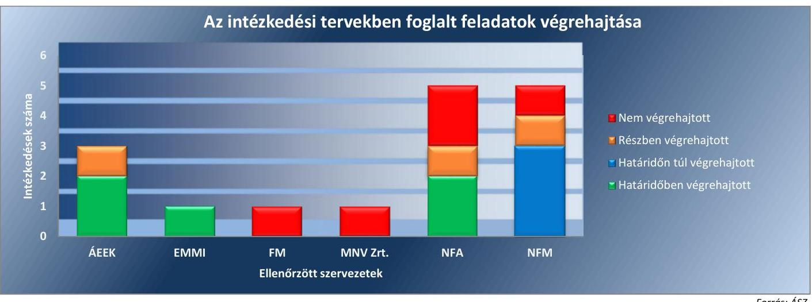

---

# AZ ELLENŐRZÉS CÉLJA 

Az ellenőrzés célja annak értékelése, hogy a számvevőszéki jelentésben foglalt intézkedést igénylő megállapításokkal és javaslatokkal összhangban készített intézkedési tervekben meghatározott feladatokat az ellenőrzött szervezetek végrehajtották-e.

---

# AZ ELLENŐRZÉS TERÜLETE

## Az utóellenőrzött intézkedések

Az állami vagyon feletti tulajdonosi joggyakorlással kapcsolatos tevékenységeket az ÁSZ évente ellenőrzi, és az ellenőrzés tapasztalatai alapján megállapításokat és javaslatot fogalmaz meg a tulajdonosi joggyakorlók részére.

**AZ MNV ZRT.** az állam által alapított egyszemélyes részvénytársaság, amely főszabály szerint tulajdonosi joggyakorlóként gyakorolja a rábízott állami vagyon felett az államot megillető tulajdonosi jogok és kötelezettségek összességét. Az NFM miniszter felel az állami vagyon felügyeletéért és az állami vagyonnal való gazdálkodás szabályozásáért.

**AZ FM MINISZTER AZ NFA** útján gyakorolja a tulajdonosi jogokat a Nemzeti Földalapba tartozó állami tulajdonban álló ingatlanok felett.

**AZ EMMI** minisztere gyakorolja a tulajdonosi jogokat az Egészségbiztosítási Alap és a Nyugdíjbiztosítási Alap ellátási vagyona tekintetében.

**AZ ÁEEK** jogosult a magyar államot megillető tulajdonosi jogok és kötelezettségek összességének gyakorlására a megyei önkormányzatok konszolidációja, a megyei önkormányzati intézmények és a Fővárosi Önkormányzat egyes egészségügyi intézményeinek átvétele során állami tulajdonba került, állami egészségügyi feladatellátást szolgáló vagyon tekintetében. Az ÁEEK 2015. március 1-től a GYEMSZI9 általános jogutódja.

Jelen utóellenőrzés az állami vagyon feletti tulajdonosi joggyakorlással kapcsolatos tevékenységek ellenőrzéséről készült, 12109. számú, 13193. számú és 14236. számú számvevőszéki jelentésekben foglalt megállapításokhoz kapcsolódó intézkedési tervekben vállalt feladatok végrehajtására irányult.

A lefolytatott korábbi ellenőrzések alkalmával utóellenőrzésre kerültek az intézkedési tervekből azok a feladatok, amelyeknek a végrehajtási határideje a korábbi ellenőrzés időszakában már lejárt. Erre figyelemmel a jelen utóellenőrzés a korábban nem utóellenőrzött feladatok végrehajtására terjedt ki.

Az utóellenőrzéssel érintett számvevőszéki jelentések, javaslatok és intézkedési tervben foglalt feladatok adatait ellenőrzött szervezetek szerinti bontásban az alábbi táblázat foglalja össze:

---

1. táblázat

| INTÉZKEDÉSI TERV FELADATAINAK UTÓELLENŐRZÉSE |  |  |  |  |  |  |  |
| :--: | :--: | :--: | :--: | :--: | :--: | :--: | :--: |
| Ellenőrzött   szervezetek | 12109. sz. jelentés |  | 13193. sz. jelentés |  | 14236. sz. jelentés |  | Jelen ellenőrzésben   utóellenőrzött   feladatok száma |
|  | Vállalt felada-   tok száma | Utóellenőr-   zött feladatok   száma** | Vállalt felada-   tok száma | Utóellenőr-   zött feladatok   száma** | Vállalt felada-   tok száma | Utóellenőrzött   feladatok száma |  |
| ÁEEK | 0 | 0 | 0 | 0 | 3 | 0 | 3 |
| EMMI | 0 | 0 | 0 | 0 | 1 | 0 | 1 |
| FM | 4 | 4 | 9 | 8 | 0 | 0 | 1 |
| MNV Zrt. | 0 | 0 | 3 | 3 | 1 | 0 | 1 |
| NFA | 5 | 5 | 13 | 11 | 3 | 0 | 5 |
| NFM | 2 | 1 | 7 | 3 | 0 | 0 | 5 |
| Összesen: | 11 | 10 | 32 | 25 | 8 | 0 | 16 |

Az intézkedési terv alapján tett intézkedések megvalósulásának értékelése során az ÁSZ figyelembe vette az ellenőrzött szervezetek működési feltételeiben, valamint a jogszabályi előírásokban bekövetkezett változásokat.

Az intézkedések végrehajtásért való felelősség szempontjából a jogszabályváltozás alapján történt feladat- és hatáskör átcsoportosítást csak abban az esetben vettük figyelembe, ha a számvevőszéki megállapítások és javaslatok alapján vállalt intézkedés átadás-átvétele megtörtént.

A vonatkozó jogszabályok változása következtében az erdőgazdaságokkal kapcsolatos feladatok az NFM minisztertől az FM miniszterhez kerültek át. Az intézkedési tervben foglalt, az erdőgazdasági társaságokra vonatkozó feladatok átadás-átvétele az érintett miniszterek között azonban nem történt meg. Ezért az NFM által vállalt, jelen ellenőrzés során utóellenőrzött feladatok végrehajtását az NFM-nél ellenőrizte az ÁSZ.

---

# AZ ELLENŐRZÉS HÁTTERE, INDOKOLTSÁGA 

Az ÁSZ tv. 33. § (1) bekezdése értelmében a számvevőszéki jelentések intézkedést igénylő megállapításaihoz és javaslataihoz kapcsolódóan az ellenőrzött szervezet vezetője intézkedési tervet köteles összeállítani, és az Állami Számvevőszék részére megküldeni. Az intézkedési tervben foglaltak megvalósítását - az ÁSZ tv. 33. § (7) bekezdésében foglaltak alapján - az Állami Számvevőszék utóellenőrzés keretében ellenőrizheti.

Az intézkedési tervekben foglalt feladatok hiányos, illetve késedelmes végrehajtása, valamint megvalósításának elmaradása azt mutatja, hogy az ellenőrzések során feltárt hibák, hiányosságok és szabálytalanságok megszüntetése nem kapott kellő hangsúlyt. Ez a szabályszerű működés és a felelős vezetői magatartás vonatkozásában kockázatot hordoz. E kockázatok feltárásával az Állami Számvevőszék utóellenőrzési rendszere fokozza a fegyelmet, és igazolja, hogy a közpénzzel való szabályos gazdálkodás felelőssége elől nem lehet kitérni.

Az utóellenőrzés négy szinten hasznosulhat:
$\longrightarrow$ A társadalom szintjén az utóellenőrzés jelzi, hogy a számvevőszéki ellenőrzés megállapításainak van következménye: a hiányosságok megszüntetésére az ellenőrzött szervezet által meghatározott intézkedések végrehajtását is számon kéri az ÁSZ.
$\longrightarrow$ Az ellenőrzött terület szintjén az utóellenőrzés tájékoztatást nyújt a terület döntéshozóinak a hiányosságok kiküszöbölésének jó gyakorlatairól, ezzel lehetőséget biztosítva arra, hogy az ÁSZ ellenőrzési megállapításai, javaslatai a terület nem ellenőrzött szervezeteinek a működése során is hasznosuljanak.
$\longrightarrow$ Az ellenőrzött szervezet szintjén az utóellenőrzés feltárja, hogy a szervezet az intézkedések végrehajtásával hasznosította-e a korábbi ellenőrzési jelentésben a hiányosságok megszüntetése, illetve a kockázatok kezelése érdekében megfogalmazott javaslatokat.
$\longrightarrow$ Az ÁSZ szintjén az utóellenőrzés visszacsatolást ad az ellenőrzési jelentések hasznosulásáról, az intézkedések elmaradása vagy részleges megvalósulása a további ellenőrzésekhez kockázati jelzésként szolgál.

---

# A JELENTÉS LÉNYEGES KÉRDÉSKÖREI 

1. Az ellenőrzött szervezetek az intézkedési tervben foglaltakat az elöirt határidőben - végrehajtották-e?

---

# ELLENŐRZÉS HATÓKÖRE ÉS MÓDSZEREI 

## Az ellenőrzés típusa

Megfelelőségi ellenőrzés

## Az ellenőrzött időszak

2012. december 13. - 2016. február 18.

## Az ellenőrzés tárgya

Az ÁSZ 12109., 13193. és 14236. számú jelentéseiben megfogalmazott javaslatokra az ellenőrzött szervezetek által megküldött intézkedési tervekben foglalt azon feladatok végrehajtása, amelyek utóellenőrzése az állami vagyon feletti tulajdonosi joggyakorlással kapcsolatos 2011., 2012. és2013. évi tevékenységek ellenőrzései során nem történt meg.

## Az ellenőrzött szervezet

Állami Egészségügyi Ellátó Központ, Emberi Erőforrások Minisztériuma, Földművelésügyi Minisztérium, Magyar Nemzeti Vagyonkezelő Zrt., Nemzeti Fejlesztési Minisztérium, Nemzeti Földalapkezelő Szervezet.

## Az ellenőrzés jogalapja

Az Alaptörvény 43. cikk (1) bekezdése alapján az ÁSZ az Országgyűlés pénzügyi és gazdasági ellenőrző szerve. Az ÁSZ törvényben meghatározott feladatkörében ellenőrzi a központi költségvetés végrehajtását, az államháztartás gazdálkodását, az államháztartásból származó források felhasználását és a nemzeti vagyon kezelését. Az ÁSZ tv. 1. § (3) bekezdése szerint az ÁSZ általános hatáskörrel végzi a közpénzekkel és az állami és önkormányzati vagyonnal való felelős gazdálkodás ellenőrzését. A 33. § (7) bekezdése alapján az ÁSZ tv. 33. § (1)-(2) bekezdése szerinti intézkedési tervben foglaltak megvalósítását az ÁSZ utóellenőrzés keretében ellenőrizheti.

## Az ellenőrzés módszerei

Az utóellenőrzést a nemzetközi standardokat irányadónak tekintve az ellenőrzési program ellenőrzési kérdései, az ellenőrzött időszakban hatályos jogszabályok, az ellenőrzés szakmai szabályok és módszertanok figyelembevételével végeztük.

---

Az utóellenőrzés megállapításait az ÁSZ rendelkezésére álló, valamint az ellenőrzött szervezetektől elektronikusan bekért dokumentumok alapozták meg.

Az ellenőrzési bizonyítékként felhasználható adatforrások közé tartoztak egyrészt a szakmai programban felsorolt adatforrások, másrészt minden - az ellenőrzés folyamán feltárt, az ellenőrzés szempontjából információt tartalmazó - dokumentum.

Az intézkedési tervekben előírt feladatokat azok végrehajthatósága, illetve végrehajtása szempontjából az alábbiak szerint értékeltük:
"határidőben végrehajtott" a feladat, ha a teljesítés dokumentáltan, az intézkedési tervben előírt határidőben és tartalommal megtörtént;
"határidőn túl végrehajtott" a feladat, ha annak teljesítése az intézkedési tervben meghatározott módon, de az előírt határidőn túl történt meg;
"részben végrehajtott" a feladat, ha végrehajtása teljes körűen az intézkedési tervben előírt módon nem történt meg;
"nem végrehajtott" ha a végrehajtás nem történt meg, vagy amenynyiben a teljesítést nem dokumentálták;
"okafogyottá vált" a feladat, ha végrehajtására - meghatározott esemény bekövetkezése, továbbá külső körülmény, a működést érintő feltétel változása miatt - már nincs szükség, illetve lehetőség, és egyértelműen megállapítható, hogy az intézkedést szükségessé tevő körülmény a jövőben nem fordulhat elő;
"nem időszerű" az a feladat, amelynek ellenőrzési időszakon belüli végrehajtására azért nem került (kerülhetett) sor, mert az intézkedés alapjául szolgáló esemény nem következett be, de annak jövőbeni előfordulása lehetséges, a végrehajtása nem volt esedékes, vagy a végrehajtás határideje még nem járt le.
Az ellenőrzés lefolytatásához az ellenőrzött szervezet a tanúsítványok elektronikus kitöltésével, valamint az ÁSZ által kért dokumentumok elektronikus megküldésével szolgáltatott adatokat, amelyek valódiságát és teljes körűségét az ellenőrzött szervezet vezetője által tett teljességi és hitelességi nyilatkozat igazolja. Az így rendelkezésre bocsátott adatok, információk kontrollja az ellenőrzés keretében megtörtént.

---

# MEGÁLLAPÍTÁSOK 

## 1. Az ellenőrzött szervezetek az intézkedési tervben foglaltakat az elöírt határidőben - végrehajtották-e?

Összegző megállapítás

Az intézkedési tervben fogalt feladatok közül az ellenőrzött szervezetek öt feladatot határidőben, három feladatot pedig határidőn túl hajtottak végre. Három feladat részben került végrehajtásra, öt feladat végrehajtása nem történt meg az ellenőrzött szervezetek részéről.
Az NFM által a külső ellenőrzések javaslatai alapján készült intézkedési tervek végrehajtásáról vezetett nyilvántartás megfelelt a jogszabályi előírásoknak. Az FM nem, az ÁEEK, az EMMI és az NFA nem a jogszabályi előírásoknak megfelelően vezette a nyilvántartást.
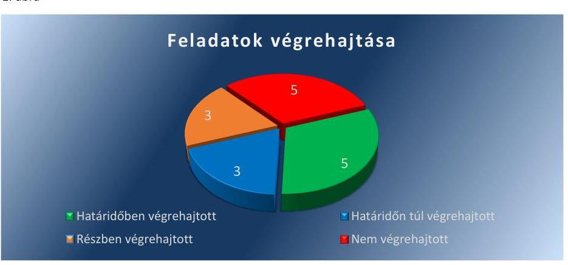

Forrás: ÁSZ
1.1. számú megállapítás

Az ÁEEK két feladatot határidőben, egyet részben hajtott végre. Az EMMI a vállalt feladatát határidőben végrehajtotta. Az MNV Zrt. és az FM az intézkedési tervben vállalt feladatot nem hajtotta végre. Az NFM három feladatot határidőn túl, egy feladatot részben, egyet pedig nem hajtott végre. Az NFA az általa vállalt, utóellenőrzött öt feladatból kettőt határidőben végrehajtott, egy feladatot részben hajtott végre, és további két feladatot nem hajtott végre.

Az intézkedési tervekben meghatározott feladatokat, azok határidejét és a feladatok végrehajtását a I-VI. számú mellékletek ellenőrzött szervezetenként tartalmazzák.

AZ ÁEEK az utóellenőrzött három feladatból két feladatot határidőben, egy feladatot pedig részben hajtott végre.

---

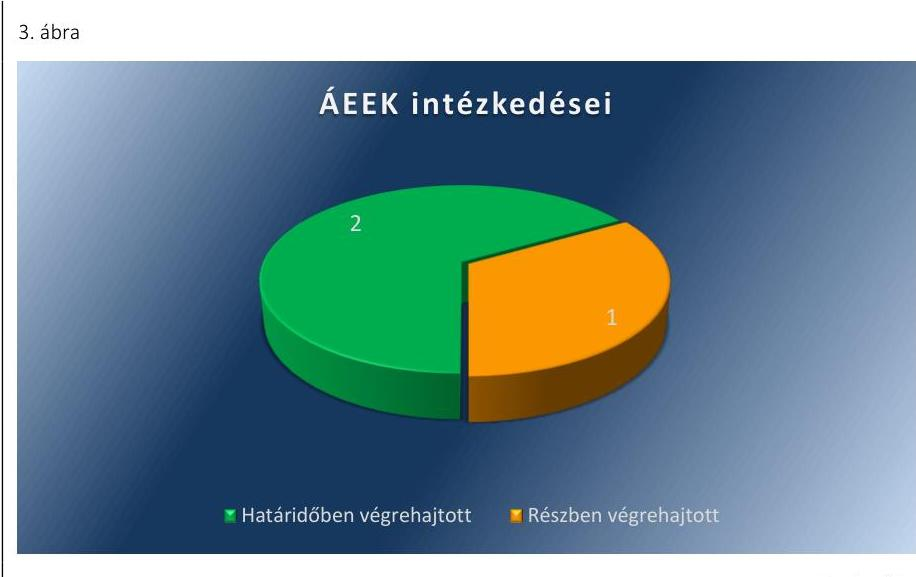

# HATÁRIDŐBEN VÉGREHAJTOTT FELADATOK: 

$\qquad$ 1. A GYEMSZI főigazgatója az ÁSZ ellenőrzés során feltárt szabálytalanságok kivizsgálására elrendelte a szabályszerűségi belső ellenőrzés megindítását.
$\qquad$ 2. Az ÁEEK főigazgatója a belső ellenőrzési jelentés alapján határidőben döntött arról, hogy fegyelmi eljárás indítására nincs szükség.

## RÉSZBEN VÉGREHAJTOTT FELADAT:

3. Az ÁEEK főigazgatója a tulajdonosi ellenőrzési rendszert a Vagyonnyilvántartási Szabályzatban ${ }^{10}$ és a Fenntartói Ellenőrzési Szabályzatban ${ }^{11}$ szabályozta, de az intézkedési tervben vállaltakkal ellentétesen ellenőrzési nyomvonalat nem fogadott el.

AZ EMMI az utóellenőrzött feladatot határidőben végrehajtotta.

## HATÁRIDŐBEN VÉGREHAJTOTT FELADAT:

1. Az EMMI a TB alapok ellátási vagyona vonatkozásában a tulajdonosi joggyakorlás szabályszerű ellátásához szükséges kontrollkörnyezet kialakításáról határidőben intézkedett. Az intézkedés alapján a tulajdonosi joggyakorlás szabályai az Emberi Erőforrások Minisztériumának az Egészségbiztosítási Alap és a Nyugdíjbiztosítási Alap ellátási vagyona körébe tartozó ingatlanvagyon feletti tulajdonosi jogok gyakorlására vonatkozó 36/2015. (VII.28.) számú EMMI utasításában meg is jelentek.

AZ FM az utóellenőrzött feladatot nem hajtotta végre.

## NEM VÉGREHAJTOTT FELADAT:

1. Az FM a vagyonkezelés tárgyát képező, Nemzeti Földalapba tartozó földrészletek nyilvántartási értékének megállapítását és a vagyonkezelési szerződésekben, valamint az NFA vagyonnyilvántartásában való átvezetését nem végezte el.

---

AZ MNV ZRT. az utóellenőrzött feladatot nem hajtotta végre.

# NEM VÉGREHAJTOTT FELADAT: 

$\qquad$ 1. Az MNV Zrt. az ellenőrzött időszak végéig, 2016. február 18-ig nem készített előterjesztést az SZMSZ módosítására annak érdekében, hogy az a jogszabályoknak megfelelően tartalmazza az állami vagyon feletti tulajdonosi joggyakorlást.

AZ NFM az utóellenőrzött öt feladatból három feladatot határidőn túl hajtott végre, egyet részben hajtott végre, egyet pedig nem hajtott végre.
4. ábra
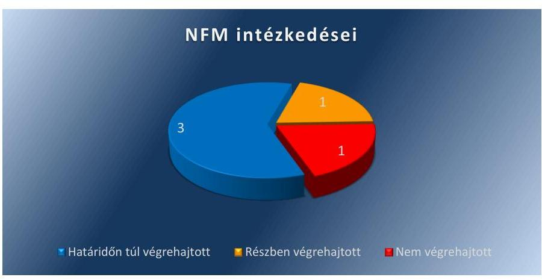

A Kormány tagjainak feladat és hatásköréről szóló 152/2014. (VI.6.) Korm. rendelet 65. és 69. §-ai alapján az erdőgazdaságokkal kapcsolatos feladatok az NFM minisztertől az FM miniszterhez kerültek át. Az erdőről, az erdő védelméről és az erdőgazdálkodásról szóló 2009. évi XXXVII. törvény 1. számú melléklete szerint 2014. július 17-től az FM miniszter gyakorolja az állam nevében a tulajdonosi jogokat az erdőgazdasági társaságok tekintetében.

Az Állami Számvevőszék javaslatai alapján készült intézkedési tervben foglalt, az erdőgazdasági társaságokra vonatkozó feladatok átadás-átvétele az érintett miniszterek között azonban nem történt meg. Ezért az NFM által vállalt, jelen ellenőrzés során utóellenőrzött feladatok végrehajtása az NFM felelősségi körében maradt.

## HATÁRIDŐN TÚL VÉGREHAJTOTT FELADAT:

1. A tulajdonosi jogokat gyakorló szervezetek múködéséről, az állami vagyon állományának alakulásáról, az állami vagyonnal való gazdálkodás folyamatairól készített kormánybeszámoló tartalmi elemeivel kapcsolatban az NFM határidőben megkérte az MNV Zrt. javaslatát. A beszámoló készítés eljárásrendje 2014. augusztus 1én elfogadásra került. Az állami vagyon stratégiai és éves kereteit meghatározó dokumentumok kidolgozásával kapcsolatos Vtv. ${ }^{12}$ módosítás kezdeményezése - a vállalt 2013. december 31-ei határidőhöz képest - 2015. május 19-én valósult meg.
2. A Magyar Állam képviseletében az NFA elnöke 2016. február 15én aláírta a 19 erdőgazdaság új vagyonkezelési szerződését, amely kiterjedt a földterületek vagyonkezelésére.

---

3. A Magyar Állam képviseletében az NFA elnöke 2016. február 15én aláírta a 19 erdőgazdaság új vagyonkezelési szerződését, amely kiterjedt a felépítmények vagyonkezelésére.

# RÉSZBEN VÉGREHAJTOTT FELADAT: 

4. Az erdőgazdasági társaságok vagyonkezelési szerződéseinek NFA részéről történő aláírásával 2016. február 15-én megtörtént a vagyonkezelési díjak meghatározása. A szerződések előkészítése során megtörtént az erdőgazdasági társaságok saját vagyonába és a kezelt vagyonba tartozó ingatlan vagyonelemek elhatárolása, azonban azok értékelésére nem került sor. A vagyonkezelési díjak meghatározása ezért nem az intézkedési tervben vállalt módon történt: az ingatlanvagyon bruttó nyilvántartási értékének 2\%-a helyett a vagyonkezelési szerződésekben egységesen $100 \mathrm{Ft} / \mathrm{ha}$ vagyonkezelési díj került meghatározásra.

## NEM VÉGREHAJTOTT FELADAT:

5. A nemzeti fejlesztési miniszter nem alakította ki az erdőgazdasági társaságok által kezelt állami ingatlanok és egyéb vagyonelemek értéken történő nyilvántartását a felépítmények esetében.

AZ NFA az utóellenőrzött öt feladatból kettőt határidőben végrehajtott, egyet részben hajtott végre, további kettőt pedig nem hajtott végre.
5. ábra
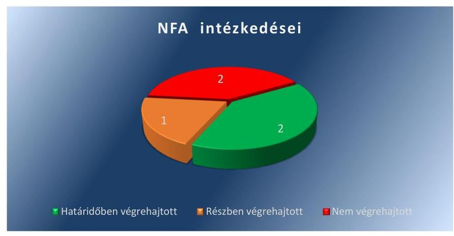

Fonós: ÁSZ

## HATÁRIDŐBEN VÉGREHAJTOTT FELADAT:

1. Az NFA határidőben kiadta a Nemzeti Földalapba tartozó földrészletek nyilvános pályáztatás vagy árverés mellőzésével történő értékesítésének szabályairól szóló eljárásrendet.
2. Az NFA határidőben átvezette a vagyonkezelésbe adott eszközök közé vagyonkezelésbe adott tárgyi eszközök bruttó értékét és elszámolt értékcsökkenését.

## RÉSZBEN VÉGREHAJTOTT FELADAT:

3. A 2015. szeptember 22-én kiadott, a tulajdonosi hozzájárulás kiadásáról szóló eljárásrend III/B. 1.1. pontja (Telekalakítás) tartal-

---

mazta a telekalakításra vonatkozó rendelkezéseket, azonban a vagyonváltozással járó birtokrendezéssel kapcsolatos belső eljárásrend nem készült el.

# NEM VÉGREHAJTOTT FELADAT: 

4. Az NFA nem kezdeményezte az Nfatv. ${ }^{13}$ módosítását annak érdekében, hogy az NFA törvényi felhatalmazás alapján legyen jogosult a vagyonkezelt területek tulajdonosi ellenőrzésére, és hogy adatszolgáltatási kötelezettséget írjon elő a vagyonkezelők részére.
5. Az NFA a vagyonkezelési szerződések felülvizsgálatára, aktualizálására, valamint az irányítási és kontrollrendszerének kialakítására külön projektet nem indított.
1.2. számú megállapítás

Az NFM a jogszabályi rendelkezéseknek megfelelően vezette az előírt nyilvántartást az intézkedési tervben rögzített feladatok végrehajtásáról. Az ÁEEK, az EMMI és az NFA vezette az előírt nyilvántartást, azonban annak tartalma nem volt teljes körü, ezért nem felelt meg a jogszabályi előírásoknak. Az FM a jogszabályi rendelkezésekkel ellentétesen nem vezetett nyilvántartást az intézkedési tervben rögzített feladatok végrehajtásáról. Az MNV Zrt. részére a jogszabály nem írta elő nyilvántartás vezetését.

AZ NFM - a Bkr. 14. § (1) bekezdésének megfelelően - éves bontásban nyilvántartást vezetett a számvevőszéki ellenőrzések javaslatai alapján készült intézkedési tervek végrehajtásáról, a Bkr. 47. § (2) bekezdése szerinti tartalommal.

AZ ÁEEK vezette a Bkr. 14. § (1) bekezdése szerinti nyilvántartást, de az - a Bkr. 47. § (2) bekezdésében foglaltak ellenére - nem tartalmazta a 14236. számú ÁSZ jelentésben foglalt javaslatokhoz kapcsolódó, az intézkedési terv alapján végrehajtott intézkedések rövid leírását. A vállalt feladatok közül egy nem az elfogadott intézkedési tervben foglalt határidővel szerepelt.

AZ EMMI vezette a Bkr. 14. (1) bekezdése szerinti nyilvántartást, de az - a Bkr. 47. § (2) bekezdésében foglaltak ellenére - nem tartalmazta a 14236. számú ÁSZ jelentésben szereplő javaslatot, az elfogadott intézkedési tervet és az intézkedési terv alapján végrehajtott intézkedések rövid leírását.

AZ NFA - a Bkr. 14. § (1) bekezdésének megfelelően - éves bontásban nyilvántartást vezetett a számvevőszéki ellenőrzések javaslatai alapján készült intézkedési tervek végrehajtásáról, azonban a nyilvántartás - a Bkr. 47. § (2) bekezdése ellenére - nem tartalmazta minden esetben a végrehajtott intézkedések rövid leírását vagy a végre nem hajtott intézkedések okát.

AZ FM - a Bkr. 14. § (1) bekezdésében foglaltak ellenére - a külső ellenőrzések javaslatai alapján készült intézkedési tervek végrehajtásáról nem vezetett nyilvántartást.

AZ MNV ZRT. részére a Bkr. ${ }^{14}$ - az 54/A. §-a alapján - nem írta elő nyilvántartás vezetését.

---

# MELLÉKLETEK

I. SZ. MELLÉKLET: AZ ÁEEK INTÉZKEDÉSI TERVÉNEK VÉGREHAITÁSA

|  Sorszám | A kapcsolódó ÁSZ jelentés száma | Intézkedési terv alapján elvégzendő feladat | Intézkedési tervben meghatározott határidő | A javaslat címzettje | Az intézkedés végrehajtása  |
| --- | --- | --- | --- | --- | --- |
|  1. | 2. | 3. | 4. | 5. | 6.  |
|  Határidőben végrehajtott feladatok |  |  |  |  |   |
|  1. | 14236. sz. jelentés | A GYEMSZI főigazgatója a 2015. január 13-i vezetői értekezleten elrendelte, majd a GYEMSZI_ELL/000008/2015. ikt sz. feljegyzésben 2015. január 19-én megerősítette a szabályszerűségi ellenőrzés indítását. A belső ellenőrzés száma: 1/SKE/2015., tárgya "a rábízott vagyon 2013. évi könyvelésének és nyilvántartásának ellenőrzése". Az ellenőrzés célja annak a kérdésnek a megválaszolása, hogy milyen okok vezettek az ÁSZ által a rábízott vagyon könyvelésével, elkülönített nyilvántartásával, valamint a vagyonátvételhez kapcsolódó szabálytalanságokkal összefüggésben megállapított hiányokhoz, mekkora az érintettek felelőssége és melyek a folyamat kockázatai, amelyek kezelésének elmaradásával a hibák a jövőben megismétlődhetnek. Az ellenőrzést a GYEMSZI Belső Ellenőrzési Főosztálya elvégezte a költségvetési szervek belső kontrollrendszeréről szóló 370/2011. (XII.31.) kormányrendeletben és a Belső Ellenőrzési Kézikönyvben rögzített szabályok szerint. Az ellenőrzési jelentés továbbítása a GYEMSZI főigazgatója részére 2015. március 2án ÁEEK-ELL/8-6/2015 ikt.sz. feljegyzéssel megtörtént. További tennivalót nem igényel. | A jóváhagyott intézkedési tervben végrehajtott intézkedésként került feltüntetésre, ezért határidő meghatározása nem történt. | ÁEEK főigazgatója | A GYEMSZI főigazgatója elrendelte az ÁSZ által feltárt hiányosságok kivizsgálásának céljából belső ellenőrzés megindítását.  |

---

|  Mellékletek |  |  |  |  |   |
| --- | --- | --- | --- | --- | --- |
|  2. | 14236. sz. jelentés | Az ÁEEK főigazgatója a vizsgálat eredményének ismeretében dönt a fegyelmi eljárás indításának szükségességéről és döntésétől függően megindítja a fegyelmi eljárást. | 2015. április 15. | ÁEEK főigazgatója | A belső ellenőrzési jelentés alapján az ÁEEK főigazgatója a 2014. április 14-ei vezetői értekezleten, a vállalt határidőn belül döntött arról, hogy fegyelmi eljárás lefolytatására nincs szükség.  |
|  Részben végrehajtott feladat |  |  |  |  |   |
|  3. | 14236. sz. jelentés | Tulajdonosi ellenőrzési rendszer szabályozása főigazgatói utasításban és ellenőrzési nyomvonalban (az ügyrend mellékleteként). | 2015. április 30. | ÁEEK főigazgatója | Az ÁEEK főigazgatója a tulajdonosi ellenőrzési rendszert a Vagyonnyilvántartási Szabályzatban és a Fenntartói Ellenőrzési Szabályzatban szabályozta, de ellenőrzési nyomvonalat nem fogadott el.  |

---

# II. SZ. MELLÉKLET: AZ EMMI INTÉZKEDÉSI TERVÉNEK VÉGREHAJTÁSA

|  É 5. | A kapcsolódó 452 jelentés száma | Intézkedési terv alapján elvégzendő feladat | Intézkedési tervben meghatározott határidő | A javaslat címzettje | Az intézkedés végrehajtása  |
| --- | --- | --- | --- | --- | --- |
|  1. | 2. | 3. | 4. | 5. | 6.  |
|  Határidőben végrehajtott feladat |  |  |  |  |   |
|  1. | 14236. sz. jelentés | Intézkedés a TB alapok ellátási vagyona vonatkozásában a tulajdonosi joggyakorlás szabályszerű ellátásához szükséges kontrollkörnyezet kialakításáról. | 2015. június 30. | EMMI miniszter | Az EMMI a TB alapok ellátási vagyona vonatkozásában a tulajdonosi joggyakorlás szabályszerű ellátásához szükséges kontrollkörnyezet kialakításáról határidőben intézkedett. Az intézkedés alapján a tulajdonosi joggyakorlás szabályai az Emberi Erőforrások Minisztériumának az Egészségbiztosítási Alap és a Nyugdíjbiztosítási Alap ellátási vagyona körébe tartozó ingatlanvagyon feletti tulajdonosi jogok gyakorlására vonatkozó 36/2015. (VII.28.) számú EMMI utasításában meg is jelentek.  |

---

# III. SZ. MELLÉKLET: AZ FM INTÉZKEDÉSI TERVÉNEK VÉGREHAJTÁSA

|  E
SZTÉ | A kapcsolódó ÁSZ
jelentés száma | Intézkedési terv alapján elvégzendő feladat | Intézkedési tervben
meghatározott ha-
táridő | A javaslat címzettje | Az intézkedés végrehajtása  |
| --- | --- | --- | --- | --- | --- |
|  1. | 2. | 3. | 4. | 5. | 6.  |
|  Nem végrehajtott feladat |  |  |  |  |   |
|  1. | 13193. sz. jelentés | Az erdőgazdasági társaságok által kezelt állami ingatlanok és egyéb vagyonelemek értéken történő nyilvántartása érdekében:
A vagyonkezelés tárgyát képező, Nemzeti Földalapba tartozó földrészletek nyilvántartási értékének megállapítása és átvezetése a vagyonkezelési szerződésekben és az NFA vagyonnyilvántartásában. | 2014. december 31. | FM miniszter | Az FM által kiállított tanúsítvány, valamint teljességi és hitelességi nyilatkozat szerint, továbbá az ellenőrzés rendelkezésére bocsátott dokumentumok alapján az FM, a vagyonkezelés tárgyát képező, a Nemzeti Földalap vagyonkezelésébe tartozó földrészletek nyilvántartási értékének megállapítását és a vagyonkezelési szerződésekben, valamint az NFA vagyonnyilvántartásában való átvezetését nem végezte el.  |

---

# IV. SZ. MELLÉKLET: AZ MNV ZRT. INTÉZKEDÉSI TERVÉNEK VÉGREHAJTÁSA

|  SZTÉSZ | A kapcsolódó
ÁSZ jelentés
száma | Az intézkedési terv alapján elvégzendő feladat | Az intézkedési tervben
meghatározott határidő | A javaslat címzettje | Az intézkedés végrehajtása  |
| --- | --- | --- | --- | --- | --- |
|  1. | 2. | 3. | 4. | 5. | 6.  |
|  Nem végrehajtott feladat |  |  |  |  |   |
|  1. | 14236. | Előterjesztés készítése az SZMSZ módosítására annak
érdekében, hogy a vonatkozó törvényi szabályozás-
nak megfelelően tartalmazza az állami vagyon feletti
tulajdonosi joggyakorlást. | 2015. I. félév,
legkésőbb 2015. június 30. | MNV Zrt. vezérigazgatója | Az ellenőrzött időszakban nem
készült el az előterjesztés az
SZMSZ módosítására.  |

---

|  SZERÁS | A kapcsolódó ÁSZ
jelentés száma | Intézkedési terv alapján elvégzendő feladat | Intézkedési tervben
meghatározott ha-
táridő | A javaslat címzettje | Az intézkedés végrehajtása  |
| --- | --- | --- | --- | --- | --- |
|  1. | 2. | 3. | 4. | 5. | 6.  |
|  Határidőn túl végrehajtott feladat |  |  |  |  |   |
|  1. | 12109. sz. jelentés | Ahogyan azt 2012. október 16-án kelt feljegyzé-
sünkben is jeleztük, a Nemzeti vagyongazdálko-
dási Irányelvekről 2011 őszén kormánydöntés
nem született, tekintettel arra, hogy az abban
megfogalmazott vagyongazdálkodási elvek és cé-
lok a 2012. január 1-jén hatályba lépő nemzeti va-
gyonról szóló sarkalatos törvényben kerültek rög-
zítésre.
Az ÁSZ jelentés részletes megállapításaiban szerepltetett, a tulajdonosi joggyakorlás szabályozási
problémáit, valamint az Éves Nemzeti Vagyongaz-
dálkodási Program kapcsán felmerülő feladatok
felülvizsgálatát az NFM a folyamatban lévő Vtv.
módosítása során tervezi rendezni.
A tulajdonosi jogokat gyakorló szervezetek működé-
éről, az állami vagyon állományának alakulásá-
ról, az állami vagyonnal való gazdálkodás folya-
ma-
tairól készített kormánybeszámoló tartalmi ele-
meinek, valamint a beszámoló elkészítésének eljá-
rásrendjének szabályozására az MNV Zrt. javasla-
tát tervezzük megkérni. | 2013. december 31. | NFM miniszter | A tulajdonosi jogokat gyakorló szervezetek
működéséről, az állami vagyon állományá-
nak alakulásáról, az állami vagyonnal való
gazdálkodás folyamatairól készített kor-
mánybeszámoló tartalmi elemeivel kapcso-
latban az NFM határidőben megkérte az
MNV Zrt. javaslatát. A beszámoló készítés
eljárásrendje elfogadásra került 2014. au-
gusztus 1-én.
Az állami vagyon stratégiai és éves kereteit
meghatározó dokumentumok kidolgozásá-
val kapcsolatos Vtv. módosítás kezdemé-
nyezése - a vállalt 2013. december 31-ei
határidőhöz képest - 2015. május 19-én
valósult meg.  |
|  2. | 13193. sz. jelentés | Az új vagyonkezelési szerződések megkötése a
földterületek esetében. | 2014. május 31-ét
követően folya-
mato
ber 31-ig). | NFM miniszter | A Magyar Állam képviseletében az NFA el-
nöke 2016. február 15-én aláírta a 19 er-
dőgazdaság új vagyonkezelési szerződését.  |
|  3. | 13193. sz. jelentés | Az új vagyonkezelési szerződések megkötése a fel-
építményekkel kapcsolatban. | 2014. II. félév folya-
mán. | NFM miniszter | A Magyar Állam képviseletében az NFA el-
nöke 2016. február 15-én aláírta a 19 er-
dőgazdaság új vagyonkezelési szerződését.  |

---

|  4. | 13193. sz. jelentés | A vagyonkezelési díjak egyértelmű és tulajdonosi joggyakorló szervezetenkénti meghatározását tekintve:
Az ÁSZ által meghatározott feladatok végrehajtására irányuló munkafolyamat során a végrehajtásban érintett szervezetek, társaságok között kialakult az az álláspont, hogy mivel az erdőgazdasági társaságok alapfeladatként közfeladat ellátást is végeznek, azt a vagyonkezelési díj mértékének meghatározásakor az MNV Zrt. figyelembe veszi, valamint megállapításra került az az elv is, hogy a vagyonkezelési díj irányadó mértéke az adott erdőgazdasági társaság által kezelt ingatlanvagyon bruttó nyilvántartási értékének 2\%-a.
A vagyonkezelési díj alapja a kezelt vagyon bruttó nyilvántartási értéke, ezért annak meghatározására erdőgazdaság társaságonként kerül sor az ún. "végleges ingatlanlista" alapján. A végleges ingatlanlista kizárólag vagyonkezelésbe adott ingatlan vagyonelemet tartalmaz, ez erdőgazdasági társaság saját vagyonában nyilvántartott vagyonelemet nem, ezért az MNV Zrt.-nek és az erdőgazdasági társaságoknak a szerződés megkötését megelőzően el kell határolnia egymástól saját vagyonba és a kezelt vagyonba tartozó ingatlan vagyonelemeket. | 2014. május 31-ét követően folyamatosan (2014. december 31-ig) | NFM miniszter | A vagyonkezelési szerződések NFA részéről történő aláírásával 2016. február 15-én megtörtént a vagyonkezelési díjak meghatározása.
A szerződések előkészítése során megtörtént az erdőgazdasági társaságok saját vagyonába és a kezelt vagyonba tartozó ingatlan vagyonelemek elhatárolása, azonban azok értékelésére nem került sor.
A vagyonkezelési díjak meghatározása ezért nem az intézkedési tervben vállalt módon történ: az ingatlanvagyon bruttó nyilvántartási értékének 2\%-a helyett a vagyonkezelési szerződésekben egységesen $100 \mathrm{Ft} /$ ha vagyonkezelési díj került meghatározásra.  |
| --- | --- | --- | --- | --- |
|  Nem végrehajtott feladat |  |  |  |   |
|  5. | 13193. sz. jelentés | Az erdőgazdasági társaságok vagyonkezeléseinek kiemelt kontrolljai tekintetében a társaságok által kezelt állami ingatlanok és egyéb vagyonelemek értéken történő nyilvántartása a felépítmények esetében. | 2014. december 31. | NFM miniszter  |

---

|  E
Sorszám | A kapcsolódó
ÁSZ jelentés
száma | Intézkedési terv alapján elvégzendő feladat | Intézkedési tervben me-
határozott határidő | A javaslat
címzettje | Az intézkedés végrehajtása  |
| --- | --- | --- | --- | --- | --- |
|  1. | 2. | 3. | 4. | 5. | 6.  |
|  Határidőben végrehajtott feladat |  |  |  |  |   |
|  1. | 14236. | A VHO intézkedett a Nemzeti Földalapba
tartozó ingatlanok versenyeztetés mellőzé-
sével történő értékesítésére vonatkozó
belső eljárásrend elkészítéséről. | 2015. június 30. | NFA elnöke | 2015. február 10-én – a vállalt határidőn belül – kiadásra ke-
rült a Nemzeti Földalapkezelő Szervezet elnökének 5/2015.
(II. 10.) utasítása: "a Nemzeti Földalapba tartozó, és a Nem-
zeti Földalapról szóló törvény 21. § (3a) bekezdés b) pontjá-
ban rögzített térmértéket meg nem haladó földrészletek nyil-
vános pályáztatás vagy árverés mellőzésével történő értéke-
sítésének szabályairól szóló eljárásrend".  |
|  2. | 14236. | A vagyonkezelésbe adott tárgyi eszközök
bruttó értékét és elszámolt értékcsökkené-
sét át kell vezetni a vagyonkezelésbe adott
eszközök közé, legkésőbb a 2014. évi be-
számoló elkészítéséig. | 2015. május 31. | NFA elnöke | A vállalt határidőn belül megtörtént a vagyonkezelésbe adás,
illetve a vagyonkezelésből visszavétel átvezetése.  |
|  Részben végrehajtott intézkedés |  |  |  |  |   |
|  3. | 14236. | A VHO intézkedik a telekalakítási eljárások-
kal és vagyonváltozással járó birtokrende-
zéssel kapcsolatos belső eljárásrendek el-
készítéséről. | 2015. június 30. | NFA elnöke | A telekalakítás szabályai a tulajdonosi hozzájárulás kiadása
szempontjából meghatározásra kerültek, azonban a vagyon-
változással járó birtokrendezéssel kapcsolatos belső eljárás-
rend nem készült el.  |
|  Nem végrehajtott intézkedés |  |  |  |  |   |
|  4. | 13193. | Az NFA vezetése kezdeményezi a VM-nél
az Nfatv. kiegészítését annak érdekében,
hogy az NFA, törvényi felhatalmazás alap- | 2014. december 31. | NFA elnöke | Az NFA a vállalt törvénymódosítást nem kezdeményezte.  |

---

|   |  | ján jogosult legyen a vagyonkezelt területek tulajdonosi ellenőrzésére, valamint adatszolgáltatási kötelezettséget írjon elő a vagyonkezelők részére. |  |  |   |
| --- | --- | --- | --- | --- | --- |
|  5. | 13193. | Az NFA külön projektet indít a vagyonkezelési szerződések felülvizsgálatára, aktualizálására, valamint az irányítási és kontrollrendszerének kialakítására. | 2014. december 31. | NFA elnöke | Az NFA a vagyonkezelési szerződések felülvizsgálatára, aktualizálására, valamint az irányítási és kontrollrendszer kialakítása érdekében projektet nem indított.  |

---

.

---

# FÜGGELÉK: ÉSZREVÉTELEK 

A jelentéstervezetet a Számvevőszék 15 napos észrevételezésre megküldte az ellenőrzött szervezet vezetőjének az ÁSZ tv. 29. §* (1) bekezdése előírásának megfelelően.
Az elfogadott észrevételek alapján a Számvevőszék módosította a jelentést.

A függelék tartalmazza az ellenőrzött észrevételeit, illetve az el nem fogadott észrevételek elutasításának indoklását.

- Az Állami Egészségügyi Ellátó Központ főigazgatójának AEEK-005832-003/2016. iktatószámú levele
- Az Emberi Erőforrások Minisztériuma közigazgatási államtitkárának 4485-7/2016/ELL iktatószámú levele és észrevétele
- Tájékoztatás az elfogadott és az el nem fogadott észrevételekről (V-0885-120/2016.)
- A Földművelésügyi Minisztérium miniszterének FgF/536/1/2016. iktatószámú levele és észrevétele
- Tájékoztatás az elfogadott és az el nem fogadott észrevételekről (V-0885-130/2016.)
- A Magyar Nemzeti Vagyonkezelő Zrt. vezérigazgatójának MNV/01/37936/1/2016. iktatószámú levele és észrevétele
- Tájékoztatás az elfogadott és az el nem fogadott észrevételekről (V-0885-121/2016.)
- A Nemzeti Földalapkezelő Szervezet elnökének NF-014382/010/2015 iktatószámú levele és észrevétele
- Tájékoztatás az elfogadott és az el nem fogadott észrevételekről (V-0885-129/2016.)
- A Nemzeti Fejlesztési Minisztérium miniszterének EFO/17257-2/2016-NFM iktatószámú levele

[^0]
[^0]:    * 29. § (1) Az Állami Számvevőszék az ellenőrzési megállapításait megküldi az ellenőrzött szervezet vezetőjének vagy az általa megbízott személynek, és annak, akinek személyes felelősségét állapította meg.
    (2) Az ellenőrzött szervezet vezetője és a felelősként megjelölt személy az ellenőrzés megállapításaira tizenöt napon belül írásban észrevételt tehet.
    (3) Az Állami Számvevőszék az észrevételre a beérkezésétől számított harminc napon belül írásban válaszol. A figyelembe nem vett észrevételeket köteles a jelentésben feltüntetni, és megindokolni, hogy azokat miért nem fogadta el.

---

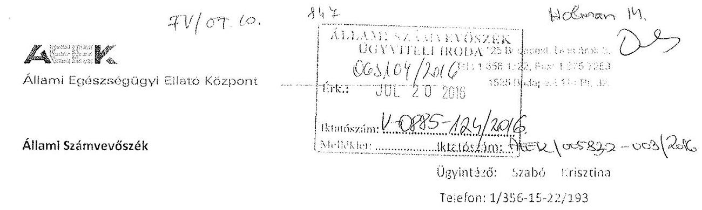

Domokos László
Elnök Úr részére

# Budapest 

Apáczai Csere János utca 10.
1052

Tisztelt Elnök Úr!

Az Állami Számvevőszék által „Az állami vagyon feletti tulajdonosi joggyakorlással kapcsolatos tevékenységek utóellenőrzése" címmel készített számvevốszéki jelentésiervezetet megkapıam.

A jelentéstervezet megállapításaival kapcsolatban észrevételt nem kivánck terıai.

Budapest, 2016. július 13.
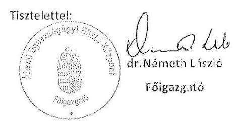

---

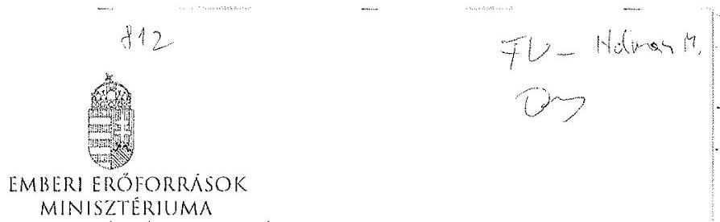

Iktatószám: 4485-7/2016/ELL

Hiv. szám: V-0885-111/2016.
Ügyintéző: Bánkné Simon Judit
Tel. szám: +36 (1) 7954430
Melléklet: 1 db

Domokos László részére
elnők

Állami Számvevőszék

Budapest
Apáczai Csere János u. 10.
1052

ÁLLAMI SZÁMVEVŐSZÉK
053615/2016
Érkszert: 2016 JOL 11
Iktatószám: V-0885-119/2016
Melléklet: 1 db

Tárgy: Észrevétel „Az állami vagyon feletti tulajdonosi joggyakorlással kapcsolatos tevékenységek utóellenőrzése" című számvevőszéki jelentéstervezethez

Tisztelt Elnök Úr!

„Az állami vagyon feletti tulajdonosi joggyakorlással kapcsolatos tevékenységek utóellenőrzése" című számvevőszéki jelentéstervezethez az alábbi észrevételt teszem.

Az 1.2. számú megállapítás 2. mondata szerint „...az EMMI...vezette az előírt nyilvántartást, azonban annak tartalma nem volt teljes körű, ezért nem felelt meg a jogszabályi előírásoknak".

Az ellenőrzés során az Állami Számvevőszék (ÁSZ) részére átadott 2012-2014. évi nyilvántartás azért nem tartalmazza a 14236. számú jelentés alapján elfogadott intézkedési tervet és a feladatok végrehajtásának rövid leírását, mert a 2014. december 29-én kelt számvevőszéki jelentés alapján készített módosított intézkedési tervet 2015. június 15-én fogadta el az ÁSZ, így az abban foglalt intézkedési tervi feladatot, illetve annak végrehajtását a 2015. évi nyilvántartás tartalmazza, amelyet mellékelten megküldök.

A fentiek alapján indokoltnak tartom a hivatkozott megállapítás törlését és a kapcsolódó megállapítások (pl. összegző megállapítás 4. mondata, 1.2. számú megállapítás alatti harmadik bekezdés) módosítását, illetve törlését.

Kérem Elnök Urat, hogy a jelentés véglegezésekor az észrevételt szíveskedjenek figyelembe venni.

Budapest, 2016. július „C„

Üdvözlettel:

Dr. Lengyel Györgyi

1054 Budapest Akadémiai út 3. 1st. 361 795 1200, Fax: 361 795 0022
E-mail: info@emmi.gov.hu

---

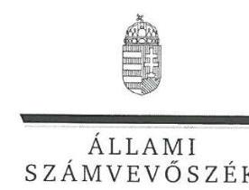

ELNÖK

Ikt.szám: V-0885-120/2016.

# Balog Zoltán úr 

miniszter
Emberi Eróforrások Minisztériuma

## Budapest

## Tisztelt Miniszter Úr!

Az állami vagyon feletti tulajdonosi joggyakorlással kapcsolatos tevékenységek utóellenőrzése címủ számvevőszéki jelentéstervezetre a közigazgatási államtitkár asszony által tett észrevételeket köszönettel megkaptam.

Az Állami Számvevőszék észrevételekre vonatkozó álláspontjáról a felügyeleti vezető által készített részletes tájékoztatást csatoltan megküldöm.

Tájékoztatom Miniszter urat, hogy a jelentésben - az Állami Számvevőszékről szóló 2011. évi LXVI. törvény 29. § (3) bekezdése alapján - a figyelembe nem vett észrevételeket szerepeltetjük az elutasítás indokának feltüntetésével együtt.

Budapest, 2016.
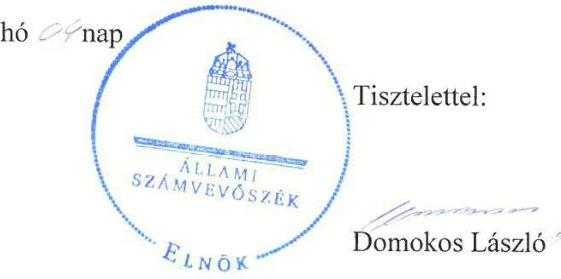

Melléklet: Tájékoztatás az el nem fogadott észrevételekről

---

# Tájékoztatás az el nem fogadott észrevételekről 

Az állami vagyon feletti tulajdonosi joggyakorlással kapcsolatos tevékenységek utóellenörzése címủ számvevőszéki jelentéstervezetre közigazgatási államtitkár asszony 4485-7/2016/ELL. iktatószámú levelében tett észrevételeit áttekintettük, annak kezeléséről az alábbi tájékoztatást adom.

Az észrevételt nem fogadtuk el, mert az ÁSZ az utóellenőrzés keretében határidő tüzésével, 2016. március 23-án kelt levéllel az EMMI-hez mint ellenőrzött szervezethez fordult adatbekérés céljából, amelyben a „... 2012-2014. évi jelentések javaslatai alapján készült intézkedési tervek végrehajtásáról vezetett, a Bkr. 14. §-a és a 47. § (2) bekezdése szerinti nyilvántartás..." megküldését kérte. Az adatszolgáltatás tehát a 2012-2014. évi időszakban készült jelentésekhez kapcsolódó intézkedési tervekben foglalt feladatok végrehajtásáról szóló nyilvántartásra irányult. Az észrevétel mellékleteként nyilvántartás címén megküldött dokumentumról nem megállapítható, hogy az az ellenőrzött időszakban is rendelkezésre állt-e. Az ÁSZ az adatbekérést és adatszolgáltatást lezárta. Mindezek következtében a beküldött dokumentumot ellenőrzési bizonyítékként az ÁSZ nem tudja felhasználni, így az a jelentéstervezetben tett megállapításra nincs hatással.

Örömmel vettük tájékoztatását, mely szerint az EMMI részéről megtörtént a Bkr. által előírt, az intézkedési tervek végrehajtásáról szóló nyilvántartás elkészítése.

Budapest, 2016. 8 hó nap

Holman Magdolná
felügyeleti vezető

---

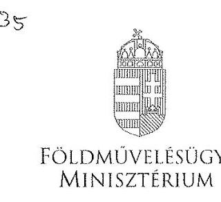

# Állami Számvevöszék 

Budapest
Apáczai Csere János utca 10. 1052

Tárgy: Tájékoztatás a Földművelésügyi Minisztérium észrevételeiről „az állami vagyon feletti tulajdonosi joggyakorlással kapcsolatos tevékenységek utóellenőrzésé" c. számvevőszéki jelentéstervezet kapcsán

## Tisztelt Elnök Úr!

A 2016. június 27. napján kelt, Tárcánk részére címzett tárgyi számvevőszéki jelentéstervezetet köszönettel megkaptuk és az abban foglaltakkal kapcsolatban az alábbiakról kívánom tájékoztatni.

1. ÁSZ megállapítása szerint: az erdészeti társaságokkal megkötött vagyonkezelési szerzödés rendezi a vagyonkezelési dijat, azonban azok értékelésére nem került sor. Továbbá, a vagyonkezelési dijak nem az intézkedési tervben vállalt módon kerültek meghatározásra, ami a bruttó nyilvántartási érték $2 \%$-a, hanem 100 Ft/ha áron. (Jelentéstervezet 17. oldal 4. pont) Illetve, a Jelentés III. számú Melléklete alapján (Jelentéstervezet 22. oldal) miszerint az erdőgazdasági társaságok által kezelt állami ingatlanok és egyéb vagyonelemek értéken történő nyilvántartása érdekében: a vagyonkezelés tárgyát képező, Nemzeti Földalapba tartozó földrészletek nyilvántartási értékéknek megállapitása és átvezetése a vagyonkezelési szerződésekben és az NFA nyilvántartásában feladatot az FM nem végezte el.

## FM észrevétel:

Tárcánk álláspontja szerint az NFA portfóliójába tartozó vagyon (erdők) nyilvántartási értékét csak generálisan, jogszabályalkotással lehet rendezni. Az

---

állami erdészeti társaságok által kezelt közel 1 millió hektár terület kapcsán a nyilvántartási érték meghatározására nincs olyan általánosan elfogadott értékbecslési módszer, ami kapcsán hitelesen, a valóságnak megfelelően nyilván lehetne tartani az állami területeket.
2. Ász megállítás: FM nem vezeti a költségvetési szervek belső kontrollrendszeréről és belső ellenőrzéséről szóló 370/2011. (XII. 31.) Korm. rendelet (a továbbiakban, mint Bkr.) 14.§ (1) bekezdése szerinti nyilvántartást a számvevőszéki ellenőrzések javaslatai alapján készült intézkedési tervek végrehajtásáról, figyelemmel a 47. § (2) bekezdésre is. (Jelentéstervezet 18. oldal)

FM észrevétel:
Az FM miniszter gondoskodik a nyilvántartásért felelős szervezeti egység kijelöléséről.
3. ÁSZ megállapítás: az FM nem dolgozta ki az erdőgazdasági társaságok vagyonkezelésesének kiemelt kontrolljait a társaságok által kezelt állami ingatlanok és egyéb vagyonelemek értéken történő nyilvántartása érdekében.

# FM észrevétel: 

Az FM álláspontja, hogy csak jogszabályalkotással lehet megnyugtatóan rendezni az állami területek értéken történő nyilvántartását.
4. ÁSZ megállapítás: az erdőgazdasági társaságokra vonatkozó feladatok átadásátvétele nem történt meg az érintett miniszterek között, ezt az ÁSZ a Nemzeti Fejlesztési Minisztériumnál vizsgálja.

## FM észrevétel:

Ez az NFM miniszter feladata.
5. ÁSZ megállapítás: az NFA a telekalakításhoz és a vagyonváltozással járó birtokrendezéshez kapcsolódó szabályozási feladatait részben hajtotta végre.

## FM észrevétel:

Az NFA az ilyen irányú szabályozási feladatainak eleget tett
6. Ász megállapítás: az NFA nem kezdeményezte az Nfatv. módosítását annak érdekében, hogy az NFA törvényi felhatalmazása alapján legyen jogosult a vagyonkezelt területek tulajdonosi ellenőrzésére, és hogy adatszolgáltatási kötelezettséget írjon elő a vagyonkezelők részére. (Jelentéstervezet 18. oldal 4. pont)

## FM észrevétel:

A 153/2013. Kormányrendelet beiktatta a 262/2010. (XI. 17.) Kormányrendeletbe, hogy az NFA a vagyonkezelőt, földhasználót ellenőrizheti.

---

A vagyonkezelők adatszolgáltatási kötelezettsége továbbá a 262/2010. (XI. 27.) Kormányrendelet 50/A §-ában előírásra került, mely tartalmazza az adatszolgáltatás tartalmát, esetköreit, és a határidőket.
7. ÁSZ megállapítás: NFA nem alakította ki a vagyonkezelési szerzödések rendszeres aktualizálásához szükséges irányitási és kontroll rendszert. (Jelentéstervezet 18. oldal 5 . pont)

FM észrevétel:
Az NFA kialakította, irányítja és kontrolálja a vagyonkezelési szerződések teljes körű rendezését az erdészeti társaságokkal, csak ezt az ÁSZ által meghatározott határidőt követően tette/teszi.

A fentieken túlmenően pedig kérjük a jelentés tervezet:

1. 9. oldalán az utolsó bekezdésében szereplő: „Az intézkedési tervben foglalt, az erőgazdasági társaságok" szövegrészt javítani szíveskedjenek a következők szerint: „Az intézkedési tervben foglalt, az erdőgazdasági társaságok"
2. 15. oldal utolsó mondata, miszerint: „Az FM a Nemzeti Földalap vagyonkezelésébe tartozó földrészletek nyilvántartási értékének megállitását és a vagyonkezelési szerződésekben, valamint az NFA vagyonnyilvántartásában való átvezetést nem végezte el" szövegrész törlését kérjük, mivel

- a Nemzeti Földalap nem „vagyonkezel" területeket, hanem az NFA ad vagyonkezelésébe terülteket, mivel ő tulajdonosi joggyakorló,
- az FM nem állapíthatja meg a földrészletek nyilvántartási értékét, mivel ez nem az FM feladata,
- a vagyonkezelési szerződést az NFA köti a vagyonkezelőkkel, a szerződésben nem aláíró fél az FM,
- az NFA nem tudta a vagyonnyilvántartásában a földrészletek értékét átvezetni, mivel nem került rendezésre a földrészletek értéke.

3. 17. oldalon a vagyonkezelési díj helyesen $100 \mathrm{Ft} / \mathrm{ha}$, szemben a $100000 \mathrm{Ft} / \mathrm{ha}$ értékkel.

Kérem fenti tájékoztatásom szíves elfogadását.
Budapest, 2016. július „ 12. ."

Tisztelettel:
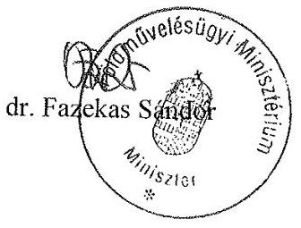

Másolatban kapia:
Nagy János elnök (Nemzeti Földalapkezelő Szervezet, 1149 Budapest, Bosnyák tér 5.)

---

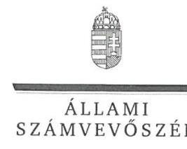

ELNÖK

Ikt.szám: V-0885-130/2016.

# dr. Fazekas Sándor úr 

miniszter
Földművelésügyi Minisztérium

## Budapest

## Tisztelt Miniszter Úr!

Az állami vagyon feletti tulajdonosi joggyakorlással kapcsolatos tevékenységek utóellenőrzése címủ számvevőszéki jelentéstervezetre tett észrevételeit köszönettel megkaptam.

Az Állami Számvevőszék észrevételekre vonatkozó álláspontjáról a felügyeleti vezető által készített részletes tájékoztatást csatoltan megküldöm.

Tájékoztatom Miniszter urat, hogy a jelentésben - az Állami Számvevőszékről szóló 2011. évi LXVI. törvény 29. § (3) bekezdése alapján - a figyelembe nem vett észrevételeket szerepeltetjük az elutasítás indokának feltüntetésével együtt.

Budapest, 2016.
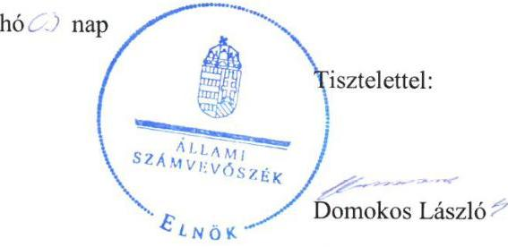

Melléklet: Tájékoztatás az elfogadott és az el nem fogadott észrevételekről

---

# Tájékoztatás az elfogadott és az el nem fogadott észrevételekről 

Az állami vagyon feletti tulajdonosi joggyakorlással kapcsolatos tevékenységek utóellenörzése címủ számvevőszéki jelentéstervezetre a $\mathrm{FgF} / 536 / 1 / 2016$. iktatószámú levelében tett észrevételeit áttekintettük, annak kezeléséről az alábbi tájékoztatást adom.

1. A jelentéstervezetre tett 1. és 3. számú észrevételét nem fogadtuk el. A 13193. számú számvevőszéki jelentés intézkedést igénylő megállapításaira és javaslataira Miniszter úr intézkedési tervben határozta meg a feladatokat, melyeket az ÁSZ tudomásul vett. Az utóellenőrzés az intézkedési tervben vállalt feladatok teljesítésére irányult. A feladatok végrehajtása érdekében intézkedésre, intézkedés kezdeményezésére az FM részéről az intézkedési tervben meghatározott határidőig nem került sor.
2. A jelentéstervezetre tett 2. számú észrevételét nem fogadtuk el. Az észrevételben foglaltak az utóellenőrzés megállapításait nem kifogásolják, nem módosítják, ahhoz kiegészítő információt adnak. Örömmel vettük tájékoztatását, mely szerint a számvevőszéki jelentés Bkr. szerint előírt nyilvántartásra vonatkozó megállapításának hasznosulása érdekében az FM részéről intézkedések történtek.
3. A jelentéstervezetre tett 4 - 7. számú észrevételét nem fogadtuk el, mert azok nem az FM-et érintő megállapításokra vonatkoznak. Ezen túl az 5. és 6. számú megállapításokra az NFA is tett észrevételt, amelyeket kezeltünk és nem fogadtunk el, a 7. számú megállapítást az NFA nem kifogásolta.
4. A jelentéstervezet egyéb módosításaira tett észrevételei közül az 1. és 3. számú észrevételét elfogadtuk. A megállapítást az észrevételében foglaltaknak megfelelően fogjuk szerepeltetni a számvevőszéki jelentésben. A 2. számú, NFA vagyonkezelésére vonatkozó észrevételét elfogadtuk. A megállapítást az alábbiak szerint fogjuk szerepeltetni a jelentésben: „Az FM a vagyonkezelés tárgyát képező, Nemzeti Földalapba tartozó földrészletek nyilvántartási értékének megállapítását és a vagyonkezelési szerződésekben, valamint az NFA vagyonnyilvántartásában való átvezetését nem végezte el. ". A jelentéstervezet megállapítására a 2. számú észrevétel további bekezdéseiben foglaltakat nem fogadjuk el az 1. pontban leírtak alapján.

Budapest, 2016. 06 hó 05 nap
Holman Magdolna
felügyeleti vezető

---

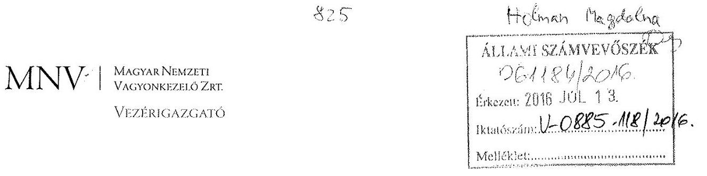

# Állami Számvevőszék 

## Domokos László

elnök úr

1052 Budapest
Apáczai Cs. J. u. 10.

Ikt. sz.: MNV/01/37936/ / 2016.
Hiv. sz.: V-0885-113/2016.

## Tisztelt Elnök Úr!

A 2016. június 29. napján „Az állami vagyon feletti tulajdonosi joggyakorlással kapcsolatos tevékenységek utóellenőrzése" tárgyában kézhez vett, V-0885-113/2016. ikt. sz. Jelentés-tervezetre az alábbi észrevételeket tesszük.

## I. A 12109 sz. Jelentés vonatkozásában

Nem kívánunk észrevételt tenni.

## II. A 13193. sz. Jelentés vonatkozásában

## Mellékletck / 25. old. V. sz. Melléklet ötödik pont

A Társaságok által kezelt állami ingatlanok, és egyéb vagyonelemek értéken történő nyilvántartása a felépítmények esetében:

Amint azt a korábbiakban is jeleztük, az MNV Zrt. tulajdonosi joggyakoriása alá tartozó ingatlanlista erdőgazdasági társaságonkénti összeállításával párhuzamosan, a vagyonnyilvántartásunk adatainak felhasználásával, illetőleg ahol nyilvántartási adat nem állt rendelkezésre, belső vagyonértékelő szakember bevonásával tételesen megállapítottuk az MNV Zrt. tulajdonosi joggyakorlása alá tartozó, és az erdőgazdasági társaságok által kezelt „földterület" jellegű vagyonelemek értékadatait.
Az értékadatok megállapítására az NFM Intézkedési tervében megállapított határidő előtt került sor.
Az Intézkedési terv kitért a felépítményes vagyonelemek értéken történő nyilvántartására is. Az erdőgazdasági társaságokkal történt egyeztetéseket követően tisztáztuk azon vagyonelemek körét, amelyek az MNV Zrt. tulajdonosi joggyakorlása alatt állnak, és területükön felépítmény, illetve egyéb önálló leltári szám alatt nyilvántartott vagyonelem találtató.

---

Az egyeztetések során tisztáztuk továbbá azt is, hogy a 2014. december 31-i állapot szerint 238 db földrészleten az Erdőgazdasági társaság saját vagyonába tartozó vagyonelem található, további 32 db földrészlet tekintetében pedig az érintett Erdőgazdasági társaság jelzése alapján az erdőgazdasági saját vagyonba nem tartozó felépítményes vagyonelem van a földterületen, amelyek eddig nem szerepeltek a nyilvántartásokban.
A felépítményes vagyonelemek értékének megállapítása kizárólag egyedileg végrehajtott vagyonértékelés keretében lehetséges. További vizsgálatot, egyes esetekben hosszadalmas geodéziai rendezést igényel továbbá az is, hogy az Erdőgazdaság saját vagyonában (tulajdonában) nyilvántartott vagyonelemet az adott földrészleten belül le lehessen határolni, majd ezt követően a tulajdonjog ingatlan-nyilvántartási bejegyzése érdekében az alkalmazható megoldást megállapítsuk (telekalakítás-megosztás, földhasználati jog alapítása és a felépítmény tulajdonjogának rendezése, stb.).
Az erdőgazdasági társaságok korábbi években megküldött, az erdőgazdaság saját vagyonába történő nyilvántartás alapjául szolgáló iratok (pl. apportlisták, stb.) alapján megkezdtük a rendelkezésre álló információk feldolgozását, ugyanakkor az egyeztetések időszükséglete hosszadalmas.

A felépítményes ingatlanok esetében az adatállomány bekérése megtörtént. Az ingatlanlista egyeztetése keretében az erdőgazdasági saját vagyonba tartozó vagyonelemek felmérését is megkezdtük.

A kezelt vagyon/saját vagyon elhatárolása céljából az erdőgazdasági társaságok több információt adtak, a feldolgozás megkezdődött. Ezen felül egyedi ügyekben történt intézkedés a rendezésre.

Az Ingatlanlista felépítményes földrészletei, továbbá rendezetlen földrészletei esetében a vagyonkezelési szerződések megkötésére a második ütemben kerülne sor. 2015. szeptember 15-ig 4 erdőgazdasági társaság felépítményes ingatlan listáját készítettük elő további intézkedésre, 2 társaság listájának előállítása folyamatban volt.

A vagyonkezelési szerződések ez idáig nem kerültek megkötésre, a vagyongazdálkodási szakmai indokok egyeztetése zajlik az MNV Zrt. és részvényesi joggyakorlója között. A vagyonkezelési szerződések megkötése, így az ingatlanlista előkészítésének folyamata is a fentiek alapján megakadt.

A felépítményes vagyonelemek esetében a szerződés megkötése előtt célszerű megállapítani értékbecslés útján a felépítmény vagyonelemek értékét, mivel a vagyonkezelési szerződés ingatlanlista mellékletében a felépítmény vagyonelemek is értékkel kerülnének feltüntetésre, az egyéb számviteli kérdéseket (értékcsökkenés) valamint az értékbecslések érvényességét tekintve is a javasolt megoldás, hogy az értékbecslése készítésének ideje minél közelebb essen a szerződés megkötésének időpontjához.

---

# III. A 14236. sz. Jelentés vonatkozásában 

Összegzés / 5. old. Főbb megállapítások, következtetések ötödik bekezdés; Összegzés / 6. old. 1. ábra; Megállapítások / 14. old. Összegző megállapítás első bekezdés, 2. ábra, 1.1. számú megállapítás első bekezdés; Megállapítások / 16. old. első mondat; Mellékletek / 23. old. IV. sz. Melléklet

Szeretném tájékoztatni, hogy az Állami Számvevőszék elnöke által megküldött, V-0458-679/2015. sz. levélben meghatározott elfogadott, az MNV Zrt. SZMSZ-ének módosítására vonatkozó Intézkedési terv négy alkalommal módosításra került, amely módosításokról az MNV Zrt. minden esetben, soron kívül tájékoztatta az Állami Számvevőszéket, melyek az ÁSZ tv. 33. § (2) bekezdésében foglaltak alkalmazásával nem kerültek kijavítás, vagy kiegészítés érdekében visszaküldésre. A tájékoztatások átvételének igazolását is tartalmazó levelek másolatát a jelen levelemmel mellékelten megküldöm.
Az ellenőrzési időszakban került sor az Intézkedési terv 3. számú módosítására, amellyel összefüggésben az MNV Zrt. a 2015. december 31. napján megküldött, MNV/01/136/32/2015. ikt. sz. levelében tájékoztatta az Állami Számvevőszéket arról, hogy az Intézkedési tervben meghatározott határidő 2015. december 31. napjáról 2016. március 31. napjára módosult.

A Jelentés-tervezet nem tartalmazza az MNV Zrt. által, az Állami Számvevőszék rendelkezésére bocsátott azon információt, mely szerint a negyedik számú módosítás alkalmával a végrehajtási határidő 2016. március 31. napjáról 2016. április 30. napjára került módosításra. Az MNV Zrt. Igazgatósága 2016. április 6. napján fogadta el az MNV Zrt. módosított SZMSZ-ét, amely tényről 2016. április 13. napján futár útján megküldött MNV/01/3667/4 ikt. sz. levél, majd április 14. napján megküldött elektronikus levél útján szintén tájékoztattuk az Állami Számvevőszéket. Mindkét alkalommal megküldésre került az MNV Zrt. módosított SZMSZ-ének másolati példánya is. A futár útján megküldött tájékoztatás átvételének igazolását is tartalmazó levél másolati példányát jelen levelemmel ugyancsak megküldöm.

A Jelentés-tervezet 5. oldalán szereplő első bekezdés szerint, az Állami Számvevőszék az utóellenőrzését a 2012. december 13. és 2016. február 18. közötti időszak tekintetében végezte el.

Mindezek alapján, egyértelműen kijelenthető, hogy az MNV Zrt. módosított SZMSZ-ének jóváhagyására irányadó határidő az ellenőrzött időszakban még nem telt el.

A fentiekre tekintettel kérjük a Jelentés-tervezet fent hivatkozott megállapításait és ábráit akként pontosítani, hogy azokban az SZMSZ módosítására vonatkozó feladat „nem végrehajtott" helyett „nem időszerü" státuszú feladatként szerepeljen, tekintettel arra a tényre, hogy a végrehajtás határideje az ellenőrzött időszakban még nem telt el, illetve kérjük a rendelkezésükre álló információk alapján az Intézkedési terv teljesítését elfogadni.

---

# Függelék: Észrevételek 

Kérem Elnök Urat, hogy a Jelentés-tervezet véglegesítése során jelen észrevételeinket szíveskedjenek figyelembe venni.

Budapest, 2016. július „! ? "

Üdvözlettel:

## MNV   MÁKZER NÉMETT   VAGYONKZEGÜZKK   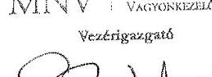   dr. Szivek Norbert   vezérigazgató

## Mellékletek:

2015. január 30. napján megküldött, a 14236. sz. Jelentés alapján elkészített Intézkedési terv
2015. június 18. napján megküldött, az Intézkedési terv 1. sz. módosítása
2015. szeptember 29. napján megküldött, az Intézkedési terv 2. sz. módosítása
2015. december 31. napján megküldött, az Intézkedési terv 3. sz. módosítása
2016. március 31. napján megküldött, az Intézkedési terv 4. sz. módosítása
2016. április 13. napján megküldött, az MNV Zrt. módosított SZMSZ-e

---

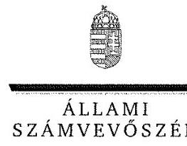

ELNÖK

Ikt.szám: V-0885-121/2016.

# dr. Szivek Norbert úr 

vezérigazgató
Magyar Nemzeti Vagyonkezelő Zrt.

## Budapest

## Tisztelt Vezérigazgató Úr!

Az állami vagyon feletti tulajdonosi joggyakorlással kapcsolatos tevékenységek utóellenőrzése című számvevőszéki jelentéstervezetre tett észrevételeit köszönettel megkaptam.

Az Állami Számvevőszék észrevételekre vonatkozó álláspontjáról a felügyeleti vezető által készített részletes tájékoztatást csatoltan megküldöm.

Tájékoztatom Vezérigazgató urat, hogy a jelentésben - az Állami Számvevőszékről szóló 2011. évi LXVI. törvény 29. § (3) bekezdése alapján - a figyelembe nem vett észrevételeket szerepeltetjük az elutasítás indokának feltüntetésével együtt.

Budapest, 2016.
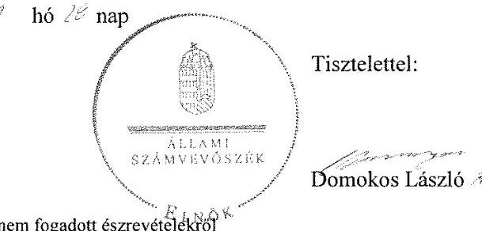

Melléklet: Tájékoztatás az el nem fogadott észrevételekröl

---

# Tájékoztatás az el nem fogadott észrevételekről 

Az állami vagyon feletti tulajdonosi joggyakorlással kapcsolatos tevékenységek utóellenörzése címủ számvevőszéki jelentéstervezetre a MNV/01/37936/1/2016. iktatószámú levelében tett észrevételeit áttekintettük, annak kezeléséről az alábbi tájékoztatást adom.
I. A 13193. sz. Jelentés vonatkozásában az NFM intézkedési tervében meghatározott feladat végrehajtására tett észrevételét nem fogadtuk el. Az észrevételben foglaltak az utóellenőrzés megállapításait nem kifogásolják, nem módosítják, ahhoz kiegészítő információt, további magyarázatot adnak. Örömmel vettük tájékoztatását, mely szerint a számvevőszéki jelentés erdőgazdasági társaságok vagyonkezeléseinek kiemelt kontrolljai tekintetében a társaságok által kezelt állami ingatlanok és egyéb vagyonelemek (felépítmények) értéken történő nyilvántartására vonatkozó megállapításainak és javaslatainak hasznosulása érdekében az MNV Zrt. részéről intézkedések történnek.
2. A 14236. sz. Jelentés vonatkozásában tett észrevételét nem fogadtuk el. Az ÁSZ tv. 33. § (1) bekezdés rendelkezik a jelentésben foglalt megállapításokhoz kapcsolódó intézkedési terv összeállításáról, és annak Állami Számvevőszék részére történő megküldésről. Az MNV Zrt. a 14236. számú, Az állami vagyon feletti tulajdonosi joggyakorlással kapcsolatos tevékenységek ellenőrzéséről készült jelentéshez kapcsolódóan 2015.01.30-án, MNV01/136/3/2015. iktatószámon megküldte intézkedési tervét, melyet az ÁSZ elfogadott és tudomásul vett, mert az abban foglalt feladatok és határidők összhangban voltak a számvevőszéki jelentési intézkedést igénylő megállapításaival és javaslataival. Az intézkedési tervet az ÁSZ törvény alapján az ellenőrzött szervezet maga állítja össze, az abban foglalt határidőkkel és felelősökkel együtt. Az ÁSZ tv. 33. § (7) bekezdése szerint az intézkedési tervben foglaltak megvalósítását az Állami Számvevőszék utóellenőrzés keretében ellenőrizheti. Az ÁSZ ezen törvényi felhatalmazás alapján végzett utóellenőrzését az általa elfogadott intézkedési tervben foglaltak alapján végezte.

Budapest, 2016. jd tium hó 24 nap
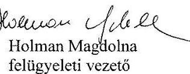

---

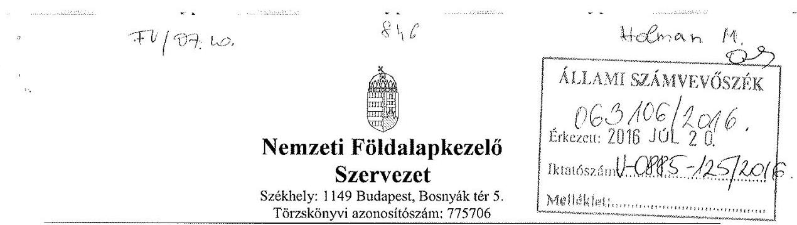

Domokos László
ÁSZ Elnök

Úgyiratszám: NFA-014382/010/2015
Állami Számvevőszék

# Budapest 

Apáczai Csere János utca 10.
1052

Tárgy: Észrevétel Jelentéstervezetre.

## Tisztelt Elnök Úr!

Az Állami Számvevőszék a V-0885-/2016. számú 2016. június 31 -én átvett levelében megküldte. „Az állami vagyon feletti tulajdonosi joggyakorlással kapcsolatos tevékenység utóellenőrzése" tárgyú vizsgálatáról készült Jelentéstervezetet, melyre az alábbi észrevételt tesszük:

1. Az ÁSZ megállapítása volt, hogy „a birtokrendezéssel kapcsolatos belső eljárásrend nem készült el" (26. old. 3. pont).

## NFA észrevétele

A telek átalakítással egybekötött értékesítéssel kapcsolatos eljárásrend elkészült, a Jogi Osztály jóváhagyta, kiadása folyamatban van.

Kérjük a jelentésben azt is jelezni, hogy az eljárásrend már elkészül, kiadása folyamatban van.
2. Az ÁSZ megállapítása volt az intézkedési tervek végrehajtására vonatkozóan (26. oldal 4. pont.): „Az NFA a vállalt törvénymódosításokat nem kezdeményezte."

## NFA észrevétele:

A 2016. január 21-én megküldött levelünk 8. pontjában jeleztük, hogy az FM nem tartja indokoltnak a törvényi módosítás kezdeményezését. (FgF.-676/2/2015. sz. levél).
A 2016. 04. 07-én küldött levelünkben, valamint az intézkedési tervek teljesítését tartalmazó nyilvántartásban és az aktualizált 1. sz. Tanúsítvány 5/a pontjában továbbá tájékoztattuk Önöket, hogy a 153/2013. Kormányrendelet beiktatta a 262/2010. (XI. 17.) Kormányrendeletbe, hogy az NFA a vagyonkezelőt, földhasználót ellenőrizheti.
A vagyonkezelők adatszolgáltatási kötelezettsége továbbá a 262/2010. (XI. 27.) Kormányrendelet 50/A §-ában előírásra került, mely tartalmazza az adatszolgáltatás tartalmát,

---

esetköreit, és a határidőket. Kérjük a jelentésben jelezni, hogy a törvényi módosítás kezdeményezése oka fogyottá vált a jogszabályi változások miatt.
3. ÁSZ megállapítása (27. oldal 5. pont): „Az NFA a vagyonkezelői szerződések felülvizsgálatára, aktualizálásra, valamint az irányítási és kontrollrendszer kialakítása érdekében projektet nem indított.

# NFA észrevétele: 

2016. 04. 21 -én küldött intézkedési tervek teljesítését tartalmazó nyilvántartásban és az aktualizált 1. sz. Tanúsítvány 5/b. pontjában, valamint a 2. számú Tanúsítvány 2. pontjában tájékoztattuk Önöket, hogy a vagyonkezelői szerződések megkötésre kerültek a 19 db az Állami erdőgazdasággal, melynek előzményeként a korábbi szerződések felülvizsgálatára projekt részeként Ügyvédi Konzorcium lett felkérve.

Kérjük a jelentésben azt is jelezni, hogy az NFA idöközben az új vagyonkezelöi szerzödéseket megkötötte a 19 db Állami Erdögazdasággal, melynek elözményeként a korábbi szerzödések felülvizsgálatára, projekt részeként Ügyvédi Konzorcium lett felkérve.

Az ÁSZ tervezetében továbbá jelezte, hogy az NFA-nál vezetett intézkedési tervek nyilvántartására vonatkozóan (18. oldal): „a nyilvántartás nem tartalmazta minden estben a végrehajtott intézkedések rövid leírását, vagy a végre nem hajtott intézkedések okát."

NFA észrevétele:
Az ÁSZ részére megküldött (Külső ellenőrzésekhez kapcsolódó intézkedések nyilvántartása 2011-2016) című nyilvántartás a végrehajtott intézkedések rövid leírását valamennyi esetben tartalmazza.
A végre nem hajtott intézkedések elmaradásának oka, nem minden esetben volt ismert, ezért nem szerepeltettük a végrehajtásáig, ill. a szakterület visszajelzéséig. A megkért határidő módosításokat a nyilvántartás utolsó oszlopában minden esetben a megjegyzés rovatban feltüntetésre kerülnek.

A végleges jelentésben kérjük pontositani, hogy a végrehajtott intézkedések rövid leírását a nyilvántartás valamennyi esetben tartalmazza, a végre nem hajtott intézkedések esetében pedig a megkért határidő módosítások a nyilvántartás utolsó oszlopában szerepelnek.

Budapest, 2016. július 13.
Tisztelettel:
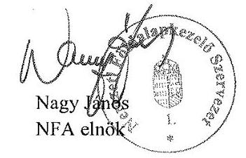

---

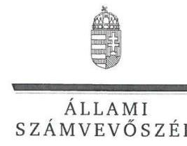

ELNÖK

Ikt.szám: V-0885-129/2016.

# Nagy János úr 

elnök
Nemzeti Földalapkezelő Szervezet

## Budapest

## Tisztelt Elnök Úr!

Az állami vagyon feletti tulajdonosi joggyakorlással kapcsolatos tevékenységek utóellenőrzése címủ számvevőszéki jelentéstervezetre tett észrevételeit köszönettel megkaptam.

Az Állami Számvevőszék észrevételekre vonatkozó álláspontjáról a felügyeleti vezető által készített részletes tájékoztatást csatoltan megküldöm.

Tájékoztatom Elnök urat, hogy a jelentésben - az Állami Számvevőszékről szóló 2011. évi LXVI. törvény 29. § (3) bekezdése alapján - a figyelembe nem vett észrevételeket szerepeltetjük az elutasítás indokának feltüntetésével együtt.

Budapest, 2016.
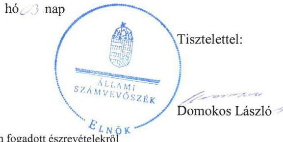

Melléklet: Tájékoztatás az el nem fogadott észrevételekről

---

# Tájékoztatás az el nem fogadott észrevételekről 

Az állami vagyon feletti tulajdonosi joggyakorlással kapcsolatos tevékenységek utóellenörzése című számvevőszéki jelentéstervezetre a NFA-014382/010/2015. iktatószámú levelében tett észrevételeit áttekintettük, annak kezeléséről az alábbi tájékoztatást adom.

1. A jelentéstervezet 26. oldalán a 3. pontban szereplő ÁSZ megállapításra tett észrevételét nem fogadtuk el, mert az túlmutat az ellenőrzött időszakon. Az eljárásrend jóváhagyása és kiadása az ellenőrzött időszak végéig nem történt meg, melyet az észrevételében foglaltak is alátámasztanak.
2. A jelentéstervezet 26. oldalán a 4. pontban szereplő ÁSZ megállapításra tett észrevételét nem fogadtuk el. Az észrevételében hivatkozott, és az 1. számú Tanúsítványban a feladat végrehajtását igazoló dokumentumként feltüntetett 262/2010. (XI. 17.) Korm. rendelet hivatkozott rendelkezéseit tartalmazó, a tulajdonosi ellenőrzés és a használó adatszolgáltatási kötelezettségéről szóló VIII. fejezete 2013. május 25 -étől hatályos, az már az intézkedési terv készítésekor hatályban volt. A 2014. április 2 -án kelt, kiegészített intézkedési tervében a törvénymódosítás kezdeményezésére meghatározott feladatot már a jogszabály ismeretében határozta meg, 2014. december 31-ei teljesítési határidővel. Ezen túl az észrevételében hivatkozott FgF.676/2/2015. iktatószámú, 2015. március 5-ei keltezésű FM levél az Állami Számvevőszék részére került megküldésre, míg az NFA az intézkedési tervében meghatározott feladatát ezt megelőző, 2014. december 31-ei határidővel vállalta. Az NFA az intézkedési tervében meghatározott feladat végrehajtása érdekében nem tett intézkedéseket, azokat dokumentumokkal nem támasztotta alá, ezért a számvevőszéki jelentéstervezetben foglalt megállapítás megalapozott.
3. A jelentéstervezet 27. oldalán az 5. pontban szereplő ÁSZ megállapításra tett észrevételét nem fogadtuk el. A tervezett intézkedés végrehajtásának alátámasztására az észrevételében hivatkozott, és az 1. és 2. számú Tanúsítványban szereplő nyilatkozat szerint „a 19 db vagyonkezelési szerződés megkötésre került". A jelentéstervezetben foglalt megállapításunk szerint az NFA elnöke a 13193. számú számvevőszéki jelentés intézkedést igénylő megállapításaira és javaslataira készített intézkedési tervében meghatározott feladata azonban nem a 19 db állami erdőgazdaságra korlátozódott. Az észrevételében foglalt, korábbi szerződések felülvizsgálatára, a projekt részeként az Ügyvédi Konzorcium felkérésére vonatkozó dokumentumokat nem bocsátottak az ellenőrzés rendelkezésére, ugyanakkor a teljességi és hitelességi nyilatkozatot az ellenőrzés végén kiállították. Az NFA az intézkedési tervében meghatározott feladatára, így a vagyonkezelői szerződések felülvizsgálatára, aktualizálására, valamint az irányítási és kontrollrendszer kialakítására irányuló projekt indítására vonatkozó dokumentumokat nem bocsátottak az ellenőrzés rendelkezésére. Egyben tájékoztatom, hogy a vagyonkezelési szerződések megkötésére utaló megállapítást a jelentéstervezet több területet érintően már tartalmazza.

---

4. A jelentéstervezet 18. oldalán az intézkedési tervek nyilvántartására vonatkozó megállapításra tett észrevételét nem fogadtuk el. Az ellenőrzés rendelkezésére bocsátott dokumentumok ismételt áttekintését követően megállapítottuk, hogy az NFA által a Bkr. előírása szerint intézkedési tervek végrehajtásáról vezetett nyilvántartás tartalmaz olyan tervezett intézkedéseket, melyek határideje folyamatos, a végrehajtás státusza „nyitott", ugyanakkor a nyilvántartás - a Bkr. 47. § (2) bekezdése ellenére - nem tartalmazta sem a végrehajtott intézkedések rövid leírását, sem a végre nem hajtott intézkedés okát.

Budapest, 2016. 06 hó 05 nap
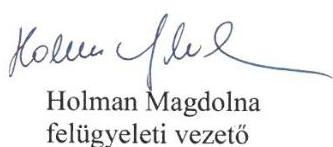

---

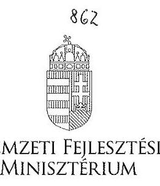

DR. SESZTÁK MIKLÓs
minister

Iktatószám: EFO/17257-2/2016-NFM

Ügyintéző: Simonné Hábencius Gizella
Telefonszám: 79-54405
E-mail:gizella.habencius.simonne@nfm.gov.hu
Hiv. szám: V-0885-114/2016.

# Domokos László 

elnök
részére
Állami Számvevöszék

## Budapest

Apáczai Csere János u. 10.
1052

Tárgy: Jelentéstervezet véleményezése

## Tisztelt Elnök Úr!

Köszönettel vettem kézhez „Az állami vagyon feletti tulajdonosi joggyakorlással kapcsolatos tevékenységek utóellenőrzése" címmel készített számvevőszéki jelentéstervezetet.

A jelentéstervezetre észrevételt nem teszek.
Budapest, 2016. július „ $\mathrm{H}^{-}$",
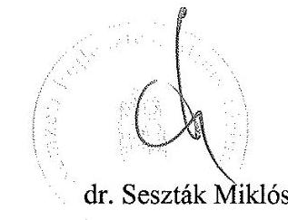

---

# RÖVIDÍTÉSEK JEGYZÉKE 

${ }^{1}$ ÁEEK
${ }^{2}$ FM
${ }^{3}$ MNV Zrt.
${ }^{4}$ NFA
${ }^{5}$ NFM
${ }^{6}$ ÁSZ
${ }^{7}$ EMMI
${ }^{8}$ Bkr.
${ }^{9}$ GYEMSZI
${ }^{10}$ ÁEEK Vagyonnyilvántartási Szabályzat
${ }^{11}$ ÁEEK Fenntartói Ellenőrzési Szabályzata
${ }^{12}$ Vtv.
${ }^{13}$ Nfatv.
${ }^{14}$ Bkr.

Állami Egészségügyi Ellátó Központ
Földművelésügyi Minisztérium
Magyar Nemzeti Vagyonkezelő Zrt.
Nemzeti Földalapkezelő Szervezet
Nemzeti Fejlesztési Minisztérium
Állami Számvevőszék
Emberi Erőforrások Minisztériuma
370/2011. (XII. 31.) Korm. rendelet a költségvetési szervek belső
kontrollrendszeréről és belső ellenőrzéséről (hatályos 2012. január 1.-jétől)
Gyógyszerészeti és Egészségügyi Minőség- és Szervezetfejlesztési Intézet (az
ÁEEK jogelődje)
14/2015. számú Főigazgatói Utasítás az ÁEEK állami vagyon vagyonkezelőire, az
állami vagyont használókra és a társasági részesedések esetében az ÁEEK
tulajdonosi joggyakorlását ellátókra vonatkozó Vagyonnyilvántartási Szabályzata
15/2015. számú Főigazgatói Utasítás az Intézmény Koordinációs Főosztály az
ÁEEK tulajdonosi joggyakorlásában álló ingatlanok fenntartói, műszaki
ellenőrzéséről szóló szabályzata
az állami vagyonról szóló 2007. évi CVI. törvény
2010. évi LXXXVII. törvény a Nemzeti Földalapról
370/2011. (XII. 31.) Korm. rendelet a költségvetési szervek belső
kontrollrendszeréről és belső ellenőrzéséről

---

# ÁLLAMI SZÁMVEVŐSZÉK 

1052 Budapest, Apáczai Csere János utca 10.
Levélcím: 1364 Budapest 4. Pf. 54
Telefon: +36 14849100 Telefax: +36 14849200
www.asz.hu