# Jelentés 

## Utóellenőrzések

A kórházi ellátás működtetésére fordított pénzeszközök felhasználásának ellenőrzéséről szóló jelentés utóellenőrzése
2016.

---

.

---

# Jelentés 

## Utóellenőrzések

A kórházi ellátás működtetésére fordított pénzeszközök felhasználásának ellenőrzéséről szóló jelentés utóellenőrzése
2016. Október 25. nap
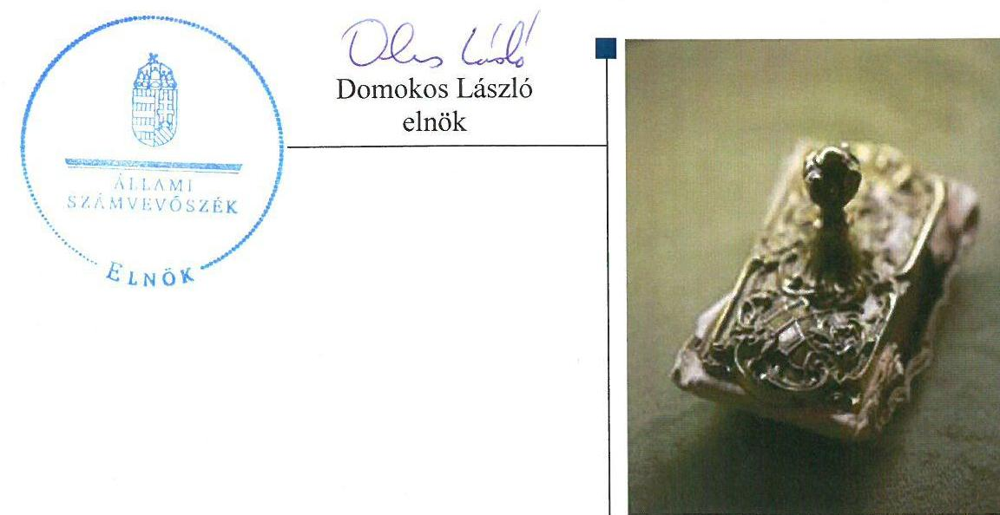

---

# AZ ELLENŐRZÉST FELÜGYELTE: 

SALAMON ILDIKÓ felügyeleti vezető

## AZ ELLENŐRZÉST VEZETTE ÉS A VÉGREHAJTÁSÁÉRT FELELŐS:

ZAKAR LÁSZLÓ ellenőrzésvezető

## A PROGRAM ÖSSZEÁLLÍTÁSÁÉRT FELELŐS:

JANIK JÓZSEF LÁSZLÓ osztályvezető

## A TÉMÁHOZ KAPCSOLÓDÓ KORÁBBI SZÁMVEVŐSZÉKI JELENTÉSEK:

- címe: Jelentés a kórházi ellátás működtetésére fordított pénzeszközök felhasználásának ellenőrzéséről
- sorszáma: 13012

Jelentéseink az Országgyűlés számítógépes hálózatán és az Interneten a www.asz.hu címen is olvashatóak.

IKTATÓSZÁM: V-0883-184/2016.
TÉMASZÁM: 1917
ELLENŐRZÉS-AZONOSÍTÓ SZÁM: V071705

---

# TARTALOMJEGYZÉK 

■ ÖSSZEGZÉS ..... 5
■ AZ ELLENŐRZÉS CÉLJA ..... 6
■ AZ ELLENŐRZÉS TERÜLETE ..... 7
■ AZ ELLENŐRZÉS HÁTTERE, INDOKOLTSÁGA ..... 10
■ A JELENTÉS LÉNYEGES KÉRDÉSKÖREI ..... 11
■ ELLENŐRZÉS HATÓKÖRE ÉS MÓDSZEREI ..... 12
■ MEGÁLLAPÍTÁSOK ..... 14
■ MELLÉKLETEK ..... 21
I. Sz. melléklet: Az ÁSZ 13012. számú jelentéséhez kapcsolódó intézkedési terv ${ }_{1}$ végrehajtása ..... 21
II. Sz. melléklet: Az ÁSZ 13012 számú jelentéséhez kapcsolódó intézkedési terv ${ }_{2}$ végrehajtása ..... 24
III. Sz. melléklet: Az ÁSZ 13012 számú jelentéséhez kapcsolódó intézkedési terv ${ }_{3}$ végrehajtása ..... 29
IV. Sz. melléklet: Az ÁSZ 13012 számú jelentéséhez kapcsolódó intézkedési terv ${ }_{4}$ végrehajtása ..... 37
V. Sz. melléklet: Az ÁSZ 13012 számú jelentéséhez kapcsolódó intézkedési terv ${ }_{5}$ végrehajtása ..... 39
VI. Sz. melléklet: Az ÁSZ 13012 számú jelentéséhez kapcsolódó intézkedési terv ${ }_{6}$ végrehajtása ..... 43
■ FÜGGELÉK: ÉSZREVÉTELEK ..... 47
■ RÖVIDÍTÉSEK JEGYZÉKE ..... 73

---

.

---

# ÖSSZEGZÉS 

Az Állami Számvevőszék elvégezte a kórházi ellátás működtetésére fordított pénzeszközök felhasználásának utóellenőrzését. Az utóellenőrzés a korábbi ÁSZ jelentés intézkedést igénylő megállapításai alapján az ellenőrzött szervezetek által készített intézkedési tervek végrehajtásának ellenőrzésére irányult. Az utóellenőrzés megállapította, hogy az irányító szerv és a kórházak az intézkedési tervekben önmaguk által meghatározott feladatokat határidőben nem teljes körűen hajtották végre, amely kockázatot hordoz a kórházak működési pénzügyi egyensúlyi helyzetének helyreállításában és fenntartásában, valamint a felelős vezetői magatartásban.

## Az ellenőrzés társadalmi indokoltsága

Az Állami Számvevőszék stratégiájában célul tűzte ki a számvevőszéki munka hasznosulásának javítását. Ezzel összhangban ellenőrzi, hogy az ellenőrzött szervezetek megvalósították-e a korábbi ellenőrzései által feltárt hibák, hiányosságok és szabálytalanságok megszüntetése céljából kialakított intézkedési terveikben foglaltakat. A rendszeres utóellenőrzések hozzájárulnak a szükséges intézkedések tényleges végrehajtásához, ezáltal a közpénzügyek rendezettségének javulásához.

## Főbb megállapítások, következtetések

Az Emberi Erőforrások Minisztériuma az intézkedési tervében meghatározott feladatok végrehajtásáról nem teljes körűen gondoskodott, két feladatot határidőn túl, egy feladatot részben, továbbá egy feladatot nem hajtott végre. A kórházak az intézkedési tervükben a működési pénzügyi egyensúlyi helyzetük helyreállítása és fenntartása érdekében határoztak meg feladatokat. A Csongrád Megyei Dr. Bugyi István Kórház vezetője, valamint a Keszthelyi Kórház vezetője nem tette meg az intézkedési tervben önmaga által meghatározott feladatok végrehajtására a megfelelő intézkedéseket, amely kockázatot hordoz a kórház működésében és a felelős vezetői magatartásban. A bevétel-növelés és kiadáscsökkentés érdekében meghatározott feladatok jelentős részét a Csongrád Megyei Dr. Bugyi István Kórház nem hajtotta végre, a Keszthelyi Kórház határidőt követően vagy részben hajtotta végre. A Szent Kozma és Damján Rehabilitációs Szakkórház az intézkedési tervben vállalt feladatokat összességében végrehajtotta, a feladatok egynegyede azonban határidőt követően teljesült. A Szent Imre Egyetemi Oktatókórház és a Gottsegen György Országos Kardiológiai Intézet az intézkedési tervében a bevétel-növelés és kiadáscsökkentés érdekében vállalt feladatait összességében végrehajtotta, azonban a Gottsegen György Országos Kardiológiai Intézet az általa tervezett bevételnövelést és kiadáscsökkentést a tervezett módon nem valósította meg. A Szent Imre Egyetemi Oktatókórház vezetője és a Csongrád Megyei Dr. Bugyi István Kórház vezetője az intézkedési terv végrehajtásáról a jogszabály által előírt nyilvántartást nem vezette, a Keszthelyi Kórház vezetője a nyilvántartást nem a megfelelő tartalommal vezette.

---

# AZ ELLENŐRZÉS CÉLJA 

Az ellenőrzés célja annak értékelése, hogy a számvevőszéki jelentésben foglalt intézkedést igénylő megállapításokkal és javaslatokkal összhangban készített intézkedési tervben meghatározott feladatokat az ellenőrzött szervezetek végrehajtották-e.

---

# AZ ELLENŐRZÉS TERÜLETE 

Az utóellenőrzés a kórházi ellátás működtetésére fordított pénzeszközök felhasználásának ellenőrzéséről közzétett ÁSZ ${ }^{1}$ jelentés ${ }^{2}$ intézkedést igénylő megállapításai alapján az ellenőrzött szervezetek által készített intézkedési tervekben foglalt feladatok megvalósításának ellenőrzésére irányult.

## Emberi Erőforrások Minisztériuma (EMMI)

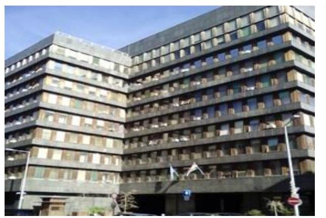

Az ÁSZ jelentés az EMMI ${ }^{3}$ miniszterének négy javaslatot fogalmazott meg, amelynek hasznosítására a miniszter az intézkedési terv ${ }_{1}{ }^{4}$-ben hat feladatot határozott meg. Az EMMI az intézkedési terv ${ }_{1}$-et határidőn túl küldte meg az ÁSZ részére.

## Csongrád Megyei Dr. Bugyi István Kórház (BIK)

Az ÁSZ jelentés a BIK ${ }^{5}$ főigazgatójának három javaslatot fogalmazott meg a működési pénzügyi egyensúlyi helyzet helyreállítása és fenntartása érdekében. A javaslatok hasznosítására a főigazgató az intézkedési terv $_{2}{ }^{6}$-ben 56 feladatot határozott meg. Az intézkedési terv $_{2}$-őt a főigazgató határidőn túl küldte meg az ÁSZ részére.

---

### **Gottsegen György Országos Kardiológiai Intézet (GOKI)**

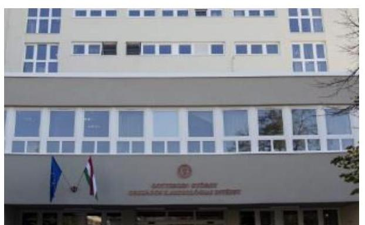

Az ÁSZ jelentés a GOKI7 főigazgatója részére három javaslatot fogalmazott meg a működési pénzügyi egyensúlyi helyzet helyreállítása és fenntartása érdekében. A javaslatok hasznosítására a főigazgató az intézkedési terv38-ban 34 feladatot határozott meg. Az intézkedési terv3-at a GOKI főigazgatója határidőben küldte meg az ÁSZ részére.

### **Szent Imre Egyetemi Oktatókórház (SZIK)**

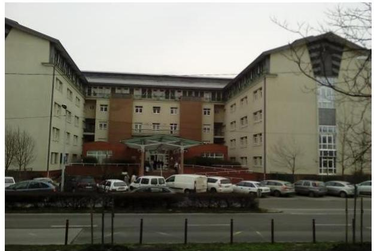

Az ÁSZ jelentés a SZIK9 főigazgatója részére három javaslatot fogalmazott meg a működési pénzügyi egyensúlyi helyzet helyreállítása és fenntartása érdekében. A javaslatok hasznosítására a főigazgató az intézkedési terv410-ben 10 feladatot határozott meg. Az intézkedési terv4-et a főigazgató határidőn túl küldte meg az ÁSZ részére.

### **Szent Kozma és Damján Rehabilitációs Szakkórház (SZKDRSZK)**

Az ÁSZ jelentés az SZKDRSZK11 főigazgatója részére három javaslatot fogalmazott meg a működési pénzügyi egyensúlyi helyzet helyreállítása és fenntartása érdekében. A javaslatok hasznosítására a főigazgató az intézkedési terv512-ben 20 feladatot határozott meg. Az intézkedési terv5-öt a főigazgató határidőben küldte meg az ÁSZ részére.

---

# **Keszthelyi Kórház (VKK)**

Az ÁSZ jelentés a VKK13 főigazgatója részére három javaslatot fogalmazott meg a működési pénzügyi egyensúlyi helyzet helyreállítása és fenntartása érdekében. A javaslatok hasznosítására a főigazgató az intézkedési terv614-ban 16 feladatot határozott meg. Az intézkedési terv6-ot a főigazgató határidőn túl küldte meg az ÁSZ részére.

---

# AZ ELLENŐRZÉS HÁTTERE, INDOKOLTSÁGA 

Az ÁSZ tv. 33. § (1) bekezdése értelmében a számvevőszéki jelentések intézkedést igénylő megállapításaihoz és javaslataihoz kapcsolódóan az ellenőrzött szervezet vezetője intézkedési tervet köteles összeállítani, és az Állami Számvevőszék részére megküldeni. Az intézkedési tervben foglaltak megvalósítását - az ÁSZ tv. 33. § (7) bekezdésében foglaltak alapján - az Állami Számvevőszék utóellenőrzés keretében ellenőrizheti. Az intézkedések megvalósulásának értékelése során az Állami Számvevőszék figyelembe veszi az ellenőrzött szervezetek működési feltételeiben, valamint a jogszabályi előírásokban bekövetkezett változásokat.

Az intézkedési tervekben foglalt feladatok hiányos, illetve késedelmes végrehajtása, valamint megvalósításának elmaradása azt mutatja, hogy az ellenőrzések során feltárt hibák, hiányosságok és szabálytalanságok megszüntetése nem kapott kellő hangsúlyt. Ez a szabályszerű működés és a felelős vezetői magatartás vonatkozásában kockázatot hordoz. E kockázatok feltárásával az Állami Számvevőszék utóellenőrzési rendszere fokozza a fegyelmet, és igazolja, hogy a közpénzzel való szabályos gazdálkodás felelőssége elől nem lehet kitérni.

## AZ UTÓELLENŐRZÉS NÉGY SZINTEN HASZNOSULHAT:

- a társadalom szintjén az utóellenőrzés jelzi, hogy a számvevőszéki ellenőrzés megállapításainak van következménye: a hiányosságok megszüntetésére az ellenőrzött szervezet által meghatározott intézkedések végrehajtását is számon kéri az ÁSZ;
- az ellenőrzött terület szintjén az utóellenőrzés tájékoztatást nyújt a terület döntéshozóinak a hiányosságok kiküszöbölésének jó gyakorlatairól, ezzel lehetőséget biztosítva arra, hogy az ÁSZ ellenőrzési megállapításai, javaslatai a terület nem ellenőrzött szervezeteinek a működése során is hasznosuljanak;
- az ellenőrzött szervezet szintjén az utóellenőrzés feltárja, hogy a szervezet az intézkedések végrehajtásával hasznosította-e a korábbi ellenőrzési jelentésben a hiányosságok megszüntetése, illetve a kockázatok kezelése érdekében megfogalmazott javaslatokat;
- az ÁSZ szintjén az utóellenőrzés visszacsatolást ad az ellenőrzési jelentések hasznosulásáról, az intézkedések elmaradása vagy részleges megvalósulása a további ellenőrzésekhez kockázati jelzésként szolgál.

---

# A JELENTÉS LÉNYEGES KÉRDÉSKÖREI 

1. Az ellenőrzött szervezetek az intézkedési tervekben foglaltakat az előírt határidőben - végrehajtották-e?

---

# ELLENŐRZÉS HATÓKÖRE ÉS MÓDSZEREI 

## Az ellenőrzés típusa

Szabályszerűségi ellenőrzés.

## Az ellenőrzött időszak

A számvevőszéki jelentés közzétételének napjától (2013. február 28-a) az utóellenőrzés megkezdésének napjáig (2016. január 28-a) tartó időszak volt.

## Az ellenőrzés tárgya

Az ÁSZ tv. alapján az ÁSZ jelentésben megfogalmazott javaslatokra az ellenőrzött szervezetek által megküldött intézkedési tervekben foglaltak végrehajtásának ellenőrzése.

## Az ellenőrzött szervezet

Emberi Erőforrások Minisztériuma, Csongrád Megyei Dr. Bugyi István Kórház, Gottsegen György Országos Kardiológiai Intézet, Keszthelyi Kórház, Szent Imre Egyetemi Oktatókórház, valamint Szent Kozma és Damján Rehabilitációs Szakkórház

## Az ellenőrzés jogalapja

Az ellenőrzés végrehajtásának jogszabályi alapját az ÁSZ tv. 1. § (3) bekezdése, a 33. § (1)-(2), (7) bekezdései, valamint az Áht. ${ }^{15}$ 61. § (2) bekezdésének előírásai képezték.

## Az ellenőrzés módszerei

Az utóellenőrzést a nemzetközi standardokat irányadónak tekintve az ellenőrzési program ellenőrzési kérdései, az ellenőrzött időszakban hatályos jogszabályok, az ellenőrzés szakmai szabályok és módszertanok figyelembevételével, önálló ellenőrzésként végeztük.

Az utóellenőrzés megállapításait elsősorban az ÁSZ rendelkezésére álló, valamint az ellenőrzött szervezet által elektronikusan beküldött dokumentumok alapozták meg.

---

Az ellenőrzési bizonyítékként felhasználható adatforrások közé tartoztak egyrészt a szakmai programban felsorolt adatforrások, másrészt minden - az ellenőrzés folyamán feltárt, az ellenőrzés szempontjából releváns információt tartalmazó - dokumentum.

Az ellenőrzés során értékeltük, hogy az ÁSZ jelentésben foglalt megállapításokhoz kapcsolódó intézkedési terveket határidőben megküldték-e az ÁSZ részére, az intézkedési tervekben foglaltakat végrehajtották-e.

Az intézkedési tervben előírt feladatok végrehajtásának ellenőrzését értékelési kritériumok alapján végeztük. Figyelembe vettük a hatályba lépett jogszabályi előírások változásából következő események, továbbá a feladat-ellátási és finanszírozási rendszer esetleges változásának hatásait. Az intézkedési tervben előírt feladatokat azok végrehajthatósága, illetve végrehajtása szempontjából az alábbiak szerint értékeltük:
$\longrightarrow$ okafogyottá vált az előírt feladat, ha végrehajtására - meghatározott esemény bekövetkezése, továbbá külső körülmény, a működést érintő feltétel változása miatt - már nincs szükség, illetve lehetőség, és egyértelműen megállapítható, hogy az intézkedést szükségessé tevő körülmény a jövőben nem fordulhat elő;
$\longrightarrow$ nem időszerű az a feladat, amelynek ellenőrzési időszakon belüli végrehajtására azért nem került (kerülhetett) sor, mert az intézkedés alapjául szolgáló esemény nem következett be, de annak jövőbeni előfordulása lehetséges, a végrehajtása nem volt esedékes, vagy a végrehajtás határideje még nem járt le;
$\longrightarrow$ határidőben végrehajtott a feladat, ha a teljesítés dokumentáltan az intézkedési tervben előírt határidőben és tartalommal megtörtént;
$\longrightarrow$ határidőn túl végrehajtott a feladat, ha annak teljesítése az intézkedési tervben meghatározott módon, de az előírt határidőn túl történt meg;
$\longrightarrow$ részben végrehajtott az a feladat, amelynek végrehajtása teljes körűen az intézkedési tervben előírt módon nem történt meg;
$\longrightarrow$ nem végrehajtott a feladat, ha a végrehajtás nem történt meg, vagy amennyiben a teljesítést nem dokumentálták.
Az ellenőrzés lefolytatásához az ellenőrzött szervezetek a tanúsítványok

 kitöltésével, valamint az ÁSZ által kért dokumentumok elektronikus megküldésével szolgáltatott adatokat, amelyek valódiságát és teljes körűségét az ellenőrzött szervezetek vezetői által tett teljességi és hitelességi nyilatkozat igazolta. Az így rendelkezésre bocsátott adatok, információk kontrollja az ellenőrzés keretében történt.

---

# MEGÁLLAPÍTÁSOK 

## 1. Az ellenőrzött szervezetek az intézkedési tervekben foglaltakat - az előírt határidőben - végrehajtották-e?

Összegző megállapítás

Az EMMI az intézkedési tervében meghatározott feladatok végrehajtásáról nem teljes körűen gondoskodott. A BIK és a VKK vezetője nem tette meg az intézkedési tervben önmaga által meghatározott feladatok végrehajtására a megfelelő intézkedéseket. Az SZKDRSZK az intézkedési tervben vállalt feladatokat összességében végrehajtotta, a feladatok egynegyede azonban határidőt követően teljesült. A GOKI az intézkedési tervben vállalt feladatokat összességében végrehajtotta, de az általa tervezett bevétel-növelést és kiadáscsökkentést a tervezett módon nem valósította meg. A SZIK vezetője a vállalt feladatok végrehajtásáról összességében gondoskodott, de a jogszabályi előírás ellenére nem vezetett nyilvántartást az intézkedési terv végrehajtásáról.
1.1. számú megállapítás

Az EMMI az intézkedési terv$_{1}$-ben meghatározott feladatok végrehajtásáról nem teljes körűen gondoskodott. Az EMMI a jogszabályi előírásnak megfelelően vezetett nyilvántartást az intézkedési terv$_{1}$ végrehajtásáról.

A miniszter az intézkedési terv$_{1}$-ben hat feladatot vállalt. Az EMMI a hat feladatból két feladatot határidőn túl, egy feladatot részben, egy feladatot nem hajtott végre, valamint két feladat okafogyottá vált.

Az intézkedési terv$_{1}$-ben felelősként megjelölt egészségügyért felelős államtitkár nem a megfelelő intézkedést tette annak érdekében, hogy a feladatban kijelölt GYEMSZI$^{16}$ főigazgató a kórházak egységes önköltségszámítási feltételeinek és módszertanának kidolgozása, továbbá az egységes önköltségszámítás bevezethetősége érdekében a feladatokat a vállalt határidőre teljesítse. Emiatt a két feladat határidőt követően teljesült.

Az intézkedési terv$_{1}$-ben felelősként megjelölt egészségügyért felelős államtitkár nem a megfelelő intézkedést tette annak érdekében, hogy a feladatban kijelölt GYEMSZI a közfinanszírozott szolgáltatók által működtetett egészségügyi célú vagyon amortizációjának pótlásához szükséges forrás nagyságára vonatkozó számítást határidőre elkészítse. Emiatt a feladat határidőt követően teljesült. Továbbá részben teljesült, hogy az egészségügyi célú vagyon amortizációjának pótlásához szükséges forrás GYEMSZI címének kiemelt előirányzatába kerüljön betervezésre, mert a költségvetésbe betervezett összeg elmaradt a GYEMSZI által számítottól és az EMMI 2014. évi fejezeti kezelésű előirányzatába került betervezésre.

---

Az egészségügyi ellátás keretében igénybe vehető egyéb kényelmi szolgáltatásokra vonatkozó szabályok meghatározása - amelyre az EMMI az intézkedési terv$_{1}$-ben az egészségügyért felelős államtitkár részére előterjesztés-készítési feladatot határozott meg - nem teljesült.

Az EMMI által vállalt Áhsz.$^{17}$ módosítására vonatkozó feladat az intézkedési terv$_{1}$ elkészítését megelőzően (2013. március 12-én) megvalósult, emiatt annak végrehajtása okafogyottá vált. Továbbá okafogyottá vált a GYEMSZI részére az eszközpótlási előirányzatból lehívható támogatás igénylési rendjére vonatkozó módszertan elkészítésére előírt feladat, mert a GYEMSZI 2014. évi költségvetésébe az eszközpótlási előirányzat betervezésre nem került.

Az intézkedési terv$_{1}$-ben meghatározott feladatokat, határidőket, az ÁSZ jelentés javaslatainak címzettjét és a feladatok végrehajtását részletesen az I. sz. melléklet mutatja be.

Az intézkedési terv$_{1}$ feladatainak a végrehajtását az 1. ábra szemlélteti. 1. ábra
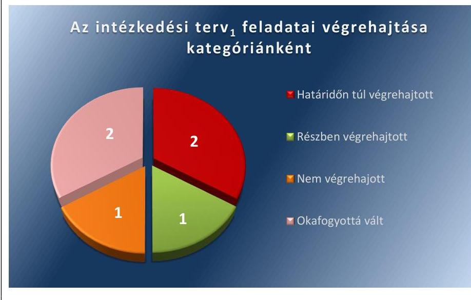

Forrás: ÁSZ
Az EMMI belső ellenőrzési főosztályvezetője - az EMMI vezetője által átruházott hatáskörében - a Bkr.$^{18}$ 14. § (1) bekezdésének megfelelően vezetett nyilvántartást az ÁSZ jelentés javaslatai alapján készült intézkedési terv$_{1}$ végrehajtásáról a Bkr. 47. § (2) bekezdés szerinti adattartalommal.

# 1.2. számú megállapítás 

A BIK vezetője nem tette meg az intézkedési terv$_{2}$-ben önmaga által meghatározott feladatok végrehajtására a megfelelő intézkedéseket. A BIK az intézkedési terv$_{2}$-ben a bevétel-növelés és kiadáscsökkentés érdekében vállalt feladatai jelentős részét nem hajtotta végre. A BIK vezetője a jogszabályi előírás ellenére nem vezetett nyilvántartást az intézkedési terv$_{2}$ végrehajtásáról.

A BIK az intézkedési terv$_{2}$-ben vállalt 56 feladatból 13 feladatot határidőben végrehajtott, 14 feladatot határidőn túl, öt feladatot részben hajtott végre, 22 feladatot nem hajtott végre, egy feladat okafogyottá vált, illetve egy feladat nem volt időszerű. Az intézkedési terv$_{2}$-ben meghatározott feladatokat, határidőket, az ÁSZ jelentés javaslatainak címzettjét és a feladatok végrehajtását részletesen a II. sz. melléklet mutatja be.

---

Az intézkedési terv$_{2}$ feladatainak a végrehajtását a 2. ábra szemlélteti.
2. ábra
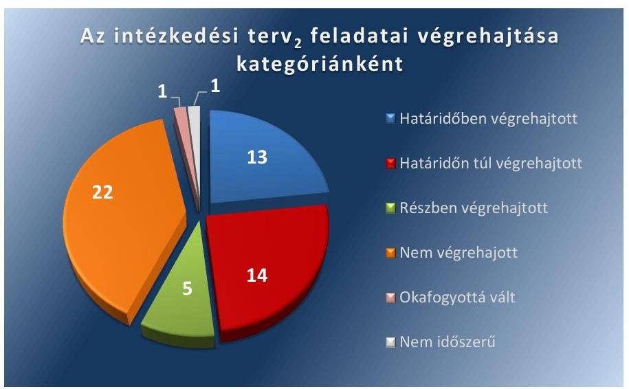

Forrás: ÁSZ
A BIK vezetője - a Bkr. 14. § (1) bekezdésében foglalt előírás ellenére - nem vezetett nyilvántartást az ÁSZ jelentés javaslatai alapján készült intézkedési terv$_{2}$ végrehajtásáról.

# 1.3. számú megállapítás 

A GOKI az intézkedési terv$_{3}$-ban a bevétel-növelés és kiadáscsökkentés érdekében önmaga által meghatározott feladatait összességében végrehajtotta, de az általa tervezett bevétel-növelést és kiadáscsökkentést a tervezett módon nem valósította meg. A GOKI vezetője a jogszabályi előírásnak megfelelően vezetett nyilvántartást az intézkedési terv$_{3}$ végrehajtásáról.

A GOKI az intézkedési terv$_{3}$-ban vállalt 34 feladatból 17 feladatot határidőben végrehajtott, három feladatot határidőn túl, 12 feladatot részben hajtott végre, egy feladatot nem hajtott végre, valamint egy feladat okafogyottá vált. A GOKI főigazgatója az intézkedési terv$_{3}$ pénzügyi és szakmai végrehajtásáról az érintett egységek részére beszámolási kötelezettséget írt elő és összesített kimutatást készíttetett a 2013. év első félévére, valamint a 2013. év teljesítésére vonatkozóan. A 2013. évre vonatkozó kimutatása alapján az intézkedési terv$_{3}$-ban vállalt bevétel-növelést és kiadáscsökkentést összességében a tervezett 320,7 M Ft helyett 185,0 M Ft-ban valósította meg. Az intézkedési terv$_{3}$-ban meghatározott feladatokat, határidőket, az ÁSZ jelentés javaslatainak címzettjét és a feladatok végrehajtását részletesen a III. sz. melléklet mutatja be.

---

Az intézkedési terv$_{3}$ feladatainak a végrehajtását a 3. ábra szemlélteti. 3. ábra
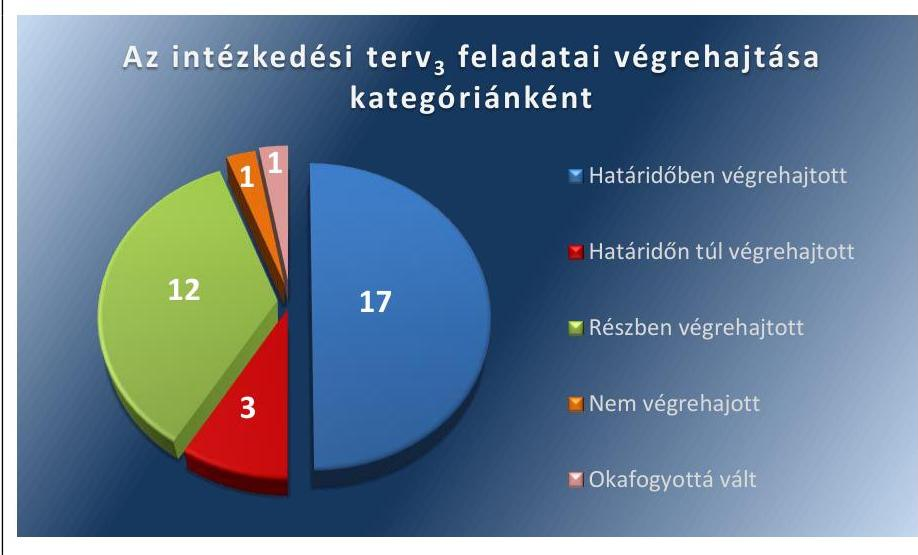

Forrás: ÁSZ

A GOKI vezetője a Bkr. 14. § (1) bekezdésének megfelelően vezetett nyilvántartást az ÁSZ jelentés javaslatai alapján készült intézkedési terv$_{3}$ végrehajtásáról a Bkr. 47. § (2) bekezdés szerinti adattartalommal.
1.4. számú megállapítás

A SZIK vezetője az intézkedési terv$_{4}$-ben a bevétel-növelés és kiadáscsökkentés érdekében önmaga által meghatározott feladatok végrehajtásáról összességében gondoskodott, de a jogszabályi előírás ellenére nem vezetett nyilvántartást az intézkedési terv$_{4}$ végrehajtásáról.

A SZIK az intézkedési terv$_{4}$-ben vállalt 10 feladatból nyolc feladatot határidőben végrehajtott, egy feladatot határidőn túl és egy feladatot nem hajtott végre. Az intézkedési terv$_{4}$-ben meghatározott feladatokat, határidőket, az ÁSZ jelentés javaslatainak címzettjét és a feladatok végrehajtását részletesen a IV. sz. melléklet mutatja be.

Az intézkedési terv$_{4}$ feladatainak a végrehajtását a 4. ábra szemlélteti. 4. ábra
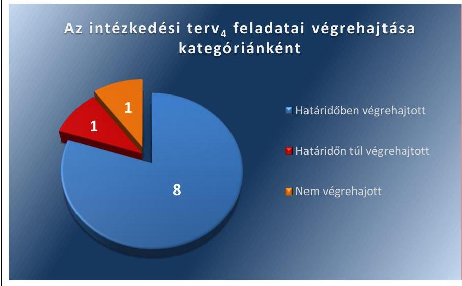

---

A SZIK vezetője az ellenőrzött időszak alatt a kiadáscsökkentő és bevétel-növelő intézkedések teljesítéséről beszámoltatja a feladat felelőseit. Nyilvántartást azonban nem vezetett - a Bkr. 14. § (1) bekezdésében foglalt előírás ellenére - az ÁSZ jelentés javaslatai alapján készült intézkedési terv$_{4}$ végrehajtásáról.

# 1.5. számú megállapítás 

Az SZKDRSZK vezetője az intézkedési terv$_{5}$-ben önmaga által meghatározott feladatok végrehajtásáról összességében gondoskodott. Az intézkedési terv$_{5}$-ben a bevétel-növelés és kiadáscsökkentés érdekében vállalt feladatok egynegyede azonban határidőt követően teljesült. Az SZKDRSZK a jogszabályi előírásnak megfelelően vezetett nyilvántartást az intézkedési terv$_{5}$ végrehajtásáról.

Az SZKDRSZK az intézkedési terv$_{5}$-ben vállalt 20 feladatból 14 feladatot határidőben végrehajtott, öt feladatot határidőn túl és egy feladatot nem hajtott végre. Az intézkedési terv$_{5}$-ben meghatározott feladatokat, határidőket, az ÁSZ jelentés javaslatainak címzettjét és a feladatok végrehajtását részletesen az V. sz. melléklet mutatja be.

Az intézkedési terv$_{5}$ feladatainak a végrehajtását az 5. ábra szemlélteti.
5. ábra
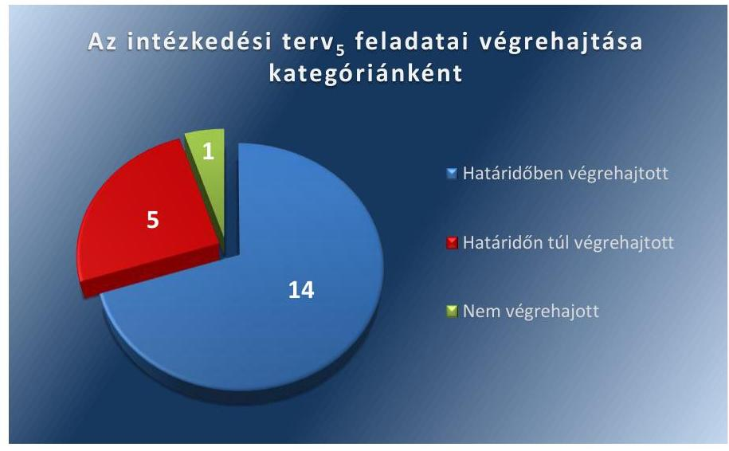

Forrás: ÁSZ
Az SZKDRSZK vezetője a Bkr. 14. § (1) bekezdésének megfelelően vezetett nyilvántartást az ÁSZ jelentés javaslatai alapján készült intézkedési terv$_{5}$ végrehajtásáról a Bkr. 47. § (2) bekezdés szerinti adattartalommal.

---

### 1.6. számú megállapítás

A VKK vezetője nem tette meg az intézkedési terv$_{6}$-ban önmaga által meghatározott feladatok végrehajtására a megfelelő intézkedéseket. A VKK az intézkedési terv$_{6}$-ban a bevétel-növelés és kiadáscsökkentés érdekében vállalt feladatai jelentős részét határidőt követően vagy részben hajtotta végre. A VKK vezetője az intézkedési terv$_{6}$ végrehajtásáról a nyilvántartást nem a jogszabályban előírt tartalomnak megfelelően vezette.

A VKK az intézkedési terv$_{6}$-ban vállalt 16 feladatból öt feladatot határidőben végrehajtott, hét feladatot határidőn túl, három feladatot részben hajtott végre és egy feladat nem volt időszerű. Az intézkedési terv$_{6}$-ban meghatározott feladatokat, határidőket, az ÁSZ jelentés javaslatainak címzettjét és a feladatok végrehajtását részletesen a VI. számú melléklet mutatja be.

Az intézkedési terv$_{6}$ feladatainak a végrehajtását a 6. ábra szemlélteti. 6. ábra

Az intézkedési terv$_{6}$ feladatai végrehajtása kategóriánként

- Határidőben végrehajtott
- Határidőn túl végrehajtott
- Részben végrehajtott
- Nem időszerű

A VKK vezetőjének az ÁSZ jelentés javaslatai alapján készült intézkedési terv$_{6}$ végrehajtásáról vezetett nyilvántartása nem a Bkr. 47. § (2) bekezdésben előírt tartalmú volt. A nyilvántartás nem tartalmazta az ÁSZ jelentésben szereplő javaslatot, valamint az intézkedési terv$_{6}$ alapján végrehajtott intézkedések rövid leírását.

---

.

---

# MELLÉKLETEK

I. SZ. MELLÉKLET: AZ ÁSZ 13012. SZÁMÚ JELENTÉSÉHEZ KAPCSOLÓDÓ INTÉZKEDÉSI TERV: VÉGREHAJTÁSA

|  EMBERI ERŐFORRÁSOK MINISZTÉRIUMA ÁLTAL KÉSZÍTETT INTÉZKEDÉSI TERV: VÉGREHAJTÁSA |  |  |  |   |
| --- | --- | --- | --- | --- |
|  1. | Intézkedési terv alapján elvégzendő feladat | Az intézkedési terv-ben meghatározott határidő | Az ÁSZ 13012 sz. jelentése javaslatának címzettje | A feladat végrehajtása  |
|   | 1. | 2. | 3. | 4.  |
|  Határidőn túl végrehajtott feladat |  |  |  |   |
|  1. | A GYEMSZI főigazgatója tegye meg a szükséges lépéseket a kórházak egységes önköltség számítása feltételeinek és módszertanának kidolgozása érdekében. | 2013. december 31. | emberi erőforrások minisztere | Az egészségügyért felelős államtitkár 2013. júniusban az intézkedési terv végrehajtásában érintett GYEMSZI főigazgatóját levélben értesítette a feladatairól és azok végrehajtásának határidejéről. Az egészségügyért felelős államtitkár azonban nem tette meg a megfelelő intézkedést annak érdekében, hogy a feladat határidőre teljesüljön. A GYEMSZI 2014. január 6-án nyújtott be projektjavaslatot (a TÁMOP$^{19-6.2.5-8-13/1-2014-0001}$ azonosító számú) a „Szervezeti hatékonyság fejlesztése az egészségügyi ellátórendszerben - Területi együttműködések kialakítása" programra. A program keretében kidolgozásra került az Egységes Intézményi Számlatükör. Ezt követően a 2015. évben elkészült az egységes intézményi kontrolling módszertani alapjait biztosító kontrolling kézikönyv$^{20}$, valamint az egységes esetszintű kontrolling módszertani alapjait biztosító kontrolling kézikönyv$^{21}$, amelyek megteremtik az alapját az egységes önköltségszámításnak.  |

---

|  1. | Intézkedési terv$_{1}$ alapján elvégzendő feladat | Az intézkedési terv$_{1}$-ben meghatározott határidő | Az ÁSZ 13012
sz. jelentése javaslatának címzettje | A feladat végrehajtása  |
| --- | --- | --- | --- | --- |
|   | 1. | 2. | 3. | 4.  |
|  2. | Az egységes önköltség számítás bevezethetősége érdekében a GYEMSZI

 főigazgatója intézkedjen az informatikai háttér kialakításáról és az informatikai fejlesztések megvalósításáról. | 2014. december 31. | emberi erőforrások minisztere | Az egységes önköltség számítás bevezethetősége érdekében az ÁEEK ${ }^{22}$ - az intézkedési terv ${ }_{1}$-ben foglalt határidőn túl - a 2015. május 4-én megkötött vállalkozási szerződésével (a korábbi 30 intézmény mellett további 74 intézmény közös informatikai rendszerbe történő bevonásával), majd erre épülve a 2015. augusztus 14-én megkötött vállalkozási szerződésével (az ágazati adatgyűjtő rendszer nemzeti szintre történő kiterjesztése érdekében) intézkedett az informatikai háttér kialakításáról és az informatikai fejlesztések megvalósításáról.  |

# Részben végrehajtott feladat

3. A GYEMSZI készítsen arra vonatkozó számításokat - és azokat folyamatosan korrigálja -, hogy a közfinanszírozott szolgáltatók által működtetett egészségügyi célú vagyon amortizációjának pótlásához mekkora összegű forrásra lenne szükség. A forrás biztosítása érdekében ez az összeg kerüljön betervezésre az EMMI 2014. évi fejezeti költségvetése GYEMSZI címének kiemelt előirányzatába.

|  2013. szeptember 30. | emberi erőforrások minisztere  |
| --- | --- |
|  |   |   |

Az egészségügyért felelős államtitkár a Nemzetgazdasági Minisztérium felé 2013. júniusában jelezte, hogy az elhasználódott eszközök pótlásához az egészségügyi ellátórendszerben a szükséges fedezet nem áll rendelkezésre, emiatt szükséges lesz többletforrás betervezésére a 2014. évi költségvetésbe, azonban annak szükséges összegét nem mutatta be. A GYEMSZI határidőn túl, 2014. évben (a 2013. évi költségvetési beszámoló elkészítésekor) készítette el a közfinanszírozott szolgáltatók által működtetett egészségügyi célú vagyon amortizációjának pótlásához szükséges forrás nagyságára vonatkozó kimutatást. Az amortizáció pótlására vonatkozó számítások folyamatos korrigálására vonatkozó feladatot a GYEMSZI nem hajtotta végre. A szükséges forrásoknak az EMMI 2014. évi fejezeti költségvetése GYEMSZI címének kiemelt előirányzatába történő betervezésére nem került sor, helyette az EMMI 2014. évi 20.22.24. számú fejezeti kezelésű előirányzata tartalmazott eszközpótlásra vonatkozóan forrást, de annak összege elmaradt a GYEMSZI által számított összegtől.

---

|  4. |  | Az intézkedési tervben meghatározott határidő | Az ÁSZ 13012 sz. jelentése javaslatának címzettje | A feladat végrehajtása  |
| --- | --- | --- | --- | --- |
|   | 1. | 2. | 3. | 4.  |
|   |  | Nem végrehajtott feladat |  |   |
|  4. | Az egészségügyért felelős államtitkárság készítsen előterjesztést a kényelmi szolgáltatásokra vonatkozó szabályokról szóló Korm. rendeletéről. | 2013. december 31. | emberi erőforrások minisztere | Az egészségügyért felelős államtitkár nem készített előterjesztést a kényelmi szolgáltatásokra vonatkozó szabályokról.  |
|   |  |  |  | **Okafogyottá vált feladat**  |
|  5. | A GYEMSZI készítse el az eszközpótlási előirányzatból lehívható támogatás igénylési rendjére vonatkozó módszertant. | 2013. december 31. | emberi erőforrások minisztere | A módszertan elkészítése okafogyottá vált, mert az EMMI 2014. évi fejezeti költségvetése GYEMSZI címének kiemelt előirányzata nem tartalmazott eszközpótlási előirányzatot. Az előírt módszertan helyett az EMMI és a GYEMSZI 2014. márciusában együttműködési megállapodást kötött az eszközpótlásra felhasználható (20.22.24. számú) EMMI fejezeti kezelésű előirányzat lebonyolítására vonatkozóan és bizottságot állított fel az előirányzat felhasználására.  |
|  6. | Az Egészségügyért Felelős Államtitkárság kezdeményezze a Nemzetgazdasági Minisztériumnál az Áhsz. megfelelő módosítását. | 2013. július 1. | emberi erőforrások minisztere | Az Áhsz. megfelelő módosítását az egészségügyért felelős államtitkár nem kezdeményezte, mert a 74/2013. (III. 11.) Korm. rendelet 19. § f) pontja 2013. március 12-i hatállyal hatályon kívül helyezte a kifogásolt Áhsz. 8. § (10) bekezdést. Így a vállalt feladat (a jogszabály módosítás) már az intézkedési terv 2013. április 10-i elkészítését megelőzően teljesült.  |

*Forrás: intézkedési terv és az ellenőrzött adatszolgáltatás*

---

# II. SZ. MELLÉKLET: AZ ÁSZ 13012 SZÁMÚ JELENTÉSÉHEZ KAPCSOLÓDÓ INTÉZKEDÉSI TERV: VÉGREHAJTÁSA

|  CSONGRÁD MEGYEI DR. BUGYI ISTVÁN KÓRHÁZ ÁLTAL KÉSZÍTETT INTÉZKEDÉSI TERV: VÉGREHAJTÁSA |  |  |  |   |
| --- | --- | --- | --- | --- |
|  1. | Intézkedési terv alapján elvégzendő feladat | Az intézkedési tervben meghatározott határidő | Az ÁSZ 13012 sz. jelentése javaslatának címzettje | A feladat végrehajtása  |
|   | 1. | 2. | 3. | 4.  |
|  Határidőben végrehajtott feladat |  |  |  |   |
|  1. | Kódolási tevékenységek erősítése járó- és fekvőbeteg ellátásban. | 2013. folyamatos | BIK főigazgató | A kódolási tevékenységet folyamatosan a finanszírozással kapcsolatos jogszabályváltozások és az optimális finanszírozás érdekében végezték. Továbbá a kódolási tevékenységre külső szakértőt is folyamatosan alkalmaztak.  |
|  2. | Ismételt kapcsolatfelvétel a fenntartóval visszatérítendő támogatás folyósításáról. | 2013. július 31. | BIK főigazgató | A likviditási helyzet javítására 2013. május 16-án 135 M Ft nagyságú visszatérítendő támogatási igényt nyújtottak be a GYEMSZI-hez. A kérelem pozitív elbírálását követően a támogatási szerződést 2013. augusztus 6-án megkötötték.  |
|  3. | Számlák ütemezett kifizetése megállapodások alapján. | 2013. folyamatos | BIK főigazgató | A BIK a lejárt esedékességű szállítói számláinak rendezése érdekében egyeztetéseket folytatott a partnereivel. Továbbá a BIK a kötelezettségállományának csökkentése érdekében fizetési átütemezési javaslatokat is készített.  |
|  4. | Közbeszerzési eljárás lefolytatása. | 2013. folyamatos | BIK főigazgató | A BIK áttekintette és összeállította az ellenőrzött időszakra vonatkozóan az éves közbeszerzési terveit. A főigazgató nyilatkozata alapján a „Kórház által beszerzett anyagok és szolgáltatások tekintetében minden esetben a közbeszerzési eljárásokat folytat le intézményünk, melyhez a fenntartó előzetes műszaki és gazdasági jóváhagyása szükséges".  |
|  5. | Közbeszerzési terv áttekintése és közbeszerzések lefolytatása. | 2013. folyamatos | BIK főigazgató | Az osztályvezető főorvos 2016. február 10-ei szakmai beszámolója alapján a 2013. és 2014. évekre vonatkozó számadatokat tekintve nőtt a hatékonyság, mivel az anesztéziák számának növekedése mellett a ráfordított órák száma csökkent.  |
|  6. | Közbeszerzési eljárásból adódó előnyök és hátrányok mérlegelése. | 2013. folyamatos | BIK főigazgató | Az előjegyzési rendszer bevezetésre került Csongrádon.  |
|  7. | Aneszteziológiai szolgálat hatékonyságának növelése. | 2013. folyamatos | BIK főigazgató | Az BIK a rehabilitációs hozzájáruláshoz készített létszámkimutatások alapján alkalmazott megváltozott munkaképességű dolgozókat.  |
|  8. | Laboratóriumi vizsgálatokkal kapcsolatos előjegyzési rendszer bevezetése Csongrádon. | 2013. folyamatos | BIK főigazgató | Az előjegyzési rendszer bevezetésre került Csongrádon.  |
|  9. | Megváltozott munkaképességű dolgozók alkalmazása. | 2013. szeptember 30. | BIK főigazgató | A BIK a rehabilitációs hozzájáruláshoz készített létszámkimutatások alapján alkalmazott megváltozott munkaképességű dolgozókat.  |

---

|  1. | Intézkedési terv alapján elvégzendő feladat | Az intézkedési tervben meghatározott határidő | Az ÁSZ 13012. sz. jelentése javaslatának címzettje | A feladat végrehajtása  |
| --- | --- | --- | --- | --- |
|   | 1. | 2. | 3. | 4.  |
|  10. | Pályázati kintlévőségek mielőbbi rendezése, a stabil árukészlet biztosítása érdekében. | 2013. szeptember 30. | BIK főigazgató | A pályázati kintlévőségeket rendezték. A BIK az elmúlt években folyamatosan élt a pályázati lehetőségekkel. Több alkalommal nyújtott be különböző területeket érintően pályázatokat, amelyek alapján többször részesült vissza nem térítendő támogatásban fejlesztési feladatainak elvégzéséhez.  |
|  11. | Folyamatban lévő pályázatok megvalósítása. | 2013. folyamatos | BIK főigazgató |   |
|  12. | Pályázatfigyelés, újabb pályázatok beadása. | 2013. folyamatos | BIK főigazgató |   |
|  13. | Intézményi kapacitások maximális kihasználása. | 2013. folyamatos | BIK főigazgató | A havi teljesítményeket folyamatosan elemezték főorvosi értekezleteken és a kapacitás kihasználás érdekében a főigazgató intézkedéseket tett. Az intézményi kapacitások kihasználása érdekében többletkapacitási kérelmet is nyújtottak be a 2015. év decemberében és 2016. év januárjában az OEP ${ }^{21}$-hez, illetve az ÁEEK-hez.  |
|  Határidőn túl végrehajtott feladat |  |  |  |   |
|  14. | Gyógyfürdő szakmai átvizsgálása, a kapacitások kihasználásának optimalizálása. | 2013. folyamatos | BIK főigazgató | A gyógyfürdő szakmai értékelését, a kapacitások kihasználásának optimalizálását 2015. év végén végezték el. A gyógyfürdő árbevételének növelése érdekében felújításokat terveztek.  |
|  15. | Kintlévőségek kezelése. | 2013. folyamatos | BIK főigazgató | A BIK a vállalt 2013. évi határidőt követően végezte el a kintlévőségek kezelését. A 2014. év során a kintlévőségek behajtása érdekében intézkedett, a vevőknek folyamatosan fizetési felszólításokat küldött, amelyek tételesen tartalmazták a lejárt esedékességű követelések összegeit.  |
|  16. | Az intézményi gyógyszertár tevékenységének felülvizsgálata. | 2013. augusztus 31. | BIK főigazgató | Az intézményi gyógyszertár tevékenységének felülvizsgálata a 2015. évben történt meg.  |
|  17. | Gyógyszertári program módosítási lehetőségének vizsgálata. | 2013. augusztus 31. | BIK főigazgató | A feladatot az intézkedési tervtől eltérően 2015. évben végezték el. A felülvizsgálat megállapította, hogy az alkalmazott program az intézeti gyógyszerellátáshoz megfelelő, „kiforrott rendszer” és a szükséges jelentéseket könnyen el lehet végezni.  |
|  18. | Keretgazdálkodás ütemezésének módosítása. | 2013. folyamatos | BIK főigazgató | A BIK az elvégzett feladattal kapcsolatban az osztályos keretek ütemezésének módosítását, azok havi meghatározását 2015. év vonatkozásban dokumentálta.  |
|  19. | Vérellátó átvilágítása. | 2013. augusztus 31. | BIK főigazgató | A vérellátó átvilágítását 2016. évi dokumentum támasztja alá.  |
|  20. | Osztályos kontrolling kimutatások elemzése. | 2013. augusztus 31. | BIK főigazgató | A kontrolling kimutatás elemzését 2014. júliusában készült dokumentum támasztja alá.  |
|  21. | Rendelőintézeti vezető asszisztens megbízás rendezése. | 2013. folyamatos | BIK főigazgató | A főigazgató 2016. január 1-jétől adott ki megbízást a rendelőintézeti vezető asszisztensi feladatok ellátására.  |

---

|  2013. | Intézkedési terv alapján elvégzendő feladat | Az intézkedési tervben meghatározott határidő | Az ÁSZ 33012. sz. jelentése javaslatának címzettje | A feladat végrehajtása  |
| --- | --- | --- | --- | --- |
|   | 1. | 2. | 3. | 4.  |
|  22. | Áramfelhasználás áttekintése. | 2013. szeptember 30. | BIK főigazgató | A feladatok elvégzése határidőn túl, 2014. évben megtörtént. Megállapítást nyert, hogy az energia felhasználás csökkentéséhez energetikai beruházás szükséges. Saját erőből az energia költség mérséklést az üzemidő csökkentése és az energiatakarékos izzók alkalmazásával lehet elérni. Továbbá az áramfelhasználás tekintetében kimutatás készült az MRI, CT, Angios, felvételi röntgen és mammográfiás berendezések cseréjével elérhető
 energia megtakarításra. A légkondicionáló készülékek esetében a felülvizsgálat megállapította, hogy a légkondicionáló készülékek esetén a folyamatos karbantartásával lehet biztosítani az energia hatékony működést.  |
|  23. | Légkondicionáló készülékek használatának felülvizsgálata. | 2013. szeptember 30. | BIK főigazgató | A feladat elvégzése határidőn túl megtörtént. Az élelmezési feladatokkal kapcsolatosan a BIK 2013. november 29-én készített 2014. évre vonatkozó Fejlesztési Tervében fejlesztési célként szerepeltették a konyha technológiai gőztermelésének megoldását, új konyhatechnológiai berendezések telepítését, elektromos gőzüstök beállítását.  |
|  24. | Élelmezési feladatok áttekintése. | 2013. október 30. | BIK főigazgató | A feladat elvégzése határidőn túl, 2014. évben megtörtént. A mosással kapcsolatos energiacsökkentési lehetőségek szerepeltek a BIK 2013. november 29-én készített 2014. évre vonatkozó Fejlesztési Tervében. Továbbá a mosodai tevékenység hatékonyságára vonatkozóan készült kimutatás a 2014. január - 2015. április időszak vonatkozásában.  |
|  25. | Mosási szolgáltatás felülvizsgálata. | 2013. október 30. | BIK főigazgató | Az informatikai szolgáltatási szerződések áttekintésére az intézkedési tervben rögzített 2013. október 30-a helyett 2015. év augusztusában került sor. A felülvizsgálat a szükséges módosításokra javaslatot fogalmazott meg.  |
|  26. | Informatikai szolgáltatások, szerződések áttekintése. | 2013. október 30. | BIK főigazgató | A kazánhelyzet áttekintése szerepelt a BIK 2014. évre vonatkozó 2013. november 29-i Fejlesztési Tervében. Alternatív javaslatként megfogalmazásra került, hogy a gázkazánok helyett az épületek fűtése megoldható lenne a termálvizes hálózatra kapcsolással.  |
|  27. | Kazánhelyzet áttekintése, alternatív javaslatok kidolgozása. | 2013. szeptember 30. | BIK főigazgató |   |

---

|  ㅇ
ö
ö
ö | Intézkedési terv alapján elvégzendő feladat | Az intézkedési tervben meghatározott határidő | Az ÁSZ 33012 sz. jelentése javaslatának címzettje | A feladat végrehajtása  |
| --- | --- | --- | --- | --- |
|   | 1. | 2. | 3. | 4.  |
|  Részben végrehajtott feladat |  |  |  |   |
|  28. | Folyamatosan elemezze az egyes kórházi egységek teljesítményét, amelyet jelezzen a BIK vezetősége felé. Kódolási tevékenység segítése (saját dolgozókkal). | 2013. folyamatos | BIK főigazgató | Az egyes kórházi egységek teljesítményét a 2014., illetve 2015. években értékelték, amelyeket a BIK vezetőségének főorvosi értekezleten jelezték. A BIK saját dolgozóira vonatkozóan előírt kódolási tevékenység segítése feladat - annak érdekében, hogy a külső cégek által ez idáig végzett kódolási tevékenység kiadása csökkenhessen - végrehajtására vonatkozó dokumentum nem állt rendelkezésre.  |
|  29. | Járóbeteg struktúra áttekintése és optimalizálása. | 2013. folyamatos | BIK főigazgató | A BIK számára a főigazgató 2014. október 6-án a járóbeteg szakellátás vonatkozásában működési engedélyének módosítását kérte az ÁNTSZ-től. Emellett a járóbeteg struktúra áttekintésére és optimalizálására vonatkozó egyéb dokumentációt nem bocsátottak az ellenőrzés részére.  |
|  30. | A fekvőbeteg struktúra felülvizsgálata. | 2013. folyamatos | BIK főigazgató | A főigazgató 2014. október 6-án a fekvőbeteg szakellátás vonatkozásában a BIK működési engedélyének módosítását kérte az ÁNTSZ-től. Emellett a fekvőbeteg struktúra felülvizsgálatára vonatkozó egyéb dokumentációt nem bocsátottak az ellenőrzés részére.  |
|  31. | Szakmai anyagbeszerzések áttekintése. | 2013. folyamatos | BIK főigazgató | A feladatot a 2015. évben végezték el a kötszerek és varróanyagok vonatkozásában. Egyéb, más típusú szakmai anyagok beszerzésével, felhasználásával kapcsolatos dokumentáció nem állt rendelkezésre.  |
|  32. | Anyagfelhasználás szakmai felülvizsgálata. | 2013. folyamatos | BIK főigazgató |   |
|  Nem végrehajtott feladat |  |  |  |   |
|  33. | Szociális otthoni kiszállítás visszaállítása, országos kiterjesztése az állami szerepvállalás megerősítése érdekében. | 2013. folyamatos | BIK főigazgató | A feladat elvégzésére a főigazgató által tett nyilatkozatok alapján nem került sor.  |
|  34. | Teleradiológiai és laboratóriumi együttműködés a Csongrád Megyei Egyesített Egészségügyi Ellátó Központ Hódmezővásárhely-Makóval. | 2013. folyamatos | BIK főigazgató | A feladat elvégzésére a főigazgató által tett nyilatkozatok alapján nem került sor.  |
|  35. | Diszpécser szolgálat kialakítása a járóbeteg ellátásban. | 2013. folyamatos | BIK főigazgató | A feladat elvégzésére a főigazgató által tett nyilatkozatok alapján nem került sor.  |
|  36. | Háziorvosi laboratóriumi vizsgálatok eredményeinek rögzítése a Medsolban. | 2013. folyamatos | BIK főigazgató | A feladat elvégzésére a főigazgató által tett nyilatkozatok alapján nem került sor.  |
|  37. | On-line kapcsolat kiépítése a háziorvosok és a BIK között. | 2013. folyamatos | BIK főigazgató | A feladat elvégzésére a főigazgató által tett nyilatkozatok alapján nem került sor.  |

---

|  3. | Intézkedési terv alapján elvégzendő feladat | Az intézkedési tervben meghatározott határidő | Az ÁVZ 33012.sz. jelentése javaslatának címzettje | A feladat végrehajtása  |
| --- | --- | --- | --- | --- |
|   | 1. | 2. | 3. | 4.  |
|  38. | Vékony kliens technológiára történő folyamatos áttérés. | 2013. szeptember 30. | BIK főigazgató | Az ellenőrzött által kitöltött tanúsítványban rögzített információk alapján a feladat elvégzésére nem került sor.  |
|  39. | Teleradiológia szolgáltatások bevezetése. | 2013. folyamatos | BIK főigazgató | A feladat elvégzésére a főigazgató által tett nyilatkozatok alapján nem került sor.  |
|  40. | VIP részleg kialakítása. | 2013. folyamatos | BIK főigazgató | Az átadott dokumentumok a VIP részleg kialakításának lehetőségét és ezt követően annak megvalósítását nem támasztják alá.  |
|  41. | Szerződések indexálása. | 2013. szeptember 30. | BIK főigazgató | Az átadott dokumentumok a feladat megvalósítását nem támasztják alá.  |
|  42. | Ingatlanok optimális kihasználása. | 2013. szeptember 30. | BIK főigazgató | Az átadott dokumentumok a feladat megvalósítását nem támasztják alá.  |
|  43. | Autotranszfúziós eljárás bevezetésének előkészítése. | 2013. augusztus 31. | BIK főigazgató | Az átadott dokumentumok a feladat megvalósítását nem támasztják alá.  |
|  44. | Hatékony munkaszervezés. | 2013. folyamatos | BIK főigazgató | Az átadott dokumentumok a feladat megvalósítását nem támasztják alá.  |
|  45. | Az egységek kontrolling kimutatásainak elemzése. | 2013. folyamatos | BIK főigazgató | Az átadott dokumentumok a feladat megvalósítását nem támasztják alá.  |
|  46. | Baba mozi szolgáltatás újraindítása. | 2013. folyamatos | BIK főigazgató | A baba-mozi szolgáltatás újraindítását dokumentum nem támasztja alá.  |
|  47. | Ügyeleti-készenléti rendszer felülvizsgálata. | 2013. folyamatos | BIK főigazgató | Az átadott dokumentumok a feladat megvalósítását nem támasztják alá.  |
|  48. | Éjszakai világítás, térvilágítás felülvizsgálata. | 2013. szeptember 30. | BIK főigazgató | Az átadott dokumentumok a feladat megvalósítását nem támasztják alá.  |
|  49. | További bérmosási lehetőségek felderítése. | 2013. október 30. | BIK főigazgató | Az átadott dokumentumok a feladat megvalósítását nem támasztják alá.  |
|  50. | Szakmai ajánlások összeállítása a háziorvosok és az intézményi orvosok felé. | 2013. folyamatos | BIK főigazgató | A feladat elvégzésére a főigazgató által tett nyilatkozatok alapján nem került sor.  |
|  51. | Dolgozói állomány áttekintése. | 2013. szeptember 30. | BIK főigazgató | Az átadott dokumentumok a feladat megvalósítását nem támasztják alá.  |
|  52. | Szerződésmódosítások kezdeményezése. | 2013. folyamatos | BIK főigazgató | Az átadott dokumentumok a feladat megvalósítását nem támasztják alá.  |
|  53. | Izotópos vizsgálat a dr. Hetényi Géza Kórház számára. | 2013. folyamatos | BIK főigazgató | A feladat elvégzésére a főigazgató által tett nyilatkozatok alapján nem került sor.  |
|  54. | Cikktörzs rendszeres felülvizsgálata. | 2013. folyamatos | BIK főigazgató | Az átadott dokumentumok a feladat megvalósítását nem támasztják alá, csak a feladat rendszeres elvégzésének előírását a munkaköri leírásokban.  |
|   |  |  | Okafogyottá vált feladat |   |
|  55. | A megnövekedett vérfelhasználás okainak tisztázása. | 2013. augusztus 31. | BIK főigazgató | A BIK évekre bontva kimutatta, hogy a vérfelhasználás 2012. évet követően folyamatosan csökkent.  |
|   |  |  | Nem időszerű feladat |   |
|  56. | Létszámzárlat. | 2013. szeptember 30. | BIK főigazgató | A főigazgató 2016. február 12-én tett nyilatkozata alapján a zavartalan és biztonságos, minőségi betegellátás biztosítása érdekében létszámfelvételi zárlat bevezetésére nem kerülhet sor.
Forrás: intézkedési terv és az ellenőrzött adatszolgáltatása  |

---

# 2013. február 15. 

## 2013. február 15. 

## 2013. február 15. 

## 2013. február 15. 

## 2013. február 15. 

## 2013. február 15. 

## 2013. február 15. 

## 2013. február 15. 

## 2013. február 15. 

## 2013. február 15. 

## 2013. február 15. 

## 2013. február 15. 

## 2013. február 15. 

## 2013. február 15. 

## 2013. február 15. 

## 2013. február 15. 

## 2013. február 15. 

## 2013. február 15. 

## 2013. február 15. 

## 2013. február 15. 

## 2013. február 15. 

## 2013. február 15. 

## 2013. február 15. 

## 2013. február 15. 

## 2013. február 15. 

## 2013. február 15. 

## 2013. február 15. 

## 2013. február 15. 

## 2013. február 15. 

## 2013. február 15. 

## 2013. február 15. 

## 2013. február 15. 

---

|  1. | Intézkedési terv alapján elvégzendő feladat | Az intézkedési tervben meghatározott határidő | Az ÁSZ 33012 sz. jelentése javaslatának címzettje | A feladat végrehajtása  |
| --- | --- | --- | --- | --- |
|   | 1. | 2. | 3. | 4.  |
|  7. | Saját bevételek növelése. Gyógyszerkipróbálás kórházi bevételeinek 30\%-os növelése, a vizsgálatok számának növelése. Eljárási díj növelése 240 ezer Ft-ról 300 ezer Ft-ra. | 2013. február 1. | GOKI főigazgatója | A gyógyszerkipróbálás kórházi bevételeinek 30,0\%-os, valamint az eljárási díj 240 000 Ft-ról 300 000 Ft-ra történő emelését az intézkedési tervben meghatározott 2013. február 1-jei határidőt követően, éves szinten realizálták.  |
|  8. | Saját bevételek növelése. A Három Korona Gyógyszertár forgalmának, árrésének növelése. | 2013. február 1. és folyamatos | GOKI főigazgatója |

 A Három Korona Gyógyszertár forgalmának, árrésének növelése kapcsán a pénzügyi terv ${ }^{27}$-ben rögzített 500,0 ezer Ft bevétel növeléssel szemben 819,0 ezer Ft-ot realizáltak.  |
|  9. | Ügyeleti díjtételek átdolgozása. Az ügyeleti díjtételek kidolgozása. | 2013. február 15. | GOKI főigazgatója | Az ügyeleti díjtételek átdolgozását végrehajtották.  |
|  10. | Ügyeleti díjtételek átdolgozása. Az új díjazás hatálybalépése. | 2013. március 1. | GOKI főigazgatója | Az ügyeleti százalék mértékének megállapításáról főigazgatói utasítást adtak ki. Az új díjtételek 2013. március 1-jétől hatályba léptek.  |
|  11. | Létszámgazdálkodás szigorítása. | folyamatos | GOKI főigazgatója | Új jogviszony létesítése minden esetben kizárólag főigazgatói engedéllyel történt.  |
|  12. | Továbbtanulók támogatásának csökkentése. | folyamatos | GOKI főigazgatója | A tanulmányi költségek területén a 2013. évben 19,83%-os megtakarítás keletkezett az előző évhez képest.  |
|  13. | GOKI finanszírozását javító módosítások előkészítése. | 2013. február 1. és folyamatos | GOKI főigazgatója | A főigazgató a GOKI finanszírozását javító módosítások előkészítését végrehajtotta, azonban az intézkedési terv ${ }_{2}$-ban mellékletét képező pénzügyi tervben rögzített 3,6 M Ft-os költségcsökkentést részben (1,2 M Ft) valósította meg. A szívtraszplantációval kapcsolatos eljárások finanszírozásának javítása a 2014. április 30-án kelt beszámoló alapján folyamatban volt. A finanszírozási és teljesítménymutatók monitorozását végrehajtották. A műszív kezelés TVK alóli mentesítésére irányuló eljárás 2014. április 30-ig sikertelen volt. A felülvizsgált gyermek HBCs ${ }^{28}$-re a GOKI többlet TVK-t kapott. A Szakmai Kollégium közbenjárása megtörtént, azonban az indikáción túli alkalmazás miatt finanszírozatlan ACTILYSE gyógyszerfelhasználások megoldására a Szakmai Kollégiumnak nem sikerült a gyógyszer indikációs körén módosítani a készítmény gyártójánál, így a finanszírozás továbbra is megoldatlan maradt. A fedezet nélküli gyógyszerfelhasználás értéke a 2013. évben 2,3 M Ft volt, a megelőző évhez képest 1,2 M Ft-tal, 65,0%-kal csökkent.  |

---

|  1. | Intézkedési terv, alapján elvégzendő feladat | Az intézkedési terv-ban meghatározott határidő | Az ÁSZ 13012.sz. jelentése javaslatának címzettje | A feladat végrehajtása  |
| --- | --- | --- | --- | --- |
|   | 1. | 2. | 3. | 4.  |
|  14. | Költségcsökkentési lépések előkészítése és végrehajtása a vásárolt szolgáltatások, egyéb beszerzések területén. Vezetékes telefon szolgáltatói szerződés felülvizsgálata, a használat szigorítása. A vezetékes telefonközpont minden SIM kártyájának lecserélése az új díjszabású SIM kártyákra. Laser nyomtatókhoz utángyártott kellékanyagok használata. | 2013. február 1. | GOKI főigazgatója | A vezetékes telefon szolgáltatási szerződés felülvizsgálata, módosítása megtörtént. A módosítás eredményeként 6,0 ezer Ft megtakarítást értek el a 2013. évben. A mobil telefonszolgáltatásra 2012-ben szerződtek a GYEMSZI által közbeszerzés keretében megkötött keretszerződés alapján. A 2013. évi megtakarítás az előző időszakhoz képest 2,6 M Ft volt. A vezetékes telefonközpont minden SIM kártyáját lecserélték, az elért megtakarítás összege 1,4 M Ft volt. Az utángyártott Laser nyomtató kellékanyagok használatával az éves megtakarítás 2,8 M Ft volt.  |
|  15. | Költségcsökkentési lépések előkészítése és végrehajtása a vásárolt szolgáltatások, egyéb beszerzések területén. Gépjármű fenntartási költségek csökkentése érdekében az egyszerű, nem sürgős, kis súlyú küldemények szállítását BKV bérlettel rendelkező intézeti kézbesítő juttassa el a címzetthez. | 2013. február 1. | GOKI főigazgatója | A szállítási feladatokat átszervezték és a gépjármű fenntartási költségeket 100,0 ezer Ft-tal, 7,6%-kal csökkentették.  |
|  16. | Finanszírozatlan, alulfinanszírozott, illetve befogadás nélküli ellátások alkalmazásának szabályozása, az ellátások számának korlátozása. | folyamatos | GOKI főigazgatója | A főigazgatói engedélyezéshez kötött ellátások esetében 2012. évhez képest megtakarítást értek el. A területen kívülről érkező szívelégtelen betegek ellátásának biztosítására a főigazgatót miniszteri utasítás kötelezte, így azok belső szabályzatban tervezett korlátozását nem tudták megvalósítani.  |
|  17. | Az elvárt teljesítmény folyamatos betartása. | folyamatos | GOKI főigazgatója | Havi kontrolling kimutatás alapján a teljesítmény adatok folyamatos értékelése megtörtént. A tervezett TVK szerinti teljesítés nem minden területen valósult meg. A Gyermekellátás túllépte az elvárt teljesítményként meghatározott TVK-át, a Felnőtt Kardiológia és a Felnőtt Szívsebészet elmaradt az osztályos TVK-tól. Az Intézkedési terv3-ban vállalt Felnőtt Kardiológia TVK-mentes infarctus -ellátásra kitűzött bevétel növelését túlteljesítéssel valósította meg a GOKI. Összességében az intézkedési terv3-ban tervezett 2012. évhez képest meghatározott TVK feletti finanszírozatlan teljesítmény csökkentését és ezáltal keletkezett veszteség mérséklését elérték.  |

---

|  Intézkedési terv alapján elvégzendő feladat | Az intézkedési terv-ban meghatározott határidő | Az ÁSZ 13012 sz. jelentése javaslatának címzettje | A feladat végrehajtása  |
| --- | --- | --- | --- | --- |
|  1. | 2. | 3. | 4.  |
|  Határidőn túl végrehajtott feladat |  |  |   |
|  Szakmai anyagfelhasználás költségének csökkentése. Az új keretgazdálkodás kidolgozása. | 2013. február 15. | GOKI főigazgatója | A szakmai anyagfelhasználás csökkentése érdekében az új keretgazdálkodás szabályait az intézkedési terv3-ban előírt 2013. február 15-ei határidőt követően, 2013. február 25-én dolgozták ki.  |
|  Saját bevételek növelése. Kórház büfé, szendvics automata bérleti díj növelése. | 2013. február 1. | GOKI főigazgatója | A bérleti díjakat átlagosan 25,0%-kal emelte a főigazgató, azonban egy társaság az emelést nem fogadta el, így 1,9 M Ft-os bevétel növelés realizálása elmaradt. A szerződés módosítások 43,0%-a az intézkedési terv3-ban rögzített 2013. február 1-jei határidőt követően történt.  |
|  A Gazdálkodási Válságterv pénzügyi terv29-ének elkészítése. | 2013. február 1. | GOKI főigazgatója | A Gazdálkodási Válságterv pénzügyi tervét az intézkedési terv3-ban megjelölt 2013. február 1-jét követően, 2013. március 25-én, az intézkedési terv3 mellékleteként készítették el.  |

---

|  1. | Intézkedési terv, alapján elvégzendő feladat | Az intézkedési terv-ban meghatározott határidő | Az ÁSZ 13012 sz. jelentése javaslatának címzettje | A feladat végrehajtása  |
| --- | --- | --- | --- | --- |
|   | 1. | 2. | 3. | 4.  |
|  Részben végrehajtott feladat |  |  |  |   |
|  21. | Finanszírozási és gazdálkodási szempontok folyamatos figyelembe vétele a betegellátásban, az osztályok működésének felügyelete. Betegellátási és finanszírozási mutatók folyamatos javítása a kapott adatok és jelzések alapján. Járó- és fekvőbeteg beutalók szigorú megőrzése a betegdokumentációban. Diagnosztikus katéterezés, pacemaker revízió és csere, állandó pacemaker beültetés egy napos ellátásának preferálása. Fekvőbeteg finanszírozási kritériumát jelentő 24 órás ellátási idő betartása. Transzplantált betegek kiegészítő HBCs-jéhez az 5 napos minimum ellátási idő figyelembe vétele. Magas költségigényű, súlyos állapotú esetek és hosszú ápolási idejű pretranszplantációs ellátások regionális elhelyezése. Szívelégtelenek transzplantációs előkészítéséhez kizárólag régión belüli betegek átvétele. Szakmailag indokolt esetben régión kívüli beteget csak főigazgatói engedéllyel lehet fölvenni. | folyamatos | GOKI főigazgatója | A főigazgató által elrendelt új keretgazdálkodás bevezetésére 2013. március 1-jén sor került. A 3 napnál hosszabb ápolási idejű diagnosztikus katéterezések száma a 2013. évben 53,0%-kal csökkent, de még így is 7,1 M Ft veszteséget jelentett. A pénzügyi tervben meghatározott 13,4 M Ft veszteség megszüntetése 6,3 M Ft értékben valósult meg. A hosszú ápolások száma 20,0%-kal csökkent, azonban a pénzügyi tervben rögzített 9,0 M Ft-os költségcsökkenést nem érték el. A 24 órát nem meghaladó fekvőbeteg ellátások miatti bevételkiesés a 2013. évben 27,0%-kal növekedett a megelőző évhez viszonyítva, így a veszteség 17,8 M Ft lett. A 24 órán belüli ellátások szakmai felülvizsgálata emiatt a GOKI-nál megtörtént és a megoldásra a Szakmai Kollégium számára előterjesztés is készült. A pénzügyi tervben meghatározott 13,0 M Ft-os veszteség megszüntetése nem valósult meg. A járó- és fekvőbeteg beutalók szigorú megőrzése a betegdokumentációban feladatra történt intézkedést dokumentum nem támasztotta alá. A szívelégtelenek transzplantációs előkészítésének biztosítását a főigazgató nyilatkozata szerint miniszteri utasítás kötelezi.  |
|  22. | Konzíliumi és belső diagnosztikai vizsgálatkérés számának csökkentése. | folyamatos | GOKI főigazgatója | A visszaigazolt konzíliumok kiszámlázott teljesítményértéke a 2013. évben 56,6 M Ft-ra teljesült, ami 7,0 M Ft kiadásnövekedést eredményezett a tervezett 2,5 M Ft-os csökkenés helyett. Az 5,0%-os költségcsökkentési előírásnak csak a felnőtt szívsebészeti ellátás felelt meg. A konzíliumok értéke intézeti szinten 39,0%-kal emelkedett az előző évhez képest. A Központi Laboratórium 2013. évi felhasználása az előző évhez képest 5,0%-kal, 2,7 M Ft-tal nőtt, az 1,9 M Ft-os csökkenés helyett, a betegforgalom és a magasabb költségű ellátások miatt. A tervezet 5,0%-os költségcsökkentésnek csak a gyermekellátás felelt meg.  |

---

|  ㅇ
F
t
ö
r | Intézkedési terv, alapján elvégzendő feladat | Az intézkedési terv-ban meghatározott határidő | Az ÁSZ 13012.sz. jelentése javaslatának címzettje | A feladat végrehajtása  |
| --- | --- | --- | --- | --- |
|   | 1. | 2. | 3. | 4.  |
|  23. | Szakmai anyag felhasználás költségének csökkentése. Az új keretgazdálkodás bevezetése. | 2013. március 1. | GOKI főigazgatója | A főigazgató által elrendelt új keretgazdálkodás bevezetésére 2013. március 1-jén sor került, azonban a 2012. évhez viszonyított 5,0%-os költségcsökkentést nem valósult meg. Az intézkedéssel az anyagköltség növekedési üteme csökkent az előző évekhez képest. Az anyagfelhasználás a pénzügyi tervben rögzített 41,5 M Ft-os csökkentése helyett, a kis- és kiemelt felhasználók tekintetében 14,3 M Ft-tal nőtt az előző évhez képest.  |
|  24. | Vérfelhasználás áttekintése, a költségek csökkentése. Megvalósítás. | folyamatos | GOKI főigazgatója | A vérfelhasználás áttekintése megtörtént és a vérfelhasználás növekedésének okait kimutatták. A tervezett költségcsökkentés nem valósult meg. A 2013. évben a vérfelhasználás költsége 3,2 M Ft-tal nőtt, a vér selejtezés területén 1,5 M Ft-os költségcsökkentést értek el.  |
|  25. | Gyógyszerfelhasználás csökkentése. Kezelőorvosok általi gyógyszerrendelések felülvizsgálata. Gyógyszerkeretek szigorú betartása. | folyamatos | GOKI főigazgatója | A gyógyszerterápiás bizottság 2013. évben az előírt feladatokkal kapcsolatban a javaslatokat elkészítette. A pénzügyi tervben előírt 12,2 M Ft-os költségcsökkentés részben, 9,8 M Ft összegben teljesült.  |
|  26. | Élelmezés költségeinek csökkentése. | folyamatos | GOKI főigazgatója | A főigazgató által elrendelt új keretgazdálkodás bevezetésére 2013. március 1-jén sor került. Az élelmezési költségek túllépéseinek okaira részletes elemzés készült. Az ápolási napokhoz viszonyított élelmezési napok túllépésének arányát a 2012. évi 3,6%-os értékhez képest 2,4%-ra csökkentették. Így az élelmezési költségek területén a túllépés arányára tervezett 1,5%-os mértéket nem érték el. Emiatt a pénzügyi tervben meghatározott 1,5 M Ft-os csökkentés 0,8 M Ft
 összegben teljesült.  |
|  27. | Havi osztályvezetői beszámoló. | havonta | GOKI főigazgatója | A havi osztályvezetői beszámolókat csak jelentős teljesítmény-eltérés esetén nyújtották be.  |
|  28. | Saját bevételek növelése. VIP kórterem, anyaszálló díjak bővítése, emelése. | 2013. február 1. | GOKI főigazgatója | Az Anyaotthon Működési Rendjéről szóló szabályzatot határidőt követően 2013. március 7-én módosította a főigazgató. A díjváltozás 2013. március 8-tól lépett életbe. A VIP kórtermek működési rendje elnevezésű szabályzatot, amely a fizetendő díj összegeket határozta meg, nem módosították (az utolsó felülvizsgálat időpontja 2010. április 12. volt). A pénzügyi tervben előírt 415,0 ezer Ft-os bevétel növelés 262,0 ezer Ft összegben teljesült.  |

---

|  20. | Intézkedési terv alapján elvégzendő feladat | Az intézkedési tervben meghatározott határidő | Az ÁSZ 33012 sz. jelentése javaslatának címzettje | A feladat végrehajtása  |
| --- | --- | --- | --- | --- |
|   | 1. | 2. | 3. | 4.  |
|  29. | A működési bevételt terhelő beszerzések, beruházások, felújítások minimalizálása. | folyamatos | GOKI főigazgatója | A pénzügyi tervben előírt költségcsökkentést a főigazgató 51,5%-ban valósította meg. A költségcsökkentés tervezett mértéke 50,0 M Ft volt, amelyből 25,8 M Ft realizálódott. A saját forrásból megvalósított beruházások összege 2013. évben 112,9 M Ft volt.
A főigazgató által elrendelt új keretgazdálkodás bevezetésére 2013. március 1-jén sor került. A karbantartási, műszer-karbantartási szerződések felülvizsgálatát elvégezték, és a főigazgató általi szerződésmódosításra 2013. január 1-jei hatállyal sor került. A megkötött szerződés alapján a 2012. évi költség 190,4 M Ft volt, amely a 2013. évben 9,7%-kal 208,9 M Ft-ra emelkedett. Az orvosi gáz közbeszerzési eljárásának eredményeként az előző évhez képest kedvezőbb áron kötöttek szerződést, azonban az intézkedési tervben rögzített 13,2 M Ft-os költségcsökkentést nem tudták elérni. A realizált csökkenés a 2013. évben 8,5 M Ft volt. A GOKI által felhasznált elektromos áram tervezett megtakarítását (44,3 M Ft) nem érték el. A megtakarítás helyett a költségek 5,6%-kal (5,7 M Ft-tal) emelkedtek, mivel a központosított közbeszerzés alapján kiválasztott szolgáltató árai 2,4%-kal magasabbak voltak a korábbi szolgáltató árainál (a járulékos költségek miatt).  |
|  30. | Az osztályos eredmény levezetés adatainak (kontrolling elszámolás) értékelése - az osztály- és részlegvezetők, valamint az Intézeti felső vezetés részvételével - negyedévente. | 2013. február 15. | GOKI főigazgatója | A GOKI-nál negyedévente készült a kórház osztályaira vonatkozóan kontrolling értékelés (az eredmény levezetés bemutatásával). Az átadott dokumentumok nem támasztották alá az osztály- és részlegvezetők, valamint az Intézeti felső vezetés részvételét az értékelésben.  |
|  32. | A Gazdálkodási Válságterv teljesítéséről szakmai-pénzügyi beszámoló készítése. | 2013. július 15., 2013. szeptember 15, és 2014. január 15. | GOKI főigazgatója | A Gazdálkodási Válságterv pénzügyi terv teljesítéséről szóló intézkedési tervben rögzített 2013. július 15-ei határidejű beszámolót nem készítették el. A 2013. szeptember 15-i határidejű beszámolót elkészítették és a 2014. január 15-i határidejűt 2014. április 30-án készítették el.  |

---

|  3. | Intézkedési terv alapján elvégzendő feladat | Az intézkedési tervben meghatározott határidő | Az ÁSZ 33012 sz. jelentése javaslatának címzettje | A feladat végrehajtása  |
| --- | --- | --- | --- | --- |
|   | 1. | 2. | 3. | 4.  |
|  33. | Költségcsökkentési lépések előkészítése és végrehajtása a vásárolt szolgáltatások, egyéb beszerzések területén. Mosatási, textilbérleti és egyszer használatos műtéti szett költségek csökkentése. | 2013. február 15. | GOKI főigazgatója | Mosatási, textilbérleti és egyszer használatos műtéti szett költségek csökkentése érdekében nem készült javaslat a beavatkozási lehetőségekre. A főigazgató a szakmai anyagok felhasználásának költségcsökkentése érdekében utasításban új keretgazdálkodást vezetett be 2013. március 1-jén. A pénzügyi tervben a főigazgató által előírt 8,4 M Ft-os költségcsökkentés helyett a 2013. évben a mosatási, textilbérleti és egyszer használatos műtéti szett költségek 3,0%-kal (4,0 M Ft-tal) nőttek.  |
|  Okafogyottá vált feladat |  |  |  |   |
|  34. | Saját bevételek növelése. Konszignációs raktárdij emelése. | 2013. február 1. | GOKI főigazgatója | A konszignációs raktárdij emelését a GYEMSZI nem engedélyezte, a tervezett bevétel növelés ezért nem valósult meg.  |

Fontos: intézkedési terv és az ellenőrzött adatszolgáltatása

---

# 5.1.1.1.1.1.1.1.1.1.1.1.1.1.1.1.1.1.1.1.1.1.1.1.1.1.1.1.1.1.1.1.1.1.1.1.1.1.1.1.1.1.1.1.1.1.1.1.1.1.1.1.1.1.1.1.1.1.1.1.1.1.1.1.1.1.1.1.1.1.1.1.1.1.1.1.1.1.1.1.1.1.1.1.1.1.1.1.1.1.1.1.1.1.1.1.1.1.1.1.1.1

---

|  5. | Intézkedési terv alapján elvégzendő feladat | Az intézkedési tervben meghatározott határidő | Az ÁSZ 33012 sz. jelentése javaslatának címzettje | A feladat végrehajtása  |
| --- | --- | --- | --- | --- |
|   | 1. | 2. | 3. | 4.  |
|  7. | Felül kell vizsgálni a működési bevételek körét, további források feltárása a cél. Térítési díj ellenében igénybe vehető szolgáltatások körének bővítése, térítési díjak felülvizsgálata. | folyamatos | SZIK főigazgatója | A Térítési Díj Szabályzat felülvizsgálatát, a térítési díj ellenében igénybe vehető szolgáltatások körének bővítését végrehajtották.  |
|  8. | Szigorú, centralizált kötelezettségvállalási rendszer fenntartása, bizonylati fegyelem fokozott ellenőrzése. | folyamatos | SZIK főigazgatója | A kötelezettségvállalási rendszer a szabályzatban meghatározott keretek szerint, centralizáltan működött, a bizonylati fegyelem betartását a belső ellenőrzés a 2013-2014. időszak vonatkozásában ellenőrizte.  |
|   | Határidőn túl végrehajtott feladat |  |  |   |
|  9. | A költséghatékony antibiotikum politika folytatása, fejlesztése. Az antibiotikum felhasználás protokolljainak felülvizsgálata. | 2013. március 31. | SZIK főigazgatója | Az ellenőrzés részére szolgáltatott dokumentum alapján (Antibiotikum Terápiás Protokoll) az antibiotikum felhasználás protokolljainak felülvizsgálatára és kiadására az intézkedési tervben előírt 2013. március 31-i határidőt követően, 2015. március 31-én került sor.  |
|   | Nem végrehajtott feladat |  |  |   |
|  10. | Az intézet által megállapított helységbérleti díjakat önköltségszámítás alapján újra meg kell határozni. | 2013. április 30. | SZIK főigazgatója | Az intézet által alkalmazott helységbérleti díjak önköltségszámítás alapján történő meghatározását nem végezték el.
Forrás: intézkedési terv és az ellenőrzött adatszolgáltatása  |

---

# V. SZ. MELLÉKLET: AZ ÁSZ 13012 SZÁMÚ JELENTÉSÉHEZ KAPCSOLÓDÓ INTÉZKEDÉSI TERV VÉGREHAJTÁSA

|  SZENT KOZMA ÉS DAMIÁN REHABILITÁCIÓS SZAKKÓRHÁZ ÁLTAL KÉSZÍTETT INTÉZKEDÉSI TERV VÉGREHAJTÁSA |  |  |  |   |
| --- | --- | --- | --- | --- |
|  1. | Intézkedési terv alapján elvégzendő feladat | Az intézkedési tervben meghatározott határidő | Az ÁSZ 13012 sz. jelentése javaslatának címzettje | A feladat végrehajtása  |
|   | 1. | 2. | 3. | 4.  |
|  Határidőben végrehajtott feladat |  |  |  |   |
|  1. | A Szakkórház állami tulajdonba vételét megelőzően Fővárosi Önkormányzat által rendeletben szabályozott és a Szakkórház által alkalmazott szolgálati jellegű lakások lakbéreinek, bérleti díjainak felülvizsgálata, az igénybevétel és kapcsolódó térítések jogszabályokhoz igazodó intézményi szabályozása, a szabályzatban foglaltak gyakorlati alkalmazása, a díjak megállapítására, emelésére javaslattétel. | 2013. április 10. | SZKDRSZK főigazgatója | A szolgálati jellegű lakások lakbéreinek, bérleti díjainak felülvizsgálatát végrehajtották. A díjak megállapítására, emelésére vonatkozó javaslatot 2013. március 21-én elkészítették. A javaslatban a díjváltozás hatását számszerűsítették.  |
|  2. | A Szakkórház állami tulajdonba vételét megelőzően Fővárosi Önkormányzat által rendeletben szabályozott és a Szakkórház által alkalmazott szolgálati jellegű lakások lakbéreinek, bérleti díjainak, az igénybevétel és kapcsolódó térítések jogszabályokhoz igazodó intézményi szabályozása, a szabályzatban foglaltak gyakorlati alkalmazása. Új díjtételek bevezetése. | 2013. május 1. | SZKDRSZK főigazgatója | A szolgálati lakások lakbérei, bérleti díjai új díjtételeinek 2013. május 1-jei hatállyal történő bevezetéséről a 190/2/2013. sz. Szabályzat kiadásával gondoskodtak. A lakbér és bérleti díjak emelését végrehajtották.  |
|  3. | Szolgáltatást igénybevevők felé kiszámlázott közüzemi díjak felülvizsgálata, az árváltozások érvényesítése, díjak megállapítására, emelésre javaslattétel. | 2013. április 10. | SZKDRSZK főigazgatója | A szolgáltatást igénybe vevők felé kiszámlázott közüzemi díjak felülvizsgálatát elvégezték. A díjak megállapítására, emelésére vonatkozó javaslatokat kidolgozta az SZKDRSZK. A díjváltozás hatását a javaslatban számszerűsítették.  |
|  4. | Szolgáltatást igénybevevők felé kiszámlázott közüzemi díjak esetében új díjtételek bevezetése. | 2013. május 1. | SZKDRSZK főigazgatója | A szolgáltatást igénybe vevők felé kiszámlázott közüzemi díjak új díjtételeit 2013. május 1-jei hatállyal, a 190/2/2013. sz. Szabályzat kiadásával bevezették. A közüzemi díj emelést végrehajtották.  |

---

|  1. | 2. | 3. | 4.  |
| --- | --- | --- | --- |
|  5. | Alkalmazottak élelmezési térítési díjainak felülvizsgálata, a tervezett emelésből, illetve a kifizetői terhek és az ÁFA befizetések megtakarításaiból eredő bevételek és kiadási megtakarítások számszerűsítése. | 2013. március 31. | SZKDRSZK főigazgatója  |
|  6. | Alkalmazottak élelmezésre vonatkozó új térítési díjtételek bevezetése. | 2013. május 1. | SZKDRSZK főigazgatója  |
|  7. | A Szakkórház használaton kívül lévő, árvízveszélyes területe bevételt eredményező hasznosítási lehetőségeinek felmérése, kiajánlása. | 2013. április 30. | SZKDRSZK főigazgatója  |
|  8. | Külföldi betegek ellátási igényeinek feltérképezése, az egészségturizmus adta lehetőségek kiaknázása, kapcsolatfelvétel további hazai és külföldi egészségpénztárakkal. | azonnal és folyamatos | SZKDRSZK főigazgatója  |
|  9. | Rehabilitációs szakellátásunk szakmai szabad kapacitásának felmérése, programok, szűrések piaci alapon történő kiajánlási lehetőségeinek vizsgálata. | 2013. június 30. | SZKDRSZK főigazgatója  |
|  10. | Betegeink komfortérzetét javító, a rehabilitáció sikerességét elősegítő, kiegészítő térítési díj fizetése mellett igénybe vehető új szolgáltatások bevezetése lehetőségeinek felmérése a költség-haszon elv figyelembevételével. | 2013. június 30. | SZKDRSZK főigazgatója  |
|  11. | Gyógyfürdő ellátásaink vonatkozásában vizsgálják felül a szolgáltatás nyújtás szervezeti-szervezési-infrastrukturális és szakmai hátterét, az igénybe vevők körének bővítése és az ebből származó bevételek növelése érdekében tegyenek javaslatot. | 2013. május 30. | SZKDRSZK főigazgatója  |

|  Az intézkedési tervben meghatározott határidő | Az ÁSZ 13012 sz. jelentése javaslatának címzettje | A feladat végrehajtása  |
| --- | --- | --- |
|  2. | 3. | 4.  |
|  2013. március 31. | SZKDRSZK főigazgatója | Az alkalmazottak élelmezési térítési díjainak felülvizsgálatát
 elvégezték. A tervezett emelésből, illetve a kifizetői terhek és az ÁFA befizetések megtakarításaiból eredő bevételeket és kiadási megtakarításokat a javaslatban számszerűsítették.  |
|  2013. május 1. | SZKDRSZK főigazgatója | A 173/1/2013. sz. Belső rendelkezéssel 2013. május 1-jétől az új térítési díjakat bevezették. A térítési díj változásának hatását a 2013. július 3-án kelt beszámolóban számszerűsítették.  |
|  2013. április 30. | SZKDRSZK főigazgatója | A használaton kívül lévő, árvízveszélyes terület bevételt eredményező hasznosítási lehetőségeinek felmérését, kiajánlását elvégezték. A bérbeadási szerződést megkötötték.  |
|  azonnal és folyamatos | SZKDRSZK főigazgatója | A külföldi betegek ellátási igényeinek, az egészségturizmus adta lehetőségek kiaknázásának feltérképezését végrehajtották. Hazai egészségpénztárakkal való kapcsolatfelvétel megtörtént, és együttműködési megállapodásokat kötöttek a Thermal Hotel Visegráddal.  |
|  azonnal és folyamatos | SZKDRSZK főigazgatója | A rehabilitációs szakellátás szakmai szabad kapacitását felmérték, a programok, szűrések piaci alapon történő kiajánlási lehetőségeinek vizsgálata megtörtént.  |
|  2013. június 30. | SZKDRSZK főigazgatója | A betegek komfortérzetét javító, a rehabilitáció sikerességét elősegítő új szolgáltatások bevezetésének lehetőségeit felmérték. 2013. augusztus 1-jétől új, emelt komfortfokozatú fekvőbeteg rehabilitációs szárny került átadásra, melyet kiegészítő térítési díj fizetése mellett vehettek igénybe a betegek. A fekvőbetegek részére új szolgáltatásként bevezették az à la carte menü választásának lehetőségét (2013. szeptember 2-tól) és az egészség megőrzési/nevelési program keretében külön térítés mellett reform főzési tanfolyam szervezését, továbbá állapotfelméréssel egybekötött egyénre szabott diéta nyújtását 2013. november 18-tól.  |
|  2013. június 30. | SZKDRSZK főigazgatója | A gyógyfürdő ellátások vonatkozásában a szolgáltatás nyújtás szervezeti-, szervezési-, infrastrukturális- és szakmai hátterét felülvizsgálták. Az igénybe vevők körének bővítésére és az ebből származó bevételek növelésére vonatkozó javaslatokat kidolgozták.  |

---

|  1. | 2. | 3. | 4.  |
| --- | --- | --- | --- |
|  12. | A 2013. évi költségvetésben tervezett 2,5 M Ft továbbképzési költség 15%-kal történő csökkentése, a kérelmek támogatásánál, a támogatások megítélésénél ezen költségkeret szigorú figyelembe vétele. | folyamatos, legkésőbb 2013. december 31. | SZKDRSZK főigazgatója  |
|  13. | Jogi képviselők szerződéseinek felülvizsgálata, szerződés módosítás-bontás lehetőségének és következményeinek felmérése. | 2013. március 31. | SZKDRSZK főigazgatója  |
|  14. | Szakmai anyagok, készletek normatívájának soron kívüli felülvizsgálata, a felhasználások mérséklésére mennyiségi és forintális javaslattétel. | 2013. május 30. | SZKDRSZK főigazgatója  |
|  Határidőn túl végrehajtott feladat |  |  |   |
|  15. | A rehabilitációs ellátás időigényességére tekintettel jelentkező hozzátartozói elhelyezési igényeknek való megfelelés érdekében ún. vendégszoba/lakás kialakítási lehetőségek felmérése, alternatív javaslatok készítése a költség-haszon elv figyelembevétele mellett. | 2013. június 30. | SZKDRSZK főigazgatója  |
|  16. | Térítési díjszabályzatban foglalt kedvezmények és díjak felülvizsgálata a bevétel növelési lehetőségek és a térítéses szolgáltatások tapasztalati igénybe vételének függvényében és figyelembevételével. | 2013. május 30. | SZKDRSZK főigazgatója  |
|  17. | Konziliárusi szerződések felülvizsgálata. | 2013. április 30. | SZKDRSZK főigazgatója  |
|  18. | Utazási költségtérítés szabályozásának és gyakorlatának felülvizsgálata, az esetleges megtakarítási lehetőségek számbavétele. | 2013. március 31. | SZKDRSZK főigazgatója  |

A 2013. évre tervezett 2,5 M Ft továbbképzési költséget az intézkedési tervben meghatározott 15,0%-kal szemben 38,6%-kal csökkentették. A kérelmek támogatásánál, a támogatások megítélésénél az intézkedési tervben meghatározott költségkeret szigorú figyelembe vételét végrehajtották. A jogi képviselők szerződéseinek felülvizsgálatát végrehajtották. A szerződés módosítás-bontás lehetőségeit és következményeit felmérték. Egy szerződést megszüntettek 2013. júniusban, amellyel éves 1,2 M Ft a kiadáscsökkenés. A szakmai anyagok, készletek normatívájának felülvizsgálatát elvégezték. A felhasználások mérséklésre vonatkozó mennyiségi és forintban meghatározott javaslatot elkészítették.

A rehabilitációs ellátás időigényességére tekintettel jelentkező hozzátartozói elhelyezési igényeknek való megfelelés érdekében a vendégszoba/lakás kialakítási lehetőségeket felmérték. A kapcsolódó terveket a 2013. június 30-ai határidőt követően 2013. augusztus 14-én, illetve 2013. november 30-án készítették el. A Térítési díjszabályzatban foglalt kedvezmények és díjak felülvizsgálatát, a bevétel növelési lehetőséget az intézkedési tervben rögzített 2013. május 30-ai határidőt követően, 2013. július 16-án hajtották végre. (A módosított szabályzat 2013. október 10-én lépett hatályba.) A konziliárusi szerződések felülvizsgálatát az intézkedési tervben rögzített 2013. április 30-ai határidőt követően, 2013. július 18-án, illetve 2013. július 21-én hajtották végre. Az utazási költségtérítés szabályozásának és gyakorlatának felülvizsgálatát az intézkedési tervben előírt 2013. március 31-ei határidőt követően 2013. április 20-ig végezték el. Megújításra került a saját gépjármű használatára vonatkozó kérelem. A megtakarítási lehetőségek számbavételére 2013. július 17-én került sor. Az új szabályzatot 2013. szeptember 1-jei hatállyal adták ki.

---

|  18
20
21 | Intézkedési terv alapján elvégzendő feladat | Az intézkedési tervben meghatározott határidő | Az ÁSZ 13012. sz. jelentése javaslatának címzettje | A feladat végrehajtása  |
| --- | --- | --- | --- | --- |
|   | 1. | 2. | 3. | 4.  |
|  19. | A szakigazgatók mérjék fel az irányítási területük alá tartozó feladatellátások létszámszükségletét, tegyenek javaslatot az esetleges létszámleépítésre, létszám átcsoportosításra, feladat kiszervezésre, kiszervezett feladat közalkalmazottal történő ellátására a gazdasági racionalitás érdekében és figyelembevételével. A felmérés során tartsák szem előtt, semmiképp ne hagyják figyelmen kívül a vonatkozó jogszabályokban, különösen az egészségügyi ellátás szakmai minimumfeltételeiben, különösen a rehabilitációs ellátás szakmai kritériumrendszerében megfogalmazott elvárásokat. | 2013. június 30. | SZKDRSZK főigazgatója | A szakigazgatók - a gazdasági igazgató kivételével - az intézkedési tervben rögzített 2013. június 30-ai határidőt követően, 2013. július 21-én és 22-én mérték fel az irányításuk alá tartozó területek létszámszükségletét és tettek javaslatot az esetleges változtatásokra (pl. rendészeti létszám, porta szolgálat működtetésének átszervezése, nővér státusz átcsoportosításának lehetősége, liftkezelői álláshely).  |
|   |  | Nem végrehajtott feladat |  |   |
|  20. | Az irányítási tevékenység és a vezetői ellenőrzés keretében biztosítani, hogy az előre jelzetten és tudhatóan távozni készülő dolgozók helyettesítése időben megoldott, így az időarányos szabadságok kivétele biztosított legyen. Szabadság megváltásra csak kivételesen indokolt esetben kerülhessen sor. | azonnal és folyamatos | SZKDRSZK főigazgatója | Az átadott dokumentumok nem támasztották alá az előre jelzetten és tudhatóan távozni készülő dolgozók helyettesítésének vezetői ellenőrzés keretében történő kezelését, biztosítását. A fluktuáció miatt a szabadságok időarányos kiadása, a helyettesítés megoldása nem minden esetben volt biztosított.  |

Fonrás: intézkedési terv és az ellenőrzött adatszolgáltatása

---

# KESZTHELYI KÓRHÁZ ÁLTAL KÉSZÍTETT INTÉZKEDÉSI TERV ${ }_{6}$ VÉGREHAJTÁSA

|  5
Sorralán | Intézkedési terv ${ }_{6}$ alapján elvégrendő feladat | Az intézkedési terv ${ }_{6}$ ban meghatározott határidő | Az ÁSZ 13012. sz. jelentése javaslatának címzettje | A feladat végrehajtása  |
| --- | --- | --- | --- | --- |
|   | 1. | 2. | 3. | 4.  |
|  Határidőben végrehajtott feladat |  |  |  |   |
|  1. | Újra felül kell vizsgálni a jelenleg hatályban lévő összes szolgáltatás vásárlásra irányuló szerződést, meg kell vizsgálni azok szükségességét, valamint a szerződések szakmai tartalmának esetleges csökkentési lehetőségeit. A jelenlegi szakmai tartalmak szükségességét indoklással alá kell támasztani. Az erről készített beszámolót a menedzsment elé kell terjeszteni. | 2013. június 1. | VKK főigazgató | A hatályban lévő szolgáltatási szerződések felülvizsgálatát, azok szükségességének, az esetleges csökkentési lehetőségek felülvizsgálatát az intézkedési terv ${ }_{6}$-ban meghatározott határidőt megelőzően 2013. május 27-ig elvégezték. Az indoklást is tartalmazó beszámolót a menedzsment elé terjesztették.  |
|  2. | A 2012-es év hátralévő részében, valamint 2013-ban is szükséges részt venni valamennyi, a GYEMSZI, vagy a TESZK által meghirdetett közös közbeszerzési eljárásban. | folyamatos | VKK főigazgató | A VKK a fenntartó által indított közbeszerzési eljárásokhoz csatlakozott. A villamos energia, földgáz, illetve telefonszolgáltatásokra vonatkozó szerződések megkötésére a VKK, illetve a GYEMSZI által lefolytatott közbeszerzési eljárások után került sor.  |
|  3. | A Keszthelyi Kórház és a hévizi Szent András Reumakórház szorosabb együttműködésének, integrációjának vizsgálata folyamatban van. Ennek megvalósulása esetén szakmai profiltisztítással, kiszolgáló egységek összevonásával jelentősebb létszámleépítés prognosztizálható. |  | VKK főigazgató | A feladathoz az intézkedési terv ${ }_{6}$-ban határidőt, felelősöket nem jelöltek meg. Az ellenőrzött által kitöltött tanúsítvány alapján a kapcsolódó határidőket folyamatosnak tekintették. A főigazgató nyilatkozatai alapján az együttműködés vizsgálata folyamatos feladatot jelentett a VKK számára. Az integrációval kapcsolatban 2013. évben TIOP pályázatot adtak be, a projektet 2014. évben kezdték el, amely azóta megvalósult. Emellett a VKK, mint szolgáltató és a Hévizgyógyfürdő és Szent András Reumakórház, mint igénybevevő között 2015. október 29-én laboratóriumi szolgáltatások nyújtására vonatkozó szerződés megkötésére került sor.  |
|  4. | A bevételi oldal további javulását szolgálhatja, amennyiben a korábban Marcali Kórházhoz tartozó, a Balaton dél-nyugati területén lévő öt település Keszthelyi Kórházhoz történő csatolása lakosság arányos HBCS és Német Pont volumen többletet is eredményezne. |  | VKK főigazgató | A feladathoz az intézkedési terv ${ }_{6}$-ban határidőt, felelősöket nem jelöltek meg. Az ellenőrzött által kitöltött tanúsítvány alapján a kapcsolódó határidőket folyamatosnak tekintették. A VKK ellátási területének bővülése az ellenőrzés részére bocsátott kontrolling beszámoló, illetve ÁNTSZ határozat alapján már 2013. január 1-jétől megtörtént.  |

---

|  5. | Intézkedési terv alapján elvégzendő feladat | Az intézkedési tervben meghatározott határidő | Az ÁSZ 13012. sz. jelentése javaslatának címzettje | A feladat végrehajtása  |
| --- | --- | --- | --- | --- |
|   | 1. | 2. | 3. | 4.  |
|  5. | A likviditási helyzetet lényegesen javítaná, amennyiben az ellátási terület növekedésének arányában kapacitás növelés is bekövetkezne. |  | VKK főigazgató | A feladathoz a főigazgató az intézkedési tervben határidőt, felelősöket nem jelölt meg. Az ellenőrzött által kitöltött tanúsítvány alapján a kapcsolódó határidőket folyamatosnak tekintették. A VKK folyamatosan beadott többletkapacitás bővítési kérelmeket a finanszírozó felé.  |
|   | Határidőn túl végrehajtott feladatok |  |  |   |
|  6. | A térítési díj ellenében igénybe vehető szolgáltatásokról szóló térítési díj szabályzat módosítása nélkül egyedi főigazgatói utasításra meg kell emelni a következő térítési díjtételek | 2013. június 1. | VKK főigazgató | A vállalt 2013. június 1-jei határidőhöz képest a főigazgató a krónikus osztály térítési díjait 2013. év júliusában körlevélben, az ápolási osztály térítési
 díjait 2014. év júniusában utasításban megemelte.  |
|   | - Krónikus Osztályon igénybevett többletápolási idő kiegészítő térítési díját napi 780,0 Ft-ról 1000,0 Ft-ra kell emelni, |  |  |   |
|   | - Ápolási Osztályon történő elhelyezés kiegészítő térítési díját napi 2000,0 Ft-ról 2500,0 Ft-ra kell emelni. |  |  |   |
|  7. | A szolgáltatásként értékesített sterilizálási szolgáltatás, valamint a közvetített szolgáltatásként végzett veszélyes hulladék megsemmisítés díjait felül kell vizsgálni és 50-70 %-os mérték közötti volumenben meg kell emelni. | 2013. június 1. | VKK főigazgató | A sterilizálási szolgáltatások szerződéseinek felülvizsgálatára, azok módosítására, a díjak megemelésére a vállalt 2013. június 1-jei határidőn túl a 2014., illetve 2015. években került sor. A veszélyes hulladék megsemmisítési díjak emelése elmaradt a tervezett mértéktől.  |
|  8. | Felül kell vizsgálni a hatályban lévő munka- és egyéb munkavégzésre irányuló jogviszonyok szerződéseinek szakmai tartalmát, valamint szükségességét. A szükségességen túlmenően a szakmai tartalom volumenének (vállalkozói óraszámok) költséghatékonysági alátámasztását el kell készíteni az esetleges csökkentési lehetőségeket a menedzsment elé kell terjeszteni. | 2013. június 1. | VKK főigazgató | A feladatot az intézkedési tervben vállalt 2013. június 1-jei határidőt követően 2013. július 25-re végezték el. A 2013. július 25-i munkaügyi beszámoló és a csatolt dokumentumok alapján, 2013. június 1-jét követően a hatályos munka- és egyéb munkavégzésre irányuló jogviszonyok szerződések szakmai tartalmának, valamint szükségességének felülvizsgálata megtörtént. Ezt követően az indokolt esetekben a szerződések felmondására sor került, amelyet költséghatékonysági számításokkal is alátámasztottak.  |

---

|  8 | intézkedési terv alapján elvégzendő feladat | Az intézkedési tervben meghatározott határidő | Az ÁSZ 13012 sz. jelentése javaslatának címzettje | A feladat végrehajtása  |
| --- | --- | --- | --- | --- |
|   | 1. | 2. | 3. | 4.  |
|  9. | A felhasználó munkahelyek ismételten felül kell, hogy vizsgálják az általuk igénybe vett anyagfelhasználások mennyiségét és minőségi összetételét. A mennyiségi beszerzések esetleges csökkentésére, valamint a minőségi paraméterek esetleges csökkentésére tett javaslataikat a menedzsment elé kell, hogy terjesszék. | 2013. június 1. | VKK főigazgató | Az orvos igazgató és a gazdasági igazgató igénybe vett anyagfelhasználások mennyiségének és minőségi összetételének felülvizsgálatára vonatkozóan az intézkedés megtételére 2013. június 1-jén írt levelükben a feladat elvégzésének határidejét, az intézkedési tervben rögzített 2013. június 1-jei határidőtől eltérően 2013. augusztus 15-i dátumban jelölték meg. A felülvizsgálatokra, a mennyiségi beszerzések, illetve a minőségi paraméterek csökkentési lehetőségeinek menedzsment részére történt bemutatására 2013. augusztus 15-ig került sor.  |
|  10. | A raktárgazdálkodást működtető munkahelyek ismételten felül kell, hogy vizsgálják raktárkészleteiket. A tartósan raktáron lévő (3 hónapja ki nem igényelt) raktárkészleteket a felhasználók számára ki kell ajánlani, egyeztetve a felhasználó munkahelyek igényléséért felelős munkatársakkal. | 2013. június 1. | VKK főigazgató | Az intézkedési tervben vállalt 2013. június 1-jei határidőt követően 2013. augusztus 15-re végezték el a raktárgazdálkodási feladatok áttekintését. Javaslatok, vélemények menedzsment elé terjesztése megtörtént. A tartósan raktáron lévő raktárkészletek kiértékelését elvégezték, ezt követően az osztályok számára egyeztetve az osztályvezetőkkel kiajánlásra kerültek. A készleteket, a készlet forgási sebességének felülvizsgálatát elvégezték. Megállapításra került, hogy az anyaggazdálkodási raktárban a készletek a szükséges igényeknek megfelelő, a szállítási szerződések változatlanul hagyása indokolt. Az élelmezési osztályon a tartós raktárkészlet csökkentése érdekében csökkentették a legkisebb beszerzési egységet. Továbbá a havi étlap tervezése során a raktárkészlet figyelembe vett paraméter volt. A gyógyszerkészletek esetében átlagosan 7-10 napos a forgási sebesség.  |
|  11. | A raktárkészletek forgó mennyiségeit, beszerzési határidőit, szállítási feltételeket aktualizálni kell és növelni kell a készletek forgási sebességét. A raktárkészletekkel gazdálkodók javaslataikat a menedzsment elé kell, hogy terjesszék. | 2013. június 1. | VKK főigazgató | Megállapításra került, hogy az anyaggazdálkodási raktárban a készletek a szükséges igényeknek megfelelő, a szállítási szerződések változatlanul hagyása indokolt. Az élelmezési osztályon a tartós raktárkészlet csökkentése érdekében csökkentették a legkisebb beszerzési egységet. Továbbá a havi étlap tervezése során a raktárkészlet figyelembe vett paraméter volt. A gyógyszerkészletek esetében átlagosan 7-10 napos a forgási sebesség.  |
|  12. | A jelenleg hatályos szolgáltatási szerződések közül meg kell szüntetni a szennyfogó szőnyegeket bérbe adó Linström Kft-vel meglévő belépő szőnyeg szerződést, helyette kereskedelemben kapható műanyag vagy gumi lábtörlőket kell beszerezni és elhelyezni. | 2013. június 1. | VKK főigazgató | A szerződés felmondására 2013. október 31-ei hatállyal került sor. Kereskedelemben kapható lábtörlők beszerezésére 2014. szeptember 3-án (2 db) és 2014. december 1-jén (2 db) került sor.  |

---

|  1. | Intézkedési terv alapján elvégzendő feladat | Az intézkedési tervben meghatározott határidő | Az ÁSZ 13012 sz. jelentése javaslatának címzettje | A feladat végrehajtása  |
| --- | --- | --- | --- | --- |
|   | 1. | 2. | 3. | 4.  |
|  Részben végrehajtott feladatok |  |  |  |   |
|  13. | Az egészségügyi ellátásból származó bevételek növelése érdekében felül kell vizsgálni a járó- és fekvőbeteg kódolási és dokumentálási protokollokat, valamint azok végrehajtását a VKK-ban. Az esetleges hiányosságok feltárását követően az osztályok és szakrendelések vezetőivel együttműködve racionalizálási tervet kell készíteni az elérhető bevételek maximalizálására. | 2013. június 1. | VKK főigazgató | A VKK-nál az intézkedési tervben szereplő 2013. június 1-jei határidőt követően 2013. november 22-én a kódolási kitöltési útmutatót elkészítették, az általános szabályokat, a főbb hibákat rögzítették, illetve az intézkedési terv alapján elkészített racionalizálási tervet a főigazgató 2013. május 29-én jóváhagyta. A racionalizálási tervben rögzítették a szakellátás és járóbeteg ellátás teljesítményalakulás felülvizsgálatának követelményét. A kódolási és dokumentálási protokollok végrehajtásának felülvizsgálata nem történt meg.  |
|  14. | A jelenleg szüneteltetett rehabilitációs ágyszámból plusz 10 ágy elhelyezéséről gondoskodni kell. | 2013. június 1. | VKK főigazgató | 2013. áprilisban elkészült az osztályvezető főorvos által készített javaslat a 10 rehabilitációs ágy elhelyezésére vonatkozóan, valamint az ÁNTSZ-től a szükséges engedélyezés megtörtént. A 10 rehabilitációs ágy elhelyezését az ellenőrzés részére beküldött dokumentumok nem támasztják alá.  |
|  15. | A jelenleg hatályos szolgáltatási szerződések közül meg kell szüntetni a kábeltévé szolgáltatást nyújtó Hir-Sat Kft-vel kötött szerződést, helyette televíziós csatornák vételére alkalmas, ún. fejállomást kell kiépíteni, lehetőleg alapítványi támogatást igénybe véve, intézményi többletköltség nélkül. | 2013. június 1. | VKK főigazgató | A Hir-Sat Kft.-vel kötött szerződés 2013. június 1-jei határidőt követően 2013. december 18-ai hatállyal megszüntetésre került. A televíziós csatornák vételére alkalmas, ún. fejállomás kiépítése megtörtént, a kiépítéshez azonban az intézkedési tervben szereplő „lehetőleg alapítványi támogatást igénybe véve, intézményi többletköltség nélkül" végrehajtására tett intézkedést dokumentum nem támasztotta alá.  |
|  Nem időszerű feladat |  |  |  |   |
|  16. | A VKK által ellátott betegpopulációt figyelembe véve felmerült új szakmai profil - aktív geriatria ellátás - indítása. | ------------------------------------------------------------------------------------------------------------------------------------------------------------------------------- | VKK főigazgató | A feladathoz a főigazgató az intézkedési tervben határidőt, felelősöket nem jelölt meg. A főigazgató nyilatkozata alapján „az aktív geriatria ellátás beindítását az ÁEEK nem támogatta".  |

*Forrás: intézkedési terv és az ellenőrzött adatszolgáltatása*

---

# FÜGGELÉK: ÉSZREVÉTELEK 

Az Állami Számvevőszék a jelentéstervezetet 15 napos észrevételezésre megküldte az ellenőrzött szervezetek vezetőinek az ÁSZ tv. 29. § (1) bekezdése előírásának megfelelően.

Az Emberi Erőforrások Minisztériuma, a Szent Kozma és Damján Rehabilitációs Szakkórház, valamint a Keszthelyi Kórház részéről az ellenőrzött szervezet vezetője az ellenőrzés megállapításaira írásban észrevételt tett. A Szent Imre Egyetemi Oktatókórház főigazgatója írásban jelezte, hogy nem tesz észrevételt. A Gottsegen György Országos Kardiológiai Intézet főigazgatója, továbbá a Csongrád Megyei Dr. Bugyi István Kórház főigazgatója az ÁSZ tv. 29. § (2) bekezdésében foglalt észrevételezési jogával nem élt, a törvényes határidőn belül észrevételt nem tett.
Az elfogadott észrevételek alapján az Állami Számvevőszék módosította a jelentést.
A függelék tartalmazza az ellenőrzött szervezetek vezetőinek az észrevételeit és az azokra adott válaszokat, az elfogadott és a figyelembe nem vett észrevételekről, azok indokairól szóló tájékoztatásokat.

[^0]
[^0]:    * 29. § (1) Az Állami Számvevőszék az ellenőrzési megállapításait megküldi az ellenőrzött szervezet vezetőjének vagy az általa megbízott személynek, és annak, akinek személyes felelősségét állapította meg.
    (2) Az ellenőrzött szervezet vezetője és a felelősként megjelölt személy az ellenőrzés megállapításaira tizenöt napon belül írásban észrevételt tehet.
    (3) Az Állami Számvevőszék az észrevételre a beérkezésétől számított harminc napon belül írásban válaszol. A figyelembe nem vett észrevételeket köteles a jelentésben feltüntetni, és megindokolni, hogy azokat miért nem fogadta el.

---

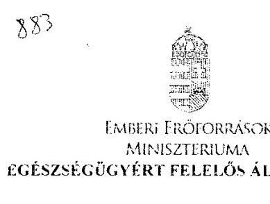

ÁLLAMI SZÁMVEVŐSZÉK
(65202/2016.
Érkezve: 2016. JUL. 29.
Iktatószám: V-0883-143/2016.
Iktatószám: 9614-5 /2016/EGBF
Hiv. szám: V-0883-143/2016.
Ügyintéző: Domokos Ádám
Melléklet: -
Domokos László részére
címők

Állami Számvevőszék
Budapest
1088. Pf. 54.
1364

Tárgy: Észrevétel megküldése „A kórházi ellátás működtetésére fordított pénzeszközök felhasználásának ellenőrzéséről szóló jelentés utóellenőrzése" című számvevőszéki ellenőrzés kapcsán

Tisztelt Főök Úr!

Köszönettel megkaptuk V-0883-143/2016. iktatószámú levelét, melyben „A kórházi ellátás működtetésére fordított pénzeszközök felhasználásának ellenőrzéséről szóló jelentés utóellenőrzése" című számvevőszéki ellenőrzés kapcsán megküldte részünkre az elkészített jelentéstervezetet (a továbbiakban: Tervezet). A Tervezet megállapítja, hogy az EMMI az intézkedési tervében meghatározott feladatok végrehajtásáról nem teljes körűen gondoskodott, ugyanis

- két feladatot határidőn túl,
- egy feladatot részben,
- továbbá egy feladatot nem hajtott végre.

Az Emberi Erőforrások Minisztériuma Szervezeti és Működési Szabályzatának 146. § (1) bekezdés b) pontjában foglalt jogkörömben eljárva, a Tervezet 1. sz. mellékletének 4. sorszámú feladata kapcsán - ami „nem végrehajtott feladat" státuszban jelölt - az alábbi észrevételt teszem.

A 2016. év során a Kormány megtárgyalta és elfogadta az egyes egészségügyi és egészségbiztosítási tárgyú törvények módosításáról szóló előterjesztést. Ebben az előterjesztésben javasoltuk többek között a kényelmi szolgáltatások rendeletben történő meghatározására vonatkozó törvényi felhatalmazás deregulációját is. A kötelező egészségbiztosítás ellátásairól szóló 1997. évi LXXXIII. törvény (a továbbiakban: Ebtv.) 83. § (4) bekezdése (zs) pontjának hatályon kívül helyezését az indokolta, hogy felesleges bürokratikus terhet rótt volna az ellátórendszerre. Az intézmények a kényelmi szolgáltatásokért - szintén törvényi szabályozás alapján - jelenleg is kérhetnek térítési díjat az

---

azokat igénybe vevő ellátottaktól. Ezen ellátásokról szóló jegyzéket az intézmények kötelesek jól látható helyen elérhetővé tenni az ellátottak részére.

A szubszidiaritás elvét figyelembe véve az Ebtv. 83. § (4) bekezdése (zs) pontjának hatályon kívül helyezésével az indokoltan legalacsonyabb szintre, azaz intézményi szintre
 került annak szabályozása, hogy az egyes kényelmi szolgáltatásért mekkora összegű díjat kérhet az adott egészségügyi szolgáltató. Ráadásul, a kereslet-kinálat elve alapján az évek során az egyes kényelmi szolgáltatásokért megállapított díjak is kialakultak már. A törvénymódosítás 2016. július 1-jén lépett hatályba.

A fentiek alapján javaslom, hogy a számvevőszéki jelentésben a kényelmi szolgáltatásokkal összefüggő 4. sorszámú feladat okafogyottá vált feladatként szerepeljen.

Kérem észrevételem szíves elfogadását.
Budapest, 2016. július „ $1_{i}^{\prime}$ ".
Üdvözlettel:
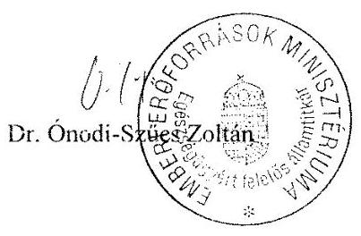

---

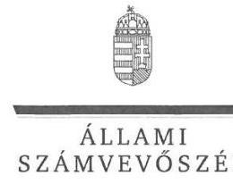

ELNÖK

Ikt.szám: V-0883-163/2016.

# Balog Zoltán úr 

miniszter
Emberi Erőforrások Minisztériuma

## Budapest

## Tisztelt Miniszter Úr!

Köszönettel megkaptam a 2016. július 29. napján az Állami Számvevőszékhez érkezett „Utóellenőrzések - A kórházi ellátás működtetésére fordított pénzeszközök felhasználásának ellenőrzéséről szóló jelentés utóellenőrzése" című számvevőszéki jelentéstervezetben foglalt megállapításokra az egészségügyért felelős államtitkár úr által tett észrevételeket.

Tájékoztatom Miniszter urat, hogy a jelentésben - az Állami Számvevőszékről szóló 2011. évi LXVI. törvény 29. § (3) bekezdése alapján - az el nem fogadott észrevételeket szerepeltetjük az elutasítás indokainak feltüntetésével együtt.

Az Állami Számvevőszék észrevételekre vonatkozó álláspontjáról a felügyeleti vezető által készített részletes tájékoztatást mellékelten megküldöm.

Budapest, 2016.  hó 16. nap
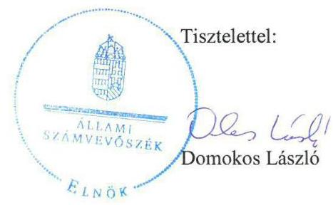

Melléklet: Tájékoztatás az el nem fogadott észrevételről

---

# Tájékoztatás 

az el nem fogadott észrevételről

|  | Észrevétel: | A jelentéstervezet I. számú melléklet 4. pontja szerinti, az intézkedési tervben a kényelmi szolgáltatásokkal összefüggő nem végrehajtott feladat okafogyott feladatként történő szerepeltetése. |
| :--: | :--: | :--: |
|  | Válasz: | Az Állami Számvevőszék az észrevételt nem fogadja el. |
|  | Indoklás: | Az egyes egészségügyet érintő törvények módosításáról szóló 2016. évi XXXIV. törvény 14. §-a 2016. július 1-jétől, az ellenőrzött időszakon túl helyezte hatályon kívül a kötelező egészségbiztosítás ellátásairól szóló 1997. évi LXXXIII. törvény 83. § (4) bekezdésének zs) pontját. Ennek következtében a 2013. február 28. és 2016. január 28. közötti ellenőrzött időszakban az intézkedési tervben szereplő, „Az egészségügyért felelős államtitkárság készítsen előterjesztést a kényelmi szolgáltatásokra vonatkozó szabályokról szóló Korm. rendeletről" feladat nem minősült okafogyott feladatnak.   Az egészségügyért felelős államtitkár sem az intézkedési tervben szereplő 2013. december 31-i határidőre, sem ezt követően az ellenőrzött időszak végéig nem végezte el az intézkedési tervben vállalt feladatot, nem készített előterjesztést a kényelmi szolgáltatásokra vonatkozó szabályokról. Az észrevételében jelzett, a Kormány által a 2016. évben tárgyalt, az „egyes egészségbiztosítási tárgyú törvények módosításáról szóló előterjesztés" kapcsán „a kényelmi szolgáltatások rendeletben történő meghatározására vonatkozó törvényi felhatalmazás deregulációját" tartalmazó, az Emberi Erőforrások Minisztériuma által tett javaslat nincs összhangban az intézkedési tervben vállalt feladattal. A feladat nem a deregulációra vonatkozó előterjesztés készítése, hanem a kényelmi szolgáltatásokról szóló szabályokra vonatkozó előterjesztés készítése volt.   Mindezek következtében a megállapítás megalapozott, annak módosítása nem indokolt. |

Budapest, 2016.  hó  nap
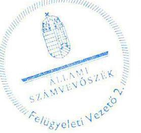

Salamon Ildikó
felügyeleti vezető

---

# Szent Kozma és Damján Rehabilitációs Szakkórház 

2026 Visegrád, Gizella-telep
Főigazgató: Huszár Sándor
Tel.: 26/801-700
Fax: 26/801-701
Igazgatóság: 26/801-777
e-mail: titkarsag@visegradikorhaz.hu

Iktatószám: 7715/2016.
Ügyintéző: Varga Zs./Kiss V.
Hivatkozási szám:
Tárgy: Észrevétel a V-0883-
147/2016 számú
jelentéstervezetre

Állami Számvevőszék
Domokos László
Elnök

Budapest
Apáczai Csere János u. 10.
1052

ÁLLAMI SZÁMVEVŐSZÉK
06439012016.
Érkezvén: 2016. JÚL. 26.
Iktatószám: V-0883-1312/2016
Melléklet: 4.16
Salamon Ildikó

Tisztelt Elnök Úr!

Szakkórházunk 2016. július 12-én kézhez vette „A kórházi ellátás működtetésére fordított pénzeszközök felhasználásának ellenőrzéséről szóló jelentés utóellenőrzése" címmel készített számvevőszéki jelentéstervezetet.

Szakkórházunk üdvözli az Állami Számvevőszék stratégiájában foglalt céljait, a számvevőszéki munka hasznosulásának javítását. Az ennek kapcsán folytatott utóellenőrzésük alapján készített jelentéstervezet megállapításait illetően - annak felépítését követve, az abban foglalt főcímekre és oldalszámokra való hivatkozással - az alábbi észrevételekkel kívánunk élni:

## - 1.) Főbb megállapítások, következtetések (5. o.)

Megítélésünk szerint rendkívül erőteljesen negatív és a későbbiekben taglaltakkal ellentmondásos az a megállapítás, miszerint ,,.., a Szent Kozma és Damján Rehabilitációs Szakkórház vezetője, ... nem tette meg az intézkedési tervben önmaga által meghatározott feladatok végrehajtására a megfelelő intézkedéseket, amely kockázatot hordoz a kórház működésében és a felelős vezetői magatartásban. " Az ellenőrzési jelentés 6. oldalán Önök az ellenőrzés célját alábbiak szerint határozzák meg: „Az ellenőrzés célja annak értékelése, hogy a számvevőszéki jelentésben foglalt intézkedést igénylő megállapításokkal és javaslatokkal összhangban készített intézkedési tervben meghatározott feladatokat az ellenőrzött szervezetek

---

végrehajtották-e". Az utóellenőrzés hasznosulásában kockázati jelzésként az ,,intézkedések elmaradását vagy részleges megvalósulását" nevesíti. (10. oldal)

A jelentéstervezet Megállapítások fejezetében (14-19 old.) rendkívül impulzív diagramokat vizsgálva, az arányok összevetése során a szemléltetett megoszlások és a levont következtetések nem mindig konzekvensek, irányunkban nézve diszkriminatívak.

Mint az 1.5. számú (18. o.) megállapításban rögzítik szakkórházunk az intézkedési tervben vállalt 20 feladatból 19-et végrehajtott, így az értékelés véleményünk szerint nem indokolja a Szakkórház vezetőjét érintő fenti súlyos megállapítást, így tisztelettel kérjük a vonatkozó megállapítás törlését.

# - 2.) Szent Kozma és Damján Rehabilitációs Szakkórház (SZKDRSZK) (8. o.) 

Megállapítás: „Az intézkedési tervet a főigazgató határidőn túl küldte meg az ÁSZ részére". Szakkórházunk 2013. március 1-jén vette kézhez az ellenőrzési jelentést (1-2 sz. melléklet), mely szerint az intézkedési tervet a jelentés kézhezvételétől számított 30 napon belül kell megküldeni.

Szakkórházunk 28 nap elteltével, 2013. március 28-án küldte meg Önök felé intézkedési tervét. (2-3-4 sz. melléklet)

Fentiek alapján tisztelettel kérjük a vonatkozó megállapítás helyesbítését.

- 3.) 1. Az ellenőrzött szervezetek az intézkedési tervekben foglaltakat - az előírt határidőben - végrehajtották-e (14. o.)

Az összegző megállapítás szerint „az SZKDRSZK... vezetője nem tette meg az intézkedési tervben önmaga által meghatározott feladatok végrehajtására a megfelelő intézkedéseket". Jelen levelünk 1. pontjában, valamint a későbbiekben taglaltak alapján kérjük a megállapítás helyesbítését, miszerint az intézkedési tervben vállalt feladatokat az 1.3. számú megállapításhoz hasonlóan (16. oldal), összességében végrehajtotta.

## - 4.) 1.5. számú megállapítás (18. o.)

Megállapítás: „Az SZKDRSZK vezetője nem tette meg az intézkedési tervben önmaga által meghatározott feladatok végrehajtására a megfelelő intézkedéseket. Az SZKDRSZK az intézkedési tervében bevételnövelés és kiadáscsökkentés érdekében vállalt feladatai jelentős

---

részét határidőt követően hajtotta végre." Az Állami Számvevőszék értékelése alapján (mellyel kapcsolatos további észrevételeinkre a jelentéstervezet 5. számú mellékleténél részletesen kitérünk), 20 feladatból 14-et határidőn belül, 5 feladatot határidőn túl hajtottunk végre, azaz az összes feladatok 70%-át határidőre, 25%-át határidőn túl. Megítélésünk szerint a 25% nem a „jelentős" rész. Amennyiben a következőkben részletesen taglaltak alapján a feladat megvalósítások az Önök számára is bizonyítottan az intézkedési tervben rögzített határidőre történő feladatmegvalósításnak fogadhatók el, úgy ez az arány jelentősen változik.

# - 5.) 5. számú melléklet (41. o.) 

16. pont alattiak vonatkozásában: Az intézkedési tervben foglalt feladat határideje nem a térítési díjszabályzat módosítására, hanem a kedvezmények és díjak felülvizsgálatára irányult. A felülvizsgálatot követően döntési lehetősége van a vezetőségnek, illetve a főigazgatónak, hogy a díjak tekintetében, sok tényezőt mérlegelve, számtalan egyeztetést lefolytatva mit alkalmaz, és mit terjeszt fel jóváhagyásra a középirányító szerv irányába. Az Állami Számvevőszék, feladat végrehajtása alatt idézett 2013. július 16-i dátum a Dokumentációs és Informatikai részleg vezetőjének a feladat végrehajtásáról szóló beszámoló levelének dátuma, amely nem azt jelenti, hogy a felülvizsgálat akkor történt meg. A Térítési szabályzat hatálybalépésének dátuma sajnálatos módon független a Szakkórháztól, ugyanis csak GYEMSZI jóváhagyást követően lehetett hatályba léptetni.

Fentiek alapján tisztelettel kérjük a feladat végrehajtását a határidőn túl végrehajtott feladatok közül a határidőn belül végrehajtott feladatok közé sorolni.
18. pont alattiak vonatkozásában: Az intézkedési tervben a feladat meghatározás a következőképpen rögzült: „Utazási költségtérítés szabályozásának és gyakorlatának felülvizsgálata, az esetleges megtakarítási lehetőségek számbavétele." Határidő: 2013. március 31. A felülvizsgálat eredményeképp Szakkórházunk a vállalt határidőn belül döntött arról a változtatásról, amelyet a 167/1/2013. iktatószámú, 2013. április 2-i levélben az intézmény dolgozói számára közzétett. Amennyiben a felülvizsgálat nem történt volna meg az intézkedési tervben vállalt határidőre, úgy az április 2.-i levél nem születhetett volna meg. A dokumentum 15.-167-1-2013.pdf szám alatt az utóellenőrzés során az Állami Számvevőszék felé megküldésre került. Az Állami Számvevőszék, feladat végrehajtás alatt idézett 2013. április 20-i dátum már az új gépjármű használati engedélyek megújításáról szól, az idézett 2013. július 17-i dátum egy beszámolási dokumentum dátuma, amely a munkaügyi

---

főelőadó részéről a Szakkórház főigazgatója felé, - annak felkérésére - irányult a megtett intézkedésekről. Amennyiben a megtakarítások számbavétele nem történt volna meg 2013. március 31-ig, úgy nem került volna sor hivatkozott április 2-i levél kiadására, amelynek deklarált célja a tavasztól-őszig járható rövidebb útvonal és az ősztől tavaszig tartó felülvizsgálatot megelőző korábbi gyakorlat szerinti útvonal elszámolásának meghatározása (ezzel az elvárt megtakarítás elérése) és dolgozókkal történő ismertetése volt. A levél bevezetőjében egyértelműen rögzíti, hogy „a munkába járással kapcsolatos szabályozók és az ahhoz kapcsolódó költségtérítések felülvizsgálata okán kérem ..."

A leírtakra tekintettel, tisztelettel kérjük a feladat végrehajtását a határidőn túl végrehajtott feladatok közül a határidőn belül végrehajtott feladatok közé sorolni.
19. pont alattiak vonatkozásában: Az intézkedési terv alapján elvégzendő feladat a szakigazgatók irányítási területe alá tartozó feladatellátások létszámszükségletének felmérése és a felmérés alapján javaslattétel az esetleges létszámleépítésre, létszám átcsoportosításra, feladat kiszervezésre, kiszervezett feladat közalkalmazottal történő ellátására a gazdasági racionalitás érdekében és figyelembevételével. Az intézkedési terv nem arról szólt, hogy minden területen X fő létszámleépítést vagy létszám átcsoportosítást, stb. kell elvégezni 2013. június 30-ig, hanem felmérésről. Határidő 2013. június 30. Az Állami Számvevőszék, feladat végrehajtás alatt idézett dátumai tévesen, a feladatokkal kapcsolatos intézeten belüli beszámolás dátumai.
Szakkórházunk csatolta azokat a dokumentumokat, amelyek bizonyítják, hogy a szakkórház vezetősége (pld. csatolt Igazgató Tanácsi emlékeztetők kivonatai - 17.-Emlékeztető kivonat.pdf néven feltöltve és elküldve) a felmérés eredményeként folyamatosan napirendre tűzte az intézkedési tervhez kapcsolódó humánerőforrás ellátással kapcsolatos kérdéseket, továbbá csatoltuk azokat a dokumentumokat, amelyek az intézkedési tervben rögzítettekhez képest nemcsak felmérésre, hanem megvalósításra is kerültek a felmérésre megadott határidőn belül és annak eredményeként azt követően. Nevezetesen: 2013. májustól a jelentéstervezetük 5. számú mellékletének 19. pontja alatt is idézett nappali vagyonőr szolgáltatást megszüntettük, a liftkezelői álláshelyeket 2013. június 30-val 2013. július 27-vel megszüntettük (17.-Gransec kft számlák.xls fájl néven feltöltve/elküldve), illetve egy liftkezelőt 2013. augusztus 12-i hatállyal segédápolói munkakörbe helyeztük át (17.munkaügyi dok.pdf fájlnéven feltöltve/elküldve). Ezen túlmenően számos, Önök felé megküldött intézkedés, tanulmány készült, ami ennek az intézkedési tervnek a vonzata.

---

Megítélésünk szerint az intézkedési tervben foglaltak megvalósításra kerültek, így tisztelettel kérjük a feladat végrehajtását a határidőn túl végrehajtott feladatok közül a határidőn belül végrehajtott feladatok közé sorolni.

Mint a fentiekben is jeleztük, Szakkórházunk az utóellenőrzés során több olyan dokumentumot is csatolt a Tisztelt Számvevőszék részére, mely nem csak a 2013. februári 13012 sz. ÁSZ jelentésben a főigazgató részére megfogalmazott javaslatok „b" pontjának teljesítését támasztják alá, hanem a „c" pontnak, az intézkedési terv teljesülésének vezetői utóellenőrzését is igazolják. Ezek időpontja természetszerűleg az intézkedési terv teljesítésének határidejét meghaladja,

 így dátumuk jelen kontextusban nem releváns.
20. pont vonatkozásában: az intézkedési tervben meghatározott határidő azonnal és folyamatosan. A feladat az „előre jelzetten és tudhatóan távozni készülő dolgozók" körében jelent folyamatos, a jelenben is heti rendszerességgel konzultált és ellenőrzött intézkedéseket, alátámasztva ezzel az Állami Számvevőszék törekvését az ellenőrzéseknek az ellenőrzöttek szintjén történő hasznosulására. Értelmezésünkben a feladat végrehajtása - a határidő meghatározásából eredően sem - nem lehet az Állami Számvevőszék által besorolt „Nem végrehajtott feladat". A kitűzött feladat végrehajtása kapcsán leírtuk Önök felé, hogy az 1700/2012. (XII.29.) Korm. határozat eredményeként jelentős fluktuáció alakult ki, ez a Kormányhatározat rögzíti a Kormány új nyugdíjpolitikai irányelveit. A műszaki-, gazdasági területen dolgozók a szabályozók alapján nem kaphattak jövedelem-kiegészítést, továbfoglalkoztatásuk esetén nyugellátásukat szüneteltetniük kellett volna, számos bizonytalansági tényező nehezítette az előre tervezést, így több esetben rövid idő alatt a jogviszony megszüntetése mellett kellett döntenünk. A jelentéstervezetük „Az ellenőrzés háttere, indokoltága (10. oldal) elnevezésű fejezet alatt rögzítik, hogy „az intézkedések megvalósulásának értékelése során az Állami Számvevőszék figyelembe veszi az ellenőrzött szervezetek működési feltételeiben, valamint a jogszabályi előírásokban bekövetkezett változásokat.

Fenti indoklásunk és az Önök által megfogalmazott irányelvek alapján tisztelettel kérjük az intézkedési tervben rögzített feladat végrehajtásának átminősítését.

A leírtakat kívánom kiegészíteni azzal, hogy a dokumentumokból egyértelműen kiderül, hogy a főigazgató illetve a gazdasági igazgató felé az intézkedési tervvel érintettek (a 15/8/2013. számú beszámolási felkérésnek eleget téve) a megtett intézkedésekről beszámoltak, azaz a monitoring tevékenység is működött és működik intézményünkben.

A jelen utóellenőrzés tervezet, - mely hangsúlyosan a 2013. februári 13012-s jelentésben megfogalmazott célok hasznosulását hivatott ellenőrizni, miszerint „az ellenőrzés megállapításával az volt a célunk, hogy támogassuk a kórházak gazdálkodását", illetve „hasznosultak-e a kórházi működésre vonatkozó korábbi ÁSZ ellenőrzések során tett javaslatok" - azon megállapítása, mely szerint a vezető kockázatot hordoz a kórház működésében és a felelős vezetői magatartásban - annulálja azt az objektív tényt, miszerint a jelenlegi vezető regnálása alatt a Szakkórháznak sem a vizsgálat alá vont időszakban, sem az azóta eltelt idő alatt lejárt határidejű tartozása, szállítói állománya nem volt, konszolidációban ennek okán egyetlen alkalommal sem részesült. A pénzügyi gazdálkodást folyamatosan fennálló likviditási biztonság jellemzi, az intézmény fizetőképessége, és szolvenciája egyértelműen és bizonyítottan stabil.

Visegrád, 2016. július 20.
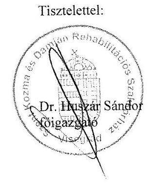

Mellékletek:

1. számú melléklet - V-0020-328/2012-2013 számú ÁSZ jelentés
2. számú melléklet - Iktatókönyv kivonat
3. számú melléklet - Intézkedési terv megküldése
4. számú melléklet - Intézkedési terv megküldésének postakönyvi igazolása

---

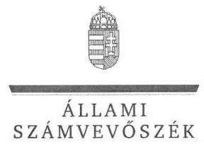

ELNÖK

Ikt.szám: V-0883-189/2016.

Dr. Huszár Sándor úr
főigazgató
Szent Kozma és Damján Rehabilitációs Szakkórház

Visegrád

# Tisztelt Főigazgató Úr! 

Köszönettel megkaptam a 2016. július 26. napján az Állami Számvevőszékhez érkezett „A kórházi ellátás működtetésére fordított pénzeszközök felhasználásának ellenőrzéséről szóló jelentés utóellenőrzése" című számvevőszéki jelentéstervezetben foglalt megállapításokra írásban tett észrevételeit.

Tájékoztatom Főigazgató urat, hogy a jelentésben - az Állami Számvevőszékről szóló 2011. évi LXVI. törvény 29. § (3) bekezdése alapján - a figyelembe nem vett észrevételeket szerepeltetjük az elutasítás indokainak feltüntetésével együtt.

Az Állami Számvevőszék észrevételekre vonatkozó álláspontjáról a felügyeleti vezető által készített részletes tájékoztatást mellékelten megküldöm.

Budapest, 2016. augusztus 18.
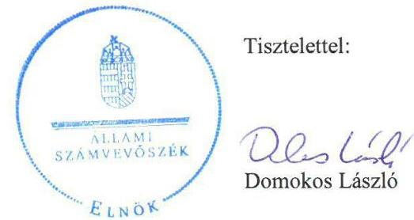

Melléklet: Tájékoztatás az elfogadott és el nem fogadott észrevételekről

---

# Tájékoztatás   az elfogadott és az el nem fogadott észrevételekről 

| 1. | Észrevétel: | A „Főbb megállapítások, következtetések" (5. oldal) 1. bekezdés   3. mondatában a Szent Kozma és Damján Rehabilitációs   Szakkórházra (továbbiakban: SZKDRSZK) vonatkozó   megállapításhoz kapcsolódóan. |
| :--: | :--: | :--: |
|  | Válasz: | Az Állami Számvevőszék az észrevételt részben fogadja el. |
| 1. | Indoklás: | Észrevételének az intézkedési tervben vállalt feladatok   tartalmának a végrehajtására vonatkozó részét figyelembe véve, az   1. számú és az 1.5. számú megállapítással összhangban, a Főbb   megállapítások, következtetések" (5. oldal) 1. bekezdés 3. és 4.   mondatában szereplő, az SZKDRSZK-ra vonatkozó megállapítást   a következők szerint módosítottuk:   „A Szent Kozma és Damján Rehabilitációs Szakkórház az   intézkedési tervben vállalt feladatokat összességében   végrehajtotta, a feladatok egynegyede azonban határidőt követően   teljesült." |
|  | Indoklás: | Az ellenőrzés célja - az intézkedési tervben meghatározott   feladatok ellenőrzött szervezetek általi végrehajtásának értékelése   - magában foglalja az intézkedési tervben vállalt határidők   betartásának az értékelését is. Határidőben végrehajtott feladatnak   - az ellenőrzés módszerei szerint - az a feladat minősíthető, ha a   teljesítés „dokumentáltan az intézkedési tervben előírt   határidőben és tartalommal megtörtént". Az Ellenőrzési program   szerint a szabályszerű működés és a felelős vezetői magatartás   vonatkozásában nemcsak az Önök által idézett, az „intézkedések   elmaradása vagy részleges megvalósulása", hanem „az   intézkedési tervekben vállalt feladatok ... késedelmes   végrehajtása" is hordoz kockázatot (10. oldal 2. bekezdés). |
| 2. | Észrevétel: | Az intézkedési terv határidőn túli megküldésével kapcsolatban. |
|  | Válasz: | Az Állami Számvevőszék az észrevételt elfogadja. |
|  | Indoklás: | A dokumentumok ismételt áttekintése alapján, a 8. oldal utolsó   bekezdés utolsó mondatát a következők szerint módosítjuk   (módosítás aláhúzással jelölve): „Az intézkedési tervet a   főigazgató határidőben küldte meg az ÁSZ részére." |

---

| 3. | Észrevétel: | Az 1. számú megállapítás (14. oldal) 2. mondatához kapcsolódóan. |
| :--: | :--: | :--: |
|  | Válasz: | Az Állami Számvevőszék az észrevételt elfogadja. |
|  | Indoklás: | Az észrevételben foglaltak alapján, az 1. számú megállapítás (14. oldal) 2. mondatának az SZKDRSZK-ra vonatkozó megállapítását az 1.5. számú megállapítással összhangban, a következők szerint módosítottuk:   „Az SZKDRSZK az intézkedési tervben vállalt feladatokat összességében végrehajtotta, a feladatok egynegyede azonban határidőt követően teljesült." |
| 4. | Észrevétel: | Az 1.5. számú megállapítás (18. oldal) 1-2. mondatához kapcsolódóan. |
|  | Válasz: | Az Állami Számvevőszék az észrevételt részben fogadja el. |
|  | Indoklás: | Az észrevételben foglaltak alapján az 1.5. számú megállapítás 1-2. mondatát a következők szerint módosítottuk:   „Az SZKDRSZK vezetője az intézkedési tervben önmaga által meghatározott feladatok végrehajtásáról összességében gondoskodott. Az intézkedési tervben a bevételnövelés és kiadáscsökkentés érdekében vállalt feladatok egynegyede azonban határidőt követően teljesült."   Az intézkedési tervben vállalt feladatok végrehajtásának a határidőn túli minősítését az 5.1.-5.4. pontban szereplő észrevételek nem módosították, így határidőre történő feladatmegvalósítások arányának a módosítása sem indokolt. |
| 5.1. | Észrevétel: | Az 5. számú melléklet 16. pontjára (a térítési díjszabályzatban foglalt kedvezmények és díjak felülvizsgálatára) vonatkozóan. |
|  | Válasz: | Az Állami Számvevőszék az észrevételt nem fogadja el. |

---

|  | Indoklás: | Az utóellenőrzés megállapításait - amint azt „Az ellenőrzés módszerei" fejezet is tartalmazza - az ÁSZ rendelkezésére álló, valamint az ellenőrzött szervezet által megküldött dokumentumok alapozták meg. Az SZKDRSZK olyan dokumentumot nem bocsátott az ellenőrzés rendelkezésére, amely a térítési díjszabályzatban foglalt kedvezmények és díjak intézkedési tervben vállalt határidőn belüli, illetve a megállapításban szereplő 2013. július 16-a előtti felülvizsgálatát igazolta volna, és ilyen dokumentumra jelen észrevételében sem hivatkozott.   Az ellenőrzés rendelkezésére álló dokumentumoknak megfelelően, a megállapításban a feladat végrehajtásának dátumaként annak a dokumentumnak a kelte szerepel, amely beszámolóként - először igazolta a feladat végrehajtását, és amely 2016. július 16-án készült. A térítési díj szabályzat hatályba lépése - mint a megállapításnál zárójelben lévő adat - kiegészítő információ, a feladat határidőben történő végrehajtásának a minősítését nem befolyásolta.   Fentiek alapján a megállapítás, valamint a feladat végrehajtása minősítésének a módosítása nem indokolt. |
| :--: | :--: | :--: |
|  | Észrevétel: | Az 5. számú melléklet 18. pontjára (utazási költségtérítés szabályozásának és gyakorlatának felülvizsgálatára, az esetleges megtakarítási lehetőségek számbavételére) vonatkozóan. |
|  | Válasz: | Az Állami Számvevőszék az észrevételt nem fogadja el. |
| 5.2. | Indoklás: | Az utóellenőrzés megállapításait - amint azt „Az ellenőrzés módszerei" fejezet is tartalmazza - az ÁSZ rendelkezésére álló, valamint az ellenőrzött szervezet által megküldött dokumentumok alapozták meg. Az SZKDRSZK olyan dokumentumot nem bocsátott az ellenőrzés rendelkezésére, amely az utazási költségtérítés szabályozásának és gyakorlatának - intézkedési tervben vállalt határidőn belüli - felülvizsgálatát, az esetleges megtakarítási lehetőségek számbavételét igazolta volna. Nem bocsátottak továbbá az ellenőrzés rendelkezésére dokumentumot az észrevételben hivatkozott, SZKDRSZK által történt döntésről sem.   Az ellenőrzés rendelkezésére bocsátott, és az észrevételben is hivatkozott 167/1/2013. iktatószámú, 2013. április 2-án kelt levél a felülvizsgálat tényét nem igazolja, továbbá a végrehajtás tekintetében sem fedi le teljes egészében az intézkedési tervben vállalt feladatot. A levélnek „A munkába járással kapcsolatos szabályozók és az ahhoz kapcsolódó költségtérítések felülvizsgálata okán" bevezetése nem bizonyítja a felülvizsgálat megtörténtét. |

---

|  |  | Az ellenőrzési megállapítás az Önök által rendelkezésre bocsátott 15/12/2013. iktatószámú, 2013. július 17-én kelt iraton alapult, amelyben arról számoltak be, hogy „A 15/6/2013. sz. intézkedési terv 15. pontjában szereplő feladat 2013.04.20-án elkészült". Ugyanezen dokumentum tartalmazta - az ellenőrzés rendelkezésére bocsátott dokumentumok közül elsőként - a megtakarítási lehetőségek számba vételét is.   Fentiek alapján a megállapítás, valamint a feladat végrehajtása minősítésének a módosítása nem indokolt. |
| :--: | :--: | :--: |
| 5.3. | Észrevétel: | Az 5. számú melléklet 19. pontjára (a létszámszükséglet felmérésére, és a javaslattételre) vonatkozóan. |
|  | Válasz: | Az Állami Számvevőszék az észrevételt nem fogadja el. |
|  | Indoklás: | Az utóellenőrzés megállapításait - amint azt „Az ellenőrzés módszerei" fejezet is tartalmazza - az ÁSZ rendelkezésére álló, valamint az ellenőrzött szervezet által megküldött dokumentumok alapozták meg. Az SZKDRSZK nem bocsátott dokumentumot az ellenőrzés rendelkezésére a feladatellátások létszámszükségletének a szakigazgatók általi, intézkedési tervben vállalt határidőt megelőzően történt felmérésére vonatkozóan. A feladatellátások létszámszükségletének a szakigazgatók általi felmérését az ellenőrzés rendelkezésére bocsátott dokumentumok közül mindössze a feladatokkal kapcsolatos, 2013. július 21-i és 22-i beszámolókban dokumentálták, így az ellenőrzés helyesen azokat vette figyelembe.   Az intézkedési tervben vállalt határidőt megelőző Igazgató Tanácsi emlékeztetőknek az ellenőrzés részére megküldött kivonatai szerint, 2013. június 30-át megelőzően mindössze a gazdasági igazgató jelezte a felmérést, illetve az alapján a liftkezelő és a nappali biztonsági őr alkalmazása szükségességének a felülvizsgálatát (a konkrét módosításokra a javaslatokat a rendészeti létszám, illetve a porta szolgálat esetében is határidőt követően tették meg). A további felméréseket az intézkedési tervben vállalt határidőn túl dokumentálták (járó beteg rendelések esetében 2016. július 21., ápolási igazgató 2013. július 22.), amelyet az ellenőrzési megállapítás helyesen tartalmaz.   Fentiek alapján a megállapítás, valamint a feladat végrehajtása minősítésének a módosítása
 nem indokolt. |
| 5.4. | Észrevétel: | Az 5. számú melléklet 20. pontjára (az előre jelzetten és tudhatóan távozni készülő dolgozók helyettesítésére) vonatkozóan. |
|  | Válasz: | Az Állami Számvevőszék az észrevételt nem fogadja el. |

---

|  | Az utóellenőrzés megállapításait - amint azt „Az ellenőrzés módszerei" fejezet is tartalmazza - az ÁSZ rendelkezésére álló, valamint az ellenőrzött szervezet által megküldött dokumentumok alapozták meg. Az SZKDRSZK nem bocsátott dokumentumot az ellenőrzés rendelkezésére „az előre jelzetten és tudhatóan távozni készülő dolgozók" helyettesítésének időben történő megoldására vonatkozó - az irányítási tevékenység és a vezetői ellenőrzés keretében tett - intézkedésekről, továbbá az észrevétel sem tartalmaz erre vonatkozó információt.   Az intézkedési tervben szereplő ezen feladat végrehajtására vonatkozó, 2016. február 9-i nyilatkozata szerint „A közszférában alkalmazandó nyugdíjpolitikai elvekről rendelkező 1700/2012. (XII. 29.) korm. határozat hatására 2013-ban a fluktuáció jelentősen nőtt, a szabadságok időarányos kiadása, a helyettesítés megoldása nem minden esetben volt biztosított." Az intézkedési terv ugyanakkor nem valamennyi, a fluktuációval érintett dolgozó helyettesítésére, hanem csak „az előre jelzetten és tudhatóan távozni készülő dolgozók" helyettesítésének az időben történő megoldására vonatkozott, amelyeket jellemzően nem az 1700/2012. (XII. 29.) Korm. határozat indukált, így azt nem indokolt figyelembe venni a működési feltételben, illetve a jogszabályi előírásokban bekövetkezett változásként az intézkedési terv ezen pontja vonatkozásában.   Fentiek alapján a megállapítás, valamint a feladat végrehajtásának minősítésének a módosítása nem indokolt. |
| :--: | :--: |

Köszönettel vettük észrevételének a 6. oldalán adott tájékoztatását arról, hogy az Ön vezetése alatt az SZKDRSZK lejárt határidejű tartozással, szállítói állománnyal nem rendelkezett, konszolidációban nem részesült. Az ott leírtakkal ellentétben azonban jelen utóellenőrzés célja nem a „2013. februári 13012-s jelentésben megfogalmazott célok" hasznosulásának ellenőrzése, hanem a számvevőszéki jelentésben foglalt intézkedést igénylő megállapításokkal és javaslatokkal összhangban készített intézkedési tervben meghatározott feladatok végrehajtásának az ellenőrzése volt, így az utóellenőrzés az SZKDRSZK jelenlegi pénzügyi helyzetét nem vizsgálta.

Budapest, 2016. 08. hó 18. nap
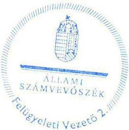

Salamon Ildikó
felügyeleti vezető

---

# 8360 Keszthely, Ady Endre utca 2. Tel.: 83/311-060/1100 Fax: 83/314-221 e-mail: titkarsag@keszthelyikorhaz.hu www.keszthelyikorhaz.hu 

Állami Számvevőszék
Domokos László
Elnök

## Budapest

Apáczai Csere J. u. 10.
1052

## Tisztelt Elnök Úr!

## 1171 1012016.

ÁLLAMI SZÁMVEVŐSZÉK
$164399 / 2016$
Bakzert: 2016. JÚL. 26.
Iktatószám: V-085-158/4016
Melléklet: $\qquad$
A 2016. 07. 08-án kelt és 2016. 07. 12-én kézhez kapott számvevőszéki jelentéstervezethez az alábbi észrevételeket kívánom tenni:

A jelentéstervezet 5. oldalán az „Összegzés/Főbb megállapítások, következtetések" fejezetében foglalt állítással - miszerint „,...a Városi Kórház Keszthely vezetője nem tette meg az intézkedési tervben önmaga által meghatározott feladatok végrehajtására a megfelelő intézkedéseket, amely kockázatot hordoz a kórház működésében és a felelős vezetői magatartásban..." - nem értek egyet, kérem ennek szíves módosítását.
Tartalmában ugyanez a megállapítás szerepel a 14. oldalon és a 19. oldalon (1. pont; 1.6. sz. megállapítás) is, ezeknek is kérem tisztelettel a kiigazítását akként, hogy az intézkedési tervben intézményünk által meghatározott feladatok végrehajtására a megfelelő intézkedéseket megtettem, hiszen a végrehajtás - még ha esetlegesen határidőn túl is -, de minden esetben megvalósult.

A részben végrehajtottnak minősített feladatokhoz az alábbi észrevételeket teszem:
12. pont: A jelentéstervezet szerint a kódolási és dokumentálási protokollok végrehajtásának felülvizsgálata nem történt meg.
A gyakorlatban az intézkedési tervben meghatározott feladat végrehajtásának eredményeképpen az említett felülvizsgálat beépítésre került az előzetes vezetői kontroll rendszerbe, így az folyamatosan megvalósul.
Az adott havi teljesítésre vonatkozó, OEP felé történő jelentést megelőzi a Kontrolling Osztály által kéthetente elkészített kimutatás valamennyi osztály időszaki tevékenységéről, melyből megállapítható a járó- és fekvőbeteg kódolási és dokumentálási protokollok végrehajtása.
Mellékelek példaként a fentieket alátámasztó, osztályos teljesítményekről szóló kimutatásokat, valamint azok kiértékelését követően megtett főigazgatói intézkedésekről szóló körleveleket.
13. pont: A Rehabilitációs Osztályon a korábban szüneteltetett 10 ágy elhelyezéséről a jelentéstervezet VI. sz. melléklete szerint nem került beküldésre alátámasztó dokumentum. Az intézmény ekként az ÁNTSZ engedélyt küldte meg, illetve töltötte fel, hiszen ez igazolja egyértelműen a plusz 10 ágy (összesen 50 ágy) elhelyezését, működtetését. Ezen kívül jelen levelemhez csatolom nyilatkozatomat is a plusz 10 ágy folyamatos működtetéséről, valamint az üzembehelyezési jegyzőkönyvet a Rehabilitációs osztály NYDOP -5.2.1-C-11-2012-0001 számú pályázat keretében megvalósult kialakításáról, illetve üzembehelyezéséről.

---

14. pont: A televíziós csatornák vételére alkalmas fejállomás kiépítése szintén megtörtént. Bár alapítványi támogatás igénybevételére nem volt lehetőség, ugyanakkor nagymértékű költségcsökkentést értünk el: a korábbi bruttó 1.186.000,- Ft éves díj helyett a televíziós csatornák vételére az éves díjunk 0,- Ft lett, a beszerelés egyszeri költsége összesen 210.000,- Ft + ÁFA volt. A fejállomás kiépítésének alátámasztó dokumentumait mellékelem.
15. pont: Feladatként a Lindström Kft-vel fennálló szerződés felmondását, illetve kereskedelemben kapható műanyag vagy gumi lábtörlők beszerzését jelöltük meg.
Az utóbbiak beszerzéséről, elhelyezéséről azért nem került feltöltésre alátámasztó dokumentum, mert az intézmény egyéb módon (takarítások gyakoriságának növelésével) oldotta meg a lábtörlők hiányát és hosszú időn keresztül nem vásároltunk újabbakat, ezen intézkedésünkkel is jelentős megtakarítást értünk el. A következő évben kellett az intézménynek összesen 6 darab lábtörlőt vásárolnia, melyről beszerzésekről szintén mellékelem a bizonylatokat.

Kérem, fentiek alapján szíveskedjenek a jelentéstervezetet módosítani akként, hogy az általunk az intézkedési tervben meghatározott feladatokat intézményünk teljes körűen végrehajtotta.

Keszthely, 2016. július 19.

Tisztelettel:
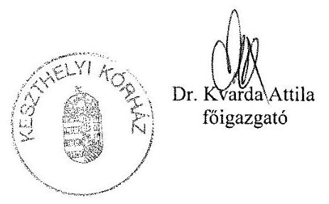

---

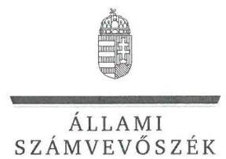

ELNÖK

Ikt.szám: V-0883-161/2016.

Dr. Kvarda Attila úr
főigazgató
Keszthelyi Kórház

Keszthely

# Tisztelt Főigazgató Úr! 

Köszönettel megkaptam a 2016. július 26. napján az Állami Számvevőszékhez érkezett „Utóellenőrzések - A kórházi ellátás működtetésére fordított pénzeszközök felhasználásának ellenőrzéséről szóló jelentés utóellenőrzése" című számvevőszéki jelentéstervezetben foglalt megállapításokra tett észrevételeit.

Tájékoztatom Főigazgató urat, hogy a jelentésben - az Állami Számvevőszékről szóló 2011. évi LXVI. törvény 29. § (3) bekezdése alapján - a figyelembe nem vett észrevételeket szerepeltetjük az elutasítás indokainak feltüntetésével együtt.

Az Állami Számvevőszék észrevételekre vonatkozó álláspontjáról a felügyeleti vezető által készített részletes tájékoztatást mellékelten megküldöm.

Budapest, 2016. 08. hó 17. nap
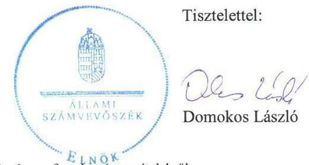

Melléklet: Tájékoztatás az elfogadott és el nem fogadott észrevételekről

---

# Tájékoztatás   az elfogadott és az el nem fogadott észrevételekről

| 1. | Észrevétel: | A jelentéstervezet 5, 14. és 19. oldalán az intézkedési terv végrehajtására tett intézkedésekre vonatkozó megállapítás módosításával kapcsolatosan.  |
| --- | --- | --- |
|   | Válasz: | Az Állami Számvevőszék az észrevételt nem fogadja el.  |
|   | Indoklás: | Az észrevétel nem megalapozott, mivel az intézkedési tervben vállalt 16 feladatból mindössze 5 valósult meg az intézkedési tervben vállalt határidőben, teljes körűen. A határidőn túl, valamint a részben végrehajtott feladatok - ahogy az a megállapításokban szerepel - azt mutatják, hogy nem történtek meg a megfelelő intézkedések azok végrehajtása érdekében.  |
|  2. | Észrevétel: | A jelentéstervezet IV. számú melléklet 12. pontjában (45. oldal) a járó- és fekvőbeteg kódolási és dokumentálási protokollok, valamint azok végrehajtásának a felülvizsgálatához kapcsolódóan.  |
|   | Válasz: | Az Állami Számvevőszék az észrevételt nem fogadja el.  |
|   | Indoklás: | A dokumentumok ismételt felülvizsgálata alapján, az észrevétel nem megalapozott. A kódolási és dokumentálási protokollok végrehajtása felülvizsgálatának az előzetes vezetői kontroll rendszerbe történő beépüléséről, illetve más módon való megvalósulásáról nem bocsátottak konkrét dokumentumot az ellenőrzés rendelkezésére, illetve az ellenőrzés rendelkezésére bocsátott dokumentumok ennek megvalósulását nem támasztották alá.
A Kontrolling Osztály által kéthetente, az OEP felé történő jelentést megelőzően készített kimutatásokból - amint azt az észrevétel is tartalmazza - megállapítható a járó- és fekvőbeteg kódolási és dokumentálási protokollok végrehajtása, azonban a végrehajtásnak az intézkedési tervben vállalt felülvizsgálatát sem azokban, sem egyéb dokumentumokban nem rögzítették.
Fentiek következtében a megállapítás módosítása nem indokolt.  |

---

|  | Észrevétel: | A jelentéstervezet IV. számú melléklet 13. pontjában (46. oldal) a szüneteltetett rehabilitációs ágyszámból plusz 10 ágy elhelyezésével kapcsolatban. |
| :--: | :--: | :--: |
|  | Válasz: | Az Állami Számvevőszék az észrevételt nem fogadja el. |
| 3. | Indoklás: | Az észrevétel nem megalapozott, mivel az ellenőrzés rendelkezésére bocsátott dokumentumok nem támasztják alá a 2013. március 29-én készített intézkedési tervben vállalt „A jelenleg szüneteltetett rehabilitációs ágyszámból plusz 10 ágy elhelyezéséről gondoskodni kell" intézkedés végrehajtását.   Az intézkedési terv nem tartalmazta, hogy annak készítési időpontjában (2013. március 29-én) összesen mennyi rehabilitációs ágy volt szüneteltetett státuszban, hanem a szüneteltetettek közül plusz 10 ágy elhelyezéséről történő gondoskodást írta elő.   Az ellenőrzés rendelkezésére bocsátott, az Állami Népegészségügyi és Tisztiorvosi Szolgálat Országos Tisztiorvosi Hivatal (továbbiakban ÁNTSZ) IF-2065-15/2012. számú, 2012. december 1-jén kelt irata - amely a „Rehabilitációs Osztály 10 ágy szüneteltetés megszünését, illetve az ellátás 2013. január 1-től történő működését" vette tudomásul - nem ellenőrzési bizonyíték az intézkedési terv készítésekor, 2013. március 29-én szüneteltetett rehabilitációs ágyak elhelyezésére vonatkozóan, mivel az intézkedési terv készítését megelőző időszakban történt intézkedést tartalmaz. Az intézkedési tervben rögzítették, hogy az annak készítésekor szüneteltetett rehabilitációs ágyak tekintetében terveztek intézkedést.   A Rehabilitációs Osztály osztályvezetője 2013. április 15-én írásban jelezte a szünetelő 10 rehabilitációs ágy elhelyezésének a lehetőségét aktív betegellátás céljára, illetve a Széchenyi terv keretében nyertes pályázat keretében 50 rehabilitációs ágy megfelelő elhelyezését. A 2013. szeptember 30-án készített emlékeztető szintén azt állapította meg, hogy „A Rehabilitációs Osztály osztályvezetője írásban jelezte a szünetelő 10 rehabilitációs ágy elhelyezésének a lehetőségét." A szünetelő 10 rehabilitációs ágy konkrét elhelyezéséről - aktív betegellátás vagy rehabilitációs célokra vonatkozó döntésről - nem bocsátottak dokumentumot az ellenőrzés rendelkezésére.   Az ÁNTSZ IF-986-7/2015. számú, 2015. november 13-án kelt működési engedélyt módosító határozata - amely módosítás nem a tárgybani rehabilitációs ágyakra, hanem a CT diagnosztikára vonatkozott - mellékletében a Rehabilitációs osztály vonatkozásában 50 engedélyezett ágyszám szerepel, amelyet az ÁSZ vonatkozó ellenőrzési megállapítása is tartalmaz. |

---

|  |  | Az észrevételhez csatoltan megküldött, az épületre vonatkozó   üzembe helyezési jegyzőkönyv (amelyben ágyak elhelyezése nem   szerepel), nyilatkozat - az intézkedési tervben vállalt plusz 10 ágy   elhelyezését bizonyító, az ellenőrzés adatszolgáltatásának részét   képező dokumentum hiányában - nem igazolják az intézkedési   tervben vállalt feladat teljes körű teljesítését, így nem indokolja a   „részben végrehajtott feladat" megállapítás módosítását. |
| :--: | :--: | :--: |
|  | Észrevétel: | A jelentéstervezet IV. számú melléklet 14. pontjában (46. oldal) a   televíziós csatornák vételére alkalmas fejállomás kiépítésére   vonatkozóan. |
|  | Válasz: | Az Állami Számvevőszék az észrevételt nem fogadja el. |
| 4. | Indoklás: | Az észrevétel a dokumentumok ismételt felülvizsgálata alapján   nem megalapozott, mivel a feladat végrehajtása nem az   intézkedési tervben vállalt módon történt.   A televíziós csatornák vételére alkalmas fejállomás kiépítése   ugyan megtörtént, de a kiépítéshez az intézkedési tervben

 szereplő   „lehetőleg alapítványi támogatást igénybe véve, intézményi   többletköltség nélkül" végrehajtására tett intézkedésekről   dokumentumokat nem bocsátottak az ellenőrzés rendelkezésére.   A IV. számú melléklet 14. pont 4. oszlop 2. mondat   megállapítását - a végrehajtás egyértelmű szerepeltetése   érdekében - a következők szerint pontosítjuk: „A televiziós   csatornák vételére alkalmas, ún. fejállomás kiépítése megtörtént,   a kiépítéshez azonban az intézkedési tervben szereplő „lehetőleg   alapítványi támogatást igénybe véve, intézményi többletköltség   nélkül" végrehajtására tett intézkedést dokumentum nem   támasztotta alá." |
|  | Észrevétel: | A jelentéstervezet IV. számú melléklet 15. pontjában (46. oldal) a   szolgáltatási szerződés felmondásához és a kereskedelemben   kapható műanyag vagy gumi lábtörlő beszerzéséhez,   elhelyezéséhez kapcsolódóan. |
|  | Válasz: | Az Állami Számvevőszék az észrevételt részben fogadja el. |
| 5. | Indoklás: | A dokumentumok ismételt felülvizsgálata alapján észrevételének a   lábtörlők vásárlására vonatkozó részét a 4 db vásárlási számla   alapján elfogadva, a IV. számú melléklet 15. pont 4. oszlop 2.   mondatát a következők szerint pontosítjuk: „Kereskedelemben   kapható lábtörlők beszerzésére 2014. szeptember 3-án (2 db) és   2014. december 1-jén (2 db) került sor." |

---

|  | A szolgáltatási szerződés - intézkedési tervben vállalt -   felmondását az intézkedési tervben megjelölt határidőt követően   hajtották végre, majd ezt követően történt meg a kereskedelmi   forgalomban kapható lábtörlők beszerzése, ezért a feladat   végrehajtása nem teljes körűen végrehajtott, hanem határidőn túl   végrehajtott feladatnak minősül és a megállapítást ennek   megfelelően szerepeltetjük.   A módosítás következtében az 1.6. számú megállapítás 1.   bekezdés 1. mondata a következők szerint változik: „A VKK az   intézkedési tervben vállalt 16 feladatból öt feladatot határidőben   végrehajtott, hét feladatot határidőn túl, három feladatot részben   hajtott végre és egy feladat nem volt időszerű.   A 6. ábra a módosításnak megfelelően változik. |
| :--: | :--: |

Budapest, 2016. 08. hó 17. nap
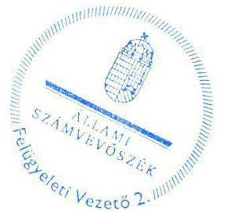

Salamon Ildikó
felügyeleti vezető

---

# SZENT IMRE EGYETEMI OKTATÓKÓRHÁZ 

## FÓIGAZGATÓSÁG

Prof. Dr. Bedros J. Róbert
fóigazgató főorvos, főtanácsos
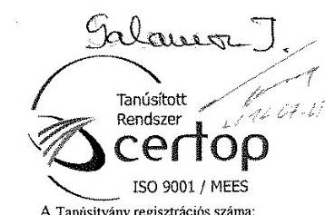

A Tanúsítvány regisztrációs száma: 01-16281/15-11164
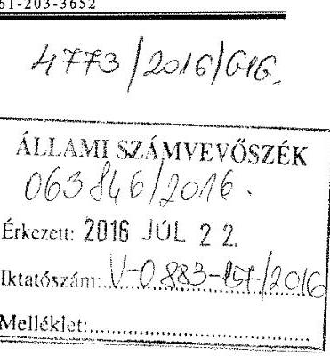

## Tisztelt Elnök Úr!

Hivatkozással a V-0883-146/2016. számú átiratára tájékoztatom, hogy „A kórházi ellátás működtetésére fordított pénzeszközök felhasználásának ellenőrzéséről szóló jelentés utóellenőrzése" címmel készített számvevőszéki jelentéstervezetet átnéztem, az abban foglaltakkal kapcsolatban észrevételt nem teszek.

Egyben tájékoztatom tisztelt Elnök Urat, hogy az intézkedési tervben meghatározott feladatok végrehajtásáról a jogszabályi előírás szerinti nyilvántartás vezetésére a szükséges intézkedéseket megtettem.

Budapest, 2016. július 20.

Tisztelettel:
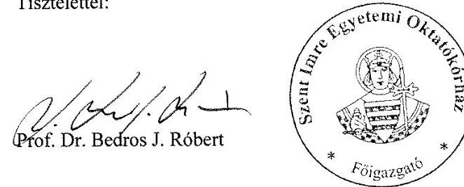

---

.

---

# RÖVIDÍTÉSEK JEGYZÉKE 

${ }^{1}$ ÁSZ
${ }^{2}$ ÁSZ jelentés
${ }^{3}$ EMMI
${ }^{4}$ intézkedési terv ${ }_{1}$
${ }^{5}$ BIK
${ }^{6}$ intézkedési terv ${ }_{2}$
${ }^{7}$ GOKI
${ }^{8}$ intézkedési terv ${ }_{3}$
${ }^{9}$ SZIK
${ }^{10}$ intézkedési terv ${ }_{4}$
${ }^{11}$ SZKDRSZK
${ }^{12}$ intézkedési terv ${ }_{5}$
${ }^{13}$ VKK
${ }^{14}$ intézkedési terv ${ }_{6}$
${ }^{15}$ Áht.
${ }^{16}$ GYEMSZI
${ }^{17}$ Áhsz.
${ }^{18}$ Bkr.
${ }^{19}$ TÁMOP
${ }^{20}$ kontrolling kézikönyv ${ }_{1}$
(osztályos kontrolling)
${ }^{21}$ kontrolling kézikönyv ${ }_{2}$
${ }^{22}$ ÁEEK
${ }^{23}$ OEP
${ }^{24}$ Fejlesztési Terv
${ }^{25}$ ÁNTSZ
${ }^{26}$ VIR
${ }^{27}$ pénzügyi terv
${ }^{28}$ HBCS
${ }^{29}$ Gazdálkodási Válságterv pénzügyi terve
${ }^{30}$ Anyaotthon Működési Rendje

Állami Számvevőszék
13012 ÁSZ jelentés a kórházi ellátás működtetésére fordított pénzeszközök felhasználásának ellenőrzéséről
Emberi Erőforrások Minisztériuma
az EMMI 839-10/2013/ELL iktatószámú intézkedési terv (2013. április 10.)
Csongrád Megyei Dr. Bugyi István Kórház
A Csongrád Megyei Dr. Bugyi István Kórház a 01/5/6/2013 iktatószámú intézkedési terv (2013. június 25.)
Gottsegen György Országos Kardiológiai Intézet
a GOKI 5-8/2013. iktatószámú Intézkedési terve (2013. március 25.)
Szent Imre Egyetemi Oktatókórház
a SZIK 2908/2013/616. iktatószámú Intézkedési terve (2013. április 22.)
Szent Kozma és Damján Rehabilitációs Szakkórház
a SZKDRSZK 15/6/2013. iktatószámú Intézkedési terve (2013. március 28.)
Keszthelyi Kórház
a VKK intézkedési terve (2013. március 29.)
Az államháztartásról szóló 2011. évi CXCV. törvény
Gyógyszerészeti és Egészségügyi Minőség- és Szervezetfejlesztési Intézet (2015. március 1-jétől Állami Egészségügyi Ellátó Központ, ÁEEK)
249/2000. (XII. 24. ) Korm. rendelet az államháztartás szervezetei beszámolási és könyvvezetési kötelezettségének sajátosságairól (hatálytalan: 2014. január 1-jétől)
370/2011. (XII. 31.) Korm. rendelet a költségvetési szervek belső kontrollrendszeréről és belső ellenőrzéséről
Új Széchenyi Terv Társadalmi Megújulás Program
a GYEMSZI fenntartásában lévő egészségügyi ellátók egységes intézményi kontrolling módszertani alapjait biztosító kontrolling kézikönyv v2.0, 2015. 02. 28.
az ÁEEK fenntartásában lévő egészségügyi ellátók egységes esetszintű kontrolling módszertani alapjait biztosító kontrolling kézikönyv v2.0, 2015. 06. 23.
Állami Egészségügyi Ellátó Központ (2015. március 1-jétől a GYEMSZI jogutódja)
Országos Egészségbiztosítási Pénztár
Csongrád Megyei Dr. Bugyi István Kórház Fejlesztési Terve 2014. (Szentes, 2013. november 29.)
Állami Népegészségügyi és Tisztiorvosi Szolgálat
Vezetői Információs Rendszer
Az ÁSZ jelentés alapján készült intézkedési terv ${ }_{3}$ pénzügyi terve
Homogén betegségcsoportok: A fekvőbeteg-ellátás finanszírozásában használt betegosztályozási rendszer.
Az intézkedési terv ${ }_{3}$ pénzügyi terve
Gazdasági Szabályzat, Anyaotthon működési rendje, Pénzgazdálkodási Osztály, (érvénybelépés: 2009.07.01., módosítás érvénybelépése: 2013. 03.08.)

---

${ }^{31}$ Forrás Patika
${ }^{32}$ TESZK
${ }^{33}$ TIOP

A Patika elsődleges feladata a SZIK-ből távozó és az ambuláns ellátásban részesülő vagy valamely szakrendelésre bejövő betegek gyógyszerrel történő gyors ellátása
Térségi Egészségszervezési Központ
Társadalmi Infrastruktúra Operatív Program

---

.

---

.

---

.

---

ÁLLAMI SZÁMVEVŐSZÉK
1052 Budapest, Apáczai Csere János utca 10.
Levélcím: 1364 Budapest 4. Pf. 54
Telefon: +36 14849100 Telefax: +36 14849200
www.asz.hu

