# Jelentés 

## Országos Foglalkoztatási Közhasznú Nonprofit Kft.

Az állami tulajdonban (résztulajdonban) lévő gazdálkodó szervezetek vagyonmegőrzési és gazdálkodási tevékenységének ellenőrzése 2016.

---

# Jelentés 

## Országos Foglalkoztatási Közhasznú Nonprofit Kft.

Az állami tulajdonban (résztulajdonban) lévő gazdálkodó szervezetek vagyonmegőrzési és gazdálkodási tevékenységének ellenőrzése
2016. augusztus hó 16. nap
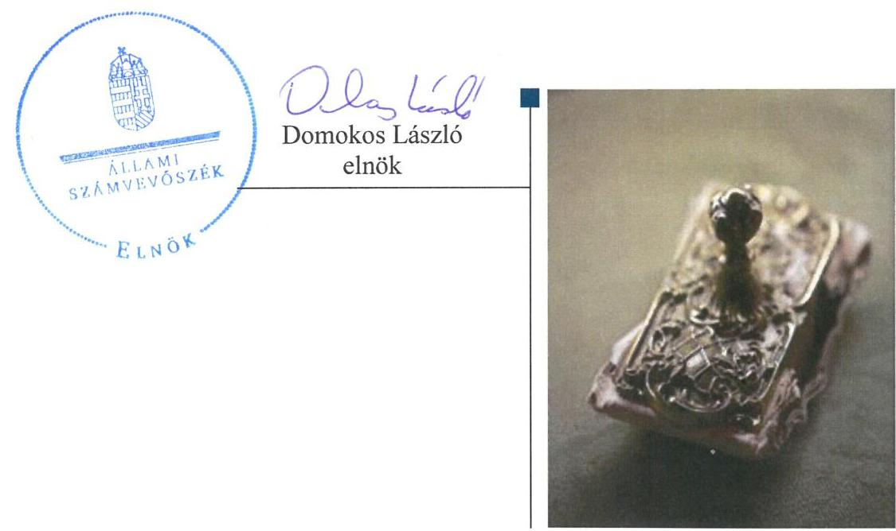

---

# AZ ELLENŐRZÉST FELÜGYELTE:

DR. HORVÁTH MARGIT felügyeleti vezető

## AZ ELLENŐRZÉST VEZETTE ÉS A VÉGREHAJTÁSÁÉRT FELELŐS:

PENCZ MÁRIA ellenőrzésvezető

## A PROGRAM ÖSSZEÁLLÍTÁSÁÉRT FELELŐS:

JANIK JÓZSEF LÁSZLÓ osztályvezető

IKTATÓSZÁM: V-1033-211/2016.

TÉMASZÁM: 2067

ELLENŐRZÉS-AZONOSÍTÓ SZÁM: V-070926

Jelentéseink az Országgyűlés számítógépes hálózatán és az Interneta a www.asz.hu címen is olvashatóak.

---

# TARTALOMJEGYZÉK 

■ ÖSSZEGZÉS ..... 5
■ AZ ELLENŐRZÉS CÉLJA ..... 7
■ AZ ELLENŐRZÉS TERÜLETE ..... 8
■ AZ ELLENŐRZÉS HÁTTERE, INDOKOLTSÁGA ..... 10
■ A JELENTÉS LÉNYEGES KÉRDÉSKÖREI ..... 11
■ ELLENŐRZÉS HATÓKÖRE ÉS MÓDSZEREI ..... 12
■ MEGÁLLAPÍTÁSOK ..... 14
■ JAVASLATOK ..... 28
■ MELLÉKLETEK ..... 31
I. sz. melléklet: Értelmező szótár ..... 31
II. sz. melléklet: Az OFA NKft. vagyonának változása 2011-2014.között (ezer Ft, \%) ..... 36
III. sz. melléklet: Az OFA NKft. vagyonának megoszlása 2011-2014.között (\%) ..... 37
■ FÜGGELÉK: ÉSZREVÉTELEK ..... 39
■ RÖVIDÍTÉSEK JEGYZÉKE ..... 57

---

.

---

# ÖSSZEGZÉS 

Az Állami Számvevőszék az Országos Foglalkoztatási Nonprofit Kft. vagyonmegőrzési és gazdálkodási tevékenységét 2012. január 13. és 2014. december 31. közötti időszakban ellenőrizte. Hiányosságot tárt fel az ellenőrzés az NGM tulajdonosi joggyakorlásánál a 2014. évi tőkeemeléshez kapcsolódóan, valamint az Országos Foglalkoztatási Nonprofit Kft. esetében az OFA Közalapítványtól átvett vagyon szabálytalan elszámolásával összefüggésben a vagyongazdálkodási feltételek kialakításánál és vagyonnyilvántartásnál. Megállapította az ellenőrzés, hogy az Országos Foglalkoztatási Nonprofit Kft. egyszerüsített éves beszámolói a 2012-2014. években nem feleltek meg a jogszabályokban foglaltaknak, azok nem a valós vagyoni állapotot tükrözték.

## Az ellenőrzés társadalmi indokoltsága

Magyarországon az intézmény-centrikus közfeladat-ellátás, közvagyon gazdálkodás jellemző a költségvetésen kívüli feladatellátás térnyerése mellett. Ennek szereplői az állami tulajdonú gazdálkodó szervezetek is.

Az Áht: 2. § I) pontja, az Európai Közösséget létrehozó szerződéshez csatolt, a túlzott hiány esetén követendő eljárásról szóló jegyzőkönyv alkalmazásáról szóló 2009. május 25-i 479/2009/EK rendelet szerint, illetve az ESA95 és ESA2010 statisztikai módszertana alapján a kormányzati szektorba tartoznak a "központi kormányzat alszektorba besorolt társaságok és egyéb szervezetek" is, amelyekkel szemben alapvető követelmény, hogy gazdálkodásuk, müködésük szabályszerű, az általuk szolgáltatott adatok megbízhatóak legyenek. Az Áht: 2. § I) pontja alapján kiadott a kormányzat szektorba sorolt egyéb szervezetekről szóló NGM közlemény szerint mintegy másfélszáz szervezet mellett a központi kormányzat alszektorba besorolt szervezet az OFA NKft. is.

Az állami vagyonnal való gazdálkodás alapvető célja az állami vagyon átlátható, rendeltetésszerű és felelős felhasználásának biztosítása. Az állami tulajdonban álló gazdálkodó szervezetek államot megillető társasági részesedése a nemzeti vagyon részét képezi és legfőbb rendeltetése szerint a közfeladatok ellátását szolgálja.

Az Állami Számvevőszék stratégiájában megfogalmazta, hogy az államháztartáson kívülre nyújtott költségvetési támogatások és ingyenes vagyonjuttatások, valamint az államháztartáson kívül múködő közfeladat-ellátó rendszerek ellenőrzéseivel hozzájárul ahhoz, hogy a közpénzeket az államháztartáson kívül múködő szervezetek is átlátható, rendezett módon használják fel a közfeladatok szerződésben vállalt ellátása érdekében.

## Főbb megállapítások, következtetések, javaslatok

A tulajdonosi joggyakorló NGM a felelős vagyongazdálkodást biztosító követelményeket kialakította, meghatározta az állami vagyon értékének megőrzéséhez, gyarapításához szükséges követelményeket, ugyanakkor az OFA Nkft-vel megkötött támogatási szerződések a támogatás felhasználása tekintetében ellentmondást tartalmaztak. Az NGM vagyonváltozást eredményező döntései a 2014. évi tőkeemeléshez kapcsolódóan nem feleltek meg az MNV Zrt.-vel kötött megbízási szerződésben és az Áht: -ban foglaltaknak, mert tőkeemelésre nem az MNV Zrt. útján került sor, azt az NGM saját forrásából valósította meg.

Az OFA NKft. vagyongazdálkodási tevékenységének szabályozását hiányosan alakította ki, Számlarendje nem teljes körűen felelt meg a Számv. tv. előírásainak, mert nem határozták meg a számlák tartalmát, növekedésének és csökkenésének jogcímeit, a számlákat érintő gazdasági eseményeket, azok más számlákkal való kapcsolatát, a főkönyvi számlák és az analitikus nyilvántartások kapcsolatát, a számlarendben foglaltakat alátámasztó bizonylati rendet. Vagyonnyilvántartása és vagyonváltozást eredményező döntései nem feleltek meg a jogszabályi előírásoknak, mert mérlegében az OFA Közalapítványtól átvett vagyont a 2006. évi LXV tv. előírásaival ellentétben nem apportként

---

mutatta ki. A közhasznú feladatellátásra kötött támogatási szerződésekben foglaltakkal ellentétben a támogatásokat nem kizárólag működési célra használta fel.

A bevételek és ráfordítások elszámolása részben felelt meg a Számv. tv.-ben és a Számviteli Politikában foglaltaknak, mivel 2013. évben a 100 ezer Ft bekerülési érték alatti beszerzések és 2012. évben az OFA NKft. tulajdonában álló ingatlan értékcsökkenését nem a jogszabályi előírások szerint számolták el. Az OFA NKft. vagyongazdálkodási tevékenysége során a 2012. évben az Ect. előírásai ellenére befektetési szabályzatot nem készített.

Az ellenőrzött időszakban az alapításkor átvett vagyon szabálytalan elszámolása következtében az OFA NKft. beszámolói a 2012-2014. években nem a valós vagyoni állapotot tükrözték, mert a jegyzett tőke összegét 1436 M Fttal alacsonyabb értéken mutatták ki. Ugyanakkor a könyvvizsgáló a beszámolókat hitelesítő záradékkal látta el, továbbá az FB a beszámolókra vonatkozó írásbeli jelentéstételi kötelezettségének nem tett eleget.

Közbeszerzési kötelezettségének az OFA NKft. az ellenőrzött időszakban részben tett eleget, mert a 2012. évben a közbeszerzési értékhatárt figyelmen kívül hagyva, közbeszerzési eljárás lefolytatása nélkül kötöttek szerződést. A szabálytalanságot 2013. évben feltárták és intézkedtek a szerződés megszüntetéséről.

Honlapjának tartalma nem felelt meg az Info tv. előírásainak, mivel nem tették közzé a szervezeti és személyzeti adatokat, az SZMSZ-t, valamint a 2013. év kivételével az üzleti terveket. Az OFA NKft. az ellenőrzött időszakban adósságot keletkeztető ügyletet nem kötött.

---

# AZ ELLENŐRZÉS CÉLJA 

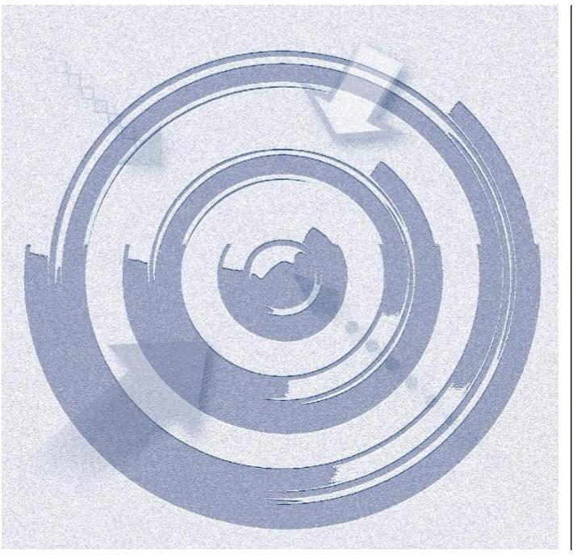

Az ellenőrzés célja annak értékelése, hogy a tulajdonosi jogok gyakorlása szabályszerű volt-e; a gazdálkodó szervezet által ellátott feladat bevételei, ráfordításai elszámolásának, és vagyongazdálkodási tevékenységének szabályozása megfelelt-e a jogszabályi és a tulajdonosi előírásoknak és azok végrehajtása szabályszerű volt-e; biztosítva volt-e a közfeladatok átláthatósága és elszámoltathatósága érdekében a közszolgáltatás dijának megalapozottsága szabályszerű önköltségszámítással; a vagyonváltozást eredményező döntések esetében a tulajdonosi jogok gyakorlója és a gazdálkodó szervezet szabályszerűen jártak-e el; a gazdálkodó szervezet épített-e ki és múködtetett-e információs rendszert a szabályszerű vagyongazdálkodás érdekében.

Az ellenőrzés további célja annak értékelése, hogy a kormányzati szektorba sorolt egyéb szervezetek gazdálkodásának a kormányzati szektor hiányára és az államadósságra befolyással bíró elemei a jogszabályi előírásoknak megfeleltek-e.

---

### **AZ ELLENŐRZÉS TERÜLETE**

### **Országos Foglalkoztatási Közhasznú Nonprofit Kft.**

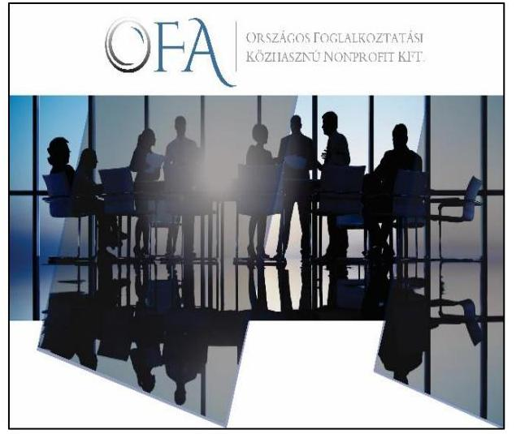

**AZ OFA NKFT.1** egyszemélyes közhasznú nonprofit korlátolt felelősségű társaságot a Magyar Állam képviseletében az NGM2 alapította. A miskolci székhellyel és 0,5 M Ft jegyzett tőkével létrehozott, 100%-os állami tulajdonban lévő OFA NKft. az 1362/2011. (XI. 8.) Korm. határozat3 2. a) pontja értelmében az OFA Közalapítvány4 jogutódjának minősül. Az OFA NKft.-t a Fővárosi Törvényszék Cégbírósága 2012. január 13-ával jegyezte be.

Az OFA NKft. közhasznú tevékenysége keretében elsődlegesen a munkaerő-piaci, felnőttképzési programok indítását és azok megvalósítását végzi. Csoportos létszámleépítések esetén – felkérésre – közreműködik a foglalkoztatási válsághelyzetek kezelésében, javításában, az érintett személyek önfoglalkoztatóvá válásának támogatásában. Szolgáltatásai közé tartozik a KKV szektor speciális munkaerő-igényének komplex kielégítése. A programok végrehajtása és az általános működési kiadások fedezetének biztosítása az NGM által rendelkezésre bocsátott, illetve az éves költségvetési törvényben meghatározott forrásokból, valamint az Európai Szociális Alap és az Európai Regionális Fejlesztési Alap társfinanszírozásával történt.

Az OFA NKft. társasági részesedése feletti tulajdonosi jogokat az NGM gyakorolta az MNV Zrt5.-vel kötött szerződés alapján. Vagyonkezelési szerződésben rögzített állami vagyonnal az OFA NKft. az ellenőrzött időszakban nem rendelkezett.

Az OFA NKft. vagyona a 2014. évben 22.636,0 M Ft volt, amelyben meghatározó részt képviseltek a forgatási célú hitelviszonyt megtestesítő értékpapírok. Az OFA NKft. tevékenysége ellátása érdekében az EU-s és hazai költségvetési forrásból kapott támogatási előlegekből származó szabad pénzeszközöket a Magyar Államkincstárnál Diszkont Kincstárjegyekben kötötte le.

Az OFA NKft. vagyonának változását az ellenőrzött időszakban az 1. ábra szemlélteti.

1. táblázat

**AZ OFA NKFT. FOGLALKOZTATOTTI LÉTSZÁMÁNAK ALAKULÁSA 2012-2014. ÉVEKBEN (FŐ)**

|  Időszak | Átlagos statisztikai létszám  |
| --- | --- |
|  Előtársaság (2011.12.23-2012.01.13.) | 1  |
|  (2012.01.14. - 2012.12.31) | 38  |
|  2013.év | 50  |
|  2014.év | 76  |

*Forrás: OFA NKft. egyszerűsített éves beszámolói*

---

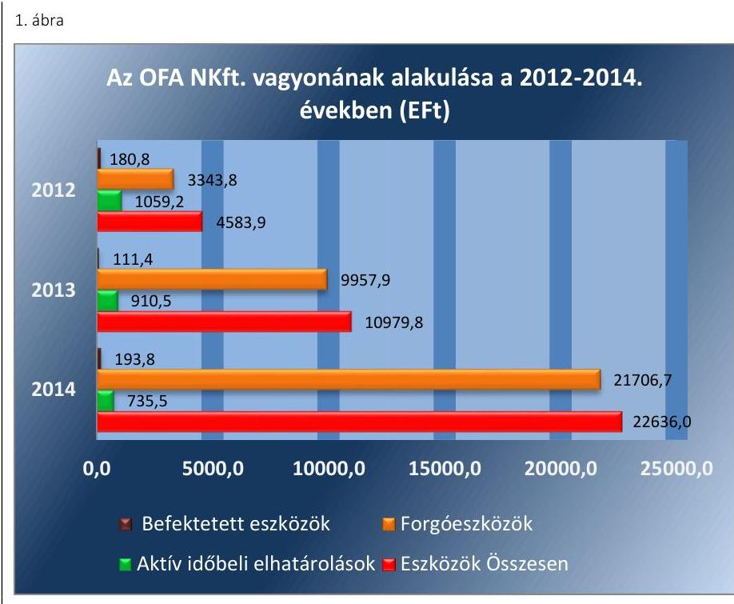

Forrás: OFA NKft. egyszerúsített éves beszámolói
A nemzetgazdasági miniszter által kiadott közlemény alapján az OFA NKft. a központi kormányzati alszektorba besorolt szervezetnek minősül.

---

# AZ ELLENŐRZÉS HÁTTERE, INDOKOLTSÁGA 

## AZ ÁSZ® KÖZÉPTÁVRA SZÓLÓ STRATÉGIÁJÁBAN

megfogalmazta, hogy az államháztartáson kívülre nyújtott költségvetési támogatások és ingyenes vagyonjuttatások, valamint az államháztartáson kívül működő közfeladat-ellátó rendszerek ellenőrzéseivel hozzájárul ahhoz, hogy a közpénzeket az államháztartáson kívül működő szervezetek is átlátható, rendezett módon használják fel a közfeladatok szerződésben vállalt ellátása, továbbá a közvagyon szerződésben vállalt átlátható, hatékony, költségtakarékos működtetése, értékének megőrzése, állagának védelme, értéknövelő használata, hasznosítása és gyarapítása érdekében.

Az ellenőrzés feladata a közvagyonnal biztosított közfeladat ellátással kapcsolatban a közpénzek átláthatósága, nyilvánossága érdekében a jogszabályokban, belső szabályzatokban megfogalmazott előírások érvényesülésének az állami tulajdonban (résztulajdonban) lévő gazdálkodó szervezetek vagyonérték megőrzési és gazdálkodási tevékenységének értékelése.

AZ ELLENŐRZÉS EREDMÉNYEKÉPP a törvényalkotás számára tapasztalatok állnak rendelkezésre az állami vagyonnal való köz-feladat-ellátás, közvagyonnal való gazdálkodás értékeléséhez, az átláthatóságot biztosító szabályozáshoz. Az ellenőrzés tapasztalatai segítik és erősítik az ÁSZ hozzáadott értéket teremtő tevékenységét és tanácsadó szerepét.

---

# A JELENTÉS LÉNYEGES KÉRDÉSKÖREI 

1.     - A tulajdonosi joggyakorló a vagyonnal való gazdálkodás feltételeit szabályszerűen alakította-e ki?
2.     - Az OFA NKft. vagyongazdálkodási tevékenységének szabályozottsága és a vagyon nyilvántartása megfelelt-e az előírásoknak?
3.     - A bevételek és ráfordítások elszámolása, valamint az önköltségszámítás szabályszerű volt-e?
4.     - A vagyonnal való gazdálkodás, valamint a vagyonváltozást eredményező döntések megfeleltek-e a jogszabályi és tulajdonosi előírásoknak?
5.     - Az OFA NKft. a szabályszerű vagyongazdálkodás érdekében teljesítette-e beszámolási, adatszolgáltatási kötelezettségét, ki-épített-e, illetve müködtetett-e információs rendszert?
6.     - A kormányzati szektor hiányára és az államadósságra befolyást gyakorló elemek a jogszabályi előírásoknak megfeleltek-e?

---

# ELLENŐRZÉS HATÓKÖRE ÉS MÓDSZEREI 

## Az ellenőrzés típusa

Szabályszerűségi ellenőrzés

## Az ellenőrzött időszak

2012. január 13-tól 2014. december 31-ig.

## Az ellenőrzés tárgya

Az állami tulajdonban (résztulajdonban) lévő gazdálkodó szervezetek vagyonmegőrzési és gazdálkodási tevékenysége és a kormányzati szektor hiányára és adósságállományára hatást gyakorló elemek ellenőrzése.

## Az ellenőrzött szervezet

Országos Foglalkoztatási Közhasznú Nonprofit Kft. és a Nemzetgazdasági Minisztérium, mint tulajdonosi joggyakorló.

## Az ellenőrzés jogalapja

Az ellenőrzés alapját az Állami Számvevőszékről szóló 2011. évi LXVI. törvény 5. § (3)-(5) bekezdése, valamint az állami vagyonról szóló 2007. évi CVI. törvény 3. § (4) bekezdése képezi.

## Az ellenőrzés módszerei

Az ellenőrzést az ellenőrzési program szempontjai, az ellenőrzött időszakban hatályos jogszabályok, az ellenőrzés szakmai szabályai, a jelen ellenőrzésre irányadó ÁSZ módszertan és a nemzetközi standardok figyelembevételével végeztük.

Az ellenőrzési kérdések megválaszolásához szükséges bizonyítékok megszerzése az ellenőrzött által rendelkezésre bocsátott dokumentumokra, adatokra alapozva kérdésfelvetés, mintavételezés, valamint elemző eljárás útján történt.

Az ellenőrzési bizonyítékként felhasználható adatforrások közé tartoztak egyrészt a szakmai program részletes szempontjainál felsorolt adatforrások, másrészt minden egyéb - az ellenőrzés folyamán feltárt, az ellenőrzés szempontjából információt tartalmazó - dokumentumok.

---

Az ellenőrzés lefolytatásához a gazdálkodó szervezet a tanúsítványok elektronikus kitöltésével, valamint az ÁSZ által kért dokumentumok megküldésével szolgáltatott adatokat.

A kormányzati szektorba sorolt gazdálkodó szervezetnél a személyi jellegű ráfordítások elszámolása mellett az egyéb ráfordítások, pénzügyi műveletek ráfordításai, rendkívüli ráfordítások, illetve az egyéb bevételek, pénzügyi műveletek bevételei, rendkívüli bevételek elszámolásának szabályszerűségét szintén mintatételeken keresztül ellenőriztük.

A véletlen mintavétellel (évenkénti elemszámmal arányos rétegezéssel) ellenőrzött területek esetében minden egyes tétel vonatkozásában a szabályszerűségre vonatkozó kérdéseket tettünk fel, amelyek eredményét összesítettük. A jogszabályoknak és a belső előírásoknak megfelelőnek tekintettük az adott területet, amennyiben a minta ellenőrzésének eredménye alapján 95\%-os bizonyossággal a teljes sokaságban a hibaarány kisebb volt, mint $10 \%$, nem megfelelőnek értékeltük, ha a hibaarány a $10 \%$-ot meghaladta. A ráfordítások elszámolására és a vagyonnyilvántartásra vonatkozó véletlen mintavételt kockázati alapú kiválasztással egészítettük ki, amelynek során évente a három legnagyobb összegű tételt választottuk ki.

---

# 1. A tulajdonosi joggyakorló a vagyonnal való gazdálkodás feltételeit szabályszerűen alakította-e ki? 

Összegző megállapítás

Az NGM az OFA NKft. vagyongazdálkodásának feltételeit kialakította, azonban a támogatási szerződések a cél szerinti felhasználás tekintetében ellentmondást tartalmaztak.

### 1.1. számú megállapítás

Az NGM az állami vagyon értékének megőrzéséhez, gyarapításához, valamint a felelős gazdálkodáshoz szükséges követelményeket meghatározta. Az OFA NKft-vel kötött támogatási szerződések ugyanakkor ellentmondást tartalmaztak a támogatások felhasználása tekintetében.

A TULAJ DONOSI JOGGYAKORLÁS keretében az NGM az Alapító Okirat ${ }_{1,2,3}{ }^{7}$-ban fogalmazta meg a vagyonnal való gazdálkodásra vonatkozó jogokat és a felelős gazdálkodáshoz szükséges követelményeket.

Az Alapító Okirat a vagyonértékének megőrzése érdekében tartalmazta a nyereség felosztásának tilalmát, továbbá a felelős gazdálkodás biztosítása érdekében az $\mathrm{FB}^{8}$ feladatait, hatáskörét, ezen belül a múködés és a gazdálkodás ellenőrzésének feladatát, valamint a könyvvizsgálati feladatokat. Szabályozta a döntési jogköröket, és előírta üzleti terv készítését.

Az Nvtv. ${ }^{9}$ 8. § (7) bekezdés előírásának megfelelően - miszerint a társasági részesedés nem lehet vagyonkezelés tárgya - az MNV Zrt. az NGM vagyonkezelési jogát 2012. december 20-án megszüntette, ezzel egyidejűleg a tulajdonosi joggyakorlásra megbízási szerződést ${ }^{10}$ kötöttek. A több nonprofit korlátolt felelősségú társaságra is kiterjedő szerződés a tulajdonosi joggyakorlással érintett gazdálkodó szervezetek közhasznú tevékenységének felsorolásánál tévesen a 2012. január 1-vel hatályon kívül helyezett Kszt. ${ }^{11}$ előírásaira hivatkozott. Az MNV Zrt. a megbízási szerződésben előírta az NGM részére az OFA Közalapítványtól térítésmentesen átvett vagyonnak az OFA Közalapítvány céljaira történő felhasználását, a vagyon értékének megőrzését.

Az NGM a Gt. ${ }^{12}$ 12. § előírásai alapján, az MNV Zrt. rendelkezéseinek megfelelően az Alapító Okirat ${ }_{1,2,3}$-ban rögzítette azokat a célokat, valamint a felelős gazdálkodáshoz szükséges jogokat, kötelezettségeket, amely alapján az OFA NKft. az ellenőrzött időszakban teljesítette az OFA Közalapítványtól átvett vagyon közalapítványi célok szerinti felhasználását, értékének megőrzését, gyarapítását. Az Alapító Okirat ${ }_{1,2,3}$-ban az Ectv. ${ }^{13}$ VII. fejezete előírásainak megfelelően meghatározták az OFA NKft. közhasznú tevékenységét és azon keresztül közfeladat ellátási kötelezettségét. A jogszabályi változásoknak megfelelően az Alapító Okiratot 2013-ban az Ectv., 2014-ben a Ptk ${ }^{14} ._{2}$ hatályba lépése miatt módosították.

Az ellenőrzött időszakban az OFA NKft. közhasznú feladatainak ellátására az NGM a Kvtv. ${ }_{1,2,3}{ }^{15}$ XV. Nemzetgazdasági Minisztérium fejezet 25.cím

---

Fejezeti kezelési előirányzatok, 43.alcím Országos Foglalkoztatási Közhasznú Nonprofit Kft. támogatása fejezeti kezelésű előirányzatból támogatásban részesült. Az NGM/2947-4 (2012), NGM/9299/3/2013, NGM/8687/2/2014. iktatószámú Támogatási szerződések múködési célú felhasználást írták elő, annak ellenére, hogy a szerződések 1. számú mellékletét képező költségtervekben felhalmozási célú kiadások is elfogadásra kerültek és beruházási célú felhasználásuk is megvalósult. Az NGM 2013. évi beszámolójának Kiegészítő melléklete alapján a részben felhalmozási célú támogatás-felhasználás ellenére az OFA NKft. 2013. évi támogatása az Áht. ${ }^{16} 6 . \S$ (2) bekezdés előírása ellenére a múködési támogatások között került elszámolásra.

# 2. Az OFA NKft. vagyongazdálkodási tevékenységének szabályozottsága és a vagyon nyilvántartása megfelelt-e az előírásoknak? 

Összegző megállapítás

Az 0FA NKft. vagyongazdálkodási tevékenysége szabályozása során Számlarendjét hiányosan készítette el és a Számviteli Politika nem a hatályos jogszabályi előírásokra történő hivatkozást tartalmazta. Vagyonnyilvántartása nem felelt meg, mert az OFA Közalapítványtól a vagyont a jogszabályi előírással ellentétben nem apportként vette át.
2.1. számú megállapítás

A vagyon értékének megőrzését, gyarapítását biztosító vagyongazdálkodás feltételeit hiányosan alakította ki. Számviteli Politikája nem volt összhangban az Alapító Okirattal és a Számv. tv. előírásaival, Számlarendjét a jogszabályi előírások ellenére nem teljes körűen alakította ki. A Számviteli Politika keretben elkészítendő szabályzatokkal rendelkezett, melyek megfeleltek az előírásoknak. Önköltségszámítási szabályzat készítésére nem volt kötelezett.

Vagyongazdálkodási stratégia és terv készítési kötelezettséget sem a tulajdonosi joggyakorló NGM, sem jogszabály az OFA NKft. számára nem írt elő, az adott évre vonatkozó gazdálkodás kereteit azonban az üzleti tervek tartalmazták. Az NGM az üzleti terveket minden évben Alapítói határozatokkal elfogadta. Az SZMSZ ${ }_{1,2}{ }^{17}$-ben foglaltaknak megfelelően az üzleti tervek részeként beruházási terveket készítettek, amelyekben elsősorban az uniós támogatásokhoz kapcsolódóan fogalmaztak meg vagyongazdálkodásra vonatkozóan előírásokat.

## A VAGYONNAL VALÓ GAZDÁLKODÁS SZABÁLYO-

ZÁSA összhangban volt a tulajdonosi joggyakorló által előírt, és elvárt követelményekkel, mert az Alapító Okiratban ${ }_{1,2,3}$ foglaltaknak megfelelően a vagyonnal való gazdálkodás szabályait a Számviteli Politika ${ }^{18}$ IV. fejezetében és az Eszközök és források értékelési szabályzatában ${ }^{19}$ kialakították.

OFA NKft. a Számv. tv. $161^{20}$. § (2) bekezdés b), c) és d) pontjai előírása ellenére nem határozta meg a számlák tartalmát, a számla értéke növeke-

---

désének és csökkenésének jogcímeit, a számlákat érintő gazdasági eseményeket, azok más számlákkal való kapcsolatát, a főkönyvi számlák és az analitikus nyilvántartások kapcsolatát, a számlarendben foglaltakat alátámasztó bizonylati rendet.

Az OFA NKft. az Ectv. 27. § (1) bekezdésében foglalt elkülönítési kötelezettségének eleget tett, biztosította a közhasznú és vállalkozási tevékenysége bevételeinek, költségeinek és ráfordításainak elkülönített nyilvántartását. A Számviteli Politikában a Számv. tv. 14. § (11) bekezdése ellenére nem kerültek átvezetésre a jogszabályi változások a változások hatálybalépését követő 90. napon belül, így a hatályos Ectv.-re történő hivatkozások helyett továbbra is a hatályon kívül helyezett Kszt.-re történő hivatkozásokat tartalmazta. A Számviteli Politika szabályozása hiányos volt, mert a 2013. évtől végzett vállalkozási tevékenységre vonatkozóan a Számv. tv. 14. § (3) és (4) bekezdései előírásaival ellentétben nem tartalmazott előírásokat. Ezáltal sérültek a Számv. tv. 161/A (2) bekezdésének előírásai is, mert az Ectv. 27. § (1) bekezdésében előírt, a közhasznú és vállalkozási tevékenységre vonatkozó elkülönített nyilvántartási kötelezettséget a Számviteli Politika nem tartalmazta. A Számviteli Politika nem állt összhangban az Alapító Okirat ${ }_{1,2,3}$-tal, mert a Számviteli Politika 6.1.3. pontban az Alapító Okirat ${ }_{1,2,3}$-ra hivatkozva kockázati tartalékot nevesített, az Alapító Okirat ${ }_{1,2,3}$ azonban nem rendelkezett kockázati tartalékról.

A Számv. tv. 14. § (5) bekezdés b) pontjában előírtak szerint, a Számviteli Politika részeként elkészített Eszközök és források értékelési szabályzatában meghatározták az értékelés szabályait, amely összhangban volt Számv. tv. rendelkezéseivel.

A Számv. tv.-ben előírt Leltározási és leltárkészítési szabályzattal az OFA NKft. rendelkezett, az összhangban volt a Számv. tv. 69. § előírásaival. Az OFA NKft. elkészítette Pénzkezelési szabályzatát, amely megfelelt a Számv. tv-ben foglaltaknak.

Az OFA NKft. a Számv. tv. 9. §. (2) bekezdése alapján egyszerűsített éves beszámolót készített, így a Számv. tv. 14. § (6) bekezdése alapján mentesült az önköltség számítás rendjére vonatkozó szabályzat készítésének kötelezettsége alól.
2.2. számú megállapítás

Az OFA NKft. vagyonnyilvántartása nem felelt meg a jogszabályi előírásoknak, mert a megszűnt OFA Közalapítványtól a vagyont a 2006. évi LXV. tv. előírásaival ellentétben nem apportként vette át.

Az OFA NKft. az ellenőrzött időszakban állami vagyont nem kezelt, ehhez kapcsolódó elkülönítési kötelezettsége nem keletkezett.

Az 1362/2011². (XI. 8.) Korm. határozat 2. b) pontja alapján a megszüntetett OFA Közalapítvány vagyoni jogai és a megszüntetésre irányuló eljárás kezdő időpontja után esedékessé váló kötelezettségei az OFA NKft.re szálltak át azzal, hogy a közalapítványi vagyon kizárólag a megszűnt OFA Közalapítvány célja szerinti tevékenységre fordítható. A jogelőd OFA közalapítvány vagyonának átvétele a 2012. május 8-án átadás-átvételi jegyzőkönyv és a hozzá kapcsolódó dokumentáció alapján történt, az OFA NKft. a Közalapítványi vagyon megőrzését és nyilvántartását a Számviteli Politikájában előírtak szerint biztosította.

Az OFA NKft. ellenőrzött időszaki beszámolói sértették a Számv. tv. 15. § (3) bekezdésében foglalt valódiság elvét, továbbá nem

---

nyújtottak a Számv. tv. 4. § (2) bekezdésében előírt megbízható és valós összképet az OFA NKft. vagyonának összetételéről, mert a 2006. évi LXV. törvény ${ }^{22}$ 2. § (2) bekezdésben foglaltakkal ellentétben a vagyont az OFA NKft. apport helyett térítésmentes átadásként vette könyveibe.

A térítésmentesen átvett eszközöket és kötelezettségeket a Számv. tv. előírásainak megfelelően az OFA NKft. a rendkívüli bevételek és ráfordítások között számolta el. A Számv. tv. előírásait betartva a rendkívüli bevételek és ráfordítások az időbeli elhatárolások között kerültek kimutatásra. Az időbeli elhatárolásokat a költségek és ráfordítások elszámolásakor, valamint az átvállalt kötelezettségek szerződés szerinti pénzügyi rendezésekor a Számv. tv. rendelkezéseinek megfelelően a rendkívüli bevételekkel és ráfordításokkal szemben megszüntették. Az így képződött adott évi mérleg szerinti eredmény évenkénti eredménytartalékba történő áthelyezésével fokozatosan válik a saját tőke részévé. Az apportra vonatkozó előírás figyelmen kívül hagyása miatt az OFA NKft. ellenőrzött időszaki beszámolói ugyanakkor nem feleltek meg a Számv. tv. 4. § (2) bekezdésében foglaltaknak, mert nem nyújtottak megbízható és valós összképet az OFA NKft. vagyonának összetételéről. Az apportként történő elszámolás a mérleg eszköz oldalán a befektetett eszközök és forgóeszközök növekedését eredményezte volna, a forrás oldalon pedig a Számv. tv. 102. § (2) bekezdése alapján a jegyzett tőke 1436 M Ft megemelésével járt volna. A hiba nagysága az ellenőrzött időszakban elérte a mérlegfőösszeg 2\%-át, így a Számv. tv. 3. § (3) bekezdés 3. pontja szerint a jelentős összegű hibahatárt.

A saját tőke változását az 2. táblázat szemlélteti:
2. táblázat

OFA NKFT. SAJÁT TŐKE VÁLTOZÁSA AZ ELLENŐRZÖTT IDŐSZAKBAN (E FT, \%)

| Megnevezés | Közalapítvány   záró (kötele-   zettséggel   csökkenek) | 2012.12.31. | 2013.12.31. | 2014.12.31. |
| :--: | :--: | :--: | :--: | :--: |
| Saját tőke (EFt) | 1.354 .260 | 182.804 | 397.416 | 490.678 |
| Változás (növekmény) | - | $-640,83 \%$ | $+117,40 \%$ | $+23,47 \%$ |
| Halasztott bevételek (EFt) | - | 2.444 .442 | 2.006 .633 | 1.879 .680 |
| Halasztott ráfordítások (EFt) | - | 1.030 .692 | 680.871 | 566.316 |
| Időbeli elhatárolások eredményre gyakorolt hatásának figyelembevételével megállapított saját tőke érték | 1.354 .260 | 1.596 .555 | 1.723 .177 | 1.804 .041 |
| Korrigált változás (növekmény) |  | $17,89 \%$ | 7,93\% | 4,69\% |

A BEFEKTETETT PÉNZÜGYI ESZKÖZÖK között az OFA Közalapítványtól átvett vagyon részeként három társaságban szerzett részesedését mutatta ki az OFA NKft.

A részesedések értékelésénél alkalmazták a piaci értéken történő értékelést, mely megfelelt a Számv. tv. előírásainak. A közalapítványi vagyon részét képező DIFO Kft. átvett részesedésének értéke 17,0 M Ft volt, ami a

---

piaci átértékelés után 65,4 M Ft értéken került nyilvántartásba, amely érték 2014. december 31-ig nem változott. Az OFA-Híd Kft. „v.a." 13,0 M Ft részesedésének átvételére 2012. április 16-án került sor. A piaci értékelés után az értéke 70,8 M Ft volt, majd a 2012. október 16-ai hatályú cégbírósági törlést követően a könyvekből szabályszerűen kivezették, ezért a 2012. december 31-ei mérlegben már 0 M Ft-tal szerepelt. A vagyonfelosztási javaslat alapján az átvett kötelezettségek rendezésére szolgáló összegen felül 71,3 M Ft pénzeszköz került az átvevő OFA NKft.- hez, így vagyonvesztés nem történt.

Az OFA NKft.-nél az ellenőrzött időszakban értékvesztést nem számoltak el, a Számv. tv. értékvesztés elszámolására vonatkozó feltételek nem álltak fenn. A befektetett eszközöket a Számv. tv. előírásának megfelelően tartották nyilván és alakulását a kiegészítő mellékletben bemutatták. Az OFA Közalapítványtól átvett, nulla Ft értéken nyilvántartott Özdi Foglalkoztatást Elősegítő Kht. „f.a." részesedéséhez kapcsolódóan az átvett értékvesztést a Számv. tv-ben foglaltaknak megfelelően kimutatták, amelyet a számviteli nyilvántartásokból 2014. május 22-én - cégbírósági törlése alapján - szabályszerűen kivezettek.

# A VAGYONTÁRGYAK ÁLLOMÁNYÁNAK LELTÁRRAL történő alátámasztását az OFA NKft. a leltározási szabályzat előírásainak megfelelően biztosította. A 2012. évi beszámolóhoz kapcsolódóan tételes mennyiségi leltárt a megszűnt OFA Közalapítványtól átvett eszközök esetében 2012. május 9-én készítettek, a 2012. december 31-ei mérlegforduló naphoz viszonyított változást a kiegészítő mellékletben bemutatták. A 2013.és 2014. évi beszámolókhoz a mérlegtételek alátámasztására a főkönyvi egyeztetéseket a Számviteli Politikában foglaltaknak megfelelően elvégezték. 

## 3. A bevételek és ráfordítások elszámolása, valamint az önköltségszámítás szabályszerű volt-e?

Összegző megállapítás

Az értékcsökkenési leírás elszámolása a 2013. évben egyes 100 ezer Ft bekerülési érték alatti beszerzések és a 2012. évben az OFA NKft. tulajdonában álló ingatlan esetében nem a jogszabályi előírások szerint történt.
3.1. számú megállapítás

Az OFA NKft. bevételeit és ráfordításait a megfelelő főkönyvi számlára számolta el. Az értékcsökkenés számviteli elszámolása azonban - a 100 ezer Ft. bekerülési érték alatti beszerzések és a tulajdonában álló ingatlan értékcsökkenésének elszámolási problémáira tekintettel - nem teljes körűen felelt meg a Számv. tv.-ben és a Számviteli Politikában foglaltaknak.

Az OFA NKft. az önköltségszámítás rendjére vonatkozó szabályzattal nem rendelkezett, mivel a Számv. tv. 14. § (6) bekezdése alapján mentesült az önköltségszámítás rendjére vonatkozó szabályzat elkészítésének kötelezettsége alól.

---

A kialakított főkönyvi számlákkal, továbbá a forráskód szerinti költségmegosztás alapján történő könyveléssel a szabályozási hiányosságok ellenére biztosították az Ectv. előírásának megfelelően a közhasznú, illetve a vállalkozási tevékenységek bevételeinek, a költségeinek és ráfordításainak elkülönítését.

# A BEVÉTELEK, VALAMINT A KÖLTSÉGEK ÉS RÁ- 

FORDÍTÁSOK elszámolása az ellenőrzött időszakban a Számv. tv.ben előírtaknak megfelelő főkönyvi számlára történt. Valamennyi árbevételt, költséget és ráfordítást az OFA NKft. hatályos számlatükrének megfelelő főkönyvi számlára, közhasznú és vállalkozási tevékenység szerinti megbontásban, az Ectv. 27. § (1) bekezdés előírásának megfelelően számoltak el. A 100 ezer Ft értékhatárt meghaladó árubeszerzés, vagy szolgáltatásmegrendelés esetén betartották a kötelezettségvállalási szabályzat döntési jogkörökre vonatkozó előírásait.

A BERUHÁZÁSOK, FELÚJÍTÁSOK, AZ ÉRTÉKCSÖKKENÉSI LEÍRÁS ELSZÁMOLÁSA - a 2013. évben beszerzett 100 ezer Ft bekerülési érték alatti értékű tárgyi eszköz, továbbá 2012. évben az ingatlan amortizációjának elszámolási gyakorlata kivételével - megfelelt a Számv. tv. előírásainak.

Az OFA NKft. a Számviteli Politikában - a Számv. tv. 52. § (1) bekezdés és a 80. § (2) bekezdés előírása alapján - az épületek maradványértékét 30\%-ban határozta meg, azonban a 2012. évben a tulajdonában állt épület értékcsökkenési leírása elszámolásakor az épület bruttó bekerülési értékét vették figyelembe, azt nem csökkentették a maradványértékkel. Az épületet az OFA NKft. 2013-ban értékesítette.

A 2013. évben beszerzett egyes 100 ezer Ft bekerülési érték alatti (notebook-dokkolók) tárgyi eszköz értékcsökkenési leírásának időtartamát az OFA NKft. három évben határozta meg a tárgyi eszköz nyilvántartó kartonok alapján, mely ellentétes a Számviteli Politika IV. fejezet 4. pontjá-ban- a kisértékű tárgyi eszközök beszerzése esetére előírt egyösszegű költségelszámolásra vonatkozó- előírásával.

A KÖVETELÉS ÁLLOMÁNY KEZELÉSÉNEK szabályait az NGM nem írta elő, azt az OFA NKft. belső szabályzatokban határozta meg. Az OFA NKft. a Támogatási szabályzatban, a Lakáscélú kölcsön szabályzatban, és a Munkáltatói kölcsön szabályzatban határozta meg a hátralékos követelések behajtása rendjét.

Az OFA NKft. követelésállományának összege az ellenőrzött időszakban 3,0 M Ft - 40,5 M Ft között alakult. A 2012. évben a mérlegfőösszeg 0,25\%-a, a 2013. évben 0,10\%-a, a 2014. évben 0,18\%-a volt. A követelések 2014. évi növekedését a DIFO NKft.-nek nyújtott tagi kölcsön emelkedése, továbbá a vevőtől kapott előlegekkel kapcsolatos követelés jellegű fizetendő áfa előírása okozta. A DIFO Kft-nek nyújtott tagi kölcsön esetében alapítói határozat alapján módosításra került a visszafizetési határidő. A módosított visszafizetési határidő 2015.09.30, ezért az az OFA NKft. lejárt esedékességű követelés állományára nem volt befolyással.

Az OFA Nkft. a Nokia Komárom Kft-vel 2014. november 12-én kötött vállalkozási szerződés szerinti előlegre volt jogosult.

---

Az OFA NKft. követelésállományának alakulását az ellenőrzött években a 2. ábra szemlélteti:
2. ábra
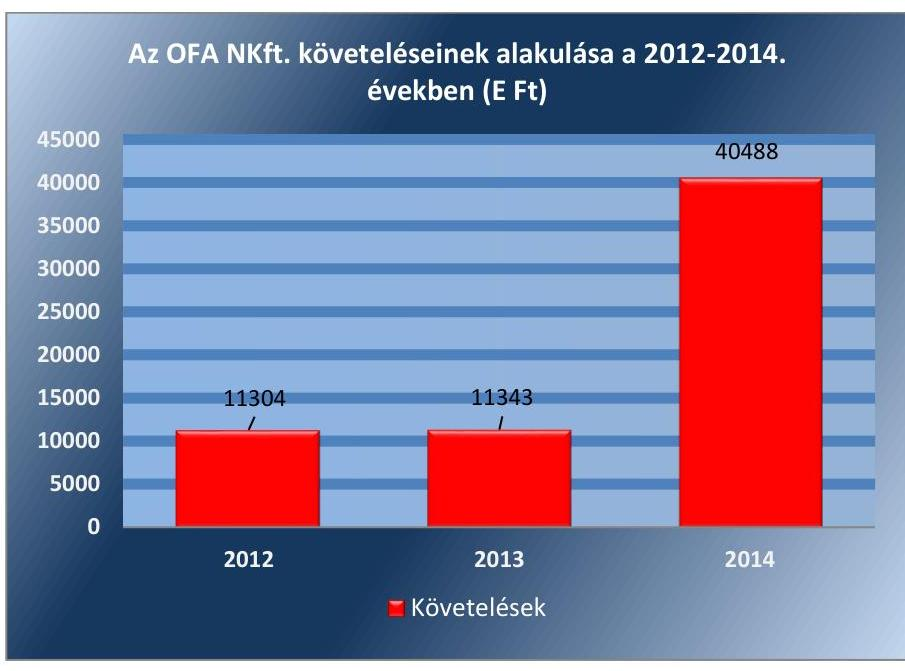

Forrás: OFA NKft. egyszerúsített éves beszámolói
A 2014. évi 40,5 MFt követelés összegét a 12,6 MFt. összegű, a DIFO NKft-nek nyújtott tagi kölcsön, az iroda bérleti díjra, a vevőnek nyújtott 8,4 M Ft összegű előleg, továbbá a 17,5 M Ft összegben kimutatott, vevőtől kapott előleg téves elszámolásával kapcsolatos tételek eredményezték. Hátralékos követelésállománnyal az OFA NKft az ellenőrzött időszakban nem rendelkezett, követelés behajtására nem került sor.

A jogelődtől átvett, jogi útra terelt követelések 2014. év végi értéke 192,5 MFt volt, melyet az OFA NKft. a Számv. tv. előírásainak megfelelően mérlegen kívüli tételként tartott nyilván. A behajthatatlan követelések értéke az ellenőrzött időszakban folyamatosan csökkent, a beszámoló behajthatatlansági nyilatkozata alapján a könyvekből kivezetésre került.

---

# 4. A vagyonnal való gazdálkodás, valamint a vagyonváltozást eredményező döntések megfeleltek-e a jogszabályi és tulajdonosi előírásoknak? 

Összegző megállapítás

Az OFA NKft. vagyongazdálkodási tevékenysége a jogszabályi előírásoknak - a vagyon elkülönítési kötelezettség megsértésére és a számviteli elszámolási problémákra figyelemmel részben felelt meg. Az NGM vagyonváltozást eredményező döntései a közalapítványi vagyonátadás, valamint a tőkeemelés szabálytalansága miatt nem feleltek meg a jogszabályi előírásoknak.
4.1. számú megállapítás

Az OFA NKft. a jogszabályi rendelkezések és a belső szabályzatok előírásainak részben megfelelően végezte vagyongazdálkodási tevékenységét, mert befektetési szabályzattal a 2012. évben nem rendelkezett és az ingatlan értékesítéséből származó bevétel elkülönítését nem biztosította.

A VAGYONGAZDÁLKODÁS során az OFA NKft. vagyona a Számv.tv. 11. § (5) bekezdése alapján első üzleti évnek tekintendő előtársasági időszak 0,5 M Ft záró értékéhez képest az ellenőrzött időszak végére 22636,0 M Ft-ra emelkedett. Az OFA NKft. vagyona a - jogelőd OFA Közalapítvány vagyonának átvételét magába foglaló - 2012. évhez viszonyítva a 2014.év végére 4,94-szeresére nőtt. A befektetett eszközök a 2012. évhez képest a 2014. évre 7,17\%-os növekedést mutattak. Az OFA NKft vagyonának változását a II. sz. melléklet tartalmazza.

A tárgyi eszköz állomány 39,2\%-os csökkenésének nagy részét az OFA NKft. 1037 Budapest, Bokor u. 9-11. szám alatt iroda és gépkocsibeálló együttes értékesítése eredményezte. Az NGM a 2/2013. számú Alapítói határozatban előírta az értékesítésből származó - az ellenőrzött időszak végén is rendelkezésre álló - bevétel elkülönített nyilvántartását, aminek az OFA NKft. nem tett eleget, mert sem az eredménytartalék főkönyvi számlán belül nem különítette el, sem a mérlegegyeztető leltárakban nem tüntette fel azt.

A befektetett pénzügyi eszközökön belül a Számv. tv. 3. § (2) bekezdés 7. pontja szerinti kapcsolt vállalkozásaiban meglévő részesedését az OFA NKft. az egyéb részesedések között mutatta ki a főkönyvi nyilvántartásában.

A Számv. tv. 30. § (1) bekezdésben meghatározottaknak megfelelően a forgóeszközökön belül a forgatási célú hitelviszonyt megtestesítő értékpapírok között kerültek kimutatásra a Diszkont Kincstárjegyek, amelynek állománya a rendelkezésre álló átmenetileg szabad pénzeszközök függvényében változott. Az OFA NKft. az Ectv. 2. § 3. pont szerinti befektetési tevékenységét 2013. február 12-ig nem az Ectv. 45. § előírásai szerint végezte, mivel szabályzatkészítési kötelezettségének addig nem tett eleget. A Befektetési szabályzatot ${ }^{23}$ az NGM 2013. február 12-án fogadta el. Az

---

OFA NKft. által a szabad pénzeszközeinek elhelyezésére megválasztott befektetési forma, a Diszkont Kincstárjegyek vásárlása, megfelelt a Befektetési szabályzat 3.1. pont előírásának.

Az OFA NKft. a 2013-2014. években vállalkozási tevékenységet is folytatott. Az OFA NKft. nem minősül a Számv. tv. 3. § 4. pontja szerinti egyéb szervezetnek, így a 224/2000. (XII. 19.) Korm. rendeletben ${ }^{24}$ előírtak rá nem vonatkoznak. Saját döntése alapján azonban elkészítette az egyéb szervezetekre vonatkozó 5. számú melléklet szerinti egyszerűsített éves beszámoló eredmény-kimutatását, melyben a közhasznú és vállalkozási tevékenység eredményét elkülönítetten mutatta be. A Számv. tv. 88. §ának (1) bekezdésének előírása ellenére a 2013-2014 évek kiegészítő mellékletei azonban a vállalkozási eredményre vonatkozó információt nem tartalmaztak. A 2013. évi beszámolóban 80,8 M Ft vállalkozási eredményt mutattak ki, amelynek eredménytartalékba való átvezetése a Számv. tv. 37. § (1) bekezdés a) pontja szerint megtörtént, de az OFA NKft. Számlakeretében - 413-Eredménytartalék-Vállalkozási - előírtak ellenére a közhasznú eredménytartalék főkönyvi számlán számolta el a vállalkozási eredménytartalék helyett.

Az OFA NKft. vagyonának megoszlását a III. számú melléklet tartalmazza. Az OFA NKft. vagyona a 2013. évről 2014. évre 106,2\%-kal, 11,7 Mrd Ft-tal nőtt. A vagyonnövekedés legfőbb oka az előfinanszírozott pályázati programok keretében kapott támogatások miatt a pénzeszközök állományának növekedése volt. A 2012. évről a 2014. évre a pénzeszközök és értékpapírok együttes aránya az eszközökön belül 72,7\%-ról 95,7 \%-ra emelkedett, egymáshoz viszonyított arányuk a befektetési tevékenység függvényében változott.

# AZ IMMATERIÁLIS JAVAK ÉS TÁRGYI ESZKÖZÖK 

állagmegóvását az OFA NKft. a szoftverek és a gépjárművek karbantartásával biztosította, amelyhez kapcsolódó költségeit a Számv. tv. előírásainak megfelelően az igénybe vett szolgáltatások között számolta el. Az OFA NKft.-nek a Vtv ${ }^{25} .27 . \S$ (7) bekezdésében előírt visszapótlási kötelezettsége - vagyonkezelt eszközök hiányában - nem állt fenn. A közhasznú feladatellátás érdekében 168,2 M Ft mértékű tárgyi eszköz beszerzésre került sor, ami 74,4 M Ft-tal meghaladta az ellenőrzött időszakban elszámolt értékcsökkenés összegét. A vagyon gyarapítása céljából az ellenőrzött években az OFA NKft. a szabad pénzeszközeit az Áht. 2 79. § (3) bekezdés előírása alapján MÁK ${ }^{26}$ által forgalmazott állampapírokba fektette.

Az OFA NKft. saját tőke/jegyzett tőke aránya - nem a gazdálkodással összefüggésben - csökkent. A 2014. évi tőkeemelés végrehajtását a 2014. március 15-én hatályba lépett Ptk. 2 3:161. § (4) bekezdésében előírtak indokolták, amely alapján az OFA NKft. jegyzett tőkéje 0,5 M Ft-ról 3,0 M Ftra emelkedett. A jogelőd OFA Közalapítvány vagyonának - a 2006. évi LXV. törvény 2. § (2) bekezdése szerinti - apportként való átadása esetén a tőkeemelésre nem lett volna szükség.

Az OFA NKft a Számviteli Politika 6.1.3 pontjában foglaltakkal ellentétben lekötött tartalék nem képzett, ilyen jellegű kötelezettsége nem állt fenn.

---

### 4.2. számú megállapítás

Az OFA NKft. vagyonváltozást eredményező döntéseinek előkészítése és megalapozása megfelelő volt, 2012-ben azonban a közbeszerzési határt figyelmen kívül hagyva, közbeszerzési eljárás nélkül kötöttek szerződést. A szabálytalanságot, annak felismerését követően a szerződés 2013. évi felmondásával megszüntették.

Az alapító NGM döntéshozatalban való szerepének szabályozását az Alapító Okirat $_{1,2,3}$, valamint az SZMSZ $_{1,2}$ tartalmazták, meghatározva a véleményezési és döntési jogkörök gyakorlásának módját. Az OFA NKft. az alapítói döntés kérésének eljárásrendje keretében szabályozta az eseti döntésekre vonatkozóan az előterjesztés folyamatát, amely kiterjedt a vagyongazdálkodás vonatkozásában meghozott döntésekre is. Az Alapító Okirat ${ }_{1,2,3}$-ban, továbbá az SZMSZ $_{1,2}$-ben foglaltaknak megfelelően az éves beruházási tervek az üzleti terv részeként kerültek előterjesztésre az NGM részére, amelyet előzetesen az FB írásban véleményezett. Az NGM az alapítói határozatait az FB véleményét figyelembe véve hozta meg.

A KÖZBESZERZÉSI KÖTELEZETTSÉG betartása részben volt megfelelő az OFA NKft.-nél. Az OFA NKft. a Kbt. ${ }^{27}$ 6. § (1) bekezdés c) pontja szerinti ajánlatkérőnek minősült. Az informatikai rendszerek karbantartása tárgyában két esetben - a Kbt. 140. § (2) bekezdés a) pont szerinti elévülési határidőn kívül eső időpontban - 2012. május 8 -án kötött határozatlan idejű szerződések esetében nem vették figyelembe a közbeszerzési érték meghatározására vonatkozó Kbt. 12. § b) szerinti előírásokat és közbeszerzési eljárást nem folytattak le. Az OFA NKft. megállapította a szerződés keretében kifizetett díjak Kvtv. 1 70. § (1) bekezdés d) pontja szerinti értékhatáron való - 0,4 M Ft összegű - túllépést és a 2013. évben intézkedett a szerződések megszüntetéséről.
4.3. számú megállapítás

Az NGM vagyonváltozást eredményező döntései a 2014. évi szabálytalan tőkeemelés, valamint a 2012. évi Közalapítványi vagyonátadás miatt nem feleltek meg a jogszabályi előírásoknak.

## A VAGYONVÁLTOZÁST EREDMÉNYEZŐ DÖNTÉ-

SEKET az NGM az Alapítói határozatokon, az OFA NKft. üzleti terveinek, valamint az éves beszámolóknak a jóváhagyásán keresztül hozta. Az egyszerűsített éves beszámolókat és a közhasznúsági mellékletet, az Alapító Okirat $_{1,2,3}$-nak megfelelően jóváhagyta az NGM, azonban két esetben a Számv. tv. 153. § (1) bekezdésében foglaltakat figyelmen kívül hagyva a közzétételt követő időpontban került sor az NGM döntésére. Az előtársasági időszak beszámolója 2012. május 2-án került közzétételre, az NGM az elfogadásra vonatkozó döntését azonban csak a közzétételt követő időpontban, 2012. május 23-án hozta meg. A 2012. évi beszámolót az OFA NKft. határidőben 2013. május 30-án közzétette, de az NGM csak ezt követően, 2013. június 1-én hagyta azt jóvá.

A vagyonmegőrzést szolgáló előírásokat az Alapító Okirat $_{1,2,3}$ tartalmazta. Ennek keretében az alapító szabályozta a döntési jogköröket, valamint előírt üzleti terv és befektetési szabályzat készítési kötelezettséget.

Az ellenőrzött időszakban az OFA NKft. ingatlanának értékesítése az FB határozatának figyelembe vételével és Alapítói Határozat alapján - pályáztatás, illetve versenyeztetés nélkül - szabályszerűen történt, mivel az nem

---

képezte a nemzeti vagyon részét, így az Nvtv. előírásai nem vonatkoztathatók rá.

A TULAJ DONOSI DÖNTÉST IGÉNYLŐ esetekben a dön-tés-előkészítés és az információszolgáltatás belső szabályozás (eljárásrendek) alapján történt és megfelelő alapot biztosított a döntéshez, ennek ellenére az NGM több esetben késedelmesen hozta meg a Gt. 141. § (2) bekezdés szerinti alapítói döntését. Az OFA Közalapítvány vagyona az 1362/2011. (XI. 8.) Korm. határozat 2. b) pontjában előírtaknak megfelelően a bírósági nyilvántartásból való törlés napjával azonos fordulónapon, 2012. május 8-án került az OFA NKft.-nél nyilvántartásba vételre, az Alapító Okirat1 szerinti alapítói döntéshozatalra azonban késedelmesen, utólagos jóváhagyás formájában 2012. szeptember 23-án került sor.

A törzstőke megemelése az OFA NKft. Alapító Okiratának ${ }_{1}$ 2014. május 30-ai módosításának keretében - az MNV Zrt. és az NFM ${ }^{28}$ hozzájárulásának hiányában - történt. Az NGM és MNV Zrt. között létrejött Megbízási szerződés 4.2. pontjának d) alpontja alapján a törzstőke felemeléséhez az MNV Zrt. jóváhagyó nyilatkozata szükséges, amelyet az MNV Zrt. az OFA NKft. Alapító Okiratának ${ }_{3}$ módosítását követően, 2014. június 16-án kiadmányozott. Az Áht. ${ }_{2}$ 45. (2) bekezdés alapján az NGM az állami vagyon felügyeletéért felelős miniszter jóváhagyásával hajthatott végre tőkeemelést az OFA NKft.-nél, amely előírás alapján a nemzeti fejlesztési miniszter 2014. június 26-án megadta hozzájáruló nyilatkozatát. A Megbízási szerződés 4.2. pontja alapján az NGM saját forrásából 2014. június 30-án került sor a szükséges hozzájárulásokat követően a tényleges tőkeemelés végrehajtására.

Az NGM az OFA NKft-vel megkötött NGM/2947-4 (2012), NGM/9299/3/2013, NGM/8687/2/2014. iktatószámú Támogatási szerződései nem egyértelmú megfogalmazást tartalmaztak, mert a szerződésekben a támogatások múködési célú felhasználását írták elő a „közhasznú tevékenység végrehajtásához szükséges múködési költségek fedezetére" megfogalmazással, míg a szerződések 1. számú mellékletét képező költségtervekben felhalmozási célú kiadások is elfogadásra kerültek. Az NGM 2013. évi beszámolójának Kiegészítő melléklete alapján a részben felhalmozási célú támogatás-felhasználás ellenére az OFA NKft. 2013. évi támogatása az Áht. ${ }^{29} 6 . \S$ (2) bekezdés előírása ellenére a múködési támogatások között került elszámolásra.

---

# 5. Az OFA NKft. a szabályszerű vagyongazdálkodás érdekében teljesítette-e beszámolási, adatszolgáltatási kötelezettségét, ki-épített-e, illetve múködtetett-e információs rendszert? 

Összegző megállapítás

Az OFA NKft. beszámoló készítési kötelezettségének eleget tett, azok azonban - a szabálytalan közalapítványi vagyonátadás miatt - nem feleltek meg a jogszabályi előírásoknak. Az információs rendszert az NGM elvárásainak megfelelően kialakították.
5.1. számú megállapítás

Az egyszerűsített éves beszámolókat elkészítették, azonban azok nem feleltek meg a Számv. tv. előírásainak, mert nem a valós vagyoni állapotot tükrözték. A könyvvizsgáló a beszámolókat - a számviteli szabálytalanság ellenére - hitelesítő záradékkal látta el, az FB a beszámolókra vonatkozó írásbeli jelentéstételi kötelezettségét nem teljesítette.

Az OFA NKft. számára az NGM a kizárólagos és az egyéb döntéshozatalához szükséges adatszolgáltatásokat a Számv. tv. és a Gt. rendelkezéseivel összhangban az Alapító Okirat ${ }_{1,2,3}$-ban rögzítette, valamint az SZMSZ ${ }_{1,2}$-ben rendelkezett a döntések jóváhagyásának menetéről és tartalmi elemeiről, erre vonatkozóan szabályzatkészítési kötelezettséget nem írt elő.

EGYSZERŰSÍTETT ÉVES BESZÁMOLÓIT az OFA NKft. a Számv. tv. előírásainak megfelelő tagolással és részletezettséggel, határidőben elkészítette, azonban az a feltárt hiányosságokra tekintettel nem nyújtott a Számv. tv. 4. § (2) bekezdésében előírt megbízható és valós összképet.

Az OFA NKft. az ellenőrzött időszakban elkészítette az Ectv 29. § (6)-(7) bekezdéseiben előírt tartalommal a közhasznúsági mellékletét, illetve a 2012. január 1-jén hatályon kívül helyezett Kszt. 19. § szerinti közhasznúsági jelentést is.

Az OFA NKft. a Számv. tv. kiegészítő melléklet tartalmára vonatkozó előírásainak részben tett eleget. Az ellenőrzött időszak egyszerűsített éves beszámoló kiegészítő mellékletében az alkalmazott értékcsökkenési leírási kulcsokat szerepeltették, az értékcsökkenés elszámolásának Számviteli Politikában meghatározott módszerét, elszámolásának gyakoriságát a Számv. tv. 88. § (4) bekezdés előírása ellenére azonban nem mutatták be.

AZ FB minden évben az Alapító Okirat előírásai szerint határozatban elfogadta az OFA NKft. egyszerűsített éves beszámolóit, azonban a Gt. 35. § (3) bekezdése, illetve a $\mathrm{Ptk}_{2}$ 3:120. § (2) bekezdése, valamint az FB ügyrend ${ }^{30}$ előírása ellenére az egyes beszámolókra vonatkozó írásbeli jelentéskészítési kötelezettségének nem tett eleget.

Az OFA NKft. az Alapító Okirata ${ }_{1,2,3}$ rendelkezése alapján megbízási szerződéssel könyvvizsgálót alkalmazott.

---

A KÖNYVVIZSGÁLÓ az ellenőrzött időszakban az Alapító Okiratban előírtak szerint ellenőrizte és véleményezte az OFA NKft. egyszerúsített éves beszámolóit és a közhasznúsági mellékleteit, és - a Számv. tv. 156. § (5) bekezdésének megfelelő tartalommal - elkészítette könyvvizsgálói jelentését. A könyvvizsgáló az OFA NKft. beszámolóit az ellenőrzött időszak minden évében a Számv. tv 3. § (13) bekezdés 1) pontjának megfelelő hitelesítő záradékkal látta el, és nem tárta fel az OFA Közalapítványtól 2012. évben átvett vagyon helytelen elszámolásának a 20122014. évi beszámolókra gyakorolt hatását.

# A KÖZÉRDEKÚ ADATOK MEGISMERÉSÉRE IRÁ- 

NYULÓ IGÉNYEK teljesítésének rendjét rögzítő szabályzattal az OFA NKft. az ellenőrzött időszakban az Avtv*. és az Info ${ }^{31}$ tv. előírásainak megfelelően rendelkezett.

## ELEKTRONIKUS KÖZZÉTÉTELI KÖTELEZETTSÉ-

GÉNEK az ellenőrzött időszakban az Info tv. 33. § (1) bekezdésében foglaltak szerint nem tett eleget, mert hiányoztak az Info tv. 1. számú melléklete I. részében előírt, a közfeladatot ellátó szerv szervezeti felépítése szervezeti egységek megjelölésével, az egyes szervezeti egységek feladatai, a közfeladatot ellátó szerv vezetőinek és az egyes szervezeti egységek vezetőinek neve, beosztása, elérhetősége. Hiányoztak továbbá a II. részben előírt dokumentumok közül az SZMSZ, valamint a közérdekú adatokkal kapcsolatos kötelező statisztikai adatok közzététele. A III. rész gazdálkodási adatok között nem kerültek feltüntetésre az 5 millió forintot elérő, vagy az azt meghaladó szerződések, továbbá a közbeszerzési dokumentumok sem.

### 5.2. számú megállapítás

Az információs rendszert kialakították, az NGM által előírt adatszolgáltatási kötelezettségüket teljesítették.

Az NGM az OFA NKft. Alapító Okirat ${ }_{1,2,3}$-ban rögzítette az adatszolgáltatási és beszámolási kötelezettséget. Az Alapító Okirat ${ }_{1,2,3}$ rendelkezett az FB felé történő, a gazdálkodási tevékenységre vonatkozó negyedéves beszámolási kötelezettségről, melynek az OFA NKft. az ellenőrzött időszakban részben tett eleget.

A központi költségvetésből kapott múködési támogatás felhasználására vonatkozó szerződésben előírtaknak megfelelően az OFA NKft. évente kétszer, augusztus 30 -ai és március 15 -ei határidővel elkészítette a támogatás felhasználásáról szóló pénzügyi beszámolóját és megküldte az NGM részére. Az OFA NKft. előterjesztésben tájékoztatta az NGM-et a közalapítványi vagyonból származó ingatlan értékesítésekor az ingatlan körülményeiről, az értékbecslésről, a vételi árajánlatról, továbbá csatolta az FB véleményét.

Az OFA NKft. 2013-tól belső ellenőrzési rendszert múködtetett. A belső ellenőr az FB által jóváhagyott munkaterve szerint, az ügyvezető megbízása alapján vizsgálta a múködést, a belső ellenőrzési kézikönyvben foglaltak alapján végezte feladatait. A belső ellenőr az elvégzett belső ellenőrzésekről éves beszámolót készített, amit az FB megtárgyalt és elfogadott.

[^0]
[^0]:    * Hatályos 2011. december 31-ig

---

# 6. A kormányzati szektor hiányára és az államadósságra befolyást gyakorló elemek a jogszabályi előírásoknak megfelel-tek-e? 

Összegző megállapítás

Az OFA NKft. adósságot keletkeztető ügyletet nem kötött. A kormányzati szektor hiányára befolyást gyakorló bevételeket és ráfordításokat szabályszerűen számolta el.
6.1. számú megállapítás

Az OFA NKft. az ellenőrzött időszakban adósságot keletkeztető ügyletet nem kötött.

Az OFA NKft. az ellenőrzött időszakban a Stabilitási tv. ${ }^{32}$ 3. § (1) bekezdése szerinti államadósságot keletkeztető ügyletet nem kötött, nem volt a Stabilitási tv. 9. § (1) bekezdés és a 353/2011. Korm. rendelet ${ }^{33}$ 11. § szerinti kérelem benyújtási kötelezettsége.
6.2. számú megállapítás

A kormányzati szektor hiányára befolyást gyakorló bevételek és ráfordítások elszámolása szabályszerű volt az ellenőrzött időszakban. Osztalékfizetésre nem került sor.

A kormányzati szektor hiányára befolyást gyakorló bevételeket és ráfordításokat az OFA NKft. az ellenőrzött időszakban szabályszerűen számolta el.

Az egyéb bevételeket, a pénzügyi műveletek bevételeit és a rendkívüli bevételeket a Számv. tv. előírásaival összhangban, szabályszerűen számolták el.

A személyi jellegű ráfordításokat elszámolása szabályszerű volt, a bérköltségek elszámolásához a hatályos munkaszerződések rendelkezésre álltak, minden esetben a munkában töltött időt jelenléti ívekkel igazolták.

Az egyéb ráfordítások, pénzügyi műveletek ráfordításai, rendkívüli ráfordítások könyvelési tételeit bizonylatokkal megfelelően alátámasztották, elszámolásuk megfelelt a Számv. tv. előírásainak.

Az OFA NKft. az ellenőrzött időszakban a Gt., valamint a Ctv. ${ }^{34}$ és az Alapító Okirat ${ }_{1,2,3}$ 3.3. pontjának megfelelően tevékenységéből származó nyereségét nem osztotta fel, azt csak létesítő okiratában rögzített közhasznú tevékenyégére fordította.

---

# JAVASLATOK 

Az ÁSZ tv. 33. § (1) bekezdésében foglaltak értelmében az ellenőrzött szervezet vezetője köteles a jelentésben foglalt megállapításokhoz kapcsolódó intézkedési tervet összeállítani és azt a jelentés kézhezvételétől számított 30 napon belül az ÁSZ részére megküldeni. Amennyiben az ellenőrzött szervezet vezetője nem küldi meg határidőben az intézkedési tervet, vagy továbbra sem elfogadható intézkedési tervet küld, az Állami Számvevőszék elnöke az ÁSZ tv. 33. § (3) bekezdése a) és b) pontjaiban foglaltakat érvényesítheti.

Javaslataink célja az OFA NKft. gazdálkodása szabályozottságának erősítése annak érdekében, hogy a szabályozási környezet és a gazdálkodási gyakorlat megfelelően tudja támogatni az átlátható múködést.

## Az OFA NKft. ügyvezetőjének

1. A számviteli szabályozása jogszabályoknak megfelelő kialakítása érdekében:
a) Intézkedjen a Számlarend módosításáról, hogy az tartalmazza a számlák tartalmát, a számlákat érintő gazdasági eseményeket, a számlák értéke növekedésének és csökkenésének jogcímeit, a fökönyvi számla és az analitikus nyilvántartás kapcsolatát, továbbá a Számlarendben foglaltakat alátámasztó bizonylati rendet.
(2.1. sz. megállapítás 3. bekezdése alapján)
b) Intézkedjen a jogszabályi változások számviteli politikán történő átvezetéséről.
(2.1. sz. megállapítás 4. bekezdés 2. mondata alapján)
2. A gazdálkodási gyakorlat és az átlátható müködés javitása érdekében:
a) Tegyen intézkedéseket, hogy a jövőben a kisértékü tárgyi eszközbeszerzések a Számviteli Politikában elöirtaknak megfelelően kerüljenek elszámolására.
(3.1. sz. megállapítás 6. bekezdése alapján)
b) Tegye meg a szükséges intézkedéseket az iroda és a gépkocsibeálló együttes értékesitéséből származó bevételnek az NGM elöirás szerinti elkülönített nyilvántartására és a mérlegegyeztető leltárakban való feltüntetése érdekében.
(4.1. sz. megállapítás 2. bekezdése alapján)

---

c) Gondoskodjon a vállalkozási eredmény Számv. tv. előírása alapján vállalkozási eredménytartalékba történő átvezetéséről.
(4.1. sz. megállapítás 5. bekezdés 5. mondata alapján)
d) Gondoskodjon a kiegészítő melléklet Számv. tv. előírásai szerinti kiegészítésére, továbbá a közhasznúsági melléklet kiegészítésére a vállalkozási tevékenység értékére vonatkozóan.
(5.1. sz. megállapítás 4. bekezdése alapján)
e) Intézkedjen a közzétételei kötelezettség jogszabálynak megfelelő teljesítéséről.
(5.1. sz. megállapítás 9. bekezdése alapján)

# Javaslataink célja az NGM szabályszerű tulajdonosi joggyakorlásának elősegítése, továbbá kontrolljainak erősítése. 

## Nemzetgazdasági Miniszternek

1. Intézkedjen a részesedések feletti tulajdonosi joggyakorlásra irányuló megbizási szerződés Nvtv. szerinti aktualizálásáról.
(1.1. sz. megállapítás 3. bekezdés 2. mondata alapján)
2. Intézkedjen a beszámolók határidőben történő jóváhagyásáról.
(4.3. sz. megállapítás 1. bekezdése alapján)
3. Intézkedjen, hogy az FB az éves beszámolókra vonatkozóan írásbeli jelentéskészítési kötelezettségének eleget tegyen.
(5.1. sz. megállapítás 5. bekezdése alapján)

---

.

---

# MELLÉKLETEK 

## I. SZ. MELLÉKLET: ÉRTELMEZŐ SZÓTÁR

Adósságot keletkeztető ügylet
„Adósságot keletkeztető ügylet és annak értéke:
a) hitel, kölcsön felvétele, átvállalása a folyósítás, átvállalás napjától a végtörlesztés napjáig, és annak aktuális tőketartozása,
b) a számvitelről szóló törvény szerinti hitelviszonyt megtestesítő értékpapír forgalomba hozatala a forgalomba hozatal napjától a beváltás napjáig, kamatozó értékpapír esetén annak névértéke, egyéb értékpapír esetén annak vételára,
c) váltó kibocsátása a kibocsátás napjától a beváltás napjáig, és annak a váltóval kiváltott kötelezettséggel megegyező, kamatot nem tartalmazó értéke,
d) az Szt. szerint pénzügyi lízing lízingbevevői félként történő megkötése a lízing futamideje alatt, és a lízingszerződésben kikötött tőkerész hátralévő összege,
e) a visszavásárlási kötelezettség kikötésével megkötött adásvételi szerződés eladói félként történő megkötése - ideértve az Szt. szerinti valódi penziós és óvadéki repóügyleteket is - a visszavásárlásig, és a kikötött visszavásárlási ár,
f) a szerződésben kapott, legalább háromszázhatvanöt nap időtartamú halasztott fizetés, részletfizetés, és a még ki nem fizetett ellenérték,
g) hitelintézetek által, származékos műveletek különbözeteként az Államadósság Kezelő Központ Zrt.-nél (a továbbiakban: ÁKK Zrt.) elhelyezett fedezeti betétek, és azok összege.
Forrás: Stabilitási tv. 3. § (1) bekezdése
2010. június 17-től
a) Az állam tulajdonában lévő dolog, valamint a dolog módjára hasznosítható természeti erő,
b) Az a) pont hatálya alá nem tartozó mindazon vagyon, amely vonatkozásában törvény az állam kizárólagos tulajdonjogát nevesíti,
c) az állam tulajdonában lévő tagsági jogviszonyt megtestesítő értékpapír, illetve az államot megillető egyéb társasági részesedés,
d) az államot megillető olyan immateriális, vagyoni értékkel rendelkező jogosultság, amelyet jogszabály vagyoni értékű jogként nevesít.
Forrás: Vtv. 1. § (2) bekezdése
2012. november 10-től az állami vagyon fogalma kiegészül a következő ponttal:
a) az állam tulajdonában lévő pénzügyi eszközök

Forrás: Vtv. 1. § (2) bekezdése
2010. január 01 - 2011. december 31. között:

Az állami vagyont az MNV Zrt. maga kezeli, vagy szerződés - így különösen bérlet, haszonbérlet, szerződésen alapuló haszonélvezet, vagyonkezelés, megbízás alapján központi költségvetési szervnek, természetes vagy jogi személynek, illetőleg jogi személyiséggel nem rendelkező gazdasági társaságnak hasznosításra átengedi.
Vtv. 23. § (1) bekezdése
2012. január 1-jétől:

Az állami vagyont az MNV Zrt. maga kezeli, vagy szerződés - így különösen bérlet, haszonbérlet, megbízás - alapján központi költségvetési szervnek, természetes vagy jogi személynek, vagy jogi személyiséggel nem rendelkező gazdálkodó szer-

---

vezetnek hasznosításra átengedi. Az állami vagyonra vonatkozóan az MNV Zrt. kizárólag az Nvtv-ben meghatározott személyekkel köthet vagyonkezelési szerződést.
Forrás: Vtv. 23. § (1), 27. § (1)

# 2013. június 28-ától: 

Az állami vagyonnal az MNV Zrt. maga gazdálkodik, vagy szerződés - így különösen bérlet, haszonbérlet, megbízás - alapján központi költségvetési szervnek, természetes vagy jogi személynek, vagy jogi személyiséggel nem rendelkező gazdálkodó szervezetnek hasznosításra átengedi, illetőleg vagyonkezelésbe, haszonélvezetbe adja. Az állami vagyonra vonatkozóan az MNV Zrt. kizárólag az Nvtv-ben meghatározott személyekkel köthet vagyonkezelési szerződést.
Forrás: Vtv. 23. § (1), 27. § (1)
Állami vagyon értékesítése
Gazdálkodó szervezet

Állami vagyon tulajdonjogának bármely jogcímen történő, visszterhes átruházása. Forrás: $\mathrm{Vhr}^{35}$. 1. § (7) d) pont)
2013. június 30-ig gazdálkodó szervezet:

Az állami vállalat, az egyéb állami gazdálkodó szerv, a szövetkezet, a lakásszövetkezet, az európai szövetkezet, a gazdasági társaság, az európai részvény-társaság, az egyesülés, az európai gazdasági egyesülés, az európai területi együttmüködési csoportosulás, az egyes jogi személyek vállalata, a leányvállalat, a vízgazdálkodási társulat, az erdőbirtokossági társulat, a végrehajtói iroda, az egyéni cég, továbbá az egyéni vállalkozó.
Forrás: Ptk1. 685. § c) pontja
2013. július 1-jétől gazdálkodó szervezet:

Az állami vállalat, az egyéb állami gazdálkodó szerv, a szövetkezet, a lakásszövetkezet, az európai szövetkezet, a gazdasági társaság, az európai részvénytársaság, az egyesülés, az európai gazdasági egyesülés, az európai területi együttműködési csoportosulás, az egyes jogi személyek vállalata, a leányvállalat, a vízgazdálkodási társulat, az erdőbirtokossági társulat, a végrehajtói iroda, az egyéni cég, továbbá az egyéni vállalkozó. Az állam, a helyi önkormányzat, a költségvetési szerv, az egyesület, a köztestület, valamint az alapítvány gazdálkodó tevékenységével összefüggő polgári jogi kapcsolataira is a gazdálkodó szervezetre vonatkozó rendelkezéseket kell alkalmazni, kivéve, ha a törvény e jogi személyekre eltérő rendelkezést tartalmaz; a 292/A-292/B. §, 301/A-301/B. §, 405. § (1) bekezdés, valamint a 407/A. § (1) bekezdés tekintetében nem minősül gazdálkodó szervezetnek az, aki a közbeszerzésekről szóló törvény értelmében ajánlatkérő (szerződő hatóság).
Forrás: Ptk1. 685. § c) pontja
2014. március 15-től gazdálkodó szervezet:

A gazdasági társaság, az európai részvénytársaság, az egyesülés, az európai gazdasági egyesülés, az európai területi együttmüködési csoportosulás, a szövetkezet, a lakásszövetkezet, az európai szövetkezet, a vízgazdálkodási társulat, az erdőbirtokossági társulat, az állami vállalat, az egyéb állami gazdálkodó szerv, az egyes jogi személyek vállalata, a közös vállalat, a végrehajtói iroda, a közjegyzői iroda, az ügyvédi iroda, a szabadalmi ügyvivői iroda, az önkéntes kölcsönös biztosító pénztár, a magánnyugdíjpénztár, az egyéni cég, továbbá az egyéni vállalkozó. Az állam, a helyi önkormányzat, a költségvetési szerv, az egyesület, a köztestület, valamint az alapítvány gazdálkodó tevékenységével összefüggő polgári jogi kapcsolataira is a gazdálkodó szervezetre vonatkozó rendelkezéseket kell alkalmazni. Forrás: Ppt. 396. §

---

Kormányzati szektorba sorolt egyéb szervezet

Meghatározó befolyás

Minősített többséget biztosító részesedés

Nemzetgazdasági szempontból kiemelt jelentőségű nemzeti vagyon körébe tartozó társaságok
Nemzeti vagyon

Az a szervezet, amely az Áht. alapján nem része az államháztartásnak, azonban az Európai Közösséget létrehozó szerződéshez csatolt, a túlzott hiány esetén követendő eljárásról szóló jegyzőkönyv alkalmazásáról szóló 2009. május 25-i 479/2009/EK rendelet szerint a kormányzati szektorba tartozik. A nemzetgazdasági miniszter 2013. június 26-án megjelent Közleményben tette közé ezen szervezetek listáját.
2014. március 14-ig: A befolyással rendelkező akkor rendelkezik egy jogi személyben meghatározó befolyással, ha annak tagja, illetve részvényese és
a) jogosult e jogi személy vezető tisztségviselői vagy felügyelőbizottsága tagjai többségének megválasztására, illetve visszahívására, vagy
b) a jogi személy más tagjaival, illetve részvényeseivel kötött megállapodás alapján egyedül rendelkezik a szavazatok több mint ötven százalékával.
A meghatározó befolyás akkor is fennáll, ha a befolyással rendelkező számára az előzőek szerinti jogosultságok közvetett módon biztosítottak. A befolyással rendelkezőnek egy jogi személyben a szavazatok több mint ötven százalékával közvetett módon való rendelkezése vagy egy jogi személyben közvetetten fennálló meghatározó befolyása megállapítása során a jogi személyben szavazati joggal rendelkező más jogi személyt (köztes vállalkozást) megillető szavazatokat meg kell szorozni a befolyással rendelkezőnek a köztes vállalkozásban, illetve vállalkozásokban fennálló szavazatával. Ha a köztes vállalkozásban fennálló szavazatok mértéke az ötven százalékot meghaladja, akkor azt egy egészként kell figyelembe venni.
Forrás: Ptk1. 685/B. § (2)-(3) bekezdések

## 2014. március 15-től:

A befolyással rendelkező akkor rendelkezik egy jogi személyben meghatározó befolyással, ha annak tagja vagy részvényese, és
a) jogosult e jogi személy vezető tisztségviselői vagy felügyelőbizottsága tagjai többségének megválasztására, illetve visszahívására; vagy
b) a jogi személy más tagjai, illetve részvényesei a befolyással rendelkezővel kötött megállapodás alapján a befolyással rendelkezővel azonos tartalommal szavaznak, vagy a befolyással rendelkezőn keresztül gyakorolják szavazati jogukat, feltéve, hogy együtt a szavazatok több mint felével rendelkeznek.
Forrás: Ptk2. 8:2. § (2) bekezdés
A minősített befolyásszerző az ellenőrzött társaságban a szavazatok legalább háromnegyedével rendelkezik.
Forrás: 2014. március 14-ig: Gt. 52. § (2)
2014. március 15-től: Ptk2. 3:324. § (1) bekezdés

Az ÁSZ ellenőrzés szempontjából az Nvtv. 2. sz. mellékletében felsorolt társasági részesedések.
2012. január 1-jétől nemzeti vagyon:
a) az állam vagy a helyi önkormányzat kizárólagos tulajdonában álló dolgok,
b) az a) pont hatálya alá nem tartozó, állam vagy a helyi önkormányzat tulajdonában lévő dolog,
c) az állam vagy a helyi önkormányzatot tulajdonában lévő pénzügyi eszközök, továbbá az államot vagy a helyi önkormányzatot megillető társasági részesedések,
d) az államot vagy a helyi önkormányzatot megillető bármely vagyoni értékkel rendelkező jogosultság, amelyet jogszabály vagyoni értékű jogként nevesít,

---

e) Magyarország határa által körbezárt terület feletti légtér,
f) az üvegházhatású gázok kibocsátási egységeinek kereskedelméről szóló törvény szerint kibocsátási egység és légiközlekedési kibocsátási egység, valamint az ENSZ Éghajlatváltozási Keretegyezménye és annak Kiotói Jegyzőkönyve végrehajtási keretrendszeréről szóló törvény szerinti kiotói egység,
g) állami vagy helyi önkormányzati fenntartású közgyűjtemény (muzeális intézmény, levéltár, közgyűjteményként működő kép- és hangarchívum, valamint könyvtár) saját gyűjteményében nyilvántartott kulturális javak körébe tartozó dolog,
h) a régészeti lelet,
i) a nemzeti adatvagyon körébe tartozó állami nyilvántartások fokozottabb védelméről szóló törvény szerinti nemzeti adatvagyon.
Forrás: Nvtv. 1. § (2)
2010. június 17-től:

Az MNV Zrt. „rendszeresen ellenőrzi a vele szerződéses jogviszonyban lévő személyek, szervezetek vagy más használók állami vagyonnal való gazdálkodását, megállapításairól az MNV Zrt. Felügyelő Bizottságát, az ellenőrzött szervet, szükség esetén a minisztert és az Állami Számvevőszéket tájékoztatja".
Forrás: Vtv. 17. § d.
A Vhr. alapján „a tulajdonosi ellenőrzés célja az állami vagyonnal való gazdálkodás vizsgálata, ennek keretében a rendeltetésellenes, jogszerűtlen, szerződésellenes, vagy a tulajdonos érdekeit sértő, illetve a központi költségvetést hátrányosan érintő vagyongazdálkodási intézkedések feltárása és a jogszerű állapot helyreállítása, továbbá a vagyonnyilvántartás hitelességének, teljességének és helyességének biztosítása". Forrás: Vhr. 20. § (2)

# 2011. december 31-ig 

Az állami vagyon kezelőjét, használóját megillető jogok gyakorlását, annak szabályszerűségét, célszerűségét az MNV Zrt. - szükség szerint területi szervei útján - ellenőrzi.
Forrás: Vhr. 20. § (1)

## 2012. január 1-jétől:

Az állami vagyon kezelőjét, haszonélvezőjét, használóját megillető jogok gyakorlását, annak szabályszerűségét, célszerűségét az MNV Zrt. - szükség szerint területi szervei útján - ellenőrzi.
Forrás: Vhr. 20. § (1)
2010. június 17-től:

Az állami vagyon felett a Magyar Államot megillető tulajdonosi jogok és kötelezettségek összességét - ha törvény eltérően nem rendelkezik - az állami vagyon felügyeletéért felelős miniszter (a továbbiakban: miniszter) gyakorolja, aki e feladatát a Magyar Nemzeti Vagyonkezelő Zártkörűen Működő Részvénytársaság (a továbbiakban: MNV Zrt.), a Magyar Fejlesztési Bank, illetve a tulajdonosi joggyakorló szervezet útján látja el. A miniszter miniszteri rendeletben, a törvényben meghatározott állami vagyoni kör tekintetében, meghatározott időtartamra, a joggyakorlás egyes szabályainak meghatározásával - az őt megillető tulajdonosi jogok és kötelezettségek összességének, illetve azok meghatározott részének gyakorlóját az Áht. szerinti központi költségvetési szervek, ezek intézménye, továbbá a 100\%-ban állami tulajdonban álló gazdasági társaságok közül kijelölheti.
Forrás: Vtv. 3. § (1) és (2)

---

# 2013. június 28-ától: 

A rábízott állami vagyon felett az államot megillető tulajdonosi jogok és kötelezettségek összességét tulajdonosi joggyakorlóként:
a) ha törvény vagy miniszteri rendelet eltérően nem rendelkezik, a Magyar Nemzeti Vagyonkezelő Zártkörűen Működő Részvénytársaság (a továbbiakban: MNV Zrt.),
b) törvényben kijelölt személy vagy
c) az állami vagyon felügyeletéért felelős miniszter (a továbbiakban: miniszter) által rendeletben kijelölt személy gyakorolja.
[...] A miniszter e törvény felhatalmazása alapján - a meghatározott célok hatékonyabb elérése érdekében, miniszteri rendeletben, az ott meghatározott állami vagyoni kör tekintetében, meghatározott időtartamra - e törvény keretei között, a joggyakorlás egyes szabályainak meghatározásával - az államot megillető tulajdonosi jogok és kötelezettségek összességének, illetve azok meghatározott részének gyakorlóját az Áht. szerinti központi költségvetési szervek, ezek intézménye, továbbá a 100\%-ban állami tulajdonban álló gazdasági társaságok közül kijelölheti. Forrás: Vtv. 3. § (1) és (2)

---

II. SZ. MELLÉKLET: AZ OFA NKFT. VAGYONÁNAK VÁLTOZÁSA 2011-2014.KÖZÖTT (EZER FT, \%)

|  Megnevezés | 2012.01.13. | 2012.12.31. | 2013.12.31. | 2014.12.31. | Változás 2014.12.31./ 2012.12.31. (\%)  |
| --- | --- | --- | --- | --- | --- |
|  A. Befektetett eszközök | - | 180.829 | 111.425 | 193.796 | 7,17\%  |
|  I. IMMATERIÁLIS JAVAK | - | 27.203 | 21.698 | 74.971 | 175,59\%  |
|  Vagyoni értékú jogok | - | - | 6.711 | 70.516 | -  |
|  Szellemi termékek | - | 27.203 | 14.987 | 4.455 | 83,63\%  |
|  II. TÁRGYI ESZKÖZÖK | - | 79.898 | 10.432 | 48.566 | $-39,21 \%$  |
|  Ingatlanok és a kapcsolódó vagyoni értékú jogok | - | 75.591 | - | - | $-100,00 \%$  |
|  Múszaki berendezések, gépek, jármúvek | - | 1.368 | 1.053 | 33.383 | 2.341,13\%  |
|  Egyéb berendezések, felszerelések, jármúvek | - | 2.939 | 9.379 | 15.183 | 416,68\%  |
|  III. BEFEKTETETT PÉNZÚGYI ESZKÖZÖK | - | 73.728 | 79.295 | 70.260 | $-4,70 \%$  |
|  Egyéb tartós részesedés | - | 65.425 | 65.425 | 65.425 | 0,00\%  |
|  Egyéb tartósan adott kölcsön | - | 8.303 | 13.870 | 4.835 | $-41,77 \%$  |
|  B. Forgóeszközök | 500 | 3.343 .830 | 9.957 .913 | 21.706 .656 | 549,16\%  |
|  I. KÉSZLETEK | - | - | - | - | -  |
|  II. KÖVETELÉSEK | - | 11.304 | 11.343 | 40.488 | 258,18\%  |
|  Egyéb követelések | - | 11.304 | 11.343 | 40.488 | 258,18\%  |
|  III. ÉRTÉKPAPÍROK | - | 3.305 .801 | 2.863 .151 | 11.920 .194 | 260,58\%  |
|  Forgatási célú hitelviszonyt megt. értékpapírok | - | 3.305 .801 | 2.863 .151 | 11.920 .194 | 260,58\%  |
|  IV. PÉNZESZKÖZÖK | 500 | 26.725 | 7.083 .419 | 9.745 .974 | 36.738,56\%  |
|  Pénztár, csekkek | - | 271 | 474 | 469 | 73,35\%  |
|  Bankbetétek | 500 | 26.454 | 7.082 .945 | 9.745 .505 | 36.738,56\%  |
|  C. Aktív időbeli elhatárolások | - | 1.059 .243 | 910.459 | 735.546 | $-30,56 \%$  |
|  Bevételek aktív időbeli elhatárolása | - | 26.206 | 228.572 | 168.621 | 543,45\%  |
|  Költségek, ráfordítások aktív időbeli elhatárolása | - | 2.346 | 1.016 | 609 | $-74,06 \%$  |
|  Halasztott ráfordítások | - | 1.030 .691 | 680.871 | 566.316 | $-45,05 \%$  |
|  ESZKÖZÖK (AKTÍVÁK) ÖSSZESEN | 500 | 4.583 .902 | 10.979 .797 | 22.635 .999 | 393,82\%  |
|  D. Saját tőke | 51 | 182.804 | 397.416 | 490.678 | 168,42\%  |
|  I. JEGYZETT TÖKE | 500 | 500 | 500 | 3.000 | 500,00\%  |
|  IV. EREDMÉNYTARTALÉK | - | $-449$ | 182.304 | 396.916 | $-88.401,59 \%$  |
|  VII. MÉRLEG SZERINTI EREDMÉNY | $-449$ | 182.753 | 214.612 | 90.762 | $-50,34 \%$  |
|  F. Kötelezettségek | - | 1.084 .683 | 1.002 .764 | 965.176 | $-11,02 \%$  |
|  III. RÖVID LEJÁRATÚ KÖTELEZETTSÉGEK | 449 | 1.084 .683 | 1.002 .764 | 965.176 | $-11,02 \%$  |
|  Egyéb rövid lejáratú kötelezettségek | 449 | 1.084 .683 | 1.002 .764 | 965.176 | $-11,02 \%$  |
|  G. Passzív időbeli elhatárolások | - | 3.316 .415 | 9.579 .617 | 21.180 .145 | 538,65\%  |
|  Bevételek passzív időbeli elhatárolása | - | 800.273 | 7.569 .863 | 19.296 .257 | 2.311,21\%  |
|  Költségek, ráfordítások passzív időbeli elhatárolása | - | 3.496 | 3.121 | 4.208 | 20,38\%  |
|  Halasztott bevételek | - | 2.512 .646 | 2.006 .633 | 1.879 .680 | $-25,19 \%$  |
|  FORRÁSOK (PASSZÍVÁK) ÖSSZESEN | 500 | 4.583 .902 | 10.979 .797 | 22.635 .999 | 393,82\%  |

---

| Megnevezés | 2012.01.13. | 2012.12.31. | 2013.12.31. | 2014.12.31. | Változás 2014.12.31./ 2012.12.31. (\%) |
| :--: | :--: | :--: | :--: | :--: | :--: |
| *A. Befektetett eszközök | - | 3,94 | 1,02 | 0,86 | $-78,30$ |
| I. IMMATERIÁLIS JAVAK | - | 0,59 | 0,20 | 0,33 | $-44,19$ |
| Vagyoni értékú jogok | - | - | 0,06 | 0,31 | - |
| Szellemi termékek | - | 0,59 | 0,14 | 0,02 | $-96,68$ |
| II. TÁRGYI ESZKÖZÖK | - | 1,74 | 0,10 | 0,22 | $-87,69$ |
| Ingatlanok és a kapcsolódó vagyoni értékú jogok | - | 1,65 | - | - | - |
| Múszaki berendezések, gépek, jármúvek | - | 0,03 | 0,01 | 0,15 | 394,17 |
| Egyéb berendezések, felszerelések, jármúvek | - | 0,06 | 0,09 | 0,07 | 4,61 |
| III. BEFEKTETETT PÉNZÜGYI ESZKÖZÖK | - | 1,61 | 0,72 | 0,31 | $-80,70$ |
| Egyéb tartós részesedés | - | 1,43 | 0,60 | 0,29 | $-79,75$ |
| Egyéb tartósan adott kölcsön | - | 0,18 | 0,12 | 0,02 | $-88,21$ |
| B. Forgóeszközök | 100,00 | 72,95 | 90,69 | 95,89 | 31,46 |
| I. KÉSZLETEK | - | - | - | - | - |
| II. KÖVETELÉSEK | - | 0,25 | 0,10 | 0,18 | $-27,47$ |
| Egyéb követelések | - | 0,25 | 0,10 | 0,18 | $-27,47$ |
| III. ÉRTÉKPAPÍROK | - | 72,12 | 26,08 | 52,66 | $-26,98$ |
| Forgatási célú hitelviszonyt megt. értékpapírok | - | 72,12 | 26,08 | 52,66 | $-26,98$ |
| IV. PÉNZESZKÖZÖK | 100,00 | 0,58 | 64,51 | 43,05 | 7.284,88 |
| Pénztár, csekkek | - | 0,01 | 0,00 | 0,00 | $-64,95$ |
| Bankbetétek | 100,0 | 0,57 | 64,51 | 43,05 | 7.360,17 |
| C. Aktív időbeli elhatárolások | - | 23,11 | 8,29 | 3,25 | $-85,94$ |
| Bevételek aktív időbeli elhatárolása | - | 0,57 | 2,08 | 0,75 | 30,30 |
| Költségek, ráfordítások aktív időbeli elhatárolása | - | 0,05 | 0,01 | 0,00 | $-94,74$ |
| Halasztott ráfordítások | - | 22,49 | 6,20 | 2,50 | $-88,87$ |
| ESZKÖZÖK (AKTÍVÁK) ÖSSZESEN | 100,00 | 100,00 | 100,00 | 100,00 | 0,00 |
| D. Saját tőke | 10,20 | 3,99 | 3,63 | 2,17 | $-45,64$ |
| I. JEGYZETT TÖKE | 100,00 | 0,01 | 0,01 | 0,01 | 21,50 |
| IV. EREDMÉNYTARTALÉK | - | $-0,01$ | 1,66 | 1,76 | $-18.001,44$ |
| VII. MÉRLEG SZERINTI EREDMÉNY | $-89,80$ | 3,99 | 1,96 | 0,40 | $-89,94$ |
| F. Kötelezettségek | - | 23,66 | 9,13 | 4,26 | $-81,98$ |
| III. RÖVID LEJÁRATÚ KÖTELEZETTSÉGEK | 89,80 | 23,66 | 9,13 | 4,26 | $-81,98$ |
| Egyéb rövid lejáratú kötelezettségek | 89,80 | 23,66 | 9,13 | 4,26 | $-81,98$ |
| G. Passzív időbeli elhatárolások | - | 72,35 | 87,25 | 93,57 | 29,33 |
| Bevételek passzív időbeli elhatárolása | - | 17,46 | 68,94 | 85,25 | 388,28 |
| Költségek, ráfordítások passzív időbeli elhatárolása | - | 0,08 | 0,03 | 0,02 | $-75,63$ |
| Halasztott bevételek | - | 54,81 | 18,28 | 8,30 | $-84,85$ |
| FORRÁSOK (PASSZÍVÁK) ÖSSZESEN | 100,00 | 100,00 | 100,00 | 100,00 | 0,00 |

---

.

---

# FÜGGELÉK: ÉSZREVÉTELEK 

A jelentéstervezetet a Számvevőszék 15 napos észrevételezésre megküldte az ellenőrzött szervezet vezetőjének az ÁSZ tv. 29. §̊ (1) bekezdése előírásának megfelelően.
Az elfogadott észrevételek alapján a Számvevőszék módosította a jelentést.

A függelék tartalmazza az ellenőrzött észrevételeit, illetve az el nem fogadott észrevételek elutasításának indoklását.

[^0]
[^0]:    ${ }^{+} 29. \S$ (1) Az Állami Számvevőszék az ellenőrzési megállapításait megküldi az ellenőrzött szervezet vezetőjének vagy az általa megbízott személynek, és annak, akinek személyes felelősségét állapította meg.
    (2) Az ellenőrzött szervezet vezetője és a felelősként megjelölt személy az ellenőrzés megállapításaira tizenöt napon belül írásban észrevételt tehet.
    (3) Az Állami Számvevőszék az észrevételre a beérkezésétől számított harminc napon belül írásban válaszol. A figyelembe nem vett észrevételeket köteles a jelentésben feltüntetni, és megindokolni, hogy azokat miért nem fogadta el.

---

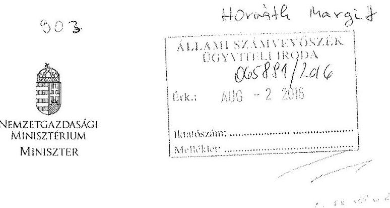

Domokos László úr részére elnök

Iktatószám: NGM/58/9/2016.
Hiv. szám: V-1033-190/2016.
Tárgy: jelentéstervezet véleményezése

# Állami Számvevőszék 

Budapest
Apáczai Csere János utca 10.
1052

## Tisztelt Elnök Úr!

Köszönettel megkaptam az Országos Foglalkoztatási Közhasznú Nonprofit Kft. (a továbbiakban: OFA Nkft.) ellenőrzéséről készült számvevőszéki jelentés-tervezetet (a továbbiakban: Tervezet), amellyel kapcsolatban a következő észrevételeket teszem.

A Tervezet 4.3. pontjában a törzstőke megemelés tárgyában tett megállapításhoz (24. oldal, 2. bekezdés) kiegészítő információként jelzem, hogy a tőkeemeléshez mind a nemzeti fejlesztési miniszter, mind a Támogatásokat Vizsgáló Iroda, mind a Magyar Nemzeti Vagyonkezelő Zrt. hozzájárult. A tőkeemelés összege ezen jóváhagyásokat követően 2014. június 30 -án került átutalásra a melléklet szerinti átutalási bizonylat alapján.
Megjegyzem, hogy a Tervezet által hivatkozott jogszabályhely - az államháztartásról szóló 2011. évi CXCV. törvény (a továbbiakban: Áht.) 45. § (2) bekezdés b) pontja - 2015. június 19. napján lépett hatályba, így az a vizsgálat szempontjából nem releváns.

A Tervezet 4.3. pontjában a támogatási szerződésekkel kapcsolatos megállapításhoz (24. oldal. 3. bekezdés) kiegészítő információként jelzem, hogy a Nemzetgazdasági Minisztérium OFA Nkft.-vel megkötött NGM/2947-4/2012., NGM/9299/2013., NGM/8687/2014. iktatószámú támogatási szerződéseinek a támogatás céljaként megfogalmazott „közhasznú tevékenység végrehajtásához szükséges müködési költségek fedezetére" szövegrésze egy általános megfogalmazás, amely magában foglalja a személyi juttatást, a munkaadókat terhelő járulékokat, adókat, dologi kiadást, ráfordítást és a beruházást is, és nem azonos az Áht. 6. § (2) bekezdése szerinti költségvetési kiadások közgazdasági jellege szerint csoportosított müködési és felhalmozási célú kiadásokkal.
A kiadások pénzügyi teljesítése a közgazdasági osztályozásnak megfelelően történt a mellékletként bemutatott beszámoló 23 . számú űrlapja szerint.

A Tervezet 2.2. pontjának megállapítása (16-17. oldal) tekintetében megjegyzem, hogy az Országos Foglalkoztatási Közalapítvány közhasznú nonprofit gazdasági társasággá történő

---

átalakításáról szóló 1362/2011. (XI. 8.) Korm. határozat 4. pont b) alpontja rendelkezett az átadás számviteli elszámolásának módjáról, mely döntéstől a számviteli elszámolásnak eltérni nem lehet.
A térítés nélküli vagyonátadás helyett tőkeemeléskénti átadást elszámolni visszamenőlegesen nem lehet, mert nem született tulajdonosi döntés a tőkeemelésről, és így azt cégbírósági bejegyzés sem követte. A számvitelben csak akkor lehet tőkeemelést kimutatni, ha azt a cégbíróságon bejegyezték az erre vonatkozó tulajdonosi döntés alapján.
A térítésmentes vagyonátadás OFA Nkft. általi számviteli elszámolásával az államot kár nem érte, a számviteli beszámolók kiegészítő mellékletben tartalmazták azokat az információkat, amelyek a vagyon térítésmentes átvételére vonatkoztak.

Kérem észrevételeim szíves figyelembevételét.

Budapest, 2016. július „ $8^{\text {" }}$
Melléklet
Üdvözlettel:
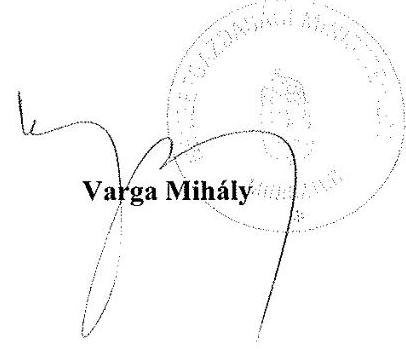

---

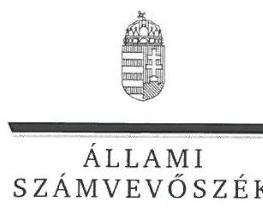

ELNÖK

Ikt.szám: V-1033-206/2016

# Varga Mihály úr 

miniszter
Nemzetgazdasági Minisztérium

## Budapest

## Tisztelt Miniszter Úr!

Köszönettel vettem az Országos Foglalkoztatási Közhasznú Nonprofit Kft. ellenőrzéséről készített számvevőszéki jelentéstervezetre tett észrevételeit.

Az Állami Számvevőszék észrevételekre vonatkozó álláspontjáról a felügyeleti vezető által készített részletes tájékoztatásban kap választ, amelyet levelemhez mellékeltem.

Tájékoztatom Miniszter urat, hogy az Állami Számvevőszékről szóló 2011. évi LXVI. tv. 29. § (3) bekezdése alapján az ÁSZ a figyelembe nem vett észrevételeket köteles a jelentésben feltüntetni, és megindokolni, hogy azokat miért nem fogadta el.

Budapest, 2016.
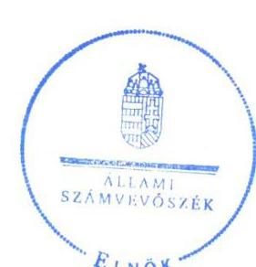

Tisztelettel:

## Domokos László

Melléklet: Tájékoztatás az észrevételek kezeléséről

---

# Tájékoztatás az észrevételek kezeléséről 

Megköszönöm Miniszter úrnak „Országos Foglalkoztatási Közhasznú Nonprofit Kft. - Az állami tulajdonban (résztulajdonban) lévő gazdálkodó szervezetek vagyonmegőrzési és gazdálkodási tevékenységének ellenőrzése" című jelentéstervezetre adott észrevételeit. Észrevételeinek kezeléséről az alábbi tájékoztatást adom.

A jelentéstervezet 4.3. számú megállapításának 5. bekezdéséhez tett észrevételét elfogadom, mivel a megállapításban hivatkozott jogszabályhely a tőkeemelés időszakában valóban nem volt hatályban. Ennek megfelelően az érintett bekezdés utolsó mondatát a következőképpen módosítom:
„A Megbizási szerződés 4.2. pontja alapján az-Aht.2-45-§-(2)-bekezdés-b)-pontjában foglaltakkal ellentétesen nem az-MNV-Zrt- útján, hanem az NGM saját forrásából 2014. június 30 -án került sor a szükséges hozzájárulásokat követően a tényleges tőkeemelés végrehajtására, a-2,5-M-Ft-összeg-banki átutalásának formájában. "

A jelentéstervezet 4.3. számú megállapításának 6. bekezdéséhez tett észrevételét elfogadom, az abban leírtaknak megfelelően pontosítom az érintett bekezdés első mondatát:
„Az NGM az OFA NKft-vel megkötött NGM/2947-4 (2012), NGM/9299/3/2013, NGM/8687/2/2014. iktatószámú Támogatási szerződései ellentmondástnem egyértelmü megfogalmazást tartalmaztak, mert a szerződésekben tárgyábana támogatások müködési célú felhasználását írták elö a „közhasznú tevékenység végrehajtásához szükséges müködési költségek fedezetére" megfogalmazással, azonban míg a szerzödések 1. számú mellékletét képező költségtervekben az Aht. 6. § (6) bekezdésébe tartozó felhalmozási célú kiadások is elfogadásra és elszámolásra kerültek."

A jelentéstervezet 2.2. számú megállapításának 3. és 4. bekezdéséhez tett észrevételében adott tájékoztatását tudomásul veszem. Az észrevételében leírtak alapján az OFA NKft. ügyvezetőjének címzett 2. a) számú, a jegyzett tőke emelésével kapcsolatos javaslatot töröltem, mivel a tőkeemelés visszamenőlegesen, a vagyonátadás időpontjában fennálló vagyonelszámolásnak megfelelően már nem számolható el. A javaslat törlése és az észrevételében leírtak azonban együttesen sem indokolják a jelentéstervezet hivatkozott megállapításainak megváltoztatását. A megállapításokban leírtakat továbbra is fenntartom a következő indok alapján:

Az 1362/2011. (XI. 8.) Korm. határozat 4. b) pont szerinti térítésmentes átadásra vonatkozó előírása ellentmondásban állt az államháztartásról szóló 1992. évi XXXVIII. törvény és egyes kapcsolódó törvények módosításáról szóló 2006. évi LXV. törvény 2. § (2) bekezdése szerinti előírással. A 2006. évi LXV. törvény 2. § (2) bekezdése szerint ugyanis a Közalapítvány vagyona apport útján és nem térítésmentes átadással válik az OFA NKft. vagyonának részévé.

Végelszámolás lebonyolítása nélkül az OFA Közalapítvány vagyona nem kerülhetett az NGM birtokába. Az alapító okiratban szükséges módosítások végrehajtása - az NGM részére történő

---

vagyon kiadás és annak OFA NKft.-be történő apportálása - megfelelt volna az 1362/2011. (XI. 8.) Korm. határozat 4. b) pont szerinti előírásnak.
Az 1362/2011. (XI. 8.) Korm. határozat 2. c) pontja alapján az OFA Közalapítvány bírósági nyilvántartásból való törlésének napjával azonos fordulónapon kellett a vagyonnak átszállnia az OFA NKft.-re.

Mindezek mellett megállapítható, hogy a térítésmentes átadás az 1362/2011. (XI. 8.) Korm. határozat 2. c) pontjában foglaltaknak megfelelően a közalapítvány vagyonát illetően vagyonvesztést nem eredményezett és egyben biztosította a folyamatos feladatellátást.
Ugyanakkor a 2.2. megállapítás 4. bekezdésének 4. mondatát a közérthetőség javítása érdekében a következőképpen pontosítom:
„Az igy képződött adott évi mérleg szerinti eredmény évenkénti eredménytartalékba történő áthelyezésével fokozatosan válik a saját tőke részévé válik."

Budapest, 2016. cugunatus hó 4. nap

Dr. Horváth Margit
felügyeleti vezető 1

---

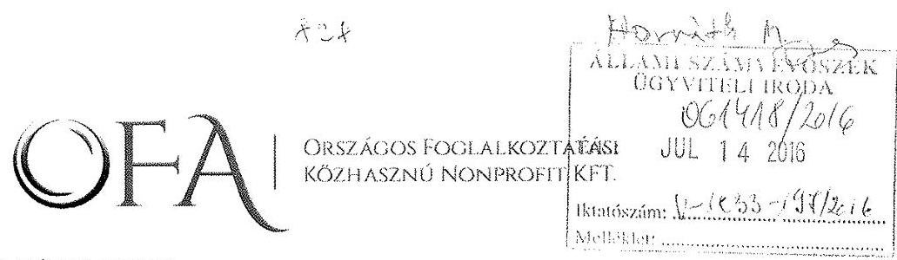

Iktatószám: OFAnKft-122-12/2016.
Tárgy: Állami Számvevőszéki jelentéstervezetre észrevételezés
Hivatkozási szám: V-1033-189/2016.

# Domokos László Elnök Úr részére 

## Állami Számvevőszék

Budapest
Apáczai Csere János utca 10.
1052

## Tisztelt Elnök Úr!

Az Állami Számvevőszék „Az állami tulajdonban (résztulajdonban) lévő gazdálkodó szervezetek vagyonmegőrzési és gazdálkodási tevékenységének ellenőrzése" tárgyában ellenőrzést folytatott az Országos Foglalkoztatási Közhasznú Nonprofit Kft-nél (továbbiakban: Társaság, vagy OFA NKft.). Az ellenőrzés vizsgált időszaka: 2012., 2013., és a 2014. üzleti év.

A jelentéstervezet megállapításalval kapcsolatban az alábbi észrevételeket terjesztem elö.
I.) A jelentéstervezetnek az átvett vagyonnal és az egyszerüsített éves beszámolóval kapcsolatos megállapításai
„Az Állami Számvevőszék az Országos Foglalkoztatási Nonprofit Kft. vagyonmegörzési és gazdálkodási tevékenységét 2012. január 13. és 2014. december 31. közötti időszakban ellenörizte.

Hiányosságokat tárt fel az ellenőrzés az NGM tulajdonosi joggyakorlásánál a 2014. évi tőkeemeléshez kapcsolódóan, valamint az Országos Foglalkoztatási Nonprofit Kft. esetében az OFA Közalapítványtól átvett vagyon szabálytalan elszámolásával összefüggésben a vagyongazdálkodási feltételek kialakításánál és vagyonnyilvántartásnál. Megállapitotta az ellenőrzés, hogy az Országos Foglalkoztatási Nonprofit Kft. egyszerüsített éves beszámolói a 2012-2014. években nem feleltek meg a jogszabályokban foglaltaknak, azok nem a valós vagyoni állapotot tükröztek." (Összegzés 5. oldal)
„Az ellenőrzött időszakban az alapításkor átvett vagyon szabálytalan elszámolása következtében az OFA NKft. beszámolói a 2012-2014. években nem a valós vagyoni állapotot tükrözték, mert a jegyzett tőke összegét 1436 mFt-tal alacsonyabb értéken mutatták ki. Ugyanakkor a könyvvizsgáló a beszámolókat hitelesitő záradékkal látta el." („Föbb megállapítások, következtetések" fejezetben 6. oldal)
„A nemzetgazdasági miniszter által kiadott közlemény alapján az OFA NKft. a központi kormányzati alszektorba besorolt szervezetnek minösül."(9. oldal)

---

„2.2. számú megállapítás: Az OFA NKft. vagyonnyilvántartása nem felelt meg a jogszabályi elöírásoknak, mert a megszünt OFA Közalapítványtól a vagyont a 2006. évi LXV. tv. elöírásaival ellentétben nem apportként vette át." (16. oldal)
„Az apportra vonatkozó elöírás figyelmen kivül hagyása miatt az OFA NKft. ellenörzött idöszaki beszámolói ugyanakkor nem feleltek meg a Számv. tv. 4. § (2) bekezdésében foglaltaknak, mert nem nyújtottak megbizható és valós összképet az OFA NKft. vagyonának összetételéröl. Az apportként történő elszámolás a mérleg eszköz oldalán a befektetett eszközök és a forgóeszközök növekedését eredményezte volna, a forrás oldalon pedig a Számv. tv. 102. § (2) bekezdése alapján a jegyzett töke 1436 MFt megemelésével járt volna. A hiba nagysága az ellenörzött idöszakban elérte a mérlegfőösszeg 2\%-át, így a Számv. tv. 3. § (3) bekezdés 3. pontja szerint a jelentős összegü hibahatárt." (17. oldal)

Az Országos Foglalkoztatási Közalapítvány és az Országos Foglalkoztatási Közhasznú Nonprofit Kft. közötti vagyon átadás elszámolásának jogcíme tekintetében a Kormány határozatot hozott, amely szerint a vagyont térítésmentes átvétellel kell a jogutódnál elszámolni. Az 1362/2011. (XI.8.) Korm. határozat nevesíti az Országos Foglalkoztatási Közalapítvány jogutódját, mégpedig az Országos Foglalkoztatási Közhasznú Nonprofit Kft-t.

Az 1362/2011 (XI.8.) Korm. határozat 2. pontjában a Kormány felhívja a nemzetgazdasági minisztert, hogy a közigazgatási és igazságügyi miniszter bevonásával gondoskodjon arról, hogy a Közalapítvány bírósági nyilvántartásból való törlésének napjával azonos fordulónapon az Országos Foglalkoztatási Közhasznú Nonprofit Kft.-re átszálló közalapítványi vagyon figyelembevételével a megszünt Közalapítvány céljait megvalósító tevékenység vagyonvesztés nélkül, folyamatosan biztosítható legyen az Országos Foglalkoztatási Közhasznú Nonprofit Kft. által.

Az 1362/2011 (XI.8.) Korm. határozat 4. pontjában a Kormány felhatalmazta a nemzetgazdasági minisztert, hogy a közigazgatási és igazságügyi miniszter bevonásával intézkedjen a Közalapítványhoz vagyonelszámoló, könyvvizsgáló, valamint az 1. pont szerinti megszüntetési eljárásban közremúködő személyek kijelölése és a Közalapítvány vagyonának a 2006. évi LXV. törvény 2. § (2) bekezdése szerinti, az Országos Foglalkoztatási Közhasznú Nonprofit Kft. részére történő térítésmentes átadása érdekében.

A hivatkozott törvényi előírás és az Országos Foglalkoztatási Közalapítvány közhasznú nonprofit gazdasági társasággá történő átalakításról szóló 1362/2011. (XI.8.) Korm.határozat gyakorlatilag párhuzamosan (egymás mellett, szinte egyidejűleg) született meg a vagyonmozgások elszámolási jogcímének nevesítésére. A számvitel számára a jogcím a meghatározó egy ügylet elszámolása és a beszámolóban való bemutatása tekintetében. A jogcímek döntéshozatallal keletkeznek. Az apport kifejezés a 2006. évi LXV. törvény 2.§ (2) bekezdésébe 2011. október 18. napján került be. A 1362/2011. Korm.határozat 2011. november 8 -ai dátummal lépett hatályba, amelyben a Kormány intézkedni kívánt egy konkrét vagyon átadás-átvétel ügyében és döntött a számvitelben elszámolható jogcímről. A Kormány olyan határozatot hozott, amelyben a lehetséges jogcímek közül választva a térítés nélküli átadásátvétel szabályainak alkalmazása mellett döntött.

A 2006. évi LXV. törvény apportra vonatkozó előírása a gyakorlat számára nem volt egyértelmú, értelmezése nehézséget okozott.

Az apport, mint fogalom nem ismert a régi Gt.-ben, a jelenlegi Ptk.-ban és a számviteli törvényben sem. Tartalmi jelentése ismert a gyakorlat számára, és azonos azzal, hogy „nem pénzbeli vagyoni hozzájárulás", amelyet be lehet vinni egy társaságba és át lehet venni ilyen

---

eszközöket egy másik társaságnál. Ha a 2006. évi LXV. törvény vagyonátadásra vonatkozó előírását vesszük alapul, akkor az apport nem tartalmazza a pénzbeli vagyon átadását, ami nyilvánvalóan értelmezhetetlen a végrehajtók számára. A konkrét esetben megvalósuló vagyonátadás kiegészül a kötelezettségek átvállalásával is, aminek nincs kapcsolata az apport fogalmával.
Tekintettel arra, hogy a Társaság a „kormányzati alszektorba" került besorolásra, a fenti kormányhatározatot köteles volt végrehajtani még akkor is, ha maga a kormányhatározat nem minősül a jogalkotásról szóló törvény szerint jogszabálynak. A Társaságnak nem volt mérlegelési joga a hivatkozott kormányhatározat végrehajtása tekintetében. A kormányhatározat az „állami irányítás egyéb jogi eszközei" kategóriába sorolandó. A kormányhatározat végrehajtása kötelező érvényű az egyedi rendelkezések címzettjei számára is, így az OFA NKft-re nézve is.

A Nemzetgazdasági Minisztérium a 2011. december 23-án kelt Alapító Okiratban alapította meg az Országos Foglalkoztatási Közhasznú Nonprofit Kft-t. Az alapításkor még nem történt meg a vagyon átvétele a jogutódnál, erről csak később született tulajdonosi határozat. A Nemzetgazdasági Miniszter a Társaság kérésére, tulajdonosi jogai alapján meghozta a 3/2012. számú Alapítói Határozatot:
„A hatályos jogszabályok értelmezése az Országos Foglalkoztatási Közalapítvány továbbiakban: Közalapítvány - megszüntetése tárgyában a Fóvárosi Törvényszék elé terjesztett kérelem, valamint a Társaság könyvvizsgálatával megbízott Controlling-Audit Korlátolt Felelősségű Társaság és a Dr. Dombi Ügyvédi Iroda szakvéleményei, illetőleg a Társaság ügyvezetőjének 2012. szeptember 10. napján kelt előterjesztése alapján a mai nappal jóváhagyom, hogy a megszüntetett Közalapítvány vagyona közcélra történő térítésmentes vagyonátadás jogcímen kerüljön be a Társaság mérlegébe."

A konkrét vagyonátadás-átvételi ügyletben a Kormány által meghatározott jogcímet a Nemzetgazdasági Miniszter elfogadta, azt jóváhagyta, mint a tulajdonosi jogokat gyakorló személy. Az Alapítói határozat alapján belátható, hogy nem került sor az Alapító okirat módosítására, ezen keresztül nem kerülhetett sor cégbírósági bejegyzésre sem a Társaság saját tőkéjének megváltoztatása tekintetében. A döntést követően a Társaság a határozatot végrehajtotta, amely a hatályos jogszabályok értelmezése alapján született meg.

Figyelembe véve a fenti okokat, álláspontunk szerint a Társaság ügyvezetője, a könyvvizsgáló az adott helyzetben az előírásoknak megfelelően járt el. Felhívták a tulajdonosi jogokat gyakorló személy figyelmét a lehetőségekre, illetve melyik jogszabály, intézkedés milyen előírásokat tartalmaz.

A vagyon jegyzett tőkébe történő felvétele csak a cégbírósági bejegyzésen keresztül valósulhat meg, amelyhez ilyen irányú döntés szükséges. Ilyen döntés meghozatalára nem került sor, az átvett eszközvagyon a térítés nélküli átvétel szabályai szerint bekerült a Társaság mérlegébe és hatásai érvényesültek az elmúlt évek során az eredmény kimutatásaiban is.

A számviteli beszámoló akkor mutat megbízható és valós összképet, ha azt a számviteli törvény előírásai szerint állították össze. Ezt bizonyítja a könyvvizsgáló, ha tiszta véleményt bocsát ki.
„Szt.155. § (1) A könyvvizsgálat célja annak megállapítása, hogy a vállalkozó által az üzleti évről készített éves beszámoló, egyszerűsített éves beszámoló, továbbá az összevont (konszolidált) éves beszámoló e törvény előírásai szerint készült, és ennek megfelelően megbízható és valós képet ad a vállalkozó (a konszolidálásba bevont vállalkozások együttes) vagyoni és pénzügyi helyzetéről, a múködés eredményéről. A könyvvizsgálat során ellenőrizni

---

kell az éves beszámoló, az összevont (konszolidált) éves beszámoló és a kapcsolódó üzleti jelentés adatainak összhangját, kapcsolatát is.

Szt.156. § (1) A vállalkozótól független könyvvizsgáló feladata az éves beszámoló, az egyszerűsített éves beszámoló valódiságának és szabályszerűségének (a mérleg, az eredmény kimutatás, a kiegészítő melléklet) felülvizsgálata, e törvény és a létesítő okirat előírásai betartásának ellenőrzése, és ennek alapján az éves beszámolóról, az egyszerűsített éves beszámolóról a könyvvizsgáló állásfoglalását tükröző vélemény kialakítása, a független könyvvizsgálói jelentés elkészítése."

Megállapítható, hogy a létesítő okiratban foglaltaknak is megfelelnek a Társaság beszámolói, mert a cégbíróságon a közhiteles nyilvántartásban is azok az adatok szerepelnek, mint a beszámolókban. A 2011. december 23-i Alapító okiratban 500.000,-Ft összegű jegyzett tőke került meghatározásra. A fenti indokok alapján álláspontunk szerint téves az Állami Számvevőszék azon álláspontja, hogy az ellenőrzött években az érintett beszámolók nem felelnek meg a megbízható és valós összkép követelményének. Véleményünk szerint, figyelembe véve a felsorolt indokokat, a vizsgált időszakban az OFA NKft. egyszerüsített éves beszámolói megfelelnek a számviteli törvény 4. § (2) bekezdésében foglaltaknak (Sztv. 4. § (2) „Az (1) bekezdés szerinti beszámolónak megbízható és valós összképet kell adnia a gazdálkodó vagyonáról, annak összetételéről (eszközeiről és forrásairól), pénzügyi helyzetéről és tevékenysége eredményéről.")

A számviteli törvény szerinti térítés nélküli átvételek elszámolásának jellemzője az eredmény semlegesség, amely egy nonprofit Kft-nél kifejezetten előnyös megoldás lehet. Összességében az is megállapítható, hogy a döntés alapján született jogi megoldás nem sértette az állami vagyonnal való gazdálkodás alapvető célját, mert nem sérült az átláthatóság, a rendeltetésszerü és felelős vagyonfelhasználás követelménye. A számviteli beszámolók tartalmazták a kiegészítő mellékletben azokat a plusz információkat, amelyek a vagyon térítés nélküli átvételére vonatkoztak. A beszámolók megbízható és valós összképre vonatkozó követelménye csak akkor nem teljesült volna álláspontunk szerint, ha a döntés apportálásról szól, de az nem kerül végrehajtásra.

# A Javaslatok az OFA NKft. ügyvezetőjének 2. pont a) része: Intézkedjen a vagyonnyilvántartás korrekciójáról a saját tőke szerkezetének megváltoztatásával, a jegyzett töke szintjének emelésével, annak érdekében, hogy a beszámoló megbizható és valós képet mutasson a vagyoni helyzetröl. (28. oldal) 

Álláspontunk szerint a fenti intézkedési javaslat nem hajtható végre abban a formájában, ahogy azt az Állami Számvevőszék jelentéstervezete tartalmazza. Ha a korrekció alatt hibajavítást kell értelmezni akkor a cégbíróság a jegyzett tőke módosítása tekintetében nem értelmezi a visszamenőleges hatályt, ahogy a számviteli törvény sem tudja kezelni ezt a problémát.
A számviteli törvény 35.§-a az alábbiakat tartalmazza: A jegyzett tőke részvénytársaságnál, korlátolt felelősségű társaságnál, egyéb vállalkozónál a cégbíróságon bejegyzett tőke a létesítő okiratban meghatározott összegben.
A vállalkozónál az alaptőke, a törzstőke, az alapítói vagyon, az egyéb társasági részesedés felemelése, illetve leszállítása miatti jegyzett tőke-változást a cégjegyzékbe való bejegyzés alapján, a bejegyzés időpontjával kell a könyvviteli nyilvántartásokban rögzíteni.

Egyértelműen megállapítható, hogy a Társaság vizsgált időszaki beszámolói valós képet mutatnak a gazdálkodásról, a Társaság tényleges döntéseknek megfelelően járt el számvitelileg, a könyveiben a tényleges szabályszerű gazdasági eseményeket rögzítette.

---

II.) Az OFA nKft. vagyongazdálkodási tevékenysége során a 2012. évben az Ect. elöírásai ellenére befektetési szabályzatot nem készitett (Föbb megállapítások, következtetések 6. oldal).

A befektetési szabályzatot a Társaság ügyvezetője 2012. augusztus 15 -én felügyelőbizottság elé terjesztette. A felügyelőbizottság javasolta a Befektetési Szabályzat tervezetének az átdolgozását. A Társaság ügyvezetője 2012. december 6-án ismételten a felügyelőbizottság elé terjesztette az átdolgozott Befektetési Szabályzat tervezetét, melyet a felügyelőbizottság 12/2012. (XII.6.) FB határozatával az Alapító felé elfogadásra javasolt.
A Társaság 2012. évben a befektetési tevékenységét az Alapító által 2013. február 12. napján elfogadott Befektetési Szabályzatban foglaltak szerint végezte. A befektetési tevékenység összhangban volt a hatályos Civil törvény és a közhasznú szervezet gazdálkodásra vonatkozó különös szabályokkal. Az átvett vagyont a leggondosabban kezelte, ezzel a közhasznú tevékenység eredményességét segitette elő. A Társaság a szabad pénzeszközeit kizárólag az állam által garantált állampapírokban, a Magyar Államkincstárnál történő jegyzéssel fektette be.
III.) Az OFA NKft. vagyongazdálkodási tevékenységének szabályozását hiányosan alakította ki, Számlarendje nem teljes körüen felelt meg a Számviteli tv. elöírásainak (Föbb megállapítások, következtetések 5. oldal)

A Társaság a Számviteli politikájában az időszaki változásokat rögzíti, folyamatosan aktualizálja. Az ellenőrzés során feltárt hiányosságok, észrevételek átvezetésre kerülnek a Számviteli politikában. A Társaság a vizsgált időszakot követően 2015. évben a Számlarendjét teljes körúen, külön szabályzatban rögzítette.

A Társaság Számviteli politikájában tévesen került rögzítésre a kockázati tartalék meghatározása.
IV.) Az NGM az OFA NKft. vagyongazdálkodásának feltételeit kialakította, azonban a támogatási szerzödések a cél szerinti felhasználás tekintetében ellentmondást tartalmaztak. (1. összegzö megállapitás 14. oldal)

A Társaság a vizsgált időszakban a közhasznú feladatellátására kötött támogatási szerződések elengedhetetlen részét képező költségtervek alapján maradéktalanul elszámolt a támogatási összegekkel. A támogatási szerződések 1. számú mellékletét képező költségtervekben meghatározott költségnemek alapján kerültek csoportosításra a költségek, melyek a közhasznú tevékenység végrehajtásához szükséges müködtetési költségek (személyi juttatások, munkaadókat terhelő járulékok, adók, dologi kiadások, ráfordítások, beruházási kiadások). A támogatási szerződések nem tiltották, hogy a Társaság az elfogadott költségtervekben szereplő, szükséges felhalmozási kiadásokat (beruházási kiadások) nem számolhatja el.
V.) Az értékcsökkenési leírás elszámolása a 2013. évben egyes 100 ezer Ft bekerülési érték alatti beszerzések és a 2012. évben az OFA nKft. tulajdonában álló ingatlan esetében nem jogszabályi elöírások szerint történt. (3. összegzö megállapitás)
2012. évben az OFA NKft. tulajdonába került 14701/1/A/33. hrsz. alatt felvett ingatlan és a 14701/1/A/1. hrsz. alatt felvett teremgarázs (1037 Budapest, Bokor u. 9-11.) Alapitói hozzájárulással eladásra került 2013. évben. Az 14701/1/A/33. hrsz-ú ingatlan (iroda) vonatkozásban a maradványérték $30 \%$ - ának figyelmen kívül hagyásából adódóan 283 eFt összegben többlet értékcsökkenés került elszámolásra.

A fenti ingatlanok értéke az értékesítésből adódóan 2013. évben számvitelileg szabályosan kivezetésre került a könyvekből. A tárgyi ingatlanok együttes értékesítéséből származó

---

bevételét a Társaság valóban nem különítette el, de azt vállalkozási bevételként mutatta ki és nem használta fel sem vállalkozási, sem egyéb célra.

Az ellenőrzés során mintavételezett eszközöket (notebook és dokkoló) a Társaság nyilvántartásaiban együtt kezelte. A számítógép (notebook) elengedhetetlen részét képezi a dokkoló, így a beszerzett eszköz együttes értéke meghaladta a 100 eFt beszerzési értéket. 2013. évben beszerzett egyes 100 eFt bekerülési érték feletti tárgyi eszköz értékcsökkentési leírásának időtartamát a Társaság 3 évben határozta meg. A Társaság a számítástechnikai eszközöket 33\%os értékcsökkenési kulcs alapján számolja el a könyveiben.

A követelés állomány kezelésének szabályai tekintetében (19.-20. oldal) az ellenőrzés során álláspontunk szerint téves megállapítás történt. A jelentéstervezetben nevesített, a Nokia Komárom Kft-vel kötött szerződés alapján az OFA NKft. nem előleget fizetett ki, hanem azt kapott. A bankszámlára befolyt előleget a számviteli törvény előírásai szerint nem követelésként, hanem kötelezettségként kell kimutatni, amelyet az OFA NKft. a törvényi előírásoknak megfelelően kötelezettségként mutatott ki könyveiben 2014.12.31-én.
A Társaság által a más kötelmek alapján fizetett előlegeket helyesen mutatta ki könyveiben, követelésként. A követelések között szereplő $17,5 \mathrm{MFt}$ tartalmát tekintve egy követelés jellegủ technikai előírás (az előleg után előzetesen felszámított ÁFA összege), amit a NOKIA Kft-vel szemben mutatott ki a szerződés szerint a Társaság.
Álláspontunk szerint a jelentéstervezet 19. oldalán tévesen került megállapításra, hogy a követelések 2014. évi növekedést a "DIFO" Nonprofit Kft-nek nyújtott tagi kölcsön emelkedése, továbbá a vevőtől kapott előlegek téves elszámolása okozta. A követelések 2014. évi növekedését a "DIFO" Nonprofit Kft-nek nyújtott kölcsön emelkedése, továbbá a Nokia Komárom Kft-vel kötött szerződés alapján az előleggel kapcsolatos követelés jellegủ előírás okozza.
VI.) Kapcsolt vállalkozásaiban meglévő részesedését az OFA NKft. a Számv. tv. 27. § (2) bekezdése elöirása ellenére a tartós részesedés kapcsolt vállalkozásban mérlegsor helyett az egyéb részesedések között mutatta ki mérlegében. (4.1 számú megállapítás részeként 21. oldal)

A kapcsolt vállalkozásnak minősülő részesedések kimutatása a mérlegben szabályosan történt, a kiegészítő melléklet is egyértelműen bemutatta a tulajdonosi viszonyokat, csak a főkönyvi kartonok elnevezésében szerepelt helytelenül az „egyéb részesedés" fogalom.
A Társaság a vizsgált időszakban egyszerűsített éves beszámoló készítésére volt kötelezett.
A számviteli törvény 96. § (2) bekezdése értelmében az egyszerűsített éves beszámoló mérlegből, eredmény kimutatásból és kiegészítő mellékletből áll. Üzleti jelentést - az egyszerűsített éves beszámolóhoz kapcsolódóan - nem kell készíteni. Az egyszerűsített éves beszámoló készítésénél az éves beszámoló készítésére vonatkozó szabályok irányadóak.
A megállapítás nem vette figyelembe azt a körülményt, hogy az egyszerűsített éves beszámolóra a számviteli törvény külön előírásokat tartalmaz. Az egyszerűsített éves beszámoló kötelezően csak összevont adatokat tartalmaz, abban nem kell megbontani a befektetett pénzügyi eszközöket a számviteli törvény 27. § (2) bekezdése szerint.
A megállapítás álláspontunk szerint nem helytálló, mert a kötelező megbontás csak az éves beszámoló készítésére kötelezett vállalkozásokra vonatkozik, az egyszerűsített beszámolót készítő vállalkozásokra nem. (Sztv. 96. § (2) bekezdés).

---

VII.),Honlapjának kialakítása nem felett meg az Info tv. elöirásainak, mivel nem tették közzé a szervezeti és személyzeti adatokat, az SZMSZ-t, valamint a beszámolókat, és gazdálkodási adatokat az üzleti tervek kivételével." (Föbb megállapítások, következtetések 6. oldal)
„Elektronikus közzétételi kötelezettségének az ellenőrzött időszakban az Info tv. 33. § (1) bekezdésében foglaltak szerint nem tett eleget, mert hiányoztak az Info tv. 1. számú melléklete 1. részében elöirt, a közfeladatot ellátó szerv szervezeti felépitése szervezeti egységek megjelölésével, az egyes szervezeti egységek feladatai, a közfeladatot ellátó szerv vezetöinek és az egyes szervezeti egységek vezetöinek neve, beosztása elérhetősége. Hiányoztak továbbá a II. részben elöirt dokumentumok közül az SZMSZ, a közérdekü adatok megismerésére irányuló igények intézkedési rendje, valamint a közérdekü adatokkal kapcsolatos kötelezö statisztikai adatok közzététele." (5.1. számú megállapitás részeként 26. oldal)

A Társaság a honlapján annak „közérdekủ adatok" menüpontjában vizsgált időszakban részben eleget tett a jogszabályokban meghatározott elektronikus közzétételi kötelezettségének. A vizsgált időszakban megjelent archív honlapot és annak adatait utólagosan nem áll módunkban reprodukálni, honlapunk kizárólag a jelenlegi állapotot tükrözi azzal, hogy fellelhetőek benne vizsgált időszaki adatok is. A közérdekủ adatok megismerésére irányuló igények intézkedési rendje, a „tevékenységre és müködésre vonatkozó adatok" menüpont alatt, az „adatvédelmi és biztonsági szabályzat" elnevezésủ alpontban a vizsgált időszakban hatályos 22/2012 számú szabályzat 12. oldalán található. A Társaság beszámolói a „közérdekú adatok" menüpont alatt a „gazdálkodási adatok" almenüjében kerültek rögzítésre.

Kérem a Tisztelt Elnök Urat, hogy az Állami Számvevöszék tárgyi jelentéstervezetére tett észrevételeinket elfogadni és az észrevételeink figyelembe vételével a jelentéstervezetet módositani sziveskedjenek.

Budapest, 2016. július 12.
Tisztelettel:
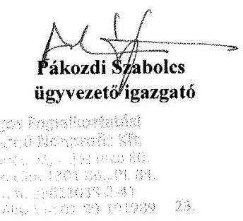

---

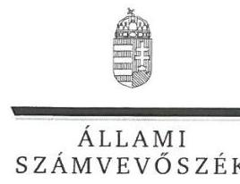

ELNÖK

Ikt.szám: V-1033-200/2016

# Pákozdi Szabolcs úr 

ügyvezető igazgató
Országos Foglalkoztatási Közhasznú Nonprofit Kft.

## Budapest

## Tisztelt Ügyvezető Igazgató Úr!

Köszönettel vettem az Országos Foglalkoztatási Közhasznú Nonprofit Kft. ellenőrzéséről készített számvevőszéki jelentéstervezetre tett észrevételeit.

Az Állami Számvevőszék észrevételekre vonatkozó álláspontjáról a felügyeleti vezető által készített részletes tájékoztatásban kap választ, amelyet levelemhez mellékeltem.

Tájékoztatom Ügyvezető Igazgató urat, hogy a számvevőszéki jelentés véglegesítése az elfogadott észrevételek figyelembevételével történik.

Budapest, 2016.
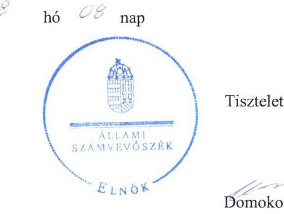

Tisztelettel:

## Domokos László

Melléklet: Tájékoztatás az észrevételek kezeléséről

---

# Tájékoztatás az észrevételek kezeléséről 

Megköszönöm Ügyvezető igazgató úrnak „Országos Foglalkoztatási Közhasznú Nonprofit Kft. - Az állami tulajdonban (résztulajdonban) lévő gazdálkodó szervezetek vagyonmegőrzési és gazdálkodási tevékenységének ellenőrzése" címủ jelentéstervezetre adott észrevételeit. Észrevételeire, azok sorrendjében a következő tájékoztatást adom.

Az észrevétele I.) pontjában foglaltakból az Ügyvezető úrnak címzett 2. a) számú javaslat kapcsán megfogalmazottakat elfogadom, mivel utólagos korrekció nem kivitelezhető a jegyzett tőke emelésére, így a hivatkozott javaslatot törlöm:
,,Intézkedjen a vagyonnyilvántartás korrekciójáról a saját tőke szerkezetének megváltoztatásával, a jegyzett tőke szintjének emelésével, annak érdekében, hogy a beszámoló megbizható és valós képet mutasson a vagyoni helyzetröl."

Ugyanakkor az átvett vagyonnal és az OFA NKft. egyszerüsített beszámolójával kapcsolatos I.) számú észrevételének a többi részét nem áll módomban elfogadni, így a jelentéstervezet érintett megállapításait változatlan formában fenntartom. Indokaim az alábbiak:
Az 1362/2011. (XI. 8.) Korm. határozat 2. b) pontja alapján a megszüntetett OFA Közalapítvány vagyoni jogai és a megszüntetésre irányuló eljárás kezdő időpontja után esedékessé váló kötelezettségei az OFA NKft.-re szálltak át, azzal a kikötéssel, hogy a közalapítványi vagyon kizárólag a megszünt OFA Közalapítvány célja szerinti tevékenységre fordítható, és a társaság megszűnése esetén is csak e célnak megfelelően használható fel.
Az 1362/2011. (XI. 8.) Korm. határozat 4. b) pont szerinti térítésmentes átadásra vonatkozó előírása - az észrevételében jelzett módon - ellentmondásban állt az államháztartásról szóló 1992. évi XXXVIII. törvény és egyes kapcsolódó törvények módosításáról szóló 2006. évi LXV. törvény 2. § (2) bekezdése szerinti előirással. A 2006. évi LXV. törvény 2. § (2) bekezdése szerint ugyanis a Közalapítvány vagyona apport útján és nem térítésmentes átadással válik az OFA NKft. vagyonának részévé. A jogrendszer koherenciáját biztosító egyik alapelvet, a lex superior derogat legi inferiori elvet figyelmen kívül hagyva az NGM a 3/2012.számú Alapítói Határozatában jóváhagyta a térítésmentes vagyonátadást, nem rendelkezett az apport végrehajtásáról annak ellenére, hogy a Fővárosi Törvényszék 12.Pk. 69.200/1992/48. számú végzése is kimondta, hogy a „, megszüntetett alapitvány (közalapitvány) vagyona [...] a kérelemben megjelölt jogi személyiséggel rendelkező nonprofit gazdasági társaság vagyonának részévé válik (apport)." A Gt. 13. § (2) bekezdése határozza meg a nem pénzbeli hozzájárulás fogalmát: „a nem pénzbeli hozzájárulás bármilyen vagyoni értékkel rendelkező dolog, szellemi alkotáshoz füzödő vagy egyéb vagyoni értékü jog ideértve az adós által elismert vagy jogerős birósági határozaton alapuló követelést is - lehet.", melyet a Gt. indokolásában is olvashatóan a gyakorlat az apport fogalmával azonosít: „a vagyoni hozzájárulást társasági törvény tradicionálisan két részre osztja, nevezetesen pénzbeli hozzájárulásra, és nem pénzbeli hozzájárulásra, amelyet a gyakorlat apportnak nevez."
Az 1362/2011. (XI. 8.) Korm. határozat 4. c) pontja - a megszűnés napjával, mint mérlegfordulónappal - előírta a számviteli törvény szerinti egyes egyéb szervezetek beszámolókészítési és könyvvezetési kötelezettségének sajátosságairól szóló 224/2000. (XII. 19.) Korm. rendelet 6. § szerinti beszámoló elkészítését. A 2006. évi LXV. törvény 1. § (2) bekezdés (2)

---

pontja alapján a közalapítvány működésére - a 2006. évi LXV. törvény szerinti eltérésekkel - a Ptk. alapítványra vonatkozó rendelkezéseit kell alkalmazni. Az Ectv. rendelkezései kiterjedtek a Ptk. alapján létrehozott alapítványokra, közhasznú szervezetekre. A civil szervezetek végelszámolására pedig - törvény eltérő rendelkezése hiányában - a cégnyilvánosságról, a bírósági cégeljárásról és a végelszámolásról szóló 2006.évi V. törvény (a továbbiakban: Ctv.) rendelkezéseit az Ectv. törvényben szabályozott eltérésekkel kellett alkalmazni a Ctv. 94. § (2) bekezdésében foglaltak értelmezése alapján. Az OFA Közalapítvány olyan cégnek nem minősülő szervezet volt a szabályozás szerint, amelyre kiterjedt a végelszámolás számviteli feladatairól szóló 72/2006. (IV. 3.) Korm. rendelet hatálya az 1. § (1) bekezdés alapján.
Végelszámolás lebonyolítása nélkül az OFA NKft. egyetlen tagja, az NGM birtokába nem kerülhetett az OFA Közalapítvány vagyona. Az alapító okiratban szükséges módosítások végrehajtása - az NGM részére történő vagyon kiadás és annak OFA NKft.-be történő apportálása megfelelő volna az 1362/2011. (XI. 8.) Korm. határozat 4. b) pont szerinti előírásnak és az alapítónak való vagyonkiadást eredményezett volna, hiszen az alapító ugyanaz a jogi személy, az állam lett volna.
Az 1362/2011. (XI. 8.) Korm. határozat 2. c) pontja alapján az OFA Közalapítvány bírósági nyilvántartásból való törlésének napjával azonos fordulónapon kellett a vagyonnak átszállnia az OFA NKft.-re.
Mindezek mellett megállapítható, hogy a térítésmentes átadás az 1362/2011. (XI. 8.) Korm. határozat 2. c) pontjában foglaltaknak megfelelően a közalapítvány vagyonát illetően vagyonvesztést nem eredményezett és egyben biztosította a folyamatos feladatellátást. A közalapítványok megszüntetésekor a Számv. tv. 86. § (4) bekezdés c) pontja szerinti térítés nélkül átvétel során az eszköz piaci értékét rendkívüli bevételként kell elszámolni, amelyet év végén a passzív időbeli elhatárolások között halasztott bevételként kell kimutatni mindaddig, amíg az eszköz bekerülési értéke költségként vagy ráfordításként nem kerül elszámolásra. A térítés nélkül kapott eszközök piaci értéke nem lesz része sem a jegyzett tőkének, és az eredmény semleges elszámolás következtében a saját tőkét sem gyarapítja. A térítésmentesen átvett eszközöket és kötelezettségeket a Számv. tv. előírásainak megfelelően az OFA NKft. a rendkívüli bevételek és ráfordítások között számolta el. A Számv. tv. 45. § (1) bekezdés c) pont és 33. § (1) bekezdés előírásait betartva a rendkívüli bevételek és ráfordítások az időbeli elhatárolások között kerültek kimutatásra. Az időbeli elhatárolásokat a költségek és ráfordítások elszámolásakor, valamint az átvállalt kötelezettségek szerződés szerinti pénzügyi rendezésekor a Számv. tv. 45. § (2) bekezdés és 33. § (1) bekezdés rendelkezéseinek megfelelően a rendkívüli bevételekkel és ráfordításokkal szemben megszüntették.
Ugyanakkor, - ahogy azt a jelentéstervezet is tartalmazza - az apportra vonatkozó előírás figyelmen kívül hagyása miatt az OFA NKft. ellenőrzött időszakbeli beszámolói nem felelnek meg a Számv. tv. 4. § (2) bekezdésében foglaltaknak, mert nem nyújtottak megbízható és valós összképet az OFA NKft. vagyonának összetételéről. Az apport ugyanis a mérleg eszköz oldalán a befektetett eszközök és forgóeszközök növekedését eredményezte volna, a forrás oldalon pedig a Számv. tv. 102. § (2) bekezdés alapján a jegyzett tőke 1436 M Ft megemelésével járt volna. Az OFA Közalapítványtól az 1362/2011.(XI.8.) Korm. határozat 2. b) pont szerint átvállalt kötelezettségeket a mérleg forrás oldalán a kötelezettségek mérlegfőcsoporton belül kellett volna állományba venni.

---

Az észrevétele II.) pontjában foglaltak nem indokolják a jelentéstervezet módosítását. Észrevételében elismeri, hogy a Befektetési szabályzatot 2013. február 12. napján fogadta el az Alapító. A jelentéstervezet ezzel egyezően azt tartalmazza, hogy a 2013. február 12-ig az OFA NKft. nem tett eleget az Ectv. 45. §-ában előírt szabályzatkészítési kötelezettségének. Ezek alapján a megállapítást változatlan formában fenntartom.

Az észrevétele III.) pontjában foglaltak nem indokolják a jelentéstervezet módosítását. Köszönöm szíves tájékoztatását arról, hogy a Társaság a 2015. évben a Számlarendjét teljes körűen, külön szabályzatban rögzítette. A szabályzat elkészítése kívül esik az ellenőrzött időszakon, így a megállapítást változatlanul fenntartom.

Az észrevétele IV.) pontjában foglaltak nem indokolják a jelentéstervezet módosítását. Az Áht. 6. § határozza meg a müködési és a felhalmozási bevételek, illetve kiadások elemeit. A szabályozás alapján a beruházás egyértelműen a felhalmozási kiadások közé tartozik. A jelentéstervezet megállapítása helytálló, ugyanis a támogatási szerződések 1. mellékletében beruházási, azaz felhalmozási kiadásokra előirányzott támogatás is szerepelt, míg a támogatási szerződé működési költségeket nevesít. Az átadott támogatás a megállapítás szerint kifogásolt összegét az NGM beszámolója kiegészítő mellékletében a 2013. évben müködési támogatásként és nem a célja szerint, felhalmozási támogatásként mutattak ki. A megállapítást változatlanul fenntartom.

Az észrevétele V.) pontjában - az értékcsökkenési leírás elszámolására vonatkozóan foglaltakat nem fogadom el és a megállapításokat változatlanul fenntartom.
Köszönettel vettem tájékoztatását azzal kapcsolatban, hogy a jelentéstervezetünkben kifogásolt maradványértékének elszámolása utólagosan rendeződött, ugyanakkor ez a megállapításunkat nem befolyásolja, tekintettel arra, hogy az OFA NKft. által 2012. évben megszerzett épület értékcsökkenési leírása elszámolásakor az épület bruttó bekerülési értékét vették figyelembe, azt a maradványértékkel nem csökkentették.
Az ellenőrzés megállapította, hogy tárgyi eszköz beszerzésekor a hasznos élettartam meghatározásában nem a Számv. tv.-nek megfelelően járt el az OFA NKft., amikor 2013-ban az UT00527/2013 számlaszámú számla szerint beszerzett notebookokhoz tartozó 16 db ( 19753 Ft bruttó egységáron) dokkoló leírását három évben határozták meg. Mivel ezen dokkolók nem tekinthetők a notebook állandó tartozékának, hanem cserélhetőek, ezért ezen eszközöket egyedileg önállóan kell elbírálni, tehát alkalmazni kell rájuk az egyösszegủ leírást a Számv. tv. 80. § (2) bekezdése és a Számviteli Politika IV. fejezet 4. pontjában foglaltak szerint.

Az észrevétele V.) pontjában - a követelésállomány kezelésére vonatkozó - észrevételét elfogadom, az észrevételében jelzettek a 3.1. számú megállapítás 9. bekezdésének törlését indokolják, így a jelentéstervezetből az alábbi részt törlöm:
„Az-OFA-Nkft-az-elölegek-bruttó-összegét-tévesen-a-Számv-tv-42-§-(3)-bekezdései-elöirásai ellenére-a-követelések-fökönyvi-számra-könyvelte,-a-Számlakeretében-e-célra-használt-elöleg fäkönyvi-számla-helyett."

---

Ennek következtében a 3.1. számú megállapítás 8. bekezdés 2. mondatának pontosítása szükséges, így azt módosítom az alábbiak szerint:
„A követelések 2014. évi növekedését a DIFO NKft.-nek nyújtott tagi kölcsön emelkedése, továbbá a vevôtól kapott elölegekkel kapcsolatos téves elszámolása követelés jellegü fizetendö áfa elöirása okozta."

Az észrevétele VL) pontjában foglaltakat elfogadom, mivel a tartósan befolyásolási, irányítási, ellenőrzési lehetőséget biztosító befektetéseket (részvényeket, üzletrészeket, egyéb társasági részesedéseket) az egyszerűsített éves beszámolót készítő társaságnak nem kell a Számv. tv. 27. § (2) bekezdése szerint bemutatni. A jelentéstervezet 4.1. számú megállapítás érintett részét indokai alapján pontosítom:

A befektetett pénzügyi eszközökön belül a Számv. tv. 3. § (2) bekezdés 7. pontja szerinti kapcsolt vállalkozásaiban meglévő részesedését az OFA NKft. a-Számv-tv-27-§-(2) bekezdése elöirása ellenére a-tartós részesedést-kapcsolt vállalkozásban mérlegsor-helyett az egyéb részesedések között mutatta ki mérlegébena fökönyvi nyilvántartásában.
Ezen észrevétele alapján Ügyvezető úrnak címzett 2. d) számú javaslatot törőltem:
„Intézkedjen-a-kapcsolt-vállalkozásaiban-meglévő-részesedéseknek-a-Számv-tv-nek megfelelö szabályszerü elszámolására."

Az észrevétele VII.) pontjában foglaltakat elfogadom, mivel a közérdekủ adatok megismerésére irányuló igények intézkedési rendje az OFA NKft. honlapján a jelzett menüpont alatt fellelhető, így a Főbb megállapítások, következtetések utolsó bekezdését pontosítom a következők szerint:
„Honlapjának kialakitásatartalma nem felelt meg az Info tv. elöírásainak, mivel nem tették közzé a szervezeti és személyzeti adatokat, az SZMSZ-t, valamint a-beszámolókat és a gazdálkodási adatokat a 2013. év kivételével az üzleti terveket kivételével.
Ezen észrevétele alapján az 5.1. számú megállapítás 9. bekezdésének második mondatát is pontosítom az alábbiak szerint:
„Hiányoztak továbbá a II. részben elöirt dokumentumok közül az SZMSZ, a-közérdekü adatok megismerésére irányuló igények intézkedési rendje, valamint a közérdekü adatokkal kapcsolatos kötelező statisztikai adatok közzététele."

Budapest, 2016. 24444574 hó \& nap

Dr. Horváth Margit
felügyeleti vezető

---

# RÖVIDÍTÉSEK JEGYZÉKE 

${ }^{1}$ OFA NKft
${ }^{2}$ NGM
${ }^{3} 1362 / 2011$. (XI. 8.) Korm. határozat
${ }^{4}$ OFA Közalapítvány
${ }^{5}$ MNV Zrt.
${ }^{6}$ ÁSZ
${ }^{7}$ Alapító Okirat ${ }_{1,2,3}$
${ }^{8} \mathrm{FB}$
${ }^{9}$ Nvtv.
${ }^{10}$ Megbízási szerződés
${ }^{11}$ Kszt.
${ }^{12}$ Gt.
${ }^{13}$ Ectv.
${ }^{14} \mathrm{Ptk}_{2}$
${ }^{15} \mathrm{Kvtv}_{1,2,3}$
${ }^{16}$ Áht. 2
${ }^{17}$ SZMSZ ${ }_{1,2}$
${ }^{18}$ Számviteli Politika
${ }^{19}$ Eszközök és források értékelési szabályzata
${ }^{20}$ Számv. tv.
${ }^{21} 1362 / 2011$. (XI. 8.) Korm. határozat
${ }^{22}$ 2006.évi LXV. törvény
${ }^{23}$ Befektetési szabályzat
${ }^{24}$ 224/2000. (XII.19.) Korm. rendelet
${ }^{25}$ Vtv.
${ }^{26}$ MÁK

Országos Foglalkoztatási Közhasznú Nonprofit korlátolt felelősségű társaság Nemzetgazdasági Minisztérium
Az Országos Foglalkoztatási Közalapítvány közhasznú nonprofitgazdasági társasággá történő átalakításáról szóló 1362/2011. (XI. 8.) Korm. határozat
Országos Foglalkoztatási Közalapítvány
Magyar Nemzeti Vagyonkezelő Zártkörűen működő Részvénytársaság
Állami Számvevőszék
OFA NKft. Alapító Okirata (hatályos: 2011.december 23-tól),
OFA NKft. Alapító Okirata (hatályos: 2013.augusztus 30-tól),
OFA NKft. Alapító Okirata (hatályos: 2014.május 30-tól)
Az OFA NKft. Felügyelő Bizottsága
A nemzeti vagyonról szóló 2011. évi CXCVI. törvény
SZT-39117 számú Megbízási szerződés társasági részesedéshez kapcsolódó tulajdonosi jogok gyakorlására
A közhasznú szervezetekről szóló 1997. évi CLVI. törvény
A gazdasági társaságokról szóló 2006. évi IV. törvény
Az egyesülési jogról, a közhasznú jogállásról, valamint a civil szervezetek müködéséről és támogatásáról szóló 2011. évi CLXXV. törvény
A Polgári Törvénykönyvről szóló 2013. évi V. törvény
Magyarország 2012.évi költségvetéséről szóló 2011.évi CLXXXVIII. törvény, Magyarország 2013.évi központi költségvetésről szóló 2012.évi CCIV. törvény, Magyarország 2014. évi központi költségvetéséről szóló 2013. évi CCXXX. törvény
Az államháztartásról szóló 2011.évi CXCV. törvény
18/2012.(09.17.) számú ügyvezetői utasítással kihirdetett OFA NKft. Szervezeti és Müködési Szabályzata (hatályos: 2012.09.17-től)
20/2014.(09.15.) számú ügyvezetői utasítással kihirdetett OFA NKft. Szervezeti és Müködési Szabályzata (hatályos: 2014.09.11-től)
Az OFA Kuratóriuma a 464/2009. (11.16.) számú határozatával kiadott Számviteli Politika (hatályos: 2009. november 16-tól)
Az 1/2012. (02.01.) számú ügyvezetői utasítással kiadott OFA NKft. Számviteli Politikája (hatályos 2012. február 1-jétől)
Az OFA NKft. Eszközök és források értékelési szabályzata
Számvitelről szóló 2000. évi C. törvény
1362/2011. (XI. 8.) Korm. határozat az Országos Foglalkoztatási Közalapítvány közhasznú nonprofit gazdasági társasággá történő átalakításáról
Az államháztartásról szóló 1992. évi XXXVIII. törvény és egyes kapcsolódó törvények módosításáról szóló 2006.évi LXV. törvény
Az OFA NKft. Befektetési szabályzata
A számviteli törvény szerinti egyes egyéb szervezetek beszámoló készítési és könyvvezetési kötelezettségének sajátosságairól szóló 224/2000. (XII. 19.) Korm. rendelet
Az állami vagyonról szóló 2007. évi CVI. törvény
Magyar Államkincstár

---

${ }^{27}$ Kbt.
${ }^{28}$ NFM
${ }^{29}$ Áht. 2
${ }^{30}$ FB ügyrend
${ }^{31}$ Info tv.
${ }^{32}$ Stabilitási tv.
${ }^{33}$ 353/2011.(XII.30) Korm. rendelet
${ }^{34}$ Ctv.
${ }^{35} \mathrm{Vhr}$.
2011. évi CVIII. törvény a közbeszerzésekről
Nemzeti Fejlesztési Minisztérium
Az államháztartásról szóló 2011.évi CXCV. törvény
Az OFA NKft. Felügyelő Bizottságának ügyrendje (hatályos 2012. április 30-ától 2014. november 17-ig)

Az információs önrendelkezési jogról és az információszabadságról szóló 2011. évi CXII. törvény
Magyarország gazdasági stabilitásáról szóló 2011. évi CXCIV. törvény
Az adósságot keletkeztető ügyletekhez történő hozzájárulás részletes szabályairól szóló 353/2011. (XII. 30.) Korm. rendelet
A cégnyilvánosságról, a bírósági cégeljárásról és a végelszámolásról szóló 2006.évi V. törvény

Az állami vagyonnal való gazdálkodásról szóló 254/2007. (X. 4.) Korm. rendelet

---

# ÁLLAMI SZÁMVEVŐSZÉK 

1052 Budapest, Apáczai Csere János utca 10.
Levélcím: 1364 Budapest 4. Pf. 54
Telefon: +36 14849100 Telefax: +36 14849200
www.asz.hu