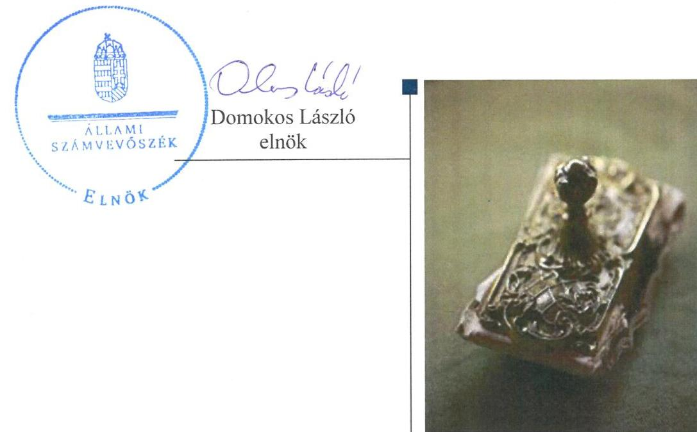
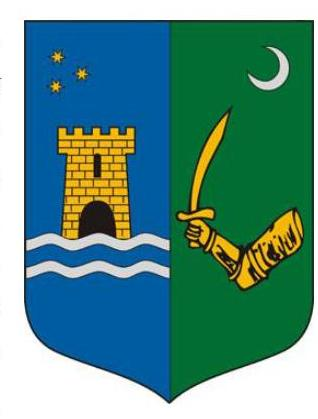
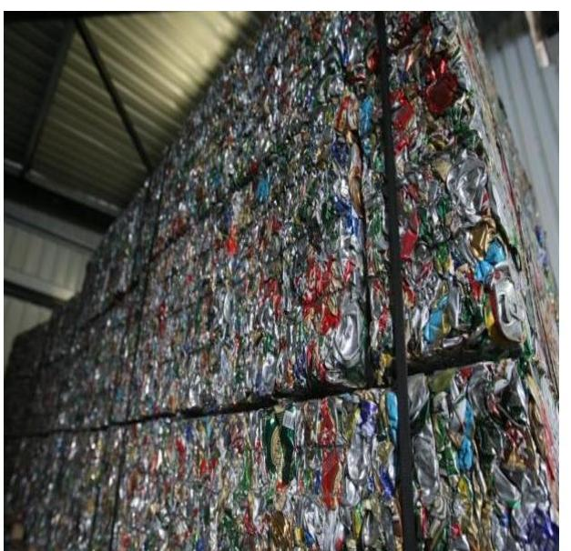
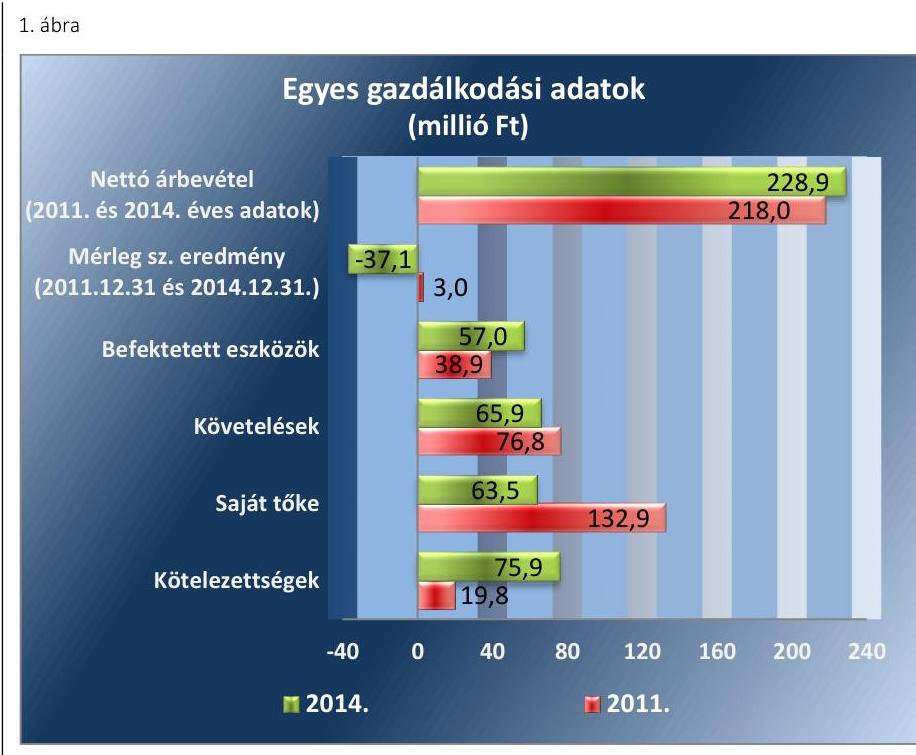
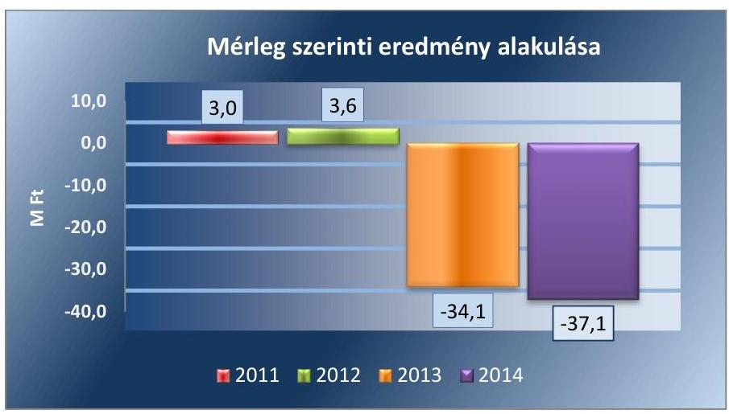
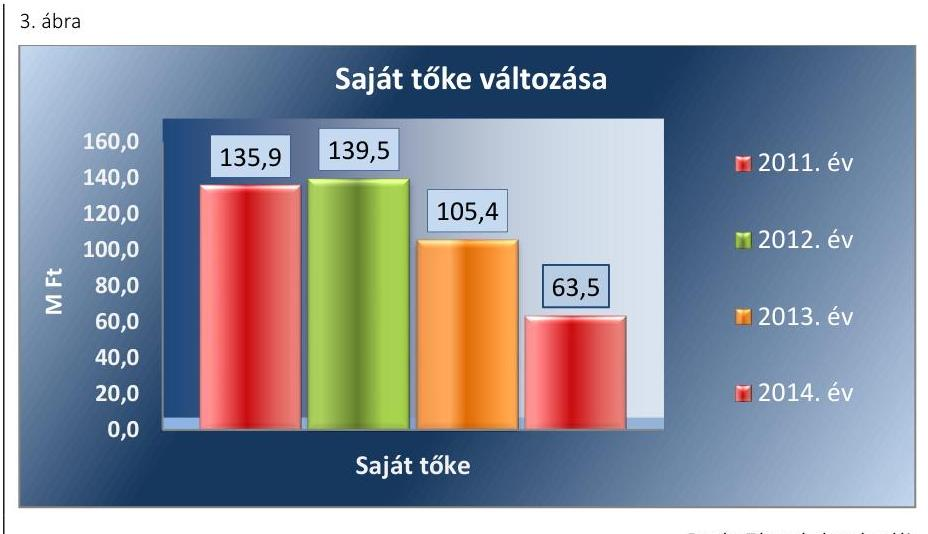

# Jelentés 

## Az önkormányzatok gazdasági társaságai

Az önkormányzatok többségi tulajdonában lévő gazdasági társaságok közfeladat ellátását érintő gazdálkodási tevékenysége szabályszerűségének ellenőrzése - Lenti Hulladékkezelő Kft.

2016.

---

# Jelentés 

## Az önkormányzatok gazdasági társaságai

Az önkormányzatok többségi tulajdonában lévő gazdasági társaságok közfeladat ellátását érintő gazdálkodási tevékenysége szabályszerűségének ellenőrzése - Lenti Hulladékkezelő Kft.
2016. augurttus hó 18 nap

---

# AZ ELLENŐRZÉST FELÜGYELTE:

DR. HORVÁTH MARGIT felügyeleti vezető

## AZ ELLENŐRZÉST VEZETTE ÉS A VÉGREHAJTÁSÁÉRT FELELŐS:

VERTKOVCZI MÁRIA ellenőrzésvezető

## A PROGRAM ÖSSZEÁLLÍTÁSÁÉRT FELELŐS:

JANIK JÓZSEF osztályvezető

IKTATÓSZÁM: V-0974-160/2016.

TÉMASZÁM: 2008

ELLENŐRZÉS-AZONOSÍTÓ SZÁM: V-070725

Jelentéseink az Országgyűlés számítógépes hálózatán és az Interneta a www.asz.hu címen is olvashatóak.

---

# TARTALOMJEGYZÉK 

■ ÖSSZEGZÉS ..... 5
■ AZ ELLENŐRZÉS CÉLJA ..... 7
■ AZ ELLENŐRZÉS TERÜLETE ..... 8
■ AZ ELLENŐRZÉS HÁTTERE, INDOKOLTSÁGA ..... 10
■ A JELENTÉS LÉNYEGES KÉRDÉSKÖREI ..... 11
■ ELLENŐRZÉS HATÓKÖRE ÉS MÓDSZEREI ..... 12
■ MEGÁLLAPÍTÁSOK ..... 14
■ JAVASLATOK ..... 27
■ MELLÉKLETEK ..... 29
I. Sz. melléklet: Értelmező szótár ..... 29
II. Sz. melléklet: Múködési jellemzők ..... 32
■ FÜGGELÉK: ÉSZREVÉTELEK ..... 33
■ RÖVIDÍTÉSEK JEGYZÉKE ..... 35

---

.

---

# ÖSSZEGZÉS 

Az Állami Számvevőszék a Lenti Hulladékkezelő Kft. hulladékgazdálkodás közszolgáltatást érintő gazdálkodási tevékenysége 2011-2014. évek közötti szabályszerűségét ellenőrizte. A hulladékgazdálkodást az Önkormányzat szabályosan szervezte meg. A tulajdonosi jogok gyakorlása szabályszerű volt. A Társaság vagyongazdálkodása szabályszerű volt. A kötelezettségállomány mértéke a hulladékgazdálkodásra és a müködésre nem jelentett kockázatot. A Társaság elszámolásai alapvetően szabályszerűek voltak. A Társaság közszolgáltatói feladattal kapcsolatos önköltségszámitása és árképzési gyakorlata nem volt szabályszerű, ugyanakkor a dijcsökkentést az előirtaknak megfelelően végrehajtotta.

## Az ellenőrzés társadalmi indokoltsága

Az Állami Számvevőszék Stratégiájában megfogalmazta, hogy a helyi önkormányzatok gazdálkodásában rejlő pénzügyi kockázatok feltárásával, az államháztartáson kívülre nyújtott költségvetési támogatások és ingyenes vagyonjuttatások, valamint az államháztartáson kívül múködő közfeladat-ellátó rendszerek ellenőrzéseivel hozzájárul ahhoz, hogy a közpénzeket az államháztartáson kívül múködő szervezetek is átlátható, rendezett módon használják fel a közfeladatok szerződésben vállalt ellátása érdekében.

Magyarországon az intézmény-centrikus közfeladat-ellátás jellemző, de egyre jelentősebb a költségvetésen kívüli feladatellátás térnyerése. Ennek legfontosabb szereplői - a nonprofit szervezetek mellett - az önkormányzati tulajdonú gazdasági társaságok. Az önkormányzatok szervezetalakítási szabadságának következménye, hogy a korábban is vállalati formában múködő közszolgáltatások mellett, mind a kötelező, mind az önként vállalt feladatok ellátásában a gazdasági társaságok kiemelt fontosságú szerephez jutottak.

## Főbb megállapítások, következtetések, javaslatok

Az Önkormányzat a hulladékgazdálkodási közszolgáltatás megszervezéséről az ellenőrzött időszakot megelőzően döntött, annak ellátásáról, a kizárólagos tulajdonában álló gazdasági társasága útján gondoskodott. Az Önkormányzat a tulajdonosi joggyakorlását az Alapító Okiratban és Vagyongazdálkodási rendeletében szabályozta. Az Önkormányzatnak a Társaság feletti tulajdonosi joggyakorlása az ellenőrzött időszakban szabályszerű volt. A tulajdonosi joggyakorlás keretében az Önkormányzat az éves üzleti terveket és beszámolókat megtárgyalta és jóváhagyta. Az számviteli éves beszámolókat a Képviselő-testület az FB írásbeli javaslata alapján, a Könyvvizsgáló jelentés ismeretében az ellenőrzött időszak minden évében jóváhagyta. Az Önkormányzat a hulladékgazdálkodási közszolgáltatást a Hgt.-ben és Ht.-ben előírtaknak megfelelően szerződésben szabályozta, melynek aktualizálása egy esetben nem követte a jogszabályi változást, a Hgt.-ban és a Ht.-ban előírt rendeletalkotási kötelezettségének eleget tett. A Jegyző a 2011-2012. években nem készítette elő a hulladékgazdálkodási tervet. Az Önkormányzat az ellenőrzött időszakban rendelkezett gazdasági programmal. Az FB az ellenőrzött időszakban nem rendelkezett ügyrenddel.

A Társaság nem tett eleget a Hgt. által előírt kötelező hulladékgazdálkodási közszolgáltatást érintő költségek éves beszámolási kötelezettségének. A Társaság rendelkezett a Ht.-ban előírtaknak megfelelő, a 2013. évre vonatkozó hulladékgazdálkodási tervvel. A Társaság elkészítette a jogszabályban előírt szabályzatokat, melyek a tevékenységek szétválasztásának szabályozását, a számlarendet és az önköltségszámítás szabályozását kivéve megfeleltek az előírásoknak. A Társaság a kötelezően ellátandó hulladékgazdálkodási tevékenységen kívül egyéb tevékenységet is végzett,

---

azonban a hulladékgazdálkodási közszolgáltatás tevékenység Hgt. és Ht. szerinti szétválasztás szabályait nem határozta meg. A szabályozás hiánya ellenére a Társaság a közszolgáltatási tevékenységét elkülönítetten mutatta ki a számviteli nyilvántartásában.

A bevételek, ráfordítások elszámolása megfelelő volt, a beruházások elszámolása a Számv. tv.-nek és belső szabályoknak megfelelően történt, azonban a maradványérték figyelmen kívül hagyása miatt az eszközök értékcsökkenése nem minden esetben felelt meg a belső szabályoknak. A Társaság árképzési gyakorlata a díjakat megalapozó önköltségszámítási szabályzat és a közszolgáltatás számviteli szétválasztásának szabályozási hiányosságai miatt nem volt szabályszerű. A díjak csökkenését ugyanakkor a Rezsi tv-ben és a Ht.-ben foglaltaknak megfelelően, szabályszerűen végrehajtotta a Társaság.

A Társaság vagyongazdálkodása szabályszerű volt. Az eszközök használhatósági foka az ellenőrzött időszakban a beruházások ellenére csökkent. A Társaság saját tőkéje a 2012-2014. évek veszteséges gazdálkodása következtében az ellenőrzött időszakban csökkent. A Társaság kötelezettségállománya a múködésére, közszolgáltatásra kockázatot nem jelentett. A hátralékos követelések behajtása szabályszerűen történt az ellenőrzött időszakban.

A Könyvvizsgáló az éves beszámolókat hitelesítő záradékkal látta el annak ellenére, hogy a kötelezően ellátandó hulladékgazdálkodási közszolgáltatással kapcsolatos Hgt. és Ht. által meghatározott, a tevékenységeket elkülönítő szabályozás nem volt a Társaságnál.

Az Info.tv. -ben és az Avtv.-ben előírtaktól eltérően belső adatvédelmi felelőssel a Társaság nem rendelkezett, 2014. évtől hatályos adatvédelmi szabályzata volt a Társaságnak, közzétételi kötelezettségét hiányosan teljesítette.

---

# AZ ELLENŐRZÉS CÉLJA 

Az ellenőrzés célja annak értékelése, hogy az önkormányzat a jogszabályi előírások figyelembe vételével döntött-e az ellenőrzésre kerülő közfeladat megszervezéséről, az önkormányzat/tulajdonosi joggyakorló szabályszerűen gyakorolta-e a tulajdonosi jogokat. A gazdasági társaság közfeladat-ellátása bevételeinek, ráfordításainak elszámolás, és vagyongazdálkodási tevékenysége megfelelt-e a jogszabályi, illetve a közszolgáltatási/vagyonkezelési szerződésben foglalt tulajdonosi előírásoknak, azok végrehajtása szabályszerű volt-e, a gazdasági társaság kötelezettségállománya jelent-e kockázatot a múködésre, illetve a
közfeladat ellátására, a közfeladatok átláthatósága és elszámoltathatósága érdekében biztosítva volt-e a közszolgáltatás dijának megalapozottsága szabályszerű önköltségszámítással.

---

# AZ ELLENŐRZÉS TERÜLETE

## Lenti Város Önkormányzata és a kizárólagos tulajdonában lévő Lenti Hulladékkezelő Kft.

**LENTI VÁROS ÖNKORMÁNYZATA** a 2008. évben hozta létre a Lenti Hulladékkezelő Kft.-t a jogelőd "LE-KO" Kft.¹-ből történt kiválás útján. A gazdasági társaság törzstőkéje 20,0 M Ft pénzbeli betétből állt. A Társaság² az ellenőrzött időszakban 100%-os Önkormányzati³ tulajdonban volt. A Társaság 2013. december 31-ig közszolgáltatóként, 2014. január 1-je és június 30. között a ZALAISPA Nonprofit Zrt. (közszolgáltató) alvállalkozójaként látta el a hulladékgazdálkodási közszolgáltatói feladatokat. 2014. július 1-jétől az Önkormányzat által a Társaságból kiválással létrehozott Lenti Hulladékgazdálkodási Közszolgáltató Nonprofit Kft.⁴ végezte alvállalkozóként a hulladékgazdálkodási közszolgáltatást, ettől az időponttól a Társaság az egyéb tevékenységeit látta el. Az Önkormányzat a Társaság vagyonkezelésébe vagyont nem adott át. Az ellenőrzött időszakban a polgármester és a jegyző személye nem változott, a Polgármester⁵ a 2010. évi önkormányzati választások óta tölti be tisztségét, a 2004. június 1-jével kinevezett Jegyzőt⁶ tartós távolléte miatt 2012. november 14-étől aljegyző helyettesíti.

**A TÁRSASÁG** főtevékenysége az ellenőrzött időszakban a nem veszélyes hulladék kezelése, ártalmatlanítása volt. A Társaság 2014. június 30-áig a szervezett lakossági hulladék elszállítását végezte, valamint a Lenti városhoz tartozó hulladékkezelő Központot és hulladékudvart üzemeltette. A Társaság egyéb tevékenységei keretében begyűjtötte a biológiai és fa hulladékot, továbbá szennyvíziszapot, melyekből komposztot gyártott és forgalmazott. A Társaság egyéb tevékenysége keretében mésztrágya gyártással és értékesítéssel is foglalkozott, illetve Lenti kistérség tulajdonában lévő iskolabuszt üzemeltette az ellenőrzött időszakban. A Társaság 2013. év végéig a közszolgáltatói tevékenységét Lenti városban és további több mint 60 településen végezte. A rendszeres hulladékgyűjtésbe bevont lakások száma több mint 10 ezer volt, ami 20-25 ezer lakost érintett az ellenőrzött időszakban. A Társaság által foglalkoztatottak létszáma 2011. évben 31 fő, 2014. évben 17 fő volt. Az ellenőrzött időszakban a Társaság Ügyvezetőjének⁷ személye nem változott.

A Társaság 2011. és 2014. évi nettó árbevételét, a 2011. december 31-ei és 2014. december 31-ei mérleg szerinti eredményét, valamint a 2011. január 1-jei és 2014. december 31-i főbb mérlegadatait az 1. ábra mutatja be.

---

Forrás: Lenti Hulladékkezelő Kft. éves beszámolói

A Társaság a 2011-2012. években nyereségesen, a 2013-2014. években veszteségesen gazdálkodott. A Társaságnál az értékesítés nettó árbevétele az ellenőrzött négy év alatt összességében 5\%-kal (10,9 M Ft-tal) nőtt, ezzel ellentétesen a saját tőke összege 52,2\%-kal csökkent a 2013-2014. évi negatív mérleg szerinti eredmény miatt. A befektetett eszközök állománya a beruházások következtében a 2011. évihez képest 2014. évre 18,1 M Fttal nőtt. A kötelezettségek az ellenőrzött időszakban 56,1 M Ft-tal nőttek, melyet elsősorban a likviditás biztosítása érdekében felvett kölcsönök okoztak. A követelések állománya 2014. év végére csökkent, amit nagymértékben a 2014. évi közszolgáltatói tevékenység megszűnése befolyásolt.

---

# AZ ELLENŐRZÉS HÁTTERE, INDOKOLTSÁGA 

AZ ÖNKORMÁNYZATI TULAJDONÚ GAZDASÁGI TÁRSASÁGOK teljes körű ellenőrzésének lehetőségét az 1989. évi XXXVIII. törvény 2011. január 1-jétől hatályos módosítása teremtette meg. A közfeladatot ellátó gazdasági társaságok ellenőrzése kiemelten fontos a vagyon megőrzése, megóvása érdekében, valamint a kormányzati szektor elszámolásaiban megjelenő önkormányzati tulajdonú gazdálkodó szervezetek esetében, amelyekkel szemben alapvető követelmény, hogy gazdálkodásuk, müködésük szabályszerű, az általuk szolgáltatott adatok minél megbízhatóbbak legyenek. A közfeladat ellátás költségeinek, ráfordításainak alakulása, színvonala hatással van a lakosság elégedettségére. A törvényalkotás számára - az észlelt problémák, szabálytalanságok, vagy egyéb nem kívánatos jelenségek felszínre kerülésével - az ellenőrzés megállapításai segítséget nyújthatnak az államháztartáson kívüli közfeladat-ellátás értékeléséhez, jogszabályi keretei pontosításához, átláthatóságot biztosító szabályozásához. Meghatározhatóvá válnak a közfeladat ellátásban részt vevő államháztartáson kívüli szervezeteknek - az önkormányzat költségvetését, pénzügyi helyzetét is befolyásoló - kockázatai, lehetővé válik ezen kockázatok csökkentése. Ellenőrzéseink feltárhatják, hogy az önkormányzat közfeladat-ellátási kötelezettségének szabályszerűen tett-e eleget, a feladatellátáshoz rendelt közvagyon müködtetését a tulajdonostól elvárható gondossággal, szabályszerűen szervezte-e meg és a tulajdonosi felügyelete hozzájárult-e a közfeladat-ellátásához. Az ellenőrzés rávilágíthat arra, hogy a gazdasági társaság a közszolgáltatási szerződésben foglaltak betartásával, a közvagyon használatával biztosította-e a szolgáltatás folyatatásának feltételeit, a közfeladat ellátását. Ezzel az ellenőrzöttek és a helyi döntéshozók számára visszajelzést ad feladatszervezési, feladat-ellátási kockázataikról, alapot ad a meglévő hibák megszüntetéséhez, a jobb köz-feladat-ellátás biztosításához. Fokozza a fegyelmet, igazolja, hogy lejárt a következmények nélküli ellenőrzések időszaka. Az ÁSZ értékteremtő rend kialakításához és megőrzéséhez hozzájáruló tevékenysége pozitív hatással van a szervezetről kialakított összkép formálására.

---

# A JELENTÉS LÉNYEGES KÉRDÉSKÖREI 

1. Az önkormányzat közfeladat megszervezéséről szóló döntése, valamint tulajdonosi joggyakorlása szabályszerű volt-e?
2. A gazdasági társaság vagyongazdálkodása szabályszerű volt-e, kötelezettségállománya jelentett-e kockázatot a müködésre, illetve a közfeladat ellátásra?
3. A gazdasági társaságnál az ellátott közfeladat bevételei és ráfordításai elszámolása, valamint az önköltségszámítás és árképzés szabályszerű volt-e?

---

# ELLENŐRZÉS HATÓKÖRE ÉS MÓDSZEREI 

## Az ellenőrzés típusa

Megfelelőségi ellenőrzés

## Az ellenőrzött időszak

2011. január 1-jétől 2014. december 31-ig tartó időszak

## Az ellenőrzés tárgya

A közfeladatot gazdasági társaságokkal ellátó önkormányzatok tulajdonosi joggyakorlása, valamint gazdasági társaságok pénz- és vagyongazdálkodásának szabályozottsága és szabályszerűsége.

Az ellenőrzés tárgya a közfeladat ellátás tekintetében a 2014. évre vonatkozóan korlátozott, mivel a Társaság a hulladékgazdálkodási közszolgáltatási tevékenységét 2014. január 1-jéig végezte közszolgáltatóként. Azt követően 2014. június 30 -áig alvállalkozóként végezte a tevékenységet, majd 2014. július 1-jétől az ellenőrzési időszak végéig közszolgáltatói tevékenységet nem végzett.

Az ellenőrzés kiterjed minden olyan körülményre és adatra, amely az ÁSZ jogszabályban meghatározott feladatainak teljesítéséhez, valamint a program végrehajtása folyamán felmerült újabb összefüggések feltárásához szükséges

## Az ellenőrzött szervezet

Az ellenőrzött szervezetek:
$\longrightarrow$ Lenti Város Önkormányzata
$\longrightarrow$ Lenti Hulladékkezelő Kft.

## Az ellenőrzés jogalapja

Az ellenőrzés jogszabályi alapját az Állami Számvevőszékről szóló 2011. évi LXVI. törvény 5. § (3)-(4)-(5) be-kezdése képezte.

---

# Az ellenőrzés módszerei 

Az ellenőrzést a nemzetközi standardokat irányadónak tekintve az ellenőrzési program ellenőrzési kérdései, az ellenőrzött időszakban hatályos jogszabályok, az ellenőrzés szakmai szabályok és módszertanok figyelembe vételével végezzük.

Az ellenőrzés ideje alatt az ellenőrzött szervezettel történő kapcsolattartást az ÁSZ Szervezeti és Múködési Szabályzatának vonatkozó előírásai alapján biztosítjuk.

Az ellenőrzés a kiválasztott, többségi tulajdonosi jogokat gyakorló önkormányzatra, illetve az ellenőrzésre kijelölt közfeladatot ellátó gazdasági társaság felett tulajdonosi jogokat gyakorló szervezetre és az ellenőrzött közfeladatot ellátó gazdasági társaságra terjed ki. Amennyiben a gazdasági társaságban több önkormányzat együttesen többségi tulajdonos, úgy az ellenőrzést a többségi tulajdonosi jogokat gyakorló önkormányzatnál kell lefolytatni. Az ellenőrzött gazdasági társaságnál, amennyiben az több közfeladatot is ellát, akkor az ellenőrzésre kiválasztott közfeladat-ellátást ellenőrizzük.

Az ellenőrzést a kérdésekre adott válaszok kiértékelésével, valamint a megjelölt adatforrások, a csatolt tanúsítványok felhasználásával, továbbá az adott időszakban hatályos jogszabályok figyelembe vételével kell lefolytatni. Az ellenőrzési kérdések megválaszolásához szükséges bizonyítékok megszerzése a következő ellenőrzési eljárások alkalmazásával történik: megfigyelés, kérdésfeltevés (információkérés), összehasonlítás, valamint elemző eljárás.

A bevételek és ráfordítások elszámolása, valamint a vagyonnyilvántartás terén a szabályszerű múködést mintavétellel ellenőriztük, ez alapján a sokaságokban előforduló hibás tételek arányát becsültük. A jogszabályoknak és a belső előírásoknak megfelelőnek tekintettük az adott területet, amennyiben a minta ellenőrzésének eredménye alapján 95\%-os bizonyossággal a teljes sokaságban a hibaarány kisebb volt mint 10\%, nem megfelelőnek értékeltük, ha a hibaarány a 10\%-ot meghaladta. A ráfordítások elszámolására és a vagyonnyilvántartásra vonatkozó véletlen mintavételt kockázati alapú kiválasztással egészítettük ki, amelynek során évente a három legnagyobb összegű tételt választottuk ki.

---

# 1. Az önkormányzat közfeladat megszervezéséről szóló döntése, valamint tulajdonosi joggyakorlása szabályszerű volt-e? 

Összegző megállapítás

Az Önkormányzat szabályszerűen gondoskodott a hulladékgazdálkodási közszolgáltatás ellátásáról, tulajdonosi jogait szabályszerűen gyakorolta. A Jegyző a 2011-2012. évekre a hulladékgazdálkodási tervet nem készítette elő. Az FB ügyrenddel nem rendelkezett.

Az Önkormányzat a hulladékgazdálkodási közszolgáltatás megszervezéséről szabályszerűen gondoskodott, rendeletalkotási és szerződéskötési kötelezettségének a jogszabályi előírásoknak megfelelően eleget tett, azonban a közszolgáltatói szerződés aktualizálása hiányos volt. A 2011-2012. évekre vonatkozó hulladékgazdálkodási tervet a Jegyző nem készítette elő.

A KÖZTISZTASÁG, A TELEPÜLÉSTISZTASÁG ÉS A HULLADÉKGAZDÁLKODÁS BIZTOSÍTÁSA az ellenőrzött időszakban az Ötv. ${ }^{8}$ 8. § (1) bekezdése és a Mötv. ${ }^{9}$ 13. § (1) bekezdés 19. pontja alapján az önkormányzatok törvényi kötelezettsége volt, melynek megszervezéséről az Önkormányzat szabályszerűen gondoskodott. Az Önkormányzat - az Ötv. 9. § (4) bekezdésében foglalt lehetőséggel élve az ellenőrzött időszakot megelőzően döntött a hulladékgazdálkodás, mint kötelező közszolgáltatás gazdasági társaság útján történő ellátásáról. Az Önkormányzat az Ötv. 9 § (3) bekezdésében és 41. § (1) bekezdésében, továbbá a Ttv. ${ }^{10} 16$. §-ban meghatározottak alapján a hulladékgazdálkodási közszolgáltatás hatásköreit az ellenőrzött időszakot megelőzően a ZALAISPA Hulladékgazdálkodási Társulás ${ }^{11}$ részére átadta, azonban az átadás nem érintette az akkor érvényes, a Társaság és az Önkormányzat között hatályos hulladékkezelési közszolgáltatási szerződést. A Társulás 2014. január 1-jétől a ZALAISPA Nonprofit Zrt. ${ }^{12}$-vel kötött közszolgáltatói szerződést, mely alapján a Társaság 2014. január 1-jétől 2014. június 30 -áig a ZALAISPA Nonprofit Zrt. közszolgáltató alvállalkozójaként ${ }^{13}$ látta el a hulladékgazdálkodási közszolgáltatást. Az Önkormányzat a Társaságból 2013. december 31-ei kiválással létrehozta a Lenti Hulladékgazdálkodási Nonprofit Kft. ${ }^{14}$-t. A ZALAISPA Nonprofit Kft. alvállalkozójaként 2014. július 1-jétől a Lenti Hulladékgazdálkodási Nonprofit Kft. végezte a hulladékgazdálkodási közszolgáltatás feladatait. A Társaság 2014. július 1-jétől az Alapító Okiratában ${ }^{15}$ meghatározott egyéb tevékenységeket látta el, ettől az időponttól hulladékgazdálkodási közszolgáltatási feladatokat nem végzett.

AZ ÖNKORMÁNYZAT GAZDASÁGI PROGRAMJA ${ }^{16}$ a 2010-2014. évekre vonatkozóan megfelelt az Ötv. 91. § (6) bekezdésében

---

foglalt követelményeknek. A gazdasági programban a hulladékgazdálkodást érintően rögzítették, hogy az Önkormányzat részt vesz a ZALAISPA Hulladékgazdálkodási Társulás ${ }^{17}$ munkájában, a szelektív hulladékgyűjtés továbbfejlesztésében.

Az ellenőrzött időszakban a közszolgáltatást, annak választott módját az Ámr. ${ }^{18}$ 20. § (2) bek. c)-d) pontokban, és az Ávr. ${ }^{19}$ 13. § (1) bekezdés c)-d) pontokban előírtaknak megfelelően az Önkormányzat SZMSZ ${ }^{20}$-e tartalmazta.

Az Önkormányzat rendelkezett a Képviselő-testület ${ }^{21}$ által jóváhagyott, az Nvtv. ${ }^{22}$ 9. § (1) bekezdése alapján elkészített Közép- és hosszú távú vagyongazdálkodási tervvel. Az Önkormányzat a Közép- és hosszú távú vagyongazdálkodási tervében a hulladékgazdálkodásra vonatkozóan nem határozott meg célokat, feladatokat.

HULLADÉKGAZDÁLKODÁSI TERVVEL az Önkormányzat a Hgt. ${ }^{23}$ 35. § (1) bekezdésében előírtak ellenére a 2011-2012. években nem rendelkezett, mivel a Jegyző a 241/2001. (XII. 10.) Korm. rendelet ${ }^{24} 1$. § e) pontjában foglaltak ellenére azt nem készítette elő.

A TÁRSASÁG ALAPÍTÓ OKIRATA az ellenőrzött időszakban megfelelt a Gt. 12. § (1), illetve 19. § (4) bekezdéseiben, továbbá a Ptk. 3:5 §-ban foglaltaknak. Tételesen tartalmazta az alapító kizárólagos hatáskörébe tartozó döntéseket, valamint meghatározta az $\mathrm{FB}^{25}$ és az Ügyvezető feladatait. Ennek keretében az Alapító Okiratban meghatározták, hogy az Önkormányzat a döntését megelőzően köteles az Ügyvezető, valamint az FB véleményét megismerni, és csak olyan előterjesztés alapján hozhat határozatot, amely írásos formában tartalmazza e véleményeket. Az Alapító Okirat rendelkezett a Társaság Könyvvizsgálójáról ${ }^{26}$.

A Társaság a hulladékgazdálkodási közszolgáltatást 2013. december 31ig, az Önkormányzattal az ellenőrzött időszakot megelőzően kötött, a Hgt. 28. §-ának megfelelő közszolgáltatási szerződés ${ }^{27}$ alapján végezte.

A Közszolgáltatási szerződésben az ingatlanhasználót terhelő díjhátralék behajtására vonatkozó szabályozás nem került aktualizálásra, mivel a Ht. ${ }^{28}$ 52. § (3) bekezdésében foglaltak alapján 2013. január 1-jétől a hatáskör a Jegyzőtől a NAV ${ }^{29}$-hoz került, ellentétben a Közszolgáltatási szerződésben foglaltakkal, ahol 2013. január 1-jét követően is a Jegyző hatáskörében szerepelt a díjhátralék behajtása.

# A KÖZSZOLGÁLTATÁSSAL KAPCSOLATOS REN- 

DELETALKOTÁSI KÖTELEZETTSÉGÉNEK az Önkormányzat a Hgt. 23. §-ának, illetve a Ht. 35. §-ának megfelelő Hulladékgazdálkodási rendeletében ${ }^{30}$, 2014. július 1-jétől Közszolgáltatási rendeletében ${ }^{31}$ eleget tett, aktualizálását az ellenőrzött időszakban elvégezte. A rendeletek többek között tartalmazták a lakosság és a gazdálkodó szervezetek által fizetendő közszolgáltatási díjakat, a hulladékkezelési költségek számításának alapjául szolgáló kalkulációs sémákat.

---

### 1.2. számú megállapítás

Az Önkormányzat tulajdonosi joggyakorlása szabályszerű volt. Az FB ügyrenddel nem rendelkezett, azonban jogait az ellenőrzött időszakban gyakorolta.

TULAJ DONOSI JOGGYAKORLÁSÁT az Önkormányzat az Alapító Okiratban, a Gt. ${ }^{32}$ 141. § (2) bekezdése és a Vagyongazdálkodási rendelet ${ }^{33}$ elöírásainak megfelelően határozta meg. A Vagyongazdálkodási rendeletben a tulajdonosi jogok gyakorlásának szabályai között rögzítették, hogy a tulajdonosi jogokat és kötelezettségeket a Képviselő-testület gyakorolja. A tulajdonosi joggyakorlására vonatkozó döntést a Pénzügyi Bizottság ${ }^{34}$ véleményezte.

AZ FB három természetes személy tagból állt, mely megfelelt a Gt. 34. § (1), Ptk. 3:121 § (1) bekezdéseiben és a Taktv. ${ }^{35}$ 4. § (2) bekezdésében foglaltaknak. Az Alapító Okiratban az Önkormányzat meghatározta az FB feladatait, valamint múködésének szabályait. Az Alapító Okiratban foglaltak alapján az FB köteles volt megvizsgálni és az Önkormányzat elé terjeszteni a Társaságnál készülő valamennyi fontosabb jelentést és mérleget. Az FB az Alapító Okiratban meghatározott feladataival kapcsolatos határidőkhöz igazodóan ülésezett. Az FB a Képviselő-testületi üléseken a Társaságot érintő napirendi pontokkal kapcsolatban beszámolt, tájékoztatást adott.

A Gt. 34. § (4) bekezdésében, a Ptk. 3:122. § (3) bekezdésében és az Alapító Okiratban foglaltakkal ellentétben az FB nem készítette el az ügyrendjét, és nem terjesztette a Társaság legfőbb szerve elé jóváhagyásra.

A JAVADALMAZÁSI SZABÁLYZATOT ${ }^{36}$ a Taktv. tv. 5. §nak megfelelően az ellenőrzött időszakot megelőzően a Képviselő-testület megalkotta. A Javadalmazási szabályzat alapján az Ügyvezető megbízási díjban részesülhetett, az FB elnöke és tagjai részére 2013. évig tiszteletdíjat állapítottak meg, majd a szabályzat alapján a 2014. évtől az FB tagjai javadalmazásban nem részesülhettek. Az Ügyvezető megbízásos jogviszonyban látta el az Ügyvezetői feladatokat, prémiumban nem részesült az ellenőrzött időszakban.

## AZ ÖNKORMÁNYZAT RÉSZÉRE A TÁRSASÁG TE-

VÉKENYSÉGÉRŐL BESZÁMOLTATÁS az éves beszámoló részét képező kiegészítő melléklet, illetve az éves beszámolóval egyidejűleg készített üzleti jelentés és üzleti terv megtárgyalása során valósult meg az ellenőrzött időszakban. Az Önkormányzat a hulladékgazdálkodási rendelet 6. § (3) bekezdésében előírta, hogy a Társaság köteles a közszolgáltatási tevékenység éves értékeléséhez a Képviselő-testület részére évente részletes beszámolót készíteni, melyeknek a Társaság az üzleti tervekben foglaltak alapján tett eleget. A Társaság az Önkormányzat által előírt módon elkészítette a 2011. és 2012. évi közszolgáltatási díjra vonatkozó javaslatát, melyet a Pénzügyi Bizottság felülvizsgált, és azt a Képviselő-testület a Hulladékgazdálkodási rendelet módosítása mellett elfogadott.

Az Önkormányzat a Társaságnál belső ellenőrzést nem folytatott le az ellenőrzött időszakban. Az Önkormányzat a Társaság által felvett rövid lejáratú hitelhez az az ellenőrzött időszakban garanciát, illetve kezességet nem vállalt.

---

A Társaság mérleg szerinti eredményének 2011-2014. évi alakulását a 2. ábra szemlélteti.
2. ábra

Forrás: a Társaság beszámolói
A Társaság 2011-2012. években nyereségesen gazdálkodott, a 20132014. években a gazdálkodása negatív volt. A Társaság mérleg szerinti eredménye az ellenőrzött időszakban mindösszesen -64,6 M Ft volt. A 2013-2014. évek veszteséges gazdálkodásának legfőbb okai a hulladéklerakási járulék bevezetése, a rezsicsökkentés és a tevékenység átalakulása volt.

# 2. A gazdasági társaság vagyongazdálkodása szabályszerű volt-e, kötelezettségállománya jelentett-e kockázatot a múködésre, illetve a közfeladat ellátásra? 

Összegző megállapítás

A Társaság vagyongazdálkodása szabályszerű volt, azonban a szabályzatai nem minden esetben feleltek meg a jogszabályi előírásoknak. A kötelezettségek állománya a múködésére, illetve a közfeladatainak ellátására nem jelentett kockázatot. A Társaság a beszámolási kötelezettségének eleget tett, adatvédelmi felelőssel nem rendelkezett, a közzétételi kötelezettségét hiányosan teljesítette.
2.1. számú megállapítás

A Társaság rendelkezett az előírt szabályzatokkal, azonban a számlarend, az önköltségszámítási szabályzat és a tevékenységek szétválasztási szabályozása nem felelt meg a jogszabályi előírásoknak.

AZ ÜZLETI TERV készítésére a Társaság az Alapító Okirata alapján volt kötelezett, annak teljesítésével kapcsolatban a Képviselő-testület követelményeket nem határozott meg. Az elkészített, Pénzügyi Bizottság által előzetesen megtárgyalt és az FB által írásban véleményezett üzleti terveket a Képviselő-testület az ellenőrzött időszak mindegyik évében megtárgyalta és jóváhagyta. Az üzleti tervekben a társaság megfogalmazta az üzleti évek célkitűzéseit, bemutatta a műszaki eszközök aktuális állapotát

---

és a jövőbeni fejlesztéseket, elemezte a gazdálkodás bevételeit és költségeit, valamint a vevői követelések nagyságát, okait. Az üzleti tervekben a Társaság bemutatta a szolgáltatás dijait, a megrendelés állomány alakulását, a lakosság tájékoztatásának módját, az egyéb üzleti tevékenységeket, a szervezeti és múködési struktúrát. Az üzleti tervek tartalmazták a Társaság gazdasági-pénzügyi helyzetének, illetve az erős és gyenge pontjainak (SWOT analízis) elemzését, valamint a következő évi terveit.

SZÁMVITELI POLITIKÁVAL ${ }^{37}$ a Társaság az ellenőrzött időszakban rendelkezett, a szabályzatokat az ellenőrzött időszakot megelőzően készítette el, melyek 2014. január 1-vel módosításra kerültek. A Számviteli politika a Számv. tv. ${ }^{38}$ 14. § (5)-(10) és a 161. § (1)-(2) bekezdéseiben előírtaknak megfelelően tartalmazta többek között az eszközök források értékelési szabályait, pénzkezelési szabályzatot, számlarendet, bizonylati rendet, leltározási szabályokat, továbbá a beszámolóval kapcsolatos előírásokat, elveket.

A 2011-2013. években hatályos Számlarend a Számv. tv. 161. § (2) bekezdés a)-b) pontjával ellentétben nem tartalmazta az alkalmazásra kijelölt számla számjelét és megnevezését, valamint azok tartalmi meghatározását, a főkönyvi számlaszámokra vonatkozóan általánosságokban fogalmazta meg a c) pontban előírt főkönyvi számla és az analitikus nyilvántartás kapcsolatát, melyek nem voltak összhangban a gyakorlatban alkalmazott (számlatükörben szereplő) számlaszámokkal, ezáltal a számlarend nem töltötte be funkcióját. A 2014. január 1-jétől hatályos Számlarend ${ }^{39}$ a Számv. tv. 161. § (2) bekezdés a) pontjában előírtakkal ellentétben nem tartalmazta teljes körűen a számlatükörben szerepeltetett és a gyakorlatban alkalmazott főkönyvi számlaszámok számjelét és megnevezését, továbbá a hiányzó számlaszámok esetében a Számv. tv. 161. § (2) bekezdés b)-d) pontjaiban előírtak, így a számlák tartalmát, a számlák értéke növekedésének, csökkenésének jogcímeit, a számlákat érintő gazdasági eseményeket, azok más számlákkal való kapcsolatát, valamint a főkönyvi számla és az analitikus nyilvántartás kapcsolatát, továbbá a számlákhoz kapcsolódóan a Számlarendben foglaltakat alátámasztó bizonylati rendet.

A Társaság a 2011-2012. években a Hgt. 29. § (3) bekezdésében, illetve a 2013. évben a Ht. 50. § (1)-(3) bekezdéseiben, továbbá a 64/2008 (III.28) Korm. rendelet ${ }^{40}$ 5. §-ban előírtak ellenére a hulladékgazdálkodással kapcsolatos közszolgáltatás tevékenységének elkülönítésére vonatkozó szabályozást nem alakította ki, ezáltal nem tett eleget a Számv. tv. 161/A. § (1) bekezdésében foglalt belső szabályozási kötelezettségének, illetve a (2) bekezdésben foglalt ellenőrizhetőséget nem biztosította.

A Társaság, a Számv. tv. 14. § (5) c) pontjában előírtaknak megfelelően, az ellenőrzött időszakra vonatkozóan, rendelkezett hatályos Önköltségszámítási szabályzattal ${ }^{41}$. Az Önköltségszámítási szabályzat tartalma nem felelt meg a Számv. tv. 51. § (2)-(4) bekezdéseiben előírt gyakorlatnak, mivel csak általánosságokat tartalmazott, nem volt alkalmas a Társaság tevékenysége közvetlen és közvetett önköltségének megállapítására. Nem tartalmazta a közszolgáltatás önköltsége megállapításának választott módját és a felosztandó költségek vetítési alapját, nem határozta meg, hogy milyen tételekből állnak a lakossági és a közületi hulladékkezelés ráfordításai, bevételei. Ezzel nem biztosította a 64/2008. (III. 28.) Korm. rendelet 3-5. §-aiban foglalt önköltség, díjmegállapítás és fedezet számítását.

---

# 2.2. számú megállapítás 

A Társaság az ellenőrzött időszakra vonatkozóan rendelkezett szervezeti és múködési szabályzattal, amely a Társaság gazdálkodásának, jellegének megfelelő szabályokat tartalmazta.

## A Társaság vagyongazdálkodása a jogszabályi rendelkezéseknek és a belső előírásoknak megfelelt.

Az eszközökről vezetett nyilvántartás megfelelt a Számv. tv. 159. §-ában előírtaknak. A Társaság olyan könyvviteli nyilvántartást vezetett, amely az eszközökben és a forrásokban bekövetkezett változásokat a valóságnak megfelelően, folyamatosan, zárt rendszerben mutatta be. A vagyonelemek számbavételét év végi leltárral alátámasztották, a leltározások során a Leltározási szabályzat ${ }^{42}$-ban előírtakat betartották.

A Társaság főbb mérlegadataiban bekövetkezett változásokat az 1. táblázat mutatja be:

## MÉRLEGADATOK VÁLTOZÁSA (M FT)

| Megnevezés | 2011.01 .01 | 2011.12 .31 | 2012.12 .31 | 2013.12 .31 | 2014.12 .31 |
| :--: | :--: | :--: | :--: | :--: | :--: |
| Befektetett eszközök | 38,9 | 46,3 | 63,9 | 62,2 | 57,0 |
| ebből: tárgyi eszközök | 38,9 | 45,5 | 63,3 | 61,5 | 56,5 |
| Forgóeszközök | 111,5 | 93,8 | 111,2 | 81,2 | 84,0 |
| ebből: követelések | 76,8 | 55,0 | 57,9 | 61,6 | 65,9 |
| Aktív időbeli elhatárolások | 13,5 | 17,8 | 26,0 | 21,0 | 1,9 |
| ESZKÖZÖK ÖSSZESEN | 163,9 | 157,9 | 201,1 | 164,4 | 142,9 |
| Saját tőke | 132,9 | 135,9 | 139,5 | 105,4 | 63,5 |
| ebből: Jegyzett tőke | 20,0 | 20,0 | 20,0 | 20,0 | 17,0 |
| ebből: Mérleg szerinti eredmény | - | 3,0 | 3,6 | $-34,1$ | $-37,1$ |
| Kötelezettségek | 19,8 | 14,7 | 49,5 | 48,2 | 75,9 |
| Passzív időbeli elhatárolások | 11,2 | 7,3 | 12,1 | 10,8 | 3,5 |
| FORRÁSOK ÖSSZESEN | 163,9 | 157,9 | 201,1 | 164,4 | 142,9 |

Forrás: Hulladékkezelö Kft. éves beszámolói (2011-2014)
AZ ESZKÖZÖK állománya összességében az ellenőrzött időszakban 21,0 M Ft-tal csökkent. A Társaság a 2011. évben 16,6 M Ft, a 2012. évben 27,4 M Ft, a 2013. évben 11,7 M Ft, a 2014. évben 8,1 M Ft értékú beruházást valósított meg, melynek következtében az ellenőrzött időszakban a tárgyi eszközök állománya 2011. év elejéről 2014. év végére 17,6 M Ft-tal nőtt. A forgóeszközök állománya 27,5 M Ft-tal csökkent az ellenőrzött négy évben, amelyből a követelések csökkenése 10,9 M Ft volt.

A SAJÁT TÖKE ÖSSZEGE 2011-2012. években nem változott jelentősen, azonban a 2013. év végén a veszteséges gazdálkodás hatására 34,1 M Ft-tal, a 2014. évben további 41,9 M Ft-tal csökkent. A 2011. év végéhez képest 2014. év végéig összességében 72,4 M Ft összeggel csökkent az értéke. A jegyzett tőke összege a 2014. évben 3,0 M Ft-tal csökkent, a Társaságból kivált Lenti Hulladékgazdálkodási Nonprofit Kft. jegyzett tőkéjének befizetése miatt.

A Társaság saját tőkéje a 2011-2014. években meghaladta a jegyzett tőke értékét, ezért az Önkormányzatnak nem kellett intézkednie - a Gt. 51. $\S$-ának, illetve a Ptk. ${ }^{43}$ 3:133 §-ának előírása alapján - a saját tőke megfelelősége érdekében. Az ellenőrzött időszakban a saját tőke változását a 3. ábra szemlélteti.

---

*Forrás: Társaság beszámolói*

## 2.3. számú megállapítás

**A kötelezettségállomány az ellenőrzött időszakban nem jelentett kockázatot a közfeladat ellátására, illetve a működésre.**

A Társaság hosszú lejáratú kötelezettséggel az ellenőrzött időszakban nem rendelkezett.

A kötelezettségek alakulását a 2011-2014. években a 2. táblázat mutatja:

## KÖTELEZETTSÉGEK ALAKULÁSA (M FT)

|   | 2011. | 2012. | 2013. | 2014.  |
| --- | --- | --- | --- | --- |
|  Hosszú lejáratú kötelezettségek összesen | 0 | 0 | 0 | 0  |
|  Ebből Önkormányzati kölcsön | 0 | 0 | 0 | 0  |
|  Rövid lejáratú kötelezettségek összesen | 14,7 | 49,5 | 48,2 | 75,9  |
|  szállítói kötelezettség | 2,1 | 7,2 | 14,0 | 14,5  |
|  rövid lejáratú kötelezettség kapcsolt vállalkozással szemben (Önkormányzat) |  | 30,0 | 19,7 | 34,0  |
|  egyéb rövid lejáratú kötelezettség | 12,6 | 12,3 | 14,5 | 15,6  |
|  Kötelezettségek összesen | 14,7 | 49,5 | 48,2 | 75,9  |

*Forrás: A Társaság 2011-2014. évi beszámolói, adatszolgáltatása*

## A RÖVID LEJÁRATÚ KÖTELEZETTSÉGEK ÁLLO-MÁNYA 2011.

Január 1. és 2014. december 31. közötti időszakban 56,1 M Ft-tal nőtt. A 2014. év végi kötelezettségállomány 15,6 M Ft hiteltartozásból, 14,5 M Ft szállítói tartozásból, 34,0 M Ft alapító által nyújtott tagi kölcsönből és 11,8 M Ft egyéb rövid lejáratú kötelezettségekből állt.

Az Önkormányzat a Társaság működését, likviditását tagi kölcsönök nyújtásával segítette, melyeknek év végi záró állománya 2012. évben 30,0 M Ft, 2014. évben 34,0 M Ft volt. A 2012. évben a Társaság a 30,0 M Ft tagi kölcsönt a behajtás alatt álló kintlévőségei, valamint a tehergépjármű beszerzéséhez szükséges forrás biztosítása érdekében kapta az Önkormányzattól, mely tagi kölcsönt 2013. március 31-ig, majd határidő módosítás következtében 2013. december 31-ig jegybanki alapkamattal növelt összegben volt köteles visszafizetni. A tagi kölcsön megfizetése a módosított határidőig teljesült, a kamatokat 2014-ben fizette meg a Társaság. A Társaság működőképességének biztosításához az Önkormányzat a 2014. évben két alkalommal– összesen 34,0 M Ft összegben – nyújtott tagi kölcsönt a Társaság részére, a lerakási járulék, a felügyeleti díj és az elektronikus útdíj

---

bevezetése miatti költségnövekedés, valamint a rezsidíj csökkentésből eredő árbevétel kiesés miatt. A Kölcsön visszafizetésére az ellenőrzött időszakot követően került sor.

A Társaság év végi hitelállománnyal a 2013-2014. években rendelkezett, 2013. év végén 19,7 M Ft, 2014. év végén 15,6 M Ft volt a rövid lejáratú tőketartozása. A hiteltartozás a 2013. évben felvett 20 M Ft összegű, egy éves lejáratú vállalkozási folyószámlahitelből állt, amelynek visszafizetési határidejét 2014. évben egy évvel meghosszabbították, így a visszafizetése az ellenőrzött időszakot követően volt esedékes. A szállítói kötelezettségeket a Társaság néhány esetben nem fizette ki határidőben. A Társaság szállítói állománya 2014. év végén 14,5 M Ft volt.

Az eladósodás mértékét kifejező mutatók alakulását a 3. táblázat mutatja be.
3. táblázat

ELADÓSODOTTSÁGI MUTATÓK VÁLTOZÁSA A 2011-2014. ÉVEKBEN

| Mutató megnevezése | 2011. | 2012. | 2013. | 2014. |
| :-- | :--: | :--: | :--: | :--: |
| Eladósodottsági mutató (idegen tőke/összes forrás) | 0,09 | 0,25 | 0,29 | 0,53 |
| Eladósodottság mértéke (kötelezettségek/saját tőke) | 0,11 | 0,36 | 0,46 | 1,19 |
| Nettó eladósodottság (kötelezettségek-követelések) / saját tőke | $-0,30$ | $-0,06$ | $-0,13$ | 0,16 |
| Adósságfedezeti mutató I. (befektetett eszközök+forgóeszközök)/idegen forrás | 9,53 | 3,54 | 2,98 | 1,86 |
| Árbevételre vetített eladósodottság (kötelezettségek-forgóeszközök)/ért. nettó árbevétele | $-0,36$ | $-0,24$ | $-0,13$ | $-0,04$ |

Az idegen tőke összes forráshoz viszonyított arányát kifejező eladósodottság mutató értéke az ellenőrzött időszakban növekvő tendenciát mutatott, azonban az ellenőrzött időszakban nem jelentett kockázatot.

A kötelezettségek és a saját tőke aránya alapján az eladósodottságot mérő mutató a 2011-2013. években jelezte, hogy a saját tőke egyre nagyobb hányadát kötik le a kötelezettségek. 2014. évben a saját tőke már önmagában nem nyújtott fedezetett a kötelezettségekre a 2013-2014. évek veszteségei és a megnövekedett kötelezettségek miatt.

A nettó eladósodottság mutató értéke a 2011-2013. években negatív előjelű volt, mivel a követeléseket fedezték a kötelezettség összegét. A mutató előjele 2014. évben pozitív előjelű lett, mivel a kötelezettségek ebben az évben már meghaladták a követelések összegét.

Az adósságfedezeti mutató I. értéke az ellenőrzött időszakban romlott, 1 Ft adósságra 2011. évben 9,53 Ft, 2014-ben 1,86 Ft vagyon jutott.

Az árbevételre vetített eladósodottság mutató értéke az ellenőrzött időszakban negatív előjelű volt, mivel a forgóeszközök állománya minden évben fedezetet nyújtott a kötelezettségek állományára.

Az eladósodás mértékét kifejező mutatók értéke alapján a kötelezettségállomány a Társaság közfeladat ellátására, illetve működésére az ellenőrzött időszakban nem jelentett kockázatot, azonban a Társaság pénzügyi helyzetével kapcsolatban negatív tendenciákat jeleztek.

---

# 2.4. számú megállapítás 

A Társaság az előírt beszámolási és adatszolgáltatási kötelezettségét kisebb hiányosságok ellenére teljesítette. Adatvédelmi felelősről a Társaság nem gondoskodott, a közzétételi kötelezettségének nem teljes körűen tett eleget.

AZ ÉVES BESZÁMOLÓKAT a Társaság a 2011-2014. évekre vonatkozóan a Számv. tv. 19. § (1) bekezdésében foglaltaknak megfelelően készítette el, azonban a kiegészítő mellékletben nem mutatta be az Ügyvezető és 2011-2012. évekre vonatkozóan az FB tagok járandóságát, ezzel megsértette a Számv. tv. 89. § (4) bekezdés a) pontjában foglaltakat.

A Társaság a Számv. tv. 155. § (2) bekezdése alapján könyvvizsgálatra volt kötelezett. Az éves beszámolókat megtárgyaló Képviselő-testületi ülésekre az előterjesztésekhez minden esetben mellékelték az FB és a Könyvvizsgáló írásbeli jelentését, továbbá a Pénzügyi Bizottság javaslatát. Az éves beszámolókat az ellenőrzött időszakban a Képviselő-testület minden ellenőrzött évben elfogadta. Az éves beszámolók letétbe helyezése a Számv. tv. 153. § (1) bekezdésében előírt határidőben történt meg, közzétételükről a Számv. tv. 154. § (1) bekezdésében foglaltaknak megfelelően gondoskodott a Társaság.

A könyvvizsgáló a Számv. tv. 156. § (4) bekezdésének megfelelően elkészített könyvvizsgálói jelentéseiben a számviteli beszámolókat minősítés nélküli, hitelesítő záradékkal látta el és nyilatkozott arról, hogy az éves beszámolók megbízható és valós képet adtak a Társaság üzleti év végén fennálló vagyoni, pénzügyi, valamint jövedelmi helyzetéről, azonban a 20112014. évi beszámolók felülvizsgálata során a szabályozási hiányosságokat (számlarend, közszolgáltatás számviteli szétválasztás szabályozása) a könyvvizsgáló - sem vezetői levélben, sem az egyszerűsített éves beszámolóról készített független könyvvizsgálói jelentésében - nem kifogásolta.

A Társaság 2011-2012. évekre vonatkozó költségelszámolása a Hgt. 29. § (1) bekezdésében előírtak ellenére a teljes tevékenység költségeit tartalmazta, a közszolgáltatói tevékenységével kapcsolatos költségekről nem számolt be az Önkormányzat részére.

A Társaság a 2013. évi beszámolójának kiegészítő mellékletében a Ht. 50. § (3) bekezdésében előírtak alapján a közszolgáltatói tevékenységét elkülönítetten bemutatta, azonban annak megfelelőssége a tevékenység elkülönítésének a Számv. tv. 161/A. § (1) bekezdésében előírt belső szabályozási hiánya miatt nem volt megállapítható.

A társaság a Ht. 78. § (1)-(4) bekezdésének megfelelően 2013. évre vonatkozóan rendelkezett közszolgáltatói hulladékgazdálkodási tervvel.

## A TÁRSASÁG AZ ADATVÉDELMI ÉS A KÖZÉRDEKŰ ADATOK MEGISMERÉSÉNEK SZABÁLYZATÁT44 2014. évben készítette el. A 2011-2013. években a Társaság az Avtv. ${ }^{45}$ 31/A. § (3) bekezdésében, valamint az Info tv. ${ }^{46}$ 24. § (3), bekezdésében előírtak ellenére nem rendelkezett adatvédelmi szabályzattal. A Társaság a közérdekú adatok és közérdekből nyilvános adatok megismerhetőségének szabályzatát az Avtv. 19. § (4), és 20. § (8) bekezdéseiben, illetve az Info tv. 28 § (1) és 30. § (6) bekezdéseiben előírtak ellenére nem készítette el a 2011-2013. években.

Az Avtv. 31/A. § (1) c) pontjának és az Info tv. 24. § (1) c) pontjának előírása ellenére a Társaságnál adatvédelmi felelős kinevezésére, megbízására

---

a 2011-2013. években nem került sor. A Társaság az Avtv. 19. § (2) bekezdésben, illetve az Info tv. 26. § (2), 33. § (1) bekezdései és az Eisztv. ${ }^{47} 6$. § (1) bekezdésével ellentétben közzétételi kötelezettségének részben tett eleget, mivel a közzétett adatok nem tartalmazták az Info. tv. 1. melléklet I/2. szerinti szervezeti struktúrát, a III/2. szerinti személyzeti adatokat, valamint a III/1. pont szerinti éves beszámolókat.

# 3. A gazdasági társaságnál az ellátott közfeladat bevételei és ráfordításai elszámolása, valamint az önköltségszámítás és árképzés szabályszerű volt-e? 

Összegző megállapítás

A bevételek, ráfordítások és a beruházások elszámolása megfelelő volt, az értékcsökkenés elszámolása nem minden esetben felelt meg a jogszabályoknak. A Társaság önköltségszámítása és árképzése nem volt szabályszerű.
3.1. számú megállapítás

A Társaságnál a bevételek, ráfordítások, valamint a beruházások elszámolása megfelelő volt, az értékcsökkenés elszámolása során a Társaság a belső előírások ellenére a maradványértéket nem vette figyelembe.

A KÖZSZOLGÁLTATÁS BEVÉTELEINEK, RÁFORDÍTÁSAINAK ELSZÁMOLÁSA az ellenőrzött időszakban megfelelően történt. A hulladékkezelésből származó árbevétel számláiban az alapdíj meghatározására a Társaság előírásaival összhangban került sor, főkönyvi számlára való elszámolásuk a Számv. tv.-el összhangban történt.

A Társaság a bevételek, költségek és ráfordítások elkülönítését a vonatkozó szabályozás hiánya ellenére a nyilvántartásokban biztosította. A számviteli nyilvántartását egy hulladékkezelést végzők részére kifejlesztett pénzügyi-számviteli program alkalmazásával vezette. A nyilvántartási rendszerében a Társaság a bevételeit, költségeit, ráfordításait és eszközeit tevékenységenként elkülönítetten vezette, azon belül a közszolgáltatással kapcsolatos elszámolásokat tovább részletezte. A Társaság az alkalmazott ügyviteli rendszerében a költséghelyek és költségviselők elkülönítésére munkaszámokat (kódokat) alkalmazott. A közszolgáltatás alaptevékenységének és kiegészítő tevékenységek esetében valamennyi szolgáltatás, eszköz, valamint szervezeti egység, telephely kóddal azonosítható volt.

Szabályozás hiányában azonban a Számv. tv. 161/A. (1)-(2) bekezdésében, illetve a Számv. tv. 15. § (3) bekezdésében előírtak ellenére a közszolgáltatási tevékenység elkülönítésének átláthatósága, ellenőrizhetősége és megfelelősége nem volt megállapítható. A belső szabályozók nem tartalmazták azokat a szabályokat, amelyek meghatározták, hogy az egyes tételeket milyen kritériumok alapján kellett elkülöníteni a tevékenységek között, ezáltal nem biztosított az egyes tételek egzakt, a könyvviteli szolgáltatást végző személyes mérlegelésétől független besorolása.

A Társaság ellenőrzött időszakban realizált üzemi eredményét a 4. táblázat szemlélteti.

---

4. táblázat

# A TÁRSASÁG ÜZEMI EREDMÉNYÉNEK BEVÉTELEI, RÁFORDÍTÁSAI (M FT) 

| Megnevezés | 2011. | 2012. | 2013. | 2014. |
| :-- | --: | --: | --: | --: |
| Bevételek | 228,0 | 258,4 | 265,3 | 227,0 |
| Ráfordítások | 227,3 | 256,9 | 298,7 | 266,8 |
| Üzemi eredmény (Bevételek - Ráfordítások) | 0,7 | 2,9 | $-33,4$ | $-39,8$ |

A 2014. év kivételével az árbevétel minden évben nőtt az előző évihez viszonyítva. A 2014. évi 39,8 M Ft-os visszaesés ellenére az árbevétel a 2011. évi 228,0 M Ft-nál 2014. évben mindössze 1,0 M Ft-tal alacsonyabb volt. A 2014. évi árbevétel csökkenésének egyik oka a szerkezeti változás, mivel 2014. júliustól nem a Társaság végezte a hulladékgazdálkodási közszolgáltatói tevékenységet. A tevékenységgel kapcsolatos ráfordítások a 2011. évben közel megegyeztek a bevételekkel, a fedezet 1 M Ft alatt alakult. 2012. évben a bevételek növekedése minimálisan meghaladta a ráfordítások értékének növekedését, azonban az üzemi eredmény 3 M Ft alatt maradt. A 2013. évben a ráfordítások több mint 33 M Ft-tal haladták meg e bevételek növekedését, így a tevékenység veszteséges volt, aminek hátterében elsődlegesen a díjak csökkenése és az hulladékgazdálkodással kapcsolatos új járulékok bevezetése állt. A 2014. évben a ráfordítások csökkentek ugyan (31,9 M Ft), de a csökkenés mértékét meghaladta az árbevétel csökkenése (38,3 M Ft), ezáltal az előző évinél nagyobb veszteség keletkezett. A 2014. évi veszteség oka elsősorban a közszolgáltatói tevékenység megszűnésével kapcsolatos, mivel a bevételek csökkenésével arányosan a változó költségek is csökkentek, de a fix költségek maradtak. Az üzemi tevékenység eredménye az ellenőrzött időszakban összességében 39,1 M Ft-tal csökkent.

## A BERUHÁZÁSOK, FELÚJÍTÁSOK ELSZÁMOLÁSA

az ellenőrzött időszakban megfelelő volt. Az eszközök költségelszámolását megalapozó dokumentumok rendelkezésre álltak. A beszerzett eszközöket a megfelelő számlaszámra könyvelték, az állományba vétel a belső szabályokban foglaltaknak megfelelően történt. A Társaság az eszközök aktiválását, üzembe helyezési okmányokon dokumentálta. Az eszközök állományba sorolása a belső szabályoknak megfelelően történt, a nyilvántartás és az elszámolás - a maradványérték kivételével - megfelelt a Számv. tv 47. §-ban és a belső szabályokban foglaltaknak.

A Társaság az értékcsökkenést a Számv. tv. és az Értékelési szabályzat előírásainak megfelelően számolta el, azonban az ellenőrzött időszakban a 2,0 M Ft-ot meghaladó értékű eszközök értékcsökkenésének elszámolásánál több esetben a Számviteli Politikában előírtak ellenére a maradványérték figyelembe vétele nélkül számolták el az értékcsökkenést.

A Társaság tulajdonában lévő tárgyi eszközök közül a közszolgáltatáshoz használt eszközöket érintően az ellenőrzött időszakban összesen 35,9 M Ft terv szerinti értékcsökkenést számoltak el, és 50,7 M Ft értékű fejlesztést valósítottak meg. A 2011-2012. években a beruházások értéke meghaladta az elszámolt értékcsökkenés összegét. A 2013-2014. években az elszámolt értékcsökkenés meghaladta a beruházások összegét. A közszolgáltatás ellátásához használt eszközök használhatósági foka - a fejlesztések ellenére - az ellenőrzött időszakban csökkent, és az eszközök átlagos életkora nőtt. Az elszámolt értékcsökkenés, a megvalósított beruházások, valamint az

---

eszközök használhatósági fokának és átlagos életkorának évenkénti alakulását az 5. táblázat szemlélteti.
5. táblázat

KÖZSZOLGÁLTATÁST KÖZVETLENÜL SZOLGÁLÓ ESZKÖZÖKKEL KAPCSOLTOS ADATOK (M FT)

| Megnevezés | 2011. | 2012. | 2013. | 2014. |
| :-- | --: | --: | --: | --: |
| Elszámolt értékcsökkenés (M Ft) | 6,0 | 8,4 | 10,7 | 10,8 |
| Beruházások, fejlesztések (M Ft) | 8,9 | 26,8 | 8,0 | 7,0 |
| Használhatósági fok (\%) | 70,8 | 69,9 | 60,1 | 51,2 |
| Átlagos életkor (év) | 2,0 | 2,1 | 2,8 | 3,4 |

A HÁTRALÉKOS KÖVETELÉSEK BEHAJTÁSA érdekében a belső szabályzattal nem rendelkezett, azonban kialakította a díjfizetők törzsadat nyilvántartását, amely tartalmazta a díjfizetők azonosításához és a lejárt határidejű követelések behajtásához szükséges adatokat. A Társaság nyilvántartást vezetett a hátralékos követelésekről kiküldött kiértesítésekről és a behajtási intézkedésekről. Az ellenőrzött időszakban a Társaság minden évben bemutatta a beszámoló kiegészítő mellékletében a lejárt vevői követeléseket. A Társaság a hátralékos követelések csökkentése érdekében a 30 napon túl hátralékos vevők részére fizetési emlékeztetőt, majd tértivevényes fizetési felszólítást küldött ki. A saját hatáskörben végrehajtott intézkedések eredménytelensége esetén a Társaság a lejárt követelés állományt a Hgt. 26. § (3) bekezdésének megfelelően 20112012. években intézkedésre átadta a Jegyző, illetve a Ht. 52. § (2)-(3) bekezdései alapján 2013. január 1-jét követően a NAV részére.

A Társaság az ellenőrzött időszakban a vevőkövetelésekre - a Számv.tv. 55. § (1)-(2) bekezdésében foglaltak alapján - összesen 23,6 M Ft értékvesztést számolt el. A Társaságból kiválással létrejött Hulladékgazdálkodási Nonprofit Kft. részére a 2014. évben - vagyonmegosztás keretében - 3,8 M Ft vevőkövetelés került átadásra.

A Társaság vevőállományának és ezen belül a lakossággal szemben fennállói követelés állományának változását a 2011-2014. években a 6. táblázat szemlélteti.
6. táblázat

A VEVŐÁLLOMÁNY ALAKULÁSA (M FT)

| Megnevezés | 2011. | 2011. | 2012. | 2013. | 2014. |
| :-- | --: | --: | --: | --: | --: |
|  | 01.01. | 12.31. | 12.31. | 12.31. | 12.31. |
| Összes vevökövetelés | 73,7 | 50,0 | 54,5 | 57,0 | 63,5 |
| Összes lejárt vevőkövetelés | 43,3 | 35,4 | 39,9 | 33,2 | 36,0 |
| Lakossági követelés | 29,1 | 33,9 | 47,0 | 55,6 | 30,3 |
| Lejárt lakossági követelés | 15,3 | 19,0 | 27,2 | 31,5 | 27,1 |
| Elszámolt értékvesztés | - | 2,6 | 6,2 | 8,6 | 6,2 |

A 2011-2013. években a lejárt lakossági követelések növekedtek, majd 2014. évben csökkentek a hulladékgazdálkodási közszolgáltatási feladatok Hulladékgazdálkodási Nonprofit Kft.-nek történt átadása miatt.

---

### 3.2. számú megállapítás

A Társaság árképzése a hulladékgazdálkodás közszolgáltatással kapcsolatos elkülönítés szabályozási hiánya, illetve az önköltségszámítási szabályzat hiányosságai miatt nem volt szabályszerű, a díjak megállapításakor a rezsicsökkentést a jogszabályoknak megfelelően végrehajtotta.

A TÁRSASÁG ÁRKÉPZÉSE, DÍJMEGÁLLAPÍTÁSA az ellenőrzött időszakban nem volt szabályszerű. A Társaság a szabályozás hiánya ellenére a nyilvántartásaiban elkülönítette a közszolgáltatás alaptevékenység és az ahhoz kapcsolódó kiegészítő tevékenység közvetlenül elszámolható, ténylegesen felmerült költségeit. A Társaság a közszolgáltatási díjakat a Hulladékgazdálkodási rendeletben szereplő kalkulációs séma alkalmazásával határozta meg. Az így megállapított díjakat az Önkormányzat rendeletben elfogadta.

Az alkalmazott díjszámítás nem az Önköltségszámítási szabályzaton alapult, mivel az Önköltségszámítási szabályzat nem volt alkalmas az előírt díjszámítás elvégzésére. Az alkalmazott gyakorlat biztosította a tevékenységek költségének elkülönítését, azonban a szabályozás hiánya miatt a Számv. tv. 15. § (3) és 161/A. § (1)-(2) bekezdései ellenére annak szabályszerűsége, megfelelőssége utólagosan nem állapítható meg.

A Társaság 2013.01.01 - 2013.06.30. között közszolgáltatási díjként a Ht. 91. § (1)-(3) bekezdéseiben meghatározott legmagasabb díjat alkalmazta, a 2012. december 31-ei bruttó díjat megemelte 4,2 \%-kal. Az alkalmazott közszolgáltatási díj mértékét a Rezsi tv. ${ }^{48} 12$. § megfelelően módosította, mely szerint a Társaság a Ht. 91. § (1)-(2) bekezdéseiben előírt, 2013. július 1-jétől az alkalmazott lakossági díjakat a 2012. április 14-ei díj összegének 90\%-ában, a legmagasabb alkalmazható díj összegében határozta meg.

---

# JAVASLATOK 

Az ÁSZ tv. 33. § (1) bekezdésében foglaltak értelmében az ellenőrzött szervezet vezetője köteles a jelentésben foglalt megállapításokhoz kapcsolódó intézkedési tervet összeállítani és azt a jelentés kézhezvételétől számított 30 napon belül az ÁSZ részére megküldeni. Amennyiben az ellenőrzött szervezet vezetője nem küldi meg határidőben az intézkedési tervet, vagy továbbra sem elfogadható intézkedési tervet küld, az Állami Számvevőszék elnöke az ÁSZ tv. 33. § (3) bekezdése a) és b) pontjaiban foglaltakat érvényesítheti.

Javaslataink célja a Lenti Hulladékkezelő Kft. gazdálkodása szabályozottságának helyreállítása annak érdekében, hogy a szabályozási környezet és a gazdálkodási gyakorlat megfelelően tudja támogatni az átlátható múködést.

## A Lenti Hulladékkezelő Kft. ügyvezetőjének

1. Intézkedjen arról, hogy az FB által elkészítendő ügyrend jóváhagyás céljából előterjesztésre kerüljön a tulajdonosi jogokat gyakorló Képvi-selő-testület ülésére.
(1.2. sz. megállapítás 3. bekezdése alapján)
2. Intézkedjen arra vonatkozóan, hogy a Társaság Számlarendje a Számv. tv-nek megfelelően tartalmazza minden alkalmazásra kijelölt számla megnevezését, számjelét, tartalmát, a fökönyvi számla és az analitikus nyilvántartás kapcsolatát, továbbá az alátámasztó bizonylati rendet.
(2.1. sz. megállapítás 3. bekezdése alapján)
3. Intézkedjen arról, hogy a 2,0 M Ft-ot meghaladó értékủ eszközök értékcsökkenésének elszámolása a számviteli politika elöírásainak megfelelően, a maradványérték figyelembe vételével történjen.
(3.1. sz. megállapítás 7. bekezdése alapján)

---

Javaslataink célja az Önkormányzat szabályszerű működésének elősegítése, továbbá az önkormányzati tulajdonosi joggyakorlás kontrolljainak erősítése.

# Lenti Város Önkormányzata polgármesterének 

1. Intézkedjen a közszolgálati tevékenységről készítendő költségelszámolással kapcsolatban feltárt szabálytalanságok tekintetében a felelősség tisztására, és szükség szerint intézkedjen a felelősség érvényesítéséről.
(2.4. sz. megállapítás 4. bekezdése alapján)

---

# MELLÉKLETEK 

- I. SZ. MELLÉKLET: ÉRTELMEZŐ SZÓTÁR
eladósodottságot jellemző mutatók
garancia
gazdasági társaság
gazdálkodó szervezet
keresztfinanszírozás tilalma
eladósodottsági mutató (tőkeáttétel): idegen tőke/összes forrás. Egészségesnek mondható egy olyan mértékű áttétel, amelyet az üzleti tervek szerint és az elmúlt időszak tapasztalatai alapján a társaság megfelelő biztonsággal ki tud termelni. Nagy eszközberuházás-igényű iparágakban értéke magasabb, azaz magasabb eladósodottság is elfogadható, de 75-85\%-ot meghaladó értéknél már itt is erős, sőt túlzott külső finanszírozottságról beszélhetünk. Általánosságban véve kedvező, ha értéke kisebb, mint 0,6 .
eladósodottság mértéke: kötelezettségek / saját tőke. Fontos szerepet játszik ez a mutató egy vállalat megítélésében. Azt mutatja, hogy a saját források a kötelezettségek hány százalékát fedezik. Törekedni kell, hogy a mutató tartósan (jelentősen) 1 alatti értéket érjen el.
nettó eladósodottság: (kötelezettségek-követelések) / saját tőke. Azt mutatja, hogy a kintlévőségekkel csökkentett kötelezettségeket milyen mértékben fedezi a saját forrás. Ez feltételezi, hogy a követelések pénzügyileg előbb realizálódnak, mint ahogy a kötelezettségeket teljesíteni kell. A mutató minél kisebb, csökkenő értéke a kedvező.
adósságfedezeti mutató I.: (befektetett eszközök+forgó eszközök) / idegen forrás. Azt mutatja, hogy 1 Ft adósságra hány Ft vagyon jut. Általánosságban véve kedvező, ha értéke 2 körül van, de nagy eszközberuházás-igényű iparágakban értéke kisebb is lehet.
árbevételre vetített eladósodottság: (kötelezettségek-forgóeszközök) / értékesítés nettó árbevétele. Az árbevételre vetített eladósodottság azt mutatja, hogy az árbevétel mekkora fedezetet nyújt a kötelezettségeknek a forgóeszközökkel csökkentett részére. Általánosságban véve kedvező, ha az árbevétel minél nagyobb arányban nyújt fedezetet a forgóeszközökkel csökkentett kötelezettségekre (értéke kisebb, mint 1, csökken az ellenőrzött időszakban).
A garancia olyan önálló, az önkormányzat nevében vállalt kötelezettség, amely alapján az önkormányzat az önkormányzati költségvetés terhére szerződésben meghatározott feltételek szerint, a kötelezett nem teljesítése esetén a jogosultnak fizetést teljesít az előzetesen rögzített összeghatárig.
Ptk. 3.88. § (1) bekezdése szerint „a gazdasági társaságok üzletszerű közös gazdasági tevékenység folytatására, a tagok vagyoni hozzájárulásával létrehozott, jogi személyiséggel rendelkező vállalkozások, amelyekben a tagok a nyereségből közösen részesednek, és a veszteséget közösen viselik".
A Ptk. 685. § c) pontja szerint gazdálkodó szervezet:
„az állami vállalat, az egyéb állami gazdálkodó szerv, a szövetkezet, a lakásszövetkezet, az európai szövetkezet, a gazdasági társaság, az európai részvénytársaság, az egyesülés, az európai gazdasági egyesülés, az európai területi együttmúködési csoportosulás, az egyes jogi személyek vállalata, a leányvállalat, a vízgazdálkodási társulat, az erdő birtokossági társulat, a végrehajtói iroda, az egyéni cég, továbbá az egyéni vállalkozó." (2014. 03.15-ig hatályos)
A közszolgáltatás diját úgy kell megállapítani, hogy az maradéktalanul fedezetet nyújtson a közszolgáltatás indokolt költségeire és ráfordításaira, valamint a közszolgáltató e tevékenységével kapcsolatos ésszerű nyereségére; az ésszerű nyereség nem tartalmazhatja a közszolgáltatáson kívül eső egyéb gazdasági tevékenységei költségeinek, ráfordításainak fedezetét.

---

kezesség
közszolgáltatás
közszolgáltató
közületi felhasználó
lakossági felhasználó
nemzeti vagyon

A kezességre vonatkozó előírásokat a Ptk. 6:416-430. §-ai tartalmazzák. Kezességi szerződéssel a kezes kötelezettséget vállal a jogosulttal szemben, hogyha a kötelezett nem teljesít, maga fog helyette a jogosultnak teljesíteni. Kezesség egy vagy több, fennálló vagy jövőbeli, feltétlen vagy feltételes, meghatározott vagy meghatározható összegű pénzkövetelés vagy pénzben kifejezhető értékkel rendelkező egyéb kötelezettség biztosítására vállalható.
A Ptk. szerint kezességet csak írásban lehet vállalni. A kezes kötelezettsége ahhoz a kötelezettséghez igazodik, amelyért kezességet vállalt. A kezes kötelezettsége nem válhat terhesebbé, mint amilyen elvállalásakor volt, kiterjed azonban a kötelezett szerződésszegésének jogkövetkezményeire és a kezesség elvállalása után esedékessé váló mellékkövetelésekre is.
A közszolgáltatás: „közcélú, illetőleg közérdekű szolgáltatást jelent, amely egy nagyobb közösség (állam, település) minden tagjára nézve megközelítőleg azonos feltételek mellett vehető igénybe, ezért valamilyen mértékig közösségi megszervezést, illetve szabályozást, ellenőrzést igényel." Az Ebktv. 3. § d) pontja a következőképpen határozza meg a közszolgáltatást: „szerződéskötési kötelezettség alapján a lakosság alapvető szükségleteinek ellátására irányuló szolgáltatás, így különösen a villamos energia-, gáz-, hő-, víz-, szennyvíz- és hulladékkezelési, köztisztasági, postai és távközlési szolgáltatás, továbbá a menetrend alapján közlekedő járművekkel végzett közforgalmú személyszállítás".
A közszolgáltatás ellátására feljogosított hulladékkezelő (Forrás: a 2011-2012. években a Hgt. 21. § (3) bekezdés a) pontja)
Az a hulladékgazdálkodási közszolgáltatási engedéllyel rendelkező és a Ht. szerint minősített gazdálkodó szervezet, amely a települési önkormányzattal kötött hulladékgazdálkodási közszolgáltatási szerződés alapján hulladékgazdálkodási közszolgáltatást lát el. (Forrás: a 2013-2014. években a Ht. 2. § (1) bekezdés 37. pontja). Az a jogi személy, illetőleg jogi személyiséggel nem rendelkező gazdasági társaság, aki (amely) a meghatározott szolgáltatásra, és/vagy a keletkező hulladék elszállítására közüzemi szerződést kötött a közszolgáltatóval.
Az a természetes személy, aki az Önkormányzat közigazgatási, vagy ellátási területén ingatlannal rendelkezik, és aki a közszolgáltatóval a hulladékelszállítására szerződést kötött.
Nvt. 1. § (2) bekezdése szerint:
„az állam vagy a helyi önkormányzat kizárólagos tulajdonában álló dolgok, az a) pont hatálya alá nem tartozó, állam vagy a helyi önkormányzat tulajdonában lévő dolog,
az állam vagy a helyi önkormányzatot tulajdonában lévő pénzügyi eszközök, továbbá az államot vagy a helyi önkormányzatot megillető társasági részesedések, az államot vagy a helyi önkormányzatot megillető bármely vagyoni értékkel rendelkező jogosultság, amelyet jogszabály vagyoni értékű jogként nevesít, Magyarország határa által körbezárt terület feletti légtér,
az üvegházhatású gázok kibocsátási egységeinek kereskedelméről szóló törvény szerint kibocsátási egység és légiközlekedési kibocsátási egység, valamint az ENSZ Éghajlat változási Keretegyezménye és annak Kiotói Jegyzőkönyve végrehajtási keretrendszeréről szóló törvény szerinti kiotói egység,
állami vagy helyi önkormányzati fenntartású közgyűjtemény (muzeális intézmény, levéltár, közgyűjteményként működő kép- és hangarchívum, valamint könyvtár) saját gyűjteményében nyilvántartott kulturális javak körébe tartozó dolog, a régészeti lelet,

---

nonprofit gazdasági társaság
többségi befolyást biztosító részesedés
a nemzeti adatvagyon körébe tartozó állami nyilvántartások fokozottabb védelméről szóló törvény szerinti nemzeti adatvagyon." (hatályos 2012. január 1-jétől, g) pont módosult 2012. június 30-tól)
Ctv. 9/F. § (2) bekezdése szerint „az a gazdasági társaság minősül nonprofit gazdasági társaságnak és cégnevében az a gazdasági társaság tüntetheti fel a nonprofit jelleget, amelynek létesítő okirata tartalmazza, hogy a gazdasági társaság tevékenységéből származó nyereség a tagok között nem osztható fel, hanem az a gazdasági társaság vagyonát gyarapítja." (hatályos 2014. március 15-től)
A Ptk. 8:2. § (1) bekezdése szerint „többségi befolyás az olyan kapcsolat, amelynek révén természetes személy vagy jogi személy (befolyással rendelkező) egy jogi személyben a szavazatok több mint felével vagy meghatározó befolyással rendelkezik."

---

# II. SZ. MELLÉKLET: MŰKÖDÉSI JELLEMZŐK 

## A TÁRSASÁG MŰKÖDÉSÉNEK FŐBB JELLEMZŐI (M FT / \%)

| Sor-   szám | Megnevezés |  | 2011. | 2012. | 2013. | 2014. |
| :--: | :--: | :--: | :--: | :--: | :--: | :--: |
| 1. | A gazdasági társaság tulajdonosi összetétele: |  |  |  |  |  |
| 2. | Tulajdonos Önkormányzat megnevezése: |  |  | Lenti Város Önkormányzata |  |  |
| 3. | Önkormányzat tulajdoni részesedésének aránya | \% |  | 100,0 |  |  |
| 4. | Önkormányzat tulajdoni részesedésének öszszege | M Ft |  | 20,0 |  |  |
| 5. | A tárgyévben a gazdasági társaság vagyonkezelésben lévő önkormányzati vagyon után elszámolt értékcsökkenés összege | M Ft |  | Nem kezelt önkormányzati vagyont |  |  |
| 6. | A tárgyévben az önkormányzati tulajdonú, gazdasági társaság által kezelt eszközök pótlására (karbantartás, felújítás, beruházás) elszámolt költség | M Ft |  | Nem volt |  |  |
| 7. | A tárgyévben a gazdasági társaság saját vagyona után elszámolt értékcsökkenés összege | M Ft | 9,1 | 9,7 | 13,2 | 12,6 |
| 8. | A tárgyévben a saját tulajdonú eszközök pótlására (karbantartás) elszámolt költség | M Ft | 25,7 | 37,2 | 25,0 | 20,7 |
| 9. | Értékesítés nettó árbevétele | M Ft | 218,0 | 258,4 | 262,9 | 228,9 |
| 10. | Müködési cash flow | M Ft | 9,0 | 17,3 | $-27,0$ | $-19,1$ |

---

# FÜGGELÉK: ÉSZREVÉTELEK 

A jelentéstervezetet a Számvevőszék 15 napos észrevételezésre megküldte az ellenőrzött szervezet vezetőjének az ÁSZ tv. 29. §* (1) bekezdése előírásának megfelelően.
Az ÁSZ tv. 29. § (2) bekezdése szerinti 15 napos határidőn belül Lenti Város Önkormányzatának polgármestere nem tett észrevételt, míg Lenti Hulladékkezelő Kft. ügyvezetője a jelentésben foglaltakkal kapcsolatban nemleges észrevételt tett.

[^0]
[^0]:    * 29. § (1) Az Állami Számvevőszék az ellenőrzési megállapításait megküldi az ellenőrzött szervezet vezetőjének vagy az általa megbízott személynek, és annak, akinek személyes felelősségét állapította meg.
    (2) Az ellenőrzött szervezet vezetője és a felelősként megjelölt személy az ellenőrzés megállapításaira tizenöt napon belül írásban észrevételt tehet.
    (3) Az Állami Számvevőszék az észrevételre a beérkezésétől számított harminc napon belül írásban válaszol. A figyelembe nem vett észrevételeket köteles a jelentésben feltüntetni, és megindokolni, hogy azokat miért nem fogadta el.

---

.

---

# RÖVIDÍTÉSEK JEGYZÉKE 

${ }^{1}$ LE-KO Kft.
${ }^{2}$ Társaság
${ }^{3}$ Önkormányzat
${ }^{4}$ Hulladékgazdálkodási Nonprofit Kft.
${ }^{5}$ Polgármester
${ }^{6}$ Jegyző
${ }^{7}$ Ügyvezető
${ }^{8}$ Ötv.
${ }^{9}$ Mötv.
${ }^{10}$ Ttv.
${ }^{11}$ Társulás
${ }^{12}$ ZALAISPA Nonprofit Zrt.
${ }^{13}$ Alvállalkozói szerződés
${ }^{14}$ Lenti Hulladékgazdálkodási Nonprofit Kft.
${ }^{15}$ Alapító Okirat
${ }^{16}$ Gazdasági Program
${ }^{17}$ ZALAISPA Hulladékgazdálkodási Társulás
${ }^{18}$ Ámr.
${ }^{19}$ Ávr.
${ }^{20}$ SZMSZ
${ }^{21}$ Képviselő-testület
${ }^{22}$ Nvtv.
${ }^{23} \mathrm{Hgt}$.
${ }^{24}$ 241/2001. (XII. 10.) Korm. rendelet
„LE-KO" Önkormányzati, Közszolgáltató és Építőipari Korlátolt Felelősségű Társaság
Lenti Hulladékkezelő Korlátolt Felelősségű Társaság
Lenti Város Önkormányzata
Lenti Hulladékgazdálkodási Közszolgáltató Nonprofit Kft.
Lenti Város Önkormányzatának polgármestere
Lenti Város Önkormányzatának jegyzője, 2012. november 14-től a jegyzőt helyettesítő aljegyzője
Lenti Hulladékkezelő Kft. ügyvezetője
A helyi önkormányzatokról szóló 1990, évi LXV törvény (hatálytalan: 2014. október 12-étől)
Magyarország helyi önkormányzatairól szóló 2011. évi CLXXXIX. törvény (hatályos: 2012. január 1-jétől)
a helyi önkormányzatok társulásairól és együttműködéséről szóló 1997. évi CXXXV. törvény
ZALAISPA Hulladékgazdálkodási Társulás, Önkormányzati Társulás a NyugatBalaton és Zala Folyó Medence Nagytérség Települési Szilárdhulladékai Kezelésének Korszerű Megoldására
ZALAISPA Regionális Hulladékgazdálkodási és Környezetvédelmi Nonprofit Zrt. Hulladékgazdálkodási közszolgáltatási szerződés közreműködő igénybe vételével (hatályos: 2014. január 1 - 2014. június 30.)
A Képviselő-testület a Társaság-ból a Gt. 86. § (1) bekezdése szerinti kiválással történő átalakulásáról a 449/2013. (X. 9.) számú határozatában döntött, és egyúttal elfogadta a gazdasági társaság szétválási okiratát. A Zalaegerszegi Törvényszék Cégbírósága hiánypótlási végzése alapján módosított szétválási okiratot a Képviselő-testület az 555/2013. (XII. 18.) számú határozatával fogadta el. A Hulladékgazdálkodási Nonprofit Kft.-t 2013. december 31-i dátummal jegyezték be a cégjegyzékbe.
A Társaság alapító okirata
Lenti Város Önkormányzatának Ciklusprogramja 2010-2014. (A Képviselő-testület elfogadta a 43/2011. (II. 23.) ÖKT. számú határozattal.)
Önkormányzati Társulás a Nyugat-Balaton és Zala Folyó Medence Nagytérség Települési Szilárdhulladékai Kezelésének Korszerű Megoldására
292/2009. (XII. 19.) Korm. rendelet az államháztartás múködési rendjéről (hatálytalan 2012. január 1-jétől)
368/2011. (XII. 31.) Korm. rendelet az államháztartásról szóló törvény végrehajtásáról (hatályos 2012. január 1-jétől)
Lenti Város Önkormányzat Szervezeti és Működési Szabályzata és módosításai (hatályos: 2010. október 07., 2011. február 25., 2012. március 2., 2013. február 27.)

Lenti Város Önkormányzatának Képviselő-testülete
a nemzeti vagyonról szóló 2011. évi CXCVI. törvény
2000. évi XLIII. törvény a hulladékgazdálkodásról, hatályos 2012. december 31-ig; a jegyző hulladékgazdálkodási feladat- és hatásköréről szóló 241/2001. (XII. 10.) Korm. rendelet, hatályos 2002. január 1-jétől 2012. december 31-ig;

---

${ }^{25} \mathrm{FB}$
${ }^{26}$ Könyvvizsgáló
${ }^{27}$ Közszolgáltatási Szerződés
${ }^{28} \mathrm{Ht}$.
${ }^{29}$ NAV
${ }^{30}$ Hulladékgazdálkodási rendelet
${ }^{31}$ Közszolgáltatásról szóló rendelet
${ }^{32}$ Gt.
${ }^{33}$ Vagyongazdálkodási rendelet
${ }^{34}$ Pénzügyi Bizottság
${ }^{35}$ Taktv.
${ }^{36}$ Javadalmazási szabályzat
${ }^{37}$ Számviteli politika
${ }^{38}$ Számv. tv.
${ }^{39}$ Számlarend
${ }^{40}$ 64/2008. (III. 27.) Korm. rendelet
${ }^{41}$ Önköltségszámítási szabályzat
${ }^{42}$ Leltározási szabályzat
${ }^{43}$ Ptk.
${ }^{44}$ Adatvédelmi szabályzat
${ }^{45}$ Avtv.
${ }^{46}$ Info tv.
${ }^{47}$ Eisztv.
${ }^{48}$ Rezsi tv.
a Lenti Hulladékkezelő Korlátolt Felelősségű Társaság Felügyelő Bizottsága
Lenti Hulladékkezelő Kft. könyvvizsgálója
Települési szilárd hulladék kezelési közszolgáltatási szerződés az Önkormányzat és a Társaság között (hatályos 2003. január 1-2014. január 1.)
2012. évi CLXXXV. törvény a hulladékról (hatályos 2013. január 1-jétől)

Nemzeti Adó- és Vámhivatal
a települési szilárd hulladékkal kapcsolatos közszolgáltatásról szóló 16/2010. (XI. 25.) számú önkormányzat rendelet (hatálytalan: 2014. július 1-jétől)
a hulladékgazdálkodási közszolgáltatásról szóló 14/2014. (VI. 26.) számú önkormányzati rendelet (hatályos 2014. július 1-jétől)
a gazdasági társaságokról szóló 2006. évi IV. törvény
Lenti Város Önkormányzat vagyongazdálkodási rendelete és módosítása (hatályos 2010. november 26-2012. március 2., 2012. március 2-től)
Lenti Város Önkormányzatának Pénzügyi és Városfejlesztési Bizottsága
a köztulajdonban álló gazdasági társaságok takarékosabb múködéséről szóló 2009. évi CXXII. törvény

Lenti Hulladékkezelő Kft. vezető tisztségviselőjének javadalmazásáról szóló szabályzat és módosítása (hatályos 2009. július 08-2013. december 31., 2014. január 1-től))
Lenti Hulladékkezelő Kft. Számviteli Politikája és Számlarendje (hatályos: 2009. január 1. - 2013. december 31.)
a számvitelről szóló 2000. évi C. törvény
Lenti Hulladékkezelő Zrt. Számviteli politikája (hatályos 2014. január 1-jétől)
a települési hulladékkezelési közszolgáltatási díj megállapításának részletes szakmai szabályairól
Lenti Hulladékkezelő Kft. Önköltségszámítási szabályzata (hatályos 2008. december 18.-tól)
Leltározási és leltárkészítési szabályzat és módosítása (hatályos volt 2008. december 18-tól 2013.december 31-ig, 2014. január 1-től)
a Polgári Törvénykönyvről szóló 2013. évi V. törvény
Lenti Hulladékkezelő Kft. Adatvédelmi és Adatbiztonsági Szabályzata (hatályos: 2014. június 9-től)
a személyes adatok védelméről és a közérdekú adatok nyilvánosságáról szóló 1992. évi LXIII. törvény (hatálytalan 2012. január 1-jétől)
az információs önrendelkezési jogról és az információszabadságról szóló 2011. évi CXII. törvény
2005. évi XC. törvény az elektronikus információszabadságról, hatályos 2011. december 31-ig;
2013. évi LIV. törvény a rezsicsökkentések végrehajtásáról, hatályos 2013. május 10-től;

---

ÁLLAMI SZÁMVEVŐSZÉK
1052 Budapest, Apáczai Csere János utca 10.
Levélcím: 1364 Budapest 4. Pf. 54
Telefon: +36 14849100 Telefax: +36 14849200
www.asz.hu