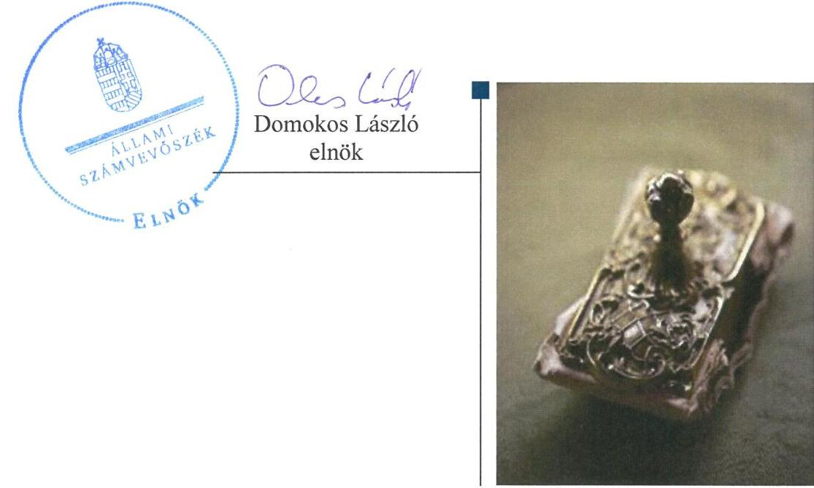
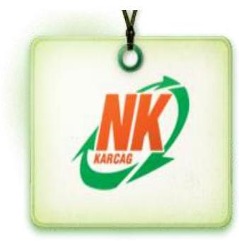
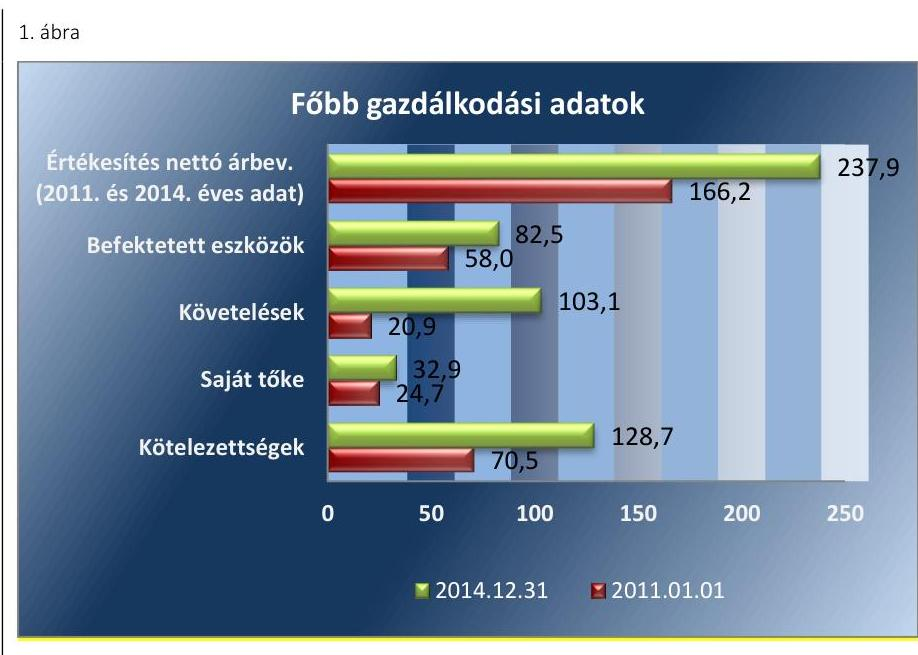
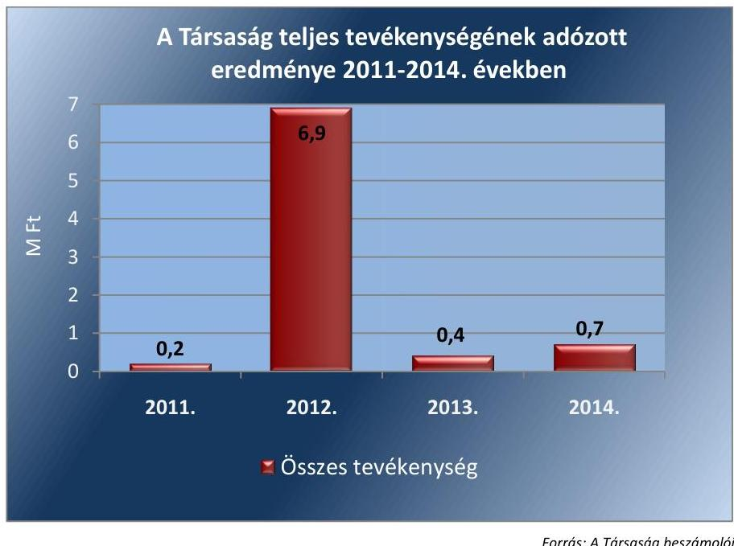
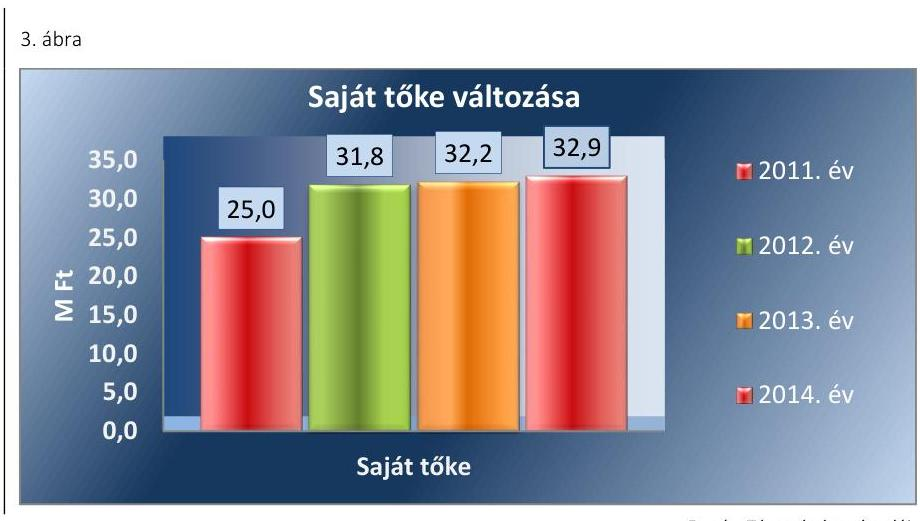
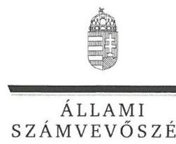
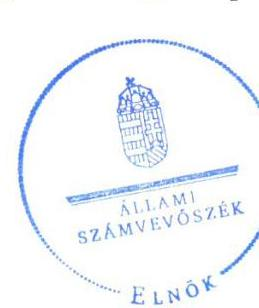

# Jelentés 

## Az önkormányzatok gazdasági társaságai

Az önkormányzatok többségi tulajdonában lévő gazdasági társaságok közfeladat ellátását érintő gazdálkodási tevékenysége szabályszerűségének ellenőrzése - Nagykunsági Környezetvédelmi, Területfejlesztési és Szolgáltató Kft. (Karcag) 2016.

---

# Jelenetés 

## Az önkormányzatok gazdasági társaságai

Az önkormányzatok többségi tulajdonában lévő gazdasági társaságok közfeladat ellátását érintő gazdálkodási tevékenysége szabályszerűségének ellenőrzése - Nagykunsági Környezetvédelmi, Területfejlesztési és Szolgáltató Kft. (Karcag)
2016. auguratus hó 18. nap

---

# AZ ELLENŐRZÉST FELÜGYELTE:

DR. HORVÁTH MARGIT felügyeleti vezető

## AZ ELLENŐRZÉST VEZETTE ÉS A VÉGREHAJTÁSÁÉRT FELELŐS:

VERTKOVCZI MÁRIA ellenőrzésvezető

## A PROGRAM ÖSSZEÁLLÍTÁSÁÉRT FELELŐS:

JANIK JÓZSEF osztályvezető

IKTATÓSZÁM: V-0973-110/2016.

TÉMASZÁM: 2007

ELLENŐRZÉS-AZONOSÍTÓ SZÁM: V-070724

Jelentéseink az Országgyűlés számítógépes hálózatán és az Interneta a www.asz.hu címen is olvashatóak.

---

# TARTALOMJEGYZÉK 

■ ÖSSZEGZÉS ..... 5
■ AZ ELLENŐRZÉS CÉLJA ..... 7
■ AZ ELLENŐRZÉS TERÜLETE ..... 8
■ AZ ELLENŐRZÉS HÁTTERE, INDOKOLTSÁGA ..... 10
■ A JELENTÉS LÉNYEGES KÉRDÉSKÖREI ..... 11
■ ELLENŐRZÉS HATÓKÖRE ÉS MÓDSZEREI ..... 12
■ MEGÁLLAPÍTÁSOK ..... 14
■ JAVASLATOK ..... 28
■ MELLÉKLETEK ..... 31
I. Sz. melléklet: Értelmező szótár ..... 31
II. Sz. melléklet: Múködés főbb jellemzői ..... 34
■ FÜGGELÉK: ÉSZREVÉTELEK ..... 35
■ RÖVIDÍTÉSEK JEGYZÉKE ..... 43

---

.

---

# ÖSSZEGZÉS 

Az Állami Számvevőszék a Nagykunsági Környezetvédelmi, Területfejlesztési és Szolgáltató Kft. hulladékgazdálkodás közszolgáltatást érintő gazdálkodási tevékenysége 2011-2014. évek közötti szabályszerűségét ellenőrizte. A hulladékgazdálkodást az Önkormányzat szabályosan szervezte meg. A tulajdonosi jogok gyakorlása szabályszerű volt. A Társaság vagyongazdálkodása szabályszerű volt. A kötelezettségállomány a müködésre kockázatot jelentett, amit a Társaság az Önkormányzati tartozások átütemezéseivel

kezelt. A társaság közszolgáltatói feladattal kapcsolatos árképzési gyakorlata nem volt szabályszerű, ugyanakkor a dijcsökkentést szabályszerűen végrehajtotta.

## Az ellenőrzés társadalmi indokoltsága

Az Állami Számvevőszék Stratégiájában megfogalmazta, hogy a helyi önkormányzatok gazdálkodásában rejlő pénzügyi kockázatok feltárásával, az államháztartáson kívülre nyújtott költségvetési támogatások és ingyenes vagyonjuttatások, valamint az államháztartáson kívül múködő közfeladat-ellátó rendszerek ellenőrzéseivel hozzájárul ahhoz, hogy a közpénzeket az államháztartáson kívül múködő szervezetek is átlátható, rendezett módon használják fel a közfeladatok szerződésben vállalt ellátása érdekében.

A Magyarországon az intézmény-centrikus közfeladat-ellátás jellemző, de egyre jelentősebb a költségvetésen kívüli feladatellátás térnyerése. Ennek legfontosabb szereplői - a nonprofit szervezetek mellett - az önkormányzati tulajdonú gazdasági társaságok. Az önkormányzatok szervezetalakítási szabadságának következménye, hogy a korábban is vállalati formában múködő közszolgáltatások mellett, mind a kötelező, mind az önként vállalt fel-adatok ellátásában a gazdasági társaságok kiemelt fontosságú szerephez jutottak.

## Főbb megállapítások, következtetések, javaslatok

Az Önkormányzat a hulladékgazdálkodási közszolgáltatás megszervezéséről az ellenőrzött időszakot megelőzően döntött, annak ellátásáról kizárólagos tulajdonában lévő gazdasági társasága útján gondoskodott. Az Önkormányzat a tulajdonosi jogait az Alapító Okiratban és a Vagyongazdálkodási rendeletében szabályozta. Az Önkormányzat tulajdonosi joggyakorlása az ellenőrzött időszakban szabályszerű volt. A tulajdonosi joggyakorlás keretében az Önkormányzat az éves beszámolókat, az Ügyvezető és az FB tevékenységének éves beszámolóit, illetve a Gazdasági programról készült beszámolót megtárgyalta és jóváhagyta. Az éves számviteli beszámolókat az ellenőrzött időszakban a Képviselő-testület a Könyvvizsgáló jelentése és az FB írásbeli jelentése ismeretében az ellenőrzött időszak minden évében elfogadta. Az Önkormányzat a hulladékgazdálkodási közszolgáltatását a Hgt.-ben és Ht.-ben előírtaknak megfelelő szerződésben szabályozta, azonban a Közszolgáltatói szerződés a jogszabályban előírtakat nem teljes körűen tartalmazta. Rendeletalkotási kötelezettségségének az Önkormányzat az ellenőrzött időszakban kisebb hiányosságok ellenére eleget tett. A Jegyző a 2011-2012. években nem készítette elő a hulladékgazdálkodási tervet. Az FB ügyrendjének megfelelően ellátta feladatait.

A Társaság a Hgt. által előírt, a kötelező hulladékgazdálkodási közszolgáltatást érintő költségek éves beszámolási kötelezettségének nem tett eleget. A 2013-2014. évekre vonatkozó hulladékgazdálkodási tervet a Ht.-ban foglaltaknak megfelelően a Társaság elkészítette. A Társaság elkészítette a jogszabályi előírásoknak megfelelő számviteli és egyéb szabályzatokat, azonban több esetben elmaradt azok aktualizálása. A Társaság a kötelezően ellátandó hulladékgazdálkodási tevékenységen kívül egyéb tevékenységet is végzett, viszont 2011-2012. évek vonatkozásában a hulladékgazdálkodási közszolgáltatásra vonatkozóan a Hgt. szerinti elkülönítési szabályokat nem határozta meg, a

---

2011-2012. évi nyilvántartásában nem különítette el a tevékenységek elszámolásait. A 2013-2014. években a Társaság rendelkezett a Ht. előírásainak megfelelően a tevékenységek elkülönített kimutatását biztosító szabályzattal, és nyilvántartásaiban elkülönítetten kimutatta a közszolgáltatás elszámolásait. A bevételek, ráfordítások a Számv. tv. és belső szabályok alapján kerültek elszámolásra. Azonban a 2011-2012. években a közszolgáltatás elkülönítés hiánya és az elszámolási hibák miatt a bevételek és ráfordítások elszámolása nem volt megfelelő. A beruházások elszámolása magas kockázatú volt az ellenőrzött időszakban, mivel az értékcsökkenések elszámolása nem minden esetben felelt meg a Számv. tv-ben, illetve a Számviteli politikában foglaltaknak, továbbá az eszközök könyvelése több esetben nem felelt meg a Számv. tv.-ben foglaltaknak. A Társaság árképzési gyakorlata a közszolgáltatás költségeinek 2011-2012. éveket érintő elkülönítési szabályozás hiánya miatt nem volt szabályszerű. A díjak csökkentését ugyanakkor a Rezsi tv.-ben és a Ht.-ben foglaltaknak megfelelően, szabályszerűen végrehajtotta a Társaság.

A Társaság vagyongazdálkodása szabályszerű volt. Az ellenőrzött időszak végére az értékcsökkenés összegét meghaladó értékű beruházások következtében az eszközök használhatósági foka nőtt. A Társaság saját tőkéje az ellenőrzött időszakban elért pozitív mérleg szerinti eredmény hatására kismértékben nőtt. A hátralékos követelések az ellenőrzött időszakban nőttek. A Társaság a Hgt. és Ht. előírásai ellenére a hátralékos követeléseket nem adta át a 2011-2012. években a Jegyző, a 2013-2014. években a NAV részére, adók módjára történő behajtás céljából. A kötelezettségállomány a múködésére kockázatot jelentett, melyet a Társaság az Önkormányzat tartozásainak átütemezéseivel kezelt.

A Könyvvizsgáló az éves beszámolókról a jelentésében a jogszabályoknak megfelelő tevékenységről nyilatkozott az ellenőrzött időszak minden évére vonatkozóan annak ellenére, hogy a 2011-2012. években a Hgt. által előírt kötelezően ellátandó hulladékgazdálkodási közszolgáltatással kapcsolatos tevékenység elkülönítési szabályozása hiányzott a Társaság nyilvántartásaiból.

Az Info.tv. -ben és az Avtv.-ben előírtaknak megfelelően a Társaság rendelkezett az ellenőrzött időszakban belső adatvédelmi felelőssel, hatályos adatvédelmi szabályzattal, azonban közzétételi kötelezettségét hiányosan teljesítette.

---

# AZ ELLENŐRZÉS CÉLJA 

Az ellenőrzés célja annak értékelése, hogy az önkormányzat a jogszabályi előírások figyelembevételével döntött-e az ellenőrzésre kerülő közfeladat megszervezéséről; az önkormányzat/tulajdonosi joggyakorló szabályszerűen gyakorolta-e a tulajdonosi jogokat; a gazdasági társaság közfeladat-ellátása bevételeinek, ráfordításainak elszámolása, és vagyongazdálkodási tevékenysége megfelelt-e a jogszabályi, illetve a közszolgáltatási/vagyonkezelési szerződésben foglalt tulajdonosi előírásoknak, azok végrehajtása szabályszerű volt-e; a gazdasági társaság kötelezettségállománya jelent-e kockázatot a múködésre, il-
letve a közfeladat ellátására; a közfeladatok átláthatósága és elszámoltathatósága érdekében biztosítva volt-e a közszolgáltatás dijának megalapozottsága szabályszerű önköltségszámítással.

---

# **AZ ELLENŐRZÉS TERÜLETE**

## **Karcag Városi Önkormányzata és a kizárólagos tulajdonában lévő Nagykunsági Környezetvédelmi, Területfejlesztési és Szolgáltató Kft.**

Az Önkormányzat1 a Nagykunsági Környezetvédelmi, Területfejlesztési és Szolgáltató Kft.-t2 az ellenőrzött időszakot megelőzően (2007. évben) alapította a hulladékgazdálkodási közszolgáltatás elvégzésére és a karcagi hulladéklerakó üzemeltetésére.

Az Önkormányzat kizárólagos tulajdonában álló Társaság alaptevékenysége a nem veszélyes hulladék gyűjtése, melynek keretében 2014. június 30-ig látta el Karcag területén a hulladékgazdálkodási közszolgáltatást, ezen túlmenően üzemeltette a karcagi hulladéklerakót. 2014. július 1-jétől a hulladékgazdálkodási közszolgáltatást végző Karcag Térségi Közszolgáltató NKft.3 alvállalkozójaként végezte a hulladékgazdálkodási tevékenységét.

A 2014. évben a közszolgáltatással érintett természetes személy ingatlanhasználók száma 7 ezer felett, a gazdálkodók száma 500 felett volt, továbbá összesen 68 intézményt érintett a Társaság által végzett közszolgáltatás. A hulladéklerakóban ártalmatlanított települési hulladék mennyisége az ellenőrzött időszakban évente 10 ezer t/év körül mozgott.

A Társaságot az Önkormányzat 3,0 M Ft összegű törzstőkével alapította, mely törzstőke összege 2011-2014. között nem változott. A Társaság más társaságban tulajdoni részesedéssel nem rendelkezett. Az közszolgáltatási feladat ellátását szolgáló eszközként az Önkormányzat részéről az alaptőkén túl más vagyoni elem juttatására nem került sor. A Társaság 2011. és 2014. évi bevételeinek, illetve a 2011. január 1-jei és 2014. december 31-i fontosabb adatait az 1. ábra mutatja be.

---

Forrás: A Társaság beszámolói

A Társaság az ellenőrzött időszak minden évében nyereségesen gazdálkodott. Az értékesítés nettó árbevétele 2014-ben 237,9 M Ft volt, ami 43,1\%-kal haladta meg a 2011. évit. A befektetett eszközök állománya 43,1\%-kal nőtt 2014. év végére a 2011. évihez képest. A követelések értéke közel ötszörösére növekedett az ellenőrzési időszakban. A Társaság a saját tőkéjét 30\%-kal növelte az ellenőrzött időszakban. Osztalékfizetésre 20112014. között nem került sor. A kötelezettségek állománya a 2011. és 2014. évek között 82,6\%-kal növekedett.

Az ellenőrzött időszakban a Polgármester ${ }^{4}$ és a Jegyzó ${ }^{5}$ személye nem változott. A Polgármester a 2010. évi önkormányzati választások óta tölti be tisztségét. A Társaság Ügyvezetőjének ${ }^{6}$ személye az alapítás óta nem változott.

---

# AZ ELLENŐRZÉS HÁTTERE, INDOKOLTSÁGA 

## AZ ÖNKORMÁNYZATI TULAJDONÚ GAZDASÁGI

TÁRSASÁGOK teljes körű ellenőrzésének lehetőségét az az Állami Számvevőszékről szóló 1989. évi XXXVIII. törvény 2011. január 1-jétől hatályos módosítása teremtette meg. A közfeladatot ellátó gazdasági társaságok ellenőrzése kiemelten fontos a vagyon megőrzése, megóvása érdekében, valamint a kormányzati szektor elszámolásaiban megjelenő önkormányzati tulajdonú gazdálkodó szervezetek esetében, amelyekkel szemben alapvető követelmény, hogy gazdálkodásuk, működésük szabályszerű, az általuk szolgáltatott adatok minél megbízhatóbbak legyenek. A közfeladat ellátás költségeinek, ráfordításainak alakulása, színvonala hatással van a lakosság elégedettségére. A törvényalkotás számára - az észlelt problémák, szabálytalanságok, vagy egyéb nem kívánatos jelenségek felszínre kerülésével - az ellenőrzés megállapításai segítséget nyújthatnak az államháztartáson kívüli közfeladat-ellátás értékeléséhez, jogszabályi keretei pontosításához, átláthatóságot biztosító szabályozásához. Meghatározhatóvá válnak a közfeladat ellátásban részt vevő államháztartáson kívüli szervezeteknek - az önkormányzat költségvetését, pénzügyi helyzetét is befolyásoló - kockázatai, lehetővé válik ezen kockázatok csökkentése. Ellenőrzéseink feltárhatják, hogy az önkormányzat közfeladat-ellátási kötelezettségének szabályszerűen tett-e eleget, a feladatellátáshoz rendelt közvagyon működtetését a tulajdonostól elvárható gondossággal, szabályszerűen szervezte-e meg és a tulajdonosi felügyelete hozzájárult-e a köz-feladat-ellátásához. Az ellenőrzés rávilágíthat arra, hogy a gazdasági társaság a közszolgáltatási szerződésben foglaltak betartásával, a közvagyon használatával biztosította-e a szolgáltatás folyatatásának feltételeit, a közfeladat ellátását. Ezzel az ellenőrzöttek és a helyi döntéshozók számára visszajelzést ad feladatszervezési, feladat-ellátási kockázataikról, alapot ad a meglévő hibák megszüntetéséhez, a jobb közfeladat-ellátás biztosításához. Fokozza a fegyelmet, igazolja, hogy lejárt a következmények nélküli ellenőrzések időszaka. Az ÁSZ értékteremtő rend kialakításához és megőrzéséhez hozzájáruló tevékenysége pozitív hatással van a szervezetről kialakított összkép formálására.

---

# A JELENTÉS LÉNYEGES KÉRDÉSKÖREI 

1. Az Önkormányzat közfeladat megszervezéséről szóló döntése, valamint tulajdonosi joggyakorlása szabályszerű volt-e?
2. A gazdasági társaság vagyongazdálkodása szabályszerű volt-e, kötelezettségállománya jelentett-e kockázatot a müködésre, illetve a közfeladat ellátásra?
3. A gazdasági társaságnál az ellátott közfeladat bevételei és ráfordításai elszámolása, valamint az önköltségszámítás és árképzés szabályszerű volt-e?

---

# ELLENŐRZÉS HATÓKÖRE ÉS MÓDSZEREI 

## Az ellenőrzés típusa

Megfelelőségi ellenőrzés

## Az ellenőrzött időszak

2011. január 1-jétől 2014. december 31-ig tartó időszak.

## Az ellenőrzés tárgya

A közfeladatot gazdasági társaságokkal ellátó önkormányzatok tulajdonosi joggyakorlása, valamint gazdasági társaságok pénz- és vagyongazdálkodásának szabályozottsága és szabályszerűsége.

Az ellenőrzés tárgya a közfeladat ellátás tekintetében a 2014. évre vonatkozóan korlátozott, mivel a Társaság a hulladékgazdálkodási közszolgáltatási tevékenységét 2014. június 30-ig végezte közszolgáltatóként. Azt követően 2014. július 1-jétől alvállalkozóként végezte a tevékenységet.

Az ellenőrzés kiterjed minden olyan körülményre és adatra, amely az ÁSZ jogszabályban meghatározott feladatainak teljesítéséhez, valamint a program végrehajtása folyamán felmerült újabb összefüggések feltárásához szükséges.

## Az ellenőrzött szervezet

Nagykunsági Környezetvédelmi, Területfejlesztési és Szolgáltató Kft.
Karcag Város Önkormányzata

## Az ellenőrzés jogalapja

Az ellenőrzés jogszabályi alapját az Állami Számvevőszékről szóló 2011. évi LXVI. törvény 5. § (3)-(4)-(5) be-kezdése képezte.

## Az ellenőrzés módszerei

Az ellenőrzést a nemzetközi standardokat irányadónak tekintve az ellenőrzési program ellenőrzési kérdései, az ellenőrzött időszakban hatályos jogszabályok, az ellenőrzés szakmai szabályok és módszertanok figyelembe vételével végezzük.

---

Az ellenőrzés ideje alatt az ellenőrzött szervezettel történő kapcsolattartást az ÁSZ Szervezeti és Múködési Szabályzatának vonatkozó előírásai alapján biztosítjuk.

Az ellenőrzés a kiválasztott, többségi tulajdonosi jogokat gyakorló önkormányzatra, illetve az ellenőrzésre kijelölt közfeladatot ellátó gazdasági társaság felett tulajdonosi jogokat gyakorló szervezetre és az ellenőrzött közfeladatot ellátó gazdasági társaságra terjed ki. Amennyiben a gazdasági társaságban több önkormányzat együttesen többségi tulajdonos, úgy az ellenőrzést a többségi tulajdonosi jogokat gyakorló önkormányzatnál kell lefolytatni. Az ellenőrzött gazdasági társaságnál, amennyiben az több közfeladatot is ellát, akkor az ellenőrzésre kiválasztott közfeladat-ellátást ellenőrizzük.

Az ellenőrzést a kérdésekre adott válaszok kiértékelésével, valamint a megjelölt adatforrások, a csatolt tanúsítványok felhasználásával, továbbá az adott időszakban hatályos jogszabályok figyelembe vételével kell lefolytatni. Az ellenőrzési kérdések megválaszolásához szükséges bizonyítékok megszerzése a következő ellenőrzési eljárások alkalmazásával történik: megfigyelés, kérdésfeltevés (információkérés), összehasonlítás, valamint elemző eljárás.

A bevételek és ráfordítások elszámolása, valamint a vagyonnyilvántartás terén a szabályszerű működést véletlen mintavétellel ellenőriztük. A jogszabályoknak és a belső előírásoknak megfelelőnek tekintettük az adott területet, amennyiben a minta ellenőrzésének eredménye alapján 95\%kos bizonyossággal a teljes sokaságban a hibaarány kisebb volt, mint 10\%, nem megfelelőnek, ha a hibaarány a 10\%-ot meghaladta. Kockázatot, illetve magas kockázatot jeleztünk, amennyiben egy adott terület vonatkozásában a minta alapján a teljes sokaságban nem volt egyértelmúen biztosított a jogszabályoknak és a belső szabályzatoknak megfelelő működés. A ráfordítások elszámolására és a vagyonnyilvántartásra vonatkozó véletlen mintavételt kockázati alapú kiválasztással egészítettük ki, amelynek során évente a három legnagyobb összegű tételt választottuk ki.

---

# 1. Az Önkormányzat közfeladat megszervezéséről szóló döntése, valamint tulajdonosi joggyakorlása szabályszerű volt-e? 

Összegző megállapítás

Az Önkormányzat szabályszerűen gondoskodott a közszolgáltatás ellátásáról, tulajdonosi joggyakorlása szabályszerű volt. Az FB ügyrendje alapján ellátta feladatait. A jegyző a 20112012. évekre a hulladékgazdálkodási tervet nem készítette elő.

Az Önkormányzat szabályszerűen gondoskodott a hulladékgazdálkodási közszolgáltatás megszervezéséről, rendeletalkotási kötelezettségének kisebb hiányosságok ellenére eleget tett. Közszolgáltatási szerződése nem tartalmazta teljes körűen a jogszabályban előírtakat. A Jegyző nem készítette elő a 2011-2012. évekre vonatkozó hulladékgazdálkodási tervet.

A KÖZTISZTASÁG, TELEPÜLÉSTISZTASÁG BIZTOSÍTÁSA ÉS A HULLADÉKGAZDÁLKODÁS az Ötv. ${ }^{7}$ 8. § (1) bekezdése, illetve a Mötv. ${ }^{8}$ 13. § (1) bekezdés 19. pontja alapján az Önkormányzat törvényi kötelezettsége volt. A hulladékgazdálkodási közszolgáltatás ellátására vonatkozó önkormányzati döntések az ellenőrzött időszakot megelőzően történtek. A hulladékgazdálkodási közszolgáltatás teljesítésére a 2013. január 1-jén hatályba lépett Ht. ${ }^{9} 90$. § (8) bekezdésében előírtaknak való megfelelés érdekében az Önkormányzat 2013. év végén létrehozta a kizárólagos tulajdonában lévő Karcag Térségi Közszolgáltató Nkft.-t. A Társaság 2014. július 1-től a hulladékgazdálkodási tevékenységét, a közszolgáltatást 2014. július 1-jétől ellátó Karcag Térségi Közszolgáltató Nkft. alvállalkozójaként végezte. A hulladékgazdálkodási közszolgáltatást 2014. június 30-ig ellátó Társaság a közszolgáltatást saját, illetve a Városgondnokságtól ${ }^{10}$ bérelt eszközökkel végezte.

AZ ÖNKORMÁNYZAT GAZDASÁGI PROGRAMJÁT ${ }^{11}$ a Képviselő-testület ${ }^{12}$ az Ötv ${ }^{13}$. 91. § (6) bekezdése alapján határozta meg a 2011-2014. évekre vonatkozóan, mely tartalmazta a hulladékgazdálkodást érintő „települési szilárdhulladék-lerakókat érintő térségi szintű rekultivációs programok elvégzése" tárgyú KEOP ${ }^{14}$ projekt ${ }^{15}$ megvalósítását. A Gazdasági Program végrehajtásáról szóló 2014. évi beszámoló ${ }^{16}$ részletesen bemutatta a KEOP hulladéklerakó rekultivációs projekt sikeres megvalósítását, továbbá Karcag hulladékgazdálkodásának 2011-2014. évek közötti helyzetét.

Az Nvtv. ${ }^{17}$ 9. § (1) bekezdése előírásának megfelelően az Önkormányzat elkészítette a Közép- és hosszú távú vagyongazdálkodási tervét ${ }^{18}$, amely a hulladékgazdálkodásra vonatkozó célokat, feladatokat nem tartalmazott.

---

HULLADÉKGAZDÁLKODÁSI TERVVEL az Önkormányzat a Hgt. ${ }^{19}$ 35.§ (1) és 37. § (1) bekezdésében előírtak ellenére 2011-2012. években nem rendelkezett, a tervet a 241/2001 Korm. rendelet ${ }^{20}$ 1. § e) pontjában foglaltakkal ellentétesen a Jegyző 2011-2012. évekre vonatkozóan nem készítette elő.

AZ ALAPÍTÓ OKIRATBAN ${ }^{21}$ az Önkormányzat a Gt. ${ }^{22} 12$. § (1) bekezdésében előírtaknak megfelelően rögzítette az alaptevékenységének körét, a törzstőke értékét, az Ügyvezető személyét, az $\mathrm{FB}^{23}$ tagjait és a Könyvvizsgáló ${ }^{24}$ személyét. Az Alapító Okirat az ellenőrzött időszakban két alkalommal került módosításra, a 2011. évben az FB és Könyvvizsgálóval kapcsolatos módosítások, a 2012. évben az Ügyvezető jogviszonyának változása miatt.

A KÖZSZOLGÁLTATÁS ELLÁTÁSÁRA az Önkormányzat a Hgt. 28. § (1) bekezdésében előírtak alapján 2007. évben a Társasággal Vállalkozási Szerződést ${ }^{25}$ kötött.

A Vállalkozási szerződésben a 224/2004. (VII. 22.) Korm. rendelet ${ }^{26}$ 12. § (1) bekezdés i) pontjában, a (2) bekezdés a)-c) pontjában, illetve a 15. § és 16. § (1)-(6) bekezdésében előírtak ellenére nem határozták meg:
$\longrightarrow$ a közszolgáltató kötelességeként a fogyasztói kifogások és észrevételek elintézési rendjének megállapítását;
$\longrightarrow$ az Önkormányzat kötelességeként a közszolgáltatás hatékony és folyamatos ellátásához a közszolgáltató számára szükséges információk szolgáltatását, a közszolgáltatás körébe tartozó és a településen folyó egyéb hulladékkezelési tevékenységek összehangolásának elősegítését és településen működtetett különböző közszolgáltatások összehangolásának elősegítését;
$\longrightarrow$ a közszolgáltatási szerződés módosítására, megszűnésére és felmondására vonatkozó rendelkezéseket.
Az Önkormányzat a Vállalkozási szerződés felülvizsgálatát - a jogszabályi rendelkezések változása ellenére - nem végezte el, ennek következtében 2013. január 1-jétől a díjhátralékok beszedésének módjára vonatkozó rendelkezés nem volt összhangban a Ht. 52. § (3) bekezdésében előírtakkal, mely szerint ettől az időponttól a díjhátralék adók módjára történő behajtására a NAV részére kellett átadni.

RENDELETALKOTÁSI KÖTELEZETTSÉGÉNEK eleget téve az Önkormányzat a Hgt. 23. § -ban foglaltak alapján megalkotta a Hulladékgazdálkodási rendeletet ${ }^{27}$.

A Hulladékgazdálkodási rendelet azonban a Hgt. 23. g) pontjában előírtak ellenére nem tartalmazta a közszolgáltatással összefüggő személyes adatok (közszolgáltatást igénybe vevő neve, lakcíme, születési helye és ideje, anyja neve) kezelésére vonatkozó rendelkezéseket.

A Díjmegállapításra vonatkozó önkormányzati rendelet ${ }^{28}$ tartalmazta a díjmegállapításra és a díj megfizetésére vonatkozó rendelkezéseket, az Önkormányzat ármegállapító hatósági jogkörének 2013. január 1-jétől való megszűnéséig a jogszabályi rendelkezéseket figyelembe véve szabályozta a szolgáltatási díj megállapítására és a díjfizetés feltételeinek és módjának megállapítására vonatkozó előírásokat.

---

### 1.2. számú megállapítás

Az Önkormányzat tulajdonosi jogait az ellenőrzött időszakban szabályszerűen gyakorolta, azonban a 2013-2014. években a tervezett belső ellenőrzések nem valósultak meg. Az FB ügyrend alapján ellátta feladatait.

A TULAJDONOSI JOGOK GYAKORLÁSÁT az Önkormányzat az Alapító Okiratban, a Gt. 141. § (2), illetve a Ptk. ${ }^{29}$. 3:188. § (2) bekezdésében és a Vagyongazdálkodási rendeletben ${ }^{30}$ megfogalmazott előírásoknak megfelelően határozta meg. A Képviselő-testület a tulajdonosi jogok gyakorlásának rendjét a jogszabályi és belső előírásoknak megfelelően alakította ki. A Könyvvizsgáló adatait az alapító okirat a Gt. 12. § (1) bekezdés f) pontjának megfelelően tartalmazta. A Képviselő-testület a Társaság vonatkozásában a Gt. 141. § (2) bekezdés I) pontjának megfelelően az ellenőrzött időszakban döntött a könyvvizsgáló megválasztásáról, a Gt. 41. § (1) bekezdésében előírtak ellenére azonban nem határozta meg a könyvvizsgálóval kötendő szerződés lényeges elemeinek tartalmát.

A TÁRSASÁG FELÜGYELŐ BIZOTTSÁGÁNAK létrehozásáról, a tagjainak megválasztásáról és díjazásukról a Gt. 33. § (2) bekezdés k) pontja, a Gt. 141. § (2) bekezdés k) pontja, továbbá a Taktv. ${ }^{31} 4 . \S$ (1) bekezdésének megfelelően az ellenőrzött időszakban a Képviselő-testület gondoskodott. Az FB létszámát a Gt. 34. § (1) bekezdése és a Taktv. 4. § (2) bekezdése szerint három főben határozták meg. Az FB feladatait az FB által megállapított és a Képviselő-testület által jóváhagyott Ügyrend ${ }^{32}$ alapján látta el.

RENDSZERES ELLENŐRZÉSI TEVÉKENYSÉGET a Képviselő-testület a számviteli beszámolók elfogadásán, a Társaság Ügyvezetőjének és az FB tevékenységének éves beszámolásán, a Könyvvizsgáló jelentésének megismerésén, a díjmegállapításhoz készített javaslatról szóló döntéshez kapcsolódóan a hulladékgazdálkodás helyzetének megismerésén keresztül gyakorolta. Az Önkormányzat a Gazdasági programjáról készült beszámolóiban külön fejezetben számolt be a Társaság müködéséről, eredményeiről.

A Képviselő-testület a 2013. és 2014. évekre vonatkozóan elfogadta az FB éves működéséről szóló beszámolóját, illetve az Ügyvezető éves tevékenységéről szóló beszámolóját. A Képviselő-testület a Társaság 2011-2014. éves beszámolóinak elfogadásával döntött a Társaság eredményének felhasználásáról, annak eredménytartalékba helyezéséről. A Képvi-selő-testület a Társaság vonatkozásában a Gt. 141. § (2) bekezdés j) pontjának megfelelően az ellenőrzött időszakban döntött az Ügyvezető díjazásáról.

JAVADALMAZÁSI SZABÁLYZATTAL ${ }^{33}$ a Taktv. 5. § (3) bekezdésében foglaltaknak megfelelően az ellenőrzött időszakban rendelkezett a Társaság. A javadalmazási szabályzatot a Képviselő-testület jóváhagyta, a szabályozás megfelelt a Tak. tv. 5. § (3) bekezdése előírásának. A Javadalmazási szabályzat az Ügyvezető javadalmazásával, az FB tagok díjazásával kapcsolatos szabályokat és követelményeket tartalmazta, a szabályzat szerint ügyvezető részére az éves szinten elérhető prémium mér-

---

téke az éves alapbér 50\% a lehetett. Az ellenőrzött években prémium kiírásra és kifizetésre nem került sor. Az ellenőrzött időszakban az Ügyvezető munkaviszony keretében látta el feladatait.

AZ ÖNKORMÁNYZAT BELSŐ ELLENŐRZÉSE nem végzett ellenőrzést a Társaságnál. Az éves belső ellenőrzési terveket megalapozó kockázatelemzés eredményeként az Önkormányzat a 2013. és 2014. években az Áht 70. § (1) d) pontjában előírt lehetőséggel élve a Társaságot pénzügyi, illetve rendszerellenőrzésre jelölte ki. A 2013. évi Önkormányzati belső ellenőrzési terv tartalmazta a 2013. évi lerakási járulékfizetési kötelezettség vizsgálata tárgyú pénzügyi ellenőrzést, a 2014. évi terv a Társaság átfogó rendszerellenőrzését. A tervezett belső ellenőrzések az ellenőrzött időszakban nem teljesültek.

Hitelfelvétel, kötvény kibocsátás 2011-2014 között a Társaság részéről nem történt, egyéb kötelezettségekhez való garancia- vagy kezesség vállalására az Önkormányzat részéről nem került sor.

A Társaság adózott eredményét a 2. ábra mutatja be.
2. ábra

A Társaság az ellenőrzött időszakban pozitív eredményt ért el minden évben, a 2012. évben a többi évhez viszonyítva kiemelkedőt. A 2013-as évben a megnövekedett ráfordítások (új járulékfizetési kötelezettség bevezetése) következtében, a csökkenő díjak, továbbá 2014. évben a közszolgáltatói tevékenység megszűnése negatívan befolyásolták az eredményességet.

---

# 2. A gazdasági társaság vagyongazdálkodása szabályszerű volt-e, kötelezettségállománya jelentett-e kockázatot a múködésre, illetve a közfeladat ellátásra? 

Összegző megállapítás

A Társaság vagyongazdálkodása szabályszerű volt, az előírt szabályzatokkal rendelkezett, azonban a 2011-2012. években a közszolgáltatás elkülönítésének szabályozásáról nem gondoskodott. A kötelezettségállomány kockázatot jelentett a múködésére, melyet a Társaság az Önkormányzati tartozások átütemezéseivel kezelt. A Társaság beszámolási, adatszolgáltatási, adatvédelmi kötelezettségeinek eleget tett, azonban közzétételi kötelezettségét hiányosan teljesítette.
2.1. számú megállapítás

A Társaság az előírt szabályzatokkal rendelkezett, amelyek a Számviteli Politika és a Pénzkezelési szabályzat aktualizálását kivéve a jogszabályoknak megfeleltek, azonban a 2011-2012. években nem szabályozta a közszolgáltatás elkülönítését.

Üzleti terv készítésére vonatkozó előírást az Önkormányzat nem határozott meg a Társaság részére, a Társaság az ellenőrzött időszakban nem készített üzleti terveket.

A SZÁMVITELI POLITIKÁJÁT ${ }^{34}$ a Társaság a Számv. tv. 14. § (3) bekezdésben előírtaknak megfelelően kialakította és annak keretében elkészítette a Számv. tv. 14. § (5) bekezdés b) pontjában előírt eszközök és források értékelési szabályzatát, illetve a 161. § (1) bekezdésben előírtaknak megfelelő számlarendjét, számlatükrét, és bizonylati rendjét.

A Számviteli politikát a Társaság minden ellenőrzött évben újból hatályba helyezte, azonban az új verzió hatálybaléptetésével nem helyezték hatályon kívül az előző évi Számviteli politikát.

A Társaság rendelkezett a Számv. tv. 14. § (5) bekezdése a) pontjában előírtaknak megfelelő Leltározási szabályzattal ${ }^{35}$. A szabályzat előírta, hogy a leltározást az éves beszámoló összeállítását megelőzően minden évben, a fordulónapra vonatkozóan, minden eszköz és forrás tekintetében el kell végezni.

A Számv. tv. 14. § (5) bekezdés d) pontjának megfelelően a Társaság az ellenőrzött időszakra vonatkozóan rendelkezett Pénzkezelési szabályzat$\mathrm{tal}^{36}$. A Számv. tv. 14. § (11) bekezdésében foglaltakkal ellentétben a Pénzkezelési szabályzat aktualizálás hiányában több, az ellenőrzési időszakban hatályon kívül helyezett jogszabályi hivatkozást tartalmazott.

A Társaság a 2011-2012. években a Hgt. 29. § (3) bekezdésében, a 64/2008. (III.28.) Korm. rendelet 5. §-ában, továbbá a Számv. tv. 161/A. § (1) bekezdésében előírtak teljesíthetősége érdekében nem szabályozta a hulladékgazdálkodás közszolgáltatás számviteli szétválasztását, elkülönített nyilvántartásának vezetését.

---

# 2.2. számú megállapítás 

A Társaság a 2013-2014. években a közszolgáltatási tevékenység elkülönítését a Számviteli politikáján belül szabályozta a Ht. 50. § (1)-(2) bekezdései, a 64/2008. (III.28.) Korm. rendelet 5. §-ában, illetve a Számv. tv. 161/A. §-ában foglaltaknak megfelelően. A szabályozás tartalmazta az elkülönítés módszerét, kalkulációs sémát az önköltség és szűkített önköltség számítását, a közvetlen költségek definícióját, a közvetett költségek felosztásának elvét és módszerét, az általános költségek részletezését, továbbá a számviteli rendszerben a szétválasztás érdekében alkalmazott munkaszámokat. A Társaság a Számv. tv. 14. § (6) bekezdése alapján az ellenőrzött időszakban mentesült az önköltségszámítási szabályzat készítése alól.

## A Társaság vagyongazdálkodása megfelelt a jogszabályi és belső előírásoknak.

A Társaság az éves könyvviteli zárás során eszközeit és forrásait a Számv. tv. 69. § (1) bekezdésének és a belső szabályzatában foglaltak szerint leltározta. A Társaság a közszolgáltatási feladatát saját és bérelt eszközökkel látta el 2011-2014. június 30 -áig tartó időszakban. A Társaság közszolgáltatása során a vagyonérték megőrzése, gyarapítása, hasznosítása megfelelt az előírásoknak, az ellenőrzött éveket eredményesen zárták.

A Társaság mérlegének főbb adatait a 1. táblázat tartalmazza.

## MÉRLEGADATOK VÁLTOZÁSA (M FT)

| Mégnevezés | 2011.01.01. | 2011.12.31. | 2012.12.31. | 2013.12.31. | 2014.12.31. |
| :--: | :--: | :--: | :--: | :--: | :--: |
| Befektetett eszközök | 58,0 | 54,0 | 47,7 | 44,4 | 82,5 |
| ebből: tárgyi eszközök | 57,7 | 53,8 | 47,6 | 44,1 | 82,3 |
| Forgóeszközök | 31,6 | 31,2 | 71,7 | 101,8 | 150,7 |
| ebből: követelések | 20,9 | 20,8 | 24,0 | 44,1 | 103,0 |
| Aktív időbeli elhatárolások | 12,2 | 13,0 | 11,3 | 16,2 | 5,3 |
| ESZKÖZÖK ÖSSZESEN | 101,9 | 98,2 | 130,7 | 162,4 | 238,4 |
| Saját tőke | 24,7 | 25,0 | 31,8 | 32,3 | 32,9 |
| ebből: Jegyzett tőke | 3,0 | 3,0 | 3,0 | 3,0 | 3,0 |
| Eredménytartalék | 19,5 | 20,0 | 21,8 | 28,8 | 29,2 |
| Lekötött tartalék | 2,2 | 1,7 | 0,2 | 0,0 | 0,0 |
| Mérleg szerinti eredmény | - | 0,2 | 6,9 | 0,4 | 0,7 |
| Céltartalékok | 2,6 | 4,3 | 17,4 | 20,2 | 0,0 |
| Kötelezettségek | 70,5 | 65,4 | 79,8 | 108,3 | 128,7 |
| Passzív időbeli elhatárolások | 4,0 | 3,5 | 1,7 | 1,7 | 43,4 |
| FORRÁSOK ÖSSZESEN | 101,9 | 98,2 | 130,7 | 162,4 | 238,4 |

A TÁRSASÁG VAGYONA 2011. január 1-je és 2014. december 31-e között 134,9 \%-kal (136,5 M Ft-tal) növekedett. A befektetett eszközök állománya 43,1\%-os (24,5 M Ft), ezen belül a tárgyi eszközök állománya $42,6 \%$-os ( $24,6 \mathrm{MFt}$ ) növekedést mutatott. A forgóeszközök állománya $376,9 \%$-kal ( $119,1 \mathrm{MFt}$ ) nőtt az időszak során, ezen belül a követelések állománya 393,3\%-os (82,2 M Ft) növekedést mutatott. A 2013-2014. években az amortizáció értékét meghaladó mértékben hajtottak végre beruházást, növelve ezzel az eszközök értékét. A 2011-2014. években összesen 102,1 M Ft értékben hajtottak végre fejlesztést, míg az időszakban el-

---

számolt értékcsökkenés értéke 78,3 M Ft-ot tett ki, ezzel az eszközök értéke összesen 23,8 M Ft értékben növekedett, az elhasználódás foka a 2011. évi 64\%-ról 2014. évre 55\%-ra javult.

A közszolgáltatáshoz kapcsolódó kiemelt eszközök vonatkozásában számított mutatókat az alábbi 2. táblázat mutatja be:
2. táblázat

| A KIEMELT ESZKÖZÖK ÁLLOMÁNYÁNAK ALAKULÁSA |  |  |  |  |  |
| :--: | :--: | :--: | :--: | :--: | :--: |
|  | 2011. nyitó | 2011.12.31. | 2012.12.31. | 2013.12.31. | 2014.12.31. |
| Nettó érték (M Ft) | 38,9 | 35,2 | 31,5 | 27,8 | 66,6 |
| használhatósági fok (\%) | 77,9 | 70,5 | 63,1 | 55,8 | 70,3 |
| Átlagos életkor (év) | 2,2 | 2,9 | 3,7 | 4,4 | 3,0 |
| halmozott értékcsökkenés (M Ft) | 11,0 | 14,7 | 18,4 | 22,1 | 28,1 |
| elhasználódási szint (\%) | 22,1 | 29,5 | 36,9 | 44,2 | 29,7 |

A 2011-2013. közötti időszakban a közszolgáltatással kapcsolatos kiemelt eszközök nettó értéke csökkent, mellyel párhuzamosan a használhatósági fok is csökkent az elhasználódási szint emelkedésével párhuzamosan. A 2014-es évben két új gépjárművet szerzett be a Társaság, ezzel a 2013-ig tartó negatív tendencia megfordult és az eszközök nettó értékének növekedése következtében a használhatósági szint a 2011. év végi értékhez közelített az átlagos életkor és elhasználódási szint értékével együtt.

A céltartalék összege a 2011. január 1-je és 2014. december 31-e között 30,8 M Ft-tal nőtt, a 2011. és 2012. években gépjárművek beszerzéséhez kapcsolódó pénzügyi lízinghez kapcsolódó halasztott árfolyamveszteség képzésből, 2012-2014. évben a rekultivációs költségekre történő céltartalék képzésből fakadóan.

SAJÁT TÖKÉJÉT a Társaság a nyereséges gazdálkodása következtében az ellenőrzött időszakban 7,9 M Ft-tal növelte. Osztalékfizetésre 2011-2014. között a tulajdonosi joggyakorló döntése alapján nem került sor. A Társaság saját tőkéje 2011-2014 között folyamatosan, többszörösen meghaladta a jegyzett tőke értékét, amely következtében a Gt. 51. § (1) bekezdésében, illetve a Ptk. 3:133. § szerint előírt, a saját tőke megfelelőségét biztosító intézkedések megtételére nem volt szükség. A Társaság mérlegében tőketartalékot az ellenőrzött időszakban nem mutatott ki. A lekötött tartalék a 2011. évi 2,2 M Ft-ról 2012-re 0,2 M Ft-ra, 2013-2014. évekre nullára csökkent. A 2011-2012. évi lekötött tartalék a befektetett eszközökhöz (hulladékszállító gépjárművek) kapcsolódó pénzügyi lízing árfolyamveszteségéből és az arra képzett céltartalékból képződött. A Társaság saját tőkéjének alakulását a 3. ábra szemlélteti.

---

*Forrás: Társaság beszámolói*

## 2.3. számú megállapítás

**A kötelezettségállomány kockázatot jelentett a működésre a határidőn túli fizetési nehézségek miatt, melyet a Társaság az Önkormányzatot érintő tartozások fizetési határidejének átütemezéseivel kezelt.**

**A KÖTELEZETTSÉGEK** állománya 2011. január 1-je és 2014. december 31-e között 58,2 M Ft-tal nőtt. A Társaságnak hosszú lejáratú kötelezettsége (hulladékszállító gépjárművekkel kapcsolatos pénzügyi lízing díj) csak a 2011. évben volt, amit határidőben fizetett. A 2012. évtől csak rövidlejáratú kötelezettségei, elsősorban szállítói tartozásai voltak a társaságnak. A Társaság a kötelezettségeit alapvetően időben, késedelem nélkül teljesítette, azonban a hulladéklerakó és a közszolgáltatást szolgáló ingatlanok és járművek bérleti díjából adódó Önkormányzati tartozása az ellenőrzött időszakban folyamatosan nőtt, a 2011. évi 25,2 M Ft-ról a 2014. év végére 85,5 M Ft összegre. A felhalmozódó tartozásról az FB-t és a tulajdonos Önkormányzatot a Társaság folyamatosan tájékoztatta. A Képviselő-testület határozatai alapján a Társasággal minden év végén fizetési halasztási megállapodást kötöttek, így a tartozás nem minősült határidőn túli adósságnak. Ezzel az eljárással a Társaság gyakorlatilag a likviditását segítő belső forráshoz (szállítói hitelhez) jutott.

**ELADÓSODOTTSÁGI MUTATÓK** összességében az ellenőrzött időszakban nem jelentettek kockázatot a működésre, azonban jelezték, hogy a Társaság likviditási helyzetének fenntartása érdekében külső forrásokat is igénybe kellett vennie. Az eladósodottsági mutatók értékeit a 3. táblázat tartalmazza.

## 3. táblázat

|  Eladósodottsági mutató (idegen tőke/összes forrás) | 2011. | 2012. | 2013. | 2014.  |
| --- | --- | --- | --- | --- |
|  Eladósodottsági mértéke (kötelezettségek/saját tőke) | 0,75 | 0,68 | 0,80 | 0,86  |
|  Nettó eladósodottság (kötelezettségek- követelések/saját tőke) | 2,62 | 2,51 | 3,36 | 3,91  |
|  Adósságfedezeti mutató I. (befektetett eszközök+forgóeszközök/idegen forrás) | 1,79 | 1,72 | 1,99 | 0,78  |
|  Árbevételre vetített eladósodottság (kötelezettségek-forgóeszközök/ért. nettó árbevétele) | 0,16 | 0,96 | 0,68 | 1,13  |
|  **Forrás: Társaság adatszolgáltatása** |  |  |  |   |

## 2.3. számú megállapítás

**ELADÓSODOTTSÁGI MUTATÓK ALAKULÁSA (ARÁNY)**

|  Mutató megnevezése | 2011. | 2012. | 2013. | 2014.  |
| --- | --- | --- | --- | --- |
|  Eladósodottsági mutató (idegen tőke/összes forrás) | 0,75 | 0,68 | 0,80 | 0,86  |
|  Eladósodottság mértéke (kötelezettségek/saját tőke) | 2,62 | 2,51 | 3,36 | 3,91  |
|  Nettó eladósodottság (kötelezettségek- követelések/saját tőke) | 1,79 | 1,72 | 1,99 | 0,78  |
|  Adósságfedezeti mutató I. (befektetett eszközök+forgóeszközök/idegen forrás) | 1,16 | 0,96 | 0,68 | 1,13  |
|  Árbevételre vetített eladósodottság (kötelezettségek-forgóeszközök/ért. nettó árbevétele) | 0,21 | 0,04 | 0,03 | -0,09  |

---

$\longrightarrow$ az eladósodottsági mutató magas értékeket mutatott az ellenőrzött időszakban, ami azt jelentette, hogy a Társaság idegen tőkéje (kötelezettségek) az összes forráshoz képest magas volt, a társaságot idegen tőkével kapcsolatos kötelezettség terhelte.
$\longrightarrow$ az eladósodottság mértéke azt mutatta, hogy a kötelezettségek a saját tőke egyre nagyobb hányadát kötötték le, aminek a kötelezettségek folyamatosan növekvő értéke volt az oka.
$\longrightarrow$ a nettó eladósodottsági mutató minden évben pozitív előjelű volt, ami azt mutatta, hogy a követelések a 2011-2014. években nem fedezték a kötelezettségek értékét. A mutató értéke alapján a követelésen felüli kötelezettségek összege 2011-2013. években a saját tőke több mint másfélszerese volt, azonban 2014. évben ez az érték már $80 \%$ alá csökkent a követelések növekedése miatt.
$\longrightarrow$ az adósságfedezeti mutató azt mutatta, hogy 1 Ft adósságra mennyi vagyon jutott. A mutató változása 2011-2013. években összességében kedvezőtlen csökkenést mutatott, majd 2014. évben a mutató a 2011. évi értékhez közeli mértékre nőtt. Összességében azonban a mutató értéke csökkent az ellenőrzött időszakban mivel a 2014. év végére 1 Ft adósságra 1,13 Ft vagyon jutott, a 2011 évi 1,16 Ft-tal szemben.
$\longrightarrow$ az árbevételre vetített eladósodottsági mutató azt mutatja, hogy az árbevétel mekkora fedezetet nyújt a forgóeszközökkel csökkentett kötelezettségekre. A 2011-2013. években a mutató pozitív értéke jelezte, hogy a forgóeszközök nem nyújtanak fedezetet a kötelezettségekre, a mutató értéke fedezetlen rész egyre csökkenő állományát jelentette. A követelések nagymértékű növekedése miatt 2014. évben a mutató negatív értékű volt, amely esetben a forgóeszközök fedezték a kötelezettségeket.
2.4. számú megállapítás

A Társaság beszámolási, adatszolgáltatási kötelezettségeinek eleget tett, adatvédelmi szabályzattal és felelőssel rendelkezett, azonban közzétételi kötelezettségét hiányosan teljesítette.

# BESZÁMOLÁSI ÉS ADATSZOLGÁLTATÁSI KÖTE- 

LEZETTSÉGET a Társaság részére az Önkormányzat a hulladék szállítás és kezelés helyzetéről szóló éves beszámoló keretében írt elő, mely beszámolásnak a Társaság az éves beszámoló alkalmával és az FB munkaprogramjában meghatározott beszámoltatás szerint tett eleget. Ezen felül a Társaság az ellenőrzött időszakban többször beszámolt az Önkormányzat bizottságai, illetve tanácsadó testületi ülésein a hulladéklerakó költségeiről és a fejlesztésekről.

A Társaság a 2011- 2012. évben nem tett eleget a Hgt. 29. §. (1) bekezdésében előírtaknak, mert nem készített és nem nyújtott be az Önkormányzat részére részletes költségelszámolást a közszolgáltatói tevékenységéről.

A Társaság a Ht. 50. § (3) bekezdésében foglaltak alapján a 2013-2014. évi egyszerűsített éves beszámolója kiegészítő mellékletében bemutatta a közszolgáltatási tevékenységre vonatkozó mérleget és eredmény-kimutatást oly módon, mintha azt önálló tevékenységként folytatta volna. A Társaság a számviteli beszámolót a Ht. 50. § (4) bekezdésében foglaltak alap-

---

ján megküldte a MEKH ${ }^{37}$ részére, azonban nem a Ht. 50. § (4) bekezdésében előírt határidőben, mivel a tárgyévet követő május 31. helyett a 2013. évi beszámolót 2014. augusztus 14-én, a 2014. évi beszámolót 2015. július 31-én küldte meg.

A Társaság a Számv. tv. 9. § (1) bekezdés szerinti egyszerűsített éves beszámolóit elkészítette és a könyvvizsgáló, és az FB véleményével együtt a Képviselő-testület elé terjesztette. A Társaság a Képviselő-testület által elfogadott beszámolót a Számv. tv. 153. § (1) bekezdése szerinti határidőben letétbe helyezte és a Számv. tv. 154. § (7) bekezdése szerint közzétette.

A könyvvizsgáló a Számv. tv. 156. § (4) bekezdésének megfelelően elkészített könyvvizsgálói jelentésében a 2011-2014. évi számviteli beszámolókat minősítés nélküli, hitelesítő záradékkal látta el és nyilatkozott arról, hogy az éves beszámolók megbízható és valós képet adtak a Társaság üzleti év végén fennálló vagyoni és pénzügyi helyzetéről, valamint jövedelmi helyzetéről.

A Társaság könyvvizsgálója a 2011-2012. évekre sem vezetői levélben, sem független könyvvizsgálói jelentésében nem észrevételezte, hogy nem volt biztosított a Hgt. 29. § (3) bekezdésében, továbbá a 64/2008 (III.28.) Korm. rendelet ${ }^{38}$ 5. §-ában előírt kötelezettség teljesíthetősége érdekében a tevékenységenkénti elkülönítés, valamint a Számv. tv. 161/A § (2) bekezdésében előírtak ellenére a Társaság kiegészítő mellékletében szereplő adatainak közvetlen alátámasztása.

A Társaság rendelkezett a 2013-2014. évre vonatkozó, a Ht. 78. § (1)(4) bekezdésében előírtaknak megfelelő közszolgáltatói hulladékgazdálkodási tervvel.

# ADATVÉDELMI ÉS ADATKEZELÉSI SZABÁLYZATOKKAL ${ }^{39}$ a Társaság az Avtv. ${ }^{40}$ 31/A. § (3) bekezdése, valamint az Info tv. ${ }^{41}$ 24. § (3) bekezdése előírásai szerint rendelkezett. Az Adatvédelmi Szabályzatban a Társaság megfogalmazta a személyes adatok, valamint az elektronikusan kezelt adatok védelmére vonatkozó rendelkezéseket. Az Avtv. 31/A. § (1) c) pont, valamint az Info tv. 24. § (1) c) pont előírásainak megfelelően a Társaság rendelkezett (kinevezett) adatvédelmi felelőssel, aki ellátta az adatvédelmi feladatokat.

A Társaság az Info tv. 37. §. (1) bekezdésében foglaltakkal ellentétben nem tette közzé teljes körűen az előírt információkat. A Társaság honlapján ${ }^{42}$ nem került közzétételre az Info. tv. 1. melléklet I/2. pont szerint a szervezeti felépítés, a II/1. pont szerint az adatvédelmi, adatbiztonsági szabályzat teljes szövege, a III/1. pont szerint az éves beszámolók és a III/2. pont szerint a foglalkoztattak létszáma, éves összesített jövedelme.

---

# 3. A gazdasági társaságnál az ellátott közfeladat bevételei és ráfordításai elszámolása, valamint az önköltségszámítás és árképzés szabályszerű volt-e? 

Összegző megállapítás

A Társaságnál a közszolgáltatás bevételeinek és ráfordításainak elszámolása nem volt megfelelő, a beruházások elszámolása magas kockázatot mutatott. A Társaság követeléskezelése nem felelt meg a jogszabályoknak. Az árképzés nem volt szabályszerű, a Rezsi tv.-ben foglaltakat a Társaság végrehajtotta.

### 3.1. számú megállapítás

A Társaság a tevékenységével kapcsolatos elszámolásait alapvetően szabályszerűen teljesítette, azonban a bevételek és ráfordítások elszámolása nem volt megfelelő a tevékenységek 2011-2012. években való elkülönítésének hiánya és a hibás elszámolások miatt, továbbá a beruházások elszámolása magas kockázatot mutatott a hibás elszámolások következtében. A Társaság követeléseinek a behajtása a Jegyző és a NAV megkeresésének elmaradása miatt nem volt szabályszerű.

A BEVÉTELEK ELSZÁMOLÁSA megfelelő bizonylatok alapján, a Számv. tv. 72-76. § előírásainak és a belső előírásoknak megfelelően történt.

A Társaság a közszolgáltatás tevékenységgel kapcsolatos bevételeinek elkülönítését a 2011-2012. években a Hgt. 29. § (3) bekezdésével ellentétesen nem vezette a nyilvántartásaiban.

A Ht. 50. § (2-3) bekezdésében, illetve a belső szabályozásban foglalt előírások betartása érdekében a 2013-2014. június 30 -áig végzett közszolgáltatói tevékenység bevételeinek elkülönítése megvalósult, a belső szabályozók szerinti főkönyvi számlaszámok, továbbá munkaszámok alkalmazásával. A nyilvántartás szerint azonban többször előfordult, hogy a bevételek nem a megfelelő tevékenységre kerültek elszámolásra. Az alkalmazott gyakorlat a Számv. tv. 15. § (5) bekezdésével ellentétben nem volt következetes, mivel a lerakási díjat 2013. évben (helytelenül) a közszolgáltatás körébe, 2014. évben egyéb szolgáltatás körébe sorolták be.

A Társaság bevétele az ellenőrzött időszakban növekedő tendenciát mutatott és összesen 21,9 \%-kal nőtt. A rezsicsökkentés a 2013. évben 14,4 M Ft, a 2014. évben 18,9 M Ft, összesen: 33,3 M Ft összegű nettó árbevétel kiesést okozott. A Társaság a rezsicsökkentésből adódó bevétel kiesést a meglévő kapacitásai kihasználtságának növelésével, a bevételek növelésével kívánta ellensúlyozni. A bevételek alakulását az alábbi 4. táblázat szemlélteti:
4. táblázat

| BEVÉTELEK (M FT) |  |  |  |  |
| :--: | :--: | :--: | :--: | :--: |
| Megnevezés | 2011. | 2012. | 2013. | 2014. |
| Értékesítés nettó árbevétele | 166,2 | 191,9 | 224,2 | 237,9 |
| Egyéb bevételek | 1,1 | 4,5 | 17,2 | 64,2 |
| Bevételek összesen | 167,3 | 196,4 | 241,4 | 204,1 |

Forrás: Társaság beszámolók eredménykimutatásai 2011-2014

---

A KÖLTSÉGEK ÉS RÁFORDÍTÁSOK elszámolása alapvetően megfelelt a Számv. tv. 78. §-a és a belső szabályozás előírásainak. Azonban a 2011-2012. éveket érintően a Hgt. 29. § (3) bekezdésével ellentétesen a tevékenységek elkülönítéséről a Társaság nem gondoskodott, emiatt a költségek és ráfordítások elszámolása nem volt megfelelő.

A Ht. 50. § (2)-(3) bekezdésének és a belső szabályozásnak megfelelően Társaság biztosította a 2013-2014. június 30 -áig végzett közszolgáltatással kapcsolatos költségek, ráfordítások elkülönített kimutatását. A nyilvántartás a főkönyvi számlaszámok és alkalmazott munkaszámok, illetve felosztási arányszámok alapján történt. Az elszámolások során több esetben a tevékenységek költségeinek, ráfordításainak elkülönítése nem volt megfelelő, előfordult, hogy az elszámolt tétel nem a megfelelő költségnem számlára került lekönyvelésre.

A ráfordítások a 2011-2012. években érdemben nem változtak, majd a közszolgáltatói tevékenység megszűnése miatt a 2014. évben csökkentek, összességében a 2011. év végi szinttel megegyező értékre. A 2013. évet érintő növekedés elsődleges oka a 2013. évtől bevezetett hulladéklerakó járulékfizetési kötelezettség volt. Az eredményt negatívan befolyásolta a beruházások következtében aktivált eszközök növekvő értékcsökkenésének elszámolása, illetve a céltartalék képzés is. Az ellenőrzött időszak alatt a személyi jellegű ráfordítások folyamatosan nőttek. A ráfordítások változását az 5. táblázat tartalmazza.
5. táblázat

RÁFORDÍTÁSOK (M FT)

| ráfordítás megnevezése | 2011. | 2012. | 2013. | 2014. |
| :-- | --: | --: | --: | --: |
| anyagjellegú ráfordítások | 96,8 | 94,7 | 114,7 | 96,1 |
| személyi jellegú ráfordítások | 48,2 | 49,8 | 53,7 | 66,4 |
| értékcsökkenés elszámolása | 6,8 | 11,8 | 15,5 | 44,4 |
| egyéb ráfordítás | 8,6 | 25,9 | 54,8 | 92,5 |
| ebből céltartalék |  | 16,0 | 13,3 | 13,3 |
| hulladéklerakási járulék |  |  | 29,4 | 64,2 |

Fonrás: Társaság beszámolói 2011-2014.

# AZ IMMATERIÁLIS JAVAK ÉS TÁRGYI ESZKÖZÖK 

állományba vétele és a bekerülési érték meghatározása a Számv. tv. 4751. §-a és a Számviteli politika alapján szabályosan történt. A 100 ezer Ft alatti egyedi beszerzési, előállítási érték alatti szellemi termékek, tárgyi eszközök bekerülési értékét a Számv. tv. 80. § (2) bekezdése alapján használatba vételkor egy összegben elszámolták. A Társaság eszközeinek nyilvántartása és az értékcsökkenés elszámolása a magas kockázatot mutatott az ellenőrzött időszakban. Több esetben előfordult, hogy az immateriális javak elszámolása a beruházások között valósult meg, mely ellentétes a Számv. tv. 26. § (7) bekezdés, illetve a hatályos Számviteli politika előírásaival, miszerint azt az immateriális javak között kellett volna elszámolni. Előfordult, hogy a 2013. januárban átvett eszköz aktiválása 2012. december 31-én megtörtént a Számv. tv. 26. § (4) bekezdése, illetve a hatályos Számviteli politika előírásaival ellentétesen. Az ellenőrzött időszakban több esetben előfordult, hogy az értékcsökkenés elszámolása során számszaki hiba történt.

---

A 2011-2014. években összesen 78,3 M Ft összegben számolt el a Társaság értékcsökkenést. Az elszámolt értékcsökkenés, valamint a beruházások (felújítás nem történt), és azon belül a saját forrásból megvalósult beruházások adatait az alábbi 6. táblázat szemlélteti:
6. táblázat

# AZ ÉRTÉKCSÖKKENÉS ÉS A BERUHÁZÁSOK ALAKULÁSA (M FT) 

| Megnevezés | 2011. | 2012. | 2013. | 2014. | Össze-   sem |
| :-- | :--: | :--: | :--: | :--: | :--: |
| Elszámolt értékcsökkenés | 6,8 | 11,8 | 15,5 | 44,4 | 78,3 |
| Beruházás | 0,5 | 7,7 | 11,6 | 82,3 | 102,1 |
| Saját forrásból megvalósult beruházás | 0,5 | 7,4 | 6,5 | 7,3 | 21,8 |
| KEOP (2012-2013) / OHU (2014.) |  | 0,3 | 5,1 | 75,0 |  |

Fonrás: Társaság adatszolgáltatása
Összességében a Társaság a fejlesztéseinek döntő hányadát különböző pályázati forrásokból valósította meg. A 2012-2013. években KEOP támogatással komposztáló edényzetek, valamint gépek beszerzésére került sor, a 2014. évi beszerzés során $\mathrm{OHU}^{43}$ támogatásból szelektív hulladékgyűjtő edények, továbbá 2 db hulladékgyűjtő jármű beszerzése valósult meg.

KÖVETELÉSKEZELÉSRE vonatkozó előírásokat a Társaság részére a tulajdonos Önkormányzat nem határozott meg, és a követeléskezelés és behajtás feladatát a Társaság sem szabályozta.

A Társaság követelésállományának alakulását az alábbi 7. táblázat mutatja be:
7. táblázat

## A KÖVETELÉSÁLLOMÁNY JELLEMZŐ ADATAI (M FT)

| Megnevezés | 2011.   12.31. | 2012.   12.31. | 2013.   12.31. | 2014.   12.31. |
| :--: | :--: | :--: | :--: | :--: |
| Követelések (vevők) | 32,1 | 39,4 | 65,3 | 131,7 |
| Lakossági vevőkövetelés | 20,0 | 25,8 | 39,6 | 44,2 |
| Leírt (behajthatatlan) követelés | 0,0 | 0,0 | 0,0 | 1,4 |
| Elszámolt értékvesztés | 12,4 | 18,2 | 25,0 | 32,9 |
| Visszaírás | - | - | - | - |
| Értékesítés nettó árbevétele | 166,2 | 191,9 | 224,2 | 237,9 |

A lakossági vevőkövetelés az ellenőrzött időszakban folyamatosan növekedett. A 2011. január 1 jei 14,6 M Ft összegű követelés 2014. december 31-re 44,2 M Ft-ra emelkedett. Ezen belül az éven túli követelés állomány is folyamatos emelkedést mutatott, a 2011. január 1-jei 8,4 M Ft-tól 29,9 M Ft-ra növekedett. A nem lakossági vevőkövetelés 2014. évi jelentős növekedése egy gazdasági társaság tartozására vezethető vissza. A 2014. július 1-jétől a közszolgáltatói feladatokat ellátó Karcag Térségi Közszolgáltató NKft. tartozása 67,4 M Ft összeget volt, melyből a fizetési határidőn túli vevőkövetelés 16,3 M Ft volt.

A Társaság az ellenőrzött időszakban a főkönyvi nyilvántartásban a vevőkövetelések értékvesztését a Számv. tv. 77. § (5), a 81. § (4), illetve az 55. § (1)-(3) bekezdéseiben, illetve a Sámviteli politikában foglaltak szerint számolta el. Az ellenőrzött időszakban behajthatatlan követelés jogcímen

---

egyéb ráfordításként 2011-ben 9 E Ft, 2014-ban 1435 E Ft került elszámolásra.

A Társaság a hulladékszállításról szóló számlákat havi rendszerességgel elkészítette, melyek egyenlegközlést is tartalmaztak az ügyfelek részére. A hátralékos vevők részére a Társaság negyedévente fizetési felszólítást külött ki, azonban a hátralékos követelések behajtása érdekében a 20112012. években a Hgt. 26. § (3) bekezdés ellenére nem kezdeményezte a Jegyzőnél a 90 napon túli, a 2013-2014. években a Ht. 52. § (3) bekezdés előírásai ellenére a NAV-nál a 45 napon túli esedékességű díjhátralékok adók módjára történő behajtását.
3.2. számú megállapítás

A Társaság árképzése a 2011-2012. években a tevékenységek elkülönítési szabályozásának hiányában nem volt szabályszerű, a díjszámítás során a Rezsi tv-ben foglaltakat a jogszabályoknak megfelelően a Társaság végrehajtotta.

A KÖZSZOLGÁLTATÁS KERETÉBEN ALKALMAZOTT ÁRAKAT az ellenőrzött időszakban az Önkormányzat a Díjmegállapítási rendeletében határozta meg, a Társaság előterjesztése alapján. A Társaság előterjesztései több változatban készültek az alkalmazandó díra vonatkozóan, mely előterjesztések a Díjrendeletben foglalt formában és módon tartalmazták a díjkalkulációkat. A díjkalkulációk alapját a Társaság nyilvántartásaiban vezetett költségkimutatások szolgáltatták. A 2011-2012. években a közszolgáltatás költségeinek elkülönítésére szabályozást nem készített a Társaság, így a gyakorlatban alkalmazott díjak megállapítását megalapozó költségkalkulációk megfelelőssége, szabályszerűsége a Számv. tv. 161/A. § (2) bekezdésében és a 15. § (3) bekezdésében foglaltak ellenére utólagosan nem állapítható meg, nem ellenőrizhető, így a Társaság árképzése nem volt szabályszerű.

Az Önkormányzat a közszolgáltatási díj kialakítása és megállapítása során - a rekultivációs díj beépítése kivételével - figyelembe vette a jogszabályi előírásokat. A 2011-2012. évi közszolgáltatási díjak - a 64/2008. (III. 28.) Korm. rendelet 3. § (1) és a (2) bekezdés b) pontjában előírtak ellenére - nem tartalmazták a lerakó rekultivációs költségét.

A Társaság 2013.01.01 - 2013.06.30. között közszolgáltatási díjként a Ht. 91. § (1)-(3) bekezdéseiben meghatározott legmagasabb díjat alkalmazta, a 2012. december 31-ei díjat megemelte 4,2 \%-kal. Az alkalmazott közszolgáltatási díj mértékét a Rezsi tv. ${ }^{44}$ 12. § megfelelően módosította, mely szerint a Társaság a Ht. 91. § (1)-(2) bekezdéseiben előírt, 2013. július 1-jétől az alkalmazott lakossági díjakat a 2012. április 14-ei díj összegének 90\%-ában, a legmagasabb alkalmazható díj összegében határozta meg.

---

# JAVASLATOK 

Az ÁSZ tv. 33. § (1) bekezdésében foglaltak értelmében az ellenőrzött szervezet vezetője köteles a jelentésben foglalt megállapításokhoz kapcsolódó intézkedési tervet összeállítani és azt a jelentés kézhezvételétől számított 30 napon belül az ÁSZ részére megküldeni. Amennyiben az ellenőrzött szervezet vezetője nem küldi meg határidőben az intézkedési tervet, vagy továbbra sem elfogadható intézkedési tervet küld, az Állami Számvevőszék elnöke az ÁSZ tv. 33. § (3) bekezdése a) és b) pontjaiban foglaltakat érvényesítheti.

Javaslataink célja a Nagykunsági Környezetvédelmi, Területfejlesztési és Szolgáltató Kft. gazdálkodása szabályszerűségének helyreállítása annak érdekében, hogy a szabályozási környezet megfelelően tudja támogatni az átlátható müködést.

## A Nagykunsági Környezetvédelmi, Területfejlesztési és Szolgáltató Kft. ügyvezetőjének

1. Intézkedjen a pénzkezelési szabályzatnak a hatályos jogszabályokon alapuló aktualizálásáról.
(2.1. sz. megállapítás 5. bekezdése alapján)
2. Intézkedjen arról, hogy az immateriális javak állományba vétele és a tárgyi eszközök üzembe helyezése, értékcsökkenésének elszámolása a Számv. tv. és a számviteli politika elöírásai alapján kerüljön végrehajtásra.
(3.1. sz. megállapítás 8. bekezdése alapján)
3. Intézkedjen arról, hogy a közszolgáltatásból keletkezett díjhátralék fizetési felszólítás megtörténtésnek igazolása mellett - adók módjára történő behajtását kezdeményezze a NAV-nál.
(3.1. sz. megállapítás 14. bekezdése alapján)

---

# Javaslataink célja az Önkormányzat szabályszerű müködésének elősegítése, továbbá az önkormányzati tulajdonosi joggyakorlás kontrolljainak erősítése. 

## Karcag Város Önkormányzata polgármesterének

1. Hívja fel a könyvvizsgáló figyelmét az éves beszámoló tartalmi megfelelőségének körültekintő ellenőrzésére és a feltárt hiányosságok könyvvizsgálói záradékban való megjelenítésére.
(2.4. sz. megállapítás 6. bekezdése alapján)
2. Intézkedjen a 2013-2014. években a közszolgáltatási dijból keletkezett hátralék adók módjára történő behajtásának elmaradása miatti felelősség tisztására, és szükség szerint intézkedjen a felelősség érvényesítéséről.
(3.1. sz. megállapítás 14. bekezdése alapján)

## Karcag Város Önkormányzata jegyzőjének

1. Fordítson kiemelt figyelmet arra, hogy az Önkormányzat belső ellenőrzése végezzen ellenőrzést a Társaság tevékenységével és gazdálkodásával kapcsolatban.
(1.2. sz. megállapítás 6. bekezdése alapján)

---

.

---

# MELLÉKLETEK 

- I. SZ. MELLÉKLET: ÉRTELMEZŐ SZÓTÁR
eladósodottságot jellemző mutatók
garancia
gazdasági társaság
gazdálkodó szervezet
keresztfinanszírozás tilalma
eladósodottsági mutató (tőkeáttétel): idegen tőke/összes forrás. Egészségesnek mondható egy olyan mértékű áttétel, amelyet az üzleti tervek szerint és az elmúlt időszak tapasztalatai alapján a társaság megfelelő biztonsággal ki tud termelni. Nagy eszközberuházás-igényű iparágakban értéke magasabb, azaz magasabb eladósodottság is elfogadható, de 75-85\%-ot meghaladó értéknél már itt is erős, sőt túlzott külső finanszírozottságról beszélhetünk. Általánosságban véve kedvező, ha értéke kisebb, mint 0,6 .
eladósodottság mértéke: kötelezettségek / saját tőke. Fontos szerepet játszik ez a mutató egy vállalat megítélésében. Azt mutatja, hogy a saját források a kötelezettségek hány százalékát fedezik. Törekedni kell, hogy a mutató tartósan (jelentősen) 1 alatti értéket érjen el.
nettó eladósodottság: (kötelezettségek-követelések) / saját tőke. Azt mutatja, hogy a kintlévőségekkel csökkentett kötelezettségeket milyen mértékben fedezi a saját forrás. Ez feltételezi, hogy a követelések pénzügyileg előbb realizálódnak, mint ahogy a kötelezettségeket teljesíteni kell. A mutató minél kisebb, csökkenő értéke a kedvező.
adósságfedezeti mutató I.: (befektetett eszközök+forgó eszközök) / idegen forrás. Azt mutatja, hogy 1 Ft adósságra hány Ft vagyon jut. Általánosságban véve kedvező, ha értéke 2 körül van, de nagy eszközberuházás-igényű iparágakban értéke kisebb is lehet.
árbevételre vetített eladósodottság: (kötelezettségek-forgóeszközök) / értékesítés nettó árbevétele. Az árbevételre vetített eladósodottság azt mutatja, hogy az árbevétel mekkora fedezetet nyújt a kötelezettségeknek a forgóeszközökkel csökkentett részére. Általánosságban véve kedvező, ha az árbevétel minél nagyobb arányban nyújt fedezetet a forgóeszközökkel csökkentett kötelezettségekre (értéke kisebb, mint 1, csökken az ellenőrzött időszakban).
A garancia olyan önálló, az önkormányzat nevében vállalt kötelezettség, amely alapján az önkormányzat az önkormányzati költségvetés terhére szerződésben meghatározott feltételek szerint, a kötelezett nem teljesítése esetén a jogosultnak fizetést teljesít az előzetesen rögzített összeghatárig.
Ptk. 3.88. § (1) bekezdése szerint „a gazdasági társaságok üzletszerű közös gazdasági tevékenység folytatására, a tagok vagyoni hozzájárulásával létrehozott, jogi személyiséggel rendelkező vállalkozások, amelyekben a tagok a nyereségből közösen részesednek, és a veszteséget közösen viselik".
A Ptk. 685. § c) pontja szerint gazdálkodó szervezet:
„az állami vállalat, az egyéb állami gazdálkodó szerv, a szövetkezet, a lakásszövetkezet, az európai szövetkezet, a gazdasági társaság, az európai részvénytársaság, az egyesülés, az európai gazdasági egyesülés, az európai területi együttmúködési csoportosulás, az egyes jogi személyek vállalata, a leányvállalat, a vízgazdálkodási társulat, az erdő birtokossági társulat, a végrehajtói iroda, az egyéni cég, továbbá az egyéni vállalkozó." (2014. 03.15-ig hatályos)
A közszolgáltatás díját úgy kell megállapítani, hogy az maradéktalanul fedezetet nyújtson a közszolgáltatás indokolt költségeire és ráfordításaira, valamint a közszolgáltató e tevékenységével kapcsolatos ésszerű nyereségére; az ésszerű nyereség nem tartalmazhatja a közszolgáltatáson kívül eső egyéb gazdasági tevékenységei költségeinek, ráfordításainak fedezetét.

---

kezesség
közszolgáltatás
közszolgáltató
közületi felhasználó
lakossági felhasználó
nemzeti vagyon

A kezességre vonatkozó előírásokat a Ptk. 6:416-430. §-ai tartalmazzák. Kezességi szerződéssel a kezes kötelezettséget vállal a jogosulttal szemben, hogyha a kötelezett nem teljesít, maga fog helyette a jogosultnak teljesíteni. Kezesség egy vagy több, fennálló vagy jövőbeli, feltétlen vagy feltételes, meghatározott vagy meghatározható összegű pénzkövetelés vagy pénzben kifejezhető értékkel rendelkező egyéb kötelezettség biztosítására vállalható.
A Ptk. szerint kezességet csak írásban lehet vállalni. A kezes kötelezettsége ahhoz a kötelezettséghez igazodik, amelyért kezességet vállalt. A kezes kötelezettsége nem válhat terhesebbé, mint amilyen elvállalásakor volt, kiterjed azonban a kötelezett szerződésszegésének jogkövetkezményeire és a kezesség elvállalása után esedékessé váló mellékkövetelésekre is.
A közszolgáltatás: „közcélú, illetőleg közérdekű szolgáltatást jelent, amely egy nagyobb közösség (állam, település) minden tagjára nézve megközelítőleg azonos feltételek mellett vehető igénybe, ezért valamilyen mértékig közösségi megszervezést, illetve szabályozást, ellenőrzést igényel." Az Ebktv. 3. § d) pontja a következőképpen határozza meg a közszolgáltatást: „szerződéskötési kötelezettség alapján a lakosság alapvető szükségleteinek ellátására irányuló szolgáltatás, így különösen a villamos energia-, gáz-, hő-, víz-, szennyvíz- és hulladékkezelési, köztisztasági, postai és távközlési szolgáltatás, továbbá a menetrend alapján közlekedő járművekkel végzett közforgalmú személyszállítás".
A közszolgáltatás ellátására feljogosított hulladékkezelő (Forrás: a 2011-2012. években a Hgt. 21. § (3) bekezdés a) pontja)
Az a hulladékgazdálkodási közszolgáltatási engedéllyel rendelkező és a Ht. szerint minősített gazdálkodó szervezet, amely a települési önkormányzattal kötött hulladékgazdálkodási közszolgáltatási szerződés alapján hulladékgazdálkodási közszolgáltatást lát el. (Forrás: a 2013-2014. években a Ht. 2. § (1) bekezdés 37. pontja).
Az a jogi személy, illetőleg jogi személyiséggel nem rendelkező gazdasági társaság, aki (amely) a meghatározott szolgáltatásra, és/vagy a keletkező hulladék elszállítására közüzemi szerződést kötött a közszolgáltatóval.
Az a természetes személy, aki az Önkormányzat közigazgatási, vagy ellátási területén ingatlannal rendelkezik, és aki a közszolgáltatóval a hulladékelszállítására szerződést kötött.
Nvt. 1. § (2) bekezdése szerint:
„az állam vagy a helyi önkormányzat kizárólagos tulajdonában álló dolgok, az a) pont hatálya alá nem tartozó, állam vagy a helyi önkormányzat tulajdonában lévő dolog,
az állam vagy a helyi önkormányzatot tulajdonában lévő pénzügyi eszközök, továbbá az államot vagy a helyi önkormányzatot megillető társasági részesedések, az államot vagy a helyi önkormányzatot megillető bármely vagyoni értékkel rendelkező jogosultság, amelyet jogszabály vagyoni értékű jogként nevesít, Magyarország határa által körbezárt terület feletti légtér, az üvegházhatású gázok kibocsátási egységeinek kereskedelméről szóló törvény szerint kibocsátási egység és légiközlekedési kibocsátási egység, valamint az ENSZ Éghajlat változási Keretegyezménye és annak Kiotói Jegyzőkönyv végrehajtási keretrendszeréről szóló törvény szerinti kiotói egység,
állami vagy helyi önkormányzati fenntartású közgyűjtemény (muzeális intézmény, levéltár, közgyűjteményként működő kép- és hangarchívum, valamint könyvtár) saját gyűjteményében nyilvántartott kulturális javak körébe tartozó dolog, a régészeti lelet,

---

a nemzeti adatvagyon körébe tartozó állami nyilvántartások fokozottabb védelméről szóló törvény szerinti nemzeti adatvagyon." (hatályos 2012. január 1-jétől, g) pont módosult 2012. június 30-tól)
nonprofit gazdasági társaság
többségi befolyást biztosító részesedés

Ctv. 9/F. § (2) bekezdése szerint „az a gazdasági társaság minősül nonprofit gazdasági társaságnak és cégnevében az a gazdasági társaság tüntetheti fel a nonprofit jelleget, amelynek létesítő okirata tartalmazza, hogy a gazdasági társaság tevékenységéből származó nyereség a tagok között nem osztható fel, hanem az a gazdasági társaság vagyonát gyarapítja." (hatályos 2014. március 15-től)
A Ptk. 8:2. § (1) bekezdése szerint „többségi befolyás az olyan kapcsolat, amelynek révén természetes személy vagy jogi személy (befolyással rendelkező) egy jogi személyben a szavazatok több mint felével vagy meghatározó befolyással rendelkezik."

---

II. SZ. MELLÉKLET: MŰKÖDÉS FŐBB JELLEMZŐI

| Sorszám | Megnevezés |  | 2011. | 2012. | 2013. | 2014. |
| :--: | :--: | :--: | :--: | :--: | :--: | :--: |
|  | A gazdasági társaság tulajdonosi összetétele: |  |  |  |  |  |
| 1. | Tulajdonos Önkormányzat megnevezése: |  | Karcag Városi önkormányzat |  |  |  |
| 2. | Önkormányzat tulajdoni részesedésének aránya | \% | 100,0 | 100,0 | 100,0 | 100,0 |
| 3. | Önkormányzat tulajdoni részesedésének ösz- | MFt | 3,0 | 3,0 | 3,0 | 3,0 |
| 4. | a tárgyévben a gazdasági társaság vagyonkezelésben lévő önkormányzati vagyon után elszámolt értékcsökkenés összege | MFt | Nem kezelt Önkormányzati vagyont |  |  |  |
| 5. | A tárgyévben a gazdasági társaság saját vagyona után elszámolt értékcsökkenés összege teljes tevékenység | MFt | 6,8 | 11,8 | 15,5 | 44,4 |
| 6. | Értékesítés nettó árbevétele teljes tevékenység | MFt | 166,2 | 191,9 | 224,2 | 237,9 |
| 7. | Müködési Cash Flow | MFt | 12,3 | 53,9 | 29,2 | 70,3 |

---

# FÜGGELÉK: ÉSZREVÉTELEK 

A jelentéstervezetet a Számvevőszék 15 napos észrevételezésre megküldte az ellenőrzött szervezet vezetőjének az ÁSZ tv. 29. §* (1) bekezdése előírásának megfelelően.
Karcag Város Önkormányzatának polgármestere észrevételezési lehetőségével nem élt. A Nagykunsági Környezetvédelmi, Telerületfejlesztési és Szolgáltató Kft. ügyvezetőjétől érkezett észrevételeket és azok kezeléséről szóló válaszlevelet a jelentés függeléke tartalmazza.

[^0]
[^0]:    * 29. § (1) Az Állami Számvevőszék az ellenőrzési megállapításait megküldi az ellenőrzött szervezet vezetőjének vagy az általa megbízott személynek, és annak, akinek személyes felelősségét állapította meg.
    (2) Az ellenőrzött szervezet vezetője és a felelősként megjelölt személy az ellenőrzés megállapításaira tizenöt napon belül írásban észrevételt tehet.
    (3) Az Állami Számvevőszék az észrevételre a beérkezésétől számított harminc napon belül írásban válaszol. A figyelembe nem vett észrevételeket köteles a jelentésben feltüntetni, és megindokolni, hogy azokat miért nem fogadta el.

---

Nagykunsági Környezetvédelmi Kft.

Tel.: 59/503-317, tel./fax: 59/503-318, e-mail: kornyved@enternet.hu
www.nkkft.hu

Ikt.sz.: 26-3-1-/2016.

ÁLLAMI SZÁMVEVŐSZÉK
1364 Budapest 4. Pf.: 54

Tárgy: Észrevételek a V-0973-001/2015 ikt. számú tevékenység szabályszerűségi ellenőrzéséről készült jelentéstervezethez

Tisztelt Címzett!

Hivatkozva a V-0973-101/2016 ikt. számú levelükre, az ellenőrzésről készült jelentéstervezethez az alábbi észrevételeket tesszük:

Az összegzés részben a „Főbb megállapítások, következtetések, javaslatok” című fejezethez:

- A hulladékgazdálkodási tervhez kapcsolódóan kérjük megjegyezni, hogy a városi hulladékgazdálkodási terv magasabb szintű hulladékgazdálkodási tervre épül (területi, megyei, vagy térségi) és azok sem készültek el.

- A társaság elkészítette a jogszabályoknak megfelelő számviteli és egyéb szabályzatokat, azokat a tevékenységével, annak változásával összhangban folyamatosan aktualizált is, azonban néhány esetben a törvényi hivatkozások nem kerültek módosításra, frissítésre.

- A 2011-2012. években a Hgt. alapján az éves beszámolókban nem volt elkülönítési kötelezettség. A közszolgáltatáshoz kapcsolódó költségek és tevékenységek bemutatása minden év októberében a következő évi díjmegállapításhoz kapcsolódóan a költségkalkulációval együtt került bemutatásra az önkormányzat részére. Abban az időszakban a hulladékgazdálkodási szolgáltatásokat, melyeket a Nagykunsági Környezetvédelmi Kft. végzett, - hiszen a közfeladat ellátására alapította az önkormányzat - a hulladékgazdálkodási közszolgáltatás körébe soroltuk, így a hulladékkezelési tevékenységet, valamint a konténeres hulladékszállításokat is. Ezt támasztja alá, hogy a Hgt. 29.§ (2) bekezdése szerint az egyéb tevékenységek esetében, azok díját a közszolgáltató maga határozza meg. Ez a feltétel nem teljesült, hiszen ebben az időszakban a hulladékkezelési díjakat valamint a konténeres hulladékszállítás díját is az önkormányzat a díjmegállapító rendeletében határozta meg, tehát ezeket a tevékenységeket szintén a közszolgáltatáshoz kellett sorolnunk. A közszolgáltatási és egyéb tevékenységek elkülönítését és újraértelmezését a 2012. évi CLXXXV. törvény a Hulladékról hatálybalépését követően (2013. 01.01.) határoztuk meg. Itt fontos momentum volt, hogy a tevékenység szétválasztásával újabb társaságot alapított az önkormányzat, így a folyamatos átállást követően 2016. január 01-től már

---

letisztult profillal az újonnan alakított nonprofit társaság kizárólag a hulladékgazdálkodási közszolgáltatási tevékenységet végzi. Tekintve, hogy a Ht. alapján az önkormányzat kizárólag egy hulladékgazdálkodási közszolgáltatóval szerződhet, ebből következik az is, hogy a Nagykunsági Környezetvédelmi Kft. mint a hulladéklerakó üzemeltetője nem közszolgáltató (nem is nonprofit szervezet), hulladékgazdálkodási közszolgáltatási engedélyt és az ahhoz kapcsolódó minősítéseket nem is szerezheti meg. 2013. január 01-től kizárólag azokat a hulladékgazdálkodási szolgáltatásokat soroltuk a hulladékgazdálkodási közszolgáltatás körébe, amelyek kötelezően igénybeveendő szolgáltatások. Így az eseti konténeres megrendelések (amelyek nem kötelezőek) kikerültek a hulladékgazdálkodási közszolgáltatás köréből, és nem is a közszolgáltató végzi azokat.

- „A beruházások elszámolása magas kockázatú volt az ellenőrzött időszakban, mivel az értékcsökkenések elszámolása nem minden esetben felelt meg a Számv. tv-ben, illetve a Számviteli politikában foglaltaknak, továbbá az eszközök könyvelése több esetben nem felet meg a Számv. tv-ben foglaltaknak."

A Társaság mérlegében a nem anyagi javak Sztv. 25.§. 1. bek. alapján az immateriális javak között van kimutatva.

Tekintve, hogy ez a pont a „Javaslatok" között is szerepel, és a helyszínen, a vizsgálat során ezekkel kapcsolatban konkrét észrevétel nem történt, kérem a Tisztelt Számvevőszéket, hogy a fenti megállapítást konkrétan és részletesen szíveskedjen ismertetni, hogy a szükséges intézkedéseket megtehessük. Természetesen ezt nem a jelentésnek kell tartalmaznia, de egy egyéb levélben kérem, szíveskedjenek fentieket bemutatni!

- Kérem továbbá, szintén a szükséges intézkedések megtétele érdekében, a 25. oldal utolsó bekezdésében említett, az értékcsökkenés elszámolásával kapcsolatosan a számszaki hibák konkrét megnevezését!
- A 2013-2014. években a hátralék behajtásával kapcsolatban az ezzel kapcsolatos nyilatkozatomban ismertettem a behajtással és a NAV-nak történő átadással kapcsolatos anomáliákat. Álláspontom szerint, amikor az átalakítások miatt a számlák nem kerültek időben és a megszokott módon az Ügyfelekhez, abban az esetben nem tisztességes a hátralék behajtásra történő átadása. Első körben az elmaradt számlázások pótlása és a többszöri felszólítás a megfelelő intézkedés. A NAV-nak történő átadás feltétele a legalább $10.000 .-\mathrm{Ft}$ összegű hátralék. Szintén említettem a nyilatkozatomban, hogy nincs a lakosokkal kötött közszolgáltatói szerződésünk, a hulladékszállításban nincs egyedi azonosítás, ezáltal nagyon sok az ebből adódó vitás helyzet. További anomália, hogy a NAV-nak történő átadáskor az Ügyfél olyan adatait is meg kell adnunk, melyeket a Ht. 38. § (3) bekezdése alapján elvileg a közszolgáltató nem is ismerhet, a vonatkozó adatkezelési szabályok alapján így ezeket az adatot az Ügyfelekkel kapcsolatban közszolgáltató nem is kezelhetné.
- A Társaság könyvvizsgálója, a könyvvizsgálóra vonatkozó jelentéstervezettel kapcsolatban kérte az ügyvezetőt az alábbiak jelzésére:
„Észrevétel az összegzésben, illetve 2.4. sz. megállapítás 6. bekezdésében leírtakra

---

A könyvvizsgálói standardoknak megfelelő könyvvizsgálói szerződés az elvégzendő munkával, illetve alkalmazásra kerülő jogszabályokkal kapcsolatosan az alábbiak szerint rendelkezik:

# 1. A szerzödés tárgya és tartalma 

1.1. A Társaság 2011-2014. évekre vonatkozó, a számvitelről szóló 2000. évi C. törvény elöirásával összhangban elkészitett éves beszámolójának könyvvizsgálata és arról könyvvizsgálói vélemény kibocsátása.

A könyvvizsgáló feladatait, jogait, kötelezettségeit, valamint felelősségét a gazdasági társaságokról szóló 2006. évi IV. törvény 40-44. §-a, a Magyar Könyvvizsgálói Kamaráról, a könyvvizsgálói tevékenységről, valamint a könyvvizsgálói közfelügyeletről szóló 2007. évi LXXV. törvény, valamint a számvitelről szóló 2000. évi C. törvényben elöirtak, illetőleg ezen szerződésben foglaltak határozzák meg.

A szerződésben nem szerepel a jelentésben hivatkozott Hulladékgazdálkodási törvény (2000. évi XLIII. tv. továbbiakban Hgt.), illetve nem terjed ki valamennyi Magyarországon hatályban lévő jogszabályra.

A könyvvizsgáló jelentés az alkalmazott jogszabályokra vonatkozóan az alábbiak szerint rendelkezik:

A könyvvizsgáló felelőssége
Az én felelősségem az egyszerüsített éves beszámoló véleményezése könyvvizsgálatom alapján. Könyvvizsgálatomat a magyar Nemzeti Könyvvizsgálati Standardok és a könyvvizsgálatra vonatkozó - Magyarországon érvényes - törvények és egyéb jogszabályok alapján hajtottam végre.
Záradék (vélemény)
A könyvvizsgálat során a vállalkozó (Nagykunsági Környezetvédelmi Kft) egyszerüsített éves beszámolóját annak részeit és tételeit, azok könyvelési és bizonylati alátámasztását az érvényes nemzeti könyvvizsgálati standardokban foglaltak szerint felülvizsgáltam, és ennek alapján elegendő és megfelelő bizonyosságot szereztem arról, hogy az egyszerüsitett éves beszámolót a számviteli törvényben foglaltak és az általános számviteli elvek szerint készítették el. Véleményem szerint az egyszerüsített éves beszámoló a vállalkozó (Nagykunsági Környezetvédelmi Kft) 2011. december 31én fennálló vagyoni, pénzügyi és jövedelmi helyzetéről megbízható és valós képet ad.

A „könyvvizsgálói felelősség" részben idézett szöveg alapján a könyvvizsgálatra vonatkozó törvények és egyéb jogszabályok alapján kellett elvégezni a munkát. A bekezdést nyilvánvalóan a revizorok félreértelmezték, hiszen nem általánosságban valamennyi jogszabályra vonatkozóan határozza meg a felelősséget.
A záradék sem általánosan minden jogszabályra vonatkozik, hanem kizárólag a számviteli törvényben foglaltak és az általános számviteli elvekre.
A szerződés szerint a feladatok a Társaság éves beszámolójának véleményezése, a szerződésben meghatározott jogszabályoknak történő megfelelőségéről.

A számviteli törvény nem határozza meg a gazdálkodó által alkalmazandó vezetői információs rendszer kialakításával kapcsolatos előírásokat, így ezt vizsgálni a

---

szerződésben meghatározottak szerint nem kellett. A szerződésben nem került meghatározásra a Társaság árképzésének véleményezése sem.
A számviteli törvény előírásai alapján az éves beszámoló kiegészítő mellékletében az alkalmazott vezetői információs rendszerről, a hatósági ár képzéséről adatot, információt közölni nem kell. A 2011-2012. években a Hgt. nem írt elő a beszámoló kiegészítő mellékletében bemutatandó adott, információt, így azt a jelentésben leírt időszakban vizsgálni nem kellett.
Információm szerint a vizsgálat folyamán aktív kamarai tag könyvvizsgálók is közremüködtek. A könyvvizsgáló kollégák vélhetően ismerik a standard könyvvizsgálói jelentés pontos tartalmát, értelmezését, illetve azt, hogy abban milyen információkat lehet, illetve kell feltüntetni. A könyvvizsgálat hatókörébe nem tartozó jogszabály, könyvelésre vonatkozó előírásaitól történő eltérést, ha az nincs hatással a mérlegre és az eredménykimutatásra, valamint a kiegészítő mellékletre, a könyvvizsgáló jelentésben bemutatni ellentétes a standardok előírásaival. Ennek fényében a jelentés könyvvizsgálói munkára, illetve a könyvvizsgálói jelentésre vonatkozó megállapításai érthetetlenek számomra."

Kérem a jelentéstervezettel kapcsolatban tett észrevételeink szíves elfogadását!

Karcag, 2016. július 17.

Tisztelettel:
(:Balajti József:) ügyvezető igazgató

Nagykancsó:11:10:11:11:11:11:11
Tartó:12:10:11:11:11:11:11:11
8300 Farsz, Vtamna a. G. 2
Adiaskó: 020201611
Céges: 10-1-10000
OTP Genk: 10-1-10000000

---

ELNÖK

# Balajti József úr 

ügyvezető
Nagykunsági Környezetvédelmi, Területfejlesztési és Szolgáltató Kft.

## Karcag

## Tisztelt Ügyvezető Úr!

Köszönettel vettem a Nagykunsági Környezetvédelmi, Településfejlesztési és Szolgáltató Kft. ellenőrzéséről készített számvevőszéki jelentéstervezetre tett észrevételeit.

Az Állami Számvevőszék észrevételekre vonatkozó álláspontjáról a felügyeleti vezető által készített részletes tájékoztatásból kap választ, amelyet levelemhez mellékeltem.

Tájékoztatom Ügyvezető urat, hogy az Állami Számvevőszékről szóló 2011. évi LXVI. tv. 29. § (3) bekezdése alapján az ÁSZ a figyelembe nem vett észrevételeket köteles a jelentésben feltüntetni, és megindokolni, hogy azokat miért nem fogadta el.

Budapest, 2016.

Tisztelettel:

## Domokos László

Melléklet: Tájékoztatás az észrevételek kezeléséről

---

# Tájékoztatás az észrevételek kezeléséről 

„Az önkormányzatok többségi tulajdonában lévő gazdasági társaságok közfeladat ellátását érintő gazdálkodási tevékenysége szabályszerűségének ellenőrzése - Nagykunsági Környezetvédelmi, Terïletfejlesztési és Szolgáltató Kft." címmel készített jelentéstervezetre Ügyvezető út észrevételeit megköszönöm. Az észrevételek kezeléséről - azok sorrendjében - az alábbi tájékoztatást adom.

Az 1. számú észrevételét, amelyben a hulladékgazdálkodási terv hiányával kapcsolatban hivatkozik arra, hogy a területi, megyei vagy térségi tervek sem készültek el, nem áll módomban elfogadni, ugyanis a kapcsolódó egyéb tervek rendelkezésre állása nem feltétele a települési hulladékgazdálkodási terv elkészítésének.

A 2. számú észrevételében jelzi, hogy a Társaság a jogszabályok változásával összhangban folyamatosan aktualizálta szabályzatait, viszont néhány esetben nem került sor módosításra, frissítésre, a megállapításainkkal összhangban van. Így észrevétele nem indokolja azok módosítását. A 2.1. számú megállapítás azt is meghatározza, hogy mely szabályzatoknál nem történt meg az aktualizálás:
„A Társaság az elöirt szabályzatokkal rendelkezett, amelyek a Számviteli Politika és a Pénzkezelési szabályzat aktualizálását kivéve a jogszabályoknak megfeleltek, azonban a 2011-2012. években nem szabályozta a közszolgáltatás elkülönitését."

A 3. számú észrevételét, melyben kifogásolja, hogy 2011-2012-re elmarasztaltuk az elkülönítési kötelezettség elmulasztása miatt, nem áll módomban elfogadni. A 2011-2012-ben hatályos Hgt. 29. § (2) bekezdése szerinti egyéb hulladékgazdálkodási tevékenységet a 29. § (3) bekezdése alapján a kötelezően ellátandó hulladékgazdálkodási feladattól el kellett különíteni. Ennek a kötelezettségének a Társaság nem tett eleget, holott, ahogy észrevételében is hivatkozik rá, ebben az időszakban a Társaság a hulladékkezelési tevékenység mellett eseti konténeres hulladékszállítást is végzett, amely a jogszabály szerinti egyéb hulladékgazdálkodási tevékenységnek minősült.

A 4. és az 5. számú észrevételére jelzem, hogy a beruházásokkal, valamint az értékcsökkenés elszámolásával kapcsolatos elszámolási hibák az 5. és a 15. számú mintateleknél jelentkeztek.

A 6. számú észrevételében tett kiegészítő tájékoztatását köszönettel tudomásul vettem, az azonban nem módosítja a behajtással kapcsolatos megállapításainkat.

A 7. számú észrevételében leírtak nem indokolják a könyvvizsgálattal kapcsolatos megállapítások módosítását. A Magyar Könyvvizsgálói Kamaráról, a könyvvizsgálói tevékenységről, valamint a könyvvizsgálói közfelügyeletről szóló 2007. évi LXXV. törvény 60. § (1) bekezdés alapján a könyvvizsgálót felelősség terheli a jogszabályi kötelezettségen alapuló könyvvizsgálói tevékenység megfelelő ellátásáért. A könyvvizsgálat szakmai kereteit a Számv. tv. 155. § (1) bekezdése az alábbiak szerint határozza meg: „A könyvvizsgálat célja annak megállapítása, hogy a vállalkozó által az üzleti évről készített éves beszámoló, egyszerüsített éves beszámoló, továbbá az összevont (konszolidált) éves beszámoló e törvény elöírásai szerint készült, és ennek megfelelően meghizható és valós képet ad a vállalkozó (a konszolidálásba bevont vállalkozások együttes) vagyoni és pénzügyi

---

helyzetéről, a müködés eredményéről. A könyvvizsgálat során ellenőrizni kell az éves beszámoló, az összevont (konszolidált) éves beszámoló és a kapcsolódó üzleti jelentés adatainak összhangját, kapcsolatát is."

Ehhez a Számv. tv. 88. § (1) bekezdése hozzáteszi, hogy a beszámoló kiegészítő mellékletében be kell mutatni a sajátos tevékenységgel kapcsolatos, más jogszabályban előírt információkat is. A hulladékgazdálkodás esetében e külön jogszabály a Ht., amelynek a 50 . §-a részletezi a közszolgáltató beszámolási és könyvvezetési kötelezettségére, a beszámoló összeállítására, a szétválasztásra és az éves beszámoló kiegészítő mellékletére vonatkozó követelményeket:
„Ht. 50. § (1) A közszolgáltató beszámolási és könyvvezetési kötelezettségére, a beszámoló összeállitására, a könyvek vezetésére, valamint a nyilvánosságra hozatalra és közzétételre a számvitelről szóló törvény (a továbbiakban: Szt.) rendelkezéseit az e törvény szerinti eltérésekkel kell alkalmazni.
(2) A hulladékgazdálkodási közszolgáltatás körébe nem tartozó tevékenységet is végző közszolgáltató az egyes tevékenységeire olyan elkülönült nyilvántartást vezet, amely biztositja az egyes tevékenységek átláthatóságát, valamint kizárja a keresztfinanszirozást.
(3) A hulladékgazdálkodási közszolgáltatás körébe nem tartozó tevékenységet is végző közszolgáltató a hulladékgazdálkodási közszolgáltatás nyújtása érdekében végzett tevékenységét éves beszámolója kiegészitő mellékletében oly módon mutatja be, mintha azt önálló vállalkozás keretében végezte volna. A tevékenység elkülönült bemutatása legalább önálló mérleget és eredménykimutatást jelent."

A könyvvizsgálónak mindezekre az auditálás során tekintettel kellett volna lennie.
Budapest, 2016. allegeszti hó 8. nap

Dr. Horváth Margit
felügyeleti vezető

---

# RÖVIDÍTÉSEK JEGYZÉKE 

${ }^{1}$ Önkormányzat
${ }^{2}$ Társaság
${ }^{3}$ Karcag Térségi Közszolgáltató Nkft
${ }^{4}$ Polgármester
${ }^{5}$ Jegyző
${ }^{6}$ Ügyvezető
${ }^{7}$ Ötv.
${ }^{8}$ Mótv.
${ }^{9} \mathrm{Ht}$.
10 Városgondnokság
${ }^{11}$ Gazdasági Program
${ }^{12}$ Képviselő-testület
${ }^{13}$ Ötv.
${ }^{14}$ KEOP
${ }^{15}$ KEOP Projekt
${ }^{16}$ beszámoló
${ }^{17}$ Nvtv.
${ }^{18}$ Vagyongazdálkodási terv
${ }^{19} \mathrm{Hgt}$.
${ }^{20} 241 / 2001$. Korm. rendelet
${ }^{21}$ Alapító Okirat

Karcag Városi Önkormányzata
Nagykunsági Környezetvédelmi, Területfejlesztési és Szolgáltató Korlátolt Felelősségű Társaság
Karcag Térségi Hulladékgazdálkodási Közszolgáltató Nonprofit Kft.
Karcag Város Önkormányzatának polgármestere
Karcag Város Önkormányzatának jegyzője
Nagykunsági Környezetvédelmi, Területfejlesztési és Szolgáltató Kft. ügyvezetője
1990. évi LXV. törvény a helyi önkormányzatokról, hatálytalan: a 2014. évi
általános önkormányzati választások napjától;
2011. évi CLXXXIX. törvény Magyarország helyi önkormányzatairól, hatályos: 2012. január 1-jétől, kivéve a 144. § (2) bekezdésben meghatározott előírások, amelyek 2012. április 15-én, a (3) bekezdésben meghatározott előírások, amelyek 2013. január I-jén léptek hatályba, a (4) bekezdésben meghatározott előírások a 2014. évi általános önkormányzati választások napján léptek hatályba;
a hulladékról szóló 2012. évi CLXXXV. törvény (hatályos: 2013. január 1-jétől, kivéve a 95. § (6) bekezdése, ami 2015. január 1-jén lépett hatályba)
Karcag Városi Önkormányzat Városgondnoksága (az Önkormányzat költségvetési szerve)
„Karcag Városi Önkormányzat Képviselő-testülete Gazdasági Programja 2010-től 2014. december 31-ig)", amelyet a Képviselő-testület a 132/2011. (III. 31). számú határozatával fogadott el
Karcag Város Önkormányzatának Képviselő-testülete
a helyi önkormányzatokról szóló 1990. évi LXV. törvény (hatálytalan 2014. október 12-től)
Környezet és Energia Operatív Program
Az Európai Unió társfinanszírozásával megvalósult, 1369802 ezer Ft összértékű projekt célja a felszíni és a felszín alatti vizek további szennyezésének megakadályozása és a környezetterhelés csökkentése érdekében a környezetet és a lakosságot veszélyeztető régi, műszakilag nem megfelelő bezárt, illetve felhagyott települési szilárd hulladéklerakók rekultivációja.
A polgármester beszámolója a Karcag Városi Önkormányzat Képviselő-testülete Gazdasági Programjának végrehajtásáról, melyet a képviselő-testület 204/2014. (IX. 25.) számú határozatával elfogadott
a nemzeti vagyonról szóló 2011. évi CXCVI. törvény (hatályos 2011. december 31-étől)
Karcag Város Önkormányzatának közép- és hosszú távú vagyongazdálkodási terve, melyet a Képviselő-testület a 19/2013. (I. 31.) számú határozatával hagyott jóvá
a hulladékgazdálkodásról szóló 2000. évi XLIII. törvény (hatálytalan: 2013. január 1-jétől)
a jegyző hulladékgazdálkodási feladat- és hatásköréről szóló 241/2001. (XII. 10.) Korm. rendelet, hatályos 2002. január 1-jétől 2012. december 31-ig;
a Társaság 2007. március 9-én kelt alapító okirata, melyet a 2008. április 24-én a tevékenységi körök, az FB tagjai és a könyvvizsgáló személye tekintetében, 2011.

---

22 Gt.
${ }^{23} \mathrm{FB}$
${ }^{24}$ Könyvvizsgáló
${ }^{25}$ Vállalkozási szerződés
${ }^{26}$ 224/2004. (VII. 22.) Korm. rendelet

27 Hulladékgazdálkodási rendelet
${ }^{28}$ Díjmegállapításról szóló rendelet
${ }^{29}$ Ptk.
${ }^{30}$ Vagyongazdálkodási rendelet:

## ${ }^{31}$ Taktv.

${ }^{32}$ ügyrend
${ }^{33}$ javadalmazási szabályzat
${ }^{34}$ Számviteli politika
${ }^{35}$ Leltározási szabályzat
${ }^{36}$ Pénzkezelési szabályzat
${ }^{37}$ MEKH
${ }^{38}$ 64/2008. (III. 28.) Korm.rendelet
${ }^{39}$ Adatvédelmi Szabályzat
${ }^{40}$ Avtv.
${ }^{41}$ Info tv.
${ }^{42}$ Társaság honlap
${ }^{43}$ OHÜ
${ }^{44}$ Rezsi tv.
május 25 -ével az FB tagjai és a könyvvizsgáló személye tekintetében, illetve 2012. március 8 -ával az ügyvezető jogviszonya tekintetében módosítottak
a gazdasági társaságokról szóló 2006. évi IV. törvény (hatálytalan: 2014. március 15 -től)
a Társaság Felügyelő Bizottsága
a Társaság könyvvizsgálója 2008. április 1-jétől
2007. május 17-én az Önkormányzat és a Társaság között határozatlan időre kötött vállalkozási szerződés a közfeladatok ellátására
a hulladékkezelési közszolgáltató kiválasztásáról és a közszolgáltatási szerződésről (hatálytalan: 2013. szeptember 5-től)
a települési szilárd és folyékony hulladékkal kapcsolatos közszolgáltatásról szóló 5/1999 (II. 24.) számú önkormányzati rendelet
A településí szilárd és folyékony hulladékkezelési díj megállapításáról szóló többször módosított 36/2002. (XII. 18.) számú önkormányzati rendelet
a Polgári Törvénykönyvről szóló 2013. évi V. törvény (hatályos: 2014. március 15 -től)
22/1996. (VI. 26.) önkormányzati rendelet Karcag Város Önkormányzat vagyonáról és a vagyongazdálkodás szabályairól és módosítása (hatályos:2012. október 17-ig, 2011. február 25., 2011. március 28., 2011. július 1., 2011. október 27., 2012. október 17.)
a köztulajdonban álló gazdasági társaságok takarékosabb múködéséről szóló 2009. évi CXXII. törvény (hatályos 2009. december 4-től)
a Társaság Felügyelő Bizottságának ügyrendje (kelte: 2011. június 7.)
Nagykunsági Környezetvédelmi, Területfejlesztési és Szolgáltató Kft. Javadalmazási Szabályzata 2010 (a 89/2010. (II. 15.) Képviselő-testületi. és a 2/2010. (II. 15.) taggyúlési határozat melléklete)
a Társaság számviteli politikája (hatályos: 2011. január 1-jétől, 2012. január 1., 2013. január 1., 2014. január 1.)
a Társaság leltározási szabályzata hatályos: 2011. január 1-jétől
a Társaság többször módosított Pénzkezelési Szabályzata (hatályos: 2007. március 12 -től)
Magyar Energetikai és Közmú-szabályozási Hivatal
a települési hulladékkezelési közszolgáltatási díj megállapításának részletes szakmai szabályairól (hatályos: 2008. április 1-jétől)
a Társaság Adatvédelmi Szabályzata és módosítása (hatályos: 2007. április 1-jétől 2013. szeptember 30-ig, 2013. október 1-jétől)
1992. évi LXIII. tv. a személyes adatok védelméről és közérdekú adatok nyilvánosságáról (hatálytalan 2012. január 1-jétől)
2011. CXII. tv. Az információs önrendelkezési jogról és az információ szabadságáról szóló tv.(Hatályos 2011. július 27-től)
http://www.nkkft.hu
Országos Hulladékgazdálkodási Ügynökség Nkft.
2013. évi LIV. törvény a rezsicsökkentések végrehajtásáról, hatályos 2013. május 10-től;

---

ÁLLAMI SZÁMVEVŐSZÉK
1052 Budapest, Apáczai Csere János utca 10.
Levélcím: 1364 Budapest 4. Pf. 54
Telefon: +36 14849100 Telefax: +36 14849200
www.asz.hu