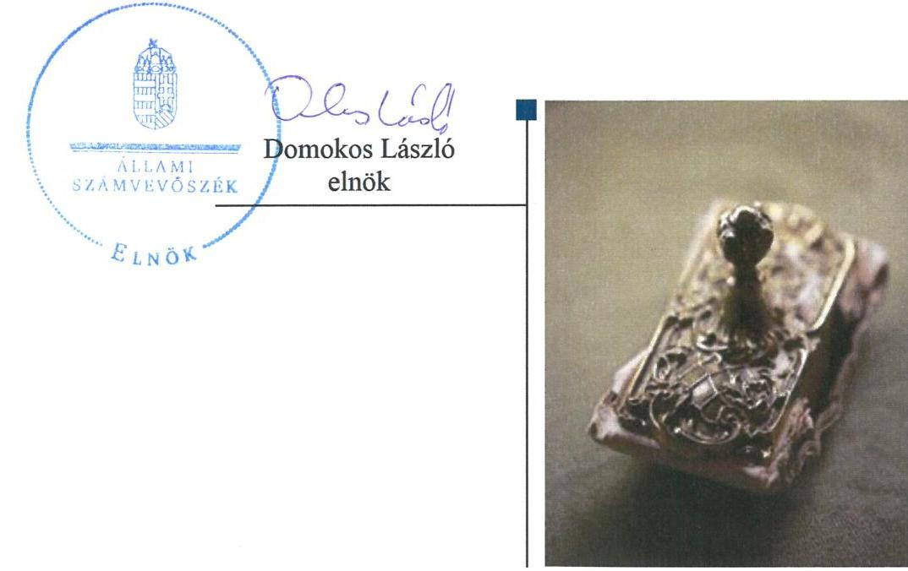
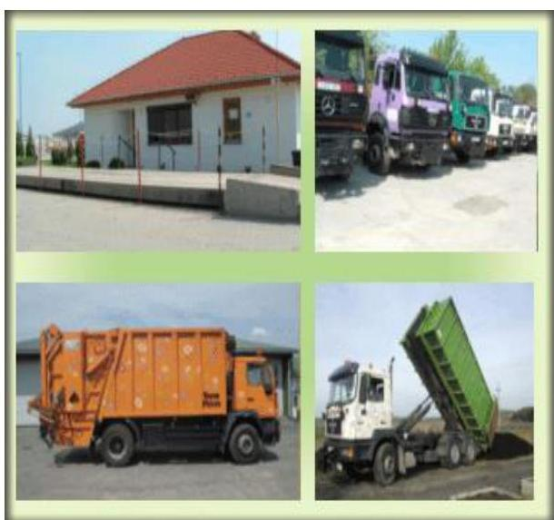
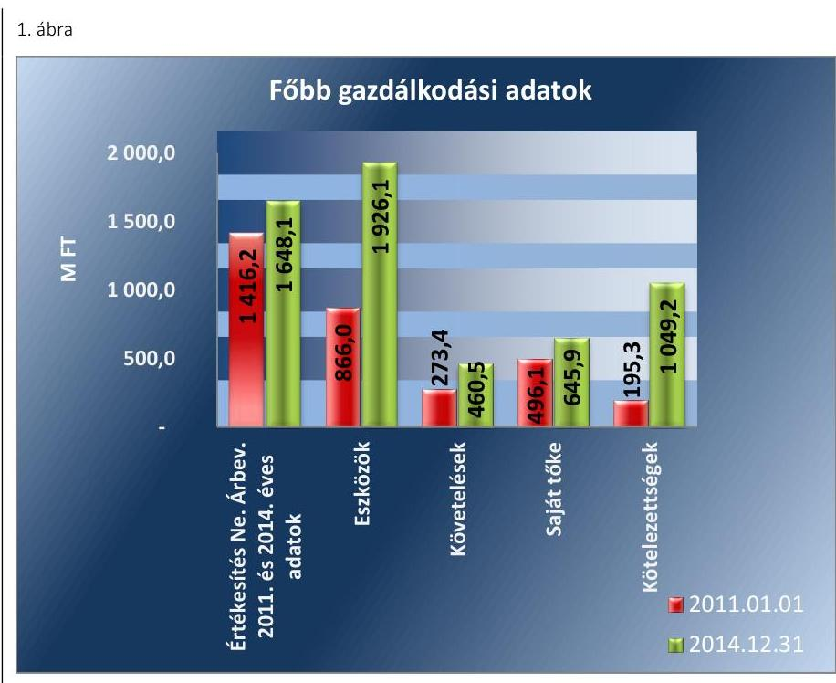
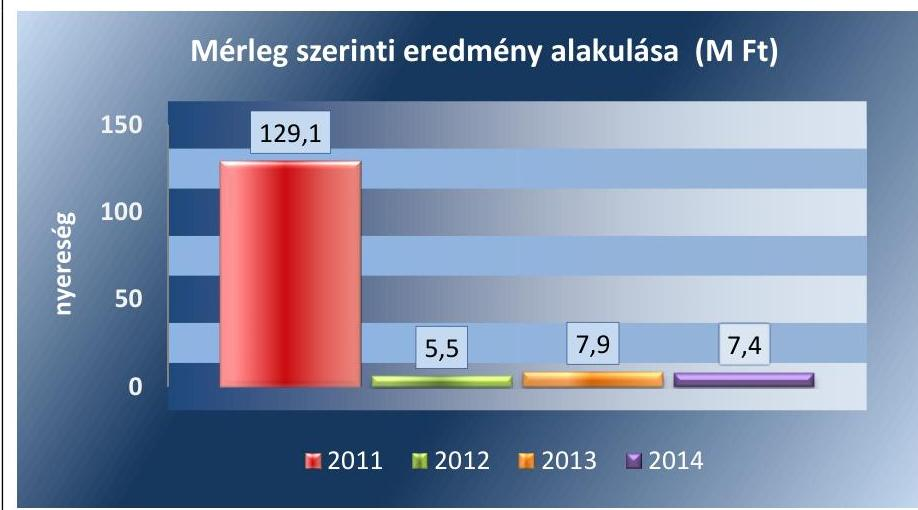
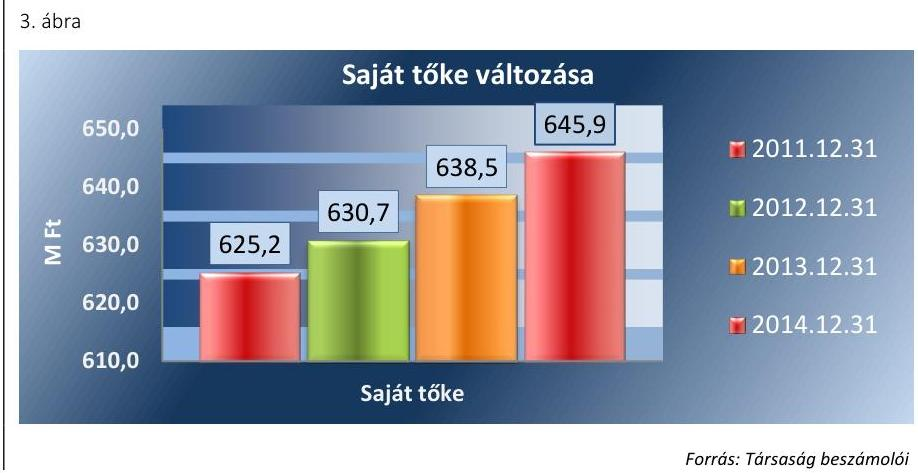
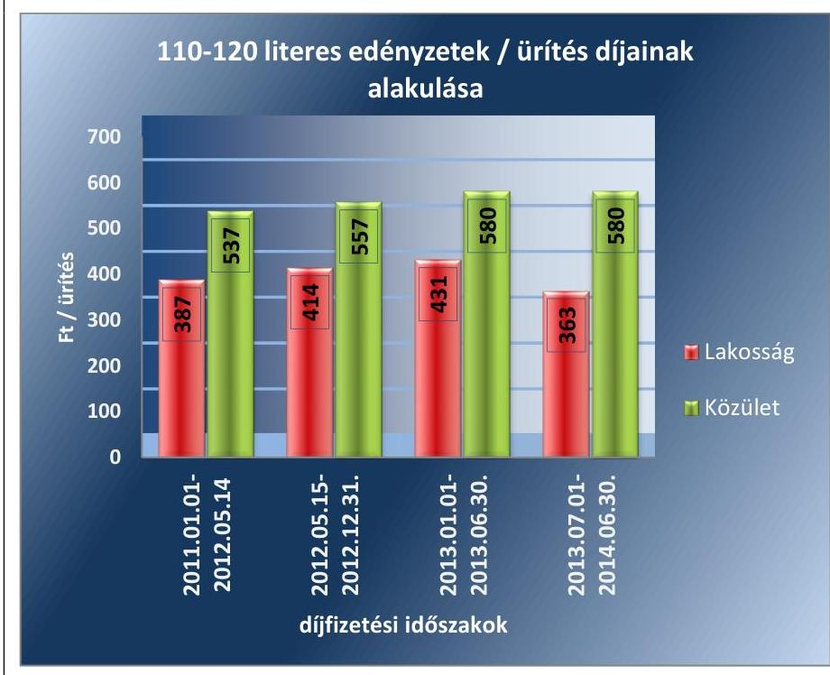
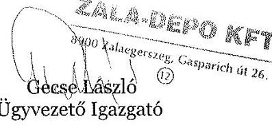
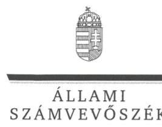
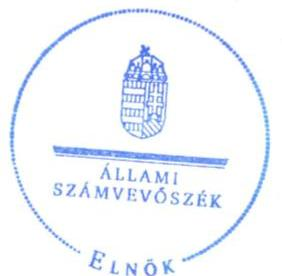

# Jelentés 

## Az önkormányzatok gazdasági társaságai

Az önkormányzatok többségi tulajdonában lévő gazdasági társaságok közfeladat ellátását érintő gazdálkodási tevékenysége szabályszerűségének ellenőrzése - ZALA-DEPO Hulladékgazdálkodási és Környezetvédelmi Kft.

2016.

---

# Jelentés 

## Az önkormányzatok gazdasági társaságai

Az önkormányzatok többségi tulajdonában lévő gazdasági társaságok közfeladat ellátását érintő gazdálkodási tevékenysége szabályszerűségének ellenőrzése - ZALA-DEPO Hulladékgazdálkodási és Környezetvédelmi Kft.
2016. augusztus 18. nap

---

# AZ ELLENŐRZÉST FELÜGYELTE:

DR. HORVÁTH MARGIT felügyeleti vezető

## AZ ELLENŐRZÉST VEZETTE ÉS A VÉGREHAJTÁSÁÉRT FELELŐS:

VERTKOVCZI MÁRIA ellenőrzésvezető

## A PROGRAM ÖSSZEÁLLÍTÁSÁÉRT FELELŐS:

JANIK JÓZSEF osztályvezető

IKTATÓSZÁM: V-0972-167/2016.

TÉMASZÁM: 2006

ELLENŐRZÉS-AZONOSÍTÓ SZÁM: V-070723

Jelentéseink az Országgyűlés számítógépes hálózatán és az Interneten a www.asz.hu címen is olvashatóak.

---

# TARTALOMJEGYZÉK 

■ ÖSSZEGZÉS ..... 5
■ AZ ELLENŐRZÉS CÉLJA ..... 7
■ AZ ELLENŐRZÉS TERÜLETE ..... 8
■ AZ ELLENŐRZÉS HÁTTERE, INDOKOLTSÁGA ..... 10
■ A JELENTÉS LÉNYEGES KÉRDÉSKÖREI ..... 11
■ ELLENŐRZÉS HATÓKÖRE ÉS MÓDSZEREI ..... 12
■ MEGÁLLAPÍTÁSOK ..... 14
■ JAVASLATOK ..... 30
■ MELLÉKLETEK ..... 33
I. Sz. melléklet: Értelmező szótár ..... 33
II. Sz. melléklet: A társaság működésének jellemzői ..... 36
■ FÜGGELÉK: ÉSZREVÉTELEK ..... 37
■ RÖVIDÍTÉSEK JEGYZÉKE ..... 43

---

.

---

# ÖSSZEGZÉS 

Az Állami Számvevőszék a ZALA-DEPO Hulladékgazdálkodási és Környezetvédelmi Kft. hulladékgazdálkodás közszolgáltatást érintő gazdálkodási tevékenysége 2011-2014. évek közötti szabályszerűségét ellenőrizte. A hulladékgazdálkodást az Önkormányzat szabályosan szervezte meg. A tulajdonosi jogok gyakorlása szabályszerű volt. A Társaság vagyongazdálkodása szabályszerű volt, a kötelezettségállománya a hulladékgazdálkodásra és a működésre nem jelentett kockázatot. A Társaság elszámolásai alapvetően szabályszerűek voltak. A Társaság önköltségszámítása és árképzése szabályszerű volt, a díjcsökkentést az előírásoknak megfelelően végrehajtotta.

## Az ellenőrzés társadalmi indokoltsága

Az Állami Számvevőszék Stratégiájában megfogalmazta, hogy a helyi önkormányzatok gazdálkodásában rejlő pénzügyi kockázatok feltárásával, az államháztartáson kívülre nyújtott költségvetési támogatások és ingyenes vagyonjuttatások, valamint az államháztartáson kívül működő közfeladat-ellátó rendszerek ellenőrzéseivel hozzájárul ahhoz, hogy a közpénzeket az államháztartáson kívül működő szervezetek is átlátható, rendezett módon használják fel a közfeladatok szerződésben vállalt ellátása érdekében.

Magyarországon az intézmény-centrikus közfeladat-ellátás jellemző, de egyre jelentősebb a költségvetésen kívüli feladatellátás térnyerése. Ennek legfontosabb szereplői - a nonprofit szervezetek mellett - az önkormányzati tulajdonú gazdasági társaságok. Az önkormányzatok szervezetalakítási szabadságának következménye, hogy a korábban is vállalati formában működő közszolgáltatások mellett, mind a kötelező, mind az önként vállalt feladatok ellátásában a gazdasági társaságok kiemelt fontosságú szerephez jutottak.

## Főbb megállapítások, következtetések, javaslatok

Az Önkormányzat a hulladékgazdálkodási kötelező közszolgáltatás megszervezéséről az ellenőrzött időszakot megelőzően döntött, annak ellátásáról kizárólagos tulajdonában lévő gazdasági társasága útján gondoskodott. Tulajdonosi joggyakorlását az Önkormányzat az Alapító Okiratban, az SZMSZ-ében, a Közszolgáltatói szerződésben és rendeleteiben szabályozta. Az Önkormányzatnak a Társaság feletti tulajdonosi joggyakorlása az ellenőrzött időszakban szabályszerű volt. Az Önkormányzat a Társaság tevékenységével kapcsolatban ellenőrzési és beszámoltatási jogát az ellenőrzött időszakban szabályszerűen gyakorolta. A Közgyűlés az éves beszámolókat az FB írásbeli jelentése alapján, a Könyvvizsgáló jelentés ismeretében, továbbá az üzleti terveket megtárgyalta és elfogadta. Az Önkormányzat a hulladékgazdálkodási közszolgáltatást a Hgt.-ben és Ht.-ban előírtaknak megfelelően szerződésben szabályozta, rendeletalkotási kötelezettségének eleget tett. Az Önkormányzat a 2011-2012. években rendelkezett a Hgt.-nek megfelelő hulladékgazdálkodási tervvel. Az Önkormányzat az ellenőrzött időszakban az Nvtv. és belső előírásai ellenére nem rendelkezett vagyongazdálkodási tervvel, továbbá a 2011-2013. években a Mótv. előírásai ellenére nem rendelkezett gazdasági programmal. Az FB ügyrendje alapján ellátta feladatait az ellenőrzött időszakban.

A Társaság eleget tett a Hgt. által előírt kötelező hulladékgazdálkodási közszolgáltatást érintő költségek éves beszámolási kötelezettségének. A Társaság a 2013-2014. években hulladékgazdálkodási szakmai követelményeket terv hiányában nem állított, ezáltal a megelőzési, hasznosítási és ártalmatlanítási célkitűzések megvalósíthatósága teljes körűen nem volt biztosított. A Társaság az előírt szabályzatokat elkészítette, melyek az eszközbesorolást, a bekerülési érték meghatározását és a szabályzatok aktualizálását kivéve megfeleltek a jogszabályi előírásoknak. A Társaság a

---

kötelezően ellátandó hulladékgazdálkodási tevékenységen kívül egyéb tevékenységet is végzett, a hulladékgazdálkodás közszolgáltatásra vonatkozóan a Hgt. és Ht. szerinti tevékenységenkénti szétválasztási szabályokat meghatározta, a közszolgáltatási tevékenységet elkülönítetten a nyilvántartásában szerepeltette.

A bevételek, ráfordítások és beruházások elszámolása alapvetően szabályszerű volt, azonban előfordultak téves könyvelések, nyilvántartási hibák. A Társaság alkalmazott árképzési gyakorlata az előforduló hibák ellenére szabályszerű volt. A díjak csökkenését a Rezsi tv.-ben és a Ht.-ban foglaltaknak megfelelően, szabályszerűen végrehajtotta a Társaság.

A Társaság vagyongazdálkodása szabályszerű volt. Az ellenőrzött időszakban az eszközök állománya nőtt, elsősorban egy 2014. évi üzletrészvásárlás következtében. A közszolgáltatói tevékenységhez alkalmazott eszközök használhatósági foka azonban csökkent az ellenőrzött időszakban. A Társaság saját tőkéje a nyereséges gazdálkodás következtében minden ellenőrzött évben nőtt. A Társaság kötelezettségállománya a működésére, közszolgáltatásra kockázatot nem jelentett. A hátralékos követelések behajtása szabályszerű volt az ellenőrzött időszakban.

A Könyvvizsgáló az éves beszámolókat hitelesítő záradékkal látta el annak ellenére, hogy 2013-2014. években a kötelezően ellátandó hulladékgazdálkodási közszolgáltatással kapcsolatos Ht. által előírt elkülönített mérleget nem készítette el a Társaság és nem mutatta be az éves beszámolójának kiegészítő mellékletében, ezáltal nem biztosította a közszolgáltatás elszámoltathatóságát.

Az Infotv.-ben és az Avtv.-ben előírtaktól eltérően belső adatvédelmi felelőssel, hatályos adatvédelmi szabályzattal a Társaság nem rendelkezett.

---

# AZ ELLENŐRZÉS CÉLJA 

Az ellenőrzés célja annak értékelése, hogy az önkormányzat a jogszabályi előírások figyelembevételével döntött-e az ellenőrzésre kerülő közfeladat megszervezéséről; az önkormányzat/tulajdonosi joggyakorló szabályszerűen gyakorolta-e a tulajdonosi jogokat; a gazdasági társaság közfeladat-ellátása bevételeinek, ráfordításainak elszámolása, és vagyongazdálkodási tevékenysége megfelelt-e a jogszabályi, illetve a közszolgáltatási/vagyonkezelési szerződésben foglalt tulajdonosi előírásoknak, azok végrehajtása szabályszerű volt-e; a gazdasági társaság kötelezettségállománya jelent-e kockázatot a működésre, illetve a közfeladat ellátására; a közfeladatok átláthatósága és elszámoltathatósága érdekében biztosítva volt-e a közszolgáltatás díjának megalapozottsága szabályszerű önköltségszámítással.

---

### **AZ ELLENŐRZÉS TERÜLETE**

### **Zalaegerszeg Megyei Jogú Város Önkormányzat kizárólagos tulajdonában lévő ZALA-DEPO Hulladékgazdálkodási és Környezetvédelmi Kft.**

Az Önkormányzat¹ a Társaságot² 2001. évben a Városgazdálkodási Kft.-ből kiválással hozta létre, a települési szilárd hulladékkezelési közszolgáltatás ellátására. A Társaság az ellenőrzött időszakban 100%-os önkormányzati tulajdonban volt. A Társaság törzstőkéjének összege 95,0 M Ft volt és az ellenőrzött időszakban nem változott. A Társaság a hulladékgazdálkodási közszolgáltatási tevékenységet 2014. június 30-áig látta el. Ezt követően 2014. július 1-jétől a hulladékgazdálkodási közszolgáltató a szintén 100%-os Önkormányzati tulajdonú Zalai Közszolgáltató NKft.³ lett. A Társaság 2014. július 1-jétől az új közszolgáltató alvállalkozójaként vett részt a közszolgáltatási feladatok ellátásában. A Társaság 2014. évben a MÜLLEX-KÖRMEND Hulladékgyűjtő és Hasznosító Kft.⁴-ben 95,85%-os, a MÜLLEX Közszolgáltató Nonprofit Kft.⁵-ben 48,0%-os részesedést szerzett. A két társaság fő tevékenysége hulladékkezelési közszolgáltatás, illetve egyéb hulladékok kezelése volt.

A hulladékgazdálkodási közszolgáltatás ellátásának területi adatait a 2011-2014. években az 1. táblázat szemlélteti.

1. táblázat

|  KÖZFELADATELLÁTÁS ADATAI |  |  |  |   |
| --- | --- | --- | --- | --- |
|  Megnevezés | 2011. | 2012. | 2013. | 2014.  |
|  Lakosok száma (fő) | 111 000 | 105 000 | 98 000 | 97 000  |
|  Települések száma | 58 | 57 | 71 | 69  |
|  Lakossági ügyfélszám (szerződés, db) | 21 414 | 19 985 | 17 554 | 17 671  |
|  Közületi ügyfélszám (szerződés, db) | 946 | 926 | 963 | 937  |
|  Forrás: Társaság adatszolgáltatása, beszámoló |  |  |  |   |

A Társaságnál a foglalkoztatottak éves átlagos állományi létszáma a 2014. évben 175 fő volt, a 2011. évihez képest 7 fővel több. A Társaság a 2011. és 2014. évi bevételeit, illetve a 2011. január 1-jei és 2014. december 31-i fontosabb gazdálkodási adatait az alábbi 1. ábra mutatja.

---

Forrás: A Társaság beszámolói
Az értékesítési nettó árbevétele 2014-ben 16,4\%-kal haladta meg a 2011. évi összeget. A Társaság eszközeinek állománya 2014-ben több mint kétszerese volt a 2011. év eleji állománynak, melynek fő oka a 2014. évben vásárolt részesedések értéke volt. A követelések értéke 2011. január 1-jei értékhez képest 2014. év végére 68,4\%-kal emelkedett. A Társaság saját tőkéje a mérleg szerinti eredmény hatására az ellenőrzött időszakban 30,2\%-kal nőtt. Osztalékfizetésre 2011-2014. években nem került sor. A kötelezettségek növekedését elsősorban a 750,0 M Ft értékű 2014. évi üzletrészvásárlással kapcsolatos hosszúlejáratú kötelezettségvállalás okozta.

Az ellenőrzött időszakban a polgármester személye 2014. októberében változott. A jegyző személyében változás nem volt. A 2011-2014. években a Társaság vezetése változatlan volt, az Ügyvezető ${ }^{6}$ 2001. szeptember 28. óta töltötte be tisztségét.

---

# AZ ELLENŐRZÉS HÁTTERE, INDOKOLTSÁGA 

AZ ÖNKORMÁNYZATI TULAJDONÚ GAZDASÁGI TÁRSASÁGOK teljes körű ellenőrzésének lehetőségét az Állami Számvevőszékről szóló 1989. évi XXXVIII. törvény 2011. január 1-jétől hatályos módosítása teremtette meg. A közfeladatot ellátó gazdasági társaságok ellenőrzése kiemelten fontos a vagyon megőrzése, megóvása érdekében, valamint a kormányzati szektor elszámolásaiban megjelenő önkormányzati tulajdonú gazdálkodó szervezetek esetében, amelyekkel szemben alapvető követelmény, hogy gazdálkodásuk, működésük szabályszerű, az általuk szolgáltatott adatok minél megbízhatóbbak legyenek. A közfeladat ellátás költségeinek, ráfordításainak alakulása, színvonala hatással van a lakosság elégedettségére. A törvényalkotás számára - az észlelt problémák, szabálytalanságok, vagy egyéb nem kívánatos jelenségek felszínre kerülésével - az ellenőrzés megállapításai segítséget nyújthatnak az államháztartáson kívüli közfeladat-ellátás értékeléséhez, jogszabályi keretei pontosításához, átláthatóságot biztosító szabályozásához. Meghatározhatóvá válnak a közfeladat ellátásban részt vevő államháztartáson kívüli szervezeteknek - az önkormányzat költségvetését, pénzügyi helyzetét is befolyásoló - kockázatai, lehetővé válik ezen kockázatok csökkentése. Ellenőrzéseink feltárhatják, hogy az önkormányzat közfeladat-ellátási kötelezettségének szabályszerűen tett-e eleget, a feladatellátáshoz rendelt közvagyon működtetését a tulajdonostól elvárható gondossággal, szabályszerűen szervezte-e meg és a tulajdonosi felügyelete hozzájárult-e a közfeladat-ellátásához. Az ellenőrzés rávilágíthat arra, hogy a gazdasági társaság a közszolgáltatási szerződésben foglaltak betartásával, a közvagyon használatával biztosította-e a szolgáltatás folytatásának feltételeit, a közfeladat ellátását. Ezzel az ellenőrzöttek és a helyi döntéshozók számára visszajelzést ad feladatszervezési, feladat-ellátási kockázataikról, alapot ad a meglévő hibák megszüntetéséhez, a jobb közfeladat-ellátás biztosításához. Fokozza a fegyelmet, igazolja, hogy lejárt a következmények nélküli ellenőrzések időszaka. Az ÁSZ értékteremtő rend kialakításához és megőrzéséhez hozzájáruló tevékenysége pozitív hatással van a szervezetről kialakított összkép formálására.

---

# A JELENTÉS LÉNYEGES KÉRDÉSKÖREI 

1. Az Önkormányzat közfeladat megszervezéséről szóló döntése, valamint tulajdonosi joggyakorlása szabályszerű volt-e?
2. A gazdasági társaság vagyongazdálkodása szabályszerű volt-e, kötelezettségállománya jelentett-e kockázatot a működésre, illetve a közfeladat ellátásra?
3. A gazdasági társaságnál az ellátott közfeladat bevételei és ráfordításai elszámolása, valamint az önköltségszámítás és árképzés szabályszerű volt-e?

---

# ELLENŐRZÉS HATÓKÖRE ÉS MÓDSZEREI 

## Az ellenőrzés típusa

Megfelelőségi ellenőrzés

## Az ellenőrzött időszak

2011. január 1-jétől 2014. december 31-ig tartó időszak

## Az ellenőrzés tárgya

A közfeladatot gazdasági társaságokkal ellátó önkormányzatok tulajdonosi joggyakorlása, valamint gazdasági társaságok pénz- és vagyongazdálkodásának szabályozottsága és szabályszerűsége.

Az ellenőrzés tárgya a közfeladat ellátás tekintetében a 2014. évre vonatkozóan korlátozott, mivel a Társaság a hulladékgazdálkodási közszolgáltatási tevékenységét 2014. június 30-áig végezte közszolgáltatóként. Azt követően az ellenőrzési időszak végéig alvállalkozóként végezte a
 tevékenységet.

Az ellenőrzés kiterjed minden olyan körülményre és adatra, amely az ÁSZ jogszabályban meghatározott feladatainak teljesítéséhez, valamint a program végrehajtása folyamán felmerült újabb összefüggések feltárásához szükséges.

## Az ellenőrzött szervezet

$\longrightarrow$ Zalaegerszeg Megyei Jogú Város Önkormányzata
$\longrightarrow$ ZALA-DEPO Hulladékgazdálkodási és Környezetvédelmi Korlátolt Felelősségű Társaság

## Az ellenőrzés jogalapja

Az ellenőrzés jogszabályi alapját az Állami Számvevőszékről szóló 2011. évi LXVI. törvény (ÁSZ tv.) 5. § (3)-(4)-(5) bekezdése képezte.

---

# Az ellenőrzés módszerei 

Az ellenőrzést a nemzetközi standardokat irányadónak tekintve az ellenőrzési program ellenőrzési kérdései, az ellenőrzött időszakban hatályos jogszabályok, az ellenőrzés szakmai szabályok és módszertanok figyelembe vételével végezzük.

Az ellenőrzés ideje alatt az ellenőrzött szervezettel történő kapcsolattartást az ÁSZ Szervezeti és Működési Szabályzatának vonatkozó előírásai alapján biztosítjuk.

Az ellenőrzés a kiválasztott, többségi tulajdonosi jogokat gyakorló önkormányzatra, illetve az ellenőrzésre kijelölt közfeladatot ellátó gazdasági társaság felett tulajdonosi jogokat gyakorló szervezetre és az ellenőrzött közfeladatot ellátó gazdasági társaságra terjed ki. Amennyiben a gazdasági társaságban több önkormányzat együttesen többségi tulajdonos, úgy az ellenőrzést a többségi tulajdonosi jogokat gyakorló önkormányzatnál kell lefolytatni. Az ellenőrzött gazdasági társaságnál, amennyiben az több közfeladatot is ellát, akkor az ellenőrzésre kiválasztott közfeladat-ellátást ellenőrizzük.

Az ellenőrzést a kérdésekre adott válaszok kiértékelésével, valamint a megjelölt adatforrások, a csatolt tanúsítványok felhasználásával, továbbá az adott időszakban hatályos jogszabályok figyelembe vételével kell lefolytatni. Az ellenőrzési kérdések megválaszolásához szükséges bizonyítékok megszerzése a következő ellenőrzési eljárások alkalmazásával történik: megfigyelés, kérdésfeltevés (információkérés), összehasonlítás, valamint elemző eljárás.

A bevételek és ráfordítások elszámolása, valamint a vagyonnyilvántartás terén a szabályszerű működést véletlen mintavétellel ellenőriztük. A jogszabályoknak és a belső előírásoknak megfelelőnek tekintettük az adott területet, amennyiben a minta ellenőrzésének eredménye alapján 95%-os bizonyossággal a teljes sokaságban a hibaarány kisebb volt, mint 10%, nem megfelelőnek, ha a hibaarány a 10%-ot meghaladta. Kockázatot, illetve magas kockázatot jeleztünk, amennyiben egy adott terület vonatkozásában a minta alapján a teljes sokaságban nem volt egyértelműen biztosított a jogszabályoknak és a belső szabályzatoknak megfelelő működés. A ráfordítások elszámolására és a vagyonnyilvántartásra vonatkozó véletlen mintavételt kockázati alapú kiválasztással egészítettük ki, amelynek során évente a három legnagyobb összegű tételt választottuk ki.

---

# 1. Az Önkormányzat közfeladat megszervezéséről szóló döntése, valamint tulajdonosi joggyakorlása szabályszerű volt-e? 

Összegző megállapítás

Az Önkormányzat közfeladat megszervezéséről szóló döntése, valamint a tulajdonosi jogok gyakorlása az ellenőrzött időszakban szabályszerű volt, azonban vagyongazdálkodási tervvel és a 2011-2013. években gazdasági programmal nem rendelkezett.

Az Önkormányzat szabályszerűen gondoskodott a hulladékgazdálkodási közszolgáltatás megszervezéséről, rendeletalkotási és szerződéskötési kötelezettségének a jogszabályi előírásoknak megfelelően eleget tett. A 2011-2012. évekre vonatkozóan hulladékgazdálkodási tervvel rendelkezett, azonban nem készített közép- és hosszútávú vagyongazdálkodási tervet és a 2011-2013. években nem rendelkezett gazdasági programmal.

A HULLADÉKGAZDÁLKODÁSI KÖZSZOLGÁLTATÁS MEGSZERVEZÉSE az ellenőrzött időszakban az Ötv. 7. 8. § (1) bekezdése és a Mötv. 8. 13. § (1) bekezdés 19. pontja alapján az Önkormányzat törvényi kötelezettsége volt, melyről az Önkormányzat szabályszerűen gondoskodott. Az Önkormányzat - az Ötv. 9. § (4) bekezdésében foglalt lehetőséggel élve - az ellenőrzött időszakot megelőzően döntött a hulladékgazdálkodás, mint kötelező közszolgáltatás gazdasági társaság útján történő ellátásáról. Az Önkormányzat által kialakított hulladékkezelési közfeladat ellátás megszervezéséről, végrehajtásáról szóló döntés megfelelt az Ötv. 9. § (4), a Mötv. 41.§ (6), (8) bekezdések előírásainak.

Az Önkormányzat 2014. július 1-jétől a hulladékgazdálkodás közszolgáltatás feladatainak ellátásával a 2013. évben létrehozott kizárólagos önkormányzati tulajdonban lévő Zalai Közszolgáltató NKft.-t bízta meg. A közszolgáltatás ellátásának megszervezése, végrehajtása megfelelt a Ht. ${ }^{9}$ 90. §.(8) bekezdésében foglalt előírásnak. 2014. július 1-jétől a Társaság a Zalai Közszolgáltató NKft. alvállalkozójaként látta el a hulladékgazdálkodási feladatokat.

A Közgyűlés ${ }^{10}$ hosszútávú fejlesztési elképzeléseit gazdasági programban, fejlesztési tervben nem rögzítette. Gazdasági programmal az Önkormányzat a 2011-2013. években az Ötv. 91. § (1) bekezdése, illetve a Mötv. 116. § (1) bekezdése ellenére nem rendelkezett. Az Önkormányzat 2014-től meghatározta gazdasági programját és fejlesztési terveit, melyet az Integrált Településfejlesztési Stratégiájában, a Mötv. 116. § (1)-(5). bekezdésekben foglalt előírásoknak megfelelően rögzített. Az Integrált Településfejlesztési Stratégiának része volt a településfejlesztési koncepció, ami a

---

környezeti elemek állapotának javítása tekintetében a hulladékgazdálkodást, a hulladékok hasznosítását szerepeltette a célok között.

Az Önkormányzat az ellenőrzött időszakban rendelkezett Vagyongazdálkodási rendelettel ${ }^{11}$, melyben előírta a közép- és hosszútávú vagyongazdálkodási terv készítését. Az Önkormányzat az ellenőrzött időszakban az Nvtv. ${ }^{12}$ 9.§. (1) bekezdés előírása és a Vagyongazdálkodási rendelet előírása ellenére nem készített közép- és hosszútávú vagyongazdálkodási tervet.

A 2011-2014. években az önkormányzati SZMSZ ${ }^{13}$ rendelkezése szerint a kizárólagos önkormányzati tulajdoni részesedéssel működő gazdasági társaság esetében a legfőbb szerv kizárólagos hatáskörét a Közgyűlés gyakorolta.

HULLADÉKGAZDÁLKODÁSI TERVVEL ${ }^{14}$ a Hgt. ${ }^{15}$ 35. § (1) bekezdése alapján az ellenőrzött időszakban az Önkormányzat rendelkezett. A Hulladékgazdálkodási tervben foglaltak a 2011-2012. években megfeleltek a Hgt. 37. § (4) bekezdésében előírtaknak.

A TÁRSASÁG ALAPÍTÓ OKIRATA ${ }^{16}$ az Önkormányzat hatáskörébe utalta az adózott eredmény felosztását, az ügyvezető jutalmazását. Az Alapító Okirat tartalmazta, hogy a Társaság éves üzleti tervét és a Számv. tv ${ }^{17}$. szerinti beszámolóját az Önkormányzat hagyja jóvá. Az Alapító Okirat a Gt. ${ }^{18}$ 12. § (1) bekezdése, valamint a Ptk. ${ }^{19}$ 3:5. §, 3:8. §, 3:94. § szerinti tartalommal, továbbá a alapító okiratra vonatkozó kógens előírásoknak megfelelően került meghatározásra. Az Alapító Okiratban foglaltak alapján az Önkormányzat a tulajdonosi joggyakorlását az FB tagok delegálásával érvényesítette, az ellenőrzött időszakban tulajdonosi jogkör átadás nem történt. Az Alapító Okirat tartalmazta a Közgyűlés által megbízott Könyvvizsgáló ${ }^{20}$ adatait. A Könyvvizsgáló személye az ellenőrzött időszakban nem változott. Az Alapító Okiratban meghatározottak szerint az Önkormányzat hatáskörébe tartozott az egyes szerződések megkötésének jóváhagyása (100,0 M Ft értékhatár felett, értékhatár nélkül ingatlanok értékesítése).

Az Önkormányzat és a Társaság között az ellenőrzött időszakban a 2014. június 30-áig hatályos közszolgáltatási szerződés ${ }^{21}$ tartalmazta a közfeladatok ellátásának követelményeit, az ellátás módját és mértékét. A Közszolgáltatási szerződés 2011-2012. években megfelelt a Hgt. 27.§ (1)(3) bekezdéseiben és a 28. §-ában, illetve a 224/2004. (VII. 2.) Korm. rendelet ${ }^{22}$ 11-12. §-ában foglaltaknak, továbbá a 2013-2014. június 30. között a Ht. 33.§ és 34.§-aiban és a 317/2013. (VIII. 28.) Korm. rendelet ${ }^{23}$ előírásaiban foglaltaknak.

A Közszolgáltatási szerződésben az Önkormányzat a Társaság részére előírta a közszolgáltatás teljesítésével összefüggő adatszolgáltatás rendszeres teljesítését és nyilvántartási rendszer működtetését, a 224/2004. (VII. 2.) Korm. rendelet 12. § (1) bekezdés g) pontjának megfelelően.

# A HULLADÉKKEZELÉSI KÖZSZOLGÁLTATÁSRÓL RENDELETALKOTÁSI KÖTELEZETTSÉGÉNEK az 

Önkormányzat az ellenőrzött időszakban eleget tett. Az Önkormányzat a Hulladékgazdálkodási rendeletben ${ }^{24}$ szabályozta a település szilárd hulladékok szállításával és kezelésével kapcsolatos közszolgáltatás rendjét, a

---

# 1.2. számú megállapítás 

közfeladat végrehajtását az Ötv. 16. § (1) bekezdése alapján. A Hulladékgazdálkodási rendelet megfelelt a 2011-2012. években a Hgt. 23. § előírásainak, a 2013-2014. években a Ht. 35. § előírásainak.

## Az Önkormányzat tulajdonosi joggyakorlása az ellenőrzött időszakban szabályszerű volt. Az FB az előírásoknak megfelelően látta el a feladatait.

A TULAJDONOSI JOGOK GYAKORLÁSÁT az Önkormányzat az Alapító Okiratban, a Gt. 141. § (2), illetve a Ptk. 3:188. § (2) bekezdésében megfogalmazott előírásoknak megfelelően határozta meg.

Az önkormányzati SZMSZ 50. § (3) e) pontja szerint a Műszaki Bizottság véleményezte a hulladékgazdálkodással kapcsolatos előterjesztéseket, a 48. § (3) d) pontja szerint a Pénzügyi Bizottság véleményezte a kizárólagosan önkormányzati tulajdonú gazdasági társaságok éves beszámolóját és üzleti tervét. A Hulladékgazdálkodási rendelet 8. § (3) bekezdése a Társaság részére a hulladékkezelési közszolgáltatói tevékenységről évente részletes beszámoló, valamint költségelszámolás készítési kötelezettséget írt elő a közszolgáltatási tevékenység éves értékeléséhez. A Társaság az előírt, a közszolgáltatási szerződés alapján végzett hulladékkezelési közszolgáltatói tevékenységről, annak költségeiről és bevételeiről az aktuális díjemelési előterjesztésekben számolt be. A Társaság az éves beszámolók benyújtásával egyidejűleg készült üzleti jelentésben beszámolt a szakmai tevékenységről, az előirányzatok teljesítését a hulladékelszállítás, a hulladék elhelyezés, illetve központi tevékenységek bontásban bemutatta, és beszámolt a közszolgáltatással kapcsolatos kintlévőségekről.

Egyéb beszámolási, adatszolgáltatási és más tájékoztatási feladatot a Közszolgáltatási szerződésben az Önkormányzat eseti jelleggel határozott meg, továbbá az Ötv. 92. § (11) bekezdés b) pontjában, illetve az Áht ${ }^{25}$ 70. § (1) bekezdés d) pontjában biztosított lehetőség alapján az Önkormányzat belső ellenőrzése a 2011. évben a Társaság pénzügyi helyzetét vizsgálta. A belső ellenőrzés megállapította a szelektíven gyűjtött hulladékok feldolgozási és értékesítési tevékenységének önálló üzletágként való kezelésének hiányát, a közszolgáltatási díj kalkulációs sémájának és módszerének belső szabályozási hiányát, az önköltség számítási szabályzat szilárdhulladék kezelés és elhelyezés hatósági díjainak utókalkulációjára vonatkozó hiányosságát, az adott munkaszámokon kimutatott költségek felosztási szabályozásának hiányát. A 2011. évi belső ellenőrzés hiányosságainak megoldására intézkedési terv készült a Társaság részéről, melynek megvalósítását az Önkormányzat belső ellenőrzése a 2012. évben utóellenőrzése keretében ellenőrizte, hiányosságot nem állapított meg. A 2012. évben az Önkormányzat tulajdonosi ellenőrzés keretében a Társaság gazdálkodásának szabályszerűségét, szabályozottságát, gazdaságosságát vizsgálta, melyekkel kapcsolatban hiányosságokat nem tárt fel.

AZ FB létrehozásáról a Közgyűlés a Társaság alapításával egyidejűleg gondoskodott a Gt. 33. § (2) c) pontja alapján. Az FB létszámát a Gt. 34. § (1) bekezdése és a Taktv. ${ }^{26}$ 4. § (2) bekezdése szerint három főben határozták meg. A FB feladatait az Alapító Okirat és az FB által megállapított és a Közgyűlés által jóváhagyott ügyrend alapján látta el. Az FB működési szabályait, főbb feladatait, a tagok személyét az Alapító Okirat tartalmazta az. Az FB az ellenőrzött időszakban megtárgyalta és határozatával elfogadta a

---

Társaság éves beszámolóit, üzleti jelentéseit, a Könyvvizsgálói jelentéseket, a vezetői prémiumfeladatok értékelését. Továbbá megtárgyalta és határozattal fogadta el a Társaság időszakos évközi beszámolóit (félév, háromnegyedév) és az éves üzleti terveket.

A JAVADALMAZÁSI SZABÁLYZAT ${ }^{27}$ a Társaság Ügyvezetőjének és az FB tagjainak javadalmazását, az üzleti tervek megvalósítására vonatkozó érdekeltségével kapcsolatos szabályokat és követelményeket tartalmazta. Az ellenőrzött időszakban meghatározásra, elfogadásra kerültek az Ügyvezető prémium feladatai, melyek teljesítésének elfogadásáról a Javadalmazási szabályzat és a prémium feltételek teljesítése alapján a Közgyűlés döntött. Az Ügyvezető munkaviszony keretében látta el feladatait, prémiumban az ellenőrzött időszak minden évében részesült.

A Társaság mérleg szerinti eredményének 2011-2014. évi alakulását a 2. ábra szemlélteti.
2. ábra

Forrás: a Társaság beszámolói
A Társaság mérleg szerinti eredménye minden ellenőrzött évben pozitív volt, az ellenőrzött időszakban mindösszesen 149,7 M Ft nyereséget ért el a Társaság. A 2011. év kiugró eredményét elsősorban az aktivált saját termelésű készletek 102,9 M Ft-os értékű állományváltozása okozta. A 2012-2013. években az eredmény érdemben nem változott.

A 2011-2014. évek során osztalékfizetésre vonatkozó tulajdonosi döntés nem volt. A számviteli beszámolókat
 elfogadó Közgyűlési határozatokban az eredmény felhasználásra vonatkozó döntés alapján a mérleg szerinti eredmény teljes összege az eredménytartalékba került.

Hitelfelvétel a 2014. évben történt a Társaság részéről, amelynél az Önkormányzat kezességvállalására került sor. A helyi önkormányzatok adósságot keletkeztető, valamint kezesség-, illetve garanciavállalásra vonatkozó ügyleteihez történő 2014. áprilisi előzetes kormányzati hozzájárulásról szóló 1317/2014. (V. 22.) Korm. határozat alapján a Kormány az adósságot keletkeztető ügylethez hozzájárulását megadta. A kezességvállalás beváltására az ellenőrzött időszakban nem került sor.

---

# 2. A gazdasági társaság vagyongazdálkodása szabályszerű volt-e, kötelezettségállománya jelentett-e kockázatot a működésre, illetve a közfeladat ellátásra? 

Összegző megállapítás

A Társaság vagyongazdálkodása szabályszerű volt, azonban a szabályzatai nem mindenben feleltek meg a jogszabályoknak. Kötelezettségállománya nem jelentett kockázatot a működésre, illetve a közszolgáltatásra. A Társaság beszámolási kötelezettségének eleget tett, azonban a 2013-2014. évek elkülönített mérlegét nem mutatta be, így nem biztosította a közszolgáltatás átláthatóságát, elszámoltathatóságát. Adatvédelmi, adatbiztonsági kötelezettségét a Társaság nem teljesítette. A Társaság a 2013-2014. június 30-áig hulladékgazdálkodási szakmai követelményeket terv hiányában nem állított, ezáltal a megelőzési, hasznosítási és ártalmatlanítási célkitűzések megvalósíthatósága nem volt biztosított.
2.1. számú megállapítás

A Társaság rendelkezett az előírt szabályzatokkal, melyek az eszközök besorolását, a bekerülési érték szabályozását, továbbá a szabályzatok aktualizálását kivéve megfeleltek a jogszabályi előírásoknak. A Társaság a 2013-2014. június 30. közötti időszakra nem készítette el a közszolgáltatói hulladékgazdálkodási tervét.

ÜZLETI TERV ${ }^{28}$ készítésére vonatkozó előírást az Önkormányzat az Alapító Okiratban határozta meg, mely kötelezettségét a Társaság az ellenőrzött időszakban teljesítette. Az üzleti terveket az FB megtárgyalta, véleményezte és megtárgyalásra, valamint elfogadásra javasolta a Közgyűlésnek. Az évente elkészített Üzleti terveket a Közgyűlés az éves beszámolókkal egyidejűleg megtárgyalta és elfogadta. A 2011-2012. évi üzleti tervekben a Társaság hulladékhasznosítási és fejlesztési célkitűzései megfeleltek az Önkormányzat Hulladékgazdálkodási tervében foglaltaknak. Az üzleti tervek tartalmazták a Társaság szakmai és gazdasági célkitűzéseit, feladatait, a kiemelt beruházásokat.

A Társaság a Ht. 78. § (1) bekezdésében foglaltak ellenére a 2013-2014. június 30. közötti időszakra nem készített közszolgáltatói hulladékgazdálkodási tervet.

SZÁMVITELI POLITIKÁJÁT ${ }^{29}$ a Társaság a Számv. tv. 14. § (4) bekezdésének megfelelően kialakította az ellenőrzött időszakban. A Társaság rendelkezett a Számv. tv. 14. § (5) bekezdés a)-d) pontjaiban foglalt előírásoknak megfelelő szabályzatokkal, az eszközök és a források Leltározási szabályzatával ${ }^{30}$, az eszközök és a források Értékelési szabályzatával ${ }^{31}$, az Önköltségszámítás rendjére vonatkozó szabályzattal ${ }^{32}$, valamint a Pénzkezelési szabályzattal ${ }^{33}$. A Társaság Leltározási szabályzata tartalmazta a Számv. tv. 69. §-ában előírtaknak megfelelően a mérleg tételeinek leltárral való alátámasztását, amely előírta, hogy ellenőrizhető módon a Társaság

---

mérleg fordulónapján meglévő eszközeit és forrásait mennyiségben és értékben leltározza. A selejtezés rendjét, a döntési hatásköröket a Selejtezési szabályzatban ${ }^{34}$ rögzítette a Társaság.

Azonban a számviteli politikában:
— az eszközök minősítésének szabályai között a Számv. tv. 23. § (4) bekezdés előírásával ellentétesen rögzítették a 240 literesnél nem nagyobb hulladékgyűjtő edényzetek forgóeszközök közé történő besorolását. A Számv. tv. 23. §. (4) bekezdése alapján az eszközöket rendeltetésük, használatuk alapján kell a befektetett eszközök, vagy a forgóeszközök közé sorolni. Az eszközök egy éven túl szolgálták a Társaság tevékenységét, így azokat a Számv. tv. 24. § (1)-(2) bekezdésének megfelelően a befektetett eszközök között kellett volna tárgyi eszközként szerepeltetni.
a Számv. tv. 14. § (11) bekezdésében előírt aktualizálási előírást be nem tartva a Társaság nem módosította belső szabályzatában a 2013. január 1-től hatályos Számv. tv. 47. § (4) bekezdés e) pontjában foglaltak szerint az eszközök értékmeghatározásának szabályait, miszerint a külön jogszabályban meghatározott kötelező díjak (földgáz, ivóvíz, villamos energia beszerzésekor) a bekerülési érték részét képezik.
a Számv. tv. 14. § (11) bekezdéssel ellentétben nem törölte a Társaság a beszámoló ismételt közzétételi kötelezettségének előírását a Számv. tv. 154. § (5) bekezdésének 2013. január 1-jei hatályon kívül helyezésével.
a készletek értékelésénél a Társaság valamennyi készlet bekerülési értékére vonatkozóan az Értékelési szabályzatban meghatározott FIFO módszert alkalmazta, ugyanakkor a Számviteli politika (2011. július 1-jétől hatályos) szerint az egyéb anyagok, üzemanyagtartályban lévő gázolaj, teletank és komposzt bekerülési értéke a mérlegelt átlagár módszerrel számított bekerülési értékek alapján kerül rögzítésre.
A Társaság az ellenőrzött időszakban rendelkezett a Számv. tv. 161. § (1)-(2) bekezdések előírásainak megfelelő Számlarenddel ${ }^{35}$. A Számv. tv. 161. § 2 bekezdés d) pontjának megfelelő bizonylati rendet a Bizonylati szabályzatban ${ }^{36}$ rögzítette a Társaság. A Számlarend és Bizonylati szabályzat aktualizálása a Számv. tv. 161. § (5) bekezdése szerint az ellenőrzött időszakban megtörtént.

A KÖZSZOLGÁLTATÁS ELKÜLÖNÍTÉSÉT a Társaság 2011. június 29-éig a Számlarendben és a számlarend részeként elkészített Számlatükörben ${ }^{37}$ rögzítette, majd 2011. június 30-ától kiegészítette a költségek felosztásáról készített Költségfelosztási szabályzattal ${ }^{38}$. A költségfelosztási szabályzatban rögzítette a Társaság a tevékenységekre közvetlenül el nem számolható költségek, ráfordítások tevékenységek közötti felosztásának szabályait.

A Költségfelosztási szabályzat mellékletében, az egyes költségek adott költségviselőkre elszámolható százalékának félévenkénti aktualizálását írta elő, mely aktualizálást a 2013-2014. június 30. időszakra vonatkozóan nem végezte el a Társaság.

---

A Társaság a Számv. tv. 14. § (6)-(7) bekezdése alapján önköltségszámítási szabályzat készítésére volt kötelezett, melynek az ellenőrzött időszakban eleget tett. Az Önköltségszámítási szabályzat megfelelt a Számv. tv. 51. § (2)-(4) bekezdéseinek, azonban hiányossága volt, hogy a Számv. tv. 51. § (2) bekezdés c) pontjával ellentétben nem tartalmazta azokat a mutatószámokat, melyeket a közvetlenül a termékhez, szolgáltatáshoz nem rendelhető felmerült költségek felosztásához alkalmaztak. A mutatószámokat a Költségfelosztási szabályzat tartalmazta. Az Önköltségszámítási szabályzatban a Társaság előírta a bevételek és ráfordítások elkülönített elszámolását, amelyhez kialakította a munkaszámok rendszerét. Az Önköltségszámítási szabályzatban a Társaság a közszolgáltatási tevékenység díjkalkulációjával kapcsolatban utókalkuláció készítési kötelezettséget írt elő.

A díjkalkuláció elvégzésének szabályait 2011. július 1-től a Társaság a Közszolgáltatási díjkalkuláció szabályzatában ${ }^{39}$ rögzítette. A szabályzat előírásai, és a 45/2004. (XII. 03.) Önkormányzati rendelet előírásai alapján a Társaság köteles volt költségelemzést (díjkalkulációt) készíteni a következő díjfizetési időszakban alkalmazandó közszolgáltatási díj alátámasztására. A Közszolgáltatási díjkalkulációs szabályzat tartalmazta a díjkalkuláció lépéseit, a kapcsolódó munkaszámok szerepét és az eredménykimutatás levezetésének sémáját. A Közszolgáltatási díjkalkulációs szabályzatban a Társaság meghatározta, hogy amennyiben a szolgáltatás végzése közben műszaki tartalomváltozás nem következik be, harmadik fél által előidézett körülmény jelentős költségnövekedést nem idéz elő, a díjra vonatkozó előterjesztést az infláció alapján teszi meg.

# 2.2. számú megállapítás 

## A Társaság vagyongazdálkodása megfelelt a jogszabályi előírásoknak és belső utasításoknak.

Az Önkormányzat a 2011-2014. években a közszolgáltatás ellátásával kapcsolatban Önkormányzati tulajdont képező vagyont nem adott át vagyonkezelésbe a Társaság részére. A közszolgáltatás ellátásához szükséges járművek, gépek berendezések a Társaság tulajdonában voltak, illetve az Önkormányzattal kötött bérleti szerződés alapján kerültek használatra az ellenőrzött időszakban. Az Önkormányzat tulajdonában lévő zalaegerszegi regionális hulladéklerakó telep üzemeltetését a Társaság az Önkormányzattal kötött üzemeltetési szerződés alapján végezte az ellenőrzött időszakban.

Társaság a vagyonnyilvántartását a Számv. tv. 159. §-nak megfelelően, átláthatóan, naprakészen vezette, a főkönyvi számlákhoz analitikus nyilvántartások kapcsolódtak. A Társaság a saját vagyonát, annak értékét és állományának változásait a Számv. tv. 57-58. §, és a 161. § (1)-(2) és a 161/A. § előírásainak megfelelően tartotta nyilván.

A Társaság mérlegeinek főbb adatait az alábbi 2. táblázat tartalmazza.
2. táblázat

| MÉRLEGADATOK (M Ft) |  |  |  |  |  |
| :-- | :--: | :--: | :--: | :--: | :--: |
| Megnevezés | $\mathbf{2 0 1 1 . 0 1 . 0 1}$ | $\mathbf{2 0 1 1 . 1 2 . 3 1 .}$ | $\mathbf{2 0 1 2 . 1 2 . 3 1 .}$ | $\mathbf{2 0 1 3 . 1 2 . 3 1 .}$ | $\mathbf{2 0 1 4 . 1 2 . 3 1 .}$ |
| Befektetett eszközök | 447,9 | 478,0 | 480,1 | 459,0 | 1323,3 |
| ebből: tárgyi eszközök | 446,1 | 470,4 | 473,9 | 452,5 | 439,1 |
| Forgóeszközök | 412,2 | 505,5 | 552,1 | 630,5 | 597,6 |
| ebből: követelések | 273,4 | 235,8 | 273,1 | 331,0 | 460,5 |

---

| Aktív időbeli elhatárolások | 5,8 | 9,5 | 14,2 | 5,8 | 5,1 |
| :--: | :--: | :--: | :--: | :--: | :--: |
| ESZKÖZÖK ÖSSZESEN | 866,0 | 992,9 | 1046,5 | 1095,3 | 1926,1 |
| Saját tőke | 496,1 | 625,2 | 630,6 | 638,5 | 645,9 |
| ebből: Jegyzett tőke | 95,0 | 95,0 | 95,0 | 95,0 | 95,0 |
| Tőketartalék | 0,8 | 0,8 | 0,8 | 0,8 | 0,8 |
| Eredménytartalék | 347,2 | 400,4 | 529,4 | 534,9 | 542,7 |
| Mérleg szerinti eredmény | 41,1 | 129,1 | 5,4 | 7,8 | 7,4 |
| Céltartalékok | 156,4 | 191,4 | 225,0 | 225,0 | 225,0 |
| Kötelezettségek | 195,3 | 160,4 | 183,9 | 223,9 | 1049,2 |
| Passzív időbeli elhatárolások | 18,1 | 15,9 | 6,9 | 7,9 | 6,0 |
| FORRÁSOK ÖSSZESEN | 866,0 | 992,9 | 1046,5 | 1095,3 | 1926,1 |

A TÁRSASÁG ESZKÖZ ÁLLOMÁNYA 2011. január 1-je és 2014. december 31-e között 224,1%-kal (1 060,1 M Ft-tal) növekedett. A befektetett eszközök állománya 195,4%-kal (875,4 M Ft) növekedett, a tárgyi eszközök állománya 7,0 M Ft-tal csökkent. A 2014. évben a befektetett eszközök állományának növekedését a MÜLLEX-KÖRMEND Kft.-ben 880,8 M Ft vételáron, valamint a MÜLLEX Közszolgáltató NKft.-ben 0,24 M Ft vételáron megvásárolt üzletrészek okozták. Az üzletrész vásárlásakor fizetett vételár és a saját tőkéből szerzett részesedés pozitív különbözete 404,7 M Ft volt, az üzletrész nyilvántartási értéke 476,3 M Ft. Az üzletrész vásárlás alapvető indoka piaci részesedés és eszközök megszerzése volt. A MÜLLEX-KÖRMEND Kft. 78 településen végzett hulladékgazdálkodási szolgáltatást, 15 településsel volt megkötött hulladékkezelési közszolgáltató szerződése. Az eszközszerzést a MÜLLEX-KÖRMEND Kft. egy alacsony telítettségi szintű depójának megszerzése jelentette, ami megoldást jelentett a Társaság által működtetett egyik hulladéklerakó telítettsége által okozott problémára. A forgóeszközök állománya 45,0%-kal (185,4 M Ft) nőtt az időszakban, ezen belül a követelések állománya 68,4 % (187,1 M Ft) növekedést mutatott. A Társaság a 2011-2014. években a vagyonérték megőrzése, hasznosítása során 325,2 M Ft értékben hajtott végre beruházást, az elszámolt értékcsökkenés összege 326,5 M Ft volt. A 2011-2012. években a Társaság az Önkormányzat részére a depónia használatáért összesen 460,0 M Ft összeget fizetett ki.

A SAJÁT TÖKE ÖSSZEGE a 2011. év elején 496,1 M Ft volt, a 2014. év végére összesen 149,7 M Ft-tal
 nőtt, a pozitív mérleg szerinti eredmény eredménytartalékba helyezése következtében. A Társaság jegyzett tőkéje az ellenőrzött időszakban 95,0 M Ft volt. A Társaság saját tőkéje az ellenőrzött időszakban folyamatosan, többszörösen meghaladta a jegyzett tőke értékét, ezért a Gt. 51. § (1) bekezdésében, illetve a Ptk. 3:133. § szerint előírt, a saját tőke megfelelőségét biztosító intézkedések megtételére nem volt szükség.

A Társaság 2011-2014. években összesen 70,0 M Ft céltartalékot képzett a hulladéklerakó rekultivációs költségeinek fedezetére.

A saját tőke változását a 3. ábra szemlélteti.

---

# 2.3. számú megállapítás 

A Társaság kötelezettségállománya az ellenőrzött időszakban nem jelentett kockázatot a közszolgáltatásra, illetve a működésre.

TÁRSASÁG KÖTELEZETTSÉGEINEK állománya 2011. január 1-je és 2014. december 31-e között 853,9 M Ft-tal nőtt. Ezen belül a hosszú lejáratú kötelezettség állomány 750,0 M Ft-tal, a rövid lejáratú kötelezettség állomány 103,9 M Ft-tal növekedett. A Társaság 2012-2014. években fennálló hosszú lejáratú kötelezettsége egy gépjárművásárlással kapcsolatos lízingszerződés volt, melynek esedékes törlesztő részleteit az ellenőrzött időszakban a Társaság határidőben teljesítette. A hosszú lejáratú kötelezettség állomány 2014. évi növekedésének oka a MÜLLEX-KÖRMEND Kft. üzletrész megszerzéséhez - 2023. december 31.-i lejáratú 750,0 M Ft összegű hitelfelvétel. A hitel visszafizetésének a Társaság által tervezett forrása a MÜLLEX-KÖRMEND Kft.-től származó osztalék, és a saját tevékenységből képződő eredmény.

A rövid lejáratú kötelezettségek állománya 2011. január 1-jéről 2014. december 31-ére 53,2 %-kal, ezen belül a szállító állomány 16,2\%-kal, a kapcsolt vállalkozással szembeni rövid lejáratú kötelezettségek 149,8\%-kal növekedett. Az egyéb rövid lejáratú kötelezettség állománya 79,9\%-kal nőtt. A rövid lejáratú kötelezettségek teljesítése az ellenőrzött években néhány napos késedelem mellett biztosított volt. Az egyéb rövid lejáratú kötelezettség növekedését a 2013. január 1-jével bevezetett hulladéklerakási járulék bevezetése okozta, 2014. december 31-én a fennálló hulladéklerakási járulékfizetési kötelezettség értéke 45,1 M Ft volt. A Társaság a kötelezettségek állományáról analitikus nyilvántartást vezetett, a kötelezettségeket lejárat szerinti kimutatta.

Az ellenőrzött időszakban az eladósodás mértéke, szerkezete nem jelentett kockázatot a közfeladat ellátására, illetve a Társaság működésére. A Társaság tevékenységének pénzügyi mutatói 2011-2013. években kedvezően alakultak. A kötelezettség állomány 2014. évben jelentős mértékben növekedett a hosszú lejáratú kötelezettség állomány (részesedés vásárlás) növekedése miatt. Az eladósodottsági mutatókat a 3. táblázat tartalmazza.

---

### 2.4. számú megállapítás

A Társaság beszámolási kötelezettségének eleget tett, azonban a 2013-2014. években a közszolgáltatás tevékenységének elkülönített mérlegét nem mutatta be. Adatvédelmi felelőssel és adatbiztonsági szabályzattal nem rendelkezett a Társaság, közzétételi kötelezettségét hiányosan teljesítette.

BESZÁMOLÁSI KÖTELEZETTSÉGEIT a Társaság az ellenőrzött időszakban a Számv. tv.-ben előírtaknak megfelelően teljesítette, azonban a Ht. 50. § (3) bekezdésével ellentétben a közszolgáltatói tevékenység elkülönített mérlegét a 2013-2014. évek kiegészítő mellékletében nem mutatta be.

A Társaság a 2011-2014. években elkészítette a Számv. tv. 8. § (2) a) pontja szerinti beszámolót és azt az FB elé terjesztette megtárgyalásra. A Társaság éves beszámolójának elfogadása céljából a Gt. 141.§ (1) bekezdése, valamint a Ptk 3:109. § (2) bekezdése alapján az éves beszámolókat előterjesztés céljából a Közgyűlésnek megküldte. A Közgyűlés az előterjesztett számviteli beszámolót megtárgyalta, annak elfogadásáról határozatot hozott. A Társaság a Számv. tv. 153 (1) bekezdésében előírt letétbe helyezési és a Számv. tv. 154. § (1) bekezdésében előírt közzétételi kötelezettségének a Közgyűlés által elfogadott éves beszámoló, a független könyvvizsgálói jelentés, valamint az adózott eredmény felhasználására vonatkozó határozat megküldésével határidőben eleget tett. Ezen felül az Önkormányzat által előírt üzleti tervek teljesítéséről negyedéves beszámolási kötelezettségének a Társaság az ellenőrzött időszakban eleget tett.

A Könyvvizsgáló minden évben hitelesítő záradékkal látta el a beszámolókat, annak ellenére, hogy a 2013-2014. évi beszámolók kiegészítő mellékleteiben a Ht. 50 § (3) bekezdésében foglaltak ellenére a közszolgáltatási tevékenység eredményén felül a Társaság nem mutatta be a hulladékgazdálkodási közszolgáltatási tevékenység önálló mérlegét, ezáltal nem biztosította a közszolgáltatás elszámoltathatóságát. A Könyvvizsgáló sem vezetői levélben, sem független könyvvizsgálói jelentésében nem kifogásolta a kiegészítő melléklet tartalmi hiányosságát, a Ht. 50. § (3) bekezdés előírásának betartását nem ellenőrizte ezáltal nem tett eleget a Számv. tv. 156. § (5) bekezdés e) pontjában foglalt előírásoknak.

A Társaság a Hgt. 29. § (1) bekezdés előírásának megfelelően a 2011-2012. években a közszolgáltatói tevékenységéről részletes költségelszámolást készített, és azt az Önkormányzat részére benyújtotta.

Az Avtv. 31/A. § (3) bekezdésében, az Info tv. 24. § (3) bekezdésében meghatározott adatvédelmi és adatbiztonsági szabályzattal a társaság a 2011-2014. június 30. időszakban nem rendelkezett. A Társaság belső adatvédelmi felelőst az Avtv. ${ }^{40}$ 31/A. § (1) bekezdés c) pontjában, továbbá az Info ${ }^{41}$ tv. 24. § (1) bekezdés c) pontjában előírtak ellenére nem jelölt ki az ellenőrzött időszakban. A közérdekű adatok és közérdekből nyilvános adatok megismerhetőségének szabályait az Avtv. 19 § (4) és 20. §. (8) bekezdéseiben, az Info.tv. 28 § (1), illetve 30. § (6) bekezdéseiben foglalt kötelezettsége ellenére a Társaság szabályzatban nem rögzítette. Az Eisztv. ${ }^{42}$ 6. § (1) bekezdésében, valamint az Info. tv. 26. § (2) bekezdésében, továbbá a 33. § (1) bekezdésében előírt közérdekű adatok közzétételi kötelezettségét részben teljesítette, mivel nem került közzétételre az Info tv. 1. melléklet I/2. pont szerint a Társaság szervezeti struktúrája, II/13. pont szerint a közérdekű adatok igénylésének rendje, III/1. pont szerint a számviteli

---

beszámolók, III/2. pont szerint a foglalkoztatottakra vonatkozó adatok, II/2. pont szerint az SZMSZ, I/3. pont szerint a szervezeti egységek vezetőinek elérhetőségei, illetve az I/7. pont szerint a Társaság többségi tulajdonában álló gazdálkodó szervezetek adatai. A Társaság a Taktv. 2. § (2) bekezdésében foglaltak ellenére a bankszámla feletti rendelkezésre jogosult munkavállalókra vonatkozó közzétételi kötelezettségét nem teljesítette.

# 3. A gazdasági társaságnál az ellátott közfeladat bevételei és ráfordításai elszámolása, valamint az önköltségszámítás és árképzés szabályszerű volt-e? 

Összegző megállapítás

A Társaságnál a közszolgáltatás bevételeinek, beruházásainak és ráfordításainak elszámolása alapvetően szabályszerű volt. A követeléskezelés szabályszerű volt. A Társaság árképzése alapvetően szabályszerű volt, a rezsicsökkentést az előírásoknak megfelelően végrehajtotta.
3.1. számú megállapítás

A tevékenységekkel kapcsolatos elszámolásaikat a Társaság alapvetően szabályszerűen teljesítette, azonban a közszolgáltatás bevételeinek elszámolása a könyvelési és nyilvántartási hibák, a beruházások a nyilvántartási és elszámolási hibák miatt kockázatos volt, a ráfordítások elszámolása a 2013-2014. években elmaradt költségfelosztási arányszám aktualizálása miatt nem volt megfelelő. A Társaság követeléskezelése szabályszerű volt az ellenőrzött időszakban.

A bevételek és költségek elkülönítése a Társaságnál munkaszámok (költséghelyek) alapján történt, a Hgt. és Ht. szerinti elkülönítés az ellenőrzött időszakban biztosítva volt. Az értékesítés nettó árbevétele a 2011. évről 2014. évre 16,4\%-kal, 231,9 M Ft-tal növekedett. A bevételek alakulását a 3. táblázat szemlélteti.
3. táblázat

| BEVÉTELEK (M FT) |  |  |  |  |
| :--: | :--: | :--: | :--: | :--: |
| Megnevezés | 2011. | 2012. | 2013. | 2014. |
| Értékesítés nettó árbevétele | 1416,2 | 1365,2 | 1584,4 | 1648,1 |
| Egyéb bevételek | 125,8 | 44,3 | $-1,3$ | 60,1 |
| Bevételek összesen | 1542,0 | 1409,5 | 1583,1 | 1708,2 |
| Forrás: Társaság beszámolók eredménykimutatásai 2011-2014 |  |  |  |  |

AZ ÁRBEVÉTEL 2012 évben csökkent, amelynek oka az volt, hogy két település nem hosszabbította meg a lakossági közszolgáltatási szerződését a Társasággal. Bevételkiesést okozott a 2013. évtől bevezetett rezsicsökkentés. A 2013. évtől a díjbevétel növekedését a téli síkosság-mentesítési tevékenység növekedése, a megkezdett útépítési és karbantartási tevékenység, valamint új településekkel kötött közszolgáltatási szerződések eredményezték.

A bevételeket a Számv. tv. 72-76. § előírásainak és a belső előírásoknak megfelelően számolta el a Társaság, azonban néhány esetben előfordult,

---

hogy nem a megfelelő főkönyvi számra könyvelte a bevételeket (2012-ben a lakossági készpénzes szemétszállítást a közületi szemétszállítás számlára, illetve 2014-ben a lakossági edénybérlet díját közületi edénybérlet bevételnek számolták el). Ezzel megsértette a Számv. tv. 161. § (4) bekezdésében a naprakész könyvelés helyességének előírását. Továbbá előfordult, hogy közület részére a szerződésben foglaltaknál alacsonyabb díjat számlázott, továbbá néhány esetben a számlában hivatkozott szerződés nem állt rendelkezésre, mellyel sérült a Számv. tv. 169. § (2) bekezdésben foglalt bizonylat megőrzési kötelezettség.

A közszolgáltatással kapcsolatos bevételek elkülönítését a Társaság a főkönyvi számlaszámok és a kialakított munkaszám rendszer alkalmazásával biztosította. Az árbevétel elszámolása során a Társaság betartotta a jogszabályi és belső előírásokat, azokat a közszolgáltatással kapcsolatosan elkülönítette. A bevételek elszámolása a megfelelő bizonylatok alapján, és a Számv. tv.-nek megfelelő számlacsoportban történt, azonban a téves könyvelések, és hiányos bizonylatok miatt az értékesítés nettó árbevételének elszámolása az ellenőrzött időszakban kockázatos volt.

# A KÖLTSÉGEK, RÁFORDÍTÁSOK ELKÜLÖNÍTÉSÉT 

a Költségfelosztási szabályzat tartalmazta. A Társaság 2011-2014. június 30-áig a költségeket a Számv. tv.-nek és a belső szabályoknak megfelelően számolta el, nyilvántartásában alkalmazta a munkaszámokat (költségviselőkre) és az előírt felosztási arányszámokat. A költségek és ráfordítások elszámolása azonban nem minden esetben volt megfelelő, mivel a 2013-2014. június 30. között az anyagjellegű ráfordítások, - a 2013-2014. évekre vonatkozóan a Költségfelosztási szabályzatban előírt felosztási arányszámok aktualizálásának elmaradása miatt - a 2012. évben alkalmazott arányszámok alapján kerültek az elkülönített nyilvántartásban felosztásra. A költségelszámolást megalapozó dokumentumok minden esetben rendelkezésre álltak. A 100,0 M Ft feletti kifizetéseket a Közgyűlés hagyta jóvá. A költségeket a Számv. tv.-ben foglaltaknak megfelelő költségnemekre számolták el.

## A BERUHÁZÁSOK, FELÚJÍTÁSOK ELSZÁMOLÁSA

az ellenőrzött időszakban kockázatos volt, mivel előfordult, hogy az eszközkartonon és az analitikában szereplő összeg a Számv. tv. 15. § (3), (5) bekezdéseiben előírtak ellenére eltért az üzembehelyezési bizonylaton szereplő összegtől (mobiltelefon vásárlása), továbbá előfordult, hogy a Számviteli politikában meghatározottak ellenére a 100 ezer Ft alatti bekerülési értékű eszközt nem számolták el egy összegben költségként. Néhány esetben előfordult, hogy az eszköz nem volt megtalálható a 2014. évi leltárban (művezetői iroda felújítása, átalakítása és egy kishútő üzembe helyezése), továbbá a Számv. tv. 169. § (2) bekezdésében előírtak ellenére több esetben nem állt rendelkezésre az elszámolást alátámasztó dokumentum (a mosóautó bekerülési értékének alátámasztó dokumentuma, továbbá szállító konténer beszerzéséhez megrendelés).

A beruházások elszámolásával kapcsolatban a Társaság a megfelelő főkönyvi számlákat alkalmazta, a tárgyi eszközök, immateriális javak besorolása megfelelő volt. Az immateriális javak és tárgyi eszközök állományba vétele és a bekerülési érték meghatározása a Számv. tv. 47-51. §-a és a

---

számviteli politika alapján szabályosan, üzembehelyezési okmányok alapján történt. A Társaság közszolgáltatással kapcsolatos kiemelt eszközei használhatósági fokának alakulását az alábbi 4. táblázat szemlélteti.
4. táblázat

KÖZSZOLGÁLTATÁSSAL KAPCSOLATOS KIEMELT ESZKÖZÖK HASZNÁLHATÓSÁGI FOKÁNAK VÁLTOZÁSA (\%)

| Mégnevezés | 2011. | 2012. | 2013. | 2014. |
| :-- | --: | --: | --: | --: |
| Épületek, épületrészek | 82,7 | 81,6 | 81,2 | 80,0 |
| Termelőgépek,
 berendezések, szerszámok, gyártóeszközök | 50,7 | 46,7 | 41,2 | 34,6 |
| Termelésben közvetlenül résztvevő járművek | 24,2 | 20,5 | 18,3 | 18,6 |

A kiemelt eszközök esetében a 2011. évhez képest a 2014. évben az eszközök használhatósági foka csökkent, az épületek esetében 2,7\%, a termelőgépek esetében 16,1\%, a járművek esetében 5,6\% ponttal. A használhatósági fok csökkenését az eszközök beruházását meghaladó értékcsökkenés elszámolása okozta. A használhatósági fok csökkenése az eszközök átlagos életkorának növekedésével járt.

A beruházások, felújítások és az értékcsökkenés adatait az 5. táblázat szemlélteti:
5. táblázat

AZ ÉRTÉKCSÖKKENÉS ÉS A BERUHÁZÁSOK ALAKULÁSA (M Ft)

| Megnevezés | 2011. | 2012. | 2013. | 2014. | Összesen |
| :-- | --: | --: | --: | --: | :--: |
| Elszámolt értékcsökkenés | 76,1 | 87,8 | 82,1 | 80,5 | 326,5 |
| Tervezett beruházás | 120,2 | 644,0 | 361,8 | 68,5 | 1194,5 |
| Megvalósult beruházás és felújítás | 115,8 | 91,4 | 61,2 | 69,0 | 337,4 |

A 2012-2013. években a tervezett fejlesztések nem valósultak meg, összeségében a teljes időszakra vonatkozóan a tervteljesítési arány 28,2\% volt. A 2012. évi beruházási tervből 554,0 M Ft-ot tartalmazott a hulladék lerakóhely bővítésére, a kivitelezési munkák azonban nem kezdődtek meg. A 2013. évben tervezett közszolgáltatással kapcsolatos beruházásokból nem realizálódott 305,0 M Ft összegű tervezett beruházás, többek között a hulladéklerakó bővítés.

AZ ÉRTÉKCSÖKKENÉSI LEÍRÁS módszerét, kulcsait, gyakoriságát és a beszámolóban való bemutatását az ellenőrzött időszakban a Számviteli politika és a Számv. tv. 52. § (1)-(7) bekezdésének előírása alapján alkalmazta a Társaság. A Társaság a terv szerinti értékcsökkenés összegét negyedévente számolta el, terven felüli értékcsökkenés elszámolására nem került sor. A 100 ezer forint egyedi érték alatti immateriális javak, tárgyi eszközök bekerülési értékét teljes összegben használatba vételkor számolták el értékcsökkenési leírásként.

A KÖVETELÉSEK állományának 2011. január 1-jei összege 187,1 M Ft-tal nőtt a 2014. év végére, összetétele a 2014. évben jelentősen megváltozott. A 2014. év végi állományban a 2011. év január 1-jéhez viszonyítva a követelések áruszállításból és szolgáltatásból (vevők) 135,1 M Ft-tal csökkentek (lakossági és közületi egyaránt). A követelések értéke a kapcsolt vállalkozással szemben ugyanezen időszakban 313,1 M Ft-tal nőtt. Ennek alapvető oka, hogy a Társaságnál 2014. július 1-jétől a közszolgáltatási tevékenység végzése megszűnt, a közszolgáltatási tevékenységhez kapcsolódó ügyfelek felé történő számlázás is kikerült a Társaság jogköréből. A követelések kapcsolt vállalkozással szemben kimutatott 2014. december 31-i összegének 75,7\%-a Zalai Közszolgáltató NKft.-vel szemben fennálló, az alvállalkozói tevékenységből származó kintlévőség volt. Az egyéb követelések 9,2 M Ft-tal nőttek az ellenőrzött időszakban.

Követeléskezelésre vonatkozó szabályozással az ellenőrzött időszakban a Társaság nem rendelkezett, azonban a Társaság a hátralékos állományt nyilvántartotta. A követelésekre elszámolt értékvesztések összege 58,3 M Ft volt az ellenőrzött időszakban. A Hátralékos vevő követelés állományt a 6. táblázat mutatja be.
6. táblázat

HÁTRALÉKOS VEVŐ KÖVETELÉSEK (M Ft)

| Hátralékos napok | Hátralékos típus | 2011. | 2012. | 2013. | 2014. |
| :--: | :--: | :--: | :--: | :--: | :--: |
| 30-90 | lakosság | - | - | - | - |
|  | közület | 2,9 | 1,2 | 2,2 | 3,0 |
| 91-180 | lakosság | 4,1 | 5,0 | 3,1 | - |
|  | közület | 2,6 | 2,8 | 0,5 | 0,4 |
| 181-360 | lakosság | 8,9 | 8,5 | 7,2 | 5,2 |
|  | közület | 2,2 | 0,7 | 0,4 | 0,8 |
| 360 napon túli | lakosság | 25,0 | 33,2 | 38,5 | 41,1 |
|  | közület | 92,0 | 92,7 | 15,2 | 8,1 |

A követelésállomány összességében a 360 napon túli kötelezettségek állományából állt, amely a 2014. évre a 2011. évi érték közel felére csökkent. A csökkenést elsősorban a 360 napon túli közületi kintlévőségek csökkenése okozta, a 360 napon túli lakossági kintlévőségek ugyanezen időszakban azonban folyamatosan nőttek.

A Társaság az ellenőrzött időszakban a Hgt. 26.§ (2) bekezdése, továbbá a Ht. 52.§ (2) bekezdése értelmében a díjhátralék keletkezését követő 30 napon belül felszólító levelet küldött a hátralékos ügyfeleknek a hátralék rendezése céljából. Eredménytelen behajtás esetén a Hgt. 26.§ (3) bekezdése alapján 2012. december 31-ig a díjhátralék keletkezését követő 90. napot követően a Társaság - a felszólítás megtörténtének igazolása mellett - a díjhátralék adók módjára történő behajtását az Önkormányzat Jegyzőjénél kezdeményezte. 2013. január 1-től a Ht. 52.§ (3) bekezdése értelmében a díjhátralék megfizetésének esedékességét követő 45. nap elteltével a Társaság - a felszólítás megtörténtének igazolása mellett - a díjhátralék adók módjára történő behajtását a NAV-nál $^{43}$ kezdeményezte.

---

### 3.2. számú megállapítás

A társaság árképzése szabályszerű, a belső szabályokban foglaltak alapján önköltségszámítással alátámasztott volt, azonban az egységnyi díjtétel meghatározása nem teljes körűen a jogszabályban előírtak szerint került megállapításra a 2011-2012. években. A rezsicsökkentést a Társaság az előírásoknak megfelelően végrehajtotta.

A KÖZFELADAT ÖNKÖLTSÉGÉT a Társaság a 2011-2012. években az Önköltségszámítási szabályzat és a Közszolgáltatói díjkalkuláció szabályzat előírásainak megfelelően állapította meg. Ennek során meghatározta a tevékenység elő-, majd utókalkulációval számított önköltségét, fajlagos önköltségét.

KÖZSZOLGÁLTATÁS DIJÁNAK MEGÁLLAPÍTÁSA a Társaság által készített díjemelési előterjesztésben került meghatározásra, melynek keretében az Önkormányzat a 64/2008. (III. 28.) Korm. rendeletnek $^{44}$ való megfelelését kontrollálta. A közszolgáltatás díjak 2011. január 1-jétől mintegy 4,8\%-kal emelkedtek az előző évhez képest az infláció mértékének figyelembe vételével, mely díjak 2012. május 15-éig nem változtak, majd 2012. május 15-től a lakossági díjak 6,9\%-kal, a közületi díjak 3,8\%-kal emelkedtek a Közgyűlés által elfogadott díjkalkuláció alapján.

A 2011-2012. években készített díjkalkulációk során a Közszolgáltatói díjkalkuláció szabályzatával összhangban az egységnyi díjtétel az előző időszakban alkalmazott költségek és ráfordítások alapján kalkulált díjtételre számított inflációs ráta figyelembe vételével került kialakításra, mivel a szolgáltatás végzése közben műszaki tartalomváltozás, jelentős költségnövekedés nem következett be. Az eljárás azonban formailag nem felelt meg teljes körűen a 64/2008. Korm. rendelet 7. § (1) bekezdésében foglaltaknak, miszerint az egységnyi díjtételt a 64/2008. Korm. rendelet 3. § (2) bekezdésében meghatározott költségek és ráfordítások, valamint a várható szolgáltatási mennyiség hányadosaként kell megállapítani. Az egységnyi díjtétel kalkulációja során a tervezett ráfordításoknak kellett volna tartalmazniuk az esetleges infláció okozta növekedéseket, melytől eltérően a Társaság az előző időszak összesített adatai alapján alkalmazott díjtételt növelte az inflációs rátával. Az egységnyi díjtétel eltérő számítása ellenére a Társaság díjkalkulációja megfelelt a 64/2008. Korm. rendelet 3. § (1) bekezdésének a) és b) pontjában foglaltaknak, miszerint a Társaság biztosította a hatékony működéshez szükséges folyamatos költségek és ráfordítások megtérülésének, valamint a közszolgáltatás fejleszthető fenntartásához szükséges költségek és ráfordítások fedezetét, és a hatékony költségfelhasználást.

A Társaság által 2011-2012. években alkalmazott díjak megfeleltek a Hgt. 57.§ bekezdésében foglaltaknak. 2013. január 1-jétől a Ht. 91. §-a alapján a Társaság a 2012. december 31-én alkalmazott bruttó díjhoz képest a 4,2\%-kal megemelt mértékű maximális díjat alkalmazta. 2013. július 1-től a Társaság a Rezsi tv. $^{45}$ 12. §-a és a Ht. 91. § (7) bekezdése alapján a természetes személy ingatlantulajdonos részére kiállított számlában a 2012. április 14. napján alkalmazott díj 4,2\%-kal megemelt összegének 90\%-át, mint maximális díjat alkalmazta. A rezsicsökkentési intézkedések hatására a Társaság önköltségcsökkentési intézkedéseket tett.

---

A 110-120 literes hulladékgyűjtő edényzetek díjainak alakulását a 4. ábra szemlélteti.
4. ábra

Forrás: Társaság adatszolgáltatása

---

# JAVASLATOK 

Az ÁSZ tv. 33. § (1) bekezdésében foglaltak értelmében az ellenőrzött szervezet vezetője köteles a jelentésben foglalt megállapításokhoz kapcsolódó intézkedési tervet összeállítani és azt a jelentés kézhezvételétől számított 30 napon belül az ÁSZ részére megküldeni. Amennyiben az ellenőrzött szervezet vezetője nem küldi meg határidőben az intézkedési tervet, vagy továbbra sem elfogadható intézkedési tervet küld, az Állami Számvevőszék elnöke az ÁSZ tv. 33. § (3) bekezdés a) és b) pontjaiban foglaltakat érvényesítheti.

Javaslataink célja a ZALA-DEPO Hulladékgazdálkodási és Környezetvédelmi Kft. gazdálkodása szabályozottságának helyreállítása annak érdekében, hogy a szabályozási környezet és a gazdálkodási gyakorlat megfelelően tudja támogatni az átlátható működést.

## A ZALA-DEPO Hulladékgazdálkodási és Környezetvédelmi Hulladékkezelő Kft. ügyvezetőjének

1. Intézkedjen a Számviteli politikának a Számv. tv.-ben előírtak szerinti aktualizálásáról, az eszközök besorolásának a rendeltetésük, használatuk alapján történő meghatározásáról, a készletek értékelésénél az értékelési szabályzattal összhangban lévő szabályozás kialakításáról.
(2.1. sz. megállapítás 1-4. franciabekezdései alapján)
2. Intézkedjen, hogy a bevételek a számlában hivatkozott szerződések alapján kerüljenek kiszámlázásra valamint a bevételek könyvelése a megfelelő főkönyvi számlára történjen a Számv. tv. előírásainak megfelelően.
(3.1. sz. megállapítás 3. bekezdése alapján)
3. Intézkedjen arra vonatkozóan, hogy az eszközök bekerülési értéke ne térjen el az üzembe helyezési bizonylaton szereplő összegtől, a 100 ezer Ft alatti bekerülési értékű eszköz értékcsökkenését egy összegben számolják el a Számviteli politikában meghatározottak szerint.
(3.1. sz. megállapítás 6. bekezdése alapján)

---

Javaslataink célja az Önkormányzat szabályszerű működésének elősegítése, továbbá az önkormányzati tulajdonosi joggyakorlás kontrolljainak erősítése.

# Zalaegerszeg Megyei Jogú Város Önkormányzata polgármesterének 

1. Gondoskodjon az Nvtv.-ben és a vagyongazdálkodási rendeletben előírt közép- és hosszú távú vagyongazdálkodási terv elkészítéséről.
(1.1. sz. megállapítás 4. bekezdése alapján)

---

.

---

# MELLÉKLETEK 

- I. SZ. MELLÉKLET: ÉRTELMEZŐ SZÓTÁR
eladósodottságot jellemző mutatók
garancia
gazdasági társaság
gazdálkodó szervezet
keresztfinanszírozás tilalma
eladósodottsági mutató (tőkeáttétel): idegen tőke/összes forrás. Egészségesnek mondható egy olyan mértékű áttétel, amelyet az üzleti tervek szerint és az elmúlt időszak tapasztalatai alapján a társaság megfelelő biztonsággal ki tud termelni. Nagy eszközberuházás-igényű iparágakban értéke magasabb, azaz magasabb eladósodottság is elfogadható, de 75-85\%-ot meghaladó értéknél már itt is erős, sőt túlzott külső finanszírozottságról beszélhetünk. Általánosságban véve kedvező, ha értéke kisebb, mint 0,6.
eladósodottság mértéke: kötelezettségek / saját tőke. Fontos szerepet játszik ez a mutató egy vállalat megítélésében. Azt mutatja, hogy a saját források a kötelezettségek hány százalékát fedezik. Törekedni kell, hogy a mutató tartósan (jelentősen) 1 alatti értéket érjen el.
nettó eladósodottság: (kötelezettségek-követelések) / saját tőke. Azt mutatja, hogy a kintlévőségekkel csökkentett kötelezettségeket milyen mértékben fedezi a saját forrás. Ez feltételezi, hogy a követelések pénzügyileg előbb realizálódnak, mint ahogy a kötelezettségeket teljesíteni kell. A mutató minél kisebb, csökkenő értéke a kedvező.
adósságfedezeti mutató I.: (befektetett eszközök+forgó eszközök) / idegen forrás. Azt mutatja, hogy 1 Ft adósságra hány Ft vagyon jut. Általánosságban véve kedvező, ha értéke 2 körül van, de nagy eszközberuházás-igényű iparágakban értéke kisebb is lehet.
árbevételre vetített eladósodottság: (kötelezettségek-forgóeszközök) / értékesítés nettó árbevétele. Az árbevételre vetített eladósodottság azt mutatja, hogy az árbevétel mekkora fedezetet nyújt a kötelezettségeknek a forgóeszközökkel csökkentett részére. Általánosságban véve kedvező, ha az árbevétel minél nagyobb arányban nyújt fedezetet a forgóeszközökkel
 csökkentett kötelezettségekre (értéke kisebb, mint 1, csökken az ellenőrzött időszakban).
A garancia olyan önálló, az önkormányzat nevében vállalt kötelezettség, amely alapján az önkormányzat az önkormányzati költségvetés terhére szerződésben meghatározott feltételek szerint, a kötelezett nem teljesítése esetén a jogosultnak fizetést teljesít az előzetesen rögzített összeghatárig.
Ptk. 3.88. § (1) bekezdése szerint „a gazdasági társaságok üzletszerű közös gazdasági tevékenység folytatására, a tagok vagyoni hozzájárulásával létrehozott, jogi személyiséggel rendelkező vállalkozások, amelyekben a tagok a nyereségből közösen részesednek, és a veszteséget közösen viselik".
A Ptk. 685. § c) pontja szerint gazdálkodó szervezet:
„az állami vállalat, az egyéb állami gazdálkodó szerv, a szövetkezet, a lakásszövetkezet, az európai szövetkezet, a gazdasági társaság, az európai részvénytársaság, az egyesülés, az európai gazdasági egyesülés, az európai területi együttműködési csoportosulás, az egyes jogi személyek vállalata, a leányvállalat, a vízgazdálkodási társulat, az erdőbirtokossági társulat, a végrehajtói iroda, az egyéni cég, továbbá az egyéni vállalkozó." (2014. 03. 15-ig hatályos)
A közszolgáltatás díját úgy kell megállapítani, hogy az maradéktalanul fedezetet nyújtson a közszolgáltatás indokolt költségeire és ráfordításaira, valamint a közszolgáltató e tevékenységével kapcsolatos ésszerű nyereségére; az ésszerű nyereség nem tartalmazhatja a közszolgáltatáson kívül eső egyéb gazdasági tevékenységei költségeinek, ráfordításainak fedezetét.

---

kezesség

közszolgáltatás
közszolgáltató
közületi felhasználó
lakossági felhasználó
nemzeti vagyon

A kezességre vonatkozó előírásokat a Ptk. 6:416-430. §-ai tartalmazzák. Kezességi szerződéssel a kezes kötelezettséget vállal a jogosulttal szemben, hogyha a kötelezett nem teljesít, maga fog helyette a jogosultnak teljesíteni. Kezesség egy vagy több, fennálló vagy jövőbeli, feltétlen vagy feltételes, meghatározott vagy meghatározható összegű pénzkövetelés vagy pénzben kifejezhető értékkel rendelkező egyéb kötelezettség biztosítására vállalható.
A Ptk. szerint kezességet csak írásban lehet vállalni. A kezes kötelezettsége ahhoz a kötelezettséghez igazodik, amelyért kezességet vállalt. A kezes kötelezettsége nem válhat terhesebbé, mint amilyen elvállalásakor volt, kiterjed azonban a kötelezett szerződésszegésének jogkövetkezményeire és a kezesség elvállalása után esedékessé váló mellékkövetelésekre is.
A közszolgáltatás: „közcélú, illetőleg közérdekű szolgáltatást jelent, amely egy nagyobb közösség (állam, település) minden tagjára nézve megközelítőleg azonos feltételek mellett vehető igénybe, ezért valamilyen mértékig közösségi megszervezést, illetve szabályozást, ellenőrzést igényel." Az Ebktv. 3. § d) pontja a következőképpen határozza meg a közszolgáltatást: „szerződéskötési kötelezettség alapján a lakosság alapvető szükségleteinek ellátására irányuló szolgáltatás, így különösen a villamos energia-, gáz-, hő-, víz-, szennyvíz- és hulladékkezelési, köztisztasági, postai és távközlési szolgáltatás, továbbá a menetrend alapján közlekedő járművekkel végzett közforgalmú személyszállítás".
A közszolgáltatás ellátására feljogosított hulladékkezelő (Forrás: a 2011-2012. években a Hgt. 21. § (3) bekezdés a) pontja)
Az a hulladékgazdálkodási közszolgáltatási engedéllyel rendelkező és a Ht. szerint minősített gazdálkodó szervezet, amely a települési önkormányzattal kötött hulladékgazdálkodási közszolgáltatási szerződés alapján hulladékgazdálkodási közszolgáltatást lát el. (Forrás: a 2013-2014. években a Ht. 2. § (1) bekezdés 37. pontja).
Az a jogi személy, illetőleg jogi személyiséggel nem rendelkező gazdasági társaság, aki (amely) a meghatározott szolgáltatásra, és/vagy a keletkező hulladék elszállítására közüzemi szerződést kötött a közszolgáltatóval.
Az a természetes személy, aki az Önkormányzat közigazgatási, vagy ellátási területén ingatlannal rendelkezik, és aki a közszolgáltatóval a hulladékelszállítására szerződést kötött.
Nvt. 1. § (2) bekezdése szerint:
„az állam vagy a helyi önkormányzat kizárólagos tulajdonában álló dolgok, az a) pont hatálya alá nem tartozó, állam vagy a helyi önkormányzat tulajdonában lévő dolog,
az állam vagy a helyi önkormányzat tulajdonában lévő pénzügyi eszközök, továbbá az államot vagy a helyi önkormányzatot megillető társasági részesedések, az államot vagy a helyi önkormányzatot megillető bármely vagyoni értékkel rendelkező jogosultság, amelyet jogszabály vagyoni értékű jogként nevesít, Magyarország határa által körbezárt terület feletti légtér, az üvegházhatású gázok kibocsátási egységeinek kereskedelméről szóló törvény szerint kibocsátási egység és légiközlekedési kibocsátási egység, valamint az ENSZ Éghajlatváltozási Keretegyezménye és annak Kiotói Jegyzőkönyve végrehajtási keretrendszeréről szóló törvény szerinti kiotói egység,
állami vagy helyi önkormányzati fenntartású közgyűjtemény (muzeális intézmény, levéltár, közgyűjteményként működő kép- és hangarchívum, valamint könyvtár) saját gyűjteményében nyilvántartott kulturális javak körébe tartozó dolog, a régészeti lelet,

---

a nemzeti adatvagyon körébe tartozó állami nyilvántartások fokozottabb védelméről szóló törvény szerinti nemzeti adatvagyon." (hatályos 2012. január 1-jétől, g) pont módosult 2012. június 30-tól)
nonprofit gazdasági társaság Ctv. 9/F. § (2) bekezdése szerint „az a gazdasági társaság minősül nonprofit gazdasági társaságnak és cégnevében az a gazdasági társaság tüntetheti fel a nonprofit jelleget, amelynek létesítő okirata tartalmazza, hogy a gazdasági társaság tevékenységéből származó nyereség a tagok között nem osztható fel, hanem az a gazdasági társaság vagyonát gyarapítja." (hatályos 2014. március 15-től)
többségi befolyást biztosító A Ptk. 8:2. § (1) bekezdése szerint „többségi befolyás az olyan kapcsolat, amelynek részesedés révén természetes személy vagy jogi személy (befolyással rendelkező) egy jogi személyben a szavazatok több mint felével vagy meghatározó befolyással rendelkezik."

---

II. SZ. MELLÉKLET: A TÁRSASÁG MŰKÖDÉSÉNEK JELLEMZŐI

| A TÁRSASÁG MŰKÖDÉSÉNEK FŐBB JELLEMZŐI |  |  |  |  |  |  |
| :--: | :--: | :--: | :--: | :--: | :--: | :--: |
| Sor.   szám | Megnevezés |  | 2011. | 2012. | 2013. | 2014. |
|  | A gazdasági társaság tulajdonosi összetétele: |  |  |  |  |  |
| 1. | Tulajdonos Önkormányzat megnevezése: |  | Zalaegerszeg Megyei Jogú Város Önkormányzata |  |  |  |
| 2. | Önkormányzat tulajdoni részesedésének aránya | $\%$ | 100,0 |  |  |  |
| 3. | Önkormányzat tulajdoni részesedésének összege | M Ft | 95,0 |  |  |  |
| 4. | A tárgyévben a gazdasági társaság vagyonkezelésben lévő önkormányzati vagyon után elszámolt értékcsökkenés összege | M Ft | Nem kezelt Önkormányzati vagyont |  |  |  |
| 5. | A tárgyévben a gazdasági társaság saját vagyona után elszámolt értékcsökkenés összege | M Ft | 76,1 | 87,8 | 82,0 | 80,5 |
| 6. | Értékesítés nettó árbevétele teljes tevékenység | M Ft | 1416,2 | 1365,2 | 1584,4 | 1648,1 |
| 7. | Működési cash flow | M Ft | 151,6 | 89,8 | 113,5 | 37,0 |

---

# FÜGGELÉK: ÉSZREVÉTELEK 

A jelentéstervezetet a Számvevőszék 15 napos észrevételezésre megküldte az ellenőrzött szervezet vezetőjének az ÁSZ tv. 29. § (1) bekezdése előírásának megfelelően.
Zalaegerszeg Megyei Jogú Város Önkormányzatának polgármestere észrevételezési lehetőségével nem élt. A ZALA-DEPO Hulladékgazdálkodási és Környezetvédelmi Kft. ügyvezetőjétől érkezett észrevételeket és azok kezeléséről szóló válaszlevelet a jelentés függeléke tartalmazza.

[^0]
[^0]:    * 29. § (1) Az Állami Számvevőszék az ellenőrzési megállapításait megküldi az ellenőrzött szervezet vezetőjének vagy az általa megbízott személynek, és annak, akinek személyes felelősségét állapította meg.
    (2) Az ellenőrzött szervezet vezetője és a felelősként megjelölt személy az ellenőrzés megállapításaira tizenöt napon belül írásban észrevételt tehet.
    (3) Az Állami Számvevőszék az észrevételre a beérkezésétől számított harminc napon belül írásban válaszol. A figyelembe nem vett észrevételeket köteles a jelentésben feltüntetni, és megindokolni, hogy azokat miért nem fogadta el.

---

# ZALA-DEPO 

## Hulladékgazdálkodási és Környezetvédelmi Kft.

Tárgy: Észrevétel
Ügyintéző: Szabó Andrea
Iktatószám: 663/2016
ÁLLAMI SZÁMVEVŐSZÉK
1364. Budapest 4.

CENTRIELHORG
064732/246
Fik. JUL 21 2016
Tisztelt Cím!

A V-0972-159/2016 iktatószámú levelükben megküldött, a V-070723 azonosító számú ellenőrzésről készült jelentéstervezettel kapcsolatban az alábbi észrevételeket tesszük:

1. A 2. pont Számviteli politika bekezdésben a készletek értékelésénél a Számviteli politikában meghatározottak szerint jártunk el, melynek 2011. 07. 01. napjával, 2011. 12. 01. és 2012. 08. 27. napjával is történtek módosításai.
2. A 2. pont Saját tőke bekezdésben a társaságunk által 2011-2014. években képzett céltartalék összege a feltüntetett 866,4 MFt helyett ténylegesen 70 MFt.
3. A 2. pont Beszámolási kötelezettségek bekezdésben fogalmazták meg a 2013-2014. évi közszolgáltatói tevékenység elkülönített mérlegének hiányát.
Ennek oka, hogy a szétválasztás szabályait tartalmazó kormányrendelet még nem jelent meg. A Magyar Energetikai és Közmű-szabályozási Hivatal által 2014. évben kiadott, szétválasztásról szóló Ajánlás viszont nem alkalmazható azon társaságokra, melyek a hulladékkezelésen kívül más jellegű (pl. útfelújítás, síkosságmentesítés stb.) tevékenységeket is végeznek.
A kiegészítő mellékletből hiányzó mérleg tábla egyébként nem indokolja az érvényes könyvvizsgálói standardok szerint a könyvvizsgálói záradék minősítését, korlátozását, mivel nem olyan súlyú hiba, ami a valós összképet befolyásolná.
4. A 3. pont Árbevételek bekezdésében leírtakat (nem a megfelelő főkönyvi számra könyveltük a bevételeket) kérnénk pontosítani, hogy a jövőben ezeket a hibákat már ne kövessük el.
5. A 3. pont Beruházások, felújítások elszámolása bekezdésben leírtak szerint előfordult, hogy az üzembehelyezési bizonylaton szereplő összeg eltért az eszközkartonon szereplő összegtől, továbbá hogy a 100 ezer Ft alatti bekerülési értékű eszközt nem számoltuk el egy összegben költségként. Ezeket az eseteket kérnénk pontosítani, hogy a jövőben ilyen hibákat már ne kövessük el.
6. A 3. pont Követelések bekezdésében a követelésekre elszámolt értékvesztés összege helyesen 58,3 MFt volt az ellenőrzött időszakban, a feltüntetett 453,2 MFt helyett.

A megtett észrevételeket köszönjük, további munkánk során hasznosítjuk.
Munkájukat és együttműködésüket köszönjük.
Zalaegerszeg, 2016. július 15.
Tisztelettel:

[^0]
[^0]:    Cégbejegyzés: Zalaegerszegi Törvényszék Cégbírósága, cégjegyzékszám: 20-09-065081 Székhely: 8900 Zalaegerszeg, Gasparich Márk út 26. Telefon: 92/598-940, Fax: 92/312-771

---

ELNÖK

Ikt.szám: V-0972-163/2016

# Gecse László úr 

ügyvezető
ZALA-DEPO Hulladékgazdálkodási és Környezetvédelmi Kft.

## Zalaegerszeg

## Tisztelt Ügyvezető Úr!

Köszönettel vettem a ZALA-DEPO Hulladékgazdálkodási és Környezetvédelmi Kft. ellenőrzéséről készített számvevőszéki jelentéstervezetre tett észrevételeit.

Az Állami Számvevőszéknek (a továbbiakban: ÁSZ) az észrevételekre vonatkozó álláspontjáról a felügyeleti vezető által készített részletes tájékoztatásból kap választ, melyet levelemhez mellékeltem.

Jelzem Ügyvezető úrnak, hogy az Állami Számvevőszékről szóló 2011. évi LXVI. tv. 29. § (3) bekezdése alapján az ÁSZ a figyelembe nem vett észrevételeket köteles a jelentésben feltüntetni, és megindokolni, hogy azokat miért nem fogadta el.

Budapest, 2016. 06. hó 03. nap

Tisztelettel:

Dömokos László

Melléklet: Tájékoztatás az észrevételekről

---

# Tájékoztatás az észrevételekről 

„Az önkormányzatok gazdasági társaságai - Az önkormányzatok többségi tulajdonában lévő gazdasági társaságok közfeladat ellátását érintő gazdálkodási tevékenysége szabályszerűségének ellenőrzése - ZALA-DEPO Hulladékgazdálkodási és Környezetvédelmi Kft." címmel készített jelentéstervezetre Ügyvezető Igazgató úr észrevételeit megköszönöm. Az észrevételek kezeléséről az alábbi tájékoztatást adom.

Az 1. számú (a 2.1. számú megállapítás Számviteli politika bekezdés 4. francia bekezdéséhez tett) észrevételét nem fogadom el, a megállapítást változatlanul fenntartom. A Számviteli politika módosításaiban 2011. július 1-jétől az egyéb anyagok, üzemanyagtartályban lévő gázolaj, teletank és komposzt bekerülési értékének meghatározása a mérlegelt átlagár módszerrel került rögzítésre, amely ellentétes volt az ugyanabban az időszakban hatályos Értékelési szabályzatban meghatározott FIFO módszerrel és annak gyakorlati alkalmazásával.

A 2. számú (a 2.2. számú megállapítás 6. bekezdéséhez tett) észrevételét a rendelkezésre álló dokumentumok áttekintését követően elfogadom, mivel a céltartalék képzésre vonatkozó adatok helytelenül kerültek összesítésre a jelentéstervezetben, így az érintett részt az alábbiak szerint módosítom:
„A Társaság 2011-2014. években összesen 866.470,0
 MFT céltartalékot képzett a hulladéklerakó rekultivációs költségeinek fedezetére.

A 3. számú (a 2.4. számú megállapítás 1. és 3. bekezdéséhez tett) észrevételét nem fogadom el, annak alapján a jelentéstervezet megállapításait nem módosítom. A hulladékról szóló 2012. évi CLXXXV. tv. (Ht.) 50. § (3) bekezdése szerint a közszolgáltatás körébe nem tartozó tevékenységet is végző közszolgáltató a hulladékgazdálkodási közszolgáltatás nyújtása érdekében végzett tevékenységét éves beszámolója kiegészítő mellékletében oly módon mutatja be, mintha azt önálló vállalkozás keretében végezte volna. A tevékenység elkülönült bemutatása legalább önálló mérleget és eredménykimutatást jelent. A Ht. ennek teljesítését nem kötötte olyan feltételhez, hogy a szétválasztást kormányrendeletben kell szabályozni. A közszolgáltatás elkülönült bemutatásának kötelezettségét a Társaság teljes körűen nem teljesítette, mert önálló mérleget a hulladékgazdálkodásra vonatkozóan nem készített. A könyvvizsgálói jelentésnek a Számv. tv. 156. § (5) bekezdés e) pontja alapján azt is kell tartalmaznia, hogy a beszámoló megfelel-e azon egyéb jogszabályok előírásainak, amelyek a könyvvizsgáló számára a beszámolóban szereplő adatok vonatkozásában feladatokat határoznak meg. A Ht. 50. § (3) bekezdése a kiegészítő mellékletre vonatkozóan határozott meg tartalmi előírásokat, melynek betartásáról a könyvvizsgáló jelentésben véleményt kell nyilvánítani, míg az önálló mérleg hiányát a könyvvizsgáló sem vezetői levélben, sem független könyvvizsgálói jelentésében nem kifogásolta.

---

A 4. számú észrevételét elfogadom. A jelentéstervezet 3.1. számú megállapítás 3. bekezdését az alábbiak szerint egészítem ki:
„A bevételeket a Számv. tv. 72-76. § előírásainak és a belső előírásoknak megfelelően számolta el a Társaság, azonban néhány esetben előfordult, hogy nem a megfelelő főkönyvi számra könyvelte a bevételeket (2012-ben a lakossági készpénzes szemétszállítást a közületi szemétszállítás számlára, illetve 2014-ben a lakossági edénybérlet díját közületi edénybérlet bevételnek számolták el). Ezzel megsértve a Számv. tv. 161. § (4) bekezdésében a naprakész könyvvezetés helyességének előírását. Továbbá előfordult, hogy közület részére a szerződésben foglaltaknál alacsonyabb díjat számlázott, továbbá néhány esetben a számlában hivatkozott szerződés nem állt rendelkezésre, mellyel sérült a Számv. tv. 169. § (2) bekezdésben foglalt bizonylat megőrzési kötelezettség."

Az 5. számú észrevételét elfogadom. A jelentéstervezet 3.1. számú megállapítás 6. bekezdését az alábbiak szerint egészítem ki:
„A beruházások, felújítások elszámolása az ellenőrzött időszakban kockázatos volt, mivel előfordult, hogy az eszközkartonon és az analitikában szereplő összeg a Számv. tv. 15. § (3), (5) bekezdéseiben előírtak ellenére eltért az üzembehelyezési bizonylaton szereplő összegtől (mobiltelefon vásárlása), továbbá előfordult, hogy a Számviteli politikában meghatározottak ellenére a 100 ezer Ft alatti bekerülési értékű eszközt nem számolták el egy összegben költségként. Néhány esetben előfordult, hogy az eszköz nem volt megtalálható a 2014. évi leltárban (művezetői iroda felújítása, átalakítása és egy kishűtő üzembe helyezése), továbbá a Számv. tv. 169. § (2) bekezdésében előírtak ellenére több esetben nem állt rendelkezésre az elszámolást alátámasztó dokumentum (a mosóautó bekerülési értékének alátámasztó dokumentuma, továbbá szállító konténer beszerzéséhez megrendelés)."

A 6. számú (a 3.1. számú megállapítás 13. bekezdéséhez tett) észrevételét a rendelkezésre álló dokumentumok áttekintését követően elfogadom, így a követelések értékvesztésére vonatkozó adatot pontosítom.
„A követelésekre elszámolt értékvesztések összege 453,2-58,3 MFT volt az ellenőrzött időszakban.

Budapest, 2016. augusztus hó $A$ nap

Dr. Horváth Margit
felügyeleti vezető

---

.

---

# RÖVIDÍTÉSEK JEGYZÉKE 

${ }^{1}$ Önkormányzat
${ }^{2}$ Társaság
${ }^{3}$ Zalai Közszolgáltató NKft.
${ }^{4}$ MÜLLEX-KÖRMEND Kft.
${ }^{5}$ MÜLLEX Közszolgáltató NKft.
${ }^{6}$ Ügyvezető
${ }^{7}$ Ötv.
${ }^{8}$ Mötv.
${ }^{9} \mathrm{Ht}$.
${ }^{10}$ Közgyűlés
${ }^{11}$ Vagyongazdálkodási rendelet
${ }^{12}$ Nvtv.
${ }^{13}$ Önkormányzati SZMSZ
${ }^{14}$ Hulladékgazdálkodási terv
${ }^{15} \mathrm{Hgt}$.
${ }^{16}$ Alapító Okirat
${ }^{17}$ Számv. tv.
${ }^{18} \mathrm{Gt}$.
${ }^{19}$ Ptk.
${ }^{20}$ Könyvvizsgáló
${ }^{21}$ Közszolgáltatási szerződés
${ }^{22}$ 224/2004. (VII. 2.) Korm. rendelet
${ }^{23}$ 317/2013. (VIII. 28.) Korm. rendelet

Zalaegerszeg Megyei Jogú Város Önkormányzata
ZALA-DEPO Hulladékgazdálkodási és Környezetvédelmi Kft.
Zalai Közszolgáltató Nonprofit Kft.
MÜLLEX-KÖRMEND Hulladékgyűjtő és Hasznosító Kft.
MÜLLEX Közszolgáltató Nonprofit Kft.
ZALA-DEPO Hulladékgazdálkodási és Környezetvédelmi Kft. ügyvezetője
A helyi önkormányzatokról szóló 1990, évi LXV törvény (hatálytalan: 2014. október 12-étől)
Magyarország helyi önkormányzatairól szóló 2011. évi CLXXXIX. törvény (hatályos: 2012. január 1-jétől)
a hulladékról szóló 2012. évi CLXXXV. törvény (hatályos: 2013. január 1-jétől)
Zalaegerszeg Megyei Jogú Város Önkormányzatának Közgyűlése
Zalaegerszeg Megyei Jogú Város Közgyűlésének 13/2006. (III.07.) számú önkormányzati rendelete az Önkormányzata vagyonáról, a vagyongazdálkodás és vagyonhasznosítás szabályairól és módosításai (hatályos: 2011. december 31-ig, 2012. március 14-ig, 2012. október 30-ig, 2013. február 14-ig, 2014. szeptember 22-ig, 2014. szeptember 23-tól)
nemzeti vagyonról szóló 2011. évi CXCVI. törvény
a Zalaegerszeg Megyei Jogú Város Közgyűlésének 6/2007. (II.9.) számú önkormányzati rendelete a Szervezeti és Működési Szabályzatáról (hatályos: 2007. február 9-től)
a Zalaegerszeg Megyei Jogú Város Közgyűlésének 62/2004.(XII.23.) számú önkormányzati rendelete a Helyi Hulladékgazdálkodási Tervről (2004-2009.) (hatályos: 2004. december 24-től 2011. június 29-ig), továbbá a Zalaegerszeg Megyei Jogú Város Közgyűlésének 20/2011.(VI.29) önkormányzati rendelettel módosított 62/2004.(XII.23.) számú önkormányzati rendelete a Helyi Hulladékgazdálkodási Tervről (2011-2016.) (hatályos: 2011. június 30-tól 2013. március 14 -ig)
a hulladékgazdálkodásról szóló 2000. évi XLIII. törvény (hatálytalan: 2013. január 1-jétől)
A Társaság alapító okirata, társasági szerződése
a számvitelről szóló 2000. évi C. törvény
a 2006. évi IV. törvény a gazdasági társaságokról (hatályos: 2014. március 14-ig)
a Polgári Törvénykönyvről szóló 2013. évi V. törvény (hatályos: 2014. március 15-től)
A Társaság könyvvizsgálója
a ZALA-DEPO Hulladékgazdálkodási és Környezetvédelmi Kft. és az Önkormányzat között létrejött, hulladékgazdálkodásra vonatkozó közszolgáltatási szerződés és módosításai (hatályos: 2003. január 1-2012. december 31., 2013. január 1-2013. december 31., 2014. január 1-2014. június 30., )
a hulladékkezelési közszolgáltató kiválasztásáról és a közszolgáltatási szerződésről (hatályos: 2013. szeptember 5-ig)
a közszolgáltató kiválasztásáról és a hulladékgazdálkodási közszolgáltatási szerződésről (hatályos: 2013. szeptember 5-től)

---

${ }^{24}$ Hulladékgazdálkodási rendelet
${ }^{25}$ Áht.
${ }^{26}$ Taktv.
${ }^{27}$ Javadalmazási szabályzat
${ }^{28}$ Üzleti terv
${ }^{29}$ Számviteli politika
${ }^{30}$ Leltározási szabályzat
${ }^{31}$ Értékelési szabályzat
${ }^{32}$ Önköltségszámítási szabályzat
${ }^{33}$ Pénzkezelési szabályzat
${ }^{34}$ Selejtezési szabályzat
${ }^{35}$ Számlarend
${ }^{36}$ Bizonylati szabályzat
${ }^{37}$ Számlatükör
${ }^{38}$ Költségfelosztási szabályzat
${ }^{39}$ Közszolgáltatói díjkalkulációs szabályzat
${ }^{40}$ Avtv.
${ }^{41}$ Info tv.
${ }^{42}$ Eisztv.
${ }^{43}$ NAV
${ }^{44}$ 64/2008. (III. 28.) Korm. rendelet
${ }^{45}$ Rezsi tv.

Zalaegerszeg Megyei Jogú Város Önkormányzatának 45/2004. (XII.03.) számú önkormányzati rendelete a települési szilárd hulladékkal kapcsolatos hulladékkezelési helyi közszolgáltatásról és módosításai (hatályos: 2012. március 1-ig, 2012. május 30-ig, 2013. december 20-ig, 2014. április 25-ig), Zalaegerszeg Megyei Jogú Város Önkormányzatának 21/2014. (VI.27.) számú önkormányzati rendelete a települési szilárd hulladékkal kapcsolatos hulladékkezelési helyi közszolgáltatásról, (hatályos: 2014. június 30-ig)
2011. évi CXCV törvény az Államháztartásról
a köztulajdonban álló gazdasági társaságok takarékosabb működéséről szóló 2009. évi CXXII. törvény

Javadalmazási Szabályzat (hatályos: 2010. február 5-től)
A Társaság üzleti tervei
a ZALA DEPO Kft. számviteli politikája és módosításai (hatályos: 2001. szeptember 28-tól)
a Társaság Leltározási és leltárkészítési szabályzata (hatályos: 2001. szeptember 28-tól)
a Társaság Eszközök és források értékelési szabályzata és módosítása (hatályos: 2001 szeptember 28-tól)
A Társaság önköltségszámítási szabályzata és módosításai (hatályos 2004. január 1-től)
a Társaság Pénzkezelési és értékkezelési szabályzata és módosításai (hatályos 2001. szeptember 28-tól, 2011. június 30-tól)
a Társaság Feleslegessé vált vagyontárgyak hasznosítása és selejtezése szabályzata (hatályos 2001. szeptember 28-tól)
a Társaság Vállalkozási számlarendje és módosításai (hatályos: 2001. szeptember 28-tól)
Társaság Bizonylati szabályzata és módosításai (hatályos: 2001. szeptember 28-tól)
a Társaság számlakerete, számlatükre
a Társaság szabályzata a költségek felosztásáról (hatályos: 2011. június 30-tól)
a Társaság közszolgáltatói díjkalkulációs szabályzata
a személyes adatok védelméről és a közérdekű adatok nyilvánosságáról szóló 1992. évi LXIII. törvény (hatályos 2011. december 31-ig)
az információs önrendelkezési jogról és az információszabadságról szóló 2011. évi CXII. törvény
2005. évi XC. törvény az elektronikus információszabadságról, hatályos 2011. december 31-ig;

Nemzeti Adó- és Vámhivatal
64/2008. (III. 28.) Korm. rendelet a települési hulladékkezelési közszolgáltatási díj megállapításának részletes szakmai szabályairól
2013. évi LIV. törvény a rezsicsökkentések végrehajtásáról (hatályos: 2013. május 10-től)

---

ÁLLAMI SZÁMVEVŐSZÉK
1052 Budapest, Apáczai Csere János utca 10.
Levélcím: 1364 Budapest 4. Pf. 54
Telefon: +36 14849100 Telefax: +36 14849200
www.asz.hu
