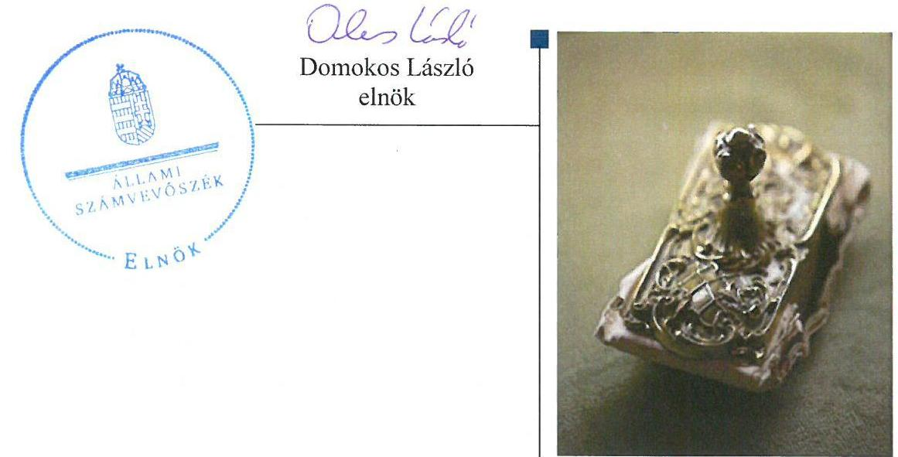
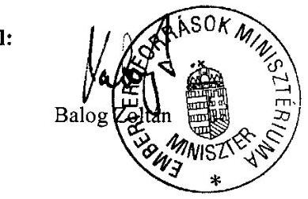
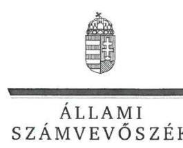
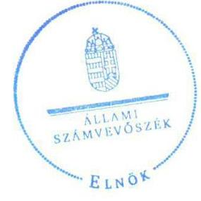
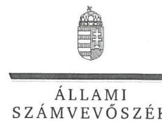
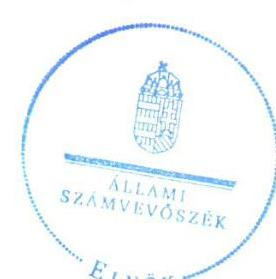

# Jelentés 

## Educatio Társadalmi Szolgáltató Nonprofit Kft.

Az állami tulajdonban (résztulajdonban) lévő gazdálkodó szervezetek vagyonmegőrzési és gazdálkodási tevékenységének ellenőrzése 2016.

16132
www.asz.hu

---

# Jelentés 

## Educatio Társadalmi Szolgáltató Nonprofit Kft.

Az állami tulajdonban (résztulajdonban) lévő gazdálkodó szervezetek vagyonmegőrzési és gazdálkodási tevékenységének ellenőrzése
2016. auguverus hó 30 . nap

---

# AZ ELLENŐRZÉST FELÜGYELTE:

- BÖRÖCZ IMRE felügyeleti vezető

- AZ ELLENŐRZÉST VEZETTE ÉS A VÉGREHAJTÁSÁÉRT FELELŐS:
  - DR. SCHREIBER JUDIT ZSUZSANNA ellenőrzésvezető

- A PROGRAM ÖSSZEÁLLÍTÁSÁÉRT FELELŐS:
  - LAJTERNÉ HUDÁK MAGDOLNA osztályvezető

- IKTATÓSZÁM: V-0929-238/2016
- TÉMASZÁM: 1706.

# ELLENŐRZÉS-AZONOSÍTÓ SZÁM: V070906

Jelentéseink az Országgyűlés számítógépes hálózatán és az Interneta a www.asz.hu címen is olvashatóak.

---

# TARTALOMJEGYZÉK 

■ ÖSSZEGZÉS ..... 5
■ AZ ELLENŐRZÉS CÉLJA ..... 7
■ AZ ELLENŐRZÉS TERÜLETE ..... 8
■ AZ ELLENŐRZÉS HÁTTERE, INDOKOLTSÁGA ..... 10
■ FÓKUSZKÉRDÉSEK ..... 11
■ ELLENŐRZÉS HATÓKÖRE ÉS MÓDSZEREI ..... 12
■ MEGÁLLAPÍTÁSOK ..... 14
■ MELLÉKLETEK ..... 27
I. Sz. melléklet: Értelmező szótár. ..... 27
II. Sz. melléklet: Az Educatio vagyonának megoszlása 2011-2014. években (adatok E Ft- ban) ..... 31
III. Sz. melléklet: Az Educatio eredményének alakulása 2011-2014. években (adatok E Ft- ban) ..... 32
■ FÜGGELÉK: ÉSZREVÉTELEK ..... 33
■ RÖVIDÍTÉSEK JEGYZÉKE ..... 43

---

.

---

# ÖSSZEGZÉS 

Az Állami Számvevőszék az Educatio Társadalmi Szolgáltató Nonprofit Kft. vagyonmegőrzési és gazdálkodási tevékenységét 2011. január 1. és 2014. december 31. közötti időszakra vonatkozóan ellenőrizte. A vagyonnal való gazdálkodás feltételeit kialakították. A vagyongazdálkodási tevékenység tekintetében az ellenőrzés hiányosságokat tárt fel egy ingatlan jogcím nélküli használatához, a számviteli elszámolásokhoz és az éves beszámolókhoz kapcsolódóan, valamint a közbeszerzési eljárás lefolytatásának kötelezettsége területén. A feladatok ellátására kötött vállalkozási szerződési forma nem felelt meg a belső előirásoknak.

## Az ellenőrzés társadalmi indokoltsága

Az állami tulajdonú gazdálkodó szervezetek a nemzeti vagyon részét képezik. Az állami vagyonnal való gazdálkodást illetően a tulajdonosi joggyakorlás és a vagyongazdálkodás feladata az állami vagyon átlátható, rendeltetésszerű és felelős felhasználásának biztosítása. Az állam meghatározza az ellátandó közszolgáltatásokkal kapcsolatos feladatokat, amelyhez a vagyonnal kapcsolatos döntéseknek igazodniuk kell. Az ellenőrzés megállapításai a jogalkotás számára segítséget nyújthatnak az államháztartáson kívüli közfeladat-ellátás, közvagyonnal való gazdálkodás értékeléséhez, jogszabályi keretei pontosításához, az átláthatóságot biztosító szabályozáshoz. Az ellenőrzött számára visszajelzést ad a gazdálkodási tevékenységgel, az állami vagyon felhasználásával és az éves elszámolással kapcsolatos szabálytalanságokról és kockázatokról. Az ellenőrzés tapasztalatai segítik és erősítik az ÁSZ hozzáadott értéket teremtő elemző tevékenységét és tanácsadó szerepét. A kormányzati szektorba sorolt, költségvetési tervezésbe is bevont gazdálkodó szervezetek ellenőrzése fokozza a legfőbb ellenőrző szerv iránti figyelmet és közbizalmat. Az ellenőrzésünkkel feltártuk, hogy az Educatio, mint a kormányzati szektorba sorolt egyéb szervezet milyen mértékben befolyásolta a költségvetési hiányt és az államadósságot.

## Főbb megállapítások, következtetések

A tulajdonosi joggyakorló a vagyonnal való gazdálkodás feltételeit kialakította, meghatározta az érték megőrzésére, gyarapítására vonatkozó, valamint a felelős gazdálkodáshoz szükséges követelményeket, továbbá a tulajdonosi joggyakorló számára fenntartott jogokat. A kialakított szabályozási környezetben a vagyonváltozást eredményező döntések körében az Educatio 2013. és a 2014. évre vonatkozó üzleti terveit az év végén hagyták jóvá, így ezen években az Educatio jóváhagyott üzleti terv nélkül gazdálkodott.

Az Educatio a vagyon értékének megőrzését, gyarapítását biztosító vagyongazdálkodás feltételeit alapvetően szabályszerűen alakította ki. Az Önköltségszámítási szabályzatban a költségek felosztásának vetítési alapját nem határozták meg teljes körűen, így az egyes feladatokra elszámolt költségek felosztásának módja nem volt átlátható.

A vagyonváltozást eredményező döntések körében az Educatio a feladatai ellátására vállalkozási szerződéseket kötött, amely szerződési forma nem állt összhangban az Alapító Okirat előírásaival.

Az Educatio a vagyonmegőrzési és gazdálkodási tevékenysége során egy állami ingatlanra vonatkozó használati szerződés 2012. évi felmondását követően azt jogcím nélkül tovább használta. Több szerződéskötés esetén mellőzték a közbeszerzési eljárás lefolytatását.

A számviteli elszámolások során 5,9 M Ft bevételt közhasznú bevételként számoltak el annak ellenére, hogy ezen bevételeket a Számlarend a vállalkozási tevékenység bevételeinek elszámolása körébe rendelte.

Az éves beszámolási kötelezettséget teljesítették, azonban a 2011-2014. évi kiegészítő mellékletek nem feleltek meg teljes körűen a számviteli törvény előírásainak. A közhasznúsági eredmény-kimutatásokban kimutatott vállalkozási bevételek nem voltak összhangban a főkönyvi kimutatásban szereplő bevételekkel, minden évben számszakilag

---

eltértek egymástól. A tulajdonosi joggyakorló a 2012. és a 2014. években az éves beszámolókat a törvény szerinti közzétételi határidőt követően fogadta el, így a beszámolók tulajdonosi jóváhagyás nélkül kerültek közzétételre.

Az információs rendszert megfelelően alakították ki, az adatszolgáltatási kötelezettségnek eleget tettek. A kormányzati szektor hiányára befolyást gyakorló bevételek és ráfordítások elszámolása megfelelő volt. A mérleg szerinti eredmény a 2012. évet kivéve negatív volt, mely kedvezőtlenül befolyásolta a kormányzati szektor hiányának alakulását.

---

# AZ ELLENŐRZÉS CÉLJA 

## Az Educatio Társadalmi Szolgáltató Nonprofit Kft. vagyonmegőrzési és vagyongazdálkodási tevékenysége szabályszerűségének ellenőrzése

Az Állami Számvevőszék alapvető célkitűzése, hogy az államháztartáson kívülre nyújtott költségvetési támogatások és ingyenes vagyonjuttatások ellenőrzésével hozzájáruljon ahhoz, hogy a közpénzeket az államháztartáson kívül működő szervezetek is átlátható módon használják fel a közfeladatok ellátása érdekében. Jelen ellenőrzés célja annak értékelése volt, hogy a tulajdonosi jogok gyakorlása szabályszerű volt-e, az Educatio ${ }^{1}$ által ellátott feladat bevételei, ráfordításai elszámolásának, és vagyongazdálkodási tevékenységének szabályozása megfelelt-e a jogszabályi és a tulajdonosi előírásoknak, azok végrehajtása szabályszerű volt-e. Biztosítva volt-e a közfeladatok átláthatósága és elszámoltathatósága érdekében a közszolgáltatás dijának megalapozottsága szabályszerű önköltségszámítással. Az ellenőrzés kiterjedt továbbá arra, hogy a vagyonváltozást eredményező döntések esetében a tulajdonosi jogok gyakorlója és az Educatio szabályszerűen járt-e el, továbbá, hogy az Educatio kiépített-e és működtetett-e információs rendszert a szabályszerű vagyongazdálkodás érdekében. Az Educatio, mint kormányzati szektorba sorolt egyéb szervezet gazdálkodásának a kormányzati szektor hiányára és az államadósságra befolyással bíró elemei a jogszabályi előírásoknak megfeleltek-e.

---

# **AZ ELLENŐRZÉS TERÜLETE**

## **Educatio Társadalmi Szolgáltató Nonprofit Kft.**

Az Educatio Társadalmi Szolgáltató Nonprofit Kft.-t a Magyar Állam alapította, a közoktatás és a felsőoktatás egyes nyilvántartási rendszereivel kapcsolatos informatikai, adatbanki és tájékoztató tevékenységek szervezésére, informatikai fejlesztések előkészítésére és megvalósítására, valamint az ehhez kapcsolódó szolgáltatások ellátására.

Az Educatio társasági részesedése feletti tulajdonosi jogokat 2013. augusztus 22-ig az NFM^{2} gyakorolta.

2013. augusztus 23-tól az 1366/2013. Korm. határozat^{3} felhívta a nemzeti fejlesztési minisztert, hogy – a MNV Zrt.^{4} bevonásával – tegye meg, illetve kezdeményezze a szükséges intézkedéseket, hogy az Educatio tekintetében a társasági részesedés tulajdonosi joggyakorlója nevében és helyett – megbízáson alapuló meghatalmazással – az emberi erőforrások minisztere járjon el a tulajdonosi jogok gyakorlása során.

Az EMMI^{5} 2013. augusztus 23-tól – az MNV Zrt.-vel létrejött – megbízási szerződés alapján gyakorolta a tulajdonosi jogokat.

Az Educatio a feladatai ellátása során az Emberi Erőforrások Minisztériumának háttérintézményeként közreműködött a magyar köz- és felsőoktatás tartalmi, módszertani megújításában, a központi oktatásügyi szolgáltatások fejlesztésében és üzemeltetésében. Az Educatio a szakmapolitika szereplőinek, illetve a magyar köz- és felsőoktatási rendszer minden érintettjének nyújtotta szolgáltatásait, tevékenységeit elsősorban állami és európai uniós források felhasználásával végezte.

Az Educatio feladatai közé tartozott többek között a köz- és felsőoktatást érintő központi adatbázisok – a Köznevelés információs rendszer (KIR), a Felsőoktatási információs rendszer (FIR) – fejlesztése és üzemeltetése, valamint a felsőoktatási felvételi eljárások teljes körű operatív lebonyolítása.

1. táblázat

|  TÁMOGATÁSOK ÉS BEVÉTELEK (M FT) | 2011. év | 2012. év | 2013. év | 2014. év  |
| --- | --- | --- | --- | --- |
|  Alapítótól közhasznú célra, működésre kapott támogatás | 1058,2 | 574,8 | 830,4 | 1030,2  |
|  Pályázati úton elnyert támogatás | 3919,5 | 3571,3 | 3607,7 | 4965,5  |
|  Közhasznú tevékenység bevétele | 1312,3 | 1778,6 | 1002,8 | 1096,9  |
|  Vállalkozási tevékenység bevétele | 120,4 | 1464,7 | 1402,7 | 108,7  |

*Forrás: Educatio NKft.2011-2014. évi közhasznú jelentés*

Az Educatio a kormányzati szektorba sorolt egyéb szervezetek közé tartozott, így kormányzati szektoron kívüli féllel kötött adósságot keletkeztető ügylete, gazdálkodásának eredménye befolyásolta a kormányzati szektor konszolidált adósságmutatóját, illetve a kormányzati szektor hiányát.

---

Az Educatio 2015. december 31-ével történő megszüntetéséről az Educatio Társadalmi Szolgáltató Nonprofit Korlátolt Felelősségű Társaság megszüntetéséről és állami feladatellátásának központi költségvetési szerv által történő átvételéről szóló 209/2015. (VII. 23.) Korm. rendeletben döntött. Az Educatio feladatait 2016. január 1-jétől az Oktatási Hivatal látja el.

---

# AZ ELLENŐRZÉS HÁTTERE, INDOKOLTSÁGA 

## Az Educatio az oktatási területet érintő informatikai stratégiák tervezésében, terjesztésében és üzemeltetésében tölt be fontos szerepet Magyarországon

A téma kiemelt közérdeklődésére tekintettel, az ÁSZ ${ }^{6}$ stratégiájában meghatározott célokkal összhangban, az ellenőrzésünkkel az Educatio átlátható, szabályszerű vagyonmegőrzési és gazdálkodási tevékenységét értékeltük.

Az ellenőrzés megállapításai alapján - az észlelt problémák, szabálytalanságok, vagy egyéb nem kívánatos jelenségek felszínre kerülésével meghatározhatóvá válnak a költségvetési hiányt befolyásoló szervezetek kockázatai, lehetővé válik ezen kockázatok csökkentése. Az ellenőrzés rámutathat az államháztartásból származó források felhasználásával kapcsolatos jó gyakorlatokra és szabálytalanságokra. Felhívhatja a figyelmet a jogszabályi követelmények teljesítéséhez szükséges feltételek hiányosságaira, hozzájárulhat az államháztartáson kívüli, de (közvetlenül vagy közvetve) állami vagyont használó gazdálkodó szervezetek tevékenységének átláthatóságához. Az ÁSZ értékteremtő rend kialakításához és megőrzéséhez hozzájáruló tevékenysége pozitív hatással van a szervezetről kialakított összkép formálására is.

Az Áht. ${ }^{7}$ nevesíti a kormányzati szektorba sorolt egyéb szervezet fogalmát. E körbe tartoznak azok a szervezetek, amelyek nem részei az államháztartásnak, azonban az Európai Közösséget létrehozó szerződéshez csatolt, a túlzott hiány esetén követendő eljárásról szóló jegyzőkönyv alkalmazásáról szóló 2009. május 25-i 479/2009/EK rendelet szerint a kormányzati szektorba tartoztak. A nemzeti számlák nemzetközi és hazai statisztikai módszertana és szabványai elveket határoznak meg a statisztikai értelemben vett kormányzati szektorba tartozó szervezetek körére és besorolásuk módjára. A nemzetgazdasági miniszter közzététele alapján az Educatio is a kormányzati szektorba tartozó egyéb szervezetnek minősült.

Az Educatio, mint a kormányzati szektorba sorolt egyéb szervezet többek között köteles volt adatszolgáltatást teljesíteni a központi költségvetésről szóló törvény elkészítéséhez, továbbá adósságot keletkeztető ügyletet csak az államháztartásért felelős miniszter előzetes egyetértésével köthetett. Az Educatio kormányzati szektoron kívüli féllel kötött adósságot keletkeztető ügylete, gazdálkodásának eredménye befolyásolta a kormányzati szektor konszolidált adósságmutatóját, illetve a költségvetési hiányt.

---

# FÓKUSZKÉRDÉSEK 

1.- A tulajdonosi jogok gyakorlója szabályszerűen alakította-e ki az Educatio tulajdonában, illetve kezelésében lévő vagyonnal való gazdálkodás feltételeit?
2.- Az Educatio az állami vagyon megőrzését és gyarapítását biztositó vagyongazdálkodási tevékenységét szabályozta-e, illetve kialakította-e a vagyonnyilvántartást a jogszabályi és a tulajdonosi elöírásoknak megfelelően?
3.- A szabályszerű, illetve a tulajdonosi elöírásoknak megfelelő volt-e az Educatio által ellátott feladatok bevételeinek és ráfordításainak elszámolása, valamint az önköltségszámitás?
4.- Az Educatio vagyonnal való gazdálkodása, valamint a tulajdonosi jogok gyakorlója és az Educatio által meghozott vagyonváltozást eredményező döntések jogszabályi és a tulajdonosi elöírásoknak megfeleltek-e?
5.- A szabályszerű vagyongazdálkodás érdekében az Educatio tel-jesítette-e a beszámolási, adatszolgáltatási kötelezettségét, ki-épített-e, illetve müködtetett-e információs rendszert?
6.- Az Educatio gazdálkodásának a kormányzati szektor hiányára és az államadósságra befolyással biró elemei a jogszabályi elöírásoknak megfeleltek-e?

---

# ELLENŐRZÉS HATÓKÖRE ÉS MÓDSZEREI 

## Az ellenőrzés típusa

Szabályszerúségi ellenőrzés

## Az ellenőrzött időszak

2011. január 1 - 2014. december 31. közötti időszak

## Az ellenőrzés tárgya

Az állami tulajdonban (résztulajdonban) lévő gazdálkodó szervezetek vagyonmegőrzési és gazdálkodási tevékenységének, valamint a gazdálkodás kormányzati szektor hiányára és az államadósságra befolyással bíró elemeinek ellenőrzése.

## Az ellenőrzött szervezet

Educatio Társadalmi Szolgáltató Nonprofit Kft. és a Emberi Erőforrások Minisztériuma, mint tulajdonosi joggyakorló.

## Az ellenőrzés jogalapja

Az ellenőrzés alapját az Állami Számvevőszékről szóló 2011. évi LXVI. törvény 5. § (3)-(5) bekezdései, valamint az állami vagyonról szóló 2007. évi CVI. törvény 3. § (4) bekezdése képezi.

## Az ellenőrzés módszerei

Az ellenőrzés az INTOSAI által kiadott nemzetközi standardok figyelembe vételével, az ÁSZ ellenőrzés szakmai szabályait tartalmazó belső szabályzatokban foglaltak, valamint az ellenőrzési programokban foglalt értékelési szempontok szerint történik. A bevételek és ráfordítások elszámolása, valamint a vagyonnyilvántartás terén a szabályszerű múködést mintavétellel ellenőriztük. A kormányzati szektorba sorolt gazdálkodó szervezetek esetében a személyi jellegú ráfordítások elszámolása mellett az egyéb ráfordítások, pénzügyi műveletek ráfordításai, rendkívüli ráfordítások, illetve az egyéb bevételek, pénzügyi műveletek bevételei, rendkívüli bevételek elszámolásának szabályszerűségét szintén mintatételeken keresztül ellenőriztük. A véletlen mintavétellel (évenkénti elemszámmal arányos rétegezéssel) ellenőrzött területek esetében minden egyes tétel vonatkozásában

---

a szabályszerűségre vonatkozó kérdéseket tettünk fel, amelyek eredménye összesítésre került. A jogszabályoknak és a belső előírásoknak megfelelőnek tekintettük az adott területet, amennyiben a minta ellenőrzésének eredménye alapján 95\%-os bizonyossággal a teljes sokaságban a hibaarány kisebb volt, mint 10\%, nem megfelelőnek értékeltük, ha a hibaarány a 10\%-ot meghaladta. A személyi jellegú ráfordítások esetében az ellenőrzött mintatételeket értékeltük. A ráfordítások elszámolására és a vagyon-nyilvántartásra vonatkozó véletlen mintavételt kockázati alapú kiválasztással egészítettük ki, amelynek során évente a három legnagyobb összegű tételt választottuk ki.

---

# 1. A tulajdonosi jogok gyakorlója szabályszerűen alakította-e ki az Educatio tulajdonában, illetve kezelésében lévő vagyonnal való gazdálkodás feltételeit? 

Összegző megállapítás

1.1. számú megállapítás

A tulajdonosi joggyakorló ${ }^{8}$ a vagyonnal való gazdálkodás feltételeit kialakította. A tulajdonosi joggyakorlás keretében hiányosságokat tártunk fel az üzleti terv elfogadásához kapcsolódóan.

A tulajdonosi joggyakorló az Alapító Okiratban ${ }^{9}$ meghatározta a vagyon értékmegőrzésére, gyarapítására vonatkozó, valamint a felelős gazdálkodáshoz szükséges követelményeket. A 2013. és a 2014. évre vonatkozó üzleti terveket év végén hagyták jóvá, így az Educatio jóváhagyott üzleti terv nélkül gazdálkodott.

A TULAJDONOSI JOGGYAKORLÁS keretében az Educatio feletti tulajdonosi jogokat 2013. augusztus 22-ig az NFM, a 1366/2013. Korm. határozat alapján 2013. augusztus 23-tól az EMMI gyakorolta a Vtv. ${ }^{10}$ 29. § (5) bekezdésével összhangban. Az MNV Zrt. és az EMMI között a tulajdonosi jogok gyakorlásáról szóló Megbízási Szerződés ${ }^{11}$ megfelelt az Nvtv. ${ }^{12}$ 8. § (7) bekezdésének. Az Alapító Okiratban a tulajdonosi joggyakorló változását 2013. augusztus 29-én átvezették. Az Educatio közhasznú feladatait, valamint vállalkozási feladatait az Alapító Okirat tartalmazta.

A tulajdonosi joggyakorló a számára fenntartott vagyongazdálkodásra vonatkozó jogokat az Alapító Okiratban meghatározta. Az Alapító Okirat 6. és 8. pontjaiban előírták többek között a tulajdonosi joggyakorló kizárólagos hatáskörébe tartozó, az üzleti tervek, a számviteli beszámolók, a közhasznúsági jelentés és mellékletei elfogadását, az ügyvezető, az $\mathrm{FB}^{13}$ tagok és a könyvvizsgáló megválasztásához kapcsolódó jogokat, a megszűnés és átalakulás, valamint a hitelfelvétel döntéshozatali jogát.

## A FELELŐS GAZDÁLKODÁSHOZ SZÜKSÉGES KÖ-

VETELMÉNYEK kialakítása során a Vtv. 30. § (1) bekezdés előírásának eleget téve a cégvezetés felelősségének, valamint a közérdek érvényesülését biztosító vagyongazdálkodás érdekében az Alapító Okiratban meghatározott esetekben az ügyvezető tájékoztatási, adatszolgáltatási és intézkedési kötelezettségét, továbbá a gazdálkodásához kapcsolódó szabály-zat-készítési kötelezettségét határozták meg. Az Alapító Okirat 7. és 9. pontjaiban rögzítették az SZMSZ ${ }^{14}$, az üzleti terv, a közbeszerzési terv, valamint az adat és információ biztonsági szabályzat készítésének kötelezettségét.

A vagyonmegőrzés és vagyongyarapítás keretében az Alapító Okirat 4., 5., 8., 9. és 11. pontjaiban előírták a nyereség felosztásának tilalmát, az

---

# Megállapítások 

ügyvezetés és az FB feladatait és hatáskörét, a kötelező könyvvizsgálatot, a negyedéves likviditási terv készítésének és bemutatásának kötelezettségét. Meghatározták a múködés, a gazdálkodás ellenőrzésének feladatát, a tulajdonos joggyakorló döntéshozatalához szükséges előterjesztés követelményeit.

A tulajdonosi joggyakorló az Educatio vagyonmegőrzésre és gyarapításra vonatkozó 2011-2012. évre vonatkozó üzleti terveihez az év elején, a 2013. és 2014. évben az adott üzleti év végén - 2013. december 4-én és 2014. december 8-án - adta meg a tulajdonosi jóváhagyást, így az Educatico ezen években jóváhagyott üzleti tervek nélkül folytatta a gazdálkodását.

A tulajdonosi joggyakorló a finanszírozás és a vagyoni háttér megteremtésével biztosította a feladatellátás alapvető feltételeit, rendelkezésre bocsátotta a múködéshez és feladatellátáshoz szükséges tőkét.

### 1.2. számú megállapítás

Az Educatio egy használatban lévő állami ingatlant a 2012. évtől jogcím nélkül használt. A feladatellátásra kötött vállalkozási szerződési forma nem állt összhangban az Alapító Okirattal.

Az Educatio vagyonkezelésében állami vagyon nem volt. Egy állami ingatlan az Educatio ingyenes használatában állt, amelyre vonatkozó szerződés 2012. március 30-ig szabályos volt. Az ingatlanra vonatkozó használati szerződést ${ }^{15}$ a NEFMI ${ }^{16}$ 2012. március 31-én felmondta, és az ingatlan kiürítéséről és visszaadásáról rendelkezett. Az Educatio a használati szerződés felmondását követően nem tett eleget a NEFMI döntésének, az ingatlant jogcím nélkül tovább használta. A tulajdonosi joggyakorló intézkedése ellenére a jogcím nélküli használat nem szűnt meg, ami nem volt összhangban az Nvtv. 7. § (1) bekezdésében foglalt, az állami vagyonnal való felelős és rendeltetésszerű gazdálkodás biztosításával.

A 2012. június 12-ig hatályos Alapító Okirat 2.10., illetve a 2012. június 12-től hatályos Alapító Okirat 5.2.5. pontjában foglaltak szerint az Educatio a tulajdonosi joggyakorlóval vagy más társadalmi közös szükséglet kielégítéséért felelős szervvel kötött közhasznú, illetve támogatási szerződés alapján végezhetett feladatokat. Az előírás ellenére az Educatio a 20112014. évekre az Oktatási Hivatallal vállalkozási szerződést kötött. A további feladatok ellátására kötött támogatási szerződései biztosították a támogatási források átláthatóságát és ellenőrizhetőséget. A támogatási szerződésekben meghatározták az ellátandó feladatokat, a felek jogait és kötelezettségeit, a felhasználás és az elszámolás szabályait, valamint az ellenőrzési jogosultságokat.

---

# 2. Az Educatio az állami vagyon megőrzését és gyarapítását biztosító vagyongazdálkodási tevékenységét szabályozta-e, illetve kialakította-e a vagyonnyilvántartást a jogszabályi és a tulajdonosi előírásoknak megfelelően? 

Összegző megállapítás

A vagyonmegőrzést és gyarapítást biztosító vagyongazdálkodási tevékenység szabályozásának kialakítása egy év kivételével szabályszerű volt. Az Educatio vagyonának a nyilvántartása megfelelt a jogszabályi előírásoknak.
2.1. számú megállapítás

A vagyon értékének megőrzését, gyarapítását biztosító szabályszerű vagyongazdálkodás feltételeit - a 2012. évi amortizációs politika meghatározásának kivételével - szabályszerűen alakították ki és szabályozták.

Vagyongazdálkodási stratégia készítési kötelezettséget a tulajdonosi joggyakorló nem írt elő, a vagyongazdálkodással kapcsolatos terveket és feladatokat az Educatio az üzleti tervekben rögzítette, amit a tulajdonosi joggyakorló határozatokkal fogadott el.

A szabályszerű vagyongazdálkodás követelményei megteremtésének körében az Alapító Okirattal összhangban elkészítették az SZMSZ-t, a Gazdálkodási Szabályzatot ${ }^{17}$, a Közbeszerzési Szabályzatot ${ }^{18}$, a Befektetési Szabályzatot ${ }^{19}$, a Javadalmazási Szabályzatot ${ }^{20}$. A szabályzatokat a tulajdonosi joggyakorló jóváhagyta.

A vagyonnal való szabályszerű gazdálkodás belső szabályozásának megteremtése érdekében elkészítették a Számviteli Politikát²1, azonban a 2011. december 23. és 2012. december 31. közötti időszakban az nem állt összhangban a Számv. tv. ${ }^{22}$ 14. § (4) bekezdéssel, mert az értékcsökkenés elszámolásával kapcsolatban nem határozták meg, hogy a törvényben biztosított választási lehetőségek közül melyeket, milyen feltételek fennállása esetén alkalmaztak. A szabályzatot aktualizálták, a 2013. január 1-jétől kiadott szabályzat megfelelt a Számv. tv. előírásainak.

A Számlarendet ${ }^{23}$ a Számv. tv. 161. § (1) bekezdésében előírtaknak megfelelően készítették el. Az elkészített Számlarendet aktualizálták, az összhangban volt a Számv. tv. 161. § (2) bekezdésével és a Számviteli Politikával.

A Leltározási Szabályzatot ${ }^{24}$ a Számv. tv. 14. § (5) bekezdés a) pontja alapján készítették el, amely összhangban volt a Számv. tv. 69. §-ában előírt, a leltározásra vonatkozó rendelkezésekkel.

Az Eszközök és források értékelési Szabályzatát ${ }^{25}$ a Számv. tv. 14. § (5) bekezdés b) pontja alapján elkészítették, meghatározva benne az eszközök és források értékelésének módját, amely összhangban állt a Számv. tv. 57. § (1) bekezdésével. A Szabályzat aktualizálása 2013. január 1-jén megtörtént.

A Pénz és értékkezelési Szabályzatot ${ }^{26}$ a Számv. tv. 14. § (5) bekezdés d) pontjában előírtaknak eleget téve készítették el, melyben rögzítették a házipénztár, a pénzkezelés és a pénzforgalom eljárási szabályait, valamint

---

# 2.2. számú megállapítás 

meghatározták az utalványozáshoz szükséges előírásokat, melyek biztosították a pénzkezelés szabályosságát. A Szabályzatot 2012. január 1-jén aktualizálták.

A vagyongazdálkodással kapcsolatos feladat- és hatásköröket, felelősségi viszonyokat az Alapító Okirattal összhangban az SZMSZ-ben, a Pénzés Értékkezelési Szabályzatban, a Selejtezési Szabályzatban ${ }^{27}$ és a Leltározási Szabályzatban szabályozták, meghatározták a gazdálkodással kapcsolatos feladatokat, a vezetők és a dolgozók felelősségét, illetve hatáskörét.

## Az Educatio saját vagyonának számviteli nyilvántartása során a Számv. tv. és a belső szabályzatok előírásait betartotta.

Az Educatio a saját vagyon számviteli nyilvántartása során a Számv. tv. előírásait betartotta.

Az Educatio tulajdoni részesedéssel nem rendelkezett. A befektetett pénzügyi eszközök között a 2013. és 2014. évben 55,1 M Ft tartósan adott kölcsönt mutattak ki.

A követelésekre az év végi minősítés alapján a 2011-2014. év között összesen 20,2 M Ft összegben számoltak el értékvesztést, amely összhangban volt a Számv. tv. 55-56. §, az értékvesztés elszámolására vonatkozó előírásaival. A 2011-2014. évben 17,8 M Ft összegű értékvesztés visszaírása történt, amelyek összhangban álltak a Számv. tv. 57. § (2) bekezdésével, amely az értékvesztés visszaírás feltételét szabályozta.

A vagyon tekintetében a számviteli nyilvántartásban folyamatosan nyomon követhetők voltak az immateriális javak, a tárgyi eszközök bruttó és nettó értékben, valamint az értékcsökkenési leírások.
2. táblázat

## BEFEKTETETT ESZKÖZÖK ÉS AZ ÉRTÉKCSÖKKENÉSI LEÍRÁS (M FT)

|  | 2011. év | 2012. év | 2013. év | 2014. év |
| :--: | :--: | :--: | :--: | :--: |
| Immateriális javak | 7945,9 | 10617,3 | 12878,9 | 16489,7 |
| Immateriális javakra elszámolt écs | 4624,6 | 6594,7 | 8144,2 | 10048,1 |
| Nettó érték év végén | 3321,3 | 4022,6 | 4734,7 | 6441,6 |
| Tárgyi eszközök | 2123,4 | 2315,3 | 2236,5 | 10512,4 |
| Tárgyi eszközökre elszámolt écs | 2123,4 | 2315,3 | 2236,5 | 10512,4 |
| Nettó érték év végén | 1299,1 | 1583,4 | 1567,3 | 2083,1 |
| Befektetett pénzügyi eszközök | 0 | 0 | 55071.0 | 55071,0 |

A leltározási kötelezettségnek a Leltározási Szabályzatban foglaltakkal összhangban tettek eleget. Az éves mérlegtételekről a Számv. tv. 69. § (1)(2) bekezdéseiben foglaltaknak megfelelően olyan leltárt állítottak össze, amely alapján tételesen ellenőrizhetőek voltak a mérleg fordulónapján meglévő eszközök és források mennyiségben, illetve értékben.

---

# 3. A szabályszerű, illetve a tulajdonosi előírásoknak megfelelő volt-e az Educatio által ellátott feladatok bevételeinek és ráfordításainak elszámolása, valamint az önköltségszámítás? 

Összegző megállapítás

A közhasznú és a vállalkozási tevékenységek bevételeinek és ráfordításainak elkülönítése több esetben nem volt megfelelő. Az Önköltségszámítási szabályzatot elkészítették, azonban annak tartalma nem volt teljes körü.
3.1. számú megállapítás

A közhasznú és a vállalkozási tevékenység bevételeinek és ráfordításainak elkülönített elszámolása megtörtént, azonban több esetben az elszámolás nem felelt meg a Számlarendben és a kiegészítő mellékletben foglaltaknak.

Az Educatio a közhasznú, illetve a vállalkozási tevékenységhez kapcsolódó bevételek és ráfordítások elkülönítésének kötelezettségét a Számviteli Politika 15. pontjában és a Számlarendben írta elő. A bevételeket külön főkönyvi számlán tartották nyilván, a költségek elkülönítése az analitikus nyilvántartásban költséghely, projektszám és munkaszám szerinti elszámolással történt.

A közhasznú és a vállalkozási tevékenység árbevételeinek elkülönítése során a 2011. évben 1,7 M Ft, a 2012. évben 3,2 M Ft képzés, oktatás, vizsgáztatás tevékenységből származó árbevételt, a 2013. évben 1,0 M Ft hirdetési tevékenységből származó árbevételt közhasznú bevételként számoltak el annak ellenére, hogy a Számlarend a 92-94-es számlaosztályok meghatározásánál ezen tevékenységekhez kapcsolódó árbevételeket vállalkozási tevékenység bevételeinek elszámolása körébe rendelte.

A tanfolyamok szervezését és lebonyolítását, valamint a média felületek piaci alapon történő értékesítésének közhasznú feladatok közé történő besorolása nem volt összhangban a kiegészítő mellékletek 1. pontjában foglaltakkal sem, amely ezen tevékenységeket a vállalkozási tevékenységek közé sorolta.

A bevételek és ráfordítások elszámolása - a hibás elkülönítések kivételével - a megfelelő főkönyvi számlákra történtek. Az értékcsökkenés elszámolása összhangban volt a Számv. tv. 52. §-ának előírásaival.

Az eszközök rendszeres karbantartása megtörtént, elhasználódási fokuk megfelelt az adott eszközcsoportra jellemző erkölcsi avulás mértékének.

A vagyoni értékű jogok használhatósága 57,9 \%-ról 44,0 \%-ra csökkent a 2011. évről a 2014. évre. Az átlagos életkor 2,1 és 2,8 év között változott. A szellemi termékek használhatósága 27,0 \%-ról 32,9 \%-ra növekedett a 2014. év végére. Az átlagos életkor 3,4 és 3,7 év között alakult. Az ingatlanok és kapcsolódó vagyoni értékű jogok használhatósága 82,3 \%-ról 79,5 \%-ra mérséklődött a 2014. évre. Az átlagos életkor 8,9 és 10,7 év között változott.

A KÖVETELÉSÁLLOMÁNY 677,6 M Ft-ról 477,7 M Ft-ra változott 2011. év végéről a 2014. év végére, amelyet a vevőkövetelések jelen-

---

tős csökkenése okozott. A tulajdonosi joggyakorló nem határozott meg intézkedési kötelezettséget a követelésállomány csökkentése érdekében, azonban kiadásra került egy ügyvezetői utasítás ${ }^{18}$, amely a követelések behajtására, kezelésére tartalmazott eljárásrendet. A 2011-2014. évek között 19,2 M Ft került behajthatatlan követelésként leírásra, amely összhangban volt a Számv. tv. 65. § (7) bekezdés előírásával.
3. táblázat

KÖVETELÉSEK VÁLTOZÁSA 2011-2014 KÖZÖTT (M FT)

| Év | Vevőkövetelés | Vevőkövetelés változás (2011=10 0\%) | Egyéb követelés | Egyéb követelés változás (2011=10 0\%) | Összes követelés | Összes követelés változás (2011=10 0\%) |
| :--: | :--: | :--: | :--: | :--: | :--: | :--: |
| 2011 | 602,2 | 100,0 | 75,4 | 100,0 | 677,6 | 100,0 |
| 2012 | 273,3 | 45,4 | 109,5 | 145,2 | 382,8 | 56,5 |
| 2013 | 290,1 | 48,2 | 364,0 | 482,8 | 654,1 | 96,5 |
| 2014 | 253,4 | 42,1 | 224,3 | 297,4 | 477,7 | 70,5 |

3.2. számú megállapítás

Az Önköltségszámítási Szabályzatot elkészítették, azonban a költségek felosztásának vetítési alapját nem határozták meg teljes körüen.

AZ ÖNKÖLTSÉGSZÁMÍTÁS rendjére vonatkozó szabályzatot a Számv. tv. 14. § (5) bekezdés c) pontja alapján elkészítették. A szabályzatban meghatározták a közvetlen és közvetett költségek fogalmát, azonban nem határozták meg a költségfelosztás elvégzésének pontos eljárásrendjét. A költségfelosztás rendjének szabályozására ügyvezetői utasítást adtak ki, amiben nem teljes körűen határozták meg a költségfelosztáshoz szükséges vetítési alapokat, így az egyes feladatokra elszámolt költségek felosztásának módja nem volt átlátható.

Az Educatio közszolgáltatást nem látott el, így közszolgáltatási árképzést megalapozó önköltségszámítást nem készített.

---

# 4. Az Educatio vagyonnal való gazdálkodása, valamint a tulajdonosi jogok gyakorlója és az Educatio által meghozott vagyonváltozást eredményező döntések jogszabályi és a tulajdonosi előírásoknak megfeleltek-e? 

Összegző megállapítás

Az Educatio a vagyonváltozást eredményező döntései körében a feladatellátására vállalkozási szerződéseket kötött, amely szerződési forma nem felelt meg az előírásoknak. Több esetben nem tartották be a közbeszerzési eljárás lefolytatásának kötelezettségét.
4.1. számú megállapítás

Az Educatio vagyongazdálkodását - a közbeszerzésekhez és a jogcím nélküli ingatlan használatához kapcsolódóan feltárt hiányosságokat kivéve - az előírásoknak megfelelően végezte.

Az Educatio a vagyongazdálkodására vonatkozó terveit az éves üzleti tervekben határozta meg. A vagyongazdálkodás során az Educatio vagyona a 2011. év végéről a 2014. év végére 10 270,2 M Ft-ról 20 083,2 M Ft-ra, összesen 9813,0 M Ft-tal nőtt. A vagyon szerkezetében az eszköz oldalon a 2011-2014. években jelentős átrendeződés történt. Az eszközök 95,5\%os gyarapodását döntően a 2014. évben, az uniós projektek keretében beszerzett műszaki berendezések és gépek 7461,6 M Ft összegben történő aktiválása okozta. Az eszközökön belül a beruházások következtében a befektetett eszközök aránya 32,6 százalékponttal nőtt.
4. táblázat

| ESZKÖZÖK ALAKULÁSA (M FT) |  |  |  |  |
| :-- | --: | --: | --: | --: |
| Megnevezés | 2011. év | 2014. év | Változás (M FT) | Változás   (M) |
| Befektetett eszközök | 4289,1 | 14926,0 | 10636,9 | 248,0 |
| Forgóeszközök | 3129,2 | 3770,2 | 641,0 | 20,4 |
| Aktív időbeli elhatárolások | 2851,9 | 1387,0 | $-1464,9$ | $-51,3$ |
| Eszközök összesen | 10270,2 | 20083,2 | 9813,0 | 95,5 |

Forrás: 2011-2014. évi beszámolók
Az aktív időbeli elhatárolások értéke a 2014. év végére 51,3\%-kal csökkent. Ennek oka az ÚSZT ${ }^{29}$ programokhoz kapcsolódó támogatási bevételek aktív időbeli elhatárolásának 1258,3 M Ft-tal való csökkenése volt.

Átrendeződés történt a források szerkezetében is. A saját tőke aránya és a kötelezettségek aránya a forrásokon belül csökkent, a passzív időbeli elhatárolások aránya 42,8\%-ról 71,3\%-ra növekedett 9929,6 M Ft összegben. A 2014. évben aktivált eszközök értékcsökkenésének fedezetére elhatárolt támogatási bevételek, mint halasztott bevételek növelték a passzív időbeli elhatárolások állományát.

A kötelezettségek értéke 525,9 M Ft-tal csökkent, amelynek oka az volt, hogy az ÚSZT programok keretében a vevőktől kapott előlegek összege csökkent, továbbá mérséklődött a szállítói állomány.

A céltartalékok értékének növekedése a folyamatban lévő munkaügyi pereken kívül, az ÚMFT ${ }^{30}$ és az ÚSZT projektek elszámolásra benyújtott, de

---

az esetlegesen elutasított tételek miatt képződő várható kötelezettségekből származott.
5. táblázat

FORRÁSOK ALAKULÁSA (M FT)

| Megnevezés | 2011. év | 2014. év | Válto-   zas M Ft | Változás \% |
| :-- | --: | --: | --: | --: |
| Saját tőke | 2246,9 | 2329,7 | 82,8 | 3,7 |
| Céltartalékok | 123,1 | 449,5 | 326,4 | 265,4 |
| Kötelezettségek | 3500,2 | 2974,3 | $-525,9$ | $-15,0$ |
| Passzív időbeli elhatárolások | 4400,0 | 14329,7 | 9929,7 | 225,7 |
| Források összesen | 10270,2 | 20083,2 | 9813,0 | 95,5 |

A tárgyi eszközök rendszeres időközönkénti karbantartásáról, állagmegóvásáról gondoskodtak, amelynek a pénzügyi forrására az üzleti tervben biztosítottak keretösszeget.
6. táblázat

A KARBANTARTÁSI KÖLTSÉGEK ALAKULÁSA (M FT)

|  | 2011. év | 2012. év | 2013. év | 2014. év |
| :-- | --: | --: | --: | --: |
| Terv | 46,5 | 36,5 | 44,6 | 33,5 |
| Tény | 31,5 | 88,1 | 28,6 | 24,2 |
| Eltérés a tervtől M Ft | $-15,0$ | 51,6 | $-16,0$ | $-9,3$ |
| Eltérés a tervtől \% | $-32,2$ | 141,3 | $-35,9$ | $-27,7$ |

A2 Educationak vagyonkezelésbe átvett állami vagyona nem volt, így állami vagyon elidegenítésére, megterhelésére nem került sor, a Vhr. ${ }^{31}$ 9. § (9) d) szerinti visszapótlási kötelezettsége nem keletkezett.

A tulajdonosi joggyakorló az Educatio saját tőkét 2011. január 12-én a 1231/2010. Korm. határozat ${ }^{32}$ alapján 2635 M Ft-tal emelte meg az Educatio működőképességének fenntartása érdekében tekintettel arra, hogy a 2010. év végén a saját tőke összege negatív, -236 M Ft volt. A saját tőkén belül a jegyzett tőkét 277,8 M Ft-ról 500 M Ft-ra növelték. A saját tőke 2011. évről 2014. évre 3,7\%-kal emelkedett. A saját tőke/jegyzett tőke változásokat a mérleg szerinti eredmény saját tőkébe történő átvezetése okozta.
7. táblázat

SAJÁT TŐKE, JEGYZETT TŐKE ALAKULÁSA (M Ft)

| Megnevezés | 2011. év | 2012. év | 2013. év | 2014. év |
| :-- | --: | --: | --: | --: |
| Saját tőke | 2246,9 | 2972,7 | 2767,2 | 2329,7 |
| Jegyzett tőke | 500,0 | 500,0 | 500,0 | 500,0 |
| Saját tőke/Jegyzett tőke | 4,49 | 5,95 | 5,53 | 4,66 |

Forrás: 2011-2014. évi beszámolók

---

### 4.2. számú megállapítás

A vagyonváltozást eredményező döntések előkészítése és megalapozása keretében vállalkozási szerződéseket kötöttek, amely szerződési forma nem állt összhangban az Alapító Okirat előírásaival. Több esetben felmerült, hogy a közbeszerzési törvény előírásai nem teljes körűen érvényesültek.

## A VAGYONVÁLTOZÁST EREDMÉNYEZŐ DÖNTÉ-

SEK előkészítése az Alapító Okiratnak megfelelően, az FB véleményét követően tulajdonosi jóváhagyással történtek. Az Alapító Okiratban meghatározott értékhatárt elérő esetekben a tulajdonosi jóváhagyást megkérték, a döntésre történő beterjesztések megfeleltek az Alapító Okiratban foglaltaknak.

Az Educatio a feladatait a 307/2006. Korm. rendelet ${ }^{33}$ és a 121/2013. Korm. rendelet ${ }^{34}$ alapján látta el. Az Oktatási Hivatallal a 2011-2014. év között a feladatellátásra 4871,4 M Ft összegben kötöttek vállalkozási szerződéseket. A feladat ellátására kötött vállalkozási szerződési forma nem állt összhangban a 2012. június 12-ig hatályos Alapító Okirat 2.10., illetve a 2012. június 12-től hatályos Alapító Okirat 5.2.5. pontjában foglaltakkal, amely szerint az Educatio a tulajdonosi joggyakorlóval vagy más társadalmi szükséglet kielégítéséért felelős szervvel kötött közhasznú, illetve támogatási szerződés alapján végezhet feladatokat. A Számviteli Politika 12. pontja alapján az Alapító Okiratban a cél szerint meghatározott közhasznú feladatok nem tekinthetők gazdasági, vállalkozási tevékenységnek. A vállalkozási szerződések szerinti feladatokat az Educatio közhasznú feladatként mutatta ki a számviteli nyilvántartásában.

Az Educatio közbeszerzési eljárás lefolytatására volt kötelezett a Kbt.1,2 alapján. A 2011-2014. évben árubeszerzésekhez és szolgáltatások megrendeléséhez kapcsolódóan felmerült, hogy a Kbt. $1^{35} 240$. § (1) bekezdése, valamint - a Kbt. $2^{36}$ 5. §-ra tekintettel - a Kbt. 2 19. §-a nem teljes körűen érvényesült.

### 4.3. számú megállapítás

A tulajdonosi jogok gyakorlójának vagyonváltozást eredményező döntései szabályosak voltak, hozzájárultak a vagyon értékének megőrzéséhez, gyarapításához.

A tulajdonosi joggyakorló az Alapító Okiratban meghatározta a tulajdonosi jóváhagyáshoz szükséges összeghatárokat, az FB előzetes véleményezési, az ügyvezető szakmai indoklási és beterjesztési kötelezettségét. A tulajdonosi joggyakorló kizárólagos hatáskörébe tartozott a Számv. tv. szerinti beszámoló elfogadása az FB és a könyvvizsgáló írásbeli jelentése megismerését követően.

A tulajdonosi joggyakorló az Educatio éves beszámolóját minden évben az Alapító Okirat előírásainak megfelelően, a Gt. ${ }^{37} 35 . \S$ (3) és a Ptk. ${ }^{38} 3: 120$ § (2) szerinti FB írásbeli jelentés, valamint a Gt. 40. § (1) és a Ptk. 3:129 § (1) szerinti könyvvizsgálói jelentés birtokában fogadta el.

A tulajdonosi joggyakorló a vagyonváltozást eredményező döntések keretében az Educatio szerződéseit a vonatkozó kormányhatározatokkal és a jogszabályokkal összhangban fogadta el. A döntések hozzájárultak a vagyon értékének megőrzéséhez, gyarapításához.

A tulajdonosi joggyakorló a vagyon tulajdonjogának átruházására, apportjára vonatkozó döntést a 2011-2014. évek között nem hozott.

---

# 5. A szabályszerű vagyongazdálkodás érdekében az Educatio tel- 

jesítette-e a beszámolási, adatszolgáltatási kötelezettségét, ki-épített-e, illetve múködtetett-e információs rendszert?

Összegző megállapítás

Az Educatio a beszámolási kötelezettségét teljesítette, azonban hiányosságokat tártunk fel az éves beszámolókhoz kapcsolódóan. Az információs rendszert kiépítették, az adatszolgáltatási kötelezettségnek egy évben nem teljes körűen tettek eleget.
5.1. számú megállapítás

Az Educatio éves beszámolási kötelezettségét teljesítette, azonban a kiegészítő mellékletek nem feleltek meg a törvényi előírásoknak. A vállalkozási bevételek tekintetében a közhasznúsági eredménykimutatások nem voltak összhangban a főkönyvi kimutatásokkal. A 2013. évi beszámoló könyvvizsgáló által nem volt hitelesítve.

A tulajdonosi joggyakorló a beszámolásra, adatszolgáltatásra vonatkozó feladatokat, valamint egyéb tájékoztatási kötelezettséget az Educatio Alapító Okiratában rögzítette. Előírták az éves beszámolók jóváhagyásra történő beterjesztési és az ügyvezető beszámolási kötelezettségét, aminek az Educatio minden évben eleget tett.

AZ ÉVES BESZÁMOLÓT az Educatio a Számv. tv. előírása alapján elkészítette. A 2013. évben a könyvvizsgáló egyetértésével éltek a Számv. tv. 4. § (4) bekezdésében szereplő, a Számv. tv. előírásától való eltérés lehetőségével. A könyvvizsgáló az éves beszámolóról szóló könyvvizsgálói jelentésében megadott hozzájárulásával a megbízható és valós összkép biztosítása érdekében az egyéb bevételek között kimutattak olyan támogatásokat is, amelyek pénzügyi rendezése a mérlegkészítés időpontjáig nem valósult meg.

Az éves beszámoló részeként elkészített kiegészítő melléklet a 2013. évben nem tartalmazta a Számv. tv. előírásaitól való eltérés Számv. tv. 4. § (4) bekezdésében előírt eszközökre és forrásokra, valamint a pénzügyi helyzetre és az eredményre gyakorolt hatását.

Ezen túlmenően a kiegészítő mellékletek a 2011-2014. években nem feleltek meg a Számv. tv. 92. § (3) bekezdés b) pontjának, mert a készletekre elszámolt értékvesztésre vonatkozó részletező adatokat nem mutatták be.
8. táblázat

KÉSZLETEKRE ELSZÁMOLT ÉRTÉKVESZTÉS (M Ft)

| Megnevezés | 2011. év | 2012. év | 2013. év | 2014. év |
| :--: | :--: | :--: | :--: | :--: |
| Elszámolt értékvesztés | 14,8 | 11,0 | 7,6 | 0,9 |

Az Educatio a 2011-2014. években közhasznú eredménykimutatást készített, amelyekben a vállalkozási tevékenységből származó bevételek nem

---

egyeztek meg a főkönyvi kivonatokban kimutatott vállalkozási bevételekkel. A 2011. évben 2,2 M Ft-tal, a 2012. évben 259,6 M Ft-tal, a 2013. évben 37,1 M Ft-tal, a 2014. évben 1,9 M Ft-tal tért el a közhasznú eredménykimutatás az azt alátámasztó főkönyvi adatoktól, amivel megsértették a Számv. tv. 15. § (5) bekezdésében foglalt következetesség elvét.
9. táblázat

# KIMUTATÁS A VÁLLALKOZÁSI TEVÉKENYSÉG BEVÉTELEIRŐL A FŐKÖNYVI NYILVÁNTARTÁS ÉS A BESZÁMOLÓ ADATAI ALAPJÁN (ADATOK M FT-BAN) 

| Év | Fökönyvi kivonatban | Közhasznú   eredménykimutatásban | Eltérés |
| :--: | :--: | :--: | :--: |
| 2011 | 118,2 | 120,4 | $-2,2$ |
| 2012 | 1205,1 | 1464,7 | $-259,6$ |
| 2013 | 103,1 | 140,2 | $-37,1$ |
| 2014 | 106,8 | 108,7 | $-1,9$ |

Forrás: 2011-2014. évi beszámolók és a fökönyvi nyilvántartások
Az Educatio minden évben teljesítette a Számv. tv. 153. § (1) bekezdésében előírt határidőig - az üzleti év mérlegfordulónapját követő ötödik hónap utolsó napjáig - az éves beszámolóra és a könyvvizsgálói jelentésre vonatkozó letétbe helyezési kötelezettséget. A 2012. és a 2014. évben a tulajdonosi jóváhagyás nem történt meg a letétbe helyezési határidőig, így az Educatio a Számv. tv. 153. § (1) bekezdésében előírtak ellenére nem a tulajdonos által elfogadott beszámolót helyezte letétbe.

Az Educatio nem rendelkezett a 2013. évre vonatkozóan könyvvizsgáló által hitelesített éves beszámolóval, mivel a 2014. május 15-i dátumú, ügyvezető által aláírt beszámolóhoz 2014. április 16-i dátumú könyvvizsgálói jelentést csatoltak. A végleges éves beszámolónál korábbi keltezésű könyvvizsgálói jelentés nem igazolja a Számv. tv. 155. § (1) bekezdésében előírt könyvvizsgálati cél megvalósulását, hiszen nem garantálja, hogy a beszámoló dátumának időpontjáig minden - a vagyoni és pénzügyi helyzetre vonatkozó - megbízható és valós képet befolyásoló hatás figyelembe vétele megtörtént. Ennek hiányában nem igazolt az sem, hogy a Számv. tv. 158. § (6) bekezdésének előírása alapján a társaság legfőbb szerve elé terjesztett, valamint a Számv. tv. 153. § (1) bekezdésének előírása alapján a letétbe helyezett könyvvizsgálói jelentés a végleges éves beszámolóra vonatkozott.

A közvagyon védelme érdekében a tulajdonosi joggyakorló döntéshozatalát sem az FB, sem a könyvvizsgáló nem kezdeményezte, mert nem volt olyan gazdasági esemény, ami ezt indokolta volna.

A 2011-2014. év között a könyvvizsgáló nem tett az Educatio vagyongazdálkodását érintő javaslatot, észrevételt. Az FB több javaslatot megfogalmazott, azonban a vagyongazdálkodással kapcsolatban álló javaslatok közül egyik sem tartalmazott olyan észrevételt, mely a tulajdonosi joggyakorló külön döntéshozatalát tette volna szükségessé.

Az Educatio 2013. február 20-ig nem rendelkezett az Avtv. ${ }^{39}$ 20. § (8) és az Info. tv. ${ }^{40} 30 . \S$ (6) bekezdésében előírt, a közérdekú adatok megismerésére irányuló igények teljesítésének rendjét rögzítő szabályzattal. Az Educatio honlapja tartalmazta az Info. tv. 33. §-ában előírt kötelező elekt-

---

ronikus közzététel alá eső, az Info. tv. 37. § szerinti, az Info. tv. 1. mellékletében részletezett közzétételi listán szereplő adatokat, a közzétételi kötelezettségnek eleget tettek.

Az Iratkezelési Szabályzat ${ }^{41}$, valamint az Adatvédelmi és Adatkezelési Szabályzat ${ }^{42}$ összhangban álltak az Avtv. és az Info tv. előírásaival.

Az Educatio, mint kormányzati szektorba sorolt egyéb szervezet az Áht. 107. § (1) bekezdése szerinti, az államadósság számításhoz szükséges adatszolgáltatási kötelezettségét a tulajdonosi joggyakorló útján teljesítette.
5.2. számú megállapítás

A belső információs rendszert kialakították és az előírásoknak megfelelően működtették.

A BELSŐ INFORMÁCIÓS RENDSZER kialakításának, működtetésének szabályait az Iratkezelési szabályzat tartalmazta. Az SZMSZben, az Alapító Okirattal egyezően előírták a tulajdonosi joggyakorló felé történő adatszolgáltatási kötelezettséget.

Az Alapító Okirat 9. pontjában előírt, az FB felé történő negyedévenkénti adatszolgáltatási kötelezettséget a 2011-2013. évben teljesítették. A 2014. évi adatszolgáltatások nem terjedtek ki a tulajdonosi határozatok végrehajtásáról szóló tájékoztatásra, a 2014. III. negyedéves adatszolgáltatás a likviditási tervre.

A BELSŐ ELLENŐRZÉS a 2011-2014. évek között a vagyongazdálkodás szabályszerűségére és a vagyonnyilvántartás megfelelőségére ellenőrzést nem végzett.

A 2011. és a 2012. évi vagyongazdálkodást érintő tulajdonosi ellenőrzések a működési támogatások felhasználását és elszámolását vizsgálták, melyek szerint az Educationak 2,0 M Ft és 2,3 M Ft támogatás visszafizetési kötelezettsége keletkezett az indokolatlan jogi tanácsadói megbízás kötése, a nem megfelelően dokumentált reprezentációs költségek, valamint az elszámolások költségnemek szerinti megbontásának eltérése miatt.
5.3. számú megállapítás

Az Educatio nem rendelkezett tulajdonosi részesedéssel.
Az Educatio nem rendelkezett tulajdonosi részesedéssel sem gazdasági társaságban, sem egyéb szervezetben, ezért ezzel kapcsolatosan kötelezettsége nem volt.

---

# 6. Az Educatio gazdálkodásának a kormányzati szektor hiányára és az államadósságra befolyással bíró elemei a jogszabályi előírásoknak megfeleltek-e? 

## Összegző megállapítás

Az Educatio adósságot keletkeztető ügyletet nem kötött. A kormányzati szektor hiányára és az államadósságra befolyással bíró elemek elszámolása megfelelően történt.
6.1. számú megállapítás

Az Educatio nem kötött adósságot keletkeztető ügyletet.
A Stabilitás tv. ${ }^{43}$ 3. § (1) bekezdése szerinti adósságot keletkeztető ügyletet nem kötött, nem volt a Stabilitás tv. 9. § (1) és 353/2011. Korm. rend. ${ }^{44}$ 11. § szerinti kérelem benyújtási kötelezettsége.
6.2. számú megállapítás

A kormányzati szektor hiányára befolyást gyakorló bevételek és ráfordítások elszámolása megfelelően történt. Osztalékfizetésre nem került sor.

A kormányzati szektor hiányára befolyást gyakorló bevételek és ráfordítások, valamint a személyi ráfordítások elszámolásai szabályszerűen történtek. A kifizetett személyi juttatások megfelelő alapdokumentumokkal, munkaszerződésekkel, közfoglalkoztatási szerződésekkel, jelenléti ívekkel alátámasztottak voltak. Osztalékfizetésre nem került sor a Gt. 4. § (3) bekezdésében szereplő jogszabályi előírásokkal összhangban, valamint az Alapító Okiratban rögzített osztalékfizetési tilalomnak megfelelően.

Az Educatio mérleg szerinti eredménye a 2012. évet kivéve negatív volt, mely kedvezőtlenül befolyásolta a kormányzati szektor hiányának alakulását.

---

# MELLÉKLETEK 

I. SZ. MELLÉKLET: ÉRTELMEZŐ SZÓTÁR

| Állami vagyon | 2010. június 17-től   a) Az állam tulajdonában lévő dolog, valamint a dolog módjára hasznosítható természeti erő,   b) az a) pont hatálya alá nem tartozó mindazon vagyon, amely vonatkozásában törvény az állam kizárólagos tulajdonjogát nevesíti,   c) az állam tulajdonában lévő tagsági jogviszonyt megtestesítő értékpapír, illetve az államot megillető egyéb társasági részesedés,   d) az államot megillető olyan immateriális, vagyoni értékkel rendelkező jogosultság, amelyet jogszabály vagyoni értékű jogként nevesít.   Forrás: Vtv. 1. § (2) bekezdése   2012. november 10-től az állami vagyon fogalma kiegészül a következő ponttal:   e) az állam tulajdonában lévő pénzügyi eszközök   Forrás: Vtv. 1. § (2) bekezdése |
| :--: | :--: |
| Állami vagyon kezelője /vagyonkezelő | 2010. január 01 - 2011. december 31. között:   Az állami vagyont az MNV Zrt. maga kezeli, vagy szerződés - így különösen bérlet, haszonbérlet, szerződésen alapuló haszonélvezet, vagyonkezelés, megbízás - alapján központi költségvetési szervnek, természetes vagy jogi személynek, illetőleg jogi személyiséggel nem rendelkező gazdasági társaságnak hasznosításra átengedi.   Vtv. 23. § (1) bekezdése   2012. január 1-jétől:   Az állami vagyont az MNV Zrt. maga kezeli, vagy szerződés - így különösen bérlet, haszonbérlet, megbízás - alapján központi költségvetési szervnek, természetes vagy jogi személynek, vagy jogi személyiséggel nem rendelkező gazdálkodó szervezetnek hasznosításra átengedi. Az állami vagyonra vonatkozóan az MNV Zrt. kizárólag az Nvtv-ben meghatározott személyekkel köthet vagyonkezelési szerződést.   Forrás: Vtv. 23. § (1), 27. § (1)   2013. június 28-ától:   Az állami vagyonnal az MNV Zrt. maga gazdálkodik, vagy szerződés - így különösen bérlet, haszonbérlet, megbízás - alapján központi költségvetési szervnek, természetes vagy jogi személynek, vagy jogi személyiséggel nem rendelkező gazdálkodó szervezetnek hasznosításra átengedi, illetőleg vagyonkezelésbe, haszonélvezetbe adja. Az állami vagyonra vonatkozóan az MNV Zrt. kizárólag az Nvtv-ben meghatározott személyekkel köthet vagyonkezelési szerződést.   Forrás: Vtv. 23. § (1), 27. § (1) |
| Állami vagyon értékesítése | Állami vagyon tulajdonjogának bármely jogcímen történő, visszterhes átruházása.   Forrás: Vhr. 1. § (7) d) pont) |
| Kormányzati szektorba sorolt egyéb szervezet | Az a szervezet, amely az Áht. alapján nem része az államháztartásnak, azonban az Európai Közösséget létrehozó szerződéshez csatolt, a túlzott hiány esetén követendő eljárásról szóló jegyzőkönyv alkalmazásáról szóló 2009. május 25-i |

---

|  | 479/2009/EK rendelet szerint a kormányzati szektorba tartozik. A nemzetgazdasági miniszter 2013. június 26-án megjelent Közleményben tette közé ezen szervezetek listáját. |
| :--: | :--: |
| Nemzeti vagyon | 2012. január 1-jétől nemzeti vagyon:   a) az állam vagy a helyi önkormányzat kizárólagos tulajdonában álló dolgok,   b) az a) pont hatálya alá nem tartozó, állam vagy a helyi önkormányzat tulajdonában lévő dolog,   c) az állam vagy a helyi önkormányzatot tulajdonában lévő pénzügyi eszközök, továbbá az államot vagy a helyi önkormányzatot megillető társasági részesedések,   d) az államot vagy a helyi önkormányzatot megillető bármely vagyoni értékkel rendelkező jogosultság, amelyet jogszabály vagyoni értékű jogként nevesít,   e) Magyarország határa által körbezárt terület feletti légtér,   f) az üvegházhatású gázok kibocsátási egységeinek kereskedelméről szóló törvény szerint kibocsátási egység és légiközlekedési kibocsátási egység, valamint az ENSZ Éghajlatváltozási Keretegyezménye és annak Kiotói Jegyzőkönyve végrehajtási keretrendszeréről szóló törvény szerinti kiotói egység,   g) állami vagy helyi önkormányzati fenntartású közgyűjtemény (muzeális intézmény, levéltár, közgyűjteményként múködő kép- és hangarchívum, valamint könyvtár) saját gyűjteményében nyilvántartott kulturális javak körébe tartozó dolog,   h) a régészeti lelet,   i) a nemzeti adatvagyon körébe tartozó állami nyilvántartások fokozottabb védelméről szóló törvény szerinti nemzeti adatvagyon.   Forrás: Nvtv. 1. § (2) |
| nemzetközi standardok | ISSAI 100: A számvevőszéki ellenőrzés általános alapelvei; ISSAI 200: A pénzügyi ellenőrzés alapelvei; ISSAI 300: A teljesítmény-ellenőrzés alapelvei; ISSAI 400: A megfelelőségi ellenőrzés alapelvei. |
| Tulajdonosi ellenőrzés | 2010. június 17-től:   Az MNV Zrt. „rendszeresen ellenőrzi a vele szerződéses jogviszonyban lévő személyek, szervezetek vagy más használók állami vagyonnal való gazdálkodását, megállapításairól az MNV Zrt. Felügyelő Bizottságát, az ellenőrzött szervet, szükség esetén a minisztert és az Állami Számvevőszéket tájékoztatja".   Forrás: Vtv. 17. § d.   A Vhr. alapján „a tulajdonosi ellenőrzés célja az állami vagyonnal való gazdálkodás vizsgálata, ennek keretében a rendeltetésellenes, jogszerűtlen, szerződésellenes, vagy a tulajdonos érdekeit sértő, illetve a központi költségvetést hátrányosan érintő vagyongazdálkodási intézkedések feltárása és a jogszerű állapot helyreállítása, továbbá a vagyonnyilvántartás hitelességének, teljességének és helyességének biztosítása". Forrás: Vhr. 20. § (2)   2011. december 31-ig   Az állami vagyon kezelőjét, használóját megillető jogok gyakorlását, annak szabályszerűségét, célszerűségét az MNV Zrt. - szükség szerint területi szervei útján - ellenőrzi.   Forrás: Vhr. 20. § (1)   2012. január 1-jétől:   Az állami vagyon kezelőjét, haszonélvezőjét, használóját megillető jogok gyakorlását, annak szabályszerűségét, célszerűségét az MNV Zrt. - szükség szerint területi szervei útján - ellenőrzi. |

---

|  | Forrás: Vhr. 20. § (1) |
| :--: | :--: |
| Tulajdonosi jogok gyakorlója | 2010. június 17-től:   Az állami vagyon felett a Magyar Államot megillető tulajdonosi jogok és kötelezettségek összességét - ha törvény eltérően nem rendelkezik - az állami vagyon felügyeletéért felelős miniszter (a továbbiakban: miniszter) gyakorolja, aki e feladatát a Magyar Nemzeti Vagyonkezelő Zártkörűen Müködő Részvénytársaság (a továbbiakban: MNV Zrt.), a Magyar Fejlesztési Bank, illetve a tulajdonosi joggyakorló szervezet útján látja el. A miniszter miniszteri rendeletben, a törvényben meghatározott állami vagyoni kör tekintetében, meghatározott időtartamra, a joggyakorlás egyes szabályainak meghatározásával - az őt megillető tulajdonosi jogok és kötelezettségek összességének, illetve azok meghatározott részének gyakorlóját az Áht. szerinti központi költségvetési szervek, ezek intézménye, továbbá a 100\%-ban állami tulajdonban álló gazdasági társaságok közül kijelölheti.   Forrás: Vtv. 3. § (1) és (2)   2013. június 28-ától:   A rábízott állami vagyon felett az államot megillető tulajdonosi jogok és kötelezettségek összességét tulajdonosi joggyakorlóként:   a) ha törvény vagy miniszteri rendelet eltérően nem rendelkezik, a Magyar Nemzeti Vagyonkezelő Zártkörűen Müködő Részvénytársaság (a továbbiakban: MNV Zrt.),   b) törvényben kijelölt személy vagy   c) az állami vagyon felügyeletéért felelős miniszter (a továbbiakban: miniszter) által rendeletben kijelölt személy gyakorolja.   [...] A miniszter e törvény felhatalmazása alapján - a meghatározott célok hatékonyabb elérése érdekében, miniszteri rendeletben, az ott meghatározott állami vagyoni kör tekintetében, meghatározott időtartamra - e törvény keretei között, a joggyakorlás egyes szabályainak meghatározásával - az államot megillető tulajdonosi jogok és kötelezettségek összességének, illetve azok meghatározott részének gyakorlóját az Áht. szerinti központi költségvetési szervek, ezek intézménye, továbbá a 100\%-ban állami tulajdonban álló gazdasági társaságok közül kijelölheti.   Forrás: Vtv. 3. § (1) és (2) |
| A tulajdonosi joggyakorlás és a vagyongazdálkodás feladata | 2010. június 17-től:   Az állami vagyon rendeltetésének megfelelő - az állami feladatok ellátásához, a társadalmi szükségletek kielégítéséhez, valamint a Kormány gazdaságpolitikája megvalósításának elősegítéséhez szükséges, egységes elveken alapuló, önálló ágazatként megjelenő - hatékony, költségtakarékos, értékmegőrző értéknövelő felhasználásának biztosítása (közvetlen felhasználás), illetve közvetett hasznosítása (beleértve a vagyoni kör változását eredményező értékesítést), valamint az állami vagyon gyarapítása (ideértve a vagyoni kör bővítését is).   Forrás: Vtv. 2. § (1) |
| Vagyonkezelői jog | 2011. december 31-ig:   A vagyonkezelési szerződés alapján a vagyonkezelő jogosult meghatározott állami tulajdonba tartozó dolog birtoklására, használatára és hasznai szedésére. A vagyonkezelő köteles a vagyontárgy értékét megőrizni, állagának megóvásáról, jó karban tartásáról, múködtetéséről gondoskodni, továbbá - a központi költségvetési szervek kivételével - díjat fizetni vagy a szerződésben előírt más kötelezettséget teljesíteni. A vagyonkezelői jog az erre irányuló szerződéssel - kivételesen törvény alapján - jön létre. |

---

Forrás: Vtv. 27. § (2) és (4)
2012. január 1-jétől:

A vagyonkezelő köteles a vagyontárgy értékét megőrizni, állagának megóvásáról, jó karban tartásáról, működtetéséről gondoskodni, továbbá - a központi költségvetési szervek kivételével - díjat fizetni vagy a szerződésben előírt más kötelezettséget teljesíteni.
Forrás: Vtv. 27. § (2)
2013. június 28-ától:

A vagyonkezelő köteles a vagyontárgy állagának megóvásáról, jó karbantartásáról, működtetéséről gondoskodni, továbbá - a központi költségvetési szervek kivételével - díjat fizetni, jogszabályban és szerződésben előírt más kötelezettségét teljesíteni, valamint a vagyontárgyat jogszabályban vagy szerződésben meghatározott célnak megfelelően használni. Amennyiben a vagyonkezelő ezen kötelezettségének nem tesz eleget, a tulajdonosi joggyakorló jogosult a szerződést azonnali hatállyal felmondani.
Forrás: Vtv. 27. § (2)

---

II. SZ. MELLÉKLET: AZ EDUCATIO VAGYONÁNAK MEGOSZLÁSA 2011-2014. ÉVEKBEN (ADATOK E FT-BAN)

|  ㄷ | Megnevezés | 2011.12.31. | 2012.12.31. | 2013.12.31. | 2014.12.31.  |
| --- | --- | --- | --- | --- | --- |
|  |   |   |   |   |   |
|  1. | Befektetett eszközök | 4289108 | 4827266 | 5459018 | 14925986  |
|  2. | immateriális javak | 3321316 | 4022729 | 4734739 | 6441608  |
|  3. | tárgyi eszközök | 967792 | 804537 | 669208 | 8429307  |
|  4. | befektetett pénzügyi eszközök | 0 | 0 | 55071 | 55071  |
|  5. | Forgóeszközök | 3129196 | 4381218 | 4431696 | 3770140  |
|  6. | készletek | 22054 | 3625 | 4189 | 30666  |
|  7. | követelések | 677623 | 382813 | 654132 | 477658  |
|  8. | értékpapírok | 0 | 0 | 0 | 0  |
|  9. | pénzeszközök | 2429519 | 3994780 | 3773375 | 3261816  |
|  10. | Aktív időbeli elhatárolások | 2851920 | 885067 | 1544178 | 1387046  |
|  11. | ESZKÖZÖK ÖSSZESEN | 10270224 | 10093551 | 11434892 | 20083172  |
|  12. | Saját tőke | 2246888 | 2972670 | 2767243 | 2329700  |
|  13. | jegyzett tőke | 500000 | 500000 | 500000 | 500000  |
|  14. | tőketartalék | 2412800 | 2412800 | 2412800 | 2412800  |
|  15. | eredménytartalék | $-513856$ | $-665912$ | 59870 | $-145557$  |
|  16. | mérleg szerinti eredmény | $-152058$ | 725782 | $-205427$ | $-437543$  |
|  17. | Céltartalékok | 123069 | 78000 | 92841 | 449528  |
|  18. | Kötelezettségek | 3500228 | 2575595 | 3503581 | 2974280  |
|  19. | hosszú lejáratú kötelezettségek | 0 | 0 | 0 | 0  |
|  20. | rövid lejáratú kötelezettségek | 3500228 | 2575595 | 3503851 | 2974280  |
|  21. | Passzív időbeli elhatárolások | 4400039 | 4467286 | 5071227 | 14329664  |
|  22. | FORRÁSOK ÖSSZESEN | 10270224 | 10093551 | 11434892 | 20083172  |

Forrás: 2011-2014. évi beszámolók

---

III. SZ. MELLÉKLET: AZ EDUCATIO EREDMÉNYÉNEK ALAKULÁSA 2011-2014. ÉVEKBEN (ADATOK E FT-BAN)

|  ㄷ | Megnevezés | 2011.12.31. | 2012.12.31. | 2013.12.31. | 2014.12.31.  |
| --- | --- | --- | --- | --- | --- |
|   |  | 1 | 2 | 3 | 4  |
|  1. | Értékesítés nettó árbevétele | 1430370 | 2986641 | 1106019 | 1203573  |
|  2. | Aktivált saját teljesítmények értéke | 2970 | $-10784$ | 7703 | 321703  |
|  3. | Egyéb bevételek | 5032034 | 4542415 | 4494105 | 6069393  |
|  4. | Anyagjellegú ráfordítások | 2760460 | 1849657 | 1762642 | 2154496  |
|  5. | Személyi jellegú ráfordítások | 2127162 | 2399734 | 2134462 | 2562468  |
|  6. | Értékcsökkenési leírás | 1357679 | 2184319 | 1808633 | 2433967  |
|  7. | Egyéb ráfordítások | 217375 | 358041 | 107342 | 882787  |
|  8. | Üzemi (üzleti) tevékenység eredménye | 2698 | 726521 | $-205252$ | $-439049$  |
|  9. | Pénzügyi műveletek bevételei | 8695 | 16125 | 774 | 1619  |
|  10. | Pénzügyi műveletek ráfordításai | 66785 | 3905 | 603 | 303  |
|  11. | Pénzügyi műveletek eredménye | $-58090$ | 12220 | 171 | 1316  |
|  12. | Szokásos vállalkozási eredmény | $-55392$ | 738741 | $-205081$ | $-437733$  |
|  13. | Rendkívüli bevételek | 536 | 36831 | 79 | 194  |
|  14. | Rendkívüli ráfordítások | 97200 | 7912 | 425 | 4  |
|  15. | Rendkívüli eredmény | $-96664$ | 28919 | $-346$ | 190  |
|  16. | Adózás előtti eredmény | $-152056$ | 767660 | $-205427$ | $-437543$  |
|  17. | Adófizetési kötelezettség | 0 | 41878 | 0 | 0  |
|  18. | Adózott eredmény | $-152056$ | 725782 | $-205427$ | $-437543$  |
|  19 | Eredménytartalék igénybevétel osztalékra | 0 | 0 | 0 | 0  |
|  20. | Jóváhagyott osztalék, részesedés | 0 | 0 | 0 | 0  |
|  21. | Mérleg szerinti eredmény | $-152056$ | 725782 | $-205427$ | $-437543$  |

---

# FÜGGELÉK: ÉSZREVÉTELEK 

A jelentéstervezetet a Számvevőszék 15 napos észrevételezésre megküldte az ellenőrzött szervezet vezetőjének az ÁSZ tv. 29. §* (1) bekezdése előírásának megfelelően.
Az elfogadott észrevételek alapján a Számvevőszék módosította a jelentést.

A függelék tartalmazza az ellenőrzött észrevételeit, illetve az el nem fogadott észrevételek elutasításának indoklását.

- Az Emberi Erőforrások Minisztériuma miniszterének írásban tett észrevétele
- Tájékoztatás az Emberi Erőforrások Minisztériuma miniszterének az észrevétel kezeléséről
- Az Oktatási Hivatal elnökének írásban tett észrevétele
- Tájékoztatás az Oktatási Hivatal elnökének az észrevétel kezeléséről

[^0]
[^0]:    * 29. § (1) Az Állami Számvevőszék az ellenőrzési megállapításait megküldi az ellenőrzött szervezet vezetőjének vagy az általa megbízott személynek, és annak, akinek személyes felelősségét állapította meg.
    (2) Az ellenőrzött szervezet vezetője és a felelősként megjelölt személy az ellenőrzés megállapításaira tizenöt napon belül írásban észrevételt tehet.
    (3) Az Állami Számvevőszék az észrevételre a beérkezésétől számított harminc napon belül írásban válaszol. A figyelembe nem vett észrevételeket köteles a jelentésben feltüntetni, és megindokolni, hogy azokat miért nem fogadta el.

---

# EMBERI ERÓFORRÁSOK MINISZTÉRIUMA MINISZTER 

Iktatószám: 37962-1/2016/ELL

Hiv. szám: V-0929-218/2016. Melléklet: -

## Domokos László részére

elnök
Állami Számvevőszék

## Budapest

Apáczai Csere János u. 10.
1052

Tárgy: Észrevétel az „Educatio Társadalmi Szolgáltató Nonprofit Kft. - Az állami tulajdonban (résztulajdonban) lévő gazdálkodó szervezetek vagyonmegőrzési és gazdálkodási tevékenységének ellenőrzése" című számvevőszéki jelentéstervezethez

Tisztelt Elnök Úr!

Az „Educatio Társadalmi Szolgáltató Nonprofit Kft. (továbbiakban: Kft.) - Az állami tulajdonban (résztulajdonban) lévő gazdálkodó szervezetek vagyonmegőrzési és gazdálkodási tevékenységének ellenőrzése" című, az Állami Számvevőszék (továbbiakban: ÁSZ) által készített jelentéstervezethez az alábbi észrevételekkel élek:

Amint arról Elnök Úrnak tudomása van, a Kft. feladatait 2016. január 1-jétől az Oktatási Hivatal vette át, a szervezet jogszabály alapján - 209/2015. (VII. 23.) kormányrendelet - megszűnt, nem utolsó sorban a Kft. gazdálkodásának áttekinthetetlensége és szakmaiatlansága miatt. Fontos megemlíteni, hogy amint a jelentéstervezet is tartalmazza, a tulajdonosi jogokat az EMMI 2013. augusztus 23-tól gyakorolta, így a vizsgált időszak érdemében a cég gazdálkodására hatása nem volt.

Fontosnak tartom kiemelni, hogy a jelentéstervezet 4.3 számú megállapítása kifejezi, hogy „A tulajdonosi jogok gyakorlójának vagyonváltozást eredményező döntései szabályosak voltak, hozzájárultak a vagyon értékének megőrzéséhez, gyarapításához." Kiemelem továbbá, hogy a tulajdonosi joggyakorló döntéshozatalát sem az FB (Felügyelő Bizottság), sem a könyvvizsgáló nem kezdeményezte. Az FB több javaslatot megfogalmazott a vagyongazdálkodással kapcsolatban, azonban egyik sem tartalmazott olyan észrevételt, mely a tulajdonosi joggyakorló külön döntéshozatalát tette volna szükségessé.

A jelentéstervezet legfőbb kritikai elemeivel kapcsolatban felhívom szíves figyelmét az alábbiakra:

---

Az 1.2 és a kapcsolódó 3.1 megállapítás tekintetében:
Az érintett szerződések a Kft. Alapító Okiratában szereplő közhasznú tevékenységek, valamint az Oktatási Hivatal alaptevékenysége ellátása keretében kerültek megkötésre, így közfeladat ellátására vonatkozó szerződéseknek minősülnek (a szerződések minden esetben tartalmazzák, rögzítik azt, hogy az Oktatási Hivatal mely jogszabályban meghatározott feladataihoz kapcsolódnak, valamint azt is, hogy ezen feladatok a Kft. kizárólagosan végzett közhasznú feladatai).

A 4.1 megállapítás tekintetében:
Elismerve, hogy az ÁSZ vizsgálata kiterjedhet a közbeszerzési kérdésekre és jelentésében aggályát fejezheti ki ezzel kapcsolatban, valamint a közbeszerzésekről szóló 2011. évi CVIII. törvényben meghatározott módon jogosult bármilyen eljárást kezdeményezni a Közbeszerzési Döntőbizottság és egyéb szerv előtt - ahogy azt meg is tette korábbi vizsgálata során - a „törvényi előírásokat több esetben nem tartotta be" megállapításra megalapozott esetben a fenti szervek jogosultak.

Információim szerint a Közbeszerzési Döntőbizottság eljárásjogi akadályok miatt elutasította a kérelmeket, ezért az ügyek jelenleg a bírósági szakaszban állnak, tehát még nem zárultak le jogerősen.

Tisztelt Elnök Úr!
Mivel a megszűnt Kft. dokumentumait az Oktatási Hivatalban vizsgálták, ezért kérem, hogy a hivatal által megfogalmazott részletes észrevételeknek a tulajdonosi jogkör gyakorlójára vonatkozó elemeit tekintse ezen észrevétel kiegészítésének.

Budapest, 2016. július „ 15. „

Üdvözlettel:

---

ELNÖK

# Balog Zoltán úr 

emberi erőforrások minisztere
Emberi Erőforrások Minisztériuma

## Budapest

## Tisztelt Miniszter Úr!

Az „Educatio Társadalmi Szolgáltató Nonprofit Kft. - Az állami tulajdonban (résztulajdonban) lévő gazdálkodó szervezetek vagyonmegőrzési és gazdálkodási tevékenységének ellenőrzése" címmel készített számvevőszéki jelentéstervezetre tett észrevételeit köszönettel megkaptam.
Az Állami Számvevőszék észrevételekre vonatkozó álláspontjáról a felügyeleti vezető által készített részletes tájékoztatást mellékelten megküldőm.
Tájékoztatom Miniszter urat, hogy a számvevőszéki jelentésben - az Állami Számvevőszékről szóló 2011. évi LXVI. törvény 29. § (3) bekezdése alapján - a figyelembe nem vett észrevételeket szerepeltetjük az elutasítás indokának feltüntetésével.

Budapest, 2016. 06 hó 4 nap

Tisztelettel:

## Domokos László

Melléklet: Tájékoztatás az észrevételek kezeléséről

---

# Tájékoztatás   az észrevételek kezeléséról 

Az ,,Educatio Társadalmi Szolgáltató Nonprofit Kft. - Az állami tulajdonban (résztulajdonban) lévô gazdálkodó szervezetek vagyonmegőrzési és gazdálkodási tevékenységének ellenörzése" című jelentéstervezetre tett észrevételeit áttekintettük, annak kezelésével kapcsolatban a következő tájékoztatást adom.
Az Educatio Társadalmi Szolgáltató Nonprofit Kft. megszűnésével és az Emberi Eröforrások Minisztériuma 2013. augusztus 23 -tól történő tulajdonosi joggyakorlásával kapcsolatos észrevétel nem érinti a jelentéstervezet megállapításait, azok tartalmát nem vitatja, ezért a jelentéstervezet módosítása nem indokolt.
A 4.3. számú megállapítással kapcsolatos észrevétel a jelentéstervezet tartalmát nem vitatja, ezért a jelentéstervezet módosítása nem indokolt.
Az 1.2. és a 3.1. számú megállapításokra tett, a közfeladatok ellátására kötött szerződésekre vonatkozó észrevétellel kapcsolatban tájékoztatom, hogy az egyesülési jogról, a közhasznú jogállásról, valamint a civil szervezetek müködéséről és támogatásáról szóló 2011. évi CLXXV. törvény (Civil tv.) 2. § 21. pontja alapján közfeladat ellátására közszolgáltatási szerződés köthető, ezért a vállalkozási szerződés megkötése nem felelt meg ennek az előírásnak. A Civil tv. 2. § 11. pontja szerint gazdasági-vállalkozási tevékenység a jövedelem- és vagyonszerzésre irányuló vagy azt eredményező, üzletszerüen végzett gazdasági tevékenység, ide nem értve az adomány (ajándék) elfogadását, továbbá a bevétellel járó, létesítő okiratban meghatározott cél szerinti, valamint a közhasznú tevékenységet. A fentiek alapján az Educatio Társadalmi Szolgáltató Nonprofit Kft. jogszabályban meghatározott közfeladatának ellátására nem köthetett volna vállalkozási szerződést, amelyre tekintettel a jelentéstervezet 1.2. és 3.1. számú megállapításai és az azokat alátámasztó bekezdések módosítása nem indokolt.
A 4.1. számú megállapításra tett, a közbeszerzési eljárás lefolytatására vonatkozó észrevétellel kapcsolatban tájékoztatom, hogy az Állami Számvevőszékről szóló 2011. évi LXVI. törvény (ÁSZ tv.) 1. § (3) bekezdése szerint ,,az Állami Számvevőszék általános hatáskörrel végzi a közpénzekkel és az állami és önkormányzati vagyonnal való felelős gazdálkodás ellenörzését". Az állami (rész)tulajdonban lévő gazdálkodó szervezetek vagyonmegőrzési és gazdálkodási tevékenysége ellenőrzésének jogalapját az ÁSZ tv. 5. § (3)-(5) bekezdései képezték (az állami vagyonról szóló 2007. évi CVI. törvény 3. § (4) bekezdése mellett). Az ÁSZ tv. 5. § (5) bekezdése teszi lehetővé a beszerzések ellenőrzését. Az észrevétel alapján a rendelkezésre álló dokumentumokat ismételten áttekintettük, és az alapján a jelentéstervezet 4.2. számú megállapítása és az azt alátámasztó harmadik bekezdés módosításra kerül.
Tájékoztatom, hogy a számvevőszéki jelentés függelékeként szerepeltetjük a jelentéstervezethez tett észrevételeit, valamint az azokra adott válaszunkat.

Budapest, 2016. O\& hó 01 nap

Böröcz Imre
felügyeleti vezető

---

# Oktatási Hivatal 

## Elnök

## Állami Számvevőszék

## Domokos László elnök részére

1364 Budapest 4.
Pf. 54.
Tárgy: észrevétel

Iktatószám: E1 / 64-1/2016.
Hivatkozási számuk: V-0929-217/2016.
Úgyintéző: dr. Majer Melinda
Telefon: 374-2169
ÁLLAMI SZÁMVEVŐSZÉK
064431/2016
Erkeze: 2016 JUL 14
Iktatószám: hma-szapu
Melléklet: $\qquad$

Tisztelt Elnök Úr!

Az Educatio Társadalmi Szolgáltató Nonprofit Kft. - az állami (rész)tulajdonban lévő gazdálkodó szervezetek vagyonmegőrzési és gazdálkodási tevékenységének ellenőrzése tárgyában készített jelentéstervezetre vonatkozó tárgyi ügyben készített, az Oktatási Hivatalba 2016. június 29-én beérkezett jelentéstervezettel kapcsolatos észrevételeimet az alábbiakban foglalom össze.

A jelentéstervezet kirívó hiányosságokat nem tárt fel, abban összességében három olyan nagyobb problémakör került megjelölésre, mellyel a Hivatal nem ért egyet.

1. Megállapításra kerül (1.2. megállapítás, ill. az ehhez kapcsolható 3.1. megállapítás), hogy az Oktatási Hivatallal - az oktatásigazgatási rendszerek üzemeltetésére kötött - vállalkozási szerződéses forma nem megfelelő, tekintettel arra, hogy az Educatio Kft. az Alapító Okirata alapján ,, a tulajdonosi joggyakorlóval vagy más társadalmi közös szükséglet kielégitésért felelős szervvel kötött közhasznú, illetve támogatási szerzödés alapján végezhetett feladatokat. Az elöírás ellenére az Educatio a 2011-2014. évekre az Oktatási Hivatallal vállalkozási szerzödést kötött."'
Ezzel összefüggésben került megállapításra az, hogy nem megfelelően kerültek ezen tételek könyvelésre, mivel nem közhasznú bevételként, hanem vállalkozási tevékenység bevételeként kellett volna elszámolni ezeket.

Álláspontunk a következő:

- Az érintett szerződések az Educatio Kft. Alapító Okiratában szereplő közhasznú tevékenységek, valamint az Oktatási Hivatal alaptevékenysége ellátása keretében kerültek megkötésre, így közfeladat ellátására vonatkozó szerződéseknek minősülnek (a szerződések minden esetben tartalmazzák, rögzítik azt, hogy az Oktatási Hivatal mely jogszabályban meghatározott feladataihoz kapcsolódnak, valamint azt is, hogy ezen feladatok az Educatio Kft. kizárólagosan végzett közhasznú feladatai).

---

- A Polgári Törvénykönyv (a továbbiakban: Ptk.) azonban ilyen típusszerződést (közhasznú szerződés, közfeladat ellátási szerződés) nem definiál, a szerződések tartalma alapján pedig a Ptk. szerint kizárólag vállalkozási szerződések lehettek. (A szerződéseket a Ptk. szerint a tartalmuk alapján kell minősíteni.) Ezen szerződések esetében az Educatio Kft-től elvárt feladat - röviden összefoglalva „eredménykötelmes" rendszerüzemeltetés volt. A Ptk. ${ }^{1}$ szerint vállalkozási szerződésnek minősül az a szerződés, ahol az egyik fél tevékenységgel elérhető eredmény megvalósítására (a rendszerüzemeltetés tipikusan ilyen jellegü) vállal kötelezettséget. Amennyiben tehát ezen szerződések elnevezése az lett volna, hogy pl. „közhasznú szerződés" vagy „együttmüködési megállapodás közhasznú feladat ellátására", abban az esetben is a Ptk. alapján vállalkozási szerződésnek minősülnének.
- Így tehát ezen szerződések közfeladat ellátására vonatkozó (közhasznú) vállalkozási szerződések.
- Az informatikai rendszerek folyamatos és megfelelő színvonalon való üzemeltetéséhez mindezek mellett kiemelt - jogszabályban meghatározott - közérdek füződött. Szerződéses viszonyrendszerben megfelelő szankciókkal a vállalkozási típusú szerződések rendelkeznek (kötbér, kártérítés, határidők, stb.) Ezek elhagyásával az Oktatási Hivatal nem járt volna el megfelelő gondossággal, hiszen nem tudta volna szankcionálni az esetleges hibás vagy nem szerződésszerü teljesítést. (Megjegyzem ugyanakkor, hogy amennyiben a Felek nem állapítottak volna meg szerződést biztosító mellékkötelezettségeket, a fentebb kifejtettek szerint abban az esetben is vállalkozási szerződésnek minősültek volna a szerződések.)
- Szükséges kiemelni továbbá, hogy az Oktatási Hivatal, mint központi költségvetési szerv olyan támogatási szerződést, mint a fejezetet irányító minisztérium, nem köthet. Az Oktatási Hivatal központi költségvetéséből ilyen jogcímen kifizetés nem teljesíthető.

Összefoglalva tehát álláspontunk szerint jogi szempontból megfelelően kerültek megkötésre a közhasznú feladatok ellátására kötött vállalkozási szerzödések, és helvesen került az ebből származó bevétel közhasznú bevételként elszámolásra (hiszen a bevétel az Educatio Kft. Alapító Okiratában meghatározott közhasznú feladatok ellátásából származott).
2. Megállapításra kerül (4.2. megállapítás), hogy az Educatio Kft. nem tartotta be a közbeszerzési törvény rendelkezéseit.

Álláspontunk a következő:
Az ÁSZ jelenleg az alábbi két okból nem jogosult ilyen megállapítást tenni.

- Az, hogy a közbeszerzésekről szóló 2011. évi CVIII. törvény (a továbbiakban: régi Kbt.) rendelkezései betartásra kerültek-e vagy sem, a Kbt. alapján a Közbeszerzési Döntőbizottság, illetve - esetleges jogorvoslat esetén - a bíróság hatáskörébe tartozik. Az ÁSZ álláspontunk szerint a jelentésében az aggályait fejezheti ki ezzel kapcsolatban, és a Kbt-ben meghatározott módon jogosult bármilyen eljárást kezdeményezni a Közbeszerzési Döntőbizottság és egyéb szerv előtt.

[^0]
[^0]:    ${ }^{1}$ régi Ptk. 389. § Vállalkozási szerződés alapján a vállalkozó valamely dolog tervezésére, elkészítésére, feldolgozására, átalakítására, üzembe helyezésére, megjavítására vagy munkával elérhető más eredmény létrehozására, a megrendelő pedig a szolgáltatás átvételére és díj fizetésére köteles.
    új Ptk. 6:238. § Vállalkozási szerződés alapján a vállalkozó tevékenységgel elérhető eredmény (a továbbiakban: mü) megvalósítására, a megrendelő annak átvételére és a vállalkozói díj megfizetésére köteles.

---

- Több esetben ezt meg is tette vizsgálata során az ÁSZ (lentebb részletesen kifejtésre kerül). A Közbeszerzési Döntőbizottság pedig eljárásjogi akadályok miatt elutasította a kérelmeket, az ügyek (a lent részletesen kifejtettek szerint) jelenleg a bírósági szakaszban állnak, tehát még nem zárultak le jogerősen.

Mindezek mellett fontos kiemelni

- egyrészről azt, hogy az ellenőrzése során az ÁSZ nem kérte be a beszerzési dokumentációkat, önmagában csak a szerződések alapján tette meg jelzését a Közbeszerzési Döntőbizottság felé, tehát álláspontunk szerint nem győződött meg teljeskörűan arról, hogy valóban lefolytatásra kerültek-e vagy sem az egyes beszerzési eljárások;
- másrészről pedig azt, hogy ahogyan a jelen feljegyzéshez csatolt táblázatban részletesen kiemelésre kerül, a vitatott szerződések egy része a Kbt. kivételi körébe (pl. helyiségbérlet) tartozik, egy másik részében volt közbeszerzési eljárás, harmadik részében pedig a szerződés értéke nem éri el a közbeszerzési értékhatárt. (Sajnálatos módon jól jellemzi az ellenőrzés alaposságát az, hogy egy eljárás közbeszerzési eljárás során kötött keretmegállapodás alapján leadott megrendelés ellen került megindításra.) Tartalmában az eddigiek folyamán a szerződések még nem került sem a Közbeszerzési Döntőbizottság, sem a bíróság által vizsgálatra.

3. Megállapításra kerül (5.1. megállapítás), hogy az Educatio Kft. éves beszámolási kötelezettségét teljesítette, azonban a kiegészítő mellékletek nem feleltek meg a törvényi előírásoknak.

Álláspontunk a következő:

- A társaság az esetlegesen kifogásolt, és visszafizetendő támogatásokra céltartalékképzéssel képzett fedezetet (2013. évben 30.000 eFt, 2014-ben 18.000 eFt), aminek az éves 4,5-6 Mrd Ft-os támogatás-elszámoláshoz képest jelentéktelen mértékét a gyakorlat visszaigazolta. Azaz annak kockázata elhanyagolható volt, hogy elhatárolt bevételei nem realizálódnak.
- A készlet értékvesztés (2013. évben 7.648 .009 Ft , 2014. évben 867.445 Ft ) kifogásolt bemutatásának hiánya 228.698 eFt (2013) / 401.663 eFt (2014) lényegességi hibahatár, 10.000 eFt (2013) / 10.000 eFt (2014) egyértelműen elhanyagolható hibahatár mellett, mint azonosított hibás állítás a kiegészítő melléklet vonatkozásában, egyértelműen nem gyakorolt lényeges hatást a beszámolóra.

Budapest, 2016. július 14.

Tisztelettel

Dr. Maruzsa Zoltán

Kapják:

- Címzett
- Irattár

---

ELNÖK

# Dr. Maruzsa Zoltán Viktor úr 

elnök
Oktatási Hivatal

## Budapest

## Tisztelt Elnök Úr!

Az „Educatio Társadalmi Szolgáltató Nonprofit Kft. - Az állami tulajdonban (résztulajdonban) lévő gazdálkodó szervezetek vagyonmegőrzési és gazdálkodási tevékenységének ellenőrzése" címmel készített számvevőszéki jelentéstervezetre tett észrevételeit köszönettel megkaptam.
Az Állami Számvevőszék észrevételekre vonatkozó álláspontjáról a felügyeleti vezető által készített részletes tájékoztatást mellékelten megküldőm.
Tájékoztatom Elnök urat, hogy a számvevőszéki jelentésben - az Állami Számvevőszékről szóló 2011. évi LXVI. törvény 29. § (3) bekezdése alapján - a figyelembe nem vett észrevételeket szerepeltetjük az elutasítás indokának feltüntetésével.

Budapest, 2016.

Tisztelettel:

## Domokos László

Melléklet: Tájékoztatás az észrevételek kezeléséről

---

# Tájékoztatás   az észrevételek kezeléséről 

Az „Educatio Társadalmi Szolgáltató Nonprofit Kft. - Az állami tulajdonban (résztulajdonban) lévő gazdálkodó szervezetek vagyonmegörzési és gazdálkodási tevékenységének ellenörzése" címú jelentéstervezetre tett észrevételét áttekintettük, annak kezelésével kapcsolatban a következő tájékoztatást adom.

## 1. A jelentéstervezet 1.2. és 3.1. számú megállapítására vonatkozó észrevétel

Az egyesülési jogról, a közhasznú jogállásról, valamint a civil szervezetek múködéséről és támogatásáról szóló 2011 . évi CLXXV. törvény (Civil tv.) 2. § 21. pontja alapján közfeladat ellátására közszolgáltatási szerződés köthető, ezért a vállalkozási szerződés megkötése nem felelt meg ennek az előírásnak. A Civil tv. 2. § 11. pontja szerint gazdasági-vállalkozási tevékenység a jövedelem- és vagyonszerzésre irányuló vagy azt eredményező, üzletszerűen végzett gazdasági tevékenység, ide nem értve az adomány (ajándék) elfogadását, továbbá a bevétellel járó, létesítő okiratban meghatározott cél szerinti, valamint a közhasznú tevékenységet. A fentiek alapján az Educatio Társadalmi Szolgáltató Nonprofit Kft. jogszabályban meghatározott közfeladatának ellátására nem köthetett volna vállalkozási szerződést, amelyre tekintettel a jelentéstervezet 1.2. és 3.1. számú megállapításai és az azokat alátámasztó bekezdések módosítása nem indokolt.

## 2. A jelentéstervezet 4.2. számú megállapítására vonatkozó észrevétel

Az Állami Számvevőszékről szóló 2011 . évi LXVI. törvény (ÁSZ tv.) 1. § (3) bekezdése szerint „az Állami Számvevőszék általános hatáskörrel végzi a közpénzekkel és az állami és önkormányzati vagyonnal való felelős gazdálkodás ellenörzését". Az állami (rész)tulajdonban lévő gazdálkodó szervezetek vagyonmegőrzési és gazdálkodási tevékenysége ellenőrzésének jogalapját az ÁSZ tv. 5. § (3)-(5) bekezdései képezték (az állami vagyonról szóló 2007. évi CVI. törvény 3. § (4) bekezdése mellett). Az ÁSZ tv. 5. § (5) bekezdése lehetővé teszi a beszerzések ellenőrzését. Az észrevétel alapján a rendelkezésre álló dokumentumokat ismételten áttekintettük, és az alapján a jelentéstervezet 4.2. számú megállapítása és az azt alátámasztó harmadik bekezdés módosításra kerül.

## 3. A jelentéstervezet 5.1. számú megállapítására vonatkozó észrevétel

A jogszabályi előírások betartása nem értékhatárhoz kötött, azok értéktől függetlenül betartásra kell hogy kerüljenek. Az állami tulajdonban (résztulajdonban) lévő gazdálkodó szervezetek vagyonmegőrzési és gazdálkodási tevékenységének ellenőrzését az Állami Számvevőszék szabályszerűségi ellenőrzésként folytatta le, amelyre tekintettel az észlelt szabálytalanságok értékhatártól függetlenül megállapításra kerültek. A fentiekre tekintettel a jelentéstervezet 5.1. és az azt alátámasztó bekezdések módosítása nem indokolt.
Tájékoztatom, hogy a számvevőszéki jelentés függelékeként szerepeltetjük a jelentéstervezethez tett észrevételeit, valamint az azokra adott válaszunkat.

Budapest, 2016. 08. hó 01 nap

Böröcz Imre
felügyeleti vezető

---

# RÖVIDÍTÉSEK JEGYZÉKE 

${ }^{1}$ Educatio
${ }^{2}$ NFM
${ }^{3}$ 1366/2013. Korm. határozat
${ }^{4}$ MNV Zrt.
${ }^{5}$ EMMI
${ }^{6}$ ÁSZ
${ }^{7}$ Áht.
${ }^{8}$ Tulajdonosi joggyakorló
${ }^{9}$ Alapító Okirat
${ }^{10}$ Vtv.
${ }^{11}$ Megbízási Szerződés
${ }^{12}$ Nvtv.
${ }^{13} \mathrm{FB}$
${ }^{14}$ SZMSZ
${ }^{15}$ ingatlanra vonatkozó ingyenes használati szerződés
${ }^{16}$ NEFMI
${ }^{17}$ Gazdálkodási Szabályzat
${ }^{18}$ Közbeszerzési Szabályzat
${ }^{19}$ Befektetési Szabályzat
${ }^{20}$ Javadalmazási Szabályzat
${ }^{21}$ Számviteli Politika
${ }^{22}$ Számv. tv.
${ }^{23}$ Számlarend
${ }^{24}$ Leltározási Szabályzat
${ }^{25}$ Eszközök és források értékelési Szabályzata
${ }^{26}$ Pénz és értékkezelési Szabályzat

Educatio Társadalmi Szolgáltató Nonprofit Kft.
Nemzeti Fejlesztési Minisztérium
A gazdasági társaságban fennálló állami tulajdonban lévő társasági részesedés tulajdonosi joggyakorlójának megváltozásáról szóló 1366/2013. (VI. 24.) Korm. határozat
Magyar Nemzeti Vagyonkezelő Zrt.
Emberi Erőforrások Minisztériuma
Állami Számvevőszék
Az államháztartásról szóló 2011. évi CXCV. törvény
2011. január 1-jétől 2013. augusztus 22-ig a Nemzeti Fejlesztési Minisztérium, 2013. augusztus 23-tól 2014. december 31-ig az Emberi Erőforrások Minisztériuma
Educatio Társadalmi Szolgáltató Nonprofit Korlátolt Felelősségű Társaság Alapító Okirata
Az állami vagyonról szóló 2007. évi CVI. törvény
A Megbízási Szerződést a Magyar Nemzeti Vagyonkezelő Zrt. 2013. augusztus 1jén írta alá, az Emberi Erőforrások Minisztériuma 2013. augusztus 23-án
A nemzeti vagyonról szóló 2011. évi CXCVI. törvény
Educatio Társadalmi Szolgáltató Nonprofit Korlátolt Felelősségű Társaság Felügyelő Bizottsága
Az Educatio Társadalmi Szolgáltató Nonprofit Korlátolt Felelősségű Társaság Szervezeti- és Működési Szabályzata, hatályos 2009. május 26-tól
Educatio Társadalmi Szolgáltató Nonprofit Korlátolt Felelősségű Társaság Szervezeti és Működési Szabályzata, hatályos 2011. november 07-től
Educatio Társadalmi Szolgáltató Nonprofit Korlátolt Felelősségű Társaság Szervezeti és Működési Szabályzata, hatályos 2012. december 18-től

Használati, Üzemeltetési és Fenntartási Szerződés a Művelődési és Közoktatási Minisztérium és a Pedagógus- Továbbképzési, Módszertani és Információs Központ Közhasznú Társaság között, kelt: 1998. június
Nemzeti Erőforrás Minisztérium
Educatio Társadalmi Szolgáltató Közhasznú Társaság Gazdálkodási szabályzata
Az Educatio Nonprofit Korlátolt Felelősségű Társaság Közbeszerzési Szabályzata
Az Educatio Nonprofit Korlátolt Felelősségű Társaság Befektetési Szabályzata
Az Educatio Nonprofit Korlátolt Felelősségű Társaság Javadalmazási Szabályzata
Az Educatio Nonprofit Korlátolt Felelősségű Társaság Számviteli Politikája
A számvitelről szóló 2000. évi C. törvény
Az Educatio Nonprofit Korlátolt Felelősségű Társaság Számlarendje
Az Educatio Nonprofit Korlátolt Felelősségű Társaság Leltározási Szabályzata

Az Educatio Nonprofit Korlátolt Felelősségű Társaság Eszközök és források értékelési Szabályzata
Az Educatio Nonprofit Korlátolt Felelősségű Társaság Eszközök és források értékelési Szabályzata

---

${ }^{27}$ Selejtezési Szabályzat
${ }^{28}$ ügyvezetői utasítás
${ }^{29}$ ÚSZT
${ }^{30}$ ÚMFT
${ }^{31}$ Vhr.
${ }^{32}$ 1231/2010. Korm. határozat
${ }^{33}$ 307/2006. Korm. rendelet
${ }^{34}$ 121/2013. Korm. rendelet
${ }^{35} \mathrm{Kbt}_{1}$
${ }^{36} \mathrm{Kbt}_{2}$
${ }^{37} \mathrm{Gt}$.
${ }^{38} \mathrm{Ptk}$.
${ }^{39}$ Avtv.
${ }^{40}$ Info. tv.
${ }^{41}$ Iratkezelési Szabályzat
${ }^{42}$ Adatvédelmi és Adatkezelési Szabályzat
${ }^{43}$ Stabilitás tv.
${ }^{44}$ 353/2011.(XII.30) Korm. rendelet

Az Educatio Nonprofit Korlátolt Felelősségű Társaság Selejtezési Szabályzata 15/2012. számú ügyvezetői utasítás a kintlévőségek kezelésére Új Széchenyi Terv
Új Magyarországi Fejlesztési Terv
Az állami vagyonnal való gazdálkodásról szóló 254/2007. (X. 4.) Korm. rendelet
Az Educatio Társadalmi Szolgáltató Nonprofit Kft. múködőképességének fenntartása érdekében hozott 1231/2010. Korm. határozat (XI. 12.)
Az Oktatási Hivatalról szóló 307/2006. (XII.23.) Korm. rendelet
Az Oktatási Hivatalról szóló 121/2013. (IV.26.) Korm. rendelet
2003. évi CXXIX. törvény a közbeszerzésről (hatályos 2011. december 31-ig)

A közbeszerzésekről szóló 2011. évi CVIII. törvény
A gazdasági társaságokról szóló 2006. évi IV. törvény
A Polgári Törvénykönyvről szóló 2013. évi V. törvény
A személyes adatok védelméről és a közérdekú adatok nyilvánosságáról szóló 1992. évi LXIII. törvény

Az információs önrendelkezési jogról és az információszabadságról szóló 2011. évi CXII. törvény
Az Educatio Nonprofit Korlátolt Felelősségű Társaság Iratkezelési Szabályzata
Az Educatio Nonprofit Korlátolt Felelősségű Társaság Adatvédelmi és Adatkezelési Szabályzata
2011. évi CXCIV. törvény Magyarország gazdasági stabilitásáról

Az adósságot keletkeztető ügyletekhez történő hozzájárulás részletes szabályairól szóló 353/2011. (XII. 30.) Korm. rendelet

---

# ÁLLAMI SZÁMVEVŐSZÉK 

1052 Budapest, Apáczai Csere János utca 10.
Levélcím: 1364 Budapest 4. Pf. 54
Telefon: +36 14849100 Telefax: +36 14849200
www.asz.hu