# Jelentés 

## A központi alrendszer egyes intézményei ellenőrzése

A központi alrendszer egyes intézményei pénzügyi és vagyongazdálkodásának ellenőrzése - Dr. Piróth Endre Szociális Központ
2016.

---

.

---

# Jelenetés 

## A központi alrendszer egyes intézményei ellenőrzése

A központi alrendszer egyes intézményei pénzügyi és vagyongazdálkodásának ellenőrzése - Dr. Piróth Endre Szociális Központ
2016. O9 hó 08 nap
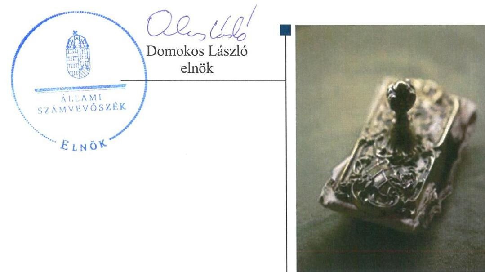

---

|   | AZ ELLENŐRZÉST FELÜGYELTE:  |
| --- | --- |
|   | SALAMON ILDIKÓ felügyeleti vezető  |
|   | AZ ELLENŐRZÉST VEZETTE ÉS A VÉGREHAJTÁSÁÉRT FELELŐS:  |
|   | BIALKÓ ZSOLT GYULA ellenőrzésvezető  |
|   | A PROGRAM ÖSSZEÁLLÍTÁSÁÉRT FELELŐS:  |
|   | JANIK JÓZSEF osztályvezető, BÖRÖCZ IMRE projektfelelős  |
|   | A TÉMÁHOZ KAPCSOLÓDÓ KORÁBBI SZÁMVEVŐSZÉKI JELENTÉSEK:  |
|   | - címe: Jelentés Magyarország 2014. évi központi költségvetése végrehajtásának ellenőrzéséről  |
|   | - sorszáma: 15167  |
|  Jelentéseink az Országgyűlés számítógépes hálózatán és az Interneten a www.asz.hu címen is olvashatóak. | IKTATÓSZÁM: V-0967-185/2016-  |
|   | TÉMASZÁM: 2001  |
|   | ELLENŐRZÉS-AZONOSÍTÓ SZÁM: V-071316  |

---

# TARTALOMJEGYZÉK 

■ ÖSSZEGZÉS ..... 5
■ AZ ELLENŐRZÉS CÉLJA ..... 7
■ AZ ELLENŐRZÉS TERÜLETE ..... 8
■ AZ ELLENŐRZÉS HÁTTERE, INDOKOLTSÁGA ..... 10
■ A JELENTÉS LÉNYEGES KÉRDÉSKÖREI ..... 12
■ ELLENŐRZÉS HATÓKÖRE ÉS MÓDSZEREI ..... 13
■ MEGÁLLAPÍTÁSOK ..... 17
■ JAVASLATOK ..... 40
■ MELLÉKLETEK ..... 45
I. Sz. melléklet: Értelmező szótár ..... 45
II. Sz. melléklet: Az integritás érvényesítése érdekében kialakított és müködtetett kontrollrendszer ..... 49
III. Sz. melléklet: Teljesítmény-ellenőrzési kiegészítő modul megállapításai ..... 50
IV. Sz. melléklet: Főbb mérlegadatok a 2011-2014. években (E Ft-ban) ..... 51
■ FÜGGELÉK: ÉSZREVÉTELEK ..... 53
■ RÖVIDÍTÉSEK JEGYZÉKE ..... 67

---

.

---

# ÖSSZEGZÉS 

A Dr. Piróth Endre Szociális Központra (PESZK) vonatkozó irányítószervi feladatellátás az EMMI feladatellátása kivételével - 2011-2014 között összességében nem felelt meg az előírásoknak. A vezető által kiépített és müködtetett irányítási rendszer nem biztosította a közpénzek szabályozott, átlátható és elszámoltatható felhasználását. A pénzügyi gazdálkodás nem volt szabályszerű, de az utolsó ellenőrzött évben javuló tendenciát mutatott. A PESZK a tulajdonában lévő vagyonnal alapvetően szabályszerűen gazdálkodott az ellenőrzött időszakban. Az állami fenntartásba kerülést követően az ingatlanvagyont kivezette a nyilvántartásaiból, azonban ezt követően jogcím nélkül használta azt. A PESZK erőfeszítést tett az integritási szemlélet érvényesítése érdekében.

## Az ellenőrzés társadalmi indokoltsága

A közpénzek felhasználásában és az állami vagyonnal való gazdálkodásban a központi alrendszer egyes intézményei meghatározó súlyt képviselnek. E szervezetekkel szemben társadalmi igény, hogy tevékenységükről a döntéshozók és a nyilvánosság felé elszámoljanak. Ezzel a társadalmi igénnyel és az ÁSZ ${ }^{1}$ Stratégiájával összhangban, a közpénzügyek átláthatóságának előmozdítása, a közvagyon védelme érdekében került sor a PESZK² pénzügyi- és vagyongazdálkodásának ellenőrzésére.

## Főbb megállapítások, következtetések, javaslatok

A közfeladatok ellátására vonatkozó, az erőforrásokkal való hatékony gazdálkodáshoz szükséges követelményeket 2011-ben a Közgyűlés, illetve 2012-től a középirányító szervek - a MIK³ és az SZGYF ${ }^{4}$ - nem érvényesítették a PESZKnél. A KIM ${ }^{5}$ irányítószervi feladatellátása az alapító okirat kiadása esetében nem volt szabályszerű, az EMMI ${ }^{6}$ szabályszerűen gyakorolta az alapítói feladatait. Az állami fenntartásba vételt követően a középirányító MIK nem gondoskodott a PESZK SZMSZ3-ének jóváhagyásáról.

A PESZK belső kontrollrendszerének kialakítása és működtetése összességében nem volt szabályszerű az ellenőrzött időszakban. Ezen belül a kontrollkörnyezet, a kontrolltevékenység, valamint az információs és kommunikációs rendszer kialakítása és működtetése nem felelt meg az előírásoknak, nem biztosította az átláthatóságot és az elszámoltathatóságot. A kontrollkörnyezet kialakításának hiányosságai alapvetően akadályozták a szabályszerű működést, mivel 2012. április 1-je és 2013. március 31-e között nem határozták meg az ellenjegyzés és az érvényesítés eljárási és dokumentációs részletszabályait, valamint az ezeket végző személyek kijelölésének rendjével kapcsolatos belső előírásokat. Továbbá 2012 áprilisától a PESZK nem rendelkezett hatályos számlarenddel, eszközök és források leltározási és leltárkészítési szabályzatával, eszközök és források értékelési szabályzatával és önköltségszámítás rendjére vonatkozó belső szabályzattal, majd 2013 áprilisától az ellenőrzött időszak végéig számviteli politikával és pénzkezelési szabályzattal sem. A monitoring rendszer működése 2011-2012-ben nem volt szabályszerű, ezt követően a szabályozási hiányosságokat részben megszűntették. A kockázatkezelési rendszer szabályozása az ellenőrzött években hiányos volt, mivel vagyonnyilatkozat-tételre kötelezettek körét az SZMSZ-ben nem határozták meg. A PESZK pénzügyi és vagyongazdálkodási folyamatai tekintetében a hatékonyság, eredményesség és gazdaságosság követelményeinek érvényesítéséről kiadott vezetői nyilatkozatok nem voltak helytállóak.

A PESZK pénzügyi gazdálkodása során a bevételi és kiadási előirányzatok meghatározása előírásszerűen történt. Az előirányzatok módosítása, mely a 2011-2013. években nem felelt meg a jogszabályi követelményeknek és a belső szabályzatokban foglaltaknak, 2014-re szabályszerűvé vált. A pénzgazdálkodási kontrollok a 2011-2013. években nem megfelelően működtek, viszont 2014-ben ezen a területen is számottevő javulás volt tapasztalható. Az előirányzat

---

maradvány megállapítása és felhasználása 2012-től nem volt megfelelő az irányítószerv felé való tájékoztatási kötelezettség teljesítésével kapcsolatos szabálytalanságok miatt. A 2012. és a 2013. évi mérlegben a követeléseket jelentős összegű hibával mutatták ki. Az előző évek szabálytalan gyakorlatát megszűntetve a követelésekre vonatkozó értékvesztést 2014-ben szabályszerűen számolták el. A könyvviteli mérlegeket az ellenőrzött időszakban leltárral alátámasztották. Az eredményszemléletű számvitel bevezetésével kapcsolatos feladatokat - alapvetően szabályszerűen - végrehajtották.

A PESZK 2011-ben a Közgyűlés által meghatározott kereteken belül gazdálkodott a vagyonnal. Ebben az évben a PESZK az értékmegőrzési és állagmegóvási kötelezettségeinek eleget tett. Az Önkormányzat által a Magyar Államnak átadott ingatlanvagyont a PESZK szabályszerűen kivezette a nyilvántartásaiból, azonban ezt követően szerződés, jogcím nélkül használta azt. Az intézményvezető az ellenőrzött időszakban a vagyonelemek hasznosításáról gondoskodott, azonban a bérbeadási tevékenysége nem felelt meg a jogszabályok előírásainak.

A PESZK adatszolgáltatást teljesített az ÁSZ integritás projektje keretében, ezzel erőfeszítést tett az integritási szemlélet érvényesítése érdekében.

Az ÁSZ az emberi erőforrások miniszterének és az SZGYF mint középirányító szerv főigazgatójának az ellenőrzési és vagyongazdálkodási feladatok ellátásának jobbítása, valamint az ellenőrzés által feltárt szabálytalanságok kivizsgálása érdekében fogalmazott meg javaslatokat. A közpénzek szabályozott, átlátható és elszámoltatható felhasználását biztosító irányítási rendszer kialakítását és működtetését, a pénzügyi és vagyongazdálkodás szabályszerű ellátását (a gazdálkodási jogkörök gyakorlása, az adatszolgáltatási kötelezettség teljesítése, a követelések jogszabályi előírásoknak megfelelő kimutatása területén) az SZGYF - mint a PESZK gazdasági szervezeti feladatait ellátó szerv - főigazgatójának, valamint a PESZK vezetőjének címzett javaslatok segítik.

---

# AZ ELLENŐRZÉS CÉLJA 

## A SZABÁLYSZERÚSÉGI ELLENŐRZÉS

célja annak megítélése volt, hogy az ellenőrzött PESZK-re vonatkozó irányító szervi feladatellátás a jogszabályi előírások betartásával történt-e; a PESZK-nél a belső kontrollrendszer kialakítása és múködtetése szabályszerű volt-e; kialakították-e az erőforrásokkal való szabályszerű, gazdaságos, hatékony és eredményes gazdálkodáshoz szükséges követelményeket, megvalósították-e azok számon kérését, ellenőrzését; a PESZK pénzügyi és vagyongazdálkodása megfelelt-e a jogszabályi előírásoknak és belső szabályzatainak; a PESZK átalakításának vagy átszervezésének lebonyolítása szabályszerűen történt-e.

A PESZK korrupcióval szembeni veszélyeztetettségének csökkentése érdekében az ÁSZ felmérte az integritási szemlélet érvényesülését a gazdálkodási folyamatokban.

A KIEGÉSZÍTŐ TELJESÍTMÉNY-ELLENŐRZÉSI MODUL célja annak értékelése volt, hogy a gazdálkodás folyamatában a gazdaságossági, hatékonysági és eredményességi követelmények kialakítása megtör-tént-e, azokat múködtették-e, a célkitűzéseket elérték-e; a pénzügyi és vagyongazdálkodás folyamataira vonatkozóan a költségvetési szerv belső kontrollrendszerének minőségéről kiadott vezetői nyilatkozatban a költségvetési szerv tevékenységében a hatékonyság, eredményesség, gazdaságosság követelményeinek érvényesítésére vonatkozó nyilatkozat helytálló volt-e.

---

# **Az Ellenőrzés Területe**

### **Dr. Piróth Endre Szociális Központ**

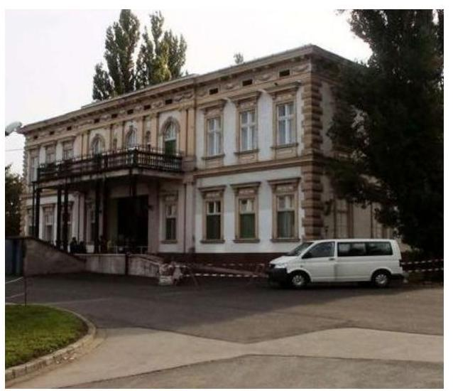

A PESZK Táplánypusztán, Győrtől 7 km-re található. Az intézményt 1957-ben általános otthonként létesítették, majd 1982-ben pszichiátriai betegek ellátására szakosodott. A székhely (Töltéstava-Táplánypuszta) alapfeladata a számottevő kórházi kezelést nem igénylő, nem veszélyeztető magatartású pszichiátriai és szenvedélybetegek, értelmileg akadályozott, valamint időskorú demenciában szenvedő lakók teljes körű ellátása. A PESZK telephelye (Koronczó-Zöldmajor) teljes körű ellátást biztosít a nem tanköteles korú, enyhe- vagy középsúlyos értelmi fogyatékos személyek részére. A PESZK engedélyezett férőhelyeinek száma 400 fő.

Az intézményvezető személyében az ellenőrzött időszakban nem történt változás, azonban a PESZK irányító szerve és a gazdálkodási besorolása is módosult. A 2011. évben a PESZK az önkormányzati alrendszerbe tartozott, az irányító szerve az Önkormányzat volt. A 2012. évtől a KIM látta el az irányító szervi-, a MIK a középirányítói feladatokat, majd 2013. január 1-jétől az ellenőrzött időszak végéig az irányítói jog az EMMI-hez, a középirányítói feladatok az SZGYF-hez kerültek.

Az alapítói, fenntartói, irányítói jogkörgyakorlók változását az 1. táblázat mutatja be:

1. táblázat

|  ALAPÍTÓI, FENNTARTÓI, IRÁNYÍTÓI JOGKÖRGYAKORLÓK VÁLTOZÁSAI |  |  |  |   |
| --- | --- | --- | --- | --- |
|   | Alapító | Irányító | Középirányító | Fenntartó  |
|  2011. | Önkormányzat | Önkormányzat | - | Önkormányzat  |
|  2012. | KIM | KIM | MIK | MIK  |
|  2013. | EMMI | EMMI | SZGYF | SZGYF  |
|  2014. | EMMI | EMMI | SZGYF | SZGYF  |

*Forrás: a PESZK 2011-2014 közötti alapító okiratai*

A gazdálkodási besorolását tekintve a PESZK 2012. március 31-ig önállóan működő és gazdálkodó költségvetési szerv volt, a gazdálkodási feladatokat ellátó gazdasági terület (gazdasági – műszaki részleg) irányítása, ellenőrzése, munkájának megszervezése a gazdasági vezető feladatkörébe tartozott. A PESZK 2012. április 1-jétől a 258/2011. Korm. rendelet^{7} 15. § (2) bekezdésének előírása alapján önállóan működő költségvetési szervvé alakult, a gazdálkodási feladatokat ellátó egysége megszűnt, és a feladattal együtt a humán erőforrás (5 fő) is átadásra került a MIK részére. Ezen időponttól kezdve a gazdálkodással összefüggő feladatok ellátásának megosztását és a felelősségvállalás rendjét a MIK-kel kötött munkamegosztási megállapodás rögzítette. A MIK 2013. március 31-én a 258/2011. Korm. rendelet 18. § (2) bekezdés rendelkezése alapján beolvadással megszűnt, feladatait általános és egyetemleges jogutódként az SZGYF vette át. A 316/2012. Korm. rendelet^{8} előírása alapján az SZGYF főigazgatója^{9} hatáskörébe tartozott a PESZK éves költségvetésére az EMMI

---

miniszterének való javaslattétel, és a gazdálkodása részletes rendjének meghatározása az SZGYF Kirendeltsége ${ }^{10}$ által felterjesztett iratok alapján. A PESZK gazdasági vezetői feladatait 2013. április 1-jétől az SZGYF gazdasági vezetője (főigazgató-helyettese) látta el, aki a pénzügyi ellenjegyzés és érvényesítés feladatának ellátására kijelölte az SZGYF Kirendeltség igaz-gató-helyettesét és dolgozóit.

A PESZK engedélyezett létszámkerete a 2011. évben 130 fő, 2014-ben pedig 154 fő volt. A könyvviteli mérleg szerinti főösszeg a 2011. január 1jei 168069 ezer Ft-ról 2014. december 31-ére 78561 ezer Ft-ra, 53,3\%kal csökkent, az üzemeltetésre átvett eszközök a Konsztv. ${ }^{11}$ következtében 2012-ben történt kivezetése miatt. A kötelezettségek állománya 12,2 \%kal, 15990 ezer Ft-ról 14037 ezer Ft-ra csökkent az ellenőrzött időszakban. A PESZK teljesített költségvetési bevétele a 2011. évi 484916 ezer Ftról a 2014. évre 577140 ezer Ft-ra, 19,0 \%-kal nőtt. A teljesített költségvetési kiadások a 2011. évi 456877 ezer Ft-ról a 2014. évre 570206 ezer Ftra, $24,8 \%$-kal emelkedtek.

---

# AZ ELLENŐRZÉS HÁTTERE, INDOKOLTSÁGA 

Az Alaptörvény ${ }^{12}$ rendelkezése szerint a nemzeti vagyon megőrzésének, védelmének és a nemzeti vagyonnal való felelős gazdálkodásnak a követelményeit sarkalatos törvény, az Nvtv ${ }^{13}$. rögzíti. A tulajdonosi joggyakorlás és vagyonkezelés általános és speciális szabályait, az állami vagyon nyilvántartására és elszámolására vonatkozó eljárásokat, a vagyonkezelési szerződés feltételrendszerét, valamint az éves beszámoló készítési és könyvvezetési kötelezettségeket kormányrendelet írja elő. A központi alrendszer egyes intézményei közfeladat-ellátásának változásait, a közfeladatok átadásából és átvételéből adódó módosításait, előirányzat gazdálkodására ható tényezőit az Áht. ${ }^{14} 11 . \S$-a és az Ávr. ${ }^{15} 14 . \S$-a írja elő. A közfeladatok megszűnéséből, intézmény átszervezéséből, belső szerkezeti korszerűsítéséből, vagy más hasonló okból adódó módosításai miatt szerepeltetendő szerkezeti változásokat, valamint a szerkezeti változásként beépült közfeladatok szintrehozásként történő számításba vételét az Ávr. 15. § (2)-(3) bekezdései határozzák meg. A társadalmi igénnyel összhangban az Áht. ${ }^{16}{ }_{12}$ az Ámr. ${ }^{17}$ és a Bkr. ${ }^{18}$ is előírja a költségvetési szerv részére, hogy olyan követelményeket alakítson ki, amelyek biztosítják a múködés, gazdálkodás, az erőforrások felhasználása során a gazdaságosság, hatékonyság és eredményesség érvényesülését. Az Ámr. és a Bkr. alapján a PESZK intézményvezetőjének évente nyilatkoznia is kell arról, hogy gondoskodott-e a PESZK tevékenységében a gazdaságosság, hatékonyság és eredményesség követelményeinek érvényesítéséről. A gazdaságos, hatékony és eredményes gazdálkodáshoz szükség van a teljesítménymérés feltételeinek kialakítására, úgymint az egyértelmú és mérhető célokra, mutatószámokra és az ezekhez rendelt követelményekre. Az ÁSZ jelen ellenőrzéssel győződött meg arról, hogy az PESZK-nél a teljesítménycélokat, -mutatókat, -követelményeket kialakították-e, azokat múködtették-e, a kitűzött cél(ok) teljesültek-e.

AZ ELLENŐRZÉS EREDMÉNYEKÉPPEN nemcsak az ellenőrzött PESZK gazdálkodása javulhat, hanem átfogó képet kaphatunk a központi alrendszerbe tartozó költségvetési szervek gazdálkodásának hiányosságairól, de a jó gyakorlatokról is. Ellenőrzéseivel, javaslataival és megállapításaival az ÁSZ elősegítheti a költségvetési szervek pénzügyi és vagyongazdálkodása szabályozásának javítását és hozzájárulhat a jó kormányzáshoz. Az ellenőrzés az ellenőrzött számára visszajelzést ad a pénzügyi és vagyongazdálkodásában feltárt hiányosságokról, javaslataival hozzájárul azok kiküszöböléséhez, amely csökkentheti a későbbi ellenőrzések gyakoriságát. Az ellenőrzés megállapításait és javaslatait más szervezetek is hasznosíthatják a rendezett gazdálkodási keretek kialakításához.

## A TELJESÍTMÉNY-ELLENŐRZÉSI KIEGÉSZÍTŐ

MODUL alapján elvégzett ellenőrzés a törvényalkotás számára támogatást nyújt a nemzeti kulcsindikátorok rendszerének kialakításához. A döntéshozók, ellenőrzöttek, irányító szervek, a társadalom számára az összehasonlítási, összemérési lehetőségek kihasználásával objektív visszajelzést ad a gazdálkodás területén végrehajtott szervezeti, szervezési, takarékos-

---

sági és bürokráciacsökkentő intézkedések hatásairól, a közfeladat-ellátásnak keretet adó pénzügyi és vagyongazdálkodásban mérhető teljesítménykövetelmények kialakításáról, azok alkalmazásáról.

---

# A JELENTÉS LÉNYEGES KÉRDÉSKÖREI 

1. Az irányító szervek PESZK-re vonatkozó feladatellátása szabályszerű volt-e?
2. A PESZK belső kontrollrendszerének kialakítása és müködtetése megfelelt-e a jogszabályi előírásoknak?
3. A PESZK pénzügyi gazdálkodása szabályszerű volt-e?
4. A PESZK vagyongazdálkodása szabályszerű volt-e?
5. Szabályszerűen hajtották-e végre az ellenőrzött időszakban a PESZK-et érintő szervezeti, szerkezeti átalakításokat?
6. A PESZK intézkedett-e az integritás szemlélet érvényesítése érdekében?

---

# ELLENŐRZÉS HATÓKÖRE ÉS MÓDSZEREI 

## Az ellenőrzés típusa

Szabályszerűségi ellenőrzés, amelyet teljesítmény-ellenőrzési modul egészített ki.

## Az ellenőrzött időszak

Az ellenőrzött időszak 2011. január 1-jétől 2014. december 31-ig terjedő időszak volt.

## Az ellenőrzés tárgya

Az ellenőrzött szervezetre vonatkozó irányító szervi feladatok ellátása. Az PESZK belső kontrollrendszerének kialakítása és müködtetése, valamint pénzügyi és vagyongazdálkodása. Az erőforrásokkal való szabályszerű, gazdaságos, hatékony és eredményes gazdálkodáshoz szükséges követelmények kialakítása, a kialakított követelmények számonkérése, ellenőrzése. A PESZK átalakítása, átszervezése lebonyolításának szabályszerűsége.

A teljesítmény-ellenőrzési kiegészítő modul esetében az intézmény gazdálkodás folyamatában a gazdaságossági, hatékonysági és eredményességi követelmények kialakítása és müködtetése, a célkitűzések teljesítésének értékelése. A PESZK tevékenységében a hatékonyság, eredményesség, gazdaságosság követelményei érvényesítéséről kiadott nyilatkozat helytállósága.

## Az ellenőrzött szervezet

Az ellenőrzött szervezetek a Dr. Piróth Endre Szociális Központ és az irányító-, középirányító szervei: a Győr-Moson-Sopron Megyei Önkormányzat, a Közigazgatási és Igazságügyi Minisztérium, az Emberi Erőforrások Minisztériuma, a Győr-Moson-Sopron Megyei Intézményfenntartó Központ és a Szociális és Gyermekvédelmi Főigazgatóság voltak. A KIM jogutódjaként az Igazságügyi Minisztérium, valamint a Miniszterelnökség adatot szolgáltatott az ellenőrzéshez.

## Az ellenőrzés jogalapja

Az ellenőrzés jogszabályi alapját az Állami Számvevőszékről szóló LXVI. tv. 1. § (3) bekezdés, 5. § (2)-(6) bekezdései, valamint Áht. 2 61. § (2) bekezdésének előírásai képezték.

---

# Az ellenőrzés módszerei 

Az ellenőrzést az ellenőrzési program szempontjai, az ellenőrzött időszakban hatályos jogszabályok, az ellenőrzés szakmai szabályai, az egyes ellenőrzési típusokhoz kapcsolódó ÁSZ módszertanok és nemzetközi standardok figyelembevételével végeztük. A gazdálkodás hibáinak kijavítására, a közpénzekkel való felelős gazdálkodás segítésére irányuló javaslatok kidolgozásakor a hatályos jogszabályok voltak az irányadóak.

Az ellenőrzés ideje alatt az ellenőrzött szervezettel történő kapcsolattartást az ÁSZ SZMSZ ${ }^{19}$-ének vonatkozó előírásai alapján biztosítottuk.

Az ellenőrzési kérdések megválaszolásához szükséges bizonyítékok megszerzése a következő ellenőrzési eljárások alkalmazásával történt: mintavételezés, valamint elemző eljárás. A minták kiválasztása során elsősorban reprezentativitást biztosító véletlen mintavételi eljárást alkalmaztunk.

Az ellenőrzési bizonyítékként felhasználható adatforrások közé tartoztak egyrészt a szakmai program részletes szempontjainál felsorolt adatforrások, másrészt adatforrás volt minden egyéb - az ellenőrzés folyamán feltárt, az ellenőrzés szempontjából releváns információt tartalmazó - dokumentum.

Az ellenőrzés lefolytatásához a PESZK és az irányító-, valamint a középirányító szervei tanúsítványok kitöltésével, valamint az ÁSZ által kért dokumentumok elektronikus megküldésével szolgáltatattak adatokat. A rendelkezésre bocsátott adatok, információk kontrollja az ellenőrzés keretében történt.

Az ellenőrzési kérdésekre adott válaszok alapján értékeltük, hogy az ellenőrzött időszakban az irányító szervek - az Önkormányzat, a KIM és az EMMI - és a középirányító szervek - a MIK és az SZGYF - a PESZK-re vonatkozó feladatainak szabályszerűen eleget tettek-e, a PESZK pénzügyi és vagyongazdálkodása megfelelt-e az előírásoknak, a PESZK átszervezésének végrehajtása szabályszerű volt-e. Értékeltük, hogy a PESZK-nél kialakított-ták-e az erőforrásokkal való szabályszerű és hatékony gazdálkodáshoz szükséges követelményeket, megvalósították-e azok számonkérését, ellenőrzését.

A PESZK belső kontrollrendszere jogszabályi előírások szerinti kialakításának és működtetésének szabályszerűségét az erre irányuló ellenőrzési kérdésekre adott válaszok összesítése alapján, évente pillérenként (kontrollkörnyezet, kockázatkezelési rendszer, kontrolltevékenységek, információs és kommunikációs rendszer, monitoring rendszer) és összesítetten is minősítettük. A PESZK belső kontrollrendszere egyes pilléreinek kialakítását és működtetését „szabályszerü"-nek minősítettük, amennyiben az értékelt területen az elért és elérhető pontok százalékban kifejezett, egész számra kerekített hányadosa meghaladta a $84 \%$-ot, „részben szabály-szerű"-nek minősítettük, ha a $84 \%$-ot nem haladta meg, de $60 \%$-nál nagyobb volt, „nem szabályszerű"-nek minősítettük, ha nem haladta meg a 60\%-ot. A PESZK belső kontrollrendszerének összesített értékelése megegyezik a pillérenként (kontrollterületenként) alkalmazott \%-os értékelésekkel, a következő eltérésekkel. A kontrollrendszer egésze esetében a „szabályszerű" értékelésnek a \%-os értéken felül további feltétele volt, hogy egyik kontrollterület sem kaphatott „nem szabályszerű" értékelést, a

---

„részben szabályszerű" értékelés további feltétele volt, hogy legfeljebb egy ellenőrzött kontrollterület lehetett „nem szabályszerű" értékelésű. Az öszszesített értékelés a \%-os értéktől függetlenül „nem szabályszerű"-nek minősült, ha az ellenőrzött kontrollterületek közül több mint egy „nem szabályszerű" értékelést kapott.

A közbeszerzési eljárások lefolytatásának, az előirányzatok módosításának és az előirányzat-maradvány megállapításának szabályszerűségét, valamint a gazdálkodási jogkörök gyakorlásának szabályszerűségét mintavétellel, a tárgyi eszközök nyilvántartásba vételének, tovább a vagyonhasznosítási bevételi előirányzatok teljesítésének szabályszerűségét teljes körűen ellenőriztük.

A jogszabályoknak és a belső előírásoknak megfelelőnek tekintettük a tárgyi eszközök nyilvántartásba vételét, a vagyonhasznosítási bevételi előirányzatok teljesítését, az előirányzatok módosítását és az előirányzat-maradvány megállapítását, amennyiben a minta ellenőrzésének eredménye alapján 95\%-os bizonyossággal a teljes sokaságban a hibás tételek aránya kisebb volt, mint $10 \%$, nem megfelelőnek értékeltük, ha a hibás tételek aránya a $10 \%$-ot meghaladta.

A közbeszerzési eljárások esetében az ellenőrzött mintatételek értékelését végeztük el.

A 2011. évet érintően a szakmai teljesítésigazolás és az utalvány ellenjegyzése kulcskontrollok, a 2012-2014. éveket érintően a teljesítésigazolás és az érvényesítés kulcskontrollok múködését értékeltük. Megfelelőnek értékeltük a gazdálkodási jogkörök gyakorlását, amennyiben 95\%-os bizonyossággal a teljes sokaságban a hibás tételek aránya legfeljebb 10\% volt, részben megfelelőnek, ha a hibás tételek arányának felső határa legfeljebb $30 \%$ volt, nem megfelelőnek, ha a hibás tételek sokaságbeli arányának felső határa meghaladta a 30\%-ot.

Az integritás szemlélet érvényesülésének értékelése az Intézmény által kitöltött tanúsítvány alapján történt.

Az alapprogram alapján ellenőriztük, hogy a költségvetési szerv vezetője megtette-e nyilatkozatát arról, hogy gondoskodott a költségvetési szerv tevékenységében a hatékonyság, eredményesség és a gazdaságosság követelményeinek érvényesítéséről. Ezt kiegészítve, a teljesítmény-ellenőrzési kiegészítő modul keretében - felhasználva az alapprogram szerinti ellenőrzés megállapításait - értékeltük, hogy a költségvetési szerv vezetője kialakította-e a gazdaságossági, hatékonysági és eredményességi követelményeket, és azokat múködtette-e, a célkitúzéseket elérte-e.

A teljesítmény-ellenőrzési kiegészítő modul a gazdálkodási feladatokra terjedt ki, a szakmai feladatellátást nem értékelte.

A gazdálkodási feladatok értékelése az alábbi területekre terjedt ki:
pénzügyi gazdálkodási (nem szakmai, adminisztratív) feladatok: költségvetés-, beszámoló-készítés, könyvvezetés, adatszolgáltatások, előirányzat-gazdálkodás, kötelezettségvállalások nyilvántartása, kezelése, bevételkezelés, bér- és illetményszámfejtés;
vagyongazdálkodási (logisztikai) feladatok: közbeszerzések és közbeszerzési értékhatárt el nem érő beszerzések, készletgazdálkodás, nyomtatók, fénymásolók üzemeltetése, épület- és ingatlanüzemeltetés, karbantartás, hibabejelentés, gépjármú és flottamenedzsment.

---

Az ellenőrzés során minden olyan körülményt és adatot is ellenőriztünk, amely a program végrehajtása kapcsán felmerült újabb összefüggéseknek az ellenőrzés céljaival összhangban lévő feltárásához szükséges. A teljesít-mény-ellenőrzési kiegészítő programmodulban megfogalmazott ellenőrzési cél megválaszolásához az alapprogram végrehajtása során megfogalmazott megállapításokat is figyelembe vettük.

A jelentésben használt fogalmak magyarázatát az I. számú melléklet, az integritás érvényesítése érdekében kialakított és működtetett kontrollrendszer szempontjait a II. számú melléklet, a kiegészítő teljesítmény-ellenőrzés megállapításait a III. számú melléklet tartalmazza.

---

# 1. Az irányító szervek PESZK-re vonatkozó feladatellátása szabályszerű volt-e? 

Összegző megállapítás

Az irányító- és a középirányító szervek feladatellátása - az EMMI-é kivételével - nem felelt meg a jogszabályi előírásoknak.
1.1. számú megállapítás

Az intézményalapítással kapcsolatos jogosultságokat a Közgyűlés, az EMMI és az SZGYF szabályszerűen gyakorolta, a KIM és a MIK joggyakorlása nem felelt meg a jogszabályokban előírtaknak.

A PESZK AZ ELLENŐRZÖTT IDŐSZAKBAN RENDELKEZETT az irányító szerv által kiadott, a jogszabályi előírásoknak megfelelő alapító okirattal ${ }^{20}$. Az alapító okirat módosítását a 2011. évben a Közgyűlés ${ }^{21}$ hagyta jóvá. A PESZK állami fenntartásba vételét követően a 2012. évben a KIM minisztere módosította a PESZK alapító okiratát, azonban a módosítást 2012. szeptember 14-én 2012. január 1-jei, visszamenőleges hatállyal adta ki, így - a 258/2011. Korm. rendelet 21. § (6) bekezdésében előírtak ellenére - azt 2012. január 30-ig nem nyújtották be a Kincstár ${ }^{22}$ által vezetett törzskönyvi nyilvántartáshoz.

Az EMMI minisztere 2013. január 1-jei hatállyal új alapító okiratot adott ki, majd 2014. évben a kormányzati funkció szerinti megjelöléssel módosította azt.

Az alapító okirat tartalmazta a 2011. évben az Áht. 1 és az Ámr., a 2012. évtől az Áht. 2 és az Ávr. által előírt elemeket. A 2011-2014. években az egységes szerkezetű alapító okiratokat elkészítették.

A PESZK RENDELKEZETT A KÖZGYŰLÉS ÉS AZ SZGYF ÁLTAL JÓVÁHAGYOTT SZMSZ ${ }_{2,4}{ }^{23}$-gyel. Az intézményvezető ${ }^{24}$ - az iratkezelési törvény ${ }^{25}$ 9. § (1) bekezdés d) pontjában, valamint az iratkezelési szabályzat ${ }_{2}{ }^{26} 1$. számú mellékletében rögzítettek ellenére - az SZMSZ ${ }_{1}$ mint nem selejtezhető irat tartós megőrzését lehetővé tevő eljárás kialakításáról nem gondoskodott. Az SZMSZ ${ }_{2}$-at a MIK vezetője - az Áht. 2 9. § (1) bekezdés e) pontjában és a 258/2011. Korm. rendelet 10. § (1) bekezdés a) pontjában előírtak ellenére - nem hagyta jóvá, ennek következtében az nem lépett hatályba.

---

### 1.2. számú megállapítás

A közfeladatok ellátására vonatkozó, az erőforrásokkal való szabályszerű gazdálkodáshoz szükséges követelményeket a Közgyűlés érvényesítette, de nem ellenőrizte. A MIK és az SZGYF a 2012-2014. években az erőforrásokkal való szabályszerű gazdálkodáshoz szükséges követelményeket nem érvényesítették és a 2012. évben nem ellenőrizték. A hatékony gazdálkodáshoz szükséges követelményeket a Közgyűlés, a MIK és az SZGYF nem érvényesítették, nem kérték számon és nem ellenőrizték.

A KÖZFELADATOK ELLÁTÁSÁRA és a gazdálkodásra vonatkozóan a 2011. évre a Közgyűlés, a 2012. évre a KIM, a 2013-2014. évekre az EMMI körlevelekben határozta meg az éves költségvetési beszámoló, valamint a szöveges indoklás tartalmi követelményeit, és az elkészítési határidejét. A 2011. évre vonatkozóan a Közgyűlés, a 2012. év tekintetében a MIK, a 2013-2014. évek esetében az EMMI elvégezte a költségvetési beszámolók ellenőrzését.

A 2011. évben - az Áht. 49. § (5) bekezdés f) pontjában előírtak ellenére - a Közgyűlés, míg a 2012. évben - a 258/2011. Korm. rendelet 11. § (2) bekezdés d) pontjában előírtak ellenére - a MIK az erőforrásokkal való szabályszerű gazdálkodás vonatkozásában ellenőrzést nem hajtott végre a PESZK-nél. A 2013-2014. évek között az SZGYF az erőforrásokkal való szabályszerű gazdálkodás vonatkozásában ellenőrzéseket végzett.

2012-ben a 258/2011. Korm. rendelet 10. § (1) bekezdés b) pontjában foglaltak alapján a MIK, 2013-tól a 316/2012. Korm. rendelet 3. § (2) bekezdés f) pontjában előírtak alapján az SZGYF látta el középirányítói hatáskörben az önkormányzattól átvett vagyon tekintetében a vagyonkezelői feladatokat. A 2012. évben a MIK, míg a 2013-2014. években az SZGYF - a Vtv. ${ }^{27}$ 27. § (2) bekezdésében, valamint az Nvtv. 7. § (2) bekezdésében előírtak ellenére - a vagyonkezelésükben lévő, a PESZK feladatai ellátásához használt ingatlanok átlátható működtetéséről nem gondoskodtak, mivel a nemzeti vagyon használatának jogcímét - az Nvtv. 3. § (1) bekezdés 11. pontjában rögzített - szerződés megkötésével nem biztosították. Ezért a 2012. évben a MIK, míg a 2013-2014. években az SZGYF - a 258/2011. (XII. 7.) Korm. rendelet 11. § (2) bekezdés d) pontjában, illetve 316/2012. Korm. rendelet 3. § (2) bekezdés g) pontjában előírtak ellenére - nem érvényesítette az erőforrásokkal, így különösen a vagyonnal való szabályszerű gazdálkodáshoz szükséges követelményeket.

A Közgyűlés a közfeladatok ellátására vonatkozó hatékony gazdálkodáshoz szükséges követelményeket a 2011. évben - az Áht. 49. § (5) bekezdés f) pontjában rögzítettek ellenére - nem érvényesítette, nem kérte számon és nem ellenőrizte. A MIK a 2012. évben - a 258/2011. (XII. 7.) Korm. rendelet 11. § (2) bekezdés d) pontjában előírtak ellenére - , az SZGYF a 2013-2014. években - a 316/2012. (XI. 13.) Korm. rendelet 3. § (2) bekezdés g) pontjában előírtak ellenére - nem érvényesítette, nem kérte számon és nem ellenőrizte az előirányzatokkal, létszámokkal és vagyonnal való hatékony gazdálkodás követelményeit.

---

### 1.3. számú megállapítás

A PESZK-kel kapcsolatos egyéb ellenőrzési, irányítási és felügyeleti jogokat az ellenőrzött időszakban az irányító- és középirányító szervek szabályszerűen gyakorolták.

AZ IRÁNYÍTÓ SZERVEK - az Áht.1,2 előírásainak megfelelően rendszeresen figyelemmel kísérték a PESZK feladatainak teljesülését, valamint a bevételi és a kiadási előirányzatokkal való gazdálkodását. A 2011. évben a költségvetést, annak módosításait, a költségvetés végrehajtásáról szóló beszámolót és a pénzmaradványt az előírtaknak megfelelően a Közgyűlés fogadta el. A Közgyűlés - az Áht. ${ }_{1}$ előírásainak megfelelően beszámoltatta a 2011. évben a PESZK intézményvezetőjét a szakmai feladatellátásról.

A 2012. évben a KIM, a 2013. évtől az EMMI a szakmai feladatellátásról szóló beszámolás kötelezettségét a költségvetési beszámoló szöveges indoklására vonatkozó rendelkezésben határozta meg. A 316/2012. Korm. rendelet előírásainak megfelelően az SZGYF - a 20122014. évekre vonatkozóan - évente értékelte a PESZK szakmai feladatellátását.

AZ INTÉZMÉNYVEZETŐ KINEVEZÉSE a 2011. évben szabályszerűen történt. A Közgyűlés elnöke ${ }^{28}$ az intézményvezető határozatlan időre szóló kinevezését 2011. január 1-jével - a Kjt. ${ }^{29}$ rendelkezésének megfelelően - öt év határozott idejű kinevezésre módosította. A Konsztv. rendelkezése alapján a PESZK intézményvezetőjének vezetői megbízása - a munkáltatói jogok gyakorlójának eltérő döntése hiányában - a törvény erejénél fogva megszűnt volna. Az intézményvezető kinevezését a MIK vezetője 2012. március 19-én az illetmény vonatkozásában, a kinevezés további feltételeit változatlanul hagyva módosította. A MIK SZGYF-be való beolvadását követően a 316/2012. Korm. rendelet előírása alapján az intézményvezető kinevezése az SZGYF főigazgatójának középirányítói jogkörébe tartozott, aki az érvényben lévő intézményvezetői kinevezést hatályában fenntartotta.

## A PESZK GAZDASÁGI VEZETŐJÉNEK VEZETŐI

MEGBÍZÁSA - a Konsztv. rendelkezésének megfelelően - 2012. március 31-én megszűnt. A PESZK és a MIK munkamegosztási megállapodásának ${ }^{30}$ értelmében 2012. április 1-jétől 2013. március 31-ig a gazdasági vezetői feladatokat a MIK gazdasági vezetője látta el. A PESZK gazdasági vezetőjének feladatait a MIK megszűnését követően - 2013. április 1-jétől az SZGYF gazdasági vezetője látta el.

---

# 2. A PESZK belső kontrollrendszerének kialakítása és múködtetése megfelelt-e a jogszabályi előírásoknak? 

Összegző megállapítás

2.1. számú megállapítás

A belső kontrollrendszer kialakítása és múködtetése az ellenőrzött időszakban nem volt szabályszerű.

A kontrollkörnyezet kialakítása - a 2011. év kivételével - nem volt szabályszerű.

## A KONTROLLKÖRNYEZET KIALAKÍTÁSÁNAK értékelését az 1. ábra szemlélteti.

A 2011. november 9-ig hatályos SZMSZ ${ }_{1}$-et az intézményvezető az ellenőrzés részére nem adta át. A PESZK 2011. november 10-től az Ámr.-ben és az Ávr.-ben rögzítetteknek megfelelően rendelkezett SZMSZ ${ }_{2,4}$-gyel. Az SZMSZ ${ }_{3}$-t a MIK vezetője nem hagyta jóvá, ezért 2014. május 4-ig, az SZMSZ ${ }_{4}$ jóváhagyásáig az SZMSZ ${ }_{2}$ maradt hatályban, mely - az Áht. 2 10. § (5) bekezdésében és az Ávr. 13. § (1) b), e), f) és g) pontjában foglaltak ellenére - 2012. január 1-jétől nem tartalmazta a hatályos alapító okirat számát és keltét, 2012. április 1-jétől (a PESZK gazdálkodási jogkörének változását követően) nem megfelelően tartalmazta a szervezeti felépítést és a múködés rendjét, a szervezeti egységek, feladatait, a költségvetési szerv szervezeti ábráját, azon ügyköröket, amelyek során a szervezeti egységek vezetői a költségvetési szerv képviselőjeként járhatnak el, a nevesített munkakörökhöz tartozó feladat- és hatásköröket, a hatáskörök gyakorlásának módját, a helyettesítés rendjét, az ezekhez kapcsolódó felelősségi szabályokat. A 2014. május 5-től hatályos SZMSZ4 az Ávr.-ben előírtaknak megfelelő volt.

A PESZK az önálló gazdálkodása és a gazdasági szervezete megszűnéséig - 2012. március 31-ig - rendelkezett gazdasági szervezet ügyrendje ${ }_{1,2}$ vel $^{31}$, azonban - 2011-ben az Ámr. 20. § (7) bekezdésének, majd 2012-től az Ávr. 13. § (5) bekezdésének rendelkezése ellenére - a gazdasági szervezet költségvetési szerven belüli belső és azon kívüli külső kapcsolattartásának módját, szabályait nem írták elő.

A PESZK önálló gazdálkodási jogosultsága megszűnését követően a feladatokat a PESZK és a MIK az Ávr. előírásainak megfelelően munkamegosztási megállapodásban elhatárolták. A munkamegosztási megállapodásban a MIK kötelezettségei között rögzítették, hogy a gazdasági vezető feladata és felelőssége a PESZK előirányzatai tekintetében a tervezési, gazdálkodási, finanszírozási, adatszolgáltatási és beszámolási feladatok ellátása, továbbá a gazdálkodásra vonatkozó szabályzatok elkészítése, érvényesítése, valamint az ellenjegyzési, érvényesítési feladatok elvégzése. Az SZGYF főigazgatója a gazdálkodási szabályzat ${ }_{3,4}$-ben ${ }^{32}$ rögzítette, hogy a MIK és a fenntartásában lévő önállóan múködő költségvetési szervek között 2013. március 31-e előtt létrejött munkamegosztási megállapodások továbbra is érvényben maradnak.

A PESZK gazdálkodásának részletes rendjét 2011-re és 2013-2014-re vonatkozóan az arra jogosult vezető által aláírt gazdálkodási szabályzat ${ }_{1-4}$ meghatározta, azonban a gazdálkodási feladatokat 2012. április 1-je és 2013. március 31-e között az Ávr. előírása szerint kötött munkamegosztási

---

megállapodás alapján ellátó MIK - az Ávr. 13. § (2) bekezdés a) pontja előírása ellenére belső szabályzatban nem rendezte az ellenjegyzés és az érvényesítés eljárási és dokumentációs részletszabályaival, valamint az ezeket végző személyek kijelölésének rendjével kapcsolatos belső előírásokat, feltételeket.

A PESZK intézményvezetője által hatályba léptetett FEUVE ${ }^{33}$ rendszeres aktualizálása - 2011-ben az Ámr. 156. § (2) bekezdése, illetve 2012-től a Bkr. 6. § (3) bekezdése előírása ellenére - elmaradt, arra 2014 januárjában került sor, így az a beolvadó intézmény ${ }^{34}$ feladatainak 2011 szeptemberében történő átvételét követően nem tartalmazta megfelelően a PESZK szakmai feladatellátása felelősségi és információs szintjeit és kapcsolatait.

A 2011-2014. években a FEUVE szabályzat tartalmazta a szabálytalanságkezelési eljárásrendet.

2012 áprilisáig a PESZK gazdasági vezetőjének, azt követően a gazdálkodási feladatait ellátó szervezet (MIK, majd az SZGYF) gazdasági vezetőjének a szakképesítése megfelelt az Ámr., illetve az Ávr. előírásának. A pénz-ügyi-gazdasági feladatokat ellátó közalkalmazottak, kormánytisztviselők a feladataikat a munkakörük betöltésével kapcsolatos követelményeket rögzítő munkaköri leírás alapján látták el.
2011. szeptember 1-jén az intézményvezető Etikai Kódex ${ }^{35}$-et adott ki, melyben 2011-ben az Ámr., 2012-től a Bkr. előírásának megfelelően meg határozta az etikai elvárásokat.

A közbeszerzési eljárások lefolytatásának rendjét - 2011-től - a közbeszerzési szabályzatban ${ }^{36}$ rögzítették.

Az intézményvezető - az iratkezelési törvény 9. § (1) bekezdés d) pontjában, valamint az iratkezelési szabályzat ${ }_{1} 1$. számú mellékletében rögzítettek ellenére - a 2011. augusztus 31-ig hatályos számviteli politika és a részét képező eszközök és források értékelési szabályzata, valamint az önköltségszámítási szabályzat mint nem selejtezhető irat, tartós megőrzését lehetővé tevő eljárás kialakításáról nem gondoskodott, azt nem bocsátotta az ellenőrzés rendelkezésére. A 2011. augusztus 31-ig hatályos leltározási szabályzat ${ }_{1}{ }^{37}$-gyel és 2012. március 31-ig hatályos pénzkezelési szabályzat ${ }_{1}{ }^{38}$-gyel rendelkeztek. A 2011. szeptember 1-jétől 2012. március 31ig hatályos számviteli politika ${ }^{39}$ - a Számv. tv. ${ }^{40}$ 14. § (4) bekezdésének előírása ellenére - nem tartalmazta azokat a gazdálkodóra jellemző szabályokat, előírásokat, módszereket, amelyekkel meghatározza, hogy mit tekint a számviteli elszámolás az értékelés szempontjából lényegesnek, jelentősnek, nem lényegesnek, nem jelentősnek. 2011. szeptember 1-jével - azok hiányosságai mellett - hatályba léptették az értékelési szabályzatot ${ }^{41}$, a leltározási szabályzat ${ }_{2}$-t, és az önköltségszámítási szabályzatot ${ }^{42}$, valamint a bizonylati rendet ${ }^{43}$. Az intézményvezető által kiadott értékelési szabályzat 2011-ben - az Áhsz. ${ }_{1}^{44}$ 8. § (17) bekezdés d) pontjának előírása ellenére - nem tartalmazta követeléstípusonként a kisösszegű követelések év végi meghatározásának elveit. A 2012. március 31-ig hatályos leltározási szabályzat ${ }_{2}$ a Számv. tv. 69. § (3) bekezdése, valamint az Áhsz. ${ }_{1}$ 37. § (6) bekezdésében rögzítettek ellenére - nem tartalmazta azt, hogy a használt, de a mérlegben értékkel nem szereplő immateriális javakat, tárgyi eszközöket, készleteket milyen időszakonként kell mennyiségi felvétellel leltározni. Az intézményvezető a 2012. március 31-ig hatályos számlarend ${ }^{45}$ ben - az Áhsz. ${ }_{1}$ 49. § (3) bekezdésének előírása ellenére - az analitikus nyilvántartások vezetésének módját, valamint a részletező nyilvántartások és

---

a főkönyvi könyvelés kapcsolatát, továbbá a nyilvántartások egyeztetésének kötelezettségét és azok dokumentálásának módját nem rögzítette.

A gazdálkodási feladatokat 2012. április 1-jétől ellátó MIK - az Ávr. 10. § (4) bekezdése előírása alapján létrejött munkamegosztási megállapodás 1. számú mellékletében rögzítetteknek megfelelően hatályba léptette a PESZK számviteli politika ${ }_{2}{ }^{46}$-jét, azonban - a számviteli politika ${ }_{2} 2.3$. pontjában foglaltak ellenére - nem gondoskodott a Számv. tv. 14. § (5) bekezdésben előírt, a számviteli politika keretébe tartozó eszközök és források leltározási és leltárkészítési szabályzata, eszközök és források értékelési szabályzata és az önköltségszámítás rendjére vonatkozó belső szabályzat elkészítéséről. A MIK vezetője 2012. szeptember 26-án kiadmányozta a pénzkezelési szabályzat ${ }_{2}-t^{47}$, melynek hatályát kiterjesztette a PESZK-re. A MIK vezetője által kiadmányozott szabályzatok, a MIK 258/2011. Korm. rendelet előírása alapján történt SZGYF-be való beolvadását követően, 2013. április 1-jén hatályukat vesztették.

A gazdálkodási feladatokat 2013. április 1-jétől ellátó SZGYF - az Ávr. 10. § (4) bekezdése előírása alapján létrejött munkamegosztási megállapodás 1. számú mellékletében rögzítettek ellenére - nem gondoskodott a Számv. tv. 14. § (3)-(5) bekezdésében, az Áhsz. ${ }_{1}$ 8. § (3)-(4) bekezdésében és az Áhsz. ${ }_{2}{ }^{48} 50 . \S$ (1) bekezdésében előírt számviteli politika és annak keretében az eszközök és források leltározási és leltárkészítési szabályzata, az eszközök és források értékelési szabályzata, az önköltségszámítás rendjére vonatkozó belső szabályzat és a pénzkezelési szabályzat elkészítéséről, illetve az SZGYF a 2013. évben kiadott számviteli politikájában - az Áhsz. ${ }_{1}$ 8. § (13) bekezdésében előírtak ellenére - nem döntött annak a PESZK-re történő kiterjesztéséről. Az SZGYF Kirendeltségének vezetője 2014. április 1-jével jogosulatlanul kiadmányozta a pénzkezelési szabály-zat ${ }_{3}{ }^{49}$-t, így az nem lépett hatályba. A pénzkezelési szabályzat ${ }_{3}$ kiadmányozására a 316/2012. Korm. 4. § (3) bekezdés c) pontjában meghatározottak alapján az SZGYF főigazgatója lett volna jogosult.

A PESZK - a Számv. tv. 161. § (1) bekezdésében előírtak ellenére - 2012. április 1-jétől nem rendelkezett hatályos számlarenddel, mivel a gazdálkodási feladatokat ellátó MIK, illetve SZGYF nem tett eleget a szabályozási kötelezettségének.

Az intézményvezető az ellenőrzött időszakban a Kbt. ${ }_{1}^{50}$ és Kbt. ${ }_{2}^{51}$ hatálya alá tartozó beszerzések lebonyolításának szabályozásán túl - az Ámr. 20. § (3) bekezdés b) pontja, illetve az Ávr. 13. § (2) bekezdés b) pontja által előírtak ellenére - nem gondoskodott a beszerzések lebonyolítására vonatkozó eljárásrend belső szabályzatban való rendezéséről.
2.2. számú megállapítás

A kockázatkezelési rendszer kialakítása és múködtetése az ellenőrzött időszakban - a vagyonnyilatkozat-tételi kötelezettség előírásának elmulasztása miatt - részben szabályszerű volt.

A KOCKÁZATKEZELÉSI RENDSZER eljárásrendjét az intézményvezető a 2011-2014. években a FEUVE szabályzatban rögzítette. Az Ámr. és a Bkr. előírásainak megfelelően a kockázatelemzés során felmérték és meghatározták a szervezet tevékenységében, gazdálkodásában rejlő kockázatokat, a kockázatok kezelése érdekében szükséges intézkedések teljesítésének folyamatos nyomon követési módját, továbbá a 2011-

---

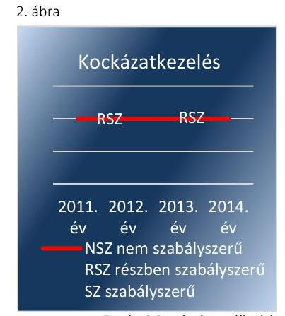
2.3. számú megállapítás
2013. évekre vonatkozóan az egyes kockázatokkal kapcsolatban a szükséges intézkedéseket is meghatározták. A kockázatkezelési rendszer kialakításának és múködtetésének értékelését a 2. ábra szemlélteti.

Az SZMSZ2-t a Közgyűlés, az SZMSZ4-t az SZGYF főigazgatója úgy hagyta jóvá, hogy azokban - a Vnytv. ${ }^{52} 4 . \S$ a) pontjában előírtak ellenére - a vagyonnyilatkozat-tételre kötelezettek körét nem rögzítették, továbbá a vagyonnyilatkozat átadására, nyilvántartására, a vagyonnyilatkozatban foglalt személyes adatok védelmére vonatkozó szabályokat Vnytv. 11. § (6) bekezdés ellenére - belső szabályzatban nem határozták meg. Az intézményvezető az ellenőrzött időszakban vagyonnyilatkozatot tett.

A kontrolltevékenység kialakítása és múködtetése a 2011-2014. években - a FEUVE nem megfelelő kialakítása és múködése miatt nem volt szabályszerű.
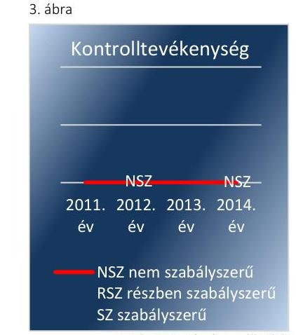

Förrás: 2.3. számú megállapítás

A KONTROLLTEVÉKENYSÉG KIALAKÍTÁSA ÉS MŰKÖDTETÉSE céljából a 2011-2014. években a FEUVE szabályzatban, az iratkezelési szabályzat ${ }_{1,2}{ }^{53}$-ben szabályozták az engedélyezési, jóváhagyási és kontrolleljárásokat a felelősségi körök meghatározásával, valamint a dokumentumokhoz való hozzáférést, a hozzáférés szintjeit, illetve beszámolási eljárásokat. A kontrolltevékenység kialakítása és múködtetése értékelésének eredményét a 3. ábra szemlélteti.

A kontrolltevékenység kialakítása során az intézményvezető - 2011ben az Ámr. 158. § (2) bekezdés b) pontjában foglaltak ellenére - az információkhoz, a 2012-2014. években - a Bkr. 8 § (4) bekezdés b) pontja előírása ellenére - a dokumentumokhoz és információkhoz való hozzáférés szabályait nem határozta meg.

A FEUVE szabályzat tartalmazta a pénzügyi döntések dokumentumai elkészítésének, továbbá a gazdasági események elszámolásának, a költségvetési gazdálkodás során az előzetes és utólagos pénzügyi ellenőrzésnek, a pénzügyi döntések szabályszerűségi szempontból történő jóváhagyásának, illetve ellenjegyzésének az eljárásrendjét.

Az intézményvezető az általa kiadmányozott FEUVE-ben - 2011-ben az Áht. ${ }_{1}$ 121/A. § (4) bekezdés b) pontjának, a 2012-2014. években a Bkr. 8. § (2) bekezdés b) pontjának rendelkezése ellenére - a pénzügyi kihatású döntések célszerűségi, gazdaságossági, hatékonysági és eredményességi szempontú megalapozottságára vonatkozó ellenőrzés kötelezettségének előírását nem biztosította.
2011. január 1. és augusztus 31. között az intézményvezető - az Ámr. 76. § (5) bekezdésében foglaltak ellenére - a szakmai teljesítésigazolásra, illetve a gazdasági vezető - az Ámr. 74. § (2) és a 77. § (4) bekezdésében előírtak ellenére - az érvényesítési feladatok ellátására jogosultak körét nem jelölte ki. A kijelölések 2011. szeptember 1-jétől megtörténtek. Az érvényesítési feladat ellátására jogosultakat 2012. április 1-jétől a gazdálkodási feladatokat ellátó MIK gazdasági vezetője volt jogosult kijelölni, azonban a kijelölésekre - az Ávr. 55. § (2) bekezdésében és az 58. § (4) bekezdésében foglaltak ellenére - 2012. szeptember 25-ig nem került sor. Az érvényesítésre jogosultak kijelölésére 2012. szeptember 26-án sor került.

---

A 2011-2014. években az informatikai rendszer szabályozásánál az adatkezelő intézményvezető - az Avtv. ${ }^{54} 10 . \S$ (1) bekezdése, illetve az Info. tv. ${ }^{55}$ 7. § (2) bekezdése rendelkezése ellenére - nem alakította ki az adatok biztonságának, védelmének érvényre juttatásához szükséges eljárási szabályokat. Az üzemeltetés és adatbiztonság szabályozása során az intézményvezető - az lkr. ${ }^{56}$ 8. § (2) bekezdésében előírtak ellenére - nem határozta meg végrehajtható módon, pontosan a feladatokat és a hatásköröket.

# 2.4. számú megállapítás 

4. ábra
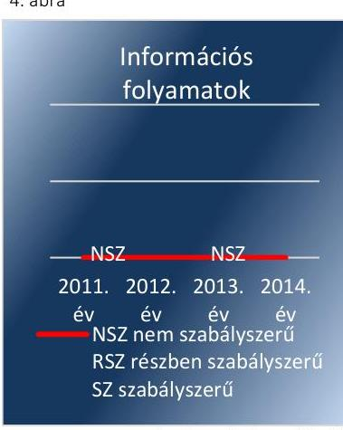

Fonrás: 2.4. számú megállapítás
2.5. számú megállapítás

Az információs és kommunikációs folyamatok kialakítása - a szabályozás hiánya, illetve a közzétételi kötelezettség nem megfelelő teljesítése miatt - az ellenőrzött időszakban nem volt szabályszerű.

## AZ INFORMÁCIÓS ÉS KOMMUNIKÁCIÓS FOLYAMATOKRA vonatkozóan az ellenőrzött időszakban a PESZK-nél az SZMSZ ${ }_{2,4}$-ben, a közzétételi szabályzatban ${ }^{57}$, az adatvédelemi szabályzatban ${ }^{58}$, az iratkezelési szabályzat ${ }_{1,2}$-ben, a FEUVE-ben írtak elő szabályokat, meghatározva a szervezeten belüli információ áramlás rendszerét, a beszámolási szinteket és határidőket, valamint az információ és adatáramlás módját.

Az információs és kommunikációs folyamatok kialakításának értékelését a 4. ábra szemlélteti.

Az intézményvezető - 2011-ben az Ámr. 159. § (1) bekezdése, 2012-2014-ben a Bkr. 9. § (1) bekezdése előírása ellenére - nem alakította ki az illetékes szervezethez történő információátadás rendszerét.

Az intézményvezető - a 2011. évben az Avtv. 20. § (8) bekezdése és az Ámr. 20. § (3) bekezdés i) pontjában, 2012-től az Info tv. 30. § (6) bekezdése és az Ávr. 13. § (2) bekezdés h) pontjában foglaltak ellenére - nem szabályozta a közérdekú adatok megismerésére irányuló igények teljesítésének rendjét.

Az intézményvezető - a 2011. évben az Eitv. ${ }^{59}$ 3. § (2) bekezdésének, valamint a 6. §-ának, a 2012-2014. években az Info tv. 33. § (1) és (3) bekezdésének, továbbá a 37. §-ának előírásai ellenére - a törvények mellékletében meghatározott elektronikus közzétételi kötelezettségnek nem tett eleget.

Az intézményvezető a 2011-2014. években az iratkezelési szabályzat ${ }_{1,2}$ ben - az lkr. 63. § (1) bekezdésében előírtak ellenére - az ügyirat-kölcsönzésre vonatkozó jogosultsági előírásokat nem szabályozta.

Az intézményvezető az ellenőrzött időszakban - az Ltv. ${ }^{60}$ 10. § (1) bekezdés a) pontjában foglaltak ellenére - nem gondoskodott az illetékes közlevéltár iratkezelési szabályzat ${ }_{1,2}$ megfelelőségére vonatkozó egyetértésének kikéréséről.

A monitoring rendszer múködése a 2011-2012. években nem volt szabályszerű, majd a 2013-2014. években részben szabályszerűvé vált. A rendelkezésre álló források gazdaságos, hatékony és eredményes felhasználását biztosító követelmények kialakítása és alkalmazása nem történt meg.

A MONITORING RENDSZER MÚKÖDÉSE értékelésének eredményét az 5. ábra szemlélteti.

---

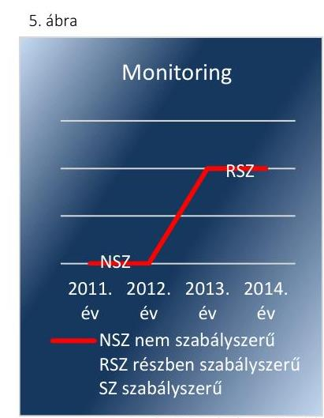

Forrás: 2.5. számú megállapítás

Az intézményvezető a 2011. évben - a Ber. 4. § (1) bekezdése és a belső ellenőrzési kézikönyv ${ }^{61}$ III. pontjának előírása ellenére - nem működtetett belső ellenőrzési rendszert. A belső ellenőrzési rendszer működtetéséről a PESZK-nél 2012-ben a MIK, 2013-2014-ben az SZGYF Belső Ellenőrzési Főosztálya útján gondoskodtak, azonban a belső ellenőrzési rendszer kialakítása 2012-ben nem felelt meg a Bkr. 15. § (6) bekezdésében foglaltaknak, mivel a feladat ellátására az intézményvezető nem kötött írásbeli megállapodást a MIK-kel. A belső ellenőrzés függetlensége biztosított volt, érvényesültek az összeférhetetlenségi követelmények.

A belső ellenőrzési kézikönyv ${ }_{1,2,3}$-t - a Ber.-ben és a Bkr.-ben előírtak szerint - rendszeresen felülvizsgálták, aktualizálták. A belső ellenőr a 20122014. években elkészítette az éves ellenőrzési tervet, amelyekben foglalt ellenőrzések teljes körűen megvalósultak. Az SZGYF belső ellenőrzési vezetője a 2013. évben a PESZK-re is vonatkozó 2013. évi ellenőrzési tervet - a Bkr. 32. § (1) bekezdésében előírtak ellenére - az intézményvezetőnek nem küldte meg jóváhagyásra. Az intézményvezető a 2014. évben az SZGYF PESZK-re is vonatkozó 2014. évi belső ellenőrzési tervének jóváhagyását követően a tervet - a Bkr. 32. § (2) bekezdésében előírtak ellenére - nem küldte meg a fejezetet irányító költségvetési szerv belső ellenőrzési vezetője részére. Az ellenőrzésekről - a Bkr.-ben előírtak szerint - jelentést készítettek.

A BELSŐ ÉS KÜLSŐ ELLENŐRZÉSEK által tett megállapításokra és javaslatokra intézkedési terveket készítettek.

A belső és külső ellenőrzések javaslatai végrehajtása érdekében a PESZK, mint ellenőrzött - a Ber. ${ }^{62}$ és a Bkr. előírásai alapján - intézkedési terveket készített. Az ellenőrzések során az ellenőrzési jelentésekben szereplő ellenőrzési javaslatok alapján megtett intézkedések nyomon követéséről - a Ber., majd a Bkr. rendelkezésének és az államháztartásért felelős miniszter által közzétett módszertani útmutatóban foglaltaknak megfelelően - nyilvántartást vezettek.

A külső ellenőrzések javaslataira készült intézkedési tervekben rögzítetteket - a Ber.-ben és a Bkr.-ben előírtak szerint - nyilvántartották és a teljesítését nyomon követték.

Az intézményvezető az operatív tevékenységektől függetlenül működő belső ellenőrzés tekintetében 2012 januárjáig, az operatív tevékenységek tekintetében pedig 2014. május 5-éig, az SZMSZs hatályba lépéséig - a 2011. évben az Ámr. 160. § (2) bekezdésének, 2012-től a Bkr. 10. §-ának előírásai ellenére - nem alakított ki a szervezet tevékenységének, a célok megvalósításának folyamatos és eseti nyomon követését biztosító rendszert.

Az intézményvezető - a 2011. évben az Áht. 1 94. § (1) bekezdés b) és c) pontjában rögzített felelősségi körében eljárva, 2012-től az Áht. 2 69. § (1) bekezdésében, valamint a Bkr. 6. § (2) bekezdésében foglaltak ellenére - a belső kontrollrendszer keretében nem alakított ki olyan, a kockázatok kezelése és tárgyilagos bizonyosság megszerzését biztosító folyamatrendszert, amely azt a célt szolgálja, hogy a múködés és gazdálkodás során a tevékenységeket szabályszerűen, gazdaságosan, hatékonyan és eredményesen hajtsák végre, elszámolási kötelezettségüket teljesítsék és megvédjék az erőforrásokat a veszteségektől, károktól és a nem rendelte-

---

tésszerű használattól. Az intézményvezető - az Áht. 1 121/A. § (1) bekezdésében és a Bkr. 6. § (2) bekezdésében foglaltak ellenére - a rendelkezésre álló források gazdaságos, hatékony és eredményes felhasználását biztosító szabályozásokat nem adott ki, illetve folyamatokat nem alakított ki és nem működtetett az ellenőrzött időszakban. Így 2011-ben az Áht. 1 121. § (3) bekezdésében, 2012-2014-ben a Bkr. 11. §-ában előírtak alapján a belső kontrollrendszer értékeléséről készített vezetői nyilatkozatok - miszerint az intézményvezető gondoskodott a PESZK tevékenységében a hatékonyság, az eredményesség és a gazdaságosság követelményeinek érvényesítéséről - nem voltak helytállóak.

A Közgyűlés által jóváhagyott SZMSZ2-ben és az SZGYF főigazgatója által jóváhagyott SZMSZ4-ben - a Ber. 4. § (2) bekezdésben, illetve a Bkr. 15. § (2) bekezdésben előírtak ellenére - nem rögzítették a belső ellenőrzést végző szervezeti egység jogállását és feladatait.

# 3. A PESZK pénzügyi gazdálkodása szabályszerű volt-e? 

## Összegző megállapítás

### 3.1. számú megállapítás

A PESZK pénzügyi gazdálkodása 2011-2013-ban nem volt szabályszerű, 2014-ben részben szabályszerű volt.

A PESZK elemi költségvetésének elfogadása, az előirányzatok megállapítása szabályszerűen történt. A tervezés során a PESZK teljesítette az Ámr.-ben és az Ávr.-ben előírt adatszolgáltatási kötelezettségét.

AZ ÉVES KÖLTSÉGVETÉSEK TERVEZÉSE során a PESZK az elemi költségvetéseit tartalmilag 2011-ben az Ámr., 2012-ben az Ávr. előírásaiban foglaltaknak megfelelően állította össze, továbbá betartották a 2012. évre vonatkozóan a 258/2011. Korm. rendelet, a 2013. évre vonatkozóan az 5/2012. NGM rendelet ${ }^{63}$, a 2014. év tekintetében a 10/2013. NGM rendelet ${ }^{64}$, valamint a belső szabályzatok előírásait. Az intézményi működési bevételeket az ellátottak száma és a térítési díjak alapján tervezték, a kiemelt kiadási előirányzatok tervezése az irányító szervek által a tervezési körlevelekben meghatározott irányok figyelembevételével történt. A személyi juttatásokat a dolgozói létszám, a törvényi és a helyi szabályozás alapján járó kifizetések alapján, a dologi kiadásokat a hatályos szerződések figyelembevételével tervezték meg.

Az ellenőrzött időszakban az eredeti bevételi és kiadási előirányzatokat az Ámr. és az Ávr. előírásainak megfelelően a PESZK számításokkal támasztotta alá.

A 2011-2014. években a PESZK a tervezéssel kapcsolatos adatszolgáltatási kötelezettségét - a 2011. évben az Önkormányzat felé az Ámr., a 20122014. években a középirányító szerv felé az Ávr. előírásának megfelelően az előírt határidőben teljesítette.

A 2012-2013. években a szervezeti változások hatásait a PESZK a költségvetési javaslatainak elkészítése során szintrehozással figyelembe vette. A 2011. szeptember 1-jével történt szervezeti változás miatt a Közgyűlés a PESZK kiemelt előirányzatait módosította, ennek hatásait a PESZK-nél a 2012. évi előirányzat tervezésénél figyelembe vették, az előirányzatok Ávr. előírása szerinti szintrehozási kötelezettségnek eleget tettek. A MIK és a

---

# Megállapítások 

PESZK között létrejött munkamegosztási megállapodásban rendelkeztek a költségvetési előirányzatok és a humán erőforrás átadásáról, valamint az előirányzatok 2013. évi szintrehozási kötelezettségéről. A gazdálkodási feladatok ellátása rendjének megváltozása miatt az irányítószerv módosította a PESZK 2012. évi személyi juttatások kiemelt előirányzatát. A 2013. évi elemi költségvetés tervezésénél az állományi létszám szintrehozása megtörtént, az Ávr. előírásainak megfelelően a tervezésnél figyelembe vették ennek előirányzatokat érintő hatását.

## 3.2. számú megállapítás

A bevételi és kiadási előirányzatok saját hatáskörben történt módosítása a 2011-2013. években nem a jogszabályi előírásoknak megfelelően történt, mivel az előirányzat módosításokat nem dokumentálták teljes körűen. Az előirányzatokat 2014-ben szabályszerűen módosították.

A PESZK ELŐIRÁNYZATAI módosítására az ellenőrzött időszakban kormányzati, irányítószervi, és intézményi saját hatáskörben került sor. Az előirányzat nyilvántartásban szereplő előirányzat módosítások megegyeztek a főkönyvi könyvelés szerinti előirányzat változásokkal.

A PESZK bevételi és kiadási előirányzatainak évközi módosításait hatásköri bontásban az 2. táblázat tartalmazza.
2. táblázat

A PESZK BEVÉTELI ÉS KIADÁSI ELŐIRÁNYZATAINAK ÉVKÖZI MÓDOSÍTÁSAI HATÁSKÖR SZERINT (E FT-BAN)

| Év | országpýlási | kormányzati | irányítószervi | intézményi |
| :--: | :--: | :--: | :--: | :--: |
| 2011. | 0 | 0 | 53178 | 21693 |
| 2012. | 0 | 12888 | 2911 | 51001 |
| 2013. | 0 | 10738 | 64439 | 54821 |
| 2014. | 0 | 26760 | -15674 | 73478 |

A KORMÁNYZATI HATÁSKÖRBEN végrehajtott - a foglalkoztatottak 2012-2014. évi bérkompenzációjával összefüggő - előirányzat módosítások dokumentáltak, alátámasztottak voltak. A felhasználások elszámolása megtörtént.

AZ IRÁNYÍTÓSZERVI HATÁSKÖRBEN végrehajtott előirányzat módosítások jellemzően a beolvadó intézmény feladatainak a PESZK-hez történő átcsoportosításához, a céljelleggel juttatott támogatásokhoz (létszámcsökkentési pályázat támogatása, szociális foglalkoztatottak támogatása), közüzemi díjak kifizetése forrásának biztosításához, valamint a várható többletbevétel miatti bevételi előirányzat emeléshez kapcsolódtak.

A SAJÁT HATÁSKÖRBEN végrehajtott előirányzat módosítások jellemzően a korábbi évi pénzmaradvány felhasználásához, az önkormányzati alrendszerből központi alrendszerbe sorolás miatti pénzmaradvány átvételhez, az NRSZH-tól a szociális foglalkoztatásra kapott támogatáshoz, valamint Koroncó Község Önkormányzatától kapott támogatáshoz kapcsolódtak. A PESZK a saját hatáskörben végrehajtott előirányzat módosításairól öt napon belül tájékoztatta a Kincstárt.

---

Előfordult, hogy a 2011. évben az önállóan gazdálkodó PESZK, a 20122013. években a gazdálkodási feladatokat ellátó MIK és az SZGYF az előirányzat módosítások során - a Számv. tv. 165. § (2) bekezdésében foglalt előírás ellenére - a számviteli nyilvántartásokba szabályszerűen kiállított bizonylatok nélkül jegyeztek be adatokat, ugyanis az ellenőrzés részére átadott dokumentumok, mint bizonylatok nem támasztották alá összegszerűségükben az elvégzett gazdasági múveleteket.
3.3. számú megállapítás

A PESZK az ellenőrzött időszakban a jóváhagyott kiadási előirányzatokon belül gazdálkodott. A személyi juttatásokkal és a pénzeszközátadással, támogatás értékű kiadással, kölcsönök nyújtásával, ellátottak juttatásaival kapcsolatos gazdálkodási kontrollok a 20112013. években nem megfelelően, a 2014. évben részben megfelelően múködtek.

A BEVÉTELEK ÉS A KIADÁSOK - a 2014. évi bevételek kivételével - a módosított előirányzatnak megfelelően teljesültek, illetve a módosított kiemelt kiadási előirányzatokon belül gazdálkodtak.

A PESZK eredeti, módosított és teljesített bevételi előirányzatait a 6. ábra mutatja be.
6. ábra
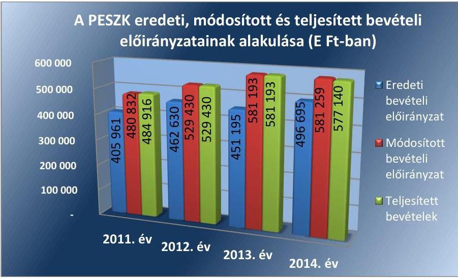

Forrás: A PESZK 2011-2014. évi költségvetési beszámolói
A 2011. évben a módosított bevételi előirányzatok 100,8\%-ra, a 20122013. években $100,0 \%$-ra, a 2014. évben $99,3 \%$-ra teljesültek. A 2014. évben a bevételek teljesítésének előirányzattól való kismértékű elmaradásának oka az volt, hogy előre nem tervezhető módon növekedett az ellátást ingyenesen igénybe vevő lakók aránya a teljes, illetve személyi térítési díjat fizetőkkel szemben. A PESZK a 2011-2014. években betartotta a bevételi előirányzatok Áht. 1,2-ben előírt teljesítésének kötelezettségét.

A PESZK eredeti, módosított és teljesített kiadási előirányzatait a 7. ábra tartalmazza.

---

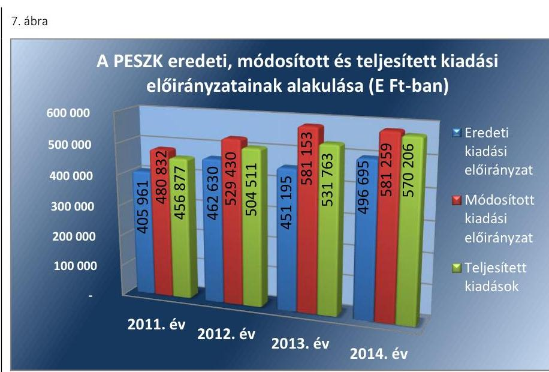

Fonrás: A PESZK 2011-2014. évi költségvetési beszámolói

A PESZK az Áht.1,2-ben foglaltaknak megfelelően a módosított kiemelt kiadási előirányzatokat egyik évben sem lépte túl. A módosított kiadási előirányzat a 2011. évben 95,0\%-ra, 2012-ben 95,3\%-ra, 2013-ban 91,5\%-ra, 2014-ben 98,1\%-ra teljesült.

A dologi kiadások elsősorban a szakmai feladatellátáshoz kapcsolódó gyógyszer-, élelmiszer beszerzésekhez, karbantartásokhoz és közüzemi szolgáltatásokhoz kapcsolódtak.

Az ellenőrzött időszakban a PESZK egy felhalmozási kiadás esetében volt közbeszerzési eljárás lefolytatására kötelezett. A Kbt. 2 hatálya alá tartozó - 2013. évi - beszerzésnél a PESZK a közbeszerzési eljárást lefolytatta, a becsült értéket meghatározta és a szerződést a közbeszerzési eljárás nyertesével kötötte meg.

A kiadási előirányzatokat az ellenőrzés rendelkezésére bocsátott dokumentumok alapján a PESZK a költségvetésében meghatározott céloknak megfelelően a feladatellátására használta fel.

A kiadási előirányzatok felhasználása a következők tekintetében volt szabálytalan:

- A beolvadó intézmény 2011. évi dologi és dologi jellegű (egyéb folyó) kiadásaihoz kapcsolódóan előfordult, hogy - a Számv. tv. 169. § (2) bekezdésében foglalt előírások ellenére - a könyvviteli elszámolását közvetlenül alátámasztó számviteli bizonylatokat - az intézményvezető nyilatkozata szerint - nem őrizték meg.
- A kötelezettségvállalásoknál előfordult, hogy - a 2011. évben az Áht. 1 100/C. § (3) bekezdésében és az Ámr. 74. § (1) bekezdésében, a 2012-2014. években az Áht. 2 37. § (1) bekezdésében, valamint az Ávr. 52. § (1) bekezdés a) pontjában előírtak ellenére - az nem történt meg írásban. (Az intézményvezető 2011-ben az Ámr. 72. § (13) bekezdés a) pontjában és 2012-től az Ávr. 53. § (1) bekezdés a) pontjában foglalt lehetőséggel - mely szerint nem szükséges írásbeli kötelezettségvállalás az olyan kifizetés teljesítéséhez, amely értéke a 100 ezer Ft-ot nem éri el - nem élt. A gazdálkodási szabályzat ${ }_{1,2,3,4}$ előírása alapján kötelezettséget vállalni az ellenőrzött időszakban kizárólag írásban lehetett.)

---

- A 2011. évben a személyi juttatások kifizetésénél előfordult, a pénzeszközátadások, támogatás értékű kiadások, kölcsönök nyújtása, ellátottak juttatásai kiadásainál rendszeresen előfordult, hogy - az Áht.; 100/C. § (6) bekezdésében előírtak ellenére - nem történt meg az utalvány ellenjegyzése.
- A 2011. évben a dologi és a dologi jellegű (egyéb folyó) kiadásoknál, valamint a személyi juttatások kifizetésénél, a 2012-2014. években az előzőek mellett a felhalmozási kiadások esetében is rendszeresen előfordult, hogy - 2011-ben az Ámr. 76. § (3) bekezdésében, 2012-2014-ben az Ávr. 57. § (3) bekezdésében rögzítettek ellenére - a (szakmai) teljesítésigazolást nem a kijelölt személy végezte el. A 2011. évben a dologi és a dologi jellegű (egyéb folyó) kiadásoknál, valamint a személyi juttatások esetében - az Ámr. 76. § (1) bekezdésében foglaltak ellenére -, a 2012-2014. években a dologi és a dologi jellegű (egyéb folyó) és a felhalmozási kiadásokhoz kapcsoló-dóan-az Ávr. 57. § (1) bekezdésének előírása ellenére - a (szakmai) teljesítésigazolás rendszeresen nem történt meg.
- A 2012-2014. években rendszeresen előfordult, hogy - az Ávr. 58 § (1) bekezdésében előírtak ellenére - az érvényesítést nem végezték el.
- A 2011. évben rendszeresen előfordult a dologi és a dologi jellegű (egyéb folyó) kiadások esetében - az Ámr. 79. § (1) bekezdésében foglaltak ellenére -, hogy nem a gazdasági vezető által írásban kijelölt személy végezte el az utalvány ellenjegyzését.
- Rendszeresen előfordult, hogy a 2011. évben az utalvány ellenjegyzője, illetve a 2012-2014. években az érvényesítő - az Ámr. 79. § (3) bekezdésében, illetve az Ávr. 58. § (2) bekezdésében előírtak ellenére - nem jelezte az utalványozónak, hogy a megelőző ügymenetben nem tartották be a vonatkozó jogszabályi előírásokat és a belső szabályzatokban foglaltakat.

# 3.4. számú megállapítás 

A PESZK-et költségvetési törvényben meghatározott befizetési kötelezettség nem terhelte, évközi korlátozó intézkedések bevezetésére nem került sor. Az előirányzat maradvány megállapításának, felhasználásának szabályszerűsége 2012-2014 között nem volt megfelelő az irányítószerv felé való tájékoztatási kötelezettség teljesítésével kapcsolatos szabálytalanságok miatt.

Az előirányzatok felhasználásához kapcsolódóan az ellenőrzött időszakban évközi korlátozó intézkedések bevezetésére nem került sor, zárolást nem rendeltek el, maradványtartási kötelezettség nem keletkezett. A PESZK számára a költségvetési törvényben meghatározott befizetési kötelezettséget nem írtak elő.

A kötelezettségvállalással terhelt pénzmaradvány/előirányzat maradvány megállapítása megfelelt 2011-ben az Ámr.-ben és 2012-2014-ben az Ávr.-ben foglalt előírásoknak.

## A PÉNZMARADVÁNY/ELŐIRÁNYZAT MARADVÁNY

alakulását a 3. táblázat mutatja be.

---

3. táblázat

PÉNZMARADVÁNY/ELŐIRÁNYZAT MARADVÁNY ALAKULÁSA A 20112014. ÉVEKBEN (E FT-BAN)

|   | 2011. év | 2012. év | 2013. év | 2014. év  |
| --- | --- | --- | --- | --- |
|  Pénzmaradvány/Előirányzat
maradvány összesen | 20281 | 24919 | 49404 | 6934  |
|  Kötelezettségvállalással terhelt
maradvány | 20281 | 24790 | 49404 | 6934  |

Forrás: A PESZK 2011-2014. évi költségvetési beszámolói A PESZK 2011. évi pénzmaradványa és a 2013-2014. évi előirányzat maradványa teljes egészében kötelezettségvállalással terhelt volt. A 2012. évben az előirányzat maradványból az 1873/2013. Korm. határozat ${ }^{65}$ alapján a központi költségvetést megillető, elvonandó előirányzat maradvány 129 ezer Ft volt. A kötelezettségvállalással nem terhelt előirányzat maradvány befizetési kötelezettségének a PESZK eleget tett.

A kötelezettségvállalással terhelt pénzmaradvány esetében a 2011. évben rendszeresen előfordult, 2012. évben előfordult, hogy az intézményvezető - a Számv. tv. 169. § (2) bekezdésében foglalt előírások ellenére nem őrizte meg a kötelezettségvállalási nyilvántartásban szereplő kötelezettségvállalás dokumentumát, továbbá a 2012. évre vonatkozóan az előirányzat maradvány jóváhagyásáról szóló értesítést, valamint a szabad előirányzat maradvánnyal kapcsolatos befizetési kötelezettség teljesítésének határidejéről szóló értesítést.

Az előirányzat maradványról a 2012-2014. években a MIK vezetője, illetve az SZGYF főigazgatója - az Áhsz. 10. § (1) bekezdésében és az Áhsz. 32. § (1) bekezdésében előírtak ellenére - a költségvetési évet követő év február 28-ai határidején túl teljesítette az elemi költségvetési beszámoló benyújtásával az irányító szerv felé előírt adatszolgáltatási kötelezettségét. A 2012. évi beszámolót 2013. március 28-án, a 2013. évi beszámolót 2014. április 4-én, a 2014. évi beszámolót 2015. április 27-én nyújtották be.

A 2013. évben előfordult, hogy - az Ávr. 55. § (1) bekezdésében foglalt előírás ellenére - a pénzügyi ellenjegyző a kötelezettségvállalás dokumentumán annak pénzügyi ellenjegyzését aláírásával nem igazolta.
3.5. számú megállapítás

Az intézményvezető intézkedései a folyamatos fizetőképességet nem biztosították, mivel a 2012-2014. években a PESZK a szállítói tartozásait nem egyenlítette ki határidőben és a követelésállománya az ellenőrzött időszak végére növekedett. A követelésekkel szemben szabálytalanul számoltak el értékvesztést, mely gyakorlatot 2014-ben megszüntettek.

A SZÁLLÍTÓI SZÁMLÁK és egyéb kötelezettségek határidőben történő kiegyenlítése az éves beszámolók adatai szerint a 2012-2014. években nem volt biztosított.

A PESZK-nek a december 31-én fennálló lejárt szállítói tartozása a 2012. évben 457,1 ezer Ft, a 2013. évben 5 201,3 ezer Ft, a 2014. évben 1057,5 ezer Ft volt. A 2012-2013. években lejárt szállítói tartozás teljes egészében 30 nap alatti volt, a 2014. évben 786,4 ezer Ft 30 nap alatti, 271,1 ezer Ft 31-60 nap közötti volt. A 2011. évre vonatkozóan - az

---

Áhsz-1 9. számú melléklet 4. da) pontjában előírtak ellenére - az akkor önállóan gazdálkodó PESZK a szállítói tartozásairól nem vezetett olyan analitikus nyilvántartást, melyből a 30, illetve a 60 napon túli kiegyenlítetlen kötelezettségek állománya az előírt adatszolgáltatási rendszernek megfelelően rendelkezésre állt volna.

A PESZK likviditási mutatójának - mely számítása során figyelembe vételre került, hogy az Áhsz elóirása alapján a forgóeszközök tartalma 2014től megváltozott - és pénzeszköz likviditási mutatójának értékeit a 4. táblázat mutatja.
4. táblázat

A PESZK LIKVIDITÁSI MUTATÓI A 2011-2014. ÉVEKBEN

|  | 2011. év | 2012. év | 2013. év | 2014. év |
| :--: | :--: | :--: | :--: | :--: |
| Likviditási mutató |  |  |  |  |
| (idegen pénzeszközök nélkül meghatározott forgóeszközök/rövid lejáratú kötelezettségek | 2,72 | 1,99 | 4,06 | 1,64 |
| Pénzeszköz likviditási mutató |  |  |  |  |
| (idegen pénzeszközök nélkül meghatározott pénzeszköz/rövid lejáratú kötelezettségek | 0,98 | 1,24 | 3,01 | 1,00 |

Forrás: A 2011-2014. évi költségvetési beszámolók
Az idegen pénzeszközöket nem tartalmazó pénzeszközök a 2011. évben kismértékben elmaradtak a rövid lejáratú kötelezettségek összegétől, a 2012. évben meghaladták azt, a 2014. évben megegyeztek vele. A 2013. év végén ugyan a likviditási mutató 3,01 értékű volt, vagyis a 16037 ezer Ft összegű kötelezettséget és 48293 ezer Ft pénzeszközt mutattak ki, azonban ebből az összegből 35000 ezer Ft a PESZK mosoda épületének teljes felújítására elkülönített összeg volt. A fennmaradó 13293 ezer Ft szabad pénzeszköz nem biztosította maradéktalanul a 16037 ezer Ft rövid lejáratú kötelezettség (12 570 ezer Ft szállítói kötelezettség és 3467 ezer Ft egyéb, tárgyévet terhelő rövid távú kötelezettség) teljesítését.

# A PESZK A LIKVIDITÁSÁNAK JAVÍTÁSA ÉRDEKÉ- 

BEN a 2012-2013. években takarékossági intézkedéseket (pl. szerződések felülvizsgálata, módosítása, legszükségesebb anyagok, eszközök, irodaszerek beszerzése, villamos energia fogyasztás csökkentése) vezetett be.

A PESZK a 2011. évben az önkormányzati alrendszerbe tartozott és a jogszabály nem írt elő előirányzat-felhasználási terv készítési kötelezettséget. A PESZK gazdálkodási feladatait ellátó MIK a 2012. évben - az Áht. ${ }_{2}$ 78. (2) bekezdésében és az Ávr. 122. § (1) bekezdésében előírtak ellenére - nem készített likviditási tervet. A 2013-2014. évek likviditási tervei alapján a PESZK forráshiányos volt, a fizetőképessége nem volt folyamatosan biztosított. A fizetőképesség helyreállítása érdekében 2013. december 17-én az EMMI bázisba épülő 20500 ezer Ft összegű előirányzat módosítással pótlólagos forrást biztosított a PESZK részére, 2014. november 14én pedig az SZGYF Központi Igazgatóságától ${ }^{66} 20500$ ezer Ft összegű előleg került átcsoportosításra a PESZK-hez, melyből szállítói számlákat egyenlítettek ki.

---

A PESZK KÖVETELÉSÁLLOMÁNYA a 2011. évben 6801 ezer Ft, a 2012. évben 7911 ezer Ft, a 2013. évben 7505 ezer Ft, a 2014. évben 16900 ezer Ft volt. A kimutatott 2014. évi követelésállomány 125,3 \%-kal növekedett a 2013. évi követelés állományhoz képest, azonban ennek a növekedésnek a jelentős része a 2011-2013. évek közötti időszakban folytatott szabálytalan eljárásból eredt, mely során a mérlegben a követelésállományt nem a valós értéken mutatták ki. A 2011. évben az önállóan gazdálkodó PESZK, a 2012-2013. években a gazdálkodási feladatokat ellátó MIK és az SZGYF - a Számv. tv. 16. § (1) bekezdésében előírtak ellenére - a követeléseket egyedileg nem értékelte. A követelések könyv szerinti értékékével szemben - az Áhsz. 1 31. § (2) bekezdésében előírtak ellenére - úgy számoltak el értékvesztést, hogy a veszteségjellegú különbözet nem mutatkozott tartósnak. Ennek az eljárásnak az eredményeként a 2012-2013. évi költségvetési beszámolók - tekintettel az Áhsz. 1 2. § (2) bekezdésében foglaltakra - az Áhsz. 1 5. § 8. pontja szerint jelentős összegű hibát tartalmaztak (a 2012. évben 4847 ezer Ft, a 2013. évben 5698 ezer Ft). A hiba mértéke a 2012. évben a mérlegfőösszeg 4,6\%-a, a 2013. évben 4,7\%-a volt. Ezáltal nem érvényesült maradéktalanul a Számv. tv. 15. § (3) bekezdésében foglalt valódiság elve. A valós követelésállomány a 2011. évben 12702 ezer Ft, a 2012. évben 12758 ezer Ft, a 2013. évben 13203 ezer Ft volt.

A követelésállományt a 2011-2012. években teljes egészében az intézményi múködési bevételekkel kapcsolatos térítési díj követelések, a 20132014. években jelentős részben a térítési díj követelések, kismértékben az egyéb rövid lejáratú kötelezettségek tették ki.

A fennálló követelések behajtására az ellenőrzött időszak alatt a PESZK a térítési díj hátralékos gondozottaknak fizetési felszólításokat küldött ki. A fizetési kötelezettségüknek eleget nem tevők esetében a 2011-2014. években kezdeményezték az ingatlanaikra irányuló jelzálogbejegyzést. A jelzálogok összesített értéke a 2011. évben 5901 ezer Ft, a 2012. évben 4847 ezer Ft, a 2013. évben 5698 ezer Ft, a 2014. évben 5231 ezer Ft volt. A fennálló követelések behajtására hozott intézkedések nem voltak elegendőek, mert a meghozott intézkedések ellenére - figyelembe véve a követelések szabálytalan kimutatását is - az ellenőrzött időszak végére a követelésállomány növekedett.
3.6. számú megállapítás

Az eredményszemléletú számvitellel kapcsolatos feladatokat végrehajtották, azonban a kapcsolódó leltárak nem az előírt bontásban tartalmazták a követeléseket és a kötelezettségeket, illetve a rendező mérleget az SZGYF nem az előírt határidőben készítette el.

A RENDEZŐ MÉRLEG ELŐKÉSZÍTÉSÉT a PESZK gazdálkodási feladatait ellátó SZGYF a 36/2013. NGM rendelet ${ }^{67}$ elöírásai alapján végezte el.

A rendező, technikai tételek elszámolását a 2013. évi főkönyvi számlákon azok záró egyenlegéből kiindulva a rendező mérleg elkészítését megelőzően elvégezték.

A RENDEZŐ MÉRLEGET az SZGYF a 36/2013. NGM rendeletben előírt formátumban és tartalommal készítette el. A rendező mérleg fordulónapja 2014. január 1-je volt. A 2014. évi nyitómérleg megfelelt a rendező

---

mérlegnek, azt a PESZK intézményvezetője és az elkészítésért felelős személy aláírta. A rendező mérleget a Kincstár 2014. augusztus 5-én hagyta jóvá.

Az SZGYF a rendező mérleget - a 36/2013. NGM rendelet 8. § (2) bekezdés a) pontjában előírtak ellenére - a 2014. március 31-ei határidőn túl, 2014. április 24-én készítette el.

A 2013. évben - a 36/2013. NGM rendelet 2. § (1) bekezdése és a (2) bekezdése c) pontjában előírtak ellenére - a leltárban a követeléseket, kötelezettségeket, nem a költségvetési évben, illetve a költségvetési évet követő években esedékes bontásban szerepeltették, továbbá a kötelezettségvállalásokat nem leltározták.

# 4. A PESZK vagyongazdálkodása szabályszerű volt-e? 

## Összegző megállapítás

### 4.1. számú megállapítás

A PESZK vagyongazdálkodása 2011-ben összességében szabályszerű volt. Az állami fenntartásba kerülést követően a feladatellátásához használt ingatlanvagyont szabályszerűen kivezette a nyilvántartásaiból, azonban szerződés hiányában jogcím nélkül használta azt. A PESZK 2012-től a mérlegében kimutatott vagyonnal alapvetően szabályszerűen gazdálkodott.

A 2011. évben az Önkormányzat tulajdonában lévő vagyonra vonatkozóan a vagyonkezelői megállapodás tartalma megfelelt az előírásoknak. A 2012-től a Magyar Államnak átadott ingatlanvagyont szabályszerűen kivezette a nyilvántartásaiból, azonban a továbbiakban - szerződés hiányában - jogcím nélkül használta azt.

VAGYONKEZELŐI MEGÁLLAPODÁS alapján kezelte a 2011. évben az Önkormányzat fenntartásában múködő PESZK a feladatellátásához szükséges - a fenntartó tulajdonában lévő - vagyont, megfelelve az Ötv. ${ }^{68}$ és az önkormányzati vagyonrendelet ${ }^{69}$ előírásainak. A vagyonkezelői megállapodásban rögzítették az önkormányzati vagyonrendelet előírásainak megfelelően a tulajdonosi joggyakorlás és a vagyongazdálkodási feladatok szabályozott és átlátható módon történő végrehajtásának, valamint a vagyon használatának, ellenőrzésének kötelezettségét. Az Önkormányzattal kötött vagyonkezelői megállapodást 2011. november 2-án a jogszabályi előírásoknak megfelelően módosították. A PESZK a megállapodás módosításának megfelelően az ezzel egyidejűleg kezelésbe vett vagyont (a korábban a beolvadó intézmény által kezelt vagyont) mérleg szerinti értéken - az Áhsz. ${ }_{1}$ előírásait betartva - a számviteli nyilvántartásaiban rögzítette. Az Önkormányzattal kötött vagyonkezelői megállapodás hatálya a Konsztv. rendelkezése alapján 2011. december 31-én megszűnt.

A MAGYAR ÁLLAM TULAJ DONÁBA KERÜLT a Konsztv. előírása alapján az Önkormányzat tulajdonában és a PESZK kezelésében lévő vagyon - a feladatellátási kötelezettséggel együtt - 2012. január 1-jével. Az Önkormányzat 2012. július 2-án átadás-átvételi megállapodást kötött a MIK-kel, valamint a Magyar Állam nevében eljáró MNV Zrt. ${ }^{70}$-vel és a Nemzeti Földalapkezelővel (mivel az Önkormányzat

---

Táplánypusztán mezőgazdasági művelésű földterülettel is rendelkezett), mely szerint a tulajdonában és a PESZK kezelésében lévő 392983 ezer Ft mérleg szerinti értékű ingatlanvagyont a Magyar Állam tulajdonába adta. A szerződés alapján az intézményi feladatellátást biztosító vagyon kezelői joga a MIK-hez, majd egyetemleges jogutódként az SZGYF-hez került.

A PESZK feladatellátásához az ingatlanvagyont jogcím nélkül használta, mivel - az Nvtv. 3. § (1) bekezdés 11. pontjában előírtak ellenére - használatra vonatkozó szerződéssel nem rendelkezett.

AZ INGATLANVAGYON NYILVÁNTARTÁSOKBÓL TÖRTÉNŐ KIVEZETÉSÉRŐL a PESZK az Nvtv., az Áht.2, a Számv. tv. és az Áhsz.1 előírásainak megfelelően gondoskodott.
4.2. számú megállapítás

Az ellenőrzött időszakban a mérlegben kimutatott eszközök és források értékelése, leltározása megtörtént, azonban a követelések kimutatása nem volt szabályszerű.

A KÖNYVVITELI MÉRLEGBEN KIMUTATOTT eszközök és források bekerülési értékének megállapítása, állományba, nyilvántartásba vétele megtörtént, azonban a 2011. évben az önállóan gazdálkodó PESZK, a 2012-2014. években a MIK, illetve az SZGYF a követelések között - a Számv. tv. 29. § (1) bekezdésében előírtak ellenére - a másik fél által el nem ismert pénzértékben kifejezett fizetési igényeket is kimutattak.

AZ ÉVES KÖLTSÉGVETÉSI BESZÁMOLÓK mérlegtételeit leltárral a 2011-2014. években alátámasztották, azonban a leltározás lefolytatásának szabályszerűsége 2012-2014 között nem volt biztosított, mivel a PESZK a Számv. tv. 14. § (5) bekezdése a) pontja előírása ellenére nem rendelkezett hatályos eszközök és források leltározási és leltárkészítési szabályzatával. Az ellenőrzött időszakban a leltározást a Számv. tv., az Áhsz.1,2 előírásai alapján december 31-i fordulónappal elvégezték. A költségvetési beszámolók összeállításához és a mérleg tételek alátámasztásához az év végi zárlati feladatokat az intézményvezető a számlarendben a 2011. évre meghatározta, azonban PESZK - a Számv. tv. 161. § (1) bekezdésében foglaltak ellenére - 2012. április 1-jétől nem rendelkezett hatályos számlarenddel.

A PESZK-nél az ellenőrzött időszakban selejtezésre nem került sor.
4.3. számú megállapítás

A jogszabály és a vagyonkezelői megállapodás előírásai alapján a PESZK az értékmegőrzési, állagmegóvási kötelezettségeinek a 2011. évben eleget tett. A 2012. évtől a feladatellátáshoz használt ingatlanvagyon jogszerú használatára vonatkozó szerződéssel a PESZK nem rendelkezett, értékmegőrzési, állagmegóvási kötelezettsége előírás hiányában nem volt.

AZ ÉRTÉKMEGŐRZÉSI, ÁLLAGMEGÓVÁSI KÖTELEZETTSÉGÉNEK, az eszközök pótlásának 2011-bena PESZK eleget tett, az eszközök kezelése során a vagyonkezelői megállapodás előírásait betartotta. A 2012. január 1-jétől a feladatellátását szolgáló ingatlanvagyont vonatkozó szerződés hiányában jogcím nélkül használta a PESZK,

---

előírás hiányában az ingatlanokkal kapcsolatban állagmegóvási, karbantartási kötelezettsége nem volt.

A 2011. évben a PESZK az Önkormányzat tulajdonában lévő ingatlanvagyont kezelte, a múködéshez használt gépek, berendezések, jármúvek az intézmény tulajdonában voltak. A Konsztv. szerint 2011. december 31-én az Önkormányzati tulajdonú ingatlanok a Magyar Állam tulajdonába kerültek, így a PESZK vagyonkezelői joga is megszűnt.

# A PESZK VAGYONI HELYZETÉNEK ALAKULÁ- 

SÁRA jelentős hatással volt a 2012. január 1-jei fenntartóváltás, amikor az intézmény vagyonkezelői joga megszűnt, így a feladatellátásához használt (392 983 ezer Ft mérleg szerinti értéken) ingatlanvagyon kezelői jogát - vagyonkezelői szerződéssel - átvette a MIK, illetve a 2013. évben annak jogutódja az SZGYF. A PESZK főbb mérlegadatait a IV. számú melléklet tartalmazza.

A PESZK mérlegfőösszege a 2011. január 1-jéről a 2011. december 31- re 341652 ezer Ft-tal (háromszorosára) emelkedett, a 2011. augusztus 31-én beolvadó intézmény vagyonának átvétele miatt. A 2011-2012. évek között a mérleg főösszeg 79,5 \%-kal csökkent, melynek oka elsősorban a Konsztv. előírása miatt 2012. január 1-jétől a PESZK-nél megszűnt vagyonkezelői jog következtében, a 392983 ezer Ft értékú ingatlanvagyon átadásából adódott. A 2014. év végére a mérlegfőösszeg az előző évihez képest 34,7 \%-kal csökkent, melynek oka az volt, hogy - a felújítás megkezdésekor még PESZK vagyonkezelésében lévő - mosoda felújítását a 2014. évi befejezést követően (az addig a PESZK-nél befejezetlen beruházásként, illetve a felújítás pénzügyi fedezete a pénzeszközök között nyilvántartott) a vagyonkezelő SZGYF-nek átadták. Az ellenőrzött időszak nyitó és záró adatai, a 2011-2013. években végrehajtott szervezeti változások miatt nem összehasonlíthatóak.

A kötelezettségek állományában bekövetkezett változásoknál is a 2011. augusztus 31-én beolvadó intézmény kötelezettségeinek átvétele okozott a 2011. éven belül 16,9 \%-os növekedést. A kötelezettségek értéke a 2011. január 1-jei 15990 ezer Ft összegről 2014. december 31-re 14037 ezer Ftra csökkent.

A PESZK vagyoni helyzetének mutatóit az 5. táblázat tartalmazza.
5. táblázat

| A PESZK VAGYONI HELYZETÉNEK MUTATÓI |  |  |  |  |  |
| :--: | :--: | :--: | :--: | :--: | :--: |
| Mutató megnevezése | 2011. évl   nyitó | 2011. évl   záró | 2012. évl   záró | 2013. évl   záró | 2014. évl   záró |
| Kötelezettségek és a saját tőke aránya mutató | 0,11 | 0,04 | 0,41 | 0,34 | 0,51 |
| Befektetett eszközök aránya mutató | 0,89 | 0,92 | 0,61 | 0,44 | 0,53 |
| Forgóeszközök aránya mutató | 0,11 | 0,08 | 0,39 | 0,56 | 0,06 |
| Ingatlanok és kapcsolódó vagyoni értékú jogok aránya mutató | 0,91 | 0,84 | - | - | - |
| Saját tőke aránya mutató | 0,89 | 0,92 | 0,54 | 0,44 | 0,35 |
| Használhatósági fok mutatója |  | 70,78 | 39,31 | 31,80 | 25,04 |
| Elhasználódási szint mutató |  | 29,22 | 60,69 | 68,20 | 74,96 |

---

A saját tőke aránya mutató, valamint a kötelezettségek és a saját tőke aránya mutató a 2011. év és a 2014. év között bekövetkezett változásait jelentősen befolyásolta a beolvadó intézmény vagyonának átvétele, illetve hogy 2012. január 1-jétől az ingatlanokra vonatkozóan megszűnt a PESZK vagyonkezelői joga.

A használhatósági fok mutató és az elhasználódási szint mutató 2011. évi értékét meghatározta, hogy a feladatellátáshoz használt ingatlanok a PESZK könyveiben szerepeltek. A 2012. évtől az ingatlanok könyvekből való kivezetése miatt a mutatók értékét a tárgyi eszközök (ezen belül jellemzően a gépjárművek és számítástechnikai eszközök) állománya határozta meg, ezen eszközök átlagos elhasználtsága növekedett, a használhatóságuk romlott 2012-2014 között.

# VAGYONKEZELÉSBE ÁLLAMI TULAJDONÚ ESZ- 

KÖZT a PESZK 2012-2014-ben nem kapott. A 2011. évben az Önkormányzat tulajdonában, a PESZK kezelésében lévő mosoda épületének felújítására vonatkozó terveket a PESZK készíttette el. A feladatellátáshoz használt ingatlan 2012. január 1-jével a Magyar Állam tulajdonába és a MIK, majd 2013. április 1-jével az SZGYF kezelésébe került. A 2014. évben az épületen befejezett felújítást a Vtv. és a Számv. tv. előírásainak megfelelően, a PESZK a vagyonkezelő SZGYF-nek mérleg szerinti bekerülési értéken átadta. A PESZK a mérlegében kimutatott vagyonnal az ellenőrzött időszakban alapvetően szabályszerűen gazdálkodott.
4.4. számú megállapítás

Az intézményvezető az ellenőrzött időszakban a vagyonelemek hasznosításáról gondoskodott, azonban az - a bérbeadási tevékenységnél tapasztalt szabálytalanságok miatt - nem felelt meg a jogszabályok előírásainak.

A VAGYONELEM ÁTENGEDÉSÉBŐL, hasznosításából származó bevétele az ellenőrzött időszakban a PESZK-nek kizárólag a feladatellátásához használt ingatlan bérbeadásából származott. Az intézményvezető az ellenőrzött időszakot megelőzően határozatlan idejű bérleti szerződést kötött a PESZK kezelésében lévő Táplánypusztai ingatlan területén lévő kereskedelmi tevékenység céljára használt helyiség bérbeadására vonatkozóan. A 2011-2013. években rendszeresen előfordult, hogy a PESZK a befolyt, postai befizetést igazoló csekkek és pénztári bizonylatok alapján nyilvántartott bérleti díjakról - az Áfa tv. 159. §-ában rögzítettek ellenére - nem állított ki számlát. A 2014. évben a befizetett és nyilvántartásba vett bérleti díj bevételről a PESZK az Áfa tv. előírásainak megfelelően a számlát kiállította.

A PESZK feladatellátásához szükséges, használt ingatlanokra vonatkozó vagyonkezelői joga, a Konsztv. szerint 2011. december 31-én megszűnt, 2012. január 1-jétől a Magyar Állam tulajdonába és a MIK, illetve az SZGYF vagyonkezelésébe került. Ekkortól az ingatlanvagyon hasznosítására vonatkozó szerződés hiányában a bérleti díj bevétel a vagyonkezelőt illette volna meg, azonban azt a PESZK - az Áht. 2 45. § (4) bekezdésében rögzítettek ellenére - saját bevételként elszámolta.

---

# 5. Szabályszerüen hajtották-e végre az ellenőrzött időszakban a PESZK-et érintő szervezeti, szerkezeti átalakításokat? 

Összegző megállapítás

### 5.1. számú megállapítás

A 2011. évi szervezeti változás és a 2012. évi fenntartóváltás miatti átszervezés feladatait a Közgyűlés, a MIK és a PESZK szabályszerűen hajtotta végre.

A Közgyűlés szervezeti változáshoz kapcsolódó alapítói, irányítói és felügyeleti szervi döntései szabályszerűek voltak. A munkamegosztás és felelősségvállalás rendjét 2012-ben a PESZK önálló gazdálkodási jogkörének megszűnésekor a PESZK és a MIK - szabályszerű munkamegosztási megállapodásban rögzítette.

A KÖZGYŰLÉS SZABÁLYSZERŰEN, az Áht.: rendelkezéseinek megfelelő határozattal hozta meg a döntését a beolvadó intézmény PESZK-be való integrálásáról. A beolvadó intézmény átalakító okirata ${ }^{71}$ megfelelt az Áht.: rendelkezéseinek. A közgyűlési határozattal elfogadott intézkedési tervben az Ámr. rendelkezéseinek megfelelően meghatározták a beolvadással kapcsolatos feladatokat és határidőket, valamint kijelölték a végrehajtásért felelős személyeket.

A Konsztv.-ben és a 258/2011. Korm. rendeletben előírtaknak megfelelően, 2012. április 1-jétől a PESZK gazdasági szervezete megszűnt. A feladat átadását és átvételét, a munkamegosztás és felelősségvállalás rendjét a PESZK és a MIK munkamegosztási megállapodásban rögzítette az Ávr.-nek és a 258/2011. Korm. rendeletnek megfelelően.
5.2. számú megállapítás

A PESZK szabályszerűen látta el az átszervezéshez kapcsolódó feladatokat.

A BEOLVADÓ INTÉZMÉNY KÖLTSÉGVETÉSI BESZÁMOLÓJÁT az Áhsz.:-ben meghatározott határidőre (az átalakulás napjától számított 60 nap), 2011. augusztus 31-i fordulónappal elkészítették. A beolvadó intézmény vagyonát az Áhsz.: rendelkezésének megfelelően, a mérlegben szereplő, leltárral alátámasztott adatok alapján, jegyzőkönyvvel adta át a PESZK-nek a beolvadó intézmény vezetője. Az intézményvezetői jogkör átadása a beolvadó intézmény és a PESZK intézményvezetője között átadás-átvételi jegyzőkönyv alapján történt meg. 2011. szeptember 1-jével a PESZK átvette a beolvadó intézmény feladatainak ellátását.

A PESZK 2012. április 1-jével a gazdálkodással kapcsolatos feladatokat a munkamegosztási megállapodásban rögzítetteknek megfelelően adta át a MIK-nek.

---

# 6. A PESZK intézkedett-e az integritás szemlélet érvényesítése érdekében? 

Összegző megállapítás

Az adatszolgáltatása alapján a PESZK integritás szemlélet érvényesítése érdekében tett intézkedéseit az ÁSZ fejlesztendőnek értékelte.

AZ ÁSZ INTEGRITÁS PROJEKTJE KERETÉBEN a PESZK adatszolgáltatást teljesített az integritás szemlélet érvényesülése érdekében a 2014. évben tett intézkedéseiről, ezért az integritás kontrollrendszerének értékelése egyszerűsített kérdőív alapján történt.

Az integritás érvényesítése érdekében kialakított és működtetett kontrollrendszer értékelésének eredményét a II. számú melléklet tartalmazza.

---

# JAVASLATOK 

Az ÁSZ tv. 33. § (1) bekezdésében foglaltak értelmében az ellenőrzött szervezet vezetője köteles a jelentésben foglalt megállapításokhoz kapcsolódó intézkedési tervet összeállítani és azt a jelentés kézhezvételétől számított 30 napon belül az ÁSZ részére megküldeni. Amennyiben az ellenőrzött szervezet vezetője nem küldi meg határidőben az intézkedési tervet vagy továbbra sem elfogadható intézkedési tervet küld, az ÁSZ elnöke az ÁSZ tv. 33. § (3) bekezdés a)-b) pontjaiban foglaltakat érvényesítheti.

## az emberi erőforrások miniszterének

1. Intézkedjen a PESZK feladatai ellátásához használt, az SZGYF vagyonkezelésében lévő ingatlanok müködtetésével kapcsolatban feltárt szabálytalanságok tekintetében a munkajogi felelősség tisztázására irányuló eljárás megindításáról, és ennek eredménye ismeretében tegye meg a szükséges intézkedéseket.
(1.2. számú megállapítás 3. bekezdése alapján)

## a Szociális és Gyermekvédelmi Főigazgatóság, mint középirányító szerv főigazgatójának

1. Intézkedjen a jogszabályi előirásokkal összhangban a PESZK-re vonatkozóan az elöirányzatokkal, a létszámokkal és a vagyonnal való hatékony gazdálkodás követelményeinek érvényesitésére, e követelmények érvényre juttatásának számon kérésére, ellenőrzésére.
(1.2. számú megállapítás 4. bekezdés 2. mondata alapján)
2. Intézkedjen a jogszabályi előírásoknak megfelelően a vagyonkezelésében lévő, a PESZK feladatai ellátásához használt ingatlanok müködtetése keretében a vagyon PESZK általi használatához a használat jogcímének a biztositására.
(1.2. számú megállapítás 3. bekezdése alapján)

---

3. Tegyen intézkedéseket a PESZK esetében
a) a pénzügyi és vagyongazdálkodás tekintetében szükséges kontrollok kialakításával, a rendelkezésre álló források gazdaságos, hatékony és eredményes felhasználásával;
b) a saját hatáskörü előirányzat módosításokkal;
c) a követelések értékelésével
kapcsolatban feltárt szabálytalanságok tekintetében a felelősség tisztázása érdekében, és szükség szerint intézkedjen a felelősség érvényesitésére.
(2.5. számú megállapítás 8. bekezdése, a 3.2. számú megállapítás 6. bekezdése, a 3.5. számú megállapítás 7. bekezdése alapján)

# a Szociális és Gyermekvédelmi Főigazgatóság, mint a Dr. Piróth Endre Szociális Központ gazdasági szervezeti feladatait ellátó szerv főigazgatójának 

1. Intézkedjen a jogszabályi előírásoknak megfelelően a PESZK-re vonatkozó számviteli politika és annak keretében az eszközök és források leltározási és leltárkészitési szabályzata, az eszközök és források értékelési szabályzata, az önköltségszámítás rendjére vonatkozó belső szabályzat és a pénzkezelési szabályzat elkészitésére.
(2.1. számú megállapítás 13. bekezdés alapján)
2. Intézkedjen a jogszabályi előírásoknak megfelelően a PESZK számlarendjének elkészitésére.
(2.1. számú megállapítás 14. bekezdés alapján)
3. Intézkedjen, hogy a jogszabályi előírásoknak megfelelően az érvényesitést végezzék el, és az érvényesitő jelezze az utalványozónak, ha a megelőző ügymenetben nem tartották be a jogszabályi előírásokat és a belső szabályzatokban foglaltakat.
(3.3. számú megállapítás 9. bekezdés 5. és 7. pontja alapján)
4. Intézkedjen az előirányzat maradványról az irányító szerv felé elöirt adatszolgáltatási kötelezettség jogszabályban meghatározott határidőn belüli teljesitésére.
(3.4. számú megállapítás 6. bekezdése alapján)
5. Intézkedjen a PESZK esetében a követelések jogszabályi előírásoknak megfelelő kimutatására.
(4.2. számú megállapítás 1. bekezdése alapján)

---

# a Dr. Piróth Endre Szociális Központ vezetőjének 

1. Intézkedjen a jogszabályi előírással összhangban a közbeszerzési törvény hatálya alá nem tartozó beszerzések lebonyolításával kapcsolatos eljárásrend szabályozására.
(2.1. számú megállapítás 15. bekezdése alapján)
2. Intézkedjen, hogy a PESZK szervezeti és müködési szabályzata a jogszabályi előírásokkal összhangban tartalmazza
a) a vagyonnyilatkozat-tételre kötelezettek körét,
b) a belső ellenőrzést végző szervezeti egység feladatait.
(2.2. számú megállapítás 2. bekezdés 1. mondata, és a 2.5. számú megállapítás 9. bekezdése alapján)
3. Intézkedjen a jogszabályi előírással összhangban belső szabályzatban a vagyonnyilatkozat átadására, nyilvántartására, a vagyonnyilatkozatban foglalt személyes adatok védelmére vonatkozó szabályok meghatározására.
(2.2. számú megállapítás 2. bekezdés 1. mondata alapján)
4. Intézkedjen a jogszabályi előírással összhangban a belső szabályzatokban a dokumentumokhoz és információkhoz való hozzáférés szabályainak meghatározására.
(2.3. számú megállapítás 2. bekezdése alapján)
5. Intézkedjen a jogszabályi előírásokkal összhangban
a) mint adatkezelő az informatikai rendszer szabályozásánál az adatok biztonságának, védelmének érvényre juttatásához szükséges eljárási szabályok kialakítására;
b) az üzemeltetés és adatbiztonság szabályozása során a feladatok és a hatáskörök végrehajtható módon, pontosan történő meghatározására.
(2.3. számú megállapítás 6. bekezdése alapján)
6. Intézkedjen a jogszabályi előírással összhangban az illetékes szervezethez történő információátadás rendszerének kialakítására.
(2.4. számú megállapítás 3. bekezdése alapján)

---

7. Intézkedjen a jogszabályi előírással összhangban
a) a közérdekü adatok megismerésére irányuló igények teljesitésének rendjére vonatkozó szabályozás elkészitésére, valamint
b) az elektronikus közzétételi kötelezettség teljesitésére.
(2.4. számú megállapítás 4-5. bekezdései alapján)
8. Intézkedjen, hogy a jogszabályi előírással összhangban
a) az ügyirat-kölcsönzésre vonatkozó jogosultsági előírások szabályozására;
b) az iratkezelési szabályzat kiadása az illetékes közlevéltár egyetértésével történjen.
(2.4. számú megállapítás 6-7. bekezdései alapján)
9. Intézkedjen a jogszabályi előírásnak megfelelően, a jóváhagyást követően a belső ellenőrzési terv megküldésére a fejezetet irányító költségvetési szerv belső ellenőrzési vezetője részére.
(2.5. számú megállapítás 3. bekezdés 4. mondata alapján)
10. Alakítson ki és müködtessen a szervezeten belül a kockázatok kezelése és tárgyilagos bizonyosság megszerzése érdekében olyan folyamatrendszert, amely azt a célt szolgálja, hogy a müködés és gazdálkodás során a tevékenységeket szabályszerűen, gazdaságosan, hatékonyan eredményesen hajtsák végre, elszámolási kötelezettségüket teljesitsék és megvédjék az erőforrásokat a veszteségektől, károktól és a nem rendeltetésszerü használattól. Intézkedjen a rendelkezésre álló források gazdaságos, hatékony és eredményes felhasználását biztosító szabályozások kiadására, folyamatok kialakítására és müködtetésére. Ennek figyelembevételével tegye meg a Bkr.-ben elöirtak szerinti nyilatkozatot a belső kontrollrendszer minőségének értékeléséről.
(2.5. számú megállapítás 8. bekezdése alapján)
11. Intézkedjen, hogy a jogszabályi előírásoknak megfelelően
a) kötelezettségvállalásra írásban kerüljön sor;
b) a teljesitésigazolás megtörténjen és azt az arra kijelölt személy végezze el.
(3.3. számú megállapítás 9. bekezdés 2. és 4. pontja alapján)

---

.

---

# MELLÉKLETEK 

- I. SZ. MELLÉKLET: ÉRTELMEZŐ SZÓTÁR
állami vagyon
állami vagyonak minősül:
a) az állam tulajdonában lévő dolog, valamint a dolog módjára hasznosítható természeti erő,
b) az a) pont hatálya alá nem tartozó mindazon vagyon, amely vonatkozásában törvény az állam kizárólagos tulajdonjogát nevesíti,
c) az állam tulajdonában lévő tagsági jogviszonyt megtestesítő értékpapír, illetve az államot megillető egyéb társasági részesedés,
d) az államot megillető olyan immateriális, vagyoni értékkel rendelkező jogosultság, amelyet jogszabály vagyoni értékű jogként nevesít
(Forrás: Vtv. 1. § (2) bekezdése)
állami vagyon értékesítése
állami vagyon használója
állami vagyon hasznosítása
állami vagyon hasznosítása
állami vagyon használóása
állami vagyon kezelője/vagyonkezelő

Állami vagyonnak minősül:
a) az állam tulajdonában lévő dolog, valamint a dolog módjára hasznosítható természeti
a) az állam kizárólagos tulajdonjogát nevesíti,
b) az állam tulajdonában lévő tagsági jogviszonyt megtestesítő értékpapír, illetve az államot megillető egyéb társasági részesedés,
c) az államot megillető olyan immateriális, vagyoni értékkel rendelkező jogosultság, amelyet jogszabály vagyoni értékű jogként nevesít
(Forrás: Vtv. 1. § (2) bekezdése)
Állami vagyon tulajdonjogának bármely jogcímen történő, visszterhes átruházása
(Forrás: Vtvr. 1. § (7) bekezdés d) pontja)
Az a természetes személy, jogi személy, illetve jogi személyiséggel nem rendelkező szervezet, amely, illetve aki törvény vagy szerződés alapján, bármely jogcímen (pl. bérlet, haszonbérlet, vagyonkezelési szerződés, használat stb.) állami vagyont birtokol, használ, szedi annak hasznait, hasznosít, ide nem értve a tulajdonosi jogok gyakorlóját.
(Forrás: Vtvr. 1. § (7) bekezdés a) pontja, hatályos 2011. január 1-jétől 2011. december 31-ig)
Az a természetes vagy jogi személy, jogi személyiséggel nem rendelkező szervezet, aki, vagy amely törvény vagy szerződés alapján, bármely jogcímen (bérlet, haszonbérlet, használat stb.) állami vagyont birtokol, használ, szedi annak hasznait, hasznosít, ide nem értve a haszonélvezőt, a vagyonkezelőt és a tulajdonosi jogok gyakorlóját.
(Forrás: Vtvr. 1. § (7) bekezdés a) pontja)
Az állami vagyont az MNV Zrt. maga kezeli, vagy szerződés - így különösen bérlet, haszonbérlet, szerződésen alapuló haszonélvezet, vagyonkezelés, megbízás - alapján központi költségvetési szervnek, természetes vagy jogi személynek, vagy jogi személyiséggel nem rendelkező gazdálkodó szervezetnek hasznosításra átengedi.
(Forrás: Vtv. 23. § (1) bekezdése, hatályos 2011. december 31-ig)
Az állami vagyont az MNV Zrt. maga kezeli, vagy szerződés - így különösen bérlet, haszonbérlet, megbízás - alapján központi költségvetési szervnek, természetes vagy jogi személynek, vagy jogi személyiséggel nem rendelkező gazdálkodó szervezetnek hasznosításra átengedi.
(Forrás: Vtv. 23. § (1) bekezdése, hatályos 2012. január 1-jétől)
Az állami vagyonnal a tulajdonosi joggyakorló maga gazdálkodik, vagy szerződés - így különösen bérlet, haszonbérlet, megbízás - alapján hasznosításra átengedi, illetőleg vagyonkezelésbe, haszonélvezetbe adja.
(Forrás: Vtv. 23. § (1) bekezdése, hatályos 2013. június 28-ától)
Az állami vagyon hasznosítására kötött szerződések elsődleges célja az állami vagyon hatékony működtetése, állagának védelme, értékének megőrzése, illetve gyarapítása, az állami és közfeladatok ellátásának elősegítése.
(Forrás: Vtv. 23. § (2) bekezdése)
Az állami vagyont az MNV Zrt. maga kezeli, vagy szerződés - így különösen bérlet, haszonbérlet, szerződésen alapuló haszonélvezet, vagyonkezelés, megbízás - alapján köz-

---

Fogóeszközök aránya mutató
főszkötés
forgóeszközök aránya mutató
használhatósági fok
ponti költségvetési szervnek, természetes vagy jogi személynek, illetőleg jogi személyiséggel nem rendelkező gazdasági társaságnak hasznosításra átengedi (Forrás: Vtv. 23. § (1) bekezdése, hatályos 2010. január 01-jétől 2011. december 31-ig).
Az állami vagyont az MNV Zrt. maga kezeli, vagy szerződés - így különösen bérlet, haszonbérlet, megbízás - alapján központi költségvetési szervnek, természetes vagy jogi személynek, vagy jogi személyiséggel nem rendelkező gazdálkodó szervezetnek hasznosításra átengedi." Az állami vagyonra vonatkozóan az MNV Zrt. kizárólag az Nvtv-ben meghatározott személyekkel köthet vagyonkezelési szerződést.
(Forrás: Vtv. 27. § (1) bekezdése, hatályos 2012. január 1-jétől)
Az ÁSZ 2009-ben indította el a „Korrupciós kockázatok feltérképezése - Integritás alapú közigazgatási kultúra terjesztése" című, európai uniós forrásból megvalósított kiemelt projektjét (Integritás Projekt). Az Integritás Projekt célja, hogy felmérje a közszféra intézményei korrupciós kockázatoknak való kitettségét, illetőleg az azok mérséklésére hivatott kontrollok szintjét. Az ÁSZ a projekt révén az integritás szemlélet minél szélesebb körrel történő megismertetését, gyakorlatba ültetését kívánja elérni. Az integritás követelményeinek megfelelő szervezeti múködést előnyben részesítő közigazgatási kultúra elterjesztését és a korrupció elleni fellépést az ÁSZ önmagára nézve is stratégiai jelentőségű célként fogalmazta meg. A projekt a felmérésben résztvevő intézmények számára helyzetükről egyfajta „tükörképet" mutat be, ami alapot teremt a jövőbeni pozitív irányú elmozduláshoz. (Forrás: a http://integritas.asz.hu honlapon közzétett, a 2013. évi Integritás felmérés eredményeiről készült összefoglaló tanulmány)
A mutató a befektetett eszközök arányát határozza meg az összes eszközökön belül. Az arány évről-évre történő növekedése azt jelzi, hogy az intézmény által végzett tevékenység eszközellátottsága javul.
(Befektetett eszközök/Eszközök összesen)
Független, tárgyilagos bizonyosságot adó és tanácsadó tevékenység, amelynek célja, hogy az ellenőrzött szervezet múködését fejlessze és eredményességét növelje, az ellenőrzött szervezet céljai elérése érdekében rendszerszemléletű megközelítéssel és módszeresen értékeli, illetve fejleszti az ellenőrzött szervezet irányítási és belső kontrollrendszerének hatékonyságát. (Forrás: Bkr. 2. § b) pontja)
A belső kontrollrendszer a kockázatok kezelése és tárgyilagos bizonyosság megszerzése érdekében kialakított folyamatrendszer, amely azt a célt szolgálja, hogy a müködés és gazdálkodás során a tevékenységeket szabályszerűen, gazdaságosan, hatékonyan, eredményesen hajtsák végre, az elszámolási kötelezettségeket teljesítsék, megvédjék az erőforrásokat a veszteségektől, károktól és nem rendeltetésszerű használattól. (Forrás: Áht. 2 69. § (1) bekezdése)
A kontrollkörnyezet, a kockázatkezelési rendszer, a kontrolltevékenységek, az információs és kommunikációs rendszer, valamint a nyomon követési (monitoring) rendszer. (Forrás: Bkr. 3. §-a)
Tárgyi eszközök, immateriális javak elszámolt értékcsökkenése x 100 /Tárgyi eszközök, immateriális javak záró bruttó értéke
Az elhasználódott tárgyi eszköz eredeti állaga (kapacitása, pontossága) helyreállítását szolgáló időszakonként visszatérő olyan tevékenység, melynek során az eszköz élettartama megnövekszik, minősége, használata jelentősen javul, így a pótlólagos ráfordításból a jövőben gazdasági előnyök származnak. (Forrás: Számv. tv. 3. § (4) bekezdés 8. pontja)
A mutató a forgóeszközök összes eszközértéken belüli arányát fejezi ki. (Forgóeszközök / Eszközök összesen)
A tárgyi eszközállomány állagának elemzéséhez használt mutató, amely megmutatja, hogy a le nem írt (nettó) érték milyen hányadát képezi az aktiválási (bekerülési) értéknek. Számításakor a tárgyi eszköz könyv szerinti nettó értékét viszonyítják a tárgyi eszköz bruttó (beszerzési/létesítési) értékéhez.

---

hasznosítás
információs és kommunikációs rendszer
ingatlanok aránya mutató
integritás
irányító szerv/felügyeleti szerv
kincstári költségvetés
kockázat
kockázatkezelési rendszer
kontrollkörnyezet
kontrolltevékenységek
kommunikáció
korrupció
korrupciós kockázat
középirányító szerv

A nemzeti vagyon birtoklásának, használatának, hasznok szedése jogának bármely - a tulajdonjog átruházását nem eredményező - jogcímen történő átengedése, ide nem értve a vagyonkezelésbe adást, valamint a haszonélvezeti jog alapítását. (Forrás: Nvtv. 3. § (1) bekezdés 4. pontja)
A költségvetési szerv vezetője által kialakított és múködtetett olyan rendszer, mely biztosítja, hogy a megfelelő információk a megfelelő időben eljutnak az illetékes szervezethez, szervezeti egységhez, illetve személyhez. (Forrás: Bkr. 9. § (1) bekezdés)
Az ingatlanok befektetett eszközökön belüli részarányát fejezi ki.
(Ingatlanok/ Befektetett eszközök összesen)
Az integritás az elvek, értékek, cselekvések, módszerek, intézkedések konzisztenciáját jelenti, vagyis olyan magatartásmódot, amely meghatározott értékeknek megfelel. (Forrás: NGM: Magyarországi államháztartási belső kontroll standardok Útmutató 1.6.1. pontja, 2012. december)

A költségvetési szerv tekintetében az e törvényben meghatározott irányítási hatáskört gyakorló szerv. (Forrás: Áht. 1. § 9. pontja)
A központi költségvetésről szóló törvény elfogadását követően a fejezetet irányító szerv az államháztartás központi alrendszerébe tartozó költségvetési szerv és a fejezeti kezelésű előirányzat kiemelt előirányzatait, valamint az elkülönített állami pénzalapok és a társadalombiztosítás pénzügyi alapjai jogszabályi előírás szerinti bevételeit és kiadásait kincstári költségvetés kiadásával állapítja meg. (Forrás: Áht. 1 24. § (3) bekezdés, Áht. 2 28. § (2) bekezdés)

A kockázat annak a valószínűségét jelenti, hogy egy vagy több esemény vagy intézkedés nem kívánt módon befolyásolja a rendszer múködését, céljainak megvalósulását. (Forrás: Javaslatok a korrupciós kockázatok kezelésére - Kockázatkezelési és ellenőrzési módszertan 35. oldal, ÁSZ)
Olyan irányítási eszközök és módszerek összessége, melynek elemei a szer vezeti célok elérését veszélyeztető tényezők (kockázatok) azonosítása, elemzése, csoportosítása, nyomon követése, valamint szükség esetén a kockázati kitettség mérséklése. (Forrás: Bkr. 2. § m) pontja)
A költségvetési szerv vezetője által kialakított olyan elvek, eljárások, belső szabályzatok összessége, amelyben világos a szervezeti struktúra, egyértelműek a felelősségi, hatásköri viszonyok és feladatok, meghatározottak az etikai elvárások a szervezet minden szintjén, átlátható a humánerőforrás-kezelés. (Forrás: Bkr. 6. § (1) bekezdés)
A költségvetési szerv vezetője által a szervezeten belül kialakított (kontroll) tevékenységek, melyek biztosítják a kockázatok kezelését, hozzájárulnak a szervezet céljainak eléréséhez. (Forrás: Bkr. 8. § (1) bekezdés)
Az a tevékenység, melynek során információ továbbítása valósul meg. A kommunikációs folyamat résztvevői között tájékoztatás történik, mely során tényeket, ezek magyarázatát közlik.
Azok a cselekmények, amelyek során a köz érdekében való eljárással megbízott és döntéshozatali felelősséggel felruházott személy a köz érdeke helyett önös vagy részérdekeket követve, mástól jogtalan vagy etikátlan előnyt elfogadva és őt jogtalan vagy etikátlan előnyhöz juttatva jár el, illetve amikor valaki a köz érdekében való eljárással megbízott és döntéshozatali felelősséggel felruházott személynek jogtalan vagy etikátlan előnyt nyújtva vagy felajánlva jogtalan vagy etikátlan előnyt kér. (Forrás: A Kormány korrupció megelőzési programja 2012-2014.)
A jogtalan előny nyújtásának vagy megszerzésének lehetősége. (Forrás: 50/2013. (II. 25.) Korm. rendelet 2. § d) pontja)
A költségvetési szerv tekintetében törvény vagy kormányrendelet alapján meghatározott, átruházott irányítási hatásköröket gyakorló szerv. (Forrás: Áht. 2 9. § (4) bekezdés)

---

közfeladat

Kulcskontrollok

Monitoring

monitoring-rendszer

saját tőke aránya mutató

tulajdonosi joggyakorló

vagyongazdálkodás

vezetői nyilatkozat

Jogszabályban meghatározott állami vagy önkormányzati feladat, amit az arra kötelezett közérdekből, a jogszabályban meghatározott követelményeknek és feltételeknek megfelelve végez, ideértve a lakosság közszolgáltatásokkal való ellátását, továbbá az állam nemzetközi szerződésekben vállalt kötelezettségeiből adódó közérdekű feladatokat, valamint e feladatok ellátásakor szükséges infrastruktúra biztosítását is.
(Forrás: Nvtv. 3. § (1) bekezdés 7. pontja)
A kiadások utalványozását megelőző kötelező kontrolltevékenységek. Az Ámr. a 2011. évben a szakmai teljesítésigazolást és az utalvány ellenjegyzését, az Ávr. a 20122014. években a teljesítésigazolást és az érvényesítést írta elő egyenrangú kulcskontrollként.
A monitoring általánosságban a különböző szintű szervezeti célok megvalósításának folyamatát kíséri figyelemmel, melynek során a releváns eseményekről és tevékenységekről (együtt: folyamatokról) rendszeres jelleggel, strukturált, döntéstámogató információkhoz jutnak a szervezet vezetői. (Forrás: NGM Útmutató a költségvetési szervek monitoring rendszeréhez 2011. november)
A költségvetési szerv vezetője köteles olyan monitoring rendszert működtetni, mely lehetővé teszi a szervezet tevékenységének, a célok megvalósításának nyomon követését. A költségvetési szerv monitoring rendszere az operatív tevékenységek keretében megvalósuló folyamatos és eseti nyomon követésből, valamint az operatív tevékenységektől függetlenül működő belső ellenőrzésből áll. (Forrás: Ámr. 160. §, Bkr. 10. §)
A mutató a saját tőke arányát fejezi ki az összes forráson belül. Minden évben az 1-et minél jobban megközelítő érték tekinthető kedvezőnek. A mutató évről-évre történő növekedése pozitív tendenciát fejez ki.
(Saját tőke összesen/Források összesen)
Aki a nemzeti vagyon felett az államot vagy a helyi önkormányzatot megillető tulajdonosi jogok és kötelezettségek összességének gyakorlására jogosult. (Forrás: Nvtv. 3. § (1) bekezdés 17. pontja)
A nemzeti vagyongazdálkodás feladata a nemzeti vagyon rendeltetésének megfelelő, az állam, az önkormányzat mindenkori teherbíró képességéhez igazodó, elsődlegesen a közfeladatok ellátásához és a mindenkori társadalmi szükségletek kielégítéséhez szükséges, egységes elveken alapuló, átlátható, hatékony és költségtakarékos működtetése, értékének megőrzése, állagának védelme, értéknövelő használata, hasznosítása, gyarapítása, továbbá az állam vagy a helyi önkormányzat feladatának ellátása szempontjából feleslegessé váló vagyontárgyak elidegenítése. (Forrás: Nvtv. 7. § (2) bekezdése)
A költségvetési szerv vezetője köteles nyilatkozatban értékelni a költségvetési szerv belső kontrollrendszerének minőségét és azt az éves költségvetési beszámolóval együtt megküldeni az irányító szervnek. Ha év közben változás történik a szerv vezetője személyében, vagy a költségvetési szerv átalakul, megszűnik, a távozó vezető, illetve átalakuló, megszűnő költségvetési szerv vezetője köteles a nyilatkozatot az addig eltelt időszak vonatkozásában kitölteni, és az új vezetőnek, illetve a jogutód költségvetési szerv vezetőjének átadni, aki azt saját nyilatkozatához mellékeli. (Forrás: Ámr. 217. § c) pont, 226. § (3) bekezdés, 21. számú melléklet; Bkr. 11. § (1)-(2) és (4) bekezdései, 1. számú melléklet)

---

# II. SZ. MELLÉKLET: AZ INTEGRITÁS ÉRVÉNYESÍTÉSE ÉRDEKÉBEN KIALAKÍTOTT ÉS MŰKÖDTETETT KONTROLLRENDSZER 

A PESZK által nyújtott 2014. évre vonatkozó adatszolgáltatás alapján az integritási szemlélet érvényesülésének értékeléséhez öt értékelési szempont meghatározására került sor. Ezek a következők voltak:

Az Összeférhetetlenség és etikai elvárások értékelése, amely az összeférhetetlenség és annak fennállása esetén a követendő eljárás szabályozására, a munkavégzésre vonatkozó etikai elvárások meghatározására, kötelezettségszegés esetén etikai eljárás megindítására, valamint különféle ajándékok, meghívások, utaztatás elfogadása feltételeinek szabályozására kérdezett rá.

A Humánerőforrás-gazdálkodás értékelése, amely a humánpolitikai tevékenység szabályozására, munkaköri leírások meglétére, valamint új munkatársak kiválasztása objektív megítélést lehetővé tevő általánosan elfogadott módszerek alkalmazására kérdezett rá.

A Szervezet vagyonának megvédésére tett intézkedések értékelése, amely egyes eszközök használatának szabályozására, dokumentumok, pénzeszközök, kulcsok biztonságos tárolására, az információ biztonsága érdekében tett intézkedésekre, a külső személyekkel való kapcsolattartás szabályozására, valamint a „négy szem elvének" alkalmazására kérdezett rá.

A nemkívánatos dolgozói magatartással szembeni intézkedések és azok érvényesülésének értékelése, amely a nem kívánatos magatartás kezelésére, fegyelmi vagy büntető ügy indítására, közérdekű bejelentések eljárásrendjének meghatározására, a bejelentést tevők megfelelő védelmének biztosítására, valamint a szervezeten kívülről érkező panaszok és közérdekű bejelentések kezelése rendszerének működtetésére kérdezett rá.

Az integritás erősítésének, annak tudatosításának, valamint a kockázatelemzések alkalmazásának értékelése, amely az integritással kapcsolatos intézkedésekre, a mindennapi tevékenység során az integritás fontosságának hangsúlyozására, a korrupciós szempontból veszélyeztetett beosztásokban dolgozók figyelmének felhívására, a belső ellenőrzési tervek megalapozásához a kockázatelemzések elvégzésére, valamint rendszeres korrupciós kockázatelemzés végrehajtására kérdezett rá.

Az értékelési szempontok alapján az ÁSZ az integritási szemlélet PESZK-nél való érvényesülését fejlesztendőnek értékelte:
A PESZK a szervezet vagyonának megvédésére tett intézkedései kiválóak, humánerőforrás-gazdálkodása megfelelő volt. Az összeférhetetlenség és etikai elvárások, a nemkívánatos dolgozói magatartással szembeni intézkedések és azok érvényesülése, az integritás erősítése, annak tudatosítása, valamint a kockázatelemzések alkalmazása fejlesztendő szintet mutatott.
A PESZK adatszolgáltatása alapján a korrupciós kockázat az összeférhetetlenségi és az etikai elvárások során merülhetett fel, mivel a szervezet nem szabályozza az összeférhetetlenség kérdését, munkatársaikat nem nyilatkoztatták gazdasági érdekeltségeikről, vagy egyéb, a szervezet tevékenysége szempontjából releváns összeférhetetlenségről, továbbá nem határozták meg az összeférhetetlenség fennállása esetén követendő eljárásokat. Az szervezet nem tett integritással kapcsolatos intézkedést a felmérést megelőző egy évben, nem hangsúlyozták következetesen illetve nem tudatosították az alkalmazottakban az integritás fontosságát, valamint nem végezetek rendszeresen korrupciós kockázatelemzést és kockázatelemzést a belső ellenőrzési tervek megalapozásához. A PESZK az új munkatársak kiválasztásakor nem minden esetben írt ki álláspályázatot. A szabályozatlanság hiánya a szervezeten belülről érkező közérdekű bejelentések, és a bejelentést tevők védelmének biztosítása területén, valamint a szervezeten kívülről érkező panaszokat és közérdekű bejelentéseket kezelő rendszer hiánya szintén korrupciós kockázatot jelentett.
A kérdőívben adott válaszok összhangban voltak jelen ellenőrzés azonos tartalmú ellenőrzési kérdéseire adott válaszokkal, az ellenőrzési megállapítások és az integritás kérdőív eredményei között ellentmondás nem merült fel.

---

■ III. SZ. MELLÉKLET: TELJESÍTMÉNY-ELLENŐRZÉSI KIEGÉSZÍTŐ MODUL MEGÁLLAPÍTÁSAI
Az ÁSZ a PESZK pénzügyi és vagyongazdálkodását teljesítmény-ellenőrzése keretében is ellenőrizte.
MEGÁLLAPÍTÁSOK:
A PESZK a gazdálkodás folyamatában a gazdaságossági, hatékonysági és eredményességi követelményeket nem alakított ki.

---

|  Megnevezés | 2011. évi nyitó | 2011. évi
záró | 2012. évi
záró | 2013. évi
záró | 2014. évi
záró  |
| --- | --- | --- | --- | --- | --- |
|  Immateriális javak | 0 | 35 | 3 | 0 | 0  |
|  Szellemi termékek | 0 | 35 | 3 | 0 | 0  |
|  Tárgyi eszközök | 159593 | 469364 | 63734 | 53191 | 41902  |
|  Ingatlanok és kapcsolódó vagyonértékű jogok | 144991 | 392983 | 0 | 0 | 0  |
|  Gépek, berendezések, felszerelések | 3578 | 75005 | 62384 | 50676 | 41902  |
|  Járművek | 1737 | 26 | 0 | 0 | 0  |
|  Beruházások, felújítások | 9287 | 1350 | 1350 | 2515 | 0  |
|  Készletek | 4081 | 7097 | 3332 | 8172 | 4608  |
|  Követelések | 2615 | 6801 | 7911 | 7505 | 16900  |
|  Pénzeszközök | 310 | 18446 | 27290 | 50221 | 13682  |
|  Eszközök összesen | 168069 | 509721 | 104773 | 120251 | 78561  |
|  Saját tőke | 150576 | 470746 | 56787 | 52831 | 27727  |
|  Tartalékok* | 1503 | 20281 | 24919 | 49455 | 50221  |
|  Kötelezettségek | 15990 | 18694 | 23067 | 17965 | 14037  |
|  Források összesen | 168069 | 509721 | 104773 | 120251 | 78561  |

Forrás: 2011-2014. évi beszámolók *2014-től a saját tőke része

---

.

---

# FÜGGELÉK: ÉSZREVÉTELEK 

Az Állami Számvevőszék a jelentéstervezetet 15 napos észrevételezésre megküldte az ellenőrzött szervezetek vezetőinek az ÁSZ tv. 29. § (1) bekezdése előírásának megfelelően.

Az Emberi Erőforrások Minisztériuma, a Szociális és Gyermekvédelmi Főigazgatóság, valamint a Dr. Piróth Endre Szociális Központ részéről az ellenőrzött szervezet vezetője az ellenőrzés megállapításaira írásban észrevételt tett. A Győr-Moson-Sopron Megyei Önkormányzat elnöke, az ÁSZ tv. 29. § (2) bekezdésében foglalt észrevételezési jogával nem élt, a törvényes határidőn belül észrevételt nem tett.
Az elfogadott észrevételek alapján az Állami Számvevőszék módosította a jelentést.
A függelék tartalmazza az ellenőrzött szervezetek vezetőinek az észrevételeit és az azokra adott válaszokat, az elfogadott és a figyelembe nem vett észrevételekről, azok indokairól szóló tájékoztatásokat.

[^0]
[^0]:    * 29. § (1) Az Állami Számvevőszék az ellenőrzési megállapításait megküldi az ellenőrzött szervezet vezetőjének vagy az általa megbízott személynek, és annak, akinek személyes felelősségét állapította meg.
    (2) Az ellenőrzött szervezet vezetője és a felelősként megjelölt személy az ellenőrzés megállapításaira tizenöt napon belül írásban észrevételt tehet.
    (3) Az Állami Számvevőszék az észrevételre a beérkezésétől számított harminc napon belül írásban válaszol. A figyelembe nem vett észrevételeket köteles a jelentésben feltüntetni, és megindokolni, hogy azokat miért nem fogadta el.

---

# 888 

## EMBERI ERÓFORRÁSOK MINISZTÉRIUMA

SZOCIÁLIS ÜGYEKÉRT ÉS TÁRSADALMI FELZÁRKÖZÁSÉRT FELELŐS ÁLLAMTITKÁR

Iktatószám:41161-2/ 2016/SZOCSTRAT

Hiv. szám: V-0967-160/2016
V-0966-146/2016
V-0959-144/2016
Ügyintéző: Sípos Sándorné
Tel. szám: +36 (1) (795-5817)
Melléklet: 1db/ -

## ÁLLAMI SZÁMVEVŐSZÉK   06547312016   Érkeze: 2016 AUG 01   Iktatószám: V-0966-154/2016   Melléklet:

Domokos László
Elnök
Állami Számvevőszék
Budapest
Apáczai Csere János utca 10.
1052

Tárgy: A Zala Megyei Szocioterápiás Intézmény, a Szabolcs-Szatmár-Bereg- Megyei Gyermekvédelmi Központ Tiszadob, valamint a Dr. Piróth Endre Szociális Központ intézménynél az Állami Számvevőszék (a továbbiakban: ÁSZ) által ellenőrzött jelentéstervezetének észrevételezése

## Tisztelt Elnök Úr!

A „központi alrendszer egyes intézményei pénzügyi és gazdálkodása címü" ellenőrzés keretében készült - három intézményt érintő - számvevőszéki jelentés tervezeteket köszönettel megkaptam.

Az Emberi Erőforrások Minisztériumát (a továbbiakban: EMMI) érintő megállapításaival kapcsolatban az alábbi észrevételeket teszem.

- V-0959-144/2016 iktatószámú, Szabolcs-Szatmár-Bereg- Megyei Gyermekvédelmi Központ Tiszadob intézményt érintő, a V-0966-146/2016 iktatószámú Zala Megyei Szocioterápiás Intézményt érintő, továbbá a V-0967-160/2016 iktatószámú Dr. Piróth Endre Szociális Központ a jelentéstervezetek esetében az alábbi indokok alapján kérem a jelentéstervezetek módosítását.
1.2. számú megállapításában szerepel, hogy „a 2013-2014. évekre vonatkozóan az SzGyF elvégezte a költségvetési beszámolók ellenőrzését".

---

# Észrevétel: 

Valójában a beszámoló ellenőrzését ezen évekre vonatkozóan az EMMI végezte.

- A V-0959-144/2016 iktatószámú, Szabolcs-Szatmár-Bereg- Megyei Gyermekvédelmi Központ Tiszadob intézmény jelentéstervezet 1,1 számú megállapítására (2013., 2014. években kiadott alapító okiratokkal kapcsolatos megállapítások) vonatkozóan kérem az alábbi indok alapján a megállapítások módosítását, illetve az emberi erőforrások miniszterének tett 1. sz. javaslat törlését a jelentésből.

## Észrevétel:

Megállapítható, hogy az intézmény Alapitó Okirata megfelel a mindenkor hatályos államháztartásról szóló 2011. évi CXCV. törvény 8. § (7) bekezdésének, az alapító okirat rendelkezik az államháztartásért felelős miniszter előzetes egyetértésével, a közhiteles törzskönyvi nyilvántartás a vonatkozó jogszabályoknak megfelelő, a Nemzetgazdasági Minisztérium egyetértéssel rendelkező alapító okiratokat tartalmazza. Előzőek következtében az alapító okirat 13. pontja tartalmazza az ÁSZ jelentés megállapításában kifogásoltakat a költségvetési szerv vezetőjének kinevezési rendjét, a 14. pont pedig a foglalkoztatottakra vonatkozó foglalkoztatási jogviszonyok megjelölését.

Mindezekre tekintettel, tisztelettel kérem a jelentéstervezetek módosítását.
Tájékoztatom Elnök Urat, hogy az EMMI Szervezeti is Müködési Szabályzatáról szóló 33/2014. (IX.16) EMMI utasítás 146. § (12) bekezdés b) pontja alapján az emberi erőforrások minisztere által átruházott hatáskörben gyakorlom a kiadományozási jogot.

Budapest, 2016. július 27.
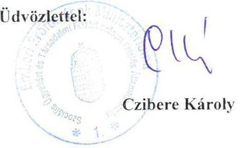

---

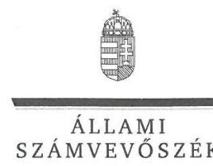

ELNÖK

# Balog Zoltán úr 

miniszter
Emberi Eröforrások Minisztériuma

## Budapest

## Tisztelt Miniszter Úr!

Köszönettel megkaptam a 2016. augusztus 1. napján az Állami Számvevőszékhez érkezett „ $A$ központi alrendszer egyes intézményei pénzügyi és vagyongazdálkodásának ellenörzése - Dr. Piróth Endre Szociális Központ" címủ számvevőszéki jelentéstervezetben foglalt megállapításokra a szociális ügyekért és társadalmi felzárkóztatásért felelős államtitkár úr által írásban tett észrevételt.

Az Állami Számvevőszék észrevételre vonatkozó álláspontjáról a felügyeleti vezető által készített részletes tájékoztatást mellékelten megküldöm.

Budapest, 2016. 08 hó /6 nap
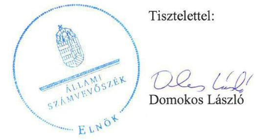

Melléklet: Tájékoztatás az elfogadott észrevételről

---

1. számú melléklet
a V-0967-168/2016. ikt. számú levélhez

# Tájékoztatás   az elfogadott észrevételről 

| 1. | Észrevétel: | Az 1.2. számú megállapítás 1 bekezdésében (18. oldal) a költségvetési beszámolók ellenőrzéséhez kapcsolódóan. |
| :--: | :--: | :--: |
|  | Válasz: | Az Állami Számvevőszék az észrevételt elfogadja. |
|  | Indoklás: | A helyszíni ellenőrzés során az Állami Számvevőszék rendelkezésére bocsátott dokumentumok ismételt áttekintése után az 1.2. számú megállapítás 1 bekezdés 2. mondatából az ,,SZGYF" kifejezést töröltük, a mondatot a következők szerint pontosítottuk (aláhúzással jelölve).   „A 2011. évre vonatkozóan a Közgyülés, a 2012. év tekintetében a MIK, a 2013-2014. évek esetében az EMMI elvégezte a költségvetési beszámolók ellenőrzését." |

Budapest, 2016. 08 hó $\sqrt{6}$ nap
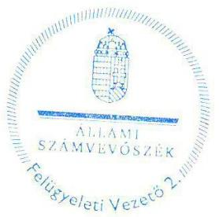

Salamon Ildikó
felügyeleti vezető

---

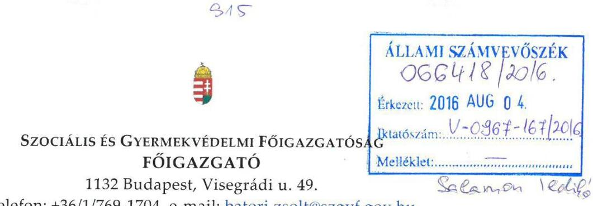

Iktatószám: SZGYF-IKT-8129/2016.
Ügyintéző: Palló Sándor

Tárgy: Észrevétel számvevőszéki jelentéstervezethez.

Domokos László úr
elnök

# Állami Számvevőszék 

Budapest
Apáczai Csere János u. 10
1051

## Tisztelt Elnök Úr!

Köszönettel megkaptam a V-0967-1657/2016 iktatószámú, a Dr. Piróth Endre Szociális Központ vonatkozásában „A központi alrendszer egyes intézményei pénzügyi és vagyongazdálkodásának ellenörzése" című ellenőrzésről készült számvevőszéki jelentéstervezetet tartalmazó levelet.

A vizsgált időszak alatt igen jelentős szervezeti és jogi környezetben bekövetkezett változások mellett végeztük munkánkat és az átalakulások jelenleg is érintik szervezetünket. Munkatársaimmal együtt folyamatosan arra törekszünk, hogy a vonatkozó szabályozásnak megfelelő szabályozott, hatékonyan és eredményesen működő közszolgáltatást teremtsünk meg.

A kézhez kapott jelentéstervezettel kapcsolatban a következőkben részletezett észrevételeket teszem, melyek elfogadása esetén kérem a jelentéstervezeten való átvezetést.

A javaslatokon belül:
A Szociális és Gyermekvédelmi Főigazgatóság mint középirányító szerv főigazgatójának:
Az 1. sz. javaslathoz: A jelentéstervezet nem tartalmaz a megállapítás alapjául szolgáló konkrét információt, arra vonatkozóan, hogy ezen a területen középirányítókén mit nem tettünk meg.

---

A hivatkozott időszak alatt folyamatos kontrollt gyakoroltunk a hatékony gazdálkodás biztositása érdekében. (belső ellenőrzés, vezetői és munkafolyamatba épített ellenőrzés: beszámolók, keret előrehozás, ill. költségvetési módosítások előzetes kontrollja, költségvetés tervezés kontrollja)

A vizsgált időszakban - 2012-ben került sor az intézmények „konszolidációjára" mely folyamat jelentősen átalakította a közfeladat ellátási rendszer egészét. Döntően a volt megyei önkormányzati intézmények müködési zavarinak elhárítása miatt került sor az állami feladatátvételre. A 2012. évi költségvetést a MÁK és a NÁK által meghatározott sarokszámokon belül kellett elkészítenünk. Általánosságban elmondható, hogy ezek a keretek az intézmények 2011. évi eredeti elöirányzatainak 80\%-ában lettek meghatározva. Az állami támogatás csökkenése ellenére az érintett időszakban a szakmai feladatellátás változatlan szinvonalon biztositott maradt.

A 2. sz. javaslathoz: A javaslattal egyetértünk, és egyben meg kivánjuk jegyezni, hogy a vagyonhasználati szerződés aláirása 2016.07.29-én megtörtént.

# A Szociális és Gyermekvédelmi Főigazgatóság minta Dr. Piróth Endre Szociális Központ gazdasági szervezeti feladatait ellátó szerv főigazgatójának: 

Az 1. sz. és a 2. sz. javaslatokhoz: A megállapítással egyetértünk, az említett szabályzatok mintaszabályzat formájában elkészültek, intézményi adaptációjuk folyamatban van.

A 4. számú javaslattal kapcsolatban tájékoztatom, hogy a 2014. évi elemi költségvetési beszámoló benyújtásának elhúzódását az okozta, hogy az NGM-től (előirányzat-módosítások miatt) a beszámoló újranyitását kellett kérni, melyet az NGM engedélyezett, ez a határidő meghosszabbításával járt.

Tájékoztatom, hogy a továbbiakban fel kívánjuk használni jelen ellenőrzés megállapításait, valamint az ellenőrzésben való közös munkánk tapasztalatait. A feltárt hiányosságok jelentős részét már az ellenőrzés során javítottuk, illetve pótoltuk.

Az ellenőrzés során tapasztalt segítő együttműködésüket köszönöm!

Budapest, 2016. augusztus „ $\square$ "."

Tisztelettel:
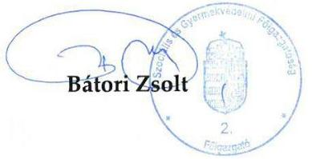

---

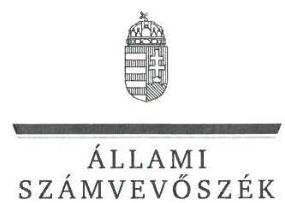

ELNÖK

Ikt.szám: V-0967-170/2016.

# Bátori Zsolt úr 

föigazgató
Szociális és Gyermekvédelmi Főigazgatóság

## Budapest

## Tisztelt Föigazgató Úr!

Köszönettel megkaptam a 2016. augusztus 4. napján az Állami Számvevőszékhez érkezett „A központi alrendszer egyes intézményei pénzügyi és vagyongazdálkodásának ellenörzése - Dr. Piróth Endre Szociális Központ" címủ számvevőszéki jelentéstervezetben foglalt javaslatokra írásban tett észrevételeket.

Tájékoztatom Főigazgató urat, hogy a jelentésben - az Állami Számvevőszékről szóló 2011. évi LXVI. törvény 29. § (3) bekezdése alapján - a figyelembe nem vett észrevételeket szerepeltetjük az elutasítás indokainak feltüntetésével együtt.

Az Állami Számvevőszék észrevételekre vonatkozó álláspontjáról a felügyeleti vezető által készített részletes tájékoztatást mellékelten megküldöm.

Budapest, 2016. ๑๕ hó 17 nap
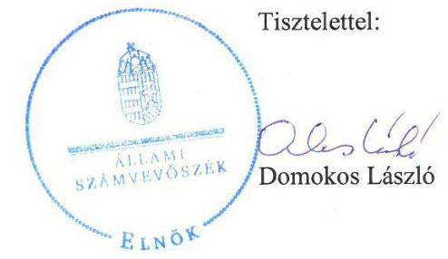

Melléklet: Tájékoztatás az el nem fogadott észrevételekről

---

# Tájékoztatás   az el nem fogadott észrevételekről 

|  | Javaslatokhoz kapcsolódó észrevételek |  |
| :-- | :-- | :-- |
|  | Észrevétel: | A Szociális és Gyermekvédelmi Főigazgatóság mint középirányító   szerv főigazgatójának címzett 1. számú javaslathoz (1.2. számú   megállapítás 4. bekezdés 2. mondata alapján) |
|  | Válasz: | Az Állami Számvevőszék az észrevételt nem fogadja el. |
|  |  | Az ellenőrzési megállapítás a jogszabályban foglaltak szerinti   részletezettséggel tartalmazza, hogy a Szociális és Gyermekvédelmi   Főigazgatóság (továbbiakban: SZGYF) a 2013-2014. évben a   Szociális és Gyermekvédelmi Főigazgatóságról szóló 316/2012.   (XI. 13.) Korm. rendelet 3. § (2) bekezdés g) pontjában elöírtak   ellenére „nem érvényesitette, nem kérte számon és nem ellenörizte az   elöirányzatokkal, létszámokkal és vagyonnal való hatékony   gazdálkodás követelményeit".   A helyszíni ellenőrzés során az Állami Számvevőszék rendelkezésére   bocsátott beszámolók, keret előrehozás, költségvetési módosítások,   költségvetési tervezés kontrollját biztosító dokumentumok a   szabályszerű gazdálkodás egyes területeinek érvényestését, számon   kérését igazolják, azonban az erőforrásokkal való hatékony   gazdálkodás követelményeinek érvényesítésére, számon kérésére,   ellenőrzésére vonatkozó információt nem tartalmaznak.   Az ellenőrzés - az Ellenőrzési programban foglaltak szerint - arra   irányult, hogy az irányító (illetve a középirányító) szerv   érvényesítette-e, számon kérte-e, ellenőrizte-e az erőforrásokkal való   hatékony gazdálkodáshoz szükséges követelményeket, amelyekkel   kapcsolatban dokumentumokat nem bocsátottak az ellenőrzés   rendelkezésére. Az Állami Számvevőszék ellenőrzése nem terjedt ki   az erőforrásokkal való gazdálkodás hatékonyságának, valamint a   szakmai feladatellátás színvonalának a megítélésére. Ennek   következtében az intézmények 2012. évi „konszolidációjával"   kapcsolatos tájékoztatásban foglaltak - amelyeket köszönettel   vettünk - az ellenőrzési megállapítást, valamint az ahhoz   kapcsolódóan tett javaslatot nem módosítják. |

---

|  | Észrevétel: | Javaslatokhoz kapcsolódó észrevételek   A Szociális és Gyermekvédelmi Főigazgatóság mint a Dr. Piroth Endre Szociális Központ gazdasági szervezeti feladatait ellátó szerv föigazgatójának címzett 4. számú javaslathoz (3.4. számú megállapítás 6. bekezdése alapján) |
| :--: | :--: | :--: |
| 2. | Válasz: | Az Állami Számvevőszék az észrevételt nem fogadja el. |
|  | Indoklás: | A javaslathoz kapcsolódó észrevétel a jelentéstervezet 3.4 számú megállapítás 6. bekezdésében szereplő megállapítást nem vitatja, annak körülményeiről ad tájékoztatást.   Az irányító szerv felé történő adatszolgáltatási kötelezettséget jogszabály - az államháztartás számviteléről szóló 4/2013. (I. 11.) Korm. rendelet 32. § (1) bekezdése - írta elő. A jogszabály szerint az éves költségvetési beszámoló megküldésének határideje a költségvetési évet követő év február 28-a.   Tekintettel arra, hogy az adatszolgáltatás teljesítésére a jogszabályban előírt határidőt követően került sor, a megállapítás és a kapcsolódó javaslat módosítása nem indokolt. |

Köszönettel vettük tájékoztatását a Szociális és Gyermekvédelmi Főigazgatóság mint középirányító szerv föigazgatójának címzett 2. számú javaslathoz, a Szociális és Gyermekvédelmi Főigazgatóság mint a Dr. Piróth Endre Szociális Központ gazdasági szervezeti feladatait ellátó szerv föigazgatójának címzett 1. és 2. számú javaslatokhoz kapcsolódóan a hiányosságok felszámolására, valamint az ellenőrzés megállapításainak tapasztalatainak a felhasználására vonatkozóan. Tájékoztatom Főigazgató urat, hogy az ellenőrzött időszakot követően megtett intézkedéseket az Állami Számvevőszék nem értékelte, azok az ellenőrzés megállapításait nem módosítják.

Budapest, 2016. 0 hó 14 nap
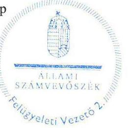

Salamon lidikó
felügyeleti vezető

---

# Dr. Piróth Endre Szociális Központ 

9086 Töltéstava-Táplánypuszta
Tel: 96/548-280, Fax: 96/548-289
E-mail: titkarsag@drpirothotthon.hu
Telephely: 9113 Koroncó - Zöldmajor
Tel/Fax: 06-96/556-082
E-mail: zoldmajor@efrikoronco.t-online.hu

## Állami Számvevőszék

1052 Budapest, Apáczai Csere János utca 10. Levéleim: 1364 Budapest 4. Pf. 54

## Domokos László

Elnök Úr
részére

Tisztelt Elnök Úr!

A V-0967-163/2016. iktatószámú „A központi alrendszer egyes intézményei pénzügyi és vagyongazdálkodásának ellenőrzése - Dr. Piróth Endre Szociális Központ" címmel készített számvevőszéki jelentéstervezetre az alábbi észrevételeket teszem.

1. Nincs észrevétel.
2. Nincs észrevétel.
3. Nincs észrevétel.
4. Nincs észrevétel.
5. A megállapítással egyetértünk, az Adatvédelmi szabályzat kidolgozása, ezzel kapcsolatban a feladatok és hatáskörök meghatározása folyamatban van.
6. Nincs észrevétel.
7. Nincs észrevétel
8. Nincs észrevétel
9. Nincs észrevétel
10. Folyamatba épített előzetes, utólagos és vezetői ellenőrzési szabályzat kiadása folyamatban.

Táplánypuszta, 2016. július 28.
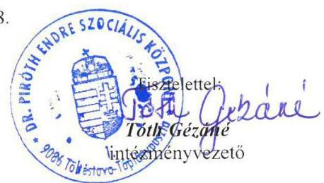

---

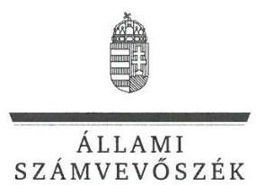

ELNÖK

Ikt.szám: V-0967-171/2016.

# Tóth Gézáné úrhölgy 

intézményvezető
Dr. Piróth Endre Szociális Központ

Töltéstava-Táplánypuszta

## Tisztelt Intézményvezető Úrhölgy!

Köszönettel megkaptam a 2016. augusztus 1. napján az Állami Számvevőszékhez érkezett „A központi alrendszer egyes intézményei pénzügyi és vagyongazdálkodásának ellenőrzése - Dr. Piróth Endre Szociális Központ" címủ számvevőszéki jelentéstervezetben foglalt javaslatokra írásban tett észrevételeket.

Tájékoztatom Intézményvezető úrhölgyet, hogy a jelentésben - az Állami Számvevőszékről szóló 2011. évi LXVI. törvény 29. § (3) bekezdése alapján - a figyelembe nem vett észrevételeket szerepeltetjük az elutasítás indokainak feltüntetésével együtt.

Az Állami Számvevőszék észrevételekre vonatkozó álláspontjáról a felügyeleti vezető által készített részletes tájékoztatást mellékelten megküldőm.

Budapest, 2016. 06 hó 17 nap
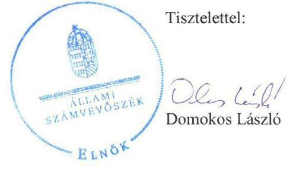

Melléklet: Tájékoztatás az el nem fogadott észrevételekről

---

# Tájékoztatás   az el nem fogadott észrevételekről 

Levelének 1-4., és 6-9. pontjaiban a számvevőszéki javaslatokkal kapcsolatban nem tett észrevételt. Az 5. pontban az adatvédelmi szabályzat kidolgozásával, ezzel kapcsolatban a feladatok és hatáskörök meghatározásával, a 10. pontban a folyamatba épített előzetes, utólagos és vezetői ellenőrzési szabályzat kiadásával kapcsolatosan adott tájékoztatást, amelyet köszönettel vettünk.

Tájékoztatom Intézményvezető Úrhölgyet, hogy az ellenőrzött időszakot követően megtett, illetve folyamatban lévő intézkedések az ellenőrzés megállapításait nem módosítják.

Budapest, 2016. C\& hó 14 nap
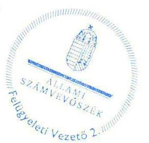

Salamon Ildikó
felügyeleti vezető

---

.

---

# RÖVIDÍTÉSEK JEGYZÉKE 

${ }^{1}$ ÁSZ
${ }^{2}$ PESZK
${ }^{3}$ MIK
${ }^{4}$ SZGYF
${ }^{5}$ KIM
${ }^{6}$ EMMI
${ }^{7}$ 258/2011. Korm. rendelet
${ }^{8}$ 316/2012. Korm. rendelet
${ }^{9}$ SZGYF főigazgató
${ }^{10}$ SZGYF Kirendeltség
${ }^{11}$ Konsztv.
${ }^{12}$ Alaptörvény
${ }^{13}$ Nvtv.
${ }^{14}$ Áht. 2
${ }^{15}$ Ávr.
${ }^{16}$ Áht. 1
${ }^{17}$ Ámr.
${ }^{18}$ Bkr.
${ }^{19}$ ÁSZ SZMSZ
${ }^{20}$ alapító okirat
${ }^{21}$ Közgyűlés
${ }^{22}$ Kincstár
${ }^{23}$ SZMSZ ${ }_{1,2,3,4}$

Állami Számvevőszék
Dr. Piróth Endre Szociális Központ
Győr-Moson-Sopron Megyei Intézményfenntartó Központ
Szociális és Gyermekvédelmi Főigazgatóság
Közigazgatási és Igazságügyi Minisztérium
Emberi Erőforrások Minisztériuma
a megyei intézményfenntartó központokról, valamint a megyei önkormányzatok konszolidációjával, a megyei önkormányzati intézmények és a Fővárosi Önkormányzat egészségügyi intézményeinek átvételével összefüggő egyes kormányrendeletek módosításáról szóló 258/2011.(XII.7.) Korm. rendelet (hatályos: 2011. december 8-tól)
316/2012. (XI. 13.) Korm. rendelet a Szociális és Gyermekvédelmi Főigazgatóságról
Szociális és Gyermekvédelmi Főigazgatóság Főigazgatója
Szociális és Gyermekvédelmi Főigazgatóság Győr-Moson-Sopron Megyei Kirendeltsége
a megyei önkormányzatok konszolidációjáról, a megyei önkormányzati intézmények és a Fővárosi Önkormányzat egyes egészségügyi intézményeinek átvételéről szóló 2011. évi CLIV. törvény
Magyarország Alaptörvénye (hatályos 2011. április 25-től)
2011. évi CXCVI. törvény a nemzeti vagyonról
2011. évi CXCV. törvény az államháztartásról (hatályos 2012. január 1-jétől)
368/2011. (XII. 31.) Korm. rendelet az államháztartásról szóló törvény végrehajtásáról (hatályos: 2012. január 1-jétől)
1992. évi XXXVIII. törvény az államháztartásról (hatálytalan: 2012.január 1-jétől) 292/2009. (XII. 19.) Korm. rendelet az államháztartás működési rendjéről (hatálytalan: 2012. január 1-jétől)
370/2011. (XII. 31.) Korm. rendelet a költségvetési szervek belső kontrollrendszeréről és belső ellenőrzéséről (hatályos 2012. január 1-jétől)
Állami Számvevőszék Szervezeti és Működési Szabályzata
alapító okirat: 63/2010.(II. 26.) Közgyűlési határozat, a Dr. Piróth Endre Mentálhigiénés Otthon Alapító Okirata (hatályos: 2011. február 26-tól)
alapító okirat: 131/2011.(VI.24.) Közgyűlési határozat, a Dr. Piróth Endre Szociális Központ Alapító Okirata (hatályos: 2011. június 24-től)
alapító okirat: a Dr. Piróth Endre Szociális Központ Alapító Okirata (hatályos: 2012. január 1-jétől)
alapító okirat: a Dr. Piróth Endre Szociális Központ Alapító Okirata (hatályos: 2012. április 1-jétől)
alapító okirat: a Dr. Piróth Endre Szociális Központ Alapító Okirata (hatályos: 2013. június 16-tól)
Győr-Moson-Sopron Megyei Önkormányzat Közgyűlése
Magyar Államkincstár
SZMSZ: 91/2010 (V. 27.) Közgyűlési határozat a Dr. Piróth Endre Mentálhigiénés Otthon Szervezeti és Müködési Szabályzatáról (hatályos: 2010. május 27-től)

---

${ }^{24}$ intézményvezető
${ }^{25}$ iratkezelési törvény
${ }^{26}$ iratkezelési szabályzat ${ }_{2}$
${ }^{27}$ Vtv.
${ }^{28}$ Közgyűlés elnöke
${ }^{29}$ Kjt.
${ }^{30}$ munkamegosztási megállapodás
${ }^{31}$ gazdasági szervezet ügyrendje ${ }_{1,2}$
${ }^{32}$ gazdálkodási szabályzat ${ }_{1,2,3,4}$
${ }^{33}$ FEUVE
${ }^{34}$ beolvadó intézmény
${ }^{35}$ Etikai Kódex
${ }^{36}$ közbeszerzési szabályzat ${ }_{1,2}$
${ }^{37}$ leltározási szabályzat ${ }_{1,2}$

SZMSZ: 122/2011. (XI.10.) Közgyűlési határozat a Dr. Piróth Endre Szociális Központ Szervezeti és Müködési Szabályzatáról (hatályos: 2011. november 10 -től)
SZMSZs: Dr. Piróth Endre Szociális Központ Szervezeti és Müködési Szabályzata (A MIK vezetőjének jóváhagyása hiányában nem lépett hatályba.)
SZMSZs: Dr. Piróth Endre Szociális Központ Szervezeti és Müködési Szabályzata (hatályos 2014. május 5-től)
a Dr. Piróth Endre Szociális Központ intézményvezetője
1995. évi LXVI. törvény a közokiratokról, a közlevéltárakról és a magánlevéltári anyag védelméről (hatályos 1996. január 1-jétől)
Iratkezelési szabályzat költségvetési intézmény részére (hatályos 2011. szeptember 1-jétől)
az állami vagyonról szóló törvény 2007. évi CVI. törvény (hatályos: 2007. szeptember 25-től)

Győr-Moson-Sopron Megyei Közgyűlés elnöke
a közalkalmazottak jogállásáról szóló 1992. évi CLXXV. törvény (hatályos: 2011. január 1-jétől)

JOG/105-5/2012. számú Munkamegosztási megállapodás a gazdasági feladatok ellátására (hatályos 2012. június 15-től)
gazdasági szervezet ügyendje1: Dr. Piróth Endre Mentálhigiénés Otthon Gazdasági szervezet intézményvezető által kiadott ügyrendje (hatályos 2004. július 1-jétől)
gazdasági szervezet ügyendje2: a Dr. Piróth Endre Szociális Központ Gazdasági szervezet intézményvezető által kiadott ügyrendje (hatályos 2011. szeptember 1jétől)
gazdálkodási szabályzat ${ }_{1}$ : Kötelezettségvállalás és utalványozás rendje (hatályos 2006. január 1-jétől)
gazdálkodási szabályzat2: Kötelezettségvállalás és utalványozás rendje (hatályos 2011. szeptember 1-jétől)
gazdálkodási szabályzat3: a Szociális és Gyermekvédelmi Főigazgatóság 7/2013. sz. Főigazgatói utasítása a kötelezettségvállalás, pénzügyi ellenjegyzés, teljesítésigazolás, érvényesítés, utalványozás rendjének szabályozásáról (a hatálya 2013. április 1-jétől kiterjedt a PESZK-re)
gazdálkodási szabályzat4: Szociális és Gyermekvédelmi Főigazgatóság 23/2013. sz. Főigazgatói utasítása a Gazdálkodási Szabályzat kiadásáról (hatályos 2013. szeptember 2-tól, a hatálya kiterjedt a PESZK-re)
Folyamatba épített, előzetes, utólagos és vezetői ellenőrzés rendszere (hatályos 2009. július 1-jétől)

Értelmi Fogyatékosok Rehabilitációs Intézménye, Koronczó-Zöldmajor
Dr. Piróth Endre Szociális Központ Etikai Kódexe (hatályos 2011. szeptember 1jétől)
közbeszerzési szabályzat1: a Dr. Piróth Endre Szociális Központ közbeszerzési szabályzata (hatályos 2005. június 1-jétől)
közbeszerzési szabályzat2: a Dr. Piróth Endre Szociális Központ eseti közbeszerzési szabályzata (hatályos 2013. november 12-től)
leltározási szabályzat1: a Dr. Piróth Endre Szociális Központ eszközök és források leltározási szabályzata (hatályos 2006. január 1-jétől)
leltározási szabályzat2: a Dr. Piróth Endre Szociális Központ eszközök és források leltározási szabályzata (hatályos 2011. szeptember 1-jétől a PESZK önálló gazdálkodási jogkörének megszünéséig, 2012. március 31-ig)

---

${ }^{38}$ pénzkezelési szabályzat ${ }_{1}$

39 számviteli politika ${ }_{1}$
${ }^{40}$ Számv. tv.
${ }^{41}$ értékelési szabályzat
${ }^{42}$ önköltségszámítási szabályzat
${ }^{43}$ bizonylati rend
${ }^{44}$ Áhsz $_{1}$

45 számlarend
${ }^{46}$ számviteli politika ${ }_{2}$
${ }^{47}$ pénzkezelési szabályzat ${ }_{2}$
${ }^{48}$ Áhsz. 2
${ }^{49}$ pénzkezelési szabályzat ${ }_{3}$
${ }^{50} \mathrm{Kbt} .{ }_{1}$
${ }^{51} \mathrm{Kbt} .2$
${ }^{52}$ Vnytv.
${ }^{53}$ iratkezelési szabályzat ${ }_{1,2}$

54 Avtv.
${ }^{55}$ Info tv.
${ }^{56}$ Ikr.
${ }^{57}$ közzétételi szabályzat
${ }^{58}$ adatvédelemi szabályzat
a Dr. Piróth Endre Szociális Központ pénzkezelési szabályzata (hatályos 2010. január 1-jétől a PESZK önálló gazdálkodási jogkörének megszűnéséig, 2012. március 31-ig)
a Dr. Piróth Endre Szociális Központ számviteli politikája (hatályos 2011. szeptember 1-től a PESZK önálló gazdálkodási jogkörének megszűnéséig, 2012. március 31-ig)
a számvitelről szóló 2000. évi C. törvény (hatályos 2001. január 1-jétől)
a Dr. Piróth Endre Szociális Központ eszközök és források értékelési szabályzata (hatályos 2011. szeptember 1-jétől a PESZK önálló gazdálkodási jogkörének megszűnéséig, 2012. március 31-ig)
a Dr. Piróth Endre Szociális Központ önköltségszámítási szabályzata (hatályos 2011. szeptember 1-jétől a PESZK önálló gazdálkodási jogkörének megszűnéséig, 2012. március 31-ig)

Dr. Piróth Endre Szociális Központ bizonylati rendje (hatályos 2011. szeptember 1-jétől)
az államháztartás szervezetei beszámolási és könyvvezetési kötelezettségének sajátosságairól szóló 249/2000. (XII. 24.) Korm. rendelet (Hatálytalan: 2014. január 1-jétől)
a Dr. Piróth Endre Szociális Központ számlarendje (hatályos 2004. július 1-jétől a PESZK önálló gazdálkodási jogkörének megszűnéséig, 2012. március 31-ig)
számviteli politika2: a Győr-Moson-Sopron Megyei Intézményfenntartó Központ 17/2012. (VIII. 28.) számú számviteli szabályzata, melynek hatálya kiterjedt a PESZK-re (hatályos 2012. augusztus 28-tól)
a Győr-Moson-Sopron Megyei Intézményfenntartó Központ vezetőjének 18/2012. (IX. 26.) sz. utasítása a pénzkezelési szabályzatról melynek hatálya kiterjedt a PESZK-re (hatályos a MIK 2013. március 31-i megszűnéséig)
az államháztartás számviteléről szóló 4/2013. (I. 11.) Korm. rendelet (hatályos 2014. január 1-jétől)
a Dr. Piróth Endre Szociális Központ pénzkezelési szabályzat és kötelezettségvállalás rendje szabályzata (kiadta az intézményvezető és az SZGYF Kirendeltségének igazgató helyettese, szabálytalan kiadmányozás miatt nem lépett hatályba)
2003. évi CXXIX. törvény a közbeszerzésekről (hatálytalan: 2012. január 1-jétől) 2011. évi CVIII. törvény a közbeszerzésekről (hatályos: 2011. augusztus 21-től) 2007. évi CLII. törvény az egyes vagyonnyilatkozat-tételi kötelezettségekről (hatályos 2008. január 1-jétől)
iratkezelési szabályzat1: a Dr. Piróth Endre Szociális Központ 2011. augusztus 31ig hatályos iratkezelési szabályzata
iratkezelési szabályzat ${ }_{2}$ : Iratkezelési szabályzat költségvetési intézmény részére (hatályos 2011. szeptember 1-jétől)
1992. LXIII. törvény a személyes adatok védelméről és a közérdekú adatok nyilvánosságáról (hatályos 1993. április 1-jétől)
2011. évi CXII. törvény az információs önrendelkezési jogról és az információszabadságról (hatályos 2011. július 27-től)
335/2005. (XII. 29.) Korm. rendelet a közfeladatot ellátó szervek iratkezelésének általános követelményeiről
a Dr. Piróth Endre Mentálhigiénés Otthon 2011. január 1-jétől hatályos Közzétételi szabályzata
Adatvédelemre, közadatok megjelentetésére vonatkozó szabályzat (hatályos 2011. szeptember 1-jétől)

---

${ }^{59}$ Eitv.
${ }^{60}$ Ltv.
${ }^{61}$ belső ellenőrzési kézikönyv ${ }_{1,2,3}$
${ }^{62}$ Ber.
${ }^{63}$ 5/2012. NGM rendelet
${ }^{64}$ 10/2013. NGM rendelet
${ }^{65}$ 1873/2013. Korm. határozat
${ }^{66}$ SZGYF Központi Igazgatósága
${ }^{67}$ 36/2013. NGM rendelet
${ }^{68}$ Ötv.
${ }^{69}$ önkormányzati vagyonrendelet
${ }^{70}$ MNV Zrt.
${ }^{71}$ átalakító okirat
2005. évi XC. törvény az elektronikus információszabadságról (hatályos 2006. január 1-jétől)
1995. évi LXVI. törvény a köziratokról, a közlevéltárakról és a magánlevéltári anyag védelméről (hatályos 1996. január 1-jétől)
belső ellenőrzési kézikönyv1: a Dr. Piróth Endre Mentálhigiénés Otthon Belső ellenőrzési szabályzata (hatályos 2000. március 1-jétől)
belső ellenőrzési kézikönyv2: a Győr-Moson-Sopron Megyei Intézményfenntartó Központ Belső ellenőrzési kézikönyv (hatályos 2012. március 30-tól, hatálya kiterjedt a PESZK-re)
belső ellenőrzési kézikönyv3: a Szociális és Gyermekvédelmi Főigazgatóság 21/2013. (VIII. 8.) sz. Főigazgatói utasítása (hatályos 2013. augusztus 9-től, hatálya kiterjedt a PESZK-re)
193/2003. (XI. 26.) Korm. rendelet a költségvetési szervek belső ellenőrzéséről (hatályos 2011. december 31-ig)
az elemi költségvetésről szóló 5/2012. (III. 1.) NGM rendelet
az elemi költségvetésről szóló 10/2013. (III. 13.) NGM rendelet
a 2012. évi kötelezettségvállalással nem terhelt előirányzat-maradványok egy részének felhasználásáról, a rendkívüli kormányzati intézkedések előirányzat megemeléséről és egyes kormányhatározatok módosításáról szóló 1873/2013. (XI. 25.) Korm. határozat

Szociális és Gyermekvédelmi Igazgatóság Központi Igazgatósága
36/2013. (IX. 13.) NGM rendelet az államháztartás számvitelének 2014. évi megváltoztatásával kapcsolatos feladatokról (hatályos: 2013. szeptember 13-tól) 1990. évi LXV. törvény a helyi önkormányzatokról

Győr-Moson-Sopron Megyei Önkormányzat 10/1995. (XII. 15.) számú rendelete a megyei önkormányzat vagyonáról és vagyonnal történő gazdálkodás szabályairól Magyar Nemzeti Vagyonkezelő Zártkörűen Müködő Részvénytársaság Értelmi Fogyatékosok Rehabilitációs Intézménye 130/2011. (VI. 24.) Képviselőtestületi határozattal elfogadott Átalakító Okirata

---

.

---

# ÁLLAMI SZÁMVEVŐSZÉK 

1052 Budapest, Apáczai Csere János utca 10.
Levélcím: 1364 Budapest 4. Pf. 54
Telefon: +36 14849100 Telefax: +36 14849200
www.asz.hu