# Jelentés 

## A központi alrendszer egyes intézményei ellenőrzése

A központi alrendszer egyes intézményei pénzügyi és vagyongazdálkodásának ellenőrzése - Szabolcs-Szatmár-Bereg Megyei Gyermekvédelmi Központ Tiszadob 2016. 09. hó 08. nap
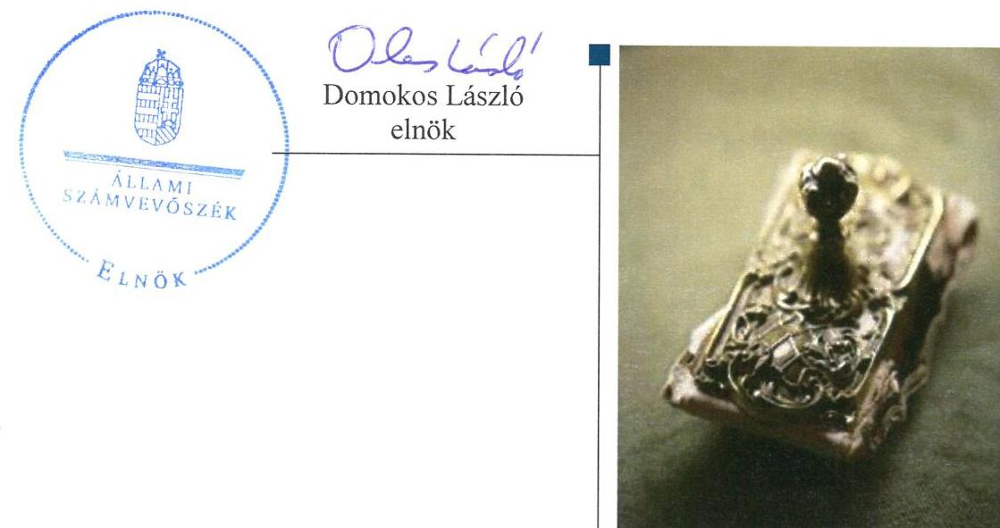

---

|  J | AZ ELLENŐRZÉST FELÜGYELTE:  |
| --- | --- |
|   | SALAMON ILDIKÓ felügyeleti vezető  |
|   | AZ ELLENŐRZÉST VEZETTE ÉS A VÉGREHAJTÁSÁÉRT FELELŐS:  |
|   | KOVÁTS TIBOR BALÁZS ellenőrzésvezető  |
|   | A PROGRAM ÖSSZEÁLLÍTÁSÁÉRT FELELŐS:  |
|   | JANIK JÓZSEF osztályvezető  |
|   | BÖRÖCZ IMRE projektfelelős  |
|   | A TÉMÁHOZ KAPCSOLÓDÓ KORÁBBI SZÁMVEVŐSZÉKI JELENTÉSEK:  |
|   | - címe: Jelentés Magyarország 2014. évi központi költségvetése végrehajtásának ellenőrzéséről  |
|  Jelentéseink az Országgyúlés számítógépes hálózatán és az Interneten a www.asz.hu címen is olvashatóak. | - sorszáma: 15167  |
|   | - címe: Jelentés a Szabolcs-Szatmár-Bereg Megyei Önkormányzat pénzügyi helyzetének ellenőrzéséről (43/2)  |
|   | - sorszáma: 1167  |
|   | IKTATÓSZÁM: V-0959-176/2016.  |
|   | TÉMASZÁM: 1993  |
|   | ELLENŐRZÉS-AZONOSÍTÓ SZÁM: V071313  |

---

# TARTALOMJEGYZÉK 

■ ÖSSZEGZÉS ..... 5
■ AZ ELLENŐRZÉS CÉLJA ..... 7
■ AZ ELLENŐRZÉS TERÜLETE ..... 8
■ AZ ELLENŐRZÉS HÁTTERE, INDOKOLTSÁGA ..... 10
■ FÓKUSZKÉRDÉSEK ..... 12
■ ELLENŐRZÉS HATÓKÖRE ÉS MÓDSZEREI ..... 13
■ MEGÁLLAPÍTÁSOK ..... 17
■ JAVASLATOK ..... 39
■ KÖVETKEZTETÉSEK ..... 40
■ MELLÉKLETEK ..... 41
I. sz. melléklet: Értelmező szótár ..... 41
II. sz. melléklet: A munkamegosztási megállapodás alapján az intézmény és a gazdálkodási feladatokat ellátók közötti felelősségi körök megosztása a 2012-2014. években ..... 46
III. sz. melléklet: A belső kontrollrendszer kialakításának és működtetésének értékelése a 2011-2014. években ..... 47
IV. sz. melléklet: A kiegészítő teljesítmény-ellenőrzési modul megállapításai ..... 48
V. sz. melléklet: Az integritás szemlélet érvényesítésével kapcsolatos megállapítások ..... 49
VI. sz. melléklet: A kiadási és bevételi előirányzatok és azok teljesítése a 2011-2014. években (E Ft-ban) ..... 50
■ FÜGGELÉK: ÉSZREVÉTELEK ..... 51
■ RÖVIDÍTÉSEK JEGYZÉKE ..... 67

---

# ÖSSZEGZÉS 

Az irányító szerveknek az intézményre vonatkozó feladatellátása - az EMMI feladatellátása kivételével - nem volt szabályszerű. Az intézményvezető által kialakított belső irányítási rendszer nem biztosította a szabályszerű, átlátható és elszámoltatható közpénzfelhasználást. A pénzügyi gazdálkodás nem volt szabályszerű, a bevételi előirányzatok teljesítése és a kiadási előirányzatok felhasználása során nem tartották be a jogszabályi előírásokat. A vagyongazdálkodás nem felelt meg a jogszabályi előírásoknak, az intézmény beszámolói nem mutattak a vagyoni, pénzügyi és jövedelmi helyzetről megbízható és valós képet. Az intézmény erőfeszítéseket tett az integritás szemlélet érvényesítése érdekében.

## Az ellenőrzés társadalmi indokoltsága

A közpénzek felhasználásában és az állami vagyonnal való gazdálkodásban a központi alrendszer egyes intézményei meghatározó súlyt képviselnek. E szervezetekkel szemben társadalmi igény, hogy tevékenységükről a döntéshozók és a nyilvánosság felé elszámoljanak. A társadalmi igénnyel és az ÁSZ ${ }^{1}$ Stratégiájával összhangban, a közpénzügyek átláthatóságának előmozdítása, a közvagyon védelme érdekében került sor a GYK² pénzügyi- és vagyongazdálkodásának ellenőrzésére. Az ellenőrzés által feltártak alapján kiemelten indokolt volt a számvevőszéki ellenőrzés lefolytatása.

## Főbb megállapítások, következtetések, javaslatok

A 2011. évben az Önkormányzat ${ }^{3}$ Közgyűlése ${ }^{4}$, a 2012. évben a KIM $^{5}$ irányítószervi feladatellátása, a 2012. évben a MIK $^{6}$, a 2013-2014. években az SZGYF ${ }^{7}$ középirányító szervi feladatellátása nem volt szabályszerű. A 2012. évben kiadott alapító okiratot 2012. január 30-ig a Kincstárhoz nem nyújtották be. A jóváhagyott SZMSZ a 2011. évben nem tartalmazta az alapítás időpontját, a 2012. és 2014. években pedig a hatályos alapító okirat keltét, számát és az alapítás időpontját.

Az intézmény ${ }^{8}$ belső kontrollrendszerének kialakítása és működtetése nem felelt meg a jogszabályi előírásoknak, ezért nem biztosította a szabályszerű, átlátható és elszámoltatható közpénzfelhasználást. Ezen belül a kontrollkörnyezet kialakítása, a kockázatkezelési rendszer, a kontrolltevékenység és a monitoring rendszer kialakítása és működtetése nem volt szabályszerű, továbbá az információs és kommunikációs rendszer kialakítása és működése összességében részben szabályszerű volt. A GYK-nál intézményi szintű kockázatelemzés nem készült, a jogszabály által előírt közzétételi kötelezettségüknek részben tettek eleget, illetve a kulcskontrollok működtetése és a belső ellenőrzés működése során hiányosságokat tárt fel az ellenőrzés.

Az intézmény pénzügyi gazdálkodása összességében nem felelt meg a jogszabályi előírásoknak. Az elemi költségvetés kialakítása és az előirányzatok megállapítása során - a 2014. év kivételével - nem tartották be a jogszabályi előírásokat. A bevételi és kiadási előirányzatok módosítása, a bevételi előirányzatok teljesítése és a kiadási előirányzatok felhasználása során a gazdálkodási jogkörök gyakorlása és az előirányzat-maradvány megállapítása, felhasználása nem felelt meg a jogszabályi előírásoknak. Közbeszerzési eljárást az intézménynél nem kellett lefolytatni. A folyamatos fizetőképesség - a 2011. év kivételével - biztosított volt.

Az intézmény vagyongazdálkodása a 2011-2014. években nem felelt meg a jogszabályi előírásoknak. A 2011. évben az intézmény a közfeladata ellátáshoz szükséges vagyont az Önkormányzat vagyongazdálkodási rendeletében és az alapító okiratban foglaltak alapján használta. A mérlegben kimutatott eszközök és források nyilvántartása, értékelése, leltározása nem felelt meg a jogszabályi előírásoknak. Az intézmény a közfeladata ellátáshoz szükséges ingatlan vagyont 2012. január 1-jétől szabálytalanul mutatta ki a könyveiben. A mérlegben hibásan kimutatott eszközök értéke

---

meghaladta a jelentős összegű hiba és a megbízható és valós képet lényegesen befolyásoló hiba mértékét, a beszámolók nem mutattak az intézmény vagyoni, pénzügyi és jövedelmi helyzetéről megbízható és valós képet. Az intézmény a selejtezési feladatokat nem szabályszerűen hajtotta végre. Az intézménynek értékmegőrzési, állagmegóvási kötelezettsége nem volt. Az állami tulajdonú ingatlanokon a 2012. és 2014. években végeztetett felújítás során nem tartotta be a jogszabályi előírásokat. A vagyonelemek hasznosítása a 2011-2014. években nem felelt meg a jogszabályi előírásoknak. Az eredményszemléletű számvitel bevezetésével kapcsolatos feladatok végrehajtása nem felelt meg a jogszabályi előírásoknak.

Az intézmény az integritás szemlélet érvényesítése érdekében erőfeszítéseket tett.
Az ÁSZ az emberi erőforrások miniszterének és az SZGYF mint középirányító szerv főigazgatójának az ellenőrzés által feltárt szabálytalanságok kivizsgálása érdekében fogalmazott meg javaslatokat.

---

# AZ ELLENŐRZÉS CÉLJA 

## Szabolcs-Szatmár-Bereg Megyei Gyermekvédelmi Központ Tiszadob pénzügyi és vagyongazdálkodásának ellenőrzése

## A SZABÁLYSZERŰSÉGI ELLENŐRZÉS

célja annak megítélése volt, hogy az ellenőrzött intézményre vonatkozó irányító szervi feladatellátás a jogszabályi előírások betartásával történt-e; az intézménynél a belső kontrollrendszer kialakítása és működtetése szabályszerű volt-e; kialakították-e az erőforrásokkal való szabályszerű, gazdaságos, hatékony és eredményes gazdálkodáshoz szükséges követelményeket, megvalósították-e azok számonkérését, ellenőrzését; az intézmény pénzügyi és vagyongazdálkodása megfelelt-e a jogszabályi előírásoknak és belső szabályzatainak; az intézmény átalakításának vagy átszervezésének lebonyolítása szabályszerűen történt-e.

Az intézmény korrupcióval szembeni veszélyeztetettségének csökkentése érdekében felmértük az integritási szemlélet érvényesülését a gazdálkodási folyamatokban.

A KIEGÉSZÍTŐ TELJESÍTMÉNY-ELLENŐRZÉSI MODUL célja annak értékelése volt, hogy a gazdálkodás folyamatában a gazdaságossági, hatékonysági és eredményességi követelmények kialakítása megtörtént-e, azokat működtették-e, a célkitűzéseket elérték-e; a pénzügyi és vagyongazdálkodás folyamataira vonatkozóan a költségvetési szerv belső kontrollrendszerének minőségéről kiadott vezetői nyilatkozatban a költségvetési szerv tevékenységében a hatékonyság, eredményesség, gazdaságosság követelményeinek érvényesítésére vonatkozó nyilatkozat helytálló volt-e.

---

# **AZ ELLENŐRZÉS TERÜLETE**

### **Szabolcs-Szatmár-Bereg Megyei Gyermekvédelmi Központ Tiszadob**

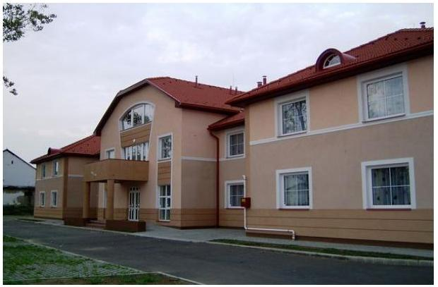

Tiszadobon 1950-től van jelen a gyermekvédelem, a Hajdúhadházon Ádám Zsigmond által létrehozott Gyermekváros költözött Andrássy Gyula korábbi tiszadobi kastélyába. Az intézmény a gyermekjóléti, gyermekvédelmi ellátórendszer hálózatának részeként működik, a Gyvtv.9 alapján szakellátás keretében biztosítja az ideiglenes hatállyal elhelyezett, az átmeneti és a tartós nevelésbe vett gyermek otthont nyújtó ellátását, a fiatal felnőtt további utógondozói ellátását, valamint a szakellátást más okból igénylő gyermek teljes körű ellátását. A gyermekotthon, lakásotthonok, 3 éves kortól 21 éves korig, felsőfokú tanulmányokat folytató fiatalok esetében 25 éves korig, a különleges lakásotthonok 6 éves kortól 24 éves korig fogadnak be gyermeket és fiatal felnőttet. Jelenleg az intézményben elhelyezett gyermekek és fiatal felnőttek száma 60 fő, ebből 11 lány és 49 fiú, utógondozói otthonban elhelyezett fiatal felnőttek száma 6 fő.

Az intézmény a 2011. évben önkormányzati alrendszerbe tartozott, az Önkormányzat fenntartásában működött. Az intézmény gazdálkodási besorolása 2011. január 1. és február 28. között önállóan működő és gazdálkodó volt, majd 2011. március 1-jétől az önálló gazdálkodási jogköre megszűnt. Az intézmény a 2012. évtől a központi alrendszerbe került át, az intézmény irányítószerve a KIM, a középirányító szerve a MIK lett. A 2013. évtől az intézmény irányítószerve az EMMI10 lett, a középirányító szerve – a MIK egyetemleges jogutódja – az SZGYF lett.

Az alapítói, fenntartói, irányítói jogkörgyakorlók változását az 1. táblázat mutatja be:

1. táblázat

|  ALAPÍTÓI, FENNTARTÓI, IRÁNYÍTÓI JOGKÖRGYAKORLÓK VÁLTOZÁSAI |  |  |  |   |
| --- | --- | --- | --- | --- |
|   | Alapító | Irányító | Középirányító | Fenntartó  |
|  2011. | Önkormányzat | Önkormányzat | - | Önkormányzat  |
|  2012. | KIM | KIM | MIK | MIK  |
|  2013. | EMMI | EMMI | SZGYF | SZGYF  |
|  2014. | EMMI | EMMI | SZGYF | SZGYF  |

*Forrás: a GYK 2011-2014 közötti alapító okiratai*

Az intézmény vezetőjének megbízása a Konsz. tv.11 alapján 2012. március 31-én megszűnt és 2012. április 1-jétől – a kiírt pályázat alapján – a jelenlegi intézményvezető kinevezésére került sor. A GYK 2011. február 28-ig önállóan működő és gazdálkodó költségvetési szerv volt, gazdasági vezetővel, a gazdálkodási feladatokat ellátó gazdasági egységgel rendelkezett. 2011. március 1-jétől az Önkormányzat Közgyűlése által hozott 1/2011. (01. 27.) számú határozatnak megfelelően önállóan működő költségvetési szervvé alakult, gazdasági vezetővel, gazdálkodási feladatokat ellátó gazdasági egységgel nem rendelkezett.

---

A Közgyűlés határozata alapján 2011. március 1-jétől az intézménytől a gazdálkodással összefüggő feladatok ellátását a GIG ${ }^{12}$ vette át, aki az intézménnyel együttműködési megállapodást ${ }_{1}{ }^{13}$ kötött, amely 2011. március 1-jén lépett hatályba. Az intézmény gazdálkodással összefüggő feladatait a 258/2011. (XII. 7.) Korm. rendelet ${ }^{14}$ 15. § (2) bekezdésének előírása alapján 2012. január 1-jétől a MIK végezte. A gazdálkodással összefüggő feladatok ellátásának megosztását az intézmény által a MIK-kel kötött együttműködési megállapodás ${ }_{2}{ }^{15}$ szabályozta. Az együttműködési megállapodás ${ }_{2}$ 2012. április 2-án lépett hatályba. A gazdálkodással összefüggő feladatok felelősségi köreinek megosztását a II. sz. melléklet tartalmazza. A MIK 2013. március 31-én a 258/2011. (XII. 7.) Korm. rendelet 18. § (2) bekezdésének előírása alapján az SZGYF-be történő beolvadással megszűnt, feladatait egyetemleges jogutódként az SZGYF látta el.

A Konsz. tv. értelmében a megyei önkormányzatok fenntartásában lévő intézmények, azok
 vagyona és vagyoni értékű jogai 2012. január 1-jén a törvény erejénél fogva állami tulajdonba kerültek. A vagyon átadásáról szóló átadás-átvételi megállapodást 2011. december 29-én írták alá. Az önkormányzati alrendszerből átkerült intézményi vagyon tekintetében 2012. január 1-jétől a tulajdonosi jogokat - a Vtv. ${ }^{16}$ alapján - az állami vagyon felügyeletéért felelős miniszter gyakorolta, aki e feladatát az MNV Zrt. ${ }^{17}$ útján látta el. A vagyonkezelői jogokat 2012. január 1-jétől - a 258/2011. (XII. 7.) Korm. rendelet alapján - a MIK gyakorolta, aki az MNV Zrt.-vel 2012. szeptember 28-án vagyonkezelői szerződést kötött. A 2012. évben a MIK, míg a 2013-2014. években az SZGYF - a Vtv. és a Vtvr. ${ }^{18}$ alapján - a vagyonkezelési szerződésben előírtaknak megfelelően jogosult lett volna vagyonkezelésükben lévő, az intézmény közfeladatainak ellátásához szükséges ingatlanvagyon használati jogát átengedni.

Az intézményben dolgozók átlagos statisztikai állománya a 2011-2012. években 52 fő, a 2013. évben 50 fő és a 2014. évben 58 fő volt. Az éves költségvetési beszámolók alapján a teljesített bevétel a 2011. évi 212,5 M Ft-ról a 2014. évre 271,2 M Ft-ra nőtt. A teljesített kiadások összege a 2011. évben 212,9 M Ft volt, ami a 2014. évre 250,3 M Ft-ra nőtt.

Az intézmény 2016. június 30-val megszűnt és július 1-jével beolvadt a Mátészalka székhelyű, Szabolcs-Szatmár-Bereg Megyei Gyermekvédelmi Központba, amely a jogutódlást követően ellátja az intézmény közfeladatait.

---

# AZ ELLENŐRZÉS HÁTTERE, INDOKOLTSÁGA 

A központi alrendszer egyes intézményei pénzügyi és vagyongazdálkodásának ellenőrzése.

## Hasznosulás

Az Alaptörvény ${ }^{19}$ rendelkezése szerint a nemzeti vagyon megőrzésének, védelmének és a nemzeti vagyonnal való felelős gazdálkodásnak a követelményeit sarkalatos törvény, az Nvtv. ${ }^{20}$ rögzíti. A tulajdonosi joggyakorlás és vagyonkezelés általános és speciális szabályait, az állami vagyon nyilvántartására és elszámolására vonatkozó eljárásokat, a vagyonkezelési szerződés feltételrendszerét, valamint az éves beszámoló készítési és könyvvezetési kötelezettségeket kormányrendelet írja elő.

A központi alrendszer egyes intézményei közfeladat-ellátásának változásait, a közfeladatok átadásából és átvételéből adódó módosításait, előirányzat-gazdálkodására ható tényezőit az Áht. ${ }^{21}$ 11. §-a és az Ávr. ${ }^{22}$ 14. §-a írja elő. A közfeladatok megszűnéséből, intézmény átszervezéséből, belső szerkezeti korszerűsítéséből, vagy más hasonló okból adódó módosításai miatt szerepeltetendő szerkezeti változásokat, valamint a szerkezeti változásként beépült közfeladatok szintre hozásként történő számításba vételét az Ávr. 15. § (2)-(3) bekezdései határozzák meg. A társadalmi igénynyel összhangban az Áht. ${ }^{23}$ és Áht. ${ }_{2}$, az Ámr. ${ }^{24}$ és a Bkr. ${ }^{25}$ is előírja a költségvetési szerv részére, hogy olyan szabályozásokat, eljárásokat, folyamatokat alakítson ki, amelyek biztosítják a működés, gazdálkodás, az erőforrások felhasználása során a gazdaságosság, hatékonyság és eredményesség érvényesülését. Az Ámr. és a Bkr. alapján az intézmény vezetőjének évente nyilatkoznia is kell arról, hogy gondoskodott-e az intézmény tevékenységében a gazdaságosság, hatékonyság és eredményesség követelményeinek érvényesítéséről. A gazdaságos, hatékony és eredményes gazdálkodáshoz szükség van a teljesítménymérés feltételeinek kialakítására, úgymint az egyértelmű és mérhető célokra, mutatószámokra és az ezekhez rendelt követelményekre. Az ÁSZ jelen ellenőrzéssel győződött meg arról, hogy az intézménynél a teljesítménycélokat, -mutatókat, -követelményeket kialakították-e, azokat működtették-e, a kitűzött cél(ok) teljesültek-e.

AZ ELLENŐRZÉS EREDMÉNYEKÉPPEN nemcsak az ellenőrzött intézmények gazdálkodása javulhat, hanem átfogó képet kaphatunk a központi alrendszerbe tartozó költségvetési szervek gazdálkodásának hiányosságairól, de a jó gyakorlatokról is. Ellenőrzéseivel, javaslataival és megállapításaival az ÁSZ elősegítheti a költségvetési szervek pénzügyi és vagyongazdálkodása szabályozásának javítását és hozzájárulhat a jó kormányzáshoz. Az ellenőrzés az ellenőrzött számára visszajelzést ad a pénzügyi és vagyongazdálkodásában feltárt hiányosságokról, javaslataival hozzájárul azok kiküszöböléséhez, amely csökkentheti a későbbi ellenőrzések gyakoriságát. Az ellenőrzés megállapításait és javaslatait más szervezetek is hasznosíthatják a rendezett gazdálkodási keretek kialakításához.

---

# A TELJESÍTMÉNY-ELLENŐRZÉSI KIEGÉSZÍTŐ 

MODUL alapján elvégzett ellenőrzés a törvényalkotás számára támogatást nyújt a nemzeti kulcsindikátorok rendszerének kialakításához. A döntéshozók, ellenőrzöttek, irányító szervek, a társadalom számára az összehasonlítási, összemérési lehetőségek kihasználásával objektív visszajelzést ad a gazdálkodás területén végrehajtott szervezeti, szervezési, takarékossági és bürokráciacsökkentő intézkedések hatásairól, a közfeladat-ellátásnak keretet adó pénzügyi és vagyongazdálkodásban mérhető teljesítménykövetelmények kialakításáról, azok alkalmazásáról.

---

# FÓKUSZKÉRDÉSEK 

1.     - Az irányító szerv ellenőrzött intézményre vonatkozó feladatellátása szabályszerű volt-e?
2.     - A belső kontrollrendszer kialakítása és működtetése megfelelt-e a jogszabályi előírásoknak?
3.     - Az intézmény pénzügyi gazdálkodása szabályszerű volt-e?
4.     - Az intézmény vagyongazdálkodása szabályszerű volt-e?
5.     - Szabályszerűen hajtották-e végre az ellenőrzött időszakban az intézményt érintő szervezeti, szerkezeti átalakításokat?
6.     - Az intézmény intézkedett-e az integritás szemlélet érvényesítése érdekében?

---

# ELLENŐRZÉS HATÓKÖRE ÉS MÓDSZEREI 

## Az ellenőrzés típusa

Szabályszerűségi ellenőrzés, amelyet teljesítmény-ellenőrzési modul egészített ki.

## Az ellenőrzött időszak

Az ellenőrzött időszak 2011. január 1-jétől 2014. december 31-ig terjedő időszak volt.

## Az ellenőrzés tárgya

Az ellenőrzött szervezetre vonatkozó irányító szervi feladatok ellátása. Az intézmény belső kontrollrendszerének kialakítása és működtetése, valamint pénzügyi és vagyongazdálkodása. Az erőforrásokkal való szabályszerű, gazdaságos, hatékony és eredményes gazdálkodáshoz szükséges követelmények kialakítása, a kialakított követelmények számonkérés, ellenőrzése. Az intézmény átalakítása, átszervezése lebonyolításának szabályszerűsége.

A teljesítmény-ellenőrzési kiegészítő modul esetében az intézmény gazdálkodás folyamatában a gazdaságossági, hatékonysági és eredményességi követelmények kialakítása és működtetése, a célkitűzések teljesítésének értékelése. Az intézmény tevékenységében a hatékonyság, eredményesség, gazdaságosság követelményei érvényesítéséről kiadott nyilatkozat helytállósága. A teljesítmény-ellenőrzés fókuszkérdéseire a IV. sz. melléklet ad választ.

Az ellenőrzés kiterjedt minden olyan körülményre és adatra, amely az ÁSZ jogszabályban meghatározott feladatainak teljesítéséhez, valamint a program végrehajtása folyamán felmerült újabb összefüggések feltárásához szükséges volt.

## Az ellenőrzött szervezet

A Szabolcs-Szatmár-Bereg Megyei Gyermekvédelmi Központ Tiszadob, a Szabolcs-Szatmár-Bereg Megyei Önkormányzat, a Közigazgatási és Igazságügyi Minisztérium, az Emberi Erőforrások Minisztériuma, a Sza-bolcs-Szatmár-Bereg Megyei Önkormányzat Gazdasági Igazgatósága, a Szabolcs-Szatmár-Bereg Megyei Intézményfenntartó Központ, a Szociális és Gyermekvédelmi Főigazgatóság. A Közigazgatási és Igazságügyi Minisztérium jogutódjaként az Igazságügyi Minisztérium, valamint a Miniszterelnökség adatot szolgáltatott az ellenőrzéshez.

---

Az ellenőrzésre a központi alrendszer ellenőrzött intézményének és irányító/felügyeleti szervének, illetve középirányító szervének székhelyén, telephelyén, a gazdálkodási feladatait ellátó szervezetének székhelyén került sor.

# Az ellenőrzés jogalapja 

Az ellenőrzés jogszabályi alapját az ÁSZ tv. ${ }^{26}$ 1. § (3) bekezdése, az 5. § (2)(6) bekezdései, valamint az Áht. 261. § (2) bekezdésének előírásai képezték.

## Az ellenőrzés módszerei

Az ellenőrzést az ellenőrzési program szempontjai, az ellenőrzött időszakban hatályos jogszabályok, az ellenőrzés szakmai szabályai, az egyes ellenőrzési típusokhoz kapcsolódó ÁSZ módszertanok és nemzetközi standardok figyelembevételével végeztük. A gazdálkodás hibáinak kijavítására, a közpénzekkel való felelős gazdálkodás segítésére irányuló javaslatok kidolgozásakor a hatályos jogszabályok az irányadóak.

Az ellenőrzés ideje alatt az ellenőrzött szervezettel történő kapcsolattartást az ÁSZ SZMSZ ${ }^{27}$-ének vonatkozó előírásai alapján biztosítottuk.

Az ellenőrzési kérdések megválaszolásához szükséges bizonyítékok megszerzése a következő ellenőrzési eljárások alkalmazásával történt: megfigyelés, szemle (szemrevételezés), kérdésfeltevés (információkérés), mintavételezés, valamint elemző eljárás. A minták kiválasztása során elsősorban reprezentativitást biztosító véletlen mintavételi eljárást alkalmaztunk.

Az ellenőrzési bizonyítékként felhasználható adatforrások közé tartoztak egyrészt a szakmai program részletes szempontjainál felsorolt adatforrások, másrészt adatforrás volt minden egyéb - az ellenőrzés folyamán feltárt, az ellenőrzés szempontjából releváns információt tartalmazó - dokumentum.

Az ellenőrzés lefolytatásához az intézmény a tanúsítványok elektronikus kitöltésével, valamint az ÁSZ által kért dokumentumok elektronikus megküldésével szolgáltatott adatokat. A rendelkezésre bocsátott adatok, információk kontrollja az ellenőrzés keretében történt.

Az ellenőrzési kérdésekre adott válaszok alapján értékeltük, hogy az ellenőrzött időszakban az irányító szervek és a középirányító szervek az ellenőrzött intézményre vonatkozó feladatainak szabályszerűen eleget tette, az intézmény pénzügyi és vagyongazdálkodása megfelelt-e az előírásoknak, az intézmény átalakításának vagy átszervezésének végrehajtása szabályszerű volt-e. Értékeltük, hogy az intézménynél kialakították-e az erőforrásokkal való szabályszerű és hatékony gazdálkodáshoz szükséges követelményeket, megvalósították-e azok számonkérését, ellenőrzését.

Az intézmény belső kontrollrendszere jogszabályi előírások szerinti kialakításának és működtetésének szabályszerűségét az erre irányuló ellenőrzési kérdésekre adott válaszok összesítése alapján, évente pillérenként (kontrollkörnyezet, kockázatkezelési rendszer, kontrolltevékenységek, in-

---

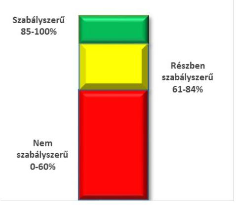
formációs és kommunikációs rendszer, monitoring rendszer) és összesítetten is minősítettük. Az intézmény belső kontrollrendszere egyes pilléreinek kialakítása és működtetése „szabályszerű" volt, amennyiben az értékelt területen az elért és elérhető pontok százalékban kifejezett, egész számra kerekített hányadosa meghaladta a 84%-ot, „részben szabályszerű" volt, ha a 84%-ot nem haladta meg, de 60%-nál nagyobb volt, „nem szabályszerű" volt, ha nem haladta meg a 60%-ot. Az intézmény belső kontrollrendszerének összesített értékelése megegyezett a pillérenként (kontrollterületenként) alkalmazott %-os értékelésekkel, a következő eltérésekkel. A kontrollrendszer egésze esetében a „szabályszerű" értékelésnek a %-os értéken felül további feltétele volt, hogy egyik kontrollterület sem kaphatott „nem szabályszerű" értékelést, a „részben szabályszerű" értékelés további feltétele volt, hogy legfeljebb egy ellenőrzött kontrollterület lehetett „nem szabályszerű" értékelésű. Az összesített értékelés a %-os értéktől függetlenül „nem szabályszerű" volt, ha az ellenőrzött kontrollterületek közül több mint egynek „nem szabályszerű" volt az értékelése.

A tárgyi eszközök nyilvántartásba vételénél tételes ellenőrzést folytattunk. A vagyonhasznosítási bevételi előirányzatok teljesítésének, az előirányzatok módosításának és az előirányzat-maradvány megállapításának, valamint a gazdálkodási jogkörök gyakorlásának szabályszerűségét mintavétellel ellenőriztük. A jogszabályoknak és a belső előírásoknak megfelelőnek, azaz szabályszerűnek tekintettük a vagyonhasznosítási bevételi előirányzatok teljesítését, az előirányzatok módosítását és az előirányzat-maradvány megállapítását, amennyiben a minta ellenőrzésének eredménye alapján 95%-os bizonyossággal a teljes sokaságban a hibás tételek aránya kisebb volt, mint 10%, nem megfelelőnek értékeltük, ha a hibás tételek aránya a 10%-ot meghaladta. Kockázatot, illetve magas kockázatot jeleztünk, amennyiben egy adott terület vonatkozásában a minta alapján a teljes sokaságban nem volt egyértelműen biztosított a jogszabályoknak és a belső szabályzatoknak megfelelő működés.

A 2011. évet érintően a szakmai teljesítésigazolás és az utalvány ellenjegyzése kulcskontrollok, a 2012-2014. éveket érintően a teljesítésigazolás és az érvényesítés kulcskontrollok működését értékeltük. Megfelelőnek értékeltük a gazdálkodási jogkörök gyakorlását, amennyiben 95%-os bizonyossággal a teljes sokaságban a hibás tételek aránya legfeljebb 10% volt, részben megfelelőnek, ha a hibás tételek arányának felső határa legfeljebb 30% volt, nem megfelelőnek, ha a hibás tételek sokaságbeli arányának felső határa meghaladta a 30%-ot.

Az integritás szemlélet érvényesülésének értékelése az intézmény által kitöltött tanúsítványa alapján történt.

Az alapprogram alapján ellenőriztük, hogy a költségvetési szerv vezetője megtette-e nyilatkozatát arról, hogy gondoskodott a költségvetési szerv tevékenységében a hatékonyság, eredményesség és a gazdaságosság követelményeinek érvényesítéséről. Ezt kiegészítve, a teljesítmény-ellenőrzési kiegészítő modul keretében - felhasználva az alapprogram szerinti ellenőrzés megállapításait - értékeltük, hogy a költségvetési szerv vezetője kialakította-e a gazdaságossági, hatékonysági és eredményességi követelményeket, és azokat működtette-e, a célkitűzéseket elérte-e.

A teljesítmény-ellenőrzési kiegészítő modul a gazdálkodási feladatokra terjedt ki, a szakmai feladatellátást nem értékelte.

A gazdálkodási feladatok értékelése az alábbi területekre terjedt ki:

---

$\longrightarrow$ pénzügyi gazdálkodási (nem szakmai, adminisztratív) feladatok: költségvetés-, beszámoló-készítés,
 könyvvezetés, adatszolgáltatások, előirányzat-gazdálkodás, kötelezettségvállalások nyilvántartása, kezelése, bevételkezelés, bér- és illetményszámfejtés;
$\longrightarrow$ vagyongazdálkodási (logisztikai) feladatok: közbeszerzések és közbeszerzési értékhatárt el nem érő beszerzések, készletgazdálkodás, nyomtatók, fénymásolók üzemeltetése, épület- és ingatlanüzemeltetés, karbantartás, hibabejelentés, gépjármű és flottamenedzsment.
Az ellenőrzés során minden olyan körülményt és adatot is ellenőriztünk, amely a program végrehajtása kapcsán felmerült újabb összefüggéseknek az ellenőrzés céljaival összhangban lévő feltárásához szükséges volt. A teljesítmény-ellenőrzési kiegészítő programmodulban megfogalmazott ellenőrzési cél megválaszolásához az alapprogram végrehajtása során megfogalmazott megállapításokat is figyelembe vettük.

---

# 1. Az irányító szerv ellenőrzött intézményre vonatkozó feladatellátása szabályszerű volt-e? 

## Összegző megállapítás

### 1.1. számú megállapítás

Az irányító és középirányító szervek feladatellátása nem felelt meg a jogszabályi előírásoknak.

Az alapítói jogok gyakorlása - az EMMI feladatellátása kivételével - nem felelt meg a jogszabályi előírásoknak.

Az intézményt érintően az alapítói jogokat 2011. december 31-éig a Közgyűlés gyakorolta. Az államháztartás önkormányzati alrendszeréből a központi alrendszerbe történt átsorolást követően, 2012. január 1-jétől az alapítói jogokat a KIM, 2013. január 1-jétől az EMMI gyakorolta. Az egyes fenntartói, valamint az irányítási, középirányítói jogokat 2012. január 1-jétől a MIK - a középirányító szerv vezetője a 258/2011. (XII. 7.) Korm. rendelet 11. § (1) bekezdésében meghatározott hatásköreit, jogait és feladatait a kormánymegbízott egyetértésével - gyakorolta.

Az intézmény a 2011-2014. évek között az Áht. 1 és az Áht. 2 előírásainak megfelelően rendelkezett alapító okirattal ${ }^{18}$, melyeket a 2011. évben a Közgyűlés határozattal fogadott el, 2012. évben a közigazgatási és igazságügyi miniszter, 2013-2014. években pedig az emberi erőforrások minisztere adott ki.

Az intézmény alapító okiratát a Közgyűlés 2011-ben három alkalommal módosította, azonban az első két módosítás után - az Ámr. 10. § (10) bekezdésében előírtak ellenére - a módosító okirathoz nem készítették el és nem csatolták az egységes szerkezetbe foglalt alapító okiratot.

Az irányító szervi változást követően a KIM minisztere 2012. szeptember 28-án, 2012. január 1-jei hatályú új alapító okiratot adott ki, azonban a MIK által fenntartásába átvett költségvetési intézmény alapító okiratának módosítását - a 258/2011. (XII. 7.) Korm. rendelet 21. § (6) bekezdésében előírtak ellenére - 2012. január 30-ig a Kincstárhoz ${ }^{29}$ nem nyújtotta be.

Az EMMI minisztere 2013. január 1-jei hatállyal új alapító okiratot adott ki, majd 2014. évben a kormányzati funkció szerinti megjelöléssel módosította.

Az intézmény az ellenőrzött időszakban hatályos, irányító szerv által jóváhagyott SZMSZ ${ }^{30}$-szel rendelkezett. Az intézmény a 2011-2014. években többször módosította az SZMSZ-ét, amelyeket az irányító szerv jóváhagyott. Az SZMSZ 2011. július 13-tól - az Ámr. 20. § (2) bekezdés b) pontjában előírtak ellenére - nem tartalmazta az alapítás időpontját, 2012. június 13-tól - az Ávr. 13. § (1) bekezdés b) pontjában előírtak ellenére - nem tartalmazta a hatályos, egységes szerkezetbe foglalt alapító okirat keltét, számát és az alapítás időpontját, míg 2014. szeptember 5-től - az Ávr. 13. § (1) bekezdés b) pontjában előírtak ellenére - nem tartalmazta a hatályos, egységes szerkezetbe foglalt alapító okirat keltét és számát.

---

### 1.2. számú megállapítás

A közfeladatok ellátására vonatkozó, az erőforrásokkal való szabályszerű gazdálkodáshoz szükséges követelményeket a 2011. évben a Közgyűlés érvényesítette, azonban nem ellenőrizte. A középirányító szervek a 2012-2014. években az erőforrásokkal való szabályszerű gazdálkodáshoz szükséges követelményeket nem érvényesítették és a 2012. évben nem ellenőrizték. A hatékony gazdálkodáshoz szükséges követelményeket a Közgyűlés és a középirányító szervek nem érvényesítették, nem kérték számon és nem ellenőrizték.

Az erőforrásokkal való gazdálkodás szabályszerűségi követelményeit a Közgyűlés rendeletekben, határozatokban rögzítette. A 2012. évre a KIM, a 2013-2014. évekre az EMMI körlevelekben határozta meg az éves költségvetési beszámoló, valamint a szöveges indoklás tartalmi követelményeit és az elkészítési határidejét. A 2011. évre vonatkozóan a Közgyűlés, a 2012. évre vonatkozóan a MIK, a 2013-2014. évekre vonatkozóan az EMMI elvégezte a költségvetési beszámolók ellenőrzését.

A 2012. évben a MIK, míg a 2013-2014. években az SZGYF a vagyonkezelésében lévő vagyon tekintetében - a Vtv. 27. § (2) bekezdésében, valamint az Nvtv. 7. § (2) bekezdésében előírtak ellenére - nem gondoskodott a vagyon átlátható működtetéséről, mivel az intézmény a közfeladat ellátásához szükséges állami vagyon tekintetében - Nvtv. 3. § (1) bekezdés 11. pontjában előírtak ellenére - jogcímmel nem rendelkezett, ezért nem minősült a nemzeti vagyon jogszerű használójának. Ezért a 2012. évben a MIK, míg a 2013-2014. években az SZGYF - a 258/2011. (XII. 7.) Korm. rendelet 11. § (2) bekezdés d) pontjában, illetve 316/2012. Korm. rendelet ${ }^{31}$ 3. § (2) bekezdés g) pontjában előírtak ellenére - nem érvényesítette az erőforrásokkal, így különösen a vagyonnal való szabályszerű gazdálkodáshoz szükséges követelményeket.

A 2011. évben - az Áht. 3 49. § (5) bekezdés f) pontjában előírtak ellenére - a Közgyűlés, míg a 2012. évben - a 258/2011. (XII. 7.) Korm. rendelet 11. § (2) bekezdés d) pontjában előírtak ellenére - a MIK az intézménynél az erőforrásokkal való szabályszerű gazdálkodás vonatkozásában ellenőrzést nem hajtott végre. A 2013-2014. évek között az SZGYF az erőforrásokkal való szabályszerű gazdálkodás vonatkozásában ellenőrzéseket végzett.

A Közgyűlés a 2011. évben - az Áht. 1 49. § (5) bekezdés f) pontjában foglaltak ellenére - nem érvényesítette, nem kérte számon és nem ellenőrizte az előirányzatokkal, létszámokkal és vagyonnal való hatékony gazdálkodás követelményeit. A MIK a 2012. évben - a 258/2011. (XII. 7.) Korm. rendelet 11. § (2) bekezdés d) pontjában előírtak ellenére - nem érvényesítette, nem kérte számon és nem ellenőrizte az előirányzatokkal, létszámokkal és vagyonnal való hatékony gazdálkodás követelményeit. Az SZGYF a 2013-2014. években - a 316/2012. (XI. 13.) Korm. rendelet 3. § (2) bekezdés g) pontjában előírtak ellenére - nem érvényesítette, nem kérte számon és nem ellenőrizte az előirányzatokkal, létszámokkal és vagyonnal való hatékony gazdálkodás követelményeit.

---

# 1.3. számú megállapítás 

Az intézménnyel kapcsolatos egyéb ellenőrzési, irányítási és felügyeleti jogosultságok gyakorlása részben szabályszerűen történt.

A bevételi és kiadási előirányzatokkal való gazdálkodását az irányító szervek - a 2012. év kivételével - a jogszabályokban foglalt előírásoknak megfelelően rendszeresen figyelemmel kísérték, a közfeladat ellátásának veszélybe kerülését nem állapították meg.

Az intézmény vezetőjének megbízása a Konsz. tv. alapján 2012. március 31-én megszűnt és 2012. április 1-jétől - a kiírt pályázat alapján - a jelenlegi intézményvezető kinevezésére a jogszabályban előírtaknak megfelelően került sor. Az intézmény gazdasági vezetőjének kinevezése 2011. március 1-jei határidővel a jogszabályi előírásoknak megfelelően, közgyűlési határozattal megszűnt, az önállóan gazdálkodó intézményi státusz megszűnése miatt más gazdasági vezető kinevezésére nem került sor.

## 2. A belső kontrollrendszer kialakítása és működtetése megfelelte a jogszabályi előírásoknak?

## Összegző megállapítás

2.1. számú megállapítás
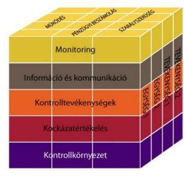

A belső kontrollrendszer kialakítása és működtetése nem felelt meg a jogszabályi előírásoknak.

A belső kontrollrendszer kialakítása és működtetése szabályszerűségének értékelését a III. sz. melléklet tartalmazza.

## A kontrollkörnyezet kialakítása nem felelt meg a jogszabályi előírásoknak.

Az intézmény rendelkezett az irányító szervek, középirányító szervek által jóváhagyott SZMSZ-szel, amely a 2011., 2012. és 2014. években - az Ámr. 20. § (2) bekezdés c) pontjában és az Ávr. 13. § (1) bekezdés c) pontjában előírtak ellenére - nem tartalmazta az alaptevékenységet szabályozó jogszabályok megjelölését. Továbbá - az Ámr. 20. § (2) bekezdés i) pontjában, illetve az Ávr. 13. § (1) bekezdés e) pontjában előírtak ellenére - nem tartalmazta a 2011-2014. években a költségvetési szerv szervezeti ábráját, a 2014. évben pedig a szervezeti egységek engedélyezett létszámát. Az SZMSZ a 2011. évben - az Ámr. 20. § (2) bekezdés b) pontjában előírtak ellenére nem tartalmazta az alapítás időpontját, a 2012. évben - az Ávr. 13. § (1) bekezdés b) pontjában előírtak ellenére - nem tartalmazta a hatályos, egységes szerkezetbe foglalt alapító okirat keltét, számát és az alapítás időpontját, míg a 2014. évben - az Ávr. 13. § (1) bekezdés b) pontjában előírtak ellenére - nem tartalmazta a hatályos, egységes szerkezetbe foglalt alapító okirat keltét és számát.

Az intézmény 2011. március 1-jétől önállóan működő intézménnyé alakult át, gazdasági szervezete megszűnt, a gazdálkodással összefüggő feladatokat 2011. március 1-jétől december 31-ig a GIG, 2012. január 1-jétől 2013. március 31-ig a MIK, azt követően pedig az SZGYF látta el.

Az intézmény 2011-2014. években rendelkezett etikai kódexszel ${ }^{32}$.

---

Az intézmény 2011. február 28-ig rendelkezett számviteli politikával ${ }^{33}$ és az annak keretében elkészítendő leltározási és leltárkészítési szabályzattal ${ }^{34}$, eszközök és források értékelési szabályzatával ${ }^{35}$, önköltségszámítás rendjével ${ }^{36}$, azonban pénzkezelési szabályzattal - a Sztv. ${ }^{37}$ 14. § (3)-(5) bekezdéseiben és az Áhsz. ${ }_{1}$ 8. § (3)-(4) bekezdéseiben előírtak ellenére - nem rendelkezett. Az intézmény 2011. március 1-jétől - a Sztv. 14. § (3)-(5) bekezdéseiben, az Áhsz. ${ }_{1}$ 8. § (3)-(4) bekezdéseiben és az Áhsz. ${ }_{2}^{38}$ 50. § (1) bekezdésében előírtak ellenére - nem rendelkezett számviteli politikával és az annak keretében elkészítendő leltározási és leltárkészítési szabályzattal, eszközök és források értékelési szabályzatával, önköltségszámítás rendjével és pénzkezelési szabályzattal. A gazdálkodási feladatokat ellátó GIG a 2011. évben a számviteli politikájában ${ }^{39}$, a MIK a 2012. évben a számviteli politikájában ${ }^{40}$ és az SZGYF a 2013. évben a számviteli politikájában ${ }^{41}$ - az Áhsz. ${ }_{1}$ 8. § (13) bekezdéseiben előírtak ellenére - nem döntött arról, hogy annak rendelkezéseit és a kapcsolódó szabályzatok hatályát kiterjeszti-e az intézményre, vagy az önálló számviteli politikát alakít ki és külön szabályzatokat készít. Az intézményre is vonatkozó számviteli politikát, és az annak keretében elkészítendő szabályzatokat - az Áhsz. ${ }_{2}$ 50. § (1) bekezdésében, és az abban hivatkozott 31. § (1) bekezdésében foglaltak ellenére - a 2014. évben sem adott ki a gazdálkodási feladatokat ellátó SZGYF.

Az intézmény a 2011-2014. években - a Sztv. 161. (1) bekezdésében, az Áhsz. ${ }_{1}$ 49. § (1) bekezdésében és az Áhsz. ${ }_{2}$ 51. § (2) bekezdésében előírtak ellenére - nem rendelkezett számlarenddel.

Az intézmény az ellenőrzött időszakban rendelkezett gazdálkodási szabályzattal ${ }^{42}$. Az intézmény - az Ámr. 80. § (3) bekezdésben és az Ávr. 60. § (3) bekezdésében előírtak ellenére - nem írta elő belső szabályzatában az aláírásminták naprakész nyilvántartási kötelezettségét, nem szabályozta a jogosult személyekről és aláírásmintájukról, milyen formában és módon vezet naprakész nyilvántartást.

Az intézmény a 2011-2014. években nem rendelkezett közbeszerzési szabályzattal és nem is folytatott le közbeszerzési eljárást. Az intézmény a 2011-2014. években - az Ámr. 20. § (3) bekezdés b) pontjában és az Ávr. 13. § (2) bekezdés b) pontjában előírtak ellenére - belső szabályzatban nem rendezte a közbeszerzési törvény hatálya alá
 nem tartozó beszerzések lebonyolításának rendjét.

Az intézmény FEUVE szabályzatában ${ }^{43}$ lévő ellenőrzési nyomvonal a 2011. évben - az Ámr. 156. § (2) bekezdésében előírtak ellenére - a működési folyamatok közül csak a gazdálkodási folyamatokra tartalmazott információt. A 2012. évtől az intézmény - a Bkr. 6. § (3) bekezdésében előírtak ellenére - ellenőrzési nyomvonallal nem rendelkezett.

Az intézmény rendelkezett - a jogszabályi előírásokkal összhangban - szabálytalanságkezelési eljárásrenddel ${ }^{44}$.

Az együttműködési megállapodás ${ }_{1-2}$ - a 2011. évben az Ámr. 16. § (4) és (6) bekezdéseiben, illetve a 2012-2014. években az Ávr. 10. § (4) és (6) bekezdéseiben előírtak ellenére - nem tartalmazta egyértelműen elkülönítve a munkamegosztás és felelősségvállalás rendjét, hogy a 2011. évben az Ámr. 15. § (2) bekezdés c) pontja, illetve a 2012-2014. években az Ávr. 9. § (1) bekezdése szerinti feladatok közül melyik feladatot melyik költségvetési szerv látja el, mivel ugyanazon feladatok ellátására az intézmény gazdálkodási feladatait ellátó költségvetési szervet és a gazdasági szervezettel nem

---

rendelkező intézményt is kijelölték. Ennek következtében a feladatok ellátásáért való felelősség sem volt egyértelműen elhatárolt, így nem volt biztosított a közpénzekkel történő elszámoltathatóság.

# 2.2. számú megállapítás 

## A kockázatkezelési rendszer kialakítása és működtetése összességében nem felelt meg a jogszabályi előírásoknak.

A kockázatkezelési rendszer Ámr.-ben és Bkr.-ben előírt kialakítása keretében az intézmény a 2011-2014. években rendelkezett kockázatkezelési szabályzattal ${ }^{45}$, amely tartalmazta a kockázatok fogalmát, a kockázatok azonosításával, elemzésével, csoportosításával, illetve a kockázati kitettség csökkentésével kapcsolatos szabályokat, azonban a 2011. évben nem tartalmazta az egyes kockázatokkal kapcsolatban szükséges intézkedések meghatározását, a 2012-2014. években nem tartalmazta a kockázatok kezelése érdekében szükséges intézkedések folyamatos nyomon követési módját.

Az intézmény vezetője a 2011-2014. években - az Ámr. 157. § (1)(3) bekezdéseiben, illetve a Bkr. 7. § (1)-(2) bekezdésében előírtak ellenére - nem működtetett kockázatkezelési rendszert. Az intézménynél nem mérték fel a költségvetési szerv tevékenységében, gazdálkodásában rejlő kockázatokat, nem határozták meg az egyes kockázatokkal kapcsolatos intézkedéseket, valamint azok teljesítésének folyamatos nyomon követésének módját.

Az intézmény a 2011-2014. években, az SZMSZ-ben - a Vnytv. ${ }^{46}$ 4. § a) pontjában előírtak ellenére - a vagyonnyilatkozat tételre kötelezettek körét nem rögzítette. Az intézménynél vagyonnyilatkozat tételi kötelezettsége az intézményvezetőnek volt. A vagyonnyilatkozat őrzéséért felelős személy a vagyonnyilatkozat tételi kötelezettség fennállásáról és esedékességéről tájékoztatta az intézmény vezetőt. A vagyonnyilatkozat tételre kötelezett intézményvezető a vagyonnyilatkozat tételi kötelezettségének a 2012. és 2014. években - a Vnytv. 5. § (2) bekezdésében előírtak ellenére - késve tett eleget. A benyújtott vagyonnyilatkozatokat az őrzésért felelős személy nyilvántartásba vette és az egyéb iratoktól elkülönítetten kezelte.

## 2.3. számú megállapítás

## A kontrolltevékenység kialakítása és működtetése nem felelt meg a jogszabályi előírásoknak.

Az intézmény FEUVE szabályzata tartalmazta a pénzügyi döntések dokumentumainak elkészítését, a pénzügyi kihatású döntések célszerűségi, gazdaságossági, hatékonysági és eredményességi szempontú megalapozottságának szabályait, továbbá a költségvetési gazdálkodás során az előzetes és utólagos pénzügyi ellenőrzés, a pénzügyi döntések szabályszerűségi szempontból történő jóváhagyását, illetve ellenjegyzését, valamint a gazdasági események elszámolását.

Az intézmény gazdálkodási szabályzata az Ámr. és az Ávr. előírásainak megfelelően tartalmazta a pénzügyi jogkörök gyakorlását végzők kialakításának rendjét. A gazdálkodási szabályzat tartalmazta, hogy a pénzgazdálkodási jogkörök gyakorlóiról naprakész nyilvántartást kell vezetni, amelyért a költségvetési szerv vezetője a felelős. Az intézmény belső szabályzatában - az Ámr. 80. § (3) bekezdésében és az Ávr. 60. § (3) bekezdésében előírtak ellenére - nem határozta meg az aláírás minták naprakész vezetésének módját. Az intézmény vezetője helyett 2013. április 4-e és 2014. október

---

31-e között - az Ávr. 57. § (4) bekezdésben és 59. § (1) bekezdésben előírtak ellenére - a teljesítésigazolásra és az utalványozásra jogosult személyeket az intézményvezető helyett az SZGYF főigazgatója jelölte ki. Az intézmény nem rendelkezett - az Ámr. 80. § (3) bekezdésében és az Ávr. 60. § (3) bekezdésében előírtak ellenére - a (szakmai) teljesítésigazolás gyakorlására jogosultak aláírás mintájával. Az intézménynél a 2011. évben utalványozás ellenjegyzésére, a 2012-2014. években pedig érvényesítési jogkör gyakorlására vonatkozóan, szabályszerűen felhatalmazott és aláírás mintával is rendelkező munkatárs nem volt. Az előirányzatok felhasználásánál a kulcskontrollok működése nem felelt meg a jogszabályi előírásoknak, ami a folyamatba épített, illetve a vezetői ellenőrzés nem megfelelő működésére volt visszavezethető. A feltárt hiányosságok miatt a költségvetési gazdálkodás során az előzetes és utólagos pénzügyi ellenőrzés, a pénzügyi döntések szabályszerűségi szempontból történő jóváhagyása, illetve ellenjegyzése - az Áht.1 121/A. § (4) bekezdés c) pontjában, valamint a Bkr. 8. § (2) bekezdés c) pontjában előírtak ellenére - nem volt megfelelő.

Iratkezelési szoftvert az intézmény nem használt. A számítástechnikai alkalmazások tekintetében az üzemeltetési és adatbiztonsági feladatokat és hatásköröket az intézménynél meghatározták. Az informatikai rendszer szabályozása során - az Info. tv.-ben ${ }^{47}$ megfelelően - kialakították az adatok biztonsága és védelme érvényre juttatásához szükséges eljárásrendet ${ }^{48}$.

# 2.4. számú megállapítás 

Az információs és kommunikációs rendszer kialakítása és működtetése részben felelt meg a jogszabályi előírásoknak.

Az információáramlás szervezeten belüli rendszerét - az Ámr.-ben és a Bkr.-ben előírtakkal összhangban - kialakították. A külső információáramlás biztosításával kapcsolatos feladatokat az SZMSZ-ben rögzítették. Az intézmény rendelkezett - az Avtv. ${ }^{49}$ és az Info. tv. által előírt - adatvédelmi és adatbiztonsági szabályzattal.

A kötelezően közzéteendő adatok nyilvánosságra hozatalának rendjét az Info. tv. 35. § (3) bekezdésében, az Ámr. 20. § (3) bekezdés i) pontjában és az Ávr. 13. § (2) bekezdés h) pontjában előírtak ellenére - nem szabályozták. A közérdekű adatok megismerésére irányuló igények teljesítésének rendjét - az Avtv. 20. § (8) bekezdésében, az Info. tv. 30. § (6) bekezdésében és az Ávr. 13. § (2) bekezdés h) pontjában előírtak ellenére - nem szabályozták.

## A közzétételére vonatkozó kötelezettségének az intézmény a 2011-2012. években - az Eitv. ${ }^{50}$ 3. § (2) bekezdésében, 6. §-ában és Mellékletében, valamint az Info. tv. 33. § (1) és (3) bekezdéseiben, 37. §-ában és 1. mellékletében előírtak ellenére - nem tett eleget. A 2013-2014. években a közzétételi kötelezettségének - az Info. tv. 33. § (1) és (3) bekezdéseiben, 37. §-ában és az 1. mellékletében előírtak ellenére - részben tett eleget. A 2013-2014. években az SZGYF honlapján az intézményre vonatkozóan az Info. tv. 1. mellékletében a I. Szervezeti, személyzeti adatok részből csak az 1. és 2. pontokban meghatározott adatok, a II. Tevékenységre, működésre vonatkozó adatok részből a 1. pontokban meghatározott adatok lettek feltüntetve, a III. Gazdálkodási adatok részből egyik pontban meghatározott adat sem lett feltüntetve.

---

Az intézmény rendelkezett iratkezelési szabályzattal, azonban az iratkezelési szabályzat kiadásához a 2012. évben - az Ltv. ${ }^{51}$ 10. § (1) bekezdés a) pontjában előírtak ellenére - az illetékes közlevéltár egyetértésével nem rendelkezett. A 2011. évben az intézmény - az lkr. ${ }^{52}$ 14. § (4) bekezdésben előírtak ellenére - az iratok iktatásával és az iratforgalom dokumentálásával nem biztosította, hogy az ügyintézés folyamata, és az iratok szervezeten belüli útja pontosan követhető, az iratok holléte pedig naprakészen megállapítható legyen.
2.5. számú megállapítás

A monitoring-rendszer működése nem felelt meg a jogszabályi előírásoknak. A rendelkezésre álló források gazdaságos, hatékony és eredményes felhasználását biztosító követelmények kialakítása és alkalmazása nem történt meg.

Az operatív tevékenységek folyamatos és eseti nyomon követési rendszerét - az Ámr. 160. §-ában és a Bkr. 10. §-ában előírtak ellenére - az intézmény vezetője nem alakította ki. Az ellenőrzött időszakban a döntések előkészítéséhez jelentések és feljegyzések monitoring információk alapján nem készültek.

Belső ellenőrrel az intézmény nem rendelkezett, a belső ellenőrzési feladatokat a 2011. évben - az Ötv.-ben ${ }^{53}$ foglaltak alapján - az Önkormányzat belső ellenőre végezte. A 2013-2014. években az intézménynél a belső ellenőrzési feladatokat - a Bkr.-ben előírtak szerint, megállapodás alapján - az SZGYF Belső Ellenőrzési Főosztálya látta el. A 2012. évben az intézmény vezetője - az Áht. 2 70. § (1) bekezdésében és a Bkr. 15. § (1) bekezdésében előírtak ellenére - a belső ellenőrzés kialakításáról, megfelelő működtetéséről nem gondoskodott. Az intézmény SZMSZe a 2011-2014. években - a Ber. ${ }^{54}$ 4. § (2) bekezdésében, illetve a Bkr. 15. § (2) bekezdésében leírtak ellenére - nem tartalmazta a belső ellenőrzést végző személy vagy szervezet (szervezeti egység) jogállását, feladatait. A 2011. és 2013-2014. években rendelkeztek belső ellenőrzési kézikönyvvel, a belső ellenőrzés függetlensége fennállt, az összeférhetetlenség feltételei rögzítésre kerültek. Az Önkormányzat 2011. évi belső ellenőrzési terve az intézménnyel kapcsolatban egy ellenőrzést tartalmazott, amely végrehajtásáról az Önkormányzat belső ellenőrzési vezetője - a Ber. 12. § b) pontjában foglaltak ellenére - nem gondoskodott. Az SZGYF 2013. évi belső ellenőrzési terve az intézmény vonatkozásában nem tartalmazott ellenőrzést, ezért az intézmény vezetője - az Áht. 2 70. § (1) bekezdésében és a Bkr. 15. § (1) bekezdésében előírtak ellenére - a belső ellenőrzés megfelelő működtetéséről nem gondoskodott. A 2013. évben az SZGYF belső ellenőrzése egy soron kívüli belső ellenőrzést folytatott le az intézménynél. Az ellenőrzésről készült jelentést megküldték az intézmény vezetőjének, aki a jogszabályi előírásoknak megfelelően intézkedési tervet készített. Az SZGYF belső ellenőrzési vezetője az intézményre is vonatkozó 2014. évi éves ellenőrzési tervet a jogszabályi előírásoknak megfelelően jóváhagyásra megküldte az intézmény vezetőjének, amelyet jóváhagyott. Az ellenőrzési tervben szereplő intézményt érintő két ellenőrzés közül az egyik belső ellenőrzés esetében az SZGYF belső ellenőrzési vezetője - a Bkr. 22. § (1) bekezdés b) pontjában előírtak ellenére - nem gondoskodott

---

annak végrehajtásáról. A másik belső ellenőrzésről készült jelentést megküldték az intézmény vezetőjének, aki a jogszabályi előírásoknak megfelelően intézkedési tervet készített.

Az ellenőrzések által tett megállapításokra és javaslatokra készült intézkedési tervek realizálódásának és hasznosulásának nyomon követése - a 2012. év kivételével - megvalósult. A 2012. évben a MIK végzett külső ellenőrzést az intézménynél, az intézmény vezetője - a Bkr. 14. § (1) bekezdésében foglaltak ellenére - nem gondoskodott a külső ellenőrzés javaslatai alapján készült intézkedési tervek végrehajtásának nyilvántartásáról. Az SZGYF belső ellenőrzése rendelkezett a belső és külső ellenőrzési jelentésekben tett megállapításokat, javaslatokat vonatkozó intézkedési terveket és azok végrehajtását nyomon követő nyilvántartással.

A rendelkezésre álló források gazdaságos, hatékony és eredményes felhasználását biztosító szabályozásokat a költségvetési szerv vezetője nem adott ki, illetve folyamatokat az intézménynél az Áht. 1 121/A. § (1) bekezdésében és a Bkr. 6. § (2) bekezdésében foglaltak ellenére - nem alakított ki és nem működtetett az ellenőrzött időszakban.

A 2013. évre vonatkozóan a Bkr. 1. mellékletében lévő belső kontrollrendszer minősítéséről szóló nyilatkozatot a költségvetési szerv vezetője a
 Bkr. 11. § (1) bekezdésében foglaltak ellenére – nem töltötte ki. A 2011., 2012. és 2014. években a belső kontrollrendszer kialakításáról szóló – az Ámr. 217. § c) pontjában és 21. számú mellékletében, valamint a Bkr. 11. § (1) bekezdésében és 1. mellékletében előírt – nyilatkozatok tartalmazták, hogy az intézmény vezetője gondoskodott a költségvetési szerv tevékenységében a hatékonyság, eredményesség és a gazdaságosság követelményeinek érvényesítéséről, amely nincs összhangban az ellenőrzés által feltártakkal.

A kiegészítő teljesítmény-ellenőrzés megállapításait a IV. sz. melléklet tartalmazza.

# 3. Az intézmény pénzügyi gazdálkodása szabályszerű volt-e? 

## Összegző megállapítás

Az intézmény pénzügyi gazdálkodása nem felelt meg a jogszabályi előírásoknak.

### 3.1. számú megállapítás

Az elemi költségvetés készítése és az előirányzatok megállapítása a 2014. év kivételével – nem felelt meg a jogszabályi előírásoknak.

A tervezéssel kapcsolatos 2011-2013. évi feladatokat az intézmény, valamint a gazdálkodási feladatokat ellátó GIG, a MIK és az SZGYF nem a jogszabályi előírásoknak megfelelően végezte. Az éves költségvetés tervezése során az elemi költségvetést a közzé tett tervezési köriratban foglaltakra tekintettel állították össze.

A 2011. évben az intézménynél a költségvetés-tervezéssel kapcsolatos folyamatokat a FEUVE szabályzat részeként az ellenőrzési nyomvonal tartalmazott. Az intézmény 2011. év január 1-jétől február 28-áig önállóan működő és önállóan gazdálkodó, majd 2011. március 1-jétől az önállóan

---

működő költségvetési szerv volt. Az intézmény gazdálkodásával kapcsolatos feladatokat végzőkkel kötött együttműködési megállapodások ${ }_{1-2}$ alapján a 2011. évben az intézmény és a GIG, a 2012. évben az intézmény és a MIK, majd 2013-2014. években az intézmény és az SZGYF egymással együttműködve készítette el az elemi költségvetést, hajtotta végre a tervezési feladatokat.

A tervezés előkészítő szakaszában az intézmény adatokat szolgáltatott, az elemi költségvetést a kiemelt előirányzatok figyelembe vételével együttműködve állították össze. A kétkörös tervezés keretében az előzetes és végleges költségvetés készítésének folyamata az Ámr.-ben és az Ávr.-ben, illetve a belső szabályzatokban foglaltaknak megfelelt.

A gazdálkodási feladatokat ellátó GIG a 2011. évben, a MIK a 2012. évben, míg az SZGYF a 2013. évben az elemi költségvetés tervezése során a bevételek és kiadások összegeit – az Ámr. 46. § (2) bekezdésében, illetve az Áht. 2 12. § (1) bekezdésében előírtak ellenére – előzetes számításokkal nem támasztotta alá.

Az intézmény a költségvetés elkészítésével kapcsolatos adatszolgáltatási kötelezettségét az Ámr.-ben, az Ávr.-ben és az irányító szerv által előírtaknak megfelelően teljesítette. Az intézményt szervezeti átalakítás, átszervezés nem érintette. A 2011. és 2014. években – az Ámr.-ben és az Ávr.-ben foglaltak szerint – figyelembe vették az évközi feladat átadás-átvételekből adódó költségvetési hatásokat, szintre hozásokat.

# 3.2. számú megállapítás 

## A bevételi és kiadási előirányzatok módosítása összességében nem felelt meg a jogszabályi előírásoknak.

Az előirányzatok módosítása nem felelt meg a jogszabályi előírásoknak. A saját hatáskörben végrehajtott előirányzat módosítást a szükséges indokolással együtt – az együttműködési megállapodás ${ }_{1-}$ 2 alapján – az intézmény vezetőjének írásban kellett kezdeményeznie a GIG, a MIK, illetve az SZGYF felé. A Közgyűlés által kezdeményezett irányítószervi, valamint a MIK és az SZGYF által kezdeményezett középirányító szervi előirányzat-módosítások végrehajtásáért az intézmény és a fenntartó vezetője az együttműködési megállapodás ${ }_{1-2}$ szerint együttesen felelt.

A 2012-2014. években rendszeresen előfordult, hogy az intézményi hatáskörben végrehajtott előirányzat-módosítások esetében az előirányzatmódosítások intézményvezető általi elrendelése – az Ávr. 44. § (2) bekezdésében előírtak ellenére – dokumentáltan nem történt meg. Továbbá a 2012-2014. években rendszeresen előfordult, hogy az intézményi hatáskörben végrehajtott előirányzat-módosításokról az intézkedés meghozatalát követően a fejezetet irányító szervet – az Ávr. 167. § (4) bekezdésben előírtak ellenére – nem tájékoztatták.

Az előirányzat módosítások főkönyvi könyvelése során betartották az Áhsz. 2-ben és Áhsz. 2-ben előírtakat. Az előirányzat-módosítások során az évközi feladat átadás-átvételeket figyelembe vették.

Az intézmény előirányzatait kormányzati, irányító szervi és intézményi hatáskörben többször módosították, a módosítások döntő hányada intézményi hatáskörben történt. Országgyűlési hatáskörű előirányzat-módosításra nem került sor.

---

Az előirányzat módosítások hatáskörönkénti bontását az alábbi táblázat tartalmazza:
2. táblázat

ELŐIRÁNYZAT-MÓDOSÍTÁSOK (M FT-BAN)

| Megnevezés | 2011. év | 2012. év | 2013. év | 2014. év | Összesen |
| :-- | :--: | :--: | :--: | :--: | :--: |
| Országgyűlési | - | - | - | - | - |
| Kormányzati | 0 | 6 | 3,9 | 10,4 | $\mathbf{2 0 , 3}$ |
| Irányító szervi | 34,4 | 13 | $-5,1$ | 3,5 | $\mathbf{4 5 , 8}$ |
| Intézményi | $-0,6$ | 8,4 | 10,9 | 36,3 | $\mathbf{5 5}$ |
| Összesen | $\mathbf{3 3 , 8}$ | $\mathbf{2 7 , 4}$ | $\mathbf{9 , 7}$ | $\mathbf{5 0 , 2}$ | $\mathbf{1 2 1 , 1}$ |

A kormányzati, az irányító szervi és az intézményi hatáskörű előirányzat-módosítások a személyi juttatások, a közalkalmazottak bérkompenzációjának, a pedagógus életpálya modell, a személyi juttatások terhére történt dologi kiadások biztosítására szolgáltak.

# 3.3. számú megállapítás 

Az intézmény a bevételi előirányzatok teljesítése, valamint a kiadási előirányzatok felhasználása során nem tartotta be a jogszabályi előírásokat.

Az ellenőrzött időszakban az intézmény a bevételek teljesítése és kiadási előirányzatok felhasználása során az Áht. 1-2, az Ámr. és az Ávr. előírásait nem tartotta be.

A kiadások, bevételek és létszám alakulását a VI. sz. melléklet mutatja be.

A bevételek a 2011-2013. években – az Áht. 1 12. § (2) bekezdésében és az Áht. 2 4. § (2) bekezdésében előírtak ellenére – alulteljesültek, elmaradtak a módosított előirányzattól.

Az intézmény bevételeinek és kiadásainak alakulását az alábbi ábra mutatja:

1. ábra
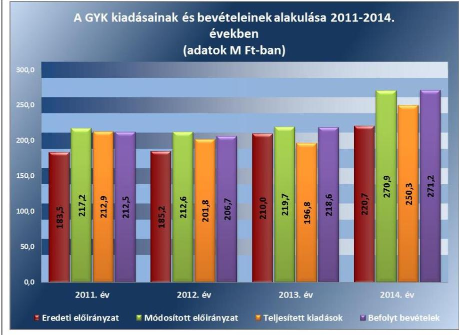

Forrás: az intézmény 2011-2014. évi költségvetési beszámoló

---

3. táblázat

KULCSKONTROLLOK
GYAKORLÁSÁNAK MINŐSÍTÉSE

| Ellenőrzött év | Minősítés |
| :--: | :--: |
| 2011. év | nem megfelelő |
| 2012. év | nem megfelelő |
| 2013. év | nem megfelelő |
| 2014. év | nem megfelelő |

A bevételi előirányzattól történő elmaradást mindkét évben az intézmény működési bevételei előirányzatának alulteljesülése okozta. Az intézmény a 2011-2014. években költségvetési kiadásait a módosított előirányzat keretén belül teljesítette.

A kiadási előirányzatok felhasználása során az intézmény a jogszabályi előírásokat összességében nem tartotta be. A gazdálkodási jogkörök gyakorlása a személyi juttatások, a dologi és dologi jellegű (egyéb folyó) kiadások, a felhalmozási kiadások, a támogatásértékű kiadások, az átadott pénzeszközök és előirányzatainak felhasználása nem felelt meg a jogszabályi előírásoknak (3. táblázat).

Az együttműködési megállapodás ${ }_{1}$ alapján 2011. március 1-jétől a kötelezettségvállalás ellenjegyzésére, érvényesítésre, az utalvány ellenjegyzésére vonatkozó gazdálkodási jogkörök gyakorlását – a jogszabályi előírásoknak megfelelően – a GIG biztosította. Az együttműködési megállapodás ${ }_{2}$ alapján a 2012. évben kötelezettségvállalás ellenjegyzésére és érvényesítésre vonatkozó gazdálkodási jogkörök gyakorlását – a jogszabályi előírásoknak megfelelően – a MIK biztosította. Az intézménynél ellátandó gazdálkodási jogkörök gyakorlásáról a 2011-2014. években a GIG, a MIK és az SZGYF belső szabályzatban rendelkezett. Az intézmény a belső szabályzatában – az Ámr. 80. § (3) bekezdésben és az Ávr. 60. § (3) bekezdésében előírtak ellenére – nem írta elő az aláírás minták naprakész nyilvántartási kötelezettségét, nem szabályozta a jogosult személyekről és aláírás-mintájukról, milyen formában és módon vezetnek naprakész nyilvántartást.

## A pénzgazdálkodási belső kontrollok működésének szabályszerűsége a kiadási előirányzatok felhasználásához kapcsolódóan összességében nem volt megfelelő.

Az ellenőrzés az alábbi hibákat tárta fel:

- A 2011., 2013. és 2014. években előfordult, hogy a GIG, illetve az SZGYF a dologi kiadások esetében a kötelezettségvállalási nyilvántartásban szereplő teljesítésigazolás dokumentumát (számlákat) – a Sztv. 169. § (2) bekezdéseiben foglaltak ellenére – nem őrizte meg. A kiadások megtörténte a könyvelési rendszerben hivatkozási sorszámmal fellelhető és a szállítók állományának nyilvántartását támogató „Gazdálkodónkénti listában” beazonosítható volt.
- A szakmai teljesítésigazolás gyakorlására jogosult aláírás mintájáról – az Ámr. 80. § (3) bekezdésében, illetve az Ávr. 60. § (3) bekezdésében előírtak ellenére – nem vezettek naprakész nyilvántartást. Az intézményvezető 2011. január 1-je és 2014. október 31-e között írásban nem hatalmazott fel teljesítésigazolás gyakorlására jogosult más személyeket, ezért rendszeresen előfordult, hogy a teljesítésigazolást – az Ámr. 76. § (5) és az Ávr. 57. § (4) bekezdéseiben előírtak ellenére – kijelölés hiányában jogosultsággal nem rendelkező személyek végezték.
- A 2011. évben rendszeresen előfordult, hogy az utalványozás ellenjegyzését végzők – az Ámr. 79. § (1) bekezdésében foglaltak ellenére – nem rendelkeztek kijelöléssel, illetve az utalványozás ellenjegyzésére kijelöléssel rendelkezők – az Ámr. 80. § (3) bekezdésében foglaltak ellenére – nem rendelkeztek aláírás mintával, ezért az utalványozás ellenjegyzését nem szabályszerűen gyakorolták.

---

- A 2012. évben rendszeresen előfordult, hogy az érvényesítést végző személyek – az Ávr. 58. § (4) bekezdésében foglaltak ellenére – nem rendelkeztek kijelöléssel, csak aláírás mintával, ezért érvényesítést nem szabályszerűen gyakorolták. A 2013-2014. években rendszeresen előfordult, hogy az érvényesítést végző személyek – az Ávr. 58. § (4) bekezdésében foglaltak ellenére – nem rendelkeztek kijelöléssel, illetve az intézménynél – az Ávr. 60. § (3) bekezdésében foglaltak ellenére – nem vezettek naprakész nyilvántartást az érvényesítési jogkör végzésére kijelöléssel rendelkező személyek aláírás mintájáról.
- A 2011-2014. években rendszeresen előfordult, hogy az érvényesítő – az Ámr. 77. § (1)-(2) bekezdéseiben és az Ávr. 58. § (1)-(2) bekezdésében előírtak ellenére – nem ellenőrizte a megelőző ügymenetben a jogszabályi előírások betartását, továbbá nem jelezte a felmerült szabálytalanságokat az utalványozónak.
- A rendszeres személyi juttatásoknál és a pénzbeli ellátottak juttatásainál több esetben előfordult, hogy – az Ámr. 76. § (3) bekezdésében és az Ávr. 57. § (3) bekezdésében előírtak ellenére – nem történt teljesítésigazolás, mivel elmaradt a teljesítésigazoló aláírása, illetve nem szabályszerűen történt meg a teljesítésigazolás, mivel hiányzott a teljesítésigazolás dátuma, vagy a teljesítés tényére történő utalás. A 2011. évben rendszeresen előfordult, hogy – az Ámr. 78. § (2) bekezdés a) pontjában előírtak ellenére – nem történt meg az utalványozás ellenjegyzése, mivel hiányzott az utalványozás ellenjegyzőjének aláírása vagy az utalványozás dátuma. A 2012-2014. években rendszeresen előfordult, hogy – az Ávr. 58. § (3) bekezdésében előírtak ellenére – nem történt meg az érvényesítés, mivel hiányzott az érvényesítő aláírása, illetve nem szabályszerűen történt meg az érvényesítés, mivel hiányzott az érvényesítés dátuma, vagy az érvényesítésre való utalás.
- A 2011-2012. években a megbízási jogviszony alapján történt kifizetéseknél több esetben előfordult, hogy a feladat elvégzését igazoló dokumentum – az Ámr. 90. § (6) bekezdésében és az Ávr. 51. § (2) bekezdésében előírtak ellenére – nem állt rendelkezésre.

Közbeszerzési eljárást az intézménynél a beszerzések alapján nem kellett lefolytatni.

# 3.4. számú megállapítás 

A pénzmaradvány/előirányzat-maradvány megállapítása, felhasználása – az alábbi hiányosságok miatt – nem felelt meg a jogszabályi előírásoknak.

Évközi korlátozó intézkedések az intézményt az előirányzat maradvány felhasználásához kapcsolódóan nem érintették. A költségvetési törvény szerinti befizetési kötelezettségeket
 az intézmény a 2012-2014. években a jogszabályi előírásoknak megfelelően teljesítette.

## A PÉNZMARADVÁNY, ILLETVE AZ ELŐÍRÁNYZAT-

MARADVÁNY megállapítása nem felelt meg a jogszabályi előírásoknak. A kötelezettségvállalások teljes nyilvántartását, a költségvetési és pénzügyi számviteli feladatokat - az együttműködési megállapodások ${ }_{1-2}$ alapján 2011. március 1-jétől a GIG, 2012. január 1-jétől a MIK és 2013. április 1-

---

étől az SZGYF látta el. A főkönyvi számlák, az analitikus nyilvántartások és az éves beszámolók között az adategyezőség fennállt. Azonban az intézmény a 2011. évi beszámolójában 8,2 M Ft pénzmaradványt szerepeltetett, míg a Közgyűlés a megyei önkormányzat 2011. évi költségvetésének végrehajtásáról szóló 6/2012. (IV. 20.) Önkormányzati rendelet 5/b. számú mellékletében az intézmény tárgyévi jóváhagyott pénzmaradványát 8,4 M Ft-ban fogadta el, a különbözet okát nem tudták megindokolni. A 2013. évre kimutatott kötelezettségvállalással terhelt maradvány - az Ávr. 150. § (1) bekezdés b) pontjában előírtak ellenére - tárgyévben kifizetett kötelezettséget tartalmazott.

Az intézmény előirányzat-maradványával kapcsolatos adatszolgáltatási kötelezettséget a 2012. évben a MIK, a 2014. évben az SZGYF a beszámolók benyújtásával - az Áhsz. 10. § (1) bekezdésben és az Áhsz. 2 32. § (1) bekezdésben előírtak ellenére - a február 28-ai határidőt túllépve, 2013. április 17-én és 2015. április 2-án teljesítette.

Az intézmény a 2012. évre az előirányzat-maradvány irányítószervi jóváhagyásáról - az Ávr. 153. § (4) bekezdésben előírtak ellenére - értesítéssel nem rendelkezett.

# A KÖTELEZETTSÉGVÁLLALÁSSAL TERHELT MARADVÁNY felhasználása során az ellenőrzés az alábbi hibákat tárta fel: 

- A 2011. évben előfordult, hogy a kötelezettségvállalást ellenjegyző aláírása - az Ámr. 74. § (1) bekezdésekben előírtak ellenére - elmaradt. Több esetben előfordult, hogy az utalványozás - az Áht. 1 100/C. § (6) bekezdésében előírtak ellenére - a kifizetést követően történt.
- A 2013-2014. években több esetben előfordult, hogy a kötelezettségvállalásra - az Áht. 2 37. § (1) bekezdésében előírtak ellenére - a pénzügyi ellenjegyzést megelőzően került sor.
- A 2011-2014. években rendszeresen előfordult, hogy az utalványrendeleteken - az Ámr. 78. § (2) bekezdés f) pontjában és az Ávr. 59. § (3) bekezdés e) pontjában előírtak ellenére - a könyvviteli számlák száma nem szerepelt.
- A 2014. évben előfordult, hogy a kötelezettségvállalás bizonylatát az Sztv. 169. § (2) bekezdésében előírtak ellenére - nem őrizték meg.
3.5. számú megállapítás

Az intézmény fizetőképessége - a 2011. év kivételével - biztosított volt, a likviditás javítása érdekében intézkedéseket nem tettek.

A FOLYAMATOS FIZETŐKÉPESSÉG a 2011. évben nem volt biztosított, míg 2012-2014. években csökkenő mértékben, de biztosított volt. Az intézmény a likviditás javítása érdekében intézkedéseket nem tett, a feladatellátás biztosított volt.

Az intézmény a 2011. évben az önkormányzati alrendszerbe tartozott és a jogszabály nem írt elő előirányzat-felhasználási terv készítési kötelezettséget.

LIKVIDITÁSI TERVKÉSZÍTÉSI kötelezettséget a 2012. évtől az együttműködési megállapodás ${ }_{2}$ a MIK-nek, illetve 2013. évtől az SZGYF-nek írt elő.

---

A 2012-2014. években az intézmény várható bevételeinek a havi és a tárgyhónap vonatkozásában dekádonkénti ütemezéssel kimutatott teljesíthető kiadásokat tartalmazó likviditási tervekkel - az Áht. 2 78. § (2) bekezdésében és az Ávr. 122. § (1) bekezdésében előírtak ellenére - nem rendelkeztek.

SZÁLLÍTÓI TARTOZÁSOK kifizetése a 2011. évben nem volt biztosított, míg a 2013-2014. években növekvő késedelem mellett volt biztosított.

A szállítói kötelezettségállomány évenkénti alakulását az alábbi táblázat tartalmazza:
4. táblázat

# AZ INTÉZMÉNY 2011-2014. ÉVEK KÖZÖTTI LEJÁRT SZÁLLÍTÓI TARTOZÁSAI (M FT-BAN) 

| Megnevezés | 2011. XII. 31 | 2012. XII. 31 | 2013. XII. 31 | 2014. XII. 31 |
| :-- | :--: | :--: | :--: | :--: |
| Összes szállítói kötele-   zettség | 5,6 | 5,0 | 3,9 | 6,2 |
| Lejárt szállítói tartozás | 5,3 | -- | 1,4 | 3,2 |
| Ebből: |  | -- | 1,4 | 2,6 |
| 30 nap alatt | 0,4 | -- | -- | 0,4 |
| 31 és 60 nap közötti | 0,3 | -- | -- | 0,2 |
| 61 és 90 nap közötti | 0,6 | -- | -- | -- |
| 91 és 365 nap közötti | 2,0 | -- | -- |  |

A 2012-2014. években az intézmény várható bevételeinek a havi és a tárgyhónap vonatkozásában dekádonkénti ütemezéssel kimutatott teljesíthető kiadásokat tartalmazó likviditási tervekkel - az Áht. 2 78. § (2) bekezdésében és az Ávr. 122. § (1) bekezdésében előírtak ellenére - nem rendelkeztek.

SZÁLLÍTÓI TARTOZÁSOK kifizetése a 2011. évben nem volt biztosított, míg a 2013-2014. években növekvő késedelem mellett volt biztosított.

A szállítói kötelezettségállomány évenkénti alakulását az alábbi táblázat tartalmazza:
4. táblázat

## AZ INTÉZMÉNY 2011-2014. ÉVEK KÖZÖTTI LEJÁRT SZÁLLÍTÓI TARTOZÁSAI (M FT-BAN)

| Megnevezés | 2011. XII. 31 | 2012. XII. 31 | 2013. XII. 31 | 2014. XII. 31 |
| :-- | :--: | :--: | :--: | :--: |
| Összes szállítói kötele-   zettség | 5,6 | 5,0 | 3,9 | 6,2 |
| Lejárt szállítói tartozás | 5,3 | -- | 1,4 | 3,2 |
| Ebből: | 0,4 | -- | 1,4 | 2,6 |
| 30 nap alatt | 0,3 | -- | -- | 0,4 |
| 61 és 90 nap közötti | 0,6 | -- | -- | 0,2 |
| 91 és 365 nap közötti | 2,0 | -- | -- | -- |
| Éven túli | 2,0 | -- | -- |  |

Az intézmény 2011. év végén 5,3 M Ft lejárt szállítói tartozásállománnyal rendelkezett, melynek 37,7%-a 90 napon túli és 37,7%-a éven túli tartozás volt. A 2012. évben a szállítói tartozások kiegyenlítésre kerültek, lejárt szállítói tartozás nem volt. Az intézménynek a 2013. évben 1,4 M Ft - 30 nap alatti - lejárt szállítói tartozása volt, ami a 2014. év végére 128,6%-kal (1,8 M Ft-tal) 3,2 M Ft-ra nőtt és már tartalmazott 60 napon túli tartozást is.

A LIKVIDITÁS JAVÍTÁSA érdekében az intézmény előirányzatkeret előrehozást nem kért.

Az intézmény likviditási mutatóit az alábbi táblázat tartalmazza:
5. táblázat

LIKVIDITÁSI MUTATÓK ALAKULÁSA

|  | 2011 | 2012. | 2013. |
| :-- | :--: | :--: | :--: |
| Likviditási mutató | 0,3 | 1,5 | 1,1 |
| Pénzeszköz likviditási mutató | 0,1 | 1,3 | 1,0 |

A likviditási mutatók a 2011. évben kedvezőtlen képet mutattak, mivel a forgóeszközök állománya nem nyújtott fedezetet a rövid lejáratú kötelezettségek teljesítésére. Ezzel szemben a likviditási mutatók a 2012-2013. években már kedvező képet mutattak, az intézmény forgóeszközeinek állománya meghaladta a rövid lejáratú kötelezettségeit.

---

Az intézmény beszerzései nem tartoztak a költségvetési egyensúlyt biztosító kormányzati intézkedések hatálya alá, az Áht. 1-2 alapján kincstári biztos, költségvetési felügyelőt nem kellett kinevezni, maradványtartási kötelezettség nem volt.

A KÖVETELÉSEK behajtására az intézmény nem tett intézkedéseket.

A követelésállomány alakulását az alábbi táblázat tartalmazza:
6. táblázat

AZ INTÉZMÉNY 2011-2014. ÉVEK KÖZÖTTI KÖVETELÉSÁLLOMÁNYA (M FT-BAN)

| Megnevezés | 2011. XII. 31 | 2012. XII. 31 | 2013. XII. 31 | 2014. XII. 31 |
| :-- | :--: | :--: | :--: | :--: |
| Összes vevőkövetelés | 1,0 | 1,0 | 0,5 | 1,0 |
| Lejárt vevőkövetelés | 0,8 | 0,0 | 0,4 | 0,7 |
| Ebből: |  |  |  |  |
| 30 nap alatt | 0,1 | -- | 0,1 | 0,1 |
| 31 és 60 nap közötti | 0,2 | -- | -- | 0,3 |
| 61 és 90 nap közötti | 0,5 | -- | 0,1 | 0,1 |
| 91 és 365 nap közötti | -- | -- | 0,2 | 0,2 |
| Éven túli | 0,1 | -- | 0,1 | 0,1 |

A követelésállomány nagyságrendje a fizetőképesség alakulását nem befolyásolta. A követelés behajtásával összefüggésben belső szabályzat kialakítására sem került sor. A lejárt követelésekkel összefüggésben értékvesztés elszámolására nem került sor.

# 4. Az intézmény vagyongazdálkodása szabályszerű volt-e? 

## Összegző megállapítás

Az intézmény vagyongazdálkodása nem felelt meg a jogszabályi előírásoknak.

### 4.1. számú megállapítás

A 2011. évben az intézmény a feladatellátáshoz szükséges vagyont az Önkormányzat vagyongazdálkodási rendeletében és az alapító okiratban foglaltak alapján használta. A 2012. január 1-jétől a feladatellátáshoz szükséges vagyont jogcím nélkül használta.

Az intézmény a 2011. évben az államháztartás önkormányzati alrendszerébe tartozott, felügyeletét és irányítását az Önkormányzat Közgyűlése látta el. A közfeladat ellátását szolgáló vagyont az Önkormányzat a vagyongazdálkodási rendeletében és az alapító okiratban foglaltak szerint bocsátotta az intézmény rendelkezésére. Az intézmény a közfeladat ellátáshoz szükséges vagyont a vagyongazdálkodási rendelet előírásai alapján térítésmentesen használhatta, hasznosíthatta, illetve számviteli nyilvántartásaiban, mennyiségben és értékben nyilvántartotta.

Az intézmény a közfeladata ellátásához használt ingatlan vagyon tekintetében - az Nvtv. 3. § (1) bekezdés 11. pontjában és a Vtvr. 1. § (7) bekezdés a) pontjában előírtak ellenére - a 2012-2014. években jogcímmel nem rendelkezett, ezért nem minősült a nemzeti vagyon, illetve az állami va-

---

gyon jogszerű használójának. Az együttműködési megállapodásban2 a vagyongazdálkodással kapcsolatban leírtak nem pótolták a vagyonhasznosítási szerződés megkötésének hiányát. A MIK 2013. március 31-től az SZGYF-be történő beolvadással megszűnt. A 18/2013. (V. 06.) SZGYF utasítás ${ }^{55}$ III. fejezet 5. § (3) bekezdésében előírtak alapján a megyei kirendeltségek feladata volt a hatálybalépéstől számított 120 napon belül az intézményi közfeladatok ellátásához szükséges jogviszonyok megújításához szükséges megállapodások előkészítése és leegyeztetése, amely végrehajtása nem történt meg.

Vagyonkezelési szerződés nélkül - adásvételi szerződéssel - az intézmény vagyonkezelésébe került eszközök esetében betartották a jogszabályi előírásokat. A 2014. évben a működését támogató eszközöket, a szállítókkal kötött megrendelések alapján, adásvételi szerződéssel szabályszerűen - a Vtv.-ben foglaltaknak megfelelően - a Magyar Állam javára szerezte meg, a beszerzett eszközök - az Nvtv. alapján - az intézmény vagyonkezelésébe kerültek.

# 4.2. számú megállapítás 

A mérlegben kimutatott eszközök és források nyilvántartása, értékelése, leltározása nem felelt meg a jogszabályokban előírtaknak.

A NYILVÁNTARTÁSI és beszámolási kötelezettségének a GIG és az intézmény a 2011. évben Sztv.-ben, az Áhsz. 1-ben, az önkormányzati vagyonrendeletben és a GIG-gel - 2011. március 1-jei hatállyal - kötött együttműködési megállapodásban1 előírtaknak megfelelően tett eleget.

Az analitikus és főkönyvi rendszerben történő nyilvántartások vezetése, a beszámolók elkészítése a megkötött együttműködési megállapodás2 alapján a 2012. évben a MIK, míg a 2013-2014. években az SZGYF felelőssége volt.

Az intézmény közfeladat ellátásához szükséges ingatlan vagyon tekintetében a vagyonkezelői jogokat 2012. január 1-től a MIK, majd 2013. április 1-től az SZGYF gyakorolta. A vagyonkezelésbe vett eszközöket - az Áhsz. 1 20. § (2) bekezdésében, valamint az Áhsz. 2 10. § (2) bekezdésében előírtak szerint - a vagyonkezelőnél kell kimutatni, ennek ellenére a 2012-2014.
 években az intézmény mutatta ki a könyveiben.

Az intézmény mérlegeiben hibásan kimutatott állami ingatlan vagyon értékét az alábbi táblázat tartalmazza:
7. táblázat

## AZ INTÉZMÉNYI MÉRLEGBEN SZABÁLYTALANUL KIMUTATOTT VAGYON ÉRTÉKE

|  | 2012. év | 2013. év | 2014. év |
| :-- | :--: | :--: | :--: |
| Ingatlanok és kapcsolódó vagyonértékű |  |  |  |
| jogok (E FT) | 361111 | 290709 | 245728 |
| Mérlegfőösszeg (E Ft) | 1346560 | 314252 | 270250 |
| Ingatlanok / Mérlegfőösszeg (\%) | 26,8 | 92,5 | 90,9 |

A 2012-2014. évi intézményi mérlegben hibásan szerepeltetett ingatlanok értéke meghaladta - a Sztv. 3. § (3) bekezdés 3. pontjában, az Áhsz. 1 5. § 8. pontjában, valamint az Áhsz. 2 1. § (1) bekezdés 3. pontjában lévő jelentős összegű hiba mértékét. A beszámolók - a Sztv. 18. §-ában foglaltak alapján - nem mutattak az intézmény vagyoni, pénzügyi és jövedelmi

---

helyzetéről megbízható és valós képet. Az állami ingatlan vagyon intézményi mérlegben történő hibás kimutatásával megsértették a Sztv. 15. § (3) bekezdésében előírt valódiság és a Sztv. 16. § (4) bekezdésében előírt lényegesség elvét.

Az intézmény könyveiben szabálytalanul nyilvántartott ingatlanok értéke után - az Áhsz. 1 30. § (1) bekezdés, az Áhsz. 2 17. § (1) bekezdésében leírtak alapján - az intézménynél értékcsökkenést számoltak el. Az intézmény nyilvántartásaiban szereplő állami ingatlanok és kapcsolódó vagyonértékű jogok tekintetében nem volt szabályszerű - az Áhsz. 1 34. § (1)(2) bekezdéseiben, valamint az Áhsz. 2 21. § (1) bekezdésében előírtak szerint - az értékcsökkenés elszámolása és kimutatása.

A követelések és kötelezettségek állományát tartalmazó számlák vezetése és a negyedévenkénti összegző kimutatás elkészítése megfelelt az Áhsz. 1.2-ben foglaltaknak.

AZ ÉV VÉGI LELTÁRT az éves költségvetési beszámoló elkészítéséhez, a mérleg tételeinek alátámasztásához részben állították össze.

Az együttműködési megállapodás 1. 5.2. pont szerint a leltárfelvételt a GIG iránymutatása alapján, a GIG által kirendelt dolgozó közreműködésével az intézmény végezte, míg a 8.2. pont alapján a mérleg alátámasztását biztosító leltárak elkészítése a GIG feladata volt. Az együttműködési megállapodás 5.4. pont szerint a középirányító iránymutatása alapján, a kirendelt dolgozó közreműködésével az intézmény végezte, míg a 8.2. pont alapján a mérleg alátámasztását biztosító leltárakat a középirányító az intézménnyel együttműködve készítette el. Az egyeztetéssel leltározandó eszközök és források leltározását dokumentáltan a 2011. évben a GIG, a 2012. évben a MIK és az intézmény, míg a 2013-2014. években az SZGYF és az intézmény együttműködve - a Sztv. 69. §-ában, az Áhsz. 1 37. § (1) és (3) bekezdésében és az Áhsz. 2 22. § (1)-(2) bekezdéseiben előírtak ellenére - nem végezték el. A mérleg leltárral történt alátámasztása a 2011-2014. években nem volt biztosított, ezért megsértették a Sztv. 15. § (3) bekezdésében előírt valódiság elvét.

Az intézmény a 2012-2014. évek mérlegében szabálytalanul szerepeltetett állami ingatlanokat és kapcsolódó vagyonértékű jogokat is felleltározta.

A LELTÁR FELVÉTEL dokumentációjának megőrzése nem felelt meg a jogszabályban foglaltaknak. A 2011. évi mennyiségi felvétellel történő leltározáshoz elkészítették a leltározási utasítást és ütemtervet, azonban a leltáríveket, leltárösszesítőket, az egyes körzetek leltárainak kiértékelését, a leltárzáró jegyzőkönyvet, a leltár eltérések egyeztetéséről, rendezéséről készült bizonylatokat, dokumentumokat nem őrizték meg. A 2012. évi mennyiségi felvétellel történt leltározás lebonyolításához előírt leltárutasítást, a leltári ütemtervet, a megbízólevelek átvételi igazolását, a leltáríveket, a leltárösszesítőket, a leltári kiértékeléseket, a leltáreltérések elszámolásának dokumentációját nem őrizték meg. A 2013. és 2014. évekre vonatkozóan a leltári íveket, a leltárösszesítőket, a leltárak kiértékelésére vonatkozó bizonylatokat, a leltárkülönbözetek elszámolására vonatkozó dokumentumokat, a leltárösszesítő jegyzőkönyveket nem őrizték meg. Ezzel megsértették a Sztv. 169. § (1) bekezdésében előírt bizonylat megőrzési kötelezettséget.

---

SELEJTEZÉS során a 2011-2013. években a dokumentumok megőrzése nem felelt meg a jogszabályban előírtaknak.

Az intézmény az éves beszámolóhoz mellékelt 38. számú űrlapon a 2011. évben 5494 E FT értékben, míg a 2012. évben 5388 E FT értékben mutatott ki selejtezés, megsemmisülés miatti állomány csökkenést, azonban a végrehajtott selejtezési eljárás dokumentációját - a Sztv. 169. § (2) bekezdésében előírtak ellenére - nem őrizték meg. A 2013. évben a tárgyi eszköz selejtezési jegyzőkönyv mellékletében tételesen felsorolt gépek, berendezések bruttó értéke 2440 E Ft, míg a beszámoló 38. számú űrlapjának 16. sorában a tárgyi eszköz selejtezés jogcímen kimutatott állomány csökkenés bruttó értéke 2652 E Ft volt, a különbözet (212 E Ft) selejtezési bizonylatát - a Sztv. 169. § (2) bekezdésében előírtak ellenére - nem őrizték meg.

# 4.3. számú megállapítás 

Az intézménynek nem volt értékmegőrzési, állagmegóvási kötelezettsége. A 2012. és 2014. években állami tulajdonú ingatlanokon végzett felújítás során nem tartották be a jogszabályi előírásokat.

A 2011. évben az intézmény feladatellátásához szükséges vagyon az Önkormányzat tulajdonában volt. Az önkormányzati vagyonrendelet az értékmegőrzésre, állagmegóvásra részletes előírásokat nem fogalmazott meg az intézmény részére, a Közgyűlés hatáskörébe utalta a vagyontárgyak felújítási, beruházási feladatainak meghatározását. Az együttműködési megállapodás 1. 7. pontja szerint a felújítások és beruházások lebonyolítása a GIG feladatát képezte.

Az ingatlanok és kapcsolódó vagyonértékű jogok tekintetében vagyonkezelői jogokat 2012. január 1-jétől a MIK, 2013. április 1-jétől a jogutód SZGYF gyakorolta. A Vtvr. 9. § (6) bekezdésében előírtaknak megfelelően a vagyonkezelő köteles a vagyonkezelésében lévő állami vagyonnal összefüggő terheket viselni, az állami vagyon értékének, állagának megóvásáról gondoskodni, továbbá a szükséges felújítási munkákat elvégezni, elvégeztetni. A vagyonkezelő az állami vagyon hatékony működtetésére, állagának védelmére, értékének megőrzésére, illetve gyarapítására, az állami és közfeladatok ellátásának elősegítésére - a Vtv. 23. § (2) bekezdésében előírtak ellenére - nem fogalmazott meg előírásokat az intézmény részére.

Az intézmény a 2011. évben nem valósított meg a használatában lévő önkormányzati vagyon értékét, míg a 2013. évben nem valósított meg a közfeladata ellátását szolgáló állami ingatlanok értékét növelő beruházást, felújítást.

Az intézmény a 2012. és 2014. években a közfeladata ellátáshoz jogcím nélkül használt állami ingatlanokon felújítást végeztetett, melynek során nem tartotta be a jogszabályi előírásokat, mivel a nemzeti vagyonba tartozó állami tulajdonú ingatlanon - az Nvtv. 11. § (14) bekezdésének előírása szerint - felújítási tevékenységet nem végezhetett és nem végeztethetett volna. Továbbá az elvégzett felújításokhoz - az Nvtv. (15) bekezdés c) pontjában előírtak ellenére - az intézmény nem rendelkezett a MIK-kel, illetve az SZGYF-fel kötött szerződéssel, ami ezt lehetővé tette volna. Az intézmény az állami tulajdonú ingatlanokon végzett felújítást üzembe helyezte, annak bekerülési értékével - az Áhsz. 15. § (2) bekezdésében előírtak ellenére - a saját könyveiben megnövelte a hibásan nyilvántartott ingatlanok értékét.

---

# 4.4. számú megállapítás 

## A vagyonelemek hasznosítása nem felelt meg a jogszabályi előírásoknak.

Az intézmény a 2011. évben a közfeladat ellátását szolgáló ingatlan vagyont a vagyongazdálkodási rendeletben kapott felhatalmazás alapján, az együttműködési megállapodás 1. szerint adta bérbe, azonban a hasznosításhoz - az önkormányzati vagyongazdálkodási rendelet 14. § (5) bekezdés d) pontjában előírtak ellenére - nem kérte meg előzetesen a Gazdasági és Vagyonbizottság 56 jóváhagyását. A bérleti díjak megállapítása és kiszámlázása az önkormányzati vagyonhasznosítási rendelet alapján történt. A befolyt bérleti díjakat az intézmény a bevételei között számolta el.

A 2011. évben vagy azt megelőzően kötött határozatlan idejű bérleti szerződések tárgyát képező ingatlanok a 2012. év január 1-jétől állami tulajdonba, a 2012. évben a MIK, majd a 2013-2014. években az SZGYF vagyonkezelésébe kerültek. A 2014. évben az SZGYF megyei kirendeltség vezetője - az SZGYF főigazgatójának meghatalmazottjaként - az SZGYF vagyonkezelésében lévő lakást adott bérbe egy természetes személynek 90 napra. A határozott idejű bérleti szerződés alapján befolyt bérleti díjakat az intézmény számlázta ki, szedte be és számolta el a saját bevételei között. A határozatlan idejű bérleti szerződésekből a 2012-2014. években befolyt bevételeket, illetve a határozott idejű bérleti szerződésből a 2014. évben befolyt bevételeket - az Áht. 2 45. § (4) bekezdésében előírtak ellenére - az intézmény szedte be és számolta el a saját bevételei között, holott a bérleti díjak a vagyonkezelőt illették volna meg.

Az intézménynél a 2012-2014. években nem történt az MNV Zrt., illetve az irányító szerv engedélyéhez kötött állami ingatlan vagyont érintő értékesítés, továbbá nem valósult meg a vagyonkezelői jog harmadik személyre történő átruházása.

Az eredményszemléletű számvitel bevezetésével kapcsolatos feladatok végrehajtása nem felelt meg a jogszabályi előírásoknak.

A RENDEZŐ MÉRLEG elkészítéséhez - az NGM rendelet 57 2. § (1) bekezdésében előírtak ellenére - 2013. december 31. mérlegfordulónappal nem végezték el teljes körűen az intézmény eszközeinek és forrásainak leltározását, a záró mérleg tételeinek leltári alátámasztása nem felelt meg a Sztv. 69. § (1)-(2) és (4) bekezdéseiben és az Áhsz. 3 37. § (3) bekezdésében foglalt követelményeknek. Az egyeztetéssel leltározandó eszközök és források leltározását dokumentáltan nem készítették el, az eszközök és források teljes körére kiterjedően nem végezték el az analitikus és főkönyvi kimutatások egyeztetését. A rendező mérleg elkészítéséhez felvett leltár - az NGM rendelet 2. § (1) bekezdésében és a (2) bekezdés c) pontjában előírtak ellenére - a kötelezettségvállalásokat nem tartalmazta, valamint a leltárban a követeléseket, kötelezettségeket, kötelezettségvállalásokat a költségvetési évben esedékes és költségvetési évet követő években esedékes bontásban nem szerepeltették.

A rendező mérleg - az NGM rendeletben előírtaknak megfelelően - tartalmazta a költségvetési szerv vezetőjének és a rendező mérleg elkészítéséért felelős személy keltezéssel történő aláírását, regisztrációs számát vagy kamarai tagsági számát. A rendező legleget 2014. január 1-jei mérlegfordulónappal és az NGM rendeletben előírt 2014. március 31-i határidőre készítették el.

---

A rendező mérleg elkészítéséig a könyvvezetés a jogszabályi előírásoknak részben felelt meg. A költségvetési számvitel nyilvántartási számlái közül a követelések, kötelezettségvállalások, más fizetési kötelezettségek és teljesítések nyilvántartási számláinak, valamint a 01-04. számlacsoport nyilvántartási számláinak megnyitása - az NGM rendelet 9. §-ában előírtak ellenére - 2014. január 31-ét követően történt meg. Az előirányzatok nyilvántartására szolgáló nyilvántartási számlák megnyitására - az NGM rendeletben előírtaknak megfelelően - az elemi költségvetés elfogadását (2014. február 27.) követően került sor. A főkönyvi számlák megnyitására - az NGM rendelet 9. § (3) bekezdésében előírtak ellenére - nem a jóváhagyott rendező mérleg alapján került sor. A könyvviteli számlák megnyitásáig bekövetkezett gazdasági eseményeket - az NGM rendeletben előírtaknak - megfelelően könyvelték.

A rendező mérleg olyan vagyonelemeket (állami ingatlanokat és kapcsolódó vagyonértékű jogokat) tartalmazott, amelyek nem az intézmény vagyonkezelésében voltak, ezért megsértették a Sztv. 15. § (3) bekezdésében előírt valódiság elvét.

# 5. Szabályszerűen hajtották-e végre az ellenőrzött időszakban az intézményt érintő szervezeti, szerkezeti átalakításokat? 

Összegző megállapítás

Az intézményt az Áht. 1-ben és az Áht. 2-ben meghatározott átalakulás nem érintette. A gazdálkodási besorolás
 változásából, az alrendszer-váltásból és egyéb feladatváltozásból adódó intézményt érintő szervezeti változások végrehajtása megfelelt a jogszabályi előírásoknak.
5.1. számú megállapítás

Az önálló gazdálkodási státusz változásából és az egyéb feladatváltozásokból adódó szervezeti változásokkal kapcsolatos intézményi feladatok végrehajtása megfelelt a jogszabályi előírásoknak.

Az intézmény 2011. január 1-je és 2011. február 28-a között önállóan működő és gazdálkodó szervezet volt, rendelkezett gazdasági vezetővel és a gazdálkodási feladatokat ellátó szervezeti egységgel. A Közgyűlés az 1/2011. (I. 27.) számú határozatában döntött az intézmény gazdálkodási státuszának 2011. március 1-jétől történő megváltoztatásáról, a gazdálkodással összefüggő feladatok átadásáról, a gazdasági szervezetének GIG-be történő integrálásáról. Az intézmény előirányzatai tekintetében a gazdálkodással, a könyvvezetéssel kapcsolatos feladatokat, továbbá a kötelezettségvállalással, az utalványozással, az ellenjegyzéssel és az érvényesítéssel kapcsolatos jogköröket a GIG végezte, aki a feladatok elvégzésével kapcsolatban az intézménnyel együttműködési megállapodást ${ }_{1}$ kötött, amely 2011. március 1-jén lépett hatályba. Az intézménynél 2011-ben további két alkalommal történt feladatátadás a GIG részére, illetve egy esetben történt feladatátvétel más önkormányzati intézménytől. A 2014. évben egy alkalommal történt feladatátvétel az SZGYF-től és egy alkalommal - a Gyvtv. módosítása alapján - történt feladatátadás a Területi Gyermekvédelmi Központ részére. A feladatátvételekhez-átadásokhoz kapcsolódó előirányzatokat a jogszabályi előírásoknak megfelelően megemelték, illetve csökkentették.

---

### 5.2. számú megállapítás

A Konsz. tv. által elrendelt alrendszer-váltással kapcsolatos irányítószervi feladatok végrehajtása megfelelt a jogszabályi előírásoknak.

Az intézmény az államháztartás önkormányzati alrendszeréből a központi alrendszerbe történő átsorolására a Konsz. tv. rendelkezései alapján került sor.

A Konsz. tv. 2. § (1) bekezdése értelmében a megyei önkormányzatok fenntartásában levő intézmények vagyona és vagyoni értékű joga a törvény erejénél fogva 2012. január 1-jén állami tulajdonba került, továbbá a vagyonnal és intézményekkel kapcsolatos alapítói, fenntartói jogok a törvényben meghatározott szervekre szálltak. Az átszervezés végrehajtásának szabályait a 258/2011. (XII. 7.) Korm. rendelet tartalmazta, melyben szabályozták az átadás-átvétel részleteit. Az önkormányzati intézmények vagyonának átadás-átvételével kapcsolatos előkészítési feladatok végrehajtása érdekében megyénként intézmény átadás-átvételi bizottság működött, a bizottság vezetője a megyei kormányhivatal kormánymegbízottja ${ }^{58}$ volt, az előkészítő munkálatokat a munkacsoport végezte. A tulajdonosi és fenntartói jogutódláshoz kapcsolódó feladatok végrehajtásának részletkérdéseit - a Konsz. tv.-ben előírtaknak megfelelően - a megyei közgyűlés elnöke ${ }^{59}$, a megyei kormányhivatal kormánymegbízottja, az MNV Zrt. vezérigazgatója és a Nemzeti Földalapkezelő Szervezet elnöke között megkötendő átadás-átvételi megállapodásban kellett rendezni. Az átadás-átvételi megállapodást a felek a Konsz. tv. által előírt határidőn belül - a 258/2011. (XII. 7.) Korm. rendelet 1. számú mellékletében szereplő megállapodás-mintának megfelelően - 2011. december 29-én írták alá.

A Konsz. tv.-ben meghatározott átkerült vagyon tekintetében 2012. január 1-jétől a tulajdonosi jogokat az állami vagyon felügyeletéért felelős miniszter gyakorolta, aki e feladatát az MNV Zrt. útján látta el. A vagyonkezelői jogokat 2012. január 1-jétől a MIK gyakorolta. Az MNV Zrt. és a MIK közötti vagyonkezelői szerződés megkötésére 2012. szeptember 28-án került sor.

A Konsz. tv.-ben és a 258/2011. (XII. 7.) Korm. rendeletben előírtaknak megfelelően, 2012. január 1-jétől a gazdálkodással kapcsolatos feladatokat a GIG-től a MIK vette át. A feladatátadását és átvételét, a munkamegosztás és felelősségvállalás rendjét az intézmény és a MIK együttműködési megállapodásban ${ }_{2}$ rögzítették. A MIK 2013. március 31-től - a 258/2011. (XII. 7.) Korm. rendelet 18. § (2) bekezdése alapján - az SZGYF-be történő beolvadással megszűnt, az SZGYF a MIK egyetemleges jogutódja és a vagyonkezelői jogok gyakorlója lett. Az SZGYF - a 23/2013. (IX. 2.) számú főigazgatói utasítással kiadott gazdálkodási szabályzatában - rögzítette, hogy a MIK és a fenntartásában lévő önállóan működő költségvetési szervek között 2013. március 31-e előtt létrejött munkamegosztási megállapodások továbbra is érvényben maradnak.

---

# 6. Az intézmény intézkedett-e az integritás-szemlélet érvényesítése érdekében? 

## Összegző megállapítás

Az intézmény intézkedett az integritás-szemlélet érvényesítése érdekében.

Az intézmény részt vett az ÁSZ integritás-felmérésében, ezért az integritás-szemlélet érvényesülésének értékelése az intézmény által kitöltött rövid kérdőív alapján történt. Az intézménynél az integritás-kontrollrendszer kialakítása a kérdőív kiértékelése alapján összességében fejlesztendő volt. Az integritás-szemlélet érvényesítésével kapcsolatos részletes megállapításokat a V. sz. melléklet tartalmazza.

---

# JAVASLATOK 

Az ÁSZ tv. 33. § (1) bekezdésében foglaltak értelmében az ellenőrzött szervezet vezetője köteles a jelentésben foglalt megállapításokhoz kapcsolódó intézkedési tervet összeállítani és azt a jelentés kézhezvételétől számított 30 napon belül az ÁSZ részére megküldeni. Amennyiben az ellenőrzött szervezet vezetője nem küldi meg határidőben az intézkedési tervet vagy továbbra sem elfogadható intézkedési tervet küld, az ÁSZ elnöke az ÁSZ tv. 33. § (3) bekezdés a)-b) pontjaiban foglaltakat érvényesítheti.

## az emberi erőforrások miniszterének

1. Intézkedjen a GYK közfeladat-ellátásához használt, az SZGYF vagyonkezelésében lévő vagyon
a) kezelésével, valamint
b) nyilvántartásával
kapcsolatban feltárt szabálytalanságok tekintetében a munkajogi felelősség tisztázására irányuló eljárás megindításáról, és ennek eredménye ismeretében tegye meg a szükséges intézkedéseket.
(1.2. számú megállapítás 2. bekezdése, és a
4.2. számú megállapítás 3. és 5. bekezdése alapján)

## a Szociális és Gyermekvédelmi Főigazgatóság mint középirányító szerv főigazgatójának

1. Tegyen intézkedéseket
a) a GYK-nál rendelkezésre álló források gazdaságos, hatékony és eredményes felhasználását biztosító szabályozások kiadásával, folyamatok kialakításával és működtetésével kapcsolatban; valamint
b) a végrehajtott selejtezési eljárással kapcsolatban
feltárt hiányosságok tekintetében a költségvetési szerv vezetőjének felelőssége tisztázása érdekében, és szükség szerint intézkedjen a felelősség érvényesítésére.
(2.5. számú megállapítás 4-5. bekezdése, a 4.2. számú megállapítás 13. bekezdése alapján)

---

# KÖVETKEZTETÉSEK 

Az intézmény 2016. június 30-i megszűnése miatt az ÁSZ nem fogalmazott meg javaslatokat az intézménynél feltárt hibák kijavítására vonatkozóan.

A nem szabályszerűen történt feladatellátás - tekintettel a szervezeti átalakulás évközi időpontjára is - hatással van a jogutód szervezet pénzügyi- és vagyongazdálkodásának a szabályszerűségére, továbbá fennáll az ellenőrzés által feltárt hibák megismétlődésének a kockázata, az alábbi területeken:
a) a Szociális és Gyermekvédelmi Főigazgatóság mint középirányító hatáskörébe tartozó vagyonkezelői feladatok, valamint az előirányzatokkal, a létszámokkal és a vagyonnal való hatékony gazdálkodás követelményeinek érvényesítése, számonkérés, ellenőrzése,
b) a Szociális és Gyermekvédelmi Főigazgatóság mint a gazdasági szervezeti feladatokat ellátó hatáskörébe tartozó szabályzatok elkészítése, továbbá a pénzügyi- és vagyongazdálkodási feladatok ellátása,
c) a jogutód szervezetnél a belső kontrollrendszer kialakítása és működtetése, továbbá az intézményi hatáskörbe tartozó pénzügyi- és vagyongazdálkodási feladatok ellátása.

A szabályszerű, átlátható és elszámoltatható közpénzfelhasználás biztosítása érdekében az ellenőrzés által jelzett területeken a kockázatok kezelése szükséges, az ÁSZ jelentés megállapításainak figyelembevételével.

---

# MELLÉKLETEK 

- I. SZ. MELLÉKLET: ÉRTELMEZŐ SZÓTÁR
állami vagyon
állami vagyonnak minősül:
a) az állam tulajdonában lévő dolog, valamint a dolog módjára hasznosítható természeti erő,
b) az a) pont hatálya alá nem tartozó mindazon vagyon, amely vonatkozásában törvény az állam kizárólagos tulajdonjogát nevesíti,
c) az állam tulajdonában lévő tagsági jogviszonyt megtestesítő értékpapír, illetve az államot megillető egyéb társasági részesedés,
d) az államot megillető olyan immateriális, vagyoni értékkel rendelkező jogosultság, amelyet jogszabály vagyoni értékű jogként nevesít
(Forrás: Vtv. 1. § (2) bekezdése)
állami vagyon értékesítése
állami vagyon használója
állami vagyon hasznosítása
állami vagyon hasznosítása kötött szerződés

Állami vagyonnak minősül:
a) az állam tulajdonában lévő dolog, valamint a dolog módjára hasznosítható természeti erő,
b) az a) pont hatálya alá nem tartozó mindazon vagyon, amely vonatkozásában törvény az állam kizárólagos tulajdonjogát nevesíti,
c) az állam tulajdonában lévő tagsági jogviszonyt megtestesítő értékpapír, illetve az államot megillető egyéb társasági részesedés,
d) az államot megillető olyan immateriális, vagyoni értékkel rendelkező jogosultság, amelyet jogszabály vagyoni értékű jogként nevesít
(Forrás: Vtv. 1. § (2) bekezdése)
Állami vagyon tulajdonjogának bármely jogcímen történő, visszterhes átruházása (Forrás: Vtvr. 1. § (7) bekezdés d) pontja)
Az a természetes személy, jogi személy, illetve jogi személyiséggel nem rendelkező szervezet, amely, illetve aki törvény vagy szerződés alapján, bármely jogcímen (pl. bérlet, haszonbérlet, vagyonkezelési szerződés, használat stb.) állami vagyont birtokol, használ, szedi annak hasznait, hasznosít, ide nem értve a tulajdonosi jogok gyakorlóját.
(Forrás: Vtvr. 1. § (7) bekezdés a) pontja, hatályos 2011. január 1-jétől 2011. december 31-ig)
Az a természetes vagy jogi személy, jogi személyiséggel nem rendelkező szervezet, aki, vagy amely törvény vagy szerződés alapján, bármely jogcímen (bérlet, haszonbérlet, használat stb.) állami vagyont birtokol, használ, szedi annak hasznait, hasznosít, ide nem értve a haszonélvezőt, a vagyonkezelőt és a tulajdonosi jogok gyakorlóját".
(Forrás: Vtvr. 1. § (7) bekezdés a) pontja)
Az állami vagyont az MNV Zrt. maga kezeli, vagy szerződés - így különösen bérlet, haszonbérlet, szerződésen alapuló haszonélvezet, vagyonkezelés, megbízás - alapján központi költségvetési szervnek, természetes vagy jogi személynek, vagy jogi személyiséggel nem rendelkező gazdálkodó szervezetnek hasznosításra átengedi.
(Forrás: Vtv. 23. § (1) bekezdése, hatályos 2011. december 31-éig)
Az állami vagyont az MNV Zrt. maga kezeli, vagy szerződés - így különösen bérlet, haszonbérlet, megbízás - alapján központi költségvetési szervnek, természetes vagy jogi személynek, vagy jogi személyiséggel nem rendelkező gazdálkodó szervezetnek hasznosításra átengedi.
(Forrás: Vtv. 23. § (1) bekezdése, hatályos 2012. január 1-jétől)
Az állami vagyonnal a tulajdonosi joggyakorló maga gazdálkodik, vagy szerződés - így különösen bérlet, haszonbérlet, megbízás - alapján hasznosításra átengedi, illetőleg vagyonkezelésbe, haszonélvezetbe adja.
(Forrás: Vtv. 23. § (1) bekezdése, hatályos 2013. június 28-ától)
Az állami vagyon hasznosítására kötött szerződések elsődleges célja az állami vagyon hatékony működtetése, állagának védelme, értékének megőrzése, illetve gyarapítása, az állami és közfeladatok ellátásának elősegítése. (Forrás: Vtv. 23. § (2) bekezdése)

---

állami vagyon kezelője /vagyonkezelő

ÁSZ Integritás Projekt
átalakítás
belső ellenőrzés
belső kontrollrendszer
belső kontrollrendszer területei
előirányzat-maradvány
felújítás

Az állami vagyont az MNV Zrt. maga kezeli, vagy szerződés - így különösen bérlet, haszonbérlet, szerződésen alapuló haszonélvezet, vagyonkezelés, megbízás - alapján központi költségvetési szervnek, természetes vagy jogi személynek, illetőleg jogi személyiséggel nem rendelkező gazdasági társaságnak hasznosításra átengedi (Forrás: Vtv. 23. § (1) bekezdése, hatályos 2010. január 01 - 2011. december 31-ig).
Az állami vagyont az MNV Zrt. maga kezeli, vagy szerződés - így különösen bérlet, haszonbérlet, megbízás - alapján központi költségvetési szervnek, természetes vagy jogi személynek, vagy jogi személyiséggel nem rendelkező gazdálkodó szervezetnek hasznosításra átengedi." Az állami vagyonra vonatkozóan az MNV Zrt. kizárólag az Nvtv.-ben meghatározott személyekkel köthet vagyonkezelési szerződést.
(Forrás: Vtv. 27. § (1) bekezdése, hatályos 2012. január 1-jétől)
Az Állami Számvevőszék 2009-ben indította el a „Korrupciós kockázatok feltérképezése - Integritás alapú közigazgatási kultúra terjesztése" című, európai uniós forrásból megvalósított kiemelt projektjét (Integritás Projekt). Az Integritás Projekt célja, hogy felmérje a közszféra intézményei korrupciós kockázatoknak való kitettségét, illetőleg az azok mérséklésére hivatott kontrollok szintjét. Az Állami Számvevőszék a projekt révén az integritás-szemlélet minél szélesebb körrel történő megismertetését, gyakorlatba ültetését kívánja elérni. Az integritás követelményeinek megfelelő szervezeti működést előnyben részesítő közigazgatási kultúra elterjesztését és a korrupció elleni fellépést az ÁSZ önmagára nézve is stratégiai jelentőségű célként fogalmazta meg. A projekt a felmérésben résztvevő intézmények számára helyzetükről egyfajta „tükörképet" mutat be, ami alapot teremt a jövőbeni pozitív irányú elmozduláshoz. (Forrás: a http://integritas.asz.hu
 honlapon közzétett, a 2013. évi Integritás felmérés eredményeiről készült összefoglaló tanulmány)
Az általános jogutódlással történő megszüntetés átalakítással történhet. Az átalakítás lehet egyesítés vagy különválás. Az egyesítés lehet beolvadás vagy összeolvadás.
(Forrás: Áht. 195. §-a, Áht. 211. §-a)
Független, tárgyilagos bizonyosságot adó és tanácsadó tevékenység, amelynek célja, hogy az ellenőrzött szervezet működését fejlessze és eredményességét növelje, az ellenőrzött szervezet céljai elérése érdekében rendszerszemléletű megközelítéssel és módszeresen értékeli, illetve fejleszti az ellenőrzött szervezet irányítási és belső kontrollrendszerének hatékonyságát. (Forrás: Bkr. 2. § b) pontja)
A belső kontrollrendszer a kockázatok kezelése és tárgyilagos bizonyosság megszerzése érdekében kialakított folyamatrendszer, amely azt a célt szolgálja, hogy a működés és gazdálkodás során a tevékenységeket szabályszerűen, gazdaságosan, hatékonyan, eredményesen hajtsák végre, az elszámolási kötelezettségeket teljesítsék, megvédjék az erőforrásokat a veszteségektől, károktól és nem rendeltetésszerű használattól. (Forrás: Áht. 269. § (1) bekezdése)
A kontrollkörnyezet, a kockázatkezelési rendszer, a kontrolltevékenységek, az információs és kommunikációs rendszer, valamint a nyomon követési (monitoring) rendszer. (Forrás: Bkr. 3. §-a)
Az államháztartás központi alrendszerébe tartozó költségvetési szerveknél a módosított bevételi és kiadási előirányzatok és azok teljesítésének a Kormány rendeletében meghatározott tételekkel korrigált különbözete az előirányzat-maradvány. (Forrás: Áht. 22. § (1) bekezdés m) pontja).
Az elhasználódott tárgyi eszköz eredeti állaga (kapacitása, pontossága) helyreállítását szolgáló időszakonként visszatérő olyan tevékenység, melynek során az eszköz élettartama megnövekszik, minősége, használata jelentősen javul, így a pótlólagos ráfordításból a jövőben gazdasági előnyök származnak. (Forrás: Sztv. 3. § (4) bekezdés 8. pontja)

---

használhatósági fok

hasznosítás
információs és kommunikációs rendszer
integritás
irányító szerv/felügyeleti szerv
kincstári biztos
kincstári költségvetés
kockázat
kockázatkezelési rendszer
kontrollkörnyezet
kontrolltevékenységek

A tárgyi eszközállomány állagának elemzéséhez használt mutató, amely megmutatja, hogy a le nem írt (nettó) érték milyen hányadát képezi az aktiválási (bekerülési) értéknek. Számításakor a tárgyi eszköz könyv szerinti nettó értékét viszonyítják a tárgyi eszköz bruttó (beszerzési/létesítési) értékéhez.
A nemzeti vagyon birtoklásának, használatának, hasznok szedése jogának bármely a tulajdonjog átruházását nem eredményező jogcímen történő átengedése, ide nem értve a vagyonkezelésbe adást, valamint a haszonélvezeti jog alapítását. (Forrás: Nvtv. 3. § (1) bekezdés 4. pontja)
A költségvetési szerv vezetője által kialakított és működtetett olyan rendszer, mely biztosítja, hogy a megfelelő információk a megfelelő időben eljutnak az illetékes szervezethez, szervezeti egységhez, illetve személyhez. (Forrás: Bkr. 9. § (1) bekezdés)
Az integritás az elvek, értékek, cselekvések, módszerek, intézkedések konzisztenciáját jelenti, vagyis olyan magatartásmódot, amely meghatározott értékeknek megfelel.
(Forrás: Nemzetgazdasági Minisztérium: Magyarországi államháztartási belső kontroll standardok Útmutató 1.6.1. pontja, 2012. december)
A költségvetési szerv tekintetében az e törvényben meghatározott irányítási hatáskört gyakorló szerv. (Forrás: Áht. 1. § 9. pontja)
A kincstári biztos kijelölését az államháztartásért felelős miniszternél a Kincstár kezdeményezi. A kincstári biztos köteles figyelemmel kísérni megbízatásának időpontjától kezdve a költségvetési szerv tervezését, gazdálkodását, beszámolását, a jogszabályokban előírt feladatainak ellátását, feltárni azokat az okokat, amelyek a tartós fizetésképtelenséghez vezettek, a szükséges intézkedések azonnali végrehajtására irányuló intézkedési tervet készíteni, azonnali intézkedéseket kezdeményezni és írásbeli utasításokat kiadni a tartozásállomány felszámolására, a gazdálkodás egyensúlyának biztosítására, a követelések behajtására. (Forrás: Ávr. 116-117. § hatályos 2013. augusztus 18-ig)
A központi költségvetésről szóló törvény elfogadását követően a fejezetet irányító szerv az államháztartás központi alrendszerébe tartozó költségvetési szerv és a fejezeti kezelésű előirányzat kiemelt előirányzatait, valamint az elkülönített állami pénzalapok és a társadalombiztosítás pénzügyi alapjai jogszabályi előírás szerinti bevételeit és kiadásait kincstári költségvetés kiadásával állapítja meg. (Forrás: Áht. 124. § (3) bekezdés, Áht. 228. § (2) bekezdés)
A kockázat annak a valószínűségét jelenti, hogy egy vagy több esemény vagy intézkedés nem kívánt módon befolyásolja a rendszer működését, céljainak megvalósulását. (Forrás: Javaslatok a korrupciós kockázatok kezelésére - Kockázatkezelési és ellenőrzési módszertan 35. oldal, ÁSZ)
Olyan irányítási eszközök és módszerek összessége, melynek elemei a szervezeti célok elérését veszélyeztető tényezők (kockázatok) azonosítása, elemzése, csoportosítása, nyomon követése, valamint szükség esetén a kockázati kitettség mérséklése. (Forrás: Bkr. 2. § m) pontja)
A költségvetési szerv vezetője által kialakított olyan elvek, eljárások, belső szabályzatok összessége, amelyben világos a szervezeti struktúra, egyértelműek a felelősségi, hatásköri viszonyok és feladatok, meghatározottak az etikai elvárások a szervezet minden szintjén, átlátható a humánerőforrás-kezelés. (Forrás: Bkr. 6. § (1) bekezdés)
A költségvetési szerv vezetője által a szervezeten belül kialakított (kontroll) tevékenységek, melyek biztosítják a kockázatok kezelését, hozzájárulnak a szervezet céljainak eléréséhez. (Forrás: Bkr. 8. § (1) bekezdés)

---

| kommunikáció | Az a tevékenység, melynek során információ továbbítása valósul meg. A kommunikációs folyamat résztvevői között tájékoztatás történik, mely során tényeket, ezek magyarázatát közlik. |
| :--: | :--: |
| korrupció | Azok a cselekmények, amelyek során a köz érdekében való eljárással megbízott és döntéshozatali felelősséggel felruházott személy a köz érdeke helyett önös vagy részérdekeket követve, mástól jogtalan vagy etikátlan előnyt elfogadva és őt jogtalan vagy etikátlan előnyhöz juttatva jár el, illetve amikor valaki a köz érdekében való eljárással megbízott és döntéshozatali felelősséggel felruházott személynek jogtalan vagy etikátlan előnyt nyújtva vagy felajánlva jogtalan vagy etikátlan előnyt kér. (Forrás: A Kormány korrupció megelőzési programja 2012-2014.) |
| költségvetési főfelügyelő, felügyelő | Az államháztartásért felelős miniszter a Kormány irányítása alá tartozó fejezetet irányító szervhez, a Kormány irányítása vagy felügyelete alá tartozó költségvetési szervhez, valamint az elkülönített állami pénzalapok és a társadalombiztosítás pénzügyi alapjai kezelő szerveihez költségvetési főfelügyelőt, felügyelőt rendelhet ki. A költségvetési főfelügyelő, felügyelő a gazdálkodás költségvetés-politikával való összhangja és a takarékos, szabályszerű, eredményes működése érdekében a Kormány rendeletében meghatározott intézkedéseket tehet, így különösen előzetesen véleményezi a kötelezettségvállalásra irányuló eljárásokat és a nagy összegű kötelezettségvállalások tekintetében kifogással élhet. (Forrás: Áht. 339. § (1)-(2) bekezdés) |
| középirányító szerv | A költségvetési szerv tekintetében törvény vagy kormányrendelet alapján meghatározott, átruházott irányítási hatásköröket gyakorló szerv. (Forrás: Áht. 29. § (4) bekezdés) |
| közfeladat | Jogszabályban meghatározott állami vagy önkormányzati feladat, amit az arra kötelezett közérdekből, a jogszabályban meghatározott követelményeknek és feltételeknek megfelelve végez, ideértve a lakosság közszolgáltatásokkal való ellátását, továbbá az állam nemzetközi szerződésekben vállalt kötelezettségeiből adódó közérdekű feladatokat, valamint e feladatok ellátásakor szükséges infrastruktúra biztosítását is.   (Forrás: Nvtv. 3. § (1) bekezdés 7. pontja) |
| kulcskontroll | A 2011. évet érintően a szakmai teljesítésigazolás és az utalvány ellenjegyzése, a 2012-2014. éveket érintően a teljesítésigazolás és az érvényesítés gazdálkodási jogkör gyakorlása.   (Forrás: ellenőrzés módszerei) |
| likviditási mutató | Forgó eszközök összesen/Rövid lejáratú kötelezettségek összesen   A 2014. évi számviteli változások miatt a mutató összetétele megváltozott.   (Forrás: ellenőrzés módszerei) |
| monitoring | A monitoring általánosságban a különböző szintű szervezeti célok megvalósításának folyamatát kíséri figyelemmel, melynek során a releváns eseményekről és tevékenységekről (együtt: folyamatokról) rendszeres jelleggel, strukturált, döntéstámogató információkhoz jutnak a szervezet vezetői. (Forrás: NGM Útmutató a költségvetési szervek monitoring rendszeréhez 2011. november) |
| monitoring-rendszer | A költségvetési szerv vezetője köteles olyan monitoring rendszert működtetni, mely lehetővé teszi a szervezet tevékenységének, a célok megvalósításának nyomon követését. A költségvetési szerv monitoring rendszere az operatív tevékenységek keretében megvalósuló folyamatos és eseti nyomon követésből, valamint az operatív tevékenységektől függetlenül működő belső ellenőrzésből áll. (Forrás: Ámr. 160. §, Bkr. 10. §) |
| pénzeszköz likviditási mutató | Pénzeszközök összesen/Rövid lejáratú kötelezettségek összesen   A 2014. évi számviteli változások miatt a mutató összetétele megváltozott.   (Forrás: ellenőrzés módszerei) |

---

tulajdonosi joggyakorló
vagyongazdálkodás

Aki a nemzeti vagyon felett az államot vagy a helyi önkormányzatot megillető tulajdonosi jogok és kötelezettségek összességének gyakorlására jogosult. (Forrás: Nvtv. 3. § (1) bekezdés 17. pontja)

A nemzeti vagyongazdálkodás feladata a nemzeti vagyon rendeltetésének megfelelő, az állam, az önkormányzat mindenkori teherbíró képességéhez igazodó, elsődlegesen a közfeladatok ellátásához és a mindenkori társadalmi szükségletek kielégítéséhez szükséges, egységes elveken alapuló, átlátható, hatékony és költségtakarékos működtetése, értékének megőrzése, állagának védelme, értéknövelő használata, hasznosítása, gyarapítása, továbbá az állam vagy a helyi önkormányzat feladatának ellátása szempontjából feleslegessé váló vagyontárgyak elidegenítése. (Forrás: Nvtv. 7. § (2) bekezdése)

---

II. SZ. MELLÉKLET: A MUNKAMEGOSZTÁSI MEGÁLLAPODÁS ALAPIÁN AZ INTÉZMÉNY ÉS A GAZDÁLKODÁSI FELADATOKAT ELLÁTÓK KÖZÖTTI FELELŐSSÉGI KÖRÖK MEGOSZTÁSA A 2012-2014. ÉVEKBEN

|  Gazdálkodással összefüggő feladat megnevezése | 2011. év |  | 2012. év |  | 2013-2014. évek |   |
| --- | --- | --- | --- | --- | --- | --- |
|   | GYK | GIG | GYK | MIK | GYK | SZGYF  |
|  Költségvetés tervezése | $x$ | $x$ | $x$ | $x$ | $x$ | $x$  |
|  Költségvetés tervezéséhez adatok szolgáltatása | $x$ | $x$ | $x$ | $x$ | $x$ | $x$  |
|  Előirányzat módosítás kezdeményezése | $x$ | $x$ | $x$ | $x$ | $x$ | $x$  |
|  Előirányzat módosítás nyilvántartása |  | $x$ |  | $x$ |  | $x$  |
|  Készpénzállomány |  | $x$ | $x$ |  | $x$ |   |
|  Pénzkezelés, pénzellátás |  | $x$ |  | $x$ |  | $x$  |
|  Kötelezettségvállalások nyilvántartása |  | $x$ |  | $x$ |  | $x$  |
|  Főkönyvi könyvelés vezetése |  | $x$ |  | $x$ |  | $x$  |
|  Munkaügyi és személyügyi adminisztráció | $x$ | $x$ | $x$ |  | $x$ |   |
|  Bérgazdálkodói jogkör | $x$ |  | $x$ |  | $x$ |   |
|  Bér- és létszámkerettel történő gazdálkodás | $x$ |  | $x$ |  | $x$ |   |
|  Létszám- és bérnyilvántartás | $x$ | $x$ |  | $x$ |  | $x$  |
|  Bevételi nyilvántartások vezetése | $x$ | $x$ |  | $x$ |  | $x$  |
|  Tárgyi eszközök analitikus nyilvántartása (100.000 Ft feletti) |  | $x$ |  | $x$ |  | $x$  |
|  Kisértékű eszközök analitikus nyilvántartása | $x$ |  | $x$ |  | $x$ |   |
|  Leltárfelvétel | $x$ | $x$ | $x$ | $x$ | $x$ | $x$  |
|  A mérleg alátámasztását biztosító leltárak készítése |  | $x$ | $x$ | $x$ | $x$ | $x$  |
|  Selejtezés | $x$ | $x$ | $x$ | $x$ | $x$ | $x$  |
|  Beszerzési és felújítási terv készítése |  | $x$ |  | $x$ |  |  |

 $x$ |  | $x$  |
|  A felújítások és beruházások lebonyolítása |  | $x$ |  | $x$ |  | $x$  |
|  Bérbeadási jog | $x$ |  |  |  |  |   |
|  Az intézmény kezelésében lévő vagyon analitikus nyilvántartása |  | $x$ |  | $x$ |  | $x$  |
|  Az analitikus nyilvántartások szerinti tárgyi eszközök és készletek leltárfelelőse, anyagi felelősséggel tartozik | $x$ |  | $x$ |  | $x$ |   |

---

III. SZ. MELLÉKLET: A BELSŐ KONTROLLRENDSZER KIALAKÍTÁSÁNAK ÉS MŰKÖDTETÉSÉNEK ÉRTÉKELÉSE A 2011-2014. ÉVEKBEN

| Ssz. | Megnevezés | 2011.év | 2012.év | 2013.év | 2014.év | 2011-2014.   évek |
| :--: | :--: | :--: | :--: | :--: | :--: | :--: |
| 1. | Kontrollkörnyezet | Nem   szabályszerű | Nem   szabályszerű | Nem   szabályszerű | Nem   szabályszerű | Nem   szabályszerű |
| 2. | Kockázatkezelési rendszer | Nem   szabályszerű | Nem   szabályszerű | Nem   szabályszerű | Nem   szabályszerű | Nem   szabályszerű |
| 3. | Kontrolltevékenység | Nem   szabályszerű | Nem   szabályszerű | Nem   szabályszerű | Nem   szabályszerű | Nem   szabályszerű |
| 4. | Információs és   kommunikációs rendszer | Részben   szabályszerű | Részben   szabályszerű | Részben   szabályszerű | Részben   szabályszerű | Részben   szabályszerű |
| 5. | Monitoring rendszer | Nem   szabályszerű | Nem   szabályszerű | Részben   szabályszerű | Részben   szabályszerű | Nem   szabályszerű |
| A belső kontrollrendszer   összevont értékelése |  | Nem   szabályszerű | Nem   szabályszerű | Részben   szabályszerű | Nem   szabályszerű | Nem   szabályszerű |

---

■ IV. SZ. MELLÉKLET: A KIEGÉSZÍTŐ TELJESÍTMÉNY-ELLENŐRZÉSI MODUL MEGÁLLAPÍTÁSAI

GAZDASÁGOSSÁGI, HATÉKONYSÁGI ÉS EREDMÉNYESSÉGI követelményeket a gazdálkodás folyamataiban az intézmény nem alakított ki.

Az intézmény pénzügyi és vagyongazdálkodási folyamatai tekintetében a hatékonyság, eredményesség és gazdaságosság követelményeinek érvényesítéséről kiadott vezetői nyilatkozatok - a teljesítmény követelményrendszer dokumentált kialakításának és működtetésének hiányában - nem voltak helytállóak.

---

# V. SZ. MELLÉKLET: AZ INTEGRITÁS SZEMLÉLET ÉRVÉNYESÍTÉSÉVEL KAPCSOLATOS MEGÁLLAPÍTÁSOK 

AZ INTEGRITÁS PROJEKT célja, hogy felmérje a közszféra intézményei korrupciós kockázatoknak való kitettségét, illetőleg az azok mérséklésre hivatott kontrollok szintjét. Az Integritás Projekt az integritás szemlélet, a megelőzésen alapuló korrupció elleni küzdelem, a kockázatokban való gondolkodás elterjesztését is célul tűzte ki.

Az intézmény által, az ellenőrzés során kitöltött rövid integritás tanúsítvány alapján - öt kockázati területen - a kialakított kontrollokat értékeltük. Az intézménynél az integritás kontrollrendszer kialakítása összességében fejlesztendő volt.

Az összeférhetetlenség és etikai elvárások kockázati területen a kontrollok kialakítása fejlesztendő volt. Az intézmény szabályozta a munkavégzésre vonatkozó eljárásokat, meghatározta az összeférhetetlenség fennállása esetén követendő eljárásokat, és nem indult egyetlen munkatárs ellen sem etikai eljárás kötelezettségszegés miatt az elmúlt 3 évben. Azonban nem szabályozták az összeférhetetlenség kérdését, a különféle ajándékok elfogadásának feltételeit és a munkatársaknak nem volt kötelező nyilatkozniuk a gazdasági érdekeltségeikről, vagy egyéb, a szervezet tevékenysége szempontjából releváns összeférhetetlenségről. A humánerőforrás gazdálkodás kockázati területen a kontrollok kialakítása szintén fejlesztendő volt. Az intézmény minden alkalmazottja rendelkezett munkaköri leírással, amennyiben azok meglétét jogszabály vagy egyéb belső szabályzat írta elő. Azonban nem szabályozta a humánpolitikai tevékenységét, az új munkatársak kiválasztására szolgáló eljárást nem minden jelölt esetében alkalmazta, az új munkatársak kiválasztásakor nem minden esetben írt ki álláspályázatot, illetve nem alkalmazott az objektív megítélést lehetővé tevő, általánosan elfogadott módszert a megfelelő felkészültségű szakemberek kiválasztására. A vagyon megvédésére tett intézkedések kockázati területen a kontrollok kialakítása megfelelő volt. Rendelkeztek az egyes eszközök használatára vonatkozó szabályokkal, intézkedtek a dokumentumok, pénzeszközök, kulcsok biztonságos tárolásának megteremtése érdekében, szabályozták a külső személyekkel való kapcsolattartást. Azonban nem alkalmazták a négy szem elvét és nem intézkedtek az információ biztonsága érdekében. A nem kívánatos dolgozói magatartással szembeni intézkedések és azok érvényesülése kockázati területen a kontrollok kialakítása fejlesztendő volt. Nem rendelkeztek eljárásrenddel vagy szabályzattal a nem kívánatos magatartás kezelésére, a bejelentést tevők megfelelő védelmének biztosítására, nem határozták meg a szervezeten belülről érkező közérdekű bejelentések eljárásrendjét, nem működtettek a szervezeten kívülről érkező panaszokat és közérdekű bejelentéseket kezelő rendszert, illetve indult a szervezet munkatársa ellen fegyelmi eljárás vagy büntető eljárás az elmúlt 3 évben. Az integritás erősítése, annak tudatosítása, valamint a kockázatelemzések értékelése kockázati területen a kontrollok kialakítása fejlesztendő volt. Nem tettek az elmúlt egy évben az integritással kapcsolatos intézkedést, nem hangsúlyozták, illetve tudatosították az alkalmazottakban az integritás fontosságát a mindennapi tevékenység során, nem szabályozták, illetve nem hívták fel a korrupciós szempontból veszélyeztetett beosztásokban dolgozók figyelmét a jellemző kockázatokra és a kockázatokat megelőző intézkedésekre, nem végeztek rendszeresen kockázatelemzést a belső ellenőrzési tervek megalapozásához, illetve nem végeztek rendszeres korrupciós kockázatelemzést.

Az integritás tanúsítvány eredményei jelen ellenőrzés eredményeivel összhangban vannak.

---

### VI. SZ. MELLÉKLET: A KIADÁSI ÉS BEVÉTELI ELŐIRÁNYZATOK ÉS AZOK TELJESÍTÉSE A 2011-2014. ÉVEKBEN (E FT-BAN)

|  Ssz. | Megnevezés | 2011. év |  |  | 2012. év |  |  | 2013. év |  |  | 2014. év |  |  |  |   |
| --- | --- | --- | --- | --- | --- | --- | --- | --- | --- | --- | --- | --- | --- | --- | --- |
|   |  | Előirányzat |  |  | Előirányzat |  |  | Előirányzat |  |  | Előirányzat |  |  |  |   |
|   |  | Ér |  |  |  |  |  |  |  |  |  |  |  |  |   |
|   |  |  |  |  |  |  |  |  |  |  |  |  |  |  |   |
|  1. | KIADÁSOK | 183 459 | 217 239 | 212 856 | 185 231 | 212 621 | 201 783 | 209 963 | 219 687 | 196 814 | 220 697 | 270 900 | 250 266 | 37 410 | 17,58%  |
|  2. | Személyi juttatások | 103 954 | 120 809 | 120 532 | 112 609 | 104 106 | 103 596 | 128 529 | 120 776 | 107 729 | 137 007 | 145 098 | 139 991 | 19 459 | 16,14%  |
|  3. | Munkaadót terhelő járulékok | 28 068 | 32 956 | 32 956 | 30 382 | 29 162 | 28 304 | 30 671 | 32 762 | 29 492 | 32 960 | 38 498 | 38 035 | 5 079 |   |
|  4. | Dologi kiadások | 46 437 | 59 297 | 54 335 | 40 525 | 73 020 | 64 035 | 50 364 | 61 778 | 55 626 | 50 331 | 60 494 | 51 004 | -3 331 | -6,13%  |
|  5. | Egyéb folyó kiadások | 0 | 449 | 668 | 468 | 468 | 87 | 0 | 1 472 | 1 472 | 0 | 0 | 0 | -668 | -100,00%  |
|  6. | Támogatásértékű működési kiadások | 0 | 0 | 0 | 0 | 0 | 0 | 0 | 0 | 0 | 0 | 40 | 40 | 40 |   |
|  7. | Támogatásértékű felhalmozási kiadások | 0 | 0 | 0 | 0 | 0 | 0 | 0 | 0 | 0 | 0 | 0 | 0 | 0 |   |
|  8. | Előző évi előirányzat átadás | 0 | 0 | 0 | 0 | 0 | 0 | 0 | 0 | 0 | 0 | 0 | 0 | 0 |   |
|  9. | Működési célú pénzeszköz átadás | 0 | 0 | 635 | 0 | 0 | 0 | 0 | 0 | 0 | 0 | 0 | 0 | -635 | -100,00%  |
|  10. | Felhalmozási célú pénzeszköz átadás | 0 | 0 | 0 | 0 | 0 | 0 | 0 | 0 | 0 | 0 | 0 | 0 | 0 |   |
|  11. | Ellátottak pénzbeli juttatásai | 5 000 | 3 728 | 3 730 | 1 247 | 2 992 | 2 888 | 399 | 2 899 | 2 495 | 399 | 2 869 | 2 850 | -880 | -23,59%  |
|  12. | Egyéb juttatás | 0 | 0 | 0 | 0 | 0 | 0 | 0 | 0 | 0 | 0 | 0 | 0 | 0 |   |
|  13. | Felszámítás | 0 | 0 | 0 | 0 | 2 879 | 2 879 | 0 | 0 | 0 | 0 | 23 216 | 17 800 | 17 800 |   |
|  14. | Intézményi beruházási kiadások ÁFÁ-val | 0 | 0 | 0 | 0 | 0 | 0 | 0 | 0 | 0 | 0 | 685 | 546 | 546 |   |
|  15. | Központi beruházási kiadások ÁFÁ-val | 0 | 0 | 0 | 0 | 0 | 0 | 0 | 0 | 0 | 0 | 0 | 0 | 0 |   |
|  16. | Lakásépítés kiadásai ÁFÁ-val | 0 | 0 | 0 | 0 | 0 | 0 | 0 | 0 | 0 | 0 | 0 | 0 | 0 |   |
|  17. | BEVÉTELEK | 183 459 | 217 239 |
 212 495 | 185 231 | 212 621 | 206 705 | 209 963 | 219 687 | 218 579 | 220 697 | 270 900 | 271 188 | 58 693 | 27,62%  |
|  18. | Közhatalmi bevételek | 0 | 0 | 0 | 0 | 0 | 0 | 0 | 0 | 0 | 0 | 0 | 0 | 0 |   |
|  19. | Intézményi működési bevételek | 10 000 | 10 000 | 13 150 | 10 612 | 10 612 | 4 696 | 4 233 | 4 233 | 3 125 | 4 200 | 2 482 | 2 489 | -10 661 | -81,07%  |
|  20. | Működési célú pénzeszköz átvételek | 0 | 0 | 0 | 0 | 0 | 0 | 0 | 0 | 0 | 0 | 0 | 281 | 281 |   |
|  21. | Felhalmozási bevételek | 0 | 0 | 0 | 0 | 0 | 0 | 0 | 0 | 0 | 0 | 0 | 0 | 0 |   |
|  22. | Felhalmozási célú pénzeszköz átvételek | 0 | 0 | 0 | 0 | 0 | 0 | 0 | 0 | 0 | 0 | 0 | 0 | 0 |   |
|  23. | Irányító szervtől kapott támogatás | 173 459 | 207 883 | 199 119 | 174 619 | 193 641 | 193 641 | 205 730 | 204 513 | 204 513 | 216 497 | 230 418 | 230 418 | 31 299 | 15,72%  |
|  24. | Támogatás értékű működési bevétel | 0 | 0 | 0 | 0 | 1 638 | 1 638 | 0 | 6 020 | 6 020 | 0 | 15 774 | 15 774 | 15 774 |   |
|  25. | Támogatás értékű felhalmozási bevétel | 0 | 0 | 0 | 0 | 3 359 | 3 359 | 0 | 0 | 0 | 0 | 461 | 461 | 461 |   |
|  26. | Előző évi maradvány átvétele | 0 | 0 | 0 | 0 | 3 371 | 3 371 | 0 | 0 | 0 | 0 | 0 | 0 | 0 |   |
|  27. | Előirányzat maradvány felhasználás | 0 | 644 | 226 | 0 | 0 | 0 | 0 | 4 921 | 4 921 | 0 | 21 765 | 21 765 | 21 539 | 96,31%  |
|  28. | Átlagos statisztikai állományi létszám | 52 |  |  | 52 |  |  | 50 |  |  | 58 |  |  | 6 | 11,54%  |

---

# FÜGGELÉK: ÉSZREVÉTELEK 

Az Állami Számvevőszék a jelentéstervezetet 15 napos észrevételezésre megküldte az ellenőrzött szervezetek vezetőinek az ÁSZ tv. 29. § (1) bekezdése előírásának megfelelően.

Az Emberi Erőforrások Minisztériuma, valamint a Szociális és Gyermekvédelmi Főigazgatóság részéről az ellenőrzött szervezet vezetője az ellenőrzés megállapításaira írásban észrevételt tett. A Szabolcs-Szatmár-Bereg Megyei Gyermekvédelmi Központ Tiszadob jogutódja, a Mátészalka székhelyű Szabolcs-Szatmár-Bereg Megyei Gyermekvédelmi Központ intézményvezetője, valamint a Szabolcs-Szatmár-Bereg Megyei Önkormányzat elnöke írásban jelezte, hogy nem tesz észrevételt.
Az elfogadott észrevételek alapján az Állami Számvevőszék módosította a jelentést.
A függelék tartalmazza az ellenőrzött szervezetek vezetőinek az észrevételeit és az azokra adott válaszokat, az elfogadott és a figyelembe nem vett észrevételekről, azok indokairól szóló tájékoztatásokat.

[^0]
[^0]:    * 29. § (1) Az Állami Számvevőszék az ellenőrzési megállapításait megküldi az ellenőrzött szervezet vezetőjének vagy az általa megbízott személynek, és annak, akinek személyes felelősségét állapította meg.
    (2) Az ellenőrzött szervezet vezetője és a felelősként megjelölt személy az ellenőrzés megállapításaira tizenöt napon belül írásban észrevételt tehet.
    (3) Az Állami Számvevőszék az észrevételre a beérkezésétől számított harminc napon belül írásban válaszol. A figyelembe nem vett észrevételeket köteles a jelentésben feltüntetni, és megindokolni, hogy azokat miért nem fogadta el.

---

# 888 

## EMBERI ERŐFORRÁSOK MINISZTÉRIUMA

SZOCIÁLIS ÜGYEKÉRT ÉS TÁRSADALMI FELZÁRKÓZÁSÉRT FELELŐS ÁLLAMTITKÁR

Iktatószám:41161-2/ 2016/SZOCSTRAT

Hiv. szám: V-0967-160/2016
V-0966-146/2016
V-0959-144/2016
Ügyintéző: Sípos Sándorné
Tel. szám: +36 (1) (795-5817)
Melléklet: 1db/ -

## ÁLLAMI SZÁMVEVŐSZÉK

06547312016
Érkeze: 2016 AUG 01
Iktatószám: V-0966-144/2016
Melléklet:

Domokos László
Elnök
Állami Számvevőszék
Budapest
Apáczai Csere János utca 10.
1052

Tárgy: A Zala Megyei Szocioterápiás Intézmény, a Szabolcs-Szatmár-Bereg Megyei Gyermekvédelmi Központ Tiszadob, valamint a Dr. Piróth Endre Szociális Központ intézménynél az Állami Számvevőszék (a továbbiakban: ÁSZ) által ellenőrzött jelentéstervezetének észrevételezése

## Tisztelt Elnök Úr!

A „központi alrendszer egyes intézményei pénzügyi és gazdálkodása címü" ellenőrzés keretében készült - három intézményt érintő - számvevőszéki jelentés tervezeteket köszönettel megkaptam.

Az Emberi Erőforrások Minisztériumát (a továbbiakban: EMMI) érintő megállapításaival kapcsolatban az alábbi észrevételeket teszem.

- V-0959-144/2016 iktatószámú, Szabolcs-Szatmár-Bereg Megyei Gyermekvédelmi Központ Tiszadob intézményt érintő, a V-0966-146/2016 iktatószámú Zala Megyei Szocioterápiás Intézményt érintő, továbbá a V-0967-160/2016 iktatószámú Dr. Piróth Endre Szociális Központ a jelentéstervezetek esetében az alábbi indokok alapján kérem a jelentéstervezetek módosítását.
1.2. számú megállapításában szerepel, hogy „a 2013-2014. évekre vonatkozóan az SzGyF elvégezte a költségvetési beszámolók ellenőrzését".

---

# Észrevétel: 

Valójában a beszámoló ellenőrzését ezen évekre vonatkozóan az EMMI végezte.

- A V-0959-144/2016 iktatószámú, Szabolcs-Szatmár-Bereg Megyei Gyermekvédelmi Központ Tiszadob intézmény jelentéstervezet 1,1 számú megállapítására (2013., 2014. években kiadott alapító okiratokkal kapcsolatos megállapítások) vonatkozóan kérem az alábbi indok alapján a megállapítások módosítását, illetve az emberi erőforrások miniszterének tett 1. sz. javaslat törlését a jelentésből.

## Észrevétel:

Megállapítható, hogy az intézmény Alapító Okirata megfelel a mindenkor hatályos államháztartásról szóló 2011. évi CXCV. törvény 8. § (7) bekezdésének, az alapító okirat rendelkezik az államháztartásért felelős miniszter előzetes egyetértésével, a közhiteles törzskönyvi nyilvántartás a vonatkozó jogszabályoknak megfelelő, a Nemzetgazdasági Minisztérium egyetértéssel rendelkező alapító okiratokat tartalmazza. Előzőek következtében az alapító okirat 13. pontja tartalmazza az ÁSZ jelentés megállapításában kifogásoltakat a költségvetési szerv vezetőjének kinevezési rendjét, a 14. pont pedig a foglalkoztatottakra vonatkozó foglalkoztatási jogviszonyok megjelölését.

Mindezekre tekintettel, tisztelettel kérem a jelentéstervezetek módosítását.
Tájékoztatom Elnök Urat, hogy az EMMI Szervezeti és Működési Szabályzatáról szóló 33/2014. (IX.16) EMMI utasítás 146. § (12) bekezdés b) pontja alapján az emberi erőforrások minisztere által átruházott hatáskörben gyakorlom a kiadványozási jogot.

Budapest, 2016. július 27.
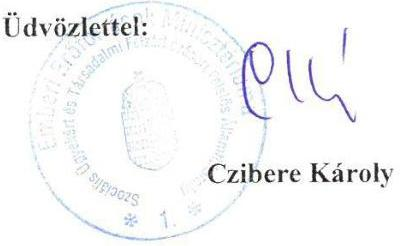

---

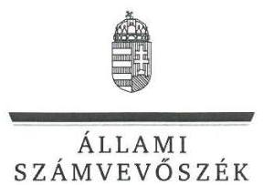

ELNÖK

Ikt.szám: V-0959-155/2016.

# Balog Zoltán úr 

miniszter
Emberi Erőforrások Minisztériuma

## Budapest

## Tisztelt Miniszter Úr!

Köszönettel megkaptam a 2016. augusztus 1. napján az Állami Számvevőszékhez érkezett „A központi alrendszer egyes intézményei pénzügyi és vagyongazdálkodásának ellenőrzése -Szabolcs-Szatmár-Bereg Megyei Gyermekvédelmi Központ Tiszadob" címủ számvevőszéki jelentéstervezetben foglalt megállapításokra és javaslatra a szociális ügyekért és társadalmi felzárkóztatásért felelős államtitkár úr által írásban tett észrevételeket.

Az Állami Számvevőszék észrevételekre vonatkozó álláspontjáról a felügyeleti vezető által készített részletes tájékoztatást mellékelten megküldöm.

Budapest, 2016. 08 hó 22 nap
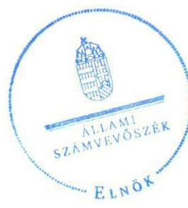

Tisztelettel:

## De. 49

Domokos László

Melléklet: Tájékoztatás az elfogadott észrevételekről

---

# Tájékoztatás   az elfogadott észrevételekről 

| 1. | Észrevétel: | Az 1.2. számú megállapítás 1 bekezdésében (18. oldal) a költségvetési beszámolók ellenőrzéséhez kapcsolódóan. |
| :--: | :--: | :--: |
|  | Válasz: | Az Állami Számvevőszék az észrevételt elfogadja. |
|  | Indoklás: | A helyszíni ellenőrzés során az Állami Számvevőszék rendelkezésére bocsátott dokumentumok ismételt áttekintése után az 1.2. számú megállapítás 1 bekezdés 3. mondatából az ,,SZGYF" kifejezést töröltük, a mondatot a következők szerint pontosítottuk (aláhúzással jelölve):   „A 2011. évre vonatkozóan a Közgyűlés, a 2012. év tekintetében a MIK, a 2013-2014. évek esetében az EMMI elvégezte a költségvetési beszámolók ellenőrzését." |
|  | Észrevétel: | Az emberi erőforrások miniszterének címzett 1. számú javaslathoz, és az azt megalapozó 1.1. számú megállapítás 5. bekezdéséhez (17. oldal) a 2013. és a 2014. években kiadott alapító okirat módosításhoz kapcsolódóan. |
|  | Válasz: | Az Állami Számvevőszék az észrevételt elfogadja. |
| 2. | Indoklás: | A dokumentumok ismételt áttekintése alapján az 1.1. számú megállapítás 5. bekezdés 2. mondatát töröltük.   A módosítással összhangban   - az 1.1. számú megállapítást a következők szerint pontosítottuk (kiegészítés aláhúzással jelölve). „Az alapítói jogok gyakorlása - az EMMI feladatellátása kivételével - nem felelt meg a jogszabályi előírásoknak."   - az Összegzés (5. oldal) első mondatát a következők szerint pontosítottuk (kiegészítés aláhúzással jelölve). „Az irányító szerveknek az intézményre vonatkozó feladatellátása - az EMMI feladatellátása kivételével - nem volt szabályszerű."   - a Főbb megállapítások, következtetések, javaslatok 1. bekezdés 1. mondatából ,,és az EMMI" kifejezést töröltük. Továbbá az 1. bekezdés 2. mondatából ,,a 2013-2014. években az alapító okirat hiányosan tartalmazta a jogszabály által előírtakat" szövegezést töröltük.   A megállapítások pontosításával összhangban az emberi erőforrások miniszterének címzett 1. számú javaslatot töröltük. |

Budapest, 2016. 08 hó 22 nap
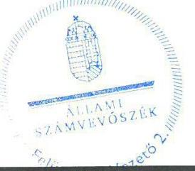

Salamon Ildikó
felügyeleti vezető

---

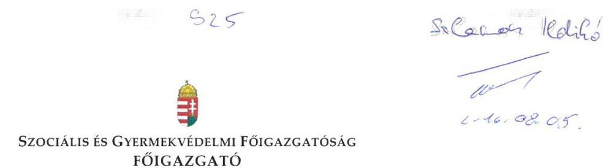

Iktatószám: SZGYF-IKT-8186/2016.
Ügyintéző: Palló Sándor

Tárgy: Észrevétel számvevőszéki jelentéstervezethez.

# Domokos László úr 

elnök

## Állami Számvevőszék

Budapest
Apáczai Csere János u. 10
1051

## Tisztelt Elnök Úr!

Köszönettel megkaptam a V-0959-150/2016 iktatószámú, a Szabolcs-Szatmár-Bereg Megyei Gyermekvédelmi Központ Tiszadob intézmény vonatkozásában „A központi alrendszer egyes intézményei pénzügyi és vagyongazdálkodásának ellenőrzése" címú ellenőrzésről készült számvevőszéki jelentéstervezetet tartalmazó levelet.

A vizsgált időszak alatt igen jelentős szervezeti és jogi környezetben bekövetkezett változások mellett végeztük munkánkat, és az átalakulások jelenleg is érintik szervezetünket. Munkatársaimmal együtt folyamatosan törekszünk a vonatkozó szabályozásnak megfelelő szabályozott, hatékonyan és eredményesen működő közszolgáltatások feltételrendszerének megteremtésére.

A kézhez kapott jelentéstervezettel kapcsolatban a következőkben részletezett észrevételeket szeretném tenni, melyek elfogadása esetén kérem a jelentés tervezet korrekcióját.

A jelentéstervezetben megfogalmazott javaslatok a Szociális és Gyermekvédelmi Főigazgatóság, mint középirányító szerv főigazgatójának részhez:

Az 1. számú javaslattal egyetértek, azonban szeretném Önt tájékoztatni arról, hogy a korábbi elmaradásokat felszámoló intézkedéseim keretében 2015. október 1-ével megtörtént az intézmény

---

által használt állami tulajdonú eszközök (ingatlanok) vagyonkezelői nyilvántartásába történő átvezetése. Ezzel párhuzamosan - a szakmai feladatellátás folyamatos biztosítása érdekében - a vagyonkezelői SZGYF ingyenes használatot biztosító használati szerződés intézménnyel történő megkötését előkészítette. Mivel azonban az intézmény - irányítószervi döntés alapján - érintett az intézményrendszert átalakító integrációs folyamatban, 2016. július 1-től beolvadt a Szabolcs-Szatmár-Bereg Megyei Gyermekvédelmi Központ nevű új integrált intézménybe. A vagyonhasznosítási szerződés megkötése az integrált intézménnyel 2016. július 27-én történt meg. Így az intézmény nyilvántartásai és beszámolója valós állapotot tükröz, illetve biztosított az intézmény számára a szakmai feladatellátást szolgáló ingatlanállomány ingyenes használata. Ezt munkatársaim ismertették is az ellenőrzést végző
 számvevővel. Kérnénk ennek a ténynek szerepeltetését nevezett megállapítás kiegészítésével.

A 2. számú javaslathoz: A jelentéstervezet nem tartalmazza a megállapítás alapjául szolgáló konkrét információt, arra vonatkozóan, hogy ezen a területen középirányítóként mit nem tettünk meg. A hivatkozott időszak alatt folyamatos kontrollt gyakoroltunk a hatékony gazdálkodás biztosítása érdekében. (belső ellenőrzés, vezetői és munkafolyamatba épített ellenőrzés: beszámolók, keret előrehozás, ill. költségvetési módosítások előzetes kontrollja, költségvetés tervezés kontrollja)

A vizsgált időszakban - 2012-ben került sor az intézmények „konszolidációjára”, mely folyamat jelentősen átalakította a közfeladat-ellátási rendszer egészét. Döntően a volt megyei önkormányzati intézmények működési zavarainak elhárítása miatt került sor az állami feladatátvételre. A 2012. évi költségvetést a MÁK és a NÁK által meghatározott sarok számokon belül kellett elkészítenünk. Általánosságban elmondható, hogy ezek a keretek az intézmények 2011. évi eredeti előirányzatainál alacsonyabb összegben lettek meghatározva, melyet az alábbi táblázat adatai is alátámasztanak. Az állami támogatás csökkenése ellenére az érintett időszakban a szakmai feladatellátás változatlan színvonalon biztosított maradt.

# A Szabolcs-Szatmár-Bereg Megyei Gyermekvédelmi Központ Tiszadob támogatási és működési bevételei 2011-2014. évben (Teljesítési adatok alapján) 

|  | Rovatok |  |  |
| :--: | :--: | :--: | :--: |
| Költségvetési év | B405 | B816 |  |
|  | Intézményi működési   bevételek | Irányítószervtől   kapott támogatás | Összesen |
| 2011. | 13150 | 199119 | 212269 |
| 2012. | 4696 | 193641 | 198337 |
| 2013. | 3125 | 204513 | 207638 |
| 2014. | 2489 | 230418 | 232907 |

---

A Szociális és Gyermekvédelmi Főigazgatóság, mint a Szabolcs-Szatmár-Bereg Megyei Gyermekvédelmi Központ Tiszadob gazdasági szervezeti feladatait ellátó szerv főigazgatójának részére:

# Észrevétel az 1. sz. javaslathoz: 

A Szociális és Gyermekvédelmi Főigazgatóság 11/2013. (II.26.) SZGYF utasítása a Szociális és Gyermekvédelmi Főigazgatóság Számviteli politikájáról (a továbbiakban: Számviteli politika 2013.) 2013. február 26. napján került kiadmányozásra. Ez valóban nem rendelkezett a 249/2000. (XII.24.) Korm. rendelet 8. § (13) bekezdésnek megfelelő döntésről.

A 2014. január 1-jétől hatályos 4/2013. (I. 11.) Korm. rendelet az államháztartás számviteléről (a továbbiakban: Áhsz.) 50. § (1) bekezdése egyértelműen rögzíti a számviteli politika elkészítéséért, módosításáért való felelősséget. ${ }^{1}$

A számviteli politika hatályának kiterjesztéséről az ellenőrzés által lefedett időszakot követően kiadott SZGYF szabályozás az alábbiak szerint intézkedett:

A Szociális és Gyermekvédelmi Főigazgatóság 1/2015. (IX.24.) SZGYF szabályzata a Szociális és Gyermekvédelmi Főigazgatóság számviteli politikájáról (a továbbiakban: Számviteli Politika 2015.) a 2. §-ban rögzíti: „A számviteli politika kiterjed a Főigazgatóság valamennyi szervezeti egységére. A Főigazgatóság fenntartása alá tartozó intézmények tekintetében a számviteli politika irányadó, az intézmények önállóan készítik el szabályzataikat.”
A 2015. szeptember 23-án az intézménnyel aláírt Megállapodás a gazdálkodást érintő feladatmegosztásról (a továbbiakban: Feladatmegosztási megállapodás) III. Az együttműködés területei 5. fejezetben fentiekkel összhangban rögzíti:
„Megyei Gazdasági Osztályt érintő feladatok, felelősségek:
Az államháztartás számviteléről szóló 4/2013. (I. 11.) Korm. rendeletben rögzítettek figyelembe vételével az Intézmény által készített, helyi sajátosságoknak megfelelő szabályzatokat jóváhagyja.

[^0]
[^0]:    1 Áhsz. 50. § (1) A költségvetési és a pénzügyi számvitel alkalmazásával kapcsolatos sajátos szabályokat, előírásokat, módszereket a számviteli politikában kell rögzíteni. A számviteli politika az Szt. 14. § (5) bekezdése szerinti szabályzatokból és a (7) bekezdés szerint szabályozandó más kérdéseket rögzítő dokumentumból áll. A számviteli politika elkészítéséért, módosításáért a 31. § (1) bekezdése szerinti személyek felelősek. A számviteli politika elkészítésére az Szt. 14. § (3)-(5), (8) és (11) bekezdésében foglaltakat a (2)-(7) bekezdésben foglalt kiegészítésekkel kell alkalmazni.

---

Intézményt érintő feladatok, felelősségek:
Az államháztartás számviteléről szóló 4/2013. (I. 11.) Korm. rendeletben rögzítettek figyelembe vételével az Intézmény helyi sajátosságoknak megfelelő szabályzatait elkészíti, jóváhagyásra a Megyei Gazdasági Osztályra megküldi.”

Fentiekre figyelemmel a javaslat címzettje véleményünk szerint nem az SZGYF főigazgatója, hanem az intézmény vezetője lehet.

A 3. számú javaslattal egyetértek, azonban kérem a következők figyelembe vételét:
Az intézménnyel a gazdasági szervezeti feladatok ellátására kötött munkamegosztási megállapodás 2015. szeptember 23. napjától hatályba lépett, amely megfelel a javaslatban rögzített szempontoknak.

A 6. számú javaslattal kapcsolatban tájékoztatom, hogy a 2014. évi elemi költségvetési beszámoló benyújtásának elhúzódását az okozta, hogy az NGM-től (előirányzat-módosítások miatt) a beszámoló újranyitását kellett kérni, melyet az NGM engedélyezett, ez a határidő meghosszabbításával járt.

A 8. számú javaslattal kapcsolatosan tájékoztatom, hogy az intézmény vagyonkezelésébe nem tartozó ingatlanok számviteli nyilvántartásból történő kivezetése 2015. október 1-ével megtörtént.

Tájékoztatom, hogy továbbiakban fel kívánjuk használni jelen ellenőrzés megállapításait, valamint az ellenőrzéssel való közös munkánk tapasztalatait. A feltárt hiányosságok jelentős részét már az ellenőrzés során javítottuk, illetve pótoltuk.

Az ellenőrzés során tapasztalt segítő együttműködésüket köszönöm!

Budapest, 2016. augusztus „.„.

Tisztelettel:
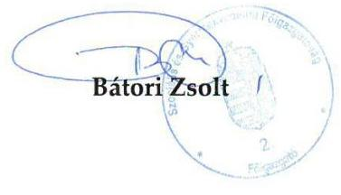

---

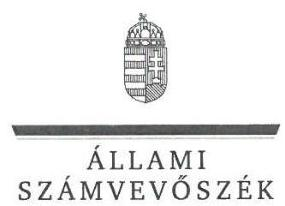

# Bátori Zsolt úr 

főigazgató
Szociális és Gyermekvédelmi Főigazgatóság

## Budapest

## Tisztelt Főigazgató Úr!

Köszönettel megkaptam a 2016. augusztus 5. napján az Állami Számvevőszékhez érkezett „A központi alrendszer egyes intézményei pénzügyi és vagyongazdálkodásának ellenőrzése - Szabolcs-Szatmár-Bereg Megyei Gyermekvédelmi Központ Tiszadob” címû számvevőszéki jelentéstervezetben foglalt javaslatokra írásban tett észrevételeit.

Tájékoztatom Főigazgató urat, hogy a jelentésben - az Állami Számvevőszékről szóló 2011. évi LXVI. törvény 29. § (3) bekezdése alapján - a figyelembe nem vett észrevételeket szerepeltetjük az elutasítás indokainak feltüntetésével együtt.

Az Állami Számvevőszék észrevételekre vonatkozó álláspontjáról a felügyeleti vezető által készített részletes tájékoztatást mellékelten megküldöm.

Budapest, 2016. 08. hó 24. nap
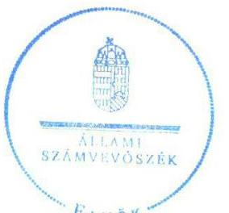

Tisztelettel:

Domokos László

Melléklet: Tájékoztatás az el nem fogadott észrevételekről

---

# Tájékoztatás   az el nem fogadott észrevételekről 

|  |  |
| :-- | :-- |

## Javaslatokhoz kapcsolódó észrevételek

A Szociális és Gyermekvédelmi Főigazgatóság mint középirányító szerv főigazgatójának címzett 2. számú javaslathoz (1.2. számú megállapítás 4. bekezdés 3. mondata alapján)
Az Állami Számvevőszék az észrevételt nem fogadja el.
Az ellenőrzési megállapítás a jogszabályban foglaltak szerinti részletezettséggel tartalmazza, hogy a Szociális és Gyermekvédelmi Főigazgatóság (továbbiakban: SZGYF) a 2013-2014. évben a Szociális és Gyermekvédelmi Főigazgatóságról szóló 316/2012. (XI. 13.) Korm. rendelet 3. § (2) bekezdés g) pontjában előírtak ellenére „nem érvényesítette, nem kérte számon és nem ellenőrizte az előirányzatokkal, létszámokkal és vagyonnal való hatékony gazdálkodás követelményeit”.
A helyszíni ellenőrzés során az Állami Számvevőszék rendelkezésére bocsátott beszámolók, keret előrehozás, költségvetési módosítások, költségvetési tervezés kontrollját biztosító dokumentumok a szabályszerű gazdálkodás egyes területeinek érvényesítését, számon kérését igazolják, azonban az erőforrásokkal való hatékony gazdálkodás követelményeinek érvényesítésére, számon kérésére, ellenőrzésére vonatkozó információt nem tartalmaznak.
Az ellenőrzés - az Ellenőrzési programban foglaltak szerint - arra irányult, hogy az irányító (illetve a középirányító) szerv érvényesítette-e, számon kérte-e, ellenőrizte-e az erőforrásokkal való hatékony gazdálkodáshoz szükséges követelményeket, amelyekkel kapcsolatban dokumentumokat nem bocsátottak az ellenőrzés rendelkezésére. Az Állami Számvevőszék ellenőrzése nem terjedt ki az erőforrásokkal való gazdálkodás hatékonyságának, valamint a szakmai feladatellátás színvonalának a megítélésére. Ennek következtében az intézmények 2012. évi „konszolidációjával”, továbbá ennek keretében a Szabolcs-Szatmár-Bereg Megyei Gyermekvédelmi Központ Tiszadob működési és támogatási bevételeinek alakulásával kapcsolatos tájékoztatásban foglaltak – amelyeket köszönettel vettünk – az ellenőrzési megállapítást, valamint az ahhoz kapcsolódóan tett javaslatot nem módosítják.

---

|  | Javaslatokhoz kapcsolódó észrevételek |  |
| :--: | :--: | :--: |
|  | A Szociális és Gyermekvédelmi Főigazgatóság mint a Szabolcs-Szatmár-Bereg Megyei Gyermekvédelmi Központ Tiszadob gazdasági szervezeti feladatait ellátó szerv főigazgatójának címzett 1. számú javaslathoz, (2.1. számú megállapítás 4. bekezdés 2-4. mondata alapján) a Számviteli politika és annak keretében elkészítendő szabályzatokhoz, valamint a javaslat címzettjéhez kapcsolódóan. | A számú javaslathoz, (2.1. számú megállapítás 4. bekezdés 2-4. mondata alapján) a Számviteli politika és annak keretében elkészítendő szabályzatokhoz, valamint a javaslat címzettjéhez kapcsolódóan. |
|  | Válasz: | Az Állami Számvevőszék az észrevételt nem fogadja el. |
| 2. |  | A javaslathoz kapcsolódó észrevétel a jelentéstervezet 2.1 számú megállapítás 4. bekezdés 2-4. mondatában szereplő megállapítást nem vitatja, annak körülményeiről, továbbá az időközben megtett intézkedésekről ad további tájékoztatást.   A jogszabályban foglaltakkal összhangban az ellenőrzési megállapítás tartalmazza, hogy az intézményre is vonatkozó számviteli politikát, és az annak keretében elkészítendő szabályzatokat - az államháztartás számviteléről szóló 4/2013. (I. 11.) Korm. rendelet (továbbiakban Áhsz.) 50. § (1) bekezdésében, és az abban hivatkozott 31. § (1) bekezdésében foglaltak ellenére - a 2014. évben sem adott ki a gazdálkodási feladatokat ellátó SZGYF.   A 2014. január 1-jétől hatályos Áhsz. 50. § (1) bekezdése szerint a „...számviteli politika elkészítéséért, módosításáért a 31. § (1) bekezdése szerinti személyek felelősek.” Az Áhsz. 31. § (1) bekezdése szerint „az éves költségvetési beszámoló elkészítéséért az éves költségvetési beszámolót készítő szerv vezetője felelős.” |
|  | Indoklás: | A megyei intézményfenntartó központokról, valamint a megyei önkormányzatok konszolidációjával, a megyei önkormányzati intézmények és a Fővárosi Önkormányzat egészségügyi intézményeinek átvételével összefüggő egyes kormányrendeletek módosításáról szóló 258/2011. (XII. 7.) Korm. rendelet (továbbiakban Konsz. rendelet) 15. § (2) bekezdése kimondja, hogy az „átvett intézmények közül az önállóan működő költségvetési szervek gazdálkodással összefüggő feladatait 2012. január 1-jétől a megyei intézményfenntartó központ látja el”. A Konsz. rendelet 11. § (1) bekezdés b) pontja alapján a MIK meghatározza „az irányítása alá tartozó költségvetési szervek gazdálkodásának részletes rendjét”. A Konsz. rendelet 18. §-a pedig rögzíti, hogy a „megyei intézményfenntartó központok 2013. március 31-én a Szociális és Gyermekvédelmi Főigazgatóságba történő beolvadással megszünnek. A Szociális és Gyermekvédelmi Főigazgatóság a megszűnt megyei intézményfenntartó központok általános és egyetemleges jogutódja.” |

---

|  | A Szociális és Gyermekvédelmi Főigazgatóságról szóló 316/2012. (XI. 13.) Korm. rendelet 4. § (3) bekezdés c) pontja szerint a központi szerv a fenntartott intézmények vonatkozásában fenntartói hatáskörként gyakorolja, hogy ,,javaslatot tesz a fenntartott költségvetési szervek éves költségvetésére, meghatározza a gazdálkodásuk részletes rendjét”.   A fentiek alapján megállapítható, hogy az önállóan működő költségvetési szerv - a Szabolcs-Szatmár-Bereg Megyei Gyermekvédelmi Központ Tiszadob - esetében a gazdálkodással összefüggő feladatok ellátásáért és az irányítása alá tartozó költségvetési szervek gazdálkodásának részletes rendje meghatározásáért a 2012. évtől a Szabolcs-Szatmár-Bereg Megyei Intézményfenntartó Központ (MIK), a 2013. évtől (MIK általános jogutódjaként) az SZGYF volt a felelős. A Szabolcs-Szatmár-Bereg Megyei Gyermekvédelmi Központ Tiszadob önálló gazdálkodási jogkörrel nem rendelkezett, így az intézményre kiterjedő Számviteli politika, és az annak keretében elkészítendő szabályzatok kiadása az SZGYF feladata volt.   A fentiekre tekintettel a megállapítás és a kapcsolódó javaslat, továbbá a javaslat címzettjének módosítása nem indokolt.   Az észrevételben hivatkozott 1/2015. (IX. 24.) számú SZGYF szabályzat a Szociális és Gyermekvédelmi Főigazgatóság Számviteli politikájáról, és az intézménnyel 2015. szeptember 23-tól hatályba lépett munkamegosztási megállapodás ellenőrzött időszakot követően megtett intézkedés, így az nem módosítja az ellenőrzés megállapításait. |
| :--: | :--: | :--: |
|  | Javaslatokhoz kapcsolódó észrevételek |  |
|  | Észrevétel: | A Szociális és Gyermekvédelmi Főigazgatóság mint a

 Szabolcs-Szatmár-Bereg Megyei Gyermekvédelmi Központ Tiszadob gazdasági szervezeti feladatait ellátó szerv főigazgatójának címzett 6. számú javaslathoz (3.4. számú megállapítás 3. bekezdés alapján) |
|  | Válasz: | Az Állami Számvevőszék az észrevételt nem fogadja el. |
| 3. | Indoklás: | A javaslathoz kapcsolódó észrevétel a jelentéstervezet 3.4. számú megállapítás 3. bekezdésében szereplő megállapítást nem vitatja, annak körülményeiről ad tájékoztatást.   Az irányító szerv felé történő adatszolgáltatási kötelezettséget jogszabály - az államháztartás számviteléről szóló 4/2013. (I. 11.) Korm. rendelet 32. § (1) bekezdése - írta elő. A jogszabály szerint az éves költségvetési beszámoló megküldésének határideje a költségvetési évet követő év február 28-a.   Tekintettel arra, hogy az adatszolgáltatás teljesítésére a jogszabályban előírt határidőt követően került sor, a megállapítás és a kapcsolódó javaslat módosítása nem indokolt. |

---

Köszönettel vettük tájékoztatását a Szociális és Gyermekvédelmi Főigazgatóság mint középirányító szerv főigazgatójának címzett 1. számú javaslathoz, továbbá a Szociális és Gyermekvédelmi Főigazgatóság mint a Szabolcs-Szatmár-Bereg Megyei Gyermekvédelmi Központ Tiszadob gazdasági szervezeti feladatait ellátó szerv főigazgatójának címzett 3. és 8. számú javaslatokhoz kapcsolódóan a hiányosságok felszámolására, valamint az ellenőrzés megállapításainak, tapasztalatainak a felhasználására vonatkozóan. Tájékoztatom Főigazgató urat, hogy az ellenőrzött időszakot követően megtett intézkedéseket az Állami Számvevőszék nem értékelte, azok az ellenőrzés megállapításait nem módosítják.

Budapest, 2016. 06. 02. nap

Salamon Ildikó felügyeleti vezető

---

# Szabolcs-Szatmár-Bereg Megyei Gyermekvédelmi Központ Mátészalka, Képes Géza út 2. 

Tisztelt Domokos László Úr!

Hivatkozásul a V-0959-157/2016 számú ügyiratukra, a Szabolcs-Szatmár-Bereg Megyei Gyermekvédelmi Központ Tiszadob intézmény ÁSZ ellenőrzésével kapcsolatban észrevételt nem kívánok tenni.

Mátészalka, 2016.08.08
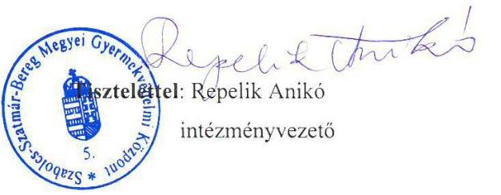

---

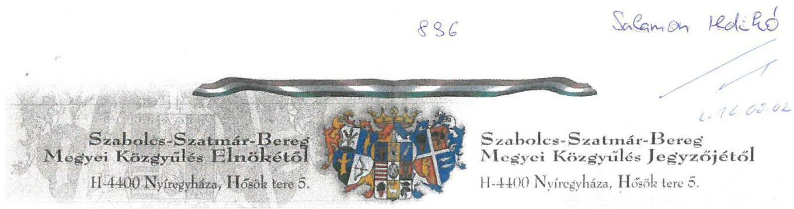

57-4/2016/ált.

Tárgy: Szabolcs-Szatmár-Bereg Megyei Gyermekvédelmi Központ Tiszadob ellenőrzés jelentéstervezetre észrevétel

Ügyintéző neve: Monostori Ibolya

## Domokos László

## Elnök Úr

Állami Számvevőszék

## Budapest 4

1364
Pf. 54.

ÁLLAMI SZÁMVEVŐSZÉK
06598416016
Erkizel: 2016 AUG 02
Btadózám: U-0909-162/XK
Melléklet:

## Tisztelt Elnök Úr!

„A központi alrendszer egyes intézményei pénzügyi és vagyongazdálkodásának ellenőrzése -Szabolcs-Szatmár-Bereg Megyei Gyermekvédelmi Központ Tiszadob" címmel készített jelentéstervezetet megkaptuk, mellyel kapcsolatban nem kívánunk észrevételt tenni.

Az elvégzett munkájukat ezúton is megköszönjük.
Nyíregyháza, 2016. július 26.
Tisztelettel:
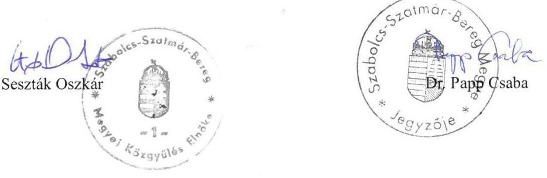

Elnök: Tel.:(+36)42/599-501 $\cdot$ Fax: (+36)42/599-512 $\cdot$ E-mail: elnok@szatbun.hu
jegyzés: Tel.:(+36)42/599-510 $\cdot$ Fax: (+36)42/599-514 $\cdot$ E-mail: jegyeu@szatbun.hu

---

# RÖVIDÍTÉSEK JEGYZÉKE 

${ }^{1}$ ÁSZ
${ }^{2}$ GYK
${ }^{3}$ Önkormányzat
${ }^{4}$ Közgyűlés
${ }^{5}$ KIM
${ }^{6}$ MIK
${ }^{7}$ SZGYF
${ }^{8}$ Intézmény
${ }^{9}$ Gyvtv.
${ }^{10}$ EMMI
${ }^{11}$ Konsz. tv.
${ }^{12}$ GIG
${ }^{13}$ Együttműködési megállapodás:
${ }^{14}$ 258/2011. (XII. 7) Korm. rendelet
${ }^{15}$ Együttműködési megállapodás:
${ }^{16} \mathrm{Vtv}$.
${ }^{17}$ MNV Zrt.
${ }^{18} \mathrm{Vtvr}$.
${ }^{19}$ Alaptörvény
${ }^{20}$ Nvtv.
${ }^{21}$ Áht. 2
${ }^{22}$ Ávr.
${ }^{23}$ Áht. 1

Állami Számvevőszék
Szabolcs-Szatmár-Bereg Megyei Önkormányzat Gyermekvédelmi Központja Tiszadob (2011. december 31.-ig)
Szabolcs-Szatmár-Bereg Megyei Gyermekvédelmi Központ Tiszadob (2012. január 1-jétől)
Szabolcs-Szatmár-Bereg Megyei Önkormányzat
Szabolcs-Szatmár-Bereg Megyei Önkormányzat Közgyűlése
Közigazgatási és Igazságügyi Minisztérium
Szabolcs-Szatmár-Bereg Megyei Intézményfenntartó Központ
Szociális és Gyermekvédelmi Főigazgatóság
Szabolcs-Szatmár-Bereg Megyei Önkormányzat Gyermekvédelmi Központja Tiszadob (2011. december 31.-ig)
Szabolcs-Szatmár-Bereg Megyei Gyermekvédelmi Központ Tiszadob (2012. január 1-jétől)
a gyermekek védelméről és a gyámügyi igazgatásról szóló 1997. évi XXXI. törvény (hatályos: 1998. január 1-jétől)
Emberi Erőforrások Minisztériuma
a megyei önkormányzatok konszolidációjáról, a megyei önkormányzati intézmények és a Fővárosi Önkormányzat egyes egészségügyi intézményeinek átvételéről szóló 2011. évi CLIV. törvény (hatályos: 2011. november 26-tól)
Szabolcs-Szatmár-Bereg Megyei Önkormányzat Gazdasági Igazgatósága
az intézmény és a GIG között létrejött, a gazdálkodási feladatok megosztására vonatkozó megállapodás (hatályos: 2011. március 1-jétől)
a megyei intézményfenntartó központokról, valamint a megyei önkormányzatok konszolidációjával, a megyei önkormányzati intézmények és a Fővárosi Önkormányzat egészségügyi intézményeinek átvételével összefüggő egyes kormányrendeletek módosításáról szóló 258/2011.(XII. 7.) Korm. rendelet (hatályos: 2011. december 8-tól)
az intézmény és a MIK között létrejött, a gazdálkodási feladatok megosztására vonatkozó megállapodás (hatályos: 2012. április 2-től)
az állami vagyonról szóló törvény 2007. évi CVI. törvény (hatályos: 2007. szeptember 25-től)
Magyar Nemzeti Vagyonkezelő Zrt.
az állami vagyonnal való gazdálkodásról szóló 254/2007. (X. 4.) Korm. rendelet (hatályos: 2007. október 4-től)
Magyarország Alaptörvénye (hatályos 2012. január 1-jétől)
a nemzeti vagyonról szóló 2011. évi CXCVI. törvény (hatályos 2012. január 1-jétől)
az államháztartásról szóló 2011. évi CXCV. törvény (hatályos 2012. január 1-jétől)
az államháztartásról szóló törvény végrehajtásáról szóló 368/2011. (XII. 31.) Korm. rendelet (hatályos 2012. január 1-jétől)
az államháztartásról szóló 1992. évi XXXVIII. törvény (hatálytalan: 2012.január 1-jétől)

---

${ }^{24}$ Ámr.
${ }^{25}$ Bkr.
${ }^{26}$ ÁSZ tv.
${ }^{27}$ ÁSZ SZMSZ
${ }^{28}$ Alapító okirat

29 Kincstár
${ }^{30}$ SZMSZ
${ }^{31}$ 316/2012. (XI. 13.) Korm. rendelet
${ }^{32}$ Etikai kódex
${ }^{33}$ Számviteli politika
${ }^{34}$ Leltározási szabályzat
${ }^{35}$ Értékelési szabályzat
${ }^{36}$ Önköltség számítási szabályzat
${ }^{37}$ Sztv.
az államháztartás működési rendjéről szóló 292/2009. (XII. 19.) Korm. rendelet (hatálytalan: 2012. január 1-jétől)
a költségvetési szervek belső kontrollrendszeréről és belső ellenőrzéséről szóló 370/2011. (XII. 31.) Korm. rendelet (hatályos 2012. január 1-jétől)
az Állami Számvevőszékről szóló 2011. évi LXVI. törvény (hatályos 2011. július 1-jétől)
Állami Számvevőszék Szervezeti és Működési Szabályzata
Szabolcs-Szatmár-Bereg Megyei Önkormányzat Gyermekvédelmi Központja Tiszadob Alapító okirata (hatályos: 2009. szeptember 25-től)
Szabolcs-Szatmár-Bereg Megyei Önkormányzat Gyermekvédelmi Központja Tiszadob Alapító okirata (hatályos: 2011. február 25-től)
Szabolcs-Szatmár-Bereg Megyei Önkormányzat Gyermekvédelmi Központja Tiszadob Alapító okirata (hatályos: 2011. július 1-jétől)
Szabolcs-Szatmár-Bereg Megyei Önkormányzat Gyermekvédelmi Központja Tiszadob Alapító okirata (hatályos: 2011. augusztus 1-jétől)
Szabolcs-Szatmár-Bereg Megyei Gyermekvédelmi Központ Tiszadob Alapító okirata (hatályos: 2012. január 1-jétől)
Szabolcs-Szatmár-Bereg Megyei Gyermekvédelmi Központ Tiszadob Alapító okirata (hatályos: 2013. január 1-jétől)
Szabolcs-Szatmár-Bereg Megyei Gyermekvédelmi Központ Tiszadob Alapító okirata kiegészítése (hatályos: 2014. január 1-jétől)
Magyar Államkincstár
Szabolcs-Szatmár-Bereg Megyei Gyermekvédelmi Központ Tiszadob Szervezeti és Működési Szabályzata:
Szabolcs-Szatmár-Bereg Megyei Önkormányzat Gyermekvédelmi Központja Tiszadob SZMSZ-e (hatályos 2010. február 24-től)
Szabolcs-Szatmár-Bereg Megyei Önkormányzat Gyermekvédelmi Központja Tiszadob SZMSZ-e (hatályos 2011. július 13-tól)
Szabolcs-Szatmár-Bereg Megyei Gyermekvédelmi Központ Tiszadob SZMSZ-e (hatályos: 2012. június 13-tól)
Szabolcs-Szatmár-Bereg Megyei Gyermekvédelmi Központ Tiszadob SZMSZ-e (hatályos: 2013. június 21-től)
Szabolcs-Szatmár-Bereg Megyei Gyermekvédelmi Központ Tiszadob SZMSZ-e (hatályos 2014. szeptember 5-től)
a Szociális és Gyermekvédelmi Főigazgatóságról szóló 316/2012. (XI. 13.) Korm. rendelet (hatályos: 2012. november 16-tól)
A szociális munka etikai kódexe (hatályos: 2011. április 29-től)
A szociális munka megújított etikai kódexe (hatályos: 2014. november 1-jétől)
Szabolcs-Szatmár-Bereg Megyei Önkormányzat Gyermekvédelmi Központja Tiszadob Számviteli Politikája (hatályos: 2008. január 1-jétől)
Szabolcs-Szatmár-Bereg Megyei Önkormányzat Gyermekvédelmi Központja Tiszadob Leltározási és leltárkészítési szabályzat (hatályos: 2008. január 1-jétől)
Szabolcs-Szatmár-Bereg Megyei Önkormányzat Gyermekvédelmi Központja Tiszadob Eszközök és források értékelési szabályzata (hatályos: 2008. január 1-jétől)
Szabolcs-Szatmár-Bereg Megyei Önkormányzat Gyermekvédelmi Központja Tiszadob Önköltség számítási szabályzata (hatályos: 2010. május 20-tól)
a számvitelről szóló 2000. évi C. törvény (hatályos: 2001. január 1-jétől)

---

${ }^{38}$ Áhsz. 2
${ }^{39}$ GIG számviteli politikája
${ }^{40}$ MIK számviteli politikája
${ }^{41}$ SZGYF számviteli politikája
${ }^{42}$ Gazdálkodási szabályzat
${ }^{43}$ FEUVE szabályzat
${ }^{44}$ Szabálytalanságkezelési eljárásrend
${ }^{45}$ Kockázatkezelési szabályzat
${ }^{46}$ Vnytv.
${ }^{47}$ Info. tv.
${ }^{48}$ Informatikai biztonsági szabályzat
${ }^{49}$ Avtv.
${ }^{50}$ Eitv.
${ }^{51}$ Ltv.
az államháztartás számviteléről szóló 4/2013. (I. 11.) Korm. rendelet (hatályos: 2014. január 1-jétől)

Szabolcs-Szatmár-Bereg Megyei Önkormányzat Gazdasági Igazgatóság Számviteli politika (hatályos: 2011. március 22-től)
Szabolcs-Szatmár-Bereg Megyei Intézményfenntartó Központ Számviteli politika (hatályos: 2012. március 1-jétől)
a Szociális és Gyermekvédelmi Főigazgatóság Főigazgatójának 11/2013. (II. 26.) SZGYF utasítása a Szociális és Gyermekvédelmi Főigazgatóság számviteli politikájáról (hatályos: 2013. február 27-től)
Szabolcs-Szatmár-Bereg Megyei Önkormányzat Gyermekvédelmi Központja Tiszadob Kötelezettségvállalási szabályzat (hatályos: 2008. január 1-jétől)
Szabolcs-Szatmár-Bereg Megyei Önkormányzat Gazdasági Igazgatósága Szabályzat a kötelezettségvállalás, utalványozás, érvényesítés és ellenjegyzés hatásköri rendjéről (hatályos: 2011. április 1-jétől)
Szabolcs-Szatmár-Bereg Megyei Intézményfenntartó Központ Szabályzat a kötelezettségvállalás, utalványozás, érvényesítés és ellenjegyzés hatásköri rendjéről (hatályos: 2012. március 1-jétől)
Szabolcs-Szatmár-Bereg Megyei Intézményfenntartó Központ Szabályzat a kötelezettségvállalás, utalványozás, érvényesítés és ellenjegyzés hatásköri rendjéről (hatályos: 2013. február 18-tól)
Szociális és Gyermekvédelmi Főigazgatóság 7/2013. sz. Főigazgatói utasítása a kötelezettségvállalás, pénzügyi ellenjegyzés, teljesítésigazolás, érvényesítés, utalványozás rendjének szabályozásáról (hatályos: 2013. január 25-től)
Szociális és Gyermekvédelmi Főigazgatóság 13/2013. sz. Főigazgatói utasítása Ideiglenes Gazdálkodási Szabályzat kiadásáról (hatályos: 2013. április 4-től)
Szociális és Gyermekvédelmi Főigazgatóság 23/2013. sz. Főigazgatói utasítása a Gazdálkodási Szabályzat kiadásáról (hatályos: 2013. szeptember 2-tól)
Szabolcs-Szatmár-Bereg Megyei Önkormányzat Gyermekvédelmi Központja Tiszadob FEUVE szabályzata (hatályos: 2010. január 1-jétől)
FEUVE szabályzat részeként (hatályos: 2010. január 1-jétől)
Szabolcs-Szatmár-Bereg Megyei Gyermekvédelmi Központ Tiszadob A szabálytalanságok kezelésének eljárásrendje (hatályos: 2014. december 20-tól)
FEUVE szabályzat részét képező kockázatkezelési szabályzat (hatályos: 2010. január 1-jétől)
Szabolcs-Szatmár-Bereg Megyei Gyermekvédelmi Központ Tiszadob Kockázatkezelési szabályzata (hatályos 2012. szeptember 1-jétől)
az egyes vagyonnyilatkozat-tételi kötelezettségekről szóló 2007. évi CLII. törvény (hatályos: 2007. december 6-tól)
az információs önrendelkezési jogról és az információszabadságról szóló 2011. évi CXII. törvény (hatályos 2011. július 27-től)
Szabolcs-Szatmár-Bereg Megyei Önkormányzat Gyermekvédelmi Központja Tiszadob Informatikai biztonsági szabályzat (hatályos: 2009. január 1-jétől)
Szabolcs-Szatmár-Bereg Megyei Gyermekvédelmi Központ Tiszadob Informatikai biztonsági szabályzat (hatályos: 2012. május 1-jétől)
a személyes adatok védelméről és a közérdekű adatok nyilvánosságáról szóló 1992. évi LXIII. törvény (hatálytalan: 2012. január 1-jétől)
az elektronikus információszabadságról szóló 2005. évi XC. törvény (hatálytalan: 2012. január 1-jétől)
a köziratokról, a közlevéltárakról és a magánlevéltári anyag védelméről szóló 1995. évi LXVI. törvény (hatályos: 1996. január 1-jétől)

---

${ }^{52}$ Ikr.
${ }^{53}$ Ötv. 1
${ }^{54}$ Ber.
${ }^{55}$ 18/2013. (V.06.) SZGYF utasítás
${ }^{56}$ Gazdasági és Vagyonbizottság
${ }^{57}$ NGM rendelet
${ }^{58}$ Kormányhivatal kormánymegbízottja
${ }^{59}$ Közgyűlés elnöke
a közfeladatot ellátó szervek iratkezelésének általános követelményeiről szóló 335/2005. (XII. 29.) Korm. rendelet (hatályos: 2006.január 1-jétől)
a helyi önkormányzatokról szóló 1990. évi LXV. törvény (hatálytalan: 2014. október 12-től)
a költségvetési szervek belső ellenőrzéséről szóló 193/2003. (XI. 26.) Korm. rendelet (hatálytalan 2012. január 1-jétől)
az állami vagyonra vonatkozó jogszabályokból eredő egyes jogok és kötelezettségek megosztásáról, irányadó eljárásrendekről szóló 18/2013. (V. 06.) SZGYF utasítás (hatályos: 2013. május 6-tól)
Szabolcs-Szatmár-Bereg Megyei Közgyűlés Gazdasági és Vagyonbizottsága
az államháztartás számvitelének 2014. évi megváltozásával kapcsolatos feladatokról szóló 36/2013. (IX. 13.) NGM rendelet (hatályos: 2013. szeptember 14-től)
Szabolcs-Szatmár-Bereg Megyei Kormányhivatal kormánymegbízottja
Szabolcs-Szatmár-Bereg Megyei Közgyűlés elnöke

---

.

---

# ÁLLAMI SZÁMVEVŐSZÉK 

1052 Budapest, Apáczai Csere János utca 10.
Levélcím: 1364 Budapest 4. Pf. 54
Telefon: +36 14849100 Telefax: +36 14849200
www.asz.hu

