# Jelentés 

## A központi alrendszer egyes intézményei ellenőrzése

A központi alrendszer egyes intézményei pénzügyi és vagyongazdálkodásának ellenőrzése - Zala Megyei Szocioterápiás Intézmény
2016.

---

.

---

# Jelentés 

## A központi alrendszer egyes intézményei ellenőrzése

A központi alrendszer egyes intézményei pénzügyi és vagyongazdálkodásának ellenőrzése - Zala Megyei Szocioterápiás Intézmény
2016. 09. hó 08. nap
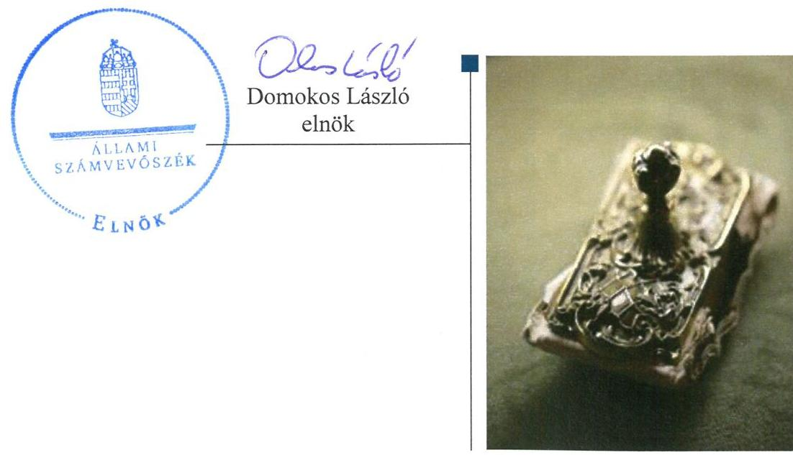

---

# AZ ELLENŐRZÉST FELÜGYELTE:

- **SALAMON ILDIKÓ** felügyeleti vezető

- **AZ ELLENŐRZÉST VEZETTE ÉS A VÉGREHAJTÁSÁÉRT FELELŐS:**

- **KOVÁTS TIBOR BALÁZS** ellenőrzésvezető

- **A PROGRAM ÖSSZEÁLLÍTÁSÁÉRT FELELŐS:**

- **JANIK JÓZSEF** osztályvezető

- **BÖRÖCZ IMRE** projektfelelős

- **A TÉMÁHOZ KAPCSOLÓDÓ KORÁBBI SZÁMVEVŐSZÉKI JELENTÉSEK:**
  - címe: Jelentés Magyarország 2014. évi központi költségvetése végrehajtásának ellenőrzéséről
  - sorszáma: 15167

**Jelentéseink az Országgyűlés számítógépes hálózatán és az Interneten a www.asz.hu címen is olvashatóak.**

**IKTATÓSZÁM: V-0966-171/2016.**

**TÉMASZÁM: 2000**

**ELLENŐRZÉS-AZONOSÍTÓ SZÁM: V071314**

---

# TARTALOMJEGYZÉK 

■ ÖSSZEGZÉS ..... 5
■ AZ ELLENŐRZÉS CÉLJA ..... 7
■ AZ ELLENŐRZÉS TERÜLETE ..... 8
■ AZ ELLENŐRZÉS HÁTTERE, INDOKOLTSÁGA ..... 10
■ FÓKUSZKÉRDÉSEK ..... 12
■ ELLENŐRZÉS HATÓKÖRE ÉS MÓDSZEREI ..... 13
■ MEGÁLLAPÍTÁSOK ..... 17
■ JAVASLATOK ..... 37
■ MELLÉKLETEK ..... 43
I. sz. melléklet: Értelmező szótár ..... 43
II. sz. melléklet: A munkamegosztási megállapodás alapján az intézmény és a gazdálkodási feladatokat ellátók közötti felelősségi körök megosztása a 2012-2014. években ..... 47
III. sz. melléklet: A belső kontrollrendszer kialakításának és működtetésének értékelése a 2011-2014. években ..... 48
IV. sz. melléklet: A kiegészítő teljesítmény-ellenőrzési modul megállapításai ..... 49
V. sz. melléklet: Az integritás szemlélet érvényesítésével kapcsolatos megállapítások ..... 50
VI. sz. melléklet: A kiadási és bevételi előirányzatok és azok teljesítése a 2011-2014. években (E Ft-ban) ..... 51
■ FÜGGELÉK: ÉSZREVÉTELEK ..... 53
■ RÖVIDÍTÉSEK JEGYZÉKE ..... 69

---

.

---

# ÖSSZEGZÉS 

Az irányító szerveknek az intézményre vonatkozó feladatellátása - az EMMI feladatellátása kivételével - nem volt szabályszerű. Az intézményvezető által kialakított belső irányítási rendszer nem biztosította a szabályszerű, átlátható és elszámoltatható közpénzfelhasználást. A pénzügyi gazdálkodás nem volt szabályszerű, a bevételi előirányzatok teljesítése és a kiadási előirányzatok felhasználása során nem tartották be a jogszabályi előírásokat. Az intézmény vagyongazdálkodása a központi alrendszerbe kerülést követően nem felelt meg a jogszabályi előírásoknak, az intézmény beszámolói nem mutattak a vagyoni, pénzügyi és jövedelmi helyzetről megbízható és valós képet. Az intézmény nem tett erőfeszítéseket az integritás szemlélet érvényesítése érdekében.

## Az ellenőrzés társadalmi indokoltsága

A közpénzek felhasználásában és az állami vagyonnal való gazdálkodásban a központi alrendszer egyes intézményei meghatározó súlyt képviselnek. E szervezetekkel szemben társadalmi igény, hogy tevékenységükről a döntéshozók és a nyilvánosság felé elszámoljanak. A társadalmi igénnyel és az ÁSZ ${ }^{1}$ Stratégiájával összhangban, a közpénzügyek átláthatóságának előmozdítása, a közvagyon védelme érdekében került sor a ZMSZI² pénzügyi- és vagyongazdálkodásának ellenőrzésére. Az ellenőrzés által feltártak alapján kiemelten indokolt volt a számvevőszéki ellenőrzés lefolytatása.

## Főbb megállapítások, következtetések, javaslatok

A 2011. évben az Önkormányzat ${ }^{3}$ Közgyűlése ${ }^{4}$, a 2012. évben a KIM ${ }^{5}$ irányítószervi feladatellátása, a 2012. évben a MIK $^{6}$, a 2013-2014. években az SZGYF ${ }^{7}$ középirányító szervi feladatellátása nem volt szabályszerű. A 2012. évben kiadott alapító okiratot 2012. január 30-ig a Kincstárhoz nem nyújtották be.

Az intézmény ${ }^{8}$ belső kontrollrendszerének kialakítása és működtetése nem felelt meg a jogszabályi előírásoknak, ezért nem biztosította a szabályszerű, átlátható és elszámoltatható közpénzfelhasználást. Ezen belül a kockázatkezelési rendszer és a kontrolltevékenység kialakítása és működtetése nem volt szabályszerű, továbbá a kontrollkörnyezet, az információs és kommunikációs rendszer és a monitoring rendszer kialakítása és működése összességében részben szabályszerű volt. A ZMSZI-nél intézményi szintű kockázatelemzés nem készült, a jogszabály által előírt közzétételi kötelezettségnek nem tettek eleget, illetve a kulcskontrollok működtetése és a belső ellenőrzés működése során hiányosságokat tárt fel az ellenőrzés.

Az intézmény pénzügyi gazdálkodása összességében nem felelt meg a jogszabályi előírásoknak. Az elemi költségvetés kialakítása és az előirányzatok megállapítása során betartották a jogszabályi előírásokat. A bevételi és kiadási előirányzatok módosítása nem felelt meg a jogszabályi előírásoknak. A bevételi előirányzatok teljesítése és a kiadási előirányzatok felhasználása során a gazdálkodási jogkörök gyakorlása a 2011-2012. években részben, míg a 2013-2014. években nem felelt meg a jogszabályi előírásoknak. Közbeszerzési eljárást az intézménynél nem kellett lefolytatni. Az előirányzat-maradvány megállapítása, felhasználása megfelelt a jogszabályi előírásoknak. A folyamatos fizetőképesség a 2011-2014. években csökkenő mértékben, de biztosított volt. Az intézmény pénzügyi helyzete a 2011-2014. években kedvezőtlen irányba változott, a 2011-2012. években lejárt szállítói tartozása nem volt, azonban 2013-ban már 1,9 M Ft lejárt szállítói tartozása volt, ami a 2014. év végére 52,6%-kal (1,0 M Ft-tal) nőtt.

Az intézmény vagyongazdálkodása - a 2011. év kivételével - nem volt szabályszerű. A 2011. évben az intézmény a közfeladata ellátáshoz szükséges vagyont az Önkormányzat vagyongazdálkodási rendeletében és az alapító okiratban foglaltak szerint használta. A mérlegben kimutatott eszközök és források nyilvántartása, értékelése, leltározása - a 2011. év kivételével - nem felelt meg a jogszabályi előírásoknak. Az intézmény a közfeladata ellátásához szükséges

---

ingatlan vagyont 2012. január 1-jétől szabálytalanul mutatta ki a könyveiben. A mérlegben hibásan kimutatott eszközök értéke meghaladta a jelentős összegű hiba és a megbízható és valós képet lényegesen befolyásoló hiba mértékét. A beszámolók nem mutattak az intézmény vagyoni, pénzügyi és jövedelmi helyzetéről megbízható és valós képet. Az intézmény a selejtezési feladatokat szabályszerűen hajtotta végre. Az intézménynek értékmegőrzési, állagmegóvási kötelezettsége nem volt, azonban az állami ingatlanokon végzett 2014. évi felújítás során nem tartották be a jogszabályi előírásokat. Az eredményszemléletű számvitel bevezetésével kapcsolatos feladatok végrehajtása nem felelt meg a jogszabályi előírásoknak.

Az intézmény az integritás szemlélet érvényesítése érdekében erőfeszítést nem tett.
Az ÁSZ az emberi erőforrások miniszterének és az SZGYF mint középirányító szerv főigazgatójának az ellenőrzési és a vagyonkezelési feladatok ellátásának jobbítása, valamint az ellenőrzés által feltárt szabálytalanságok kivizsgálása érdekében fogalmazott meg javaslatokat. A közpénzek szabályozott, átlátható és elszámoltatható felhasználását biztosító irányítási rendszer kialakítását és működtetését, a pénzügyi és vagyongazdálkodás szabályszerű ellátását (a gazdálkodási jogkörök gyakorlása, az adatszolgáltatási és a bejelentési kötelezettség teljesítése, a pénzügyi és a számviteli nyilvántartások, valamint a mérleg szabályszerű elkészítése területén) az SZGYF - mint az intézmény gazdasági szervezeti feladatait ellátó szerv - főigazgatójának, valamint az intézmény vezetőjének címzett javaslatok segítik.

---

# AZ ELLENŐRZÉS CÉLJA 

## Zala Megyei Szocioterápiás Intézmény pénzügyi és vagyongazdálkodásának ellenőrzése

## A SZABÁLYSZERŰSÉGI ELLENŐRZÉS

célja annak megítélése volt, hogy az ellenőrzött intézményre vonatkozó irányító szervi feladatellátás a jogszabályi előírások betartásával történt-e; az intézménynél a belső kontrollrendszer kialakítása és működtetése szabályszerű volt-e; kialakították-e az erőforrásokkal való szabályszerű, gazdaságos, hatékony és eredményes gazdálkodáshoz szükséges követelményeket, megvalósították-e azok számon kérését, ellenőrzését; az intézmény pénzügyi és vagyongazdálkodása megfelelt-e a jogszabályi előírásoknak és belső szabályzatainak; az intézmény átalakításának vagy átszervezésének lebonyolítása szabályszerűen történt-e.

Az intézmény korrupcióval szembeni veszélyeztetettségének csökkentése érdekében az ÁSZ felmérte az integritási szemlélet érvényesülését a gazdálkodási folyamatokban.

A KIEGÉSZÍTŐ TELJESÍTMÉNY-ELLENŐRZÉSI MODUL célja annak értékelése volt, hogy a gazdálkodás folyamatában a gazdaságossági, hatékonysági és eredményességi követelmények kialakítása megtörtént-e, azokat működtették-e, a célkitűzéseket elérték-e; a pénzügyi és vagyongazdálkodás folyamataira vonatkozóan a költségvetési szerv belső kontrollrendszerének minőségéről kiadott vezetői nyilatkozatban a költségvetési szerv tevékenységében a hatékonyság, eredményesség, gazdaságosság követelményeinek érvényesítésére vonatkozó nyilatkozat helytálló volt-e.

---

### AZ ELLENŐRZÉS TERÜLETE

### Zala Megyei Szocioterápiás Intézmény

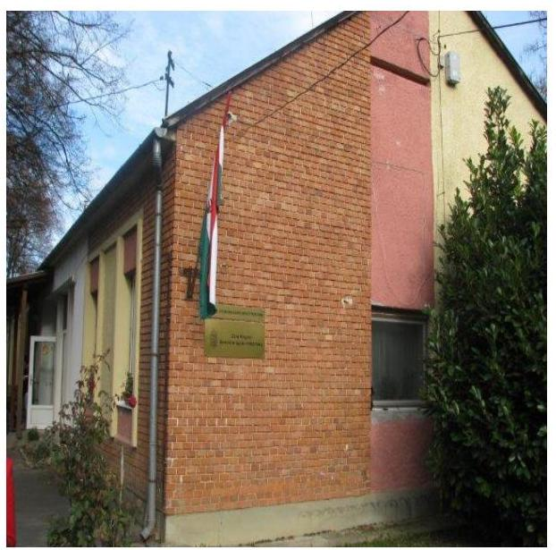

Az intézmény a Szoctv.^{9} alapján szakosított ellátást nyújtó tartós bentlakásos intézmény. Ennek keretében szenvedélybetegek ápolását, gondozását végzik, szenvedélybetegek részére rehabilitációs ellátást nyújtanak, illetve szenvedélybetegeknek rehabilitációs célú lakóotthoni ellátást biztosítanak az engedélyek alapján maximum 52 fő ellátott részére. A gondozás során szociális foglalkoztatás keretében fejlesztő-felkészítő, illetve munka-rehabilitációs foglalkoztatásokat végeznek a 112/2006. (V. 12.) Korm. rendelet^{10} alapján. A 2011-2014. években az intézmény feladatkörében változás nem történt.

Az intézmény a 2011. évben önkormányzati alrendszerbe tartozott, a Zala Megyei Önkormányzat fenntartásában működött, gazdálkodási besorolása önállóan működő és gazdálkodó költségvetési szerv volt. A 2012. évtől irányítószerve a KIM lett és április 1-jétől gazdálkodási besorolása önállóan működő intézmény lett és a gazdálkodási feladatait a középirányító szerv, a MIK látta el. A 2013. évtől az intézmény irányítószerve az EMMI^{11} lett, a középirányító szerve – a MIK egyetemleges jogutódja – az SZGYF lett.

Az alapítói, fenntartói, irányítói jogkörgyakorlók változását az 1. táblázat mutatja be:

1. táblázat

|  ALAPÍTÓI, FENNTARTÓI, IRÁNYÍTÓI JOGKÖRGYAKORLÓK VÁLTOZÁSAI |  |  |  |   |
| --- | --- | --- | --- | --- |
|   | Alapító | Irányító | Középirányító | Fenntartó  |
|  2011. | Önkormányzat | Önkormányzat | - | Önkormányzat  |
|  2012. | KIM | KIM | MIK | MIK  |
|  2013. | EMMI | EMMI | SZGYF | SZGYF  |
|  2014. | EMMI | EMMI | SZGYF | SZGYF  |

*Forrás: a ZMSZI 2011-2014 közötti alapító okiratai*

Az intézmény igazgatóját nyugdíjazás miatt 2013. július 26-ától mentették fel a munkavégzés alól. A jelenlegi igazgató 2014. december 1-jétől tölti be tisztségét, a köztes időszakban a vezetői feladatok ellátását a felügyeleti szerv határozott idejű megbízással biztosította. A ZMSZI 2012. március 31-ig önállóan működő és gazdálkodó költségvetési szerv volt, gazdasági vezetővel, a gazdálkodási feladatokat ellátó gazdasági egységgel rendelkezett. A ZMSZI 2012. április 1-jétől a 258/2011. (XII. 7.) Korm. rendelet^{12} 15. § (2) bekezdésének előírása alapján önállóan működő költségvetési szervvé alakult, ezen időponttól kezdve az intézmény tekintetében a gazdálkodással összefüggő feladatokat a MIK látta el. Az intézmény 2012. április 1-jétől gazdasági vezetővel, továbbá a gazdálkodási feladatokat ellátó gazdasági egységgel nem rendelkezett.

A gazdálkodással összefüggő feladatok ellátásának 2012. április 1-jétől történő megosztását a MIK-kel előre – 2012. február 7-én – megkötött

---

munkamegosztási megállapodásban ${ }^{13}$ rögzítették. A gazdálkodással összefüggő feladatok munkamegosztási megállapodásban történt megosztását a II. sz. melléklet tartalmazza. A MIK 2013. március 31-én a 258/2011. (XII. 7.) Korm. rendelet 18. § (2) bekezdésének előírása alapján az SZGYF-be történő beolvadással megszűnt, feladatait egyetemleges jogutódként az SZGYF látta el.

A Konsz. tv. ${ }^{14}$ értelmében a megyei önkormányzatok fenntartásában lévő intézmények, azok vagyona és vagyoni értékű jogai 2012. január 1-jén a törvény erejénél fogva állami tulajdonba kerültek. A vagyon átadásáról szóló átadás-átvételi megállapodást 2011. december 9-én írták alá. Az önkormányzati alrendszerből átkerült intézményi vagyon tekintetében 2012. január 1-jétől a tulajdonosi jogokat - a Vtv. ${ }^{15}$ alapján - az állami vagyon felügyeletéért felelős miniszter gyakorolta, aki e feladatát az MNV Zrt. ${ }^{16}$ útján látta el. A vagyonkezelői jogokat 2012. január 1-jétől - a 258/2011. (XII. 7.) Korm. rendelet alapján - a MIK gyakorolta, aki az MNV Zrt.-vel 2012. október 17-én vagyonkezelői szerződést kötött. A 2012. évben a MIK, míg a 2013-2014. években az SZGYF - a
 Vtv. és a Vtvr. ${ }^{17}$ alapján - az MNV. Zrt.-vel kötött vagyonkezelési szerződésben előírtaknak megfelelően jogosult lett volna a vagyonkezelésükben lévő, az intézmény közfeladatainak ellátásához szükséges vagyon használati jogát átengedni.

Az intézményben dolgozók átlagos statisztikai állománya a 2011. évben 24 fő, a 2012. évben 22 fő, a 2013. évben 21 fő, a 2014. évben 21 fő volt.

Az intézmény éves költségvetési beszámolók alapján teljesített bevétele a 2011. évi 145,0 M Ft-ról a 2014. évre 132,8 M Ft-ra csökkent. A teljesített kiadások összege a 2011. évben 138,2 M Ft volt, ami a 2014. évre 126,7 M Ft-ra csökkent.

---

# AZ ELLENŐRZÉS HÁTTERE, INDOKOLTSÁGA 

A központi alrendszer egyes intézményei pénzügyi és vagyongazdálkodásának ellenőrzése.

## Hasznosulás

Az Alaptörvény ${ }^{18}$ rendelkezése szerint a nemzeti vagyon megőrzésének, védelmének és a nemzeti vagyonnal való felelős gazdálkodásnak a követelményeit sarkalatos törvény, az Nvtv. ${ }^{19}$ rögzíti. A tulajdonosi joggyakorlás és vagyonkezelés általános és speciális szabályait, az állami vagyon nyilvántartására és elszámolására vonatkozó eljárásokat, a vagyonkezelési szerződés feltételrendszerét, valamint az éves beszámoló készítési és könyvvezetési kötelezettségeket kormányrendelet írja elő.

A központi alrendszer egyes intézményei közfeladat-ellátásának változásait, a közfeladatok átadásából és átvételéből adódó módosításait, előirányzat-gazdálkodására ható tényezőit az Áht. ${ }^{20}$ 11. §-a és az Ávr. ${ }^{21}$ 14. §-a írja elő. A közfeladatok megszűnéséből, intézmény átszervezéséből, belső szerkezeti korszerűsítéséből, vagy más hasonló okból adódó módosításai miatt szerepeltetendő szerkezeti változásokat, valamint a szerkezeti változásként beépült közfeladatok szintre hozásként történő számításba vételét az Ávr. 15. § (2)-(3) bekezdései határozzák meg. A társadalmi igénynyel összhangban az Áht. ${ }^{22}$ és Áht. ${ }^{2}$, az Ámr. ${ }^{23}$ és a Bkr. ${ }^{24}$ is előírja a költségvetési szerv részére, hogy olyan szabályozásokat, eljárásokat, folyamatokat alakítson ki, amelyek biztosítják a működés, gazdálkodás, az erőforrások felhasználása során a gazdaságosság, hatékonyság és eredményesség érvényesülését. Az Ámr. és a Bkr. alapján az intézményvezetőnek évente nyilatkoznia is kell arról, hogy gondoskodott-e az intézmény tevékenységében a gazdaságosság, hatékonyság és eredményesség követelményeinek érvényesítéséről. A gazdaságos, hatékony és eredményes gazdálkodáshoz szükség van a teljesítménymérés feltételeinek kialakítására, úgymint az egyértelmű és mérhető célokra, mutatószámokra és az ezekhez rendelt követelményekre. Az ÁSZ jelen ellenőrzéssel győződött meg arról, hogy az intézménynél a teljesítménycélokat, -mutatókat, -követelményeket kialakították-e, azokat működtették-e, a kitűzött cél(ok) teljesültek-e.

AZ ELLENŐRZÉS EREDMÉNYEKÉPPEN nemcsak az ellenőrzött intézmények gazdálkodása javulhat, hanem átfogó képet kaphatunk a központi alrendszerbe tartozó költségvetési szervek gazdálkodásának hiányosságairól, de a jó gyakorlatokról is. Ellenőrzéseivel, javaslataival és megállapításaival az ÁSZ elősegítheti a költségvetési szervek pénzügyi és vagyongazdálkodása szabályozásának javítását és hozzájárulhat a jó kormányzáshoz. Az ellenőrzés az ellenőrzött számára visszajelzést ad a pénzügyi és vagyongazdálkodásában feltárt hiányosságokról, javaslataival hozzájárul azok kiküszöböléséhez, amely csökkentheti a későbbi ellenőrzések gyakoriságát. Az ellenőrzés megállapításait és javaslatait más szervezetek is hasznosíthatják a rendezett gazdálkodási keretek kialakításához.

---

# A TELJESÍTMÉNY-ELLENŐRZÉSI KIEGÉSZÍTŐ 

MODUL alapján elvégzett ellenőrzés a törvényalkotás számára támogatást nyújt a nemzeti kulcsindikátorok rendszerének kialakításához. A döntéshozók, ellenőrzöttek, irányító szervek, a társadalom számára az összehasonlítási, összemérési lehetőségek kihasználásával objektív visszajelzést ad a gazdálkodás területén végrehajtott szervezeti, szervezési, takarékossági és bürokráciacsökkentő intézkedések hatásairól, a közfeladat-ellátásnak keretet adó pénzügyi és vagyongazdálkodásban mérhető teljesítménykövetelmények kialakításáról, azok alkalmazásáról.

---

# FÓKUSZKÉRDÉSEK 

1.     - Az irányító szerv ellenőrzött intézményre vonatkozó feladatellátása szabályszerű volt-e?
2.     - A belső kontrollrendszer kialakítása és működtetése megfelelt-e a jogszabályi előírásoknak?
3.     - Az intézmény pénzügyi gazdálkodása szabályszerű volt-e?
4.     - Az intézmény vagyongazdálkodása szabályszerű volt-e?
5.     - Szabályszerűen hajtották-e végre az ellenőrzött időszakban az intézményt érintő szervezeti, szerkezeti átalakításokat?
6.     - Az intézmény intézkedett-e az integritás szemlélet érvényesítése érdekében?

---

# ELLENŐRZÉS HATÓKÖRE ÉS MÓDSZEREI 

## Az ellenőrzés típusa

Szabályszerűségi ellenőrzés, amelyet teljesítmény-ellenőrzési modul egészített ki.

## Az ellenőrzött időszak

Az ellenőrzött időszak 2011. január 1-jétől 2014. december 31-ig terjedő időszak volt.

## Az ellenőrzés tárgya

Az ellenőrzött szervezetre vonatkozó irányító szervi feladatok ellátása. Az intézmény belső kontrollrendszerének kialakítása és működtetése, valamint pénzügyi és vagyongazdálkodása. Az erőforrásokkal való szabályszerű, gazdaságos, hatékony és eredményes gazdálkodáshoz szükséges követelmények kialakítása, a kialakított követelmények számonkérés, ellenőrzése. Az intézmény átalakítása, átszervezése lebonyolításának szabályszerűsége.

A teljesítmény-ellenőrzési kiegészítő modul esetében az intézmény gazdálkodási folyamatában a gazdaságossági, hatékonysági és eredményességi követelmények kialakítása és működtetése, a célkitűzések teljesítésének értékelése. Az intézmény tevékenységében a hatékonyság, eredményesség, gazdaságosság követelményei érvényesítéséről kiadott nyilatkozat helytállósága. A teljesítmény-ellenőrzés fókuszkérdéseire a IV. sz. melléklet ad választ.

Az ellenőrzés kiterjedt minden olyan körülményre és adatra, amely az ÁSZ jogszabályban meghatározott feladatainak teljesítéséhez, valamint a program végrehajtása folyamán felmerült újabb összefüggések feltárásához szükséges volt.

## Az ellenőrzött szervezet

A Zala Megyei Szocioterápiás Intézmény, a Zala Megyei Önkormányzat, a Közigazgatási és Igazságügyi Minisztérium, az Emberi Erőforrások Minisztériuma, a Zala Megyei Intézményfenntartó Központ, a Szociális és Gyermekvédelmi Főigazgatóság. A Közigazgatási és Igazságügyi Minisztérium jogutódjaként az Igazságügyi Minisztérium, valamint a Miniszterelnökség adatot szolgáltatott az ellenőrzéshez.

---

Az ellenőrzésre a központi alrendszer ellenőrzött intézményének és irányító/felügyeleti szervének, illetve középirányító szervének székhelyén, telephelyén, a gazdálkodási feladatait ellátó szervezetének székhelyén került sor.

# Az ellenőrzés jogalapja 

Az ellenőrzés jogszabályi alapját az ÁSZ tv. ${ }^{25}$ 1. § (3) bekezdése, az 5. § (2)(6) bekezdései, valamint az Áht. 2 61. § (2) bekezdésének előírásai képezték.

## Az ellenőrzés módszerei

Az ellenőrzést az ellenőrzési program szempontjai, az ellenőrzött időszakban hatályos jogszabályok, az ellenőrzés szakmai szabályai, az egyes ellenőrzési típusokhoz kapcsolódó ÁSZ módszertanok és nemzetközi standardok figyelembevételével végeztük. A gazdálkodás hibáinak kijavítására, a közpénzekkel való felelős gazdálkodás segítésére irányuló javaslatok kidolgozásakor a hatályos jogszabályok az irányadóak.

Az ellenőrzés ideje alatt az ellenőrzött szervezettel történő kapcsolattartást az ÁSZ SZMSZ ${ }^{26}$-ének vonatkozó előírásai alapján biztosítottuk.

Az ellenőrzési kérdések megválaszolásához szükséges bizonyítékok megszerzése a következő ellenőrzési eljárások alkalmazásával történt: megfigyelés, szemle (szemrevételezés), kérdésfeltevés (információkérés), mintavételezés, valamint elemző eljárás. A minták kiválasztása során elsősorban reprezentativitást biztosító véletlen mintavételi eljárást alkalmaztunk.

Az ellenőrzési bizonyítékként felhasználható adatforrások közé tartoztak egyrészt a szakmai program részletes szempontjainál felsorolt adatforrások, másrészt adatforrás volt minden egyéb - az ellenőrzés folyamán feltárt, az ellenőrzés szempontjából releváns információt tartalmazó - dokumentum.

Az ellenőrzés lefolytatásához az intézmény a tanúsítványok elektronikus kitöltésével, valamint az ÁSZ által kért dokumentumok elektronikus megküldésével szolgáltatott adatokat. A rendelkezésre bocsátott adatok, információk kontrollja az ellenőrzés keretében történt.

Az ellenőrzési kérdésekre adott válaszok alapján értékeltük, hogy az ellenőrzött időszakban az irányító szervek és a középirányító szervek az ellenőrzött intézményre vonatkozó feladatainak szabályszerűen eleget tette, az intézmény pénzügyi és vagyongazdálkodása megfelelt-e az előírásoknak, az intézmény átalakításának vagy átszervezésének végrehajtása szabályszerű volt-e. Értékeltük, hogy az intézménynél kialakították-e az erőforrásokkal való szabályszerű és hatékony gazdálkodáshoz szükséges követelményeket, megvalósították-e azok számonkérését, ellenőrzését.

Az intézmény belső kontrollrendszere jogszabályi előírások szerinti kialakításának és működtetésének szabályszerűségét az erre irányuló ellenőrzési kérdésekre adott válaszok összesítése alapján, évente pillérenként (kontrollkörnyezet, kockázatkezelési rendszer, kontrolltevékenységek, in-

---

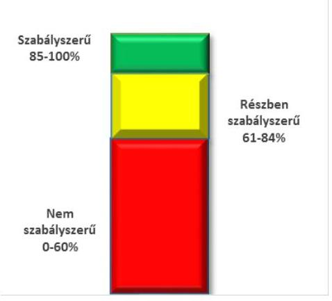
formációs és kommunikációs rendszer, monitoring rendszer) és összesítetten is minősítettük. Az intézmény belső kontrollrendszere egyes pilléreinek kialakítása és működtetése „szabályszerű" volt, amennyiben az értékelt területen az elért és elérhető pontok százalékban kifejezett, egész számra kerekített hányadosa meghaladta a 84%-ot, „részben szabályszerű" volt, ha a 84%-ot nem haladta meg, de 60%-nál nagyobb volt, „nem szabályszerű" volt, ha nem haladta meg a 60%-ot. Az intézmény belső kontrollrendszerének összesített értékelése megegyezett a pillérenként (kontrollterületenként) alkalmazott %-os értékelésekkel, a következő eltérésekkel. A kontrollrendszer egésze esetében a „szabályszerű" értékelésnek a %-os értéken felül további feltétele volt, hogy egyik kontrollterület sem kaphatott „nem szabályszerű" értékelést, a „részben szabályszerű" értékelés további feltétele volt, hogy legfeljebb egy ellenőrzött kontrollterület lehetett „nem szabályszerű" értékelésű. Az összesített értékelés a %-os értéktől függetlenül „nem szabályszerű" volt, ha az ellenőrzött kontrollterületek közül több mint egynek „nem szabályszerű" volt az értékelése.

A tárgyi eszközök nyilvántartásba vételénél tételes ellenőrzést folytattunk. Az előirányzatok módosításának és az előirányzat-maradvány megállapításának, valamint a gazdálkodási jogkörök gyakorlásának szabályszerűségét mintavétellel ellenőriztük. A jogszabályoknak és a belső előírásoknak megfelelőnek, azaz szabályszerűnek tekintettük az előirányzatok módosítását és az előirányzat-maradvány megállapítását, amennyiben a minta ellenőrzésének eredménye alapján 95%-os bizonyossággal a teljes sokaságban a hibás tételek aránya kisebb volt, mint 10%, nem megfelelőnek értékeltük, ha a hibás tételek aránya a 10%-ot meghaladta. Kockázatot, illetve magas kockázatot jeleztünk, amennyiben egy adott terület vonatkozásában a minta alapján a teljes sokaságban nem volt egyértelműen biztosított a jogszabályoknak és a belső szabályzatoknak megfelelő működés.

A 2011. évet érintően a szakmai teljesítésigazolás és az utalvány ellenjegyzése kulcskontrollok, a 2012-2014. éveket érintően a teljesítésigazolás és az érvényesítés kulcskontrollok működését értékeltük. Megfelelőnek értékeltük a gazdálkodási jogkörök gyakorlását, amennyiben 95%-os bizonyossággal a teljes sokaságban a hibás tételek aránya legfeljebb 10% volt, részben megfelelőnek, ha a hibás tételek arányának felső határa legfeljebb 30% volt, nem megfelelőnek, ha a hibás tételek sokaságbeli arányának felső határa meghaladta a 30%-ot.

Az integritás szemlélet érvényesülésének értékelése az intézmény által kitöltött tanúsítványa alapján történt.

Az alapprogram alapján ellenőriztük, hogy a költségvetési szerv vezetője megtette-e nyilatkozatát arról, hogy gondoskodott a költségvetési szerv tevékenységében a hatékonyság, eredményesség és a gazdaságosság követelményeinek érvényesítéséről. Ezt kiegészítve, a teljesítmény-ellenőrzési kiegészítő modul keretében - felhasználva az alapprogram szerinti ellenőrzés megállapításait - értékeltük, hogy a költségvetési szerv vezetője kialakította-e a gazdaságossági, hatékonysági és eredményességi követelményeket, és azokat működtette-e, a célkitűzéseket elérte-e.

A teljesítmény-ellenőrzési kiegészítő modul a gazdálkodási feladatokra terjedt ki, a szakmai feladatellátást nem értékelte.

A gazdálkodási feladatok értékelése az alábbi területekre terjedt ki:
pénzügyi gazdálkodási (nem szakmai, adminisztratív) feladatok: költségvetés-, beszámoló-készítés, könyvvezetés, adatszolgáltatások,

---

előirányzat-gazdálkodás, kötelezettségvállalások nyilvántartása, kezelése, bevételkezelés, bér- és illetményszámfejtés;
$\longrightarrow$ vagyongazdálkodási (logisztikai) feladatok: közbeszerzések és közbeszerzési értékhatárt el nem érő beszerzések, készletgazdálkodás, nyomtatók, fénymásolók üzemeltetése, épület- és ingatlanüzemeltetés, karbantartás, hibabejelentés, gépjármű és flottamenedzsment.
Az ellenőrzés során minden olyan körülményt és adatot is ellenőriztünk, amely a program végrehajtása kapcsán felmerült újabb összefüggéseknek az ellenőrzés céljaival összhangban lévő feltárásához szükséges volt. A teljesítmény-ellenőrzési kiegészítő programmodulban megfogalmazott ellenőrzési cél megválaszolásához az alapprogram végrehajtása során megfogalmazott megállapításokat is figyelembe vettük.

---

# 1. Az irányító szerv ellenőrzött intézményre vonatkozó feladatellátása szabályszerű volt-e? 

## Összegző megállapítás

### 1.1. számú megállapítás

Az irányító és középirányító szervek feladatellátása nem felelt meg a jogszabályi előírásoknak.

Az alapítói jogok gyakorlása - az EMMI feladatellátása kivételével - nem felelt meg a jogszabályi előírásoknak.

Az intézményt érintően az alapítói jogokat 2011. december 31-éig a Közgyűlés gyakorolta. Az államháztartás önkormányzati alrendszeréből a központi alrendszerbe történt átsorolást követően, 2012. január 1-jétől az
 alapítói jogokat a KIM, 2013. január 1-jétől az EMMI gyakorolta. Az egyes fenntartói, valamint az irányítási, középirányítói jogokat 2012. január 1-jétől a MIK – a középirányító szerv vezetője a 258/2011. (XII. 7.) Korm. rendelet 11. § (1) bekezdésében meghatározott hatásköreit, jogait és feladatait a kormánymegbízott egyetértésével – gyakorolta.

Az intézmény rendelkezett az Áht. 1 és az Áht. 2 előírásainak megfelelően alapító okirattal ${ }^{27}$. Az alapító okirat módosítását a 2011. évben a Közgyűlés adta ki. Az irányító szervi változást követően a KIM minisztere 2012. szeptember 28-án, 2012. január 1-jei hatállyal új alapító okiratot adott ki. A KIM – a 258/2011. (XII. 7.) Korm. rendelet 21. § (6) bekezdésében előírtak ellenére – a MIK által fenntartásába átvett költségvetési intézmény alapító okiratának módosítását 2012. január 30-ig a Kincstárhoz ${ }^{28}$ nem nyújtotta be. Az EMMI minisztere 2013. január 1-jei hatállyal új alapító okiratot adott ki, majd 2014. évben a kormányzati funkció szerinti megjelöléssel módosította. A 2011-2014. években az egységes szerkezetű alapító okiratokat elkészítették.

Az intézmény az ellenőrzött időszakban hatályos, irányító szerv által jóváhagyott SZMSZ ${ }^{29}$-szel rendelkezett. Az intézmény az ellenőrzött időszakban 2011., 2013. és 2014. években módosította az SZMSZ-ét, amelyeket az irányító szerv jóváhagyott. Az SZMSZ a 2011. évben a jogszabályi előírásnak megfelelően tartalmazta az alapító okirat keltét, számát és az alapítás időpontját, azonban a 2012-2014. években – az Ávr. 13. § (1) bekezdés b) pontjában előírtak ellenére – nem tartalmazta a hatályos, egységes szerkezetbe foglalt alapító okirat keltét és számát.

---

### 1.2. számú megállapítás

A közfeladatok ellátására vonatkozó, az erőforrásokkal való szabályszerű gazdálkodáshoz szükséges követelményeket a Közgyűlés érvényesítette, azonban nem ellenőrizte. A középirányító szervek a 2012-2014. években az erőforrásokkal való szabályszerű gazdálkodáshoz szükséges követelményeket nem érvényesítették és a 2012. évben nem ellenőrizték. A hatékony gazdálkodáshoz szükséges követelményeket a Közgyűlés és a középirányító szervek nem érvényesítették, nem kérték számon és nem ellenőrizték.

AZ ERŐFORRÁSOKKAL VALÓ GAZDÁLKODÁS
SZABÁLYSZERŰSÉGI követelményeit a Közgyűlés rendeletekben, határozatokban rögzítette. A 2012. évre a KIM, a 2013-2014. évekre az EMMI körlevelekben határozta meg az éves költségvetési beszámoló, valamint a szöveges indoklás tartalmi követelményeit és az elkészítési határidejét. A 2011. évre vonatkozóan a Közgyűlés, a 2013-2014. évekre az EMMI elvégezte a költségvetési beszámolók ellenőrzését. A ZMSZI a 2012. évben – az Áhsz. ${ }^{30}$ 13. § (1) bekezdéseiben előírtak ellenére – nem rendelkezett az intézmény vezetője és a beszámoló elkészítéséért kijelölt felelős személy által aláírt éves elemi költségvetési beszámolóval, ezért a MIK – a 258/2011. (XII. 7.) Korm. rendelet 11. § (2) bekezdés h) pontjában előírtak ellenére – nem vizsgálta felül, nem értékelte, nem hagyta jóvá a költségvetési szerv 2012. évi beszámolóját.

A 2012. évben a MIK, míg a 2013-2014. években az SZGYF a vagyonkezelésében lévő vagyon tekintetében – a Vtv. 27. § (2) bekezdésében, valamint az Nvtv. 7. § (2) bekezdésében előírtak ellenére – nem gondoskodott a vagyon átlátható működtetéséről, mivel az intézmény a közfeladat ellátásához szükséges állami vagyon tekintetében – Nvtv. 3. § (1) bekezdés 11. pontjában előírtak ellenére – jogcímmel nem rendelkezett, ezért nem minősült a nemzeti vagyon jogszerű használójának. Ezért a 2012. évben a MIK, míg a 2013-2014. években az SZGYF – a 258/2011. (XII. 7.) Korm. rendelet 11. § (2) bekezdés d) pontjában, illetve 316/2012. (XI. 13.) Korm. rendelet ${ }^{31}$ 3. § (2) bekezdés g) pontjában előírtak ellenére – nem érvényesítette az erőforrásokkal, így különösen a vagyonnal való szabályszerű gazdálkodáshoz szükséges követelményeket.

A 2011. évben – az Áht. 1 49. § (5) bekezdés f) pontjában előírtak ellenére – a Közgyűlés, míg a 2012. évben – a 258/2011. (XII. 7.) Korm. rendelet 11. § (2) bekezdés d) pontjában előírtak ellenére – a MIK az erőforrásokkal való szabályszerű gazdálkodás vonatkozásában ellenőrzést nem hajtott végre az intézménynél. A 2013-2014. évek között az SZGYF az erőforrásokkal való szabályszerű gazdálkodás vonatkozásában ellenőrzéseket végzett.

A Közgyűlés a 2011. évben – az Áht. 1 49. § (5) bekezdés f) pontjában foglaltak ellenére – nem érvényesítette, nem kérte számon és nem ellenőrizte az előirányzatokkal, létszámokkal és vagyonnal való hatékony gazdálkodás követelményeit. A MIK a 2012. évben – a 258/2011. (XII. 7.) Korm. rendelet 11. § (2) bekezdés d) pontjában előírtak ellenére – nem érvényesítette, nem kérte számon és nem ellenőrizte az előirányzatokkal, létszámokkal és vagyonnal való hatékony gazdálkodás követelményeit. Az SZGYF a 2013-2014. években – a 316/2012. (XI. 13.) Korm. rendelet 3. § (2) bekezdés g) pontjában előírtak ellenére – nem érvényesítette,

---

nem kérte számon és nem ellenőrizte az előirányzatokkal, létszámokkal és vagyonnal való hatékony gazdálkodás követelményeit.

# 1.3. számú megállapítás 

Az intézménnyel kapcsolatos egyéb ellenőrzési, irányítási és felügyeleti jogosultságok gyakorlása – a 2012. év kivételével – szabályszerűen történt.

## A BEVÉTELI ÉS KIADÁSI ELŐIRÁNYZATOKKAL VALÓ GAZDÁLKODÁSÁT az irányító szervek – a 2012. év kivételével – a jogszabályokban foglalt előírásoknak megfelelően rendszeresen figyelemmel kísérték. A szakmai tevékenységről önálló beszámoltatás az ellenőrzött időszakban megtörtént, azonban a 2012. évben az MIK – a Szoctv. 92/B. § (1) bekezdés d) pontjában előírtak ellenére – az intézmény által elkészített szakmai beszámolót, a szakmai munka eredményességét nem értékelte.

AZ INTÉZMÉNYVEZETŐ KINEVEZÉSE a 2011-2014. években szabályszerű volt. Az intézményvezető felmentésére 2013. július 26-án került sor, míg az új vezető kinevezése 2014. december 1-jén – a 316/2012. (XI. 13.) Korm. rendeletnek megfelelően – történt. A két időszak között az intézmény vezetését helyettesítéssel, illetve a kinevezéstől eltérő foglalkoztatással szabályszerűen végezték. A Konsz. tv. rendelkezése alapján az intézmény gazdasági vezetőjének megbízása 2012. március 31-én megszűnt, az önállóan gazdálkodó intézményi státusz megszűnése okán más gazdasági vezető kinevezésére nem került sor.

## 2. A belső kontrollrendszer kialakítása és működtetése megfelel-e a jogszabályi előírásoknak?

## Összegző megállapítás

2.1. számú megállapítás
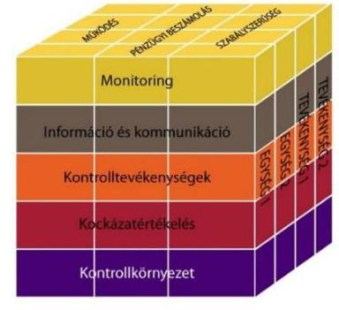

A belső kontrollrendszer kialakítása és működtetése nem felelt meg a jogszabályi előírásoknak.

A belső kontrollrendszer kialakítása és működtetése szabályszerűségének értékelését a III. sz. melléklet tartalmazza.

## A kontrollkörnyezet kialakítása összességében részben felelt meg a jogszabályi előírásoknak.

Az intézmény rendelkezett irányító szervek által jóváhagyott SZMSZ-szel, amely az Ámr.-ben és az Ávr.-ben rögzítetteknek megfelelően tartalmazta az ellátandó és a szakfeladatrend szerint szakfeladat számmal és megnevezéssel besorolt alaptevékenységeket, az alaptevékenységet szabályozó jogszabályok megjelölését, a szervezeti felépítést, a működési rendet, a szervezeti egységek megnevezését, az engedélyezett létszámát, a feladatait és a költségvetési szerv szervezeti ábráját. Tartalmazta továbbá azon ügyköröket, amelyek során a szervezeti egységek vezetői a költségvetési szerv képviselőjeként járhatnak el, a nevesített munkakörökhöz tartozó feladat- és hatásköröket, a hatáskörök gyakorlásának módját, illetve munkáltatói jogok gyakorlását.

Az intézmény gazdasági szervezete 2012. március 31-ig rendelkezett az intézményvezető által jóváhagyott ügyrenddel ${ }^{32}$, amely megfelelt az Ámr.

---

és az Ávr. előírásainak. Az intézmény 2012. április 1-jétől önállóan működő intézménnyé alakult át, a gazdasági szervezete megszűnt.

Az intézmény 2011. évben etikai kódexszel ${ }^{33}$ rendelkezett, a 2012-2014. években a dolgozók munkaköri leírásaiban szerepeltek az etikai elvárások.

Az intézmény a 2011. évben rendelkezett számviteli politikával ${ }^{34}$, leltározási és leltárkészítési szabályzattal ${ }^{35}$, eszközök és források értékelési szabályzatával ${ }^{36}$, önköltségszámítás szabályzatával ${ }^{37}$, pénzkezelési szabályzattal ${ }^{38}$. A 2011. évben az intézmény eszközök és források értékelési szabályzata – az Áhsz. 1 8. § (17) bekezdés d) pontjában előírtak ellenére – nem szabályozta követeléstípusonként a kis összegű követelések év végi meghatározásának elveit, dokumentálásának szabályait.

A gazdálkodással összefüggő feladatokat ellátó MIK a 2012. évben – az Áhsz. ${ }_{1}$ előírásainak megfelelően – a számviteli politikájának ${ }^{39}$, a leltározási és leltárkészítési szabályzatának ${ }^{40}$, az eszközök és források értékelési szabályzatának ${ }^{41}$, pénzkezelési szabályzatának ${ }^{42}$ hatályát kiterjesztette az intézményre. Az intézmény a 2012. évben – a Sztv. ${ }^{43}$ 14. § (5) bekezdésében és az Áhsz. ${ }_{1} 8 . \S$ (4) bekezdésében előírtak ellenére – önköltségszámítás rendjére vonatkozó szabályozással nem rendelkezett. Az intézmény gazdálkodással összefüggő feladatait 2013. április 1-től ellátó SZGYF a 2013. évben kiadott számviteli politikájában ${ }^{44}$ – az Áhsz. ${ }_{1} 8 . \S$ (13) bekezdéseiben előírtak ellenére – nem döntött arról, hogy annak rendelkezéseit és a kapcsolódó szabályzatok hatályát kiterjeszti-e az intézményre, vagy az önálló számviteli politikát alakít ki és külön szabályzatokat készít. Az intézmény 2013. április 1-től – a Sztv. 14. § (3)-(5) bekezdéseiben, az Áhsz. ${ }_{1} 8 . \S$ (3)-(4) bekezdéseiben és az Áhsz. ${ }_{2}{ }^{45} 50 . \S$ (1) bekezdésében előírtak ellenére számviteli politikával és annak keretében elkészítendő leltározási és leltárkészítési szabályzattal, eszközök és források értékelési szabályzatával, önköltségszámítás rendjével, pénzkezelési szabályzattal nem rendelkezett. Az SZGYF Zala Megyei kirendeltségének vezetője 2013. szeptember 2-án – a Sztv. 14. § (12) bekezdésében, a 316/2012. (XI. 13.) Korm. rendelet 4. § (3) bekezdés c) pontjában és (4) bekezdés d) pontjában előírtak ellenére – jogosulatlanul adott ki az intézményre vonatkozóan számviteli politikát és kapcsolódó szabályzatokat, mivel az a főigazgató hatáskörébe tartozott. Az intézményre is vonatkozó számviteli politikát, és az annak keretében elkészítendő szabályzatokat – az Áhsz. ${ }_{2} 50 . \S$ (1) bekezdésében, és az abban hivatkozott 31. § (1) bekezdésében foglaltak ellenére – a 2014. évben sem adott ki a gazdálkodási feladatokat ellátó SZGYF főigazgatója.

Az intézmény a 2011. évben rendelkezett számlarenddel ${ }^{46}$ és az abban foglaltakat alátámasztó bizonylati szabályzattal. Az intézmény a 2012-2014. években – a Sztv. 161. (1) bekezdésében, az Áhsz. ${ }_{1} 49 . \S$ (1) bekezdésében és az Áhsz. ${ }_{2} 51 . \S$ (2) bekezdésében előírtak ellenére – nem rendelkezett számlarenddel.

Az intézmény rendelkezett a gazdálkodás részletes rendjét meghatározó szabályzattal ${ }^{47}$.

Az intézmény a 2011-2012. években rendelkezett közbeszerzési szabályzattal ${ }^{48}$. A 2011. évben a szabályzatban – a Kbt. ${ }^{49} 6 . \S$ (1) bekezdésében előírtak ellenére – nem szabályozták a közbeszerzési eljárás belső ellenőrzésének felelősségi rendjét. Az intézmény a 2013-2014. években nem rendelkezett közbeszerzési szabályzattal és nem is folytatott le közbeszer-

---

zési eljárást. Az intézmény a 2011. és 2013. években – az Ámr. 20. § (3) bekezdés b) pontjában és az Ávr. 13. § (2) bekezdés b) pontjában előírtak ellenére – belső szabályzatban nem rendezte a közbeszerzési törvény hatálya alá nem tartozó beszerzések lebonyolításának rendjét.

Az intézmény rendelkezett hatályos ellenőrzési nyomvonallal ${ }^{50}$, amely megfelelt a Ber. ${ }^{51}$ és a Bkr. előírásainak.

Az intézmény 2011. január 1-je és március 31-e között – az Ámr. 156. § (3) bekezdésében
 előírtak ellenére – nem rendelkezett a szabálytalanságkezelési eljárásrenddel.

Az intézmény önálló gazdálkodási jogkörének 2012. március 31-ei megszűnését megelőzően a gazdálkodással kapcsolatos feladatok ellátásának szabályait a MIK-kel 2012. február 7-én kötött munkamegosztási megállapodásban rögzítették. A munkamegosztási megállapodás – az Ávr. 10. § (4) és (6) bekezdéseiben előírtak ellenére – nem tartalmazta egyértelműen elkülönítve a munkamegosztás és felelősségvállalás rendjét, hogy az Ávr. 9. § (1) bekezdése szerinti feladatok közül melyik feladatot melyik költségvetési szerv látja el, mivel ugyanazon feladatok ellátására az intézmény gazdálkodási feladatait ellátó költségvetési szervet, és a gazdasági szervezettel nem rendelkező intézményt is kijelölték. Ennek következtében a feladatok ellátásáért való felelősség nem volt egyértelműen elhatárolt, így nem volt biztosított a közpénzekkel történő elszámoltathatóság. A MIK 2013. április 1-jétől az SZGYF-be történő beolvadással megszűnt, a 2013-2014. évi gazdálkodással kapcsolatos feladatokat az SZGYF látta el.

# 2.2. számú megállapítás 

## A kockázatkezelési rendszer kialakítása és működtetése összességében nem felelt meg a jogszabályi előírásoknak.

A kockázatkezelési rendszer Ámr.-ben és Bkr.-ben előírt kialakítása keretében az intézmény FEUVE szabályzata ${ }^{52}$ tartalmazta a kockázatok fogalmát, a kockázatok azonosításával, elemzésével, csoportosításával, illetve a kockázati kitettség csökkentésével kapcsolatos szabályokat.

Az intézmény vezetője a 2011-2014. években – az Ámr. 157. § (1)(3) bekezdéseiben, illetve a Bkr. 7. § (1)-(2) bekezdésében előírtak ellenére – nem működtetett kockázatkezelési rendszert. Az intézmény egészére vonatkozóan nem mérték fel és nem állapították meg tevékenységben rejlő kockázatokat, nem határozták meg a kockázatokkal kapcsolatban szükséges intézkedéseket és azok teljesítése folyamatos nyomon követésének módját.

Az intézmény az SZMSZ-ben – a Vnytv. ${ }^{53} 4$. § a) pontjában előírtak ellenére – a vagyonnyilatkozat tételre kötelezettek körét nem rögzítette. A vagyonnyilatkozat tételre kötelezett személyek vagyonnyilatkozat tételi kötelezettségüknek eleget tettek. Az intézmény a 2011. évben Vnytv. 11. § (4) bekezdésében előírtak ellenére – a vagyonnyilatkozatokról nyilvántartást nem vezetett, a 2011-2012. években – a Vnytv. 11. § (6) bekezdésben előírtak ellenére – a vagyonnyilatkozatokkal kapcsolatos alapvető szabályokat (vagyonnyilatkozat átadására, nyilvántartására, vagyonnyilatkozatban foglalt személyes adatok védelmére vonatkozó további szabályokat) belső szabályzatban nem szabályozta.

---

# 2.3. számú megállapítás 

A kontrolltevékenység kialakítása és működtetése összességében nem felelt meg a jogszabályi előírásoknak.

Az intézmény 2011. évben kiadott FEUVE szabályzata tartalmazta a pénzügyi döntések dokumentumainak elkészítését, a pénzügyi kihatású döntések célszerűségi, gazdaságossági, hatékonysági és eredményességi szempontú megalapozottságának szabályait, továbbá a költségvetési gazdálkodás során az előzetes és utólagos pénzügyi ellenőrzés, a pénzügyi döntések szabályszerűségi szempontból történő jóváhagyását, illetve ellenjegyzését, valamint a gazdasági események elszámolását. A belső szabályzatokban a felelősségi körök meghatározásával szabályozták az engedélyezési, jóváhagyási és kontrolleljárásokat, azonban a 2012-2013. években – a Bkr. 8 § (4) bekezdésében előírtak ellenére – a dokumentumokhoz és információkhoz való hozzáférést nem szabályozták.

A gazdálkodási jogkörök kialakítása 2013. április 4-e és 2014. október 31-e között nem felelt meg a jogszabályi előírásoknak, mivel az intézmény vezetője helyett – az Ávr. 52. § (1) bekezdésében, 57. § (4) bekezdésben és 59. § (1) bekezdésben előírtak ellenére – a kötelezettségvállalásra, a teljesítésigazolásra és az utalványozásra jogosult személyeket az SZGYF főigazgatója jelölte ki.

Az előirányzatok felhasználásánál kulcskontrollok működésének ellenőrzése során hiányosságokat tárt fel az ellenőrzés, ami a folyamatba épített, illetve a vezetői ellenőrzés nem megfelelő működésére volt visszavezethető. A feltárt hiányosságok miatt a költségvetési gazdálkodás során az előzetes és utólagos pénzügyi ellenőrzés, a pénzügyi döntések szabályszerűségi szempontból történő jóváhagyása, illetve ellenjegyzése – az Áht. 121/A. § (4) bekezdés c) pontjában, valamint a Bkr. 8. § (2) bekezdés c) pontjában előírtak ellenére – nem volt megfelelő.

Az intézmény – az lkr. ${ }^{54}$ 8. § (1) bekezdésében előírtak ellenére – az iratkezelési szoftver által kezelt adatok biztonságáról nem gondoskodott és nem alakította ki az üzembiztonsági, adatvédelmi szabályok érvényre juttatásához szükséges eljárási szabályokat. A 2011. évben – az Avtv. ${ }^{55}$ 10. § (1) bekezdésében előírtak ellenére – nem alakították ki az adatvédelmi szabályok érvényre juttatásához szükséges eljárási szabályokat.

### 2.4. számú megállapítás

Az információs és kommunikációs rendszer kialakítása és működtetése részben felelt meg a jogszabályi előírásoknak.

Az információáramlás szervezeten belüli rendszerét az Ámr.-ben és a Bkr.-ben előírtakkal összhangban – kialakították. A külső információáramlás, az adatszolgáltatás és kapcsolattartás tekintetében a munkakapcsolatokat szervezeti egységenként rögzítették.

Az intézmény adatvédelmi és adatbiztonsági szabályzattal – az Avtv. 31/A. § (3) bekezdésében és az Info. tv. ${ }^{56}$ 24. § (3) bekezdésében előírtak ellenére – nem rendelkezett.

Az intézménynél a kötelezően közzéteendő adatok nyilvánosságra hozatalának rendjét – az Info. tv. 35. § (3) bekezdésében, az Ámr. 20. § (3) bekezdés i) pontjában és az Ávr. 13. § (2) bekezdés h) pontjában előírtak ellenére – nem szabályozták. A 2012-2013. években – az Info. tv. 30. § (6) bekezdésében és az Ávr. 13. § (2) bekezdés h) pontjában előírtak ellenére – nem szabályozták a közérdekű adatok megismerésére

---

#### 2.5. számú megállapítás

irányuló igények teljesítésének rendjét. A 2014. évben elkészítették a közérdekű kérelmek, panaszok szabályzatát.

A közzétételére vonatkozó kötelezettségének az intézmény – az Eitv. ${ }^{57}$ 3. § (2) bekezdésében, 6. §-ában és a Mellékletében, valamint az Info. tv. 33. § (1) és (3) bekezdéseiben, 37. §-ában és 1. mellékletében előírtak ellenére – nem tett eleget, mivel az üzemeltetett weboldalán, illetve a középirányító által üzemeltetett weboldalon az intézmény nevén, a címén, a telefonszámán és az e-mail címén kívül semmilyen más adatot nem tett közzé.

Az intézmény rendelkezett iratkezelési szabályzattal, azonban az iratkezelési szabályzat kiadásához a 2011., a 2012. és a 2014. években – az Ltv. ${ }^{58}$ 10. § (1) bekezdés a) pontjában előírtak ellenére – az illetékes közlevéltár egyetértésével nem rendelkezett. A gyakorlatban az iratok iktatásával, az előadó ív dokumentálásával biztosították, hogy az ügyintézés folyamata, az iratok szervezeten belüli útja pontosan követhető és ellenőrizhető, az iratok holléte pedig naprakészen megállapítható legyen.

A monitoring-rendszer működése – a belső ellenőrzés hiányosságai miatt – részben felelt meg a jogszabályi előírásoknak. A rendelkezésre álló források gazdaságos, hatékony és eredményes felhasználását biztosító követelmények kialakítása és alkalmazása nem történt meg.

Az operatív tevékenységek folyamatos és eseti nyomon követési rendszerének kialakítása és működtetése az Áht. 1-ben és a Bkr.-ben előírtaknak megfelelően történt. Az ellenőrzött időszakban a monitoring információk alapján a döntések előkészítéséhez jelentések és feljegyzések készültek. Az intézménynél a működés egészét átfogó minőségirányítási rendszert működtettek.

A belső ellenőrzési rendszer kialakításáról az intézménynél a 2011. évben – a Ber.-ben előírtak szerint – külső szolgáltató igénybevételével gondoskodtak. A 2013-2014. években az intézménynél a belső ellenőrzési feladatokat – a Bkr.-ben előírtak szerint, megállapodás alapján – az SZGYF Belső Ellenőrzési Főosztálya látta el. A 2012. évben az intézmény vezetője – az Áht. 2 70. § (1) bekezdésében és a Bkr. 15. § (1) bekezdésében előírtak ellenére – a belső ellenőrzés kialakításáról, megfelelő működtetéséről nem gondoskodott. A 2011. és 2013-2014. években a belső ellenőrzés jogállását az SZMSZ-ben rögzítették, függetlensége biztosított volt, érvényesültek az összeférhetetlenségi követelmények. A belső ellenőrzést végző személy vagy szervezet, vagy szervezeti egység feladatait a 2013. június 17-től hatályos, valamint 2014. július 1-jétől hatályos SZMSZ – a Bkr. 15. § (2) bekezdésében előírtak ellenére – nem tartalmazta. Az intézmény a belső ellenőrzési kézikönyvét – a Ber.-ben és a Bkr.-ben előírtak szerint – rendszeresen felülvizsgálta, aktualizálta. Az éves ellenőrzési tervekben foglalt ellenőrzéseket – a 2012. év kivételével – végrehajtották. Az SZGYF belső ellenőrzési vezetője a 2013. évben az intézményre is vonatkozó SZGYF által jóváhagyott 2013. évi belső ellenőrzési tervet – a Bkr. 32. § (1) bekezdésében előírtak ellenére – az intézmény vezetőjének nem küldte meg jóváhagyásra. Az intézményvezető a 2014. évben az

---

SZGYF intézményre is vonatkozó 2014. évi belső ellenőrzési tervének jóváhagyását követően a tervet – a Bkr. 32. § (2) bekezdésében előírtak ellenére – nem küldte meg fejezetet irányító költségvetési szerv belső ellenőrzési vezetője részére.

A belső ellenőrzési vezető a 2011. évben végzett belső ellenőrzésekről nyilvántartást – a Ber. 32. § (1) bekezdésben előírtak ellenére – nem vezetett. A 2013-2014. években végzett belső ellenőrzésről nyilvántartást vezettek. Az intézménynél a 2011. évben egy esetben a belső ellenőrzési jelentésekben megfogalmazott megállapításokra, javaslatokra – a Ber. 29. § (1)-(2) bekezdéseiben foglaltak ellenére – nem készült intézkedési terv. A 2013-2014. években a belső ellenőrzési jelentésekben megfogalmazott megállapításokra, javaslatokra a szervezeti egységek vezetői intézkedési tervet készítettek.

A rendelkezésre álló források gazdaságos, hatékony és eredményes felhasználását biztosító szabályozásokat a költségvetési szerv vezetője nem adott ki, illetve folyamatokat az intézménynél az Áht. ${ }_{1} 121/$A. § (1) bekezdésében és a Bkr. 6. § (2) bekezdésében foglaltak ellenére – nem alakított ki és nem működtetett az ellenőrzött időszakban.

A 2013. évre vonatkozóan a Bkr. 1. mellékletében lévő belső kontrollrendszer minősítéséről szóló nyilatkozatot a költségvetési szerv vezetője a Bkr. 11. § (1) bekezdésében foglaltak ellenére – nem töltötte ki. A 2011., 2012. és 2014. években a belső kontrollrendszer kialakításáról szóló – az Ámr. 217. § c) pontjában és 21. számú mellékletében, valamint a Bkr. 11. § (1) bekezdésében és 1. mellékletében előírt – nyilatkozatok tartalmazták, hogy az intézmény vezetője gondoskodott a költségvetési szerv tevékenységében a hatékonyság, eredményesség és a gazdaságosság követelményeinek érvényesítéséről, amely nincs összhangban az ellenőrzés által feltártakkal.

A kiegészítő teljesítmény-ellenőrzés megállapításait a IV. sz. melléklet tartalmazza.

# 3. Az intézmény pénzügyi gazdálkodása szabályszerű volt-e? 

## Összegző megállapítás

Az intézmény pénzügyi gazdálkodása – az alábbi hiányosságok miatt – összességében nem felelt meg a jogszabályi előírásoknak.

### 3.1. számú megállapítás

Az elemi költségvetés készítése és az előirányzatok megállapítása során betartották a jogszabályi előírásokat.

A tervezéssel kapcsolatos 2011-2014. évi feladatokat az intézmény szabályszerűen, az Áht. 1.2-ben, az Ámr.-ben, az Ávr.-ben, valamint a belső szabályzataiban foglalt előírásoknak megfelelően végezte. Az intézmény a költségvetés tervezésével és a költségvetési gazdálkodással kapcsolatos feladatait a 2011. évben a gazdálkodási szervezete ügyrendjében szabályozta, továbbá a költségvetés-tervezéssel kapcsolatos folyamatokat a FEUVE szabályzat részeként az ellenőrzési nyomvonala is tartalmazta.

---

A 2011. évi költségvetés önkormányzati tervezéséhez szükséges tervezési információkat az intézmény az Önkormányzat rendelkezésére bocsátotta. Az Önkormányzat a költségvetési tervezés során meghatározta és költségvetési rendeletében jóváhagyta az intézmény elemi költségvetésének kiemelt előirányzatait. A 2012-2014. évek költségvetési tervezése során az intézmény a munkamegosztási megállapodásban foglaltaknak megfelelően látta el tervezési feladatát. A tervezés előkészítő szakaszában előző évi tényleges és tervezett várható előirányzatok szerinti bontásban adatokat szolgáltatott. Az elemi költségvetését – az Ávr. előírásait betartva – a középirányító szerv által meghatározott kiemelt előirányzatok figyelembevételével állította össze.
 Az egyes évek elemi költségvetéseinek összeállítása során figyelembe vette a jogszabályok által előírt szerkezeti és tartalmi előírásokat.

SZÁMÍTÁSOKKAL alátámasztotta az intézmény a 2011-2014. években a bevételi és kiadási előirányzatok éves költségvetési tervezését.

Az intézmény a költségvetés elkészítésével kapcsolatos adatszolgáltatási kötelezettségét az Ámr.-ben, az Ávr.-ben és az irányító szerv által előírtaknak megfelelően teljesítette.

Az intézményt szervezeti átalakítás, átszervezés nem érintette. A kormányzati és irányítószervi előirányzat-módosításból származó nem egyszeri jellegű évközi változások szintre hozását az előirányzatok kialakításánál figyelembe vették.

# 3.2. számú megállapítás 

A bevételi és kiadási előirányzatok módosítása - a Kincstár késedelmes tájékoztatása és az előirányzat-módosítás intézményvezető általi elrendelésének hiánya miatt - nem felelt meg a jogszabályi előírásoknak.

Az előirányzatok módosítása nem felelt meg a jogszabályi előírásoknak, ami magas kockázatot jelez az ellenőrzött terület egészének szabályos működése szempontjából. A 2012-2013. években előfordult, hogy az előirányzat-módosításokról, átcsoportosításokról a Kincstárt - az Ávr. 167. § (4) bekezdésében előírtak ellenére - késedelmesen tájékoztatták, továbbá az intézmény vezetője - az Ávr. 44. § (2) bekezdésben előírtak ellenére - nem intézkedett az intézményi előirányzat-átcsoportosítás elrendeléséről, engedélyezéséről.

Az előirányzat-változások dokumentálását az intézménynél adatlapon végezték, amely tartalmazta a módosítás hatáskörét, és az érintett előirányzatok körét, összegeit. Az előirányzat módosítások főkönyvi könyvelése során betartották az Áhsz. ${ }_{1}$-ben és Áhsz. ${ }_{2}$-ben előírtakat.

Az intézmény előirányzatait kormányzati, irányító szervi és intézményi hatáskörben többször módosították, a módosítások döntő hányada intézményi hatáskörben történt. Országgyűlési hatáskörű előirányzat-módosításra nem került sor.

Az előirányzat módosítások hatáskörönkénti bontását az alábbi táblázat tartalmazza:

---

2. táblázat

| ELŐIRÁNYZAT-MÓDOSÍTÁSOK (M FT-BAN) |  |  |  |  |  |
| :--: | :--: | :--: | :--: | :--: | :--: |
| Megnevezés | 2011. év | 2012. év | 2013. év | 2014. év | Összesen |
| Országgyűlési | -- | -- | -- | -- | - |
| Kormányzati | -- | 1,8 | 2,3 | 4,3 | 8,4 |
| Irányító szervi | 12,1 | 3,0 | 25,4 | -- | 40,5 |
| Intézményi | -- | 31,0 | 10,5 | 9,0 | 50,5 |
| Összesen | 12,1 | 35,8 | 38,2 | 13,3 | 99,4 |

Az előirányzat módosítások 63,2%-a a dologi kiadások előirányzatát, 22,7%-a a személyi juttatások és járulékai előirányzatát, míg 14,1%-a a felhalmozási előirányzatot érintette.
3.3. számú megállapítás

Az intézmény a bevételi előirányzatok teljesítése, valamint a kiadási előirányzatok felhasználása során nem tartotta be a jogszabályi előírásokat.

Az ellenőrzött időszakban az intézmény a bevételek teljesítése és kiadási előirányzatok felhasználása során az Áht.1-2, az Ámr. és az Ávr. előírásait nem tartotta be.

A kiadások, bevételek és létszám alakulását a VI. sz. melléklet mutatja be.

A bevételek a 2011. és 2014. években - az Áht. 1 12. § (2) bekezdésében és az Áht. 2 4. § (2) bekezdésében előírtak ellenére - alulteljesültek, elmaradtak a módosított előirányzattól. Az intézmény bevételeinek és kiadásainak alakulását az alábbi ábra mutatja.

1. ábra
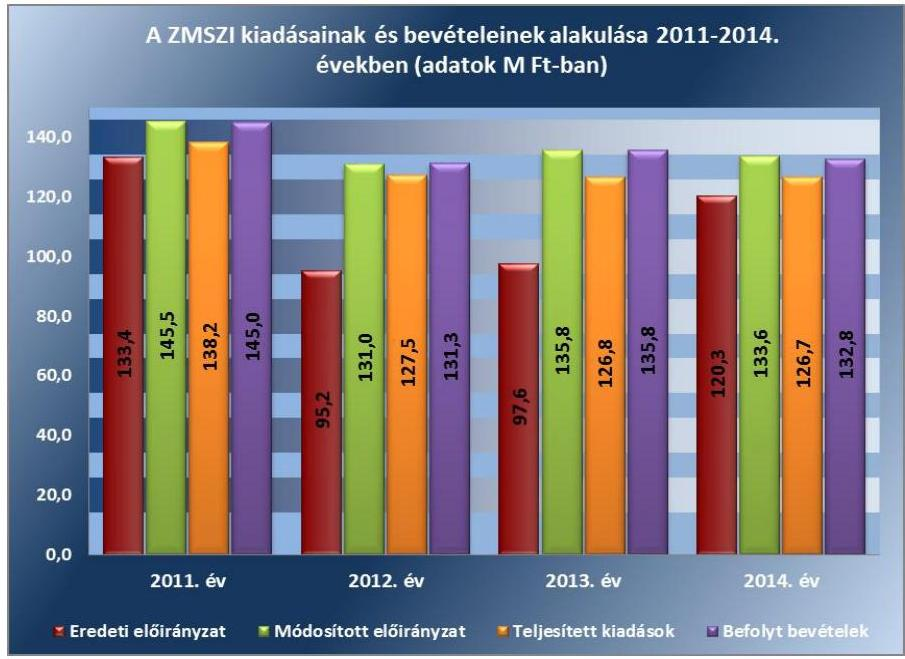

Forrás: az intézmény 2011-2014. évi költségvetési beszámolói
A bevételi előirányzattól történő elmaradást mindkét évben az intézmény működési - 2011. évben a térítési díj, a 2014. évben a készletértékesítés - bevételei előirányzatának alulteljesülése okozta. Az intézmény a

---

3. táblázat

KULCSKONTROLLOK
GYAKORLÁSÁNAK MINŐSÍTÉSE

| Ellenőrzött év | Minősítés |
| :--: | :--: |
| 2011. év | részben megfelelő |
| 2012. év | részben megfelelő |
| 2013. év | nem megfelelő |
| 2014. év | nem megfelelő |

2011-2014. években költségvetési kiadásait a módosított előirányzat keretén belül teljesítette.

A 2011. évről a 2014. évre a befolyt bevételek és a teljesített kiadások 8,4%-kal csökkentek. A befolyt bevételek évek közötti csökkenésében szerepet játszott az irányító szervi támogatások visszaesése. A személyi juttatások és azok járulékainak visszaesését a statisztikai állományi létszám, valamint a szociális foglalkoztatás keretében munkavégzésre bevonható ellátottak számának csökkenése eredményezte.

Az intézmény szociális foglalkoztatás keretében előállított termékek értékesítésével foglalkozott, amelyet a 112/2006. (V. 12.) Korm. rendeletben előírt módon végzett, a termékek előállítására vonatkozó engedélyekkel rendelkeztek. Az előállított termékek értékesítése a jogszabályban előírtak alapján kereskedelmi tevékenységnek minősül, az intézmény - a 2005. évi CLXIV. törvény ${ }^{59}$ 3. § (1) bekezdésében előírtak ellenére - a kereskedelmi tevékenységre vonatkozó bejelentési kötelezettségének nem tett eleget.

A kiadási előirányzatok felhasználása során az intézmény a jogszabályi előírásokat összességében nem tartotta be. A gazdálkodási jogkörök gyakorlása a személyi juttatások, a dologi és dologi jellegű (egyéb folyó) kiadások, a felhalmozási kiadások, a támogatásértékű kiadások, az átadott pénzeszközök és előirányzatainak felhasználása a 2011-2012. években részben, míg a 2013-2014. években nem felelt meg a jogszabályi előírásoknak (3. táblázat).

A 2011-2014. években az intézmény, a MIK és az SZGYF - az Ámr. és az Ávr. előírásaival összhangban - gazdálkodási szabályzatban rendelkezett a gazdálkodási jogkörök gyakorlásáról. A gazdálkodási jogkörök gyakorlására vonatkozó kijelölések nem minden esetben feleltek meg a jogszabályi előírásoknak, mivel az intézményre vonatkozóan a teljesítésigazolókat és kötelezettségvállalókat 2013. április 4-től 2014. október 31-ig terjedő időszakban - az Ávr. 52. § (1) bekezdés a) pontjában és az 57. § (4) bekezdésében előírtak ellenére - az intézményvezető helyett az SZGYF főigazgatója jelölte ki. A gazdálkodási szabályzatokat mellékleteikkel együtt folyamatosan aktualizálták, a gazdálkodási jogkörök gyakorlására kijelölés írásban történt.

A pénzgazdálkodási belső kontrollok működésének szabályszerűsége a kiadási előirányzatok felhasználásához kapcsolódóan összességében nem volt megfelelő.

Az ellenőrzés az alábbi hibákat tárta fel:

- A rendszeres és nem rendszeres személyi juttatásoknál a jogszabályellenes kijelölésekből adódóan a 2013-2014. években rendszeresen előfordult, hogy a teljesítésigazolásokat - az Ávr. 57. § (4) bekezdésében foglaltak ellenére - nem a kötelezettségvállalásra jogosult (intézményvezető) által kijelölt személy végezte. Az érvényesítő - az Ávr. 58. § (1)-(2) bekezdésében előírtak ellenére - nem ellenőrizte a megelőző ügymenetben a jogszabályi előírások betartását, továbbá nem jelezte a felmerült szabálytalanságokat az utalványozónak.
- A dologi és dologi jellegű kiadások felhasználásánál a 2011-2013. években több esetben előfordult, hogy - az Ámr. 76. § (1) bekezdésében és az Ávr. 57. § (1) bekezdésében előírtak ellenére - nem történt meg a (szakmai) teljesítés igazolása. A 2013-2014. években rendszeresen előfordult, hogy a teljesítésigazolásokat - az Ávr. 57. § (4) bekezdésében foglaltak ellenére - nem a kötelezettségvállalásra jogosult (intézményvezető) által kijelölt személy végezte. A 2012-2014. években rendszeresen előfordult, hogy az érvényesítést - az Ávr. 58. § (1) bekezdésében foglaltak ellenére - nem végezték el, illetve hiányzott - az Ávr. 58. § (3) bekezdésében foglaltak ellenére - az érvényesítésre utaló megjegyzés vagy az érvényesítés dátuma. A 2011. évben előfordult, hogy az utalvány ellenjegyzője - az Ámr. 79. § (2) bekezdésében foglaltak ellenére - nem ellenőrizte szakmai teljesítésigazolás megtörténtét. A 2012. évben előfordult, hogy az érvényesítést - az Ávr. 58. § (4) bekezdésében foglaltak ellenére - kijelöléssel nem rendelkező személy végezte, továbbá az intézménynél - az Ávr. 60. § (3) bekezdésének foglaltak ellenére - nem vezettek naprakész nyilvántartást az ellenjegyzést végző személyek aláírás mintájáról. A 2012-2014. években rendszeresen előfordult, hogy az érvényesítő - az Ávr. 58. § (1)-(2) bekezdésében előírtak ellenére - nem ellenőrizte a megelőző ügymenetben a jogszabályi előírások betartását, továbbá nem jelezte a felmerült szabálytalanságokat az utalványozónak.
A felhalmozási kiadások felhasználásánál a 2014. évben előfordult, hogy a teljesítésigazolásokat - az Ávr. 57. § (4) bekezdésében előírtak ellenére - nem a kötelezettségvállalásra jogosult (intézményvezető) által kijelölt személy végezte. Továbbá a 2014. évben előfordult, hogy az érvényesítés - az Ávr. 58. § (3) bekezdésében előírtak ellenére - nem tartalmazott az érvényesítésre utaló megjegyzést, valamint az érvényesítő - az Ávr. 58. § (1)-(2) bekezdésében előírtak ellenére - nem ellenőrizte a megelőző ügymenetben a jogszabályi előírások betartását és nem jelezte a felmerült szabálytalanságokat az utalványozónak.

Közbeszerzési eljárást az intézménynél a beszerzések alapján nem kellett lefolytatni.

Az ellenőrzött kifizetésekkel összefüggésben a rendelkezésre bocsátott dokumentumok alapján pazarló gazdálkodást, kár bekövetkeztére utaló adatot, tényt az ellenőrzés nem állapított meg, azonban a nem megfelelően működtetett belső kontrollok korrupciós kockázatot hordozhatnak.

# 3.4. számú megállapítás 

A pénzmaradvány/előirányzat-maradvány megállapítása, felhasználása megfelelt a jogszabályi előírásoknak.

## A kötelezettségvállalással terhelt maradvány megállapítása és felhasználása megfelelt az Ámr.-ben, illetve az Ávr.-ben foglaltaknak, a kifizetések a következő év június 30-áig megtörténtek.

A 2012. évben egy alkalommal került sor az intézményt érintő költségvetési előirányzat zárolására, az előirányzat felhasználáshoz kapcsolódó évközi korlátozó intézkedést végrehajtották, a módosított bevételi és kiadási előirányzatokból - az Áhsz. 3-ban előírtaknak megfelelően - átvezették a zárolt bevételi és kiadási előirányzatok közé a zárolt előirányzatot. A

---

2012. évben egy alkalommal érintette az intézményt költségvetési törvényben meghatározott befizetési kötelezettség, melyet az intézmény - az előírtaknak megfelelően - 2012. december 12-én teljesített.

A főkönyvi számlák, az analitikus nyilvántartások és az éves beszámolók között az adategyezőség fennállt. Az intézménynél a 2011. évben keletkezett pénzmaradvány a MIK jóváhagyása alapján tárgyévi bevételként - támogatásértékű bevételként, maradvány átvételként - került elszámolásra. Az intézmény 2014. évi előirányzat maradványáról az intézmény gazdálkodási feladatait ellátó SZGYF a 2014. évi elemi költségvetési beszámoló benyújtásával az előírt tartalommal, azonban - az Áhsz. 2 32. § (1) bekezdésében előírtak ellenére - nem az előírt február 28-ai határidőben, hanem 2015. április 21-én teljesítette az irányító szerv felé az adatszolgáltatási kötelezettséget.

A 2012. évi előirányzat-maradvány jóváhagyásáról az intézmény - az Ávr. 153. § (4) bekezdésében előírtak ellenére - nem rendelkezett irányítószervi értesítéssel. A 2013-2014. évi előirányzat-maradványok jóváhagyásáról az SZGYF értesítette az intézményt.

# 3.5. számú megállapítás Az intézmény fizetőképessége biztosított volt. 

A folyamatos fizetőképesség és feladatellátás a 2011-2014. években biztosított volt.

Az intézmény a 2011. évben az önkormányzati alrendszerbe tartozott és a jogszabály nem írt elő előirányzat-felhasználási terv készítési kötelezettséget.

Likviditási tervkészítési kötelezettséget a 2012. évtől a munkamegosztási megállapodás a MIK-nek, illetve 2013. évtől az SZGYF-nek írt elő.

A 2012. évben a MIK által, míg a 2013. évben az SZGYF által készített likviditási terv - az Ávr. 122. § (1) bekezdésében előírtak ellenére - dekádonkénti ütemezést nem tartalmazott.

A 2014. évben az SZGYF - az Áht. 2 78. § (2) bekezdésében előírtak ellenére - likviditási tervet nem készített.

Szállítói tartozások kifizetése a 2011-2012. években határidőben, míg a 2013-2014. években esetenként néhány napos késedelem mellett volt biztosított.

A szállítói kötelezettségállomány évenkénti alakulását az alábbi táblázat tartalmazza.

---

| 4. táblázat |  |  |  |  |
| :--: | :--: | :--: | :--: | :--: |
| Az intézmény 2011-2014. évek közötti lejárt szállítói tartozásai (M Ft-ban) |  |  |  |  |
| Megnevezés | 2011. | 2012. | 2013. | 2014. |

 2014. 2014. 2015. 2014. 2015. 2014. 2015. 2014. 2015. 2014. 2015. 2014. 2015. 2014. 2015. 2014. 2015. 2014. 2015. 2015. 2015. 2015. 2015. 2015. 2015. 2015. 2015. 2015. |  |  |
| Összes szállítói kötelezettség | $--$ | 0,5 | 2,0 | 3,7 |
| Lejárt szállítói tartozás | $--$ | $--$ | 1,9 | 2,9 |
| Ebből: | $--$ | $--$ | 1,9 | 2,9 |
| 30 nap alatt | $--$ | $--$ | 1,9 | 2,9 |
| 31 és 60 nap közötti | $--$ | $--$ | $--$ | $--$ |
| 61 és 90 nap közötti | $--$ | $--$ | $--$ | $--$ |
| 91 és 365 nap közötti | $--$ | $--$ | $--$ | $--$ |
| Éven túli | $--$ | $--$ | $--$ | $--$ |

A 2013. év végén kimutatott lejárt szállítói tartozásállomány 1,9 M Ft volt, amely a 2014. év végére 52,1%-kal (1,0 M Ft-tal) 2,9 M Ft-ra nőtt. A tartozások átmeneti jellegűek voltak és 30 napon belül rendeződtek. A lejárt számlák dologi kiadásokhoz, ezen belül elsősorban szolgáltatásvásárláshoz és egyéb beszerzéshez kapcsolódtak.

A LIKVIDITÁS JAVÍTÁSA érdekében az SZGYF a 2013. évben előirányzatai terhére 1,0 M Ft póttámogatásban részesítette az intézményt, további támogatást az intézmény nem kapott.

A likviditási mutatók (5. táblázat) alapján az intézmény pénzügyi helyzete 2011-2013. években kedvezőtlen irányba változott. A 2011. év végén rövid lejáratú kötelezettség nem állt fenn, a rövidlejáratú kötelezettség hiánya kedvező pénzügyi helyzetre utalt, azonban - a likviditási mutatók alapján - a 2012. évről a 2013. évre a forgóeszközök csökkenő mértékben nyújtottak fedezetet a rövid lejáratú kötelezettségekre.
5. táblázat

LIKVIDITÁSI MUTATÓK ALAKULÁSA

|  | 2011 | 2012. | 2013. |
| :-- | :--: | :--: | :--: |
| Likviditási mutató | $\infty$ | 29,3 | 7,3 |
| Pénzeszköz likviditási mutató | $\infty$ | 18,4 | 6,1 |

A likviditási mutatók romlásában meghatározó szerepe volt a rövidlejáratú kötelezettségállomány, a szállítóállomány növekedésének.

Az intézmény beszerzései nem tartoztak a költségvetési egyensúlyt biztosító kormányzati intézkedések hatálya alá, az Áht.1-2 alapján kincstári biztost, költségvetési felügyelőt nem kellett kinevezni, maradványtartási kötelezettség nem volt.

A KÖVETELÉS behajtására intézkedést tettek. A követelésállomány alakulását az alábbi táblázat tartalmazza:

---

| 6. táblázat |  |  |  |  |
| :--: | :--: | :--: | :--: | :--: |
| AZ INTÉZMÉNY 2011-2014. ÉVEK KÖZÖTTI KÖVETELÉSÁLLOMÁNYA (M FT-BAN) |  |  |  |  |
| Megnevezés | 2011. VII. 31 | 2012. VII. 31. | 2013. VII. 31. | 2014. VII. 31. |
| Összes vevőkövetelés | 0,1 | 0,3 | 0,2 | 0,8 |
| Lejárt vevőkövetelés | $-$ | 0,2 | 0,2 | 0,2 |
| Ebből: |  |  |  |  |
| 30 nap alatt | $-$ | $-$ | $-$ | $-$ |
| 31 és 60 nap közötti | $-$ | $-$ | $-$ | $-$ |
| 61 és 90 nap közötti | $-$ | $-$ | $-$ | $-$ |
| 91 és 365 nap közötti | $-$ | 0,2 | $-$ | $-$ |
| Éven túli | $-$ | $-$ | 0,2 | 0,2 |

A követelésállomány nagyságrendje a fizetőképesség alakulását nem befolyásolta. Az intézmény a 2013-2014. években 0,2 M Ft összegű éven túl lejárt követelést mutatott ki, térítési díj hátralékból. A fennálló követelés behajtására az intézmény a térítési díj hátralékos gondozottnak fizetési felszólításokat küldött ki. A tartozás megfizetését egy ellátott tartásra kötelezett hozzátartozója vállalta, amely a fizetési kötelezettségének az intézmény felszólítására sem tett azonban eleget.

# 4. Az intézmény vagyongazdálkodása szabályszerű volt-e? 

## Összegző megállapítás

Az intézmény vagyongazdálkodása - a 2011. év kivételével - nem volt szabályszerű.
4.1. számú megállapítás

A 2011. évben az intézmény a feladatellátáshoz szükséges vagyont az Önkormányzat vagyongazdálkodási rendeletében és az alapító okiratban foglaltak alapján használta. A 2012. január 1-jétől a közfeladat ellátáshoz szükséges ingatlan vagyont jogcím nélkül használta.

Az intézmény a 2011. évben az államháztartás önkormányzati alrendszerébe tartozott, felügyeletét és irányítását az Önkormányzat Közgyűlése látta el. A feladat ellátását szolgáló vagyont az Önkormányzat a vagyongazdálkodási rendeletében és az alapító okiratban foglaltak szerint bocsátotta az intézmény rendelkezésére. Az intézmény a feladatellátáshoz szükséges vagyont a vagyongazdálkodási rendelet előírásai alapján térítésmentesen használhatta, hasznosíthatta, illetve számviteli nyilvántartásaiban, mennyiségben és értékben nyilvántartotta.

Az intézmény a közfeladata ellátásához használt ingatlan vagyon tekintetében - az Nvtv. 3. § (1) bekezdés 11. pontjában és a Vtvr. 1. § (7) bekezdés a) pontjában előírtak ellenére - a 2012-2014. években jogcímmel nem rendelkezett, ezért nem minősült a nemzeti vagyon, illetve az állami vagyon jogszerű használójának. A munkamegosztási megállapodásban a vagyongazdálkodással kapcsolatban leírtak nem pótolták a vagyonhasznosítási szerződés megkötésének hiányát. A MIK 2013. március 31-től az SZGYF-be történő beolvadással megszűnt. A 18/2013. (V. 06.) SZGYF utasítás ${ }^{60}$ III. fejezet 5. § (3) bekezdésében előírtak alapján a megyei kirendelt-

---

ségek feladata volt a hatálybalépéstől számított 120 napon belül az intézményi közfeladatok ellátásához szükséges jogviszonyok megújításához szükséges megállapodások előkészítése és leegyeztetése, amely végrehajtása nem történt meg.

Vagyonkezelési szerződés nélkül - adásvételi szerződéssel - az intézmény vagyonkezelésébe került eszközök esetében betartották a jogszabályi előírásokat. A 2011. évben az intézmény az eszközbeszerzések során az önkormányzati vagyonrendelet szabályainak megfelelően járt el. A 2012-2014. években a működését támogató eszközöket, a szállítókkal kötött megrendelések alapján, adásvételi szerződéssel szabályszerűen - a Vtv.-ben foglaltaknak megfelelően - a Magyar Állam javára szerezte meg, a beszerzett eszközök - az Nvtv. alapján - az intézmény vagyonkezelésébe kerültek.

# 4.2. számú megállapítás 

A mérlegben kimutatott eszközök és források nyilvántartása, értékelése, leltározása - a 2011. év kivételével - nem felelt meg a jogszabályokban előírtaknak.

A NYILVÁNTARTÁSI és beszámolási kötelezettségének az intézmény a 2011. évben az önkormányzati vagyonrendeletben, a Sztv.-ben és az Áhsz. 1-ben előírtaknak megfelelően eleget tett.

Az analitikus és főkönyvi rendszerben történő nyilvántartások vezetését, a beszámolók elkészítését a munkamegosztási megállapodás alapján a 2012. évben az intézmény és a MIK, míg a 2013-2014. években az intézmény és az SZGYF osztott felelősséggel végezte.

A 2012-2014. években az intézmény - a Sztv. 23. § (2) bekezdésében, Áhsz. 1 16. § (2) és 20. § (2) bekezdéseiben és a 9. sz. melléklet 1. f) és k) pontjaiban, valamint az Áhsz. 2 10. § (2) bekezdésében előírtak ellenére - a vagyonkezelésébe nem tartozó ingatlanokat mutatott ki a könyveiben.

Az intézmény mérlegeiben hibásan kimutatott állami ingatlan vagyon értékét az alábbi táblázat tartalmazza:
7. táblázat

## AZ INTÉZMÉNYI MÉRLEGBEN SZABÁLYTALANUL KIMUTATOTT VAGYON ÉRTÉKE

|  | 2012. év | 2013. év | 2014. év |
| :-- | --: | --: | --: |
| Ingatlanok és kapcsolódó vagyonértékű jogok (E Ft) | 63921 | 62508 | 61035 |
| Mérlegfőösszeg (E Ft) | 77830 | 77693 | 78509 |
| Ingatlanok / Mérlegfőösszeg (%) | 82,0 | 80,5 | 77,7 |

A 2012-2014. évi intézményi mérlegben hibásan szerepeltetett ingatlanok értéke meghaladta - a Sztv. 3. § (3) bekezdés 3. pontjában, az Áhsz. 1 5. § 8. pontjában, valamint az Áhsz. 2 1. § (1) bekezdés 3. pontjában lévő - jelentős összegű hiba mértékét. A beszámolók - a Sztv. 18. §-ában foglaltak alapján - nem mutattak az intézmény vagyoni, pénzügyi és jövedelmi helyzetéről megbízható és valós képet. Az állami ingatlan vagyon intézményi mérlegben történő hibás kimutatásával megsértették a Sztv. 15. § (3) bekezdésében előírt valódiság és a Sztv. 16. § (4) bekezdésében előírt lényegesség elvét.

Az intézmény könyveiben szabálytalanul nyilvántartott ingatlanok értéke után - az Áhsz. 1 30. § (1) bekezdés, az Áhsz. 2 17. § (1) bekezdésében

---

leírtak alapján - az intézménynél értékcsökkenést számoltak el. Az intézmény nyilvántartásaiban szereplő állami ingatlanok és kapcsolódó vagyonértékű jogok tekintetében nem volt jogcím - az Áhsz. 1 34. § (1)-(2) bekezdéseiben, valamint az Áhsz. 2 21. § (1) bekezdésében előírtak szerint - az értékcsökkenés elszámolására és kimutatására.

A tartós bentlakásos intézményi ellátást igénybe vevő ellátottak után a Szoctv. 117. § (5) bekezdése alapján - keletkezett követeléseket a 2012. évi és 2013. évi beszámolóban - az Áhsz. 1 22. § (1) bekezdés a) pontjában előírtak ellenére - nem szerepeltették. A 2013-2014. években a mérlegfordulónapon fennálló és a mérlegkészítés időpontjáig pénzügyileg nem rendezett, éven túli vevő követeléseket - a Sztv. 55. § (1) bekezdésében, az Áhsz. 1 31. § (1)-(2) bekezdéseiben és az Áhsz. 2 18. § (1)-(2) bekezdéseiben foglaltak ellenére - nem minősítették és nem számoltak el utánuk értékvesztést. A követelések és kötelezettségek állományát tartalmazó számlák vezetése és a negyedévenkénti összegző kimutatás elkészítése megfelelt az Áhsz.1-2-ben foglaltaknak. A főkönyvi feladások - az Áhsz. 1 51. § (1) bekezdés b) pontjában előírtak ellenére - nem minden esetben a tárgynegyedévet követő hónap 15. napjáig történtek meg. A 2012. I. negyedévi feladás 2012. április 19-én, a 2012. IV. negyedévi feladás 2013. február 23-án, a 2013. I. negyedévi feladás 2013. április 20-án, valamint a 2013. IV. negyedévi feladás 2014. február 3-án történt meg.

AZ ÉV VÉGI LELTÁRT az éves költségvetési beszámoló elkészítéséhez, a mérleg tételeinek alátámasztásához - a 2011. év kivételével - részben állították össze. Az intézmény a 2012-2014. évek mérlegében szabálytalanul szerepeltetett állami ingatlanokat és kapcsolódó vagyonértékű jogokat is felleltározta. Az intézmény által készített leltár - a Sztv. 69. § (1) bekezdésében, az Áhsz. 1 37. § (2) bekezdésében és az Áhsz. 2 22. § (1) bekezdésében előírtak ellenére - nem tartalmazta a 2013. évben a források között értékben kimutatott költségvetésen kívüli passzív pénzügyi elszámolásokat, továbbá a 2014. évben a források között értékben szereplő egyéb sajátos forrásoldali elszámolásokat és a beszerzett eszközök közül egy kis értékű tárgyi eszközt.

A leltározás gyakorisága és a leltár felvételének módja megfelelt a Sztv.-ben és az Áhsz.1-2-ben foglaltaknak. A leltározásokat az arra kijelölt munkavállalók a leltározási ütemtervnek és leltározási utasításnak megfelelően hajtották végre. A leltározás végrehajtását követően a leltárak és az analitikus és főkönyvi nyilvántartások egyeztetésre kerültek, leltárhiány nem volt.

SELEJTEZÉST az intézmény 2011. és 2014. évben hajtott végre, amely megfelelt a jogszabályokban előírtaknak.

Az intézménynek nem volt értékmegőrzési, állagmegóvási kötelezettsége. Az állami tulajdonú ingatlanokon a 2014. évben végzett felújítás során nem tartották be a jogszabályi előírásokat.

A 2011. évben az intézmény feladatellátásához szükséges vagyon az Önkormányzat tulajdonában volt, az önkormányzati vagyonrendelet az értékmegőrzésre, állagmegóvásra részletes előírást nem fogalmazott meg.

Az ingatlanok és kapcsolódó vagyonértékű
 jogok tekintetében vagyonkezelői jogokat 2012. január 1-jétől a MIK, 2013. március 1-jétől a jogutód

---

SZGYF gyakorolta. A Vtvr. 9. § (6) bekezdésében előírtaknak megfelelően a vagyonkezelő köteles a vagyonkezelésében lévő állami vagyonnal összefüggő terheket viselni, az állami vagyon értékének, állagának megóvásáról gondoskodni, továbbá a szükséges felújítási munkákat elvégezni, elvégeztetni. A vagyonkezelő az állami vagyon hatékony működtetésére, állagának védelmére, értékének megőrzésére, illetve gyarapítására, az állami és közfeladatok ellátásának elősegítésére - a Vtv. 23. § (2) bekezdésében előírtak ellenére - nem fogalmazott meg előírásokat az intézmény részére.

Az intézmény a 2014. évben a közfeladat ellátáshoz jogcím nélkül használt állami ingatlanokon felújítást végeztetett, melynek során nem tartotta be a jogszabályi előírásokat, mivel a nemzeti vagyonba tartozó állami tulajdonú ingatlanon - az Nvtv. 11. § (14) bekezdésének előírása szerint - felújítási tevékenységet nem végezhetett és nem végeztethetett volna. Továbbá az elvégzett felújításokhoz - az Nvtv. 11. § (15) bekezdés c) pontjában előírtak ellenére - az intézmény nem rendelkezett a SZGYF-fel kötött szerződéssel, ami ezt lehetővé tette volna. Az intézmény az állami tulajdonú ingatlanokon végzett felújítást üzembe helyezte, annak bekerülési értékével - az Áhsz. 15. § (2) bekezdésében előírtak ellenére - a saját könyveiben megnövelte a hibásan nyilvántartott ingatlanok értékét.

Az intézmény az ellenőrzött időszakban hasznosítási tevékenységet nem végzett.

# 4.4. számú megállapítás 

Az eredményszemléletű számvitel bevezetésével kapcsolatos feladatok végrehajtása nem felelt meg a jogszabályi előírásoknak.

A RENDEZŐ MÉRLEG elkészítéséhez az intézmény az eszközeit és a forrásait 2013. december 31-ei mérleg-fordulónappal felleltározta, azonban - az NGM rendelet ${ }^{61}$ 2. § (1) bekezdésében és a (2) bekezdés c) pontjában előírtak ellenére - a leltár a kötelezettségvállalásokat nem tartalmazta, valamint a leltárban a követeléseket, kötelezettségeket, kötelezettségvállalásokat a költségvetési évben esedékes és költségvetési évet követő években esedékes bontásban nem szerepeltették. A leltárba a követelések közé - az NGM rendelet 5. § (2) bekezdésében előírtak ellenére - a 2013. évi előirányzatot terhelő személyi juttatásokat, valamint a kapcsolódó munkaadókat terhelő járulék és szociális hozzájárulási adót nem emelték be. A leltár tartalmazott olyan állami ingatlanokat és kapcsolódó vagyon értékű jogokat, amelyek nem az intézmény vagyonkezelésében voltak.

A rendező mérleget - az NGM rendelet 1. §-ában előírtak ellenére - szabályszerűen nem készítették el, mivel a rendező mérleg - az NGM rendelet 8. § (3) bekezdésében előírtak ellenére - nem tartalmazta a költségvetési szerv vezetőjének és a rendező mérleg elkészítéséért felelős személy keltezéssel történő aláírását, továbbá nem tűntették fel a rendező mérleg elkészítéséért felelős személy regisztrációs számát vagy a kamarai tagsági számát. A rendező mérleget 2014. január 1-jei mérleg-fordulónappal és az NGM rendeletben előírt 2014. március 31-i határidőre a KGR rendszerbe elektronikusan feltöltötték.

A rendező mérleg elkészítéséig a könyvvezetés részben valósult meg. A költségvetési számvitel nyilvántartási számlái közül a követeléseket 2014. január 31-ig, a szállítói kötelezettségek jelentős részét - az NGM rendelet 9. §-ában előírtak ellenére - 2014. január 31-ét követően nyitották meg. Az előirányzatok nyilvántartására szolgáló nyilvántartási számlák

---

megnyitása - az Áhsz. 54. § (3) bekezdésében előírtak ellenére - az elemi költségvetés elfogadása előtt történt. Az egyéb eszközök és források könyvviteli számlákat a rendező mérleg alapján, az annak elkészítését követően nyitották meg. A könyvviteli számlák megnyitása után a nyilvántartások szerinti forgalmat a megnyitott könyvviteli számlákon könyvelték.

A rendező mérleg olyan vagyonelemeket (állami ingatlanokat és kapcsolódó vagyonértékű jogokat) tartalmazott, amelyek nem az intézmény vagyonkezelésében voltak, ezért megsértették a Sztv. 15. § (3) bekezdésében előírt valódiság elvét.

# 5. Szabályszerűen hajtották-e végre az ellenőrzött időszakban az intézményt érintő szervezeti, szerkezeti átalakításokat? 

Összegző megállapítás

Az intézményt az Áht.1-ben és az Áht.2-ben meghatározott átalakulás nem érintette. Az alrendszer váltásból, a gazdálkodási besorolás változásából adódó intézményt érintő szervezeti változások végrehajtása - az alábbi hiányosság mellett - megfelelt a jogszabályi előírásoknak.

### 5.1. számú megállapítás

A Konsz. tv. által elrendelt alrendszer váltással kapcsolatos irányítószervi feladatok végrehajtása - kisebb hiányosságokkal - megfelelt a jogszabályi előírásoknak.

Az intézmény az államháztartás önkormányzati alrendszeréből a központi alrendszerbe történő átsorolására a Konsz. tv. rendelkezései alapján került sor.

A Konsz. tv. 2. § (1) bekezdése értelmében a megyei önkormányzatok fenntartásában levő intézmények vagyona és vagyoni értékű joga a törvény erejénél fogva 2012. január 1-jén állami tulajdonba került, továbbá a vagyonnal és intézményekkel kapcsolatos alapítói, fenntartói jogok a törvényben meghatározott szervekre szálltak. Az átszervezés végrehajtásának szabályait a 258/2011. (XII. 7.) Korm. rendelet tartalmazta, melyben szabályozták az átadás-átvétel részleteit. Az önkormányzati intézmények vagyonának átadás-átvételével kapcsolatos előkészítési feladatok végrehajtása érdekében megyénként intézmény átadás-átvételi bizottság működött, a bizottság vezetője a megyei kormányhivatal kormánymegbízottja ${ }^{62}$ volt, az előkészítő munkálatokat a munkacsoport végezte. A tulajdonosi és fenntartói jogutódláshoz kapcsolódó feladatok végrehajtásának részletkérdéseit - a Konsz. tv.-ben előírtaknak megfelelően - a megyei közgyűlés elnöke ${ }^{63}$, a megyei kormányhivatal kormánymegbízottja, az MNV Zrt. vezérigazgatója és a Nemzeti Földalapkezelő Szervezet elnöke között megkötendő átadás-átvételi megállapodásban kellett rendezni. Az átadás-átvételi megállapodást a felek a Konsz. tv. által előírt határidőn belül - a 258/2011. (XII. 7.) Korm. rendelet 1. számú mellékletében szereplő megállapodás-mintának megfelelően - 2011. december 9-én írták alá. Az átadás-átvételi megállapodás - a 258/2011. (XII. 7.) Korm. rendelet 12. § (1) bekezdésében előírtak ellenére - a megállapodás aláírásával egyidejűleg felvett és a megyei közgyűlésének elnöke által hitelesített vagyonleltárt nem tartalmazott.

---

A Konsz. tv.-ben meghatározott átkerült vagyon tekintetében a tulajdonosi jogokat 2012. január 1-jétől az állami vagyon felügyeletéért felelős miniszter gyakorolta, aki e feladatát az MNV Zrt. útján látta el. A vagyonkezelői jogokat 2012. január 1-jétől a MIK gyakorolta. Az MNV Zrt. és a MIK közötti vagyonkezelői szerződés megkötésére 2012. október 17-én került sor.

A Konsz. tv.-ben és a 258/2011. (XII. 7.) Korm. rendeletben előírtaknak megfelelően, 2012. április 1-jétől a ZMSZI gazdasági szervezete megszűnt, a gazdálkodással kapcsolatos feladatokat a MIK vette át. Az intézmény gazdálkodásával kapcsolatos feladatok megosztásának rendjét munkamegosztási megállapodásban rögzítették. A 258/2011. (XII. 7.) Korm. rendelet 18. § (2) bekezdése alapján 2013. március 31-jétől a MIK az SZGYF-be történő beolvadással megszűnt, az SZGYF a MIK egyetemleges jogutódja és a vagyonkezelői jogok gyakorlója lett. Az SZGYF - a 23/2013. (IX. 2.) számú főigazgatói utasítással kiadott gazdálkodási szabályzatában - rögzítette, hogy a MIK és a fenntartásában lévő önállóan működő költségvetési szervek között 2013. március 31-e előtt létrejött munkamegosztási megállapodások továbbra is érvényben maradnak.

# 6. Az intézmény intézkedett-e az integritás szemlélet érvényesítése érdekében? 

## Összegző megállapítás

Az intézmény az ellenőrzést megelőzően nem intézkedett az integritás szemlélet érvényesítése érdekében.

Az intézmény az ellenőrzést megelőzően az ÁSZ Integritás Projektjében nem vett részt, ezért az integritás szemlélet érvényesülésének értékelése az intézmény által kitöltött hosszú kérdőív alapján történt. Az integritás szemlélet érvényesítésével kapcsolatos megállapításokat a V. sz. melléklet tartalmazza.

---

# JAVASLATOK 

Az ÁSZ tv. 33. § (1) bekezdésében foglaltak értelmében az ellenőrzött szervezet vezetője köteles a jelentésben foglalt megállapításokhoz kapcsolódó intézkedési tervet összeállítani és azt a jelentés kézhezvételétől számított 30 napon belül az ÁSZ részére megküldeni. Amennyiben az ellenőrzött szervezet vezetője nem küldi meg határidőben az intézkedési tervet vagy továbbra sem elfogadható intézkedési tervet küld, az ÁSZ elnöke az ÁSZ tv. 33. § (3) bekezdés a)-b) pontjaiban foglaltakat érvényesítheti.

## az emberi erőforrások miniszterének

1. Intézkedjen a ZMSZI feladatainak ellátásához használt, az SZGYF vagyonkezelésében lévő vagyon
a) kezelésével, valamint
b) nyilvántartásával
kapcsolatban feltárt szabálytalanságok tekintetében a munkajogi felelősség tisztázására irányuló eljárás megindításáról, és ennek eredménye ismeretében tegye meg a szükséges intézkedéseket.
(1.2. számú megállapítás 2. bekezdése, és a 4.2. számú megállapítás 3. és 5. bekezdése alapján)

## a Szociális és Gyermekvédelmi Főigazgatóság mint középirányító szerv főigazgatójának

1. Intézkedjen a jogszabályi előírásoknak megfelelően a vagyonkezelésében lévő, a ZMSZI közfeladat ellátásához szükséges állami vagyon tekintetében a jogszerű használat feltételeinek a megteremtésére.
(1.2. számú megállapítás 2. bekezdése)
2. Intézkedjen a jogszabályi előírásokkal összhangban a ZMSZI-re vonatkozóan az előirányzatokkal, a létszámokkal és a vagyonnal való hatékony gazdálkodás követelményeinek érvényesítésére, e követelmények érvényre juttatásának számon kérésére, ellenőrzésére.
(1.2. számú megállapítás 4. bekezdés 3. mondata alapján)

---

3. Tegyen intézkedéseket
a) a ZMSZI-nél rendelkezésre álló források gazdaságos, hatékony és eredményes felhasználását biztosító szabályozások kiadásával, folyamatok kialakításával és működtetésével, valamint
b) a rendező mérleg szabályszerű elkészítésének hiányával kapcsolatban feltárt hiányosságok tekintetében a költségvetési szerv vezetőjének felelőssége tisztázása érdekében, és szükség szerint intézkedjen a felelősség érvényesítésére.
(2.5. számú megállapítás 4-5. bekezdése, és a
4.4. számú megállapítás 2. bekezdés 1. mondat alapján)

# a Szociális és Gyermekvédelmi Főigazgatóság mint a Zala Megyei Szocioterápiás Intézmény gazdasági szervezeti feladatait ellátó szerv főigazgatójának 

1. Intézkedjen, a jogszabályi előírásoknak megfelelően a ZMSZI-re vonatkozó számviteli politika és annak keretében az eszközök és források leltározási és leltárkészítési szabályzata, az eszközök és források értékelési szabályzata, az önköltségszámítás rendjére vonatkozó belső szabályzat és a pénzkezelési szabályzat elkészítésére.
(2.1. számú megállapítás 5. bekezdés 3-6. mondat alapján)
2. Intézkedjen a jogszabályi előírásoknak megfelelően a ZMSZI számlarendjének elkészítésére.
(2.1. számú megállapítás 6. bekezdés 2. mondat alapján)
3. Intézkedjen a ZMSZI-vel a gazdasági szervezeti feladatok ellátása érdekében kötött munkamegosztási megállapodás módosítására annak érdekében, hogy az a jogszabályi előírásoknak megfelelően egyértelműen elkülönítve tartalmazza, hogy melyik feladatot melyik költségvetési szerv látja el.
(2.1. számú megállapítás 11. bekezdése alapján)
4. Intézkedjen, hogy az érvényesítést az arra kijelölt személy a jogszabályi előírások betartásával végezze el.
(3.3. számú megállapítás 9. bekezdés 1-3. pontjai alapján)

---

5. Biztosítsa, hogy a ZMSZI a jogszabályban előírt határidőben tegyen eleget adatszolgáltatási kötelezettségének az elemi költségvetési beszámoló irányító szerv felé történő megküldésével.
(3.4. számú megállapítás 3. bekezdése alapján)
6. Intézkedjen, hogy a jogszabályban előírtaknak megfelelően a likviditási tervet készítsék el.
(3.5. számú megállapítás 5. bekezdése alapján)
7. Intézkedjen, hogy a jogszabályi előírásokkal összhangban a ZMSZI a számviteli nyilvántartásában a vagyonkezelésébe nem tartozó ingatlanokat ne mutasson ki.
(4.2. számú megállapítás 3. bekezdése alapján)
8. Intézkedjen, hogy a jogszabályi előírásoknak megfelelően a követelések minősítése és az értékvesztés elszámolása megtörténjen.
(4.2. számú megállapítás 7. bekezdés 2. mondata alapján)
9. Intézkedjen, hogy a mérleg tételeinek alátámasztásához összeállított leltár teljes körűen tartalmazza a ZMSZI eszközeit és forrásait.
(4.2. számú megállapítás 8. bekezdés 3. mondata alapján)

# a Zala Megyei Szocioterápiás Intézmény vezetőjének 

1. Intézkedjen a ZMSZI SZMSZ-ének módosítására annak érdekében, hogy az a jogszabályi előírásokkal összhangban tartalmazza
a) a hatályos, egységes szerkezetbe foglalt alapító okirat keltét és számát;
b) a vagyonnyilatkozat tételre kötelezettek körét;
c) a belső ellenőrzést végző személy, vagy szervezet, vagy szervezeti egység feladatait.
Kezdeményezze az előzőek szerint módosított SZMSZ irányítószerv általi jóváhagyását.
(1.1. számú megállapítás 3. bekezdése, a 2.2. számú megállapítás 3. bekezdés 1. mondata és a 2.5. számú megállapítás 2. bekezdés 5. mondata

 alapján)

---

2. Intézkedjen a jogszabályban előírt kockázatkezelési rendszer működtetésére.
(2.2. számú megállapítás 2. bekezdése alapján)
3. Intézkedjen a jogszabályi előírással összhangban az iratkezelési szoftver által kezelt adatok biztonságáról, alakítsa ki az üzembiztonsági, adatvédelmi szabályok érvényre juttatásához szükséges eljárási szabályokat.
(2.3. számú megállapítás 4. bekezdés 1. mondata alapján)
4. Készítsen adatvédelmi és adatbiztonsági szabályzatot a jogszabályi előírásokkal összhangban.
(2.4. számú megállapítás 2. bekezdése alapján)
5. Intézkedjen a jogszabályi előírásokkal összhangban
a) a kötelezően közzéteendő adatok nyilvánosságra hozatali rendjének szabályozására, valamint
b) a közérdekű adatokkal kapcsolatos közzétételi kötelezettség teljesítésére.
(2.4. számú megállapítás 3-4. bekezdései alapján)
6. Intézkedjen, hogy az Intézmény iratkezelési szabályzatának kiadása a jogszabályban előírtakkal összhangban az illetékes közlevéltár egyetértésével történjen.
(2.4. számú megállapítás 5. bekezdés 1. mondata alapján)
7. Intézkedjen a jogszabályi előírásnak megfelelően, a jóváhagyást követően a belső ellenőrzési terv megküldésére a fejezetet irányító költségvetési szerv belső ellenőrzési vezetője részére.
(2.5. számú megállapítás 2. bekezdés 9. mondata alapján)
8. Intézkedjen a jogszabályban előírtaknak megfelelően a rendelkezésre álló források gazdaságos, hatékony és eredményes felhasználását biztosító szabályozások kiadására, folyamatok kialakítására és működtetésére.
(2.5. számú megállapítás 4. bekezdése alapján)

---

9. Biztosítsa a bevételi előirányzatok teljesítésének kötelezettségére vonatkozó jogszabályi előírás betartását.
(3.3. számú megállapítás 3. bekezdése alapján)
10. Tegyen eleget a jogszabályi előírással összhangban a kereskedelmi tevékenységre vonatkozó bejelentési kötelezettségének.
(3.3. számú megállapítás 6. bekezdés 2. mondata alapján)
11. Intézkedjen, hogy a jogszabályi előírásoknak megfelelően a teljesítés igazolását az arra kijelölt személy végezze el.
(3.3. számú megállapítás 9. bekezdés 1-3. pontjai alapján)
12. Intézkedjen, hogy a ZMSZI felújítási tevékenységet a jogszabályi előírásokkal összhangban végezzen.
(4.3. számú megállapítás 3. bekezdése alapján)

---

.

---

# MELLÉKLETEK 

## I. SZ. MELLÉKLET: ÉRTELMEZŐ SZÓTÁR

állami vagyon
állami vagyonnak minősül:
a) az állam tulajdonában lévő dolog, valamint a dolog módjára hasznosítható természeti erő,
b) az a) pont hatálya alá nem tartozó mindazon vagyon, amely vonatkozásában törvény az állam kizárólagos tulajdonjogát nevesíti,
c) az állam tulajdonában lévő tagsági jogviszonyt megtestesítő értékpapír, illetve az államot megillető egyéb társasági részesedés,
d) az államot megillető olyan immateriális, vagyoni értékkel rendelkező jogosultság, amelyet jogszabály vagyoni értékű jogként nevesít
(Forrás: Vtv. 1. § (2) bekezdése)
állami vagyon értékesítése
állami vagyon használója
állami vagyon hasznosítása
állami vagyon hasznosítására kötött szerződés
állami vagyon kezelője /vagyonkezelő

Állami vagyonnak minősül:
a) az állam tulajdonában lévő dolog, valamint a dolog módjára hasznosítható természeti erő, amely, illetve aki törvény vagy szerződés alapján, bármely jogcímen (pl. bérlet, haszonbérlet, vagyonkezelési szerződés, használat stb.) állami vagyont birtokol, használ, szedi annak hasznait, hasznosít, ide nem értve a tulajdonosi jogok gyakorlóját.
(Forrás: Vtvr. 1. § (7) bekezdés a) pontja, hatályos 2011. január 1-jétől 2011. december 31-ig)
Az a természetes vagy jogi személy, jogi személyiséggel nem rendelkező szervezet, aki, vagy amely törvény vagy szerződés alapján, bármely jogcímen (bérlet, haszonbérlet, használat stb.) állami vagyont birtokol, használ, szedi annak hasznait, hasznosít, ide nem értve a haszonélvezőt, a vagyonkezelőt és a tulajdonosi jogok gyakorlóját".
(Forrás: Vtvr. 1. § (7) bekezdés a) pontja)
Az állami vagyont az MNV Zrt. maga kezeli, vagy szerződés - így különösen bérlet, haszonbérlet, szerződésen alapuló haszonélvezet, vagyonkezelés, megbízás - alapján központi költségvetési szervnek, természetes vagy jogi személynek, vagy jogi személyiséggel nem rendelkező gazdálkodó szervezetnek hasznosításra átengedi.
(Forrás: Vtv. 23. § (1) bekezdése, hatályos 2011. december 31-éig)
Az állami vagyont az MNV Zrt. maga kezeli, vagy szerződés - így különösen bérlet, haszonbérlet, megbízás - alapján központi költségvetési szervnek, természetes vagy jogi személynek, vagy jogi személyiséggel nem rendelkező gazdálkodó szervezetnek hasznosításra átengedi.
(Forrás: Vtv. 23. § (1) bekezdése, hatályos 2012. január 1-jétől)
Az állami vagyonnal a tulajdonosi joggyakorló maga gazdálkodik, vagy szerződés - így különösen bérlet, haszonbérlet, megbízás - alapján hasznosításra átengedi, illetőleg vagyonkezelésbe, haszonélvezetbe adja.
(Forrás: Vtv. 23. § (1) bekezdése, hatályos 2013. június 28-ától)
Az állami vagyon hasznosítására kötött szerződések elsődleges célja az állami vagyon hatékony működtetése, állagának védelme, értékének megőrzése, illetve gyarapítása, az állami és közfeladatok ellátásának elősegítése. (Forrás: Vtv. 23. § (2) bekezdése)
Az állami vagyont az MNV Zrt. maga kezeli, vagy szerződés - így különösen bérlet, haszonbérlet, szerződésen alapuló haszonélvezet, vagyonkezelés, megbízás - alapján központi költségvetési szervnek, természetes vagy jogi személynek, illetőleg jogi személyiséggel nem rendelkező gazdasági társaságnak hasznosításra átengedi (Forrás: Vtv. 23. § (1) bekezdése, hatályos 2010. január 01 - 2011. december 31-ig).

Az állami vagyont az MNV Zrt. maga kezeli, vagy szerződés - így különösen bérlet, haszonbérlet, megbízás - alapján központi költségvetési szervnek, természetes vagy jogi személynek, vagy jogi személyiséggel nem rendelkező gazdálkodó szervezetnek hasznosításra átengedi."

---

|  | Az állami vagyonra vonatkozóan az MNV Zrt. kizárólag az Nvtv.-ben meghatározott személyekkel köthet vagyonkezelési szerződést.   (Forrás: Vtv. 27. § (1) bekezdése, hatályos 2012. január 1-jétől) |
| :--: | :--: |
| ÁSZ Integritás Projekt | Az Állami Számvevőszék 2009-ben indította el a „Korrupciós kockázatok feltérképezése - Integritás alapú közigazgatási kultúra terjesztése" című, európai uniós forrásból megvalósított kiemelt projektjét (Integritás Projekt). Az Integritás Projekt célja, hogy felmérje a közszféra intézményei korrupciós kockázatoknak való kitettségét, illetőleg az azok mérséklésére hivatott kontrollok szintjét. Az Állami Számvevőszék a projekt révén az integritás szemlélet minél szélesebb körrel történő megismertetését, gyakorlatba ültetését kívánja elérni. Az integritás követelményeinek megfelelő szervezeti működést előnyben részesítő közigazgatási kultúra elterjesztését és a korrupció elleni fellépést az ÁSZ önmagára nézve is stratégiai jelentőségű célként fogalmazta meg. A projekt a felmérésben résztvevő intézmények számára helyzetükről egyfajta „tükörképet" mutat be, ami alapot teremt a jövőbeni pozitív irányú elmozduláshoz. (Forrás: a http://integritas.asz.hu honlapon közzétett, a 2013. évi Integritás felmérés eredményeiről készült összefoglaló tanulmány) |
| átalakítás | Az általános jogutódlással történő megszüntetés átalakítással történhet. Az átalakítás lehet egyesítés vagy különválás. Az egyesítés lehet beolvadás vagy összeolvadás.   (Forrás: Áht. $\S 95 . \S-a$, Áht. 11. §-a) |
| belső ellenőrzés | Független, tárgyilagos bizonyosságot adó és tanácsadó tevékenység, amelynek célja, hogy az ellenőrzött szervezet működését fejlessze és eredményességét növelje, az ellenőrzött szervezet céljai elérése érdekében rendszerszemléletű megközelítéssel és módszeresen értékeli, illetve fejleszti az ellenőrzött szervezet irányítási és belső kontrollrendszerének hatékonyságát. (Forrás: Bkr. 2. § b) pontja) |
| belső kontrollrendszer | A belső kontrollrendszer a kockázatok kezelése és tárgyilagos bizonyosság megszerzése érdekében kialakított folyamatrendszer, amely azt a célt szolgálja, hogy a működés és gazdálkodás során a tevékenységeket szabályszerűen, gazdaságosan, hatékonyan, eredményesen hajtsák végre, az elszámolási kötelezettségeket teljesítsék, megvédjék az erőforrásokat a veszteségektől, károktól és nem rendeltetésszerű használattól. (Forrás: Áht. 69. § (1) bekezdése) |
| belső kontrollrendszer területei | A kontrollkörnyezet, a kockázatkezelési rendszer, a kontrolltevékenységek, az információs és kommunikációs rendszer, valamint a nyomon követési (monitoring) rendszer. (Forrás: Bkr. 3. §-a) |
| előirányzat-maradvány | Az államháztartás központi alrendszerébe tartozó költségvetési szerveknél a módosított bevételi és kiadási előirányzatok és azok teljesítésének a Kormány rendeletében meghatározott tételekkel korrigált különbözete az előirányzat-maradvány.   (Forrás: Áht. 2 2. § (1) bekezdés m) pontja). |
| felújítás | Az elhasználódott tárgyi eszköz eredeti állaga (kapacitása, pontossága) helyreállítását szolgáló időszakonként visszatérő olyan tevékenység, melynek során az eszköz élettartama megnövekszik, minősége, használata jelentősen javul, így a pótlólagos ráfordításból a jövőben gazdasági előnyök származnak. (Forrás: Sztv. 3. § (4) bekezdés 8. pontja) |
| használhatósági fok | A tárgyi eszközállomány állagának elemzéséhez használt mutató, amely megmutatja, hogy a le nem írt (nettó) érték milyen hányadát képezi az aktiválási (bekerülési) értéknek. Számításakor a tárgyi eszköz könyv szerinti nettó értékét viszonyítják a tárgyi eszköz bruttó (beszerzési/létesítési) értékéhez. |
| hasznosítás | A nemzeti vagyon birtoklásának, használatának, hasznok szedése jogának bármely - a tulajdonjog átruházását nem eredményező - jogcímen történő átengedése, ide nem értve a vagyonkezelésbe adást, valamint a haszonélvezeti jog alapítását. (Forrás: Nvtv. 3. § (1) bekezdés 4. pontja) |
| információs és kommunikációs rendszer | A költségvetési szerv vezetője által kialakított és működtetett olyan rendszer, mely biztosítja, hogy a megfelelő információk a megfelelő időben eljutnak az illetékes szervezethez, szervezeti egységhez, illetve személyhez. (Forrás: Bkr. 9. § (1) bekezdés) |

---

integritás

## irányító szerv/felügyeleti szerv

kincstári biztos
kincstári költségvetés
kockázat
kockázatkezelési rendszer
kontrollkörnyezet
kontrolltevékenységek
kommunikáció
korrupció
költségvetési főfelügyelő, felügyelő

Az integritás az elvek, értékek, cselekvések, módszerek, intézkedések konzisztenciáját jelenti, vagyis olyan magatartásmódot, amely meghatározott értékeknek megfelel.
(Forrás: Nemzetgazdasági Minisztérium: Magyarországi államháztartási belső kontroll standardok Útmutató 1.6.1. pontja, 2012. december)
A költségvetési szerv tekintetében az e törvényben meghatározott irányítási hatáskört gyakorló szerv. (Forrás: Áht.: 1. § 9. pontja)
A kincstári biztos kijelölését az államháztartásért felelős miniszternél a Kincstár kezdeményezi. A kincstári biztos köteles figyelemmel kísérni megbízatásának időpontjától kezdve a költségvetési szerv tervezését, gazdálkodását, beszámolását, a jogszabályokban előírt feladatainak ellátását, feltárni azokat az okokat, amelyek a tartós fizetésképtelenséghez vezettek, a szükséges intézkedések azonnali végrehajtására irányuló intézkedési tervet készíteni, azonnali intézkedéseket kezdeményezni és írásbeli utasításokat kiadni a tartozásállomány felszámolására, a gazdálkodás egyensúlyának biztosítására, a követelések behajtására. (Forrás: Ávr. 116-117. § hatályos 2013. augusztus 18-ig)
A központi költségvetésről szóló törvény elfogadását követően a fejezetet irányító szerv az államháztartás központi alrendszerébe tartozó költségvetési szerv és a fejezeti kezelésű előirányzat kiemelt előirányzatait, valamint az elkülönített állami pénzalapok és a társadalombiztosítás pénzügyi alapjai jogszabályi előírás szerinti bevételeit és kiadásait kincstári költségvetés kiadásával állapítja meg. (Forrás: Áht.: 24. § (3) bekezdés, Áht.: 28. § (2) bekezdés)
A kockázat annak a valószínűségét jelenti, hogy egy vagy több esemény vagy intézkedés nem kívánt módon befolyásolja a rendszer működését, céljainak megvalósulását. (Forrás: Javaslatok a korrupciós kockázatok kezelésére - Kockázatkezelési és ellenőrzési módszertan 35. oldal, ÁSZ)
Olyan irányítási eszközök és módszerek összessége, melynek elemei a szervezeti célok elérését veszélyeztető tényezők (kockázatok) azonosítása, elemzése, csoportosítása, nyomon követése, valamint szükség esetén a kockázati kitettség mérséklése. (Forrás: Bkr. 2. § m) pontja) A költségvetési szerv vezetője által kialakított olyan elvek, eljárások, belső szabályzatok összessége, amelyben világos a szervezeti struktúra, egyértelműek a felelősségi, hatásköri viszonyok és feladatok, meghatározottak az etikai elvárások a szervezet minden szintjén, átlátható a humánerőforrás-kezelés. (Forrás: Bkr. 6. § (1) bekezdés)
A költségvetési szerv vezetője által a szervezeten belül kialakított (kontroll) tevékenységek, melyek biztosítják a kockázatok kezelését, hozzájárulnak a szervezet céljainak eléréséhez. (Forrás: Bkr. 8. § (1) bekezdés)
Az a tevékenység, melynek során információ továbbítása valósul meg. A kommunikációs folyamat résztvevői között tájékoztatás történik, mely során tényeket, ezek magyarázatát közlik.
Azok a cselekmények, amelyek során a köz érdekében való eljárással megbízott és döntéshozatali felelősséggel felruházott személy a köz érdeke helyett önös vagy részérdekeket követve, mástól jogtalan vagy etikátlan előnyt elfogadva és őt jogtalan vagy etikátlan előnyhöz juttatva jár el, illetve amikor valaki a köz érdekében való eljárással megbízott és döntéshozatali felelősséggel felruházott személynek jogtalan vagy etikátlan előnyt nyújtva vagy felajánlva jogtalan vagy etikátlan előnyt kér. (Forrás: A Kormány korrupció megelőzési programja 2012-2014.)

Az
 államháztartásért felelős miniszter a Kormány irányítása alá tartozó fejezetet irányító szervhez, a Kormány irányítása vagy felügyelete alá tartozó költségvetési szervhez, valamint az elkülönített állami pénzalapok és a társadalombiztosítás pénzügyi alapjai kezelő szerveihez költségvetési főfelügyelőt, felügyelőt rendelhet ki. A költségvetési főfelügyelő, felügyelő a gazdálkodás költségvetés-politikával való összhangja és a takarékos, szabályszerű, eredményes működése érdekében a Kormány rendeletében meghatározott intézkedéseket tehet, így különösen előzetesen véleményezi a kötelezettségvállalásra irányuló eljárásokat és a nagy összegű kötelezettségvállalások tekintetében kifogással élhet. (Forrás: Áht.: 39. § (1)-(2) bekezdés)

---

középirányító szerv
közfeladat
kulcskontroll
likviditási mutató
monitoring
monitoring-rendszer
pénzeszköz likviditási mutató
tulajdonosi joggyakorló
vagyongazdálkodás

A költségvetési szerv tekintetében törvény vagy kormányrendelet alapján meghatározott, átruházott irányítási hatásköröket gyakorló szerv. (Forrás: Áht. 9. § (4) bekezdés)
Jogszabályban meghatározott állami vagy önkormányzati feladat, amit az arra kötelezett közérdekből, a jogszabályban meghatározott követelményeknek és feltételeknek megfelelve végez, ideértve a lakosság közszolgáltatásokkal való ellátását, továbbá az állam nemzetközi szerződésekben vállalt kötelezettségeiből adódó közérdekű feladatokat, valamint e feladatok ellátásakor szükséges infrastruktúra biztosítását is.
(Forrás: Nvtv. 3. § (1) bekezdés 7. pontja)
A 2011. évet érintően a szakmai teljesítésigazolás és az utalvány ellenjegyzése, a 2012-2014. éveket érintően a teljesítésigazolás és az érvényesítés gazdálkodási jogkör gyakorlása.
(Forrás: ellenőrzés módszerei)
Forgó eszközök összesen/Rövid lejáratú kötelezettségek összesen
A 2014. évi számviteli változások miatt a mutató összetétele megváltozott.
(Forrás: ellenőrzés módszerei)
A monitoring általánosságban a különböző szintű szervezeti célok megvalósításának folyamatát kíséri figyelemmel, melynek során a releváns eseményekről és tevékenységekről (együtt: folyamatokról) rendszeres jelleggel, strukturált, döntéstámogató információkhoz jutnak a szervezet vezetői. (Forrás: NGM Útmutató a költségvetési szervek monitoring rendszeréhez 2011. november)

A költségvetési szerv vezetője köteles olyan monitoring rendszert működtetni, mely lehetővé teszi a szervezet tevékenységének, a célok megvalósításának nyomon követését. A költségvetési szerv monitoring rendszere az operatív tevékenységek keretében megvalósuló folyamatos és eseti nyomon követésből, valamint az operatív tevékenységektől függetlenül működő belső ellenőrzésből áll. (Forrás: Ámr. 160. §, Bkr. 10. §)
Pénzeszközök összesen/Rövid lejáratú kötelezettségek összesen
A 2014. évi számviteli változások miatt a mutató összetétele megváltozott.
(Forrás: ellenőrzés módszerei)
Aki a nemzeti vagyon felett az államot vagy a helyi önkormányzatot megillető tulajdonosi jogok és kötelezettségek összességének gyakorlására jogosult. (Forrás: Nvtv. 3. § (1) bekezdés 17. pontja)

A nemzeti vagyongazdálkodás feladata a nemzeti vagyon rendeltetésének megfelelő, az állam, az önkormányzat mindenkori teherbíró képességéhez igazodó, elsődlegesen a közfeladatok ellátásához és a mindenkori társadalmi szükségletek kielégítéséhez szükséges, egységes elveken alapuló, átlátható, hatékony és költségtakarékos működtetése, értékének megőrzése, állagának védelme, értéknövelő használata, hasznosítása, gyarapítása, továbbá az állam vagy a helyi önkormányzat feladatának ellátása szempontjából feleslegessé váló vagyontárgyak elidegenítése. (Forrás: Nvtv. 7. § (2) bekezdése)

---

II. SZ. MELLÉKLET: A MUNKAMEGOSZTÁSI MEGÁLLAPODÁS ALAPJÁN AZ INTÉZMÉNY ÉS A GAZDÁLKODÁSI FELADATOKAT ELLÁTÓK KÖZÖTTI FELELŐSSÉGI KÖRÖK MEGOSZTÁSA A 2012-2014. ÉVEKBEN

|  Gazdálkodással összefüggő feladat megnevezése | 2012. év |  | 2013-2014. évek |   |
| --- | --- | --- | --- | --- |
|   | ZMSZI | MIK | ZMSZI | SZGYF  |
|  Költségvetés tervezése | $x$ | $x$ | $x$ | $x$  |
|  Költségvetés tervezéséhez adatok szolgáltatása | $x$ |  | $x$ |   |
|  Előirányzat módosítás kezdeményezése | $x$ | $x$ | $x$ | $x$  |
|  Előirányzat módosítás nyilvántartása |  | $x$ |  | $x$  |
|  Készpénzállomány | $x$ |  | $x$ |   |
|  Pénzkezelés, pénzellátás |  | $x$ |  | $x$  |
|  Kötelezettségvállalások nyilvántartása | $x$ | $x$ | $x$ | $x$  |
|  Főkönyvi könyvelés vezetése | $x$ | $x$ | $x$ | $x$  |
|  Munkaügyi és személyügyi adminisztráció | $x$ | $x$ | $x$ | $x$  |
|  Bérgazdálkodói jogkör | $x$ | $x$ | $x$ | $x$  |
|  Bér- és létszámkerettel történő gazdálkodás | $x$ | $x$ | $x$ | $x$  |
|  Létszám- és béryilvántartás | $x$ | $x$ | $x$ | $x$  |
|  Bevételi nyilvántartások vezetése | $x$ | $x$ | $x$ | $x$  |
|  Tárgyi eszközök analitikus nyilvántartása | $x$ | $x$ | $x$ | $x$  |
|  Leltárfelvétel | $x$ | $x$ | $x$ | $x$  |
|  A mérleg alátámasztását biztosító leltárak készítése | $x$ | $x$ | $x$ | $x$  |
|  Selejtezés | $x$ | $x$ | $x$ | $x$  |
|  Közbeszerzési, illetve központosított közbeszerzési eljárások lebonyolítása |  | $x$ |  | $x$  |
|  Adatok szolgáltatása a közbeszerzési, illetve központosított közbeszerzési eljárások lebonyolításához | $x$ |  | $x$ |   |
|  Az intézmény kezelésében lévő vagyon analitikus nyilvántartása |  | $x$ |  | $x$  |
|  Az analitikus nyilvántartások szerinti tárgyi eszközök és készletek leltárfelelőse, anyagi felelősséggel tartozik | $x$ |  | $x$ |   |

---

III. SZ. MELLÉKLET: A BELSŐ KONTROLLRENDSZER KIALAKÍTÁSÁNAK ÉS MŰKÖDTETÉSÉNEK ÉRTÉKELÉSE A 2011-2014. ÉVEKBEN

|  Ssz. | Megnevezés | 2011.év | 2012.év | 2013.év | 2014.év | 2011-2014.   évek  |
| --- | --- | --- | --- | --- | --- | --- |
|  1. | Kontrollkörnyezet | Szabályszerű | Szabályszerű | Részben   szabályszerű | Részben   szabályszerű | Részben   szabályszerű  |
|  2. | Kockázatkezelési rendszer | Részben   szabályszerű | Nem   szabályszerű | Nem   szabályszerű | Nem   szabályszerű | Nem   szabályszerű  |
|  3. | Kontolltevékenység | Részben   szabályszerű | Nem   szabályszerű | Nem   szabályszerű | Nem   szabályszerű | Nem   szabályszerű  |
|  4. | Információs és   kommunikációs rendszer | Részben   szabályszerű | Részben   szabályszerű | Részben   szabályszerű | Részben   szabályszerű | Részben   szabályszerű  |
|  5. | Monitoring rendszer | Részben   szabályszerű | Nem   szabályszerű | Részben   szabályszerű | Részben   szabályszerű | Részben   szabályszerű  |
|  A belső kontrollrendszer   összevont értékelése |  | Részben   szabályszerű | Nem   szabályszerű | Nem   szabályszerű | Nem   szabályszerű | Nem   szabályszerű  |

---

# - IV. SZ. MELLÉKLET: A KIEGÉSZÍTŐ TELJESÍTMÉNY-ELLENŐRZÉSI MODUL MEGÁLLAPÍTÁSAI 

GAZDASÁGOSSÁGI, HATÉKONYSÁGI ÉS EREDMÉNYESSÉGI követelményeket a gazdálkodás folyamataiban az intézmény nem alakított ki.

Az intézmény pénzügyi és vagyongazdálkodási folyamatai tekintetében a hatékonyság, eredményesség és gazdaságosság követelményeinek érvényesítéséről kiadott vezetői nyilatkozatok - a teljesítmény követelményrendszer dokumentált kialakításának és működtetésének hiányában - nem voltak helytállóak.

---

# V. SZ. MELLÉKLET: AZ INTEGRITÁS SZEMLÉLET ÉRVÉNYESÍTÉSÉVEL KAPCSOLATOS MEGÁLLAPÍTÁSOK 

AZ INTEGRITÁS PROJEKT célja, hogy felmérje a közszféra intézményei korrupciós kockázatoknak való kitettségét, illetőleg az azok mérséklésre hivatott kontrollok szintjét. Az Integritás Projekt az integritás szemlélet, a megelőzésen alapuló korrupció elleni küzdelem, a kockázatokban való gondolkodás elterjesztését is célul tűzte ki.

Az ÁSZ Integritás Projektjében az intézmény az ellenőrzést megelőzően nem vett részt.

A felmérés során az intézmény által kitöltött 13/A. számú tanúsítvány válaszai alapján előzetesen definiált algoritmus segítségével három, százalékos formában kifejezett indexet számoltunk. A kitöltött integritás tanúsítvány kiértékelése alapján az intézmény által az integritás érvényesítése érdekében kialakított és működtetett kontrollrendszere biztosította a megfelelő feltételeket a szervezet integritását veszélyeztető kockázatokkal szemben, a kontrollok szintje megfelelő volt.

Az eredendő veszélyeztetettség az intézménynél az integritás tanúsítvány alapján alacsony, a korrupciós veszélyeztetettséget növelő tényező alacsony és a kockázatokat mérséklő kontrollok szintje alacsony volt.

---

### *Mellékletek*

### **VI. SZ. MELLÉKLET: A KIADÁSI ÉS BEVÉTELI ELŐÍRÁNYZATOK ÉS AZOK TELJESÍTÉSE A 2011-2014. ÉVEKBEN (E FT-BAN)**

|  Ssz. | Megnevezés | 2011. év |  |  | 2012. év |  |  | 2013. év |  |  | 2014. év |  |  | Változás a 2011. évről
a 2014. évre
(kiadásoknál és
bevételeknél a
teljesítés változása)  |
| --- | --- | --- | --- | --- | --- | --- | --- | --- | --- | --- | --- | --- | --- | --- |
|   |  | Előirányzat |  |  | Előirányzat |  |  | Előirányzat |  |  | Előirányzat |  |  |   |
|   |  | Évedet | Módosított |  | Évedet | Módosított |  | Évedet | Módosított |  | Évedet | Módosított |  |   |
|  1. | KIADÁSOK | 133 436 | 145 460 | 138 243 | 95 243 | 130 996 | 127 477 | 97 560 | 135 816 | 126 796 | 120 279 | 133 648 | 126 686 | -11 557 -8,4%  |
|  2. | Személyi juttatások | 73 063 | 72 209 | 68 889 | 49 510 | 66 134 | 63 694 | 56 093 | 65 494 | 64 292 | 74 044 | 61 346 | 59 322 | -9 567 -13,9%  |
|  3. | Munkaadót terhelő járulékok | 17 665 | 18 220 | 16 961 | 13 759 | 15 741 | 15 263 | 14 050 | 17 121 | 16 933 | 17 377 | 14 938 | 14 640 | -2 321 -0,14  |
|  4. | Dologi kiadások | 41 454 | 51 193 | 49 685 | 30 662 | 47 291 | 46 762 | 27 417 | 45 577 | 43 947 | 28 858 | 51 008 | 46 433 | -3 252 -6,5%  |
|  5. | Egyéb folyó kiadások | 1 254 | 1 402 | 1 382 | 1 312 | 1 627 | 1 555 | 0 | 0 | 0 | 0 | 0 | 0 | -1 382 -1,00  |
|  6. | Támogatásértékű működési kiadások | 0 | 0 | 0 | 0 | 0 | 0 | 0 | 1 624 | 1 624 | 0 | 0 | 0 | 0 -  |
|  7. | Támogatásértékű felhalmozási kiadások | 0 | 0 | 0 | 0 | 0 | 0 | 0 | 0 |

 0 | 0 | 0 | 0 | -  |
|  8. | Előző évi előirányzat átadás | 0 | 955 | 955 | 0 | 0 | 0 | 0 | 0 | 0 | 0 | 0 | 0 | -955 -100,0%  |
|  9. | Működési célú pénzeszköz átadás | 0 | 0 | 0 | 0 | 0 | 0 | 0 | 0 | 0 | 0 | 0 | 0 | 0 -  |
|  10. | Felhalmozási célú pénzeszköz átadás | 0 | 0 | 0 | 0 | 0 | 0 | 0 | 0 | 0 | 0 | 0 | 0 | -  |
|  11. | Előítottak pénzbeli juttatásai | 0 | 0 | 0 | 0 | 0 | 0 | 0 | 0 | 0 | 0 | 0 | 0 | -  |
|  12. | Egyéb juttatás | 0 | 0 | 0 | 0 | 0 | 0 | 0 | 0 | 0 | 0 | 0 | 0 | -  |
|  13. | Felújítás | 0 | 1 110 | 0 | 0 | 0 | 0 | 0 | 0 | 0 | 0 | 5 991 | 5 989 | 5 989 -  |
|  14. | Intézményi beruházási kiadások ÁFÁ-val | 0 | 371 | 371 | 0 | 203 | 203 | 0 | 6 000 | 0 | 0 | 365 | 302 | -69 -18,6%  |
|  15. | Központi beruházási kiadások ÁFÁ-val | 0 | 0 | 0 | 0 | 0 | 0 | 0 | 0 | 0 | 0 | 0 | 0 | -  |
|  16. | Lakásépítés kiadásai ÁFÁ-val | 0 | 0 | 0 | 0 | 0 | 0 | 0 | 0 | 0 | 0 | 0 | 0 | -  |
|  17. | BEVÉTELEK | 133 436 | 145 460 | 144 996 | 95 243 | 130 996 | 131 343 | 97 560 | 135 816 | 135 804 | 120 279 | 133 648 | 132 762 | -12 234 -8,4%  |
|  18. | Közhatalmi bevételek | 0 | 0 | 0 | 0 | 0 | 0 | 0 | 0 | 0 | 0 | 0 | 0 | -  |
|  19. | Intézményi működési bevételek | 31 130 | 36 495 | 36 031 | 36 495 | 36 495 | 36 842 | 36 495 | 36 495 | 36 483 | 36 500 | 36 500 | 35 614 | -417 -1,2%  |
|  20. | Működési célú pénzeszköz átvételek | 0 | 0 | 0 | 0 | 0 | 0 | 0 | 0 | 0 | 0 | 0 | 0 | -  |
|  21. | Felhalmozási bevételek | 0 | 0 | 0 | 0 | 0 | 0 | 0 | 0 | 0 | 0 | 0 | 0 | -  |
|  22. | Felhalmozási célú pénzeszköz átvételek | 0 | 0 | 0 | 0 | 0 | 0 | 0 | 0 | 0 | 0 | 0 | 0 | -  |
|  23. | Irányító szervtől kapott támogatás | 102 306 | 104 554 | 104 554 | 58 748 | 63 511 | 63 511 | 61 065 | 88 770 | 88 770 | 83 779 | 87 971 | 87 971 | -16 583 -15,9%  |
|  24. | Támogatás értékű működési bevétel | 0 | 0 | 0 | 0 | 30 990 | 30 990 | 0 | 685 | 685 | 0 | 169 | 169 | 169 -  |
|  25. | Támogatás értékű felhalmozási bevétel | 0 | 0 | 0 | 0 | 0 | 0 | 0 | 6 000 | 6 000 | 0 | 0 | 0 | 0 -  |
|  26. | Előző évi maradvány átvétele | 0 | 4 411 | 4 411 | 0 | 0 | 0 | 0 | 0 | 0 | 0 | 0 | 0 | -4 411 -  |
|  27. | Előirányzat maradvány felhasználás | 0 | 0 | 0 | 0 | 0 | 0 | 0 | 3 866 | 3 866 | 0 | 9 008 | 9 008 | 9 008 -  |
|  28. | Átlagos statisztikai állományi létszám | 24 |  |  | 22 |  |  | 21 |  |  | 21 |  |  | -3 -12,5%  |

---

.

---

# FÜGGELÉK: ÉSZREVÉTELEK 

Az Állami Számvevőszék a jelentéstervezetet 15 napos észrevételezésre megküldte az ellenőrzött szervezetek vezetőinek az ÁSZ tv. 29. § (1) bekezdése előírásának megfelelően.

Az Emberi Erőforrások Minisztériuma, valamint a Szociális és Gyermekvédelmi Főigazgatóság részéről az ellenőrzött szervezet vezetője az ellenőrzés megállapításaira írásban észrevételt tett. A Zala Megyei Szocioterápiás Intézmény intézményvezetője, valamint a Zala Megyei Önkormányzat elnöke az ÁSZ tv. 29. § (2) bekezdésében foglalt észrevételezési jogával nem élt, a törvényes határidőn belül észrevételt nem tett.
Az elfogadott észrevétel alapján az Állami Számvevőszék módosította a jelentést.
A függelék tartalmazza az ellenőrzött szervezetek vezetőinek az észrevételeit és az azokra adott válaszokat, az elfogadott és a figyelembe nem vett észrevételekről, azok indokairól szóló tájékoztatásokat.

[^0]
[^0]:    * 29. § (1) Az Állami Számvevőszék az ellenőrzési megállapításait megküldi az ellenőrzött szervezet vezetőjének vagy az általa megbízott személynek, és annak, akinek személyes felelősségét állapította meg.
    (2) Az ellenőrzött szervezet vezetője és a felelősként megjelölt személy az ellenőrzés megállapításaira tizenöt napon belül írásban észrevételt tehet.
    (3) Az Állami Számvevőszék az észrevételre a beérkezésétől számított harminc napon belül írásban válaszol. A figyelembe nem vett észrevételeket köteles a jelentésben feltüntetni, és megindokolni, hogy azokat miért nem fogadta el.

---

# Függelék: Észrevételek 

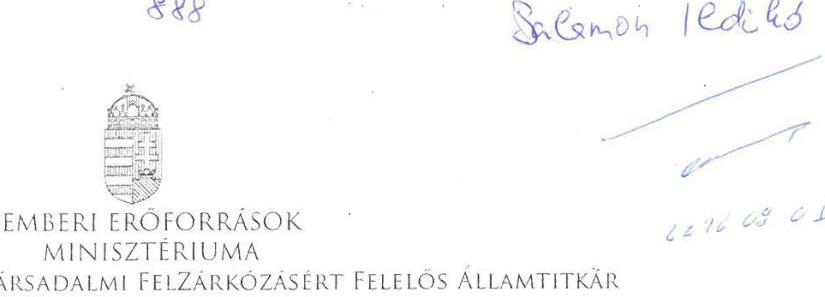

Iktatószám:41161-2/ 2016/SZOCSTRAT

Domokos László
Elnök
Állami Számvevőszék
Budapest
Apáczai Csere János utca 10.
1052

Hiv. szám: V-0967-160/2016
V-0966-146/2016
V-0959-144/2016
Ügyintéző: Sípos Sándorné
Tel. szám: +36 (1) (795-5817)
Melléklet: Idb/ -
ÁLLAMI SZÁMVEVŐSZÉK
06547312016
Érkezen: 2016 AUG 01
Iktatószám: V-0966-154/2016
Melléklet:

Tárgy: A Zala Megyei Szocioterápiás Intézmény, a Szabolcs-Szatmár-Bereg- Megyei Gyermekvédelmi Központ Tiszadob, valamint a Dr. Piróth Endre Szociális Központ intézménynél az Állami Számvevőszék (a továbbiakban: ÁSZ) által ellenőrzött jelentéstervezetének észrevételezése

## Tisztelt Elnök Úr!

A „központi alrendszer egyes intézményei pénzügyi és gazdálkodása címü" ellenőrzés keretében készült - három intézményt érintő - számvevőszéki jelentés tervezeteket köszönettel megkaptam.

Az Emberi Erőforrások Minisztériumát (a továbbiakban: EMMI) érintő megállapításaival kapcsolatban az alábbi észrevételeket teszem.

- V-0959-144/2016 iktatószámú, Szabolcs-Szatmár-Bereg- Megyei Gyermekvédelmi Központ Tiszadob intézményt érintő, a V-0966-146/2016 iktatószámú Zala Megyei Szocioterápiás Intézményt érintő, továbbá a V-0967-160/2016 iktatószámú Dr. Piróth Endre Szociális Központ a jelentéstervezetek esetében az alábbi indokok alapján kérem a jelentéstervezetek módosítását.
1.2. számú megállapításában szerepel, hogy „a 2013-2014. évekre vonatkozóan az SzGyF elvégezte a költségvetési beszámolók ellenőrzését".

---

# Észrevétel: 

Valójában a beszámoló ellenőrzését ezen évekre vonatkozóan az EMMI végezte.

- A V-0959-144/2016 iktatószámú, Szabolcs-Szatmár-Bereg- Megyei Gyermekvédelmi Központ Tiszadob intézmény jelentéstervezet 1,1 számú megállapítására (2013., 2014. években kiadott alapító okiratokkal kapcsolatos megállapítások) vonatkozóan kérem az alábbi indok alapján a megállapítások módosítását, illetve az emberi erőforrások miniszterének tett 1. sz. javaslat törlését a jelentésből.

## Észrevétel:

Megállapítható, hogy az intézmény Alapító Okirata megfelel a mindenkor hatályos államháztartásról szóló 2011. évi CXCV. törvény 8. § (7) bekezdésének, az alapító okirat rendelkezik az államháztartásért felelős miniszter előzetes egyetértésével, a közhiteles törzskönyvi nyilvántartás a vonatkozó jogszabályoknak megfelelő, a Nemzetgazdasági Minisztérium egyetértéssel rendelkező alapító okiratokat tartalmazza. Előzőek következtében az alapító okirat 13. pontja tartalmazza az ÁSZ jelentés megállapításában kifogásoltakat a költségvetési szerv vezetőjének kinevezési rendjét, a 14. pont pedig a foglalkoztatottakra vonatkozó foglalkoztatási jogviszonyok megjelölését.

Mindezekre tekintettel, tisztelettel kérem a jelentéstervezetek módosítását.
Tájékoztatom Elnök Urat, hogy az EMMI Szervezeti és Működési Szabályzatáról szóló 33/2014. (IX.16) EMMI utasítás 146. § (12) bekezdés b) pontja alapján az emberi erőforrások minisztere által átruházott hatáskörben gyakorlom a kiadományozási jogot.

Budapest, 2016. július 27.
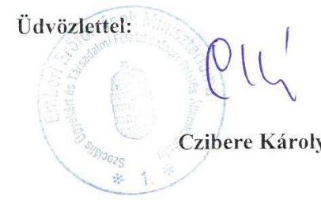

---

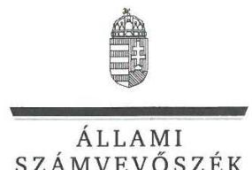

ELNÖK

Ikt.szám: V-0966-155/2016.

# Balog Zoltán úr 

miniszter
Emberi Erőforrások Minisztériuma

## Budapest

## Tisztelt Miniszter Úr!

Köszönettel megkaptam a 2016. augusztus 1. napján az Állami Számvevőszékhez érkezett „A központi alrendszer egyes intézményei pénzügyi és vagyongazdálkodásának ellenőrzése - Zala Megyei Szocioterápiás Intézmény" címủ számvevőszéki jelentéstervezetben foglalt megállapításokra a szociális ügyekért és társadalmi felzárkóztatásért felelős államtitkár úr által írásban tett észrevételt.

Az Állami Számvevőszék észrevételre vonatkozó álláspontjáról a felügyeleti vezető által készített részletes tájékoztatást mellékelten megküldöm.

Budapest, 2016. hó 22 nap
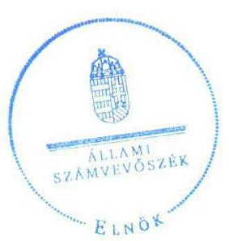

Tisztelettel:

Domokos László

Melléklet: Tájékoztatás az elfogadott észrevételről

---

1. számú melléklet a V-0966-155/2016. ikt. számú levélhez

# Tájékoztatás   az elfogadott észrevételről 

| 1. | Észrevétel: | Az 1.2. számú megállapítás 1 bekezdésében (18. oldal) a költségvetési beszámolók ellenőrzéséhez kapcsolódóan. |
| :--: | :--: | :--: |
|  | Válasz: | Az Állami Számvevőszék az észrevételt elfogadja. |
|  | Indoklás: | A helyszíni ellenőrzés során az Állami Számvevőszék rendelkezésére bocsátott dokumentumok ismételt áttekintése után az 1.2. számú megállapítás 1 bekezdés 3. mondatából az ,,SZGYF" kifejezést töröltük, a mondatot a következők szerint pontosítottuk (aláhúzással jelölve:   „A 2011. évre vonatkozóan a Közgyülés, a 2012. év tekintetében a MIK, a 2013-2014. évek esetében az EMMI elvégezte a költségvetési beszámolók ellenőrzését." |

Budapest, 2016. Ck hó 22 nap
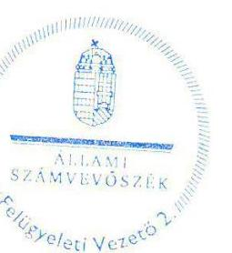

Salamon Ildikó
felügyeleti vezető

---

# 324 

## SZOCIÁLIS ÉS GYERMEKVÉDELMI FŐIGAZGATÓSÁG FŐIGAZGATÓ   1132 Budapest, Visegrádi u. 49.   Telefon: $+36 / 1 / 769-1704$, e-mail: batori.zsolt@szgyf.gov.hu

Iktatószám: SZGYF-IKT- 8187/2016.
Úgyintéző: Palló Sándor

## Domokos László úr   elnök

Állami Számvevőszék

## Budapest

Apáczai Csere János u. 10
1051

## Tisztelt Elnök Úr!

Köszönettel megkaptam a V-0966-1527/2016. iktatószámú, Zala Megyei Szocioterápiás intézmény vonatkozásában „A központi alrendszer egyes intézményei pénzügyi és vagyongazdálkodásának ellenőrzése" című ellenőrzésről készült számvevőszéki jelentéstervezetet tartalmazó levelet.

A vizsgált időszak alatt igen jelentős szervezeti és jogi környezetben bekövetkezett változások mellett végeztük munkánkat, és az átalakulások jelenleg is érintik szervezetünket. Munkatársaimmal együtt folyamatosan törekszünk a vonatkozó szabályozásnak megfelelő szabályozott, hatékonyan és eredményesen működő közszolgáltatások feltételrendszerének megteremtésére.

A kézhez
 kapott jelentéstervezettel kapcsolatban a következőkben részletezett észrevételeket szeretném tenni, melyek elfogadása esetén kérem a jelentéstervezet korrekcióját.

A jelentéstervezetben megfogalmazott javaslatok a Szociális és Gyermekvédelmi Főigazgatóság, mint középirányító szerv főigazgatójának részhez:

---

Az 1. számú javaslattal egyetértek, azonban meg kívánom jegyezni, hogy a jogszerű használat feltételei a Nemzeti Földalapkezelő Szervezettel a Kehidakustány 049. hrsz-ú ingatlan vonatkozásában a vagyonkezelői szerződés megkötése után biztosíthatóak. A szükséges megállapodás megkötése érdekében több alkalommal megkerestük a Nemzeti Földalapkezelő Szervezetet, ezidáig eredménytelenül.

A 2. számú javaslattal egyetértek. Időközben, 2016. június 1. napjától hatályba lépett a ZMSZI ellenőrzési nyomvonalról, valamint a folyamatba épített, előzetes, utólagos és vezetői ellenőrzésről szóló szabályzata, illetve a kockázatkezelés rendjéről szóló szabályzat, amelyek alkalmazása biztosítja az előirányzatokkal, létszámmal, vagyonnal való hatékony gazdálkodás követelményeinek érvényesítését, számonkérését és ellenőrzését.

A hivatkozott időszak alatt folyamatos kontrollt gyakoroltunk a hatékony gazdálkodás biztosítása érdekében. (belső ellenőrzés, vezetői és munkafolyamatba épített ellenőrzés: beszámolók, keret előrehozás, ill. költségvetési módosítások előzetes kontrollja, költségvetés tervezés kontrollja)

A vizsgált időszakban - 2012-ben került sor az intézmények „konszolidációjára”, mely folyamat jelentősen átalakította a közfeladat ellátási rendszer egészét. Döntően a volt megyei önkormányzati intézmények működési zavarainak elhárítása miatt került sor az állami feladatátvételre. A 2012. évi költségvetést a MÁK és a NÁK által meghatározott sarok számokon belül kellett elkészítenünk. Általánosságban elmondható, hogy ezek a keretek az intézmények 2011. évi eredeti előirányzatainál jelentősen alacsonyabb összegben lettek meghatározva, a vizsgált intézménynél a 2011. évi előirányzat 71%-ban. Ezt a mellékelt táblázat adatai is alátámasztják. Az állami források hatékony felhasználását mutatja, hogy az állami támogatás csökkenése ellenére az érintett időszakban a szakmai feladatellátás változatlan színvonalon biztosított maradt.

A Zala Megyei Szocioterápiás Intézmény Kehidakustány működési és támogatási bevételeinek alakulása 2011-2014. évben. (Teljesítési adatok alapján.)

|  | Rovatok |  |  |
| :--: | :--: | :--: | :--: |
| Költségvetési év | B405 | B816 |  |
|  | Intézményi működési   bevételek | Irányító szervtől   kapott támogatás | Összesen |
| 2011. | 36031 | 104554 | 140585 |
| 2012. | 36842 | 63511 | 100353 |
| 2013. | 36483 | 88770 | 125253 |
| 2014. | 35614 | 87971 | 123585 |

---

# A Szociális és Gyermekvédelmi Főigazgatóság, mint a Zala Megyei Szocioterápiás Intézmény gazdasági szervezeti feladatait ellátó szerv főigazgatójának részhez: 

Az 1. számú javaslattal egyetértek. Tájékoztatom, hogy az elmúlt időszakban a hiányzó szabályozók elkészültek és kiadásra kerültek. A ZMSZI számviteli politikája, eszközök és források leltározási és leltárkészítési szabályzata, az eszközök és források értékelési szabályzata, az önköltség számítási szabályzat, valamint a pénzkezelési szabályzata 2016. június 1. napjától hatályba lépett.

A 2. számú javaslattal egyetértek. Tájékoztatom, hogy a ZMSZI számlarendje szintén 2016. június 1. napjától hatályba lépett.

## További észrevétel az 1. és a 2. pontokhoz:

A Szociális és Gyermekvédelmi Főigazgatóság 11/2013. (II.26.) SZGYF utasítása a Szociális és Gyermekvédelmi Főigazgatóság Számviteli politikájáról (a továbbiakban: Számviteli politika 2013.) 2013. február 26. napján került kiadmányozásra. Ez valóban nem rendelkezett a 249/2000. (XII.) Korm. rendelet 8. § (13) bekezdésnek megfelelő döntésről.

A 2014. január 1-jétől hatályos 4/2013. (I. 11.) Korm. rendelet az államháztartás számviteléről (a továbbiakban: Áhsz.) 50. § (1) bekezdése egyértelműen rögzíti a számviteli politika elkészítéséért, módosításáért való felelősséget. ${ }^{1}$

A számviteli politika hatályának kiterjesztéséről az ellenőrzés által lefedett időszakot követően kiadott SZGYF szabályozás az alábbiak szerint intézkedett:

A Szociális és Gyermekvédelmi Főigazgatóság 1/2015. (IX.24.) SZGYF szabályzata a Szociális és Gyermekvédelmi Főigazgatóság számviteli politikájáról (a továbbiakban: Számviteli Politika 2015.) a 2. §-ban rögzíti: „A számviteli politika kiterjed a Főigazgatóság valamennyi szervezeti egységére. A Főigazgatóság fenntartása alá tartozó intézmények tekintetében a számviteli politika irányadó, az intézmények önállóan készítik el szabályzataikat.”

[^0]
[^0]:    1 Áhsz. 50. § (1) A költségvetési és a pénzügyi számvitel alkalmazásával kapcsolatos sajátos szabályokat, előírásokat, módszereket a számviteli politikában kell rögzíteni. A számviteli politika az Szt. 14. § (5) bekezdése szerinti szabályzatokból és a (7) bekezdés szerint szabályozandó más kérdéseket rögzítő dokumentumból áll. A számviteli politika elkészítéséért, módosításáért a 31. § (1) bekezdése szerinti személyek felelősek. A számviteli politika elkészítésére az Szt. 14. § (3)-(5), (8) és (11) bekezdésében foglaltakat a (2)-(7) bekezdésben foglalt kiegészítésekkel kell alkalmazni.

---

A 2015. szeptember 16-án az intézménnyel aláírt Megállapodás a gazdálkodást érintő feladatmegosztásról (a továbbiakban: Feladatmegosztási megállapodás) III. Az együttműködés területei 5. fejezetben fentiekkel összhangban rögzíti:
„Megyei Gazdasági Osztályt érintő feladatok, felelősségek:
Az államháztartás számviteléről szóló 4/2013. (I. 11.) Korm. rendeletben rögzítettek figyelembe vételével az Intézmény által készített, helyi sajátosságoknak megfelelő szabályzatokat jóváhagyja.

Intézményt érintő feladatok, felelősségek:
Az államháztartás számviteléről szóló 4/2013. (I. 11.) Korm. rendeletben rögzítettek figyelembe vételével az Intézmény helyi sajátosságoknak megfelelő szabályzatait elkészíti, jóváhagyásra a Megyei Gazdasági Osztályra megküldi.”

Fentiekre figyelemmel a javaslat címzettje véleményünk szerint nem az SZGYF főigazgatója, hanem az intézmény vezetője lehet.

A 3. számú javaslattal egyetértek. Tájékoztatom, hogy a ZMSZI-vel a gazdasági szervezeti feladatok ellátására kötött, fent hivatkozott feladatmegosztási megállapodás 2015. szeptember 16. napjától hatályba lépett, amely megfelel a javaslatban rögzített szempontoknak.

A 4. számú javaslattal egyetértek. A vizsgálat óta az érvényesítési feladatok ellátására kijelölt dolgozók munkaköri leírásai kiegészítésre kerülnek az érvényesítéssel kapcsolatos teendőkkel.

Az 5. számú javaslattal egyetértek. A pontosítás érdekében azonban meg kívánom jegyezni, hogy a 2014. évi elemi költségvetési beszámoló benyújtásának elhúzódását az okozta, hogy az NGM-től (előirányzat-módosítások miatt) a beszámoló újranyitását kellett kérni, melyet az NGM engedélyezett. Ez határidő-hosszabbítással járt.

A 7. számú javaslattal egyetértek. A probléma megoldásával kapcsolatban az elmúlt időszakban intézkedés történt, így a ZMSZI vagyonkezelésébe nem tartozó állami vagyon 2016. július 1. napi hatállyal kivezetésre került a ZMSZI könyveiből.

---

Tájékoztatom, hogy továbbiakban fel kívánjuk használni jelen ellenőrzés megállapításait, valamint az ellenőrzéssel való közös munkánk tapasztalatait. A feltárt hiányosságok jelentős részét már az ellenőrzés során javítottuk, illetve pótoltuk.

Az ellenőrzés során tapasztalt segítő együttműködésüket köszönöm!

Budapest, 2016. augusztus „ $\odot$ ”.

Tisztelettel:

---

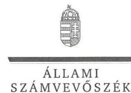

ELKÖK

Ikt.szám: V-0966-158/2016.

# Bátori Zsolt úr 

főigazgató
Szociális és Gyermekvédelmi Főigazgatóság

## Budapest

## Tisztelt Főigazgató Úr!

Köszönettel megkaptam a 2016. augusztus 5. napján az Állami Számvevőszékhez érkezett „A központi alrendszer egyes intézményei pénzügyi és vagyongazdálkodásának ellenőrzése - Zala Megyei Szocioterápiás Intézmény” címû számvevőszéki jelentéstervezetben foglalt javaslatokra írásban tett észrevételeit.

Tájékoztatom Főigazgató urat, hogy a jelentésben - az Állami Számvevőszékről szóló 2011. évi LXVI. törvény 29. § (3) bekezdése alapján - a figyelembe nem vett észrevételeket szerepeltetjük az elutasítás indokainak feltüntetésével együtt.

Az Állami Számvevőszék észrevételekre vonatkozó álláspontjáról a felügyeleti vezető által készített részletes tájékoztatást mellékelten megküldöm.

Budapest, 2016. 08. hó 25. nap
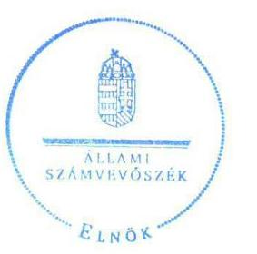

Tisztelettel:

Domokos László

Melléklet: Tájékoztatás az el nem fogadott észrevételekről

---

# Tájékoztatás   az el nem fogadott észrevételekről 

|  |  | Javaslatokhoz kapcsolódó észrevételek |
| :--: | :--: | :--: |
|  | Észrevétel: | A Szociális és Gyermekvédelmi Főigazgatóság mint középirányító szerv főigazgatójának címzett 2. számú javaslathoz (1.2. számú megállapítás 4. bekezdés 3. mondata alapján) |
|  | Válasz: | Az Állami Számvevőszék az észrevételt nem fogadja el. |
| 1. | Indoklás: | A helyszíni ellenőrzés során az Állami Számvevőszék rendelkezésére bocsátott beszámolók, keret előrehozás, költségvetési módosítások, költségvetési tervezés kontrollját biztosító dokumentumok a szabályszerű gazdálkodás egyes területeinek érvényesítését, számon kérését igazolják, azonban az erőforrásokkal való hatékony gazdálkodás követelményeinek érvényesítésére, számon kérésére, ellenőrzésére vonatkozó információt nem tartalmaznak.   Az ellenőrzés - az Ellenőrzési programban foglaltak szerint - arra irányult, hogy az irányító (illetve a középirányító) szerv érvényesítette-e, számon kérte-e, ellenőrizte-e az erőforrásokkal való hatékony gazdálkodáshoz szükséges követelményeket, amelyekkel kapcsolatban dokumentumokat nem bocsátottak az ellenőrzés rendelkezésére. Az Állami Számvevőszék ellenőrzése nem terjedt ki az erőforrásokkal való gazdálkodás hatékonyságának, valamint a szakmai feladatellátás színvonalának a megítélésére. Ennek következtében az intézmények 2012. évi „konszolidációjával”, továbbá ennek keretében a Zala Megyei Szocioterápiás Intézmény működési és támogatási bevételeinek alakulásával kapcsolatos tájékoztatásában foglaltak - amelyeket köszönettel vettünk - az ellenőrzési megállapítást, valamint az ahhoz kapcsolódóan tett javaslatot nem módosítják. |

---

|  |  | Javaslatokhoz kapcsolódó észrevételek |
| :--: | :--: | :--: |
|  | Észrevétel: | A Szociális és Gyermekvédelmi Főigazgatóság mint a Zala Megyei Szocioterápiás Intézmény gazdasági szervezeti feladatait ellátó szerv főigazgatójának címzett 1. számú javaslathoz, (2.1. számú megállapítás 5. bekezdés 3-6. mondata alapján) a Számviteli politika és annak keretében elkészítendő szabályzatokhoz, valamint a javaslat címzettjéhez kapcsolódóan. |
|  | Válasz: | Az Állami Számvevőszék az észrevételt nem fogadja el. |
|  | 2. | Az észrevétel a javaslatot megalapozó, a 2.1 számú megállapítás 5. bekezdés 3-6. mondatában szereplő ellenőrzési megállapítást nem vitatja, annak körülményeiről, továbbá az időközben megtett intézkedésekről ad további tájékoztatást.   A jogszabályban foglaltakkal összhangban az ellenőrzési megállapítás tartalmazza, hogy az intézményre is vonatkozó számviteli politikát, és az annak keretében elkészítendő szabályzatokat - állambáztartás számviteléről szóló 4/2013. (I. 11.) Korm. rendelet (továbbiakban Áhsz. ${ }_{2}$ ) 50. § (1) bekezdésében, és az abban hivatkozott 31. § (1) bekezdésében foglaltak ellenére - a 2014. évben sem adott ki a gazdálkodási feladatokat ellátó SZGYF főigazgatója.   A 2014. január 1-jétől hatályos Áhsz. 2 50. § (1) bekezdése szerint a „... számviteli politika elkészítéséért, módosításáért a 31. § (1) bekezdése szerinti személyek felelősek.” Az Áhsz. 31. § (1) bekezdése szerint „az éves költségvetési beszámoló elkészítéséért az éves költségvetési beszámolót készítő szerv vezetője felelős.”   A megyei intézményfenntartó központokról, valamint a megyei önkormányzatok konszolidációjával, a megyei önkormányzati intézmények és a Fővárosi Önkormányzat egészségügyi intézményeinek átvételével összefüggő egyes kormányrendeletek módosításáról szóló 258/2011. (XII. 7.) Korm. rendelet (továbbiakban Konsz. rendelet) 15. § (2) bekezdése kimondja, hogy az „átvett intézmények közül az önállóan működő költségvetési szervek gazdálkodással összefüggő feladatait 2012. január 1-jétől a megyei intézményfenntartó központ látja el”. A Konsz. rendelet 11. § (1) bekezdés b) pontja alapján a MIK meghatározza „az irányítása alá tartozó költségvetési szervek gazdálkodásának részletes rendjét”. A Konsz. rendelet 18. §-a pedig rögzíti, hogy a „megyei intézményfenntartó központok 2013. március 31-én a Szociális és Gyermekvédelmi Főigazgatóságba történő beolvadással megszűnnek. A Szociális és Gyermekvédelmi Főigazgatóság a megszűnt megyei intézményfenntartó központok általános és egyetemleges jogutóda.” |

 Intézmény esetében a gazdálkodással összefüggő feladatok ellátásáért és az irányítása alá tartozó költségvetési szervek gazdálkodásának részletes rendje meghatározásáért a 2012. évtől a Zala Megyei Intézményfenntartó Központ (MIK), a 2013. évtől (a MIK általános jogutódjaként) az SZGYF volt a felelős. A Zala Megyei Szocioterápiás Intézmény önálló gazdálkodási jogkörrel nem rendelkezett, így az intézményre kiterjedő Számviteli politika, és az annak keretében elkészítendő szabályzatok kiadása az SZGYF főigazgatójának feladata volt.   A fentiekre tekintettel a megállapítás és a kapcsolódó javaslat, továbbá a javaslat címzettjének módosítása nem indokolt.   Az észrevételben hivatkozott 1/2015. (IX. 24.) számú SZGYF szabályzat a Szociális és Gyermekvédelmi Főigazgatóság Számviteli politikájáról, és az intézménnyel 2015. szeptember 16-án aláirt feladatmegosztási megállapodás ellenőrzött időszakot követően megtett intézkedés, így az nem módosítja az ellenőrzés megállapításait. |
| :--: | :--: | :--: |
| 3. | Észrevétel: | Javaslatokhoz kapcsolódó észrevételek   A Szociális és Gyermekvédelmi Főigazgatóság mint a Zala Megyei Szocioterápiás Intézmény gazdasági szervezeti feladatait ellátó szerv főigazgatójának címzett 5. számú javaslathoz (3.4. számú megállapítás 3. bekezdés alapján) |
|  | Válasz: | Az Állami Számvevőszék az észrevételt nem fogadja el. |

---

|  | Indoklás: | A javaslathoz kapcsolódó észrevétel a jelentéstervezet 3.4. számú megállapítás 3. bekezdésében szereplő megállapítást nem vitatja, annak körülményeiről ad tájékoztatást.   Az irányító szerv felé történő adatszolgáltatási kötelezettséget jogszabály - az államháztartás számviteléről szóló 4/2013. (I. 11.) Korm. rendelet 32. § (1) bekezdése - írta elő. A jogszabály szerint az éves költségvetési beszámoló megküldésének határideje a költségvetési évet követő év február 28-a.   Tekintettel arra, hogy az adatszolgáltatás teljesítésére a jogszabályban előírt határidőt követően került sor, a megállapítás és a kapcsolódó javaslat módosítása nem indokolt. |
| :--: | :--: | :--: |

Köszönettel vettük tájékoztatását a Szociális és Gyermekvédelmi Főigazgatóság mint középirányító szerv főigazgatójának címzett 1. és 2. számú javaslathoz, valamint a Szociális és Gyermekvédelmi Főigazgatóság mint a Zala Megyei Szocioterápiás Intézmény gazdasági szervezeti feladatait ellátó szerv főigazgatójának címzett 1., 2., 3., 4. és 7. számú javaslatokhoz kapcsolódóan a hiányosságok felszámolására, valamint az ellenőrzés megállapításainak, tapasztalatainak a felhasználására vonatkozóan. Tájékoztatom Főigazgató urat, hogy az ellenőrzött időszakot követően megtett intézkedéseket az Állami Számvevőszék nem értékelte, azok az ellenőrzés megállapításait nem módosítják.

Budapest, 2016. C. 3 hó 2,5 nap
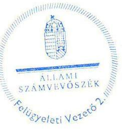

Salamon lidiko
felügyeleti vezető

---

.

---

# RÖVIDÍTÉSEK JEGYZÉKE 

${ }^{1}$ ÁSZ
${ }^{2}$ ZMSZI
${ }^{3}$ Önkormányzat
${ }^{4}$ Közgyűlés
${ }^{5}$ KIM
${ }^{6}$ MIK
${ }^{7}$ SZGYF
${ }^{8}$ Intézmény
${ }^{9}$ Szoctv.
${ }^{10}$ 112/2006. (V. 12.) Korm. rendelet
${ }^{11}$ EMMI
${ }^{12}$ 258/2011. (XII. 7.) Korm. rendelet
${ }^{13}$ Munkamegosztási megállapodás
${ }^{14}$ Konsz. tv.
${ }^{15}$ Vtv.
${ }^{16}$ MNV Zrt.
${ }^{17}$ Vtvr.
${ }^{18}$ Alaptörvény
${ }^{19}$ Nvtv.
${ }^{20}$ Áht. 2
${ }^{21}$ Ávr.
${ }^{22}$ Áht. 1
${ }^{23}$ Ámr.

Állami Számvevőszék
Zala Megyei Önkormányzat Szocioterápiás Intézménye (2011. december 31.-ig)
Zala Megyei Szocioterápiás Intézmény (2012. január 1-jétől)
Zala Megyei Önkormányzat
Zala Megyei Önkormányzat Közgyűlése
Kózigazgatási és Igazságügyi Minisztérium
Zala Megyei Intézményfenntartó Központ
Szociális és Gyermekvédelmi Főigazgatóság
Zala Megyei Önkormányzat Szocioterápiás Intézménye (2011. december 31.-ig)
Zala Megyei Szocioterápiás Intézmény (2012. január 1-jétől)
a szociális igazgatásról és szociális ellátásokról szóló 1993. évi III. törvény
a szociális foglalkoztatás engedélyezéséről és a szociális foglalkoztatási támogatásról szóló 112/2006. (V. 12.) számú Kormány rendelet (hatályos: 2006. május 15-től)
Emberi Erőforrások Minisztériuma
a megyei intézményfenntartó központokról, valamint a megyei önkormányzatok konszolidációjával, a megyei önkormányzati intézmények és a Fővárosi Önkormányzat egészségügyi intézményeinek átvételével összefüggő egyes kormányrendeletek módosításáról szóló 258/2011. (XII. 7.) Korm. rendelet (hatályos: 2011. december 8-tól) az intézmény és a MIK között - a gazdálkodási feladatok folyamatainak szabályozására és ellátására - kötött munkamegosztási megállapodás a megyei önkormányzatok konszolidációjáról, a megyei önkormányzati intézmények és a Fővárosi Önkormányzat egyes egészségügyi intézményeinek átvételéről szóló 2011. évi CLIV. törvény (hatályos: 2011. november 26-tól)
az állami vagyonról szóló törvény 2007. évi CVI. törvény (hatályos: 2007. szeptember 25-től)

Magyar Nemzeti Vagyonkezelő Zrt.
az állami vagyonnal való gazdálkodásról szóló 254/2007. (X. 4.) Korm. rendelet (hatályos: 2007. október 4-től)
Magyarország Alaptörvénye (hatályos 2012. január 1-jétől)
a nemzeti vagyonról szóló 2011. évi CXCVI. törvény (hatályos 2012. január 1-jétől)
az államháztartásról szóló 2011. évi CXCV. törvény (hatályos 2012. január 1-jétől)
az államháztartásról szóló törvény végrehajtásáról szóló 368/2011. (XII. 31.) Korm. rendelet (hatályos 2012. január 1-jétől)
az államháztartásról szóló 1992. évi XXXVIII. törvény (hatálytalan: 2012. január 1-jétől)
az államháztartás működési rendjéről szóló 292/2009. (XII. 19.) Korm. rendelet (hatálytalan: 2012. január 1-jétől)

---

${ }^{24}$ Bkr.
${ }^{25}$ ÁSZ tv.
${ }^{26}$ ÁSZ SZMSZ
${ }^{27}$ Alapító okirat

[^0]a költségvetési szervek belső kontrollrendszeréről és belső ellenőrzéséről szóló 370/2011. (XII. 31.) Korm. rendelet (hatályos: 2012. január 1-jétől)
az Állami Számvevőszékről szóló 2011. évi LXVI. törvény (hatályos: 2011. július 1-jétől)
Állami Számvevőszék Szervezeti és Működési Szabályzata
a Zala Megyei Önkormányzat Szocioterápiás Intézményének Alapító okirata (hatályos: 2011. január 1-jétől)
a Zala Megyei Önkormányzat Szocioterápiás Intézményének Alapító okirata (hatályos: 2011. február 15-től)
a Zala Megyei Önkormányzat Szocioterápiás Intézményének Alapító okirata (hatályos: 2011. április 28-tól)
Zala Megyei Szocioterápiás Intézmény Alapító okirata (hatályos: 2012. január 1-jétől)
Zala Megyei Szocioterápiás Intézmény Alapító okirata (hatályos: 2012. április 1-jétől)
Zala Megyei Szocioterápiás Intézmény Alapító okirata (hatályos: 2013. január 1-jétől)
Zala Megyei Szocioterápiás Intézmény Alapító okirata kiegészítése (hatályos: 2014. január 1-jétől)
Magyar Államkincstár
Szervezeti és Működési Szabályzat:
Zala Megyei Önkormányzat Szocioterápiás Intézményének SZMSZ-e (hatályos: 2011. január 1-jétől)
Zala Megyei Önkormányzat Szocioterápiás Intézményének SZMSZ-e (hatályos: 2011. június 1-jétől)
Zala Megyei Szocioterápiás Intézmény SZMSZ-e (hatályos: 2013. június 17-től)
Zala Megyei Szocioterápiás Intézmény SZMSZ-e (hatályos: 2014. július 1-jétől)
az államháztartás szervezetei beszámolási és könyvvezetési kötelezettségének sajátosságairól szóló 249/2000. (XII. 24.) Korm. rendelet (hatálytalan: 2014. január 1-jétől)
a Szociális és Gyermekvédelmi Főigazgatóságról szóló 316/2012. (XI. 13.) Korm. rendelet (hatályos: 2012. november 16-tól)

Zala Megyei Szocioterápiás Intézmény Ügyrendje (az intézményvezető által kiadott 2009. január 5-től hatályos ügyrend, valamint az intézményvezető által kiadott 2011. április 1-jétől hatályos ügyrend)
A szociális munka etikai kódexe (hatályos: 2009. február 15-től)
A szociális munka etikai kódexe (hatályos: 2011. május 28-tól)
Zala Megyei Önkormányzat Szocioterápiás Intézményének Számviteli Politikája (hatályos: 2010. január 4-től)
Zala Megyei Önkormányzat Szocioterápiás Intézményének Leltározási és leltárkészítési szabályzat (hatályos: 2009. január 5-től)
Zala Megyei Önkormányzat Szocioterápiás Intézményének Eszközök és források értékelési szabályzat (hatályos: 2009. január 5-től)
Zala Megyei Szocioterápiás Intézmény Önköltség számítási szabályzat (hatályos: 2011. április 1-jétől)
Zala Megyei Önkormányzat Szocioterápiás Intézményének Pénzkezelési szabályzat (hatályos: 2009. január 1-jétől)

[^0]:    ${ }^{38}$ Kincstár
    ${ }^{29}$ SZMSZ
    ${ }^{30}$ Áhsz. 1
    ${ }^{31}$ 316/2012. (XI. 13.) Korm. rendelet
    ${ }^{32}$ Ügyrend
    ${ }^{33}$ Etikai kódex
    ${ }^{34}$ Számviteli politika
    ${ }^{35}$ Leltározási szabályzat
    ${ }^{36}$ Értékelési szabályzat
    ${ }^{37}$ Önköltség számítási szabályzat
    ${ }^{38}$ Pénzkezelési szabályzat

---

${ }^{39}$ MIK számviteli politikája
${ }^{40}$ MIK leltározási szabályzata
${ }^{41}$ MIK értékelési szabályzata
${ }^{42}$ MIK pénzkezelési szabályzata
${ }^{43}$ Sztv.
${ }^{44}$ SZGYF számviteli politikája
${ }^{45}$ Áhsz. 2
${ }^{46}$ ZMSZI számlarendje
${ }^{47}$ Gazdálkodási szabályzat
${ }^{48}$ Közbeszerzési szabályzat
${ }^{49} \mathrm{Kbt} .1$
${ }^{50}$ Ellenőrzési nyomvonal
${ }^{51}$ Ber.

Zala Megyei Intézményfenntartó Központ 11/2012. számú központvezetői utasítása a számviteli politikáról (hatályos: 2012. február 29-től)
Zala Megyei Intézményfenntartó Központ 11/4/2012. számú központvezetői utasítása Leltározási és leltárkészítési szabályzatáról (hatályos: 2012. február 29-től)
Zala Megyei Intézményfenntartó Központ 11/6/2012. számú központvezetői utasítása Eszközök és források értékelési szabályzatáról (hatályos: 2012. február 29-től)
Zala Megyei Intézményfenntartó Központ 11/1/2012. számú központvezetői utasítása Pénzkezelési szabályzatáról (hatályos: 2012. február 29-től)
a számvitelről szóló 2000. évi C. törvény (hatályos: 2001. január 1-jétől)
a Szociális és Gyermekvédelmi Főigazgatóság Főigazgatójának 11/2013. (II. 26.) SZGYF utasítása a Szociális és Gyermekvédelmi Főigazgatóság számviteli politikájáról (hatályos: 2013. február 27-től)
az államháztartás számviteléről szóló 4/2013. (I. 11.) Korm. rendelet (hatályos: 2014. január 1-jétől)
a Zala Megyei Önkormányzat Szocioterápiás Intézménye számlarend (hatályos: 2010. január 4-től)
a Zala Megyei Szocioterápiás Intézmény gazdálkodására vonatkozó szabályzatok:
a Zala Megyei Önkormányzat Szocioterápiás Intézménye a költségvetési gazdálkodás lebonyolításának szabályzata (hatályos: 2010. január 1-jétől)
Zala Megyei Intézményfenntartó Központ 3/2012. számú központvezetői utasítása a gazdálkodási keretszabályzatról (hatályos: 2012. február 29-től)

Szociális és Gyermekvédelmi Főigazgatóság 7/2013. sz. Főigazgatói utasítása a kötelezettségvállalás, pénzügyi ellenjegyzés, teljesítésigazolás, érvényesítés, utalványozás rendjének szabályozásáról (hatályos: 2013. január 25-től)
Szociális és Gyermekvédelmi Főigazgatóság 13/2013. sz. Főigazgatói utasítása Ideiglenes Gazdálkodási Szabályzat kiadásáról (hatályos: 2013. április 4-től)
Szociális és Gyermekvédelmi Főigazgatóság 23/2013. sz. Főigazgatói utasítása a Gazdálkodási Szabályzat kiadásáról (hatályos: 2013. szeptember 2-tól)
a Zala Megyei Szocioterápiás Intézmény közbeszerzéseire vonatkozó szabályzatok: a Zala Megyei Önkormányzat Szocioterápiás Intézménye közbeszerzési szabályzata (hatályos: 2019. január 5-től); Zala Megyei Intézményfenntartó Központ 3/2012. számú központvezetői utasítása a gazdálkodási keretszabályzatról (hatályos: 2012. április 12-től)
a közbeszerzésekről szóló 2003. évi CXXIX. törvény (hatálytalan: 2012. január 1-jétől)
a Zala Megyei Önkormányzat Szocioterápiás Intézménye FEUVE szabályzata tartalmazta az ellenőrzési nyomvonalat (hatályos: 2011. január 1-jétől)
a Zala Megyei Szocioterápiás Intézmény ellenőrzési nyomvonala (hatályos: 2013. szeptember 23-tól)
a költségvetési szervek belső ellenőrzéséről szóló 193/2003. (XI. 26.) Korm. rendelet (hatálytalan 2012. január 1-jétől)

---

${ }^{52}$ FEUVE szabályzat
${ }^{53}$ Vnytv.
${ }^{54} \mathrm{Ikr}$.
${ }^{55}$ Avtv.
${ }^{56}$ Info. tv.
${ }^{57}$ Eitv.
${ }^{58}$ Ltv.
${ }^{59}$ 2005. évi CLXIV. törvény
${ }^{60}$ 18/2013. (V.06.) SZGYF utasítás
${ }^{61}$ NGM rendelet
${ }^{62}$ Kormányhivatal kormánymegbízottja
${ }^{63}$ Közgyűlés elnöke
a Zala Megyei Önkormányzat Szocioterápiás Intézménye Folyamatba épített, előzetes, utólagos és vezetői ellenőrzés szabályzata (hatályos: 2011. január 1-jétől)
az egyes vagyonnyilatkozat-tételi kötelezettségekről szóló 2007. évi CLII. törvény (hatályos: 2007. december 6-tól)
a közfeladatot ellátó szervek iratkezelésének általános követelményeiről szóló 335/2005. (XII. 29.) Korm. rendelet (hatályos: 2006. január 1-jétől)
a személyes adatok védelméről és a közérdekű adatok nyilvánosságáról szóló 1992. évi LXIII. törvény (hatálytalan: 2012. január 1-jétől)
az információs önrendelkezési jogról és az információszabadságról szóló 2011. évi CXII. törvény (hatályos: 2011. július 26-tól)
az elektronikus információszabadságról szóló 2005. évi XC. törvény (hatálytalan: 2012. január 1-jétől)
a köziratokról, a közlevéltárakról és a magánlevéltári anyag védelméről szóló 1995. évi LXVI. törvény (hatályos: 1996. január 1-jétől)
a kereskedelemről szóló a 2005. évi CLXIV. törvény
az állami vagyonra vonatkozó jogszabályokból eredő egyes jogok és kötelezettségek megosztásáról, irányadó eljárásrendekről szóló 18/2013. (V. 06.) SZGYF utasítás
az államháztartás számvitelének 2014. évi megváltozásával kapcsolatos feladatokról szóló 36/2013. (IX. 13.) NGM rendelet
Zala Megyei Kormányhivatal kormánymegbízottja
Zala Megyei Közgyűlés elnöke

---

.

---

# ÁLLAMI SZÁMVEVŐSZÉK 

1052 Budapest, Apáczai Csere János utca 10.
Levélcím: 1364 Budapest 4. Pf. 54
Telefon: +36 14849100 Telefax: +36 14849200
www.asz.hu
