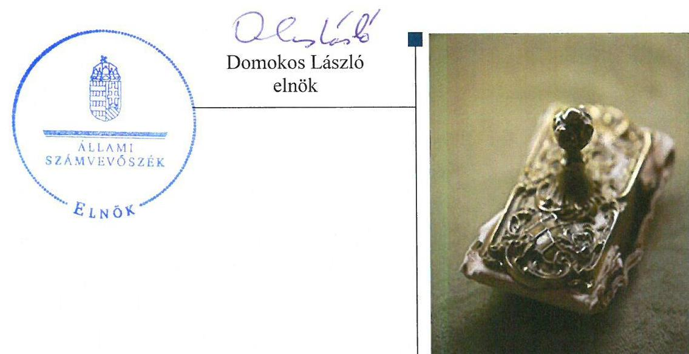
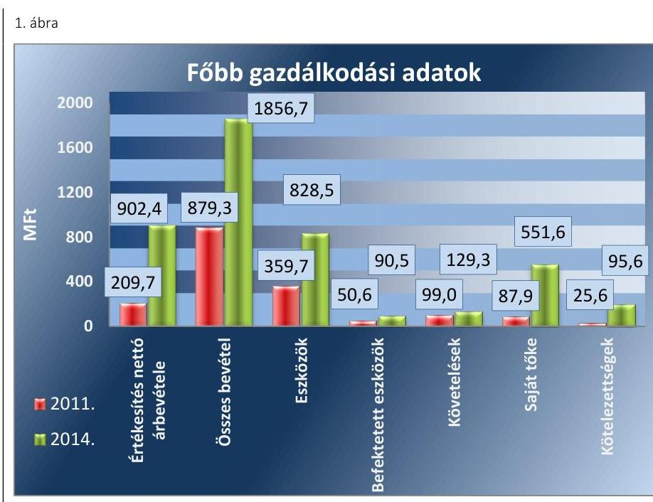
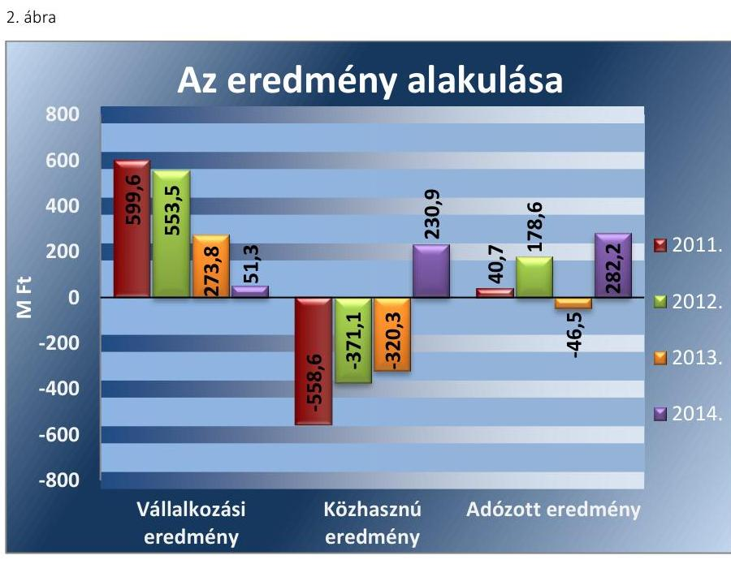
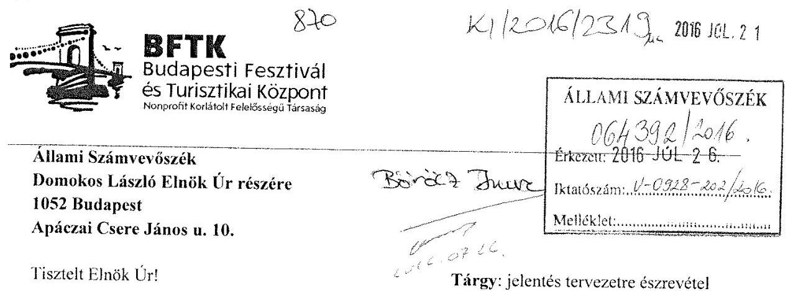
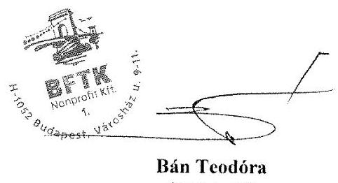
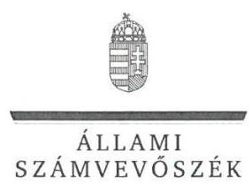
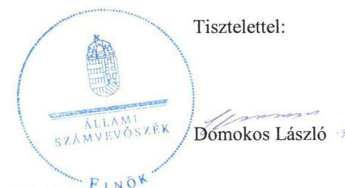

# Jelentés 

## Az önkormányzatok gazdasági társaságai

Az önkormányzatok többségi tulajdonában lévő gazdasági társaságok közfeladat ellátását érintő gazdálkodási tevékenysége szabályszerűségének ellenőrzése - BFTK Budapesti Fesztivál- és Turisztikai Központ NKft.
2016.

---

# Jelentés 

## Az önkormányzatok gazdasági társaságai

Az önkormányzatok többségi tulajdonában lévő gazdasági társaságok közfeladat ellátását érintő gazdálkodási tevékenysége szabályszerűségének ellenőrzése - BFTK Budapesti Fesztivál- és Turisztikai Központ NKft.
2016.  október hó 13. nap

---

# AZ ELLENŐRZÉST FELÜGYELTE:

- BÖRÖCZ IMRE felügyeleti vezető

- AZ ELLENŐRZÉST VEZETTE ÉS A VÉGREHAJTÁSÁÉRT FELELŐS:
  - VERTKOVCZI MÁRIA ellenőrzésvezető
  - A PROGRAM ÖSSZEÁLLÍTÁSÁÉRT FELELŐS:
    - JANIK JÓZSEF osztályvezető

- IKTATÓSZÁM: V-0928-206/2016
- TÉMASZÁM: 1704.
- ELLENŐRZÉS-AZONOSÍTÓ SZÁM: V070718

Jelentéseink az Országgyűlés számítógépes hálózatán és az Interneten a www.asz.hu címen is olvashatóak.

---

# TARTALOMJEGYZÉK 

■ ÖSSZEGZÉS ..... 5
■ AZ ELLENŐRZÉS CÉLJA ..... 7
■ AZ ELLENŐRZÉS TERÜLETE ..... 8
■ AZ ELLENŐRZÉS HÁTTERE, INDOKOLTSÁGA ..... 10
■ FÓKUSZKÉRDÉSEK ..... 12
■ ELLENŐRZÉS HATÓKÖRE ÉS MÓDSZEREI ..... 13
■ MEGÁLLAPÍTÁSOK ..... 15
■ JAVASLATOK ..... 30
■ MELLÉKLETEK ..... 33
I. Sz. melléklet: Értelmező szótár ..... 33
■ FÜGGELÉK: ÉSZREVÉTELEK ..... 37
■ RÖVIDÍTÉSEK JEGYZÉKE ..... 43

---

.

---

# ÖSSZEGZÉS 

Az Önkormányzat 2011-2014. évek között szabályszerűen gondoskodott a közfeladatok ellátásáról. A tulajdonosi jogok gyakorlása szabályszerű volt. A Társaság vagyongazdálkodása alapvetően megfelel az előírásoknak, a működés és a közfeladat-ellátás biztosított volt.

## Az ellenőrzés társadalmi indokoltsága

Az Állami Számvevőszék stratégiájában megfogalmazta, hogy a helyi önkormányzatok gazdálkodásában rejlő pénzügyi kockázatok feltárásával, az államháztartáson kívülre nyújtott költségvetési támogatások és ingyenes vagyonjuttatások, valamint az államháztartáson kívül működő közfeladat-ellátó rendszerek ellenőrzéseivel hozzájárul ahhoz, hogy a közpénzeket az államháztartáson kívül működő szervezetek is átlátható, rendezett módon használják fel a közfeladatok szerződésben vállalt ellátása érdekében.

Magyarországon az intézmény-centrikus közfeladat-ellátás jellemző, de egyre jelentősebb a költségvetésen kívüli feladatellátás térnyerése. Ennek legfontosabb szereplői - a nonprofit szervezetek mellett - az önkormányzati tulajdonú gazdasági társaságok. Az önkormányzatok szervezetalakítási szabadságának következménye, hogy a korábban is vállalati formában működő közszolgáltatások mellett, mind a kötelező, mind az önként vállalt feladatok ellátásában a gazdasági társaságok kiemelt fontosságú szerephez jutottak.

Az Állami Számvevőszék a korábban ellenőrizetlen területek, szervezetek - az úgynevezett fehér foltok - körébe tartozó társaságnál végzett ellenőrzést. A számvevőszéki ellenőrzés hozzájárul a közpénzek szabályos, átlátható, elszámoltatható és eredményes felhasználásához, a rend pedig értéket teremt.

## Főbb megállapítások, következtetések, javaslatok

Az Önkormányzat a turisztikai és kulturális programszervezési közszolgáltatás megszervezéséről kizárólagos tulajdonában lévő gazdasági társasága útján szabályszerűen gondoskodott. Az Önkormányzat a jegyzett tőkén felül más vagyoni elemet nem adott át a Társaság részére. Az Alapító Okirat szabályszerűen tartalmazta az ellátandó feladatok körét. A közfeladatok ellátása követelményeit a Közgyűlés által elfogadott, határozott idejű Közszolgáltatási szerződés számon kérhető módon tartalmazta. Beszámolási kötelezettséget az éves számviteli beszámoló, közhasznúsági jelentés, szakmai beszámoló és üzleti terv készítésén túlmenően az Önkormányzat nem írt elő a Társaság részére.

A tulajdonosi jogok gyakorlását az Önkormányzat az Alapító Okiratban rögzítette a Gt. és a Ptk. előírásainak megfelelően a Vagyongazdálkodási rendeletben megfogalmazottakkal összhangban. Az Felügyelő Bizottság létrehozásáról a Közgyűlés a Társaság alapításával egyidejűleg gondoskodott. Rendszeres tulajdonosi ellenőrzési tevékenységét a Közgyűlés az üzleti tervek és az éves számviteli beszámolók megtárgyalásán keresztül végezte. Garancia- vagy kezességvállalásra az Önkormányzat részéről nem került sor.

Az üzleti terveket a Gazdasági program célkitűzéseivel összhangban az ellenőrzött időszakban a Társaság elkészítette. A Társaság a könyvvezetésre és bizonylatolásra vonatkozó részletes belső szabályait úgy alakította ki, hogy azok a Számv. tv. előírása ellenére a beszámoló adatainak közvetlen alátámasztására, a vonatkozó Közhasznúsági tv. és Civil tv. előírásainak teljesítését szolgáló elkülönített nyilvántartás tekintetében nem tartalmaztak előírásokat. A gyakorlatban a tevékenységeket elkülönítetten tartották nyilván.

A Társaság vagyonnyilvántartását a jogszabályoknak és a belső szabályoknak megfelelően vezette. A Társaság az általa ellátott közfeladatokhoz az Önkormányzattól vagyonkezelésbe eszközt nem vett át. A Társaság a vagyongazdálkodási döntések megalapozása céljából, az éves üzleti tervek keretében előterjesztéseket készített, amelyeket a Közgyűlés elfogadott. A beszámolóban és a számviteli nyilvántartásokban szereplő vagyontárgyak állományát a Társaság az ellenőrzött időszakban évenként, szabályszerűen elkészített leltárral alátámasztotta.

---

Az ellenőrzött időszakban a kötelezettségek állománya a Társaság működését, közfeladatainak ellátását nem veszélyeztette. A kötelezettségek állománya hosszú lejáratú kötelezettségeket nem tartalmazott. A forgóeszközök állománya a 2011-2014. évek között folyamatosan meghaladta a kötelezettségeket. Az eladósodottságot jelző mutatók az ellenőrzött időszakban kockázatot nem jeleztek. Az ellenőrzött időszakban a Társaság összességében az elszámolt értékcsökkenésnél kisebb összeget fordított eszközpótlásra. A követelések állományának csökkentése érdekében a 2013. évben kialakított szabályozás következményeként azonban a követelések állománya csökkent. A Társaságnak nem volt adósságot keletkeztető ügylete.

Az ÁSZ a Társaság ügyvezetőjének fogalmazott meg javaslatokat, amelyek alapján köteles intézkedési tervet összeállítani és azt a jelentés kézhezvételétől számított 30 napon belül az ÁSZ részére megküldeni.

---

# AZ ELLENŐRZÉS CÉLJA 

Az ellenőrzés célja annak értékelése, hogy az önkormányzat a jogszabályi előírások figyelembevételével döntött-e az ellenőrzésre kerülő közfeladat megszervezéséről; az önkormányzat/tulajdonosi joggyakorló szabályszerűen gyakorolta-e a tulajdonosi jogokat; a gazdasági társaság közfeladat-ellátása bevételeinek, ráfordításainak elszámolása, és vagyongazdálkodási tevékenysége megfelelt-e a jogszabályi, illetve a közszolgáltatási/vagyonkezelési szerződésben foglalt tulajdonosi előírásoknak, azok végrehajtása szabályszerű volt-e; a gazdasági társaság kötelezettségállománya jelent-e kockázatot a működésre, illetve a közfeladat ellátására; a közfeladatok átláthatósága és elszámoltathatósága érdekében biztosítva volt-e a közszolgáltatás díjának megalapozottsága szabályszerű önköltségszámítással. Az ellenőrzés célja annak értékelése, hogy a gazdasági társaság gazdálkodásának a kormányzati szektor hiányára és az államadósságra befolyással bíró elemei a jogszabályi előírásoknak megfeleltek-e.

---

# **AZ ELLENŐRZÉS TERÜLETE**

## **Budapest Főváros Önkormányzata és a kizárólagos tulajdonában lévő Budapesti Fesztivál- és Turisztikai Központ Nonprofit Kft.**

**AZ ÖNKORMÁNYZAT**1 a kizárólagos tulajdonában lévő Társaságot2 a 2009. évben hozta létre. A Társaság átalakulással, a Budapesti Fesztiválközpont Közhasznú Társaság3 jogutódjaként jött létre. Az Önkormányzat 10,0 M Ft jegyzett tőkével hozta létre a Társaságot, mely az ellenőrzött időszakban nem változott. Az Önkormányzat a jegyzett tőkén felül további vagyonelemeket nem adott a Társaság részére. A Társaság alapfeladata a Fővárosi Önkormányzat – mint a társadalmi közös szükséglet kielégítéséért felelős szerv – kulturális és turisztikai feladatainak ellátása volt, ami az Ötv.4 63/A. § i) pontja, továbbá a Mötv.5 13. § (1) bekezdés 7. és 13. pontja, illetve 23. § (4) bekezdésének 15. és 16. pontja alapján közfeladatnak minősült. A 2012. évben a Társaságba hatékonyság növelés céljából beolvadt a BTDM NKft.6 és az SM NKft.7 A beolvadással – a Gt.8 70-81. §-ai, illetve a Vagyongazdálkodási rendelet9 előírásainak megfelelően – a Társaság tevékenységi köre a BTDM NKft. az idegenforgalmat segítő turisztikai tevékenységeivel, valamint az SM NKft. idegenforgalom fejlesztéssel kapcsolatos és a Budapesti Városfejlesztési Stratégiát támogató tevékenységével egészült ki.

**A TÁRSASÁG** főtevékenysége 2012. március 31-éig előadó-művészetet kiegészítő tevékenység, ezt követően előadó-művészeti tevékenység volt, közszolgáltatási feladataként turizmussal és kulturális szolgáltatással kapcsolatos feladatokat látott el. A Társaság közhasznú jogállású szervezet volt, cél szerinti közhasznú tevékenységei a kultúrával, neveléssel és a sporttal kapcsolatos tevékenységek voltak az ellenőrzött időszakban.

A Társaság 2011. január 1-jei és 2014. december 31-i bevételeit és fontosabb mérlegadatait az 1. ábra mutatja be.

---

Forrás: Társaság éves beszámolói
A Társaság értékesítési nettó árbevétele a 2014. évben a 2011. évi több mint négyszerese volt. Az összes bevétel a 2014. évben a 2011. évi kétszeresét meghaladta. A Társaság eszközeinek állománya a 2014. évben több mint kétszerese volt a 2011. év elejéhez képest, amiben meghatározó volt a 2012. évben történt beolvadás. Az eszközökön belül a befektetett eszközök állománya 78,9\%-kal, a követelések értéke 30,6\%-kal nőtt az ellenőrzött időszakban. A Társaság pénzeszközei több mint háromszorosára emelkedtek a 2011-2014. évek között. A Társaság saját tőkéje - a 2013. évet kivéve - az eredményes gazdálkodása következtében több mint hatszorosára emelkedett. A kötelezettségek állománya a 2011. év elejéhez képest 2014. év végére 70,0 M Ft-tal nőtt. A Társaság az ellenőrzött időszakban tulajdonosi részesedéssel más gazdasági társaságban nem rendelkezett.

Az ellenőrzött időszakban a Főpolgármester ${ }^{10}$ és a Főjegyző ${ }^{11}$ személye nem változott. A Főpolgármester a 2010. évi önkormányzati választások óta tölti be tisztségét, a jelenlegi Főjegyző 2010. december 15-től látja el hivatalát. A Társaság Ügyvezetőjének ${ }^{12}$ személye a 2011-2014. évek között két alkalommal változott. A jelenlegi Ügyvezető 2013. szeptember 11-től, a gazdasági igazgató 2012. január 23-ától látta el feladatait.

---

# AZ ELLENŐRZÉS HÁTTERE, INDOKOLTSÁGA 

## A gazdasági társaságok a közfeladatok ellátásában kiemelt fontosságú szerephez jutottak

## AZ ÖNKORMÁNYZATI TULAJDONÚ GAZDASÁGI

TÁRSASÁGOK teljes körű ellenőrzésének lehetőségét az Állami Számvevőszékről szóló 1989. évi XXXVIII. törvény 2011. január 1-jétől hatályos módosítása teremtette meg. A közfeladatot ellátó gazdasági társaságok ellenőrzése kiemelten fontos a vagyon megőrzése, megóvása érdekében, valamint a kormányzati szektor elszámolásaiban megjelenő önkormányzati tulajdonú gazdálkodó szervezetek esetében, amelyekkel szemben alapvető követelmény, hogy gazdálkodásuk, működésük szabályszerű, az általuk szolgáltatott adatok minél megbízhatóbbak legyenek. A közfeladat ellátás költségeinek, ráfordításainak alakulása, színvonala hatással van a lakosság elégedettségére. A törvényalkotás számára - az észlelt problémák, szabálytalanságok, vagy egyéb nem kívánatos jelenségek felszínre kerülésével - az ellenőrzés megállapításai segítséget nyújthatnak az államháztartáson kívüli közfeladat-ellátás értékeléséhez, jogszabályi keretei pontosításához, átláthatóságot biztosító szabályozásához. Meghatározhatóvá válnak a közfeladat ellátásban részt vevő államháztartáson kívüli szervezeteknek - az önkormányzat költségvetését, pénzügyi helyzetét is befolyásoló - kockázatai, lehetővé válik ezen kockázatok csökkentése. Ellenőrzéseink feltárhatják, hogy az önkormányzat közfeladat-ellátási kötelezettségének szabályszerűen tett-e eleget, a feladatellátáshoz rendelt közvagyon működtetését a tulajdonostól elvárható gondossággal, szabályszerűen szervezte-e meg és a tulajdonosi felügyelete hozzájárult-e a köz-feladat-ellátásához. Az ellenőrzés rávilágíthat arra, hogy a gazdasági társaság a közszolgáltatási szerződésben foglaltak betartásával, a közvagyon használatával biztosította-e a szolgáltatás folytatásának feltételeit, a közfeladat ellátását. Ezzel az ellenőrzöttek és a helyi döntéshozók számára visszajelzést ad feladatszervezési, feladat-ellátási kockázataikról, alapot ad a meglévő hibák megszüntetéséhez, a jobb közfeladat-ellátás biztosításához. Fokozza a fegyelmet, igazolja, hogy lejárt a következmények nélküli ellenőrzések időszaka. Az ÁSZ értékteremtő rend kialakításához és megőrzéséhez hozzájáruló tevékenysége pozitív hatással van a szervezetről kialakított összkép formálására.

A korábban is vállalati formában működő közszolgáltatások mellett, mind a kötelező, mind az önként vállalt feladatok ellátásában a gazdasági társaságok kiemelt fontosságú szerephez jutottak.

A kormányzati szektorba sorolt egyéb szervezetek közé tartoznak a 479/2009/EK rendelet szerint, illetve az ESA 95 statisztikai módszertana alapján a "helyi kormányzat alszektorba besorolt társaságok és egyéb szervezetek" is, amelyekkel szemben alapvető követelmény, hogy gazdálkodásuk, működésük szabályszerű, az általuk szolgáltatott adatok megbízhatóak legyenek.

---

A nemzeti számlák összeállításának módszertana 2014. október 1-jétől megváltozott, amely értelmében az ESA 2010 felváltotta az ESA 95 módszertant. A nemzeti számlák rendszerének legfontosabb jellemzői, alapvető vonásai változatlanok maradtak, ugyanakkor az ESA 2010 követi a gazdasági környezetben lezajlott változásokat, figyelembe veszi az új kutatási eredményeket és a felhasználók új
 igényeit.

Az ellenőrzés során feltárjuk, hogy az önkormányzati alszektorba sorolt többségi önkormányzati tulajdonban lévő gazdasági társaságok gazdálkodása milyen mértékben befolyásolja a költségvetési hiányt és az államadósságot. Az ellenőrzés rámutathat a többségi önkormányzati tulajdonú gazdasági társaságok gazdálkodási tevékenységével, valamint az államháztartásból származó források felhasználásával kapcsolatos jó gyakorlatokra és szabálytalanságokra. Felhívhatja a figyelmet a jogszabályi követelmények teljesítéséhez szükséges feltételek hiányosságaira, hozzájárulhat az államháztartáson kívüli, de (közvetlenül vagy közvetve) önkormányzati vagyont használó gazdasági társaságok tevékenységének átláthatóságához. Hozzájárulhat a közfeladat-ellátás minőségének javulásához. Az ÁSZ értékteremtő rend kialakításához és megőrzéséhez hozzájáruló tevékenysége pozitív hatással van a szervezetről kialakított összkép formálására is

---

# FÓKUSZKÉRDÉSEK 

1.     - Az Önkormányzat közfeladat megszervezéséről szóló döntése, valamint tulajdonosi joggyakorlása szabályszerű volt-e?
2.     - A gazdasági társaság vagyongazdálkodása szabályszerű volt-e, kötelezettségállománya jelentett-e kockázatot a működésre, illetve a közfeladat ellátásra?
3.     - A gazdasági társaságnál az ellátott közfeladat bevételei és ráfordításai elszámolása, valamint az önköltségszámítás és árképzés szabályszerű volt-e?
4.     - A többségi önkormányzati tulajdonban lévő gazdasági társaságok gazdálkodásának a kormányzati szektor hiányára és az államadósságra befolyással bíró elemei megfeleltek-e a jogszabályi előírásoknak?

---

# ELLENŐRZÉS HATÓKÖRE ÉS MÓDSZEREI 

## Az ellenőrzés típusa

Megfelelőségi ellenőrzés

## Az ellenőrzött időszak

2011. január 1-jétől 2014. december 31-ig

## Az ellenőrzés tárgya

A közfeladatot gazdasági társaságokkal ellátó önkormányzatok tulajdonosi joggyakorlása, valamint gazdasági társaságok pénz- és vagyongazdálkodásának szabályozottsága és szabályszerűsége. Az ellenőrzés kiterjed minden olyan körülményre és adatra, amely az ÁSZ jogszabályban meghatározott feladatainak teljesítéséhez, valamint a program végrehajtása folyamán felmerült újabb összefüggések feltárásához szükséges.

A kormányzati szektor önkormányzati alszektorába sorolt, többségi önkormányzati tulajdonban lévő gazdasági társaságok gazdálkodásának a kormányzati szektor hiányára és az államadósságra befolyással bíró elemei szabályszerűsége.

## Az ellenőrzött szervezet

Budapest Főváros Önkormányzata és
BFTK Budapesti Fesztivál- és Turisztikai Központ Nonprofit Kft.

## Az ellenőrzés jogalapja

Az ellenőrzés jogszabályi alapját az Állami Számvevőszékről szóló 2011. évi LXVI. törvény 5. § (3)-(4)-(5) bekezdései képezik.

## Az ellenőrzés módszerei

Az ellenőrzést a nemzetközi standardokat irányadónak tekintve az ellenőrzési program ellenőrzési kérdései, az ellenőrzött időszakban hatályos jogszabályok, az ellenőrzés szakmai szabályok és módszertanok figyelembe vételével végezzük.

---

Az ellenőrzés ideje alatt az ellenőrzött szervezettel történő kapcsolattartást az ÁSZ Szervezeti és Működési Szabályzatának vonatkozó előírásai alapján biztosítjuk.

Az ellenőrzés a kiválasztott, többségi tulajdonosi jogokat gyakorló önkormányzatra, illetve az ellenőrzésre kijelölt közfeladatot ellátó gazdasági társaság felett tulajdonosi jogokat gyakorló szervezetre és az ellenőrzött közfeladatot ellátó gazdasági társaságra terjed ki. Amennyiben a gazdasági társaságban több önkormányzat együttesen többségi tulajdonos, úgy az ellenőrzést a többségi tulajdonosi jogokat gyakorló önkormányzatnál kell lefolytatni. Az ellenőrzött gazdasági társaságnál, amennyiben az több közfeladatot is ellát, akkor az ellenőrzésre kiválasztott közfeladat ellátást ellenőrizzük.

Az ellenőrzést a kérdésekre adott válaszok kiértékelésével, valamint a megjelölt adatforrások, a csatolt tanúsítványok felhasználásával, továbbá az adott időszakban hatályos jogszabályok figyelembe vételével kell lefolytatni. Az ellenőrzési kérdések megválaszolásához szükséges bizonyítékok megszerzése a következő ellenőrzési eljárások alkalmazásával történik: megfigyelés, kérdésfeltevés (információkérés), összehasonlítás, valamint elemző eljárás.

Mintavétellel ellenőriztük az anyagjellegű ráfordítások, személyi jellegű ráfordítások, egyéb ráfordítások, pénzügyi műveletek ráfordítási, rendkívüli ráfordítások, illetve az értékesítés nettó árbevétele, egyéb bevételek, pénzügyi műveletek bevételei, rendkívüli bevételek elszámolásának szabályszerűségét, valamint a vagyonnyilvántartás területén a szabályszerű működést. A jogszabályoknak és a belső előírásoknak megfelelőnek, azaz szabályszerűnek tekintettük az adott bevételek és ráfordítások elszámolását, a vagyonnyilvántartást, amennyiben a minta ellenőrzésének eredménye alapján 95%-os bizonyossággal a teljes sokaságban a hibás tételek aránya kisebb volt mint 10%, nem megfelelőnek értékeltük, ha a hibás tételek aránya a 10%-ot meghaladta. Kockázatot, illetve magas kockázatot jeleztünk, amennyiben egy adott terület vonatkozásában a minta alapján a teljes sokaságban nem volt teljes körűen biztosított a jogszabályoknak és a belső szabályzatoknak megfelelő működés.

---

# 1. Az Önkormányzat közfeladat megszervezéséről szóló döntése, valamint tulajdonosi joggyakorlása szabályszerű volt-e? 

## Összegző megállapítás

### 1.1. számú megállapítás

1. táblázat

## ALAPÍTÓ OKIRAT MÓDOSÍTÁSOK

| Módosítás   időpontja | Módosítás területe |
| :--: | :--: |
| 2011.01.19. | ügyvezető változása |
| 2011.04.01. | könyvvizsgáló változása |
| 2012.06.27. | Beolvadás elhatározása,   tevékenységek bővülése |
| 2013.06.09. | Civil tv. miatti változások   átvezetése |
| 2013.09.11. | Ügyvezető változása   Forrás: Társaság alapító okiratok |

Az Önkormányzat közfeladatok megszervezéséről szóló döntése és a tulajdonosi jogok gyakorlása szabályszerű volt.

Az Önkormányzat közfeladatok ellátására vonatkozó döntése és előkészítése, rendszerének kialakítása szabályszerű volt.

Az Önkormányzat az ellenőrzött időszakot megelőzően a Mötv. 8. § (1) bekezdésének és a 9. § (4) bekezdése alapján döntött a közfeladatok gazdasági társaság útján történő ellátásáról.

Az Önkormányzat az Ötv. 91. § (6) bekezdésének megfelelően elkészítette a 2011-2014. évekre vonatkozó Gazdasági programját ${ }^{13}$, amelyben többek között megfogalmazta az önkormányzati tulajdonú gazdasági társaságok működésének elveit, valamint a kulturális és turisztikai közfeladatok ellátásával kapcsolatos elképzeléseit.

Az Önkormányzat rendelkezett vagyongazdálkodási koncepcióval ${ }^{14}$, illetve az annak alapján elkészített vagyongazdálkodási stratégiával ${ }^{15}$, ami biztosította az önkormányzati vagyonnak a Nvtv. ${ }^{16}$ 7. § (2) bekezdés szerinti, a közfeladatok ellátásához szükséges átlátható, a vagyon értékének megőrzését biztosító használatát.

AZ ALAPÍTÓ OKIRAT ${ }^{17}$ szabályszerűen tartalmazta az ellátandó feladatok körét. Az Alapító Okiratokban az Önkormányzat a Társaság cél szerinti közhasznú tevékenységeit a Gt. 4. § (4a) bekezdésének, illetve a Civil tv. ${ }^{18}$ 34. § (1) bekezdés a) pontjának megfelelően meghatározta, valamint az alapcélok szerinti tevékenységeit nem veszélyeztető vállalkozási tevékenységi köreit megjelölte. Az Alapító Okiratokban a Közhasznúsági tv. ${ }^{19}$ 14. § (1) bekezdésében, illetve a Civil tv. 34. § (1) bekezdés c) pontjában előírtaknak megfelelően rögzítette az Önkormányzat, hogy a Társaság a gazdálkodása során elért eredményét nem osztja fel, azt a közhasznú tevékenységeire fordíthatja. Az Alapító Okirat tartalmazta továbbá, hogy a Társaság éves üzleti tervét és a Számv. tv. ${ }^{20}$ szerinti beszámolóját, valamint a közszolgáltatások ellátására vonatkozó szerződéseket az Önkormányzat hagyja jóvá. Az Alapító Okiratok és módosításaik a Gt. 12. § (1) bekezdése, valamint a Ptk. 3: 5. §, 3:8 §, 3:94. § és 3: 97.§ szerinti tartalommal kerültek kialakításra. Az Alapító Okirat tartalmazta a Könyvvizsgáló ${ }^{21}$ személyét és a vele kötött szerződés tartalmát a Gt. 41. § (1), illetve a Ptk. ${ }^{22}$ 3:130. § (1) bekezdésében foglaltaknak megfelelően. Az Alapító Okirat módosításait az 1. táblázat mutatja be.

A KÖZFELADATOK ELLÁTÁSA KÖVETELMÉNYEIT
a Közgyűlés ${ }^{23}$ által elfogadott, az Önkormányzat és a Társaság közötti határozott idejű Közszolgáltatási szerződés ${ }^{24}$ számon kérhető módon tartalmazta. A Közszolgáltatási Szerződés rendelkezett a szerződés tárgyáról, céljáról, időtartamáról, a felek feladatairól, a Társaság beszámolási kötelezettségéről, az Önkormányzati ellenőrzésekről és a szerződés megszűnéséről.

BESZÁMOLÁSI KÖTELEZETTSÉGET az éves számviteli beszámoló, közhasznúsági jelentés, szakmai beszámoló és üzleti terv készítésén túlmenően az Önkormányzat nem írt elő a Társaság számára. A beszámolásra, az üzleti terv készítésére vonatkozó határidőket az Alapító Okiratban és a Közszolgáltatási szerződésben határozta meg az Önkormányzat.

# 1.2. számú megállapítás 

Az Önkormányzat tulajdonosi jogait szabályszerűen gyakorolta az ellenőrzött időszakban.

## A TULAJDONOSI JOGOK GYAKORLÁSÁT a

Gt. 141. § (2) bekezdésében, illetve a Ptk. 3:188. § (2) bekezdésében előírtaknak megfelelően az Alapító Okirat, továbbá a Vagyongazdálkodási rendelet foglalta magában. A tulajdonosi jogokat részben a Közgyűlés, részben átruházott hatáskörben a Főpolgármester gyakorolta az ellenőrzött időszakban. A 2012. március 14-éig hatályos Vagyongazdálkodási rendelet 52. § (2) bekezdése, illetve a 2012. március 15-étől hatályos Vagyongazdálkodási rendelet 56. § (2) bekezdése alapján a Főpolgármester hatáskörébe tartozott:
$\longrightarrow$ az FB${ }^{25}$ tagjainak, továbbá a Könyvvizsgálónak a megválasztása, visszahívása, megbízása és díjazása;
$\longrightarrow$ a Társaság Ügyvezetőjének megbízása, megbízásának visszavonása és díjazásának megállapítása.
A Társaság gazdálkodási feladatait az Ügyvezető vezetésével, a három főből álló FB, a Könyvvizsgáló és a Közgyűlés által gyakorolt felügyelettel látta el.

A Közgyűlés a Társaság vagyongazdálkodási döntéseinek megalapozására előterjesztési kötelezettséget írt elő a 2012. június 27-ig hatályos Alapító Okiratban 70,0 M Ft, a 2012. június 28-tól hatályos Alapító Okiratban 50,0 M Ft értékhatárt meghaladó jogügyletek végrehajtására vonatkozóan. A közgyűlés az üzleti tervek és az éves beszámolók elfogadásával kapcsolatos tulajdonosi jogait a 2011-2014. években az Alapító Okirat, valamint a Közszolgáltatási szerződésnek megfelelően gyakorolta.

A FELÜGYELŐ BIZOTTSÁG létrehozásáról a Közgyűlés a Társaság alapításával egyidejűleg gondoskodott a Gt. 33. §, illetve a Tak. tv. ${ }^{26}$ 4. § alapján. Az FB létszámát a Gt. 34. § (1) bekezdése és a Tak. tv. 4. § (2) bekezdése szerint az Önkormányzat három főben határozta meg. Az Alapító Okirat az FB tagjainak nevét (lakóhelyét) a Gt. 12. § (1) bekezdés f) pontja előírásának megfelelően tartalmazta. Az FB a feladatait az Alapító Okirat és a Közgyűlés által jóváhagyott Ügyrendje ${ }^{27}$ alapján látta el az ellenőrzött időszakban.

---

2. táblázat

JEGYZETT TŐKE ÉS SAJÁT TŐKE ALAKULÁSA (M FT)

|  | 2011 | 2014 |
| :-- | --: | --: |
| Jegyzett tőke | 10,0 | 10,0 |
| Saját tőke | 87,9 | 551,6 |

Forrás: Társaság beszámolók

RENDSZERES TULAJDONOSI ELLENŐRZÉSI tevékenységet az Önkormányzat az üzleti tervek és az éves számviteli beszámolók megtárgyalásával teljesítette. Az éves beszámolókat az Ügyvezető az FB javaslatával és a Könyvvizsgálói jelentéssel együtt a Közgyűlés elé terjesztette, amelyet a Közgyűlés minden évben elfogadott. A Társaság közhasznú szervezetként a Közhasznúsági tv. 19. § (1) bekezdése szerint közhasznúsági jelentés, illetve a Civil tv. 29. § (3) bekezdésének előírása alapján éves beszámolójának készítésével egyidejűleg közhasznúsági melléklet készítésére volt kötelezett, melynek az ellenőrzött időszakban eleget tett.

A belső ellenőrzés tulajdonosi ellenőrzésekre vonatkozó előírásait az Önkormányzati SZMSZ ${ }^{28}$ az Ötv. 92. § (11) bekezdés b) pontja, illetve a Mötv. 119. § (4) bekezdésének előírásai alapján tartalmazta. A Főpolgármesteri Hivatal ${ }^{29}$ belső ellenőrzési osztályának hatásköre kiterjedt az Önkormányzat irányítása alá tartozó gazdasági társaságokra is. A belső ellenőrzési terveket a Közgyűlés az Ötv. 92. § (6) bekezdésében, illetve a Mötv. 119. § (5) bekezdésében előírt határidőben jóváhagyta.

A Társaság esetében az Önkormányzat nem élt az Áht ${ }^{30}$ 70. § (1) bekezdés d) pontjában biztosított, az irányítása alatt álló gazdálkodó szervezetek ellenőrzésének lehetőségével, a 2011-2014. években a Társaságnál belső ellenőrzést nem végzett.

A JAVADALMAZÁSI SZABÁLYZAT ${ }^{31}$ az Önkormányzat kulturális ágazatba tartozó gazdasági társaságai ügyvezetőinek, egyéb vezető állású munkavállalóinak és felügyelő bizottsági tagjainak javadalmazásának, az üzleti tervek megvalósítására vonatkozó érdekeltségével kapcsolatos szabályokat és követelményeket a Tak. tv. 5. § (2)-(3) bekezdése, az Mt. ${ }^{32}$ előírásainak megfelelően tartalmazta. Az Ügyvezető 2013. szeptember 11-éig munkaviszonyban majd 2013. szeptember 11-től megbízási szerződés alapján, díjazás nélkül látta el a Gt. 22. § (4)
 bekezdése előírásának megfelelően feladatait, az Alapító Okirat előírásainak megfelelő hatáskörökkel és felelősséggel.

A TÁRSASÁG TEVÉKENYSÉGE a 2013. év kivételével nyereséges volt. A 2011-2014. évek során osztalékfizetésre vonatkozó tulajdonosi döntésre az Alapító Okirat, valamint a Közhasznúsági tv. 14. § (1) bekezdése, továbbá a Civil tv. 34. § (1) bekezdés c) pontjának előírásainak megfelelően nem került sor. A jegyzett tőke és a saját tőke értékének 2011-2014. évek közötti alakulását a 2. táblázat szemlélteti.

HITELFELVÉTEL, kötvénykibocsátás 2011-2014. években a Társaság részéről nem történt, egyéb kötelezettségekhez garancia- vagy kezességvállalásra az Önkormányzat részéről nem került sor.

---

# 2. A gazdasági társaság vagyongazdálkodása szabályszerű volt-e, kötelezettségállománya jelentett-e kockázatot a működésre, illetve a közfeladat ellátásra? 

Összegző megállapítás

2.1. számú megállapítás

A Társaság vagyongazdálkodása szabályszerű volt. A Társaság az előírt szabályozási kötelezettségét hiányosan teljesítette. A Társaság kötelezettségeinek állománya nem jelentett kockázatot a működésére. A beszámolás döntően az előírásoknak megfelelően történt.

A Társaság az ellenőrzött időszakban nem rendelkezett a tevékenységek elkülönítését biztosító szabályozással, önköltségszámítási szabályzattal, a pénzkezelési szabályzata hiányos volt, a 2011-2013. években nem rendelkezett számlarenddel.

A Társaság szabályszerű működésének, gazdálkodásának kereteit a tulajdonosi joggyakorló által meghatározott Alapító Okirat, a Közszolgáltatási szerződés, és az SZMSZ ${ }^{33}$, valamint a Számv. tv. előírásai alapján az Ügyvezető által kiadott további szabályzatok határozták meg.

AZ ÜZLETI TERVEKET a Társaság a 2011-2014. évekre vonatkozóan a Közszolgáltatási szerződés előírásaival összhangban elkészítette és az FB véleményével együtt beterjesztette az Önkormányzat részére. Az üzleti tervek a Gazdasági program célkitűzéseivel összhangban tartalmazták a következő évi terveket. Az üzleti tervekben kiemelt feladatként szerepelt a minden évben megrendezett Tavaszi Fesztivál, a Café Budapest Kortárs Művészeti Fesztivál és a karácsonyi vásárok előkészítésével és megrendezésével kapcsolatos program.

AZ ELKÜLÖNÍTETT SZÁMVITELI NYILVÁNTARTÁS szabályozásával a Társaság nem rendelkezett az ellenőrzött időszakban. A könyvvezetésre és bizonylatolásra vonatkozó részletes belső szabályait úgy alakította ki, hogy azok a Számv. tv. 161/A. §-ában előírtak ellenére a beszámoló adatainak közvetlen alátámasztására, a vonatkozó Közhasznúsági tv. 18. § (1) bekezdése és a Civil tv. 20. §-a előírásainak teljesítését szolgáló elkülönített nyilvántartás tekintetében nem tartalmaztak előírásokat.

SZÁMVITELI POLITIKÁJÁT a Társaság a Számv. tv. 14. § (3) bekezdésének előírása ellenére 2011. augusztus 1-jéig nem készítette el a Számv. tv. 14. § (5) bekezdésében előírt eszközök és források leltárkészítési és leltározási, az eszközök és források értékelési és a pénzkezelési szabályzatot.

A Társaság 2011. augusztus 1-jei hatállyal, illetve azt követően évente a Számviteli Politika ${ }^{34}$ keretében elkészítette a Leltározási ${ }^{35}$, az Értékelési ${ }^{36}$ és Pénzkezelési ${ }^{37}$ szabályzatokat. Az eszközök és források Értékelési szabályzata a Számv. tv. 14. § (5) bekezdés b) pontjának előírásaival összhangban biztosította a vagyon értékének meghatározását.

---

A Pénzkezelési szabályzatban a Számv. tv. 14. § (8) bekezdés előírása ellenére a Társaság nem írta elő a készpénzállomány ellenőrzésekor követendő eljárást.

Az Számv. tv. 14. § (5) bekezdésének c) pontjában előírt önköltségszámítás rendjére vonatkozó belső szabályzat készítésére - figyelemmel arra, hogy a Számv. tv. 14. § (6) bekezdésében meghatározott mentesülési feltételek rá nem vonatkoztak - a Társaság kötelezett volt, azonban az ellenőrzött időszakban nem rendelkezett önköltségszámítási szabályzattal.

Számlarenddel ${ }^{38}$ a Számv. tv. 161. § (1)-(5) bekezdésének előírása ellenére 2011. és 2014. március 31. között a Társaság nem rendelkezett. A 2014. március 31-étől hatályos számlarend megfelelt a Számv. tv. 161. § (1)-(3) bekezdéseiben foglalt előírásoknak.

# 2.2. számú megállapítás 

A Társaság vagyongazdálkodása szabályszerű volt az ellenőrzött időszakban, azonban a leltározás belső szabályzatban előírt dokumentálása hiányos volt.

A TÁRSASÁG VAGYONNYILVÁNTARTÁSÁT átláthatóan, naprakészen vezette, a főkönyvi számlákhoz analitikus nyilvántartások kapcsolódtak. A Társaság az általa ellátott közfeladatokhoz az Önkormányzattól vagyonkezelésbe, üzemeltetésre nem vett át eszközöket, a közszolgáltatást a 2011-2014. években saját eszközeivel látta el. A Társaság az eszközeit, azok értékét és állományának változásait a Számv. tv. 23. § (1) bekezdésben meghatározottak alapján és a (4) bekezdésnek megfelelően a befektetett, vagy forgóeszközök, a Számv tv. 57-58. §-aiban foglalt értékelési előírásoknak megfelelően tartotta nyilván. A Társaság közfeladatainak ellátása során a vagyonérték megőrzése, gyarapítása, hasznosítása a közszolgáltatási szerződésben foglalt követelményeknek megfelelt. A vagyongazdálkodási döntéseket megalapozását célzó előterjesztések az üzleti tervek keretében készültek.

A Társaság a 2011. és 2014. között a Leltározási szabályzatban előírtaknak megfelelően, a leltározási ütemterv alapján mennyiségi leltárfelvétellel győződött meg a főkönyvben szereplő eszközök valódiságáról. A beszámolók leltárral való alátámasztása megfelelt a Számv. tv. 69. §-ának, azonban a leltározás dokumentálása hiányos volt, mivel a Leltározási szabályzat előírása ellenére nem készült évenként leltározási utasítás és leltározási záró jegyzőkönyv.

A Társaság által vezetett vagyonnyilvántartás a Számv. tv., a Számviteli Politika és az annak keretében elkészített Értékelési és Leltározási szabályzat előírásai szerint biztosította a vagyon változásának folyamatos kimutatását.

A Társaság mérlegének főbb adatait a 3. táblázat tartalmazza:
3. táblázat

MÉRLEGADATOK VÁLTOZÁSA (M Ft)

| Megnevezés | 2011.01.01 | 2011.12.31 | 2012.12.31 | 2013.12.31 | 2014.12.31 |
| :-- | --: | --: | --: | --: | --: |
| Befektetett eszközök | 50,6 | 32,8 | 98,9 | 80,6 | 90,5 |
| ebből: tárgyi eszközök | 35,5 | 17,7 | 72,4 | 64,0 | 82,7 |
| Forgóeszközök | 275,6 | 365,3 | 721,0 | 509,4 | 709,5 |
| ebből: követelések | 99,0 | 90,9 | 186,8 | 138,1 | 129,3 |
| Aktív időbeli elhatárolások | 33,6 | 2,2 | 62,8 | 30,1 | 28,5 |
| ESZKÖZÖK ÖSSZESEN | 359,7 | 400,3 | 882,8 | 620,1 | 828,5 |

---

|  |   |   |   |   |   |
| --- | --- | --- | --- | --- | --- |
|  Megnevezés | 2011.01.01. | 2011.12.31. | 2012.12.31. | 2013.12.31. | 2014.12.31.  |
|  Saját tőke | 87,9 | 128,6 | 315,8 | 269,3 | 551,6  |
|  ebből: Jegyzett tőke | 10,0 | 10,0 | 10,0 | 10,0 | 10,0  |
|  Tőketartalék | 0,0 | 0,0 | 86,9 | 86,9 | 86,9  |
|  Eredménytartalék | 77,9 | 118,6 | 215,2 | 172,4 | 354,7  |
|  Mérleg szerinti eredmény |  | 40,7 | 178,6 | -46,5 | 282,2  |
|  Céltartalékok | 0,0 | 0,0 | 45,8 | 0,0 | 0,0  |
|  Kötelezettségek | 275,6 | 271,7 | 567,0 | 350,8 | 276,9  |
|  Passzív időbeli elhatárolások | 246,2 | 246,6 | 224,0 | 182,6 | 181,3  |
|  FORRÁSOK ÖSSZESEN | 359,7 | 400,3 | 882,8 | 620,1 | 828,5  |

Forrás: Társaság számviteli beszámolók (2011-2014)

Az egyes mérlegtételek nagyarányú növekedésének oka döntően a BTDM NKft. és SM NKft. 2012. október 1-jei beolvadása következménye. A Társaság vagyona 2011. január 1-je és 2014. december 31-e között 130,3\%-kal (468,8 M Ft-tal) növekedett. A befektetett eszközök állománya 78,9\%-kal (39,9 M Ft), ezen belül a tárgyi eszközök állománya 133,0\%-os (47,2 M Ft) növekedést mutatott az ellenőrzött időszakban. A forgóeszközök állománya 157,4\%-kal (433,9 M Ft) nőtt a 2011. és 2014. évek között, ezen belül a követelések állománya 30,6\% (30,3 M Ft) növekedést mutatott.

A SAJÁT TŐKE a 2011-2014. évek között, a mindösszesen 463,7 M Ft-tal nőtt. A növekedéshez a Társaság mérleg szerinti eredményének eredménytartalékba helyezése mindösszesen 455,0 M Ft-tal, a 2012. évi beolvadás következtében 86,9 M Ft-tal, továbbá a beolvadó társaságok negatív eredménytartalékainak összege -78,2 M Ft-tal járult hozzá. A tőketartalék a BTDM NKft. (83,9 Ft) és az SM NKft. (3 M Ft) beolvadás előtti jegyzett tőkéjének és tőketartalékának összegéből állt. Az ellenőrzött időszakban a saját tőke folyamatosan, többszörösen meghaladta a jegyzett tőke értékét, ezért a Gt. 51. § (1) bekezdésében, illetve a Ptk. 3:133. § szerint előírt, a saját tőke megfelelőségét biztosító intézkedések megtételére nem volt szükség.

### 2.3. számú megállapítás

A Társaság kötelezettségek állománya nem jelentett kockázatot a közfeladatok ellátására, illetve a működésére.

A KÖTELEZETTSÉGEK állománya hosszú lejáratú kötelezettségeket nem tartalmazott, kizárólag rövid lejáratú, áruszállításból és szolgáltatásból (szállítók), illetve egyéb rövid lejáratú kötelezettségből állt. A Társaság kötelezettségeinek állománya a 2011-2014. évek között közel négyszeresére, 70,0 M Ft-tal nőtt. A forgóeszközök állománya a 2011-2014. években folyamatosan meghaladta a kötelezettségek állományát. A kötelezettségek állománya, alakulása az ellenőrzött időszakban a Társaság működésére, közfeladatainak ellátására nem jelentett kockázatot.

A Társaság eladósodottságának finanszírozási forrásai, és az éves beszámolóinak adatai alapján az eladósodottsági mutatók értéke a 2011. évhez képest a 2012. évben a beolvadás hatására romlott, azonban a 2012-2014. évek között a mutatók javulása volt megfigyelhető. Az egyes pénzügyi mutatók változását az 4. táblázat foglalja össze:

---

| MUTATÓK VÁLTOZÁSA |  |  |  |  |
| :-- | --: | --: | --: | --: |
| Mutató megnevezése | 2011 | 2012 | 2013 | 2014 |
| Eladósodottsági mutató (idegen tőke/összes forrás) | 0,06 | 0,94 | 0,62 | 0,17 |
| Eladósodottság mértéke (kötelezettségek/saját tőke) | 0,2 | 0,94 | 0,62 | 0,35 |
| Nettó eladósodottság (kötelezettségek-követelések) / saját tőke | -0,51 | 0,35 | 0,11 | -0,06 |
| Adósságfedezeti mutató I. (befektetett eszközök+forgóeszközök)/idegen forrás | 15,81 | 2,76 | 3,51 | 8,37 |

Az eladósodottsági mutató értéke a 2011. évről a 2012. évre romlott a beolvadást követő idegen tőke (kötelezettségek) növekedése következtében, majd a 2012. évtől a 2014. év végéig folyamatosan javult, a kötelezettségek csökkenése következtében. Az eladósodottság mértéke a beolvadás hatására, azon belül a kötelezettségek növekedésének következtében a 2012. évben megközelítette az 1-es értéket, majd a 2013-2014. években csökkenő tendenciát mutatott a kötelezettségek csökkenése következtében. A nettó eladósodottsági mutató értéke a 2011. és a 2014. években negatív előjelű volt, mivel a követelések állománya meghaladta a kötelezettségek állományát. A 2012-2013. években a követelések állománya már nem nyújtott a teljes kötelezettségek állományára fedezetet, így a mutató értéke ezekben az években pozitív volt, értékét tekintve romlott. Az adósságfedezeti mutató I. értéke 2011-2012. évek között romlott, mivel 2011. évben 1 Ft adósságra 15,81 Ft vagyon jutott, a 2012. évben 13,1 Ft-tal kevesebb. A mutató értéke ezt követően 2014. év végéig kedvező növekedést mutatott, mivel a 2014. évben 1 Ft adósságra 5,61 Ft-tal több vagyon jutott, mint a 2012. évben.

Az előírt beszámolási, adatszolgáltatási kötelezettségeket a Társaság az éves beszámolók hiányosságai ellenére teljesítette.

# A BESZÁMOLÁSI ÉS ADATSZOLGÁLTATÁSI KÖTELEZETTSÉGEKET a Társaság a 2011-2014. évekre vonatkozóan minden évben elkészítette. Az
 ellenőrzött időszakban az Ügyvezető az éves gazdálkodásáról szóló beszámolókat, közhasznúsági jelentéseket, illetve közhasznúsági mellékleteket, a Gt. 35. § (3) bekezdésének, illetve a Ptk. 3:27. § (1) bekezdésének megfelelő FB írásbeli jelentéssel együtt beterjesztette a Közgyűlés részére, továbbá a Közgyűlés Gazdasági, illetve Pénzügyi és Ellenőrző Bizottságának megtárgyalásra. 

A beterjesztett közhasznúsági jelentés többek között tartalmazta a közszolgáltatási és a vállalkozási tevékenység gazdálkodási adatait. A bevételek és a költségek közhasznú, illetve vállalkozási tevékenységbe sorolása a számviteli elkülönítés belső szabályozása hiányában nem megalapozottan - a főkönyvi és az analitikus nyilvántartási rendszer adatainak felhasználásával, manuális kigyűjtés alapján - történt, ezért az nem felelt meg a Számv. tv. 15. § (3)-(5) bekezdése szerinti valódiság, világosság és következetesség számviteli alapelveknek. A 2011-2013. évi közhasznú, illetve vállalkozási célú ráfordítások elkülönítését a hatályos számlarend hiánya súlyosbította. A bevételek és költségek megosztásának gyakorlata az éves számviteli beszámolók és közhasznúsági jelentések, közhasznúsági mellékletek adatainak megalapozottságára kockázatot jelentett.

---

A 2013. ÉVI SZÁMVITELI BESZÁMOLÓ megfelel a Számv. tv előírásainak, azonban a 2011., 2012. és 2014. évre vonatkozó beszámolók a Számv. tv-ben meghatározott tartalmi és formai követelményeknek csak részben feleltek meg. A Társaságnál a 2011. és 2012. években a Számv. tv. 9. § (2) bekezdése alapján fennállt az egyszerűsített éves beszámoló készítésének lehetősége, amelyet a 2013. év szeptember 5-éig hatályos Számviteli Politika a beszámoló formájaként ennek megfelelően megjelölt. A Számviteli Politikában meghatározott egyszerűsített éves beszámoló formájának előírása ellenére a Társaság a 2011. és a 2012. évi számviteli beszámoló összeállításakor a Számv. tv. 1-2. számú melléklete szerinti éves beszámoló tartalmú mérleget és eredménykimutatást, éves beszámoló megjelöléssel készített el. Az így elkészített 2011. évi beszámoló kiegészítő melléklete a Számv. tv. 88. § (6) bekezdés előírásai ellenére nem tartalmazta az éves beszámoló keretében a Számv. tv. 7. számú melléklete szerinti tartalommal elkészítendő cash flow kimutatást. Nem tartalmazta továbbá a 2011. és 2012. évi beszámoló kiegészítő melléklete a Számv. tv. 92. § (1) bekezdésében előírtak ellenére az immateriális javak és tárgyi eszközök bruttó értékének és értékcsökkenésének alakulását, valamint a Számv. tv. 90. § (1) bekezdése ellenére az időbeli elhatárolások jelentősebb összegeit, azok időbeli alakulását. A 2011. évi beszámoló keretében a Számv. tv. 19. § (1) bekezdésének előírása ellenére nem készítettek üzleti jelentést. A 2014. évi számviteli beszámoló kiegészítő mellékletében a Számv. tv. 92. § (2) bekezdés előírása ellenére nem ismertették a jelentős összegű terven felüli értékcsökkenés elszámolásának indokait.

Könyvvizsgálatra a Társaság a Számv. tv. 155. § (2) bekezdése alapján volt kötelezett. A Könyvvizsgáló a Számv. tv. 156. § (4) bekezdésének megfelelően elkészített könyvvizsgálói jelentését az ellenőrzött időszak minden évében átadta az Ügyvezető és az FB részére.

A Könyvvizsgáló a 2011-2014. évi számviteli beszámolókat minősítés nélküli, hitelesítő záradékkal látta el és nyilatkozott arról, hogy a közhasznúsági éves beszámolók megbízható és valós képet adnak a Társaság üzleti év végén fennálló vagyoni és pénzügyi helyzetéről, valamint jövedelmi helyzetéről annak ellenére, hogy a Társaság a könyvvezetésre és bizonylatolásra vonatkozó részletes belső szabályait úgy alakította ki, hogy azok a Számv. tv. 161/A. §-ában előírtak ellenére a beszámoló adatainak közvetlen alátámasztására, a vonatkozó Közhasznúsági tv. 18. § (1) bekezdése és a Civil tv. 20. §-a előírásainak teljesítését szolgáló elkülönített nyilvántartás tekintetében nem tartalmaztak előírásokat. A Könyvvizsgáló az éves számviteli beszámolók, a kiegészítő mellékletek és üzleti jelentések hiányosságait nem jelezte, nem teljes körűen látta el a feladatait. A Könyvvizsgáló a 2011-2014. évi beszámolók felülvizsgálata alapján készült jelentéseiben figyelemfelhívással nem élt, vezetői levél kibocsátására nem került sor.

A Közgyűlés az FB javaslata és a Könyvvizsgáló jelentése birtokában jóváhagyta a Társaság 2011-2014. éves számviteli beszámolóit és az eredmény felosztására, a kimutatott mérleg szerinti eredmény eredménytartalékba történő helyezésére vonatkozó javaslatot. Az éves beszámolók letétbe helyezése a Számv. tv. 153. § (1) bekezdésében meghatározott határidőben megtörtént, a beszámolókat a könyvvizsgálói jelentésekkel együtt a Számv. tv. 154. § (1) bekezdésében előírtaknak megfelelően közzétették.

---

A Társaság vagyona 2011-2014. évek között nem csökkent, az ügyvezetés tevékenysége jogszabályba, Alapító Okiratba, illetve a gazdasági társaság legfőbb szervének határozataiba nem ütközött, nem sértette a gazdasági társaság, illetve az Önkormányzat érdekeit. Ennek alapján a közvagyon védelme érdekében a 2011-2014. évekre vonatkozóan sem a Könyvvizsgáló, sem a FB nem kezdeményezte a Társaság taggyűlésének szerepét ellátó Közgyűlés összehívását.

KÖZVAGYONNAL KAPCSOLATOS ADATKEZELÉST a Társaság nem végzett, erre vonatkozóan szabályozási kötelezettsége nem állt fenn. A Társaság honlapján ${ }^{39}$ a közérdekű adatok között a szervezetére, a tevékenységére és a gazdálkodására vonatkozó adatok, továbbá a közhasznúsági jelentés, közhasznúsági melléklet a Közhasznúsági tv. 19. § (5) bekezdése, illetve a Civil tv. 46. § 1) bekezdésének előírása szerint megtalálhatók voltak.

# 3. A gazdasági társaságnál az ellátott közfeladat bevételei és ráfordításai elszámolása, valamint az önköltségszámítás és árképzés szabályszerű volt-e? 

Összegző megállapítás

### 3.1. számú megállapítás

A Társaság által ellátott közfeladatok bevételeinek és beruházásainak elszámolása kockázatos, a ráfordítások elszámolása megfelelő volt. A hátralékos követelések behajtását nem, azonban a követelések csökkentését szabályozta a Társaság. A Társaság önköltségszámítása nem volt szabályszerű.

A Társaság által ellátott közfeladatok bevételeinek elszámolása a nem megfelelő tevékenységre való elszámolás, a beruházásainak elszámolása a téves besorolások miatt kockázatos, a ráfordítások elszámolása megfelelő volt. A követelések behajtását a Társaság nem szabályozta, azonban a követelésállomány csökkentése érdekében tett intézkedése az ellenőrzött időszakban eredményes volt.

A Társaság a 2011. évi közhasznúsági jelentés szerint fővárosi, illetve állami ünnepekhez, eseményekhez kapcsolódó kulturális rendezvények - Budapesti Tavaszi Fesztivál, Café Budapest Kortárs Művészeti Fesztivál, Duna Party Muzsikáló Budapest (a magyar uniós elnökség záró rendezvénye) szervezését végezték közhasznú tevékenységként, ami a közhasznú tevékenység 84 %-át tette ki. A főkönyvi nyilvántartás adatai szerint a 2011. évi vállalkozási bevételek több mint 80 %-át a Budapesti Tavaszi Fesztiválhoz kapcsolódó reklámbevételek jelentették.

A Társaság tevékenységei a 2012. évben a beolvadó BTDM NKft. és SM NKft. turisztikai városmarketing feladataival kapcsolatos közhasznú tevékenységekkel, továbbá a Budapest kártya kibocsátásával és forgalmazásával, a tavaszi és karácsonyi vásár szervezésével, programjegyek, ajándéktárgyak vállalkozási tevékenységeivel bővült. A közhasznú és a vállalkozási tevékenység eredményének alakulását a 2011-2014. évi közhasznúsági beszámolók alapján a 2. ábra mutatja be:

---

Forrás: a Társaság éves beszámolói

A BEVÉTELEK ÉS RÁFORDÍTÁSOK számviteli elkülönítését a közhasznú és a vállalkozási tevékenységek szerint a bevételeknél a főkönyvi számlák alábontásával, a költségeknél, ráfordításoknál könyvelési gyűjtők alkalmazásával, illetve főkönyvi nyilvántartás alapján manuális kigyűjtéssel végezték el a gyakorlatban, azonban belső szabályozás hiányában ennek megfelelősége (utólagos ellenőrizhetősége, az évek közötti folyamatossága, következetessége) nem volt megállapítható. Az elkülönítés módszere az ellenőrzött időszakban nem változott.

A TEVÉKENYSÉG BEVÉTELEINEK elszámolása az ellenőrzött időszakban kockázatos volt. A bevételeket a Számv. tv. 72-76. § előírásainak és a belső előírásoknak megfelelő bizonylatok alapján számolta el a Társaság az ellenőrzött időszakban, azonban néhány esetben nem a bizonylatokban szereplő és a gyakorlatban alkalmazott közfeladatot érintő főkönyvi számra kerültek elszámolásra bevételek. A téves könyveléseket a tevékenységek szétválasztásának szabályozási hiánya és a 2011-2013. években hiányzó számlarend is befolyásolta.

Az értékesítés nettó árbevétele több mint négyszeresére, 692,7 M Fttal nőtt az ellenőrzött időszakban. A bevételek alakulását az alábbi 5. táblázat szemlélteti:
5. táblázat

| BEVÉTELEK (M FT) |  |  |  |  |  |
| :--: | :--: | :--: | :--: | :--: | :--: |
| Megnevezés | 2011. | 2012. | 2013. | 2014. | Változás   $\%$ |
| Értékesítés nettó árbevétele | 209,7 | 480,5 | 928,2 | 902,4 | 430,3 |
| Egyéb bevételek | 669,6 | 672,0 | 686,8 | 954,3 | 142,5 |
| Bevételek összesen | 879,3 | 1152,5 | 1615,0 | 1856,7 | 211,2 |

Forrás: Társaság beszámolók eredménykimutatásai 2011-2014. években

---

# AZ ANYAGJELLEGŰ KÖLTSÉGEK ÉS A RÁFORDÍTÁ-

SOK elszámolása esetében a Társaság az ellenőrzött időszakban a Számv. tv. 78. § előírása szerint járt el, összességében az elszámolások megfelelőek voltak. Azonban előfordult, hogy tulajdonosi jóváhagyás nélkül számolt el a Társaság ráfordításokat annak ellenére, hogy a szerződött összeg a tulajdonosi jóváhagyást előíró Alapítói Okiratban meghatározott összeghatárt meghaladta. Az Ügyvezető ezzel nem tartotta be az Alapító Okiratban kizárólagos alapítói jogokra vonatkozó előírásait, illetve túllépte a Gt. 21. § (1) bekezdésében, illetve a Ptk. 3:21. § (1) bekezdésében leírt, az ügyvezetői döntések meghozatalára vonatkozó hatásköri előírást. A szerződésre vonatkozó tulajdonosi jóváhagyás 2012-2014. között összesen 104,2 M Ft-ra vonatkozóan nem állt rendelkezésre.

A BERUHÁZÁSOK ÉS FELÚJÍTÁSOK elszámolása az ellenőrzött időszakban kockázatos volt. A 2012. évben előfordult, hogy az eszközre adott előleg összegét a Számv. tv. 26. § (8) bekezdésben foglaltak ellenére nem a beruházásra adott előlegek között, hanem a ráfordításként számolta el a Társaság. Előfordult, hogy a szolgáltatás igénybevételével kapcsolatos ráfordítást a Számv. tv. 78. § (1) és (3) bekezdésben foglaltakkal ellentétben nem az anyagjellegű ráfordítások, hanem az immateriális javak között számolta el a Társaság. A Társaság az értékcsökkenés összegét a 2012. évben a hatályos Számviteli Politikában előírt havonkénti gyakoriság helyett negyedévente számolta el.

A 2011-2014. években összesen 81,9 M Ft összegben számolt el a Társaság értékcsökkenést. Az elszámolt értékcsökkenés, valamint a tervezett és megvalósult beruházások, felújítások, karbantartások adatait a 6. táblázat szemlélteti:
6. táblázat

## AZ ÉRTÉKCSÖKKENÉS ÉS A BERUHÁZÁSOK, FELÚJÍTÁSOK ALAKULÁSA ( M FT)

| Megnevezés | 2011. | 2012. | 2013. | 2014. | Össze-   sen |
| :-- | --: | --: | --: | --: | --: |
| Elszámolt értékcsökkenés | 14,2 | 22,2 | 20,6 | 24,9 | 81,9 |
| Tervezett beruházás | 0,0 | 0,0 | 0,0 | 4,6 | 4,6 |
| Megvalósult beruházás és felújítás | 0,0 | 11,8 | 7,6 | 41,5 | 60,9 |
| Karbantartásra fordított kiadások | 3,2 | 1,0 | 5,3 | 5,1 | 14,6 |

Összességében az ellenőrzött időszakban az eszközökkel kapcsolatban elszámolt értékcsökkenésnél 21,0 M Ft-tal kevesebb összeget fordított a Társaság eszközpótlásra. Azonban a tevékenységgel kapcsolatos kiemelt eszközök (ingatlanok és kapcsolódó vagyonértékű jogok, berendezések és felszerelések, irodabútor eszközcsoportok) pótlására, felújítására, bővítésére fordított összeg az ellenőrzött időszakban 13,4 M Ft-tal (40,0 %-kal) meghaladta az eszközökre elszámolt 33,5 M Ft összegű amortizációt, ezáltal a kiemelt eszközök elhasználódási szintje és átlagos életkora csökkent, a használhatósági fok nőtt az ellenőrzött időszakban.

A BTDM NKft. és az SM NKft. 2012. évi beolvadása következtében a Társaság befektetett eszköz állományának összetétele jelentős mértékben megváltozott. A Társaság a 2012. évi beolvadással összesen 85,8 M Ft értékben vett át immateriális javakat és tárgyi eszközöket a beolvadó
 BTDM

---

NKft. és SM NKft.-től. A beolvadás hatását az eszközökre a 7. táblázat mutatja be.

# 7. táblázat 

## A BEFEKTETETT ESZKÖZÖK ÁLLOMÁNYA A BEOLVADÁSKOR (M FT, \%)

|  | Társaság | Társaság | BTDM | SM | Társaság | Változás |  |
| :--: | :--: | :--: | :--: | :--: | :--: | :--: | :--: |
|  | 2011. záró | 2012.10.01. vagyonmérleg |  |  | vagyonmérleg összesen | 2011. záró és 2012. 10.01. |  |
|  |  |  |  |  |  | M Ft | \% |
| Immateriális javak | 15,1 | 11,2 | 12,5 | 0,8 | 24,5 | 9,4 | 162,3 |
| Tárgyi eszközök | 17,7 | 28,7 | 64,5 | 0,9 | 94,1 | 76,4 | 531,6 |
| - ebből ingatlanok | 2,8 | 15,0 | 44,3 | 0,0 | 59,3 | 56,5 | 2117,9 |
| - egyéb berendezések | 14,9 | 13,7 | 17,9 | 0,9 | 32,5 | 17,6 | 218,1 |
| - beruházások | 0,0 | 0,0 | 2,3 | 0,0 | 2,3 | 2,3 | - |
| Befektetett eszközök összesen | 32,8 | 39,9 | 77,0 | 1,7 | 118,6 | 85,8 | 361,6 |

Forrás: a Társaság 2011. évi beszámolój, főkönyve, a Társaság, a BTDM NKft. és az SM NKft. beolvadási vagyonmérlege

KÖVETELÉSKEZELÉSRE vonatkozó előírásokat a Társaság részére az Önkormányzat nem határozott meg, követeléskezeléssel és behajtással kapcsolatos szabályzat készítésére a Társaság nem volt kötelezett és nem is készített szabályzatot. A vevőállomány értékelésére, az értékvesztés elszámolására és a behajthatatlanság megállapítására vonatkozó szabályokat a Számviteli Politika keretében határozta meg a Társaság. A követelésállományának alakulását a 8. táblázat mutatja be:
8. táblázat

## A KÖVETELÉSÁLLOMÁNY JELLEMZŐ ADATAI (M FT)

| Megnevezés | 2011. | 2012. | 2013. | 2014. |
| :--: | :--: | :--: | :--: | :--: |
|  | 12.31 | 12.31 | 12.31 | 12.31 |
| Követelések (vevők) | 28,3 | 106,9 | 67,5 | 60,3 |
| Leírt (behajthatatlan) követelés | - | 7,8 | 29,4 | 7,3 |
| Elszámolt értékvesztés | - | 46,6 | 18,3 | - |
| Visszalírás | - | 7,4 | 47,4 | - |
| Nettó árbevétel | 209,7 | 480,5 | 928,2 | 902,4 |

Forrás: Társaság 2011-2014. évi számviteli beszámolói

A 2011. évben a Társaság teljes vevőállománya az árbevételhez viszonyítva 13,5% volt. A beolvadást követően a 2012-2013. években a Társaságnál 37,2 M Ft összegű követelés leírására került sor behajthatatlanság miatt, valamint 64,9 M Ft értékvesztést számolt el a Társaság. Az értékvesztéssel érintett vevőkövetelések döntően a 2012. évi beolvadás előtt (BTDM NKft.-nél) keletkeztek. A behajthatatlan követelések leírása a Számv. tv. 65. § (7) bekezdésének és a Számviteli Politika szerint meghatározott kritériumok alapján szabályszerűen történt.

A követelésállomány csökkentése érdekében a Társaság 2011. évtől jogi képviselőt alkalmazott és 2013. évtől a követelések behajtásával külső vállalkozást bízott meg. A vevők folyószámlájának kontrolljával, az egyenlegközlőkkel kapcsolatos feladatokat 2013. évtől a pénzügyi és számviteli, valamint a kontrolling területen dolgozó munkatársak számára a Társaság előírta, azonban a feladattal kapcsolatos eljárásrendet nem határozta meg. A megfelelő korszerű automatizált folyószámla hiányában a hátralékos vevőállomány 2013. és 2014. években csak manuális kigyűjtéssel volt megállapítható. A behajthatatlan követelésállomány csökkentése érdekében az

---

# Megállapítások 

Ügyvezető a 2013. évben a kötelezettségvállalás, utalványozás és teljesítésigazolás rendjét szabályozta. A követelések kezelésére tett intézkedések eredményeként az árbevételhez viszonyított vevőállomány a 2012. évi 22,2%-ról a 2014. évre 6,7%-ra javult.

## 3.2. számú megállapítás

## A Társaság önköltségszámítása az önköltségszámítási szabályzat hiánya miatt nem volt szabályszerű.

A KÖZFELADATOK ÖNKÖLTSÉGÉT a Társaság az ellenőrzött időszakban szabályozás hiányában, az üzleti tervekben szereplő feladatokhoz rendelt költségek - az alkalmazott számviteli program által biztosított módon - projektek szerinti gyűjtésével, továbbá a főkönyvi számlákról való utólagos manuális kigyűjtésével állapította meg. A Társaság üzleti tervei az egyes közfeladatok önköltségét nem következetesen, nem világosan és nem megfelelő részletezettséggel határozta meg, a közvetett költségek felosztásának módjára nem tartalmazott előírást. A gyakorlatban alkalmazott költségfelosztás nem volt átlátható, ellenőrizhető, a megfelelősége nem volt megállapítható, nem felelt meg a Számv. tv. 15. § (3) bekezdésében szereplő valódiság számviteli alapelvnek.

A TÁMOGATÁSI SZERZŐDÉSEK az egyes kulturális programokkal kapcsolatosan tartalmazták, hogy a támogatási összegeket a Társaság köteles elkülönítetten kezelni és a felhasználást dokumentáló bizonylatokat ellenőrizhető módon nyilvántartani. A támogatási szerződések tartalmazták továbbá, hogy a támogatásokat a Társaság más célra nem használhatja fel. A Társaság kulturális és turisztikai közfeladatait 2011-2014. között döntően állami, illetve önkormányzati támogatásból valósította meg, amelyeket a 9. táblázat tartalmaz.
9. táblázat

A TÁRSASÁG KÖZFELADATAIHOZ KAPOTT TÁMOGATÁSOK (M FT)

| Megnevezés | 2011. | 2012. | 2013. | 2014. | Összesen |
| :-- | :--: | :--: | :--: | :--: | :--: |
| Önkormányzati működési támogatás | 291,0 | 229,7 | 332,8 | 377,6 | 1231,1 |
| Központi működési támogatás | 329,2 | 269,8 | 445,5 | 333,0 | 1377,5 |
| Összes támogatás | 620,2 | 499,5 | 778,3 | 710,6 | 2608,6 |

Forrás: Társaság adatszolgáltatása

---

# 4. A többségi önkormányzati tulajdonban lévő gazdasági társaságok gazdálkodásának a kormányzati szektor hiányára és az államadósságra befolyással bíró elemei megfeleltek-e a jogszabályi előírásoknak? 

Összegző megállapítás

## 4.1. számú megállapítás

## 4.2. számú megállapítás

A Társaságnak nem volt adósságot keletkeztető ügylete. A személyi jellegű ráfordítások elszámolása megfelelő, az egyéb, pénzügyi és rendkívüli ráfordítások elszámolása kockázatos, a bevételek elszámolása megfelelő volt.

A Társaságnak nem volt adósságot keletkeztető ügylete.
ADÓSSÁGOT KELETKEZTETŐ ÜGYLETE és adósságot keletkeztető ügylethez kapcsolódó kérelme a Társaságnak 2011-2014. évek között nem volt.

A személyi jellegű ráfordítások elszámolása a hiányzó bizonylatok miatt nem volt megfelelő. Az egyéb, pénzügyi és rendkívüli ráfordítások elszámolása hiányzó bizonylatok és nem megfelelő költséghelyre való könyvelés miatt kockázatos, a bevételek elszámolása megfelelő volt.

A SZEMÉLYI JELLEGŰ RÁFORDÍTÁSOK elszámolása az ellenőrzött időszakban nem volt megfelelő, mivel a kifizetésekhez kapcsolódó bizonylatok a Számv. tv. 169. § (2) bekezdésével ellentétben több esetben nem álltak rendelkezésre. A munkavállalók az Mt. előírásainak megfelelő munkaszerződéssel, valamint munkaköri leírásokkal rendelkeztek. A munkavállalói jövedelmek megfeleltek a munkaszerződésekben foglaltaknak. A Társaság a személyi juttatásokat a cafetéria juttatások, személygépkocsi- és mobiltelefon használat, kiküldetési, munkarend és munkaidő nyilvántartási, és jutalék szabályzatban szabályozta. Az egyéb személyi juttatások mértéke, jogosultsági köre a személyi juttatásokra vonatkozó belső szabályzatoknak megfelelt.

Azonban a személyi jellegű ráfordításokhoz kapcsolódó számviteli bizonylatok - jelenléti ívek és a cafetéria juttatás igénylésének dokumentumai - a Számv. tv. 169. § (2) bekezdésében foglaltak ellenére nem álltak teljes körűen rendelkezésre.

AZ EGYÉB RÁFORDÍTÁSOK, PÉNZÜGYI MŰVELETEK RÁFORDÍTÁSAI ÉS RENDKÍVÜLI RÁFORDÍTÁSOK elszámolása kockázatos volt, mivel előfordult, hogy a ráfordítást nem a megfelelő tevékenység költségére számolta el a Társaság, továbbá néhány esetben a Számv. tv. 166. § (1) bekezdésében előírt bizonylatok a Számv. tv. 169. § (2) bekezdésében foglaltak ellenére nem álltak rendelkezésre hiánytalanul.

---

# AZ EGYÉB BEVÉTELEK, PÉNZÜGYI MŰVELETEK 

BEVÉTELEI ÉS RENDKÍVÜLI BEVÉTELEK elszámolása az ellenőrzött időszakban megfelelt a Számv. tv. előírásainak. A Társaság árfolyamnyereségeinek, kis értékű eszközei értékesítéséből származó bevételeinek főkönyvi elszámolása a Számv. tv. 77. § alapján megfelelő volt.

Azonban előfordult, hogy a Társaság egy eszközzel kapcsolatban az elszámolást alátámasztó alap bizonylatát nem szabályszerűen állította ki. A bizonylatokon az elszámolás alapjául szolgáló eszköz megnevezése, típusa eltérően szerepel, továbbá az eszköz elnevezésének javítása nem szabályos, a bizonylaton szereplő hivatkozott előzmények dátumai között nincs összhang, ezáltal a Társaság eljárása ellentétes volt a Számv. tv. 165. § (2) bekezdésének előírásaival, amely szerint a számviteli (könyvviteli) nyilvántartásokba csak szabályszerűen kiállított bizonylat alapján szabad adatokat bejegyezni.

---

# JAVASLATOK 

Az ÁSZ tv. ${ }^{40}$ 33. § (1) bekezdésében foglaltak értelmében az ellenőrzött szervezet vezetője köteles a jelentésben foglalt megállapításokhoz kapcsolódó intézkedési tervet összeállítani és azt a jelentés kézhezvételétől számított 30 napon belül az ÁSZ részére megküldeni. Amennyiben az intézkedési tervet az ellenőrzött szervezet vezetője nem küldi meg határidőben, vagy továbbra sem elfogadható intézkedési tervet küld, az ÁSZ elnöke az ÁSZ törvény 33. § (3) bekezdés a)-b) pontjaiban foglaltakat érvényesítheti.

## BFTK Budapesti Fesztivál- és Turisztikai Központ Nonprofit Kft. ügyvezetőjének

1. Intézkedjen arról, hogy a jogszabályi előírásoknak megfelelően
a) a könyvvezetésre és a bizonylatolásra vonatkozó részletes belső szabályait úgy alakítsák ki, hogy az a mérleg, az eredménykimutatás és a kiegészítő melléklet adatainak közvetlen alátámasztására alkalmas legyen;
b) a nyilvántartási rendszerét tovább részletezzék annak érdekében, hogy abból a vonatkozó külön jogszabályban meghatározott adatok rendelkezésre álljanak.
(2.1. sz. megállapítás 3. bekezdése alapján)
2. Intézkedjen arról, hogy a Pénzkezelési szabályzat tartalmazza a jogszabály által előírt tartalmi elemeket.
(2.1. sz. megállapítás 6. bekezdése alapján)
3. Intézkedjen a számviteli politika keretében az önköltségszámítás rendjére vonatkozó belső szabályzat jogszabályi előírásnak megfelelő elkészítéséről.
(2.1. sz. megállapítás 7. bekezdése alapján)
4. Intézkedjen arról, hogy a leltározás dokumentálása megfeleljen a Leltározási szabályzat előírásainak.
(2.2. sz. megállapítás 2. bekezdése alapján)
5. Intézkedjen arról, hogy a számviteli beszámoló megfeleljen a jogszabályi előírásoknak.
(2.4. sz. megállapítás 3. bekezdése alapján)

---

6. Intézkedjen arról, hogy a könyvviteli elszámolást alátámasztó számviteli bizonylatok a jogszabályi előírásnak megfelelően rendelkezésre álljanak.
(4.2. sz. megállapítás 2-3. bekezdései alapján)

---

.

---

# MELLÉKLETEK 

- I. SZ. MELLÉKLET: ÉRTELMEZŐ SZÓTÁR
garancia

A garancia olyan önálló, az önkormányzat nevében vállalt kötelezettség, amely alapján az önkormányzat az önkormányzati költségvetés terhére szerződésben meghatározott feltételek szerint, a kötelezett nem teljesítése esetén a jogosultnak fizetést teljesít az előzetesen rögzített összeghatárig.
gazdasági társaság
gazdálkodó szervezet
keresztfinanszírozás tilalma
kezesség
közfeladat

A Gt. 3. § (1) bekezdése szerint „gazdasági társaságot üzletszerű közös gazdasági tevékenység folytatására külföldi és belföldi természetes és jogi személyek, valamint jogi személyiség nélküli gazdasági társaságok alapíthatnak, működő társaságba tagként beléphetnek, társasági részesedést (részvényt) szerezhetnek."
A Ptk. 685. § c) pontja szerint gazdálkodó szervezet: „az állami vállalat, az egyéb állami gazdálkodó szerv, a szövetkezet, a lakásszövetkezet, az európai szövetkezet, a gazdasági társaság, az európai részvénytársaság, az egyesülés, az európai gazdasági egyesülés, az európai területi együttműködési csoportosulás, az egyes jogi személyek vállalata, a leányvállalat, a vízgazdálkodási társulat, az erdő birtokossági társulat, a végrehajtói iroda, az egyéni cég, továbbá az egyéni vállalkozó."
A közszolgáltatás díját úgy kell megállapítani, hogy az maradéktalanul fedezetet nyújtson a közszolgáltatás indokolt költségeire és ráfordításaira, valamint a közszolgáltató e tevékenységével kapcsolatos ésszerű nyereségére; az ésszerű nyereség nem tartalmazhatja a közszolgáltatáson kívül eső egyéb gazdasági tevékenységei költségeinek, ráfordításainak fedezetét.
A kezességre vonatkozó előírásokat a Ptk. 272-276. §-ai tartalmazzák. A kezesség a polgári jogban a szerződést biztosító járulékos mellékkötelezettség, amely egy másik kötelem teljesítését biztosítja azáltal,
 hogy a kezes a főadós nem teljesítése esetére kötelezettséget vállal a főadós kötelem teljesítésére. A kezes tehát a főadóshoz képest járulékos adós. A kezesség kiterjed az elvállalása utáni mellékszolgáltatásokra, ha a kezes ezek kikötéséről tudott.
A Ptk. szerint kezességet csak írásban lehet vállalni. Lényeges, hogy a kezesség mindig az alapügylet hitelezője és a kezes közötti ingyenes szerződéssel jön létre. A kezesség a különböző hitelfelvételekhez kapcsolódóan a hitel visszafizetésének biztosítékaként jöhet szóba. Az adós helyett nemfizetés esetén a kezes felel, ő tartozik fizetni. Az egyszerű kezesség esetén előbb az adóson kell behajtani a tartozást, s ha ez sikertelen, akkor lehet a kezestől követelni a fizetést. Készfizető kezesség esetében a fizetést elmulasztó adós helyett rögtön a kezesen követelhetik a tartozást. Ha bank vállalja a kezességet, akkor az minden esetben készfizetői kezesség.
Jogszabályban meghatározott állami vagy önkormányzati feladat, amit az arra kötelezett közérdekből, jogszabályban meghatározott követelményeknek és feltételeknek megfelelve végez, ideértve a lakosság közszolgáltatásokkal való ellátását, továbbá az állam nemzetközi szerződésekben vállalt kötelezettségeiből adódó közérdekű feladatokat, valamint e feladatok ellátásához szükséges infrastruktúra biztosítását is (Nvtv. 3. § (1) bekezdés 7. pont).

---

közszolgáltatás

Közvetett tulajdon, illetve közvetett befolyás
meghatározó befolyás
minősített többséget biztosító befolyás

Minősített többséget biztosító részesedés

A közszolgáltatás: „közcélú, illetőleg közérdekű szolgáltatást jelent, amely egy nagyobb közösség (állam, település) minden tagjára nézve megközelítőleg azonos feltételek mellett vehető igénybe, ezért valamilyen mértékig közösségi megszervezést, illetve szabályozást, ellenőrzést igényel." Az Ebktv. 3. § d) pontja a következőképpen határozza meg a közszolgáltatást: „szerződéskötési kötelezettség alapján a lakosság alapvető szükségleteinek ellátására irányuló szolgáltatás, így különösen a villamos energia-, gáz-, hő-, víz-, szennyvíz- és hulladékkezelési, köztisztasági, postai és távközlési szolgáltatás, továbbá a menetrend alapján közlekedő járművekkel végzett közforgalmú személyszállítás"
Egy vállalkozás tulajdoni hányadának, illetőleg szavazati jogának a vállalkozásban tulajdoni részesedéssel, illetőleg szavazati joggal rendelkező más vállalkozás (köztes vállalkozás) tulajdoni hányadán, szavazati jogán keresztül történő gyakorlása. A közvetett tulajdon, a közvetett befolyás arányának megállapításához a közvetett tulajdonnal, közvetett befolyással rendelkezőnek a köztes vállalkozásban fennálló szavazati jogát vagy tulajdoni hányadát meg kell szorozni a köztes vállalkozásnak a vállalkozásban fennálló szavazati vagy tulajdoni hányada közül azzal, amelyik a nagyobb. Ha a köztes vállalkozásban fennálló szavazati vagy tulajdoni hányad az ötven százalékot meghaladja, akkor azt egy egészként kell figyelembe venni (a tőkepiacról szóló 2001. évi CXX. törvény 5. § (1) bekezdés 84. pont).
A Ptk. 8:2. § (2) bekezdése szerint „A befolyással rendelkező akkor rendelkezik egy jogi személyben meghatározó befolyással, ha annak tagja vagy részvényese, és
a) jogosult e jogi személy vezető tisztségviselői vagy felügyelőbizottsága tagjainak többségének megválasztására, illetve visszahívásra; vagy
b) a jogi személy más tagjai, illetve részvényesei a befolyással rendelkezővel kötött megállapodás alapján a befolyással rendelkezővel azonos tartalommal szavaznak, vagy a befolyással rendelkezőn keresztül gyakorolják szavazati jogukat, feltéve, hogy együtt a szavazatok több mint felével rendelkeznek."
3) A meghatározó befolyás akkor is fennáll, ha a befolyással rendelkező számára a
(2) bekezdés szerinti jogosultságok közvetett módon biztosítottak. A befolyással rendelkezőnek egy jogi személyben a szavazatok több mint ötven százalékával közvetett módon való rendelkezése vagy egy jogi személyben közvetetten fennálló meghatározó befolyása megállapítása során a jogi személyben szavazati joggal rendelkező más jogi személyt (köztes vállalkozást) megillető szavazatokat meg kell szorozni a befolyással rendelkezőnek a köztes vállalkozásban, illetve vállalkozásokban fennálló szavazatával. Ha a köztes vállalkozásban fennálló szavazatok mértéke az ötven százalékot meghaladja, akkor azt egy egészként kell figyelembe venni."
A Gt. 52. § (2) bekezdése szerint minősített többséget biztosító befolyásnak számít, ha a minősített befolyásszerző az ellenőrzött társaságban - közvetlenül vagy közvetve - a szavazatok legalább hetvenöt százalékával rendelkezik.
A minősített befolyásszerző az ellenőrzött társaságban a szavazatok legalább hetvenöt százalékával rendelkezik. (Gt. 52. § (2) bekezdés)

---

Nemzeti vagyon

Többségi befolyást biztosító részesedés

Tulajdonosi joggyakorló

Nvtv. 1. § (2) bekezdése szerint:
„az állam vagy a helyi önkormányzat kizárólagos tulajdonában álló dolgok, az a) pont hatálya alá nem tartozó, állam vagy a helyi önkormányzat tulajdonában lévő dolog,
az állam vagy a helyi önkormányzat tulajdonában lévő pénzügyi eszközök, továbbá az államot vagy a helyi önkormányzatot megillető társasági részesedések, az államot vagy a helyi önkormányzatot megillető bármely vagyoni értékkel rendelkező jogosultság, amelyet jogszabály vagyoni értékű jogként nevesít, Magyarország határa által körbezárt terület feletti légtér, az üvegházhatású gázok kibocsátási egységeinek kereskedelméről szóló törvény szerint kibocsátási egység és légiközlekedési kibocsátási egység, valamint az ENSZ Éghajlatváltozási Keretegyezménye és annak Kiotói Jegyzőkönyve végrehajtási keretrendszeréről szóló törvény szerinti kiotói egység,
állami vagy helyi önkormányzati fenntartású közgyűjtemény (muzeális intézmény, levéltár, közgyűjteményként működő kép- és hangarchívum, valamint könyvtár) saját gyűjteményében nyilvántartott kulturális javak körébe tartozó dolog, a régészeti lelet,
a nemzeti adatvagyon körébe tartozó állami nyilvántartások fokozottabb védelméről szóló törvény szerinti nemzeti adatvagyon." (hatályos 2012. január 1-jétől, g) pont módosult 2012. június 30-tól)
A Ptk. 685/B. § (1) bekezdése szerint „többségi befolyás: az olyan kapcsolat, amelynek révén természetes személy, jogi személy vagy jogi személyiség nélküli gazdasági társaság (a továbbiakban együtt: befolyással rendelkező) egy jogi személyben a szavazatok több mint ötven százalékával vagy meghatározó befolyással rendelkezik."
Aki a nemzeti vagyon felett az államot vagy a helyi önkormányzatot megillető tulajdonosi jogok és kötelezettségek összességének gyakorlására jogosult (Vagyon tv. 3. § (1) bekezdés 17. pont).

---

.

---

# FÜGGELÉK: ÉSZREVÉTELEK 

A jelentéstervezetet a Számvevőszék 15 napos észrevételezésre megküldte az ellenőrzött szervezet vezetőjének az ÁSZ tv. 29. § (1) bekezdése előírásának megfelelően.
Az elfogadott észrevételek alapján a Számvevőszék módosította a jelentést.

A függelék tartalmazza az ellenőrzött észrevételeit, illetve az el nem fogadott észrevételek elutasításának indoklását.
Az ÁSZ tv. 29. § (2) bekezdésében foglalt észrevételezési jogával Budapest Főváros Önkormányzatának Főpolgármestere nem élt, a jelentéstervezetre észrevételt nem tett.
$\longrightarrow$ A Társaság ügyvezetőjének írásban tett észrevétele
$\longrightarrow$ Tájékoztatás az észrevételek kezeléséről az ügyvezetőnek.

[^0]
[^0]:    * 29. § (1) Az Állami Számvevőszék az ellenőrzési megállapításait megküldi az ellenőrzött szervezet vezetőjének vagy az általa megbízott személynek, és annak, akinek személyes felelősségét állapította meg.
    (2) Az ellenőrzött szervezet vezetője és a felelősként megjelölt személy az ellenőrzés megállapításaira tizenöt napon belül írásban észrevételt tehet.
    (3) Az Állami Számvevőszék az észrevételre a beérkezésétől számított harminc napon belül írásban válaszol. A figyelembe nem vett észrevételeket köteles a jelentésben feltüntetni, és megindokolni, hogy azokat miért nem fogadta el.

---

Hivatkozással a V-0928-198/2016. ügyszámra, az Állami Számvevőszék „Az önkormányzatok többségi tulajdonában lévő gazdasági társaságok közfeladat ellátását érintő gazdálkodási tevékenysége szabályszerűségének ellenőrzése - BFTK Budapesti Fesztivál- és Turisztikai Központ NKft." címmel készített számvevőszéki jelentéstervezete kapcsán az alábbi észrevételeket teszem.

Főbb megállapítások, következtetések (5. oldal) kapcsán
A vizsgálat megállapítja (5. oldal 5. bekezdés), hogy a társaság a közhasznú és vállalkozási tevékenységeit elkülönítetten ugyan nyilvántartotta, azonban erre vonatkozó szabályzatot nem alkotott. A hivatkozott Közhasznúsági tv. és Civil tv-ben arra vonatkozó rendelkezést, hogy ezt szabályzatban kell rögzíteni, nem találunk.
2. A gazdasági társaság vagyongazdálkodása szabályszerű volt-e, kötelezettségállománya jelentett-e kockázatot a működésre, illetve a közfeladat ellátására? fejezet (18-23. oldal) kapcsán

Vitatjuk a 2.3. számú megállapítás azon tételét, miszerint 2013-14. években társaságunk rövid lejáratú kölcsönügyletekből származó kötelezettségeket tartott volna nyilván, tekintettel arra, hogy társaságunknak ilyen ügylete nem volt.
3. A gazdasági társaságnál az ellátott közfeladat bevételei és ráfordításai elszámolása, valamint az önköltségszámítás és árképzés szabályszerű volt-e?

A 3.1. megállapítás részletezi a főbb megállapítások egyikét, miszerint a közhasznú és vállalkozási bevételek elkülönítése szabályzat hiányában nem felelt meg a hivatkozott Közhasznúsági tv. és Civil tv. előírásainak. A jelentéstervezet is rögzíti, hogy a közhasznú és vállalkozási bevételek elkülönítése a gyakorlatban ugyan megtörtént (könyvelési számlák alábontása, gyűjtők alkalmazása stb.), de a gyakorlat megfelelősége a szabályzat hiányában nem volt ellenőrizhető.

A 3.2. megállapításban az ellenőrzés hiányolja az önköltségszámításra vonatkozó szabályzat meglétét. Ennek szükségességét korábbi vizsgálatok nem jelezték, ennek pótlásáról azonban társaságunk az intézkedési tervében foglaltak szerint gondoskodni fog.

Végezetül engedje meg, hogy a társaság könyvvizsgálójának az észrevételeit is továbbítsam:
„Az Állami Számvevőszék által a BFTK Budapesti Fesztivál és Turisztikai Központ NKft-nél elvégzett „Az önkormányzatok többségi tulajdonában lévő gazdasági társaságok közfeladat ellátását érintő gazdálkodási tevékenysége szabályszerűségének ellenőrzése" vizsgálat 2.4 számú megállapításában a könyvvizsgálót érintő a 2011-2014. évi beszámolók könyvvizsgálatához

---

kapcsolódó megállapítását törölni szíveskedjék, tekintettel arra, hogy ilyen tartalmú megállapítást akkor és csakis akkor lehet tenni, ha a jogszabályi kötelezettségen alapuló könyvvizsgálatot végezték el. Véleményünk szerint az ÁSZ által felkért könyvvizsgálói végzettségű külső szakértő az ÁSZ vizsgálati programját végezte el, nem pedig a jogszabályi kötelezettségen alapuló könyvvizsgálati sztenderdeken megfelelő könyvvizsgálatot hajtott végre. Ezért a hivatkozott részben tett megállapításokat nem tehette meg kompetencia hiányában. ,,

Budapest, 2016. július 20.

Tisztelettel:

---

ELNÖK

Ikt.szám: V-0928-203/2016.

# Bán Teodóra úrhölgy 

ügyvezető
Budapesti Fesztivál és Turisztikai Központ

## Budapest

## Tisztelt Ügyvezető Úrhölgy!

„Az Önkormányzatok gazdasági társaságai - Az önkormányzatok többségi tulajdonában lévő gazdasági társaságok közfeladat ellátását érintő gazdálkodási tevékenysége szabályszerűségének ellenőrzése - BFTK Budapesti Fesztivál-és Turisztikai Központ" címmel készített számvevőszéki jelentéstervezetre tett észrevételeit köszönettel megkaptam.
Az Állami Számvevőszék észrevételekre vonatkozó álláspontjáról a felügyeleti vezető által készített részletes tájékoztatást csatoltan megküldöm.
Tájékoztatom Ügyvezető úrhölgyet, hogy a számvevőszéki jelentésben - az Állami Számvevőszékről szóló 2011. évi LXVI. törvény 29. § (3) bekezdése alapján - a figyelembe nem vett észrevételeket szerepeltetjük az elutasítás indokának feltüntetésével.

Budapest, 2016. 05. 17.

Melléklet: Tájékoztatás az észrevételek kezeléséről

---

# Tájékoztatás   az észrevételek kezeléséről 

„Az Önkormányzatok gazdasági társaságai - Az önkormányzatok többségi tulajdonában lévő gazdasági társaságok közfeladat ellátását érintő gazdálkodási tevékenysége szabályszerűségének ellenőrzése - BFTK Budapesti Fesztivál- és Turisztikai Központ"című jelentéstervezetre 2016. július 21-én tett (az Állami Számvevőszékhez 2016. július 26-án érkezett) észrevételeit áttekintettük, azok kezelésével kapcsolatban a következő tájékoztatást adom.

## 1. észrevétel - a Főbb megállapítások, következtetések részhez

Az észrevétel jelzi, hogy a közhasznú és a vállalkozási tevékenységek elkülönített nyilvántartásának szabályozási kötelezettségét a jelentéstervezetben hivatkozott Közhasznúsági tv. és Civil tv. nem rögzíti.
A jogszabályi előírások és a megállapítások ismételt áttekintése alapján, a közérthetőbb megfogalmazás érdekében a jelentéstervezetben a Főbb megállapítások, következtetések rész 3. bekezdés második mondatát a következők szerint módosítjuk:
„A Társaság a könyvvezetésre és bizonylatolásra vonatkozó részletes belső szabályait úgy alakította ki, hogy azok a Számv. tv. előírása ellenére a beszámoló adatainak közvetlen alátámasztására, a vonatkozó Közhasznúsági tv. és Civil tv. előírásainak teljesítését szolgáló elkülönített nyilvántartás tekintetében nem tartalmaztak előírásokat. A gyakorlatban a tevékenységeket elkülönítetten tartották nyilván. "
Ezzel összhangban a kapcsolódó szövegrészek a Megállapítások fejezetben (a 2.1. számú megállapítás és az azt alátámasztó 3. bekezdés, a 2.2. számú megállapítást alátámasztó 3. bekezdés, a 2.4. számú megállapítást alátámasztó 5. bekezdés, a 3.1. számú megállapítást alátámasztó 3. bekezdés), valamint az ügyvezetőnek
 címzett 1. számú javaslat hivatkozása pontosításra kerülnek.

## 2. észrevétel - a 2.3. számú megállapításhoz

Az észrevétel szerint a társaságnak a 2013-2014. években rövid lejáratú kölcsönügyletekből származó kötelezettsége nem volt. A kötelezettségek állományát felülvizsgáltuk és annak megfelelően a jelentéstervezetben az alábbi pontosításokat végezzük el:

- A 2.3. számú megállapítást alátámasztó első bekezdés első és második mondatát a következőképpen módosítjuk.
„A kötelezettségek állománya hosszú lejáratú kötelezettségeket nem tartalmazott, kizárólag rövid lejáratú, áruszállításból és szolgáltatásból (szállítók), illetve egyéb rövid lejáratú kötelezettségből állt. A Társaság kötelezettségeinek állománya a 2011-2014. évek között közel négyszeresére, 70,0 M Ft-tal nőtt. "
- Az Ellenőrzés területe rész 4. bekezdés utolsó előtti mondatában a számadatot 70,0 M Ft-ra pontosítjuk.
- A 3. táblázatban a kötelezettségek 2013.12.31-i értékét 168,2 M Ft-ra, a 2014.12.31-i értékét 95,6 M Ft-ra, a passzív időbeli elhatárolások 2014.12.31-i értékét 181,3 M Ft-ra

---

pontosítjuk. A 4. táblázatban az eladósodottsági mutató értékét a 2012. évben 0,94-re, a 2013. évben 0,62-re, a 2014. évben 0,17-re pontosítjuk. Az 1. ábrán a kötelezettségek 2014. évi értékét $95,6 \mathrm{M}$ Ft-ra módosítjuk.

# 3. észrevétel - a 3.1., a 3.2. és a 2.4. számú megállapításokhoz 

Az észrevétel első bekezdése a 3.1. számú megállapításhoz kapcsolódóan megismétli az 1. számú észrevételben foglaltakat.
A jogszabályi előírások és a megállapítások ismételt áttekintése alapján, a közérthetőbb megfogalmazás érdekében a 3.1. számú megállapítást alátámasztó 3. bekezdés szövegezését az alábbiak szerint pontosítjuk:
,,A bevételek és ráfordítások számviteli elkülönítését a közhasznú és a vállalkozási tevékenységek szerint a bevételeknél a főkönyvi számlák alábontásával, a költségeknél, ráfordításoknál könyvelési gyűjtők alkalmazásával, illetve főkönyvi nyilvántartás alapján manuális kigyűjtéssel végezték el a gyakorlatban, azonban belső szabályozás hiányában ennek megfelelősége (utólagos ellenőrizhetősége, az évek közötti folyamatossága, következetessége) nem volt megállapítható. Az elkülönítés módszere az ellenőrzött időszakban nem változott."
Az észrevétel második bekezdése a 3.2. számú megállapításhoz kapcsolódóan az önköltségszámítási szabályzat hiányára vonatkozó - jogszabályi előíráson alapuló - megállapítást nem vitatja, ezért a jelentéstervezet módosítása nem indokolt.
A Társaság könyvvizsgálója által tett észrevételt köszönettel megkaptam. Tájékoztatom, hogy az Állami Számvevőszékről szóló 2011. évi LXVI. törvény 29. § (2) bekezdésének értelmében a jelentéstervezetben foglaltakra az ellenőrzött szervezet vezetője és a felelősként megjelölt személy jogosult észrevételt tenni, ezért a könyvvizsgáló továbbított észrevétele alapján a jelentéstervezet módosítása nem indokolt.
Tájékoztatom, hogy a számvevőszéki jelentés függelékeként szerepeltetjük a jelentéstervezethez tett észrevételeit, valamint az azokra adott válaszunkat.

Budapest, 2016. 0 hó 11 nap

Böröcz Imre
felügyeleti vezető

---

# RÖVIDÍTÉSEK JEGYZÉKE 

${ }^{1}$ Önkormányzat
${ }^{2}$ Társaság
${ }^{3}$ Budapesti Fesztiválközpont Kht.
${ }^{4}$ Ötv.
${ }^{5}$ Mötv.
${ }^{6}$ BTDM NKft.
${ }^{7}$ SM NKft.
${ }^{8} \mathrm{Gt}$.
${ }^{9}$ Vagyongazdálkodási rendelet
${ }^{10}$ Főpolgármester
${ }^{11}$ Főjegyző
${ }^{12}$ Ügyvezető
${ }^{13}$ Gazdasági program
${ }^{14}$ Vagyongazdálkodási koncepció
${ }^{15}$ Vagyongazdálkodási stratégia
${ }^{16}$ Nvtv.
${ }^{17}$ Alapító Okirat
${ }^{18}$ Civil tv.
${ }^{19}$ Közhasznúsági tv.

Budapest Főváros Önkormányzata
BFTK Budapesti Fesztivál- és Turisztikai Központ Nonprofit Korlátolt Felelősségű Társaság (2012. szeptember 30-áig Budapesti Fesztiválközpont NKft., 2012. október 1-től 2013. október 14-éig Budapesti Fesztivál- és Turisztikai Központ NKft., 2013. október 15-étől Társaság Budapesti Fesztivál- és Turisztikai Központ) Az Önkormányzat tulajdonában lévő, 1996. évben alapított Budapest Fesztiválközpont Közhasznú Társaság
1990. évi LXV. törvény a helyi önkormányzatokról (hatálytalan 2014. október 12-től)
2011. évi CLXXXIX. törvény Magyarország helyi önkormányzatairól (hatályos 2012. január 1-jétől, kivéve a 144. § (2)-(5) bekezdéseiben meghatározott paragrafusok egyes bekezdéseit, pontjait, amelyek 2013. január 1-jén, illetve a 2014. október 12-én léptek hatályba)
Budapesti Turisztikai Desztináció Menedzsment Nonprofit Korlátolt Felelősségű társaság
Studio Metropolitana Nonprofit Korlátolt Felelősségű társaság
2006. évi IV. törvény a gazdasági társaságokról (hatálytalan 2014. március 15-től)
a Közgyűlés 22/2012. (III. 14.) Főv. Kgy. számú rendelete Budapest Főváros Önkormányzata vagyonáról, a vagyonelemek feletti tulajdonosi jogok gyakorlásáról és módosításai (hatálytalan 2012. március 14-től, hatályos 2012. március 15-től)

Budapest Főváros Önkormányzatának Főpolgármestere
Budapest Főváros Önkormányzatának Főjegyzője
a Társaság ügyvezetője (2011. január 1-jétől 2011. január 18-ig, 2011. január 19-től 2013. szeptember 10-ig, 2013. szeptember 11-től)
az Önkormányzat gazdasági programja: „ALAPVETÉS -A Főváros fejlesztésének és gazdálkodásának stabilizálása és reformkoncepciója a 2011-2014. választási ciklusra (gazdasági program)", amelyet a Közgyűlés a 937/2011. (IV. 27.) számú határozatával fogadott el

Budapest Főváros Önkormányzatának vagyongazdálkodási koncepciója, amelyet a Közgyűlés az 1585/2011. (VI. 8.) számú határozatával fogadott el
Budapest Főváros Önkormányzatának 2011-2014. évekre vonatkozó vagyongazdálkodási stratégiája, amelyet a Közgyűlés a 4127/2011. (XII. 21.) számú határozatával fogadott el
2011. évi CXCVI. törvény a nemzeti vagyonról (hatályos 2012. január 01-től) a Társaság alapító okirata és módosításai (hatályos: 2010. október 27-től, 2011. április 1-jétől, 2012. június 27-től, 2013. június 9-től, 2014. december 18-tól)
2011. évi CLXXV. törvény az egyesülési jogról, a közhasznú jogállásról, valamint a civil szervezetek működéséről és támogatásáról (hatályos 2011. december 22-től, kivéve a 3-12. §, 13. § (1) bekezdése, 14. § (1) bekezdése, 15-50. §, 53-54. §, 56-59. §, 73. § (2) bekezdés b) pontja, valamint a 75. § és a 209. §, amelyek 2012. január 1. napján léptek hatályba.)
a közhasznú szervezetekről szóló 1997. évi CLVI. törvény (hatálytalan 2012. január 1-től)

---

${ }^{20}$ Számv. tv.
${ }^{21}$ Könyvvizsgáló
${ }^{22}$ Ptk.
${ }^{23}$ Közgyűlés
${ }^{24}$ Közszolgáltatási szerződés
${ }^{25} \mathrm{FB}$
${ }^{26}$ Tak. tv.
${ }^{27}$ Ügyrend
${ }^{28}$ Önkormányzati SZMSZ
${ }^{29}$ Főpolgármesteri Hivatal
${ }^{30}$ Áht.
${ }^{31}$ Javadalmazási szabályzat
${ }^{32} \mathrm{Mt}$.
${ }^{33}$ SZMSZ
${ }^{34}$ Számviteli Politika
${ }^{35}$ Leltározási szabályzat
${ }^{36}$ Értékelési szabályzat
${ }^{37}$ Pénzkezelési szabályzat
${ }^{38}$ Számlarend
${ }^{39}$ A Társaság honlapja
${ }^{40}$ ÁSZ tv.
2000. évi C. törvény a számvitelről
a Társaság Könyvvizsgálója 2011. április 1-jétől
1959. évi IV. törvény a Polgári Törvénykönyvről (hatályos: 2014. március 15-ig)

Budapest Főváros Önkormányzatának Közgyűlése
a Társaság és Budapest Főváros Önkormányzata között létrejött
Közszolgáltatási szerződés és módosításai (hatályos: 2008. január 1-jétől
2012. június 30-áig, 2012. július 1-jétől 2012. december 31-éig, 2013. január 1-jétől)
a Társaság Felügyelő Bizottsága
2009. évi CXXII. törvény a köztulajdonban álló gazdasági társaságok takarékosabb működéséről (hatályos 2009. december 4-től)
a Társaság Felügyelő Bizottságának ügyrendje (kelte: 2011. december 12.)
55/2010. (XII. 9.) Főv. Kgy. rendelet, a 11/2013. (III. 18.) Főv. Kgy. rendelet, az 53/2014. (XII. 12.) Főv. Kgy. rendelet a Fővárosi Önkormányzat Szervezeti és Működési Szabályzatáról
Budapest Főváros Önkormányzatának Főpolgármesteri Hivatala
2011. évi CXCV. törvény az államháztartásról (hatályos 2012. január 1-jétől)
a Fővárosi Önkormányzat kulturális ágazatba tartozó, egyszemélyes tulajdonban lévő gazdasági társaságai ügyvezetőinek, egyéb vezető állású munkavállalóinak, valamint felügyelő bizottsági tagjainak javadalmazási szabályzata és módosításai (hatályos: 2011. január 1-jétől 2012. november 1-jéig, 2013. szeptember 3-ig, 2014. február 28-ig, 2014. március 1-jétől) 1992. évi XXII. törvény a Munka Törvénykönyvéről (hatályos 2013. január 1-ig) Munka Törvénykönyvéről szóló 2012. I. törvény (hatályos 2013. január 1-től) a Társaság Szervezeti és Működési Szabályzata és módosításai (hatályos: 1999. október 13-tól 2011. november 17-ig, 2013. május 3-ig, 2014. december 3-ig, 2014. december 3-tól)
a Társaság számviteli politikája (hatályos: 2011. augusztus 1-jétől 2012. január 31-ig, 2013. szeptember 5-ig, 2014. március 30-ig, 2014. március 31-től)
a Társaság leltározási szabályzata
a Társaság eszközeinek és forrásainak értékelési szabályzata
a Társaság pénzkezelési szabályzata
a Társaság számlarendje (hatályos 2014. március 31-től)
http://fesztivalvaros.hu
Az Állami Számvevőszékről szóló 2011. évi LXVI. törvény

---

# ÁLLAMI SZÁMVEVŐSZÉK 

1052 Budapest, Apáczai Csere János utca 10.
Levélcím: 1364 Budapest 4. Pf. 54
Telefon: +36 14849100 Telefax: +36 14849200
www.asz.hu
