# Jelentés 

## Hortobágyi Természetvédelmi és Génmegőrző Nonprofit Kft.

Az állami tulajdonban (résztulajdonban) lévő gazdálkodó szervezetek vagyonmegőrzési és gazdálkodási tevékenységének ellenőrzése 2016. augusztus hó 30 nap
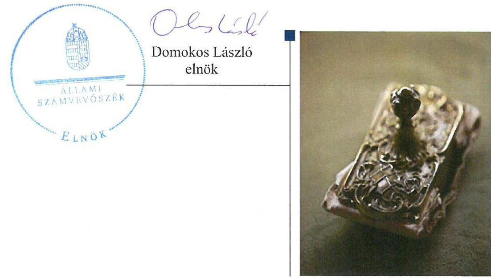

---

# AZ ELLENŐRZÉST FELÜGYELTE:

- BÖRÖCZ IMRE felügyeleti vezető
- AZ ELLENŐRZÉST VEZETTE ÉS A VÉGREHAJTÁSÁÉRT FELELŐS:
  - IMRE ZSUZSANNA ellenőrzésvezető
  - A PROGRAM ÖSSZEÁLLÍTÁSÁÉRT FELELŐS:
    - LAJTERNÉ HUDÁK MAGDOLNA osztályvezető

**IKTATÓSZÁM:** V-0984-236/2016

**TÉMASZÁM:** 2018.

**ELLENŐRZÉS-AZONOSÍTÓ SZÁM:** V070917

Jelentéseink az Országgyűlés számítógépes hálózatán és az Interneten a www.asz.hu címen is olvashatóak.

---

# TARTALOMJEGYZÉK 

■ ÖSSZEGZÉS ..... 5
■ AZ ELLENŐRZÉS CÉLJA ..... 7
■ AZ ELLENŐRZÉS TERÜLETE ..... 8
■ AZ ELLENŐRZÉS HÁTTERE, INDOKOLTSÁGA ..... 9
■ A JELENTÉS LÉNYEGES KÉRDÉSKÖREI ..... 11
■ ELLENŐRZÉS HATÓKÖRE ÉS MÓDSZEREI ..... 12
■ MEGÁLLAPÍTÁSOK ..... 14
■ JAVASLATOK ..... 30
■ MELLÉKLETEK ..... 33
I. Sz. melléklet: Értelmező szótár. ..... 33
II. Sz. melléklet: A Hortobágyi NKft. vagyonának alakulása a 2011-2014. években (adatok M forintban) ..... 40
III. Sz. melléklet: A Hortobágyi NKft. eredményének alakulása a 2011-2014. években (adatok M forintban) ..... 42
■ FÜGGELÉK: ÉSZREVÉTELEK ..... 43
■ RÖVIDÍTÉSEK JEGYZÉKE ..... 63

---

.

---

# ÖSSZEGZÉS 

A tulajdonosi joggyakorlója összességében szabályszerűen alakította ki a Hortobágyi NKft. tulajdonában lévő vagyonnal való gazdálkodás feltételeit. A Hortobágyi NKft. a vagyon értékének megőrzését és gyarapítását biztosító vagyongazdálkodási tevékenységének szabályozása nem volt megfelelő. Vagyongazdálkodási tevékenysége összességében nem volt szabályszerű. A vagyonváltozást eredményező döntések alapvetően szabályszerűek voltak.

## Az ellenőrzés társadalmi indokoltsága

Az Állami Számvevőszék stratégiájában megfogalmazta, hogy az államháztartáson kívülre nyújtott költségvetési támogatások és ingyenes vagyonjuttatások, valamint az államháztartáson kívül működő közfeladat-ellátó rendszerek ellenőrzéseivel hozzájárul ahhoz, hogy a közpénzeket az államháztartáson kívül működő szervezetek is átlátható, rendezett módon használják fel a közfeladatok szerződésben vállalt ellátása, továbbá a közvagyon szerződésben vállalt átlátható, hatékony, költségtakarékos működtetése, értékének megőrzése, állagának védelme, értéknövelő használata, hasznosítása és gyarapítása érdekében. Minden közpénzt, közvagyont használó szervezettel szemben társadalmi igény, hogy tevékenységükről elszámoljanak. Ezzel az igénnyel és az ÁSZ ${ }^{3}$ Stratégiájával összhangban került sor a Hortobágyi NKft. ${ }^{2}$ ellenőrzésére, amely hozzájárul a közvagyon hatékony működtetése, értékének megőrzése, állagának védelme, gyarapítása és a közpénzügyek átláthatóságának előmozdításához.

## Főbb megállapítások, következtetések, javaslatok

A tulajdonosi jogok gyakorlója alapító okiratban, alapítói határozatokban rendelkezett a tulajdonos számára fenntartott vagyongazdálkodásra vonatkozó jogokról. A felelős gazdálkodáshoz szükséges követelmények rögzítésre kerültek. A Hortobágyi NKft. nem kezelt állami vagyont.

A Hortobágyi NKft. a vagyon értékének megőrzését és gyarapítását biztosító vagyongazdálkodási tevékenységének szabályozása nem felelt meg a jogszabályi előírásoknak. A közhasznú és vállalkozási tevékenysége bevételei és ráfordításai elszámolásának szabályozása nem felelt meg a jogszabályi előírásoknak, mivel nem szabályozta a közhasznúsági jelentést, majd a közhasznúsági mellékletet megalapozó, kialakított nyilvántartási rendszerét. A Számv. tv. ${ }^{3}$-ben megfogalmazottakkal szemben nem rendelkeztek Számlarenddel. Az SZMSZ ${ }^{4}$-ben foglalt előírások ellenére 2013-2014. években nem készítettek üzletágakra vonatkozó fejlesztési terveket. A közérdekű adatok megismerésére irányuló igények teljesítésének rendjét rögzítő szabályzattal nem rendelkezett.

Állami vagyonnal nem rendelkeztek, a saját vagyon nyilvántartásának kialakítása ugyan megfelelt a jogszabályi előírásoknak, azonban a Számv. tv., valamint a Leltározási szabályzatának ${ }^{5}$ rendelkezéseit nem tartotta be, nem készített olyan leltárt, amely a mérlegeiben szerepeltett valamennyi eszközt és forrást teljes körűen alátámasztotta volna, megsértve ezzel a Számv. tv.-ben megfogalmazott valódiság elvét.

A Hortobágyi NKft. közhasznú és vállalkozási tevékenysége bevételeinek és ráfordításainak elszámolása összességében nem volt szabályszerű. Rendelkezett Önköltségszámítási szabályzattal ${ }^{6}$, azonban önköltségszámítás készítésére a közhasznú tevékenysége tekintetében, árképzést megalapozó céllal nem volt kötelezett.

A tulajdonosi jogok gyakorlója és a Hortobágyi NKft. által meghozott, vagyonváltozást eredményező döntések a jogszabályi és a tulajdonosi előírásoknak alapvetően megfeleltek, ugyanakkor számos esetben mellőzték a közbeszerzési eljárás lefolytatását. Vagyonnal való gazdálkodása eredményeként a saját vagyona megduplázódott, eszközállományát folyamatosan gyarapította.

A Hortobágyi NKft. a vagyongazdálkodás keretében teljesítette a beszámolási és adatszolgáltatási kötelezettségét, ugyanakkor teljes körűen nem tette közzé honlapján a közérdekű adatait.

---

A Hortobágyi NKft. gazdálkodásának a kormányzati szektor államadósságra befolyással bíró elemei megfeleltek a jogszabályi előírásoknak. Osztalékfizetésre nem került sor.

Az ÁSZ a Hortobágyi NKft. ügyvezetőjének és a Hortobágyi Nemzeti Park Igazgatóság igazgatójának fogalmazott meg javaslatokat, amelyek alapján kötelesek intézkedési tervet összeállítani és azt a jelentés kézhezvételétől számított 30 napon belül az ÁSZ részére megküldeni.

---

# AZ ELLENŐRZÉS CÉLJA 

Az ellenőrzés célja annak értékelése volt, hogy a tulajdonosi jogok gyakorlása szabályszerű volt-e, a gazdálkodó szervezet által ellátott feladat bevételei, ráfordításai elszámolásának, és vagyongazdálkodási tevékenységének szabályozása megfelelt-e a jogszabályi és a tulajdonosi előírásoknak és azok végrehajtása szabályszerű volt-e, biztosítva volt-e a közfeladatok átláthatósága és elszámoltathatósága érdekében a közszolgáltatás dijának megalapozottsága szabályszerű önköltségszámítással, a vagyonváltozást eredményező döntések esetében a tulajdonosi jogok gyakorlója és a gazdálkodó szervezet szabályszerűen jártak-e el, a gazdálkodó szervezet épített-e ki és működtetett-e információs rendszert a szabályszerű vagyongazdálkodás érdekében. Az ellenőrzés további célja volt annak értékelése, hogy, a kormányzati szektorba sorolt egyéb szervezetek gazdálkodásának a kormányzati szektor hiányára és az államadósságra befolyással bíró elemei a jogszabályi előírásoknak megfeleltek-e.

---

# **Hortobágyi Természetvédelmi és Génmegőrző Nonprofit Korlátolt Felelősségű Társaság**

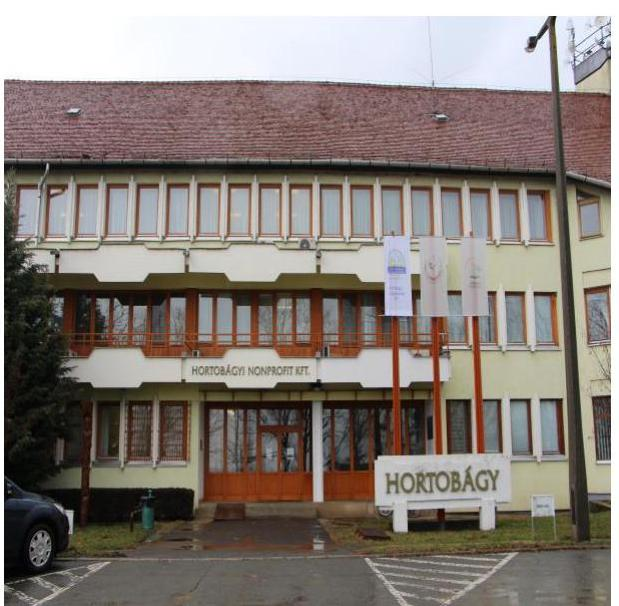

Az ÁSZ Stratégiájával összhangban a közvagyon védelme, a közpénzügyek átláthatóságának előmozdítása érdekében került sor a közfeladatok ellátásában – jogszabályban meghatározott feltételekkel – közreműködő, költségvetésen kívüli, állami tulajdonú gazdálkodó szervezet, a Hortobágyi NKft. ellenőrzésére.

A Hortobágyi NKft. jogelődje a működését 1994. április 1-én kezdte meg, állami vállalatból korlátolt felelősségű társasággá történő átalakulással. Az alapító 2009. április elsejével döntött nonprofit korlátolt felelősségű társasággá történő átalakulásról, melynek cégbírósági bejegyzése 2009. április 4.-ével megtörtént.

A Hortobágyi NKft. a természetvédelméről szóló 1996. évi LIII. törvény, a környezetvédelmi, a természetvédelmi, vízügyi hatósági és igazgatósági feladatokat ellátó szervek kijelöléséről szóló 481/2013. (XII.17.) sz. Korm. rendelet, Magyarország helyi önkormányzatairól szóló 2011. évi CLXXXIX. törvény alapján lát el közfeladatokat, míg közhasznú tevékenységet az egyesületi jogról, a közhasznú jogállásról, valamint a civil szervezetek működéséről és támogatásáról szóló 2011. évi CLXXV. törvény alapján végez.

A Hortobágyi NKft. a nemzeti park területén természetvédelmi fenntartási feladatokat lát el, így különösen: a védett természeti értékeket és a védett természeti területeket a jelen és a jövő nemzedék számára megőrzi, azokat szükség szerint helyreállítja, fenntartásukat, fejlődésüket biztosítja; gondoskodik a védett növény- és állatfajok, társulások fennmaradásához szükséges természeti feltételek megőrzéséről; biztosítja az élőlények, élőhelyek valamint a földtani természeti értékek általános védelmét; közreműködik a természetvédelmi szempontból védetté nem nyilvánított természetes növény- és állatvilág védelmében.

A Magyar Államot, mint tulajdonost megillető jogköröket az MNV Zrt.7 gyakorolta 2013. február 28-ig. Az MNV Zrt. ezt követően határozatlan időtartamú megbízási szerződést kötött a Hortobágyi Nemzeti Park Igazgatósággal a társaság feletti tulajdonosi jogok gyakorlására.

A 2011-2014. évi éves beszámolók alapján a Hortobágyi NKft. nettó árbevétele 507,7 M Ft-ról 514,1 M Ft-ra, mérleg szerinti eredménye 214,3 M Ft-ról -35,1 M Ft-ra, kötelezettségállománya 339,0 M Ft-ról 1209,8 M Ft-ra mérlegfőösszege 2506,1 M Ft-ról 4597,4 M Ft-ra változott. A 2011-2014. évi éves beszámolók adatai szerint a Hortobágyi NKft. átlaglétszáma a 2011. évben 199 fő, a 2012. évben 223 fő, a 2013. évben 227 fő, a 2014. évben 217 fő volt, az ügyvezető személye az ellenőrzött időszak során több alkalommal változott.

---

# AZ ELLENŐRZÉS HÁTTERE, INDOKOLTSÁGA 

Az állami vagyonnal való gazdálkodást illetően a tulajdonosi joggyakorlás és a vagyongazdálkodás feladata az állami vagyon átlátható, rendeltetésszerű és felelős felhasználásának biztosítása. Az állam meghatározza az ellátandó közszolgáltatásokkal kapcsolatos feladatokat, amelyhez a vagyonnal kapcsolatos döntéseknek igazodniuk kell. A nemzetgazdasági szempontból kiemelt jelentőségű nemzeti vagyonba tartozó állami tulajdonban álló társasági részesedést a Nvtv. ${ }^{8}$ határozza meg.

Az Áht. nevesíti a kormányzati szektorba sorolt egyéb szervezet fogalmát. E körbe tartoznak azok a szervezetek, amelyek nem részei az államháztartásnak, azonban az Európai Közösséget létrehozó szerződéshez csatolt, a túlzott hiány esetén követendő eljárásról szóló jegyzőkönyv alkalmazásáról szóló 2009. május 25-i 479/2009/EK rendelet szerint a kormányzati szektorba tartoznak. A nemzeti számlák nemzetközi és hazai statisztikai módszertana és szabványai elveket határoznak meg a statisztikai értelemben vett kormányzati szektorba tartozó szervezetek körére és besorolásuk módjára. A szervezetek megnevezését a nemzetgazdasági miniszter teszi közzé. A kormányzati szektorba sorolt egyéb szervezet többek között köteles adatszolgáltatást teljesíteni a központi költségvetésről szóló törvény elkészítéséhez, továbbá adósságot keletkeztető ügyletet csak az államháztartásért felelős miniszter előzetes egyetértésével köthet. A kormányzati szektoron kívüli féllel kötött adósságot keletkeztető ügylete, gazdálkodásának eredménye befolyásolja a kormányzati szektor konszolidált adósságmutatóját, illetve a kormányzati hiányt.

Az ellenőrzés hasznosulásaként az ellenőrzés megállapításai a jogalkotás számára segítséget nyújthatnak az államháztartáson kívüli közfeladat ellátás, közvagyonnal való gazdálkodás értékeléséhez, jogszabályi keretei pontosításához, az átláthatóságot, költségtakarékos működést, értékének megőrzését, állagának védelmét, értéknövelő használatát, hasznosítását és gyarapítását biztosító szabályozáshoz. Az ellenőrzöttek számára visszajelzést ad a gazdálkodási tevékenységgel, az állami vagyon felhasználásával, a közszolgáltatási árképzés megalapozottságával és az éves elszámolással kapcsolatos szabálytalanságokról és kockázatokról. Az ellenőrzés tapasztalatai segítik és erősítik az ÁSZ hozzáadott értéket teremtő elemző tevékenységét és tanácsadó szerepét. A kormányzati szektorba sorolt, költségvetési tervezésbe is bevont gazdálkodó szervezetek ellenőrzése fokozza a legfőbb ellenőrző szerv iránti figyelmet és közbizalmat.

Feltárjuk, hogy a kormányzati szektorba sorolt egyéb szervezetek milyen mértékben befolyásolják a költségvetési hiányt és az államadósságot. Az ellenőrzés rámutathat az állami tulajdonú közszolgáltatást végző gazdálkodó szervezetek gazdálkodási tevékenységével, valamint az államháztartásból származó források felhasználásával kapcsolatos jó gyakorlatokra és szabálytalanságokra. Felhívhatja a figyelmet a jogszabályi követelmények teljesítéséhez szükséges feltételek hiányosságaira, hozzájárulhat az államháztartáson kívüli, de (közvetlenül vagy közvetve) állami vagyont használó gazdálkodó szervezetek tevékenységének átláthatóságához. Hozzájárulhat a közfeladat-ellátás minőségének javulásához. Az ÁSZ értékteremtő rend kialakításához és megőrzéséhez hozzájáruló tevékenysége pozitív hatással van a szervezetről kialakított összkép formálására is.

---

# A JELENTÉS LÉNYEGES KÉRDÉSKÖREI 

1.     - A tulajdonosi jogok gyakorlója szabályszerűen alakította-e ki a gazdálkodó szervezet tulajdonában lévő vagyonnal való gazdálkodás feltételeit?
2.     - A gazdálkodó szervezet az állami vagyon értéke megőrzését és gyarapítását biztosító vagyongazdálkodási tevékenységét szabályozta-e, illetve kialakította-e a vagyonnyilvántartást a jogszabályi és a tulajdonosi előírásoknak megfelelően?
3.     - Szabályszerű, illetve a tulajdonosi előírásoknak megfelelő volt-e a gazdálkodó szervezet által ellátott közfeladat bevételei és ráfordításai elszámolása, valamint az önköltségszámítás?
4.     - A gazdálkodó szervezet vagyonnal való gazdálkodása, valamint a tulajdonosi jogok gyakorlója és a gazdálkodó szervezet által meghozott, vagyonváltozást eredményező döntések jogszabályi és a tulajdonosi előírásoknak megfeleltek-e?
5.     - A szabályszerű vagyongazdálkodás érdekében a gazdálkodó szervezet teljesítette-e a beszámolási, adatszolgáltatási kötelezettségét, kiépített-e, illetve működtetett-e információs rendszert?
6.    
 - A kormányzati szektorba sorolt egyéb szervezetek gazdálkodásának a kormányzati szektor hiányára és az államadósságra befolyással bíró elemei jogszabályi előírásoknak megfeleltek-e?

---

# ELLENŐRZÉS HATÓKÖRE ÉS MÓDSZEREI 

## Az ellenőrzés típusa

Szabályszerűségi ellenőrzés

## Az ellenőrzött időszak

2011. január 1-jétől 2014. december 31-ig.

## Az ellenőrzés tárgya

Az állami tulajdonban (résztulajdonban) lévő gazdálkodó szervezetek vagyonmegőrzési és gazdálkodási tevékenységének, valamint a kormányzati szektor hiányára és adósságállományára hatást gyakorló elemek ellenőrzése.

## Az ellenőrzött szervezet

Hortobágyi Természetvédelmi és Génmegőrző Nonprofit Korlátolt Felelősségű Társaság, Hortobágyi Nemzeti Park Igazgatóság, Magyar Nemzeti Vagyonkezelő Zártkörűen Működő Részvénytársaság

## Az ellenőrzés jogalapja

Az ellenőrzés végrehajtásának jogszabályi alapját az Állami Számvevőszékről szóló 2011. évi LXVI. törvény 5. § (3)-(5) bekezdése, valamint az állami vagyonról szóló 2007. évi CVI. törvény 3. § (4) bekezdése képezte.

## Az ellenőrzés módszerei

Az ellenőrzés az INTOSAI által kiadott nemzetközi standardok figyelembe vételével, az ÁSZ ellenőrzés szakmai szabályait tartalmazó belső szabályzatokban foglaltak, valamint az ellenőrzési programban foglalt értékelési szempontok szerint történik.

A bevételek és ráfordítások elszámolása, valamint a vagyonnyilvántartás terén a szabályszerű működést véletlen mintavétellel ellenőriztük. A kormányzati szektorba sorolt gazdálkodó szervezetek esetében a személyi jellegű ráfordítások elszámolása mellett az egyéb ráfordítások, pénzügyi műveletek ráfordításai, rendkívüli ráfordítások, illetve az egyéb bevételek,

---

pénzügyi műveletek bevételei, rendkívüli bevételek elszámolásának szabályszerűségét szintén mintatételeken keresztül ellenőriztük. A mintavétellel ellenőrzött területek esetében minden egyes tétel vonatkozásában a szabályszerűségre vonatkozó kérdéseket tettünk fel, amelyek eredménye összesítésre került. A jogszabályoknak és a belső előírásoknak megfelelőnek tekintettük az adott területet, amennyiben a minta ellenőrzésének eredménye alapján 95%-os bizonyossággal a teljes sokaságban a hibaarány kisebb volt, mint 10%, nem megfelelőnek értékeltük, ha a hibaarány a 10%-ot meghaladta. Kockázatot, illetve magas kockázatot jeleztünk, amennyiben egy adott terület vonatkozásában a minta alapján a teljes sokaságban nem volt egyértelműen biztosított a jogszabályoknak és a belső szabályzatoknak megfelelő működés. A ráfordítások elszámolására és a vagyon-nyilvántartásra vonatkozó véletlen mintavételt kockázati alapú kiválasztással egészítettük ki, amelynek során évente a három legnagyobb összegű tételt választottuk ki.

---

# MEGÁLLAPÍTÁSOK 

## 1. A tulajdonosi jogok gyakorlója szabályszerűen alakította-e ki a gazdálkodó szervezet tulajdonában lévő vagyonnal való gazdálkodás feltételeit?

Összegző megállapítás

A tulajdonosi jogok gyakorlója ${ }^{9}$ összességében szabályszerűen alakította ki a Hortobágyi NKft. tulajdonában lévő vagyonnal való gazdálkodás feltételeit.
1.1. számú megállapítás

A tulajdonosi jogok gyakorlója alapító okiratban, alapítói határozatokban meghatározta a tulajdonos számára fenntartott vagyongazdálkodásra vonatkozó jogokat. A felelős gazdálkodáshoz szükséges követelmények rögzítésre kerültek. A Hortobágyi NKft. vagyonkezelésbe vett állami vagyon eszközzel nem rendelkezett.

A tulajdonosi jogok gyakorlója a tulajdonos számára fenntartott, vagyongazdálkodásra vonatkozó jogköröket alapító okiratban, illetve alapítói határozatokban szabályozta, a Gt. ${ }^{10}$, illetve a Ptk. ${ }^{11}$ előírásainak megfelelően.

Az Alapító okirat ${ }_{1-10}{ }^{12}$ tartalmazta azokat a tartalmi elemeket, amelyeket a Gt., illetve a Ptk. ${ }_{2}$ előírt. Az ellenőrzött időszakban hatályos Alapító okirat ${ }_{1-10}$ meghatározta a tulajdonosi jogok gyakorlója számára fenntartott, vagyongazdálkodásra vonatkozó jogokat.

A tulajdonosi jogok gyakorlója a Vtv. ${ }^{13}$ előírásai alapján a Hortobágyi NKft. Alapítói okirataiban ${ }_{1-10}$ meghatározta az alapvető vagyongazdálkodással kapcsolatos elvárásokat, célokat. Így többek között azt, hogy üzletszerű tevékenységet csak a közhasznú céljainak megvalósítása érdekében - azokat nem veszélyeztetve - végezhet. Továbbá a gazdálkodása során elért eredményt nem oszthatta fel, azt a közhasznú feladatainak ellátására kellett fordítania, befektetési tevékenységet nem végezhetett.

A tulajdonosi jogok gyakorlója ugyanakkor nem határozta meg a közfeladat ellátásához felhasznált vagyon hatékony, költségtakarékos, értékmegőrző, értéknövelő felhasználásának, így a közérdek érvényesülését biztosító vagyongazdálkodás érvényesítését, mely nem felel meg a Vtv. 30. § (1) bekezdés előírásainak.

Az Alapító okiratban ${ }_{1-10}$ a Gt. előírásainak megfelelően rögzítették az FB${ }^{14}$ létrehozását a gazdasági társaság ellenőrzése céljából, és a köztulajdon védelme érdekében. Az FB feladat- és hatáskörét a Gt., illetve a Ptk. ${ }_{2}$ előírásaival összhangban határozták meg. Az Alapító okirat ${ }_{1-10}$ a jogkörök szabályozásán túl tartalmazta az ügyvezető részére a felelős gazdálkodásra vonatkozó általános előírást, összhangban a Gt. és a Ptk. ${ }_{2}$ előírásaival. E szerint az ügyvezetést a tőle elvárható fokozott gondossággal, a Hortobágyi NKft. érdekeinek elsődlegessége alapján volt köteles ellátni.

---

Az alapító kizárólagos hatáskörébe tartozott továbbá a Javadalmazási Szabályzat ${ }^{15}$ jóváhagyása. A tulajdonosi jogok gyakorlója az Alapítói Határozatban a Javadalmazási Szabályzatot elfogadta és elrendelte annak a Hortobágyi NKft.-nél történő alkalmazását.

Állami vagyon a Hortobágyi NKft. használatában, birtokában, vagyonkezelésben nem volt, így nem rendelkezett állami vagyon kezelésére, hasznosítására vonatkozó szerződéssel, vonatkozó jogszabályi előírások a Hortobágyi NKft.-t nem érintették.

# 1.2. számú megállapítás 

A tulajdonosi jogok gyakorlója vagyon-nyilvántartási szabályzatát a jogszabályi előírásoknak megfelelően megalkotta.

A tulajdonosi jogok gyakorlója megalkotta a vagyon-nyilvántartási szabályzatát, amelynek tartalma megfelelt a Vtv. és a Vhr. ${ }^{16}$, valamint a hatályos 347/2010. (XII. 28.) Korm. rendelet ${ }^{17}$ előírásainak.

A tulajdonosi jogokat az MNV Zrt. gyakorolta a Vtv. alapján az államot megillető tulajdonosi jogok és kötelezettségek összessége tekintetében, melyet az SZT-39457. sz. megbízási szerződéssel átadott a Hortobágyi Nemzeti Park igazgatóságának 2013. február 28-i hatállyal határozatlan időre, a Kormányhatározatban ${ }^{18}$, illetve az Nvtv.-ben foglaltaknak megfelelően.

2011-2014. között vagyonkezelési, illetve az állami vagyon hasznosításának egyéb formájára - vagyonkezelt eszközök hiányában - szerződést a tulajdonosi joggyakorlója nem kötött. A Hortobágyi NKft. nem volt kötelezett a Vhr. szerinti adatszolgáltatásra; a számviteli politikájának a tulajdonosi joggyakorlóval vagy a tulajdonosi joggyakorlóval egyeztetett módon való kialakítására és vezetésére; a tulajdonosi joggyakorló vagy a tulajdonosi joggyakorló vagyon-nyilvántartási szabályzata megismerésére és magára nézve kötelező érvényűnek való elismerésére.

## 2. A gazdálkodó szervezet az állami vagyon értéke megőrzését és gyarapítását biztosító vagyongazdálkodási tevékenységét szabályozta-e, illetve kialakította-e a vagyonnyilvántartást a jogszabályi és a tulajdonosi előírásoknak megfelelően?

Összegző megállapítás

### 2.1. számú megállapítás

A Hortobágyi NKft. összességében nem tartotta be a jogszabályi előírásokat a vagyon értékének megőrzését és gyarapítását biztosító vagyongazdálkodási tevékenységének szabályozása területén. A vagyonnyilvántartás során megsértették a Számvitelről szóló törvényben megfogalmazott valódiság elvét.

A Hortobágyi NKft.-nél a vagyon értékének megőrzését, gyarapítását szolgáló vagyongazdálkodás feltételeinek kialakítása összességében nem volt szabályszerű.

Az Alapítói okiratok ${ }_{1-10}$ alapján az üzleti és stratégiai terv, valamint az SZMSZ jóváhagyása a tulajdonos kizárólagos hatáskörébe tartozott. Az SZMSZ 3.1. pontjában meghatározottak szerint az ügyvezető feladata volt

---

a vagyongazdálkodási stratégiai és a vagyongazdálkodási (fejlesztési) tervek elkészítése. A 2011-2012. években elkészítették a Hortobágyi NKft. üzleti terveit (fejlesztési tervek) azokon belül az üzletágakra vonatkozó fejlesztési terveket. Az üzleti tervek az Alapítói okiratoknak ${ }_{1,2}$ megfelelően alapítói határozatokban kerültek elfogadásra.

A Hortobágyi NKft. a 2013-2014. években nem készített üzletágakra vonatkozó fejlesztési terveket, mellyel megsértette az SZMSZ 3.1. pontjában rögzítetteket.

A Hortobágyi NKft. elkészítette az SZMSZ-ét, mely összhangban volt az Alapítói okiratok ${ }_{1-10}$ VIII. és X. pontjaiban rögzítettekkel, melyek az ügyvezető és az FB jogköreit és hatásköreit tartalmazták. Az SZMSZ-ben rendelkezett a vagyongazdálkodással kapcsolatosan ellátandó feladatokról, utasításokról, előírásokról.

A Hortobágyi NKft. a Számv. tv. előírásainak megfelelően kialakította a Számviteli politiká${ }_{1-2}$-ját ${ }^{39}$. A Számv. tv.-ben foglaltaknak eleget téve rendelkezett az Eszközök és források értékelési szabályzatával, a Leltározási szabályzattal, illetve a Pénzkezelési szabályzattal. A Leltározási Szabályzatban meghatározásra kerültek a leltározás bizonylatai, továbbá részletes előírásokat tartalmazott a leltározás módjára, a leltározás végrehajtására.

A Hortobágyi NKft. ügyvezetője volt a felelős a Számv. tv. 14. § (12) bekezdése szerint a Számviteli politika elkészítéséért, módosításáért. Az ügyvezető a Számv. tv. 14. § (11) bekezdésében meghatározott feladatának nem tett eleget, mivel a törvénymódosítások hatálybalépését követő 90 napon belül nem gondoskodott a számviteli politika keretében elkészítendő az Eszközök és források értékelési szabályzatában a törvénymódosításoknak megfelelő változások átvezetéséről. Az Eszközök és források értékelési szabályzatát az ügyvezető 2011. június 16-i dátummal írta alá, visszamenőleges, 2010. január 1. hatállyal, miközben a lezárt üzleti évre (zárás legkésőbbi időpontja május 31.) visszamenőleg nem érvényesíthetőek az értékelési előírások. Az Önköltségszámítási szabályzatot az ügyvezető 2011. június 16-i dátummal írta alá, szintén visszamenőleges, 2011. január 1. hatállyal.

A Számv. tv. 161. § (1) bekezdésében foglaltakkal ellentétben az ügyvezető nem gondoskodott a Számlarend elkészítéséről. Így nem szabályozták a főkönyvi számlák tartalmát, a növekedési és csökkenési jogcímüket, a számlát érintő gazdasági eseményeket, azok más számlákkal való kapcsolatát, nem szabályozták továbbá a főkönyvi számlák és az analitikus nyilvántartások kapcsolatát.

A Hortobágyi NKft. a Javadalmazási Szabályzat elkészítésével eleget tett a Tmtv${ }^{20}$. vonatkozó előírásainak. A Javadalmazási Szabályzat hatálya kiterjedt a vezetők és tisztségviselők javadalmazási elveinek szabályozására, a vezetők munkaviszonyának megszüntetése esetén járó juttatásokra, a vezetők prémiumfizetési feltételeire, költségtérítéseinek szabályozására, a könyvvizsgáló díjazására.

---

### 2.2. számú megállapítás

A Hortobágyi NKft. a saját vagyonának nyilvántartása, a mérlegeiben szereplő tételek leltárral való alátámasztása során nem tartotta be a jogszabályi előírásokat, megsértették a Számvitelről szóló törvényben megfogalmazott valódiság elvét.

A Hortobágyi NKft.-re az ellenőrzött időszakban a saját, illetve a vagyonkezelt, vagy apportált vagyon elkülönítésére vonatkozó rendelkezések nem vonatkoztak.

A Hortobágyi NKft. az egyéb tartós részesedések között a GAK Oktató, Kutató és Innovációs Nonprofit Közhasznú Kft., a Hortobágyi Nádgazdasági Kft. és a Hajdúsági Gabonaipari Zrt. részesedések könyv szerinti értékét tartotta nyilván, mely az ellenőrzött időszakban nem változott. Az egyéb tartósan adott kölcsönök között kimutatott értékek 12%-kal növekedtek a munkavállalók részére nyújtott lakástámogatási kölcsönökből adódóan. A befektetett pénzügyi eszközök alakulását évente az 1. ábra szemlélteti.
1. ábra
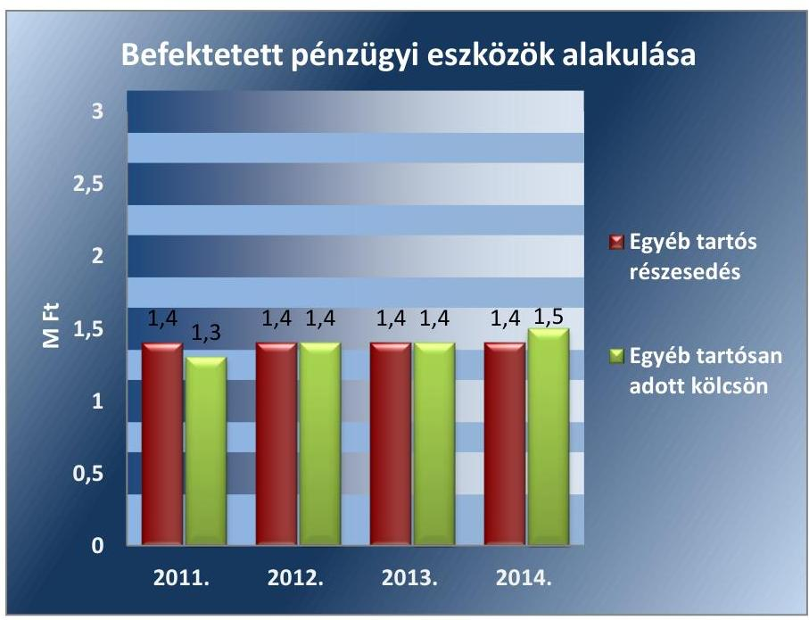

Forrás: Hortobágyi NKft. 2011-2014. évi beszámolói
A Hortobágyi Nádgazdaság Kft. és a Hajdúsági Gabonaipari Zrt. saját tőkéjében bekövetkezett változások tartósak voltak, de a Számviteli politikában ${ }_{1-2}$ meghatározott értékhatárt nem érték el, így értékvesztést nem számoltak el a részesedés értékére. A GAK Oktató, Kutató és Innovációs NKft. tartósan és jelentősen fennálló, a saját tőke értékében bekövetkezett pozitív változások alapján nem értékelte fel a beszámolóban kimutatott egyéb tartós részesedések értékét, mely megfelelt a Számv. tv.-ben foglaltaknak.

A Hortobágyi NKft. a tárgyi eszközök és a készletek leltározásának dokumentálásakor a Leltározási Szabályzatában előírtakat nem tartotta be maradéktalanul:
$\longrightarrow$ A leltározáshoz használt, a Leltározási Szabályzat 2. pontjában meghatározott bizonylatok teljes körűen nem álltak rendelkezésre.
$\longrightarrow$ Nem kerültek kiadásra a leltározók számára megbízólevelek a Leltározási Szabályzat 1. pontjában előírtak ellenére.

---

- A 2011. és a 2012. években nem, csak a 2013., 2014. években készültek el a leltározási ütemtervek, melyet a Leltározási Szabályzat 1. pontja írt elő.
- Az Leltározási Szabályzat 2. pontjában előírtakkal ellentétben a leltározáshoz nem szigorú számadás alá vont bizonylatokat használtak.
- A meghatározott folyamatos leltározás körébe tartozó eszközök, illetve az ezek közé tartozó, fordulónappal leltározandó eszközök megbontásában nem készültek el a leltárak az ellenőrzött időszakban, mely a Leltározási Szabályzat 3.3. pontjának nem felelt meg.
- A tételesen és ellenőrizhető módon, mennyiségben és értékben, a mérlegben szereplő csoportosításban

 összeállított leltározási kötelezettségének nem tett eleget a Hortobágyi NKft. az ellenőrzött időszakban, mely nem felelt meg a Leltározási Szabályzat 4.2. pontjában meghatározottaknak.
- A vásárolt és saját termelésű szálas takarmány évente kétszer történő leltározása nem történt meg az ellenőrzött időszakban, ez ellentétes a Leltározási Szabályzat 4.2. pontja előírásaival.
- A leltárellenőrzés - a belső ellenőr, a könyvvizsgáló, valamint a leltárellenőr által - nem került dokumentálásra a leltárfelvételi íveken, a Leltározási Szabályzat 5. pontjában meghatározottak ellenére, mivel a leltározás dokumentumán aláírásukkal azt nem igazolták.
- A Leltározási Szabályzatban meghatározott (7. pontja) leltározási jegyzőkönyvek nem készültek el, kizárólag a leltár-hiányok, illetve többletek kerültek kimutatásra.
A Hortobágyi NKft. az éves beszámolók, annak részét képező mérleg tételei többségének alátámasztásához nem készített olyan leltárt, amely a mérleg fordulónapján meglévő eszközeit és forrásait mennyiségben és értékben tételesen, ellenőrizhető módon tartalmazta volna, ezzel megsértette a Számv. tv. 69. § (1) bekezdésében foglaltakat.

Megsértette a Számv. tv. 15. § (3) bekezdésében meghatározott valódiság elvét, mivel a leltárak hiányában nem állapítható meg a könyvekben rögzített és a beszámolókban szerepeltetett tételek megléte.

---

# 3. Szabályszerű, illetve a tulajdonosi előírásoknak megfelelő volt-e a gazdálkodó szervezet által ellátott közfeladat bevételei és ráfordításai elszámolása, valamint az önköltségszámítás? 

Összegző megállapítás

A Hortobágyi NKft. közhasznú és vállalkozási tevékenysége bevételeinek és ráfordításainak elszámolása összességében nem volt szabályszerű. Közfeladat-ellátása körében, árképzési céllal önköltségszámítására nem volt kötelezett.

### 3.1. számú megállapítás

A Hortobágyi NKft. közhasznú és vállalkozási tevékenysége bevételei és ráfordításai elszámolásának szabályozása nem volt megfelelő. A kormányzati szektor hiányára befolyást gyakorló bevételek és ráfordítások elszámolása sem volt szabályszerű.

A Hortobágyi NKft. az Alapítói okirataiban $_{1-10}$ megjelölték az ellátott közfeladatokat, részletezték a közhasznú és a vállalkozási tevékenységeit.

A Hortobágyi NKft. az ellenőrzött időszakban teljes körűen nem tett eleget a Számv. tv. 161/A. § (2) bekezdésében foglalt előírásoknak, mivel belső irányítási eszközeiben (Számviteli Politika, Számlarend, egyéb belső szabályzat) nem szabályozta a közhasznúsági jelentést, majd a közhasznúsági mellékletet megalapozó, kialakított nyilvántartási rendszerét. A Számv. tv.-ben foglaltak szerint a közpénzek felhasználásának és a köztulajdon használatának nyilvánossága és ellenőrizhetősége érdekében a gazdálkodó nyilvántartási (könyvvezetési) rendszerét köteles oly módon továbrészletezni, hogy abból a vonatkozó külön jogszabályban meghatározott adatok rendelkezésre álljanak, és a beszámoló alkalmas legyen a közhasznúsági melléklet elkészítésére és megfeleljen a Civil tv. $^{21}$ 46. § (1) bekezdésének. A Hortobágyi NKft. a költségeit munkaszámok szerint megosztva vezette ugyan az ellenőrzött időszakban, ennek szabályozása azonban nem történt meg a belső irányítási eszközeiben. Az Önköltségszámítási szabályzatban meghatározták a felosztandó költségeket, azonban az azok felosztását meghatározó vetítési alapok egyedileg nem kerültek meghatározásra, így nem nyújt megfelelő információt a közhasznúsági mellékletben szereplő költségfelosztások egyértelmű meghatározásához.

A Hortobágyi NKft.-nél az értékesítés nettó árbevételének, az egyéb-, a pénzügyi- és a rendkívüli bevételeknek, valamint az anyagjellegű ráfordításoknak az elszámolása nem volt megfelelő az ellenőrzött időszakban, mivel a Számv. tv. 161/A. § (2) bekezdésében foglalt előírásoknak megfelelő nyilvántartás kialakítását nem szabályozták.

## AZ ÉRTÉKESÍTÉS NETTÓ ÁRBEVÉTELÉNEK ELSZÁMOLÁSÁNÁL további hiányosságok kerültek megállapításra:

- A pusztai fogatozásról kiállított számlán nem került feltüntetésre a kiszámlázott szolgáltatás mennyiségi egysége illetve a megnevezése, így a számla nem felelt meg az Áfa tv. 22. 169. § f) pontjában meghatározott feltételeknek, mely a számla adattartalmát határozza meg.
- Bérfeladás levonási összesítője alapján - mely 17 fő levonásait tartalmazta - a levonások jogcíme, azaz a gazdasági művelet tartalma

---

nem volt azonosítható, így megsértették Számv. tv. 167. § (1) bekezdésének e) pontjában rögzített előírást.
A bevételi pénztárbizonylathoz nem csatoltak eredeti, hiteles alapbizonylatot, mindössze egy kézzel írott jegyzetet a pénztárbizonylat sorszámával, és értékével, mely nem felelt meg a Számv. tv. 166. § (2) bekezdésében foglaltaknak.

# AZ EGYÉB, PÉNZÜGYI MŰVELETEK, ÉS RENDKÍ-

VÜLI BEVÉTELEK ELSZÁMOLÁSÁNÁL további hiányosságok kerültek megállapításra:

- Több esetben hibásan az egyéb bevételek között számoltak el olyan ráfordításokat, melyek az alapbizonylat szerint a Hortobágyi NKft. által igénybevett szolgáltatás ellenértékét tartalmazták, így azokat az anyagjellegű ráfordítások között, igénybevett anyagjellegű szolgáltatásként kellett volna elszámolni. Az elszámolás nem felelt meg a Számv. tv. 77. § (1) bekezdésében, valamint a 78. § (3) bekezdésében foglalt előírásoknak.

## A KÖLTSÉGEK ÉS RÁFORDÍTÁSOK ELSZÁMOLÁ-

SÁNÁL további hiányosságok kerültek megállapításra:

- Több esetben a számviteli bizonylat eredeti, hiteles példánya nem állt rendelkezésre, mely nem felelt meg a Számv. tv. 166. § (2) bekezdésének.
- További esetekben hiányzott a hivatkozás a könyvelés módjára és a könyvviteli számlákra, amely nem felelt meg a Számv. tv. 167. § (1) bekezdés h) pontjában foglalt előírásnak.

## A SZEMÉLYI JELLEGŰ RÁFORDÍTÁSOK ELSZÁ-

MOLÁSA megfelelő volt. A személyi jellegű ráfordításokat a Számv. tv.-ben, valamint a $\mathrm{KSZ}^{23}$ $^{1-2}$-ben foglaltak szerint számolták el. Az elszámolt személyi juttatásokat dokumentumokkal megfelelő módon alátámasztották. A bruttó bér, illetve annak számfejtése megfelelő a munkaszerződésekben foglaltaknak. A személyi jellegű kifizetések adó és járulék terheit a Hortobágyi NKft. szabályszerűen állapította meg.

## AZ EGYÉB, PÉNZÜGYI MŰVELETEK, ÉS RENDKÍ-

VÜLI RÁFORDÍTÁSOK ELSZÁMOLÁSA nem volt megfelelő. Több esetben az elszámolás alapját képező alapbizonylaton szereplő összeg nem egyezett a könyvelésben bemutatott értékkel, nem volt megállapítható a helyes könyvelési tétel, az alapbizonylatról hiányzott az aláírás így nem volt hiteles. A Hortobágyi NKft. ezzel nem tartotta be a Számv. tv. 165. § (2) bekezdésében foglaltakat. Több esetben a baleseti járadék főkönyvi elszámolását hibásan végezték el, mivel a személyi jellegű kifizetések számlacsoport helyett a rendkívüli ráfordítások között mutatták be, mely nem felelt meg a Számv. tv. 79. § (3) bekezdésében foglaltaknak.

## A TÁRGYI ESZKÖZÖKKEL KAPCSOLATOS ELSZÁ-

MOLÁSOK, nyilvántartások nem voltak megfelelőek, mivel:
Több esetben előfordult, hogy a tárgyi eszköznyilvántartó lapot hibásan töltötték ki, hibás volt a szállító, a termék megnevezése, vagy

---

a számla nettó összege nem egyezett meg az állományba vételi bizonylaton és a tárgyi eszköznyilvántartó lapon szereplő összeggel, nem volt alátámasztó bizonylat a számla összegének a megosztásáról, ami nem felelt meg a Számv. tv. 166. § (2) bekezdésében foglaltaknak.

- Az ingatlanhoz tartozó épületeken végzett javítás főkönyvi elszámolása hibás volt, mert az eszközökön végzett felújítást költségként számolták el, ezzel megsértették a Számv. tv. 26. § (2) bekezdésében foglaltakat.

A BEFEKTETETT ESZKÖZEIT a Hortobágyi NKft. megfelelő értékben visszapótolta és felújította. A beruházások értéke minden ellenőrzött évben magasabb volt az elszámolt értékcsökkenési leírás összegénél. A tárgyi eszközök értékcsökkenésének elszámolása a Számv. tv. előírásaival összhangban és a Számviteli politikában $_{1,2}$ előírtaknak megfelelően történt. A beruházások és az évente elszámolt értékcsökkenési leírások alakulását az 2. ábra szemlélteti.
2. ábra
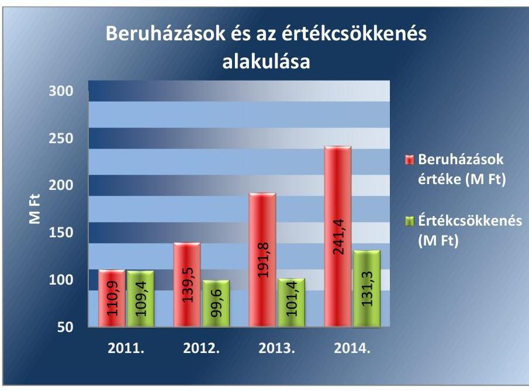

Forrás: Hortobágyi NKft. 2011-2014. évi éves beszámolói
Az Ingatlanok és a kapcsolódó vagyoni értékű jogok esetében az eszközök pótlása, felújítása az ellenőrzött időszakban megfelelő mértékben megvalósult, a beruházások értéke mind a négy évben meghaladta az elszámolt értékcsökkenés összegét, a használhatósági fok értéke a 70%-ot elérte, amelyet évente a 3. ábra szemléltet.

---

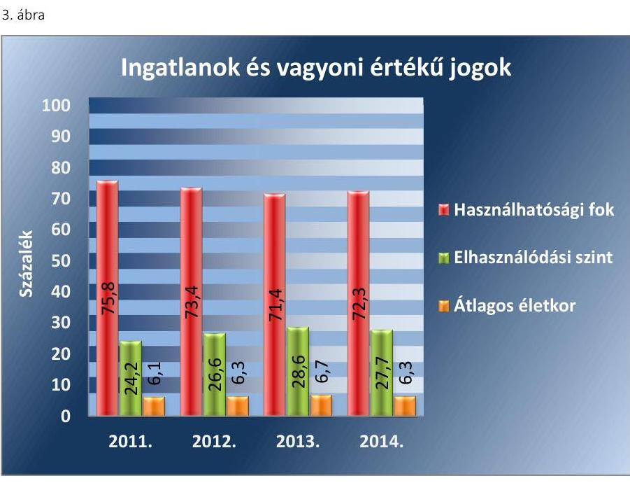

Forrás: 2011-2014. évi éves beszámolói
A műszaki berendezések, gépek járművek pótlása, felújítása az ellenőrzött időszakban megfelelő mértékben megvalósult, a használhatósági fok mutatója az ellenőrzött időszak alatt folyamatosan növekedett a 2011. évi 15,9%-ról a 2014. év végére 22,5%-ot elérve. A megfelelő mértékű pótlást támasztja alá továbbá az átlagos életkor mutató, amely az ellenőrzött időszak alatt négy évről 3,7 évre mérséklődött, a megvalósított beruházásoknak köszönhetően, amelyet évente a 4. ábra szemléltet.
4. ábra
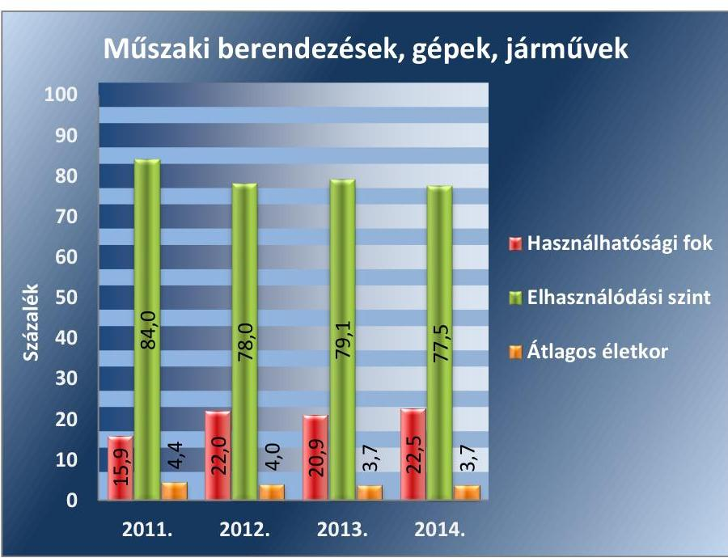

Forrás: 2011-2014. évi éves beszámolói
Az egyéb berendezések, gépek, járművek legnagyobb részét a kis értékű eszközök teszik ki, s ennek tudható be az ellenőrzött időszak alatt mutatott változás a használhatósági fok mutatójában. A mutató értéke 38%

---

és 32% között mozgott, míg az átlagos életkor mindvégig egy év alatt maradt, így megállapítható, hogy az egyéb berendezések, gépek, járművek pótlása és felújítása megfelelő mértékben történt, amelyet évente az 5. ábra szemléltet.
5. ábra
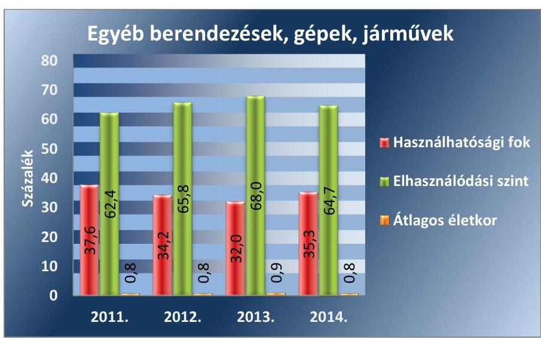

Forrás: Hortobágyi NKft. 2011-2014. évi éves beszámolói
A KÖVETELÉSÁLLOMÁNY csökkentésére nem történt előírás a tulajdonosi jogok gyakorlója részéről. A Hortobágyi NKft. a Számv. tv. előírásainak megfelelően kezelte a követeléseket. A követelések behajtása érdekében tett intézkedése a fizetési felszólítás volt.

A Hortobágyi NKft. az ellenőrzött időszakban a Számv. tv. előírásainak megfelelően számolt el értékvesztést. A legmagasabb összegű értékvesztést, 9,5 M Ft-ot 2014-ben számolta el, ezzel együtt az ellenőrzött időszakban összesen 15,6 M Ft értékvesztést számoltak el. A Számv. tv.-ben foglaltak szerinti értékvesztés visszaírással az ellenőrzött időszak alatt nem élt.

A követelések állománya a 2011. évi 588,8 M Ft-ról - a 2012. évi jelentős növekedést követően 511,8 M Ft-ra mérséklődött 2014. év végére. A követelések meghatározó részét az egyéb követelésállomány jelenti. Az egyéb követelések a NAV $^{24}$-tól és az MVH$^{25}$-tól igényelt, de csak 2013. év elején folyósított támogatásokat, adó-visszaigényléseket tartalmazta. Az egyéb követelések 2014. évi csökkenése a normatív támogatásokból eredő követelések pénzügyi teljesítésének eredménye.

ÖNKÖLTSÉGSZÁMÍTÁS készítésére a Hortobágyi NKft. a közhasznú tevékenysége tekintetében, árképzést megalapozó céllal nem volt kötelezett. A Hortobágyi NKft. által végzett tevékenységek és nyújtott szolgáltatások nem tartoztak az árak megállapításáról szóló tv. $^{26}$ melléklete szerinti hatósági áras szolgáltatások körébe. A Hortobágyi NKft. költségeinek költségnemenkénti együttes összege elérte a Számv. tv.-ben meghatározott önköltségszámítási kötelezettségre vonatkozó értékhatárt 2010. évben, így 2011. évtől önköltségszámításra volt kötelezett. A Számv. tv.-ben foglaltaknak eleget téve - ugyan késedelmesen, de - elkészítette önköltségszámítási szabályzatát. Az Önköltségszámítási szabályzatban a Hortobágyi NKft. meghatározta a közvetlen és közvetett költségek fogalmát, mely megfelelt a Számv. tv.-ben foglaltaknak.

---

# 4. A gazdálkodó szervezet vagyonnal való gazdálkodása, valamint a tulajdonosi jogok gyakorlója és a gazdálkodó szervezet által meghozott, vagyonváltozást eredményező döntések jogszabályi és a tulajdonosi előírásoknak megfeleltek-e? 

Összegző megállapítás

## 4.1. számú megállapítás

A Hortobágyi NKft. vagyonnal való gazdálkodása, a tulajdonosi jogok gyakorlója és a Hortobágyi NKft. által meghozott, vagyonváltozást eredményező döntések a jogszabályi és a tulajdonosi előírásoknak - a közbeszerzési eljárások lefolytatásának mellőzése kivételével - összességében megfeleltek.

A Hortobágyi NKft. alapvetően a jogszabályi rendelkezéseknek és a belső szabályzatok előírásainak megfelelően végezte a vagyongazdálkodási tevékenységét.

Az ellenőrzött időszakban a Hortobágyi NKft. vagyona folyamatosan növekedett, elsősorban az értékpapír és pénzeszköz állománya tekintetében.

A vagyonszerkezetben jelentős átrendeződések nem voltak. A Hortobágyi NKft. tárgyi eszköz állománya 51%-kal növekedett a 2011-2014 években, mely növekedés valamennyi eszközcsoportot érintett. Az ellenőrzött időszakban bekövetkezett változásokat a 1. táblázat mutatja be.

1. táblázat

TÁRGYI ESZKÖZ ÁLLOMÁNY ALAKULÁSA (ADATOK M FT-BAN)

| Megnevezés | 2011. év | 2012. év | 2013. év | 2014. év |
| :--: | :--: | :--: | :--: | :--: |
| A TÁRGYI ESZKÖZÖK | 1.120,5 | 1.267,9 | 1.459,9 | 1.701,9 |
| Ingatlanok és a kapcsolódó vagyoni értékű jogok | 616,2 | 607,2 | 605,5 | 695,0 |
| Műszaki berendezések,

 gépek, járművek | 127,2 | 187,4 | 183,8 | 212,0 |
| Egyéb berendezések, felszerelések, járművek | 55,5 | 56,7 | 56,7 | 73,2 |
| Tenyészállatok | 313,9 | 379,3 | 450,1 | 486,6 |
| Beruházások, felújítások | 15,7 | 32,3 | 145,8 | 224,6 |
| Beruházásokra adott előlegek | - | 5,0 | 18,0 | 10,0 |

A Hortobágyi NKft. nem kapott vagyonkezelésbe állami vagyont, így vagyonkezelt eszközökre nem volt visszapótlási kötelezettsége. Az ellenőrzött időszakban a Hortobágyi NKft. éves beszámolóiból, illetve a főkönyvi kivonataiból megállapítható, hogy a befektetett eszközök között kimutatott értéknövekmények az ellenőrzött időszakban meghaladták az elszámolt értékcsökkenés összegét. A Hortobágyi NKft.-nél az ellenőrzött időszakban élettartam-növelő felújítások és beruházások megtörténtek, amelyet évente a 6. ábra szemléltet.

---

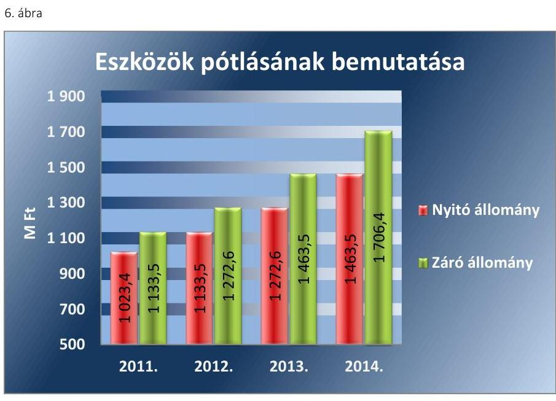

Forrás: 2011-2014. évi éves beszámolói

A Hortobágyi NKft.-re nem vonatkoztak az államháztartás körébe tartozó elidegenítési és megterhelési szabályok, mivel nem volt az államháztartás körébe tartozó vagyona.

A Hortobágyi NKft. saját tőkéje az ellenőrzött időszakban 1777,0 M Ft-ról 3443,0 M Ft-ra 94%-kal növekedett. A jegyzett tőke értéke nem változott, az ellenőrzött időszakban 366,6 M Ft volt. A saját tőke 2011-2013. évek közötti növekedését a nyereséges gazdálkodás eredményezte. Az eredmény (a 2014. gazdasági év kivételével) és az eredménytartalék jelentős növekedést mutatott, amelyet évente a 7. ábra szemléltet.
7. ábra
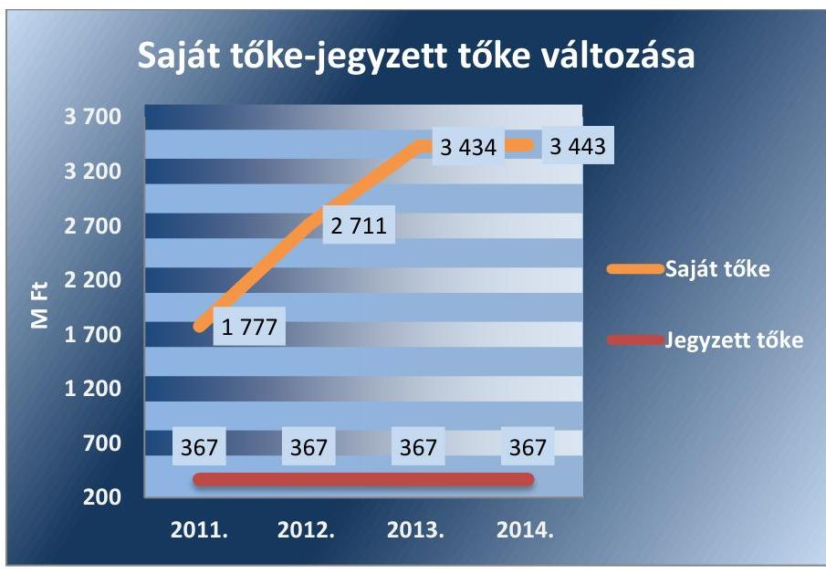

Forrás: A Hortobágyi NKft. 2011-2014. évi éves beszámolói

---

### 4.2. számú megállapítás

A Hortobágyi NKft. hiányosan tett eleget a vagyonváltozást eredményező döntések előkészítésének, illetve a jogszabályi kötelezettségeknek, mivel több esetben mellőzték a közbeszerzési eljárás lefolytatását.

A Hortobágyi NKft.-nek a vagyon értékének, állagának megóvása, megőrzése és gyarapítása során nem volt a tulajdonosi jogok gyakorlója felé jogszabályon alapuló tájékoztatási kötelezettsége a vagyongazdálkodási döntések előtt. Előzetes véleményt és javaslatot nem kellett kérnie, illetve az alapítói döntési értékhatárt elérő szerződéskötések kivételével előzetes írásbeli engedélyre sem volt szüksége.

Közbeszerzési eljárás lefolytatásának mellőzésével számos esetben kötött szerződést a Hortobágyi NKft. az ellenőrzött időszakban. A 2011. évben a Kbt. ${ }^{27}$ 22. § (1) bekezdésének i) pontja alapján a Kbt. 1 alanyi hatálya alá tartoztak. Ennek ellenére több esetben kötöttek olyan szerződést - lízingszerződéseket eszközbeszerzésre, további szerződéseket betakarításra, kaszálásra, szalma, illetve biokukorica vásárlásra, melyek esetében a beszerzés értéke meghaladta a vonatkozó nemzeti értékhatárt, így megsértették - a Kbt. 1 240. §-ának (1) bekezdésében előírtakra figyelemmel - a Kbt. 12. § (1) bekezdésében rögzített előírásokat. A 2012-2013. években a beszerzéseiknél számos esetben megsértették - a Kbt. ${ }^{28}$ 19. §-ában, illetve 119. §-ában előírt közbeszerzési eljárás lefolytatására vonatkozó előírások figyelmen kívül hagyásával a - a Kbt. 25. §-ában foglaltakat.

### 4.3. számú megállapítás

A tulajdonosi jogok gyakorlójának vagyonváltozást eredményező döntései megfeleltek a jogszabályi előírásoknak.

A Hortobágyi NKft.-nek a tulajdonosi jogok gyakorlója a vagyonváltozást eredményező döntéssel kapcsolatos követelményeket az Alapítói okiratban 1-10 meghatározta. Abban rögzítették az alapító kizárólagos hatáskörébe tartozó gazdasági eseményeket, mely szerint a meghatározott értékhatár feletti (hosszúlejáratú hitelszerződés esetében 200,0 M Ft, vagyontárgy elidegenítése 200,0 M Ft felett, szokásos tevékenységen kívül eső kötelezettségvállalás 100,0 M Ft felett) szerződéskötésekhez alapítói jóváhagyás szükséges. Az Alapítói okirattal 1-10 összhangban elkészített FB ügyrend alapján, a döntést megelőzően az FB véleményezése és jóváhagyása volt szükséges.

Az ellenőrzött időszakban a tulajdonosi jogok gyakorlója a vagyon tulajdonjogának átruházására, illetve ingyenes átruházására, a vagyon értékesítésére, a vagyon apportjára vonatkozó döntést nem hozott. A közszolgáltatások biztosítása érdekében befektetések, részesedések megszerzésére irányuló döntés előkészítés nem történt. Vagyongazdálkodására vonatkozóan nem voltak olyan jogszabályi előírások, melyek alapján a tulajdonosi jogok gyakorlója a részére írásbeli engedélyt, hozzájárulást kellett adjon. Vagyonváltozást eredményező döntés nem született, ezért a tulajdonosi jogok gyakorlója ellenőrzést erre vonatkozóan nem végzett.

---

# 5. A szabályszerű vagyongazdálkodás érdekében a gazdálkodó szervezet teljesítette-e a beszámolási, adatszolgáltatási kötelezettségét, kiépített-e, illetve működtetett-e információs rendszert? 

Összegző megállapítás

A Hortobágyi NKft. a szabályszerű vagyongazdálkodás érdekében teljesítette a beszámolási, adatszolgáltatási kötelezettségét.

Az éves beszámolási kötelezettséget - vagyongazdálkodásra vonatkozó, jogszabályon alapuló - a tulajdonosi jogok gyakorlója az ellenőrzött időszakban hatályos Alapító okirat 1-10 VII. 2. pontjában rögzítette. A Számv. tv. szerinti beszámoló készítésének és a tulajdonosi jogok gyakorlója elé terjesztésének a kötelezettsége megfelelt a Számv. tv.-ben foglaltaknak.

Az éves beszámolóval egyidejűleg a Hortobágyi NKft. elkészítette az üzleti jelentését is a Számv. tv. előírásaival összhangban. A közhasznú jogállásra való tekintettel elkészítette 2011. üzleti évre a Kszt. ${ }^{29}$-nek megfelelően a közhasznúsági jelentést, illetve a 2012-2014. üzleti évekre a Civil tv. szerinti közhasznúsági mellékletet.

A Hortobágyi NKft. az ellenőrzött időszakra vonatkozó éves beszámolóit a Számv. tv. előírásainak megfelelően készítette el. A Számviteli politikának az éves beszámoló formájára vonatkozó előírásai összhangban voltak a Számv. tv. előírásaival. Az éves beszámolókról a könyvvizsgáló elfogadó véleménnyel (megbízható, valós képnek megfelelő) adta ki a könyvvizsgálói jelentését.

A tulajdonosi jogok gyakorlója a Számv. tv. által előírt határidőig jóváhagyta a Hortobágyi NKft. éves beszámolóit, az ügyvezető gondoskodott azok letétbe helyezéséről.

Az ellenőrzött időszakban az éves beszámolók tulajdonosi jogok gyakorlója általi jóváhagyásakor a közzétett éves beszámolókra vonatkozó könyvvizsgálói jelentések és az éves beszámolókat jóváhagyó FB határozatok rendelkezésre álltak, amely megfelelt a Gt., illetve a Ptk. 2 előírásainak, valamint a hatályos Alapító okirat 1-10-ban foglaltaknak. A 2011-2014. üzleti évekről szóló könyvvizsgáló jelentések tartalmukban megfeleltek a Számv. tv.-ben foglaltaknak.

A könyvvizsgáló az elfogadó véleménye korlátozása nélkül a 2013. üzleti évre vonatkozó éves beszámolóhoz kapcsolódóan figyelemfelhívással élt a tulajdonosi jogok gyakorlója felé, mivel a mérlegkészítés időpontjában nem állt rendelkezésére könyvvizsgálati bizonyíték arra vonatkozóan, hogy a bérelt földekre vonatkozó szerződések lejáratát követően is biztosított lesz a Hortobágyi NKft. működése az addigi formában. A Hortobágyi NKft. a hiányosságot megszüntette a 2014. évi éves beszámoló elkészítéséig.

Kapcsolt vállalkozása a Hortobágyi NKft.-nek nem volt. Egyéb tartós részesedéssel rendelkezett, melyek nem minősültek kapcsolt vállalkozásnak, mivel a közvetlenül vagy közvetve a többségi befolyás mértéke az ötven százalékos mértéket nem érte el.

---

A közérdekű adatok megismerésére irányuló igények teljesítésének rendjét rögzítő szabályzattal a Hortobágyi NKft. nem rendelkezett az ellenőrzött időszakban, mely nem felelt meg az Avtv. ${ }^{30}$ 20. § (8) bekezdésben (2011. december 31-éig), illetve 2012. január 1-jétől az Inf tv. ${ }^{31}$ 30. § (6) bekezdésében rögzítetteknek.

A Hortobágyi NKft. maradéktalanul nem tett eleget a 2012. január 1-től hatályos Inf tv. 35. § (1) bekezdése alapján, a 37. § (1) bekezdésében foglaltakra hivatkozással, az Inf tv. 1. számú melléklete szerinti általános közzétételi listában meghatározott adatokra vonatkozó közzétételi kötelezettségének. A honlapon nem került közzétételre a Hortobágyi NKft. SZMSZ-e, az adatvédelmi és adatbiztonsági szabályzat hatályos és teljes szövege, a közfeladatot ellátó szervnél foglalkoztatottak létszámára és személyi juttatásaira vonatkozó összesített adatok, az EU támogatásával megvalósuló fejlesztések leírása, az azokra vonatkozó szerződések. A Hortobágyi NKft. nem hozta nyilvánosságra a közfeladatot ellátó szerv vezetőinek nevét, beosztását, elérhetőségét, a közfeladatot ellátó szerv feladatát, hatáskörét.

Az adatszolgáltatást érintő költségvetési törvényjavaslat összeállításához szükséges feltételekről szóló Tájékoztatók ${ }^{32};{ }^{33}$ 2. VIII. pontja szerint a költségvetés tervezésébe a Hortobágyi NKft. nem került bevonásra, így az Áht ${ }^{34}$ szerinti adatszolgáltatásra nem volt kötelezett.

A Hortobágyi NKft.-nek az ellenőrzött időszakban a Stabilitási tv. ${ }^{35}$ szerinti adósságot keletkeztető ügylete az éves beszámolók alapján nem keletkezett, így nem vonatkoztak rá a Stabilitási tv. 9. § (1) bekezdésében foglaltak.

A vagyongazdálkodás szabályozottságával, a szabályszerűségével, a vagyonnyilvántartással kapcsolatban sem a Hortobágyi NKft. sem a tulajdonosi jogok gyakorlója nem végeztetett belső ellenőrzést, vagy külső szakértő által történő ellenőrzéseket.

# 6. A kormányzati szektorba sorolt egyéb szervezetek gazdálkodásának a kormányzati szektor hiányára és az államadósságra befolyással bíró elemei jogszabályi előírásoknak megfeleltek-e? 

## Összegző megállapítás

A Hortobágyi NKft. gazdálkodásának a kormányzati szektor államadósságra befolyással bíró elemei - adósságot keletkeztető ügyletek vállalása tekintetében - megfeleltek a jogszabályi előírásoknak. Osztalékfizetésre nem került sor.

A Hortobágyi NKft. az általa megkötött adósságot keletkeztető ügylet vállalása, valamint a számviteli elszámolása során szabályszerűen, az Alapító okiratban 1-10 foglaltaknak megfelelően járt el. Rendelkezett adósságot keletkeztető ügyletekből adódó kötelezettségekkel, melyek beruházási és eszközhitelből, forgóeszközhitelből és pénzügyi lízingből eredő kötelezettségek voltak. A szerződéskötések 2012. január 01. előttiek, így a Hortobágyi NKft. nem volt kötelezett az államháztartásért felelős miniszter engedélyével megkötni a szerződéseit, az eljárása nem volt ellentétes a Stabilitási tv.-ben foglaltakkal.

---

A Hortobágyi NKft.-nél a Gt. és a Ctv. ${ }^{36}$, valamint az Alapító okiratában 10 foglaltak szerinti osztalékfizetési tilalomnak megfelelően nem került sor osztalék kifizetésre.

---

# JAVASLATOK 

Az ÁSZ tv. ${ }^{37}$ 33. § (1) bekezdésében foglaltak értelmében az ellenőrzött szervezet vezetője köteles a jelentésben foglalt megállapításokhoz kapcsolódó intézkedési tervet összeállítani és azt a jelentés kézhezvételétől számított 30 napon belül az ÁSZ részére megküldeni. Amennyiben az intézkedési tervet az ellenőrzött szervezet vezetője nem küldi meg határidőben, vagy továbbra sem elfogadható intézkedési tervet küld, az ÁSZ elnöke az ÁSZ törvény 33. § (3) bekezdés a)-b) pontjaiban foglaltakat érvényesítheti.

## A Hortobágyi Nonprofit Kft. ügyvezetőjének

1. Dolgoztassa ki az SZMSZ előírásának megfelelően az üzletágakra vonatkozó fejlesztési terveket.
(2.1. sz. megállapítás 2. bekezdése alapján)
2. Intézkedjen a szabályozási hiányosságok megszüntetésére, ezen belül
a) készíttesse el a jogszabályi előírásnak megfelelően a Hortobágyi NKft. számlarendjét,
(2.1. sz. megállapítás 6. bekezdése alapján)
b) készíttessen szabályzatot a közérdekű adatok megismerésére irányuló igények teljesítésének rendjéről a jogszabályi előírásnak megfelelően.
(5. sz. Összegző megállapítás 8. bekezdése alapján)
3. Intézkedjen arra, hogy a jogszabályi és a Leltározási Szabályzat előírásainak megfelelően olyan leltárt állítsanak össze a beszámoló elkészítéséhez és a mérleg alátámasztására, amely biztosítja a valódiság elvének érvényesülését.
(2.2. sz. megállapítás 4. és 6. bekezdései alapján)
4. Intézkedjen a leltárral kapcsolatban feltárt szabálytalanságok tekintetében a felelősség tisztázása érdekében, és szükség szerint intézkedjen a felelősség érvényesítéséről.
(2.2. sz. megállapítás 5. bekezdése alapján)
5. Intézkedjen a bevételekkel, a ráfordításokkal és a tárgyi eszközökkel kapcsolatos elszámolásoknál és nyilvántartásoknál a jogszabályi előírások betartására.
(3.1. sz. megállapítás 4-6. és 8-9. bekezdései alapján)

---

6. Intézkedjen a közbeszerzés szabályainak betartására, valamint a közbeszerzési eljárások jogtalan mellőzésével kapcsolatban feltárt szabálytalanságok tekintetében a felelősség tisztázása érdekében, és szükség szerint intézkedjen a felelősség érvényesítéséről.
(4.2. sz. megállapítás 2. bekezdése alapján)
7. Intézkedjen a Hortobágyi NKft. közzéteendő adatai elektronikus közzétételi kötelezettsége jogszabályi előírásoknak megfelelő, teljes körű teljesítésére.
(5. sz. Összegző megállapítás 9. bekezdése alapján)

# A Hortobágyi Nemzeti Park Igazgatóság igazgatójának 

1. Tegyen intézkedéseket a beszámoló elkészítéséhez és a mérleg alátámasztására szükséges leltárral összefüggésben feltárt szabálytalanságok tekintetében a felelősség tisztázása érdekében, és szükség szerint intézkedjen a felelősség érvényesítéséről.
(2.2. sz. megállapítás 4. bekezdése alapján)

---

.

---

# MELLÉKLETEK 

- I. SZ. MELLÉKLET: ÉRTELMEZŐ SZÓTÁR

Állami vagyon

Állami vagyon hasznosítása

Állami vagyon hasznosítása

Állami vagyon használója
2010. június
 17-től
a) Az állam tulajdonában lévő dolog, valamint a dolog módjára hasznosítható természeti erő,
b) az a) pont hatálya alá nem tartozó mindazon vagyon, amely vonatkozásában törvény az állam kizárólagos tulajdonjogát nevesíti,
c) az állam tulajdonában lévő tagsági jogviszonyt megtestesítő értékpapír, illetve az államot megillető egyéb társasági részesedés,
d) az államot megillető olyan immateriális, vagyoni értékkel rendelkező jogosultság, amelyet jogszabály vagyoni értékű jogként nevesít.
Forrás: Vtv. 1. § (2) bekezdése
2012. november 10-től az állami vagyon fogalma kiegészül a következő ponttal:
e) az állam tulajdonában lévő pénzügyi eszközök

Forrás: Vtv. 1. § (2) bekezdése
2011. december 31-ig:

Az állami vagyont az MNV Zrt. maga kezeli, vagy szerződés - így különösen bérlet, haszonbérlet, szerződésen alapuló haszonélvezet, vagyonkezelés, megbízás - alapján központi költségvetési szervnek, természetes vagy jogi személynek, vagy jogi személyiséggel nem rendelkező gazdálkodó szervezetnek hasznosításra átengedi.
Forrás: Vtv. 23. § (1) bekezdése
2012. január 1-jétől:

Az állami vagyont az MNV Zrt. maga kezeli, vagy szerződés - így különösen bérlet, haszonbérlet, megbízás - alapján központi költségvetési szervnek, természetes vagy jogi személynek, vagy jogi személyiséggel nem rendelkező gazdálkodó szervezetnek hasznosításra átengedi.
Forrás: Vtv. 23. § (1) bekezdése
2013. június 28-ától:

Az állami vagyonnal az MNV Zrt. maga gazdálkodik, vagy szerződés - így különösen bérlet, haszonbérlet, megbízás - alapján központi költségvetési szervnek, természetes vagy jogi személynek, vagy jogi személyiséggel nem rendelkező gazdálkodó szervezetnek hasznosításra átengedi, illetőleg vagyonkezelésbe, haszonélvezetbe adja.
Forrás: Vtv. 23. § (1) bekezdése
Az állami vagyon hasznosítására kötött szerződések elsődleges célja az állami vagyon hatékony működtetése, állagának védelme, értékének megőrzése, illetve gyarapítása, az állami és közfeladatok ellátásának elősegítése.
Forrás: Vtv. 23. § (2) bekezdése
2011. január 1 - 2011. december 31-ig:

Az a természetes személy, jogi személy, illetve jogi személyiséggel nem rendelkező szervezet, amely, illetve aki törvény vagy szerződés alapján, bármely jogcímen (pl. bérlet, haszonbérlet, vagyonkezelési szerződés, használat stb.) állami vagyont birtokol, használ, szedi annak hasznait, hasznosít, ide nem értve a tulajdonosi jogok gyakorlóját.
Forrás: Vhr. 1. § (7) a. pontja
2012. január 1-jétől:

---

Állami vagyon kezelője /vagyonkezelő

Állami vagyon értékesítése

Gazdálkodó szervezet

Az a természetes vagy jogi személy, jogi személyiséggel nem rendelkező szervezet, aki, vagy amely törvény vagy szerződés alapján, bármely jogcímen (bérlet, haszonbérlet, használat stb.) állami vagyont birtokol, használ, szedi annak hasznait, hasznosít, ide nem értve a haszonélvezőt, a vagyonkezelőt és a tulajdonosi jogok gyakorlóját.
Forrás: Vhr. 1. § (7) a. pontja
2010. január 01 - 2011. december 31. között:

Az állami vagyont az MNV Zrt. maga kezeli, vagy szerződés - így különösen bérlet, haszonbérlet, szerződésen alapuló haszonélvezet, vagyonkezelés, megbízás - alapján központi költségvetési szervnek, természetes vagy jogi személynek, illetőleg jogi személyiséggel nem rendelkező gazdasági társaságnak hasznosításra átengedi.
Vtv. 23. § (1) bekezdése
2012. január 1-jétől:

Az állami vagyont az MNV Zrt. maga kezeli, vagy szerződés - így különösen bérlet, haszonbérlet, megbízás - alapján központi költségvetési szervnek, természetes vagy jogi személynek, vagy jogi személyiséggel nem rendelkező gazdálkodó szervezetnek hasznosításra átengedi. Az állami vagyonra vonatkozóan az MNV Zrt. kizárólag az Nvtv-ben meghatározott személyekkel köthet vagyonkezelési szerződést.
Forrás: Vtv. 23. § (1), 27. § (1)
2013. június 28-ától:

Az állami vagyonnal az MNV Zrt. maga gazdálkodik, vagy szerződés - így különösen bérlet, haszonbérlet, megbízás - alapján központi költségvetési szervnek, természetes vagy jogi személynek, vagy jogi személyiséggel nem rendelkező gazdálkodó szervezetnek hasznosításra átengedi, illetőleg vagyonkezelésbe, haszonélvezetbe adja. Az állami vagyonra vonatkozóan az MNV Zrt. kizárólag az Nvtv-ben meghatározott személyekkel köthet vagyonkezelési szerződést.
Forrás: Vtv. 23. § (1), 27. § (1)
Állami vagyon tulajdonjogának bármely jogcímen történő, visszterhes átruházása.
Forrás: Vhr. 1. § (7) d) pont)
2013. június 30-ig gazdálkodó szervezet:

Az állami vállalat, az egyéb állami gazdálkodó szerv, a szövetkezet, a lakásszövetkezet, az európai szövetkezet, a gazdasági társaság, az európai részvény-társaság, az egyesülés, az európai gazdasági egyesülés, az európai területi együttműködési csoportosulás, az egyes jogi személyek vállalata, a leányvállalat, a vízgazdálkodási társulat, az erdőbirtokossági társulat, a végrehajtói iroda, az egyéni cég, továbbá az egyéni vállalkozó.
Forrás: $\mathrm{Ptk}_{1}{ }^{38} .685 . \S$ c) pontja
2013. július 1-jétől gazdálkodó szervezet:

Az állami vállalat, az egyéb állami gazdálkodó szerv, a szövetkezet, a lakásszövetkezet, az európai szövetkezet, a gazdasági társaság, az európai részvénytársaság, az egyesülés, az európai gazdasági egyesülés, az európai területi együttműködési csoportosulás, az egyes jogi személyek vállalata, a leányvállalat, a vízgazdálkodási társulat, az erdőbirtokossági társulat, a végrehajtói iroda, az egyéni cég, továbbá az egyéni vállalkozó. Az állam, a helyi önkormányzat, a költségvetési szerv, az egyesület, a köztestület, valamint az alapítvány gazdálkodó tevékenységével összefüggő polgári jogi kapcsolataira is a gazdálkodó szervezetre vonatkozó rendelkezéseket kell alkalmazni, kivéve, ha a törvény e jogi személyekre eltérő rendelkezést tartalmaz; a 292/A-292/B. §, 301/A-301/B. §, 405. § (1) bekezdés, valamint a 407/A. § (1) bekezdés tekintetében nem minősül gazdálkodó szervezetnek az, aki a közbeszerzésekről szóló törvény értelmében ajánlatkérő (szerződő hatóság).

---

Kormányzati szektorba sorolt egyéb szervezet

Közszolgáltatás

Meghatározó befolyás

Forrás: $\mathrm{Ptk}_{1}$. 685. § c) pontja
2014. március 15-től gazdálkodó szervezet:

A gazdasági társaság, az európai részvénytársaság, az egyesülés, az európai gazdasági egyesülés, az európai területi együttműködési csoportosulás, a szövetkezet, a lakásszövetkezet, az európai szövetkezet, a vízgazdálkodási társulat, az erdőbirtokossági társulat, az állami vállalat, az egyéb állami gazdálkodó szerv, az egyes jogi személyek vállalata, a közös vállalat, a végrehajtói iroda, a közjegyzői iroda, az ügyvédi iroda, a szabadalmi ügyvivői iroda, az önkéntes kölcsönös biztosító pénztár, a magánnyugdíjpénztár, az egyéni cég, továbbá az egyéni vállalkozó. Az állam, a helyi önkormányzat, a költségvetési szerv, az egyesület, a köztestület, valamint az alapítvány gazdálkodó tevékenységével összefüggő polgári jogi kapcsolataira is a gazdálkodó szervezetre vonatkozó rendelkezéseket kell alkalmazni.
Forrás: Ppt. 396. §
Az a szervezet, amely az Áht. alapján nem része az államháztartásnak, azonban az Európai Közösséget létrehozó szerződéshez csatolt, a túlzott hiány esetén követendő eljárásról szóló jegyzőkönyv alkalmazásáról szóló 2009. május 25-i 479/2009/EK rendelet szerint a kormányzati szektorba tartozik. A nemzetgazdasági miniszter 2013. június 26-án megjelent Közleményben tette közé ezen szervezetek listáját.

1. Közcélú, illetőleg közérdekű szolgáltatást jelent, amely egy nagyobb közösség (állam, település) minden tagjára nézve megközelítőleg azonos feltételek mellett vehető igénybe, ezért valamilyen mértékig közösségi megszervezést, illetve szabályozást, ellenőrzést igényel.
Forrás: Közszolgáltatások szervezése és igazgatása címú tankönyv 158. oldal. Kiadó: Kormányzati Személyügyi Szolgáltató és Közigazgatási Képzési Központ, Budapest, 2007.
2. Szerződéskötési kötelezettség alapján a lakosság alapvető szükségleteinek ellátására irányuló szolgáltatás, így különösen a villamos energia-, gáz-, hő-, víz-, szennyvíz- és hulladékkezelési, köztisztasági, postai és távközlési szolgáltatás, továbbá a menetrend alapján közlekedő járművekkel végzett közforgalmú személyszállítás.
Forrás: Ebtv. 3. § d) pontja
2014. március 14-ig: A befolyással rendelkező akkor rendelkezik egy jogi személyben meghatározó befolyással, ha annak tagja, illetve részvényese és
a) jogosult e jogi személy vezető tisztségviselői vagy felügyelőbizottsága tagjai többségének megválasztására, illetve visszahívására, vagy
b) a jogi személy más tagjaival, illetve részvényeseivel kötött megállapodás alapján egyedül rendelkezik a szavazatok több mint ötven százalékával.
A meghatározó befolyás akkor is fennáll, ha a befolyással rendelkező számára az előzőek szerinti jogosultságok közvetett módon biztosítottak. A befolyással rendelkezőnek egy jogi személyben a szavazatok több mint ötven százalékával közvetett módon való rendelkezése vagy egy jogi személyben közvetetten fennálló meghatározó befolyása megállapítása során a jogi személyben szavazati joggal rendelkező más jogi személyt (köztes vállalkozást) megillető szavazatokat meg kell szorozni a befolyással rendelkezőnek a köztes vállalkozásban, illetve vállalkozásokban fennálló szavazatával. Ha a köztes vállalkozásban fennálló szavazatok mértéke az ötven százalékot meghaladja, akkor azt egy egészként kell figyelembe venni.
Forrás: $\mathrm{Ptk}_{1}$. 685/B. § (2)-(3) bekezdések
2014. március 15-től:

---

MFB Zrt.

Minősített többséget biztosító részesedés

MNV Zrt.

Nemzetgazdasági szempontból kiemelt jelentőségű nemzeti vagyon körébe tartozó társaságok
Nemzeti vagyon

A befolyással rendelkező akkor rendelkezik egy jogi személyben meghatározó befolyással, ha annak tagja vagy részvényese, és
a) jogosult e jogi személy vezető tisztségviselői vagy felügyelőbizottsága tagjai többségének megválasztására, illetve visszahívására; vagy
b) a jogi személy más tagjai, illetve részvényesei a befolyással rendelkezővel kötött megállapodás alapján a befolyással rendelkezővel azonos tartalommal szavaznak, vagy a befolyással rendelkezőn keresztül gyakorolják szavazati jogukat, feltéve, hogy együtt a szavazatok több mint felével rendelkeznek.
Forrás: $\mathrm{Ptk}_{2}$. 8:2. § (2) bekezdés
Az MNV Zrt. melletti másik tulajdonosi joggyakorló szervezet az állami vagyon vonatkozásában, amely 2010. június 17-től gyakorol ilyen jogokat a rábízott állami tulajdonú társasági részesedések tekintetében.
A minősített befolyásszerző az ellenőrzött társaságban a szavazatok legalább háromnegyedével rendelkezik.
Forrás: 2014. március 14-ig: Gt. 52. § (2)
2014. március 15-től: $\mathrm{Ptk}_{2}$. 3:324. § (1) bekezdés

Az állami vagyon felett, a Magyar Államot megillető tulajdonosi jogok és kötelezettségek összességét - a hatályos szabályozás szerint - az állami vagyon felügyeletéért felelős miniszter (jelenleg a nemzeti fejlesztési miniszter) gyakorolja. A miniszter feladatát nagy részben az MNV Zrt., mint tulajdonosi joggyakorló szervezet útján látja el.
Az ÁSZ ellenőrzés szempontjából az Nvtv. 2. sz. mellékletében felsorolt társasági részesedések.
2012. január 1-jétől, g. pont módosult 2012. június 30-tól nemzeti vagyon:
a) az állam vagy a helyi önkormányzat kizárólagos tulajdonában álló dolgok,
b) az a) pont hatálya alá nem tartozó, állam vagy a helyi önkormányzat tulajdonában lévő dolog,
c) az állam vagy a helyi önkormányzat tulajdonában lévő pénzügyi eszközök, továbbá az államot vagy a helyi önkormányzatot megillető társasági részesedések,
d) az államot vagy a helyi önkormányzatot megillető bármely vagyoni értékkel rendelkező jogosultság, amelyet jogszabály vagyoni értékű jogként nevesít,
e) Magyarország határa által körbezárt terület feletti légtér,
f) az üvegházhatású gázok kibocsátási egységeinek kereskedelméről szóló törvény szerint kibocsátási egység és légiközlekedési kibocsátási egység, valamint az ENSZ Éghajlatváltozási Keretegyezménye és annak Kiotói Jegyzőkönyve végrehajtási keretrendszeréről szóló törvény szerinti kiotói egység,
g) állami vagy helyi önkormányzati fenntartású közgyűjtemény (muzeális intézmény, levéltár, közgyűjteményként működő kép- és hangarchívum, valamint könyvtár) saját gyűjteményében nyilvántartott kulturális javak körébe tartozó dolog,
h) a régészeti lelet,
i) a nemzeti adatvagyon körébe tartozó állami nyilvántartások fokozottabb védelméről szóló törvény szerinti nemzeti adatvagyon.
Forrás: Nvtv. 1. § (2)

---

Rábízott vagyon

Társasági portfólió

Többségi befolyást biztosító részesedés

Tulajdonosi ellenőrzés

Tulajdonosi jogok gyakor-
lója
2010. június 17-től

Egyrészt minden a Vtv. alkalmazásában állami vagyonnak minősülő vagyon, amit az MNV Zrt. kezel és nyilvántart.
Másrészt az a vagyon, amely felett az MFB tv. erejénél fogva a Magyar Állam nevében az MFB Zrt. gyakorolja a tulajdonosi jogokat.
Forrás: MFB tv. 3. § (9)
A rábízott vagyon a tulajdonosi jogokat gyakorló szervezetek saját vagyonától elkülönítendő.
Forrás: Vtv. 22. § (6)
A tulajdonosi joggyakorló rábízott vagyonába tartozó állami tulajdonú társasági részesedések.
2014. március 14-ig: Többségi befolyás: az olyan kapcsolat, amelynek révén természetes személy, jogi személy vagy jogi személyiség nélküli gazdasági társaság (a továbbiakban együtt: befolyással rendelkező) egy jogi személyben a szavazatok több mint ötven százalékával vagy meghatározó befolyással rendelkezik.
Forrás: Ptk: 685/B. § (1)
2014. március 15-től: Többségi befolyás az olyan kapcsolat, amelynek révén természetes személy vagy jogi személy (befolyással rendelkező)
 egy jogi személyben a szavazatok több mint felével vagy meghatározó befolyással rendelkezik.
Forrás: Ptk: 8:2. § (1)
2010. június 17-től:

Az MNV Zrt. „rendszeresen ellenőrzi a vele szerződéses jogviszonyban lévő személyek, szervezetek vagy más használók állami vagyonnal való gazdálkodását, megállapításairól az MNV Zrt. Felügyelő Bizottságát, az ellenőrzött szervet, szükség esetén a minisztert és az Állami Számvevőszéket tájékoztatja".
Forrás: Vtv. 17. § d.
A Vhr. alapján „a tulajdonosi ellenőrzés célja az állami vagyonnal való gazdálkodás vizsgálata, ennek keretében a rendeltetésellenes, jogszerűtlen, szerződésellenes, vagy a tulajdonos érdekeit sértő, illetve a központi költségvetést hátrányosan érintő vagyongazdálkodási intézkedések feltárása és a jogszerű állapot helyreállítása, továbbá a vagyonnyilvántartás hitelességének, teljességének és helyességének biztosítása". Forrás: Vhr. 20. § (2)
2011. december 31-ig

Az állami vagyon kezelőjét, használóját megillető jogok gyakorlását, annak szabályszerűségét, célszerűségét az MNV Zrt. - szükség szerint területi szervei útján - ellenőrzi.
Forrás: Vhr. 20. § (1)
2012. január 1-jétől:

Az állami vagyon kezelőjét, haszonélvezőjét, használóját megillető jogok gyakorlását, annak szabályszerűségét, célszerűségét az MNV Zrt. - szükség szerint területi szervei útján - ellenőrzi.
Forrás: Vhr. 20. § (1)
2010. június 17-től:

Az állami vagyon felett a Magyar Államot megillető tulajdonosi jogok és kötelezettségek összességét - ha törvény eltérően nem rendelkezik - az állami vagyon felügyeletéért felelős miniszter (a továbbiakban: miniszter) gyakorolja, aki e feladatát a Magyar Nemzeti Vagyonkezelő Zártkörűen Működő Részvénytársaság (a továbbiakban: MNV Zrt.), a Magyar Fejlesztési Bank, illetve a tulajdonosi joggyakorló szervezet útján látja el. A miniszter miniszteri rendeletben, a törvényben meghatározott állami

---

vagyoni kör tekintetében, meghatározott időtartamra, a joggyakorlás egyes szabályainak meghatározásával - az őt megillető tulajdonosi jogok és kötelezettségek összességének, illetve azok meghatározott részének gyakorlóját az Áht. szerinti központi költségvetési szervek, ezek intézménye, továbbá a 100%-ban állami tulajdonban álló gazdasági társaságok közül kijelölheti.
Forrás: Vtv. 3. § (1) és (2)
2013. június 28-ától:

A rábízott állami vagyon felett az államot megillető tulajdonosi jogok és kötelezettségek összességét tulajdonosi joggyakorlóként:
a) ha törvény vagy miniszteri rendelet eltérően nem rendelkezik, a Magyar Nemzeti Vagyonkezelő Zártkörűen Működő Részvénytársaság (a továbbiakban: MNV Zrt.),
b) törvényben kijelölt személy vagy
c) az állami vagyon felügyeletéért felelős miniszter (a továbbiakban: miniszter) által rendeletben kijelölt személy gyakorolja.
[...] A miniszter e törvény felhatalmazása alapján - a meghatározott célok hatékonyabb elérése érdekében, miniszteri rendeletben, az ott meghatározott állami vagyoni kör tekintetében, meghatározott időtartamra - e törvény keretei között, a joggyakorlás egyes szabályainak meghatározásával - az államot megillető tulajdonosi jogok és kötelezettségek összességének, illetve azok meghatározott részének gyakorlóját az Áht. szerinti központi költségvetési szervek, ezek intézménye, továbbá a 100%-ban állami tulajdonban álló gazdasági társaságok közül kijelölheti.
Forrás: Vtv. 3. § (1) és (2)
2010. június 17-től:

Az állami vagyon rendeltetésének megfelelő - az állami feladatok ellátásához, a társadalmi szükségletek kielégítéséhez, valamint a Kormány gazdaságpolitikája megvalósításának elősegítéséhez szükséges, egységes elveken alapuló, önálló ágazatként megjelenő - hatékony, költségtakarékos, értékmegőrző, értéknövelő felhasználásának biztosítása (közvetlen felhasználás), illetve közvetett hasznosítása (beleértve a vagyoni kör változását eredményező értékesítést), valamint az állami vagyon gyarapítása (ideértve a vagyoni kör bővítését is).
Forrás: Vtv. 2. § (1)
2011. december 31-ig:

A vagyonkezelési szerződés alapján a vagyonkezelő jogosult meghatározott állami tulajdonba tartozó dolog birtoklására, használatára és hasznai szedésére. A vagyonkezelő köteles a vagyontárgy értékét megőrizni, állagának megóvásáról, jó karban tartásáról, működtetéséről gondoskodni, továbbá - a központi költségvetési szervek kivételével - díjat fizetni vagy a szerződésben előírt más kötelezettséget teljesíteni. A vagyonkezelői jog az erre irányuló szerződéssel - kivételesen törvény alapján - jön létre.

Forrás: Vtv. 27. § (2) és (4)
2012. január 1-jétől:

A vagyonkezelő köteles a vagyontárgy értékét megőrizni, állagának megóvásáról, jó karban tartásáról, működtetéséről gondoskodni, továbbá - a központi költségvetési szervek kivételével - díjat fizetni vagy a szerződésben előírt más kötelezettséget teljesíteni.
Forrás: Vtv. 27. § (2)
2013. június 28-ától:

---

A vagyonkezelő köteles a vagyontárgy állagának megóvásáról, jó karbantartásáról, működtetéséről gondoskodni, továbbá - a központi költségvetési szervek kivételével - díjat fizetni, jogszabályban és szerződésben előírt más kötelezettségét teljesíteni, valamint a vagyontárgyat jogszabályban vagy szerződésben meghatározott célnak megfelelően használni. Amennyiben a vagyonkezelő ezen kötelezettségének nem tesz eleget, a tulajdonosi joggyakorló jogosult a szerződést azonnali hatállyal felmondani.
Forrás: Vtv. 27. § (2)

---

II. SZ. MELLÉKLET: A HORTOBÁGYI NKFT. VAGYONÁNAK ALAKULÁSA A 2011-2014. ÉVEKBEN (ADATOK M FORINTBAN)

|  Sorszám | Megnevezés | 2011. | 2012. | 2013. | 2014.  |
| --- | --- | --- | --- | --- | --- |
|  1. | Befektetett eszközök | 1133,4 | 1272,5 | 1463,4 | 1706,3  |
|  2. | Immateriális javak | 2,2 | 1,7 | 0,8 | 2,1  |
|  3. | Vagyoni értékű jogok | - | - | - | 2,1  |
|  4. | Szellemi termékek | 2,2 | 1,7 | 0,8 | -  |
|  5. | Tárgyi eszközök | 1128,5 | 1268,0 | 1459,8 | 1701,3  |
|  6. | Ingatlanok és a kapcsolódó vagyoni értékű jogok | 616,2 | 607,2 | 605,5 | 695,0  |
|  7. | Műszaki berendezések, gépek, járművek | 127,2 | 187,4 | 183,8 | 212,0  |
|  8. | Egyéb berendezések, felszerelések, járművek | 55,5 | 56,7 | 56,7 | 73,2  |
|  9. | Tenyészállatok | 313,9 | 379,3 | 450,1 | 486,6  |
|  10. | Beruházások, felújítások | 15,7 | 32,3 | 145,8 | 224,6  |
|  11. | Beruházásokra adott előlegek | - | 5,0 | 18,0 | 10,0  |
|  12. | Befektetett pénzügyi eszközök | 2,7 | 2,7 | 2,7 | 2,8  |
|  13. | Egyéb tartós részesedés | 1,4 | 1,4 | 1,4 | 1,4  |
|  14. | Egyéb tartósan adott kölcsön | 1,3 | 1,4 | 1,4 | 1,5  |
|  15. | Forgóeszközök | 1368,1 | 3130,8 | 3530,4 | 2883,8  |
|  16. | Készletek | 514,8 | 555,6 | 780,0 | 486,1  |
|  17. | Anyagok | 77,7 | 114,5 | 129,0 | 38,8  |
|  18. | Befejezetlen termelés és félkész termékek | 42,1 | 43,8 | 33,4 | 10,8  |
|  19. | Növendék-hízó-, és egyéb állatok | 251,5 | 222,9 | 321,6 | 290,1  |
|  20. | Késztermékek | 132,1 | 158,7 | 212,9 | 141,0  |
|  21. | Áruk | 10,8 | 14,8 | 56,4 | 4,2  |
|  22. | Készletre adott előlegek | 0,3 | 0,7 | 26,5 | 0,9  |
|  23. | Követelések | 588,8 | 1339,9 | 1355,3 | 511,8  |
|  24. | Követelések áruszállításból és szolgáltatásból (vevők) | 77,5 | 158,9 | 129,0 | 102,0  |
|  25. | Egyéb követelések | 511,2 | 1180,9 | 1226,3 | 409,8  |
|  26. | Értékpapírok | 159,9 | 69,9 | 279,3 | 953,2  |
|  27. | Forgatási célú hitelviszonyt megtestesítő értékpapírok | 159,9 | 69,9 | 279,3 | 953,2  |
|  28. | Pénzeszközök | 104,4 | 1165,2 | 1115,7 | 932,5  |
|  29. | Pénztár, csekkek | 3,1 | 3,9 | 2,4 | 3,1  |
|  30. | Bankbetétek | 101,2 | 1161,3 | 1113,2 | 929,4  |
|  31. | Aktív időbeli elhatárolások | 4,4 | 7,6 | 8,5 | 7,1  |
|  32. | Bevételek aktív időbeli elhatárolása | 1,9 | 4,2 | 3,8 | 4,7  |
|  33. | Költségek, ráfordítások aktív időbeli elhatárolása | 2,5 | 3,4 | 4,6 | 2,3  |
|  34. | Eszközök (aktívák) összesen | 2506,0 | 4411,0 | 5002,5 | 4597,3  |
|  35. | Saját tőke | 1777,4 | 2711,2 | 3434,2 | 3443,0  |
|  36. | Jegyzett tőke | 366,6 | 366,6 | 366,6 | 366,6  |
|  37. | Tőketartalék | 592,5 | 599,4 | 474,8 | 474,8  |
|  38. | Eredménytartalék | 571,0 | 818,3 | 1645,2 | 2360,7  |
|  39. | Lekötött tartalék | 32,9 | - | 232,0 | 275,9  |
|  40. | Mérleg szerinti eredmény | 214,3 | 929,9 | 715,4 | $-35,0$  |
|  41. | Céltartalékok | 217,0 | 213,7 | 222,3 | 44,5  |
|  42. | Céltartalék a várható kötelezettségekre | 17,0 | 48,9 | 86,1 | 44,5  |
|  43. | Céltartalék a jövőbeni költségekre | 200,0 | 164,8 | 136,2 | -  |
|  44. | Kötelezettségek | 718,6 | 1303,4 | 1209,7 | 840,9  |
|  45. | Hosszú lejáratú kötelezettségek | 88,2 | 2,1 | 9,2 | -  |
|  46. | Beruházási és fejlesztési hitelek | 10,4 | - | - | -  |
|  47. | Egyéb hosszú lejáratú hitelek | 47,5 | - | - | -  |
|  48. | Egyéb hosszú lejáratú kötelezettségek | 30,2 | 2,1 | 9,2 | -  |
|  49. | Rövid lejáratú kötelezettségek | 250,4 | 1301,2 | 1200,5 | 840,9  |
|  50. | Rövid lejáratú kölcsönök | 13,0 | 26,6 | 6,5 | 0,4  |

---

| Sorszám | Megnevezés | 2011. | 2012. | 2013. | 2014. |
| :--: | :--: | :--: | :--: | :--: | :--: |
| 51. | Rövid lejáratú hitelek | 63,2 | 57,9 | - | - |
| 52. | Vevőktől kapott előlegek | 0,0 | - | 0,6 | 0,5 |
| 53. | Kötelezettségek áruszállításból és szolgáltatásból (szállítók) | 88,3 | 98,1 | 148,6 | 52,9 |
| 54. | Egyéb rövid lejáratú kötelezettségek | 85,8 | 1118,5 | 1044,7 | 786,9 |
| 55. | Passzív időbeli elhatárolások | 172,8 | 182,6 | 136,1 | 268,8 |
| 56. | Bevételek passzív időbeli elhatárolása | 0,0 | - | - | - |
| 57. | Költségek, ráfordítások passzív időbeli elhatárolása | 51,4 | 66,3 | 22,6 | 43,2 |
| 58. | Halasztott bevételek | 121,4 | 116,3 | 113,5 | 225,5 |
| 59. | Források (passzívák) összesen | 2506,0 | 4411,0 | 5002,5 | 4597,3 |

 | 4411,0 | 5002,5 | 4597,3 |

---

III. SZ. MELLÉKLET: A HORTOBÁGYI NKFT. EREDMÉNYÉNEK ALAKULÁSA A 2011-2014. ÉVEKBEN (ADATOK M FORINTBAN)

| Sorszám | Megnevezés | 2011. 12. 31. | 2012. 12. 31. | 2013. 12. 31. | 2014. 12. 31. |
| :--: | :--: | :--: | :--: | :--: | :--: |
| 1. | Értékesítés nettó árbevétele | 507,7 | 604,4 | 620,1 | 514,1 |
| 2. | Aktivált saját teljesítmények értéke | 173,7 | 337,7 | 597,8 | 251,1 |
| 3. | Egyéb bevételek | 1607,9 | 2362,0 | 1935,2 | 1162,7 |
| 4. | Anyagjellegű ráfordítások | 958,5 | 1012,6 | 1113,8 | 753,9 |
| 5. | Személyi jellegű ráfordítások | 644,0 | 772,9 | 714,6 | 726,2 |
| 6. | Értékcsökkenési leírás | 109,3 | 99,5 | 101,4 | 131,3 |
| 7. | Egyéb ráfordítások | 319,2 | 344,9 | 450,7 | 380,8 |
| 8. | Üzemi (üzleti) tevékenység eredménye | 258,1 | 1074,0 | 772,6 | $-64,3$ |
| 9. | Pénzügyi műveletek bevételei | 21,8 | 68,7 | 64,9 | 36,0 |
| 10. | Pénzügyi műveletek ráfordításai | 30,3 | 54,3 | 36,7 | 22,8 |
| 11. | Pénzügyi műveletek eredménye | $-8,4$ | 14,3 | 28,1 | 13,2 |
| 12. | Szokásos vállalkozási eredmény | 249,6 | 1088,4 | 800,7 | $-51,1$ |
| 13. | Rendkívüli bevételek | 8,1 | 8,2 | 14,1 | 18,2 |
| 14. | Rendkívüli ráfordítások | 4,7 | 7,2 | 9,4 | 2,1 |
| 15. | Rendkívüli eredmény | 3,3 | 1,0 | 4,7 | 16,0 |
| 16. | Adózás előtti eredmény | 253,0 | 1089,4 | 805,4 | $-35,0$ |
| 17. | Adófizetési kötelezettség | 38,6 | 162,5 | 90,0 | - |
| 18. | Adózott eredmény | 214,3 | 926,9 | 715,4 | $-35,0$ |
| 19. | Eredménytartalék igénybevétel osztalékra | - | - | - | - |
| 20. | Jóváhagyott osztalék, részesedés | - | - | - | - |
| 21. | Mérleg szerinti eredmény | 214,3 | 926,9 | 715,4 | $-35,0$ |

Forrás: A Hortobágyi NKfJ. 2011-2014. évi beszámolói

---

# FÜGGELÉK: ÉSZREVÉTELEK 

A jelentéstervezetet a Számvevőszék 15 napos észrevételezésre megküldte az ellenőrzött szervezet vezetőjének az ÁSZ tv. 29. § (1) bekezdése előírásának megfelelően.
Az elfogadott észrevételek alapján a Számvevőszék módosította a jelentést.

A függelék tartalmazza az ellenőrzött észrevételeit, illetve az el nem fogadott észrevételek elutasításának indoklását.

- A Társaság ügyvezetőjének írásban tett észrevétele
- Tájékoztatás a Társaság ügyvezetőjének a figyelembe vett és a figyelembe nem vett észrevételekről
- A Hortobágyi Nemzeti Park Igazgatóság igazgatójának észrevétele
- Tájékoztatás a Hortobágyi Nemzeti Park Igazgatóság igazgatójának a figyelembe vett és a figyelembe nem vett észrevételekről
- Az MNV Zrt. vezérigazgatójának írásban tett észrevétele
- Tájékoztatás az MNV Zrt. vezérigazgatójának a figyelembe vett és a figyelembe nem vett észrevételekről

[^0]
[^0]:    * 29. § (1) Az Állami Számvevőszék az ellenőrzési megállapításait megküldi az ellenőrzött szervezet vezetőjének vagy az általa megbízott személynek, és annak, akinek személyes felelősségét állapította meg.
    (2) Az ellenőrzött szervezet vezetője és a felelősként megjelölt személy az ellenőrzés megállapításaira tizenöt napon belül írásban észrevételt tehet.
    (3) Az Állami Számvevőszék az észrevételre a beérkezésétől számított harminc napon belül írásban válaszol. A figyelembe nem vett észrevételeket köteles a jelentésben feltüntetni, és megindokolni, hogy azokat miért nem fogadta el.

---

# Állami Számvevőszék 

Böröcz Imre
Felügyeleti Vezető
és
Imre Zsuzsanna
Ellenőrzésvezető
részére

## Budapest

Apáczai Csere János u. 10.
1052

## Tisztelt Állami Számvevőszék!

Alulírott Medgyesi Gergely Árpád ügyvezető, a Tisztelt Állami Számvevőszék előtt V-0984220/2016. iktatószám alatt „A Hortobágyi Természetvédelmi és Génmegőrző Nonprofit Kft. Az állami tulajdonban (résztulajdonban) lévő gazdálkodó szervezetek vagyonmegőrzési és gazdálkodási tevékenységének ellenőrzése"- címmel készített számvevőszéki jelentéstervezettel kapcsolatban a Hortobágyi Természetvédelmi és Génmegőrző Nonprofit Korlátolt Felelősségű Társaság ellenőrzött szervezet képviseletében az alábbi észrevételeket teszem:

A Jelentéstervezetben foglaltak tekintetében Társaságunk részéről az alábbiak kiemelése szükséges:

1. Az Összegzés második mondata kiemeli, miszerint a Hortobágyi Nonprofit Kft. esetében „a vagyon értékének megőrzését és gyarapítását biztosító vagyongazdálkodási tevékenységének szabályozása nem volt megfelelő."

Megítélésünk szerint e kiemelt kijelentés az annak alapjául szolgáló szöveges értékelés ismeretében eltúlzott, mivel a formai és szabályozásbeli hiányosság feltárásán alapuló vizsgálat a Hortobágyi Nonprofit Kft. gazdálkodásával kapcsolatosan elmarasztaló megállapítást nem fogalmaz meg.

Észrevételünkre tekintettel az Összegzés cím alatti bekezdések, és a megállapítások felülvizsgálatát és összhangjának megteremtését javasoljuk.
2. A jelentéstervezet észrevétellel illeti, hogy a Társaság Alapító Okiratában nem rögzítették a saját vagyon megőrzésére, gyarapítására vonatkozó kötelezettséget.

Tisztelettel felhívjuk a figyelmet e körben arra, hogy az állami tulajdonú gazdasági társaságok létesítő okirataiban ilyen tartalmú elvi kikötés kötelező jelleggel nem szerepel.

---

A vagyon megőrzésével és gyarapításával kapcsolatos követelményeket általánosságban kifejezetten az állami vagyonról szóló törvény tartalmaz, az állami vagyongazdálkodással kapcsolatos követelményként.
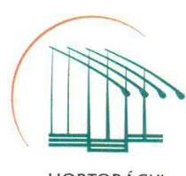

HORTOBÁGYI NONPROFIT KFT.

A Társaság tekintetében állami vagyonnak az üzletrész minősül, az ennek kezelésével kapcsolatos feltételrendszert az MNV Zrt. által a Hortobágyi Nemzeti Park Igazgatósággal megkötött megbízási szerződés tartalmazza, s nem a Társaság Alapító Okirata.

Ennek megfelelően megítélésünk szerint nem értékelhető hiányosságként, hogy a Társaság Alapító Okirata nem tartalmaz ilyen kikötést, hiszen az állami vagyonról szóló 2007. évi CVI. tv. 30. § (1) bekezdése szerinti közérdek érvényesülését biztosító vagyongazdálkodást nem a törvényi rendelkezések megismétlése teremti meg.

A fentiekre tekintettel kérjük a saját vagyon megőrzésére, gyarapítására vonatkozó, azok létesítő okiratban történő előírásának elmaradására vonatkozó utalások törlését a jelentéstervezetből.
3. A jelentéstervezet 2.1. szám alatti megállapításának 2. bekezdése alapján tett javaslattal kapcsolatban észrevételezni kívánjuk, hogy a vizsgálat és annak megállapítása a 2013. és 2014. évi üzleti terv készítésének hiányosságaira vonatkozik.

A vizsgált időszakot követően rendelkezésre állnak Társaságunknál az Alapító által elfogadott üzleti tervek, továbbá belső szabályzatunk jelenleg már szabályozza az üzleti terv készítésével és előterjesztésével kapcsolatos feladatokat.

Erre tekintettel a javaslatban rögzítetteknek megfelelő intézkedés megítélésünk szerint okafogyott.

4/A. A jelentéstervezet 2.1. szám alatti megállapításának 6. bekezdése alapján a hivatkozott számlarend, amely a könyvelés alapjául szolgált a vizsgált időszakban rendelkezésre állt, azt az Állami Számvevőszék által megbízott könyvvizsgálónak jeleztük, az azonban aláírt formában nem állt rendelkezésünkre.

Immáron azonban az észrevétellel érintett szabályzatunk formailag is szabályos formában, a vezető tisztségviselő által aláírtan áll rendelkezésünkre.

4/B. A jelentéstervezet 5.1. szám alatti megállapításának 8. bekezdése alapján Társaságunk a közérdekű adatok megismerésére irányuló igények teljesítésének rendjét rögzítő szabályzattal nem rendelkezett.

Észrevételezni kívánjuk, hogy a Társaság működésével összefüggésben nyilvánosság elé tárható adatok, mint közérdekű adatokat a vizsgált időszakot követően a honlapunkon elérhetővé tettük.

Társaságunk a közérdekű adatok megismerésére irányuló igények teljesítésének rendje körében rögzíteni kívánja, hogy külön szabályzattal valóban nem rendelkezünk, közérdekű adat igénylése esetén az információs önrendelkezési jogról és az információszabadságról szóló 2011. évi CXII. tv. vonatkozó /28-31.§§/ rendelkezéseit követjük.

---

5. A jelentéstervezet 2.2. szám alatti megállapítása 4. és 6. bekezdései alapján megállapítást nyert, hogy a Leltározási Szabályzatban előírtakat Társaságunk nem tartotta be maradéktalanul, ennek a hiányosságnak a kiküszöbölését kiemelt belső ellenőrzési feladatként kívánjuk érvényre juttatni, amit intézkedési tervben már 2016. év július hó 31-i határidővel el is rendeltem.
6. A 2.2. szám alatti megállapítás és az ahhoz kapcsolódó kifejtő rész utolsó két bekezdésének módosítását, lehetőség szerint törlését kérjük, mivel a „megsértette a valódiság elvét" megállapítás nincs összhangban a kifejtő részben leírtakkal, az abban szereplő hiányosságok formai jellegűek, belső szabályozási hiányosságból erednek.

A „leltár" hiányának megállapítása nagyon jelentős elmarasztaló megállapítás, viszont az megítélésünk szerint nincs alátámasztva a kifejtő rész által, mivel Társaságunknál a mérleg alátámasztásához rendelkezésre állnak a Számviteli tv. 69.§. (1) bekezdésének megfelelő dokumentumok, amelyeket az adott időszakban, úgymint a vizsgált időszakot megelőzően és azt követően is, a Társaság könyvvizsgálója is „leltárként" elfogadott.

Kérjük a fentieknek megfelelően a jelentéstervezetből a 2.2. számú megállapítás utolsó két bekezdésében szereplő megállapítások és az ehhez kapcsolódó összegző és egyéb megállapítások törlését, miszerint Társaságunk megsértette a Számv. Tv. 69.§ (1) bekezdését, illetve a Számv. Tv. 15.§ (3) bekezdésben meghatározott valódiság elvét.
7. A 3.1. számú megállapítás kifejtő részében szereplő hiányosságokat illetően csak a Társaságunk részéről az Állami Számvevőszék részére átadott mintatételek konkrét megjelölése által tudunk érdemben észrevételt tenni.

Kérjük ezzel kapcsolatban a konkrét minták megjelölését a megállapításokhoz mellékelni, mivel bizonyos minták beazonosíthatók részünkről a szövegkörnyezetből, de jelentős részük teljes bizonyosság igényével nem.

A beazonosítható minták közül több esetben kívánunk észrevételt tenni, ezek a következők:

- 21. oldal 1. bekezdésben a bérfeladás levonási összesítője a könyvelési bizonylat, ez került csatolásra a mintához, viszont a levonási összesítőhöz több tucat alapbizonylat tartozik, amelyek eredeti formában nem a könyvelés, hanem a munkaügyi osztály alapbizonylatát képezik, természetesen ezeket a minta pontos megjelölésével csatolni tudjuk.
- 21. oldal 2. bekezdés: a bevételi pénztárbizonylathoz csatolt alapbizonylat valóban egy kézzel írott összesítő, mivel jelen esetben több nyugtatömb képezi az elszámolás alapját az értékesítési bevételt illetően, az eredeti alapbizonylat több nyugtatömb, ennek az összesítését tartalmazza a becsatolt bizonylat.

A nyugtatömbökről szigorú számadású nyomtatványként szükség esetén kimutatást tudunk csatolni, illetve a nyugták fénymásolatát is továbbítani tudjuk a Tisztelt Állami Számvevőszék felé.

A pénztári elszámolások és a szigorú számadású nyomtatványok kezelése folyamatos belső ellenőrzési feladat.

---

Az eredeti bizonylat a szigorú számadású nyomtatvány kezelésével megbízott munkavállalónál található, ezért csupán az arról készült kimutatás képezi a könyvelés alapját.
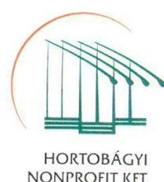
8. Az egyéb, pénzügyi műveletek és rendkívüli bevételek elszámolásánál felsorolt hiányosságok közül az 1. bekezdésben szereplő mintákra vonatkozóan csak következtetni tudunk a mintákat illetően, amely valószínűleg az állati eredetű hulladék ártalmatlanításához kapcsolódó bevétel.

E körben - ellentétben az Állami Számvevőszék megállapításával - helyesen az egyéb bevételek között szerepel, mivel a számlán található hivatkozás az MVH által fizetett ártalmatlanítási díjat jelöli, amely alapján természetesen a számlán feltüntetett szolgáltatási díj egyrészt igénybe vett szolgáltatásként kerül a könyveinkbe, azonban a szállító pénzügyi rendezése során a számlán szereplő MVH által fizetett ártalmatlanítás összegét egyéb bevételként kell kimutatnunk, a bruttó elszámolás elvének megfelelően.

Ekként a számlán szereplő tételek költségként kerülnek a könyveinkbe, és a szállítói kiegyenlítések is megtörténnek a számlán feltüntetett információ alapján.
9. A pénzügyi műveletek elszámolásánál az árfolyamkülönbözetek alapbizonylataként a könyvelt árfolyamkülönbözet helyességének ellenőrzésére csatoltunk a számlák kiegyenlítéséről banki kivonatokat, ezek véleményünk szerint helyesen voltak könyvelve, bizonyítva a számla teljesítéskori és a kifizetéskori árfolyam közti különbözet eltérését.
10. A Tárgyi eszközökkel kapcsolatos elszámolás tekintetében az 1. bekezdésben szereplő mezőgazdasági jármű beszerzését véleményünk szerint helyesen vettük bruttó értéken nyilvántartásba, ugyanis annak ÁFA része nem került levonásba, mivel a LIFE projektünk keretében került beszerzésre, amely projektünkkel kapcsolatos

 beszerzéseink esetében az ÁFA összege nem vonható le.
11. Az ingatlanhoz tartozóan: Az épületen végzett javítás főkönyvi elszámolását hibásnak ítélte a Tisztelt Állami Számvevőszék.

Ebben az esetben is csupán a mintatétel pontos megjelölésével tudunk érdemben észrevételt tenni, mivel önmagában az ingatlanon végzett javítást nem szükséges aktiválni az adott ingatlanra, amennyiben az az állagmegóvással kapcsolatban merült fel.

Kérjük, hogy a fenti észrevételeink pontosításához, illetve az egyéb, általunk be nem azonosítható mintatételek megismeréséhez a 3.1. szám alatt kifejtett hiányosságokat illetően küldjék meg részünkre a minták megjelölését, amelyre az adott hiányosság vonatkozik.

Ezzel válik elérhetővé az észrevételeinket követően készítendő „végleges" ellenőrzési jelentés ténybeli megalapozottsága.
12. A 4.2. számú megállapítás tekintetében az alábbiak kiemelése szükséges:

Megfelel a valóságnak, hogy a Társaság az ellenőrzött időszakot, 2011-2013 éveket érintően beszerzési igényeit túlnyomórészt közbeszerzési eljárás mellőzésével elégítette ki.

---

Társaságunk klasszikus ajánlatkérőként bejelentkezett a közbeszerzés rendszerébe, beszerzéseink a közbeszerzési adatbázisból nyomon követhetőek.

Minderre figyelemmel kérjük a Javaslatok között szerepeltetett 6. pont első mondatának törlését.
13. A 4.2. számú megállapítás kifejtő részének 2. bekezdésében a „Legelőtavak élőhelykezelése a Hortobágyon" című LIFE+ pályázattal kapcsolatos észrevételt illetően feltételezi a Tisztelt Állami Számvevőszék a projekt önerő részéhez a hosszú lejáratú hitel igénylését.

Ezt a megállapítást kérjük törölni, mivel hosszú lejáratú hitelt - ismerve a Társaság vizsgált időszakban kimutatott pénzeszközének állományát - tudomásunk szerint a korábbi menedzsmentnek nem állt szándékában igényelni.
14. Az 5.2. számú megállapítás tekintetében fel kívánjuk hívni a figyelmet arra, hogy a Hortobágyi Természetvédelmi és Génmegőrző Nonprofit Kft. - amely felett a Hortobágyi Nemzeti Park Igazgatóság megbízási szerződés alapján, az MNV Zrt. nevében gyakorolja a tulajdonosi jogokat - a költségvetési szervek belső kontrollrendszeréről és belső ellenőrzéséről szóló 370/2011. (XII. 31.) Korm. rendelet 1. § (2) bekezdés e) pontja alapján tartozik a jogszabály hatálya alá, ennek megfelelően az 54/A. § alapján csak a jogszabály 110. §-ai vonatkoztak rá.

Kérjük a jelentést kiegészíteni a rendelet pontos jogszabályhelyének megjelölésével, amely a tulajdonosi joggyakorló és a Társaság közötti információs rendszer szabályozását írja elő, ennek hiányában az ezzel kapcsolatos megállapítások törlését a jelentésből.

A Tisztelt Állami Számvevőszék jelentéstervezettel kapcsolatban egyéb észrevételt nem kívánunk tenni.

Hortobágy, 2016. július 12.
Tisztelettel:
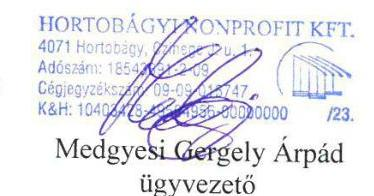

Hortobágyi Nonprofit Kft., ellenőrzött szervezet

---

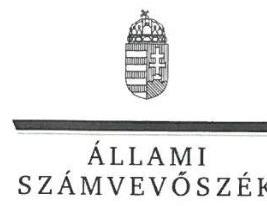

ELNÖK

Ikt.szám: V-0984-229/2016.

# Medgyesi Gergely Árpád úr 

ügyvezető
Hortobágyi Természetvédelmi és Génmegőrző Nonprofit Kft.

## Hortobágy

## Tisztelt Ügyvezető Úr!

A „Hortobágyi Természetvédelmi és Génmegőrző Nonprofit Kft. - Az állami tulajdonban (résztulajdonban) lévő gazdálkodó szervezetek vagyonmegőrzési és gazdálkodási tevékenységének ellenőrzése" címmel készített számvevőszéki jelentéstervezetre tett észrevételeit köszönettel megkaptam.
Az Állami Számvevőszék észrevételekre vonatkozó álláspontjáról a felügyeleti vezető által készített részletes tájékoztatást mellékelten megküldöm.
Tájékoztatom Ügyvezető urat, hogy a számvevőszéki jelentésben - az Állami Számvevőszékről szóló 2011. évi LXVI. törvény 29. § (3) bekezdése alapján - a figyelembe nem vett észrevételeket szerepeltetjük az elutasítás indokának feltüntetésével.

Budapest, 2016. 06. hó 6. nap
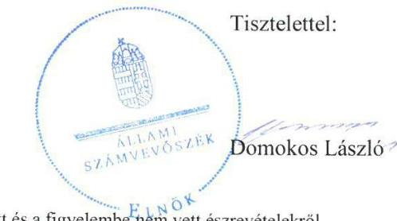

Melléklet: Tájékoztatás a figyelembe vett és a figyelembe nem vett észrevételekről

---

# Tájékoztatás   a figyelembe vett és a figyelembe nem vett észrevételekről 

A „Hortobágyi Természetvédelmi és Génmegőrző Nonprofit Kft. - Az állami tulajdonban (résztulajdonban) lévő gazdálkodó szervezetek vagyonmegőrzési és gazdálkodási tevékenységének ellenőrzése" címü jelentéstervezetre 2016. július 15-én tett (az Állami Számvevőszékhez 2016. július 19-én érkezett) észrevételeit áttekintettük, ami alapján a következő tájékoztatást adom.

Az 1. számú észrevétel szerint az Összegzés második mondata (miszerint „a vagyon értékének megőrzését és gyarapítását biztosító vagyongazdálkodási tevékenységének szabályozása nem volt megfelelő") eltúlzott, mert az ellenőrzés formai és szabályozásbeli hiányosságokat tárt fel, ezért az Összegzés cím alatti bekezdések és a megállapítások felülvizsgálatát és összhangjának megteremtését javasolja. A jelentéstervezetben foglalt tartalmi és formai hiányosságokon túl, a jogszabálysértések figyelembevételével (pl.: a 2.1. számú megállapítást alátámasztó 5-6. bekezdésekben foglaltakkal összhangban) a jelentéstervezet módosítása nem indokolt.
A 2. számú észrevétel a saját vagyon megőrzésének, gyarapításának az Alapító okiratban történő előírása elmaradásával összefüggésben kéri az utalások törlését a jelentéstervezetből arra tekintettel, hogy jogszabályi előírás nem rögzíti azt az Alapító okirat kötelező tartalmi elemeként.

A jelentéstervezet szövegezését pontosítjuk, a Főbb megállapítások, következtetések, javaslatok rész első bekezdés harmadik mondatát és az 1.1. számú megállapítás második mondatát töröljük.
A 3. számú észrevétel a Társaság ügyvezetőjének tett 1. javaslattal összefüggésben (a 2.1. számú megállapítás 2. bekezdése alapján) jelzi, hogy a javaslatban rögzítetteknek megfelelő intézkedés okafogyottá vált, mert az ellenőrzött időszakot követően rendelkezésre álltak az alapító által elfogadott üzleti tervek, továbbá belső szabályzat már szabályozza az üzleti terv készítésével és előterjesztésével kapcsolatos feladatokat.
Az észrevétel alapján a jelentéstervezet módosítása nem indokolt, mert az Állami Számvevőszék az ellenőrzési programnak megfelelően a Társaság vagyonmegőrzési és gazdálkodási tevékenységét a 2011. január 1. és 2014. december 31. közötti időszakra vonatkozóan ellenőrizte, és az ellenőrzött időszakon kívül bekövetkezett eseményekkel kapcsolatban megállapítást nem tesz.
A 4/A. számú észrevétel (a 2.1. számú megállapítás 6. bekezdéséhez kapcsolódóan) megerősíti, hogy a Társaság érvényes (aláirt) számlarenddel az ellenőrzött időszakban nem rendelkezett, továbbá jelzi, hogy a hiányosság már nem áll fenn.
Köszönjük tájékoztatását a vezető tisztségviselő által aláirt számlarend jelenlegi rendelkezésre állásáról, azonban az észrevétel alapján a jelentéstervezet módosítása nem indokolt, mert az Állami Számvevőszék az ellenőrzési programnak megfelelően a Társaság vagyonmegőrzési és gazdálkodási tevékenységét a 2011. január 1. és 2014. december 31. közötti időszakra vonatkozóan ellenőrizte, és az ellenőrzött időszakon kívül bekövetkezett eseményekkel kapcsolatban megállapítást nem tesz.
A 4/B. számú észrevétel (az 5.1. számú megállapítás 8. bekezdéséhez kapcsolódóan) megerősíti, hogy a Társaság a közérdekű adatok megismerésére irányuló igények teljesítésének rendjét rögzítő szabályzattal az ellenőrzött időszakban nem rendelkezett és továbbra sem rendelkezik, ezért a jelentéstervezet módosítása nem indokolt.

---

Köszönjük az arra vonatkozó jelzést, hogy a Társaság működésével kapcsolatos közérdekű adatokat az ellenőrzött időszakot követően a honlapjukon elérhetővé tették. Az ellenőrzött időszakot követően történtekkel kapcsolatban azonban az Állami Számvevőszék megállapítást nem tesz, ezért a jelentéstervezet módosítása emiatt sem indokolt.
Az 5. számú észrevétel (a 2.2. számú megállapítás 4. és 6. bekezdéseihez kapcsolódóan) jelzi, hogy a Leltározási Szabályzatban előírtak betartásának hiányosságaival kapcsolatban belső ellenőrzési feladatokat rendeltek el. Köszönjük tájékoztatását a feltárt hiányosság megszüntetésére tett intézkedéséről, azonban emiatt a jelentéstervezet módosítása nem indokolt.
A 6. számú észrevétel (a 2.2. számú megállapításhoz és alátámasztó utolsó két bekezdéséhez kapcsolódóan) kéri a valódiság elvének megsértésére - a leltárak hiánya miatt - tett megállapítás törlését arra tekintettel, hogy a Társaságnál a mérleg alátámasztásához rendelkezésre álló dokumentumokat a könyvvizsgáló is leltárként elfogadta.
Az észrevétel nem vitatja a leltárak hiányát, amelyek nem formai hiányosságok. A 2.2. számú megállapítás és az azt alátámasztó utolsó két bekezdés a mérlegben szereplő tételek leltárral való alátámasztásának elmaradására vonatkoznak, amellyel a Társaság jogszabályi előírást sértett, ezért a jelentéstervezet módosítása nem indokolt.
A 7. számú észrevétel (a 3.1. számú megállapítással kapcsolatban) jelzi, hogy a Társaság érdemi észrevételt csak az Állami Számvevőszék részére átadott mintatételek konkrét megjelölésével tudna tenni, ezért kéri azok mellékelését a megállapításokhoz.
Az Állami Számvevőszék az elszámolások szabályszerűségét mintavétellel ellenőrzi és az adott sokaságban előforduló hibás tételek arányát becsüli. A mintavétellel ellenőrzött területek értékelése a megnevezett sokaságra vonatkozik. A mintatételek egyedi megjelölése emiatt nem releváns. Az ellenőrzött mintatételek a Társaság számára is ismertek, azokat a Társaság bocsátotta az ellenőrzés rendelkezésére. A 21. oldal 1. és 2. bekezdéséhez tett észrevételek nem vitatják a megállapításokban foglaltakat, azokhoz kapcsolódóan további bizonylatok rendelkezésre bocsátásának lehetőségét jelzik, azonban ezeket - a teljességi és hitelességi nyilatkozat kiállítását követően - már nem áll módunkban figyelembe venni.
A 8. számú észrevétel (az egyéb, pénzügyi műveletek és rendkívüli bevételek elszámolásánál felsorolt 1. bekezdéshez kapcsolódóan) vélelmezi, hogy a jelentéstervezetben foglalt megállapítás mely mintatételekhez (állati eredetű hulladék ártalmatlanítása) kapcsolódik.
A jelentéstervezet megállapítása valóban az állati eredetű hulladék ártalmatlanítására vonatkozik. A kapcsolódó mintatételekhez az ellenőrzés rendelkezésére bocsátott számlákon a Hortobágyi Nonprofit Kft. vevőként szerepel, azok nem támasztják alá, hogy az ártalmatlanítási díj a Hortobágyi Nonprofit Kft. bevételét képezi, ezért a jelentéstervezet módosítása nem indokolt.

---

A 9. számú észrevétel (a pénzügyi műveletek elszámolásához kapcsolódóan) általánosságban jelzi, hogy a könyvelt árfolyam különbözet helyességének ellenőrzésére csatoltak az árfolyam különbözetet alátámasztó bizonylatot. A dokumentumok ismételt áttekintését követően az érintett megállapítás a jelentéstervezetből törlésre kerül.
A 10. számú észrevétel (a tárgyi eszközökkel kapcsolatos elszámolások első bekezdésével kapcsolatban) a mezőgazdasági jármű beszerzéssel összefüggésben jelzi, hogy az a le nem vonható általános forgalmi adó miatt helyesen került bruttó értéken nyilvántartásba vételre.
A számvitelről szóló 2000. évi C. törvény 47. § (3) bekezdésének előírása alapján a bekerülési értéknek nem része a levonható előzetesen felszámított általános forgalmi adó. A rendelkezésre álló dokumentumok ismételt áttekintését követően a jelentéstervezetből törlésre kerül a hivatkozott megállapítás.
A 11. számú észrevétel (az ingatlanokhoz kapcsolódóan) jelzi, hogy a Társaság érdemi észrevételt a mintatétel pontos megjelölésével tudna tenni, mivel önmagában az ingatlanon végzett javítást nem szükséges aktiválni, amennyiben állagmegóvással kapcsolatban merült fel. A jelentéstervezetben rögzített megállapítás az Optimer 2000 mm-es faliagregáttal kapcsolatos.
A rendelkezésre bocsátott dokumentumok ismételt áttekintése alapján a megállapítás helytálló - a faliagregáttal kapcsolatos kiadást a költségként történő elszámolás helyett aktiválni kellett volna -, ezért a jelentéstervezet módosítása nem indokolt.
A 12. számú észrevétel (a 4.2. számú megállapításhoz kapcsolódóan) alátámasztja a közbeszerzési eljárás mellőzésére vonatkozó megállapítást. Egyben jelzi, hogy a Társaság klasszikus ajánlatkérőként bejelentkezett a közbeszerzés rendszerébe és beszerzései a közbeszerzési adatbázisból nyomon követhetőek, ezért kéri az ügyvezetőnek tett 6. számú javaslat első mondatának törlését.
Az ellenőrzött időszakot követően történtekkel kapcsolatban azonban az Állami Számvevőszék megállapítást nem tesz, ezért a jelentéstervezet módosítása nem indokolt.
A 13. számú észrevétel (a 4.2. számú megállapítást alátámasztó 2. bekezdéshez kapcsolódóan) kéri a „Legelőtavak élőhely-kezelése a Hortobágyon" című pályázat önerő részével kapcsolatban a hosszú lejáratú hitel igénylésére vonatkozó rész törlését. A dokumentumok ismételt áttekintését követően a hitel igénylésére vonatkozó bekezdés a jelentéstervezetből törlésre kerül.
A 14. számú észrevétel (az 5.2. számú megállapítással kapcsolatban) kéri a jelentéstervezet kiegészítését a tulajdonosi joggyakorló és a Társaság közötti információs rendszer szabályozását tartalmazó pontos jogszabályhellyel, vagy ennek hiányában a kapcsolódó megállapítások törlését.
A jelentéstervezetből a Főbb megállapítások, következtetések, javaslatok rész második bekezdés utolsó mondata, az 5. Összegző megállapítás második mondata, az 5.2. számú megállapítás és első bekezdése, valamint a Hortobágyi Nonprofit Kft. ügyvezetőjének címzett 8. számú javaslat törlésre kerül.

---

Tájékoztatom, hogy a számvevőszéki jelentés függelékeként szerepeltetjük a jelentéstervezethez tett észrevételeit, valamint az azokra adott válaszunkat.

Budapest, 2016. 06. hó 10. nap

Böröcz Imre
felügyeleti vezető

---

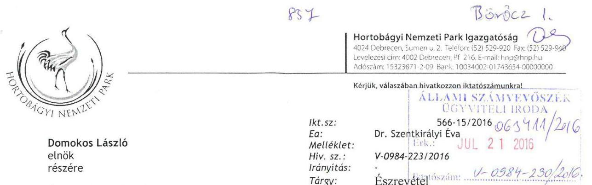

# Budapest 

Apáczai Csere János u. 10.
1052
Tisztelt Elnök Úr!

A 2016. július 4-én kézhez vett, a „Hortobágyi Természetvédelmi és Génmegőrző Nonprofit Kft. - Az állami tulajdonban (résztulajdonban) lévő gazdálkodó szervezetek vagyonmegőrzési és gazdálkodási tevékenységének ellenőrzése" címmel készített, számvevőszéki jelentéstervezettel kapcsolatban az

 alábbi észrevételeket tesszük:

1. A jelentéstervezet hiányosságként említi, hogy a Társaság Alapítói Okiratában „nem rögzítették a Hortobágyi NKft. saját vagyona értékének megőrzését, gyarapítását". E tekintetben megjegyezni kívánom, hogy az állami tulajdonú gazdasági társaságok alapítói okirataiban ilyen tartalmú elvi kikötés nem szerepel. Az állami vagyonról szóló törvény tartalmaz kifejezetten az állami vagyon megőrzésével és gyarapításával kapcsolatos követelményeket, az állami vagyongazdálkodással kapcsolatos követelményként. A Társaság tekintetében állami vagyonnak az üzletrésze minősül. Az üzletrész kezelésével kapcsolatos feltételrendszert az MNV Zrt. és a Hortobágyi Nemzeti Park Igazgatóság között létrejött megbízási szerződés tartalmazza. Ezért véleményünk szerint nem hiányosság, hogy a Társaság Alapító Okirata nem tartalmaz ilyen kikötést. Erre tekintettel kérjük, hogy a fenti megjegyzést a jelentéstervezetből törölni szíveskedjen.
2. Véleményük szerint a jelentéstervezet „Összegzés" fejezetének számos megállapítása eltúlzottan súlyos („megsértette a valódiság elvét", „nem tartotta be a jogszabályi előírásokat"), ugyanakkor ezek a súlyos következtetések nincsenek összhangban a kifejtő részben bemutatottakkal. A kifejtő részben többségében formai jellegű, belső szabályozásbeli hiányosságok kerülnek bemutatásra, mely nem alapozza meg a jogszabályoknak való nem megfelelés súlyos következményét. Erre tekintettel javasoljuk, hogy az Összegzés cím alatti bekezdések és megállapítások felülvizsgálatát, azok pontosabb és a kifejtő résszel összhangban lévő megfogalmazását.

A Tisztelt Állami Számvevőszék jelentéstervezetével kapcsolatban egyéb észrevételt nem kívánunk tenni.

Debrecen, 2016. július 19.

---

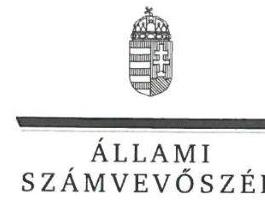

ELNÖK

Ikt.szám: V-0984-231/2016.

Dr. Kovács Zita úrhölgy igazgató Hortobágyi Nemzeti Park Igazgatóság

Debrecen

# Tisztelt Igazgató Úrhölgy! 

A „Hortobágyi Természetvédelmi és Génmegőrző Nonprofit Kft. - Az állami tulajdonban (résztulajdonban) lévő gazdálkodó szervezetek vagyonmegőrzési és gazdálkodási tevékenységének ellenőrzése" címmel készített számvevőszéki jelentéstervezetre tett észrevételeit köszönettel megkaptam.
Az Állami Számvevőszék észrevételekre vonatkozó álláspontjáról a felügyeleti vezető által készített részletes tájékoztatást mellékelten megküldöm.
Tájékoztatom Igazgató úrhölgyet, hogy a számvevőszéki jelentésben - az Állami Számvevőszékről szóló 2011. évi LXVI. törvény 29. § (3) bekezdése alapján - a figyelembe nem vett észrevételeket szerepeltetjük az elutasítás indokának feltüntetésével.

Budapest, 2016. 06. hó 16. nap
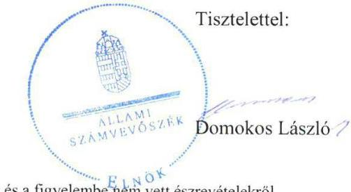

Melléklet: Tájékoztatás a figyelembe vett és a figyelembe nem vett észrevételekról

---

# Tájékoztatás   a figyelembe vett és a figyelembe nem vett észrevételekról 

A „Hortobágyi Természetvédelmi és Génmegőrző Nonprofit Kft. - Az állami tulajdonban (résztulajdonban) lévő gazdálkodó szervezetek vagyonmegőrzési és gazdálkodási tevékenységének ellenőrzése" címú jelentéstervezetre 2016. július 19-én tett (az Állami Számvevőszékhez 2016. július 21-én érkezett) észrevételeit áttekintettük, ami alapján a következő tájékoztatást adom.

Az 1. számú észrevétel a saját vagyon megőrzésének, gyarapításának az Alapító Okiratban történő előírása elmaradásával összefüggésben kéri az erre vonatkozó megjegyzés törlését a jelentéstervezetből arra tekintettel, hogy jogszabályi előírás nem rögzíti azt az Alapító Okirat kötelező tartalmi elemeként.

A jelentéstervezet szövegezését pontosítjuk, a Főbb megállapítások, következtetések, javaslatok rész első bekezdés harmadik mondatát és az 1.1. számú megállapítás második mondatát töröljük.
A 2. számú észrevétel szerint a jelentéstervezet Összegzés fejezetének számos megállapítása eltúlzottan súlyos („megsértette a valódiság elvét", „nem tartotta be a jogszabályi előírásokat") és nincs összhangban a kifejtő részben bemutatottakkal, ahol többségében formai jellegű, belső szabályozásbeli hiányosságok szerepelnek, ezért kéri az Összegzés bekezdéseinek, megállapításainak felülvizsgálatát, a kifejtő résszel összhangban lévő megfogalmazását.
Az Összegzés fejezetben foglaltak a kifejtő részben szerepeltetett megállapításokon alapulnak, a hivatkozott esetekben (pl.: a valódiság elvének be nem tartása esetén a 2.2. számú megállapítást alátámasztó utolsó két bekezdéssel összhangban, a szabályozás jogszabályi előírásoknak való meg nem felelése esetén a 2.1. számú megállapítást alátámasztó 5-6. bekezdésekben foglaltakkal összhangban) jogszabállyal alátámasztottak, ezért a jelentéstervezet módosítása nem indokolt.
Tájékoztatom, hogy a számvevőszéki jelentés függelékeként szerepeltetjük a jelentéstervezethez tett észrevételeit, valamint az azokra adott válaszunkat.

Budapest, 2016. 06. hó 10. nap

Böröcz Imre
felügyeleti vezető

---

# MNV MAGYAR NEMZETI   VAGYONKEZELŐ ZRT.   VEZÉRIGAZGATÓ 

## Állami Számvevőszék

## Domokos László   elnök úr

1052 Budapest
Apáczai Cs. J. u. 10.
Ikt. sz.: MNV/01/2834/2/2016.
Hiv. sz.: V-0984-224/2016.

## Tisztelt Elnök Úr!

A 2016. július 4. napján a „Hortobágyi Természetvédelmi és Génmegőrző Nonprofit Kft. - Az állami tulajdonban (résztulajdonban) lévő gazdálkodó szervezetek vagyonmegőrzési és gazdálkodási tevékenységének ellenőrzése" tárgyában kézhez vett, V-0984-224/2016. ikt. sz. Jelentés-tervezetre az alábbi észrevételeket tesszük.

Összegzés / 5. old. első bekezdés második mondat; Összegzés / 5. old. Főbb megállapítások, következtetések, javaslatok második bekezdés első és második mondat; Megállapítások / 15. old. 1.1. számú megállapítás első bekezdés; Megállapítások / 16. old. 2.1. számú megállapítás első bekezdés; Megállapítások / 20. old. 3.1. számú megállapítás első bekezdés;

A Jelentés-tervezet „Összegzés" elnevezésű fejezet első bekezdésének második mondata, valamint a „Főbb megállapítások, következtetések, javaslatok" második bekezdésének első és második mondata rögzíti, hogy a Hortobágyi Természetvédelmi és Génmegőrző Nonprofit Kft. (a továbbiakban: Társaság) esetében nem volt megfelelő „a vagyon értékének megőrzését és gyarapítását biztosító vagyongazdálkodási tevékenységének szabályozása". Álláspontunk szerint egy ilyen súlyú marasztaló összegző megállapítás rendkívül negatív színben tünteti fel a Társaságot, jóllehet a Jelentés-tervezet későbbi megállapításaiból egyértelműen kitűnik, hogy döntően formai és belső szabályozásbeli hiányosságokat tárt fel a számvevői vizsgálat, a Társaság konkrét gazdálkodásával kapcsolatosan elmarasztaló megállapítás nem került megfogalmazásra. Megítélésünk szerint a Jelentés-tervezet „Megállapítások" elnevezésű fejezete összességében nem alapozza meg a fent megjelölt, egyes megállapításokban kiemelt, kategorikus elmarasztalásokat. Javasoljuk ennek figyelembevételével az „Összegzés", valamint a „Megállapítások" elnevezésű fejezetek hivatkozott bekezdéseinek felülvizsgálatát.

---

Összegzés / 5. old. Főbb megállapítások, következtetések, javaslatok első bekezdés harmadik mondat; Megállapítások /15. old. 1.1. számú megállapítás első bekezdés második mondat, valamint 1.1. számú megállapítás ötödik bekezdés:

A Jelentés-tervezet kifogásolja, hogy a Társaság az Alapító Okiratában nem rögzítette a Társaság saját vagyon megőrzésére, gyarapítására vonatkozó kötelezettséget. Ezzel összefüggésben felhívjuk a figyelmet arra, hogy az állami tulajdonú gazdasági társaságok létesítő okirataiban ilyen tartalmú elvi kikötés tipikusan nem szerepel figyelemmel arra, hogy a társaságok gazdálkodásával és tevékenységeivel kapcsolatos egyedi jellemzők és követelmények, továbbá az egyes társasági jogi szervekkel, testületekkel kapcsolatos társasági jogi elvárások és felelősségi körök jóval komplexebbek, konkrétabbak és szélesebb körűek. A társaságok létesítő okiratainak pedig a társasági jogi szabályok szerinti gazdálkodással kapcsolatos követelményeket kell tartalmazniuk. Vagyon megőrzésével és gyarapításával kapcsolatos követelményeket általánosságban, kifejezetten az állami vagyonról szóló törvény tartalmaz, az állami vagyongazdálkodással kapcsolatos követelményként. A Társaság tekintetében állami vagyonnak az üzletrésze minősül, az ennek kezelésével kapcsolatos feltételrendszert az MNV Zrt. által a Hortobágyi Nemzeti Park Igazgatósággal megkötött megbízási szerződés tartalmazza. Amennyiben a Társaság maga is kezelne állami vagyont, az annak kezelésével kapcsolatos követelményeket nem a létesítő okiratban, hanem az állami vagyon kezeléséről megkötött szerződésben kellene rögzíteni. Ennek megfelelően nem hiányosság, hogy a Társaság Alapító Okirata nem tartalmaz ilyen kikötést. A Vtv. 30. § (1) bekezdése szerinti közérdek érvényesülését biztosító vagyongazdálkodást nem a Vtv. általános megfogalmazásának a Társaság Alapító Okiratában történő megismétlése teremti meg.

A fentiekre tekintettel kérjük, szíveskedjenek törölni a megjelölt szövegrészekből a saját vagyon megőrzésére, gyarapítására vonatkozó, azok létesítő okiratban történő előírásának elmaradására vonatkozó utalásokat.

# Az ellenőrzés területe / 8. old. utolsó bekezdés: 

A hivatkozott szövegrész pontosítását kérjük, tekintettel arra, hogy a Társaság mérleg szerinti eredmény nem 35,1 M Ft volt, hanem helyesen -35,1 M Ft.

## Megállapítások / 18-19. old. 2.2. számú megállapítás első, valamint utolsó bekezdés:

Kérjük a 2.2. számú megállapítás első bekezdését az ötödik bekezdésére figyelemmel, azzal összhangban pontosítani. A megjelölt megállapítás alapján feltárt hiányosságok alapvetően formai jellegűek, illetve belső szabályozásból erednek, ezek mellett tételesen bemutatásra kerülnek a megfelelő társasági belső szabályzatok (pl. számviteli politika, egyéb szabályzatok megfelelősége). Ehhez képest a megállapítás első bekezdésének „nem tartotta be a jogszabályi előírásokat" fordulata hangsúlyos következtetésnek tűnik, javasoljuk „nem tartotta be teljes körűen" fordulatra pontosítani.
Továbbá kérjük, szíveskedjenek törölni a 2.2. számú megállapítás első bekezdéséből és utolsó bekezdéséből a valódiság elvének megsértésére történő utalást arra figyelemmel, hogy tudomásunk szerint a mérleg alátámasztásához a Társaságnál rendelkezésre állnak a dokumentumok, amelyek azt tételesen és ellenőrizhető módon alátámasztják, és azokat évről évre a Társaság könyvvizsgálója is leltárként elfogadta.

---

# MNV | MAGYAR NEMZETI 

Megállapítások / 28. old. összegző megállapítás második mondat: Megállapítások / 30. old. 5.2. számú megállapítás első bekezdés:

A Társaság - amelyben a Hortobágyi Nemzeti Park Igazgatóság megbízási szerződés alapján, az MNV Zrt. nevében gyakorol tulajdonosi jogokat - a költségvetési szervek belső kontrollrendszeréről és belső ellenőrzéséről szóló 370/2011. (XII. 31.) Korm. rendelet (a továbbiakban: Korm. rendelet) 1. § (2) bekezdésének e) pontja alapján tartozik a Korm. rendelet hatálya alá, ennek megfelelően az 54/A. § alapján csak a Korm. rendelet 1-10. §-ai vonatkoztak rá. Kérjük a Jelentés-tervezetet kiegészíteni a Korm. rendelet pontos jogszabályhelyének megjelölésével, amely a tulajdonosi joggyakorló és a Társaság közötti információs rendszer szabályozását írja elő, ennek hiányában az ezzel kapcsolatos megállapítások törlését az anyagból.

Kérem Elnök Urat, hogy a Jelentés-tervezet véglegesítése során jelen észrevételeinket szíveskedjenek figyelembe venni.

Budapest, 2016. július 15.

Üdvözlettel:
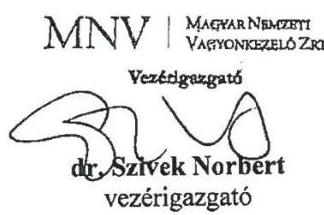

---

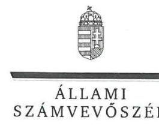

ELNÖK

Ikt.szám: V-0984-228/2016.

# Dr. Szivek Norbert úr 

vezérigazgató
Magyar Nemzeti Vagyonkezelő Zrt.

## Budapest

## Tisztelt Vezérigazgató Úr!

A „Hortobágyi Természetvédelmi és Génmegőrző Nonprofit Kft. - Az állami tulajdonban (résztulajdonban) lévő gazdálkodó szervezetek vagyonmegőrzési és gazdálkodási tevékenységének ellenőrzése" címmel készített számvevőszéki jelentéstervezetre tett észrevételeit köszönettel megkaptam.
Az Állami Számvevőszék észrevételekre vonatkozó álláspontjáról a felügyeleti vezető által készített részletes tájékoztatást mellékelten megküldöm.
Tájékoztatom Vezérigazgató urat, hogy a számvevőszéki jelentésben - az Állami Számvevőszékről szóló 2011. évi LXVI. törvény 29. § (3) bekezdése alapján - a figyelembe nem vett észrevételeket szerepeltetjük az elutasítás indokának feltüntetésével.

Budapest, 2016. 05. hó 04. nap
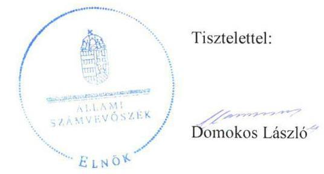

Melléklet: Tájékoztatás a figyelembe vett és a figyelembe nem vett észrevételekről

---

# Tájékoztatás   a figyelembe vett és a figyelembe nem vett észrevételekról 

A „Hortobágyi Természetvédelmi és Génmegőrző Nonprofit Kft. - Az állami tulajdonban (résztulajdonban) lévő gazdálkodó szervezetek vagyonmegőrzési és gazdálkodási tevékenységének ellenőrzése" címü jelentéstervezetre 2016. július 18-án érkezett észrevételeit áttekintettük, ami alapján a következő tájékoztatást adom.
A jelentéstervezetben az Összegzés/5. old. első bekezdés második mondat; Összegzés/5. old. Főbb megállapítások, következtetések, javaslatok második bekezdés első és második mondat; Megállapítások/15. old. 1.1. számú megállapítás első bekezdés; Megállapítások/16. old. 2.1. számú megállapítás első bekezdés; Megállapítások/20. old. 3.1. számú megállapítás első bekezdés részeihez tett észrevételhez
Az észrevétel szerint a jelentéstervezet Megállapítások fejezete összességében nem alapozza meg az egyes megállapításokban kiemelt elmarasztalásokat, továbbá a vagyon értékének megőrzését és gyarapítását biztosító vagyongazdálkodási tevékenység szabályozása nem megfelelőnek minősítése negatív színben tünteti fel a Társaságot, ezért kéri a hivatkozott bekezdések felülvizsgálatát. Az észrevétel szerint „döntően formai és belső szabályozásbeli hiányosságokat tárt fel a számvevői vizsgálat".

A jelentéstervezet hivatkozott részeiben foglalt jogszabálysértések (pl.: a szabályozás jogszabályi előírásoknak való meg nem felelése esetén a 2.1. számú megállapítást alátámasztó 5-6. bekezdések, a valódiság elvének be nem tartása esetén a 2.2. számú megállapítást alátámasztó utolsó két bekezdés, a nyilvántartási rendszer szabályozásának elmaradása esetén a 3.1. számú megállapítást alátámasztó 2. bekezdés alapján) figyelembevételével azonban
 a jelentéstervezet módosítása nem indokolt.

A jelentéstervezetben az Összegzés/5. old. Főbb megállapítások, következtetések, javaslatok első bekezdés harmadik mondat; Megállapítások/15. old. 1.1. számú megállapítás első bekezdés második mondat, valamint 1.1. számú megállapítás ötödik bekezdés részeihez tett észrevétel
Az észrevétel a saját vagyon megőrzésének, gyarapításának létesítő okiratban történő előírása elmaradásával összefüggésben kéri az utalások törlését a jelentéstervezetből arra tekintettel, hogy jogszabályi előírás nem rögzíti azt az Alapító okirat kötelező tartalmi elemeként.
A jelentéstervezet szövegezését pontosítjuk, a Főbb megállapítások, következtetések, javaslatok rész első bekezdés harmadik mondatát és az 1.1. számú megállapítás második mondatát töröljük.

A jelentéstervezetben Az ellenőrzés területe/8. old. utolsó bekezdés részéhez tett észrevétel Az észrevétel a mérleg szerinti eredmény értékének pontosítását kéri $35,1 \mathrm{M}$ Ft-ról $-35,1 \mathrm{M}$ Ftra. A rendelkezésre álló dokumentumok ismételt áttekintését követően a mérleg szerinti eredmény értékét $-35,1 \mathrm{M}$ Ft értékre pontosítjuk.

---

# A jelentéstervezetben a Megállapítások/18-19. old. 2.2. számú megállapítás első, valamint utolsó bekezdés részeihez tett észrevétel 

Az észrevétel kéri a „nem tartotta be a jogszabályi előírásokat" fordulat pontosítását a „nem tartotta be teljes körűen" szövegre arra tekintettel, hogy a feltárt hiányosságok alapvetően formai jellegűek, illetve belső szabályozásból erednek, továbbá tételesen bemutatásra kerülnek a megfelelő társasági belső szabályzatok. Kéri továbbá a valódiság elvének megsértésére történő utalás törlését arra tekintettel, hogy a Társaságnál a mérleg alátámasztásához rendelkezésre álló dokumentumokat a könyvvizsgáló is leltárként elfogadta.
Az észrevétel nem vitatja a leltárak hiányát, amelyek nem formai hiányosságok. A 2.2. számú megállapítás és az azt alátámasztó utolsó két bekezdés a mérlegben szereplő tételek leltárral való alátámasztásának elmaradására vonatkoznak, amellyel a Társaság jogszabályi előírást sértett, ezért a jelentéstervezet módosítása nem indokolt.

A jelentéstervezetben a Megállapítások/28. old. összegző megállapítás második mondat; Megállapítások/30. old. 5.2. számú megállapítás első bekezdés részeihez tett észrevétel
Az észrevétel kéri a jelentéstervezet kiegészítését a tulajdonosi joggyakorló és a Társaság közötti információs rendszer szabályozását tartalmazó pontos jogszabályhellyel, vagy ennek hiányában a kapcsolódó megállapítások törlését.
A jelentéstervezetből a Főbb megállapítások, következtetések, javaslatok rész második bekezdés utolsó mondata, az 5. Összegző megállapítás második mondata, az 5.2. számú megállapítás és első bekezdése, valamint a Hortobágyi Nonprofit Kft. ügyvezetőjének címzett 8. számú javaslat törlésre kerül.

Tájékoztatom, hogy a számvevőszéki jelentés függelékeként szerepeltetjük a jelentéstervezethez tett észrevételeit, valamint az azokra adott válaszunkat.

Budapest, 2016. 04. hó 10. nap

Böröcz Imre felügyeleti vezető

---

# RÖVIDÍTÉSEK JEGYZÉKE 

${ }^{1}$ ÁSZ
${ }^{2}$ Hortobágyi NKft.
${ }^{3}$ Számv. tv.
${ }^{4}$ SZMSZ
${ }^{5}$ Leltározási Szabályzat
${ }^{6}$ Önköltségszámítási szabályzat
${ }^{7}$ MNV Zrt.
${ }^{8}$ Nvtv.
${ }^{9}$ tulajdonosi jogok gyakorlója
${ }^{10}$ Gt.
${ }^{11} \mathrm{Ptk}_{2}$.
${ }^{12}$ Alapító okirat ${ }_{1-10}$
${ }^{13}$ Vtv.
${ }^{14} \mathrm{FB}$
${ }^{15}$ Javadalmazási Szabályzat
${ }^{16} \mathrm{Vhr}$.
${ }^{17}$ 347/2010. (XII. 28.) Korm. rendelet
${ }^{18}$ Kormány határozat
${ }^{19}$ Számviteli politika ${ }_{1-2}$
${ }^{20}$ Tmtv.
${ }^{21}$ Civil tv.
${ }^{22}$ Áfa tv.
${ }^{23} \mathrm{KSZ}_{1-2}$

Állami Számvevőszék
Hortobágyi Természetvédelmi és Génmegőrző Nonprofit Korlátolt Felelősségű Társaság
A számvitelről szóló 2000. évi C. törvény
Hortobágyi Természetvédelmi és Génmegőrző Nonprofit Korlátolt Felelősségű Társaság Szervezeti és Működési Szabályzata
Hortobágyi Természetvédelmi és Génmegőrző Nonprofit Korlátolt Felelősségű Társaság Leltározási Szabályzata
Hortobágyi Természetvédelmi és Génmegőrző Nonprofit Korlátolt Felelősségű Társaság Önköltségszámítási szabályzata, hatályos 2011. január 01.-től
Magyar Nemzeti Vagyonkezelő Zártkörűen Működő Részvénytársaság
A nemzeti vagyonról szóló 2011. évi CXCVI. törvény
MNV Zrt. 2013. február 28-ig, Hortobágyi Nemzeti Park Igazgatósága 2013. február 28-tól
A gazdasági társaságokról szóló 2006. évi IV. törvény
A Polgári Törvénykönyvről szóló 2013. évi V. törvény
Hortobágyi NKft. Alapítói Okirat 2010. május 10., Hortobágyi NKft. Alapító Okirat 2011. június 1., Hortobágyi NKft. Alapító Okirat 2013. február 28., Hortobágyi NKft. Alapító Okirat 2013. december 01., Hortobágyi NKft. Alapító Okirat 2013. december 21., Hortobágyi NKft. Alapító Okirat 2014. május 27., Hortobágyi NKft. Alapító Okirat 2014. július 18., Hortobágyi NKft. Alapító Okirat 2014. július 18._1., Hortobágyi NKft. Alapító Okirat 2014. szeptember 01., Hortobágyi NKft. Alapítói Okirat 2013. május 30.
Az állami vagyonról szóló 2007. évi CVI. törvény
Felügyelő bizottság
Hortobágyi Természetvédelmi és Génmegőrző Nonprofit Korlátolt Felelősségű Társaság Javadalmazási Szabályzata
Az állami vagyonnal való gazdálkodásról szóló 254/2007. (X. 4.) Korm. rendelet
A Magyar Állam nevében tulajdonosi jogokat gyakorló szervezetek rábízott vagyonnal kapcsolatos éves beszámoló készítési és könyvvezetési kötelezettségéről szóló 347/2010. (XII. 28.) számú Korm. rendelet 1024/2013. (I. 25.) Korm. határozat a Magyar Nemzeti Vagyonkezelő Zrt., valamint a Hortobágyi Nemzeti Park Igazgatóság közötti, a nemzeti vagyonról szóló 2011. évi CXCVI. törvény szerinti megbízási szerződés megkötéséről a Hortobágyi Természetvédelmi és Génmegőrző Nonprofit Kft. feletti tulajdonosi joggyakorlás átadása érdekében
Számviteli Politika 2011, 2012
A köztulajdonban álló gazdasági társaságok takarékosabb működéséről szóló 2009. évi CXXII. törvény
az egyesülési jogról, a közhasznú jogállásról, valamint a civil szervezetek működéséről és támogatásáról szóló 2011. évi CLXXV. törvény (hatályos 2012.01.01-től)

Az általános forgalmi adóról szóló 2007. évi CXXVII. törvény
Kollektív Szerződés; hatályos: 2010. január 01-től 2013. július 31-ig; Kollektív Szerződés 2, hatályos: 2013. augusztus 01-től.

---

${ }^{24}$ NAV
${ }^{25}$ MVH
${ }^{26}$ árak megállapításáról szóló tv.
${ }^{27} \mathrm{Kbt} .1$
${ }^{28} \mathrm{Kbt} .2$
${ }^{29}$ Kszt.
${ }^{30}$ Avtv.
${ }^{31}$ Inf tv.
${ }^{32}$ Tájékoztató:
${ }^{33}$ Tájékoztató:
${ }^{34}$ Áht. 2
${ }^{35}$ Stabilitási tv.
${ }^{36} \mathrm{Ctv}$.
${ }^{37}$ ÁSZ tv.
${ }^{38}$ Ptk. 1

Nemzeti Adó- és Vámhivatal
Mezőgazdasági és Vidékfejlesztési Hivatal
1990. évi LXXXVII. törvény az árak megállapításáról

A közbeszerzésekről szóló 2003. évi CXXIX. törvény
A közbeszerzésekről szóló 2011. évi CVIII. törvény
A közhasznú szervezetekről szóló 1997. évi CLVI. törvény
A személyes adatok védelméről és a közérdekű adatok nyilvánosságáról szóló 1992. évi LXIII. törvény

Az információs önrendelkezési jogról és az információszabadságról szóló 2011. évi CXII. törvény
2012. májusban kiadott Tájékoztató a 2013. évi költségvetési törvényjavaslat összeállításához szükséges feltételekről és érvényesítendő követelményekről, 2013. júliusban kiadott Tájékoztató a 2014. évi költségvetési törvényjavaslat összeállításához szükséges feltételekről és érvényesítendő követelményekről Az államháztartásról szóló 2011. évi CXCV. törvény
Magyarország gazdasági stabilitásáról szóló 2011. évi CXCIV. törvény
A cégnyilvánosságról, a bírósági cégeljárásról és a végelszámolásról szóló 2006. évi V. törvény
Az Állami Számvevőszékről szóló 2011. évi LXVI. törvény
A Polgári Törvénykönyvről szóló 1959. évi IV. törvény

---

# ÁLLAMI SZÁMVEVŐSZÉK 

1052 Budapest, Apáczai Csere János utca 10.
Levélcím: 1364 Budapest 4. Pf. 54
Telefon: +36 14849100 Telefax: +36 14849200
www.asz.hu
