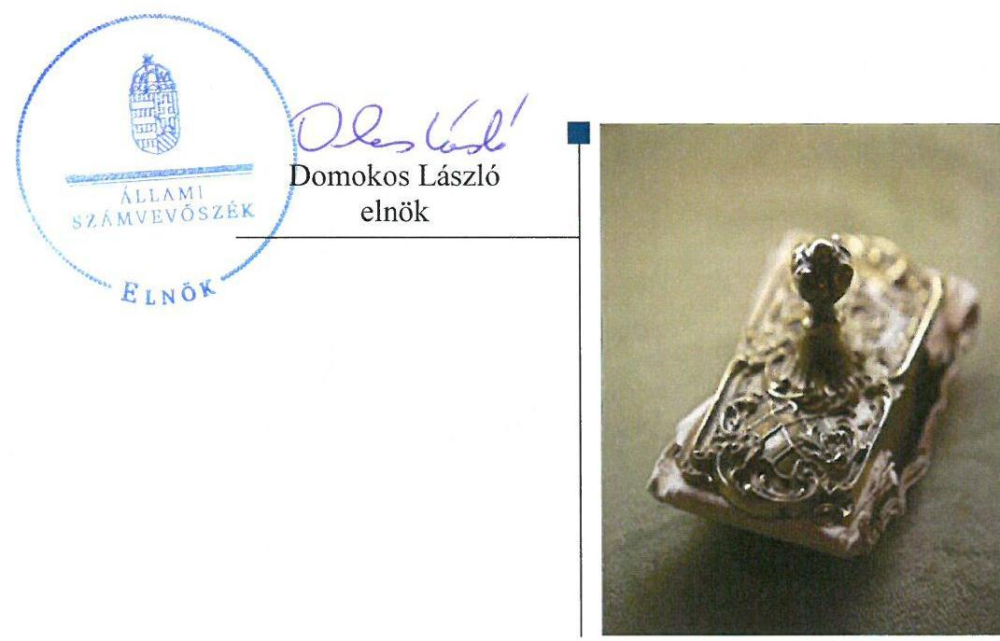
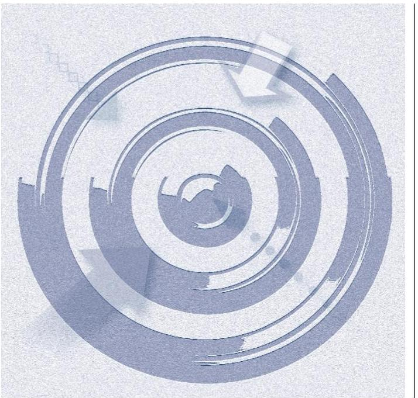
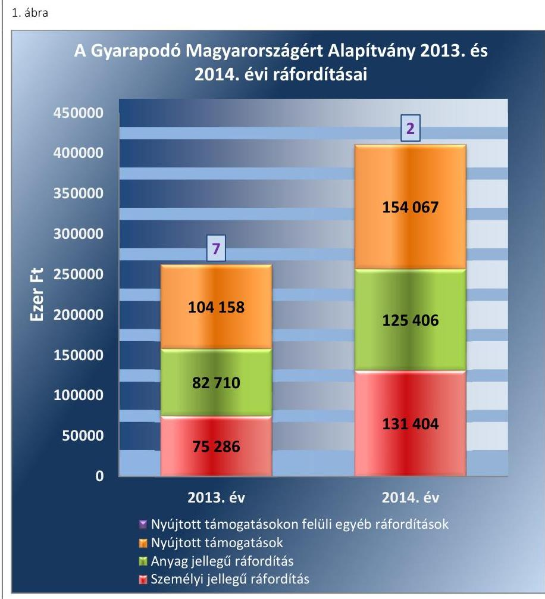
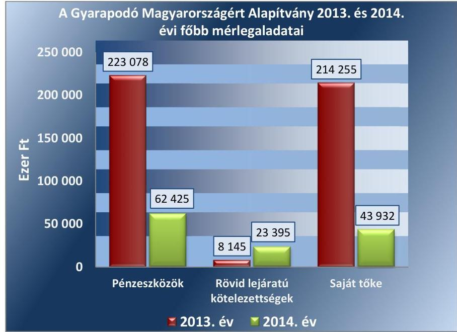
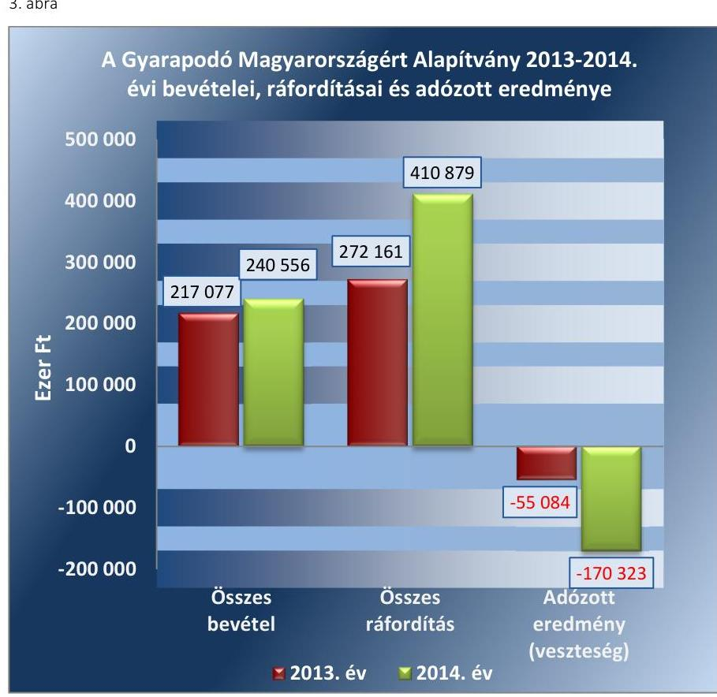
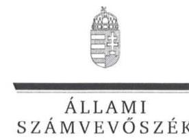
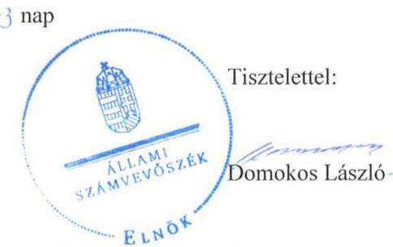
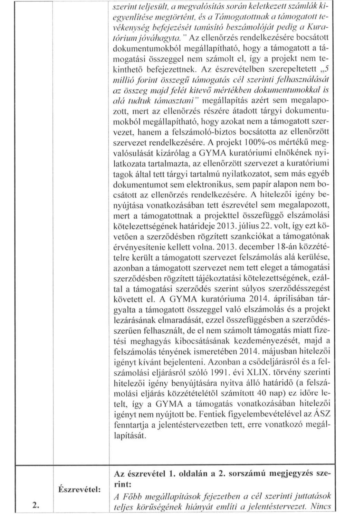
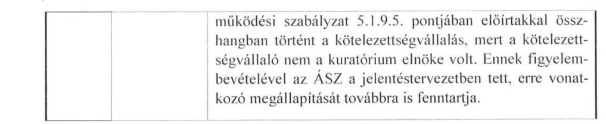
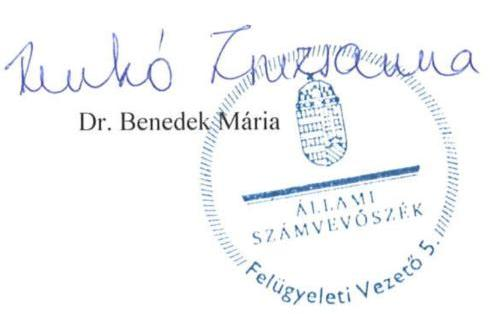

# Jelentés 

## Pártalapítványok gazdálkodása

A költségvetési támogatásban részesülő pártalapítványok 2013-2014. évi gazdálkodása törvényességének ellenőrzése a Gyarapodó Magyarországért Alapítványnál 2016.

---

# Jelentés 

## Pártalapítványok gazdálkodása

A költségvetési támogatásban részesülő pártalapítványok 2013-2014. évi gazdálkodása törvényességének ellenőrzése a Gyarapodó Magyarországért Alapítványnál 2016. 09. hó 22. nap

---

# AZ ELLENŐRZÉST FELÜGYELTE: 

DR. BENEDEK MÁRIA felügyeleti vezető

## AZ ELLENŐRZÉST VEZETTE ÉS A VÉGREHAJTÁSÁÉRT FELELŐS:

MODER BEATRIX ellenőrzésvezető

## A PROGRAM ÖSSZEÁLLÍTÁSÁÉRT FELELŐS:

JANIK JÓZSEF LÁSZLÓ osztályvezető

## A TÉMÁHOZ KAPCSOLÓDÓ KORÁBBI SZÁMVEVŐSZÉKI JELENTÉSEK:

- címe: A Gyarapodó Magyarországért Alapítvány gazdálkodása - a Gyarapodó Magyarországért Alapítvány 2011-2012. évi gazdálkodása törvényességének ellenőrzéséről
- sorszáma: 14004

IKTATÓSZÁM: V-1003-078/2016.
TÉMASZÁM: 2037
ELLENŐRZÉS-AZONOSÍTÓ SZÁM: V-074702

---

# TARTALOMJEGYZÉK 

■ ÖSSZEGZÉS ..... 5
■ AZ ELLENŐRZÉS CÉLJA ..... 7
■ AZ ELLENŐRZÉS TERÜLETE ..... 8
■ AZ ELLENŐRZÉS HÁTTERE, INDOKOLTSÁGA ..... 9
■ A JELENTÉS LÉNYEGES KÉRDÉSKÖREI ..... 10
■ ELLENŐRZÉS HATÓKÖRE ÉS MÓDSZEREI ..... 11
■ MEGÁLLAPÍTÁSOK ..... 13
■ JAVASLATOK ..... 27
■ MELLÉKLETEK ..... 29
I. Sz. melléklet: Értelmező szótár ..... 29
II. Sz. melléklet: 2013. évi egyszerúsített éves beszámoló mérlege ..... 31
III. Sz. melléklet: 2013. évi egyszerúsített éves beszámoló eredménykimutatása ..... 32
IV. Sz. melléklet: 2014. évi egyszerúsített éves beszámoló mérlege ..... 34
V. Sz. melléklet: 2014. évi egyszerúsített éves beszámoló eredménykimutatása. ..... 35
■ FÜGGELÉK: ÉSZREVÉTELEK ..... 37
■ RÖVIDÍTÉSEK JEGYZÉKE ..... 47

---

.

---

# ÖSSZEGZÉS 

Az ÁSZ ${ }^{1}$ a GYMA ${ }^{2}$ gazdálkodásának törvényességét ellenőrizte a 2013. január 1-jétől 2014. december 31-ig terjedő időszakra vonatkozóan. Megállapította, hogy a GYMA gazdálkodásának törvényessége összességében biztosított volt. A GYMA 2013-2014. évi tevékenységéről szóló jelentései - a cél szerinti juttatások teljes körű kimutatásának hiánya miatt - nem feleltek meg a jogszabályi előírásoknak. A költségvetési támogatás felhasználása - egy 5 millió Ft összegű, 2013-

ban nyújtott támogatás kivételével, amelynek cél szerinti felhasználását dokumentum nem támasztotta alá - szabályszerű volt. A számviteli beszámolókat a jogszabályi előírásoknak megfelelően készítették el, azok lényeges hibát nem tartalmaztak. A GYMA könyvvezetése megfelelően szabályozott, a könyvvezetés gyakorlata szabályszerű volt. A GYMA az előző ÁSZ ellenőrzés javaslatait hasznosította.

## Az ellenőrzés társadalmi indokoltsága

A pártok a Magyarország Alaptörvényében biztosított, a népakarat kialakításában és kinyilvánításában történő közreműködésének elősegítése, az állampolgári tájékoztatás szélesítése, a politikai kultúra fejlesztése érdekében történő politikai képzés, kutatás, tudományos és ismeretterjesztő tevékenység támogatására a Párttörvényben ${ }^{3}$ meghatározott költségvetési támogatásra jogosult alapítványt hozhatnak létre.

A pártalapítványok gazdálkodása törvényességét kétévenként az Állami Számvevőszék - a Pártalapítványi tv. ${ }^{4}$ szerinti kötelezettségének eleget téve - ellenőrzi, támogatva ezzel a pártalapítványi gazdálkodás átláthatóságát.

## Főbb megállapítások, következtetések, javaslatok

A GYMA ellenőrzött időszakban hatályos Alapító okirata ${ }^{5}$ megfelelt a Ptk. ${ }_{1}{ }^{6}{ }^{7}{ }^{7}$, a Pártalapítványi tv., a Párttörvény és a Számv. tv ${ }^{8}$ előírásainak. A GYMA Kuratóriuma a belső szabályzatokban foglalt feladatait ellátta, a Kuratórium ${ }^{9}$ a döntéseit jogszerűen hozta meg. A GYMA a 2013. és a 2014. évi költségvetési terveit a 224/2000. (XII. 19.) Korm. rendeletben ${ }^{10}$ foglalt, a beszámolóra előírt tartalmi követelményeknek megfelelően készítette el. A központi költségvetési támogatás elfogadása megfelelt a Párttörvény előírásainak, a GYMA egyéb támogatásban nem részesült, adományokat nem gyűjtött. A GYMA a cél szerinti tevékenységeit részben saját szervezeti keretein belül, részben az alapítványi célokhoz igazodó szervezetek támogatásával látta el. A nyújtott támogatásokról és a támogatottak elszámolásainak elfogadásáról a Kuratórium határozatokkal döntött, egyes esetekben azonban a támogatási szerződés megkötése az Alapító okirat előírása ellenére kuratóriumi döntés nélkül történt, azt a Kuratórium a döntésével utólag nyugtázta. A költségvetési támogatás felhasználása - egy 5 millió Ft összegű, a GYMA által 2013-ban nyújtott támogatás kivételével, amelynek cél szerinti felhasználását dokumentumokkal nem támasztották alá - szabályszerű volt. A GYMA tevékenységéről szóló 2013-2014. évi éves jelentések közzétételéről határidőben gondoskodtak, azonban az éves jelentések a cél szerinti juttatások teljes körű kimutatásának hiányában nem feleltek meg a Pártalapítványi tv. előírásának. A 2013. és a 2014. évi számviteli beszámolók összeállítása és elfogadása során a jogszabályi előírásokat betartották. A GYMA számviteli szabályzatai - a leltározási szabályzat ${ }^{11}$ és a számlarend ${ }^{12}$ kisebb hiányossága mellett - megfeleltek a Számv. tv.-ben foglaltaknak. A könyvvezetés gyakorlata összességében megfelelt a Számv. tv. és a belső szabályzatok előírásainak, a könyvvezetés során - egy, a lényegességi küszöbértéket el nem érő téves könyvelés kivételével -

---

érvényesültek a Számv. tv.-ben rögzített alapelvek. A GYMA az előző ÁSZ ellenőrzés javaslatai alapján készített intézkedési tervében foglalt feladatokat végrehajtotta, azonban a megfelelő formátumú, 2012. évi beszámolót az intézkedési tervben foglalt határidőn túl tette közzé.

---

# AZ ELLENŐRZÉS CÉLJA 

Az ellenőrzés célja annak értékelése volt, hogy a GYMA törvényesen gazdálkodott-e, az éves számviteli beszámolók és a GYMA tevékenységéről szóló éves jelentések a jogszabályi előírásoknak megfeleltek-e, a könyvvezetés és gazdálkodás során a vonatkozó jogszabályi rendelkezéseket és belső előírásokat betartották-e, továbbá az előző ÁSZ ellenőrzés javaslatai alapján készített intézkedési tervben foglalt feladatokat végrehajtották-e.

---

# **AZ ELLENŐRZÉS TERÜLETE**

## **Gyarapodó Magyarországért Alapítvány**

A Pártalapítványi tv. alapján a pártok a politikai kultúra fejlesztése érdekében tudományos, ismeretterjesztő, kutatási és oktatási tevékenységük elősegítésére a Párttörvényben meghatározott mértékű költségvetési támogatásra jogosult alapítványt hozhatnak létre.

A Jobbik Magyarországért Mozgalom a törvényi rendelkezéseknek megfelelően 2011-ben létrehozta a Gyarapodó Magyarországért Alapítványt. (A GYMA elnevezése a 2015. június 2-án bejegyzett alapító okirat szerint Jobbik Magyarországért Alapítvány.)

A GYMA Alapító okirat szerinti célja a politikai kultúra fejlesztése a magyar nemzettudat, a nemzeti elkötelezettség és a keresztény identitás jegyében, az Alapító13 által vállalt és képviselt értékekhez és politikai értékrendhez kapcsolódó tudományos, kutatási és oktatási tevékenység végzése, oktatások, előadások, konferenciák, rendezvények szervezése, alapítványi díjak és ösztöndíjak létrehozása és ezen ösztöndíjak odaítélése azon pályázóknak, akiket a felsorolt célok megvalósítására a Kuratórium alkalmasnak talál.

A GYMA a törvényi előírásoknak megfelelően a 2013. évben 211 300 ezer Ft, a 2014. évben 238 747 ezer Ft költségvetési támogatásban részesült.

---

# AZ ELLENŐRZÉS HÁTTERE, INDOKOLTSÁGA

A Pártalapítványi tv. 4. § (2) bekezdése alapján a pártalapítványok gazdálkodása törvényességének ellenőrzésére az ÁSZ jogosult. A Pártalapítványi tv. 4. § (4) bekezdése alapján az ÁSZ kétévenként ellenőrzi azoknak a pártalapítványoknak a gazdálkodását, amelyek költségvetési támogatásban részesültek.

A GYMA ellenőrzésére a létrehozása óta második alkalommal került sor, az ÁSZ korábban az alapítvány 2011-2012. évi gazdálkodásának törvényességét ellenőrizte.

Az ellenőrzés a gazdálkodás szabályszerűségének bemutatásával hozzájárul ahhoz, hogy a társadalom objektív képet alkothasson a pártalapítványok működéséről. Az ellenőrzés eredménye elősegítheti, hogy a jelentésben foglalt megállapítások, következtések és javaslatok alapján a törvényalkotók konkrét lépéseket tegyenek a pártalapítványok finanszírozására vonatkozó szabályozások megváltoztatása, átláthatóbbá, ellenőrizhetőbbé tétele irányába. Az ellenőrzött szervezetek szintjén a hiányosságok, szabálytalanságok feltárása, az ennek kapcsán megfogalmazott megállapítások elősegíthetik a pártalapítványok szabályszerű gazdálkodását. A gazdálkodás szabályszerűségének bemutatásával az ellenőrzés értékteremtő módon járul hozzá az ÁSZ stratégiai céljainak megvalósításához.

---

# A JELENTÉS LÉNYEGES KÉRDÉSKÖREI 

1.     - A GYMA gazdálkodásának törvényessége biztosított volt-e?
2.     - Az éves számviteli beszámolók és a GYMA tevékenységéről szóló éves jelentések megfeleltek-e a jogszabályi előírásoknak?
3.     - A GYMA könyvvezetésével kapcsolatos szabályzatok elkészítése során betartották-e az előírásokat és a könyvvezetés gyakorlata szabályszerű volt-e?
4. Hasznosultak-e az előző ÁSZ ellenőrzés javaslatai?

---

# ELLENŐRZÉS HATÓKÖRE ÉS MÓDSZEREI 

## Az ellenőrzés típusa

Szabályszerűségi ellenőrzés.

## Az ellenőrzött időszak

A 2013. január 1-jétől 2014. december 31-ig terjedő időszak.

## Az ellenőrzés tárgya

Az ellenőrzés tárgyát képezte a GYMA gazdálkodása, az éves számviteli beszámolókra és az alapítványi tevékenységéről szóló éves jelentésekre vonatkozó kötelezettség teljesítése, a könyvvezetés szabályozása és gyakorlata, valamint a GYMA előző ÁSZ ellenőrzés javaslatainak hasznosítására irányuló tevékenysége.

Az ellenőrzés kiterjedt minden olyan körülményre és adatra, amely az ÁSZ jogszabályban meghatározott feladatainak teljesítéséhez, valamint a program végrehajtása folyamán felmerült újabb összefüggések feltárásához szükséges.

## Az ellenőrzött szervezet

A Gyarapodó Magyarországért Alapítvány.

## Az ellenőrzés jogalapja

Az ellenőrzés jogszabályi alapját az ÁSZ tv. ${ }^{14}$ 5. § (3) bekezdése, a Pártalapítványi tv. 4. § (2) és (4) bekezdései, valamint az ÁSZ tv. 33. § (7) bekezdésében foglalt előírások képezték.

## Az ellenőrzés módszerei

Az ÁSZ az ellenőrzést a nemzetközi standardokat irányadónak tekintve az ellenőrzési program ellenőrzési kérdései, az ellenőrzött időszakban hatályos jogszabályok, az ellenőrzésszakmai szabályok és módszertanok figyelembevételével végezte. A gazdálkodás hibáinak kijavítására, a közpénzekkel való felelős gazdálkodás segítésére irányuló javaslatok kidolgozásakor a hatályos jogszabályokat tekintette irányadónak.

---

Az ellenőrzés ideje alatt a GYMA-val történő kapcsolattartást az ÁSZ az SZMSZ ${ }^{15}$-ének vonatkozó előírásai alapján biztosította.

Az ellenőrzési kérdések megválaszolásához szükséges bizonyítékok megszerzése az ellenőrzött által rendelkezésre bocsátott dokumentumokra, adatokra alapozva megfigyelés, szemle (szemrevételezés), kérdésfeltevés (információkérés), mintavételezés, tételes és mintavételen alapuló dokumentumellenőrzés, megerősítés, valamint elemző eljárásokkal történt.

Az ellenőrzési bizonyítékként felhasználható adatforrások közé tartoztak egyrészt a szakmai program részletes szempontjainál felsorolt adatforrások, másrészt minden, az ellenőrzés folyamán feltárt, az ellenőrzés szempontjából releváns információt tartalmazó dokumentum.

Az ellenőrzés lefolytatásához a GYMA a tanúsítványok elektronikus kitöltésével, valamint az ÁSZ által kért dokumentumok elektronikus megküldésével szolgáltatott adatokat. A rendelkezésre bocsátott adatok, információk, a tanúsítványok adatai valódiságának kontrollja az ellenőrzés keretében történt.

A jelentésben használt fogalmak magyarázatát az I. számú melléklet, a GYMA 2013. évi, illetve 2014. évi egyszerűsített éves beszámolója mérlegének és eredménykimutatásának adatait a II.-III. számú, illetve a IV-V. számú mellékletek tartalmazzák.

Az ÁSZ teljes körűen ellenőrizte a központi költségvetésből származó támogatást, a 2013. és a 2014. évi számviteli beszámoló ráfordítás sorainak ellenőrzéséhez MUS és véletlen mintavételi eljárást alkalmazott. A Kuratórium által nyújtott támogatások, ezen belül kiemelten a nagy értékű, illetve több éven átívelő támogatások ellenőrzése évente 30 elemszámú minta alapján történt, továbbá mintavétel alapján ellenőrizte az ÁSZ az egyéb ráfordításokat, ezen belül kiemelten a nagy értékű kiadásokat.

Az ÁSZ az ellenőrzés során az átfogó lényegességi küszöb mértékét a GYMA éves eredménykimutatás szerinti bevételének $2 \%$-ában határozta meg.

Az ÁSZ a gazdálkodás törvényességét az éves számviteli beszámolók és az alapítványi tevékenységről szóló éves jelentések, valamint a könyvvezetéssel kapcsolatos szabályzatok és a könyvvezetés szabályszerűségét az erre irányuló ellenőrzési kérdésekre adott válaszok összesítése alapján, a lényegességi szempontok figyelembevételével évenkénti bontásban minősítette. Megfelelőnek értékelte az ellenőrzött területet, amennyiben a szabályozás, illetve végrehajtás során a jogszabályi követelményeket maradéktalanul, vagy kisebb hiányosságok mellett érvényesítették, nem megfelelőnek értékelte, amennyiben a szabályozás hiányosságai nem biztosították a szabályszerű működés feltételeit, illetve a gazdálkodás folyamatában, a könyvvezetés során jelentkező hibák lényegesek, nagyszámúak vagy rendszerszerűek voltak.

---

# 1. A GYMA gazdálkodásának törvényessége biztosított volt-e? 

Összegző megállapítás

### 1.1. számú megállapítás

## A GYMA gazdálkodásának törvényessége biztosított volt.

A Kuratórium tevékenysége megfelelt a jogszabályi és belső szabályozási előírásoknak.

## A GYMA ELLENŐRZÖTT IDŐSZAKBAN HATÁLYOS ALAPÍTÓ OKIRATA megfelel a Ptk. I-2, a Párttörvény és a Pártalapítványi tv. rendelkezéseinek.

Az ellenőrzött időszakban hatályos Alapító okirat tartalmazta a GYMA Alapító által meghatározott céljait és ennek érdekében végzett tevékenységeit, a GYMA céljára rendelt vagyont, valamint annak kezelésére és felhasználására vonatkozó alapvető rendelkezéseket, a Kuratórium és az FB ${ }^{16}$ összetételét, feladat- és jogkörét, továbbá a képviseleti és bankszámla feletti rendelkezési jog gyakorlására vonatkozó előírásokat.

Az Alapító okiratban rögzített célok és a cél elérése érdekében meghatározott tevékenységek összhangban voltak a Párttörvény 9/A. § (1) bekezdésében előírtakkal.

A hatályos Alapító okirat értelmében az alapítványi vagyont öt éves időtartamra kijelölt három tagból álló Kuratórium kezelte, a vagyon teljes egészében felhasználható volt az alapítványi célok elérése érdekében.

Az Alapító okirat rendelkezett a GYMA képviseletéről, amely szerint az ellenőrzött időszakban a képviseleti jogot a Kuratórium elnöke gyakorolta. A GYMA bankszámlái felett a Kuratórium elnökének önálló rendelkezési joga, akadályoztatása esetén az elnök írásbeli meghatalmazása alapján a Kuratórium további két tagjának együttes rendelkezési joga volt. A banki bejelentő karton az Alapító okirattal összhangban tartalmazta az aláírásra jogosultakat. A képviseleti jog, valamint a bankszámla feletti rendelkezési jog gyakorlása szabályszerűen történt a 2013-2014. években.

A GYMA az ellenőrzött időszakot érintően, de azt megelőzően, 2012. november 28-án - a Kuratórium tagjai és működése tekintetében - módosította az Alapító okiratot, azonban a vonatkozó változásbejegyzési kérelmet a Fővárosi Törvényszék elutasította. A Kuratórium az ellenőrzött időszakban a hatályos Alapító okirattal ellentétben ugyan négy taggal működött, de a Kuratórium döntései ennek ellenére jogszerűek voltak és a hatályos Alapító okirat előírásainak is megfeleltek, mivel a kuratóriumi ülések határozatképesek voltak, azokon minden esetben részt vett a hatályos Alapító okirat szerinti három kuratóriumi tagból legalább kettő, akik a döntéseiket egyhangúlag hozták meg.

A Kuratórium tevékenységét a belső szabályzatokban - a Kuratórium ügyrendjének ${ }^{17}$ kivételével, amelyet a bíróság által elutasított Alapító okirat szerint módosítottak - a hatályos Alapító okirattal összhangban szabályozták. A GYMA SZMSZ-e ${ }^{18}$, pénzkezelési szabályzata ${ }^{19}$, valamint - a hozzá

---

beérkezett támogatási kérelmekre vonatkozó - bírálati szabályzata ${ }^{20}$ az Alapító okirattal összhangban határozta meg a Kuratórium feladat-, hatásés felelősségi körét, illetve a Kuratórium múködésének rendjét.

AZ ÉVES KÖLTSÉGVETÉSI TERVEK elkészítéséről - az SZMSZ előírásának megfelelően - a Kuratórium gondoskodott. A 2013. és 2014. évi költségvetési tervek a 350/2011. (XII. 30.) Korm. rendelet ${ }^{21}$ előírásának megfelelően a 224/2000. (XII. 19.) Korm. rendelet szerinti egyszerűsített éves beszámoló tartalmi követelményeivel összhangban készültek. Az éves költségvetési tervekben a bevételeket támogatásokból származó bevétel, illetve pénzügyi műveletek bevételei bontásban, a ráfordításokat anyagjellegú, személyi jellegú ráfordítások, egyéb ráfordítások és pénzügyi műveletek ráfordításai bontásban tervezték. Az éves költségvetési tervekben a tárgyévi kiadások meghaladták a tárgyévi bevételeket, a bevételeket meghaladóan tervezett kiadásokra az előző évek pénzmaradványai biztosítottak fedezetet.

Az SZMSZ előírásával összhangban az FB és a Kuratórium 2013 és 2014 januárjában határozatokban döntött a költségvetési tervek elfogadásáról. A 2014. évben az éves költségvetés módosítása vált szükségessé, mivel az országgyűlési képviselők általános választásán elért eredmények alapján a GYMA-t megillető költségvetési támogatás mértéke változott, a 2014. évben az előző évhez képest 27447 ezer Ft-tal több, összesen 238747 ezer Ft költségvetési támogatásban részesült. A módosított költségvetés elfogadásáról a Kuratórium 2014 májusában döntött.

Az GYMA által nyújtott támogatásokról a Kuratórium minden esetben egyedi elbírálás alapján határozatokban döntött.

A Kuratórium - az Alapító okiratban, illetve az SZMSZ-ben előírtaknak megfelelően - határozattal döntött a GYMA 2013. illetve 2014. évi számviteli beszámolójának elfogadásáról.

Az ellenőrzött időszakban a GYMA számviteli feladatait szerződés alapján - a Számv. tv. előírásainak megfelelő képesítésű, a tevékenység ellátására jogosító engedéllyel rendelkező - könyvviteli szolgáltató látta el, a feladatellátás folyamatossága biztosított volt. A szerződésben rögzítették a könyvviteli szolgáltató által ellátandó feladatokat, a felelősségi szabályokat, a hibák javításához kapcsolódó szavatossági kötelezettséget, valamint a GYMA ellenőrzési jogát. A Kuratórium az ellenőrzést a 2013. és 2014. években az éves beszámolók könyvvizsgáló általi felülvizsgálata útján látta el.

A Kuratórium múködésével kapcsolatos szabálytalanságot az 1. táblázat tartalmazza.

1. táblázat

# A KURATÓRIUM MŰKÖDÉSÉVEL KAPCSOLATOS SZABÁLYTALANSÁG 

| Sorszám | Részmegállapítás | Megjegyzés |
| :--: | :--: | :--: |
| 1. | A Kuratórium múködése a 2013-2014. években nem volt összhangban az ellenőrzött időszakban hatályos Alapító okiratban foglaltakkal, mivel a Kuratórium az előírt három fő helyett négy taggal múködött. A döntéseit azonban jogszerűen hozta, mivel a hatályos Alapító okirat szerinti három tag közül kettő minden esetben részt vett az egyhangú döntések meghozatalában. | A Kuratórium múködésének törvényességi keretei a 2015. évben helyreálltak, a 2015. szeptember 9-én jogerős végzéssel nyilvántartásba vett Alapító okirat nevesítette a negyedik kuratóriumi tagot. |

---

### 1.2. számú megállapítás

A költségvetési támogatások elfogadása megfelelt a jogszabályi előírásoknak, a GYMA egyéb támogatásokban, adományokban nem részesült.

A GYMA a 2013. évi beszámolójában összesen 217077 ezer Ft, a 2014. évi beszámolójában 240556 ezer Ft bevételt mutatott ki. A 2013. évi bevételek 97,3\%-át, a 2014. évi bevételek 99,4\%-át a központi költségvetési támogatás tette ki.

A GYMA a 2013. évben a 2013. évi költségvetési törvény ${ }^{22}$ szerinti 211300 ezer Ft, a 2014. évben a 2014. évi költségvetési törvény ${ }^{23}$ és a 1321/2014. (V. 30.) Korm. határozat ${ }^{24}$ alapján 238747 ezer Ft költségvetési támogatásban részesült. A költségvetési támogatások negyedévente, a Párttörvény előírásának megfelelően jóváírásara kerültek a GYMA bankszámláján.

Az Alapító okirat - a Pártalapítványi tv. előírásaival összhangban - lehetővé tette a GYMA számára csatlakozók általi támogatások, adományok elfogadását. A GYMA az ellenőrzött időszakban - a könyvviteli nyilvántartásai és az éves egyszerűsített beszámolói alapján - magán-, illetve jogi személyektől támogatásban nem részesült, adománygyűjtést nem szervezett. A költségvetési támogatáson felüli bevételei elsősorban kamatbevételből képződtek.

# 1.3. számú megállapítás 

A GYMA a költségvetési támogatásokat - egy 2013-ban a GYMA által nyújtott támogatás kivételével - szabályszerűen használta fel, a kapcsolódó beszámolási, közzétételi kötelezettséget teljesítette.

## A KÖLTSÉGVETÉSI TÁMOGATÁSOK FELHASZNÁ-

LÁSA az ellenőrzött években szabályszerű volt.

A GYMA az ellenőrzött években a költségvetési támogatásokat - illetve azok előző években fel nem használt maradványát - az Alapító okiratban kitűzött célok megvalósítása érdekében saját szervezeti keretein belül végzett tevékenységekre, az alapítványi célokhoz igazodó szervezetek támogatására és a működési kiadások fedezésére fordította.

A cél szerinti tevékenységekre fordított kiadások között a külső szervezetek támogatásain túl a saját szervezésben megvalósított kutatásokra, ismeretterjesztő rendezvénysorozatokra, konferenciákra, fesztiválokra, egyéb programokra és rendezvényekre fordított kiadásokat számolt el.

A Kuratórium az éves költségvetésekben állapította meg a működésre és a cél szerinti tevékenységekre fordítható keretösszegeket, a saját szervezeti keretei között megvalósított konkrét feladatokról és a nyújtott támogatásokról egyedi határozatokban döntött.

A GYMA összes ráfordítása az egyszerűsített éves beszámolók alapján a 2013. évben 272161 ezer Ft, a 2014. évben 410879 ezer Ft volt, amelyek megoszlását az 1. ábra szemlélteti.

---

Forrás: A GYMA 2013. és 2014. évi éves jelentésének adatai

A GYMA 2013. évi ráfordításainak 38,2\%-át, a 2014. évi ráfordítások 37,5\%-át a GYMA által nyújtott támogatások képezték. A támogatási szerződések nyilvántartása szerint az ellenőrzött időszakban összesen 112 támogatási szerződést kötöttek. A GYMA a támogatásokat pályázati rendszerben nyújtotta. A Kuratórium az Alapító okiratban előírtaknak megfelelően, és a bírálati szabályzatban foglalt eljárással minden alkalommal határozatban döntött a támogatások odaítéléséről.

Az ellenőrzött időszakban a támogatási szerződéseket hat szerződés kivételével a kuratóriumi döntést követően, illetve egy szerződés kivételével a kuratóriumi döntéseknek megfelelő tartalommal kötötték meg. A támogatási célok a GYMA céljaival összhangban voltak.

A támogatási szerződésekben rögzítették a támogatott nevét, a támogatás célját és összegét, folyósításának módját és határidejét, az elszámolási kötelezettséget, annak módját és határidejét, valamint a fel nem használt, illetve nem a szerződés szerinti célokra fordított támogatási összeg visszafizetésének kötelezettségét.

A támogatottak - a szerződésekben kikötött elszámolási határidőt néhány esetben túllépve, valamint a 2013. évben nyújtott kettő támogatás kivételével - a kapott támogatás összegével elszámoltak.

Egy esetben a támogatott a támogatási szerződésben megjelölt támogatási célt nem teljesítette, elszámolást nem nyújtott be, a GYMA felhívására a támogatás teljes összegét - 150 ezer Ft-ot - visszafizette.

---

Egy támogatott szervezet a részére nyújtott 5 millió Ft összegű támogatási összeggel a támogatási szerződésben rögzített 2013. július 22-i határidőig és a GYMA felszólítása ellenére nem számolt el. A GYMA a támogatott súlyos szerződésszegése ellenére a támogatási szerződésben rögzített szankciót a támogatottal szemben nem érvényesítette. A támogatott szervezet 2013. december 18-án felszámolás alá került, amelyről a GYMA-t - a támogatási szerződésben foglalt kötelezettsége ellenére - nem értesítette. A GYMA a Csődtörvény ${ }^{25}$ szerinti hitelezői igény benyújtására nyitva álló határidőt követően értesült a támogatott felszámolásáról, a támogatás vonatkozásában hitelezői igényt nem nyújtott be.

A 2014. évben - az ellenőrzött dokumentumok alapján - két esetben került sor a támogatás fel nem használt részének visszafizetésére összesen 318735 Ft összegben, amelyet a támogatottak az elszámolással egyidejűleg visszautaltak a GYMA számára.

A Kuratórium a célok megvalósulását az elszámolásra benyújtott dokumentumok ellenőrzésével követte nyomon, a támogatások elszámolásának elfogadásáról határozatokban döntött.

A GYMA az ellenőrzött időszakban egy közös feladat ellátására - Dunakeszin felállítandó emlékmű kivitelezésére és felavatására - kötött együttműködési megállapodást az Alapító Dunakeszi alapszervezetével. Az együttműködési megállapodásban meghatározták a felek feladatait és a kapcsolódó költségek viselését, amelynek megfelelően a GYMA a kivitelezőnek kifizette az elkészült, felavatandó szobor ellenértékét. A GYMA a közös feladatellátás során - a Párttörvény előírásainak megfelelően - az Alapító párt részére vagyoni hozzájárulást sem közvetlen, sem közvetett formában nem adott.

A 2013-2014. években a GYMA által megrendelt kutatások, tanulmányok ellenértéke két esetben meghaladta az éves költségvetési törvényekben a szolgáltatás megrendelésre előírt 8 millió Ft-os nemzeti közbeszerzési értékhatárt. A GYMA a Kbt. ${ }^{26}$ 9. § (5) bekezdés f) pontja értelmében mentesült a közbeszerzési eljárás lefolytatásának kötelezettsége alól.

A költségvetési támogatások felhasználására vonatkozó beszámolási kötelezettségét a GYMA a 224/2000. (XII. 19.) Korm. rendelet és a Pártalapítványi tv. előírásainak megfelelően az éves beszámolóval egyidejűleg elkészített és közzétett jelentéssel teljesítette.

A GYMA által nyújtott támogatásokkal és költségvetési támogatás felhasználásával kapcsolatos szabálytalanságokat a 2. táblázat tartalmazza.
2. táblázat

# A GYMA ÁLTAL NYÚJTOTT TÁMOGATÁSOKKAL ÉS A KÖLTSÉGVETÉSI TÁMOGATÁS FELHASZNÁLÁSÁVAL KAPCSOLATOS SZABÁLYTALANSÁGOK 

| Sorszám | Részmegállapítás | Megjegyzés |
| :--: | :--: | :--: |
| 1. | A 2013. évben négy, a 2014. évben két támogatási szerződés esetében az Alapító okirat IV.6. és V.1. pontjában foglaltak ellenére a Kuratórium elnöke kuratóriumi döntés nélkül vállalt kötelezettséget, mivel a szerződéseket a kuratóriumi döntést megelőzően kötötte meg, azokat a Kuratórium a döntésével utólag nyugtázta, továbbá a 2013. évben egy támogatási szerződésben a kuratóriumi döntésben jóváhagyott összegnél 2000 Ft-tal magasabb támogatási összeget szerepeltettek. |  |

---

|  Sorszám |  |  |  | Megjegyzés  |
| --- | --- | --- | --- | --- |
|  2. | A GYMA egy támogatott szervezet részére nyújtott 5 millió Ft támogatás esetében a támogatottal szemben a támogatási szerződés 7. pontjában rögzített szankciót - a támogatási összeg visszafizettetését - annak ellenére nem érvényesítette, hogy a támogatott a támogatási szerződés 6.b) és 10. pontjában rögzített elszámolási és beszámoló készítési kötelezettségének az elszámolási határidőt követően nem tett eleget, amellyel - a támogatási szerződés értelmében - súlyos szerződésszegést követett el. A támogatott projekt megvalósulása, a támogatási összeg cél szerinti felhasználása dokumentumok hiányában nem volt megállapítható. |  |  |   |

# 1.4. számú megállapítás

A GYMA által létrehozott szervezetre vonatkozó tulajdonosi döntések megfeleltek a jogszabályi előírásoknak.

A GYMA kuratóriumi döntés alapján, a 2013. szeptember 11-én kelt alapító okirattal létrehozta a Kiegyensúlyozott Médiáért Alapítványt, amelyet a Fővárosi Törvényszék 2014. január 17-én hozott, február 21-én jogerőre emelkedett végzésével vettek nyilvántartásba. A GYMA által létrehozott alapítvány célja a nemzeti szemléletű médiumok létrehozásának, működtetésének támogatása, médiakutatások támogatása, médiával összefüggésben oktatás, ismeretterjesztés, illetve e tevékenységek támogatása.

A szervezet létrehozása a Ptk. ${ }_{1}$ előírásainak megfelelően történt. A GYMA 2013. március 6-án a Kiegyensúlyozott Médiáért Alapítványt rendelkezésére bocsátotta a 10 millió Ft-os alapítói vagyont. A Kiegyensúlyozott Médiáért Alapítvány alapító okiratában meghatározott ellátandó feladatok köre összhangban volt a GYMA céljaival, az alapító okiratban a tulajdonosi érdekek érvényesítése, az ügyvezetés ellenőrzése érdekében felügyelőbizottságot jelöltek ki.

A GYMA a létrehozott alapítványa részére - a többi támogatotthoz hasonlóan - támogatási kérelem benyújtása és annak kuratóriumi elbírálása alapján nyújtott támogatást. Az ellenőrzött időszakban egy alkalommal, 2014 augusztusában nyújtottak támogatást a Kiegyensúlyozott Médiáért Alapítványt részére 24 millió Ft összegben a tulajdonában lévő hírportál működtetésére és fejlesztésére. A támogatási szerződésben meghatározott elszámolási kötelezettségének a Kiegyensúlyozott Médiáért Alapítvány a támogatási szerződésben meghatározott elszámolási határidőt követően, 4 hónapos késedelemmel tett eleget. A támogatás elszámolásával egyidejűleg beszámolt a 2014. II. félévi tevékenységéről, amelynek elfogadásáról a GYMA Kuratóriuma határozattal döntött.

---

# 2. Az éves számviteli beszámolók és a GYMA tevékenységéről szóló éves jelentések megfeleltek-e a jogszabályi előírásoknak? 

Összegző megállapítás

Az éves számviteli beszámolók megfeleltek, azonban a GYMA tevékenységéről szóló éves jelentések nem feleltek meg a jogszabályi előírásoknak.

### 2.1. számú megállapítás

A GYMA tevékenységéről szóló éves jelentések a cél szerinti juttatások teljes körű kimutatásának hiányában nem feleltek meg a vonatkozó jogszabályi előírásoknak.

## A PÁRTALAPÍTVÁNYI TV. SZERINTI ÉVES JELENTÉSEKET a GYMA - a 2013. és 2014. évi egyszerűsített éves beszámolók kuratóriumi jóváhagyásával egyidejűleg - az előírt tartalommal, határidőben elkészítette és közzétette.

A 2013. és 2014. évi éves jelentés a Pártalapítványi tv. előírásainak megfelelően a számviteli beszámolón túl tartalmazta a kapott költségvetési támogatás összegét, a költségvetési támogatás és a vagyon felhasználására vonatkozó kimutatást, a vezető tisztségviselőknek nyújtott juttatások öszszegét, a GYMA tevékenységéről szóló rövid tartalmi beszámolót, valamint az általa nyújtott támogatások összegét, azonban a nyújtott támogatások cél szerinti kimutatása teljes körűen nem történt meg. A Kuratórium az éves jelentéseket határozattal elfogadta, azokat a képviseletre jogosult kuratóriumi elnök írta alá.

A GYMA az éves jelentéseket a Pártalapítványi tv. előírásainak megfelelően a Magyar Közlöny Hivatalos Értesítőjének 2014. évi 33. számában, illetve a 2015. évi 32. számában, valamint saját honlapján közzétette.

Az éves jelentések tartalmával kapcsolatos szabálytalanságot a 3. táblázat tartalmazza.
3. táblázat

## AZ ÉVES JELENTÉSEK HIÁNYOSSÁGAI

Sorszám
Részmegállapítás
Megjegyzés

1. A Pártalapítványi tv. 3/A. § (3) bekezdés d) pontjában előírtak ellenére a 2013. és 2014. évi éves jelentések a - GYMA által nyújtott - cél szerinti juttatások kimutatását nem teljes körűen tartalmazta. A 2013. évben a 104 158,2 ezer Ft nyújtott támogatásból 4 744,5 ezer Ft-nak, a 2014. évben nyújtott 154 066,5 ezer Ft támogatásból 51251,7 ezer Ft-nak az éves jelentésben nevesített célok szerinti besorolása és kimutatása nem történt meg.

Fonás: ÁSZ
2.2. számú megállapítás

A GYMA éves számviteli beszámolója megfelelt a vonatkozó jogszabályi előírásoknak.

AZ EGYSZERŰSÍTETT ÉVES BESZÁMOLÓKAT a GYMA a 2013-2014. években a számviteli politikában ${ }^{27}$ választott formában, a Számv. tv. és a 224/2000. (XII. 19.) Korm. rendelet előírásainak megfelelően a kötelező mellékletekkel együtt határidőben elkészítette, valamint gondoskodott azok közzétételéről.

---

A 2013. és 2014. évi egyszerűsített éves beszámolókat könyvvizsgáló felülvizsgálta és hitelesítő záradékkal látta el, amelyeket a Kuratórium a könyvvizsgálói jelentéssel együtt határozattal elfogadott. A beszámolók felülvizsgálatával megbízott könyvvizsgálót azonban - a Számv. tv. és a 224/2000. (XII.19) Korm. rendelet előírása ellenére - nem az előző üzleti évi beszámoló elfogadásakor választották.

A GYMA az ellenőrzött időszakban a Számv. tv. előírásainak megfelelően a kettős könyvvitel rendszerében folyamatos nyilvántartást vezetett a tevékenysége során felmerülő vagyoni, pénzügyi, jövedelmi helyzetére kiható gazdasági eseményekről.

Az egyszerűsített éves beszámolók adatai az év végi főkönyvi kivonatok adataiból levezethetőek voltak, a mérlegsorok a kapcsolódó főkönyvi számlák egyenlegeivel megegyeztek. A beszámolók összeállítása során érvényesítették a Számv. tv.-ben foglalt számviteli alapelveket. A mérleg és az eredménykimutatás soraihoz kapcsolódó főkönyvi számlák - a követelések kivételével - az analitikus nyilvántartások adataival megegyeztek.

A GYMA a Számv. tv. és a 224/2000. (XII.19.) Korm. rendelet előírásainak megfelelően az üzleti év zárásához, a beszámoló elkészítéséhez, a mérleg tételeinek alátámasztásához a leltározási utasításban meghatározott határidőben elkészítette a leltárt, amely tételesen és ellenőrizhető módon tartalmazta a mérleg fordulónapján meglévő eszközöket és forrásokat mennyiségben és értékben.

A 2013. ÉS 2014. ÉVI MÉRLEGET a GYMA a számviteli politikában választott formában, a 224/2000. (XII.19.) Korm. rendelet 4. számú melléklete szerint állította össze.

A mérlegfőösszeg a 2013. év végi 223708 ezer Ft-ról a 2014. év végére 69,4\%-kal, 68375 Ft-ra csökkent - a követelések és a kötelezettségek növekedése mellett - a pénzeszközök, illetve a saját tőke nagymértékű (70\%ot meghaladó) csökkenése következtében.

A GYMA vagyoni helyzetét meghatározó főbb mérlegadatokat a 2. ábra szemlélteti.
2. ábra

A Gyarapodó Magyarországért Alapítvány 2013. és 2014. évi több mérlegaládatal

Forrás: A GYMA 2013. és 2014. évi éves jelentésének adatai

---

Az ellenőrzött időszakban a GYMA befektetett eszközökkel nem rendelkezett, 0 Ft nettó értéken nyilvántartott - az ellenőrzött időszak előtt vásárolt - 100 ezer Ft alatti tárgyi eszköze volt.

A mérlegben a Számv. tv. előírásainak megfelelően elismert követeléseket mutattak ki.

A pénzeszközök záró állománya az ellenőrzött években megegyezett a banki folyószámla kivonatok adataival, a GYMA pénztárt nem múködtetett.

A mérleg forrás oldala a saját tőkén belül a Számv. tv. előírásának megfelelően tartalmazta az - Alapító okiratban rögzített 2200 ezer Ft összegűinduló tőkét, továbbá az előző évi eredménynek megfelelően a tőkeváltozást, valamint a tárgyévi eredményt.

A rövid lejáratú kötelezettségek mérlegsor adó- és járulékfizetési, valamint szállítói kötelezettségeket tartalmazott, a GYMA a 2013-2014. években hitelállománnyal nem rendelkezett. A mérlegsor 2013., illetve 2014. évi adatát a főkönyvi kivonat és az analitikus nyilvántartások adatai alátámasztották.

A GYMA az ellenőrzött években aktív időbeli elhatárolást nem számolt el, passzív időbeli elhatárolást a Számv. tv. előírásainak megfelelően, a mérleg fordulónapja előtti időszakot terhelő olyan költségekre - ügyvédi díj, számviteli tevékenység ellátásának díja, könyvvizsgálói díj - számolt el, amelyek a mérleg fordulónapja után váltak esedékessé.

# A 2013. ÉS A 2014. ÉVI EREDMÉNYKIMUTATÁST 

a GYMA a számviteli politikában meghatározott módon, a 224/2000. (XII.19.) Korm. rendelet 5. számú melléklete szerinti formában és tartalommal készítette el.

A bevételeket, illetve a ráfordításokat az ellenőrzött időszakban a 224/2000. (XII. 19) Korm. rendelet eredménykimutatásra vonatkozó előírásai szerinti bontásban mutatták ki, a kimutatott bevételek és ráfordítások fogalomkörébe tartozó tételek szerepeltek az adott sorokon. Az eredménykimutatás sorok adatai a főkönyvi kivonatok adataival megegyeztek.

A GYMA 2013. évi 217 077,2 ezer Ft összes bevétele a központi költségvetési támogatás emelkedése következtében a 2014. évben 10,8\%-kal, 240 556,4 ezer Ft-ra nőtt. A 2013. évi 272 161,4 ezer Ft összes ráfordítás a 2014. évben 50,9\%-kal, 410 879,4 ezer Ft-ra emelkedett, amelyet a személyi jellegű, illetve az anyagi jellegű ráfordítások 74,5 \%-os, illetve 51,6\%-os, valamint a GYMA által nyújtott támogatások 48\%-os növekedése okozott. A ráfordítások bevételeket meghaladó mértékű növekedése miatt az adózott eredmény a 2013. évi 55 084,1 ezer Ft veszteségről, a 2014. évben 170 323,0 ezer Ft veszteségre emelkedett.

A GYMA 2013-2014. évi bevételeinek, ráfordításainak és adózott eredményének alakulását a 3. ábra szemlélteti.

---

Forrás: A GYMA 2013. és 2014. évi éves jelentésének adatai
Az ellenőrzött időszakban a GYMA árbevételt nem realizált, a bevételeit egyéb bevételek és pénzügyi műveletek bevételei képezték. A 2013-2014. években a központi költségvetéstől kapott támogatásokat az egyéb bevételeken belül elkülönítetten mutatták ki. A GYMA egyéb támogatást nem kapott, adományokat nem gyűjtött.

Az elszámolt bevételeket a Számv. tv. szerinti bizonylatokkal megfelelően alátámasztották. Az elszámolt költségvetési támogatások összegét, a GYMA által nyújtott támogatási összegek visszatérülését és a kamatbevételeket a banki folyószámla kivonatok adatai alátámasztották, amelyek megegyeztek a főkönyvi kivonatban szereplő adatokkal. A várható kötelezettségekre korábban képzett 113 ezer Ft céltartalékot a 2013. évben feloldották, egyéb bevételként elszámolták.

A GYMA az ellenőrzött évek ráfordításait az anyagjellegű, a személyi jellegű, az egyéb és a rendkívüli ráfordítások között mutatta ki. Az eredménykimutatásban szereplő ráfordításokat könyvelési alapbizonylatokkal (vállalkozói szerződések, szállítói számlák, támogatási szerződések, bérkifizetési dokumentumok, bank- és pénztárbizonylatok) támasztották alá.

A Számv. tv. 155.§ (6) bekezdése és a 224/2000. (XII.19) Korm. rendelet 19. § (3) bekezdés előírása ellenére az üzleti évről készített egyszerűsített éves beszámolók felülvizsgálatára, az abban foglaltak valódiságának és jogszerűségének ellenőrzésére a könyvvizsgálót nem az előző üzleti évi beszámoló elfogadásakor választották. A 2013. évi beszámoló könyvvizsgálatáról a 2014.04.21-i, a 2014. évi beszámoló ellenőrzését végző könyvvizsgáló megbízásáról a 2014.07.21-ei kuratóriumi ülésen döntöttek, ezzel nem biztosítottak elegendő időt a könyvvizsgálat elvégzéséhez.

---

# 3. A GYMA könyvvezetésével kapcsolatos szabályzatok elkészítése során betartották-e az előírásokat és a könyvvezetés gyakorlata szabályszerű volt-e? 

Összegző megállapítás

A számviteli szabályzatok - a leltározási szabályzat és a számlarend egy-egy tartalmi hiányossága mellett - megfeleltek a jogszabályi előírásoknak.

A 3.1. számú megállapítás

A GYMA az ellenőrzött időszakban rendelkezett a Számv. tv. előírásainak megfelelően kialakított és írásba foglalt, a Kuratórium által elfogadott számviteli politikával, és ennek keretében elkészített leltározási, értékelési ${ }^{28}$ és pénzkezelési szabályzattal, valamint számlarenddel.

A számviteli politika a Számv. tv. előírásaival összhangban tartalmazta a könyvvezetés, beszámoló készítés során érvényesítendő számviteli alapelveket, a könyvvezetés módját, a beszámoló választott formáját, a beszámoló készítés időpontját, az időbeli elhatárolások körét, a költségelszámolás módszerét, deviza-elszámolás esetére az alkalmazott árfolyamot. Meghatározták, hogy mit tekintenek a számviteli elszámolás és az értékelés szempontjából lényegesnek, valamint jelentős összegnek, nem jelentős összegnek, előírták, hogy a megbízható és valós képet lényegesen befolyásoló hiba esetén a már közzétett beszámolót - könyvvizsgálatot követően - ismételten közzé kell tenni. A számviteli politikában meghatározták a könyvviteli zárlat rendjét, előírták zárlati ütemterv készítésének kötelezettségét.

Az értékelési szabályzatban a Számv. tv. előírásaival összhangban rögzítették az eszközök beszerzési árának, a befektetett eszközök bekerülési értékének meghatározását, szabályozták az eszközök mérlegtételei év végi értékelésének módját, rendelkeztek az értékszökkenés-, az értékvesztés és visszaírás elszámolásáról. Az eszközök értékcsökkenésével kapcsolatos szabályozás összhangban volt a Számv. tv. előírásaival, éltek a Számv. tv.-ben rögzített döntési lehetőséggel, a 100 ezer Ft alatti tárgyi eszközök bekerülési értékének egy összegben való elszámolását írták elő.

A leltározási szabályzatban a könyvek év végi zárásához, a beszámoló készítéséhez és a mérleg alátámasztásához előírták az évenkénti leltározási kötelezettséget, meghatározták a leltárfelvétel során alkalmazandó nyomtatványokat. A leltározási szabályzatban rögzítették a mennyiségi felvétellel, illetve egyeztetéssel leltározandó eszközök és források körét, azonban a mennyiségi felvétellel történő leltározás gyakorisága egy eszközcsoportnál nem volt összhangban a Számv. tv. előírásával.

A GYMA a pénzkezelési szabályzatban, valamint a házipénztár kezelési szabályzatban rögzítette a bankszámlaforgalommal, illetve készpénzforgalommal kapcsolatos előírásokat. A pénzkezelési szabályzatban - az Alapító okirattal összhangban - meghatározták a bankszámla feletti rendelkezési jogot, amely szerint arra a Kuratórium elnöke önállóan, akadályoztatása esetén két kuratóriumi tag együttesen jogosult.

---

A bizonylati rendet is tartalmazó számlarendben rögzítették a főkönyvi számlák más számlákkal való kapcsolatát, az analitikus nyilvántartásokat és azok főkönyvi számlákkal való kapcsolatát, előírták az értékadatok számszerű egyeztetését, meghatározták a könyvviteli elszámolást közvetlenül alátámasztó bizonylatok alaki és tartalmi kellékeit. A számlarend két főkönyvi számla kivételével tartalmazta - a főkönyvi kivonatok tanúsága szerint - az ellenőrzött időszakban alkalmazott számlák számjelét és megnevezését.

A GYMA a könyvviteli nyilvántartási rendszerének kialakításakor tekintettel volt a beszámoló készítés valamennyi információs igényére, a könyvvezetésre, bizonylatolásra vonatkozó részletes belső szabályokat úgy alakították ki, hogy azok a mérleg és az eredménykimutatás alátámasztásán túl a kiegészítő melléklet adatainak alátámasztására, valamint a Pártalapítványi tv. előírásai szerint kötelezően elkészítendő jelentés összeállítására is alkalmasak legyenek.

A GYMA számviteli szabályzatainak hiányosságait az 4. táblázat tartalmazza.
4. táblázat

# A SZÁMVITELI SZABÁLYZATOK HIÁNYOSSÁGAI 

| Sorszám | Bészmegállapítás | Megjegyzés |
| :--: | :--: | :--: |
| 1. | A leltározási szabályzatban - a Számv. tv. 69. § (3) bekezdésében előírt legalább háromévenkénti gyakoriság ellenére - az ingatlanok mennyiségi felvétellel történő leltározását ötévenkénti gyakorisággal határozták meg. |  |
| 2. | A Számv. tv. 161. § (2) bekezdés a) pontjában előírtak ellenére a számlarend nem tartalmazta valamennyi, az ellenőrzött időszakban alkalmazásra kijelölt számla számjelét és megnevezését, mert a számlarend a 354. Egyéb adott előlegek, és az 564. Szakképzési hozzájárulás főkönyvi számlákat nem tartalmazta. |  |

### 3.2. számú megállapítás

A könyvvezetés gyakorlata összességében megfelelt a jogszabályi és belső szabályozásokban foglalt előírásoknak.

A GYMA KÖNYVVEZETÉSÉT, az éves beszámolók összeállítását az ellenőrzött időszakban szerződés alapján külső könyvviteli szolgáltató végezte. A könyvvezetést a kettős könyvvitel rendszerében, a számviteli bizonylatok számítógépes feldolgozásával végezték.

A könyvviteli szolgáltató által alkalmazott pénzügyi, számviteli szoftver jogszabályi előírásoknak való megfeleltetéséről gondoskodtak. Az alkalmazott informatikai rendszer biztosította a számviteli adatállományokból az adatok teljes körű előállíthatóságát.

A bizonylatok feldolgozási rendjét a Számv. tv. figyelembevételével alakították ki, a gazdasági események bizonylatainak könyvviteli feldolgozása a Számv. tv.-ben rögzített határidőben megtörtént.

A 2013. és a 2014. üzleti év nyitó adatai a Számv tv. előírásának megfelelően megegyeztek az előző üzleti év megfelelő záró adataival.

Az ellenőrzött időszakban a Számv. tv. előírásainak megfelelően idősorosan könyveltek minden gazdasági eseményt, a könyvvitelben rögzített

---

tételek a valóságban is megtalálhatóak voltak. A könyvvezetés során betartották a bevételek és a költségek, illetve a követelések és a kötelezettségek egymással szembeni elszámolásának tilalmát.

A gazdasági események számlakijelölésének gyakorlata összhangban volt a Számv. tv. előírásaival, a gazdasági eseményeket - egy a GYMA által nyújtott 360 ezer Ft összegű támogatás téves könyvelése kivételével - a tényleges tartalmuknak megfelelően számolták el a főkönyvi nyilvántartásban. Egyebekben a könyvvezetés során a számviteli alapelveket érvényesítették

Az év végi zárlati feladatok végrehajtásához az ellenőrzött években a könyvviteli szolgáltató képviselője és a kuratóriumi elnök közös aláírásával elfogadott zárási ütemtervet állítottak össze. A zárlati feladatokat szabályszerűen elvégezték, megállapították és lekönyvelték az időbeli elhatárolásokat, valamint elvégezték az eszköz-, forrás- és eredményszámlák technikai zárását, a beszámoló elkészítését megelőzően zárás előtti és a zárás utáni főkönyvi kivonatokat készítettek.

A GYMA-nál a 2013-2014. években befektetett eszköz, 100 ezer Ft alatti tárgyi eszköz, illetve a forgóeszközök közé tartozó, készletre vett anyagok beszerzésére nem került sor, a 2013. és a 2014. év végén összeállított leltárban a követeléseket és kötelezettségeket a ténylegesen felmerült, keletkezési összegükkel vették figyelembe.

A könyvviteli elszámolást közvetlenül alátámasztó bizonylatok a Számv.tv. szerinti alaki és tartalmi követelményeknek - a 2013. évben ellenőrzött kettő bizonylat kisebb hiányossága mellett - megfeleltek.

A kiadások teljesítése során a bankszámla feletti rendelkezési jog szabályai teljes körűen érvényesültek, a kötelezettségvállalás - eseti hiányosságok mellett - összességében szabályszerűen történt.

Az ellenőrzött személyi juttatások kifizetése szabályszerű volt. A munkabérek számfejtése és kifizetése, az adók, járulékok megállapítása a munkaszerződésekben foglaltaknak megfelelően történt. Az ellenőrzött hónapok főkönyvi bérfeladása az egyéni számfejtések összevont adataival megegyezett.

A GYMA házipénztárt nem működtetett, szigorú számadás alá vont bizonylatokat nem használt.

A könyvvezetéssel és a gazdálkodási jogkörök gyakorlásával kapcsolatos eseti szabálytalanságokat az 5. táblázat tartalmazza.
5. táblázat

# A KÖNYVVEZETÉS ÉS A GAZDÁLKODÁSI JOGKÖRÖK GYAKORLÁSÁNAK HIÁNYOSSÁGAI 

## 1. A 2014. évi követelésekről vezetett analitikus nyilvántartás adatai nem egyeztek meg a követelések főkönyvi számlák egyenlegével, mert a Számv. tv. 16. § (3) bekezdésében foglalt - a tartalom elsődlegessége a formával szemben - számviteli alapelv ellenére 360 ezer Ft nyújtott támogatást tévesen követelésként könyveltek. A téves könyvelés a 2014. évi mérleg valódiságát nem befolyásolta, mivel az nem érte el a számviteli politikában meghatározott jelentős összegű hiba értékét.
2. Az SZMSZ 5.1.9.5. pontjában előírtak ellenére a 2014. évi ellenőrzött bizonylatok alapján a kiadásokra esetenként nem az arra felhatalmazott személy (Kuratórium elnöke) vállalt kötelezettséget.

---

| Sorszám | Részmegállapítás | Megjegyzés |
| :--: | :--: | :--: |
| 3. | A Számv tv. 167. § (1) bekezdés c) illetve i) pontjában előírtak ellenére a 2013. évben a könyvviteli elszámolást közvetlenül alátámasztó ellenőrzött bizonylatok esetenként nem tartalmazták az utalványozó aláírását, illetve a könyvviteli nyilvántartásban történő rögzítés igazolását. | A 2014. évi bizonylatok a Számv. tv.-ben előírt alaki követelményeknek megfeleltek. |

# 4. Hasznosultak-e az előző ÁSZ ellenőrzés javaslatai? 

## Összegző megállapítás

### 4.1. számú megállapítás

Az előző ÁSZ ellenőrzés javaslatai hasznosultak

## Az előző ÁSZ ellenőrzés javaslatai alapján készített intézkedési tervben foglalt feladatokat végrehajtották

Az előző ÁSZ ellenőrzésről készült 14004. számú számvevőszéki jelentés a Kuratórium elnöke számára két témában fogalmazott meg javaslatot.

A javaslatok hasznosítására a Kuratórium intézkedési tervet készített, amelyet az ÁSZ tv.-ben foglalt határidőn belül, 2014.02.06-án az ÁSZ részére megküldött. Az intézkedési tervben foglaltakat az ÁSZ elnöke 2014. február 18-én kelt válaszlevelében elfogadta.

A GYMA az intézkedési tervében a javaslatok hasznosítása érdekében két feladatot határozott meg, amelyekből egyet az intézkedési tervben foglalt határidőben, egyet határidőn túl hajtott végre.

Az intézkedési tervben foglalt, a bizonylatokon a könyvelés időpontjának feltüntetése és annak ellenőrzése feladatot határidőben végrehajtották, a Kuratórium elnöke a könyvelést végző társaságnál ellenőrizte a 2014. év első negyedévi könyvelési bizonylatok alaki és tartalmi elemeit, amelyeket megfelelőnek talált. A jelenlegi ellenőrzés tapasztalatai alátámasztották a javaslat hasznosulását, a könyvviteli elszámolást közvetlenül alátámasztó bizonylatokon a könyvelés időpontját minden esetben feltüntették.

A Kuratórium az intézkedési tervben foglalt 2014. február 28-i határidőn túl hajtotta végre a hibás formátumú 2012. évi beszámoló közzétételére vonatkozó feladatot.

Az intézkedési terv végrehajtásának hiányosságait a 6. táblázat tartalmazza.
6. táblázat

## AZ INTÉZKEDÉSI TERV VÉGREHAJTÁSÁNAK HIÁNYOSSÁGA

| Sorszám | Részmegállapítás | Megjegyzés |
| :--: | :--: | :--: |
| 1. | A javított, megfelelő formátumú 2012. évi beszámolót az intézkedési tervben foglalt 2014. február 28 -ai határidőig a GYMA honlapján nem tették közzé. | A megfelelő formátumú 2012. évi beszámolót 2014. február 21-i keltezéssel, de jelen ellenőrzés időszaka alatt, 2016 januárjában tették közzé a GYMA honlapján. |

---

# JAVASLATOK 

Az ÁSZ tv. 33. § (1) bekezdésében foglaltak értelmében az ellenőrzött szervezet vezetője köteles a jelentésben foglalt megállapításokhoz kapcsolódó intézkedési tervet összeállítani és azt a jelentés kézhezvételétől számított 30 napon belül az ÁSZ részére megküldeni. Amennyiben az ellenőrzött szervezet vezetője nem küldi meg határidőben az intézkedési tervet, vagy továbbra sem elfogadható intézkedési tervet küld, az Állami Számvevőszék elnöke az ÁSZ tv. 33. § (3) bekezdése a) és b) pontjaiban foglaltakat érvényesítheti.

## A Kuratórium elnökének:

1. Intézkedjen annak érdekében, hogy a GYMA által nyújtott támogatások esetében a támogatási szerzödés aláírására minden esetben Kuratórium által meghozott döntést követően, és a döntéssel azonos összegben kerüljön sor.
(2. számú táblázat 1. sorszámú megállapításai alapján)
2. Intézkedjen a GYMA által nyújtott támogatások esetében a támogatási szerződésekben foglalt, a támogatással való elszámolás hiányára elöírt szankciók támogatottakkal szembeni érvényesitése érdekében.
(2. számú táblázat 2. sorszámú megállapításai alapján)
3. Intézkedjen annak érdekében, hogy az éves jelentésekben a Pártalapítványi törvény elöírásának megfelelően a GYMA által nyújtott cél szerinti juttatások az éves jelentésekben teljes körüen bemutatásra kerüljenek.
(3. számú táblázat 1. sorszámú megállapítása alapján)
4. Intézkedjen a gazdálkodás törvényességének helyreállítása érdekében a Számv. tv.-ben foglalt elöírások betartására a tekintetben, hogy
a) a leltározási szabályzatban az ingatlanok mennyiségi felvétellel történő leltározásának gyakoriságát a Számv, tv. elöírásának megfelelően határozzák meg;
(4. számú táblázat 1. sorszámú megállapítása alapján)
b) a számlarend tartalmazza valamennyi alkalmazásra kijelölt számla számjelét és megnevezését;
(4. számú táblázat 2. sorszámú megállapítása alapján)

---

c) a könyvvezetés során minden esetben érvényesüljön a tartalom elsődlegessége a formával szemben számviteli alapelv.
(5. számú táblázat 1. sorszámú megállapítása alapján)
5. Biztosítsa, hogy kötelezettségvállalásra az SZMSZ-ben arra felhatalmazott személy által kerüljön sor.
(5. számú táblázat 2. sorszámú megállapítás alapján)

---

# MELLÉKLETEK 

- I. SZ. MELLÉKLET: ÉRTELMEZŐ SZÓTÁR
adomány
adománygyűjtés
adománygyűjtő
adományozott
adományszervező
civil szervezet
gazdálkodó tevékenység
költségvetési támogatás
kuratórium

A civil szervezetnek - létesítő okiratban rögzített céljaira - ellenszolgáltatás nélkül juttatott eszköz, illetve nyújtott szolgáltatás (forrás: Civil tv. ${ }^{29}$ 2. § 1. pontja); az a pénzbeli vagy természetbeni juttatás, amelyet az adományozó az adományozott civil szervezet alapcéljának, illetve közhasznú céljának elérésére ellenszolgáltatás nélkül juttat. (forrás: 350/2011. (XII. 30.) Korm. rendelet 1. § (5) bekezdés a) pontja)
A közhasznú szervezet részére törvényben meghatározott közhasznú tevékenysége támogatására, valamint az egyházi jogi személy részére törvényben meghatározott tevékenysége támogatására, továbbá a közérdekú kötelezettségvállalás céljára az adóévben visszafizetési kötelezettség nélkül adott támogatás, juttatás, térítés nélkül átadott eszköz könyv szerinti értéke, térítés nélkül nyújtott szolgáltatás bekerülési értéke, feltéve hogy az nem jelent az e törvényben meghatározottakon túl vagyoni előnyt az adományozónak, az adományozó tagjának vagy részvényesének, vezető tisztségviselőjének, felügyelőbizottsága vagy igazgatósága tagjának, könyvvizsgálójának, illetve ezen személyek vagy a természetes személy tag vagy részvényes közeli hozzátartozójának azzal, hogy nem minősül vagyoni előnynek az adományozó nevére, tevékenységére történő utalás. (a társasági adóról és az osztalékadóról szóló 1996. évi LXXXI. törvény 4. § 1/a. pont)
Az a forrásteremtési tevékenység, amelyet az adományozott, illetve az általa meghatalmazottak, alapcéljának, illetve közhasznú céljának elérése érdekében folytatnak. (forrás: 350/2011. (XII. 30.) Korm. rendelet 1. § (5) bekezdés b) pontja)
Az a természetes személy, aki meghatalmazás alapján adománygyűjtésben vesz részt. (forrás: 350/2011. (XII. 30.) Korm. rendelet 1. § (5) bekezdés c) pontja)
Az a civil szervezet, amely az adományt alapcéljának, illetve közhasznú céljának megfelelően gyúti. (forrás: 350/2011. (XII. 30.) Korm. rendelet 1. § (5) bekezdés d) pontja)
Az adományozott által meghatalmazott egyesület, alapítvány, vagy nonprofit gazdasági társaság, amely az adományt a meghatalmazott nevében gyúti. (forrás: 350/2011. (XII. 30.) Korm. rendelet 1. § (5) bekezdés e) pontja)
A civil társaság, illetve a Magyarországon nyilvántartásba vett egyesület - a párt kivételével -, valamint az alapítvány (forrás: Civil tv. 2. § 6. pontja), az alapítvány és az egyesület, ide nem értve a pártot és a civil társaságot. (forrás: 350/2011. (XII. 30.) Korm. rendelet 1. § (5) bekezdés f) pontja)
Azon tevékenységek összessége, amelyek a civil szervezet vagyoni, pénzügyi, jövedelmi helyzetére kiható gazdasági eseményt eredményeznek. (Civil tv. 2. § 10. pont)
Az államháztartás alrendszerei terhére nyújtott pénzbeli vagy nem pénzbeli juttatás, amelyet a támogató nem elsősorban ellenszolgáltatás ellenében, de konkrét program megvalósítása vagy meghatározott időszakban a támogatott szervezet múködtetése érdekében nyújt. (Civil tv. 2. § 15. pont)
A társadalombiztosítás pénzügyi alapjai kivételével az államháztartás központi alrendszeréből ellenérték nélkül, pénzben nyújtott támogatások, ide nem értve az adományokat, segélyeket, felajánlásokat, a pártok és pártalapítványok támogatását. (forrás: az államháztartásról szóló 2011. évi CXCV. törvény 2. § (1) bekezdés n) pont)
Az alapítvány kezelő/ügyvezető szervezete. (forrás: Ptk. 3:397. § (1) bekezdése)

---

törzsvagyon

MUS

Az induló tőke, megnövelve alapítvány esetében a csatlakozók által kifejezetten az induló tőke növelése érdekében rendelkezésre bocsátott vagyonnal. (Civil tv. 2. § 28. pont)

Pénzegység alapú mintavétel. (Monetary Unit Sampling)

---

# II. SZ. MELLÉKLET: 2013. ÉVI EGYSZERŰSÍTETT ÉVES BESZÁMOLÓ MÉRLEGE

## A Gyarapodó Magyarországért Alapítvány 2013. évi egyszerűsített éves beszámolója és közhasznúsági melléklete

Alapítvány megnevezése: Gyarapodó Magyarországért Alapítvány Adószáma: 18208423-1-43 Bejegyző szerv: Fővárosi Törvényszék Nyilvántartási szám: 01/03/11.333 Alapítvány címe: 1113 Budapest, Villányi út 20/B fszt. 35.

Az egyszerűsített éves beszámoló mérlege

|   | Adatok ezer forintban |  |   |
| --- | --- | --- | --- |
|   | Előző év | Előző év
helyesbítése | Tárgyév  |
|  ESZÖZÖK (AKTÍVÁK) |  |  |   |
|  A. Befektetett eszközök |  |  |   |
|  I. Immateriális javak |  |  |   |
|  II. Tárgyi eszközök |  |  |   |
|  III. Befektetett pénzügyi eszközök |  |  |   |
|  B. Forgóeszközök | 274402 |  | 223708  |
|  I. Készletek |  |  |   |
|  II. Követelések | 18 |  | 630  |
|  III. Értékpapírok |  |  |   |
|  IV. Pénzeszközök | 274384 |  | 223078  |
|  C. Aktív időbeli elhatárolások |  |  |   |
|  ESZKÖZÖK ÖSSZESEN | 274402 |  | 223708  |
|  FORRÁSOK (PASSZÍVÁK) |  |  |   |
|  D. Saját tőke | 269339 |  | 214255  |
|  I. Induló tőke/Jegyzett tőke | 2200 |  | 2200  |
|  II. Tőkeváltozás/Eredmény | 202684 |  | 267139  |
|  III. Lekötött tartalék |  |  |   |
|  IV. Értékelési tartalék |  |  |   |
|  V. Tárgyévi eredmény alaptevékenységből (közhasznú tevékenységből) | 64455 |  | $-55084$  |
|  VI. Tárgyévi eredmény vállalkozási tevékenységből |  |  |   |
|  E. Céltartalékok | 113 |  |   |
|  F. Kötelezettségek | 3500 |  | 8145  |
|  I. Hátrasorolt kötelezettségek |  |  |   |
|  II. Hosszú lejáratú kötelezettségek |  |  |   |
|  III. Rövid lejáratú kötelezettségek | 3500 |  | 8145  |
|  G. Passzív időbeli elhatárolások | 1450 |  | 1308  |
|  FORRÁSOK ÖSSZESEN | 274402 |  | 223708  |

---

### III. SZ. MELLÉKLET: 2013. ÉVI EGYSZERŰSÍTETT ÉVES BESZÁMOLÓ EREDMÉNYKIMUTATÁSA

*Az egyszerűsített éves beszámoló eredménykimutatása 1.*

|   | Alaptevékenység |  |  | Vállalkozási tevékenység |  |  | Összesen |  |   |
| --- | --- | --- | --- | --- | --- | --- | --- | --- | --- |
|   | előző év | előző év helyes-bítése | tárgyév | előző év | előző év helyes-bítése | tárgyév | előző év | előző év helyes-bítése | tárgyév  |
|  1. Értékesítés nettó árbevétele |  |  |  |  |  |  |  |  |   |
|  2. Aktivált saját teljesítmények értéke |  |  |  |  |  |  |  |  |   |
|  3. Egyéb bevételek | 211 302 |  | 213 311 |  |  |  | 211 302 |  | 213 311  |
|  – tagdíj, alapítótól kapott befizetés |  |  |  |  |  |  |  |  |   |
|  – támogatások | 211 300 |  | 211 300 |  |  |  | 211 300 |  | 211 300  |
|  – adományok |  |  |  |  |  |  |  |  |   |
|  4. Pénzügyi műveletek bevételei | 8 750 |  | 3 766 |  |  |  | 8 750 |  | 3 766  |
|  5. Rendkívüli bevételek |  |  |  |  |  |  |  |  |   |
|  ebből: |  |  |  |  |  |  |  |  |   |
|  – alapítótól kapott befizetés |  |  |  |  |  |  |  |  |   |
|  – támogatások |  |  |  |  |  |  |  |  |   |
|  A. Összes bevétel (1.+2.+3.+4.+5.) | 220 052 |  | 217 077 |  |  |  | 220 052 |  | 217 077  |
|  Ebből: közhasznú tevékenység bevételei |  |  |  |  |  |  |  |  |   |
|  6. Anyagjellegű ráfordítások | 56 621 |  | 82 710 |  |  |  | 56 621 |  | 82 710  |
|  7. Személyi jellegű ráfordítások | 29 596 |  | 75 286 |  |  |  | 29 596 |  | 75 286  |
|  Ebből: vezető tisztségviselők juttatásai |  |  |  |  |  |  |  |  |   |
|  8. Értékcsökkentési leírás | 114 |  |  |  |  |  | 114 |  |   |
|  9. Egyéb ráfordítások | 69 266 |  | 104 165 |  |  |  | 69 266 |  | 104 165  |
|  10. Pénzügyi műveletek ráfordításai |  |  |  |  |  |  |  |  |   |
|  11. Rendkívüli ráfordítások |  |  | 10 000 |  |  |  |  |  | 10 000  |
|  B. Összes ráfordítás (6.+7.+8.+9.+10.+11.) | 155 597 |  | 272 161 |  |  |  | 155 597 |  | 272 161  |
|  Ebből: közhasznú tevékenység ráfordításai |  |  |  |  |  |  |  |  |   |
|  C. Adózás előtti eredmény (A.–B.) | 64 455 |  | –55 084 |  |  |  | 64 455 |  | –55 084  |
|  12. Adófizetési kötelezettség |  |  |  |  |  |  |  |  |   |

---

Az egyszerúsített éves beszámoló eredménykimutatása 2.

|   | Alaptevékenység |  |  | Vállalkozási tevékenység |  |  | Összesen |  |   |
| --- | --- | --- | --- | --- | --- | --- | --- | --- | --- |
|   | előző év | előző év helyesbítése | tárgyév | előző év | előző év helyesbítése | tárgyév | előző év | előző év helyesbítése | tárgyév  |
|  D. Adózott eredmény (C.-12.) | 64455 |  | -55084 |  |  |  | 64455 |  | -55084  |
|  13. Jóváhagyott osztalék |  |  |  |  |  |  |  |  |   |
|  E. Tárgyévi eredmény (D.-13.) | 64455 |  | -55084 |  |  |  | 64455 |  | -55084  |
|  Tájékoztató adatok |  |  |  |  |  |  |  |  |   |
|  A. Központi költségvetési támogatás | 211300 |  | 211300 |  |  |  | 211300 |  | 211300  |
|  B. Helyi önkormányzati költségvetési támogatás |  |  |  |  |  |  |  |  |   |
|  C. Az Európai Unió strukturális alapjaiból, illetve a Kohéziós Alapból nyújtott támogatás |  |  |  |  |  |  |  |  |   |
|  D. Normatív támogatás |  |  |  |  |  |  |  |  |   |
|  E. A személyi jövedelemadó meghatározott részének adózó rendelkezése szerinti felhasználásáról szóló 1996. évi CXXVI. törvény alapján kiutalt összeg |  |  |  |  |  |  |  |  |   |
|  F. Közszolgáltatási bevétel |  |  |  |  |  |  |  |  |   |
|  Az adatok könyvvizsgálattal vannak alátámasztva. |  |  |  |  | Könyvvizsgálói záradék |  | X igen | nem |   |

Budapest, 2014. május 27.

Szabó Gábor s. k., kuratóriumi elnök

---

Melléklet a Gyarapodó Magyarországért Alapítvány 2014. évi jelentéséhez A Gyarapodó Magyarországért Alapítvány 2014. évi egyszerűsített éves beszámolója Az egyszerűsített éves beszámoló mérlege

|   |  | Adatok ezer forintban |  |   |
| --- | --- | --- | --- | --- |
|   |  | Előző év | Előző év helyesbítése | Tárgyév  |
|  ESZKÖZÖK (AKTÍVÁK) |  |  |  |   |
|  A. | Befektetett eszközök |  |  |   |
|   | I. Immateriális javak |  |  |   |
|   | II. Tárgyi eszközök |  |  |   |
|   | III. Befektetett pénzeszközök |  |  |   |
|  B. | Forgóeszközök | 223708 |  | 68375  |
|   | I. Készletek |  |  |   |
|   | II. Követelések | 630 |  | 5950  |
|   | III. Értékpapírok |  |  |   |
|   | IV. Pénzeszközök | 223078 |  | 62425  |
|  C. | Aktív időbeli elhatárolások |  |  |   |
|  ESZKÖZÖK ÖSSZESEN |  | 223078 |  | 68375  |
|  FORRÁSOK (PASSZÍVÁK) |  |  |  |   |
|  D. | Saját tőke | 214255 |  | 43932  |
|   | I. Induló tőke/jegyzett tőke | 2200 |  | 2200  |
|   | II. Tőkeváltozás/eredmény | 267139 |  | 212055  |
|   | III. Lekötött tartalék |  |  |   |
|   | IV. Értékelési tartalék |  |  |   |
|   | V. Tárgyévi eredmény alaptevékenységből | $-55084$ |  | $-170323$  |
|   | VI. Tárgyévi eredmény vállalkozási tevékenységből |  |  |   |

|   |  | Előző év | Előző év helyesbítése | Tárgyév  |
| --- | --- | --- | --- | --- |
|  E. | Céltartalékok |  |  |   |
|  F. | Kötelezettségek | 8145 |  | 23395  |
|   | I. Hátrasorolt kötelezettségek |  |  |   |
|   | II. Hosszú lejáratú kötelezettségek |  |  |   |
|   | III. Rövid lejáratú kötelezettségek | 8145 |  | 23395  |
|  G. | Passzív időbeli elhatárolások | 1308 |  | 1048  |
|  FORRÁSOK ÖSSZESEN |  | 223708 |  | 68375  |

---

# V. SZ. MELLÉKLET: 2014. ÉVI EGYSZERŰSÍTETT ÉVES BESZÁMOLÓ EREDMÉNYKIMUTATÁSA

Az egyszerűsített éves beszámoló eredménykimutatása

|   | Alaptevékenység |  |  | Vállalkozási tevékenység |  |  | Összesen |  |   |
| --- | --- | --- | --- | --- | --- | --- | --- | --- | --- |
|   | Előző év | Előző év helyes-
bítése | Tárgyév | Előző év | Előző év
helyes-
bítése | Tárgyév | Előző év | Előző év
helyes-
bítése | Tárgyév  |
|  1. Értékesítés nettó árbevétele |  |  |  |  |  |  |  |  |   |
|  2. Aktivált saját teljesítmények értéke |  |  |  |  |  |  |  |  |   |
|  3. Egyéb bevételek | 213311 |  | 240239 |  |  |  | 213311 |  | 240239  |
|  - tagdíj, alapítótól kapott befizetés |  |  |  |  |  |  |  |  |   |
|  - támogatások | 211300 |  | 238747 |  |  |  | 211300 |  | 238747  |
|  - adományok |  |  |  |  |  |  |  |  |   |
|  4. Pénzügyi műveletek bevételei | 3766 |  | 317 |  |  |  | 3766 |  | 317  |
|  5. Rendkívüli bevételek |  |  |  |  |  |  |  |  |   |
|  ebből: |  |  |  |  |  |  |  |  |   |
|  - alapítótól kapott befizetés |  |  |  |  |  |  |  |  |   |
|  - támogatások |  |  |  |  |  |  |  |  |   |
|  A. Összes bevétel $(1+2+3+4+5)$ | 217077 |  | 240556 |  |  |  | 217077 |  | 240556  |
|  ebből: közhasznú tevékenység bevételei |  |  |  |  |  |  |  |  |   |
|  6. Anyagjellegú ráfordítások | 82710 |  | 125406 |  |  |  | 82710 |  | 125406  |
|  7. Személyi jellegú ráfordítások | 75286 |  | 131404 |  |  |  | 75286 |  | 131404  |
|  ebből: vezető tisztségviselők juttatásai |  |  |  |  |  |  |  |  |   |
|  8. Értékcsökkenési leírás |  |  |  |  |  |  |  |  |   |
|  9. Egyéb ráfordítások | 104165 |  | 154069 |  |  |  | 104165 |  | 154069  |
|  10. Pénzügyi műveletek ráfordításai |  |  |  |  |  |  |  |  |   |
|  11. Rendkívüli ráfordítások | 10000 |  |  |  |  |  | 10000 |  |   |
|  B. Összes ráfordítás $(6+7+8+9+10+11)$ | 272161 |  | 410879 |  |  |  | 272161 |  | 410879  |
|  ebből: közhasznú tevékenység ráfordításai |  |  |  |  |  |  |  |  |   |
|  C. Adózás előtti eredmény $(A+B)$ | $-55084$ |  | $-170323$ |  |  |  | $-55084$ |  | $-170323$  |

---

|   | Alaptevékenység |  |  | Vállalkozási tevékenység |  |  | Összesen |  |   |
| --- | --- | --- | --- | --- | --- | --- | --- | --- | --- |
|   | Előző év | Előző év helyesbítése | Tárgyév | Előző év | Előző év helyesbítése | Tárgyév | Előző év | Előző év helyesbítése | Tárgyév  |
|  12. Adófizetési
kötelezettség |  |  |  |  |  |  |  |  |   |
|  D. Adózott eredmény (C-12) | $-55084$ |  | $-170323$ |  |  |  | $-55084$ |  | $-170323$  |
|  13. Jóváhagyott osztalék |  |  |  |  |  |  |  |  |   |
|  E. Tárgyévi eredmény (D-13) | $-55084$ |  | $-170323$ |  |  |  | $-55084$ |  | $-170323$  |
|  Tájékoztató adatok |  |  |  |  |  |  |  |  |   |
|  A. Központi költségvetési támogatás | 211300 |  | 238747 |  |  |  | 211300 |  | 238747  |
|  B. Helyi önkormányzati költségvetési támogatás |  |  |  |  |  |  |  |  |   |
|  C. Az Európai Unió strukturális alapjaiból, illetve a Kohéziós Alapból nyújtott támogatás |  |  |  |  |  |  |  |  |   |
|  D. Normatív támogatás |  |  |  |  |  |  |  |  |   |
|  E. A személyi jövedelemadó meghatározott részének adózó rendelkezése szerinti felhasználásáról szóló 1996. évi CXXVI. törvény alapján kiutalt összeg |  |  |  |  |  |  |  |  |   |
|  F. Közszolgálati bevétel |  |  |  |  |  |  |  |  |   |

Budapest, 2015. május 28.

---

# FÜGGELÉK: ÉSZREVÉTELEK 

A jelentéstervezetet a Számvevőszék 15 napos észrevételezésre megküldte az ellenőrzött szervezet vezetőjének az ÁSZ tv. 29. §* (1) bekezdése előírásának megfelelően.
A függelék tartalmazza az ellenőrzött észrevételeit, illetve az el nem fogadott észrevételek elutasításának indoklását.

[^0]
[^0]:    * 29. § (1) Az Állami Számvevőszék az ellenőrzési megállapításait megküldi az ellenőrzött szervezet vezetőjének vagy az általa megbízott személynek, és annak, akinek személyes felelősségét állapította meg.
    (2) Az ellenőrzött szervezet vezetője és a felelősként megjelölt személy az ellenőrzés megállapításaira tizenöt napon belül írásban észrevételt tehet.
    (3) Az Állami Számvevőszék az észrevételre a beérkezésétől számított harminc napon belül írásban válaszol. A figyelembe nem vett észrevételeket köteles a jelentésben feltüntetni, és megindokolni, hogy azokat miért nem fogadta el.

---

Küldï: Szabó'Gábor, a Jobbik Magyarországért Alapítvány, kuratóriumi elnök
Kapja: Dr. Benedek Mária, Állami Számvevőszék, felügyeleti vezető
Tárgy: kérdések a jelentéstervezettel kapcsolatban

Tisztelt Felügyeleti Vezető Asszony!
A Gyarapodó Magyarországért Alapítvány 2013-2014 évi gazdálkodása törvényességének ellenőrzése tárgyában részünkre megküldött számvevőszéki jelentéstervezettel összefüggésben az alábbi kérdéseink lennének. Kérem, ezen kérdések megválaszolásával segítse munkánkat.

1. Az Összegzés fejezetben említett, 5 millió forint összegű támogatás cél szerinti felhasználását az összeg majd felét kitevő mértékben dokumentumokkal is alá tudtuk támasztani. Az elszámolás valóban nem teljes a támogatott időközbeni felszámolása miatt, azonban a támogatási cél 100 százalékosan megvalósult, melyről a kuratóriumi tagok is nyilatkoztak, és egyéb módon is ellenőrizhető. Hitelezői igény benyújtása jelen ügylet kapcsán értelmezhetetlen, mivel a támogatási cél megvalósult, összegszerű követelése az alapítványnak a támogatottal szemben ezért a felszámolási eljárásban nem érvényesíthető. (5. és 17. oldalak)
2. A Főbb megállapítások fejezetben a cél szerinti juttatások teljes körűségének hiányát említi a jelentéstervezet. Nincs tudomásunk ilyen hiányról, ezért kérjük a hiányos dokumentáció meghatározását, hogy erre a megállapításra érdemben reagálni tudjunk.
3. Nincs információnk arra nézve, mely hat esetben nem a kuratóriumi döntést követően történt a támogatási szerződések megkötése, illetve mely esetben nem a kuratóriumi döntés által meghatározott tartalommal történt a támogatási szerződés megkötése. (16. oldal, 17. oldal/2. táblázat/1. pont)
4. A könyvvizsgáló megválasztásával összefüggésben előadnánk, hogy álláspontunk szerint alapítványunk esetében a beszámolóink könyvvizsgáló általi ellenőriztetése önkéntes vállaláson alapul, a törvényben meghatározott, a könyvvizsgálatot kötelezővé tévő értékhatárokat alapítványunk nem éri el, ezért a könyvvizsgáló kijelölésének időpontjáról rendelkező szabály ránk nézve nem kötelező érvényű. Ezért kérjük a jelentésből a vonatkozó megállapítás törlését. (20. és 22. oldalak)
5. A jelentéstervezet azon megállapítását, miszerint a könyvvizsgálat elvégzéséhez a kuratórium nem biztosított elegendő időt, nem tudjuk értelmezni. Egyik esetben április 21-én történt a döntés, a másik év vonatkozásában - a jelentéstervezet adatai alapján - tárgyév júliusában, tehát az ellenőrzést hozzávetőlegesen 10 hónappal megelőzően. Mindehhez hozzáfűznénk, hogy a könyvvizsgálókkal folyamatos kapcsolatban voltunk, és szükség szerint a tárgyév során is egyeztettünk a könyvvezetést jogszabályi megfelelését és a majdani beszámolók valódiságát célozva.
6. A leltározási szabályzattal összefüggésben feltárt hibát elismerjük, megjegyeznénk, hogy gazdálkodásunk szempontjából nem bír relevanciával, mivel az alapítványnak nincs és nem is volt ingatlantulajdona. A hiba kijavítását természetesen elvégezzük.

---

7. Információt szeretnénk kérni az 5. táblázat 2. pontjával összefüggésben, mivel nem ismeretes a konkrét, kifogásolt esetekben ki volt a kötelezettséget vállaló személy. Ennek ismeretében esetleg magyarázattal tudnánk szolgálni.

Ezúton tájékoztatom továbbá, hogy jelen levelet az ellenőrzés során megadott funkcionális e-mail címre küldjük, valamint ajánlott küldeményként postára is adjuk a mai nappal. A felmerült kérdéseinkkel kapcsolatban Kálmándy-Papp Zoltán kapcsolattartónk természetesen továbbra is áll az Önök rendelkezésére a +36704133904-es telefonszámon.

Tisztelettel:
Szabó Gábor

Kelt: Budapest, 2016. július 7.

---

# Szabó Gábor úr 

elnök
Jobbik Magyarországért Alapítvány

## Budapest

## Tisztelt Elnök Úr!

Köszönettel megkaptam a 2016. július 8. napján az Állami Számvevőszékhez érkezett "A költségvetési támogatásban részesülö pártalapitványok 2013-2014. évi gazdálkodása törvényességének ellenörzése a Gyarapodó Magyarországért Alapitványnál" címủ számvevőszéki jelentéstervezetben foglalt megállapításokra tett észrevételeit.

Tájékoztatom kuratóriumi elnök urat, hogy az el nem fogadott észrevételeket - az Állami Számvevőszékről szóló 2011. évi LXVI. törvény 29. § (3) bekezdése alapján - a jelentésben szerepeltetjük az elutasítás indokainak feltüntetésével együtt.

Az Állami Számvevőszék észrevételekre vonatkozó álláspontjáról a felügyeleti vezető által készített részletes tájékoztatást csatoltan megküldöm.

Budapest, 2016.

Melléklet: Tájékoztatás az el nem fogadott észrevételekről, azok indokairól

---

# 1. számú melléklet 

a V-1003-077/2016. ikt. számú levélhez

## Tájékoztatás

az el nem fogadott észrevételekről, azok indokairól

| 1. | Észrevétel: | Az észrevétel 1. oldalán az 1. sorszámú megjegyzés szerint:   „Az Összegzés fejezetben emlitett, 5 millió forint összegü támogatás cél szerinti felhasználását az összeg majd felét kitevô mértékben dokumentumokkal is alá tudtuk támasztani. Az elszámolás valóban nem teljes a támogatott idöközbeni felszámolása miatt, azonban a támogatási cél 100 százalékosan megvalósult, melyröl a kuratóriumi tagok is nyilatkoztak, és egyéb módon is ellenőrizhetö. Hitelezöi igény benyúitása jelen ügylet kapcsán értelmezhetetlen, mivel a támogatási cél megvalósult, összegszerü követelése az alapítványnak a támogatottal szemben ezért a felszámolási eljárásban nem érvényesithetö. (5. és 17. oldalak)" |
| :--: | :--: | :--: |
|  | Válasz: | Az Állami Számvevőszék (ÁSZ) az észrevételt nem fogadja el. |
|  | Indokolás: | Az észrevétel nem megalapozott. Az észrevételben hivatkozott 2013. évi 5 millió Ft összegủ támogatás támogatási szerződésében foglaltak szerint a projekt megvalósulásának tervezett napja 2013. július 8-a, az elszámolási határidő, amely időpontig a támogatottnak teljesítenie kellett volna a támogató felé az elszámolási kötelezettségét, 2013. július 22-e volt. A támogatási szerződés 4. pontjában rögzítettek szerint „A projekt akkor tekinthető befejezettnek, ha a támogatott tevékenység a jelen Szerződésben meghatározottak |

---

2. | Észrevétel: | Az észrevétel 1. oldalán a 2. sorszámú megjegyzés szerint:
A Föbb megállapítások fejezetben a cél szerinti juttatások teljes körüségének hiányát említi a jelentéstervezet. Nincs |
| :--: | :--: | :--: |

---

|  |  | tudomásunk ilyen hiányról, ezért kérjük a hiányos dokumentáció meghatározását, hogy erre a megállapításra érdemben reagálni tudjunk." |
| :--: | :--: | :--: |
|  | Válasz: | Az ÁSZ az észrevételt nem fogadja el. |
|  | Indokolás: | Az észrevétel nem megalapozott. Az Ász ellenőrzés rendelkezésére bocsátott dokumentumok (2013. és 2014. évi éves jelentések) alapján megállapítható, hogy a 2013. évben a 104 158,2 ezer Ft nyújtott támogatásból $4744,5 \mathrm{ezer} \mathrm{Ft}$, a 2014. évben nyújtott 154066,5 ezer Ft támogatásból 51251,7 ezer Ft cél szerinti besorolása és kimutatása nem történt meg. Fentiek alapján az ÁSZ fenntartja a jelentéstervezetben tett, erre vonatkozó megállapítását. |
|  | Észrevétel: | Az észrevétel 1. oldalán a 3. sorszámú megjegyzés szerint: "Nincs információnk arra nézve, mely hat esetben nem a kuratóriumi döntést követően történt a támogatási szerződések megkötése, illetve mely esetben nem a kuratóriumi döntés által meghatározott tartalommal történt a támogatási szerződés megkötése. (16. oldal, 17. oldal/2. táblázat/1. pont)" |
|  | Válasz: | Az ÁSZ az észrevételt nem fogadja el. |
| 3. | Indokolás: | Az észrevétel nem megalapozott. Az ellenőrzés részére elektronikusan megküldött dokumentumok alapján a kuratóriumi döntéseket a Rádió Média Távközlési Szolgáltató Kft-vel 2013. március 8-án megkötött szerződés esetében három nappal később, 2013. március 11-én, a Kosd Közüzemi Közhasznú Nonprofit Kft-vel 2013. július 11-én kötött támogatási szerződés esetében 2013. július 18-án, hét nappal később hozta meg a Kuratórium. Az Innovatív Kommunikáció Alapítvánnyal 2013. június 12-én kötött két támogatási szerződés esetében a Kuratórium egy nappal később, 2013. június 13-án döntött. A Magyar-Turán Alapítvánnyal 2014. január 15-én megkötött szerződésről kettő nappal később, 2014. január 17-én, a Hatvannégy Vármegye Alapítvánnyal 2014. szeptember 16-án kötött támogatási szerződésről egy nappal később 2014. szeptember 17-én döntött a Kuratórium.   A Gyöngyöspatai Iskola Alapítvány 1316 ezer Ft-os támogatási kérelmét jóváhagyó kuratóriumi döntéssel szemben a 2014. szeptember 20-án kötött szerződés 1318 ezer Ft támogatási összeget tartalmazott. |

---

|  |  | Fentiek alapján az ÁSZ fenntartja a jelentéstervezetben tett, erre vonatkozó megállapításait. |
| :--: | :--: | :--: |
|  | Észrevétel: | Az észrevétel 1. oldalán a 4. sorszámú megjegyzés szerint:   „A könyvvizsgáló megválasztásával összefüggésen elöadnánk, hogy álláspontunk szerint alapitványunk esetében a beszámolóink könyvvizsgáló általi ellenöriztetése önkéntes vállaláson alapul, a törvényben meghatározott, a könyvvizsgálatot kötelezövé tévő értékhatárokat alapitványunk nem éri el, ezért a könyvvizsgáló kijelölésének idöpontjáról rendelkező szabály ránk nézve nem kötelező érvényü. Ezért kérjük a jelentésböl a vonatkozó megállapitás törlését. (20. és 22. oldalak)" |
|  | Válasz: | Az ÁSZ az észrevételt nem fogadja el. |
| 4. | Indokolás: | Az észrevétel nem megalapozott. Az ellenőrzés részére átadott dokumentumok alapján az ÁSZ megállapította, hogy a GYMA saját elhatározásból választotta a beszámolók könyvvizsgálóval történő felülvizsgálatát. A számviteli törvény szerinti egyes egyéb szervezetek beszámoló-készittési és könyvvezetési kötelezettségeinek sajátosságairól szóló 224/2000. (XII. 19.) kormányrendelet könyvvizsgálati kötelezettséget szabályozó 19. § (3) bekezdés szerint „Ha kötelező a könyvvizsgálat az (1) bekezdésben foglaltak vagy más jogszabály elörása alapján, illetve, ha azt saját elhatározásból választja az egyéb szervezet, akkor az üzleti évröl készitett 6. § (4) bekezdése szerinti beszámolók felülvizsgálatára az abban foglaltak valódiságának és jogszerüségének ellenörzésére a Ty. 133. §-ának (7) bekezdésének megfelelően bejegyzett könyvvizsgálót, könyvvizsgálói társaságot kell - az elöző üzleti évi beszámoló elfogadásakor, jogelöd nélkül alapitott egyéb szervezetnél az üzleti év fordulónapja elött - választani." Fentiek alapján az ÁSZ fenntartja a jelentéstervezetben tett, erre vonatkozó megállapításait. |
| 5. | Észrevétel: | Az észrevétel 1. oldalán az 5. sorszámú megjegyzés szerint:   „A jelentéstervezet azon megállapítását, miszerint a könyvvizsgálat elvégzéséhez a kuratórium nem biztositott elegendö idöt, nem tudjuk értelmezni. Egyik esetben április 21én történt a döntés, a másik év vonatkozásában - a jelentéstervezet adatai alapján - tárgyév júliusában, tehát az ellenörzést hozzávetölegesen 10 hónappal megelözöen. Mindehhez hozzáfüznénk, hogy a könyvvizsgálókkal folyamatos kapcsolatban voltunk, és szükség szerint a tárgyév során is |

---

|  |  | egyeztettünk a könyvvezetést jogszabályi megfelelését és a majdani beszámolók valódiságát célozva." |
| :--: | :--: | :--: |
|  | Válasz: | Az ÁSZ az észrevételt nem fogadja el. |
|  | Indokolás: | Az észrevétel nem megalapozott. A saját elhatározásból alkalmazott könyvvizsgáló megbízásánál is alkalmazni kell a számviteli törvény szerinti egyes egyéb szervezetek beszá-moló-készítési és könyvvezetési kötelezettségeinek sajátosságairól szóló 224/2000. (XII. 19.) kormányrendelet könyvvizsgálati kötelezettséget szabályozó 19. § (3) bekezdése előirásait: „....az abban foglaltak valódiságának és jogszerüségének ellenörzésére a [iv. 155. §-ának (?) bekezdésének megfelelöen bejegyzett könyvvizsgálót, könyvvizsgálói társaságot kell - az elözö üzleti évi beszámoló elfogadásakor, jogelöd nélkül alapitott egyéb szervezetnél az üzleti év fordulónapja elött - választani." Az ellenőrzött dokumentumok alapján az ÁSZ megállapította, hogy a könyvvizsgálót nem az előző üzleti évi beszámoló elfogadáskor választották. Fentiek miatt az ÁSZ a jelentéstervezetben tett, erre vonatkozó megállapítását továbbra is fenntartja. |
| 6. | Észrevétel: | Az észrevétel 1. oldalán a 6. sorszámú megjegyzés szerint:   „A leltározási szabályzattal összefüggésben feltárt hibát elismerjük, megjegyeznénk, hogy gazdálkodásunk szempontjából nem bir relevanciával, mivel az alapitványnak nincs és nem is volt ingatlantulajdona. A hiba kijavitását természetesen elvégezzük." |
|  | Válasz: | A 6. sorszámú megjegyzés nem tekinthető észrevételnek, mert a jelentéstervezet megállapítását támasztja alá, azzal egyetért. |
|  | Indokolás: | Az észrevétel tartalmánál fogva nem tekinthető szakmai észrevételnek, mert az ellenőrzött szervezetnek a jelentéstervezetben foglalt megállapítással való egyetértését tartalmazza. Így az ÁSZ a megállapítást továbbra is változatlan formában szerepelteti a jelentéstervezetben. |
| 7. | Észrevétel: | Az észrevétel 2. oldalán a 7. sorszámú megjegyzés szerint:   „Információt szeretnénk kérni az 5. táblázat 2. pontjával összefüggésben, mivel nem ismeretes a konkrét, kifogásolt esetekben ki volt a kötelezettséget vállaló személy. Ennek ismeretében esetleg magyarázattal tudnánk szolgálni." |
|  | Válasz: | Az ÁSZ az észrevételt nem fogadja el. |
|  | Indokolás: | Az észrevétel nem megalapozott. Az ellenőrzés rendelkezésére bocsátott dokumentumok alapján 2014-ben 5 esetben nem a 2011. április 1-jétől hatályos GYMA szervezeti és |

---

Budapest, 2016. augusztus " 14. ".
Tisztelettel:

---

# RÖVIDÍTÉSEK JEGYZÉKE 

${ }^{1}$ ÁSZ
${ }^{2}$ GYMA
${ }^{3}$ Párttörvény
${ }^{4}$ Pártalapítványi tv.
${ }^{5}$ Alapító okirat
${ }^{6}$ Ptk. 1
${ }^{7}$ Ptk. 2
${ }^{8}$ Számv. tv.
${ }^{9}$ Kuratórium
${ }^{10}$ 224/2000. (XII. 19.) Korm. rendelet
${ }^{11}$ leltározási szabályzat
${ }^{12}$ számlarend
${ }^{13}$ Alapító
${ }^{14}$ ÁSZ tv.
${ }^{15}$ ÁSZ SZMSZ
${ }^{16} \mathrm{FB}$
${ }^{17}$ ügyrend
${ }^{18}$ SZMSZ
${ }^{19}$ pénzkezelési szabályzat
${ }^{20}$ bírálati szabályzat
${ }^{21}$ 350/2011. (XII. 30.) Korm. rendelet
${ }^{22}$ 2013. évi költségvetési törvény
${ }^{23}$ 2014. évi költségvetési törvény
${ }^{24}$ 1321/2014. (V. 30.) Korm. határozat
${ }^{25}$ Csődtörvény
${ }^{26} \mathrm{Kbt}$.
${ }^{27}$ számviteli politika
${ }^{28}$ értékelési szabályzat

Állami Számvevőszék
Gyarapodó Magyarországért Alapítvány
1989. évi XXXIII. törvény a pártok működéséről és gazdálkodásáról
2003. évi XLVII. törvény a pártok müködését segítő tudományos, ismeretterjesztő, kutatási, oktatási tevékenységet végző alapítványokról
A Gyarapodó Magyarországért Mozgalom 2011. október 18-án kelt Alapító okirata
1959. évi IV. törvény a Polgári Törvénykönyvről (hatályos 2014. március 15-ig)
2013. évi V. törvény a Polgári Törvénykönyvről (hatályos 2014. március 15-től)
a számvitelről szóló 2000. évi C. törvény
Gyarapodó Magyarországért Alapítvány Kuratóriuma
224/2000. (XII. 19. ) Korm. rendelet a számviteli törvény szerinti egyes egyéb szervezetek beszámoló készítési és könyvvezetési kötelezettségének sajátosságairól
Gyarapodó Magyarországért Alapítvány Leltározási szabályzata (hatályos 2011. április 1-től)
Gyarapodó Magyarországért Alapítvány Számlarend (hatályos 2013. január 1-től)
Jobbik Magyarországért Mozgalom
2011. évi LXVI. törvény az Állami Számvevőszékről

Állami Számvevőszék Szervezeti és Működési Szabályzata
Gyarapodó Magyarországért Alapítvány felügyelőbizottsága
A Gyarapodó Magyarországért Alapítvány Kuratóriumi Ügyrendje (hatályos: 2012. december 17-től)
Gyarapodó Magyarországért Alapítvány Szervezeti és Müködési Szabályzata (hatályos 2011. április 1-től)
Gyarapodó Magyarországért Alapítvány Pénzkezelési Szabályzata (hatályos 2011. április 1-től)
Gyarapodó Magyarországért Alapítvány Bírálati Szabályzata (hatályos 2012. március 21-től)
350/2011. (XII. 30.) Korm. rendelet a civil szervezetek gazdálkodása, az adománygyűjtés, és a közhasznúság egyes kérdéseiről
2012. évi CCIV. törvény Magyarország 2013. évi központi költségvetéséről
2013. évi CCXXX. törvény Magyarország 2014. évi központi költségvetéséről
1321/2014. (V. 30.) Korm. határozat a pártokat és a pártalapítványokat az országgyűlési képviselők 2014. évi általános választása eredményének megfelelően megillető támogatás mértékének meghatározásáról, valamint a támogatást szolgáló előirányzatok közötti átcsoportosításról
1991. évi XLIX. törvény a csődeljárásról és a felszámolási eljárásról
2011. évi CVIII. törvény a közbeszerzésről

Gyarapodó Magyarországért Alapítvány Számviteli Politikája (hatályos 2013. január 1-től)
Gyarapodó Magyarországért Alapítvány Eszközök és Források Értékelési szabályzata (hatályos 2011.áprlilis 1-től)

---

${ }^{29}$ Civil tv.
2011. évi CLXXV. törvény az egyesülési jogról, a közhasznú jogállásról, valamint a civil szervezetek múködéséről és támogatásáról

---

# ÁLLAMI SZÁMVEVŐSZÉK 

1052 Budapest, Apáczai Csere János utca 10.
Levélcím: 1364 Budapest 4. Pf. 54
Telefon: +36 14849100 Telefax: +36 14849200
www.asz.hu