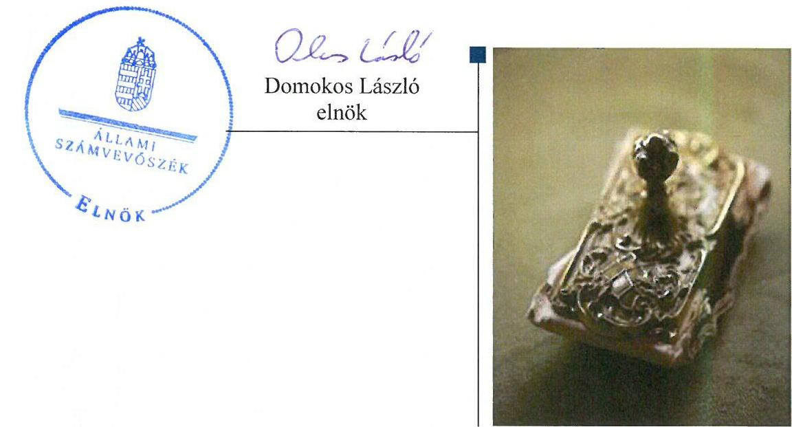
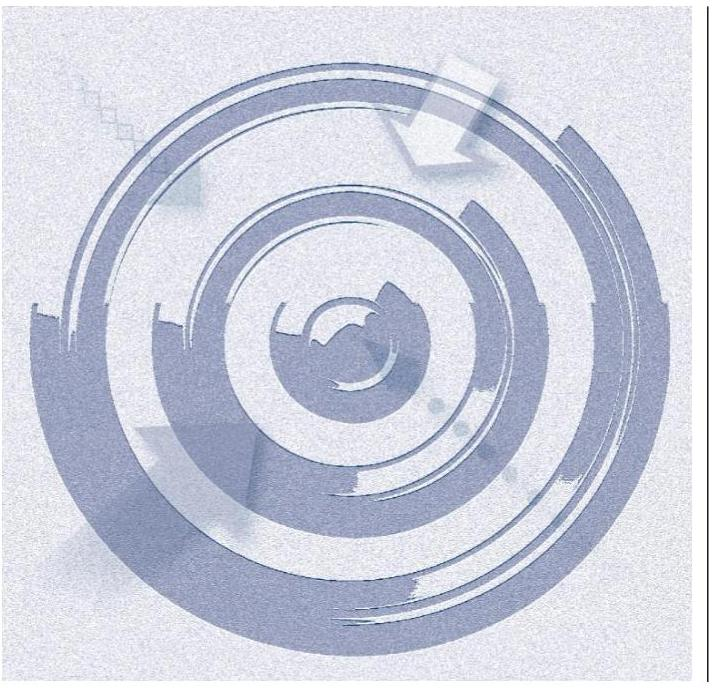
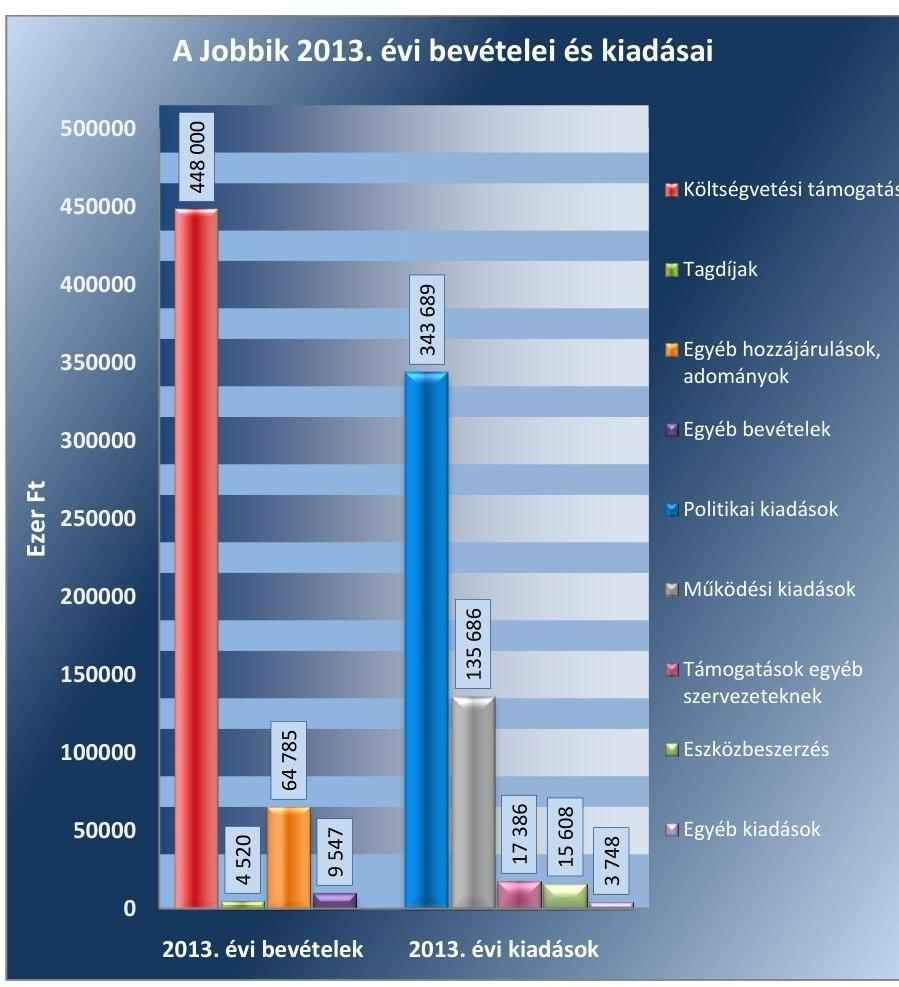
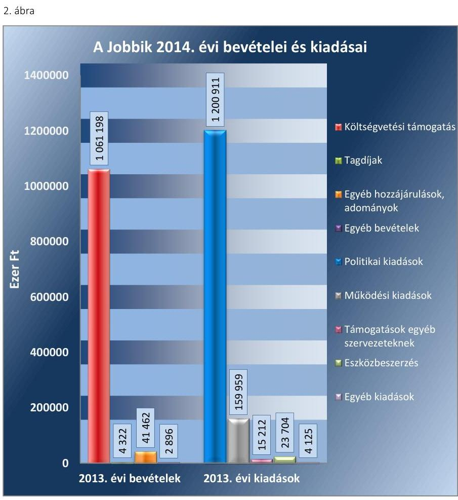

# Jelentés 

## Pártok gazdálkodása

A költségvetési támogatásban részesülő pártok 2013-2014. évi gazdálkodása törvényességének ellenőrzése a Jobbik Magyarországért Mozgalomnál 2016. 03. hó 22. nap

---

# AZ ELLENŐRZÉST FELÜGYELTE:

DR. BENEDEK MÁRIA felügyeleti vezető

# AZ ELLENŐRZÉST VEZETTE ÉS A VÉGREHAJTÁSÁÉRT FELELŐS:

MODER BEATRIX ellenőrzésvezető

# A PROGRAM ÖSSZEÁLLÍTÁSÁÉRT FELELŐS:

JANIK JÓZSEF LÁSZLÓ osztályvezető

# A TÉMÁHOZ KAPCSOLÓDÓ KORÁBBI SZÁMVEVŐSZÉKI JELENTÉSEK:

|  • címe: | A Jobbik gazdálkodása – A Jobbik Magyarországért Mozgalom 2011-2012. évi gazdálkodása törvényességének ellenőrzéséről  |
| --- | --- |
|  • sorszáma: | 14007  |
|  • címe: | Kampánypénzek ellenőrzése – A 2014. évi országgyűlési képviselő-választási kampányokra fordított pénzeszközök elszámolásának ellenőrzése a képviselethez jutott jelölő szervezeteknél  |
|  • sorszáma: | 15057  |

# IKTATÓSZÁM: V-0996-061/2016.

# TÉMASZÁM: 2030

# ELLENŐRZÉS-AZONOSÍTÓ SZÁM: V-074602

---

# TARTALOMJEGYZÉK 

■ ÖSSZEGZÉS ..... 5
■ AZ ELLENŐRZÉS CÉLJA ..... 7
■ AZ ELLENŐRZÉS TERÜLETE ..... 8
■ AZ ELLENŐRZÉS HÁTTERE, INDOKOLTSÁGA ..... 9
■ A JELENTÉS LÉNYEGES KÉRDÉSKÖREI ..... 10
■ ELLENŐRZÉS HATÓKÖRE ÉS MÓDSZEREI ..... 11
■ MEGÁLLAPÍTÁSOK ..... 14
■ JAVASLATOK ..... 29
■ MELLÉKLETEK ..... 31
I. Sz. melléklet: Értelmező szótár ..... 31
II. Sz. melléklet: A Jobbik 2013. évi közzétett beszámolója ..... 32
III. Sz. melléklet: A Jobbik 2014. évi közzétett pénzügyi kimutatása ..... 34
■ FÜGGELÉK: ÉSZREVÉTELEK ..... 37
■ RÖVIDÍTÉSEK JEGYZÉKE ..... 39

---

.

---

# ÖSSZEGZÉS 

Az ÁSZ ${ }^{1}$ a Jobbik² gazdálkodásának törvényességét ellenőrizte a 2013. január 1-jétől 2014. december 31-ig terjedő időszakra vonatkozóan. Megállapította, hogy a Jobbik közzétett 2013. évi beszámolója, illetve 2014. évi pénzügyi kimutatása nem felelt meg a törvényi előírásoknak, mivel a Számv. tv. ${ }^{3}$-ben rögzített teljesség alapelvet figyelmen kívül hagyva a nem pénzbeli vagyoni hozzájárulások értékét a bevételek között teljes körűen nem mutatták ki. A Jobbik 2013. és 2014. évi könyvvezetése és gazdálkodása az analitikus nyilvántartások hiánya, a mérlegtételek alátámasztására szolgáló leltár-összeállítás elmaradása és az ellenőrzési rendszer nem megfelelő működése miatt nem felelt meg a jogszabályok előírásainak. A párt a működéséhez szabályszerűen igénybe vehető forrásokat használt fel. A Jobbik az előző ÁSZ ellenőrzés során feltárt hiányosságok megszüntetésére - egy kivételével - határidőben intézkedett.

## Az ellenőrzés társadalmi indokoltsága

A pártok az állampolgárok egyesülési szabadsága alapján létrehozott olyan szervezetek, amelyek szervezeti kereteket nyújtanak a népakarat kialakításához és kinyilvánításához, a politikai életben való állampolgári részvételhez. A pártoknak más társadalmi szervezetekhez képest különleges a viszonya a közhatalomhoz, ugyanis a pártok kifejezett célja és feladata, hogy képviselőik útján részt vállaljanak a közhatalomból, illetőleg politikai eszközökkel folyamatosan befolyásolják a közhatalom tevékenységét.

A politikai élet tisztasága érdekében törvény állapítja meg a pártok vagyonára és gazdálkodására vonatkozó szabályokat. Az egyesülési jog alapján létrejövő más szervezetekhez képest szűkebb körben határozza meg azt a gazdasági tevékenységet, amelyet a párt végezhet, biztosítja azonban a pártok részére azt a jogosultságot, hogy az állami költségvetésből támogatásban részesüljenek. A pártok gazdálkodását a politikai élet tisztasága érdekében rendszeresen indokolt ellenőrizni, ezért törvényi előírás alapján az ÁSZ a költségvetési támogatást kapott pártok gazdálkodását kétévente ellenőrzi.

Az ÁSZ tv. ${ }^{4}$ és a Párttörvény ${ }^{5}$ alapján a pártok gazdálkodása törvényességének ellenőrzésére az ÁSZ jogosult. Az ÁSZ kiemelt szerepet tölt be és felelősséget visel a pártok feletti társadalmi kontroll érvényesítése terén. A párttörvényben előírt kétévenkénti ellenőrzési kötelezettségen túlmenően az ellenőrzést az a garanciális követelmény indokolja, hogy a pártok gazdálkodásának törvényességi ellenőrzése biztosított legyen, a törvényi rendelkezések megsértését szankciók követhessék.

A pártok működésével és gazdálkodásával kapcsolatos speciális előírásokat tartalmazó Párttörvény az ellenőrzött időszakban módosult. A főbb változások érintették a párt által elfogadható vagyoni hozzájárulásokra, a pártok beszámolására, valamint megszűnésére, felszámolására vonatkozó szabályokat.

## Főbb megállapítások, következtetések, javaslatok

A Jobbik a Párttörvényben előírt határidőn belül elkészítette és közzétette a 2013. évi beszámolóját és a 2014. évi pénzügyi kimutatását. A Jobbik a 2013. évi beszámolót és a 2014. évi pénzügyi kimutatást 2015 decemberében módosította, és gondoskodott a közzétételükről. A Jobbik Párttörvényben előírt határidőben elkészített és közzétett beszámolója és pénzügyi kimutatása nem, de a módosított beszámoló és pénzügyi kimutatás - a Párttörvény és Számv. tv. előírásainak megfelelően - megegyezett a főkönyvi nyilvántartások adataival, azonban a Számv. tv.-ben előírt teljesség alapelvét figyelmen kívül hagyva a nem pénzbeli vagyoni hozzájárulások értékét a könyvvezetés során nem teljes körűen számolták el, így azok a beszámolóban, illetve pénzügyi kimutatásban sem szerepeltek. A Jobbik számviteli rendszerének szabályozása - a Számviteli politika ${ }_{1}^{6},{ }_{2}^{7}$ a Leltározási szabályzat ${ }^{8}$ és a Pénzkezelési szabályzat ${ }^{9}$ egy-egy tartalmi hiányossága mellett - megfelelt a jogszabályi előírásoknak. A Jobbik gazdálkodása és könyvvezetése - a teljesség alapelvének sérülése, valamint az analitikus nyilvántartások és a mérleg tételeit alátámasztó leltár hiánya miatt - nem felelt meg a Számv. tv.-ben meghatározott követelményeknek. A Jobbik a gazdálkodással összefüggő egyéb jogszabályi előírásokat betartotta, az ellenőrzési rendszert azonban nem működtette megfelelően, felügyelőbizottságot nem hozott létre. A Jobbiknál az Alapszabályban nevesített pénzügyi ellenőrző testület, a Számvizsgáló Bizottság ${ }^{10}$ az előírt feladatait nem látta el, a belső szabályozásban előírt belső ellenőrzést nem alakították ki és nem működtették. A pénzügyi-számviteli informatikai rendszer működése megfelelő volt, az adatok biztonságáról, megőrzéséről gondoskodtak, az alkalmazott informatikai rendszer biztosította a Számv. tv.-ben előírt megőrzési idő alatt a számviteli adatállományokból az adatok teljes körű előállíthatóságát. A Jobbik a működéséhez szabályszerűen igénybe vehető forrásokat - költségvetési támogatást, tagdíjbevételeket, magánszemélyektől származó vagyoni hozzájárulásokat és gazdálkodó tevékenységből származó bevételeket - használt fel, a vagyon használata szabályszerű volt. A Jobbik az előző ÁSZ ellenőrzés javaslatai alapján készített intézkedési tervben foglalt feladatokat - a mérleg tételeit alátámasztó leltár-összeállítás kivételével - határidőben végrehajtotta.

---

# AZ ELLENŐRZÉS CÉLJA 

Az ellenőrzés célja annak értékelése volt, hogy a Jobbik közzétett 2013. évi beszámolója, illetve a 2014. évi pénzügyi kimutatása a törvényi előírásoknak megfelelt-e, a könyvvezetés és gazdálkodás során betartották-e a vonatkozó jogszabályi és belső előírásokat, továbbá a Jobbik a működéséhez szabályszerűen igénybe vehető forrásokat használt-e fel, valamint az előző ÁSZ ellenőrzés során feltárt hiányosságok megszüntetéséről intézkedett-e.

---

# AZ ELLENŐRZÉS TERÜLETE 

## A Jobbik

A párt olyan egyesület, amely nyilvántartott tagsággal rendelkezik, és amely a nyilvántartásba vételét végző bíróság előtt kinyilvánítja, hogy a Párttörvény rendelkezéseit magára nézve kötelezőnek ismeri el a Párttörvény 1. §-a alapján.

Az ÁSZ tv. 5. § (11) bekezdés a) pontja alapján az ÁSZ - a Párttörvény rendelkezéseinek megfelelően - törvényességi szempontok szerint ellenőrzi a pártok gazdálkodását. A Párttörvény 10. § (1) bekezdése alapján a párt gazdálkodása törvényességének ellenőrzésére az ÁSZ jogosult. A Párttörvény 10. § (3) bekezdése alapján az ÁSZ kétévente ellenőrzi azoknak a pártoknak a gazdálkodását, amelyek rendszeres költségvetési támogatásban részesültek.

A pártok működésével és gazdálkodásával kapcsolatos speciális előírásokat tartalmazó Párttörvény az ellenőrzött időszakban módosult. A főbb változások érintették a párt által elfogadható vagyoni hozzájárulásokra, a pártok beszámolására, valamint megszűnésére, felszámolására vonatkozó szabályokat. A Párttörvény 9. § (1) bekezdése értelmében a pártok kötelesek minden év április 30-ig az előző évi gazdálkodásukról szóló beszámolót (zárszámadást) - a 2014. május 6-tól hatályos szabályozás szerint minden év május 31-ig a melléklet szerinti pénzügyi kimutatást - a Magyar Közlönyben, valamint internetes honlapjukon közzétenni.

A Jobbik a 2013. évi Párttörvény szerinti módosított beszámolójában 526852 ezer Ft bevételt, valamint 516117 ezer Ft kiadást számolt el. A 2014. évi módosított pénzügyi kimutatás szerint az összes bevétel 1109878 ezer Ft, a teljesített kiadások összege 1403911 ezer Ft volt. A fizetőképesség megőrzése érdekében 2014-ben 110000 ezer Ft összegű likviditási hitelt vettek igénybe.

A Jobbik 2011-ben létrehozta a Gyarapodó Magyarországért Alapítványt, gazdasági társaságot nem alapított.

---

# AZ ELLENŐRZÉS HÁTTERE, INDOKOLTSÁGA 

Az ÁSZ tv. és a Párttörvény alapján a pártok gazdálkodása törvényességének ellenőrzésére az ÁSZ jogosult. Az ÁSZ kiemelt szerepet tölt be és felelősséget visel a pártok feletti társadalmi kontroll érvényesítése terén. A Párttörvényben előírt kétévenkénti ellenőrzési kötelezettségen túlmenően az ellenőrzést az a garanciális követelmény indokolja, hogy a pártok gazdálkodásának törvényességi ellenőrzése biztosított legyen, a törvényi rendelkezések megsértését szankciók követhessék.

Az ÁSZ legutóbb a Jobbik 2011-2012. évi gazdálkodásának törvényességét ellenőrizte.

A gazdálkodás szabályszerűségének, a felhasznált közpénzek nagyságának bemutatásával a társadalom objektív képet alkothat a pártok működéséről. Az ellenőrzés megállapításai a gazdálkodás megfelelőségének bemutatásával elősegíthetik, hogy a törvényalkotók konkrét lépéseket tegyenek a pártok finanszírozására vonatkozó szabályozások átláthatóbbá, ellenőrizhetőbbé tétele irányába. Az ellenőrzés rámutat a pártok gazdálkodásával, valamint az állami költségvetésből származó források felhasználásával kapcsolatos jó gyakorlatokra és szabálytalanságokra. A hiányosságok, szabálytalanságok feltárása, az ennek kapcsán megfogalmazott megállapítások elősegíthetik a törvényi rendelkezések megsértésének szankcionálását. Ugyancsak az ellenőrzés hozadékát képezi az előző ÁSZ ellenőrzés felhívásai hasznosulásának értékelése.

---

# A JELENTÉS LÉNYEGES KÉRDÉSKÖREI 

1.     - A Jobbik közzétett beszámolója, pénzügyi kimutatása megfelelte a törvényi előírásoknak?
2.     - A Jobbik könyvvezetése és gazdálkodása megfelelte az előírásoknak?
3.     - A Jobbik a működéséhez szabályszerűen igénybe vehető forrásokat használt-e fel?
4.     - A Jobbik intézkedett-e az előző ÁSZ ellenőrzés során feltárt hiányosságok megszüntetéséről?

---

# ELLENŐRZÉS HATÓKÖRE ÉS MÓDSZEREI 

## Az ellenőrzés típusa

Szabályszerűségi ellenőrzés.

## Az ellenőrzött időszak

A 2013. január 1-jétől 2014. december 31-ig terjedő időszak.

## Az ellenőrzés tárgya

Az ellenőrzés tárgyát képezték a 2013. évi beszámoló és a 2014. évi pénzügyi kimutatás elkészítésére, közzétételére, a párt könyvvezetésére, gazdálkodására, ennek keretében a számviteli szabályozás kialakítására, a bizonylati rend, bizonylati fegyelem betartására, egyéb gazdálkodási, ellenőrzési és pénzügyi-számviteli informatikai feladatok ellátására irányuló tevékenységek. Az ellenőrzés tárgya volt továbbá az előírt források fogadása, illetve a vagyon előírt hasznosítása, valamint a korábbi ÁSZ ellenőrzés javaslatainak végrehajtása.

A 2014. évi országgyűlési képviselő-választási kampányra fordított pénzeszközök elszámolását az ÁSZ már ellenőrizte, a kampányra fordított bevételek és kiadások a jelen ellenőrzésnek nem képezték a részét.

Az ellenőrzés kiterjedt minden olyan körülményre és adatra, amely az ÁSZ jogszabályban meghatározott feladatainak teljesítéséhez, valamint a program végrehajtása folyamán felmerült újabb összefüggések feltárásához szükséges.

## Az ellenőrzött szervezet

A Jobbik Magyarországért Mozgalom.

## Az ellenőrzés jogalapja

Az ellenőrzés jogszabályi alapját az ÁSZ tv. 5. § (11) bekezdés a) pontjában, a Párttörvény 10. § (1) és (3) bekezdéseiben, valamint az ÁSZ tv. 33. § (7) bekezdésében foglalt előírások képezték.

---

# Az ellenőrzés módszerei 

Az ÁSZ az ellenőrzést az ellenőrzési program szempontjai, az ellenőrzött időszakban hatályos jogszabályok, az ellenőrzés szakmai szabályai, a jelen ellenőrzésre irányadó ÁSZ módszertan (Módszertan a pártok gazdálkodása törvényességének ellenőrzéséhez) és a nemzetközi standardok figyelembe vételével végezte, a
 gazdálkodás hibáinak kijavítására irányuló javaslatok kidolgozásakor a hatályos jogszabályokat tekintette irányadónak.

Az ellenőrzés ideje alatt a Jobbikkal történő kapcsolattartást az ÁSZ az SZMSZ ${ }^{11}$-ének vonatkozó előírásai alapján biztosította.

Az ellenőrzési kérdések megválaszolásához szükséges bizonyítékok megszerzése a következő ellenőrzési eljárások alkalmazásával történt: tételes és mintavételen alapuló dokumentumellenőrzés, megerősítés, összehasonlító elemzés.

Az ellenőrzési bizonyítékként felhasználható adatforrások közé tartoztak egyrészt a szakmai program részletes szempontjainál felsorolt adatforrások, másrészt adatforrás lehetett minden egyéb - az ellenőrzés folyamán feltárt, az ellenőrzés szempontjából releváns információt tartalmazó - dokumentum.

Az ellenőrzés lefolytatásához a Jobbik a tanúsítványok elektronikus kitöltésével, valamint az ÁSZ által kért dokumentumok elektronikus megküldésével szolgáltatott adatokat. A rendelkezésre bocsátott adatok, információk kontrollja az ellenőrzés keretében történt.

Az ellenőrzésnél az átfogó lényegességi küszöb mértékét az ÁSZ a Jobbik által közzétett beszámoló, illetve pénzügyi kimutatás bevételi főösszegének 2\%-ában határozta meg.

Az ellenőrzés során figyelembe kellett venni azt, hogy
$\longrightarrow$ a Párttörvényben előírt beszámoló/pénzügyi kimutatás formájában és tartalmában nem felel meg a Számv. tv. szerinti mérleg, valamint az eredmény-kimutatás követelményeinek,
$\longrightarrow$ a Párttörvényben előírt éves beszámoló/pénzügyi kimutatás nem illeszkedik a Számv. tv.-ben meghatározott éves beszámoló elkészítésére vonatkozó tételes szabályokhoz,
$\longrightarrow$ a beszámoló/pénzügyi kimutatás elkészítéséhez nem készült a Párttörvény 1. számú melléklete szerinti beszámoló-soronként kitöltési útmutató, nincsenek fogalmi meghatározások, így az éves beszámoló/pénzügyi kimutatás elkészítése pártonként eltérő felfogások érvényesítésére ad lehetőséget,
$\longrightarrow$ a Párttörvény 2014. január 1-jei módosítása érintette a pártok felszámolási és végelszámolási eljárásra vonatkozó rendelkezéseit is,
$\longrightarrow$ 2014. január 1-jétől a módosított Párttörvény megtiltja, hogy a pártok jogi személyektől, jogi személyiséggel nem rendelkező szervezettől, külföldi szervezettől és nem magyar állampolgár természetes személytől vagyoni hozzájárulást fogadjanak el.
A jelentésben használt fogalmak magyarázatát az I. számú melléklet, a Jobbik 2013. évi beszámolójának adatait a II. számú melléklet, a 2014. évi pénzügyi kimutatás adatait a III. számú melléklet tartalmazza.

A 2013. évi beszámoló, illetve a 2014. évi pénzügyi kimutatás könyvviteli nyilvántartással való egyezőségének, a könyvvezetés és gazdálkodás

---

szabályszerűségének ellenőrzéséhez az ÁSZ tételes ellenőrzést és MUS mintavételi eljárást is alkalmazott. Teljes körűen ellenőrzésre kerültek a központi költségvetésből származó támogatások, valamint a beszámolóban, illetve pénzügyi kimutatásban a Párttörvény alapján nevesítésre kötelezett, értékhatárt meghaladó adományok, hozzájárulások, továbbá az 1 millió Ft feletti kiadások. Mintavételi eljárás alapján ellenőrizte az ÁSZ a tagdíjbevételeket, a nevesítésre nem kötelezett adományokat, hozzájárulásokat, az egyéb bevételeket, valamint az 1 millió Ft-ot el nem érő kiadásokat.

Az ÁSZ a beszámoló/pénzügyi kimutatás elkészítésének, a számviteli rendszer jogszabályi előírások szerinti kialakításának és működtetésének, valamint a források igénybevételének szabályszerűségét az erre irányuló ellenőrzési kérdésekre adott válaszok összesítése alapján, a lényegességi szempontok figyelembevételével évenkénti bontásban minősítette. Megfelelőnek értékelte az ellenőrzött területet, amennyiben a szabályozás, illetve végrehajtás során a jogszabályi követelményeket maradéktalanul, vagy kisebb hiányosságok mellett érvényesítették, nem megfelelőnek értékelte, amennyiben a szabályozás hiányosságai nem biztosították a szabályszerű működés feltételeit, illetve a gazdálkodás folyamatában, a könyvvezetés során jelentkező hibák lényegesek, nagyszámúak, vagy rendszerszerűek voltak.

---

# 1. A Jobbik közzétett beszámolója, pénzügyi kimutatása megfelel-e a törvényi előírásoknak? 

Összegző megállapítás

1.1. számú megállapítás
1.2. számú megállapítás

A Jobbik közzétett 2013. évi beszámolója és 2014. évi pénzügyi kimutatása nem felelt meg a vonatkozó törvényi előírásoknak.

A 2013. évi beszámoló és a 2014. évi pénzügyi kimutatás, illetve azok módosításának elkészítése nem felelt meg, a közzététele megfelelt a jogszabályi előírásoknak.

A Jobbik határidőben elkészítette a 2013. évi gazdálkodásáról szóló beszámolót és a 2014. évi gazdálkodásáról a pénzügyi kimutatást és gondoskodott a Magyar Közlöny mellékletét képező Hivatalos Értesítőben, valamint a saját honlapján történő közzétételéről.

A Jobbik 2015. december 9-én módosította a 2013. évi beszámolóját és a 2014. évi pénzügyi kimutatását, amelyeket az előírásoknak megfelelően közzétett.

A közzétett 2013. évi beszámoló és a 2014. évi pénzügyi kimutatás, valamint ezek módosításai szerkezetüket tekintve megfeleltek az előírásoknak, a Párttörvény 1. számú mellékletében meghatározott beszámolósorokon mutattak ki bevételeket és kiadásokat. A beszámoló és a pénzügyi kimutatás a nevesítésre kötelezett adományokat, hozzájárulásokat elkülönítve tartalmazta. A beszámoló és a pénzügyi kimutatás összeállítása során azonban nem érvényesítették a Számv. tv.-ben előírt teljesség számviteli alapelvet, mivel a - 3.1 pontban részletezett - nem pénzbeli vagyoni hozzájárulásokat a Párttörvény előírása ellenére nem értékelték és a könyvvezetés, valamint a beszámoló, illetve pénzügyi kimutatás készítése során a bevételek között nem mutatták ki.

A Párttörvény szerinti határidőben elkészített 2013. évi beszámoló és 2014. évi pénzügyi kimutatás a könyvviteli nyilvántartás adataival nem egyezett, de a módosított 2013. évi beszámoló és a módosított 2014. évi pénzügyi kimutatás könyvviteli nyilvántartás adataival való egyezősége biztosított volt.

A Jobbik bevételeinek és kiadásainak elszámolása a Számlarendben ${ }^{12}$ foglalt főkönyvi számlákon történt.

A Jobbik által a Párttörvényben előírt határidőre elkészített és közzétett 2013. évi beszámoló és 2014. évi pénzügyi kimutatás szerinti bevételek és kiadások a főkönyvi nyilvántartások adataival nem egyeztek meg.

A 2013. évi beszámoló bevételi főösszege 58 ezer Ft-tal, a kiadási főösszeg 27019 ezer Ft-tal kevesebb volt a könyvviteli nyilvántartásokban el-

---

számolt összegeknél. A bevételi főösszeg eltérése a tagdíjak, a magánszemélyektől kapott adományok, hozzájárulások és az egyéb bevételek beszámolósorokon kimutatott összegek és a kapcsolódó főkönyvi számlák adatainak eltéréseiből adódott. A kiadási főösszeg eltérését a működési kiadások, a politikai tevékenység kiadásai, és az egyéb kiadások beszámolósorok főkönyvi nyilvántartás adataitól való eltérése okozta. A beszámolósorok és a könyvviteli nyilvántartás adatai közötti eltérések jelentős összegűek voltak, mivel meghaladták a 2013. évi bevételi főösszegre vetített 2\%-os lényegességi küszöbértéket.

A 2014. évi pénzügyi kimutatás bevételi főösszege az egyéb bevételek beszámolósor eltérése miatt ezer Ft-tal, a kiadási főösszeg a működési kiadások, a politikai tevékenység kiadásai és az egyéb kiadások eltérése következtében 1204 ezer Ft-tal kevesebb volt a főkönyvi elszámolásban szereplő összegeknél. A beszámolósorok és a főkönyvi számlák adatai közötti eltérés a számviteli elszámolás szempontjából nem tekintendők jelentősnek, mivel nem érték el a 2014. évi bevételi főösszegre vetített 2\%-os lényegességi küszöbértéket.

A Jobbik a 2015. évben végrehajtott egyeztetés során a fenti eltérések helyesbítése, továbbá egy 2014. január 1-jétől visszamenőleges hatállyal módosított ingatlanbérleti szerződéshez kapcsolódóan a 2013. évi nem pénzbeli vagyoni hozzájárulás kimutatása érdekében 2015. december 9-én módosította a 2013. évi beszámolóját és a 2014. évi pénzügyi kimutatását, amelyeket a Magyar Közlöny mellékletét képező Hivatalos Értesítő 2015. december 17-én megjelent 63. számában, valamint a saját honlapján közzétett.

A módosított 2013. évi beszámoló és a módosított 2014. évi pénzügyi kimutatás a könyvviteli nyilvántartások adataival egyezően tartalmazták a Jobbik bevételeit és kiadásait.

A Jobbik 2013. évi 526852 ezer Ft összegű bevétele központi költségvetési támogatásból, a tagok által fizetett tagdíjakból, belföldi jogi személyek és jogi személyiségnek nem minősülő gazdasági társaság adományából, illetve nem pénzbeli vagyoni hozzájárulásából, belföldi és külföldi magánszemélyektől származó adományokból, hozzájárulásokból, valamint egyéb bevételekből képződött.

A Jobbik 516117 ezer Ft összegű, 2013. évi összes kiadását az egyéb szervezeteknek nyújtott támogatások, működési kiadások, eszközbeszerzések, politikai tevékenységhez kapcsolódó kiadások, valamint egyéb kiadások képezték.

A Jobbik 2013. évi beszámolójában feltüntetett bevételeit és kiadásait az 1. ábra szemlélteti.

---

1. ábra

Forrás: A Jobbik 2013. évi módosított beszámolójának adatai

A 2013. évi beszámoló egyes bevételi és kiadási sorainak tartalma - a Párttörvény és a Számv. tv. előírásainak megfelelően - megegyezett a könyvviteli nyilvántartással. A főkönyvi számlákon és a beszámolósorokon minden esetben bizonylattal alátámasztott és - az egyéb szervezetnek nyújtott támogatások között elszámolt tagdíjkiadások kivételével - csak az adott jogcímhez tartozó összegek szerepeltek.

A „Központi költségvetésből származó támogatás" beszámolósor a könyvviteli nyilvántartással egyezően, az előírt jogcímű, banki bizonylattal alátámasztott, a Magyar Államkincstár által ténylegesen átutalt összegeket tartalmazott. A 2013. évi módosított beszámolóban kimutatott 448000 ezer Ft költségvetési támogatás összege megegyezett a 2013. évi költségvetési törvényben ${ }^{13}$ szereplő összeggel.

A 2013. évi beszámoló „Tagdíj" beszámolósor adata megegyezett a főkönyvi és analitikus nyilvántartás adataival, azon csak tagdíj jogcímű összegek szerepeltek. A Jobbik az Alapszabály ${ }_{1}{ }^{14}{ }_{2}{ }^{15}{ }_{3}{ }^{16}$-ban rögzítette a tagdíj megállapításának módját és előírta a megállapított mértékű tagdíjfizetési kötelezettséget. A Gazdálkodási szabályzat ${ }_{2-2}$ tartalmazta a központi tagdíjnyilvántartás vezetésének kötelezettségét. Az ellenőrzött 2013. évi tagdíjak befizetési tételeit a hozzájuk kapcsolódó bankszámlakivonatok, bevételi pénztárbizonylatok, analitikus nyilvántartások megfelelően alátámasztották.

---

A 2013. évi beszámoló „Egyéb hozzájárulások, adományok" beszámolósora a kapcsolódó főkönyvi számlák adataival egyezően, összesen 64785 ezer Ft bevételt tartalmazott, a beszámolósoron csak adomány, hozzájárulás jogcímű, bizonylattal alátámasztott összegek szerepeltek. Az Egyéb hozzájárulások, adományok 97,1\%-a, 62912 ezer Ft magánszemélyektől származott, ebből az 500 ezer Ft feletti, nevesített hozzájárulás, adomány összege 26750 ezer Ft volt, amelyet 33 fő fizetett be. Az 500 ezer Ft feletti nevesítésre kötelezett adományokat, hozzájárulásokat - az analitikus nyilvántartások adományozó személyenkénti összesítése alapján - teljes körűen kimutatták és a beszámolóban közzé tették. Belföldi jogi személyektől az adományok 2,8\%-a (1833 ezer Ft) származott, jogi személynek nem minősülő gazdasági társaságtól az adományok 0,1\%-a (40 ezer Ft) folyt be. 2013-ban a Jobbik külföldi magánszemélyektől összesen 221 ezer Ft adományban részesült, amelyből nevesített, 100 ezer Ft feletti befizetés egy főtől származott.

A 2013. évi 9547 ezer Ft egyéb bevételeket a főkönyvi nyilvántartással egyezően mutatták ki a beszámolóban, az elszámolt bevételeket megfelelő dokumentumokkal alátámasztották.

A 2013. évi beszámoló kiadási adatai a kapcsolódó főkönyvi számlákból egyértelműen levezethetőek voltak. A főkönyvi számlákon és a beszámolósorokon bizonylattal alátámasztott és - az egyéb szervezetnek nyújtott támogatás kivételével - csak az előírt jogcímű kiadási összegek szerepeltek.

A Jobbik a 2013. évi beszámolójában a főkönyvi nyilvántartással egyezően 17386 ezer Ft egyéb szervezetnek nyújtott támogatást tett közzé. A támogatásokról az Elnökség határozatokban döntött. A beszámolósoron és a kapcsolódó főkönyvi számlán azonban tévesen kimutattak a politikai kiadások körébe tartozó, nemzetközi szervezetnek fizetett tagdíjat is.

A Jobbik 2014. évi pénzügyi kimutatása szerinti bevétele összesen 1109878 ezer Ft volt, amely központi költségvetési támogatásból, tagdíjakból, magyar állampolgár természetes személyek vagyoni hozzájárulásaiból, és egyéb bevételekből tevődött össze.

A 2014. évi 1403911 ezer Ft kiadás 52,5\%-át az országgyúlési kampányra fordított politikai kiadások összege tette ki. A 2014. évi pénzügyi kimutatás egyes kiadási sorai ezen felül egyéb szervezetnek nyújtott támogatásokat, működési kiadásokat, eszközbeszerzéseket, politikai tevékenységhez kapcsolódó kiadásokat és egyéb kiadásokat tartalmaztak.

A 2014. évi pénzügyi kimutatás egyes bevételi és kiadási sorainak tartalma - a Párttörvény és a Számv. tv. előírásainak megfelelően - megegyezett a könyvviteli nyilvántartás adataival. A főkönyvi számlákon és a beszámolósorokon minden esetben megfelelő bizonylattal alátámasztott és - az egyéb szervezetnek nyújtott támogatások között elszámolt, fizetett tagdíj kivételével - csak az adott jogcímhez tartozó összegek szerepeltek.

A Jobbik 2014. évi pénzügyi kimutatásában feltüntetett bevételeit és kiadásait a 2. ábra szemlélteti.

---

Forrás: A Jobbik 2014.
 évi módosított pénzügyi kimutatásának adatai

A központi költségvetési támogatás 1061198 ezer Ft összegéből a Kftv. ${ }^{17}$ szerinti kampányfinanszírozási célú költségvetési támogatás 597000 ezer Ft volt. A kampányfinanszírozás nélküli költségvetési támogatás összege megegyezett a 2014. évi költségvetési törvény ${ }^{18}$ szerinti 448000 ezer Ft, és az 1321/2014. (V. 30.) Korm. határozat ${ }^{19}$ alapján megállapított 16198 ezer Ft támogatás együttes összegével. A beszámolósor az előírt jogcímű, banki bizonylatokkal alátámasztott, a könyvviteli nyilvántartással megegyező összeget tartalmazott.

A 2014. évi tagdíjak pénzügyi kimutatás szerinti összege megegyezett a főkönyvi és analitikus nyilvántartás adataival, azon csak tagdíj jogcímű, megfelelő bizonylatokkal alátámasztott összegeket számoltak el.

Az Egyéb hozzájárulások, adományok beszámolósoron kimutatott 41462 ezer Ft bevételből egy magyar állampolgár természetes személy az országgyűlési kampányra adományozott 100 ezer Ft-ot. A beszámolósorok adata megegyezett a kapcsolódó főkönyvi számlák összegével, azon csak adomány, hozzájárulás jogcímű, bizonylattal alátámasztott összegek szerepeltek. Az analitikus nyilvántartások alapján 500 ezer Ft feletti egyéb hozzájárulást, adományt 15 fő fizetett be, összesen 12058 ezer Ft összegben, amely a pénzügyi kimutatásban a Párttörvény előírásának megfelelően nevesítve kimutatásra került.

A Jobbik a 2014. évi pénzügyi kimutatásban a főkönyvi nyilvántartással egyezően, a megfelelő bizonylatokkal alátámasztott 2896 ezer Ft egyéb bevételt szerepeltetett.

---

A 2014. évi pénzügyi kimutatás kiadási adatai a kapcsolódó főkönyvi számlákkal egyezően, bizonylatokkal alátámasztott és - az egyéb szervezetnek nyújtott támogatás kivételével - csak az előírt jogcímű kiadási összegeket tartalmazott.

A 2014. évi pénzügyi kimutatásban egyéb szervezetnek nyújtott támogatás címen közzétett 15212 ezer Ft megegyezett a kapcsolódó főkönyvi számla adatával. A beszámolósoron és a kapcsolódó főkönyvi számlán azonban tévesen kimutattak a politikai kiadások körébe tartozó, nemzetközi szervezetnek fizetett tagdíjat is.

A 2013. évi beszámoló és a 2014. évi pénzügyi kimutatás, valamint az azokat alátámasztó könyvviteli elszámolások szabálytalanságait az 1. táblázat tartalmazza.

1. táblázat

# A BESZÁMOLÓ ÉS A PÉNZÜGYI KIMUTATÁS ÉS AZ AZOKAT ALÁTÁMASZTÓ KÖNYVVITELI ELSZÁMOLÁSOK SZABÁLYTALANSÁGAI 

| Sorszám | Beszámoló megállapítás | Megjegyzés |
| :-- | :-- | :-- |
| 1. | A Jobbik a térítésmentes - szívességi - irodahasználati szerződés   alapján a 2013. és 2014. években magánszemélytől kapott nem   pénzbeli vagyoni hozzájárulásokat a Párttörvény 4. § (5) bekezdésé-   ben foglalt előírás ellenére nem értékelte, és a Számv. tv. 15. §   (2) bekezdésében foglalt teljesség alapelvet figyelmen kívül   hagyva a könyvvezetés, valamint a beszámoló, illetve a pénzügyi   kimutatás készítése során bevételként nem számolta el és nem   mutatta ki azokat. |  |
| 2. | A Jobbik a Számv. tv. 16. § (3) bekezdésében foglalt - a tartalom   elsődlegessége a formával szemben - alapelv ellenére a 2013. és   2014. években nem a gazdasági esemény tényleges tartalmának   megfelelően számolta el a kiadásait, mert a nemzetközi szervezet   részére fizetett tagdíjat a főkönyvi nyilvántartásban téves számla-   kijelölés következtében politikai tevékenység kiadása helyett   egyéb szervezetnek nyújtott támogatásként számolta el. |  |

## 2. A Jobbik könyvvezetése és gazdálkodása megfelelt-e az előírásoknak?

Összegző megállapítás

## 2.1. számú megállapítás

A Jobbik könyvvezetése és gazdálkodása nem felelt meg az előírásoknak.

A Jobbik számviteli rendszere - a Számviteli politika, a Leltározási és a Pénzkezelési szabályzat egy-egy tartalmi hiányossága mellett összességében megfelelően szabályozott volt.

A JOBBIK RENDELKEZETT A SZÁMV. TV.-BEN ELŐÍRT SZABÁLYZATOKKAL, amelyeket a belső szabályzatokban előírtaknak megfelelően az elnök kiadmányozott.

A Számviteli politika ${ }_{1-2}$-ben a Számv. tv. előírásainak megfelelően meghatározták a könyvvezetés módját, az évközi és év végi zárlatok időpontjait,

---

valamint az ezek során elvégzendő feladatokat. Rögzítették, hogy az értékelésnél mit tekintenek lényegesnek, nem lényegesnek, jelentős összegnek, nem jelentős összegnek. A Jobbik működésének sajátosságával összhangban meghatározták a működési kiadások és a politikai tevékenység kiadásainak körét. Rögzítették a beszámoló elkészítésekor és a könyvvezetés során érvényesítendő számviteli alapelveket, az éves beszámoló készítésének rendjét és időpontját, a bekerülési érték tartalmát, az amortizációs politika elemeit, az eszközök minősítési szempontjait, azonban nem határozták meg a források minősítésének szempontjait.

A Leltározási szabályzat tartalmazta a leltározás módját, a leltározás lebonyolításának rendjét, a leltár kiértékelési szabályokat, a leltárkülönbözetek megállapításának, rendezésének módját, valamint a leltározás bizonylati rendjét. A szabályzatban meghatározták a mennyiségi felvétellel történő leltározás gyakoriságát, azonban az az egyes eszközcsoportoknál nem volt összhangban a Számv. tv. előírásával.

Az Értékelési szabályzat ${ }^{20}$ a Számv. tv.-ben előírtaknak megfelelően tartalmazta az eszköz- és forráscsoportok választott értékelési eljárásait, továbbá meghatározták a Párttörvényben előírtak szerint a Jobbik részére nyújtott nem pénzbeli vagyoni hozzájárulás értékelési eljárását.

A Pénzkezelési szabályzat tartalma - a napi maximális záró pénzkészlet meghatározásának hiánya mellett - megfelelt a jogszabályi követelményeknek. A szabályzatban a Számv. tv.-ben előírtaknak megfelelően meghatározták a pénzforgalom készpénzben és bankszámlán történő lebonyolításának rendjét, a pénzkezelés személyi és tárgyi feltételeit, felelősségi szabályait, a készpénzállományt érintő pénzmozgások jogcímeit és eljárási rendjét. A szabályzatban meghatározták az utalványozásra jogosultak körét.

A Számlarend megfelelt a Számv. tv.-ben előírt egységes számlakeret követelményeinek, elkészítése során figyelembe vették a Jobbik működési sajátosságait. A Számlarend tartalmazta minden alkalmazott főkönyvi számla számát, megnevezését, a számla tartalmát, ha az a számla megnevezéséből egyértelműen nem következett, a számla értéke növekedésének, csökkenésének jogcímeit, a számlát érintő gazdasági eseményeket, továbbá a számlák más számlákkal való kapcsolatát. A Számlarendben meghatározták a főkönyvi számlákhoz kapcsolódó analitikus nyilvántartások tartalmát, formáját, kijelölték az analitikus nyilvántartások és a főkönyvi könyvelés közötti ellenőrzési pontokat és az egyeztetés módját. A Számv. tv. előírásának megfelelően a Számlarendben foglaltakat alátámasztó bizonylati rendet a Bizonylatkezelési szabályzat ${ }^{21}$ tartalmazta.

A számviteli rendszer szabályozásának hiányosságait a 2. táblázat tartalmazza.

---

| A SZÁMVITELI RENDSZER SZABÁLYOZÁSÁNAK HIÁNYOSSÁGAI |  |  |
| :--: | :--: | :--: |
| Sorszám | Részmegállapítás | Megjegyzés |
| 1. | A Számviteli politika $_{1-2}$ a Számv. tv. 14. § (4) bekezdésében foglalt előírás ellenére nem tartalmazta a források minősítésének szempontjait. |  |
| 2. | A Leltározási szabályzatban a Számv. tv. 69. § (3) bekezdésében előírt, 3 évenkénti mennyiségi leltárfelvételi gyakorisággal szemben az ingatlanok esetében 5 évenkénti, közúti járművek esetében 4 évenkénti mennyiségi felvétellel történő leltározást írták elő. |  |
| 3. | A Pénzkezelési szabályzatban a Számv. tv. 14. § (8) bekezdésében előírtak ellenére nem határozták meg a napi készpénz záró állomány maximális mértékét. |  |

A könyvvezetés gyakorlata - az analitikus nyilvántartások hiánya, a leltár-összeállítás elmaradása és a számviteli alapelvek nem teljes körű érvényesítése miatt - nem felelt meg a jogszabályokban és belső szabályzatokban előírtaknak.

A JOBBIK KÖNYVVITELI FELADATAIT az ellenőrzött időszakban megbízási szerződés alapján külső könyvviteli szolgáltató látta el, a Számv. tv. és a Számviteli politika 1-2 előírásaival összhangban, a kettős könyvvitel rendszerében. Könyvviteli szolgáltató váltás az ellenőrzött időszakban nem történt, a feladatellátás folyamatossága biztosított volt.

A könyvvezetés során Számv. tv.-ben rögzített teljesség, és a tartalom elsődlegessége a formával szemben alapelvek - az 1.1. és 1.2. pontban részletezettek szerint - nem teljes körűen érvényesültek.

A Jobbik az eszközök bekerülési értékét a Számv. tv. előírásaival összhangban, az Értékelési szabályzat és a Számviteli politika ${ }_{1,2}$ előírásai szerint határozta meg. Az eszközök értékcsökkenésének elszámolására a Számv. tv. előírásainak megfelelően került sor.

A Jobbik az ellenőrzött időszakban a Számv. tv., valamint a Számviteli politika 1,2 szerinti könyvviteli zárlati feladatokat dokumentáltan elvégezte. A tagdíjak és az egyéb hozzájárulások analitikus nyilvántartásának a főkönyvi könyveléssel egyeztetését a Számv. tv.-ben foglalt előírásnak megfelelően az év végi zárlati feladatok keretében elvégezték, az egyezőség az ellenőrzött években biztosított volt. A szállítói és egyéb kötelezettségek analitikus nyilvántartását azonban nem vezették, leltárt az év végi zárlati munkák során nem állítottak össze, a mérlegtételeket leltárral nem támasztották alá.

A banki kifizetések engedélyezése során - a Pénzkezelési szabályzatban rögzítettek szerint - a bankszámla feletti rendelkezésre jogosultak írtak alá.

A könyvvezetés során érvényesült a bizonylati elv és fegyelem. A gazdasági eseményeket bizonylatokkal alátámasztották, a kiállított vegyes bizonylatok megalapozottak voltak, a főkönyvi könyvelésben a gazdasági események időrendisége érvényesült. A könyvviteli elszámolásokat alátámasztó bizonylatok megőrzése szabályszerű volt. Az elmentett számviteli adatállományokból az ellenőrzött tételek vonatkozásában az adatok előállíthatóságát biztosították.

---

Az ellenőrzött gazdasági események könyvviteli elszámolását közvetlenül alátámasztó számviteli bizonylatok a Számv. tv.-ben előírt alaki és tartalmi követelményeknek - eseti hiányosságoktól eltekintve - megfeleltek.

A szigorú számadási kötelezettség alá vont nyomtatványok nyilvántartása megfelelt a Számv. tv. és a Bizonylatkezelési szabályzat előírásainak, az elszámoltatás biztosított volt.

A Jobbik könyvvezetésével kapcsolatos szabálytalanságokat a 3. táblázat tartalmazza.
3. táblázat

# A KÖNYVVEZETÉSSEL KAPCSOLATOS SZABÁLYTALANSÁGOK 

## Sorszám

1. Az ellenőrzött időszakban a Jobbiknál a Számv. tv. 69. § (1) bekezdés előírása ellenére a könyvek üzleti év végi zárásához, a beszámoló elkészítéséhez és a mérleg tételeinek alátámasztásához nem állítottak össze olyan leltárt, amely tételesen és ellenőrizhető módon tartalmazta a mérleg fordulónapján meglévő eszközöket és forrásokat.
2. A Jobbiknál a Számlarend előírása ellenére a szállítói és egyéb kötelezettségek analitikus nyilvántartását nem vezették.
3. A Számv. tv. 167. § (1) bekezdés d), e), h) és i) pont előírásai ellenére a 2013. és 2014. évi bizonylatok esetenként nem tartalmazták a bizonylat kiállításának időpontját, a gazdasági művelet tartalmának leírását vagy megjelölését, az érintett könyvviteli számlákra hivatkozást, a könyvviteli nyilvántartásban történő rögzítés időpontját és igazolását.

Forrás: ÁSZ

### 2.3. számú megállapítás

A Jobbik a gazdálkodással összefüggő, egyéb jogszabályokban meghatározott előírásokat betartotta.

A JOBBIKNÁL A FOGLALKOZTATÁS, A MUNKABÉREK ÉS EGYÉB SZEMÉLYI KIADÁSOK elszámolása az ellenőrzött időszakban szabályszerű volt.

Az ellenőrzött időszakban a munkaerő foglalkoztatása munkaviszony keretében, a Munka tv. ${ }^{22}$ előírásainak megfelelő, szabályozott tartalmú munkaszerződések alapján történt. A munkaszerződéseket a Pártigazgató ${ }^{23}$ mint - az Alapszabály ${ }_{1-3}$ és a Gazdálkodási szabályzat ${ }_{1,2}$ szerinti munkáltatói jogkör gyakorlója írta alá.

A Jobbik feladatai ellátásához a munkaviszony keretében foglalkoztatott munkavállalók mellett, megbízásos jogviszony keretében is foglalkoztatott magánszemélyeket. A megbízási szerződéseket - mint az Alapszabály ${ }_{1-3}$ és a Gazdálkodási szabályzat ${ }_{1,2}$ szerinti kötelezettségvállaló - a Pártigazgató írta alá.

A munkavállalók és a megbízási jogviszony keretében foglalkoztatottak bejelentése az Art. ${ }^{24}$ rendelkezéseinek megfelelő tartalommal és határidőben az illetékes adóhatóság felé megtörtént.

A munkabérek, megbízási díjak, pénzjutalmak számfejtése és kifizetése a munkaszerződésekben, illetve a megbízási szerződésekben foglaltaknak megfelelően, a hatályos Art., Szja. tv. ${ }^{25}$, Tbj. tv. ${ }^{26}$, Szhtv. ${ }^{27}$ és Eho. tv. ${ }^{28}$ előírásaival összhangban, szabályszerűen történt.

---

A Jobbik a munkavállalói számára a 2013. és 2014. években - a 39/2010. (II. 26.) Korm. rendeletben ${ }^{29}$ foglalt feltételek fennállása hiányában - munkába járással összefüggő költségtérítést, bérlet és gépkocsi hozzájárulást nem fizetett.

A Jobbik a hivatalos utazással
 kapcsolatos költségeket - a Pénzkezelési szabályzat előírásai szerint - az Szja. tv.-ben előírt tartalmú belföldi kiküldetési nyomtatvány alapján számolta el. A hivatalos utazások elszámolásánál a magántulajdonú gépjármű használati jogának igazolásaként a kiküldetési nyomtatványhoz a gépjármű forgalmi engedély és a vezetői engedély másolatát minden esetben csatolták. A saját gépjármű használatáért az Szja. tv. alapján adómentesen elszámolható mértékű költségtérítést fizettek. A munkavállalók belföldi hivatalos kiküldetése során a Jobbik napidíjat nem fizetett, mivel a kiküldetések időtartama a 6 órát nem haladta meg.

A Jobbik a munkavállalókat és a munkáltatót terhelő adók és járulékok, illetve előlegek bevallását és befizetését - a telefon magáncélú használatából eredő adófizetési kötelezettség kivételével - az Art.-ban előírt határidőre és gyakorisággal teljesítette. A bevallott és befizetett adók és járulékok adatai a főkönyvi nyilvántartással megegyeztek.

A Jobbik a személyi jellegű kifizetések között a reprezentációs kiadásokat elkülönítetten tartotta nyilván. Az elszámolt reprezentációs költség az ellenőrzött években nem haladta meg az Szja. tv. szerinti adómentes mértéket, így a Jobbiknak adó- és járulékfizetési kötelezettsége a reprezentációs kiadások után nem keletkezett. Az elszámolt reprezentációs kiadások a Jobbik tevékenységével összefüggő rendezvényekhez, eseményekhez kapcsolódtak.

A Jobbiknak az ellenőrzött időszakban a gazdálkodó tevékenységével összefüggésben az Áfa. tv. hatálya alá tartozó adófizetési kötelezettsége nem keletkezett, mivel a Jobbik gazdálkodási tevékenységéből származó bevétele a 6,0 M Ft-ot nem haladta meg.

A Jobbiknak az ellenőrzött időszakban cégautó adó- és rehabilitációs hozzájárulás fizetési kötelezettsége nem keletkezett, mivel a Jobbik tulajdonában gépkocsi az ellenőrzött időszakban nem volt, illetve a foglalkoztatottak átlagos létszáma nem érte el a 25 főt.

A Jobbik gazdálkodásával összefüggő egyéb szabálytalanságokat az 4. táblázat tartalmazza.
4. táblázat

# A GAZDÁLKODÁSSAL KAPCSOLATOS EGYÉB SZABÁLYTALANSÁGOK 

## Sorszám

1. A hivatali telefont használók által meg nem térített magáncélú használat miatti, az Szja. tv. 69. § és a 70. § (5) bekezdés c) pontja szerinti adófizetési kötelezettségét a Jobbik az Art. 1. és 2. számú mellékletében előírt határidőre nem teljesítette.

Megjegyzés
Az adófizetést a Jobbik önrevízióval 2015. év végén teljesítette.

Forrás: $A S Z$

---

# 2.4. számú megállapítás 

A Jobbik az ellenőrzési rendszerének elemeit a belső szabályzataiban meghatározta, azonban nem működtette.

## A JOBBIK DÖNTÉSHOZÓ, IRÁNYÍTÓ ÉS ELLENŐRZŐ SZERVEIT és azok feladat- és hatáskörét az Alapszabály 1-3-ban, a Gazdálkodási szabályzat 1,2-ben, valamint az Országos Elnökség SZMSZ-ében $^{30}$ határozták meg.

A Jobbik döntéshozó szervei a Kongresszus, az Országos Választmány és az Országos Elnökség, amelyek a döntéseiket jegyzőkönyvekben, illetve határozatokban rögzítették.

Az Alapszabály 1-3, a Gazdálkodási szabályzat 1,2, valamint a Pénzkezelési szabályzat értelmében a Jobbik gazdálkodását a Számvizsgáló Bizottság, a Gazdasági Igazgató $^{31}$ szervezetéhez tartozó belső ellenőrzés, illetve a pénztárellenőr ellenőrzi.

A Jobbiknál felügyelőbizottság felállítására az ellenőrzött időszak végéig nem került sor, az Alapszabály 1-3 szerinti ellenőrző testület, a Számvizsgáló Bizottság előírt feladatai ugyan megfeleltethetőek a felügyelőbizottság részére jogszabályban előírt feladatoknak, azonban a Számvizsgáló Bizottság az ellenőrzött időszakban a feladatait nem látta el.

A Jobbiknál az ellenőrzött időszakban belső ellenőrzés nem működött, belső ellenőrzési egység kialakítására, illetve belső ellenőr alkalmazására nem került sor.

A Jobbik egy főt bízott meg a pénztárellenőri feladatok ellátásával. A pénztárellenőr a Pénzkezelési szabályzat, illetve munkaköri leírása alapján a bevételi-kiadási bizonylatok szabályszerűségét, a napi gazdasági események dokumentumait, valamint a pénztárzárásokat ellenőrizte, az ellenőrzés tényét aláírásával igazolta. A pénztárellenőrzések során eltéréseket a pénztárellenőr nem tapasztalt. A Pártigazgató a Pénzkezelési szabályzatban rögzített pénztárellenőrzés lehetőségével az ellenőrzött időszakban nem élt.

A vezetői ellenőrzés kereteit, a kötelezettségvállalás és utalványozás rendjét a Jobbik a Gazdálkodási szabályzat 1,2-ben, valamint a Pénzkezelési szabályzatban rögzítette, az előírt szabályok a gyakorlatban - néhány kivétellel - érvényesültek.

A Jobbik ellenőrzési rendszerével kapcsolatos szabálytalanságokat az 5. táblázat tartalmazza.
5. táblázat

## AZ ELLENŐRZÉSI RENDSZER MŰKÖDÉSÉNEK HIÁNYOSSÁGAI

Sorszám | Részmegállapítás | Megjegyzés

1. A Jobbik tagságának létszáma meghaladta a 100 főt, azonban a Ptk. $^{32}$ 3:82.§ (1) bekezdés előírása ellenére felügyelőbizottság létrehozására az ellenőrzött időszakban nem került sor. A Ptké. $^{33}$ 11. § (1) és (3) bekezdései előírása ellenére a Ptk. hatályba lépését követően módosított 2014. június 21-től hatályos Alapszabály 3-ban a Ptk. 3:82.§ (1) bekezdésben, illetve a 3:26. § (4) bekezdésében előírtak szerint a felügyelőbizottság és annak tagjai nem kerültek nevesítésre.
2. A Gazdálkodási szabályzat 1,2 21. §-ában előírt belső ellenőrzést az ellenőrzött időszakban nem alakították ki és nem működtették.

---

| Sorszám | Részmegállapítás | Megjegyzés |
| :--: | :--: | :--: |
| 3. | Az utalványozásra jogosultak tekintetében a Gazdálkodási szabályzat 1,2 és a Pénzkezelési szabályzat rendelkezései nem voltak összhangban, mivel a Gazdálkodási szabályzat 1,2 szerint utalványozásra a Pártigazgató, a Gazdasági Igazgató, illetve a területi választmányok, helyi szervezetek és alapszervezetek elnökei jogosultak, a Pénzkezelési szabályzat szerint utalványozásra a Jobbik elnöke, a Pártigazgató és a Gazdasági Igazgató jogosult. |  |
| 4. | A kiadásokat esetenként nem a Gazdálkodási szabályzat 1,2 12. § (6) bekezdésében, illetve a Pénzkezelési szabályzat 7.3. pontjában meghatározott személy utalványozta, illetve a kiadásra a kötelezettséget esetenként nem az arra jogosult személy vállalta. |  |

# 2.5. számú megállapítás 

## A pénzügyi-számviteli informatikai rendszer működése megfelelt a jogszabályi előírásoknak.

A Jobbik a pénzügyi-számviteli feladatok ellátására könyvviteli szolgáltatóval kötött szerződést.

A szerződésben a könyvviteli szolgáltató által ellátandó feladatokat és felelősségi szabályokat rögzítették. A szerződésben előírták, hogy a könyvviteli szolgáltató köteles a Számv. tv. előírásainak megfelelően a könyvviteli elszámolást közvetlenül és közvetetten alátámasztó bizonylatokat legalább nyolc évig olvasható formában, a könyvelési feljegyzések hivatkozása alapján visszakereshető módon megőrizni. Előírták továbbá, hogy a könyvviteli szolgáltató gondoskodik az általa végzett feladatok keretében kezelt adatok biztonságáról, így különösen a jogosulatlan hozzáférés, megváltoztatás és nyilvánosságra hozatal, valamint törlés, sérülés vagy megsemmisülés elkerülésének biztosításáról.

Az ellenőrzött években a pénzügyi, számviteli adatállományok mentéséről gondoskodtak, az alkalmazott informatikai rendszer - az ellenőrzött gazdasági események alapján - biztosította a számviteli adatállományokból az adatok teljes körű előállíthatóságát.

A szerződés a szoftverek jogszabályoknak megfelelő aktualizálását ugyan nem írta elő, de a könyvviteli szolgáltató az általa alkalmazott ügyviteli szoftverek jogtiszta felhasználását, valamint azok jogszabályoknak megfelelő aktualizálását igazolta.

---

# 3. A Jobbik a működéséhez szabályszerűen igénybe vehető forrásokat használt-e fel? 

Összegző megállapítás

A Jobbik a működéséhez szabályszerűen igénybe vehető forrásokat használt fel.

### 3.1. számú megállapítás

A Jobbik működéséhez a források - különösen a támogatás, vagyoni hozzájárulás, adomány - igénybevétele megfelelt a jogszabályi előírásoknak.

A Jobbik vagyona - a beszámoló, illetve pénzügyi kimutatás, a bevételek elszámolására szolgáló főkönyvi számlák és kapcsolódó analitikus nyilvántartások adatai alapján - a 2013. és a 2014. években a Párttörvényben meghatározott, szabályszerűen igénybe vehető forrásokból képződött.

A Jobbik bevételei a 2013. évben központi költségvetési támogatásból, tagdíjakból, belföldi jogi személyektől és jogi személyiséggel nem rendelkező gazdasági társaságtól, valamint belföldi és külföldi magánszemélyektől kapott vagyoni hozzájárulásokból, továbbá a Párttörvényben engedélyezett gazdasági tevékenység bevételéből, valamint kártérítésből, kamatbevételből és árfolyamnyereségből képződtek.

A Párttörvény változásaival összhangban a Jobbik a 2014. évben külföldiektől, valamint jogi személyek és jogi személyiséggel nem rendelkező gazdasági társaságoktól származó bevételt nem számolt el, a könyvviteli nyilvántartások és az ellenőrzött bevételek alapján az elfogadott adományok, hozzájárulások kizárólag magyar állampolgár természetes személyektől származtak.

Az Alapszabály 1-3-ban előírtak szerint minden a Jobbik támogatásával tiszteletdíjban részesülő személy a nettó fizetésének 5+5%-át köteles volt a Jobbik központi bankszámlájára és egy általa meghatározott szervezetnek vagy a megyei választmány bankszámlájára befizetni. A belföldi magánszemélyektől kapott hozzájárulásokat, adományokat értékhatár alapján a könyvviteli nyilvántartásban tovább részletezték. A Jobbik a Párttörvény szerint nevesítésre kötelezett hozzájárulásokat a 2013. évi módosított beszámolóban és a 2014. évi módosított pénzügyi kimutatásban - az analitikus nyilvántartások adományozó személyenkénti összesítése alapján - a hozzájárulást adó megnevezésével és az összeg megjelölésével teljes körűen feltüntetette.

A Jobbik a 2013. és a 2014. években a Párttörvényben tiltott szervezettől vagyoni hozzájárulást, más államtól támogatást, illetve névtelen adományt nem fogadott el.

A Jobbik az ellenőrzött időszakban egy közös feladat ellátására - Dunakeszin felállítandó emlékmű kivitelezésére - kötött együttműködési megállapodást a Gyarapodó Magyarországért Alapítvánnyal. Az együttműködési megállapodásban meghatározták a Jobbik és a Gyarapodó Magyarországért Alapítvány feladatait és a kapcsolódó költségek viselését. A közös feladatellátás során a Jobbik betartotta a Párttörvény előírását, a főkönyvi könyvelési adatállománya, és az ellenőrzött tételek alapján a pártalapítványától sem közvetlen, sem közvetett formában nem fogadott el vagyoni hozzájárulást.

---

A Jobbik magánszeméllyel kötött irodahasználati szerződés alapján a 2013. évben 1 hónapon, a 2014. évben 11 hónapon keresztül alapszervezeti működéshez térítésmentesen használta a Monor Petőfi S. u. 30. szám alatti 75 nm alapterületű ingatlant, ezáltal - jogszerűen igénybe vehető nem pénzbeli vagyoni hozzájárulásban részesült, amelyet azonban a Párttörvény előírása ellenére az ellenőrzött időszakban nem értékelt. A térítésmentesen használt ingatlan piaci bérleti díját és az ingatlanhasználathoz kapcsolódó egyéb felmerülő költségeket (pl. közüzemi díjakat) nem pénzbeli vagyoni hozzájárulásként - az 1.1. pontban rögzítettek szerint - a 2013., illetve a 2014. évi bevételei között nem mutatta ki.

# 3.2. számú megállapítás 

A Jobbik 2013-2014. évi működése során a vagyon használata megfelelt a törvényi előírásoknak.

A Jobbik a 2013. és a 2014. években - a költségek fedezése és a vagyon gyarapítása érdekében - a Párttörvényben megengedett gazdálkodó tevékenységet folytatott, kiadványokat jelentetett meg, a pártot szimbolizáló jelvényeket és egyéb tárgyakat árusított, illetve pártrendezvényeket szervezett. A gazdálkodó tevékenység jogszerűségét igazoló szerződések, egyéb dokumentumok rendelkezésre álltak.

A Jobbiknak a 2013-2014. években a tulajdonában álló ingatlan, ingóságok hasznosításából származó bevétele nem keletkezett, a szabad pénzeszközeit nem fektette értékpapírba.

A Jobbik az ellenőrzött időszakban egy saját tulajdonú - iroda céljára használt - ingatlannal rendelkezett, az állami vagyonról szóló 2007. évi CVI. törvény 67.-68. §-ai szerint ingatlant nem szerzett.

## 4. A Jobbik intézkedett-e az előző ÁSZ ellenőrzés során feltárt hiányosságok megszüntetéséről?

Összegző megállapítás

## 4.1. számú megállapítás

A Jobbik az előző ÁSZ ellenőrzés során feltárt hiányosságok megszüntetéséről - egy javaslat kivételével - intézkedett.

A Jobbik az előző ÁSZ ellenőrzés során feltárt hiányosságokra az intézkedési tervet határidőn túl küldte meg az ÁSZ részére.

A Jobbik az előző ÁSZ ellenőrzésről készült 14007. számú számvevőszéki jelentést 2014. január 14-én vette át. Az előző ÁSZ ellenőrzés során feltárt hiányosságok megszüntetésére készített, 2014. február 11-ei keltezésű intézkedési terv az ÁSZ tv. 33. § (1) bekezdésében előírt 30 napos határidőn túl, 2014. február 28-án érkezett meg az ÁSZ-hoz. Az intézkedési tervben foglaltakat az ÁSZ elnöke 2014. április 17-én kelt válaszlevelében elfogadta.

## 4.2. számú megállapítás

A Jobbik az ÁSZ által elfogadott intézkedési tervben foglalt feladatokat - egy kivételével - határidőben végrehajtotta.

Az előző ÁSZ ellenőrzésről készült számvevőszéki jelentés a
 Jobbik elnöke számára hat témához kapcsolódóan fogalmazott meg javaslatot. A Jobbik az intézkedési tervében a javaslatok hasznosítása érdekében hat feladatot határozott meg, amelyekből ötöt az intézkedési tervben foglalt határidőben végrehajtott.

---

A Jobbik a 2011. és a 2012. évi módosított beszámolókat a 2013. évi Hivatalos Értesítő december 16-án megjelent 60. számában közzétette.

Az utalványozási jogkör gyakorlására vonatkozó intézkedést végrehajtották. A gazdasági események ellenőrzése során megállapítást nyert, hogy az utalványozás - eseti kivételektől eltekintve - az arra jogosultak által szabályszerűen megtörtént.

A bizonylati elv és fegyelem érvényesítésére, továbbá a bizonylatokon az előírt tartalmi kellékek feltüntetésére vonatkozó intézkedés az ellenőrzött tételek alapján megvalósult. Az elszámolt gazdasági események minden esetben bizonylattal alátámasztottak voltak, a könyvviteli elszámolást közvetlenül alátámasztó bizonylatok a Számv. tv.-ben előírt tartalmi követelményeknek - eseti hiányosságok mellett - megfeleltek.

A Számv. tv. 168. § (3) bekezdésében előírtak szerinti szigorú számadású bizonylatok nyilvántartásának kialakításáról és vezetéséről gondoskodtak.

Az intézkedési terv végrehajtásának hiányosságát a 6. táblázat tartalmazza.
6. táblázat

# AZ INTÉZKEDÉSI TERV VÉGREHAJTÁSÁNAK HIÁNYOSSÁGA 

Sorszám
1. A Számv. tv. 69. §-ában előírtak szerinti, teljes körű, dokumentált leltározást az év végi zárás keretében az ellenőrzött években nem
hajtották végre.

Ferrás: ÁSZ

---

# JAVASLATOK 

Az ÁSZ tv. 33. § (1) bekezdésében foglaltak értelmében az ellenőrzött szervezet vezetője köteles a jelentésben foglalt megállapításokhoz kapcsolódó intézkedési tervet összeállítani és azt a jelentés kézhezvételétől számított 30 napon belül az ÁSZ részére megküldeni. Amennyiben az ellenőrzött szervezet vezetője nem küldi meg határidőben az intézkedési tervet, vagy továbbra sem elfogadható intézkedési tervet küld, az Állami Számvevőszék elnöke az ÁSZ tv. 33. § (3) bekezdése a) és b) pontjaiban foglaltakat érvényesítheti.

## A Jobbik elnökének

1. Intézkedjen a nem pénzbeli vagyoni hozzájárulások Párttörvényben előírtak szerinti értékeléséről, azzal összefüggésben a közzétett 2013. évi beszámoló és a 2014. évi pénzügyi kimutatás módosításáról.
(1. számú táblázat 1. sorszámú megállapítás alapján)
2. Intézkedjen a Jobbik gazdálkodása törvényességének helyreállítása érdekében a Számv. tv.-ben foglalt előírások betartására a tekintetben, hogy
a) a könyvvezetés, a beszámoló és a pénzügyi kimutatás készítése során minden esetben érvényesüljenek a teljesség és a tartalom elsődlegessége a formával szemben számviteli alapelvek;
(1. számú táblázat 2. sorszámú megállapításai alapján)
b) a Számviteli politikában rögzítsék a források minősítésének szempontjait;
(2. számú táblázat 1. sorszámú megállapítás alapján)
c) a Leltározási szabályzatban a mennyiségi leltárfelvétellel történő leltározás gyakoriságát a törvényi előírásoknak megfelelően határozzák meg;
(2. számú táblázat 2. sorszámú megállapítás alapján)
d) a Pénzkezelési szabályzatban rögzítsék a napi készpénz záró állomány maximális mértékét;
(2. számú táblázat 3. sorszámú megállapítás alapján)

---

e) a könyvek üzleti év végi zárásához, a beszámoló elkészítéséhez, a mérleg tételeinek alátámasztásához olyan leltárt állítsanak össze, amely tételesen és ellenőrizhető módon tartalmazza a mérleg fordulónapján meglévő eszközöket és forrásokat;
(3. számú táblázat 1. sorszámú, valamint a 6. számú táblázat 1. sorszámú megállapítás alapján)
f) a könyvviteli elszámolást közvetlenül alátámasztó bizonylatok teljes körűen feleljenek meg az előírt alaki és tartalmi követelményeknek.
(3. számú táblázat 3. sorszámú megállapítás alapján)
3. A szállítói és egyéb kötelezettségek analitikus nyilvántartását a Számlarend előírásainak megfelelően vezessék.
(3. számú táblázat 2. sorszámú megállapítás alapján)
4. Intézkedjen, hogy a Ptk. rendelkezéseinek megfelelően a Ptké.-ban meghatározott határidőig hozzák létre a felügyelőbizottságot és annak tagjait az Alapszabályban nevesítsék.
(5. számú táblázat 1. sorszámú megállapítás alapján)
5. Intézkedjen, hogy a Gazdálkodási szabályzat előírásának megfelelően alakítsák ki és működtessék a belső ellenőrzést.
(5. számú táblázat 2. sorszámú megállapítás alapján)
6. Intézkedjen a Gazdálkodási szabályzatban és a Pénzkezelési szabályzatban foglalt előírások összhangjának megteremtésére az utalványozásra jogosultakra vonatkozó rendelkezések tekintetében.
(5. számú táblázat 3. sorszámú megállapítás alapján)
7. Intézkedjen, hogy a kötelezettségvállalást és az utalványozást a belső szabályzatokban meghatározott, arra jogosult személyek végezzék.
(5. számú táblázat 4. sorszámú megállapítás alapján)

---

# MELLÉKLETEK 

- I. SZ. MELLÉKLET: ÉRTELMEZŐ SZÓTÁR
beszámoló
pénzügyi kimutatás
gazdálkodó tevékenység
költségvetési támogatás
nem pénzbeli támogatás

A Párttörvény 9. § (1) bekezdésében meghatározott, a párt előző évi gazdálkodásáról szóló beszámoló (zárszámadás) (hatálytalan 2014. május 6-ától), amelyet a pártok kötelesek minden év április 30-áig a Magyar Közlönyben, valamint saját honlappal rendelkező pártok a honlapjukon is - e törvény 1. számú mellékletében meghatározott minta szerint - közzétenni.
A Párttörvény 9. § (1) bekezdésében meghatározott, az 1. számú melléklet szerinti pénzügyi kimutatás (hatályos 2014. május 6-ától), amelyet a pártok kötelesek minden év május 31-ig a Magyar Közlönyben, valamint saját honlappal rendelkező pártok a honlapjukon is közzétenni.
A párt a költségeinek fedezése és vagyonának gyarapítása érdekében a következő gazdasági-vállalkozási tevékenységeket folytathatja:

- politikai céljainak és tevékenységének megismertetése érdekében kiadványokat jelentethet meg és terjeszthet, a pártot szimbolizáló jelvényeket és más ilyen célú tárgyakat árusíthat, és pártrendezvényeket szervezhet;
- a tulajdonában álló ingatlanokat és ingókat díj ellenében hasznosíthatja és elidegenítheti.
(Forrás: Párttörvény 6. §)
Az államháztartás alrendszerei terhére nyújtott pénzbeli vagy nem pénzbeli juttatás, amelyet a támogató nem elsősorban ellenszolgáltatás ellenében, de konkrét program megvalósítása vagy meghatározott időszakban a támogatott szervezet működtetése érdekében nyújt.
(Forrás: Civil tv. ${ }^{34}$ 2. § 15. pont)
Vagyoni értékkel rendelkező forgalomképes dolog, szellemi alkotás, illetve vagyoni értékű jog részben vagy egészében, véglegesen vagy ideiglenesen, teljesen vagy részben ingyenesen történő átruházása vagy átengedése, illetve szolgáltatás biztosítása.
(Forrás: Civil tv. 2. § 25. pont)
Pénzegység alapú mintavétel (Monetary Unit Sampling).

---

# A Jobbik Magyarországért Mozgalom 2013. évi módosított beszámolója a pártok működéséről és gazdálkodásáról szóló törvény szerint 

## BEVÉTELEK

Adatok ezer forintban

1. Tagdíjak ..... 4520
2. Központi költségvetésből származó támogatás ..... 448000
3. A párt országgyűlési képviselőcsoportjának nyújtott állami támogatás ..... 0
4. Egyéb hozzájárulások, adományok ..... 64785
4.1. Jogi személyektől ..... 1833
4.1.1. Belföldiektől (nevesítve 500 ezer Ft felett) ..... 1833
Civis Ház Zrt. ..... 1728
4.1.2. Külföldiektől (nevesítve 100 ezer Ft felett) ..... 0
4.2. Jogi személynek nem minősülő gazdasági társaságtól ..... 40
4.2.1. Belföldiektől (nevesítve 500 ezer Ft felett) ..... 40
4.2.2. Külföldiektől (nevesítve 100 ezer Ft felett) ..... 0
4.3. Magánszemélyektől ..... 62912
4.3.1. Belföldiektől (nevesítve 500 ezer Ft felett) ..... 62691
Balczó Zoltán ..... 1104
Balla Gergő ..... 585
Bana Tibor ..... 855
Baráth Zsolt ..... 694
Bertha Szilvia ..... 582
Dr. Gyüre Csaba ..... 1106
Dúró Dóra ..... 504
Farkas Gergely ..... 743
Gyöngyösi Márton Balázs ..... 1204
Hegedűs Lóránt Gézáné ..... 840
Hegedűs Tamás Mihály ..... 553
Jámbor Nándor ..... 870
Kepli Lajos ..... 1500
Kiss Sándor ..... 835
Lázár Tamás ..... 504
Magyar Zoltán ..... 600
Morvai Krisztina ..... 2224
Murányi Levente ..... 1019
Németh Zsolt ..... 503
Novák Előd ..... 563
Nyikos László ..... 742
Sneider Tamás ..... 754
Staudt Gábor ..... 542
Suhajda Krisztián ..... 589
Szávay István ..... 610
Szilágyi György ..... 764

---

|  | Tokody Marcell | 594 |
| :--: | :--: | :--: |
|  | Vágó Sebestyén | 610 |
|  | Varga Géza István | 995 |
|  | Volner János | 760 |
|  | Vona Gábor | 900 |
|  | Zakó László | 879 |
|  | Zsiga-Kárpát Dániel | 623 |
| 4.3.2. | Külföldiektől (nevesítve 100 ezer Ft felett) | 221 |
|  | Laszlo Petrovics | 142 |
| 5. | A párt által alapított vállalat és korlátolt felelősségű társaság nyereségéből származó bevétel | 0 |
| 6. | Egyéb bevétel | 9547 |
|  | Összes bevétel a gazdasági évben | 526852 |

# KIADÁSOK 

Adatok ezer forintban

1. Támogatás a párt országgyűlési képviselőcsoportja számára ..... 0
2. Támogatás egyéb szervezeteknek ..... 17386
3. Vállalkozások alapítására fordított összeg ..... 0
4. Működési kiadások ..... 135686
5. Eszközbeszerzés ..... 15608
6. Politikai tevékenység kiadásai ..... 343689
7. Egyéb kiadások ..... 3748
Összes kiadás a gazdasági évben ..... 516117

Budapest, 2015. december 9.

---

# A Jobbik Magyarországért Mozgalom 2014. évi módosított beszámolója a pártok működéséről és gazdálkodásáról szóló törvény szerint 

## BEVÉTELEK

Adatok ezer forintban

1. Tagdíjak ..... 4322
2. Központi költségvetésből származó támogatás ..... 1061198

- ebből országgyűlési kampányra kapott ..... 597000

3. A párt országgyűlési képviselőcsoportjának nyújtott állami támogatás ..... 0
4. Egyéb hozzájárulások, adományok (az 500000 forint feletti hozzájárulás nevesítve) ..... 41462

- ebből országgyűlési kampányra kapott ..... 100
Balczó Zoltán ..... 1653
Bana Tibor ..... 882
Dr. Gyüre Csaba ..... 675
Dúró Dóra ..... 609
Farkas Gergely ..... 939
Hegedűs Lóránt Gézáné ..... 770
Kovács Béla ..... 899
Morvai Krisztina ..... 1084
Novák Előd ..... 610
Sneider Tamás ..... 624
Staudt Gábor ..... 588
Szávay István ..... 823
Szilágyi György ..... 617
Vágó Sebestyén ..... 629
Zsiga-Kárpát Dániel ..... 656

5. A párt által alapított korlátolt felelősségű társaság nyereségéből származó bevétel ..... 0
6. Egyéb bevétel ..... 2896
Összes bevétel a gazdasági évben ..... 1109878

---

# KIADÁSOK 

Adatok ezer forintban

1. Támogatás a párt országgyűlési képviselőcsoportja számára ..... 0
2. Támogatás egyéb szervezeteknek ..... 15212
3. Vállalkozások alapítására fordított összeg ..... 0
4. Működési kiadások ..... 159959
5. Eszközbeszerzés ..... 23704
6. Politikai tevékenység kiadása ..... 1200911

- ebből országgyűlési kampány ..... 736544

7. Egyéb kiadások ..... 4125
Összes kiadás a gazdasági évben ..... 1403911

Budapest, 2015. december 9.

---

.

---

# FÜGGELÉK: ÉSZREVÉTELEK 

A jelentéstervezetet a Számvevőszék 15 napos észrevételezésre megküldte az ellenőrzött szervezet vezetőjének az ÁSZ tv. 29. § (1) bekezdése előírásának megfelelően.
Az elnök, mint az ellenőrzött szervezet vezetője az ÁSZ tv. 29. § (2) bekezdésében foglalt észrevételezési jogával nem élt, a jelentéstervezetre észrevételt nem tett.

[^0]
[^0]:    * 29. § (1) Az Állami Számvevőszék az ellenőrzési megállapításait megküldi az ellenőrzött szervezet vezetőjének vagy az általa megbízott személynek, és annak, akinek személyes felelősségét állapította meg.
    (2) Az ellenőrzött szervezet vezetője és a felelősként megjelölt személy az ellenőrzés megállapításaira tizenöt napon belül írásban észrevételt tehet.
    (3) Az Állami Számvevőszék az észrevételre a beérkezésétől számított harminc napon belül írásban válaszol. A figyelembe nem vett észrevételeket köteles a jelentésben feltüntetni, és megindokolni, hogy azokat miért nem fogadta el.

---

.

---

# RÖVIDÍTÉSEK JEGYZÉKE 

${ }^{1}$ ÁSZ
${ }^{2}$ Jobbik
${ }^{3}$ Számv. tv.
${ }^{4}$ ÁSZ tv.
${ }^{5}$ Párttörvény
${ }^{6}$ Számviteli politika:
${ }^{7}$ Számviteli politika:
${ }^{8}$ Leltározási szabályzat
${ }^{9}$ Pénzkezelési szabályzat
${ }^{10}$ Számvizsgáló Bizottság
${ }^{11}$ ÁSZ SZMSZ
${ }^{12}$ Számlarend
${ }^{13}$ 2013. évi költségvetési törvény
${ }^{14}$ Alapszabály:
${ }^{15}$ Alapszabály:
${ }^{16}$ Alapszabály:
${ }^{17} \mathrm{Kftv}$.
${ }^{18}$ 2014. évi költségvetési törvény
${ }^{19}$ 1321/2014. (V 30.) Korm. határozat
${ }^{20}$ Értékelési szabályzat
${ }^{21}$ Bizonylatkezelési szabályzat
${ }^{22}$ Munka tv.
${ }^{23}$ Pártigazgató
${ }^{24}$ Art.
${ }^{25}$ Szja. tv.
${ }^{26} \mathrm{Tbj} . \mathrm{tv}$.
${ }^{27}$ Szhtv.
${ }^{28}$ Eho. tv.
${ }^{29}$ 39/2010. (II. 26.) Korm. rendelet

Állami Számvevőszék
Jobbik Magyarországért Mozgalom
2000. évi C. törvény a Számvitelről
2011. évi LXVI. törvény az Állami Számvevőszékről
1989. évi XXXIII. törvény a pártok működéséről és gazdálkodásáról

Jobbik Magyarországért Mozgalom Számviteli Politika (hatályos 2013. december 31-ig)
Jobbik Magyarországért Mozgalom Számviteli Politika (hatályos 2014. január 1-től)
Jobbik Magyarországért Mozgalom Eszközök és források leltárkészítési és leltározási szabályzata (hatályos 2013. január 1-től)
Jobbik Magyarországért Mozgalom Pénz és Értékkezelési Szabályzata (hatályos 2012. december 1-től)

Jobbik Magyarországért Mozgalom Számvizsgáló Bizottsága
Állami Számvevőszék Szervezeti és Működési Szabályzata
Jobbik Magyarországért Mozgalom Számlarend (hatályos 2013. január 1-től)
2012. évi
 CCIV. törvény Magyarország 2013. évi központi költségvetéséről

Jobbik Magyarországért Mozgalom Alapszabály (hatálytalan 2013. október 26-tól)
Jobbik Magyarországért Mozgalom Alapszabály (hatálytalan 2014. június 21-től)
Jobbik Magyarországért Mozgalom Alapszabály (hatályos 2014. június 21-től)
2013. évi LXXXVII. törvény az országgyűlési képviselők választása kampányköltségeinek átláthatóvá tételéről
2013. évi CCXXX. törvény Magyarország 2014. évi központi költségvetéséről a pártokat és a pártalapítványokat az országgyűlési képviselők 2014. évi általános választása eredményének megfelelően megillető támogatás mértékének meghatározásáról, valamint a támogatást szolgáló előirányzatok közötti átcsoportosításról szóló 1321/2014. (V.30.) Korm. határozat
Jobbik Magyarországért Mozgalom Eszközök és források értékelési szabályzata (hatályos 2013. január 1-től)
Jobbik Magyarországért Mozgalom Bizonylatkezelési Szabályzat (hatályos 2012. december 1-től)
2012. évi I. törvény a munka törvénykönyvéről

Jobbik Magyarországért Mozgalom Pártigazgatója
2003. évi XCII. törvény az adózás rendjéről
1995. évi CXVII. törvény a személyi jövedelemadóról
1997. évi LXXX. törvény a társadalombiztosítás ellátásaira és a magánnyugdíjra jogosultakról, valamint e szolgáltatások fedezetéről
2011. évi CLV. törvény a szakképzési hozzájárulásról és a képzés fejlesztésének támogatásáról
1998. évi LXVI. törvény az egészségügyi hozzájárulásról

39/2010. (II.26.) Korm. rendelet a munkába járással kapcsolatos utazási költségtérítésről

---

${ }^{30}$ Országos Elnökségi SZMSZ
${ }^{31}$ Gazdasági Igazgató
${ }^{32}$ Ptk.
${ }^{33}$ Ptké.
${ }^{34}$ Civil tv.

Jobbik Magyarországért Mozgalom Országos Elnökség Szervezeti és Működési Szabályzata (hatályos 2011. szeptember 7-től)
Jobbik Magyarországért Mozgalom Gazdasági Igazgatója
2013. évi V. törvény a Polgári Törvénykönyvről
2013. évi CLXXVII. törvény a Polgári Törvénykönyvről szóló 2013. évi V. törvény hatálybalépésével összefüggő átmeneti és felhatalmazó rendelkezésekről
2011. évi CLXXV. törvény az egyesülési jogról, a közhasznú jogállásról, valamint a civil szervezetek működéséről és támogatásáról

---

# ÁLLAMI SZÁMVEVŐSZÉK 

1052 Budapest, Apáczai Csere János utca 10.
Levélcím: 1364 Budapest 4. Pf. 54
Telefon: +36 14849100 Telefax: +36 14849200
www.asz.hu
