# Jelentés 

## A központi alrendszer egyes intézményei pénzügyi és vagyongazdálkodásának ellenőrzése

Tüdőgyógyintézet Törökbálint 2016.

---

# Jelentés 

## A központi alrendszer egyes intézményei pénzügyi és vagyongazdálkodásának ellenőrzése

Tüdőgyógyintézet Törökbálint 2016. szeptember 20. nap
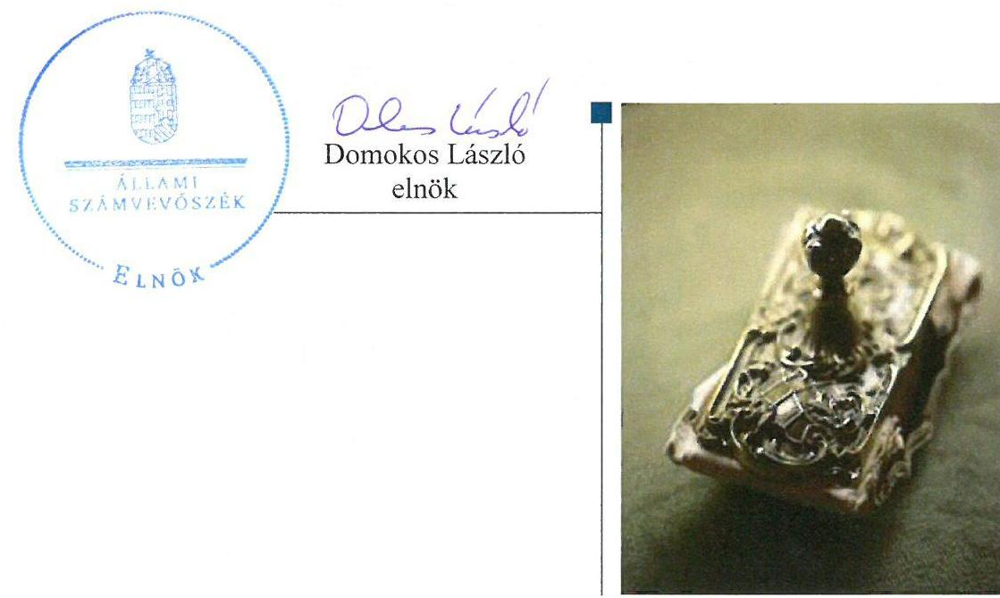

---

# AZ ELLENŐRZÉST FELÜGYELTE: 

PETŐ KRISZTINA felügyeleti vezető

## AZ ELLENŐRZÉST VEZETTE ÉS A VÉGREHAJTÁSÁÉRT FELELŐS:

DR. KOVÁCS DIÁNA ellenőrzésvezető
BARTA JÓZSEF ellenőrzésvezető

## A PROGRAM ÖSSZEÁLLÍTÁSÁÉRT FELELŐS:

JANIK JÓZSEF LÁSZLÓ osztályvezető

IKTATÓSZÁM: V-0935-197/2016.
TÉMASZÁM: 1771
Jelentéseink az Országgyűlés számítógépes hálózatán és az Interneten a www.asz.hu címen is olvashatóak.

ELLENŐRZÉS-AZONOSÍTÓ SZÁM: V071306

---

# TARTALOMJEGYZÉK 

■ ÖSSZEGZÉS ..... 5
■ AZ ELLENŐRZÉS CÉLJA ..... 7
■ AZ ELLENŐRZÉS TERÜLETE ..... 8
■ AZ ELLENŐRZÉS HÁTTERE, INDOKOLTSÁGA ..... 9
■ FÓKUSZKÉRDÉSEK ..... 11
■ ELLENŐRZÉS HATÓKÖRE ÉS MÓDSZEREI ..... 12
■ MEGÁLLAPÍTÁSOK ..... 16
■ JAVASLATOK ..... 37
■ MELLÉKLETEK ..... 41
I. Sz. melléklet: Értelmező szótár. ..... 41
II. Sz. melléklet: Az integritás érvényesítése érdekében kialakított és működtetett kontrollrendszer ..... 46
III. Sz. melléklet: Teljesítmény-ellenőrzési kiegészítő modul megállapításai ..... 47
■ FÜGGELÉK: ÉSZREVÉTELEK ..... 49
■ RÖVIDÍTÉSEK JEGYZÉKE ..... 69

---

.

---

# ÖSSZEGZÉS 

Az irányító szervek és a középirányító szerv Tüdőgyógyintézetre vonatkozó feladatellátása szabályszerű volt. A Tüdőgyógyintézet főigazgatója által kialakított irányítási rendszer 2013. évtől biztosította az átlátható, elszámoltatható és ellenőrizhető közpénzfelhasználást. A Tüdőgyógyintézet pénzügyi és vagyongazdálkodása nem volt szabályszerű.

## Az ellenőrzés társadalmi indokoltsága

A közpénzek felhasználásában és az állami vagyonnal való gazdálkodásban a központi alrendszer egyes intézményei meghatározó súlyt képviselnek. E szervezetekkel szemben társadalmi igény, hogy tevékenységükről a döntéshozók és a nyilvánosság felé elszámoljanak. Ezzel a társadalmi igénnyel és az ÁSZ ${ }^{1}$ Stratégiájával összhangban, a közpénzügyek átláthatóságának előmozdítása, a közvagyon védelme érdekében került sor a Tüdőgyógyintézet² pénzügyi- és vagyongazdálkodásának ellenőrzésére.

## Főbb megállapítások, következtetések, javaslatok

Az irányító szervek az alapítói joggyakorlással kapcsolatos tevékenységüket a jogszabályi előírásoknak megfelelően látták el. A 2011. évben az irányító szerv és a 2012-2014. években a középirányító szerv a közfeladatok ellátására vonatkozó, az erőforrásokkal való szabályszerű gazdálkodáshoz szükséges követelményeket meghatározta, azonban a hatékony gazdálkodáshoz szükséges követelményeket nem érvényesített.

A Tüdőgyógyintézet főigazgatója által kialakított irányítási rendszer 2013. évtől biztosította az átlátható, elszámoltatható és ellenőrizhető közpénzfelhasználást. A belső kontrollrendszer kialakítása a 2011-2012. években részben volt szabályszerű, míg 2013-2014. években szabályszerű volt. A Tüdőgyógyintézet a jogszabályi előírásoknak megfelelően a kockázatelemzés során felmérte és meghatározta a szervezet tevékenységében, gazdálkodásában rejlő kockázatokat, meghatározta az egyes kockázatokkal kapcsolatban a szükséges intézkedéseket, azonban a főigazgató 2012-2014. évben a kockázatok kezelése érdekében szükséges intézkedések teljesítésének folyamatos nyomon követési módját nem határozta meg. A kontrolltevékenységen belül a jogszabályi előírások ellenére a pénzügyi döntések dokumentumainak elkészítése és a pénzügyi kihatású döntések célszerűségi, gazdaságossági, hatékonysági és eredményességi szempontú megalapozottsága vonatkozásában nem biztosították a folyamatba épített, előzetes, utólagos és vezetői ellenőrzést. A főigazgató nem alakított ki olyan rendszereket, amelyek biztosították, hogy a megfelelő információk a megfelelő időben eljussanak az illetékes szervezethez, szervezeti egységhez, illetve személyhez. Az ellenőrzött időszakban a Tüdőgyógyintézet a jogszabályban előírtak ellenére nem tett eleget elektronikus közzétételi kötelezettségének, mivel nem tették közzé az általános közzétételi lista adatait, ezzel nem biztosították az átláthatóságot. Az ellenőrzött időszakban a Tüdőgyógyintézetnél az operatív tevékenységek folyamatos és eseti nyomon követési rendszerének kialakítása és működtetése nem történt meg, mivel a monitoring információt tartalmazó dokumentumok alapján az operatív tevékenységek, folyamatok nyomon követésére alkalmas jelentések, vezetői döntések előkészítéséhez feljegyzések nem készültek, ezek értékelése nem történt meg.

A Tüdőgyógyintézet pénzügyi és vagyongazdálkodása nem volt szabályszerű. Az ellenőrzési nyomvonalban a 2011-2014. évekre részletesen meghatározták a költségvetés tervezésének folyamatábrákkal szemléltetett leírását, azonban a felelősségi és információs szinteket és kapcsolatokat nem jelölték meg. A bevételi és kiadási előirányzatok módosítását a Tüdőgyógyintézet nem a jogszabályi előírásokban foglaltaknak megfelelően hajtotta végre, az előirányzat-módosítások szabályait a 2011-2014. években nem tartotta be. A Tüdőgyógyintézet az előirányzatok módosításáról analitikus nyilvántartást nem vezetett. A saját hatáskörében végrehajtott előirányzat-módosításokról, átcsoportosításokról az intézkedés meghozatalát követő öt munkanapon belül a Kincstárt és a fejezetet irányító szervet nem tájékoztatta a Tüdőgyógyintézet. További szabálytalanság volt, hogy a Tüdőgyógyintézet a szakmai teljesítésigazolásra, érvényesítésre jogosult személyekről és aláírás-mintájukról naprakész nyilvántartást nem vezetett, így nem volt

---

biztosítható a gazdálkodási jogkörök gyakorlásának ellenőrizhetősége, átláthatósága. A kölcsönök nyújtása során a Tüdőgyógyintézet 2011. évben megsértette a számviteli törvényben foglalt valódiság, világosság és összemérés számviteli alapelveit. Az ellenőrzött időszak minden évében az ajánlatkérőnek minősülő Tüdőgyógyintézet megsértette a közbeszerzési eljárás lefolytatásakor a közbeszerzési törvényben előírt kötelezettségét. A Tüdőgyógyintézet 2011-2014. évi költségvetési beszámolói könyvviteli mérlegei forrás oldali adatainak értékegyeztetését - a szállítók és a költségvetési passzív függő elszámolások kivételével - nem végezték el. A leltár kiértékelése nem felelt meg a belső szabályzatokban foglalt előírásoknak. A Tüdőgyógyintézet az értékmegőrzési, állagmegóvási kötelezettségeit a jogszabály és a vagyonkezelési szerződés előírásai szerint teljesítette. A vagyonelemek hasznosítása a jogszabályok és a belső szabályzatok előírásainak megfelelően történt.

A Tüdőgyógyintézet nem intézkedett az integritás szemlélet érvényesítése érdekében.

---

# AZ ELLENŐRZÉS CÉLJA 

## A Tüdőgyógyintézet Törökbálint pénzügyi és vagyongazdálkodásának ellenőrzése

## A SZABÁLYSZERŰSÉGI ELLENŐRZÉS

célja annak megítélése volt, hogy az ellenőrzött intézményre vonatkozó irányító szervi feladatellátás a jogszabályi előírások betartásával történt-e; a Tüdőgyógyintézetnél a belső kontrollrendszer kialakítása és működtetése szabályszerű volt-e; kialakították-e az erőforrásokkal való szabályszerű, gazdaságos, hatékony és eredményes gazdálkodáshoz szükséges követelményeket, megvalósították-e azok számon kérését, ellenőrzését; a Tüdőgyógyintézet pénzügyi és vagyongazdálkodása megfelelt-e a jogszabályi előírásoknak és belső szabályzatainak; a Tüdőgyógyintézet átalakításának vagy átszervezésének lebonyolítása szabályszerűen történt-e.

A Tüdőgyógyintézet korrupcióval szembeni veszélyeztetettségének csökkentése érdekében tanúsítványi adatszolgáltatás alapján az ÁSZ értékelte az integritási szemlélet érvényesülését a gazdálkodási folyamatokban.

A KIEGÉSZÍTŐ TELJESÍTMÉNY-ELLENŐRZÉSI MODUL célja annak értékelése volt, hogy a gazdálkodás folyamatában a gazdaságossági, hatékonysági és eredményességi követelmények kialakítása megtörtént-e, azokat működtették-e, a célkitűzéseket elérték-e; a pénzügyi és vagyongazdálkodás folyamataira vonatkozóan a költségvetési szerv belső kontrollrendszerének minőségéről kiadott vezetői nyilatkozatban a költségvetési szerv tevékenységében a hatékonyság, eredményesség, gazdaságosság követelményeinek érvényesítésére vonatkozó nyilatkozat helytálló volt-e.

---

# **Tüdőgyógyintézet Törökbálint**

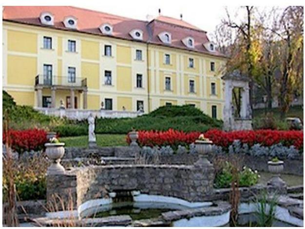

A Tüdőgyógyintézet Pest megyei, valamint a közép-magyarországi régióban élők számára nyújt egészségügyi szolgáltatást, valamennyi pulmonológiai és légúti betegség kezelését és gyógyítását végzi. A 310 ágyas Tüdőgyógyintézet négy felnőtt-, illetve egy gyermekosztályán évente közel 10 000 felnőtt és 1000 gyermek beteget gyógyítanak, a különböző szakrendeléseiken 80 000 beteget látnak el.

A Tüdőgyógyintézet tulajdonosi felügyeletét 2011-ben Pest Megye Önkormányzata látta el, 2012-ben a Magyar Állam tulajdonába és fenntartásába került. 2012. január 1-től a Tüdőgyógyintézet a NEFMI³, illetőleg jogutódja, az EMMI⁴ fejezethez tartozó központi költségvetési szerv, középirányító szerve a GYEMSZI⁵, majd ennek jogutódjaként 2015. március 1-től az ÁEEK⁶. A Tüdőgyógyintézet az ellenőrzött időszakban önálló jogi személyiséggel rendelkező, önállóan működő és gazdálkodó, az előirányzatok felett teljes jogkörrel rendelkező költségvetési szerv volt. A főigazgató⁷ személyében 2012 decemberében következett be változás, a gazdasági igazgató⁸ 2012 szeptemberétől tölti be a munkakörét.

A Tüdőgyógyintézet költségvetési kiadási és bevételi előirányzatának alakulását az ellenőrzött időszakra vonatkozóan az 1. táblázat mutatja be.

1. táblázat

|   | 2011. |  | 2012. |  | 2013. |  | 2014. |   |
| --- | --- | --- | --- | --- | --- | --- | --- | --- |
|   | bevételi | kiadási | bevételi | kiadási | bevételi | kiadási | bevételi | kiadási  |
|  Eredeti | 2169,2 |  | 2274,7 |  | 2282,2 |  | 2509,1 |   |
|  Módosított | 3200,8 |  | 3230,3 |  | 3232 |  | 3088,7 |   |
|  Teljesített | 3132,4 | 2876,8 | 3248,2 | 2490,1 | 3215,8 | 2879,5 | 3026,2 | 2412,7  |

*A KIADÁSI ÉS A BEVÉTELI ELŐIRÁNYZATOK ALAKULÁSA 2011-2014. KÖZÖTT (M FT)*

|   | 2011. |  | 2012. |  | 2013. |  | 2014. |   |
| --- | --- | --- | --- | --- | --- | --- | --- | --- |
|   | bevételi | kiadási | bevételi | kiadási | bevételi | kiadási | bevételi | kiadási  |
|  Eredeti | 2169,2 |  | 2274,7 |  | 2282,2 |  | 2509,1 |   |
|  Módosított | 3200,8 |  | 3230,3 |  | 3232 |  | 3088,7 |   |
|  Teljesített | 3132,4 | 2876,8 | 3248,2 | 2490,1 | 3215,8 | 2879,5 | 3026,2 | 2412,7  |

*Forrás: A Tüdőgyógyintézet 2011-2014. évi beszámolói*

A Tüdőgyógyintézet előirányzat-maradványa a 2011. évi 255,5 M Ft értékről 2014. évre 613,5 M Ft-ra emelkedett. A Tüdőgyógyintézet eszközeinek és forrásainak mérleg szerinti értéke a 2011. évi 235,7,0 M Ft nyitó értékről a 2014. év végére 2824,9 M Ft-ra emelkedett. A saját tőke 1455,5 M Ft-ról 2185,7 M Ft-ra nőtt. Az immateriális javak és tárgyi eszközök bruttó értéke a 2011. év végi 2758,6 M Ft-ról – közel egyötödével – 3283,8 M Ft-ra emelkedett a 2014. évre, nettó értékük is ebben az irányban, de kisebb arányban (12,4%-kal) változott. A Tüdőgyógyintézet engedélyezett létszáma 2011-ben 314 fő, 2014-ben 320 fő volt, ami a feladatellátásban 2011-ben 278 fő, 2014-ben 261 fő átlagos statisztikai állományi létszámot jelentett.

---

# AZ ELLENŐRZÉS HÁTTERE, INDOKOLTSÁGA 

## Tüdőgyógyintézet Törökbálint

Az Alaptörvény rendelkezése szerint a nemzeti vagyon megőrzésének, védelmének és a nemzeti vagyonnal való felelős gazdálkodásnak a követelményeit sarkalatos törvény, az Nvtv ${ }^{9}$. rögzíti. A tulajdonosi joggyakorlás és vagyonkezelés általános és speciális szabályait, az állami vagyon nyilvántartására és elszámolására vonatkozó eljárásokat, a vagyonkezelési szerződés feltételrendszerét, valamint az éves beszámoló készítési és könyvvezetési kötelezettségeket kormányrendelet írja elő.

A központi alrendszer egyes intézményei közfeladat-ellátásának változásait, a közfeladatok átadásából és átvételéből adódó módosításait, előirányzat gazdálkodására ható tényezőit az Áht. ${ }^{10}$ 11. §-a és az Ávr. ${ }^{11}$ 14. §-a írja elő. A közfeladatok megszűnéséből, intézmény átszervezéséből, belső szerkezeti korszerűsítéséből, vagy más hasonló okból adódó módosításai miatt szerepeltetendő szerkezeti változásokat, valamint a szerkezeti változásként beépült közfeladatok szintre hozásként történő számításba vételét az Ávr. 15. § (2)-(3) bekezdései határozzák meg.

A társadalmi igénnyel összhangban az Áht. ${ }^{12}$ és az Ámr. ${ }^{13}$ és a Bkr. ${ }^{14}$ is előírja a költségvetési szerv részére, hogy olyan követelményeket alakítson ki, amelyek biztosítják a működés, gazdálkodás, az erőforrások felhasználása során a gazdaságosság, hatékonyság és eredményesség érvényesülését. Az Ámr. és a Bkr. alapján a főigazgatónak évente nyilatkoznia is kell arról, hogy gondoskodott-e a Tüdőgyógyintézet tevékenységében a gazdaságosság, hatékonyság és eredményesség követelményeinek érvényesítéséről. A gazdaságos, hatékony és eredményes gazdálkodáshoz szükség
 van a teljesítménymérés feltételeinek kialakítására, úgymint az egyértelmű és mérhető célokra, mutatószámokra és az ezekhez rendelt követelményekre. Az ÁSZ jelen ellenőrzéssel győződik meg arról, hogy a Tüdőgyógyintézetnél a teljesítménycélokat, -mutatókat, -követelményeket kialakították-e, azokat működtették-e, a kitűzött cél(ok) teljesültek-e.

AZ ELLENŐRZÉS EREDMÉNYEKÉPPEN nemcsak az ellenőrzött intézmények gazdálkodása javulhat, hanem átfogó képet kaphatunk a központi alrendszerbe tartozó költségvetési szervek gazdálkodásának hiányosságairól, de a jó gyakorlatokról is. Ellenőrzéseivel, javaslataival és megállapításaival az ÁSZ elősegítheti a költségvetési szervek pénzügyi és vagyongazdálkodása szabályozásának javítását és hozzájárulhat a jó kormányzáshoz. Az ellenőrzés az ellenőrzött számára visszajelzést ad a pénzügyi és vagyongazdálkodásában feltárt hiányosságokról, javaslataival hozzájárul azok kiküszöböléséhez, amely csökkentheti a későbbi ellenőrzések gyakoriságát. Az ellenőrzés megállapításait és javaslatait más szervezetek is hasznosíthatják a rendezett gazdálkodási keretek kialakításához.

## A TELJESÍTMÉNY-ELLENŐRZÉSI KIEGÉSZÍTŐ

MODUL alapján elvégzett ellenőrzés a törvényalkotás számára támogatást nyújt a nemzeti kulcsindikátorok rendszerének kialakításához. A dön-

---

téshozók, ellenőrzöttek, irányító szervek, a társadalom számára az összehasonlítási, összemérési lehetőségek kihasználásával objektív visszajelzést ad a gazdálkodás területén végrehajtott szervezeti, szervezési, takarékossági és bürokráciacsökkentő intézkedések hatásairól, a közfeladat-ellátásnak keretet adó pénzügyi és vagyongazdálkodásban mérhető teljesítménykövetelmények kialakításáról, azok alkalmazásáról.

---

# FÓKUSZKÉRDÉSEK 

1. Az irányító szerv ellenőrzött intézményre vonatkozó feladatellátása szabályszerű volt-e?
2. A belső kontrollrendszer kialakítása és működtetése megfelelt-e a jogszabályi előírásoknak?
3. Az intézmény pénzügyi gazdálkodása szabályszerű volt-e?
4. Az intézmény vagyongazdálkodása szabályszerű volt-e?
5. Szabályszerűen hajtották-e végre az ellenőrzött időszakban az intézményt érintő szervezeti, szerkezeti átalakításokat?
6. Az intézmény intézkedett-e az integritás szemlélet érvényesítése érdekében?

---

# ELLENŐRZÉS HATÓKÖRE ÉS MÓDSZEREI 

## Az ellenőrzés típusa

Szabályszerűségi ellenőrzés, amelyet teljesítmény-ellenőrzési modul egészített ki.

## Az ellenőrzött időszak

Az ellenőrzött időszak 2011. január 1-től 2014. december 31-ig terjedő időszak volt.

## Az ellenőrzés tárgya

Az ellenőrzött szervezetre vonatkozó irányító szervi feladatok ellátása. A Tüdőgyógyintézet belső kontrollrendszerének kialakítása és működtetése, valamint pénzügyi és vagyongazdálkodása. Az erőforrásokkal való szabályszerű, gazdaságos, hatékony és eredményes gazdálkodáshoz szükséges követelmények kialakítása, a kialakított követelmények számonkérés, ellenőrzése. A Tüdőgyógyintézet átalakítása, átszervezése lebonyolításának szabályszerűsége.

A teljesítmény-ellenőrzési kiegészítő modul esetében a Tüdőgyógyintézet gazdálkodás folyamatában a gazdaságossági, hatékonysági és eredményességi követelmények kialakítása és működtetése, a célkitűzések teljesítésének értékelése. A Tüdőgyógyintézet tevékenységében a hatékonyság, eredményesség, gazdaságosság követelményei érvényesítéséről kiadott nyilatkozat helytállósága. A teljesítmény-ellenőrzés fókuszkérdéseire a III. számú melléklet ad választ.

Az ellenőrzés kiterjedt minden olyan körülményre és adatra, amely az ÁSZ jogszabályban meghatározott feladatainak teljesítéséhez, valamint a programok végrehajtása folyamán felmerült újabb összefüggések feltárásához voltak szükségesek.

## Az ellenőrzött szervezet

A Tüdőgyógyintézet Törökbálint, az Emberi Erőforrások Minisztériuma (Nemzeti Erőforrás Minisztérium), az Állami Egészségügyi Ellátó Központ (Gyógyszerészeti és Egészségügyi Minőség és Szervezetfejlesztési Intézet) és Pest Megye Önkormányzata Közgyűlése.

Az ellenőrzésre a központi alrendszer ellenőrzött intézményének és irányító, illetve középirányító szervének székhelyén került sor.

---

# Az ellenőrzés jogalapja 

Az ellenőrzés jogszabályi alapját az ÁSZ tv. ${ }^{15} 1$. § (3) bekezdés, 5. § (2)-(7) bekezdései, valamint az Áht. 2 61. § (2) bekezdésének előírásai képezték.

## Az ellenőrzés módszerei

Az ellenőrzést az ellenőrzési program szempontjai, az ellenőrzött időszakban hatályos jogszabályok, az ellenőrzés szakmai szabályai, az egyes ellenőrzési típusokhoz kapcsolódó ÁSZ módszertanok és nemzetközi standardok figyelembevételével végeztük. A gazdálkodás hibáinak kijavítására, a közpénzekkel való felelős gazdálkodás segítésére irányuló javaslatok kidolgozásakor a hatályos jogszabályok voltak az irányadóak.

Az ellenőrzés ideje alatt az ellenőrzött szervezettel történő kapcsolattartást az ÁSZ SZMSZ ${ }^{16}$-ének vonatkozó előírásai alapján biztosítottuk.

Az ellenőrzési kérdések megválaszolásához szükséges bizonyítékok megszerzése a következő ellenőrzési eljárások alkalmazásával történt: megfigyelés, szemle (szemrevételezés), kérdésfeltevés (információkérés), mintavételezés, valamint elemző eljárás. A minták kiválasztása során elsősorban reprezentativitást biztosító véletlen mintavételi eljárást alkalmaztunk.

Az ellenőrzési bizonyítékként felhasználható adatforrások közé tartoztak egyrészt a szakmai program részletes szempontjainál felsorolt adatforrások, másrészt adatforrás volt minden egyéb - az ellenőrzés folyamán feltárt, az ellenőrzés szempontjából releváns információt tartalmazó - dokumentum.

Az ellenőrzés lefolytatásához a Tüdőgyógyintézet a tanúsítványok elektronikus kitöltésével, valamint az ÁSZ által kért dokumentumok elektronikus megküldésével szolgáltatott adatokat. A rendelkezésre bocsátott adatok, információk kontrollja az ellenőrzés keretében történt.

Az ellenőrzési kérdésekre adott válaszok alapján értékeltük, hogy az ellenőrzött időszakban az irányító szerv és a középirányító szerv az ellenőrzött intézményre vonatkozó feladatainak szabályszerűen eleget tett-e, a Tüdőgyógyintézet pénzügyi és vagyongazdálkodása megfelelt-e az előírásoknak, a Tüdőgyógyintézet átalakításának vagy átszervezésének végrehajtása szabályszerű volt-e. Értékeltük, hogy a Tüdőgyógyintézetnél kialakították-e az erőforrásokkal való szabályszerű és hatékony gazdálkodáshoz szükséges követelményeket, megvalósították-e azok számonkérését, ellenőrzését.

A Tüdőgyógyintézet belső kontrollrendszere jogszabályi előírások szerinti kialakításának és működtetésének szabályszerűségét az erre irányuló ellenőrzési kérdésekre adott válaszok összesítése alapján, évente pillérenként (kontrollkörnyezet, kockázatkezelési rendszer, kontrolltevékenységek, információs és kommunikációs rendszer, monitoring rendszer) és összesítetten is minősítettük. A Tüdőgyógyintézet belső kontrollrendszere egyes pilléreinek kialakítását és működtetését „szabályszerű"-nek minősítettük, amennyiben az értékelt területen az elért és elérhető pontok százalékban kifejezett, egész számra kerekített hányadosa meghaladta a 84%-ot, „részben szabályszerű"-nek minősítettük, ha a 84%-ot nem haladta

---

meg, de 60%-nál nagyobb volt, „nem szabályszerű"-nek minősítettük, ha nem haladta meg a 60%-ot. A Tüdőgyógyintézet belső kontrollrendszerének összesített értékelése megegyezik a pillérenként (kontrollterületenként) alkalmazott %-os értékelésekkel, a következő eltérésekkel. A kontrollrendszer egésze esetében a „szabályszerű" értékelésnek a %-os értéken felül további feltétele volt, hogy egyik kontrollterület sem kaphatott „nem szabályszerű" értékelést, a „részben szabályszerű" értékelés további feltétele volt, hogy legfeljebb egy ellenőrzött kontrollterület lehetett „nem szabályszerű" értékelésű. Az összesített értékelés a %-os értéktől függetlenül „nem szabályszerű"-nek minősült, ha az ellenőrzött kontrollterületek közül több mint egy „nem szabályszerű" értékelést kapott.

A tárgyi eszközök nyilvántartásba vételének, a közbeszerzési eljárások lefolytatásának, a vagyonhasznosítási bevételi előirányzatok teljesítésének, az előirányzatok módosításának és az előirányzat-maradvány megállapításának szabályszerűségét, valamint a gazdálkodási jogkörök gyakorlásának szabályszerűségét mintavétellel ellenőriztük.

A jogszabályoknak és a belső előírásoknak megfelelőnek tekintettük a tárgyi eszközök nyilvántartásba vételét, a közbeszerzések megtörténtét, a vagyonhasznosítási bevételi előirányzatok teljesítését, az előirányzatok módosítását és az előirányzat-maradvány megállapítását, amennyiben a minta ellenőrzésének eredménye alapján 95%-os bizonyossággal a teljes sokaságban a hibás tételek aránya kisebb volt, mint 10%, nem megfelelőnek értékeltük, ha a hibás tételek aránya a 10%-ot meghaladta.

A 2011. évet érintően a szakmai teljesítésigazolás és az utalvány ellenjegyzése kulcskontrollok, a 2012-2014. éveket érintően a teljesítésigazolás és az érvényesítés kulcskontrollok működését értékeltük. Megfelelőnek értékeltük a gazdálkodási jogkörök gyakorlását, amennyiben 95%-os bizonyossággal a teljes sokaságban a hibás tételek aránya legfeljebb 10% volt, részben megfelelőnek, ha a hibás tételek arányának felső határa legfeljebb 30% volt, nem megfelelőnek, ha a hibás tételek sokaságbeli arányának felső határa meghaladta a 30%-ot.

Az integritás szemlélet érvényesülésének értékelése a Tüdőgyógyintézet által kitöltött tanúsítvány alapján történt.

Az alapprogram alapján ellenőriztük, hogy a költségvetési szerv vezetője megtette-e nyilatkozatát arról, hogy gondoskodott a költségvetési szerv tevékenységében a hatékonyság, eredményesség és a gazdaságosság követelményeinek érvényesítéséről. Ezt kiegészítve, a teljesítmény-ellenőrzési kiegészítő modul keretében - felhasználva az alapprogram szerinti ellenőrzés megállapításait - értékeltük, hogy a költségvetési szerv vezetője kialakította-e a gazdaságossági, hatékonysági és eredményességi követelményeket, és azokat működtette-e, a célkitűzéseket elérte-e.

A teljesítmény-ellenőrzési kiegészítő modul a gazdálkodási feladatokra terjedt ki, a szakmai feladatellátást nem értékelte.

A gazdálkodási feladatok értékelése az alábbi területekre terjedt ki:
pénzügyi gazdálkodási (nem szakmai, adminisztratív) feladatok: költségvetés-, beszámoló-készítés, könyvvezetés, adatszolgáltatások, előirányzat-gazdálkodás, kötelezettségvállalások nyilvántartása, kezelése, bevételkezelés, bér- és illetményszámfejtés;
vagyongazdálkodási (logisztikai) feladatok: közbeszerzések és közbeszerzési értékhatárt el nem érő beszerzések, készletgazdálkodás,

---

nyomtatók, fénymásolók üzemeltetése, épület- és ingatlanüzemeltetés, karbantartás, hibabejelentés, gépjármű és flottamenedzsment.

Az ellenőrzés során minden olyan körülményt és adatot is ellenőriztünk, amely a program végrehajtása kapcsán felmerült újabb összefüggéseknek az ellenőrzés céljaival összhangban lévő feltárásához szükséges. A teljesítmény-ellenőrzési kiegészítő programmodulban megfogalmazott ellenőrzési cél megválaszolásához az alapprogram végrehajtása során megfogalmazott megállapításokat is figyelembe vettük.

---

# 1. Az irányító szerv ellenőrzött intézményre vonatkozó feladatellátása szabályszerű volt-e? 

Összegző megállapítás

Az irányító szerv ${ }_{1,2}{ }^{17}$ és a középirányító szerv ${ }^{18}$ Tüdőgyógyintézetre vonatkozó feladatellátása szabályszerű volt.
1.1. számú megállapítás

Az alapítói joggyakorlás a jogszabályi előírásoknak megfelelően történt.

AZ ALAPÍTÓ OKIRAT ${ }_{1-3}{ }^{19}$-at az irányító szerv ${ }_{1,2}$ kiadta a jogszabályi előírásoknak megfelelően, a Tüdőgyógyintézettel kapcsolatos alapítói jogosultságait a jogszabályi előírásoknak megfelelően gyakorolta. Az ellenőrzött időszakban az alapító okirat ${ }_{1-3}$ tartalma 2011. december 31-ig megfelelt az Áht.1, 2012. január 1-jétől az Ávr. előírásainak.

Az irányító szerv ${ }_{1,2}$ a jogszabályi és irányító szervi változások alapító okirat ${ }_{1-3}$-ban történő átvezetéséről gondoskodott. A 2012. január 1-jétől hatályos alapító okirat ${ }_{3}$-ban az irányító szerv ${ }_{2}$ meghatározta a fenntartói és irányítói jog- és hatásköröknek az Eütv. ${ }^{20}$ előírása szerinti, középirányító szervvel történő megosztása rendjét. Az Ávr. előírásának megfelelően a kormányzati funkciók, államháztartási szakfeladatok és szakágazatok osztályozási rendjének - a 68/2013. (XII. 29.) NGM rendelet ${ }^{21}$ hatálybalépésével történt - megváltozása miatt az irányító szerv ${ }_{2}$ 2014. január 1-jei hatállyal módosította az alapító okirat ${ }_{3}$-at. A módosítást - jogszerűen - kiegészítésnek minősítették, amit a törzskönyvi nyilvántartásba is bejegyeztek és a kincstári webes felületen elérhetővé tettek.

Az alapító okirat ${ }_{1,2}$-t - szabályszerűen - a 2011. évben az irányító szerv ${ }_{1}$ határozattal fogadta el. Az irányító szerv ${ }_{2}$ az alapító okirat ${ }_{3}$ 2012. januári kiadását és 2014. január 1-jei kiegészítését megelőzően az Áht. 2 előírásának megfelelően gondoskodott az államháztartásért felelős miniszter előzetes egyetértésének megszerzéséről.

Az alapító okirat 2014. december 31-ei keltezésű módosítását megelőzően - az Áht. 2 8. § (7) bekezdése előírásában foglaltak ellenére - nem állt rendelkezésre az államháztartásért felelős miniszter előzetes egyetértése.

A Tüdőgyógyintézet rendelkezett az irányító szerv ${ }_{1}$ által jóváhagyott SZMSZ ${ }^{22}$-szel, annak tartalma azonban nem volt összhangban az alapító okirat ${ }_{1-3}$-mal. A Tüdőgyógyintézetnél az ellenőrzött időszak egészében egy SZMSZ volt hatályban, annak módosítására a 2011-2014. években nem került sor.

Az SZMSZ 2011-ben nem tartalmazta
az Ámr. 20. § (2) bekezdésének b) pontja ellenére a törzskönyvi azonosító számát, a hatályos alapító okirat keltét, az alapító okirat számát, az alapítás időpontját;

---

$\longrightarrow$ az Ámr. 20. § (2) bekezdésének c) pontja ellenére az ellátandó, és a szakfeladatrend szerint besorolt alaptevékenységek megjelölését.
Az SZMSZ 2012-2014. években nem tartalmazta
$\longrightarrow$ az Ávr. 13. § (1) bekezdésének b) pontja előírásaival szemben a hatályos, egységes szerkezetbe foglalt alapító okirat keltét, számát, az alapítás időpontját;
$\longrightarrow$ az Ávr. 13. § (1) bekezdés c) pontjában foglaltak ellenére az ellátandó, és a szakfeladatrend szerint besorolt alaptevékenységek, 2014. január 1-től az ellátandó, és a kormányzati funkció szerint besorolt alaptevékenységek megjelölését.
A szükséges módosítások elmaradása miatt az SZMSZ 2012. január 1-jét, azaz a Tüdőgyógyintézet állami fenntartásba kerülését követően is fenntartóként Pest Megye Önkormányzatát, és az alapítói jogok gyakorlójaként - az irányító szerv ${ }_{2}$ helyett - az irányító szerv ${ }_{1}$-et jelölte meg.

Az
 alapító okirat ${ }_{3}$ tartalmával összehangolt, a középirányító szerv észrevételeit is figyelembe vevő új SZMSZ jóváhagyását a Tüdőgyógyintézet 2014. december 21-én kezdeményezte a középirányító szervnél.
1.2. számú megállapítás

Az irányító szerv ${ }_{1}$ és a középirányító szerv a közfeladatok ellátására vonatkozó, az erőforrásokkal való szabályszerű gazdálkodáshoz szükséges követelményeket érvényesítette, számon kérte és ellenőrizte, azonban hatékony gazdálkodáshoz szükséges követelményeket nem érvényesített.

AZ ERŐFORRÁSOKKAL VALÓ SZABÁLYSZERŰ GAZDÁLKODÁSHOZ szükséges követelményeket az irányító szerv ${ }_{1}$ és a középirányító szerv a Tüdőgyógyintézetre vonatkozóan kialakította és megvalósította azok számonkérését. Az irányító szerv ${ }_{1}$ és a középirányító szerv a pénzügyi és a vagyoni helyzetről rendszeres beszámolási kötelezettséget írt elő a Tüdőgyógyintézet számára. A szabályszerűségi követelmények érvényesítése, számonkérése és ellenőrzése az elemi költségvetés tervezési rendjének meghatározásával és felügyeletével, valamint a költségvetés végrehajtásáról szóló beszámoltatással valósult meg.

A 2011. évben az irányító szerv ${ }_{1}$, a 2012-2014. években a középirányító szerv nem érvényesített a Tüdőgyógyintézetnél a közfeladatok ellátására vonatkozó, az erőforrásokkal (így különösen az előirányzatokkal, a létszámmal és a vagyonnal) való hatékony gazdálkodáshoz szükséges követelményeket. Ezzel az irányító szerv ${ }_{1}$ az Áht. ${ }_{1}$ 49. § (5) bekezdés f) pontjában foglalt, a középirányító szerv az 59/2011. (IV. 12.) Korm. rendelet ${ }^{23}$ 2/A. § a) pontjában foglalt előírásoknak nem tett eleget.
1.3. számú megállapítás

A Tüdőgyógyintézettel kapcsolatos egyéb jogszabályi ellenőrzési jogosultságokkal az irányító szerv ${ }_{1}$ és a középirányító szerv nem élt. A középirányító szerv közbeszerzési eljárásra vonatkozó ellenőrzést nem folytatott le.

# A BEVÉTELI ÉS KIADÁSI ELŐÍRÁNYZATOKKAL 

VALÓ GAZDÁLKODÁST - ezen belül a Tüdőgyógyintézet jóváhagyott éves költségvetésének végrehajtását, a bevételi és kiadási előirányzatok teljesítését - és a közfeladatok ellátását az irányító szerv ${ }_{1}$ és a

---

középirányító szerv az Áht. 1 és az Áht. 2 előírásaiban foglalt irányítási jogkörében rendszeresen figyelemmel kísérte. Az éves elemi költségvetés és beszámoló, az előirányzat-módosításra, a többletbevételek felhasználására, valamint a pénz- és előirányzat-maradványok jóváhagyására vonatkozó kérelmek elfogadása mellett az irányító szerv ${ }_{1}$ és a középirányító szerv rendszeres beszámolásra kötelezte a főigazgatót. A Tüdőgyógyintézet 2011-2014. közötti közfeladat-ellátása, illetőleg pénzügyi, likviditási helyzete nem tette szükségessé az irányító szerv ${ }_{1}$, illetve a középirányító szerv számára az Áht.1,2 vonatkozó előírásaiban foglalt intézkedések megtételét.

Az irányító szerv ${ }_{1}$ 2011-ben nem élt az Áht. 1 93. § (1) bekezdés d) pontjában foglalt ellenőrzési jogával, illetőleg a 2012-2013. években az irányító szerv ${ }_{2}$ az Áht. 2 70. § (1) bekezdés a) pontjában foglalt, költségvetési szervre vonatkozó belső ellenőrzési lehetőséggel. Az irányító szerv ${ }_{1}$ a 2011. évben, az irányító szerv ${ }_{2}$ a 2012-2013. években nem hajtott végre ellenőrzést a Tüdőgyógyintézetnél.

A középirányító szerv a 2013. évben végzett ellenőrzést a Tüdőgyógyintézet belső szabályozottságára vonatkozóan. Az ellenőrzés megállapításai és javaslatai alapján készített intézkedési terv végrehajtásáról beszámolásra kötelezte a főigazgatót. A 2012-2014. években a középirányító szerv - az 59/2011. (IV. 12.) Korm. rendelet 2/A. § m) pontja szerint - jogosult volt a Tüdőgyógyintézet közbeszerzési eljárásaival kapcsolatban folyamatba épített, illetve utóellenőrzést végezni, de a jogosultság ellenére ilyet nem végzett.

A főigazgató, gazdasági igazgató kinevezése, felmentése, vezetői megbízás adása, visszavonása szabályszerűen történt. A főigazgatót és gazdasági igazgatót az irányító szerv ${ }_{1}$ az ellenőrzött időszakot megelőzően, határozatlan időre bízta meg, illetve nevezte ki. A Kjt. ${ }^{24}$ 2011. január 1-jétől hatályos előírásának megfelelve az irányító szerv ${ }_{1}$ mindkét jogviszonyt határozatlan idejű közalkalmazotti jogviszonnyá alakította és 5 éves, határozott időre szóló magasabb vezetői megbízást adott számukra.

A konszolidációs tv. ${ }^{25}$ alapján a főigazgató vezetői megbízása 2012. november 30. napjával, a gazdasági igazgató vezetői megbízása 2012. augusztus 31. napjával szűnt meg. A miniszter ${ }^{26}$ - a középirányító szerv főigazgatójának az Eütv. szerinti javaslatára - az új főigazgatóval 2012. december 1-jétől, az új gazdasági igazgatóval 2012. szeptember 1-jétől kezdődő, öt éves határozott időtartamra szóló munkaszerződést kötött. A szerződések tartalma megfelelt az Mt. ${ }^{27}$ általános rendelkezései mellett a vezető állású munkavállalókra vonatkozó előírásainak.

# 2. A belső kontrollrendszer kialakítása és működtetése megfelel-e a jogszabályi előírásoknak? 

Összegző megállapítás

A belső kontrollrendszer kialakítása és működtetése a 2011-2012. években részben szabályszerű, a 2013-2014. években szabályszerű volt.

A belső kontrollrendszer évenkénti és összesített értékelését a 2. táblázat tartalmazza.

---

2. táblázat

A TÜDŐGYÓGYINTÉZET BELSŐ KONTROLLRENDSZERE KIALAKÍTÁSÁNAK ÉS MŰKÖDTETÉSÉNEK ÉRTÉKELÉSE 2011-2014. KÖZÖTT

| Megnevezés | Kontrollkörnyezet | Kockázatkezelési rendszer | Kontrolltevékenységek | Információ és kommunikáció | Monitoring | ÖSSZESEN |
| :--: | :--: | :--: | :--: | :--: | :--: | :--: |
| 2011. | szabályszerű | részben szabályszerű | részben szabályszerű | részben szabályszerű | nem szabályszerű | részben szabályszerű |
| 2012. | szabályszerű | részben szabályszerű | részben szabályszerű | részben szabályszerű | részben szabályszerű | részben szabályszerű |
| 2013. | szabályszerű | szabályszerű | részben szabályszerű | szabályszerű | részben szabályszerű | szabályszerű |
| 2014. | szabályszerű | szabályszerű | részben szabályszerű | részben szabályszerű | részben szabályszerű | szabályszerű |

Forrás: ÁSZ kimutatás

# 2.1. számú megállapítás 

## A kontrollkörnyezet kialakítása az ellenőrzött időszakban szabályszerű volt.

Az ellenőrzött időszakban a Tüdőgyógyintézet rendelkezett az Áht. 1 és Áht. 2 előírásainak megfelelően SZMSZ-szel, az Ámr., az Áht. 2 és az Ávr. előírásainak megfelelően Gazdasági szervezet ügyrendje ${ }_{1,2}{ }^{28}$-vel. Az etikai kódex elfogadása 2014. május 15-én történt meg. A gazdasági szervezet vezetőinek végzettsége, szakképesítése megfelelt az Ámr. és az Ávr. előírásainak. Az alkalmazottak munkaköri leírásai a Mt. ${ }^{29}$ és a Mt. 2 előírásainak megfelelően rendelkezésre álltak. Az ellenőrzött időszakra vonatkozóan a Tüdőgyógyintézet elkészítette a Számviteli politika ${ }_{1-3}{ }^{30}$-at, a Számlarend ${ }_{1,2}{ }^{31}$-t, a Leltározási szabályzat ${ }_{1-3}{ }^{32}$-at, az Értékelési szabályzat ${ }_{1,2}{ }^{33}$-t, a Bizonylati rend ${ }^{34}$-et, a Pénzkezelési szabályzat ${ }_{1-3}{ }^{35}$-t, Önköltség számítási szabályzat ${ }_{1,2}{ }^{36}$-t, a Közbeszerzési szabályzat ${ }_{1,2}{ }^{37}$-t. A Tüdőgyógyintézet rendelkezett Ellenőrzési nyomvonallal ${ }^{38}$, és a Szabálytalanságok kezelésének eljárásrendjével ${ }^{39}$.

A kontrollkörnyezet kialakítása során a jogszabályi előírások nem érvényesültek maradéktalanul, azonban a feltárt, alábbi hiányosságok nem gyakoroltak lényeges hatást a kontrollok működtetésére.

A Gazdasági szervezet ügyrendje ${ }_{1,2}$ az Ámr. és az Ávr. rendelkezéseinek megfelelően tartalmazta a gazdálkodással kapcsolatos feladatok munkafolyamatainak leírását, de a 2012. évre vonatkozóan tévesen a Pest Megyei Önkormányzatot nevezte meg az irányítási feladatok végrehajtójaként, az aktualizálás 2013. január 1-jén megtörtént.

A 2011-2013. években hatályos Számviteli politika ${ }_{1,2}$ a Számv. tv. ${ }^{40}$ 14. § (4) bekezdésében előírtak ellenére nem tartalmazta azokat a gazdálkodóra jellemző szabályokat, előírásokat, módszereket, amelyekkel meghatározta, hogy mit tekint a számviteli elszámolás, az értékelés szempontjából lényegesnek, jelentősnek, nem lényegesnek, nem jelentősnek. A 2014. évben hatályos Számviteli politika ${ }_{3}$ a Számv. tv. 14. § (4) bekezdésében előírtak ellenére nem tartalmazta azokat a gazdálkodóra jellemző szabályokat, előírásokat, módszereket, amelyekkel meghatározta, hogy mit tekint a számviteli elszámolás, az értékelés szempontjából nem lényegesnek.

A 2011. évben hatályos Számlarend ${ }_{1}$ nem tartalmazta - a Számv. tv. 161. § (2) bekezdés a) pontjában előírt - minden alkalmazásra kijelölt számla számjelét és megnevezését.

---

A 2013. évben hatályos Leltározási szabályzat ${ }_{2}$ nem tartalmazta az Áhsz. ${ }^{41}$ 37. § (6) bekezdésében előírt - a könyvviteli mérlegben értékkel nem szereplő, használt készletek, kis értékű immateriális javak, tárgyi eszközök leltározási módját.

A 2011-2013. években hatályos Értékelési szabályzat ${ }_{1}$ nem tartalmazta - az Áhsz. ${ }_{1}$ 8. § (17) bekezdés d) pontjában előírtak ellenére - követeléstípusonként a kis összegű követelések év végi meghatározásának elveit, dokumentálásának szabályait, valamint - az Áhsz. ${ }_{1}$ 8. § (18) bekezdésében előírtak ellenére - az egyszerűsített értékelési eljárás alá vont követelések besorolásának elveit, dokumentálásának szabályait. A 2014. évben hatályos Értékelési szabályzat ${ }_{2}$ nem tartalmazta - az Áhsz. ${ }_{2}{ }^{42}$ 50. § (2) bekezdés c) pontjában előírtak ellenére - az egyszerűsített értékelési eljárás alá vont követelések dokumentálásának szabályait.

Az ellenőrzött időszakban a 100 ezer Ft alatti kifizetések előzetes írásbeli kötelezettségvállalás nélküli teljesítése részletszabályait az Ámr. 72. § (14) bekezdésében és az Ávr. 53. § (2) bekezdéseiben előírtakkal ellentétben nem szabályozták.

Az ellenőrzött időszakban az Ellenőrzési nyomvonal - az Ámr. 156. § (2) bekezdésében és a Bkr. 6. § (3) bekezdésében előírtakkal ellentétben - a Tüdőgyógyintézet által meghatározott nyolc működési folyamat esetében ötre vonatkozóan (felújítás, kiküldetés, személyi juttatás, vagyongazdálkodás, értékesítés) nem tartalmazta az információs, felelősségi szinteket és kapcsolatokat; az irányítási folyamatokat; az ellenőrzési folyamatokat és a költségvetési szerv működési folyamatait szöveges, táblázatokkal, vagy folyamatábrákkal szemléltetett formában.

A 2011-2012. években - az Ámr. 156. § (3) bekezdésében és a Bkr. 6. § (4) bekezdésében előírtak ellenére - a szabálytalanságok kezelésére vonatkozó eljárásrenddel a Tüdőgyógyintézet nem rendelkezett. A szabálytalanságok kezelésének eljárásrendjét 2013. augusztus 1-jei hatállyal hagyta jóvá a főigazgató.

# 2.2. számú megállapítás 

A kockázatkezelési rendszer kialakítása és működtetése 2011-2012. években részben szabályszerű volt, 2013-2014. években szabályszerű volt.

A KOCKÁZATKEZELÉSI RENDSZERT a főigazgató az Ámr. és a Bkr. rendelkezéseinek megfelelően kialakította a Tüdőgyógyintézetnél a Kockázatelemzés kézikönyve a Törökbálinti Tüdőgyógyintézetben, illetve a Kockázatkezelés című szabályzatok hatályba léptetésével. A Tüdőgyógyintézet az Ámr. és a Bkr. előírásainak megfelelően a kockázatelemzés során felmérte és meghatározta a szervezet tevékenységében, gazdálkodásában rejlő kockázatokat, meghatározta az egyes kockázatokkal kapcsolatban a szükséges intézkedéseket. A főigazgató 2012-2014. évben a kockázatok kezelése érdekében szükséges intézkedések teljesítésének folyamatos nyomon követési módját - a Bkr. 7. § (2) bekezdésében előírtakkal ellentétben - nem határozta meg. A vagyonnyilatkozat tételre kötelezettek körét az SZMSZ és a Vnytv. ${ }^{43}$ rendelkezéseinek megfelelően rögzítették.

A 2011-2012. évekre vonatkozóan a Vnytv. 8. § (4) bekezdésében előírtak végrehajtásáról, azaz az érintettek részére a vagyonnyilatkozat-tételi kötelezettség fennállásáról és esedékességéről szóló tájékoztatás megtörténtéről az ellenőrzés nem tudott meggyőződni. A 2013-2014. években az

---

# Megállapítások 

érintettek részére a vagyonnyilatkozat-tételi kötelezettség fennállásáról és esedékességéről szóló tájékoztatás megtörtént. A 2011-2012. években Vnytv. 11. § (4) bekezdésében előírt őrzési kötelezettségnek az őrzésért felelős nem tett eleget. 2013-2014. években a Vnytv. előírásainak megfelelően jártak el.

### 2.3. számú megállapítás

## A kontrolltevékenység kialakítása és működtetése az ellenőrzött időszakban részben volt szabályszerű.

A KONTROLLTEVÉKENYSÉG részeként teljes körűen nem volt biztosított a FEUVE ${ }^{44}$, mivel az ellenőrzött időszakban az Áht.: 121/A. § (4) bekezdés (a) és (b) pontjaiban és a Bkr. 8. § (2) bekezdés (a) és (b) pontjaiban előírtak ellenére a pénzügyi döntések dokumentumainak elkészítése és a pénzügyi kihatású döntések célszerűségi, gazdaságossági, hatékonysági és eredményességi
 szempontú megalapozottsága vonatkozásában a FEUVE-t nem biztosították.

A főigazgató a belső szabályzatokban az Ámr. 158. § (2) bekezdés (b) pontjában és a Bkr. 8. § (4) bekezdés (b) pontjában előírtak ellenére a 2011-2012. években az információkhoz való hozzáférést nem szabályozta. A jogszabálynak megfelelő szabályozás az Informatikai szabályzat 2013. augusztus 1-jei kiadásával történt meg. Az Ámr. és a Bkr. előírásainak megfelelően az engedélyezési, jóváhagyási és kontroll eljárásokat az SZMSZ-ben, a dokumentumokhoz való hozzáférést az Iratkezelési szabályzat ${ }_{1,2}$-ben, valamint a beszámolási eljárásokat a Gazdasági szervezet ügyrendje ${ }_{1,2}$-ben szabályozták.

A Gazdasági szervezet ügyrendje ${ }_{1,2}$ a 2011., 2013. és 2014. évekre vonatkozóan - a jogszabályoknak megfelelően - tartalmazta az előzetes költségvetési javaslat és a végleges költségvetés tervezési feladatait, valamint az előirányzatok módosításával összefüggő feladatokat, felelősségi köröket. A Gazdasági szervezet ügyrendje ${ }_{1}$ a 2012. évben bekövetkezett irányító szervi változáshoz nem igazodott, sem a szervezeti és működési szabályzatban, sem más szabályzatban nem rögzítették a középirányító szervhez kapcsolódó folyamatokat, feladatokat, az elemi költségvetés készítése, az előirányzatok megállapítása tekintetében, ezért a Gazdasági szervezet ügyrendje ${ }_{1}$ 2012-ben nem felelt meg az Ávr. 13. § (5) bekezdésében foglaltaknak.
2.4. számú megállapítás

Az információs és kommunikációs folyamatok kialakítása az ellenőrzött időszakban - a 2013. év kivételével - részben volt szabályszerű.

ADATVÉDELMI SZABÁLYZAT ${ }_{1,2}{ }^{45}$-vel a Tüdőgyógyintézet az Avtv. ${ }^{46}$, illetve az Info tv. ${ }^{47}$ előírásainak megfelelően rendelkezett.

A főigazgató az Ámr. 159. § (1) bekezdésében és a Bkr. 9. § (1) bekezdésében előírtak ellenére nem alakított ki olyan rendszereket, melyek biztosították a megfelelő információk a megfelelő időbeni eljutását az illetékes szervezethez, szervezeti egységhez, illetve személyhez. A 2013. és 2014. években a főigazgató körleveleiben szabályozta a szervezeten belüli információáramlás módját. A beszámolási rendszerek kialakítása megfelelt az Ámr. és a Bkr. előírásainak.

---

A 2011-2012. években az Ámr. 20. § (3) bekezdés i) pontjában, az Info tv. 35. § (3) bekezdésben, az Ávr. 13. § (2) bekezdés h) pontjában előírtak ellenére a kötelezően közzéteendő adatok nyilvánosságra hozatalának rendjét nem alakították ki. A 2011-2012. években - Avtv. 20. § (8) bekezdésében, az Info tv. 30. § (6) bekezdésében és az Ávr. 13. § (2) bekezdés h) pontjában előírtak ellenére - a közérdekű adatok megismerésére irányuló igények teljesítésének rendjét nem alakították ki. A jogszabályban előírt szabályozás a 2013. augusztus 1-jétől hatályos Közérdekű és kötelezően közzéteendő adatok megismerésének rendje ${ }^{48}$ szabályzat kiadásával valósult meg.

Az ellenőrzött időszakban a Tüdőgyógyintézet az Eitv. ${ }^{49}$ 3. § (2) bekezdésében és a 6. § (1) bekezdésében, valamint az Info tv. 33. § (1), (3) bekezdéseiben és a 37. § (1) bekezdésében előírtak ellenére nem tett eleget elektronikus közzétételi kötelezettségének, mivel nem tették közzé az Eitv. mellékletében és az Info tv. I-III. mellékletében foglalt általános közzétételi lista adatait.

A Tüdőgyógyintézet az Ltv. ${ }^{50}$ előírásainak megfelelően rendelkezett Iratkezelési szabályzat ${ }_{1,2}{ }^{51}$-vel, azonban az Iratkezelési szabályzat ${ }_{2}$-t - az Ltv. 10. § (1) bekezdés a) pontjában előírtakkal ellentétben - nem az illetékes közlevéltárral egyetértésben adta ki.
2.5. számú megállapítás

A monitoring rendszer működtetése 2011-ben nem volt szabályszerű, 2012-2014. években részben volt szabályszerű. A rendelkezésre álló források gazdaságos, hatékony és eredményes felhasználását biztosító követelményt kialakítottak.

AZ OPERATÍV TEVÉKENYSÉGEK folyamatos és eseti nyomon követési rendszerének kialakítása és működtetése nem történt meg ellenőrzött időszakban az Ámr. 155. § (1) bekezdésében és 160. §-ban, valamint a Bkr. 3. § e) pontjában és 10. §-ban előírtak ellenére, mivel a monitoring információt tartalmazó dokumentumok alapján az operatív tevékenységek, folyamatok nyomon követésére alkalmas jelentések, vezetői döntések előkészítéséhez feljegyzések nem készültek, ezek értékelése nem történt meg. A Tüdőgyógyintézet működését átfogó ISO 9001:2008 minőségirányítási rendszert működtetett.

A főigazgató az Áht. 1 94. § (1) bekezdés b) pontjában, 121/A. §-ában, az Áht. 2 61. § (1) bekezdésében, a Bkr. 6. § (2) bekezdésében előírtaknak megfelelően a források szabályszerű, szabályozott, gazdaságos, hatékony és eredményes felhasználását biztosító folyamatot a gazdálkodás területén alakított ki. Az éves bevételek és kiadások 100 M Ft feletti különbségét határozták meg követelményként, melyet alkalmaztak, alakulását figyelemmel kísérték, és a követelményt teljesítették.

Az ellenőrzött időszakban - a Bkr. 11. § (1) bekezdésében előírtaknak megfelelően - elkészült a belső kontrollrendszer értékelését tartalmazó intézményvezetői nyilatkozat.

A főigazgató az Áht. 1, az Áht. 2 és a Bkr. előírásainak megfelelően gondoskodott a belső ellenőrzés kialakításáról és működtetéséről. A Ber. ${ }^{52}$ 4. § (2) bekezdésében, illetve a Bkr. 15. § (2) bekezdésében előírtak ellenére a Tüdőgyógyintézet az SZMSZ-ben a belső ellenőrzést végző személy, szervezet vagy a szervezeti egység jogállását, feladatait nem határozta meg.

---

A Tüdőgyógyintézet rendelkezett Ber. és a Bkr. rendelkezéseinek megfelelően belső ellenőrzési kézikönyvvel. A 2011. évben a belső ellenőrzési vezető, 2012. évben a főigazgató - a Ber. 22. § (1) bekezdésében és a Bkr. 32. § (2) bekezdésében előírtak ellenére - a tárgyévre vonatkozó éves ellenőrzési tervét nem küldte meg az irányító szerv ${ }_{1}$ jegyzőjének, illetve az irányító szerv ${ }_{2}$ belső ellenőrzési vezetője részére. Az elvégzett ellenőrzésekről a Ber. és a Bkr. előírásainak megfelelően elkészítették a jelentéseket.

A Ber. 29. § (1) és (2) bekezdéseiben előírtak ellenére egy alkalommal a belső ellenőrzés javaslatainak végrehajtása érdekében intézkedési terv nem készült.

A belső ellenőrzési vezető (2011. évben a főigazgató) a Ber. és a Bkr. előírásainak megfelelően éves bontásban vezetett nyilvántartást a belső és külső ellenőrzési jelentésekben tett megállapításokról, javaslatokról és azok végrehajtásáról.

# 3. Az intézmény pénzügyi gazdálkodása szabályszerű volt-e? 

## Összegző megállapítás

### 3.1. számú megállapítás

A Tüdőgyógyintézet pénzügyi gazdálkodása nem volt szabályszerű.

Az elemi költségvetés és az előirányzatok megállapítása során betartották a jogszabályi előírásokat és a belső szabályzatokban foglaltakat.

## AZ ELEMI KÖLTSÉGVETÉS ÉS AZ ELŐIRÁNYZAT

OK szabályszerű megállapítására vonatkozó Áht.1, Áht.2, Ámr., Ávr. előírásokat, az 5/2012. (III. 1.) NGM rendelet ${ }^{53}$ és a 10/2013. (III. 13.) NGM rendelet ${ }^{54}$ szerinti követelményeket, valamint az NGM ${ }^{55}$ és az irányító szerv ${ }_{1,2}$ által kiadott tervezési szempontokat, szabályozásokat és a vonatkozó belső szabályozások előírásait betartották.

Az ellenőrzési nyomvonalban a 2011-2014. évekre részletesen meghatározták a költségvetés tervezésének folyamatábrákkal szemléltetett leírását, azonban abban a 2011. évre az Ámr. 156. § (2) bekezdésében, valamint a 2012-2014. évekre a Bkr. 6. § (3) bekezdésében foglaltak ellenére felelősségi és információs szinteket és kapcsolatokat nem jelöltek meg.

Az ellenőrzött időszakban a gazdasági igazgatónak és a gazdasági szervezet dolgozóinak munkaköri leírásai tartalmazták a költségvetés tervezésével, az előirányzatok módosításával és a beszámoló készítésével kapcsolatos feladatokat és jogköröket.

A 2011-2014. évi költségvetési tervjavaslatokhoz a bevételek és a kiadások előirányzatait számításokkal megalapozták. Az Ámr., valamint az Ávr. előírásainak megfelelően az elemi költségvetéshez kapcsolódóan elkészítették az abban foglaltakat alátámasztó számításokat és azok indokolását, amelyek alapján ellenőrizhető volt az elemi költségvetés megalapozottsága, végrehajthatósága. Az irányító szerv ${ }_{1,2}$ a Tüdőgyógyintézet elemi költségvetését a 2011-2014. években jóváhagyta.

A Tüdőgyógyintézet az NGM által kiadott tervezési szempontokat, követelményeket figyelembe vette. A 2011-2014. évi tervezés során irányító

---

# 3.2. számú megállapítás 

szerv ${ }_{1,2}$ által kiadott körlevelekben foglaltak értelmében jártak el, az Ámr.-ben és az Ávr.-ben előírt adatszolgáltatásokat teljesítették.

A Tüdőgyógyintézet a költségvetési javaslat elkészítése során az előirányzatok megállapításakor figyelembe vette a Tüdőgyógyintézetet érintő irányító szervi változások, illetve a feladatellátásból adódó szerkezeti változások és szintrezések hatásait. Az ellenőrzött időszak tekintetében feladatátadásra csak 2014. évben került sor, amelynek keretében a Tüdőgyógyintézet az Országos Korányi TBC és Pulmonológiai Intézet részére átadta Budakeszi Tüdőgyógyászati szakrendelés, gondozás feladatát. A feladatátadás hatása a kiadásokra 13,6 M Ft, a bevételekre 10,0 M Ft volt.

A bevételi és kiadási előirányzatok módosítását nem a jogszabályi előírásoknak és a belső szabályzatokban foglaltaknak megfelelően hajtották végre.

## A BEVÉTELI ÉS KIADÁSI ELŐIRÁNYZATOK MÓ-

DOSÍTÁSÁT a Tüdőgyógyintézet nem az Áht.1,2, az Ámr., az Ávr. és a vonatkozó belső szabályozások előírásaiban foglaltaknak megfelelően hajtották végre. A Tüdőgyógyintézet az előirányzat-módosítások szabályait az ellenőrzött dokumentumok alapján a 2011-2014. években nem tartotta be.
3. táblázat

ÉVKÖZI ELŐIRÁNYZAT-MÓDOSÍTÁSOK ALAKULÁSA HATÁSKÖRÖNKÉNT A 2011-2014. ÉVEKBEN

| Év | Előirányzat   változás   (M Ft) | Előirányzat-módosítások hatáskörösként (M Ft) |  |  |  |
| :--: | :--: | :--: | :--: | :--: | :--: |
|  |  | Országgyülés | Kormány | Irányítószer | Intézmény |
| 2011 | 1031,5 | 0,0 | 0,0 | 1031,5 | 0,0 |
| 2012. | 955,6 | 0,0 | 34,1 | 0,0 | 921,6 |
| 2013 | 949,8 | 0,0 | 27,1 | 70,3 | 852,4 |
| 2014 | 578,6 | 0,0 | 22,3 | 19,6 | 536,7 |

Forrás: A Tüdőgyógyintézet 2011-2014. évi éves beszámolói

Országgyűlési hatáskörben előirányzat-módosítás a Tüdőgyógyintézetnél a 2011-2014. években nem volt. Kormány hatáskörben előirányzatmódosítás a 2012-2014. években történt összesen 83,4 M Ft összegben, amely módosítások a bérkompenzációval, kormányhatározaton alapuló átcsoportosítással összefüggő módosítások voltak. Az irányító szervi hatáskörű előirányzat-módosítások a 2011., 2013-2014. években a személyi juttatásokat és járulékait, valamint a felhalmozási kiadások előirányzatait érintette, összesen 1121,4 M Ft összegben. A kiadási előirányzat intézményi hatáskörben végrehajtott, összesen 2310,7 M Ft-os növelésének forrása a többletbevétel és a 2013-2014. években az előző évi előirányzatmaradvány volt.

A Tüdőgyógyintézet az előirányzatok módosításáról analitikus nyilvántartást az Áhsz. 1 8. § (1) és az Áhsz. 2 39. § (1) bekezdés előírásai ellenére nem vezetett 2011-2014. években. Év végén a főkönyvi könyvelés adatai alapján összesítő kimutatást készített. A főkönyvi könyvelés alapján az elő-irányzat-módosításokhoz készített összesítő kimutatást más struktúrában, megnevezésekkel készítették el, mint a beszámoló 23-as űrlapja ${ }^{56}$, ezért az egyes jogcímek beazonosítása nem minden esetben volt lehetséges, az összesített értékek megegyeztek. Az előirányzat-módosítások analitikus

---

nyilvántartása vezetésének hiánya miatt a Tüdőgyógyintézet megsértette a Számv. tv. 165. § (4) bekezdésében foglaltakat, miszerint a főkönyvi könyvelés, az analitikus nyilvántartások és a bizonylatok adatai közötti egyeztetés és ellenőrzés lehetőségét, függetlenül az adathordozók fajtájától, a feldolgozás (kézi vagy gépi) technikájától, logikailag zárt rendszerrel kell biztosítani.

A 2011-2014. években a kiadási előirányzat felhasználása korlátozására, felfüggesztésére nem került sor. A 2011-2014. években az előző évi maradvány igénybevétele miatti előirányzat-módosítás megfelelt az irányító szerv ${ }_{1,2}$ által jóváhagyott maradvány összegének, az Ámr. és az Ávr. előírásainak megfelelően. Az egyéb intézményi hatáskörű előirányzat-változtatások megfeleltek az Áht. ${ }_{1}$, az Ámr. és az Ávr. előírásainak a kiemelt előirányzatok közötti átcsoportosítás, a személyi juttatások kiemelt előirányzat többletbevétel terhére történt emelése, a személyi juttatások kiemelt előirányzat egyes részelőirányzatai közötti átcsoportosítás esetében.

A
 bevételi előirányzatok teljesítése a 2011-2014. éveket tekintve a 2013. évtől csökkenő tendenciát mutatott. A 2014. évi bevétel (3026,2 M Ft) 3,2%-kal maradt el a 2011. évi bevétel (3125,6 M Ft) összegétől, az intézményi működési bevételek és támogatásértékű bevételek összegének változása miatt. A kiadási előirányzatok teljesítése a 2011-2014. években hullámzóan alakult, a legalacsonyabb 2012. évben (2490,1 M Ft), a legmagasabb 2013. évben (2879,5 M Ft) volt, a felújítási és intézményi beruházások kiadásai miatt.

1. ábra
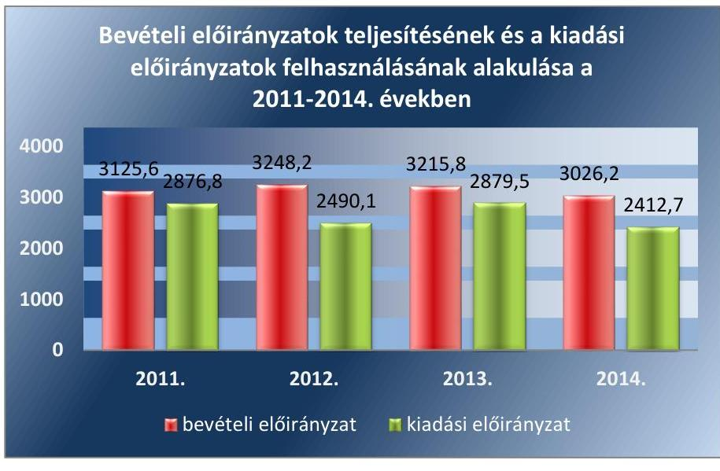

Forrás: A Tüdőgyógyintézet 2011-2014. évi éves beszámolói
A teljesített kiadási előirányzat 2011. évben 2876,8 M Ft volt, ami a teljesített bevételi előirányzat ( $3125,6 \mathrm{MFt}$ ) 92,0%-át tette ki. A kiadásokon belül a személyi juttatások 30,1%-ot ( $865,5 \mathrm{M}$ Ft-ot), a dologi kiadások 33,1%-ot ( $952,4 \mathrm{M}$ Ft-ot), a működési célú pénzeszközátadások 17,7%-ot (496,0 M Ft-ot) képviseltek.

A 2012. évi bevételek teljesítése 3248,2 M Ft volt, a kiadások (2490,1 M Ft) 23,3%-kal a bevételek alatt maradtak, mert a támogatásértékű működési kiadások eredeti előirányzata nem teljesült, valamint a fel-

---

újítások, az intézményi beruházási kiadások előirányzott összege a módosított előirányzat alatt maradt. A 2012. évi bevételek jelentős emelkedését eredményezte a Pest Megye Önkormányzata által a Tüdőgyógyintézet részére visszafizetett 496,0 M Ft működési célú kölcsön összege.

A 2013. évi bevételek összege 3215,8 M Ft volt, melyhez viszonyítva a kiadások összege (2879,5 M Ft) 10,5%-kal volt kevesebb, a személyi juttatások, a dologi kiadások, a felújítások, intézményi beruházási kiadások teljesítésének módosított előirányzattól való elmaradása miatt.

A bevételi előirányzatok a 2014. évben 3026,2 M Ft-ra 98%-ra, a kiadási előirányzatok 2412,7 M Ft-ra 78,1%-ra teljesültek a módosított előirányzathoz képest, a felújítások 19,7%-os, az intézményi beruházások 55,6%-os teljesülése miatt. Ennek oka, hogy az új onkopulmonológiai járóbeteg diagnosztikai és prevenciós központ megépítéséhez kapcsolódó engedélyezési eljárások lelassultak, és emiatt a beruházás kivitelezése nem kezdődhetett el.

A Tüdőgyógyintézet az egyensúlyjavító intézkedések keretében elrendelt egyes eszközcsoportokra vonatkozó beszerzési tilalom előírásait betartotta.

A 2011-2014. években a Tüdőgyógyintézetnél az előirányzat-módosítások, átcsoportosítások a Kincstár ${ }^{57}$, a fejezetet irányító szerv és a középirányító szerv tájékoztatásának hiányosságai miatt nem feleltek meg az előírásoknak. A Tüdőgyógyintézet a saját hatáskörében végrehajtott előirányzat-módosításokról, átcsoportosításokról az intézkedés meghozatalát követő öt munkanapon belül az Ámr. 71. § (6) bekezdése, illetve az Ávr. 167. § (4) bekezdésében előírt kötelezettségre ellenére a Kincstárt és a fejezetet irányító szervet nem tájékoztatta. Az előirányzatok és módosításaik főkönyvi könyvelése az Áhsz. 1.2-ben foglaltaknak megfelelően a 2011-2014. években megtörtént. Év végén zárolás az ellenőrzött időszakban nem volt.
3.3. számú megállapítás

A bevételi előirányzatok teljesítése 2012. év kivételével nem valósult meg, a kiadási előirányzatok felhasználása során nem tartották be a jogszabályi előírásokat.

A BEVÉTELI ELŐIRÁNYZATOK teljesítésének kötelezettségét a Tüdőgyógyintézet 2012. évben betartotta, azonban a 2011. évben 2,3%-kal, a 2013. évben 0,5%-kal, a 2014. évben 2%-kal alulteljesítette a bevételi előirányzatait. A bevételi előirányzatok módosításának elmulasztása miatt a 2011. évben nem tartották be az Áht. 12. § (3) bekezdésében, valamint a 2013-2014. években az Áht. 2. 30. § (3) bekezdésében foglaltakat.

A Tüdőgyógyintézet az Ámr. 75. § (1) bekezdésében az Ávr. 56. § (1) bekezdésében előírtak ellenére a kötelezettségvállalások nyilvántartását a 2011-2013. években nem vezette. A 2014. évben a jogszabálynak megfelelő kötelezettségvállalás-nyilvántartást vezettek.

A teljesítésigazolást a Tüdőgyógyintézet a pénzkezelési szabályzat ${ }_{1,2}$ mellékletében, az érvényesítésre jogosultak kijelölését - beosztásuk megjelölésével - a Gazdasági szervezet ügyrendje ${ }_{1,2}$-ben és az SZMSZ-ben szabályozta. A Tüdőgyógyintézet az Ámr. 80. § (3) bekezdésében, illetve az Ávr. 60. § (3) bekezdésében előírtak ellenére a szakmai teljesítésigazolásra, érvényesítésre jogosult személyekről és aláírás mintájukról naprakész nyilvántartást nem vezetett.

---

A KIADÁSI ELŐIRÁNYZATAINAK felhasználása során a Tüdőgyógyintézet az ellenőrzött időszakban nem lépte túl a számára jóváhagyott kiadási előirányzatot. A Tüdőgyógyintézet a 2011. évben azzal, hogy pályázati önrész, CT labor megvalósításának önrésze és CT épület önrésze jogcímen könyvelte el a pénzeszközátadásokat kölcsön helyett, megsértette az Áhsz. 1. 9. sz. mellékletében foglaltakat és a Számv. tv. 15. § (3)-(4) és (7) bekezdéseiben foglalt valódiság, világosság és összemérés számviteli alapelveit. A személyi, dologi, felhalmozási kiadások és a kölcsönök nyújtása során a gazdálkodási jogkörök gyakorlásához előírt belső kontrollok a 2011-2014. években nem működtek megfelelően. A gazdálkodási jogkörök gyakorlásának ellenőrzése során tapasztalt hiányosságokat a 4. táblázat mutatja be részletesen.
4. táblázat

# A GAZDÁLKODÁSI JOGKÖRÖK GYAKORLÁSÁNAK HIÁNYOSSÁGAI A 2011-2014. ÉVEKBEN 

| Gazdálkodási jogkör | Megállapított szabálytalanság |
| :--: | :--: |
| Szakmai teljesítésigazolás/teljesítés igazolás | Az ellenőrzött időszakban a főigazgató, illetve az általa kijelölt személy nem gondoskodott az Ámr. 76. § (1) bekezdésében és az Ávr. 57. § (1) bekezdésében előírtak ellenére a (szakmai) teljesítésigazolásról, több esetben a (szakmai) teljesítésigazolást nem végezték el, továbbá ellenőrizhető okmányok - írásbeli szerződés vagy megrendelés - hiányában igazolták a kiadások teljesítésének jogosságát és összegszerűségét. |
|  | A 2011. évben az Ámr. 76. § (3) és (5) bekezdés előírását figyelmen kívül hagyva a teljesítésigazolás gyakran nem tartalmazta a teljesítés igazolásának dátumát, illetve a teljesítést olyan személyek is igazolták, akiket a kötelezettségvállaló írásban nem jelölt ki.   Ismétlődő szabálytalanságként fordult elő, hogy az Ámr. 80. § (1) bekezdés, illetve az Ávr. 60. § (1) bekezdés előírása ellenére az érvényesítő ugyanazon gazdasági esemény tekintetében azonos volt a teljesítésigazoló személyével. |
| Utalvány ellenjegyzése/érvényesítés | A 2011. évben gyakori hiba volt, hogy az Ámr. 79. § (2) bekezdésében előírtak ellenére az ellenjegyző nem győződött meg az érvényesítés megtörténtéről.   A 2012-2014. években több esetben előfordult, hogy az érvényesítő az Ávr. 58. § (2) bekezdésében előírtak ellenére az utalványozónak nem jelezte az Ávr. 58. § (1) bekezdésében megjelölt jogszabályok, szabályzatok megsértését, azt, hogy szabályos teljesítésigazolás hiányában az érvényesítő a kiadás összegszerűségének ellenőrzését nem tudta elvégezni.   Az érvényesítő nem jelezte, hogy az Ávr. 55. § (2) bekezdés a) pontjában előírtak ellenére a kötelezettségvállalás pénzügyi ellenjegyzését nem a gazdasági vezető által írásban kijelölt személy végezte, illetve az Ávr. 55. § (1) bekezdésében előírtak ellenére a kötelezettségvállalás dokumentuma nem tartalmazta a pénzügyi ellenjegyzést, illetve annak dátumát. A 2014. évben az Ávr. 59. § (3)-(4) bekezdéseiben előírtak ellenére az utalványozást tartalmazó okmányon nem tüntették fel a kiadás egységes rovatrend és kormányzati funkció szerinti megnevezését, illetve a kifizetéssel érintett pénzeszköz államháztartási számviteli kormányrendelet könyvviteli számlájának számát és megnevezését.   A kifizetések érvényesítését - figyelmen kívül hagyva az Ávr. 58. § (4) bekezdés és a hatályos belső szabályozás előírásait - arra jogosulatlan személy végezte. A 2013. és a 2014. évben az érvényesítést - az Ávr. 58. § (1) bekezdés előírásával szemben - a teljesítés szabálytalan igazolása eseteiben is elvégezték, továbbá az érvényesítést végző személy a hivatkozott jogszabályi előírások és a belső szabályok megsértését - az Ávr. 58. § (2) bekezdésben foglalt kötelezettsége ellenére - nem jelezte az utalványozónak.   Az érvényesítő nem jelezte az utalványozónak, hogy a teljesítésigazolás nem történt meg, ezzel nem tartották be az Ámr. 77. § (2), illetve az Ávr. 58. § (2) bekezdéseinek előírásait.   Néhány esetben megtörtént, hogy az érvényesítésre a kifizetést megelőzően sor került, azonban az Ámr. 77. § (4) bekezdésében, illetve az Ávr. 58. § (4) bekezdésében előírtak ellenére, szabálytalan kijelölés miatt, azt nem az arra jogosult végezte. |

Forrás: ÁSZ kimutatás

---

A Tüdőgyógyintézet 2011-2014. között a felhalmozási, illetve a dologi és dologi jellegű (egyéb folyó) kiadások teljesítése körében több esetben megsértette a közbeszerzési eljárás lefolytatásának - a Kbt. ${ }_{1}^{58} 240$. § (1) bekezdésére figyelemmel - a Kbt. ${ }_{1} 2$. § (1) bekezdésében, valamint - a Kbt. ${ }_{2}^{59} 119$. §-ára figyelemmel - a Kbt. ${ }_{2} 5$. §-ában előírt kötelezettségét.

A Tüdőgyógyintézet 2012. márciustól az ellenőrzött időszak végéig több esetben megszegte a 46/2012. (III. 28.) Korm. rendelet ${ }^{60} 1$. § (1) bekezdésében, illetve a 6. § (1) bekezdésében foglalt kötelezettségét, mert a 6. § (1) bekezdés b) pontjában fennálló esetben - amikor a szükséges hatóanyagra nem volt hatályos keretmegállapodás vagy szerződés - a saját hatáskörben megvalósított gyógyszer beszerzéseit nem a Kbt. 2 szabályaival összhangban, azaz közbeszerzési eljárás lefolytatása nélkül valósította meg.

A 2014. évi felhalmozási kiadásokhoz kapcsolódóan a közbeszerzési eljárásokat a Kbt. 2 előírásainak megfelelően lefolytatták, a nyertes ajánlattevőkkel a közbeszerzési ajánlatban szereplő tartalmú szerződéseket kötöttek. A Kbt. 2 és a Közbeszerzési szabályzat ${ }_{1,2}$ előírásai alapján a beszerzések tervezésekor a becsült értékeket megállapították, a beszerzés, szolgáltatás módját az összeg nagysága alapján határozták meg.
3.4. számú megállapítás

Az előirányzat felhasználáshoz kapcsolódó évközi korlátozó intézkedéseket végrehajtották, a befizetési kötelezettségeket teljesítették. Az előirányzat-maradvány megállapítása nem volt megfelelő, analitikus nyilvántartása szabálytalan, felhasználása szabályszerű volt.

AZ ELŐIRÁNYZAT FELHASZNÁLÁSÁHOZ KAPCSOLÓDÓ évközi korlátozó intézkedéseket a 2011-2014. években a Tüdőgyógyintézet betartotta, zárolás, maradványtartás nem volt. A Tüdőgyógyintézet az egyensúlyjavító intézkedések keretében elrendelt egyes eszközcsoportokra vonatkozó beszerzési tilalom előírásait betartotta.

A Gyógyító-megelőző ellátás jogcím-csoportból finanszírozott egészségügyi szolgáltatók adósságának rendezésére fordítható konszolidációs támogatásról szóló 337/2011. (XII. 29.) Korm. rendelet ${ }^{61}$ alapján a Tüdőgyógyintézet a 2011. évre 78,4 M Ft konszolidációs támogatásban részesült, melyből a 7,9 M Ft visszafizetési kötelezettségének eleget tett.

A Tüdőgyógyintézet előirányzat-maradványából a központi költségvetést megillető, elvonandó előirányzat-maradványt a 2011-2014. években nem mutatott ki. A Tüdőgyógyintézet maradvány-kimutatása az Áhsz. 1.2 3. számú melléklete szerinti formában mutatta be a kötelezettségvállalással terhelt maradványt, mely szabad maradványra számszerűsített összeget nem tartalmazott.

---

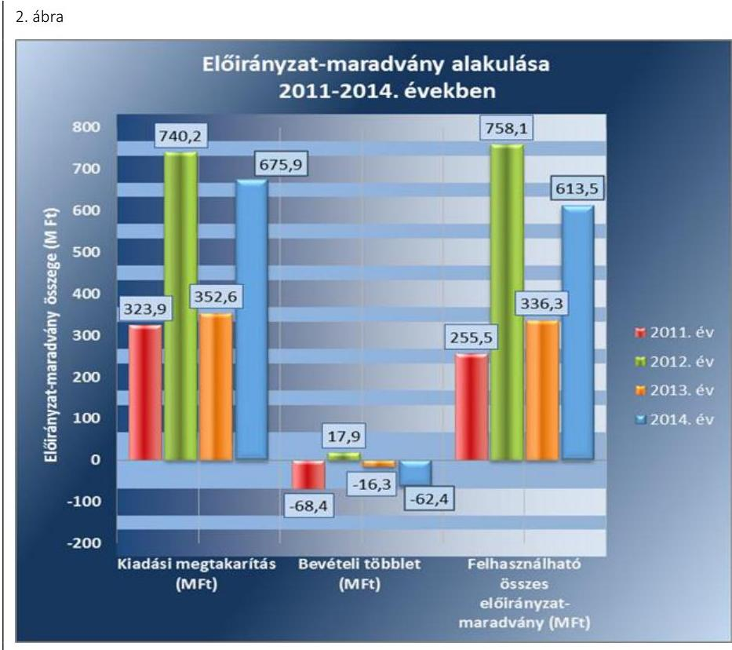

Forrás: A Tüdőgyógyintézet 2011-2014. évi éves beszámolói

A felhasználható előirányzat-maradvány összegéből a 2011-2014. évek mindegyikében a kiadási megtakarítás volt a meghatározó.

A kötelezettségvállalással terhelt előirányzat-maradványhoz kapcsolódó egyes dokumentumok nem feleltek meg a jogszabályi előírásoknak és a belső szabályzatoknak. Az előirányzat-maradvány megállapítása nem volt megfelelő. Az előirányzat-maradvány terhére tett kötelezettségvállalás során olyan személy is vállalt kötelezettséget, aki az Ámr. 72. § (3), és az Ávr. 52. § (1) bekezdésében foglaltak ellenére felhatalmazással nem rendelkezett, vagy aláírása alapján nem volt beazonosítható. Előfordult, hogy egy 100 ezer Ft alatti tétel 2012. évben kötelezettségvállalás nélkül került kifizetésre, annak ellenére, hogy az Ávr. 53. § (1)-(2) bekezdéseiben foglaltak alapján a 100 ezer Ft alatti, kötelezettségvállalás nélkül teljesíthető kifizetésekre szabályozás nem készült.

A 2011-2014. években a Tüdőgyógyintézet az előirányzat-maradványáról az előírt tartalommal teljesítette az irányító szerv felé az előírt adatszolgáltatási kötelezettségét, azonban nem az Áhsz. 10. § (1) bekezdésében, illetve az Áhsz. 2. 32. § (1) bekezdésében előírt határidőben. A 2011-2013. évekről az éves elemi költségvetési beszámolót legkésőbb a következő költségvetési év február 28-ig kellett volna az irányító, illetve
 a középirányító szervnek megküldeni. Ezzel szemben az előírt határidőt túllépve, a 2011. évi beszámolót 2012. március 5-én, a 2012. évi beszámolót 2013. március 14-én, a 2013. évi beszámolót 2014. április 9-én készítették el.

Az előirányzat-maradvány levezetése, összegének meghatározása a 2011-2014. években a Tüdőgyógyintézet éves beszámolója 42. és 75. számú űrlapjai, a 2014. évben az analitikus nyilvántartások és azokat alátámasztó dokumentumok alapján történt. A 2011-2014. évekre vonatkozó maradvány analitikában kimutatott kötelezettségvállalással terhelt marad-

---

# 3.5. számú megállapítás 

vány azonban nem egyezett meg a 2011-2014. évi éves költségvetési beszámolókban szereplő kötelezettségvállalással terhelt maradványként kimutatott összegekkel, így a kötelezettségvállalással terhelt maradványt a 2011-2013. években az Áhsz. 1 9. számú mellékletének 4. b) pontjában, a 2014. évben az Áhsz. 2 39. § (2) bekezdésében előírtak ellenére analitikával nem támasztották alá.

## A zavartalan feladatellátás, a fizetőképesség folyamatos fennállása, a likviditás javítása érdekében intézkedtek.

A fizetőképesség folyamatos fenntartása, a likviditás javítása érdekében a Tüdőgyógyintézet döntéseket hozott és a fennálló követelései behajtására intézkedéseket tett. Az Áht. 1, 2, a Számv. tv., az Ámr., az Ávr. előírásai szerint 2011. évre előirányzat-felhasználási, míg 2012-2014. évekre likviditási tervet készített.

A Tüdőgyógyintézetnek a 2011-2014. években a folyamatos fizetőképessége biztosított volt, az OEP ${ }^{62}$ támogatások, a konszolidáció során kapott pénzeszközök, valamint a saját bevételek együttes összege által.

A Tüdőgyógyintézethez kincstári biztost nem kellett kijelölni, mert hatvan napon túli tartozásállománya nem haladta meg az Áht. 1, 2-ben előírt határértéket. Költségvetési felügyelő, főfelügyelő kirendelése sem vált szükségessé.
3. ábra
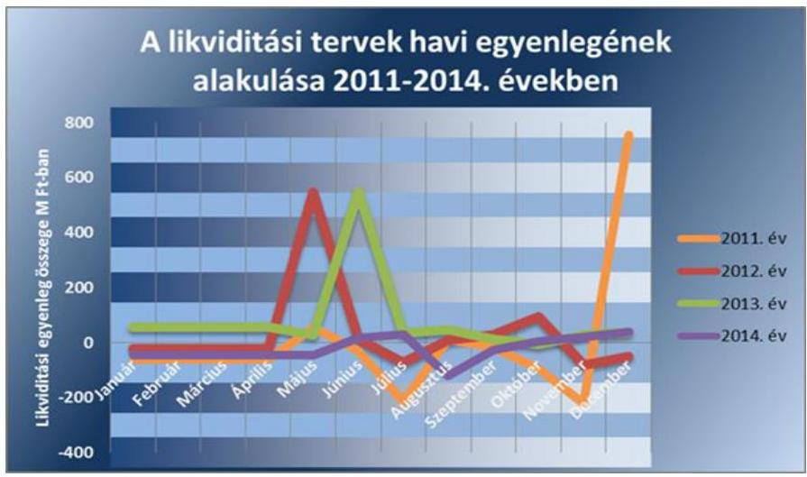

Forrás: A Tüdőgyógyintézet által beküldött előirányzat-felhasználási tervek, likviditási tervek
A likviditás havi egyenlege a 2011. év júliusában és novemberében negatív kilengést mutatott, ennek oka a Pest Megyei Önkormányzat részére nyújtott pénzeszközátadás volt, amelyek betervezett összege július hónapra 276,0 M Ft, a november hónapra 220,0 M Ft volt. A likviditás havi egyenlege a 2011. és a 2013. év egyes hónapjaira jelentős bevételi többletet mutatott az előző évi maradvány egy összegben való szerepeltetése miatt, amely a 2011. év december hónapban 805,9 M Ft, a 2013. év júniusban 758,1 M Ft volt. A 2012. év májusában a likviditás havi egyenlege jelentősen megemelkedett, a Pest Megyei Önkormányzata által visszafizetett kölcsön miatt, amelynek összege 496,0 M Ft volt. 2014. évben egyenletesen alakult a havi likviditási egyenleg, az augusztus havi negatív egyenleg oka beruházás miatti többletkiadás volt.

---

A szállítói számlák és egyéb kötelezettségek határidőben történő kiegyenlítése a 2011-2014. években biztosított volt a Tüdőgyógyintézetnél.

A Tüdőgyógyintézetnek egyéb kiadási elmaradása, bevétel visszafizetési, visszatérítési kötelezettsége a 2011-2014. években nem volt.
4. ábra
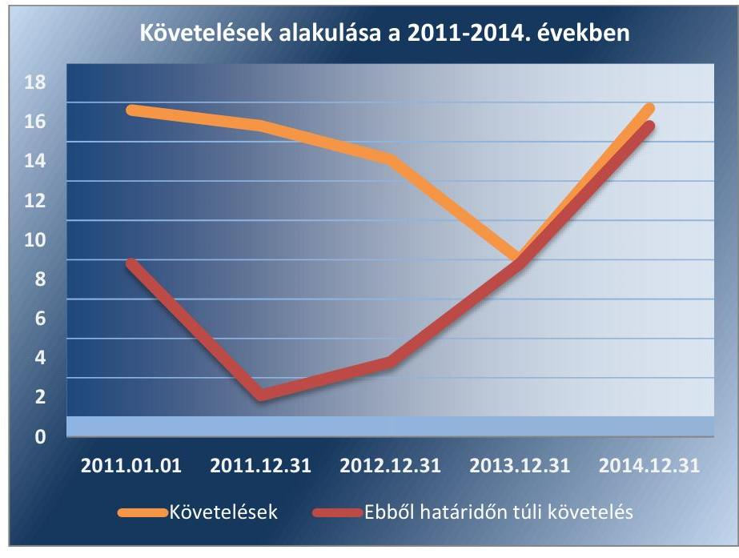

Forrás: A Tüdőgyógyintézet 9. számú tanúsítványa
A Tüdőgyógyintézet a 2011-2014. években likviditása biztosítása érdekében intézkedéseket tett, a folyamatos fizetőképességének biztosítása érdekében az előirányzat-felhasználási, a 2012. évtől likviditási tervében figyelembe vette az évközi korlátozó intézkedéseket. A 2012-2014. évekre a fizetőképessége biztosítása érdekében keret-előrehozási kérelemmel nem kellett élnie.

A Tüdőgyógyintézet a 2011-2014. években a likviditása biztosítása érdekében a kintlévőségeit figyelemmel kísérte és a behajtása érdekében felszólító leveleket küldött ki.

# 3.6. számú megállapítás 

Az eredményszemléletű számvitel bevezetésével kapcsolatos feladatok végrehajtása nem volt szabályszerű.

A rendező mérleg elkészítését megelőző, jogszabályban előírt feladatokat a Tüdőgyógyintézet nem teljes körűen végezte el.

A rendező, technikai tételeket a 2013. évi főkönyvi számlákon a záró egyenlegből kiindulva számolták el. A rendező, technikai tételek könyvelése során az NGM rendeletben ${ }^{63}$ előírtak szerint kivezették az eszközök bruttó értékét, értékcsökkenését, értékhelyesbítését, a közvetített szolgáltatások értékét. A rendező mérleg elkészítéséhez a 2013. december 31-ei mérleg-fordulónappal teljes körű leltározást nem végeztek az NGM rendelet 2. § (1) bekezdésének előírása ellenére, mert a források leltározása a szállítók és a függő tételek kivételével nem történt meg. Leltárösszesítés nem történt meg, jegyzőkönyvek csak leltározási körzetenként készültek, továbbá a mérlegsoronkénti kiértékelés jegyzőkönyvezése elmaradt.

---

A Tüdőgyógyintézetnél a rendező mérleg fordulónapja az NGM rendeletben foglaltaknak megfelelően 2014. január 1-je volt. A rendező mérleget az NGM rendelet 8. § (3) bekezdésében foglaltaknak megfelelően a költségvetési szerv vezetője és az elkészítéséért felelős személy aláírta. A rendező mérlegen feltüntették az elkészítéséért felelős személy regisztrációs számát és az aláírások keltezését. A rendező mérleget nem az NGM rendelet 8. § (2) bekezdésében foglalt határidőre készítették el. A beszámolási és könyvvezetési kötelezettségüknek a 2013. évben az Áhsz. ${ }_{1}$ alapján teljesítő szervezeteknek - az elkülönített állami pénzalapok és a társadalombiztosítás pénzügyi alapjai kivételével - 2014. március 31-ig kellett volna eleget tenniük, ezzel szemben a Tüdőgyógyintézet 2014. szeptember 25-én készítette el a rendező mérlegét.

A rendező mérleget nem a jogszabályban előírtaknak megfelelően készítették el. A Tüdőgyógyintézet által csatolt 2013. évi rendező mérleg státusztörténete alapján a rendező mérleg véglegesítésére csak 2014. október 16-án került sor, eddig az időpontig voltak módosítások a Kincstár verzióváltásai során jelzett hibák kijavítása, a jogszabályban előírt tartalmi követelmények biztosítása érdekében. Emiatt az Áhsz. 1 szerinti költségvetési számvitel nyilvántartási számlái közül a követelések, a kötelezettségvállalások és a más fizetési kötelezettségek, a teljesítések nyilvántartási számláit, valamint a 01-04. számlacsoport nyilvántartási számláit legkésőbb 2014. január 31-ig nem nyitották meg, a 2013. december 31-ei fordulónappal felvett leltár alapján, megsértve ezzel az NGM rendelet 9.§ (1) bekezdésében foglaltakat. A könyvviteli nyilvántartásban az 1-4. számlaosztályok megnyitására csak a 2014. év március 13-án került sor, ennek ellenére az analitikus nyilvántartásokat a 2014. év január 2-ától folyamatosan vezették. Az egyéb eszközök és források könyvviteli számláit a rendező mérleg alapján, az annak elkészítését követő munkanapon megnyitották. A könyvviteli számlák megnyitása után a nyilvántartások szerinti forgalmat a megnyitott könyvviteli számlákon könyvelték.

# 4. Az intézmény vagyongazdálkodása szabályszerű volt-e? 

## Összegző megállapítás

### 4.1. számú megállapítás

A Tüdőgyógyintézet vagyongazdálkodása a leltározási hiányosságok miatt nem felelt meg a jogszabályi előírásoknak.

A vagyonkezelési szerződés megfelelt a jogszabályi előírásoknak.
A konszolidációs törvény alapján a Tüdőgyógyintézet vagyona 2012. január 1-jén állami tulajdonba került. A Mód. tv. ${ }^{64}$ 13. § (1) bekezdés értelmében a középirányító szerv 2012. május 1-jétől gyakorolta a tulajdonosi jogokat és kötelezettségeket, és ugyanezen időponttól a Tüdőgyógyintézet részére vagyonkezelésbe adta a Tüdőgyógyintézet használatában lévő vagyont. A középirányító szerv és a Tüdőgyógyintézet a Vtv. ${ }^{65}$ és a Vtvr. ${ }^{66}$ előírásainak megfelelő vagyonkezelési szerződést 2013. március 13-án kötötte meg. A vagyonkezelésre átvett vagyonelemek, illetve vagyonösszeg a tulajdonosi joggyakorló előírásainak megfelelő tartalommal és a Tüdőgyógyintézet nyilvántartásaival egyezően került megállapításra.

---

A Tüdőgyógyintézet, mint vagyonkezelő a Vtvr. előírásainak megfelelő tartalmú, illetve a vagyonkezelési szerződésben meghatározott és a tulajdonosi joggyakorlóval egyeztetett nyilvántartást vezette, amely a kapcsolódó adatszolgáltatások pontosságát és ellenőrizhetőségét biztosította.

A vagyonkezelési szerződés módosítására, megszüntetésére az ellenőrzött időszakban nem került sor.

Az ellenőrzött időszakban a beszerzések során a Tüdőgyógyintézet betartotta az Nvtv., valamint a Vtv. előírásait, az állam javára szerezte be az eszközöket, annak vagyonkezelőjévé vált, a beszerzésekhez minden esetben megrendelések, illetve szerződések kapcsolódtak.

# 4.2. számú megállapítás 

A mérlegben kimutatott eszközök és források nyilvántartása, értékelése a jogszabályok és a belső szabályzatok előírásainak megfelelően történt. A leltározás nem felelt meg a belső szabályzatban előírtaknak.

A mérlegben kimutatott eszközök bekerülési értékének megállapítása, állományba vétele és az értékcsökkenés elszámolása az ellenőrzött időszakban a Számv. tv. és a belső szabályzatok Számviteli politika 1-3, Értékelési szabályzat ${ }_{1,2}$ előírásainak megfelelően történt.

A beszerzett, beruházással, felújítással létesített tárgyi eszközök bekerülési értékének megállapítása, állományba vétele, év végi értékelése és az értékcsökkenés elszámolása szabályos volt, az megfelelt az Áhsz. 1, Áhsz. ${ }_{2}$ rendelkezéseiben és a Számviteli politika ${ }_{1-3}$-ban, valamint az Értékelési szabályzat ${ }_{1,2}$-ben foglaltaknak.

A mérlegtételek értékelése során nem számoltak el értékvesztést és követelésről nem mondtak le, erre az ellenőrzött időszakban nem volt szükség. A mérlegtételek állományát rögzítő számlák vezetése, a negyedévenkénti összegző kimutatások és a főkönyvi feladások megfeleltek az Áhsz. ${ }_{1}$ és az Áhsz. ${ }_{2}$ előírásainak.

A Tüdőgyógyintézet az éves költségvetési beszámoló elkészítéséhez, a mérleg tételeinek alátámasztásához az előírt, évenkénti leltárakat nem teljes körűen állította össze. A Tüdőgyógyintézet 2011-2014. évi költségvetési beszámolói könyvviteli mérlegei forrás oldali adatainak értékegyeztetését - a szállítók és a költségvetési passzív függő elszámolások kivételével - nem végezték el, amellyel megsértették a Számv. tv. 69. § (2) bekezdésének, valamint az Áhsz. 37. § (3) és az Áhsz. 2 22. § (1) előírását. Ezen forrásoldali mérlegtételek - saját tőke, tartalékok - esetében a főkönyvi kivonatokban, a kapcsolódó főkönyvi számlákon és az éves költségvetési beszámolókban szereplő értékösszegek megegyeztek.

Leltározásra az ellenőrzött időszak valamennyi évében, selejtezésre a 2012. és a 2013. években került sor. A könyvvitel adatainak egyeztetési módja megfelelt a Leltározási szabályzat ${ }_{1-3}$-ban foglalt előírásoknak. A leltár kiértékelése - mivel az irodaszerek, élelmezési anyagok leltározását kivéve a tárgyi eszközök, ingatlanok, gépek, berendezések, felszerelések, járművek, befejezetlen beruházások tekintetében 2011. és 2014. közötti időszakban az analitikus nyilvántartásokkal való egyeztetéssel történt a leltározás, de leltározási jegyzőkönyv és annak kiértékelése nem készült - nem felelt meg a Leltározási szabályzat ${ }_{1-3}$-ban foglalt előírásoknak, amivel a Tü-

---

# 4.3. számú megállapítás 

dőgyógyintézet megsértette a Számv. tv. 69. § (1) és (3) bekezdésében foglaltakat. A selejtezést mindkét évben a Selejtezési szabályzatban ${ }^{67}$ rögzítetteknek megfelelően hajtották végre és dokumentálták.

## A Tüdőgyógyintézet az értékmegőrzési, állagmegóvási kötelezettségeit a jogszabály és a vagyonkezelési szerződés előírásai szerint teljesítette.

## A könyvviteli mérlegben kimutatott tárgyi eszközök értéke az ellenőrzött időszakban emelkedett, a Tüdőgyógyintézet összességében eleget tett az értékmegőrzési és állagmegóvási kötelezettségeinek. A mérleg szerinti eszközeinek és forrásainak értéke a 2011. évi 2527,8 M Ft-ról a 2014. év végére 2824,9 M Ftra, a saját tőke 2149,6 M Ft-ról, 2185,7 M Ft-ra nőtt. A tárgyi eszközök bruttó értéke a 2011. évi 2758,7 M Ft-ról 3283,8 M Ft-ra nőtt, nettó 1576,7 M Ft-ról 1772,0 M Ft-ra. Ebből a beruházások állománya a 2011. évi 6,1 M Ft-ról közel tizennégyszeresére, azaz 85,3 M Ft-ra nőtt a 2014. év végére, amely az új betegellátó épület megvalósításával összefüggő tervezéshez és kivitelezéshez kapcsolódott, 2017. évi várható befejezéssel.
5. táblázat

A Tüdőgyógyintézet vagyoni helyzetét jellemző mutatók

|  | 2011. | 2012. | 2013. | 2014. |
| :--: | :--: | :--: | :--: | :--: |
| Befektetett eszközök aránya ${ }^{68} * 100$ | 82,2 | 62,5 | 79,3 | 62,7 |
| Ingatlanok aránya ${ }^{69} * 100$ | 59,2 | 77,4 | 77,9 | 73,6 |
| Forgóeszközök aránya ${ }^{70 *} 100$ | 17,8 | 37,5 | 20,7 | 3,1 |
| Saját tőke aránya mutató ${ }^{71}$ - *100 | 85,0 | 64,0 | 83,7 | 77,4 |
| Kötelezettségek és a saját tőke aránya mutató ${ }^{72 *} 100$

 | 2,9 | 6,3 | 1,4 | 9,9 |
| Használhatósági fok (\%) ${ }^{73}$ | 57,2 | 55,1 | 55,3 | 54,0 |
| Elhasználódási szint (\%) ${ }^{74}$ | 42,8 | 44,9 | 44,7 | 46,0 |

A Tüdőgyógyintézet vagyoni helyzetét jellemző mutatók és az ehhez kapcsolódó jelentősebb változások indokai a következők:
$\longrightarrow$ A tárgyi eszközök használhatósági fok mutatója az ellenőrzött időszakban kismértékben - 57,2\%-ról 54\%-ra - romlott, ami az eszközök átlagos elhasználtságának kismértékű növekedését jelezte.
$\longrightarrow$ A befektetett eszközök aránya mutató (Befektetett eszközök/Eszközök összesen) 19,5\% pontnyi csökkenésének oka, hogy a 2011. évet követően megszűnt a betétlekötés lehetősége. E lekötött betét nélkül a 2011. évi befektetett eszköz aránya mutató 62,6\%, ami a 2014. évivel egyező mértékű.
$\longrightarrow$ A forgóeszközök aránya mutató (Forgóeszközök / Eszközök összesen) a 2011. évi 17,8\%-ról, 2014 év végére 3,1\%-ra esett, aminek oka az, hogy a pénzforgalmi számlák egyenlege a 2014. évtől nem tartozik a forgóeszközök közé. Ennek összegével korrigálva a mutató 24,7\%, ami már bővülő finanszírozási mozgásteret jelez.
$\longrightarrow$ Az ingatlanok aránya mutató az ellenőrzött években növekedett, 59,2\%-ról 73,6\%-ra. Ennek oka, hogy a Tüdőgyógyintézet folyamatosan végezte az ingatlanok állagának védelmét és felújítását, valamint a 2014. évben új ingatlan-beruházásba kezdett.

---

- A kötelezettségek és a saját tőke aránya mutató 2,9\%-ról 9,9\%-ra növekedett, egyrészt azért, mert a 2014. december havi bérek bekerültek a kötelezettségek közé, másrészt a szállítói állomány növekedése miatt.
A Tüdőgyógyintézet a vagyontárgyai állagának megóvásáról, karbantartásáról - a költségvetési forrásait figyelembe véve - és meghatározott célnak megfelelő használatáról a Vtv. szerint gondoskodott.

Az alapfeladatok ellátását szolgáló állami vagyon működtetésére az ISO 9001:2008 minőségirányítási rendszert vezette be a Tüdőgyógyintézet, a korábban is alkalmazott ISO szabványok korszerűsítéseként.

A vagyonkezelőre bízott állami tulajdonú eszközökön végzett beruházás, felújítás során betartották a tulajdonosi jogokat gyakorló középirányító szerv előírásait. A felhalmozási kiadások tervezése, a beruházási és felújítási keretösszegek meghatározása, ezek módosítása, az előirányzat-maradvány elfogadása a középirányító szerv által megtörtént.
4.4. számú megállapítás

A vagyonelemek hasznosítása a jogszabályok és a belső szabályzatok előírásainak megfelelően történt.

A kezelt nemzeti vagyon értékesítése, bérbeadása és egyéb hasznosítása során a Tüdőgyógyintézet betartotta az Nvtv., valamint a Vtv. és a Vtvr. előírásait, a tulajdonosi jogokat gyakorló középirányító szerv vagyonhasznosításra vonatkozó iránymutatásait.

A bevételek az Áht. 1 és az Áht. 2 előírásai szerint, szerződéssel és kiállított számlákkal alátámasztottak voltak, és ezeknek megfelelő összegben realizálódtak. A Tüdőgyógyintézet egy esetben nem tartotta be az átláthatóság követelményének érvényesüléséről szóló, Nvtv. 11. § (10)-(11) bekezdéseiben rögzített előírást, mert - egy 2012. évi bérbeadáskor - nem győződött meg a bérbevevő vállalkozás átláthatóságáról.

Az ellenőrzött időszakban az MNV Zrt. ${ }^{75}$, illetve az irányító szerv ${ }_{2}$ engedélyéhez kötött eszközök értékesítésére, a vagyonkezelői jog harmadik személyre történő átruházására, továbbá térítésmentes vagyonátadásra nem került sor.

# 5. Szabályszerűen hajtották-e végre az ellenőrzött időszakban az intézményt érintő szervezeti, szerkezeti átalakításokat? 

Összegző megállapítás

Az ellenőrzött időszakban a Tüdőgyógyintézetet érintő szervezeti, szerkezeti átalakítás nem történt.

Átszervezés vagy átalakítás a 2011-2014. években a Tüdőgyógyintézetnél nem történt.

Az ellenőrzött időszakban az irányító szerv ${ }_{1,2}$ átszervezéshez, átalakításhoz kapcsolódó alapítói, irányító, felügyeleti szervi döntéseket nem hozott, mivel a 2011-2014. években a Tüdőgyógyintézetnél nem történt átszervezés vagy átalakítás. A Tüdőgyógyintézet 2014. január 1-jén a Budakeszi Tüdőgyógyászati szakrendelés és gondozást az Országos Korányi TBC és Pulmonológiai Intézet részére átadta, ami nem kapcsolódott átalakításhoz.

---

# 6. Az intézmény intézkedett-e az integritás szemlélet érvényesítése érdekében? 

Összegző megállapítás
A Tüdőgyógyintézet az integritás szemlélet érvényesülése érdekében nem intézkedett.

Az ellenőrzés részletes megállapításait a jelentés II. számú - „Az Integritás érvényesítése érdekében kialakított és működtetett kontrollrendszer" című - melléklete tartalmazza.

---

# JAVASLATOK 

Az ÁSZ tv. 33. § (1) bekezdésében foglaltak értelmében az ellenőrzött szervezet vezetője köteles a jelentésben foglalt megállapításokhoz kapcsolódó intézkedési tervet összeállítani és azt a jelentés kézhezvételétől számított 30 napon belül az ÁSZ részére megküldeni. Amennyiben az ellenőrzött szervezet vezetője nem küldi meg határidőben az intézkedési tervet, vagy továbbra sem elfogadható intézkedési tervet küld, az Állami Számvevőszék elnöke az ÁSZ tv. 33. § (3) bekezdése a) és b) pontjaiban foglaltakat érvényesítheti.

## az emberi erőforrások miniszterének

1. Intézkedjen a Tüdőgyógyintézet Törökbálint alapító okiratának módosítása esetén az államháztartásért felelős miniszter előzetes egyetértése megkérésére.
(1.1. sz. megállapítás 4. bekezdése alapján)
2. Tegyen intézkedéseket a feltárt szabálytalanságok tekintetében a felelősség tisztázása érdekében, és szükség szerint intézkedjen a felelősség érvényesítéséről.
(3.3. sz. megállapítás 4. bekezdésének 3., 4. mondata, 3.3. sz. megállapítás 4. táblázata, 3.3. sz. megállapítás 5. bekezdése, 3.3. sz. megállapítás 6. bekezdése, 3.4. sz. megállapítás 5. bekezdésének 2., 3. mondata alapján)

## az Állami Egészségügyi Ellátó Központ főigazgatójának

1. Intézkedjen a közfeladatok ellátására vonatkozó, az erőforrásokkal való hatékony gazdálkodás követelményei érvényesítésére, továbbá e követelmények érvényre juttatása számon kérésére és ellenőrzésére.
(1.2. sz. megállapítás 2. bekezdése alapján)

---

# a Tüdőgyógyintézet Törökbálint főigazgatójának 

1. Intézkedjen a szervezeti és működési szabályzat jogszabályi előírásoknak megfelelő tartalmú módosítására és kezdeményezze annak jóváhagyását.
(1.1. sz. megállapítás 7. bekezdésének 1., 2. francia bekezdése, 1.1. sz. megállapítás 8. bekezdése, 2.5. sz. megállapítás 4. bekezdésének 2. mondata alapján)
2. A belső kontrollrendszer szabályszerű kialakítása és működtetése érdekében intézkedjen:
a) a jogszabályi előírásoknak megfelelő számviteli politika, valamint az eszközök és források értékelési szabályzata elkészítésére;
(2.1. sz. megállapítás 4. bekezdésének 2. mondata, 2.1. sz. megállapítás 7. bekezdésének 2. mondata alapján)
b) az előzetes írásbeli kötelezettségvállalást nem igénylő kifizetések rendje szabályozására;
(2.1. sz. megállapítás 8. bekezdése alapján)
c) az ellenőrzési nyomvonal rendszeres aktualizálására annak érdekében, hogy az teljes körűen tartalmazza a Tüdőgyógyintézet Törökbálint működési folyamatainak leírását, ezen belül a felelősségi és információs szinteket és kapcsolatokat, irányítási és ellenőrzési folyamatokat;
(2.1. sz. megállapítás 9. bekezdése, 3.1. sz. megállapítás 2. bekezdése alapján)
d) a kockázatkezelés belső szabályozása jogszabálynak megfelelő kiegészítésére;
(2.2. sz. megállapítás 1. bekezdésének 3. mondata alapján)
e) a pénzügyi döntések dokumentumainak elkészítése és a pénzügyi kihatású döntések célszerűségi, gazdaságossági, hatékonysági és eredményességi szempontú megalapozottsága vonatkozásában a folyamatba épített, előzetes, utólagos és vezetői ellenőrzés biztosítására;
(2.3. sz. megállapítás 1. bekezdése alapján)

---

f) olyan rendszerek kialakítására és működtetésére, amelyek biztosítják, hogy a megfelelő információk a megfelelő időben eljutnak az illetékes szervezethez, szervezeti egységhez, illetve személyhez;
(2.4. sz. megállapítás 2. bekezdésének 1. mondata alapján)
g) az elektronikus közzétételi kötelezettség teljesítésére a jogszabályi előírásoknak megfelelően;
(2.4. sz. megállapítás 4. bekezdése alapján)
h) az iratkezelési szabályzat jogszabályi előírásoknak megfelelő kiadására;
(2.4. sz. megállapítás 5. bekezdése alapján)
i) a szervezet tevékenységének, a célok megvalósításának nyomon követését biztosító rendszeren belül az operatív tevékenységek keretében megvalósuló folyamatos és eseti nyomon követés kialakítására és működtetésére.
(2.5. sz. megállapítás 1. bekezdésének 1. mondata alapján)
3. A szabályszerű pénzügyi gazdálkodás érdekében intézkedjen:
a) a bevételi és kiadási előirányzatok alakulásáról a valóságnak megfelelő, folyamatos, zárt rendszerű, áttekinthető nyilvántartás vezetésére, biztosítva a jogszabályi előírásoknak megfelelő egyeztetés, ellenőrzés lehetőségét;
(3.2. sz. megállapítás 3. bekezdésének 1., 4. mondata alapján)
b) előirányzat módosítása esetén a jogszabályi előírások betartására;
(3.2. sz. megállapítás 11. bekezdésének 2. mondata alapján)
c) a költségvetési bevételek tervezettől történő elmaradása esetén a jogszabályban előírtak betartására;
(3.3. sz. megállapítás 1. bekezdésének 2. mondata alapján)
d) a teljesítés igazolására és érvényesítésre jogosult személyekről és aláírás mintájukról vezetett nyilvántartás jogszabályi előírásoknak megfelelő naprakész vezetésére;
(3.3. sz. megállapítás 3. bekezdésének 2. mondata alapján)

---

e) a gazdálkodási jogkörök jogszabályi előírásoknak megfelelő gyakorlására;
(3.3. sz. megállapítás 4. bekezdésének 3., 4. mondata, 3.3. sz. megállapítás 4. táblázata alapján)
f) közbeszerzési eljárás lefolytatására a jogszabályokban előírt esetekben;
(3.3. sz. megállapítás 5. bekezdése, 3.3. sz. megállapítás 6. bekezdése alapján)
g) a kötelezettségvállalással terhelt költségvetési maradvány jogszabályi előírásoknak megfelelő megállapítására;
(3.4. sz. megállapítás 5. bekezdésének 2., 3. mondata alapján)
h) a Kincstár által működtetett elektronikus adatszolgáltató rendszerbe az éves költségvetési beszámoló adatai feltöltésének jogszabályban előírt határideje betartására.
(3.4. sz. megállapítás 6. bekezdése alapján)
4. A vagyongazdálkodás szabályszerűsége érdekében intézkedjen az éves költségvetési beszámoló elkészítéséhez, a mérleg tételeinek alátámasztásához olyan leltár összeállítására és megőrzésére, amely tételesen, ellenőrizhető módon tartalmazza a mérlegben szereplő eszközöket és forrásokat.
(4.2. sz. megállapítás 4. bekezdés 2. mondata, 4.2. sz. megállapítás 5. bekezdés 3. mondata alapján)
5. Tegyen intézkedéseket a feltárt szabálytalanságok tekintetében a felelősség tisztázása érdekében, és szükség szerint intézkedjen a felelősség érvényesítéséről.
(3.2. sz. megállapítás 3. bekezdésének 1., 4. mondata, 3.3. sz. megállapítás 3. bekezdésének 2. mondata, 3.3. sz. megállapítás 4. bekezdésének 3., 4. mondata, 3.3. sz. megállapítás 4. táblázata, 4.2. sz. megállapítás 4. bekezdés 2. mondata, 4.2. sz. megállapítás 5. bekezdés 3. mondata alapján)

---

# MELLÉKLETEK 

- I. SZ. MELLÉKLET: ÉRTELMEZŐ SZÓTÁR
állami vagyon
állami vagyonnak minősül:
a) az állam tulajdonában lévő dolog, valamint a dolog módjára hasznosítható természeti erő,
b) az a) pont hatálya alá nem tartozó mindazon vagyon, amely vonatkozásában törvény az állam kizárólagos tulajdonjogát nevesíti,
c) az állam tulajdonában lévő tagsági jogviszonyt megtestesítő értékpapír, illetve az államot megillető egyéb társasági részesedés,
d) az államot megillető olyan immateriális, vagyoni értékkel rendelkező jogosultság, amelyet jogszabály vagyoni értékű jogként nevesít
(Forrás: Vtv. 1. § (2) bekezdése)
állami vagyon értékesítése
állami vagyon használója
állami vagyon hasznosítása
állami vagyon hasznosítása kötött szerződés

Állami vagyonnak a (1) bekezdése (2) pontja)
Az a természetes személy, jogi személy, illetve jogi személyiséggel nem rendelkező szervezet, amely, illetve aki törvény vagy szerződés alapján, bármely jogcímen (pl. bérlet, haszonbérlet, vagyonkezelési szerződés, használat stb.) állami vagyont birtokol, használ, szedi annak hasznait, hasznosít, ide nem értve a tulajdonosi jogok gyakorlóját.
(Forrás: Vtvr. 1. § (7) bekezdés a) pontja, hatályos 2011. január 1-jétől 2011. december 31-ig)
Az a természetes vagy jogi személy, jogi személyiséggel nem rendelkező szervezet, aki, vagy amely törvény vagy szerződés alapján, bármely jogcímen (bérlet, haszonbérlet, használat stb.) állami vagyont birtokol, használ, szedi annak hasznait, hasznosít, ide nem értve a haszonélvezőt, a vagyonkezelőt és a tulajdonosi jogok gyakorlóját".
(Forrás: Vtvr. 1. § (7) bekezdés a) pontja)
Az állami vagyont az MNV Zrt. maga kezeli, vagy szerződés - így különösen bérlet, haszonbérlet, szerződésen alapuló haszonélvezet, vagyonkezelés, megbízás - alapján központi költségvetési szervnek, természetes vagy jogi személynek, vagy jogi személyiséggel nem rendelkező gazdálkodó szervezetnek hasznosításra átengedi.
(Forrás: Vtv. 23. § (1) bekezdése, hatályos 2011. december 31-éig)
Az állami vagyont az MNV Zrt. maga kezeli, vagy szerződés - így különösen bérlet, haszonbérlet, megbízás - alapján központi költségvetési szervnek, természetes vagy jogi személynek, vagy jogi személyiséggel nem rendelkező gazdálkodó szervezetnek hasznosításra átengedi.
(Forrás: Vtv. 23. § (1) bekezdése, hatályos 2012. január 1-jétől)
Az állami vagyonnal a tulajdonosi joggyakorló maga gazdálkodik, vagy szerződés - így különösen bérlet, haszonbérlet, megbízás - alapján hasznosításra átengedi, illetőleg vagyonkezelésbe, haszonélvezetbe adja.
(Forrás: Vtv. 23. § (1) bekezdése, hatályos 2013. június 28-ától)
Az állami vagyon hasznosítására kötött szerződések elsődleges célja az állami vagyon hatékony működtetése, állagának védelme, értékének megőrzése, illetve gyarapítása, az
 állami és közfeladatok ellátásának elősegítése.
(Forrás: Vtv. 23. § (2) bekezdése)

---

állami vagyon kezelője /vagyonkezelő
Az állami vagyont az MNV Zrt. maga kezeli, vagy szerződés - így különösen bérlet, haszonbérlet, szerződésen alapuló haszonélvezet, vagyonkezelés, megbízás - alapján központi költségvetési szervnek, természetes vagy jogi személynek, illetőleg jogi személyiséggel nem rendelkező gazdasági társaságnak hasznosításra átengedi (Forrás: Vtv. 23. § (1) bekezdése, hatályos 2010. január 01-2011. december 31-ig).

Az állami vagyont az MNV Zrt. maga kezeli, vagy szerződés - így különösen bérlet, haszonbérlet, megbízás - alapján központi költségvetési szervnek, természetes vagy jogi személynek, vagy jogi személyiséggel nem rendelkező gazdálkodó szervezetnek hasznosításra átengedi. Az állami vagyonra vonatkozóan az MNV Zrt. kizárólag az Nvtv-ben meghatározott személyekkel köthet vagyonkezelési szerződést.
(Forrás: Vtv. 27. § (1) bekezdése, hatályos 2012. január 1-jétől)
ÁSZ Integritás Projekt
állakítás
belső ellenőrzés
belső kontrollrendszer
belső kontrollrendszer területei
előirányzat-felhasználási terv intézményi

Az Állami Számvevőszék 2009-ben indította el a „Korrupciós kockázatok feltérképezése - Integritás alapú közigazgatási kultúra terjesztése" című, európai uniós forrásból megvalósított kiemelt projektjét (Integritás Projekt). Az Integritás Projekt célja, hogy felmérje a közszféra intézményei korrupciós kockázatoknak való kitettségét, illetőleg az azok mérséklésére hivatott kontrollok szintjét. Az Állami Számvevőszék a projekt révén az integritás szemlélet minél szélesebb körrel történő megismertetését, gyakorlatba ültetését kívánja elérni. Az integritás követelményeinek megfelelő szervezeti működést előnyben részesítő közigazgatási kultúra elterjesztését és a korrupció elleni fellépést az ÁSZ önmagára nézve is stratégiai jelentőségű célként fogalmazta meg. A projekt a felmérésben résztvevő intézmények számára helyzetükről egyfajta „tükörképet" mutat be, ami alapot teremt a jövőbeni pozitív irányú elmozduláshoz. (Forrás: a http://integritas.asz.hu honlapon közzétett, a 2013. évi Integritás felmérés eredményeiről készült összefoglaló tanulmány) Az általános jogutódlással történő megszüntetés átalakítással történhet. Az átalakítás lehet egyesítés vagy különválás. Az egyesítés lehet beolvadás vagy összeolvadás.
(Forrás: Áht. 195. §-a, Áht. 211. §-a)
Független, tárgyilagos bizonyosságot adó és tanácsadó tevékenység, amelynek célja, hogy az ellenőrzött szervezet működését fejlessze és eredményességét növelje, az ellenőrzött szervezet céljai elérése érdekében rendszerszemléletű megközelítéssel és módszeresen értékeli, illetve fejleszti az ellenőrzött szervezet irányítási és belső kontrollrendszerének hatékonyságát. (Forrás: Bkr. 2. § b) pontja)
A belső kontrollrendszer a kockázatok kezelése és tárgyilagos bizonyosság megszerzése érdekében kialakított folyamatrendszer, amely azt a célt szolgálja, hogy a működés és gazdálkodás során a tevékenységeket szabályszerűen, gazdaságosan, hatékonyan, eredményesen hajtsák végre, az elszámolási kötelezettségeket teljesítsék, megvédjék az erőforrásokat a veszteségektől, károktól és nem rendeltetésszerű használattól. (Forrás: Áht. 269. § (1) bekezdése)
A kontrollkörnyezet, a kockázatkezelési rendszer, a kontrolltevékenységek, az információs és kommunikációs rendszer, valamint a nyomon követési (monitoring) rendszer. (Forrás: Bkr. 3. §-a)
A költségvetési szervek és a fejezeti kezelésű előirányzatok várható bevételeinek, valamint az időszak elején rendelkezésre álló forrásainak (készpénz és bankszámlaállomány együttes összege) figyelembevételével legalább havi

---

előirányzat-maradvány
felújítás
használhatósági fok
hasznosítás
információs és kommunikációs rendszer
integritás
irányító szerv/felügyeleti szerv

ISO szabvány
kincstári biztos
ütemezéssel tartalmazza a teljesíthető kiadásokat (a korábbi időszakról áthúzódó fizetési kötelezettségekkel együtt), melyeket olyan részletezettséggel kell kimutatni, hogy az megbízható alapja legyen a kötelezettségvállalási jogkör gyakorlásának és a likviditás biztosításának. (Forrás: 2009. év december 20-tól hatálytalan Ámr. 2. § 57. pont)
Az államháztartás központi alrendszerébe tartozó költségvetési szerveknél a módosított bevételi és kiadási előirányzatok és azok teljesítésének a Kormány rendeletében meghatározott tételekkel korrigált különbözete az előirányzat-maradvány. (Forrás: Áht. 22. § (1) bekezdés m) pontja).
Az elhasználódott tárgyi eszköz eredeti állaga (kapacitása, pontossága) helyreállítását szolgáló időszakonként visszatérő olyan tevékenység, melynek során az eszköz élettartama megnövekszik, minősége, használata jelentősen javul, így a pótlólagos ráfordításból a jövőben gazdasági előnyök származnak. (Forrás: Számv. tv. 3. § (4) bekezdés 8. pontja)
A tárgyi eszközállomány állagának elemzéséhez használt mutató, amely megmutatja, hogy a le nem írt (nettó) érték milyen hányadát képezi az aktiválási (bekerülési) értéknek. Számításakor a tárgyi eszköz könyv szerinti nettó értékét viszonyítják a tárgyi eszköz bruttó (beszerzési/létesítési) értékéhez.
A nemzeti vagyon birtoklásának, használatának, hasznok szedése jogának bármely - a tulajdonjog átruházását nem eredményező - jogcímen történő átengedése, ide nem értve a vagyonkezelésbe adást, valamint a haszonélvezeti jog alapítását. (Forrás: Nvtv. 3. § (1) bekezdés 4. pontja)
A költségvetési szerv vezetője által kialakított és működtetett olyan rendszer, mely biztosítja, hogy a megfelelő információk a megfelelő időben eljutnak az illetékes szervezethez, szervezeti egységhez, illetve személyhez. (Forrás: Bkr. 9. § (1) bekezdés)

Az integritás az elvek, értékek, cselekvések, módszerek, intézkedések konzisztenciáját jelenti, vagyis olyan magatartásmódot, amely meghatározott értékeknek megfelel.
(Forrás: Nemzetgazdasági Minisztérium: Magyarországi államháztartási belső kontroll standardok Útmutató 1.6.1. pontja, 2012. december)
A költségvetési szerv tekintetében a törvényben, kormányrendeletben vagy önkormányzati rendeletben meghatározott irányítási hatáskört gyakorló szerv. (Forrás: Áht. 193. §-a, Áht. 29. §-a)
a Nemzetközi Szabványügyi Szervezet (International Organization for Standardization, 1947.) által kiadott nemzetközi szabvány. Az ISO szabvány alatt az egyik legelterjedtebb alkalmazású szabványt, az ISO 9001 szabványt értik, ami a minőségirányítási rendszer szabványosított követelményeit tartalmazza. Az ISO 9000 szabványcsalád célja olyan szervezeti teljesítmény biztosítása, amely időről időre képes a vevők minőséggel kapcsolatos követelményeit kielégítő termékeket és szolgáltatásokat nyújtani, függetlenül attól, hogy mit csinál a szervezet, mekkora a mérete, vagy hogy a magánszektorban vagy a közszférában dolgozik-e. (Forrás: Wikipedia)
A kincstári biztos kijelölését az államháztartásért felelős miniszternél a Kincstár kezdeményezi. A kincstári biztos köteles figyelemmel kísérni megbízatásának időpontjától kezdve a költségvetési szerv tervezését, gazdálkodását, beszámolását, a jogszabályokban előírt feladatainak ellátását, feltárni azokat az okokat, amelyek a tartós fizetésképtelenséghez vezettek, a szükséges intézkedések azonnali végrehajtására irányuló intézkedési tervet készíteni, azonnali intézkedéseket kezdeményezni és írásbeli utasításokat kiadni a tartozásállomány felszámolására, a gazdálkodás egyensúlyának biztosítására, a

---

kincstári költségvetés
költségvetési főfelügyelő, felügyelő
kockázat
kockázatkezelési rendszer
kommunikáció
kontrollkörnyezet
kontrolltevékenységek
korrupció
középirányító szerv
közfeladat
követelések behajtására. (Forrás: Ávr. 116-117. § hatályos 2013. augusztus 18-ig)
A központi költségvetésről szóló törvény elfogadását követően a fejezetet irányító szerv az államháztartás központi alrendszerébe tartozó költségvetési szerv és a fejezeti kezelésű előirányzat kiemelt előirányzatait, valamint az elkülönített állami pénzalapok és a társadalombiztosítás pénzügyi alapjai jogszabályi előírás szerinti bevételeit és kiadásait kincstári költségvetés kiadásával állapítja meg. (Forrás: Áht. 24. § (3) bekezdés, Áht. 228. § (2) bekezdés) Az államháztartásért felelős miniszter a Kormány irányítása alá tartozó fejezetet irányító szervhez, a Kormány irányítása vagy felügyelete alá tartozó költségvetési szervhez, valamint az elkülönített állami pénzalapok és a társadalombiztosítás pénzügyi alapjai kezelő szerveihez költségvetési főfelügyelőt, felügyelőt rendelhet ki. A költségvetési főfelügyelő, felügyelő a gazdálkodás költségvetés-politikával való összhangja és a takarékos, szabályszerű, eredményes működés érdekében a Kormány rendeletében meghatározott intézkedéseket tehet, így különösen előzetesen véleményezi a kötelezettségvállalásra irányuló eljárásokat és a nagy összegű kötelezettségvállalások tekintetében kifogással élhet. (Forrás: Áht. 239. § (1)-(2) bekezdés)
A kockázat annak a valószínűségét jelenti, hogy egy vagy több esemény vagy intézkedés nem kívánt módon befolyásolja a rendszer működését, céljainak megvalósulását. (Forrás: Javaslatok a korrupciós kockázatok kezelésére Kockázatkezelési és ellenőrzési módszertan 35. oldal, ÁSZ)
Olyan irányítási eszközök és módszerek összessége, melynek elemei a szervezeti célok elérését veszélyeztető tényezők (kockázatok) azonosítása, elemzése, csoportosítása, nyomon követése, valamint szükség esetén a kockázati kitettség mérséklése. (Forrás: Bkr. 2. § m) pontja)
Az a tevékenység, melynek során információ továbbítása valósul meg. A kommunikációs folyamat résztvevői között tájékoztatás történik, mely során tényeket, ezek magyarázatát közlik.
A költségvetési szerv vezetője által kialakított olyan elvek, eljárások, belső szabályzatok összessége, amelyben világos a szervezeti struktúra, egyértelműek a felelősségi, hatásköri viszonyok és feladatok, meghatározottak az etikai elvárások a szervezet minden szintjén, átlátható a humánerőforrás-kezelés. (Forrás: Bkr. 6. § (1) bekezdés)
A költségvetési szerv vezetője által a szervezeten belül kialakított (kontroll) tevékenységek, melyek biztosítják a kockázatok kezelését, hozzájárulnak a szervezet céljainak eléréséhez. (Forrás: Bkr. 8. § (1) bekezdés)
Azok a cselekmények, amelyek során a köz érdekében való eljárással megbízott és döntéshozatali felelősséggel felruházott személy a köz érdeke helyett önös vagy részérdekeket követve, mástól jogtalan vagy etikátlan előnyt elfogadva és őt jogtalan vagy etikátlan előnyhöz juttatva jár el, illetve amikor valaki a köz érdekében való eljárással megbízott és döntéshozatali felelősséggel felruházott személynek jogtalan vagy etikátlan előnyt nyújtva vagy felajánlva jogtalan vagy etikátlan előnyt kér. (Forrás: A Kormány korrupció megelőzési programja 2012-2014.)
A költségvetési szerv tekintetében törvény vagy kormányrendelet alapján meghatározott, átruházott irányítási hatásköröket gyakorló szerv. (Forrás: Áht. 29. § (4) bekezdés)
Jogszabályban meghatározott állami vagy önkormányzati feladat, amit az arra kötelezett közérdekből, a jogszabályban meghatározott követelmény-

---

monitoring
monitoring-rendszer
pulmonológia
tulajdonosi joggyakorló
vagyongazdálkodás
nek és feltételeknek megfelelve végez, ideértve a lakosság közszolgáltatásokkal való ellátását, továbbá az állam nemzetközi szerződésekben vállalt kötelezettségeiből adódó közérdekű feladatokat, valamint e feladatok ellátásakor szükséges infrastruktúra biztosítását is.
(Forrás: Nvtv. 3. § (1) bekezdés 7. pontja)
A monitoring általánosságban a különböző szintű szervezeti célok megvalósításának folyamatát kíséri figyelemmel, melynek során a releváns eseményekről és tevékenységekről (együtt: folyamatokról) rendszeres jelleggel, strukturált, döntéstámogató információkhoz jutnak a szervezet vezetői. (Forrás: NGM Útmutató a költségvetési szervek monitoring rendszeréhez 2011. november)
A költségvetési szerv vezetője köteles olyan monitoring rendszert működtetni, mely lehetővé teszi a szervezet tevékenységének, a célok megvalósításának nyomon követését. A költségvetési szerv monitoring rendszere az operatív tevékenységek keretében megvalósuló folyamatos és eseti nyomon követésből, valamint az operatív tevékenységektől függetlenül működő belső ellenőrzésből áll. (Forrás: Ámr. 160. §, Bkr. 10. §)
tüdőgyógyászat; a tüdővel, a légutak megbetegedéseivel foglalkozó orvosi tudományág (Forrás: Idegen szavak gyűjteménye)
Aki a nemzeti vagyon felett az államot vagy a helyi önkormányzatot megillető tulajdonosi jogok és kötelezettségek összességének gyakorlására jogosult. (Forrás: Nvtv. 3. § (1) bekezdés 17. pontja)
A nemzeti vagyongazdálkodás feladata a nemzeti vagyon rendeltetésének megfelelő, az állam, az önkormányzat mindenkori teherbíró képességéhez igazodó, elsődlegesen a közfeladatok ellátásához és a mindenkori társadalmi szükségletek kielégítéséhez szükséges, egységes elveken alapuló, átlátható, hatékony és költségtakarékos működtetése, értékének megőrzése, állagának védelme, értéknövelő használata, hasznosítása, gyarapítása, továbbá az állam vagy a helyi önkormányzat feladatának ellátása szempontjából feleslegessé váló vagyontárgyak elidegenítése. (Forrás: Nvtv. 7. § (2) bekezdése)

---

# II. SZ. MELLÉKLET: AZ INTEGRITÁS ÉRVÉNYESÍTÉSE ÉRDEKÉBEN KIALAKÍTOTT ÉS MŰKÖDTETETT KONTROLLRENDSZER 

Az integritás szemlélet érvényesülésének értékelése a Tüdőgyógyintézet kitöltött tanúsítványa alapján történt. A Tüdőgyógyintézet az ellenőrzött időszakban nem csatlakozott az ÁSZ integritás projektjéhez.

Az egyes indexértékek szintjének (alacsony, közepes, magas) meghatározásához viszonyítási pontként a 2014. évi Integritás felmérésben válaszadó egészségügyi intézmények számított indexértékeinek számtani átlaga szolgált. Az ellenőrzött szervezet indexértékeit, illetve azok szintjét a 2014. évi Integritás felmérésben adatszolgáltató egészségügyi intézményekre számolt átlagos mutatószámainak tükrében az alábbi táblázat szemlélteti:

| AZ INTEGRITÁS KONTROLLRENDSZERÉNEK ÉRTÉKELÉSE |  |  |
| :--: | :--: | :--: |
| Index neve | Intézmény által kitöltött tanúsítvány alapján számított indexértékek (IS-ban) | Intézmény indexértékeinek szintje (alacsony, közepes, magas) |
| Eredendő Veszélyeztetettség Tényező (EVT) | 23,57 | Közepes |
| Korrupciós Veszélyeztetettséget Növelő Tényező (KVNT)
 | 18,92 | Alacsony |
| Kockázatokat Mérséklő Kontrollok Tényező (KMKT) | 63,39 | Közepes |

Az ellenőrzött szervezet indexértékei szintjének meghatározását követően külön-külön összevetésre került az eredendő veszélyeztetettségi, illetve a korrupciós veszélyeztetettséget növelő tényezők szintje a kockázatokat mérséklő kontrollok szintjével. Megállapítottuk, hogy a szervezetnél jelenlévő korrupciós kockázatok, valamint az azok kezelésére kiépült kontrollok szintje kiváló volt.

| Összevetett   mutatószámok | A kockázati tényezők és a kiépült kontrollok szintjének együttes értékelése   (fejlesztendő, megfelelő, kiváló) |
| :-- | :--: |
| EVT - KMKT | megfelelő |
| KVNT - KMKT | kiváló |

A Tüdőgyógyintézetnél alkalmaztak rendszerszerű kockázatelemzést és azok rögzítésre kerültek.
A Tüdőgyógyintézet rendelkezett hatályos SZMSZ-szel, belső szabályzatokkal, alkalmazottai rendelkeztek munkaköri leírásokkal, azonban az összeférhetetlenség kérdéskörét nem szabályozták.

A Tüdőgyógyintézet az SZMSZ-szel összhangban kijelölte a vagyonnyilatkozat tételére kötelezettek körét. Új belépő esetén megkövetelte az erkölcsi bizonyítvány bemutatását, ellenőrizte az állásra pályázók dokumentumainak hitelességét. Az új munkatársak kiválasztásakor álláspályázatot az esetek kevesebb, mint felében írnak ki, pszichológiai és felmérő tesztet nem alkalmaznak, egyéni beszélgetést mindig alkalmaznak.

A Tüdőgyógyintézetnél az egy fő belső ellenőr függetlensége biztosított volt, az éves elfogadott ellenőrzési tervek rendelkezésre álltak.

A Tüdőgyógyintézetnek nem volt etikai szabályzata, korrupcióellenes képzést nem szerveztek, korrupciós kockázatelemzést nem végeztek, a „négy szem elvét" nem alkalmazták, a teljesítésigazolás hiánya, jogosulatlan érvényesítés, pénzügyi ellenjegyzés hiánya volt megállapítható. A gazdálkodására vonatkozó adatok nyilvánosan nem voltak hozzáférhetők.

---

# - III. SZ. MELLÉKLET: TELJESÍTMÉNY-ELLENŐRZÉSI KIEGÉSZÍTŐ MODUL MEGÁLLAPÍTÁSAI 

A Tüdőgyógyintézet a gazdálkodás folyamatában a gazdaságossági, hatékonysági és eredményességi követelményeket a pénzügyi tevékenység területén kialakította és működtette, a kiadott vezetői nyilatkozatok helytállóak voltak.

A Tüdőgyógyintézet tűzött ki - dokumentummal igazoltan - mérhető eredményességi célt a pénzügyi gazdálkodás tekintetében. A Tüdőgyógyintézet főigazgatója által 2006. október 1-jei dátummal kiadott „Eredményességi célkitűzés az intézeti tartalékképzés céljából" dokumentumban a Tüdőgyógyintézet vezetése célul tűzte ki „... az eredményes, fenntartható gazdálkodást, a bevételek/kiadások harmonikus alakulását, intézményi tartalék képzését". Célértékként az éves bevételek és kiadások 100 M Ft feletti különbségét - azaz a 100 M Ft-ot meghaladó összegű pénzmaradványt - határozták meg, mely egyben a kialakított mutatószámot is jelentette.

Ezen - előirányzat-gazdálkodáshoz kapcsolódó - pénzügyi eredményességi mutatót alkalmazták, a teljesítménycél alakulását figyelemmel kísérték, és a követelményt teljesítették a pénzügyi gazdálkodási feladatellátás folyamatában.

A mutatószám értéke - a követelménynek megfelelően, a célérték fölött teljesült - a 2011. évben 255,5 M Ft, a 2012. évben 758,1 M Ft, 2013-ban 336,3 M Ft, 2014-ben 613,5 M Ft volt.

A 2011-2014. években kiadott vezetői nyilatkozatok helytállóak voltak, a nyilatkozatok azt tartalmazták, hogy gondoskodtak a költségvetési szerv tevékenységében a hatékonyság, eredményesség és a gazdaságosság követelményeinek érvényesítéséről.

Ezen túlmenően a főigazgató a határidőn túli kintlévőségek behajtására, a papírfelhasználás csökkentésére, illetve a mobiltelefonokra meghatározott költségkeret összegének betartására hívta fel a figyelmet. Ezekhez a - figyelemfelhívásban, körlevelekben foglalt - célokhoz azonban nem kapcsolódtak célértékek, mutatószámok, követelmények.

---

.

---

# FÜGGELÉK: ÉSZREVÉTELEK 

A jelentéstervezetet a Számvevőszék 15 napos észrevételezésre megküldte az ellenőrzött szervezetek vezetőinek az ÁSZ tv. 29. § (1) bekezdése előírásának megfelelően.

A Tüdőgyógyintézet Törökbálint és az Emberi Erőforrások Minisztériuma részéről az ellenőrzött szervezet vezetője az ellenőrzés megállapításaira írásban észrevételt tett. Az Állami Egészségügyi Ellátó Központ főigazgatója nemleges észrevételt tett, valamint Pest Megye Önkormányzatának elnöke az ÁSZ. tv. 29. § (2) bekezdésében foglalt észrevételezési jogával nem élt, a törvényes határidőn belül észrevételt nem tett.
Az elfogadott észrevétel alapján az Állami Számvevőszék módosította a jelentést.
A függelék tartalmazza az ellenőrzött szervezetek vezetőinek észrevételeit, illetve az el nem fogadott észrevételek elutasításának indoklását.

[^0]
[^0]:    * 29. § (1) Az Állami Számvevőszék az ellenőrzési megállapításait megküldi az ellenőrzött szervezet vezetőjének vagy az általa megbízott személynek, és annak, akinek személyes felelősségét állapította meg.
    (2) Az ellenőrzött szervezet vezetője és a felelősként megjelölt személy az ellenőrzés megállapításaira tizenöt napon belül írásban észrevételt tehet.
    (3) Az Állami Számvevőszék az észrevételre a beérkezésétől számított harminc napon belül írásban válaszol. A figyelembe nem vett észrevételeket köteles a jelentésben feltüntetni, és megindokolni, hogy azokat miért nem fogadta el.

---

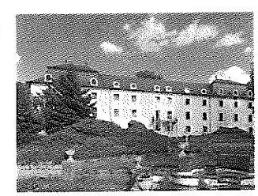

# TÜDŐGYÓGYINTÉZET TÖRÖKBÁLINT 

2045 Törökbálint, Stunkáczy Mihály u. 70. Tel: 06-23/511-370, 338-052
Fax: 06-23-335-012
E-MAIL: thti@torokbalintkorhaz.hu
Web: www.torokbalintkorhaz.hu

Állami Számvevőszék
Domokos László elnök
részére

Tisztelt Elnök Úr!
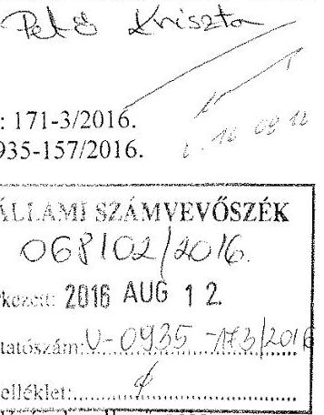

A központi alrendszer egyes intézményei pénzügyi és vagyongazdálkodásának ellenőrzése Tüdőgyógyintézet Törökbálint című számvevőszéki - nem nyilvános - jelentéstervezetet (ellenőrzés azonosító szám: V071306) megkaptuk, melyhez az alábbi kiegészítéseket kívánjuk fűzni.

A vizsgált időszakban - mint valamennyi egészségügyi intézmény életében - jelentős változások történtek a Tüdőgyógyintézetnél. 2012. évben az egészségügyi intézmények önkormányzati fenntartásból állami irányítás alá kerültek, valamennyi főigazgatói és gazdasági igazgatói munkakörbe új vezető került. A középirányító szervi feladatokat a GYEMSZI, majd 2015. évtől az ÁEEK látja el. Mindezeket azért tartom szükségesnek kiemelni, hogy az ÁSZ által vizsgált időszak a kórházak életében olyan jelentős változásokkal esett egybe, melyhez alkalmazkodni - nem csak Törökbálinton - időt és energiát igényelt. Tisztelettel kérjük ennek figyelembe vételét!

Ezek a változások hatással voltak többek között a belső kontrollrendszerünkre is, az addig általunk jónak ítélt és a korábbi felügyelet által is elfogadott szabályozókat újra kellett gondolnunk. Az új középirányító szerv felépülése időt vett igénybe, és a kezdeti bizonytalan helyzetben a felügyelet sem tudott olyan iránymutatást adni, melyhez igazodva a saját kontrolljainkat megfelelő módon tudtuk volna újragondolni. A változásokhoz jelentős segítséget kaptunk 2013. évben, mikor a középirányító szerv átfogó ellenőrzést végzett, rávilágítva a problémákra, így az intézkedések hatására jelentősen javíthattunk a belső kontrollrendszerünk hatékonyságán. Örömmel vesszük, hogy ezt a tényt a számvevőszéki jelentés-tervezet is tartalmazza, mely megítélés szerint: „A belső kontrollrendszer kialakítása a 2011-2012. években részben volt szabályszerű, míg 2013-2014. években szabályszerű volt".

2014. évben a jogszabályi előírások változása igen jelentős feladatot és kihívást jelentett a gazdasági részlegen dolgozó kollégák számára, akik - a jelentésben foglaltak szerint - a feltárt, apróbb hiányosságok ellenére jól teljesítették a napi feladataikat. A jelentéstervezetben kifogásolt határidő túllépések oka csak részben múlt az intézményen. Általános problémát jelentett, hogy a Magyar Államkincstár elektronikus felületén közzétett úrlapokon folyamatosak voltak a központi adatbetöltések, illetve a verzió-, és szabályfrissítések melyek késleltették a jelentések hibátlan, határidőre történő beadását. További nehézséget okozott a 2014. évben bevezetésre került új könyvelési szoftver, - CompuTrend Kft. EcoStat program - melynek kezdeti folyamatos javítása, korrekciója késleltette könyvelésünk naprakészségét. Ez nem egyedi probléma volt, hanem

---

valamennyi egészségügyi intézményt valamint a középirányító szervet sújtotta, és lehetetlenné tette a jogszabályban előírt határidők megtartását. Kérjük ennek a ténynek is figyelembe vételét. (jelentés tervezet 3.4, 3.6 számú megállapítás)

Pozitív elemként értékeljük azt is, hogy - amint az a jelentéstervezetben is olvasható - a Tüdőgyógyintézetnek a 2011-2014. években a fizetőképessége biztosított volt.

A jelentéstervezetben foglalt megállapításokat elfogadjuk, azonban néhány pontosítást szeretnénk tenni:
2.4. számú megállapításhoz: ..Az információs és kommunikációs folyamatok kialakítása az ellenőrzött időszakban-a 2013. év kivételével - részben volt szabályszerű."
A megállapításhoz füzött részletes indoklás szerint : „A Tüdőgyógyintézet az Ltv. előírásainak megfelelően rendelkezett iratkezelési szabályzattal, azonban az Iratkezelési szabályzatot az LÉtv. 10. § (1) bekezdés a) pontjában előírtakkal ellentétben - nem az illetékes közlevéltárral egyetértésben adta ki." Csatoltan küldjük a Pest Megyei Levéltárnak 2014. január 17-én kelt levelünket (1. számú melléklet), amelyben kértük az Iratkezelési szabályzattal való egyetértésüket. A levéltár válaszát 2015. novemberében kaptuk kézhez, melyet jelen levelünk 2. számú melléklete tartalmaz.

Az ellenőrzési jelentés tervezetben leírt hibákat, hiányosságokat - amennyiben még jelenleg is fennállnak - természetesen javítani, pótolni fogjuk, erre az intézkedéseket megtesszük.

Törökbálint, 2016. augusztus 05.
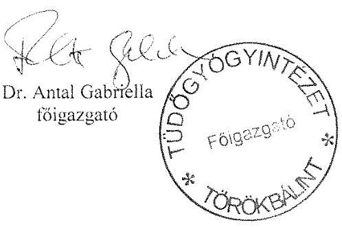

---

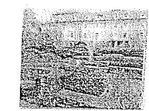

# TÜDŐGYÓGYINTÉZET 

TÖRÖKBÁLINT
2045 Törökbálint, Munkácsy Mihály u. 70.
Tél: 06-23/311-370, 338-052 Fax: 06-23-335-012
(E-MAIL: titkarsag@torokbalintkorhaz.hu
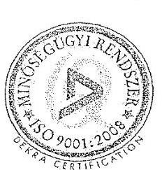

Pest Megyei Levéltár Ph.D. Schramek László Péter igazgató részére

## Ikt.sz: 21/2014

Tárgy: jóváhagyás kérés

## Tisztelt Igazgató Úr!

A törökbálinti kórház 2013-ban - tekintettel az új vezetésre - néhány módosítást végzett iratkezelési rendszerében, melynek megfelelően elkészítettük módosított Iratkezelési Szabályzatunkat. Tisztelettel várjuk álláspontjukat az esetleges javítások, kiegészítések vonatkozásában!

A változtatás lényeg, röviden:
Az iktatási rendben semmi nem módosult, s azt 2014. január 1-t követően is a régi szisztéma szerint végezzük.

2013-ban új, korszerű Kórlaptárat alakítottunk ki. Így a szövegben módosítottuk ennek és a kézi irattároknak a kezelésével kapcsolatos eljárásunkat.

Az Irattári tervet „adaptáltuk" az intézményben valójában megforduló irattípusokra, ezáltal nagymértékben megkönnyítettük az irattározás és selejtezés folyamatát, mely a gyakorlatban eddig nehézkesebben volt alkalmazható, és nehezítette az egységes szempontok szerinti munkát.

Tisztelettel kérjük tanácsát, segítségét!
Üdvözlettel:

Törökbálint, 2014. január 17.

Eredeti példánnyal megegyező hiteles másolat!
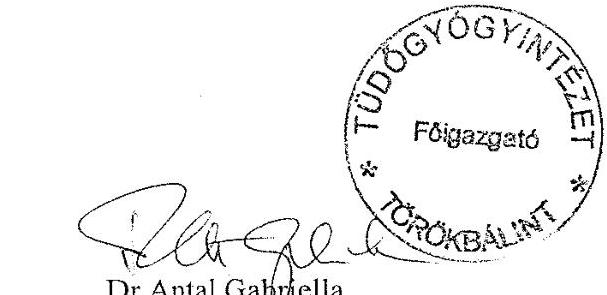

Dr. Antal Gabriella
főigazgató

---

# Titkárság 

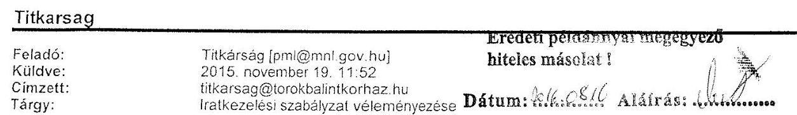

PML-2005/2015. sz.
Tüdőgyógyintézet Törökbálint
Dr. Antal Gabriella főigazgató részére
E-mail: titkarsag@torokbalintkorhaz.hu

| Tüdőgyógyintézet   2045 Törökbálint,   Munkácsy M. u. 70. |  |
| :-- | :-- |
| Érkezés: 2015. 11. 20 |  |
| Szám: 21/2015 | Előírat: 21/2014 |
| Melléklet: | Előadó: |

Tisztelt Főigazgató Asszony!

Intézményük iratkezelési szabályzatával és irattári tervével kapcsolatban a hatályos rendelkezések és állásfoglalások szerint a következő javaslatokat, megjegyzéseket teszem:

- Kérjük intézményünk nevét a szövegben az alábbiak szerint pontosítani: Magyar Nemzeti Levéltár Pest Megyei Levéltára
o Javasoljuk az alábbi kiegészítéseket az elektronikusan érkezett dokumentumokra vonatkozóan: „Amennyiben az elektronikusan érkezett küldemény vagy annak melléklete a rendelkezésre álló informatikai eszközökkel nem nyitható meg, ennek tényéről a beküldőt haladéktalanul értesíteni kell. Az elektronikusan érkezett küldemények átvételét meg lehet tagadni, amennyiben az biztonsági kockázatot jelent az intézmény számítástechnikai rendszerére."
o Ugyancsak az irattárba helyezésre vonatkozóan: „Az irattárba helyezés előtt az ügyiratokból a feleslegessé vált másodpéldányokat és kezelési feljegyzéseket ki kell emelni és a hagyományos selejtezési eljárás mellőzésével, de az adatvédelmi kockázatok figyelembe vételével meg kell semmisíteni. Az irattárba helyezés előtt az iratra vezetett tételszámot az ügyben eljáró és annak természetét ismerő személynek ellenőriznie kell."
o A selejtezéssel kapcsolatban a Magyar Nemzeti Levéltár főigazgatójának a hatályos rendelkezések alapján kiadott 2/2015. tájékoztatója szerint a következőképpen kell eljárnunk: Az egészségügyi dokumentáció selejtezésére vonatkozó selejtezési jegyzőkönyveket a Semmelweis Orvostörténeti Múzeum, Könyvtár és Levéltár hagyja jóvá mint illetékes közlevéltár, az egyéb, működési iratokra vonatkozó jegyzékeket pedig az MNL Pest Megyei Levéltára.
o Az iratátadással kapcsolatban: az előző pontban megfogalmazottak és különösképpen az 1997. évi XLVII. törvény értelmében „Amennyiben az egészségügyi dokumentációnak tudományos jelentősége van, a kötelező nyilvántartási időt követően át kell adni a Semmelweis Orvostörténeti Múzeum, Könyvtár és Levéltár részére.,, ( 30. § 3. pont)

---

- Ugyancsak az iratátadással kapcsolatban: Kérjük a fejezetet kiegészíteni az alábbiakkal: „A levéltár számára átadandó ügyiratokat az ügyviteli segédletekkel együtt nem fertőzött állapotban, levéltári őrzésre alkalmas savmentes dobozokban az átadó költségére az irattári terv szerint, átadás-átvételi jegyzőkönyv kíséretében, annak mellékletét képező átadási
 egység szerinti (doboz, csomag stb.) tételjegyzékkel együtt, teljes, lezárt évfolyamokban kell átadni. A visszatartott ügyiratokról külön jegyzéket kell készíteni. Az átadási jegyzéket és a visszatartott iratokról készített jegyzéket - a levéltárral egyeztetett módon - elektronikus formában is át kell adni. Felhívom továbbá a figyelmüket arra, hogy hiányzik a jelzett 4. melléklet az intézmény és a levéltár megállapodására vonatkozóan - ez azonban mivel minden esetben egyedi megállapodás, nem is feltétlenül kell szerepeljen a szabályzatban.
o Az intézmény megszűnése esetén elvégzendő feladatokról: kérjük kiegészíteni, hogy az átvevő intézménynek vagy eljáró szervnek az illetékes levéltárat a megszűnés vagy átszervezés tényéről értesítenie kell.
o Az irattári tervvel kapcsolatos pontosítások:
o a kártérítési perek esetében (01.04.) nem átvételről, csak mintavételről van szó a levéltár részéről.
o A pályázatok iratai (01.10.) nem minősülnek levéltári iratnak
o Az ingatlanok tulajdonjogával kapcsolatos iratoknál (02.01.) lemaradt, hogy helyben őrzendők (HN)
o A klinikai gyógyszervizsgálatok alapdokumentumai (03.01.) szintén határidő nélkül helyben őrzendők
Kérjük, hogy a fentiek szerint módosított illetve kiegészített szabályzatot küldjék meg intézményünknek jóváhagyásra.

Budapest, 2015. november 19.
Tisztelettel:
Dr. Schramek László
igazgató
$\checkmark(\mathrm{z})$ üzenetben nem található vírus.
ellenőrizte: AVG - www.avg.com
Verzió: 2015.0.6176 / Vírus adatbázis: 4460/11027 - Kiadás dátuma: 2015. 11. 19.
(z) üzenetben nem található vírus.
ellenőrizte: AVG - www.avg.com
Verzió: 2015.0.6176 / Vírus adatbázis: 4460/11027 - Kiadás dátuma: 2015. 11. 19.

# Eredeti példánnyal megegyező hiteles másolat!

Dátum: $\frac{\text { dátuma }}{\text { Aláírás: }}$

---

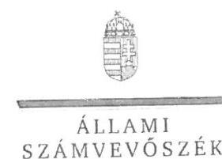

ELNÖK

# Dr. Antal Gabriella úrhölgy

főigazgató
Tüdőgyógyintézet Törökbálint

## Törökbálint

## Tisztelt Főigazgató Úrhölgy!

...A központi alrendszer egyes intézményei pénzügyi és vagyongazdálkodásának ellenőrzése Tüdőgyógyintézet Törökbálint" címmel készített számvevőszéki jelentéstervezetre tett észrevételét köszönettel megkaptam.
Az Állami Számvevőszék észrevételre vonatkozó álláspontjáról a felügyeleti vezető által készített részletes tájékoztatást csatoltan megküldöm.
Tájékoztatom Főigazgató úrhölgyet, hogy a számvevőszéki jelentésben - az Állami Számvevőszékről szóló 2011. évi LXVI. törvény 29. § (3) bekezdése alapján - a figyelembe nem vett észrevételeket szerepeltetjük az elutasítás indokának feltüntetésével.

Budapest, 2016. 01. 1. 1. hó 25. nap
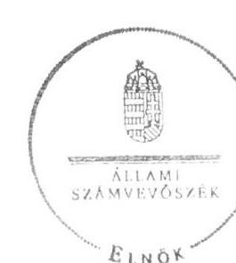

Tisztelettel:

## DR.

Domokos László

Melléklet: Tájékoztatás az el nem fogadott észrevételekről

---

# Tájékoztatás az el nem fogadott észrevételekről

..A központi alrendszer egyes intézményei pénzügyi és vagyongazdálkodásának ellenőrzése Tüdőgyógyintézet Törökbálint" című jelentéstervezetre a 171-3/2016. iktatószámú levelében tett észrevételeit áttekintettük, annak kezeléséről az alábbi tájékoztatást adom.

## 1. Általánosságban tett észrevétel kapcsán

Köszönettel vettem tájékoztatását, amelyben bemutatta, hogy az irányító szervi változások, a 2012. évtől a középirányító szervi feladatokat ellátó Gyógyszerészeti és Egészségügyi Minőség- és Szervezetfejlesztési Intézet (továbbiakban: GYEMSZI) tevékenysége, továbbá a 2012. évben a Tüdőgyógyintézet Törökbálint (továbbiakban: Kórház) főigazgatója és gazdasági igazgatója személyében bekövetkezett váltások az ellenőrzött időszakban jelentős változásokat jelentettek a Kórház számára, amelyekhez történő alkalmazkodás időt és energiát igényelt. Észrevételében kiemelte, hogy a GYEMSZI 2013. évi átfogó ellenőrzését követő intézkedések jelentősen javították a Kórház belső kontrollrendszerének hatékonyságát. Észrevétele a jelentéstervezet megállapításaiban foglaltakat nem vitatja, ezért a megállapításokat nem módosítja.

## 2. A 3.4. és 3.6. számú megállapításokra tett észrevétele kapcsán

Köszönettel vettem tájékoztatását a Magyar Államkincstár által működtetett elektronikus adatszolgáltató rendszer működése során tapasztalt hiányosságokról, a 2014. évben bevezetett új könyvelési szoftver alkalmazásakor felmerült problémákról, a folyamatos munkát akadályozó tényezőkről. Észrevétele a jelentéstervezet - 29. oldal 3.4. számú megállapítás hatodik bekezdésének, valamint a jelentéstervezet 31-32. oldal 3.6. számú megállapítás harmadik és negyedik bekezdésének - megállapításait nem cáfolta, így azokat nem módosítja.

## 3. A 2.4. számú megállapításra tett észrevétele kapcsán

A jelentéstervezet - 22. oldal 2.4. számú megállapítás ötödik bekezdésének - megállapítására tett észrevételét az Állami Számvevőszék nem fogadja el. Észrevételében arról tájékoztatott, hogy a 2014. január 17-én kelt levelükben kérték a Pest Megyei Levéltárnak az Iratkezelési szabályzattal való egyetértését, továbbá a levéltár válaszát 2015. novemberében kapták meg. Észrevétele az ellenőrzött időszakban - 2014. január 17-étől - hatályos Iratkezelési szabályzattal kapcsolatban megállapított hiányosságot nem cáfolta, az az ellenőrzött időszakon túlmutat, ezért a megállapítást nem módosítja.

Budapest, 2016. c. 2017. hó 2. nap

Pető Krisztina
felügyeleti vezető

---

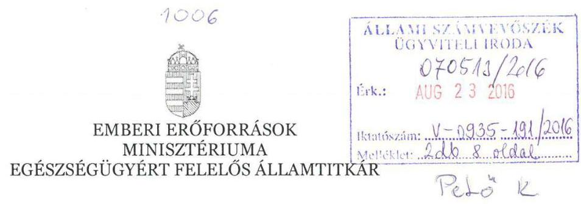

Iktatószám: 42593 - 2 /2016/EIFF

Hiv. szám: V-0935-158/2016.
Ügyintéző: Fischer Csilla (896-5381)
Melléklet: dokumentumjegyzék másolata, 2800-905/2004/ELL számú ellenőrzési jelentés másolata

# Domokos László részére

elnök

## Állami Számvevőszék

Budapest
Apáczai Csere János u. 10.
1052

Tárgy: „A központi alrendszer egyes intézményei pénzügyi és vagyongazdálkodásának ellenőrzése - Tüdőgyógyintézet Törökbálint 2016." című számvevőszéki jelentéstervezet véleményezése

Tisztelt Elnök Úr!

Hivatkozással a V-0935-158/2016. iktatószámon továbbított „A központi alrendszer egyes intézményei pénzügyi és vagyongazdálkodásának ellenőrzése - Tüdőgyógyintézet Törökbálint 2016." című jelentéstervezetre, az alábbiakról tájékoztatom.

A jelentéstervezet az Emberi Erőforrások Minisztériuma által áttekintésre került, mellyel kapcsolatban a következő észrevételt kívánom tenni.

A jelentéstervezet 1.3. számú megállapításának 2. bekezdése szerint az irányító szerv a 2011-2014. években nem hajtott végre ellenőrzést a Tüdőgyógyintézetnél. Ezzel ellentétben a Belső Ellenőrzési Főosztály 2014-ben értékelte az Emberi Erőforrások Minisztériuma által irányított költségvetési szervek belső ellenőrzési feladatainak ellátását, a Tüdőgyógyintézet Törökbálint

---

belső ellenőrzése működésének értékeléséről szóló 2800-905/2014/ELL iktatószámú ellenőrzési jelentést a 47226-2/2015/EIFF iktatószámú, Dr. Elek János főtitkár úr részére 2015. október 2-án továbbított dokumentumjegyzék is tartalmazza, amelyet jelen levelemhez csatolva ismételten megküldök szíves tájékoztatásul.

A fentiek alapján kérem szíves intézkedését a hivatkozott megállapítás módosítása iránt.

Budapest, 2016. augusztus „i $\delta$."

Üdvözlettel:
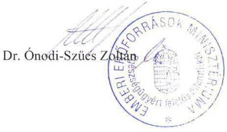

---

# TELJESSÉGI ÉS HITELESSÉGI NYILATKOZAT

Alulírott Dr. Beneda Attila az egészségügyért felelős államtitkár hatáskörének gyakorlására kijelölt helyettes államtitkár jogi felelősségem tudatában kijelentem, hogy az Állami Számvevőszék részére átadott, a jelen Teljességi és hitelességi nyilatkozatban részletezett dokumentumok, adatok megbízhatóak és a bekért adatokra, dokumentumokra vonatkozóan teljes körű információt tartalmaznak.

Nyilatkozom, hogy az átadott dokumentumok, adatok hitelességéért, valódiságáért, hiánytalanságáért és hatályosságáért teljes felelősséget vállalok, a dokumentumok, az adatok az eredetivel mindenben megegyeznek.

Az átadott dokumentumok az ellenőrzés céljára felhasználhatók.
Dátum: 2015.
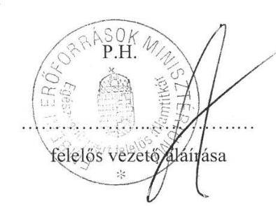

---

# Dokumentumjegyzék

| Sorszám | DOKUMENTUM |  |  |  |
| :--: | :--: | :--: | :--: | :--: |
|  | megnevezése | azonosítója/iktatószáma/ sorszáma | $\begin{gathered} \text { kelte/ } \\ \text { hatályba } \\ \text { helyezés } \\ \text { dátuma } \end{gathered}$ | rendelkezésre bocsátásának formája papír (P) / elektronikus (E) |
| KÖLTSÉGVETÉSI FŐOSZTÁLY - INTÉZMÉNYI KÖLTSÉGVETÉSI FELÜGYELETI OSZTÁLY |  |  |  |  |
| 1. | Fejezeti körlevél a 2012. évi elemi költségvetés összeállításához | 160-10/2012/KTF | $\begin{gathered} 2012. \text { február } \\ 08. \end{gathered}$ | E |
| 2. | 2012. évi elemi költségvetés fedlap - Törökbálinti Tüdőgyógyintézet | - | - | E |
| 3. | 2012. évi elemi költségvetés garnitúra - Törökbálinti Tüdőgyógyintézet | - | - | E |
| 4. | Fejezeti körlevél a 2012. évi számszaki beszámoló összeállításához | 12878-1/2013/KTF | $\begin{gathered} 2012. \text { február } \\ 22. \end{gathered}$ | E |
| 5. | Fejezeti körlevél a 2012. évi költségvetési beszámoló szöveges indoklásának összeállításához | 19558-3/2013/KTF | 2013. április 12. | E |
| 6. | 2012. évi számszaki beszámoló fedlap Törökbálinti Tüdőgyógyintézet | - | - | E |
| 7. | 2012. évi számszaki beszámoló garnitúra Törökbálinti Tüdőgyógyintézet | - | - | E |
| 8. | 2012. évi szöveges beszámoló és kiegészítő táblái - Törökbálinti Tüdőgyógyintézet | - | - | E |
| 9. | Alapító okirat az alrendszer váltással kapcsolatban Törökbálinti Tüdőgyógyintézet | - | $\begin{gathered} 2012. \text { január } \\ 25. \end{gathered}$ | E |
| 10 | Az alapító okirat bejegyzéséről kiadott kincstári határozat, törzskönyvi kivonat Törökbálinti Tüdőgyógyintézet | 88/395807/8/2012 | $\begin{gathered} 2012. \text { március } \\ 06. \end{gathered}$ | E |
| 11 | Fejezeti körlevél a 2013. évi elemi költségvetés összeállításához | 11752/2013/KTF | $\begin{gathered} 2013. \text { február } \\ 19. \end{gathered}$ | E |

---

| 12 | 2013. évi elemi költségvetés   fedlap - Törökbálinti   Tüdőgyógyintézet | - |  | E |
| :--: | :--: | :--: | :--: | :--: |
| 13 | 2013. évi elemi költségvetés garnitúra - Törökbálinti Tüdőgyógyintézet | - | - | E |
| 14 | Fejezeti körlevél a 2013. évi számszaki beszámoló összeállításához | 8786/2014/KTF | 2014. január 31. | E |
| 15 | 2013. évi számszaki beszámoló fedlap Törökbálinti Tüdőgyógyintézet | - | - | E |
| 16 | 2013. évi számszaki beszámoló garnitúra Törökbálinti Tüdőgyógyintézet | - | - | E |
| 17 | Fejezeti körlevél a 2013. évi költségvetési beszámoló szöveges indoklásának összeállításához | 16956/2014/KTF | 2014. március 14. | E |
| 18 | 2013. évi szöveges beszámoló és kiegészítő táblái, illetve aláírt fedlapja Törökbálinti Tüdőgyógyintézet | - | - | E |
| 19 | Fejezeti körlevél a 2014. évi elemi költségvetés összeállításához | 9337/2014/KTF | 2014. február 6. | E |
| 20 | 2014. évi elemi költségvetés fedlap - Törökbálinti Tüdőgyógyintézet | - | - | E |
| 21 | 2014. évi elemi költségvetés garnitúra - Törökbálinti Tüdőgyógyintézet | - | - | E |
| 22 | Fejezeti körlevél a 2014. évi számszaki beszámoló összeállításához | 5065/2015/KTF | 2015. január 30. | E |
| 23 | 2014. évi számszaki beszámoló fedlap Törökbálinti Tüdőgyógyintézet | - | - | E |
| 24 | 2014. évi számszaki beszámoló garnitúra Törökbálinti Tüdőgyógyintézet | - | - | E |
| 25 | 2014. évi számszaki beszámoló státusztörténet Törökbálinti Tüdőgyógyintézet | - | - | E |

---

| 26 | Fejezeti körlevél a 2014. évi költségvetési beszámoló szöveges indoklásának összeállításához | 5065-3/2015/KTF | 2015. április 17. | E |
| :--: | :--: | :--: | :--: | :--: |
| 27 | 2014. évi szöveges beszámoló - Törökbálinti Tüdőgyógyintézet | - | - | E |
| EGÉSZSÉGBIZTOSÍTÁSI ÉS FINANSZÍROZÁSI FŐOSZTÁLY |  |  |  |  |
| 28 | Fekvő TVK osztás 2011. | 21715/2011/EGB | 2011.   szeptember | E |
| 29 | 2011. évi konszolidáció | 269/2011. Korm. R. | 2011.   december | E |
| 30 | 2011. konszolidáció nyilatkozat | 63-25/2012/EGB | 2012. május 2. | E |
| 31 | Struktúratámogatás felosztása | 47791/2012/EGB | 2012. október | E |
| 32 | 2011. konszolidáció visszatérítés elengedése | 34334/2012/EGB | 2012.   november | E |
| 33 | 2012. évi kasszaseprés | 52969/2012/EGB | 2012.   december 15. | E |
| 34 | Szakmaspecifikus őrzők kialakítása | e-mail | 2013. március 28. | E |
| 35 | 2013. évi konszolidáció | 52052/2013/EGB | 2013. október | E |
| 36 | 2013. évi kasszaseprés | 58076/2013/EGB | 2013.   december | E |
| 37
 | 2014. évi működési támogatás | 34841/2014 | 2014. július | E |
| 38 | 2014. évi kasszaseprés | 60876/2014/EGBF | 2014.   december | E |
| JOGI FŐOSZTÁLY |  |  |  |  |
| 39 | Alapító okirat egységes szerkezetben | 395807 | 2012.01.25. | E |
| 40 | Alapító okirat kiegészítése | 12266-10/2014/JOGI | 2014.02.27. | E |
| 41 | Alapító okirat a módosításokkal egységes szerkezetben | 44194-16/2014/JOGI | 2014. 12.31. | E |
| BELSŐ ELLENŐRZÉSI FŐOSZTÁLY |  |  |  |  |
| 42 | Ellenőrzési részjelentés | 2800-905/2014/ELL | 2014.03.26 | E |

---

# ELLENŐRZÉSI RÉSZJELENTÉS 

az Emberi Erőforrások Minisztériuma által irányított költségvetési szervek belső ellenőrzési feladatai ellátásának értékeléséről

Budapest, 2014. március

---

| Az ellenőrzést végző szervezet: | Emberi Erőforrások Minisztériuma Belső Ellenőrzési Főosztály |
| :--: | :--: |
| Az ellenőrzött szervezet/szervezeti egység: | Emberi Erőforrások Minisztériuma irányítása alá tartozó költségvetési szervek |
| Jogszabályi felhatalmazás: | a költségvetési szervek belső kontrollrendszeréről és belső ellenőrzéséről szóló 370/2011. (XII. 31.) Korm. rendelet |
| Az ellenőrzés típusa: | teljesítményellenőrzés |
| Az ellenőrzés tárgya: | belső ellenőrzési feladatok ellátása az irányított költségvetési szerveknél |
| Az ellenőrzés célja: | az EMMI által irányított költségvetési szerveknél a belső ellenőrzés feladatellátásának értékelése |
| Az ellenőrzött időszak: | 2012-2014. év |
| A helyszíni ellenőrzés időtartama: | - |
| Az alkalmazott ellenőrzési módszerek és eljárások: | információk, dokumentumok elemzése, értékelése |

Az ellenőrzésben közreműködő ellenőrök, szakértők neve:

Mocsári Enikő vizsgálatvezető
Lengyel Anikó belső ellenőr

---

# I. JAVASLATOK 

A Tüdőgyógyintézet főigazgatójának az ellenőrzés javaslatot nem fogalmazott meg.

## II. RÉSZLETES MEGÁLLAPÍTÁSOK, KÖVETKEZTETÉSEK

A költségvetési szervek belső kontrollrendszeréről és belső ellenőrzéséről szóló 370/2011. (XII. 31.) Korm. rendelet (a továbbiakban: Bkr.) 10. §-ában előírt, operatív tevékenységtől függetlenül működő belső ellenőrzés kialakításáról és működtetéséről az ellenőrzött időszakban a főigazgató részben megfelelően gondoskodott.

A Bkr. 18. §-ában előírt szervezeti függetlenség a belső ellenőrzési tevékenység ellátása során biztosított volt.

A gyógyintézet engedélyezett létszáma 2013. január 1-jén 320 fő, a belső ellenőrzés engedélyezett létszáma 1 fő volt. A belső ellenőrzési feladatokat külső szolgáltató és 2013. októbertől 1 fő részmunkaidős alkalmazott látta el.

A kórház a külső szolgáltató alkalmazásához a Bkr. 15. § (5) bekezdésében előírt engedély megszerzése érdekében 2012. szeptember 14-i dátummal kérelmet nyújtott be a középirányító szerv felé. A miniszter 2013. április 19-i döntésében a szerződés megszűnésétől nem engedélyezte a külső szolgáltató igénybe vételét. A szerződés határozatlan időtartamára tekintettel még külső szolgáltató látja el a belső ellenőrzési feladatokat a jelentéstervezet lezárásának időpontjában is.

A belső ellenőrzési tevékenységet végző személyek az államháztartásról szóló 2011. évi CXCV. törvény 70. § (4) bekezdése szerinti engedéllyel rendelkeztek.

Tanácsadási feladatot a belső ellenőrzés 2012-ben 8, 2013-ban 4 munkanapon végzett, ami az ellenőri kapacitás 4,9 % és 3,7 %-át jelentette.

A Bkr. 24. § (7) bekezdésében előírt képzési kötelezettségnek a belső ellenőrök eleget tettek, a kötelező képzéseken túl 2012. évben 3, 2013-ban 4 képzési napon vettek részt, ami a teljes ellenőri kapacitás 1,8 % és 3,7 %-át jelentette. A képzés költsége nem az intézetet terhelte.

A Tüdőgyógyintézetnél az alapvető tárgyi feltételeket a belső ellenőrzési feladatellátáshoz a külső szolgáltató biztosította. Az alkalmazott belső ellenőr számára számítógép és Jogtár használatát biztosította az intézet.

A belső ellenőrzés javaslatainak hasznosulását, az intézkedési tervek végrehajtását a belső ellenőrzés nyomon követi.

Budapest, 2014. március 26.

Mocsári Enikő
vizsgálatvezető

Lengyel Anikó
belső ellenőr

---

# FÜGGELÉK 

I. Az ellenőrzés időszakában az ellenőrzött területért/feladatért felelős vezetők neve, beosztása

Dr. Antal Gabriella főigazgató
II. Jogszabályok jegyzéke

- az államháztartásról szóló 2011. évi CXCV. törvény
- a költségvetési szervek belső kontrollrendszeréről és belső ellenőrzéséről szóló 370/2011. (XII. 31.) Korm. rendelet

---

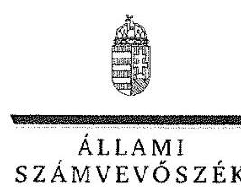

ELNÖK

Ikt.szám: V-0935-180/2016.

# Balog Zoltán úr 

miniszter
Emberi Erőforrások Minisztériuma

## Budapest

## Tisztelt Miniszter Úr!

„A központi alrendszer egyes intézményei pénzügyi és vagyongazdálkodásának ellenőrzése Tüdőgyógyintézet Törökbálint" címmel készített számvevőszéki jelentéstervezetre tett észrevételét köszönettel megkaptam.
Az Állami Számvevőszék észrevételre vonatkozó álláspontjáról a felügyeleti vezető által készített részletes tájékoztatást csatoltan megküldöm.

Budapest, 2016. napotz vule hó / nap
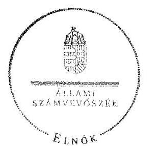

Tisztelettel:

Domokos László

Melléklet: Tájékoztatás az elfogadott észrevételből

---

# Tájékoztatás az elfogadott észrevételről 

„A központi alrendszer egyes intézményei pénzügyi és vagyongazdálkodásának ellenőrzése Tüdőgyógyintézet Törökbálint" címû jelentéstervezetre a 42593-2/2016/EIFF iktatószámú levélben tett észrevételét áttekintettük, annak kezeléséről az alábbi tájékoztatást adom.

A jelentéstervezet 1.3. számú megállapítás második bekezdése megállapításaira tett észrevétel

A jelentéstervezet 18. oldal második bekezdésének első és második megállapítására tett - a 2014. évet érintő - észrevételét a dokumentumok ismételt áttekintését követően elfogadtuk, azt a számvevőszéki jelentés készítésénél a megállapítások módosításával figyelembe vesszük.

Budapest, 2016. meglé mbe hó
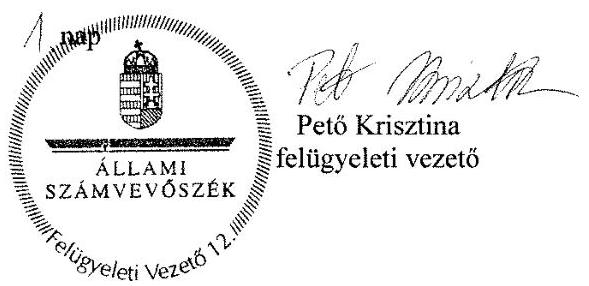

---

# RÖVIDÍTÉSEK JEGYZÉKE 

${ }^{1}$ ÁSZ
${ }^{2}$ Tüdőgyógyintézet
${ }^{3}$ NEFMI
${ }^{4}$ EMMI
${ }^{5}$ GYEMSZI
${ }^{6}$ ÁEEK
${ }^{7}$ főigazgató
${ }^{8}$ gazdasági igazgató
${ }^{9}$ Nvtv.
${ }^{10}$ Áht. 2
${ }^{11}$ Ávr.
${ }^{12}$ Áht. 1
${ }^{13}$ Ámr.
${ }^{14}$ Bkr.
${ }^{15}$ ÁSZ tv.
${ }^{16}$ ÁSZ SZMSZ
${ }^{17}$ irányító szerv ${ }_{1,2}$
${ }^{18}$ középirányító szerv
${ }^{19}$ alapító okirat ${ }_{1,2,3}$
${ }^{20}$ Eütv.
${ }^{21}$ 68/2013. (XII. 29.) NGM rendelet
${ }^{22}$ SZMSZ
${ }^{23}$ 59/2011. (IV. 12.) Korm. rendelet
${ }^{24} \mathrm{Kjt}$.

Állami Számvevőszék
Tüdőgyógyintézet Törökbálint
Nemzeti Erőforrás Minisztérium
Emberi Erőforrások Minisztériuma
Gyógyszerészeti és Egészségügyi Minőség- és Szervezetfejlesztési Intézet
Állami Egészségügyi Ellátó Központ
a Tüdőgyógyintézet főigazgatója
a Tüdőgyógyintézet gazdasági vezetője
a nemzeti vagyonról szóló 2011. évi CXCVI. törvény
(hatályos 2012. január 1-jétől)
az államháztartásról szóló 2011. évi CXCV. törvény (hatályos 2012. január 1-jétől)
az államháztartásról szóló törvény végrehajtásáról szóló 368/2011. (XII. 31.)
Korm. rendelet (hatályos 2012. január 1-jétől)
az államháztartásról szóló 1992. évi XXXVIII. törvény (hatályos 2011. december 31-ig)
az államháztartás működési rendjéről szóló 292/2009. (XII. 19.) Korm. rendelet (hatályos 2011. december 31-ig)
a költségvetési szervek belső kontrollrendszeréről és belső ellenőrzéséről szóló 370/2011. (XII. 31.) Korm. rendelet (hatályos 2012. január 1-jétől)
az Állami Számvevőszékről szóló 2011. évi LXVI. törvény (hatályos 2011. július 1-jétől)
az Állami Számvevőszék Szervezeti és Működési Szabályzata
irányító szerv1: Pest Megye Önkormányzata Közgyűlése
irányító szerv2: Nemzeti Erőforrás Minisztérium (2012. január 1. - 2012. május 13.), 2012. május 14-től Emberi Erőforrások Minisztériuma
2015. február 28-ig Gyógyszerészeti és Egészségügyi Minőség- és Szervezetfejlesztési Intézet, 2015. március 1-jétől Állami Egészségügyi Ellátó Központ
alapító okirat1: a Tüdőgyógyintézet 2009. május 30-tól 2011. május 14-ig hatályos alapító okirata
alapító okirat2: a Tüdőgyógyintézet 2011. május 15-től 2011. december 31-ig hatályos alapító okirata
alapító okirat3: a Tüdőgyógyintézet 2012. január 1-től hatályos alapító okirata az egészségügyről szóló 1997. évi CLIV. törvény (hatályos 1998. július 1-jétől) a kormányzati funkciók, államháztartási szakfeladatok és szakágazatok osztályozási rendjéről szóló 68/2013. (XII. 29.) NGM rendelet (hatályos 2013. december 30-tól)
a Tüdőgyógyintézet Szervezeti és Működési Szabályzata (hatályos 2009. november 24-től 2015. január 23-ig)
a Gyógyszerészeti és Egészségügyi Minőség- és Szervezetfejlesztési Intézetről szóló 59/2011. (IV. 12.) Korm. rendelet (hatályos 2011. április 13-tól 2015. február 28-ig)
a közalkalmazottak jogállásáról szóló 1992. évi XXXIII. törvény (hatályos 1992. július 1-jétől)

---

${ }^{25}$ konszolidációs tv.
${ }^{26}$ miniszter
${ }^{27} \mathrm{Mt}_{2}$.
${ }^{28}$ Gazdasági szervezet ügyrendje ${ }_{1,2}$
${ }^{29} \mathrm{Mt}_{.1}$
${ }^{30}$ Számviteli politika ${ }_{1,2,3}$
${ }^{31}$ Számlarend $_{1,2,3}$
${ }^{32}$ Leltározási szabályzat ${ }_{1,2,3}$
${ }^{33}$ Értékelési szabályzat ${ }_{1,2}$
${ }^{34}$ Bizonylati rend
${ }^{35}$ Pénzkezelési szabályzat ${ }_{1,2,3}$
${ }^{36}$ Önköltség számítási szabályzat ${ }_{1,2}$
${ }^{37}$ Közbeszerzési szabályzat ${ }_{1,2}$
${ }^{38}$ Ellenőrzési nyomvonal
${ }^{39}$ Szabálytalanságok kezelésének eljárásrendje
${ }^{40}$ Számv. tv.
${ }^{41}$ Áhsz. 1
${ }^{42}$ Áhsz. 2
${ }^{43}$ Vnytv.
${ }^{44}$ FEUVE
a megyei önkormányzatok konszolidációjáról, a megyei önkormányzati intézmények és a Fővárosi Önkormányzat egyes egészségügyi intézményeinek átvételéről szóló 2011. évi CLIV. törvény (hatályos 2011. november 26-tól) egészségügyért felelős miniszter
a munka törvénykönyvéről szóló 2012. évi I. törvény (hatályos 2012. július 1-jétől)
Gazdasági szervezet ügyrendje; (hatályos 2010. május 1-től 2012. december 31-ig)
Gazdasági szervezet ügyrendje; (hatályos 2013. január 1-jétől)
a Munka Törvénykönyvéről szóló 1992. évi XXII. törvény (hatálytalan 2013. január 1-jétől)
Számviteli politika (hatályos 2010. január 1-jétől 2011. december 31-ig)
Számviteli politika (hatályos 2012. január 1-jétől 2013. december 31-ig))
Számviteli politika (hatályos 2014. január 1-jétől)
Számlarend (hatályos 2010. január 1-jétől 2011. december 31-ig)
Számlarend (hatályos 2012. január 1-jétől 2013. december 31-ig)
Számlarend (hatályos 2014. január 1-jétől)
Leltárkészítési és leltározási szabályzat (hatályos 2013. március 31-ig)
Leltározási szabályzat (hatályos 2013. április 1-jétől 2013. december 31-ig)
Leltározási szabályzat (hatályos 2014. január 1-jétől)
Értékelési szabályzat: Eszközök és források értékelési szabályzata (hatályos 2010. január 1-jétől 2013. december 31-ig)

Értékelési szabályzat: Eszközök és források értékelési szabályzata (hatályos 2014. január 1-jétől)
Bizonylati ügyrend (hatályos 2011. augusztus 1-jétől)
Pénzkezelési szabályzat: Tüdőgyógyintézet Pénzkezelési szabályzat (hatályos 2010. május 1-jétől 2012. április 30-ig)
Pénzkezelési szabályzat: Tüdőgyógyintézet Pénzkezelési szabályzat (hatályos 2012. május 1-jétől 2013. december 31-ig)

Pénzkezelési szabályzat: Pénzkezelési szabályzat (hatályos 2014. január 1-jétől)
Önköltség számítási szabályzat; (hatályos 2013. december 31-ig)
Önköltség számítási szabályzat; (hatályos 2014. január 1-jétől)
Közbeszerzési szabályzat: (hatályos 2013. június 30-ig)
Közbeszerzési szabályzat: (hatályos 2013. július 1-jétől)
Ellenőrzési nyomvonal (hatályos 2010. június 15-től)
Szabálytalanságok kezelésének eljárásrendje (hatályos 2013. augusztus 1-jétől)
a számvitelről szóló 2000. évi C. törvény (hatályos 2001. január 1-jétől)
az államháztartás szervezetei beszámolási és könyvvezetési kötelezettségének sajátosságairól szóló 249/2000. (XII. 24.) Korm. rendelet (hatályos 2013. december 31-ig)
az államháztartás számviteléről szóló 4/2013. (I.11.) Korm. rendelet (hatályos: 2014. január 1-jétől)
az egyes vagyonnyilatkozat-tételi kötelezettségekről szóló 2007. évi CLII. törvény (hatályos 2007. december 7-től)
folyamatba épített, előzetes, utólagos és vezetői ellenőrzés

---

${ }^{45}$ Adatvédelmi szabályzat ${ }_{1,2}$

${ }^{46}$ Avtv.
${ }^{47}$ Info tv.
${ }^{48}$ Közérdekű és kötelezően közzéteendő adatok megismerésének rendje
${ }^{49}$ Eitv.
${ }^{50}$ Ltv.
${ }^{51}$ Iratkezelési szabályzat ${ }_{1,2}$
${ }^{52}$ Ber.
${ }^{53}$ 5/2012. (III. 1.) NGM rendelet
${ }^{54}$ 10/2013. (III. 13.) NGM rendelet
${ }^{55}$ NGM
${ }^{56}$ beszámoló 23-as űrlapja
${ }^{57}$ Kincstár
${ }^{58} \mathrm{Kbt}_{.1}$
${ }^{59} \mathrm{Kbt}_{.2}$
${ }^{60}$ 46/2012. (III. 28.) Korm. rendelet
${ }^{61}$ 337/2011. (XII. 29.) Korm. rendelet
${ }^{62}$ OEP
${ }^{63}$ NGM rendelet
${ }^{64}$ Mód. tv.
${ }^{65} \mathrm{Vtv}$.

Adatvédelmi szabályzat1: Adatvédelmi szabályzat (hatályos 2013. október 31-ig) Adatvédelmi szabályzat2: Tüdőgyógyintézet Adatvédelmi szabályzata (hatályos 2013. november 1-jétől)
a személyes adatok védelméről és a közérdekű adatok nyilvánosságáról szóló 1992. évi LXIII. törvény (hatályos 2011. december 31-ig)
az információs önrendelkezési jogról és az információszabadságról szóló 2011. évi CXII. törvény (hatályos 2011. július 27-től)

A közérdekű adatok megismerésére irányuló kérések intézésének, továbbá a kötelezően közzéteendő adatok nyilvánosságra hozatalának rendjéről (hatályos 2013. augusztus 1-jétől)
az elektronikus információszabadságról szóló 2005. évi XC. törvény (hatályos 2006. január 1-jétől 2011. december 31-ig)
a köziratokról, a közlevéltárakról és a magánlevéltári anyag védelméről szóló 1995. évi LXVI. törvény (hatályos 1996. január 1-jétől)

Iratkezelési szabályzat1: Tüdőgyógyintézet Iratkezelési szabályzata (hatályos 2014. január 16-ig)

Iratkezelési szabályzat2: Iratkezelési szabályzat (hatályos 2014. január 17-től)
a költségvetési szervek belső ellenőrzéséről szóló 193/2003. (XI. 26.) Korm. rendelet (hatályos 2011. december 31-ig)
az elemi költségvetésről szóló 5/2012. (III.1.) NGM rendelet (hatályos 2012. március 2-től 2013. március 13-ig
az elemi költségvetésről szóló 10/2013. (III. 13.) NGM rendelet (2013. március 14-től 2013. december 30-ig)
Nemzetgazdasági Minisztérium
a beszámoló 23-as űrlapjának tartalma a költségvetési előirányzatok egyeztetése Magyar Államkincstár
a közbeszerzésekről szóló 2003. évi

 CXXIX. törvény (hatálytalan 2012. január 1-jétől)
a közbeszerzésekről szóló 2011. évi CVIII. törvény (hatályos 2011. augusztus 21-től)
a fekvőbeteg szakellátást nyújtó intézmények részére történő gyógyszer-, orvostechnikai eszköz- és fertőtlenítőszer-beszerzések országos központosított rendszeréről szóló 46/2012. (III. 28.) Korm. rendelet
a Gyógyító-megelőző ellátás jogcím-csoportból finanszírozott egészségügyi szolgáltatók adósságának rendezésére fordítható konszolidációs támogatásról és az egészségügyi szolgáltatások Egészségbiztosítási Alapból történő finanszírozásának részletes szabályairól szóló 43/1999. (III. 3.) Korm. rendelet módosításáról szóló 337/2011. (XII. 29.) Korm. rendelet (hatályos 2011. december 29-től 2012. december 31-ig)
Országos Egészségbiztosítási Pénztár
36/2013. (IX. 13.) NGM rendelet az államháztartás számvitelének 2014. évi megváltozásával kapcsolatos feladatokról (hatályos 2013. szeptember 14-től 2014. december 31-ig)
a települési önkormányzatok szakellátó intézményeinek átvételéről és az átvételhez kapcsolódó egyes törvények módosításáról szóló 2012. évi XXXVIII. törvény (hatályos 2012. április 28-tól)
az állami vagyonról szóló 2007. évi CVI. törvény (hatályos 2007. szeptember 25-től)

---

${ }^{66}$ Vtvr.
${ }^{67}$ Selejtezési szabályzat
${ }^{68}$ befektetett eszközök aránya mutató
${ }^{69}$ ingatlanok aránya
${ }^{70}$ forgóeszközök aránya
${ }^{71}$ saját tőke aránya
${ }^{72}$ kötelezettségek és a saját tőke aránya
${ }^{73}$ használhatósági fok
${ }^{74}$ elhasználódási szint
${ }^{75}$ MNV Zrt.
az állami vagyonnal való gazdálkodásról szóló 254/2007. (X. 4.) Korm. rendelet (hatályos 2007. október 4-től)
Felesleges vagyontárgyak hasznosításának, selejtezésének szabályzata (hatályos 2004. december 1-jétől)
befektetett eszközök/eszközök összesen
ingatlanok/eszközök összesen
forgóeszközök/eszközök összesen
saját tőke/források összesen
kötelezettségek/saját tőke
tárgyi eszközök, immateriális javak nettó értéke*100/ tárgyi eszközök, immateriális javak záró bruttó értéke
tárgyi eszközök, immateriális javak elszámolt értékcsökkenése*100/ tárgyi eszközök, immateriális javak bruttó értéke
Magyar Nemzeti Vagyonkezelő Zártkörűen Működő Részvénytársaság

---

# ÁLLAMI SZÁMVEVŐSZÉK 

1052 Budapest, Apáczai Csere János utca 10.
Levélcím: 1364 Budapest 4. Pf. 54
Telefon: +36 14849100 Telefax: +36 14849200
www.asz.hu
