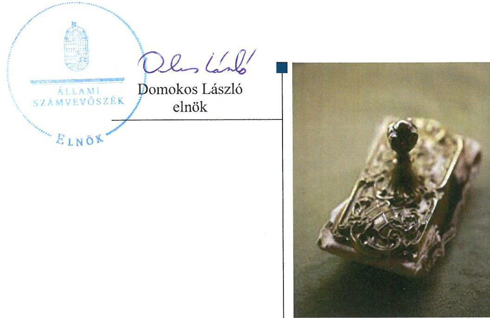
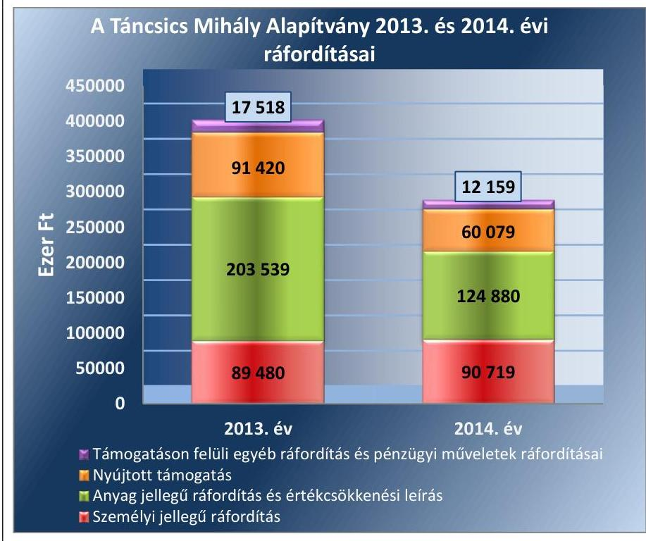
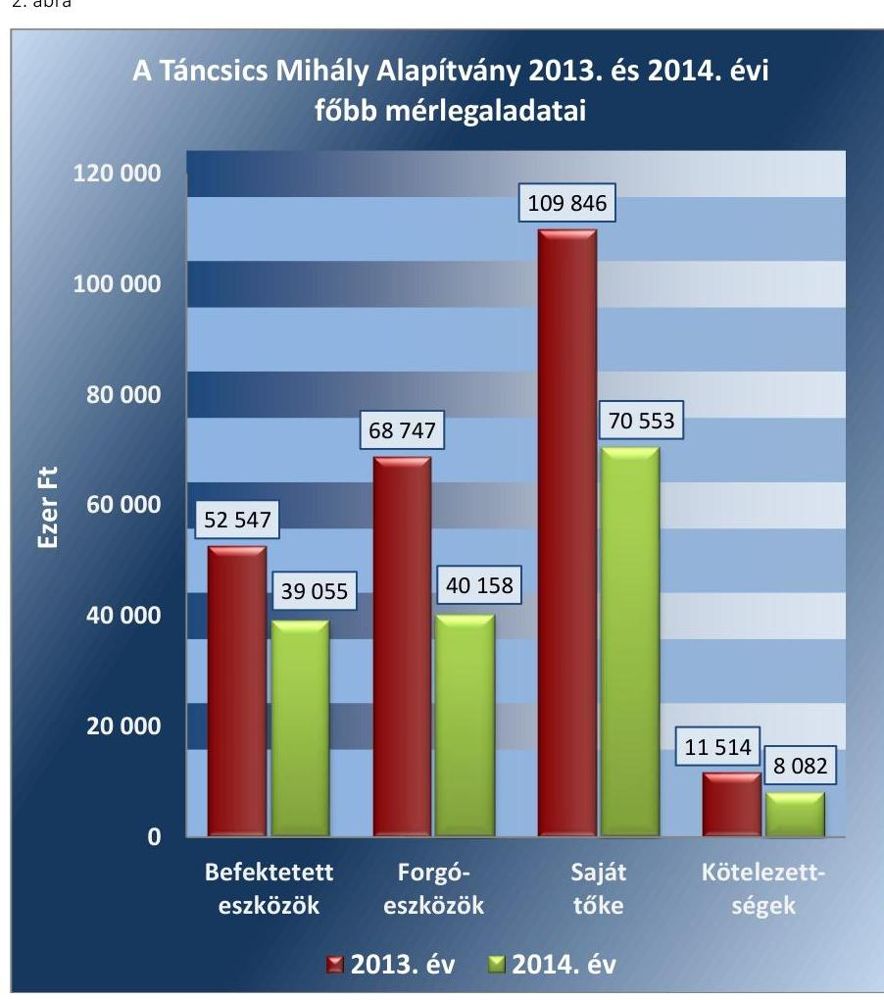
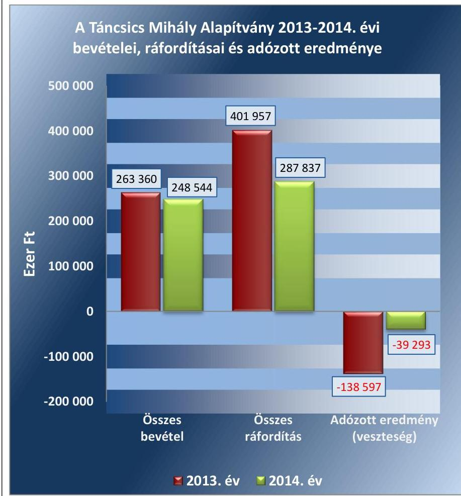
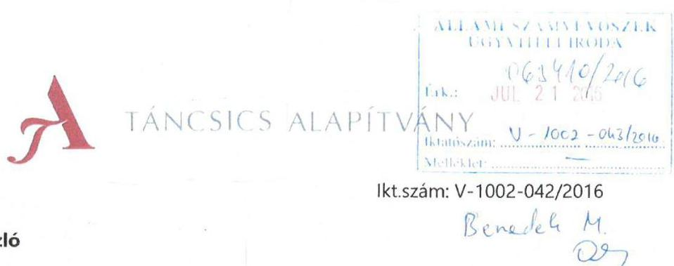
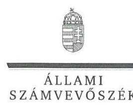
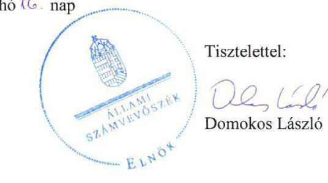

# Jelentés 

## Pártalapítványok gazdálkodása

A költségvetési támogatásban részesülő pártalapítványok 2013-2014. évi gazdálkodása törvényességének ellenőrzése a Táncsics Mihály Alapítványnál 2016.

---

# Jelentés 

## Pártalapítványok gazdálkodása

A költségvetési támogatásban részesülő pártalapítványok 2013-2014. évi gazdálkodása törvényességének ellenőrzése a Táncsics Mihály Alapítványnál
2016. 10 . hó 7. nap

---

# AZ ELLENŐRZÉST FELÜGYELTE: 

DR. BENEDEK MÁRIA felügyeleti vezető

## AZ ELLENŐRZÉST VEZETTE ÉS A VÉGREHAJTÁSÁÉRT FELELŐS:

MODER BEATRIX ellenőrzésvezető

## A PROGRAM ÖSSZEÁLLÍTÁSÁÉRT FELELŐS:

JANIK JÓZSEF LÁSZLÓ osztályvezető

## A TÉMÁHOZ KAPCSOLÓDÓ KORÁBBI SZÁMVEVŐSZÉKI JELENTÉSEK:

- címe: A Táncsics Mihály Alapítvány gazdálkodása - a Táncsics Mihály Alapítvány 2011-2012. évi gazdálkodása törvényességének ellenőrzéséről
- sorszáma: 14005

IKTATÓSZÁM: V-1002-047/2016.
TÉMASZÁM: 2036
ELLENŐRZÉS-AZONOSÍTÓ SZÁM: V-074701

---

# TARTALOMJEGYZÉK 

■ ÖSSZEGZÉS ..... 5
■ AZ ELLENŐRZÉS CÉLJA ..... 7
■ AZ ELLENŐRZÉS TERÜLETE ..... 8
■ AZ ELLENŐRZÉS HÁTTERE, INDOKOLTSÁGA ..... 9
■ A JELENTÉS LÉNYEGES KÉRDÉSKÖREI ..... 10
■ ELLENŐRZÉS HATÓKÖRE ÉS MÓDSZEREI ..... 11
■ MEGÁLLAPÍTÁSOK ..... 13
■ JAVASLATOK ..... 29
■ MELLÉKLETEK ..... 31
I. Sz. melléklet: Értelmező szótár ..... 31
II. Sz. melléklet: 2013. évi egyszerúsített éves beszámoló mérlege ..... 33
III. Sz. melléklet: 2013. évi egyszerúsített éves beszámoló eredménykimutatása ..... 34
IV. Sz. melléklet: 2014. évi egyszerúsített éves beszámoló mérlege ..... 35
V. Sz. melléklet: 2014. évi egyszerúsített éves beszámoló eredménykimutatása. ..... 36
■ FÜGGELÉK: ÉSZREVÉTELEK ..... 39
■ RÖVIDÍTÉSEK JEGYZÉKE ..... 47

---

.

---

# ÖSSZEGZÉS 

Az ÁSZ ${ }^{1}$ a TMA² gazdálkodásának törvényességét ellenőrizte a 2013. január 1-jétől 2014. december 31-ig terjedő időszakra vonatkozóan. Megállapította, hogy a TMA gazdálkodásának törvényessége biztosított volt. A TMA 2013-2014. évi tevékenységéről szóló jelentései megfeleltek a jogszabályi előírásoknak, a számviteli beszámolókat a jogszabályi előírásoknak megfelelően készítették el, azok lényeges hibát nem tartalmaztak. A TMA könyvvezetése összességében megfelelően szabályozott, a könyvvezetés gyakorlata összességében szabályszerű volt. A TMA az előző ÁSZ ellenőrzés javaslatait hasznosította.

## Az ellenőrzés társadalmi indokoltsága

A pártok a Magyarország Alaptörvényében biztosított, a népakarat kialakításában és kinyilvánításában történő közreműködésének elősegítése, az állampolgári tájékoztatás szélesítése, a politikai kultúra fejlesztése érdekében történő politikai képzés, kutatás, tudományos és ismeretterjesztő tevékenység támogatására a Párttörvényben ${ }^{3}$ meghatározott költségvetési támogatásra jogosult alapítványt hozhatnak létre.

A pártalapítványok gazdálkodása törvényességét kétévenként az Állami Számvevőszék Pártalapítványi tv. ${ }^{4}$ szerinti kötelezettségének eleget téve ellenőrzi, támogatva ezzel a pártalapítványi gazdálkodás átláthatóságát.

Az ellenőrzés a gazdálkodás szabályszerűségének bemutatásával hozzájárul ahhoz, hogy a társadalom objektív képet alkothasson a pártalapítványok működéséről.

## Főbb megállapítások, következtetések, javaslatok

A TMA ellenőrzött időszakban hatályos Alapító okirata ${ }_{1-4}{ }^{5}$ megfelelit a Ptk. ${ }_{1}{ }^{6}{ }_{2}{ }^{7}$, a Pártalapítványi tv., a Párttörvény és a Számv. tv ${ }^{8}$ előírásainak. A gazdálkodás törvényessége biztosított volt, a gazdálkodást a Kuratórium ${ }^{9}$ által elfogadott munka-és pénzügyi tervek alapján folytatták, a Kuratórium és az $\mathrm{FB}^{10}$ ellenőrzése mellett. A TMA a tulajdonában levő gazdasági társaság felett a tulajdonosi jogokat szabályszerűen gyakorolta. A TMA Kuratóriuma a belső szabályzatokban foglalt feladatait ellátta, a Kuratórium múködése szabályszerű volt. A TMA a 2013. és a 2014. évi költségvetési terveit a 224/2000. (XII. 19.) Korm. rendelet ${ }^{11}$ alapján készített beszámoló tartalmi elemeinek megfelelően készítette el. A TMA-nál a központi költségvetési és az egyéb támogatás elfogadása megfelelit a Párttörvény előírásainak. A költségvetési támogatás felhasználása szabályszerű volt. A TMA a cél szerinti tevékenységeit részben saját szervezeti keretein belül, részben az alapítványi célokhoz igazodó szervezetek támogatásával látta el. A nyújtott támogatásokról a Kuratórium minden esetben határozatokkal döntött, a támogatottak az elszámolási, illetve visszafizetési kötelezettségüknek eleget tettek. A TMA tevékenységéről szóló 2013-2014. évi éves jelentések megfeleltek a jogszabályi előírásoknak, közzétételükről határidőben gondoskodtak. A 2013. és 2014. évi számviteli beszámolók összeállítása során érvényesültek a Számv. tv.-ben rögzített alapelvek. A TMA számviteli szabályzatai - a Számviteli politika ${ }_{1,2}{ }^{12}$ és a Számlarend ${ }_{1,2}{ }^{13}$ hiányossága mellett - megfeleltek a Számv. tv.-ben foglaltaknak. A könyvvezetés gyakorlata összességében megfelelit a jogszabályi és a belső szabályozásokban foglalt előírásoknak, a könyvviteli nyilvántartási rendszer biztosította az eszközökben és a forrásokban bekövetkezett változások valóságnak megfelelő, folyamatos, zárt rendszerú és áttekinthető kimutatását. Egy esetben nem érvényesült a Számv. tv.-ben rögzített tartalom elsődlegessége a formával szemben alapelv, mivel a gazdasági eseményt a könyvviteli elszámolás során nem a tényleges tartalmának megfelelően mutatták be. Az óvatosság elvét figyelembe véve a TMA a tartós részesedése után értékvesztést számolt

---

el, azonban az értékvesztés összegének megállapítása nem felelt meg a Számv. tv. és a Számviteli politika ${ }_{1,2}$ elöírásának. A banki pénzmozgások bizonylatainak adatait a Számv. tv.-ben foglaltak ellenére több esetben nem a hitelintézeti értesítés megérkezésével egyidejűleg rögzítették a könyvekben. A házipénztár kezelése az előírásoknak megfelelően történt. A TMA az előző ÁSZ ellenőrzés javaslatai alapján készített intézkedési tervében meghatározott feladatokat határidőben végrehajtotta, az SZMSZ és a leltározási szabályzat módosításáról, a szigorú számadású bizonylatok nyilvántartásának vezetéséről és a bizonylatok alaki és tartalmi kellékeinek feltüntetéséről gondoskodtak.

---

# AZ ELLENŐRZÉS CÉLJA 

Az ellenőrzés célja annak értékelése volt, hogy a TMA törvényesen gazdálkodott-e, az éves számviteli beszámolók és az alapítvány tevékenységéről szóló éves jelentések a jogszabályi előírásoknak megfeleltek-e, a könyvvezetés és gazdálkodás során a vonatkozó jogszabályi rendelkezéseket és belső előírásokat betartották-e, továbbá az előző ÁSZ ellenőrzés javaslatai alapján készített intézkedési tervben foglalt feladatokat végrehajtották-e.

---

# AZ ELLENŐRZÉS TERÜLETE 

## TMA

A Pártalapítványi tv. alapján, a pártok a politikai kultúra fejlesztése érdekében tudományos, ismeretterjesztő, kutatási és oktatási tevékenységük elősegítésére a Párttörvényben meghatározott mértékű költségvetési támogatásra jogosult alapítványt hozhatnak létre.

A Magyar Szocialista Párt a törvényi rendelkezéseknek megfelelően 2003-ban létrehozta a Táncsics Mihály Alapítványt.

A TMA Alapító okirat szerinti célja, hogy:
a) elősegítse a Magyar Szocialista Párt Alkotmányban biztosított, a népakarat kialakításában, valamint kinyilvánításában történő hatékony közreműködését;
b) szélesítse az állampolgárok tájékozódását a magyar társadalmat érintő társadalmi és politikai kérdésekről, a szociáldemokrácia elméleti megközelítéseiről;
c) ösztönözze a magyar politikai kultúra színvonalának emelését, a demokrácia elveinek és gyakorlatának erősítését;
d) bátorítsa a magyar és a globális kulturális értékek, valamint a tudományos eredmények tiszteletben tartását és elfogadtatását;
e) előmozdítsa a szociáldemokrata gondolkodás fejlődését és a szociáldemokrata eszmeiség terjesztését;
f) segítse a nemzeti érdekek változó körülményeknek megfelelő időszerű megfogalmazását, különös figyelmet fordítva Magyarország uniós tagságából következő feladatokra.

A TMA a törvényi előírásoknak megfelelően a 2013. évben 259 800ezer Ft, a 2014. évben 246985 ezer Ft költségvetési támogatásban részesült.

---

# AZ ELLENŐRZÉS HÁTTERE, INDOKOLTSÁGA 

A Pártalapítványi törvény 4. § (2) bekezdése alapján a pártalapítványok gazdálkodása törvényességének ellenőrzésére az ÁSZ jogosult. A pártalapítványi törvény 4. § (4) bekezdése alapján az ÁSZ kétévenként ellenőrzi azoknak az alapítványoknak a gazdálkodását, amelyek költségvetési támogatásban részesültek.

Az ÁSZ legutóbb a TMA 2011-2012. évi gazdálkodásának törvényességét ellenőrizte.

Az ellenőrzés eredménye elősegítheti, hogy a jelentésben foglalt megállapítások, következtések és javaslatok alapján a törvényalkotók konkrét lépéseket tegyenek a pártalapítványok finanszírozására vonatkozó szabályozások megváltoztatása, átláthatóbbá, ellenőrizhetőbbé tétele irányába. Az ellenőrzött szervezetek szintjén a hiányosságok, szabálytalanságok feltárása, az ennek kapcsán megfogalmazott megállapítások elősegíthetik a pártalapítványok szabályszerű gazdálkodását. A gazdálkodás szabályszerűségének bemutatásával az ellenőrzés értékteremtő módon járul hozzá az ÁSZ stratégiai céljainak megvalósításához.

---

# A JELENTÉS LÉNYEGES KÉRDÉSKÖREI 

1.     - A TMA gazdálkodásának törvényessége biztositott volt-e?
2.     - Az éves számviteli beszámolók és a TMA tevékenységéről szóló éves jelentések megfeleltek-e a jogszabályi elöírásoknak?
3.     - A TMA könyvvezetésével kapcsolatos szabályzatok elkészitése során betartották-e az előírásokat és a könyvvezetés gyakorlata szabályszerü volt-e?
4. Hasznosultak-e az elózó ÁSZ ellenőrzés javaslatai?

---

# ELLENŐRZÉS HATÓKÖRE ÉS MÓDSZEREI 

## Az ellenőrzés típusa

Szabályszerúségi ellenőrzés.

## Az ellenőrzött időszak

A 2013. január 1-jétől 2014. december 31-ig terjedő időszak.

## Az ellenőrzés tárgya

Az ellenőrzés tárgyát képezi az alapítvány gazdálkodása, az éves számviteli beszámolókra és az alapítvány tevékenységéről szóló éves jelentésekre vonatkozó kötelezettség teljesítése, a könyvvezetés szabályozása és gyakorlata, valamint a pártalapítvány előző ÁSZ ellenőrzés javaslatainak hasznosítására irányuló tevékenysége.

Az ellenőrzés kiterjed minden olyan körülményre és adatra, amely az ÁSZ jogszabályban meghatározott feladatainak teljesítéséhez, valamint a program végrehajtása folyamán felmerült újabb összefüggések feltárásához szükséges.

## Az ellenőrzött szervezet

A Táncsics Mihály Alapítvány.

## Az ellenőrzés jogalapja

Az ellenőrzés jogalapját az ÁSZ tv. ${ }^{14}$ 5. § (3) bekezdése, a Pártalapítványi tv. 4. § (2) és (4) bekezdései, valamint az ÁSZ tv. 33. § (7) bekezdésében foglalt előírások képezték.

## Az ellenőrzés módszerei

Az ÁSZ az ellenőrzést a nemzetközi standardokat irányadónak tekintve az ellenőrzési program ellenőrzési kérdései, az ellenőrzött időszakban hatályos jogszabályok, az ellenőrzésszakmai szabályok és módszertanok figyelembevételével végezte. A gazdálkodás hibáinak kijavítására, a közpénzekkel való felelős gazdálkodás segítésére irányuló javaslatok kidolgozásakor a hatályos jogszabályokat tekintette irányadónak.

---

Az ellenőrzés ideje alatt a TMA-val történő kapcsolattartást az ÁSZ az SZMSZ ${ }^{15}$-ének vonatkozó előírásai alapján biztosította.

Az ellenőrzési kérdések megválaszolásához szükséges bizonyítékok megszerzése az ellenőrzött által rendelkezésre bocsátott dokumentumokra, adatokra alapozva megfigyelés, szemle (szemrevételezés), kérdésfeltevés (információkérés), mintavételezés, tételes és mintavételen alapuló dokumentumellenőrzés, megerősítés, valamint elemző eljárásokkal történt.

Az ellenőrzési bizonyítékként felhasználható adatforrások közé tartoztak egyrészt a szakmai program részletes szempontjainál felsorolt adatforrások, másrészt minden, az ellenőrzés folyamán feltárt, az ellenőrzés szempontjából releváns információt tartalmazó dokumentum.

Az ellenőrzés lefolytatásához a TMA a tanúsítványok elektronikus kitöltésével, valamint az ÁSZ által kért dokumentumok elektronikus megküldésével szolgáltatott adatokat. A rendelkezésre bocsátott adatok, információk, a tanúsítványok adatai valódiságának kontrollja az ellenőrzés keretében történt.

A jelentésben használt fogalmak magyarázatát az I. számú melléklet, a TMA 2013. évi, illetve 2014. évi egyszerűsített éves beszámolójának mérlegét és eredménykimutatását a II.-III. számú, illetve a IV-V. számú mellékletek tartalmazzák.

Az ÁSZ teljes körűen ellenőrizte a központi költségvetésből származó támogatást, a 2013. és a 2014. évi számviteli beszámoló ráfordítás sorainak ellenőrzéséhez MUS és véletlen mintavételi eljárást alkalmazott. A Kuratórium által nyújtott támogatások, ezen belül kiemelten a nagy értékű, illetve több éven átívelő támogatások ellenőrzése évente 30 elemszámú minta alapján történt, továbbá mintavétel alapján ellenőrizte az ÁSZ az egyéb ráfordításokat, ezen belül kiemelten a nagy értékű kiadásokat.

Az ÁSZ az ellenőrzés során az átfogó lényegességi küszöbértéket a TMA éves eredménykimutatás szerinti bevételének $2 \%$-ában határozta meg.

Az ÁSZ a gazdálkodás törvényességét az éves számviteli beszámolók és az alapítványi tevékenységről szóló éves jelentések, valamint a könyvvezetéssel kapcsolatos szabályzatok és a könyvvezetés szabályszerűségét az erre irányuló ellenőrzési kérdésekre adott válaszok összesítése alapján, a lényegességi szempontok figyelembevételével évenkénti bontásban minősítette. Megfelelőnek értékelte az ellenőrzött területet, amennyiben a szabályozás, illetve végrehajtás során a jogszabályi követelményeket maradéktalanul, vagy kisebb hiányosságok mellett érvényesítették, nem megfelelőnek értékelte, amennyiben a szabályozás hiányosságai nem biztosították a szabályszerű működés feltételeit, illetve a gazdálkodás folyamatában, a könyvvezetés során jelentkező hibák lényegesek, nagyszámúak vagy rendszerszerűek voltak.

---

# 1. A TMA gazdálkodásának törvényessége biztosított volt-e? 

Összegző megállapítás

### 1.1. számú megállapítás

## A TMA gazdálkodásának törvényessége biztosított volt.

A Kuratórium és a munkaszervezet tevékenysége megfelelt a jogszabályi előírásoknak és a belső szabályozásnak.

## A TMA ELLENŐRZÖTT IDŐSZAKBAN HATÁLYOS ALAPÍTÓ OKIRATA $_{1-4}$ megfelelt a Ptk. ${ }_{1,2}$ a Párttörvény. és a Pártalapítványi tv. rendelkezéseinek.

Az ellenőrzött időszakban hatályos Alapító okirat ${ }_{1-4}$ tartalmazta a TMA Alapító ${ }^{16}$ által meghatározott céljait és a célkitűzések megvalósítása érdekében végzett tevékenységeit, az alapítvány céljára rendelt vagyont és annak kezelésére, felhasználására vonatkozó alapvető rendelkezéseket, a Kuratórium, valamint az FB összetételét, feladat- és jogkörét, továbbá a képviseleti és bankszámla feletti rendelkezési jog gyakorlására vonatkozó előírásokat.

Az Alapító okirat ${ }_{1-4}$-ben rögzített célkitűzések és a célok megvalósítása érdekében meghatározott tevékenységek összhangban voltak a Párttörvény 9/A.§ (1) bekezdésében előírtakkal. A TMA a céljait részben saját intézményi és szervezeti keretei között, részben projektszervező és projektfinanszírozó jelleggel, más intézményeket felkérve valósította meg.

A TMA céljaira rendelt vagyon felhasználásának szabályozása megfelelt a jogszabályi előírásoknak. A TMA induló vagyonát 1.000 .000 Ft-ban határozták meg, amelyből az induláskor lekötött törzsvagyon 500.000 Ft volt.

Az Alapító okirat ${ }_{1-4}$ tartalmazta a gazdálkodására vonatkozó alapvető szabályokat, amely szerint a TMA a - törzsvagyonon felüli - le nem kötött vagyonnal az Alapító okirat ${ }_{1-4}$-ben meghatározott célok elérése érdekében szabadon gazdálkodik. Az Alapító okirat ${ }_{1-3}$ értelmében az alapítványi vagyont hét tagú, illetve az Alapító okirat ${ }_{4}$ alapján hat tagból álló Kuratórium kezelte.

A Vagyonkezelési és Befektetési Szabályzat ${ }^{17}$ és az alapítványi SZMSZ ${ }^{18}{ }_{1-4}$ az Alapító okirat ${ }_{1-4}$-gyel összhangban szabályozta a vagyon és a befektetések feletti döntési jogkört, amely szerint a TMA vagyona feletti tulajdonosi jogokat kizárólag a Kuratórium gyakorolhatta.

Az Alapító okirat ${ }_{1-4}$ rendelkezett a TMA képviseletéről, a képviselő személyének meghatározásáról. A Kuratórium elnöke a Kuratórium határozatainak keretei között a TMA általános és teljes jogkörű képviselője volt. A TMA bankszámlái felett a Kuratórium elnökének önálló rendelkezési joga, illetve - erre írásban felhatalmazott - két alkalmazottjának együttes rendelkezési joga volt. A banki bejelentő karton az Alapító okirat ${ }_{1-4}$ előírásaival összhangban tartalmazta az aláírási jogosultságokat. A képviseleti jog, valamint a bankszámla feletti rendelkezési jog gyakorlása szabályszerűen történt a 2013-2014. években.

---

Az Alapító okiratot az ellenőrzött időszakban három alkalommal módosították, a kuratóriumi és felügyelő bizottsági tagok személyének, létszámának változása miatt, illetve változott az Kuratórium elnökének személye is. A Ptké. ${ }^{19}$ előírásának megfelelően, a $\mathrm{Ptk}_{-2}$ hatályba lépését követően elfogadott Alapító okirat ${ }_{4}$ rendelkezései mindenben megfeleltek a $\mathrm{Ptk}_{-2}$ előírásainak, az annak megfelelő, törvényes működést az Alapító okirat előírásai biztosították.

A Kuratórium tevékenységét a belső szabályzatokban a hatályos Alapító okirattal összhangban szabályozták. A TMA SZMSZ-e, Vagyonkezelési és Befektetési Szabályzata, a Pénzkezelési szabályzat ${ }_{1-2}{ }^{20}$, valamint Pályázatkezelési szabályzat ${ }^{21}$ az Alapító okirattal összhangban tartalmazta a Kuratórium feladat-, hatás- és felelősségi körét, illetve a Kuratórium működésének előírásait, azonban az SZMSZ4-ben a kuratóriumi tagok számát - az Alapító okirat ${ }_{4}$ módosításának megfelelően - nem aktualizálták.

Az Alapító okirat ${ }_{3-4}$-ben és az SZMSZ ${ }_{1-4}$-ben - a 350/2011. (XII.30.) Korm. rendelettel ${ }^{22}$ összhangban - előírták, hogy a TMA a gazdálkodását az éves költségvetésében (pénzügyi tervében) foglaltak szerint folytatja.

AZ ÉVES KÖLTSÉGVETÉSI TERVEK a 2013. és 2014. években a 350/2011. (XII. 30.) Korm. rendelet előírásának megfelelően a 224/2000. (XII. 19.) Korm. rendelet szerinti egyszerűsített éves beszámoló tartalmi követelményeivel összhangban készültek. Az éves költségvetési tervekben a bevételeket költségvetési támogatás, kamatbevétel, előző évi tartalék bevonása bontásban tervezték. A ráfordításokat a cél szerinti kiadások - Képzési program, Demokrata Körök közéleti klubhálózat, Kapcsolat.hu portál üzemeltetése, Együttmúködési megállapodások, Tudományos munka, kutatások és rendezvények, Nemzetközi kapcsolatok, valamint a 2013. évben a Táncsics Életmű Díj - és a működés költségei szerint részletezték. Az éves költségvetési tervekben a tárgyévi bevételeket meghaladó tervezett kiadási többlet fedezetére az előző évek pénzmaradványának bevonását tervezték.

A 2013. évi munka- és pénzügyi tervet az év során nem, a 2014. évit az év során kétszer módosították. A 2014. évben az országgyűlési képviselők általános választásán elért eredmények alapján a TMA-t megillető támogatás mértéke változott, ezért a költségvetési támogatás bevételi összegét és egyidejűleg több kiadási tételt módosítottak, az év során végrehajtott további módosítás alkalmával két kiadási tétel között történt átcsoportosítás.

Az éves terveket a Kuratórium határozattal elfogadta. A terveket és a módosításokat az FB is megtárgyalta, megállapította, hogy a tervek megalapozottak, szabályosak és kivitelezhetőek.

A TMA munkaszervezete az SZMSZ ${ }_{1-3}$ szerint 2014. szeptember 4-ig az Alapítványi Igazgatóság, ezen időpontot követően az SZMSZ4 szerint az Alapítványi Titkárság volt. Az SZMSZ ${ }_{1-4}$-ben meghatározták a munkaszervezet feladatait, az alkalmazottak munkaköri leírásaiban rögzített feladatok az SZMSZ ${ }_{1-4}$-gyel összhangban voltak.

A Kuratórium az SZMSZ ${ }_{1-4}$ előírásának megfelelően ellenőrizte a munkaszervezet tevékenységét, a támogatott pályázatokban foglaltak megvalósítását, a TMA vagyona összetételének alakulását és a működéssel kapcsolatos feladatok végrehajtását. Ülésein rendszeresen beszámoltatta az alapítványi igazgatót a TMA tevékenységéről.

---

Az ellenőrzött időszakban a gazdálkodás operatív feladatai közül a számviteli, munkaügyi és társadalombiztosítási ügyintézés és a beszámoló készítés feladatát megbízási szerződés alapján külső könyvviteli szolgáltató szervezet látta el, a feladatellátás folyamatossága biztosított volt. A TMA beszámolójának elkészítésére kijelölt személy könyvviteli szolgáltatás nyújtására jogosító engedéllyel rendelkezett.

Az SZMSZ1-4 szerint a TMA általános ellenőrző testületi szerve az FB, amely a tevékenységéről évente jelentést készített az alapító MSZP-nek.

A Kuratórium működésének szabályozásával kapcsolatban feltárt hiányosságot az 1. táblázat tartalmazza.

# 1. táblázat 

## A KURATÓRIUM MŰKÖDÉSÉNEK SZABÁLYOZÁSÁVAL KAPCSOLATOS HIÁNYOSSÁG

| Sorszám |  |  |
| :-- | :-- | :-- |
|  |  |  |

1. Az SZMSZ4 „ÁLTALÁNOS RÉSZ" feletti bekezdésében foglaltak ellenére a Kuratórium létszámára vonatkozó előírás nem volt összhangban az Alapító okirat ${ }_{4}$ rendelkezésével, mert az SZMSZ4-ben a kuratóriumi tagok számát nem aktualizálták hétről hat főre.

Forrás: ÁSZ

### 1.2. számú megállapítás

A költségvetési és egyéb támogatások elfogadása megfelelt a jogszabályi előírásoknak.

A TMA a 2013. évi beszámolójában összesen 263360 ezer Ft, a 2014. évi beszámolójában 248544 ezer Ft bevételt mutatott ki. A 2013. évi bevételek 98,6\%-át, a 2014. évi bevételek 99,4\%-át a központi költségvetési támogatás tette ki.

A TMA a 2013. évben a 2013. évi költségvetési törvény ${ }^{23}$ szerint 259800 ezer Ft, a 2014. évben a 2014. évi költségvetési törvény ${ }^{24}$ és a 1321/2014. (V. 30.) Korm. határozat alapján 246985 ezer Ft költségvetési támogatásban részesült. A költségvetési támogatások a Párttörvény előírásának megfelelően a TMA bankszámláján az ellenőrzött időszak negyedéveinek második munkanapján jóváírásra kerültek.

Az Alapító okirat - a Pártalapítványi tv. előírásaival összhangban - lehetővé tette a TMA számára csatlakozók általi támogatások elfogadását. Az Alapító okirat ${ }_{1-4}$ a csatlakozás esetére előírta a kuratóriumi jóváhagyást. A TMA-nak az ellenőrzött időszakban egy magánszemély támogatója volt, akinek a csatlakozását a Kuratórium határozattal jóváhagyta.

A támogatás pénzügyi teljesítése a Pártalapítványi tv. előírásainak megfelelően történt, a támogató személye egyértelműen azonosítható volt, a támogatás a magánszemély bankszámlájáról a TMA bankszámlájára érkezett. A támogatás összege nem érte el a Pártalapítványi tv-ben meghatározott - 500 ezer Ft - közzétételi kötelezettséggel járó értékhatárt.

A TMA a költségvetési és egyéb támogatásokat a könyvvezetés során az előírásoknak megfelelően az egyéb bevételek között számolta el, és mutatta ki az egyszerűsített éves beszámoló eredménykimutatásában.

---

### 1.3. számú megállapítás

A TMA a költségvetési támogatásokat szabályszerűen használta fel, a kapcsolódó beszámolási, közzétételi kötelezettséget az előírásoknak megfelelően teljesítette.

## A KÖLTSÉGVETÉSI TÁMOGATÁSOK FELHASZNÁ-

LÁSA az ellenőrzött években szabályszerű volt.

A TMA az ellenőrzött években a költségvetési támogatások összegét illetve azok előző évi maradványát - az Alapító okirat ${ }_{1-4}$-ben kitűzött célok megvalósítására és a működési kiadások fedezésére fordította. A TMA-hoz csatlakozó magánszemély az általa nyújtott támogatással kapcsolatosan konkrét támogatási célt nem jelölt meg, a támogatásának felhasználása a TMA általános céljaira történt.

A kitűzött célok megvalósítása részben saját intézményi és szervezeti keretek között történt, jellemzően rendezvények szervezésével (pl.: Demokrata Körök rendezvénysorozat), valamint gazdaságpolitikai tanulmányok, elemzések megrendelésével. A célok megvalósítása érdekében a TMA - az alapítványi célokhoz igazodó - intézményeket és szervezeteket pályázat útján támogatásban részesített. Mindezeken felül a szimpatizánsokkal való kapcsolattartás érdekében honlap üzemeltetési feladatok ellátására külön szervezetet hozott létre.

A Kuratórium az éves munka- és pénzügyi terveiben döntött a saját szervezeti keretein belül történő tevékenységekre, a támogatás nyújtásra és a működéshez szükséges költségekre fordítható éves keretösszegekről.

A saját szervezeti keretek között végzett tevékenységek érdekében felhasznált pénzeszközök az ellenőrzött időszakban összhangban voltak a TMA célkitűzéseivel.

A TMA összes ráfordítása az egyszerűsített éves beszámolók alapján a 2013. évben 401957 ezer Ft, a 2014. évben 287837 ezer Ft volt, amelyek megoszlását az 1. ábra szemlélteti.

1. ábra

---

A TMA a 2013. évi ráfordításainak 22,7 \%-át, a 2014. évben 20,9 \%-át fordította az alapítványi célokhoz igazodó szervezetek támogatására. A támogatási szerződések nyilvántartása szerint az ellenőrzött időszakban öszszesen 53 támogatási szerződést kötöttek. A TMA a támogatásokat pályázati rendszerben nyújtotta. A pályázatok elbírálása, kezelése a Pályázatkezelési szabályzat előírásainak megfelelően történt, a Kuratórium a támogatásokról minden esetben határozatban döntött. A támogatott pályázatok céljai az alapítványi célokkal összhangban voltak.

A támogatottakkal minden esetben a kuratóriumi döntésnek megfelelő szerződést kötöttek. A szerződésekben rögzítették a támogatási cél megvalósítására, és az erről készült elszámolás benyújtására nyitva álló határidőt, valamint a szankciókat a szerződéses kötelezettségek be nem tartásának esetére.

A támogatások folyósítása egy kivétellel egy összegben történt. Egy esetben került sor két részletben történő folyósításra, a második részlet folyósításának feltétele az első részlettel való elszámolás volt, amit a támogatott teljesített. A támogatási összegek folyósítása a TMA bankszámlájáról a támogatott bankszámlájára való átutalással történt, a szerződés aláírását követően. Egy esetben fordult elő, hogy a - Kuratóriumi határozatnak megfelelő - támogatási összeget a szerződés aláírását két nappal megelőzően átutalták a támogatott részére.

Az elszámolási kötelezettségének valamennyi támogatott eleget tett, az elszámolások ellenőrzése minden esetben megtörtént. A pályázatok ellenőrzésének feladatát 2014. szeptember 4-ig az igazgatói asszisztens munkaköri leírása tartalmazta, ezt követően a feladatot a titkárságvezető látta el.

Amennyiben a támogatott valamely szerződésbeli kötelezettségének nem, illetve nem határidőre, vagy csak részben tett eleget a TMA felszólította a kötelezettségek teljesítésére, vagy a hiányok pótlására. Az elszámolások alapján a támogatottaknak 2013-ban 5 esetben, 2014-ben 1 esetben keletkezett visszafizetési kötelezettségük, a visszafizetést minden esetben maradéktalanul teljesítették.

A TMA az ellenőrzött időszakban az Alapító párttal közös rendezvényt nem szervezett, nem készített közös kiadványt - a Párttörvény előírásainak megfelelően - az Alapító párt részére vagyoni hozzájárulást sem közvetlen, sem közvetett formában nem adott.

Az ellenőrzött időszakban igénybevett szolgáltatások értéke egy alkalommal érte el a Kbt. ${ }^{25}$ szerinti, az éves költségvetési törvényekben a szolgáltatás megrendelésére előírt 8 millió Ft-os nemzeti közbeszerzési értékhatárt. A TMA a szolgáltatás megrendeléséhez, a szerződő partner kiválasztása érdekében az ellenőrzött időszakot megelőzően (2012. decemberben) folytatott le meghívásos közbeszerzési eljárást. Az ajánlatkérés tárgya fiatal politikusok és aktivisták számára politikai- és kommunikációs imázsépítő program második ütemének lebonyolítása volt. Az ajánlattételre felkért három szervezet közül az ajánlatok elbírálását követően, a legkedvezőbb - 15.000 ezer Ft+ Áfa összegű - ajánlatot tevő szervezettel kötötték meg a szerződést az ellenőrzött időszakban.

A költségvetési támogatások felhasználására vonatkozó beszámolási kötelezettségét a TMA a 224/2000. (XII. 19.) Korm. rendelet és a Pártalapítványi tv. előírásainak megfelelően, az éves beszámolóval egyidejűleg elkészített és közzétett jelentéssel teljesítette.

---

# 1.4. számú megállapítás 

A TMA által létrehozott szervezetre vonatkozó tulajdonosi döntések megfeleltek a jogszabályi előírásoknak.

A TMA az ellenőrzött időszakban kizárólagos tulajdonosa volt a Kapcsolat.hu Kommunikációs és Szolgáltató Nonprofit Kft.-nek, a társaságot az ellenőrzött időszakot megelőzően, 2006-ban alapította.

A TMA a tulajdonosi kötelezettségeinek eleget tett, gyakorolta az ügyvezető felett a munkáltatói jogokat, rendszeresen beszámoltatta az ügyvezetőt a gazdálkodásról, elfogadta a szervezet éves beszámolóit, a veszteségrendezés érdekében gondoskodott az alaptőke leszállításáról.

Az NKft. ${ }^{26}$ és a TMA egymással szerződéses kapcsolatban állt az ellenőrzött években a Kapcsolat.hu portál üzemeltetése tárgyában. A TMA az NKft. által kiállított számlák alapján a 2013. évben 35 337,7 ezer Ft-ot, 2014. évben 51 468,6 ezer Ft-ot fizetett az NKft.-nek a portál üzemeltetéséért.

Az NKft. tartósan veszteséges gazdálkodása miatt a Kuratórium a 103/2012. (12.03) T.A. határozatában döntött a Kft. alaptőkéjének 96 millió Ft-ról 8 millió Ft-ra történő leszállításáról, amelyet azonban a cégbíróság - helytelen jogszabályhelyre hivatkozás miatt - nem jegyzett be, hiánypótló végzésben kérte a határozat kijavítását. A Kuratórium a határozat kijavításáról a 18/2013. (05.13) T.A. határozatával gondoskodott. Az alaptőke leszállítása a negatív eredménytartalék javára történt, tőkekivonásra nem került sor. A kijavított határozat alapján a cégbíróság az alaptőke öszszegének változását 2013. május 15-én bejegyezte.

Az NKft. 2013. és 2014. évi éves egyszerűsített beszámolóit az FB megtárgyalta és elfogadásra javasolta. Az éves egyszerűsített beszámolókról mindkét évben hitelesítő záradékot adott ki a könyvvizsgáló. A Kuratórium az NKft. egyszerűsített éves beszámolóját az ellenőrzött években az FB és a könyvvizsgálói jelentésének birtokában megtárgyalta és elfogadta.

## 2. Az éves számviteli beszámolók és a TMA tevékenységéről szóló éves jelentések megfeleltek-e a jogszabályi előírásoknak?

Összegző megállapítás
Az éves számviteli beszámolók és a TMA tevékenységéről szóló éves jelentések megfeleltek a jogszabályi előírásoknak.

### 2.1. számú megállapítás

A TMA tevékenységéről szóló éves jelentések megfeleltek a vonatkozó jogszabályi előírásoknak.

## A PÁRTALAPÍTVÁNYI TV. SZERINTI ÉVES JELENTÉSEKET a TMA - a 2013. és 2014. évi egyszerűsített éves beszámolókkal egyidejűleg - az előírt tartalommal, határidőben elkészítette és közzétette.

A 2013. és 2014. évi éves jelentés a Pártalapítványi tv. előírásainak megfelelően tartalmazta az éves számviteli beszámolót, a központi költségvetésből kapott és az egyéb támogatás összegét, a költségvetési támogatás és a vagyon felhasználására vonatkozó kimutatást, a cél szerinti juttatások kimutatását, a vezető tisztségviselőknek nyújtott juttatásokat, továbbá a TMA tevékenységéről szóló tartalmi beszámolót.

---

A TMA 2013. és a 2014. évi éves jelentéseit - miután azokat az FB megtárgyalta és szabályszerűnek, előterjesztésre alkalmasnak ítélte - a Kuratórium a számviteli beszámolóval és a mellékletekkel együtt jóváhagyta. A TMA - a Pártalapítványi tv.-ben előírt határidőn belül - gondoskodott a 2013. és a 2014. évi éves jelentéseknek a Magyar Közlöny mellékletét képező Hivatalos Értesítőben és a TMA honlapján történő közzétételéről. A 2013. évi jelentés 2014. június 16-án a Hivatalos Értesítő 2014. évi 31. számában, a 2014. évi jelentés 2015. június 15-én a Hivatalos Értesítő 2015. évi 28. számában jelent meg.

# 2.2. számú megállapítás 

A TMA éves számviteli beszámolói megfeleltek a vonatkozó jogszabályi előírásoknak.

AZ EGYSZERŰSÍTETT ÉVES BESZÁMOLÓKAT a 2013-2014. években a TMA a Számviteli politika ${ }_{1,2}$-ben választott formában, a Számv. tv. és a 224/2000. (XII. 19.) Korm. rendelet előírásainak megfelelően a kötelező mellékletekkel együtt határidőben elkészítette és gondoskodott azok közzétételéről.

Az ellenőrzött évek beszámolói az előírásoknak megfelelően tartalmazták a Számv. tv.-ben előírt mérleget, eredménykimutatást, valamint a Civil tv. ${ }^{27}$ szerinti kiegészítő mellékletet.

A 2013. és 2014. évi egyszerűsített éves beszámolókat könyvvizsgáló felülvizsgálta és hitelesítő záradékkal látta el. A TMA beszámolóit jóváhagyásukat megelőzően az FB véleményezte, és megállapította, hogy a mér-leg- és eredménykimutatás, valamint a mellékletek jogszabályoknak megfelelőek és megbízhatóak, amelyet a független könyvvizsgálói jelentés is megerősített. A Kuratórium a számviteli beszámolókat - az éves jelentéssel egyidejűleg - egyhangúan elfogadta.

A TMA az ellenőrzött időszakban a Számv. tv. előírásainak megfelelően a kettős könyvvitel rendszerében folyamatos nyilvántartást vezetett a tevékenysége során felmerülő vagyoni, pénzügyi, jövedelmi helyzetére kiható gazdasági eseményekről.

A beszámolók összeállítása során érvényesültek a Számv. tv.-ben rögzített számviteli alapelvek. A beszámolósorok adatai - a Számv. tv., a 224/2000. (XII.19.) Korm. rendelet, valamint a Számviteli politika ${ }_{1,2}$ és a Számlarend ${ }_{1,2}$ előírásainak megfelelően - megegyeztek a kapcsolódó főkönyvi számlák, az analitikus és egyéb nyilvántartások számszaki adataival.

A 2013. ÉS 2014. ÉVI MÉRLEGET a TMA a Számviteli politikában választott formában, a 224/2000. (XII.19.) Korm. rendelet 4. számú melléklete szerint állította össze.

A mérlegfőösszeg a 2013. év végi 123580 ezer Ft-ról a 2014. év végére 35,8\%-kal, 79345 Ft-ra csökkent, döntően a befektetett pénzügyi eszközök állománya és a pénzeszközök, illetve a saját tőke jelentős mértékű csökkenése következtében.

A TMA vagyoni helyzetét meghatározó főbb mérlegadatokat a 2. ábra szemlélteti.

---

2. ábra

Forrás: A TMA 2013. és 2014. évi éves jelentésének adatai

A TMA a Számv. tv. és a 224/2000. (XII.19.) Korm. rendelet előírásainak megfelelően a mérleg tételeinek alátámasztásához a Számviteli politika ${ }_{1,2}$ és a Leltározási szabályzat ${ }_{1,2}{ }^{28}$ előírásainak megfelelően december 31-ei fordulónappal elkészítette a leltárt, amely tételesen és ellenőrizhető módon tartalmazta a mérleg fordulónapján meglévő eszközöket és forrásokat mennyiségben és értékben.

A tárgyi eszközök aktiválása, értékcsökkenésének elszámolása az ellenőrzött időszakban szabályszerűen történt. A 100 ezer Ft-ot el nem érő tárgyi eszköz beszerzéseket a Számviteli politika ${ }_{1,2}$ előírása szerint egy összegben értékcsökkenésként elszámolták, a 100 ezer Ft-ot meghaladó eszközbeszerzéseket a TMA a beruházások között könyvelte és a használatba vételkor aktiválta. Az aktiváláshoz üzembe helyezési jegyzőkönyv készült, amelyben meghatározták az eszközök várható hasznos élettartamát, és az értékcsökkenési leírás módszerét. A bekerülési érték megállapítása a Számv. tv. előírásainak megfelelően történt. Az aktivált tárgyi eszközök értékét egyedi nyilvántartó kartonon vezették, amely tartalmazta a bruttó értéket, az elszámolt értékcsökkenési leírást és a nettó értéket, a kapcsolódó főkönyvi számlát, valamint az értékcsökkenési leírás elszámolási módját. Terven felüli értékcsökkenést az ellenőrzött időszakban nem számoltak el.

A befektetett pénzügyi eszközök között a mérlegben kizárólag a TMAnak a Kapcsolat.hu Kft.-ben lévő részesedése szerepelt. A TMA éven túli

---

lejáratú kölcsönt nem nyújtott, tartós hitelviszonyt megtestesítő értékpapírral, egy évet meghaladóan lekötött bankbetéttel nem rendelkezett. Az év végi értékelések során - az óvatosság elvének megfelelően - a tartós részesedésre értékvesztést számoltak el.

A TMA-nál az ellenőrzött időszakban korábban elszámolt értékvesztés visszaírására, valamint értékhelyesbítés elszámolására nem került sor.

A TMA 2013. december 19-én és 2014. december 19-én - selejtezési bizottság felállításával, jegyzőkönyv felvétele mellett - szabályszerű selejtezési eljárást folytatott le, amelyek során 2013-ban 19, 2014-ben 22 darab 0-ra leírt, elhasználódott tárgyi eszköz került selejtezésre. A selejtezési jegyzőkönyv tartalmazta a bruttó értéket és az értékcsökkenési leírást, a selejtté válás okát, valamint azt, hogy a selejtezett eszközök - az állapotuk miatt - nem hasznosíthatóak, azok megsemmisítésre kerülnek. A megsemmisítésről jegyzőkönyvet vettek fel. A leselejtezett eszközöket az analitikus nyilvántartásból kivezették.

Vásárolt, illetve saját termelésű készletekkel a TMA 2013., illetve 2014. december 31-én nem rendelkezett.

A mérlegben - a Számv. tv. előírásainak megfelelően csak elismert követeléseket mutattak ki. A követelések elismertetése, az előlegek és a munkavállalókkal szembeni egyéb követelések határidőre való elszámolása a számviteli szabályzatokban foglaltaknak megfelelően történt. Utólagos, 30 napon belüli elszámolási kötelezettséggel járó előleg - mint munkavállalókkal szembeni követelés - 2013., illetve 2014. december 31-én a könyvekben nem szerepelt.

A mérlegben kimutatott pénzeszközök záró állománya az ellenőrzött években megegyezett a pénztárjelentés szerinti záró készpénzállomány és a banki folyó- és betétszámla kivonatok egyenlegeivel.

A mérleg forrás oldala a saját tőkén belül a Számv. tv. előírásának megfelelően tartalmazta az - Alapító okiratban rögzített 2200 ezer Ft összegű induló tőkét, továbbá az előző évi eredménynek megfelelően a tőkeváltozást, valamint a tárgyévi eredményt.

A mérleg szerinti induló tőke megfelelt az Alapító okirat 1.4-ben rögzített mértéknek.

A rövid lejáratú kötelezettségek mérlegsor adó- és járulékfizetési, valamint szállítói kötelezettségeket tartalmazott, amelyek között lejárt kötelezettség nem volt. A TMA a 2013-2014. években hitelállománnyal nem rendelkezett.

Az aktív- és passzív időbeli elhatárolások elszámolása megfelelt a Számv. tv. rendelkezéseinek. A 2013. évben jelentősebb aktív időbeli elhatárolásként a VI. ker. Jókai utca 6. sz. alatti irodaház 2286 ezer Ft bérleti diját, 2014-ben pedig a 2015. évre szóló adatbank-lekérdezési és pénzügyi információ szolgáltatások 132 ezer Ft előfizetési diját mutatták ki. Passzív időbeli elhatárolások címen a mérleg fordulónapja előtti időszakot terhelő olyan költségekre - tanácsadás, számviteli tevékenység ellátásának díja, közlekedési költség, telefon- és internet-szolgáltatás díja - számoltak el, amelyek a mérleg fordulónapja után váltak esedékessé.

---

# A 2013. ÉS 2014. ÉVI EREDMÉNYKIMUTATÁSOKAT a TMA a Számviteli politikában meghatározott módon, a 224/2000. 

(XII.19.) Korm. rendelet 5. számú melléklete szerinti formában és tartalommal készítette el.

Az ellenőrzött időszakban a bevételeket és a ráfordításokat, valamint a tájékoztató adatokat a 224/2000. (XII. 19) Korm. rendelet vonatkozó előírásai szerinti bontásban mutatták ki. Az eredménykimutatás adatai a főkönyvi kivonatok adataival megegyeztek. Az adatok az előző év megfelelő adataival összehasonlíthatóak voltak.

A TMA 2013. évi 263360 ezer Ft összes bevétele a központi költségvetési támogatás és a kamatbevételek csökkenése következtében a 2014. évben 5,6\%-kal, 248544 ezer Ft-ra csökkent. A 2013. évi 401957 ezer Ft öszszes ráfordítás a 2014. évben 28,4\%-kal, 287837 ezer Ft-ra mérséklődött, amelyet döntően az anyagi jellegű ráfordítások, valamint az egyéb ráfordításokon belül a TMA által nyújtott támogatások összegének csökkenése okozott. A ráfordítások bevételeket meghaladó mértékű csökkenése következtében az adózott eredmény a 2013. évi 138597 ezer Ft veszteségről, a 2014. évben 39293 ezer Ft veszteségre mérséklődött.

A TMA 2013-2014. évi bevételeinek, ráfordításainak és adózott eredményének alakulását a 3. ábra szemlélteti.
3. ábra

Forrás: A TMA 2013. és 2014. évi éves jelentésének adatai

---

Az ellenőrzött időszakban a TMA árbevételt nem realizált, aktivált saját teljesítmény nem került elszámolásra, rendkívüli bevétele nem volt, a bevételeit egyéb bevételek és pénzügyi műveletek bevételei képezték. A 2013-2014. években a központi költségvetéstől kapott támogatásokat az egyéb bevételeken belül elkülönítetten mutatták ki.

A TMA 2013-ban az állami költségvetésből a 2013. évi költségvetési törvény szerint 259800 ezer Ft támogatásban részesült, 2014-ben a 2014. évi költségvetési törvény értelmében a 2013. évivel azonos összegű támogatásra volt jogosult, amely összeg az országgyűlési képviselők 2014. évi általános választási eredménye alapján végrehajtott előirányzat átcsoportosítást követően 246985 ezer Ft-ra módosult. A TMA egy magánszemélytől mindkét ellenőrzött évben 24 ezer Ft támogatást kapott. Pénzügyi műveletek bevételeként a TMA a szabad pénzeszközeinek banki lekötéséből származó kamatbevételeket számolta el.

Az elszámolt bevételeket a Számv. tv. előírásainak megfelelő bizonylatokkal alátámasztották. Az elszámolt támogatások összegét és a kamatbevételeket a banki folyószámla kivonatok adatai alátámasztották, amelyek megegyeztek a főkönyvi kivonatban szereplő adatokkal.

A TMA az ellenőrzött évek ráfordításait anyagjellegű, személyi jellegű, pénzügyi, és egyéb ráfordítások, valamint értékcsökkenési leírás bontásban mutatta ki. Az eredménykimutatásban szereplő ráfordításokat könyvelési alapbizonylatokkal (vállalkozói szerződések, szállítói számlák, támogatási szerződések, bérkifizetési dokumentumok, bank- és pénztárbizonylatok) támasztották alá.

# 3. A TMA könyvvezetésével kapcsolatos szabályzatok elkészítése során betartották-e az előírásokat és a könyvvezetés gyakorlata szabályszerű volt-e? 

Összegző megállapítás

Az TMA számviteli rendszerének szabályozása és a könyvvezetés gyakorlata összességében szabályszerű volt.

### 3.1. számú megállapítás

A számviteli szabályzatok - a Számviteli politika és a Számlarend hiányossága mellett - megfeleltek az előírásoknak.

A TMA a Számv. tv.-ben előírtaknak eleget téve kialakította és írásba foglalta az adottságainak, körülményeinek leginkább megfelelő Számviteli politikát, és ennek keretében elkészítette a leltározási, értékelési és pénzkezelési szabályzatot, valamint a számlarendet, amelyeket a - a belső eljárásrendnek megfelelően - a Kuratórium hagyott jóvá.

A Számviteli politika ${ }_{1,2}$-ben - a banki és pénztári bizonylatok feldolgozási rendjének kialakítása kivételével - Számv. tv. előírásaival összhangban, az alapítványi sajátosságok figyelembevételével szabályozták a könyvvezetés során alkalmazandó szabályokat, előírásokat, módszereket. Rögzítették a könyvvezetés nyelvét és módját, a könyvviteli zárás rendjét, az egyszerűsített éves beszámoló készítésének kötelezettségét, a kiegészítő melléklet tartalmát, meghatározták, hogy mit tekintenek a számviteli elszámolás és az értékelés szempontjából lényegesnek, nem lényegesnek, valamint je-

---

lentős összegnek, nem jelentős összegnek. Meghatározták az időbeli elhatárolások körét, a bekerülési érték meghatározásával, az értékcsökkenés megállapításával és elszámolásával kapcsolatos szabályokat. A TMA élt a Számv. tv.-ben rögzített döntési lehetőséggel, a 100 ezer Ft alatti tárgyi eszközök bekerülési értékének egy összegű értékcsökkenésként való elszámolását írta elő. A gazdasági társaságban lévő tulajdonosi részesedést jelentő befektetések utáni értékvesztés elszámolásának szabályozása összhangban volt a Számv. tv. 54.§ (1) bekezdésében foglaltakkal.

Az Értékelési szabályzat ${ }_{1,2}{ }^{29}$-ben a a Számv. tv. előírásaival összhangban szabályozták az eszközök beszerzési árának, bekerülési értékének meghatározását, szabályozták az eszközök és források mérlegtételei év végi értékelésének módját.

A Leltározási szabályzat ${ }_{1,2}$-ben - a Számv. tv. előírásainak megfelelően előírták a mérlegtételek leltárral való alátámasztásának kötelezettségét, december 31.-ében meghatározták a mérleg fordulónapját. A szabályzatban rögzítették a mennyiségi felvétellel és egyeztetéssel leltározandó eszközöket és forrásokat, azonban a mennyiségi felvételezéssel történő leltározás gyakoriságát a Leltározási szabályzat ${ }_{1}$ nem a Számv, tv. előírásának megfelelően tartalmazta.

A Pénzkezelési szabályzat ${ }_{1,2}$ tartalma megfelelt a Számv. tv. előírásainak. A szabályzatban rendelkeztek a bankszámla-és készpénzforgalom lebonyolításának rendjéről, a személyi és tárgyi feltételekről, a felelősségi szabályokról, az utalványozási jogkörről, a készpénzállomány ellenőrzésének eljárásrendjéről, a napi készpénz záró állomány maximális mértékéről. A készpénzkezeléshez kapcsolódóan meghatározták a szigorú számadású bizonylatok körét.

A Számlarend - a működés sajátosságait figyelembe véve - tartalmazta az alkalmazott főkönyvi számlák számjelét és megnevezését, a számlák értéke növekedésének és csökkenésének jogcímeit, a főkönyvi számlák más számlákkal való kapcsolatát. A főkönyvi számlák részletezése biztosította a Pártalapítványi tv.-ben előírt jelentés készítéséhez szükséges adatokat. Meghatározták az analitikus nyilvántartásokat, valamint azok főkönyvi számlákkal való kapcsolatát. A tárgyi eszközök egyedi nyilvántartási kötelezettségét írták elő, a vevők és a szállítók analitikájának vezetését integrált rendszerben, a főkönyvi könyvelés keretében határozták meg. A TMA Számlarendje a Számv. tv. előírása ellenére nem tartalmazta a Számlarendben foglaltakat alátámasztó bizonylati rendet.

A TMA-nál az ellenőrzött időszakban alapvetően a szervezeti és személyi változásokhoz - titkárság létrehozása és a titkárságvezető kijelölése igazodva módosították Számviteli politikát és annak keretében elkészített szabályzatokat.

A TMA számviteli szabályzatainak hiányosságait az 2. táblázat tartalmazza.

---

# A SZÁMVITELI SZABÁLYZATOK HIÁNYOSSÁGAI 

## Sorszám

## Részmegállapítás

Megjegyzés

1. A Számv. tv. 165. § (3) bekezdésében a) pontjában foglaltak ellenére - amely szerint a pénzeszközöket érintő gazdasági múveletek, események bizonylatainak adatait késedelem nélkül, készpénzforgalom esetén a pénzmozgással egyidejúleg, illetve bankszámla forgalomnál a hitelintézeti értesítés megérkezésekor a könyvekben rögzíteni kell - a Számviteli politika ${ }_{1,2}$-ben a pénztári bizonylatok számviteli nyilvántartásokban való rögzítését havonként, a bankszámlaforgalmi bizonylatokét legkésőbb havonként írták elő.
2. A Leltározási szabályzat ${ }_{1}$-ben - a Számv. tv. 69. § (3) bekezdésében előírt három éves gyakoriság ellenére a mennyiségi leltárfelvétellel történő leltározás gyakoriságát öt évenként írták elő.
3. A Számlarend ${ }_{1,2}$ a Számv. tv. 161. § (2) bekezdés d) pontjában foglaltak ellenére nem tartalmazta a Számlarend ${ }_{1,2}$-ben foglaltakat alátámasztó bizonylati rendet.

A 2013. december 12-étől hatályos Leltározási szabályzat ${ }_{2}$ a Számv. tv. előírásaival összhangban tartalmazza a menynyiségi felvételezéssel történő leltározás gyakoriságát.

Forrás: Ász

### 3.2. számú megállapítás

A könyvvezetés gyakorlata - eseti elszámolási hibák mellett - öszszességében megfelelt a jogszabályi és belső szabályozásokban foglalt előírásoknak.

A TMA KÖNYVVEZETÉSÉT, bérszámfejtését és az éves beszámolók összeállítását az ellenőrzött időszakban szerződés alapján külső könyvviteli szolgáltató végezte. A könyvvezetést a kettős könyvvitel rendszerében, a számviteli bizonylatok számítógépes feldolgozásával végezték.

A könyvviteli szolgáltató által alkalmazott pénzügyi, számviteli szoftvercsomag jogszabályi előírásoknak való megfeleltetéséről gondoskodtak. Az alkalmazott informatikai rendszer biztosította a számviteli adatállományokból az adatok teljes körű előállíthatóságát.

A könyvvezetés során érvényesítették a Számv. tv. előírását, a 2013. és 2014. üzleti év nyitó adatai megegyeztek az előző üzleti év megfelelő záró adataival.

A könyvvezetés során a számviteli alapelveket érvényesítették. Idősorosan könyveltek minden gazdasági eseményt, a könyvvitelben rögzített tételek a valóságban is megtalálhatóak voltak. A könyvvezetés során betartották a bevételek és a költségek, illetve a követelések és a kötelezettségek egymással szembeni elszámolásának tilalmát.

A gazdasági események számlakijelölésének gyakorlata összhangban volt a Számv. tv. előírásaival, a könyvvezetés során a gazdasági eseményeket - egy síremlék létesítésének elszámolása kivételével - a Számlarend ${ }_{1,2}$ főkönyvi számlák tartalmára vonatkozó előírásaival összhangban, a tényleges tartalmuknak megfelelően számolták el a főkönyvi nyilvántartásban.

A könyvvezetés során elszámolt gazdasági eseményeket bizonylatokkal alátámasztották, amelyek - egy bizonylat kivételével - megfeleltek a Számv. tv.-ben előírt általános alaki és tartalmi követelményeknek.

A gazdasági események bizonylatainak könyvviteli feldolgozása a bankszámlaforgalom kivételével a Számv. tv.-ben rögzített határidőben megtörtént.

---

A beszerzések bekerülési értékének meghatározása, elszámolása és az eszközök nyilvántartása során érvényesültek a Számv. tv. előírásai. A beszerzéseket - és a kapcsolódó szállítókkal szembeni kötelezettségeket - a könyvvezetés során és az analitikus nyilvántartásban egyedileg rögzítették. Az ellenőrzött időszakban - a Számlarend ${ }_{1,2}$-ben foglaltaknak megfelelően - egyedi nyilvántartó kartonok manuális vezetésével biztosították az immateriális javak és tárgyi eszközök egyedi analitikus nyilvántartását. A szállítói analitika vezetését integrált rendszerben, szállítói folyószámla alkalmazásával végezték.

A Számv. tv. előírásának megfelelően a főkönyvi és analitikus nyilvántartások egyeztetésének, ellenőrzésének lehetőségét logikailag zárt rendszerben biztosították. Az analitikus nyilvántartások, illetve az abból készült összesítő kimutatások és a főkönyvi könyvelés értékadatai a 2013. és a 2014. év december 31-i fordulónappal megegyeztek.

Az időbeli elhatárolásokat, az egyéb kötelezettségeket és az egyéb követeléseket a főkönyvi számlákon tételesen rögzítették. Az ellenőrzött időszakban havi rendszerességgel végezték a személyi jövedelemadó és a bérjárulékok analitikájának és főkönyvi adatainak egyeztetését. A kialakított könyvviteli nyilvántartási rendszer - a Számv. tv. előírásainak megfelelően - biztosította az eszközökben és a forrásokban bekövetkezett változások valóságnak megfelelő, folyamatos, zárt rendszerú és áttekinthető kimutatását. A könyvvezetés biztosította a kiegészítő mellékletek adatainak közvetlen alátámasztását is.

Az év végi zárlati feladatokat szabályszerűen elvégezték. Ennek keretében megállapították és elszámolták az időbeli elhatárolásokat, elszámolták az immateriális javak és tárgyi eszközök értékcsökkenési leírását, az értékvesztést, elvégezték az egyeztető és összesítő könyvelési munkákat, valamint az eszköz-, forrás- és eredményszámlák technikai zárását. A beszámoló elkészítését megelőzően a zárás előtti és a zárás utáni főkönyvi kivonatokat szabályszerűen elkészítették.

A TMA a Pénzkezelési szabályzatban előírtak szerint biztosította a pénzkezelés tárgyi és személyi feltételeit, a feladatok ellátását egy fő pénztárossal biztosították, aki feladatainak eleget tett. Az ellenőrzési feladatokat az elnök végezte. A házipénztár kezelése - a napi záró pénzkészlet mértékének betartása kivételével - a Számv. tv. és a Pénzkezelési szabályzat ${ }_{1,2}$ előírásainak megfelelően történt. A pénztáros a készpénzforgalom naprakész analitikus nyilvántartását az időszaki pénztárjelentés folyamatos és szabályszerű vezetésével biztosította, a pénztár zárását havonta szabályszerűen elvégezte és a lezárt időszaki pénztárjelentést - a bizonylatokat mellékelve - átadta a főkönyvi könyvelésre.

A TMA a szigorú számadás alá vont bizonylatokról, nyomtatványokról a Számv. tv. előírása szerinti nyilvántartást vezetett, gondoskodott a bizonylatok szabályszerű megőrzéséről.

A kiadások teljesítése során a bankszámla feletti rendelkezési jog szabályszerű volt, a kötelezettségvállalás és az utalványozás során azonban az Alapító okirat ${ }_{1-4}$ és az SZMSZ ${ }_{1-4}$, illetve a Pénzkezelési szabályzat ${ }_{1,2}$ előírásai nem teljes körűen érvényesültek.

A könyvvezetéssel és a gazdálkodási jogkörök gyakorlásával kapcsolatos szabálytalanságokat a 3. táblázat tartalmazza.

---

# A KÖNYVVEZETÉS ÉS A GAZDÁLKODÁSI JOGKÖRÖK GYAKORLÁSÁNAK SZABÁLYTALANSÁGAI 

## Sorszám

1. A 2014. évben a Számv. tv. 16. § (3) bekezdésében foglalt, tartalom elsődlegessége a formával szemben alapelv ellenére, a 3. § (4) bekezdés 7. pont és 26. § (1) és (2) bekezdés előírását figyelmen kívül hagyva, síremlék létesítésére fordított 1981,2 ezer Ft-ot építmény beruházás helyett igénybe vett szolgáltatásként számoltak el.
2. Az ellenőrzött banki pénzmozgások bizonylatait a Számv. tv. 165. § (3) bekezdés a) pontjában foglalt előírás ellenére a hitelintézeti értesítés megérkezését követően, 24 és 66 nap közötti késedelemmel rögzítették a könyvekben.
3. A TMA a kizárólagos tulajdonát képező NKft. esetében a Számv. tv. 15. § (8) bekezdésében foglalt óvatosság alapelvét figyelembe véve az ellenőrzött években értékvesztést számolt el az NKft. mérleg szerinti veszteségével megegyező összegben. Az értékvesztés összegének megállapítása azonban nem felelt meg a Számv. tv. 54. § (1) bekezdés előírásának, amely szerint az értékvesztés öszszege a piaci érték és a befektetés könyv szerinti értéke közötti veszteség jellegű különbözet.
4. Az ellenőrzött dokumentumok alapján a 2013. és a 2014. évben a kötelezettségvállalás esetenként nem volt szabályszerű, mivel az Alapító okirat ${ }_{1-4}$ és az SZMSZ ${ }_{1-4}$ előírása ellenére nem az arra felhatalmazott személy vállalt kötelezettséget.
5. A Pénzkezelési szabályzat ${ }_{1,2}$ előírása ellenére a 2013. évben esetenként az utalványozás elmaradt, illetve az utalványozást arra jogkörrel nem rendelkező személy végezte.

A jogosulatlan kötelezettségvállalások mindegyike a 2013., illetve 2014. évi munka- és pénzügyi tervben határozattal jóváhagyott, a Demokrata Körök rendezvénysorozat szerződéseit érintette, amelyeket a Kuratórium folyamatosan figyelemmel kísért és az éves időközi beszámoltatások során határozatokkal elfogadta.
A 2014. évi ellenőrzött dokumentumok alapján a végrehajtott utalványozásokkal kapcsolatban az ellenőrzés szabálytalanságot nem tárt fel.

Forrás: ÁSZ

## 4. Hasznosultak-e az előző ÁSZ ellenőrzés javaslatai?

## Összegző megállapítás

### 4.1. számú megállapítás

## Az előző ÁSZ ellenőrzés javaslatai hasznosultak.

## Az előző ÁSZ ellenőrzés javaslatai alapján készített intézkedési tervben foglalt feladatokat végrehajtották.

Az előző ÁSZ ellenőrzésről készült 14005. számú számvevőszéki jelentés a Kuratórium elnöke számára négy témában fogalmazott meg javaslatot.

A javaslatok hasznosítására a Kuratórium intézkedési tervet készített, amelyet az ÁSZ tv.-ben foglalt határidőn belül, 2014. február 11-én az ÁSZ részére megküldött. Az intézkedési tervben foglaltakat az ÁSZ elnöke 2014. február 28-án kelt válaszlevelében elfogadta.

A TMA az intézkedési tervében a javaslatok hasznosítása érdekében négy feladatot határozott meg, amelyeket az intézkedési tervben foglalt határidőben végrehajtott. Gondoskodtak a bizonylatok alaki és tartalmi megfelelőségéről, valamint a szigorú számadású bizonylatok nyilvántartásának vezetéséről, elkészítették a Leltározási szabályzat és az SZMSZ módosítását, amelyet a Kuratórium elfogadott.

---

A Leltározási szabályzat ${ }_{2}$-ben a mennyiségi felvétellel történő leltározás gyakoriságát - a Számv. tv.-ben foglaltaknak megfelelően - három évenkénti gyakoriságban határozták meg. Az SZMSZ2-ben a kuratóriumi elnök eseti kötelezettségvállalásának összegét az Alapító okirattal összhangban 12 millió forintra módosították. Az alapítványi igazgató intézkedett a számviteli bizonylatok alaki és tartalmi kellékeinek feltüntetése iránt. A szigorú számadású nyomtatványok nyilvántartási adatait pótolták, azt követően folyamatosan vezették.

---

# JAVASLATOK 

Az ÁSZ tv. 33. § (1) bekezdésében foglaltak értelmében az ellenőrzött szervezet vezetője köteles a jelentésben foglalt megállapításokhoz kapcsolódó intézkedési tervet összeállítani és azt a jelentés kézhezvételétől számított 30 napon belül az ÁSZ részére megküldeni. Amennyiben az ellenőrzött szervezet vezetője nem küldi meg határidőben az intézkedési tervet, vagy továbbra sem elfogadható intézkedési tervet küld, az Állami Számvevőszék elnöke az ÁSZ tv. 33. § (3) bekezdése a) és b) pontjaiban foglaltakat érvényesítheti.

## A Kuratórium elnökének:

1. Intézkedjen az SZMSZ módosításáról annak érdekében, hogy abban a Kuratórium létszámára vonatkozó előirása legyen összhangban az Alapitó okirat erre vonatkozó rendelkezésével;
(1 számú táblázat 1. sorszámú megállapítása alapján)
2. Intézkedjen a gazdálkodás során a Számv. tv.-ben foglalt elöírások betartására a tekintetben, hogy
a) a Számviteli politikában a gazdasági múveletek, események bizonylatainak feldolgozási rendjét a törvényi elöirással összhangban határozzák meg,
(2 számú táblázat 1. sorszámú megállapításai alapján)
b) a Számlarend tartalmazza az abban foglaltakat alátámasztó bizonylati rendet;
(2. számú táblázat 3. sorszámú megállapítása alapján)
c) a könyvvezetés során érvényesüljön a tartalom elsődlegessége a formával szemben számviteli alapelv;
(3. számú táblázat 1. sorszámú megállapítása alapján)
d) a banki pénzmozgások bizonylatait a hitelintézeti értesités megérkezésekor rögzítsék a könyvekben;
(3. számú táblázat 2. sorszámú megállapítása alapján)
e) a befektetett pénzügyi eszközök értékvesztésének összege a piaci érték és a befektetés könyv szerinti értéke közötti különbözetként kerüljön elszámolásra;
(3. számú táblázat 3. sorszámú megállapítása alapján)

---

3. Intézkedjen, hogy a TMA kiadásaira kötelezettséget az Alapitó okirat és az SZMSZ rendelkezéseinek megfelelően az arra felhatalmazott személy vállaljon.
(3. számú táblázat 4. sorszámú megállapítása alapján)

---

# MELLÉKLETEK 

- I. SZ. MELLÉKLET: ÉRTELMEZŐ SZÓTÁR
adomány
adománygyű́tés
adománygyűjtő
adományozott
adományszervező
civil szervezet
gazdálkodó tevékenység
költségvetési támogatás
kuratórium

A civil szervezetnek - létesítő okiratban rögzített céljaira - ellenszolgáltatás nélkül juttatott eszköz, illetve nyújtott szolgáltatás (forrás: Civil tv. 2. § 1. pontja); az a pénzbeli vagy természetbeni juttatás, amelyet az adományozó az adományozott civil szervezet alapcéljának, illetve közhasznú céljának elérésére ellenszolgáltatás nélkül juttat. (forrás: 350/2011. (XII. 30.) Korm. rendelet 1. § (5) bekezdés a) pontja)
A közhasznú szervezet részére törvényben meghatározott közhasznú tevékenysége támogatására, valamint az egyházi jogi személy részére törvényben meghatározott tevékenysége támogatására, továbbá a közérdekü kötelezettségvállalás céljára az adóévben visszafizetési kötelezettség nélkül adott támogatás, juttatás, térítés nélkül átadott eszköz könyv szerinti értéke, térítés nélkül nyújtott szolgáltatás bekerülési értéke, feltéve hogy az nem jelent az e törvényben meghatározottakon túl vagyoni előnyt az adományozónak, az adományozó tagjának vagy részvényesének, vezető tisztségviselőjének, felügyelőbizottsága vagy igazgatósága tagjának, könyvvizsgálójának, illetve ezen személyek vagy a természetes személy tag vagy részvényes közeli hozzátartozójának azzal, hogy nem minősül vagyoni előnynek az adományozó nevére, tevékenységére történő utalás (a társasági adóról és az osztalékadóról szóló 1996. évi LXXXI. törvény 4. § 1/a. pont).
Az a forrásteremtési tevékenység, amelyet az adományozott, illetve az általa meghatalmazottak, alapcéljának, illetve közhasznú céljának elérése érdekében folytatnak (forrás: 350/2011. (XII. 30.) Korm. rendelet 1. § (5) bekezdés b) pontja).
Az a természetes személy, aki meghatalmazás alapján adománygyűjtésben vesz részt (forrás: 350/2011. (XII. 30.) Korm. rendelet 1. § (5) bekezdés c) pontja).
Az a civil szervezet, amely az adományt alapcéljának, illetve közhasznú céljának megfelelően gyűjti (forrás: 350/2011. (XII. 30.) Korm. rendelet 1. § (5) bekezdés d) pontja).
Az adományozott által meghatalmazott egyesület, alapítvány, vagy nonprofit gazdasági társaság, amely az adományt a meghatalmazott nevében gyűjti (forrás: 350/2011. (XII. 30.) Korm. rendelet 1. § (5) bekezdés e) pontja).
A civil társaság, illetve a Magyarországon nyilvántartásba vett egyesület - a párt kivételével -, valamint az alapítvány (forrás: Civil tv. 2. § 6. pontja); az alapítvány és az egyesület, ide nem értve a pártot és a civil társaságot (forrás: 350/2011. (XII. 30.) Korm. rendelet 1. § (5) bekezdés f) pontja).
Azon tevékenységek összessége, amelyek a civil szervezet vagyoni, pénzügyi, jövedelmi helyzetére kiható gazdasági eseményt eredményeznek (Civil tv. 2. § 10. pont).
Az államháztartás alrendszerei terhére nyújtott pénzbeli vagy nem pénzbeli juttatás, amelyet a támogató nem elsősorban ellenszolgáltatás ellenében, de konkrét program megvalósítása vagy meghatározott időszakban a támogatott szervezet múködtetése érdekében nyújt (Civil tv. 2. § 15. pont).
A társadalombiztosítás pénzügyi alapjai kivételével az államháztartás központi alrendszeréből ellenérték nélkül, pénzben nyújtott támogatások, ide nem értve az adományokat, segélyeket, felajánlásokat, a pártok és pártalapítványok támogatását (forrás: az államháztartásról szóló 2011. évi CXCV. törvény 2. § (1) bekezdés n) pont).
Az alapítvány kezelő/ügyvezető szervezete. (forrás: Ptk. 3:397. § (1) bekezdése)

---

törzsvagyon

MUS

Az induló tőke, megnövelve alapítvány esetében a csatlakozók által kifejezetten az induló tőke növelése érdekében rendelkezésre bocsátott vagyonnal. (Civil tv. 2. § 28. pont)

Pénzegység alapú mintavétel.(Monetary Unit Sampling)

---

# II. SZ. MELLÉKLET: 2013. ÉVI EGYSZERŰSÍTETT ÉVES BESZÁMOLÓ MÉRLEGE

A Táncsics Mihály Alapítvány 2013. évi egyszerűsített éves beszámolója Kettős könyvvitelt vezető egyéb szervezetek egyszerűsített éves beszámolójának mérlege 2013. év adatok E Ft-ban

|  A tétel megnevezése | Előző év | Előző év(ek)
helyesbittével | Tárgyév  |
| --- | --- | --- | --- |
|  A. BEFEKTETETT ESZKÖZÖK | 71250 | 0 | 52547  |
|  I. Immateriális javak | 70 |  | 102  |
|  II. Tárgyi eszközök | 5395 |  | 4015  |
|  III. Befektetett pénzügyi eszközök | 65785 |  | 48430  |
|  IV. Befektetett eszközök értékhelyesbítése |  |  |   |
|  B. FORGOESZKÖZÖK | 194280 | 0 | 68747  |
|  I. Készletek | 28 |  |   |
|  II. Követelések | 100 |  | 416  |
|  III. Értékpapírok |  |  |   |
|  IV. Pénzeszközök | 194152 |  | 68331  |
|  C. AKTIV IDŐBELI ELHATÁROLÁSOK | 809 |  | 2286  |
|  ESZKÖZÖK (AKTIVÁK) ÖSSZESEN: | 266339 | 0 | 123580  |
|  D. SAJÁT TÖKE | 248443 | 0 | 109846  |
|  I. Induló tőke/Jegyzett tőke | 1000 |  | 1000  |
|  II. Tőkeváltozás | 605536 | 0 | 247443  |
|  - alaptevékenységből | 605536 |  | 247443  |
|  - vállalkozási tevékenységből |  |  |   |
|  III. Lekötött tartalék |  |  |   |
|  IV. Értékelési tartalék |  |  |   |
|  V. Tárgyévi eredmény | $-358093$ | 0 | $-138597$  |
|  - alaptevékenységből | $-358093$ |  | $-138597$  |
|  - vállalkozási tevékenységből |  |  |   |
|  E. CELTARTALÉKOK |  |  |   |
|  F. KÖTELEZETTSEGEK | 13090 | 0 | 11514  |
|  I. Hátrasorolt kötelezettségek |  |  |   |
|  II. Hosszú lejáratú kötelezettségek |  |  |   |
|  III. Rövid lejáratú kötelezettségek | 13090 |  | 11514  |
|  C. PASSZIV IDŐBELI ELHATÁROLÁSOK | 4806 |  | 2220  |
|  FORRÁSOK ÖSSZESEN: | 266339 | 0 | 123580  |

---

### III. SZ. MELLÉKLET: 2013. ÉVI EGYSZERŰSÍTETT ÉVES BESZÁMOLÓ EREDMÉNYKIMUTATÁSA

|  A tétat megránezésre |  |  |  |  |  |  |  |  |   |
| --- | --- | --- | --- | --- | --- | --- | --- | --- | --- |
|   |  |  |  |  |  |  |  |  |   |
|   | Alapjára | Vál. hra | Összes | Alapjára | Vál. hra | Összes | Alapjára | Vál. hra | Összes  |
|  1. Értékesítési nettó árbevéttele |  |  |  |  |  |  |  |  | 0  |
|  2. Átélvidít saját teljesítmények értéke |  |  |  |  |  |  |  |  | 0  |
|  3. Egyéb bevételek | 259 856 | 0 | 259 856 | 0 | 0 | 0 | 259 959 | 0 | 259 959  |
|  Állami költségvetésből származó támogatás | 259 800 | 0 | 259 800 | 0 | 0 | 0 | 259 800 | 0 | 259 800  |
|  – alaptámogatás | 259 800 |  | 259 800 |  |  |  | 259 800 |  | 259 800  |
|  – mendátumárányos kiegészítő tám. |  |  |  |  |  |  |  |  |   |
|  – eseti támogatás |  |  |  |  |  |  |  |  |   |
|  Egyéb hozzájárulások | 24 | 0 | 24 | 0 | 0 | 0 | 24 | 0 | 24  |
|  – jogi személyektől | 0 | 0 | 0 | 0 | 0 | 0 | 0 | 0 | 0  |
|  + 500 E Ft feletti hozzájárulás belföldökől |  |  | 0 |  |  |  |  |  | 0  |
|  + 100 E Ft feletti hozzájárulás költtödötől |  |  |  |  |  |  |  |  |   |
|  – jogi személynek nem minősülő GT | 0 | 0 | 0 | 0 | 0 | 0 | 0 | 0 | 0  |
|  + 500 E Ft feletti hozzájárulás belföldökől |  |  |  |  |  |  |  |  |   |
|  + 100 E Ft feletti hozzájárulás költtödötől |  |  |  |  |  |  |  |  |   |
|  – magánszemélytől | 24 | 0 | 24 | 0 | 0 | 0 | 24 | 0 | 24  |
|  + 500 E Ft alatti hozzájárulás belföldökől | 24 |  | 24 |  |  |  | 24 |  | 24  |
|  + 100 E Ft feletti hozzájárulás költtödötől |  |  | 0 |  |  |  |  |  | 0  |
|  Egyéb bevetett rátvaló tételek | 32 |  | 32 |  |  |  | 135 |  | 135  |
|  4. Pénzügyi műveletek bevételei | 25 770 |  | 25 770 |  |  |  | 2 401 |  | 2 401  |
|  5. Rendkívüli bevételek |  |  | 0 |  |  |  |  |  | 0  |
|  ebből egyéb |  |  | 0 |  |  |  |  |  | 0  |
|  A. ÖSSZES BEVÉTEL (1x2+3+4+5) | 285 626 | 0 | 285 626 | 0 | 0 | 0 | 263 360 | 0 | 263 360  |
|  1. Anyagellegő ráfordítások | 137 697 |  | 137 697 |  |  |  | 201 511 |  | 201 511  |
|  2. Személyi jellegű ráfordítások | 84 459 |  | 84 459 |  |  |  | 89 480 |  | 89 480  |
|  ebből- vezető tisztságyisallók juttatásai | 8 796 |  | 8 796 |  |  |  | 7 754 |  | 7 754  |
|  3. Értékcsökkenési leírás | 2 318 |  | 2 318 |  |  |  | 2 028 |  | 2 028  |
|  4. Egyéb ráfordítások | 360 219 |  | 360 219 |  |  |  | 91 581 |  | 91 581  |
|  – nyújtott támogatások | 358 217 |  | 358 217 |  |  |  | 91 420 |  | 91 420  |
|  5. Pénzügyi műveletek ráfordításai | 59 026 |  | 59 026 |  |  |  | 17 357 |  | 17 357  |
|  6. Rendkívüli ráfordítások |  |  | 0 |  |  |  |  |  | 0  |
|  B. KIADÁSOK, RAFORD. ÖSSZ. (1+2+3+4+5+6) | 643 719 | 0 | 643 719 | 0 | 0 | 0 | 401 957 | 0 | 401 957  |
|  C. ADOZÁS ELŐTTI EREDMÉNY (A–B) | –358 093 | 0 | –358 093 | 0 | 0 | 0 | –138 597 | 0 | –138 597  |
|  D. Adóforéési kötelezettség |  |  |  |  |  |  |  |  |   |
|  E. TÁRCYÉVI EREDMÉNY (C–D) | –358 093 | 0 | –358 093 | 0 | 0 | 0 | –138 597 | 0 | –138 597  |

|   |  |  |  |  |  |  |  |  |  |  |  |  |  |  |  |  |  |  |  |  |  |  |  |  |  |  |  |  |  |  |  |  |  |  |  |  |  |  |  |   |
| --- | --- | --- | --- | --- | --- | --- | --- | --- | --- | --- | --- | --- | --- | --- | --- | --- | --- | --- | --- | --- | --- | --- | --- | --- | --- | --- | --- | --- | --- | --- | --- | --- | --- | --- | --- | --- | --- | --- | --- | --- | --- | --- | --- | --- | --- | --- | --- | --- | --- | --- | --- | --- | --- | --- | --- | --- | --- | --- | --- | --- | --- | --- | --- | --- | --- | --- | --- | --- | --- | --- | --- | --- | --- | --- | --- | --- | --- | --- | --- | --- | --- | --- | --- | --- | --- | --- | --- | --- | --- | --- | --- | --- | --- | --- | --- | --- | --- | --- | --- | ---

---

# Táncsics Mihály Alapítvány 1066. Budapest, Jókai u. 5.

## KETTÖS KÖNYVVITELT VEZETŐ EGYÉB SZERVEZETEK EGYSZERÜSÍTETT ÉVES BESZÁMOLÓJÁNAK MÉRLEGE

|  A tétel megnevezése | Előző év | Előző év(ek) helyesbitései | Tárgyév  |
| --- | --- | --- | --- |
|  A. BEFEKTETETT ESZKÖZÖK | 52547 | 0 | 39055  |
|  I. Immateriális javak | 102 |  | 102  |
|  II. Tárgyi eszközök | 4015 |  | 2625  |
|  III. Befektetett pénzügyi eszközök | 48430 |  | 36328  |
|  IV. Befektetett eszközök értékhelyesbitése |  |  |   |
|  B. FORGÓESZKÖZÖK | 68747 | 0 | 40158  |
|  I. Készletek |  |  |   |
|  II. Követelések | 416 |  | 347  |
|  III. Értékpapírok |  |  |   |
|  IV. Pénzeszközök | 68331 |  | 39811  |
|  C. AKTÍV IDŐBELI ELHATÁROLÁSOK | 2286 |  | 132  |
|  ESZKÖZÖK (AKTIVÁK) ÖSSZESEN: | 123580 | 0 | 79345  |
|  D. SAJÁT TÖKE | 109846 | 0 | 70553  |
|  I. Induló tőke/Jegyzett tőke | 1000 |  | 1000  |
|  II. Tőkeváltozás | 247443 | 0 | 108846  |
|  $\sim$ alaptevékenységböl
$\sim$ vállalkozási tevékenységböl | 247443 |  | 108846  |
|  III. Lekötött tartalék |  |  |   |
|  IV. Értékelési tartalék |  |  |   |
|  V. Tárgyévi eredmény | $-138597$ | 0 | $-39293$  |
|  $\sim$ alaptevékenységböl
$\sim$ vállalkozási tevékenységböl | $-138597$ |  | $-39293$  |
|  E. CÉLTARTALÉKOK |  |  |   |
|  F. KÖTELEZETTSÉGEK | 11514 | 0 | 8082  |
|  I. Hátrasorolt kötelezettségek |  |  |   |
|  II. Hosszú lejáratú kötelezettségek |  |  |   |
|  III. Rövid lejáratú kötelezettségek | 11514 |  | 8082  |
|  C. PASSZIV IDŐBELI ELHATÁROLÁSOK | 2220 |  | 710  |
|  FORRÁSOK ÖSSZESEN: | 123580 | 0 | 79345  |

---

### V. SZ. MELLÉKLET: 2014. ÉVI EGYSZERŰSÍTETT ÉVES BESZÁMOLÓ EREDMÉNYKIMUTATÁSA

#### KETTŐS KÖNYVVITELT VEZETŐ EGYÉB SZERVEZETEK EGYSZERŰSÍTETT ÉVES BESZÁMOLÓJÁNAK EREDMÉNYKIMUTATÁSA

|  A tétel megnevezése |  |  |  |  |  |  |  |  |  | 2014. év  |
| --- | --- | --- | --- | --- | --- | --- | --- | --- | --- | --- |
|   |  |  |  |  |  |  |  |  |  | Adatok ezer forintban  |
|   |  |  |  |  |  |  |  |  |  | Tárgyira  |
|   | Alapítes | Vál. tés | Összes | Alapítes | Vál. tés | Összes | Alapítes | Vál. tés | Összes |   |
|  1. Értékesítés nettó árbevétele |  |  |  |  |  |  |  |  |  | 0  |
|  2. Aktívált saját teljesítmények értéke |  |  |  |  |  |  |  |  |  |   |
|  3. Egyéb bevételek | 259 959 | 0 | 259 959 | 0 | 0 | 0 | 247 864 | 0 | 247 864 |   |
|  Állami költségvetésből származó támogatás | 259 800 | 0 | 259 800 | 0 | 0 | 0 | 246 985 | 0 | 246 985 |   |
|  – alaptámogatás | 259 800 |  | 259 800 |  |  |  | 246 985 |  | 246 985 |   |
|  – mandátumarányos kiegészítő támogatás |  |  |  |  |  |  |  |  |  |   |
|  – eseti támogatás |  |  |  |  |  |  |  |  |  |   |
|  Egyéb hozzájárulások | 24 | 0 | 24 | 0 | 0 | 0 | 24 | 0 | 24 |   |
|  – jogi személyektől | 0 | 0 | 0 | 0 | 0 | 0 | 0 | 0 | 0 |   |
|  + 500 E Ft feletti hozzájárulás belőtökítől |  |  | 0 |  |  |  |  |  | 0 |   |
|  + 100 E Ft feletti hozzájárulás külőtökítől |  |  |  |  |  |  |  |  |  |   |
|  – jogi személynek nem minősülő GT | 0 | 0 | 0 | 0 | 0 | 0 | 0 | 0 | 0 |   |
|  + 500 E Ft feletti hozzájárulás belőtökítől |  |  |  |  |  |  |  |  |  |   |
|  + 100 E Ft feletti hozzájárulás külőtökítől |  |  |  |  |  |  |  |  |  |   |
|  – magánszemélytől | 24 | 0 | 24 | 0 | 0 | 0 | 24 | 0 | 24 |   |
|  + 500 E Ft alatti hozzájárulás belőtökítől | 24 |  | 24 |  |  |  |  |  | 0 |   |
|  + 100 E Ft feletti hozzájárulás külőtökítől |  |  | 0 |  |  |  |  |  | 0 |   |
|  Egyéb bevételt növelő tételek | 135 |  | 135 |  |  |  | 855 |  | 855 |   |

|  A tétel megnevezése |  |  |  |  |  |  |  |  |  |  | Adatok ezer forintban  |
| --- | --- | --- | --- | --- | --- | --- | --- | --- | --- | --- | --- |
|   |  |  |  |  |  |  |  |  |  |  | Tárgyira  |
|   | Alapítes | Vál. tés | Összes | Alapítes | Vál. tés | Összes | Alapítes | Vál. tés | Összes |  |   |
|  4. Pénzügyi műveletek bevételei | 3 401 |  | 3 401 |  |  |  | 680 |  | 680 |  |   |
|  5. Rendkívüli bevételek |  |  | 0 |  |  |  |  |  | 0 |  |   |
|  ebből: egyéb |  |  | 0 |  |  |  |  |  | 0 |  |   |
|  A. ÖSSZES BEVÉTEL (1x2+3+4+5) | 263 360 | 0 | 263 360 | 0 | 0 | 0 | 248 544 | 0 | 248 544 |  |   |

|  1. Anyagjellegű ráfordítások | 201 511 | 201 511 | 123 175 | 123 175  |
| --- | --- | --- | --- | --- |
|  2. Személyi jellegű ráfordítások | 89 480 | 89 480 | 90 719 | 90 719  |
|  ebből: vezető tisztségviselők juttatásai | 7 754 | 7 754 | 5 358 | 5 358  |
|  3. Értékcsökkenési leírás | 2 028 | 2 028 | 1 705 | 1 705  |
|  4. Egyéb ráfordítások | 91 581 | 91 581 | 60 080 | 60 080  |
|  – nyújtott támogatások | 91 420 | 91 420 | 60 079 | 60 079  |
|  5. Pénzügyi műveletek ráfordításai | 17 357 | 17 357 | 12 158 | 12 158  |
|  6. Rendkívüli ráfordítások |  | 0 |  | 0  |
|  B. KIADASOK, RAFORES ÖSSZ. (1+2+3+4+5+6) | 401 957 | 0 | 287 837 | 287 837  |
|  C. ADÓZAS ELŐTŐI EREDMÉNY (A–B) | -138 597 | 0 | -138 597 | 0  |
|  D. Adóforrási kötelezettség |  |  |  |   |
|  E. TÁRGYÉVI EREDMÉNY (C–D) | -138 597 | 0 | -138 597 | 0  |

---

|   | Adatok ezer forintban |  |   |
| --- | --- | --- | --- |
|   | Eötét év | Tárgyév | Helgéndéltés  |
|  A. Központi költségvetési támogatás | 259800 | 246985 |   |
|  B. Helyi önkormányzati költségvetési támogatás |  |  |   |
|  C. Az Európai Unió strukturális alapjaiból, illetve a Kohéziós Alapból
nyújtott támogatás |  |  |   |
|  D. Normatív támogatás |  |  |   |
|  E. A személyi jövedelemadó meghatározott részének adózó
rendelkezése szerinti felhasználásról szóló 1996. évi törvény alapján
kiutalt összeg |  |  |   |
|  F. Közszolgáltatási bevétel |  |  |   |

Budapest, 2015. május 6.

---

.

---

# FÜGGELÉK: ÉSZREVÉTELEK 

A jelentéstervezetet a Számvevőszék 15 napos észrevételezésre megküldte az ellenőrzött szervezet vezetőjének az ÁSZ tv. 29. §* (1) bekezdése előírásának megfelelően.
Az elfogadott észrevétel alapján a Számvevőszék módosította a jelentést.

A függelék tartalmazza az ellenőrzött észrevételeit, illetve az el nem fogadott észrevételek elutasításának indoklását.

[^0]
[^0]:    * 29. § (1) Az Állami Számvevőszék az ellenőrzési megállapításait megküldi az ellenőrzött szervezet vezetőjének vagy az általa megbízott személynek, és annak, akinek személyes felelősségét állapította meg.
    (2) Az ellenőrzött szervezet vezetője és a felelősként megjelölt személy az ellenőrzés megállapításaira tizenöt napon belül írásban észrevételt tehet.
    (3) Az Állami Számvevőszék az észrevételre a beérkezésétől számított harminc napon belül írásban válaszol. A figyelembe nem vett észrevételeket köteles a jelentésben feltüntetni, és megindokolni, hogy azokat miért nem fogadta el.

---

Domokos László
elnök

Állami Számvevőszék

# Tárgy: Számvevőszéki jelentéstervezet 

## Tisztelt Elnök Úr!

Az Állami Számvevőszék által 2016. januárjában lefolytatott helyszíni ellenőrzés amely során minden, a kollégái által kért iratot rendelkezésre bocsátottunk eredményeként keletkezett 2016. július 4-i keltezésű „A költségvetési támogatásban részesülő pártalapítványok 2013-2014. évi gazdálkodása törvényességének ellenőrzése a Táncsics Mihály Alapítványnál" című ellenőrzésről készített számvevői jelentéstervezetet köszönettel áttanulmányoztuk. Észrevételt három részlet tekintetében kívánunk tenni:

1. A 26. oldal, 2. táblázat, 1. pontban jelzett A számviteli törvény előírásainak betartására, mi szerint a „bankszámla forgalomnál a hitelintézeti értesítés megérkezésekor", kell a könyvekben rögzíteni, abban az esetben van lehetőség, amikor a könyvelés a szervezetnél történik. A külső-, megbízásos könyvelés esetében ez nehezen kivitelezhető, mondhatni életszerűtlen. A jogalkotó valószínűleg a megérkezést a szervezet székhelyére történő megérkezésként vélelmezi, de a gyakorlatban, ebben az esetben sem a székhelyen valósul meg a könyvelés, így a könyvekben történő banki és készpénzes mozgások rögzítés ideje megnő.
2. A 28. oldal, 3. táblázat, 1. pontban jelzett tartalom elsődlegessége a formával szemben alapelv figyelmen kívül hagyása kapcsán: A tárgyi eszközök között azokat az eszközöket mutatjuk ki, amelyek a Szervezet tevékenységét tartósan szolgálják. Véleményünk szerint a síremlék a szervezet tevékenységét nem szolgálja, így a síremlék készítés igénybevett szolgáltatásként került rögzítésre a könyvekben.
Számviteli törvény:
„26. § (1) A tárgyi eszközök között a mérlegben azokat a rendeltetésszerűen használatba vett, üzembe helyezett anyagi eszközöket (földterület, telek, telkesítés, erdő, ültetvény, épület, egyéb építmény, múszaki berendezés, gép, jármű, üzemi és

---

# TÁNCSICS ALAPíTVÁNY 

üzleti felszerelés, egyéb berendezés, ingatlanokhoz kapcsolódó vagyoni értékú jogok), tenyészállatokat kell kimutatni, amelyek tartósan - közvetlenül vagy közvetett módon szolgálják a vállalkozó tevékenységét, továbbá az ezen eszközök beszerzésére (a beruházásokra) adott előlegeket és a beruházásokat, valamint a tárgyi eszközök értékhelyesbitését".
3. A 28. oldal, 3. táblázat 4. pontban jelzett a készpénz kezelés során esetenként nem tartottuk be a Pénzkezelési szabályzatban meghatározott, a házipénztár napi záró készpénzállomány 200.000.- Ft-os maximális mértékére vonatkozó előírás kapcsán: a Pénzkezelési Szabályzatunk a házipénztár napi záró készpénzállományát 2.000.000.- Ft-ban maximálja.

Egyidejűleg köszönjük munkájukat.
Budapest, 2016. július 18.
Tisztelettel:
dr. Baja Ferenc
Alapítványi elnök

---

# Dr. Baja Ferenc úr 

elnök
Táncsics Mihály Alapítvány

## Budapest

## Tisztelt Elnök Úr!

Köszönettel megkaptam a 2016. július 21. napján az Állami Számvevőszékhez érkezett " $A$ költségvetési támogatásban részesülő pártalapítványok 2013-2014. évi gazdálkodása törvényességének ellenörzése a Táncsics Mihály Alapítványnál" című számvevőszéki jelentéstervezetben foglalt megállapításokra tett észrevételeit.

Tájékoztatom Elnök urat, hogy az elfogadott és az el nem fogadott észrevételeket - az Állami Számvevőszékről szóló 2011. évi LXVI. törvény 29. § (3) bekezdése alapján - a jelentésben szerepeltetjük az elutasítás indokainak feltüntetésével együtt.

Az Állami Számvevőszék észrevételekre vonatkozó álláspontjáról a felügyeleti vezető által készített részletes tájékoztatást csatoltan megküldőm.

Budapest, 2016.

Melléklet: Tájékoztatás az elfogadott és az el nem fogadott észrevételekről, azok indokairól

---

# FELÜSYELETI VEZETŐ 

ÁLLAMI
SZÁMVEVŐSZÉK

1. számú melléklet
a V-1002-044/2016. ikt. számú levélhez

## Tájékoztatás

az elfogadott és az el nem fogadott észrevételekről, azok indokairól

| 1. | Észrevétel: | Az észrevétel 1. oldalán az 1. sorszámú megjegyzés szerint:   „A 26. oldal 2. táblázat 1. pontban jelzett A számviteli törvény elöirásainak betartására, mi szerint a „,bankszámla forgalomnál a hitelintézeti értesités megérkezésekor", kell a könyvekben rögzíteni, abban az esetben van lehetőség, amikor a könyvelés a szervezetnél történik. A külsö-, megbizásos könyvelés esetében ez nehezen kivitelezhető, mondhatni életszerü̈tlen. A jogalkotó valószinüleg a megérkezést a szervezet székhelyére történő megérkezésként vélelmezi, de a gyakorlatban, ebben az esetben sem a székhelyen valósul meg a könyvelés, igy a könyvekben történő banki és készpénzes mozgások rögzités ideje megnö." |
| :--: | :--: | :--: |
|  | Válasz: | Az Állami Számvevőszék (ÁSZ) az észrevételt nem fogadja el. |
|  | Indokolás: | Az észrevétel nem megalapozott. Az ellenőrzés részére elektronikus formában átadott dokumentumok alapján az ÁSZ megállapította, hogy az ellenőrzött időszakban hatályos Számviteli politika 1,2-ben a bankszámlaforgalmi bizonylatok számviteli nyilvántartásokban való - legkésőbb havonkénti - rögzitésének szabályozása nem felel meg a számvitelről szóló 2000 . évi C. törvény 165. § (3) bekezdés a) pontjában elóírtaknak, miszerint ,...bankszámla forgalomnál a hitelintézeti értesités megérkezésekor, ....a könyvekben rögzíteni kell". Fentiek miatt az ÁSZ a jelentéstervezetben tett, erre vonatkozó megállapítását változatlan formában továbbra is fenntartja. |

---

|  |  | Az észrevétel 1. oldalán a 2. sorszámú megjegyzés szerint:   A 28. oldal, 3. táblázat, 1. pontban jelzett tartalom elsődlegessége a formával szemben alapelv figyelmen kivül hagyása kapcsán: A tárgyi eszközök között azokat az eszközöket mutatjuk ki, amelyek a Szervezet tevékenységét tartósan szolgálják. Véleményünk szerint a síremlék a szervezet tevékenységét nem szolgálja, igy a síremlék készités igénybevett szolgáltatásként került rögzitésre a könyvekben. Számviteli törvény:   „26. § (1) A tárgyi eszközök között a mérlegben azokat a rendeltetésszerüen használatba vett, üzembe helyezett anyagi eszközöket (földterület, telek, telkesités, erdő, ültetvény, épület, egyéb épitmény, müszaki berendezés, gép, jármü, üzemi és üzleti felszerelés, egyéb berendezés, ingatlanokhoz kapcsolódó vagyoni értékü jogok), tenyészállatokat kell kimutatni, amelyek tartósan - közvetlenül vagy közvetett módon - szolgálják a vállalkozó tevékenységét, továbbá az ezen eszközök beszerzésére (a beruházásokra) adott elölegeket és a beruházásokat, valamint a tárgyi eszközök értékhelyesbitését". |
| :--: | :--: | :--: |
| 2. | Válasz: | Az ÁSZ az észrevételt nem fogadja el. |
|  | Indokolás: | Az észrevétel nem megalapozott. Az ellenőrzés részére átadott dokumentumok alapján az ÁSZ megállapította, hogy a Táncsics Mihály Alapítvány a síremlék készítésben való részvétellel a szociáldemokrata eszmerendszert képviselő, Magyarország politikájában jelentős szerepet játszó politikusnak állított több évre szólóan (tartósan) emléket. Továbbá a síremléken szereplő névnek a Táncsics Mihály Alapítvány számára politika-történeti jelentősége van. A síremlék létesítése a Táncsics Mihály Alapítvány Alapító Okirata 1. e) pontjában rögzített: „előmozditja a szociáldemokrata gondolkodás fejlődését és a szociáldemokrata eszmeiség terjesztését...." tartós, közérdekủ céljaihoz illeszkedő erköl-csi-morális értéknek tekinthető. Az Alapítvány a síremlék létesítéssel egy olyan emlékmủ elkészítéséhez járult hozzá anyagilag, ami tartós, a földdel kapcsolatban álló építményjellegủ létesítmény. Előzőek alapján a síremlék a számvitelről szóló 2000 . évi C. törvény 3. § (4) bekezdés 7. pontjában előírtak szerint beruházásnak minősül, ezért a számvitelről szóló 2000 . évi C. törvény 26. § (1)-(2) bekezdései alapján a mérlegben az egyéb építmények között kell kimutatni. Fentiek alapján az ÁSZ fenntartja a jelentéstervezetben tett, erre vonatkozó megállapításait. |

---

|  |  | Az észrevétel 2. oldalán a 3. sorszámú megjegyzés szerint:   „A 28. oldal, 3. táblázat 4. pontban jelzett a készpénz kezelés során esetenként nem tartottuk be a Pénzkezelési szabályzatban meghatározott, a házipénztár napi záró készpénzállomány 200.000.- Ft-os maximális mértékére vonatkozó elöírás kapcsán: a Pénzkezelési Szabályzatunk a házipénztár napi záró készpénzállományát 2.000.000.-Ft-ban maximálja." |
| :--: | :--: | :--: |
| 3. | Észrevétel: | Az ÁSZ az észrevételt elfogadja.   Az észrevétel megalapozott. Az ellenőrzés részére átadott dokumentumok alapján az ÁSZ megállapította, hogy a Táncsics Mihály Alapítvány pénztárában a Pénzkezelési szabályzat szabályzat ${ }_{1,2}$-ben (3.2. pont) elöírtak alapján a napi zárlatkor a pénztárban tartható maximális pénzkészlet 2000000 Ft volt. Ennek figyelembe vételével az ÁSZ a napi záró pénzkészlet nagyságára vonatkozó - a jelentéstervezet a 6. oldalán a Főbb megállapítások, következtetések, javaslatok fejezet rész 6. oldal harmadik mondatából az idevonatkozó részt, továbbá a 28. oldalon található 3. táblázat 4. számú részmegállapítását - megállapításokat, valamint a Kuratórium elnökének szóló 3 . számú javaslatot törölte. |

Budapest, 2016. augusztus " Ne ".

---

.

---

# RÖVIDÍTÉSEK JEGYZÉKE 

${ }^{1}$ ÁSZ
${ }^{2}$ TMA
${ }^{3}$ Párttörvény
${ }^{4}$ Pártalapítványi tv.
${ }^{5}$ Alapító okirat ${ }_{1-4}$
${ }^{6}$ Ptk. 1
${ }^{7}$ Ptk. 2
${ }^{8}$ Számv. tv.
${ }^{9}$ Kuratórium
${ }^{10} \mathrm{FB}$
${ }^{11}$ 224/2000. (XII. 19.) Korm. rendelet
${ }^{12}$ Számviteli politika $1,2$
${ }^{13}$ Számlarend $1,2$
${ }^{14}$ ÁSZ tv.
${ }^{15}$ ÁSZ SZMSZ
${ }^{16}$ Alapító
${ }^{17}$ Vagyonkezelési és Befektetési Szabályzat
${ }^{18} \mathrm{SZMSZ}_{1-4}$

## ${ }^{19}$ Ptké.

${ }^{20}$ Pénzkezelési szabályzat ${ }_{1,2}$
${ }^{21}$ Pályázatkezelési szabályzat
${ }^{22}$ 350/2011. (XII.30) Korm. rendelet
${ }^{23}$ 2013. évi költségvetési törvény
${ }^{24}$ 2014. évi költségvetési törvény

Állami Számvevőszék
Táncsics Mihály Alapítvány
1989. évi XXXIII. törvény a pártok működéséről és gazdálkodásáról
2003. évi XLVII. törvény a pártok müködését segítő tudományos, ismeretterjesztő, kutatási, oktatási tevékenységet végző alapítványokról
Táncsics Mihály Alapítvány 2012. június 1-jétől hatályos Alapító okirat1, 2013. július 1-jétől hatályos Alapító okirat2, 2013. szeptember 26-tól hatályos Alapító okirat3, 2014. október 1-jétől hatályos Alapító okirat4.
1959. évi IV. törvény a Polgári Törvénykönyvről
2013. évi V. törvény a Polgári Törvénykönyvről
a számvitelről szóló 2000. évi C. törvény
Táncsics Mihály Alapítvány Kuratóriuma
Táncsics Mihály Alapítvány Felügyelő Bizottsága
224/2000. (XII. 19. ) Korm. rendelet a számviteli törvény szerinti egyes egyéb szervezetek beszámoló készítési és könyvvezetési kötelezettségének sajátosságairól
a 29/2012.(04.19.) T.A. határozattal elfogadott, 2012. április 19-től hatályos Számviteli Politika ${ }_{1}$, illetve a 39/2014. (09.04.) T.A. határozattal elfogadott, 2014. szeptember 4-én hatályba lépett Számviteli Politika ${ }_{2}$
a 29/2012. (04.19.) T.A. határozattal elfogadott, 2012.április 19-étől hatályos Számlarend1, illetve a 39/2014. (09.04.) T.A. határozattal elfogadott, 2014. szeptember 4-én hatályba lépett Számlarend2
az Állami Számvevőszékről szóló 2011. évi LXVI. törvény
Állami Számvevőszék Szervezeti és Működési Szabályzata
Magyar Szocialista Párt
a 42/2008. ( 04.08.) T.A. határozattal elfogadott, 2008. április 8-tól hatályos Vagyonkezelési és Befektetési Szabályzat
Táncsics Mihály Alapítvány 2012. január 1-jétől hatályos Szervezeti és Müködési Szabályzat ${ }_{1}$, a 2/2014. (02.25.) T.A. határozattal elfogadott, 2013. december 12étől (visszamenőlegesen) hatályba léptetett Szervezeti és Müködési Szabályzat2, a 20/2014. (05.21.) T. A. határozattal elfogadott, 2014. május 21-étől hatályba léptetett Szervezeti és Müködési Szabályzat3, a 39/2014. ( 09.04.) T.A. határozattal elfogadott 2014. szeptember 4-től hatályos Szervezeti és Müködési Szabályzat4
2013.évi CLXXVII törvény a Polgári Törvénykönyvről szóló 2013. évi V. törvény hatálybalépésével összefüggő átmeneti és felhatalmazó rendelkezésekről a 3/2012. (02.07.) T.A. határozattal elfogadott, 2012. február 7-én hatályba léptetett Pénzkezelési Szabályzat ${ }_{1}$, illetve a 39/2014. (09.04.) T.A. határozattal elfogadott, 2014. szeptember 4-étől hatályba léptetett Pénzkezelési Szabályzat ${ }_{2}$ a 42/2010. ( 01.12.) T.A. határozattal elfogadott, 2010. január 12-től Pályázatkezelési szabályzat
350/2011. (XII. 30) Korm. rendelet a civil szervezetek gazdálkodása, az adománygyűjtés és a közhasznúság egyes kérdéseiről
2012. évi CCIV. törvény Magyarország 2013. évi központi költségvetéséről 2013. évi CCXXX. törvény Magyarország 2014. évi központi költségvetéséről

---

${ }^{25}$ Kbt.
${ }^{26}$ NKft.
${ }^{27}$ Civil tv.
${ }^{28}$ Leltározási szabályzat ${ }_{1,2}$
${ }^{29}$ Értékelési szabályzat ${ }_{1,2}$
2011. évi CVIII. törvény a közbeszerzésről

Kapcsolat.hu Kommunikációs és Szolgáltató Nonprofit Korlátolt Felelősségű Társaság
2011. évi CLXXV. törvény az egyesülési jogról, a közhasznú jogállásról, valamint a civil szervezetek múködéséről és támogatásáról
a 64/2010. (12.08.) T.A. határozattal elfogadott, 2010. december 10-étől hatályos Leltározási Szabályzat ${ }_{1}$, illetve a 2/2014. (02.25.) T.A. határozattal elfogadott, 2013. december 12-ével (visszamenőleg) hatályba léptetett Leltározási Szabályzat ${ }_{2}$
a 3/2012. (02.07.) T.A. határozattal elfogadott2012. január 1-jétől hatályos Eszközök és források Értékelési Szabályzata ${ }_{1}$, illetve a 39/2014. (09.04.) T.A. határozattal elfogadott, 2014. szeptember 04-től hatályos léptetett Eszközök és források Értékelési Szabályzata ${ }_{2}$

---

# ÁLLAMI SZÁMVEVŐSZÉK 

1052 Budapest, Apáczai Csere János utca 10.
Levélcím: 1364 Budapest 4. Pf. 54
Telefon: +36 14849100 Telefax: +36 14849200
www.asz.hu