# Jelentés 

## Zsigmondy Vilmos Harkányi Gyógyfürdőkórház Nonprofit Kft.

Az állami tulajdonban (résztulajdonban) lévő gazdálkodó szervezetek vagyonmegőrzési és gazdálkodási tevékenységének ellenőrzése 2016.

16142
www.asz.hu

---

# Jelentés 

## Zsigmondy Vilmos Harkányi Gyógyfürdőkórház Nonprofit Kft.

Az állami tulajdonban (résztulajdonban) lévő gazdálkodó szervezetek vagyonmegőrzési és gazdálkodási tevékenységének ellenőrzése
2016. augusztus hó 30. nap
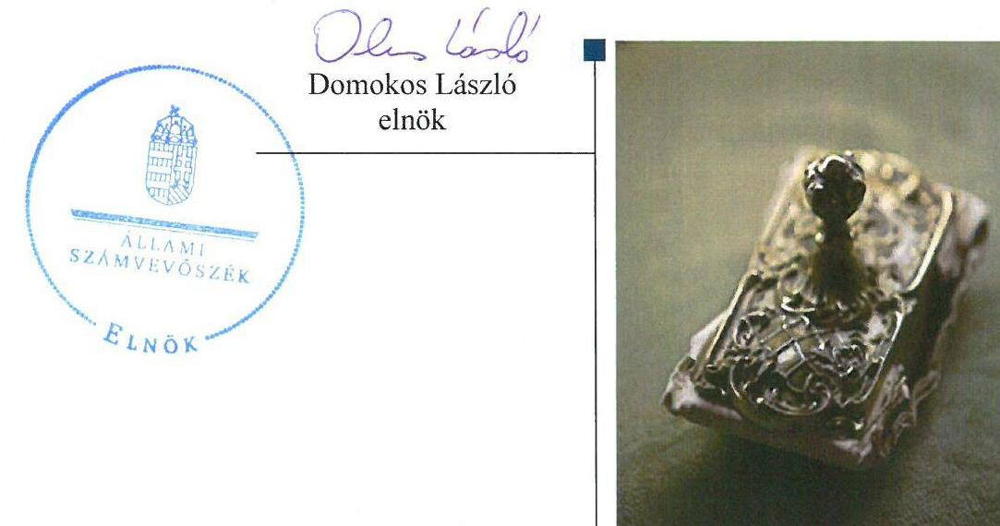

---

# AZ ELLENŐRZÉST FELÜGYELTE:

- BÖRÖCZ IMRE felügyeleti vezető

- AZ ELLENŐRZÉST VEZETTE ÉS A VÉGREHAJTÁSÁÉRT FELELŐS:
  - DR. SCHREIBER JUDIT ZSUZSANNA ellenőrzésvezető

- A PROGRAM ÖSSZEÁLLÍTÁSÁÉRT FELELŐS:
  - LAJTERNÉ HUDÁK MAGDOLNA osztályvezető

- IKTATÓSZÁM: V-0930-262/2016
- TÉMASZÁM: 1706.

- ELLENŐRZÉS-AZONOSÍTÓ SZÁM: V070907

Jelentéseink az Országgyűlés számítógépes hálózatán és az Interneten a www.asz.hu címen is olvashatóak.

---

# TARTALOMJEGYZÉK 

■ ÖSSZEGZÉS ..... 5
■ AZ ELLENŐRZÉS CÉLJA ..... 7
■ AZ ELLENŐRZÉS TERÜLETE ..... 8
■ AZ ELLENŐRZÉS HÁTTERE, INDOKOLTSÁGA ..... 9
■ FÓKUSZKÉRDÉSEK ..... 10
■ ELLENŐRZÉS HATÓKÖRE ÉS MÓDSZEREI ..... 11
■ MEGÁLLAPÍTÁSOK ..... 13
■ JAVASLATOK ..... 25
■ MELLÉKLETEK ..... 27
I. Sz. melléklet: Értelmező szótár. ..... 27
II. Sz. melléklet: A Gyógyfürdőkórház vagyonának megoszlása 2011-2014. években (adatok ezer Ft-ban) ..... 31
III. Sz. melléklet: A Gyógyfürdőkórház eredményének alakulása 2011-2014. években (adatok ezer Ft-ban) ..... 32
■ FÜGGELÉK: ÉSZREVÉTELEK ..... 33
■ RÖVIDÍTÉSEK JEGYZÉKE ..... 45

---

.

---

# ÖSSZEGZÉS 

Az Állami Számvevőszék a Zsigmondy Vilmos Harkányi Gyógyfürdőkórház Nonprofit Kft. vagyonmegőrzési és gazdálkodási tevékenységét a 2011. január 1. - 2014. december 31. közötti időszakra vonatkozóan ellenőrizte. A vagyonnal való gazdálkodás feltételeit az ellenőrzés első három évében hiányosan alakították ki. A vagyongazdálkodási tevékenységhez kapcsolódóan hiányosságokat tártunk fel a számviteli elszámolásoknál, a hitelfelvételnél, a leltározási szabályzat betartásánál, a közbeszerzési eljárás lefolytatásának kötelezettsége területén, valamint az adatszolgáltatási kötelezettség teljesítésénél.

## Az ellenőrzés társadalmi indokoltsága

Az állami tulajdonú gazdálkodó szervezetek a nemzeti vagyon részét képezik. Az állami vagyonnal való gazdálkodást illetően a tulajdonosi joggyakorlás és a vagyongazdálkodás feladata az állami vagyon átlátható, rendeltetésszerű és felelős felhasználásának biztosítása. Az állam meghatározza az ellátandó közszolgáltatásokkal kapcsolatos feladatokat, amelyhez a vagyonnal kapcsolatos döntéseknek igazodniuk kell.

## Főbb megállapítások, következtetések, javaslatok

A Gyógyfürdőkórház feletti tulajdonosi joggyakorló1,2 a vagyonnal való gazdálkodás feltételeit kialakította, azonban a 2013. évig a felügyelőbizottság létszámát három fő helyett hat főben határozta meg. A GYEMSZI, mint a Gyógyfürdőkórház használatában álló állami ingatlan feletti tulajdonosi joggyakorló, a vagyon-nyilvántartási szabályzatát nem alkotta meg, így az ingatlanra vonatkozó használati szerződésben nem rögzítették annak megismerését és kötelező érvényűségének elismerését.

A Gyógyfürdőkórház a vagyon értékének megőrzését, gyarapítását biztosító vagyongazdálkodás feltételeit a 2011-2013. években hiányosan alakította ki, az önköltségszámítás rendjére vonatkozó szabályzatkészítési kötelezettségnek 2013. áprilisáig nem tett eleget.

A vagyonváltozást eredményező döntések előkészítése és megalapozása a hitelfelvételekhez kapcsolódóan a 2012-2013. évek között nem volt szabályszerű. A 2012. és a 2013. évben egy-egy hitelfelvételről a tulajdonosi joggyakorló engedélye1,2 nélkül döntöttek. A 2011-2013. évek között több szerződéskötés esetén mellőzték a közbeszerzési eljárás lefolytatását, mellyel nem tartották be a közbeszerzésekről szóló törvény előírását.

A vagyon számviteli elszámolása során a Gyógyfürdőkórház tulajdonában álló ingatlanokat a főkönyvi nyilvántartásban nem tartották elkülönítetten nyilván, valamint a 2011. és a 2012. év végén - egy, a Gyógyfürdőkórháznak visszafizetésre nem kerülő kölcsön után - nem számoltak el értékvesztést.

A Gyógyfürdőkórház a beszámolási kötelezettségét teljesítette, azonban a 2011. éves beszámoló nem teljes körűen felelt meg a számviteli törvény előírásának. Az éves beszámolókat leltárral alátámasztották, azonban a leltározás végrehajtása nem felelt meg a Leltárkészítési és leltározási szabályzatban foglaltaknak.

A közérdekű adatok nyilvánossága, valamint az adatok védelme nem volt biztosított. A közérdekű adatok megismerésére irányuló igények teljesítésének rendjére vonatkozó szabályzatot, továbbá 2013. év márciusáig az adatbiztonsági és adatvédelmi szabályzatot nem készítették el. A Gyógyfürdőkórház az adatszolgáltatási kötelezettségének nem teljes körűen tett eleget, mert a használatában álló ingatlanhoz kapcsolódó adatszolgáltatást nem teljesítette.

A kormányzati szektor hiányára befolyást gyakorló bevételek és ráfordítások elszámolása megfelelő volt, azonban egy adósságot keletkeztető ügyletet az államháztartásért felelős miniszter előzetes engedélye nélkül kötöttek. A mérleg szerinti eredmény a 2011-2013. évben pozitív volt, azonban a 2014. évi negatív mérleg szerinti eredmény kedvezőtlenül befolyásolta a kormányzati szektor hiányának alakulását.

---

Az ÁSZ az Állami Egészségügyi Ellátó Központ főigazgatójának és a Gyógyfürdőkórház ügyvezetőjének fogalmazott meg javaslatokat, amelyek alapján kötelesek intézkedési tervet összeállítani és azt a jelentés kézhezvételétől számított 30 napon belül az ÁSZ részére megküldeni.

---

# AZ ELLENŐRZÉS CÉLJA 

## A Zsigmondy Vilmos Harkányi Gyógyfürdőkórház Nonprofit Kft. vagyonmegőrzési és vagyongazdálkodási tevékenysége szabályszerűségének ellenőrzése

Az Állami Számvevőszék alapvető célkitűzése, hogy az államháztartáson kívülre nyújtott költségvetési támogatások és ingyenes vagyonjuttatások ellenőrzésével hozzájáruljon ahhoz, hogy a közpénzeket az államháztartáson kívül működő szervezetek is átlátható módon használják fel a közfeladatok ellátása érdekében. Jelen ellenőrzés célja annak értékelése volt, hogy a tulajdonosi jogok gyakorlása szabályszerű volt-e, a Gyógyfürdőkórház ${ }^{1}$ által ellátott feladat bevételei, ráfordításai elszámolásának, és vagyongazdálkodási tevékenységének szabályozása megfelelt-e a jogszabályi és a tulajdonosi előírásoknak, azok végrehajtása szabályszerű volt-e. Biztosítva volt-e a közfeladatok átláthatósága és elszámoltathatósága érdekében a közszolgáltatás díjának megalapozottsága szabályszerű önköltségszámítással. Az ellenőrzés kiterjedt továbbá arra, hogy a vagyonváltozást eredményező döntések esetében a tulajdonosi jogok gyakorlója és a Gyógyfürdőkórház szabályszerűen járt-e el, továbbá, hogy a Gyógyfürdőkórház kiépített-e és működtetett-e információs rendszert a szabályszerű vagyongazdálkodás érdekében. A Gyógyfürdőkórháznak, mint kormányzati szektorba sorolt egyéb szervezet gazdálkodásának a kormányzati szektor hiányára és az államadósságra befolyással bíró elemei a jogszabályi előírásoknak megfeleltek-e.

---

# AZ ELLENŐRZÉS TERÜLETE

## Zsigmondy Vilmos Harkányi Gyógyfürdőkórház Nonprofit Kft.

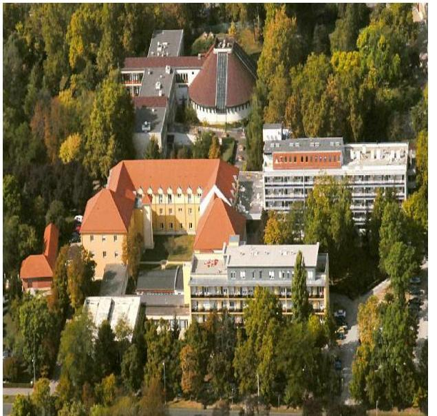

A Zsigmondy Vilmos Harkányi Gyógyfürdőkórház Nonprofit Kft. jogelődje a Zsigmondy Vilmos Harkányi Gyógyfürdőkórház Közhasznú Társaság, amely 2006. február 23-án alakult a Baranya Megyei Gyógyfürdőkórház szerződéses jogutódjaként.

A Gyógyfürdőkórház feletti tulajdonosi joggyakorló,2 2011. évben 60%-ban a Baranya Megyei Önkormányzat, 34%-ban a Paksi Atomerőmű és a Magyar Villamos Művek, valamint 6%-ban a Harkányi Dolgozói Kft.3 volt, mint közös tulajdonosok, a taggyűlésen keresztül.

2012. évtől az Átvételi tv.4 és a Tulajdonosi rend.5 előírásai alapján a Baranya Megyei Önkormányzat többségi tulajdoni részesedése átadásra került Magyar Államnak, aki a tulajdonosi jogait a Gyógyszerészeti és Egészségügyi Minőség- és Szervezetfejlesztési Intézeten keresztül gyakorolta.

A tulajdonosi joggyakorló,6 2012. évtől 60%-ban a Gyógyszerészeti és Egészségügyi Minőség- és Szervezetfejlesztési Intézet, 34%-ban a Paksi Atomerőmű és a Magyar Villamos Művek, 6%-ban pedig a Harkányi Dolgozói Kft. volt, mint közös tulajdonosok, a taggyűlések keresztül.

Az ellenőrzött időszakon belül, 2013. márciusban változott az ügyvezető személye.

A Gyógyfürdőkórház fő feladata az egészségügyi fekvőbeteg- és járóbeteg szakellátás, melyet az Országos Egészségbiztosítási Pénztárral finanszírozási szerződés keretében, valamint a Pécsi Tudományegyetemmel kötött közreműködői szerződés alapján látnak el.

A szakellátáson felül jelentős a Harkányi Gyógyvíre épülő fürdőgyógyászati ellátások köre, amelyet finanszírozott és térítéses formában nyújt a Gyógyfürdőkórház a dél-dunántúli régió betegei számára gyógykezelési és rehabilitációs szolgáltatások keretében.

A Gyógyfürdőkórház 2014. évi beszámolója szerint a bevétele 1623,9 M Ft, a mérleg főösszege 6430,6 M Ft, az ingatlanvagyona 3830,0 M Ft-ot tett ki. Az átlaglétszám a 2014. év végén 270 fő volt.

---

# AZ ELLENŐRZÉS HÁTTERE, INDOKOLTSÁGA 

## Zsigmondy Vilmos Harkányi Gyógyfürdőkórház Nonprofit Kft.

A téma kiemelt közérdeklődésére tekintettel, az ÁSZ ${ }^{7}$ stratégiájában meghatározott célokkal összhangban, az ellenőrzésünkkel a Zsigmondy Vilmos Harkányi Gyógyfürdőkórház Nonprofit Kft. átlátható, szabályszerű vagyonmegőrzési és gazdálkodási tevékenységét értékeltük.

Az ellenőrzés rámutathat az államháztartásból származó források felhasználásával kapcsolatos jó gyakorlatokra és szabálytalanságokra. Felhívhatja a figyelmet a jogszabályi követelmények teljesítéséhez szükséges feltételek hiányosságaira, hozzájárulhat az államháztartáson kívüli, de (közvetlenül vagy közvetve) állami vagyont használó gazdálkodó szervezetek tevékenységének átláthatóságához.

Az ellenőrzés megállapításai alapján - az észlelt problémák, szabálytalanságok, vagy egyéb nem kívánatos jelenségek felszínre kerülésével meghatározhatóvá válnak a költségvetési hiányt befolyásoló szervezetek kockázatai, lehetővé válik ezen kockázatok csökkentése. Az ellenőrzés megállapításai a jogalkotás számára segítséget nyújthatnak az államháztartáson kívüli közfeladat-ellátás, közvagyonnal való gazdálkodás értékeléséhez, jogszabályi keretei pontosításához, az átláthatóságot biztosító szabályozáshoz.

Az ellenőrzött számára visszajelzést ad a gazdálkodási tevékenységgel, az állami vagyon felhasználásával és az éves elszámolással kapcsolatos szabálytalanságokról és kockázatokról. Az ellenőrzés tapasztalatai segítik és erősítik az ÁSZ hozzáadott értéket teremtő elemző tevékenységét és tanácsadó szerepét.

A kormányzati szektorba sorolt, költségvetési tervezésbe is bevont gazdálkodó szervezetek ellenőrzése fokozza a legfőbb ellenőrző szerv iránti figyelmet és közbizalmat. Az ellenőrzésünkkel feltárjuk, hogy a Zsigmondy Vilmos Harkányi Gyógyfürdőkórház Nonprofit Kft., mint a kormányzati szektorba sorolt egyéb szervezet, milyen mértékben befolyásolja a költségvetési hiányt és az államadósságot.

A Gyógyfürdőkórház a 2012. évtől kormányzati szektorba sorolt egyéb szervezet, így gazdálkodása hatással van az államadósság alakulására is.

Az Áht. ${ }^{8}$ 2. § I) pontja, az Európai Közösséget létrehozó szerződéshez csatolt, a túlzott hiány esetén követendő eljárásról szóló jegyzőkönyv alkalmazásáról szóló 2009. május 25-i 479/2009/EK rendelet szerint, illetve az ESA95 statisztikai módszertana alapján a kormányzati szektorba tartoznak a "központi kormányzat alszektorba besorolt társaságok és egyéb szervezetek" is, amelyekkel szemben alapvető követelmény, hogy gazdálkodásuk, működésük szabályszerű, az általuk szolgáltatott adatok megbízhatóak legyenek. A nemzeti számlák nemzetközi és hazai statisztikai módszertana és szabványai elveket határoznak meg a statisztikai értelemben vett kormányzati szektorba tartozó szervezetek körére és besorolásuk módjára.

---

# FÓKUSZKÉRDÉSEK 

1.     - A tulajdonosi jogok gyakorlója szabályszerűen alakította-e ki a Gyógyfürdőkórház tulajdonában, illetve kezelésében lévő vagyonnal való gazdálkodás feltételeit?
2.     - A Gyógyfürdőkórház az állami vagyon értéke megőrzését és gyarapítását biztosító vagyongazdálkodási tevékenységét szabályozta-e, illetve kialakította-e a vagyonnyilvántartást a jogszabályi és tulajdonosi előírásnak megfelelően?
3.     - Szabályszerű, illetve a tulajdonosi előírásnak megfelelő volt-e a Gyógyfürdőkórház által ellátott közfeladat bevételei és ráfordításai elszámolása, valamint az önköltségszámítás?
4. A vagyonnal való gazdálkodás, valamint a tulajdonosi jogok gyakorlója és a Gyógyfürdőkórház által meghozott, vagyonváltozást eredményező döntések a jogszabályi és a tulajdonosi előírásoknak megfeleltek-e?
5. A szabályszerű vagyongazdálkodás érdekében a Gyógyfürdőkórház teljesítette-e a beszámolási, adatszolgáltatási kötelezettségét, kiépítette-e illetve működtetett-e információs rendszert?
6. A Gyógyfürdőkórház, mint kormányzati szektorba sorolt egyéb szervezet gazdálkodásának a kormányzati szektor hiányára és az államadósságra befolyással bíró elemei a jogszabályi előírásoknak megfeleltek-e?

---

# ELLENŐRZÉS HATÓKÖRE ÉS MÓDSZEREI 

## Az ellenőrzés típusa

Szabályszerűségi ellenőrzés

## Az ellenőrzött időszak

2011. január 1. - 2014. december 31. közötti időszak

## Az ellenőrzés tárgya

Az állami tulajdonban (résztulajdonban) lévő gazdálkodó szervezetek vagyonmegőrzési és gazdálkodási tevékenységének ellenőrzése, valamint a kormányzati szektor hiányára és adósságállományára hatást gyakorló elemek ellenőrzése.

## Az ellenőrzött szervezet

Zsigmondy Vilmos Harkányi Gyógyfürdőkórház Nonprofit Kft., valamint a Gyógyszerészeti és Egészségügyi Minőség- és Szervezetfejlesztési Intézet. A GYEMSZI ${ }^{9}$ elnevezése 2015. március 1-jétől Állami Egészségügyi Ellátó Központra változott.

## Az ellenőrzés jogalapja

Az ellenőrzés alapja az Állami Számvevőszékről szóló 2011. évi LXVI. törvény 5. § (3)-(5) bekezdése, valamint az állami vagyonról szóló 2007. évi CVI. törvény 3. § (4) bekezdése.

## Az ellenőrzés módszerei

Az ellenőrzés az INTOSAI ${ }^{10}$ által kiadott nemzetközi standardok figyelembe vételével, az ÁSZ
 ellenőrzés szakmai szabályait tartalmazó belső szabályzatokban foglaltak, valamint az ellenőrzési programokban foglalt értékelési szempontok szerint történik. A bevételek és ráfordítások elszámolása, valamint a vagyonnyilvántartás terén a szabályszerű működést mintavétellel ellenőriztük. A Gyógyfürdőkórháznál, mint a kormányzati szektorba sorolt szervezetek esetében a személyi jellegű ráfordítások elszámolása mellett az egyéb ráfordítások, pénzügyi műveletek ráfordításai, rendkívüli ráfordítások, illetve az egyéb bevételek, pénzügyi műveletek bevételei, rendkívüli

---

bevételek elszámolásának szabályszerűségét szintén mintatételeken keresztül ellenőriztük. A véletlen mintavétellel (évenkénti elemszámmal arányos rétegezéssel) ellenőrzött területek esetében minden egyes tétel vonatkozásában a szabályszerűségre vonatkozó kérdéseket tettünk fel, amelyek eredménye összesítésre került. A jogszabályoknak és a belső előírásoknak megfelelőnek tekintettük az adott területet, amennyiben a minta ellenőrzésének eredménye alapján 95%-os bizonyossággal a teljes sokaságban a hibaarány kisebb volt, mint 10%, nem megfelelőnek értékeltük, ha a hibaarány a 10%-ot meghaladta. A személyi jellegű ráfordítások esetében az ellenőrzött mintatételeket értékeltük. A ráfordítások elszámolására és a vagyon-nyilvántartásra vonatkozó véletlen mintavételt kockázati alapú kiválasztással egészítettük ki, amelynek során évente a három legnagyobb összegű tételt választottuk ki.

---

# 1. A tulajdonosi jogok gyakorlója szabályszerűen alakította-e ki a Gyógyfürdőkórház tulajdonában, illetve kezelésében lévő vagyonnal való gazdálkodás feltételeit? 

Összegző megállapítás

1.1. számú megállapítás

A tulajdonosi joggyakorló $_{1,2}$ a vagyonnal való gazdálkodás feltételeit - az FB létszámának meghatározása kivételével - szabályosan alakította ki.

A tulajdonosi joggyakorló $_{1,2}$ a Gyógyfürdőkórház felelős vagyongazdálkodás szükséges követelményeit kialakította, azonban a 2013. évig az FB létszámát három fő helyett hat főben határozta meg, amely nem felelt meg a törvényi előírásnak.

A Gyógyfürdőkórház feletti társasági tulajdonosi joggyakorló; a 2011. évben 60%-ban a Baranya Megyei Önkormányzat, 34%-ban a Paksi Atomerőmű és az MVM$^{12}$, 6%-ban a Harkányi Dolgozói Kft., mint közös tulajdonosok voltak, a tulajdonosi jogaikat a taggyűlésen$^{13}$ keresztül gyakorolták.

A Baranya Megyei Önkormányzat 60%-os tulajdonrésze a 2012. évtől a Magyar Állam tulajdonába került, a tulajdonosi jogait a GYEMSZI-n keresztül gyakorolta. A 2012. évtől a tulajdonosi joggyakorló$_2$ 60%-ban a GYEMSZI, 34%-ban a Paksi Atomerőmű és az MVM, 6%-ban a Harkányi Dolgozói Kft. lett, a tulajdonosi jogokat a taggyűlésen keresztül gyakorolták.

A TULAJDONOSI JOGGYAKORLÁS keretében a vagyonnal való gazdálkodásra vonatkozó jogokat, illetve a felelős gazdálkodáshoz szükséges követelményeket a tulajdonosi joggyakorló$_{1,2}$ a Társasági szerződésben$^{14}$ határozta meg.

A Társasági szerződés 7.4. pontja rögzítette a tulajdonos számára fenntartott, a taggyűlés hatáskörébe tartozó jogokat, többek között a Számv. tv.$^{15}$ szerinti beszámoló elfogadását, az üzleti terv, valamint olyan szerződések megkötésének jóváhagyását, amelyek szerződési értéke a törzstőke összegének 50%-át meghaladta, továbbá minden olyan éven túli hitel és kölcsön felvételéről, értékpapír megvásárlásáról való döntést, amelynek összege meghaladta a törzstőke összegének felét. A taggyűlés hatáskörébe tartozott továbbá az SZMSZ$^{16}$, a Számviteli Politika$^{17}$ és a belső szabályzatok jóváhagyása.

A Társasági szerződés 7-9. pontjai tartalmazták a vagyonnal való felelős gazdálkodáshoz szükséges követelményeket, meghatározták a taggyűlés, az FB, a könyvvizsgáló és az ügyvezető jogait, hatáskörét, feladatait, illetve a közérdek érvényesülését biztosító vagyongazdálkodás érdekében az üzletszerű gazdasági tevékenység korlátait, a nyereség felosztásának tilalmát.

---

### 1.2. számú megállapítás

Az alapításkor rendelkezésre bocsátott tőkével és a gazdálkodás során szerzett vagyonnal biztosították a feladatellátás vagyoni hátterének megteremtését, a gazdálkodás alapvető feltételeit.

A tulajdonosi joggyakorló$_{1,2}$ 2013. április 4-ig a Gyógyfürdőkórház FB létszámát a Takarékossági tv.$^{18}$ 4. § (2) bekezdésében foglaltaktól eltérően három fő helyett hat taggal határozta meg.

# A Gyógyfürdőkórház használatában lévő ingatlanra vonatkozó használati szerződés nem felelt meg teljes körűen a Vhr.$^{19}$ előírásainak. 

A Gyógyfürdőkórház használatában állt egy Harkányi 885 m$^2$ „egészségügyi egység” „A” épület megnevezésű ingatlan az Önkormányzattal$^{20}$ kötött használati szerződés alapján.

Az ingatlan az Átvételi tv. alapján 2012. január 1-jével az önkormányzati tulajdonból állami tulajdonba került, a tulajdonosi jogokat a Tvt.$^{21}$ 13. § (1) bekezdése alapján a Magyar Állam nevében a GYEMSZI gyakorolta. Az ingatlant a GYEMSZI a Gyógyfürdőkórház használatába adta, az erre vonatkozó szerződést a 2013. március 29-én kötötték meg 2012. május 1-jei hatállyal. Ez a jogi megoldás (visszamenőleges hatályú vagyonkezelési szerződés) magas kockázatot hordozott az állami vagyon védelme és a felelős gazdálkodás terén.

Az Ingatlan-használati Szerződésben$^{22}$ a Vtv.$^{23}$ 23. § (2) bekezdésével összhangban követelményként előírták az állami vagyon hatékony működtetését, állagának védelmét, értékének megőrzését, illetve gyarapítását. A szerződésben meghatározták a használatba adott állami vagyont, a felek jogait és kötelezettségeit, a GYEMSZI ellenőrzési jogosultságát. Előírták az ingatlanhoz kapcsolódó elkülönített nyilvántartási és adatszolgáltatási kötelezettséget.

Az Ingatlan-használati Szerződésben a Vhr. 20. § (1) bekezdés előírásával ellentétben nem rögzítették, hogy a GYEMSZI ellenőrzési eljárásrendjét a felek a szerződés részének tekintik, továbbá a Vhr. 14. § (3) bekezdése ellenére 2014. március 15-ét követően nem rögzítették a GYEMSZI vagyonnyilvántartási szabályzatának megismerési kötelezettségét és kötelező érvényének elismerését.

## A GYEMSZI, mint a használatba adott állami ingatlan feletti tulajdonosi joggyakorló nem alkotta meg a vagyon-nyilvántartási szabály-

zatát.

A Vhr. 14. § (1) bekezdése alapján a Gyógyfürdőkórházat, mint állami vagyon használóját 2014. március 15-től adatszolgáltatási kötelezettség terhelte, melyet a használatba adott állami ingatlan feletti tulajdonosi joggyakorló GYEMSZI vagyon-nyilvántartási szabályzata alapján volt köteles teljesíteni.

A Vhr. 14. § (3) bekezdése 2014. március 15-től írja elő, hogy a tulajdonosi joggyakorlónak vagyonnyilvántartási szabályzattal kell rendelkeznie, ennek ellenére a GYEMSZI vagyonnyilvántartási szabályzatot nem készített, továbbá nem határozta meg az adatszolgáltatás részletes tartalmát, formáját.

---

# 2. A Gyógyfürdőkórház az állami vagyon értéke megőrzését és gyarapítását biztosító vagyongazdálkodási tevékenységét szabályozta-e, illetve kialakította-e a vagyonnyilvántartást a jogszabályi és tulajdonosi előírásnak megfelelően? 

Összegző megállapítás

A vagyon értékmegőrzését és gyarapítását biztosító vagyongazdálkodási tevékenységhez szükséges szabályozási környezetet a 2013. évig hiányosan alakították ki. A leltározás végrehajtása, továbbá az ellenőrzés első két évében az értékvesztés elszámolása nem volt szabályszerű.
2.1. számú megállapítás

A vagyon értékmegőrzését, gyarapítását biztosító szabályszerű vagyongazdálkodás feltételeit a 2013. évig hiányosan alakították ki.

A Gyógyfürdőkórháznak vagyongazdálkodási stratégia készítési kötelezettsége nem volt, a vagyongazdálkodással kapcsolatos terveket és feladatokat, a kórházszintű stratégiákat, a szakmai tevékenységet, a tervezési irányelveket, a főbb tervszámokat és azok elemzését, valamint az előirányzott felújításokat és beruházásokat az üzleti tervekben határozták meg. Az üzleti terveket a taggyűlés minden évben határozatokkal elfogadta.

A cégvezetés felelősségét, valamint a közérdek érvényesülését biztosító vagyongazdálkodás feltételeit a Vtv. 30. § (1) bekezdésével összhangban az SZMSZ-ben meghatározták.

A vagyonnal való szabályos gazdálkodás kialakításához szükséges szabályzatok közül a Gyógyfürdőkórház 2011. január 1-jétől május 10-ig a Számv. tv. 14. § (3) és (11) bekezdése ellenére nem rendelkezett Számviteli Politikával, 2011. május 10-ig nem készítették el a Számv. tv. 161. § (5) bekezdésében előírt számlarendet, a Számv. tv. 14. § (5) bekezdés c) pontja ellenére 2013. március 31-ig nem rendelkeztek Önköltségszámítási Szabályzattal$^{24}$, továbbá a Számv. tv. 14. § (5) bekezdés d) pontja ellenére 2011. szeptember 30-ig nem készítették el a Pénzkezelési Szabályzatot$^{25}$.

A 2011. május 10-én kiadott Számviteli Politika megfelelt a Számv. tv. 14. § (3)-(4) bekezdései előírásainak. A kiadott Számlarend$^{26}$ összhangban volt a Számviteli Politikával.

A Pénzkezelési Szabályzatot 2011. október 1-jével adták ki. A szabályzat aktualizálása 2014. január 1-i hatállyal megtörtént.

A Leltárkészítési és leltározási szabályzatot$^{27}$ a Számv. tv. 14. § (5) bekezdés a) pontja alapján elkészítették, meghatározták a leltározásra vonatkozó előírásokat, amelyek összhangban voltak a Számv. tv. 69. § (3) bekezdésében foglaltakkal, a szabályzatban a mennyiségi leltárfelvételre a 2012. január 1-től hatályos Számv. tv. 69. § (3) bekezdésében foglalt előírásnál szigorúbb, évenkénti leltározási kötelezettséget írtak elő.

A Számv. tv. 14. § (5) bekezdés b) pontjának megfelelően rendelkeztek Értékelési Szabályzattal, amelynek aktualizálása 2014. január 1-jén történt meg. A Selejtezési Szabályzatot 2012. augusztus 1-jén aktualizálták.

---

A Gyógyfürdőkórház 2013. március 31-ig a Kbt.$^{28}$ 6. § (1) bekezdésében és a Kbt.$^{29}$ 22. § (1) bekezdésében foglaltak ellenére Közbeszerzési Szabályzattal nem rendelkezett. A 2013. április 1-i hatállyal kiadott Közbeszerzési Szabályzat megfelelt a Kbt.$^{2}$ előírásainak.

A vagyongazdálkodással kapcsolatos feladat- és hatásköröket, felelősségi viszonyokat az SZMSZ-ben meghatározták, rögzítették a vagyongazdálkodással kapcsolatos jogokat, a Selejtezési Szabályzatban$^{30}$ meghatározták a szabályszerű végrehajtásért felelős személyeket, a Pénzkezelési Szabályzatban az illetékes dolgozókat, a Leltárkészítési és leltározási szabályzatban a közreműködők felelősségét és feladatait.
2.2. számú megállapítás

A vagyon számviteli nyilvántartása során a 2011. és a 2012. év végén az értékvesztés elszámolásához kapcsolódóan nem tartották be a Számv. tv. előírását. A leltározás nem felelt meg a Leltárkészítési és leltározási Szabályzatban előírtaknak.

A Gyógyfürdőkórháznál apportált és vagyonkezelésbe átadott állami vagyon nem volt. Egy ingatlan tekintetében a Gyógyfürdőkórház állami vagyon használója volt. A használatba vett ingatlanon végzett beruházások értékét elkülönítetten, a Számv. tv. 23. § (3) bekezdésének megfelelően tartották nyilván.

A Gyógyfürdőkórház a 2014. év végén 3830,0 M Ft ingatlanvagyont mutatott ki a számviteli nyilvántartásában.

A 2012. évben a HEFOP$^{31}$ beruházás elszámolása során, az épületeken aktivált 1250,4 M Ft összegből 865,3 M Ft elkülönítésre került a bérelt ingatlanon történt beruházások főkönyvi számlára. A Gyógyfürdőkórház elkülönítést alátámasztó kimutatással nem rendelkezett, a pályázati összeggel elszámolt.

A Gyógyfürdőkórháznak részesedése nem volt, a befektetett eszközökön belül a dolgozók részére folyósított, hosszú lejáratú lakásvásárlási kölcsönök kerültek kimutatásra. A befektetett pénzügyi eszközök értékelése megfelelt a Számv. tv. 57. § (1) bekezdésében előírtaknak.

A 2011-2012. évek között értékvesztés elszámolására nem került sor. A 2011. évben a Gyógyfürdőkórház egy Kft.-nek kölcsönt nyújtott 12,5 M Ft összegben, amelynek visszafizetése a lejárati határidőig nem történt meg. A kölcsön törlesztésére a 2014. év végéig sem került sor. Az Értékelési Szabályzat$^{32}$ 5.2./b. pontja ellenére a 2011-2012. években az adós év végi minősítése alapján a kölcsön összegre értékvesztést nem számoltak el, amellyel nem tartották be a Számv. tv. 55. § (1) bekezdésében foglalt, az értékvesztés elszámolására vonatkozó kötelezettséget. A 2013. és a 2014. év végén az értékvesztés elszámolása a Számv. tv. 55-56. §-ai előírásával összhangban történt.

A Gyógyfürdőkórház a 2011-2014. évek között nem tartotta be a Leltárkészítési és leltározási szabályzatban előírt évenkénti - mennyiségi leltárfelvétellel történő - leltározási kötelezettséget. A Leltárkészítési és leltározási szabályzatában a 2012. évtől hatályos Számv. tv. 69. § (3) bekezdésében foglalt három évenkénti mennyiségi leltározásnál szigorúbb, évenkénti mennyiségi felvétellel történő leltárfelvételt írtak elő.

A 2011-2012. években az ingatlanok, a 2013-2014. években a műszaki berendezések, gépek, járművek mennyiségi leltározását nem hajtották végre, ezzel megsértették a Leltárkészítési és leltározási szabályzat 5.1.A/II.

---

pontját, amely szerint az ingatlanokat, a gépeket, berendezéseket és járműveket évenként mennyiségi leltárfelvétellel
 kellett leltározni.

# 3. Szabályszerű, illetve a tulajdonosi előírásnak megfelelő volt-e a Gyógyfürdőkórház által ellátott közfeladat bevételei és ráfordításai elszámolása, valamint az önköltségszámítás? 

Összegző megállapítás

A közfeladatok bevételeinek és ráfordításainak elszámolása összességében megfelelő volt. Az Önköltségszámítási szabályzatot a 2013. évig nem készítették el.

### 3.1. számú megállapítás

A közfeladatok árbevételeit elkülönítetten tartották nyilván, a bevételek és ráfordítások elszámolása összességében megfelelő volt.

A Gyógyfürdőkórház a közfeladatok ellátásával kapcsolatos árbevételek elkülönített nyilvántartását a Számlarendben külön főkönyvi számlák kijelölésével írta elő.

Az árbevételek elszámolása megfelelt a Számlarend előírásainak, a közfeladathoz kapcsolódó bevételeket elkülönített főkönyvi számlán tartották nyilván.

Az egyéb bevételek, pénzügyi műveletek bevételei és rendkívüli bevételek számviteli elszámolása összhangban volt a Számv. tv. előírásaival, az elszámolások a megfelelő költséghelyekre történtek. A 2012. évben összesen 0,3 M Ft összeg tekintetében nem rendelkeztek az elkülönítést alátámasztó kimutatással. Az elszámolások kamatelszámoláshoz, téves könyveléshez, valamint átvezetéshez kapcsolódtak.

A ráfordítások elszámolása a megfelelő főkönyvi számlán történt, az elszámolást megalapozó kötelezettségvállalások rendelkezésre álltak, az elszámolások megfeleltek a Számv. tv. előírásainak.

Az Értékelési Szabályzatban a Számv. tv. 52. § (2) bekezdésével, az 53. §-ával és a 80. §-ával összhangban meghatározták az egyes eszközcsoportokra vonatkozó értékcsökkenési leírási kulcsokat, az értékcsökkenési leírás elszámolása megfelelő volt.

Az eszközök pótlása, felújítása a 2011-2014. években megvalósult, a tárgyévi elszámolt beruházások összege minden évben meghaladta a tárgyévi értékcsökkenések összegét. A Gyógyfürdőkórház tulajdonában lévő ingatlanok és egyéb berendezések, felszerelések átlagos elhasználódási foka a 2012. évi 40,4%-ról a beruházások következtében a 2014. évre 17,5%-ra csökkent. Az eszközök átlagos életkora - a 2011-2012. évi emelkedést követően - a beruházások miatt javulást mutatott, a 2011. évi 14,5 évvel szemben a 2014. évre 5,7 évre csökkent.

A kintlévőségek kezelése tekintetében az Értékelési Szabályzat 5. pontjában előírták a behajtás eljárásrendjét. Azon vevők esetén, ahol a követelés összege az 1,0 M Ft-ot meghaladta, a leíráshoz szükséges döntést a tulajdonosi joggyakorló ${ }_{1,2}$ hatáskörébe utalták. A Gyógyfürdőkórház

---

a 2011-2014. évek között jelentős kintlévőséggel rendelkezett. A hátralékos követelésállomány csökkenése érdekében a hatályos Értékelési Szabályzat szerint a kintlévőségek behajtására jogi képviselőt bíztak meg. A behajthatatlan követelések leírása megfelelt a Számv. tv. 65. § (7) bekezdésében foglalt kötelezettségnek.

A kintlévőségek összege a 2011. évi 312,6 M Ft-ról a 2014. évre 291,1 M Ft-ra mérséklődött, azonban a vevő követelések összege a 2011. évi 238,0 M Ft-ról a 2014. évre 269,9 M Ft-ra növekedett. A határidőn túli követelések 2012. évi 48,2 M Ft-ról 2013. évre 72,6 M Ft-ra nőttek. A 2014. évre a határidőn túli követelések állománya 24,0 M Ft-ra csökkent.

# 3.2. számú megállapítás 

Az Önköltségszámítás rendjére vonatkozó szabályzatot 2013. áprilisáig nem készítették el.

A Gyógyfürdőkórház az OEP ${ }^{33}$-pel kötött finanszírozási szerződés alapján fekvő- és járóbeteg-ellátást, valamint a közfeladat ellátás segítése érdekében egyéb szolgáltatási tevékenységet végzett.

Önköltségszámítás rendjére vonatkozó szabályzatkészítési kötelezettségének a Gyógyfürdőkórház a Számv. tv. 14. § (5) bekezdés c) pontja ellenére 2013. március 31-ig nem tett eleget. Ezen időpontig a végzett szolgáltatások önköltségét nem állapították meg.

A 2013. április 1-jei hatállyal kiadott Önköltségszámítási szabályzat tartalmazta a közvetett és közvetlen költségek meghatározását és a felosztás vetítési alapját.

A 2014. január 1-jével kiadott aktualizált Önköltségszámítási szabályzat az 5-ös számlaosztály használatán felül a költségek elkülönítésére a 6-os és a 7-es számlaosztályt jelölte ki, ahol a költséghelyek és költségviselők szerinti csoportosítást előírták. A szabályzat alapján történt elszámolás biztosította az önköltség megállapítást.

A 2011-2014. években a fekvő- és járóbeteg-ellátás OEP finanszírozású árait az 5/2004 (XI.19.) EüM rendelet ${ }^{34}$ 8. melléklet A) pontja alapján határozták meg.

---

# 4. A vagyonnal való gazdálkodás, valamint a tulajdonosi jogok gyakorlója és a Gyógyfürdőkórház által meghozott, vagyonváltozást eredményező döntések a jogszabályi és a tulajdonosi előírásoknak megfeleltek-e? 

Összegző megállapítás

## 4.1. számú megállapítás

A tulajdonosi joggyakorló1,2 vagyonváltozást eredményező döntései szabályosak voltak. A Gyógyfürdőkórház vagyonváltozást eredményező döntései a hitelfelvételekhez kapcsolódóan a 2012-2013. évek között nem voltak szabályszerűek, több szerződéskötés esetén mellőzték a közbeszerzési eljárás lefolytatását.

A vagyongazdálkodási tevékenységet a jogszabályi rendelkezések és a belső szabályzatok előírásainak megfelelően végezték.

A Gyógyfürdőkórház eszközeinek és forrásainak mérlegfőösszege a 2011. évről a 2014. évre 23,1%-kal, 5223,7 M Ft-ról 6430,6 M Ft-ra nőtt.

A vagyonstruktúra tekintetében az eszköz oldalon nem történt jelentős átrendeződés. Az eszközök között - a beruházások és felújítások következtében - a befektetett eszközök képviselték a legnagyobb arányt, melynek növekedése az összes eszközön belül 10,1 százalékpont volt.

1. táblázat

ESZKÖZÖK ALAKULÁSA

|  | 2011.-12. 31. |  | 2014.-12. 31. |  | Változás   százalékpont |
| :-- | :--: | :--: | :--: | :--: | :--: |
|  | M Ft | $\%$ | M Ft | $\%$ |  |
| Befektetett eszközök | 3916,3 | 75,0 | 5475,6 | 85,1 | 10,1 |
| Forgóeszközök | 1025,7 | 19,6 | 676,7 | 10,5 | $-9,1$ |
| Aktív időbeli elhatárolások | 281,7 | 5,4 | 278,3 | 4,4 | $-1,0$ |
| Eszközök összesen | 5223,7 | 100,0 | 6430,6 | 100,0 |  |

A befektetett eszközök értéke a 2011. év végi 3916,3 M Ft értékről 5475,6 M Ft-ra nőtt a 2014. év végére. A befektetett eszközökön belül a legnagyobb arányt a tárgyi eszközök képviselték, amelyek értéke a végrehajtott beruházások és felújítások hatására 3841,4 M Ft-ról 2014. év végére 5427,9 M Ft-ra nőtt a 2011. év végi értékhez képest.

A forgóeszközök értéke a 2011. év végi 1025,7 M Ft-ról a 2014. év végére 676,6 M Ft-ra csökkent, amit a készletek 3,3 M Ft-os, a követelések állományának 21,5 M Ft-os, valamint a pénzeszközök állományának 324,3 M Ft-os csökkenése okozott.

A 2011. évi saját tőke a 2057,2 M Ft-ról 2068,5 M Ft-ra változott.

---

4. táblázat

## KARBANTARTÁSI KÖLTSÉGEK

|  |   |   |   |   |
| --- | --- | --- | --- | --- |
|  Évek | M.Ft |  |  |   |
|  2011. | 21,4 |  |  |   |
|  2012. | 22,3 |  |  |   |
|  2013. | 21,6 |  |  |   |
|  2014. | 42,1 |  |  |   |

Forrás: Gyógyfürdőkórház 2011-2014. évi beszámolói 2. táblázat

## SAJÁT TŐKE, JEGYZETT TŐKE, MÉRLEG SZERINTI EREDMÉNY (M FT)

|   | 2011. 12. 31. | 2012. 12. 31. | 2013. 12. 31. | 2014. 12. 31.  |
| --- | --- | --- | --- | --- |
|  Saját tőke | 2057,2 | 2071,2 | 2071,9 | 2068,5  |
|  Jegyzett tőke | 200,0 | 200,0 | 200,0 | 200,0  |
|  Mérleg szerinti eredmény | 4,4 | 14,0 | 0,7 | $-3,5$  |

Forrás: Gyógyfürdőkórház 2011-2014. évi beszámolói

A forrás oldalon a passzív időbeli elhatárolások értéke jelentősen, 1546,0 M Ft-tal nőtt, aránya 18,0%-ról 38,6%-ra változott. A kiemelkedő emelkedését a támogatásokkal összefüggő halasztott bevételek okozták.

A folyósított, halasztott bevételként elszámolt támogatások jelentős mértékben, a 2011. évi 918,9 M Ft-ról a 2014. évre 2481,8 M Ft-ra emelkedtek. Itt azok a pályázati pénzek jelentek meg, amelyek a Gyógyfürdőkórház részére kifizetésre kerültek, de költségként való elszámolásuk később, a hozzá kapcsolódó tárgyi eszközök értékcsökkenésének elszámolásával egy időben kerültek feloldásra, az időbeli elhatárolások közül a költségek tényleges felmerülésekor kerülnek átvezetésre az egyéb bevételek közé.

A saját tőke aránya a forrásokon belül 39,4%-ról 32,2%-ra csökkent. 3. táblázat

|  |   |   |   |   |
| --- | --- | --- | --- | --- |
|   | 2011. 12. 31. |  | 2014. 12. 31. |   |
|   | M.Ft | $\%$ | M.Ft | $\%$  |
|  Saját tőke | 2057,2 | 39,4 | 2068,5 | 32,2  |
|  Céltartalékok | 13,1 | 0,3 | 74,9 | 1,2  |
|  Kötelezettségek | 2213,7 | 42,3 | 1801,5 | 28,0  |
|  Passzív időbeli elhatá- | 939,7 | 18,0 | 2485,7 | 38,6  |
|  rolások |  |  |  |   |
|  Források összesen | 5223,7 | 100,0 | 6430,6 | 100,0  |

Forrás: Gyógyfürdőkórház 2011-2014. évi beszámolói

Az eszközök karbantartásáról, állagmegóvásáról gondoskodtak. Az üzleti tervek minden évben tartalmazták a karbantartásokra előirányzott összegeket. A rendszeresen felmerült karbantartási munkák elvégzésére keretszerződéseket kötöttek, az eseti karbantartási igényeket a felmerüléskor bírálták és végeztették el. A karbantartási költségek a főkönyvi nyilvántartásokban eszközcsoportonként kerültek kimutatásra.

A Gyógyfürdőkórház vagyonkezelésébe átvett állami vagyon nem volt, így a Vtv. 33. § (1) bekezdés szerinti állami vagyon tulajdonjogának átruházására, a Vtv. 34. § (1) bekezdés szerinti értékesítésére, valamint a Vtv. 36 § (1) bekezdés szerinti ingyenes átruházására nem került sor, visszapótlási kötelezettség nem keletkezett.

A Gyógyfürdőkórház az ellenőrzött időszakban egy öt éven túli - fejlesztési hitellel rendelkezett, amelyet egy korábbi hitel kiváltása érdekében, a likviditás megőrzése céljából vettek fel. A felvett hitel törlesztését 2013. március 31-én kezdték meg, a 2014. év végén fennálló tőketartozás 5123051 EUR, az évi törlesztő részlet 143,4 M Ft volt. A hitel árfolyam és likviditási kockázatot hordoz.

---

### 4.2. számú megállapítás

A Gyógyfürdőkórház vagyonváltozást eredményező döntései a hitelfelvételekhez kapcsolódóan a 2012-2013. évek között nem voltak szabályszerűek. Több szerződéskötés esetén mellőzték a közbeszerzési eljárás lefolytatását.

A vagyongazdálkodási döntések tekintetében a Társasági Szerződés 7.4. pontja rögzítette azon döntések körét, amelyekben taggyűlési jóváhagyásra volt szükség. A taggyűlés kétharmados hatáskörébe rendelte az olyan szerződések megkötésének jóváhagyását, amelynek szerződési értéke a törzstőke összegének 50%-át (100,0 M Ft) meghaladta.

A Gyógyfürdőkórház a 2012. évben egy 300,0 M Ft éven belüli, a 2013. évben egy 200,0 M Ft éven túli rulírozó forgóeszközhitel esetében a Társasági szerződés 7.4.3. pontja ellenére a szerződéseket nem nyújtotta be taggyűlési jóváhagyásra. A hitelszerződések megkötéséről taggyűlési határozatok nélkül döntöttek annak ellenére, hogy ezen szerződések jóváhagyása kizárólagos taggyűlési hatáskör volt.

A 2013. évi 200,0 M Ft éven túli rulírozó forgóeszközhitel esetében a Stabilitási tv. ${ }^{35}$ 9. § (1) bekezdésének előírása ellenére az államháztartási miniszter előzetes engedélyével sem rendelkeztek. Az éven belüli és az éven túli rulírozó forgóhitelek megkötésre kerültek, azok rendelkezésre álltak, lehívásukra azonban a lejáratig nem került sor.

A vagyonváltozást eredményező pályázati támogatásokból megvalósuló beruházások előrehaladásáról, a beruházások állásáról a taggyűlést folyamatosan tájékoztatták.

A vagyon értékének megőrzéséhez, állagának megóvásához és gyarapításához
 kapcsolódó előirányzatokat az üzleti tervekben írta elő. A Társasági Szerződés 7.4.2. pontjának megfelelően az üzleti terveket jóváhagyásra a taggyűlés elé terjesztették. A tárgyévet követően üzleti jelentést készítettek, amelyeket a taggyűlés jóváhagyott.

A közbeszerzésekhez kapcsolódóan a Gyógyfürdőkórház a 2011-2013. években több esetben megsértette a Kbt. 12. § (1) bekezdésében és a 240. § (1) bekezdésében, valamint a Kbt. 25. §-ában foglalt közbeszerzési eljárás lefolytatásának kötelezettségét.
4.3. számú megállapítás

A tulajdonosi joggyakorló¹,¹ vagyonváltozást eredményező döntései megfeleltek a jogszabályi és a belső előírásoknak.

A tulajdonosi joggyakorló¹,¹ a vagyonváltozást eredményező döntéseit a taggyűlésen keresztül gyakorolta.

A vagyongazdálkodáshoz kapcsolódó, vagyonváltozást eredményező döntésekre vonatkozó, a taggyűlés számára fenntartott jogokat, valamint a döntések előkészítésével kapcsolatos követelményeket a Gyógyfürdőkórház Társasági Szerződésében rögzítették. Meghatározták azon döntések körét, amelyek kizárólagosan taggyűlési hatáskörbe tartoztak. Az éves beszámolókat a könyvvizsgáló és az FB írásbeli véleményének birtokában fogadták el.

A Gyógyfürdőkórház az üzleti terveket, valamint a taggyűlés elé terjesztett vagyongazdálkodásra vonatkozó döntéseket minden évben taggyűlési határozattal elfogadta.

---

A tulajdonosi joggyakorló ${ }_{1,2}$ a vagyon tulajdonjogának átruházására, értékesítésére, befektetések és részesedések megszerzésére irányuló döntést nem hozott.

# 5. A szabályszerű vagyongazdálkodás érdekében a Gyógyfürdőkórház teljesítette-e a beszámolási, adatszolgáltatási kötelezettségét, kiépítette-e illetve működtetett-e információs rendszert? 

Összegző megállapítás

A szabályszerű vagyongazdálkodás érdekében a Gyógyfürdőkórház beszámolási kötelezettségét teljesítette. A 2011. évi beszámoló nem teljes körűen felelt meg a jogszabályi előírásoknak. A közérdekű adatok nyilvánossága nem volt biztosított.
5.1. számú megállapítás

A Gyógyfürdőkórház a beszámoló-készítési kötelezettségének eleget tett. A 2011. évi beszámoló nem teljes körűen felelt meg a Számv. tv. előírásának. Az FB és a könyvvizsgáló feladatát az előírásoknak megfelelően látta el.

A tulajdonosi joggyakorló ${ }_{1,2}$ a Társasági Szerződés 8.7. pontjában meghatározta az éves beszámolási, vagyon-kimutatási és adatszolgáltatási kötelezettséget, az ügyvezető rendszeres tájékoztatási és előterjesztési kötelezettségét.

Az éves beszámolókat minden évben elkészítették, azonban a 2011. évi beszámoló kiegészítő melléklete nem tartalmazta a cash flow kimutatást, a támogatások bemutatását, amellyel nem tettek eleget a Számv. tv. 88. § (6) bekezdésének, valamint a Számv. tv. 93. § (3) bekezdésének. A Számv. tv. 89. § (4) bekezdés a) pontjában foglaltak ellenére a kiegészítő mellékletben nem mutatták be az FB tagjai járandóságainak összegét. A 2012-2014. évi beszámolók megfeleltek a jogszabályi előírásoknak.

A könyvvizsgáló az éves beszámolókat felülvizsgálta, a 2011-2013. évekről készített beszámolókhoz hitelesítő könyvvizsgálói záradékot adott ki. A 2014. évi könyvvizsgálói jelentést figyelemfelhívó megjegyzéssel látta el, amelyben a vállalkozás folytatásának elvének sérülését jelezte. A könyvvizsgáló a figyelemfelhívó megjegyzésben a devizahitel miatt fennálló esetleges fizetésképtelenség kockázatára és egy kórházi szárny üzembe helyezésének és működtetésének nem megfelelően alátámasztott finanszírozhatóságára hívta fel a figyelmet.

Az FB az éves beszámolókról írásos véleményét minden évben elkészítette, amelyek a könyvvizsgálói jelentésekkel együtt az éves beszámoló elfogadásakor a taggyűlés rendelkezésére álltak. A könyvvizsgáló mind az FB ülésein, mind a taggyűléseken részt vett, a tulajdonosok képviselőit tájékoztatta a megállapításairól.

A taggyűlés a Társasági Szerződés 7.4.2. pontja, valamint a Gt. ${ }^{36}$ 141.§ (2) bekezdésének a) pontja és a Ptk. ${ }^{37}$ 3:109. § (2) bekezdése alapján az éves beszámolókat taggyűlési határozatokkal jóváhagyta.

---

# 5.2. számú megállapítás 

A Gyógyfürdőkórház az éves beszámolókat a Számv. tv. 153. § (1) bekezdésének megfelelően letétbe helyezte, és a Számv. tv. 154. § (1) bekezdésének megfelelően közzétette.

Az információs rendszert kialakították, azonban annak működtetése során a közérdekű adatok nyilvánosságra hozatala, illetve 2013. év májusáig az adatok védelme nem volt biztosított. Az adatszolgáltatási kötelezettséget hiányosan teljesítették.

Az információs rendszert kialakították, azonban a közérdekű adatok nyilvánosságra hozatala nem volt biztosított. A közérdekű adatok megismerésére irányuló igények teljesítésének rendjére vonatkozó szabályzatot az Avtv. ${ }^{38}$ 20. § (8) bekezdésében és az Info. tv. ${ }^{39}$ 30. § (6) bekezdésében foglaltak ellenére nem készítették el.

A Gyógyfürdőkórház az Info. tv. 37. § (1) bekezdése ellenére a - főigazgató kivételével - a vezetők és vezető tisztségviselők illetményét és rendszeres juttatásait nem tette közzé.

A Gyógyfürdőkórház 2013. április 30-ig nem rendelkezett az Avtv. 31/A. § (3) bekezdés és az Info. tv. 24. § (3) bekezdés előírása ellenére adatbiztonsági és adatvédelmi szabályzattal. A 2013. május 1-jétől hatályos Adatvédelmi és Adatkezelési szabályzat ${ }^{40}$ megfelelt az Eü. adattv. ${ }^{41}$ 6. §-ában, az Avtv. 31/A. § (3) bekezdésében és az Info. tv. 24. § (3) bekezdésében foglalt előírásoknak.

A tulajdonosi joggyakorló ${ }_{1,2}$ az információs rendszerhez kapcsolódóan az ügyvezetői beszámolási és intézkedési kötelezettségét a Társasági Szerződésében határozta meg, amelynek eleget tettek. Az adatszolgáltatás keretében beszámoltak a szállítói kötelezettségekről, az egyéb követelésekről, az adótartozásokról, a hitelek állományáról, valamint a követelésekről és a peres ügyekről.

A Gyógyfürdőkórház használatában álló ingatlanhoz kapcsolódó adatszolgáltatási kötelezettséget - a Vhr. 14. § (1) bekezdésével összhangban - az Ingatlan-használati Szerződés 3.4. és 3.13. pontja írta elő. A Gyógyfürdőkórház az adatszolgáltatási kötelezettségnek nem tett eleget, amellyel nem tartotta be a Vhr. 14. § (1) bekezdésében és a használati szerződésben foglalt előírásokat.

A Gyógyfürdőkórház 2012. január 1-jétől kormányzati szektorba sorolt egyéb szervezetnek minősült. A központi költségvetési törvény elkészítéséhez az Áht. 13. § (3) bekezdésében foglalt adatszolgáltatási kötelezettséget teljesítették.

A tulajdonosi ellenőrzés az éves beszámoló és az üzleti terv jóváhagyása keretében történt, a tulajdonosi joggyakorló² a 2013. évig vagyongazdálkodás szabályszerűségéhez, szabályozottságához kapcsolódó ellenőrzést nem végzett.

A GYEMSZI, a használatban adott ingatlanhoz kapcsolódóan nem élt az Ingatlan-használati Szerződés 3.15. és 4.2 pontjaiban foglalt ellenőrzési jogosultságával, a Gyógyfürdőkórháznál a használattal kapcsolatos ellenőrzést nem végzett.

---

# 6. A Gyógyfürdőkórház, mint kormányzati szektorba sorolt egyéb szervezet gazdálkodásának a kormányzati szektor hiányára és az államadósságra befolyással bíró elemei a jogszabályi előírásoknak megfeleltek-e? 

Összegző megállapítás

A kormányzati szektor hiányára befolyást gyakorló bevételek és ráfordítások elszámolása megfelelő volt. A 2013. évben egy államadósságot keletkeztető ügyletet miniszteri engedély nélkül kötöttek. Az osztalékfizetés tilalmára vonatkozó előírásokat betartották.

### 6.1. számú megállapítás

A Gyógyfürdőkórház a 2013. évben miniszteri engedély nélkül kötött egy államadósságot keletkeztető ügyletet.

A Gyógyfürdőkórház a 2013. évben egy éven túli, 200,0 M Ft rollírozó forgóeszközhitel felvételére kötött szerződést, amihez a Stabilitási tv. 9. § (1) bekezdésének 2012. január 1-jétől hatályos előírása ellenére nem rendelkeztek az államháztartásért felelős miniszteri előzetes hozzájárulásával.
6.2. számú megállapítás

A kormányzati szektor hiányára befolyást gyakorló bevételeket és ráfordításokat megfelelően számolták el. Osztalékfizetésre nem került sor.

A kormányzati szektor hiányára befolyást gyakorló bevételek és ráfordítások elszámolása megfelelő volt.

A mérleg szerinti eredmény a 2011-2013. évben pozitív volt, azonban a 2014. évi negatív mérleg szerinti eredmény kedvezőtlenül befolyásolta a kormányzati hiány alakulását.

A személyi jellegű ráfordítások elszámolása a mintatételek ellenőrzése alapján szabályos volt. A bérköltségek elszámolásához a hatályos munkaszerződések rendelkezésre álltak, a munkabérek összegét a munkaszerződésekben foglaltak alapján, illetve az Ágazati béremelés rendelet ${ }^{42}$ figyelembevételével állapították meg. A személyi jellegű juttatásokat a Kollektív szerződésben foglaltak alapján nyújtották a hatályos törvényi keretösszegeket figyelembe véve.

Az egyéb ráfordítások, pénzügyi műveletek ráfordításai, rendkívüli ráfordítások elszámolása megfelelő volt. A jogszabályban és a Társasági Szerződésben foglalt előírásokkal összhangban osztalékfizetés nem történt.

---

# JAVASLATOK 

Az ÁSZ tv. 33. § (1) bekezdésében foglaltak értelmében az ellenőrzött szervezet vezetője köteles a jelentésben foglalt megállapításokhoz kapcsolódó intézkedési tervet összeállítani és azt a jelentés kézhezvételétől számított 30 napon belül az ÁSZ részére megküldeni. Amennyiben az intézkedési tervet az ellenőrzött szervezet vezetője nem küldi meg határidőben, vagy továbbra sem elfogadható intézkedési tervet küld, az ÁSZ elnöke az ÁSZ törvény 33. § (3) bekezdés a)-b) pontjaiban foglaltakat érvényesítheti.

## A Zsigmondy Vilmos Harkányi Gyógyfürdőkórház Nonprofit Kft. ügyvezetőjének

1. Intézkedjen az Állami Egészségügyi Ellátó Központ közreműködésével az Ingatlan-használati szerződés módosítására az ÁEEK vagyon-nyilvántartási szabályzatának megismerési kötelezettsége és kötelező érvényének elismerése tekintetében, valamint arra vonatkozóan, hogy a tulajdonosi ellenőrzés eljárásrendjét a felek a szerződés részének tekintik.
(1.2. sz. megállapítás 4. bekezdése alapján)
2. Gondoskodjon a Leltárkészítési és leltározási szabályzat előírásainak megfelelő mennyiségi leltározás végrehajtásáról.
(2.2. sz. megállapítás 6. és 7. bekezdése alapján)
3. Intézkedjen a közérdekű adatok jogszabályi előírásoknak megfelelő, teljes körű közzétételére.
(5.2. sz. megállapítás 2. bekezdése alapján)
4. Gondoskodjon a Gyógyfürdőkórház használatában lévő állami ingatlanhoz kapcsolódó adatszolgáltatási kötelezettség szabályszerű teljesítéséről.
(5.2. sz. megállapítás 5. bekezdése alapján)
5. Intézkedjen a közbeszerzési eljárások jogtalan mellőzésével kapcsolatban feltárt szabálytalanságok tekintetében a felelősség tisztázása érdekében, és szükség szerint intézkedjen a felelősség érvényesítéséről.
(4.2. sz. megállapítás 6. bekezdése alapján)

---

# Az Állami Egészségügyi Ellátó Központ főigazgatójának 

1. Intézkedjen a vagyon-nyilvántartási szabályzat elkészítésére, valamint a Gyógyfürdőkórház közreműködésével az Ingatlan-használati szerződés módosítására az ÁEEK vagyon-nyilvántartási szabályzatának megismerési kötelezettsége és kötelező érvényének elismerése tekintetében, valamint arra vonatkozóan, hogy a tulajdonosi ellenőrzés eljárásrendjét a felek a szerződés részének tekintik.
(1.2. sz. megállapítás 4. bekezdése és 1.3. sz. megállapítás 2. bekezdése alapján)

---

# MELLÉKLETEK 

- I. SZ. MELLÉKLET: ÉRTELMEZŐ SZÓTÁR

Állami vagyon

Állami vagyon kezelője /vagyonkezelő

Állami vagyon értékesítése

Kormányzati szektorba sorolt egyéb szervezet

## 2010. június 17-től

a) Az állam tulajdonában lévő dolog, valamint a dolog módjára hasznosítható természeti erő,
b) az a) pont hatálya alá nem tartozó mindazon vagyon, amely vonatkozásában törvény az állam kizárólagos tulajdonjogát nevesíti,
c) az állam tulajdonában lévő tagsági jogviszonyt megtestesítő értékpapír, illetve az államot megillető egyéb társasági részesedés,
d) az államot megillető olyan immateriális, vagyoni értékkel rendelkező jogosultság, amelyet jogszabály vagyoni értékű jogként nevesít.
Forrás: Vtv. 1. § (2) bekezdése
2012. november 10-től az állami vagyon fogalma kiegészül a következő ponttal:
e) az állam tulajdonában lévő pénzügyi eszközök

Forrás: Vtv. 1. § (2) bekezdése
2010. január 01 - 2011. december 31. között:

Az állami vagyont az MNV Zrt. maga kezeli, vagy szerződés - így különösen bérlet, haszonbérlet, szerződésen alapuló haszonélvezet, vagyonkezelés, megbízás alapján központi költségvetési szervnek, természetes vagy jogi személynek, illetőleg jogi személyiséggel nem rendelkező gazdasági társaságnak hasznosításra átengedi.
Vtv. 23. § (1) bekezdése

## 2012. január 1-jétől:

Az állami vagyont az MNV Zrt. maga kezeli, vagy szerződés - így különösen bérlet, haszonbérlet, megbízás - alapján központi költségvetési szervnek, természetes vagy jogi személynek, vagy jogi személyiséggel nem rendelkező gazdálkodó szervezetnek hasznosításra átengedi. Az állami vagyonra vonatkozóan az MNV Zrt. kizárólag az Nvtv-ben meghatározott személyekkel köthet vagyonkezelési szerződést.
Forrás: Vtv. 23. § (1), 27. § (1)

## 2013. június 28-ától:

Az állami vagyonnal az MNV Zrt. maga gazdálkodik, vagy szerződés - így különösen bérlet, haszonbérlet, megbízás - alapján központi költségvetési szervnek, természetes vagy jogi személynek, vagy jogi személyiséggel nem rendelkező gazdálkodó szervezetnek hasznosításra átengedi, illetőleg vagyonkezelésbe, haszonélvezetbe adja. Az állami vagyonra vonatkozóan az MNV Zrt. kizárólag az Nvtv-ben meghatározott személyekkel köthet vagyonkezelési szerződést.
Forrás: Vtv. 23. § (1), 27. § (1)
Állami vagyon tulajdonjogának bármely jogcímen történő, visszterhes átruházása.
Forrás: Vhr. 1. § (7) d) pont)
Az a szervezet, amely az Áht. alapján nem része az államháztartásnak, azonban az
 Európai Közösséget létrehozó szerződéshez csatolt, a túlzott hiány esetén követendő eljárásról szóló jegyzőkönyv alkalmazásáról szóló 2009. május 25-i

---

Nemzeti vagyon

Nemzetközi standardok

Tulajdonosi ellenőrzés

479/2009/EK rendelet szerint a kormányzati szektorba tartozik. A nemzetgazdasági miniszter 2013. június 26-án megjelent Közleményben tette közé ezen szervezetek listáját.
2012. január 1-jétől nemzeti vagyon:
a) az állam vagy a helyi önkormányzat kizárólagos tulajdonában álló dolgok,
b) az a) pont hatálya alá nem tartozó, állam vagy a helyi önkormányzat tulajdonában lévő dolog,
c) az állam vagy a helyi önkormányzat tulajdonában lévő pénzügyi eszközök, továbbá az államot vagy a helyi önkormányzatot megillető társasági részesedések,
d) az államot vagy a helyi önkormányzatot megillető bármely vagyoni értékkel rendelkező jogosultság, amelyet jogszabály vagyoni értékű jogként nevesít,
e) Magyarország határa által körbezárt terület feletti légtér,
f) az üvegházhatású gázok kibocsátási egységeinek kereskedelméről szóló törvény szerint kibocsátási egység és légiközlekedési kibocsátási egység, valamint az ENSZ Éghajlatváltozási Keretegyezménye és annak Kiotói Jegyzőkönyve végrehajtási keretrendszeréről szóló törvény szerinti kiotói egység,
g) állami vagy helyi önkormányzati fenntartású közgyűjtemény (muzeális intézmény, levéltár, közgyűjteményként működő kép- és hangarchívum, valamint könyvtár) saját gyűjteményében nyilvántartott kulturális javak körébe tartozó dolog,
h) a régészeti lelet,
i) a nemzeti adatvagyon körébe tartozó állami nyilvántartások fokozottabb védelméről szóló törvény szerinti nemzeti adatvagyon.
Forrás: Nvtv. ${ }^{43} 1 . \S(2)$
ISSAI 100: A számvevőszéki ellenőrzés általános alapelvei; ISSAI 200: A pénzügyi ellenőrzés alapelvei; ISSAI 300: A teljesítmény-ellenőrzés alapelvei; ISSAI 400: A megfelelőségi ellenőrzés alapelvei.
2010. június 17-től:

Az MNV Zrt. „rendszeresen ellenőrzi a vele szerződéses jogviszonyban lévő személyek, szervezetek vagy más használók állami vagyonnal való gazdálkodását, megállapításairól az MNV Zrt. Felügyelő Bizottságát, az ellenőrzött szervet, szükség esetén a minisztert és az Állami Számvevőszéket tájékoztatja".
Forrás: Vtv. 17. § d.
A Vhr. alapján „a tulajdonosi ellenőrzés célja az állami vagyonnal való gazdálkodás vizsgálata, ennek keretében a rendeltetésellenes, jogszerűtlen, szerződésellenes, vagy a tulajdonos érdekeit sértő, illetve a központi költségvetést hátrányosan érintő vagyongazdálkodási intézkedések feltárása és a jogszerű állapot helyreállítása, továbbá a vagyonnyilvántartás hitelességének, teljességének és helyességének biztosítása". Forrás: Vhr. 20. § (2)
2011. december 31-ig

Az állami vagyon kezelőjét, használóját megillető jogok gyakorlását, annak szabályszerűségét, célszerűségét az MNV Zrt. - szükség szerint területi szervei útján - ellenőrzi.

Forrás: Vhr. 20. § (1)
2012. január 1-jétől:

Az állami vagyon kezelőjét, haszonélvezőjét, használóját megillető jogok gyakorlását, annak szabályszerűségét, célszerűségét az MNV Zrt. - szükség szerint területi szervei útján - ellenőrzi.

---

Tulajdonosi jogok gyakorlója

A tulajdonosi joggyakorlás és a vagyongazdálkodás feladata

Vagyonkezelői jog

Forrás: Vhr. 20. § (1)
2010. június 17-től:

Az állami vagyon felett a Magyar Államot megillető tulajdonosi jogok és kötelezettségek összességét - ha törvény eltérően nem rendelkezik - az állami vagyon felügyeletéért felelős miniszter (a továbbiakban: miniszter) gyakorolja, aki e feladatát a Magyar Nemzeti Vagyonkezelő Zártkörűen Működő Részvénytársaság (a továbbiakban: MNV Zrt.), a Magyar Fejlesztési Bank, illetve a tulajdonosi joggyakorló szervezet útján látja el. A miniszter miniszteri rendeletben, a törvényben meghatározott állami vagyoni kör tekintetében, meghatározott időtartamra, a joggyakorlás egyes szabályainak meghatározásával - az őt megillető tulajdonosi jogok és kötelezettségek összességének, illetve azok meghatározott részének gyakorlóját az Áht. szerinti központi költségvetési szervek, ezek intézménye, továbbá a 100%-ban állami tulajdonban álló gazdasági társaságok közül kijelölheti.
Forrás: Vtv. 3. § (1) és (2)

## 2013. június 28-ától:

A rábízott állami vagyon felett az államot megillető tulajdonosi jogok és kötelezettségek összességét tulajdonosi joggyakorlóként:
a) ha törvény vagy miniszteri rendelet eltérően nem rendelkezik, a Magyar Nemzeti Vagyonkezelő Zártkörűen Működő Részvénytársaság (a továbbiakban: MNV Zrt.),
b) törvényben kijelölt személy vagy
c) az állami vagyon felügyeletéért felelős miniszter (a továbbiakban: miniszter) által rendeletben kijelölt személy gyakorolja.
[...] A miniszter e törvény felhatalmazása alapján - a meghatározott célok hatékonyabb elérése érdekében, miniszteri rendeletben, az ott meghatározott állami vagyoni kör tekintetében, meghatározott időtartamra - e törvény keretei között, a joggyakorlás egyes szabályainak meghatározásával - az államot megillető tulajdonosi jogok és kötelezettségek összességének, illetve azok meghatározott részének gyakorlóját az Áht. szerinti központi költségvetési szervek, ezek intézménye, továbbá a 100%-ban állami tulajdonban álló gazdasági társaságok közül kijelölheti.
Forrás: Vtv. 3. § (1) és (2)
2010. június 17-től:

Az állami vagyon rendeltetésének megfelelő - az állami feladatok ellátásához, a társadalmi szükségletek kielégítéséhez, valamint a Kormány gazdaságpolitikája megvalósításának elősegítéséhez szükséges, egységes elveken alapuló, önálló ágazatként megjelenő - hatékony, költségtakarékos, értékmegőrző értéknövelő felhasználásának biztosítása (közvetlen felhasználás), illetve közvetett hasznosítása (beleértve a vagyoni kör változását eredményező értékesítést), valamint az állami vagyon gyarapítása (ideértve a vagyoni kör bővítését is).
Forrás: Vtv. 2. § (1)
2011. december 31-ig:

A vagyonkezelési szerződés alapján a vagyonkezelő jogosult meghatározott állami tulajdonba tartozó dolog birtoklására, használatára és hasznai szedésére. A vagyonkezelő köteles a vagyontárgy értékét megőrizni, állagának megóvásáról, jó karban tartásáról, működtetéséről gondoskodni, továbbá - a központi költségvetési szervek kivételével - díjat fizetni vagy a szerződésben előírt más kötelezettséget teljesíteni. A vagyonkezelői jog az erre irányuló szerződéssel - kivételesen törvény alapján - jön létre.
Forrás: Vtv. 27. § (2) és (4)

---

# 2012. január 1-jétől: 

A vagyonkezelő köteles a vagyontárgy értékét megőrizni, állagának megóvásáról, jó karban tartásáról, működtetéséről gondoskodni, továbbá - a központi költségvetési szervek kivételével - díjat fizetni vagy a szerződésben előírt más kötelezettséget teljesíteni.
Forrás: Vtv. 27. § (2)

## 2013. június 28-ától:

A vagyonkezelő köteles a vagyontárgy állagának megóvásáról, jó karbantartásáról, működtetéséről gondoskodni, továbbá - a központi költségvetési szervek kivételével - díjat fizetni, jogszabályban és szerződésben előírt más kötelezettségét teljesíteni, valamint a vagyontárgyat jogszabályban vagy szerződésben meghatározott célnak megfelelően használni. Amennyiben a vagyonkezelő ezen kötelezettségének nem tesz eleget, a tulajdonosi joggyakorló jogosult a szerződést azonnali hatállyal felmondani.
Forrás: Vtv. 27. § (2)

---

|   | Megnevezés | 2011.12.31. | 2012.12.31. | 2013.12.31. | 2014.12.31.  |
| --- | --- | --- | --- | --- | --- |
|   |  | 1. | 2. | 3. | 4.  |
|  1. | Befektetett eszközök | 3916283 | 4168457 | 4955197 | 5475644  |
|  2. | Immateriális javak | 73512 | 62418 | 47520 | 46967  |
|  3. | Tárgyi eszközök | 3841419 | 4103941 | 4906345 | 5427857  |
|  4. | Befektetett pénzügyi eszközök | 1352 | 2098 | 1332 | 820  |
|  5. | Forgóeszközök | 1025731 | 746709 | 809261 | 676642  |
|  6. | Készletek | 11478 | 21656 | 8246 | 8177  |
|  7. | Követelések | 312593 | 274979 | 329391 | 291124  |
|  8. | Értékpapírok | 0 | 0 | 0 | 0  |
|  9. | Pénzeszközök | 701660 | 450074 | 471624 | 377341  |
|  10. | Aktív időbeli elhatárolások | 281735 | 143315 | 176601 | 278324  |
|  11. | Eszközök összesen | 5223749 | 5058481 | 5941059 | 6430610  |
|  12. | Saját tőke | 2057167 | 2071216 | 2071942 | 2068457  |
|  13. | Jegyzett tőke | 200000 | 200000 | 200000 | 200000  |
|  14. | Tőketartalék | 1808094 | 1808094 | 1808094 | 1808094  |
|  15. | Eredménytartalék | $-203097$ | $-75889$ | $-80220$ | $-141736$  |
|  16. | Lekötött tartalék | 247747 | 124962 | 143342 | 205584  |
|  17. | Mérleg szerinti eredmény | 4423 | 14049 | 726 | $-3485$  |
|  18. | Céltartalékok | 13140 | 16582 | 32271 | 74931  |
|  19. | Kötelezettségek | 2213698 | 1940155 | 2131211 | 1801473  |
|  20. | Hosszú lejáratú kötelezettségek | 1864661 | 1624942 | 1516292 | 1469803  |
|  21. | Rövid lejáratú kötelezettségek | 349037 | 315213 | 614919 | 331670  |
|  22. | Passzív időbeli elhatárolások | 939744 | 1030528 | 1705635 | 2485749  |
|  23. | Források összesen | 5223749 | 5058481 | 5941059 | 6430610  |

Forrás: Gyógyfürdőkörhöz 2011-2014. évi beszámolói

---

III. SZ. MELLÉKLET: A GYÓGYFÜRDŐKÓRHÁZ EREDMÉNYÉNEK ALAKULÁSA 2011-2014. ÉVEKBEN (ADATOK EZER FT-BAN)

|  ㅁ | Megnevezés | 2011.12.31. | 2012.12.31. | 2013.12.31. | 2014.12.31.  |
| --- | --- | --- | --- | --- | --- |
|   |  | 1. | 2. | 3. | 4.  |
|  1. | Értékesítés nettó árbevétele | 1356440 | 1408355 | 1413337 | 1413480  |
|  2. | Aktivált saját teljesítmények értéke | 0 | 8821 | 8817 | 6301  |
|  3. | Egyéb bevételek | 74115 | 129754 | 133740 | 145040  |
|  4. | Anyagjellegű ráfordítások | 377587 | 402789 | 403404 | 403060  |
|  5. | Személyi jellegű ráfordítások | 843290 | 885277 | 892659 | 854398  |
|  6. | Értékcsökkenési leírás | 137684 | 140497 | 158617 | 122223  |
|  7. | Egyéb ráfordítások | 90486 | 95886 | 111829 | 173546  |
|  8. | Üzemi (üzleti) tevékenység eredménye | $-18492$ | 22481 | $-10615$ | 11594  |
|  9. | Pénzügyi műveletek bevételei | 110687 | 30511 | 18838 | 9332  |
|  10. | Pénzügyi műveletek ráfordításai | 130137 | 92051 | 71651 | 70114  |
|  11. | Pénzügyi műveletek eredménye | $-19450$ | $-61540$ | $-52813$ | $-60782$  |
|  12. | Szokásos vállalkozási eredmény | $-37942$ | $-39059$ | $-63428$ | $-49188$  |
|  13. | Rendkívüli bevételek | 42365 | 53108 | 67787 | 49754  |
|  14. | Rendkívüli ráfordítások | 0 | 0 | 3633 | 4051  |
|  15. | Rendkívüli eredmény | 42365 | 53108 | 64154 | 45703  |
|  16. | Adózás előtti eredmény | 4423 | 14049 | 726 | $-3485$  |
|  17. | Adófizetési kötelezettség | 0 | 0 | 0 | 0  |
|  18. | Adózott eredmény | 4423 | 14049 | 726 | $-3485$  |
|  19 | Eredménytartalék igénybevétel osztalékra | 0 | 0 | 0 | 0  |
|  20. | Jóváhagyott osztalék, részesedés | 0 | 0 | 0 | 0  |
|  21. | Mérleg szerinti eredmény | 4423 | 14049 | 726 | $-3485$  |

 | 726 | $-3485$  |

---

# FÜGGELÉK: ÉSZREVÉTELEK 

A jelentéstervezetet a Számvevőszék 15 napos észrevételezésre megküldte az ellenőrzött szervezet vezetőjének az ÁSZ tv. 29. § (1) bekezdése előírásának megfelelően.
Az elfogadott észrevételek alapján a Számvevőszék módosította a jelentést.

A függelék tartalmazza az ellenőrzött észrevételeit, illetve az el nem fogadott észrevételek elutasításának indoklását.
$\longrightarrow$ A Gyógyfürdőkórház ügyvezetőjének írásban tett észrevétele
$\longrightarrow$ Tájékoztatás a Gyógyfürdőkórház ügyvezetőjének az észrevételek kezeléséről
$\longrightarrow$ Az Állami Egészségügyi Ellátó Központ főigazgatójának írásban tett észrevétele
$\longrightarrow$ Tájékoztatás az Állami Egészségügyi Ellátó Központ főigazgatójának az észrevétel kezeléséről

[^0]
[^0]:    * 29. § (1) Az Állami Számvevőszék az ellenőrzési megállapításait megküldi az ellenőrzött szervezet vezetőjének vagy az általa megbízott személynek, és annak, akinek személyes felelősségét állapította meg.
    (2) Az ellenőrzött szervezet vezetője és a felelősként megjelölt személy az ellenőrzés megállapításaira tizenöt napon belül írásban észrevételt tehet.
    (3) Az Állami Számvevőszék az észrevételre a beérkezésétől számított harminc napon belül írásban válaszol. A figyelembe nem vett észrevételeket köteles a jelentésben feltüntetni, és megindokolni, hogy azokat miért nem fogadta el.

---

# 873 

Zsigmondy Vilmos Harkányi Gyógyfürdőkórház Nonprofit Kft. 7815 Harkány, Zsigmondy sétány 1. Tel.: 72/580-900, Fax: 72/580-949 e-mail: gyogyfurdokorhaz@gyogykor.hu Főigazgató: Dr. Péter Iván Antal

Domokos László úr elnök

Állami Számvevőszék

Budapest

Tisztelt Elnök úr!

Iktatószám:.. 1275/2016
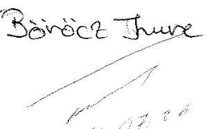

ÁLLAMI SZÁMVEVŐSZÉK
CÉ 440212016
Érkezé: 2016. JÚL. 26.
Iktatószám: V-0006-254/106
Melléklet:

Tájékoztatom Önt arról, hogy 2016. július 8-án kaptam meg a Zsigmondy Vilmos Harkányi Gyógyfürdőkórház N. Kft. - az állami tulajdonban (résztulajdonban) lévő gazdálkodó szervezetek vagyonmegőrzési és gazdálkodási tevékenységének ellenőrzése címmel készített számvevőszéki jelentéstervezetet.

A fenti jelentéstervezetre a csatolt dokumentumban leírt észrevételeket teszem.
Kérem szíveskedjenek észrevételeimet a végleges számvevőszéki jelentés elkészítésekor figyelembe venni.

## Melléklet:

Észrevételek a Zsigmondy Vilmos Harkányi Gyógyfürdőkórház N. Kft. - az állami tulajdonban (résztulajdonban) lévő gazdálkodó szervezetek vagyonmegőrzési és gazdálkodási tevékenységének ellenőrzése címmel készített számvevőszéki jelentéstervezetre

Tisztelettel

Harkány, 2016. július 22.
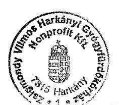

Zsigmondy Vilmos Harkányi Gyógyfürdőkórház Nonprofit Kft.
képviseli: dr. Péter Iván Antal

---

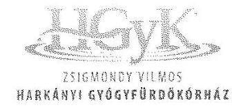

Zsigmondy Vilmos Harkányi Gyógyfürdőkórház Nonprofit Kft. 7815 Harkány, Zsigmondy sétány 1. Tel.: 72/580-900, Fax: 72/580-949 e-mail: gyogyfurdo.korhazi@yogykor.hu Főigazgató: Dr. Péter Iván Antal

# ÉSZREVÉTELEK 

a „Zsigmondy Vilmos Harkányi Gyógyfürdőkórház N. Kft. az állami tulajdonban (résztulajdonban) lévő gazdálkodó szervezetek vagyonmegőrzési és gazdálkodási tevékenységének ellenőrzése" címmel készített számvevőszéki jelentéstervezettel összefüggésben

Az Állami Számvevőszék a 2011. január 1. - 2014. december 31. közötti időszakra vonatkozóan ellenőrizte a Zsigmondy Vilmos Harkányi Gyógyfürdőkórház N.Kft. vagyonmegőrzési és gazdálkodási tevékenységét.

Álláspontunk szerint az ellenőrzésnek figyelemmel kell lennie arra a jelentéstervezetben nem említett tényre, hogy a Gyógyfürdőkórház vezetésében 2013. márciusában vezetőváltás történt, amely jelentősen befolyásolta az intézmény által 2013. második negyedévétől folytatott gazdálkodási tevékenységet.

A jelentéstervezet nem tér ki arra sem, hogy az új főigazgató kinevezésével 2013-ban megtörtént a gazdasági társaság komplex gazdasági-jogi átvilágítása, amely átvilágításról jelentés készült, amelyet a Kórház főigazgatója a tulajdonosok rendelkezésére bocsátott. A gazdasági átvilágításról készült jelentés számos hiányosságot tárt fel, amelyek egy részét az Állami Számvevőszék jelentéstervezete is tartalmazza.

A vizsgálat során megítélésünk szerint nyomatékkal szükséges figyelembe venni azt, hogy a korábbi vezetés több olyan döntést hozott meg, amely az intézmény gazdálkodását hosszútávon meghatározta, s ekként az új vezetés mozgásterét jelentősen leszűkítette. Ilyen intézkedések a hosszú távú hitelfelvételek, kölcsönök nyújtása, közbeszerzési eljárások lefolytatásának mellőzése.

---

A továbbiakban észrevételeinket a megállapítások sorrendiségéhez igazodva közöljük:

1. A tulajdonosi joggyakorló a vagyonnal való gazdálkodás feltételeit szabályosan alakította ki.
1.1 A tulajdonosi joggyakorló a Gyógyfürdőkórház felelős vagyongazdálkodás szükséges követelményeit kialakította, azonban a 2013. évig az FB létszámát három helyett hat főben határozta meg, amely nem felelt meg a törvényi előírásoknak. Észrevétel: A Felügyelő Bizottságot a taggyűlés választja, amely a társaság tulajdonosainak döntésén alapszik, az ügyvezetésnek nincs ráhatása erre a döntésre. A Felügyelő Bizottság kontroll szerepét nem csorbítja, hanem csak fokozza a törvényi minimumnál magasabb létszámú testület.
1.2 A Gyógyfürdőkórház használatában lévő ingatlanra vonatkozó használati szerződés nem felelt meg teljes körűen a Vhr. előírásainak. Észrevétel: A szerződéskötés elsődlegesen a használatba adó hiányossága, a szerződésben rögzített tartalmat az állami fenntartó, a GYEMSZI határozta meg eltérést nem engedő módon, ezért ez nem róható fel az ingatlant használatba vevő vállalkozás vezetésének.
1.3 A GYEMSZI, mint a használatba adott állami ingatlan feletti tulajdonosi joggyakorló nem alkotta meg a vagyon-nyilvántartási szabályzatát. Észrevétel: A vagyon használatóját, a Gyógyfürdőkórházat ebben a hiányosságban nem terhelheti felelősség.
2. A vagyon értékmegőrzését és gyarapítását biztosító vagyongazdálkodási tevékenységhez szükséges szabályozási környezetet a 2013. évig hiányosan alakították ki. A leltározás végrehajtása, továbbá az ellenőrzés első két évében az értékvesztés elszámolása nem volt szabályszerű.
2.1 A vagyon értékmegőrzését, gyarapítását biztosító szabályszerű vagyongazdálkodás feltételeit a 2013. évig hiányosan alakították ki. Észrevétel: A 2013. márciusában kinevezett új főigazgató munkába állását követően haladéktalanul intézkedett a megfelelő Szabályzatok elkészítéséről, illetve a Szabályzatok aktualizálásáról.
2.2 A vagyon számviteli nyilvántartása során a 2011. és 2012. év végén az értékvesztés elszámolásához kapcsolódóan nem tartották be a Számviteli tv. előírását. A leltárazás nem felelt meg a Leltárkészítési és leltározási Szabályzatban leírtaknak. Észrevétel: A korábbi kórházi vezetés alatt elkészített beszámoló nem tartalmazta az értékvesztést, az új főigazgató irányítása alatt készített beszámoló a számviteli törvény előírása alapján már tartalmazta a határidőn túli kölcsönre elszámolt értékvesztést. A kölcsönök nyújtása is sértette a Kórház gazdasági érdekeit, mert egy egészségügyi intézmény a bevételeit elsősorban a zavartalan működésre kell, hogy felhasználja, pénzintézeti tevékenységet nem végezhet. (A gazdasági-jogi átvilágítás ezt a gazdasági eseményt részletesen feltárta.) A leltározást a társaságnál a Leltározási Utasítás alapján hajtják végre 2013. évtől. A Leltározási Utasítást a kórház pénzügyi vezetője készíti, aki a Számviteli törvény szabályait alkalmazta a Leltározási Utasítás elkészítése során. 2015. évben a Kórház eszközeinél teljes körűen megtörtént a mennyiségi leltárfelvétel is.
3. A közfeladatok bevételeinek és ráfordításainak elszámolása összességében megfelelő volt. Az Önköltség számítási Szabályzatot a 2013. évig nem készítették el.
3.1 A közfeladatok árbevételeit elkülönítetten tartották nyilván, a bevételek és ráfordítások elszámolása összességében megfelelő volt. Észrevétel: A 2012. évben a bevételek elszámolásánál megemlített elkülönítést tartalmazó kimutatás hiánya a

---

korábbi vezetés felelőssége. A kintlévőségek alakulásával kapcsolatban a két legfontosabb gazdasági partnerünk, azaz vevőnk az alábbi költségvetési szervek voltak az ellenőrzött időszakban: 2011. dec. 31-én az Országos Egészségpénztárral szembeni követelésünk összege 128 millió Ft, Pécsi Tudományegyetemmel szembeni követelés pedig 105 millió Ft, azaz a teljes vevői követelés állományból, 238,0 millió Ft-ból 233 millió Ft-ot tett ki a két legnagyobb vevőkövetelésünk. 2014. dec. 31-én a korábbi évekhez hasonlóan az Országos Egészségpénztárral szembeni követelésünk összege 156,7 millió Ft. Pécsi Tudományegyetemmel szembeni követelés 87,7 millió Ft, azaz a teljes vevői követelés állományból, 269,9 millió Ft-ból 244,4 millió Ft-ot tett ki a két legnagyobb vevőkövetelés. A vevőkövetelés 2011. évről 2014-re történő 13,4 %-os emelkedését az Országos Egészségpénztárral szembeni követelésünk 21,7 %-os, nominálisan 27,9 millió Ft-os növekedése okozta.
A határidőn túli követelésünk csökkent 2014. év végére, 2013. évben még a Pécsi Tudományegyetem tartozása volt a legjelentősebb, összegszerűen 44,9 millió Ft.
3.2 Az Önköltségszámítás rendjére vonatkozó szabályzatot 2013. áprilisáig nem készítették el. Észrevétel: A szabályzat hiánya szintén a korábbi ügyvezetés felelőssége, az új főigazgató kinevezését követően haladéktalanul intézkedett az önköltség számítási szabályzat elkészítéséről és annak alkalmazásáról.
4. A tulajdonosi joggyakorló vagyonváltozást eredményező döntései szabályosak voltak. A Gyógyfürdőkórház vagyonváltozást eredményező döntései a hitelfelvételhez kapcsolódóan a 2012-2013. évek között nem voltak szabályszerűek, több szerződéskötés esetén mellőzték a közbeszerzési eljárás lefolytatását.
4.1 A vagyongazdálkodási tevékenységet a jogszabályi rendelkezések és a belső szabályzatok előírásainak megfelelően végezték. Észrevétel: A megállapítás helytálló.
4.2 A Gyógyfürdőkórház vagyonváltozást eredményező döntései a hitelfelvételhez kapcsolódóan a 2012-2013. évek között nem voltak szabályszerűek. Több szerződéskötés esetén mellőzték a közbeszerzési eljárás lefolytatását. Észrevétel: A devizahitel árfolyam és likviditási kockázatot hordoz. A gazdasági-jogi átvilágítás felhívta erre a figyelmet, valamint a kórház ügyvezetője is tájékoztatta erről a tulajdonosokat, továbbá a könyvvizsgálói jelentés is tartalmaz figyelemfelhívást. A hitel felvétele a korábbi ügyvezetés egyértelmű és kizárólagos felelőssége. A közbeszerzési eljárás mellőzésével kapcsolatos megállapítás álláspontunk szerint helytálló, azonban az intézmény új vezetése a beszerzéseknél mindent megtett és megtesz a törvényi előírások betartása érdekében. Ezen törekvések azonban esetenként nehezen egyeztethetők össze a Kórház folyamatos és zavartalan működésének biztosítására vonatkozó, szintén törvényen alapuló kötelezettségek teljesítésével.
4.3 A tulajdonosi joggyakorló vagyonváltozást eredményező döntései megfeleltek a jogszabályi és a belső előírásoknak. Észrevétel: A megállapítást elfogadjuk.
5. A szabályszerű vagyongazdálkodás érdekében a Gyógyfürdőkórház beszámolási kötelezettségét teljesítette. A 2011. évi beszámoló nem teljes körűen felelt meg a jogszabályi előírásoknak. A közérdekű adatok nyilvánossága nem volt biztosított.
5.1 A Gyógyfürdőkórház beszámolási kötelezettségének eleget tett. A 2011. évi beszámoló nem teljes körűen felelt meg a Számv. tv. előírásainak. Észrevétel: A 2011. évi beszámoló hiányos közzététele az intézmény korábbi vezetésének felelőssége (Cash-flow kimutatás hiánya).

---

5.2 Az információs rendszert kialakították, azonban annak működtetése során a közérdekű adatok nyilvánosságra hozatala, illetve 2013. év májusáig az adatok védelme nem volt biztosított. Az adatszolgáltatási kötelezettséget hiányosan teljesítették. Észrevétel: Az új kórházi vezetés pótolta a hiányt és elkészítette az Adatbiztonsági és Adatvédelmi Szabályzatot. Az adatszolgáltatás tartalmát a használatba adó, azaz a Gyógyszerészeti és Egészségügyi Minőség- és Szervezetfejlesztési Intézet (GYEMSZI) nem határozta meg. Az Info tv. (2011. évi CXII. törvény) 1. sz. mellékletének megfelelően csatolt általános közzétételi listában jelöltük a kórház honlapján nyilvánosságra hozott közérdekű adatokat, amely adatok az ellenőrzött időszakban is nyilvánosan elérhetőek voltak, ezért kérjük, hogy az erre vonatkozó megállapítást szíveskedjenek módosítani.
6. A kormányzati szektor hiányára befolyást gyakorló bevételek és ráfordítások elszámolása megfelelő volt. A 2013. évben egy államadósságot keletkeztető ügyletet miniszteri engedély nélkül kötöttek. Az osztalékfizetés tilalmára vonatkozó előírásokat betartották.
6.1 A Gyógyfürdőkórház a 2013. évben miniszteri engedély nélkül kötött egy államadósságot keletkeztető ügyletet. Észrevétel: Ezt a hitelszerződést a korábbi Kórházi vezetés kötötte a Szigetvári Takarékszövetkezettel 2013. február 25-én. A hitelszerződés a lejáratkor megszűnt, az új kórházi vezetés nem kezdeményezte a hitel szerződés megújítását, továbbá egyáltalán nem vette igénybe a futamidő alatt a rulírozó forgóeszköz-hitelkeretet.
6.2 A kormányzati szektor hiányára befolyást gyakorló bevételeket és ráfordításokat megfelelően számolták el. Az osztalékfizetés tilalmára vonatkozó előírásokat betartották. Észrevétel: Az alábbi konkrét megállapításra kívánunk reagálni: A 2014. évi negatív mérleg szerinti eredmény kedvezőtlenül befolyásolta a kormányzati szektor hiányát. A 2011. és 2012. években a Kórház jelentős támogatást kapott kassza-söprés címén. A 2011. évi támogatás 27 millió volt, amely mellett -18 millió Ft üzemi eredményt realizált a társaság. 2012-ben a Kórház korábbi vezetése kizárólag az OEP kasszasöpréssel együtt volt képes pozitív eredményt realizálni, 65 millió Ft-os támogatás mellett 22 millió Ft-ot, míg 2013-ban a veszteség mindössze 10 millió Ft volt annak ellenére is, hogy ebben
 az évben a Kórház semmiféle pénzügyi támogatást nem kapott.

---

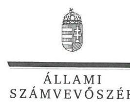

ELNÖK

# Dr. Péter Iván Antal úr 

ügyvezető
Zsigmondy Vilmos Harkányi Gyógyfürdőkórház Nonprofit Kft.

## Harkány

## Tisztelt Ügyvezető Úr!

A „Zsigmondy Vilmos Harkányi Gyógyfürdőkórház NKft. - Az állami tulajdonban (résztulajdonban) lévő gazdálkodó szervezetek vagyonmegőrzési és gazdálkodási tevékenységének ellenőrzése" címmel készített számvevőszéki jelentéstervezetre tett észrevételeit köszönettel megkaptam.
Az Állami Számvevőszék észrevételekre vonatkozó álláspontjáról a felügyeleti vezető által készített részletes tájékoztatást mellékelten megküldöm.
Tájékoztatom Ügyvezető urat, hogy a számvevőszéki jelentésben - az Állami Számvevőszékről szóló 2011. évi LXVI. törvény 29. § (3) bekezdése alapján - a figyelembe nem vett észrevételeket szerepeltetjük az elutasítás indokának feltüntetésével.

Budapest, 2016.
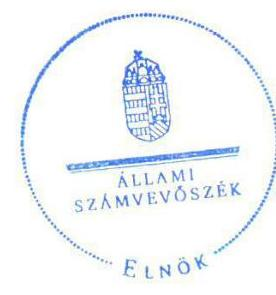

Tisztelettel:

## Domokos László

Melléklet: Tájékoztatás az észrevételek kezeléséről

---

# Tájékoztatás   az észrevételek kezeléséről 

A „Zsigmondy Vilmos Harkányi Gyógyfürdőkórház NKft. - Az állami tulajdonban (résztulajdonban) lévő gazdálkodó szervezetek vagyonmegőrzési és gazdálkodási tevékenységének ellenőrzése" címú jelentéstervezetre tett észrevételét áttekintettük, annak kezelésével kapcsolatban a következő tájékoztatást adom.
1.A 2013. márciusában történt vezetőváltással kapcsolatos észrevétel: Az ellenőrzött szervezet a Zsigmondy Vilmos Harkányi Gyógyfürdőkórház NKft. volt, így az ellenőrzés az ellenőrzött szervezet gazdálkodására, és nem a vezetőség tevékenységének értékelésére irányult. Az Állami Számvevőszék az ellenőrzéseit az általa összeállított ellenőrzési program alapján végzi, amely meghatározza, hogy az ellenőrzés során mire kell figyelemmel lenni. Az észrevétel a jelentéstervezet módosítását nem indokolja, ugyanakkor az Ellenőrzés területe címü részben a vezetőváltás ténye feltüntetésre kerül.
2. A felügyelő bizottság tagjainak megválasztásával kapcsolatos 1.1. észrevétel: A jelentéstervezet 1.1. számú megállapítása és az azt alátámasztó hetedik bekezdés a felügyelő bizottság létszámának meghatározására vonatkozik. A társasági szerződés 7.4.3. pontja alapján valóban a taggyűlés választja meg a felügyelő bizottság tagjait, de mindezt a társasági szerződés 9.1. pontjában az alapítók által meghatározott létszámon (hat) belül. Azaz a létszámot a tulajdonosi joggyakorlók határozzák meg a társasági szerződésben, amely során figyelemmel kell lenniük a köztulajdonban álló gazdasági társaságok takarékosabb működéséről szóló 2009. évi CXXII. törvény (Takarékossági tv.) 4. § (2) bekezdésére, amely szerint a felügyelőbizottság - ha törvény eltérően nem rendelkezik - három természetes személyből áll. A jelentéstervezetben az 1.1. számú megállapítást alátámasztó hetedik bekezdés ezen rendelkezés megsértését állapítja meg. A fentiekre tekintettel az észrevétel alapján nem indokolt a jelentéstervezet módosítása.
3. A Zsigmondy Vilmos Harkányi Gyógyfürdőkórház NKft. használatában lévő ingatlanra vonatkozó használati szerződéssel kapcsolatos 1.2. észrevétel: A szerződés a felek akaratának kölcsönös és egybehangzó kifejezésével jön létre, amelyre tekintettel a szerződő feleket terhelő felelősség mértéke között e tekintetben nincs különbség. A hiányosság megszüntetésére vonatkozó javaslatot az Állami Számvevőszék mind a Zsigmondy Vilmos Harkányi Gyógyfürdőkórház NKft. ügyvezetőjének, mind az Állami Egészségügyi Ellátó Központ főigazgatójának megfogalmazta. A fentiekre tekintettel az észrevétel alapján nem indokolt a jelentéstervezet módosítása.
4. A GYEMSZI vagyonnyilvántartási szabályzatával kapcsolatos 1.3. észrevétel: A jelentéstervezet 1.3. számú megállapítása és az azt alátámasztó második bekezdés arra vonatkozott, hogy a GYEMSZI nem alkotta meg a vagyonnyilvántartási szabályzatát. Nem tartalmaz arra vonatkozó utalást, hogy ezért a Zsigmondy Vilmos Harkányi Gyógyfürdőkórház NKft.-t felelősség terhelné. Az erre vonatkozó javaslat is az ÁEEK főigazgatójának került megfogalmazásra, nem pedig a Zsigmondy Vilmos Harkányi Gyógyfürdőkórház NKft. ügyvezetőjének. A fentiekre tekintettel az észrevétel alapján nem indokolt a jelentéstervezet módosítása.

---

5. A vagyongazdálkodás feltételeinek kialakításával kapcsolatos 2.1. észrevétel: Az észrevétel nem vitatja, hogy 2013. márciust megelőzően hiányos volt a kialakítás, amelyre tekintettel az észrevétel alapján nem indokolt a jelentéstervezet módosítása.
6. Az értékvesztés elszámolásával kapcsolatos 2.2. észrevétel: Az észrevétel nem vitatja a 2011. és a 2012. évekre vonatkozó értékvesztés elszámolásával és a leltározással kapcsolatban feltárt szabálytalanságot. A 2015-ben mennyiségi felvétellel elvégzett leltározásra az ellenőrzés nem terjedt ki, mert arra az ellenőrzött időszakot (2011. január 1 - 2014. december 31.) követően került sor. A fentiekre tekintettel az észrevétel alapján nem indokolt a jelentéstervezet módosítása.
7. A közfeladatok árbevételeinek elkülönített nyilvántartásával, a bevételek és ráfordítások elszámolásával kapcsolatos 3.1., valamint az önköltségszámítás rendjére vonatkozó szabályzattal kapcsolatos 3.2. észrevétel: Az észrevételek nem vitatják a feltárt hiányosságokat, amelyre tekintettel azok alapján nem indokolt a jelentéstervezet módosítása.
8. A vagyongazdálkodási tevékenységgel kapcsolatos 4.1., a hitelfelvétellel és a közbeszerzési eljárás lefolytatásával kapcsolatos 4.2., valamint a tulajdonosi joggyakorló vagyonváltozást eredményező döntéseivel kapcsolatos 4.3. észrevétel: Az észrevételek a megállapítások tartalmát nem vitatják, amelyre tekintettel azok alapján nem indokolt a jelentéstervezet módosítása.
9. A 2011. évi beszámolóval kapcsolatos 5.1. észrevétel: Az észrevétel nem vitatja a feltárt hiányosságot, amelyre tekintettel az észrevétel alapján nem indokolt a jelentéstervezet módosítása.
10. A közérdekű adatok közzétételével kapcsolatos 5.2. észrevétel: Áttekintettük a rendelkezésre álló ellenőrzési dokumentumokat, amelyek alapján az 5.2. megállapítást alátámasztó második bekezdés módosításra kerül.
11. A 2013. évben miniszteri engedély nélkül kötött ügylettel kapcsolatos 6.1., valamint a 2014. évi negatív mérleg szerinti eredménnyel kapcsolatos 6.2. észrevétel: Az észrevételek nem vitatják a feltárt hiányosságot, amelyre tekintettel az észrevételek alapján nem indokolt a jelentéstervezet módosítása.
Tájékoztatom, hogy a számvevőszéki jelentés függelékeként szerepeltetjük a jelentéstervezethez tett észrevételeit, valamint az azokra adott válaszunkat.

Budapest, 2016. 06. hó 06. nap

Böröcz Imre
felügyeleti vezető

---

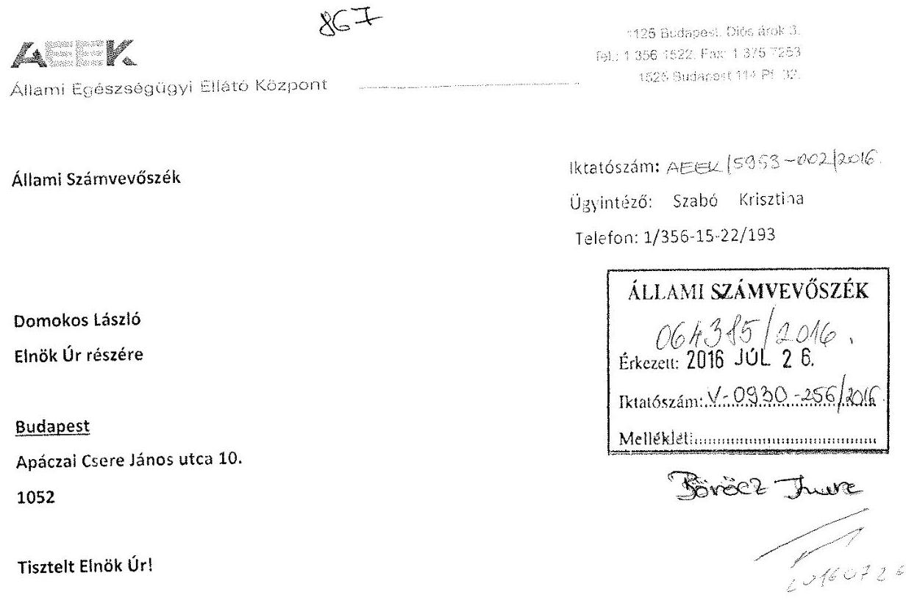

Az Állami Számvevőszék által „Zsigmondy Vilmos Harkányi Gyógyfürdőkórház Nkft. - Az állami tulajdonban (résztulajdonban) lévő gazdálkodó szervezetek vagyonmegőrzési és gazdálkodási tevékenységének ellenőrzése" címmel készített számvevőszéki jelentéstervezet megkaptam.

A jelentéstervezet 1.3. számú megállapítás 2. bekezdésének megállapításaival kapcsolatban az alábbi észrevételt kívánom tenni:

A Vhr. 14. §. (3) bekezdésébe előírtak szerint a 14/2015-ös számú Főigazgatói utasítás 2015. július 1.jei hatállyal léptette életbe az ÁEEK vagyon nyilvántartási szabályzatát.

Budapest, 2016. július 20.
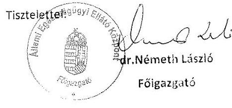

---

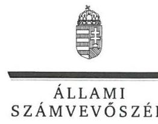

ELNÖK

# Dr. Németh László úr 

főigazgató
Állami Egészségügyi Ellátó Központ

## Budapest

## Tisztelt Főigazgató Úr!

A „Zsigmondy Vilmos Harkányi Gyógyfürdőkórház NKft. - Az állami tulajdonban (résztulajdonban) lévő gazdálkodó szervezetek vagyonmegőrzési és gazdálkodási tevékenységének ellenőrzése" címmel készített számvevőszéki jelentéstervezetre tett észrevételét köszönettel megkaptam.
Az Állami Számvevőszék észrevételre vonatkozó álláspontjáról a felügyeleti vezető által készített részletes tájékoztatást mellékelten megküldöm.
Tájékoztatom Főigazgató urat, hogy a számvevőszéki jelentésben - az Állami Számvevőszékről szóló 2011. évi LXVI. törvény 29. § (3) bekezdése alapján - a figyelembe nem vett észrevételt szerepeltetjük az elutasítás indokának feltüntetésével.

Budapest, 2016.
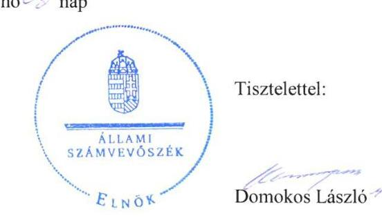

Melléklet: Tájékoztatás az észrevételek kezeléséről

---

# Tájékoztatás   az észrevételek kezeléséről 

A „Zsigmondy Vilmos Harkányi Gyógyfürdőkórház NKft. - Az állami tulajdonban (résztulajdonban) lévő gazdálkodó szervezetek vagyonmegőrzési és gazdálkodási tevékenységének ellenőrzése" címú jelentéstervezetre tett észrevételét áttekintettük, annak kezelésével kapcsolatban a következő tájékoztatást adom.
A vagyonnyilvántartási szabályzat hiányával kapcsolatos 1.3. számú megállapítás második bekezdésére vonatkozó észrevétel szerint az Állami Egészségügyi Ellátó Központ a vagyonnyilvántartási szabályzatát 2015. július 1-jével hatályba léptette.
Tájékoztatom, hogy a jelentéstervezetben, illetve a jelentésben foglalt megállapítások az ellenőrzött időszakra (2011. január 1. - 2014. december 31.) vonatkoznak, így az ezt követően - a hiányosság megszüntetése érdekében - megtett intézkedés a jelentéstervezet módosítását nem teszi indokolttá.
Tájékoztatom, hogy a számvevőszéki jelentés függelékeként szerepeltetjük a jelentéstervezetre tett észrevételét, valamint az arra adott válaszunkat.

Budapest, 2016. 06. hó 06. nap

Böröcz Imre
felügyeleti vezető

---

# RÖVIDÍTÉSEK JEGYZÉKE 

${ }^{1}$ Gyógyfürdőkórház
${ }^{2}$ Tulajdonosi joggyakorló:
${ }^{3}$ Harkányi Dolgozói Kft.
${ }^{4}$ Átvételi tv.
${ }^{5}$ Tulajdonosi rend.
${ }^{6}$ Tulajdonosi joggyakorló:
${ }^{7}$ ÁSZ
${ }^{8}$ Áht.
${ }^{9}$ GYEMSZI
${ }^{10}$ INTOSAI
${ }^{11} \mathrm{FB}$
${ }^{12}$ MVM
${ }^{13}$ Taggyűlés
${ }^{14}$ Társasági Szerződés
${ }^{15}$ Számv. tv.
${ }^{16}$ SZMSZ
${ }^{17}$ Számviteli Politika
${ }^{18}$ Takarékossági tv.
${ }^{19}$ Vhr.
${ }^{20}$ Önkormányzat
${ }^{21}$ Tvt.
${ }^{22}$ Ingatlan-használati Szerződés
${ }^{23} \mathrm{Vtv}$.
${ }^{24}$ Önköltségszámítási Szabályzat
${ }^{25}$ Pénzkezelési Szabályzat
${ }^{26}$ Számlarend
${ }^{27}$ Leltárkészítési és leltározási szabályzat
${ }^{28} \mathrm{Kbt}$. : $\square$

Zsigmondy Vilmos Harkányi Gyógyfürdőkórház NKft.
2011. évben 60 %-ban a Baranya Megyei Önkormányzat, 34%-ban a Paksi Atomerőmú és az MVM, 6 %-ban a Harkányi Dolgozói Kft.
Harkányi Kórház Dolgozói Kft.
2011. évi CLIV. törvény A megyei önkormányzatok konszolidációjáról, a megyei önkormányzati intézmények és Fővárosi Önkormányzat egyes egészségügyi intézményeinek átvételéről
72/2011 (XII.27.) NEFMI rendelet Az állam tulajdonába és fenntartásába került egészségügyi intézmények tekintetében vagyonkezelői joggal rendelkező államigazgatási szerv kijelöléséről
2012. évtől 60 %-ban Gyógyszerészeti és Egészségügyi Minőség- és Szervezetfejlesztési Intézet (GYEMSZI), 34%-ban a Paksi Atomerőmú és az MVM, 6 %-ban a Harkányi Dolgozói Kft.
Állami Számvevőszék
2011. évi CXCV. törvény az államháztartásról szóló
a Gyógyfürdőkórház használatában álló állami ingatlan feletti tulajdonosi joggyakorló Gyógyszerészeti és Egészségügyi Minőség- és Szervezetfejlesztési Intézet (GYEMSZI)
International Organization of Supreme Audit Institutions
Zsigmondy Vilmos Harkányi Gyógyfürdőkórház NKft. Felügyelő Bizottsága
Magyar Villamos Művek Zrt.
Zsigmondy Vilmos Harkányi Gyógyfürdőkórház Nonprofit Kft. legfőbb szerve, a Gt. 19. § (1) bekezdése és a Ptk.: 3:188 § (1) bekezdése alapján
Zsigmondy Vilmos Harkányi Gyógyfürdőkórház NKft. Társasági Szerződése
2000. évi C. törvény a számvitelről

Zsigmondy Vilmos Harkányi Gyógyfürdőkórház NKft. Szervezeti és Működési Szabályzata
Zsigmondy Vilmos Harkányi Gyógyfürdőkórház NKft. Számviteli Politikája
2009. évi CXXII. törvény a köztulajdonban álló gazdasági társaságok takarékosabb működéséről
254/2007. (X.14.) Korm. rendelet Az állami vagyonnal való gazdálkodásról szóló
Baranya Megyei Önkormányzat
2012. évi XXXVIII. törvény a települési önkormányzatok fekvőbeteg-szakellátó intézményeinek átvételéről és az átvételhez kapcsolódó egyes törvények módosításáról
GYEMSZI/010401/2013. számú Ingatlan-használati Szerződés
2007. évi CVI. törvény az állami vagyonról

Zsigmondy Vilmos Harkányi Gyógyfürdőkórház NKft. Önköltségszámítási Szabályzata
Zsigmondy Vilmos Harkányi Gyógyfürdőkórház NKft. Pénzkezelési Szabályzata
Zsigmondy Vilmos Harkányi Gyógyfürdőkórház NKft. Számlarendje
Zsigmondy Vilmos Harkányi Gyógyfürdőkórház NKft. Leltárkészítési és leltározási szabályzata
2003. évi CXXIX. törvény a közbeszerzésekről

---

${ }^{29}$ Kbt. 2
${ }^{30}$ Selejtezési Szabályzat
${ }^{31}$ HEFOP
${ }^{32}$ Értékelési Szabályzat
${ }^{33}$ OEP
${ }^{34}$ 5/2004. (XI.19) EÜM rendelet
${ }^{35}$ Stabilitási tv.
${ }^{36} \mathrm{Gt}$.
${ }^{37}$ Ptk. 2
${ }^{38}$ Avtv.
${ }^{39}$ Info.tv.
${ }^{40}$ Adatvédelmi és adatkezelési Szabályzat
${ }^{41}$ Eü adattv.
${ }^{42}$ Ágazati béremelés rend.
${ }^{43} \mathrm{Nvtv}$.
2011. évi CVIII. törvény a közbeszerzésekről szóló

Zsigmondy Vilmos Harkányi Gyógyfürdőkórház Nonprofit Kft. Selejtezési szabályzata
Humán Erőforrás Operatív Program
Zsigmondy Vilmos Harkányi Gyógyfürdőkórház NKft. Értékelési Szabályzata
Országos Egészségbiztosítási Pénztár
5/2004. (XI.19.) Egészségügyi Minisztérium rendelete A gyógyászati ellátásokról
Magyarország gazdasági stabilitásáról szóló CXCIV. sz. törvény
2006. évi IV. törvény a gazdasági társaságokról (hatálytalan 2015.03.14-től)
2013. évi V. törvény a Polgári Törvénykönyvről
1992. évi LXIII. törvény a személyes adatok védelméről és a közérdekű adatok nyilvánosságra hozataláról
2011. évi CXII. törvény az információs önrendelkezési jogról és az információszabadságról
Zsigmondy Vilmos Gyógyfürdőkórház adatvédelmi és adatkezelési Szabályzata (hatályos 2013. május 1-től)
1997. évi XLVII. törvény az egészségügyi és a hozzájuk kapcsolódó személyes adatok kezeléséről és védelméről
Egyes egészségügyi dolgozók és egészségügyben dolgozók illetmény- és bérnövelésének, valamint az ahhoz kapcsolódó támogatás igénybevételének részletes szabályairól szóló 256/2013 (VII.5.) Korm. rendelet
2011. évi CXCVI. törvény a nemzeti vagyonról (hatályos: 2011. december 31-től)

---

# ÁLLAMI SZÁMVEVŐSZÉK 

1052 Budapest, Apáczai Csere János utca 10.
Levélcím: 1364 Budapest 4. Pf. 54
Telefon: +36 1 4849100 Telefax: +36 1 4849200
www.asz.hu

