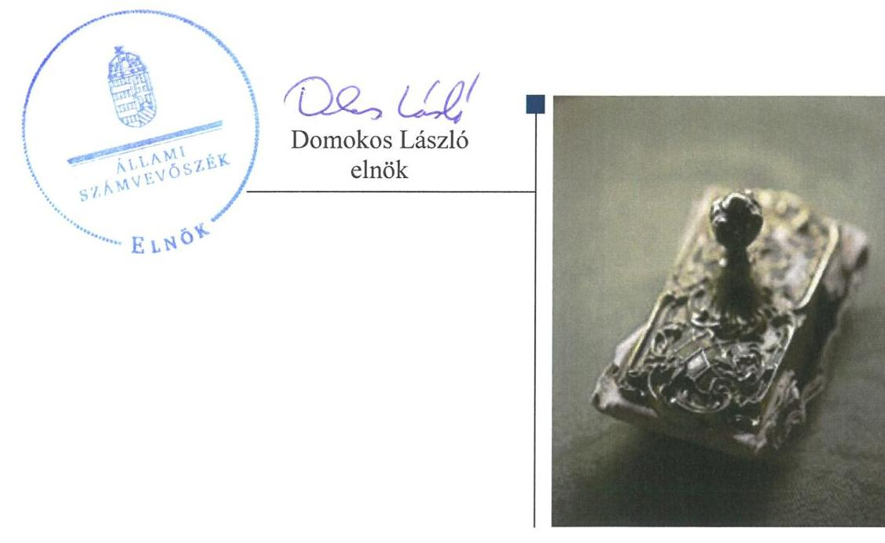
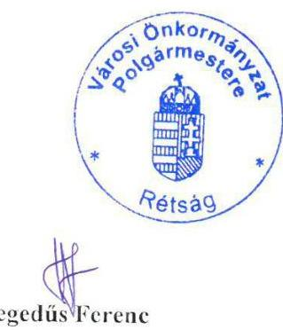

# Jelenetés 

## Önkormányzatok pénzügyi és vagyongazdálkodása

Az önkormányzatok pénzügyi és vagyongazdálkodása megfelelőségének ellenőrzése - Rétság
2016.

---

# Jelenctés 

## Önkormányzatok pénzügyi és vagyongazdálkodása

Az önkormányzatok pénzügyi és vagyongazdálkodása megfelelőségének ellenőrzése - Rétság
2016. 09. hó 24. nap

---

# AZ ELLENŐRZÉST FELÜGYELTE:

## RENKŐ ZSUZSANNA felügyeleti vezető

## AZ ELLENŐRZÉST VEZETTE ÉS A VÉGREHAJTÁSÁÉRT FELELŐS:

- 2015.10.21-ig BALKAY ATTILA ellenőrzésvezető
- 2016.05.18-ig BALÁS ELEMÉR ATTILA ellenőrzésvezető
- 2016.05.19-től KAKAS SÁNDOR ellenőrzésvezető

A PROGRAM ÖSSZEÁLLÍTÁSÁÉRT FELELŐS:

- LAJTERNÉ HUDÁK MAGDONA osztályvezető

IKTATÓSZÁM: V-0859-172/2016.

TÉMASZÁM: 1893

ELLENŐRZÉS-AZONOSÍTÓ SZÁM: V071502

Jelentéseink az Országgyűlés számítógépes hálózatán és az Interneta a www.asz.hu címen is olvashatóak.

---

# TARTALOMJEGYZÉK 

■ ÖSSZEGZÉS ..... 5
■ AZ ELLENŐRZÉS CÉLJA ..... 7
■ AZ ELLENŐRZÉS TERÜLETE ..... 8
■ AZ ELLENŐRZÉS HÁTTERE, INDOKOLTSÁGA ..... 9
■ A JELENTÉS LÉNYEGES KÉRDÉSKÖREI ..... 10
■ ELLENŐRZÉS HATÓKÖRE ÉS MÓDSZEREI ..... 12
■ MEGÁLLAPÍTÁSOK ..... 15
■ JAVASLATOK ..... 37
■ MELLÉKLETEK ..... 41
I. sz. melléklet: Értelmező szótár ..... 41
II. sz. melléklet: Az Önkormányzat feladatellátásában részt vevők a 2011-2014. években ..... 44
III. sz. melléklet: Az eszközök és források alakulása kiemelt mérlegsoronként a 2011- 2013. években ..... 45
IV. sz. melléklet: A pénzügyi egyensúlyi helyzet CLF módszer szerinti értékelése a 2011- 2014. években ..... 46
V. sz. melléklet: Kimutatás a nyilvántartott részesedések változásáról ..... 47
■ FÜGGELÉK: ÉSZREVÉTELEK ..... 49
■ RÖVIDÍTÉSEK JEGYZÉKE ..... 53

---

.

---

# ÖSSZEGZÉS 

Az Állami Számvevőszék (ÁSZ) Rétság Város Önkormányzata pénzügyi és vagyongazdálkodását 2011. január 1. és 2014. december 31. közötti időszakra vonatkozóan ellenőrizte. A pénzügyi gazdálkodás szabályozottsága nem felelt meg a jogszabályi előírásoknak, aminek következtében a szabályos és átlátható müködés nem volt biztosított. A vagyongazdálkodás szabályozásában feltárt hiányosságok kockázatot jelentenek az önkormányzati vagyon védelmében. A pénzügyi egyensúly az ellenőrzött időszakban - a 2011. év kivételével - biztosított volt. Az Önkormányzat nem végezte el a tulajdonosi részesedések egyedi értékelését, így az átláthatóság és a közvagyon védelme nem érvényesült.

## Az ellenőrzés társadalmi indokoltsága

Az ÁSZ stratégiájában hangsúlyos szerepet szán annak, hogy szilárd szakmai alapon álló, értékteremtő ellenőrzéseivel előmozdítsa a közpénzügyek átláthatóságát, rendezettségét és javaslataival a közpénzek és a közvagyon szabályos, gazdaságos, hatékony és eredményes felhasználását segítse. Az ÁSZ stratégiájában célul tűzte ki, hogy az önkormányzatok ellenőrzése során értékeli azok pénzügyi-gazdasági helyzetét, a kockázatokat feltárja, és az ellenőrzések helyszíneit kockázatelemzés alapján választja ki. Az ÁSZ szerepet vállal a korrupció és a csalás elleni küzdelemben. Közreműködik a korrupciós kockázatok és a korrupció elleni fellépés hatékony és eredményes eszközeinek beazonosításában, alkalmazásában, továbbá használatuk elterjesztésében, az integritás alapú közigazgatási kultúra kialakításában.

## Főbb megállapítások, következtetések, javaslatok

Az Önkormányzat pénzügyi és vagyongazdálkodási szabályozásában feltárt hiányosságok következtében a szabályos és átlátható múködés nem volt biztosított. A Polgármesteri hivatal SZMSZ-ét nem módosították a szervezeti változásoknak megfelelően. A Polgármesteri hivatal 2013. június 4-ig nem rendelkezett a jegyző által hatályba léptetett számlarenddel. A 2014. évben hatályos számviteli politikában nem rögzítették, hogy a számviteli elszámolás és értékelés szempontjából mit tekintenek lényegesnek, illetve nem lényegesnek, jelentős összegnek, illetve nem jelentős összegnek, valamint a Polgármesteri hivatal az ellenőrzött időszakban nem rendelkezett ellenőrzési nyomvonallal, szabálytalanságok kezelésének eljárásrendjével. Nem vezettek naprakész nyilvántartást a gazdálkodási jogkörök gyakorlására jogosult személyek aláírás mintáiról. A Képviselő-testület a teljes vagyoni körre kiterjedően elfogadta az önkormányzati vagyonnal történő gazdálkodás szabályait. A vagyonkezelői jog gyakorlásával, illetve ellenőrzésével kapcsolatban feltárt szabályozásbeli hiányosságok miatt a vagyongazdálkodás szabályainak kialakítása nem felelt meg a jogszabályi követelményeknek.

A költségvetési tervezés, a bevételi és kiadási előirányzatok megállapítása megfelelt az előírásoknak. A kiadási előirányzatok módosítása megfelelt, a bevételi előirányzatok módosítása nem felelt meg az előírásoknak, az előirány-zat-módosítások számviteli nyilvántartása megfelelő volt. A kiemelt előirányzatok teljesítése, felhasználása során nem tartották be a jogszabályok és a belső szabályozás előírásait, mert a pénzgazdálkodási jogkörök a 2011-2013 közötti években nem érvényesültek, ami miatt a szabályszerű gazdálkodás nem valósult meg. A beszámoló készítési kötelezettséget az előírásoknak megfelelően teljesítették.

Az Önkormányzatnál a pénzügyi egyensúly az ellenőrzött időszakban - a 2011. év kivételével - biztosított volt. A költségvetési kiadások fedezetéül szolgáló adósságot keletkeztető ügyletek vállalására a jogszabályi előírásoknak megfelelően került sor. A Magyar Állam 2012-ben az adósságkonszolidáció során 97,8 millió Ft összegű támogatást nyújtott az Önkormányzat részére. Az Önkormányzat a 2011-2014. években nem készített likviditási tervet. A 2011. évben az egyensúly biztosításához folyószámlahitel igénybevételére volt szükség. A fizetési kötelezettségek teljesítése határidőben megtörtént. Az előírásoknak megfelelően intézkedtek a követelések behajtására. Nem müködtettek megfelelő kockázatkezelési rendszert annak érdekében, hogy a gazdálkodással összefüggő, pénzügyi

---

egyensúlyt befolyásoló kockázatokat mérsékeljék. Az adósságkonszolidációval összefüggő önkormányzati feladatok végrehajtása az előírásoknak megfelelően történt.

A vagyonnyilvántartás, valamint a költségvetési beszámoló mérlegének alátámasztottsága vonatkozásában feltárt hiányosságok miatt az átláthatóság és a vagyonnal való felelős gazdálkodás nem volt biztosított. A vagyonkimutatás tagolása megfelelt a jogszabályi előírásoknak, azonban a jogszabályban előírtak ellenére a vagyonkimutatás a vagyonelemek forgalomképesség szerinti bemutatását nem tartalmazta. A mérlegtételek leltárral történő alátámasztása egyes eszközcsoportok (részesedések, ingatlanok) vonatkozásában nem volt megfelelő.

A vagyon összetételének és nagyságának változását eredményező döntések szabályszerűek voltak, azok végrehajtása - a vagyonértékesítés és bérbeadás útján történt vagyonhasznosítás kivételével - megfelelt az előírásoknak. A vagyonkezelői jog létesítése szabályszerűen, a közfeladat ellátással összhangban történt. A beruházások és felújítások, valamint az azokat megalapozó döntések szabályszerűek voltak. A vagyonértékesítés és bérbeadás útján történt vagyonhasznosítás nem felelt meg az előírásoknak. Követelés elengedés és a behajthatatlan követelések leírása az ellenőrzött időszakban nem fordult elő.

Az Önkormányzatnál a tartós részesedésekkel kapcsolatosan a tulajdonosi kötelezettségek teljesítésében feltárt hiányosságok miatt a vagyonnal való felelős gazdálkodás nem érvényesült. A tulajdonosi jog gyakorlás a könyvvizsgáló kijelölése és a képviseletre történő megbízás és beszámoltatás tekintetében nem volt megfelelő. Az Önkormányzat nem végezte el a tulajdonosi részesedések egyedi értékelését. Az ellenőrzés a 2011-2014. években jelentős összegű hibát tárt fel. Az Önkormányzat a 2011. évi pénzeszköz átadásokkal megtette a szükséges intézkedéseket a Járóbeteg Központ Kft. veszteséges működésének elkerülése érdekében.

Az Önkormányzat az erőforrásokkal való szabályszerű gazdálkodáshoz szükséges követelményeket számon kérhető módon nem alakította ki, így a felelős gazdálkodást nem támogatta.

Az Önkormányzat nem határozott meg az erőforrásokkal való hatékony gazdálkodáshoz szükséges követelményeket.

Az Önkormányzat erőfeszítéseket tett az integritás szemlélet érvényesítése érdekében.

---

# AZ ELLENŐRZÉS CÉLJA 

AZ ELLENŐRZÉS CÉLJA az Önkormányzat pénzügyi és vagyoni helyzetének, a gazdálkodás szabályosságának megítélése a költségvetési tervezés, a pénzügyi egyensúly megteremtése, az éves költségvetési beszámolás, a vagyongazdálkodás, a vagyon számbavétele, a gazdasági események elszámolása és a pénzgazdálkodás szabályszerűsége alapján; valamint annak értékelése, hogy kialakított-e az Önkormányzat az erőforrásokkal való szabályszerű és hatékony gazdálkodáshoz szükséges követelményeket, megvalósította-e azok számon kérését, ellenőrzését.

---

# **AZ ELLENŐRZÉS TERÜLETE**

## **Rétság Város Önkormányzata**

Rétság Város Nógrád megye nyugati részén, a Börzsöny és a Cserhát határán fekszik. A város állandó lakosainak száma 2015. január 1-jén 2831 fő volt. Az Önkormányzat^{1} 6 tagú Képviselő-testületének^{2} munkáját két állandó bizottság segítette. Az Önkormányzat 2014. december 31-én a Polgármesteri hivatalon^{3} kívül két intézményt működtetett, valamint öt gazdasági társaságban rendelkezett tulajdoni hányaddal.

A polgármester^{4} a 2014. évi önkormányzati választások óta tölti be tisztségét. A jegyző 2013. december 9-étől látja el feladatait. A Polgármesteri hivatal csoportokra tagolódott (igazgatási csoport, pénzügyi és szolgáltatási csoport, városüzemeltetetési csoport), elkülönített gazdasági szervezettel nem rendelkezett. A Polgármesteri hivatalnál foglalkoztatott köztisztviselők száma 2015. január 1-jén 13 fő volt. Az Önkormányzat feladatellátását a II. sz. melléklet mutatja be.

Az Önkormányzat a 2014. évi zárszámadási rendelete szerint 1 036,8 millió Ft költségvetési bevételt ért el, valamint 828,4 millió Ft költségvetési kiadást teljesített. A 2014. évi zárszámadási rendelete alapján az Önkormányzat mérleg szerinti vagyonának értéke 2 838,8 millió Ft, a rövid lejáratú kötelezettségállománya 5,1 millió Ft volt, hosszú lejáratú kötelezettség állománnyal nem rendelkezett. A gazdálkodásra jellemző főbb adatokat az 1. táblázat mutatja be.

1. táblázat

|  Év | Teljesített költségvetési bevételek | Teljesített költségvetési kiadások | Ezekirvagyon | Követelések | Kötelezettségek  |
| --- | --- | --- | --- | --- | --- |
|  2011 | 743,0 | 678,7 | 2 523,0 | 19,4 | 141,7  |
|  2012 | 1 107,2 | 1 000,8 | 2 514,4 | 9,8 | 43,3  |
|  2013 | 1 089,8 | 832,9 | 2 820,6 | 19,0 | 3,1  |
|  2014 | 1 036,8 | 828,4 | 2 838,8 | 23,1 | 5,1  |

1. táblázat

*Forrás: Önkormányzat zárszámadási rendeletei*

## **GAZDÁLKODÁSI ADATOK 2011.12.31. – 2014.12.31. (MILLIÓ FT)**

---

# AZ ELLENŐRZÉS HÁTTERE, INDOKOLTSÁGA 

Az államháztartás önkormányzati alrendszerének közpénz felhasználása, az önkormányzatok által ellátott közfeladatok és önként vállalt feladatok sokrétüsége, valamint a feladat ellátásához rendelt vagyon nagyságrendje indokolja, hogy az ÁSZ ellenőrzéseket folytasson a pénzügyi és vagyongazdálkodás területén.

## AZ ÁSZ AZ ÖNKORMÁNYZATOK ELLENŐRZÉSÉT

a pénzügyi helyzet megítélésével indította el 2011-ben, és a nagy vagyonnal rendelkező, magas kockázatú önkormányzatok esetében a vagyongazdálkodás ellenőrzésével folytatta. Az elmúlt időszakban az önkormányzati gazdálkodás kockázatai beépítésre kerültek az ellenőrzött önkormányzatok kiválasztási rendszerébe. Az elmúlt négy év ellenőrzéseinek tapasztalatai megmutatták, hogy továbbra is indokolt az egyrészt elemző, értékelő, a pénzügyi helyzet kockázatát is minősítő, másrészt a pénzügyi és vagyongazdálkodási tevékenység szabályszerűségét értékelő ÁSZ ellenőrzések folytatása.

ELLENŐRZÉSEINK HOZZÁJÁRULNAK az önkormányzatok pénzügyi helyzetének pontosabb megítéléséhez azáltal, hogy a pénzügyi helyzetet a vagyoni helyzettel együtt értékeljük, amelyek együttesen határozzák meg az önkormányzatok fejlesztési képességét és gyakorolnak hatást a feladatellátásra. Feltárjuk az önkormányzati gazdálkodást meghatározó szabályozások összhangjának hiányosságait, a szabályozással nem érintett gazdálkodási területeket, valamint a pénzügyi és vagyongazdálkodás esetleges szabálytalanságait. Beazonosítjuk a pénzügyi egyensúlyi helyzet megbomlásakor a kiváltó okok mellett azok kialakulását is. Bemutatjuk az adósságkonszolidáció önkormányzat általi végrehajtásának szabályszerűségét, az adósságállomány újratermelődésének elkerülése érdekében hozott intézkedéseket. Az ellenőrzés kitér a gazdálkodáshoz kapcsolódó integritás kontrollok meglétének és múködésének ellenőrzésére is.

A pénzügyi és vagyongazdálkodás szabályszerűségének ellenőrzése által a megállapításokkal összefüggő javaslatok hasznosítása esetén javul az önkormányzat gazdálkodásának szabályozottsága, valamint a „jó gyakorlatok" terjesztésén keresztül azok az önkormányzatok is átvehetik a pozitív példákat, ahol nem végez ellenőrzést az ÁSZ. Ellenőrzéseink eredményeképpen javaslatokat fogalmazhatunk meg az önkormányzatok pénzügyi egyensúlya fenntartásával kapcsolatos problémák rendszerszemléletű kezelésére, felszámolására.

---

# A JELENTÉS LÉNYEGES KÉRDÉSKÖREI 

1.     - A pénzügyi és vagyongazdálkodás szabályozása megfelelt-e az előírásoknak?
2.     - A költségvetési tervezés, az éves költségvetési beszámolás és a pénzgazdálkodás szabályszerü volt-e?
3.     - Biztositott volt-e a pénzügyi egyensúly, az adósságot keletkeztető ügyletek vállalására a jogszabályi előírásoknak megfelelően került-e sor?
4.     - A vagyonnyilvántartás, a költségvetési beszámoló mérlegének alátámasztottsága megfelelt-e a jogszabályokban és a belső szabályzatokban elöirt követelményeknek?
5.     - Szabályszerüek voltak-e a vagyon összetételének és nagyságának változását eredményező döntések és azok végrehajtása?
6.     - Felelősen gazdálkodott-e az Önkormányzat a tartós részesedéseivel, élt-e tulajdonosi jogaival, teljesitette-e tulajdonosi kötelezettségeit?
7. Az Önkormányzat az erőforrásokkal való szabályszerü gazdálkodáshoz szükséges követelményeket kialakította-e, betartásukat számon kérte-e, ellenőrizte-e?

---

8.- Az Önkormányzat az erőforrásokkal való hatékony gazdálkodáshoz szükséges követelményeket kialakította-e, betartásukat számon kérte-e, ellenőrizte-e?
9.- Az Önkormányzat intézkedett-e az integritás szemlélet érvényesitése érdekében?

---

# ELLENŐRZÉS HATÓKÖRE ÉS MÓDSZEREI 

## Az ellenőrzés típusa

Megfelelőségi ellenőrzés.

## Az ellenőrzött időszak

A 2011. január 1-je és 2014. december 31-e közötti időszak. Az ellenőrzött időszakba beleértendő az ellenőrzött évekre vonatkozó tervezési feladatok, beszámolási kötelezettségek teljesítésének időszaka is. A vagyonnyilvántartások egyezőségét, a leltározás, selejtezés folyamatát a 2014. évre vonatkozóan értékeltük.

## Az ellenőrzés tárgya

A helyi önkormányzat pénzügyi és vagyongazdálkodása, a pénzügyi egyensúly megteremtése, a tulajdonosi és irányító szervi feladatok ellátása, az integritás szemlélet érvényesülése.

Az ellenőrzés kiterjed minden olyan körülményre és adatra, amely az ÁSZ jogszabályban meghatározott feladatainak teljesítéséhez, valamint a program végrehajtása folyamán felmerült újabb összefüggések feltárásához szükséges.

## Az ellenőrzött szervezet

Rétság Város Önkormányzata

## Az ellenőrzés jogalapja

Az ellenőrzés jogszabályi alapját az Állami Számvevőszékről szóló 2011. évi LXVI. törvény 1. § (3) be-kezdésének, az 5. § (2)-(6) bekezdéseinek, valamint az államháztartásról szóló 2011. évi CXCV. törvény 61. § (2) bekezdésének előírásai képezik.

## Az ellenőrzés módszerei

Az ellenőrzést a nemzetközi standardokat irányadónak tekintve az ellenőrzési program ellenőrzési kérdései, az ellenőrzött időszakban hatályos jogszabályok, az ellenőrzés szakmai szabályok és módszertanok figyelembe vételével végeztük.

---

A gazdálkodás hibáinak kijavítására, a közpénzekkel való felelős gazdálkodás segítésére irányuló javaslatok kidolgozásakor a hatályos jogszabályok az irányadóak.

Az ellenőrzési kérdések megválaszolásához szükséges bizonyítékok megszerzése az ellenőrzött által rendelkezésre bocsátott dokumentumokra, adatokra alapozva megfigyelés, szemle (szemrevételezés), kérdésfeltevés (információkérés), mintavételezés, valamint elemző eljárással történt. Az ellenőrzési bizonyítékként felhasználható adatforrások közé tartoztak egyrészt a szakmai program részletes szempontjainál felsorolt adatforrások, másrészt minden az ellenőrzés folyamán feltárt, az ellenőrzés szempontjából releváns információt tartalmazó dokumentum.

Az ellenőrzés lefolytatásához az önkormányzat a tanúsítványok elektronikus kitöltésével, valamint az ÁSZ által kért dokumentumok elektronikus megküldésével szolgáltatott adatokat. Az így rendelkezésre bocsátott adatok, információk, a tanúsítványok adatai valódiságának kontrollja az ellenőrzés keretében történt.

Az ellenőrzést az Önkormányzat múködésével kapcsolatos feladatokat ellátó Polgármesteri hivatalban végeztük. Az Önkormányzat az intézményei és gazdasági társaságai ellenőrzéssel érintett dokumentumait, tanúsítványait a Polgármesteri hivatal útján bocsátotta az ellenőrzés rendelkezésére.

A pénzügyi és vagyongazdálkodás szabályozottságát az Önkormányzat rendeletei, határozatai, illetve a 2011. évben a Polgármesteri hivatal, a 2012. évtől az Önkormányzat (mint önálló éves költségvetési beszámolót készítő szerv) és a Polgármesteri hivatal belső szabályozásai alapján értékeltük. A költségvetési tervezési, végrehajtási és beszámolási feladatok ellenőrzése, a pénzügyi egyensúly, a vagyonnyilvántartás, a mérleg alátámasztottságának megítélése az Önkormányzat összevont adatai alapján történt. A leltározási, értékelési és selejtezési folyamat szabályszerűségére a Polgármesteri hivatal által végzett 2014. évi leltározási folyamat ellenőrzése alapján tettünk megállapításokat.

Az Önkormányzat vagyonváltozást eredményező döntéseinek és azok végrehajtásának ellenőrzésére irányított, valamint véletlen mintavételi eljárással és tételes ellenőrzéssel került sor. A pénzforgalmi tételek ellenőrzése véletlen mintavételi eljárással - 2011. évben a Polgármesteri hivatal, 2012. évtől a Polgármesteri hivatal és az Önkormányzat (mint önálló éves költségvetési beszámolót készítő költségvetési szerv) főkönyvi állományából - kiválasztott minta alapján történt.

Az ellenőrzési kérdésekre adott válaszok alapján értékeltük, hogy az Önkormányzat pénzügyi gazdálkodása megfelelt-e a jogszabályokban és a belső szabályzatokban meghatározottaknak, biztosított volt-e a pénzügyi egyensúly. Értékeltük a vagyongazdálkodás szabályszerűségét, a vagyonváltozást eredményező döntések és a tulajdonosi jogok gyakorlása szabályszerűségét. Értékelést adtunk arról, hogy az Önkormányzatnál kialakították-e az erőforrásokkal való szabályszerű és hatékony gazdálkodáshoz szükséges követelményeket, megvalósították-e azok számonkérését, ellenőrzését. Az integritás szemlélet érvényesülésének értékelése az Önkormányzat által önbevallással kitöltött tanúsítvány alapján történt.

A részesedések értékelését, egy vagyonkezelői szerződést, és a vagyon értékesítéseket tételesen ellenőriztük. A beruházások és felújítások elszá-

---

molásának, valamint a kapcsolódó kifizetések esetében a gazdálkodási jogkörök gyakorlásának, valamint a bérbeadással történő hasznosításnak szabályszerűségét véletlen mintavétellel ellenőriztük. A véletlen minta alapján a sokaságra vonatkozó hibaarányt becsültük. „Megfelelőnek" értékeltük az ellenőrzött területet, amennyiben 95\%-os bizonyossággal a teljes sokaságban a hibaarány legfeljebb 10\%, „részben megfelelőnek" értékeltük, ha a hibaarány felső határa 10-30\% között volt, „nem megfelelőnek" pedig akkor, ha a mintavételi eredmények alapján a sokaságbeli hibaarány felső határa meghaladta a 30\%-ot.

---

# 1. A pénzügyi és vagyongazdálkodás szabályozása megfelelt-e az előírásoknak? 

Összegző megállapítás

### 1.1. számú megállapítás

1.2. számú megállapítás

A pénzügyi és vagyongazdálkodás szabályozásában feltárt hiányosságok következtében a szabályos és átlátható múködés nem volt biztosított.

A Polgármesteri hivatal SZMSZ ${ }^{5}$-ét nem módosították a szervezeti változásoknak megfelelően.

Az Önkormányzat és a Polgármesteri hivatal az ellenőrzött időszakban rendelkezett a múködési szabályokat tartalmazó SZMSZ-szel. A Polgármesteri hivatal ügyrendje az önkormányzati SZMSZ ${ }^{6}{ }_{1-4}$ mellékletét képezte, amelyekben rögzítették a Polgármesteri hivatal aktuális szervezeti felépítését. A Polgármesteri hivatal SZMSZ-e tartalmazta a múködésének, feladatellátásának részletes szabályait, azonban azon az ügyrendekben rögzített, időközben végrehajtott szervezeti változásokat nem vezették át, így az Ámr. ${ }^{7}$ 156. § (1) bekezdés b) pontjában és a Bkr. ${ }^{8}$ 6. § (1) bekezdés b) pontjában rögzítettekkel ellentétben nem határozták meg egyértelmúen a felelősségi és hatásköri viszonyokat.

## A Polgármesteri hivatal 2013. június 4-ig nem rendelkezett a jegyző által hatályba léptetett számlarenddel.

A Polgármesteri hivatal 2013. június 4-ig - a Számv. tv. ${ }^{9}$ 161. § (1) bekezdésében, valamint az Áhsz. ${ }^{10} 49 . \S$ (1) és (4) bekezdésében előírtak ellenére - a jegyző ${ }^{11}$ által hatályba léptetett számlarenddel nem rendelkezett. A 2009. augusztus 1-jén elkészített számlarendet a megbízott jegyző 2013. június 5-től léptette hatályba.

A számlarendben rögzítették a főkönyvi számlák megnevezését, tartalmát, értékváltozásának jogcímeit, alapbizonylatait, az analitikus nyilvántartások formáját, tartalmát, valamint azok vezetésének, és a főkönyvi könyveléssel való egyeztetésének módját. Meghatározták a zárlati feladatok elvégzésének rendszerességét, módját, az összesítő kimutatások (feladások) elkészítésének határidejét.

A Polgármesteri hivatal az ellenőrzött időszakban nem rendelkezett ellenőrzési nyomvonallal és a szabálytalanságok kezelésének eljárásrendjével. A számviteli politika ${ }_{3}$ nem felelt meg a jogszabályban előírtaknak, ezáltal nem támogatta megfelelően a számviteli elszámolások szabályszerű végrehajtását.

A 2011-2014. években a Polgármesteri hivatal rendelkezett számviteli politika ${ }_{1-3}{ }^{12}$-al. A számviteli politika ${ }_{1-2}$ megfelelt az Áhsz. ${ }_{1}$-ben és a Számv. tv.ben előírt követelményeknek. A számviteli politika ${ }_{3}$-ban - a

---

Számv. tv. 14. § (4) bekezdésében és az Áhsz. ${ }^{13} 50$. § (1) bekezdésében rögzített előírásokat figyelmen kívül hagyva - nem rögzítették, hogy a számviteli elszámolás és értékelés szempontjából mit tekintenek lényegesnek, illetve nem lényegesnek, jelentős összegnek, illetve nem jelentős öszszegnek.

Az ellenőrzött időszakban a Polgármesteri hivatal - a Számv. tv. előírásainak megfelelően - rendelkezett bizonylati rend ${ }^{14}{ }_{1-2}$-vel, önköltség-számítási szabályzat ${ }^{15}$-tal és pénzkezelési szabályzat ${ }^{16}{ }_{1-3}$-mal, amelyek megfeleltek az Áhsz. ${ }_{1-2}$-ben és a Számv. tv.-ben előírt követelményeknek. A szabályzatokat indokolt esetekben aktualizálták.

A jegyző az Ámr. 156. § (2) bekezdésében, illetve a Bkr. 6. § (3) bekezdésében foglalt előírások ellenére az ellenőrzött időszakban nem készítette el a Polgármesteri hivatal ellenőrzési nyomvonalát, valamint az Ámr. 156. § (3) bekezdésében és Bkr. 6. § (4) bekezdésében foglaltak ellenére nem szabályozta a szabálytalanságok kezelésének eljárásrendjét.

A tervezéssel, gazdálkodással, különösen a kötelezettségvállalás, ellenjegyzés, a teljesítés igazolása, az érvényesítés, utalványozás gyakorlásának módjával, eljárási és dokumentációs részletszabályaival, valamint az ezeket végző személyek kijelölésének rendjével, és az ellenőrzési, adatszolgáltatási és beszámolási feladatok teljesítésével kapcsolatos belső előírásokat, feltételeket a gazdálkodási jogkörök szabályzat ${ }^{17}{ }_{1-5}$-ban rögzítették.

A kötelezettségvállalás, szakmai teljesítésigazolás, utalványozás, ellenjegyzés, érvényesítés gazdálkodási jogkörök gyakorlására jogosult személyek aláírás mintáiról a 2011-2014. években - az Ámr. 80. § (3) bekezdésében és az Ávr. ${ }^{18} 60$. § (3) bekezdésében előírtak ellenére - naprakész nyilvántartást nem vezettek.

A gazdálkodási jogkörök szabályzat 4,5 a Polgármesteri hivatal gazdálkodásával és a választási események lebonyolításához felhasználható pénzeszközökkel kapcsolatos kötelezettségvállalás, pénzügyi ellenjegyzés, teljesítésigazolás, érvényesítés és utalványozás gazdálkodási jogkörök gyakorlásával kapcsolatban tartalmazott előírásokat. A szabályzat tartalmazta az egyes gazdálkodási jogkörök gyakorlására jogosult személyek nevét, munkakörét.

Az Önkormányzatnál a beszerzések lebonyolításával kapcsolatos eljárásrendet, a gépjárművek igénybevételének és használatának rendjét, valamint a vezetékes és a mobiltelefonok használatának feltételeit - az Ámr. 20. § (3) bekezdés b), g) és h) pontjaiban és az Ávr. 13. § (2) bekezdés b), f) és g) pontjaiban foglaltak ellenére - belső szabályzatokban nem rögzítették.

A belföldi és külföldi kiküldetések elrendelésének és lebonyolításának, elszámolásának rendjét, valamint a reprezentációs kiadások felosztásával, azok teljesítésével és elszámolásával kapcsolatos eljárásrendet a 2013. szeptember 1-jétől hatályos kiküldetési szabályzatban, illetve a reprezentációs kiadások szabályzatában rögzítették. A 2011. évben az Ámr. 20. § (3) bekezdés c) és f) pontjaiban, a 2012. január 1. - 2013. augusztus 31. közötti időszakban az Ávr. 13. § (2) bekezdés c) és e) pontjaiban foglaltak ellenére ilyen tárgyú szabályozásokkal nem rendelkeztek.

---

# 1.4. számú megállapítás 

A vagyongazdálkodás kereteinek kialakítása során a vagyonkezelői jog gyakorlásával, illetve ellenőrzésével kapcsolatban feltárt szabályozásbeli hiányosságok miatt a vagyon védelme nem érvényesült.

A Képviselő-testület - a Htv. ${ }^{19}$-ben meghatározott gazdálkodási feladata és hatásköre alapján - a teljes vagyoni körre kiterjedően elfogadta az önkormányzati vagyonnal történő gazdálkodás szabályait.

A vagyongazdálkodási rendeletben ${ }^{20}$ - az Ötv. ${ }^{21}$ és az Nvtv. ${ }^{22}$ előírásainak megfelelően - meghatározták az önkormányzati feladatellátást biztosító törzsvagyon körét. Az Ötv.-ben, valamint az Nvtv.-ben foglaltak alapján meghatározták a forgalomképtelen és a korlátozottan forgalomképes vagyonelemeket. Az Nvtv. hatálybalépését követő 60 napon belül (2012. március 1-ig) az Nvtv. előírása szerint az Önkormányzat felülvizsgálta vagyonát, nemzetgazdasági szempontból kiemelt jelentőségű nemzeti vagyonhoz tartozó vagyonelemeket a vagyongazdálkodási rendelet 2012. évi módosításakor nem határoztak meg.

Az Önkormányzat - az Ötv., valamint az Mötv. ${ }^{23}$ alapján - vagyongazdálkodási rendeletben határozta meg a vagyonkezelői jog megszerzésének szabályait. A szabályozáshoz kapcsolódóan - az Ötv. 80/B. §, az Mötv. 109. § (4) bekezdése, valamint az Mötv. 143. § (4) bekezdés i) pontja ellenére - nem határozta meg a vagyonkezelői jog gyakorlásának, illetve a vagyonkezelés ellenőrzésének részletes szabályait. A részletszabályokat meghatározó, a vagyonhasznosításra vonatkozó önkormányzati rendeletek - elidegenítésről szóló rendelet ${ }^{24}$, helyiségbérletekről szóló rendelet ${ }^{25}$, közterület használatról szóló rendelet ${ }^{26}$ - módosítása elmaradt, nem követte a háttér jogszabályok (PI.: Mötv. hatályba lépése, Ptk. ${ }^{27}$ hatályba lépése) változását.

Az Önkormányzat a Számv. tv. által előírt leltározási és leltárkészítési szabályzatot ${ }^{28}$, valamint az értékelési szabályzatot ${ }^{29}$ elkészítette. A szabályzatokat 2009-ben adták ki, az ellenőrzött időszakban végrehajtott törvénymódosítások esetén a változásokat annak hatálybalépését követő 90 napon belül a Számv. tv. 14. § (11) bekezdésében foglalt előírás ellenére a szabályzatokon nem vezették keresztül.

## 2. A költségvetési tervezés, az éves költségvetési beszámolás és a pénzgazdálkodás szabályszerű volt-e?

Összegző megállapítás

### 2.1. számú megállapítás

A költségvetési tervezés és az éves költségvetési beszámolás szabályszerű volt. A pénzgazdálkodás a pénzgazdálkodási jogkörök gyakorlásának hiányosságai miatt nem volt szabályszerű.

A költségvetési tervezés, a bevételi és kiadási előirányzatok megállapítása megfelelt az előírásoknak.

A költségvetési koncepció és a költségvetési rendelettervezet előterjesztése szabályszerűen történt az ellenőrzött időszakban.

A 2011. január 1. - 2013. július 31. közötti időszakban a költségvetési tervezéssel kapcsolatos feladatokat a pénzügyi csoportvezető munkaköri

---

leírásában rögzítették. Az Önkormányzat és a Polgármesteri hivatal költségvetési tervezési és beszámolási szabályzata - amely 2013. augusztus 1-jétől volt hatályos - tartalmazta a költségvetési terv készítésére és a beszámoló összeállítására vonatkozó általános és speciális szabályokat, a költségvetési tervezés különös előírásait, feltételeit, a költségvetési beszámoló helyi szabályait, valamint a költségvetés végrehajtásának szabályait.

A PVB ${ }^{30}$ a költségvetési koncepciók tervezetét az Ámr. illetve az Ávr. előírásainak megfelelően minden évben megtárgyalta, véleményezte. A költségvetési koncepciókat az Áht.1-2-ben meghatározott határidőig a polgármester a Képviselő-testület elé terjesztette. A koncepciók tartalma megfelelt az Ámr., illetve az Ávr. előírásainak. A Képviselő-testület az Ámr., valamint az Ávr. előírásainak megfelelően az ellenőrzött időszak minden évében határozatot hozott a költségvetési koncepció-tervezet megtárgyalását követően az elfogadásról, valamint a költségvetés készítés további munkálatairól. A Képviselő-testület a költségvetési hiány csökkentése, és a hatékonyabb munkavégzés érdekében több célt, feladatot írt elő határozataiban.

A Képviselő-testület által határozattal elfogadott éves koncepciók, és az abban foglalt, a költségvetési rendelettervezet készítésére vonatkozó alapelvek alapján az éves költségvetési rendelettervezeteket a polgármester az Áht.1.2-ben foglalt határidőn belül nyújtotta be a Képviselő-testületnek.

Az Önkormányzat az Áht.1-2 előírásainak megfelelően rendeletben állapította meg a költségvetését. A költségvetési rendelettervezetek összeállítása - a költségvetési egyenleg összegének múködési és felhalmozási cél szerinti bontása kivételével - a jogszabályi előírásoknak megfelelő szerkezetben és tartalommal történt:
A költségvetési rendeleteket az Áht.1-2-nek megfelelő szerkezetben állították össze, azokat mellékszámításokkal megalapozták, valamint figyelembe vették a szervezeti átalakításból, átszervezésből, illetve (évközi) új feladatellátásból adódó szerkezeti változások és szintre hozások módosító hatását.
A költségvetési rendeletek az Áht.1-2 előírásainak megfelelően tartalmazták az Önkormányzat költségvetési bevételeit és költségvetési kiadásait előirányzat-csoportok, kiemelt előirányzatok, valamint 2013-tól kötelező feladatok, önként vállalt feladatok, állami feladatok szerinti bontásban.
A költségvetési rendeletek az Áht.1-2 előírásainak megfelelően tartalmazták az Önkormányzat irányítása alá tartozó költségvetési szervek engedélyezett létszámát, valamint költségvetési bevételeit és költségvetési kiadásait előirányzat-csoportok, kiemelt előirányzatok, valamint 2013-tól kötelező feladatok, önként vállalt feladatok, állami feladatok szerinti bontásban.
A költségvetési rendeletek a 2013-2014. években az Áht. 2 23. § (2) bekezdés c) pontja előírása ellenére nem tartalmazták a költségvetési egyenleg összegét működési és felhalmozási cél szerinti bontásban.
A költségvetési rendeletek az Áht.1-2 előírásainak megfelelően tartalmazták a költségvetési hiány belső finanszírozására szolgáló előző évek pénzmaradványának igénybevételét. A 2011-2012. évi költségvetési rendeletek az Áht. ${ }_{1}$ előírásának megfelelően tartalmazták a

---

2.2. számú megállapítás
belső finanszírozással csökkentett költségvetési hiány külső finanszírozására szolgáló finanszírozási bevételeket működési és felhalmozási cél szerinti tagolásban. A Mötv. 111. § (4) bekezdésének 2013. január 1-jei hatályba lépése után, az abban foglaltaknak megfelelően a költségvetési rendeletekben nem terveztek múködési célú hiányt.

- A 2012-2014. évi költségvetési rendeletek az Áht. 2 előírásainak megfelelően tartalmazták a költségvetési év azon fejlesztési céljait, amelyek megvalósításához a Stabilitási tv. ${ }^{31}$ szerinti adósságot keletkeztető ügylet megkötése válik vagy válhat szükségessé, az adósságot keletkeztető ügylet várható összegével együtt.
- A 2012-2014. évi költségvetési rendeletek az Áht. 2 előírásának megfelelően tartalmazták a költségvetés végrehajtásával kapcsolatos hatásköröket, így különösen a Mötv. szerinti értékhatárt.
A költségvetési rendeletekben az Áht.1-2 előírásának megfelelően elkülönítetten szerepeltek az évközi többletigények, valamint az elmaradt bevételek pótlására szolgáló általános tartalék és céltartalék.

A költségvetés előterjesztésekor az Áht.1-2 előírásainak megfelelően tájékoztatásul bemutatták a helyi önkormányzat költségvetési mérlegét közgazdasági tagolásban, a többéves kihatással járó döntések számszerúsítését évenkénti bontásban és összesítve, a közvetett támogatásokat - így különösen adóelengedéseket, adókedvezményeket - tartalmazó kimutatást.

Az Önkormányzat és az általa irányított költségvetési szervek elemi költségvetését határidőre elkészítették.

A kiemelt előirányzatok jogszabályi előírások szerinti egyezősége a költségvetési rendelet és az elemi költségvetés között az Áht.1-2 előírásainak megfelelően biztosított volt.

A Polgármesteri hivatal az Önkormányzat, valamint az általa irányított költségvetési szervek elemi költségvetését az Ámr., valamint az Ávr. által előírt határidőben megküldte a Kincstárnak ${ }^{32}$.

A kiadási előirányzatok módosítása megfelelt, a bevételi előirányzatok módosítása nem felelt meg az előírásoknak, az előirányzatmódosítások számviteli nyilvántartása megfelelő volt.

Az ellenőrzött időszak minden évében a bevételi és kiadási előirányzatok évközben növekedtek. A bevételi és kiadási előirányzatok, valamint a teljesítések alakulását a 2. táblázat mutatja be.
2. táblázat

AZ ÖNKORMÁNYZAT BEVÉTELI ÉS KIADÁSI ELŐIRÁNYZATAI, VALAMINT A TELJESÍTÉSEK ALAKULÁSA (MILLIÓ FT)

| Ev | Eredeti |  | Módosított |  | Teljesített |  |
| :--: | :--: | :--: | :--: | :--: | :--: | :--: |
|  | Bevétel | Kiadás | Bevétel | Kiadás | Bevétel | Kiadás |
| 2011 | 716,3 | 716,3 | 755,6 | 755,6 | 743,0 | 678,9 |
| 2012 | 925,4 | 925,4 | 1129,2 | 1129,2 | 1107,2 | 1000,8 |
| 2013 | 990,4 | 990,4 | 1123,7 | 1123,7 | 1089,8 | 832,9 |
| 2014 | 992,5 | 992,5 | 1085,6 | 1085,6 | 1036,8 | 828,4 |
|  |  |  |  | Forrás: költségvetési, zárszáimadási rendeletek |  |  |

---

A 2012-2014 közötti időszakban a bevételi előirányzatokat annak ellenére, hogy a módosított előirányzathoz képest alulteljesültek nem csökkentették az Áht. 2 30. § (3) bekezdésében foglaltaknak megfelelően. A kiadási előirányzatok teljesítése során - megfelelve az Áht.1-2 előírásainak nem lépték túl a módosított előirányzatot.

A bevételi előirányzatok teljesítése a módosított előirányzatokhoz viszonyítva az egyes években a következők szerint alakult: 2011-ben 99,0 \%, 2012-ben 98,0 \%, 2013-ban 97,3 \%, 2014-ben 95,8 \%.

Az előirányzatok átcsoportosítására vonatkozó döntéseket az Áht.1-2 előírásainak megfelelően az arra jogosultak hozták meg.

A költségvetési rendeletalkotási kötelezettséget az ellenőrzött időszakban hatályos SZMSZ-ek szabályozták.

A Képviselő-testület az Áht.2-ben rögzített előírásnak megfelelően évközben negyedévente, vagy legkésőbb a költségvetési beszámoló készítésének határidejéig, december 31-i hatállyal az előirányzat-módosítások, előirányzat-átcsoportosítások átvezetéseként módosította a költségvetési rendeletét. A módosítások előterjesztései megjelölték a módosítás célját és indokát, a módosítás összegének részletezését, a módosítással érintett előirányzatok változását minden esetben rögzítették, a rendelet mellékletei részletezték a módosítással érintett kiadási, illetve bevételi jogcímeket.

A bevételi és kiadási előirányzatok módosításának nyilvántartásba vétele és elszámolása megfelelt a jogszabályi előírásoknak.

A 2011-2013 közötti időszakban az éves elemi beszámolók 23. űrlapján szereplő előirányzat-módosítások az Önkormányzat zárszámadási rendeleteinek és év végi főkönyvi kimutatásainak vonatkozó adataival megegyeztek.

# 2.3. számú megállapítás 

A kiemelt előirányzatok teljesítése, felhasználása során nem tartották be a jogszabályok és a belső szabályozás előírásait, mert a pénzgazdálkodási jogkörök a 2011-2013 közötti időszakban nem érvényesültek.

Az Önkormányzat gazdálkodásában - a 2011. év kivételével - a bevételek alulteljesülése likviditási problémát nem okozott. A 2011. évben igénybe vett 23,8 millió Ft folyószámla-hitelen (és az ugyanebben az évben felvett 50 millió Ft fejlesztési célú hitelen) túl az ellenőrzött időszakban a gazdálkodás fenntarthatósága érdekében hitel felvételére nem volt szükség.

A kifizetések során a gazdálkodási jogkörök gyakorlása az ellenőrzött időszakban részben megfelelő volt. A beruházásokhoz és felújításokhoz kapcsolódó kifizetéseket megalapozó kötelezettségvállalások (pénzügyi) ellenjegyzéseit az Ámr. 74. § (1) bekezdésének, valamint az Ávr. 55. § (1) bekezdésének előírása ellenére a mintaként választott tételek egy részénél nem végezték el. A kifizetéseket megelőzően az Ámr. 76. § (1) bekezdés előírásai, valamint az Ávr. 57. § (1) bekezdés előírásai ellenére a mintaként választott tételek egy részénél nem végezték el a (szakmai) teljesítésigazolást, továbbá az Ámr. 77. § (1) bekezdés előírásai, valamint az Ávr. 58. § (1) bekezdés előírásai ellenére az érvényesítést. Az utalványozást valamennyi mintatétel esetében elvégezték az Ámr., valamint az Ávr. előírásainak megfelelően. A felmerült hibák elsősorban 2011-ben jelentkeztek, 2012-től kezdődően jelentősen csökkent a hibaarány, 2014-ben szabálytalanság már nem fordult elő.

---

Az ellenőrzött időszakban az év végi létszám a tervezettnek megfelelően alakult. Az Önkormányzat és költségvetési szerveinek létszámát a feladatváltozások, illetve gazdasági döntések következtében csökkenő tendencia jellemezte. A csökkenést a Tűzoltóság ${ }^{33}$ megszűnése, az oktatási rendszer átalakítása, valamint az Egyesített Egészségügyi és Szociális Intézmény 2013. május 31-i dátummal történő megszűnése okozta.

A létszámgazdálkodásban az engedélyezett létszámkeretet betartották. A személyi előirányzatok teljesítése során a módosított előirányzatot nem lépték túl.

# 2.4. számú megállapítás 

## A beszámoló készítési kötelezettséget az előírásoknak megfelelően teljesítették.

A jogszabályban meghatározott határidőre és tartalommal elkészítették az Önkormányzat és az általa irányított költségvetési szervek éves elemi költségvetési beszámolóját.

A polgármester az Áht.1-2-ben foglaltaknak megfelelően szeptember 15-éig írásban tájékoztatta a Képviselő-testületet az Önkormányzat gazdálkodásának első félévi helyzetéről, valamint írásban tájékoztatta a Képviselő-testületet az Önkormányzat gazdálkodásának háromnegyed éves helyzetéről a költségvetési koncepció ismertetésekor.

Az Önkormányzat éves elemi beszámolóját az Áhsz.1-2 szerinti bontásban állították össze. A 2011-2013 közötti időszakban az egyes költségvetési évek beszámolóinak összehasonlíthatósága mellett az azonos időszakok elemi költségvetésének és pénzforgalmi jelentéseinek, illetve pénzforgalmi kimutatásainak összehasonlíthatóságát biztosították.

Az Önkormányzat éves költségvetési beszámolóit az Áhsz.1-2 rendelkezése szerinti határidőre benyújtották a Kincstárnak.

A polgármester a jegyző által elkészített zárszámadási rendelettervezetet az Áht.1-2-ben előírt határidőig a Képviselő-testület elé terjesztette.

Az Önkormányzat zárszámadását az éves költségvetési beszámolók alapján, az év utolsó napján érvényes szervezeti, besorolási rendnek megfelelően készítették el, az Áht.1-2 előírásainak megfelelően.

A zárszámadási rendelettervezetekhez az Áht.1-2-ben meghatározott mérlegeket és kimutatásokat - az alábbi kivételekkel - az ellenőrzött időszak minden évében csatolták:
2011-ben az Áht. 1 118. § (2) bekezdése 2. b) pontjában foglaltak ellenére az adósság állományát lejárat, eszközök, bel- és külföldi hitelezők szerinti bontásban, valamint az Áht. 1 118. § (2) bekezdése 2. d) pontjában foglaltak ellenére a többéves kihatással járó döntések számszerűsítését évenkénti bontásban és összesítve nem mutatták be;
2013-2014-ben az Áht. 2 91. § (2) bekezdés a) pontjában foglaltak ellenére nem mutatták be az Áht. 2 24. § (4) bekezdés b) pontja szerint a többéves kihatással járó döntések számszerűsítését évenkénti bontásban és összesítve.

---

# 3. Biztosított volt-e a pénzügyi egyensúly, az adósságot keletkeztető ügyletek vállalására a jogszabályi előírásoknak megfelelően került-e sor? 

Összegző megállapítás

Az Önkormányzatnál a pénzügyi egyensúly az ellenőrzött időszakban - a 2011. év kivételével - biztosított volt. Adósságot keletkeztető ügyletek vállalására a jogszabályi előírásoknak megfelelően került sor.

### 3.1. számú megállapítás

A pénzügyi egyensúly az ellenőrzött időszakban - a 2011. év kivételével - biztosított volt. A 2011. évben az egyensúly biztosításához folyószámlahitel igénybevételére volt szükség. Az Önkormányzat a 2011-2014. években nem készített likviditási tervet, amely az egyensúly hosszú távú fenntartása szempontjából kockázatot hordoz a pénzügyi gazdálkodásra.

Az Önkormányzat a bevételek beérkezésének és a kiadások teljesítésének ütemezésére a 2011-2014. években - az Ámr. 201. § (1) bekezdés, az Áht.; 78. § (2) bekezdés, és az Ávr. 122. § (2) bekezdés előírásait figyelmen kívül hagyva - nem készített likviditási tervet.

Az Önkormányzat költségvetésének elemzését a CLF módszer szerint végeztük el. A 2012. évi valós jövedelemtermelő képesség bemutatása érdekében az elemzés során nem vettük figyelembe az adósságkonszolidációhoz kapcsolódó bevételeket és kiadásokat. Az adósságkonszolidációra vonatkozóan az Önkormányzat 2012. évi beszámolója 97,8 millió Ft működési támogatást, ezzel szemben 95,9 millió Ft hiteltörlesztést, valamint 1,9 millió Ft kamat és egyéb járulék kiadást tartalmazott.

A pénzügyi egyensúlyi helyzet CLF módszer szerint számított - a 2012. év vonatkozásában az adósságkonszolidációs támogatással és annak felhasználásával korrigált -2011-2014. évi adatait a 3. táblázat, valamint a IV. sz. melléklet mutatja be:
3. táblázat

A PÉNZÜGYI EGYENSÚLYI HELYZET FŐBB ADATAI (MILLIÓ FT)

| Megnevezés | 2011. év | 2012. év | 2013. év | 2014. év |
| :--: | :--: | :--: | :--: | :--: |
| Folyó bevételek | 636,4 | 588,3 | 587,2 | 618,5 |
| Folyó kiadások | 585,6 | 559,6 | 420,0 | 419,4 |
| Folyó költségvetés egyenlege, múködési jövedelem | 50,8 | 28,7 | 167,2 | 199,1 |
| Felhalmozási bevételek | 16,6 | 49,1 | 215,8 | 2,5 |
| Felhalmozási kiadások | 71,6 | 10,3 | 247,2 | 242,9 |
| Felhalmozási költségvetés egyenlege | $-55,0$ | 38,8 | $-31,4$ | $-240,4$ |
| Finanszírozási múveletek nélküli pozíció | $-4,2$ | 67,5 | 135,8 | $-41,3$ |
| Hitelfelvétel, forgatási és befektetési célú értékpapír kibocsátása | 62,9 | 0,0 | 0,0 | 0,0 |
| Hiteltörlesztés, értékpapír beváltás | 21,5 | 3,3 | 4,9 | 6,4 |
| Finanszírozási múveletek egyenlege | 43,0 | 10,4 | $-24,0$ | $-0,5$ |
| Tárgyévi pénzügyi pozíció | 38,8 | 77,9 | 111,8 | $-41,8$ |
| Nettó múködési jövedelem (müködési jö-vedelem-tőketörlesztés) | 29,3 | 25,4 | 162,3 | 192,7 |

Forrás: önkormányzati éves beszámolók

---

Az Önkormányzat folyó költségvetésének egyenlege (működési jövedelme) a 2011-2014. években minden évben pozitív volt, az ellenőrzött években összesen 445,8 millió Ft többletet mutatott.

A 2012. évben a múködési jövedelem előző évihez viszonyított csökkenését az okozta, hogy a saját múködési bevételek 17,1 millió Ft-tal, az adósságkonszolidáció nélküli költségvetési támogatások 18,2 millió Ft-tal, és az átengedett bevételek 11,3 millió Ft-tal, a transzfer kiadások (egyéb múködési célú támogatások) 27,1 millió Ft-tal csökkentek.

A 2013. évben a folyó költségvetés egyenlegének előző évihez viszonyított (482,6\%-os) 138,5 millió Ft-os növekedésének az az oka, hogy a folyó bevételek 1,1 millió Ft-os csökkenésénél lényegesen nagyobb mértékben, 139,6 millió Ft-tal csökkent a folyó kiadások összege. A folyó bevételek alakulására a saját múködési bevételek 48,0 millió Ft-os növekedése, valamint a költségvetési támogatások 13,0 millió Ft-os, az átengedett bevételek 28,4 millió Ft-os és az államháztartáson belüli támogatások 9,6 millió Ft-os csökkenése volt befolyással. A saját múködési bevételek növekedése zömében a közhatalmi bevételek 37,5 millió Ft-os növekedéséből származott. A folyó kiadások csökkenését alapvetően - zömében az intézményátadáshoz, valamint intézmény és feladat átszervezéshez kapcsolódóan - a személyi juttatások és járulékai 112,2 millió Ft-os, a dologi kiadások 17,1 millió Ft-os csökkenése, valamint a transzfer kiadások 11,8 millió Ftos csökkenése határozta meg.

A 2014. évben a múködési jövedelem előző évhez viszonyított 31,9 millió Ft-os (19,1\%-os) növekedése a folyó bevételek 31,3 millió Ft-os (5,3\%-os) növekedésének és folyó kiadások 0,6 millió Ft-os ( $0,1 \%$-os) csökkenésének az eredménye. A folyó bevételek növekedésére, az elsősorban helyi adókból származó saját bevételek 29,0 millió Ft-os, továbbá az államháztartáson belüli támogatások 20,5 millió Ft-os növekedése, valamint a költségvetési támogatások 19,1 millió Ft-os csökkenése volt hatással. A folyó kiadások csökkenését alapvetően a múködési kiadások 55,7 millió Ftos, az államháztartáson belülre átadott pénzeszközök 1,1 millió Ft-os növekedése, valamint a transzfer kiadások 57,8 millió Ft-os csökkenése okozta. A múködési kiadások alakulásában a személyi juttatások és járulékai 47,2 millió Ft-os, az ellátottak pénzbeli juttatásai 39,3 millió Ft-os növekedése és a dologi kiadások 32,6 millió Ft-os csökkenése játszott meghatározó szerepet.

Az Önkormányzat a 2011-2014. években ÖNHIKI ${ }^{34}$, illetve működőképesség megőrzését szolgáló kiegészítő támogatásban nem részesült, múködőképességét e támogatások nélkül is biztosítani tudta.

Az Önkormányzat felhalmozási költségvetésének egyenlege a 2011. a 2013. és a 2014. évben negatív (-55,0 millió Ft, -31,4 millió Ft és -240,4 millió Ft), a 2012. évben pozitív ( 38,8 millió Ft) volt, az ellenőrzött időszakban összesen 288,0 millió Ft felhalmozási forráshiányt mutatott. A 2011. évben keletkezett felhalmozási deficitet a nettó múködési jövedelemből és fejlesztési célú hitelből finanszírozták. A 2012. évben keletkezett felhalmozási bevétel többlet a pénzmaradvány részeként - a 2013. évben realizált múködési jövedelem mellett - fedezetet biztosított a 2013. évben keletkezett felhalmozási forráshiányra. A 2014. évi jelentősebb összegű forráshiányra a tárgyévben keletkezett nettó múködési jövedelem és az előző évek pénzmaradványa nyújtott megfelelő fedezetet. A nagyobb összegű felhalmozási kiadások 2013-ban az $\mathrm{EU}^{35}$-s támogatással megvalósított városközpont

---

rehabilitációs fejlesztésekhez, a 2014. évben a közutak és járdák felújításához kapcsolódtak.

A finanszírozási múveletek egyenlege a 2011-2012. években pozitív (43,0 millió Ft, 10,4 millió Ft), a 2013-2014. években negatív ( $-24,0$ millió Ft, $-0,5$ millió Ft) volt. A 2013. évben az egyéb finanszírozási célú kiadások összege többszöröse volt az egyéb finanszírozási célú bevételek összegének.

Az Önkormányzat tárgyévi pénzügyi pozíciója a 2011-2013. években pozitív ( 38,8 millió Ft, 77,9 millió Ft és 111,8 millió Ft), a 2014. évben negatív ( $-41,8$ millió Ft) volt.

Az Önkormányzat nettó múködési jövedelme az ellenőrzött időszak minden évében pozitív (2011-ben 29,3, 2012-ben 25,4, 2013-ban 162,3, 2014-ben 192,7 millió Ft) volt, pénzügyi kapacitáshiányt nem jelzett. Az évente képződött múködési jövedelem megfelelő fedezetet biztosított az esedékes tőketörlesztési kötelezettségekre.

Az Önkormányzat a 2011. év első félévében fizetőképességét csak folyószámlahitel igénybevételével tudta biztosítani. A folyószámlahitel (248 napig állt fenn) napi átlagos állománya az Önkormányzat adatszolgáltatása szerint 23,8 millió Ft volt. A 2012-2014. években a likviditási mutatók alapján a fizetőképesség biztosított volt, az Önkormányzat nem kényszerült sem munkabérhitel, sem folyószámlahitel felvételére. Az Önkormányzat költségvetési beszámolóiból nyert pénzügyi helyzetet jellemző mutatók - a likviditási mutató, illetve a likviditási gyorsráta - alakulását a 4. táblázat mutatja be:
4. táblázat

LIKVIDITÁSI MUTATÓ - LIKVIDITÁSI GYORSRÁTA

| Mutató | 2011.01 .01 | 2011.12 .31 | 2012.12 .31 | 2013.12 .31 | 2014.12 .31 |
| :-- | :--: | :--: | :--: | :--: | :--: |
| Likviditási   mutató | 0,52 | 1,35 | 3,09 | 83,96 | 44,42 |
| Likviditási   gyorsráta | 0,07 | 0,92 | 2,85 | 77,74 | 39,86 |

A fizetőképesség helyreállításában fontos szerepet játszott, hogy az Önkormányzat a 2011. július 15-én aláírt hitelszerződés alapján 50,0 millió Ft összegű hosszúlejáratú fejlesztési hitelt vett fel a korábban a likviditási célú pénzeszközeiből teljesített fejlesztési célú pénzeszközátadások utólagos finanszírozására, amelyből folyószámlahitelét is visszafizette. Az Önkormányzatnak a Magyar Állam az adósságkonszolidáció során a 2012. évben összesen 97,8 millió Ft támogatást nyújtott.

A likviditási mutatók alapján az Önkormányzat pénzügyi helyzete a 2011-2013. évben javuló tendenciát mutatott, a forgóeszközök - ezen belül a pénzeszközök is - évről-évre nagyobb mértékben nyújtottak fedezetet a rövid lejáratú kötelezettségekre. A 2014. évben a mutatók értéke az előző évihez képest közel felére csökkent, amit a pénzeszköz állomány 35,4 millió Ft-os csökkenése, valamint a rövidejáratú kötelezettségek 2,0 millió Ft-os növekedése okozott.

---

# 3.2. számú megállapítás 

## A fizetési kötelezettségek teljesítése határidőben megtörtént.

A fizetési kötelezettségeket az előírt határidőn belül teljesítették. Az ellenőrzött időszak éveiben fennálló szállítói kötelezettségből nem volt átütemezési megállapodással érintett, szállítói finanszírozással érintett, valamint követelés beszámítása miatti állomány.

Az ellenőrzött időszakban az Önkormányzatnak a mérlegforduló napján lejárt szállítói tartozása nem volt. A 2011-2014. években az Önkormányzatnak fizetési nehézségei nem voltak, fizetési felszólításokat nem kaptak. Késedelmi kamatfizetésből adódó kötelezettség az ellenőrzött időszakban elenyésző mértékű, 0,01 millió Ft volt. Szállítókkal történő egyeztetések nem voltak.

Az ellenőrzött időszakban az Önkormányzatnak a hosszú lejáratú kötelezettségeivel kapcsolatos fizetési elmaradása nem volt. A szállítói kötelezettségek mérleg szerinti állományának alakulását az ellenőrzött időszakban az 5. táblázat mutatja be:
5. táblázat

SZÁLLÍTÓI KÖTELEZETTSÉG MÉRLEG SZERINTI ÁLLOMÁNYA (MILLIÓ FT)

|  | 2011.01.01 | 2011.12 .31 | 2012.12 .31 | 2013.12 .31 | 2014.12 .31 |
| :-- | --: | --: | --: | --: | --: |
| Szállítói kö-   telezettség | 8,3 | 3,1 | 0,8 | 2,5 | 0,0 |

Förrás: Elemi költségvetési beszámolók
Az Önkormányzatnál nem következett be az Áht. 100/F. § (6) bekezdése, illetve az Áht. 2 71. § (1) bekezdése szerinti helyzet, így önkormányzati biztos kijelölésére nem került sor.

### 3.3. számú megállapítás

Az előírásoknak megfelelően intézkedtek a követelések behajtására.

A követelések mérleg szerinti állományának alakulását az ellenőrzött időszakban a 6. táblázat mutatja be:
6. táblázat

KÖVETELÉSEK MÉRLEG SZERINTI ÁLLOMÁNYA ALAKULÁSA (MILLIÓ FT)

|  | 2011.01.01 | 2011.12 .31 | 2012.12 .31 | 2013.12 .31 | 2014.12 .31 |
| :-- | --: | --: | --: | --: | --: |
| Követelések | 16,1 | 19,4 | 9,8 | 19,0 | 23,1 |
| - ebből: Vevők | 1,6 | 1,5 | 0,4 | 0,4 | 4,0 |
| - ebből: Adósok | 12,9 | 17,9 | 9,4 | 18,6 | 14,8 |

Förrás: Önkormányzati beszámolók
A 2011-2014. években egy alkalommal a pénzügyi csoportvezető, nyolc alkalommal a polgármester nyújtott be a követelések alakulását bemutató előterjesztést a Képviselő-testület elé. A Képviselő-testület az előterjesztések alapján hozott határozataiban a követelésállomány csökkentése érdekében valamennyi érintettől a jogszabályokban rögzített lehetőségek figyelembe vétele mellett aktív közreműködést és számokban kimutatható eredményes munkát várt.

Az ellenőrzött időszakban a Polgármesteri hivatal érvényes együttműködési megállapodással rendelkezett egy bírósági végrehajtóval, mely alapján a hatáskörébe tartozó, egyedi végrehajtható tartozásokat beszedés céljából a végrehajtónak átadhatta. A tartozások átadása a végrehajtónak az ellenőrzött időszakban 14 alkalommal, összesen 136 adóhátralékkal

---

# 3.4. számú megállapítás 

rendelkező adóalany esetében történt meg. A végrehajtási tevékenység eredményeként az ellenőrzött időszakban 17,0 millió Ft folyt be az Önkormányzat számlájára.

## A pénzügyi egyensúlyi helyzet javítására tett bevételnövelő intézkedések összhangban voltak a jogszabályi előírásokkal, az Önkormányzat az ellenőrzött időszakban kiadáscsökkentő intézkedést saját hatáskörben nem tett.

Az Önkormányzatnál az ellenőrzött időszakban az ellátott feladatokban, illetve a feladatellátás formájában a 2012. és a 2013. években változások történtek, amelyek hatással voltak a költségvetési gazdálkodásra. Az Önkormányzat 2011. évi költségvetésében még szereplő Tűzoltóság 2012. január 1-jétől megszűnt, a feladatellátás állami hatáskörbe került. Az okmányiroda és a gyámhivatal a Járási Hivatalhoz ${ }^{36}$ került, az általános iskolai oktatással kapcsolatos feladatokat 2013. január 1-jétől a KLIK ${ }^{37}$ látta el. Az ellátott feladatokban, illetve a feladatellátás formájában történt változások a költségvetési bevételeket és a kiadásokat egyaránt 123,8 millió Ft-tal csökkentették, az Önkormányzat pénzügyi egyensúlyát nem befolyásolták.

Az Önkormányzatnál a helyi adókkal kapcsolatos intézkedések (hátralékok behajtása) hatásaként realizálódott bevétel növekedést mutatták ki, amelynek összege - az adatszolgáltatásuk szerint - 1,9 millió Ft (2011-ben 0,6, 2012-ben 0,4, 2013-ban 0, 2014-ben 0,9 millió Ft) volt. A realizált bevétel növekedés az Önkormányzat pénzügyi egyensúlyi helyzetét és feladatellátását érzékelhetően nem befolyásolta.

Az Önkormányzat nem múködtetett megfelelő kockázatkezelési rendszert annak érdekében, hogy a gazdálkodással összefüggő, pénzügyi egyensúlyt befolyásoló kockázatokat mérsékelje, ami a közfeladat ellátásának biztonságára vonatkozóan hordoz kockázatot.

Az Önkormányzatnál a kockázatkezelési rendszer az ellenőrzött időszakban - a 2011. évben az Áht. 1 121. § (2) bekezdés b) pontjában, valamint az Ámr. 157. §-ban, a 2012-2014. években a 8kr. 3. § b) pontjában és a 7. §ban előírtak ellenére - nem működött megfelelően, mivel a gazdálkodással összefüggő, pénzügyi egyensúlyt befolyásoló kockázatok feltárását, illetve azok mérséklésére tett intézkedéseket nem dokumentálták.

Az Önkormányzat a Helyi adó tv. ${ }^{38}$ szerint kivethető helyi adók közül az építményadót, a magánszemélyek kommunális adóját és a helyi iparűzési adót vetette ki. A kivetett adók mértéke - a helyi iparűzési adó kivételével - nem érte el a Helyi adó tv. szerint kivethető maximális mértékeket. További adófajták megállapítására, illetve az adómértékek emelésére - a polgármester és a jegyző nyilatkozata szerint - a lakosság teherbíró képességét figyelembe véve nem került sor. Az Önkormányzatnak a 2011-2014. években összesen 1216,7 millió Ft helyi adó bevétele keletkezett. A helyi adókból származó bevételek 2011-ben 44,7\%-át, 2012-ben 43,0\%-át, 2013-ban 55,1\%-át, 2014-ben 57,5\%-át tették ki a folyó bevételeknek, a saját bevételeken belüli arányuk pedig $86,2 \%, 80,7 \%, 89,7 \%$ és $91,1 \%$ volt. A helyi iparűzési adóbevétel az ellenőrzött időszakban minden évben nagyszámú (több mint 200) adóalanytól származott. A három legnagyobb adózó által fizetett iparűzési adó összege a 2011-2014. években a

---

teljes adóbevétel 41,0-51,5\%-a között alakult, így az adózók számának változása egyik évben sem jelzett bevételi kitettség miatti kockázatot.

Nemfizetéssel kapcsolatos kockázati kitettség az Önkormányzatnál a 2011-2014. években nem állt fenn. Pénzintézeti kötelezettségekhez kapcsolódó kezességvállalás nem történt, kezességvállalás beváltására nem került sor. Lejárt szállítói kötelezettségállománnyal nem rendelkeztek, a könyvviteli mérlegben kimutatott szállítói kötelezettség állománya a 2011-2014. években a működési kiadások átlagos havi összegének 0-7,2\%-át tette ki. Az Önkormányzatnak egyéb visszterhes kötelezettsége, valamint PPP konstrukcióban megvalósított beruházás miatti szolgáltatási díj fizetési kötelezettsége az ellenőrzött időszakban nem volt. Más szervezettől, gazdasági társaságtól, államháztartáson kívülről kölcsönt nem vettek igénybe.

A gazdasági társaságokkal kapcsolatos kockázati kitettség a 2011. évben fennállt az Önkormányzatnál, mivel a minősített befolyása alatt álló Járóbeteg Központ Kft. ${ }^{39}$ számára a folyamatos működőképességének megőrzése érdekében működési célú támogatást kellett biztosítani. A társaság számára a 2011. évben összesen 38,0 millió Ft eseti működési célú támogatást folyósított és 14,0 millió Ft összegű fejlesztési célú pénzeszköz átadást teljesített az Önkormányzat. A kockázati kitettséget csökkentette, hogy az eseti támogatási összegek folyósítása előtt az előző támogatási összeg felhasználásáról az Önkormányzat elszámoltatta a társaságot és a támogatások aránya sem volt magas, az Önkormányzat 2011. évi költségvetési kiadásainak 7,9\%-át tette ki. A 2012-2014. években a kockázati kitettség lényegesen csökkent, mivel a társaság az egyes évek végén fennálló kötelezettség állományokat meghaladó mértékű pozitív eredménytartalékkal rendelkezett (a társaság kötelezettségeinek összege 2012-ben 8,1, 2013-ban 15,3, 2014-ben 13,1 millió Ft, az eredménytartalék összege 14,8, 22,5 és 24,1 millió Ft volt).

# 3.6. számú megállapítás 

A költségvetési kiadások fedezetéül szolgáló adósságot keletkeztető ügyletek vállalására a jogszabályi előírásoknak megfelelően került sor.

A számlavezető bank és az Önkormányzat felhatalmazással rendelkező képviselői által 2011. július 15-én aláírt szerződés alapján felvett 50,0 millió Ft összegű fejlesztési hitel igénylésére és a kötelezettségvállalásra a jogszabályi előírásoknak megfelelően került sor.

Az Önkormányzat 2012. január 1-jét követően nem vállalt adósságot keletkeztető kötelezettséget - nem vett fel hitelt, illetve nem kibocsátott ki kötvényt - így az ellenőrzött időszakban nem került sor a Kormány ${ }^{40}$ hozzájárulásának kérésére.

## Az adósságkonszolidációval összefüggő önkormányzati feladatok végrehajtása az előírásoknak megfelelően történt.

A Képviselő-testület a 2012. december 13-i ülésén a 280/2012. (XII. 13.) számú határozatában kinyilvánította, hogy „a törvényben írt feltételekkel tartozásai megfizetéséhez igénybe kívánja venni az állam által biztosított egyszeri, vissza nem térítendő költségvetési támogatást, azon adósságelemek tekintetében, amelyekre a költségvetési törvény a támogatás igénybevételét lehetővé teszi". Határozatában a Képviselő-

---

testület döntött az 5000 fő lakosságszámot meg nem haladó települési önkormányzatok adósságkonszolidációjához szükséges nyilatkozatokról és felhatalmazásokról is. Az adósságkonszolidáció keretében az Önkormányzat 97,8 millió Ft összegű támogatásban részesült. A támogatás elszámolását igazoló dokumentumokat az Önkormányzat 2013. január 14-én megküldte a Kincstár részére. Az elszámolás szerint a támogatással érintett adósságállományból 95,9 millió Ft tőketartozás (a teljes összeg hosszú lejáratú), valamint 1,9 millió Ft kamat és egyéb járuléktartozás volt. A Magyar Állam a támogatást közvetlenül a pénzintézetnek utalta át.

# 4. A vagyonnyilvántartás, a költségvetési beszámoló mérlegének alátámasztottsága megfelelt-e a jogszabályokban és a belső szabályzatokban előírt követelményeknek? 

Összegző megállapítás

## 4.1. számú megállapítás

A vagyonnyilvántartás, valamint a költségvetési beszámoló mérlegének alátámasztottsága vonatkozásában feltárt hiányosságok kockázatot jelentettek az átláthatóság és a vagyonnal való felelős gazdálkodás szempontjából.

A vagyonkimutatás tagolása megfelelt a jogszabályi előírásoknak, azonban a jogszabályban előírtak ellenére a vagyonkimutatás a vagyonelemek forgalomképesség szerinti bemutatását nem tartalmazta.

Az Önkormányzatnál a számviteli nyilvántartások keretei között, a főkönyvi számlák alábontásával biztosították a törzsvagyon, ezen belül a forgalomképtelen és a korlátozottan forgalomképes, valamint az üzleti (forgalomképes) vagyon elkülönített nyilvántartását az Ötv.-ben, valamint az Mötv.ben foglaltaknak megfelelően.

Az Önkormányzat - az Ötv.-nek, valamint az Mötv.-nek megfelelően az éves zárszámadáshoz kapcsolódóan vagyonkimutatást készített. A 2014. évi vagyonkimutatás az Önkormányzat mérleg szerinti vagyonát az Áhsz. 2-ben előírt - az Áhsz. 2 5. számú melléklete szerinti - tagolásban mutatta be, azonban a forgalomképesség szerinti felbontást - Áhsz. 2 30. § (2) bekezdésben előírtak ellenére - nem tartalmazta. A forgalomképesség szerinti felbontás elmaradása az ingatlanok és kapcsolódó vagyonértékű jogok mérlegtételt érintette, a forgalomképtelen törzsvagyon, korlátozottan forgalomképes vagyon és üzleti vagyon bontás tekintetében.

## 4.2. számú megállapítás

A mérlegtételek leltárral történő alátámasztása egyes eszközcsoportok vonatkozásában nem volt megfelelő.

A mérlegben szereplő vagyonelemek könyv szerinti értékének egyeztetéssel történő leltározása - a részesedések kivételével - dokumentumokkal igazoltan - az Áhsz.1.2 előírásainak megfelelően - megtörtént a 2011-2014. év végi könyvviteli zárásokhoz kapcsolódóan. A leltározási szabályzat kétévenkénti mennyiségi felvétellel történő leltározást írt elő, azonban a Képviselő-testület - az Áhsz. 1 37. § (7) bekezdésében foglaltak ellenére - rendeletben erről nem döntött. Ennek következtében a

---

2011-2013. években a leltározást mennyiségi felvétellel kellett volna végrehajtani. A 2014. évben a jogszabályi változások miatt a leltározási szabályzat alapján nem volt szükség mennyiségi felvételre. A 2011., valamint a 2013. évben a leltározást a leltározási szabályzat szerint mennyiségi felvétellel hajtották végre a vonatkozó eszközcsoportok tekintetében, kivéve az ingatlanok állományát, ellentétben az Áhsz. 1 37. § (3) bekezdés előírásaival. A részesedések egyeztetéssel történő leltározását a 2012. és 2013. évben - az Áhsz. 1 37. § (1)-(2) bekezdéseinek előírása ellenére - nem végezték el. A 2012-ben esedékes, mennyiségi felvétellel történő leltározás - az Áhsz. 1 37. § (3) bekezdésében foglalt előírásai ellenére - valamennyi vonatkozó eszközcsoportra vonatkozóan elmaradt.

Az ingatlanvagyon kataszter, illetve a földhivatali ingatlan-nyilvántartás állományi adatainak egyeztetését a 147/1992. (XI. 6) Korm. rendelet ${ }^{41} 1 . \S$ (2) bekezdésében foglaltak ellenére nem végezték el.

Az eredményszemléletű számvitel bevezetésével kapcsolatos 2013. év végi feladatokat határidőben végrehajtották. A rendező mérleget határidőben, 2014. január 1-jei fordulónappal elkészítették az NGM ${ }^{42}$ rendelet ${ }^{43}$ előírásainak megfelelően. A rendező mérleg elkészítését megelőzően az NGM rendelet 2. §-a szerinti teljes körű leltározást elvégezték, azonban nem hajtották végre a mennyiségi felvétellel történő leltározást az ingatlanok tekintetében.

# 5. Szabályszerúek voltak-e a vagyon összetételének és nagyságának változását eredményező döntések és azok végrehajtása? 

Összegző megállapítás

### 5.1. számú megállapítás

A vagyon összetételének és nagyságának változását eredményező döntések szabályszerűek voltak, azok végrehajtása - a vagyonértékesítés és bérbeadás útján történt vagyonhasznosítás kivételével - megfelelt az előírásoknak.

A vagyonkezelői jog létesítése, valamint az ingyenes használatba adás szabályszerűen, a közfeladat ellátással összhangban történt.

Az Önkormányzat az ellenőrzött időszakban három, jogszabály alapján kötött szerződéssel rendelkezett ${ }^{44}$. Egy vagyonkezelési szerződést, egy használati jog átadását tartalmazó szerződést, illetve egy ingyenes használatba adásról szóló szerződést kötött a Magyar Állammal, az átadásra kerülő önkormányzati vagyonról szóló jogszabályok (2011. évi CXC törvény ${ }^{45}$, 2012. évi XCIII. törvény ${ }^{46}$ ) alapján. Az Önkormányzat a Képviselő-testület saját hatáskörében meghozott döntése alapján egy társadalmi szervezettel - Rétsági Árpád Egylet - vagyonkezelési szerződést kötött, amely ingyenes használatot biztosított a partner szervezet részére. Az ingyenes használatba adás helyi szabályozását a vagyongazdálkodási rendelet tartalmazta.

A vagyonkezelői jog létesítésére a jogszabály alapján a központi költségvetési szervvel kötött, valamint a Képviselő-testület felhatalmazása alapján a társadalmi szervezettel kötött szerződések szabályszerűek voltak, rögzítették a vagyon állagának, értékének megőrzésére és védelmére vonatkozó garanciális elemeket. Az Önkormányzat beszámoltatta a vagyon kezelőjét az önkormányzati vagyon használatáról.

---

Az Önkormányzat koncessziós szerződést nem kötött, üzemeltetésre vagyontárgyakat nem adott át, további vagyonelemek térítésmentes átadásáról nem döntött.

# 5.2. számú megállapítás 

A beruházások és felújítások, valamint az azokat megalapozó döntések szabályszerűek voltak.

A fejlesztések megvalósítására vonatkozó döntéseket a Képviselő-testület hozta meg. A nemzeti közbeszerzési értékhatárt elérő esetekben a szükséges közbeszerzési eljárást lefolytatták a Kbt. ${ }^{47}$-nek megfelelően. A megkötött szerződésekkel összefüggő közzétételi kötelezettségüknek eleget tettek az Áht. 1 , valamint az Info tv. ${ }^{48}$ előírásainak megfelelően. A vagyonnal való felelős gazdálkodás - az Áht. 1 -ben, valamint a Nvtv.-ben előírt - követelményének érvényesítése érdekében, a kivitelezési szerződésekben rögzítették az Önkormányzat érdekeit védő garanciális elemeket.

Az eszközök üzembe helyezése megfelelő okmányokkal alátámasztva a Számv. tv. előírásainak megfelelően - megtörtént. Ingatlan vásárlása, létesítése esetén a vagyonkataszter nyilvántartási adatait módosították, illetve kezdeményezték a földhivatali nyilvántartás módosítását. A fejlesztésekkel létrehozott, a számviteli rendszerben aktivált eszközök működtetéshez, üzemeltetéséhez szükséges forrásokat az éves költségvetési rendeletekben biztosították.

### 5.3. számú megállapítás

Az Önkormányzat vagyona a 2011. január 1-jei nyitóról a 2013. év végére 320,8 millió Ft-al (12,2 \%-al) nőtt.

Az Önkormányzat vagyoni helyzetét és annak változását a Polgármesteri hivatal és az Önkormányzat összevont adatait tartalmazó költségvetési beszámolók alapján elemeztük (III. sz. melléklet alapján). A 2014. évi adatok az eredményszemléletú államháztartási számviteli rendszer 2014. január 1-jével történt bevezetése miatt nem hasonlíthatók össze teljes körűen a megelőző évekkel, mivel az Áhsz. 2 értelmében az egyes mérlegsorok tartalma lényeges eltérést mutat a korábbiaktól. A vagyon értéke a 2011. évi nyitó 2499,8 millió Ft-ról a 2013. év végére 2820,6 millió Ft-ra, 12,2\%-kal (320,8 millió Ft-tal) növekedett.

Az önkormányzati vagyon összértékét az ellenőrzött időszakban elszámolt értékcsökkenés, és a központi költségvetési szervek, illetve a járási szintű közigazgatási szerv részére átadott vagyonelemek értéke csökkentette. A vagyon növekedését meghatározóan a forgóeszközök értékének növekedése okozta a pénzeszközök növekedésének következtében.

Az aktivált beruházások és felújítások elsősorban az EU-s támogatással társfinanszírozott városrehabilitációs projekthez kötődtek. Az ellenőrzött időszakban a projekthez kapcsolódóan 2011-ben 76,6 millió Ft, 2013-ban 196,3 millió Ft értékú beruházást és felújítást aktiváltak.

A 2011-2013 közötti időszakban a befektetett eszközök aránya meghatározó volt, növekedése a vagyon értékét döntően befolyásolta. Kedvezően alakult az ingatlanok, ezen belül az építmények és a kapcsolódó vagyoni jogok értéke 2011-2013 között a városrehabilitációs projekt keretében aktivált beruházások és felújítások miatt.

---

# 5.4. számú megállapítás 

## A vagyonértékesítés és bérbeadás útján történt vagyonhasznosítás szabályszerűsége nem felelt meg az előírásoknak.

A vagyonhasznosítás szabályait az Önkormányzat a vagyongazdálkodási rendelet mellett az elidegenítésről szóló rendeletben, a helyiségbérletekről szóló rendeletben, illetve a közterület használatról szóló rendeletben határozta meg. A rendeletek aktualizálása elmaradt, nem követte a háttér jogszabályok (PI.: Mötv. hatályba lépése, Ptk.: hatályba lépése) változását.

A helyiségbérletekről szóló rendeletben előírtaknak megfelelően a Kép-viselő-testület évente felülvizsgálta a helyiségek bérleti diját és határozatában meghatározta a minimálisan alkalmazandó bérleti díjakat. Az ellenőrzött időszakban érvényes közterület-használati díjakat a közterület használatról szóló rendelet 7/2009. (V. 29.) számú rendeletmódosításában rögzítették.

A vagyontárgyak besorolása az ellenőrzött értékesítések esetében megfelelt a vagyongazdálkodási rendeletben előírtaknak, a forgalomképes vagyoni körbe történő átsorolás azonban egy esetben elmaradt annak ellenére, hogy a vagyongazdálkodási rendelet 13. § (2) bekezdése az értékesítést megelőzően a vagyon forgalomképes vagyoni körbe történő besorolását írta elő.

A vagyonhasznosításról szóló döntést a Képviselő-testület hozta meg. Az ingatlanok értékesítéséről és bérbeadásáról szóló döntést megelőzően a vevő, illetve bérlő kiválasztását a vagyonrendeletben előírtak szerint pályázati eljárás (licit) alapozta meg. Az ingó vagyontárgy értékesítésekor - a vagyongazdálkodási rendeletben biztosított lehetőséggel élve - a Képvi-selő-testület döntése alapján eltekintettek a pályáztatástól.

Az ingatlan értékesítések esetében - a vagyongazdálkodási rendelettel összhangban - a meghirdetett eladási árat értékbecsléssel alapozták meg, az ingó vagyontárgy eladási árát összehasonlító árak alapján határozták meg.

A vagyontárgyakkal való felelős gazdálkodás érdekében a Képviselő-testület 2011. júniusi ülésén áttekintette a laktanya területét érintő bérleti szerződéseket és rendelkezett a szerződések egységesítéséről és a szerződések határozatlan időre történő újrakötéséről. A 2012. évben a Képviselőtestület valamennyi bérleti szerződést felülvizsgált és döntött azok jóváhagyásáról.

Az Önkormányzat a lakásértékesítésről szóló szerződésekben nem rendelkezett a vételár (részlet) késedelmes megfizetése esetén alkalmazandó szankciókról, illetve a bérbeadás esetén a szerződések (és terület használati engedélyek) nem tartalmazták a késedelmi kamat felszámításának lehetőségét. A bérbeadások során a késedelmes fizetés esetére a szerződés felmondásának szankcióját rögzítették. A késedelmes fizetésből fakadó felmondás a vizsgált esetekben nem történt, mert a bérlők részéről a felmondással arányos szerződésszegés, nem fizetési szándék nem merült fel. A fizetési késedelem néhány naptól több hónapig is terjedt, hosszabb (egy hónapos) fizetési késedelem esetén az Önkormányzat fizetési felszólítást küldött a bérlő részére.

A vagyonhasznosításról a számlát az Önkormányzat kiállította és a követelések - a fenti késedelmekkel - befolytak.

---

Az értékesített vagyonelemek kivezetése a számviteli nyilvántartásokból szabályszerűen megtörtént és kezdeményezték a földhivatali nyilvántartás módosítását.

Az Önkormányzat nem tartotta be a 147/1992. (XI. 6.) Korm. rendelet 1. § (1) bekezdésben előírt folyamatos ingatlanvagyon-kataszter vezetésének kötelezettségét, mert egy esetben az értékesített építmény nem szerepelt a vagyon kataszteri nyilvántartásban, ennek következtében az értékesítéskor a vagyon kataszteri kivezetés nem történt meg, ami nem felelt meg a 147/1992. (XI. 6.) Korm. rendelet 1. § (2) bekezdésének.
5.5. számú megállapítás

Követelés elengedés és a behajthatatlan követelések leírása az ellenőrzött időszakban nem fordult elő.

Az ellenőrzött időszakban önkormányzati követelés elengedése, leírása, követelések behajthatatlanná minősítése, és a könyvekből kivezetése nem fordult elő.

# 6. Felelősen gazdálkodott-e az Önkormányzat a tartós részesedéseivel, élt-e tulajdonosi jogaival, teljesítette-e tulajdonosi kötelezettségeit? 

## Összegző megállapítás

### 6.1. számú megállapítás

A tartós részesedésekkel kapcsolatosan a tulajdonosi kötelezettségek teljesítésében feltárt hiányosságok miatt a vagyonnal való felelős gazdálkodás nem érvényesült.

A tulajdonosi jog gyakorlása a könyvvizsgáló kijelölése és a képviseletre történő megbízás és beszámoltatás tekintetében nem volt megfelelő.

A részesedések értékét öt gazdasági társaságban lévő befektetések tették ki, amelyet az V. sz. melléklet mutat be. Az Önkormányzatnak egy többségi tulajdonában lévő gazdasági társasága volt: a Járóbeteg Központ Kft. További két gazdasági társaságban lévő tulajdoni hányada nem érte el az 1\%-ot: az Önkormányzati Közútkezelő Nonprofit Kft.-ben 0,94\%, a DMRV Zrt. ${ }^{49}$-ben 0,001\%. A Nyugat-Nógrád Vízmúben ${ }^{50}$ az Önkormányzat törzsbetétje a törzstőke 5,4\%-át tette ki.

Tulajdoni részesedés megszerzésére az ellenőrzött időszakban a DMRV Zrt. esetében került sor. A 0,011 millió Ft névértékú részvény megvásárlására 2013. február 14-én került sor a 20/2013 (I.25.) Képviselő-testület határozat alapján.

A Járóbeteg Központ Kft. TSZ ${ }^{51}$-ében meghatározta a társaság feladatát, tevékenységi körét, kiemelve a főtevékenységet, a társaság vagyoni viszonyait: a teljesítendő vagyoni hozzájárulás értékét, rendelkezésre bocsátásának módját és idejét. A Járóbeteg Központ Kft. TSZ-e az ellenőrzött időszakban megfelelt a Gt. ${ }^{52}$-ben, valamint a Ptk. ${ }_{2}$-ben előírtaknak, tartalmazta az ügyvezető, felügyelő bizottsági tagok személyét, a könyvvizsgáló adatait.

Az Önkormányzat képviseletére egy önkormányzati képviselőt kijelölő 15/2011. (I.21.) számú határozatára a Nógrád Megyei Kormányhivatal a

---

törvényességi észrevételében kifejtette, hogy az Ötv. 19. § (2) bekezdés d) pontja lehetőséget biztosít ugyan az önkormányzati képviselőnek a testület képviseletére, az azonban minden esetben konkrét és nem helyettesítheti a polgármester képviseleti jogát. A Képviselő-testület 89/2011. (IV. 15.) számú határozatában megerősítette korábbi döntését, és a jogszerűség betartása érdekében a polgármester a taggyűlésekre eseti megbízást adott a képviseletre. Az ÁSZ ellenőrzése megállapította, hogy a 2011. évben adott egyedi megbízások azonban nem feleltek meg az Ötv. 19. § (2) bekezdés d) pontjában foglaltaknak, mivel nem a Képviselő-testület képviseletére szóltak. Az ellenőrzött időszakban sem a vagyongazdálkodási rendeletben, sem a képviseletről szóló Képviselő-testületi határozatokban, sem a képviselő taggyűlésbe delegálásra szóló megbízásban nem határozták meg a delegált képviselők képviseleti, döntéshozatali hatáskörét, egyes taggyűlésen képviselendő álláspontot.

Kontroll hiányosságot jelez, hogy a Képviselő-testület a 2011. és 2012. évi beszámoló tudomásulvételekor nem észrevételezte, hogy nem a TSZ-ben megnevezett és a cégbírósághoz bejelentett könyvvizsgáló látta el a könyvvizsgálati tevékenységet. Az Önkormányzat többségi tulajdonában lévő gazdasági társaság által a könyvvizsgáló személyének megváltozása a cégbírósághoz nem került bejelentésre.

A Kamarai tv. ${ }^{53}$ 25. § és a Gt. 44. § (1) bekezdésének, valamint a $\mathrm{Ptk}_{2}$ 3:131. § (2) bekezdésének előírásai ellenére a könyvvizsgáló nem vett részt a Járóbeteg Központ Kft. számviteli beszámolót tárgyaló taggyűlésen.

A Járóbeteg Központ Kft. esetében a gazdálkodás ellenőrzése az éves beszámolók és a tevékenységről szóló beszámolók elfogadásán, a felügyelő bizottság és a könyvvizsgáló múködésén keresztül valósult meg.

Az ügyvezető a Járóbeteg Központ Kft. átadásáig (2011. április) rendszeresen beszámolt a projekt előrehaladásáról a Képviselő-testület felé. A 2011. évi pénzeszköz átadásokról szóló Képviselő-testületi döntések a gazdálkodásról szóló beszámoló alapján születtek. Az ellenőrzött időszak minden évében - az éves mérlegbeszámolóhoz kapcsolódóan - a Járóbeteg Központ Kft. beszámolt a gazdálkodásáról és tevékenységéről.

A Képviselő-testület megtárgyalta és elfogadta a Járóbeteg Központ Kft. éves beszámolóit és közhasznúsági jelentéseit.

# 6.2. számú megállapítás 

Az Önkormányzat a 2011. évi pénzeszköz átadásokkal megtette a szükséges intézkedéseket a Járóbeteg Központ Kft. veszteséges múködésének elkerülése érdekében.

A veszteséges múködés fedezetét - a 2008. február 26-án 18 önkormányzat által megkötött fejlesztési megállapodás értelmében - a 144/2008. (IX.4.) és a 145/2008. (IX.4.) számú Képviselő-testületi határozatok alapján elkülönített előirányzatként az Önkormányzat költségvetésében - az ellenőrzött években - évi 21,5 millió Ft összegben biztosították, melynek igénybevételére 2012. évtől nem került sor.

A 2011. évben - az eredeti 21,5 millió Ft-os előirányzatot megemelve összesen 38,0 millió Ft értékű működési és 14,0 millió Ft értékű fejlesztési célú (összesen 52,0 millió Ft összegű) pénzeszköz átadás történt a 2010. december 17-én kelt támogatási megállapodás alapján. A Járóbeteg Központ Kft. 2011. évi likviditási terve alapján az Önkormányzat céltarta-

---

lékként betervezett 21,5 millió Ft-ot és egyéb működési kiadásra elkülönített 13,4 millió Ft-ot (ezeket tartalékba helyezte). A 2011. március és 2012. január között folyósított, összesen 38,0 millió Ft értékű működési célú pénzeszköz átadások (a Képviselő-testületi határozatokkal összhangban) megállapodások alapján történtek. A megállapodásokban megjelölték a támogatások célját és előírták az elszámolási kötelezettséget. Az átadott pénzeszközökről a Járóbeteg Központ Kft. tételesen elszámolt az Önkormányzat felé. Az intézmény átmeneti likviditási gondjai áthidalására 2011 áprilisában sor került forgótőke jogcímen 2,0 millió Ft forrás biztosítására. A forrás átadásról a megállapodást a Járóbeteg Központ Kft. és az Önkormányzat megkötötte, az előírt elszámolás (késve, a június 3-i határidőt követően, szeptember 27-én) megtörtént. A 14,0 millió Ft fejlesztési forrás átutalására 2011. szeptember 30-án került sor.

A járóbeteg szakrendelő 2011. áprilisi átadását követően - takarékos gazdálkodást folytatva - 2012. évtől az Országos Egészségbiztosítási Pénztártól kapott támogatás fedezte a kiadásokat, így az Önkormányzat részéről veszteség finanszírozására nem került sor. A Járóbeteg Központ Kft. helyiség bérbeadásból egészítette ki a bevételeit.

A Járóbeteg Központ Kft. a 2011-2014. éveket pozitív eredménnyel zárta. A mérleg szerinti eredménye a 2011-2014. években: 8,3 millió Ft, 7,7 millió Ft, 1,6 millió Ft és 7,0 millió Ft, az eredménytartalék 6,5 millió Ft, 14,9 millió Ft, 22,6 millió Ft és 2,4 millió Ft volt.

Az Önkormányzat az Nvtv. 18. § (4) bekezdésében foglalt előírásokat figyelmen kívül hagyva nem intézkedett 2012. december 31-ig a tulajdoni részesedésével működő gazdasági társaságok társasági szerződéseinek felülvizsgálatára, annak megállapítása céljából, hogy az érintett társaságok az Nvtv. 3. § (1) bekezdés 1. pontja szerint átlátható szervezetnek minősül-nek-e. A társasági szerződések felülvizsgálatára 2013. január 1-jét követően sem került sor.

# 6.3. számú megállapítás 

Az Önkormányzat a jogszabályi előírások ellenére a tulajdonosi részesedések egyedi értékelését nem végezte el, ami nem támogatta az átláthatóság, a közvagyon védelme érvényesülését.

A mérleg tartós részesedések soron kimutatott 16,4 millió Ft érték nem felelt meg a Számv. tv. 49. § (4) bekezdése szerint meghatározott, a gazdasági társaságban lévő tulajdoni részesedést jelentő befektetések bekerülési (beszerzési) értékének. Az Önkormányzat 2011-2014. évi mérlegei 82,5 millió Ft összegű eltérést mutattak az alábbi hibák következtében:
$\longrightarrow$ A Globus Nyomda Rt. esetében nem került kivezetésre a nyilvántartásban szereplő 12,1 millió Ft összeg annak ellenére, hogy a társaság 2009. évben felszámolásra került.
$\longrightarrow$ A Nyugat-Nógrád Vízmúben lévő 11,9 millió Ft tulajdoni részesedés helyett csak az apport hozzájárulás 2,9 millió Ft összege került kimutatásra.
$\longrightarrow$ A Járóbeteg Központ Kft.-ben lévő 86,9 millió Ft helyett csak a készpénzes hozzájárulás első részlete, 1,3 millió Ft szerepelt a nyilvántartásban.
$\longrightarrow$ A DMRV Zrt. 2011. évben vásárolt részvény 0,011 millió Ft értéke könyvelési hiba folytán nem került be a mérlegbe.

---

A hiba a Számv. tv. 3. § (3) bekezdés (3) pontja szerinti jelentős összegű hibának minősül, mert mértéke meghaladja a mérleg főösszeg 2\%-át.

A hibás főkönyvi elszámolások mellett a hiba arra vezethető vissza, hogy az ellenőrzött időszakban az Önkormányzat nem végezte el a részesedések egyedi értékelését, megsértve ezzel az Áhsz. 32. § (1) bekezdésének és az Áhsz. 18. § (1) bekezdésének előírásait, valamint a Számv. tv. 16. § (1) bekezdésében megfogalmazott egyedi értékelés elvét.

Az Önkormányzat könyvvizsgálója nem észrevételezte a véleményében a hibát, a záradék szerint 2011. és 2012. években az Önkormányzat egyszerűsített éves beszámolója a vagyoni, pénzügyi és jövedelmi helyzetéről megbízható és valós képet ad. A könyvvizsgáló által kiadott jelentés szerint az ellenőrzés (könyvvizsgálat) kiterjedt a pénzügyi befektetések vagyoni helyzetének megállapítására.

A mérleg alátámasztottsága nem volt megfelelő, mivel a tartós részesedések mérlegsora 2012. és 2013. évben az Áhsz. 50. § (1) bekezdésében foglaltak ellenére főkönyvvel nem alátámasztott. A 2011. évben 171 számú főkönyvi számon kimutatott 16,4 millió Ft összeg a 2012. évi nyitás során a 17413 különféle egyéb belföldön kibocsátott értékpapírok főkönyvi számra került átkönyvelésre és a főkönyvi kivonatban kimutatásra. A hibát a 2014. évben korrigálták.

A részesedések részletezését a szöveges értékelésben az Áhsz. 40. § (9) bekezdésében előírtak ellenére az Önkormányzat 2011-2013-ban nem végezte el (amely jogszabályi előírás 2014-től nem volt hatályban).

# 7. Az Önkormányzat az erőforrásokkal való szabályszerű gazdálkodáshoz szükséges követelményeket kialakította-e, betartásukat számon kérte-e, ellenőrizte-e? 

## Összegző megállapítás

Az Önkormányzat az erőforrásokkal való szabályszerű gazdálkodáshoz szükséges követelményeket nem alakította ki, így a felelős gazdálkodást nem támogatta.

Az Önkormányzat az ellenőrzött időszakban a költségvetési lehetőségekkel összhangban meghatározott, az egyes közszolgáltatások biztosítására, színvonalának javítására vonatkozó fejlesztési elképzeléseket tartalmazó gazdasági programmal - az Ötv. 91. § (1), (6) és (7) bekezdései, illetve a Mötv 116. § (1), (4), és (5) bekezdései előírásai ellenére - nem rendelkezett. A polgármester által a 2010-2014. évekre beterjesztett gazdasági programot a Képviselő-testület az 1/2012. (I. 20.) számú határozata alapján nem fogadta el, újabb gazdasági program beterjesztésére pedig nem került sor.

Az Önkormányzat az Nvtv. 9. § (1) bekezdését figyelmen kívül hagyva nem rendelkezett közép- és hosszú távú vagyongazdálkodási tervvel. Az 1995. évi LIII. tv. ${ }^{54}$ 46. § (1) bekezdés b) pontjában előírtakkal ellentétben környezetvédelmi programot nem dolgoztak ki. A város integrált városfejlesztési stratégiája sem tartalmazott a környezetvédelemmel kapcsolatos célokat.

---

Az Önkormányzat az 1993. évi III. tv. ${ }^{55}$ 92. § (3) bekezdés előírásaival ellentétben nem készített szociális szolgáltatástervezési koncepciót.

# 8. Az Önkormányzat az erőforrásokkal való hatékony gazdálkodáshoz szükséges követelményeket kialakította-e, betartásukat számon kérte-e, ellenőrizte-e? 

## Összegző megállapítás

Az Önkormányzat nem határozott meg az erőforrásokkal való hatékony gazdálkodáshoz szükséges követelményeket.

Az Áht. 49. § (5) bekezdés f) pontja, az Áht. 9. § (1) bekezdés f) pontja ellenére az Önkormányzat az erőforrásokkal való hatékony gazdálkodás követelményeit nem alakította ki.

A Képviselő-testület az ellenőrzött időszakban nem határozott meg az erőforrásokkal való hatékony gazdálkodáshoz számszerűsített követelményeket, illetve nem alakított ki részletesen kidolgozott nyomon követési rendszert, így ennek hiányában az erőforrásokkal való gazdálkodás hatékonysága nem volt értékelhető, minősíthető.

A feladatellátást jellemző mutatószámokat nem határoztak meg, mérhető követelményeket a feladatellátáshoz kapcsolódóan nem alakítottak ki, valamint mindezekkel összefüggésben hatékonysági számításokat nem készítettek.

## 9. Az Önkormányzat intézkedett-e az integritás szemlélet érvényesítése érdekében?

## Összegző megállapítás

Az Önkormányzat erőfeszítéseket tett az integritás szemlélet érvényesítése érdekében.

Az integritás szemlélet érvényesülésének ellenőrzéséhez az Önkormányzat tanúsítványon szolgáltatott adatokat. Ezen adatok értékelése alapján az eredendő veszélyeztetettségi szint és a kockázatokat növelő tényező szintje is alacsony. Emellett a szervezetnél kiépült, kockázatok kezelésére hivatott kontrollok szintje is alacsony.

A kockázatok és a kontrollok szintje alapján megállapítható, hogy a szervezetnél jelenlévő eredendő korrupciós kockázatok, valamint a kockázatokat növelő tényezők szintjén nem haladja meg az azok kezelésére kiépült kontrollok szintjét. Így a kontrollok megfelelő szinten képesek kezelni a kockázatokat, illetve kellő mértékben hozzá tudnak járulni a szervezet feladatellátásához.

---

# JAVASLATOK 

Az ÁSZ tv. ${ }^{56}$ 33. § (1) bekezdésében foglaltak értelmében az ellenőrzött szervezet vezetője köteles a jelentésben foglalt megállapításokhoz kapcsolódó intézkedési tervet összeállítani és azt a jelentés kézhezvételétől számított 30 napon belül az ÁSZ részére megküldeni. Amennyiben az intézkedési tervet határidőre nem küldi meg a szervezet, vagy amennyiben az nem elfogadható, az ÁSZ elnöke az ÁSZ tv. 33. § (3) bekezdés a)-b) pontjaiban foglaltakat érvényesítheti.
A javaslatok megfogalmazása során az Állami Számvevőszék figyelembe vette az ellenőrzött időszakot követő változásokat és intézkedéseket.

## a polgármesternek:

1. A pénzügyi gazdálkodás szabályszerűsége érdekében intézkedjen
a) a jogszabályi előírásoknak megfelelő tartalmú költségvetési rendelettervezet képviselő-testület elé terjesztéséről;
(2.1. sz. megállapítás 5. bekezdés 4. felsorolás pont alapján)
b) a költségvetési bevételek tervezettől történő elmaradása esetén azok csökkentése érdekében megfelelő tartalmú költségvetési rendelet módosítás tervezet képviselő-testület elé terjesztéséről;
(2.2. sz. megállapítás 2. bekezdés alapján)
c) a zárszámadási rendelettervezet előterjesztésekor a képviselő-testület részére tájékoztatásul a többéves kihatással járó döntések számszerúsítését évenkénti bontásban és összesitve bemutatni.
(2.4. sz. megállapítás 7. bekezdés 1-2. felsorolás pont alapján)
2. A vagyongazdálkodás szabályszerűségének biztositása érdekében intézkedjen
a) a vagyongazdálkodással kapcsolatos szabályok meghatározása érdekében szükséges rendelettervezet képviselő-testület elé terjesztéséről;
(1.4. sz. megállapítás 3. bekezdés 2. mondat alapján)
b) az önkormányzati tulajdonú gazdasági társaságokkal kapcsolatos jogszabályi előírásoknak megfelelő tulajdonosi képviselet gyakorlásáról.
(6.1. sz. megállapítás 4. bekezdés alapján)

---

3. Az erőforrásokkal való szabályszerű gazdálkodás érdekében intézkedjen:
a) a jogszabályi előírásnak megfelelő gazdasági program képviselőtestület elé terjesztéséről;
(7. sz. megállapítás 1. bekezdés alapján)
b) a jogszabályi előírásnak megfelelő közép- és hosszú távú vagyongazdálkodási terv képviselő-testület elé terjesztéséről;
(7. sz. megállapítás 2. bekezdés 1. mondat alapján)
c) a jogszabályi előírásnak megfelelő környezetvédelmi program kép-viselő-testület elé terjesztéséről.
(7. sz. megállapítás 2. bekezdés 2. mondat alapján)
d) a jogszabályi előírásnak megfelelő szociális szolgáltatástervezési koncepciót képviselő-testület elé terjesztéséről.
(7. sz. megállapítás 3. bekezdés alapján)
4. Intézkedjen az erőforrásokkal való hatékony gazdálkodás követelményeinek képviselő-testület elé terjesztéséről.
(8. sz. megállapítás 1. bekezdés alapján)
5. Intézkedjen az Állami Számvevőszék ellenőrzése során feltárt hiányosságok és/vagy szabálytalanságok tekintetében a munkajogi felelősség tisztázására irányuló eljárás megindításáról, és ennek eredménye ismeretében tegye meg a szükséges intézkedéseket.
(1.1. számú megállapítás 1. bekezdés 3. mondat, 1.3. sz. megállapítás 1., 3., 5. és 7. bekezdések, 1.4. sz. megállapítás 4. bekezdés 2. mondat, 2.1. sz. megállapítás 5. bekezdés 4. felsorolás pont, 2.2. sz. megállapítás 2. bekezdés, 2.4. számú megállapítás 7. bekezdés 2. felsorolás pont, 3.1. sz. megállapítás 1. bekezdés, 4.2. sz. megállapítás 1-2. bekezdés, 5.4. sz. megállapítás 10. bekezdés, 7. sz. megállapítás 2. bekezdés 1-2. mondat alapján)

---

# a jegyzőnek: 

1. A pénzügyi gazdálkodás szabályszerűsége érdekében intézkedjen:
a) a jogszabályi előírásoknak megfelelő tartalmú költségvetési rendelettervezet előkészitéséről;
(2.1. sz. megállapítás 5. bekezdés 4. felsorolás pont alapján)
b) a zárszámadási rendelettervezet előkészítésekor a képviselő-testület részére tájékoztatásul bemutatandó többéves kihatással járó döntések évenkénti bontásban és összesitve történő számszerúsitésének elkészitéséről;
(2.4. sz. megállapítás 7. bekezdés 1-2. felsorolás pont alapján)
c) a költségvetési bevételek tervezettől történő elmaradása esetén azok csökkentése érdekében megfelelő tartalmú költségvetési rendelet módosítás tervezet előkészitéséről;
(2.2. sz. megállapítás 2. bekezdés alapján)
d) a likviditási terv jogszabályi előírásoknak megfelelő elkészitéséről.
(3.1. sz. megállapítás 1. bekezdés alapján)
2. A vagyongazdálkodás szabályszerűségének biztositása érdekében intézkedjen:
a) a vagyongazdálkodással kapcsolatos szabályok meghatározása érdekében szükséges rendelettervezet előkészitéséről;
(1.4. sz. megállapítás 3. bekezdés 2. mondat alapján)
b) az eszközök számviteli (főkönyvi és részletező) nyilvántartásokban történő jogszabályi előirásoknak megfelelő kimutatásáról;
(6.3. sz. megállapítás 1. bekezdés alapján)
c) az eszközök értékelésének jogszabályi előírásoknak megfelelő elvégzéséről;
(6.3. sz. megállapítás 3. bekezdés alapján)
d) az éves költségvetési beszámolók mérlegének előírásoknak megfelelő alátámasztásáról;
(4.2. sz. megállapítás 1. bekezdés alapján)
e) a vagyonkimutatás jogszabályi előírásoknak megfelelő elkészitéséről;
(4.1. sz. megállapítás 2. bekezdés alapján)

---

f) az ingatlanvagyon nyilvántartások jogszabályi előírásoknak megfelelő vezetéséről és a földhivatali ingatlan-nyilvántartás adataival történő egyeztetéséről;
(4.2. számú megállapítás 2. bekezdés, 5.4. sz. megállapítás 10. bekezdés alapján)
3. Az erőforrásokkal való szabályszerű és hatékony gazdálkodás érdekében intézkedjen:
a) a Polgármesteri hivatal SZMSZ-e és a Polgármesteri hivatal ügyrendje közötti összhang megteremtéséről;
(1.1. sz. megállapítás 1. bekezdés 3. mondat alapján)
b) a pénzügyi és vagyongazdálkodással kapcsolatos jogszabályokban elöirt belső szabályzatok, nyilvántartások - elöírásoknak megfelelő tartalommal történő - kiadásáról, illetve vezetéséről, a jogszabályváltozás esetén azok aktualizálásáról;
(1.3. sz. megállapítás 1.,3., 5. és 7. bekezdés, 1.4. sz. megállapítás 4. bekezdés 2. mondat)
c) a gazdasági program jogszabályi előírásnak megfelelő előkészítéséről;
(7. sz. megállapítás 1. bekezdés alapján)
d) a közép- és hosszú távú vagyongazdálkodási terv jogszabályi előírásnak megfelelő előkészítéséről;
(7. sz. megállapítás 2. bekezdés 1. mondat alapján)
e) a környezetvédelmi program jogszabályi előírásnak megfelelő előkészítéséről;
(7. sz. megállapítás 2. bekezdés 2. mondat alapján)
f) a szociális szolgáltatástervezési koncepció jogszabályi előírásnak megfelelő előkészítéséről.
(7. sz. megállapítás 3. bekezdés alapján)
4. Intézkedjen az Állami Számvevőszék ellenőrzése során feltárt hiányosságok és/vagy szabálytalanságok tekintetében a munkajogi felelősség tisztázására irányuló eljárás megindításáról, és ennek eredménye ismeretében tegye meg a szükséges intézkedéseket.
(4.1. sz. megállapítás 2. bekezdés, 6.3. sz. megállapítás 1. és 3. bekezdés alapján)

---

# MELLÉKLETEK 

- I. SZ. MELLÉKLET: ÉRTELMEZŐ SZÓTÁR
beruházás
bevételi kitettség

CLF módszer
fejlesztés
felújítás
hasznosítás
integritás
koncessziós szerződés

A tárgyi eszköz beszerzése, létesítése, saját vállalkozásban történő előállítása, a beszerzett tárgyi eszköz üzembe helyezése. A beruházás a meglévő tárgyi eszköz bővítését, rendeltetésének megváltoztatását, átalakítását, élettartamának, teljesítőképességének közvetlen növelését eredményező tevékenység. (Forrás: Számv. tv. 3. § (4) bekezdés 7. pontja)
Olyan függőségi viszony, ahol egy szervezet pénzügyi helyzetét meghatározó bevételek nagysága külső körülmények hatására azonnal és kedvezőtlen irányba változhat.
Az önkormányzatok költségvetése elemzésének módszere, amely a pénzügyi kapacitás (nettó múködési jövedelem) fogalmát helyezi a középpontba. A módszer következetesen elkülöníti a folyó és a felhalmozási költségvetés bevételeit és kiadásait, azok költségvetési egyenlegeit. Bizonyos mértékig a vállalati gazdálkodás logikai elemeit érvényesíti az önkormányzatok pénzügyi, jövedelmi helyzetének vizsgálata során.
Alapvetően felhalmozási kiadásokban megtestesülő tevékenység, amely új, vagy a korábbinál múszaki, technikai szempontból korszerűbb tárgyi eszköz létrehozására irányul, illetve meglévő tárgyi eszköz múszaki, technikai paramétereinek korszerűsítését valósítja meg. (Forrás: Ávr. 1. § b) pontja)
Az elhasználódott tárgyi eszköz eredeti állaga (kapacitása, pontossága) helyreállítását szolgáló időszakonként visszatérő olyan tevékenység, melynek során az eszköz élettartama megnövekszik, minősége, használata jelentősen javul, így a pótlólagos ráfordításból a jövőben gazdasági előnyök származnak. (Forrás: Számv. tv. 3. § (4) bekezdés 8. pontja)
A nemzeti vagyon birtoklásának, használatának, hasznok szedése jogának bármely - a tulajdonjog átruházását nem eredményező - jogcímen történő átengedése, ide nem értve a vagyonkezelésbe adást, valamint a haszonélvezeti jog alapítását. (Forrás: Nvtv. 3. § (1) bekezdés 4. pontja)
Az „integritás" - egyik gyakran használt jelentése szerint - az elvek, értékek, cselekvések, módszerek, intézkedések konzisztenciáját jelenti, vagyis olyan magatartásmódot, amely meghatározott értékeknek megfelel. Integ-ritás-irányítási rendszer bevezetése a szervezetben a szervezethez rendelt közfeladatok integritás szempontú ellátását, az érték alapú múködéssel (integritással) összefüggő szervezeti követelmények következetes érvényesítését jelenti. (Forrás: „Magyarországi államháztartási belső kontroll standardok Útmutató", kiadta az NGM 2012 decemberében)
Az állam, illetőleg az önkormányzat (önkormányzati társulás) kizárólagos tulajdonában lévő vagyontárgyak birtoklásának, használatának és hasznosításának, valamint a koncesszió-köteles tevékenységek gyakorlásának jogát, visszterhes szerződéssel, időlegesen úgy engedi át, hogy a jogosultnak részleges piaci monopóliumot biztosít.
A koncessziós szerződés olyan visszterhes szerződés, amelyben az állam vagy az önkormányzat a törvényben meghatározott tevékenységek gyakorlásának a jogát időlegesen úgy engedi át, hogy a jogosultnak részleges piaci monopóliumot biztosít.

---

kötvény
közfeladat
nemfizetési kockázat
nettó múködési jövedelem

ÖNHIKI támogatás
önkormányzat felhalmozási bevétele
önkormányzat felhalmozási kiadásai önkormányzat folyó bevétele önkormányzat folyó kiadása önkormányzat folyó költségvetés egyenlege
önkormányzat gazdasági társasága miatti kockázatot jelentő tényezők

Hosszabb lejáratra szóló, hitelviszonyt megtestesítő kamatozó értékpapír. A kötvényben a kibocsátó arra kötelezi magát, hogy a kötvényben megjelölt pénzösszegnek az előre meghatározott kamatát vagy egyéb jutalékait, továbbá az adott pénzösszeget a kötvény mindenkori tulajdonosának, illetve jogosultjának a megjelölt időben és módon megfizeti.
Jogszabályban meghatározott állami vagy önkormányzati feladat, amit az arra kötelezett közérdekből, a jogszabályban meghatározott követelményeknek és feltételeknek megfelelve végez, ideértve a lakosság közszolgáltatásokkal való ellátását, továbbá az állam nemzetközi szerződésekben vállalt kötelezettségeiből adódó közérdekű feladatokat, valamint e feladatok ellátásakor szükséges infrastruktúra biztosítását is.
(Forrás: Nvtv. 3. § (1) bekezdés 7. pontja)
Annak kockázata, hogy a kötelezett fennálló kötelezettségét átmenetileg vagy véglegesen nem tudja határidőre megfizetni.
A nettó múködési jövedelem a jövedelemtermelő képességet méri. Megmutatja a múködési bevételekből a múködési kiadások és a hitelek tőketörlesztésének kifizetése után fennmaradó jövedelmet.
Az önkormányzatok múködőképességét szolgáló, önhibájukon kívül hátrányos helyzetben levő települési önkormányzatok támogatása.

Az önkormányzatok tárgyévi felhalmozási célú költségvetési bevételei.
Az önkormányzatok tárgyévi felhalmozási célú költségvetési kiadásai.
Az önkormányzatok tárgyévi múködési célú költségvetési bevételei.
Az önkormányzatok tárgyévi múködési célú költségvetési kiadásai.
A folyó költségvetés egyenlege, azaz a múködési jövedelem megmutatja, hogy az Önkormányzat éves folyó bevétele fedezetet biztosít-e a kötelező és önként vállalt feladatellátáshoz kapcsolódó éves folyó kiadására. A múködési jövedelem negatív értéke pénzügyileg fenntarthatatlan helyzetet jelez. A mutató pozitív értéke megtakarítást mutat, amely forrásul szolgálhat az Önkormányzat fennálló kötelezettségei megfizetéséhez, valamint fejlesztéseihez.
Az önkormányzat gazdasági társaságának kedvezőtlen pénzügyi döntései következtében az önkormányzat pénzügyi egyensúlyi helyzetét veszélyeztető tényezők:

- az önkormányzat az önként vállalt és/vagy a kötelező feladatot ellátó társaságának a tevékenység ellátásához pénzeszközt ad át;
- az önkormányzat nem vizsgálja a feladatellátás választott szervezeti megoldásának hatékonyságát;
- a kötelező feladatellátást biztosító gazdasági társaság tevékenységének ágazati szabályozása változik;
- a kizárólagos vagy többségi tulajdonú társaságok pénzügyi helyzete nem stabil, amely az alapítóra kötelezettségeket háríthat;
- az önkormányzat a társaságok tevékenységét nem kísérte figyelemmel, nem élt az alapítói (irányítói) jogok gyakorlásával, a társaságok gazdálkodásának önkormányzati szintű konszolidálása nem biztosított;
- az önkormányzat garanciát, vagy kezességet vállal a gazdasági társaság kötelezettségeire;
- a társaságoknak átadott pénzeszköz uniós elvárásoknak megfelelő kezelése.

---

önkormányzat többségi tulajdonában lévő gazdasági társaságok
pénzügyi kapacitás

PPP (Public Private Partnership)
tulajdonosi joggyakorló
üzleti vagyon

Azok a gazdasági társaságok, amelyekben az önkormányzat a szavazatok több mint ötven százalékával vagy a Ptk. 685/B. § (2)-(3) bekezdéseiben rögzített meghatározó befolyással rendelkezik. A befolyással rendelkező akkor rendelkezik egy jogi személyben meghatározó befolyással, ha annak tagja, illetve részvényese, és jogosult e jogi személy vezető tisztségviselői vagy felügyelő-bizottsága tagjai többségének megválasztására, illetve viszszahívására, vagy a jogi személy más tagjaival, illetve részvényeseivel kötött megállapodás alapján egyedül rendelkezik a szavazatok több mint ötven százalékával. A meghatározó befolyás akkor is fennáll, ha a befolyással rendelkező számára e jogosultságok közvetett módon (köztes vállalkozásain keresztül) biztosítottak.
[Forrás: Ptk. 1 685/B. § (2)-(4), Ptk. 2 8:2.§ (1)-(3) bekezdései]
A pénzügyi kapacitás az adósok hitelfelvételi képességének azon mértéke, ahol még növelni tudják az adósságot anélkül, hogy a fizetőképtelenség elkerülése érdekében csökkenteniük kellene akár az aktuális, akár a jövőben esedékes kiadásaikat.
A köz- és a magánszféra együttműködésén alapuló fejlesztési konstrukció. A PPP keretében a közcél a magánszféra jelentős mértékű közreműködésével valósul meg. Az állam (önkormányzat) a közszolgáltatások létrehozását a tradicionálisnál komplexebb módon bízza a magánszférára. Az együttmúködés hosszú távra szól. A magán partner felelőssége az infrastruktúra tervezésére, megépítésére, múködtetésére és legalább részben a projekt finanszírozására terjed ki. Az állam (önkormányzat) és/vagy a szolgáltatások igénybe vevője szolgáltatási díjat fizet.
Aki a nemzeti vagyon felett az államot vagy a helyi önkormányzatot megillető tulajdonosi jogok és kötelezettségek összességének gyakorlására jogosult. (Forrás: Nvtv. 3. § (1) bekezdés 17. pontja)
A nemzeti vagyon azon része, amely nem tartozik az önkormányzati vagyon esetén a törzsvagyonba. (Forrás: Nvtv. 3. § (1) bekezdés 18. pontja)

---

|   | 2011. év | Változás időpontja | 2014. év  |
| --- | --- | --- | --- |
|  Igazgatás | Polgármesteri hivatal |  | Polgármesteri hivatal  |
|   | Okmányiroda, Gyámhivatal | 2013. január 1. | átadás a Rétsági Járási Hivatal részére  |
|  Óvodai nevelés | Rétsági Óvoda |  | Rétsági Óvoda  |
|  Alapfokú oktatás | Iskola
Rétsági Általános Iskola | 2013. január 1. | Átadás a Klebelsberg Intézményfenntartó Központ részére  |
|  Szociális étkeztetés, házi segítségnyújtás, gyermekjóléti feladatok | Rétság Kistérség Szociális Szolgáltató Központ |  | Rétság Kistérség Szociális Szolgáltató Központ  |
|  Közművelődési tevékenység | Városi Művelődési Központ és Könyvtár |  | Városi Művelődési Központ és Könyvtár  |
|  Háziorvosi ellátás, védőnői szolgálat | Rétsági Járóbeteg-szakellátó Központ |  | Rétsági Járóbeteg-szakellátó Központ  |

---

III. SZ. MELLÉKLET: AZ ESZKÖZÖK ÉS FORRÁSOK ALAKULÁSA KIEMELT MÉRLEGSORONKÉNT A 2011-2013. ÉVEKBEN

| Mérlegsor megnevezése | $\begin{gathered} 2011.01 .01 . \\ \text { (millió Ft) } \end{gathered}$ | $\begin{gathered} 2011.12 .31 . \\ \text { (millió Ft) } \end{gathered}$ | $\begin{gathered} 2012.12 .31 . \\ \text { (millió Ft) } \end{gathered}$ | $\begin{gathered} 2013.12 .31 . \\ \text { (millió Ft) } \end{gathered}$ | Változás 2013.12.31/ 2011.01.01 |
| :--: | :--: | :--: | :--: | :--: | :--: |
| Immateriális javak | 22,9 | 25,2 | 21,3 | 15,5 | $-32,3 \%$ |
| Tárgyi eszközök | 1925,3 | 1923,5 | 1881,0 | 2065,6 | 7,3\% |
| ebből: Ingatlanok | 1868,5 | 1901,5 | 1862,6 | 2053,5 | 9,9\% |
| Gépek, berendezések, felszerelések | 11,2 | 14,3 | 12,6 | 7,5 | $-33,5 \%$ |
| Beruházások, felújítások | 44,2 | 1,6 | 1,6 | 1,6 | $-96,4 \%$ |
| Beruházásra adott előlegek | 0,0 | 0,0 | 0,0 | 0,0 | - |
| Befektetett pénzügyi eszközök | 19,9 | 21,2 | 21,1 | 21,1 | 5,9\% |
| Üzemeltetésre átadott eszközök | 493,9 | 475,5 | 456,9 | 439,9 | $-10,9 \%$ |
| BEFEKTETTT ESZKÖZÖK | 2462,0 | 2445,4 | 2380,3 | 2542,1 | 3,3\% |
| Készletek | 0,6 | 0,5 | 0,6 | 0,6 | 10,3\% |
| Követelések | 16,1 | 19,4 | 9,8 | 19,0 | 18,0\% |
| ebből: Vevők | 1,6 | 1,5 | 0,4 | 0,4 | $-76,6 \%$ |
| Adósok | 12,9 | 17,9 | 9,4 | 18,6 | 44,5\% |
| Értékpapírok | 0,0 | 0,0 | 0,0 | 0,0 | - |
| Pénzeszközök | 1,8 | 40,6 | 120,3 | 237,2 | 13105,5\% |
| Egyéb aktív pénzügyi elszámolások | 19,3 | 17,1 | 3,5 | 21,7 | 12,8\% |
| FORGÓESZKÖZÖK | 37,8 | 77,6 | 134,2 | 278,5 | 637,8\% |
| ESZKÖZÖK ÖSSZESEN | 2499,8 | 2523,0 | 2514,4 | 2820,6 | 12,8\% |
| SAJÁT TÖKE | 2406,6 | 2324,5 | 2348,2 | 2558,6 | 6,3\% |
| TARTALÉKOK | 19,6 | 56,8 | 122,8 | 258,8 | 1223,3\% |
| Hosszú lejáratú kötelezettségek | 36,3 | 96,0 | 0,0 | 0,0 | $-100,0 \%$ |
| ebből: Hitel | 36,3 | 96,0 | 0,0 | 0,0 | $-100,0 \%$ |
| Rövid lejáratú kötelezettségek | 35,8 | 44,8 | 42,4 | 3,1 | $-91,4 \%$ |
| ebből: Szállítók | 8,3 | 3,1 | 0,8 | 2,5 | $-70,0 \%$ |
| Egyéb passzív pénzügyi elszámolások | 1,5 | 0,9 | 1,0 | 0,1 | $-94,6 \%$ |
| KÖTELEZETTSÉGEK | 73,6 | 141,7 | 43,4 | 3,2 | $-95,7 \%$ |
| FORRÁSOK ÖSSZESEN | 2499,8 | 2523,0 | 2514,4 | 2820,6 | 12,8\% |

---

### IV. SZ. MELLÉKLET: A PÉNZÜGYI EGYENSÜLYI HELYZET CLF MÓDSZER SZERINTI ÉRTÉKELÉSE A 2011-2014. ÉVEKBEN

|  MEGNEVEZÉS | 2011. év | 2012. év | 2013. év | 2014. év |  |  |   |
| --- | --- | --- | --- | --- | --- | --- | --- |
|   |  |  |  |  |  |  | 2012. év  |
|  1. FOLYÓ RÖLTSÉGVETÉS* |  |  |  |  |  |  |   |
|  1.1.1. Saját működési bevételek | 330,2 | 313,1 | 361,1 | 399,1 |  |  | 313,1  |
|  1.1.2. Költségvetési támogatások a működőképesség megőrsését szolgáló kiegészítő támogatások nélkül** | 191,4 | 271,1 | 160,2 | 141,2 |  |  | 173,2  |
|  1.1.3. Átvegyelvét bevételek | 47,5 | 36,3 | 7,8 | 8,6 |  |  | 36,3  |
|  1.1.4. Államháztartáson belülről kapott támogatások | 67,0 | 63,0 | 53,4 | 73,9 |  |  | 63,0  |
|  1.1.5. EU-tól és külföldről kapott bevételek | 0,0 | 0,0 | 0,0 | 0,0 |  |  | 0,0  |
|  1.1.6. Államháztartáson kisütvől kapott bevételek | 0,1 | 1,2 | 0,1 | 0,1 |  |  | 1,2  |
|  1.1.7. Hozom- és kamatbevételek** | 0,1 | 1,6 | 4,6 | 1,1 |  |  | 1,6  |
|  1.1.8. Kélesünők visszatéréshez, igénybevétele | 0,0 | 0,0 | 0,0 | 3,6 |  |  | 0,0  |
|  1.1.9. Etikét évi pénzmaradvány átvétel | 0,0 | 0,0 | 0,0 | 0,0 |  |  | 0,0  |
|  1.1.10. A működőképesség megőrsését szolgáló kiegészítő támogatások | 0,0 | 0,0 | 0,0 | 0,0 |  |  | 0,0  |
|  1.1. Folyói bevételek +1.1.1.+1.1.2.+1.1.3.+1.1.4.+1.1.5.+1.1.6.+1.1.7.+1.1.8.+1.1.9.+1.1.10. | 636,4 | 686,2 | 587,2 | 618,2 |  |  | 588,3  |
|  1.2.1. Működési kiadások kamatikivalások nélkül | 468,3 | 469,9 | 349,8 | 405,5 |  |  | 469,9  |
|  1.2.2. Államháztartáson belülre átadott pénzeszközök | 0,3 | 0,2 | 0,1 | 1,2 |  |  | 0,1  |
|  1.2.2.1. vállalkozásoknak | 0,1 | 0,2 | 0,3 | 0,6 |  |  | 0,1  |
|  1.2.2.2. EU-nak, illetve külföldre | 0,0 | 0,0 | 0,0 | 0,0 |  |  | 0,0  |
|  1.2.2.3. megösszemélyeknek | 61,5 | 70,2 | 54,8 | 0,0 |  |  | 70,2  |
|  1.2.2.4. non-profit szervezeteknek | 47,3 | 11,5 | 15,0 | 12,3 |  |  | 11,5  |
|  1.2.3. Transferkivételek (-1.2.3.1+1.2.3.2+1.2.3.3.+1.2.3.4.) | 109,0 | 81,8 | 93,1 | 12,2 |  |  | 81,9  |
|  1.2.4. Kamatikivalások** | 8,0 | 7,2 | 0,0 | 0,4 |  |  | 7,2  |
|  1.2.5. Kélesünők nyújtása, törlésítése | 0,0 | 0,0 | 0,0 | 0,0 |  |  | 0,0  |
|  1.2.6. Etikét évi pénzmaradvány átadás | 0,0 | 0,4 | 0,0 | 0,0 |  |  | 0,4  |
|  1.3. Folyói kiadások + 1.2.1.+1.2.2.+1.2.3.+1.2.4.+1.2.5.+1.2.6. | 585,6 | 559,6 | 420,0 | 419,4 |  |  | 559,6  |
|  1.3. Folyói költségvetés egyenleges, működési jövedelem (1.1. - 1.2.) | 30,8 | 126,6 | 167,2 | 199,1 |  |  | 28,7  |
|  2. FELHALMOZÁSI RÖLTSÉGVETÉS** |  |  |  |  |  |  |   |
|  2.1.1. Saját tőkebevételek | 0,3 | 0,0 | 13,5 | 0,0 |  |  | 0,0  |
|  2.1.2. Költségvetési támogatások | 0,2 | 0,1 | 0,7 | 0,0 |  |  | 0,3  |
|  2.1.3. Államháztartáson belülről kapott támogatások | 1,9 | 48,6 | 23,3 | 0,0 |  |  | 48,6  |
|  2.1.4. EU-tól és külföldről kapott támogatások | 12,1 | 0,0 | 173,7 | 1,2 |  |  | 0,0  |
|  2.1.5. Államháztartáson kisütvől kapott bevételek | 1,6 | 0,0 | 4,2 | 0,0 |  |  | 0,0  |
|  2.1.6. Hozom- és kamatbevételek | 0,0 | 0,0 | 0,0 | 0,0 |  |  | 0,0  |
|  2.1.7. Kélesünők visszatéréshez, igénybevétele | 0,5 | 0,4 | 0,4 | 1,6 |  |  | 0,4  |
|  2.1.8. Etikét évi pénzmaradvány átvétel | 0,0 | 0,0 | 0,0 | 0,0 |  |  | 0,0  |
|  2.1. Felhalmozási bevételek +2.1.1.+2.1.2+2.1.3+2.1.4.+2.1.5.+2.1.6.+2.1.7.+2.1.8. | 16,6 | 49,1 | 215,8 | 2,5 |  |  | 49,1  |
|  2.1.1. Saját beruházási kiadás átleve | 34,2 | 8,3 | 20,1 | 10,2 |  |  | 8,3  |
|  2.2.2. Saját felújítási kiadás átleve | 22,4 | 0,0 | 225,9 | 226,3 |  |  | 0,0  |
|  2.2.3. Államháztartáson belülre átadott pénzeszközök | 0,0 | 0,0 | 0,0 | 0,0 |  |  | 0,0  |
|  2.2.4. EU-nak és külföldnek adott pénzeszközök | 0,0 | 0,0 | 0,0 | 0,0 |  |  | 0,0  |
|  2.2.5. Államháztartáson kisütvől kapott pénzeszközök | 14,2 | 0,0 | 0,4 | 0,1 |  |  | 0,4  |
|  2.2.6. Befektetési célú részesedések vásárlása | 0,0 | 0,0 | 0,0 | 0,0 |  |  | 0,0  |
|  2.2.7. Kamatikivalások | 0,8 | 2,0 | 0,0 | 0,0 |  |  | 2,0  |
|  2.2.8. Kélesünők nyújtása, törlésítése | 0,0 | 0,0 | 0,0 | 0,0 |  |  | 0,0  |
|  2.2.9. Etikét évi pénzmaradvány átadás | 0,0 | 0,0 | 0,0 | 0,0 |  |  | 0,0  |
|  2.2.10. Árít befizetések | 0,0 | 0,0 | 0,0 | 0,0 |  |  | 0,0  |
|  2.2. Felhalmozási kiadások +2.2.1.+2.2.2.+2.2.3.+2.2.4.+2.2.5.+2.2.6.+2.2.7.+2.2.8.+2.2.9.+2.2.10. | 71,6 | 10,3 | 246,4 | 242,3 |  |  | 10,3  |
|  2.3. Felhalmozási költségvetés egyenleges (2.1. – 2.2.) | -55,0 | 38,8 | -30,6 | -239,8 |  |  | 38,8  |
|  3. FINANSZÍROZÁSI MŰVELETEK NÉLKÜLI (GFS) POZÍCÓ (1.3.+2.3.) | -4,2 | 165,4 | 136,6 | -40,7 |  |  | 67,5  |
|  4. FINANSZÍROZÁSI MŰVELETEK |  |  |  |  |  |  |   |
|  4.1. Hítséletvétel | 62,9 | 0,0 | 0,0 | 0,0 |  |  | 0,0  |
|  4.2. Hítsékirivostás | 21,5 | 99,2 | 0,0 | 0,0 |  |  | 5,3  |
|  4.3. Forgatási és befektetési célú értékpapírok kibocsátása | 0,0 | 0,0 | 0,0 | 0,0 |  |  | 0,0  |
|  4.4. Forgatási és befektetési célú értékpapírok beváltása | 0,0 | 0,0 | 0,0 | 0,0 |  |  | 0,0  |
|  4.5. Forgatási és befektetési célú értékpapírok értékesítése | 0,0 | 0,0 | 0,0 | 0,0 |  |  | 0,0  |
|  4.6. Forgatási és befektetési célú értékpapírok vásárlása | 0,0 | 0,0 | 0,0 | 0,0 |  |  | 0,0  |
|  4.7. Egyéb finanszírozási bevételek (függő, átfutó, kiegyenlék) | -0,6 | 0,1 | -0,9 | 5,3 |  |  | 0,1  |
|  4.8. Egyéb finanszírozási kiadások (függő, átfutó, kiegyenlék) | -1,1 | 13,6 | 18,3 | 0,0 |  |  | 13,6  |
|  4.9. Finanszírozási műveletek egyenleges (4.1.-4.2.+4.3.-4.4.+4.5.-4.6.+4.7.-4.8.) | 43,0 | -85,5 | -19,2 | 5,9 |  |  | 10,4  |
|  5. TÁRGYÉVI PÉNZÜGYI POZÍCÓ (1.3.+ 2.3.+4.9.) | 38,8 | 79,9 | 117,4 | -34,8 |  |  | 77,9  |
|  6. NETTŐ MŰRŐDÉSI JÖVEDELEM + működési jövedelem (1.3.) - tőketőirlesztés (4.2+4.4) | 29,3 | 27,4 | 167,2 | 199,1 |  |  | 25,4  |
|  TÁRROZTATÓ ADATOK |  |  |  |  |  |  |   |
|  Összes kötelezettség | 141,7 | 43,3 | 3,1 | 5,1 |  |  | 137,9  |
|  ebből rövid lejáratú | 44,8 | 42,4 | 3,1 | 5,1 |  |  | 47,3  |
|  Összes szállítás kötelezettség | 3,1 | 0,8 | 2,5 | 0,0 |  |  | 0,8  |
|  ebből lejárt (benyújtványból) | 0,0 | 0,0 | 0,0 | 0,0 |  |  | 0,0  |
|  Pénz és tőkeplési kötelezettség (séténég) | 99,3 | 0,0 | 0,0 | 0,0 |  |  | 96,0  |
|  ebből rövid lejáratú | 3,3 | 0,0 | 0,0 | 0,0 |  |  | 4,9  |
|  ebből hossza lejáratú kötelezettségek következő évet terhelő törlésítő részletei | 3,3 | 0,0 | 0,0 | 0,0 |  |  | 4,9  |
|  PPP szerződéses állomány jelenértékes (benyújtványból) | 0,0 | 0,0 | 0,0 | 0,0 |  |  | 0,0  |
|  ebből lejárt szolgáltatási díj miatti kötelezettség | 0,0 | 0,0 | 0,0 | 0,0 |  |  | 0,0  |
|  Folyószáttra, jővek és munkabérletet napi átlagos állománya (benyújtványból) | 23,8 | 0,0 | 0,0 | 0,0 |  |  | 0,0  |
|  Kezesség és garanciavállalások (benyújtványból) | 0,0 | 0,0 | 0,0 | 0,0 |  |  | 0,0  |
|  Jogprós bírósági tidoteskből adódó kötelezettségek (benyújtványból) | 0,0 | 0,0 | 0,0 | 0,0 |  |  | 0,0  |
|  Finanszírozásba bevonható eszközök | 40,6 | 120,3 | 237,2 | 201,7 |  |  | 115,0  |
|  Tartós kötelezettségi maginokciót értékpapírok | 0,0 | 0,0 | 0,0 | 0,0 |  |  | 0,0  |
|  Hossza lejáratú bankketelek | 0,0 | 0,0 | 0,0 | 0,0 |  |  | 0,0  |
|  Értékpapírok | 0,0 | 0,0 | 0,0 | 0,0 |  |  | 0,0  |
|  Pénzeszközök (idegen nélkül) | 40,6 | 120,3 | 237,2 | 201,7 |  |  | 115,0  |
|  Pargitendészék összesen | 60,6 | 130,8 | 256,8 | 225,5 |  |  | 125,5  |

---

|  A részesedés megnevezése/fő tevékenységi kör | Alapítás | 2011.01.01 |  | 2014.12.31 |   |
| --- | --- | --- | --- | --- | --- |
|   |  | tulajdoni
részarány
(\%) | részesedés könyv
szerinti értéke
(millió Ft) | tulajdoni
részarány
(\%) | részesedés könyv
szerinti értéke
(millió Ft)  |
|  Járóbeteg Központ Kft. (általános járóbeteg szakellátás) | 2011 előtti | 96,6\% | 1,335 | 96,6\% | 1,335  |
|  Önkormányzati Közútkezelő Nonprofit Kft. (szárazföldi szállítást
kiegészítő szolgáltatás) | 2011 előtti | 0,94\% | 0,03 | 0,94\% | 0,03  |
|  DMRV Zrt. (víztermelés, -kezelés, -ellátás) | 2011 előtti | - | - | 0,001\% | 0,011  |
|  Nyugat-Nógrád Vízmú (víztermelés, -kezelés, -ellátás) | 2011 előtti | 5,4\% | 2,99 | 5,4\% | 2,99  |
|  Globus Nyomda Rt. (papír csomagolóeszköz gyártása) | 2011 előtti* | 7,88\% | 12,07 | 7,88\% | 12,07  |

- Felszámolással megszűnt 2009-ben, de a nyilvántartásban szerepel

---

.

---

# FÜGGELÉK: ÉSZREVÉTELEK 

A jelentéstervezetet a Számvevőszék 15 napos észrevételezésre megküldte az ellenőrzött szervezet vezetőjének az ÁSZ tv. 29. §* (1) bekezdése előírásának megfelelően.
A függelék tartalmazza az ellenőrzött észrevételét, amely szerint az ellenőrzés megállapításaival egyetért.

[^0]
[^0]:    * 29. § (1) Az Állami Számvevőszék az ellenőrzési megállapításait megküldi az ellenőrzött szervezet vezetőjének vagy az általa megbízott személynek, és annak, akinek személyes felelősségét állapította meg.
    (2) Az ellenőrzött szervezet vezetője és a felelősként megjelölt személy az ellenőrzés megállapításaira tizenöt napon belül írásban észrevételt tehet.
    (3) Az Állami Számvevőszék az észrevételre a beérkezésétől számított harminc napon belül írásban válaszol. A figyelembe nem vett észrevételeket köteles a jelentésben feltüntetni, és megindokolni, hogy azokat miért nem fogadta el.

---

# RÉTSÁG VÁROS POLGÁRMESTERE 

2651 Rétság, Rákóczi út 20.
Tel.: +36 35350 630; Fax: +36 35350712
e-mail: polgarmester@retsag.hu

Állami Számvevôszék
Domokos László Elnôk úr
részére

Budapest 4.
Pf.:54.
1364

## Tisztelt Elnők Úr!

Hivatkozással a V-0859-163/2016 iktatószámú, ,,az önkormányzatok pénzügyi és vagyongazdálkodása megfelelöségének ellenörzése - Rėtság" tárgyában készillt számvevôszéki jelentéstervezetével kapcsolatban szeretném megköszönni az Állami Számvevôszék munkatársai által elvégzett lelkiismeretes munkát. A munkatársai által elkészitett jelentéstervezetet áttanulmányozva azt tapasztalhattam, hogy a kollégái feladatukat nagy körültekintetéssel és alapossággal hajtották végre. Megállapitásaikat a jogszabályi rendelkezések figyelembe vételével alakitották ki. Az általuk tett megállapitásokat minden esetben megfelelô módon alátámasztva rögzitették a számvevôszáki jelentéstervezetben.

Azt is le kell szögeznem, hogy az ellenörzött idôszakra vonatkozó megállapitásaik segitséget nyújtanak további polgármesteri munkámhoz. Megállapitásaik alapján jól látható, hogy Retság Város Önkormányzatának pénzügyi és vagyongazdálkodási tevékenysége jogsértó módon folyt 2011. január 1. és 2014. december 31. között, aminek következtében e tekintetben az Önkormányzatunk szabályos és átlátható müködése nem volt biztositott. Sajnálatos az a megállapitásuk, hogy a feltárt hiányosságok kockázatot jelentettek az az önkormányzati vagyon védelmében és csak a szerencsén múlt, hogy az Önkormányzat meg tudta örizni müködőképességét. Bár a jelentéstervezet nem terjedt ki annak feltárására, hogy a szabálytalanságok, jogsértések mögött voltak-e, illetve milyen szándékos vagy gondatlan magatartások, úgy vélem, hogy a feltárt hiányosságok teljeskörü megnyugtató rendezéséhez ezeket a kérdéseket is tisztáznom kell a közeljövöben. Ezt a szándékomat erösiti meg a jelentéstervezetben leirt, a polgármester számára tett javaslatok összessége.

---

# Tisztelt Elnők úr! 

Összességében a hivatkozott számú számvevöszéki jelentéstervezettel, az abban foglaltakkal egyetértek, a jelentéstervezethez kapcsolódóan észrevételt nem kivánok tenni.

Még egyszer szeretném megköszönni az Állami Számvevöszék munkatársainak munkáját, egyben sok sikert kivánok további munkájukhoz!

Rétság, 2016. augusztus 4.

Tisztelettel:

---

.

---

# RÖVIDÍTÉSEK JEGYZÉKE 

${ }^{1}$ Önkormányzat ${ }^{2}$ Képviselő-testület ${ }^{3}$ Polgármesteri hivatal ${ }^{4}$ polgármester ${ }^{5}$ Polgármesteri hivatal SZMSZ

${ }^{6}$ SZMSZ
${ }^{7}$ Ámr.
${ }^{8}$ Bkr.
${ }^{9}$ Számv. tv.
${ }^{10}$ Áhsz. 1
${ }^{11}$ jegyző
${ }^{12}$ számviteli politika
${ }^{13}$ Áhsz. 2
${ }^{14}$ bizonylati rend
${ }^{15}$ önköltség-számítási szabályzat
${ }^{16}$ pénzkezelési szabályzat

Rétság Város Önkormányzata
Rétság Város Önkormányzat Képviselő-testülete
Rétság Város Önkormányzatának Polgármesteri hivatala
Rétság Város Önkormányzatának polgármestere
a Képviselő-testület 12/2005. (III. 03.) számú határozatával jóváhagyott Polgármesteri hivatal Szervezeti és Múködési Szabályzata (hatályos: 2005. március 15-étől)
SZMSZ1: Rétság Város Önkormányzata Képviselő-testületének 16/2006. (XII. 29.) számú rendelete az önkormányzat és szervei Szervezeti és Múködési Szabályzatáról (hatálytalan 2011. január 26-ától)
SZMSZ2: Rétság Város Önkormányzata Képviselő-testületének 1/2011. (I. 26.) számú rendelete az önkormányzat Szervezeti és Múködési Szabályzatáról (hatálytalan 2013. szeptember 9-étől)
SZMSZ3: Rétság Város Önkormányzata Képviselő-testületének 15/2013. (IX. 09.) számú rendelete az önkormányzat Szervezeti és Múködési Szabályzatáról (hatálytalan 2014. november 24-étől)
SZMSZ4: Rétság Város Önkormányzata Képviselő-testületének 14/2014. (XI. 21.) számú rendelete az önkormányzat Szervezeti és Múködési Szabályzatáról (hatályos 2014. november 24-étől)
292/2009. (XII. 19.) Korm. rendelet az államháztartás működési rendjéről (hatálytalan 2012. január 1-jétől)
370/2011. (XII. 31.) Korm. rendelet a költségvetési szervek belső kontrollrendszeréről és belső ellenőrzéséről (hatályos 2012. január 1-jétől)
2000. évi C. törvény a számvitelről
az államháztartás szervezetei beszámolási és könyvvezetési kötelezettségének sajátosságairól szóló 249/2000. (XII. 24.) Korm. rendelet (hatálytalan 2014. január 1-jétől)
Rétság Város Önkormányzatának jegyzője
számviteli politika1: A Polgármesteri hivatal Számviteli Politikája (hatálytalan: 2012. január 1-jétől)
számviteli politika2: A Polgármesteri hivatal Számviteli Politikája (hatálytalan: 2014. január 1-jétől)
számviteli politika3: A Polgármesteri hivatal Számviteli Politikája (hatályos: 2014. január 1-jétől)
az államháztartás számviteléről szóló 4/2013. (I. 11.) Korm. rendelet (hatályos 2014. január 1-jétől)
bizonylati rend1: A Polgármesteri hivatal Bizonylati Szabályzata (hatálytalan: 2013. augusztus 1-jétől)
bizonylati rend2: A Polgármesteri hivatal Bizonylati Rendje (hatályos: 2013. augusztus 1-jétől)
A Polgármesteri hivatal Önköltség-számítási Szabályzata (hatályos: 2009. augusztus 1-jétől)
pénzkezelési szabályzat1: A Polgármesteri hivatal Pénzkezelési Szabályzata (hatálytalan: 2011. február 28-ától)

---

${ }^{17}$ gazdálkodási jogkörök szabályzata
${ }^{18}$ Ávr.
${ }^{19} \mathrm{Htv}$.
${ }^{20}$ vagyongazdálkodási rendelet
${ }^{21}$ Ötv.
${ }^{22}$ Nvtv.
${ }^{23}$ Mötv.
${ }^{24}$ elidegenítésről szóló rendelet
${ }^{25}$ helyiség bérletről szóló rendelet
${ }^{26}$ közterület használatról szóló rendelet
${ }^{27}$ Ptk. 2
${ }^{28}$ leltározási és leltárkészítési szabályzat
${ }^{29}$ értékelési szabályzat
${ }^{30}$ PVB
${ }^{31}$ Stabilitási tv.
${ }^{32}$ Kincstár
${ }^{33}$ Tűzoltóság
${ }^{34}$ ÖNHIKI
pénzkezelési szabályzat2: A Polgármesteri hivatal Pénzkezelési Szabályzata (hatálytalan: 2013. szeptember 1-jétől)
pénzkezelési szabályzat3: A Polgármesteri hivatal Pénzkezelési Szabályzata (hatályos: 2013. szeptember 1-jétől)
gazdálkodási jogkörök szabályzata1: Kötelezettségvállalás, utalványozás, ellenjegyzés, érvényesítés rendjének szabályzata (hatálytalan: 2011. február 28-ától)
gazdálkodási jogkörök szabályzata2: Kötelezettségvállalás, utalványozás, ellenjegyzés, érvényesítés rendjének szabályzata (hatálytalan: 2011. szeptember 15-étől)
gazdálkodási jogkörök szabályzata3: Gazdálkodási jogkörök - kötelezettségvállalás, ellenjegyzés, szakmai teljesítés, érvényesítés és utalványozás - szabályozása (hatályos: 2011. szeptember 15-től)
gazdálkodási jogkörök szabályzata4: Gazdálkodási jogkörök - kötelezettségvállalás, pénzügyi ellenjegyzés, szakmai teljesítés, érvényesítés és utalványozás szabályozása (hatálytalan: 2014. április 1-jétől)
gazdálkodási jogkörök szabályzata5: Gazdálkodási jogkörök - kötelezettségvállalás, pénzügyi ellenjegyzés, szakmai teljesítés, érvényesítés és utalványozás szabályozása (hatályos: 2014. április 1-jétől)
368/2011. (XII. 31.) Korm. rendelet az államháztartásról szóló törvény végrehajtásáról (hatályos 2012. január 1-jétől)
1991. évi XX. törvény a helyi önkormányzatok és szerveik, a köztársasági megbízottak, valamint egyes centrális alárendeltségű szervek feladat- és hatásköreiről
Rétság Város Önkormányzat Képviselő-testületének 15/2004. (X. 4.) számú rendelete az önkormányzat vagyonáról és a vagyongazdálkodás szabályairól
a helyi önkormányzatokról szóló 1990. évi LXV. törvény (hatálytalan 2014. október 12-től)
a nemzeti vagyonról szóló 2011. évi CXCVI. törvény (hatályos 2011. december 31-étől)

Magyarország helyi önkormányzatairól szóló 2011. évi CLXXXIX. törvény (hatályos 2012. január 1-jétől)

Rétság Város Önkormányzat Képviselő-testületének 13/1994. (X. 28.) számú rendelete a lakások és helységek elidegenítéséről
Rétság Város Önkormányzat Képviselő-testületének 20/1993 (XII. 30.) számú rendelete a nem lakás céljára szolgáló helyiségek bérletéről
Rétság Város Önkormányzat Képviselő-testületének 13/1995 (VIII. 28.) számú rendelete a közterület használatának szabályairól
2013. évi V. törvény a Polgári Törvénykönyvről (hatályos 2014. március 15-től)

Rétság Város Önkormányzat Számviteli Politikájának keretében 2009. augusztus 1-től kiadott eszközök és források leltározási és leltárkészítési szabályzata
Rétság Város Önkormányzat Számviteli Politikájának keretében 2009. augusztus 1-től kiadott eszközök és források értékelési szabályzata

Rétság Város Önkormányzata Képviselő-testületének Pénzügyi és Városüzemeltetési Bizottsága
2011. évi CXCIV. törvény Magyarország gazdasági stabilitásáról

Magyar Államkincstár Nógrád Megyei Igazgatósága
Rétság Város Hivatásos Önkormányzati Tüzoltósága
Önhibáján kívül hátrányos helyzetben lévő önkormányzatok támogatása

---

${ }^{35}$ EU
${ }^{36}$ Járási Hivatal
${ }^{37}$ KLIK
${ }^{38}$ Helyi adó tv.
${ }^{39}$ Járóbeteg Központ Kft.
${ }^{40}$ Kormány
${ }^{41}$ 147/1992. (XI. 6.) Korm. rendelet
${ }^{42}$ NGM
${ }^{43}$ NGM rendelet
${ }^{44}$ jogszabály alapján kötött szerződések
${ }^{45}$ 2011. évi CXC. törvény
${ }^{46}$ 2012. évi XCIII. törvény
${ }^{47}$ Kbt.
${ }^{48}$ Info tv.
${ }^{49}$ DMRV Zrt.
${ }^{50}$ Nyugat-Nógrád Vízmú
${ }^{51}$ TSZ
${ }^{52}$ Gt.
${ }^{53}$ Kamarai tv.
${ }^{54}$ 1995. évi LIII. tv
${ }^{55}$ 1993. évi III. tv
${ }^{56}$ ÁSZ tv.

## Európai Unió

Nógrád Megyei Kormányhivatal Rétsági Járási Hivatal
Klebelsberg Intézményfenntartó Központ
a helyi adókról szóló 1990. évi C. törvény (hatályba lépett 1991. január 1-jén)
Rétsági kistérségi Egészségfejlesztő Központ Egészségügyi Szolgáltató Nonprofit Korlátolt Felelősségű Társaság
Magyarország Kormánya
az önkormányzatok tulajdonában lévő ingatlanvagyon nyilvántartási és adatszolgáltatási rendjéről szóló 147/1992. (XI. 6.) Korm. rendelet
Nemzetgazdasági Minisztérium
36/2013. (IX. 13.) NGM rendelet az államháztartás számvitelének 2014. évi megváltozásával kapcsolatos feladatokról
a Klebelsberg Intézményfenntartó Központtal 2014. március 20-án megkötött vagyonkezelési szerződés;
a Nógrád Megyei Kormányhivatallal 2012. október 26-án kötött megállapodás;
a Nógrád Megyei Katasztrófavédelmi Igazgatósággal 2013. július 17-én kötött megállapodás;
a 2011. évi CXC. törvény a nemzeti köznevelésről (hatályos 2012. szeptember 1-jétől)
a 2012. évi XCIII. törvény a járások kialakításáról, valamint egyes ezzel összefüggő törvények módosításáról
2011. évi CVIII. törvény a közbeszerzésekről (hatályos 2011. augusztus 21-től)
2011. év CXII. törvény az információs önrendelkezési jogról és az információszabadságról (hatályos: 2012. január 1-jétől)
DMRV Duna menti Regionális Vízmú Zrt.
Nyugat-Nógrád Vízmú Kft.
társasági szerződés
a gazdasági társaságokról szóló 2006. évi IV. törvény (hatálytalan 2014. március 15-től)
a gazdasági kamarákról szóló 1999. évi CXXI. törvény (hatályos 2000. november 1-jétől)
a környezet védelmének általános szabályairól szóló 1995. évi LIII. törvény (hatályos 1995. december 19-től)
a szociális igazgatásról és szociális ellátásokról szóló 1993. évi III. törvény (kihirdetve: 1993. január 27-én)
2011. évi LXVI. törvény az Állami Számvevőszékről (hatályos 2011. július 1-jétől)

---

# ÁLLAMI SZÁMVEVŐSZÉK 

1052 Budapest, Apáczai Csere János utca 10.
Levélcím: 1364 Budapest 4. Pf. 54
Telefon: +36 14849100 Telefax: +36 14849200
www.asz.hu