# Jelentés 

## Az önkormányzatok gazdasági társaságai

Az önkormányzatok többségi tulajdonában lévő gazdasági társaságok közfeladat ellátását érintő gazdálkodási tevékenysége szabályszerűségének ellenőrzése - Hírös Agóra Kulturális és Ifjúsági Központ Nonprofit Kft.
2016.

---

# Jelentés 

## Az önkormányzatok gazdasági társaságai

Az önkormányzatok többségi tulajdonában lévő gazdasági társaságok közfeladat ellátását érintő gazdálkodási tevékenysége szabályszerűségének ellenőrzése - Hírös Agóra Kulturális és Ifjúsági Központ Nonprofit Kft.
2016. cecpterwer hó 13. nap
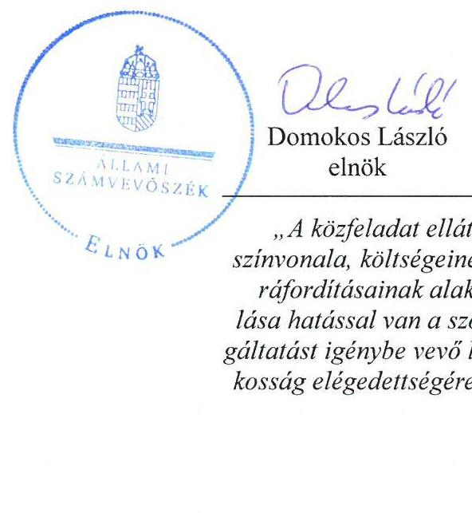

---

# AZ ELLENŐRZÉST FELÜGYELTE:

- BÖRÖCZ IMRE felügyeleti vezető

- AZ ELLENŐRZÉST VEZETTE ÉS A VÉGREHAJTÁSÁÉRT FELELŐS:
  - SALAMIN VIKTOR ellenőrzésvezető
  - A PROGRAM ÖSSZEÁLLÍTÁSÁÉRT FELELŐS:
    - JANIK JÓZSEF osztályvezető

- IKTATÓSZÁM: V-0925-162/2016
- TÉMASZÁM: 1704.
- ELLENŐRZÉS-AZONOSÍTÓ SZÁM: V070715

Jelentéseink az Országgyűlés számítógépes hálózatán és az Interneta a www.asz.hu címen is olvashatóak.

---

# TARTALOMJEGYZÉK 

■ ÖSSZEGZÉS ..... 5
■ AZ ELLENŐRZÉS CÉLJA ..... 7
■ AZ ELLENŐRZÉS TERÜLETE ..... 8
■ AZ ELLENŐRZÉS HÁTTERE, INDOKOLTSÁGA ..... 10
■ FÓKUSZKÉRDÉSEK ..... 12
■ ELLENŐRZÉS HATÓKÖRE ÉS MÓDSZEREI ..... 13
■ MEGÁLLAPÍTÁSOK ..... 15
■ JAVASLATOK ..... 28
■ MELLÉKLETEK ..... 29
I. sz. melléklet: Értelmező szótár ..... 29
II. sz. melléklet: Eredeményklmutatás ..... 32
III. sz. melléklet: A gazdasági társaság müködéséről ..... 33
■ FÜGGELÉK: ÉSZREVÉTELEK ..... 35
■ RÖVIDÍTÉSEK JEGYZÉKE ..... 45

---

.

---

# ÖSSZEGZÉS 

Az Állami Számvevőszék ellenőrzése a helyi közmúvelődési tevékenység támogatása közfeladatát ellátó, önkormányzati tulajdonú Hírös Agóra Kulturális és Ifjúsági Központ Nonprofit Kft. gazdálkodásának szabályszerűségét értékelte 2011-2014. évekre vonatkozóan. Kecskemét Megyei Jogú Város Önkormányzata a közfeladat ellátását biztositotta, tulajdonosi jogait összességében szabályszerűen gyakorolta. A Társaság gazdálkodása alapvetően szabályszerű volt, a beruházások és felújítások elszámolása azonban nem volt megfelelő.

## Az ellenőrzés társadalmi indokoltsága

Az Állami Számvevőszék középtávra szóló stratégiájában megfogalmazta, hogy a helyi önkormányzatok gazdálkodásában rejlő pénzügyi kockázatok feltárásával, az államháztartáson kívülre nyújtott költségvetési támogatások és ingyenes vagyonjuttatások, valamint az államháztartáson kívül múködő közfeladat-ellátó rendszerek ellenőrzéseivel hozzájárul ahhoz, hogy a közpénzeket az államháztartáson kívül múködő szervezetek is átlátható, rendezett módon használják fel a közfeladatok szerződésben vállalt ellátása érdekében.

Magyarországon az intézmény-centrikus közfeladat-ellátás jellemző, de egyre jelentősebb a költségvetésen kívüli feladatellátás térnyerése. Ennek legfontosabb szereplői - a nonprofit szervezetek mellett - az önkormányzati tulajdonú gazdasági társaságok. Az önkormányzatok szervezetalakítási szabadságának következménye, hogy a korábban is vállalati formában múködő közszolgáltatások mellett, mind a kötelező, mind az önként vállalt feladatok ellátásában a gazdasági társaságok kiemelt fontosságú szerephez jutottak.

## Főbb megállapítások, következtetések, javaslatok

Az Önkormányzat a jogszabályi előírásokat betartva szervezte meg a helyi közművelődési feladatok ellátását, a tulajdonosi jogok érvényesítése összességében szabályszerű volt. A Közgyűlés által elfogadott gazdasági programok a közművelődés fejlesztésével kapcsolatban stratégiai célokat, feladatokat határoztak meg. Az Önkormányzat alapító tagi jogosítványait bizottsága útján gyakorolta. A Hírös Agóra Nonprofit Kft. az Önkormányzat kizárólagos tulajdonában volt, a közfeladat ellátásához szükséges ingatlant az Önkormányzat vagyonkezelésbe adta. Az Önkormányzat rendeletben határozta meg a közművelődéssel kapcsolatos céljait és feladatait, a feladat ellátás módját, formáját és finanszírozását a Társasággal megkötött közművelődési megállapodás rögzítette. Az Önkormányzat bizottsága révén ellenőrizte a Társaság múködését, határozatban elfogadta az éves üzleti terveket, a vezető tisztségviselők javadalmazását, valamint az éves beszámolókat. Utóbbiakat a felügyelőbizottság is megtárgyalta, véleményezte, azokat határozattal elfogadásra javasolta.

A Hírös Agóra Nonprofit Kft. rendelkezett a múködéshez szükséges szabályzatokkal, azok a jogszabályi és tulajdonosi előírásoknak megfeleltek. A Társaság üzleti tervei összhangban voltak az Önkormányzat közművelődési feladat ellátására vonatkozó szakmai terveivel. A Társaság vagyongazdálkodása a jogszabályi és belső előírásoknak megfelelt, saját és vagyonkezelésben lévő vagyonára vonatkozóan rendelkezett naprakész, elkülönített vagyonnyilvántartással. A Társaság a 2012. év kivételével nyereségesen gazdálkodott. A 2013-ban bevezetett intézkedések nyomán a saját tőke jegyzett tőke arány helyreállt. A Társaság az árbevételt meghaladó összegben részesült támogatásban az ellenőrzött időszakban. A Társaság kötelezettségállománya és szerkezete nem befolyásolta hátrányosan a közfeladat ellátását és a múködést. A Társaság beszámolóját minden évben elkészítette, 2011. évi beszámolójának nyilvánosságra hozatali és közzétételi kötelezettségét azonban határidőn túl teljesítette. A közfeladat-ellátással kapcsolatos bevételek és ráfordítások elszámolása, az árak meghatározása megfelelő volt, a költségelszámolást megalapozó dokumentumok rendelkezésre álltak. A beruházások, felújítások kiadásai és az értékcsökkenési leírás elszámolásánál ugyanakkor nem érvényesültek teljes körűen a jogszabályi előírások. A Társaságnak adósságot keletkeztető ügylete nem volt, a kormányzati szektor hiányára és az államadósságra befolyással bíró elemei megfeleltek a jogszabályi előírásoknak.

---

Az ÁSZ a Társaság ügyvezetőjének fogalmazott meg javaslatokat, amelyek alapján köteles intézkedési tervet öszszeállítani és azt a jelentés kézhezvételétől számított 30 napon belül az ÁSZ részére megküldeni.

---

# AZ ELLENŐRZÉS CÉLJA 

## A közfeladat ellátást érintő gazdálkodási tevékenység szabályozottságának és szabályszerűségének értékelése

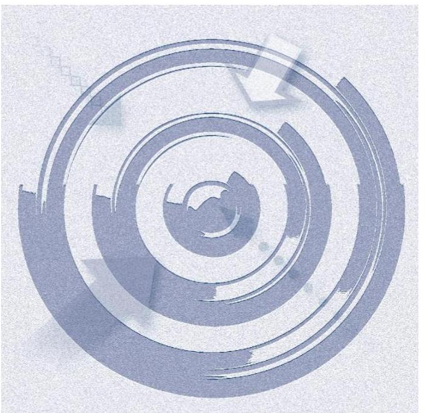

Az ellenőrzés célja annak értékelése, hogy az önkormányzat a jogszabályi előírások figyelembevételével döntött-e az ellenőrzésre kerülő közfeladat megszervezéséről; az önkormányzat/tulajdonosi joggyakorló szabályszerűen gyakorolta-e a tulajdonosi jogokat; a gazdasági társaság közfeladat-ellátása bevételeinek,ráfordításainak elszámolása, és vagyongazdálkodási tevékenysége megfelelt-e a jogszabályi, illetve a közszolgáltatási/vagyonkezelési szerződésben foglalt tulajdonosi előírásoknak, azok végrehajtása szabályszerű volt-e; a gazdasági társaság kötelezettségállománya jelent-e kockázatot a múködésre, illetve a közfeladat ellátására; a közfeladatok átláthatósága és elszámoltathatósága érdekében biztosítva volt-e a közszolgáltatás dijának megalapozottsága szabályszerű önköltségszámítással.

A kiegészítő modul esetében az ellenőrzés célja annak értékelése, hogy a gazdasági társaság gazdálkodásának a kormányzati szektor hiányára és az államadósságra befolyással bíró elemei a jogszabályi előírásoknak megfeleltek-e.

---

# AZ ELLENŐRZÉS TERÜLETE 

## Kecskemét Megyei Jogú Város Önkormányzata és a kizárólagos tulajdonában lévő Hírös Agóra Nonprofit Kft.

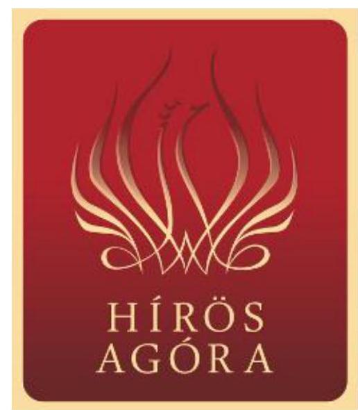

KECSKEMÉT MEGYEI JOGÚ VÁROS ÖNKORMÁNYZATA a Kecskeméti Kulturális és Konferencia Központ Nonprofit Kft.-t egyedüli tagként, határozatlan időre hozta létre. A Társaság cégbírósági bejegyzésére az ellenőrzött időszakot megelőzően, 2009. december 31-én került sor. Elődszervezete, mint önálló költségvetési szerv az Erdei Ferenc Kulturális és Konferencia Központ volt. Mai nevét, a Hírös Agóra Kulturális és Ifjúsági Központ Nonprofit Kft.-t 2015. július 1-jétől viseli. A Társaság nonprofit formában múködő, kiemelten közhasznú, egyszemélyes korlátolt felelősségú társaság. Az Önkormányzat az Mötv. 13. § (1) bekezdés 7. pontja szerinti feladatát (helyi közmúvelődési tevékenység támogatása) a közösségi tér biztosításával, valamint a Társaság tevékenységének támogatásával látja el.

A HÍRÖS AGÓRA NONPROFIT KFT. főtevékenységként közmúvelődési és múvészeti tevékenységet lát el, melynek keretében iskolarendszeren kívüli, önképző, szakképző tanfolyamokat szervez, részt vesz a település környezeti, szellemi, múvészeti értékeinek, hagyományainak feltárásában, megismertetésében, ismeretszerző, alkotó, múvelődő közösségek szervezésében. A Társaság által nyújtott kulturális programokat évente mintegy 1,3 M fő látogatta. A közfeladat ellátásához szükséges eszközök a Társaság tulajdonában vagy vagyonkezelésében voltak az ellenőrzött időszakban. A Társaság törzstőkéje az alapításkor 0,5 M Ft készpénz volt. A Társaság alapítója 11,1 M Ft nem pénzbeli hozzájárulással a törzstőkét 2010. február 4-i hatállyal 11,6 M Ft-ra növelte. A jegyzett tőke összege az ellenőrzött időszakban nem változott.

Az ellenőrzött időszakban a polgármester és a jegyző személye is egy alkalommal változott. A polgármester a 2014. évi önkormányzati választások óta, a helyszíni ellenőrzés időszakában munkakört betöltő jegyző 2013. február 7-től látja el feladatait.

Az 1 ábra a Társaság egyes gazdálkodási adatait mutatja a 2011. és 2014. évek összehasonlításában.

---

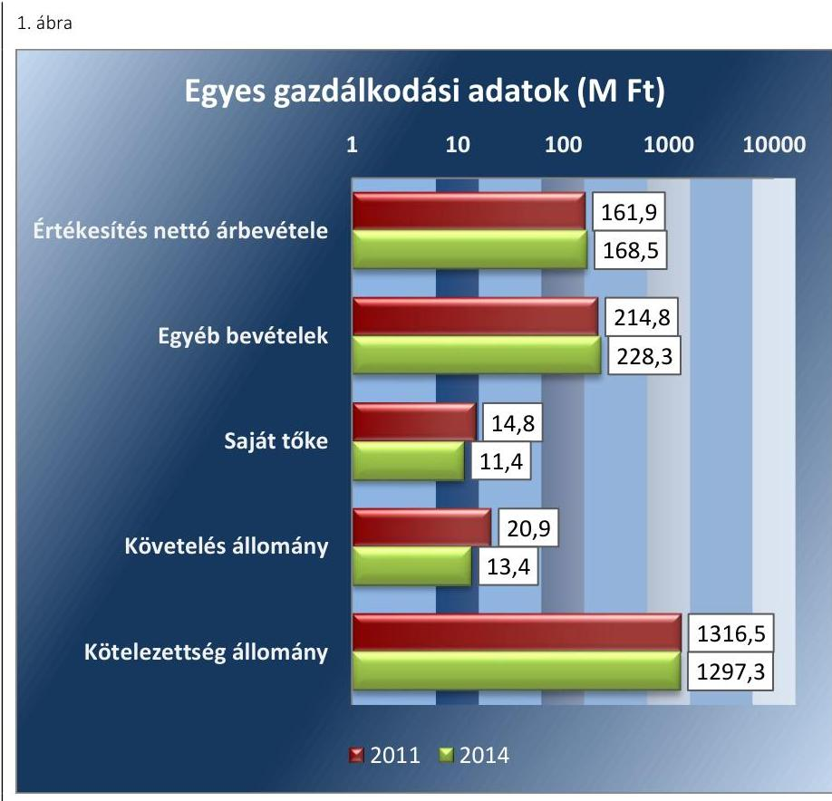

Forrás: A Társaság 2011. és 2014. évi Beszámolói

A Társaság bevételeinek több mint felét az egyéb bevételek alkották, amely magában foglalta az Önkormányzattól kapott működési és felhalmozási célú támogatást. A saját tőke alakulására a mérlegszerinti eredmény elszámolása volt hatással, egyéb jogcímen a tőke elemek nem módosultak. A követelés állomány és a kötelezettségek mérlegértéke 2011. évről 2014. évre egyaránt csökkent. A követelések állományának csökkenésében szerepe volt a partnerek által mutatott kedvezőbb fizetési hajlandóságnak. A kötelezettség állomány alakulását döntően befolyásolta a vagyonkezelésbe vett eszközökhöz kapcsolódó hosszú lejáratú kötelezettség elszámolása. A Társaság által foglalkoztatottak átlagos állományi létszáma a 2011. évi 32 fơről a 2014. évre 29 főre csökkent.

Az ellenőrzött időszakban kettős ügyvezetés valósult meg a Társaságnál. Az egyik ügyvezető a közművelődési, míg a másik a rendezvény- és fesztiválszervezési feladatokat irányította. Az ügyvezetők és a gazdasági vezető személye nem változott az ellenőrzött időszakban.

Az ellenőrzés a kizárólagos tulajdonosi jogokat gyakorló önkormányzatra, illetve a közfeladatot ellátó gazdasági társaság felett tulajdonosi jogokat gyakorló szervezetre és az ellenőrzött közfeladatot ellátó gazdasági társaságra terjed ki.

---

# AZ ELLENŐRZÉS HÁTTERE, INDOKOLTSÁGA 

Objektív kép kialakítása Kecskemét Megyei Jogú Város Önkormányzata által a helyi közmüvelődési tevékenység támogatása közfeladatának megszervezéséről, tulajdonosi joggyakorlásáról, a kizárólagos tulajdonában lévő Hirös Agóra Nonprofit Kft. közfeladat ellátását érintő gazdálkodási tevékenységének szabályszerűségéről, valamint az önkormányzati alszektor hiányára és adósságállományára hatást gyakorló elemek szabályszerűségéről.

## Napjainkban a gazdasági társaságok a közfeladatok ellátásában kiemelt fontosságú szerephez jutottak

AZ ÖNKORMÁNYZATI TULAJDONÚ GAZDASÁGI TÁRSASÁGOK teljes körű ellenőrzésének lehetőségét az ÁSZ. tv. 2011. január 1-jétől hatályos módosítása teremtette meg. A közfeladatot ellátó gazdasági társaságok ellenőrzése kiemelten fontos a vagyon megőrzése, megóvása érdekében, valamint a kormányzati szektor elszámolásaiban megjelenő önkormányzati tulajdonú gazdálkodó szervezetek esetében, valamint a 479/2009/EK rendelet szerint a kormányzati szektorba sorolt egyéb szervezetek közé tartozó, illetve az ESA 95 statisztikai módszertana alapján a "helyi kormányzat alszektorba besorolt társaságok és egyéb szervezetek" esetében is, amelyekkel szemben alapvető követelmény, hogy gazdálkodásuk, múködésük szabályszerű, az általuk szolgáltatott adatok minél megbízhatóbbak legyenek. A közfeladat ellátás költségeinek, ráfordításainak alakulása, színvonala hatással van a lakosság elégedettségére.

A törvényalkotás számára - az észlelt problémák, szabálytalanságok, vagy egyéb nem kívánatos jelenségek felszínre kerülésével - az ellenőrzés megállapításai segítséget nyújthatnak az államháztartáson kívüli közfel-adat-ellátás értékeléséhez, jogszabályi keretei pontosításához, átláthatóságot biztosító szabályozásához. Meghatározhatóvá válnak a közfeladat ellátásban részt vevő államháztartáson kívüli szervezeteknek - az önkormányzat költségvetését, pénzügyi helyzetét is befolyásoló - kockázatai, lehetővé válik ezen kockázatok csökkentése. Ellenőrzéseink feltárhatják, hogy az önkormányzat közfeladat-ellátási kötelezettségének szabályszerűen tett-e eleget, a feladatellátáshoz rendelt közvagyon múködtetését a tulajdonostól elvárható gondossággal, szabályszerűen szervezte-e meg és a tulajdonosi felügyelete hozzájárult-e a közfeladat-ellátásához. Az ellenőrzés rávilágíthat arra, hogy a gazdasági társaság a közszolgáltatási szerződésben foglaltak betartásával, a közvagyon használatával biztosította-e a szolgáltatás folyatatásának feltételeit, a közfeladat ellátását. Ezzel az ellenőrzöttek és a helyi döntéshozók számára visszajelzést ad feladatszervezési, feladat-ellátási kockázataikról, alapot ad a meglévő hibák megszüntetéséhez, a jobb közfeladat-ellátás biztosításához. Fokozza a fegyelmet, igazolja, hogy lejárt a következmények nélküli ellenőrzések időszaka. Az ÁSZ értékteremtő rend kialakításához és megőrzéséhez hozzájáruló tevékenysége pozitív hatással van a szervezetről kialakított összkép formálására.

---

A KIEGÉSZÍTŐ MODUL esetében az ellenőrzés háttere, hogy a korábban is vállalati formában múködő közszolgáltatások mellett, mind a kötelező, mind az önként vállalt feladatok ellátásában a gazdasági társaságok kiemelt fontosságú szerephez jutottak.

A nemzeti számlák összeállításának módszertana 2014. október 1-jétől megváltozott, amely értelmében az ESA 2010 felváltotta az ESA 95 módszertant. A nemzeti számlák rendszerének legfontosabb jellemzői, alapvető vonásai változatlanok maradtak, ugyanakkor az ESA 2010 követi a gazdasági környezetben lezajlott változásokat, figyelembe veszi az új kutatási eredményeket és a felhasználók új igényeit.

Az ellenőrzés során feltárjuk, hogy az önkormányzati alszektorba sorolt többségi önkormányzati tulajdonban lévő gazdasági társaságok gazdálkodása milyen mértékben befolyásolja a költségvetési hiányt és az államadósságot. Az ellenőrzés rámutathat a többségi önkormányzati tulajdonú gazdasági társaságok gazdálkodási tevékenységével, valamint az államháztartásból származó források felhasználásával kapcsolatos jó gyakorlatokra és szabálytalanságokra. Felhívhatja a figyelmet a jogszabályi követelmények teljesítéséhez szükséges feltételek hiányosságaira, hozzájárulhat az államháztartáson kívüli, de (közvetlenül vagy közvetve) önkormányzati vagyont használó gazdasági társaságok tevékenységének átláthatóságához. Hozzájárulhat a közfeladat-ellátás minőségének javulásához.

---

# FÓKUSZKÉRDÉSEK 

1.     - Az önkormányzat közfeladat megszervezéséről szóló döntése, valamint tulajdonosi joggyakorlása szabályszerű volt-e?
2.     - A gazdasági társaság vagyongazdálkodása szabályszerű volt-e, kötelezettségállománya jelentett-e kockázatot a müködésre, illetve a közfeladat ellátására?
3.     - A gazdasági társaságnál az ellátott közfeladat bevételei és ráfordításai elszámolása, valamint az önköltségszámítás és árképzés szabályszerű volt-e?
4.     - A többségi önkormányzati tulajdonban lévő gazdasági társaságok gazdálkodásának a kormányzati szektor hiányára és az államadósságra befolyással bíró elemei megfeleltek-e a jogszabályi előírásoknak?

---

# ELLENŐRZÉS HATÓKÖRE ÉS MÓDSZEREI 

## Az ellenőrzés típusa

Megfelelőségi ellenőrzés.

## Az ellenőrzött időszak

2011. január 1-jétől 2014. december 31-ig tart.

## Az ellenőrzés tárgya

A közfeladatot gazdasági társaságokkal ellátó önkormányzatok tulajdonosi joggyakorlása, valamint gazdasági társaságok pénz- és vagyongazdálkodásának szabályozottsága és szabályszerűsége.

A kiegészítő modul esetében a kormányzati szektor önkormányzati alszektorába sorolt, többségi önkormányzati tulajdonban lévő gazdasági társaságok gazdálkodásának a kormányzati szektor hiányára és az államadósságra befolyással bíró elemei szabályszerűsége.

Az ellenőrzés kiterjed minden olyan körülményre és adatra, amely az ÁSZ jogszabályban meghatározott feladatainak teljesítéséhez, valamint a program végrehajtása folyamán felmerült újabb összefüggések feltárásához szükséges.

## Az ellenőrzött szervezet

Az ellenőrzött szervezetek:
$\longrightarrow$ Kecskemét Megyei Jogú Város Önkormányzata,
$\longrightarrow$ Hírös Agóra Kulturális és Ifjúsági Központ Nonprofit Kft.

## Az ellenőrzés jogalapja

Az ellenőrzés jogszabályi alapját az ÁSZ tv. ${ }^{1}$ 5. § (3)-(4)-(5) bekezdései képezik. Ennek értelmében az ÁSZ ellenőrzi az államháztartásból nyújtott támogatás vagy az államháztartásból meghatározott célra ingyenesen juttatott vagyon felhasználását a gazdasági társaságoknál. Az önkormányzati vagyon kezelésének ellenőrzése keretében ellenőrzi a vagyon kezelését, a vagyonnal való gazdálkodást, a többségi önkormányzati tulajdonban lévő gazdasági társaságok vagyonérték-megőrző és vagyongyarapító tevékenységét, az államháztartás körébe tartozó vagyon elidegenítésére, illetve megterhelésére vonatkozó szabályok betartását; ellenőrizheti a többségi

---

önkormányzati tulajdonban lévő gazdasági társaságok vagyongazdálkodását.

# Az ellenőrzés módszerei 

Az ellenőrzést a nemzetközi standardokat irányadónak tekintve az ellenőrzési program ellenőrzési kérdései, az ellenőrzött időszakban hatályos jogszabályok, az ellenőrzés szakmai szabályok és módszertanok figyelembe vételével végezzük.

Az ellenőrzés ideje alatt az ellenőrzött szervezettel történő kapcsolattartást az ÁSZ Szervezeti és Működési Szabályzatának vonatkozó előírásai alapján biztosítjuk.

Az ellenőrzés a kiválasztott, többségi tulajdonosi jogokat gyakorló önkormányzatra, illetve az ellenőrzésre kijelölt közfeladatot ellátó gazdasági társaság felett tulajdonosi jogokat gyakorló szervezetre és az ellenőrzött közfeladatot ellátó gazdasági társaságra terjed ki. Amennyiben a gazdasági társaságban több önkormányzat együttesen többségi tulajdonos, úgy az ellenőrzést a többségi tulajdonosi jogokat gyakorló önkormányzatnál kell lefolytatni. Az ellenőrzött gazdasági társaságnál, amennyiben az több közfeladatot is ellát, akkor az ellenőrzésre kiválasztott közfeladat-ellátást ellenőrizzük.

Az ellenőrzést a kérdésekre adott válaszok kiértékelésével, valamint a megjelölt adatforrások, tanúsítványok felhasználásával, továbbá az adott időszakban hatályos jogszabályok figyelembe vételével kell lefolytatni. Az ellenőrzési kérdések megválaszolásához szükséges bizonyítékok megszerzése a következő ellenőrzési eljárások alkalmazásával történik: megfigyelés, kérdésfeltevés (információkérés), összehasonlítás, valamint elemző eljárás.

A bevételek és ráfordítások elszámolása, valamint a vagyonnyilvántartás terén a szabályszerű működést véletlen mintavétellel ellenőriztük. A kormányzati szektorba sorolt gazdálkodó szervezetek esetében a személyi jellegű ráfordítások elszámolása mellett az egyéb ráfordítások, pénzügyi műveletek ráfordításai, rendkívüli ráfordítások, illetve az egyéb bevételek, pénzügyi műveletek bevételei, rendkívüli bevételek elszámolásának szabályszerűségét szintén mintatételeken keresztül ellenőriztük. A mintavétellel ellenőrzött területek esetében minden egyes tétel vonatkozásában a szabályszerűségre vonatkozó kérdéseket tettünk fel, amelyek eredménye összesítésre került. A jogszabályoknak és a belső előírásoknak megfelelőnek tekintettük az adott területet, amennyiben a minta ellenőrzésének eredménye alapján 95\%-os bizonyossággal a teljes sokaságban a hibaarány kisebb volt, mint 10\%, nem megfelelőnek értékeltük, ha a hibaarány a 10\%ot meghaladta. Kockázatot, illetve magas kockázatot jeleztünk, amennyiben egy adott terület vonatkozásában a minta alapján a teljes sokaságban nem volt egyértelműen biztosított a jogszabályoknak és a belső szabályzatoknak megfelelő működés. A ráfordítások elszámolására és a vagyonnyilvántartásra vonatkozó véletlen mintavételt kockázati alapú kiválasztással egészítettük ki, amelynek során évente a három legnagyobb összegű tételt választottuk ki.

---

# 1. Az önkormányzat közfeladat megszervezéséről szóló döntése, valamint tulajdonosi joggyakorlása szabályszerű volt-e? 

Összegző megállapítás

Az Önkormányzat a jogszabályi előírásokat betartva szervezte meg a helyi közművelődési tevékenység támogatása közfeladatának ellátását, a közfeladat-ellátás önkormányzati felügyelete, a tulajdonosi jogok érvényesítése összességében szabályszerű volt.

### 1.1. számú megállapítás

Az Önkormányzat a jogszabályi előírások figyelembevételével döntött a helyi közművelődési tevékenység támogatása közfeladatának megszervezéséről.
2. ábra

A szabályozás elemei, főbb területei

## Közművelődési

rendelet

Feladatellátás módja, feladatellátás feltételei, finanszírozás

## Közművelődési

megállapodás

Közművelődési feladat tárgya, személyi, pénzügyi és tárgyi feltételei

Vagyonkezelői szerződés

Elszámolási kötelezettség

A Közgyűlés² által elfogadott, 2007-2013-ig és 2013-2014-ig szóló gazdasági programok a közművelődés fejlesztésével kapcsolatban stratégiai célokat, feladatokat határoztak meg. Az Önkormányzat hosszú távú feladatai tartalmaztak a Társasággal ${ }^{3}$ szemben megfogalmazott követelményeket. Ezek kitértek a gyermek- és ifjúságvédelmi feladatokról való gondoskodásra, a közösségi tér biztosítására, a közművelődési, tudományos, és művészeti tevékenységekre, a sport támogatására, a nemzeti és etnikai kisebbségek jogai érvényesítésének biztosítására, az egészséges életmód közösségi feltételeinek elősegítésére. A gazdasági programok megfeleltek az Ötv. ${ }^{4}$ 91. § (6) és (7), valamint az Mötv. ${ }^{5}$ 116. § (1)-(4) bekezdéseiben előírtaknak, a főbb fejlesztési irányokat és célokat a helyi lehetőségek, adottságok alapján határozták meg.

KÖZFELADAT ELLÁTÁSÁRA vonatkozó települési tervekkel, valamint integrált városfejlesztési tervvel rendelkezett az Önkormányzat ${ }^{6}$, azok tartalmaztak az ellenőrzött közfeladat ellátásának fejlesztésére vonatkozó terveket. A városfejlesztési tervben meghatározták a kulturális kínálat jellemzőit és mutatóit, a kulturális és turisztikai projektek keretében létrehozandó közösségi központok ismertetését, melyek területi közművelődési tanácsadó szolgáltató és közösségi, képzési funkciókat látnának el. A programok módosítását, aktualizálását az Önkormányzat a megváltozott társadalmi-gazdasági feltételekhez igazítva folyamatosan elvégezte.

A HELYI KÖZMÚVELŐDÉSI FELADATOK nonprofit gazdasági társaság működtetésével történő ellátásáról az Önkormányzat az ellenőrzött időszakot megelőzően döntött. A közfeladat ellátását az Ötv. 9. § (4) bekezdésében előírtakkal összhangban a 2009-ben alapított Hírös Agóra Nonprofit Kft. ${ }^{7}$ működtetésével biztosította. A feladatellátás szabályozási kereteit a 2. ábra mutatja be.

---

AZ ALAPÍTÓ OKIRAT ${ }^{8}$ a Gt. tv. ${ }^{9}$ előírásainak megfelelő tartalommal készült, figyelemmel a Közm. tv. ${ }^{10}$ 76-78. §-ban foglaltakra. Abban meghatározták az Alapító ${ }^{11}$ kizárólagos hatáskörébe tartozó ügyeket, az ügyvezetők feladatait, az Alapító felé történő beszámolási kötelezettséget.

AZ ÜGYVEZETŐK feladatai többek közt, hogy képviselik a Társaságot harmadik személyekkel szemben, gondoskodnak a Társaság üzleti könyveinek szabályszerű vezetéséről, az Alapító kérésére felvilágosítást adnak a Társaság ügyeiről, javaslatot tesz a könyvvizsgáló személyére, majd köteles a megválasztott könyvvizsgálóval szerződést kötni, illetve az Alapító felé félévente írásbeli jelentés formájában köteles beszámolni.

KÖZMŰVELŐDÉSI RENDELETET ${ }_{1,2}{ }^{12}$ alkotott az Önkormányzat - a Közm. tv. 77. §-ban előírtakkal összhangban - a közművelődéssel kapcsolatos céljainak és feladatainak, a feladat ellátás módjának és formájának, a közművelődési intézményhálózatnak, a feladatellátás tárgyi és személyi feltételeinek és finanszírozásának meghatározására.

KÖZMŰVELŐDÉSI MEGÁLLAPODÁST ${ }^{13}$ 2010. január 1jén kötött egymással a Társaság és az Önkormányzat. A megállapodás tartalmazta a Közm. tv. 79. § (2) bekezdésében foglaltakat, azaz az ingyenesen és térítési díjért igénybe vehető szolgáltatásokat, a megállapodás személyi, tárgyi és pénzügyi feltételeit, a közművelődési feladat megvalósításában közreműködőktől megkívánt szakképzettséget. A megállapodás a Közm. tv. 76-78. §, a Közm. rendelet ${ }_{1,2}$ és az SZMSZ ${ }_{1,2}{ }^{14}$ előírásaiban foglaltaknak megfelelően tartalmazta az Önkormányzat által megrendelt közművelődési feladatokat, azok ellátásának módját, gyakoriságát, a Társaság által fenntartandó szervezeteket. A megállapodás mellékletében rögzítették a közhasznúsági tevékenységek részvételi díjait.

VAGYONKEZELŐI SZERZŐDÉS ${ }^{15}$ jött létre az Önkormányzat és a Társaság között, melynek keretében az Önkormányzat a közművelődési közfeladat ellátását szolgáló, tulajdonát képező ingatlanokat a Társaság részére vagyonkezelésbe adta. A vagyonkezelői jogot az ingatlannyilvántartásról szóló 1997. évi CXLI. törvény 3. § (2) bekezdés előírásai szerint az ingatlan-nyilvántartásba bejegyeztették. A szerződésben rendelkeztek a felek a szerződéskötéskor hatályos Áht ${ }_{1}{ }^{16} 105 /$ A. § előírásainak megfelelően a kezelt vagyon felújításáról, pótlólagos beruházásáról való gondoskodás kötelezettségéről. A vagyonkezelői szerződésben rögzítették, hogy a Társaság a vagyonkezelésbe vett vagyon után elszámolt és a bevételekben megtérült értékcsökkenés összegének a felhasználásáról évente köteles elszámolni.

# 1.2. számú megállapítás 

Az Önkormányzat a közfeladat-ellátás felügyelete és a tulajdonosi jogok gyakorlása során összességében szabályszerűen járt el.

A KÖZGYŰLÉS az Ötv. 9. §-át és Mötv. 41. §-át figyelembe véve az SZMSZ ${ }_{1,2}$-ben szabályozta a tulajdonosi jogok gyakorlásának rendjét. A tulajdonosi joggyakorlás kérdéskörébe tartozó ügyek megtárgyalását a KVB $^{17}$, 2014. október 22. után VPB ${ }^{18}$ hatáskörébe utalta. A bizottságok elkészítették ügyrendjüket, feladataikat ezek alapján látták el. A KVB és a VPB folyamatosan figyelemmel kísérte, megtárgyalta és értékelte a Társaság

---

gazdálkodását, a közművelődési megállapodásban foglaltak érvényesülését, elfogadta az éves számviteli beszámolót. Az Alapító Okiratban meghatározott döntéseket meghozták.

A Társaságnál a köztulajdon védelme érdekében háromtagú FB múködött a Gt. tv. 34. § (1) bekezdésének és a Ptk. 3:121. § (1) bekezdésének előírásai alapján. Az FB a Gt. tv. 34. § (4) bekezdésben előírtaknak eleget téve elkészítette ügyrendjét, amit az erre a hatáskörre felruházott KVB fogadott el. Az FB az ügyrendben megfogalmazottak szerint látta el feladatait. Ellenőrizte az üzleti terveket és a féléves beszámolókat, állást foglalt az ügyvezetők feladatainak teljesítését illetően, javaslatot tett a könyvvizsgáló személyére, a Számv. tv. előírásai alapján elkészített éves beszámolóról írásbeli jelentést készített a Gt. tv. 35. § (3) bekezdésének (2014 március 15-től Ptk. 3:120. §) megfelelően. Figyelemmel kísérte és értékelte a belső ellenőrzés megállapításainak realizálására - Társaság által - készített Intézkedési tervek végrehajtását.

# AZ ANYAGI ÖSZTÖNZÉSI RENDSZERT a 

Taktv. ${ }^{19}$ 5. § (3) bekezdésében foglaltaknak megfelelően a Közgyűlés által elfogadott vezetői javadalmazási szabályzatban rögzítették. A szabályzat kiterjedt az ügyvezetőkre, a vezető beosztású munkavállalókra, az FB elnökére és tagjaira. A szabályzatban meghatározták a javadalmazási rendszer alapelveit, szabályait és a béren kívüli juttatások körét.

A KVB és a VPB meghatározta az ügyvezetők prémiumfeladatait, az FB álláspontja ismeretében azok kiértékelését elvégezte.

ÜZLETI TERVET a Társaság az ellenőrzött időszak minden évében készített, annak tartalmi követelményeit évente határozta meg az Önkormányzat. A Társaság az üzleti tervek teljesítésének időarányos helyzetéről félévente számolt be a KVB és VPB részére.

## A TÁRSASÁG DÍJKÉPZÉSÉRE VONATKOZÓAN

2013. november 28-ig a közművelődési rendelet ${ }_{1}$ és a közművelődési megállapodás is tartalmazott előírásokat. A közművelődési rendelet ${ }_{1}$ előírta a díjköteles szolgáltatások esetében a számított önköltség összegét elérő vagy azt meghaladó díj alkalmazását. Ezzel szemben a közművelődési megállapodásban rögzítették a Társaság által alkalmazandó tagdíjak és részvételi díjak konkrét összegét. A két szabályozás közötti összhang nem volt biztosított. 2013 november 29-től, a közművelődési rendelet ${ }_{2}$ hatálybalépésével az ellentmondás megszűnt, a közművelődési rendelet ${ }_{2}$ nem tartalmazott a díjak képzésére vonatkozó előírást, így a díjképzés vonatkozásában a közművelődési megállapodásban foglaltak voltak irányadóak.

A BESZÁMOLTATÁS RENDJÉT az Alapító Okiratban rögzítették, mely szerint az ügyvezetők félévente kötelesek voltak a Társaság tevékenységéről számot adni. Továbbá minden évben külön levélben felhívták a Társaságot az éves beszámoló elkészítésének kötelezettségére, melyben meghatározták az elkészítés határidejét és a főbb tartalmi követelményeket.

A féléves beszámolók szöveges és számszaki adatokat tartalmazva mutatták be a közművelődési megállapodásban meghatározott követelmé-

---

nyek betartását, melyeket értékeltek és elfogadtak. A közművelődési feladat végrehajtásáról szóló szakmai beszámolókat a Társaság ügyvezetői minden évben elkészítették. Azok az adott év munkájának értékelése mellett a következő gazdasági év közművelődési munka- és rendezvényterveit is tartalmazták. A szakmai beszámolókat 2011-2013. évekről a Közgyűlés Oktatási, Kulturális és Egyházügyi Bizottsága, a 2014. évről készített szakmai beszámolót az Értékmegőrzési Bizottság - az SZMSZ1,2 előírásaival összhangban - határozattal fogadta el. A Társaság a Számv. tv. ${ }^{20}$ 4. §-ban előírt követelménynek megfelelően az ellenőrzött időszak minden évében elkészítette és a Számv. tv. 154 (1) bekezdésének megfelelően közzétette az éves beszámolóját.

A beszámolókat az FB a Gt. tv. 35. § (3) bekezdésének majd a Ptk. 3:120. § (2) bekezdésének megfelelően minden évben megtárgyalta, határozatban javasolta a KVB, illetve VPB általi elfogadását. A bizottságok a 2011-2014. évi beszámolók elfogadásáról határozatot hoztak.

A KÖZVAGYONNAL történő gazdálkodásról évente két alkalommal beszámoltatták a Társaságot. A Társaságnak a múködési adatai mellett be kellett mutatni a néhány mutatószám alakulását (pl. a kamatok és adók levonása előtti eredményt, eszközarányos nyereséget, sajátfőke-arányos nyereséget), a múködési cash-flow-t, a beruházási cash-flow-t, a likviditási mutatót, a statisztikai létszám alakulását.

BELSŐ ELLENŐRZÉST a Polgármesteri Hivatal ${ }^{21}$ Ellenőrzési csoportja 2011. évben végzett a Társaságnál. Az ellenőrzés több hiányosságot megállapított, amellyel összefüggésben az Önkormányzat a felelősöket és a végrehajtási határidőket is tartalmazó Intézkedési terv készítését írta elő. A Társaság által készített Intézkedési terv végrehajtását az FB folyamatosan figyelemmel kísérte, az abban foglaltak végrehajtásáról számon kérte a Társaságot. Az Önkormányzat megbízásán alapuló külső szakértői ellenőrzésre nem került sor.

GARANCIA- ÉS KEZESSÉGVÁLLALÁST az Önkormányzat az ellenőrzött időszakban nem teljesített. A Társaság az időszakban hitelt nem vett fel, kötvényt nem bocsátott ki, részéről egyéb, adósságot keletkeztető ügylet kötelezettségvállalásra nem került sor. Az 1. táblázat mutatja be az Önkormányzat által a Társaság felé folyósított támogatások évenkénti alakulását az ellenőrzött időszakban.

1. táblázat

FOLYÓSÍTOTT ÖNKORMÁNYZATI TÁMOGATÁSOK ALAKULÁSA (M FT)

|  |  |  |  |  |
| :-- | --: | --: | --: | --: |
| Megnevezés | 2011. | 2012. | 2013. | 2014. |
| Múködési célú, rendszeres |  |  |  |  |
| támogatás | 168,8 | 160,3 | 168,6 | 170,6 |
| Eseti jellegú támogatás | 23,3 | 13,1 | 18,1 | 20,0 |
| Fejlesztési célú támogatás | 0,0 | 0,0 | 0,0 | 0,2 |
| Összesen | 192,1 | 173,4 | 186,7 | 190,8 |

A Társaság részére folyósított rendszeres múködési célú támogatások összege az ellenőrzött időszak végére minimálisan, 1\%-kal emelkedett. Fejlesztési célú támogatást biztonsági és marketing berendezés vásárlására kapott csekély összegben a Társaság.

---

# 2. A gazdasági társaság vagyongazdálkodása szabályszerű volt-e, kötelezettségállománya jelentett-e kockázatot a múködésre, illetve a közfeladat ellátására? 

Összegző megállapítás

A Hírös Agóra Nonprofit Kft. gazdálkodásának szabályozottsága, vagyongazdálkodása megfelelt a jogszabályi előírásoknak, kötelezettségállománya nem befolyásolta hátrányosan a közfeladat ellátását és a Társaság múködését.
2.1. számú megállapítás

A Társaság rendelkezett a múködéshez szükséges szabályzatokkal, azok a jogszabályi és tulajdonosi előírásoknak megfeleltek.

AZ ÜZLETI TERVEKET az FB és a könyvvizsgáló előzetes véleménye alapján KVB határozatokkal fogadta el. A Társaság üzleti tervei összhangban voltak az Önkormányzat közművelődési feladat ellátására vonatkozó szakmai terveivel, a gazdasági program ${ }_{1,2}$-ben foglaltakkal a szolgáltatás ellátás, tervezett eredmény, tervezett fejlesztések, szervezeti változások tekintetében.

A Társaság tevékenységi körét, közfeladat ellátás alapfeltételeit az Alapító okirat, a Szervezeti Múködési Szabályzat és az Közművelődési megállapodás tartalmazta.

A Társaság az ellenőrzött időszakban rendelkezett a Számv. tv. 14. § (3) bekezdésében előírt számviteli politikával. Ennek mellékleteiként elkészítette a Számv. tv. 14. § (5) bekezdése előírásainak megfelelő eszközök és források értékelési szabályzatát, eszközök és források leltárkészítési és leltározási szabályzatát, pénzkezelési szabályzatát, valamint önköltségszámítási szabályzatát. Elkészítették továbbá a Számv. tv. 161. § (1) bekezdésében előírt számlarendet.

A SZÁMVITELI POLITIKA a Számv. tv. 14. § (4) bekezdésben foglalt előírásoknak megfelelt, azt a jogszabály válozásának megfelelően aktualizálták.

Az eszközök és források leltárkészítési és leltározási szabályzata a mérleg alátámasztására szolgáló leltárak elkészítésének szabályait a Számv. tv. 69. § (1)-(2) bekezdésével összhangban rögzítette. Mennyiségi leltározási kötelezettséget - 2012. január 1-jétől - a Számv. tv. 69. § (3) bekezdésben rögzítetteknek megfelelően három évenkénti gyakorisággal írtak elő.

A Számv. tv. 14. § (5) bekezdés b) pontjának megfelelő értékelési szabályzat tartalmazza az eszközök és források bekerülési értékének, valamint értékelésének szabályait.

A pénzkezelési szabályzatban a Számv. tv. 14. § (8) bekezdésében előírtaknak megfelelően - többek között - rendelkeztek a pénzforgalom lebonyolításának rendjéről, a készpénzben és a bankszámlán tartott pénzeszközök közötti forgalomról, a bankkártya használat rendjéről, a készpénzállomány ellenőrzésekor követendő eljárásról, az ellenőrzés gyakoriságáról.

Önköltségszámítási szabályzat készítésének kötelezettsége alól a Számv. tv. 14. § (7) bekezdése alapján mentesült a Társaság, ugyanakkor a

---

számviteli politika V. számú mellékleteként elkészített szabályzat a helyiségek bérbeadása kapcsán tartalmazta az önköltségszámítás szabályait.

# 2.2. számú megállapítás 

A Hírös Agóra Nonprofit Kft. vagyongazdálkodása, a vagyon nyilvántartása, kezelése, gyarapítása, hasznosítása a jogszabályi és belső előírásoknak megfelelt.

Az eszközök nyilvántartása a Számv. tv. 159. §-a alapján analitikus nyilvántartás keretében egyedi nyilvántartó kartonokon történt, amelyeken folyamatosan nyomon követhetők voltak a változások. A Társaság saját és vagyonkezelésben lévő vagyonára vonatkozóan rendelkezett naprakész vagyonnyilvántartással. A vagyonkezelésre átvett eszközt a vagyonkezelői szerződésben előírtak szerint, a saját vagyontól elkülönítetten tartották nyilván.

## A VAGYONKEZELT ESZKÖZÖK LELTÁROZÁSÁT a

Társaság a vagyonkezelői szerződésnek megfelelően minden évben elvégezte. A vagyonkezelői szerződés előírásait betartva a vagyon megterhelésére, elidegenítésére, ingyenes átruházására nem került sor. A Társaság az ingatlan-nyilvántartásba történő vagyonkezelői jog bejegyzési kötelezettségének eleget tett. A kezelésbe vett vagyon után elszámolt értékcsökkenés összegének felhasználásáról elszámolt. Az elkülönítetten nyilvántartott, értékcsökkenés bevételben megtérülő összegét a vagyonkezelésbe vett vagyon pótlására, bővítésére fordította, valamint jövőbeli beruházásokra tartalékolta az Áht.: 105/A. § (6) bekezdésnek és a Mötv. 109. § (6) bekezdésének megfelelően.

A közfeladat-ellátás során a Társaság vagyonkezelése, vagyonérték megőrzése, gyarapítása, hasznosítása a vagyonkezelői szerződésben foglaltaknak megfelelően történt, azokat az éves számviteli beszámolók adatai tükrözik. Az Önkormányzat nem írt elő a Társaság részére a vagyongazdálkodási döntések megalapozására előterjesztést. A tulajdonos a Társaság vagyongazdálkodási döntéseit, a fejlesztéseket az üzleti tervek jóváhagyásával elfogadta.

A Társaság a tárgyi eszközök mennyiségi felvétellel történő leltározását a Számv. tv. 69. § (3) bekezdésében, valamint a leltározási és leltárkészítési szabályzatban előírtakkal összhangban elvégezte.

A társaság mérlegének kiemelt adatait a 2. táblázat tartalmazza.

---

| HÍRÖS AGÓRA NONPROFIT KFT. MÉRLEGÉNEK KIEMELT ADATAI (M FT) |  |  |  |  |  |
| :--: | :--: | :--: | :--: | :--: | :--: |
| Megnevezés | 2011.01.01 | 2011.12.31. | 2012.12.31. | 2013.12.31. | 2014.12.31. |
| I. Befektetett eszközök | 1303,8 | 1297,0 | 1292,3 | 1281,4 | 1272,8 |
| - ebből: Tárgyi eszközök | 1303,4 | 1296,8 | 1292,2 | 1281,4 | 1272,8 |
| II. Forgó eszközök | 28,6 | 51,4 | 42,1 | 44,1 | 50,5 |
| - ebből: Követelések | 8,9 | 20,9 | 16,6 | 10,0 | 13,4 |
| III. Aktív időbeli elhatárolások | 5,5 | 4,1 | 2,4 | 4,4 | 0,4 |
| Eszközök összesen | 1337,9 | 1352,5 | 1336,8 | 1329,9 | 1323,7 |
| IV. Saját tőke | 11,4 | 14,8 | $-0,5$ | 7,6 | 11,4 |
| - ebből: Jegyzett tőke | 11,6 | 11,6 | 11,6 | 11,6 | 11,6 |
| - ebből Mérleg szerinti eredmény | $-0,2$ | 3,4 | $-15,3$ | 8,1 | 3,7 |
| V. Céltartalékok | 0,0 | 0,0 | 0,0 | 0,0 | 0,0 |
| VI. Kötelezettségek | 1308,2 | 1316,5 | 1326,2 | 1305,4 | 1297,3 |
| - ebből Hosszú lejáratú | 1292,8 | 1286,5 | 1279,2 | 1276,1 | 1273,1 |
| VII. Passzív időbeli elhatárolások | 18,3 | 21,2 | 11,1 | 16,9 | 15,0 |
| Források összesen | 1337,9 | 1352,5 | 1336,8 | 1329,9 | 1323,7 |

A tárgyi eszközök és a kötelezettségek között jelentős értéket képviselt az Önkormányzattól a közfeladat ellátása érdekében vagyonkezelésbe vett ingatlan értéke. A vagyonkezelt ingatlan értékét a Társaság 1,3 M Ft öszszegben vette nyilvántartásba 2010-ben az ingatlanok és a hosszú lejáratú kötelezettségek között. A hosszú lejáratú kötelezettségek összegét a bevételekben meg nem térülő értékcsökkenés összegével - 2014. december 31-ig 26,9 M Ft-tal - 1273,1 M Ft-ra csökkentették. A bevételekben megtérült értékcsökkenés összegének megfelelő lekötött tartalékot képeztek (14,8 M Ft összegben), melyből 5,3 M Ft-ot a vagyonkezelt ingatlan teherliftjének felújítására használtak fel a vagyonkezelői szerződésben előírtaknak megfelelően.

Az Aktív időbeli elhatárolások mérlegértékének alakulására az év végén elszámolt, következő évet terhelő ráfordítások számviteli elszámolása volt hatással.

A Társaság a 2012. év kivételével nyereségesen gazdálkodott. A 2012. évi 15,3 M Ft veszteség keletkezésének okaiként - többek között - a lakosság fizetőképességének csökkenését, a szponzorációs bevételek elmaradását, valamint a jogdíjak emelkedését jelölték meg a kiegészítő mellékletben. Az eredményt negatívan befolyásoló tényezők kiküszöbölésére 2013ban rugalmasabb és költséghatékonyabb tervezési munkamenetet vezettek be, gazdaságossági szempontok alapján felülvizsgálták a programtípusokat, illetve két megüresedett álláshelyet nem töltöttek be.

A Passzív időbeli elhatárolások között minden évben nagy súllyal szerepel a bevételek elhatárolása, melynek oka az üzleti évet követő év előadásaira elővételben, vagy bérletes konstrukció keretében értékesített belépőjegyekből származó bevétel elhatárolása.

A Hírös Agóra Nonprofit Kft. üzleti eredményeit, valamint a pénzügyi bevételeinek és ráfordításainak alakulását mutatja az éves eredménykimutatások adatai alapján a II. számú melléklet.

---

# 2.3. számú megállapítás 

A 2011-2013. években a Társaság nettó árbevétele kis mértékben, de fokozatosan csökkent, majd az ellenőrzött időszak utolsó évében 5,8\% növekedést mutatva 168,5 M Ft-ra emelkedett. A Társaság az árbevételt meghaladó összegben részesült támogatásokban, amelyet az egyéb bevételek között mutattak ki.

## A Hírös Agóra Nonprofit Kft. kötelezettségállománya, eladósodottságának mértéke és szerkezete nem befolyásolta hátrányosan a közfeladat ellátását és a Társaság múködését.

A Társaság részére az Önkormányzat garanciát, kezességet nem vállalt az ellenőrzött időszakban. Az összes forrásra jutó idegen tőke aránya 97-98\% között mozgott, a múködés kiadásait a realizált árbevételen túl az Önkormányzat által jutatott támogatások finanszírozták.

A Társaság beszámolóiban a vagyonkezelésbe vett eszközök Számv. tv. 42. § (5) bekezdésében előírtak szerinti számviteli elszámolása miatt mutatott ki hosszú lejáratú kötelezettséget. A fizetési kötelezettséggel járó - rövid lejáratú - kötelezettségek mérlegértéke 2011-ben 30 millió Ft, 2012-ben 47,0 millió Ft, 2013-ban 29,3 millió Ft, 2014-ben 24,2 millió Ft volt. A Társaság eladósodottságát jelző mutatóinak alakulását 20112014. években a 3. táblázat mutatja be.
3. táblázat

PÉNZÜGYI MUTATÓSZÁMOK ALAKULÁSA 2011-2014. KÖZÖTT

| Megnevezés | 2011. | 2012. | 2013. | 2014. |
| :--: | :--: | :--: | :--: | :--: |
| Eladósodottság mértéke   kötelezettségek**/saját tőke | 2,0 | nem értelmezhető* | 3,9 | 2,1 |
| Nettó eladósodottság   (kötelezettségek** követelések)/saját tőke | 0,6 | nem értelmezhető* | 2,5 | 0,9 |
| Adósságfedezeti mutató I.   (befektetett eszközök+forgóeszközök)/idegen forrás | 1,0 | 1,0 | 1,0 | 1,0 |
| Árbevételre vetített eladósodottság   (kötelezettségek**-forgóeszközök)/értékesítés nettó árbevétele | nem értelmez-   hetö*** | 0,03 | nem értelmez-   hetö*** | nem értelmez-   hetö*** |

*nem értelmezhető: 2012-ben a saját tőke értéke negatív volt ( $-0,5 \mathrm{MFt}$ )
**A mutató számítása során nem vettük figyelembe a fizetési kötelezettséggel nem járó, vagyonkezelésbe vett eszközök számviteli elszámolásához kapcsolódó kötelezettségek értékét.
***nem értelmezhető: a forgóeszközök értéke fedezetet nyújtott a kötelezettségekre
Forrás: A Társaság 2011-2014. évi Beszámolói

A rövid lejáratú kötelezettségek állománya az ellenőrzött években meghaladta a saját tőke értékét, 2011-ben és 2014-ben egyaránt duplája volt, a saját forrás a kötelezettségek felére nyújtott fedezetet.

A nettó eladósodottság mutató értéke szerint a kintlévőségekkel csökkentett kötelezettségekre a saját forrás 2011-ben és 2014-ben is fedezetet nyújtott. Az adósságfedezeti mutató I. alapján a társaság adósságállománya szinte megegyezett a vagyonával, értéke az ellenőrzött időszakban nem változott.

A Társaság forgóeszközei a 2013. év kivételével fedezetet nyújtottak a fizetési kötelezettséggel járó kötelezettségekre. Az árbevételre vetített eladósodottság mutató értéke 2013-ban 0,03 volt, az éves árbevétel 3\%-a fedezte a forgóeszközértékkel nem fedezett kötelezettséget.

---

# A HÍRÖS AGÓRA NONPROFIT KFT. JEGYZETT TÖ- 

KÉJÉNEK összege 11,6 M Ft. volt, ami meghaladta a Gt. tv. 114. § (1) bekezdésében és a Ptk. ${ }^{22}$ 3:161. § (4) bekezdésében előírt minimális öszszeget.

A Társaság a 2012. évi mérleg szerinti eredménye 15,3 M Ft veszteség volt, a saját tőke összege emiatt negatív lett. A Társaság vagyona ebben az időpontban nem fedezte a kötelezettségeit. Tekintettel arra, hogy a beszámolóban a saját tőke összege a jegyzett tőke felére csökkent, a Gt. tv. 143. § (2)-(3) bekezdésében foglaltak alapján a KVB felkérte a Társaság ügyvezetőit arra, hogy terjesszenek a tulajdonos elé egy intézkedési tervet a saját tőke és a jegyzett tőke egyensúlyának helyreállítása érdekében. Pótbefizetés elrendelésére nem került sor az Önkormányzat részéről.

A Társaság vezetése a saját tőke rendezése érdekében intézkedéseket hozott a költségek csökkentésre, melyek hatására Társaság a következő üzleti éveket pozitív eredménnyel zárta, ezáltal a saját tőke összege 2013. év végére elérte a jegyzett tőke 65,8\%-át. A Társaság saját tőkéjének alakulását a 3. ábra mutatja be.
3. ábra
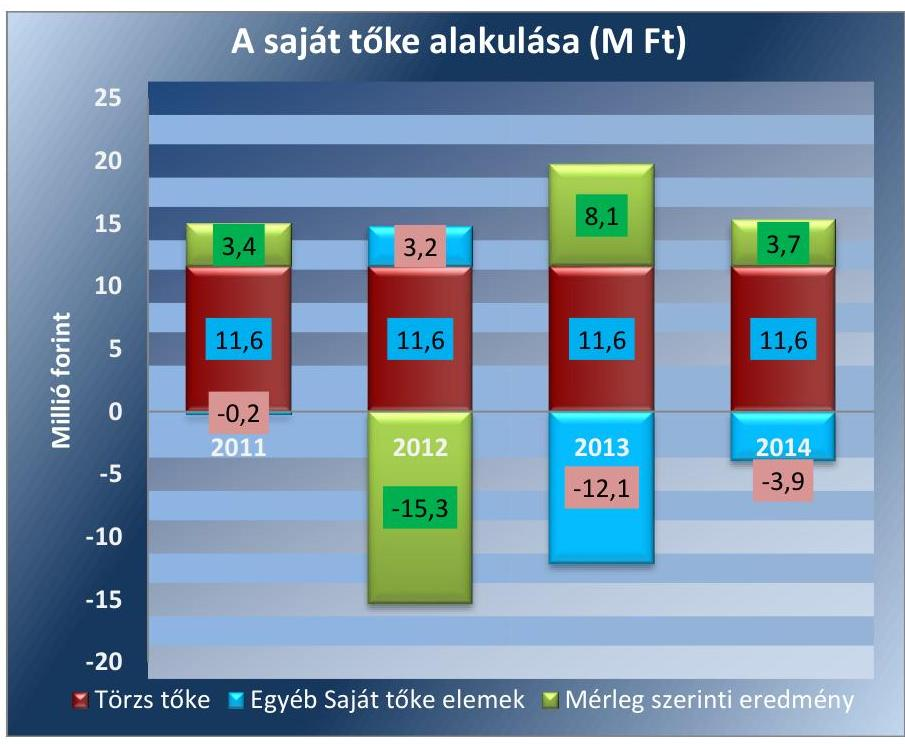

A TÁRSASÁG KÖTELEZETTSÉGEI az ellenőrzött időszakban 10,9 M Ft-tal csökkentek. A hosszú lejáratú kötelezettségei között a vagyonkezelésbe átvett ingatlan értékét mutatta ki a Társaság. Ez tette ki az összes kötelezettség értékének legalább 96,5\%-át. A kötelezettségeinek - 2012. évet kivéve - határidőre eleget tett, a rövidlejáratú kötelezettség állománya 2011. évi 30,0 M Ft-ról 24,2 M Ft-ra, 19,3\%-kal csökkent. A lejárt kötelezettségek állománya nem volt jelentős összegű az ellenőrzött időszakban. A szerződésen és jogszabályon alapuló rövid lejáratú kötelezettségek határidőben történő teljesítése a 2012. év kivételével megtörtént. 2012. második félévében az önkormányzati támogatás késedelmes

---

teljesítése miatt több számlát határidőn túl fizettek ki, illetve fizetési átütemezésre kényszerültek. A Társaság múködésének eredményessége jelentős mértékben függ az Önkormányzati támogatás összegétől, annak késedelmes teljesítése a Társaság likviditására nézve kockázatot jelenthet.

A Társaság kötelezettségeinek alakulását szemlélteti a következő 4. táblázat.
4. táblázat

| A KÖTELEZETTSÉG ÁLLOMÁNY ALAKULÁSA (M FT) |  |  |  |  |
| :-- | --: | --: | --: | --: |
| Megnevezés | 2011 | 2012 | 2013 | 2014 |
| Rövid lejáratú kötelezettségek | 30,0 | 47,0 | 29,3 | 24,2 |
| Hosszú lejáratú kötelezettségek | 1286,5 | 1279,2 | 1276,1 | 1273,1 |
| ebből az Önkormányzattal szem- | 1286,5 | 1279,2 | 1276,1 | 1273,1 |
| ben fennálló |  |  |  |  |
| Kötelezettségek összesen | 1316,5 | 1326,2 | 1305,4 | 1297,3 |

2.4. számú megállapítás

A Hírös Agóra Nonprofit Kft. beszámolási kötelezettségének a jogszabályi előírásoknak megfelelően eleget tett.

A HÍRÖS AGÓRA NONPROFIT KFT. az Alapító Okiratban és azzal összhangban az szmsz ${ }_{1,2,3}$-ben az ügyvezető kötelezettségei között szabályozta a tulajdonos joggyakorló részére történő adatszolgáltatás teljesítését. Az adatszolgáltatási kötelezettség az éves és féléves beszámoló, vagyonkimutatás, közhasznúsági jelentés, és üzleti terv készítésének kötelezettségét foglalta magában. A Társaság eleget tett az előírásoknak megfelelően a tulajdonosi joggyakorló felé történő adatszolgáltatási kötelezettségének.

A Társaság az éves beszámolóit a Számv. tv. előírásainak és a számviteli politikában rögzítetteknek megfelelően elkészítette. Az FB az éves beszámolókról a 2011-2013. beszámolók vonatkozásában a Gt. tv. 35. § (3) bekezdése szerint, a 2014. évi beszámolóról a Ptk. 3:120. (2) bekezdésében előírtaknak megfelelően elkészítette az írásos jelentését. A könyvvizsgáló az ellenőrzött években a Számv. tv. 156. § (5) bekezdés f) pontja szerinti hitelesítő záradékot bocsátott ki. Külön figyelemfelhívó levelet a vezetés részére nem adott, de a 2012. üzleti évről kiadott könyvvizsgálói jelentésben felhívta a figyelmet a tőkevesztésre és a pótlási kötelezettségre. A könyvvizsgálót az éves beszámolót elfogadó tulajdonosi ülésekre meghívták, azokon részt vett. A beszámolókat a KVB, majd a VPB a Gt. tv. 141. § (2) bekezdése és a Ptk. 3:109. § (2) bekezdése alapján határozatában jóváhagyta. A 2011. évi beszámolót a Számv. tv. 153. § (1) bekezdését megsértve az előírt határidőt követően - 2012. június 8 -án - helyezte letétbe és tette közzé a Társaság. A 2012-2014. évi beszámolók letétbe helyezése és közzé tétele az előírt határidőig megtörtént.

Az FB és a könyvvizsgáló a közvagyon védelme, illetve más okból a legfőbb döntést hozó szerv összehívását nem kezdeményezte.

A Társaság az ellenőrzött időszakban nem rendelkezett a közérdekú adatok megismerésére irányuló igények teljesítésének rendjét rögzítő szabályzattal, ezzel megsértette az Adat. tv. ${ }^{23}$ 20. § (8), valamint az Info tv. ${ }^{24}$ 30. § (6) bekezdésben foglaltakat. A Társaság a kötelezően közzéteendő közérdekú adatait - az Info tv. 37. § (1) bekezdésben meghatározott tartalommal - internetes honlapjára feltöltötte, azonban a közérdekú adatok

---

közzétételére vonatkozó szabályzatot nem készítette el, ezzel nem tett eleget az Info tv. 35. § (3) bekezdésében, valamint Kr. ${ }^{25}$ 3. §-ában előírtaknak.

# 3. A gazdasági társaságnál az ellátott közfeladat bevételei és ráfordításai elszámolása, valamint az önköltségszámítás és árképzés szabályszerű volt-e? 

Összegző megállapítás

A Társaságnál az ellátott közfeladat bevételeinek és ráfordításainak elszámolását megfelelőnek, a beruházások elszámolását nem megfelelőnek értékeltük, a közszolgáltatás árainak meghatározása összhangban volt a belső előírásokkal.
3.1. számú megállapítás

A Társaság által ellátott közfeladat bevételeinek és ráfordításainak elszámolását megfelelőnek, a beruházások elszámolását azonban nem megfelelőenk értékeltük, mivel a Számv. tv. előírásait nem tartották be teljes körűen.

A TÁRSASÁG a közművelődési tevékenység támogatása mellett vállalkozási tevékenységet is végzett (kulturális, szórakoztató és szabadidős szolgáltatások nyújtása) az ellenőrzött időszakban, a közfeladat átláthatósága és a keresztfinanszírozás elkerülése érdekében biztosított volt a bevételek és ráfordítások számviteli elkülönítése. Az árak meghatározásakor, a bevételek kiszámlázásakor a közművelődési megállapodásban rögzített határérték közötti árakat és szolgáltatási díjakat (pl. tagdíj) alkalmazott.

A BEVÉTELEK ELSZÁMOLÁSA során a Társaság szabályszerűen járt el. A bevételek előírása és kiszámlázása a számviteli politika, és a közművelődési megállapodás előírásainak megfelelően történt, azokat a megfelelő számlacsoportban számolták el. A jegy típusú bevételek kiállítása során a Társaság az Áfa tv. ${ }^{26} 173$. § (1) bekezdésében meghatározott előírásokat betartotta.

## AZ ANYAGJELLEGŰ RÁFORDÍTÁSOK ELSZÁMOLÁSA megfelelő volt. A költségelszámolást megalapozó dokumentumok

(megrendelések, szerződések) rendelkezésre álltak, a megfelelő közfeladatra és költségnemre számolták el a költséget. A bizonylatok a Számv. tv. 166. § (2)-(3) bekezdéseiben rögzített alaki és tartalmi követelményeknek megfeleltek.

A Társaság 2011. augusztus 10-én földgáz-kereskedelmiszerződést kötött, melyet megelőzően nem folytatott le közbeszerzési eljárást, annak ellenére, hogy az éves gázbeszerzések összesített értékei meghaladták a Kbt ${ }_{1}$ alapján a közbeszerzési értékhatárt, továbbá a Társaság a Kbt. ${ }^{27} 22$. § (1) bekezdésének i) pontja alapján a Kbt. ${ }_{1}$ alanyi hatálya alá tartozott. Mindezek alapján megsértette a Kbt. ${ }_{1} 240 . \S$ (1) bekezdésében előírt közbeszerzési eljárás lefolytatásának kötelezettségét.

A BERUHÁZÁSOK, FELÚJÍTÁSOK KIADÁSAI ÉS AZ ÉRTÉKCSÖKKENÉSI LEÍRÁS ELSZÁMOLÁSA nem volt megfelelő, mivel nem érvényesültek teljes körűen a jogszabályi

---

előírások az eszközök nyilvántartásba vételének tekintetében. A beszerzett eszközök üzembe helyezését egyes esetekben nem dokumentálták hitelt érdemlő módon, ezzel megsértették a Számv. tv. 52. § (2) bekezdésében foglalt előírást. Az elszámolt értékcsökkenés összegének megállapítása több esetben nem felelt meg a Számv. tv. 52. § (1) bekezdésében foglaltaknak.

Az ellenőrzött időszakban az immateriális javak és a tárgyi eszközök könyv szerinti nettó értéke 1303,8 M Ft-ról 1272,8 M Ft-ra csökkent, a halmozott értékcsökkenés összege ezzel ellentétesen és nagyobb mértékben változott, a 2011. év január 1-jei 15,7 M Ft-ról 2014. év végére 75,2 M Ftra növekedett. A nagyobb arányú növekedés oka, hogy az ellenőrzött időszakban az eszközök visszapótlása kisebb volt, mint az elszámolt értékcsökkenés összege. Az immateriális javak és tárgyi eszközök ellenőrzött évek közötti alakulását az 5. táblázat mutatja be.
5. táblázat

| AZ ESZKÖZÖK ÉRTÉKÉNEK ALAKULÁSA (M FT) |  |  |  |  |  |
| :--: | :--: | :--: | :--: | :--: | :--: |
|  | 2011.01.01. | 2011.12.31. | 2012.12.31. | 2013.12.31. | 2014.12.31. |
| Bruttó érték | 1319,5 | 1334,0 | 1347,5 | 1346,8 | 1348,0 |
| Halmozott értékcsökkenés | 15,7 | 37,0 | 55,2 | 65,4 | 75,2 |
| Nettó érték | 1303,8 | 1297,0 | 1292,3 | 1281,4 | 1272,8 |

Az eszközök elhasználódási szintje az ellenőrzött időszakban folyamatosan növekedett, mellyel párhuzamosan a használhatósági fok romlott. Terven felüli értékcsökkenést egy alkalommal (2013-ban) 0,4 M Ft összegben számolt el a Társaság.

# A TÁRSASÁG AZ ELSZÁMOLT AMORTIZÁCIÓNAK 

megfelelő mértékű eszközpótlást, a beruházást, élettartam növelő felújítást nem valósított meg. A közfeladat ellátását szolgáló eszközök esetében csökkent a eszközvagyon értéke.

A Társaság követelései más gazdasági társaságok által igénybe vett szolgáltatások után keletkeztek, lakossággal szemben követelése nem volt. A vevőkövetelések az ellenőrzött időszakban a 2011. év végi 4,1 M Ft-ról több mint $92 \%$-kal 7,8 M Ft-ra emelkedtek. A vevőkövetelések növekedése ellenére a határidőn túli követelések állománya folyamatosan, a kezdeti 2,6 M Ft-ról közel 62\%-os csökkenést mutatva 1,0 M Ft-ra csökkentek. A vevőkövetelések lejárat szerinti alakulását a 6. táblázat mutatja be.
6. táblázat

## A VEVŐKÖVETELÉSEK LEJÁRAT SZERINTI ALAKULÁSA (E FT)

|  | Nem lejárt | 31:00 nap | 61:90 nap | 91:180 nap | 181:360 nap | 361 naptól | Összesen | Lejárt követelés összesen |
| :--: | :--: | :--: | :--: | :--: | :--: | :--: | :--: | :--: |
| 2011.12.31. | 1508 | 249 | 6 | 1989 | 316 | 0 | 4068 | 2560 |
| 2012.12.31. | 8447 | 104 | 173 | 1130 | 68 | 81 | 10003 | 1556 |
| 2013.12.31. | 2884 | 122 | 201 | 571 | 423 | 122 | 4323 | 1439 |
| 2014.12.31. | 6847 | 166 | 3 | 100 | 5 | 700 | 7821 | 974 |

---

A Társaság likviditási helyzetének javítása érdekében a követelések kiegyenlítési határidejének lejártát nyomon követték, a nem fizető partnereket írásban szólították fel tartozásaik rendezésére.
3.2. számú megállapítás

Az árképzés, a közszolgáltatás árainak meghatározása összhangban volt a belső előírásokkal.

AZ ALKALMAZOTT KÖZSZOLGÁLTATÁSI DÍJAK összhangban voltak a belső szabályozásban és a közművelődési megállapodásban előírtakkal. A megállapodásban meghatározott feltételeket betartva határozták meg a díjakat (tagdíjak, belépőjegy árak), illetve a mentességeket és kedvezményeket.

# 4. A többségi önkormányzati tulajdonban lévő gazdasági társaságok gazdálkodásának a kormányzati szektor hiányára és az államadósságra befolyással bíró elemei megfeleltek-e a jogszabályi előírásoknak? 

Összegző megállapítás

## 4.1. számú megállapítás

## 4.2. számú megállapítás

A Hírös Agóra Nonprofit Kft. gazdálkodása a kormányzati szektor hiányára és az államadósságra befolyással bíró elemei megfeleltek a jogszabályi előírásoknak.

A Társaságnak az ellenőrzött időszakban nem volt adósságot keletkeztető ügylete.

A TÁRSASÁGNAK adósságot keletkeztető ügylete nem volt az ellenőrzött időszakban.

A kormányzati szektor hiányára befolyást gyakorló bevételek és ráfordítások elszámolása megfelelt a jogszabályi előírásoknak.

A HÍRÖS AGÓRA NONPROFIT KFT. a nonprofit jellegéből adódóan, a Gt. tv. 4. § (3) bekezdése előírása alapján, a tevékenységéből származó nyeresége a tagok között nem osztható fel, az a Társaság vagyonát gyarapítja. Az ellenőrzött időszakban osztalék kifizetés a Társaságnál nem történt. Az Önkormányzat pótbefizetést nem hajtott végre az ellenőrzött időszakban. Az adózott eredmény összege az ellenőrzött időszakban az eredménytartalékba került átvezetésre.

A személyi jellegú ráfordítások dokumentálását és elszámolását az ellenőrzés megfelelőnek értékelte. A Társaságnál az ellenőrzött időszakban cafetéria rendszer nem volt, ilyen jogcímen kifizetésre nem került sor.

Az egyéb bevételek elszámolása a Számv. tv. 77. §-a, az egyéb ráfordítások elszámolása a Számv. tv. 81. §-ban rögzítettek szerint történt.

---

# JAVASLATOK 

Az ÁSZ tv. 33. § (1) bekezdésében foglaltak értelmében az ellenőrzött szervezet vezetője köteles a jelentésben foglalt megállapításokhoz kapcsolódó intézkedési tervet összeállítani és azt a jelentés kézhezvételétől számított 30 napon belül az ÁSZ részére megküldeni. Amennyiben az intézkedési tervet az ellenőrzött szervezet vezetője nem küldi meg határidőben, vagy továbbra sem elfogadható intézkedési tervet küld, az ÁSZ elnöke az ÁSZ törvény 33. § (3) bekezdés a)-b) pontjaiban foglaltakat érvényesítheti.

## A Hírös Agóra Nonprofit Kft ügyvezetőjének

1. Intézkedjen a közérdekü adatok megismerésére irányuló igények teljesitésének rendjét rögzítő szabályzat, valamint a közérdekü adatok közzétételére vonatkozó szabályzat elkészitésére.
(2.4. sz. megállapítás 4. bekezdése alapján)
2. Gondoskodjon a beszerzett eszközök nyilvántartásba vétele, üzembe helyezésének dokumentálása, az elszámolt értékcsökkenés összegének megállapítása során a jogszabályi előírások betartásáról.
(3.1. sz. megállapítás 5. bekezdése alapján)

---

# MELLÉKLETEK 

## I. SZ. MELLÉKLET: ÉRTELMEZŐ SZÓTÁR

adósságfedezeti mutató I.
adósságfedezeti mutató II.

Adósságot keletkeztető ügylet
árbevételre vetített eladósodottság
eladósodottság mértéke
(befektetett eszközök + forgó eszközök) / idegen forrás
Azt mutatja, hogy 1 Ft adósságra hány Ft vagyon jut. Általánosságban véve kedvező, ha értéke 2 körül van, de nagy eszközberuházás-igényű iparágakban értéke kisebb is lehet.
működési cash flow / hosszú lejáratú kötelezettségek
A mutató azt jelzi, hogy az adott gazdálkodási időszak működési pénzáramainak eredményeként realizált cash flow révén a vállalkozás mennyiben lenne képes valamennyi hosszú lejáratú kötelezettségének eleget tenni. Ennek vizsgálatára viszonylag ritkán kerül sor, az elsősorban a veszélyhelyzetbe került vállalkozások esetében lehet érdekes. Általánosságban véve kedvező, ha a működési cash flow minél nagyobb arányban nyújt fedezetet a hosszú lejáratú kötelezettségre (értéke nagyobb, mint 1, nő az ellenőrzött időszakban).
Adósságot keletkeztető ügylet és annak értéke:
a) hitel, kölcsön felvétele, átvállalása a folyósítás, átvállalás napjától a végtörlesztés napjáig, és annak aktuális tőketartozása,
b) a Számv. tv. szerinti hitelviszonyt megtestesítő értékpapír forgalomba hozatala a forgalomba hozatal napjától a beváltás napjáig, kamatozó értékpapír esetén annak névértéke, egyéb értékpapír esetén annak vételára,
c) váltó kibocsátása a kibocsátás napjától a beváltás napjáig, és annak a váltóval kiváltott kötelezettséggel megegyező, kamatot nem tartalmazó értéke, d) a Számv. tv. szerint pénzügyi lízing lízingbevevői félként történő megkötése a lízing futamideje alatt, és a lízingszerződésben kikötött tőkerész hátralévő összege,
e) a visszavásárlási kötelezettség kikötésével megkötött adásvételi szerződés eladói félként történő megkötése - ideértve a Számv. tv. szerinti valódi penziós és óvadéki repóügyleteket is - a visszavásárlásig, és a kikötött visszavásárlási ár,
f) a szerződésben kapott, legalább háromszázhatvanöt nap időtartamú halasztott fizetés, részletfizetés, és a még ki nem fizetett ellenérték,
g) hitelintézetek által, származékos műveletek különbözeteként az Államadósság Kezelő Központ Zrt.-nél elhelyezett fedezeti betétek, és azok öszszege.
Forrás: Stabilitási tv. 3. § (1) bekezdése
(kötelezettségek - forgóeszközök) / értékesítés nettó árbevétele
Az árbevételre vetített eladósodottság azt mutatja, hogy az árbevétel mekkora fedezet nyújt a kötelezettségeknek a forgóeszközökkel csökkentett részére. Általánosságban véve kedvező, ha az árbevétel minél nagyobb arányban nyújt fedezetet a forgóeszközökkel csökkentett kötelezettségekre (értéke kisebb, mint 1, csökken az ellenőrzött időszakban).
Kötelezettségek / saját tőke
Fontos szerepet játszik ez a mutató egy vállalat megítélésében. Azt mutatja, hogy a saját források a kötelezettségek hány százalékát fedezik. Törekedni kell, hogy a mutató tartósan (jelentősen) 1 alatti értéket érjen el.

---

eladósodottsági mutató (tőkeáttétel)

ESA 95

ESA 2010
garancia
gazdasági társaság
gazdálkodó szervezet
kezesség
idegen tőke / összes forrás
Egészségesnek mondható egy olyan mértékű áttétel, amelyet az üzleti tervek szerint és az elmúlt időszak tapasztalatai alapján a társaság megfelelő biztonsággal ki tud termelni. Nagy eszközberuházás-igényű iparágakban értéke magasabb, azaz magasabb eladósodottság is elfogadható, de 75-85 \%-ot meghaladó értéknél már itt is erős, sőt túlzott külső finanszírozottságról beszélhetünk. Általánosságban véve kedvező, ha értéke kisebb, mint 0.
Nemzeti és regionális számlák európai rendszere (a továbbiakban: ESA 95), statisztikai definíciók összessége, amely biztosítja a tagállamok gazdasági adatainak egységes és összehasonlítható nyilvántartását.
Forrás: Magyar Nemzeti Bank
Az Európai Unióbeli nemzeti és regionális számlák európai rendszere (a továbbiakban: az ESA 2010), amely módszertanból és egy olyan továbbítási programból áll, amely meghatározza a tagállamok által adott határidőre benyújtandó számlákat és táblázatokat. A Bizottságnak, különös tekintettel a gazdasági konvergencia figyelemmel kísérésére és a tagállamok gazdaságpolitikái közötti szoros koordináció megteremtésére, meghatározott időpontokban - adott esetben előzetesen bejelentett adatszolgáltatási naptár alapján - kell ezeket a számlákat és táblákat a felhasználók rendelkezésére bocsátania. A tagállami számlák uniós céloknak megfelelő elkészítésére vonatkozó közös előírások, fogalom meghatározások, osztályozások és számviteli szabályok referenciakerete, mely a tagállamok között összehasonlítható eredményeket szolgáltat, és mint ilyen, minden más rendszernek fokozatosan a helyébe lép (forrás: Az Európai Parlament és a Tanács 549/2013/EU rendelete (12) és (14) bekezdései).

A garancia olyan önálló, az önkormányzat nevében vállalt kötelezettség, amely alapján az önkormányzat az önkormányzati költségvetés terhére szerződésben meghatározott feltételek szerint, a kötelezett nem teljesítése esetén a jogosultnak fizetést teljesít az előzetesen rögzített összeghatárig.
3:88. § (1) A gazdasági társaságok üzletszerű közös gazdasági tevékenység folytatására, a tagok vagyoni hozzájárulásával létrehozott, jogi személyiséggel rendelkező vállalkozások, amelyekben a tagok a nyereségből közösen részesednek, és a veszteséget közösen viselik.
A Ptk. 685. § c) pontja szerint gazdálkodó szervezet:„az állami vállalat, az egyéb állami gazdálkodó szerv, a szövetkezet, a lakásszövetkezet, az európai szövetkezet, a gazdasági társaság, az európai részvénytársaság, az egyesülés, az európai gazdasági egyesülés, az európai területi együttműködési csoportosulás, az egyes jogi személyek vállalata, a leányvállalat, a vízgazdálkodási társulat, az erdő birtokossági társulat, a végrehajtói iroda, az egyéni cég, továbbá az egyéni vállalkozó."
A kezességre vonatkozó előírásokat a Ptk. 6:416-430. §-ai tartalmazzák. Kezességi szerződéssel a kezes kötelezettséget vállal a jogosulttal szemben, hogyha a kötelezett nem teljesít, maga fog helyette a jogosultnak teljesíteni. Kezesség egy vagy több, fennálló vagy jövőbeli, feltétlen vagy feltételes, meghatározott vagy meghatározható összegű pénzkövetelés vagy pénzben kifejezhető értékkel rendelkező egyéb kötelezettség biztosítására vállalható. A Ptk. szerint kezességet csak írásban lehet vállalni. A kezes kötelezettsége ahhoz a kötelezettséghez igazodik, amelyért kezességet vállalt. A kezes kötelezettsége nem válhat terhesebbé, mint amilyen elvállalásakor volt, kiterjed azonban a kötelezett szerződésszegésének jogkövetkezményeire és a kezesség elvállalása után esedékessé váló mellékkövetelésekre is.

---

Kormányzati szektorba sorolt egyéb szervezet
közfeladat
közszolgáltatás

Közvetett tulajdon, illetve közvetett befolyás
nemzeti vagyon
nettó eladósodottság

Nonprofit gazdasági társaság

Tulajdonosi joggyakorló

Az a szervezet, amely az Áht. $2^{28}$ alapján nem része az államháztartásnak, azonban az Európai Közösséget létrehozó szerződéshez csatolt, a túlzott hiány esetén követendő eljárásról szóló jegyzőkönyv alkalmazásáról szóló 2009. május 25-i 479/2009/EK rendelet szerint a kormányzati szektorba tartozik. A nemzetgazdasági miniszter 2013. június 26-án megjelent Közleményben tette közé ezen szervezetek listáját.
Jogszabályban meghatározott állami vagy önkormányzati feladat, amit az arra kötelezett közérdekből, jogszabályban meghatározott követelményeknek és feltételeknek megfelelve végez, ideértve a lakosság közszolgáltatásokkal való ellátását, továbbá az állam nemzetközi szerződésekben vállalt kötelezettségeiből adódó közérdekű feladatokat, valamint e feladatok ellátásához szükséges infrastruktúra biztosítását is (Nvtv. 3. § (1) bekezdés 7. pont).
A közszolgáltatás: „közcélú, illetőleg közérdekü szolgáltatást jelent, amely egy nagyobb közösség (állam, település) minden tagjára nézve megközelítőleg azonos feltételek mellett vehető igénybe, ezért valamilyen mértékig közösségi megszervezést, illetve szabályozást, ellenőrzést igényel." Az Ebktv. 3. § d) pontja a következőképpen határozza meg a közszolgáltatást: „szerződéskötési kötelezettség alapján a lakosság alapvető szükségleteinek ellátására irányuló szolgáltatás, így különösen a villamos energia-, gáz-, hő-, víz-, szennyvíz- és hulladékkezelési, köztisztasági, postai és távközlési szolgáltatás, továbbá a menetrend alapján közlekedő járművekkel végzett közforgalmú személyszállitás"
Egy vállalkozás tulajdoni hányadának, illetőleg szavazati jogának a vállalkozásban tulajdoni részesedéssel, illetőleg szavazati joggal rendelkező más vállalkozás (köztes vállalkozás) tulajdoni hányadán, szavazati jogán keresztül történő gyakorlása. A közvetett tulajdon, a közvetett befolyás arányának megállapításához a közvetett tulajdonnal, közvetett befolyással rendelkezőnek a köztes vállalkozásban fennálló szavazati jogát vagy tulajdoni hányadát meg kell szorozni a köztes vállalkozásnak a vállalkozásban fennálló szavazati vagy tulajdoni hányada közül azzal, amelyik a nagyobb. Ha a köztes vállalkozásban fennálló szavazati vagy tulajdoni hányad az ötven százalékot meghaladja, akkor azt egy egészként kell figyelembe venni (a tőkepiacról szóló 2001. évi CXX. törvény 5. § (1) bekezdés 84. pont).
Az Nvtv. 1. § (2) bekezdés c) pontja szerint „az állam vagy a helyi önkormányzatot tulajdonában lévő pénzügyi eszközök, továbbá az államot vagy a helyi önkormányzatot megillető társasági részesedések"
(kötelezettségek - követelések) / saját tőke
Azt mutatja, hogy a kintlévőségekkel csökkentett kötelezettségeket milyen mértékben fedezi saját forrás. Ez feltételezi, hogy a követelések pénzügyileg előbb realizálódnak, mint ahogy a kötelezettségeket teljesíteni kell. A mutató minél kisebb, csökkenő értéke kedvező.
Gt. 4. § (1) bekezdése szerint „gazdasági társaság nem jövedelemszerzésre irányuló közös gazdasági tevékenység folytatására is alapítható (nonprofit gazdasági társaság). Nonprofit gazdasági társaság bármely társasági formában alapítható és múködtethető. A gazdasági társaság nonprofit jellegét a gazdasági társaság cégnevében a társasági forma megjelölésénél fel kell tüntetni."
Aki a nemzeti vagyon felett az államot vagy a helyi önkormányzatot megillető tulajdonosi jogok és kötelezettségek összességének gyakorlására jogosult (Vagyon tv. 3. § (1) bekezdés 17. pont).

---

II. SZ. MELLÉKLET: EREDEMÉNYKIMUTATÁS

|  HÍRÓS AGÓRA NONPROFIT KFT. EREDMÉNYKIMUTATÁSAI (M FT ) |  |  |  |   |
| --- | --- | --- | --- | --- |
|  Tétel megnevezése | 2011. | 2012. | 2013. | 2014.  |
|  I. Értékesítés nettó árbevétele | 161,9 | 161,0 | 159,3 | 168,5  |
|  II. Aktivált saját teljesítmények értéke | 0,0 | 0,0 | 0,0 | 0,0  |
|  III. Egyéb bevételek | 214,8 | 215,9 | 226,5 | 228,3  |
|  ebből Önkormányzati támogatás | 192,1 | 173,4 | 186,7 | 190,8  |
|  IV. Anyagjellegú ráfordítások | 249,0 | 248,2 | 238,0 | 244,8  |
|  V. Személyi jellegú ráfordítások | 140,8 | 126,2 | 123,2 | 131,2  |
|  VI. Értékcsökkenési leírás | 21,3 | 18,3 | 10,6 | 10,2  |
|  VII. Egyéb ráfordítások | 8,4 | 9,8 | 11,2 | 10,7  |
|  A. Üzemi (üzleti) tevékenység eredménye | $-42,8$ | $-25,6$ | 2,8 | $-0,1$  |
|  VIII. Pénzügyi műveletek bevételei | 0,7 | 0,8 | 0,3 | 0,1  |
|  IX. Pénzügyi műveletek ráfordításai | 0,0 | 0,0 | 0,0 | 0,0  |
|  B. Pénzügyi műveletek eredménye | 0,7 | 0,8 | 0,3 | 0,1  |
|  C. Szokásos Vállalkozási eredmény | $-42,1$ | $-24,8$ | 3,1 | 0,0  |
|  X. Rendkívüli bevételek | 45,5 | 9,5 | 5,0 | 3,7  |
|  XI. Rendkívüli ráfordítások | 0,0 | 0,0 | 0,0 | 0,0  |
|  D. Rendkívüli eredmény | 45,5 | 9,5 | 5,0 | 3,7  |
|  E. Adózás előtti eredmény | 3,4 | $-15,3$ | 8,1 | 3,7  |
|  XII. Adófizetési kötelezettség | 0,0 | 0,0 | 0,0 | 0,0  |
|  F. Adózott eredmény | 3,4 | $-15,3$ | 8,1 | 3,7  |
|  G. Mérleg szerinti eredmény | 3,4 | $-15,3$ | 8,1 | 3,7  |

Forrás: A Társaság 2011-2014. évi Beszámolói

---

|  Sorszám | Megnevezés |  | 2011. | 2012. | 2013. | 2014.  |
| --- | --- | --- | --- | --- | --- | --- |
|  1. | A gazdasági társaság tulajdonosi összetétele: |  |  |  |  |   |
|  2. | Önkormányzat megnevezése: |  |  |  |  |   |
|  3. | Önkormányzat tulajdoni részesedésének arány | $\%$ | 100,0 |  |  |   |
|  4. | Önkormányzat tulajdoni részesedésének összege | ezer Ft | 11590 |  |  |   |
|  5. | Más önkormányzatok, többcélú társulás megnevezése: |  |  |  |  |   |
|  6. | Más önkormányzatok, többcélú társulások tulajdoni részesedésének arány | $\%$ |  |  |  |   |
|  7. | Más önkormányzatok, többcélú társulások tulajdoni részesedésének összege | ezer Ft |  |  |  |   |
|  8. | Gazdasági társaság megnevezése: |  |  |  |  |   |
|  9. | Gazdasági társaságok tulajdoni részesedés arány | $\%$ |  |  |  |   |
|  10. | Gazdasági társaságok tulajdoni részesedés összege | ezer Ft |  |  |  |   |
|  11. | Egyéb tulajdonos megnevezése: |  |  |  |  |   |
|  12. | Egyéb tulajdonosok tulajdoni részesedés arány | $\%$ |  |  |  |   |
|  13. | Egyéb tulajdonosok tulajdoni részesedés összege | ezer Ft |  |  |  |   |
|  14. | A gazdasági társaságnál a vizsgált évek során működése megszűnt-e? (IGEN/NEM) |  | NEM |  |  |   |
|  15. | A tárgyévben a gazdasági társaság vagyonkezelésben lévő önkormányzati vagyon után elszámolt értékcsökkenés összege (ezer Ft) |  | 10380 | 10416 | 5243 | 5243  |
|  16. | A tárgyévben az önkormányzati tulajdonú, gazdasági társaság által kezelt eszközök pótlására (karbantartás, felújítás, beruházás) elszámolt költség (ezer Ft) |  | 0 | 5307 | 0 | 0  |
|  17. | A tárgyévben a gazdasági társaság saját vagyona után elszámolt értékcsökkenés összege (ezer Ft) |  | 10906 | 7860 | 5366 | 4975  |
|  18. | A tárgyévben a saját tulajdonú eszközök pótlására (karbantartás, felújítás, beruházás) elszámolt költség (ezer Ft) |  | 14620 | 7508 | 1523 | 1617  |
|  19. | Értékesítés nettó árbevétele (ezer Ft) |  | 161905 | 161039 | 159331 | 168493  |
|  20. | Müködési cash flow (ezer Ft) |  | 31704 | 15782 | 11437 | 7592  |

---

.

---

# FÜGGELÉK: ÉSZREVÉTELEK 

A jelentéstervezetet a Számvevőszék 15 napos észrevételezésre megküldte az ellenőrzött szervezet vezetőjének az ÁSZ tv. 29. §* (1) bekezdése előírásának megfelelően.
Az elfogadott észrevételek alapján a Számvevőszék módosította a jelentést.

A függelék tartalmazza az ellenőrzött észrevételeit, illetve az el nem fogadott észrevételek elutasításának indoklását.

- A Társaság ügyvezetőjének írásban tett észrevétele.
- Tájékoztatás az észrevételek kezeléséről az ügyvezetőnek.
- Az Önkormányzat polgármesterének írásban tett észrevétele.
- Tájékoztatás az észrevételek kezeléséről a polgármesternek.

[^0]
[^0]:    * 29. § (1) Az Állami Számvevőszék az ellenőrzési megállapításait megküldi az ellenőrzött szervezet vezetőjének vagy az általa megbízott személynek, és annak, akinek személyes felelősségét állapította meg.
    (2) Az ellenőrzött szervezet vezetője és a felelősként megjelölt személy az ellenőrzés megállapításaira tizenöt napon belül írásban észrevételt tehet.
    (3) Az Állami Számvevőszék az észrevételre a beérkezésétől számított harminc napon belül írásban válaszol. A figyelembe nem vett észrevételeket köteles a jelentésben feltüntetni, és megindokolni, hogy azokat miért nem fogadta el.

---

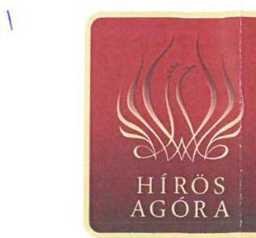

Állami Számvevőszék
Domokos László
elnök részére

# Budapest 

Apáczai Csere János u. 10.
Tárgy: észrevétel számvevőszéki jelentéstervezetre

## Tisztelt Elnök Úr!

A Hírös Agóra Nonprofit Kft. Állami Számvevőszéki ellenőrzésére vonatkozó jelentéstervezetre az alábbi észrevételt teszem:

A 3.1. pontban a beruházások elszámolása témakörben szereplő megállapítások véleményünk szerint nem minden esetben relevánsak. Hibaként került megállapításra azon 100 ezer Ft alatti beszerzési értékű eszközök tárgyi eszközként történő kezelése, mely a Számvevőszék szerint nem szolgálták tartósan a Társaság tevékenységét. E tekintetben a Számviteli törvény nem értékhatárhoz köti a tárgyi eszközök kezelését, hanem a Vállalkozó dönti el a beszerzéssel egyidöben, hogy az eszköz tartós - egy éven túli használatú - lesz-e. A vizsgált minták között volt olyan rajzeszköz beszerzés, mely TÁMOP támogatási projekt keretében történő tárgyi eszköz beszerzés volt. Ezek az eszközök jelenleg is használatban vannak, 20132014. évben történt a beszerzés, véleményünk szerint a tartós használat és a tárgyi eszközzé minősítés indokolt volt. Az ellenőrzött eszközök között volt olyan 7 éves ( $14,5 \%$ értékcsökenéssel számolt) tárgyi eszköz - városi kerékpár -, mely a következő évben kivezetésre került. A tervezethez képest történő idő előtti kivezetés alapos volt, hiszen a kerékpárt ellopták, melyről a rendőrségi feljelentés és a nyomozást lezáró végzés is rendelkezésre áll.

---

Megjegyezni kívánom, hogy a megállapításokra nem tudtunk teljeskörű észrevételt tenni, mivel a jelzett hibák csak általános jellegűek, nem tartalmazzák a konkrét mintákat, melynél a hiányosságok feltárásra kerültek.

Köszönetünket fejezzük ki az Állami Számvevőszék magas szintű szakmai munkájáért, az eljárás során továbbra is készséggel állunk rendelkezésükre.

Kecskemét, 2016. augusztus 04.

Tisztelettel:
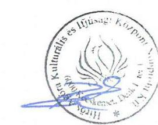

Bak Lajos
ügyvezető igazgató

---

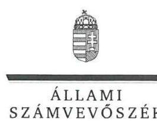

ELKÖK

Ikt.szám: V-0925-159/2016.

# Bak Lajos úr 

ügyvezető igazgató
Hirős Agóra Kulturális és Ifjúsági Központ Nonprofit Kft.

## Kecskemét

## Tisztelt Ügyvezető Igazgató Úr!

„Az önkormányzatok gazdasági társaságai - Az önkormányzatok többségi tulajdonában lévő gazdasági társaságok közfeladat ellátását érintő gazdálkodási tevékenysége szabályszerűségének ellenőrzése - Hirös Agóra Kulturális és Ifjúsági Központ Nonprofit Kft. " címmel készített számvevőszéki jelentéstervezetre tett észrevételét köszönettel megkaptam.
Az Állami Számvevőszék észrevételre vonatkozó álláspontjáról a felügyeleti vezető által készített részletes tájékoztatást mellékelten megküldöm.
Tájékoztatom Ügyvezető igazgató urat, hogy a számvevőszéki jelentésben - az Állami Számvevőszékről szóló 2011. évi LXVI. törvény 29. § (3) bekezdése alapján - a figyelembe nem vett észrevételeket szerepeltetjük az elutasítás indokának feltüntetésével.

Budapest, 2016. angusth. hó 29. nap
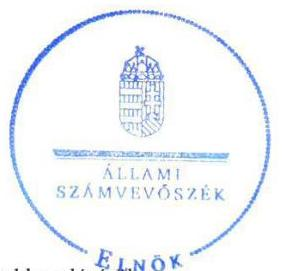

Tisztelettel:

## Domokos László

Melléklet: Tájékoztatás az észrevétel kezelésérol

---

# Tájékoztatás   az észrevétel kezeléséről 

„Az önkormányzatok gazdasági társaságai - Az önkormányzatok többségi tulajdonában lévő gazdasági társaságok közfeladat ellátását érintő gazdálkodási tevékenysége szabályszerűségének ellenőrzése - Hirős Agóra Kulturális és Ifjúsági Központ Nonprofit Kft. " című jelentéstervezetre tett észrevételét áttekintettük, annak kezelésével kapcsolatban a következő tájékoztatást adom.
Az észrevétel első fele arra irányult, hogy a jelentéstervezet 3.1. számú megállapítását alátámasztó, a beruházások elszámolásával kapcsolatos bekezdés kerüljön módosításra, ugyanis olyan eszközt vettek nyilvántartásba tárgyi eszközként, amely tartósan szolgálta a Társaság tevékenységét. A rendelkezésre álló dokumentumokat ismételten áttekintettük, és a 3.1. számú megállapítást alátámasztó ötödik bekezdés harmadik mondata a jelentéstervezetből törlésre kerül.
Az észrevétel második fele arra vonatkozott, hogy az ellenőrzött eszközök között volt olyan tárgyi eszköz (ellopott kerékpár), amely a következő évben kivezetésre került. A számvevőszéki megállapítás nem a kivezetés indokoltságát kifogásolta, hanem az értékcsökkenéssel kapcsolatos elszámolásban elkövetett hibát állapította meg a 3.1. megállapítást alátámasztó ötödik bekezdés - más kifogásolt esetekre is utaló - utolsó mondatában. A jelen bekezdésben foglaltak a jelentéstervezet módosítását nem indokolják.
Az észrevétel továbbá tartalmazott egy megjegyzést, amely arra vonatkozott, hogy ,, a jelzett hibák csak általános jellegüek, nem tartalmazzák a konkrét mintákat, melynél a hiányosságok feltárásra kerültek". Ezzel kapcsolatban tájékoztatom, hogy az elszámolások szabályszerűségét mintavétellel ellenőrizzük, és az adott sokaságban előforduló hibás tételek arányát becsüljük, emiatt a hibás tételek egyedi azonosítása a jelentésben nem értelmezhető.
Tájékoztatom, hogy a számvevőszéki jelentés függelékeként szerepeltetjük a jelentéstervezethez tett észrevételeit, valamint az azokra adott válaszunkat.

Budapest, 2016. 07. hó 25. nap

Böröcz Imre
félügyeleti vezető

---

# 052 

## 

## Kecskemét Megyei Jogú Város PolgármeStere

Ügyiratszám: 3754-16/2016.
Ügyintéző: dr. Szappanos Csilla

Tárgy: Hírös Agóra Kulturális és Ifjúsági Központ Nonprofit Kft. ellenőrzési jelentéstervezete

## Állami Számvevőszék Domokos László elnök részére

## Budapest

Apáczai Csere János u. 10. 1052

## ÁLLAMI SZÁMVEVÖSZÉK 067519 pol

Erkeze: 2016 AUG 10.
Iktatószén: V: 00:45-456/2016
Meltéklet: $\qquad$
Tisztelt Elnök Úr!
Kecskemét Megyei Jogú Város Önkormányzata megkapta „Az önkormányzatok gazdasági társaságai - Az önkormányzatok többségi tulajdonában lévő gazdasági társaságok közfeladat ellátását érintő gazdálkodási tevékenysége szabályszerűségének ellenőrzése - Hírös Agóra Kulturális és Ifjúsági Központ Nonprofit Kft." címmel készített számvevőszéki ellenőrzéshez készült jelentéstervezetet.

A jelentéstervezet Kecskemét Megyei Jogú Város Polgármestere számára megfogalmazott javaslatára, valamint az annak alapjául szolgáló 3.1. számú megállapítás 4. bekezdésére az alábbi észrevételt tesszük.

A jelentéstervezet 3.1. számú megállapítás 4. bekezdése szerint a Társaság 2011. augusztus 10. napján úgy kötött földgáz-kereskedelmiszerződést, hogy azt megelőzően nem folytatott le közbeszerzési eljárást, annak ellenére, hogy az éves gázbeszerzések összesített értékei meghaladták a közbeszerzési értékhatárt és így a Társaság megsértette az akkor hatályos, közbeszerzésekről szóló 2003. évi CXXIX. törvény (a továbbiakban: Kbt.) 240. § (1) bekezdésében előírt közbeszerzési eljárás lefolytatásának kötelezettségét. A hivatkozott bekezdésben foglaltak szerint a Társaság a Kbt. alanyi hatálya alá tartozott a Kbt. 22. § (1) bekezdésének i) pontja alapján, amely szerint ajánlatkérőnek minősül az a jogi személy, amelyet közérdekủ, de nem ipari vagy kereskedelmi jellegű tevékenység folytatása céljából hoznak létre, illetőleg amely ilyen tevékenységet lát el, ha e bekezdésben meghatározott egy vagy több szervezet, illetőleg az Országgyűlés vagy a Kormány meghatározó befolyást képes felette gyakorolni, vagy működését többségi részben egy vagy több ilyen szervezet (testület) finanszírozza.

Megállapítható, hogy e fogalom-meghatározás megfelel az akkor hatályos Európai Parlament és a Tanács építési beruházásra, az árubeszerzésre és a szolgáltatásnyújtásra irányuló közbeszerzési szerződések odaítélési eljárásainak összehangolásáról szóló 2004/18/EK irányelve (a továbbiakban: Irányelv) 1. cikk (9) bekezdés második albekezdésében ajánlatkérőként nevesített „közjogi intézmény" irányelvi kategóriának, amelyet uniós tagállamonként egyediesít a III. melléklet. Tekintettel arra, hogy Magyarország olyan intézményeket és intézménykategóriákat határozott meg az Irányelv III. mellékletében foglalt közjogi intézményként, melyek egyikének sem feleltethető meg a Társaság, következésképpen - álláspontunk szerint - az nem minősül a Kbt. 22. § (1) bekezdés i) pontja szerinti ajánlatkérőnek.

---

Aláhúzandó, hogy a Társaság kizárólag a Kbt. 22. § (2) bekezdés b) pontja alapján minősülhetett volna ajánlatkérőnek, mely szerint támogatásból megvalósítandó közbeszerzés tekintetében az a szervezet minősül ajánlatkérőnek, amelynek e fejezet szerinti közbeszerzését az (1) bekezdésben meghatározott egy vagy több szervezet költségvetési forrásból és az Európai Unióból származó forrásból többségi részben közvetlenül támogatja vagy az Európai Unióból származó forrásból többségi részben közvetlenül támogatja. Ennek értelmében csak az olyan támogatásokból megvalósuló közbeszerzések esetén kötelező a Kbt. alkalmazása, ahol az uniós és a hazai támogatások együttes mértéke vagy csak az uniós forrásból származó támogatás a közbeszerzés értékének $50 \%$-át meghaladja. Tekintettel arra, hogy a Társaság a szerződés megkötésének évében nem részesült az Európai Unióból származó támogatásban, a Kbt. 22. § (2) bekezdés b) pontja alapján sem minősül ajánlatkérőnek, így nem keletkezett kötelezettsége a közbeszerzési eljárás lefolytatására.

Utalunk arra, hogy a Társaság a tisztességtelen piaci magatartás és a versenykorlátozás tilalmáról szóló 1996. évi LVII. törvény 2. § és 7. §-aiban foglalt alapelvi rendelkezésekre tekintettel a szerződés megkötését megelőzően széleskörű piackutatást végzett és egyeztetéseket folytatott a kedvező ár elérése érdekében.

Kérem a fentiek szíves tudomásulvételét.

Kecskemét, 2016. augusztus 3.
Tisztelettel:
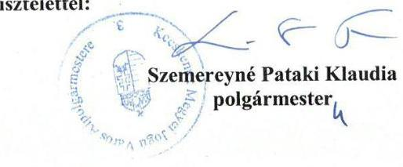

# Ügyintézés helye: 

Kecskemét Megyei Jogú Város Polgármesteri Hivatala
Szervezési és Jogi Iroda
Jogi Osztály
Vagyongazdálkodási Csoport
(2) 6000 Kecskemét, Kossuth tér 1.

---

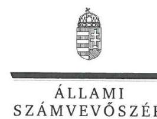

ELNÖK

Ikt.szám: V-0925-158/2016.

# Szemereyné Pataki Klaudia asszony 

polgármester
Kecskemét Megyei Jogú Város Önkormányzata

## Kecskemét

## Tisztelt Polgármester Asszony!

„Az önkormányzatok gazdasági társaságai - Az önkormányzatok többségi tulajdonában lévő gazdasági társaságok közfeladat ellátását érintő gazdálkodási tevékenysége szabályszerűségének ellenőrzése - Hírös Agóra Kulturális és Ifjúsági Központ Nonprofit Kft." címmel készített számvevőszéki jelentéstervezetre tett észrevételét köszönettel megkaptam.
Az Állami Számvevőszék észrevételre vonatkozó álláspontjáról a felügyeleti vezető által készített részletes tájékoztatást mellékelten megküldöm.
Tájékoztatom Polgármester asszonyt, hogy a számvevőszéki jelentésben - az Állami Számvevőszékről szóló 2011. évi LXVI. törvény 29. § (3) bekezdése alapján - a figyelembe nem vett észrevételt szerepeltetjük az elutasítás indokának feltüntetésével.

Budapest, 2016. cauguszkar hó 2.5 nap
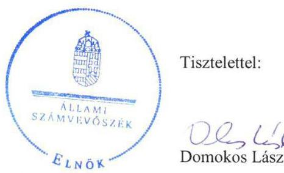

Tisztelettel:

## 02 20

Melléklet: Tájékoztatás az észrevétel kezeléséről

---

# Tájékoztatás   az észrevétel kezeléséről 

„Az önkormányzatok gazdasági társaságai - Az önkormányzatok többségi tulajdonában lévő gazdasági társaságok közfeladat ellátását érintő gazdálkodási tevékenysége szabályszerüségének ellenörzése - Hírös Agóra Kulturális és Ifjúsági Központ Nonprofit Kft." címü jelentéstervezetre tett észrevételét áttekintettük, annak kezelésével kapcsolatban a következő tájékoztatást adom.
Az észrevétel a jelentéstervezet 3.1. számú megállapítását alátámasztó negyedik bekezdés azon megállapítására irányult, hogy a Hírös Agóra Kulturális és Ifjúsági Központ Nonprofit Kft. (Hírös Agóra NKft.) a közbeszerzésekről szóló 2003. évi CXXIX. törvény (Kbt.) alapján nem minősült ajánlatkérőnek, ezért közbeszerzési eljárás lefolytatására nem volt kötelezett.
Az észrevétel nem megalapozott a következők miatt: A Kbt. 22. § (1) bekezdés i) pontja szerint „az a jogi személy, amelyet közérdekü, de nem ipari vagy kereskedelmi jellegü tevékenység folytatása céljából hoznak létre, illetőleg amely ilyen tevékenységet lát el, ha e bekezdésben meghatározott egy vagy több szervezet, illetőleg az Országgyülés vagy a Kormány meghatározó befolyást képes felette gyakorolni, vagy müködését többségi részben egy vagy több ilyen szervezet (testület) finanszírozza". A Kbt. ezen rendelkezése alapján a Hírös Agóra NKft. ajánlatkérőnek minősült, mert olyan jogi személy, amelyet közérdekü (de nem ipari vagy kereskedelmi jellegü) tevékenység folytatása céljából hoztak létre, és a 22. § (1) bekezdésben meghatározott szervezet, pontosabban a 22. § (1) bekezdés d) pontja szerinti helyi önkormányzat kizárólagos tulajdonában állt. Erre tekintettel kötelezett volt a közbeszerzési eljárás lefolytatására, így a jelentéstervezet módosítása az észrevétel alapján nem indokolt.
Ugyanakkor a rendelkezésre álló dokumentumok ismételt áttekintése alapján a Kecskemét Megyei Jogú Város Önkormányzata polgármesterének szóló javaslat - a munkajogi felelősség felvethetőségének elévülése miatt - törlésre kerül a jelentéstervezetből.
Tájékoztatom, hogy a számvevőszéki jelentés függelékeként szerepeltetjük a jelentéstervezethez tett észrevételeit, valamint az azokra adott válaszunkat.

Budapest, 2016. 08. hó 23. nap

Böröcz Imre
felügyeleti vezető

---

.

---

# RÖVIDÍTÉSEK JEGYZÉKE 

${ }^{1}$ Ász tv.
${ }^{2}$ Közgyűlés
${ }^{3}$ Társaság
${ }^{4}$ Ötv.
${ }^{5}$ Mötv.
${ }^{6}$ Önkormányzat
${ }^{7}$ Hírös Agóra Nonprofit Kft.
${ }^{8}$ Alapító Okirat
${ }^{9}$ Gt. tv.
${ }^{10}$ Közm. tv.
${ }^{11}$ Alapító
${ }^{12}$ Közművelődési rendelet:

Közművelődési rendelet:
${ }^{13}$ Közművelődési megállapodás
${ }^{14}$ SZMSZ:

SZMSZ:
${ }^{15}$ Vagyonkezelői szerződés
${ }^{16}$ Áht.:
${ }^{17}$ KVB
${ }^{18}$ VPB
${ }^{19}$ Taktv.
${ }^{20}$ Számv. tv.
${ }^{21}$ Polgármesteri Hivatal
${ }^{22}$ Ptk.
${ }^{23}$ Adat. tv.
az Állami Számvevőszékről szóló 2011. évi LXVI. törvény
Kecskemét Megyei Jogú Város Önkormányzatának Közgyűlése
Hírös Agóra Kulturális és Ifjúsági Központ Nonprofit Kft.
A helyi önkormányzatokról szóló 1990. évi LXV. törvény (hatálytalan: 2014. október 12-től)
Magyarország helyi önkormányzatairól szóló 2011. évi CLXXXIX. törvény (hatályos: 2012. január 1-jétől)
Kecskemét Megyei Jogú Város Önkormányzata
Hírös Agóra Kulturális és Ifjúsági Központ Nonprofit Korlátolt Felelősségű Társaság (korábban Kecskeméti Kulturális és Konferencia Központ Nonprofit Korlátolt Felelősségű Társaság)
a Hírös Agóra Nonprofit Kft. többször módosított Alapító Okirata
a gazdasági társaságokról szóló 2006. évi IV. törvény (hatálytalan: 2014. március 15 -től)
a muzeális intézményekről, a nyilvános könyvtári ellátásáról és a közművelődésről szóló 1997. évi CXL. törvény
Kecskemét Megyei Jogú Város Önkormányzata
Kecskemét Megyei Jogú Város Önkormányzata Közgyűlésének 28/2001. (VI.5) önkormányzati rendelete a közművelődésről
Kecskemét Megyei Jogú Város Önkormányzata Közgyűlésének 35/2013. (XI.29) önkormányzati rendelete a közművelődésről
Kecskemét Megyei Jogú Város Önkormányzata és a Hírös Agóra Kulturális és Ifjúsági Központ Nonprofit Korlátolt Felelősségű Társaság (korábban Kecskeméti Kulturális és Konferencia Központ Nonprofit Korlátolt Felelősségű Társaság) között 2010.01.01-én létrejött, többször módosított közművelődési megállapodás

Kecskemét Megyei Jogú Város Önkormányzata Közgyűlésének 47/1998. (XII.21.) önkormányzati rendelet a Közgyűlés és Szervei Szervezeti és Működési Szabálytatáról (hatályos: 1998. december 22.-étől)
Kecskemét Megyei Jogú Város Önkormányzata Közgyűlésének 4/2013. (II.14.) önkormányzati rendelete a Közgyűlés és Szervei Szervezeti és Működési Szabályzatáról (hatályos: 2013. február 15.-étől)
a Közgyűlés által elfogadott 484/2009. (XII. 17.) KH. számú határozat alapján megkötött vagyonkezelői szerződés Kecskemét Megyei Jogú Város Önkormányzata és a Hírös Agóra Nonprofit Kft. között
az államháztartásról szóló 1992. év XXXVIII. törvény (hatálytalan 2012. január 1-től)
Költségvetési és Vagyongazdálkodási Bizottság (2014. október 22-ig)
Városstratégiai és Pénzügyi Bizottság (2014. október 22-től)
A köztulajdonban álló gazdasági társaságok takarékosabb müködéséről szóló 2009. évi CXXII. törvény
a számvitelről szóló 2000. évi C. törvény
Kecskemét Megyei Jogú Város Polgármesteri hivatala
a Polgári Törvénykönyvről szóló 2013. évi V. törvény
a személyes adatok védelméről és a közérdekú adatok nyilvánosságáról szóló 1992. évi LXIII. törvény (hatálytalan: 2012. január 1-től)

---

${ }^{24}$ Info tv.
${ }^{25} \mathrm{Kr}$.
${ }^{26}$ Áfa tv.
${ }^{27} \mathrm{Kbt} .1$ tv.

Kbt. 2 tv.
${ }^{28}$ Áht. 2
az információs önrendelkezési jogról és az információszabadságról szóló 2011. évi CXII. törvény
a közérdekú adatok elektronikus közzétételére, az egységes közadat kereső rendszerre, valamint a központi jegyék adattartalmára, az adatintegrációra vonatkozó részletes szabályokról szóló 305/2005.(XII.25.) számú Kormányrendelet
2007. évi CXXVII. törvény az általános forgalmi adóról
a közbeszerzésekről szóló 2003. évi CXXIX. törvény (hatálytalan: 2012. január 1-től)
a közbeszerzésekről szóló 2011. évi CVIII. törvény
2011. évi CXCV. törvény az államháztartásról

---

# ÁLLAMI SZÁMVEVŐSZÉK 

1052 Budapest, Apáczai Csere János utca 10.
Levélcím: 1364 Budapest 4. Pf. 54
Telefon: +36 14849100 Telefax: +36 14849200
www.asz.hu